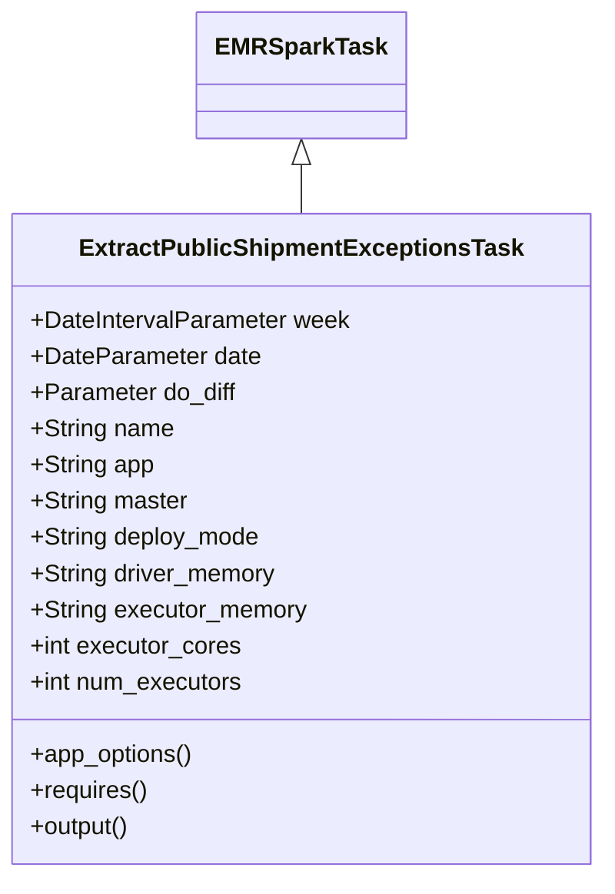
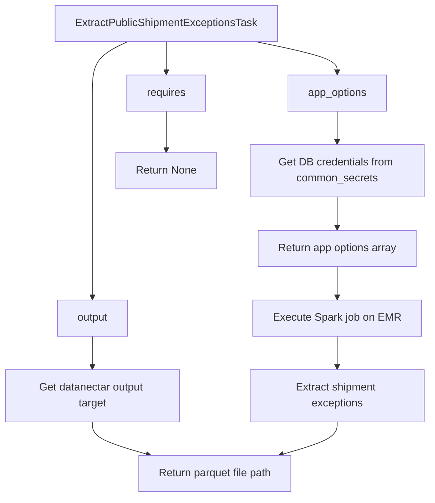

# Diagram: research/orchestrator/tasks/etl/extract_public_shipmentexceptions_task.py

> Auto-generated by Obscura crawlers

## Diagram 1

### SVG

<svg id="container" width="391.328125" xmlns="http://www.w3.org/2000/svg" class="classDiagram" height="582" viewBox="0 0 391.328125 582" role="graphics-document document" aria-roledescription="class"><g><defs><marker id="container_class-aggregationStart" class="marker aggregation class" refX="18" refY="7" markerWidth="190" markerHeight="240" orient="auto"><path d="M 18,7 L9,13 L1,7 L9,1 Z"></path></marker></defs><defs><marker id="container_class-aggregationEnd" class="marker aggregation class" refX="1" refY="7" markerWidth="20" markerHeight="28" orient="auto"><path d="M 18,7 L9,13 L1,7 L9,1 Z"></path></marker></defs><defs><marker id="container_class-extensionStart" class="marker extension class" refX="18" refY="7" markerWidth="190" markerHeight="240" orient="auto"><path d="M 1,7 L18,13 V 1 Z"></path></marker></defs><defs><marker id="container_class-extensionEnd" class="marker extension class" refX="1" refY="7" markerWidth="20" markerHeight="28" orient="auto"><path d="M 1,1 V 13 L18,7 Z"></path></marker></defs><defs><marker id="container_class-compositionStart" class="marker composition class" refX="18" refY="7" markerWidth="190" markerHeight="240" orient="auto"><path d="M 18,7 L9,13 L1,7 L9,1 Z"></path></marker></defs><defs><marker id="container_class-compositionEnd" class="marker composition class" refX="1" refY="7" markerWidth="20" markerHeight="28" orient="auto"><path d="M 18,7 L9,13 L1,7 L9,1 Z"></path></marker></defs><defs><marker id="container_class-dependencyStart" class="marker dependency class" refX="6" refY="7" markerWidth="190" markerHeight="240" orient="auto"><path d="M 5,7 L9,13 L1,7 L9,1 Z"></path></marker></defs><defs><marker id="container_class-dependencyEnd" class="marker dependency class" refX="13" refY="7" markerWidth="20" markerHeight="28" orient="auto"><path d="M 18,7 L9,13 L14,7 L9,1 Z"></path></marker></defs><defs><marker id="container_class-lollipopStart" class="marker lollipop class" refX="13" refY="7" markerWidth="190" markerHeight="240" orient="auto"><circle stroke="black" fill="transparent" cx="7" cy="7" r="6"></circle></marker></defs><defs><marker id="container_class-lollipopEnd" class="marker lollipop class" refX="1" refY="7" markerWidth="190" markerHeight="240" orient="auto"><circle stroke="black" fill="transparent" cx="7" cy="7" r="6"></circle></marker></defs><g class="root"><g class="clusters"></g><g class="edgePaths"><path d="M195.664,109.25L195.664,110.542C195.664,111.833,195.664,114.417,195.664,119.875C195.664,125.333,195.664,133.667,195.664,137.833L195.664,142" id="id_EMRSparkTask_ExtractPublicShipmentExceptionsTask_1" class="edge-thickness-normal edge-pattern-solid relation" style=";;;" data-edge="true" data-et="edge" data-id="id_EMRSparkTask_ExtractPublicShipmentExceptionsTask_1" data-points="W3sieCI6MTk1LjY2NDA2MjUsInkiOjkyfSx7IngiOjE5NS42NjQwNjI1LCJ5IjoxMTd9LHsieCI6MTk1LjY2NDA2MjUsInkiOjE0Mn1d" marker-start="url(#container_class-extensionStart)"></path></g><g class="edgeLabels"><g class="edgeLabel"><g class="label" data-id="id_EMRSparkTask_ExtractPublicShipmentExceptionsTask_1" transform="translate(0, 0)"><foreignObject width="0" height="0">

</foreignObject></g></g></g><g class="nodes"><g class="node default" id="classId-EMRSparkTask-0" transform="translate(195.6640625, 50)"><g class="basic label-container"><path d="M-65.1484375 -42 L65.1484375 -42 L65.1484375 42 L-65.1484375 42" stroke="none" stroke-width="0" fill="#ECECFF" style=""></path><path d="M-65.1484375 -42 C-24.533493087004132 -42, 16.081451325991736 -42, 65.1484375 -42 M-65.1484375 -42 C-37.45580437131427 -42, -9.763171242628545 -42, 65.1484375 -42 M65.1484375 -42 C65.1484375 -20.991158583734848, 65.1484375 0.017682832530304893, 65.1484375 42 M65.1484375 -42 C65.1484375 -21.47679098154053, 65.1484375 -0.9535819630810565, 65.1484375 42 M65.1484375 42 C27.094188262255393 42, -10.960060975489213 42, -65.1484375 42 M65.1484375 42 C24.757291821912922 42, -15.633853856174156 42, -65.1484375 42 M-65.1484375 42 C-65.1484375 13.851999932414238, -65.1484375 -14.296000135171525, -65.1484375 -42 M-65.1484375 42 C-65.1484375 19.10562110602465, -65.1484375 -3.7887577879507006, -65.1484375 -42" stroke="#9370DB" stroke-width="1.3" fill="none" stroke-dasharray="0 0" style=""></path></g><g class="annotation-group text" transform="translate(0, -18)"></g><g class="label-group text" transform="translate(-53.1484375, -18)"><g class="label" style="font-weight: bolder" transform="translate(0,-12)"><foreignObject width="106.296875" height="24">

EMRSparkTask

</foreignObject></g></g><g class="members-group text" transform="translate(-53.1484375, 30)"></g><g class="methods-group text" transform="translate(-53.1484375, 60)"></g><g class="divider" style=""><path d="M-65.1484375 6 C-33.740706949505075 6, -2.3329763990101497 6, 65.1484375 6 M-65.1484375 6 C-30.791886476097822 6, 3.5646645478043553 6, 65.1484375 6" stroke="#9370DB" stroke-width="1.3" fill="none" stroke-dasharray="0 0" style=""></path></g><g class="divider" style=""><path d="M-65.1484375 24 C-31.495627103153453 24, 2.1571832936930946 24, 65.1484375 24 M-65.1484375 24 C-21.756589263567477 24, 21.635258972865046 24, 65.1484375 24" stroke="#9370DB" stroke-width="1.3" fill="none" stroke-dasharray="0 0" style=""></path></g></g><g class="node default" id="classId-ExtractPublicShipmentExceptionsTask-1" transform="translate(195.6640625, 358)"><g class="basic label-container"><path d="M-187.6640625 -216 L187.6640625 -216 L187.6640625 216 L-187.6640625 216" stroke="none" stroke-width="0" fill="#ECECFF" style=""></path><path d="M-187.6640625 -216 C-47.17384809791184 -216, 93.31636630417631 -216, 187.6640625 -216 M-187.6640625 -216 C-59.32322555773598 -216, 69.01761138452804 -216, 187.6640625 -216 M187.6640625 -216 C187.6640625 -75.94091302220428, 187.6640625 64.11817395559143, 187.6640625 216 M187.6640625 -216 C187.6640625 -103.94285325452924, 187.6640625 8.11429349094152, 187.6640625 216 M187.6640625 216 C50.895178693886976 216, -85.87370511222605 216, -187.6640625 216 M187.6640625 216 C107.41762757488956 216, 27.17119264977913 216, -187.6640625 216 M-187.6640625 216 C-187.6640625 83.99161062968366, -187.6640625 -48.016778740632674, -187.6640625 -216 M-187.6640625 216 C-187.6640625 105.91183548716921, -187.6640625 -4.176329025661573, -187.6640625 -216" stroke="#9370DB" stroke-width="1.3" fill="none" stroke-dasharray="0 0" style=""></path></g><g class="annotation-group text" transform="translate(0, -192)"></g><g class="label-group text" transform="translate(-139.203125, -192)"><g class="label" style="font-weight: bolder" transform="translate(0,-12)"><foreignObject width="278.40625" height="24">

ExtractPublicShipmentExceptionsTask

</foreignObject></g></g><g class="members-group text" transform="translate(-175.6640625, -144)"><g class="label" style="" transform="translate(0,-12)"><foreignObject width="212.125" height="24">

+DateIntervalParameter week

</foreignObject></g><g class="label" style="" transform="translate(0,12)"><foreignObject width="152.171875" height="24">

+DateParameter date

</foreignObject></g><g class="label" style="" transform="translate(0,36)"><foreignObject width="137.921875" height="24">

+Parameter do_diff

</foreignObject></g><g class="label" style="" transform="translate(0,60)"><foreignObject width="94.984375" height="24">

+String name

</foreignObject></g><g class="label" style="" transform="translate(0,84)"><foreignObject width="82.1875" height="24">

+String app

</foreignObject></g><g class="label" style="" transform="translate(0,108)"><foreignObject width="104.625" height="24">

+String master

</foreignObject></g><g class="label" style="" transform="translate(0,132)"><foreignObject width="153.203125" height="24">

+String deploy_mode

</foreignObject></g><g class="label" style="" transform="translate(0,156)"><foreignObject width="164.015625" height="24">

+String driver_memory

</foreignObject></g><g class="label" style="" transform="translate(0,180)"><foreignObject width="183.8125" height="24">

+String executor_memory

</foreignObject></g><g class="label" style="" transform="translate(0,204)"><foreignObject width="139.9375" height="24">

+int executor_cores

</foreignObject></g><g class="label" style="" transform="translate(0,228)"><foreignObject width="142.296875" height="24">

+int num_executors

</foreignObject></g></g><g class="methods-group text" transform="translate(-175.6640625, 144)"><g class="label" style="" transform="translate(0,-12)"><foreignObject width="108.84375" height="24">

+app_options()

</foreignObject></g><g class="label" style="" transform="translate(0,12)"><foreignObject width="78.0625" height="24">

+requires()

</foreignObject></g><g class="label" style="" transform="translate(0,36)"><foreignObject width="67.390625" height="24">

+output()

</foreignObject></g></g><g class="divider" style=""><path d="M-187.6640625 -168 C-111.3162240020726 -168, -34.9683855041452 -168, 187.6640625 -168 M-187.6640625 -168 C-108.18264487812787 -168, -28.70122725625575 -168, 187.6640625 -168" stroke="#9370DB" stroke-width="1.3" fill="none" stroke-dasharray="0 0" style=""></path></g><g class="divider" style=""><path d="M-187.6640625 120 C-105.8614045908202 120, -24.0587466816404 120, 187.6640625 120 M-187.6640625 120 C-78.9771571218952 120, 29.709748256209593 120, 187.6640625 120" stroke="#9370DB" stroke-width="1.3" fill="none" stroke-dasharray="0 0" style=""></path></g></g></g></g></g></svg>

## Diagram 2

### SVG

<svg id="container" width="642.421875" xmlns="http://www.w3.org/2000/svg" class="flowchart" height="742" viewBox="0 0 642.421875 742" role="graphics-document document" aria-roledescription="flowchart-v2"><g><marker id="container_flowchart-v2-pointEnd" class="marker flowchart-v2" viewBox="0 0 10 10" refX="5" refY="5" markerUnits="userSpaceOnUse" markerWidth="8" markerHeight="8" orient="auto"><path d="M 0 0 L 10 5 L 0 10 z" class="arrowMarkerPath" style="stroke-width: 1; stroke-dasharray: 1, 0;"></path></marker><marker id="container_flowchart-v2-pointStart" class="marker flowchart-v2" viewBox="0 0 10 10" refX="4.5" refY="5" markerUnits="userSpaceOnUse" markerWidth="8" markerHeight="8" orient="auto"><path d="M 0 5 L 10 10 L 10 0 z" class="arrowMarkerPath" style="stroke-width: 1; stroke-dasharray: 1, 0;"></path></marker><marker id="container_flowchart-v2-circleEnd" class="marker flowchart-v2" viewBox="0 0 10 10" refX="11" refY="5" markerUnits="userSpaceOnUse" markerWidth="11" markerHeight="11" orient="auto"><circle cx="5" cy="5" r="5" class="arrowMarkerPath" style="stroke-width: 1; stroke-dasharray: 1, 0;"></circle></marker><marker id="container_flowchart-v2-circleStart" class="marker flowchart-v2" viewBox="0 0 10 10" refX="-1" refY="5" markerUnits="userSpaceOnUse" markerWidth="11" markerHeight="11" orient="auto"><circle cx="5" cy="5" r="5" class="arrowMarkerPath" style="stroke-width: 1; stroke-dasharray: 1, 0;"></circle></marker><marker id="container_flowchart-v2-crossEnd" class="marker cross flowchart-v2" viewBox="0 0 11 11" refX="12" refY="5.2" markerUnits="userSpaceOnUse" markerWidth="11" markerHeight="11" orient="auto"><path d="M 1,1 l 9,9 M 10,1 l -9,9" class="arrowMarkerPath" style="stroke-width: 2; stroke-dasharray: 1, 0;"></path></marker><marker id="container_flowchart-v2-crossStart" class="marker cross flowchart-v2" viewBox="0 0 11 11" refX="-1" refY="5.2" markerUnits="userSpaceOnUse" markerWidth="11" markerHeight="11" orient="auto"><path d="M 1,1 l 9,9 M 10,1 l -9,9" class="arrowMarkerPath" style="stroke-width: 2; stroke-dasharray: 1, 0;"></path></marker><g class="root"><g class="clusters"></g><g class="edgePaths"><path d="M381.484,62L401.974,66.167C422.463,70.333,463.443,78.667,483.932,86.333C504.422,94,504.422,101,504.422,104.5L504.422,108" id="L_A_B_0" class="edge-thickness-normal edge-pattern-solid edge-thickness-normal edge-pattern-solid flowchart-link" style=";" data-edge="true" data-et="edge" data-id="L_A_B_0" data-points="W3sieCI6MzgxLjQ4MzkyNDI3ODg0NjIsInkiOjYyfSx7IngiOjUwNC40MjE4NzUsInkiOjg3fSx7IngiOjUwNC40MjE4NzUsInkiOjExMn1d" marker-end="url(#container_flowchart-v2-pointEnd)"></path><path d="M504.422,166L504.422,170.167C504.422,174.333,504.422,182.667,504.422,190.333C504.422,198,504.422,205,504.422,208.5L504.422,212" id="L_B_C_0" class="edge-thickness-normal edge-pattern-solid edge-thickness-normal edge-pattern-solid flowchart-link" style=";" data-edge="true" data-et="edge" data-id="L_B_C_0" data-points="W3sieCI6NTA0LjQyMTg3NSwieSI6MTY2fSx7IngiOjUwNC40MjE4NzUsInkiOjE5MX0seyJ4Ijo1MDQuNDIxODc1LCJ5IjoyMTZ9XQ==" marker-end="url(#container_flowchart-v2-pointEnd)"></path><path d="M504.422,294L504.422,298.167C504.422,302.333,504.422,310.667,504.422,318.333C504.422,326,504.422,333,504.422,336.5L504.422,340" id="L_C_D_0" class="edge-thickness-normal edge-pattern-solid edge-thickness-normal edge-pattern-solid flowchart-link" style=";" data-edge="true" data-et="edge" data-id="L_C_D_0" data-points="W3sieCI6NTA0LjQyMTg3NSwieSI6Mjk0fSx7IngiOjUwNC40MjE4NzUsInkiOjMxOX0seyJ4Ijo1MDQuNDIxODc1LCJ5IjozNDR9XQ==" marker-end="url(#container_flowchart-v2-pointEnd)"></path><path d="M248.711,62L248.711,66.167C248.711,70.333,248.711,78.667,248.711,86.333C248.711,94,248.711,101,248.711,104.5L248.711,108" id="L_A_E_0" class="edge-thickness-normal edge-pattern-solid edge-thickness-normal edge-pattern-solid flowchart-link" style=";" data-edge="true" data-et="edge" data-id="L_A_E_0" data-points="W3sieCI6MjQ4LjcxMDkzNzUsInkiOjYyfSx7IngiOjI0OC43MTA5Mzc1LCJ5Ijo4N30seyJ4IjoyNDguNzEwOTM3NSwieSI6MTEyfV0=" marker-end="url(#container_flowchart-v2-pointEnd)"></path><path d="M248.711,166L248.711,170.167C248.711,174.333,248.711,182.667,248.711,192.333C248.711,202,248.711,213,248.711,218.5L248.711,224" id="L_E_F_0" class="edge-thickness-normal edge-pattern-solid edge-thickness-normal edge-pattern-solid flowchart-link" style=";" data-edge="true" data-et="edge" data-id="L_E_F_0" data-points="W3sieCI6MjQ4LjcxMDkzNzUsInkiOjE2Nn0seyJ4IjoyNDguNzEwOTM3NSwieSI6MTkxfSx7IngiOjI0OC43MTA5Mzc1LCJ5IjoyMjh9XQ==" marker-end="url(#container_flowchart-v2-pointEnd)"></path><path d="M191.226,62L182.355,66.167C173.484,70.333,155.742,78.667,146.871,91.5C138,104.333,138,121.667,138,139C138,156.333,138,173.667,138,193C138,212.333,138,233.667,138,255C138,276.333,138,297.667,138,317C138,336.333,138,353.667,138,371C138,388.333,138,405.667,138,417.833C138,430,138,437,138,440.5L138,444" id="L_A_G_0" class="edge-thickness-normal edge-pattern-solid edge-thickness-normal edge-pattern-solid flowchart-link" style=";" data-edge="true" data-et="edge" data-id="L_A_G_0" data-points="W3sieCI6MTkxLjIyNjQxMjI1OTYxNTQsInkiOjYyfSx7IngiOjEzOCwieSI6ODd9LHsieCI6MTM4LCJ5IjoxMzl9LHsieCI6MTM4LCJ5IjoxOTF9LHsieCI6MTM4LCJ5IjoyNTV9LHsieCI6MTM4LCJ5IjozMTl9LHsieCI6MTM4LCJ5IjozNzF9LHsieCI6MTM4LCJ5Ijo0MjN9LHsieCI6MTM4LCJ5Ijo0NDh9XQ==" marker-end="url(#container_flowchart-v2-pointEnd)"></path><path d="M138,502L138,506.167C138,510.333,138,518.667,138,526.333C138,534,138,541,138,544.5L138,548" id="L_G_H_0" class="edge-thickness-normal edge-pattern-solid edge-thickness-normal edge-pattern-solid flowchart-link" style=";" data-edge="true" data-et="edge" data-id="L_G_H_0" data-points="W3sieCI6MTM4LCJ5Ijo1MDJ9LHsieCI6MTM4LCJ5Ijo1Mjd9LHsieCI6MTM4LCJ5Ijo1NTJ9XQ==" marker-end="url(#container_flowchart-v2-pointEnd)"></path><path d="M138,630L138,634.167C138,638.333,138,646.667,152.039,654.818C166.078,662.969,194.156,670.939,208.195,674.923L222.234,678.908" id="L_H_I_0" class="edge-thickness-normal edge-pattern-solid edge-thickness-normal edge-pattern-solid flowchart-link" style=";" data-edge="true" data-et="edge" data-id="L_H_I_0" data-points="W3sieCI6MTM4LCJ5Ijo2MzB9LHsieCI6MTM4LCJ5Ijo2NTV9LHsieCI6MjI2LjA4MjE4MTQ5MDM4NDYsInkiOjY4MH1d" marker-end="url(#container_flowchart-v2-pointEnd)"></path><path d="M504.422,398L504.422,402.167C504.422,406.333,504.422,414.667,504.422,422.333C504.422,430,504.422,437,504.422,440.5L504.422,444" id="L_D_J_0" class="edge-thickness-normal edge-pattern-solid edge-thickness-normal edge-pattern-solid flowchart-link" style=";" data-edge="true" data-et="edge" data-id="L_D_J_0" data-points="W3sieCI6NTA0LjQyMTg3NSwieSI6Mzk4fSx7IngiOjUwNC40MjE4NzUsInkiOjQyM30seyJ4Ijo1MDQuNDIxODc1LCJ5Ijo0NDh9XQ==" marker-end="url(#container_flowchart-v2-pointEnd)"></path><path d="M504.422,502L504.422,506.167C504.422,510.333,504.422,518.667,504.422,526.333C504.422,534,504.422,541,504.422,544.5L504.422,548" id="L_J_K_0" class="edge-thickness-normal edge-pattern-solid edge-thickness-normal edge-pattern-solid flowchart-link" style=";" data-edge="true" data-et="edge" data-id="L_J_K_0" data-points="W3sieCI6NTA0LjQyMTg3NSwieSI6NTAyfSx7IngiOjUwNC40MjE4NzUsInkiOjUyN30seyJ4Ijo1MDQuNDIxODc1LCJ5Ijo1NTJ9XQ==" marker-end="url(#container_flowchart-v2-pointEnd)"></path><path d="M504.422,630L504.422,634.167C504.422,638.333,504.422,646.667,490.383,654.818C476.344,662.969,448.266,670.939,434.227,674.923L420.188,678.908" id="L_K_I_0" class="edge-thickness-normal edge-pattern-solid edge-thickness-normal edge-pattern-solid flowchart-link" style=";" data-edge="true" data-et="edge" data-id="L_K_I_0" data-points="W3sieCI6NTA0LjQyMTg3NSwieSI6NjMwfSx7IngiOjUwNC40MjE4NzUsInkiOjY1NX0seyJ4Ijo0MTYuMzM5NjkzNTA5NjE1MzYsInkiOjY4MH1d" marker-end="url(#container_flowchart-v2-pointEnd)"></path></g><g class="edgeLabels"><g class="edgeLabel"><g class="label" data-id="L_A_B_0" transform="translate(0, 0)"><foreignObject width="0" height="0">

</foreignObject></g></g><g class="edgeLabel"><g class="label" data-id="L_B_C_0" transform="translate(0, 0)"><foreignObject width="0" height="0">

</foreignObject></g></g><g class="edgeLabel"><g class="label" data-id="L_C_D_0" transform="translate(0, 0)"><foreignObject width="0" height="0">

</foreignObject></g></g><g class="edgeLabel"><g class="label" data-id="L_A_E_0" transform="translate(0, 0)"><foreignObject width="0" height="0">

</foreignObject></g></g><g class="edgeLabel"><g class="label" data-id="L_E_F_0" transform="translate(0, 0)"><foreignObject width="0" height="0">

</foreignObject></g></g><g class="edgeLabel"><g class="label" data-id="L_A_G_0" transform="translate(0, 0)"><foreignObject width="0" height="0">

</foreignObject></g></g><g class="edgeLabel"><g class="label" data-id="L_G_H_0" transform="translate(0, 0)"><foreignObject width="0" height="0">

</foreignObject></g></g><g class="edgeLabel"><g class="label" data-id="L_H_I_0" transform="translate(0, 0)"><foreignObject width="0" height="0">

</foreignObject></g></g><g class="edgeLabel"><g class="label" data-id="L_D_J_0" transform="translate(0, 0)"><foreignObject width="0" height="0">

</foreignObject></g></g><g class="edgeLabel"><g class="label" data-id="L_J_K_0" transform="translate(0, 0)"><foreignObject width="0" height="0">

</foreignObject></g></g><g class="edgeLabel"><g class="label" data-id="L_K_I_0" transform="translate(0, 0)"><foreignObject width="0" height="0">

</foreignObject></g></g></g><g class="nodes"><g class="node default" id="flowchart-A-0" transform="translate(248.7109375, 35)"><rect class="basic label-container" style="" x="-166.9765625" y="-27" width="333.953125" height="54"></rect><g class="label" style="" transform="translate(-136.9765625, -12)"><rect></rect><foreignObject width="273.953125" height="24">

ExtractPublicShipmentExceptionsTask

</foreignObject></g></g><g class="node default" id="flowchart-B-1" transform="translate(504.421875, 139)"><rect class="basic label-container" style="" x="-75.3671875" y="-27" width="150.734375" height="54"></rect><g class="label" style="" transform="translate(-45.3671875, -12)"><rect></rect><foreignObject width="90.734375" height="24">

app_options

</foreignObject></g></g><g class="node default" id="flowchart-C-3" transform="translate(504.421875, 255)"><rect class="basic label-container" style="" x="-130" y="-39" width="260" height="78"></rect><g class="label" style="" transform="translate(-100, -24)"><rect></rect><foreignObject width="200" height="48">

Get DB credentials from common_secrets

</foreignObject></g></g><g class="node default" id="flowchart-D-5" transform="translate(504.421875, 371)"><rect class="basic label-container" style="" x="-120.703125" y="-27" width="241.40625" height="54"></rect><g class="label" style="" transform="translate(-90.703125, -12)"><rect></rect><foreignObject width="181.40625" height="24">

Return app options array

</foreignObject></g></g><g class="node default" id="flowchart-E-7" transform="translate(248.7109375, 139)"><rect class="basic label-container" style="" x="-59.8515625" y="-27" width="119.703125" height="54"></rect><g class="label" style="" transform="translate(-29.8515625, -12)"><rect></rect><foreignObject width="59.703125" height="24">

requires

</foreignObject></g></g><g class="node default" id="flowchart-F-9" transform="translate(248.7109375, 255)"><rect class="basic label-container" style="" x="-75.7109375" y="-27" width="151.421875" height="54"></rect><g class="label" style="" transform="translate(-45.7109375, -12)"><rect></rect><foreignObject width="91.421875" height="24">

Return None

</foreignObject></g></g><g class="node default" id="flowchart-G-11" transform="translate(138, 475)"><rect class="basic label-container" style="" x="-54.515625" y="-27" width="109.03125" height="54"></rect><g class="label" style="" transform="translate(-24.515625, -12)"><rect></rect><foreignObject width="49.03125" height="24">

output

</foreignObject></g></g><g class="node default" id="flowchart-H-13" transform="translate(138, 591)"><rect class="basic label-container" style="" x="-130" y="-39" width="260" height="78"></rect><g class="label" style="" transform="translate(-100, -24)"><rect></rect><foreignObject width="200" height="48">

Get datanectar output target

</foreignObject></g></g><g class="node default" id="flowchart-I-15" transform="translate(321.2109375, 707)"><rect class="basic label-container" style="" x="-117.1875" y="-27" width="234.375" height="54"></rect><g class="label" style="" transform="translate(-87.1875, -12)"><rect></rect><foreignObject width="174.375" height="24">

Return parquet file path

</foreignObject></g></g><g class="node default" id="flowchart-J-17" transform="translate(504.421875, 475)"><rect class="basic label-container" style="" x="-123.3984375" y="-27" width="246.796875" height="54"></rect><g class="label" style="" transform="translate(-93.3984375, -12)"><rect></rect><foreignObject width="186.796875" height="24">

Execute Spark job on EMR

</foreignObject></g></g><g class="node default" id="flowchart-K-19" transform="translate(504.421875, 591)"><rect class="basic label-container" style="" x="-130" y="-39" width="260" height="78"></rect><g class="label" style="" transform="translate(-100, -24)"><rect></rect><foreignObject width="200" height="48">

Extract shipment exceptions

</foreignObject></g></g></g></g></g></svg>
