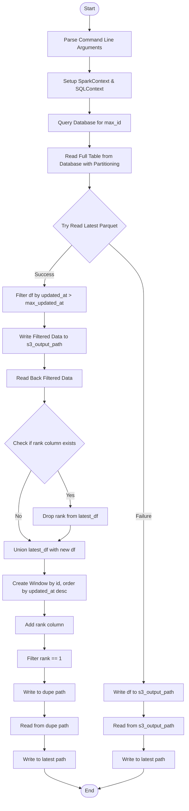
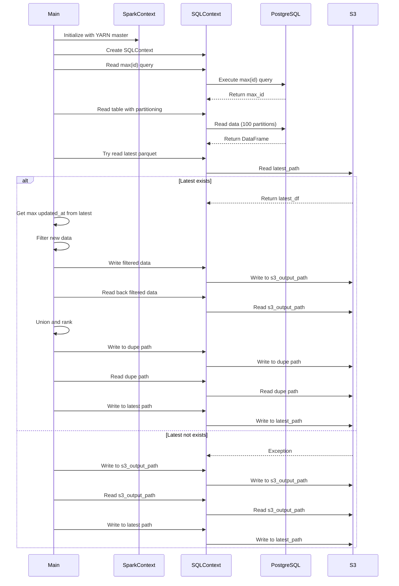
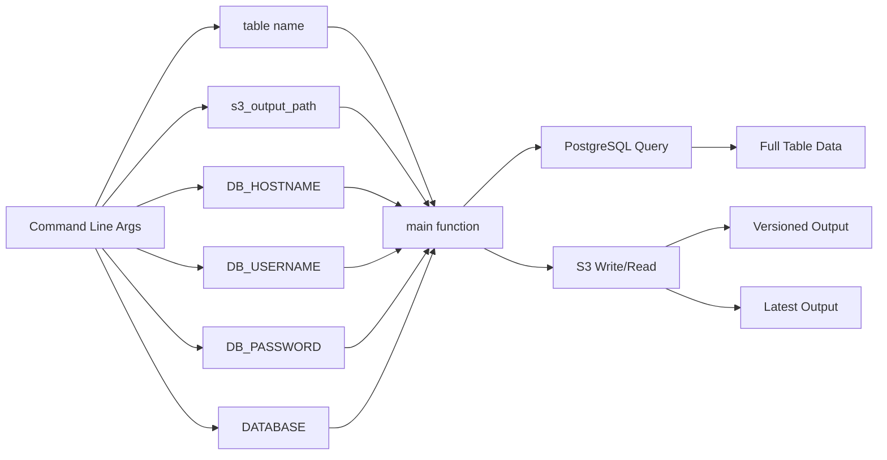

# Diagram: research/orchestrator/tasks/etl/extract_public_shipments_spark.py

> Auto-generated by Obscura crawlers

## Diagram 1

### SVG

<svg id="container" width="585.5" xmlns="http://www.w3.org/2000/svg" class="flowchart" height="2471.84375" viewBox="0 0 585.5 2471.84375" role="graphics-document document" aria-roledescription="flowchart-v2"><g><marker id="container_flowchart-v2-pointEnd" class="marker flowchart-v2" viewBox="0 0 10 10" refX="5" refY="5" markerUnits="userSpaceOnUse" markerWidth="8" markerHeight="8" orient="auto"><path d="M 0 0 L 10 5 L 0 10 z" class="arrowMarkerPath" style="stroke-width: 1; stroke-dasharray: 1, 0;"></path></marker><marker id="container_flowchart-v2-pointStart" class="marker flowchart-v2" viewBox="0 0 10 10" refX="4.5" refY="5" markerUnits="userSpaceOnUse" markerWidth="8" markerHeight="8" orient="auto"><path d="M 0 5 L 10 10 L 10 0 z" class="arrowMarkerPath" style="stroke-width: 1; stroke-dasharray: 1, 0;"></path></marker><marker id="container_flowchart-v2-circleEnd" class="marker flowchart-v2" viewBox="0 0 10 10" refX="11" refY="5" markerUnits="userSpaceOnUse" markerWidth="11" markerHeight="11" orient="auto"><circle cx="5" cy="5" r="5" class="arrowMarkerPath" style="stroke-width: 1; stroke-dasharray: 1, 0;"></circle></marker><marker id="container_flowchart-v2-circleStart" class="marker flowchart-v2" viewBox="0 0 10 10" refX="-1" refY="5" markerUnits="userSpaceOnUse" markerWidth="11" markerHeight="11" orient="auto"><circle cx="5" cy="5" r="5" class="arrowMarkerPath" style="stroke-width: 1; stroke-dasharray: 1, 0;"></circle></marker><marker id="container_flowchart-v2-crossEnd" class="marker cross flowchart-v2" viewBox="0 0 11 11" refX="12" refY="5.2" markerUnits="userSpaceOnUse" markerWidth="11" markerHeight="11" orient="auto"><path d="M 1,1 l 9,9 M 10,1 l -9,9" class="arrowMarkerPath" style="stroke-width: 2; stroke-dasharray: 1, 0;"></path></marker><marker id="container_flowchart-v2-crossStart" class="marker cross flowchart-v2" viewBox="0 0 11 11" refX="-1" refY="5.2" markerUnits="userSpaceOnUse" markerWidth="11" markerHeight="11" orient="auto"><path d="M 1,1 l 9,9 M 10,1 l -9,9" class="arrowMarkerPath" style="stroke-width: 2; stroke-dasharray: 1, 0;"></path></marker><g class="root"><g class="clusters"></g><g class="edgePaths"><path d="M279.992,47.5L279.909,51.583C279.826,55.667,279.659,63.833,279.576,71.417C279.492,79,279.492,86,279.492,89.5L279.492,93" id="L_Start_ParseArgs_0" class="edge-thickness-normal edge-pattern-solid edge-thickness-normal edge-pattern-solid flowchart-link" style=";" data-edge="true" data-et="edge" data-id="L_Start_ParseArgs_0" data-points="W3sieCI6Mjc5Ljk5MjE4NzUsInkiOjQ3LjV9LHsieCI6Mjc5LjQ5MjE4NzUsInkiOjcyfSx7IngiOjI3OS40OTIxODc1LCJ5Ijo5N31d" marker-end="url(#container_flowchart-v2-pointEnd)"></path><path d="M279.492,175L279.492,179.167C279.492,183.333,279.492,191.667,279.492,199.333C279.492,207,279.492,214,279.492,217.5L279.492,221" id="L_ParseArgs_SetupSpark_0" class="edge-thickness-normal edge-pattern-solid edge-thickness-normal edge-pattern-solid flowchart-link" style=";" data-edge="true" data-et="edge" data-id="L_ParseArgs_SetupSpark_0" data-points="W3sieCI6Mjc5LjQ5MjE4NzUsInkiOjE3NX0seyJ4IjoyNzkuNDkyMTg3NSwieSI6MjAwfSx7IngiOjI3OS40OTIxODc1LCJ5IjoyMjV9XQ==" marker-end="url(#container_flowchart-v2-pointEnd)"></path><path d="M279.492,303L279.492,307.167C279.492,311.333,279.492,319.667,279.492,327.333C279.492,335,279.492,342,279.492,345.5L279.492,349" id="L_SetupSpark_GetMaxId_0" class="edge-thickness-normal edge-pattern-solid edge-thickness-normal edge-pattern-solid flowchart-link" style=";" data-edge="true" data-et="edge" data-id="L_SetupSpark_GetMaxId_0" data-points="W3sieCI6Mjc5LjQ5MjE4NzUsInkiOjMwM30seyJ4IjoyNzkuNDkyMTg3NSwieSI6MzI4fSx7IngiOjI3OS40OTIxODc1LCJ5IjozNTN9XQ==" marker-end="url(#container_flowchart-v2-pointEnd)"></path><path d="M279.492,407L279.492,411.167C279.492,415.333,279.492,423.667,279.492,431.333C279.492,439,279.492,446,279.492,449.5L279.492,453" id="L_GetMaxId_ReadDB_0" class="edge-thickness-normal edge-pattern-solid edge-thickness-normal edge-pattern-solid flowchart-link" style=";" data-edge="true" data-et="edge" data-id="L_GetMaxId_ReadDB_0" data-points="W3sieCI6Mjc5LjQ5MjE4NzUsInkiOjQwN30seyJ4IjoyNzkuNDkyMTg3NSwieSI6NDMyfSx7IngiOjI3OS40OTIxODc1LCJ5Ijo0NTd9XQ==" marker-end="url(#container_flowchart-v2-pointEnd)"></path><path d="M279.492,535L279.492,539.167C279.492,543.333,279.492,551.667,279.492,559.333C279.492,567,279.492,574,279.492,577.5L279.492,581" id="L_ReadDB_TryLatest_0" class="edge-thickness-normal edge-pattern-solid edge-thickness-normal edge-pattern-solid flowchart-link" style=";" data-edge="true" data-et="edge" data-id="L_ReadDB_TryLatest_0" data-points="W3sieCI6Mjc5LjQ5MjE4NzUsInkiOjUzNX0seyJ4IjoyNzkuNDkyMTg3NSwieSI6NTYwfSx7IngiOjI3OS40OTIxODc1LCJ5Ijo1ODV9XQ==" marker-end="url(#container_flowchart-v2-pointEnd)"></path><path d="M224.783,755.338L210.319,770.623C195.855,785.908,166.928,816.477,152.464,837.262C138,858.047,138,869.047,138,874.547L138,880.047" id="L_TryLatest_FilterNew_0" class="edge-thickness-normal edge-pattern-solid edge-thickness-normal edge-pattern-solid flowchart-link" style=";" data-edge="true" data-et="edge" data-id="L_TryLatest_FilterNew_0" data-points="W3sieCI6MjI0Ljc4MzE0MTE0OTMyODg2LCJ5Ijo3NTUuMzM3ODI4NjQ5MzI4OX0seyJ4IjoxMzgsInkiOjg0Ny4wNDY4NzV9LHsieCI6MTM4LCJ5Ijo4ODQuMDQ2ODc1fV0=" marker-end="url(#container_flowchart-v2-pointEnd)"></path><path d="M339.501,750.038L357.976,766.206C376.451,782.375,413.401,814.711,431.876,843.545C450.352,872.38,450.352,897.714,450.352,921.047C450.352,944.38,450.352,965.714,450.352,987.047C450.352,1008.38,450.352,1029.714,450.352,1051.047C450.352,1072.38,450.352,1093.714,450.352,1113.047C450.352,1132.38,450.352,1149.714,450.352,1167.047C450.352,1184.38,450.352,1201.714,450.352,1235.447C450.352,1269.18,450.352,1319.313,450.352,1371.445C450.352,1423.578,450.352,1477.711,450.352,1515.444C450.352,1553.177,450.352,1574.51,450.352,1593.844C450.352,1613.177,450.352,1630.51,450.352,1647.844C450.352,1665.177,450.352,1682.51,450.352,1699.844C450.352,1717.177,450.352,1734.51,450.352,1753.844C450.352,1773.177,450.352,1794.51,450.352,1815.844C450.352,1837.177,450.352,1858.51,450.352,1877.844C450.352,1897.177,450.352,1914.51,450.352,1931.844C450.352,1949.177,450.352,1966.51,450.352,1983.844C450.352,2001.177,450.352,2018.51,450.352,2035.844C450.352,2053.177,450.352,2070.51,450.352,2082.677C450.352,2094.844,450.352,2101.844,450.352,2105.344L450.352,2108.844" id="L_TryLatest_WriteNew_0" class="edge-thickness-normal edge-pattern-solid edge-thickness-normal edge-pattern-solid flowchart-link" style=";" data-edge="true" data-et="edge" data-id="L_TryLatest_WriteNew_0" data-points="W3sieCI6MzM5LjUwMDY2MzE1NDczNDM1LCJ5Ijo3NTAuMDM4Mzk5MzQ1MjY1N30seyJ4Ijo0NTAuMzUxNTYyNSwieSI6ODQ3LjA0Njg3NX0seyJ4Ijo0NTAuMzUxNTYyNSwieSI6OTIzLjA0Njg3NX0seyJ4Ijo0NTAuMzUxNTYyNSwieSI6OTg3LjA0Njg3NX0seyJ4Ijo0NTAuMzUxNTYyNSwieSI6MTA1MS4wNDY4NzV9LHsieCI6NDUwLjM1MTU2MjUsInkiOjExMTUuMDQ2ODc1fSx7IngiOjQ1MC4zNTE1NjI1LCJ5IjoxMTY3LjA0Njg3NX0seyJ4Ijo0NTAuMzUxNTYyNSwieSI6MTIxOS4wNDY4NzV9LHsieCI6NDUwLjM1MTU2MjUsInkiOjEzNjkuNDQ1MzEyNX0seyJ4Ijo0NTAuMzUxNTYyNSwieSI6MTUzMS44NDM3NX0seyJ4Ijo0NTAuMzUxNTYyNSwieSI6MTU5NS44NDM3NX0seyJ4Ijo0NTAuMzUxNTYyNSwieSI6MTY0Ny44NDM3NX0seyJ4Ijo0NTAuMzUxNTYyNSwieSI6MTY5OS44NDM3NX0seyJ4Ijo0NTAuMzUxNTYyNSwieSI6MTc1MS44NDM3NX0seyJ4Ijo0NTAuMzUxNTYyNSwieSI6MTgxNS44NDM3NX0seyJ4Ijo0NTAuMzUxNTYyNSwieSI6MTg3OS44NDM3NX0seyJ4Ijo0NTAuMzUxNTYyNSwieSI6MTkzMS44NDM3NX0seyJ4Ijo0NTAuMzUxNTYyNSwieSI6MTk4My44NDM3NX0seyJ4Ijo0NTAuMzUxNTYyNSwieSI6MjAzNS44NDM3NX0seyJ4Ijo0NTAuMzUxNTYyNSwieSI6MjA4Ny44NDM3NX0seyJ4Ijo0NTAuMzUxNTYyNSwieSI6MjExMi44NDM3NX1d" marker-end="url(#container_flowchart-v2-pointEnd)"></path><path d="M138,962.047L138,966.214C138,970.38,138,978.714,138,986.38C138,994.047,138,1001.047,138,1004.547L138,1008.047" id="L_FilterNew_WriteFiltered_0" class="edge-thickness-normal edge-pattern-solid edge-thickness-normal edge-pattern-solid flowchart-link" style=";" data-edge="true" data-et="edge" data-id="L_FilterNew_WriteFiltered_0" data-points="W3sieCI6MTM4LCJ5Ijo5NjIuMDQ2ODc1fSx7IngiOjEzOCwieSI6OTg3LjA0Njg3NX0seyJ4IjoxMzgsInkiOjEwMTIuMDQ2ODc1fV0=" marker-end="url(#container_flowchart-v2-pointEnd)"></path><path d="M138,1090.047L138,1094.214C138,1098.38,138,1106.714,138,1114.38C138,1122.047,138,1129.047,138,1132.547L138,1136.047" id="L_WriteFiltered_ReadBack_0" class="edge-thickness-normal edge-pattern-solid edge-thickness-normal edge-pattern-solid flowchart-link" style=";" data-edge="true" data-et="edge" data-id="L_WriteFiltered_ReadBack_0" data-points="W3sieCI6MTM4LCJ5IjoxMDkwLjA0Njg3NX0seyJ4IjoxMzgsInkiOjExMTUuMDQ2ODc1fSx7IngiOjEzOCwieSI6MTE0MC4wNDY4NzV9XQ==" marker-end="url(#container_flowchart-v2-pointEnd)"></path><path d="M138,1194.047L138,1198.214C138,1202.38,138,1210.714,138,1218.38C138,1226.047,138,1233.047,138,1236.547L138,1240.047" id="L_ReadBack_DropRank_0" class="edge-thickness-normal edge-pattern-solid edge-thickness-normal edge-pattern-solid flowchart-link" style=";" data-edge="true" data-et="edge" data-id="L_ReadBack_DropRank_0" data-points="W3sieCI6MTM4LCJ5IjoxMTk0LjA0Njg3NX0seyJ4IjoxMzgsInkiOjEyMTkuMDQ2ODc1fSx7IngiOjEzOCwieSI6MTI0NC4wNDY4NzV9XQ==" marker-end="url(#container_flowchart-v2-pointEnd)"></path><path d="M180.039,1452.805L186.682,1465.978C193.325,1479.151,206.612,1505.497,213.255,1524.171C219.898,1542.844,219.898,1553.844,219.898,1559.344L219.898,1564.844" id="L_DropRank_RemoveRank_0" class="edge-thickness-normal edge-pattern-solid edge-thickness-normal edge-pattern-solid flowchart-link" style=";" data-edge="true" data-et="edge" data-id="L_DropRank_RemoveRank_0" data-points="W3sieCI6MTgwLjAzODc1MzQ0Nzc5MzQzLCJ5IjoxNDUyLjgwNDk5NjU1MjIwNjZ9LHsieCI6MjE5Ljg5ODQzNzUsInkiOjE1MzEuODQzNzV9LHsieCI6MjE5Ljg5ODQzNzUsInkiOjE1NjguODQzNzV9XQ==" marker-end="url(#container_flowchart-v2-pointEnd)"></path><path d="M95.961,1452.805L89.318,1465.978C82.675,1479.151,69.388,1505.497,62.745,1529.337C56.102,1553.177,56.102,1574.51,56.102,1593.844C56.102,1613.177,56.102,1630.51,62.101,1642.986C68.101,1655.462,80.1,1663.081,86.099,1666.89L92.099,1670.7" id="L_DropRank_Union_0" class="edge-thickness-normal edge-pattern-solid edge-thickness-normal edge-pattern-solid flowchart-link" style=";" data-edge="true" data-et="edge" data-id="L_DropRank_Union_0" data-points="W3sieCI6OTUuOTYxMjQ2NTUyMjA2NTksInkiOjE0NTIuODA0OTk2NTUyMjA2Nn0seyJ4Ijo1Ni4xMDE1NjI1LCJ5IjoxNTMxLjg0Mzc1fSx7IngiOjU2LjEwMTU2MjUsInkiOjE1OTUuODQzNzV9LHsieCI6NTYuMTAxNTYyNSwieSI6MTY0Ny44NDM3NX0seyJ4Ijo5NS40NzU4MTEyOTgwNzY5MiwieSI6MTY3Mi44NDM3NX1d" marker-end="url(#container_flowchart-v2-pointEnd)"></path><path d="M219.898,1622.844L219.898,1627.01C219.898,1631.177,219.898,1639.51,213.899,1647.486C207.899,1655.462,195.9,1663.081,189.901,1666.89L183.901,1670.7" id="L_RemoveRank_Union_0" class="edge-thickness-normal edge-pattern-solid edge-thickness-normal edge-pattern-solid flowchart-link" style=";" data-edge="true" data-et="edge" data-id="L_RemoveRank_Union_0" data-points="W3sieCI6MjE5Ljg5ODQzNzUsInkiOjE2MjIuODQzNzV9LHsieCI6MjE5Ljg5ODQzNzUsInkiOjE2NDcuODQzNzV9LHsieCI6MTgwLjUyNDE4ODcwMTkyMzEsInkiOjE2NzIuODQzNzV9XQ==" marker-end="url(#container_flowchart-v2-pointEnd)"></path><path d="M138,1726.844L138,1731.01C138,1735.177,138,1743.51,138,1751.177C138,1758.844,138,1765.844,138,1769.344L138,1772.844" id="L_Union_CreateWindow_0" class="edge-thickness-normal edge-pattern-solid edge-thickness-normal edge-pattern-solid flowchart-link" style=";" data-edge="true" data-et="edge" data-id="L_Union_CreateWindow_0" data-points="W3sieCI6MTM4LCJ5IjoxNzI2Ljg0Mzc1fSx7IngiOjEzOCwieSI6MTc1MS44NDM3NX0seyJ4IjoxMzgsInkiOjE3NzYuODQzNzV9XQ==" marker-end="url(#container_flowchart-v2-pointEnd)"></path><path d="M138,1854.844L138,1859.01C138,1863.177,138,1871.51,138,1879.177C138,1886.844,138,1893.844,138,1897.344L138,1900.844" id="L_CreateWindow_AddRank_0" class="edge-thickness-normal edge-pattern-solid edge-thickness-normal edge-pattern-solid flowchart-link" style=";" data-edge="true" data-et="edge" data-id="L_CreateWindow_AddRank_0" data-points="W3sieCI6MTM4LCJ5IjoxODU0Ljg0Mzc1fSx7IngiOjEzOCwieSI6MTg3OS44NDM3NX0seyJ4IjoxMzgsInkiOjE5MDQuODQzNzV9XQ==" marker-end="url(#container_flowchart-v2-pointEnd)"></path><path d="M138,1958.844L138,1963.01C138,1967.177,138,1975.51,138,1983.177C138,1990.844,138,1997.844,138,2001.344L138,2004.844" id="L_AddRank_FilterRank_0" class="edge-thickness-normal edge-pattern-solid edge-thickness-normal edge-pattern-solid flowchart-link" style=";" data-edge="true" data-et="edge" data-id="L_AddRank_FilterRank_0" data-points="W3sieCI6MTM4LCJ5IjoxOTU4Ljg0Mzc1fSx7IngiOjEzOCwieSI6MTk4My44NDM3NX0seyJ4IjoxMzgsInkiOjIwMDguODQzNzV9XQ==" marker-end="url(#container_flowchart-v2-pointEnd)"></path><path d="M138,2062.844L138,2067.01C138,2071.177,138,2079.51,138,2087.177C138,2094.844,138,2101.844,138,2105.344L138,2108.844" id="L_FilterRank_WriteDupe_0" class="edge-thickness-normal edge-pattern-solid edge-thickness-normal edge-pattern-solid flowchart-link" style=";" data-edge="true" data-et="edge" data-id="L_FilterRank_WriteDupe_0" data-points="W3sieCI6MTM4LCJ5IjoyMDYyLjg0Mzc1fSx7IngiOjEzOCwieSI6MjA4Ny44NDM3NX0seyJ4IjoxMzgsInkiOjIxMTIuODQzNzV9XQ==" marker-end="url(#container_flowchart-v2-pointEnd)"></path><path d="M138,2166.844L138,2171.01C138,2175.177,138,2183.51,138,2191.177C138,2198.844,138,2205.844,138,2209.344L138,2212.844" id="L_WriteDupe_ReadDupe_0" class="edge-thickness-normal edge-pattern-solid edge-thickness-normal edge-pattern-solid flowchart-link" style=";" data-edge="true" data-et="edge" data-id="L_WriteDupe_ReadDupe_0" data-points="W3sieCI6MTM4LCJ5IjoyMTY2Ljg0Mzc1fSx7IngiOjEzOCwieSI6MjE5MS44NDM3NX0seyJ4IjoxMzgsInkiOjIyMTYuODQzNzV9XQ==" marker-end="url(#container_flowchart-v2-pointEnd)"></path><path d="M138,2270.844L138,2275.01C138,2279.177,138,2287.51,138,2295.177C138,2302.844,138,2309.844,138,2313.344L138,2316.844" id="L_ReadDupe_WriteLatest_0" class="edge-thickness-normal edge-pattern-solid edge-thickness-normal edge-pattern-solid flowchart-link" style=";" data-edge="true" data-et="edge" data-id="L_ReadDupe_WriteLatest_0" data-points="W3sieCI6MTM4LCJ5IjoyMjcwLjg0Mzc1fSx7IngiOjEzOCwieSI6MjI5NS44NDM3NX0seyJ4IjoxMzgsInkiOjIzMjAuODQzNzV9XQ==" marker-end="url(#container_flowchart-v2-pointEnd)"></path><path d="M138,2374.844L138,2379.01C138,2383.177,138,2391.51,156.952,2401.693C175.905,2411.875,213.809,2423.907,232.761,2429.923L251.714,2435.939" id="L_WriteLatest_End_0" class="edge-thickness-normal edge-pattern-solid edge-thickness-normal edge-pattern-solid flowchart-link" style=";" data-edge="true" data-et="edge" data-id="L_WriteLatest_End_0" data-points="W3sieCI6MTM4LCJ5IjoyMzc0Ljg0Mzc1fSx7IngiOjEzOCwieSI6MjM5OS44NDM3NX0seyJ4IjoyNTUuNTI2MDY3MTE0NzIyODUsInkiOjI0MzcuMTQ5MDMyODgyNTI4fV0=" marker-end="url(#container_flowchart-v2-pointEnd)"></path><path d="M450.352,2166.844L450.352,2171.01C450.352,2175.177,450.352,2183.51,450.352,2191.177C450.352,2198.844,450.352,2205.844,450.352,2209.344L450.352,2212.844" id="L_WriteNew_ReadNew_0" class="edge-thickness-normal edge-pattern-solid edge-thickness-normal edge-pattern-solid flowchart-link" style=";" data-edge="true" data-et="edge" data-id="L_WriteNew_ReadNew_0" data-points="W3sieCI6NDUwLjM1MTU2MjUsInkiOjIxNjYuODQzNzV9LHsieCI6NDUwLjM1MTU2MjUsInkiOjIxOTEuODQzNzV9LHsieCI6NDUwLjM1MTU2MjUsInkiOjIyMTYuODQzNzV9XQ==" marker-end="url(#container_flowchart-v2-pointEnd)"></path><path d="M450.352,2270.844L450.352,2275.01C450.352,2279.177,450.352,2287.51,450.352,2295.177C450.352,2302.844,450.352,2309.844,450.352,2313.344L450.352,2316.844" id="L_ReadNew_WriteLatestDirect_0" class="edge-thickness-normal edge-pattern-solid edge-thickness-normal edge-pattern-solid flowchart-link" style=";" data-edge="true" data-et="edge" data-id="L_ReadNew_WriteLatestDirect_0" data-points="W3sieCI6NDUwLjM1MTU2MjUsInkiOjIyNzAuODQzNzV9LHsieCI6NDUwLjM1MTU2MjUsInkiOjIyOTUuODQzNzV9LHsieCI6NDUwLjM1MTU2MjUsInkiOjIzMjAuODQzNzV9XQ==" marker-end="url(#container_flowchart-v2-pointEnd)"></path><path d="M450.352,2374.844L450.352,2379.01C450.352,2383.177,450.352,2391.51,426.759,2401.924C403.166,2412.338,355.98,2424.832,332.387,2431.079L308.794,2437.326" id="L_WriteLatestDirect_End_0" class="edge-thickness-normal edge-pattern-solid edge-thickness-normal edge-pattern-solid flowchart-link" style=";" data-edge="true" data-et="edge" data-id="L_WriteLatestDirect_End_0" data-points="W3sieCI6NDUwLjM1MTU2MjUsInkiOjIzNzQuODQzNzV9LHsieCI6NDUwLjM1MTU2MjUsInkiOjIzOTkuODQzNzV9LHsieCI6MzA0LjkyNjgzOTg4ODE4ODU3LCJ5IjoyNDM4LjM0OTU2NzEwMDkwOX1d" marker-end="url(#container_flowchart-v2-pointEnd)"></path></g><g class="edgeLabels"><g class="edgeLabel"><g class="label" data-id="L_Start_ParseArgs_0" transform="translate(0, 0)"><foreignObject width="0" height="0">

</foreignObject></g></g><g class="edgeLabel"><g class="label" data-id="L_ParseArgs_SetupSpark_0" transform="translate(0, 0)"><foreignObject width="0" height="0">

</foreignObject></g></g><g class="edgeLabel"><g class="label" data-id="L_SetupSpark_GetMaxId_0" transform="translate(0, 0)"><foreignObject width="0" height="0">

</foreignObject></g></g><g class="edgeLabel"><g class="label" data-id="L_GetMaxId_ReadDB_0" transform="translate(0, 0)"><foreignObject width="0" height="0">

</foreignObject></g></g><g class="edgeLabel"><g class="label" data-id="L_ReadDB_TryLatest_0" transform="translate(0, 0)"><foreignObject width="0" height="0">

</foreignObject></g></g><g class="edgeLabel" transform="translate(138, 847.046875)"><g class="label" data-id="L_TryLatest_FilterNew_0" transform="translate(-28.1015625, -12)"><foreignObject width="56.203125" height="24">

Success

</foreignObject></g></g><g class="edgeLabel" transform="translate(450.3515625, 1595.84375)"><g class="label" data-id="L_TryLatest_WriteNew_0" transform="translate(-24.265625, -12)"><foreignObject width="48.53125" height="24">

Failure

</foreignObject></g></g><g class="edgeLabel"><g class="label" data-id="L_FilterNew_WriteFiltered_0" transform="translate(0, 0)"><foreignObject width="0" height="0">

</foreignObject></g></g><g class="edgeLabel"><g class="label" data-id="L_WriteFiltered_ReadBack_0" transform="translate(0, 0)"><foreignObject width="0" height="0">

</foreignObject></g></g><g class="edgeLabel"><g class="label" data-id="L_ReadBack_DropRank_0" transform="translate(0, 0)"><foreignObject width="0" height="0">

</foreignObject></g></g><g class="edgeLabel" transform="translate(219.8984375, 1531.84375)"><g class="label" data-id="L_DropRank_RemoveRank_0" transform="translate(-12.03125, -12)"><foreignObject width="24.0625" height="24">

Yes

</foreignObject></g></g><g class="edgeLabel" transform="translate(56.1015625, 1595.84375)"><g class="label" data-id="L_DropRank_Union_0" transform="translate(-10.140625, -12)"><foreignObject width="20.28125" height="24">

No

</foreignObject></g></g><g class="edgeLabel"><g class="label" data-id="L_RemoveRank_Union_0" transform="translate(0, 0)"><foreignObject width="0" height="0">

</foreignObject></g></g><g class="edgeLabel"><g class="label" data-id="L_Union_CreateWindow_0" transform="translate(0, 0)"><foreignObject width="0" height="0">

</foreignObject></g></g><g class="edgeLabel"><g class="label" data-id="L_CreateWindow_AddRank_0" transform="translate(0, 0)"><foreignObject width="0" height="0">

</foreignObject></g></g><g class="edgeLabel"><g class="label" data-id="L_AddRank_FilterRank_0" transform="translate(0, 0)"><foreignObject width="0" height="0">

</foreignObject></g></g><g class="edgeLabel"><g class="label" data-id="L_FilterRank_WriteDupe_0" transform="translate(0, 0)"><foreignObject width="0" height="0">

</foreignObject></g></g><g class="edgeLabel"><g class="label" data-id="L_WriteDupe_ReadDupe_0" transform="translate(0, 0)"><foreignObject width="0" height="0">

</foreignObject></g></g><g class="edgeLabel"><g class="label" data-id="L_ReadDupe_WriteLatest_0" transform="translate(0, 0)"><foreignObject width="0" height="0">

</foreignObject></g></g><g class="edgeLabel"><g class="label" data-id="L_WriteLatest_End_0" transform="translate(0, 0)"><foreignObject width="0" height="0">

</foreignObject></g></g><g class="edgeLabel"><g class="label" data-id="L_WriteNew_ReadNew_0" transform="translate(0, 0)"><foreignObject width="0" height="0">

</foreignObject></g></g><g class="edgeLabel"><g class="label" data-id="L_ReadNew_WriteLatestDirect_0" transform="translate(0, 0)"><foreignObject width="0" height="0">

</foreignObject></g></g><g class="edgeLabel"><g class="label" data-id="L_WriteLatestDirect_End_0" transform="translate(0, 0)"><foreignObject width="0" height="0">

</foreignObject></g></g></g><g class="nodes"><g class="node default" id="flowchart-Start-0" transform="translate(279.4921875, 27.5)"><g class="basic label-container outer-path"><path d="M-10.3984375 -19.5 C-2.714790988840182 -19.5, 4.968855522319636 -19.5, 10.3984375 -19.5 C10.3984375 -19.5, 10.3984375 -19.5, 10.398437499999998 -19.5 C10.652159620343332 -19.491863625440736, 10.905881740686665 -19.483727250881476, 11.6478067896239 -19.45993515863156 C11.969051635847261 -19.428945054669843, 12.290296482070621 -19.39795495070813, 12.892042152847864 -19.3399052695533 C13.297497076654643 -19.274354461822114, 13.702952000461424 -19.20880365409093, 14.126030759676757 -19.140403561325776 C14.522142274585482 -19.049993692917063, 14.918253789494205 -18.95958382450835, 15.34470188623539 -18.862249829261074 C15.676051550052598 -18.763906988330007, 16.007401213869805 -18.665564147398936, 16.543047751460602 -18.50658706670804 C16.782105354157107 -18.41861165909147, 17.021162956853615 -18.3306362514749, 17.716144095147794 -18.074876768247425 C18.17080247256208 -17.873612991527693, 18.625460849976367 -17.672349214807962, 18.85917041279238 -17.568892924097174 C19.24858087974434 -17.365737732917648, 19.637991346696296 -17.162582541738118, 19.967429764076783 -16.990714730406097 C20.39426954088835 -16.73196194931397, 20.821109317699914 -16.473209168221842, 21.036368073605697 -16.342718045390892 C21.272959053939044 -16.177682419368818, 21.509550034272394 -16.012646793346743, 22.061592844578712 -15.627565626425154 C22.363449586095207 -15.386842907810994, 22.665306327611702 -15.146120189196834, 23.03889120850187 -14.848196188198123 C23.270962693531082 -14.63743500576961, 23.503034178560295 -14.426673823341096, 23.964247236767985 -14.007812326905688 C24.201823042843504 -13.762495801796286, 24.439398848919023 -13.517179276686884, 24.833858442968648 -13.10986736009568 C25.112579974215688 -12.782465189788494, 25.39130150546273 -12.455063019481308, 25.644151408126582 -12.158051136245305 C25.814237680223005 -11.93015102681425, 25.98432395231943 -11.702250917383198, 26.391796464640635 -11.156274872382312 C26.659444756914787 -10.745095221819483, 26.927093049188937 -10.333915571256655, 27.073721378604247 -10.108655082055241 C27.23232153058254 -9.82704445221091, 27.390921682560833 -9.545433822366576, 27.6871239742735 -9.019496659696287 C27.860061539497103 -8.66038810523835, 28.03299910472071 -8.301279550780416, 28.22948364880834 -7.893275190886684 C28.37422972534195 -7.535749583373651, 28.518975801875566 -7.178223975860617, 28.698571729970325 -6.734618561215508 C28.84627933612923 -6.289746785475947, 28.993986942288135 -5.844875009736384, 29.09246063421488 -5.548287939305138 C29.188174426730427 -5.183289765823285, 29.28388821924597 -4.818291592341431, 29.40953178754556 -4.339158212148133 C29.475961282017074 -3.9980567979155435, 29.542390776488585 -3.6569553836829534, 29.648482276581777 -3.1121979531509023 C29.70819491078436 -2.649078553869023, 29.76790754498694 -2.1859591545871435, 29.808330202509367 -1.872449005199798 C29.828165307629988 -1.5635012323374589, 29.848000412750608 -1.2545534594751198, 29.888418715913414 -0.6250057626472757 C29.888418715913414 -0.257194546052245, 29.888418715913414 0.11061667054278568, 29.888418715913414 0.625005762647271 C29.866415886244297 0.9677175951082317, 29.844413056575178 1.3104294275691923, 29.808330202509367 1.8724490051997846 C29.775865198520307 2.1242411651987565, 29.74340019453125 2.3760333251977284, 29.648482276581777 3.1121979531508885 C29.59302503444815 3.3969591706147875, 29.537567792314523 3.6817203880786864, 29.40953178754556 4.339158212148129 C29.317275148663352 4.690972760486213, 29.22501850978114 5.042787308824297, 29.092460634214884 5.548287939305125 C29.012831243820777 5.788118975951779, 28.933201853426667 6.027950012598431, 28.69857172997033 6.734618561215495 C28.511569825584708 7.196516880483843, 28.32456792119909 7.658415199752191, 28.229483648808344 7.893275190886679 C28.11656457499876 8.127754063733418, 28.00364550118917 8.362232936580156, 27.687123974273504 9.019496659696284 C27.550288947229298 9.262461106262258, 27.41345392018509 9.50542555282823, 27.07372137860425 10.108655082055236 C26.903976495755433 10.369428804994271, 26.734231612906612 10.630202527933308, 26.39179646464064 11.156274872382301 C26.11211653286869 11.531020501590772, 25.832436601096738 11.905766130799245, 25.644151408126582 12.158051136245302 C25.429052381121448 12.410718692846897, 25.213953354116313 12.663386249448493, 24.83385844296866 13.10986736009567 C24.566615267610025 13.385817879726204, 24.299372092251392 13.661768399356738, 23.96424723676799 14.007812326905684 C23.714890825026263 14.234271222440402, 23.46553441328454 14.46073011797512, 23.038891208501887 14.848196188198111 C22.836979366563664 15.009215509044076, 22.635067524625438 15.17023482989004, 22.061592844578715 15.627565626425152 C21.707884881330617 15.874296989816079, 21.35417691808252 16.121028353207006, 21.036368073605708 16.34271804539089 C20.798407889376396 16.48697090747996, 20.560447705147087 16.631223769569033, 19.967429764076787 16.990714730406093 C19.546407215901997 17.21036192411107, 19.12538466772721 17.43000911781604, 18.859170412792388 17.56889292409717 C18.594665392290675 17.685981450410623, 18.330160371788967 17.803069976724075, 17.716144095147804 18.07487676824742 C17.254877818810716 18.244627021838188, 16.793611542473624 18.41437727542895, 16.543047751460616 18.506587066708033 C16.302215218567394 18.57806489831498, 16.06138268567417 18.649542729921926, 15.344701886235413 18.86224982926107 C14.94096109921778 18.954401029242987, 14.537220312200148 19.046552229224904, 14.126030759676766 19.140403561325773 C13.878511407957516 19.1804205705705, 13.630992056238266 19.22043757981523, 12.892042152847878 19.3399052695533 C12.59005734886613 19.369037380403554, 12.288072544884383 19.39816949125381, 11.6478067896239 19.45993515863156 C11.236073152934678 19.473138654969276, 10.824339516245455 19.486342151306992, 10.398437500000004 19.5 C10.398437500000004 19.5, 10.398437500000002 19.5, 10.3984375 19.5 C5.7722832112385305 19.5, 1.146128922477061 19.5, -10.398437499999996 19.5 C-10.824380337357585 19.48634084225338, -11.250323174715174 19.47268168450676, -11.647806789623893 19.45993515863156 C-11.928079226271969 19.43289761374504, -12.208351662920046 19.405860068858523, -12.892042152847871 19.3399052695533 C-13.171759177476645 19.29468279024924, -13.451476202105418 19.249460310945185, -14.126030759676759 19.140403561325773 C-14.520668372637378 19.050330101418606, -14.915305985597996 18.96025664151144, -15.344701886235388 18.862249829261074 C-15.593396018699565 18.788438716167846, -15.84209015116374 18.71462760307462, -16.54304775146059 18.506587066708043 C-16.847786051956337 18.39444055515564, -17.152524352452087 18.282294043603233, -17.716144095147797 18.074876768247425 C-17.986661421865428 17.95512677232091, -18.257178748583062 17.835376776394398, -18.85917041279238 17.568892924097174 C-19.134805633644415 17.425094205931455, -19.410440854496446 17.281295487765732, -19.96742976407678 16.990714730406097 C-20.259131928188506 16.813883164289376, -20.550834092300235 16.63705159817265, -21.036368073605686 16.3427180453909 C-21.35736352161996 16.11880551652513, -21.678358969634232 15.894892987659361, -22.061592844578712 15.627565626425156 C-22.44173153957632 15.324415133080079, -22.82187023457393 15.021264639735, -23.03889120850187 14.848196188198125 C-23.32903222257198 14.584697795930214, -23.619173236642084 14.321199403662304, -23.964247236767974 14.007812326905697 C-24.1697940426602 13.795568374115367, -24.375340848552423 13.583324421325036, -24.833858442968655 13.109867360095677 C-25.115352251995564 12.779208714561182, -25.39684606102247 12.448550069026687, -25.64415140812658 12.158051136245307 C-25.80984980116482 11.936030385008214, -25.975548194203057 11.714009633771122, -26.391796464640635 11.156274872382316 C-26.633047101924458 10.785649108647519, -26.874297739208277 10.41502334491272, -27.073721378604244 10.108655082055249 C-27.279997529508183 9.742390888400042, -27.48627368041212 9.376126694744835, -27.6871239742735 9.019496659696289 C-27.893390074847154 8.591180688467553, -28.09965617542081 8.162864717238815, -28.22948364880834 7.893275190886686 C-28.34061308685075 7.618783330380413, -28.45174252489316 7.34429146987414, -28.698571729970325 6.73461856121551 C-28.80354327892818 6.418460980699481, -28.908514827886037 6.102303400183453, -29.09246063421488 5.5482879393051325 C-29.203620564018248 5.124386949946556, -29.31478049382162 4.70048596058798, -29.409531787545557 4.339158212148136 C-29.470546433060957 4.0258609028764605, -29.531561078576356 3.7125635936047843, -29.648482276581777 3.112197953150904 C-29.69626972679214 2.7415679260187353, -29.744057177002503 2.370937898886566, -29.808330202509364 1.872449005199809 C-29.835996153748525 1.4415294830959693, -29.863662104987686 1.0106099609921295, -29.888418715913414 0.6250057626472781 C-29.888418715913414 0.3664112671832657, -29.888418715913414 0.1078167717192533, -29.888418715913414 -0.6250057626472687 C-29.868018928417644 -0.9427489193059975, -29.84761914092187 -1.2604920759647262, -29.808330202509367 -1.8724490051997822 C-29.757003108010622 -2.270531814450811, -29.70567601351188 -2.6686146237018398, -29.648482276581777 -3.112197953150895 C-29.59583402617058 -3.38253559180074, -29.54318577575938 -3.652873230450585, -29.40953178754556 -4.339158212148126 C-29.28289335750516 -4.822085431334949, -29.156254927464754 -5.305012650521771, -29.092460634214884 -5.548287939305123 C-28.958512589444506 -5.951718108430835, -28.824564544674125 -6.355148277556546, -28.698571729970332 -6.734618561215485 C-28.586882611461547 -7.010492843294391, -28.475193492952762 -7.286367125373296, -28.229483648808344 -7.893275190886676 C-28.106159647704686 -8.149360117889332, -27.98283564660103 -8.405445044891989, -27.687123974273504 -9.019496659696282 C-27.49358155181285 -9.363150829070614, -27.300039129352196 -9.706804998444944, -27.073721378604247 -10.108655082055243 C-26.854341174057687 -10.445681988072119, -26.634960969511123 -10.782708894088994, -26.39179646464064 -11.156274872382308 C-26.120664396782455 -11.519567142672754, -25.849532328924273 -11.8828594129632, -25.644151408126586 -12.158051136245302 C-25.335210524359372 -12.520950677552555, -25.026269640592158 -12.883850218859811, -24.833858442968662 -13.10986736009567 C-24.506545924785346 -13.447844407977453, -24.17923340660203 -13.785821455859235, -23.964247236767996 -14.007812326905677 C-23.614217467977124 -14.325700101641367, -23.264187699186255 -14.643587876377056, -23.038891208501887 -14.848196188198107 C-22.819688268343203 -15.023004699739442, -22.600485328184515 -15.197813211280776, -22.06159284457872 -15.627565626425149 C-21.653470560492448 -15.912254064474803, -21.245348276406173 -16.196942502524458, -21.03636807360571 -16.342718045390885 C-20.698444501869368 -16.54756930043679, -20.36052093013302 -16.752420555482697, -19.96742976407679 -16.99071473040609 C-19.699318151835993 -17.13058838677843, -19.431206539595195 -17.270462043150772, -18.859170412792388 -17.56889292409717 C-18.44230526763679 -17.753426757992383, -18.02544012248119 -17.937960591887595, -17.716144095147804 -18.07487676824742 C-17.341268214525407 -18.212834557631115, -16.966392333903013 -18.35079234701481, -16.54304775146062 -18.506587066708033 C-16.252423860515215 -18.592842712024694, -15.961799969569809 -18.67909835734136, -15.344701886235413 -18.862249829261067 C-15.019508374305314 -18.93647312627313, -14.694314862375213 -19.01069642328519, -14.126030759676768 -19.140403561325773 C-13.873464389056942 -19.18123653344613, -13.620898018437115 -19.222069505566488, -12.89204215284788 -19.3399052695533 C-12.418294200147026 -19.38560716478508, -11.94454624744617 -19.431309060016858, -11.647806789623903 -19.45993515863156 C-11.252440284516865 -19.472613792916125, -10.857073779409825 -19.48529242720069, -10.398437500000005 -19.5 C-10.398437500000004 -19.5, -10.398437500000004 -19.5, -10.3984375 -19.5" stroke="none" stroke-width="0" fill="#ECECFF" style=""></path><path d="M-10.3984375 -19.5 C-2.576402868332652 -19.5, 5.245631763334696 -19.5, 10.3984375 -19.5 M-10.3984375 -19.5 C-3.296289002186489 -19.5, 3.805859495627022 -19.5, 10.3984375 -19.5 M10.3984375 -19.5 C10.3984375 -19.5, 10.398437499999998 -19.5, 10.398437499999998 -19.5 M10.3984375 -19.5 C10.3984375 -19.5, 10.398437499999998 -19.5, 10.398437499999998 -19.5 M10.398437499999998 -19.5 C10.736319948493435 -19.489164767525104, 11.07420239698687 -19.47832953505021, 11.6478067896239 -19.45993515863156 M10.398437499999998 -19.5 C10.86714283808457 -19.484969532087224, 11.335848176169144 -19.469939064174447, 11.6478067896239 -19.45993515863156 M11.6478067896239 -19.45993515863156 C12.017501613153572 -19.424271143628726, 12.387196436683245 -19.388607128625896, 12.892042152847864 -19.3399052695533 M11.6478067896239 -19.45993515863156 C12.089813330552051 -19.41729531921886, 12.531819871480202 -19.37465547980616, 12.892042152847864 -19.3399052695533 M12.892042152847864 -19.3399052695533 C13.23395171194266 -19.284627983587086, 13.575861271037459 -19.22935069762087, 14.126030759676757 -19.140403561325776 M12.892042152847864 -19.3399052695533 C13.149849949741174 -19.298224904280914, 13.407657746634483 -19.25654453900853, 14.126030759676757 -19.140403561325776 M14.126030759676757 -19.140403561325776 C14.466395129900555 -19.06271761490728, 14.806759500124352 -18.985031668488787, 15.34470188623539 -18.862249829261074 M14.126030759676757 -19.140403561325776 C14.59643593621057 -19.033036649462588, 15.066841112744383 -18.925669737599396, 15.34470188623539 -18.862249829261074 M15.34470188623539 -18.862249829261074 C15.701809108869345 -18.75626228007738, 16.0589163315033 -18.650274730893685, 16.543047751460602 -18.50658706670804 M15.34470188623539 -18.862249829261074 C15.719437519070254 -18.751030260463164, 16.094173151905117 -18.639810691665254, 16.543047751460602 -18.50658706670804 M16.543047751460602 -18.50658706670804 C16.83294465337406 -18.3999023270263, 17.12284155528752 -18.293217587344564, 17.716144095147794 -18.074876768247425 M16.543047751460602 -18.50658706670804 C16.93191838651442 -18.36347907832749, 17.320789021568235 -18.22037108994694, 17.716144095147794 -18.074876768247425 M17.716144095147794 -18.074876768247425 C17.991814913214508 -17.95284547457356, 18.267485731281223 -17.830814180899697, 18.85917041279238 -17.568892924097174 M17.716144095147794 -18.074876768247425 C17.952344652831243 -17.97031778800156, 18.188545210514697 -17.865758807755693, 18.85917041279238 -17.568892924097174 M18.85917041279238 -17.568892924097174 C19.205713494016397 -17.388101620594043, 19.552256575240413 -17.20731031709091, 19.967429764076783 -16.990714730406097 M18.85917041279238 -17.568892924097174 C19.252454587611012 -17.363716822004832, 19.64573876242964 -17.15854071991249, 19.967429764076783 -16.990714730406097 M19.967429764076783 -16.990714730406097 C20.3734596153554 -16.744577048464738, 20.77948946663402 -16.49843936652338, 21.036368073605697 -16.342718045390892 M19.967429764076783 -16.990714730406097 C20.24870948223424 -16.820201312275945, 20.529989200391697 -16.64968789414579, 21.036368073605697 -16.342718045390892 M21.036368073605697 -16.342718045390892 C21.370184744467878 -16.109861986488212, 21.704001415330058 -15.877005927585532, 22.061592844578712 -15.627565626425154 M21.036368073605697 -16.342718045390892 C21.387286359796224 -16.097932639952155, 21.738204645986748 -15.853147234513418, 22.061592844578712 -15.627565626425154 M22.061592844578712 -15.627565626425154 C22.40789507693283 -15.351398811612173, 22.754197309286948 -15.075231996799193, 23.03889120850187 -14.848196188198123 M22.061592844578712 -15.627565626425154 C22.36300368044066 -15.387198505704449, 22.664414516302607 -15.146831384983743, 23.03889120850187 -14.848196188198123 M23.03889120850187 -14.848196188198123 C23.2619196480555 -14.645647660404663, 23.48494808760913 -14.443099132611202, 23.964247236767985 -14.007812326905688 M23.03889120850187 -14.848196188198123 C23.25962156261638 -14.64773472079646, 23.480351916730893 -14.447273253394798, 23.964247236767985 -14.007812326905688 M23.964247236767985 -14.007812326905688 C24.197193368337352 -13.767276320827232, 24.430139499906723 -13.526740314748777, 24.833858442968648 -13.10986736009568 M23.964247236767985 -14.007812326905688 C24.22531461121985 -13.738238828754076, 24.486381985671716 -13.468665330602462, 24.833858442968648 -13.10986736009568 M24.833858442968648 -13.10986736009568 C25.019244067885896 -12.892102856326993, 25.20462969280314 -12.674338352558305, 25.644151408126582 -12.158051136245305 M24.833858442968648 -13.10986736009568 C25.099201060219574 -12.798180823450101, 25.364543677470504 -12.486494286804524, 25.644151408126582 -12.158051136245305 M25.644151408126582 -12.158051136245305 C25.8339611725009 -11.903723344008984, 26.023770936875216 -11.649395551772663, 26.391796464640635 -11.156274872382312 M25.644151408126582 -12.158051136245305 C25.875385943993034 -11.848217924083842, 26.106620479859487 -11.53838471192238, 26.391796464640635 -11.156274872382312 M26.391796464640635 -11.156274872382312 C26.530716331792537 -10.94285665122944, 26.66963619894444 -10.729438430076566, 27.073721378604247 -10.108655082055241 M26.391796464640635 -11.156274872382312 C26.625990541707615 -10.796489880092322, 26.860184618774593 -10.436704887802332, 27.073721378604247 -10.108655082055241 M27.073721378604247 -10.108655082055241 C27.257628792784153 -9.78210884553376, 27.441536206964063 -9.45556260901228, 27.6871239742735 -9.019496659696287 M27.073721378604247 -10.108655082055241 C27.246934154805896 -9.801098258213685, 27.420146931007544 -9.493541434372126, 27.6871239742735 -9.019496659696287 M27.6871239742735 -9.019496659696287 C27.834014722061553 -8.714474878955887, 27.980905469849606 -8.409453098215486, 28.22948364880834 -7.893275190886684 M27.6871239742735 -9.019496659696287 C27.859371824443695 -8.66182031330429, 28.031619674613893 -8.304143966912292, 28.22948364880834 -7.893275190886684 M28.22948364880834 -7.893275190886684 C28.399778117661057 -7.472644560400903, 28.57007258651377 -7.052013929915122, 28.698571729970325 -6.734618561215508 M28.22948364880834 -7.893275190886684 C28.36533694678983 -7.557714918327571, 28.50119024477132 -7.222154645768458, 28.698571729970325 -6.734618561215508 M28.698571729970325 -6.734618561215508 C28.83444603288228 -6.325386809474923, 28.970320335794238 -5.916155057734338, 29.09246063421488 -5.548287939305138 M28.698571729970325 -6.734618561215508 C28.78862253242375 -6.46339989187271, 28.878673334877178 -6.192181222529912, 29.09246063421488 -5.548287939305138 M29.09246063421488 -5.548287939305138 C29.167183064499483 -5.2633389277238045, 29.24190549478409 -4.978389916142472, 29.40953178754556 -4.339158212148133 M29.09246063421488 -5.548287939305138 C29.1863076360947 -5.190408647589486, 29.28015463797452 -4.8325293558738345, 29.40953178754556 -4.339158212148133 M29.40953178754556 -4.339158212148133 C29.470365858958488 -4.026788112728292, 29.531199930371418 -3.7144180133084523, 29.648482276581777 -3.1121979531509023 M29.40953178754556 -4.339158212148133 C29.47809538621598 -3.987098623897241, 29.5466589848864 -3.635039035646349, 29.648482276581777 -3.1121979531509023 M29.648482276581777 -3.1121979531509023 C29.687224017175716 -2.811724663526309, 29.725965757769657 -2.5112513739017155, 29.808330202509367 -1.872449005199798 M29.648482276581777 -3.1121979531509023 C29.703216112072848 -2.6876931335004914, 29.75794994756392 -2.2631883138500806, 29.808330202509367 -1.872449005199798 M29.808330202509367 -1.872449005199798 C29.832005391512254 -1.503688826211198, 29.855680580515145 -1.134928647222598, 29.888418715913414 -0.6250057626472757 M29.808330202509367 -1.872449005199798 C29.830908327121666 -1.5207764896290585, 29.853486451733968 -1.1691039740583191, 29.888418715913414 -0.6250057626472757 M29.888418715913414 -0.6250057626472757 C29.888418715913414 -0.184820527526318, 29.888418715913414 0.2553647075946397, 29.888418715913414 0.625005762647271 M29.888418715913414 -0.6250057626472757 C29.888418715913414 -0.3553746834605728, 29.888418715913414 -0.08574360427386996, 29.888418715913414 0.625005762647271 M29.888418715913414 0.625005762647271 C29.860921069625938 1.053303799275299, 29.833423423338463 1.4816018359033265, 29.808330202509367 1.8724490051997846 M29.888418715913414 0.625005762647271 C29.859836431623947 1.0701979116603297, 29.831254147334484 1.5153900606733883, 29.808330202509367 1.8724490051997846 M29.808330202509367 1.8724490051997846 C29.764934894937298 2.2090144413560084, 29.72153958736523 2.545579877512232, 29.648482276581777 3.1121979531508885 M29.808330202509367 1.8724490051997846 C29.75216070851609 2.308088508690479, 29.69599121452281 2.7437280121811733, 29.648482276581777 3.1121979531508885 M29.648482276581777 3.1121979531508885 C29.597664264042955 3.3731377071469923, 29.54684625150413 3.6340774611430957, 29.40953178754556 4.339158212148129 M29.648482276581777 3.1121979531508885 C29.554230400837046 3.596161414959096, 29.459978525092314 4.080124876767304, 29.40953178754556 4.339158212148129 M29.40953178754556 4.339158212148129 C29.29378506244606 4.7805506399005155, 29.178038337346557 5.221943067652902, 29.092460634214884 5.548287939305125 M29.40953178754556 4.339158212148129 C29.286085686473548 4.809911697414358, 29.162639585401532 5.280665182680588, 29.092460634214884 5.548287939305125 M29.092460634214884 5.548287939305125 C28.951436994671628 5.973028672543814, 28.810413355128368 6.397769405782503, 28.69857172997033 6.734618561215495 M29.092460634214884 5.548287939305125 C28.94718289912859 5.985841330521358, 28.8019051640423 6.42339472173759, 28.69857172997033 6.734618561215495 M28.69857172997033 6.734618561215495 C28.54428606423788 7.115707138485066, 28.390000398505432 7.4967957157546365, 28.229483648808344 7.893275190886679 M28.69857172997033 6.734618561215495 C28.601141388197217 6.9752733890825915, 28.503711046424108 7.2159282169496874, 28.229483648808344 7.893275190886679 M28.229483648808344 7.893275190886679 C28.108615345773394 8.144260808306145, 27.98774704273844 8.39524642572561, 27.687123974273504 9.019496659696284 M28.229483648808344 7.893275190886679 C28.060810302818105 8.243529002866858, 27.892136956827866 8.593782814847039, 27.687123974273504 9.019496659696284 M27.687123974273504 9.019496659696284 C27.521159880647144 9.31418271361671, 27.355195787020786 9.608868767537135, 27.07372137860425 10.108655082055236 M27.687123974273504 9.019496659696284 C27.553703981527484 9.256397367056111, 27.42028398878146 9.493298074415938, 27.07372137860425 10.108655082055236 M27.07372137860425 10.108655082055236 C26.936964603513445 10.31875021293072, 26.800207828422636 10.528845343806202, 26.39179646464064 11.156274872382301 M27.07372137860425 10.108655082055236 C26.92409435898484 10.338522364671217, 26.774467339365426 10.568389647287198, 26.39179646464064 11.156274872382301 M26.39179646464064 11.156274872382301 C26.208085285815347 11.402431115575505, 26.024374106990052 11.648587358768708, 25.644151408126582 12.158051136245302 M26.39179646464064 11.156274872382301 C26.128232800773674 11.509426170820303, 25.86466913690671 11.862577469258307, 25.644151408126582 12.158051136245302 M25.644151408126582 12.158051136245302 C25.441739931327945 12.395815174432286, 25.23932845452931 12.633579212619273, 24.83385844296866 13.10986736009567 M25.644151408126582 12.158051136245302 C25.451348869814993 12.384527968521311, 25.258546331503407 12.611004800797321, 24.83385844296866 13.10986736009567 M24.83385844296866 13.10986736009567 C24.622837615920545 13.327763689154953, 24.41181678887243 13.545660018214235, 23.96424723676799 14.007812326905684 M24.83385844296866 13.10986736009567 C24.488967524536438 13.465995549447948, 24.14407660610422 13.822123738800224, 23.96424723676799 14.007812326905684 M23.96424723676799 14.007812326905684 C23.724503398628308 14.225541337429789, 23.484759560488623 14.443270347953892, 23.038891208501887 14.848196188198111 M23.96424723676799 14.007812326905684 C23.704871757975678 14.243370274045757, 23.445496279183367 14.47892822118583, 23.038891208501887 14.848196188198111 M23.038891208501887 14.848196188198111 C22.803043955013294 15.036278096696268, 22.567196701524697 15.224360005194425, 22.061592844578715 15.627565626425152 M23.038891208501887 14.848196188198111 C22.76003624658787 15.070575599682357, 22.481181284673852 15.292955011166603, 22.061592844578715 15.627565626425152 M22.061592844578715 15.627565626425152 C21.66081119622804 15.907133554756653, 21.260029547877366 16.186701483088154, 21.036368073605708 16.34271804539089 M22.061592844578715 15.627565626425152 C21.69666509927913 15.88212342407866, 21.33173735397954 16.136681221732168, 21.036368073605708 16.34271804539089 M21.036368073605708 16.34271804539089 C20.612338451016583 16.599767294479072, 20.18830882842746 16.856816543567255, 19.967429764076787 16.990714730406093 M21.036368073605708 16.34271804539089 C20.623792530339326 16.592823764281984, 20.21121698707294 16.84292948317308, 19.967429764076787 16.990714730406093 M19.967429764076787 16.990714730406093 C19.63290294860376 17.16523715576372, 19.298376133130738 17.339759581121346, 18.859170412792388 17.56889292409717 M19.967429764076787 16.990714730406093 C19.6276613322583 17.16797170365373, 19.28789290043981 17.345228676901367, 18.859170412792388 17.56889292409717 M18.859170412792388 17.56889292409717 C18.471116662946955 17.740672807948247, 18.08306291310152 17.912452691799327, 17.716144095147804 18.07487676824742 M18.859170412792388 17.56889292409717 C18.57756065901011 17.693553208440044, 18.295950905227834 17.81821349278292, 17.716144095147804 18.07487676824742 M17.716144095147804 18.07487676824742 C17.424294343324053 18.182280174748094, 17.132444591500303 18.289683581248763, 16.543047751460616 18.506587066708033 M17.716144095147804 18.07487676824742 C17.263196946579992 18.24156550591792, 16.81024979801218 18.408254243588416, 16.543047751460616 18.506587066708033 M16.543047751460616 18.506587066708033 C16.210699324759517 18.60522633522043, 15.87835089805842 18.703865603732826, 15.344701886235413 18.86224982926107 M16.543047751460616 18.506587066708033 C16.18918712643743 18.61161104276259, 15.835326501414249 18.716635018817147, 15.344701886235413 18.86224982926107 M15.344701886235413 18.86224982926107 C15.004961819289997 18.939793282530236, 14.66522175234458 19.017336735799397, 14.126030759676766 19.140403561325773 M15.344701886235413 18.86224982926107 C14.91811177259241 18.95961623893944, 14.491521658949406 19.056982648617804, 14.126030759676766 19.140403561325773 M14.126030759676766 19.140403561325773 C13.827406177920778 19.188682867835862, 13.528781596164793 19.23696217434595, 12.892042152847878 19.3399052695533 M14.126030759676766 19.140403561325773 C13.705258361522704 19.20843077952064, 13.28448596336864 19.276457997715507, 12.892042152847878 19.3399052695533 M12.892042152847878 19.3399052695533 C12.442672309219105 19.38325543792186, 11.99330246559033 19.42660560629042, 11.6478067896239 19.45993515863156 M12.892042152847878 19.3399052695533 C12.44870923830638 19.38267306263328, 12.005376323764883 19.425440855713262, 11.6478067896239 19.45993515863156 M11.6478067896239 19.45993515863156 C11.365489720451116 19.468988517543092, 11.08317265127833 19.478041876454622, 10.398437500000004 19.5 M11.6478067896239 19.45993515863156 C11.20687851275959 19.47407487025577, 10.765950235895277 19.488214581879983, 10.398437500000004 19.5 M10.398437500000004 19.5 C10.398437500000002 19.5, 10.398437500000002 19.5, 10.3984375 19.5 M10.398437500000004 19.5 C10.398437500000004 19.5, 10.398437500000002 19.5, 10.3984375 19.5 M10.3984375 19.5 C4.738272877826556 19.5, -0.9218917443468886 19.5, -10.398437499999996 19.5 M10.3984375 19.5 C5.963414476578687 19.5, 1.528391453157374 19.5, -10.398437499999996 19.5 M-10.398437499999996 19.5 C-10.857885898738717 19.485266384114507, -11.317334297477435 19.470532768229013, -11.647806789623893 19.45993515863156 M-10.398437499999996 19.5 C-10.724556972927582 19.48954198325626, -11.050676445855167 19.479083966512516, -11.647806789623893 19.45993515863156 M-11.647806789623893 19.45993515863156 C-11.9863424557235 19.427277030071636, -12.324878121823106 19.394618901511713, -12.892042152847871 19.3399052695533 M-11.647806789623893 19.45993515863156 C-12.027295934019353 19.423326297274198, -12.406785078414813 19.38671743591684, -12.892042152847871 19.3399052695533 M-12.892042152847871 19.3399052695533 C-13.335789377727954 19.268163659545813, -13.779536602608037 19.196422049538324, -14.126030759676759 19.140403561325773 M-12.892042152847871 19.3399052695533 C-13.326156255697532 19.269721068009712, -13.760270358547192 19.199536866466126, -14.126030759676759 19.140403561325773 M-14.126030759676759 19.140403561325773 C-14.611435282655664 19.029613146516375, -15.096839805634568 18.918822731706975, -15.344701886235388 18.862249829261074 M-14.126030759676759 19.140403561325773 C-14.441247946598072 19.068457295395362, -14.756465133519384 18.996511029464955, -15.344701886235388 18.862249829261074 M-15.344701886235388 18.862249829261074 C-15.769786947273735 18.736086814461913, -16.194872008312082 18.60992379966275, -16.54304775146059 18.506587066708043 M-15.344701886235388 18.862249829261074 C-15.764858260520763 18.73754962281899, -16.185014634806137 18.612849416376903, -16.54304775146059 18.506587066708043 M-16.54304775146059 18.506587066708043 C-16.780685715996484 18.419134099057572, -17.018323680532372 18.3316811314071, -17.716144095147797 18.074876768247425 M-16.54304775146059 18.506587066708043 C-16.863666955174597 18.38859623596986, -17.184286158888604 18.270605405231674, -17.716144095147797 18.074876768247425 M-17.716144095147797 18.074876768247425 C-18.10323307529619 17.90352395932235, -18.490322055444576 17.732171150397278, -18.85917041279238 17.568892924097174 M-17.716144095147797 18.074876768247425 C-18.05398939401906 17.925322676261832, -18.391834692890317 17.77576858427624, -18.85917041279238 17.568892924097174 M-18.85917041279238 17.568892924097174 C-19.104727406335016 17.440785997852743, -19.35028439987765 17.31267907160831, -19.96742976407678 16.990714730406097 M-18.85917041279238 17.568892924097174 C-19.22568396026224 17.37768304114528, -19.592197507732102 17.186473158193383, -19.96742976407678 16.990714730406097 M-19.96742976407678 16.990714730406097 C-20.357094631795434 16.75449759767011, -20.746759499514084 16.518280464934122, -21.036368073605686 16.3427180453909 M-19.96742976407678 16.990714730406097 C-20.20495702203623 16.846724310765975, -20.442484279995675 16.70273389112585, -21.036368073605686 16.3427180453909 M-21.036368073605686 16.3427180453909 C-21.325547734447273 16.14099883237357, -21.614727395288856 15.939279619356235, -22.061592844578712 15.627565626425156 M-21.036368073605686 16.3427180453909 C-21.31469823470048 16.148566973729654, -21.593028395795272 15.95441590206841, -22.061592844578712 15.627565626425156 M-22.061592844578712 15.627565626425156 C-22.286571944641953 15.44815078107001, -22.51155104470519 15.268735935714865, -23.03889120850187 14.848196188198125 M-22.061592844578712 15.627565626425156 C-22.283269048597816 15.450784752771455, -22.504945252616917 15.274003879117753, -23.03889120850187 14.848196188198125 M-23.03889120850187 14.848196188198125 C-23.308388742748626 14.603445658109237, -23.577886276995383 14.358695128020349, -23.964247236767974 14.007812326905697 M-23.03889120850187 14.848196188198125 C-23.244481695784845 14.661484347273937, -23.45007218306782 14.47477250634975, -23.964247236767974 14.007812326905697 M-23.964247236767974 14.007812326905697 C-24.218020840766517 13.745770245576834, -24.471794444765056 13.483728164247971, -24.833858442968655 13.109867360095677 M-23.964247236767974 14.007812326905697 C-24.159973138262988 13.805709264216732, -24.355699039758004 13.603606201527768, -24.833858442968655 13.109867360095677 M-24.833858442968655 13.109867360095677 C-25.02103702931128 12.889996741814345, -25.208215615653902 12.670126123533013, -25.64415140812658 12.158051136245307 M-24.833858442968655 13.109867360095677 C-25.098856896569544 12.798585097656899, -25.363855350170432 12.48730283521812, -25.64415140812658 12.158051136245307 M-25.64415140812658 12.158051136245307 C-25.829003190983453 11.910366587560954, -26.013854973840324 11.6626820388766, -26.391796464640635 11.156274872382316 M-25.64415140812658 12.158051136245307 C-25.94094502142915 11.760374732874267, -26.237738634731723 11.362698329503226, -26.391796464640635 11.156274872382316 M-26.391796464640635 11.156274872382316 C-26.5299761459227 10.943993775493247, -26.668155827204767 10.731712678604179, -27.073721378604244 10.108655082055249 M-26.391796464640635 11.156274872382316 C-26.539121107020275 10.92994465948148, -26.686445749399912 10.703614446580644, -27.073721378604244 10.108655082055249 M-27.073721378604244 10.108655082055249 C-27.28008649572816 9.742232919867664, -27.486451612852075 9.375810757680078, -27.6871239742735 9.019496659696289 M-27.073721378604244 10.108655082055249 C-27.20759775816471 9.870944013692199, -27.341474137725175 9.63323294532915, -27.6871239742735 9.019496659696289 M-27.6871239742735 9.019496659696289 C-27.864799753549846 8.650549102376296, -28.04247553282619 8.281601545056303, -28.22948364880834 7.893275190886686 M-27.6871239742735 9.019496659696289 C-27.879113301344077 8.620826714120716, -28.07110262841465 8.222156768545144, -28.22948364880834 7.893275190886686 M-28.22948364880834 7.893275190886686 C-28.382506651395865 7.515305415997012, -28.53552965398339 7.137335641107337, -28.698571729970325 6.73461856121551 M-28.22948364880834 7.893275190886686 C-28.355347963764313 7.582387899524445, -28.48121227872029 7.271500608162205, -28.698571729970325 6.73461856121551 M-28.698571729970325 6.73461856121551 C-28.85235369351734 6.2714517888403725, -29.006135657064355 5.808285016465235, -29.09246063421488 5.5482879393051325 M-28.698571729970325 6.73461856121551 C-28.82265750833811 6.360891967155645, -28.9467432867059 5.987165373095781, -29.09246063421488 5.5482879393051325 M-29.09246063421488 5.5482879393051325 C-29.179595861604025 5.216003552623883, -29.266731088993172 4.883719165942634, -29.409531787545557 4.339158212148136 M-29.09246063421488 5.5482879393051325 C-29.205093506999976 5.118769979979701, -29.317726379785075 4.689252020654271, -29.409531787545557 4.339158212148136 M-29.409531787545557 4.339158212148136 C-29.500945228395185 3.8697695136228667, -29.592358669244813 3.4003808150975976, -29.648482276581777 3.112197953150904 M-29.409531787545557 4.339158212148136 C-29.462598545208554 4.066671627211862, -29.515665302871547 3.794185042275588, -29.648482276581777 3.112197953150904 M-29.648482276581777 3.112197953150904 C-29.695214766587483 2.7497499890406, -29.74194725659319 2.3873020249302956, -29.808330202509364 1.872449005199809 M-29.648482276581777 3.112197953150904 C-29.710893494304457 2.6281488729827136, -29.77330471202714 2.144099792814523, -29.808330202509364 1.872449005199809 M-29.808330202509364 1.872449005199809 C-29.830929510074455 1.5204465480407765, -29.853528817639546 1.1684440908817437, -29.888418715913414 0.6250057626472781 M-29.808330202509364 1.872449005199809 C-29.835973199412464 1.441887015408538, -29.863616196315565 1.0113250256172668, -29.888418715913414 0.6250057626472781 M-29.888418715913414 0.6250057626472781 C-29.888418715913414 0.1444228072808872, -29.888418715913414 -0.33616014808550376, -29.888418715913414 -0.6250057626472687 M-29.888418715913414 0.6250057626472781 C-29.888418715913414 0.1276081264251958, -29.888418715913414 -0.3697895097968865, -29.888418715913414 -0.6250057626472687 M-29.888418715913414 -0.6250057626472687 C-29.869013555854906 -0.9272567941218015, -29.8496083957964 -1.2295078255963343, -29.808330202509367 -1.8724490051997822 M-29.888418715913414 -0.6250057626472687 C-29.862204069927525 -1.033320033958899, -29.835989423941633 -1.4416343052705292, -29.808330202509367 -1.8724490051997822 M-29.808330202509367 -1.8724490051997822 C-29.767859557740834 -2.186331334191788, -29.727388912972298 -2.5002136631837937, -29.648482276581777 -3.112197953150895 M-29.808330202509367 -1.8724490051997822 C-29.770345507147457 -2.1670508015002383, -29.73236081178555 -2.4616525978006942, -29.648482276581777 -3.112197953150895 M-29.648482276581777 -3.112197953150895 C-29.584161753527987 -3.4424702448847473, -29.519841230474196 -3.772742536618599, -29.40953178754556 -4.339158212148126 M-29.648482276581777 -3.112197953150895 C-29.581945381027268 -3.4538508492454407, -29.51540848547276 -3.7955037453399862, -29.40953178754556 -4.339158212148126 M-29.40953178754556 -4.339158212148126 C-29.324538856944283 -4.66327309269993, -29.23954592634301 -4.987387973251733, -29.092460634214884 -5.548287939305123 M-29.40953178754556 -4.339158212148126 C-29.332958264860817 -4.631166241319721, -29.25638474217607 -4.923174270491316, -29.092460634214884 -5.548287939305123 M-29.092460634214884 -5.548287939305123 C-28.972617473648715 -5.909236444515864, -28.852774313082545 -6.270184949726606, -28.698571729970332 -6.734618561215485 M-29.092460634214884 -5.548287939305123 C-29.006596428352065 -5.80689724676059, -28.92073222248925 -6.065506554216057, -28.698571729970332 -6.734618561215485 M-28.698571729970332 -6.734618561215485 C-28.545197329369003 -7.113456295993077, -28.391822928767674 -7.492294030770671, -28.229483648808344 -7.893275190886676 M-28.698571729970332 -6.734618561215485 C-28.541194415734182 -7.123343570062152, -28.383817101498035 -7.512068578908821, -28.229483648808344 -7.893275190886676 M-28.229483648808344 -7.893275190886676 C-28.090170838135823 -8.182561223064797, -27.9508580274633 -8.471847255242917, -27.687123974273504 -9.019496659696282 M-28.229483648808344 -7.893275190886676 C-28.100051043202512 -8.162044765841292, -27.970618437596684 -8.430814340795909, -27.687123974273504 -9.019496659696282 M-27.687123974273504 -9.019496659696282 C-27.512857110215023 -9.328925123265615, -27.338590246156542 -9.638353586834949, -27.073721378604247 -10.108655082055243 M-27.687123974273504 -9.019496659696282 C-27.48566080545171 -9.377214916297357, -27.28419763662992 -9.734933172898433, -27.073721378604247 -10.108655082055243 M-27.073721378604247 -10.108655082055243 C-26.84224140166295 -10.46427048771426, -26.61076142472165 -10.819885893373273, -26.39179646464064 -11.156274872382308 M-27.073721378604247 -10.108655082055243 C-26.900835123234746 -10.374254796762681, -26.727948867865248 -10.639854511470118, -26.39179646464064 -11.156274872382308 M-26.39179646464064 -11.156274872382308 C-26.218645023750998 -11.388282028753654, -26.045493582861358 -11.620289185125, -25.644151408126586 -12.158051136245302 M-26.39179646464064 -11.156274872382308 C-26.208306312376504 -11.402134960119495, -26.024816160112366 -11.647995047856682, -25.644151408126586 -12.158051136245302 M-25.644151408126586 -12.158051136245302 C-25.322248611951498 -12.536176477420554, -25.00034581577641 -12.914301818595806, -24.833858442968662 -13.10986736009567 M-25.644151408126586 -12.158051136245302 C-25.382982056693084 -12.464835517396182, -25.121812705259583 -12.771619898547062, -24.833858442968662 -13.10986736009567 M-24.833858442968662 -13.10986736009567 C-24.51304185271045 -13.441136829069183, -24.192225262452236 -13.772406298042695, -23.964247236767996 -14.007812326905677 M-24.833858442968662 -13.10986736009567 C-24.630536780476838 -13.319813669637416, -24.427215117985018 -13.52975997917916, -23.964247236767996 -14.007812326905677 M-23.964247236767996 -14.007812326905677 C-23.776175286838203 -14.178614295720802, -23.588103336908407 -14.349416264535929, -23.038891208501887 -14.848196188198107 M-23.964247236767996 -14.007812326905677 C-23.68197877294668 -14.264161077333897, -23.39971030912537 -14.520509827762117, -23.038891208501887 -14.848196188198107 M-23.038891208501887 -14.848196188198107 C-22.658137325149596 -15.151837277885194, -22.27738344179731 -15.455478367572281, -22.06159284457872 -15.627565626425149 M-23.038891208501887 -14.848196188198107 C-22.70393277939255 -15.11531662179466, -22.36897435028321 -15.382437055391213, -22.06159284457872 -15.627565626425149 M-22.06159284457872 -15.627565626425149 C-21.790305066271117 -15.816804236713887, -21.519017287963514 -16.006042847002625, -21.03636807360571 -16.342718045390885 M-22.06159284457872 -15.627565626425149 C-21.73081495887906 -15.858301960345344, -21.400037073179398 -16.08903829426554, -21.03636807360571 -16.342718045390885 M-21.03636807360571 -16.342718045390885 C-20.697638776208336 -16.548057736067477, -20.358909478810958 -16.753397426744073, -19.96742976407679 -16.99071473040609 M-21.03636807360571 -16.342718045390885 C-20.642096003672503 -16.58172809118426, -20.247823933739298 -16.82073813697764, -19.96742976407679 -16.99071473040609 M-19.96742976407679 -16.99071473040609 C-19.659706498270424 -17.151253761071114, -19.351983232464057 -17.311792791736135, -18.859170412792388 -17.56889292409717 M-19.96742976407679 -16.99071473040609 C-19.729163099101424 -17.115018296906655, -19.490896434126057 -17.239321863407223, -18.859170412792388 -17.56889292409717 M-18.859170412792388 -17.56889292409717 C-18.57902269011825 -17.692906010638083, -18.29887496744411 -17.816919097178996, -17.716144095147804 -18.07487676824742 M-18.859170412792388 -17.56889292409717 C-18.507729890834344 -17.724465218055318, -18.156289368876298 -17.880037512013466, -17.716144095147804 -18.07487676824742 M-17.716144095147804 -18.07487676824742 C-17.381437073154846 -18.198052046338624, -17.046730051161887 -18.321227324429827, -16.54304775146062 -18.506587066708033 M-17.716144095147804 -18.07487676824742 C-17.25745850966152 -18.243677303749447, -16.79877292417524 -18.41247783925147, -16.54304775146062 -18.506587066708033 M-16.54304775146062 -18.506587066708033 C-16.264928954074723 -18.58913126589681, -15.986810156688826 -18.671675465085585, -15.344701886235413 -18.862249829261067 M-16.54304775146062 -18.506587066708033 C-16.169413238330115 -18.617479828957585, -15.795778725199611 -18.728372591207137, -15.344701886235413 -18.862249829261067 M-15.344701886235413 -18.862249829261067 C-15.002340702179607 -18.94039153540629, -14.659979518123803 -19.018533241551513, -14.126030759676768 -19.140403561325773 M-15.344701886235413 -18.862249829261067 C-15.043953404983302 -18.93089370753961, -14.74320492373119 -18.999537585818153, -14.126030759676768 -19.140403561325773 M-14.126030759676768 -19.140403561325773 C-13.700807073109278 -19.209150429311066, -13.275583386541786 -19.277897297296356, -12.89204215284788 -19.3399052695533 M-14.126030759676768 -19.140403561325773 C-13.760792446481807 -19.199452459337714, -13.395554133286844 -19.258501357349655, -12.89204215284788 -19.3399052695533 M-12.89204215284788 -19.3399052695533 C-12.547616012408263 -19.37313164508847, -12.203189871968643 -19.406358020623642, -11.647806789623903 -19.45993515863156 M-12.89204215284788 -19.3399052695533 C-12.614826266120412 -19.366647952745016, -12.337610379392943 -19.393390635936733, -11.647806789623903 -19.45993515863156 M-11.647806789623903 -19.45993515863156 C-11.34076258107797 -19.469781468774332, -11.033718372532038 -19.479627778917102, -10.398437500000005 -19.5 M-11.647806789623903 -19.45993515863156 C-11.156684414050995 -19.47568449730447, -10.665562038478088 -19.49143383597738, -10.398437500000005 -19.5 M-10.398437500000005 -19.5 C-10.398437500000004 -19.5, -10.398437500000002 -19.5, -10.3984375 -19.5 M-10.398437500000005 -19.5 C-10.398437500000004 -19.5, -10.398437500000002 -19.5, -10.3984375 -19.5" stroke="#9370DB" stroke-width="1.3" fill="none" stroke-dasharray="0 0" style=""></path></g><g class="label" style="" transform="translate(-17.5234375, -12)"><rect></rect><foreignObject width="35.046875" height="24">

Start

</foreignObject></g></g><g class="node default" id="flowchart-ParseArgs-1" transform="translate(279.4921875, 136)"><rect class="basic label-container" style="" x="-130" y="-39" width="260" height="78"></rect><g class="label" style="" transform="translate(-100, -24)"><rect></rect><foreignObject width="200" height="48">

Parse Command Line Arguments

</foreignObject></g></g><g class="node default" id="flowchart-SetupSpark-3" transform="translate(279.4921875, 264)"><rect class="basic label-container" style="" x="-130" y="-39" width="260" height="78"></rect><g class="label" style="" transform="translate(-100, -24)"><rect></rect><foreignObject width="200" height="48">

Setup SparkContext &amp; SQLContext

</foreignObject></g></g><g class="node default" id="flowchart-GetMaxId-5" transform="translate(279.4921875, 380)"><rect class="basic label-container" style="" x="-128.2265625" y="-27" width="256.453125" height="54"></rect><g class="label" style="" transform="translate(-98.2265625, -12)"><rect></rect><foreignObject width="196.453125" height="24">

Query Database for max_id

</foreignObject></g></g><g class="node default" id="flowchart-ReadDB-7" transform="translate(279.4921875, 496)"><rect class="basic label-container" style="" x="-130" y="-39" width="260" height="78"></rect><g class="label" style="" transform="translate(-100, -24)"><rect></rect><foreignObject width="200" height="48">

Read Full Table from Database with Partitioning

</foreignObject></g></g><g class="node default" id="flowchart-TryLatest-9" transform="translate(279.4921875, 697.5234375)"><polygon points="112.5234375,0 225.046875,-112.5234375 112.5234375,-225.046875 0,-112.5234375" class="label-container" transform="translate(-112.0234375, 112.5234375)"></polygon><g class="label" style="" transform="translate(-85.5234375, -12)"><rect></rect><foreignObject width="171.046875" height="24">

Try Read Latest Parquet

</foreignObject></g></g><g class="node default" id="flowchart-FilterNew-11" transform="translate(138, 923.046875)"><rect class="basic label-container" style="" x="-130" y="-39" width="260" height="78"></rect><g class="label" style="" transform="translate(-100, -24)"><rect></rect><foreignObject width="200" height="48">

Filter df by updated_at &gt; max_updated_at

</foreignObject></g></g><g class="node default" id="flowchart-WriteNew-13" transform="translate(450.3515625, 2139.84375)"><rect class="basic label-container" style="" x="-127.1484375" y="-27" width="254.296875" height="54"></rect><g class="label" style="" transform="translate(-97.1484375, -12)"><rect></rect><foreignObject width="194.296875" height="24">

Write df to s3_output_path

</foreignObject></g></g><g class="node default" id="flowchart-WriteFiltered-15" transform="translate(138, 1051.046875)"><rect class="basic label-container" style="" x="-130" y="-39" width="260" height="78"></rect><g class="label" style="" transform="translate(-100, -24)"><rect></rect><foreignObject width="200" height="48">

Write Filtered Data to s3_output_path

</foreignObject></g></g><g class="node default" id="flowchart-ReadBack-17" transform="translate(138, 1167.046875)"><rect class="basic label-container" style="" x="-115.609375" y="-27" width="231.21875" height="54"></rect><g class="label" style="" transform="translate(-85.609375, -12)"><rect></rect><foreignObject width="171.21875" height="24">

Read Back Filtered Data

</foreignObject></g></g><g class="node default" id="flowchart-DropRank-19" transform="translate(138, 1369.4453125)"><polygon points="125.3984375,0 250.796875,-125.3984375 125.3984375,-250.796875 0,-125.3984375" class="label-container" transform="translate(-124.8984375, 125.3984375)"></polygon><g class="label" style="" transform="translate(-98.3984375, -12)"><rect></rect><foreignObject width="196.796875" height="24">

Check if rank column exists

</foreignObject></g></g><g class="node default" id="flowchart-RemoveRank-21" transform="translate(219.8984375, 1595.84375)"><rect class="basic label-container" style="" x="-118.65625" y="-27" width="237.3125" height="54"></rect><g class="label" style="" transform="translate(-88.65625, -12)"><rect></rect><foreignObject width="177.3125" height="24">

Drop rank from latest_df

</foreignObject></g></g><g class="node default" id="flowchart-Union-23" transform="translate(138, 1699.84375)"><rect class="basic label-container" style="" x="-129.7734375" y="-27" width="259.546875" height="54"></rect><g class="label" style="" transform="translate(-99.7734375, -12)"><rect></rect><foreignObject width="199.546875" height="24">

Union latest_df with new df

</foreignObject></g></g><g class="node default" id="flowchart-CreateWindow-27" transform="translate(138, 1815.84375)"><rect class="basic label-container" style="" x="-130" y="-39" width="260" height="78"></rect><g class="label" style="" transform="translate(-100, -24)"><rect></rect><foreignObject width="200" height="48">

Create Window by id, order by updated_at desc

</foreignObject></g></g><g class="node default" id="flowchart-AddRank-29" transform="translate(138, 1931.84375)"><rect class="basic label-container" style="" x="-91.21875" y="-27" width="182.4375" height="54"></rect><g class="label" style="" transform="translate(-61.21875, -12)"><rect></rect><foreignObject width="122.4375" height="24">

Add rank column

</foreignObject></g></g><g class="node default" id="flowchart-FilterRank-31" transform="translate(138, 2035.84375)"><rect class="basic label-container" style="" x="-82.234375" y="-27" width="164.46875" height="54"></rect><g class="label" style="" transform="translate(-52.234375, -12)"><rect></rect><foreignObject width="104.46875" height="24">

Filter rank == 1

</foreignObject></g></g><g class="node default" id="flowchart-WriteDupe-33" transform="translate(138, 2139.84375)"><rect class="basic label-container" style="" x="-97.9921875" y="-27" width="195.984375" height="54"></rect><g class="label" style="" transform="translate(-67.9921875, -12)"><rect></rect><foreignObject width="135.984375" height="24">

Write to dupe path

</foreignObject></g></g><g class="node default" id="flowchart-ReadDupe-35" transform="translate(138, 2243.84375)"><rect class="basic label-container" style="" x="-106.7109375" y="-27" width="213.421875" height="54"></rect><g class="label" style="" transform="translate(-76.7109375, -12)"><rect></rect><foreignObject width="153.421875" height="24">

Read from dupe path

</foreignObject></g></g><g class="node default" id="flowchart-WriteLatest-37" transform="translate(138, 2347.84375)"><rect class="basic label-container" style="" x="-99.8515625" y="-27" width="199.703125" height="54"></rect><g class="label" style="" transform="translate(-69.8515625, -12)"><rect></rect><foreignObject width="139.703125" height="24">

Write to latest path

</foreignObject></g></g><g class="node default" id="flowchart-End-39" transform="translate(279.4921875, 2444.34375)"><g class="basic label-container outer-path"><path d="M-6.5546875 -19.5 C-3.9309595242539466 -19.5, -1.3072315485078931 -19.5, 6.5546875 -19.5 C6.5546875 -19.5, 6.554687499999999 -19.5, 6.554687499999999 -19.5 C6.986481497837358 -19.486153206925387, 7.418275495674718 -19.472306413850774, 7.8040567896239 -19.45993515863156 C8.060425735614384 -19.435203554740625, 8.31679468160487 -19.41047195084969, 9.048292152847864 -19.3399052695533 C9.34869256815957 -19.291338860045716, 9.649092983471276 -19.242772450538133, 10.282280759676757 -19.140403561325776 C10.75367870279853 -19.032810056967293, 11.2250766459203 -18.92521655260881, 11.50095188623539 -18.862249829261074 C11.961589351954071 -18.725535047371167, 12.422226817672753 -18.588820265481264, 12.699297751460602 -18.50658706670804 C13.16728590838352 -18.334363098925305, 13.635274065306437 -18.16213913114257, 13.872394095147794 -18.074876768247425 C14.281676384609897 -17.893699639630302, 14.690958674072 -17.712522511013177, 15.015420412792382 -17.568892924097174 C15.351876317552009 -17.39336409409437, 15.688332222311635 -17.217835264091566, 16.123679764076783 -16.990714730406097 C16.515087105939156 -16.75344129960427, 16.90649444780153 -16.51616786880244, 17.192618073605697 -16.342718045390892 C17.55281224010956 -16.091462187391958, 17.913006406613427 -15.840206329393022, 18.217842844578712 -15.627565626425154 C18.56149733139784 -15.35351031821686, 18.905151818216968 -15.079455010008566, 19.19514120850187 -14.848196188198123 C19.465707038732265 -14.60247545996246, 19.736272868962658 -14.356754731726793, 20.120497236767985 -14.007812326905688 C20.331969753542335 -13.789449591119652, 20.54344227031668 -13.571086855333617, 20.990108442968648 -13.10986736009568 C21.20961360569574 -12.852024105758849, 21.429118768422832 -12.594180851422017, 21.800401408126582 -12.158051136245305 C21.998987870013735 -11.891963368915375, 22.19757433190089 -11.625875601585445, 22.548046464640635 -11.156274872382312 C22.795220876392666 -10.776548600308177, 23.042395288144693 -10.396822328234041, 23.229971378604247 -10.108655082055241 C23.35363068449696 -9.889085462580187, 23.477289990389668 -9.669515843105135, 23.8433739742735 -9.019496659696287 C23.989282713601607 -8.716514040534582, 24.13519145292971 -8.413531421372877, 24.38573364880834 -7.893275190886684 C24.55937673800309 -7.464373403414917, 24.733019827197836 -7.035471615943148, 24.854821729970325 -6.734618561215508 C24.96200118233416 -6.411811127422305, 25.069180634697997 -6.0890036936291025, 25.24871063421488 -5.548287939305138 C25.33781144560758 -5.2085079289288405, 25.42691225700028 -4.868727918552544, 25.56578178754556 -4.339158212148133 C25.64484968771274 -3.9331612557962936, 25.723917587879917 -3.5271642994444536, 25.804732276581777 -3.1121979531509023 C25.86537656913032 -2.641852795714507, 25.92602086167886 -2.1715076382781113, 25.964580202509367 -1.872449005199798 C25.992712710237424 -1.4342624891837765, 26.02084521796548 -0.9960759731677549, 26.044668715913414 -0.6250057626472757 C26.044668715913414 -0.23042587102533335, 26.044668715913414 0.164154020596609, 26.044668715913414 0.625005762647271 C26.013725457829082 1.106971984259122, 25.98278219974475 1.5889382058709727, 25.964580202509367 1.8724490051997846 C25.90501767947442 2.334404171908301, 25.84545515643947 2.796359338616818, 25.804732276581777 3.1121979531508885 C25.737451158029348 3.4576722770481823, 25.670170039476915 3.803146600945476, 25.56578178754556 4.339158212148129 C25.496248524775385 4.604318678997529, 25.426715262005207 4.869479145846928, 25.248710634214884 5.548287939305125 C25.098856545043894 5.999624579881462, 24.949002455872904 6.450961220457799, 24.85482172997033 6.734618561215495 C24.73315580335383 7.035135752208916, 24.61148987673733 7.335652943202337, 24.385733648808344 7.893275190886679 C24.178557828734213 8.32348021412303, 23.971382008660086 8.753685237359381, 23.843373974273504 9.019496659696284 C23.68569468139044 9.29947221096994, 23.52801538850738 9.579447762243596, 23.22997137860425 10.108655082055236 C23.059015312842266 10.371289507197044, 22.88805924708028 10.633923932338854, 22.54804646464064 11.156274872382301 C22.279940960652073 11.515511822813103, 22.011835456663505 11.874748773243905, 21.800401408126582 12.158051136245302 C21.616097689725343 12.374544771058064, 21.4317939713241 12.591038405870826, 20.99010844296866 13.10986736009567 C20.765543551825246 13.34174904732169, 20.540978660681834 13.573630734547711, 20.12049723676799 14.007812326905684 C19.794192923951954 14.304153270266195, 19.46788861113592 14.600494213626705, 19.195141208501887 14.848196188198111 C18.965585351754996 15.03126087521586, 18.7360294950081 15.214325562233608, 18.217842844578715 15.627565626425152 C17.90014622457004 15.849177035678181, 17.582449604561365 16.07078844493121, 17.192618073605708 16.34271804539089 C16.966602207736955 16.479730191497186, 16.7405863418682 16.61674233760348, 16.123679764076787 16.990714730406093 C15.747200692703615 17.187123620795123, 15.370721621330443 17.38353251118415, 15.015420412792386 17.56889292409717 C14.591288948915802 17.75664334174248, 14.167157485039219 17.944393759387783, 13.872394095147804 18.07487676824742 C13.547487391473561 18.194445438604188, 13.222580687799319 18.314014108960954, 12.699297751460616 18.506587066708033 C12.37960498821756 18.601470200737015, 12.059912224974504 18.696353334766, 11.500951886235413 18.86224982926107 C11.138917171296479 18.94488189044858, 10.776882456357544 19.027513951636088, 10.282280759676766 19.140403561325773 C9.842823062080898 19.211451673827728, 9.403365364485031 19.282499786329684, 9.048292152847878 19.3399052695533 C8.749861158203423 19.36869454869087, 8.451430163558967 19.397483827828434, 7.804056789623901 19.45993515863156 C7.371457614806241 19.473807772164747, 6.93885843998858 19.48768038569794, 6.5546875000000036 19.5 C6.554687500000003 19.5, 6.554687500000002 19.5, 6.5546875 19.5 C1.8030958986603105 19.5, -2.948495702679379 19.5, -6.5546874999999964 19.5 C-6.910168720690534 19.488600409154675, -7.265649941381071 19.477200818309353, -7.8040567896238935 19.45993515863156 C-8.294174594476265 19.412654083450352, -8.784292399328637 19.36537300826914, -9.048292152847871 19.3399052695533 C-9.406790376839334 19.28194605689361, -9.765288600830798 19.223986844233917, -10.282280759676759 19.140403561325773 C-10.670034270820635 19.051901352735314, -11.057787781964509 18.96339914414486, -11.500951886235388 18.862249829261074 C-11.862013279236885 18.755088703068157, -12.223074672238383 18.64792757687524, -12.699297751460593 18.506587066708043 C-12.965553949812762 18.40860232446913, -13.23181014816493 18.310617582230215, -13.872394095147797 18.074876768247425 C-14.19927862984911 17.93017468142035, -14.52616316455042 17.78547259459328, -15.01542041279238 17.568892924097174 C-15.25053317619134 17.44623474602885, -15.485645939590299 17.323576567960526, -16.12367976407678 16.990714730406097 C-16.507269492706246 16.758180382687453, -16.890859221335713 16.52564603496881, -17.192618073605686 16.3427180453909 C-17.550824593490653 16.092848683629473, -17.909031113375622 15.842979321868045, -18.217842844578712 15.627565626425156 C-18.542452437908373 15.368698113968811, -18.867062031238035 15.109830601512467, -19.19514120850187 14.848196188198125 C-19.461191286814458 14.606576546373963, -19.727241365127046 14.3649569045498, -20.120497236767974 14.007812326905697 C-20.41296505904627 13.705815288348584, -20.70543288132457 13.40381824979147, -20.990108442968655 13.109867360095677 C-21.240638620397124 12.815580358117257, -21.491168797825594 12.521293356138838, -21.80040140812658 12.158051136245307 C-22.09746053884038 11.760018963732355, -22.394519669554178 11.361986791219403, -22.548046464640635 11.156274872382316 C-22.733679758046357 10.871092284192256, -22.91931305145208 10.585909696002197, -23.229971378604244 10.108655082055249 C-23.44929527092212 9.719223302292507, -23.668619163239995 9.329791522529765, -23.8433739742735 9.019496659696289 C-23.98136236090743 8.73296082237244, -24.119350747541358 8.446424985048592, -24.38573364880834 7.893275190886686 C-24.48161759022275 7.656440001803198, -24.57750153163716 7.419604812719712, -24.854821729970325 6.73461856121551 C-24.969901771744208 6.38801581090722, -25.084981813518088 6.04141306059893, -25.24871063421488 5.5482879393051325 C-25.37290821023505 5.074668754370281, -25.49710578625522 4.601049569435429, -25.565781787545557 4.339158212148136 C-25.62377894477211 4.041355067493311, -25.681776101998665 3.7435519228384857, -25.804732276581777 3.112197953150904 C-25.862192256591406 2.6665496949526784, -25.919652236601035 2.220901436754452, -25.964580202509364 1.872449005199809 C-25.989633736059965 1.482219997300906, -26.014687269610565 1.0919909894020032, -26.044668715913414 0.6250057626472781 C-26.044668715913414 0.34954379657511636, -26.044668715913414 0.07408183050295458, -26.044668715913414 -0.6250057626472687 C-26.02695382979769 -0.9009294130983423, -26.00923894368197 -1.1768530635494159, -25.964580202509367 -1.8724490051997822 C-25.915736474138683 -2.251271317157703, -25.866892745767995 -2.6300936291156236, -25.804732276581777 -3.112197953150895 C-25.741499996507255 -3.4368823471864425, -25.67826771643273 -3.76156674122199, -25.56578178754556 -4.339158212148126 C-25.47841754016588 -4.672315951311188, -25.391053292786193 -5.0054736904742505, -25.248710634214884 -5.548287939305123 C-25.11509964450501 -5.95070295229103, -24.981488654795132 -6.353117965276937, -24.854821729970332 -6.734618561215485 C-24.756607596075224 -6.9772093707775085, -24.65839346218011 -7.219800180339532, -24.385733648808344 -7.893275190886676 C-24.23638077644538 -8.203409625987911, -24.08702790408241 -8.513544061089148, -23.843373974273504 -9.019496659696282 C-23.617272245935226 -9.420963173643568, -23.39117051759695 -9.822429687590851, -23.229971378604247 -10.108655082055243 C-23.067710584556547 -10.357931234836528, -22.905449790508847 -10.60720738761781, -22.54804646464064 -11.156274872382308 C-22.383722094243875 -11.376454558455867, -22.219397723847106 -11.596634244529426, -21.800401408126586 -12.158051136245302 C-21.50022210480051 -12.510658826618343, -21.200042801474435 -12.863266516991384, -20.990108442968662 -13.10986736009567 C-20.70057816274342 -13.408831145306316, -20.41104788251818 -13.707794930516963, -20.120497236767996 -14.007812326905677 C-19.804819735167392 -14.294502281490349, -19.489142233566785 -14.581192236075022, -19.195141208501887 -14.848196188198107 C-18.941427219086343 -15.050526343144195, -18.687713229670802 -15.252856498090285, -18.21784284457872 -15.627565626425149 C-17.837039501900467 -15.89319755356648, -17.456236159222218 -16.158829480707812, -17.19261807360571 -16.342718045390885 C-16.77159918011084 -16.597942172809123, -16.350580286615973 -16.85316630022736, -16.12367976407679 -16.99071473040609 C-15.878044179807635 -17.11886265738221, -15.632408595538479 -17.24701058435833, -15.01542041279239 -17.56889292409717 C-14.60620171371311 -17.75004190313816, -14.196983014633831 -17.93119088217915, -13.872394095147806 -18.07487676824742 C-13.412361814416826 -18.24417290004821, -12.952329533685846 -18.413469031848994, -12.699297751460618 -18.506587066708033 C-12.340518792607579 -18.61307077842643, -11.981739833754542 -18.719554490144827, -11.500951886235413 -18.862249829261067 C-11.037529758317282 -18.96802290584638, -10.574107630399153 -19.07379598243169, -10.282280759676768 -19.140403561325773 C-10.028658029658645 -19.181407317441458, -9.775035299640523 -19.22241107355714, -9.04829215284788 -19.3399052695533 C-8.706134304126392 -19.372912825714444, -8.363976455404906 -19.405920381875585, -7.804056789623903 -19.45993515863156 C-7.440753231885976 -19.47158559660074, -7.077449674148048 -19.483236034569916, -6.554687500000006 -19.5 C-6.554687500000005 -19.5, -6.5546875000000036 -19.5, -6.5546875 -19.5" stroke="none" stroke-width="0" fill="#ECECFF" style=""></path><path d="M-6.5546875 -19.5 C-1.6680564969619018 -19.5, 3.2185745060761963 -19.5, 6.5546875 -19.5 M-6.5546875 -19.5 C-3.419819361612798 -19.5, -0.28495122322559574 -19.5, 6.5546875 -19.5 M6.5546875 -19.5 C6.5546875 -19.5, 6.554687499999999 -19.5, 6.554687499999999 -19.5 M6.5546875 -19.5 C6.5546875 -19.5, 6.554687499999999 -19.5, 6.554687499999999 -19.5 M6.554687499999999 -19.5 C6.938854508737962 -19.487680511765493, 7.323021517475926 -19.475361023530986, 7.8040567896239 -19.45993515863156 M6.554687499999999 -19.5 C6.848725442036334 -19.490570775509028, 7.142763384072669 -19.48114155101806, 7.8040567896239 -19.45993515863156 M7.8040567896239 -19.45993515863156 C8.253966980875004 -19.416532863577736, 8.70387717212611 -19.37313056852391, 9.048292152847864 -19.3399052695533 M7.8040567896239 -19.45993515863156 C8.099803706374166 -19.431404809260368, 8.395550623124432 -19.402874459889176, 9.048292152847864 -19.3399052695533 M9.048292152847864 -19.3399052695533 C9.316341476620783 -19.296569133639245, 9.5843908003937 -19.253232997725192, 10.282280759676757 -19.140403561325776 M9.048292152847864 -19.3399052695533 C9.38161731363693 -19.28601584253215, 9.714942474425994 -19.232126415511004, 10.282280759676757 -19.140403561325776 M10.282280759676757 -19.140403561325776 C10.623247482247988 -19.062580131914697, 10.964214204819221 -18.984756702503613, 11.50095188623539 -18.862249829261074 M10.282280759676757 -19.140403561325776 C10.668611685226802 -19.05222604861387, 11.054942610776848 -18.964048535901966, 11.50095188623539 -18.862249829261074 M11.50095188623539 -18.862249829261074 C11.888693415153815 -18.747170178774905, 12.27643494407224 -18.632090528288735, 12.699297751460602 -18.50658706670804 M11.50095188623539 -18.862249829261074 C11.905105012834785 -18.74229930272943, 12.309258139434178 -18.62234877619778, 12.699297751460602 -18.50658706670804 M12.699297751460602 -18.50658706670804 C13.161359238745119 -18.33654416813777, 13.623420726029634 -18.1665012695675, 13.872394095147794 -18.074876768247425 M12.699297751460602 -18.50658706670804 C13.016587611272417 -18.389821465301978, 13.333877471084232 -18.27305586389592, 13.872394095147794 -18.074876768247425 M13.872394095147794 -18.074876768247425 C14.327615139179748 -17.873363915706964, 14.782836183211703 -17.671851063166503, 15.015420412792382 -17.568892924097174 M13.872394095147794 -18.074876768247425 C14.176543152543877 -17.940239002799405, 14.48069220993996 -17.805601237351386, 15.015420412792382 -17.568892924097174 M15.015420412792382 -17.568892924097174 C15.354772242707426 -17.391853291795716, 15.694124072622468 -17.21481365949426, 16.123679764076783 -16.990714730406097 M15.015420412792382 -17.568892924097174 C15.34167372094371 -17.398686782209843, 15.667927029095038 -17.228480640322513, 16.123679764076783 -16.990714730406097 M16.123679764076783 -16.990714730406097 C16.377158135475298 -16.83705465206006, 16.630636506873813 -16.68339457371403, 17.192618073605697 -16.342718045390892 M16.123679764076783 -16.990714730406097 C16.379608772286947 -16.8355690616233, 16.635537780497113 -16.680423392840503, 17.192618073605697 -16.342718045390892 M17.192618073605697 -16.342718045390892 C17.43128481293407 -16.17623445975205, 17.66995155226244 -16.009750874113205, 18.217842844578712 -15.627565626425154 M17.192618073605697 -16.342718045390892 C17.536600551017436 -16.102770759909916, 17.88058302842917 -15.862823474428938, 18.217842844578712 -15.627565626425154 M18.217842844578712 -15.627565626425154 C18.55885696908045 -15.355615936901987, 18.899871093582185 -15.08366624737882, 19.19514120850187 -14.848196188198123 M18.217842844578712 -15.627565626425154 C18.585559304282707 -15.33432153515717, 18.9532757639867 -15.041077443889185, 19.19514120850187 -14.848196188198123 M19.19514120850187 -14.848196188198123 C19.48593668800644 -14.584103427738842, 19.776732167511007 -14.320010667279561, 20.120497236767985 -14.007812326905688 M19.19514120850187 -14.848196188198123 C19.510867405138278 -14.561462010070334, 19.82659360177469 -14.274727831942544, 20.120497236767985 -14.007812326905688 M20.120497236767985 -14.007812326905688 C20.458909363440814 -13.658374021963677, 20.797321490113642 -13.308935717021665, 20.990108442968648 -13.10986736009568 M20.120497236767985 -14.007812326905688 C20.313011282933473 -13.809025768542684, 20.505525329098965 -13.610239210179678, 20.990108442968648 -13.10986736009568 M20.990108442968648 -13.10986736009568 C21.20036761314914 -12.862884974715966, 21.41062678332963 -12.615902589336253, 21.800401408126582 -12.158051136245305 M20.990108442968648 -13.10986736009568 C21.221581935770143 -12.837965424236181, 21.453055428571638 -12.566063488376681, 21.800401408126582 -12.158051136245305 M21.800401408126582 -12.158051136245305 C21.97986512429856 -11.917586106055737, 22.15932884047054 -11.67712107586617, 22.548046464640635 -11.156274872382312 M21.800401408126582 -12.158051136245305 C21.982875371312687 -11.913552649295953, 22.165349334498792 -11.6690541623466, 22.548046464640635 -11.156274872382312 M22.548046464640635 -11.156274872382312 C22.775049029207935 -10.807537974483328, 23.002051593775235 -10.458801076584344, 23.229971378604247 -10.108655082055241 M22.548046464640635 -11.156274872382312 C22.70925034186777 -10.908622427659326, 22.870454219094903 -10.66096998293634, 23.229971378604247 -10.108655082055241 M23.229971378604247 -10.108655082055241 C23.38658278735274 -9.830575667197504, 23.543194196101236 -9.552496252339767, 23.8433739742735 -9.019496659696287 M23.229971378604247 -10.108655082055241 C23.40270286805576 -9.801952831574123, 23.57543435750727 -9.495250581093003, 23.8433739742735 -9.019496659696287 M23.8433739742735 -9.019496659696287 C24.036058816654986 -8.619382461695967, 24.22874365903647 -8.219268263695644, 24.38573364880834 -7.893275190886684 M23.8433739742735 -9.019496659696287 C24.01752795045272 -8.657862201861988, 24.19168192663194 -8.296227744027687, 24.38573364880834 -7.893275190886684 M24.38573364880834 -7.893275190886684 C24.48550633911626 -7.6468347168523865, 24.58527902942418 -7.400394242818088, 24.854821729970325 -6.734618561215508 M24.38573364880834 -7.893275190886684 C24.536559076155612 -7.520733469327657, 24.687384503502887 -7.14819174776863, 24.854821729970325 -6.734618561215508 M24.854821729970325 -6.734618561215508 C24.964674813090003 -6.403758577570923, 25.074527896209677 -6.07289859392634, 25.24871063421488 -5.548287939305138 M24.854821729970325 -6.734618561215508 C24.967793664047328 -6.394365095408869, 25.080765598124334 -6.05411162960223, 25.24871063421488 -5.548287939305138 M25.24871063421488 -5.548287939305138 C25.337838991772625 -5.208402883462945, 25.42696734933037 -4.868517827620752, 25.56578178754556 -4.339158212148133 M25.24871063421488 -5.548287939305138 C25.349331393736296 -5.16457737393694, 25.449952153257716 -4.7808668085687405, 25.56578178754556 -4.339158212148133 M25.56578178754556 -4.339158212148133 C25.617052483447544 -4.07589402475686, 25.668323179349528 -3.812629837365585, 25.804732276581777 -3.1121979531509023 M25.56578178754556 -4.339158212148133 C25.65595501489255 -3.876137747839689, 25.74612824223954 -3.4131172835312444, 25.804732276581777 -3.1121979531509023 M25.804732276581777 -3.1121979531509023 C25.84707945559527 -2.7837615951185986, 25.889426634608764 -2.4553252370862952, 25.964580202509367 -1.872449005199798 M25.804732276581777 -3.1121979531509023 C25.860493507264724 -2.6797248592744154, 25.916254737947675 -2.2472517653979285, 25.964580202509367 -1.872449005199798 M25.964580202509367 -1.872449005199798 C25.99243709354113 -1.4385554417023303, 26.020293984572895 -1.0046618782048624, 26.044668715913414 -0.6250057626472757 M25.964580202509367 -1.872449005199798 C25.98346770814601 -1.5782608591889788, 26.002355213782646 -1.2840727131781595, 26.044668715913414 -0.6250057626472757 M26.044668715913414 -0.6250057626472757 C26.044668715913414 -0.30494222770262314, 26.044668715913414 0.015121307242029425, 26.044668715913414 0.625005762647271 M26.044668715913414 -0.6250057626472757 C26.044668715913414 -0.30998674770807005, 26.044668715913414 0.00503226723113559, 26.044668715913414 0.625005762647271 M26.044668715913414 0.625005762647271 C26.016818761258342 1.0587912864788078, 25.98896880660327 1.4925768103103445, 25.964580202509367 1.8724490051997846 M26.044668715913414 0.625005762647271 C26.016049742203688 1.0707693789960617, 25.98743076849396 1.5165329953448525, 25.964580202509367 1.8724490051997846 M25.964580202509367 1.8724490051997846 C25.91018953046182 2.2942923169475025, 25.855798858414275 2.7161356286952207, 25.804732276581777 3.1121979531508885 M25.964580202509367 1.8724490051997846 C25.916094960490113 2.248490967807138, 25.86760971847086 2.6245329304144907, 25.804732276581777 3.1121979531508885 M25.804732276581777 3.1121979531508885 C25.71367557435333 3.579754874253124, 25.62261887212489 4.04731179535536, 25.56578178754556 4.339158212148129 M25.804732276581777 3.1121979531508885 C25.70929590654877 3.6022435427864283, 25.613859536515765 4.092289132421968, 25.56578178754556 4.339158212148129 M25.56578178754556 4.339158212148129 C25.477878928318145 4.6743699117224455, 25.38997606909073 5.009581611296763, 25.248710634214884 5.548287939305125 M25.56578178754556 4.339158212148129 C25.500359161070843 4.588643041241905, 25.434936534596122 4.838127870335682, 25.248710634214884 5.548287939305125 M25.248710634214884 5.548287939305125 C25.153280798869538 5.835707398685882, 25.057850963524192 6.123126858066639, 24.85482172997033 6.734618561215495 M25.248710634214884 5.548287939305125 C25.13972202694695 5.876544259419794, 25.03073341967901 6.204800579534462, 24.85482172997033 6.734618561215495 M24.85482172997033 6.734618561215495 C24.67213035933783 7.185869778775127, 24.489438988705338 7.63712099633476, 24.385733648808344 7.893275190886679 M24.85482172997033 6.734618561215495 C24.751267997712876 6.9903982819666135, 24.647714265455427 7.246178002717731, 24.385733648808344 7.893275190886679 M24.385733648808344 7.893275190886679 C24.258118512420268 8.158270752123018, 24.13050337603219 8.423266313359358, 23.843373974273504 9.019496659696284 M24.385733648808344 7.893275190886679 C24.179857170892596 8.320782102329682, 23.97398069297685 8.748289013772684, 23.843373974273504 9.019496659696284 M23.843373974273504 9.019496659696284 C23.700308170975877 9.27352448043472, 23.55724236767825 9.527552301173154, 23.22997137860425 10.108655082055236 M23.843373974273504 9.019496659696284 C23.684686334427532 9.30126263310879, 23.52599869458156 9.583028606521294, 23.22997137860425 10.108655082055236 M23.22997137860425 10.108655082055236 C22.97427239567873 10.501477384619726, 22.718573412753212 10.894299687184215, 22.54804646464064 11.156274872382301 M23.22997137860425 10.108655082055236 C23.085837877163133 10.330082845533177, 22.941704375722015 10.551510609011117, 22.54804646464064 11.156274872382301 M22.54804646464064 11.156274872382301 C22.364626548786283 11.402040849729053, 22.181206632931925 11.647806827075803, 21.800401408126582 12.158051136245302 M22.54804646464064 11.156274872382301 C22.37539873354456 11.387607103519183, 22.202751002448476 11.618939334656064, 21.800401408126582 12.158051136245302 M21.800401408126582 12.158051136245302 C21.57582828561943 12.421847504514876, 21.351255163112274 12.685643872784452, 20.99010844296866 13.10986736009567 M21.800401408126582 12.158051136245302 C21.628154622913637 12.36038201127616, 21.45590783770069 12.56271288630702, 20.99010844296866 13.10986736009567 M20.99010844296866 13.10986736009567 C20.733600999489624 13.374732355140537, 20.477093556010594 13.639597350185404, 20.12049723676799 14.007812326905684 M20.99010844296866 13.10986736009567 C20.682106945054993 13.42790419408479, 20.374105447141325 13.745941028073911, 20.12049723676799 14.007812326905684 M20.12049723676799 14.007812326905684 C19.90676014004882 14.201922702972348, 19.693023043329653 14.396033079039011, 19.195141208501887 14.848196188198111 M20.12049723676799 14.007812326905684 C19.789049939021353 14.308823993104241, 19.457602641274722 14.609835659302796, 19.195141208501887 14.848196188198111 M19.195141208501887 14.848196188198111 C18.882142924472554 15.097803990477361, 18.56914464044322 15.34741179275661, 18.217842844578715 15.627565626425152 M19.195141208501887 14.848196188198111 C18.968897244811007 15.028619728636865, 18.742653281120127 15.20904326907562, 18.217842844578715 15.627565626425152 M18.217842844578715 15.627565626425152 C17.91643273636014 15.83781627008514, 17.615022628141567 16.048066913745128, 17.192618073605708 16.34271804539089 M18.217842844578715 15.627565626425152 C17.98694375981358 15.78863083249703, 17.756044675048443 15.949696038568907, 17.192618073605708 16.34271804539089 M17.192618073605708 16.34271804539089 C16.854032361758403 16.547970693663228, 16.515446649911098 16.753223341935563, 16.123679764076787 16.990714730406093 M17.192618073605708 16.34271804539089 C16.81363004256645 16.57246281698777, 16.434642011527195 16.80220758858465, 16.123679764076787 16.990714730406093 M16.123679764076787 16.990714730406093 C15.901389516213428 17.10668341033271, 15.679099268350067 17.222652090259324, 15.015420412792386 17.56889292409717 M16.123679764076787 16.990714730406093 C15.83054934970975 17.143640679822386, 15.537418935342714 17.296566629238676, 15.015420412792386 17.56889292409717 M15.015420412792386 17.56889292409717 C14.754380888801892 17.68444737790541, 14.493341364811396 17.800001831713647, 13.872394095147804 18.07487676824742 M15.015420412792386 17.56889292409717 C14.718110924600817 17.700503015146964, 14.42080143640925 17.832113106196758, 13.872394095147804 18.07487676824742 M13.872394095147804 18.07487676824742 C13.422134126447073 18.240576598886815, 12.971874157746342 18.40627642952621, 12.699297751460616 18.506587066708033 M13.872394095147804 18.07487676824742 C13.428926042678686 18.238077110929794, 12.985457990209568 18.40127745361217, 12.699297751460616 18.506587066708033 M12.699297751460616 18.506587066708033 C12.372434102972987 18.60359848183686, 12.045570454485356 18.700609896965688, 11.500951886235413 18.86224982926107 M12.699297751460616 18.506587066708033 C12.283733696993194 18.62992429673373, 11.868169642525771 18.753261526759427, 11.500951886235413 18.86224982926107 M11.500951886235413 18.86224982926107 C11.141009203577642 18.944404397732193, 10.781066520919872 19.02655896620331, 10.282280759676766 19.140403561325773 M11.500951886235413 18.86224982926107 C11.22588909275511 18.925031116920476, 10.95082629927481 18.987812404579877, 10.282280759676766 19.140403561325773 M10.282280759676766 19.140403561325773 C9.85003951837137 19.21028497313914, 9.417798277065973 19.28016638495251, 9.048292152847878 19.3399052695533 M10.282280759676766 19.140403561325773 C9.837751363060043 19.212271626793807, 9.39322196644332 19.284139692261842, 9.048292152847878 19.3399052695533 M9.048292152847878 19.3399052695533 C8.562584043068071 19.38676094675429, 8.076875933288264 19.433616623955285, 7.804056789623901 19.45993515863156 M9.048292152847878 19.3399052695533 C8.678815203136311 19.37554826653093, 8.309338253424745 19.41119126350856, 7.804056789623901 19.45993515863156 M7.804056789623901 19.45993515863156 C7.309234978997972 19.475803130986108, 6.814413168372043 19.491671103340654, 6.5546875000000036 19.5 M7.804056789623901 19.45993515863156 C7.455397417503961 19.471115986071148, 7.106738045384021 19.482296813510736, 6.5546875000000036 19.5 M6.5546875000000036 19.5 C6.554687500000003 19.5, 6.554687500000001 19.5, 6.5546875 19.5 M6.5546875000000036 19.5 C6.554687500000003 19.5, 6.554687500000002 19.5, 6.5546875 19.5 M6.5546875 19.5 C3.321779113159872 19.5, 0.08887072631974391 19.5, -6.5546874999999964 19.5 M6.5546875 19.5 C2.463375708426036 19.5, -1.6279360831479277 19.5, -6.5546874999999964 19.5 M-6.5546874999999964 19.5 C-6.820383286350674 19.49147965327721, -7.086079072701351 19.482959306554417, -7.8040567896238935 19.45993515863156 M-6.5546874999999964 19.5 C-6.9826481790853 19.486276133996665, -7.410608858170602 19.472552267993326, -7.8040567896238935 19.45993515863156 M-7.8040567896238935 19.45993515863156 C-8.110747834800641 19.430349042353306, -8.417438879977388 19.40076292607505, -9.048292152847871 19.3399052695533 M-7.8040567896238935 19.45993515863156 C-8.09135260548915 19.43222007679881, -8.378648421354404 19.404504994966057, -9.048292152847871 19.3399052695533 M-9.048292152847871 19.3399052695533 C-9.308525111409855 19.297832822949733, -9.568758069971839 19.255760376346164, -10.282280759676759 19.140403561325773 M-9.048292152847871 19.3399052695533 C-9.35274380262452 19.290683887875215, -9.657195452401167 19.241462506197134, -10.282280759676759 19.140403561325773 M-10.282280759676759 19.140403561325773 C-10.673204638200804 19.051177737069374, -11.064128516724848 18.96195191281297, -11.500951886235388 18.862249829261074 M-10.282280759676759 19.140403561325773 C-10.737601142035947 19.03647965529546, -11.192921524395135 18.93255574926515, -11.500951886235388 18.862249829261074 M-11.500951886235388 18.862249829261074 C-11.923265537301875 18.736909354394133, -12.345579188368363 18.61156887952719, -12.699297751460593 18.506587066708043 M-11.500951886235388 18.862249829261074 C-11.925643237304675 18.736203665514104, -12.35033458837396 18.610157501767134, -12.699297751460593 18.506587066708043 M-12.699297751460593 18.506587066708043 C-13.030847817956017 18.38457357742251, -13.362397884451441 18.262560088136976, -13.872394095147797 18.074876768247425 M-12.699297751460593 18.506587066708043 C-13.081463633995371 18.365946489232552, -13.463629516530148 18.22530591175706, -13.872394095147797 18.074876768247425 M-13.872394095147797 18.074876768247425 C-14.223757712166623 17.919338517824563, -14.57512132918545 17.763800267401706, -15.01542041279238 17.568892924097174 M-13.872394095147797 18.074876768247425 C-14.314283602545652 17.879265391508895, -14.756173109943505 17.68365401477037, -15.01542041279238 17.568892924097174 M-15.01542041279238 17.568892924097174 C-15.450022303936242 17.34216139586322, -15.884624195080105 17.115429867629263, -16.12367976407678 16.990714730406097 M-15.01542041279238 17.568892924097174 C-15.433372826871935 17.350847417383168, -15.851325240951489 17.132801910669162, -16.12367976407678 16.990714730406097 M-16.12367976407678 16.990714730406097 C-16.397325705481247 16.82482895260466, -16.670971646885715 16.65894317480322, -17.192618073605686 16.3427180453909 M-16.12367976407678 16.990714730406097 C-16.339901794674873 16.85963966479584, -16.556123825272966 16.72856459918558, -17.192618073605686 16.3427180453909 M-17.192618073605686 16.3427180453909 C-17.446424247592123 16.165673845510153, -17.70023042157856 15.988629645629407, -18.217842844578712 15.627565626425156 M-17.192618073605686 16.3427180453909 C-17.428539264194008 16.178149635700226, -17.66446045478233 16.013581226009553, -18.217842844578712 15.627565626425156 M-18.217842844578712 15.627565626425156 C-18.528312401664767 15.379974416590919, -18.838781958750825 15.132383206756684, -19.19514120850187 14.848196188198125 M-18.217842844578712 15.627565626425156 C-18.475198066680832 15.422331685308796, -18.73255328878295 15.217097744192435, -19.19514120850187 14.848196188198125 M-19.19514120850187 14.848196188198125 C-19.484750647596517 14.585180558258225, -19.774360086691164 14.322164928318323, -20.120497236767974 14.007812326905697 M-19.19514120850187 14.848196188198125 C-19.551680048301733 14.524397047392648, -19.9082188881016 14.200597906587172, -20.120497236767974 14.007812326905697 M-20.120497236767974 14.007812326905697 C-20.37535614452348 13.744649580342674, -20.63021505227898 13.481486833779654, -20.990108442968655 13.109867360095677 M-20.120497236767974 14.007812326905697 C-20.335710402426102 13.785587064034177, -20.550923568084226 13.563361801162657, -20.990108442968655 13.109867360095677 M-20.990108442968655 13.109867360095677 C-21.302418128383064 12.743010632683381, -21.614727813797476 12.376153905271087, -21.80040140812658 12.158051136245307 M-20.990108442968655 13.109867360095677 C-21.224154500650044 12.834943543145164, -21.458200558331434 12.560019726194652, -21.80040140812658 12.158051136245307 M-21.80040140812658 12.158051136245307 C-21.986128740724894 11.909193430671646, -22.171856073323205 11.660335725097987, -22.548046464640635 11.156274872382316 M-21.80040140812658 12.158051136245307 C-22.043236788463624 11.832673849351922, -22.286072168800672 11.507296562458539, -22.548046464640635 11.156274872382316 M-22.548046464640635 11.156274872382316 C-22.776814776403068 10.804825312622095, -23.0055830881655 10.453375752861874, -23.229971378604244 10.108655082055249 M-22.548046464640635 11.156274872382316 C-22.70795967125995 10.910605244306526, -22.86787287787926 10.664935616230737, -23.229971378604244 10.108655082055249 M-23.229971378604244 10.108655082055249 C-23.462125202692825 9.696442459262151, -23.694279026781405 9.284229836469056, -23.8433739742735 9.019496659696289 M-23.229971378604244 10.108655082055249 C-23.386030499751328 9.831556309759002, -23.54208962089841 9.554457537462755, -23.8433739742735 9.019496659696289 M-23.8433739742735 9.019496659696289 C-24.01994598040156 8.652841110935674, -24.196517986529617 8.286185562175058, -24.38573364880834 7.893275190886686 M-23.8433739742735 9.019496659696289 C-23.95371116461864 8.790379123106936, -24.064048354963777 8.561261586517583, -24.38573364880834 7.893275190886686 M-24.38573364880834 7.893275190886686 C-24.510622191019685 7.584798077068967, -24.635510733231026 7.276320963251248, -24.854821729970325 6.73461856121551 M-24.38573364880834 7.893275190886686 C-24.51271506925827 7.579628627356612, -24.6396964897082 7.265982063826537, -24.854821729970325 6.73461856121551 M-24.854821729970325 6.73461856121551 C-24.962641888120487 6.409881423676489, -25.070462046270652 6.085144286137469, -25.24871063421488 5.5482879393051325 M-24.854821729970325 6.73461856121551 C-24.939097726172747 6.480792688210306, -25.023373722375172 6.226966815205101, -25.24871063421488 5.5482879393051325 M-25.24871063421488 5.5482879393051325 C-25.31731439006824 5.286672085180409, -25.385918145921597 5.025056231055686, -25.565781787545557 4.339158212148136 M-25.24871063421488 5.5482879393051325 C-25.35364968893048 5.148109842800538, -25.458588743646082 4.747931746295942, -25.565781787545557 4.339158212148136 M-25.565781787545557 4.339158212148136 C-25.646471074655175 3.9248357765271287, -25.727160361764792 3.510513340906121, -25.804732276581777 3.112197953150904 M-25.565781787545557 4.339158212148136 C-25.655915532710356 3.8763404805006854, -25.746049277875155 3.4135227488532345, -25.804732276581777 3.112197953150904 M-25.804732276581777 3.112197953150904 C-25.846546958317205 2.7878915388537933, -25.888361640052633 2.463585124556683, -25.964580202509364 1.872449005199809 M-25.804732276581777 3.112197953150904 C-25.842958642065273 2.815721811110581, -25.88118500754877 2.5192456690702576, -25.964580202509364 1.872449005199809 M-25.964580202509364 1.872449005199809 C-25.99389437733282 1.4158570703484776, -26.023208552156273 0.9592651354971464, -26.044668715913414 0.6250057626472781 M-25.964580202509364 1.872449005199809 C-25.984050631813922 1.5691813525336609, -26.00352106111848 1.2659136998675127, -26.044668715913414 0.6250057626472781 M-26.044668715913414 0.6250057626472781 C-26.044668715913414 0.34792119680531447, -26.044668715913414 0.0708366309633508, -26.044668715913414 -0.6250057626472687 M-26.044668715913414 0.6250057626472781 C-26.044668715913414 0.1888959785418542, -26.044668715913414 -0.24721380556356976, -26.044668715913414 -0.6250057626472687 M-26.044668715913414 -0.6250057626472687 C-26.023486920739543 -0.954929320117619, -26.002305125565673 -1.2848528775879693, -25.964580202509367 -1.8724490051997822 M-26.044668715913414 -0.6250057626472687 C-26.017296455623022 -1.0513508111609697, -25.98992419533263 -1.4776958596746705, -25.964580202509367 -1.8724490051997822 M-25.964580202509367 -1.8724490051997822 C-25.90836471000006 -2.3084452640973554, -25.852149217490755 -2.744441522994929, -25.804732276581777 -3.112197953150895 M-25.964580202509367 -1.8724490051997822 C-25.91789119869399 -2.2345596990052226, -25.871202194878613 -2.596670392810663, -25.804732276581777 -3.112197953150895 M-25.804732276581777 -3.112197953150895 C-25.75610927087829 -3.361866810962413, -25.7074862651748 -3.61153566877393, -25.56578178754556 -4.339158212148126 M-25.804732276581777 -3.112197953150895 C-25.74375551704104 -3.4253007259498904, -25.6827787575003 -3.7384034987488852, -25.56578178754556 -4.339158212148126 M-25.56578178754556 -4.339158212148126 C-25.44015262201098 -4.8182366683562385, -25.314523456476405 -5.297315124564351, -25.248710634214884 -5.548287939305123 M-25.56578178754556 -4.339158212148126 C-25.474769569404547 -4.686227244864666, -25.383757351263537 -5.033296277581205, -25.248710634214884 -5.548287939305123 M-25.248710634214884 -5.548287939305123 C-25.127463554278908 -5.913464825973541, -25.006216474342935 -6.27864171264196, -24.854821729970332 -6.734618561215485 M-25.248710634214884 -5.548287939305123 C-25.102625308153065 -5.988273665867495, -24.956539982091247 -6.428259392429867, -24.854821729970332 -6.734618561215485 M-24.854821729970332 -6.734618561215485 C-24.689875623092526 -7.1420386342196975, -24.52492951621472 -7.549458707223911, -24.385733648808344 -7.893275190886676 M-24.854821729970332 -6.734618561215485 C-24.746769871869958 -7.001508739763967, -24.638718013769587 -7.268398918312448, -24.385733648808344 -7.893275190886676 M-24.385733648808344 -7.893275190886676 C-24.239041902735103 -8.19788374030832, -24.09235015666186 -8.502492289729965, -23.843373974273504 -9.019496659696282 M-24.385733648808344 -7.893275190886676 C-24.212548910453286 -8.252897005640735, -24.039364172098228 -8.612518820394794, -23.843373974273504 -9.019496659696282 M-23.843373974273504 -9.019496659696282 C-23.642378377539796 -9.376384694708156, -23.441382780806087 -9.733272729720031, -23.229971378604247 -10.108655082055243 M-23.843373974273504 -9.019496659696282 C-23.6532704774146 -9.357044668435726, -23.463166980555698 -9.694592677175171, -23.229971378604247 -10.108655082055243 M-23.229971378604247 -10.108655082055243 C-22.97795366558846 -10.495821965479006, -22.72593595257267 -10.88298884890277, -22.54804646464064 -11.156274872382308 M-23.229971378604247 -10.108655082055243 C-22.99247243580145 -10.473517235596164, -22.754973492998648 -10.838379389137085, -22.54804646464064 -11.156274872382308 M-22.54804646464064 -11.156274872382308 C-22.29552432384212 -11.494631535812038, -22.043002183043598 -11.83298819924177, -21.800401408126586 -12.158051136245302 M-22.54804646464064 -11.156274872382308 C-22.25009321444175 -11.555505083549324, -21.952139964242857 -11.954735294716338, -21.800401408126586 -12.158051136245302 M-21.800401408126586 -12.158051136245302 C-21.61546293515113 -12.375290389899499, -21.430524462175672 -12.592529643553696, -20.990108442968662 -13.10986736009567 M-21.800401408126586 -12.158051136245302 C-21.54759162227986 -12.455015895985195, -21.29478183643314 -12.75198065572509, -20.990108442968662 -13.10986736009567 M-20.990108442968662 -13.10986736009567 C-20.737579231245576 -13.370624504233621, -20.48505001952249 -13.631381648371573, -20.120497236767996 -14.007812326905677 M-20.990108442968662 -13.10986736009567 C-20.72435180227371 -13.38428291063919, -20.458595161578753 -13.65869846118271, -20.120497236767996 -14.007812326905677 M-20.120497236767996 -14.007812326905677 C-19.821913961421924 -14.278977757494424, -19.52333068607585 -14.550143188083172, -19.195141208501887 -14.848196188198107 M-20.120497236767996 -14.007812326905677 C-19.7651743682153 -14.330507154797314, -19.409851499662597 -14.65320198268895, -19.195141208501887 -14.848196188198107 M-19.195141208501887 -14.848196188198107 C-18.81483970896189 -15.151476513833328, -18.4345382094219 -15.45475683946855, -18.21784284457872 -15.627565626425149 M-19.195141208501887 -14.848196188198107 C-18.973630690185626 -15.024844931912876, -18.752120171869365 -15.201493675627644, -18.21784284457872 -15.627565626425149 M-18.21784284457872 -15.627565626425149 C-17.89969823784875 -15.84948953182192, -17.581553631118783 -16.07141343721869, -17.19261807360571 -16.342718045390885 M-18.21784284457872 -15.627565626425149 C-17.931756910582035 -15.827126789520756, -17.645670976585347 -16.026687952616363, -17.19261807360571 -16.342718045390885 M-17.19261807360571 -16.342718045390885 C-16.903030554503506 -16.5182677012758, -16.613443035401303 -16.693817357160718, -16.12367976407679 -16.99071473040609 M-17.19261807360571 -16.342718045390885 C-16.921814038309815 -16.506881043008416, -16.651010003013916 -16.671044040625944, -16.12367976407679 -16.99071473040609 M-16.12367976407679 -16.99071473040609 C-15.701770029061732 -17.210824768917362, -15.279860294046674 -17.43093480742864, -15.01542041279239 -17.56889292409717 M-16.12367976407679 -16.99071473040609 C-15.812864772081998 -17.15286671264327, -15.502049780087203 -17.31501869488045, -15.01542041279239 -17.56889292409717 M-15.01542041279239 -17.56889292409717 C-14.573855933429417 -17.76436042056627, -14.132291454066445 -17.95982791703537, -13.872394095147806 -18.07487676824742 M-15.01542041279239 -17.56889292409717 C-14.664524301420045 -17.724224223638394, -14.313628190047702 -17.87955552317962, -13.872394095147806 -18.07487676824742 M-13.872394095147806 -18.07487676824742 C-13.45084145735814 -18.230012035743883, -13.029288819568475 -18.38514730324035, -12.699297751460618 -18.506587066708033 M-13.872394095147806 -18.07487676824742 C-13.459780146287132 -18.22672251558968, -13.047166197426458 -18.37856826293194, -12.699297751460618 -18.506587066708033 M-12.699297751460618 -18.506587066708033 C-12.371009172118743 -18.604021393834785, -12.042720592776869 -18.701455720961533, -11.500951886235413 -18.862249829261067 M-12.699297751460618 -18.506587066708033 C-12.243076111961546 -18.641991254555105, -11.786854472462473 -18.777395442402174, -11.500951886235413 -18.862249829261067 M-11.500951886235413 -18.862249829261067 C-11.051609062574489 -18.964809396525716, -10.602266238913566 -19.06736896379037, -10.282280759676768 -19.140403561325773 M-11.500951886235413 -18.862249829261067 C-11.090573820488768 -18.95591594480059, -10.680195754742122 -19.049582060340118, -10.282280759676768 -19.140403561325773 M-10.282280759676768 -19.140403561325773 C-9.991836866452365 -19.187360277556262, -9.70139297322796 -19.234316993786752, -9.04829215284788 -19.3399052695533 M-10.282280759676768 -19.140403561325773 C-9.883978121986232 -19.204798042904493, -9.485675484295696 -19.26919252448321, -9.04829215284788 -19.3399052695533 M-9.04829215284788 -19.3399052695533 C-8.640902979027977 -19.37920561319454, -8.233513805208075 -19.41850595683578, -7.804056789623903 -19.45993515863156 M-9.04829215284788 -19.3399052695533 C-8.589479233540274 -19.384166400075635, -8.13066631423267 -19.428427530597975, -7.804056789623903 -19.45993515863156 M-7.804056789623903 -19.45993515863156 C-7.391784737456733 -19.473155920905693, -6.9795126852895635 -19.486376683179824, -6.554687500000006 -19.5 M-7.804056789623903 -19.45993515863156 C-7.330896370966617 -19.475108492307015, -6.857735952309331 -19.490281825982468, -6.554687500000006 -19.5 M-6.554687500000006 -19.5 C-6.554687500000004 -19.5, -6.5546875000000036 -19.5, -6.5546875 -19.5 M-6.554687500000006 -19.5 C-6.554687500000004 -19.5, -6.5546875000000036 -19.5, -6.5546875 -19.5" stroke="#9370DB" stroke-width="1.3" fill="none" stroke-dasharray="0 0" style=""></path></g><g class="label" style="" transform="translate(-13.6796875, -12)"><rect></rect><foreignObject width="27.359375" height="24">

End

</foreignObject></g></g><g class="node default" id="flowchart-ReadNew-41" transform="translate(450.3515625, 2243.84375)"><rect class="basic label-container" style="" x="-126.2734375" y="-27" width="252.546875" height="54"></rect><g class="label" style="" transform="translate(-96.2734375, -12)"><rect></rect><foreignObject width="192.546875" height="24">

Read from s3_output_path

</foreignObject></g></g><g class="node default" id="flowchart-WriteLatestDirect-43" transform="translate(450.3515625, 2347.84375)"><rect class="basic label-container" style="" x="-99.8515625" y="-27" width="199.703125" height="54"></rect><g class="label" style="" transform="translate(-69.8515625, -12)"><rect></rect><foreignObject width="139.703125" height="24">

Write to latest path

</foreignObject></g></g></g></g></g></svg>

## Diagram 2

### SVG

<svg id="container" width="1221" xmlns="http://www.w3.org/2000/svg" height="1849" viewBox="-99 -10 1221 1849" role="graphics-document document" aria-roledescription="sequence"><g><rect x="922" y="1763" fill="#eaeaea" stroke="#666" width="150" height="65" name="S3" rx="3" ry="3" class="actor actor-bottom"></rect><text x="997" y="1795.5" dominant-baseline="central" alignment-baseline="central" class="actor actor-box" style="text-anchor: middle; font-size: 16px; font-weight: 400;"><tspan x="997" dy="0">S3</tspan></text></g><g><rect x="722" y="1763" fill="#eaeaea" stroke="#666" width="150" height="65" name="PostgreSQL" rx="3" ry="3" class="actor actor-bottom"></rect><text x="797" y="1795.5" dominant-baseline="central" alignment-baseline="central" class="actor actor-box" style="text-anchor: middle; font-size: 16px; font-weight: 400;"><tspan x="797" dy="0">PostgreSQL</tspan></text></g><g><rect x="465" y="1763" fill="#eaeaea" stroke="#666" width="150" height="65" name="SQLContext" rx="3" ry="3" class="actor actor-bottom"></rect><text x="540" y="1795.5" dominant-baseline="central" alignment-baseline="central" class="actor actor-box" style="text-anchor: middle; font-size: 16px; font-weight: 400;"><tspan x="540" dy="0">SQLContext</tspan></text></g><g><rect x="265" y="1763" fill="#eaeaea" stroke="#666" width="150" height="65" name="SparkContext" rx="3" ry="3" class="actor actor-bottom"></rect><text x="340" y="1795.5" dominant-baseline="central" alignment-baseline="central" class="actor actor-box" style="text-anchor: middle; font-size: 16px; font-weight: 400;"><tspan x="340" dy="0">SparkContext</tspan></text></g><g><rect x="0" y="1763" fill="#eaeaea" stroke="#666" width="150" height="65" name="Main" rx="3" ry="3" class="actor actor-bottom"></rect><text x="75" y="1795.5" dominant-baseline="central" alignment-baseline="central" class="actor actor-box" style="text-anchor: middle; font-size: 16px; font-weight: 400;"><tspan x="75" dy="0">Main</tspan></text></g><g><line id="actor4" x1="997" y1="65" x2="997" y2="1763" class="actor-line 200" stroke-width="0.5px" stroke="#999" name="S3"></line><g id="root-4"><rect x="922" y="0" fill="#eaeaea" stroke="#666" width="150" height="65" name="S3" rx="3" ry="3" class="actor actor-top"></rect><text x="997" y="32.5" dominant-baseline="central" alignment-baseline="central" class="actor actor-box" style="text-anchor: middle; font-size: 16px; font-weight: 400;"><tspan x="997" dy="0">S3</tspan></text></g></g><g><line id="actor3" x1="797" y1="65" x2="797" y2="1763" class="actor-line 200" stroke-width="0.5px" stroke="#999" name="PostgreSQL"></line><g id="root-3"><rect x="722" y="0" fill="#eaeaea" stroke="#666" width="150" height="65" name="PostgreSQL" rx="3" ry="3" class="actor actor-top"></rect><text x="797" y="32.5" dominant-baseline="central" alignment-baseline="central" class="actor actor-box" style="text-anchor: middle; font-size: 16px; font-weight: 400;"><tspan x="797" dy="0">PostgreSQL</tspan></text></g></g><g><line id="actor2" x1="540" y1="65" x2="540" y2="1763" class="actor-line 200" stroke-width="0.5px" stroke="#999" name="SQLContext"></line><g id="root-2"><rect x="465" y="0" fill="#eaeaea" stroke="#666" width="150" height="65" name="SQLContext" rx="3" ry="3" class="actor actor-top"></rect><text x="540" y="32.5" dominant-baseline="central" alignment-baseline="central" class="actor actor-box" style="text-anchor: middle; font-size: 16px; font-weight: 400;"><tspan x="540" dy="0">SQLContext</tspan></text></g></g><g><line id="actor1" x1="340" y1="65" x2="340" y2="1763" class="actor-line 200" stroke-width="0.5px" stroke="#999" name="SparkContext"></line><g id="root-1"><rect x="265" y="0" fill="#eaeaea" stroke="#666" width="150" height="65" name="SparkContext" rx="3" ry="3" class="actor actor-top"></rect><text x="340" y="32.5" dominant-baseline="central" alignment-baseline="central" class="actor actor-box" style="text-anchor: middle; font-size: 16px; font-weight: 400;"><tspan x="340" dy="0">SparkContext</tspan></text></g></g><g><line id="actor0" x1="75" y1="65" x2="75" y2="1763" class="actor-line 200" stroke-width="0.5px" stroke="#999" name="Main"></line><g id="root-0"><rect x="0" y="0" fill="#eaeaea" stroke="#666" width="150" height="65" name="Main" rx="3" ry="3" class="actor actor-top"></rect><text x="75" y="32.5" dominant-baseline="central" alignment-baseline="central" class="actor actor-box" style="text-anchor: middle; font-size: 16px; font-weight: 400;"><tspan x="75" dy="0">Main</tspan></text></g></g><g></g><defs><symbol id="computer" width="24" height="24"><path transform="scale(.5)" d="M2 2v13h20v-13h-20zm18 11h-16v-9h16v9zm-10.228 6l.466-1h3.524l.467 1h-4.457zm14.228 3h-24l2-6h2.104l-1.33 4h18.45l-1.297-4h2.073l2 6zm-5-10h-14v-7h14v7z"></path></symbol></defs><defs><symbol id="database" fill-rule="evenodd" clip-rule="evenodd"><path transform="scale(.5)" d="M12.258.001l.256.004.255.005.253.008.251.01.249.012.247.015.246.016.242.019.241.02.239.023.236.024.233.027.231.028.229.031.225.032.223.034.22.036.217.038.214.04.211.041.208.043.205.045.201.046.198.048.194.05.191.051.187.053.183.054.18.056.175.057.172.059.168.06.163.061.16.063.155.064.15.066.074.033.073.033.071.034.07.034.069.035.068.035.067.035.066.035.064.036.064.036.062.036.06.036.06.037.058.037.058.037.055.038.055.038.053.038.052.038.051.039.05.039.048.039.047.039.045.04.044.04.043.04.041.04.04.041.039.041.037.041.036.041.034.041.033.042.032.042.03.042.029.042.027.042.026.043.024.043.023.043.021.043.02.043.018.044.017.043.015.044.013.044.012.044.011.045.009.044.007.045.006.045.004.045.002.045.001.045v17l-.001.045-.002.045-.004.045-.006.045-.007.045-.009.044-.011.045-.012.044-.013.044-.015.044-.017.043-.018.044-.02.043-.021.043-.023.043-.024.043-.026.043-.027.042-.029.042-.03.042-.032.042-.033.042-.034.041-.036.041-.037.041-.039.041-.04.041-.041.04-.043.04-.044.04-.045.04-.047.039-.048.039-.05.039-.051.039-.052.038-.053.038-.055.038-.055.038-.058.037-.058.037-.06.037-.06.036-.062.036-.064.036-.064.036-.066.035-.067.035-.068.035-.069.035-.07.034-.071.034-.073.033-.074.033-.15.066-.155.064-.16.063-.163.061-.168.06-.172.059-.175.057-.18.056-.183.054-.187.053-.191.051-.194.05-.198.048-.201.046-.205.045-.208.043-.211.041-.214.04-.217.038-.22.036-.223.034-.225.032-.229.031-.231.028-.233.027-.236.024-.239.023-.241.02-.242.019-.246.016-.247.015-.249.012-.251.01-.253.008-.255.005-.256.004-.258.001-.258-.001-.256-.004-.255-.005-.253-.008-.251-.01-.249-.012-.247-.015-.245-.016-.243-.019-.241-.02-.238-.023-.236-.024-.234-.027-.231-.028-.228-.031-.226-.032-.223-.034-.22-.036-.217-.038-.214-.04-.211-.041-.208-.043-.204-.045-.201-.046-.198-.048-.195-.05-.19-.051-.187-.053-.184-.054-.179-.056-.176-.057-.172-.059-.167-.06-.164-.061-.159-.063-.155-.064-.151-.066-.074-.033-.072-.033-.072-.034-.07-.034-.069-.035-.068-.035-.067-.035-.066-.035-.064-.036-.063-.036-.062-.036-.061-.036-.06-.037-.058-.037-.057-.037-.056-.038-.055-.038-.053-.038-.052-.038-.051-.039-.049-.039-.049-.039-.046-.039-.046-.04-.044-.04-.043-.04-.041-.04-.04-.041-.039-.041-.037-.041-.036-.041-.034-.041-.033-.042-.032-.042-.03-.042-.029-.042-.027-.042-.026-.043-.024-.043-.023-.043-.021-.043-.02-.043-.018-.044-.017-.043-.015-.044-.013-.044-.012-.044-.011-.045-.009-.044-.007-.045-.006-.045-.004-.045-.002-.045-.001-.045v-17l.001-.045.002-.045.004-.045.006-.045.007-.045.009-.044.011-.045.012-.044.013-.044.015-.044.017-.043.018-.044.02-.043.021-.043.023-.043.024-.043.026-.043.027-.042.029-.042.03-.042.032-.042.033-.042.034-.041.036-.041.037-.041.039-.041.04-.041.041-.04.043-.04.044-.04.046-.04.046-.039.049-.039.049-.039.051-.039.052-.038.053-.038.055-.038.056-.038.057-.037.058-.037.06-.037.061-.036.062-.036.063-.036.064-.036.066-.035.067-.035.068-.035.069-.035.07-.034.072-.034.072-.033.074-.033.151-.066.155-.064.159-.063.164-.061.167-.06.172-.059.176-.057.179-.056.184-.054.187-.053.19-.051.195-.05.198-.048.201-.046.204-.045.208-.043.211-.041.214-.04.217-.038.22-.036.223-.034.226-.032.228-.031.231-.028.234-.027.236-.024.238-.023.241-.02.243-.019.245-.016.247-.015.249-.012.251-.01.253-.008.255-.005.256-.004.258-.001.258.001zm-9.258 20.499v.01l.001.021.003.021.004.022.005.021.006.022.007.022.009.023.01.022.011.023.012.023.013.023.015.023.016.024.017.023.018.024.019.024.021.024.022.025.023.024.024.025.052.049.056.05.061.051.066.051.07.051.075.051.079.052.084.052.088.052.092.052.097.052.102.051.105.052.11.052.114.051.119.051.123.051.127.05.131.05.135.05.139.048.144.049.147.047.152.047.155.047.16.045.163.045.167.043.171.043.176.041.178.041.183.039.187.039.19.037.194.035.197.035.202.033.204.031.209.03.212.029.216.027.219.025.222.024.226.021.23.02.233.018.236.016.24.015.243.012.246.01.249.008.253.005.256.004.259.001.26-.001.257-.004.254-.005.25-.008.247-.011.244-.012.241-.014.237-.016.233-.018.231-.021.226-.021.224-.024.22-.026.216-.027.212-.028.21-.031.205-.031.202-.034.198-.034.194-.036.191-.037.187-.039.183-.04.179-.04.175-.042.172-.043.168-.044.163-.045.16-.046.155-.046.152-.047.148-.048.143-.049.139-.049.136-.05.131-.05.126-.05.123-.051.118-.052.114-.051.11-.052.106-.052.101-.052.096-.052.092-.052.088-.053.083-.051.079-.052.074-.052.07-.051.065-.051.06-.051.056-.05.051-.05.023-.024.023-.025.021-.024.02-.024.019-.024.018-.024.017-.024.015-.023.014-.024.013-.023.012-.023.01-.023.01-.022.008-.022.006-.022.006-.022.004-.022.004-.021.001-.021.001-.021v-4.127l-.077.055-.08.053-.083.054-.085.053-.087.052-.09.052-.093.051-.095.05-.097.05-.1.049-.102.049-.105.048-.106.047-.109.047-.111.046-.114.045-.115.045-.118.044-.12.043-.122.042-.124.042-.126.041-.128.04-.13.04-.132.038-.134.038-.135.037-.138.037-.139.035-.142.035-.143.034-.144.033-.147.032-.148.031-.15.03-.151.03-.153.029-.154.027-.156.027-.158.026-.159.025-.161.024-.162.023-.163.022-.165.021-.166.02-.167.019-.169.018-.169.017-.171.016-.173.015-.173.014-.175.013-.175.012-.177.011-.178.01-.179.008-.179.008-.181.006-.182.005-.182.004-.184.003-.184.002h-.37l-.184-.002-.184-.003-.182-.004-.182-.005-.181-.006-.179-.008-.179-.008-.178-.01-.176-.011-.176-.012-.175-.013-.173-.014-.172-.015-.171-.016-.17-.017-.169-.018-.167-.019-.166-.02-.165-.021-.163-.022-.162-.023-.161-.024-.159-.025-.157-.026-.156-.027-.155-.027-.153-.029-.151-.03-.15-.03-.148-.031-.146-.032-.145-.033-.143-.034-.141-.035-.14-.035-.137-.037-.136-.037-.134-.038-.132-.038-.13-.04-.128-.04-.126-.041-.124-.042-.122-.042-.12-.044-.117-.043-.116-.045-.113-.045-.112-.046-.109-.047-.106-.047-.105-.048-.102-.049-.1-.049-.097-.05-.095-.05-.093-.052-.09-.051-.087-.052-.085-.053-.083-.054-.08-.054-.077-.054v4.127zm0-5.654v.011l.001.021.003.021.004.021.005.022.006.022.007.022.009.022.01.022.011.023.012.023.013.023.015.024.016.023.017.024.018.024.019.024.021.024.022.024.023.025.024.024.052.05.056.05.061.05.066.051.07.051.075.052.079.051.084.052.088.052.092.052.097.052.102.052.105.052.11.051.114.051.119.052.123.05.127.051.131.05.135.049.139.049.144.048.147.048.152.047.155.046.16.045.163.045.167.044.171.042.176.042.178.04.183.04.187.038.19.037.194.036.197.034.202.033.204.032.209.03.212.028.216.027.219.025.222.024.226.022.23.02.233.018.236.016.24.014.243.012.246.01.249.008.253.006.256.003.259.001.26-.001.257-.003.254-.006.25-.008.247-.01.244-.012.241-.015.237-.016.233-.018.231-.02.226-.022.224-.024.22-.025.216-.027.212-.029.21-.03.205-.032.202-.033.198-.035.194-.036.191-.037.187-.039.183-.039.179-.041.175-.042.172-.043.168-.044.163-.045.16-.045.155-.047.152-.047.148-.048.143-.048.139-.05.136-.049.131-.05.126-.051.123-.051.118-.051.114-.052.11-.052.106-.052.101-.052.096-.052.092-.052.088-.052.083-.052.079-.052.074-.051.07-.052.065-.051.06-.05.056-.051.051-.049.023-.025.023-.024.021-.025.02-.024.019-.024.018-.024.017-.024.015-.023.014-.023.013-.024.012-.022.01-.023.01-.023.008-.022.006-.022.006-.022.004-.021.004-.022.001-.021.001-.021v-4.139l-.077.054-.08.054-.083.054-.085.052-.087.053-.09.051-.093.051-.095.051-.097.05-.1.049-.102.049-.105.048-.106.047-.109.047-.111.046-.114.045-.115.044-.118.044-.12.044-.122.042-.124.042-.126.041-.128.04-.13.039-.132.039-.134.038-.135.037-.138.036-.139.036-.142.035-.143.033-.144.033-.147.033-.148.031-.15.03-.151.03-.153.028-.154.028-.156.027-.158.026-.159.025-.161.024-.162.023-.163.022-.165.021-.166.02-.167.019-.169.018-.169.017-.171.016-.173.015-.173.014-.175.013-.175.012-.177.011-.178.009-.179.009-.179.007-.181.007-.182.005-.182.004-.184.003-.184.002h-.37l-.184-.002-.184-.003-.182-.004-.182-.005-.181-.007-.179-.007-.179-.009-.178-.009-.176-.011-.176-.012-.175-.013-.173-.014-.172-.015-.171-.016-.17-.017-.169-.018-.167-.019-.166-.02-.165-.021-.163-.022-.162-.023-.161-.024-.159-.025-.157-.026-.156-.027-.155-.028-.153-.028-.151-.03-.15-.03-.148-.031-.146-.033-.145-.033-.143-.033-.141-.035-.14-.036-.137-.036-.136-.037-.134-.038-.132-.039-.13-.039-.128-.04-.126-.041-.124-.042-.122-.043-.12-.043-.117-.044-.116-.044-.113-.046-.112-.046-.109-.046-.106-.047-.105-.048-.102-.049-.1-.049-.097-.05-.095-.051-.093-.051-.09-.051-.087-.053-.085-.052-.083-.054-.08-.054-.077-.054v4.139zm0-5.666v.011l.001.02.003.022.004.021.005.022.006.021.007.022.009.023.01.022.011.023.012.023.013.023.015.023.016.024.017.024.018.023.019.024.021.025.022.024.023.024.024.025.052.05.056.05.061.05.066.051.07.051.075.052.079.051.084.052.088.052.092.052.097.052.102.052.105.051.11.052.114.051.119.051.123.051.127.05.131.05.135.05.139.049.144.048.147.048.152.047.155.046.16.045.163.045.167.043.171.043.176.042.178.04.183.04.187.038.19.037.194.036.197.034.202.033.204.032.209.03.212.028.216.027.219.025.222.024.226.021.23.02.233.018.236.017.24.014.243.012.246.01.249.008.253.006.256.003.259.001.26-.001.257-.003.254-.006.25-.008.247-.01.244-.013.241-.014.237-.016.233-.018.231-.02.226-.022.224-.024.22-.025.216-.027.212-.029.21-.03.205-.032.202-.033.198-.035.194-.036.191-.037.187-.039.183-.039.179-.041.175-.042.172-.043.168-.044.163-.045.16-.045.155-.047.152-.047.148-.048.143-.049.139-.049.136-.049.131-.051.126-.05.123-.051.118-.052.114-.051.11-.052.106-.052.101-.052.096-.052.092-.052.088-.052.083-.052.079-.052.074-.052.07-.051.065-.051.06-.051.056-.05.051-.049.023-.025.023-.025.021-.024.02-.024.019-.024.018-.024.017-.024.015-.023.014-.024.013-.023.012-.023.01-.022.01-.023.008-.022.006-.022.006-.022.004-.022.004-.021.001-.021.001-.021v-4.153l-.077.054-.08.054-.083.053-.085.053-.087.053-.09.051-.093.051-.095.051-.097.05-.1.049-.102.048-.105.048-.106.048-.109.046-.111.046-.114.046-.115.044-.118.044-.12.043-.122.043-.124.042-.126.041-.128.04-.13.039-.132.039-.134.038-.135.037-.138.036-.139.036-.142.034-.143.034-.144.033-.147.032-.148.032-.15.03-.151.03-.153.028-.154.028-.156.027-.158.026-.159.024-.161.024-.162.023-.163.023-.165.021-.166.02-.167.019-.169.018-.169.017-.171.016-.173.015-.173.014-.175.013-.175.012-.177.01-.178.01-.179.009-.179.007-.181.006-.182.006-.182.004-.184.003-.184.001-.185.001-.185-.001-.184-.001-.184-.003-.182-.004-.182-.006-.181-.006-.179-.007-.179-.009-.178-.01-.176-.01-.176-.012-.175-.013-.173-.014-.172-.015-.171-.016-.17-.017-.169-.018-.167-.019-.166-.02-.165-.021-.163-.023-.162-.023-.161-.024-.159-.024-.157-.026-.156-.027-.155-.028-.153-.028-.151-.03-.15-.03-.148-.032-.146-.032-.145-.033-.143-.034-.141-.034-.14-.036-.137-.036-.136-.037-.134-.038-.132-.039-.13-.039-.128-.041-.126-.041-.124-.041-.122-.043-.12-.043-.117-.044-.116-.044-.113-.046-.112-.046-.109-.046-.106-.048-.105-.048-.102-.048-.1-.05-.097-.049-.095-.051-.093-.051-.09-.052-.087-.052-.085-.053-.083-.053-.08-.054-.077-.054v4.153zm8.74-8.179l-.257.004-.254.005-.25.008-.247.011-.244.012-.241.014-.237.016-.233.018-.231.021-.226.022-.224.023-.22.026-.216.027-.212.028-.21.031-.205.032-.202.033-.198.034-.194.036-.191.038-.187.038-.183.04-.179.041-.175.042-.172.043-.168.043-.163.045-.16.046-.155.046-.152.048-.148.048-.143.048-.139.049-.136.05-.131.05-.126.051-.123.051-.118.051-.114.052-.11.052-.106.052-.101.052-.096.052-.092.052-.088.052-.083.052-.079.052-.074.051-.07.052-.065.051-.06.05-.056.05-.051.05-.023.025-.023.024-.021.024-.02.025-.019.024-.018.024-.017.023-.015.024-.014.023-.013.023-.012.023-.01.023-.01.022-.008.022-.006.023-.006.021-.004.022-.004.021-.001.021-.001.021.001.021.001.021.004.021.004.022.006.021.006.023.008.022.01.022.01.023.012.023.013.023.014.023.015.024.017.023.018.024.019.024.02.025.021.024.023.024.023.025.051.05.056.05.06.05.065.051.07.052.074.051.079.052.083.052.088.052.092.052.096.052.101.052.106.052.11.052.114.052.118.051.123.051.126.051.131.05.136.05.139.049.143.048.148.048.152.048.155.046.16.046.163.045.168.043.172.043.175.042.179.041.183.04.187.038.191.038.194.036.198.034.202.033.205.032.21.031.212.028.216.027.22.026.224.023.226.022.231.021.233.018.237.016.241.014.244.012.247.011.25.008.254.005.257.004.26.001.26-.001.257-.004.254-.005.25-.008.247-.011.244-.012.241-.014.237-.016.233-.018.231-.021.226-.022.224-.023.22-.026.216-.027.212-.028.21-.031.205-.032.202-.033.198-.034.194-.036.191-.038.187-.038.183-.04.179-.041.175-.042.172-.043.168-.043.163-.045.16-.046.155-.046.152-.048.148-.048.143-.048.139-.049.136-.05.131-.05.126-.051.123-.051.118-.051.114-.052.11-.052.106-.052.101-.052.096-.052.092-.052.088-.052.083-.052.079-.052.074-.051.07-.052.065-.051.06-.05.056-.05.051-.05.023-.025.023-.024.021-.024.02-.025.019-.024.018-.024.017-.023.015-.024.014-.023.013-.023.012-.023.01-.023.01-.022.008-.022.006-.023.006-.021.004-.022.004-.021.001-.021.001-.021-.001-.021-.001-.021-.004-.021-.004-.022-.006-.021-.006-.023-.008-.022-.01-.022-.01-.023-.012-.023-.013-.023-.014-.023-.015-.024-.017-.023-.018-.024-.019-.024-.02-.025-.021-.024-.023-.024-.023-.025-.051-.05-.056-.05-.06-.05-.065-.051-.07-.052-.074-.051-.079-.052-.083-.052-.088-.052-.092-.052-.096-.052-.101-.052-.106-.052-.11-.052-.114-.052-.118-.051-.123-.051-.126-.051-.131-.05-.136-.05-.139-.049-.143-.048-.148-.048-.152-.048-.155-.046-.16-.046-.163-.045-.168-.043-.172-.043-.175-.042-.179-.041-.183-.04-.187-.038-.191-.038-.194-.036-.198-.034-.202-.033-.205-.032-.21-.031-.212-.028-.216-.027-.22-.026-.224-.023-.226-.022-.231-.021-.233-.018-.237-.016-.241-.014-.244-.012-.247-.011-.25-.008-.254-.005-.257-.004-.26-.001-.26.001z"></path></symbol></defs><defs><symbol id="clock" width="24" height="24"><path transform="scale(.5)" d="M12 2c5.514 0 10 4.486 10 10s-4.486 10-10 10-10-4.486-10-10 4.486-10 10-10zm0-2c-6.627 0-12 5.373-12 12s5.373 12 12 12 12-5.373 12-12-5.373-12-12-12zm5.848 12.459c.202.038.202.333.001.372-1.907.361-6.045 1.111-6.547 1.111-.719 0-1.301-.582-1.301-1.301 0-.512.77-5.447 1.125-7.445.034-.192.312-.181.343.014l.985 6.238 5.394 1.011z"></path></symbol></defs><defs><marker id="arrowhead" refX="7.9" refY="5" markerUnits="userSpaceOnUse" markerWidth="12" markerHeight="12" orient="auto-start-reverse"><path d="M -1 0 L 10 5 L 0 10 z"></path></marker></defs><defs><marker id="crosshead" markerWidth="15" markerHeight="8" orient="auto" refX="4" refY="4.5"><path fill="none" stroke="#000000" stroke-width="1pt" d="M 1,2 L 6,7 M 6,2 L 1,7" style="stroke-dasharray: 0, 0;"></path></marker></defs><defs><marker id="filled-head" refX="15.5" refY="7" markerWidth="20" markerHeight="28" orient="auto"><path d="M 18,7 L9,13 L14,7 L9,1 Z"></path></marker></defs><defs><marker id="sequencenumber" refX="15" refY="15" markerWidth="60" markerHeight="40" orient="auto"><circle cx="15" cy="15" r="6"></circle></marker></defs><g><line x1="-49" y1="555" x2="1008" y2="555" class="loopLine"></line><line x1="1008" y1="555" x2="1008" y2="1743" class="loopLine"></line><line x1="-49" y1="1743" x2="1008" y2="1743" class="loopLine"></line><line x1="-49" y1="555" x2="-49" y2="1743" class="loopLine"></line><line x1="-49" y1="1367" x2="1008" y2="1367" class="loopLine" style="stroke-dasharray: 3, 3;"></line><polygon points="-49,555 1,555 1,568 -7.4,575 -49,575" class="labelBox"></polygon><text x="-24" y="568" text-anchor="middle" dominant-baseline="middle" alignment-baseline="middle" class="labelText" style="font-size: 16px; font-weight: 400;">alt</text><text x="504.5" y="573" text-anchor="middle" class="loopText" style="font-size: 16px; font-weight: 400;"><tspan x="504.5">[Latest exists]</tspan></text><text x="479.5" y="1385" text-anchor="middle" class="loopText" style="font-size: 16px; font-weight: 400;">[Latest not exists]</text></g><text x="206" y="80" text-anchor="middle" dominant-baseline="middle" alignment-baseline="middle" class="messageText" dy="1em" style="font-size: 16px; font-weight: 400;">Initialize with YARN master</text><line x1="76" y1="113" x2="336" y2="113" class="messageLine0" stroke-width="2" stroke="none" marker-end="url(#arrowhead)" style="fill: none;"></line><text x="306" y="128" text-anchor="middle" dominant-baseline="middle" alignment-baseline="middle" class="messageText" dy="1em" style="font-size: 16px; font-weight: 400;">Create SQLContext</text><line x1="76" y1="161" x2="536" y2="161" class="messageLine0" stroke-width="2" stroke="none" marker-end="url(#arrowhead)" style="fill: none;"></line><text x="306" y="176" text-anchor="middle" dominant-baseline="middle" alignment-baseline="middle" class="messageText" dy="1em" style="font-size: 16px; font-weight: 400;">Read max(id) query</text><line x1="76" y1="209" x2="536" y2="209" class="messageLine0" stroke-width="2" stroke="none" marker-end="url(#arrowhead)" style="fill: none;"></line><text x="667" y="224" text-anchor="middle" dominant-baseline="middle" alignment-baseline="middle" class="messageText" dy="1em" style="font-size: 16px; font-weight: 400;">Execute max(id) query</text><line x1="541" y1="257" x2="793" y2="257" class="messageLine0" stroke-width="2" stroke="none" marker-end="url(#arrowhead)" style="fill: none;"></line><text x="670" y="272" text-anchor="middle" dominant-baseline="middle" alignment-baseline="middle" class="messageText" dy="1em" style="font-size: 16px; font-weight: 400;">Return max_id</text><line x1="796" y1="305" x2="544" y2="305" class="messageLine1" stroke-width="2" stroke="none" marker-end="url(#arrowhead)" style="stroke-dasharray: 3, 3; fill: none;"></line><text x="306" y="320" text-anchor="middle" dominant-baseline="middle" alignment-baseline="middle" class="messageText" dy="1em" style="font-size: 16px; font-weight: 400;">Read table with partitioning</text><line x1="76" y1="353" x2="536" y2="353" class="messageLine0" stroke-width="2" stroke="none" marker-end="url(#arrowhead)" style="fill: none;"></line><text x="667" y="368" text-anchor="middle" dominant-baseline="middle" alignment-baseline="middle" class="messageText" dy="1em" style="font-size: 16px; font-weight: 400;">Read data (100 partitions)</text><line x1="541" y1="401" x2="793" y2="401" class="messageLine0" stroke-width="2" stroke="none" marker-end="url(#arrowhead)" style="fill: none;"></line><text x="670" y="416" text-anchor="middle" dominant-baseline="middle" alignment-baseline="middle" class="messageText" dy="1em" style="font-size: 16px; font-weight: 400;">Return DataFrame</text><line x1="796" y1="449" x2="544" y2="449" class="messageLine1" stroke-width="2" stroke="none" marker-end="url(#arrowhead)" style="stroke-dasharray: 3, 3; fill: none;"></line><text x="306" y="464" text-anchor="middle" dominant-baseline="middle" alignment-baseline="middle" class="messageText" dy="1em" style="font-size: 16px; font-weight: 400;">Try read latest parquet</text><line x1="76" y1="497" x2="536" y2="497" class="messageLine0" stroke-width="2" stroke="none" marker-end="url(#arrowhead)" style="fill: none;"></line><text x="767" y="512" text-anchor="middle" dominant-baseline="middle" alignment-baseline="middle" class="messageText" dy="1em" style="font-size: 16px; font-weight: 400;">Read latest_path</text><line x1="541" y1="545" x2="993" y2="545" class="messageLine0" stroke-width="2" stroke="none" marker-end="url(#arrowhead)" style="fill: none;"></line><text x="770" y="605" text-anchor="middle" dominant-baseline="middle" alignment-baseline="middle" class="messageText" dy="1em" style="font-size: 16px; font-weight: 400;">Return latest_df</text><line x1="996" y1="638" x2="544" y2="638" class="messageLine1" stroke-width="2" stroke="none" marker-end="url(#arrowhead)" style="stroke-dasharray: 3, 3; fill: none;"></line><text x="76" y="653" text-anchor="middle" dominant-baseline="middle" alignment-baseline="middle" class="messageText" dy="1em" style="font-size: 16px; font-weight: 400;">Get max updated_at from latest</text><path d="M 76,686 C 136,676 136,716 76,706" class="messageLine0" stroke-width="2" stroke="none" marker-end="url(#arrowhead)" style="fill: none;"></path><text x="76" y="731" text-anchor="middle" dominant-baseline="middle" alignment-baseline="middle" class="messageText" dy="1em" style="font-size: 16px; font-weight: 400;">Filter new data</text><path d="M 76,764 C 136,754 136,794 76,784" class="messageLine0" stroke-width="2" stroke="none" marker-end="url(#arrowhead)" style="fill: none;"></path><text x="306" y="809" text-anchor="middle" dominant-baseline="middle" alignment-baseline="middle" class="messageText" dy="1em" style="font-size: 16px; font-weight: 400;">Write filtered data</text><line x1="76" y1="842" x2="536" y2="842" class="messageLine0" stroke-width="2" stroke="none" marker-end="url(#arrowhead)" style="fill: none;"></line><text x="767" y="857" text-anchor="middle" dominant-baseline="middle" alignment-baseline="middle" class="messageText" dy="1em" style="font-size: 16px; font-weight: 400;">Write to s3_output_path</text><line x1="541" y1="890" x2="993" y2="890" class="messageLine0" stroke-width="2" stroke="none" marker-end="url(#arrowhead)" style="fill: none;"></line><text x="306" y="905" text-anchor="middle" dominant-baseline="middle" alignment-baseline="middle" class="messageText" dy="1em" style="font-size: 16px; font-weight: 400;">Read back filtered data</text><line x1="76" y1="938" x2="536" y2="938" class="messageLine0" stroke-width="2" stroke="none" marker-end="url(#arrowhead)" style="fill: none;"></line><text x="767" y="953" text-anchor="middle" dominant-baseline="middle" alignment-baseline="middle" class="messageText" dy="1em" style="font-size: 16px; font-weight: 400;">Read s3_output_path</text><line x1="541" y1="986" x2="993" y2="986" class="messageLine0" stroke-width="2" stroke="none" marker-end="url(#arrowhead)" style="fill: none;"></line><text x="76" y="1001" text-anchor="middle" dominant-baseline="middle" alignment-baseline="middle" class="messageText" dy="1em" style="font-size: 16px; font-weight: 400;">Union and rank</text><path d="M 76,1034 C 136,1024 136,1064 76,1054" class="messageLine0" stroke-width="2" stroke="none" marker-end="url(#arrowhead)" style="fill: none;"></path><text x="306" y="1079" text-anchor="middle" dominant-baseline="middle" alignment-baseline="middle" class="messageText" dy="1em" style="font-size: 16px; font-weight: 400;">Write to dupe path</text><line x1="76" y1="1112" x2="536" y2="1112" class="messageLine0" stroke-width="2" stroke="none" marker-end="url(#arrowhead)" style="fill: none;"></line><text x="767" y="1127" text-anchor="middle" dominant-baseline="middle" alignment-baseline="middle" class="messageText" dy="1em" style="font-size: 16px; font-weight: 400;">Write to dupe path</text><line x1="541" y1="1160" x2="993" y2="1160" class="messageLine0" stroke-width="2" stroke="none" marker-end="url(#arrowhead)" style="fill: none;"></line><text x="306" y="1175" text-anchor="middle" dominant-baseline="middle" alignment-baseline="middle" class="messageText" dy="1em" style="font-size: 16px; font-weight: 400;">Read dupe path</text><line x1="76" y1="1208" x2="536" y2="1208" class="messageLine0" stroke-width="2" stroke="none" marker-end="url(#arrowhead)" style="fill: none;"></line><text x="767" y="1223" text-anchor="middle" dominant-baseline="middle" alignment-baseline="middle" class="messageText" dy="1em" style="font-size: 16px; font-weight: 400;">Read dupe path</text><line x1="541" y1="1256" x2="993" y2="1256" class="messageLine0" stroke-width="2" stroke="none" marker-end="url(#arrowhead)" style="fill: none;"></line><text x="306" y="1271" text-anchor="middle" dominant-baseline="middle" alignment-baseline="middle" class="messageText" dy="1em" style="font-size: 16px; font-weight: 400;">Write to latest path</text><line x1="76" y1="1304" x2="536" y2="1304" class="messageLine0" stroke-width="2" stroke="none" marker-end="url(#arrowhead)" style="fill: none;"></line><text x="767" y="1319" text-anchor="middle" dominant-baseline="middle" alignment-baseline="middle" class="messageText" dy="1em" style="font-size: 16px; font-weight: 400;">Write to latest_path</text><line x1="541" y1="1352" x2="993" y2="1352" class="messageLine0" stroke-width="2" stroke="none" marker-end="url(#arrowhead)" style="fill: none;"></line><text x="770" y="1412" text-anchor="middle" dominant-baseline="middle" alignment-baseline="middle" class="messageText" dy="1em" style="font-size: 16px; font-weight: 400;">Exception</text><line x1="996" y1="1445" x2="544" y2="1445" class="messageLine1" stroke-width="2" stroke="none" marker-end="url(#arrowhead)" style="stroke-dasharray: 3, 3; fill: none;"></line><text x="306" y="1460" text-anchor="middle" dominant-baseline="middle" alignment-baseline="middle" class="messageText" dy="1em" style="font-size: 16px; font-weight: 400;">Write to s3_output_path</text><line x1="76" y1="1493" x2="536" y2="1493" class="messageLine0" stroke-width="2" stroke="none" marker-end="url(#arrowhead)" style="fill: none;"></line><text x="767" y="1508" text-anchor="middle" dominant-baseline="middle" alignment-baseline="middle" class="messageText" dy="1em" style="font-size: 16px; font-weight: 400;">Write to s3_output_path</text><line x1="541" y1="1541" x2="993" y2="1541" class="messageLine0" stroke-width="2" stroke="none" marker-end="url(#arrowhead)" style="fill: none;"></line><text x="306" y="1556" text-anchor="middle" dominant-baseline="middle" alignment-baseline="middle" class="messageText" dy="1em" style="font-size: 16px; font-weight: 400;">Read s3_output_path</text><line x1="76" y1="1589" x2="536" y2="1589" class="messageLine0" stroke-width="2" stroke="none" marker-end="url(#arrowhead)" style="fill: none;"></line><text x="767" y="1604" text-anchor="middle" dominant-baseline="middle" alignment-baseline="middle" class="messageText" dy="1em" style="font-size: 16px; font-weight: 400;">Read s3_output_path</text><line x1="541" y1="1637" x2="993" y2="1637" class="messageLine0" stroke-width="2" stroke="none" marker-end="url(#arrowhead)" style="fill: none;"></line><text x="306" y="1652" text-anchor="middle" dominant-baseline="middle" alignment-baseline="middle" class="messageText" dy="1em" style="font-size: 16px; font-weight: 400;">Write to latest path</text><line x1="76" y1="1685" x2="536" y2="1685" class="messageLine0" stroke-width="2" stroke="none" marker-end="url(#arrowhead)" style="fill: none;"></line><text x="767" y="1700" text-anchor="middle" dominant-baseline="middle" alignment-baseline="middle" class="messageText" dy="1em" style="font-size: 16px; font-weight: 400;">Write to latest_path</text><line x1="541" y1="1733" x2="993" y2="1733" class="messageLine0" stroke-width="2" stroke="none" marker-end="url(#arrowhead)" style="fill: none;"></line></svg>

## Diagram 3

### SVG

<svg id="container" width="1130.015625" xmlns="http://www.w3.org/2000/svg" class="flowchart" height="590" viewBox="0 0 1130.015625 590" role="graphics-document document" aria-roledescription="flowchart-v2"><g><marker id="container_flowchart-v2-pointEnd" class="marker flowchart-v2" viewBox="0 0 10 10" refX="5" refY="5" markerUnits="userSpaceOnUse" markerWidth="8" markerHeight="8" orient="auto"><path d="M 0 0 L 10 5 L 0 10 z" class="arrowMarkerPath" style="stroke-width: 1; stroke-dasharray: 1, 0;"></path></marker><marker id="container_flowchart-v2-pointStart" class="marker flowchart-v2" viewBox="0 0 10 10" refX="4.5" refY="5" markerUnits="userSpaceOnUse" markerWidth="8" markerHeight="8" orient="auto"><path d="M 0 5 L 10 10 L 10 0 z" class="arrowMarkerPath" style="stroke-width: 1; stroke-dasharray: 1, 0;"></path></marker><marker id="container_flowchart-v2-circleEnd" class="marker flowchart-v2" viewBox="0 0 10 10" refX="11" refY="5" markerUnits="userSpaceOnUse" markerWidth="11" markerHeight="11" orient="auto"><circle cx="5" cy="5" r="5" class="arrowMarkerPath" style="stroke-width: 1; stroke-dasharray: 1, 0;"></circle></marker><marker id="container_flowchart-v2-circleStart" class="marker flowchart-v2" viewBox="0 0 10 10" refX="-1" refY="5" markerUnits="userSpaceOnUse" markerWidth="11" markerHeight="11" orient="auto"><circle cx="5" cy="5" r="5" class="arrowMarkerPath" style="stroke-width: 1; stroke-dasharray: 1, 0;"></circle></marker><marker id="container_flowchart-v2-crossEnd" class="marker cross flowchart-v2" viewBox="0 0 11 11" refX="12" refY="5.2" markerUnits="userSpaceOnUse" markerWidth="11" markerHeight="11" orient="auto"><path d="M 1,1 l 9,9 M 10,1 l -9,9" class="arrowMarkerPath" style="stroke-width: 2; stroke-dasharray: 1, 0;"></path></marker><marker id="container_flowchart-v2-crossStart" class="marker cross flowchart-v2" viewBox="0 0 11 11" refX="-1" refY="5.2" markerUnits="userSpaceOnUse" markerWidth="11" markerHeight="11" orient="auto"><path d="M 1,1 l 9,9 M 10,1 l -9,9" class="arrowMarkerPath" style="stroke-width: 2; stroke-dasharray: 1, 0;"></path></marker><g class="root"><g class="clusters"></g><g class="edgePaths"><path d="M122.585,268L141.472,229.167C160.359,190.333,198.132,112.667,223.164,73.833C248.195,35,260.484,35,266.629,35L272.773,35" id="L_A_B_0" class="edge-thickness-normal edge-pattern-solid edge-thickness-normal edge-pattern-solid flowchart-link" style=";" data-edge="true" data-et="edge" data-id="L_A_B_0" data-points="W3sieCI6MTIyLjU4NDc5NTY3MzA3NjkzLCJ5IjoyNjh9LHsieCI6MjM1LjkwNjI1LCJ5IjozNX0seyJ4IjoyNzYuNzczNDM3NSwieSI6MzV9XQ==" marker-end="url(#container_flowchart-v2-pointEnd)"></path><path d="M131.339,268L148.767,246.5C166.195,225,201.051,182,221.978,160.5C242.906,139,249.906,139,253.406,139L256.906,139" id="L_A_C_0" class="edge-thickness-normal edge-pattern-solid edge-thickness-normal edge-pattern-solid flowchart-link" style=";" data-edge="true" data-et="edge" data-id="L_A_C_0" data-points="W3sieCI6MTMxLjMzOTI0Mjc4ODQ2MTU1LCJ5IjoyNjh9LHsieCI6MjM1LjkwNjI1LCJ5IjoxMzl9LHsieCI6MjYwLjkwNjI1LCJ5IjoxMzl9XQ==" marker-end="url(#container_flowchart-v2-pointEnd)"></path><path d="M175.111,268L185.244,263.833C195.376,259.667,215.641,251.333,229.77,247.167C243.898,243,251.891,243,255.887,243L259.883,243" id="L_A_D_0" class="edge-thickness-normal edge-pattern-solid edge-thickness-normal edge-pattern-solid flowchart-link" style=";" data-edge="true" data-et="edge" data-id="L_A_D_0" data-points="W3sieCI6MTc1LjExMTQ3ODM2NTM4NDYsInkiOjI2OH0seyJ4IjoyMzUuOTA2MjUsInkiOjI0M30seyJ4IjoyNjMuODgyODEyNSwieSI6MjQzfV0=" marker-end="url(#container_flowchart-v2-pointEnd)"></path><path d="M175.111,322L185.244,326.167C195.376,330.333,215.641,338.667,229.905,342.833C244.169,347,252.432,347,256.564,347L260.695,347" id="L_A_E_0" class="edge-thickness-normal edge-pattern-solid edge-thickness-normal edge-pattern-solid flowchart-link" style=";" data-edge="true" data-et="edge" data-id="L_A_E_0" data-points="W3sieCI6MTc1LjExMTQ3ODM2NTM4NDYsInkiOjMyMn0seyJ4IjoyMzUuOTA2MjUsInkiOjM0N30seyJ4IjoyNjQuNjk1MzEyNSwieSI6MzQ3fV0=" marker-end="url(#container_flowchart-v2-pointEnd)"></path><path d="M131.339,322L148.767,343.5C166.195,365,201.051,408,222.544,429.5C244.036,451,252.167,451,256.232,451L260.297,451" id="L_A_F_0" class="edge-thickness-normal edge-pattern-solid edge-thickness-normal edge-pattern-solid flowchart-link" style=";" data-edge="true" data-et="edge" data-id="L_A_F_0" data-points="W3sieCI6MTMxLjMzOTI0Mjc4ODQ2MTU1LCJ5IjozMjJ9LHsieCI6MjM1LjkwNjI1LCJ5Ijo0NTF9LHsieCI6MjY0LjI5Njg3NSwieSI6NDUxfV0=" marker-end="url(#container_flowchart-v2-pointEnd)"></path><path d="M122.585,322L141.472,360.833C160.359,399.667,198.132,477.333,224.056,516.167C249.979,555,264.052,555,271.089,555L278.125,555" id="L_A_G_0" class="edge-thickness-normal edge-pattern-solid edge-thickness-normal edge-pattern-solid flowchart-link" style=";" data-edge="true" data-et="edge" data-id="L_A_G_0" data-points="W3sieCI6MTIyLjU4NDc5NTY3MzA3NjkzLCJ5IjozMjJ9LHsieCI6MjM1LjkwNjI1LCJ5Ijo1NTV9LHsieCI6MjgyLjEyNSwieSI6NTU1fV0=" marker-end="url(#container_flowchart-v2-pointEnd)"></path><path d="M418.727,35L425.538,35C432.349,35,445.971,35,468.308,73.216C490.644,111.431,521.694,187.863,537.219,226.078L552.744,264.294" id="L_B_H_0" class="edge-thickness-normal edge-pattern-solid edge-thickness-normal edge-pattern-solid flowchart-link" style=";" data-edge="true" data-et="edge" data-id="L_B_H_0" data-points="W3sieCI6NDE4LjcyNjU2MjUsInkiOjM1fSx7IngiOjQ1OS41OTM3NSwieSI6MzV9LHsieCI6NTU0LjI1LCJ5IjoyNjh9XQ==" marker-end="url(#container_flowchart-v2-pointEnd)"></path><path d="M434.594,139L438.76,139C442.927,139,451.26,139,469.611,159.948C487.961,180.896,516.328,222.792,530.511,243.74L544.695,264.688" id="L_C_H_0" class="edge-thickness-normal edge-pattern-solid edge-thickness-normal edge-pattern-solid flowchart-link" style=";" data-edge="true" data-et="edge" data-id="L_C_H_0" data-points="W3sieCI6NDM0LjU5Mzc1LCJ5IjoxMzl9LHsieCI6NDU5LjU5Mzc1LCJ5IjoxMzl9LHsieCI6NTQ2LjkzNzUsInkiOjI2OH1d" marker-end="url(#container_flowchart-v2-pointEnd)"></path><path d="M431.617,243L436.28,243C440.943,243,450.268,243,462.796,246.872C475.325,250.744,491.055,258.489,498.921,262.361L506.786,266.233" id="L_D_H_0" class="edge-thickness-normal edge-pattern-solid edge-thickness-normal edge-pattern-solid flowchart-link" style=";" data-edge="true" data-et="edge" data-id="L_D_H_0" data-points="W3sieCI6NDMxLjYxNzE4NzUsInkiOjI0M30seyJ4Ijo0NTkuNTkzNzUsInkiOjI0M30seyJ4Ijo1MTAuMzc1LCJ5IjoyNjh9XQ==" marker-end="url(#container_flowchart-v2-pointEnd)"></path><path d="M430.805,347L435.603,347C440.401,347,449.997,347,462.661,343.128C475.325,339.256,491.055,331.511,498.921,327.639L506.786,323.767" id="L_E_H_0" class="edge-thickness-normal edge-pattern-solid edge-thickness-normal edge-pattern-solid flowchart-link" style=";" data-edge="true" data-et="edge" data-id="L_E_H_0" data-points="W3sieCI6NDMwLjgwNDY4NzUsInkiOjM0N30seyJ4Ijo0NTkuNTkzNzUsInkiOjM0N30seyJ4Ijo1MTAuMzc1LCJ5IjozMjJ9XQ==" marker-end="url(#container_flowchart-v2-pointEnd)"></path><path d="M431.203,451L435.935,451C440.667,451,450.13,451,469.045,430.052C487.961,409.104,516.328,367.208,530.511,346.26L544.695,325.312" id="L_F_H_0" class="edge-thickness-normal edge-pattern-solid edge-thickness-normal edge-pattern-solid flowchart-link" style=";" data-edge="true" data-et="edge" data-id="L_F_H_0" data-points="W3sieCI6NDMxLjIwMzEyNSwieSI6NDUxfSx7IngiOjQ1OS41OTM3NSwieSI6NDUxfSx7IngiOjU0Ni45Mzc1LCJ5IjozMjJ9XQ==" marker-end="url(#container_flowchart-v2-pointEnd)"></path><path d="M413.375,555L421.078,555C428.781,555,444.188,555,467.416,516.784C490.644,478.569,521.694,402.137,537.219,363.922L552.744,325.706" id="L_G_H_0" class="edge-thickness-normal edge-pattern-solid edge-thickness-normal edge-pattern-solid flowchart-link" style=";" data-edge="true" data-et="edge" data-id="L_G_H_0" data-points="W3sieCI6NDEzLjM3NSwieSI6NTU1fSx7IngiOjQ1OS41OTM3NSwieSI6NTU1fSx7IngiOjU1NC4yNSwieSI6MzIyfV0=" marker-end="url(#container_flowchart-v2-pointEnd)"></path><path d="M592.641,268L605.674,255.167C618.708,242.333,644.776,216.667,661.31,203.833C677.844,191,684.844,191,688.344,191L691.844,191" id="L_H_I_0" class="edge-thickness-normal edge-pattern-solid edge-thickness-normal edge-pattern-solid flowchart-link" style=";" data-edge="true" data-et="edge" data-id="L_H_I_0" data-points="W3sieCI6NTkyLjY0MDYyNSwieSI6MjY4fSx7IngiOjY3MC44NDM3NSwieSI6MTkxfSx7IngiOjY5NS44NDM3NSwieSI6MTkxfV0=" marker-end="url(#container_flowchart-v2-pointEnd)"></path><path d="M620.063,322L628.526,326.167C636.99,330.333,653.917,338.667,667.997,342.833C682.078,347,693.313,347,698.93,347L704.547,347" id="L_H_J_0" class="edge-thickness-normal edge-pattern-solid edge-thickness-normal edge-pattern-solid flowchart-link" style=";" data-edge="true" data-et="edge" data-id="L_H_J_0" data-points="W3sieCI6NjIwLjA2MjUsInkiOjMyMn0seyJ4Ijo2NzAuODQzNzUsInkiOjM0N30seyJ4Ijo3MDguNTQ2ODc1LCJ5IjozNDd9XQ==" marker-end="url(#container_flowchart-v2-pointEnd)"></path><path d="M884.875,191L889.042,191C893.208,191,901.542,191,910.915,191C920.289,191,930.703,191,935.91,191L941.117,191" id="L_I_K_0" class="edge-thickness-normal edge-pattern-solid edge-thickness-normal edge-pattern-solid flowchart-link" style=";" data-edge="true" data-et="edge" data-id="L_I_K_0" data-points="W3sieCI6ODg0Ljg3NSwieSI6MTkxfSx7IngiOjkwOS44NzUsInkiOjE5MX0seyJ4Ijo5NDUuMTE3MTg3NSwieSI6MTkxfV0=" marker-end="url(#container_flowchart-v2-pointEnd)"></path><path d="M852.416,320L861.992,315.833C871.569,311.667,890.722,303.333,903.798,299.167C916.875,295,923.875,295,927.375,295L930.875,295" id="L_J_L_0" class="edge-thickness-normal edge-pattern-solid edge-thickness-normal edge-pattern-solid flowchart-link" style=";" data-edge="true" data-et="edge" data-id="L_J_L_0" data-points="W3sieCI6ODUyLjQxNTU2NDkwMzg0NjIsInkiOjMyMH0seyJ4Ijo5MDkuODc1LCJ5IjoyOTV9LHsieCI6OTM0Ljg3NSwieSI6Mjk1fV0=" marker-end="url(#container_flowchart-v2-pointEnd)"></path><path d="M852.416,374L861.992,378.167C871.569,382.333,890.722,390.667,906.142,394.833C921.563,399,933.25,399,939.094,399L944.938,399" id="L_J_M_0" class="edge-thickness-normal edge-pattern-solid edge-thickness-normal edge-pattern-solid flowchart-link" style=";" data-edge="true" data-et="edge" data-id="L_J_M_0" data-points="W3sieCI6ODUyLjQxNTU2NDkwMzg0NjIsInkiOjM3NH0seyJ4Ijo5MDkuODc1LCJ5IjozOTl9LHsieCI6OTQ4LjkzNzUsInkiOjM5OX1d" marker-end="url(#container_flowchart-v2-pointEnd)"></path></g><g class="edgeLabels"><g class="edgeLabel"><g class="label" data-id="L_A_B_0" transform="translate(0, 0)"><foreignObject width="0" height="0">

</foreignObject></g></g><g class="edgeLabel"><g class="label" data-id="L_A_C_0" transform="translate(0, 0)"><foreignObject width="0" height="0">

</foreignObject></g></g><g class="edgeLabel"><g class="label" data-id="L_A_D_0" transform="translate(0, 0)"><foreignObject width="0" height="0">

</foreignObject></g></g><g class="edgeLabel"><g class="label" data-id="L_A_E_0" transform="translate(0, 0)"><foreignObject width="0" height="0">

</foreignObject></g></g><g class="edgeLabel"><g class="label" data-id="L_A_F_0" transform="translate(0, 0)"><foreignObject width="0" height="0">

</foreignObject></g></g><g class="edgeLabel"><g class="label" data-id="L_A_G_0" transform="translate(0, 0)"><foreignObject width="0" height="0">

</foreignObject></g></g><g class="edgeLabel"><g class="label" data-id="L_B_H_0" transform="translate(0, 0)"><foreignObject width="0" height="0">

</foreignObject></g></g><g class="edgeLabel"><g class="label" data-id="L_C_H_0" transform="translate(0, 0)"><foreignObject width="0" height="0">

</foreignObject></g></g><g class="edgeLabel"><g class="label" data-id="L_D_H_0" transform="translate(0, 0)"><foreignObject width="0" height="0">

</foreignObject></g></g><g class="edgeLabel"><g class="label" data-id="L_E_H_0" transform="translate(0, 0)"><foreignObject width="0" height="0">

</foreignObject></g></g><g class="edgeLabel"><g class="label" data-id="L_F_H_0" transform="translate(0, 0)"><foreignObject width="0" height="0">

</foreignObject></g></g><g class="edgeLabel"><g class="label" data-id="L_G_H_0" transform="translate(0, 0)"><foreignObject width="0" height="0">

</foreignObject></g></g><g class="edgeLabel"><g class="label" data-id="L_H_I_0" transform="translate(0, 0)"><foreignObject width="0" height="0">

</foreignObject></g></g><g class="edgeLabel"><g class="label" data-id="L_H_J_0" transform="translate(0, 0)"><foreignObject width="0" height="0">

</foreignObject></g></g><g class="edgeLabel"><g class="label" data-id="L_I_K_0" transform="translate(0, 0)"><foreignObject width="0" height="0">

</foreignObject></g></g><g class="edgeLabel"><g class="label" data-id="L_J_L_0" transform="translate(0, 0)"><foreignObject width="0" height="0">

</foreignObject></g></g><g class="edgeLabel"><g class="label" data-id="L_J_M_0" transform="translate(0, 0)"><foreignObject width="0" height="0">

</foreignObject></g></g></g><g class="nodes"><g class="node default" id="flowchart-A-0" transform="translate(109.453125, 295)"><rect class="basic label-container" style="" x="-101.453125" y="-27" width="202.90625" height="54"></rect><g class="label" style="" transform="translate(-71.453125, -12)"><rect></rect><foreignObject width="142.90625" height="24">

Command Line Args

</foreignObject></g></g><g class="node default" id="flowchart-B-1" transform="translate(347.75, 35)"><rect class="basic label-container" style="" x="-70.9765625" y="-27" width="141.953125" height="54"></rect><g class="label" style="" transform="translate(-40.9765625, -12)"><rect></rect><foreignObject width="81.953125" height="24">

table name

</foreignObject></g></g><g class="node default" id="flowchart-C-3" transform="translate(347.75, 139)"><rect class="basic label-container" style="" x="-86.84375" y="-27" width="173.6875" height="54"></rect><g class="label" style="" transform="translate(-56.84375, -12)"><rect></rect><foreignObject width="113.6875" height="24">

s3_output_path

</foreignObject></g></g><g class="node default" id="flowchart-D-5" transform="translate(347.75, 243)"><rect class="basic label-container" style="" x="-83.8671875" y="-27" width="167.734375" height="54"></rect><g class="label" style="" transform="translate(-53.8671875, -12)"><rect></rect><foreignObject width="107.734375" height="24">

DB_HOSTNAME

</foreignObject></g></g><g class="node default" id="flowchart-E-7" transform="translate(347.75, 347)"><rect class="basic label-container" style="" x="-83.0546875" y="-27" width="166.109375" height="54"></rect><g class="label" style="" transform="translate(-53.0546875, -12)"><rect></rect><foreignObject width="106.109375" height="24">

DB_USERNAME

</foreignObject></g></g><g class="node default" id="flowchart-F-9" transform="translate(347.75, 451)"><rect class="basic label-container" style="" x="-83.453125" y="-27" width="166.90625" height="54"></rect><g class="label" style="" transform="translate(-53.453125, -12)"><rect></rect><foreignObject width="106.90625" height="24">

DB_PASSWORD

</foreignObject></g></g><g class="node default" id="flowchart-G-11" transform="translate(347.75, 555)"><rect class="basic label-container" style="" x="-65.625" y="-27" width="131.25" height="54"></rect><g class="label" style="" transform="translate(-35.625, -12)"><rect></rect><foreignObject width="71.25" height="24">

DATABASE

</foreignObject></g></g><g class="node default" id="flowchart-H-13" transform="translate(565.21875, 295)"><rect class="basic label-container" style="" x="-80.625" y="-27" width="161.25" height="54"></rect><g class="label" style="" transform="translate(-50.625, -12)"><rect></rect><foreignObject width="101.25" height="24">

main function

</foreignObject></g></g><g class="node default" id="flowchart-I-25" transform="translate(790.359375, 191)"><rect class="basic label-container" style="" x="-94.515625" y="-27" width="189.03125" height="54"></rect><g class="label" style="" transform="translate(-64.515625, -12)"><rect></rect><foreignObject width="129.03125" height="24">

PostgreSQL Query

</foreignObject></g></g><g class="node default" id="flowchart-J-27" transform="translate(790.359375, 347)"><rect class="basic label-container" style="" x="-81.8125" y="-27" width="163.625" height="54"></rect><g class="label" style="" transform="translate(-51.8125, -12)"><rect></rect><foreignObject width="103.625" height="24">

S3 Write/Read

</foreignObject></g></g><g class="node default" id="flowchart-K-29" transform="translate(1028.4453125, 191)"><rect class="basic label-container" style="" x="-83.328125" y="-27" width="166.65625" height="54"></rect><g class="label" style="" transform="translate(-53.328125, -12)"><rect></rect><foreignObject width="106.65625" height="24">

Full Table Data

</foreignObject></g></g><g class="node default" id="flowchart-L-31" transform="translate(1028.4453125, 295)"><rect class="basic label-container" style="" x="-93.5703125" y="-27" width="187.140625" height="54"></rect><g class="label" style="" transform="translate(-63.5703125, -12)"><rect></rect><foreignObject width="127.140625" height="24">

Versioned Output

</foreignObject></g></g><g class="node default" id="flowchart-M-33" transform="translate(1028.4453125, 399)"><rect class="basic label-container" style="" x="-79.5078125" y="-27" width="159.015625" height="54"></rect><g class="label" style="" transform="translate(-49.5078125, -12)"><rect></rect><foreignObject width="99.015625" height="24">

Latest Output

</foreignObject></g></g></g></g></g></svg>
