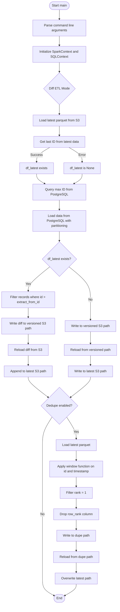
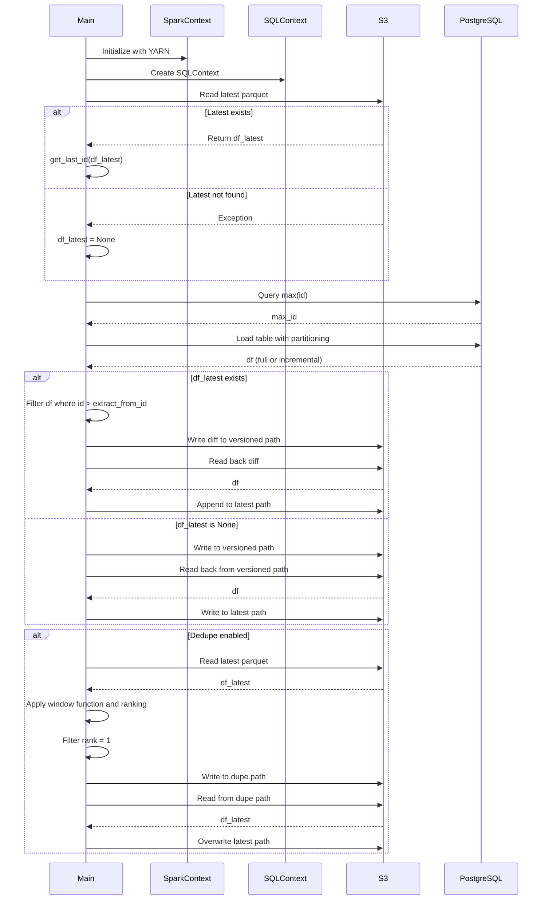
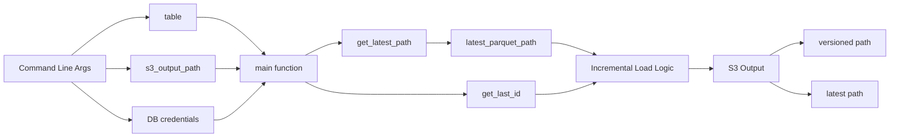

# Diagram: research/orchestrator/tasks/etl/extract_public_shipmentstatuses_spark.py

> Auto-generated by Obscura crawlers

## Diagram 1

### SVG

<svg id="container" width="581.640625" xmlns="http://www.w3.org/2000/svg" class="flowchart" height="2981.9375" viewBox="0 0 581.640625 2981.9375" role="graphics-document document" aria-roledescription="flowchart-v2"><g><marker id="container_flowchart-v2-pointEnd" class="marker flowchart-v2" viewBox="0 0 10 10" refX="5" refY="5" markerUnits="userSpaceOnUse" markerWidth="8" markerHeight="8" orient="auto"><path d="M 0 0 L 10 5 L 0 10 z" class="arrowMarkerPath" style="stroke-width: 1; stroke-dasharray: 1, 0;"></path></marker><marker id="container_flowchart-v2-pointStart" class="marker flowchart-v2" viewBox="0 0 10 10" refX="4.5" refY="5" markerUnits="userSpaceOnUse" markerWidth="8" markerHeight="8" orient="auto"><path d="M 0 5 L 10 10 L 10 0 z" class="arrowMarkerPath" style="stroke-width: 1; stroke-dasharray: 1, 0;"></path></marker><marker id="container_flowchart-v2-circleEnd" class="marker flowchart-v2" viewBox="0 0 10 10" refX="11" refY="5" markerUnits="userSpaceOnUse" markerWidth="11" markerHeight="11" orient="auto"><circle cx="5" cy="5" r="5" class="arrowMarkerPath" style="stroke-width: 1; stroke-dasharray: 1, 0;"></circle></marker><marker id="container_flowchart-v2-circleStart" class="marker flowchart-v2" viewBox="0 0 10 10" refX="-1" refY="5" markerUnits="userSpaceOnUse" markerWidth="11" markerHeight="11" orient="auto"><circle cx="5" cy="5" r="5" class="arrowMarkerPath" style="stroke-width: 1; stroke-dasharray: 1, 0;"></circle></marker><marker id="container_flowchart-v2-crossEnd" class="marker cross flowchart-v2" viewBox="0 0 11 11" refX="12" refY="5.2" markerUnits="userSpaceOnUse" markerWidth="11" markerHeight="11" orient="auto"><path d="M 1,1 l 9,9 M 10,1 l -9,9" class="arrowMarkerPath" style="stroke-width: 2; stroke-dasharray: 1, 0;"></path></marker><marker id="container_flowchart-v2-crossStart" class="marker cross flowchart-v2" viewBox="0 0 11 11" refX="-1" refY="5.2" markerUnits="userSpaceOnUse" markerWidth="11" markerHeight="11" orient="auto"><path d="M 1,1 l 9,9 M 10,1 l -9,9" class="arrowMarkerPath" style="stroke-width: 2; stroke-dasharray: 1, 0;"></path></marker><g class="root"><g class="clusters"></g><g class="edgePaths"><path d="M291.32,47.5L291.237,51.583C291.154,55.667,290.987,63.833,290.904,71.417C290.82,79,290.82,86,290.82,89.5L290.82,93" id="L_Start_ParseArgs_0" class="edge-thickness-normal edge-pattern-solid edge-thickness-normal edge-pattern-solid flowchart-link" style=";" data-edge="true" data-et="edge" data-id="L_Start_ParseArgs_0" data-points="W3sieCI6MjkxLjMyMDMxMjUsInkiOjQ3LjV9LHsieCI6MjkwLjgyMDMxMjUsInkiOjcyfSx7IngiOjI5MC44MjAzMTI1LCJ5Ijo5N31d" marker-end="url(#container_flowchart-v2-pointEnd)"></path><path d="M290.82,175L290.82,179.167C290.82,183.333,290.82,191.667,290.82,199.333C290.82,207,290.82,214,290.82,217.5L290.82,221" id="L_ParseArgs_InitSpark_0" class="edge-thickness-normal edge-pattern-solid edge-thickness-normal edge-pattern-solid flowchart-link" style=";" data-edge="true" data-et="edge" data-id="L_ParseArgs_InitSpark_0" data-points="W3sieCI6MjkwLjgyMDMxMjUsInkiOjE3NX0seyJ4IjoyOTAuODIwMzEyNSwieSI6MjAwfSx7IngiOjI5MC44MjAzMTI1LCJ5IjoyMjV9XQ==" marker-end="url(#container_flowchart-v2-pointEnd)"></path><path d="M290.82,303L290.82,307.167C290.82,311.333,290.82,319.667,290.82,327.333C290.82,335,290.82,342,290.82,345.5L290.82,349" id="L_InitSpark_DiffETL_0" class="edge-thickness-normal edge-pattern-solid edge-thickness-normal edge-pattern-solid flowchart-link" style=";" data-edge="true" data-et="edge" data-id="L_InitSpark_DiffETL_0" data-points="W3sieCI6MjkwLjgyMDMxMjUsInkiOjMwM30seyJ4IjoyOTAuODIwMzEyNSwieSI6MzI4fSx7IngiOjI5MC44MjAzMTI1LCJ5IjozNTN9XQ==" marker-end="url(#container_flowchart-v2-pointEnd)"></path><path d="M290.82,505.906L290.82,510.073C290.82,514.24,290.82,522.573,290.82,530.24C290.82,537.906,290.82,544.906,290.82,548.406L290.82,551.906" id="L_DiffETL_LoadLatest_0" class="edge-thickness-normal edge-pattern-solid edge-thickness-normal edge-pattern-solid flowchart-link" style=";" data-edge="true" data-et="edge" data-id="L_DiffETL_LoadLatest_0" data-points="W3sieCI6MjkwLjgyMDMxMjUsInkiOjUwNS45MDYyNX0seyJ4IjoyOTAuODIwMzEyNSwieSI6NTMwLjkwNjI1fSx7IngiOjI5MC44MjAzMTI1LCJ5Ijo1NTUuOTA2MjV9XQ==" marker-end="url(#container_flowchart-v2-pointEnd)"></path><path d="M290.82,633.906L290.82,638.073C290.82,642.24,290.82,650.573,290.82,658.24C290.82,665.906,290.82,672.906,290.82,676.406L290.82,679.906" id="L_LoadLatest_GetLastID_0" class="edge-thickness-normal edge-pattern-solid edge-thickness-normal edge-pattern-solid flowchart-link" style=";" data-edge="true" data-et="edge" data-id="L_LoadLatest_GetLastID_0" data-points="W3sieCI6MjkwLjgyMDMxMjUsInkiOjYzMy45MDYyNX0seyJ4IjoyOTAuODIwMzEyNSwieSI6NjU4LjkwNjI1fSx7IngiOjI5MC44MjAzMTI1LCJ5Ijo2ODMuOTA2MjV9XQ==" marker-end="url(#container_flowchart-v2-pointEnd)"></path><path d="M243.201,737.906L232.325,744.073C221.449,750.24,199.697,762.573,188.821,774.24C177.945,785.906,177.945,796.906,177.945,802.406L177.945,807.906" id="L_GetLastID_HasLatest_0" class="edge-thickness-normal edge-pattern-solid edge-thickness-normal edge-pattern-solid flowchart-link" style=";" data-edge="true" data-et="edge" data-id="L_GetLastID_HasLatest_0" data-points="W3sieCI6MjQzLjIwMTE3MTg3NSwieSI6NzM3LjkwNjI1fSx7IngiOjE3Ny45NDUzMTI1LCJ5Ijo3NzQuOTA2MjV9LHsieCI6MTc3Ljk0NTMxMjUsInkiOjgxMS45MDYyNX1d" marker-end="url(#container_flowchart-v2-pointEnd)"></path><path d="M338.439,737.906L349.315,744.073C360.191,750.24,381.943,762.573,392.819,774.24C403.695,785.906,403.695,796.906,403.695,802.406L403.695,807.906" id="L_GetLastID_NoLatest_0" class="edge-thickness-normal edge-pattern-solid edge-thickness-normal edge-pattern-solid flowchart-link" style=";" data-edge="true" data-et="edge" data-id="L_GetLastID_NoLatest_0" data-points="W3sieCI6MzM4LjQzOTQ1MzEyNSwieSI6NzM3LjkwNjI1fSx7IngiOjQwMy42OTUzMTI1LCJ5Ijo3NzQuOTA2MjV9LHsieCI6NDAzLjY5NTMxMjUsInkiOjgxMS45MDYyNX1d" marker-end="url(#container_flowchart-v2-pointEnd)"></path><path d="M177.945,865.906L177.945,870.073C177.945,874.24,177.945,882.573,184.714,890.577C191.483,898.582,205.02,906.258,211.789,910.095L218.558,913.933" id="L_HasLatest_GetMaxID_0" class="edge-thickness-normal edge-pattern-solid edge-thickness-normal edge-pattern-solid flowchart-link" style=";" data-edge="true" data-et="edge" data-id="L_HasLatest_GetMaxID_0" data-points="W3sieCI6MTc3Ljk0NTMxMjUsInkiOjg2NS45MDYyNX0seyJ4IjoxNzcuOTQ1MzEyNSwieSI6ODkwLjkwNjI1fSx7IngiOjIyMi4wMzcxMDkzNzUsInkiOjkxNS45MDYyNX1d" marker-end="url(#container_flowchart-v2-pointEnd)"></path><path d="M403.695,865.906L403.695,870.073C403.695,874.24,403.695,882.573,396.927,890.577C390.158,898.582,376.621,906.258,369.852,910.095L363.083,913.933" id="L_NoLatest_GetMaxID_0" class="edge-thickness-normal edge-pattern-solid edge-thickness-normal edge-pattern-solid flowchart-link" style=";" data-edge="true" data-et="edge" data-id="L_NoLatest_GetMaxID_0" data-points="W3sieCI6NDAzLjY5NTMxMjUsInkiOjg2NS45MDYyNX0seyJ4Ijo0MDMuNjk1MzEyNSwieSI6ODkwLjkwNjI1fSx7IngiOjM1OS42MDM1MTU2MjUsInkiOjkxNS45MDYyNX1d" marker-end="url(#container_flowchart-v2-pointEnd)"></path><path d="M290.82,993.906L290.82,998.073C290.82,1002.24,290.82,1010.573,290.82,1018.24C290.82,1025.906,290.82,1032.906,290.82,1036.406L290.82,1039.906" id="L_GetMaxID_LoadDB_0" class="edge-thickness-normal edge-pattern-solid edge-thickness-normal edge-pattern-solid flowchart-link" style=";" data-edge="true" data-et="edge" data-id="L_GetMaxID_LoadDB_0" data-points="W3sieCI6MjkwLjgyMDMxMjUsInkiOjk5My45MDYyNX0seyJ4IjoyOTAuODIwMzEyNSwieSI6MTAxOC45MDYyNX0seyJ4IjoyOTAuODIwMzEyNSwieSI6MTA0My45MDYyNX1d" marker-end="url(#container_flowchart-v2-pointEnd)"></path><path d="M290.82,1145.906L290.82,1150.073C290.82,1154.24,290.82,1162.573,290.82,1170.24C290.82,1177.906,290.82,1184.906,290.82,1188.406L290.82,1191.906" id="L_LoadDB_CheckLatest_0" class="edge-thickness-normal edge-pattern-solid edge-thickness-normal edge-pattern-solid flowchart-link" style=";" data-edge="true" data-et="edge" data-id="L_LoadDB_CheckLatest_0" data-points="W3sieCI6MjkwLjgyMDMxMjUsInkiOjExNDUuOTA2MjV9LHsieCI6MjkwLjgyMDMxMjUsInkiOjExNzAuOTA2MjV9LHsieCI6MjkwLjgyMDMxMjUsInkiOjExOTUuOTA2MjV9XQ==" marker-end="url(#container_flowchart-v2-pointEnd)"></path><path d="M243.533,1318.728L225.944,1332.776C208.355,1346.824,173.178,1374.92,155.589,1394.468C138,1414.016,138,1425.016,138,1430.516L138,1436.016" id="L_CheckLatest_FilterNew_0" class="edge-thickness-normal edge-pattern-solid edge-thickness-normal edge-pattern-solid flowchart-link" style=";" data-edge="true" data-et="edge" data-id="L_CheckLatest_FilterNew_0" data-points="W3sieCI6MjQzLjUzMzA1ODU3MjQzMzUsInkiOjEzMTguNzI4MzcxMDcyNDMzNH0seyJ4IjoxMzgsInkiOjE0MDMuMDE1NjI1fSx7IngiOjEzOCwieSI6MTQ0MC4wMTU2MjV9XQ==" marker-end="url(#container_flowchart-v2-pointEnd)"></path><path d="M338.108,1318.728L355.696,1332.776C373.285,1346.824,408.463,1374.92,426.052,1401.634C443.641,1428.349,443.641,1453.682,443.641,1477.016C443.641,1500.349,443.641,1521.682,443.641,1537.849C443.641,1554.016,443.641,1565.016,443.641,1570.516L443.641,1576.016" id="L_CheckLatest_WriteVersioned_0" class="edge-thickness-normal edge-pattern-solid edge-thickness-normal edge-pattern-solid flowchart-link" style=";" data-edge="true" data-et="edge" data-id="L_CheckLatest_WriteVersioned_0" data-points="W3sieCI6MzM4LjEwNzU2NjQyNzU2NjUsInkiOjEzMTguNzI4MzcxMDcyNDMzNH0seyJ4Ijo0NDMuNjQwNjI1LCJ5IjoxNDAzLjAxNTYyNX0seyJ4Ijo0NDMuNjQwNjI1LCJ5IjoxNDc5LjAxNTYyNX0seyJ4Ijo0NDMuNjQwNjI1LCJ5IjoxNTQzLjAxNTYyNX0seyJ4Ijo0NDMuNjQwNjI1LCJ5IjoxNTgwLjAxNTYyNX1d" marker-end="url(#container_flowchart-v2-pointEnd)"></path><path d="M138,1518.016L138,1522.182C138,1526.349,138,1534.682,138,1542.349C138,1550.016,138,1557.016,138,1560.516L138,1564.016" id="L_FilterNew_WriteDiff_0" class="edge-thickness-normal edge-pattern-solid edge-thickness-normal edge-pattern-solid flowchart-link" style=";" data-edge="true" data-et="edge" data-id="L_FilterNew_WriteDiff_0" data-points="W3sieCI6MTM4LCJ5IjoxNTE4LjAxNTYyNX0seyJ4IjoxMzgsInkiOjE1NDMuMDE1NjI1fSx7IngiOjEzOCwieSI6MTU2OC4wMTU2MjV9XQ==" marker-end="url(#container_flowchart-v2-pointEnd)"></path><path d="M138,1646.016L138,1650.182C138,1654.349,138,1662.682,138,1672.349C138,1682.016,138,1693.016,138,1698.516L138,1704.016" id="L_WriteDiff_ReloadDiff_0" class="edge-thickness-normal edge-pattern-solid edge-thickness-normal edge-pattern-solid flowchart-link" style=";" data-edge="true" data-et="edge" data-id="L_WriteDiff_ReloadDiff_0" data-points="W3sieCI6MTM4LCJ5IjoxNjQ2LjAxNTYyNX0seyJ4IjoxMzgsInkiOjE2NzEuMDE1NjI1fSx7IngiOjEzOCwieSI6MTcwOC4wMTU2MjV9XQ==" marker-end="url(#container_flowchart-v2-pointEnd)"></path><path d="M138,1762.016L138,1768.182C138,1774.349,138,1786.682,138,1796.349C138,1806.016,138,1813.016,138,1816.516L138,1820.016" id="L_ReloadDiff_AppendLatest_0" class="edge-thickness-normal edge-pattern-solid edge-thickness-normal edge-pattern-solid flowchart-link" style=";" data-edge="true" data-et="edge" data-id="L_ReloadDiff_AppendLatest_0" data-points="W3sieCI6MTM4LCJ5IjoxNzYyLjAxNTYyNX0seyJ4IjoxMzgsInkiOjE3OTkuMDE1NjI1fSx7IngiOjEzOCwieSI6MTgyNC4wMTU2MjV9XQ==" marker-end="url(#container_flowchart-v2-pointEnd)"></path><path d="M443.641,1634.016L443.641,1640.182C443.641,1646.349,443.641,1658.682,443.641,1668.349C443.641,1678.016,443.641,1685.016,443.641,1688.516L443.641,1692.016" id="L_WriteVersioned_ReloadVersioned_0" class="edge-thickness-normal edge-pattern-solid edge-thickness-normal edge-pattern-solid flowchart-link" style=";" data-edge="true" data-et="edge" data-id="L_WriteVersioned_ReloadVersioned_0" data-points="W3sieCI6NDQzLjY0MDYyNSwieSI6MTYzNC4wMTU2MjV9LHsieCI6NDQzLjY0MDYyNSwieSI6MTY3MS4wMTU2MjV9LHsieCI6NDQzLjY0MDYyNSwieSI6MTY5Ni4wMTU2MjV9XQ==" marker-end="url(#container_flowchart-v2-pointEnd)"></path><path d="M443.641,1774.016L443.641,1778.182C443.641,1782.349,443.641,1790.682,443.641,1798.349C443.641,1806.016,443.641,1813.016,443.641,1816.516L443.641,1820.016" id="L_ReloadVersioned_WriteLatest_0" class="edge-thickness-normal edge-pattern-solid edge-thickness-normal edge-pattern-solid flowchart-link" style=";" data-edge="true" data-et="edge" data-id="L_ReloadVersioned_WriteLatest_0" data-points="W3sieCI6NDQzLjY0MDYyNSwieSI6MTc3NC4wMTU2MjV9LHsieCI6NDQzLjY0MDYyNSwieSI6MTc5OS4wMTU2MjV9LHsieCI6NDQzLjY0MDYyNSwieSI6MTgyNC4wMTU2MjV9XQ==" marker-end="url(#container_flowchart-v2-pointEnd)"></path><path d="M138,1878.016L138,1882.182C138,1886.349,138,1894.682,154.35,1911.202C170.7,1927.722,203.4,1952.427,219.75,1964.78L236.1,1977.133" id="L_AppendLatest_CheckDedupe_0" class="edge-thickness-normal edge-pattern-solid edge-thickness-normal edge-pattern-solid flowchart-link" style=";" data-edge="true" data-et="edge" data-id="L_AppendLatest_CheckDedupe_0" data-points="W3sieCI6MTM4LCJ5IjoxODc4LjAxNTYyNX0seyJ4IjoxMzgsInkiOjE5MDMuMDE1NjI1fSx7IngiOjIzOS4yOTEyOTY4MjAzOTg5NCwieSI6MTk3OS41NDQ2NDA2Nzk2MDExfV0=" marker-end="url(#container_flowchart-v2-pointEnd)"></path><path d="M443.641,1878.016L443.641,1882.182C443.641,1886.349,443.641,1894.682,427.291,1911.202C410.941,1927.722,378.241,1952.427,361.891,1964.78L345.541,1977.133" id="L_WriteLatest_CheckDedupe_0" class="edge-thickness-normal edge-pattern-solid edge-thickness-normal edge-pattern-solid flowchart-link" style=";" data-edge="true" data-et="edge" data-id="L_WriteLatest_CheckDedupe_0" data-points="W3sieCI6NDQzLjY0MDYyNSwieSI6MTg3OC4wMTU2MjV9LHsieCI6NDQzLjY0MDYyNSwieSI6MTkwMy4wMTU2MjV9LHsieCI6MzQyLjM0OTMyODE3OTYwMTA2LCJ5IjoxOTc5LjU0NDY0MDY3OTYwMTF9XQ==" marker-end="url(#container_flowchart-v2-pointEnd)"></path><path d="M326.365,2073.393L334.191,2085.483C342.017,2097.574,357.669,2121.756,365.494,2139.347C373.32,2156.938,373.32,2167.938,373.32,2173.438L373.32,2178.938" id="L_CheckDedupe_LoadForDedupe_0" class="edge-thickness-normal edge-pattern-solid edge-thickness-normal edge-pattern-solid flowchart-link" style=";" data-edge="true" data-et="edge" data-id="L_CheckDedupe_LoadForDedupe_0" data-points="W3sieCI6MzI2LjM2NTE0OTcwOTMwMjMzLCJ5IjoyMDczLjM5MjY2Mjc5MDY5NzZ9LHsieCI6MzczLjMyMDMxMjUsInkiOjIxNDUuOTM3NX0seyJ4IjozNzMuMzIwMzEyNSwieSI6MjE4Mi45Mzc1fV0=" marker-end="url(#container_flowchart-v2-pointEnd)"></path><path d="M255.275,2073.393L247.45,2085.483C239.624,2097.574,223.972,2121.756,216.146,2144.513C208.32,2167.271,208.32,2188.604,208.32,2207.938C208.32,2227.271,208.32,2244.604,208.32,2263.938C208.32,2283.271,208.32,2304.604,208.32,2325.938C208.32,2347.271,208.32,2368.604,208.32,2387.938C208.32,2407.271,208.32,2424.604,208.32,2441.938C208.32,2459.271,208.32,2476.604,208.32,2493.938C208.32,2511.271,208.32,2528.604,208.32,2545.938C208.32,2563.271,208.32,2580.604,208.32,2597.938C208.32,2615.271,208.32,2632.604,208.32,2649.938C208.32,2667.271,208.32,2684.604,208.32,2701.938C208.32,2719.271,208.32,2736.604,208.32,2753.938C208.32,2771.271,208.32,2788.604,208.32,2805.938C208.32,2823.271,208.32,2840.604,208.32,2857.938C208.32,2875.271,208.32,2892.604,217.899,2906.474C227.478,2920.343,246.635,2930.749,256.214,2935.952L265.793,2941.155" id="L_CheckDedupe_End_0" class="edge-thickness-normal edge-pattern-solid edge-thickness-normal edge-pattern-solid flowchart-link" style=";" data-edge="true" data-et="edge" data-id="L_CheckDedupe_End_0" data-points="W3sieCI6MjU1LjI3NTQ3NTI5MDY5NzY3LCJ5IjoyMDczLjM5MjY2Mjc5MDY5NzZ9LHsieCI6MjA4LjMyMDMxMjUsInkiOjIxNDUuOTM3NX0seyJ4IjoyMDguMzIwMzEyNSwieSI6MjIwOS45Mzc1fSx7IngiOjIwOC4zMjAzMTI1LCJ5IjoyMjYxLjkzNzV9LHsieCI6MjA4LjMyMDMxMjUsInkiOjIzMjUuOTM3NX0seyJ4IjoyMDguMzIwMzEyNSwieSI6MjM4OS45Mzc1fSx7IngiOjIwOC4zMjAzMTI1LCJ5IjoyNDQxLjkzNzV9LHsieCI6MjA4LjMyMDMxMjUsInkiOjI0OTMuOTM3NX0seyJ4IjoyMDguMzIwMzEyNSwieSI6MjU0NS45Mzc1fSx7IngiOjIwOC4zMjAzMTI1LCJ5IjoyNTk3LjkzNzV9LHsieCI6MjA4LjMyMDMxMjUsInkiOjI2NDkuOTM3NX0seyJ4IjoyMDguMzIwMzEyNSwieSI6MjcwMS45Mzc1fSx7IngiOjIwOC4zMjAzMTI1LCJ5IjoyNzUzLjkzNzV9LHsieCI6MjA4LjMyMDMxMjUsInkiOjI4MDUuOTM3NX0seyJ4IjoyMDguMzIwMzEyNSwieSI6Mjg1Ny45Mzc1fSx7IngiOjIwOC4zMjAzMTI1LCJ5IjoyOTA5LjkzNzV9LHsieCI6MjY5LjMwNzU3MzgxNTU3NiwieSI6Mjk0My4wNjM5NjIxNjQxNTg1fV0=" marker-end="url(#container_flowchart-v2-pointEnd)"></path><path d="M373.32,2236.938L373.32,2241.104C373.32,2245.271,373.32,2253.604,373.32,2261.271C373.32,2268.938,373.32,2275.938,373.32,2279.438L373.32,2282.938" id="L_LoadForDedupe_WindowFunc_0" class="edge-thickness-normal edge-pattern-solid edge-thickness-normal edge-pattern-solid flowchart-link" style=";" data-edge="true" data-et="edge" data-id="L_LoadForDedupe_WindowFunc_0" data-points="W3sieCI6MzczLjMyMDMxMjUsInkiOjIyMzYuOTM3NX0seyJ4IjozNzMuMzIwMzEyNSwieSI6MjI2MS45Mzc1fSx7IngiOjM3My4zMjAzMTI1LCJ5IjoyMjg2LjkzNzV9XQ==" marker-end="url(#container_flowchart-v2-pointEnd)"></path><path d="M373.32,2364.938L373.32,2369.104C373.32,2373.271,373.32,2381.604,373.32,2389.271C373.32,2396.938,373.32,2403.938,373.32,2407.438L373.32,2410.938" id="L_WindowFunc_RankFilter_0" class="edge-thickness-normal edge-pattern-solid edge-thickness-normal edge-pattern-solid flowchart-link" style=";" data-edge="true" data-et="edge" data-id="L_WindowFunc_RankFilter_0" data-points="W3sieCI6MzczLjMyMDMxMjUsInkiOjIzNjQuOTM3NX0seyJ4IjozNzMuMzIwMzEyNSwieSI6MjM4OS45Mzc1fSx7IngiOjM3My4zMjAzMTI1LCJ5IjoyNDE0LjkzNzV9XQ==" marker-end="url(#container_flowchart-v2-pointEnd)"></path><path d="M373.32,2468.938L373.32,2473.104C373.32,2477.271,373.32,2485.604,373.32,2493.271C373.32,2500.938,373.32,2507.938,373.32,2511.438L373.32,2514.938" id="L_RankFilter_DropRank_0" class="edge-thickness-normal edge-pattern-solid edge-thickness-normal edge-pattern-solid flowchart-link" style=";" data-edge="true" data-et="edge" data-id="L_RankFilter_DropRank_0" data-points="W3sieCI6MzczLjMyMDMxMjUsInkiOjI0NjguOTM3NX0seyJ4IjozNzMuMzIwMzEyNSwieSI6MjQ5My45Mzc1fSx7IngiOjM3My4zMjAzMTI1LCJ5IjoyNTE4LjkzNzV9XQ==" marker-end="url(#container_flowchart-v2-pointEnd)"></path><path d="M373.32,2572.938L373.32,2577.104C373.32,2581.271,373.32,2589.604,373.32,2597.271C373.32,2604.938,373.32,2611.938,373.32,2615.438L373.32,2618.938" id="L_DropRank_WriteDupe_0" class="edge-thickness-normal edge-pattern-solid edge-thickness-normal edge-pattern-solid flowchart-link" style=";" data-edge="true" data-et="edge" data-id="L_DropRank_WriteDupe_0" data-points="W3sieCI6MzczLjMyMDMxMjUsInkiOjI1NzIuOTM3NX0seyJ4IjozNzMuMzIwMzEyNSwieSI6MjU5Ny45Mzc1fSx7IngiOjM3My4zMjAzMTI1LCJ5IjoyNjIyLjkzNzV9XQ==" marker-end="url(#container_flowchart-v2-pointEnd)"></path><path d="M373.32,2676.938L373.32,2681.104C373.32,2685.271,373.32,2693.604,373.32,2701.271C373.32,2708.938,373.32,2715.938,373.32,2719.438L373.32,2722.938" id="L_WriteDupe_ReloadDupe_0" class="edge-thickness-normal edge-pattern-solid edge-thickness-normal edge-pattern-solid flowchart-link" style=";" data-edge="true" data-et="edge" data-id="L_WriteDupe_ReloadDupe_0" data-points="W3sieCI6MzczLjMyMDMxMjUsInkiOjI2NzYuOTM3NX0seyJ4IjozNzMuMzIwMzEyNSwieSI6MjcwMS45Mzc1fSx7IngiOjM3My4zMjAzMTI1LCJ5IjoyNzI2LjkzNzV9XQ==" marker-end="url(#container_flowchart-v2-pointEnd)"></path><path d="M373.32,2780.938L373.32,2785.104C373.32,2789.271,373.32,2797.604,373.32,2805.271C373.32,2812.938,373.32,2819.938,373.32,2823.438L373.32,2826.938" id="L_ReloadDupe_Overwrite_0" class="edge-thickness-normal edge-pattern-solid edge-thickness-normal edge-pattern-solid flowchart-link" style=";" data-edge="true" data-et="edge" data-id="L_ReloadDupe_Overwrite_0" data-points="W3sieCI6MzczLjMyMDMxMjUsInkiOjI3ODAuOTM3NX0seyJ4IjozNzMuMzIwMzEyNSwieSI6MjgwNS45Mzc1fSx7IngiOjM3My4zMjAzMTI1LCJ5IjoyODMwLjkzNzV9XQ==" marker-end="url(#container_flowchart-v2-pointEnd)"></path><path d="M373.32,2884.938L373.32,2889.104C373.32,2893.271,373.32,2901.604,363.906,2910.97C354.492,2920.335,335.663,2930.733,326.249,2935.932L316.835,2941.13" id="L_Overwrite_End_0" class="edge-thickness-normal edge-pattern-solid edge-thickness-normal edge-pattern-solid flowchart-link" style=";" data-edge="true" data-et="edge" data-id="L_Overwrite_End_0" data-points="W3sieCI6MzczLjMyMDMxMjUsInkiOjI4ODQuOTM3NX0seyJ4IjozNzMuMzIwMzEyNSwieSI6MjkwOS45Mzc1fSx7IngiOjMxMy4zMzMwNTE5MjM1NDc0MywieSI6Mjk0My4wNjM5NjE3NjU0OH1d" marker-end="url(#container_flowchart-v2-pointEnd)"></path></g><g class="edgeLabels"><g class="edgeLabel"><g class="label" data-id="L_Start_ParseArgs_0" transform="translate(0, 0)"><foreignObject width="0" height="0">

</foreignObject></g></g><g class="edgeLabel"><g class="label" data-id="L_ParseArgs_InitSpark_0" transform="translate(0, 0)"><foreignObject width="0" height="0">

</foreignObject></g></g><g class="edgeLabel"><g class="label" data-id="L_InitSpark_DiffETL_0" transform="translate(0, 0)"><foreignObject width="0" height="0">

</foreignObject></g></g><g class="edgeLabel"><g class="label" data-id="L_DiffETL_LoadLatest_0" transform="translate(0, 0)"><foreignObject width="0" height="0">

</foreignObject></g></g><g class="edgeLabel"><g class="label" data-id="L_LoadLatest_GetLastID_0" transform="translate(0, 0)"><foreignObject width="0" height="0">

</foreignObject></g></g><g class="edgeLabel" transform="translate(177.9453125, 774.90625)"><g class="label" data-id="L_GetLastID_HasLatest_0" transform="translate(-28.1015625, -12)"><foreignObject width="56.203125" height="24">

Success

</foreignObject></g></g><g class="edgeLabel" transform="translate(403.6953125, 774.90625)"><g class="label" data-id="L_GetLastID_NoLatest_0" transform="translate(-17.8984375, -12)"><foreignObject width="35.796875" height="24">

Error

</foreignObject></g></g><g class="edgeLabel"><g class="label" data-id="L_HasLatest_GetMaxID_0" transform="translate(0, 0)"><foreignObject width="0" height="0">

</foreignObject></g></g><g class="edgeLabel"><g class="label" data-id="L_NoLatest_GetMaxID_0" transform="translate(0, 0)"><foreignObject width="0" height="0">

</foreignObject></g></g><g class="edgeLabel"><g class="label" data-id="L_GetMaxID_LoadDB_0" transform="translate(0, 0)"><foreignObject width="0" height="0">

</foreignObject></g></g><g class="edgeLabel"><g class="label" data-id="L_LoadDB_CheckLatest_0" transform="translate(0, 0)"><foreignObject width="0" height="0">

</foreignObject></g></g><g class="edgeLabel" transform="translate(138, 1403.015625)"><g class="label" data-id="L_CheckLatest_FilterNew_0" transform="translate(-12.03125, -12)"><foreignObject width="24.0625" height="24">

Yes

</foreignObject></g></g><g class="edgeLabel" transform="translate(443.640625, 1479.015625)"><g class="label" data-id="L_CheckLatest_WriteVersioned_0" transform="translate(-10.140625, -12)"><foreignObject width="20.28125" height="24">

No

</foreignObject></g></g><g class="edgeLabel"><g class="label" data-id="L_FilterNew_WriteDiff_0" transform="translate(0, 0)"><foreignObject width="0" height="0">

</foreignObject></g></g><g class="edgeLabel"><g class="label" data-id="L_WriteDiff_ReloadDiff_0" transform="translate(0, 0)"><foreignObject width="0" height="0">

</foreignObject></g></g><g class="edgeLabel"><g class="label" data-id="L_ReloadDiff_AppendLatest_0" transform="translate(0, 0)"><foreignObject width="0" height="0">

</foreignObject></g></g><g class="edgeLabel"><g class="label" data-id="L_WriteVersioned_ReloadVersioned_0" transform="translate(0, 0)"><foreignObject width="0" height="0">

</foreignObject></g></g><g class="edgeLabel"><g class="label" data-id="L_ReloadVersioned_WriteLatest_0" transform="translate(0, 0)"><foreignObject width="0" height="0">

</foreignObject></g></g><g class="edgeLabel"><g class="label" data-id="L_AppendLatest_CheckDedupe_0" transform="translate(0, 0)"><foreignObject width="0" height="0">

</foreignObject></g></g><g class="edgeLabel"><g class="label" data-id="L_WriteLatest_CheckDedupe_0" transform="translate(0, 0)"><foreignObject width="0" height="0">

</foreignObject></g></g><g class="edgeLabel" transform="translate(373.3203125, 2145.9375)"><g class="label" data-id="L_CheckDedupe_LoadForDedupe_0" transform="translate(-12.03125, -12)"><foreignObject width="24.0625" height="24">

Yes

</foreignObject></g></g><g class="edgeLabel" transform="translate(208.3203125, 2545.9375)"><g class="label" data-id="L_CheckDedupe_End_0" transform="translate(-10.140625, -12)"><foreignObject width="20.28125" height="24">

No

</foreignObject></g></g><g class="edgeLabel"><g class="label" data-id="L_LoadForDedupe_WindowFunc_0" transform="translate(0, 0)"><foreignObject width="0" height="0">

</foreignObject></g></g><g class="edgeLabel"><g class="label" data-id="L_WindowFunc_RankFilter_0" transform="translate(0, 0)"><foreignObject width="0" height="0">

</foreignObject></g></g><g class="edgeLabel"><g class="label" data-id="L_RankFilter_DropRank_0" transform="translate(0, 0)"><foreignObject width="0" height="0">

</foreignObject></g></g><g class="edgeLabel"><g class="label" data-id="L_DropRank_WriteDupe_0" transform="translate(0, 0)"><foreignObject width="0" height="0">

</foreignObject></g></g><g class="edgeLabel"><g class="label" data-id="L_WriteDupe_ReloadDupe_0" transform="translate(0, 0)"><foreignObject width="0" height="0">

</foreignObject></g></g><g class="edgeLabel"><g class="label" data-id="L_ReloadDupe_Overwrite_0" transform="translate(0, 0)"><foreignObject width="0" height="0">

</foreignObject></g></g><g class="edgeLabel"><g class="label" data-id="L_Overwrite_End_0" transform="translate(0, 0)"><foreignObject width="0" height="0">

</foreignObject></g></g></g><g class="nodes"><g class="node default" id="flowchart-Start-0" transform="translate(290.8203125, 27.5)"><g class="basic label-container outer-path"><path d="M-30.671875 -19.5 C-14.848202575221778 -19.5, 0.9754698495564433 -19.5, 30.671875 -19.5 C30.671875 -19.5, 30.671875 -19.5, 30.671875 -19.5 C31.159751748841835 -19.484354742259125, 31.647628497683666 -19.468709484518254, 31.9212442896239 -19.45993515863156 C32.266555268359944 -19.426623423810106, 32.61186624709598 -19.39331168898865, 33.165479652847864 -19.3399052695533 C33.578814649277035 -19.273080472791403, 33.99214964570621 -19.206255676029507, 34.39946825967676 -19.140403561325776 C34.76742540284277 -19.056419744542893, 35.13538254600878 -18.972435927760007, 35.61813938623539 -18.862249829261074 C36.00683717779637 -18.74688636504212, 36.39553496935735 -18.631522900823164, 36.816485251460605 -18.50658706670804 C37.16842857172081 -18.377068671523894, 37.52037189198102 -18.247550276339748, 37.9895815951478 -18.074876768247425 C38.338948719364176 -17.92022230596435, 38.68831584358056 -17.765567843681282, 39.13260791279238 -17.568892924097174 C39.36669439316957 -17.44677015722394, 39.60078087354675 -17.324647390350712, 40.24086726407678 -16.990714730406097 C40.664138554875606 -16.734125186505647, 41.08740984567442 -16.4775356426052, 41.3098055736057 -16.342718045390892 C41.58811963740553 -16.148578202505774, 41.86643370120536 -15.954438359620653, 42.33503034457871 -15.627565626425154 C42.55299322952112 -15.453746025919548, 42.77095611446352 -15.27992642541394, 43.312328708501866 -14.848196188198123 C43.63176673379672 -14.558091025492345, 43.95120475909157 -14.267985862786565, 44.23768473676799 -14.007812326905688 C44.49149734892478 -13.745729966450797, 44.745309961081574 -13.483647605995905, 45.10729594296865 -13.10986736009568 C45.285594798520385 -12.900427378872322, 45.46389365407212 -12.690987397648964, 45.91758890812658 -12.158051136245305 C46.15090602014841 -11.84542746176223, 46.384223132170234 -11.532803787279155, 46.665233964640635 -11.156274872382312 C46.85372651819052 -10.866699692791963, 47.042219071740405 -10.577124513201614, 47.34715887860425 -10.108655082055241 C47.49717073684374 -9.842293837403194, 47.64718259508323 -9.575932592751144, 47.960561474273504 -9.019496659696287 C48.170521054176895 -8.58351109961155, 48.38048063408029 -8.147525539526814, 48.50292114880834 -7.893275190886684 C48.61337374759449 -7.620455136429179, 48.72382634638063 -7.347635081971674, 48.972009229970325 -6.734618561215508 C49.07511440457532 -6.424082202883948, 49.1782195791803 -6.113545844552388, 49.36589813421488 -5.548287939305138 C49.45440799344002 -5.21076148566404, 49.542917852665155 -4.873235032022943, 49.68296928754556 -4.339158212148133 C49.73772910158004 -4.057978140571883, 49.79248891561451 -3.7767980689956335, 49.921919776581774 -3.1121979531509023 C49.96758947933544 -2.757992757096356, 50.0132591820891 -2.4037875610418102, 50.08176770250937 -1.872449005199798 C50.111275067334056 -1.4128479801390443, 50.14078243215875 -0.9532469550782905, 50.16185621591342 -0.6250057626472757 C50.16185621591342 -0.35084907965018947, 50.16185621591342 -0.07669239665310323, 50.16185621591342 0.625005762647271 C50.14450707955816 0.8952325653512587, 50.127157943202896 1.1654593680552465, 50.08176770250937 1.8724490051997846 C50.04826442589402 2.132293802658143, 50.01476114927867 2.3921386001165015, 49.921919776581774 3.1121979531508885 C49.8447073722935 3.508667330323757, 49.767494968005224 3.9051367074966254, 49.68296928754556 4.339158212148129 C49.59796710012781 4.663308392953086, 49.51296491271006 4.987458573758042, 49.36589813421489 5.548287939305125 C49.2585215122828 5.871689216423208, 49.1511448903507 6.195090493541291, 48.972009229970325 6.734618561215495 C48.863434486161864 7.00280027757227, 48.754859742353396 7.270981993929045, 48.50292114880834 7.893275190886679 C48.388181732467274 8.131534043949122, 48.273442316126214 8.369792897011564, 47.960561474273504 9.019496659696284 C47.80448804348468 9.29662084021045, 47.64841461269585 9.573745020724617, 47.34715887860425 10.108655082055236 C47.100138646051896 10.488144493475756, 46.853118413499544 10.867633904896277, 46.66523396464064 11.156274872382301 C46.40861544609029 11.500120308811798, 46.15199692753993 11.843965745241295, 45.91758890812658 12.158051136245302 C45.67024530316653 12.44859500888121, 45.42290169820648 12.739138881517116, 45.10729594296866 13.10986736009567 C44.891382410008724 13.332815809707538, 44.67546887704878 13.555764259319409, 44.23768473676799 14.007812326905684 C43.96984472679645 14.25105753730351, 43.70200471682491 14.494302747701335, 43.31232870850189 14.848196188198111 C43.054346503968965 15.053930131118335, 42.796364299436036 15.25966407403856, 42.33503034457871 15.627565626425152 C41.97014965267251 15.882090601668345, 41.60526896076631 16.136615576911538, 41.30980557360571 16.34271804539089 C41.015944894065925 16.520858116244945, 40.722084214526134 16.698998187098997, 40.24086726407678 16.990714730406093 C40.018789375882896 17.10657262242917, 39.79671148768901 17.222430514452245, 39.13260791279239 17.56889292409717 C38.76295991513831 17.732525127440372, 38.39331191748424 17.896157330783577, 37.989581595147804 18.07487676824742 C37.54201613710305 18.23958499405763, 37.0944506790583 18.404293219867842, 36.81648525146062 18.506587066708033 C36.392074518000406 18.632549944621626, 35.967663784540186 18.75851282253522, 35.61813938623541 18.86224982926107 C35.346311378292604 18.924292798230493, 35.07448337034979 18.98633576719991, 34.399468259676766 19.140403561325773 C33.96469020107486 19.210695106086327, 33.52991214247295 19.280986650846884, 33.16547965284788 19.3399052695533 C32.81771835924194 19.373453383303318, 32.46995706563599 19.407001497053336, 31.9212442896239 19.45993515863156 C31.50634732655266 19.473240096689306, 31.091450363481417 19.486545034747053, 30.671875000000004 19.5 C30.671875000000004 19.5, 30.671875 19.5, 30.671875 19.5 C9.007781343550807 19.5, -12.656312312898386 19.5, -30.671874999999996 19.5 C-30.997230887964037 19.48956646993981, -31.322586775928077 19.479132939879623, -31.921244289623893 19.45993515863156 C-32.40446364588241 19.4133195684896, -32.88768300214092 19.366703978347644, -33.16547965284787 19.3399052695533 C-33.52166704718346 19.282319653911618, -33.877854441519055 19.224734038269936, -34.39946825967676 19.140403561325773 C-34.88311947577491 19.030013327370508, -35.36677069187306 18.919623093415247, -35.618139386235384 18.862249829261074 C-35.992615108498285 18.751107400556624, -36.367090830761185 18.639964971852176, -36.81648525146059 18.506587066708043 C-37.11896027023162 18.395273463751884, -37.42143528900264 18.283959860795726, -37.9895815951478 18.074876768247425 C-38.40567019886285 17.890686686212657, -38.82175880257791 17.70649660417789, -39.13260791279238 17.568892924097174 C-39.543377159709976 17.354594871090526, -39.95414640662757 17.140296818083876, -40.24086726407678 16.990714730406097 C-40.59764890623611 16.774431602247457, -40.95443054839543 16.558148474088814, -41.309805573605686 16.3427180453909 C-41.56909320430585 16.161850218595095, -41.828380835006016 15.980982391799287, -42.33503034457871 15.627565626425156 C-42.695943719461106 15.339746814264709, -43.05685709434349 15.051928002104262, -43.312328708501866 14.848196188198125 C-43.621055241848474 14.567818919069195, -43.929781775195075 14.287441649940263, -44.237684736767974 14.007812326905697 C-44.54514291610054 13.690336513958847, -44.85260109543311 13.372860701012, -45.107295942968655 13.109867360095677 C-45.35280770317433 12.821475276543183, -45.59831946338 12.533083192990686, -45.917588908126575 12.158051136245307 C-46.17701478197531 11.810444099471315, -46.43644065582404 11.462837062697323, -46.665233964640635 11.156274872382316 C-46.89738625790658 10.799626608306433, -47.12953855117253 10.442978344230548, -47.34715887860425 10.108655082055249 C-47.48429930432391 9.865148369216033, -47.62143973004357 9.62164165637682, -47.960561474273504 9.019496659696289 C-48.12876001845974 8.670228783821251, -48.296958562645976 8.320960907946212, -48.50292114880834 7.893275190886686 C-48.67023149401942 7.48001540348985, -48.837541839230504 7.066755616093014, -48.972009229970325 6.73461856121551 C-49.08544380342903 6.3929716993027705, -49.19887837688773 6.051324837390031, -49.36589813421488 5.5482879393051325 C-49.45853710846483 5.19501538050466, -49.55117608271478 4.841742821704188, -49.68296928754556 4.339158212148136 C-49.75087102144486 3.990497159611776, -49.818772755344156 3.6418361070754166, -49.921919776581774 3.112197953150904 C-49.958224187565534 2.8306281106776945, -49.994528598549294 2.5490582682044853, -50.08176770250937 1.872449005199809 C-50.10502338593313 1.5102229642248997, -50.12827906935689 1.1479969232499903, -50.16185621591342 0.6250057626472781 C-50.16185621591342 0.1499170121732426, -50.16185621591342 -0.32517173830079293, -50.16185621591342 -0.6250057626472687 C-50.133541998811154 -1.0660225488396455, -50.1052277817089 -1.5070393350320224, -50.08176770250937 -1.8724490051997822 C-50.043256669542366 -2.171132972028213, -50.004745636575365 -2.469816938856644, -49.921919776581774 -3.112197953150895 C-49.86765529550577 -3.3908345946740566, -49.81339081442976 -3.669471236197218, -49.68296928754556 -4.339158212148126 C-49.558238053621544 -4.814812465959139, -49.433506819697534 -5.290466719770151, -49.36589813421489 -5.548287939305123 C-49.233220281620106 -5.947892491975574, -49.100542429025325 -6.347497044646024, -48.97200922997033 -6.734618561215485 C-48.83897958215082 -7.063204363282957, -48.7059499343313 -7.3917901653504305, -48.50292114880834 -7.893275190886676 C-48.37587777123285 -8.157083482715002, -48.24883439365736 -8.420891774543326, -47.960561474273504 -9.019496659696282 C-47.73486706007739 -9.420239946139125, -47.50917264588128 -9.820983232581968, -47.34715887860425 -10.108655082055243 C-47.10006982256124 -10.488250224839106, -46.85298076651823 -10.86784536762297, -46.66523396464064 -11.156274872382308 C-46.398835418492226 -11.513224654814362, -46.13243687234381 -11.870174437246417, -45.91758890812659 -12.158051136245302 C-45.72612740949727 -12.382952707003195, -45.53466591086796 -12.607854277761088, -45.10729594296866 -13.10986736009567 C-44.8358144883349 -13.390194251046976, -44.56433303370113 -13.67052114199828, -44.237684736767996 -14.007812326905677 C-44.01906089722551 -14.206360713508348, -43.80043705768303 -14.404909100111018, -43.31232870850189 -14.848196188198107 C-42.98873102588743 -15.10625672878715, -42.66513334327298 -15.36431726937619, -42.33503034457872 -15.627565626425149 C-42.084236939281176 -15.80250824928918, -41.83344353398363 -15.977450872153211, -41.309805573605715 -16.342718045390885 C-41.08837262749626 -16.476951998606868, -40.86693968138681 -16.611185951822847, -40.24086726407679 -16.99071473040609 C-39.95247616203179 -17.141168183619648, -39.66408505998679 -17.29162163683321, -39.13260791279239 -17.56889292409717 C-38.76241981736656 -17.732764212702495, -38.39223172194074 -17.896635501307824, -37.989581595147804 -18.07487676824742 C-37.6885600924172 -18.185655463864553, -37.387538589686585 -18.296434159481684, -36.81648525146062 -18.506587066708033 C-36.4904450754307 -18.603354079533904, -36.16440489940078 -18.700121092359776, -35.61813938623541 -18.862249829261067 C-35.36817084327642 -18.919303517994273, -35.11820230031742 -18.976357206727478, -34.399468259676766 -19.140403561325773 C-34.0556348997223 -19.195991872495682, -33.71180153976783 -19.251580183665588, -33.16547965284788 -19.3399052695533 C-32.731429895336625 -19.3817775276392, -32.29738013782537 -19.423649785725104, -31.921244289623903 -19.45993515863156 C-31.47328794983763 -19.474300246554385, -31.025331610051353 -19.488665334477208, -30.671875000000007 -19.5 C-30.671875000000007 -19.5, -30.671875000000004 -19.5, -30.671875 -19.5" stroke="none" stroke-width="0" fill="#ECECFF" style=""></path><path d="M-30.671875 -19.5 C-15.76661181133174 -19.5, -0.8613486226634812 -19.5, 30.671875 -19.5 M-30.671875 -19.5 C-16.834565973952923 -19.5, -2.9972569479058464 -19.5, 30.671875 -19.5 M30.671875 -19.5 C30.671875 -19.5, 30.671875 -19.5, 30.671875 -19.5 M30.671875 -19.5 C30.671875 -19.5, 30.671875 -19.5, 30.671875 -19.5 M30.671875 -19.5 C30.93699754490184 -19.491498036014725, 31.20212008980368 -19.48299607202945, 31.9212442896239 -19.45993515863156 M30.671875 -19.5 C31.136879553823256 -19.485088209035347, 31.601884107646512 -19.47017641807069, 31.9212442896239 -19.45993515863156 M31.9212442896239 -19.45993515863156 C32.33506014858076 -19.420014840404374, 32.74887600753761 -19.380094522177192, 33.165479652847864 -19.3399052695533 M31.9212442896239 -19.45993515863156 C32.324308845549055 -19.42105200567751, 32.7273734014742 -19.38216885272346, 33.165479652847864 -19.3399052695533 M33.165479652847864 -19.3399052695533 C33.52687281380831 -19.281478025935034, 33.888265974768764 -19.223050782316772, 34.39946825967676 -19.140403561325776 M33.165479652847864 -19.3399052695533 C33.49266879828145 -19.287007865909317, 33.81985794371504 -19.23411046226533, 34.39946825967676 -19.140403561325776 M34.39946825967676 -19.140403561325776 C34.680275735529726 -19.076311087402367, 34.96108321138269 -19.012218613478957, 35.61813938623539 -18.862249829261074 M34.39946825967676 -19.140403561325776 C34.66244591870798 -19.0803806267415, 34.9254235777392 -19.020357692157226, 35.61813938623539 -18.862249829261074 M35.61813938623539 -18.862249829261074 C36.08463649084339 -18.723795937306694, 36.55113359545138 -18.58534204535231, 36.816485251460605 -18.50658706670804 M35.61813938623539 -18.862249829261074 C36.01047403897803 -18.745806963733674, 36.40280869172068 -18.629364098206278, 36.816485251460605 -18.50658706670804 M36.816485251460605 -18.50658706670804 C37.09328776623018 -18.404721182538438, 37.37009028099976 -18.302855298368836, 37.9895815951478 -18.074876768247425 M36.816485251460605 -18.50658706670804 C37.06834916417728 -18.413898818623817, 37.32021307689395 -18.321210570539595, 37.9895815951478 -18.074876768247425 M37.9895815951478 -18.074876768247425 C38.21942643224345 -17.973131276970022, 38.4492712693391 -17.871385785692624, 39.13260791279238 -17.568892924097174 M37.9895815951478 -18.074876768247425 C38.42516737627481 -17.8820558641356, 38.860753157401824 -17.68923496002378, 39.13260791279238 -17.568892924097174 M39.13260791279238 -17.568892924097174 C39.55760468877279 -17.34717237829162, 39.9826014647532 -17.12545183248607, 40.24086726407678 -16.990714730406097 M39.13260791279238 -17.568892924097174 C39.37523713834044 -17.44231341254019, 39.617866363888496 -17.315733900983204, 40.24086726407678 -16.990714730406097 M40.24086726407678 -16.990714730406097 C40.66363441769221 -16.734430797428864, 41.086401571307626 -16.478146864451627, 41.3098055736057 -16.342718045390892 M40.24086726407678 -16.990714730406097 C40.53169875727135 -16.814410970115986, 40.82253025046592 -16.638107209825876, 41.3098055736057 -16.342718045390892 M41.3098055736057 -16.342718045390892 C41.71361582952355 -16.061037491526843, 42.117426085441394 -15.779356937662794, 42.33503034457871 -15.627565626425154 M41.3098055736057 -16.342718045390892 C41.659508937781084 -16.098780116956792, 42.00921230195647 -15.854842188522689, 42.33503034457871 -15.627565626425154 M42.33503034457871 -15.627565626425154 C42.710951086170574 -15.327778838676705, 43.08687182776243 -15.027992050928258, 43.312328708501866 -14.848196188198123 M42.33503034457871 -15.627565626425154 C42.64027455420793 -15.384141492135415, 42.945518763837136 -15.140717357845674, 43.312328708501866 -14.848196188198123 M43.312328708501866 -14.848196188198123 C43.679965301218076 -14.514318361824476, 44.04760189393429 -14.180440535450828, 44.23768473676799 -14.007812326905688 M43.312328708501866 -14.848196188198123 C43.636751647726655 -14.553563858554767, 43.961174586951444 -14.258931528911413, 44.23768473676799 -14.007812326905688 M44.23768473676799 -14.007812326905688 C44.55217171893303 -13.683078697958859, 44.866658701098075 -13.358345069012032, 45.10729594296865 -13.10986736009568 M44.23768473676799 -14.007812326905688 C44.46119078872349 -13.7770239780735, 44.68469684067899 -13.54623562924131, 45.10729594296865 -13.10986736009568 M45.10729594296865 -13.10986736009568 C45.40182021502343 -12.763902391234302, 45.69634448707821 -12.417937422372923, 45.91758890812658 -12.158051136245305 M45.10729594296865 -13.10986736009568 C45.311987531142286 -12.869424973345605, 45.516679119315924 -12.628982586595532, 45.91758890812658 -12.158051136245305 M45.91758890812658 -12.158051136245305 C46.167613899520816 -11.823040425522333, 46.41763889091504 -11.48802971479936, 46.665233964640635 -11.156274872382312 M45.91758890812658 -12.158051136245305 C46.111983206389034 -11.89758048625851, 46.306377504651486 -11.637109836271717, 46.665233964640635 -11.156274872382312 M46.665233964640635 -11.156274872382312 C46.86787145240639 -10.844969275389714, 47.070508940172154 -10.533663678397115, 47.34715887860425 -10.108655082055241 M46.665233964640635 -11.156274872382312 C46.893936285562724 -10.804926692273881, 47.12263860648481 -10.453578512165448, 47.34715887860425 -10.108655082055241 M47.34715887860425 -10.108655082055241 C47.53740566667955 -9.770852645251276, 47.727652454754846 -9.433050208447312, 47.960561474273504 -9.019496659696287 M47.34715887860425 -10.108655082055241 C47.5261996547581 -9.790750054149553, 47.70524043091196 -9.472845026243865, 47.960561474273504 -9.019496659696287 M47.960561474273504 -9.019496659696287 C48.155036721032566 -8.615664648697402, 48.349511967791635 -8.211832637698517, 48.50292114880834 -7.893275190886684 M47.960561474273504 -9.019496659696287 C48.08666411530308 -8.757641827434087, 48.21276675633266 -8.495786995171887, 48.50292114880834 -7.893275190886684 M48.50292114880834 -7.893275190886684 C48.66509156072127 -7.492711138110127, 48.827261972634204 -7.092147085333569, 48.972009229970325 -6.734618561215508 M48.50292114880834 -7.893275190886684 C48.607928850382194 -7.633904137813474, 48.71293655195604 -7.374533084740263, 48.972009229970325 -6.734618561215508 M48.972009229970325 -6.734618561215508 C49.063163421623436 -6.460076659404449, 49.154317613276554 -6.185534757593389, 49.36589813421488 -5.548287939305138 M48.972009229970325 -6.734618561215508 C49.09064656044593 -6.377301824114604, 49.20928389092154 -6.019985087013701, 49.36589813421488 -5.548287939305138 M49.36589813421488 -5.548287939305138 C49.43506781015955 -5.284513986600927, 49.504237486104216 -5.020740033896716, 49.68296928754556 -4.339158212148133 M49.36589813421488 -5.548287939305138 C49.47730923537945 -5.123429124687947, 49.58872033654402 -4.698570310070756, 49.68296928754556 -4.339158212148133 M49.68296928754556 -4.339158212148133 C49.7569051237992 -3.9595133193302248, 49.83084096005283 -3.579868426512317, 49.921919776581774 -3.1121979531509023 M49.68296928754556 -4.339158212148133 C49.7505307327827 -3.9922444699719293, 49.81809217801984 -3.6453307277957254, 49.921919776581774 -3.1121979531509023 M49.921919776581774 -3.1121979531509023 C49.98575001465371 -2.6171432313711454, 50.049580252725654 -2.1220885095913884, 50.08176770250937 -1.872449005199798 M49.921919776581774 -3.1121979531509023 C49.985006917326345 -2.622906547501068, 50.04809405807091 -2.133615141851234, 50.08176770250937 -1.872449005199798 M50.08176770250937 -1.872449005199798 C50.09806131742847 -1.6186628008656139, 50.11435493234756 -1.3648765965314298, 50.16185621591342 -0.6250057626472757 M50.08176770250937 -1.872449005199798 C50.10913711898145 -1.44614825145171, 50.13650653545354 -1.0198474977036225, 50.16185621591342 -0.6250057626472757 M50.16185621591342 -0.6250057626472757 C50.16185621591342 -0.15943507438399634, 50.16185621591342 0.306135613879283, 50.16185621591342 0.625005762647271 M50.16185621591342 -0.6250057626472757 C50.16185621591342 -0.27561759975705513, 50.16185621591342 0.07377056313316543, 50.16185621591342 0.625005762647271 M50.16185621591342 0.625005762647271 C50.131405807000796 1.0992954605889897, 50.100955398088175 1.5735851585307081, 50.08176770250937 1.8724490051997846 M50.16185621591342 0.625005762647271 C50.13652821143169 1.0195098768474085, 50.11120020694996 1.4140139910475458, 50.08176770250937 1.8724490051997846 M50.08176770250937 1.8724490051997846 C50.036159323458165 2.2261785867277792, 49.99055094440696 2.5799081682557743, 49.921919776581774 3.1121979531508885 M50.08176770250937 1.8724490051997846 C50.01987177785165 2.3525015741122517, 49.95797585319392 2.832554143024719, 49.921919776581774 3.1121979531508885 M49.921919776581774 3.1121979531508885 C49.870697079438756 3.3752156770594115, 49.81947438229574 3.6382334009679345, 49.68296928754556 4.339158212148129 M49.921919776581774 3.1121979531508885 C49.849478874631394 3.4841666742760284, 49.77703797268102 3.856135395401169, 49.68296928754556 4.339158212148129 M49.68296928754556 4.339158212148129 C49.60377209383912 4.641171436031682, 49.52457490013267 4.943184659915236, 49.36589813421489 5.548287939305125 M49.68296928754556 4.339158212148129 C49.55715346484352 4.8189484730335, 49.431337642141486 5.298738733918872, 49.36589813421489 5.548287939305125 M49.36589813421489 5.548287939305125 C49.232403564696725 5.9503523132226155, 49.09890899517857 6.3524166871401055, 48.972009229970325 6.734618561215495 M49.36589813421489 5.548287939305125 C49.22295664423744 5.97880493248361, 49.080015154259996 6.409321925662094, 48.972009229970325 6.734618561215495 M48.972009229970325 6.734618561215495 C48.87673437050738 6.969949306103067, 48.78145951104443 7.20528005099064, 48.50292114880834 7.893275190886679 M48.972009229970325 6.734618561215495 C48.826121404569705 7.094964310504249, 48.68023357916909 7.455310059793003, 48.50292114880834 7.893275190886679 M48.50292114880834 7.893275190886679 C48.32659501736261 8.259420175608575, 48.15026888591687 8.62556516033047, 47.960561474273504 9.019496659696284 M48.50292114880834 7.893275190886679 C48.2960724723748 8.322800893353593, 48.089223795941265 8.752326595820506, 47.960561474273504 9.019496659696284 M47.960561474273504 9.019496659696284 C47.774714131209926 9.349487436389822, 47.58886678814635 9.67947821308336, 47.34715887860425 10.108655082055236 M47.960561474273504 9.019496659696284 C47.74537063512723 9.40158978503582, 47.53017979598096 9.78368291037536, 47.34715887860425 10.108655082055236 M47.34715887860425 10.108655082055236 C47.189742688109604 10.350488622820817, 47.03232649761496 10.592322163586397, 46.66523396464064 11.156274872382301 M47.34715887860425 10.108655082055236 C47.12669548143416 10.447346062819795, 46.90623208426407 10.786037043584354, 46.66523396464064 11.156274872382301 M46.66523396464064 11.156274872382301 C46.44818731149227 11.447097614244246, 46.23114065834389 11.73792035610619, 45.91758890812658 12.158051136245302 M46.66523396464064 11.156274872382301 C46.4323313681922 11.468343133760182, 46.19942877174376 11.780411395138065, 45.91758890812658 12.158051136245302 M45.91758890812658 12.158051136245302 C45.741780610451166 12.364565566470377, 45.565972312775756 12.57107999669545, 45.10729594296866 13.10986736009567 M45.91758890812658 12.158051136245302 C45.6442148745937 12.479171831456199, 45.37084084106082 12.800292526667096, 45.10729594296866 13.10986736009567 M45.10729594296866 13.10986736009567 C44.775131751032504 13.452854159457086, 44.442967559096346 13.795840958818502, 44.23768473676799 14.007812326905684 M45.10729594296866 13.10986736009567 C44.92504498410196 13.298056438207537, 44.742794025235256 13.486245516319405, 44.23768473676799 14.007812326905684 M44.23768473676799 14.007812326905684 C43.938776169164164 14.279273179316164, 43.63986760156033 14.550734031726645, 43.31232870850189 14.848196188198111 M44.23768473676799 14.007812326905684 C43.90861187942345 14.30666758915531, 43.579539022078905 14.605522851404936, 43.31232870850189 14.848196188198111 M43.31232870850189 14.848196188198111 C43.00117691598892 15.096331462630259, 42.690025123475955 15.344466737062406, 42.33503034457871 15.627565626425152 M43.31232870850189 14.848196188198111 C43.104010409984724 15.01432448768281, 42.895692111467554 15.18045278716751, 42.33503034457871 15.627565626425152 M42.33503034457871 15.627565626425152 C41.935229532208055 15.9064493660367, 41.5354287198374 16.185333105648247, 41.30980557360571 16.34271804539089 M42.33503034457871 15.627565626425152 C42.10155702950592 15.79042650412302, 41.86808371443312 15.95328738182089, 41.30980557360571 16.34271804539089 M41.30980557360571 16.34271804539089 C41.06411276219169 16.49165847152129, 40.818419950777674 16.640598897651692, 40.24086726407678 16.990714730406093 M41.30980557360571 16.34271804539089 C40.90175692050869 16.590079536858358, 40.49370826741166 16.837441028325827, 40.24086726407678 16.990714730406093 M40.24086726407678 16.990714730406093 C39.896461000616505 17.170391257450582, 39.552054737156226 17.350067784495067, 39.13260791279239 17.56889292409717 M40.24086726407678 16.990714730406093 C39.821859860201485 17.209310624620787, 39.40285245632619 17.427906518835478, 39.13260791279239 17.56889292409717 M39.13260791279239 17.56889292409717 C38.70476981200277 17.7582841599504, 38.27693171121315 17.94767539580363, 37.989581595147804 18.07487676824742 M39.13260791279239 17.56889292409717 C38.79955458597916 17.716325752201474, 38.46650125916593 17.863758580305774, 37.989581595147804 18.07487676824742 M37.989581595147804 18.07487676824742 C37.673313017779805 18.191266528273527, 37.357044440411805 18.307656288299633, 36.81648525146062 18.506587066708033 M37.989581595147804 18.07487676824742 C37.59011870123595 18.221882805801496, 37.19065580732409 18.36888884335557, 36.81648525146062 18.506587066708033 M36.81648525146062 18.506587066708033 C36.558866140969066 18.58304706643162, 36.30124703047752 18.659507066155207, 35.61813938623541 18.86224982926107 M36.81648525146062 18.506587066708033 C36.47168153297035 18.608923000444292, 36.12687781448008 18.711258934180552, 35.61813938623541 18.86224982926107 M35.61813938623541 18.86224982926107 C35.29510345775132 18.935980671931127, 34.97206752926722 19.009711514601186, 34.399468259676766 19.140403561325773 M35.61813938623541 18.86224982926107 C35.22886980430766 18.95109807111466, 34.8396002223799 19.039946312968254, 34.399468259676766 19.140403561325773 M34.399468259676766 19.140403561325773 C34.14010716603938 19.182335051569744, 33.88074607240199 19.224266541813716, 33.16547965284788 19.3399052695533 M34.399468259676766 19.140403561325773 C34.11232460655323 19.186826720330497, 33.825180953429694 19.233249879335226, 33.16547965284788 19.3399052695533 M33.16547965284788 19.3399052695533 C32.68819597030322 19.385948252390772, 32.21091228775856 19.431991235228246, 31.9212442896239 19.45993515863156 M33.16547965284788 19.3399052695533 C32.80558022177054 19.374624334826937, 32.4456807906932 19.409343400100575, 31.9212442896239 19.45993515863156 M31.9212442896239 19.45993515863156 C31.42759799422918 19.475765434500644, 30.933951698834466 19.491595710369726, 30.671875000000004 19.5 M31.9212442896239 19.45993515863156 C31.45210771037377 19.474979455609155, 30.982971131123644 19.49002375258675, 30.671875000000004 19.5 M30.671875000000004 19.5 C30.671875000000004 19.5, 30.671875000000004 19.5, 30.671875 19.5 M30.671875000000004 19.5 C30.671875000000004 19.5, 30.671875 19.5, 30.671875 19.5 M30.671875 19.5 C15.058468452374015 19.5, -0.5549380952519698 19.5, -30.671874999999996 19.5 M30.671875 19.5 C9.10861717776088 19.5, -12.45464064447824 19.5, -30.671874999999996 19.5 M-30.671874999999996 19.5 C-31.07387659320077 19.487108591354684, -31.475878186401538 19.474217182709367, -31.921244289623893 19.45993515863156 M-30.671874999999996 19.5 C-31.062623935191763 19.487469442195064, -31.453372870383525 19.474938884390127, -31.921244289623893 19.45993515863156 M-31.921244289623893 19.45993515863156 C-32.319784489960654 19.421488464819788, -32.71832469029741 19.38304177100802, -33.16547965284787 19.3399052695533 M-31.921244289623893 19.45993515863156 C-32.18635320357942 19.434360420542387, -32.45146211753495 19.408785682453214, -33.16547965284787 19.3399052695533 M-33.16547965284787 19.3399052695533 C-33.650454962991425 19.26149822244899, -34.13543027313498 19.183091175344682, -34.39946825967676 19.140403561325773 M-33.16547965284787 19.3399052695533 C-33.5148963912628 19.28341428105365, -33.86431312967773 19.226923292554, -34.39946825967676 19.140403561325773 M-34.39946825967676 19.140403561325773 C-34.812013036103984 19.046242908212516, -35.22455781253121 18.95208225509926, -35.618139386235384 18.862249829261074 M-34.39946825967676 19.140403561325773 C-34.877792027977506 19.03122928256542, -35.35611579627825 18.92205500380507, -35.618139386235384 18.862249829261074 M-35.618139386235384 18.862249829261074 C-35.94425062904474 18.765461724188103, -36.27036187185409 18.668673619115133, -36.81648525146059 18.506587066708043 M-35.618139386235384 18.862249829261074 C-35.98821234601825 18.752414117350128, -36.35828530580112 18.64257840543918, -36.81648525146059 18.506587066708043 M-36.81648525146059 18.506587066708043 C-37.05734774403761 18.41794744293123, -37.298210236614615 18.329307819154415, -37.9895815951478 18.074876768247425 M-36.81648525146059 18.506587066708043 C-37.13900446890488 18.38789701335358, -37.46152368634917 18.26920695999912, -37.9895815951478 18.074876768247425 M-37.9895815951478 18.074876768247425 C-38.38975604702517 17.897731409154655, -38.78993049890255 17.720586050061886, -39.13260791279238 17.568892924097174 M-37.9895815951478 18.074876768247425 C-38.33872013765814 17.92032349230498, -38.68785868016848 17.765770216362537, -39.13260791279238 17.568892924097174 M-39.13260791279238 17.568892924097174 C-39.36521395434934 17.447542501208186, -39.59781999590631 17.3261920783192, -40.24086726407678 16.990714730406097 M-39.13260791279238 17.568892924097174 C-39.47921502403865 17.388068216172446, -39.82582213528492 17.207243508247714, -40.24086726407678 16.990714730406097 M-40.24086726407678 16.990714730406097 C-40.54134402126406 16.808563954401745, -40.841820778451336 16.62641317839739, -41.309805573605686 16.3427180453909 M-40.24086726407678 16.990714730406097 C-40.46872889742577 16.85258366920635, -40.69659053077475 16.714452608006606, -41.309805573605686 16.3427180453909 M-41.309805573605686 16.3427180453909 C-41.580673787008934 16.15377210541677, -41.851542000412174 15.964826165442641, -42.33503034457871 15.627565626425156 M-41.309805573605686 16.3427180453909 C-41.70995741960066 16.06358943991903, -42.110109265595646 15.784460834447161, -42.33503034457871 15.627565626425156 M-42.33503034457871 15.627565626425156 C-42.57432301086531 15.436736092906878, -42.8136156771519 15.245906559388603, -43.312328708501866 14.848196188198125 M-42.33503034457871 15.627565626425156 C-42.679125723404894 15.353158718573862, -43.02322110223108 15.078751810722569, -43.312328708501866 14.848196188198125 M-43.312328708501866 14.848196188198125 C-43.62839451712945 14.561153583445593, -43.944460325757035 14.27411097869306, -44.237684736767974 14.007812326905697 M-43.312328708501866 14.848196188198125 C-43.62173693720473 14.567199821383312, -43.931145165907594 14.286203454568499, -44.237684736767974 14.007812326905697 M-44.237684736767974 14.007812326905697 C-44.47510800031657 13.762653314479325, -44.71253126386515 13.51749430205295, -45.107295942968655 13.109867360095677 M-44.237684736767974 14.007812326905697 C-44.532470638767954 13.703421680718062, -44.827256540767934 13.399031034530427, -45.107295942968655 13.109867360095677 M-45.107295942968655 13.109867360095677 C-45.3704227295363 12.800783664255011, -45.633549516103955 12.491699968414343, -45.917588908126575 12.158051136245307 M-45.107295942968655 13.109867360095677 C-45.33654868752804 12.840574041485512, -45.565801432087426 12.571280722875345, -45.917588908126575 12.158051136245307 M-45.917588908126575 12.158051136245307 C-46.203768722729265 11.774596256195162, -46.48994853733195 11.391141376145015, -46.665233964640635 11.156274872382316 M-45.917588908126575 12.158051136245307 C-46.188851282128496 11.79458426759339, -46.46011365613042 11.43111739894147, -46.665233964640635 11.156274872382316 M-46.665233964640635 11.156274872382316 C-46.92551063696871 10.75642000961378, -47.185787309296785 10.356565146845243, -47.34715887860425 10.108655082055249 M-46.665233964640635 11.156274872382316 C-46.83232211746843 10.89958260018747, -46.99941027029623 10.642890327992623, -47.34715887860425 10.108655082055249 M-47.34715887860425 10.108655082055249 C-47.558768873072005 9.732920109042256, -47.770378867539755 9.357185136029264, -47.960561474273504 9.019496659696289 M-47.34715887860425 10.108655082055249 C-47.4818601368241 9.869479358104426, -47.616561395043966 9.630303634153606, -47.960561474273504 9.019496659696289 M-47.960561474273504 9.019496659696289 C-48.09783040412403 8.734454789777075, -48.23509933397456 8.449412919857862, -48.50292114880834 7.893275190886686 M-47.960561474273504 9.019496659696289 C-48.153984937244275 8.617848700238358, -48.34740840021505 8.216200740780428, -48.50292114880834 7.893275190886686 M-48.50292114880834 7.893275190886686 C-48.64983203314599 7.530402466243973, -48.796742917483634 7.16752974160126, -48.972009229970325 6.73461856121551 M-48.50292114880834 7.893275190886686 C-48.65719622693296 7.512212765213158, -48.81147130505757 7.131150339539629, -48.972009229970325 6.73461856121551 M-48.972009229970325 6.73461856121551 C-49.1149465641385 6.304114084672396, -49.25788389830667 5.873609608129283, -49.36589813421488 5.5482879393051325 M-48.972009229970325 6.73461856121551 C-49.11842359758344 6.293641813926296, -49.26483796519655 5.852665066637083, -49.36589813421488 5.5482879393051325 M-49.36589813421488 5.5482879393051325 C-49.43549740571819 5.282875752547943, -49.505096677221495 5.017463565790752, -49.68296928754556 4.339158212148136 M-49.36589813421488 5.5482879393051325 C-49.431065965351145 5.299774755265872, -49.49623379648742 5.051261571226611, -49.68296928754556 4.339158212148136 M-49.68296928754556 4.339158212148136 C-49.73991505156901 4.046753749379227, -49.79686081559245 3.754349286610319, -49.921919776581774 3.112197953150904 M-49.68296928754556 4.339158212148136 C-49.737748616439134 4.057877935894891, -49.79252794533271 3.776597659641647, -49.921919776581774 3.112197953150904 M-49.921919776581774 3.112197953150904 C-49.96281185786986 2.7950470457353003, -50.00370393915795 2.4778961383196965, -50.08176770250937 1.872449005199809 M-49.921919776581774 3.112197953150904 C-49.9541473735238 2.8622470753274007, -49.986374970465825 2.6122961975038974, -50.08176770250937 1.872449005199809 M-50.08176770250937 1.872449005199809 C-50.10896979719578 1.448754423323226, -50.136171891882206 1.0250598414466425, -50.16185621591342 0.6250057626472781 M-50.08176770250937 1.872449005199809 C-50.10373742184858 1.5302528928533616, -50.12570714118779 1.1880567805069142, -50.16185621591342 0.6250057626472781 M-50.16185621591342 0.6250057626472781 C-50.16185621591342 0.21493677539388373, -50.16185621591342 -0.19513221185951068, -50.16185621591342 -0.6250057626472687 M-50.16185621591342 0.6250057626472781 C-50.16185621591342 0.1750415036885557, -50.16185621591342 -0.27492275527016674, -50.16185621591342 -0.6250057626472687 M-50.16185621591342 -0.6250057626472687 C-50.13037324699545 -1.115378416139753, -50.09889027807748 -1.6057510696322375, -50.08176770250937 -1.8724490051997822 M-50.16185621591342 -0.6250057626472687 C-50.129936070077086 -1.122187799526127, -50.09801592424075 -1.619369836404985, -50.08176770250937 -1.8724490051997822 M-50.08176770250937 -1.8724490051997822 C-50.044328690283585 -2.1628185908537496, -50.0068896780578 -2.453188176507717, -49.921919776581774 -3.112197953150895 M-50.08176770250937 -1.8724490051997822 C-50.044764200537365 -2.1594408593266596, -50.00776069856536 -2.446432713453537, -49.921919776581774 -3.112197953150895 M-49.921919776581774 -3.112197953150895 C-49.8321508005894 -3.5731426721919317, -49.74238182459703 -4.034087391232968, -49.68296928754556 -4.339158212148126 M-49.921919776581774 -3.112197953150895 C-49.83982889445009 -3.533717282982983, -49.75773801231842 -3.9552366128150704, -49.68296928754556 -4.339158212148126 M-49.68296928754556 -4.339158212148126 C-49.612696716242574 -4.607137982851475, -49.54242414493959 -4.8751177535548225, -49.36589813421489 -5.548287939305123 M-49.68296928754556 -4.339158212148126 C-49.59179499799813 -4.686845293379544, -49.5006207084507 -5.034532374610962, -49.36589813421489 -5.548287939305123 M-49.36589813421489 -5.548287939305123 C-49.276068894673536 -5.8188392964580045, -49.186239655132184 -6.089390653610886, -48.97200922997033 -6.734618561215485 M-49.36589813421489 -5.548287939305123 C-49.268179948438494 -5.842599545585067, -49.1704617626621 -6.136911151865011, -48.97200922997033 -6.734618561215485 M-48.97200922997033 -6.734618561215485 C-48.785395316032094 -7.195558536577503, -48.59878140209386 -7.656498511939523, -48.50292114880834 -7.893275190886676 M-48.97200922997033 -6.734618561215485 C-48.87380690285466 -6.977180207804025, -48.77560457573899 -7.2197418543925655, -48.50292114880834 -7.893275190886676 M-48.50292114880834 -7.893275190886676 C-48.30846271565254 -8.297072288078638, -48.11400428249673 -8.7008693852706, -47.960561474273504 -9.019496659696282 M-48.50292114880834 -7.893275190886676 C-48.31771898862132 -8.277851439206438, -48.132516828434305 -8.6624276875262, -47.960561474273504 -9.019496659696282 M-47.960561474273504 -9.019496659696282 C-47.74667395813126 -9.399275603066403, -47.532786441989025 -9.779054546436523, -47.34715887860425 -10.108655082055243 M-47.960561474273504 -9.019496659696282 C-47.750315507429164 -9.392809663541131, -47.54006954058482 -9.766122667385982, -47.34715887860425 -10.108655082055243 M-47.34715887860425 -10.108655082055243 C-47.197763578926306 -10.33816638061561, -47.048368279248365 -10.567677679175977, -46.66523396464064 -11.156274872382308 M-47.34715887860425 -10.108655082055243 C-47.13486371586598 -10.434797461254458, -46.92256855312772 -10.760939840453673, -46.66523396464064 -11.156274872382308 M-46.66523396464064 -11.156274872382308 C-46.44172914173277 -11.455750973370613, -46.218224318824895 -11.755227074358917, -45.91758890812659 -12.158051136245302 M-46.66523396464064 -11.156274872382308 C-46.44504719605235 -11.451305082863339, -46.22486042746406 -11.74633529334437, -45.91758890812659 -12.158051136245302 M-45.91758890812659 -12.158051136245302 C-45.68832627120831 -12.427356074983107, -45.45906363429004 -12.696661013720915, -45.10729594296866 -13.10986736009567 M-45.91758890812659 -12.158051136245302 C-45.69489168123847 -12.419643970779273, -45.47219445435035 -12.681236805313244, -45.10729594296866 -13.10986736009567 M-45.10729594296866 -13.10986736009567 C-44.87160721083687 -13.353235326426521, -44.63591847870508 -13.596603292757374, -44.237684736767996 -14.007812326905677 M-45.10729594296866 -13.10986736009567 C-44.87795124418774 -13.346684591136922, -44.64860654540682 -13.583501822178173, -44.237684736767996 -14.007812326905677 M-44.237684736767996 -14.007812326905677 C-44.04901381047871 -14.179158270202446, -43.86034288418943 -14.350504213499216, -43.31232870850189 -14.848196188198107 M-44.237684736767996 -14.007812326905677 C-44.03855909769035 -14.188652963740292, -43.83943345861271 -14.36949360057491, -43.31232870850189 -14.848196188198107 M-43.31232870850189 -14.848196188198107 C-42.9404012028349 -15.14479847656094, -42.56847369716792 -15.441400764923772, -42.33503034457872 -15.627565626425149 M-43.31232870850189 -14.848196188198107 C-43.0718941607141 -15.039936341826845, -42.83145961292631 -15.23167649545558, -42.33503034457872 -15.627565626425149 M-42.33503034457872 -15.627565626425149 C-41.950607923067444 -15.895722066293002, -41.56618550155616 -16.163878506160856, -41.309805573605715 -16.342718045390885 M-42.33503034457872 -15.627565626425149 C-41.930337523049246 -15.909861819854223, -41.525644701519774 -16.192158013283297, -41.309805573605715 -16.342718045390885 M-41.309805573605715 -16.342718045390885 C-41.08814672157161 -16.47708894410596, -40.86648786953751 -16.611459842821034, -40.24086726407679 -16.99071473040609 M-41.309805573605715 -16.342718045390885 C-41.08024664827191 -16.481878014966224, -40.8506877229381 -16.621037984541566, -40.24086726407679 -16.99071473040609 M-40.24086726407679 -16.99071473040609 C-39.922754217720296 -17.15667410292914, -39.6046411713638 -17.322633475452196, -39.13260791279239 -17.56889292409717 M-40.24086726407679 -16.99071473040609 C-39.86034577591566 -17.189232547044103, -39.47982428775454 -17.38775036368212, -39.13260791279239 -17.56889292409717 M-39.13260791279239 -17.56889292409717 C-38.82394701781005 -17.70552794620572, -38.51528612282771 -17.842162968314266, -37.989581595147804 -18.07487676824742 M-39.13260791279239 -17.56889292409717 C-38.84456865754578 -17.69639935801392, -38.55652940229916 -17.82390579193067, -37.989581595147804 -18.07487676824742 M-37.989581595147804 -18.07487676824742 C-37.595413000901715 -18.219934454584525, -37.20124440665562 -18.36499214092163, -36.81648525146062 -18.506587066708033 M-37.989581595147804 -18.07487676824742 C-37.558431031793376 -18.23354416107397, -37.12728046843895 -18.392211553900516, -36.81648525146062 -18.506587066708033 M-36.81648525146062 -18.506587066708033 C-36.50254789299862 -18.599762026808733, -36.18861053453662 -18.69293698690943, -35.61813938623541 -18.862249829261067 M-36.81648525146062 -18.506587066708033 C-36.49609692070327 -18.601676641524147, -36.17570858994593 -18.69676621634026, -35.61813938623541 -18.862249829261067 M-35.61813938623541 -18.862249829261067 C-35.328786324523186 -18.928292777391693, -35.03943326281097 -18.99433572552232, -34.399468259676766 -19.140403561325773 M-35.61813938623541 -18.862249829261067 C-35.18124938189443 -18.96196712177818, -34.74435937755345 -19.061684414295293, -34.399468259676766 -19.140403561325773 M-34.399468259676766 -19.140403561325773 C-33.91896780783869 -19.218087148042297, -33.438467356000615 -19.29577073475882, -33.16547965284788 -19.3399052695533 M-34.399468259676766 -19.140403561325773 C-34.139292723830565 -19.182466724269972, -33.87911718798436 -19.22452988721417, -33.16547965284788 -19.3399052695533 M-33.16547965284788 -19.3399052695533 C-32.75285076809583 -19.37971108180649, -32.34022188334379 -19.41951689405968, -31.921244289623903 -19.45993515863156 M-33.16547965284788 -19.3399052695533 C-32.890492143134146 -19.366432983894516, -32.615504633420414 -19.392960698235733, -31.921244289623903 -19.45993515863156 M-31.921244289623903 -19.45993515863156 C-31.531399304766918 -19.472436728508693, -31.141554319909936 -19.484938298385824, -30.671875000000007 -19.5 M-31.921244289623903 -19.45993515863156 C-31.58456919377424 -19.470731673657138, -31.247894097924576 -19.481528188682717, -30.671875000000007 -19.5 M-30.671875000000007 -19.5 C-30.671875000000004 -19.5, -30.671875000000004 -19.5, -30.671875 -19.5 M-30.671875000000007 -19.5 C-30.671875000000004 -19.5, -30.671875000000004 -19.5, -30.671875 -19.5" stroke="#9370DB" stroke-width="1.3" fill="none" stroke-dasharray="0 0" style=""></path></g><g class="label" style="" transform="translate(-37.796875, -12)"><rect></rect><foreignObject width="75.59375" height="24">

Start main

</foreignObject></g></g><g class="node default" id="flowchart-ParseArgs-1" transform="translate(290.8203125, 136)"><rect class="basic label-container" style="" x="-130" y="-39" width="260" height="78"></rect><g class="label" style="" transform="translate(-100, -24)"><rect></rect><foreignObject width="200" height="48">

Parse command line arguments

</foreignObject></g></g><g class="node default" id="flowchart-InitSpark-3" transform="translate(290.8203125, 264)"><rect class="basic label-container" style="" x="-130" y="-39" width="260" height="78"></rect><g class="label" style="" transform="translate(-100, -24)"><rect></rect><foreignObject width="200" height="48">

Initialize SparkContext and SQLContext

</foreignObject></g></g><g class="node default" id="flowchart-DiffETL-5" transform="translate(290.8203125, 429.453125)"><polygon points="76.453125,0 152.90625,-76.453125 76.453125,-152.90625 0,-76.453125" class="label-container" transform="translate(-75.953125, 76.453125)"></polygon><g class="label" style="" transform="translate(-49.453125, -12)"><rect></rect><foreignObject width="98.90625" height="24">

Diff ETL Mode

</foreignObject></g></g><g class="node default" id="flowchart-LoadLatest-7" transform="translate(290.8203125, 594.90625)"><rect class="basic label-container" style="" x="-130" y="-39" width="260" height="78"></rect><g class="label" style="" transform="translate(-100, -24)"><rect></rect><foreignObject width="200" height="48">

Load latest parquet from S3

</foreignObject></g></g><g class="node default" id="flowchart-GetLastID-9" transform="translate(290.8203125, 710.90625)"><rect class="basic label-container" style="" x="-127.3984375" y="-27" width="254.796875" height="54"></rect><g class="label" style="" transform="translate(-97.3984375, -12)"><rect></rect><foreignObject width="194.796875" height="24">

Get last ID from latest data

</foreignObject></g></g><g class="node default" id="flowchart-HasLatest-11" transform="translate(177.9453125, 838.90625)"><rect class="basic label-container" style="" x="-84.6171875" y="-27" width="169.234375" height="54"></rect><g class="label" style="" transform="translate(-54.6171875, -12)"><rect></rect><foreignObject width="109.234375" height="24">

df_latest exists

</foreignObject></g></g><g class="node default" id="flowchart-NoLatest-13" transform="translate(403.6953125, 838.90625)"><rect class="basic label-container" style="" x="-91.1328125" y="-27" width="182.265625" height="54"></rect><g class="label" style="" transform="translate(-61.1328125, -12)"><rect></rect><foreignObject width="122.265625" height="24">

df_latest is None

</foreignObject></g></g><g class="node default" id="flowchart-GetMaxID-15" transform="translate(290.8203125, 954.90625)"><rect class="basic label-container" style="" x="-130" y="-39" width="260" height="78"></rect><g class="label" style="" transform="translate(-100, -24)"><rect></rect><foreignObject width="200" height="48">

Query max ID from PostgreSQL

</foreignObject></g></g><g class="node default" id="flowchart-LoadDB-19" transform="translate(290.8203125, 1094.90625)"><rect class="basic label-container" style="" x="-130" y="-51" width="260" height="102"></rect><g class="label" style="" transform="translate(-100, -36)"><rect></rect><foreignObject width="200" height="72">

Load data from PostgreSQL with partitioning

</foreignObject></g></g><g class="node default" id="flowchart-CheckLatest-21" transform="translate(290.8203125, 1280.9609375)"><polygon points="85.0546875,0 170.109375,-85.0546875 85.0546875,-170.109375 0,-85.0546875" class="label-container" transform="translate(-84.5546875, 85.0546875)"></polygon><g class="label" style="" transform="translate(-58.0546875, -12)"><rect></rect><foreignObject width="116.109375" height="24">

df_latest exists?

</foreignObject></g></g><g class="node default" id="flowchart-FilterNew-23" transform="translate(138, 1479.015625)"><rect class="basic label-container" style="" x="-130" y="-39" width="260" height="78"></rect><g class="label" style="" transform="translate(-100, -24)"><rect></rect><foreignObject width="200" height="48">

Filter records where id &gt; extract_from_id

</foreignObject></g></g><g class="node default" id="flowchart-WriteVersioned-25" transform="translate(443.640625, 1607.015625)"><rect class="basic label-container" style="" x="-125.640625" y="-27" width="251.28125" height="54"></rect><g class="label" style="" transform="translate(-95.640625, -12)"><rect></rect><foreignObject width="191.28125" height="24">

Write to versioned S3 path

</foreignObject></g></g><g class="node default" id="flowchart-WriteDiff-27" transform="translate(138, 1607.015625)"><rect class="basic label-container" style="" x="-130" y="-39" width="260" height="78"></rect><g class="label" style="" transform="translate(-100, -24)"><rect></rect><foreignObject width="200" height="48">

Write diff to versioned S3 path

</foreignObject></g></g><g class="node default" id="flowchart-ReloadDiff-29" transform="translate(138, 1735.015625)"><rect class="basic label-container" style="" x="-99.28125" y="-27" width="198.5625" height="54"></rect><g class="label" style="" transform="translate(-69.28125, -12)"><rect></rect><foreignObject width="138.5625" height="24">

Reload diff from S3

</foreignObject></g></g><g class="node default" id="flowchart-AppendLatest-31" transform="translate(138, 1851.015625)"><rect class="basic label-container" style="" x="-119.203125" y="-27" width="238.40625" height="54"></rect><g class="label" style="" transform="translate(-89.203125, -12)"><rect></rect><foreignObject width="178.40625" height="24">

Append to latest S3 path

</foreignObject></g></g><g class="node default" id="flowchart-ReloadVersioned-33" transform="translate(443.640625, 1735.015625)"><rect class="basic label-container" style="" x="-130" y="-39" width="260" height="78"></rect><g class="label" style="" transform="translate(-100, -24)"><rect></rect><foreignObject width="200" height="48">

Reload from versioned path

</foreignObject></g></g><g class="node default" id="flowchart-WriteLatest-35" transform="translate(443.640625, 1851.015625)"><rect class="basic label-container" style="" x="-110.3203125" y="-27" width="220.640625" height="54"></rect><g class="label" style="" transform="translate(-80.3203125, -12)"><rect></rect><foreignObject width="160.640625" height="24">

Write to latest S3 path

</foreignObject></g></g><g class="node default" id="flowchart-CheckDedupe-37" transform="translate(290.8203125, 2018.4765625)"><polygon points="90.4609375,0 180.921875,-90.4609375 90.4609375,-180.921875 0,-90.4609375" class="label-container" transform="translate(-89.9609375, 90.4609375)"></polygon><g class="label" style="" transform="translate(-63.4609375, -12)"><rect></rect><foreignObject width="126.921875" height="24">

Dedupe enabled?

</foreignObject></g></g><g class="node default" id="flowchart-LoadForDedupe-41" transform="translate(373.3203125, 2209.9375)"><rect class="basic label-container" style="" x="-100.7265625" y="-27" width="201.453125" height="54"></rect><g class="label" style="" transform="translate(-70.7265625, -12)"><rect></rect><foreignObject width="141.453125" height="24">

Load latest parquet

</foreignObject></g></g><g class="node default" id="flowchart-End-43" transform="translate(290.8203125, 2954.4375)"><g class="basic label-container outer-path"><path d="M-6.5546875 -19.5 C-1.8646203529545788 -19.5, 2.8254467940908423 -19.5, 6.5546875 -19.5 C6.5546875 -19.5, 6.554687499999999 -19.5, 6.554687499999999 -19.5 C7.001056811770091 -19.48568580497669, 7.447426123540183 -19.471371609953383, 7.8040567896239 -19.45993515863156 C8.215275180604003 -19.420265415016182, 8.626493571584108 -19.3805956714008, 9.048292152847864 -19.3399052695533 C9.479243944241038 -19.270232326001906, 9.910195735634211 -19.200559382450518, 10.282280759676757 -19.140403561325776 C10.703245908867444 -19.044321013077326, 11.12421105805813 -18.948238464828876, 11.50095188623539 -18.862249829261074 C11.978402559313404 -18.720544975681246, 12.455853232391418 -18.578840122101415, 12.699297751460602 -18.50658706670804 C13.114424526381365 -18.353816576147356, 13.529551301302128 -18.201046085586675, 13.872394095147794 -18.074876768247425 C14.134074424807748 -17.95903864877814, 14.395754754467703 -17.84320052930886, 15.015420412792382 -17.568892924097174 C15.367853944370625 -17.385028576417255, 15.720287475948869 -17.201164228737337, 16.123679764076783 -16.990714730406097 C16.463269648348575 -16.78485334690886, 16.80285953262037 -16.578991963411625, 17.192618073605697 -16.342718045390892 C17.59814846154199 -16.059837601894092, 18.00367884947828 -15.77695715839729, 18.217842844578712 -15.627565626425154 C18.46642588992225 -15.429327262836336, 18.715008935265782 -15.231088899247519, 19.19514120850187 -14.848196188198123 C19.520425801203807 -14.552781327664922, 19.845710393905744 -14.257366467131721, 20.120497236767985 -14.007812326905688 C20.424306125943186 -13.69410470565861, 20.72811501511839 -13.380397084411532, 20.990108442968648 -13.10986736009568 C21.170211977504486 -12.898307500248453, 21.350315512040325 -12.686747640401226, 21.800401408126582 -12.158051136245305 C21.95435534317648 -11.951766888770456, 22.10830927822638 -11.745482641295606, 22.548046464640635 -11.156274872382312 C22.739714385833885 -10.861821475386153, 22.931382307027135 -10.567368078389995, 23.229971378604247 -10.108655082055241 C23.454175388812786 -9.710558158812109, 23.67837939902132 -9.312461235568975, 23.8433739742735 -9.019496659696287 C23.97853437091651 -8.738833204097872, 24.113694767559522 -8.458169748499458, 24.38573364880834 -7.893275190886684 C24.537673576836898 -7.517980631097481, 24.689613504865456 -7.142686071308277, 24.854821729970325 -6.734618561215508 C24.971837509165013 -6.382185678213624, 25.088853288359704 -6.029752795211739, 25.24871063421488 -5.548287939305138 C25.365244738324673 -5.103892894134299, 25.481778842434462 -4.65949784896346, 25.56578178754556 -4.339158212148133 C25.635721763543597 -3.9800312172173786, 25.705661739541632 -3.620904222286624, 25.804732276581777 -3.1121979531509023 C25.847612525338807 -2.779627211454267, 25.890492774095833 -2.4470564697576322, 25.964580202509367 -1.872449005199798 C25.996039905589214 -1.3824387359158978, 26.02749960866906 -0.8924284666319978, 26.044668715913414 -0.6250057626472757 C26.044668715913414 -0.22092322244556267, 26.044668715913414 0.18315931775615035, 26.044668715913414 0.625005762647271 C26.025294155982607 0.9267801724328799, 26.0059195960518 1.228554582218489, 25.964580202509367 1.8724490051997846 C25.93208623309924 2.1244658152846827, 25.899592263689115 2.3764826253695803, 25.804732276581777 3.1121979531508885 C25.709660641601754 3.6003707053761436, 25.61458900662173 4.088543457601399, 25.56578178754556 4.339158212148129 C25.48955595059516 4.6298403649267135, 25.41333011364476 4.920522517705298, 25.248710634214884 5.548287939305125 C25.16987338656739 5.785733168209786, 25.091036138919893 6.023178397114447, 24.85482172997033 6.734618561215495 C24.723749272089623 7.05837006629442, 24.592676814208914 7.382121571373346, 24.385733648808344 7.893275190886679 C24.218353134448517 8.240844410324142, 24.050972620088693 8.588413629761604, 23.843373974273504 9.019496659696284 C23.668432894224782 9.330122262028059, 23.49349181417606 9.640747864359835, 23.22997137860425 10.108655082055236 C22.98721614630339 10.48159230777654, 22.744460914002527 10.854529533497843, 22.54804646464064 11.156274872382301 C22.343784051380435 11.429967897462312, 22.139521638120232 11.703660922542323, 21.800401408126582 12.158051136245302 C21.553129858866324 12.448510368156143, 21.30585830960607 12.738969600066984, 20.99010844296866 13.10986736009567 C20.756131633474606 13.351467625751592, 20.522154823980554 13.593067891407516, 20.12049723676799 14.007812326905684 C19.82808816605626 14.273370508206023, 19.535679095344538 14.538928689506362, 19.195141208501887 14.848196188198111 C18.8537029458612 15.1204841166003, 18.51226468322051 15.39277204500249, 18.217842844578715 15.627565626425152 C17.91625544984648 15.83793993748246, 17.614668055114244 16.048314248539768, 17.192618073605708 16.34271804539089 C16.93444333277308 16.499225090486814, 16.67626859194045 16.655732135582735, 16.123679764076787 16.990714730406093 C15.900880364521605 17.106949034444206, 15.678080964966421 17.22318333848232, 15.015420412792386 17.56889292409717 C14.675607101457897 17.719318196821217, 14.33579379012341 17.869743469545266, 13.872394095147804 18.07487676824742 C13.544931909621644 18.195385879548308, 13.217469724095483 18.315894990849195, 12.699297751460616 18.506587066708033 C12.226904841276339 18.646790802809743, 11.754511931092061 18.78699453891145, 11.500951886235413 18.86224982926107 C11.12877330348707 18.947197162081153, 10.75659472073873 19.032144494901235, 10.282280759676766 19.140403561325773 C9.857014932620793 19.20915724225844, 9.431749105564819 19.277910923191104, 9.048292152847878 19.3399052695533 C8.789676701124828 19.364853591150435, 8.531061249401779 19.389801912747572, 7.804056789623901 19.45993515863156 C7.328403313322136 19.47518843981323, 6.852749837020371 19.4904417209949, 6.5546875000000036 19.5 C6.554687500000003 19.5, 6.554687500000002 19.5, 6.5546875 19.5 C2.4291455213908595 19.5, -1.696396457218281 19.5, -6.5546874999999964 19.5 C-7.027972054036788 19.48482268554454, -7.501256608073579 19.46964537108908, -7.8040567896238935 19.45993515863156 C-8.26247388043342 19.415712213208376, -8.720890971242948 19.371489267785197, -9.048292152847871 19.3399052695533 C-9.395164294786595 19.283825671678283, -9.74203643672532 19.227746073803264, -10.282280759676759 19.140403561325773 C-10.579894327998455 19.07247520646638, -10.877507896320148 19.004546851606985, -11.500951886235388 18.862249829261074 C-11.936239189524242 18.733058842514623, -12.371526492813096 18.603867855768172, -12.699297751460593 18.506587066708043 C-12.94565795866487 18.415924233128077, -13.19201816586915 18.32526139954811, -13.872394095147797 18.074876768247425 C-14.206790994775416 17.926849180313862, -14.541187894403034 17.778821592380304, -15.01542041279238 17.568892924097174 C-15.447344172198903 17.343558575475164, -15.879267931605426 17.11822422685315, -16.12367976407678 16.990714730406097 C-16.44048746390487 16.79866404100161, -16.75729516373296 16.606613351597126, -17.192618073605686 16.3427180453909 C-17.484486711485676 16.139123118395517, -17.776355349365666 15.935528191400135, -18.217842844578712 15.627565626425156 C-18.513286239397626 15.391957381135995, -18.808729634216537 15.156349135846833, -19.19514120850187 14.848196188198125 C-19.545500919547447 14.530008768636506, -19.895860630593024 14.211821349074887, -20.120497236767974 14.007812326905697 C-20.337213116383836 13.784035388497706, -20.553928995999694 13.560258450089716, -20.990108442968655 13.109867360095677 C-21.228348206081872 12.830017378116342, -21.466587969195086 12.550167396137006, -21.80040140812658 12.158051136245307 C-21.963990011478185 11.93885731098251, -22.12757861482979 11.71966348571971, -22.548046464640635 11.156274872382316 C-22.73867644340277 10.863416033686917, -22.929306422164906 10.570557194991519, -23.229971378604244 10.108655082055249 C-23.452052318220414 9.714327885633072, -23.674133257836584 9.320000689210897, -23.8433739742735 9.019496659696289 C-24.04231126083093 8.606399127583742, -24.241248547388363 8.193301595471194, -24.38573364880834 7.893275190886686 C-24.553878916273074 7.4779531293812065, -24.722024183737805 7.062631067875727, -24.854821729970325 6.73461856121551 C-24.94766294641363 6.4549956095272885, -25.040504162856934 6.175372657839067, -25.24871063421488 5.5482879393051325 C-25.34024561145664 5.19922539957221, -25.431780588698402 4.850162859839287, -25.565781787545557 4.339158212148136 C-25.634314232527696 3.987258591502239, -25.702846677509832 3.635358970856342, -25.804732276581777 3.112197953150904 C-25.83959602286438 2.8418016216084503, -25.87445976914698 2.571405290065996, -25.964580202509364 1.872449005199809 C-25.99569108607993 1.3878718813350472, -26.026801969650492 0.9032947574702852, -26.044668715913414 0.6250057626472781 C-26.044668715913414 0.36728722284993104, -26.044668715913414 0.10956868305258394, -26.044668715913414 -0.6250057626472687 C-26.014464458938978 -1.0954614454615417, -25.984260201964542 -1.5659171282758144, -25.964580202509367 -1.8724490051997822 C-25.911922374006416 -2.2808527246042947, -25.859264545503464 -2.689256444008807, -25.804732276581777 -3.112197953150895 C-25.728572531722534 -3.5032621466353295, -25.65241278686329 -3.894326340119764, -25.56578178754556 -4.339158212148126 C-25.489184191799247 -4.6312580423368095, -25.412586596052936 -4.923357872525493, -25.248710634214884 -5.548287939305123 C-25.09613811733366 -6.007812051022052, -24.943565600452434 -6.467336162738981, -24.854821729970332 -6.734618561215485 C-24.673701609641636 -7.181988760146671, -24.49258148931294 -7.629358959077858, -24.385733648808344 -7.893275190886676 C-24.26153362365903 -8.151179200564048, -24.137333598509716 -8.40908321024142, -23.843373974273504 -9.019496659696282 C-23.60379110543172 -9.444900303721043, -23.364208236589942 -9.870303947745803, -23.229971378604247 -10.108655082055243 C-23.063959762559634 -10.363693504660517, -22.89794814651502 -10.61873192726579, -22.54804646464064 -11.156274872382308 C-22.319093250089814 -11.46305132181348, -22.090140035538987 -11.769827771244653, -21.800401408126586 -12.158051136245302 C-21.56970501071676 -12.429040251639766, -21.339008613306937 -12.70002936703423, -20.990108442968662 -13.10986736009567 C-20.66421416509404 -13.44637995841903, -20.338319887219424 -13.782892556742388, -20.120497236767996 -14.007812326905677 C-19.92409357678343 -14.186180934347577, -19.727689916798866 -14.364549541789478, -19.195141208501887 -14.848196188198107 C-18.896122866089364 -15.08665535905982, -18.597104523676844 -15.325114529921535, -18.21784284457872 -15.627565626425149 C-17.88170869633894 -15.862038257224462, -17.54557454809916 -16.096510888023776, -17.19261807360571 -16.342718045390885 C-16.887786204355717 -16.527508915921135, -16.582954335105725 -16.712299786451386, -16.12367976407679 -16.99071473040609 C-15.695410600920297 -17.21414247850534, -15.267141437763804 -17.437570226604596, -15.01542041279239 -17.56889292409717 C-14.5767067360919 -17.763098454793646, -14.13799305939141 -17.95730398549012, -13.872394095147806 -18.07487676824742 C-13.541524329064991 -18.196639900692485, -13.210654562982176 -18.31840303313755, -12.699297751460618 -18.506587066708033 C-12.44687776739313 -18.58150399299973, -12.194457783325642 -18.656420919291424, -11.500951886235413 -18.862249829261067 C-11.107287151850178 -18.95210123598203, -10.713622417464942 -19.04195264270299, -10.282280759676768 -19.140403561325773 C-9.901968322559389 -19.201889526791913, -9.521655885442012 -19.263375492258053, -9.04829215284788 -19.3399052695533 C-8.78865234366581 -19.364952409682537, -8.52901253448374 -19.389999549811776, -7.804056789623903 -19.45993515863156 C-7.429081554657663 -19.47195988457191, -7.0541063196914235 -19.48398461051226, -6.554687500000006 -19.5 C-6.5546875000000036 -19.5, -6.554687500000002 -19.5, -6.5546875 -19.5" stroke="none" stroke-width="0" fill="#ECECFF" style=""></path><path d="M-6.5546875 -19.5 C-1.7422157568868997 -19.5, 3.0702559862262007 -19.5, 6.5546875 -19.5 M-6.5546875 -19.5 C-1.5146831067304953 -19.5, 3.5253212865390093 -19.5, 6.5546875 -19.5 M6.5546875 -19.5 C6.5546875 -19.5, 6.554687499999999 -19.5, 6.554687499999999 -19.5 M6.5546875 -19.5 C6.5546875 -19.5, 6.554687499999999 -19.5, 6.554687499999999 -19.5 M6.554687499999999 -19.5 C6.897694843019429 -19.48900042213266, 7.240702186038859 -19.478000844265317, 7.8040567896239 -19.45993515863156 M6.554687499999999 -19.5 C6.952374243363609 -19.487246960190618, 7.350060986727219 -19.47449392038123, 7.8040567896239 -19.45993515863156 M7.8040567896239 -19.45993515863156 C8.081193459026622 -19.43320011743989, 8.358330128429342 -19.406465076248217, 9.048292152847864 -19.3399052695533 M7.8040567896239 -19.45993515863156 C8.064017803030119 -19.434857032317122, 8.323978816436336 -19.409778906002686, 9.048292152847864 -19.3399052695533 M9.048292152847864 -19.3399052695533 C9.38544205499306 -19.285397488011004, 9.722591957138256 -19.230889706468712, 10.282280759676757 -19.140403561325776 M9.048292152847864 -19.3399052695533 C9.533826139025054 -19.26140790004047, 10.019360125202244 -19.182910530527643, 10.282280759676757 -19.140403561325776 M10.282280759676757 -19.140403561325776 C10.722442354779348 -19.03993954956645, 11.162603949881941 -18.939475537807123, 11.50095188623539 -18.862249829261074 M10.282280759676757 -19.140403561325776 C10.556273106221116 -19.07786659619418, 10.830265452765474 -19.01532963106259, 11.50095188623539 -18.862249829261074 M11.50095188623539 -18.862249829261074 C11.94255086968509 -18.73118556897357, 12.384149853134792 -18.600121308686063, 12.699297751460602 -18.50658706670804 M11.50095188623539 -18.862249829261074 C11.787955909965952 -18.777068541532707, 12.074959933696514 -18.69188725380434, 12.699297751460602 -18.50658706670804 M12.699297751460602 -18.50658706670804 C13.048774436946188 -18.377976415922276, 13.398251122431773 -18.249365765136513, 13.872394095147794 -18.074876768247425 M12.699297751460602 -18.50658706670804 C13.063963263498765 -18.372386787346954, 13.428628775536929 -18.23818650798587, 13.872394095147794 -18.074876768247425 M13.872394095147794 -18.074876768247425 C14.227904892171129 -17.917502684258295, 14.583415689194464 -17.760128600269162, 15.015420412792382 -17.568892924097174 M13.872394095147794 -18.074876768247425 C14.16565521968779 -17.94505876769574, 14.45891634422779 -17.815240767144058, 15.015420412792382 -17.568892924097174 M15.015420412792382 -17.568892924097174 C15.435816035543628 -17.3495727969841, 15.856211658294871 -17.130252669871023, 16.123679764076783 -16.990714730406097 M15.015420412792382 -17.568892924097174 C15.276840750848304 -17.43251010118112, 15.538261088904227 -17.29612727826506, 16.123679764076783 -16.990714730406097 M16.123679764076783 -16.990714730406097 C16.353197874145422 -16.85157950328436, 16.582715984214058 -16.71244427616262, 17.192618073605697 -16.342718045390892 M16.123679764076783 -16.990714730406097 C16.372774417703635 -16.83971208753483, 16.621869071330487 -16.688709444663562, 17.192618073605697 -16.342718045390892 M17.192618073605697 -16.342718045390892 C17.40384331158891 -16.195376463166983, 17.61506854957213 -16.04803488094307, 18.217842844578712 -15.627565626425154 M17.192618073605697 -16.342718045390892 C17.4046375453696 -16.1948224400634, 17.616657017133505 -16.046926834735906, 18.217842844578712 -15.627565626425154 M18.217842844578712 -15.627565626425154 C18.42242743134753 -15.464414862701519, 18.627012018116346 -15.301264098977885, 19.19514120850187 -14.848196188198123 M18.217842844578712 -15.627565626425154 C18.549484107525025 -15.363090544570117, 18.88112537047134 -15.098615462715077, 19.19514120850187 -14.848196188198123 M19.19514120850187 -14.848196188198123 C19.403220795320518 -14.659223812933604, 19.611300382139166 -14.470251437669083, 20.120497236767985 -14.007812326905688 M19.19514120850187 -14.848196188198123 C19.418523055634385 -14.645326704992172, 19.641904902766896 -14.44245722178622, 20.120497236767985 -14.007812326905688 M20.120497236767985 -14.007812326905688 C20.391955865856936 -13.727509005203412, 20.663414494945886 -13.447205683501135, 20.990108442968648 -13.10986736009568 M20.120497236767985 -14.007812326905688 C20.33031847174971 -13.791154675143295, 20.54013970673143 -13.5744970233809, 20.990108442968648 -13.10986736009568 M20.990108442968648 -13.10986736009568 C21.224502465949783 -12.834534803304301, 21.458896488930918 -12.559202246512923, 21.800401408126582 -12.158051136245305 M20.990108442968648 -13.10986736009568 C21.276594227657085 -12.773344855897694, 21.563080012345523 -12.436822351699707, 21.800401408126582 -12.158051136245305 M21.800401408126582 -12.158051136245305 C22.006741628556398 -11.881574038850141, 22.213081848986217 -11.605096941454978, 22.548046464640635 -11.156274872382312 M21.800401408126582 -12.158051136245305 C21.99059190745682 -11.903213193853718, 22.18078240678706 -11.64837525146213, 22.548046464640635 -11.156274872382312 M22.548046464640635 -11.156274872382312 C22.695865215590757 -10.929185576030488, 22.843683966540876 -10.702096279678662, 23.229971378604247 -10.108655082055241 M22.548046464640635 -11.156274872382312 C22.693715993521124 -10.932487358276376, 22.839385522401614 -10.70869984417044, 23.229971378604247 -10.108655082055241 M23.229971378604247 -10.108655082055241 C23.35435809503596 -9.887793871509889, 23.47874481146767 -9.666932660964536, 23.8433739742735 -9.019496659696287 M23.229971378604247 -10.108655082055241 C23.470518942710672 -9.68153852390212, 23.711066506817097 -9.254421965748998, 23.8433739742735 -9.019496659696287 M23.8433739742735 -9.019496659696287 C23.971997263026232 -8.75240764850374, 24.100620551778963 -8.48531863731119, 24.38573364880834 -7.893275190886684 M23.8433739742735 -9.019496659696287 C23.978479670872584 -8.73894678990948, 24.113585367471668 -8.458396920122672, 24.38573364880834 -7.893275190886684 M24.38573364880834 -7.893275190886684 C24.504376346805255 -7.600225433033782, 24.623019044802174 -7.30717567518088, 24.854821729970325 -6.734618561215508 M24.38573364880834 -7.893275190886684 C24.552332564350937 -7.481772648525558, 24.718931479893534 -7.070270106164433, 24.854821729970325 -6.734618561215508 M24.854821729970325 -6.734618561215508 C24.986282543210724 -6.338679537171573, 25.117743356451122 -5.942740513127638, 25.24871063421488 -5.548287939305138 M24.854821729970325 -6.734618561215508 C24.956787829704194 -6.42751291490883, 25.05875392943806 -6.120407268602151, 25.24871063421488 -5.548287939305138 M25.24871063421488 -5.548287939305138 C25.367205647694643 -5.096415096843103, 25.485700661174405 -4.644542254381068, 25.56578178754556 -4.339158212148133 M25.24871063421488 -5.548287939305138 C25.36093052970965 -5.120344841373218, 25.47315042520442 -4.6924017434413, 25.56578178754556 -4.339158212148133 M25.56578178754556 -4.339158212148133 C25.62261098949132 -4.047352271012738, 25.67944019143708 -3.7555463298773413, 25.804732276581777 -3.1121979531509023 M25.56578178754556 -4.339158212148133 C25.638605350640503 -3.965224606921108, 25.711428913735446 -3.5912910016940836, 25.804732276581777 -3.1121979531509023 M25.804732276581777 -3.1121979531509023 C25.865608215157838 -2.640056194868756, 25.9264841537339 -2.16791443658661, 25.964580202509367 -1.872449005199798 M25.804732276581777 -3.1121979531509023 C25.864871694541602 -2.6457685033258356, 25.925011112501426 -2.1793390535007684, 25.964580202509367 -1.872449005199798 M25.964580202509367 -1.872449005199798 C25.993094783262105 -1.4283113934205893, 26.021609364014843 -0.9841737816413807, 26.044668715913414 -0.6250057626472757 M25.964580202509367 -1.872449005199798 C25.990816990944047 -1.4637898473752011, 26.017053779378728 -1.0551306895506043, 26.044668715913414 -0.6250057626472757 M26.044668715913414 -0.6250057626472757 C26.044668715913414 -0.37222091823905884, 26.044668715913414 -0.11943607383084198, 26.044668715913414 0.625005762647271 M26.044668715913414 -0.6250057626472757 C26.044668715913414 -0.15927301840530483, 26.044668715913414 0.30645972583666603, 26.044668715913414 0.625005762647271 M26.044668715913414 0.625005762647271 C26.015479285961316 1.0796546954349817, 25.98628985600922 1.5343036282226925, 25.964580202509367 1.8724490051997846 M26.044668715913414 0.625005762647271 C26.019825021227444 1.0119663608506673, 25.994981326541474 1.3989269590540632, 25.964580202509367 1.8724490051997846 M25.964580202509367 1.8724490051997846 C25.91303194425796 2.2722471168427383, 25.861483686006554 2.672045228485692, 25.804732276581777 3.1121979531508885 M25.964580202509367 1.8724490051997846 C25.908597385788482 2.3066406766293954, 25.852614569067597 2.7408323480590058, 25.804732276581777 3.1121979531508885 M25.804732276581777 3.1121979531508885 C25.717998863535975 3.5575556980277483, 25.631265450490172 4.002913442904608, 25.56578178754556 4.339158212148129 M25.804732276581777 3.1121979531508885 C25.726834178938038 3.512188220782718, 25.648936081294302 3.912178488414547, 25.56578178754556 4.339158212148129 M25.56578178754556 4.339158212148129 C25.474516577895823 4.687192011134654, 25.383251368246086 5.035225810121178, 25.248710634214884 5.548287939305125 M25.56578178754556 4.339158212148129 C25.470324134343816 4.7031796154149825, 25.37486648114207 5.067201018681836, 25.248710634214884 5.548287939305125 M25.248710634214884 5.548287939305125 C25.10445041522286 5.982776734164595, 24.960190196230837 6.417265529024065, 24.85482172997033 6.734618561215495 M25.248710634214884 5.548287939305125 C25.14714397842905 5.854190524083081, 25.045577322643215 6.160093108861036, 24.85482172997033 6.734618561215495 M24.85482172997033 6.734618561215495 C24.68365301483194 7.157408596929297, 24.512484299693547 7.5801986326431, 24.385733648808344 7.893275190886679 M24.85482172997033 6.734618561215495 C24.72931126819752 7.044631828374031, 24.60380080642471 7.354645095532567, 24.385733648808344 7.893275190886679 M24.385733648808344 7.893275190886679 C24.275019816131376 8.123174833336929, 24.164305983454412 8.35307447578718, 23.843373974273504 9.019496659696284 M24.385733648808344 7.893275190886679 C24.172189363350117 8.336704468756436, 23.958645077891894 8.780133746626191, 23.843373974273504 9.019496659696284 M23.843373974273504 9.019496659696284 C23.710968399831614 9.254596164636135, 23.57856282538972 9.489695669575987, 23.22997137860425 10.108655082055236 M23.843373974273504 9.019496659696284 C23.696736456238618 9.27986642162606, 23.55009893820373 9.540236183555836, 23.22997137860425 10.108655082055236 M23.22997137860425 10.108655082055236 C23.08151748193032 10.336720132799343, 22.933063585256388 10.564785183543448, 22.54804646464064 11.156274872382301 M23.22997137860425 10.108655082055236 C23.004351115211396 10.455268394150437, 22.778730851818537 10.801881706245638, 22.54804646464064 11.156274872382301 M22.54804646464064 11.156274872382301 C22.3322939749309 11.445363553137193, 22.11654148522116 11.734452233892084, 21.800401408126582 12.158051136245302 M22.54804646464064 11.156274872382301 C22.38223959480516 11.378440972645262, 22.216432724969675 11.60060707290822, 21.800401408126582 12.158051136245302 M21.800401408126582 12.158051136245302 C21.47783272020794 12.536958671752847, 21.1552640322893 12.915866207260391, 20.99010844296866 13.10986736009567 M21.800401408126582 12.158051136245302 C21.511920751244237 12.4969169308337, 21.223440094361887 12.835782725422098, 20.99010844296866 13.10986736009567 M20.99010844296866 13.10986736009567 C20.745548036467486 13.36239605859092, 20.500987629966314 13.614924757086168, 20.12049723676799 14.007812326905684 M20.99010844296866 13.10986736009567 C20.77738953795238 13.329517094071873, 20.564670632936107 13.549166828048078, 20.12049723676799 14.007812326905684 M20.12049723676799 14.007812326905684 C19.775324956169644 14.321288659387017, 19.430152675571296 14.634764991868352, 19.195141208501887 14.848196188198111 M20.12049723676799 14.007812326905684 C19.831791148298205 14.270007557709432, 19.54308505982842 14.532202788513182, 19.195141208501887 14.848196188198111 M19.195141208501887 14.848196188198111 C18.984994187068594 15.015782845544063, 18.7748471656353 15.183369502890015, 18.217842844578715 15.627565626425152 M19.195141208501887 14.848196188198111 C18.966553666146954 15.0304886702562, 18.737966123792017 15.212781152314292, 18.217842844578715 15.627565626425152 M18.217842844578715 15.627565626425152 C17.980495527285527 15.793128840369114, 17.743148209992338 15.958692054313074, 17.192618073605708 16.34271804539089 M18.217842844578715 15.627565626425152 C17.993484117550448 15.784068562067315, 17.76912539052218 15.940571497709477, 17.192618073605708 16.34271804539089 M17.192618073605708 16.34271804539089 C16.771979074625833 16.59771187852163, 16.351340075645954 16.85270571165237, 16.123679764076787 16.990714730406093 M17.192618073605708 16.34271804539089 C16.915717656794683 16.5105767053092, 16.638817239983656 16.678435365227518, 16.123679764076787 16.990714730406093 M16.123679764076787 16.990714730406093 C15.869671912645455 17.123230463798023, 15.615664061214124 17.255746197189957, 15.015420412792386 17.56889292409717 M16.123679764076787 16.990714730406093 C15.727207269346176 17.1975541769543, 15.330734774615564 17.404393623502507, 15.015420412792386 17.56889292409717 M15.015420412792386 17.56889292409717 C14.775547629670692 17.675077489611848, 14.535674846549 17.78126205512653, 13.872394095147804 18.07487676824742 M15.015420412792386 17.56889292409717 C14.685250207422248 17.715049479863374, 14.35508000205211 17.86120603562958, 13.872394095147804 18.07487676824742 M13.872394095147804 18.07487676824742 C13.590623998439941 18.178570768490136, 13.30885390173208 18.28226476873285, 12.699297751460616 18.506587066708033 M13.872394095147804 18.07487676824742 C13.535627122034985 18.19881012739271, 13.198860148922165 18.322743486538002, 12.699297751460616 18.506587066708033 M12.699297751460616 18.506587066708033 C12.307545830289957 18.62285698056369, 11.915793909119298 18.739126894419346, 11.500951886235413 18.86224982926107 M12.699297751460616 18.506587066708033 C12.422080196117617 18.588863781989193, 12.144862640774619 18.671140497270354, 11.500951886235413 18.86224982926107 M11.500951886235413 18.86224982926107 C11.179021830530706 18.93572826368573, 10.857091774826 19.009206698110383, 10.282280759676766 19.140403561325773 M11.500951886235413 18.86224982926107 C11.087644911449235 18.95658444917595, 10.674337936663058 19.050919069090828, 10.282280759676766 19.140403561325773 M10.282280759676766 19.140403561325773 C10.02816134108993 19.18148761819737, 9.774041922503095 19.222571675068963, 9.048292152847878 19.3399052695533 M10.282280759676766 19.140403561325773 C10.01625119598788 19.183413158092915, 9.750221632298995 19.226422754860053, 9.048292152847878 19.3399052695533 M9.048292152847878 19.3399052695533 C8.658332631109028 19.377524195620506, 8.268373109370177 19.41514312168771, 7.804056789623901 19.45993515863156 M9.048292152847878 19.3399052695533 C8.757283536027412 19.367978520828903, 8.466274919206946 19.396051772104506, 7.804056789623901 19.45993515863156 M7.804056789623901 19.45993515863156 C7.540476681871355 19.468387659659626, 7.27689657411881 19.476840160687694, 6.5546875000000036 19.5 M7.804056789623901 19.45993515863156 C7.360514422291689 19.47415869904906, 6.916972054959476 19.488382239466556, 6.5546875000000036 19.5 M6.5546875000000036 19.5 C6.554687500000002 19.5, 6.554687500000001 19.5, 6.5546875 19.5 M6.5546875000000036 19.5 C6.554687500000003 19.5, 6.554687500000002 19.5, 6.5546875 19.5 M6.5546875 19.5 C1.5978423943774729 19.5, -3.3590027112450542 19.5, -6.5546874999999964 19.5 M6.5546875 19.5 C2.4677541270566232 19.5, -1.6191792458867535 19.5, -6.5546874999999964 19.5 M-6.5546874999999964 19.5 C-7.0217627968191865 19.485021804337922, -7.4888380936383765 19.470043608675844, -7.8040567896238935 19.45993515863156 M-6.5546874999999964 19.5 C-7.052506069373934 19.48403592742524, -7.550324638747872 19.468071854850482, -7.8040567896238935 19.45993515863156 M-7.8040567896238935 19.45993515863156 C-8.271012227823215 19.414888529104548, -8.737967666022538 19.36984189957754, -9.048292152847871 19.3399052695533 M-7.8040567896238935 19.45993515863156 C-8.18446291884376 19.423237836851023, -8.564869048063628 19.38654051507049, -9.048292152847871 19.3399052695533 M-9.048292152847871 19.3399052695533 C-9.447955415402069 19.275290812698426, -9.847618677956264 19.210676355843557, -10.282280759676759 19.140403561325773 M-9.048292152847871 19.3399052695533 C-9.297227183395082 19.29965938433442, -9.546162213942292 19.259413499115542, -10.282280759676759 19.140403561325773 M-10.282280759676759 19.140403561325773 C-10.528028830050697 19.08431316791895, -10.773776900424634 19.028222774512127, -11.500951886235388 18.862249829261074 M-10.282280759676759 19.140403561325773 C-10.56638395967397 19.07555885987305, -10.850487159671182 19.010714158420328, -11.500951886235388 18.862249829261074 M-11.500951886235388 18.862249829261074 C-11.875584986324471 18.751060691643907, -12.250218086413554 18.639871554026737, -12.699297751460593 18.506587066708043 M-11.500951886235388 18.862249829261074 C-11.971571947705506 18.722572265351857, -12.442192009175622 18.58289470144264, -12.699297751460593 18.506587066708043 M-12.699297751460593 18.506587066708043 C-13.094551844118977 18.36112990692098, -13.48980593677736 18.21567274713391, -13.872394095147797 18.074876768247425 M-12.699297751460593 18.506587066708043 C-13.044243776808445 18.37964374073393, -13.389189802156295 18.25270041475982, -13.872394095147797 18.074876768247425 M-13.872394095147797 18.074876768247425 C-14.168159931191012 17.943950006212894, -14.463925767234226 17.813023244178364, -15.01542041279238 17.568892924097174 M-13.872394095147797 18.074876768247425 C-14.118492754931875 17.965936191818376, -14.364591414715953 17.85699561538933, -15.01542041279238 17.568892924097174 M-15.01542041279238 17.568892924097174 C-15.413411819733213 17.361261062021804, -15.811403226674047 17.153629199946433, -16.12367976407678 16.990714730406097 M-15.01542041279238 17.568892924097174 C-15.262121454652958 17.44018914857807, -15.508822496513536 17.311485373058964, -16.12367976407678 16.990714730406097 M-16.12367976407678 16.990714730406097 C-16.407882317760507 16.81842947220343, -16.69208487144423 16.646144214000767, -17.192618073605686 16.3427180453909 M-16.12367976407678 16.990714730406097 C-16.528670321189722 16.745207074695543, -16.933660878302664 16.49969941898499, -17.192618073605686 16.3427180453909 M-17.192618073605686 16.3427180453909 C-17.402321254091124 16.19643818458863, -17.612024434576565 16.050158323786363, -18.217842844578712 15.627565626425156 M-17.192618073605686 16.3427180453909 C-17.54641363072224 16.095925580309217, -17.90020918783879 15.849133115227536, -18.217842844578712 15.627565626425156 M-18.217842844578712 15.627565626425156 C-18.579893274794806 15.338840042894393, -18.941943705010903 15.050114459363632, -19.19514120850187 14.848196188198125 M-18.217842844578712 15.627565626425156 C-18.600056487471438 15.322760417350406, -18.982270130364164 15.017955208275653, -19.19514120850187 14.848196188198125 M-19.19514120850187 14.848196188198125 C-19.45324479495494 14.613793340028122, -19.711348381408015 14.379390491858118, -20.120497236767974 14.007812326905697 M-19.19514120850187 14.848196188198125 C-19.479372483570685 14.590064864528063, -19.763603758639498 14.331933540858001, -20.120497236767974 14.007812326905697 M-20.120497236767974 14.007812326905697 C-20.32307156118415 13.798637705284655, -20.525645885600326 13.589463083663615, -20.990108442968655 13.109867360095677 M-20.120497236767974 14.007812326905697 C-20.35849328057514 13.762061871836211, -20.596489324382304 13.516311416766726, -20.990108442968655 13.109867360095677 M-20.990108442968655 13.109867360095677 C-21.24578167988516 12.809539027794239, -21.50145491680166 12.5092106954928, -21.80040140812658 12.158051136245307 M-20.990108442968655 13.109867360095677 C-21.286455453832 12.761761298512974, -21.582802464695348 12.413655236930271, -21.80040140812658 12.158051136245307 M-21.80040140812658 12.158051136245307 C-21.957858780711675 11.94707260164302, -22.115316153296767 11.736094067040733, -22.548046464640635 11.156274872382316 M-21.80040140812658 12.158051136245307 C-22.04056892132385 11.836248548271527, -22.280736434521117 11.514445960297746, -22.548046464640635 11.156274872382316 M-22.548046464640635 11.156274872382316 C-22.720477993718543 10.89137373936987, -22.89290952279645 10.626472606357424, -23.229971378604244 10.108655082055249 M-22.548046464640635 11.156274872382316 C-22.815843533564426 10.744866660933518, -23.083640602488213 10.33345844948472, -23.229971378604244 10.108655082055249 M-23.229971378604244 10.108655082055249 C-23.363689176890546 9.87122559080257, -23.49740697517685 9.633796099549894, -23.8433739742735 9.019496659696289 M-23.229971378604244 10.108655082055249 C-23.457923401455265 9.703903182837953, -23.685875424306282 9.299151283620658, -23.8433739742735 9.019496659696289 M-23.8433739742735 9.019496659696289 C-23.973822158189336 8.748618214651053, -24.10427034210517 8.477739769605817, -24.38573364880834 7.893275190886686 M-23.8433739742735 9.019496659696289 C-24.045356936763998 8.600074716341704, -24.247339899254495 8.180652772987118, -24.38573364880834 7.893275190886686 M-24.38573364880834 7.893275190886686 C-24.536877784207267 7.519946254278272, -24.688021919606197 7.146617317669858, -24.854821729970325 6.73461856121551 M-24.38573364880834 7.893275190886686 C-24.534965169847993 7.524670448723561, -24.68419669088765 7.156065706560436, -24.854821729970325 6.73461856121551 M-24.854821729970325 6.73461856121551 C-24.96392793447143 6.406008056971102, -25.07303413897254 6.077397552726695, -25.24871063421488 5.5482879393051325 M-24.854821729970325 6.73461856121551 C-24.941977117480587 6.472120420359803, -25.029132504990844 6.209622279504097, -25.24871063421488 5.5482879393051325 M-25.24871063421488 5.5482879393051325 C-25.332269553890036 5.229641563918889, -25.415828473565195 4.910995188532645, -25.565781787545557 4.339158212148136 M-25.24871063421488 5.5482879393051325 C-25.31879514001495 5.2810253438725185, -25.388879645815017 5.0137627484399045, -25.565781787545557 4.339158212148136 M-25.565781787545557 4.339158212148136 C-25.655914030540963 3.876348193823044, -25.746046273536365 3.4135381754979517, -25.804732276581777 3.112197953150904 M-25.565781787545557 4.339158212148136 C-25.617259760130292 4.074829702798893, -25.668737732715023 3.8105011934496513, -25.804732276581777 3.112197953150904 M-25.804732276581777 3.112197953150904 C-25.863079941526816 2.6596649858868413, -25.92142760647186 2.207132018622779, -25.964580202509364 1.872449005199809 M-25.804732276581777 3.112197953150904 C-25.861358686122674 2.6730147029010487, -25.91798509566357 2.2338314526511933, -25.964580202509364 1.872449005199809 M-25.964580202509364 1.872449005199809 C-25.986765384864846 1.5268968824562832, -26.008950567220328 1.1813447597127573, -26.044668715913414 0.6250057626472781 M-25.964580202509364 1.872449005199809 C-25.983585735621443 1.5764224859889708, -26.00259126873352 1.2803959667781326, -26.044668715913414 0.6250057626472781 M-26.044668715913414 0.6250057626472781 C-26.044668715913414 0.2807176859276194, -26.044668715913414 -0.0635703907920393, -26.044668715913414 -0.6250057626472687 M-26.044668715913414 0.6250057626472781 C-26.044668715913414 0.37206249825507665, -26.044668715913414 0.11911923386287515, -26.044668715913414 -0.6250057626472687 M-26.044668715913414 -0.6250057626472687 C-26.02719683896213 -0.8971443492087603, -26.009724962010846 -1.1692829357702519, -25.964580202509367 -1.8724490051997822 M-26.044668715913414 -0.6250057626472687 C-26.02738230497989 -0.894255566276646, -26.01009589404637 -1.1635053699060234, -25.964580202509367 -1.8724490051997822 M-25.964580202509367 -1.8724490051997822 C-25.90561697812979 -2.32975612988216, -25.84665375375021 -2.7870632545645377, -25.804732276581777 -3.112197953150895 M-25.964580202509367 -1.8724490051997822 C-25.904320451930232 -2.339811731057858, -25.8440607013511 -2.8071744569159334, -25.804732276581777 -3.112197953150895 M-25.804732276581777 -3.112197953150895 C-25.726617438738497 -3.5133011358993156, -25.648502600895217 -3.914404318647736, -25.56578178754556 -4.339158212148126 M-25.804732276581777 -3.112197953150895 C-25.741486824758688 -3.4369499813314737, -25.678241372935602 -3.761702009512052, -25.56578178754556 -4.339158212148126 M-25.56578178754556 -4.339158212148126 C-25.442064316835292 -4.810946547457366, -25.318346846125024 -5.282734882766605, -25.248710634214884 -5.548287939305123 M-25.56578178754556 -4.339158212148126 C-25.489167530027775 -4.631321580892701, -25.412553272509985 -4.923484949637276, -25.248710634214884 -5.548287939305123 M-25.248710634214884 -5.548287939305123 C-25.163925834853966 -5.80364624635694, -25.079141035493045 -6.059004553408757, -24.854821729970332 -6.734618561215485 M-25.248710634214884 -5.548287939305123 C-25.129907499416525 -5.906104052608825, -25.011104364618163 -6.263920165912527, -24.854821729970332 -6.734618561215485 M-24.854821729970332 -6.734618561215485 C-24.714517286915143 -7.081173248163677, -24.57421284385995 -7.42772793511187, -24.385733648808344 -7.893275190886676 M-24.854821729970332 -6.734618561215485 C-24.729957680827784 -7.043035176679739, -24.60509363168524 -7.351451792143994, -24.385733648808344 -7.893275190886676 M-24.385733648808344 -7.893275190886676 C-24.248432184512637 -8.178384619277422, -24.111130720216934 -8.463494047668167, -23.843373974273504 -9.019496659696282 M-24.385733648808344 -7.893275190886676 C-24.176861330258955 -8.327003029506159, -23.967989011709566 -8.76073086812564, -23.843373974273504 -9.019496659696282 M-23.843373974273504 -9.019496659696282 C-23.704471461443536 -9.266132136630514, -23.56556894861357 -9.512767613564744, -23.229971378604247 -10.108655082055243 M-23.843373974273504 -9.019496659696282 C-23.674926818176 -9.318591642471562, -23.5064796620785 -9.617686625246844, -23.229971378604247 -10.108655082055243 M-23.229971378604247 -10.108655082055243 C-23.059107351254795 -10.37114811147963, -22.888243323905343 -10.633641140904018, -22.54804646464064 -11.156274872382308 M-23.229971378604247 -10.108655082055243 C-23.074221586414193 -10.347928587534376, -22.91847179422414 -10.58720209301351, -22.54804646464064 -11.156274872382308 M-22.54804646464064 -11.156274872382308 C-22.35266277568275 -11.418071215765643, -22.15727908672486 -11.679867559148976, -21.800401408126586 -12.158051136245302 M-22.54804646464064 -11.156274872382308 C-22.347817816359175 -11.424563019874357, -22.14758916807771 -11.692851167366404, -21.800401408126586 -12.158051136245302 M-21.800401408126586 -12.158051136245302 C-21.62513439053782 -12.36392974808089, -21.449867372949054 -12.569808359916477, -20.990108442968662 -13.10986736009567 M-21.800401408126586 -12.158051136245302 C-21.507089159985572 -12.50259239285146, -21.213776911844562 -12.847133649457618, -20.990108442968662 -13.10986736009567 M-20.990108442968662 -13.10986736009567 C-20.66382792085799 -13.446778787303995, -20.33754739874732 -13.783690214512319, -20.120497236767996 -14.007812326905677 M-20.990108442968662 -13.10986736009567 C-20.748755307481698 -13.359084287946901, -20.507402171994734 -13.60830121579813, -20.120497236767996 -14.007812326905677 M-20.120497236767996 -14.007812326905677 C-19.883253492783275 -14.22327081806711, -19.646009748798555 -14.438729309228545, -19.195141208501887 -14.848196188198107 M-20.120497236767996 -14.007812326905677 C-19.829910854971157 -14.27171519035922, -19.539324473174318 -14.535618053812764, -19.195141208501887 -14.848196188198107 M-19.195141208501887 -14.848196188198107 C-18.969217754264175 -15.028364130877074, -18.743294300026463 -15.208532073556043, -18.21784284457872 -15.627565626425149 M-19.195141208501887 -14.848196188198107 C-18.944467449798324 -15.048101840055327, -18.693793691094765 -15.248007491912547, -18.21784284457872 -15.627565626425149 M-18.21784284457872 -15.627565626425149 C-17.915395238097297 -15.838539983960722, -17.612947631615874 -16.049514341496295, -17.19261807360571 -16.342718045390885 M-18.21784284457872 -15.627565626425149 C-17.883717671618584 -15.86063688303652, -17.549592498658452 -16.09370813964789, -17.19261807360571 -16.342718045390885 M-17.19261807360571 -16.342718045390885 C-16.78118247778971 -16.592132721438485, -16.369746881973704 -16.841547397486085, -16.12367976407679 -16.99071473040609 M-17.19261807360571 -16.342718045390885 C-16.919318667087683 -16.5083937517077, -16.646019260569652 -16.674069458024515, -16.12367976407679 -16.99071473040609 M-16.12367976407679 -16.99071473040609 C-15.704893861321368 -17.20919506762842, -15.286107958565946 -17.427675404850753, -15.01542041279239 -17.56889292409717 M-16.12367976407679 -16.99071473040609 C-15.855779294286805 -17.130478233897087, -15.587878824496821 -17.27024173738808, -15.01542041279239 -17.56889292409717 M-15.01542041279239 -17.56889292409717 C-14.730250478244194 -17.695129194856108, -14.445080543696001 -17.82136546561504, -13.872394095147806 -18.07487676824742 M-15.01542041279239 -17.56889292409717 C-14.64809771302047 -17.731495787045453, -14.28077501324855 -17.89409864999374, -13.872394095147806 -18.07487676824742 M-13.872394095147806 -18.07487676824742 C-13.467578452382414 -18.223852666859866, -13.062762809617023 -18.37282856547231, -12.699297751460618 -18.506587066708033 M-13.872394095147806 -18.07487676824742 C-13.405268574771007 -18.246783277807058, -12.938143054394207 -18.418689787366695, -12.699297751460618 -18.506587066708033 M-12.699297751460618 -18.506587066708033 C-12.396118443703278 -18.59656909382975, -12.09293913594594 -18.686551120951467, -11.500951886235413 -18.862249829261067 M-12.699297751460618 -18.506587066708033 C-12.383677103600597 -18.6002616182663, -12.068056455740578 -18.693936169824564, -11.500951886235413 -18.862249829261067 M-11.500951886235413 -18.862249829261067 C-11.093834886878904 -18.95517162767749, -10.686717887522397 -19.048093426093914, -10.282280759676768 -19.140403561325773 M-11.500951886235413 -18.862249829261067 C-11.247514925603355 -18.920095161694608, -10.994077964971297 -18.97794049412815, -10.282280759676768 -19.140403561325773 M-10.282280759676768 -19.140403561325773 C-9.9572824986853 -19.192946759763718, -9.632284237693833 -19.245489958201663, -9.04829215284788 -19.3399052695533 M-10.282280759676768 -19.140403561325773 C-9.955088179970819 -19.19330152019628, -9.62789560026487 -19.246199479066785, -9.04829215284788 -19.3399052695533 M-9.04829215284788 -19.3399052695533 C-8.603456903542583 -19.38281799106112, -8.158621654237283 -19.425730712568946, -7.804056789623903 -19.45993515863156 M-9.04829215284788 -19.3399052695533 C-8.779807088581494 -19.365805700802547, -8.51132202431511 -19.39170613205179, -7.804056789623903 -19.45993515863156 M-7.804056789623903 -19.45993515863156 C-7.3304401828984105 -19.475123121370444, -6.856823576172917 -19.49031108410933, -6.554687500000006 -19.5 M-7.804056789623903 -19.45993515863156 C-7.379065091085415 -19.47356381520753, -6.9540733925469285 -19.4871924717835, -6.554687500000006 -19.5 M-6.554687500000006 -19.5 C-6.554687500000004 -19.5, -6.5546875000000036 -19.5, -6.5546875 -19.5 M-6.554687500000006 -19.5 C-6.554687500000004 -19.5, -6.5546875000000036 -19.5, -6.5546875 -19.5" stroke="#9370DB" stroke-width="1.3" fill="none" stroke-dasharray="0 0" style=""></path></g><g class="label" style="" transform="translate(-13.6796875, -12)"><rect></rect><foreignObject width="27.359375" height="24">

End

</foreignObject></g></g><g class="node default" id="flowchart-WindowFunc-45" transform="translate(373.3203125, 2325.9375)"><rect class="basic label-container" style="" x="-130" y="-39" width="260" height="78"></rect><g class="label" style="" transform="translate(-100, -24)"><rect></rect><foreignObject width="200" height="48">

Apply window function on id and timestamp

</foreignObject></g></g><g class="node default" id="flowchart-RankFilter-47" transform="translate(373.3203125, 2441.9375)"><rect class="basic label-container" style="" x="-78.234375" y="-27" width="156.46875" height="54"></rect><g class="label" style="" transform="translate(-48.234375, -12)"><rect></rect><foreignObject width="96.46875" height="24">

Filter rank = 1

</foreignObject></g></g><g class="node default" id="flowchart-DropRank-49" transform="translate(373.3203125, 2545.9375)"><rect class="basic label-container" style="" x="-111.75" y="-27" width="223.5" height="54"></rect><g class="label" style="" transform="translate(-81.75, -12)"><rect></rect><foreignObject width="163.5" height="24">

Drop row_rank column

</foreignObject></g></g><g class="node default" id="flowchart-WriteDupe-51" transform="translate(373.3203125, 2649.9375)"><rect class="basic label-container" style="" x="-97.9921875" y="-27" width="195.984375" height="54"></rect><g class="label" style="" transform="translate(-67.9921875, -12)"><rect></rect><foreignObject width="135.984375" height="24">

Write to dupe path

</foreignObject></g></g><g class="node default" id="flowchart-ReloadDupe-53" transform="translate(373.3203125, 2753.9375)"><rect class="basic label-container" style="" x="-113.6875" y="-27" width="227.375" height="54"></rect><g class="label" style="" transform="translate(-83.6875, -12)"><rect></rect><foreignObject width="167.375" height="24">

Reload from dupe path

</foreignObject></g></g><g class="node default" id="flowchart-Overwrite-55" transform="translate(373.3203125, 2857.9375)"><rect class="basic label-container" style="" x="-106.3515625" y="-27" width="212.703125" height="54"></rect><g class="label" style="" transform="translate(-76.3515625, -12)"><rect></rect><foreignObject width="152.703125" height="24">

Overwrite latest path

</foreignObject></g></g></g></g></g></svg>

## Diagram 2

### SVG

<svg id="container" width="1122" xmlns="http://www.w3.org/2000/svg" height="1950" viewBox="-112 -10 1122 1950" role="graphics-document document" aria-roledescription="sequence"><g><rect x="810" y="1864" fill="#eaeaea" stroke="#666" width="150" height="65" name="PostgreSQL" rx="3" ry="3" class="actor actor-bottom"></rect><text x="885" y="1896.5" dominant-baseline="central" alignment-baseline="central" class="actor actor-box" style="text-anchor: middle; font-size: 16px; font-weight: 400;"><tspan x="885" dy="0">PostgreSQL</tspan></text></g><g><rect x="610" y="1864" fill="#eaeaea" stroke="#666" width="150" height="65" name="S3" rx="3" ry="3" class="actor actor-bottom"></rect><text x="685" y="1896.5" dominant-baseline="central" alignment-baseline="central" class="actor actor-box" style="text-anchor: middle; font-size: 16px; font-weight: 400;"><tspan x="685" dy="0">S3</tspan></text></g><g><rect x="410" y="1864" fill="#eaeaea" stroke="#666" width="150" height="65" name="SQLContext" rx="3" ry="3" class="actor actor-bottom"></rect><text x="485" y="1896.5" dominant-baseline="central" alignment-baseline="central" class="actor actor-box" style="text-anchor: middle; font-size: 16px; font-weight: 400;"><tspan x="485" dy="0">SQLContext</tspan></text></g><g><rect x="210" y="1864" fill="#eaeaea" stroke="#666" width="150" height="65" name="SparkContext" rx="3" ry="3" class="actor actor-bottom"></rect><text x="285" y="1896.5" dominant-baseline="central" alignment-baseline="central" class="actor actor-box" style="text-anchor: middle; font-size: 16px; font-weight: 400;"><tspan x="285" dy="0">SparkContext</tspan></text></g><g><rect x="0" y="1864" fill="#eaeaea" stroke="#666" width="150" height="65" name="Main" rx="3" ry="3" class="actor actor-bottom"></rect><text x="75" y="1896.5" dominant-baseline="central" alignment-baseline="central" class="actor actor-box" style="text-anchor: middle; font-size: 16px; font-weight: 400;"><tspan x="75" dy="0">Main</tspan></text></g><g><line id="actor4" x1="885" y1="65" x2="885" y2="1864" class="actor-line 200" stroke-width="0.5px" stroke="#999" name="PostgreSQL"></line><g id="root-4"><rect x="810" y="0" fill="#eaeaea" stroke="#666" width="150" height="65" name="PostgreSQL" rx="3" ry="3" class="actor actor-top"></rect><text x="885" y="32.5" dominant-baseline="central" alignment-baseline="central" class="actor actor-box" style="text-anchor: middle; font-size: 16px; font-weight: 400;"><tspan x="885" dy="0">PostgreSQL</tspan></text></g></g><g><line id="actor3" x1="685" y1="65" x2="685" y2="1864" class="actor-line 200" stroke-width="0.5px" stroke="#999" name="S3"></line><g id="root-3"><rect x="610" y="0" fill="#eaeaea" stroke="#666" width="150" height="65" name="S3" rx="3" ry="3" class="actor actor-top"></rect><text x="685" y="32.5" dominant-baseline="central" alignment-baseline="central" class="actor actor-box" style="text-anchor: middle; font-size: 16px; font-weight: 400;"><tspan x="685" dy="0">S3</tspan></text></g></g><g><line id="actor2" x1="485" y1="65" x2="485" y2="1864" class="actor-line 200" stroke-width="0.5px" stroke="#999" name="SQLContext"></line><g id="root-2"><rect x="410" y="0" fill="#eaeaea" stroke="#666" width="150" height="65" name="SQLContext" rx="3" ry="3" class="actor actor-top"></rect><text x="485" y="32.5" dominant-baseline="central" alignment-baseline="central" class="actor actor-box" style="text-anchor: middle; font-size: 16px; font-weight: 400;"><tspan x="485" dy="0">SQLContext</tspan></text></g></g><g><line id="actor1" x1="285" y1="65" x2="285" y2="1864" class="actor-line 200" stroke-width="0.5px" stroke="#999" name="SparkContext"></line><g id="root-1"><rect x="210" y="0" fill="#eaeaea" stroke="#666" width="150" height="65" name="SparkContext" rx="3" ry="3" class="actor actor-top"></rect><text x="285" y="32.5" dominant-baseline="central" alignment-baseline="central" class="actor actor-box" style="text-anchor: middle; font-size: 16px; font-weight: 400;"><tspan x="285" dy="0">SparkContext</tspan></text></g></g><g><line id="actor0" x1="75" y1="65" x2="75" y2="1864" class="actor-line 200" stroke-width="0.5px" stroke="#999" name="Main"></line><g id="root-0"><rect x="0" y="0" fill="#eaeaea" stroke="#666" width="150" height="65" name="Main" rx="3" ry="3" class="actor actor-top"></rect><text x="75" y="32.5" dominant-baseline="central" alignment-baseline="central" class="actor actor-box" style="text-anchor: middle; font-size: 16px; font-weight: 400;"><tspan x="75" dy="0">Main</tspan></text></g></g><g></g><defs><symbol id="computer" width="24" height="24"><path transform="scale(.5)" d="M2 2v13h20v-13h-20zm18 11h-16v-9h16v9zm-10.228 6l.466-1h3.524l.467 1h-4.457zm14.228 3h-24l2-6h2.104l-1.33 4h18.45l-1.297-4h2.073l2 6zm-5-10h-14v-7h14v7z"></path></symbol></defs><defs><symbol id="database" fill-rule="evenodd" clip-rule="evenodd"><path transform="scale(.5)" d="M12.258.001l.256.004.255.005.253.008.251.01.249.012.247.015.246.016.242.019.241.02.239.023.236.024.233.027.231.028.229.031.225.032.223.034.22.036.217.038.214.04.211.041.208.043.205.045.201.046.198.048.194.05.191.051.187.053.183.054.18.056.175.057.172.059.168.06.163.061.16.063.155.064.15.066.074.033.073.033.071.034.07.034.069.035.068.035.067.035.066.035.064.036.064.036.062.036.06.036.06.037.058.037.058.037.055.038.055.038.053.038.052.038.051.039.05.039.048.039.047.039.045.04.044.04.043.04.041.04.04.041.039.041.037.041.036.041.034.041.033.042.032.042.03.042.029.042.027.042.026.043.024.043.023.043.021.043.02.043.018.044.017.043.015.044.013.044.012.044.011.045.009.044.007.045.006.045.004.045.002.045.001.045v17l-.001.045-.002.045-.004.045-.006.045-.007.045-.009.044-.011.045-.012.044-.013.044-.015.044-.017.043-.018.044-.02.043-.021.043-.023.043-.024.043-.026.043-.027.042-.029.042-.03.042-.032.042-.033.042-.034.041-.036.041-.037.041-.039.041-.04.041-.041.04-.043.04-.044.04-.045.04-.047.039-.048.039-.05.039-.051.039-.052.038-.053.038-.055.038-.055.038-.058.037-.058.037-.06.037-.06.036-.062.036-.064.036-.064.036-.066.035-.067.035-.068.035-.069.035-.07.034-.071.034-.073.033-.074.033-.15.066-.155.064-.16.063-.163.061-.168.06-.172.059-.175.057-.18.056-.183.054-.187.053-.191.051-.194.05-.198.048-.201.046-.205.045-.208.043-.211.041-.214.04-.217.038-.22.036-.223.034-.225.032-.229.031-.231.028-.233.027-.236.024-.239.023-.241.02-.242.019-.246.016-.247.015-.249.012-.251.01-.253.008-.255.005-.256.004-.258.001-.258-.001-.256-.004-.255-.005-.253-.008-.251-.01-.249-.012-.247-.015-.245-.016-.243-.019-.241-.02-.238-.023-.236-.024-.234-.027-.231-.028-.228-.031-.226-.032-.223-.034-.22-.036-.217-.038-.214-.04-.211-.041-.208-.043-.204-.045-.201-.046-.198-.048-.195-.05-.19-.051-.187-.053-.184-.054-.179-.056-.176-.057-.172-.059-.167-.06-.164-.061-.159-.063-.155-.064-.151-.066-.074-.033-.072-.033-.072-.034-.07-.034-.069-.035-.068-.035-.067-.035-.066-.035-.064-.036-.063-.036-.062-.036-.061-.036-.06-.037-.058-.037-.057-.037-.056-.038-.055-.038-.053-.038-.052-.038-.051-.039-.049-.039-.049-.039-.046-.039-.046-.04-.044-.04-.043-.04-.041-.04-.04-.041-.039-.041-.037-.041-.036-.041-.034-.041-.033-.042-.032-.042-.03-.042-.029-.042-.027-.042-.026-.043-.024-.043-.023-.043-.021-.043-.02-.043-.018-.044-.017-.043-.015-.044-.013-.044-.012-.044-.011-.045-.009-.044-.007-.045-.006-.045-.004-.045-.002-.045-.001-.045v-17l.001-.045.002-.045.004-.045.006-.045.007-.045.009-.044.011-.045.012-.044.013-.044.015-.044.017-.043.018-.044.02-.043.021-.043.023-.043.024-.043.026-.043.027-.042.029-.042.03-.042.032-.042.033-.042.034-.041.036-.041.037-.041.039-.041.04-.041.041-.04.043-.04.044-.04.046-.04.046-.039.049-.039.049-.039.051-.039.052-.038.053-.038.055-.038.056-.038.057-.037.058-.037.06-.037.061-.036.062-.036.063-.036.064-.036.066-.035.067-.035.068-.035.069-.035.07-.034.072-.034.072-.033.074-.033.151-.066.155-.064.159-.063.164-.061.167-.06.172-.059.176-.057.179-.056.184-.054.187-.053.19-.051.195-.05.198-.048.201-.046.204-.045.208-.043.211-.041.214-.04.217-.038.22-.036.223-.034.226-.032.228-.031.231-.028.234-.027.236-.024.238-.023.241-.02.243-.019.245-.016.247-.015.249-.012.251-.01.253-.008.255-.005.256-.004.258-.001.258.001zm-9.258 20.499v.01l.001.021.003.021.004.022.005.021.006.022.007.022.009.023.01.022.011.023.012.023.013.023.015.023.016.024.017.023.018.024.019.024.021.024.022.025.023.024.024.025.052.049.056.05.061.051.066.051.07.051.075.051.079.052.084.052.088.052.092.052.097.052.102.051.105.052.11.052.114.051.119.051.123.051.127.05.131.05.135.05.139.048.144.049.147.047.152.047.155.047.16.045.163.045.167.043.171.043.176.041.178.041.183.039.187.039.19.037.194.035.197.035.202.033.204.031.209.03.212.029.216.027.219.025.222.024.226.021.23.02.233.018.236.016.24.015.243.012.246.01.249.008.253.005.256.004.259.001.26-.001.257-.004.254-.005.25-.008.247-.011.244-.012.241-.014.237-.016.233-.018.231-.021.226-.021.224-.024.22-.026.216-.027.212-.028.21-.031.205-.031.202-.034.198-.034.194-.036.191-.037.187-.039.183-.04.179-.04.175-.042.172-.043.168-.044.163-.045.16-.046.155-.046.152-.047.148-.048.143-.049.139-.049.136-.05.131-.05.126-.05.123-.051.118-.052.114-.051.11-.052.106-.052.101-.052.096-.052.092-.052.088-.053.083-.051.079-.052.074-.052.07-.051.065-.051.06-.051.056-.05.051-.05.023-.024.023-.025.021-.024.02-.024.019-.024.018-.024.017-.024.015-.023.014-.024.013-.023.012-.023.01-.023.01-.022.008-.022.006-.022.006-.022.004-.022.004-.021.001-.021.001-.021v-4.127l-.077.055-.08.053-.083.054-.085.053-.087.052-.09.052-.093.051-.095.05-.097.05-.1.049-.102.049-.105.048-.106.047-.109.047-.111.046-.114.045-.115.045-.118.044-.12.043-.122.042-.124.042-.126.041-.128.04-.13.04-.132.038-.134.038-.135.037-.138.037-.139.035-.142.035-.143.034-.144.033-.147.032-.148.031-.15.03-.151.03-.153.029-.154.027-.156.027-.158.026-.159.025-.161.024-.162.023-.163.022-.165.021-.166.02-.167.019-.169.018-.169.017-.171.016-.173.015-.173.014-.175.013-.175.012-.177.011-.178.01-.179.008-.179.008-.181.006-.182.005-.182.004-.184.003-.184.002h-.37l-.184-.002-.184-.003-.182-.004-.182-.005-.181-.006-.179-.008-.179-.008-.178-.01-.176-.011-.176-.012-.175-.013-.173-.014-.172-.015-.171-.016-.17-.017-.169-.018-.167-.019-.166-.02-.165-.021-.163-.022-.162-.023-.161-.024-.159-.025-.157-.026-.156-.027-.155-.027-.153-.029-.151-.03-.15-.03-.148-.031-.146-.032-.145-.033-.143-.034-.141-.035-.14-.035-.137-.037-.136-.037-.134-.038-.132-.038-.13-.04-.128-.04-.126-.041-.124-.042-.122-.042-.12-.044-.117-.043-.116-.045-.113-.045-.112-.046-.109-.047-.106-.047-.105-.048-.102-.049-.1-.049-.097-.05-.095-.05-.093-.052-.09-.051-.087-.052-.085-.053-.083-.054-.08-.054-.077-.054v4.127zm0-5.654v.011l.001.021.003.021.004.021.005.022.006.022.007.022.009.022.01.022.011.023.012.023.013.023.015.024.016.023.017.024.018.024.019.024.021.024.022.024.023.025.024.024.052.05.056.05.061.05.066.051.07.051.075.052.079.051.084.052.088.052.092.052.097.052.102.052.105.052.11.051.114.051.119.052.123.05.127.051.131.05.135.049.139.049.144.048.147.048.152.047.155.046.16.045.163.045.167.044.171.042.176.042.178.04.183.04.187.038.19.037.194.036.197.034.202.033.204.032.209.03.212.028.216.027.219.025.222.024.226.022.23.02.233.018.236.016.24.014.243.012.246.01.249.008.253.006.256.003.259.001.26-.001.257-.003.254-.006.25-.008.247-.01.244-.012.241-.015.237-.016.233-.018.231-.02.226-.022.224-.024.22-.025.216-.027.212-.029.21-.03.205-.032.202-.033.198-.035.194-.036.191-.037.187-.039.183-.039.179-.041.175-.042.172-.043.168-.044.163-.045.16-.045.155-.047.152-.047.148-.048.143-.048.139-.05.136-.049.131-.05.126-.051.123-.051.118-.051.114-.052.11-.052.106-.052.101-.052.096-.052.092-.052.088-.052.083-.052.079-.052.074-.051.07-.052.065-.051.06-.05.056-.051.051-.049.023-.025.023-.024.021-.025.02-.024.019-.024.018-.024.017-.024.015-.023.014-.023.013-.024.012-.022.01-.023.01-.023.008-.022.006-.022.006-.022.004-.021.004-.022.001-.021.001-.021v-4.139l-.077.054-.08.054-.083.054-.085.052-.087.053-.09.051-.093.051-.095.051-.097.05-.1.049-.102.049-.105.048-.106.047-.109.047-.111.046-.114.045-.115.044-.118.044-.12.044-.122.042-.124.042-.126.041-.128.04-.13.039-.132.039-.134.038-.135.037-.138.036-.139.036-.142.035-.143.033-.144.033-.147.033-.148.031-.15.03-.151.03-.153.028-.154.028-.156.027-.158.026-.159.025-.161.024-.162.023-.163.022-.165.021-.166.02-.167.019-.169.018-.169.017-.171.016-.173.015-.173.014-.175.013-.175.012-.177.011-.178.009-.179.009-.179.007-.181.007-.182.005-.182.004-.184.003-.184.002h-.37l-.184-.002-.184-.003-.182-.004-.182-.005-.181-.007-.179-.007-.179-.009-.178-.009-.176-.011-.176-.012-.175-.013-.173-.014-.172-.015-.171-.016-.17-.017-.169-.018-.167-.019-.166-.02-.165-.021-.163-.022-.162-.023-.161-.024-.159-.025-.157-.026-.156-.027-.155-.028-.153-.028-.151-.03-.15-.03-.148-.031-.146-.033-.145-.033-.143-.033-.141-.035-.14-.036-.137-.036-.136-.037-.134-.038-.132-.039-.13-.039-.128-.04-.126-.041-.124-.042-.122-.043-.12-.043-.117-.044-.116-.044-.113-.046-.112-.046-.109-.046-.106-.047-.105-.048-.102-.049-.1-.049-.097-.05-.095-.051-.093-.051-.09-.051-.087-.053-.085-.052-.083-.054-.08-.054-.077-.054v4.139zm0-5.666v.011l.001.02.003.022.004.021.005.022.006.021.007.022.009.023.01.022.011.023.012.023.013.023.015.023.016.024.017.024.018.023.019.024.021.025.022.024.023.024.024.025.052.05.056.05.061.05.066.051.07.051.075.052.079.051.084.052.088.052.092.052.097.052.102.052.105.051.11.052.114.051.119.051.123.051.127.05.131.05.135.05.139.049.144.048.147.048.152.047.155.046.16.045.163.045.167.043.171.043.176.042.178.04.183.04.187.038.19.037.194.036.197.034.202.033.204.032.209.03.212.028.216.027.219.025.222.024.226.021.23.02.233.018.236.017.24.014.243.012.246.01.249.008.253.006.256.003.259.001.26-.001.257-.003.254-.006.25-.008.247-.01.244-.013.241-.014.237-.016.233-.018.231-.02.226-.022.224-.024.22-.025.216-.027.212-.029.21-.03.205-.032.202-.033.198-.035.194-.036.191-.037.187-.039.183-.039.179-.041.175-.042.172-.043.168-.044.163-.045.16-.045.155-.047.152-.047.148-.048.143-.049.139-.049.136-.049.131-.051.126-.05.123-.051.118-.052.114-.051.11-.052.106-.052.101-.052.096-.052.092-.052.088-.052.083-.052.079-.052.074-.052.07-.051.065-.051.06-.051.056-.05.051-.049.023-.025.023-.025.021-.024.02-.024.019-.024.018-.024.017-.024.015-.023.014-.024.013-.023.012-.023.01-.022.01-.023.008-.022.006-.022.006-.022.004-.022.004-.021.001-.021.001-.021v-4.153l-.077.054-.08.054-.083.053-.085.053-.087.053-.09.051-.093.051-.095.051-.097.05-.1.049-.102.048-.105.048-.106.048-.109.046-.111.046-.114.046-.115.044-.118.044-.12.043-.122.043-.124.042-.126.041-.128.04-.13.039-.132.039-.134.038-.135.037-.138.036-.139.036-.142.034-.143.034-.144.033-.147.032-.148.032-.15.03-.151.03-.153.028-.154.028-.156.027-.158.026-.159.024-.161.024-.162.023-.163.023-.165.021-.166.02-.167.019-.169.018-.169.017-.171.016-.173.015-.173.014-.175.013-.175.012-.177.01-.178.01-.179.009-.179.007-.181.006-.182.006-.182.004-.184.003-.184.001-.185.001-.185-.001-.184-.001-.184-.003-.182-.004-.182-.006-.181-.006-.179-.007-.179-.009-.178-.01-.176-.01-.176-.012-.175-.013-.173-.014-.172-.015-.171-.016-.17-.017-.169-.018-.167-.019-.166-.02-.165-.021-.163-.023-.162-.023-.161-.024-.159-.024-.157-.026-.156-.027-.155-.028-.153-.028-.151-.03-.15-.03-.148-.032-.146-.032-.145-.033-.143-.034-.141-.034-.14-.036-.137-.036-.136-.037-.134-.038-.132-.039-.13-.039-.128-.041-.126-.041-.124-.041-.122-.043-.12-.043-.117-.044-.116-.044-.113-.046-.112-.046-.109-.046-.106-.048-.105-.048-.102-.048-.1-.05-.097-.049-.095-.051-.093-.051-.09-.052-.087-.052-.085-.053-.083-.053-.08-.054-.077-.054v4.153zm8.74-8.179l-.257.004-.254.005-.25.008-.247.011-.244.012-.241.014-.237.016-.233.018-.231.021-.226.022-.224.023-.22.026-.216.027-.212.028-.21.031-.205.032-.202.033-.198.034-.194.036-.191.038-.187.038-.183.04-.179.041-.175.042-.172.043-.168.043-.163.045-.16.046-.155.046-.152.048-.148.048-.143.048-.139.049-.136.05-.131.05-.126.051-.123.051-.118.051-.114.052-.11.052-.106.052-.101.052-.096.052-.092.052-.088.052-.083.052-.079.052-.074.051-.07.052-.065.051-.06.05-.056.05-.051.05-.023.025-.023.024-.021.024-.02.025-.019.024-.018.024-.017.023-.015.024-.014.023-.013.023-.012.023-.01.023-.01.022-.008.022-.006.023-.006.021-.004.022-.004.021-.001.021-.001.021.001.021.001.021.004.021.004.022.006.021.006.023.008.022.01.022.01.023.012.023.013.023.014.023.015.024.017.023.018.024.019.024.02.025.021.024.023.024.023.025.051.05.056.05.06.05.065.051.07.052.074.051.079.052.083.052.088.052.092.052.096.052.101.052.106.052.11.052.114.052.118.051.123.051.126.051.131.05.136.05.139.049.143.048.148.048.152.048.155.046.16.046.163.045.168.043.172.043.175.042.179.041.183.04.187.038.191.038.194.036.198.034.202.033.205.032.21.031.212.028.216.027.22.026.224.023.226.022.231.021.233.018.237.016.241.014.244.012.247.011.25.008.254.005.257.004.26.001.26-.001.257-.004.254-.005.25-.008.247-.011.244-.012.241-.014.237-.016.233-.018.231-.021.226-.022.224-.023.22-.026.216-.027.212-.028.21-.031.205-.032.202-.033.198-.034.194-.036.191-.038.187-.038.183-.04.179-.041.175-.042.172-.043.168-.043.163-.045.16-.046.155-.046.152-.048.148-.048.143-.048.139-.049.136-.05.131-.05.126-.051.123-.051.118-.051.114-.052.11-.052.106-.052.101-.052.096-.052.092-.052.088-.052.083-.052.079-.052.074-.051.07-.052.065-.051.06-.05.056-.05.051-.05.023-.025.023-.024.021-.024.02-.025.019-.024.018-.024.017-.023.015-.024.014-.023.013-.023.012-.023.01-.023.01-.022.008-.022.006-.023.006-.021.004-.022.004-.021.001-.021.001-.021-.001-.021-.001-.021-.004-.021-.004-.022-.006-.021-.006-.023-.008-.022-.01-.022-.01-.023-.012-.023-.013-.023-.014-.023-.015-.024-.017-.023-.018-.024-.019-.024-.02-.025-.021-.024-.023-.024-.023-.025-.051-.05-.056-.05-.06-.05-.065-.051-.07-.052-.074-.051-.079-.052-.083-.052-.088-.052-.092-.052-.096-.052-.101-.052-.106-.052-.11-.052-.114-.052-.118-.051-.123-.051-.126-.051-.131-.05-.136-.05-.139-.049-.143-.048-.148-.048-.152-.048-.155-.046-.16-.046-.163-.045-.168-.043-.172-.043-.175-.042-.179-.041-.183-.04-.187-.038-.191-.038-.194-.036-.198-.034-.202-.033-.205-.032-.21-.031-.212-.028-.216-.027-.22-.026-.224-.023-.226-.022-.231-.021-.233-.018-.237-.016-.241-.014-.244-.012-.247-.011-.25-.008-.254-.005-.257-.004-.26-.001-.26.001z"></path></symbol></defs><defs><symbol id="clock" width="24" height="24"><path transform="scale(.5)" d="M12 2c5.514 0 10 4.486 10 10s-4.486 10-10 10-10-4.486-10-10 4.486-10 10-10zm0-2c-6.627 0-12 5.373-12 12s5.373 12 12 12 12-5.373 12-12-5.373-12-12-12zm5.848 12.459c.202.038.202.333.001.372-1.907.361-6.045 1.111-6.547 1.111-.719 0-1.301-.582-1.301-1.301 0-.512.77-5.447 1.125-7.445.034-.192.312-.181.343.014l.985 6.238 5.394 1.011z"></path></symbol></defs><defs><marker id="arrowhead" refX="7.9" refY="5" markerUnits="userSpaceOnUse" markerWidth="12" markerHeight="12" orient="auto-start-reverse"><path d="M -1 0 L 10 5 L 0 10 z"></path></marker></defs><defs><marker id="crosshead" markerWidth="15" markerHeight="8" orient="auto" refX="4" refY="4.5"><path fill="none" stroke="#000000" stroke-width="1pt" d="M 1,2 L 6,7 M 6,2 L 1,7" style="stroke-dasharray: 0, 0;"></path></marker></defs><defs><marker id="filled-head" refX="15.5" refY="7" markerWidth="20" markerHeight="28" orient="auto"><path d="M 18,7 L9,13 L14,7 L9,1 Z"></path></marker></defs><defs><marker id="sequencenumber" refX="15" refY="15" markerWidth="60" markerHeight="40" orient="auto"><circle cx="15" cy="15" r="6"></circle></marker></defs><g><line x1="-10.5" y1="219" x2="696" y2="219" class="loopLine"></line><line x1="696" y1="219" x2="696" y2="591" class="loopLine"></line><line x1="-10.5" y1="591" x2="696" y2="591" class="loopLine"></line><line x1="-10.5" y1="219" x2="-10.5" y2="591" class="loopLine"></line><line x1="-10.5" y1="395" x2="696" y2="395" class="loopLine" style="stroke-dasharray: 3, 3;"></line><polygon points="-10.5,219 39.5,219 39.5,232 31.1,239 -10.5,239" class="labelBox"></polygon><text x="15" y="232" text-anchor="middle" dominant-baseline="middle" alignment-baseline="middle" class="labelText" style="font-size: 16px; font-weight: 400;">alt</text><text x="367.75" y="237" text-anchor="middle" class="loopText" style="font-size: 16px; font-weight: 400;"><tspan x="367.75">[Latest exists]</tspan></text><text x="342.75" y="413" text-anchor="middle" class="loopText" style="font-size: 16px; font-weight: 400;">[Latest not found]</text></g><g><line x1="-61" y1="793" x2="696" y2="793" class="loopLine"></line><line x1="696" y1="793" x2="696" y2="1345" class="loopLine"></line><line x1="-61" y1="1345" x2="696" y2="1345" class="loopLine"></line><line x1="-61" y1="793" x2="-61" y2="1345" class="loopLine"></line><line x1="-61" y1="1113" x2="696" y2="1113" class="loopLine" style="stroke-dasharray: 3, 3;"></line><polygon points="-61,793 -11,793 -11,806 -19.4,813 -61,813" class="labelBox"></polygon><text x="-36" y="806" text-anchor="middle" dominant-baseline="middle" alignment-baseline="middle" class="labelText" style="font-size: 16px; font-weight: 400;">alt</text><text x="342.5" y="811" text-anchor="middle" class="loopText" style="font-size: 16px; font-weight: 400;"><tspan x="342.5">[df_latest exists]</tspan></text><text x="317.5" y="1131" text-anchor="middle" class="loopText" style="font-size: 16px; font-weight: 400;">[df_latest is None]</text></g><g><line x1="-62" y1="1355" x2="696" y2="1355" class="loopLine"></line><line x1="696" y1="1355" x2="696" y2="1844" class="loopLine"></line><line x1="-62" y1="1844" x2="696" y2="1844" class="loopLine"></line><line x1="-62" y1="1355" x2="-62" y2="1844" class="loopLine"></line><polygon points="-62,1355 -12,1355 -12,1368 -20.4,1375 -62,1375" class="labelBox"></polygon><text x="-37" y="1368" text-anchor="middle" dominant-baseline="middle" alignment-baseline="middle" class="labelText" style="font-size: 16px; font-weight: 400;">alt</text><text x="342" y="1373" text-anchor="middle" class="loopText" style="font-size: 16px; font-weight: 400;"><tspan x="342">[Dedupe enabled]</tspan></text></g><text x="179" y="80" text-anchor="middle" dominant-baseline="middle" alignment-baseline="middle" class="messageText" dy="1em" style="font-size: 16px; font-weight: 400;">Initialize with YARN</text><line x1="76" y1="113" x2="281" y2="113" class="messageLine0" stroke-width="2" stroke="none" marker-end="url(#arrowhead)" style="fill: none;"></line><text x="279" y="128" text-anchor="middle" dominant-baseline="middle" alignment-baseline="middle" class="messageText" dy="1em" style="font-size: 16px; font-weight: 400;">Create SQLContext</text><line x1="76" y1="161" x2="481" y2="161" class="messageLine0" stroke-width="2" stroke="none" marker-end="url(#arrowhead)" style="fill: none;"></line><text x="379" y="176" text-anchor="middle" dominant-baseline="middle" alignment-baseline="middle" class="messageText" dy="1em" style="font-size: 16px; font-weight: 400;">Read latest parquet</text><line x1="76" y1="209" x2="681" y2="209" class="messageLine0" stroke-width="2" stroke="none" marker-end="url(#arrowhead)" style="fill: none;"></line><text x="382" y="269" text-anchor="middle" dominant-baseline="middle" alignment-baseline="middle" class="messageText" dy="1em" style="font-size: 16px; font-weight: 400;">Return df_latest</text><line x1="684" y1="302" x2="79" y2="302" class="messageLine1" stroke-width="2" stroke="none" marker-end="url(#arrowhead)" style="stroke-dasharray: 3, 3; fill: none;"></line><text x="76" y="317" text-anchor="middle" dominant-baseline="middle" alignment-baseline="middle" class="messageText" dy="1em" style="font-size: 16px; font-weight: 400;">get_last_id(df_latest)</text><path d="M 76,350 C 136,340 136,380 76,370" class="messageLine0" stroke-width="2" stroke="none" marker-end="url(#arrowhead)" style="fill: none;"></path><text x="382" y="440" text-anchor="middle" dominant-baseline="middle" alignment-baseline="middle" class="messageText" dy="1em" style="font-size: 16px; font-weight: 400;">Exception</text><line x1="684" y1="473" x2="79" y2="473" class="messageLine1" stroke-width="2" stroke="none" marker-end="url(#arrowhead)" style="stroke-dasharray: 3, 3; fill: none;"></line><text x="76" y="488" text-anchor="middle" dominant-baseline="middle" alignment-baseline="middle" class="messageText" dy="1em" style="font-size: 16px; font-weight: 400;">df_latest = None</text><path d="M 76,521 C 136,511 136,551 76,541" class="messageLine0" stroke-width="2" stroke="none" marker-end="url(#arrowhead)" style="fill: none;"></path><text x="479" y="606" text-anchor="middle" dominant-baseline="middle" alignment-baseline="middle" class="messageText" dy="1em" style="font-size: 16px; font-weight: 400;">Query max(id)</text><line x1="76" y1="639" x2="881" y2="639" class="messageLine0" stroke-width="2" stroke="none" marker-end="url(#arrowhead)" style="fill: none;"></line><text x="482" y="654" text-anchor="middle" dominant-baseline="middle" alignment-baseline="middle" class="messageText" dy="1em" style="font-size: 16px; font-weight: 400;">max_id</text><line x1="884" y1="687" x2="79" y2="687" class="messageLine1" stroke-width="2" stroke="none" marker-end="url(#arrowhead)" style="stroke-dasharray: 3, 3; fill: none;"></line><text x="479" y="702" text-anchor="middle" dominant-baseline="middle" alignment-baseline="middle" class="messageText" dy="1em" style="font-size: 16px; font-weight: 400;">Load table with partitioning</text><line x1="76" y1="735" x2="881" y2="735" class="messageLine0" stroke-width="2" stroke="none" marker-end="url(#arrowhead)" style="fill: none;"></line><text x="482" y="750" text-anchor="middle" dominant-baseline="middle" alignment-baseline="middle" class="messageText" dy="1em" style="font-size: 16px; font-weight: 400;">df (full or incremental)</text><line x1="884" y1="783" x2="79" y2="783" class="messageLine1" stroke-width="2" stroke="none" marker-end="url(#arrowhead)" style="stroke-dasharray: 3, 3; fill: none;"></line><text x="76" y="843" text-anchor="middle" dominant-baseline="middle" alignment-baseline="middle" class="messageText" dy="1em" style="font-size: 16px; font-weight: 400;">Filter df where id &gt; extract_from_id</text><path d="M 76,876 C 136,866 136,906 76,896" class="messageLine0" stroke-width="2" stroke="none" marker-end="url(#arrowhead)" style="fill: none;"></path><text x="379" y="921" text-anchor="middle" dominant-baseline="middle" alignment-baseline="middle" class="messageText" dy="1em" style="font-size: 16px; font-weight: 400;">Write diff to versioned path</text><line x1="76" y1="954" x2="681" y2="954" class="messageLine0" stroke-width="2" stroke="none" marker-end="url(#arrowhead)" style="fill: none;"></line><text x="379" y="969" text-anchor="middle" dominant-baseline="middle" alignment-baseline="middle" class="messageText" dy="1em" style="font-size: 16px; font-weight: 400;">Read back diff</text><line x1="76" y1="1002" x2="681" y2="1002" class="messageLine0" stroke-width="2" stroke="none" marker-end="url(#arrowhead)" style="fill: none;"></line><text x="382" y="1017" text-anchor="middle" dominant-baseline="middle" alignment-baseline="middle" class="messageText" dy="1em" style="font-size: 16px; font-weight: 400;">df</text><line x1="684" y1="1050" x2="79" y2="1050" class="messageLine1" stroke-width="2" stroke="none" marker-end="url(#arrowhead)" style="stroke-dasharray: 3, 3; fill: none;"></line><text x="379" y="1065" text-anchor="middle" dominant-baseline="middle" alignment-baseline="middle" class="messageText" dy="1em" style="font-size: 16px; font-weight: 400;">Append to latest path</text><line x1="76" y1="1098" x2="681" y2="1098" class="messageLine0" stroke-width="2" stroke="none" marker-end="url(#arrowhead)" style="fill: none;"></line><text x="379" y="1158" text-anchor="middle" dominant-baseline="middle" alignment-baseline="middle" class="messageText" dy="1em" style="font-size: 16px; font-weight: 400;">Write to versioned path</text><line x1="76" y1="1191" x2="681" y2="1191" class="messageLine0" stroke-width="2" stroke="none" marker-end="url(#arrowhead)" style="fill: none;"></line><text x="379" y="1206" text-anchor="middle" dominant-baseline="middle" alignment-baseline="middle" class="messageText" dy="1em" style="font-size: 16px; font-weight: 400;">Read back from versioned path</text><line x1="76" y1="1239" x2="681" y2="1239" class="messageLine0" stroke-width="2" stroke="none" marker-end="url(#arrowhead)" style="fill: none;"></line><text x="382" y="1254" text-anchor="middle" dominant-baseline="middle" alignment-baseline="middle" class="messageText" dy="1em" style="font-size: 16px; font-weight: 400;">df</text><line x1="684" y1="1287" x2="79" y2="1287" class="messageLine1" stroke-width="2" stroke="none" marker-end="url(#arrowhead)" style="stroke-dasharray: 3, 3; fill: none;"></line><text x="379" y="1302" text-anchor="middle" dominant-baseline="middle" alignment-baseline="middle" class="messageText" dy="1em" style="font-size: 16px; font-weight: 400;">Write to latest path</text><line x1="76" y1="1335" x2="681" y2="1335" class="messageLine0" stroke-width="2" stroke="none" marker-end="url(#arrowhead)" style="fill: none;"></line><text x="379" y="1405" text-anchor="middle" dominant-baseline="middle" alignment-baseline="middle" class="messageText" dy="1em" style="font-size: 16px; font-weight: 400;">Read latest parquet</text><line x1="76" y1="1438" x2="681" y2="1438" class="messageLine0" stroke-width="2" stroke="none" marker-end="url(#arrowhead)" style="fill: none;"></line><text x="382" y="1453" text-anchor="middle" dominant-baseline="middle" alignment-baseline="middle" class="messageText" dy="1em" style="font-size: 16px; font-weight: 400;">df_latest</text><line x1="684" y1="1486" x2="79" y2="1486" class="messageLine1" stroke-width="2" stroke="none" marker-end="url(#arrowhead)" style="stroke-dasharray: 3, 3; fill: none;"></line><text x="76" y="1501" text-anchor="middle" dominant-baseline="middle" alignment-baseline="middle" class="messageText" dy="1em" style="font-size: 16px; font-weight: 400;">Apply window function and ranking</text><path d="M 76,1534 C 136,1524 136,1564 76,1554" class="messageLine0" stroke-width="2" stroke="none" marker-end="url(#arrowhead)" style="fill: none;"></path><text x="76" y="1579" text-anchor="middle" dominant-baseline="middle" alignment-baseline="middle" class="messageText" dy="1em" style="font-size: 16px; font-weight: 400;">Filter rank = 1</text><path d="M 76,1612 C 136,1602 136,1642 76,1632" class="messageLine0" stroke-width="2" stroke="none" marker-end="url(#arrowhead)" style="fill: none;"></path><text x="379" y="1657" text-anchor="middle" dominant-baseline="middle" alignment-baseline="middle" class="messageText" dy="1em" style="font-size: 16px; font-weight: 400;">Write to dupe path</text><line x1="76" y1="1690" x2="681" y2="1690" class="messageLine0" stroke-width="2" stroke="none" marker-end="url(#arrowhead)" style="fill: none;"></line><text x="379" y="1705" text-anchor="middle" dominant-baseline="middle" alignment-baseline="middle" class="messageText" dy="1em" style="font-size: 16px; font-weight: 400;">Read from dupe path</text><line x1="76" y1="1738" x2="681" y2="1738" class="messageLine0" stroke-width="2" stroke="none" marker-end="url(#arrowhead)" style="fill: none;"></line><text x="382" y="1753" text-anchor="middle" dominant-baseline="middle" alignment-baseline="middle" class="messageText" dy="1em" style="font-size: 16px; font-weight: 400;">df_latest</text><line x1="684" y1="1786" x2="79" y2="1786" class="messageLine1" stroke-width="2" stroke="none" marker-end="url(#arrowhead)" style="stroke-dasharray: 3, 3; fill: none;"></line><text x="379" y="1801" text-anchor="middle" dominant-baseline="middle" alignment-baseline="middle" class="messageText" dy="1em" style="font-size: 16px; font-weight: 400;">Overwrite latest path</text><line x1="76" y1="1834" x2="681" y2="1834" class="messageLine0" stroke-width="2" stroke="none" marker-end="url(#arrowhead)" style="fill: none;"></line></svg>

## Diagram 3

### SVG

<svg id="container" width="1813.0625" xmlns="http://www.w3.org/2000/svg" class="flowchart" height="278" viewBox="0 0 1813.0625 278" role="graphics-document document" aria-roledescription="flowchart-v2"><g><marker id="container_flowchart-v2-pointEnd" class="marker flowchart-v2" viewBox="0 0 10 10" refX="5" refY="5" markerUnits="userSpaceOnUse" markerWidth="8" markerHeight="8" orient="auto"><path d="M 0 0 L 10 5 L 0 10 z" class="arrowMarkerPath" style="stroke-width: 1; stroke-dasharray: 1, 0;"></path></marker><marker id="container_flowchart-v2-pointStart" class="marker flowchart-v2" viewBox="0 0 10 10" refX="4.5" refY="5" markerUnits="userSpaceOnUse" markerWidth="8" markerHeight="8" orient="auto"><path d="M 0 5 L 10 10 L 10 0 z" class="arrowMarkerPath" style="stroke-width: 1; stroke-dasharray: 1, 0;"></path></marker><marker id="container_flowchart-v2-circleEnd" class="marker flowchart-v2" viewBox="0 0 10 10" refX="11" refY="5" markerUnits="userSpaceOnUse" markerWidth="11" markerHeight="11" orient="auto"><circle cx="5" cy="5" r="5" class="arrowMarkerPath" style="stroke-width: 1; stroke-dasharray: 1, 0;"></circle></marker><marker id="container_flowchart-v2-circleStart" class="marker flowchart-v2" viewBox="0 0 10 10" refX="-1" refY="5" markerUnits="userSpaceOnUse" markerWidth="11" markerHeight="11" orient="auto"><circle cx="5" cy="5" r="5" class="arrowMarkerPath" style="stroke-width: 1; stroke-dasharray: 1, 0;"></circle></marker><marker id="container_flowchart-v2-crossEnd" class="marker cross flowchart-v2" viewBox="0 0 11 11" refX="12" refY="5.2" markerUnits="userSpaceOnUse" markerWidth="11" markerHeight="11" orient="auto"><path d="M 1,1 l 9,9 M 10,1 l -9,9" class="arrowMarkerPath" style="stroke-width: 2; stroke-dasharray: 1, 0;"></path></marker><marker id="container_flowchart-v2-crossStart" class="marker cross flowchart-v2" viewBox="0 0 11 11" refX="-1" refY="5.2" markerUnits="userSpaceOnUse" markerWidth="11" markerHeight="11" orient="auto"><path d="M 1,1 l 9,9 M 10,1 l -9,9" class="arrowMarkerPath" style="stroke-width: 2; stroke-dasharray: 1, 0;"></path></marker><g class="root"><g class="clusters"></g><g class="edgePaths"><path d="M142.282,112L157.886,99.167C173.49,86.333,204.698,60.667,230.176,47.833C255.654,35,275.401,35,285.275,35L295.148,35" id="L_A_B_0" class="edge-thickness-normal edge-pattern-solid edge-thickness-normal edge-pattern-solid flowchart-link" style=";" data-edge="true" data-et="edge" data-id="L_A_B_0" data-points="W3sieCI6MTQyLjI4MjMwMTY4MjY5MjMyLCJ5IjoxMTJ9LHsieCI6MjM1LjkwNjI1LCJ5IjozNX0seyJ4IjoyOTkuMTQ4NDM3NSwieSI6MzV9XQ==" marker-end="url(#container_flowchart-v2-pointEnd)"></path><path d="M210.906,139L215.073,139C219.24,139,227.573,139,235.24,139C242.906,139,249.906,139,253.406,139L256.906,139" id="L_A_C_0" class="edge-thickness-normal edge-pattern-solid edge-thickness-normal edge-pattern-solid flowchart-link" style=";" data-edge="true" data-et="edge" data-id="L_A_C_0" data-points="W3sieCI6MjEwLjkwNjI1LCJ5IjoxMzl9LHsieCI6MjM1LjkwNjI1LCJ5IjoxMzl9LHsieCI6MjYwLjkwNjI1LCJ5IjoxMzl9XQ==" marker-end="url(#container_flowchart-v2-pointEnd)"></path><path d="M142.282,166L157.886,178.833C173.49,191.667,204.698,217.333,224.526,230.167C244.354,243,252.802,243,257.026,243L261.25,243" id="L_A_D_0" class="edge-thickness-normal edge-pattern-solid edge-thickness-normal edge-pattern-solid flowchart-link" style=";" data-edge="true" data-et="edge" data-id="L_A_D_0" data-points="W3sieCI6MTQyLjI4MjMwMTY4MjY5MjMyLCJ5IjoxNjZ9LHsieCI6MjM1LjkwNjI1LCJ5IjoyNDN9LHsieCI6MjY1LjI1LCJ5IjoyNDN9XQ==" marker-end="url(#container_flowchart-v2-pointEnd)"></path><path d="M396.352,35L406.892,35C417.432,35,438.513,35,461.612,47.366C484.711,59.731,509.829,84.462,522.388,96.828L534.947,109.194" id="L_B_E_0" class="edge-thickness-normal edge-pattern-solid edge-thickness-normal edge-pattern-solid flowchart-link" style=";" data-edge="true" data-et="edge" data-id="L_B_E_0" data-points="W3sieCI6Mzk2LjM1MTU2MjUsInkiOjM1fSx7IngiOjQ1OS41OTM3NSwieSI6MzV9LHsieCI6NTM3Ljc5Njg3NSwieSI6MTEyfV0=" marker-end="url(#container_flowchart-v2-pointEnd)"></path><path d="M434.594,139L438.76,139C442.927,139,451.26,139,458.927,139C466.594,139,473.594,139,477.094,139L480.594,139" id="L_C_E_0" class="edge-thickness-normal edge-pattern-solid edge-thickness-normal edge-pattern-solid flowchart-link" style=";" data-edge="true" data-et="edge" data-id="L_C_E_0" data-points="W3sieCI6NDM0LjU5Mzc1LCJ5IjoxMzl9LHsieCI6NDU5LjU5Mzc1LCJ5IjoxMzl9LHsieCI6NDg0LjU5Mzc1LCJ5IjoxMzl9XQ==" marker-end="url(#container_flowchart-v2-pointEnd)"></path><path d="M430.25,243L435.141,243C440.031,243,449.813,243,467.262,230.634C484.711,218.269,509.829,193.538,522.388,181.172L534.947,168.806" id="L_D_E_0" class="edge-thickness-normal edge-pattern-solid edge-thickness-normal edge-pattern-solid flowchart-link" style=";" data-edge="true" data-et="edge" data-id="L_D_E_0" data-points="W3sieCI6NDMwLjI1LCJ5IjoyNDN9LHsieCI6NDU5LjU5Mzc1LCJ5IjoyNDN9LHsieCI6NTM3Ljc5Njg3NSwieSI6MTY2fV0=" marker-end="url(#container_flowchart-v2-pointEnd)"></path><path d="M620.063,112L628.526,107.833C636.99,103.667,653.917,95.333,665.88,91.167C677.844,87,684.844,87,688.344,87L691.844,87" id="L_E_F_0" class="edge-thickness-normal edge-pattern-solid edge-thickness-normal edge-pattern-solid flowchart-link" style=";" data-edge="true" data-et="edge" data-id="L_E_F_0" data-points="W3sieCI6NjIwLjA2MjUsInkiOjExMn0seyJ4Ijo2NzAuODQzNzUsInkiOjg3fSx7IngiOjY5NS44NDM3NSwieSI6ODd9XQ==" marker-end="url(#container_flowchart-v2-pointEnd)"></path><path d="M620.063,166L628.526,170.167C636.99,174.333,653.917,182.667,680.969,186.833C708.021,191,745.198,191,782.375,191C819.552,191,856.729,191,884.505,191C912.281,191,930.656,191,939.844,191L949.031,191" id="L_E_G_0" class="edge-thickness-normal edge-pattern-solid edge-thickness-normal edge-pattern-solid flowchart-link" style=";" data-edge="true" data-et="edge" data-id="L_E_G_0" data-points="W3sieCI6NjIwLjA2MjUsInkiOjE2Nn0seyJ4Ijo2NzAuODQzNzUsInkiOjE5MX0seyJ4Ijo3ODIuMzc1LCJ5IjoxOTF9LHsieCI6ODkzLjkwNjI1LCJ5IjoxOTF9LHsieCI6OTUzLjAzMTI1LCJ5IjoxOTF9XQ==" marker-end="url(#container_flowchart-v2-pointEnd)"></path><path d="M868.906,87L873.073,87C877.24,87,885.573,87,893.24,87C900.906,87,907.906,87,911.406,87L914.906,87" id="L_F_H_0" class="edge-thickness-normal edge-pattern-solid edge-thickness-normal edge-pattern-solid flowchart-link" style=";" data-edge="true" data-et="edge" data-id="L_F_H_0" data-points="W3sieCI6ODY4LjkwNjI1LCJ5Ijo4N30seyJ4Ijo4OTMuOTA2MjUsInkiOjg3fSx7IngiOjkxOC45MDYyNSwieSI6ODd9XQ==" marker-end="url(#container_flowchart-v2-pointEnd)"></path><path d="M1126.688,87L1130.854,87C1135.021,87,1143.354,87,1158.025,90.933C1172.696,94.866,1193.704,102.732,1204.208,106.665L1214.712,110.597" id="L_H_I_0" class="edge-thickness-normal edge-pattern-solid edge-thickness-normal edge-pattern-solid flowchart-link" style=";" data-edge="true" data-et="edge" data-id="L_H_I_0" data-points="W3sieCI6MTEyNi42ODc1LCJ5Ijo4N30seyJ4IjoxMTUxLjY4NzUsInkiOjg3fSx7IngiOjEyMTguNDU4MDgyOTMyNjkyNCwieSI6MTEyfV0=" marker-end="url(#container_flowchart-v2-pointEnd)"></path><path d="M1092.563,191L1102.417,191C1112.271,191,1131.979,191,1152.337,187.067C1172.696,183.134,1193.704,175.268,1204.208,171.335L1214.712,167.403" id="L_G_I_0" class="edge-thickness-normal edge-pattern-solid edge-thickness-normal edge-pattern-solid flowchart-link" style=";" data-edge="true" data-et="edge" data-id="L_G_I_0" data-points="W3sieCI6MTA5Mi41NjI1LCJ5IjoxOTF9LHsieCI6MTE1MS42ODc1LCJ5IjoxOTF9LHsieCI6MTIxOC40NTgwODI5MzI2OTI0LCJ5IjoxNjZ9XQ==" marker-end="url(#container_flowchart-v2-pointEnd)"></path><path d="M1404.453,139L1408.62,139C1412.786,139,1421.12,139,1428.786,139C1436.453,139,1443.453,139,1446.953,139L1450.453,139" id="L_I_J_0" class="edge-thickness-normal edge-pattern-solid edge-thickness-normal edge-pattern-solid flowchart-link" style=";" data-edge="true" data-et="edge" data-id="L_I_J_0" data-points="W3sieCI6MTQwNC40NTMxMjUsInkiOjEzOX0seyJ4IjoxNDI5LjQ1MzEyNSwieSI6MTM5fSx7IngiOjE0NTQuNDUzMTI1LCJ5IjoxMzl9XQ==" marker-end="url(#container_flowchart-v2-pointEnd)"></path><path d="M1567.478,112L1574.757,107.833C1582.037,103.667,1596.597,95.333,1607.376,91.167C1618.156,87,1625.156,87,1628.656,87L1632.156,87" id="L_J_K_0" class="edge-thickness-normal edge-pattern-solid edge-thickness-normal edge-pattern-solid flowchart-link" style=";" data-edge="true" data-et="edge" data-id="L_J_K_0" data-points="W3sieCI6MTU2Ny40Nzc2MTQxODI2OTI0LCJ5IjoxMTJ9LHsieCI6MTYxMS4xNTYyNSwieSI6ODd9LHsieCI6MTYzNi4xNTYyNSwieSI6ODd9XQ==" marker-end="url(#container_flowchart-v2-pointEnd)"></path><path d="M1567.478,166L1574.757,170.167C1582.037,174.333,1596.597,182.667,1609.93,186.833C1623.263,191,1635.37,191,1641.423,191L1647.477,191" id="L_J_L_0" class="edge-thickness-normal edge-pattern-solid edge-thickness-normal edge-pattern-solid flowchart-link" style=";" data-edge="true" data-et="edge" data-id="L_J_L_0" data-points="W3sieCI6MTU2Ny40Nzc2MTQxODI2OTI0LCJ5IjoxNjZ9LHsieCI6MTYxMS4xNTYyNSwieSI6MTkxfSx7IngiOjE2NTEuNDc2NTYyNSwieSI6MTkxfV0=" marker-end="url(#container_flowchart-v2-pointEnd)"></path></g><g class="edgeLabels"><g class="edgeLabel"><g class="label" data-id="L_A_B_0" transform="translate(0, 0)"><foreignObject width="0" height="0">

</foreignObject></g></g><g class="edgeLabel"><g class="label" data-id="L_A_C_0" transform="translate(0, 0)"><foreignObject width="0" height="0">

</foreignObject></g></g><g class="edgeLabel"><g class="label" data-id="L_A_D_0" transform="translate(0, 0)"><foreignObject width="0" height="0">

</foreignObject></g></g><g class="edgeLabel"><g class="label" data-id="L_B_E_0" transform="translate(0, 0)"><foreignObject width="0" height="0">

</foreignObject></g></g><g class="edgeLabel"><g class="label" data-id="L_C_E_0" transform="translate(0, 0)"><foreignObject width="0" height="0">

</foreignObject></g></g><g class="edgeLabel"><g class="label" data-id="L_D_E_0" transform="translate(0, 0)"><foreignObject width="0" height="0">

</foreignObject></g></g><g class="edgeLabel"><g class="label" data-id="L_E_F_0" transform="translate(0, 0)"><foreignObject width="0" height="0">

</foreignObject></g></g><g class="edgeLabel"><g class="label" data-id="L_E_G_0" transform="translate(0, 0)"><foreignObject width="0" height="0">

</foreignObject></g></g><g class="edgeLabel"><g class="label" data-id="L_F_H_0" transform="translate(0, 0)"><foreignObject width="0" height="0">

</foreignObject></g></g><g class="edgeLabel"><g class="label" data-id="L_H_I_0" transform="translate(0, 0)"><foreignObject width="0" height="0">

</foreignObject></g></g><g class="edgeLabel"><g class="label" data-id="L_G_I_0" transform="translate(0, 0)"><foreignObject width="0" height="0">

</foreignObject></g></g><g class="edgeLabel"><g class="label" data-id="L_I_J_0" transform="translate(0, 0)"><foreignObject width="0" height="0">

</foreignObject></g></g><g class="edgeLabel"><g class="label" data-id="L_J_K_0" transform="translate(0, 0)"><foreignObject width="0" height="0">

</foreignObject></g></g><g class="edgeLabel"><g class="label" data-id="L_J_L_0" transform="translate(0, 0)"><foreignObject width="0" height="0">

</foreignObject></g></g></g><g class="nodes"><g class="node default" id="flowchart-A-0" transform="translate(109.453125, 139)"><rect class="basic label-container" style="" x="-101.453125" y="-27" width="202.90625" height="54"></rect><g class="label" style="" transform="translate(-71.453125, -12)"><rect></rect><foreignObject width="142.90625" height="24">

Command Line Args

</foreignObject></g></g><g class="node default" id="flowchart-B-1" transform="translate(347.75, 35)"><rect class="basic label-container" style="" x="-48.6015625" y="-27" width="97.203125" height="54"></rect><g class="label" style="" transform="translate(-18.6015625, -12)"><rect></rect><foreignObject width="37.203125" height="24">

table

</foreignObject></g></g><g class="node default" id="flowchart-C-3" transform="translate(347.75, 139)"><rect class="basic label-container" style="" x="-86.84375" y="-27" width="173.6875" height="54"></rect><g class="label" style="" transform="translate(-56.84375, -12)"><rect></rect><foreignObject width="113.6875" height="24">

s3_output_path

</foreignObject></g></g><g class="node default" id="flowchart-D-5" transform="translate(347.75, 243)"><rect class="basic label-container" style="" x="-82.5" y="-27" width="165" height="54"></rect><g class="label" style="" transform="translate(-52.5, -12)"><rect></rect><foreignObject width="105" height="24">

DB credentials

</foreignObject></g></g><g class="node default" id="flowchart-E-7" transform="translate(565.21875, 139)"><rect class="basic label-container" style="" x="-80.625" y="-27" width="161.25" height="54"></rect><g class="label" style="" transform="translate(-50.625, -12)"><rect></rect><foreignObject width="101.25" height="24">

main function

</foreignObject></g></g><g class="node default" id="flowchart-F-13" transform="translate(782.375, 87)"><rect class="basic label-container" style="" x="-86.53125" y="-27" width="173.0625" height="54"></rect><g class="label" style="" transform="translate(-56.53125, -12)"><rect></rect><foreignObject width="113.0625" height="24">

get_latest_path

</foreignObject></g></g><g class="node default" id="flowchart-G-15" transform="translate(1022.796875, 191)"><rect class="basic label-container" style="" x="-69.765625" y="-27" width="139.53125" height="54"></rect><g class="label" style="" transform="translate(-39.765625, -12)"><rect></rect><foreignObject width="79.53125" height="24">

get_last_id

</foreignObject></g></g><g class="node default" id="flowchart-H-17" transform="translate(1022.796875, 87)"><rect class="basic label-container" style="" x="-103.890625" y="-27" width="207.78125" height="54"></rect><g class="label" style="" transform="translate(-73.890625, -12)"><rect></rect><foreignObject width="147.78125" height="24">

latest_parquet_path

</foreignObject></g></g><g class="node default" id="flowchart-I-19" transform="translate(1290.5703125, 139)"><rect class="basic label-container" style="" x="-113.8828125" y="-27" width="227.765625" height="54"></rect><g class="label" style="" transform="translate(-83.8828125, -12)"><rect></rect><foreignObject width="167.765625" height="24">

Incremental Load Logic

</foreignObject></g></g><g class="node default" id="flowchart-J-23" transform="translate(1520.3046875, 139)"><rect class="basic label-container" style="" x="-65.8515625" y="-27" width="131.703125" height="54"></rect><g class="label" style="" transform="translate(-35.8515625, -12)"><rect></rect><foreignObject width="71.703125" height="24">

S3 Output

</foreignObject></g></g><g class="node default" id="flowchart-K-25" transform="translate(1720.609375, 87)"><rect class="basic label-container" style="" x="-84.453125" y="-27" width="168.90625" height="54"></rect><g class="label" style="" transform="translate(-54.453125, -12)"><rect></rect><foreignObject width="108.90625" height="24">

versioned path

</foreignObject></g></g><g class="node default" id="flowchart-L-27" transform="translate(1720.609375, 191)"><rect class="basic label-container" style="" x="-69.1328125" y="-27" width="138.265625" height="54"></rect><g class="label" style="" transform="translate(-39.1328125, -12)"><rect></rect><foreignObject width="78.265625" height="24">

latest path

</foreignObject></g></g></g></g></g></svg>
