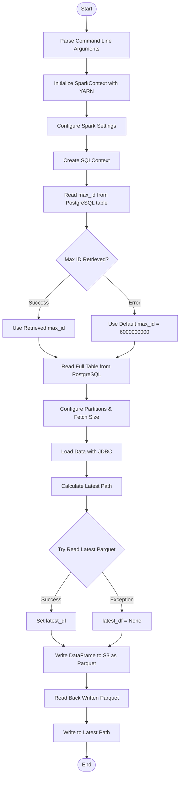
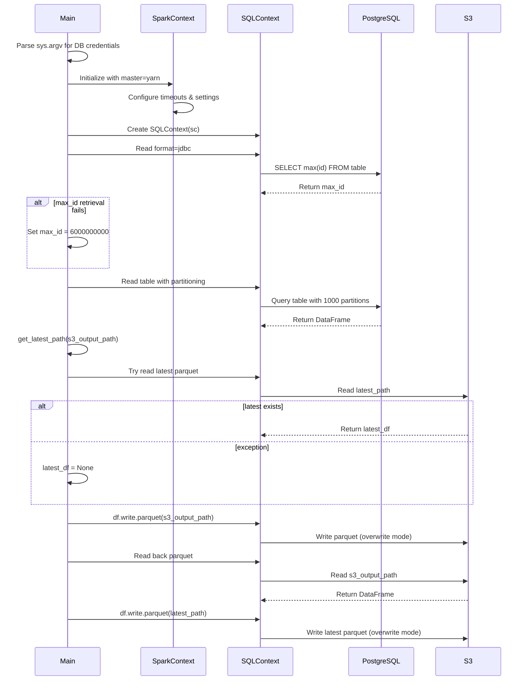
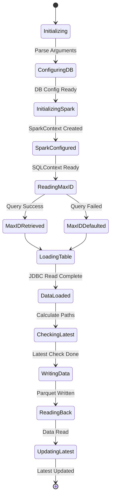

# Diagram: research/orchestrator/tasks/etl/extract_public_shipmentstops_spark.py


> Auto-generated by Obscura crawlers

## Diagram 1

```mermaid
flowchart TD
      Start([Start]) --> ParseArgs[Parse Command Line Arguments]
      ParseArgs --> InitSpark[Initialize SparkContext with YARN]
      InitSpark --> ConfigSpark[Configure Spark Settings]...
  └ 74 lines...

● stop_bash
  └ <command with id: 0 stopped>
```

> SVG rendering failed for this diagram.

## Diagram 2



### SVG

<svg id="container" width="543.140625" xmlns="http://www.w3.org/2000/svg" class="flowchart" height="2324.1875" viewBox="0 0 543.140625 2324.1875" role="graphics-document document" aria-roledescription="flowchart-v2"><style>#container{font-family:"trebuchet ms",verdana,arial,sans-serif;font-size:16px;fill:#333;}@keyframes edge-animation-frame{from{stroke-dashoffset:0;}}@keyframes dash{to{stroke-dashoffset:0;}}#container .edge-animation-slow{stroke-dasharray:9,5!important;stroke-dashoffset:900;animation:dash 50s linear infinite;stroke-linecap:round;}#container .edge-animation-fast{stroke-dasharray:9,5!important;stroke-dashoffset:900;animation:dash 20s linear infinite;stroke-linecap:round;}#container .error-icon{fill:#552222;}#container .error-text{fill:#552222;stroke:#552222;}#container .edge-thickness-normal{stroke-width:1px;}#container .edge-thickness-thick{stroke-width:3.5px;}#container .edge-pattern-solid{stroke-dasharray:0;}#container .edge-thickness-invisible{stroke-width:0;fill:none;}#container .edge-pattern-dashed{stroke-dasharray:3;}#container .edge-pattern-dotted{stroke-dasharray:2;}#container .marker{fill:#333333;stroke:#333333;}#container .marker.cross{stroke:#333333;}#container svg{font-family:"trebuchet ms",verdana,arial,sans-serif;font-size:16px;}#container p{margin:0;}#container .label{font-family:"trebuchet ms",verdana,arial,sans-serif;color:#333;}#container .cluster-label text{fill:#333;}#container .cluster-label span{color:#333;}#container .cluster-label span p{background-color:transparent;}#container .label text,#container span{fill:#333;color:#333;}#container .node rect,#container .node circle,#container .node ellipse,#container .node polygon,#container .node path{fill:#ECECFF;stroke:#9370DB;stroke-width:1px;}#container .rough-node .label text,#container .node .label text,#container .image-shape .label,#container .icon-shape .label{text-anchor:middle;}#container .node .katex path{fill:#000;stroke:#000;stroke-width:1px;}#container .rough-node .label,#container .node .label,#container .image-shape .label,#container .icon-shape .label{text-align:center;}#container .node.clickable{cursor:pointer;}#container .root .anchor path{fill:#333333!important;stroke-width:0;stroke:#333333;}#container .arrowheadPath{fill:#333333;}#container .edgePath .path{stroke:#333333;stroke-width:2.0px;}#container .flowchart-link{stroke:#333333;fill:none;}#container .edgeLabel{background-color:rgba(232,232,232, 0.8);text-align:center;}#container .edgeLabel p{background-color:rgba(232,232,232, 0.8);}#container .edgeLabel rect{opacity:0.5;background-color:rgba(232,232,232, 0.8);fill:rgba(232,232,232, 0.8);}#container .labelBkg{background-color:rgba(232, 232, 232, 0.5);}#container .cluster rect{fill:#ffffde;stroke:#aaaa33;stroke-width:1px;}#container .cluster text{fill:#333;}#container .cluster span{color:#333;}#container div.mermaidTooltip{position:absolute;text-align:center;max-width:200px;padding:2px;font-family:"trebuchet ms",verdana,arial,sans-serif;font-size:12px;background:hsl(80, 100%, 96.2745098039%);border:1px solid #aaaa33;border-radius:2px;pointer-events:none;z-index:100;}#container .flowchartTitleText{text-anchor:middle;font-size:18px;fill:#333;}#container rect.text{fill:none;stroke-width:0;}#container .icon-shape,#container .image-shape{background-color:rgba(232,232,232, 0.8);text-align:center;}#container .icon-shape p,#container .image-shape p{background-color:rgba(232,232,232, 0.8);padding:2px;}#container .icon-shape rect,#container .image-shape rect{opacity:0.5;background-color:rgba(232,232,232, 0.8);fill:rgba(232,232,232, 0.8);}#container .label-icon{display:inline-block;height:1em;overflow:visible;vertical-align:-0.125em;}#container .node .label-icon path{fill:currentColor;stroke:revert;stroke-width:revert;}#container :root{--mermaid-font-family:"trebuchet ms",verdana,arial,sans-serif;}</style><g><marker id="container_flowchart-v2-pointEnd" class="marker flowchart-v2" viewBox="0 0 10 10" refX="5" refY="5" markerUnits="userSpaceOnUse" markerWidth="8" markerHeight="8" orient="auto"><path d="M 0 0 L 10 5 L 0 10 z" class="arrowMarkerPath" style="stroke-width: 1; stroke-dasharray: 1, 0;"></path></marker><marker id="container_flowchart-v2-pointStart" class="marker flowchart-v2" viewBox="0 0 10 10" refX="4.5" refY="5" markerUnits="userSpaceOnUse" markerWidth="8" markerHeight="8" orient="auto"><path d="M 0 5 L 10 10 L 10 0 z" class="arrowMarkerPath" style="stroke-width: 1; stroke-dasharray: 1, 0;"></path></marker><marker id="container_flowchart-v2-circleEnd" class="marker flowchart-v2" viewBox="0 0 10 10" refX="11" refY="5" markerUnits="userSpaceOnUse" markerWidth="11" markerHeight="11" orient="auto"><circle cx="5" cy="5" r="5" class="arrowMarkerPath" style="stroke-width: 1; stroke-dasharray: 1, 0;"></circle></marker><marker id="container_flowchart-v2-circleStart" class="marker flowchart-v2" viewBox="0 0 10 10" refX="-1" refY="5" markerUnits="userSpaceOnUse" markerWidth="11" markerHeight="11" orient="auto"><circle cx="5" cy="5" r="5" class="arrowMarkerPath" style="stroke-width: 1; stroke-dasharray: 1, 0;"></circle></marker><marker id="container_flowchart-v2-crossEnd" class="marker cross flowchart-v2" viewBox="0 0 11 11" refX="12" refY="5.2" markerUnits="userSpaceOnUse" markerWidth="11" markerHeight="11" orient="auto"><path d="M 1,1 l 9,9 M 10,1 l -9,9" class="arrowMarkerPath" style="stroke-width: 2; stroke-dasharray: 1, 0;"></path></marker><marker id="container_flowchart-v2-crossStart" class="marker cross flowchart-v2" viewBox="0 0 11 11" refX="-1" refY="5.2" markerUnits="userSpaceOnUse" markerWidth="11" markerHeight="11" orient="auto"><path d="M 1,1 l 9,9 M 10,1 l -9,9" class="arrowMarkerPath" style="stroke-width: 2; stroke-dasharray: 1, 0;"></path></marker><g class="root"><g class="clusters"></g><g class="edgePaths"><path d="M261.355,47.5L261.272,51.583C261.189,55.667,261.022,63.833,260.939,71.417C260.855,79,260.855,86,260.855,89.5L260.855,93" id="L_Start_ParseArgs_0" class="edge-thickness-normal edge-pattern-solid edge-thickness-normal edge-pattern-solid flowchart-link" style=";" data-edge="true" data-et="edge" data-id="L_Start_ParseArgs_0" data-points="W3sieCI6MjYxLjM1NTQ2ODc1LCJ5Ijo0Ny41fSx7IngiOjI2MC44NTU0Njg3NSwieSI6NzJ9LHsieCI6MjYwLjg1NTQ2ODc1LCJ5Ijo5N31d" marker-end="url(#container_flowchart-v2-pointEnd)"></path><path d="M260.855,175L260.855,179.167C260.855,183.333,260.855,191.667,260.855,199.333C260.855,207,260.855,214,260.855,217.5L260.855,221" id="L_ParseArgs_InitSpark_0" class="edge-thickness-normal edge-pattern-solid edge-thickness-normal edge-pattern-solid flowchart-link" style=";" data-edge="true" data-et="edge" data-id="L_ParseArgs_InitSpark_0" data-points="W3sieCI6MjYwLjg1NTQ2ODc1LCJ5IjoxNzV9LHsieCI6MjYwLjg1NTQ2ODc1LCJ5IjoyMDB9LHsieCI6MjYwLjg1NTQ2ODc1LCJ5IjoyMjV9XQ==" marker-end="url(#container_flowchart-v2-pointEnd)"></path><path d="M260.855,303L260.855,307.167C260.855,311.333,260.855,319.667,260.855,327.333C260.855,335,260.855,342,260.855,345.5L260.855,349" id="L_InitSpark_ConfigSpark_0" class="edge-thickness-normal edge-pattern-solid edge-thickness-normal edge-pattern-solid flowchart-link" style=";" data-edge="true" data-et="edge" data-id="L_InitSpark_ConfigSpark_0" data-points="W3sieCI6MjYwLjg1NTQ2ODc1LCJ5IjozMDN9LHsieCI6MjYwLjg1NTQ2ODc1LCJ5IjozMjh9LHsieCI6MjYwLjg1NTQ2ODc1LCJ5IjozNTN9XQ==" marker-end="url(#container_flowchart-v2-pointEnd)"></path><path d="M260.855,407L260.855,411.167C260.855,415.333,260.855,423.667,260.855,431.333C260.855,439,260.855,446,260.855,449.5L260.855,453" id="L_ConfigSpark_CreateSQL_0" class="edge-thickness-normal edge-pattern-solid edge-thickness-normal edge-pattern-solid flowchart-link" style=";" data-edge="true" data-et="edge" data-id="L_ConfigSpark_CreateSQL_0" data-points="W3sieCI6MjYwLjg1NTQ2ODc1LCJ5Ijo0MDd9LHsieCI6MjYwLjg1NTQ2ODc1LCJ5Ijo0MzJ9LHsieCI6MjYwLjg1NTQ2ODc1LCJ5Ijo0NTd9XQ==" marker-end="url(#container_flowchart-v2-pointEnd)"></path><path d="M260.855,511L260.855,515.167C260.855,519.333,260.855,527.667,260.855,535.333C260.855,543,260.855,550,260.855,553.5L260.855,557" id="L_CreateSQL_ReadMaxID_0" class="edge-thickness-normal edge-pattern-solid edge-thickness-normal edge-pattern-solid flowchart-link" style=";" data-edge="true" data-et="edge" data-id="L_CreateSQL_ReadMaxID_0" data-points="W3sieCI6MjYwLjg1NTQ2ODc1LCJ5Ijo1MTF9LHsieCI6MjYwLjg1NTQ2ODc1LCJ5Ijo1MzZ9LHsieCI6MjYwLjg1NTQ2ODc1LCJ5Ijo1NjF9XQ==" marker-end="url(#container_flowchart-v2-pointEnd)"></path><path d="M260.855,639L260.855,643.167C260.855,647.333,260.855,655.667,260.855,663.333C260.855,671,260.855,678,260.855,681.5L260.855,685" id="L_ReadMaxID_CheckMaxID_0" class="edge-thickness-normal edge-pattern-solid edge-thickness-normal edge-pattern-solid flowchart-link" style=";" data-edge="true" data-et="edge" data-id="L_ReadMaxID_CheckMaxID_0" data-points="W3sieCI6MjYwLjg1NTQ2ODc1LCJ5Ijo2Mzl9LHsieCI6MjYwLjg1NTQ2ODc1LCJ5Ijo2NjR9LHsieCI6MjYwLjg1NTQ2ODc1LCJ5Ijo2ODl9XQ==" marker-end="url(#container_flowchart-v2-pointEnd)"></path><path d="M212.433,823.719L196.456,837.956C180.479,852.193,148.525,880.667,132.547,902.404C116.57,924.141,116.57,939.141,116.57,946.641L116.57,954.141" id="L_CheckMaxID_UseMaxID_0" class="edge-thickness-normal edge-pattern-solid edge-thickness-normal edge-pattern-solid flowchart-link" style=";" data-edge="true" data-et="edge" data-id="L_CheckMaxID_UseMaxID_0" data-points="W3sieCI6MjEyLjQzMzM2MTIyMzgwMTM3LCJ5Ijo4MjMuNzE4NTE3NDczODAxNH0seyJ4IjoxMTYuNTcwMzEyNSwieSI6OTA5LjE0MDYyNX0seyJ4IjoxMTYuNTcwMzEyNSwieSI6OTU4LjE0MDYyNX1d" marker-end="url(#container_flowchart-v2-pointEnd)"></path><path d="M309.278,823.719L325.255,837.956C341.232,852.193,373.186,880.667,389.163,900.404C405.141,920.141,405.141,931.141,405.141,936.641L405.141,942.141" id="L_CheckMaxID_DefaultID_0" class="edge-thickness-normal edge-pattern-solid edge-thickness-normal edge-pattern-solid flowchart-link" style=";" data-edge="true" data-et="edge" data-id="L_CheckMaxID_DefaultID_0" data-points="W3sieCI6MzA5LjI3NzU3NjI3NjE5ODYsInkiOjgyMy43MTg1MTc0NzM4MDE0fSx7IngiOjQwNS4xNDA2MjUsInkiOjkwOS4xNDA2MjV9LHsieCI6NDA1LjE0MDYyNSwieSI6OTQ2LjE0MDYyNX1d" marker-end="url(#container_flowchart-v2-pointEnd)"></path><path d="M116.57,1012.141L116.57,1018.307C116.57,1024.474,116.57,1036.807,125.354,1046.87C134.139,1056.933,151.707,1064.726,160.491,1068.622L169.275,1072.519" id="L_UseMaxID_ReadTable_0" class="edge-thickness-normal edge-pattern-solid edge-thickness-normal edge-pattern-solid flowchart-link" style=";" data-edge="true" data-et="edge" data-id="L_UseMaxID_ReadTable_0" data-points="W3sieCI6MTE2LjU3MDMxMjUsInkiOjEwMTIuMTQwNjI1fSx7IngiOjExNi41NzAzMTI1LCJ5IjoxMDQ5LjE0MDYyNX0seyJ4IjoxNzIuOTMxNzAxNjYwMTU2MjUsInkiOjEwNzQuMTQwNjI1fV0=" marker-end="url(#container_flowchart-v2-pointEnd)"></path><path d="M405.141,1024.141L405.141,1028.307C405.141,1032.474,405.141,1040.807,396.356,1048.87C387.572,1056.933,370.004,1064.726,361.22,1068.622L352.436,1072.519" id="L_DefaultID_ReadTable_0" class="edge-thickness-normal edge-pattern-solid edge-thickness-normal edge-pattern-solid flowchart-link" style=";" data-edge="true" data-et="edge" data-id="L_DefaultID_ReadTable_0" data-points="W3sieCI6NDA1LjE0MDYyNSwieSI6MTAyNC4xNDA2MjV9LHsieCI6NDA1LjE0MDYyNSwieSI6MTA0OS4xNDA2MjV9LHsieCI6MzQ4Ljc3OTIzNTgzOTg0Mzc1LCJ5IjoxMDc0LjE0MDYyNX1d" marker-end="url(#container_flowchart-v2-pointEnd)"></path><path d="M260.855,1152.141L260.855,1156.307C260.855,1160.474,260.855,1168.807,260.855,1176.474C260.855,1184.141,260.855,1191.141,260.855,1194.641L260.855,1198.141" id="L_ReadTable_ConfigPartitions_0" class="edge-thickness-normal edge-pattern-solid edge-thickness-normal edge-pattern-solid flowchart-link" style=";" data-edge="true" data-et="edge" data-id="L_ReadTable_ConfigPartitions_0" data-points="W3sieCI6MjYwLjg1NTQ2ODc1LCJ5IjoxMTUyLjE0MDYyNX0seyJ4IjoyNjAuODU1NDY4NzUsInkiOjExNzcuMTQwNjI1fSx7IngiOjI2MC44NTU0Njg3NSwieSI6MTIwMi4xNDA2MjV9XQ==" marker-end="url(#container_flowchart-v2-pointEnd)"></path><path d="M260.855,1280.141L260.855,1284.307C260.855,1288.474,260.855,1296.807,260.855,1304.474C260.855,1312.141,260.855,1319.141,260.855,1322.641L260.855,1326.141" id="L_ConfigPartitions_LoadData_0" class="edge-thickness-normal edge-pattern-solid edge-thickness-normal edge-pattern-solid flowchart-link" style=";" data-edge="true" data-et="edge" data-id="L_ConfigPartitions_LoadData_0" data-points="W3sieCI6MjYwLjg1NTQ2ODc1LCJ5IjoxMjgwLjE0MDYyNX0seyJ4IjoyNjAuODU1NDY4NzUsInkiOjEzMDUuMTQwNjI1fSx7IngiOjI2MC44NTU0Njg3NSwieSI6MTMzMC4xNDA2MjV9XQ==" marker-end="url(#container_flowchart-v2-pointEnd)"></path><path d="M260.855,1384.141L260.855,1388.307C260.855,1392.474,260.855,1400.807,260.855,1408.474C260.855,1416.141,260.855,1423.141,260.855,1426.641L260.855,1430.141" id="L_LoadData_GetLatestPath_0" class="edge-thickness-normal edge-pattern-solid edge-thickness-normal edge-pattern-solid flowchart-link" style=";" data-edge="true" data-et="edge" data-id="L_LoadData_GetLatestPath_0" data-points="W3sieCI6MjYwLjg1NTQ2ODc1LCJ5IjoxMzg0LjE0MDYyNX0seyJ4IjoyNjAuODU1NDY4NzUsInkiOjE0MDkuMTQwNjI1fSx7IngiOjI2MC44NTU0Njg3NSwieSI6MTQzNC4xNDA2MjV9XQ==" marker-end="url(#container_flowchart-v2-pointEnd)"></path><path d="M260.855,1488.141L260.855,1492.307C260.855,1496.474,260.855,1504.807,260.855,1512.474C260.855,1520.141,260.855,1527.141,260.855,1530.641L260.855,1534.141" id="L_GetLatestPath_TryReadLatest_0" class="edge-thickness-normal edge-pattern-solid edge-thickness-normal edge-pattern-solid flowchart-link" style=";" data-edge="true" data-et="edge" data-id="L_GetLatestPath_TryReadLatest_0" data-points="W3sieCI6MjYwLjg1NTQ2ODc1LCJ5IjoxNDg4LjE0MDYyNX0seyJ4IjoyNjAuODU1NDY4NzUsInkiOjE1MTMuMTQwNjI1fSx7IngiOjI2MC44NTU0Njg3NSwieSI6MTUzOC4xNDA2MjV9XQ==" marker-end="url(#container_flowchart-v2-pointEnd)"></path><path d="M213.805,1716.138L203.739,1730.146C193.672,1744.154,173.539,1772.171,163.473,1791.679C153.406,1811.188,153.406,1822.188,153.406,1827.688L153.406,1833.188" id="L_TryReadLatest_SetLatestDF_0" class="edge-thickness-normal edge-pattern-solid edge-thickness-normal edge-pattern-solid flowchart-link" style=";" data-edge="true" data-et="edge" data-id="L_TryReadLatest_SetLatestDF_0" data-points="W3sieCI6MjEzLjgwNTQ5OTk4MzM3Mzg2LCJ5IjoxNzE2LjEzNzUzMTIzMzM3NH0seyJ4IjoxNTMuNDA2MjUsInkiOjE4MDAuMTg3NX0seyJ4IjoxNTMuNDA2MjUsInkiOjE4MzcuMTg3NX1d" marker-end="url(#container_flowchart-v2-pointEnd)"></path><path d="M307.905,1716.138L317.972,1730.146C328.039,1744.154,348.172,1772.171,358.238,1791.679C368.305,1811.188,368.305,1822.188,368.305,1827.688L368.305,1833.188" id="L_TryReadLatest_NullLatest_0" class="edge-thickness-normal edge-pattern-solid edge-thickness-normal edge-pattern-solid flowchart-link" style=";" data-edge="true" data-et="edge" data-id="L_TryReadLatest_NullLatest_0" data-points="W3sieCI6MzA3LjkwNTQzNzUxNjYyNjE0LCJ5IjoxNzE2LjEzNzUzMTIzMzM3NH0seyJ4IjozNjguMzA0Njg3NSwieSI6MTgwMC4xODc1fSx7IngiOjM2OC4zMDQ2ODc1LCJ5IjoxODM3LjE4NzV9XQ==" marker-end="url(#container_flowchart-v2-pointEnd)"></path><path d="M153.406,1891.188L153.406,1895.354C153.406,1899.521,153.406,1907.854,159.829,1915.846C166.252,1923.839,179.097,1931.49,185.519,1935.315L191.942,1939.141" id="L_SetLatestDF_WriteParquet_0" class="edge-thickness-normal edge-pattern-solid edge-thickness-normal edge-pattern-solid flowchart-link" style=";" data-edge="true" data-et="edge" data-id="L_SetLatestDF_WriteParquet_0" data-points="W3sieCI6MTUzLjQwNjI1LCJ5IjoxODkxLjE4NzV9LHsieCI6MTUzLjQwNjI1LCJ5IjoxOTE2LjE4NzV9LHsieCI6MTk1LjM3ODYwMTA3NDIxODc1LCJ5IjoxOTQxLjE4NzV9XQ==" marker-end="url(#container_flowchart-v2-pointEnd)"></path><path d="M368.305,1891.188L368.305,1895.354C368.305,1899.521,368.305,1907.854,361.882,1915.846C355.459,1923.839,342.614,1931.49,336.192,1935.315L329.769,1939.141" id="L_NullLatest_WriteParquet_0" class="edge-thickness-normal edge-pattern-solid edge-thickness-normal edge-pattern-solid flowchart-link" style=";" data-edge="true" data-et="edge" data-id="L_NullLatest_WriteParquet_0" data-points="W3sieCI6MzY4LjMwNDY4NzUsInkiOjE4OTEuMTg3NX0seyJ4IjozNjguMzA0Njg3NSwieSI6MTkxNi4xODc1fSx7IngiOjMyNi4zMzIzMzY0MjU3ODEyNSwieSI6MTk0MS4xODc1fV0=" marker-end="url(#container_flowchart-v2-pointEnd)"></path><path d="M260.855,2019.188L260.855,2023.354C260.855,2027.521,260.855,2035.854,260.855,2043.521C260.855,2051.188,260.855,2058.188,260.855,2061.688L260.855,2065.188" id="L_WriteParquet_ReadBack_0" class="edge-thickness-normal edge-pattern-solid edge-thickness-normal edge-pattern-solid flowchart-link" style=";" data-edge="true" data-et="edge" data-id="L_WriteParquet_ReadBack_0" data-points="W3sieCI6MjYwLjg1NTQ2ODc1LCJ5IjoyMDE5LjE4NzV9LHsieCI6MjYwLjg1NTQ2ODc1LCJ5IjoyMDQ0LjE4NzV9LHsieCI6MjYwLjg1NTQ2ODc1LCJ5IjoyMDY5LjE4NzV9XQ==" marker-end="url(#container_flowchart-v2-pointEnd)"></path><path d="M260.855,2123.188L260.855,2127.354C260.855,2131.521,260.855,2139.854,260.855,2147.521C260.855,2155.188,260.855,2162.188,260.855,2165.688L260.855,2169.188" id="L_ReadBack_WriteLatest_0" class="edge-thickness-normal edge-pattern-solid edge-thickness-normal edge-pattern-solid flowchart-link" style=";" data-edge="true" data-et="edge" data-id="L_ReadBack_WriteLatest_0" data-points="W3sieCI6MjYwLjg1NTQ2ODc1LCJ5IjoyMTIzLjE4NzV9LHsieCI6MjYwLjg1NTQ2ODc1LCJ5IjoyMTQ4LjE4NzV9LHsieCI6MjYwLjg1NTQ2ODc1LCJ5IjoyMTczLjE4NzV9XQ==" marker-end="url(#container_flowchart-v2-pointEnd)"></path><path d="M260.855,2227.188L260.855,2231.354C260.855,2235.521,260.855,2243.854,260.926,2251.604C260.996,2259.354,261.137,2266.521,261.207,2270.105L261.277,2273.688" id="L_WriteLatest_End_0" class="edge-thickness-normal edge-pattern-solid edge-thickness-normal edge-pattern-solid flowchart-link" style=";" data-edge="true" data-et="edge" data-id="L_WriteLatest_End_0" data-points="W3sieCI6MjYwLjg1NTQ2ODc1LCJ5IjoyMjI3LjE4NzV9LHsieCI6MjYwLjg1NTQ2ODc1LCJ5IjoyMjUyLjE4NzV9LHsieCI6MjYxLjM1NTQ2ODc1LCJ5IjoyMjc3LjY4NzV9XQ==" marker-end="url(#container_flowchart-v2-pointEnd)"></path></g><g class="edgeLabels"><g class="edgeLabel"><g class="label" data-id="L_Start_ParseArgs_0" transform="translate(0, 0)"><foreignObject width="0" height="0"><div xmlns="http://www.w3.org/1999/xhtml" class="labelBkg" style="display: table-cell; white-space: nowrap; line-height: 1.5; max-width: 200px; text-align: center;"><span class="edgeLabel"></span></div></foreignObject></g></g><g class="edgeLabel"><g class="label" data-id="L_ParseArgs_InitSpark_0" transform="translate(0, 0)"><foreignObject width="0" height="0"><div xmlns="http://www.w3.org/1999/xhtml" class="labelBkg" style="display: table-cell; white-space: nowrap; line-height: 1.5; max-width: 200px; text-align: center;"><span class="edgeLabel"></span></div></foreignObject></g></g><g class="edgeLabel"><g class="label" data-id="L_InitSpark_ConfigSpark_0" transform="translate(0, 0)"><foreignObject width="0" height="0"><div xmlns="http://www.w3.org/1999/xhtml" class="labelBkg" style="display: table-cell; white-space: nowrap; line-height: 1.5; max-width: 200px; text-align: center;"><span class="edgeLabel"></span></div></foreignObject></g></g><g class="edgeLabel"><g class="label" data-id="L_ConfigSpark_CreateSQL_0" transform="translate(0, 0)"><foreignObject width="0" height="0"><div xmlns="http://www.w3.org/1999/xhtml" class="labelBkg" style="display: table-cell; white-space: nowrap; line-height: 1.5; max-width: 200px; text-align: center;"><span class="edgeLabel"></span></div></foreignObject></g></g><g class="edgeLabel"><g class="label" data-id="L_CreateSQL_ReadMaxID_0" transform="translate(0, 0)"><foreignObject width="0" height="0"><div xmlns="http://www.w3.org/1999/xhtml" class="labelBkg" style="display: table-cell; white-space: nowrap; line-height: 1.5; max-width: 200px; text-align: center;"><span class="edgeLabel"></span></div></foreignObject></g></g><g class="edgeLabel"><g class="label" data-id="L_ReadMaxID_CheckMaxID_0" transform="translate(0, 0)"><foreignObject width="0" height="0"><div xmlns="http://www.w3.org/1999/xhtml" class="labelBkg" style="display: table-cell; white-space: nowrap; line-height: 1.5; max-width: 200px; text-align: center;"><span class="edgeLabel"></span></div></foreignObject></g></g><g class="edgeLabel" transform="translate(116.5703125, 909.140625)"><g class="label" data-id="L_CheckMaxID_UseMaxID_0" transform="translate(-28.1015625, -12)"><foreignObject width="56.203125" height="24"><div xmlns="http://www.w3.org/1999/xhtml" class="labelBkg" style="display: table-cell; white-space: nowrap; line-height: 1.5; max-width: 200px; text-align: center;"><span class="edgeLabel"><p>Success</p></span></div></foreignObject></g></g><g class="edgeLabel" transform="translate(405.140625, 909.140625)"><g class="label" data-id="L_CheckMaxID_DefaultID_0" transform="translate(-17.8984375, -12)"><foreignObject width="35.796875" height="24"><div xmlns="http://www.w3.org/1999/xhtml" class="labelBkg" style="display: table-cell; white-space: nowrap; line-height: 1.5; max-width: 200px; text-align: center;"><span class="edgeLabel"><p>Error</p></span></div></foreignObject></g></g><g class="edgeLabel"><g class="label" data-id="L_UseMaxID_ReadTable_0" transform="translate(0, 0)"><foreignObject width="0" height="0"><div xmlns="http://www.w3.org/1999/xhtml" class="labelBkg" style="display: table-cell; white-space: nowrap; line-height: 1.5; max-width: 200px; text-align: center;"><span class="edgeLabel"></span></div></foreignObject></g></g><g class="edgeLabel"><g class="label" data-id="L_DefaultID_ReadTable_0" transform="translate(0, 0)"><foreignObject width="0" height="0"><div xmlns="http://www.w3.org/1999/xhtml" class="labelBkg" style="display: table-cell; white-space: nowrap; line-height: 1.5; max-width: 200px; text-align: center;"><span class="edgeLabel"></span></div></foreignObject></g></g><g class="edgeLabel"><g class="label" data-id="L_ReadTable_ConfigPartitions_0" transform="translate(0, 0)"><foreignObject width="0" height="0"><div xmlns="http://www.w3.org/1999/xhtml" class="labelBkg" style="display: table-cell; white-space: nowrap; line-height: 1.5; max-width: 200px; text-align: center;"><span class="edgeLabel"></span></div></foreignObject></g></g><g class="edgeLabel"><g class="label" data-id="L_ConfigPartitions_LoadData_0" transform="translate(0, 0)"><foreignObject width="0" height="0"><div xmlns="http://www.w3.org/1999/xhtml" class="labelBkg" style="display: table-cell; white-space: nowrap; line-height: 1.5; max-width: 200px; text-align: center;"><span class="edgeLabel"></span></div></foreignObject></g></g><g class="edgeLabel"><g class="label" data-id="L_LoadData_GetLatestPath_0" transform="translate(0, 0)"><foreignObject width="0" height="0"><div xmlns="http://www.w3.org/1999/xhtml" class="labelBkg" style="display: table-cell; white-space: nowrap; line-height: 1.5; max-width: 200px; text-align: center;"><span class="edgeLabel"></span></div></foreignObject></g></g><g class="edgeLabel"><g class="label" data-id="L_GetLatestPath_TryReadLatest_0" transform="translate(0, 0)"><foreignObject width="0" height="0"><div xmlns="http://www.w3.org/1999/xhtml" class="labelBkg" style="display: table-cell; white-space: nowrap; line-height: 1.5; max-width: 200px; text-align: center;"><span class="edgeLabel"></span></div></foreignObject></g></g><g class="edgeLabel" transform="translate(153.40625, 1800.1875)"><g class="label" data-id="L_TryReadLatest_SetLatestDF_0" transform="translate(-28.1015625, -12)"><foreignObject width="56.203125" height="24"><div xmlns="http://www.w3.org/1999/xhtml" class="labelBkg" style="display: table-cell; white-space: nowrap; line-height: 1.5; max-width: 200px; text-align: center;"><span class="edgeLabel"><p>Success</p></span></div></foreignObject></g></g><g class="edgeLabel" transform="translate(368.3046875, 1800.1875)"><g class="label" data-id="L_TryReadLatest_NullLatest_0" transform="translate(-35.375, -12)"><foreignObject width="70.75" height="24"><div xmlns="http://www.w3.org/1999/xhtml" class="labelBkg" style="display: table-cell; white-space: nowrap; line-height: 1.5; max-width: 200px; text-align: center;"><span class="edgeLabel"><p>Exception</p></span></div></foreignObject></g></g><g class="edgeLabel"><g class="label" data-id="L_SetLatestDF_WriteParquet_0" transform="translate(0, 0)"><foreignObject width="0" height="0"><div xmlns="http://www.w3.org/1999/xhtml" class="labelBkg" style="display: table-cell; white-space: nowrap; line-height: 1.5; max-width: 200px; text-align: center;"><span class="edgeLabel"></span></div></foreignObject></g></g><g class="edgeLabel"><g class="label" data-id="L_NullLatest_WriteParquet_0" transform="translate(0, 0)"><foreignObject width="0" height="0"><div xmlns="http://www.w3.org/1999/xhtml" class="labelBkg" style="display: table-cell; white-space: nowrap; line-height: 1.5; max-width: 200px; text-align: center;"><span class="edgeLabel"></span></div></foreignObject></g></g><g class="edgeLabel"><g class="label" data-id="L_WriteParquet_ReadBack_0" transform="translate(0, 0)"><foreignObject width="0" height="0"><div xmlns="http://www.w3.org/1999/xhtml" class="labelBkg" style="display: table-cell; white-space: nowrap; line-height: 1.5; max-width: 200px; text-align: center;"><span class="edgeLabel"></span></div></foreignObject></g></g><g class="edgeLabel"><g class="label" data-id="L_ReadBack_WriteLatest_0" transform="translate(0, 0)"><foreignObject width="0" height="0"><div xmlns="http://www.w3.org/1999/xhtml" class="labelBkg" style="display: table-cell; white-space: nowrap; line-height: 1.5; max-width: 200px; text-align: center;"><span class="edgeLabel"></span></div></foreignObject></g></g><g class="edgeLabel"><g class="label" data-id="L_WriteLatest_End_0" transform="translate(0, 0)"><foreignObject width="0" height="0"><div xmlns="http://www.w3.org/1999/xhtml" class="labelBkg" style="display: table-cell; white-space: nowrap; line-height: 1.5; max-width: 200px; text-align: center;"><span class="edgeLabel"></span></div></foreignObject></g></g></g><g class="nodes"><g class="node default" id="flowchart-Start-0" transform="translate(260.85546875, 27.5)"><g class="basic label-container outer-path"><path d="M-10.3984375 -19.5 C-4.6000843902184805 -19.5, 1.198268719563039 -19.5, 10.3984375 -19.5 C10.3984375 -19.5, 10.398437499999998 -19.5, 10.398437499999998 -19.5 C10.76748790084997 -19.48816527195777, 11.13653830169994 -19.476330543915537, 11.6478067896239 -19.45993515863156 C12.12913775030467 -19.413501739739857, 12.610468710985442 -19.36706832084816, 12.892042152847864 -19.3399052695533 C13.298820518874876 -19.274140497947396, 13.705598884901889 -19.20837572634149, 14.126030759676757 -19.140403561325776 C14.426486158638529 -19.071826577167464, 14.7269415576003 -19.003249593009148, 15.34470188623539 -18.862249829261074 C15.80997057113968 -18.724160525826647, 16.275239256043967 -18.586071222392217, 16.543047751460602 -18.50658706670804 C16.96115188774449 -18.3527208796433, 17.37925602402838 -18.19885469257856, 17.716144095147794 -18.074876768247425 C18.16137247207962 -17.877787373010253, 18.606600849011443 -17.680697977773082, 18.85917041279238 -17.568892924097174 C19.150597811339573 -17.416855436943262, 19.442025209886765 -17.26481794978935, 19.967429764076783 -16.990714730406097 C20.228549605047437 -16.832422348299172, 20.489669446018095 -16.674129966192247, 21.036368073605697 -16.342718045390892 C21.402826783674 -16.087092312989125, 21.769285493742302 -15.831466580587358, 22.061592844578712 -15.627565626425154 C22.309489813776267 -15.429874390305502, 22.557386782973825 -15.232183154185849, 23.03889120850187 -14.848196188198123 C23.314735103636377 -14.59768206106649, 23.59057899877088 -14.347167933934855, 23.964247236767985 -14.007812326905688 C24.22807288781608 -13.735390681709749, 24.491898538864174 -13.462969036513812, 24.833858442968648 -13.10986736009568 C25.154214673238904 -12.733558703234337, 25.474570903509164 -12.357250046372993, 25.644151408126582 -12.158051136245305 C25.936046934812733 -11.766937722715397, 26.227942461498884 -11.37582430918549, 26.391796464640635 -11.156274872382312 C26.64144852445205 -10.772742267547299, 26.891100584263466 -10.389209662712286, 27.073721378604247 -10.108655082055241 C27.23153408726277 -9.828442637562443, 27.38934679592129 -9.548230193069644, 27.6871239742735 -9.019496659696287 C27.866497796830863 -8.647023079170953, 28.045871619388226 -8.274549498645618, 28.22948364880834 -7.893275190886684 C28.360390944769854 -7.569931638941361, 28.491298240731364 -7.246588086996037, 28.698571729970325 -6.734618561215508 C28.81213877830443 -6.3925727060850575, 28.925705826638538 -6.050526850954607, 29.09246063421488 -5.548287939305138 C29.199565936665522 -5.1398490013291305, 29.30667123911616 -4.731410063353124, 29.40953178754556 -4.339158212148133 C29.47491580679733 -4.003425092207654, 29.5402998260491 -3.6676919722671757, 29.648482276581777 -3.1121979531509023 C29.687266130483742 -2.8113980410254777, 29.726049984385707 -2.510598128900053, 29.808330202509367 -1.872449005199798 C29.839585081945728 -1.385629029493866, 29.87083996138209 -0.8988090537879341, 29.888418715913414 -0.6250057626472757 C29.888418715913414 -0.1293164896606369, 29.888418715913414 0.36637278332600187, 29.888418715913414 0.625005762647271 C29.857885353376286 1.1005875302496948, 29.82735199083916 1.5761692978521187, 29.808330202509367 1.8724490051997846 C29.77285638694874 2.1475769135908074, 29.73738257138811 2.4227048219818306, 29.648482276581777 3.1121979531508885 C29.561293807609367 3.5598923140347765, 29.474105338636956 4.007586674918665, 29.40953178754556 4.339158212148129 C29.332562100452957 4.6326769879056355, 29.25559241336035 4.926195763663142, 29.092460634214884 5.548287939305125 C29.002003738083936 5.820729698102384, 28.911546841952983 6.093171456899642, 28.69857172997033 6.734618561215495 C28.56633019039135 7.061257720691806, 28.434088650812374 7.3878968801681175, 28.229483648808344 7.893275190886679 C28.03536300923004 8.296370852487335, 27.841242369651734 8.699466514087993, 27.687123974273504 9.019496659696284 C27.490530536385887 9.368568215910004, 27.293937098498265 9.717639772123723, 27.07372137860425 10.108655082055236 C26.88667424428312 10.396009709560806, 26.69962710996199 10.683364337066374, 26.39179646464064 11.156274872382301 C26.111349404760894 11.532048383368412, 25.830902344881146 11.907821894354521, 25.644151408126582 12.158051136245302 C25.435173249525224 12.403528772532542, 25.22619509092387 12.649006408819783, 24.83385844296866 13.10986736009567 C24.57347803218953 13.378731511854415, 24.313097621410403 13.64759566361316, 23.96424723676799 14.007812326905684 C23.654456272605458 14.289156283938343, 23.34466530844293 14.570500240971002, 23.038891208501887 14.848196188198111 C22.711780026851212 15.109058650770402, 22.384668845200537 15.369921113342693, 22.061592844578715 15.627565626425152 C21.817527262504722 15.797815211051207, 21.57346168043073 15.968064795677263, 21.036368073605708 16.34271804539089 C20.692283957301946 16.551303858756942, 20.348199840998188 16.75988967212299, 19.967429764076787 16.990714730406093 C19.707300589299265 17.126423954266837, 19.447171414521744 17.26213317812758, 18.859170412792388 17.56889292409717 C18.621692053193012 17.67401754934657, 18.384213693593637 17.779142174595968, 17.716144095147804 18.07487676824742 C17.259808443354146 18.24281250642801, 16.803472791560488 18.410748244608598, 16.543047751460616 18.506587066708033 C16.181161716564837 18.61399294228654, 15.819275681669055 18.72139881786505, 15.344701886235413 18.86224982926107 C15.0323731383398 18.93353682783269, 14.720044390444189 19.00482382640431, 14.126030759676766 19.140403561325773 C13.746826628175606 19.20171034453492, 13.367622496674445 19.263017127744067, 12.892042152847878 19.3399052695533 C12.523248385086161 19.375482360789874, 12.154454617324443 19.41105945202645, 11.6478067896239 19.45993515863156 C11.272244924036265 19.471978696674128, 10.89668305844863 19.4840222347167, 10.398437500000004 19.5 C10.398437500000002 19.5, 10.3984375 19.5, 10.3984375 19.5 C2.9655246669950213 19.5, -4.4673881660099575 19.5, -10.398437499999996 19.5 C-10.71354373864812 19.48989515624364, -11.028649977296242 19.47979031248728, -11.647806789623893 19.45993515863156 C-12.02806125468394 19.423252467710117, -12.408315719743989 19.38656977678868, -12.892042152847871 19.3399052695533 C-13.298898897928616 19.274127826229826, -13.705755643009361 19.20835038290635, -14.126030759676759 19.140403561325773 C-14.533633710286958 19.047370847706823, -14.94123666089716 18.954338134087877, -15.344701886235388 18.862249829261074 C-15.595951575074173 18.787680240450253, -15.847201263912956 18.713110651639433, -16.54304775146059 18.506587066708043 C-16.940290150663635 18.360398191732838, -17.337532549866676 18.214209316757636, -17.716144095147797 18.074876768247425 C-17.946580889250292 17.972869235162875, -18.17701768335279 17.870861702078326, -18.85917041279238 17.568892924097174 C-19.178170605214753 17.402470728039795, -19.49717079763713 17.23604853198242, -19.96742976407678 16.990714730406097 C-20.23210684598337 16.830265927939138, -20.49678392788996 16.669817125472182, -21.036368073605686 16.3427180453909 C-21.384323426160854 16.099999454192858, -21.732278778716022 15.85728086299482, -22.061592844578712 15.627565626425156 C-22.38423006319938 15.370271030312141, -22.706867281820042 15.112976434199124, -23.03889120850187 14.848196188198125 C-23.307790042398693 14.603989381926302, -23.576688876295517 14.35978257565448, -23.964247236767974 14.007812326905697 C-24.25080340945608 13.711919551905913, -24.537359582144187 13.416026776906131, -24.833858442968655 13.109867360095677 C-25.063924894607847 12.839618214848326, -25.29399134624704 12.569369069600976, -25.64415140812658 12.158051136245307 C-25.94042438579097 11.761072337198545, -26.236697363455363 11.364093538151783, -26.391796464640635 11.156274872382316 C-26.535570824209756 10.935398847262853, -26.67934518377888 10.714522822143392, -27.073721378604244 10.108655082055249 C-27.2479410156104 9.799310474899574, -27.422160652616558 9.489965867743901, -27.6871239742735 9.019496659696289 C-27.869694580672512 8.640384889123556, -28.052265187071523 8.261273118550825, -28.22948364880834 7.893275190886686 C-28.404542835579534 7.460875615022711, -28.579602022350727 7.028476039158735, -28.698571729970325 6.73461856121551 C-28.80612241364347 6.410693037866335, -28.913673097316618 6.0867675145171605, -29.09246063421488 5.5482879393051325 C-29.21094304813384 5.096463144429127, -29.329425462052797 4.644638349553123, -29.409531787545557 4.339158212148136 C-29.46196856195408 4.069906458076573, -29.514405336362604 3.8006547040050105, -29.648482276581777 3.112197953150904 C-29.71084164043688 2.6285510413399646, -29.77320100429198 2.144904129529025, -29.808330202509364 1.872449005199809 C-29.835607408766784 1.447584499975881, -29.862884615024207 1.0227199947519527, -29.888418715913414 0.6250057626472781 C-29.888418715913414 0.3052814060390392, -29.888418715913414 -0.014442950569199753, -29.888418715913414 -0.6250057626472687 C-29.872140370658954 -0.8785541296292607, -29.855862025404495 -1.1321024966112527, -29.808330202509367 -1.8724490051997822 C-29.77447284225045 -2.1350400054759353, -29.740615481991533 -2.3976310057520887, -29.648482276581777 -3.112197953150895 C-29.562403928151582 -3.554192079674574, -29.476325579721383 -3.996186206198253, -29.40953178754556 -4.339158212148126 C-29.28772553524607 -4.803658243329762, -29.165919282946582 -5.268158274511398, -29.092460634214884 -5.548287939305123 C-28.98973661515013 -5.857676317878386, -28.887012596085377 -6.167064696451649, -28.698571729970332 -6.734618561215485 C-28.538076352405515 -7.131045246767617, -28.377580974840697 -7.52747193231975, -28.229483648808344 -7.893275190886676 C-28.02611026412031 -8.31558437568472, -27.822736879432274 -8.737893560482762, -27.687123974273504 -9.019496659696282 C-27.528064062704736 -9.301923639249214, -27.369004151135965 -9.584350618802148, -27.073721378604247 -10.108655082055243 C-26.93614107682603 -10.320015371070472, -26.79856077504781 -10.531375660085699, -26.39179646464064 -11.156274872382308 C-26.119847039202845 -11.520662327366628, -25.847897613765046 -11.885049782350949, -25.644151408126586 -12.158051136245302 C-25.34066918738874 -12.514538621351534, -25.037186966650896 -12.871026106457764, -24.833858442968662 -13.10986736009567 C-24.591316037403228 -13.360312306943811, -24.348773631837794 -13.61075725379195, -23.964247236767996 -14.007812326905677 C-23.733283150936778 -14.217567798682747, -23.502319065105564 -14.42732327045982, -23.038891208501887 -14.848196188198107 C-22.650577962934346 -15.157865668088782, -22.262264717366804 -15.467535147979454, -22.06159284457872 -15.627565626425149 C-21.732810092818234 -15.856910241277333, -21.40402734105775 -16.086254856129518, -21.03636807360571 -16.342718045390885 C-20.679087375235177 -16.55930370435754, -20.321806676864643 -16.775889363324193, -19.96742976407679 -16.99071473040609 C-19.69734659365043 -17.131616947420994, -19.42726342322407 -17.2725191644359, -18.859170412792388 -17.56889292409717 C-18.603506425491183 -17.68206778727269, -18.34784243818998 -17.795242650448213, -17.716144095147804 -18.07487676824742 C-17.337078644163075 -18.21437635825242, -16.95801319317835 -18.353875948257414, -16.54304775146062 -18.506587066708033 C-16.27449586698348 -18.586291856363243, -16.005943982506334 -18.66599664601845, -15.344701886235413 -18.862249829261067 C-14.922372343079214 -18.958643791528644, -14.500042799923017 -19.05503775379622, -14.126030759676768 -19.140403561325773 C-13.636122115724348 -19.219608191581724, -13.146213471771928 -19.298812821837675, -12.89204215284788 -19.3399052695533 C-12.474253035723613 -19.38020888321735, -12.056463918599347 -19.4205124968814, -11.647806789623903 -19.45993515863156 C-11.268822083638495 -19.47208846050353, -10.889837377653087 -19.484241762375504, -10.398437500000005 -19.5 C-10.398437500000004 -19.5, -10.398437500000004 -19.5, -10.3984375 -19.5" stroke="none" stroke-width="0" fill="#ECECFF" style=""></path><path d="M-10.3984375 -19.5 C-4.356086370401566 -19.5, 1.6862647591968685 -19.5, 10.3984375 -19.5 M-10.3984375 -19.5 C-6.123787649993711 -19.5, -1.8491377999874228 -19.5, 10.3984375 -19.5 M10.3984375 -19.5 C10.3984375 -19.5, 10.398437499999998 -19.5, 10.398437499999998 -19.5 M10.3984375 -19.5 C10.3984375 -19.5, 10.398437499999998 -19.5, 10.398437499999998 -19.5 M10.398437499999998 -19.5 C10.878658208889625 -19.484600256558814, 11.358878917779252 -19.46920051311763, 11.6478067896239 -19.45993515863156 M10.398437499999998 -19.5 C10.780727188362356 -19.487740713775956, 11.163016876724711 -19.475481427551916, 11.6478067896239 -19.45993515863156 M11.6478067896239 -19.45993515863156 C12.008110869847975 -19.425177057341397, 12.368414950072053 -19.390418956051235, 12.892042152847864 -19.3399052695533 M11.6478067896239 -19.45993515863156 C12.09332314039925 -19.416956732084063, 12.538839491174597 -19.37397830553657, 12.892042152847864 -19.3399052695533 M12.892042152847864 -19.3399052695533 C13.251412520124584 -19.28180505553082, 13.610782887401301 -19.223704841508344, 14.126030759676757 -19.140403561325776 M12.892042152847864 -19.3399052695533 C13.328998168093973 -19.269261609652816, 13.765954183340083 -19.198617949752336, 14.126030759676757 -19.140403561325776 M14.126030759676757 -19.140403561325776 C14.591408443303191 -19.03418414191124, 15.056786126929623 -18.9279647224967, 15.34470188623539 -18.862249829261074 M14.126030759676757 -19.140403561325776 C14.37760251066644 -19.082983950821475, 14.629174261656125 -19.025564340317178, 15.34470188623539 -18.862249829261074 M15.34470188623539 -18.862249829261074 C15.663741365184702 -18.767560586581318, 15.982780844134014 -18.672871343901562, 16.543047751460602 -18.50658706670804 M15.34470188623539 -18.862249829261074 C15.666694509608787 -18.76668410881762, 15.988687132982184 -18.67111838837417, 16.543047751460602 -18.50658706670804 M16.543047751460602 -18.50658706670804 C16.946107807974922 -18.35825724006445, 17.34916786448924 -18.20992741342086, 17.716144095147794 -18.074876768247425 M16.543047751460602 -18.50658706670804 C16.80652989811376 -18.409623201137414, 17.070012044766912 -18.31265933556679, 17.716144095147794 -18.074876768247425 M17.716144095147794 -18.074876768247425 C17.984577618860655 -17.956049210097305, 18.253011142573516 -17.837221651947182, 18.85917041279238 -17.568892924097174 M17.716144095147794 -18.074876768247425 C18.06825164348999 -17.919009201495648, 18.420359191832187 -17.76314163474387, 18.85917041279238 -17.568892924097174 M18.85917041279238 -17.568892924097174 C19.22391616316502 -17.378605299758572, 19.588661913537656 -17.188317675419974, 19.967429764076783 -16.990714730406097 M18.85917041279238 -17.568892924097174 C19.10450842058542 -17.44090024257804, 19.349846428378463 -17.312907561058903, 19.967429764076783 -16.990714730406097 M19.967429764076783 -16.990714730406097 C20.210415804667466 -16.84341516465555, 20.45340184525815 -16.696115598905003, 21.036368073605697 -16.342718045390892 M19.967429764076783 -16.990714730406097 C20.242662996847713 -16.823866727250348, 20.517896229618643 -16.6570187240946, 21.036368073605697 -16.342718045390892 M21.036368073605697 -16.342718045390892 C21.438017833594106 -16.062544559960855, 21.83966759358252 -15.78237107453082, 22.061592844578712 -15.627565626425154 M21.036368073605697 -16.342718045390892 C21.413256332048853 -16.0798171115307, 21.790144590492005 -15.81691617767051, 22.061592844578712 -15.627565626425154 M22.061592844578712 -15.627565626425154 C22.29739141337812 -15.439522542671071, 22.53318998217752 -15.25147945891699, 23.03889120850187 -14.848196188198123 M22.061592844578712 -15.627565626425154 C22.352244021491167 -15.39577904739012, 22.642895198403618 -15.163992468355087, 23.03889120850187 -14.848196188198123 M23.03889120850187 -14.848196188198123 C23.23244854968474 -14.672412532182452, 23.42600589086761 -14.496628876166781, 23.964247236767985 -14.007812326905688 M23.03889120850187 -14.848196188198123 C23.264201740302695 -14.64357512460661, 23.48951227210352 -14.438954061015098, 23.964247236767985 -14.007812326905688 M23.964247236767985 -14.007812326905688 C24.26492766767256 -13.697335095674234, 24.565608098577137 -13.386857864442778, 24.833858442968648 -13.10986736009568 M23.964247236767985 -14.007812326905688 C24.258951679607016 -13.703505793989653, 24.553656122446046 -13.399199261073617, 24.833858442968648 -13.10986736009568 M24.833858442968648 -13.10986736009568 C25.002514462104106 -12.911754403219819, 25.171170481239564 -12.713641446343956, 25.644151408126582 -12.158051136245305 M24.833858442968648 -13.10986736009568 C25.143200200196397 -12.746496930011338, 25.45254195742415 -12.383126499926995, 25.644151408126582 -12.158051136245305 M25.644151408126582 -12.158051136245305 C25.858147711209174 -11.871315585578898, 26.07214401429177 -11.584580034912493, 26.391796464640635 -11.156274872382312 M25.644151408126582 -12.158051136245305 C25.887446328877637 -11.832058107062139, 26.13074124962869 -11.506065077878972, 26.391796464640635 -11.156274872382312 M26.391796464640635 -11.156274872382312 C26.583730195192672 -10.861413120831253, 26.775663925744706 -10.566551369280193, 27.073721378604247 -10.108655082055241 M26.391796464640635 -11.156274872382312 C26.663431508481377 -10.738970500820507, 26.93506655232212 -10.3216661292587, 27.073721378604247 -10.108655082055241 M27.073721378604247 -10.108655082055241 C27.20638485940564 -9.873097638258242, 27.339048340207036 -9.637540194461245, 27.6871239742735 -9.019496659696287 M27.073721378604247 -10.108655082055241 C27.2797259203778 -9.74287315791444, 27.485730462151352 -9.377091233773639, 27.6871239742735 -9.019496659696287 M27.6871239742735 -9.019496659696287 C27.854618370147012 -8.671690962858982, 28.022112766020523 -8.323885266021678, 28.22948364880834 -7.893275190886684 M27.6871239742735 -9.019496659696287 C27.810276262286376 -8.763768298600715, 27.93342855029925 -8.508039937505142, 28.22948364880834 -7.893275190886684 M28.22948364880834 -7.893275190886684 C28.333280967542162 -7.63689380682951, 28.437078286275984 -7.380512422772336, 28.698571729970325 -6.734618561215508 M28.22948364880834 -7.893275190886684 C28.382915310551724 -7.51429601998115, 28.536346972295107 -7.135316849075616, 28.698571729970325 -6.734618561215508 M28.698571729970325 -6.734618561215508 C28.82875394390297 -6.342530474569391, 28.958936157835616 -5.950442387923274, 29.09246063421488 -5.548287939305138 M28.698571729970325 -6.734618561215508 C28.815608682086584 -6.382121908747301, 28.932645634202842 -6.029625256279093, 29.09246063421488 -5.548287939305138 M29.09246063421488 -5.548287939305138 C29.18253077443858 -5.204811457986473, 29.272600914662277 -4.861334976667809, 29.40953178754556 -4.339158212148133 M29.09246063421488 -5.548287939305138 C29.208540433295077 -5.105625356109182, 29.324620232375278 -4.662962772913225, 29.40953178754556 -4.339158212148133 M29.40953178754556 -4.339158212148133 C29.458784706887815 -4.086254880933847, 29.50803762623007 -3.833351549719561, 29.648482276581777 -3.1121979531509023 M29.40953178754556 -4.339158212148133 C29.473888855768127 -4.008698268696431, 29.538245923990697 -3.6782383252447297, 29.648482276581777 -3.1121979531509023 M29.648482276581777 -3.1121979531509023 C29.699284164379776 -2.718188543357055, 29.750086052177778 -2.3241791335632076, 29.808330202509367 -1.872449005199798 M29.648482276581777 -3.1121979531509023 C29.69418407832262 -2.75774380369045, 29.739885880063465 -2.4032896542299973, 29.808330202509367 -1.872449005199798 M29.808330202509367 -1.872449005199798 C29.827614839739788 -1.5720752140569818, 29.846899476970208 -1.2717014229141657, 29.888418715913414 -0.6250057626472757 M29.808330202509367 -1.872449005199798 C29.827753621801683 -1.5699135714201042, 29.847177041094 -1.2673781376404103, 29.888418715913414 -0.6250057626472757 M29.888418715913414 -0.6250057626472757 C29.888418715913414 -0.22033350937644292, 29.888418715913414 0.18433874389438987, 29.888418715913414 0.625005762647271 M29.888418715913414 -0.6250057626472757 C29.888418715913414 -0.3131138089776128, 29.888418715913414 -0.0012218553079499372, 29.888418715913414 0.625005762647271 M29.888418715913414 0.625005762647271 C29.86723372935086 0.9549790285723913, 29.84604874278831 1.2849522944975114, 29.808330202509367 1.8724490051997846 M29.888418715913414 0.625005762647271 C29.860379739293894 1.0617354561508736, 29.832340762674374 1.4984651496544759, 29.808330202509367 1.8724490051997846 M29.808330202509367 1.8724490051997846 C29.753663717467656 2.296431468064805, 29.698997232425945 2.7204139309298254, 29.648482276581777 3.1121979531508885 M29.808330202509367 1.8724490051997846 C29.7647828342367 2.2101937941220466, 29.72123546596404 2.547938583044308, 29.648482276581777 3.1121979531508885 M29.648482276581777 3.1121979531508885 C29.585804500894202 3.434035084354001, 29.52312672520663 3.755872215557113, 29.40953178754556 4.339158212148129 M29.648482276581777 3.1121979531508885 C29.576461354018 3.4820101688885123, 29.504440431454224 3.8518223846261357, 29.40953178754556 4.339158212148129 M29.40953178754556 4.339158212148129 C29.283451848157476 4.819955664426278, 29.157371908769395 5.300753116704428, 29.092460634214884 5.548287939305125 M29.40953178754556 4.339158212148129 C29.310076518745138 4.718424256270302, 29.210621249944715 5.097690300392475, 29.092460634214884 5.548287939305125 M29.092460634214884 5.548287939305125 C28.936391982959858 6.018341850722582, 28.780323331704828 6.488395762140037, 28.69857172997033 6.734618561215495 M29.092460634214884 5.548287939305125 C28.998905853665192 5.830060032390786, 28.905351073115497 6.111832125476445, 28.69857172997033 6.734618561215495 M28.69857172997033 6.734618561215495 C28.58163702521963 7.023449542728432, 28.464702320468938 7.31228052424137, 28.229483648808344 7.893275190886679 M28.69857172997033 6.734618561215495 C28.53386144387311 7.141456152332367, 28.369151157775896 7.548293743449239, 28.229483648808344 7.893275190886679 M28.229483648808344 7.893275190886679 C28.015570084020556 8.337471285185586, 27.801656519232765 8.781667379484492, 27.687123974273504 9.019496659696284 M28.229483648808344 7.893275190886679 C28.043666645543052 8.279128174014012, 27.857849642277756 8.664981157141346, 27.687123974273504 9.019496659696284 M27.687123974273504 9.019496659696284 C27.50210180043407 9.348022264874913, 27.317079626594634 9.676547870053541, 27.07372137860425 10.108655082055236 M27.687123974273504 9.019496659696284 C27.518868439354257 9.31825139966582, 27.350612904435014 9.617006139635357, 27.07372137860425 10.108655082055236 M27.07372137860425 10.108655082055236 C26.820249931745046 10.498055291044679, 26.56677848488584 10.887455500034122, 26.39179646464064 11.156274872382301 M27.07372137860425 10.108655082055236 C26.826563997504085 10.488355190474737, 26.579406616403922 10.868055298894237, 26.39179646464064 11.156274872382301 M26.39179646464064 11.156274872382301 C26.119384147895055 11.521282559548796, 25.846971831149464 11.88629024671529, 25.644151408126582 12.158051136245302 M26.39179646464064 11.156274872382301 C26.22174485810111 11.384128533125214, 26.051693251561584 11.611982193868126, 25.644151408126582 12.158051136245302 M25.644151408126582 12.158051136245302 C25.419979169261577 12.421376603777885, 25.195806930396568 12.684702071310468, 24.83385844296866 13.10986736009567 M25.644151408126582 12.158051136245302 C25.32673470993258 12.530906851465764, 25.00931801173858 12.903762566686225, 24.83385844296866 13.10986736009567 M24.83385844296866 13.10986736009567 C24.570344797855874 13.381966833547239, 24.306831152743086 13.654066306998807, 23.96424723676799 14.007812326905684 M24.83385844296866 13.10986736009567 C24.529248112429514 13.424402535350577, 24.224637781890372 13.738937710605484, 23.96424723676799 14.007812326905684 M23.96424723676799 14.007812326905684 C23.695640782861524 14.251753601406216, 23.427034328955056 14.495694875906747, 23.038891208501887 14.848196188198111 M23.96424723676799 14.007812326905684 C23.703943597214483 14.244213205091285, 23.44363995766098 14.480614083276885, 23.038891208501887 14.848196188198111 M23.038891208501887 14.848196188198111 C22.797313017948177 15.040848366499059, 22.555734827394463 15.233500544800005, 22.061592844578715 15.627565626425152 M23.038891208501887 14.848196188198111 C22.706801319803137 15.113029037152282, 22.37471143110439 15.377861886106455, 22.061592844578715 15.627565626425152 M22.061592844578715 15.627565626425152 C21.75197608952732 15.843540871655698, 21.442359334475928 16.059516116886243, 21.036368073605708 16.34271804539089 M22.061592844578715 15.627565626425152 C21.69422255569474 15.883827236747122, 21.326852266810768 16.14008884706909, 21.036368073605708 16.34271804539089 M21.036368073605708 16.34271804539089 C20.809683493629386 16.480135569918993, 20.582998913653068 16.617553094447096, 19.967429764076787 16.990714730406093 M21.036368073605708 16.34271804539089 C20.63006608034658 16.589020701400113, 20.223764087087453 16.83532335740934, 19.967429764076787 16.990714730406093 M19.967429764076787 16.990714730406093 C19.646098035216347 17.15835328752979, 19.32476630635591 17.325991844653483, 18.859170412792388 17.56889292409717 M19.967429764076787 16.990714730406093 C19.584794010227526 17.190335558099356, 19.20215825637826 17.38995638579262, 18.859170412792388 17.56889292409717 M18.859170412792388 17.56889292409717 C18.570849663741104 17.696523966971032, 18.282528914689824 17.824155009844894, 17.716144095147804 18.07487676824742 M18.859170412792388 17.56889292409717 C18.498557645298295 17.72852549906913, 18.137944877804202 17.88815807404109, 17.716144095147804 18.07487676824742 M17.716144095147804 18.07487676824742 C17.401778449000744 18.190566231993717, 17.087412802853684 18.30625569574001, 16.543047751460616 18.506587066708033 M17.716144095147804 18.07487676824742 C17.38002280306896 18.198572510803597, 17.043901510990118 18.322268253359777, 16.543047751460616 18.506587066708033 M16.543047751460616 18.506587066708033 C16.092188164268094 18.64039982557651, 15.641328577075575 18.77421258444498, 15.344701886235413 18.86224982926107 M16.543047751460616 18.506587066708033 C16.09229179880799 18.640369067389056, 15.641535846155369 18.77415106807008, 15.344701886235413 18.86224982926107 M15.344701886235413 18.86224982926107 C15.00773285485877 18.939160811744358, 14.670763823482124 19.016071794227646, 14.126030759676766 19.140403561325773 M15.344701886235413 18.86224982926107 C14.992472956066402 18.94264378406357, 14.64024402589739 19.02303773886607, 14.126030759676766 19.140403561325773 M14.126030759676766 19.140403561325773 C13.763352009656675 19.199038649013307, 13.400673259636585 19.257673736700845, 12.892042152847878 19.3399052695533 M14.126030759676766 19.140403561325773 C13.852628021675363 19.18460519573594, 13.57922528367396 19.22880683014611, 12.892042152847878 19.3399052695533 M12.892042152847878 19.3399052695533 C12.487451497059736 19.378935643525725, 12.082860841271593 19.417966017498156, 11.6478067896239 19.45993515863156 M12.892042152847878 19.3399052695533 C12.613912209231493 19.366736130713775, 12.335782265615109 19.393566991874252, 11.6478067896239 19.45993515863156 M11.6478067896239 19.45993515863156 C11.36041706230664 19.469151187816454, 11.07302733498938 19.47836721700135, 10.398437500000004 19.5 M11.6478067896239 19.45993515863156 C11.240588538806463 19.472993855333034, 10.833370287989027 19.486052552034508, 10.398437500000004 19.5 M10.398437500000004 19.5 C10.398437500000002 19.5, 10.398437500000002 19.5, 10.3984375 19.5 M10.398437500000004 19.5 C10.398437500000002 19.5, 10.398437500000002 19.5, 10.3984375 19.5 M10.3984375 19.5 C4.547097271853474 19.5, -1.3042429562930522 19.5, -10.398437499999996 19.5 M10.3984375 19.5 C5.1691590400903005 19.5, -0.060119419819399056 19.5, -10.398437499999996 19.5 M-10.398437499999996 19.5 C-10.753991929703727 19.488598061484115, -11.109546359407455 19.47719612296823, -11.647806789623893 19.45993515863156 M-10.398437499999996 19.5 C-10.863526886424918 19.485085488618925, -11.328616272849839 19.470170977237853, -11.647806789623893 19.45993515863156 M-11.647806789623893 19.45993515863156 C-11.923311586661827 19.433357542204305, -12.19881638369976 19.40677992577705, -12.892042152847871 19.3399052695533 M-11.647806789623893 19.45993515863156 C-11.981075041458334 19.427785171190806, -12.314343293292776 19.39563518375005, -12.892042152847871 19.3399052695533 M-12.892042152847871 19.3399052695533 C-13.300088132671076 19.273935559979318, -13.708134112494282 19.207965850405333, -14.126030759676759 19.140403561325773 M-12.892042152847871 19.3399052695533 C-13.384208683176752 19.26033560173817, -13.876375213505632 19.180765933923045, -14.126030759676759 19.140403561325773 M-14.126030759676759 19.140403561325773 C-14.417370659085332 19.073907130456284, -14.708710558493905 19.007410699586792, -15.344701886235388 18.862249829261074 M-14.126030759676759 19.140403561325773 C-14.570378004721869 19.038984202280986, -15.014725249766977 18.9375648432362, -15.344701886235388 18.862249829261074 M-15.344701886235388 18.862249829261074 C-15.729710394096514 18.74798132507879, -16.114718901957644 18.633712820896505, -16.54304775146059 18.506587066708043 M-15.344701886235388 18.862249829261074 C-15.587984641053941 18.790044784648167, -15.831267395872494 18.71783974003526, -16.54304775146059 18.506587066708043 M-16.54304775146059 18.506587066708043 C-16.842910159095663 18.396234928800627, -17.142772566730738 18.285882790893208, -17.716144095147797 18.074876768247425 M-16.54304775146059 18.506587066708043 C-16.97204786239719 18.348711060249823, -17.401047973333792 18.1908350537916, -17.716144095147797 18.074876768247425 M-17.716144095147797 18.074876768247425 C-18.048861565510464 17.92759261383096, -18.38157903587313 17.780308459414492, -18.85917041279238 17.568892924097174 M-17.716144095147797 18.074876768247425 C-17.985518424110847 17.95563274352104, -18.254892753073896 17.83638871879466, -18.85917041279238 17.568892924097174 M-18.85917041279238 17.568892924097174 C-19.16828942827339 17.40762573172091, -19.477408443754403 17.246358539344644, -19.96742976407678 16.990714730406097 M-18.85917041279238 17.568892924097174 C-19.24474573202819 17.36773852702463, -19.630321051263998 17.16658412995209, -19.96742976407678 16.990714730406097 M-19.96742976407678 16.990714730406097 C-20.23006600017907 16.831503100659045, -20.492702236281364 16.672291470911997, -21.036368073605686 16.3427180453909 M-19.96742976407678 16.990714730406097 C-20.209720183358055 16.843836854381237, -20.45201060263933 16.696958978356378, -21.036368073605686 16.3427180453909 M-21.036368073605686 16.3427180453909 C-21.392479214961686 16.094310328983806, -21.748590356317685 15.845902612576712, -22.061592844578712 15.627565626425156 M-21.036368073605686 16.3427180453909 C-21.363548297224003 16.11449128479837, -21.69072852084232 15.886264524205838, -22.061592844578712 15.627565626425156 M-22.061592844578712 15.627565626425156 C-22.257130772179522 15.471629332646295, -22.452668699780336 15.315693038867431, -23.03889120850187 14.848196188198125 M-22.061592844578712 15.627565626425156 C-22.38948349535269 15.366081557969576, -22.717374146126666 15.104597489513994, -23.03889120850187 14.848196188198125 M-23.03889120850187 14.848196188198125 C-23.22924409617212 14.67532273207742, -23.41959698384237 14.502449275956716, -23.964247236767974 14.007812326905697 M-23.03889120850187 14.848196188198125 C-23.403628408200124 14.516951513849648, -23.768365607898378 14.18570683950117, -23.964247236767974 14.007812326905697 M-23.964247236767974 14.007812326905697 C-24.153212695308433 13.812689976609999, -24.342178153848895 13.617567626314301, -24.833858442968655 13.109867360095677 M-23.964247236767974 14.007812326905697 C-24.172888120115235 13.79237348511456, -24.381529003462493 13.576934643323423, -24.833858442968655 13.109867360095677 M-24.833858442968655 13.109867360095677 C-25.01428291905254 12.897930504044021, -25.194707395136422 12.685993647992367, -25.64415140812658 12.158051136245307 M-24.833858442968655 13.109867360095677 C-25.108647670190816 12.78708429785055, -25.383436897412977 12.46430123560542, -25.64415140812658 12.158051136245307 M-25.64415140812658 12.158051136245307 C-25.93562262225152 11.767506262891755, -26.227093836376454 11.376961389538206, -26.391796464640635 11.156274872382316 M-25.64415140812658 12.158051136245307 C-25.83325368205749 11.90467131674945, -26.022355955988395 11.651291497253593, -26.391796464640635 11.156274872382316 M-26.391796464640635 11.156274872382316 C-26.532529965854962 10.94007042228062, -26.67326346706929 10.723865972178926, -27.073721378604244 10.108655082055249 M-26.391796464640635 11.156274872382316 C-26.603180919953253 10.831531584348081, -26.814565375265868 10.506788296313845, -27.073721378604244 10.108655082055249 M-27.073721378604244 10.108655082055249 C-27.274326397607375 9.752460557354297, -27.47493141661051 9.396266032653346, -27.6871239742735 9.019496659696289 M-27.073721378604244 10.108655082055249 C-27.290867153530776 9.723090770279141, -27.50801292845731 9.337526458503032, -27.6871239742735 9.019496659696289 M-27.6871239742735 9.019496659696289 C-27.854533336437665 8.671867537175874, -28.02194269860183 8.32423841465546, -28.22948364880834 7.893275190886686 M-27.6871239742735 9.019496659696289 C-27.860815886427844 8.658821687696236, -28.034507798582187 8.29814671569618, -28.22948364880834 7.893275190886686 M-28.22948364880834 7.893275190886686 C-28.365904911492475 7.556312034531191, -28.50232617417661 7.219348878175697, -28.698571729970325 6.73461856121551 M-28.22948364880834 7.893275190886686 C-28.36476712311814 7.559122393813439, -28.50005059742794 7.224969596740192, -28.698571729970325 6.73461856121551 M-28.698571729970325 6.73461856121551 C-28.840419123413717 6.3073968124769735, -28.98226651685711 5.880175063738437, -29.09246063421488 5.5482879393051325 M-28.698571729970325 6.73461856121551 C-28.84643719849276 6.289271329188938, -28.9943026670152 5.843924097162365, -29.09246063421488 5.5482879393051325 M-29.09246063421488 5.5482879393051325 C-29.20753665135546 5.1094532116867795, -29.322612668496042 4.6706184840684255, -29.409531787545557 4.339158212148136 M-29.09246063421488 5.5482879393051325 C-29.214935114442543 5.081239665421546, -29.33740959467021 4.614191391537959, -29.409531787545557 4.339158212148136 M-29.409531787545557 4.339158212148136 C-29.484658092907864 3.953400512062953, -29.55978439827017 3.5676428119777706, -29.648482276581777 3.112197953150904 M-29.409531787545557 4.339158212148136 C-29.490447267250737 3.923674325354736, -29.571362746955916 3.508190438561337, -29.648482276581777 3.112197953150904 M-29.648482276581777 3.112197953150904 C-29.69404505135785 2.7588220693752414, -29.73960782613392 2.4054461855995783, -29.808330202509364 1.872449005199809 M-29.648482276581777 3.112197953150904 C-29.708574317696435 2.6461359487813376, -29.76866635881109 2.180073944411771, -29.808330202509364 1.872449005199809 M-29.808330202509364 1.872449005199809 C-29.834702983893372 1.4616716474179055, -29.86107576527738 1.050894289636002, -29.888418715913414 0.6250057626472781 M-29.808330202509364 1.872449005199809 C-29.838014490226264 1.410092263283305, -29.867698777943165 0.9477355213668013, -29.888418715913414 0.6250057626472781 M-29.888418715913414 0.6250057626472781 C-29.888418715913414 0.29476981989156337, -29.888418715913414 -0.035466122864151406, -29.888418715913414 -0.6250057626472687 M-29.888418715913414 0.6250057626472781 C-29.888418715913414 0.19031367423738293, -29.888418715913414 -0.24437841417251227, -29.888418715913414 -0.6250057626472687 M-29.888418715913414 -0.6250057626472687 C-29.872068759098156 -0.8796695374925101, -29.855718802282897 -1.1343333123377515, -29.808330202509367 -1.8724490051997822 M-29.888418715913414 -0.6250057626472687 C-29.85839997624707 -1.0925718636411135, -29.828381236580725 -1.5601379646349582, -29.808330202509367 -1.8724490051997822 M-29.808330202509367 -1.8724490051997822 C-29.76780324881558 -2.186768055096607, -29.72727629512179 -2.501087104993432, -29.648482276581777 -3.112197953150895 M-29.808330202509367 -1.8724490051997822 C-29.754938942561065 -2.2865410740620113, -29.701547682612762 -2.7006331429242403, -29.648482276581777 -3.112197953150895 M-29.648482276581777 -3.112197953150895 C-29.578599408220175 -3.47103171243827, -29.508716539858572 -3.829865471725645, -29.40953178754556 -4.339158212148126 M-29.648482276581777 -3.112197953150895 C-29.590066164525076 -3.412152342312395, -29.53165005246838 -3.7121067314738947, -29.40953178754556 -4.339158212148126 M-29.40953178754556 -4.339158212148126 C-29.296154040685497 -4.771516699151875, -29.18277629382543 -5.203875186155624, -29.092460634214884 -5.548287939305123 M-29.40953178754556 -4.339158212148126 C-29.31445507690841 -4.701726916314634, -29.219378366271258 -5.064295620481141, -29.092460634214884 -5.548287939305123 M-29.092460634214884 -5.548287939305123 C-28.96360034427175 -5.936394601514818, -28.834740054328616 -6.324501263724513, -28.698571729970332 -6.734618561215485 M-29.092460634214884 -5.548287939305123 C-28.955319724704157 -5.961334508314855, -28.818178815193427 -6.374381077324587, -28.698571729970332 -6.734618561215485 M-28.698571729970332 -6.734618561215485 C-28.515798176862987 -7.186072771076882, -28.333024623755644 -7.6375269809382775, -28.229483648808344 -7.893275190886676 M-28.698571729970332 -6.734618561215485 C-28.560492920414845 -7.07567589038971, -28.42241411085936 -7.416733219563934, -28.229483648808344 -7.893275190886676 M-28.229483648808344 -7.893275190886676 C-28.119430837396223 -8.121802208536884, -28.009378025984102 -8.350329226187094, -27.687123974273504 -9.019496659696282 M-28.229483648808344 -7.893275190886676 C-28.013299311515382 -8.34218659287932, -27.797114974222424 -8.791097994871963, -27.687123974273504 -9.019496659696282 M-27.687123974273504 -9.019496659696282 C-27.520786988081706 -9.31484482212611, -27.35445000188991 -9.610192984555939, -27.073721378604247 -10.108655082055243 M-27.687123974273504 -9.019496659696282 C-27.461459785736917 -9.42018627741996, -27.235795597200326 -9.820875895143637, -27.073721378604247 -10.108655082055243 M-27.073721378604247 -10.108655082055243 C-26.898981254682077 -10.377102836692993, -26.724241130759903 -10.645550591330743, -26.39179646464064 -11.156274872382308 M-27.073721378604247 -10.108655082055243 C-26.830887647547158 -10.481712902945981, -26.588053916490068 -10.854770723836719, -26.39179646464064 -11.156274872382308 M-26.39179646464064 -11.156274872382308 C-26.161728194309834 -11.464545394974985, -25.931659923979023 -11.77281591756766, -25.644151408126586 -12.158051136245302 M-26.39179646464064 -11.156274872382308 C-26.121103805223942 -11.518978375392095, -25.850411145807247 -11.88168187840188, -25.644151408126586 -12.158051136245302 M-25.644151408126586 -12.158051136245302 C-25.32188753171789 -12.536600622808995, -24.9996236553092 -12.915150109372687, -24.833858442968662 -13.10986736009567 M-25.644151408126586 -12.158051136245302 C-25.39181632450475 -12.454458283740522, -25.139481240882912 -12.750865431235741, -24.833858442968662 -13.10986736009567 M-24.833858442968662 -13.10986736009567 C-24.573107699285824 -13.379113910982392, -24.312356955602983 -13.648360461869116, -23.964247236767996 -14.007812326905677 M-24.833858442968662 -13.10986736009567 C-24.498402130791355 -13.456253543894169, -24.162945818614048 -13.80263972769267, -23.964247236767996 -14.007812326905677 M-23.964247236767996 -14.007812326905677 C-23.695644851912114 -14.251749906002129, -23.42704246705623 -14.495687485098582, -23.038891208501887 -14.848196188198107 M-23.964247236767996 -14.007812326905677 C-23.67890020599924 -14.266956950381147, -23.393553175230487 -14.526101573856616, -23.038891208501887 -14.848196188198107 M-23.038891208501887 -14.848196188198107 C-22.80331195349464 -15.03606437503913, -22.56773269848739 -15.223932561880154, -22.06159284457872 -15.627565626425149 M-23.038891208501887 -14.848196188198107 C-22.78107096829802 -15.053800968875962, -22.52325072809415 -15.259405749553817, -22.06159284457872 -15.627565626425149 M-22.06159284457872 -15.627565626425149 C-21.81985980090688 -15.796188133235821, -21.57812675723504 -15.964810640046494, -21.03636807360571 -16.342718045390885 M-22.06159284457872 -15.627565626425149 C-21.716628006629882 -15.868198164091105, -21.371663168681046 -16.10883070175706, -21.03636807360571 -16.342718045390885 M-21.03636807360571 -16.342718045390885 C-20.721053321239136 -16.533863701270665, -20.405738568872565 -16.725009357150448, -19.96742976407679 -16.99071473040609 M-21.03636807360571 -16.342718045390885 C-20.788413161372183 -16.493029770331656, -20.540458249138652 -16.643341495272423, -19.96742976407679 -16.99071473040609 M-19.96742976407679 -16.99071473040609 C-19.67417964543664 -17.143703129464992, -19.38092952679649 -17.29669152852389, -18.859170412792388 -17.56889292409717 M-19.96742976407679 -16.99071473040609 C-19.600174977990303 -17.18231131706949, -19.23292019190382 -17.373907903732896, -18.859170412792388 -17.56889292409717 M-18.859170412792388 -17.56889292409717 C-18.588809673898872 -17.68857360323896, -18.318448935005353 -17.80825428238075, -17.716144095147804 -18.07487676824742 M-18.859170412792388 -17.56889292409717 C-18.557622013430144 -17.70237945537939, -18.2560736140679 -17.835865986661606, -17.716144095147804 -18.07487676824742 M-17.716144095147804 -18.07487676824742 C-17.26705174447006 -18.240146904661014, -16.817959393792314 -18.405417041074603, -16.54304775146062 -18.506587066708033 M-17.716144095147804 -18.07487676824742 C-17.416641346307028 -18.185096548393886, -17.117138597466255 -18.295316328540352, -16.54304775146062 -18.506587066708033 M-16.54304775146062 -18.506587066708033 C-16.259825606042245 -18.590645912804828, -15.97660346062387 -18.674704758901623, -15.344701886235413 -18.862249829261067 M-16.54304775146062 -18.506587066708033 C-16.29878188662831 -18.579083893212573, -16.054516021796 -18.651580719717114, -15.344701886235413 -18.862249829261067 M-15.344701886235413 -18.862249829261067 C-14.97404061415976 -18.946850845821487, -14.603379342084107 -19.031451862381907, -14.126030759676768 -19.140403561325773 M-15.344701886235413 -18.862249829261067 C-14.964767675581447 -18.94896733354041, -14.584833464927481 -19.035684837819748, -14.126030759676768 -19.140403561325773 M-14.126030759676768 -19.140403561325773 C-13.866975364364679 -19.182285628635235, -13.607919969052588 -19.2241676959447, -12.89204215284788 -19.3399052695533 M-14.126030759676768 -19.140403561325773 C-13.727402777357257 -19.204850642101018, -13.328774795037745 -19.269297722876264, -12.89204215284788 -19.3399052695533 M-12.89204215284788 -19.3399052695533 C-12.46296382118093 -19.381297940167016, -12.033885489513978 -19.422690610780734, -11.647806789623903 -19.45993515863156 M-12.89204215284788 -19.3399052695533 C-12.44595982844213 -19.382938294896235, -11.99987750403638 -19.42597132023917, -11.647806789623903 -19.45993515863156 M-11.647806789623903 -19.45993515863156 C-11.331489514992723 -19.470078837954755, -11.015172240361542 -19.480222517277955, -10.398437500000005 -19.5 M-11.647806789623903 -19.45993515863156 C-11.229274602708314 -19.47335667124246, -10.810742415792726 -19.48677818385336, -10.398437500000005 -19.5 M-10.398437500000005 -19.5 C-10.398437500000004 -19.5, -10.398437500000004 -19.5, -10.3984375 -19.5 M-10.398437500000005 -19.5 C-10.398437500000004 -19.5, -10.398437500000002 -19.5, -10.3984375 -19.5" stroke="#9370DB" stroke-width="1.3" fill="none" stroke-dasharray="0 0" style=""></path></g><g class="label" style="" transform="translate(-17.5234375, -12)"><rect></rect><foreignObject width="35.046875" height="24"><div xmlns="http://www.w3.org/1999/xhtml" style="display: table-cell; white-space: nowrap; line-height: 1.5; max-width: 200px; text-align: center;"><span class="nodeLabel"><p>Start</p></span></div></foreignObject></g></g><g class="node default" id="flowchart-ParseArgs-1" transform="translate(260.85546875, 136)"><rect class="basic label-container" style="" x="-130" y="-39" width="260" height="78"></rect><g class="label" style="" transform="translate(-100, -24)"><rect></rect><foreignObject width="200" height="48"><div xmlns="http://www.w3.org/1999/xhtml" style="display: table; white-space: break-spaces; line-height: 1.5; max-width: 200px; text-align: center; width: 200px;"><span class="nodeLabel"><p>Parse Command Line Arguments</p></span></div></foreignObject></g></g><g class="node default" id="flowchart-InitSpark-3" transform="translate(260.85546875, 264)"><rect class="basic label-container" style="" x="-130" y="-39" width="260" height="78"></rect><g class="label" style="" transform="translate(-100, -24)"><rect></rect><foreignObject width="200" height="48"><div xmlns="http://www.w3.org/1999/xhtml" style="display: table; white-space: break-spaces; line-height: 1.5; max-width: 200px; text-align: center; width: 200px;"><span class="nodeLabel"><p>Initialize SparkContext with YARN</p></span></div></foreignObject></g></g><g class="node default" id="flowchart-ConfigSpark-5" transform="translate(260.85546875, 380)"><rect class="basic label-container" style="" x="-118.3125" y="-27" width="236.625" height="54"></rect><g class="label" style="" transform="translate(-88.3125, -12)"><rect></rect><foreignObject width="176.625" height="24"><div xmlns="http://www.w3.org/1999/xhtml" style="display: table-cell; white-space: nowrap; line-height: 1.5; max-width: 200px; text-align: center;"><span class="nodeLabel"><p>Configure Spark Settings</p></span></div></foreignObject></g></g><g class="node default" id="flowchart-CreateSQL-7" transform="translate(260.85546875, 484)"><rect class="basic label-container" style="" x="-96.109375" y="-27" width="192.21875" height="54"></rect><g class="label" style="" transform="translate(-66.109375, -12)"><rect></rect><foreignObject width="132.21875" height="24"><div xmlns="http://www.w3.org/1999/xhtml" style="display: table-cell; white-space: nowrap; line-height: 1.5; max-width: 200px; text-align: center;"><span class="nodeLabel"><p>Create SQLContext</p></span></div></foreignObject></g></g><g class="node default" id="flowchart-ReadMaxID-9" transform="translate(260.85546875, 600)"><rect class="basic label-container" style="" x="-130" y="-39" width="260" height="78"></rect><g class="label" style="" transform="translate(-100, -24)"><rect></rect><foreignObject width="200" height="48"><div xmlns="http://www.w3.org/1999/xhtml" style="display: table; white-space: break-spaces; line-height: 1.5; max-width: 200px; text-align: center; width: 200px;"><span class="nodeLabel"><p>Read max_id from PostgreSQL table</p></span></div></foreignObject></g></g><g class="node default" id="flowchart-CheckMaxID-11" transform="translate(260.85546875, 780.5703125)"><polygon points="91.5703125,0 183.140625,-91.5703125 91.5703125,-183.140625 0,-91.5703125" class="label-container" transform="translate(-91.0703125, 91.5703125)"></polygon><g class="label" style="" transform="translate(-64.5703125, -12)"><rect></rect><foreignObject width="129.140625" height="24"><div xmlns="http://www.w3.org/1999/xhtml" style="display: table-cell; white-space: nowrap; line-height: 1.5; max-width: 200px; text-align: center;"><span class="nodeLabel"><p>Max ID Retrieved?</p></span></div></foreignObject></g></g><g class="node default" id="flowchart-UseMaxID-13" transform="translate(116.5703125, 985.140625)"><rect class="basic label-container" style="" x="-108.5703125" y="-27" width="217.140625" height="54"></rect><g class="label" style="" transform="translate(-78.5703125, -12)"><rect></rect><foreignObject width="157.140625" height="24"><div xmlns="http://www.w3.org/1999/xhtml" style="display: table-cell; white-space: nowrap; line-height: 1.5; max-width: 200px; text-align: center;"><span class="nodeLabel"><p>Use Retrieved max_id</p></span></div></foreignObject></g></g><g class="node default" id="flowchart-DefaultID-15" transform="translate(405.140625, 985.140625)"><rect class="basic label-container" style="" x="-130" y="-39" width="260" height="78"></rect><g class="label" style="" transform="translate(-100, -24)"><rect></rect><foreignObject width="200" height="48"><div xmlns="http://www.w3.org/1999/xhtml" style="display: table; white-space: break-spaces; line-height: 1.5; max-width: 200px; text-align: center; width: 200px;"><span class="nodeLabel"><p>Use Default max_id = 6000000000</p></span></div></foreignObject></g></g><g class="node default" id="flowchart-ReadTable-17" transform="translate(260.85546875, 1113.140625)"><rect class="basic label-container" style="" x="-130" y="-39" width="260" height="78"></rect><g class="label" style="" transform="translate(-100, -24)"><rect></rect><foreignObject width="200" height="48"><div xmlns="http://www.w3.org/1999/xhtml" style="display: table; white-space: break-spaces; line-height: 1.5; max-width: 200px; text-align: center; width: 200px;"><span class="nodeLabel"><p>Read Full Table from PostgreSQL</p></span></div></foreignObject></g></g><g class="node default" id="flowchart-ConfigPartitions-21" transform="translate(260.85546875, 1241.140625)"><rect class="basic label-container" style="" x="-130" y="-39" width="260" height="78"></rect><g class="label" style="" transform="translate(-100, -24)"><rect></rect><foreignObject width="200" height="48"><div xmlns="http://www.w3.org/1999/xhtml" style="display: table; white-space: break-spaces; line-height: 1.5; max-width: 200px; text-align: center; width: 200px;"><span class="nodeLabel"><p>Configure Partitions &amp; Fetch Size</p></span></div></foreignObject></g></g><g class="node default" id="flowchart-LoadData-23" transform="translate(260.85546875, 1357.140625)"><rect class="basic label-container" style="" x="-102.984375" y="-27" width="205.96875" height="54"></rect><g class="label" style="" transform="translate(-72.984375, -12)"><rect></rect><foreignObject width="145.96875" height="24"><div xmlns="http://www.w3.org/1999/xhtml" style="display: table-cell; white-space: nowrap; line-height: 1.5; max-width: 200px; text-align: center;"><span class="nodeLabel"><p>Load Data with JDBC</p></span></div></foreignObject></g></g><g class="node default" id="flowchart-GetLatestPath-25" transform="translate(260.85546875, 1461.140625)"><rect class="basic label-container" style="" x="-105.546875" y="-27" width="211.09375" height="54"></rect><g class="label" style="" transform="translate(-75.546875, -12)"><rect></rect><foreignObject width="151.09375" height="24"><div xmlns="http://www.w3.org/1999/xhtml" style="display: table-cell; white-space: nowrap; line-height: 1.5; max-width: 200px; text-align: center;"><span class="nodeLabel"><p>Calculate Latest Path</p></span></div></foreignObject></g></g><g class="node default" id="flowchart-TryReadLatest-27" transform="translate(260.85546875, 1650.6640625)"><polygon points="112.5234375,0 225.046875,-112.5234375 112.5234375,-225.046875 0,-112.5234375" class="label-container" transform="translate(-112.0234375, 112.5234375)"></polygon><g class="label" style="" transform="translate(-85.5234375, -12)"><rect></rect><foreignObject width="171.046875" height="24"><div xmlns="http://www.w3.org/1999/xhtml" style="display: table-cell; white-space: nowrap; line-height: 1.5; max-width: 200px; text-align: center;"><span class="nodeLabel"><p>Try Read Latest Parquet</p></span></div></foreignObject></g></g><g class="node default" id="flowchart-SetLatestDF-29" transform="translate(153.40625, 1864.1875)"><rect class="basic label-container" style="" x="-75.6015625" y="-27" width="151.203125" height="54"></rect><g class="label" style="" transform="translate(-45.6015625, -12)"><rect></rect><foreignObject width="91.203125" height="24"><div xmlns="http://www.w3.org/1999/xhtml" style="display: table-cell; white-space: nowrap; line-height: 1.5; max-width: 200px; text-align: center;"><span class="nodeLabel"><p>Set latest_df</p></span></div></foreignObject></g></g><g class="node default" id="flowchart-NullLatest-31" transform="translate(368.3046875, 1864.1875)"><rect class="basic label-container" style="" x="-89.296875" y="-27" width="178.59375" height="54"></rect><g class="label" style="" transform="translate(-59.296875, -12)"><rect></rect><foreignObject width="118.59375" height="24"><div xmlns="http://www.w3.org/1999/xhtml" style="display: table-cell; white-space: nowrap; line-height: 1.5; max-width: 200px; text-align: center;"><span class="nodeLabel"><p>latest_df = None</p></span></div></foreignObject></g></g><g class="node default" id="flowchart-WriteParquet-33" transform="translate(260.85546875, 1980.1875)"><rect class="basic label-container" style="" x="-130" y="-39" width="260" height="78"></rect><g class="label" style="" transform="translate(-100, -24)"><rect></rect><foreignObject width="200" height="48"><div xmlns="http://www.w3.org/1999/xhtml" style="display: table; white-space: break-spaces; line-height: 1.5; max-width: 200px; text-align: center; width: 200px;"><span class="nodeLabel"><p>Write DataFrame to S3 as Parquet</p></span></div></foreignObject></g></g><g class="node default" id="flowchart-ReadBack-37" transform="translate(260.85546875, 2096.1875)"><rect class="basic label-container" style="" x="-126.3515625" y="-27" width="252.703125" height="54"></rect><g class="label" style="" transform="translate(-96.3515625, -12)"><rect></rect><foreignObject width="192.703125" height="24"><div xmlns="http://www.w3.org/1999/xhtml" style="display: table-cell; white-space: nowrap; line-height: 1.5; max-width: 200px; text-align: center;"><span class="nodeLabel"><p>Read Back Written Parquet</p></span></div></foreignObject></g></g><g class="node default" id="flowchart-WriteLatest-39" transform="translate(260.85546875, 2200.1875)"><rect class="basic label-container" style="" x="-100.984375" y="-27" width="201.96875" height="54"></rect><g class="label" style="" transform="translate(-70.984375, -12)"><rect></rect><foreignObject width="141.96875" height="24"><div xmlns="http://www.w3.org/1999/xhtml" style="display: table-cell; white-space: nowrap; line-height: 1.5; max-width: 200px; text-align: center;"><span class="nodeLabel"><p>Write to Latest Path</p></span></div></foreignObject></g></g><g class="node default" id="flowchart-End-41" transform="translate(260.85546875, 2296.6875)"><g class="basic label-container outer-path"><path d="M-6.5546875 -19.5 C-1.6509111666503449 -19.5, 3.2528651666993103 -19.5, 6.5546875 -19.5 C6.5546875 -19.5, 6.554687499999999 -19.5, 6.554687499999999 -19.5 C7.049505682206916 -19.484132144001787, 7.544323864413832 -19.468264288003578, 7.8040567896239 -19.45993515863156 C8.237038796190571 -19.41816590519512, 8.670020802757243 -19.376396651758682, 9.048292152847864 -19.3399052695533 C9.302876908211783 -19.298745980640327, 9.557461663575701 -19.25758669172735, 10.282280759676757 -19.140403561325776 C10.621712043704596 -19.062930585742553, 10.961143327732437 -18.985457610159326, 11.50095188623539 -18.862249829261074 C11.96939820224061 -18.723217421595617, 12.43784451824583 -18.584185013930156, 12.699297751460602 -18.50658706670804 C12.989066673315374 -18.399949424870933, 13.278835595170147 -18.293311783033825, 13.872394095147794 -18.074876768247425 C14.15499348794928 -17.949778400067345, 14.437592880750769 -17.824680031887265, 15.015420412792382 -17.568892924097174 C15.296762386270785 -17.422116996741625, 15.578104359749187 -17.27534106938608, 16.123679764076783 -16.990714730406097 C16.44121759150673 -16.79822143335866, 16.75875541893668 -16.605728136311217, 17.192618073605697 -16.342718045390892 C17.526842451453952 -16.10957758774408, 17.861066829302203 -15.876437130097267, 18.217842844578712 -15.627565626425154 C18.590592352220785 -15.33030781336158, 18.96334185986286 -15.033050000298008, 19.19514120850187 -14.848196188198123 C19.458957024434927 -14.60860564435171, 19.72277284036798 -14.369015100505296, 20.120497236767985 -14.007812326905688 C20.352203593419315 -13.76855649021752, 20.583909950070645 -13.529300653529353, 20.990108442968648 -13.10986736009568 C21.213919610764762 -12.846966027186147, 21.437730778560876 -12.584064694276613, 21.800401408126582 -12.158051136245305 C22.052395555185136 -11.820401936325911, 22.30438970224369 -11.482752736406516, 22.548046464640635 -11.156274872382312 C22.724557166978066 -10.885107033831849, 22.901067869315497 -10.613939195281386, 23.229971378604247 -10.108655082055241 C23.36648040319059 -9.866269485864535, 23.502989427776928 -9.623883889673829, 23.8433739742735 -9.019496659696287 C24.022422744285574 -8.647698057736259, 24.201471514297648 -8.27589945577623, 24.38573364880834 -7.893275190886684 C24.53016234768245 -7.536533512328705, 24.674591046556557 -7.179791833770726, 24.854821729970325 -6.734618561215508 C25.004225277526537 -6.284638880198824, 25.153628825082748 -5.83465919918214, 25.24871063421488 -5.548287939305138 C25.343052749152665 -5.188520566916101, 25.437394864090454 -4.828753194527064, 25.56578178754556 -4.339158212148133 C25.636722768301112 -3.974891269349975, 25.70766374905666 -3.610624326551817, 25.804732276581777 -3.1121979531509023 C25.86693313887073 -2.62978034818734, 25.92913400115968 -2.147362743223778, 25.964580202509367 -1.872449005199798 C25.983130384646632 -1.583514944974381, 26.001680566783897 -1.294580884748964, 26.044668715913414 -0.6250057626472757 C26.044668715913414 -0.2201298070512986, 26.044668715913414 0.18474614854467852, 26.044668715913414 0.625005762647271 C26.013828349317485 1.1053693662747204, 25.982987982721557 1.5857329699021698, 25.964580202509367 1.8724490051997846 C25.90411784923717 2.3413830775368343, 25.84365549596497 2.8103171498738844, 25.804732276581777 3.1121979531508885 C25.749989148870192 3.3932923439857516, 25.695246021158603 3.6743867348206147, 25.56578178754556 4.339158212148129 C25.497926773266077 4.597918790145023, 25.43007175898659 4.8566793681419185, 25.248710634214884 5.548287939305125 C25.147965741782638 5.851715503792279, 25.047220849350392 6.155143068279432, 24.85482172997033 6.734618561215495 C24.703277886423336 7.108934784677465, 24.551734042876344 7.483251008139435, 24.385733648808344 7.893275190886679 C24.183686151359655 8.312831142462779, 23.981638653910963 8.732387094038877, 23.843373974273504 9.019496659696284 C23.656270476374463 9.351717866499657, 23.46916697847542 9.68393907330303, 23.22997137860425 10.108655082055236 C23.020292386696138 10.430778320319105, 22.810613394788025 10.752901558582975, 22.54804646464064 11.156274872382301 C22.265032648702682 11.535487602650129, 21.98201883276472 11.914700332917958, 21.800401408126582 12.158051136245302 C21.559467867737574 12.441065382293054, 21.318534327348562 12.724079628340807, 20.99010844296866 13.10986736009567 C20.761793461539483 13.345621323429881, 20.533478480110304 13.581375286764091, 20.12049723676799 14.007812326905684 C19.85447714573057 14.24940473507996, 19.588457054693148 14.490997143254233, 19.195141208501887 14.848196188198111 C18.967377346658644 15.029831806967184, 18.739613484815404 15.21146742573626, 18.217842844578715 15.627565626425152 C17.810933304378302 15.911408106838868, 17.404023764177886 16.195250587252584, 17.192618073605708 16.34271804539089 C16.91507733688206 16.51096487100317, 16.637536600158413 16.679211696615457, 16.123679764076787 16.990714730406093 C15.699089853840755 17.212223014613414, 15.274499943604724 17.43373129882073, 15.015420412792386 17.56889292409717 C14.565892920132375 17.767885410338472, 14.116365427472365 17.966877896579774, 13.872394095147804 18.07487676824742 C13.540045850985681 18.197183994292573, 13.20769760682356 18.319491220337724, 12.699297751460616 18.506587066708033 C12.243350767181807 18.641909738327424, 11.787403782902997 18.77723240994682, 11.500951886235413 18.86224982926107 C11.093881993146388 18.955160875979335, 10.686812100057363 19.048071922697602, 10.282280759676766 19.140403561325773 C9.807528914133835 19.217157757957605, 9.332777068590906 19.293911954589436, 9.048292152847878 19.3399052695533 C8.656305561821807 19.377719744556735, 8.264318970795735 19.415534219560172, 7.804056789623901 19.45993515863156 C7.408708095794103 19.47261322174313, 7.013359401964306 19.485291284854704, 6.5546875000000036 19.5 C6.554687500000003 19.5, 6.554687500000002 19.5, 6.5546875 19.5 C3.0891757720486104 19.5, -0.37633595590277924 19.5, -6.5546874999999964 19.5 C-6.8632463593704545 19.490105117953373, -7.171805218740913 19.48021023590675, -7.8040567896238935 19.45993515863156 C-8.098738998983817 19.431507520301814, -8.39342120834374 19.403079881972072, -9.048292152847871 19.3399052695533 C-9.48726009932304 19.26893633621446, -9.926228045798206 19.197967402875623, -10.282280759676759 19.140403561325773 C-10.685339470487877 19.048408040787027, -11.088398181298993 18.956412520248286, -11.500951886235388 18.862249829261074 C-11.965000738825449 18.72452256565448, -12.42904959141551 18.586795302047882, -12.699297751460593 18.506587066708043 C-13.110940666720504 18.355098668707, -13.522583581980417 18.20361027070596, -13.872394095147797 18.074876768247425 C-14.25961283003201 17.90346652074984, -14.646831564916221 17.732056273252255, -15.01542041279238 17.568892924097174 C-15.268262439606909 17.436985400661083, -15.52110446642144 17.30507787722499, -16.12367976407678 16.990714730406097 C-16.392734798353818 16.82761198748447, -16.661789832630856 16.664509244562847, -17.192618073605686 16.3427180453909 C-17.527190994129516 16.109334459461774, -17.861763914653345 15.87595087353265, -18.217842844578712 15.627565626425156 C-18.5525306761576 15.360660987158237, -18.887218507736485 15.09375634789132, -19.19514120850187 14.848196188198125 C-19.543165978649608 14.532129300180772, -19.891190748797346 14.216062412163419, -20.120497236767974 14.007812326905697 C-20.3310810430217 13.790367257696694, -20.541664849275428 13.572922188487693, -20.990108442968655 13.109867360095677 C-21.263845250394226 12.788320530028008, -21.537582057819797 12.466773699960338, -21.80040140812658 12.158051136245307 C-22.05266217373955 11.820044691752445, -22.304922939352522 11.482038247259585, -22.548046464640635 11.156274872382316 C-22.71934875298134 10.89310855638581, -22.890651041322045 10.629942240389306, -23.229971378604244 10.108655082055249 C-23.359220816258976 9.879159617574507, -23.488470253913704 9.649664153093763, -23.8433739742735 9.019496659696289 C-23.95313427576365 8.79157704515777, -24.062894577253793 8.56365743061925, -24.38573364880834 7.893275190886686 C-24.499480580671623 7.612318070037058, -24.613227512534905 7.331360949187431, -24.854821729970325 6.73461856121551 C-24.964554439965347 6.404121122243531, -25.074287149960366 6.073623683271553, -25.24871063421488 5.5482879393051325 C-25.350059696742147 5.161800038927115, -25.451408759269412 4.775312138549099, -25.565781787545557 4.339158212148136 C-25.629643906464484 4.01123972876307, -25.69350602538341 3.683321245378004, -25.804732276581777 3.112197953150904 C-25.86552867896643 2.6406730618631067, -25.926325081351084 2.1691481705753097, -25.964580202509364 1.872449005199809 C-25.985041354424254 1.5537500481808415, -26.005502506339145 1.235051091161874, -26.044668715913414 0.6250057626472781 C-26.044668715913414 0.3623336589950042, -26.044668715913414 0.09966155534273025, -26.044668715913414 -0.6250057626472687 C-26.027158004872955 -0.8977492214939846, -26.009647293832494 -1.1704926803407005, -25.964580202509367 -1.8724490051997822 C-25.91238882959534 -2.277234987168659, -25.860197456681316 -2.6820209691375356, -25.804732276581777 -3.112197953150895 C-25.753899118667558 -3.3732154754486885, -25.703065960753335 -3.634232997746482, -25.56578178754556 -4.339158212148126 C-25.464965904540012 -4.723612867928365, -25.364150021534467 -5.108067523708604, -25.248710634214884 -5.548287939305123 C-25.1220351829576 -5.9298142154998095, -24.995359731700315 -6.311340491694496, -24.854821729970332 -6.734618561215485 C-24.731501233139785 -7.039222572626547, -24.608180736309237 -7.343826584037609, -24.385733648808344 -7.893275190886676 C-24.19533889116099 -8.288633978936609, -24.00494413351364 -8.683992766986542, -23.843373974273504 -9.019496659696282 C-23.672935313528882 -9.32212776063424, -23.502496652784256 -9.624758861572198, -23.229971378604247 -10.108655082055243 C-23.091146753904543 -10.321926985225362, -22.952322129204838 -10.535198888395481, -22.54804646464064 -11.156274872382308 C-22.299124958024677 -11.489807014031935, -22.050203451408713 -11.82333915568156, -21.800401408126586 -12.158051136245302 C-21.637200551932946 -12.349756148322141, -21.473999695739305 -12.541461160398981, -20.990108442968662 -13.10986736009567 C-20.8126438248835 -13.293114148384708, -20.63517920679834 -13.476360936673748, -20.120497236767996 -14.007812326905677 C-19.844606587911493 -14.258368914530593, -19.568715939054993 -14.508925502155508, -19.195141208501887 -14.848196188198107 C-18.82312030629155 -15.144872957818876, -18.45109940408121 -15.441549727439646, -18.21784284457872 -15.627565626425149 C-17.952293844359662 -15.812801113547017, -17.686744844140605 -15.998036600668886, -17.19261807360571 -16.342718045390885 C-16.90629038378825 -16.51629157360651, -16.619962693970784 -16.68986510182213, -16.12367976407679 -16.99071473040609 C-15.866051172540486 -17.12511940159159, -15.608422581004183 -17.259524072777094, -15.01542041279239 -17.56889292409717 C-14.594785899397415 -17.75509534549762, -14.174151386002443 -17.941297766898067, -13.872394095147806 -18.07487676824742 C-13.590735828299254 -18.178529614068164, -13.309077561450701 -18.28218245988891, -12.699297751460618 -18.506587066708033 C-12.24075080161899 -18.64268139445897, -11.782203851777362 -18.77877572220991, -11.500951886235413 -18.862249829261067 C-11.145775864773434 -18.94331643841962, -10.790599843311455 -19.024383047578173, -10.282280759676768 -19.140403561325773 C-10.024858501857615 -19.182021595630548, -9.767436244038462 -19.223639629935324, -9.04829215284788 -19.3399052695533 C-8.552981685166403 -19.38768727467254, -8.057671217484925 -19.435469279791782, -7.804056789623903 -19.45993515863156 C-7.34708292880198 -19.474589420902458, -6.890109067980057 -19.489243683173356, -6.554687500000006 -19.5 C-6.554687500000004 -19.5, -6.554687500000002 -19.5, -6.5546875 -19.5" stroke="none" stroke-width="0" fill="#ECECFF" style=""></path><path d="M-6.5546875 -19.5 C-1.3285663042641396 -19.5, 3.897554891471721 -19.5, 6.5546875 -19.5 M-6.5546875 -19.5 C-1.4999253585561396 -19.5, 3.5548367828877208 -19.5, 6.5546875 -19.5 M6.5546875 -19.5 C6.5546875 -19.5, 6.554687499999999 -19.5, 6.554687499999999 -19.5 M6.5546875 -19.5 C6.5546875 -19.5, 6.554687499999999 -19.5, 6.554687499999999 -19.5 M6.554687499999999 -19.5 C6.852951729645523 -19.490435246691373, 7.151215959291046 -19.480870493382746, 7.8040567896239 -19.45993515863156 M6.554687499999999 -19.5 C7.021789842229939 -19.48502093704424, 7.48889218445988 -19.47004187408848, 7.8040567896239 -19.45993515863156 M7.8040567896239 -19.45993515863156 C8.262705073344907 -19.415689910306256, 8.721353357065915 -19.371444661980956, 9.048292152847864 -19.3399052695533 M7.8040567896239 -19.45993515863156 C8.276233231979166 -19.4143848651128, 8.74840967433443 -19.368834571594043, 9.048292152847864 -19.3399052695533 M9.048292152847864 -19.3399052695533 C9.485012078172891 -19.269299778840352, 9.921732003497917 -19.198694288127406, 10.282280759676757 -19.140403561325776 M9.048292152847864 -19.3399052695533 C9.315291382088962 -19.296738904779545, 9.582290611330059 -19.253572540005795, 10.282280759676757 -19.140403561325776 M10.282280759676757 -19.140403561325776 C10.573317494099722 -19.073976325885916, 10.864354228522688 -19.007549090446055, 11.50095188623539 -18.862249829261074 M10.282280759676757 -19.140403561325776 C10.531240806060366 -19.083580055354847, 10.780200852443974 -19.02675654938392, 11.50095188623539 -18.862249829261074 M11.50095188623539 -18.862249829261074 C11.87643070709748 -18.750809686157755, 12.251909527959569 -18.63936954305444, 12.699297751460602 -18.50658706670804 M11.50095188623539 -18.862249829261074 C11.940603082452965 -18.73176366199992, 12.38025427867054 -18.601277494738767, 12.699297751460602 -18.50658706670804 M12.699297751460602 -18.50658706670804 C12.934982207934379 -18.419853008082455, 13.170666664408156 -18.333118949456875, 13.872394095147794 -18.074876768247425 M12.699297751460602 -18.50658706670804 C13.14800696969454 -18.341457926575405, 13.596716187928477 -18.17632878644277, 13.872394095147794 -18.074876768247425 M13.872394095147794 -18.074876768247425 C14.302675436360383 -17.884403982335098, 14.732956777572973 -17.693931196422774, 15.015420412792382 -17.568892924097174 M13.872394095147794 -18.074876768247425 C14.311440345396878 -17.88052401710643, 14.750486595645965 -17.686171265965438, 15.015420412792382 -17.568892924097174 M15.015420412792382 -17.568892924097174 C15.39679812225949 -17.369928417352266, 15.778175831726596 -17.17096391060736, 16.123679764076783 -16.990714730406097 M15.015420412792382 -17.568892924097174 C15.246338103906346 -17.44842331255286, 15.47725579502031 -17.327953701008546, 16.123679764076783 -16.990714730406097 M16.123679764076783 -16.990714730406097 C16.502701074890954 -16.760949784414088, 16.88172238570512 -16.53118483842208, 17.192618073605697 -16.342718045390892 M16.123679764076783 -16.990714730406097 C16.39291913401364 -16.827500242124213, 16.662158503950494 -16.66428575384233, 17.192618073605697 -16.342718045390892 M17.192618073605697 -16.342718045390892 C17.58459969899629 -16.069288632129492, 17.97658132438688 -15.795859218868094, 18.217842844578712 -15.627565626425154 M17.192618073605697 -16.342718045390892 C17.547527925045646 -16.09514829682623, 17.9024377764856 -15.847578548261572, 18.217842844578712 -15.627565626425154 M18.217842844578712 -15.627565626425154 C18.52155209308952 -15.385365582780311, 18.82526134160033 -15.143165539135467, 19.19514120850187 -14.848196188198123 M18.217842844578712 -15.627565626425154 C18.57080721877815 -15.346085930777573, 18.923771592977584 -15.06460623512999, 19.19514120850187 -14.848196188198123 M19.19514120850187 -14.848196188198123 C19.498710974166475 -14.57250215903739, 19.80228073983108 -14.296808129876654, 20.120497236767985 -14.007812326905688 M19.19514120850187 -14.848196188198123 C19.54067813664739 -14.534388692462494, 19.886215064792907 -14.220581196726863, 20.120497236767985 -14.007812326905688 M20.120497236767985 -14.007812326905688 C20.42298117530942 -13.695472825968443, 20.72546511385086 -13.383133325031197, 20.990108442968648 -13.10986736009568 M20.120497236767985 -14.007812326905688 C20.31416813788645 -13.807831220824179, 20.507839039004917 -13.607850114742668, 20.990108442968648 -13.10986736009568 M20.990108442968648 -13.10986736009568 C21.217712485450072 -12.842510700760098, 21.445316527931496 -12.575154041424515, 21.800401408126582 -12.158051136245305 M20.990108442968648 -13.10986736009568 C21.244507564267245 -12.811035676498271, 21.49890668556584 -12.51220399290086, 21.800401408126582 -12.158051136245305 M21.800401408126582 -12.158051136245305 C21.960627985524486 -11.943362119473603, 22.120854562922386 -11.7286731027019, 22.548046464640635 -11.156274872382312 M21.800401408126582 -12.158051136245305 C22.04051410577997 -11.836321996106525, 22.28062680343336 -11.514592855967743, 22.548046464640635 -11.156274872382312 M22.548046464640635 -11.156274872382312 C22.688489259348614 -10.940517025539998, 22.82893205405659 -10.724759178697683, 23.229971378604247 -10.108655082055241 M22.548046464640635 -11.156274872382312 C22.779570665685068 -10.800591526625052, 23.011094866729497 -10.44490818086779, 23.229971378604247 -10.108655082055241 M23.229971378604247 -10.108655082055241 C23.36501749347401 -9.86886703020199, 23.500063608343773 -9.629078978348739, 23.8433739742735 -9.019496659696287 M23.229971378604247 -10.108655082055241 C23.39266720979742 -9.819772159032393, 23.555363040990596 -9.530889236009546, 23.8433739742735 -9.019496659696287 M23.8433739742735 -9.019496659696287 C23.968831974149154 -8.758980438583322, 24.09428997402481 -8.498464217470357, 24.38573364880834 -7.893275190886684 M23.8433739742735 -9.019496659696287 C24.03608713479339 -8.619323658475656, 24.22880029531328 -8.219150657255025, 24.38573364880834 -7.893275190886684 M24.38573364880834 -7.893275190886684 C24.513551373047807 -7.577562940827619, 24.641369097287274 -7.261850690768553, 24.854821729970325 -6.734618561215508 M24.38573364880834 -7.893275190886684 C24.562558452804968 -7.4565145063400005, 24.739383256801595 -7.019753821793316, 24.854821729970325 -6.734618561215508 M24.854821729970325 -6.734618561215508 C24.97703181035154 -6.366541270639314, 25.099241890732753 -5.99846398006312, 25.24871063421488 -5.548287939305138 M24.854821729970325 -6.734618561215508 C24.956998034899662 -6.426879810351723, 25.059174339829 -6.119141059487937, 25.24871063421488 -5.548287939305138 M25.24871063421488 -5.548287939305138 C25.36657526465989 -5.098819020564356, 25.484439895104895 -4.649350101823575, 25.56578178754556 -4.339158212148133 M25.24871063421488 -5.548287939305138 C25.369782286676784 -5.086589255681803, 25.490853939138685 -4.624890572058468, 25.56578178754556 -4.339158212148133 M25.56578178754556 -4.339158212148133 C25.638377988073472 -3.966392065649731, 25.71097418860138 -3.593625919151329, 25.804732276581777 -3.1121979531509023 M25.56578178754556 -4.339158212148133 C25.653655113652103 -3.887947254625085, 25.741528439758646 -3.436736297102037, 25.804732276581777 -3.1121979531509023 M25.804732276581777 -3.1121979531509023 C25.86261111146573 -2.663301139259678, 25.920489946349683 -2.2144043253684536, 25.964580202509367 -1.872449005199798 M25.804732276581777 -3.1121979531509023 C25.840748067508112 -2.8328665908486017, 25.876763858434447 -2.553535228546301, 25.964580202509367 -1.872449005199798 M25.964580202509367 -1.872449005199798 C25.98796411346433 -1.5082257169230664, 26.01134802441929 -1.1440024286463348, 26.044668715913414 -0.6250057626472757 M25.964580202509367 -1.872449005199798 C25.99069996281514 -1.4656126549463586, 26.01681972312091 -1.0587763046929193, 26.044668715913414 -0.6250057626472757 M26.044668715913414 -0.6250057626472757 C26.044668715913414 -0.3184486121418205, 26.044668715913414 -0.011891461636365341, 26.044668715913414 0.625005762647271 M26.044668715913414 -0.6250057626472757 C26.044668715913414 -0.3149357186094121, 26.044668715913414 -0.004865674571548517, 26.044668715913414 0.625005762647271 M26.044668715913414 0.625005762647271 C26.017857964140674 1.0426048627570035, 25.991047212367935 1.460203962866736, 25.964580202509367 1.8724490051997846 M26.044668715913414 0.625005762647271 C26.020341999148123 1.003914012439054, 25.996015282382828 1.3828222622308368, 25.964580202509367 1.8724490051997846 M25.964580202509367 1.8724490051997846 C25.91486203475272 2.258053296357644, 25.865143866996068 2.643657587515504, 25.804732276581777 3.1121979531508885 M25.964580202509367 1.8724490051997846 C25.92893509976525 2.1489053831614653, 25.89328999702113 2.4253617611231464, 25.804732276581777 3.1121979531508885 M25.804732276581777 3.1121979531508885 C25.71668248884879 3.564315003830562, 25.6286327011158 4.016432054510235, 25.56578178754556 4.339158212148129 M25.804732276581777 3.1121979531508885 C25.74441700986367 3.4219041001122408, 25.68410174314556 3.731610247073593, 25.56578178754556 4.339158212148129 M25.56578178754556 4.339158212148129 C25.49754704201548 4.59936686998011, 25.4293122964854 4.859575527812092, 25.248710634214884 5.548287939305125 M25.56578178754556 4.339158212148129 C25.47244915020586 4.695076008945304, 25.37911651286616 5.050993805742481, 25.248710634214884 5.548287939305125 M25.248710634214884 5.548287939305125 C25.12638945266531 5.916699848898854, 25.004068271115734 6.285111758492583, 24.85482172997033 6.734618561215495 M25.248710634214884 5.548287939305125 C25.135442898784724 5.889432311657921, 25.022175163354568 6.230576684010717, 24.85482172997033 6.734618561215495 M24.85482172997033 6.734618561215495 C24.679738066219322 7.167078595692841, 24.504654402468315 7.599538630170188, 24.385733648808344 7.893275190886679 M24.85482172997033 6.734618561215495 C24.689267713894054 7.1435401816930515, 24.523713697817776 7.552461802170608, 24.385733648808344 7.893275190886679 M24.385733648808344 7.893275190886679 C24.267366583481774 8.139066934686777, 24.148999518155204 8.384858678486877, 23.843373974273504 9.019496659696284 M24.385733648808344 7.893275190886679 C24.27437805743007 8.124507459011628, 24.1630224660518 8.355739727136578, 23.843373974273504 9.019496659696284 M23.843373974273504 9.019496659696284 C23.657916881883885 9.34879450680104, 23.47245978949427 9.678092353905797, 23.22997137860425 10.108655082055236 M23.843373974273504 9.019496659696284 C23.677681668071664 9.313700127523015, 23.511989361869823 9.607903595349748, 23.22997137860425 10.108655082055236 M23.22997137860425 10.108655082055236 C23.07318256628194 10.349524801473486, 22.91639375395963 10.590394520891737, 22.54804646464064 11.156274872382301 M23.22997137860425 10.108655082055236 C23.06144119259068 10.367562704463559, 22.89291100657711 10.626470326871882, 22.54804646464064 11.156274872382301 M22.54804646464064 11.156274872382301 C22.37893142616765 11.382873617239158, 22.209816387694662 11.609472362096014, 21.800401408126582 12.158051136245302 M22.54804646464064 11.156274872382301 C22.327823220505955 11.451353956772511, 22.10759997637127 11.746433041162723, 21.800401408126582 12.158051136245302 M21.800401408126582 12.158051136245302 C21.49663738791986 12.51486963904252, 21.19287336771314 12.871688141839739, 20.99010844296866 13.10986736009567 M21.800401408126582 12.158051136245302 C21.584920254123496 12.411167560962335, 21.36943910012041 12.664283985679369, 20.99010844296866 13.10986736009567 M20.99010844296866 13.10986736009567 C20.761421512807782 13.346005391032918, 20.532734582646906 13.582143421970166, 20.12049723676799 14.007812326905684 M20.99010844296866 13.10986736009567 C20.76026759287612 13.347196908100951, 20.530426742783575 13.584526456106232, 20.12049723676799 14.007812326905684 M20.12049723676799 14.007812326905684 C19.90363499429698 14.204760877657344, 19.68677275182597 14.401709428409006, 19.195141208501887 14.848196188198111 M20.12049723676799 14.007812326905684 C19.777556788744825 14.319261768093293, 19.43461634072166 14.6307112092809, 19.195141208501887 14.848196188198111 M19.195141208501887 14.848196188198111 C18.97198112425193 15.026160416848208, 18.748821040001967 15.204124645498307, 18.217842844578715 15.627565626425152 M19.195141208501887 14.848196188198111 C18.830810039460836 15.138740600248767, 18.466478870419785 15.42928501229942, 18.217842844578715 15.627565626425152 M18.217842844578715 15.627565626425152 C17.97758578869093 15.795158548052148, 17.73732873280315 15.962751469679144, 17.192618073605708 16.34271804539089 M18.217842844578715 15.627565626425152 C17.933865342542923 15.825656038657389, 17.649887840507134 16.023746450889625, 17.192618073605708 16.34271804539089 M17.192618073605708 16.34271804539089 C16.86536084722855 16.54110329919765, 16.538103620851395 16.739488553004417, 16.123679764076787 16.990714730406093 M17.192618073605708 16.34271804539089 C16.948969536959073 16.49041922014381, 16.705321000312438 16.638120394896735, 16.123679764076787 16.990714730406093 M16.123679764076787 16.990714730406093 C15.82714390270521 17.14541729934336, 15.530608041333632 17.30011986828063, 15.015420412792386 17.56889292409717 M16.123679764076787 16.990714730406093 C15.818638950803544 17.149854327302776, 15.513598137530302 17.308993924199463, 15.015420412792386 17.56889292409717 M15.015420412792386 17.56889292409717 C14.589023459193621 17.757646206839123, 14.162626505594854 17.946399489581072, 13.872394095147804 18.07487676824742 M15.015420412792386 17.56889292409717 C14.599854668556707 17.752851551750492, 14.184288924321029 17.936810179403818, 13.872394095147804 18.07487676824742 M13.872394095147804 18.07487676824742 C13.527057292554055 18.201963903860328, 13.181720489960306 18.32905103947324, 12.699297751460616 18.506587066708033 M13.872394095147804 18.07487676824742 C13.513809652752698 18.206839157767067, 13.155225210357592 18.338801547286717, 12.699297751460616 18.506587066708033 M12.699297751460616 18.506587066708033 C12.254522452000712 18.638594040914544, 11.809747152540806 18.77060101512106, 11.500951886235413 18.86224982926107 M12.699297751460616 18.506587066708033 C12.355785277044266 18.608539765981032, 12.012272802627914 18.710492465254035, 11.500951886235413 18.86224982926107 M11.500951886235413 18.86224982926107 C11.099671375795124 18.953839487169013, 10.698390865354837 19.04542914507696, 10.282280759676766 19.140403561325773 M11.500951886235413 18.86224982926107 C11.104799488379545 18.95266902893568, 10.708647090523677 19.043088228610294, 10.282280759676766 19.140403561325773 M10.282280759676766 19.140403561325773 C9.792028871930212 19.219663684576464, 9.301776984183658 19.298923807827155, 9.048292152847878 19.3399052695533 M10.282280759676766 19.140403561325773 C9.99236777248456 19.187274444786215, 9.702454785292353 19.234145328246658, 9.048292152847878 19.3399052695533 M9.048292152847878 19.3399052695533 C8.755931750848973 19.368108925919305, 8.463571348850065 19.396312582285315, 7.804056789623901 19.45993515863156 M9.048292152847878 19.3399052695533 C8.639634462121702 19.379327985494875, 8.230976771395525 19.418750701436448, 7.804056789623901 19.45993515863156 M7.804056789623901 19.45993515863156 C7.434085386366418 19.471799421428376, 7.064113983108935 19.483663684225192, 6.5546875000000036 19.5 M7.804056789623901 19.45993515863156 C7.474668823190837 19.470497989600286, 7.145280856757773 19.48106082056901, 6.5546875000000036 19.5 M6.5546875000000036 19.5 C6.554687500000003 19.5, 6.554687500000001 19.5, 6.5546875 19.5 M6.5546875000000036 19.5 C6.554687500000003 19.5, 6.554687500000002 19.5, 6.5546875 19.5 M6.5546875 19.5 C1.8428538317229313 19.5, -2.8689798365541375 19.5, -6.5546874999999964 19.5 M6.5546875 19.5 C2.4360707886783555 19.5, -1.682545922643289 19.5, -6.5546874999999964 19.5 M-6.5546874999999964 19.5 C-6.843265717833294 19.490745858237513, -7.131843935666591 19.481491716475023, -7.8040567896238935 19.45993515863156 M-6.5546874999999964 19.5 C-6.99983492517231 19.485724988501623, -7.444982350344624 19.47144997700325, -7.8040567896238935 19.45993515863156 M-7.8040567896238935 19.45993515863156 C-8.077605233397069 19.433546269250897, -8.351153677170245 19.407157379870235, -9.048292152847871 19.3399052695533 M-7.8040567896238935 19.45993515863156 C-8.080900710603608 19.433228358528172, -8.357744631583321 19.40652155842479, -9.048292152847871 19.3399052695533 M-9.048292152847871 19.3399052695533 C-9.43241564909054 19.277803161602986, -9.816539145333207 19.215701053652676, -10.282280759676759 19.140403561325773 M-9.048292152847871 19.3399052695533 C-9.342755252848303 19.292298759140674, -9.637218352848734 19.24469224872805, -10.282280759676759 19.140403561325773 M-10.282280759676759 19.140403561325773 C-10.763751744789044 19.030510950865697, -11.24522272990133 18.92061834040562, -11.500951886235388 18.862249829261074 M-10.282280759676759 19.140403561325773 C-10.632149999637468 19.0605481904149, -10.982019239598179 18.980692819504025, -11.500951886235388 18.862249829261074 M-11.500951886235388 18.862249829261074 C-11.842901480210038 18.760760984699445, -12.184851074184689 18.659272140137816, -12.699297751460593 18.506587066708043 M-11.500951886235388 18.862249829261074 C-11.97798451555304 18.720669048874964, -12.45501714487069 18.579088268488857, -12.699297751460593 18.506587066708043 M-12.699297751460593 18.506587066708043 C-12.95946007937527 18.410844925121246, -13.21962240728995 18.315102783534446, -13.872394095147797 18.074876768247425 M-12.699297751460593 18.506587066708043 C-12.937840514817637 18.41880112472752, -13.176383278174681 18.331015182746995, -13.872394095147797 18.074876768247425 M-13.872394095147797 18.074876768247425 C-14.265359346639913 17.900922708311878, -14.65832459813203 17.726968648376335, -15.01542041279238 17.568892924097174 M-13.872394095147797 18.074876768247425 C-14.194720264954434 17.932192534340135, -14.517046434761069 17.789508300432846, -15.01542041279238 17.568892924097174 M-15.01542041279238 17.568892924097174 C-15.240642062695338 17.451394933604153, -15.465863712598294 17.33389694311113, -16.12367976407678 16.990714730406097 M-15.01542041279238 17.568892924097174 C-15.244232249505854 17.449521935444732, -15.473044086219327 17.330150946792287, -16.12367976407678 16.990714730406097 M-16.12367976407678 16.990714730406097 C-16.33891721181277 16.860236524712896, -16.55415465954876 16.729758319019698, -17.192618073605686 16.3427180453909 M-16.12367976407678 16.990714730406097 C-16.41066549961264 16.816742291008875, -16.697651235148506 16.642769851611654, -17.192618073605686 16.3427180453909 M-17.192618073605686 16.3427180453909 C-17.60236214548445 16.05689831838327, -18.01210621736321 15.77107859137564, -18.217842844578712 15.627565626425156 M-17.192618073605686 16.3427180453909 C-17.437972168922023 16.171569649705827, -17.68332626423836 16.000421254020754, -18.217842844578712 15.627565626425156 M-18.217842844578712 15.627565626425156 C-18.564536501590496 15.351086660863935, -18.91123015860228 15.074607695302713, -19.19514120850187 14.848196188198125 M-18.217842844578712 15.627565626425156 C-18.480247275457085 15.418305075674821, -18.742651706335458 15.209044524924487, -19.19514120850187 14.848196188198125 M-19.19514120850187 14.848196188198125 C-19.40893860822575 14.654031046538114, -19.62273600794963 14.4598659048781, -20.120497236767974 14.007812326905697 M-19.19514120850187 14.848196188198125 C-19.38576028705998 14.675080984556091, -19.57637936561809 14.501965780914057, -20.120497236767974 14.007812326905697 M-20.120497236767974 14.007812326905697 C-20.373156687694486 13.746920700097373, -20.625816138620994 13.486029073289052, -20.990108442968655 13.109867360095677 M-20.120497236767974 14.007812326905697 C-20.370477929991196 13.749686737356118, -20.620458623214418 13.491561147806538, -20.990108442968655 13.109867360095677 M-20.990108442968655 13.109867360095677 C-21.152362938718902 12.919273996845082, -21.31461743446915 12.728680633594486, -21.80040140812658 12.158051136245307 M-20.990108442968655 13.109867360095677 C-21.267002332167838 12.78461204213368, -21.54389622136702 12.459356724171684, -21.80040140812658 12.158051136245307 M-21.80040140812658 12.158051136245307 C-22.053290934599072 11.81920220948198, -22.306180461071563 11.480353282718655, -22.548046464640635 11.156274872382316 M-21.80040140812658 12.158051136245307 C-21.964861769347266 11.937689234856718, -22.12932213056795 11.717327333468129, -22.548046464640635 11.156274872382316 M-22.548046464640635 11.156274872382316 C-22.730365125014707 10.876184450632467, -22.912683785388776 10.596094028882618, -23.229971378604244 10.108655082055249 M-22.548046464640635 11.156274872382316 C-22.748710301633057 10.848001332977002, -22.94937413862548 10.539727793571688, -23.229971378604244 10.108655082055249 M-23.229971378604244 10.108655082055249 C-23.370820433800358 9.858563322041135, -23.51166948899647 9.608471562027022, -23.8433739742735 9.019496659696289 M-23.229971378604244 10.108655082055249 C-23.470306617488497 9.681915528834352, -23.71064185637275 9.255175975613458, -23.8433739742735 9.019496659696289 M-23.8433739742735 9.019496659696289 C-24.04869347676654 8.593146319635903, -24.25401297925958 8.166795979575518, -24.38573364880834 7.893275190886686 M-23.8433739742735 9.019496659696289 C-24.00021688712553 8.693808995258323, -24.157059799977556 8.368121330820358, -24.38573364880834 7.893275190886686 M-24.38573364880834 7.893275190886686 C-24.563290361890722 7.454706676747689, -24.740847074973104 7.016138162608692, -24.854821729970325 6.73461856121551 M-24.38573364880834 7.893275190886686 C-24.51052741793035 7.585032168431932, -24.63532118705236 7.276789145977179, -24.854821729970325 6.73461856121551 M-24.854821729970325 6.73461856121551 C-25.0027292259493 6.28914474918602, -25.15063672192827 5.84367093715653, -25.24871063421488 5.5482879393051325 M-24.854821729970325 6.73461856121551 C-24.99998194070671 6.297419134616233, -25.145142151443096 5.860219708016957, -25.24871063421488 5.5482879393051325 M-25.24871063421488 5.5482879393051325 C-25.319611152286306 5.2779135354198745, -25.390511670357732 5.0075391315346165, -25.565781787545557 4.339158212148136 M-25.24871063421488 5.5482879393051325 C-25.354047814496806 5.146591617467428, -25.45938499477873 4.744895295629725, -25.565781787545557 4.339158212148136 M-25.565781787545557 4.339158212148136 C-25.631722197382597 4.000568144145497, -25.697662607219637 3.661978076142858, -25.804732276581777 3.112197953150904 M-25.565781787545557 4.339158212148136 C-25.649372670130386 3.9099366970143303, -25.732963552715216 3.480715181880525, -25.804732276581777 3.112197953150904 M-25.804732276581777 3.112197953150904 C-25.863738296787087 2.65455891249514, -25.922744316992397 2.196919871839376, -25.964580202509364 1.872449005199809 M-25.804732276581777 3.112197953150904 C-25.862331684942102 2.6654683161979085, -25.91993109330243 2.218738679244913, -25.964580202509364 1.872449005199809 M-25.964580202509364 1.872449005199809 C-25.993064402347542 1.4287846006878757, -26.021548602185725 0.9851201961759426, -26.044668715913414 0.6250057626472781 M-25.964580202509364 1.872449005199809 C-25.988522532339278 1.4995278921980877, -26.012464862169193 1.1266067791963663, -26.044668715913414 0.6250057626472781 M-26.044668715913414 0.6250057626472781 C-26.044668715913414 0.2577067266209383, -26.044668715913414 -0.10959230940540154, -26.044668715913414 -0.6250057626472687 M-26.044668715913414 0.6250057626472781 C-26.044668715913414 0.18794412065145472, -26.044668715913414 -0.2491175213443687, -26.044668715913414 -0.6250057626472687 M-26.044668715913414 -0.6250057626472687 C-26.022464334681707 -0.9708569233850382, -26.00025995345 -1.3167080841228076, -25.964580202509367 -1.8724490051997822 M-26.044668715913414 -0.6250057626472687 C-26.01293367119047 -1.1193047002741383, -25.98119862646753 -1.6136036379010081, -25.964580202509367 -1.8724490051997822 M-25.964580202509367 -1.8724490051997822 C-25.918479735896177 -2.2299951206848565, -25.87237926928299 -2.587541236169931, -25.804732276581777 -3.112197953150895 M-25.964580202509367 -1.8724490051997822 C-25.916481504405105 -2.2454930095341887, -25.868382806300843 -2.618537013868595, -25.804732276581777 -3.112197953150895 M-25.804732276581777 -3.112197953150895 C-25.74346884087646 -3.4267727474659764, -25.682205405171143 -3.7413475417810576, -25.56578178754556 -4.339158212148126 M-25.804732276581777 -3.112197953150895 C-25.75052236017274 -3.390554416641408, -25.696312443763706 -3.6689108801319206, -25.56578178754556 -4.339158212148126 M-25.56578178754556 -4.339158212148126 C-25.444390954678024 -4.802074068991814, -25.323000121810484 -5.2649899258355015, -25.248710634214884 -5.548287939305123 M-25.56578178754556 -4.339158212148126 C-25.494675825090162 -4.610316064509636, -25.42356986263476 -4.881473916871147, -25.248710634214884 -5.548287939305123 M-25.248710634214884 -5.548287939305123 C-25.100486635940186 -5.994715005821542, -24.95226263766549 -6.4411420723379615, -24.854821729970332 -6.734618561215485 M-25.248710634214884 -5.548287939305123 C-25.12143922727111 -5.931609139074877, -24.994167820327334 -6.314930338844631, -24.854821729970332 -6.734618561215485 M-24.854821729970332 -6.734618561215485 C-24.697612993375746 -7.12292718002827, -24.540404256781155 -7.511235798841056, -24.385733648808344 -7.893275190886676 M-24.854821729970332 -6.734618561215485 C-24.75175551013261 -6.989194116864456, -24.648689290294893 -7.2437696725134275, -24.385733648808344 -7.893275190886676 M-24.385733648808344 -7.893275190886676 C-24.245880780072913 -8.183682665187826, -24.106027911337478 -8.474090139488975, -23.843373974273504 -9.019496659696282 M-24.385733648808344 -7.893275190886676 C-24.233970544788775 -8.208414523593541, -24.08220744076921 -8.523553856300406, -23.843373974273504 -9.019496659696282 M-23.843373974273504 -9.019496659696282 C-23.700101446105226 -9.273891541375722, -23.556828917936947 -9.528286423055162, -23.229971378604247 -10.108655082055243 M-23.843373974273504 -9.019496659696282 C-23.704095140554326 -9.266800332475928, -23.56481630683515 -9.514104005255573, -23.229971378604247 -10.108655082055243 M-23.229971378604247 -10.108655082055243 C-22.990451465045247 -10.476621989384324, -22.750931551486246 -10.844588896713402, -22.54804646464064 -11.156274872382308 M-23.229971378604247 -10.108655082055243 C-23.014342718279195 -10.439918608717202, -22.798714057954143 -10.77118213537916, -22.54804646464064 -11.156274872382308 M-22.54804646464064 -11.156274872382308 C-22.315675513413847 -11.467630777597059, -22.083304562187056 -11.778986682811809, -21.800401408126586 -12.158051136245302 M-22.54804646464064 -11.156274872382308 C-22.38813677197977 -11.37053929247518, -22.228227079318902 -11.58480371256805, -21.800401408126586 -12.158051136245302 M-21.800401408126586 -12.158051136245302 C-21.550442448481732 -12.451667153311872, -21.30048348883688 -12.745283170378443, -20.990108442968662 -13.10986736009567 M-21.800401408126586 -12.158051136245302 C-21.569356544039927 -12.42944958042669, -21.33831167995327 -12.700848024608078, -20.990108442968662 -13.10986736009567 M-20.990108442968662 -13.10986736009567 C-20.677175807851572 -13.432995998101218, -20.364243172734483 -13.756124636106765, -20.120497236767996 -14.007812326905677 M-20.990108442968662 -13.10986736009567 C-20.724817365649034 -13.383802178230702, -20.459526288329403 -13.657736996365735, -20.120497236767996 -14.007812326905677 M-20.120497236767996 -14.007812326905677 C-19.79327339107518 -14.304988365695372, -19.46604954538236 -14.602164404485068, -19.195141208501887 -14.848196188198107 M-20.120497236767996 -14.007812326905677 C-19.813095090569192 -14.28698682266834, -19.505692944370388 -14.566161318431003, -19.195141208501887 -14.848196188198107 M-19.195141208501887 -14.848196188198107 C-18.81048103786171 -15.154952438046616, -18.425820867221532 -15.461708687895124, -18.21784284457872 -15.627565626425149 M-19.195141208501887 -14.848196188198107 C-18.846872734375225 -15.125931028500801, -18.498604260248563 -15.403665868803497, -18.21784284457872 -15.627565626425149 M-18.21784284457872 -15.627565626425149 C-17.809588680903538 -15.912346057967051, -17.401334517228356 -16.197126489508953, -17.19261807360571 -16.342718045390885 M-18.21784284457872 -15.627565626425149 C-17.966445716325335 -15.802929380288427, -17.715048588071955 -15.978293134151704, -17.19261807360571 -16.342718045390885 M-17.19261807360571 -16.342718045390885 C-16.79790972071703 -16.58199256847575, -16.40320136782835 -16.82126709156062, -16.12367976407679 -16.99071473040609 M-17.19261807360571 -16.342718045390885 C-16.882686817836507 -16.530600193996403, -16.5727555620673 -16.718482342601924, -16.12367976407679 -16.99071473040609 M-16.12367976407679 -16.99071473040609 C-15.683202192208613 -17.22051159751037, -15.242724620340438 -17.450308464614647, -15.01542041279239 -17.56889292409717 M-16.12367976407679 -16.99071473040609 C-15.886634678994684 -17.114380999458803, -15.649589593912578 -17.238047268511515, -15.01542041279239 -17.56889292409717 M-15.01542041279239 -17.56889292409717 C-14.612235143758769 -17.74737108263229, -14.209049874725148 -17.92584924116741, -13.872394095147806 -18.07487676824742 M-15.01542041279239 -17.56889292409717 C-14.714649152550301 -17.70203543894391, -14.413877892308214 -17.835177953790648, -13.872394095147806 -18.07487676824742 M-13.872394095147806 -18.07487676824742 C-13.637219310698189 -18.161423262856754, -13.402044526248574 -18.24796975746609, -12.699297751460618 -18.506587066708033 M-13.872394095147806 -18.07487676824742 C-13.548396114844959 -18.194111020003366, -13.224398134542112 -18.313345271759314, -12.699297751460618 -18.506587066708033 M-12.699297751460618 -18.506587066708033 C-12.359459606398325 -18.607449244315696, -12.019621461336031 -18.70831142192336, -11.500951886235413 -18.862249829261067 M-12.699297751460618 -18.506587066708033 C-12.389935328294008 -18.598404210027386, -12.080572905127399 -18.69022135334674, -11.500951886235413 -18.862249829261067 M-11.500951886235413 -18.862249829261067 C-11.055886249240514 -18.96383315658045, -10.610820612245613 -19.06541648389983, -10.282280759676768 -19.140403561325773 M-11.500951886235413 -18.862249829261067 C-11.236172610368381 -18.922683971131466, -10.97139333450135 -18.983118113001865, -10.282280759676768 -19.140403561325773 M-10.282280759676768 -19.140403561325773 C-9.833389850464345 -19.212976762326246, -9.384498941251923 -19.285549963326716, -9.04829215284788 -19.3399052695533 M-10.282280759676768 -19.140403561325773 C-10.012907702488816 -19.183953708192664, -9.743534645300866 -19.227503855059553, -9.04829215284788 -19.3399052695533 M-9.04829215284788 -19.3399052695533 C-8.573747225833241 -19.385684047938625, -8.099202298818602 -19.431462826323955, -7.804056789623903 -19.45993515863156 M-9.04829215284788 -19.3399052695533 C-8.633985403401194 -19.379872943395654, -8.219678653954507 -19.41984061723801, -7.804056789623903 -19.45993515863156 M-7.804056789623903 -19.45993515863156 C-7.522798868799652 -19.46895455271706, -7.2415409479754 -19.477973946802564, -6.554687500000006 -19.5 M-7.804056789623903 -19.45993515863156 C-7.34893636616437 -19.474529984773742, -6.893815942704837 -19.489124810915925, -6.554687500000006 -19.5 M-6.554687500000006 -19.5 C-6.554687500000004 -19.5, -6.554687500000003 -19.5, -6.5546875 -19.5 M-6.554687500000006 -19.5 C-6.554687500000004 -19.5, -6.554687500000002 -19.5, -6.5546875 -19.5" stroke="#9370DB" stroke-width="1.3" fill="none" stroke-dasharray="0 0" style=""></path></g><g class="label" style="" transform="translate(-13.6796875, -12)"><rect></rect><foreignObject width="27.359375" height="24"><div xmlns="http://www.w3.org/1999/xhtml" style="display: table-cell; white-space: nowrap; line-height: 1.5; max-width: 200px; text-align: center;"><span class="nodeLabel"><p>End</p></span></div></foreignObject></g></g></g></g></g></svg>

## Diagram 3



### SVG

<svg id="container" width="1257.5" xmlns="http://www.w3.org/2000/svg" height="1658" viewBox="-92.5 -10 1257.5 1658" role="graphics-document document" aria-roledescription="sequence"><g><rect x="965" y="1572" fill="#eaeaea" stroke="#666" width="150" height="65" name="S3" rx="3" ry="3" class="actor actor-bottom"></rect><text x="1040" y="1604.5" dominant-baseline="central" alignment-baseline="central" class="actor actor-box" style="text-anchor: middle; font-size: 16px; font-weight: 400;"><tspan x="1040" dy="0">S3</tspan></text></g><g><rect x="765" y="1572" fill="#eaeaea" stroke="#666" width="150" height="65" name="PostgreSQL" rx="3" ry="3" class="actor actor-bottom"></rect><text x="840" y="1604.5" dominant-baseline="central" alignment-baseline="central" class="actor actor-box" style="text-anchor: middle; font-size: 16px; font-weight: 400;"><tspan x="840" dy="0">PostgreSQL</tspan></text></g><g><rect x="462" y="1572" fill="#eaeaea" stroke="#666" width="150" height="65" name="SQLContext" rx="3" ry="3" class="actor actor-bottom"></rect><text x="537" y="1604.5" dominant-baseline="central" alignment-baseline="central" class="actor actor-box" style="text-anchor: middle; font-size: 16px; font-weight: 400;"><tspan x="537" dy="0">SQLContext</tspan></text></g><g><rect x="262" y="1572" fill="#eaeaea" stroke="#666" width="150" height="65" name="SparkContext" rx="3" ry="3" class="actor actor-bottom"></rect><text x="337" y="1604.5" dominant-baseline="central" alignment-baseline="central" class="actor actor-box" style="text-anchor: middle; font-size: 16px; font-weight: 400;"><tspan x="337" dy="0">SparkContext</tspan></text></g><g><rect x="0" y="1572" fill="#eaeaea" stroke="#666" width="150" height="65" name="Main" rx="3" ry="3" class="actor actor-bottom"></rect><text x="75" y="1604.5" dominant-baseline="central" alignment-baseline="central" class="actor actor-box" style="text-anchor: middle; font-size: 16px; font-weight: 400;"><tspan x="75" dy="0">Main</tspan></text></g><g><line id="actor4" x1="1040" y1="65" x2="1040" y2="1572" class="actor-line 200" stroke-width="0.5px" stroke="#999" name="S3"></line><g id="root-4"><rect x="965" y="0" fill="#eaeaea" stroke="#666" width="150" height="65" name="S3" rx="3" ry="3" class="actor actor-top"></rect><text x="1040" y="32.5" dominant-baseline="central" alignment-baseline="central" class="actor actor-box" style="text-anchor: middle; font-size: 16px; font-weight: 400;"><tspan x="1040" dy="0">S3</tspan></text></g></g><g><line id="actor3" x1="840" y1="65" x2="840" y2="1572" class="actor-line 200" stroke-width="0.5px" stroke="#999" name="PostgreSQL"></line><g id="root-3"><rect x="765" y="0" fill="#eaeaea" stroke="#666" width="150" height="65" name="PostgreSQL" rx="3" ry="3" class="actor actor-top"></rect><text x="840" y="32.5" dominant-baseline="central" alignment-baseline="central" class="actor actor-box" style="text-anchor: middle; font-size: 16px; font-weight: 400;"><tspan x="840" dy="0">PostgreSQL</tspan></text></g></g><g><line id="actor2" x1="537" y1="65" x2="537" y2="1572" class="actor-line 200" stroke-width="0.5px" stroke="#999" name="SQLContext"></line><g id="root-2"><rect x="462" y="0" fill="#eaeaea" stroke="#666" width="150" height="65" name="SQLContext" rx="3" ry="3" class="actor actor-top"></rect><text x="537" y="32.5" dominant-baseline="central" alignment-baseline="central" class="actor actor-box" style="text-anchor: middle; font-size: 16px; font-weight: 400;"><tspan x="537" dy="0">SQLContext</tspan></text></g></g><g><line id="actor1" x1="337" y1="65" x2="337" y2="1572" class="actor-line 200" stroke-width="0.5px" stroke="#999" name="SparkContext"></line><g id="root-1"><rect x="262" y="0" fill="#eaeaea" stroke="#666" width="150" height="65" name="SparkContext" rx="3" ry="3" class="actor actor-top"></rect><text x="337" y="32.5" dominant-baseline="central" alignment-baseline="central" class="actor actor-box" style="text-anchor: middle; font-size: 16px; font-weight: 400;"><tspan x="337" dy="0">SparkContext</tspan></text></g></g><g><line id="actor0" x1="75" y1="65" x2="75" y2="1572" class="actor-line 200" stroke-width="0.5px" stroke="#999" name="Main"></line><g id="root-0"><rect x="0" y="0" fill="#eaeaea" stroke="#666" width="150" height="65" name="Main" rx="3" ry="3" class="actor actor-top"></rect><text x="75" y="32.5" dominant-baseline="central" alignment-baseline="central" class="actor actor-box" style="text-anchor: middle; font-size: 16px; font-weight: 400;"><tspan x="75" dy="0">Main</tspan></text></g></g><style>#container{font-family:"trebuchet ms",verdana,arial,sans-serif;font-size:16px;fill:#333;}@keyframes edge-animation-frame{from{stroke-dashoffset:0;}}@keyframes dash{to{stroke-dashoffset:0;}}#container .edge-animation-slow{stroke-dasharray:9,5!important;stroke-dashoffset:900;animation:dash 50s linear infinite;stroke-linecap:round;}#container .edge-animation-fast{stroke-dasharray:9,5!important;stroke-dashoffset:900;animation:dash 20s linear infinite;stroke-linecap:round;}#container .error-icon{fill:#552222;}#container .error-text{fill:#552222;stroke:#552222;}#container .edge-thickness-normal{stroke-width:1px;}#container .edge-thickness-thick{stroke-width:3.5px;}#container .edge-pattern-solid{stroke-dasharray:0;}#container .edge-thickness-invisible{stroke-width:0;fill:none;}#container .edge-pattern-dashed{stroke-dasharray:3;}#container .edge-pattern-dotted{stroke-dasharray:2;}#container .marker{fill:#333333;stroke:#333333;}#container .marker.cross{stroke:#333333;}#container svg{font-family:"trebuchet ms",verdana,arial,sans-serif;font-size:16px;}#container p{margin:0;}#container .actor{stroke:hsl(259.6261682243, 59.7765363128%, 87.9019607843%);fill:#ECECFF;}#container text.actor&gt;tspan{fill:black;stroke:none;}#container .actor-line{stroke:hsl(259.6261682243, 59.7765363128%, 87.9019607843%);}#container .innerArc{stroke-width:1.5;stroke-dasharray:none;}#container .messageLine0{stroke-width:1.5;stroke-dasharray:none;stroke:#333;}#container .messageLine1{stroke-width:1.5;stroke-dasharray:2,2;stroke:#333;}#container #arrowhead path{fill:#333;stroke:#333;}#container .sequenceNumber{fill:white;}#container #sequencenumber{fill:#333;}#container #crosshead path{fill:#333;stroke:#333;}#container .messageText{fill:#333;stroke:none;}#container .labelBox{stroke:hsl(259.6261682243, 59.7765363128%, 87.9019607843%);fill:#ECECFF;}#container .labelText,#container .labelText&gt;tspan{fill:black;stroke:none;}#container .loopText,#container .loopText&gt;tspan{fill:black;stroke:none;}#container .loopLine{stroke-width:2px;stroke-dasharray:2,2;stroke:hsl(259.6261682243, 59.7765363128%, 87.9019607843%);fill:hsl(259.6261682243, 59.7765363128%, 87.9019607843%);}#container .note{stroke:#aaaa33;fill:#fff5ad;}#container .noteText,#container .noteText&gt;tspan{fill:black;stroke:none;}#container .activation0{fill:#f4f4f4;stroke:#666;}#container .activation1{fill:#f4f4f4;stroke:#666;}#container .activation2{fill:#f4f4f4;stroke:#666;}#container .actorPopupMenu{position:absolute;}#container .actorPopupMenuPanel{position:absolute;fill:#ECECFF;box-shadow:0px 8px 16px 0px rgba(0,0,0,0.2);filter:drop-shadow(3px 5px 2px rgb(0 0 0 / 0.4));}#container .actor-man line{stroke:hsl(259.6261682243, 59.7765363128%, 87.9019607843%);fill:#ECECFF;}#container .actor-man circle,#container line{stroke:hsl(259.6261682243, 59.7765363128%, 87.9019607843%);fill:#ECECFF;stroke-width:2px;}#container :root{--mermaid-font-family:"trebuchet ms",verdana,arial,sans-serif;}</style><g></g><defs><symbol id="computer" width="24" height="24"><path transform="scale(.5)" d="M2 2v13h20v-13h-20zm18 11h-16v-9h16v9zm-10.228 6l.466-1h3.524l.467 1h-4.457zm14.228 3h-24l2-6h2.104l-1.33 4h18.45l-1.297-4h2.073l2 6zm-5-10h-14v-7h14v7z"></path></symbol></defs><defs><symbol id="database" fill-rule="evenodd" clip-rule="evenodd"><path transform="scale(.5)" d="M12.258.001l.256.004.255.005.253.008.251.01.249.012.247.015.246.016.242.019.241.02.239.023.236.024.233.027.231.028.229.031.225.032.223.034.22.036.217.038.214.04.211.041.208.043.205.045.201.046.198.048.194.05.191.051.187.053.183.054.18.056.175.057.172.059.168.06.163.061.16.063.155.064.15.066.074.033.073.033.071.034.07.034.069.035.068.035.067.035.066.035.064.036.064.036.062.036.06.036.06.037.058.037.058.037.055.038.055.038.053.038.052.038.051.039.05.039.048.039.047.039.045.04.044.04.043.04.041.04.04.041.039.041.037.041.036.041.034.041.033.042.032.042.03.042.029.042.027.042.026.043.024.043.023.043.021.043.02.043.018.044.017.043.015.044.013.044.012.044.011.045.009.044.007.045.006.045.004.045.002.045.001.045v17l-.001.045-.002.045-.004.045-.006.045-.007.045-.009.044-.011.045-.012.044-.013.044-.015.044-.017.043-.018.044-.02.043-.021.043-.023.043-.024.043-.026.043-.027.042-.029.042-.03.042-.032.042-.033.042-.034.041-.036.041-.037.041-.039.041-.04.041-.041.04-.043.04-.044.04-.045.04-.047.039-.048.039-.05.039-.051.039-.052.038-.053.038-.055.038-.055.038-.058.037-.058.037-.06.037-.06.036-.062.036-.064.036-.064.036-.066.035-.067.035-.068.035-.069.035-.07.034-.071.034-.073.033-.074.033-.15.066-.155.064-.16.063-.163.061-.168.06-.172.059-.175.057-.18.056-.183.054-.187.053-.191.051-.194.05-.198.048-.201.046-.205.045-.208.043-.211.041-.214.04-.217.038-.22.036-.223.034-.225.032-.229.031-.231.028-.233.027-.236.024-.239.023-.241.02-.242.019-.246.016-.247.015-.249.012-.251.01-.253.008-.255.005-.256.004-.258.001-.258-.001-.256-.004-.255-.005-.253-.008-.251-.01-.249-.012-.247-.015-.245-.016-.243-.019-.241-.02-.238-.023-.236-.024-.234-.027-.231-.028-.228-.031-.226-.032-.223-.034-.22-.036-.217-.038-.214-.04-.211-.041-.208-.043-.204-.045-.201-.046-.198-.048-.195-.05-.19-.051-.187-.053-.184-.054-.179-.056-.176-.057-.172-.059-.167-.06-.164-.061-.159-.063-.155-.064-.151-.066-.074-.033-.072-.033-.072-.034-.07-.034-.069-.035-.068-.035-.067-.035-.066-.035-.064-.036-.063-.036-.062-.036-.061-.036-.06-.037-.058-.037-.057-.037-.056-.038-.055-.038-.053-.038-.052-.038-.051-.039-.049-.039-.049-.039-.046-.039-.046-.04-.044-.04-.043-.04-.041-.04-.04-.041-.039-.041-.037-.041-.036-.041-.034-.041-.033-.042-.032-.042-.03-.042-.029-.042-.027-.042-.026-.043-.024-.043-.023-.043-.021-.043-.02-.043-.018-.044-.017-.043-.015-.044-.013-.044-.012-.044-.011-.045-.009-.044-.007-.045-.006-.045-.004-.045-.002-.045-.001-.045v-17l.001-.045.002-.045.004-.045.006-.045.007-.045.009-.044.011-.045.012-.044.013-.044.015-.044.017-.043.018-.044.02-.043.021-.043.023-.043.024-.043.026-.043.027-.042.029-.042.03-.042.032-.042.033-.042.034-.041.036-.041.037-.041.039-.041.04-.041.041-.04.043-.04.044-.04.046-.04.046-.039.049-.039.049-.039.051-.039.052-.038.053-.038.055-.038.056-.038.057-.037.058-.037.06-.037.061-.036.062-.036.063-.036.064-.036.066-.035.067-.035.068-.035.069-.035.07-.034.072-.034.072-.033.074-.033.151-.066.155-.064.159-.063.164-.061.167-.06.172-.059.176-.057.179-.056.184-.054.187-.053.19-.051.195-.05.198-.048.201-.046.204-.045.208-.043.211-.041.214-.04.217-.038.22-.036.223-.034.226-.032.228-.031.231-.028.234-.027.236-.024.238-.023.241-.02.243-.019.245-.016.247-.015.249-.012.251-.01.253-.008.255-.005.256-.004.258-.001.258.001zm-9.258 20.499v.01l.001.021.003.021.004.022.005.021.006.022.007.022.009.023.01.022.011.023.012.023.013.023.015.023.016.024.017.023.018.024.019.024.021.024.022.025.023.024.024.025.052.049.056.05.061.051.066.051.07.051.075.051.079.052.084.052.088.052.092.052.097.052.102.051.105.052.11.052.114.051.119.051.123.051.127.05.131.05.135.05.139.048.144.049.147.047.152.047.155.047.16.045.163.045.167.043.171.043.176.041.178.041.183.039.187.039.19.037.194.035.197.035.202.033.204.031.209.03.212.029.216.027.219.025.222.024.226.021.23.02.233.018.236.016.24.015.243.012.246.01.249.008.253.005.256.004.259.001.26-.001.257-.004.254-.005.25-.008.247-.011.244-.012.241-.014.237-.016.233-.018.231-.021.226-.021.224-.024.22-.026.216-.027.212-.028.21-.031.205-.031.202-.034.198-.034.194-.036.191-.037.187-.039.183-.04.179-.04.175-.042.172-.043.168-.044.163-.045.16-.046.155-.046.152-.047.148-.048.143-.049.139-.049.136-.05.131-.05.126-.05.123-.051.118-.052.114-.051.11-.052.106-.052.101-.052.096-.052.092-.052.088-.053.083-.051.079-.052.074-.052.07-.051.065-.051.06-.051.056-.05.051-.05.023-.024.023-.025.021-.024.02-.024.019-.024.018-.024.017-.024.015-.023.014-.024.013-.023.012-.023.01-.023.01-.022.008-.022.006-.022.006-.022.004-.022.004-.021.001-.021.001-.021v-4.127l-.077.055-.08.053-.083.054-.085.053-.087.052-.09.052-.093.051-.095.05-.097.05-.1.049-.102.049-.105.048-.106.047-.109.047-.111.046-.114.045-.115.045-.118.044-.12.043-.122.042-.124.042-.126.041-.128.04-.13.04-.132.038-.134.038-.135.037-.138.037-.139.035-.142.035-.143.034-.144.033-.147.032-.148.031-.15.03-.151.03-.153.029-.154.027-.156.027-.158.026-.159.025-.161.024-.162.023-.163.022-.165.021-.166.02-.167.019-.169.018-.169.017-.171.016-.173.015-.173.014-.175.013-.175.012-.177.011-.178.01-.179.008-.179.008-.181.006-.182.005-.182.004-.184.003-.184.002h-.37l-.184-.002-.184-.003-.182-.004-.182-.005-.181-.006-.179-.008-.179-.008-.178-.01-.176-.011-.176-.012-.175-.013-.173-.014-.172-.015-.171-.016-.17-.017-.169-.018-.167-.019-.166-.02-.165-.021-.163-.022-.162-.023-.161-.024-.159-.025-.157-.026-.156-.027-.155-.027-.153-.029-.151-.03-.15-.03-.148-.031-.146-.032-.145-.033-.143-.034-.141-.035-.14-.035-.137-.037-.136-.037-.134-.038-.132-.038-.13-.04-.128-.04-.126-.041-.124-.042-.122-.042-.12-.044-.117-.043-.116-.045-.113-.045-.112-.046-.109-.047-.106-.047-.105-.048-.102-.049-.1-.049-.097-.05-.095-.05-.093-.052-.09-.051-.087-.052-.085-.053-.083-.054-.08-.054-.077-.054v4.127zm0-5.654v.011l.001.021.003.021.004.021.005.022.006.022.007.022.009.022.01.022.011.023.012.023.013.023.015.024.016.023.017.024.018.024.019.024.021.024.022.024.023.025.024.024.052.05.056.05.061.05.066.051.07.051.075.052.079.051.084.052.088.052.092.052.097.052.102.052.105.052.11.051.114.051.119.052.123.05.127.051.131.05.135.049.139.049.144.048.147.048.152.047.155.046.16.045.163.045.167.044.171.042.176.042.178.04.183.04.187.038.19.037.194.036.197.034.202.033.204.032.209.03.212.028.216.027.219.025.222.024.226.022.23.02.233.018.236.016.24.014.243.012.246.01.249.008.253.006.256.003.259.001.26-.001.257-.003.254-.006.25-.008.247-.01.244-.012.241-.015.237-.016.233-.018.231-.02.226-.022.224-.024.22-.025.216-.027.212-.029.21-.03.205-.032.202-.033.198-.035.194-.036.191-.037.187-.039.183-.039.179-.041.175-.042.172-.043.168-.044.163-.045.16-.045.155-.047.152-.047.148-.048.143-.048.139-.05.136-.049.131-.05.126-.051.123-.051.118-.051.114-.052.11-.052.106-.052.101-.052.096-.052.092-.052.088-.052.083-.052.079-.052.074-.051.07-.052.065-.051.06-.05.056-.051.051-.049.023-.025.023-.024.021-.025.02-.024.019-.024.018-.024.017-.024.015-.023.014-.023.013-.024.012-.022.01-.023.01-.023.008-.022.006-.022.006-.022.004-.021.004-.022.001-.021.001-.021v-4.139l-.077.054-.08.054-.083.054-.085.052-.087.053-.09.051-.093.051-.095.051-.097.05-.1.049-.102.049-.105.048-.106.047-.109.047-.111.046-.114.045-.115.044-.118.044-.12.044-.122.042-.124.042-.126.041-.128.04-.13.039-.132.039-.134.038-.135.037-.138.036-.139.036-.142.035-.143.033-.144.033-.147.033-.148.031-.15.03-.151.03-.153.028-.154.028-.156.027-.158.026-.159.025-.161.024-.162.023-.163.022-.165.021-.166.02-.167.019-.169.018-.169.017-.171.016-.173.015-.173.014-.175.013-.175.012-.177.011-.178.009-.179.009-.179.007-.181.007-.182.005-.182.004-.184.003-.184.002h-.37l-.184-.002-.184-.003-.182-.004-.182-.005-.181-.007-.179-.007-.179-.009-.178-.009-.176-.011-.176-.012-.175-.013-.173-.014-.172-.015-.171-.016-.17-.017-.169-.018-.167-.019-.166-.02-.165-.021-.163-.022-.162-.023-.161-.024-.159-.025-.157-.026-.156-.027-.155-.028-.153-.028-.151-.03-.15-.03-.148-.031-.146-.033-.145-.033-.143-.033-.141-.035-.14-.036-.137-.036-.136-.037-.134-.038-.132-.039-.13-.039-.128-.04-.126-.041-.124-.042-.122-.043-.12-.043-.117-.044-.116-.044-.113-.046-.112-.046-.109-.046-.106-.047-.105-.048-.102-.049-.1-.049-.097-.05-.095-.051-.093-.051-.09-.051-.087-.053-.085-.052-.083-.054-.08-.054-.077-.054v4.139zm0-5.666v.011l.001.02.003.022.004.021.005.022.006.021.007.022.009.023.01.022.011.023.012.023.013.023.015.023.016.024.017.024.018.023.019.024.021.025.022.024.023.024.024.025.052.05.056.05.061.05.066.051.07.051.075.052.079.051.084.052.088.052.092.052.097.052.102.052.105.051.11.052.114.051.119.051.123.051.127.05.131.05.135.05.139.049.144.048.147.048.152.047.155.046.16.045.163.045.167.043.171.043.176.042.178.04.183.04.187.038.19.037.194.036.197.034.202.033.204.032.209.03.212.028.216.027.219.025.222.024.226.021.23.02.233.018.236.017.24.014.243.012.246.01.249.008.253.006.256.003.259.001.26-.001.257-.003.254-.006.25-.008.247-.01.244-.013.241-.014.237-.016.233-.018.231-.02.226-.022.224-.024.22-.025.216-.027.212-.029.21-.03.205-.032.202-.033.198-.035.194-.036.191-.037.187-.039.183-.039.179-.041.175-.042.172-.043.168-.044.163-.045.16-.045.155-.047.152-.047.148-.048.143-.049.139-.049.136-.049.131-.051.126-.05.123-.051.118-.052.114-.051.11-.052.106-.052.101-.052.096-.052.092-.052.088-.052.083-.052.079-.052.074-.052.07-.051.065-.051.06-.051.056-.05.051-.049.023-.025.023-.025.021-.024.02-.024.019-.024.018-.024.017-.024.015-.023.014-.024.013-.023.012-.023.01-.022.01-.023.008-.022.006-.022.006-.022.004-.022.004-.021.001-.021.001-.021v-4.153l-.077.054-.08.054-.083.053-.085.053-.087.053-.09.051-.093.051-.095.051-.097.05-.1.049-.102.048-.105.048-.106.048-.109.046-.111.046-.114.046-.115.044-.118.044-.12.043-.122.043-.124.042-.126.041-.128.04-.13.039-.132.039-.134.038-.135.037-.138.036-.139.036-.142.034-.143.034-.144.033-.147.032-.148.032-.15.03-.151.03-.153.028-.154.028-.156.027-.158.026-.159.024-.161.024-.162.023-.163.023-.165.021-.166.02-.167.019-.169.018-.169.017-.171.016-.173.015-.173.014-.175.013-.175.012-.177.01-.178.01-.179.009-.179.007-.181.006-.182.006-.182.004-.184.003-.184.001-.185.001-.185-.001-.184-.001-.184-.003-.182-.004-.182-.006-.181-.006-.179-.007-.179-.009-.178-.01-.176-.01-.176-.012-.175-.013-.173-.014-.172-.015-.171-.016-.17-.017-.169-.018-.167-.019-.166-.02-.165-.021-.163-.023-.162-.023-.161-.024-.159-.024-.157-.026-.156-.027-.155-.028-.153-.028-.151-.03-.15-.03-.148-.032-.146-.032-.145-.033-.143-.034-.141-.034-.14-.036-.137-.036-.136-.037-.134-.038-.132-.039-.13-.039-.128-.041-.126-.041-.124-.041-.122-.043-.12-.043-.117-.044-.116-.044-.113-.046-.112-.046-.109-.046-.106-.048-.105-.048-.102-.048-.1-.05-.097-.049-.095-.051-.093-.051-.09-.052-.087-.052-.085-.053-.083-.053-.08-.054-.077-.054v4.153zm8.74-8.179l-.257.004-.254.005-.25.008-.247.011-.244.012-.241.014-.237.016-.233.018-.231.021-.226.022-.224.023-.22.026-.216.027-.212.028-.21.031-.205.032-.202.033-.198.034-.194.036-.191.038-.187.038-.183.04-.179.041-.175.042-.172.043-.168.043-.163.045-.16.046-.155.046-.152.048-.148.048-.143.048-.139.049-.136.05-.131.05-.126.051-.123.051-.118.051-.114.052-.11.052-.106.052-.101.052-.096.052-.092.052-.088.052-.083.052-.079.052-.074.051-.07.052-.065.051-.06.05-.056.05-.051.05-.023.025-.023.024-.021.024-.02.025-.019.024-.018.024-.017.023-.015.024-.014.023-.013.023-.012.023-.01.023-.01.022-.008.022-.006.023-.006.021-.004.022-.004.021-.001.021-.001.021.001.021.001.021.004.021.004.022.006.021.006.023.008.022.01.022.01.023.012.023.013.023.014.023.015.024.017.023.018.024.019.024.02.025.021.024.023.024.023.025.051.05.056.05.06.05.065.051.07.052.074.051.079.052.083.052.088.052.092.052.096.052.101.052.106.052.11.052.114.052.118.051.123.051.126.051.131.05.136.05.139.049.143.048.148.048.152.048.155.046.16.046.163.045.168.043.172.043.175.042.179.041.183.04.187.038.191.038.194.036.198.034.202.033.205.032.21.031.212.028.216.027.22.026.224.023.226.022.231.021.233.018.237.016.241.014.244.012.247.011.25.008.254.005.257.004.26.001.26-.001.257-.004.254-.005.25-.008.247-.011.244-.012.241-.014.237-.016.233-.018.231-.021.226-.022.224-.023.22-.026.216-.027.212-.028.21-.031.205-.032.202-.033.198-.034.194-.036.191-.038.187-.038.183-.04.179-.041.175-.042.172-.043.168-.043.163-.045.16-.046.155-.046.152-.048.148-.048.143-.048.139-.049.136-.05.131-.05.126-.051.123-.051.118-.051.114-.052.11-.052.106-.052.101-.052.096-.052.092-.052.088-.052.083-.052.079-.052.074-.051.07-.052.065-.051.06-.05.056-.05.051-.05.023-.025.023-.024.021-.024.02-.025.019-.024.018-.024.017-.023.015-.024.014-.023.013-.023.012-.023.01-.023.01-.022.008-.022.006-.023.006-.021.004-.022.004-.021.001-.021.001-.021-.001-.021-.001-.021-.004-.021-.004-.022-.006-.021-.006-.023-.008-.022-.01-.022-.01-.023-.012-.023-.013-.023-.014-.023-.015-.024-.017-.023-.018-.024-.019-.024-.02-.025-.021-.024-.023-.024-.023-.025-.051-.05-.056-.05-.06-.05-.065-.051-.07-.052-.074-.051-.079-.052-.083-.052-.088-.052-.092-.052-.096-.052-.101-.052-.106-.052-.11-.052-.114-.052-.118-.051-.123-.051-.126-.051-.131-.05-.136-.05-.139-.049-.143-.048-.148-.048-.152-.048-.155-.046-.16-.046-.163-.045-.168-.043-.172-.043-.175-.042-.179-.041-.183-.04-.187-.038-.191-.038-.194-.036-.198-.034-.202-.033-.205-.032-.21-.031-.212-.028-.216-.027-.22-.026-.224-.023-.226-.022-.231-.021-.233-.018-.237-.016-.241-.014-.244-.012-.247-.011-.25-.008-.254-.005-.257-.004-.26-.001-.26.001z"></path></symbol></defs><defs><symbol id="clock" width="24" height="24"><path transform="scale(.5)" d="M12 2c5.514 0 10 4.486 10 10s-4.486 10-10 10-10-4.486-10-10 4.486-10 10-10zm0-2c-6.627 0-12 5.373-12 12s5.373 12 12 12 12-5.373 12-12-5.373-12-12-12zm5.848 12.459c.202.038.202.333.001.372-1.907.361-6.045 1.111-6.547 1.111-.719 0-1.301-.582-1.301-1.301 0-.512.77-5.447 1.125-7.445.034-.192.312-.181.343.014l.985 6.238 5.394 1.011z"></path></symbol></defs><defs><marker id="arrowhead" refX="7.9" refY="5" markerUnits="userSpaceOnUse" markerWidth="12" markerHeight="12" orient="auto-start-reverse"><path d="M -1 0 L 10 5 L 0 10 z"></path></marker></defs><defs><marker id="crosshead" markerWidth="15" markerHeight="8" orient="auto" refX="4" refY="4.5"><path fill="none" stroke="#000000" stroke-width="1pt" d="M 1,2 L 6,7 M 6,2 L 1,7" style="stroke-dasharray: 0, 0;"></path></marker></defs><defs><marker id="filled-head" refX="15.5" refY="7" markerWidth="20" markerHeight="28" orient="auto"><path d="M 18,7 L9,13 L14,7 L9,1 Z"></path></marker></defs><defs><marker id="sequencenumber" refX="15" refY="15" markerWidth="60" markerHeight="40" orient="auto"><circle cx="15" cy="15" r="6"></circle></marker></defs><g><line x1="-26.5" y1="471" x2="178.5" y2="471" class="loopLine"></line><line x1="178.5" y1="471" x2="178.5" y2="642" class="loopLine"></line><line x1="-26.5" y1="642" x2="178.5" y2="642" class="loopLine"></line><line x1="-26.5" y1="471" x2="-26.5" y2="642" class="loopLine"></line><polygon points="-26.5,471 23.5,471 23.5,484 15.1,491 -26.5,491" class="labelBox"></polygon><text x="-1" y="484" text-anchor="middle" dominant-baseline="middle" alignment-baseline="middle" class="labelText" style="font-size: 16px; font-weight: 400;">alt</text><text x="101" y="489" text-anchor="middle" class="loopText" style="font-size: 16px; font-weight: 400;"><tspan x="101">[max_id retrieval</tspan></text><text x="101" y="508" text-anchor="middle" class="loopText" style="font-size: 16px; font-weight: 400;"><tspan x="101">fails]</tspan></text></g><g><line x1="-9" y1="970" x2="1051" y2="970" class="loopLine"></line><line x1="1051" y1="970" x2="1051" y2="1216" class="loopLine"></line><line x1="-9" y1="1216" x2="1051" y2="1216" class="loopLine"></line><line x1="-9" y1="970" x2="-9" y2="1216" class="loopLine"></line><line x1="-9" y1="1068" x2="1051" y2="1068" class="loopLine" style="stroke-dasharray: 3, 3;"></line><polygon points="-9,970 41,970 41,983 32.6,990 -9,990" class="labelBox"></polygon><text x="16" y="983" text-anchor="middle" dominant-baseline="middle" alignment-baseline="middle" class="labelText" style="font-size: 16px; font-weight: 400;">alt</text><text x="546" y="988" text-anchor="middle" class="loopText" style="font-size: 16px; font-weight: 400;"><tspan x="546">[latest exists]</tspan></text><text x="521" y="1086" text-anchor="middle" class="loopText" style="font-size: 16px; font-weight: 400;">[exception]</text></g><text x="76" y="80" text-anchor="middle" dominant-baseline="middle" alignment-baseline="middle" class="messageText" dy="1em" style="font-size: 16px; font-weight: 400;">Parse sys.argv for DB credentials</text><path d="M 76,113 C 136,103 136,143 76,133" class="messageLine0" stroke-width="2" stroke="none" marker-end="url(#arrowhead)" style="fill: none;"></path><text x="205" y="158" text-anchor="middle" dominant-baseline="middle" alignment-baseline="middle" class="messageText" dy="1em" style="font-size: 16px; font-weight: 400;">Initialize with master=yarn</text><line x1="76" y1="191" x2="333" y2="191" class="messageLine0" stroke-width="2" stroke="none" marker-end="url(#arrowhead)" style="fill: none;"></line><text x="338" y="206" text-anchor="middle" dominant-baseline="middle" alignment-baseline="middle" class="messageText" dy="1em" style="font-size: 16px; font-weight: 400;">Configure timeouts &amp; settings</text><path d="M 338,239 C 398,229 398,269 338,259" class="messageLine0" stroke-width="2" stroke="none" marker-end="url(#arrowhead)" style="fill: none;"></path><text x="305" y="284" text-anchor="middle" dominant-baseline="middle" alignment-baseline="middle" class="messageText" dy="1em" style="font-size: 16px; font-weight: 400;">Create SQLContext(sc)</text><line x1="76" y1="317" x2="533" y2="317" class="messageLine0" stroke-width="2" stroke="none" marker-end="url(#arrowhead)" style="fill: none;"></line><text x="305" y="332" text-anchor="middle" dominant-baseline="middle" alignment-baseline="middle" class="messageText" dy="1em" style="font-size: 16px; font-weight: 400;">Read format=jdbc</text><line x1="76" y1="365" x2="533" y2="365" class="messageLine0" stroke-width="2" stroke="none" marker-end="url(#arrowhead)" style="fill: none;"></line><text x="687" y="380" text-anchor="middle" dominant-baseline="middle" alignment-baseline="middle" class="messageText" dy="1em" style="font-size: 16px; font-weight: 400;">SELECT max(id) FROM table</text><line x1="538" y1="413" x2="836" y2="413" class="messageLine0" stroke-width="2" stroke="none" marker-end="url(#arrowhead)" style="fill: none;"></line><text x="690" y="428" text-anchor="middle" dominant-baseline="middle" alignment-baseline="middle" class="messageText" dy="1em" style="font-size: 16px; font-weight: 400;">Return max_id</text><line x1="839" y1="461" x2="541" y2="461" class="messageLine1" stroke-width="2" stroke="none" marker-end="url(#arrowhead)" style="stroke-dasharray: 3, 3; fill: none;"></line><text x="76" y="539" text-anchor="middle" dominant-baseline="middle" alignment-baseline="middle" class="messageText" dy="1em" style="font-size: 16px; font-weight: 400;">Set max_id = 6000000000</text><path d="M 76,572 C 136,562 136,602 76,592" class="messageLine0" stroke-width="2" stroke="none" marker-end="url(#arrowhead)" style="fill: none;"></path><text x="305" y="657" text-anchor="middle" dominant-baseline="middle" alignment-baseline="middle" class="messageText" dy="1em" style="font-size: 16px; font-weight: 400;">Read table with partitioning</text><line x1="76" y1="690" x2="533" y2="690" class="messageLine0" stroke-width="2" stroke="none" marker-end="url(#arrowhead)" style="fill: none;"></line><text x="687" y="705" text-anchor="middle" dominant-baseline="middle" alignment-baseline="middle" class="messageText" dy="1em" style="font-size: 16px; font-weight: 400;">Query table with 1000 partitions</text><line x1="538" y1="738" x2="836" y2="738" class="messageLine0" stroke-width="2" stroke="none" marker-end="url(#arrowhead)" style="fill: none;"></line><text x="690" y="753" text-anchor="middle" dominant-baseline="middle" alignment-baseline="middle" class="messageText" dy="1em" style="font-size: 16px; font-weight: 400;">Return DataFrame</text><line x1="839" y1="786" x2="541" y2="786" class="messageLine1" stroke-width="2" stroke="none" marker-end="url(#arrowhead)" style="stroke-dasharray: 3, 3; fill: none;"></line><text x="76" y="801" text-anchor="middle" dominant-baseline="middle" alignment-baseline="middle" class="messageText" dy="1em" style="font-size: 16px; font-weight: 400;">get_latest_path(s3_output_path)</text><path d="M 76,834 C 136,824 136,864 76,854" class="messageLine0" stroke-width="2" stroke="none" marker-end="url(#arrowhead)" style="fill: none;"></path><text x="305" y="879" text-anchor="middle" dominant-baseline="middle" alignment-baseline="middle" class="messageText" dy="1em" style="font-size: 16px; font-weight: 400;">Try read latest parquet</text><line x1="76" y1="912" x2="533" y2="912" class="messageLine0" stroke-width="2" stroke="none" marker-end="url(#arrowhead)" style="fill: none;"></line><text x="787" y="927" text-anchor="middle" dominant-baseline="middle" alignment-baseline="middle" class="messageText" dy="1em" style="font-size: 16px; font-weight: 400;">Read latest_path</text><line x1="538" y1="960" x2="1036" y2="960" class="messageLine0" stroke-width="2" stroke="none" marker-end="url(#arrowhead)" style="fill: none;"></line><text x="790" y="1020" text-anchor="middle" dominant-baseline="middle" alignment-baseline="middle" class="messageText" dy="1em" style="font-size: 16px; font-weight: 400;">Return latest_df</text><line x1="1039" y1="1053" x2="541" y2="1053" class="messageLine1" stroke-width="2" stroke="none" marker-end="url(#arrowhead)" style="stroke-dasharray: 3, 3; fill: none;"></line><text x="76" y="1113" text-anchor="middle" dominant-baseline="middle" alignment-baseline="middle" class="messageText" dy="1em" style="font-size: 16px; font-weight: 400;">latest_df = None</text><path d="M 76,1146 C 136,1136 136,1176 76,1166" class="messageLine0" stroke-width="2" stroke="none" marker-end="url(#arrowhead)" style="fill: none;"></path><text x="305" y="1231" text-anchor="middle" dominant-baseline="middle" alignment-baseline="middle" class="messageText" dy="1em" style="font-size: 16px; font-weight: 400;">df.write.parquet(s3_output_path)</text><line x1="76" y1="1264" x2="533" y2="1264" class="messageLine0" stroke-width="2" stroke="none" marker-end="url(#arrowhead)" style="fill: none;"></line><text x="787" y="1279" text-anchor="middle" dominant-baseline="middle" alignment-baseline="middle" class="messageText" dy="1em" style="font-size: 16px; font-weight: 400;">Write parquet (overwrite mode)</text><line x1="538" y1="1312" x2="1036" y2="1312" class="messageLine0" stroke-width="2" stroke="none" marker-end="url(#arrowhead)" style="fill: none;"></line><text x="305" y="1327" text-anchor="middle" dominant-baseline="middle" alignment-baseline="middle" class="messageText" dy="1em" style="font-size: 16px; font-weight: 400;">Read back parquet</text><line x1="76" y1="1360" x2="533" y2="1360" class="messageLine0" stroke-width="2" stroke="none" marker-end="url(#arrowhead)" style="fill: none;"></line><text x="787" y="1375" text-anchor="middle" dominant-baseline="middle" alignment-baseline="middle" class="messageText" dy="1em" style="font-size: 16px; font-weight: 400;">Read s3_output_path</text><line x1="538" y1="1408" x2="1036" y2="1408" class="messageLine0" stroke-width="2" stroke="none" marker-end="url(#arrowhead)" style="fill: none;"></line><text x="790" y="1423" text-anchor="middle" dominant-baseline="middle" alignment-baseline="middle" class="messageText" dy="1em" style="font-size: 16px; font-weight: 400;">Return DataFrame</text><line x1="1039" y1="1456" x2="541" y2="1456" class="messageLine1" stroke-width="2" stroke="none" marker-end="url(#arrowhead)" style="stroke-dasharray: 3, 3; fill: none;"></line><text x="305" y="1471" text-anchor="middle" dominant-baseline="middle" alignment-baseline="middle" class="messageText" dy="1em" style="font-size: 16px; font-weight: 400;">df.write.parquet(latest_path)</text><line x1="76" y1="1504" x2="533" y2="1504" class="messageLine0" stroke-width="2" stroke="none" marker-end="url(#arrowhead)" style="fill: none;"></line><text x="787" y="1519" text-anchor="middle" dominant-baseline="middle" alignment-baseline="middle" class="messageText" dy="1em" style="font-size: 16px; font-weight: 400;">Write latest parquet (overwrite mode)</text><line x1="538" y1="1552" x2="1036" y2="1552" class="messageLine0" stroke-width="2" stroke="none" marker-end="url(#arrowhead)" style="fill: none;"></line></svg>

## Diagram 4



### SVG

<svg id="container" width="325.8125" xmlns="http://www.w3.org/2000/svg" class="statediagram" height="1438" viewBox="0 0 325.8125 1438" role="graphics-document document" aria-roledescription="stateDiagram"><style>#container{font-family:"trebuchet ms",verdana,arial,sans-serif;font-size:16px;fill:#333;}@keyframes edge-animation-frame{from{stroke-dashoffset:0;}}@keyframes dash{to{stroke-dashoffset:0;}}#container .edge-animation-slow{stroke-dasharray:9,5!important;stroke-dashoffset:900;animation:dash 50s linear infinite;stroke-linecap:round;}#container .edge-animation-fast{stroke-dasharray:9,5!important;stroke-dashoffset:900;animation:dash 20s linear infinite;stroke-linecap:round;}#container .error-icon{fill:#552222;}#container .error-text{fill:#552222;stroke:#552222;}#container .edge-thickness-normal{stroke-width:1px;}#container .edge-thickness-thick{stroke-width:3.5px;}#container .edge-pattern-solid{stroke-dasharray:0;}#container .edge-thickness-invisible{stroke-width:0;fill:none;}#container .edge-pattern-dashed{stroke-dasharray:3;}#container .edge-pattern-dotted{stroke-dasharray:2;}#container .marker{fill:#333333;stroke:#333333;}#container .marker.cross{stroke:#333333;}#container svg{font-family:"trebuchet ms",verdana,arial,sans-serif;font-size:16px;}#container p{margin:0;}#container defs #statediagram-barbEnd{fill:#333333;stroke:#333333;}#container g.stateGroup text{fill:#9370DB;stroke:none;font-size:10px;}#container g.stateGroup text{fill:#333;stroke:none;font-size:10px;}#container g.stateGroup .state-title{font-weight:bolder;fill:#131300;}#container g.stateGroup rect{fill:#ECECFF;stroke:#9370DB;}#container g.stateGroup line{stroke:#333333;stroke-width:1;}#container .transition{stroke:#333333;stroke-width:1;fill:none;}#container .stateGroup .composit{fill:white;border-bottom:1px;}#container .stateGroup .alt-composit{fill:#e0e0e0;border-bottom:1px;}#container .state-note{stroke:#aaaa33;fill:#fff5ad;}#container .state-note text{fill:black;stroke:none;font-size:10px;}#container .stateLabel .box{stroke:none;stroke-width:0;fill:#ECECFF;opacity:0.5;}#container .edgeLabel .label rect{fill:#ECECFF;opacity:0.5;}#container .edgeLabel{background-color:rgba(232,232,232, 0.8);text-align:center;}#container .edgeLabel p{background-color:rgba(232,232,232, 0.8);}#container .edgeLabel rect{opacity:0.5;background-color:rgba(232,232,232, 0.8);fill:rgba(232,232,232, 0.8);}#container .edgeLabel .label text{fill:#333;}#container .label div .edgeLabel{color:#333;}#container .stateLabel text{fill:#131300;font-size:10px;font-weight:bold;}#container .node circle.state-start{fill:#333333;stroke:#333333;}#container .node .fork-join{fill:#333333;stroke:#333333;}#container .node circle.state-end{fill:#9370DB;stroke:white;stroke-width:1.5;}#container .end-state-inner{fill:white;stroke-width:1.5;}#container .node rect{fill:#ECECFF;stroke:#9370DB;stroke-width:1px;}#container .node polygon{fill:#ECECFF;stroke:#9370DB;stroke-width:1px;}#container #statediagram-barbEnd{fill:#333333;}#container .statediagram-cluster rect{fill:#ECECFF;stroke:#9370DB;stroke-width:1px;}#container .cluster-label,#container .nodeLabel{color:#131300;}#container .statediagram-cluster rect.outer{rx:5px;ry:5px;}#container .statediagram-state .divider{stroke:#9370DB;}#container .statediagram-state .title-state{rx:5px;ry:5px;}#container .statediagram-cluster.statediagram-cluster .inner{fill:white;}#container .statediagram-cluster.statediagram-cluster-alt .inner{fill:#f0f0f0;}#container .statediagram-cluster .inner{rx:0;ry:0;}#container .statediagram-state rect.basic{rx:5px;ry:5px;}#container .statediagram-state rect.divider{stroke-dasharray:10,10;fill:#f0f0f0;}#container .note-edge{stroke-dasharray:5;}#container .statediagram-note rect{fill:#fff5ad;stroke:#aaaa33;stroke-width:1px;rx:0;ry:0;}#container .statediagram-note rect{fill:#fff5ad;stroke:#aaaa33;stroke-width:1px;rx:0;ry:0;}#container .statediagram-note text{fill:black;}#container .statediagram-note .nodeLabel{color:black;}#container .statediagram .edgeLabel{color:red;}#container #dependencyStart,#container #dependencyEnd{fill:#333333;stroke:#333333;stroke-width:1;}#container .statediagramTitleText{text-anchor:middle;font-size:18px;fill:#333;}#container :root{--mermaid-font-family:"trebuchet ms",verdana,arial,sans-serif;}</style><g><defs><marker id="container_stateDiagram-barbEnd" refX="19" refY="7" markerWidth="20" markerHeight="14" markerUnits="userSpaceOnUse" orient="auto"><path d="M 19,7 L9,13 L14,7 L9,1 Z"></path></marker></defs><g class="root"><g class="clusters"></g><g class="edgePaths"><path d="M162.609,22L162.609,26.167C162.609,30.333,162.609,38.667,162.693,47.083C162.776,55.5,162.943,64,163.026,68.25L163.109,72.5" id="edge0" class="edge-thickness-normal edge-pattern-solid transition" style="fill:none;;;fill:none" data-edge="true" data-et="edge" data-id="edge0" data-points="W3sieCI6MTYyLjYwOTM3NSwieSI6MjJ9LHsieCI6MTYyLjYwOTM3NSwieSI6NDd9LHsieCI6MTYzLjEwOTM3NSwieSI6NzIuNX1d" marker-end="url(#container_stateDiagram-barbEnd)"></path><path d="M163.109,112.5L163.026,118.583C162.943,124.667,162.776,136.833,162.776,149.167C162.776,161.5,162.943,174,163.026,180.25L163.109,186.5" id="edge1" class="edge-thickness-normal edge-pattern-solid transition" style="fill:none;;;fill:none" data-edge="true" data-et="edge" data-id="edge1" data-points="W3sieCI6MTYzLjEwOTM3NSwieSI6MTEyLjV9LHsieCI6MTYyLjYwOTM3NSwieSI6MTQ5fSx7IngiOjE2My4xMDkzNzUsInkiOjE4Ni41fV0=" marker-end="url(#container_stateDiagram-barbEnd)"></path><path d="M163.109,226.5L163.026,232.583C162.943,238.667,162.776,250.833,162.776,263.167C162.776,275.5,162.943,288,163.026,294.25L163.109,300.5" id="edge2" class="edge-thickness-normal edge-pattern-solid transition" style="fill:none;;;fill:none" data-edge="true" data-et="edge" data-id="edge2" data-points="W3sieCI6MTYzLjEwOTM3NSwieSI6MjI2LjV9LHsieCI6MTYyLjYwOTM3NSwieSI6MjYzfSx7IngiOjE2My4xMDkzNzUsInkiOjMwMC41fV0=" marker-end="url(#container_stateDiagram-barbEnd)"></path><path d="M163.109,340.5L163.026,346.583C162.943,352.667,162.776,364.833,162.776,377.167C162.776,389.5,162.943,402,163.026,408.25L163.109,414.5" id="edge3" class="edge-thickness-normal edge-pattern-solid transition" style="fill:none;;;fill:none" data-edge="true" data-et="edge" data-id="edge3" data-points="W3sieCI6MTYzLjEwOTM3NSwieSI6MzQwLjV9LHsieCI6MTYyLjYwOTM3NSwieSI6Mzc3fSx7IngiOjE2My4xMDkzNzUsInkiOjQxNC41fV0=" marker-end="url(#container_stateDiagram-barbEnd)"></path><path d="M163.109,454.5L163.026,460.583C162.943,466.667,162.776,478.833,162.776,491.167C162.776,503.5,162.943,516,163.026,522.25L163.109,528.5" id="edge4" class="edge-thickness-normal edge-pattern-solid transition" style="fill:none;;;fill:none" data-edge="true" data-et="edge" data-id="edge4" data-points="W3sieCI6MTYzLjEwOTM3NSwieSI6NDU0LjV9LHsieCI6MTYyLjYwOTM3NSwieSI6NDkxfSx7IngiOjE2My4xMDkzNzUsInkiOjUyOC41fV0=" marker-end="url(#container_stateDiagram-barbEnd)"></path><path d="M131.547,568.5L121.732,574.583C111.917,580.667,92.286,592.833,82.555,605.167C72.823,617.5,72.99,630,73.073,636.25L73.156,642.5" id="edge5" class="edge-thickness-normal edge-pattern-solid transition" style="fill:none;;;fill:none" data-edge="true" data-et="edge" data-id="edge5" data-points="W3sieCI6MTMxLjU0Njg3NSwieSI6NTY4LjV9LHsieCI6NzIuNjU2MjUsInkiOjYwNX0seyJ4Ijo3My4xNTYyNSwieSI6NjQyLjV9XQ==" marker-end="url(#container_stateDiagram-barbEnd)"></path><path d="M194.672,568.5L204.32,574.583C213.969,580.667,233.266,592.833,242.997,605.167C252.729,617.5,252.896,630,252.979,636.25L253.063,642.5" id="edge6" class="edge-thickness-normal edge-pattern-solid transition" style="fill:none;;;fill:none" data-edge="true" data-et="edge" data-id="edge6" data-points="W3sieCI6MTk0LjY3MTg3NSwieSI6NTY4LjV9LHsieCI6MjUyLjU2MjUsInkiOjYwNX0seyJ4IjoyNTMuMDYyNSwieSI6NjQyLjV9XQ==" marker-end="url(#container_stateDiagram-barbEnd)"></path><path d="M73.156,682.5L73.073,686.583C72.99,690.667,72.823,698.833,81.152,707.167C89.481,715.5,106.306,724,114.718,728.25L123.13,732.5" id="edge7" class="edge-thickness-normal edge-pattern-solid transition" style="fill:none;;;fill:none" data-edge="true" data-et="edge" data-id="edge7" data-points="W3sieCI6NzMuMTU2MjUsInkiOjY4Mi41fSx7IngiOjcyLjY1NjI1LCJ5Ijo3MDd9LHsieCI6MTIzLjEzMDIwODMzMzMzMzMzLCJ5Ijo3MzIuNX1d" marker-end="url(#container_stateDiagram-barbEnd)"></path><path d="M253.063,682.5L252.979,686.583C252.896,690.667,252.729,698.833,244.4,707.167C236.071,715.5,219.58,724,211.334,728.25L203.089,732.5" id="edge8" class="edge-thickness-normal edge-pattern-solid transition" style="fill:none;;;fill:none" data-edge="true" data-et="edge" data-id="edge8" data-points="W3sieCI6MjUzLjA2MjUsInkiOjY4Mi41fSx7IngiOjI1Mi41NjI1LCJ5Ijo3MDd9LHsieCI6MjAzLjA4ODU0MTY2NjY2NjY2LCJ5Ijo3MzIuNX1d" marker-end="url(#container_stateDiagram-barbEnd)"></path><path d="M163.109,772.5L163.026,778.583C162.943,784.667,162.776,796.833,162.776,809.167C162.776,821.5,162.943,834,163.026,840.25L163.109,846.5" id="edge9" class="edge-thickness-normal edge-pattern-solid transition" style="fill:none;;;fill:none" data-edge="true" data-et="edge" data-id="edge9" data-points="W3sieCI6MTYzLjEwOTM3NSwieSI6NzcyLjV9LHsieCI6MTYyLjYwOTM3NSwieSI6ODA5fSx7IngiOjE2My4xMDkzNzUsInkiOjg0Ni41fV0=" marker-end="url(#container_stateDiagram-barbEnd)"></path><path d="M163.109,886.5L163.026,892.583C162.943,898.667,162.776,910.833,162.776,923.167C162.776,935.5,162.943,948,163.026,954.25L163.109,960.5" id="edge10" class="edge-thickness-normal edge-pattern-solid transition" style="fill:none;;;fill:none" data-edge="true" data-et="edge" data-id="edge10" data-points="W3sieCI6MTYzLjEwOTM3NSwieSI6ODg2LjV9LHsieCI6MTYyLjYwOTM3NSwieSI6OTIzfSx7IngiOjE2My4xMDkzNzUsInkiOjk2MC41fV0=" marker-end="url(#container_stateDiagram-barbEnd)"></path><path d="M163.109,1000.5L163.026,1006.583C162.943,1012.667,162.776,1024.833,162.776,1037.167C162.776,1049.5,162.943,1062,163.026,1068.25L163.109,1074.5" id="edge11" class="edge-thickness-normal edge-pattern-solid transition" style="fill:none;;;fill:none" data-edge="true" data-et="edge" data-id="edge11" data-points="W3sieCI6MTYzLjEwOTM3NSwieSI6MTAwMC41fSx7IngiOjE2Mi42MDkzNzUsInkiOjEwMzd9LHsieCI6MTYzLjEwOTM3NSwieSI6MTA3NC41fV0=" marker-end="url(#container_stateDiagram-barbEnd)"></path><path d="M163.109,1114.5L163.026,1120.583C162.943,1126.667,162.776,1138.833,162.776,1151.167C162.776,1163.5,162.943,1176,163.026,1182.25L163.109,1188.5" id="edge12" class="edge-thickness-normal edge-pattern-solid transition" style="fill:none;;;fill:none" data-edge="true" data-et="edge" data-id="edge12" data-points="W3sieCI6MTYzLjEwOTM3NSwieSI6MTExNC41fSx7IngiOjE2Mi42MDkzNzUsInkiOjExNTF9LHsieCI6MTYzLjEwOTM3NSwieSI6MTE4OC41fV0=" marker-end="url(#container_stateDiagram-barbEnd)"></path><path d="M163.109,1228.5L163.026,1234.583C162.943,1240.667,162.776,1252.833,162.776,1265.167C162.776,1277.5,162.943,1290,163.026,1296.25L163.109,1302.5" id="edge13" class="edge-thickness-normal edge-pattern-solid transition" style="fill:none;;;fill:none" data-edge="true" data-et="edge" data-id="edge13" data-points="W3sieCI6MTYzLjEwOTM3NSwieSI6MTIyOC41fSx7IngiOjE2Mi42MDkzNzUsInkiOjEyNjV9LHsieCI6MTYzLjEwOTM3NSwieSI6MTMwMi41fV0=" marker-end="url(#container_stateDiagram-barbEnd)"></path><path d="M163.109,1342.5L163.026,1348.583C162.943,1354.667,162.776,1366.833,162.693,1379.083C162.609,1391.333,162.609,1403.667,162.609,1409.833L162.609,1416" id="edge14" class="edge-thickness-normal edge-pattern-solid transition" style="fill:none;;;fill:none" data-edge="true" data-et="edge" data-id="edge14" data-points="W3sieCI6MTYzLjEwOTM3NSwieSI6MTM0Mi41fSx7IngiOjE2Mi42MDkzNzUsInkiOjEzNzl9LHsieCI6MTYyLjYwOTM3NSwieSI6MTQxNn1d" marker-end="url(#container_stateDiagram-barbEnd)"></path></g><g class="edgeLabels"><g class="edgeLabel"><g class="label" data-id="edge0" transform="translate(0, 0)"><foreignObject width="0" height="0"><div xmlns="http://www.w3.org/1999/xhtml" class="labelBkg" style="display: table-cell; white-space: nowrap; line-height: 1.5; max-width: 200px; text-align: center;"><span class="edgeLabel"></span></div></foreignObject></g></g><g class="edgeLabel" transform="translate(162.609375, 149)"><g class="label" data-id="edge1" transform="translate(-60.5625, -12)"><foreignObject width="121.125" height="24"><div xmlns="http://www.w3.org/1999/xhtml" class="labelBkg" style="display: table-cell; white-space: nowrap; line-height: 1.5; max-width: 200px; text-align: center;"><span class="edgeLabel"><p>Parse Arguments</p></span></div></foreignObject></g></g><g class="edgeLabel" transform="translate(162.609375, 263)"><g class="label" data-id="edge2" transform="translate(-58.7734375, -12)"><foreignObject width="117.546875" height="24"><div xmlns="http://www.w3.org/1999/xhtml" class="labelBkg" style="display: table-cell; white-space: nowrap; line-height: 1.5; max-width: 200px; text-align: center;"><span class="edgeLabel"><p>DB Config Ready</p></span></div></foreignObject></g></g><g class="edgeLabel" transform="translate(162.609375, 377)"><g class="label" data-id="edge3" transform="translate(-77.9453125, -12)"><foreignObject width="155.890625" height="24"><div xmlns="http://www.w3.org/1999/xhtml" class="labelBkg" style="display: table-cell; white-space: nowrap; line-height: 1.5; max-width: 200px; text-align: center;"><span class="edgeLabel"><p>SparkContext Created</p></span></div></foreignObject></g></g><g class="edgeLabel" transform="translate(162.609375, 491)"><g class="label" data-id="edge4" transform="translate(-65.2109375, -12)"><foreignObject width="130.421875" height="24"><div xmlns="http://www.w3.org/1999/xhtml" class="labelBkg" style="display: table-cell; white-space: nowrap; line-height: 1.5; max-width: 200px; text-align: center;"><span class="edgeLabel"><p>SQLContext Ready</p></span></div></foreignObject></g></g><g class="edgeLabel" transform="translate(72.65625, 605)"><g class="label" data-id="edge5" transform="translate(-51.7890625, -12)"><foreignObject width="103.578125" height="24"><div xmlns="http://www.w3.org/1999/xhtml" class="labelBkg" style="display: table-cell; white-space: nowrap; line-height: 1.5; max-width: 200px; text-align: center;"><span class="edgeLabel"><p>Query Success</p></span></div></foreignObject></g></g><g class="edgeLabel" transform="translate(252.5625, 605)"><g class="label" data-id="edge6" transform="translate(-45.1953125, -12)"><foreignObject width="90.390625" height="24"><div xmlns="http://www.w3.org/1999/xhtml" class="labelBkg" style="display: table-cell; white-space: nowrap; line-height: 1.5; max-width: 200px; text-align: center;"><span class="edgeLabel"><p>Query Failed</p></span></div></foreignObject></g></g><g class="edgeLabel"><g class="label" data-id="edge7" transform="translate(0, 0)"><foreignObject width="0" height="0"><div xmlns="http://www.w3.org/1999/xhtml" class="labelBkg" style="display: table-cell; white-space: nowrap; line-height: 1.5; max-width: 200px; text-align: center;"><span class="edgeLabel"></span></div></foreignObject></g></g><g class="edgeLabel"><g class="label" data-id="edge8" transform="translate(0, 0)"><foreignObject width="0" height="0"><div xmlns="http://www.w3.org/1999/xhtml" class="labelBkg" style="display: table-cell; white-space: nowrap; line-height: 1.5; max-width: 200px; text-align: center;"><span class="edgeLabel"></span></div></foreignObject></g></g><g class="edgeLabel" transform="translate(162.609375, 809)"><g class="label" data-id="edge9" transform="translate(-73.7109375, -12)"><foreignObject width="147.421875" height="24"><div xmlns="http://www.w3.org/1999/xhtml" class="labelBkg" style="display: table-cell; white-space: nowrap; line-height: 1.5; max-width: 200px; text-align: center;"><span class="edgeLabel"><p>JDBC Read Complete</p></span></div></foreignObject></g></g><g class="edgeLabel" transform="translate(162.609375, 923)"><g class="label" data-id="edge10" transform="translate(-55.15625, -12)"><foreignObject width="110.3125" height="24"><div xmlns="http://www.w3.org/1999/xhtml" class="labelBkg" style="display: table-cell; white-space: nowrap; line-height: 1.5; max-width: 200px; text-align: center;"><span class="edgeLabel"><p>Calculate Paths</p></span></div></foreignObject></g></g><g class="edgeLabel" transform="translate(162.609375, 1037)"><g class="label" data-id="edge11" transform="translate(-66.4921875, -12)"><foreignObject width="132.984375" height="24"><div xmlns="http://www.w3.org/1999/xhtml" class="labelBkg" style="display: table-cell; white-space: nowrap; line-height: 1.5; max-width: 200px; text-align: center;"><span class="edgeLabel"><p>Latest Check Done</p></span></div></foreignObject></g></g><g class="edgeLabel" transform="translate(162.609375, 1151)"><g class="label" data-id="edge12" transform="translate(-56.8359375, -12)"><foreignObject width="113.671875" height="24"><div xmlns="http://www.w3.org/1999/xhtml" class="labelBkg" style="display: table-cell; white-space: nowrap; line-height: 1.5; max-width: 200px; text-align: center;"><span class="edgeLabel"><p>Parquet Written</p></span></div></foreignObject></g></g><g class="edgeLabel" transform="translate(162.609375, 1265)"><g class="label" data-id="edge13" transform="translate(-36.8671875, -12)"><foreignObject width="73.734375" height="24"><div xmlns="http://www.w3.org/1999/xhtml" class="labelBkg" style="display: table-cell; white-space: nowrap; line-height: 1.5; max-width: 200px; text-align: center;"><span class="edgeLabel"><p>Data Read</p></span></div></foreignObject></g></g><g class="edgeLabel" transform="translate(162.609375, 1379)"><g class="label" data-id="edge14" transform="translate(-55.2265625, -12)"><foreignObject width="110.453125" height="24"><div xmlns="http://www.w3.org/1999/xhtml" class="labelBkg" style="display: table-cell; white-space: nowrap; line-height: 1.5; max-width: 200px; text-align: center;"><span class="edgeLabel"><p>Latest Updated</p></span></div></foreignObject></g></g></g><g class="nodes"><g class="node default" id="state-root_start-0" transform="translate(162.609375, 15)"><circle class="state-start" r="7" width="14" height="14"></circle></g><g class="node  statediagram-state" id="state-Initializing-1" transform="translate(162.609375, 92)"><g class="basic label-container outer-path"><path d="M-40.921875 -20 C-10.634445626109407 -20, 19.652983747781185 -20, 40.921875 -20 C40.921875 -20, 40.921875 -20, 40.921875 -20 C41.00555392689196 -19.996539013982744, 41.08923285378392 -19.99307802796549, 41.33477172736166 -19.982922465033347 C41.43861206878942 -19.969978779972912, 41.54245241021717 -19.957035094912474, 41.74484795140367 -19.931806517013612 C41.853505887045856 -19.909023343768418, 41.96216382268804 -19.886240170523227, 42.149302435703994 -19.847001329696653 C42.27125833021845 -19.810693486795046, 42.3932142247329 -19.77438564389344, 42.54537234602342 -19.729086208503173 C42.659513376554166 -19.684548240183737, 42.77365440708491 -19.640010271864302, 42.930352123264846 -19.578866633275286 C43.05752561617146 -19.516695300968763, 43.18469910907808 -19.454523968662237, 43.301611965185366 -19.397368756032446 C43.421164479886556 -19.326130919869417, 43.540716994587754 -19.25489308370639, 43.656615790612136 -19.185832391312644 C43.75419022786601 -19.11616558216131, 43.851764665119894 -19.04649877300998, 43.99293856344834 -18.94570254698197 C44.08464649561812 -18.86802989053803, 44.17635442778789 -18.790357234094085, 44.308282858128706 -18.678619553365657 C44.42178663301912 -18.565115778475246, 44.53529040790953 -18.451612003584835, 44.60049455336566 -18.386407858128706 C44.65648053014962 -18.32030534024884, 44.71246650693358 -18.254202822368978, 44.86757754698197 -18.07106356344834 C44.917471969158925 -18.001182077194994, 44.96736639133587 -17.931300590941643, 45.107707391312644 -17.734740790612136 C45.18890937678606 -17.598466275762203, 45.27011136225947 -17.462191760912273, 45.31924375603245 -17.37973696518537 C45.355839224506035 -17.304879737944454, 45.39243469297962 -17.23002251070354, 45.50074163327529 -17.008477123264846 C45.539995809369394 -16.907877291681118, 45.5792499854635 -16.80727746009739, 45.650961208503176 -16.623497346023417 C45.682182001492 -16.51862855096111, 45.71340279448083 -16.413759755898806, 45.76887632969665 -16.227427435703994 C45.79772773267358 -16.089828785414362, 45.826579135650505 -15.952230135124726, 45.85368151701361 -15.82297295140367 C45.87365732872461 -15.662717576007779, 45.893633140435604 -15.502462200611888, 45.90479746503335 -15.412896727361662 C45.91052107034422 -15.274512709634044, 45.91624467565509 -15.136128691906427, 45.921875 -15 C45.921875 -15, 45.921875 -15, 45.921875 -15 C45.921875 -6.783537848838353, 45.921875 1.4329243023232934, 45.921875 15 C45.921875 15, 45.921875 15, 45.921875 15 C45.91735777660862 15.109216392102521, 45.91284055321724 15.218432784205044, 45.90479746503335 15.412896727361662 C45.887455048980115 15.55202576177043, 45.87011263292688 15.691154796179198, 45.85368151701361 15.822972951403669 C45.82336112809876 15.967577516882752, 45.79304073918391 16.112182082361834, 45.76887632969665 16.227427435703994 C45.73415411035826 16.34405731455458, 45.69943189101987 16.460687193405168, 45.650961208503176 16.623497346023417 C45.618369585753854 16.707022516740594, 45.58577796300453 16.79054768745777, 45.50074163327529 17.008477123264846 C45.4586935482022 17.09448785603176, 45.416645463129115 17.18049858879867, 45.31924375603245 17.379736965185366 C45.261243559477485 17.47707385418689, 45.203243362922514 17.574410743188412, 45.107707391312644 17.734740790612133 C45.02322523698461 17.853065409852938, 44.93874308265658 17.97139002909374, 44.86757754698197 18.07106356344834 C44.76397707478585 18.193384409829786, 44.660376602589736 18.31570525621123, 44.60049455336566 18.386407858128706 C44.512796344139616 18.474106067354743, 44.42509813491358 18.56180427658078, 44.308282858128706 18.678619553365657 C44.22254636915573 18.75123465540917, 44.13680988018275 18.823849757452685, 43.99293856344834 18.94570254698197 C43.88081546705599 19.02575689910186, 43.76869237066364 19.105811251221752, 43.656615790612136 19.185832391312644 C43.56259241315627 19.241858163547022, 43.4685690357004 19.297883935781396, 43.301611965185366 19.397368756032446 C43.20936764770156 19.442464254981157, 43.11712333021775 19.48755975392987, 42.930352123264846 19.578866633275286 C42.77787166192737 19.638364693918362, 42.625391200589895 19.697862754561434, 42.54537234602342 19.729086208503173 C42.4182290369124 19.76693841164245, 42.291085727801374 19.804790614781727, 42.149302435703994 19.847001329696653 C42.02347451390739 19.873384670447898, 41.89764659211078 19.899768011199146, 41.74484795140367 19.931806517013612 C41.60523317225629 19.94920948108537, 41.465618393108905 19.966612445157125, 41.33477172736166 19.982922465033347 C41.233267457921585 19.98712071267194, 41.13176318848151 19.991318960310526, 40.921875 20 C40.921875 20, 40.921875 20, 40.921875 20 C22.55749998572674 20, 4.193124971453479 20, -40.921875 20 C-40.921875 20, -40.921875 20, -40.921875 20 C-41.014531711707974 19.996167690056062, -41.10718842341595 19.99233538011212, -41.33477172736166 19.982922465033347 C-41.44917038065599 19.96866268777125, -41.563569033950316 19.954402910509156, -41.74484795140367 19.931806517013612 C-41.88994147630836 19.90138360408855, -42.035035001213046 19.870960691163486, -42.149302435703994 19.847001329696653 C-42.288847430722 19.805456984693972, -42.42839242574001 19.763912639691288, -42.54537234602342 19.729086208503173 C-42.64557973712559 19.689985163160156, -42.745787128227754 19.650884117817135, -42.930352123264846 19.578866633275286 C-43.03682663522999 19.526814416148397, -43.14330114719514 19.474762199021505, -43.301611965185366 19.397368756032446 C-43.37947877527634 19.350970208300826, -43.45734558536732 19.304571660569202, -43.656615790612136 19.185832391312644 C-43.74163038468133 19.12513313783208, -43.82664497875052 19.06443388435152, -43.99293856344834 18.94570254698197 C-44.11902263799599 18.838914783113715, -44.245106712543645 18.73212701924546, -44.308282858128706 18.67861955336566 C-44.4047522979928 18.582150113501562, -44.5012217378569 18.485680673637464, -44.60049455336566 18.386407858128706 C-44.66776487405502 18.30698194057597, -44.73503519474437 18.227556023023233, -44.86757754698197 18.07106356344834 C-44.9420700695763 17.966730293986053, -45.01656259217063 17.862397024523766, -45.107707391312644 17.734740790612133 C-45.17889134067059 17.615278709638357, -45.25007529002853 17.495816628664578, -45.31924375603244 17.37973696518537 C-45.38239298783225 17.250563146893104, -45.44554221963206 17.121389328600838, -45.50074163327528 17.00847712326485 C-45.56034709737002 16.85572141047074, -45.619952561464764 16.702965697676632, -45.650961208503176 16.623497346023417 C-45.697615235235055 16.46678923262194, -45.74426926196694 16.310081119220463, -45.76887632969665 16.227427435703994 C-45.78632256061698 16.144222545141204, -45.8037687915373 16.061017654578414, -45.85368151701361 15.82297295140367 C-45.87124879933629 15.68203993381036, -45.88881608165897 15.541106916217052, -45.90479746503335 15.412896727361664 C-45.91076352277082 15.268650750418098, -45.91672958050829 15.124404773474533, -45.921875 15 C-45.921875 15, -45.921875 15, -45.921875 15 C-45.921875 7.769351077196868, -45.921875 0.5387021543937358, -45.921875 -15 C-45.921875 -15, -45.921875 -15, -45.921875 -15 C-45.91616371603644 -15.138086115015392, -45.910452432072894 -15.276172230030785, -45.90479746503335 -15.41289672736166 C-45.89272209208077 -15.509771059857316, -45.88064671912818 -15.606645392352972, -45.85368151701361 -15.822972951403669 C-45.82690324081362 -15.950684406723507, -45.80012496461362 -16.078395862043344, -45.76887632969665 -16.227427435703994 C-45.74129287468238 -16.32007862787703, -45.713709419668106 -16.412729820050064, -45.650961208503176 -16.623497346023417 C-45.60275166890847 -16.747047807312686, -45.55454212931376 -16.870598268601952, -45.50074163327529 -17.008477123264846 C-45.44883556930196 -17.114652674175947, -45.396929505328636 -17.220828225087043, -45.31924375603245 -17.379736965185366 C-45.27611715163833 -17.45211274585957, -45.23299054724421 -17.524488526533773, -45.107707391312644 -17.734740790612133 C-45.01280836074085 -17.867655152799543, -44.91790933016905 -18.000569514986957, -44.86757754698197 -18.07106356344834 C-44.80862805365868 -18.140665098694356, -44.74967856033539 -18.210266633940375, -44.60049455336566 -18.386407858128706 C-44.52630178322961 -18.46060062826475, -44.45210901309357 -18.534793398400797, -44.308282858128706 -18.678619553365657 C-44.238388033878344 -18.737817449804513, -44.16849320962798 -18.797015346243366, -43.99293856344834 -18.945702546981966 C-43.884035715362224 -19.023457686003795, -43.77513286727611 -19.101212825025623, -43.656615790612136 -19.185832391312644 C-43.55235529272642 -19.247958163281744, -43.4480947948407 -19.310083935250844, -43.301611965185366 -19.397368756032446 C-43.205974964266346 -19.444122836847868, -43.11033796334733 -19.490876917663293, -42.930352123264846 -19.578866633275286 C-42.814044371640264 -19.624250058789084, -42.69773662001568 -19.669633484302885, -42.54537234602342 -19.729086208503173 C-42.42865844941752 -19.763833441011062, -42.31194455281162 -19.798580673518952, -42.149302435703994 -19.847001329696653 C-42.00451408125749 -19.877360255105508, -41.859725726810986 -19.907719180514363, -41.74484795140367 -19.931806517013612 C-41.58809140593656 -19.95134620002881, -41.43133486046945 -19.97088588304401, -41.33477172736166 -19.982922465033347 C-41.23259768226825 -19.987148414797872, -41.13042363717484 -19.991374364562397, -40.921875 -20 C-40.921875 -20, -40.921875 -20, -40.921875 -20" stroke="none" stroke-width="0" fill="#ECECFF" style=""></path><path d="M-40.921875 -20 C-18.087555757280935 -20, 4.74676348543813 -20, 40.921875 -20 M-40.921875 -20 C-12.185607398367278 -20, 16.550660203265444 -20, 40.921875 -20 M40.921875 -20 C40.921875 -20, 40.921875 -20, 40.921875 -20 M40.921875 -20 C40.921875 -20, 40.921875 -20, 40.921875 -20 M40.921875 -20 C41.03461758155794 -19.99533693233393, 41.147360163115884 -19.99067386466786, 41.33477172736166 -19.982922465033347 M40.921875 -20 C41.059356714652615 -19.99431371422036, 41.19683842930524 -19.988627428440726, 41.33477172736166 -19.982922465033347 M41.33477172736166 -19.982922465033347 C41.44611316088699 -19.96904376981804, 41.557454594412306 -19.955165074602732, 41.74484795140367 -19.931806517013612 M41.33477172736166 -19.982922465033347 C41.45721072590833 -19.967660459780735, 41.579649724455 -19.952398454528126, 41.74484795140367 -19.931806517013612 M41.74484795140367 -19.931806517013612 C41.87247431784625 -19.905046082075007, 42.000100684288824 -19.8782856471364, 42.149302435703994 -19.847001329696653 M41.74484795140367 -19.931806517013612 C41.888585487106035 -19.90166792512532, 42.03232302280839 -19.871529333237028, 42.149302435703994 -19.847001329696653 M42.149302435703994 -19.847001329696653 C42.2877084016371 -19.80579608834484, 42.42611436757019 -19.76459084699303, 42.54537234602342 -19.729086208503173 M42.149302435703994 -19.847001329696653 C42.28246086611191 -19.80735834735846, 42.415619296519836 -19.767715365020262, 42.54537234602342 -19.729086208503173 M42.54537234602342 -19.729086208503173 C42.680604562552894 -19.676318433869017, 42.81583677908237 -19.623550659234862, 42.930352123264846 -19.578866633275286 M42.54537234602342 -19.729086208503173 C42.64103401274825 -19.691758910316327, 42.73669567947308 -19.654431612129486, 42.930352123264846 -19.578866633275286 M42.930352123264846 -19.578866633275286 C43.07338479109828 -19.508942222776543, 43.21641745893171 -19.439017812277804, 43.301611965185366 -19.397368756032446 M42.930352123264846 -19.578866633275286 C43.043919876807706 -19.52334674164187, 43.157487630350566 -19.46782685000845, 43.301611965185366 -19.397368756032446 M43.301611965185366 -19.397368756032446 C43.378131252660545 -19.35177315749491, 43.45465054013572 -19.306177558957376, 43.656615790612136 -19.185832391312644 M43.301611965185366 -19.397368756032446 C43.4109014729809 -19.33224634459563, 43.52019098077644 -19.26712393315882, 43.656615790612136 -19.185832391312644 M43.656615790612136 -19.185832391312644 C43.75259029611271 -19.117307911476754, 43.84856480161328 -19.04878343164086, 43.99293856344834 -18.94570254698197 M43.656615790612136 -19.185832391312644 C43.77943046485819 -19.098144399329453, 43.90224513910423 -19.01045640734626, 43.99293856344834 -18.94570254698197 M43.99293856344834 -18.94570254698197 C44.06545225930284 -18.88428657943884, 44.13796595515733 -18.822870611895706, 44.308282858128706 -18.678619553365657 M43.99293856344834 -18.94570254698197 C44.068253278495554 -18.881914237196444, 44.14356799354277 -18.818125927410918, 44.308282858128706 -18.678619553365657 M44.308282858128706 -18.678619553365657 C44.37315705113131 -18.61374536036305, 44.43803124413392 -18.54887116736045, 44.60049455336566 -18.386407858128706 M44.308282858128706 -18.678619553365657 C44.397114530403265 -18.589787881091098, 44.48594620267782 -18.50095620881654, 44.60049455336566 -18.386407858128706 M44.60049455336566 -18.386407858128706 C44.69458331197054 -18.275317470763078, 44.78867207057542 -18.16422708339745, 44.86757754698197 -18.07106356344834 M44.60049455336566 -18.386407858128706 C44.66911826550296 -18.305383994312898, 44.73774197764027 -18.22436013049709, 44.86757754698197 -18.07106356344834 M44.86757754698197 -18.07106356344834 C44.95957406343773 -17.942214425216836, 45.05157057989349 -17.81336528698533, 45.107707391312644 -17.734740790612136 M44.86757754698197 -18.07106356344834 C44.941619529409685 -17.967361314751223, 45.01566151183741 -17.863659066054108, 45.107707391312644 -17.734740790612136 M45.107707391312644 -17.734740790612136 C45.18478519593745 -17.605387544263465, 45.26186300056226 -17.47603429791479, 45.31924375603245 -17.37973696518537 M45.107707391312644 -17.734740790612136 C45.175436493175454 -17.621076691837132, 45.24316559503826 -17.50741259306213, 45.31924375603245 -17.37973696518537 M45.31924375603245 -17.37973696518537 C45.37765515365962 -17.260254541595348, 45.436066551286785 -17.140772118005323, 45.50074163327529 -17.008477123264846 M45.31924375603245 -17.37973696518537 C45.36410600162785 -17.287969775061896, 45.408968247223264 -17.196202584938426, 45.50074163327529 -17.008477123264846 M45.50074163327529 -17.008477123264846 C45.54025340684922 -16.90721712591877, 45.579765180423145 -16.805957128572697, 45.650961208503176 -16.623497346023417 M45.50074163327529 -17.008477123264846 C45.56048393926997 -16.855370714736992, 45.620226245264654 -16.702264306209138, 45.650961208503176 -16.623497346023417 M45.650961208503176 -16.623497346023417 C45.68242612314213 -16.517808560792812, 45.71389103778108 -16.412119775562207, 45.76887632969665 -16.227427435703994 M45.650961208503176 -16.623497346023417 C45.69707623395704 -16.46859970600046, 45.74319125941091 -16.313702065977502, 45.76887632969665 -16.227427435703994 M45.76887632969665 -16.227427435703994 C45.79893465820368 -16.084072693619646, 45.828992986710695 -15.9407179515353, 45.85368151701361 -15.82297295140367 M45.76887632969665 -16.227427435703994 C45.80007123257086 -16.078652121905925, 45.83126613544506 -15.929876808107858, 45.85368151701361 -15.82297295140367 M45.85368151701361 -15.82297295140367 C45.86509732635109 -15.731389949055963, 45.87651313568857 -15.639806946708255, 45.90479746503335 -15.412896727361662 M45.85368151701361 -15.82297295140367 C45.871646091061606 -15.67885267236119, 45.8896106651096 -15.534732393318707, 45.90479746503335 -15.412896727361662 M45.90479746503335 -15.412896727361662 C45.909794368942585 -15.29208272960996, 45.91479127285183 -15.171268731858259, 45.921875 -15 M45.90479746503335 -15.412896727361662 C45.90847253471933 -15.324041734581249, 45.91214760440532 -15.235186741800833, 45.921875 -15 M45.921875 -15 C45.921875 -15, 45.921875 -15, 45.921875 -15 M45.921875 -15 C45.921875 -15, 45.921875 -15, 45.921875 -15 M45.921875 -15 C45.921875 -6.565659518288525, 45.921875 1.8686809634229498, 45.921875 15 M45.921875 -15 C45.921875 -6.372629330532256, 45.921875 2.2547413389354887, 45.921875 15 M45.921875 15 C45.921875 15, 45.921875 15, 45.921875 15 M45.921875 15 C45.921875 15, 45.921875 15, 45.921875 15 M45.921875 15 C45.91521385048539 15.161051746661453, 45.908552700970766 15.322103493322906, 45.90479746503335 15.412896727361662 M45.921875 15 C45.915458275040244 15.155142105780271, 45.90904155008049 15.310284211560543, 45.90479746503335 15.412896727361662 M45.90479746503335 15.412896727361662 C45.892420505322704 15.512190530956982, 45.88004354561206 15.611484334552303, 45.85368151701361 15.822972951403669 M45.90479746503335 15.412896727361662 C45.885679031942956 15.566273807412685, 45.866560598852566 15.71965088746371, 45.85368151701361 15.822972951403669 M45.85368151701361 15.822972951403669 C45.823904506194374 15.96498602791381, 45.794127495375136 16.106999104423952, 45.76887632969665 16.227427435703994 M45.85368151701361 15.822972951403669 C45.83131529587962 15.92964235124459, 45.80894907474562 16.036311751085513, 45.76887632969665 16.227427435703994 M45.76887632969665 16.227427435703994 C45.72272939499283 16.382432257008187, 45.67658246028902 16.53743707831238, 45.650961208503176 16.623497346023417 M45.76887632969665 16.227427435703994 C45.729372904865656 16.360117100708447, 45.689869480034666 16.492806765712896, 45.650961208503176 16.623497346023417 M45.650961208503176 16.623497346023417 C45.60828078573439 16.732877895297186, 45.5656003629656 16.84225844457096, 45.50074163327529 17.008477123264846 M45.650961208503176 16.623497346023417 C45.60947412773494 16.729819621854126, 45.56798704696671 16.83614189768484, 45.50074163327529 17.008477123264846 M45.50074163327529 17.008477123264846 C45.45983687589333 17.092149141858787, 45.41893211851137 17.175821160452728, 45.31924375603245 17.379736965185366 M45.50074163327529 17.008477123264846 C45.45678676616927 17.0983882410218, 45.41283189906325 17.188299358778753, 45.31924375603245 17.379736965185366 M45.31924375603245 17.379736965185366 C45.275357625771406 17.45338739472964, 45.23147149551036 17.527037824273915, 45.107707391312644 17.734740790612133 M45.31924375603245 17.379736965185366 C45.25670883721565 17.48468410007691, 45.194173918398846 17.58963123496846, 45.107707391312644 17.734740790612133 M45.107707391312644 17.734740790612133 C45.033116517600085 17.839211809386196, 44.95852564388753 17.943682828160256, 44.86757754698197 18.07106356344834 M45.107707391312644 17.734740790612133 C45.04544045154494 17.821951065940763, 44.98317351177724 17.909161341269392, 44.86757754698197 18.07106356344834 M44.86757754698197 18.07106356344834 C44.8048694565304 18.14510286593801, 44.74216136607882 18.21914216842768, 44.60049455336566 18.386407858128706 M44.86757754698197 18.07106356344834 C44.803462585529125 18.14676395539037, 44.73934762407628 18.2224643473324, 44.60049455336566 18.386407858128706 M44.60049455336566 18.386407858128706 C44.53032338530864 18.456579026185725, 44.46015221725162 18.52675019424274, 44.308282858128706 18.678619553365657 M44.60049455336566 18.386407858128706 C44.48535431287827 18.501548098616095, 44.37021407239088 18.61668833910348, 44.308282858128706 18.678619553365657 M44.308282858128706 18.678619553365657 C44.20397571751421 18.766963195032346, 44.09966857689971 18.85530683669904, 43.99293856344834 18.94570254698197 M44.308282858128706 18.678619553365657 C44.23094371364741 18.744122467419405, 44.15360456916613 18.809625381473154, 43.99293856344834 18.94570254698197 M43.99293856344834 18.94570254698197 C43.8621668352696 19.039071766275686, 43.731395107090854 19.132440985569406, 43.656615790612136 19.185832391312644 M43.99293856344834 18.94570254698197 C43.88672824272775 19.021535258415305, 43.78051792200716 19.09736796984864, 43.656615790612136 19.185832391312644 M43.656615790612136 19.185832391312644 C43.57586562520796 19.233949045885556, 43.495115459803785 19.282065700458467, 43.301611965185366 19.397368756032446 M43.656615790612136 19.185832391312644 C43.58236723658898 19.2300749264033, 43.50811868256582 19.274317461493954, 43.301611965185366 19.397368756032446 M43.301611965185366 19.397368756032446 C43.157613563068516 19.46776528525406, 43.013615160951666 19.53816181447567, 42.930352123264846 19.578866633275286 M43.301611965185366 19.397368756032446 C43.22496656953892 19.434838406771686, 43.14832117389248 19.472308057510926, 42.930352123264846 19.578866633275286 M42.930352123264846 19.578866633275286 C42.82554073008461 19.619764165803872, 42.72072933690437 19.660661698332454, 42.54537234602342 19.729086208503173 M42.930352123264846 19.578866633275286 C42.83881144746244 19.61458591581435, 42.74727077166003 19.65030519835341, 42.54537234602342 19.729086208503173 M42.54537234602342 19.729086208503173 C42.438744896688725 19.760830575553708, 42.33211744735402 19.792574942604244, 42.149302435703994 19.847001329696653 M42.54537234602342 19.729086208503173 C42.40705497714323 19.770265073369522, 42.26873760826305 19.81144393823587, 42.149302435703994 19.847001329696653 M42.149302435703994 19.847001329696653 C41.99046508298667 19.88030602026876, 41.831627730269346 19.913610710840864, 41.74484795140367 19.931806517013612 M42.149302435703994 19.847001329696653 C42.04009838746206 19.869899010712476, 41.93089433922012 19.892796691728297, 41.74484795140367 19.931806517013612 M41.74484795140367 19.931806517013612 C41.65087435581718 19.943520313487543, 41.5569007602307 19.955234109961477, 41.33477172736166 19.982922465033347 M41.74484795140367 19.931806517013612 C41.60857211099283 19.948793282805898, 41.472296270582 19.96578004859818, 41.33477172736166 19.982922465033347 M41.33477172736166 19.982922465033347 C41.21617895500007 19.987827498380884, 41.097586182638466 19.992732531728418, 40.921875 20 M41.33477172736166 19.982922465033347 C41.17004718352845 19.989735522562654, 41.00532263969525 19.99654858009196, 40.921875 20 M40.921875 20 C40.921875 20, 40.921875 20, 40.921875 20 M40.921875 20 C40.921875 20, 40.921875 20, 40.921875 20 M40.921875 20 C19.910244865033174 20, -1.101385269933651 20, -40.921875 20 M40.921875 20 C18.623043997794024 20, -3.6757870044119514 20, -40.921875 20 M-40.921875 20 C-40.921875 20, -40.921875 20, -40.921875 20 M-40.921875 20 C-40.921875 20, -40.921875 20, -40.921875 20 M-40.921875 20 C-41.07467538245123 19.993680129433567, -41.227475764902465 19.987360258867138, -41.33477172736166 19.982922465033347 M-40.921875 20 C-41.03366072232183 19.99537650832468, -41.14544644464365 19.99075301664936, -41.33477172736166 19.982922465033347 M-41.33477172736166 19.982922465033347 C-41.44136586155595 19.969635520062536, -41.54795999575024 19.956348575091727, -41.74484795140367 19.931806517013612 M-41.33477172736166 19.982922465033347 C-41.49367295475985 19.963115447694236, -41.65257418215805 19.94330843035512, -41.74484795140367 19.931806517013612 M-41.74484795140367 19.931806517013612 C-41.86964637409015 19.905639039525763, -41.994444796776634 19.879471562037914, -42.149302435703994 19.847001329696653 M-41.74484795140367 19.931806517013612 C-41.85139079362783 19.909466832221312, -41.95793363585199 19.887127147429016, -42.149302435703994 19.847001329696653 M-42.149302435703994 19.847001329696653 C-42.28328992074263 19.807111527100947, -42.41727740578128 19.76722172450524, -42.54537234602342 19.729086208503173 M-42.149302435703994 19.847001329696653 C-42.291581569605675 19.80464299628074, -42.433860703507364 19.76228466286483, -42.54537234602342 19.729086208503173 M-42.54537234602342 19.729086208503173 C-42.62862036672079 19.696602730027163, -42.71186838741816 19.664119251551153, -42.930352123264846 19.578866633275286 M-42.54537234602342 19.729086208503173 C-42.6282958293496 19.696729364902364, -42.71121931267577 19.664372521301555, -42.930352123264846 19.578866633275286 M-42.930352123264846 19.578866633275286 C-43.04991157544939 19.52041757866286, -43.16947102763394 19.46196852405044, -43.301611965185366 19.397368756032446 M-42.930352123264846 19.578866633275286 C-43.03195208064643 19.52919744067603, -43.13355203802801 19.47952824807677, -43.301611965185366 19.397368756032446 M-43.301611965185366 19.397368756032446 C-43.439121458263976 19.31543088326349, -43.57663095134259 19.233493010494527, -43.656615790612136 19.185832391312644 M-43.301611965185366 19.397368756032446 C-43.3768310635193 19.35254790206015, -43.45205016185322 19.30772704808785, -43.656615790612136 19.185832391312644 M-43.656615790612136 19.185832391312644 C-43.78675938580302 19.092911650352168, -43.9169029809939 18.999990909391695, -43.99293856344834 18.94570254698197 M-43.656615790612136 19.185832391312644 C-43.72920533637795 19.13400445180743, -43.80179488214377 19.08217651230222, -43.99293856344834 18.94570254698197 M-43.99293856344834 18.94570254698197 C-44.099468327846076 18.85547643899601, -44.20599809224381 18.765250331010048, -44.308282858128706 18.67861955336566 M-43.99293856344834 18.94570254698197 C-44.0872575362014 18.865818451970085, -44.18157650895446 18.7859343569582, -44.308282858128706 18.67861955336566 M-44.308282858128706 18.67861955336566 C-44.40504591338367 18.5818564981107, -44.50180896863863 18.48509344285574, -44.60049455336566 18.386407858128706 M-44.308282858128706 18.67861955336566 C-44.37374550129489 18.613156910199475, -44.43920814446107 18.547694267033293, -44.60049455336566 18.386407858128706 M-44.60049455336566 18.386407858128706 C-44.68301887324311 18.288971577767416, -44.765543193120564 18.191535297406123, -44.86757754698197 18.07106356344834 M-44.60049455336566 18.386407858128706 C-44.69934636832124 18.269693740756548, -44.79819818327682 18.15297962338439, -44.86757754698197 18.07106356344834 M-44.86757754698197 18.07106356344834 C-44.92760302549562 17.98699264993569, -44.987628504009265 17.90292173642304, -45.107707391312644 17.734740790612133 M-44.86757754698197 18.07106356344834 C-44.96218260512319 17.938560935267848, -45.056787663264416 17.80605830708736, -45.107707391312644 17.734740790612133 M-45.107707391312644 17.734740790612133 C-45.155902936019544 17.653858230480502, -45.204098480726444 17.57297567034887, -45.31924375603244 17.37973696518537 M-45.107707391312644 17.734740790612133 C-45.16247320143756 17.64283190240422, -45.21723901156247 17.55092301419631, -45.31924375603244 17.37973696518537 M-45.31924375603244 17.37973696518537 C-45.37869692623931 17.258123561723128, -45.43815009644617 17.136510158260887, -45.50074163327528 17.00847712326485 M-45.31924375603244 17.37973696518537 C-45.38274848560923 17.2498359645674, -45.44625321518601 17.11993496394943, -45.50074163327528 17.00847712326485 M-45.50074163327528 17.00847712326485 C-45.54162101629325 16.903712243293985, -45.58250039931122 16.798947363323116, -45.650961208503176 16.623497346023417 M-45.50074163327528 17.00847712326485 C-45.53785718558977 16.913358114703225, -45.57497273790427 16.8182391061416, -45.650961208503176 16.623497346023417 M-45.650961208503176 16.623497346023417 C-45.686891727863944 16.502808858941272, -45.722822247224705 16.382120371859124, -45.76887632969665 16.227427435703994 M-45.650961208503176 16.623497346023417 C-45.67738426636813 16.534743859167687, -45.70380732423308 16.445990372311957, -45.76887632969665 16.227427435703994 M-45.76887632969665 16.227427435703994 C-45.78658819191463 16.142955691391965, -45.80430005413262 16.058483947079935, -45.85368151701361 15.82297295140367 M-45.76887632969665 16.227427435703994 C-45.788968739949446 16.131602337213582, -45.80906115020225 16.035777238723174, -45.85368151701361 15.82297295140367 M-45.85368151701361 15.82297295140367 C-45.871641659545176 15.678888224074427, -45.88960180207674 15.534803496745186, -45.90479746503335 15.412896727361664 M-45.85368151701361 15.82297295140367 C-45.86967551903501 15.694661529815146, -45.88566952105642 15.56635010822662, -45.90479746503335 15.412896727361664 M-45.90479746503335 15.412896727361664 C-45.90872646363498 15.31790229944275, -45.912655462236614 15.222907871523836, -45.921875 15 M-45.90479746503335 15.412896727361664 C-45.90892223920133 15.313168882658609, -45.91304701336931 15.213441037955553, -45.921875 15 M-45.921875 15 C-45.921875 15, -45.921875 15, -45.921875 15 M-45.921875 15 C-45.921875 15, -45.921875 15, -45.921875 15 M-45.921875 15 C-45.921875 6.109738116803927, -45.921875 -2.7805237663921467, -45.921875 -15 M-45.921875 15 C-45.921875 7.29682239984045, -45.921875 -0.40635520031909955, -45.921875 -15 M-45.921875 -15 C-45.921875 -15, -45.921875 -15, -45.921875 -15 M-45.921875 -15 C-45.921875 -15, -45.921875 -15, -45.921875 -15 M-45.921875 -15 C-45.917849700362815 -15.09732277229052, -45.91382440072564 -15.19464554458104, -45.90479746503335 -15.41289672736166 M-45.921875 -15 C-45.91653600825621 -15.129084919031234, -45.91119701651241 -15.25816983806247, -45.90479746503335 -15.41289672736166 M-45.90479746503335 -15.41289672736166 C-45.88662368920879 -15.55869532164467, -45.86844991338423 -15.704493915927678, -45.85368151701361 -15.822972951403669 M-45.90479746503335 -15.41289672736166 C-45.88858055025483 -15.542996460138195, -45.872363635476304 -15.673096192914729, -45.85368151701361 -15.822972951403669 M-45.85368151701361 -15.822972951403669 C-45.82541682275478 -15.957773459509788, -45.79715212849596 -16.092573967615905, -45.76887632969665 -16.227427435703994 M-45.85368151701361 -15.822972951403669 C-45.825977814180284 -15.955097968718762, -45.798274111346956 -16.087222986033858, -45.76887632969665 -16.227427435703994 M-45.76887632969665 -16.227427435703994 C-45.734828688253316 -16.341791447346942, -45.70078104680998 -16.45615545898989, -45.650961208503176 -16.623497346023417 M-45.76887632969665 -16.227427435703994 C-45.72643174880209 -16.369996269779733, -45.68398716790754 -16.512565103855472, -45.650961208503176 -16.623497346023417 M-45.650961208503176 -16.623497346023417 C-45.61626382310538 -16.71241912390117, -45.58156643770758 -16.801340901778925, -45.50074163327529 -17.008477123264846 M-45.650961208503176 -16.623497346023417 C-45.606972357144784 -16.73623111039048, -45.562983505786384 -16.84896487475755, -45.50074163327529 -17.008477123264846 M-45.50074163327529 -17.008477123264846 C-45.45159583694641 -17.109006456463085, -45.40245004061752 -17.209535789661324, -45.31924375603245 -17.379736965185366 M-45.50074163327529 -17.008477123264846 C-45.437296063211996 -17.138257111163774, -45.373850493148694 -17.268037099062703, -45.31924375603245 -17.379736965185366 M-45.31924375603245 -17.379736965185366 C-45.27393115108618 -17.455781328135835, -45.22861854613992 -17.531825691086308, -45.107707391312644 -17.734740790612133 M-45.31924375603245 -17.379736965185366 C-45.272478080662246 -17.45821989495056, -45.22571240529204 -17.536702824715753, -45.107707391312644 -17.734740790612133 M-45.107707391312644 -17.734740790612133 C-45.0338925154891 -17.838124956719145, -44.96007763966556 -17.941509122826158, -44.86757754698197 -18.07106356344834 M-45.107707391312644 -17.734740790612133 C-45.03053155154358 -17.842832279612356, -44.95335571177451 -17.95092376861258, -44.86757754698197 -18.07106356344834 M-44.86757754698197 -18.07106356344834 C-44.773792573580984 -18.181795272301493, -44.680007600180005 -18.292526981154644, -44.60049455336566 -18.386407858128706 M-44.86757754698197 -18.07106356344834 C-44.80990266695009 -18.139160165624954, -44.752227786918205 -18.207256767801564, -44.60049455336566 -18.386407858128706 M-44.60049455336566 -18.386407858128706 C-44.50258486747411 -18.48431754402025, -44.40467518158257 -18.582227229911794, -44.308282858128706 -18.678619553365657 M-44.60049455336566 -18.386407858128706 C-44.50620394188129 -18.480698469613074, -44.41191333039692 -18.574989081097442, -44.308282858128706 -18.678619553365657 M-44.308282858128706 -18.678619553365657 C-44.19640208135723 -18.7733777376497, -44.084521304585756 -18.868135921933742, -43.99293856344834 -18.945702546981966 M-44.308282858128706 -18.678619553365657 C-44.1985885438388 -18.771525898390646, -44.0888942295489 -18.864432243415635, -43.99293856344834 -18.945702546981966 M-43.99293856344834 -18.945702546981966 C-43.90269013206254 -19.01013868848082, -43.81244170067674 -19.07457482997967, -43.656615790612136 -19.185832391312644 M-43.99293856344834 -18.945702546981966 C-43.913322009924556 -19.002547673592296, -43.83370545640077 -19.059392800202627, -43.656615790612136 -19.185832391312644 M-43.656615790612136 -19.185832391312644 C-43.58035695798086 -19.23127279244974, -43.50409812534958 -19.276713193586836, -43.301611965185366 -19.397368756032446 M-43.656615790612136 -19.185832391312644 C-43.5402257202177 -19.25518581969084, -43.42383564982326 -19.324539248069037, -43.301611965185366 -19.397368756032446 M-43.301611965185366 -19.397368756032446 C-43.22040493818011 -19.437068452456415, -43.139197911174854 -19.476768148880385, -42.930352123264846 -19.578866633275286 M-43.301611965185366 -19.397368756032446 C-43.21913797940106 -19.437687830862014, -43.136663993616764 -19.47800690569158, -42.930352123264846 -19.578866633275286 M-42.930352123264846 -19.578866633275286 C-42.77678068983523 -19.638790392549705, -42.623209256405616 -19.698714151824124, -42.54537234602342 -19.729086208503173 M-42.930352123264846 -19.578866633275286 C-42.84056081693847 -19.613903309726595, -42.750769510612095 -19.648939986177904, -42.54537234602342 -19.729086208503173 M-42.54537234602342 -19.729086208503173 C-42.4257008881475 -19.76471394515062, -42.306029430271586 -19.80034168179807, -42.149302435703994 -19.847001329696653 M-42.54537234602342 -19.729086208503173 C-42.42247676300457 -19.765673808793547, -42.299581179985715 -19.80226140908392, -42.149302435703994 -19.847001329696653 M-42.149302435703994 -19.847001329696653 C-42.06464058835327 -19.864753052330162, -41.97997874100255 -19.882504774963667, -41.74484795140367 -19.931806517013612 M-42.149302435703994 -19.847001329696653 C-42.05240435203821 -19.86731872128188, -41.95550626837243 -19.88763611286711, -41.74484795140367 -19.931806517013612 M-41.74484795140367 -19.931806517013612 C-41.584373989897735 -19.95180957545481, -41.4239000283918 -19.97181263389601, -41.33477172736166 -19.982922465033347 M-41.74484795140367 -19.931806517013612 C-41.60301727200032 -19.949485692764224, -41.461186592596974 -19.967164868514832, -41.33477172736166 -19.982922465033347 M-41.33477172736166 -19.982922465033347 C-41.24997799007804 -19.98642955994947, -41.165184252794404 -19.989936654865595, -40.921875 -20 M-41.33477172736166 -19.982922465033347 C-41.21291789292431 -19.987962376906037, -41.09106405848696 -19.993002288778726, -40.921875 -20 M-40.921875 -20 C-40.921875 -20, -40.921875 -20, -40.921875 -20 M-40.921875 -20 C-40.921875 -20, -40.921875 -20, -40.921875 -20" stroke="#9370DB" stroke-width="1.3" fill="none" stroke-dasharray="0 0" style=""></path></g><g class="label" style="" transform="translate(-37.921875, -12)"><rect></rect><foreignObject width="75.84375" height="24"><div xmlns="http://www.w3.org/1999/xhtml" style="display: table-cell; white-space: nowrap; line-height: 1.5; max-width: 200px; text-align: center;"><span class="nodeLabel"><p>Initializing</p></span></div></foreignObject></g></g><g class="node  statediagram-state" id="state-ConfiguringDB-2" transform="translate(162.609375, 206)"><g class="basic label-container outer-path"><path d="M-54.2265625 -20 C-11.629538838735392 -20, 30.967484822529215 -20, 54.2265625 -20 C54.2265625 -20, 54.2265625 -20, 54.2265625 -20 C54.37719662771489 -19.993769726392216, 54.527830755429775 -19.98753945278443, 54.63945922736166 -19.982922465033347 C54.7381778164931 -19.970617205730854, 54.83689640562454 -19.95831194642836, 55.04953545140367 -19.931806517013612 C55.15826863420517 -19.90900756609828, 55.267001817006665 -19.88620861518294, 55.453989935703994 -19.847001329696653 C55.57370972254755 -19.811359204892145, 55.6934295093911 -19.775717080087638, 55.85005984602342 -19.729086208503173 C55.96509150098329 -19.68420071745309, 56.08012315594316 -19.63931522640301, 56.235039623264846 -19.578866633275286 C56.36301672838653 -19.516302438895647, 56.49099383350821 -19.453738244516007, 56.606299465185366 -19.397368756032446 C56.68139670188939 -19.352620515830314, 56.75649393859342 -19.307872275628185, 56.961303290612136 -19.185832391312644 C57.07721387570267 -19.103073824239274, 57.1931244607932 -19.020315257165905, 57.29762606344834 -18.94570254698197 C57.37402086584192 -18.880999449877624, 57.45041566823551 -18.81629635277328, 57.612970358128706 -18.678619553365657 C57.72417738061372 -18.567412530880645, 57.83538440309873 -18.456205508395634, 57.90518205336566 -18.386407858128706 C57.966734893984516 -18.313732556539073, 58.02828773460338 -18.241057254949435, 58.17226504698197 -18.07106356344834 C58.239462092834884 -17.976948244918702, 58.3066591386878 -17.882832926389064, 58.412394891312644 -17.734740790612136 C58.48530724495306 -17.612378072989078, 58.55821959859348 -17.49001535536602, 58.62393125603245 -17.37973696518537 C58.67582461577904 -17.273587401185406, 58.72771797552564 -17.167437837185442, 58.80542913327529 -17.008477123264846 C58.85467253505303 -16.882277100276877, 58.90391593683076 -16.756077077288907, 58.955648708503176 -16.623497346023417 C58.9813602013926 -16.537133963788644, 59.00707169428202 -16.45077058155387, 59.07356382969665 -16.227427435703994 C59.10492205269536 -16.077873212515822, 59.13628027569406 -15.92831898932765, 59.15836901701361 -15.82297295140367 C59.17206473653612 -15.713099435115529, 59.18576045605864 -15.60322591882739, 59.20948496503335 -15.412896727361662 C59.2137811538934 -15.30902445751081, 59.21807734275345 -15.205152187659957, 59.2265625 -15 C59.2265625 -15, 59.2265625 -15, 59.2265625 -15 C59.2265625 -7.287296265792287, 59.2265625 0.4254074684154254, 59.2265625 15 C59.2265625 15, 59.2265625 15, 59.2265625 15 C59.22182298712511 15.114590856300472, 59.217083474250224 15.229181712600944, 59.20948496503335 15.412896727361662 C59.19510666170455 15.528246252619937, 59.18072835837576 15.643595777878211, 59.15836901701361 15.822972951403669 C59.126002186808186 15.977337442932287, 59.09363535660276 16.131701934460903, 59.07356382969665 16.227427435703994 C59.047186580548626 16.3160270537919, 59.020809331400606 16.4046266718798, 58.955648708503176 16.623497346023417 C58.92320050804263 16.70665495691558, 58.89075230758208 16.78981256780774, 58.80542913327529 17.008477123264846 C58.74855648894451 17.124811976678018, 58.69168384461373 17.24114683009119, 58.62393125603245 17.379736965185366 C58.54349186351413 17.514731683927153, 58.463052470995805 17.64972640266894, 58.412394891312644 17.734740790612133 C58.34523097162725 17.828809713057414, 58.27806705194186 17.92287863550269, 58.17226504698197 18.07106356344834 C58.07127105270099 18.19030694717063, 57.97027705842002 18.309550330892915, 57.90518205336566 18.386407858128706 C57.83883805758257 18.452751853911796, 57.77249406179948 18.519095849694885, 57.612970358128706 18.678619553365657 C57.53766779206692 18.742397573485405, 57.46236522600513 18.806175593605154, 57.29762606344834 18.94570254698197 C57.209470437357425 19.008644454220573, 57.1213148112665 19.071586361459172, 56.961303290612136 19.185832391312644 C56.834060841717296 19.261652433659798, 56.706818392822456 19.33747247600695, 56.606299465185366 19.397368756032446 C56.50826599957862 19.44529439704533, 56.41023253397187 19.49322003805822, 56.235039623264846 19.578866633275286 C56.08227655989911 19.638474965571973, 55.92951349653337 19.698083297868664, 55.85005984602342 19.729086208503173 C55.76699736516096 19.753814980475852, 55.6839348842985 19.778543752448527, 55.453989935703994 19.847001329696653 C55.32596551168353 19.87384522853235, 55.19794108766307 19.900689127368043, 55.04953545140367 19.931806517013612 C54.92389210252789 19.947467944118202, 54.79824875365211 19.963129371222795, 54.63945922736166 19.982922465033347 C54.528073627579694 19.987529407518004, 54.41668802779772 19.99213635000266, 54.2265625 20 C54.2265625 20, 54.2265625 20, 54.2265625 20 C16.225573558710657 20, -21.775415382578686 20, -54.2265625 20 C-54.2265625 20, -54.2265625 20, -54.2265625 20 C-54.31153900840201 19.996485345614502, -54.396515516804016 19.992970691229004, -54.63945922736166 19.982922465033347 C-54.742254506743095 19.970109046821136, -54.84504978612452 19.95729562860892, -55.04953545140367 19.931806517013612 C-55.19832186131633 19.900609287528845, -55.34710827122899 19.869412058044077, -55.453989935703994 19.847001329696653 C-55.53750587007222 19.822137558766226, -55.62102180444046 19.7972737878358, -55.85005984602342 19.729086208503173 C-55.98735248837292 19.675514453219197, -56.12464513072243 19.621942697935225, -56.235039623264846 19.578866633275286 C-56.37614579944667 19.50988402715669, -56.51725197562849 19.440901421038095, -56.606299465185366 19.397368756032446 C-56.74353343020678 19.315595062349523, -56.88076739522819 19.2338213686666, -56.961303290612136 19.185832391312644 C-57.0820063420965 19.09965206900276, -57.20270939358086 19.013471746692883, -57.29762606344834 18.94570254698197 C-57.41174214679564 18.849051154601273, -57.525858230142944 18.75239976222058, -57.612970358128706 18.67861955336566 C-57.71405388990205 18.577536021592316, -57.815137421675395 18.476452489818968, -57.90518205336566 18.386407858128706 C-57.97773282955449 18.300747318548833, -58.050283605743324 18.21508677896896, -58.17226504698197 18.07106356344834 C-58.25819910823318 17.950705422036794, -58.344133169484394 17.83034728062525, -58.412394891312644 17.734740790612133 C-58.48860134904837 17.60684985302208, -58.564807806784096 17.478958915432028, -58.62393125603244 17.37973696518537 C-58.6652675076946 17.295182310933704, -58.70660375935676 17.210627656682036, -58.80542913327528 17.00847712326485 C-58.85169823099722 16.889899588298903, -58.89796732871916 16.77132205333296, -58.955648708503176 16.623497346023417 C-58.99946190583235 16.476331410379768, -59.04327510316152 16.329165474736115, -59.07356382969665 16.227427435703994 C-59.09401199913292 16.12990564386689, -59.11446016856919 16.03238385202979, -59.15836901701361 15.82297295140367 C-59.169282605894324 15.735418998237819, -59.18019619477503 15.647865045071969, -59.20948496503335 15.412896727361664 C-59.21434791074371 15.295321540247881, -59.219210856454076 15.177746353134099, -59.2265625 15 C-59.2265625 15, -59.2265625 15, -59.2265625 15 C-59.2265625 3.771746897112104, -59.2265625 -7.456506205775792, -59.2265625 -15 C-59.2265625 -15, -59.2265625 -15, -59.2265625 -15 C-59.21986348431322 -15.161967266295445, -59.21316446862645 -15.323934532590888, -59.20948496503335 -15.41289672736166 C-59.1955210170455 -15.524922098804748, -59.18155706905765 -15.636947470247836, -59.15836901701361 -15.822972951403669 C-59.137367918625145 -15.923131782333448, -59.11636682023668 -16.023290613263228, -59.07356382969665 -16.227427435703994 C-59.04123151542961 -16.33602976492653, -59.008899201162556 -16.444632094149064, -58.955648708503176 -16.623497346023417 C-58.92374267690758 -16.705265497196105, -58.89183664531198 -16.787033648368798, -58.80542913327529 -17.008477123264846 C-58.74849601124181 -17.124935685796192, -58.69156288920833 -17.241394248327538, -58.62393125603245 -17.379736965185366 C-58.5628204967138 -17.48229405205595, -58.501709737395146 -17.58485113892653, -58.412394891312644 -17.734740790612133 C-58.34680179439811 -17.8266096388792, -58.28120869748358 -17.918478487146274, -58.17226504698197 -18.07106356344834 C-58.0766455871234 -18.18396124636908, -57.98102612726484 -18.296858929289822, -57.90518205336566 -18.386407858128706 C-57.793460657395585 -18.498129254098775, -57.68173926142552 -18.609850650068847, -57.612970358128706 -18.678619553365657 C-57.54946860530248 -18.732402794511344, -57.48596685247626 -18.786186035657032, -57.29762606344834 -18.945702546981966 C-57.22443688093912 -18.997958618892945, -57.151247698429906 -19.050214690803923, -56.961303290612136 -19.185832391312644 C-56.82928477721448 -19.26449835038021, -56.69726626381683 -19.34316430944778, -56.606299465185366 -19.397368756032446 C-56.47090780860516 -19.463557703747828, -56.33551615202496 -19.529746651463213, -56.235039623264846 -19.578866633275286 C-56.09314112598474 -19.63423559873013, -55.95124262870463 -19.68960456418497, -55.85005984602342 -19.729086208503173 C-55.76557381672174 -19.754238789208507, -55.68108778742006 -19.77939136991384, -55.453989935703994 -19.847001329696653 C-55.35036957554019 -19.86872823444032, -55.24674921537639 -19.890455139183988, -55.04953545140367 -19.931806517013612 C-54.91006488732005 -19.94919150469642, -54.770594323236416 -19.966576492379225, -54.63945922736166 -19.982922465033347 C-54.50925114866325 -19.988307911004597, -54.379043069964844 -19.99369335697585, -54.2265625 -20 C-54.2265625 -20, -54.2265625 -20, -54.2265625 -20" stroke="none" stroke-width="0" fill="#ECECFF" style=""></path><path d="M-54.2265625 -20 C-12.454704479789022 -20, 29.317153540421955 -20, 54.2265625 -20 M-54.2265625 -20 C-27.667412963640647 -20, -1.108263427281294 -20, 54.2265625 -20 M54.2265625 -20 C54.2265625 -20, 54.2265625 -20, 54.2265625 -20 M54.2265625 -20 C54.2265625 -20, 54.2265625 -20, 54.2265625 -20 M54.2265625 -20 C54.39080608220569 -19.993206835190755, 54.55504966441138 -19.98641367038151, 54.63945922736166 -19.982922465033347 M54.2265625 -20 C54.31737548747695 -19.99624394705433, 54.408188474953896 -19.992487894108663, 54.63945922736166 -19.982922465033347 M54.63945922736166 -19.982922465033347 C54.758753272111484 -19.96805247786269, 54.878047316861306 -19.953182490692036, 55.04953545140367 -19.931806517013612 M54.63945922736166 -19.982922465033347 C54.779833445119806 -19.96542483703748, 54.92020766287795 -19.947927209041616, 55.04953545140367 -19.931806517013612 M55.04953545140367 -19.931806517013612 C55.141060912113566 -19.912615645998297, 55.232586372823455 -19.893424774982982, 55.453989935703994 -19.847001329696653 M55.04953545140367 -19.931806517013612 C55.18357685978671 -19.903700989228902, 55.31761826816975 -19.875595461444195, 55.453989935703994 -19.847001329696653 M55.453989935703994 -19.847001329696653 C55.537744517987896 -19.82206651020342, 55.6214991002718 -19.797131690710188, 55.85005984602342 -19.729086208503173 M55.453989935703994 -19.847001329696653 C55.59401442313673 -19.80531423361715, 55.73403891056946 -19.76362713753765, 55.85005984602342 -19.729086208503173 M55.85005984602342 -19.729086208503173 C55.98396332594235 -19.676836908503336, 56.11786680586128 -19.6245876085035, 56.235039623264846 -19.578866633275286 M55.85005984602342 -19.729086208503173 C55.96481466742594 -19.68430873824237, 56.07956948882846 -19.639531267981567, 56.235039623264846 -19.578866633275286 M56.235039623264846 -19.578866633275286 C56.325703881443744 -19.534543578252304, 56.416368139622634 -19.490220523229326, 56.606299465185366 -19.397368756032446 M56.235039623264846 -19.578866633275286 C56.376714408344675 -19.509606051204766, 56.518389193424504 -19.440345469134243, 56.606299465185366 -19.397368756032446 M56.606299465185366 -19.397368756032446 C56.73417035702478 -19.321174242971434, 56.8620412488642 -19.244979729910423, 56.961303290612136 -19.185832391312644 M56.606299465185366 -19.397368756032446 C56.69647203213974 -19.343637568803548, 56.78664459909411 -19.289906381574653, 56.961303290612136 -19.185832391312644 M56.961303290612136 -19.185832391312644 C57.07767381897131 -19.10274543105742, 57.19404434733049 -19.019658470802202, 57.29762606344834 -18.94570254698197 M56.961303290612136 -19.185832391312644 C57.09430317051599 -19.0908723022649, 57.22730305041984 -18.995912213217153, 57.29762606344834 -18.94570254698197 M57.29762606344834 -18.94570254698197 C57.42369171362687 -18.838930387758356, 57.549757363805405 -18.732158228534747, 57.612970358128706 -18.678619553365657 M57.29762606344834 -18.94570254698197 C57.41326514181842 -18.8477612436157, 57.5289042201885 -18.74981994024943, 57.612970358128706 -18.678619553365657 M57.612970358128706 -18.678619553365657 C57.69714333184426 -18.594446579650107, 57.781316305559805 -18.510273605934557, 57.90518205336566 -18.386407858128706 M57.612970358128706 -18.678619553365657 C57.71765186931312 -18.573938042181243, 57.82233338049753 -18.469256530996827, 57.90518205336566 -18.386407858128706 M57.90518205336566 -18.386407858128706 C57.993584921048296 -18.28203078948932, 58.08198778873093 -18.177653720849932, 58.17226504698197 -18.07106356344834 M57.90518205336566 -18.386407858128706 C57.99218145108396 -18.283687863344966, 58.07918084880225 -18.180967868561225, 58.17226504698197 -18.07106356344834 M58.17226504698197 -18.07106356344834 C58.22785354507513 -17.993207027670366, 58.283442043168286 -17.915350491892386, 58.412394891312644 -17.734740790612136 M58.17226504698197 -18.07106356344834 C58.23706506010731 -17.980305498140446, 58.301865073232655 -17.88954743283255, 58.412394891312644 -17.734740790612136 M58.412394891312644 -17.734740790612136 C58.47955583192791 -17.62203018943838, 58.546716772543185 -17.50931958826462, 58.62393125603245 -17.37973696518537 M58.412394891312644 -17.734740790612136 C58.473382116487684 -17.632391020784233, 58.534369341662725 -17.530041250956334, 58.62393125603245 -17.37973696518537 M58.62393125603245 -17.37973696518537 C58.672075050108894 -17.281257260354668, 58.72021884418533 -17.182777555523963, 58.80542913327529 -17.008477123264846 M58.62393125603245 -17.37973696518537 C58.66212447189887 -17.301611493414526, 58.700317687765285 -17.223486021643684, 58.80542913327529 -17.008477123264846 M58.80542913327529 -17.008477123264846 C58.85484482082521 -16.881835569683435, 58.904260508375124 -16.755194016102028, 58.955648708503176 -16.623497346023417 M58.80542913327529 -17.008477123264846 C58.85073086581498 -16.89237873278994, 58.89603259835467 -16.776280342315033, 58.955648708503176 -16.623497346023417 M58.955648708503176 -16.623497346023417 C58.98459446698529 -16.526270257164075, 59.0135402254674 -16.42904316830473, 59.07356382969665 -16.227427435703994 M58.955648708503176 -16.623497346023417 C58.98954765911789 -16.509632778069808, 59.0234466097326 -16.3957682101162, 59.07356382969665 -16.227427435703994 M59.07356382969665 -16.227427435703994 C59.0931336299156 -16.13409477875423, 59.112703430134545 -16.04076212180446, 59.15836901701361 -15.82297295140367 M59.07356382969665 -16.227427435703994 C59.100922623277654 -16.096947366041206, 59.128281416858655 -15.966467296378417, 59.15836901701361 -15.82297295140367 M59.15836901701361 -15.82297295140367 C59.16979686642582 -15.73129335790244, 59.18122471583803 -15.63961376440121, 59.20948496503335 -15.412896727361662 M59.15836901701361 -15.82297295140367 C59.17555969186556 -15.685061256421546, 59.192750366717505 -15.547149561439422, 59.20948496503335 -15.412896727361662 M59.20948496503335 -15.412896727361662 C59.21607230527551 -15.253629524377308, 59.22265964551767 -15.094362321392953, 59.2265625 -15 M59.20948496503335 -15.412896727361662 C59.21568312178351 -15.26303911367118, 59.22188127853368 -15.113181499980696, 59.2265625 -15 M59.2265625 -15 C59.2265625 -15, 59.2265625 -15, 59.2265625 -15 M59.2265625 -15 C59.2265625 -15, 59.2265625 -15, 59.2265625 -15 M59.2265625 -15 C59.2265625 -8.151399438917505, 59.2265625 -1.3027988778350093, 59.2265625 15 M59.2265625 -15 C59.2265625 -3.3551212056749726, 59.2265625 8.289757588650055, 59.2265625 15 M59.2265625 15 C59.2265625 15, 59.2265625 15, 59.2265625 15 M59.2265625 15 C59.2265625 15, 59.2265625 15, 59.2265625 15 M59.2265625 15 C59.221926749800105 15.112082106120223, 59.2172909996002 15.224164212240447, 59.20948496503335 15.412896727361662 M59.2265625 15 C59.22166085536059 15.118510840953082, 59.21675921072117 15.237021681906162, 59.20948496503335 15.412896727361662 M59.20948496503335 15.412896727361662 C59.19581237379394 15.522584697663259, 59.18213978255453 15.632272667964855, 59.15836901701361 15.822972951403669 M59.20948496503335 15.412896727361662 C59.18943402277049 15.573754835450757, 59.16938308050764 15.734612943539853, 59.15836901701361 15.822972951403669 M59.15836901701361 15.822972951403669 C59.13674607418506 15.926097494458922, 59.11512313135651 16.029222037514177, 59.07356382969665 16.227427435703994 M59.15836901701361 15.822972951403669 C59.12522974668666 15.98102137879623, 59.09209047635971 16.13906980618879, 59.07356382969665 16.227427435703994 M59.07356382969665 16.227427435703994 C59.039188942693656 16.34289064580558, 59.004814055690666 16.458353855907163, 58.955648708503176 16.623497346023417 M59.07356382969665 16.227427435703994 C59.047371944332276 16.31540442781803, 59.02118005896791 16.403381419932067, 58.955648708503176 16.623497346023417 M58.955648708503176 16.623497346023417 C58.90719058883425 16.74768486344504, 58.858732469165325 16.871872380866662, 58.80542913327529 17.008477123264846 M58.955648708503176 16.623497346023417 C58.91774694630085 16.720631237845254, 58.87984518409853 16.817765129667094, 58.80542913327529 17.008477123264846 M58.80542913327529 17.008477123264846 C58.73427911937601 17.154016802924822, 58.663129105476735 17.2995564825848, 58.62393125603245 17.379736965185366 M58.80542913327529 17.008477123264846 C58.74833393630931 17.125267215369615, 58.691238739343326 17.24205730747438, 58.62393125603245 17.379736965185366 M58.62393125603245 17.379736965185366 C58.54094793894312 17.519000940210816, 58.4579646218538 17.65826491523627, 58.412394891312644 17.734740790612133 M58.62393125603245 17.379736965185366 C58.55998719876468 17.4870489395281, 58.496043141496905 17.594360913870833, 58.412394891312644 17.734740790612133 M58.412394891312644 17.734740790612133 C58.35364176190294 17.817029668327248, 58.29488863249323 17.899318546042362, 58.17226504698197 18.07106356344834 M58.412394891312644 17.734740790612133 C58.32923053081235 17.851219724759492, 58.24606617031206 17.96769865890685, 58.17226504698197 18.07106356344834 M58.17226504698197 18.07106356344834 C58.07894178853534 18.181250126485008, 57.98561853008871 18.291436689521678, 57.90518205336566 18.386407858128706 M58.17226504698197 18.07106356344834 C58.077200351220135 18.183306237637794, 57.9821356554583 18.295548911827243, 57.90518205336566 18.386407858128706 M57.90518205336566 18.386407858128706 C57.835860109794005 18.455729801700357, 57.766538166222354 18.52505174527201, 57.612970358128706 18.678619553365657 M57.90518205336566 18.386407858128706 C57.83952005275585 18.452069858738515, 57.77385805214604 18.51773185934832, 57.612970358128706 18.678619553365657 M57.612970358128706 18.678619553365657 C57.49972271516415 18.774535414261837, 57.38647507219959 18.87045127515802, 57.29762606344834 18.94570254698197 M57.612970358128706 18.678619553365657 C57.5402185548089 18.74023718764483, 57.4674667514891 18.801854821924, 57.29762606344834 18.94570254698197 M57.29762606344834 18.94570254698197 C57.203725249392285 19.01274643958447, 57.10982443533622 19.079790332186967, 56.961303290612136 19.185832391312644 M57.29762606344834 18.94570254698197 C57.224015281420726 18.998259635163325, 57.150404499393105 19.050816723344685, 56.961303290612136 19.185832391312644 M56.961303290612136 19.185832391312644 C56.82918206483718 19.264559553672544, 56.69706083906221 19.34328671603245, 56.606299465185366 19.397368756032446 M56.961303290612136 19.185832391312644 C56.83405271716484 19.261657274842257, 56.70680214371754 19.337482158371866, 56.606299465185366 19.397368756032446 M56.606299465185366 19.397368756032446 C56.49661378350146 19.450990818377193, 56.386928101817546 19.504612880721943, 56.235039623264846 19.578866633275286 M56.606299465185366 19.397368756032446 C56.474873741606196 19.461618877244934, 56.34344801802703 19.525868998457426, 56.235039623264846 19.578866633275286 M56.235039623264846 19.578866633275286 C56.08685910282347 19.63668685177417, 55.938678582382096 19.69450707027305, 55.85005984602342 19.729086208503173 M56.235039623264846 19.578866633275286 C56.12721258163654 19.62094087547977, 56.01938554000823 19.663015117684253, 55.85005984602342 19.729086208503173 M55.85005984602342 19.729086208503173 C55.767364271016525 19.753705747869944, 55.68466869600963 19.778325287236715, 55.453989935703994 19.847001329696653 M55.85005984602342 19.729086208503173 C55.76721980753004 19.7537487565133, 55.68437976903665 19.778411304523427, 55.453989935703994 19.847001329696653 M55.453989935703994 19.847001329696653 C55.314557050715166 19.876237331245942, 55.17512416572633 19.905473332795236, 55.04953545140367 19.931806517013612 M55.453989935703994 19.847001329696653 C55.32342599202123 19.874377709810258, 55.19286204833846 19.901754089923863, 55.04953545140367 19.931806517013612 M55.04953545140367 19.931806517013612 C54.890032848565674 19.951688495723122, 54.73053024572768 19.97157047443263, 54.63945922736166 19.982922465033347 M55.04953545140367 19.931806517013612 C54.94380885210001 19.94498532387308, 54.838082252796355 19.95816413073255, 54.63945922736166 19.982922465033347 M54.63945922736166 19.982922465033347 C54.489434123830954 19.989127549214547, 54.339409020300245 19.995332633395748, 54.2265625 20 M54.63945922736166 19.982922465033347 C54.547158586488756 19.98674004777861, 54.45485794561585 19.990557630523874, 54.2265625 20 M54.2265625 20 C54.2265625 20, 54.2265625 20, 54.2265625 20 M54.2265625 20 C54.2265625 20, 54.2265625 20, 54.2265625 20 M54.2265625 20 C12.322919457421627 20, -29.580723585156747 20, -54.2265625 20 M54.2265625 20 C16.97264077070689 20, -20.281280958586223 20, -54.2265625 20 M-54.2265625 20 C-54.2265625 20, -54.2265625 20, -54.2265625 20 M-54.2265625 20 C-54.2265625 20, -54.2265625 20, -54.2265625 20 M-54.2265625 20 C-54.37476108934699 19.99387046100425, -54.52295967869397 19.987740922008495, -54.63945922736166 19.982922465033347 M-54.2265625 20 C-54.351516843069575 19.9948318501417, -54.47647118613915 19.989663700283405, -54.63945922736166 19.982922465033347 M-54.63945922736166 19.982922465033347 C-54.77382359866374 19.966173963616992, -54.90818796996581 19.949425462200637, -55.04953545140367 19.931806517013612 M-54.63945922736166 19.982922465033347 C-54.75809619870749 19.968134381977084, -54.87673317005333 19.95334629892082, -55.04953545140367 19.931806517013612 M-55.04953545140367 19.931806517013612 C-55.146180294655906 19.911542224359266, -55.24282513790814 19.891277931704924, -55.453989935703994 19.847001329696653 M-55.04953545140367 19.931806517013612 C-55.17412060929854 19.90568375645017, -55.29870576719341 19.87956099588673, -55.453989935703994 19.847001329696653 M-55.453989935703994 19.847001329696653 C-55.60846781056251 19.801011273746777, -55.762945685421016 19.7550212177969, -55.85005984602342 19.729086208503173 M-55.453989935703994 19.847001329696653 C-55.568629538194536 19.81287164130315, -55.68326914068508 19.778741952909645, -55.85005984602342 19.729086208503173 M-55.85005984602342 19.729086208503173 C-55.958758550320866 19.686671842469746, -56.06745725461832 19.644257476436323, -56.235039623264846 19.578866633275286 M-55.85005984602342 19.729086208503173 C-55.94673200135028 19.69136461644028, -56.04340415667714 19.653643024377384, -56.235039623264846 19.578866633275286 M-56.235039623264846 19.578866633275286 C-56.35465382402699 19.520390813714183, -56.47426802478914 19.461914994153076, -56.606299465185366 19.397368756032446 M-56.235039623264846 19.578866633275286 C-56.35778398632686 19.51886057061029, -56.48052834938887 19.458854507945293, -56.606299465185366 19.397368756032446 M-56.606299465185366 19.397368756032446 C-56.7256677105881 19.326240720538404, -56.84503595599084 19.255112685044363, -56.961303290612136 19.185832391312644 M-56.606299465185366 19.397368756032446 C-56.701391498588514 19.340706203070564, -56.79648353199166 19.28404365010868, -56.961303290612136 19.185832391312644 M-56.961303290612136 19.185832391312644 C-57.08539237178564 19.09723449027238, -57.20948145295914 19.00863658923212, -57.29762606344834 18.94570254698197 M-56.961303290612136 19.185832391312644 C-57.03482777856096 19.1333369159193, -57.10835226650978 19.08084144052596, -57.29762606344834 18.94570254698197 M-57.29762606344834 18.94570254698197 C-57.4183945969093 18.843416816764147, -57.53916313037027 18.74113108654632, -57.612970358128706 18.67861955336566 M-57.29762606344834 18.94570254698197 C-57.409560114162964 18.8508992419697, -57.52149416487759 18.756095936957433, -57.612970358128706 18.67861955336566 M-57.612970358128706 18.67861955336566 C-57.693793686129496 18.59779622536487, -57.774617014130285 18.516972897364077, -57.90518205336566 18.386407858128706 M-57.612970358128706 18.67861955336566 C-57.699198474330906 18.592391437163457, -57.78542659053311 18.506163320961253, -57.90518205336566 18.386407858128706 M-57.90518205336566 18.386407858128706 C-57.991636187928044 18.284331654336622, -58.07809032249044 18.182255450544538, -58.17226504698197 18.07106356344834 M-57.90518205336566 18.386407858128706 C-57.99585153444564 18.279354604108057, -58.086521015525626 18.17230135008741, -58.17226504698197 18.07106356344834 M-58.17226504698197 18.07106356344834 C-58.222750332016446 18.000354522272936, -58.27323561705092 17.929645481097534, -58.412394891312644 17.734740790612133 M-58.17226504698197 18.07106356344834 C-58.24079655186313 17.975079218759685, -58.309328056744285 17.87909487407103, -58.412394891312644 17.734740790612133 M-58.412394891312644 17.734740790612133 C-58.477044178208196 17.626245288245745, -58.541693465103755 17.517749785879353, -58.62393125603244 17.37973696518537 M-58.412394891312644 17.734740790612133 C-58.4573621353892 17.65927601798441, -58.50232937946575 17.58381124535669, -58.62393125603244 17.37973696518537 M-58.62393125603244 17.37973696518537 C-58.67362975187725 17.278077067056945, -58.723328247722065 17.176417168928523, -58.80542913327528 17.00847712326485 M-58.62393125603244 17.37973696518537 C-58.66931875063757 17.286895361039644, -58.7147062452427 17.194053756893922, -58.80542913327528 17.00847712326485 M-58.80542913327528 17.00847712326485 C-58.86286607933672 16.8612788458991, -58.920303025398155 16.714080568533355, -58.955648708503176 16.623497346023417 M-58.80542913327528 17.00847712326485 C-58.84905246241096 16.896680112071696, -58.892675791546644 16.784883100878538, -58.955648708503176 16.623497346023417 M-58.955648708503176 16.623497346023417 C-59.000795185509425 16.47185300288812, -59.04594166251568 16.320208659752822, -59.07356382969665 16.227427435703994 M-58.955648708503176 16.623497346023417 C-58.99863045043699 16.479124219822193, -59.041612192370806 16.334751093620973, -59.07356382969665 16.227427435703994 M-59.07356382969665 16.227427435703994 C-59.09956745121403 16.103410477974244, -59.125571072731404 15.979393520244491, -59.15836901701361 15.82297295140367 M-59.07356382969665 16.227427435703994 C-59.09910516485775 16.105615222704433, -59.124646500018834 15.983803009704872, -59.15836901701361 15.82297295140367 M-59.15836901701361 15.82297295140367 C-59.17773009336055 15.667649272799931, -59.1970911697075 15.512325594196193, -59.20948496503335 15.412896727361664 M-59.15836901701361 15.82297295140367 C-59.17514503172366 15.688387855493621, -59.191921046433706 15.553802759583572, -59.20948496503335 15.412896727361664 M-59.20948496503335 15.412896727361664 C-59.21456439321811 15.290087476585505, -59.219643821402876 15.167278225809346, -59.2265625 15 M-59.20948496503335 15.412896727361664 C-59.216306257839044 15.247973072902841, -59.22312755064475 15.083049418444018, -59.2265625 15 M-59.2265625 15 C-59.2265625 15, -59.2265625 15, -59.2265625 15 M-59.2265625 15 C-59.2265625 15, -59.2265625 15, -59.2265625 15 M-59.2265625 15 C-59.2265625 8.735730290958637, -59.2265625 2.471460581917274, -59.2265625 -15 M-59.2265625 15 C-59.2265625 4.4803944965671345, -59.2265625 -6.039211006865731, -59.2265625 -15 M-59.2265625 -15 C-59.2265625 -15, -59.2265625 -15, -59.2265625 -15 M-59.2265625 -15 C-59.2265625 -15, -59.2265625 -15, -59.2265625 -15 M-59.2265625 -15 C-59.22176589705362 -15.115971166967569, -59.216969294107244 -15.23194233393514, -59.20948496503335 -15.41289672736166 M-59.2265625 -15 C-59.220616895898374 -15.143751453622786, -59.21467129179674 -15.287502907245571, -59.20948496503335 -15.41289672736166 M-59.20948496503335 -15.41289672736166 C-59.19298685052572 -15.545252376883964, -59.176488736018094 -15.677608026406268, -59.15836901701361 -15.822972951403669 M-59.20948496503335 -15.41289672736166 C-59.191578041907846 -15.556554503535192, -59.17367111878234 -15.700212279708726, -59.15836901701361 -15.822972951403669 M-59.15836901701361 -15.822972951403669 C-59.12627241464962 -15.976048667260542, -59.094175812285634 -16.129124383117418, -59.07356382969665 -16.227427435703994 M-59.15836901701361 -15.822972951403669 C-59.12496059063306 -15.982305042877394, -59.091552164252505 -16.14163713435112, -59.07356382969665 -16.227427435703994 M-59.07356382969665 -16.227427435703994 C-59.034924800419354 -16.357213647224558, -58.996285771142055 -16.486999858745126, -58.955648708503176 -16.623497346023417 M-59.07356382969665 -16.227427435703994 C-59.04394102302619 -16.326928689339876, -59.01431821635574 -16.426429942975755, -58.955648708503176 -16.623497346023417 M-58.955648708503176 -16.623497346023417 C-58.896686987147916 -16.774603287567214, -58.837725265792656 -16.92570922911101, -58.80542913327529 -17.008477123264846 M-58.955648708503176 -16.623497346023417 C-58.91427095989967 -16.729539427529545, -58.87289321129615 -16.835581509035674, -58.80542913327529 -17.008477123264846 M-58.80542913327529 -17.008477123264846 C-58.76395588584907 -17.093312006830928, -58.72248263842286 -17.178146890397006, -58.62393125603245 -17.379736965185366 M-58.80542913327529 -17.008477123264846 C-58.76506849037376 -17.09103613789941, -58.724707847472224 -17.173595152533974, -58.62393125603245 -17.379736965185366 M-58.62393125603245 -17.379736965185366 C-58.57563114889104 -17.460795003723725, -58.52733104174963 -17.54185304226208, -58.412394891312644 -17.734740790612133 M-58.62393125603245 -17.379736965185366 C-58.54645404217971 -17.50976050670534, -58.46897682832697 -17.639784048225316, -58.412394891312644 -17.734740790612133 M-58.412394891312644 -17.734740790612133 C-58.35177465440869 -17.81964471507997, -58.29115441750474 -17.904548639547805, -58.17226504698197 -18.07106356344834 M-58.412394891312644 -17.734740790612133 C-58.351696834289854 -17.81975370893795, -58.29099877726706 -17.90476662726377, -58.17226504698197 -18.07106356344834 M-58.17226504698197 -18.07106356344834 C-58.07948591361936 -18.180607679212294, -57.986706780256746 -18.29015179497625, -57.90518205336566 -18.386407858128706 M-58.17226504698197 -18.07106356344834 C-58.079404898672244 -18.180703333379604, -57.98654475036251 -18.290343103310864, -57.90518205336566 -18.386407858128706 M-57.90518205336566 -18.386407858128706 C-57.846528917317286 -18.445060994177076, -57.787875781268916 -18.503714130225447, -57.612970358128706 -18.678619553365657 M-57.90518205336566 -18.386407858128706 C-57.79908462461204 -18.49250528688232, -57.69298719585843 -18.59860271563593, -57.612970358128706 -18.678619553365657 M-57.612970358128706 -18.678619553365657 C-57.4881998254228 -18.78429480404357, -57.36342929271688 -18.889970054721477, -57.29762606344834 -18.945702546981966 M-57.612970358128706 -18.678619553365657 C-57.50678506537437 -18.768553908752036, -57.40059977262005 -18.858488264138412, -57.29762606344834 -18.945702546981966 M-57.29762606344834 -18.945702546981966 C-57.22512786835411 -18.997465263361306, -57.15262967325987 -19.04922797974065, -56.961303290612136 -19.185832391312644 M-57.29762606344834 -18.945702546981966 C-57.205700251827956 -19.01133631494904, -57.11377444020757 -19.076970082916116, -56.961303290612136 -19.185832391312644 M-56.961303290612136 -19.185832391312644 C-56.83048484954474 -19.26378326248549, -56.69966640847734 -19.34173413365833, -56.606299465185366 -19.397368756032446 M-56.961303290612136 -19.185832391312644 C-56.8212589989317 -19.269280676204296, -56.68121470725126 -19.35272896109595, -56.606299465185366 -19.397368756032446 M-56.606299465185366 -19.397368756032446 C-56.49950713983155 -19.4495763426577, -56.39271481447774 -19.501783929282954, -56.235039623264846 -19.578866633275286 M-56.606299465185366 -19.397368756032446 C-56.47214830925881 -19.462951259931575, -56.33799715333226 -19.528533763830705, -56.235039623264846 -19.578866633275286 M-56.235039623264846 -19.578866633275286 C-56.085716454846086 -19.637132714398508, -55.93639328642733 -19.695398795521726, -55.85005984602342 -19.729086208503173 M-56.235039623264846 -19.578866633275286 C-56.12488913760646 -19.621847486153623, -56.014738651948065 -19.66482833903196, -55.85005984602342 -19.729086208503173 M-55.85005984602342 -19.729086208503173 C-55.75411618432391 -19.757649874164922, -55.65817252262441 -19.786213539826672, -55.453989935703994 -19.847001329696653 M-55.85005984602342 -19.729086208503173 C-55.72780194611089 -19.765483962307343, -55.605544046198354 -19.801881716111517, -55.453989935703994 -19.847001329696653 M-55.453989935703994 -19.847001329696653 C-55.36730297631644 -19.865177673671468, -55.280616016928875 -19.883354017646287, -55.04953545140367 -19.931806517013612 M-55.453989935703994 -19.847001329696653 C-55.30225845564481 -19.878816075453667, -55.15052697558563 -19.910630821210678, -55.04953545140367 -19.931806517013612 M-55.04953545140367 -19.931806517013612 C-54.96006623430726 -19.942958843294292, -54.870597017210855 -19.954111169574976, -54.63945922736166 -19.982922465033347 M-55.04953545140367 -19.931806517013612 C-54.9508154609735 -19.94411195098781, -54.85209547054333 -19.95641738496201, -54.63945922736166 -19.982922465033347 M-54.63945922736166 -19.982922465033347 C-54.54453208790306 -19.986848680563675, -54.44960494844446 -19.990774896094003, -54.2265625 -20 M-54.63945922736166 -19.982922465033347 C-54.529951370109664 -19.98745174351248, -54.420443512857666 -19.991981021991617, -54.2265625 -20 M-54.2265625 -20 C-54.2265625 -20, -54.2265625 -20, -54.2265625 -20 M-54.2265625 -20 C-54.2265625 -20, -54.2265625 -20, -54.2265625 -20" stroke="#9370DB" stroke-width="1.3" fill="none" stroke-dasharray="0 0" style=""></path></g><g class="label" style="" transform="translate(-51.2265625, -12)"><rect></rect><foreignObject width="102.453125" height="24"><div xmlns="http://www.w3.org/1999/xhtml" style="display: table-cell; white-space: nowrap; line-height: 1.5; max-width: 200px; text-align: center;"><span class="nodeLabel"><p>ConfiguringDB</p></span></div></foreignObject></g></g><g class="node  statediagram-state" id="state-InitializingSpark-3" transform="translate(162.609375, 320)"><g class="basic label-container outer-path"><path d="M-61.4921875 -20 C-16.709519830426366 -20, 28.073147839147268 -20, 61.4921875 -20 C61.4921875 -20, 61.4921875 -20, 61.4921875 -20 C61.633862138630604 -19.994140293601838, 61.7755367772612 -19.988280587203672, 61.90508422736166 -19.982922465033347 C62.02890804173229 -19.967487842668298, 62.15273185610291 -19.952053220303245, 62.31516045140367 -19.931806517013612 C62.459174975684554 -19.90160984672788, 62.603189499965445 -19.871413176442143, 62.719614935703994 -19.847001329696653 C62.816003150458 -19.818305314856303, 62.91239136521201 -19.789609300015954, 63.11568484602342 -19.729086208503173 C63.21532966846715 -19.690204678131856, 63.314974490910885 -19.65132314776054, 63.500664623264846 -19.578866633275286 C63.603131328167734 -19.528773713632436, 63.705598033070615 -19.478680793989582, 63.871924465185366 -19.397368756032446 C63.9882983194922 -19.328024990345114, 64.10467217379905 -19.25868122465778, 64.22692829061214 -19.185832391312644 C64.3184053607557 -19.120519018601787, 64.40988243089926 -19.055205645890926, 64.56325106344833 -18.94570254698197 C64.65624360866761 -18.866941878784882, 64.7492361538869 -18.78818121058779, 64.8785953581287 -18.678619553365657 C64.99515505783931 -18.562059853655057, 65.1117147575499 -18.445500153944458, 65.17080705336566 -18.386407858128706 C65.2375589191399 -18.30759407913753, 65.30431078491415 -18.228780300146358, 65.43789004698196 -18.07106356344834 C65.49392767146873 -17.992577987017494, 65.54996529595549 -17.914092410586647, 65.67801989131264 -17.734740790612136 C65.74832087106815 -17.616760523826745, 65.81862185082366 -17.498780257041354, 65.88955625603245 -17.37973696518537 C65.95801222743232 -17.239708037538872, 66.02646819883218 -17.099679109892374, 66.07105413327528 -17.008477123264846 C66.11319070111264 -16.9004903547286, 66.15532726895002 -16.79250358619235, 66.22127370850318 -16.623497346023417 C66.25814171326851 -16.499659900975953, 66.29500971803384 -16.37582245592849, 66.33918882969665 -16.227427435703994 C66.35634614739234 -16.145600435491726, 66.37350346508802 -16.06377343527946, 66.42399401701361 -15.82297295140367 C66.44294751753311 -15.670919038162921, 66.4619010180526 -15.518865124922174, 66.47510996503335 -15.412896727361662 C66.48164921296807 -15.25479228916712, 66.48818846090278 -15.096687850972577, 66.4921875 -15 C66.4921875 -15, 66.4921875 -15, 66.4921875 -15 C66.4921875 -4.590144867296383, 66.4921875 5.819710265407235, 66.4921875 15 C66.4921875 15, 66.4921875 15, 66.4921875 15 C66.487149077706 15.121817819745225, 66.482110655412 15.24363563949045, 66.47510996503335 15.412896727361662 C66.45664317928012 15.56104598537712, 66.43817639352687 15.709195243392578, 66.42399401701361 15.822972951403669 C66.40294495645256 15.923360524423304, 66.38189589589152 16.023748097442937, 66.33918882969665 16.227427435703994 C66.30708466953463 16.335263408796767, 66.27498050937261 16.443099381889535, 66.22127370850318 16.623497346023417 C66.18061703943333 16.72769145906189, 66.1399603703635 16.83188557210036, 66.07105413327528 17.008477123264846 C66.03375964832242 17.084764211568274, 65.99646516336955 17.1610512998717, 65.88955625603245 17.379736965185366 C65.80715560714782 17.518023096794163, 65.7247549582632 17.656309228402957, 65.67801989131264 17.734740790612133 C65.60528936572545 17.83660622971863, 65.53255884013825 17.938471668825127, 65.43789004698196 18.07106356344834 C65.36449969848255 18.157715384182175, 65.29110934998313 18.24436720491601, 65.17080705336566 18.386407858128706 C65.09072487498887 18.46649003650551, 65.01064269661205 18.546572214882307, 64.8785953581287 18.678619553365657 C64.7767543762034 18.764874465169296, 64.6749133942781 18.851129376972935, 64.56325106344833 18.94570254698197 C64.48889748888894 18.99878997883742, 64.41454391432954 19.051877410692867, 64.22692829061214 19.185832391312644 C64.08575591746502 19.269952866855434, 63.944583544317894 19.354073342398223, 63.871924465185366 19.397368756032446 C63.751401372394106 19.456288905831567, 63.63087827960285 19.51520905563069, 63.500664623264846 19.578866633275286 C63.34719053162055 19.63875240966721, 63.19371643997626 19.69863818605913, 63.11568484602342 19.729086208503173 C63.0298215679651 19.75464881392844, 62.94395828990678 19.780211419353705, 62.719614935703994 19.847001329696653 C62.572447591076966 19.87785907689069, 62.425280246449944 19.908716824084728, 62.31516045140367 19.931806517013612 C62.22282000614926 19.943316741510948, 62.130479560894855 19.954826966008284, 61.90508422736166 19.982922465033347 C61.80983411887519 19.986862038661478, 61.71458401038871 19.99080161228961, 61.4921875 20 C61.4921875 20, 61.4921875 20, 61.4921875 20 C13.768325106406806 20, -33.95553728718639 20, -61.4921875 20 C-61.4921875 20, -61.4921875 20, -61.4921875 20 C-61.62267554289377 19.994602974623977, -61.75316358578753 19.98920594924795, -61.90508422736166 19.982922465033347 C-62.05546624629611 19.9641773659218, -62.205848265230564 19.945432266810254, -62.31516045140367 19.931806517013612 C-62.41230221947468 19.91143803018174, -62.5094439875457 19.891069543349868, -62.719614935703994 19.847001329696653 C-62.827472289326714 19.814890804275084, -62.93532964294943 19.78278027885351, -63.11568484602342 19.729086208503173 C-63.20760162907684 19.69322016845936, -63.29951841213027 19.657354128415548, -63.500664623264846 19.578866633275286 C-63.61606684521838 19.522449924682935, -63.7314690671719 19.466033216090583, -63.871924465185366 19.397368756032446 C-63.96634958263208 19.341103598723492, -64.06077470007878 19.28483844141454, -64.22692829061214 19.185832391312644 C-64.29845236351203 19.13476518481185, -64.36997643641192 19.083697978311054, -64.56325106344833 18.94570254698197 C-64.6603147252624 18.8634938189156, -64.75737838707646 18.78128509084923, -64.8785953581287 18.67861955336566 C-64.9777526569811 18.57946225451327, -65.07690995583349 18.480304955660884, -65.17080705336566 18.386407858128706 C-65.26425739251862 18.276071251185602, -65.35770773167157 18.165734644242498, -65.43789004698196 18.07106356344834 C-65.50089259669953 17.98282300228101, -65.5638951464171 17.894582441113673, -65.67801989131264 17.734740790612133 C-65.75797283649742 17.600562435829836, -65.83792578168219 17.466384081047536, -65.88955625603245 17.37973696518537 C-65.9491107817458 17.257916235720828, -66.00866530745914 17.136095506256282, -66.07105413327528 17.00847712326485 C-66.1183543664272 16.88725701466938, -66.1656545995791 16.766036906073914, -66.22127370850318 16.623497346023417 C-66.25088817320712 16.524024112559136, -66.28050263791106 16.424550879094856, -66.33918882969665 16.227427435703994 C-66.36733271759796 16.09320307953593, -66.39547660549928 15.95897872336786, -66.42399401701361 15.82297295140367 C-66.43634468069328 15.723890106961132, -66.44869534437296 15.624807262518594, -66.47510996503335 15.412896727361664 C-66.47986831618672 15.29785040348066, -66.48462666734008 15.182804079599656, -66.4921875 15 C-66.4921875 15, -66.4921875 15, -66.4921875 15 C-66.4921875 4.7777022119808965, -66.4921875 -5.444595576038207, -66.4921875 -15 C-66.4921875 -15, -66.4921875 -15, -66.4921875 -15 C-66.48627205284366 -15.143022325909566, -66.48035660568733 -15.28604465181913, -66.47510996503335 -15.41289672736166 C-66.46256220570757 -15.513560765961033, -66.4500144463818 -15.614224804560408, -66.42399401701361 -15.822972951403669 C-66.39438648743628 -15.96417773480744, -66.36477895785895 -16.10538251821121, -66.33918882969665 -16.227427435703994 C-66.30849688906582 -16.330519847009196, -66.277804948435 -16.433612258314398, -66.22127370850318 -16.623497346023417 C-66.18817837192381 -16.708313424651806, -66.15508303534446 -16.793129503280195, -66.07105413327528 -17.008477123264846 C-66.02247607984327 -17.107845119805337, -65.97389802641128 -17.207213116345827, -65.88955625603245 -17.379736965185366 C-65.82212211476492 -17.492906056211627, -65.7546879734974 -17.606075147237892, -65.67801989131264 -17.734740790612133 C-65.6252093025187 -17.80870662233871, -65.57239871372475 -17.882672454065286, -65.43789004698196 -18.07106356344834 C-65.38395585664831 -18.13474354164402, -65.33002166631466 -18.198423519839697, -65.17080705336566 -18.386407858128706 C-65.08566971421497 -18.471545197279394, -65.00053237506428 -18.55668253643008, -64.8785953581287 -18.678619553365657 C-64.76990192108062 -18.770678198608234, -64.66120848403251 -18.86273684385081, -64.56325106344833 -18.945702546981966 C-64.4912898404655 -18.997081872642823, -64.41932861748266 -19.04846119830368, -64.22692829061214 -19.185832391312644 C-64.1102475264223 -19.25535903559535, -63.993566762232454 -19.324885679878058, -63.871924465185366 -19.397368756032446 C-63.77563186426365 -19.4444433401595, -63.67933926334194 -19.491517924286548, -63.500664623264846 -19.578866633275286 C-63.401571191812714 -19.617533010214036, -63.30247776036058 -19.65619938715279, -63.11568484602342 -19.729086208503173 C-63.00032126050299 -19.763431435983303, -62.884957674982566 -19.797776663463434, -62.719614935703994 -19.847001329696653 C-62.580534974424744 -19.876163330925856, -62.44145501314549 -19.90532533215506, -62.31516045140367 -19.931806517013612 C-62.22578160620398 -19.942947578449115, -62.1364027610043 -19.954088639884617, -61.90508422736166 -19.982922465033347 C-61.760974939958096 -19.988882869249625, -61.61686565255453 -19.994843273465904, -61.4921875 -20 C-61.4921875 -20, -61.4921875 -20, -61.4921875 -20" stroke="none" stroke-width="0" fill="#ECECFF" style=""></path><path d="M-61.4921875 -20 C-32.98664435570542 -20, -4.481101211410838 -20, 61.4921875 -20 M-61.4921875 -20 C-34.17743547880521 -20, -6.862683457610416 -20, 61.4921875 -20 M61.4921875 -20 C61.4921875 -20, 61.4921875 -20, 61.4921875 -20 M61.4921875 -20 C61.4921875 -20, 61.4921875 -20, 61.4921875 -20 M61.4921875 -20 C61.62743112017265 -19.994406282492783, 61.762674740345304 -19.98881256498557, 61.90508422736166 -19.982922465033347 M61.4921875 -20 C61.61574091174876 -19.994889793089737, 61.73929432349751 -19.989779586179473, 61.90508422736166 -19.982922465033347 M61.90508422736166 -19.982922465033347 C62.01248452006771 -19.96953503250884, 62.119884812773755 -19.956147599984334, 62.31516045140367 -19.931806517013612 M61.90508422736166 -19.982922465033347 C62.04955011550979 -19.96491481085526, 62.19401600365791 -19.946907156677174, 62.31516045140367 -19.931806517013612 M62.31516045140367 -19.931806517013612 C62.427067112577156 -19.908342157657454, 62.538973773750634 -19.884877798301293, 62.719614935703994 -19.847001329696653 M62.31516045140367 -19.931806517013612 C62.47625102337206 -19.898029376047038, 62.637341595340445 -19.864252235080464, 62.719614935703994 -19.847001329696653 M62.719614935703994 -19.847001329696653 C62.87471825551678 -19.800825070716296, 63.02982157532958 -19.75464881173594, 63.11568484602342 -19.729086208503173 M62.719614935703994 -19.847001329696653 C62.86043279945805 -19.80507803525256, 63.001250663212105 -19.763154740808467, 63.11568484602342 -19.729086208503173 M63.11568484602342 -19.729086208503173 C63.2383942405856 -19.68120485416377, 63.36110363514777 -19.633323499824368, 63.500664623264846 -19.578866633275286 M63.11568484602342 -19.729086208503173 C63.20603383594597 -19.69383192323737, 63.29638282586853 -19.658577637971565, 63.500664623264846 -19.578866633275286 M63.500664623264846 -19.578866633275286 C63.64093447353798 -19.510292881980106, 63.78120432381112 -19.441719130684927, 63.871924465185366 -19.397368756032446 M63.500664623264846 -19.578866633275286 C63.62249415524097 -19.519307804276245, 63.74432368721709 -19.459748975277204, 63.871924465185366 -19.397368756032446 M63.871924465185366 -19.397368756032446 C63.98352427470054 -19.330869703578905, 64.09512408421571 -19.264370651125365, 64.22692829061214 -19.185832391312644 M63.871924465185366 -19.397368756032446 C63.98851388666471 -19.327896540191173, 64.10510330814407 -19.2584243243499, 64.22692829061214 -19.185832391312644 M64.22692829061214 -19.185832391312644 C64.35526428265746 -19.094202254191732, 64.48360027470278 -19.002572117070816, 64.56325106344833 -18.94570254698197 M64.22692829061214 -19.185832391312644 C64.31277694774661 -19.124537628249605, 64.39862560488109 -19.063242865186567, 64.56325106344833 -18.94570254698197 M64.56325106344833 -18.94570254698197 C64.6272737238461 -18.891478119628218, 64.69129638424387 -18.837253692274462, 64.8785953581287 -18.678619553365657 M64.56325106344833 -18.94570254698197 C64.63741283084285 -18.88289073404691, 64.71157459823735 -18.820078921111847, 64.8785953581287 -18.678619553365657 M64.8785953581287 -18.678619553365657 C64.93858908735464 -18.618625824139727, 64.99858281658057 -18.558632094913797, 65.17080705336566 -18.386407858128706 M64.8785953581287 -18.678619553365657 C64.95793472237033 -18.59928018912404, 65.03727408661194 -18.519940824882422, 65.17080705336566 -18.386407858128706 M65.17080705336566 -18.386407858128706 C65.2315845397668 -18.314648015534058, 65.29236202616794 -18.242888172939413, 65.43789004698196 -18.07106356344834 M65.17080705336566 -18.386407858128706 C65.2645921290728 -18.275676028482902, 65.35837720477993 -18.1649441988371, 65.43789004698196 -18.07106356344834 M65.43789004698196 -18.07106356344834 C65.52786789710747 -17.945041743326822, 65.61784574723296 -17.819019923205303, 65.67801989131264 -17.734740790612136 M65.43789004698196 -18.07106356344834 C65.50913492400326 -17.97127890462359, 65.58037980102456 -17.87149424579884, 65.67801989131264 -17.734740790612136 M65.67801989131264 -17.734740790612136 C65.73994011700304 -17.63082524389044, 65.80186034269343 -17.52690969716874, 65.88955625603245 -17.37973696518537 M65.67801989131264 -17.734740790612136 C65.73183570007232 -17.644426210405424, 65.78565150883202 -17.55411163019871, 65.88955625603245 -17.37973696518537 M65.88955625603245 -17.37973696518537 C65.93376953827298 -17.289297250821942, 65.97798282051353 -17.19885753645852, 66.07105413327528 -17.008477123264846 M65.88955625603245 -17.37973696518537 C65.94054488369832 -17.27543806023649, 65.99153351136418 -17.171139155287605, 66.07105413327528 -17.008477123264846 M66.07105413327528 -17.008477123264846 C66.11727785124167 -16.890015886645248, 66.16350156920804 -16.77155465002565, 66.22127370850318 -16.623497346023417 M66.07105413327528 -17.008477123264846 C66.12595061469037 -16.867789498802754, 66.18084709610545 -16.727101874340658, 66.22127370850318 -16.623497346023417 M66.22127370850318 -16.623497346023417 C66.25635419556605 -16.50566406709939, 66.29143468262892 -16.387830788175357, 66.33918882969665 -16.227427435703994 M66.22127370850318 -16.623497346023417 C66.2634728034845 -16.481753084594946, 66.30567189846585 -16.340008823166478, 66.33918882969665 -16.227427435703994 M66.33918882969665 -16.227427435703994 C66.36237482974457 -16.116848330945697, 66.3855608297925 -16.0062692261874, 66.42399401701361 -15.82297295140367 M66.33918882969665 -16.227427435703994 C66.37066454611089 -16.0773128607226, 66.40214026252512 -15.927198285741202, 66.42399401701361 -15.82297295140367 M66.42399401701361 -15.82297295140367 C66.4421992626934 -15.676921891111395, 66.4604045083732 -15.53087083081912, 66.47510996503335 -15.412896727361662 M66.42399401701361 -15.82297295140367 C66.43970407208556 -15.69693948605723, 66.45541412715751 -15.570906020710792, 66.47510996503335 -15.412896727361662 M66.47510996503335 -15.412896727361662 C66.47988849407176 -15.297362547199494, 66.48466702311018 -15.181828367037328, 66.4921875 -15 M66.47510996503335 -15.412896727361662 C66.48042971543106 -15.284277021187417, 66.48574946582875 -15.15565731501317, 66.4921875 -15 M66.4921875 -15 C66.4921875 -15, 66.4921875 -15, 66.4921875 -15 M66.4921875 -15 C66.4921875 -15, 66.4921875 -15, 66.4921875 -15 M66.4921875 -15 C66.4921875 -4.836346126163601, 66.4921875 5.327307747672798, 66.4921875 15 M66.4921875 -15 C66.4921875 -8.153907558877105, 66.4921875 -1.3078151177542114, 66.4921875 15 M66.4921875 15 C66.4921875 15, 66.4921875 15, 66.4921875 15 M66.4921875 15 C66.4921875 15, 66.4921875 15, 66.4921875 15 M66.4921875 15 C66.48637175664805 15.140611710172674, 66.48055601329611 15.281223420345347, 66.47510996503335 15.412896727361662 M66.4921875 15 C66.48876312426768 15.082793771811698, 66.48533874853534 15.165587543623396, 66.47510996503335 15.412896727361662 M66.47510996503335 15.412896727361662 C66.46009211032441 15.533377035188042, 66.44507425561547 15.653857343014423, 66.42399401701361 15.822972951403669 M66.47510996503335 15.412896727361662 C66.46053368818822 15.529834489465497, 66.44595741134309 15.64677225156933, 66.42399401701361 15.822972951403669 M66.42399401701361 15.822972951403669 C66.40078489321972 15.9336623383634, 66.37757576942583 16.04435172532313, 66.33918882969665 16.227427435703994 M66.42399401701361 15.822972951403669 C66.39911603742436 15.941621476612358, 66.37423805783511 16.06027000182105, 66.33918882969665 16.227427435703994 M66.33918882969665 16.227427435703994 C66.3118777367832 16.31916377970694, 66.28456664386977 16.410900123709887, 66.22127370850318 16.623497346023417 M66.33918882969665 16.227427435703994 C66.31560222933895 16.3066534297399, 66.29201562898123 16.385879423775805, 66.22127370850318 16.623497346023417 M66.22127370850318 16.623497346023417 C66.16999099005447 16.754923689725715, 66.11870827160578 16.886350033428013, 66.07105413327528 17.008477123264846 M66.22127370850318 16.623497346023417 C66.1733385672066 16.746344584743113, 66.12540342591002 16.869191823462813, 66.07105413327528 17.008477123264846 M66.07105413327528 17.008477123264846 C66.02040318072645 17.112085302721656, 65.96975222817761 17.215693482178466, 65.88955625603245 17.379736965185366 M66.07105413327528 17.008477123264846 C66.00767553481778 17.138120118554518, 65.94429693636027 17.26776311384419, 65.88955625603245 17.379736965185366 M65.88955625603245 17.379736965185366 C65.824944771059 17.488169027740945, 65.76033328608555 17.596601090296527, 65.67801989131264 17.734740790612133 M65.88955625603245 17.379736965185366 C65.82724326914712 17.484311650239455, 65.76493028226179 17.588886335293548, 65.67801989131264 17.734740790612133 M65.67801989131264 17.734740790612133 C65.59513096266997 17.85083395844069, 65.5122420340273 17.96692712626924, 65.43789004698196 18.07106356344834 M65.67801989131264 17.734740790612133 C65.60648692533402 17.834928943126812, 65.53495395935539 17.935117095641495, 65.43789004698196 18.07106356344834 M65.43789004698196 18.07106356344834 C65.36330890710988 18.159121348899124, 65.28872776723782 18.247179134349906, 65.17080705336566 18.386407858128706 M65.43789004698196 18.07106356344834 C65.33434386661746 18.19332030758533, 65.23079768625297 18.31557705172232, 65.17080705336566 18.386407858128706 M65.17080705336566 18.386407858128706 C65.09379799203595 18.46341691945842, 65.01678893070623 18.540425980788132, 64.8785953581287 18.678619553365657 M65.17080705336566 18.386407858128706 C65.11197669541507 18.445238216079307, 65.05314633746445 18.504068574029905, 64.8785953581287 18.678619553365657 M64.8785953581287 18.678619553365657 C64.79988236619617 18.74528605685558, 64.72116937426365 18.811952560345503, 64.56325106344833 18.94570254698197 M64.8785953581287 18.678619553365657 C64.80939066547232 18.73723293816051, 64.74018597281595 18.795846322955367, 64.56325106344833 18.94570254698197 M64.56325106344833 18.94570254698197 C64.47361556021454 19.009701066191713, 64.38398005698076 19.073699585401453, 64.22692829061214 19.185832391312644 M64.56325106344833 18.94570254698197 C64.44472946587815 19.03032534113398, 64.32620786830796 19.114948135285996, 64.22692829061214 19.185832391312644 M64.22692829061214 19.185832391312644 C64.09768305162319 19.26284583752043, 63.96843781263426 19.339859283728217, 63.871924465185366 19.397368756032446 M64.22692829061214 19.185832391312644 C64.09957257853719 19.26171992386599, 63.97221686646223 19.337607456419338, 63.871924465185366 19.397368756032446 M63.871924465185366 19.397368756032446 C63.789658867520636 19.437585956118035, 63.707393269855906 19.477803156203624, 63.500664623264846 19.578866633275286 M63.871924465185366 19.397368756032446 C63.76848451003056 19.447937468731276, 63.665044554875756 19.498506181430105, 63.500664623264846 19.578866633275286 M63.500664623264846 19.578866633275286 C63.360319975225146 19.63362928487506, 63.219975327185445 19.688391936474837, 63.11568484602342 19.729086208503173 M63.500664623264846 19.578866633275286 C63.37363672678955 19.628433072290196, 63.24660883031425 19.67799951130511, 63.11568484602342 19.729086208503173 M63.11568484602342 19.729086208503173 C62.99224637041473 19.76583543492029, 62.86880789480605 19.802584661337413, 62.719614935703994 19.847001329696653 M63.11568484602342 19.729086208503173 C62.9842574434053 19.76821384153988, 62.852830040787175 19.80734147457659, 62.719614935703994 19.847001329696653 M62.719614935703994 19.847001329696653 C62.589754999997126 19.874230094860774, 62.459895064290265 19.901458860024892, 62.31516045140367 19.931806517013612 M62.719614935703994 19.847001329696653 C62.610093119000005 19.869965639752316, 62.500571302296024 19.892929949807975, 62.31516045140367 19.931806517013612 M62.31516045140367 19.931806517013612 C62.19385330162533 19.94692743746438, 62.07254615184699 19.962048357915155, 61.90508422736166 19.982922465033347 M62.31516045140367 19.931806517013612 C62.191338834574196 19.947240865455445, 62.06751721774472 19.962675213897274, 61.90508422736166 19.982922465033347 M61.90508422736166 19.982922465033347 C61.78139007343762 19.98803849308304, 61.657695919513586 19.99315452113273, 61.4921875 20 M61.90508422736166 19.982922465033347 C61.75289380245057 19.989217107569306, 61.60070337753948 19.995511750105265, 61.4921875 20 M61.4921875 20 C61.4921875 20, 61.4921875 20, 61.4921875 20 M61.4921875 20 C61.4921875 20, 61.4921875 20, 61.4921875 20 M61.4921875 20 C26.387968941835958 20, -8.716249616328085 20, -61.4921875 20 M61.4921875 20 C19.303865278461345 20, -22.88445694307731 20, -61.4921875 20 M-61.4921875 20 C-61.4921875 20, -61.4921875 20, -61.4921875 20 M-61.4921875 20 C-61.4921875 20, -61.4921875 20, -61.4921875 20 M-61.4921875 20 C-61.64250051998623 19.993783007506114, -61.79281353997246 19.987566015012227, -61.90508422736166 19.982922465033347 M-61.4921875 20 C-61.619984989353135 19.994714256741574, -61.74778247870626 19.989428513483144, -61.90508422736166 19.982922465033347 M-61.90508422736166 19.982922465033347 C-61.9889083886823 19.972473794221298, -62.07273255000293 19.962025123409248, -62.31516045140367 19.931806517013612 M-61.90508422736166 19.982922465033347 C-62.04025012292249 19.96607405372233, -62.17541601848331 19.949225642411317, -62.31516045140367 19.931806517013612 M-62.31516045140367 19.931806517013612 C-62.44469063729993 19.90464689311394, -62.574220823196185 19.877487269214267, -62.719614935703994 19.847001329696653 M-62.31516045140367 19.931806517013612 C-62.46155543841345 19.90111071618177, -62.607950425423226 19.87041491534993, -62.719614935703994 19.847001329696653 M-62.719614935703994 19.847001329696653 C-62.874705290191386 19.800828930660906, -63.02979564467878 19.754656531625162, -63.11568484602342 19.729086208503173 M-62.719614935703994 19.847001329696653 C-62.87299332434903 19.801338604974763, -63.02637171299407 19.75567588025287, -63.11568484602342 19.729086208503173 M-63.11568484602342 19.729086208503173 C-63.20783598336974 19.693128723130506, -63.299987120716054 19.657171237757844, -63.500664623264846 19.578866633275286 M-63.11568484602342 19.729086208503173 C-63.26069930802441 19.672501389841315, -63.40571377002539 19.615916571179454, -63.500664623264846 19.578866633275286 M-63.500664623264846 19.578866633275286 C-63.59515136519164 19.532674879816057, -63.689638107118434 19.486483126356827, -63.871924465185366 19.397368756032446 M-63.500664623264846 19.578866633275286 C-63.60276586279172 19.528952378767904, -63.704867102318595 19.479038124260526, -63.871924465185366 19.397368756032446 M-63.871924465185366 19.397368756032446 C-64.01330967565526 19.313121456973086, -64.15469488612516 19.22887415791373, -64.22692829061214 19.185832391312644 M-63.871924465185366 19.397368756032446 C-63.98280158896747 19.331300330805597, -64.09367871274958 19.265231905578744, -64.22692829061214 19.185832391312644 M-64.22692829061214 19.185832391312644 C-64.33917156312955 19.105692235088675, -64.45141483564696 19.025552078864703, -64.56325106344833 18.94570254698197 M-64.22692829061214 19.185832391312644 C-64.29925291281862 19.13419360359316, -64.37157753502508 19.08255481587368, -64.56325106344833 18.94570254698197 M-64.56325106344833 18.94570254698197 C-64.65009538312323 18.872149160196102, -64.73693970279813 18.79859577341023, -64.8785953581287 18.67861955336566 M-64.56325106344833 18.94570254698197 C-64.66117995421405 18.862761007374473, -64.75910884497975 18.779819467766973, -64.8785953581287 18.67861955336566 M-64.8785953581287 18.67861955336566 C-64.95087075751404 18.606344153980324, -65.02314615689937 18.53406875459499, -65.17080705336566 18.386407858128706 M-64.8785953581287 18.67861955336566 C-64.96203224313614 18.59518266835823, -65.04546912814357 18.5117457833508, -65.17080705336566 18.386407858128706 M-65.17080705336566 18.386407858128706 C-65.2374457394652 18.307727710126944, -65.30408442556474 18.22904756212518, -65.43789004698196 18.07106356344834 M-65.17080705336566 18.386407858128706 C-65.22480879263506 18.322648125055306, -65.27881053190445 18.258888391981905, -65.43789004698196 18.07106356344834 M-65.43789004698196 18.07106356344834 C-65.52854297109403 17.94409624338007, -65.61919589520608 17.8171289233118, -65.67801989131264 17.734740790612133 M-65.43789004698196 18.07106356344834 C-65.51240530048408 17.966698457368857, -65.58692055398618 17.862333351289372, -65.67801989131264 17.734740790612133 M-65.67801989131264 17.734740790612133 C-65.75705969725468 17.6020948812075, -65.83609950319669 17.469448971802866, -65.88955625603245 17.37973696518537 M-65.67801989131264 17.734740790612133 C-65.74319685834851 17.625359726708073, -65.8083738253844 17.515978662804017, -65.88955625603245 17.37973696518537 M-65.88955625603245 17.37973696518537 C-65.9569314789284 17.24191874393838, -66.02430670182436 17.104100522691393, -66.07105413327528 17.00847712326485 M-65.88955625603245 17.37973696518537 C-65.92989933956162 17.297213868821093, -65.97024242309077 17.214690772456816, -66.07105413327528 17.00847712326485 M-66.07105413327528 17.00847712326485 C-66.1037215633382 16.924757675053186, -66.13638899340111 16.84103822684152, -66.22127370850318 16.623497346023417 M-66.07105413327528 17.00847712326485 C-66.11539963374638 16.89482934555598, -66.15974513421746 16.781181567847113, -66.22127370850318 16.623497346023417 M-66.22127370850318 16.623497346023417 C-66.25017549222622 16.526417965776055, -66.27907727594925 16.429338585528697, -66.33918882969665 16.227427435703994 M-66.22127370850318 16.623497346023417 C-66.26819014095642 16.465907827340942, -66.31510657340968 16.308318308658468, -66.33918882969665 16.227427435703994 M-66.33918882969665 16.227427435703994 C-66.36710595043124 16.094284581745608, -66.39502307116582 15.96114172778722, -66.42399401701361 15.82297295140367 M-66.33918882969665 16.227427435703994 C-66.3595564770901 16.130289671098428, -66.37992412448354 16.033151906492865, -66.42399401701361 15.82297295140367 M-66.42399401701361 15.82297295140367 C-66.44411608128837 15.661544269017963, -66.46423814556313 15.500115586632257, -66.47510996503335 15.412896727361664 M-66.42399401701361 15.82297295140367 C-66.43439450258772 15.739535354769664, -66.44479498816185 15.656097758135658, -66.47510996503335 15.412896727361664 M-66.47510996503335 15.412896727361664 C-66.48049116840464 15.28279122527314, -66.48587237177591 15.152685723184616, -66.4921875 15 M-66.47510996503335 15.412896727361664 C-66.48158134756059 15.25643312343866, -66.48805273008783 15.099969519515657, -66.4921875 15 M-66.4921875 15 C-66.4921875 15, -66.4921875 15, -66.4921875 15 M-66.4921875 15 C-66.4921875 15, -66.4921875 15, -66.4921875 15 M-66.4921875 15 C-66.4921875 5.177301082460543, -66.4921875 -4.645397835078914, -66.4921875 -15 M-66.4921875 15 C-66.4921875 5.723712066464149, -66.4921875 -3.5525758670717025, -66.4921875 -15 M-66.4921875 -15 C-66.4921875 -15, -66.4921875 -15, -66.4921875 -15 M-66.4921875 -15 C-66.4921875 -15, -66.4921875 -15, -66.4921875 -15 M-66.4921875 -15 C-66.48747589894964 -15.113916010602495, -66.4827642978993 -15.22783202120499, -66.47510996503335 -15.41289672736166 M-66.4921875 -15 C-66.48876898225966 -15.082652138623818, -66.48535046451931 -15.165304277247635, -66.47510996503335 -15.41289672736166 M-66.47510996503335 -15.41289672736166 C-66.45655448071825 -15.561757567040726, -66.43799899640314 -15.710618406719789, -66.42399401701361 -15.822972951403669 M-66.47510996503335 -15.41289672736166 C-66.45934871390641 -15.539340911588116, -66.44358746277945 -15.665785095814572, -66.42399401701361 -15.822972951403669 M-66.42399401701361 -15.822972951403669 C-66.39376614258543 -15.967136295063856, -66.36353826815727 -16.111299638724045, -66.33918882969665 -16.227427435703994 M-66.42399401701361 -15.822972951403669 C-66.40513565191759 -15.91291261866898, -66.38627728682157 -16.002852285934292, -66.33918882969665 -16.227427435703994 M-66.33918882969665 -16.227427435703994 C-66.30101214771099 -16.355660650047575, -66.26283546572533 -16.483893864391156, -66.22127370850318 -16.623497346023417 M-66.33918882969665 -16.227427435703994 C-66.29623289042206 -16.371713892300658, -66.25327695114747 -16.516000348897325, -66.22127370850318 -16.623497346023417 M-66.22127370850318 -16.623497346023417 C-66.1908015246993 -16.70159086023474, -66.16032934089542 -16.779684374446067, -66.07105413327528 -17.008477123264846 M-66.22127370850318 -16.623497346023417 C-66.17159299062605 -16.750818114122485, -66.12191227274892 -16.878138882221553, -66.07105413327528 -17.008477123264846 M-66.07105413327528 -17.008477123264846 C-65.99869406804922 -17.156492002476035, -65.92633400282317 -17.304506881687228, -65.88955625603245 -17.379736965185366 M-66.07105413327528 -17.008477123264846 C-66.01935626307966 -17.114226806996832, -65.96765839288403 -17.219976490728815, -65.88955625603245 -17.379736965185366 M-65.88955625603245 -17.379736965185366 C-65.81813114512917 -17.499603767452577, -65.7467060342259 -17.619470569719788, -65.67801989131264 -17.734740790612133 M-65.88955625603245 -17.379736965185366 C-65.80608733055227 -17.51981589624279, -65.7226184050721 -17.659894827300214, -65.67801989131264 -17.734740790612133 M-65.67801989131264 -17.734740790612133 C-65.6018240523483 -17.841459703084233, -65.52562821338398 -17.948178615556337, -65.43789004698196 -18.07106356344834 M-65.67801989131264 -17.734740790612133 C-65.59992406759073 -17.844120797309294, -65.52182824386884 -17.953500804006456, -65.43789004698196 -18.07106356344834 M-65.43789004698196 -18.07106356344834 C-65.34645955093958 -18.179015346137213, -65.25502905489721 -18.286967128826088, -65.17080705336566 -18.386407858128706 M-65.43789004698196 -18.07106356344834 C-65.36069901726796 -18.162202840012622, -65.28350798755396 -18.253342116576903, -65.17080705336566 -18.386407858128706 M-65.17080705336566 -18.386407858128706 C-65.10399729373684 -18.453217617757524, -65.03718753410803 -18.52002737738634, -64.8785953581287 -18.678619553365657 M-65.17080705336566 -18.386407858128706 C-65.09743424535954 -18.45978066613483, -65.02406143735341 -18.533153474140953, -64.8785953581287 -18.678619553365657 M-64.8785953581287 -18.678619553365657 C-64.81207006091691 -18.734963605978212, -64.74554476370511 -18.79130765859077, -64.56325106344833 -18.945702546981966 M-64.8785953581287 -18.678619553365657 C-64.80807452214346 -18.73834765469806, -64.73755368615821 -18.79807575603046, -64.56325106344833 -18.945702546981966 M-64.56325106344833 -18.945702546981966 C-64.43246328434253 -19.039083226417336, -64.30167550523673 -19.132463905852706, -64.22692829061214 -19.185832391312644 M-64.56325106344833 -18.945702546981966 C-64.49472024136277 -18.99463261347876, -64.4261894192772 -19.043562679975555, -64.22692829061214 -19.185832391312644 M-64.22692829061214 -19.185832391312644 C-64.09910621540958 -19.2619978159719, -63.971284140207025 -19.338163240631154, -63.871924465185366 -19.397368756032446 M-64.22692829061214 -19.185832391312644 C-64.12904903856465 -19.24415576609524, -64.03116978651714 -19.302479140877836, -63.871924465185366 -19.397368756032446 M-63.871924465185366 -19.397368756032446 C-63.73591944621116 -19.46385755835078, -63.59991442723696 -19.530346360669117, -63.500664623264846 -19.578866633275286 M-63.871924465185366 -19.397368756032446 C-63.72643300302949 -19.468495197830322, -63.58094154087362 -19.539621639628198, -63.500664623264846 -19.578866633275286 M-63.500664623264846 -19.578866633275286 C-63.38488193798304 -19.624045177266364, -63.26909925270123 -19.669223721257442, -63.11568484602342 -19.729086208503173 M-63.500664623264846 -19.578866633275286 C-63.41816841526764 -19.61105675352537, -63.33567220727043 -19.643246873775457, -63.11568484602342 -19.729086208503173 M-63.11568484602342 -19.729086208503173 C-63.01784261803355 -19.758215101839102, -62.920000390043676 -19.787343995175032, -62.719614935703994 -19.847001329696653 M-63.11568484602342 -19.729086208503173 C-62.99332540528129 -19.765514192322087, -62.87096596453916 -19.801942176141, -62.719614935703994 -19.847001329696653 M-62.719614935703994 -19.847001329696653 C-62.589072369131706 -19.874373227501547, -62.458529802559426 -19.90174512530644, -62.31516045140367 -19.931806517013612 M-62.719614935703994 -19.847001329696653 C-62.58975577296855 -19.87422993278571, -62.4598966102331 -19.901458535874767, -62.31516045140367 -19.931806517013612 M-62.31516045140367 -19.931806517013612 C-62.21432199594092 -19.944376017378737, -62.113483540478164 -19.956945517743858, -61.90508422736166 -19.982922465033347 M-62.31516045140367 -19.931806517013612 C-62.162692641248825 -19.95081160972964, -62.01022483109398 -19.969816702445673, -61.90508422736166 -19.982922465033347 M-61.90508422736166 -19.982922465033347 C-61.78616643130068 -19.98784094146053, -61.66724863523969 -19.99275941788771, -61.4921875 -20 M-61.90508422736166 -19.982922465033347 C-61.76077563398615 -19.9888911126056, -61.61646704061063 -19.994859760177857, -61.4921875 -20 M-61.4921875 -20 C-61.4921875 -20, -61.4921875 -20, -61.4921875 -20 M-61.4921875 -20 C-61.4921875 -20, -61.4921875 -20, -61.4921875 -20" stroke="#9370DB" stroke-width="1.3" fill="none" stroke-dasharray="0 0" style=""></path></g><g class="label" style="" transform="translate(-58.4921875, -12)"><rect></rect><foreignObject width="116.984375" height="24"><div xmlns="http://www.w3.org/1999/xhtml" style="display: table-cell; white-space: nowrap; line-height: 1.5; max-width: 200px; text-align: center;"><span class="nodeLabel"><p>InitializingSpark</p></span></div></foreignObject></g></g><g class="node  statediagram-state" id="state-SparkConfigured-4" transform="translate(162.609375, 434)"><g class="basic label-container outer-path"><path d="M-62.578125 -20 C-33.781962434272714 -20, -4.985799868545428 -20, 62.578125 -20 C62.578125 -20, 62.578125 -20, 62.578125 -20 C62.699700876543496 -19.99497158455084, 62.82127675308699 -19.98994316910168, 62.99102172736166 -19.982922465033347 C63.1131626140851 -19.96769761938075, 63.23530350080854 -19.95247277372815, 63.40109795140367 -19.931806517013612 C63.5083115642518 -19.90932618641166, 63.61552517709992 -19.88684585580971, 63.805552435703994 -19.847001329696653 C63.95497197963096 -19.802517204112323, 64.10439152355794 -19.758033078527994, 64.20162234602341 -19.729086208503173 C64.29236709037005 -19.693677499381902, 64.38311183471667 -19.658268790260628, 64.58660212326485 -19.578866633275286 C64.7254801456495 -19.510973305173582, 64.86435816803414 -19.44307997707188, 64.95786196518537 -19.397368756032446 C65.04048576321894 -19.348135658742994, 65.1231095612525 -19.29890256145354, 65.31286579061214 -19.185832391312644 C65.4407541387071 -19.094521865829115, 65.56864248680206 -19.003211340345587, 65.64918856344833 -18.94570254698197 C65.74479522868386 -18.86472783207026, 65.84040189391939 -18.783753117158547, 65.9645328581287 -18.678619553365657 C66.08106435318297 -18.5620880583114, 66.19759584823723 -18.445556563257142, 66.25674455336566 -18.386407858128706 C66.35783156006232 -18.26705465485473, 66.45891856675898 -18.147701451580755, 66.52382754698196 -18.07106356344834 C66.59556005492112 -17.97059593502906, 66.6672925628603 -17.87012830660978, 66.76395739131264 -17.734740790612136 C66.84669166307938 -17.595894767565493, 66.92942593484612 -17.45704874451885, 66.97549375603245 -17.37973696518537 C67.01480630841303 -17.299321853978437, 67.0541188607936 -17.2189067427715, 67.15699163327528 -17.008477123264846 C67.19136454173746 -16.920386908505332, 67.22573745019963 -16.832296693745814, 67.30721120850318 -16.623497346023417 C67.33693473415313 -16.523657783298994, 67.36665825980309 -16.423818220574574, 67.42512632969665 -16.227427435703994 C67.44564262494693 -16.129580736961472, 67.46615892019722 -16.03173403821895, 67.50993151701361 -15.82297295140367 C67.5303253305079 -15.659364168713655, 67.5507191440022 -15.49575538602364, 67.56104746503335 -15.412896727361662 C67.56626957978308 -15.286637633512312, 67.57149169453281 -15.160378539662961, 67.578125 -15 C67.578125 -15, 67.578125 -15, 67.578125 -15 C67.578125 -4.3757021008487325, 67.578125 6.248595798302535, 67.578125 15 C67.578125 15, 67.578125 15, 67.578125 15 C67.57460995386229 15.0849859800971, 67.5710949077246 15.169971960194202, 67.56104746503335 15.412896727361662 C67.55020490557246 15.499880849048274, 67.53936234611156 15.586864970734887, 67.50993151701361 15.822972951403669 C67.48149163907657 15.958608948782006, 67.45305176113952 16.09424494616034, 67.42512632969665 16.227427435703994 C67.39826203458563 16.31766301234354, 67.37139773947462 16.40789858898309, 67.30721120850318 16.623497346023417 C67.25108800518464 16.767328789288168, 67.1949648018661 16.91116023255292, 67.15699163327528 17.008477123264846 C67.11248658354825 17.09951365756115, 67.06798153382121 17.19055019185745, 66.97549375603245 17.379736965185366 C66.90870018036993 17.491831048420345, 66.84190660470742 17.60392513165532, 66.76395739131264 17.734740790612133 C66.674723866512 17.85972011825277, 66.58549034171136 17.984699445893412, 66.52382754698196 18.07106356344834 C66.45473830596829 18.152637076169857, 66.3856490649546 18.234210588891372, 66.25674455336566 18.386407858128706 C66.16256116558023 18.480591245914137, 66.0683777777948 18.57477463369957, 65.9645328581287 18.678619553365657 C65.84822091423445 18.777130744760765, 65.73190897034017 18.87564193615587, 65.64918856344833 18.94570254698197 C65.57159686330306 19.00110195606781, 65.49400516315778 19.05650136515365, 65.31286579061214 19.185832391312644 C65.2359700815141 19.23165228845205, 65.15907437241606 19.27747218559146, 64.95786196518537 19.397368756032446 C64.84454260488202 19.452767215610457, 64.73122324457869 19.508165675188472, 64.58660212326485 19.578866633275286 C64.4726391422725 19.623335126449252, 64.35867616128014 19.667803619623218, 64.20162234602341 19.729086208503173 C64.06718827697559 19.769108964918885, 63.93275420792776 19.809131721334598, 63.805552435703994 19.847001329696653 C63.678926260990245 19.873552046483503, 63.55230008627649 19.900102763270354, 63.40109795140367 19.931806517013612 C63.26768953461026 19.94843585882473, 63.134281117816855 19.96506520063585, 62.99102172736166 19.982922465033347 C62.85450407599153 19.988568876860672, 62.717986424621394 19.994215288687997, 62.578125 20 C62.578125 20, 62.578125 20, 62.578125 20 C35.205800306598675 20, 7.8334756131973435 20, -62.578125 20 C-62.578125 20, -62.578125 20, -62.578125 20 C-62.70938298773756 19.994571129469676, -62.840640975475125 19.989142258939353, -62.99102172736166 19.982922465033347 C-63.154405190695336 19.962556737567535, -63.317788654029016 19.942191010101727, -63.40109795140367 19.931806517013612 C-63.4873925507945 19.913712442278747, -63.57368715018533 19.895618367543882, -63.805552435703994 19.847001329696653 C-63.91891227754002 19.813252642557586, -64.03227211937605 19.77950395541852, -64.20162234602341 19.729086208503173 C-64.34780255025834 19.67204651581011, -64.49398275449326 19.615006823117046, -64.58660212326485 19.578866633275286 C-64.68059870779332 19.53291450316678, -64.7745952923218 19.486962373058272, -64.95786196518537 19.397368756032446 C-65.08775030021691 19.319972107759572, -65.21763863524845 19.2425754594867, -65.31286579061214 19.185832391312644 C-65.38923852556738 19.131303306644206, -65.4656112605226 19.076774221975768, -65.64918856344833 18.94570254698197 C-65.7727384875665 18.84106109904332, -65.89628841168467 18.736419651104665, -65.9645328581287 18.67861955336566 C-66.06244697033743 18.58070544115694, -66.16036108254615 18.48279132894822, -66.25674455336566 18.386407858128706 C-66.32721816563124 18.30319982135872, -66.3976917778968 18.219991784588736, -66.52382754698196 18.07106356344834 C-66.57459890893075 17.99995384662459, -66.62537027087953 17.92884412980084, -66.76395739131264 17.734740790612133 C-66.81555034826039 17.648156637075285, -66.86714330520812 17.56157248353844, -66.97549375603245 17.37973696518537 C-67.04412705505906 17.23934530808068, -67.11276035408568 17.098953650975986, -67.15699163327528 17.00847712326485 C-67.21283314148792 16.86536760268529, -67.26867464970057 16.72225808210573, -67.30721120850318 16.623497346023417 C-67.35114486893215 16.475926781960148, -67.39507852936114 16.328356217896875, -67.42512632969665 16.227427435703994 C-67.44863505632267 16.11530917731787, -67.4721437829487 16.003190918931747, -67.50993151701361 15.82297295140367 C-67.52809087944102 15.6772899881851, -67.54625024186844 15.531607024966528, -67.56104746503335 15.412896727361664 C-67.56506995790745 15.315641816345746, -67.56909245078155 15.218386905329828, -67.578125 15 C-67.578125 15, -67.578125 15, -67.578125 15 C-67.578125 8.621070447181413, -67.578125 2.2421408943628265, -67.578125 -15 C-67.578125 -15, -67.578125 -15, -67.578125 -15 C-67.5738573829969 -15.103181466040004, -67.56958976599383 -15.206362932080006, -67.56104746503335 -15.41289672736166 C-67.54951479071066 -15.505417275694825, -67.53798211638797 -15.59793782402799, -67.50993151701361 -15.822972951403669 C-67.48335336409895 -15.949729975010953, -67.45677521118428 -16.076486998618236, -67.42512632969665 -16.227427435703994 C-67.39910203069954 -16.31484151513321, -67.37307773170242 -16.402255594562423, -67.30721120850318 -16.623497346023417 C-67.25106117412761 -16.767397551394186, -67.19491113975205 -16.91129775676496, -67.15699163327528 -17.008477123264846 C-67.10117723588725 -17.122647297957545, -67.04536283849923 -17.23681747265024, -66.97549375603245 -17.379736965185366 C-66.91211765264163 -17.486095789939622, -66.84874154925079 -17.59245461469388, -66.76395739131264 -17.734740790612133 C-66.7116856469895 -17.80795192370036, -66.65941390266633 -17.88116305678859, -66.52382754698196 -18.07106356344834 C-66.44343379458722 -18.165984287536254, -66.36304004219248 -18.260905011624168, -66.25674455336566 -18.386407858128706 C-66.18166444097602 -18.461487970518345, -66.10658432858638 -18.536568082907987, -65.9645328581287 -18.678619553365657 C-65.87211966587442 -18.75688953463147, -65.77970647362014 -18.835159515897278, -65.64918856344833 -18.945702546981966 C-65.5547558298387 -19.013126222846, -65.46032309622906 -19.08054989871004, -65.31286579061214 -19.185832391312644 C-65.18382236155088 -19.26272558490508, -65.05477893248963 -19.339618778497517, -64.95786196518537 -19.397368756032446 C-64.87582140803127 -19.43747594051613, -64.79378085087717 -19.47758312499981, -64.58660212326485 -19.578866633275286 C-64.50503895385876 -19.610692680737355, -64.42347578445268 -19.642518728199427, -64.20162234602341 -19.729086208503173 C-64.08270309051078 -19.764490004804443, -63.963783834998125 -19.799893801105718, -63.805552435703994 -19.847001329696653 C-63.698219320607826 -19.86950671728505, -63.59088620551166 -19.89201210487344, -63.40109795140367 -19.931806517013612 C-63.24755576088316 -19.950945531102562, -63.09401357036265 -19.970084545191508, -62.99102172736166 -19.982922465033347 C-62.8492403915241 -19.988786584460634, -62.707459055686535 -19.99465070388792, -62.578125 -20 C-62.578125 -20, -62.578125 -20, -62.578125 -20" stroke="none" stroke-width="0" fill="#ECECFF" style=""></path><path d="M-62.578125 -20 C-22.620160373254933 -20, 17.337804253490134 -20, 62.578125 -20 M-62.578125 -20 C-23.43177482384899 -20, 15.71457535230202 -20, 62.578125 -20 M62.578125 -20 C62.578125 -20, 62.578125 -20, 62.578125 -20 M62.578125 -20 C62.578125 -20, 62.578125 -20, 62.578125 -20 M62.578125 -20 C62.706116809998775 -19.994706219580216, 62.83410861999756 -19.989412439160436, 62.99102172736166 -19.982922465033347 M62.578125 -20 C62.70557185376795 -19.99472875913665, 62.8330187075359 -19.9894575182733, 62.99102172736166 -19.982922465033347 M62.99102172736166 -19.982922465033347 C63.104935329972356 -19.968723149275913, 63.21884893258305 -19.95452383351848, 63.40109795140367 -19.931806517013612 M62.99102172736166 -19.982922465033347 C63.082609050083256 -19.971506117161827, 63.17419637280486 -19.960089769290303, 63.40109795140367 -19.931806517013612 M63.40109795140367 -19.931806517013612 C63.50986993840208 -19.9089994297138, 63.618641925400496 -19.886192342413985, 63.805552435703994 -19.847001329696653 M63.40109795140367 -19.931806517013612 C63.496495816523016 -19.911803688178423, 63.591893681642354 -19.891800859343235, 63.805552435703994 -19.847001329696653 M63.805552435703994 -19.847001329696653 C63.95941482466717 -19.801194511836947, 64.11327721363035 -19.75538769397724, 64.20162234602341 -19.729086208503173 M63.805552435703994 -19.847001329696653 C63.91854319090841 -19.81336252440865, 64.03153394611283 -19.779723719120646, 64.20162234602341 -19.729086208503173 M64.20162234602341 -19.729086208503173 C64.32243349845234 -19.68194555054263, 64.44324465088127 -19.634804892582086, 64.58660212326485 -19.578866633275286 M64.20162234602341 -19.729086208503173 C64.335749677101 -19.67674956151018, 64.46987700817859 -19.62441291451719, 64.58660212326485 -19.578866633275286 M64.58660212326485 -19.578866633275286 C64.69907994054131 -19.523879579014363, 64.81155775781777 -19.468892524753443, 64.95786196518537 -19.397368756032446 M64.58660212326485 -19.578866633275286 C64.67232121883586 -19.536961120939683, 64.75804031440687 -19.49505560860408, 64.95786196518537 -19.397368756032446 M64.95786196518537 -19.397368756032446 C65.0763939837429 -19.326739003582823, 65.19492600230045 -19.2561092511332, 65.31286579061214 -19.185832391312644 M64.95786196518537 -19.397368756032446 C65.03015354733506 -19.354292323068925, 65.10244512948476 -19.31121589010541, 65.31286579061214 -19.185832391312644 M65.31286579061214 -19.185832391312644 C65.44135206143524 -19.094094957206732, 65.56983833225833 -19.002357523100816, 65.64918856344833 -18.94570254698197 M65.31286579061214 -19.185832391312644 C65.44173999596191 -19.09381797727844, 65.5706142013117 -19.001803563244234, 65.64918856344833 -18.94570254698197 M65.64918856344833 -18.94570254698197 C65.77363052851008 -18.840305578903394, 65.89807249357183 -18.734908610824817, 65.9645328581287 -18.678619553365657 M65.64918856344833 -18.94570254698197 C65.75489557756445 -18.856173272938843, 65.86060259168057 -18.76664399889572, 65.9645328581287 -18.678619553365657 M65.9645328581287 -18.678619553365657 C66.05351712953575 -18.58963528195861, 66.1425014009428 -18.500651010551568, 66.25674455336566 -18.386407858128706 M65.9645328581287 -18.678619553365657 C66.03427309080195 -18.60887932069242, 66.10401332347519 -18.539139088019184, 66.25674455336566 -18.386407858128706 M66.25674455336566 -18.386407858128706 C66.33572526457642 -18.293155508614113, 66.41470597578719 -18.199903159099517, 66.52382754698196 -18.07106356344834 M66.25674455336566 -18.386407858128706 C66.32512025854788 -18.305676815571445, 66.39349596373009 -18.224945773014188, 66.52382754698196 -18.07106356344834 M66.52382754698196 -18.07106356344834 C66.58204351698626 -17.989527024290673, 66.64025948699054 -17.907990485133006, 66.76395739131264 -17.734740790612136 M66.52382754698196 -18.07106356344834 C66.60485332258762 -17.95757990381056, 66.68587909819325 -17.844096244172782, 66.76395739131264 -17.734740790612136 M66.76395739131264 -17.734740790612136 C66.83898317134803 -17.608831285863534, 66.91400895138342 -17.482921781114932, 66.97549375603245 -17.37973696518537 M66.76395739131264 -17.734740790612136 C66.81486743425373 -17.649302714654542, 66.8657774771948 -17.56386463869695, 66.97549375603245 -17.37973696518537 M66.97549375603245 -17.37973696518537 C67.02548322782232 -17.277481866247957, 67.07547269961218 -17.175226767310544, 67.15699163327528 -17.008477123264846 M66.97549375603245 -17.37973696518537 C67.02071623381285 -17.287232908349804, 67.06593871159325 -17.19472885151424, 67.15699163327528 -17.008477123264846 M67.15699163327528 -17.008477123264846 C67.1966566183917 -16.906824478386596, 67.23632160350812 -16.805171833508346, 67.30721120850318 -16.623497346023417 M67.15699163327528 -17.008477123264846 C67.188511870116 -16.927697679313376, 67.22003210695671 -16.84691823536191, 67.30721120850318 -16.623497346023417 M67.30721120850318 -16.623497346023417 C67.35395914744822 -16.466473787058472, 67.40070708639327 -16.30945022809353, 67.42512632969665 -16.227427435703994 M67.30721120850318 -16.623497346023417 C67.33715351109477 -16.52292292450585, 67.36709581368636 -16.422348502988278, 67.42512632969665 -16.227427435703994 M67.42512632969665 -16.227427435703994 C67.44319157345154 -16.141270337561718, 67.46125681720642 -16.055113239419438, 67.50993151701361 -15.82297295140367 M67.42512632969665 -16.227427435703994 C67.4568290435997 -16.076230260056583, 67.48853175750273 -15.925033084409174, 67.50993151701361 -15.82297295140367 M67.50993151701361 -15.82297295140367 C67.52209142643294 -15.72542042753299, 67.53425133585226 -15.627867903662308, 67.56104746503335 -15.412896727361662 M67.50993151701361 -15.82297295140367 C67.52317621854611 -15.716717713979241, 67.53642092007863 -15.610462476554812, 67.56104746503335 -15.412896727361662 M67.56104746503335 -15.412896727361662 C67.56726188538232 -15.262645896105921, 67.57347630573129 -15.112395064850181, 67.578125 -15 M67.56104746503335 -15.412896727361662 C67.56620748420858 -15.288138966084507, 67.5713675033838 -15.16338120480735, 67.578125 -15 M67.578125 -15 C67.578125 -15, 67.578125 -15, 67.578125 -15 M67.578125 -15 C67.578125 -15, 67.578125 -15, 67.578125 -15 M67.578125 -15 C67.578125 -7.834928977630907, 67.578125 -0.6698579552618131, 67.578125 15 M67.578125 -15 C67.578125 -7.1847470627726455, 67.578125 0.630505874454709, 67.578125 15 M67.578125 15 C67.578125 15, 67.578125 15, 67.578125 15 M67.578125 15 C67.578125 15, 67.578125 15, 67.578125 15 M67.578125 15 C67.57317731029546 15.119624107987157, 67.56822962059093 15.239248215974314, 67.56104746503335 15.412896727361662 M67.578125 15 C67.57180475969804 15.152809321832118, 67.56548451939608 15.305618643664237, 67.56104746503335 15.412896727361662 M67.56104746503335 15.412896727361662 C67.55029054035803 15.499193846441868, 67.53953361568273 15.585490965522071, 67.50993151701361 15.822972951403669 M67.56104746503335 15.412896727361662 C67.54947559089264 15.50573175510835, 67.53790371675194 15.598566782855038, 67.50993151701361 15.822972951403669 M67.50993151701361 15.822972951403669 C67.4909020738728 15.913728527277517, 67.47187263073198 16.004484103151366, 67.42512632969665 16.227427435703994 M67.50993151701361 15.822972951403669 C67.49132086106958 15.911731239551804, 67.47271020512554 16.000489527699937, 67.42512632969665 16.227427435703994 M67.42512632969665 16.227427435703994 C67.39401896082119 16.33191524588541, 67.3629115919457 16.43640305606682, 67.30721120850318 16.623497346023417 M67.42512632969665 16.227427435703994 C67.38620787897949 16.35815220729646, 67.34728942826234 16.48887697888892, 67.30721120850318 16.623497346023417 M67.30721120850318 16.623497346023417 C67.2498461493084 16.770511393139092, 67.1924810901136 16.917525440254767, 67.15699163327528 17.008477123264846 M67.30721120850318 16.623497346023417 C67.25551323883035 16.755987887407834, 67.20381526915752 16.88847842879225, 67.15699163327528 17.008477123264846 M67.15699163327528 17.008477123264846 C67.11422351555699 17.09596070634879, 67.07145539783869 17.18344428943274, 66.97549375603245 17.379736965185366 M67.15699163327528 17.008477123264846 C67.09342698131718 17.13850069707295, 67.02986232935908 17.268524270881052, 66.97549375603245 17.379736965185366 M66.97549375603245 17.379736965185366 C66.9253927942841 17.463817227705643, 66.87529183253574 17.54789749022592, 66.76395739131264 17.734740790612133 M66.97549375603245 17.379736965185366 C66.90608888602725 17.496213365768913, 66.83668401602206 17.61268976635246, 66.76395739131264 17.734740790612133 M66.76395739131264 17.734740790612133 C66.68341110472386 17.84755288409725, 66.60286481813507 17.960364977582373, 66.52382754698196 18.07106356344834 M66.76395739131264 17.734740790612133 C66.71317711428648 17.805862993778643, 66.66239683726032 17.876985196945157, 66.52382754698196 18.07106356344834 M66.52382754698196 18.07106356344834 C66.42560845592156 18.187030625129115, 66.32738936486118 18.302997686809885, 66.25674455336566 18.386407858128706 M66.52382754698196 18.07106356344834 C66.44903318967528 18.159373094248462, 66.3742388323686 18.247682625048583, 66.25674455336566 18.386407858128706 M66.25674455336566 18.386407858128706 C66.14898168599488 18.494170725499483, 66.0412188186241 18.601933592870257, 65.9645328581287 18.678619553365657 M66.25674455336566 18.386407858128706 C66.14076889591753 18.502383515576835, 66.0247932384694 18.61835917302496, 65.9645328581287 18.678619553365657 M65.9645328581287 18.678619553365657 C65.85673062460731 18.769923387724237, 65.74892839108591 18.861227222082817, 65.64918856344833 18.94570254698197 M65.9645328581287 18.678619553365657 C65.86376902077363 18.76396217025472, 65.76300518341857 18.849304787143783, 65.64918856344833 18.94570254698197 M65.64918856344833 18.94570254698197 C65.57756066747797 18.996843881730282, 65.50593277150762 19.047985216478594, 65.31286579061214 19.185832391312644 M65.64918856344833 18.94570254698197 C65.53503459560127 19.027206913450172, 65.42088062775422 19.108711279918374, 65.31286579061214 19.185832391312644 M65.31286579061214 19.185832391312644 C65.19531213225815 19.255879167619415, 65.07775847390415 19.325925943926187, 64.95786196518537 19.397368756032446 M65.31286579061214 19.185832391312644 C65.22389222349456 19.23884912971421, 65.13491865637698 19.291865868115774, 64.95786196518537 19.397368756032446 M64.95786196518537 19.397368756032446 C64.82905261989518 19.46033980783884, 64.70024327460499 19.523310859645235, 64.58660212326485 19.578866633275286 M64.95786196518537 19.397368756032446 C64.81745724374068 19.46600844182572, 64.67705252229597 19.534648127618997, 64.58660212326485 19.578866633275286 M64.58660212326485 19.578866633275286 C64.4532123164274 19.630915497416755, 64.31982250958994 19.682964361558227, 64.20162234602341 19.729086208503173 M64.58660212326485 19.578866633275286 C64.49623523139171 19.61412790390389, 64.40586833951855 19.649389174532487, 64.20162234602341 19.729086208503173 M64.20162234602341 19.729086208503173 C64.06986532008064 19.76831197465543, 63.93810829413786 19.807537740807685, 63.805552435703994 19.847001329696653 M64.20162234602341 19.729086208503173 C64.1037344600011 19.758228694824297, 64.00584657397881 19.787371181145424, 63.805552435703994 19.847001329696653 M63.805552435703994 19.847001329696653 C63.720666570110936 19.864800024016077, 63.63578070451788 19.8825987183355, 63.40109795140367 19.931806517013612 M63.805552435703994 19.847001329696653 C63.65208893023311 19.879179242992112, 63.49862542476223 19.91135715628757, 63.40109795140367 19.931806517013612 M63.40109795140367 19.931806517013612 C63.303845622931036 19.94392900711559, 63.2065932944584 19.956051497217565, 62.99102172736166 19.982922465033347 M63.40109795140367 19.931806517013612 C63.24346945570215 19.95145488851218, 63.08584096000062 19.971103260010754, 62.99102172736166 19.982922465033347 M62.99102172736166 19.982922465033347 C62.85273097619371 19.988642212810777, 62.71444022502577 19.994361960588208, 62.578125 20 M62.99102172736166 19.982922465033347 C62.890193525365405 19.98709275031562, 62.78936532336914 19.991263035597896, 62.578125 20 M62.578125 20 C62.578125 20, 62.578125 20, 62.578125 20 M62.578125 20 C62.578125 20, 62.578125 20, 62.578125 20 M62.578125 20 C34.82410765000483 20, 7.070090300009653 20, -62.578125 20 M62.578125 20 C30.22177520503096 20, -2.134574589938083 20, -62.578125 20 M-62.578125 20 C-62.578125 20, -62.578125 20, -62.578125 20 M-62.578125 20 C-62.578125 20, -62.578125 20, -62.578125 20 M-62.578125 20 C-62.731031824893705 19.993675726941582, -62.8839386497874 19.987351453883164, -62.99102172736166 19.982922465033347 M-62.578125 20 C-62.690364383736494 19.995357744749775, -62.80260376747298 19.99071548949955, -62.99102172736166 19.982922465033347 M-62.99102172736166 19.982922465033347 C-63.14351444980926 19.963914267003265, -63.296007172256864 19.94490606897318, -63.40109795140367 19.931806517013612 M-62.99102172736166 19.982922465033347 C-63.11354699072155 19.967649706882984, -63.236072254081435 19.952376948732617, -63.40109795140367 19.931806517013612 M-63.40109795140367 19.931806517013612 C-63.48998290966406 19.91316930114006, -63.578867867924444 19.894532085266505, -63.805552435703994 19.847001329696653 M-63.40109795140367 19.931806517013612 C-63.551178239273696 19.900337989850616, -63.70125852714372 19.868869462687616, -63.805552435703994 19.847001329696653 M-63.805552435703994 19.847001329696653 C-63.93736531886096 19.80775893413123, -64.06917820201792 19.76851653856581, -64.20162234602341 19.729086208503173 M-63.805552435703994 19.847001329696653 C-63.91171984724975 19.815393921829894, -64.01788725879551 19.78378651396314, -64.20162234602341 19.729086208503173 M-64.20162234602341 19.729086208503173 C-64.29651512052801 19.692058932991667, -64.39140789503261 19.655031657480166, -64.58660212326485 19.578866633275286 M-64.20162234602341 19.729086208503173 C-64.35155520356199 19.670582225947168, -64.50148806110056 19.612078243391164, -64.58660212326485 19.578866633275286 M-64.58660212326485 19.578866633275286 C-64.69324794185952 19.526730669440283, -64.79989376045418 19.47459470560528, -64.95786196518537 19.397368756032446 M-64.58660212326485 19.578866633275286 C-64.7283886318306 19.509551432920638, -64.87017514039634 19.44023623256599, -64.95786196518537 19.397368756032446 M-64.95786196518537 19.397368756032446 C-65.032501925155 19.35289299362108, -65.10714188512463 19.30841723120971, -65.31286579061214 19.185832391312644 M-64.95786196518537 19.397368756032446 C-65.08983782532262 19.318728212791427, -65.22181368545985 19.24008766955041, -65.31286579061214 19.185832391312644 M-65.31286579061214 19.185832391312644 C-65.39939401478046 19.124052426713373, -65.48592223894879 19.062272462114098, -65.64918856344833 18.94570254698197 M-65.31286579061214 19.185832391312644 C-65.44368331032669 19.092430477490765, -65.57450083004126 18.999028563668887, -65.64918856344833 18.94570254698197 M-65.64918856344833 18.94570254698197 C-65.71877469333633 18.88676610133136, -65.78836082322432 18.82782965568075, -65.9645328581287 18.67861955336566 M-65.64918856344833 18.94570254698197 C-65.74837613464854 18.861694959425854, -65.84756370584876 18.77768737186974, -65.9645328581287 18.67861955336566 M-65.9645328581287 18.67861955336566 C-66.03163996219422 18.611512449300154, -66.09874706625972 18.544405345234647, -66.25674455336566 18.386407858128706 M-65.9645328581287 18.67861955336566 C-66.03119220456412 18.61196020693025, -66.09785155099954 18.545300860494834, -66.25674455336566 18.386407858128706 M-66.25674455336566 18.386407858128706 C-66.33887518034275 18.289436410096513, -66.42100580731984 18.192464962064317, -66.52382754698196 18.07106356344834 M-66.25674455336566 18.386407858128706 C-66.36274334318308 18.261255323482604, -66.46874213300052 18.1361027888365, -66.52382754698196 18.07106356344834 M-66.52382754698196 18.07106356344834 C-66.57878876648101 17.994085586004918, -66.63374998598006 17.917107608561494, -66.76395739131264 17.734740790612133 M-66.52382754698196 18.07106356344834 C-66.60017865396344 17.96412718458757, -66.67652976094492 17.8571908057268, -66.76395739131264 17.734740790612133 M-66.76395739131264 17.734740790612133 C-66.84046598832761 17.606342797887216, -66.91697458534259 17.477944805162295, -66.97549375603245 17.37973696518537 M-66.76395739131264 17.734740790612133 C-66.8296990977049 17.62441197178115, -66.89544080409716 17.514083152950164, -66.97549375603245 17.37973696518537 M-66.97549375603245 17.37973696518537 C-67.01309776405373 17.30281673732574, -67.050701772075 17.225896509466114, -67.15699163327528 17.00847712326485 M-66.97549375603245 17.37973696518537 C-67.02544520278244 17.27755964771024, -67.07539664953244 17.175382330235113, -67.15699163327528 17.00847712326485 M-67.15699163327528 17.00847712326485 C-67.19362342528402 16.914597886114265, -67.23025521729276 16.820718648963684, -67.30721120850318 16.623497346023417 M-67.15699163327528 17.00847712326485 C-67.21256818842527 16.866046619190897, -67.26814474357523 16.72361611511694, -67.30721120850318 16.623497346023417 M-67.30721120850318 16.623497346023417 C-67.33724454556905 16.52261714509687, -67.36727788263494 16.421736944170327, -67.42512632969665 16.227427435703994 M-67.30721120850318 16.623497346023417 C-67.34428887310301 16.498955666005873, -67.38136653770283 16.37441398598833, -67.42512632969665 16.227427435703994 M-67.42512632969665 16.227427435703994 C-67.44651159357144 16.125436435557077, -67.46789685744622 16.023445435410164, -67.50993151701361 15.82297295140367 M-67.42512632969665 16.227427435703994 C-67.45232079343825 16.09773109098253, -67.47951525717983 15.968034746261065, -67.50993151701361 15.82297295140367 M-67.50993151701361 15.82297295140367 C-67.52180286373502 15.727735413484483, -67.53367421045641 15.632497875565296, -67.56104746503335 15.412896727361664 M-67.50993151701361 15.82297295140367 C-67.5259959086924 15.694096830811652, -67.54206030037118 15.565220710219636, -67.56104746503335 15.412896727361664 M-67.56104746503335 15.412896727361664 C-67.56617649401475 15.288888239889864, -67.57130552299614 15.164879752418063, -67.578125 15 M-67.56104746503335 15.412896727361664 C-67.56701160601348 15.26869709333798, -67.5729757469936 15.124497459314297, -67.578125 15 M-67.578125 15 C-67.578125 15, -67.578125 15, -67.578125 15 M-67.578125 15 C-67.578125 15, -67.578125 15, -67.578125 15 M-67.578125 15 C-67.578125 4.6265444512781375, -67.578125 -5.746911097443725, -67.578125 -15 M-67.578125 15 C-67.578125 7.606748074500402, -67.578125 0.21349614900080383, -67.578125 -15 M-67.578125 -15 C-67.578125 -15, -67.578125 -15, -67.578125 -15 M-67.578125 -15 C-67.578125 -15, -67.578125 -15, -67.578125 -15 M-67.578125 -15 C-67.57335024212328 -15.115443001878743, -67.56857548424658 -15.230886003757488, -67.56104746503335 -15.41289672736166 M-67.578125 -15 C-67.57280681908257 -15.128581759640003, -67.56748863816513 -15.257163519280004, -67.56104746503335 -15.41289672736166 M-67.56104746503335 -15.41289672736166 C-67.5421431777033 -15.564555829204485, -67.52323889037322 -15.716214931047311, -67.50993151701361 -15.822972951403669 M-67.56104746503335 -15.41289672736166 C-67.54772658969557 -15.519763066949839, -67.5344057143578 -15.626629406538019, -67.50993151701361 -15.822972951403669 M-67.50993151701361 -15.822972951403669 C-67.48312271278401 -15.95083000157288, -67.45631390855439 -16.078687051742094, -67.42512632969665 -16.227427435703994 M-67.50993151701361 -15.822972951403669 C-67.48007092678142 -15.965384636412084, -67.45021033654923 -16.107796321420498, -67.42512632969665 -16.227427435703994 M-67.42512632969665 -16.227427435703994 C-67.39705578624647 -16.321714729092683, -67.36898524279628 -16.416002022481376, -67.30721120850318 -16.623497346023417 M-67.42512632969665 -16.227427435703994 C-67.38820754781186 -16.351435438089208, -67.35128876592707 -16.47544344047442, -67.30721120850318 -16.623497346023417 M-67.30721120850318 -16.623497346023417 C-67.26529000756778 -16.73093217649285, -67.22336880663241 -16.83836700696228, -67.15699163327528 -17.008477123264846 M-67.30721120850318 -16.623497346023417 C-67.2545560912671 -16.75844084638556, -67.20190097403102 -16.893384346747702, -67.15699163327528 -17.008477123264846 M-67.15699163327528 -17.008477123264846 C-67.1036132960743 -17.117664257198665, -67.05023495887332 -17.226851391132488, -66.97549375603245 -17.379736965185366 M-67.15699163327528 -17.008477123264846 C-67.08760170975931 -17.150416480500144, -67.01821178624333 -17.292355837735442, -66.97549375603245 -17.379736965185366 M-66.97549375603245 -17.379736965185366 C-66.93239878903316 -17.452059651460388, -66.88930382203387 -17.524382337735414, -66.76395739131264 -17.734740790612133 M-66.97549375603245 -17.379736965185366 C-66.93315318320226 -17.450793614690447, -66.8908126103721 -17.52185026419553, -66.76395739131264 -17.734740790612133 M-66.76395739131264 -17.734740790612133 C-66.71182784518433 -17.807752762736772, -66.65969829905603 -17.880764734861412, -66.52382754698196 -18.07106356344834 M-66.76395739131264 -17.734740790612133 C-66.66916878593459 -17.86750049269283, -66.57438018055653 -18.000260194773524, -66.52382754698196 -18.07106356344834 M-66.52382754698196 -18.07106356344834 C-66.45707347979777 -18.149879941639327, -66.3903194126136 -18.228696319830313, -66.25674455336566 -18.386407858128706 M-66.52382754698196 -18.07106356344834 C-66.43543197435815 -18.175432018828047, -66.34703640173434 -18.279800474207754, -66.25674455336566 -18.386407858128706 M-66.25674455336566 -18.386407858128706 C-66.1961196208804 -18.44703279061397, -66.13549468839513 -18.507657723099232, -65.9645328581287 -18.678619553365657 M-66.25674455336566 -18.386407858128706 C-66.18920865226791 -18.45394375922646, -66.12167275117015 -18.521479660324214, -65.9645328581287 -18.678619553365657 M-65.9645328581287 -18.678619553365657 C-65.87114609449945 -18.75771410752438, -65.7777593308702 -18.8368086616831, -65.64918856344833 -18.945702546981966 M-65.9645328581287 -18.678619553365657 C-65.8446725940624 -18.780136018646623, -65.7248123299961 -18.88165248392759, -65.64918856344833 -18.945702546981966 M-65.64918856344833 -18.945702546981966 C-65.52346766535187 -19.035465542911236, -65.39774676725541 -19.125228538840506, -65.31286579061214 -19.185832391312644 M-65.64918856344833 -18.945702546981966 C-65.56072260664607 -19.00886602608969, -65.47225664984381 -19.07202950519742, -65.31286579061214 -19.185832391312644 M-65.31286579061214 -19.185832391312644 C-65.20474926527177 -19.250255856916553, -65.09663273993141 -19.314679322520462, -64.95786196518537 -19.397368756032446 M-65.31286579061214 -19.185832391312644 C-65.20436158642374 -19.250486863368643, -65.09585738223535 -19.31514133542464, -64.95786196518537 -19.397368756032446 M-64.95786196518537 -19.397368756032446 C-64.8406399405544 -19.45467511194364, -64.7234179159234 -19.511981467854834, -64.58660212326485 -19.578866633275286 M-64.95786196518537 -19.397368756032446 C-64.84184467363663 -19.454086153827568, -64.72582738208789 -19.510803551622693, -64.58660212326485 -19.578866633275286 M-64.58660212326485 -19.578866633275286 C-64.49471671449906 -19.614720431034073, -64.40283130573329 -19.65057422879286, -64.20162234602341 -19.729086208503173 M-64.58660212326485 -19.578866633275286 C-64.5094984214482 -19.60895259108426, -64.43239471963156 -19.639038548893236, -64.20162234602341 -19.729086208503173 M-64.20162234602341 -19.729086208503173 C-64.09048378530842 -19.762173591600284, -63.97934522459344 -19.795260974697392, -63.805552435703994 -19.847001329696653 M-64.20162234602341 -19.729086208503173 C-64.10221984367459 -19.758679615641682, -64.00281734132578 -19.788273022780196, -63.805552435703994 -19.847001329696653 M-63.805552435703994 -19.847001329696653 C-63.65871031251931 -19.87779088512522, -63.511868189334635 -19.908580440553784, -63.40109795140367 -19.931806517013612 M-63.805552435703994 -19.847001329696653 C-63.72081803938036 -19.864768264250106, -63.636083643056736 -19.882535198803563, -63.40109795140367 -19.931806517013612 M-63.40109795140367 -19.931806517013612 C-63.274793817273775 -19.94755031091423, -63.14848968314388 -19.96329410481485, -62.99102172736166 -19.982922465033347 M-63.40109795140367 -19.931806517013612 C-63.26521468966834 -19.94874434792503, -63.12933142793302 -19.965682178836442, -62.99102172736166 -19.982922465033347 M-62.99102172736166 -19.982922465033347 C-62.886275076767824 -19.98725481854844, -62.781528426173985 -19.991587172063536, -62.578125 -20 M-62.99102172736166 -19.982922465033347 C-62.86866378128054 -19.98798322711785, -62.74630583519942 -19.99304398920236, -62.578125 -20 M-62.578125 -20 C-62.578125 -20, -62.578125 -20, -62.578125 -20 M-62.578125 -20 C-62.578125 -20, -62.578125 -20, -62.578125 -20" stroke="#9370DB" stroke-width="1.3" fill="none" stroke-dasharray="0 0" style=""></path></g><g class="label" style="" transform="translate(-59.578125, -12)"><rect></rect><foreignObject width="119.15625" height="24"><div xmlns="http://www.w3.org/1999/xhtml" style="display: table-cell; white-space: nowrap; line-height: 1.5; max-width: 200px; text-align: center;"><span class="nodeLabel"><p>SparkConfigured</p></span></div></foreignObject></g></g><g class="node  statediagram-state" id="state-ReadingMaxID-6" transform="translate(162.609375, 548)"><g class="basic label-container outer-path"><path d="M-54.2109375 -20 C-26.456072000657716 -20, 1.2987934986845673 -20, 54.2109375 -20 C54.2109375 -20, 54.2109375 -20, 54.2109375 -20 C54.3629590664545 -19.993712341501467, 54.51498063290901 -19.987424683002935, 54.62383422736166 -19.982922465033347 C54.74168479644869 -19.968232406916417, 54.859535365535706 -19.953542348799488, 55.03391045140367 -19.931806517013612 C55.187916389162 -19.899514867627865, 55.34192232692033 -19.867223218242117, 55.438364935703994 -19.847001329696653 C55.542169677341896 -19.81609731913746, 55.6459744189798 -19.78519330857826, 55.83443484602342 -19.729086208503173 C55.9568957187788 -19.6813018276737, 56.079356591534186 -19.633517446844227, 56.219414623264846 -19.578866633275286 C56.29893807341778 -19.539989987422288, 56.378461523570714 -19.501113341569287, 56.590674465185366 -19.397368756032446 C56.67298501077726 -19.348322316683007, 56.755295556369155 -19.299275877333567, 56.945678290612136 -19.185832391312644 C57.04987814662126 -19.111435124092992, 57.154078002630385 -19.03703785687334, 57.28200106344834 -18.94570254698197 C57.38587043197068 -18.85772967936405, 57.48973980049302 -18.769756811746127, 57.597345358128706 -18.678619553365657 C57.68618246396437 -18.58978244752999, 57.77501956980004 -18.50094534169433, 57.88955705336566 -18.386407858128706 C57.969225084131274 -18.292343991949163, 58.048893114896885 -18.198280125769625, 58.15664004698197 -18.07106356344834 C58.23728095921762 -17.958118938498735, 58.31792187145327 -17.845174313549133, 58.396769891312644 -17.734740790612136 C58.44954709634812 -17.646169212350674, 58.50232430138359 -17.55759763408921, 58.60830625603245 -17.37973696518537 C58.67145183351844 -17.250570621911493, 58.73459741100443 -17.121404278637613, 58.78980413327529 -17.008477123264846 C58.849166726097536 -16.856343836198146, 58.90852931891978 -16.704210549131442, 58.940023708503176 -16.623497346023417 C58.97426493038297 -16.50848310915633, 59.00850615226277 -16.393468872289247, 59.05793882969665 -16.227427435703994 C59.0816537267822 -16.114325905309144, 59.10536862386775 -16.001224374914297, 59.14274401701361 -15.82297295140367 C59.154187591828034 -15.731167201315099, 59.165631166642456 -15.639361451226527, 59.19385996503335 -15.412896727361662 C59.19974264399207 -15.27066666342578, 59.20562532295079 -15.128436599489898, 59.2109375 -15 C59.2109375 -15, 59.2109375 -15, 59.2109375 -15 C59.2109375 -8.85208170871957, 59.2109375 -2.7041634174391422, 59.2109375 15 C59.2109375 15, 59.2109375 15, 59.2109375 15 C59.20583721003328 15.123313642160072, 59.20073692006656 15.246627284320144, 59.19385996503335 15.412896727361662 C59.174947450030025 15.564621835476736, 59.15603493502671 15.71634694359181, 59.14274401701361 15.822972951403669 C59.12163026024822 15.923669074770189, 59.10051650348283 16.02436519813671, 59.05793882969665 16.227427435703994 C59.017955113326934 16.361730371548887, 58.97797139695722 16.49603330739378, 58.940023708503176 16.623497346023417 C58.90536119660696 16.712329750776185, 58.87069868471075 16.801162155528953, 58.78980413327529 17.008477123264846 C58.736812309827826 17.11687363067889, 58.683820486380355 17.225270138092927, 58.60830625603245 17.379736965185366 C58.536800336992144 17.49973938100446, 58.46529441795183 17.619741796823554, 58.396769891312644 17.734740790612133 C58.33173317945698 17.825830373118695, 58.266696467601314 17.916919955625254, 58.15664004698197 18.07106356344834 C58.05138309593794 18.195340210709784, 57.94612614489392 18.319616857971226, 57.88955705336566 18.386407858128706 C57.80491995781803 18.471044953676337, 57.720282862270395 18.555682049223968, 57.597345358128706 18.678619553365657 C57.505324620633196 18.75655714240621, 57.41330388313769 18.834494731446764, 57.28200106344834 18.94570254698197 C57.180509877147365 19.01816586120202, 57.07901869084639 19.09062917542207, 56.945678290612136 19.185832391312644 C56.867206099432366 19.232591667874832, 56.7887339082526 19.279350944437024, 56.590674465185366 19.397368756032446 C56.46790893093757 19.457385168659506, 56.345143396689764 19.517401581286567, 56.219414623264846 19.578866633275286 C56.10157528700441 19.624847684968497, 55.98373595074397 19.670828736661708, 55.83443484602342 19.729086208503173 C55.75042106084628 19.754098196041173, 55.66640727566913 19.77911018357917, 55.438364935703994 19.847001329696653 C55.335831834093455 19.868500260295267, 55.23329873248292 19.889999190893878, 55.03391045140367 19.931806517013612 C54.939548997872656 19.94356865992991, 54.84518754434165 19.95533080284621, 54.62383422736166 19.982922465033347 C54.494148169455244 19.988286320064933, 54.364462111548825 19.99365017509652, 54.2109375 20 C54.2109375 20, 54.2109375 20, 54.2109375 20 C21.293316869148555 20, -11.62430376170289 20, -54.2109375 20 C-54.2109375 20, -54.2109375 20, -54.2109375 20 C-54.333294110339565 19.994939293162176, -54.45565072067913 19.989878586324348, -54.62383422736166 19.982922465033347 C-54.74206620090887 19.968184864900035, -54.860298174456084 19.953447264766723, -55.03391045140367 19.931806517013612 C-55.13381438321646 19.910858865349567, -55.23371831502925 19.889911213685522, -55.438364935703994 19.847001329696653 C-55.54597003658962 19.814965903168716, -55.653575137475244 19.782930476640775, -55.83443484602342 19.729086208503173 C-55.9788345454817 19.672741270929855, -56.12323424493999 19.616396333356537, -56.219414623264846 19.578866633275286 C-56.36197362534425 19.509173783853644, -56.50453262742365 19.439480934432005, -56.590674465185366 19.397368756032446 C-56.67120155849916 19.34938502357386, -56.75172865181297 19.30140129111527, -56.945678290612136 19.185832391312644 C-57.0234582350002 19.130298578420796, -57.10123817938826 19.074764765528943, -57.28200106344834 18.94570254698197 C-57.36691693987785 18.873782468309443, -57.451832816307345 18.801862389636916, -57.597345358128706 18.67861955336566 C-57.703946914792525 18.57201799670184, -57.81054847145634 18.46541644003802, -57.88955705336566 18.386407858128706 C-57.97221608128668 18.28881252828091, -58.05487510920771 18.191217198433115, -58.15664004698197 18.07106356344834 C-58.25025218501082 17.93995160641215, -58.34386432303968 17.80883964937596, -58.396769891312644 17.734740790612133 C-58.468843357526005 17.613785907741747, -58.54091682373937 17.49283102487136, -58.60830625603244 17.37973696518537 C-58.67054400798336 17.25242760872458, -58.73278175993427 17.125118252263793, -58.78980413327528 17.00847712326485 C-58.82597432412887 16.915780868489332, -58.86214451498246 16.823084613713814, -58.940023708503176 16.623497346023417 C-58.97497787114656 16.50608838334475, -59.009932033789944 16.38867942066608, -59.05793882969665 16.227427435703994 C-59.07574546928488 16.14250367738647, -59.093552108873105 16.057579919068942, -59.14274401701361 15.82297295140367 C-59.158048931278095 15.700189716542353, -59.17335384554258 15.577406481681034, -59.19385996503335 15.412896727361664 C-59.19911450724072 15.285853609871552, -59.204369049448104 15.158810492381438, -59.2109375 15 C-59.2109375 15, -59.2109375 15, -59.2109375 15 C-59.2109375 8.468995085031732, -59.2109375 1.937990170063463, -59.2109375 -15 C-59.2109375 -15, -59.2109375 -15, -59.2109375 -15 C-59.20731125453697 -15.08767453190516, -59.203685009073936 -15.175349063810321, -59.19385996503335 -15.41289672736166 C-59.17901586599264 -15.531983085332927, -59.16417176695193 -15.651069443304193, -59.14274401701361 -15.822972951403669 C-59.12499329151965 -15.907630043177825, -59.10724256602569 -15.992287134951981, -59.05793882969665 -16.227427435703994 C-59.013650242527454 -16.37619017767241, -58.96936165535825 -16.524952919640825, -58.940023708503176 -16.623497346023417 C-58.8852265878122 -16.76393033077311, -58.83042946712123 -16.904363315522804, -58.78980413327529 -17.008477123264846 C-58.748405745580406 -17.09315887880297, -58.70700735788552 -17.17784063434109, -58.60830625603245 -17.379736965185366 C-58.53757577728201 -17.49843802428663, -58.466845298531574 -17.617139083387897, -58.396769891312644 -17.734740790612133 C-58.3110084130321 -17.854857214533705, -58.22524693475156 -17.97497363845528, -58.15664004698197 -18.07106356344834 C-58.05335709211781 -18.193009517824354, -57.950074137253644 -18.314955472200367, -57.88955705336566 -18.386407858128706 C-57.78186267701895 -18.494102234475413, -57.67416830067224 -18.601796610822124, -57.597345358128706 -18.678619553365657 C-57.518490013749364 -18.745406623227908, -57.439634669370015 -18.812193693090162, -57.28200106344834 -18.945702546981966 C-57.203993450192215 -19.001398912321232, -57.125985836936096 -19.0570952776605, -56.945678290612136 -19.185832391312644 C-56.84414296403388 -19.246334313648784, -56.74260763745561 -19.306836235984925, -56.590674465185366 -19.397368756032446 C-56.49453294075815 -19.44436948336176, -56.398391416330924 -19.491370210691077, -56.219414623264846 -19.578866633275286 C-56.13490318989393 -19.611843096906302, -56.05039175652301 -19.64481956053732, -55.83443484602342 -19.729086208503173 C-55.72015840861388 -19.76310777796761, -55.60588197120433 -19.797129347432048, -55.438364935703994 -19.847001329696653 C-55.29517833499758 -19.877024402664166, -55.151991734291165 -19.90704747563168, -55.03391045140367 -19.931806517013612 C-54.908344090130385 -19.94745834762356, -54.782777728857106 -19.963110178233507, -54.62383422736166 -19.982922465033347 C-54.47134770734823 -19.989229354153327, -54.31886118733479 -19.995536243273307, -54.2109375 -20 C-54.2109375 -20, -54.2109375 -20, -54.2109375 -20" stroke="none" stroke-width="0" fill="#ECECFF" style=""></path><path d="M-54.2109375 -20 C-13.342892988850664 -20, 27.52515152229867 -20, 54.2109375 -20 M-54.2109375 -20 C-14.336231820081316 -20, 25.538473859837367 -20, 54.2109375 -20 M54.2109375 -20 C54.2109375 -20, 54.2109375 -20, 54.2109375 -20 M54.2109375 -20 C54.2109375 -20, 54.2109375 -20, 54.2109375 -20 M54.2109375 -20 C54.368525667827036 -19.993482105165633, 54.52611383565408 -19.98696421033127, 54.62383422736166 -19.982922465033347 M54.2109375 -20 C54.31120309687985 -19.995852984237466, 54.411468693759694 -19.991705968474932, 54.62383422736166 -19.982922465033347 M54.62383422736166 -19.982922465033347 C54.741696311641014 -19.96823097154919, 54.85955839592036 -19.953539478065032, 55.03391045140367 -19.931806517013612 M54.62383422736166 -19.982922465033347 C54.72455189011602 -19.970368021463624, 54.82526955287038 -19.957813577893898, 55.03391045140367 -19.931806517013612 M55.03391045140367 -19.931806517013612 C55.15338894072117 -19.906754512251084, 55.27286743003868 -19.88170250748855, 55.438364935703994 -19.847001329696653 M55.03391045140367 -19.931806517013612 C55.14894560006034 -19.907686182813983, 55.263980748717 -19.883565848614353, 55.438364935703994 -19.847001329696653 M55.438364935703994 -19.847001329696653 C55.543054292437276 -19.815833957812945, 55.64774364917055 -19.784666585929237, 55.83443484602342 -19.729086208503173 M55.438364935703994 -19.847001329696653 C55.52295904042029 -19.82181657354633, 55.607553145136585 -19.796631817396, 55.83443484602342 -19.729086208503173 M55.83443484602342 -19.729086208503173 C55.93293505170843 -19.690651308977056, 56.03143525739343 -19.65221640945094, 56.219414623264846 -19.578866633275286 M55.83443484602342 -19.729086208503173 C55.952709231685134 -19.68293540000681, 56.07098361734685 -19.636784591510445, 56.219414623264846 -19.578866633275286 M56.219414623264846 -19.578866633275286 C56.35983055341432 -19.510221467880147, 56.500246483563785 -19.441576302485004, 56.590674465185366 -19.397368756032446 M56.219414623264846 -19.578866633275286 C56.361386380291556 -19.509460870466445, 56.50335813731826 -19.440055107657603, 56.590674465185366 -19.397368756032446 M56.590674465185366 -19.397368756032446 C56.716999128319834 -19.322095595294545, 56.8433237914543 -19.246822434556645, 56.945678290612136 -19.185832391312644 M56.590674465185366 -19.397368756032446 C56.7088288507865 -19.326964023982814, 56.82698323638764 -19.256559291933183, 56.945678290612136 -19.185832391312644 M56.945678290612136 -19.185832391312644 C57.04491009996835 -19.11498224122494, 57.14414190932456 -19.044132091137236, 57.28200106344834 -18.94570254698197 M56.945678290612136 -19.185832391312644 C57.02858181528835 -19.12664041240773, 57.11148533996455 -19.06744843350282, 57.28200106344834 -18.94570254698197 M57.28200106344834 -18.94570254698197 C57.376572152704156 -18.865604920184563, 57.47114324195997 -18.78550729338716, 57.597345358128706 -18.678619553365657 M57.28200106344834 -18.94570254698197 C57.40094897360565 -18.84495880604504, 57.51989688376296 -18.744215065108104, 57.597345358128706 -18.678619553365657 M57.597345358128706 -18.678619553365657 C57.66041740256871 -18.615547508925655, 57.72348944700871 -18.55247546448565, 57.88955705336566 -18.386407858128706 M57.597345358128706 -18.678619553365657 C57.692712551216005 -18.583252360278358, 57.7880797443033 -18.48788516719106, 57.88955705336566 -18.386407858128706 M57.88955705336566 -18.386407858128706 C57.98070515697471 -18.278789495555834, 58.07185326058375 -18.171171132982963, 58.15664004698197 -18.07106356344834 M57.88955705336566 -18.386407858128706 C57.9482047719541 -18.31716262763884, 58.00685249054254 -18.24791739714897, 58.15664004698197 -18.07106356344834 M58.15664004698197 -18.07106356344834 C58.23688199348326 -17.958677724777136, 58.317123939984555 -17.846291886105934, 58.396769891312644 -17.734740790612136 M58.15664004698197 -18.07106356344834 C58.21174457672135 -17.993884867524716, 58.26684910646073 -17.916706171601092, 58.396769891312644 -17.734740790612136 M58.396769891312644 -17.734740790612136 C58.45378964560486 -17.639049296029437, 58.51080939989706 -17.543357801446742, 58.60830625603245 -17.37973696518537 M58.396769891312644 -17.734740790612136 C58.474753933802184 -17.60386668089251, 58.55273797629172 -17.472992571172885, 58.60830625603245 -17.37973696518537 M58.60830625603245 -17.37973696518537 C58.67630286734119 -17.240647673623915, 58.744299478649936 -17.101558382062457, 58.78980413327529 -17.008477123264846 M58.60830625603245 -17.37973696518537 C58.64543375825487 -17.303791445516534, 58.68256126047728 -17.2278459258477, 58.78980413327529 -17.008477123264846 M58.78980413327529 -17.008477123264846 C58.827832082854584 -16.911019840911482, 58.865860032433886 -16.81356255855812, 58.940023708503176 -16.623497346023417 M58.78980413327529 -17.008477123264846 C58.831190526770825 -16.902412886799212, 58.87257692026636 -16.796348650333577, 58.940023708503176 -16.623497346023417 M58.940023708503176 -16.623497346023417 C58.98271696026018 -16.48009324124457, 59.02541021201718 -16.336689136465726, 59.05793882969665 -16.227427435703994 M58.940023708503176 -16.623497346023417 C58.9690835039084 -16.52588721389148, 58.998143299313625 -16.428277081759546, 59.05793882969665 -16.227427435703994 M59.05793882969665 -16.227427435703994 C59.08579839164103 -16.094559092203607, 59.1136579535854 -15.961690748703221, 59.14274401701361 -15.82297295140367 M59.05793882969665 -16.227427435703994 C59.08226499462349 -16.111410635296295, 59.106591159550334 -15.995393834888596, 59.14274401701361 -15.82297295140367 M59.14274401701361 -15.82297295140367 C59.161659915140895 -15.671220702273832, 59.18057581326818 -15.519468453143991, 59.19385996503335 -15.412896727361662 M59.14274401701361 -15.82297295140367 C59.158427163538036 -15.697155359106437, 59.17411031006246 -15.571337766809203, 59.19385996503335 -15.412896727361662 M59.19385996503335 -15.412896727361662 C59.199041752645 -15.287612653816357, 59.204223540256656 -15.162328580271053, 59.2109375 -15 M59.19385996503335 -15.412896727361662 C59.199928717988755 -15.266167808969998, 59.205997470944155 -15.119438890578333, 59.2109375 -15 M59.2109375 -15 C59.2109375 -15, 59.2109375 -15, 59.2109375 -15 M59.2109375 -15 C59.2109375 -15, 59.2109375 -15, 59.2109375 -15 M59.2109375 -15 C59.2109375 -7.649088394859302, 59.2109375 -0.2981767897186032, 59.2109375 15 M59.2109375 -15 C59.2109375 -7.9464091708188835, 59.2109375 -0.8928183416377671, 59.2109375 15 M59.2109375 15 C59.2109375 15, 59.2109375 15, 59.2109375 15 M59.2109375 15 C59.2109375 15, 59.2109375 15, 59.2109375 15 M59.2109375 15 C59.20623850349201 15.113611260865268, 59.20153950698403 15.227222521730535, 59.19385996503335 15.412896727361662 M59.2109375 15 C59.205314493494505 15.135951762861922, 59.19969148698901 15.271903525723845, 59.19385996503335 15.412896727361662 M59.19385996503335 15.412896727361662 C59.17558045241171 15.559543592060619, 59.157300939790076 15.706190456759575, 59.14274401701361 15.822972951403669 M59.19385996503335 15.412896727361662 C59.177922881103 15.54075152520037, 59.161985797172655 15.668606323039077, 59.14274401701361 15.822972951403669 M59.14274401701361 15.822972951403669 C59.11242413103042 15.967575118291691, 59.082104245047226 16.112177285179715, 59.05793882969665 16.227427435703994 M59.14274401701361 15.822972951403669 C59.121519977439114 15.92419503760449, 59.100295937864615 16.025417123805312, 59.05793882969665 16.227427435703994 M59.05793882969665 16.227427435703994 C59.0256000941324 16.336051333683628, 58.99326135856815 16.444675231663265, 58.940023708503176 16.623497346023417 M59.05793882969665 16.227427435703994 C59.032660492057225 16.312335875101205, 59.007382154417805 16.397244314498415, 58.940023708503176 16.623497346023417 M58.940023708503176 16.623497346023417 C58.903521715643876 16.717043936462932, 58.867019722784576 16.81059052690245, 58.78980413327529 17.008477123264846 M58.940023708503176 16.623497346023417 C58.88695009354136 16.759513364138247, 58.83387647857954 16.895529382253077, 58.78980413327529 17.008477123264846 M58.78980413327529 17.008477123264846 C58.73289774080526 17.124881009600244, 58.675991348335224 17.24128489593564, 58.60830625603245 17.379736965185366 M58.78980413327529 17.008477123264846 C58.734395188960214 17.12181793044065, 58.67898624464514 17.235158737616455, 58.60830625603245 17.379736965185366 M58.60830625603245 17.379736965185366 C58.53148106886645 17.50866626473716, 58.45465588170045 17.637595564288954, 58.396769891312644 17.734740790612133 M58.60830625603245 17.379736965185366 C58.54429170109408 17.48716724988471, 58.480277146155714 17.594597534584054, 58.396769891312644 17.734740790612133 M58.396769891312644 17.734740790612133 C58.31749387295343 17.845773762745615, 58.23821785459421 17.9568067348791, 58.15664004698197 18.07106356344834 M58.396769891312644 17.734740790612133 C58.345731708488685 17.806224213323375, 58.294693525664734 17.877707636034618, 58.15664004698197 18.07106356344834 M58.15664004698197 18.07106356344834 C58.0557267646126 18.19021165079667, 57.954813482243225 18.309359738144998, 57.88955705336566 18.386407858128706 M58.15664004698197 18.07106356344834 C58.09874748764682 18.139417179092664, 58.04085492831167 18.207770794736984, 57.88955705336566 18.386407858128706 M57.88955705336566 18.386407858128706 C57.81204691544025 18.46391799605411, 57.73453677751485 18.541428133979515, 57.597345358128706 18.678619553365657 M57.88955705336566 18.386407858128706 C57.79663207923059 18.479332832263776, 57.70370710509552 18.572257806398845, 57.597345358128706 18.678619553365657 M57.597345358128706 18.678619553365657 C57.51180186862511 18.751071193196854, 57.42625837912152 18.823522833028054, 57.28200106344834 18.94570254698197 M57.597345358128706 18.678619553365657 C57.49911936884434 18.76181272258276, 57.400893379559975 18.845005891799868, 57.28200106344834 18.94570254698197 M57.28200106344834 18.94570254698197 C57.19169600146884 19.01017912194756, 57.10139093948934 19.07465569691315, 56.945678290612136 19.185832391312644 M57.28200106344834 18.94570254698197 C57.16010895555065 19.032731839253135, 57.03821684765296 19.1197611315243, 56.945678290612136 19.185832391312644 M56.945678290612136 19.185832391312644 C56.81068176264004 19.26627286189823, 56.675685234667945 19.346713332483816, 56.590674465185366 19.397368756032446 M56.945678290612136 19.185832391312644 C56.830105505708 19.254698823244116, 56.71453272080386 19.323565255175588, 56.590674465185366 19.397368756032446 M56.590674465185366 19.397368756032446 C56.448536655917806 19.466855696835303, 56.30639884665025 19.53634263763816, 56.219414623264846 19.578866633275286 M56.590674465185366 19.397368756032446 C56.490835622010685 19.446176992357838, 56.39099677883601 19.49498522868323, 56.219414623264846 19.578866633275286 M56.219414623264846 19.578866633275286 C56.0916798902825 19.628708880751113, 55.96394515730015 19.67855112822694, 55.83443484602342 19.729086208503173 M56.219414623264846 19.578866633275286 C56.11076753794721 19.621260857520287, 56.002120452629576 19.663655081765285, 55.83443484602342 19.729086208503173 M55.83443484602342 19.729086208503173 C55.73898475056002 19.757502933129942, 55.64353465509662 19.785919657756708, 55.438364935703994 19.847001329696653 M55.83443484602342 19.729086208503173 C55.69007246732399 19.772064750767072, 55.54571008862457 19.815043293030968, 55.438364935703994 19.847001329696653 M55.438364935703994 19.847001329696653 C55.3491981901519 19.865697630151992, 55.26003144459981 19.884393930607335, 55.03391045140367 19.931806517013612 M55.438364935703994 19.847001329696653 C55.30383954602598 19.875208337687344, 55.16931415634797 19.903415345678038, 55.03391045140367 19.931806517013612 M55.03391045140367 19.931806517013612 C54.91337837999811 19.94683082404597, 54.792846308592544 19.96185513107833, 54.62383422736166 19.982922465033347 M55.03391045140367 19.931806517013612 C54.936887571220076 19.943900406416187, 54.83986469103648 19.955994295818762, 54.62383422736166 19.982922465033347 M54.62383422736166 19.982922465033347 C54.46237473308783 19.989600479113957, 54.30091523881399 19.99627849319457, 54.2109375 20 M54.62383422736166 19.982922465033347 C54.53557004626338 19.986573098567405, 54.4473058651651 19.990223732101462, 54.2109375 20 M54.2109375 20 C54.2109375 20, 54.2109375 20, 54.2109375 20 M54.2109375 20 C54.2109375 20, 54.2109375 20, 54.2109375 20 M54.2109375 20 C30.47207823997362 20, 6.733218979947239 20, -54.2109375 20 M54.2109375 20 C31.14285470439955 20, 8.0747719087991 20, -54.2109375 20 M-54.2109375 20 C-54.2109375 20, -54.2109375 20, -54.2109375 20 M-54.2109375 20 C-54.2109375 20, -54.2109375 20, -54.2109375 20 M-54.2109375 20 C-54.37511438113197 19.99320959396757, -54.53929126226394 19.98641918793514, -54.62383422736166 19.982922465033347 M-54.2109375 20 C-54.343913939195865 19.99450005379161, -54.47689037839173 19.989000107583227, -54.62383422736166 19.982922465033347 M-54.62383422736166 19.982922465033347 C-54.748606058534094 19.96736967249719, -54.873377889706525 19.951816879961026, -55.03391045140367 19.931806517013612 M-54.62383422736166 19.982922465033347 C-54.75149300576073 19.96700981490067, -54.879151784159795 19.951097164767994, -55.03391045140367 19.931806517013612 M-55.03391045140367 19.931806517013612 C-55.159310984090375 19.905512790334974, -55.28471151677707 19.879219063656336, -55.438364935703994 19.847001329696653 M-55.03391045140367 19.931806517013612 C-55.177514169573854 19.9016959837112, -55.321117887744045 19.87158545040879, -55.438364935703994 19.847001329696653 M-55.438364935703994 19.847001329696653 C-55.53937494587758 19.81692934674352, -55.64038495605118 19.786857363790393, -55.83443484602342 19.729086208503173 M-55.438364935703994 19.847001329696653 C-55.574099294883965 19.806591460136207, -55.709833654063935 19.766181590575762, -55.83443484602342 19.729086208503173 M-55.83443484602342 19.729086208503173 C-55.951189010715886 19.68352859206975, -56.06794317540836 19.63797097563633, -56.219414623264846 19.578866633275286 M-55.83443484602342 19.729086208503173 C-55.96281559746537 19.678991883842183, -56.09119634890733 19.628897559181194, -56.219414623264846 19.578866633275286 M-56.219414623264846 19.578866633275286 C-56.31460656434878 19.532330128955333, -56.40979850543271 19.48579362463538, -56.590674465185366 19.397368756032446 M-56.219414623264846 19.578866633275286 C-56.35010828674832 19.514974394436216, -56.48080195023181 19.451082155597142, -56.590674465185366 19.397368756032446 M-56.590674465185366 19.397368756032446 C-56.6723391395434 19.348707172403145, -56.75400381390145 19.300045588773845, -56.945678290612136 19.185832391312644 M-56.590674465185366 19.397368756032446 C-56.68916510000034 19.338681076195027, -56.78765573481532 19.279993396357607, -56.945678290612136 19.185832391312644 M-56.945678290612136 19.185832391312644 C-57.02143239127701 19.131745003037793, -57.09718649194188 19.07765761476294, -57.28200106344834 18.94570254698197 M-56.945678290612136 19.185832391312644 C-57.0200166964978 19.13275578968208, -57.09435510238346 19.07967918805151, -57.28200106344834 18.94570254698197 M-57.28200106344834 18.94570254698197 C-57.35581794480372 18.88318283762177, -57.429634826159095 18.820663128261568, -57.597345358128706 18.67861955336566 M-57.28200106344834 18.94570254698197 C-57.407093350587864 18.839754784199705, -57.532185637727395 18.73380702141744, -57.597345358128706 18.67861955336566 M-57.597345358128706 18.67861955336566 C-57.67836098566418 18.597603925830185, -57.75937661319965 18.516588298294714, -57.88955705336566 18.386407858128706 M-57.597345358128706 18.67861955336566 C-57.67740345739956 18.598561454094803, -57.757461556670414 18.51850335482395, -57.88955705336566 18.386407858128706 M-57.88955705336566 18.386407858128706 C-57.99494984383382 18.261970825562248, -58.100342634301995 18.137533792995793, -58.15664004698197 18.07106356344834 M-57.88955705336566 18.386407858128706 C-57.94543474529029 18.32043319194066, -58.00131243721493 18.25445852575261, -58.15664004698197 18.07106356344834 M-58.15664004698197 18.07106356344834 C-58.22791298681842 17.971239600205468, -58.299185926654864 17.871415636962595, -58.396769891312644 17.734740790612133 M-58.15664004698197 18.07106356344834 C-58.21494733742127 17.989399122063425, -58.27325462786057 17.90773468067851, -58.396769891312644 17.734740790612133 M-58.396769891312644 17.734740790612133 C-58.474140106135486 17.604896816633566, -58.55151032095832 17.475052842654996, -58.60830625603244 17.37973696518537 M-58.396769891312644 17.734740790612133 C-58.44072626874175 17.660972471108746, -58.48468264617085 17.58720415160536, -58.60830625603244 17.37973696518537 M-58.60830625603244 17.37973696518537 C-58.67823986544961 17.23668548066353, -58.74817347486678 17.093633996141698, -58.78980413327528 17.00847712326485 M-58.60830625603244 17.37973696518537 C-58.66866221779223 17.256276872085113, -58.72901817955202 17.13281677898486, -58.78980413327528 17.00847712326485 M-58.78980413327528 17.00847712326485 C-58.82265815617671 16.92427947859112, -58.85551217907814 16.840081833917395, -58.940023708503176 16.623497346023417 M-58.78980413327528 17.00847712326485 C-58.84700779548905 16.86187670116247, -58.904211457702814 16.715276279060088, -58.940023708503176 16.623497346023417 M-58.940023708503176 16.623497346023417 C-58.96487720093849 16.540015936511672, -58.98973069337381 16.456534526999924, -59.05793882969665 16.227427435703994 M-58.940023708503176 16.623497346023417 C-58.96581850153593 16.536854163539417, -58.99161329456868 16.450210981055413, -59.05793882969665 16.227427435703994 M-59.05793882969665 16.227427435703994 C-59.089628017696576 16.076294768046523, -59.12131720569649 15.925162100389054, -59.14274401701361 15.82297295140367 M-59.05793882969665 16.227427435703994 C-59.07782708751564 16.132575984816402, -59.09771534533461 16.03772453392881, -59.14274401701361 15.82297295140367 M-59.14274401701361 15.82297295140367 C-59.160052450268545 15.684116543017648, -59.177360883523484 15.545260134631626, -59.19385996503335 15.412896727361664 M-59.14274401701361 15.82297295140367 C-59.15487733380552 15.725633766122163, -59.16701065059744 15.628294580840656, -59.19385996503335 15.412896727361664 M-59.19385996503335 15.412896727361664 C-59.199615449533326 15.27374194190456, -59.2053709340333 15.134587156447456, -59.2109375 15 M-59.19385996503335 15.412896727361664 C-59.19874836574535 15.29470609505083, -59.20363676645736 15.176515462739992, -59.2109375 15 M-59.2109375 15 C-59.2109375 15, -59.2109375 15, -59.2109375 15 M-59.2109375 15 C-59.2109375 15, -59.2109375 15, -59.2109375 15 M-59.2109375 15 C-59.2109375 4.24558414234216, -59.2109375 -6.508831715315679, -59.2109375 -15 M-59.2109375 15 C-59.2109375 8.454906488866241, -59.2109375 1.9098129777324822, -59.2109375 -15 M-59.2109375 -15 C-59.2109375 -15, -59.2109375 -15, -59.2109375 -15 M-59.2109375 -15 C-59.2109375 -15, -59.2109375 -15, -59.2109375 -15 M-59.2109375 -15 C-59.20539650524099 -15.133968901647156, -59.19985551048198 -15.267937803294311, -59.19385996503335 -15.41289672736166 M-59.2109375 -15 C-59.20665181417855 -15.103618329790129, -59.2023661283571 -15.207236659580257, -59.19385996503335 -15.41289672736166 M-59.19385996503335 -15.41289672736166 C-59.17562689838862 -15.559170980545568, -59.1573938317439 -15.705445233729474, -59.14274401701361 -15.822972951403669 M-59.19385996503335 -15.41289672736166 C-59.17709332006183 -15.54740665481362, -59.16032667509031 -15.681916582265579, -59.14274401701361 -15.822972951403669 M-59.14274401701361 -15.822972951403669 C-59.11141824102945 -15.972372427683682, -59.08009246504528 -16.121771903963694, -59.05793882969665 -16.227427435703994 M-59.14274401701361 -15.822972951403669 C-59.116790172716144 -15.94675251068595, -59.09083632841867 -16.07053206996823, -59.05793882969665 -16.227427435703994 M-59.05793882969665 -16.227427435703994 C-59.019757340725405 -16.355676796427545, -58.98157585175416 -16.483926157151096, -58.940023708503176 -16.623497346023417 M-59.05793882969665 -16.227427435703994 C-59.01448042107591 -16.373401657083107, -58.97102201245517 -16.51937587846222, -58.940023708503176 -16.623497346023417 M-58.940023708503176 -16.623497346023417 C-58.891688642449566 -16.747369504056344, -58.843353576395955 -16.871241662089272, -58.78980413327529 -17.008477123264846 M-58.940023708503176 -16.623497346023417 C-58.89856634709645 -16.72974345765812, -58.85710898568972 -16.835989569292824, -58.78980413327529 -17.008477123264846 M-58.78980413327529 -17.008477123264846 C-58.75350136854551 -17.082735615427943, -58.71719860381573 -17.15699410759104, -58.60830625603245 -17.379736965185366 M-58.78980413327529 -17.008477123264846 C-58.75302031057986 -17.08371963522472, -58.71623648788444 -17.158962147184596, -58.60830625603245 -17.379736965185366 M-58.60830625603245 -17.379736965185366 C-58.54746230885371 -17.481846283510496, -58.48661836167498 -17.583955601835626, -58.396769891312644 -17.734740790612133 M-58.60830625603245 -17.379736965185366 C-58.563450139982066 -17.455015240921853, -58.51859402393169 -17.530293516658343, -58.396769891312644 -17.734740790612133 M-58.396769891312644 -17.734740790612133 C-58.30793627003961 -17.859160018513208, -58.21910264876658 -17.983579246414283, -58.15664004698197 -18.07106356344834 M-58.396769891312644 -17.734740790612133 C-58.32416188219857 -17.83643463472147, -58.25155387308449 -17.93812847883081, -58.15664004698197 -18.07106356344834 M-58.15664004698197 -18.07106356344834 C-58.07970125241611 -18.16190502653597, -58.002762457850245 -18.2527464896236, -57.88955705336566 -18.386407858128706 M-58.15664004698197 -18.07106356344834 C-58.054297741238095 -18.19189889550669, -57.95195543549421 -18.31273422756504, -57.88955705336566 -18.386407858128706 M-57.88955705336566 -18.386407858128706 C-57.83095305588372 -18.44501185561064, -57.77234905840179 -18.503615853092576, -57.597345358128706 -18.678619553365657 M-57.88955705336566 -18.386407858128706 C-57.82427385057937 -18.451691060915, -57.75899064779307 -18.516974263701293, -57.597345358128706 -18.678619553365657 M-57.597345358128706 -18.678619553365657 C-57.53192163620219 -18.734030619303496, -57.46649791427568 -18.789441685241332, -57.28200106344834 -18.945702546981966 M-57.597345358128706 -18.678619553365657 C-57.51010931934444 -18.752504709313527, -57.422873280560175 -18.826389865261397, -57.28200106344834 -18.945702546981966 M-57.28200106344834 -18.945702546981966 C-57.184460689605956 -19.01534503532496, -57.08692031576357 -19.084987523667948, -56.945678290612136 -19.185832391312644 M-57.28200106344834 -18.945702546981966 C-57.19057945963234 -19.010976317496127, -57.099157855816344 -19.076250088010287, -56.945678290612136 -19.185832391312644 M-56.945678290612136 -19.185832391312644 C-56.8128634852879 -19.26497283737821, -56.68004867996366 -19.34411328344378, -56.590674465185366 -19.397368756032446 M-56.945678290612136 -19.185832391312644 C-56.844578915733244 -19.24607454282077, -56.74347954085435 -19.306316694328903, -56.590674465185366 -19.397368756032446 M-56.590674465185366 -19.397368756032446 C-56.473079744195786 -19.454857312091093, -56.355485023206214 -19.51234586814974, -56.219414623264846 -19.578866633275286 M-56.590674465185366 -19.397368756032446 C-56.47392518897196 -19.454443999325008, -56.35717591275855 -19.511519242617567, -56.219414623264846 -19.578866633275286 M-56.219414623264846 -19.578866633275286 C-56.113320409053195 -19.620264724123615, -56.00722619484154 -19.661662814971947, -55.83443484602342 -19.729086208503173 M-56.219414623264846 -19.578866633275286 C-56.130070752058145 -19.613728720001127, -56.04072688085145 -19.64859080672697, -55.83443484602342 -19.729086208503173 M-55.83443484602342 -19.729086208503173 C-55.695062215122235 -19.77057923848496, -55.55568958422105 -19.812072268466746, -55.438364935703994 -19.847001329696653 M-55.83443484602342 -19.729086208503173 C-55.713314511111925 -19.765145294533127, -55.59219417620042 -19.801204380563078, -55.438364935703994 -19.847001329696653 M-55.438364935703994 -19.847001329696653 C-55.3047615574845 -19.875015012214437, -55.171158179265 -19.90302869473222, -55.03391045140367 -19.931806517013612 M-55.438364935703994 -19.847001329696653 C-55.28221149937582 -19.879743262181112, -55.12605806304764 -19.91248519466557, -55.03391045140367 -19.931806517013612 M-55.03391045140367 -19.931806517013612 C-54.90387844237427 -19.948014990035855, -54.77384643334487 -19.9642234630581, -54.62383422736166 -19.982922465033347 M-55.03391045140367 -19.931806517013612 C-54.89651535668832 -19.94893279770946, -54.759120261972974 -19.966059078405305, -54.62383422736166 -19.982922465033347 M-54.62383422736166 -19.982922465033347 C-54.533656549705725 -19.98665224137045, -54.443478872049795 -19.990382017707553, -54.2109375 -20 M-54.62383422736166 -19.982922465033347 C-54.49244146314652 -19.988356909960018, -54.36104869893138 -19.99379135488669, -54.2109375 -20 M-54.2109375 -20 C-54.2109375 -20, -54.2109375 -20, -54.2109375 -20 M-54.2109375 -20 C-54.2109375 -20, -54.2109375 -20, -54.2109375 -20" stroke="#9370DB" stroke-width="1.3" fill="none" stroke-dasharray="0 0" style=""></path></g><g class="label" style="" transform="translate(-51.2109375, -12)"><rect></rect><foreignObject width="102.421875" height="24"><div xmlns="http://www.w3.org/1999/xhtml" style="display: table-cell; white-space: nowrap; line-height: 1.5; max-width: 200px; text-align: center;"><span class="nodeLabel"><p>ReadingMaxID</p></span></div></foreignObject></g></g><g class="node  statediagram-state" id="state-MaxIDRetrieved-7" transform="translate(72.65625, 662)"><g class="basic label-container outer-path"><path d="M-59.65625 -20 C-14.965755170375225 -20, 29.72473965924955 -20, 59.65625 -20 C59.65625 -20, 59.65625 -20, 59.65625 -20 C59.76108432162083 -19.995664020384407, 59.86591864324165 -19.991328040768817, 60.06914672736166 -19.982922465033347 C60.151295761245436 -19.972682598638546, 60.2334447951292 -19.962442732243748, 60.47922295140367 -19.931806517013612 C60.604591565205986 -19.905519483021234, 60.729960179008295 -19.879232449028855, 60.883677435703994 -19.847001329696653 C60.99194549847684 -19.81476853086337, 61.10021356124969 -19.78253573203008, 61.27974734602342 -19.729086208503173 C61.36383361771056 -19.696275643475968, 61.4479198893977 -19.66346507844876, 61.664727123264846 -19.578866633275286 C61.79712816742392 -19.51413970688514, 61.92952921158299 -19.449412780494992, 62.035986965185366 -19.397368756032446 C62.13551892995391 -19.338060578225498, 62.235050894722455 -19.27875240041855, 62.390990790612136 -19.185832391312644 C62.46885433003564 -19.130238892712693, 62.546717869459144 -19.074645394112743, 62.72731356344834 -18.94570254698197 C62.83630864478122 -18.853388422062267, 62.945303726114105 -18.76107429714256, 63.042657858128706 -18.678619553365657 C63.111015727440844 -18.61026168405352, 63.17937359675298 -18.541903814741385, 63.33486955336566 -18.386407858128706 C63.42525571943584 -18.279689113508034, 63.515641885506014 -18.172970368887366, 63.60195254698197 -18.07106356344834 C63.65512933355889 -17.99658483981481, 63.7083061201358 -17.922106116181272, 63.842082391312644 -17.734740790612136 C63.91565421284672 -17.611271343064395, 63.98922603438079 -17.487801895516654, 64.05361875603245 -17.37973696518537 C64.11629318331988 -17.251534375046766, 64.1789676106073 -17.123331784908164, 64.23511663327528 -17.008477123264846 C64.26919432079578 -16.921143494936835, 64.30327200831628 -16.83380986660882, 64.38533620850318 -16.623497346023417 C64.41507010539502 -16.523622946911594, 64.44480400228684 -16.42374854779977, 64.50325132969665 -16.227427435703994 C64.52358597643578 -16.130447058435752, 64.5439206231749 -16.033466681167514, 64.58805651701361 -15.82297295140367 C64.60676725179641 -15.67286661930908, 64.62547798657921 -15.522760287214489, 64.63917246503335 -15.412896727361662 C64.6453981153816 -15.26237437975655, 64.65162376572984 -15.111852032151434, 64.65625 -15 C64.65625 -15, 64.65625 -15, 64.65625 -15 C64.65625 -6.157090704329523, 64.65625 2.6858185913409542, 64.65625 15 C64.65625 15, 64.65625 15, 64.65625 15 C64.65079574546296 15.13187171643567, 64.64534149092592 15.263743432871339, 64.63917246503335 15.412896727361662 C64.62744411086521 15.506987111631572, 64.61571575669707 15.601077495901482, 64.58805651701361 15.822972951403669 C64.56337567354062 15.94068129136238, 64.53869483006763 16.058389631321088, 64.50325132969665 16.227427435703994 C64.47103534424623 16.335639023319345, 64.4388193587958 16.443850610934692, 64.38533620850318 16.623497346023417 C64.34273687648677 16.732670077509514, 64.30013754447036 16.841842808995615, 64.23511663327528 17.008477123264846 C64.18574805255145 17.109462169226834, 64.13637947182761 17.21044721518882, 64.05361875603245 17.379736965185366 C63.99825701980144 17.472645946439286, 63.94289528357044 17.565554927693203, 63.842082391312644 17.734740790612133 C63.7471344430885 17.86772366623454, 63.65218649486435 18.000706541856946, 63.60195254698197 18.07106356344834 C63.5136039660013 18.175376535899833, 63.425255385020634 18.27968950835132, 63.33486955336566 18.386407858128706 C63.22487346179896 18.496403949695406, 63.11487737023226 18.60640004126211, 63.042657858128706 18.678619553365657 C62.96472606441119 18.744624415717965, 62.88679427069367 18.810629278070277, 62.72731356344834 18.94570254698197 C62.59532608376762 19.03993979616392, 62.46333860408689 19.134177045345876, 62.390990790612136 19.185832391312644 C62.319573867058025 19.22838764087917, 62.24815694350392 19.2709428904457, 62.035986965185366 19.397368756032446 C61.90749571303665 19.460184301577655, 61.77900446088794 19.522999847122865, 61.664727123264846 19.578866633275286 C61.57818298045482 19.612636262590726, 61.491638837644786 19.64640589190617, 61.27974734602342 19.729086208503173 C61.19604659455384 19.75400500186862, 61.11234584308426 19.778923795234064, 60.883677435703994 19.847001329696653 C60.754495634065215 19.87408790509925, 60.62531383242644 19.901174480501844, 60.47922295140367 19.931806517013612 C60.31937987915857 19.95173093519046, 60.15953680691346 19.971655353367307, 60.06914672736166 19.982922465033347 C59.92699313804212 19.988801980978536, 59.78483954872259 19.99468149692373, 59.65625 20 C59.65625 20, 59.65625 20, 59.65625 20 C17.72074596259359 20, -24.21475807481282 20, -59.65625 20 C-59.65625 20, -59.65625 20, -59.65625 20 C-59.75933324010926 19.995736445651456, -59.86241648021852 19.991472891302916, -60.06914672736166 19.982922465033347 C-60.21274347212445 19.96502314946526, -60.35634021688724 19.94712383389717, -60.47922295140367 19.931806517013612 C-60.625342442376706 19.90116848162611, -60.771461933349734 19.87053044623861, -60.883677435703994 19.847001329696653 C-60.98707357760571 19.81621896454943, -61.09046971950744 19.78543659940221, -61.27974734602342 19.729086208503173 C-61.428486781684455 19.671047900608823, -61.57722621734549 19.613009592714473, -61.664727123264846 19.578866633275286 C-61.74807923978966 19.53811826648535, -61.831431356314475 19.49736989969541, -62.035986965185366 19.397368756032446 C-62.15185224700431 19.32832803377051, -62.26771752882325 19.259287311508576, -62.390990790612136 19.185832391312644 C-62.494579693553796 19.111871336198842, -62.598168596495455 19.037910281085036, -62.72731356344834 18.94570254698197 C-62.79766215373993 18.88612033031048, -62.868010744031515 18.82653811363899, -63.042657858128706 18.67861955336566 C-63.128844130530595 18.59243328096377, -63.215030402932484 18.50624700856188, -63.33486955336566 18.386407858128706 C-63.41800998227626 18.28824413920656, -63.501150411186856 18.19008042028442, -63.60195254698197 18.07106356344834 C-63.69300448284649 17.943537392649304, -63.78405641871101 17.816011221850264, -63.842082391312644 17.734740790612133 C-63.91391790428137 17.614185244811907, -63.985753417250095 17.49362969901168, -64.05361875603245 17.37973696518537 C-64.11373604068805 17.2567650939052, -64.17385332534366 17.133793222625037, -64.23511663327528 17.00847712326485 C-64.27733280543437 16.900286346336255, -64.31954897759344 16.792095569407657, -64.38533620850318 16.623497346023417 C-64.41515089064346 16.523351594045373, -64.44496557278373 16.423205842067333, -64.50325132969665 16.227427435703994 C-64.52822078248361 16.10834265481122, -64.55319023527058 15.989257873918444, -64.58805651701361 15.82297295140367 C-64.60179187267279 15.712781455348162, -64.61552722833197 15.602589959292656, -64.63917246503335 15.412896727361664 C-64.64432986213738 15.288202361920938, -64.64948725924141 15.163507996480211, -64.65625 15 C-64.65625 15, -64.65625 15, -64.65625 15 C-64.65625 7.717181894714237, -64.65625 0.434363789428474, -64.65625 -15 C-64.65625 -15, -64.65625 -15, -64.65625 -15 C-64.65136167349836 -15.118188838069901, -64.6464733469967 -15.236377676139805, -64.63917246503335 -15.41289672736166 C-64.62462199979434 -15.529627416597076, -64.61007153455535 -15.646358105832494, -64.58805651701361 -15.822972951403669 C-64.57001655991395 -15.909009451957274, -64.55197660281429 -15.995045952510882, -64.50325132969665 -16.227427435703994 C-64.47029938893587 -16.33811105363081, -64.43734744817509 -16.44879467155763, -64.38533620850318 -16.623497346023417 C-64.35463504761225 -16.70217767821654, -64.32393388672133 -16.78085801040966, -64.23511663327528 -17.008477123264846 C-64.17536386175198 -17.130703371015255, -64.11561109022867 -17.25292961876566, -64.05361875603245 -17.379736965185366 C-63.98333896198541 -17.497681677764465, -63.913059167938364 -17.615626390343564, -63.842082391312644 -17.734740790612133 C-63.77209493758199 -17.832764318541567, -63.70210748385134 -17.930787846471, -63.60195254698197 -18.07106356344834 C-63.502503091058756 -18.1884833141776, -63.40305363513554 -18.305903064906857, -63.33486955336566 -18.386407858128706 C-63.26478069271117 -18.456496718783193, -63.194691832056684 -18.526585579437683, -63.042657858128706 -18.678619553365657 C-62.95994243732299 -18.748675941192225, -62.877227016517274 -18.818732329018793, -62.72731356344834 -18.945702546981966 C-62.618846802318 -19.02314632590195, -62.510380041187645 -19.100590104821936, -62.390990790612136 -19.185832391312644 C-62.308217715326855 -19.235154438537002, -62.22544464004158 -19.284476485761356, -62.035986965185366 -19.397368756032446 C-61.90392244800501 -19.46193116440751, -61.771857930824666 -19.526493572782574, -61.664727123264846 -19.578866633275286 C-61.54695026261113 -19.62482330691111, -61.4291734019574 -19.670779980546932, -61.27974734602342 -19.729086208503173 C-61.14835426137285 -19.76820362463827, -61.01696117672229 -19.807321040773374, -60.883677435703994 -19.847001329696653 C-60.76987214783408 -19.87086378920718, -60.65606685996417 -19.89472624871771, -60.47922295140367 -19.931806517013612 C-60.31844048098451 -19.95184803105074, -60.15765801056535 -19.97188954508787, -60.06914672736166 -19.982922465033347 C-59.90967547475449 -19.989518244830336, -59.750204222147325 -19.996114024627325, -59.65625 -20 C-59.65625 -20, -59.65625 -20, -59.65625 -20" stroke="none" stroke-width="0" fill="#ECECFF" style=""></path><path d="M-59.65625 -20 C-12.297600154527814 -20, 35.06104969094437 -20, 59.65625 -20 M-59.65625 -20 C-24.58364017020829 -20, 10.488969659583418 -20, 59.65625 -20 M59.65625 -20 C59.65625 -20, 59.65625 -20, 59.65625 -20 M59.65625 -20 C59.65625 -20, 59.65625 -20, 59.65625 -20 M59.65625 -20 C59.74689992989137 -19.996250691165958, 59.83754985978274 -19.992501382331913, 60.06914672736166 -19.982922465033347 M59.65625 -20 C59.775575382722096 -19.995064665663815, 59.8949007654442 -19.990129331327633, 60.06914672736166 -19.982922465033347 M60.06914672736166 -19.982922465033347 C60.18696023141843 -19.96823702706762, 60.3047737354752 -19.95355158910189, 60.47922295140367 -19.931806517013612 M60.06914672736166 -19.982922465033347 C60.15452367000176 -19.972280240231676, 60.23990061264185 -19.961638015430008, 60.47922295140367 -19.931806517013612 M60.47922295140367 -19.931806517013612 C60.59402500495419 -19.9077350577181, 60.70882705850471 -19.883663598422583, 60.883677435703994 -19.847001329696653 M60.47922295140367 -19.931806517013612 C60.575123989323345 -19.91169818393693, 60.67102502724302 -19.891589850860246, 60.883677435703994 -19.847001329696653 M60.883677435703994 -19.847001329696653 C61.02319866358817 -19.805464060476286, 61.162719891472335 -19.763926791255916, 61.27974734602342 -19.729086208503173 M60.883677435703994 -19.847001329696653 C60.96950941254622 -19.82144804304717, 61.05534138938846 -19.795894756397683, 61.27974734602342 -19.729086208503173 M61.27974734602342 -19.729086208503173 C61.39789471472117 -19.682984962179944, 61.51604208341892 -19.63688371585672, 61.664727123264846 -19.578866633275286 M61.27974734602342 -19.729086208503173 C61.432652967288526 -19.669422249941537, 61.58555858855363 -19.6097582913799, 61.664727123264846 -19.578866633275286 M61.664727123264846 -19.578866633275286 C61.74443842029802 -19.539898154678315, 61.824149717331196 -19.500929676081345, 62.035986965185366 -19.397368756032446 M61.664727123264846 -19.578866633275286 C61.77220011338146 -19.526326289923848, 61.879673103498064 -19.473785946572406, 62.035986965185366 -19.397368756032446 M62.035986965185366 -19.397368756032446 C62.14099324082284 -19.33479859698018, 62.24599951646031 -19.27222843792791, 62.390990790612136 -19.185832391312644 M62.035986965185366 -19.397368756032446 C62.15947720681558 -19.323784543914666, 62.2829674484458 -19.25020033179689, 62.390990790612136 -19.185832391312644 M62.390990790612136 -19.185832391312644 C62.48298662700312 -19.120148626620338, 62.57498246339411 -19.05446486192803, 62.72731356344834 -18.94570254698197 M62.390990790612136 -19.185832391312644 C62.517406039852574 -19.095573638195404, 62.643821289093005 -19.00531488507816, 62.72731356344834 -18.94570254698197 M62.72731356344834 -18.94570254698197 C62.7994290740168 -18.88462382517311, 62.87154458458526 -18.82354510336425, 63.042657858128706 -18.678619553365657 M62.72731356344834 -18.94570254698197 C62.81824203652428 -18.868690058715142, 62.90917050960022 -18.791677570448318, 63.042657858128706 -18.678619553365657 M63.042657858128706 -18.678619553365657 C63.12099971446767 -18.600277697026687, 63.199341570806645 -18.52193584068772, 63.33486955336566 -18.386407858128706 M63.042657858128706 -18.678619553365657 C63.12695662334305 -18.594320788151315, 63.21125538855739 -18.510022022936973, 63.33486955336566 -18.386407858128706 M63.33486955336566 -18.386407858128706 C63.43463097627725 -18.268619768672295, 63.53439239918883 -18.15083167921588, 63.60195254698197 -18.07106356344834 M63.33486955336566 -18.386407858128706 C63.40722505472146 -18.30097787910852, 63.479580556077266 -18.215547900088335, 63.60195254698197 -18.07106356344834 M63.60195254698197 -18.07106356344834 C63.652192976312136 -18.000697464024505, 63.7024334056423 -17.93033136460067, 63.842082391312644 -17.734740790612136 M63.60195254698197 -18.07106356344834 C63.68717873845497 -17.951696855347713, 63.77240492992797 -17.832330147247085, 63.842082391312644 -17.734740790612136 M63.842082391312644 -17.734740790612136 C63.896137362810016 -17.64402484354403, 63.95019233430738 -17.553308896475926, 64.05361875603245 -17.37973696518537 M63.842082391312644 -17.734740790612136 C63.91971208342988 -17.604461357547173, 63.997341775547106 -17.474181924482206, 64.05361875603245 -17.37973696518537 M64.05361875603245 -17.37973696518537 C64.12152768672523 -17.24082702719055, 64.18943661741801 -17.10191708919573, 64.23511663327528 -17.008477123264846 M64.05361875603245 -17.37973696518537 C64.11785882276523 -17.248331808373173, 64.18209888949801 -17.116926651560973, 64.23511663327528 -17.008477123264846 M64.23511663327528 -17.008477123264846 C64.28960600224401 -16.868832838585007, 64.34409537121275 -16.729188553905168, 64.38533620850318 -16.623497346023417 M64.23511663327528 -17.008477123264846 C64.29247484840758 -16.86148061597812, 64.34983306353986 -16.71448410869139, 64.38533620850318 -16.623497346023417 M64.38533620850318 -16.623497346023417 C64.42553821514569 -16.4884611860772, 64.4657402217882 -16.353425026130978, 64.50325132969665 -16.227427435703994 M64.38533620850318 -16.623497346023417 C64.43102486602707 -16.470031850631933, 64.47671352355097 -16.316566355240454, 64.50325132969665 -16.227427435703994 M64.50325132969665 -16.227427435703994 C64.53575379040194 -16.072416092660568, 64.56825625110724 -15.917404749617138, 64.58805651701361 -15.82297295140367 M64.50325132969665 -16.227427435703994 C64.5350836458262 -16.075612158695712, 64.56691596195576 -15.923796881687426, 64.58805651701361 -15.82297295140367 M64.58805651701361 -15.82297295140367 C64.60277589803536 -15.704887140155405, 64.61749527905711 -15.58680132890714, 64.63917246503335 -15.412896727361662 M64.58805651701361 -15.82297295140367 C64.60239169296477 -15.70796941429312, 64.61672686891593 -15.59296587718257, 64.63917246503335 -15.412896727361662 M64.63917246503335 -15.412896727361662 C64.64519762850456 -15.267221705530897, 64.65122279197577 -15.121546683700132, 64.65625 -15 M64.63917246503335 -15.412896727361662 C64.64326006119336 -15.314067764016682, 64.64734765735336 -15.215238800671703, 64.65625 -15 M64.65625 -15 C64.65625 -15, 64.65625 -15, 64.65625 -15 M64.65625 -15 C64.65625 -15, 64.65625 -15, 64.65625 -15 M64.65625 -15 C64.65625 -5.071696286846196, 64.65625 4.856607426307608, 64.65625 15 M64.65625 -15 C64.65625 -6.348607961800013, 64.65625 2.3027840763999734, 64.65625 15 M64.65625 15 C64.65625 15, 64.65625 15, 64.65625 15 M64.65625 15 C64.65625 15, 64.65625 15, 64.65625 15 M64.65625 15 C64.65190007330813 15.105171530835307, 64.64755014661627 15.210343061670613, 64.63917246503335 15.412896727361662 M64.65625 15 C64.65180671367125 15.107428758743886, 64.6473634273425 15.21485751748777, 64.63917246503335 15.412896727361662 M64.63917246503335 15.412896727361662 C64.62583442503698 15.519900769930127, 64.61249638504061 15.62690481249859, 64.58805651701361 15.822972951403669 M64.63917246503335 15.412896727361662 C64.6288898246043 15.495388914706053, 64.61860718417523 15.577881102050444, 64.58805651701361 15.822972951403669 M64.58805651701361 15.822972951403669 C64.56518444060396 15.932054885679364, 64.54231236419429 16.04113681995506, 64.50325132969665 16.227427435703994 M64.58805651701361 15.822972951403669 C64.55992447137919 15.957140829211152, 64.53179242574477 16.091308707018634, 64.50325132969665 16.227427435703994 M64.50325132969665 16.227427435703994 C64.46563905768686 16.353764830357456, 64.42802678567705 16.480102225010917, 64.38533620850318 16.623497346023417 M64.50325132969665 16.227427435703994 C64.47437754434814 16.324412771069106, 64.44550375899964 16.42139810643422, 64.38533620850318 16.623497346023417 M64.38533620850318 16.623497346023417 C64.3267399785828 16.773666613295752, 64.26814374866242 16.923835880568085, 64.23511663327528 17.008477123264846 M64.38533620850318 16.623497346023417 C64.32784589758917 16.770832385785308, 64.27035558667515 16.9181674255472, 64.23511663327528 17.008477123264846 M64.23511663327528 17.008477123264846 C64.16440736875197 17.15311523566614, 64.09369810422864 17.29775334806743, 64.05361875603245 17.379736965185366 M64.23511663327528 17.008477123264846 C64.17300140443899 17.13553585468881, 64.1108861756027 17.262594586112776, 64.05361875603245 17.379736965185366 M64.05361875603245 17.379736965185366 C64.00918411028198 17.454307922494742, 63.9647494645315 17.528878879804118, 63.842082391312644 17.734740790612133 M64.05361875603245 17.379736965185366 C63.998833903601216 17.471677810506645, 63.94404905116998 17.563618655827923, 63.842082391312644 17.734740790612133 M63.842082391312644 17.734740790612133 C63.75290977728946 17.85963480740094, 63.66373716326628 17.98452882418975, 63.60195254698197 18.07106356344834 M63.842082391312644 17.734740790612133 C63.78127449065494 17.81990755452086, 63.72046658999722 17.905074318429584, 63.60195254698197 18.07106356344834 M63.60195254698197 18.07106356344834 C63.51106582529276 18.178373312971623, 63.420179103603544 18.285683062494908, 63.33486955336566 18.386407858128706 M63.60195254698197 18.07106356344834 C63.53177160826997 18.153926041206603, 63.46159066955797 18.236788518964865, 63.33486955336566 18.386407858128706 M63.33486955336566 18.386407858128706 C63.25013119392155 18.471146217572816, 63.16539283447744 18.555884577016926, 63.042657858128706 18.678619553365657 M63.33486955336566 18.386407858128706 C63.25118628073998 18.470091130754383, 63.1675030081143 18.553774403380064, 63.042657858128706 18.678619553365657 M63.042657858128706 18.678619553365657 C62.97011662196311 18.74005884636246, 62.8975753857975 18.80149813935926, 62.72731356344834 18.94570254698197 M63.042657858128706 18.678619553365657 C62.928867681041055 18.77499491722472, 62.81507750395341 18.87137028108378, 62.72731356344834 18.94570254698197 M62.72731356344834 18.94570254698197 C62.61142169479556 19.028447750775637, 62.49552982614278 19.111192954569304, 62.390990790612136 19.185832391312644 M62.72731356344834 18.94570254698197 C62.65120269312567 19.000044663896414, 62.575091822803 19.054386780810855, 62.390990790612136 19.185832391312644 M62.390990790612136 19.185832391312644 C62.31729177562539 19.22974747221349, 62.24359276063865 19.27366255311433, 62.035986965185366 19.397368756032446 M62.390990790612136 19.185832391312644 C62.25953309195888 19.264164177326812, 62.12807539330563 19.34249596334098, 62.035986965185366 19.397368756032446 M62.035986965185366 19.397368756032446 C61.93003711630582 19.44916448100599, 61.82408726742627 19.50096020597954, 61.664727123264846 19.578866633275286 M62.035986965185366 19.397368756032446 C61.92453013969427 19.451856677823866, 61.813073314203166 19.506344599615286, 61.664727123264846 19.578866633275286 M61.664727123264846 19.578866633275286 C61.53696514052826 19.628719513638213, 61.40920315779167 19.67857239400114, 61.27974734602342 19.729086208503173 M61.664727123264846 19.578866633275286 C61.53113706965078 19.630993633951455, 61.39754701603672 19.683120634627628, 61.27974734602342 19.729086208503173 M61.27974734602342 19.729086208503173 C61.16285137172782 19.763887647887902, 61.045955397432216 19.798689087272628, 60.883677435703994 19.847001329696653 M61.27974734602342 19.729086208503173 C61.122055737170214 19.776033034517106, 60.96436412831701 19.822979860531042, 60.883677435703994 19.847001329696653 M60.883677435703994 19.847001329696653 C60.73532700303843 19.87810714436581, 60.586976570372855 19.909212959034967, 60.47922295140367 19.931806517013612 M60.883677435703994 19.847001329696653 C60.74424290306576 19.876237676721694, 60.60480837042752 19.905474023746734, 60.47922295140367 19.931806517013612 M60.47922295140367 19.931806517013612 C60.394099216585815 19.942417179493155, 60.30897548176795 19.9530278419727, 60.06914672736166 19.982922465033347 M60.47922295140367 19.931806517013612 C60.350632491217574 19.94783530115993, 60.22204203103148 19.96386408530625, 60.06914672736166 19.982922465033347 M60.06914672736166 19.982922465033347 C59.9235022153211 19.988946366610303, 59.77785770328054 19.99497026818726, 59.65625 20 M60.06914672736166 19.982922465033347 C59.90677225652063 19.98963832282471, 59.744397785679595 19.99635418061607, 59.65625 20 M59.65625 20 C59.65625 20, 59.65625 20, 59.65625 20 M59.65625 20 C59.65625 20, 59.65625 20, 59.65625 20 M59.65625 20 C33.31444380518015 20, 6.9726376103602945 20, -59.65625 20 M59.65625 20 C29.994387517020037 20, 0.3325250340400743 20, -59.65625 20 M-59.65625 20 C-59.65625 20, -59.65625 20, -59.65625 20 M-59.65625 20 C-59.65625 20, -59.65625 20, -59.65625 20 M-59.65625 20 C-59.80577360021989 19.993815658149167, -59.955297200439766 19.987631316298334, -60.06914672736166 19.982922465033347 M-59.65625 20 C-59.7556976006102 19.99588681681344, -59.8551452012204 19.991773633626877, -60.06914672736166 19.982922465033347 M-60.06914672736166 19.982922465033347 C-60.15573274109797 19.972129529676703, -60.24231875483429 19.961336594320063, -60.47922295140367 19.931806517013612 M-60.06914672736166 19.982922465033347 C-60.17656906570708 19.96953228452276, -60.2839914040525 19.956142104012173, -60.47922295140367 19.931806517013612 M-60.47922295140367 19.931806517013612 C-60.5971292341153 19.90708416930988, -60.71503551682693 19.88236182160615, -60.883677435703994 19.847001329696653 M-60.47922295140367 19.931806517013612 C-60.59615987288639 19.9072874229856, -60.713096794369115 19.88276832895759, -60.883677435703994 19.847001329696653 M-60.883677435703994 19.847001329696653 C-60.97875056829862 19.818696831778347, -61.07382370089326 19.79039233386004, -61.27974734602342 19.729086208503173 M-60.883677435703994 19.847001329696653 C-61.00082591171514 19.8121247172942, -61.11797438772628 19.777248104891743, -61.27974734602342 19.729086208503173 M-61.27974734602342 19.729086208503173 C-61.39871334264009 19.682665532574756, -61.517679339256766 19.63624485664634, -61.664727123264846 19.578866633275286 M-61.27974734602342 19.729086208503173 C-61.39747552117835 19.683148532007927, -61.51520369633329 19.63721085551268, -61.664727123264846 19.578866633275286 M-61.664727123264846 19.578866633275286 C-61.75139509152902 19.536497245345995, -61.83806305979319 19.494127857416707, -62.035986965185366 19.397368756032446 M-61.664727123264846 19.578866633275286 C-61.78388076037288 19.52061596956493, -61.90303439748092 19.462365305854572, -62.035986965185366 19.397368756032446 M-62.035986965185366 19.397368756032446 C-62.16233009946985 19.32208458887815, -62.288673233754324 19.246800421723847, -62.390990790612136 19.185832391312644 M-62.035986965185366 19.397368756032446 C-62.161540284871954 19.322555216226004, -62.28709360455855 19.24774167641956, -62.390990790612136 19.185832391312644 M-62.390990790612136 19.185832391312644 C-62.476470871413184 19.124800786693573, -62.561950952214225 19.063769182074505, -62.72731356344834 18.94570254698197 M-62.390990790612136 19.185832391312644 C-62.49800163929297 19.109428113901618, -62.60501248797381 19.033023836490596, -62.72731356344834 18.94570254698197 M-62.72731356344834 18.94570254698197 C-62.85163330106542 18.840409100268374, -62.9759530386825 18.73511565355478, -63.042657858128706 18.67861955336566 M-62.72731356344834 18.94570254698197 C-62.84212581526861 18.848461529981584, -62.956938067088885 18.751220512981202, -63.042657858128706 18.67861955336566 M-63.042657858128706 18.67861955336566 C-63.15909207841891 18.56218533307546, -63.2755262987091 18.44575111278526, -63.33486955336566 18.386407858128706 M-63.042657858128706 18.67861955336566 C-63.14526343623022 18.576013975264143, -63.24786901433174 18.473408397162622, -63.33486955336566 18.386407858128706 M-63.33486955336566 18.386407858128706 C-63.41321802722976 18.293901989838748, -63.49156650109386 18.201396121548793, -63.60195254698197 18.07106356344834 M-63.33486955336566 18.386407858128706 C-63.424735279462325 18.280303595823625, -63.51460100555899 18.174199333518544, -63.60195254698197 18.07106356344834 M-63.60195254698197 18.07106356344834 C-63.689528188836945 17.94840624534749, -63.777103830691914 17.82574892724664, -63.842082391312644 17.734740790612133 M-63.60195254698197 18.07106356344834 C-63.67500291404907 17.968750158477, -63.748053281116164 17.86643675350566, -63.842082391312644 17.734740790612133 M-63.842082391312644 17.734740790612133 C-63.90679038699722 17.626146762185144, -63.9714983826818 17.51755273375816, -64.05361875603245 17.37973696518537 M-63.842082391312644 17.734740790612133 C-63.89538513656107 17.645287242074488, -63.9486878818095 17.555833693536847, -64.05361875603245 17.37973696518537 M-64.05361875603245 17.37973696518537 C-64.1058967023671 17.27280071674559, -64.15817464870176 17.16586446830581, -64.23511663327528 17.00847712326485 M-64.05361875603245 17.37973696518537 C-64.1028506752648 17.279031464772302, -64.15208259449716 17.178325964359235, -64.23511663327528 17.00847712326485 M-64.23511663327528 17.00847712326485 C-64.27122850226822 16.915930334608458, -64.30734037126113 16.823383545952066, -64.38533620850318 16.623497346023417 M-64.23511663327528 17.00847712326485 C-64.28786125401164 16.873304245089926, -64.34060587474801 16.738131366915002, -64.38533620850318 16.623497346023417 M-64.38533620850318 16.623497346023417 C-64.41852478665749 16.51201887710306, -64.4517133648118 16.400540408182703, -64.50325132969665 16.227427435703994 M-64.38533620850318 16.623497346023417 C-64.42910313137537 16.47648684354083, -64.47287005424757 16.329476341058243, -64.50325132969665 16.227427435703994 M-64.50325132969665 16.227427435703994 C-64.52271278600548 16.134611494555248, -64.5421742423143 16.041795553406498, -64.58805651701361 15.82297295140367 M-64.50325132969665 16.227427435703994 C-64.53195970852752 16.09051089884473, -64.5606680873584 15.953594361985465, -64.58805651701361 15.82297295140367 M-64.58805651701361 15.82297295140367 C-64.59941188228049 15.731874859875381, -64.61076724754736 15.64077676834709, -64.63917246503335 15.412896727361664 M-64.58805651701361 15.82297295140367 C-64.60369180631879 15.697539292272507, -64.61932709562399 15.572105633141344, -64.63917246503335 15.412896727361664 M-64.63917246503335 15.412896727361664 C-64.64505125822058 15.270760612718485, -64.65093005140781 15.128624498075306, -64.65625 15 M-64.63917246503335 15.412896727361664 C-64.64361436816132 15.30550141132935, -64.64805627128929 15.198106095297035, -64.65625 15 M-64.65625 15 C-64.65625 15, -64.65625 15, -64.65625 15 M-64.65625 15 C-64.65625 15, -64.65625 15, -64.65625 15 M-64.65625 15 C-64.65625 8.485716885007434, -64.65625 1.9714337700148672, -64.65625 -15 M-64.65625 15 C-64.65625 8.778252056318468, -64.65625 2.5565041126369366, -64.65625 -15 M-64.65625 -15 C-64.65625 -15, -64.65625 -15, -64.65625 -15 M-64.65625 -15 C-64.65625 -15, -64.65625 -15, -64.65625 -15 M-64.65625 -15 C-64.65076247049987 -15.132676230868634, -64.64527494099976 -15.265352461737269, -64.63917246503335 -15.41289672736166 M-64.65625 -15 C-64.65268768633048 -15.086128803650682, -64.64912537266096 -15.172257607301367, -64.63917246503335 -15.41289672736166 M-64.63917246503335 -15.41289672736166 C-64.62388831706123 -15.535513365239302, -64.6086041690891 -15.658130003116943, -64.58805651701361 -15.822972951403669 M-64.63917246503335 -15.41289672736166 C-64.6261332134569 -15.517503748417862, -64.61309396188044 -15.622110769474062, -64.58805651701361 -15.822972951403669 M-64.58805651701361 -15.822972951403669 C-64.56345655195847 -15.9402955645004, -64.53885658690332 -16.05761817759713, -64.50325132969665 -16.227427435703994 M-64.58805651701361 -15.822972951403669 C-64.55546504806912 -15.978408794204979, -64.52287357912464 -16.133844637006288, -64.50325132969665 -16.227427435703994 M-64.50325132969665 -16.227427435703994 C-64.45764310769316 -16.38062275294505, -64.41203488568966 -16.533818070186108, -64.38533620850318 -16.623497346023417 M-64.50325132969665 -16.227427435703994 C-64.47523765522814 -16.321523709550444, -64.44722398075965 -16.415619983396898, -64.38533620850318 -16.623497346023417 M-64.38533620850318 -16.623497346023417 C-64.33839886191215 -16.743787456067334, -64.29146151532115 -16.864077566111252, -64.23511663327528 -17.008477123264846 M-64.38533620850318 -16.623497346023417 C-64.32872884537832 -16.768569584531406, -64.27212148225347 -16.9136418230394, -64.23511663327528 -17.008477123264846 M-64.23511663327528 -17.008477123264846 C-64.16441727819453 -17.153094965577356, -64.0937179231138 -17.297712807889866, -64.05361875603245 -17.379736965185366 M-64.23511663327528 -17.008477123264846 C-64.18884341099395 -17.103130512330832, -64.14257018871264 -17.19778390139682, -64.05361875603245 -17.379736965185366 M-64.05361875603245 -17.379736965185366 C-64.00091411732389 -17.468186761436986, -63.948209478615325 -17.556636557688606, -63.842082391312644 -17.734740790612133 M-64.05361875603245 -17.379736965185366 C-63.97915666125042 -17.504700484020173, -63.90469456646839 -17.629664002854984, -63.842082391312644 -17.734740790612133 M-63.842082391312644 -17.734740790612133 C-63.79111750424329 -17.806121556231783, -63.740152617173926 -17.877502321851434, -63.60195254698197 -18.07106356344834 M-63.842082391312644 -17.734740790612133 C-63.765566446259626 -17.84190803955674, -63.6890505012066 -17.949075288501344, -63.60195254698197 -18.07106356344834 M-63.60195254698197 -18.07106356344834 C-63.53978372335182 -18.144466154805098, -63.47761489972167 -18.217868746161855, -63.33486955336566 -18.386407858128706 M-63.60195254698197 -18.07106356344834 C-63.497358284756274 -18.19455777550049, -63.39276402253058 -18.318051987552636, -63.33486955336566 -18.386407858128706 M-63.33486955336566 -18.386407858128706 C-63.26788964977416 -18.453387761720197, -63.200909746182674 -18.52036766531169, -63.042657858128706 -18.678619553365657 M-63.33486955336566 -18.386407858128706 C-63.24807449041464 -18.47320292107972, -63.161279427463626 -18.559997984030737, -63.042657858128706 -18.678619553365657 M-63.042657858128706 -18.678619553365657 C-62.955625462760466 -18.75233223213826, -62.86859306739223 -18.826044910910866, -62.72731356344834 -18.945702546981966 M-63.042657858128706 -18.678619553365657 C-62.92433582924328 -18.77883319990556, -62.80601380035787 -18.879046846445465, -62.72731356344834 -18.945702546981966 M-62.72731356344834 -18.945702546981966 C-62.63338188323278 -19.012768477598765, -62.53945020301721 -19.079834408215564, -62.390990790612136 -19.185832391312644 M-62.72731356344834 -18.945702546981966 C-62.611739236937005 -19.028221030044385, -62.49616491042566 -19.110739513106807, -62.390990790612136 -19.185832391312644 M-62.390990790612136 -19.185832391312644 C-62.27051341743652 -19.25762132350774, -62.150036044260894 -19.329410255702832, -62.035986965185366 -19.397368756032446 M-62.390990790612136 -19.185832391312644 C-62.25489938371905 -19.26692526812646, -62.11880797682596 -19.34801814494028, -62.035986965185366 -19.397368756032446 M-62.035986965185366 -19.397368756032446 C-61.953333406428534 -19.43777561873898, -61.8706798476717 -19.47818248144551, -61.664727123264846 -19.578866633275286 M-62.035986965185366 -19.397368756032446 C-61.91787132198872 -19.455111975440357, -61.79975567879208 -19.51285519484827, -61.664727123264846 -19.578866633275286 M-61.664727123264846 -19.578866633275286 C-61.53522135339702 -19.629399941488266, -61.405715583529194 -19.679933249701246, -61.27974734602342 -19.729086208503173 M-61.664727123264846 -19.578866633275286 C-61.51122074074693 -19.638765009605194, -61.35771435822901 -19.698663385935102, -61.27974734602342 -19.729086208503173 M-61.27974734602342 -19.729086208503173 C-61.14240663736103 -19.76997430902478, -61.00506592869864 -19.810862409546385, -60.883677435703994 -19.847001329696653 M-61.27974734602342 -19.729086208503173 C-61.15897679610142 -19.765041159029888, -61.03820624617942 -19.800996109556603, -60.883677435703994 -19.847001329696653 M-60.883677435703994 -19.847001329696653 C-60.789339296353255 -19.866781957404644, -60.69500115700252 -19.886562585112635, -60.47922295140367 -19.931806517013612 M-60.883677435703994 -19.847001329696653 C-60.764258602005164 -19.872040825991327, -60.64483976830633 -19.897080322286, -60.47922295140367 -19.931806517013612 M-60.47922295140367 -19.931806517013612 C-60.367677112728735 -19.945710691304246, -60.2561312740538 -19.959614865594883, -60.06914672736166 -19.982922465033347 M-60.47922295140367 -19.931806517013612 C-60.35259124165063 -19.947591143173074, -60.22595953189758 -19.963375769332536, -60.06914672736166 -19.982922465033347 M-60.06914672736166 -19.982922465033347 C-59.923425571829405 -19.98894953660857, -59.77770441629714 -19.99497660818379, -59.65625 -20 M-60.06914672736166 -19.982922465033347 C-59.9700382290344 -19.98702162284574, -59.87092973070714 -19.991120780658136, -59.65625 -20 M-59.65625 -20 C-59.65625 -20, -59.65625 -20, -59.65625 -20 M-59.65625 -20 C-59.65625 -20, -59.65625 -20, -59.65625 -20" stroke="#9370DB" stroke-width="1.3" fill="none" stroke-dasharray="0 0" style=""></path></g><g class="label" style="" transform="translate(-56.65625, -12)"><rect></rect><foreignObject width="113.3125" height="24"><div xmlns="http://www.w3.org/1999/xhtml" style="display: table-cell; white-space: nowrap; line-height: 1.5; max-width: 200px; text-align: center;"><span class="nodeLabel"><p>MaxIDRetrieved</p></span></div></foreignObject></g></g><g class="node  statediagram-state" id="state-MaxIDDefaulted-8" transform="translate(252.5625, 662)"><g class="basic label-container outer-path"><path d="M-60.25 -20 C-12.299111706297829 -20, 35.65177658740434 -20, 60.25 -20 C60.25 -20, 60.25 -20, 60.25 -20 C60.36590484471567 -19.995206140162253, 60.481809689431344 -19.990412280324506, 60.66289672736166 -19.982922465033347 C60.818435096637124 -19.963534627522083, 60.973973465912586 -19.94414679001082, 61.07297295140367 -19.931806517013612 C61.201421239143365 -19.904873743302, 61.32986952688306 -19.877940969590387, 61.477427435703994 -19.847001329696653 C61.61457238420726 -19.806171509499524, 61.75171733271051 -19.765341689302392, 61.87349734602342 -19.729086208503173 C62.007045591455004 -19.676975521430432, 62.14059383688659 -19.624864834357687, 62.258477123264846 -19.578866633275286 C62.3935476548916 -19.512834673983644, 62.52861818651835 -19.446802714692, 62.629736965185366 -19.397368756032446 C62.71903795291875 -19.34415691729156, 62.80833894065213 -19.29094507855067, 62.984740790612136 -19.185832391312644 C63.066488835282506 -19.127465409274844, 63.14823687995288 -19.069098427237044, 63.32106356344834 -18.94570254698197 C63.38581723519361 -18.89085898459913, 63.450570906938886 -18.836015422216292, 63.636407858128706 -18.678619553365657 C63.71624635299376 -18.598781058500606, 63.79608484785881 -18.518942563635555, 63.92861955336566 -18.386407858128706 C64.02439454912161 -18.273326534320926, 64.12016954487757 -18.16024521051315, 64.19570254698196 -18.07106356344834 C64.25017752386273 -17.994766611164906, 64.30465250074349 -17.91846965888147, 64.43583239131264 -17.734740790612136 C64.50563269462586 -17.61760076731184, 64.57543299793906 -17.50046074401154, 64.64736875603245 -17.37973696518537 C64.686831290209 -17.299015061311163, 64.72629382438555 -17.21829315743696, 64.82886663327528 -17.008477123264846 C64.88707041755417 -16.85931360797532, 64.94527420183304 -16.710150092685794, 64.97908620850318 -16.623497346023417 C65.02536286896449 -16.468056783580863, 65.07163952942581 -16.312616221138306, 65.09700132969665 -16.227427435703994 C65.12271768780869 -16.104780499975774, 65.14843404592071 -15.982133564247555, 65.18180651701361 -15.82297295140367 C65.19690703785483 -15.701829456906767, 65.21200755869604 -15.580685962409863, 65.23292246503335 -15.412896727361662 C65.23805447636498 -15.288816133309412, 65.24318648769659 -15.164735539257162, 65.25 -15 C65.25 -15, 65.25 -15, 65.25 -15 C65.25 -4.877661596638992, 65.25 5.2446768067220155, 65.25 15 C65.25 15, 65.25 15, 65.25 15 C65.24364250867018 15.153709968648178, 65.23728501734037 15.307419937296356, 65.23292246503335 15.412896727361662 C65.21346305083324 15.569009318566454, 65.19400363663313 15.725121909771248, 65.18180651701361 15.822972951403669 C65.14988771320851 15.97520070705055, 65.11796890940342 16.12742846269743, 65.09700132969665 16.227427435703994 C65.05643381862234 16.36369130339506, 65.01586630754804 16.499955171086125, 64.97908620850318 16.623497346023417 C64.94606634990468 16.70811999116474, 64.91304649130619 16.79274263630606, 64.82886663327528 17.008477123264846 C64.77133782598871 17.126154179457163, 64.71380901870212 17.243831235649477, 64.64736875603245 17.379736965185366 C64.58836391175954 17.47875987060089, 64.52935906748664 17.577782776016416, 64.43583239131264 17.734740790612133 C64.35711060406499 17.844997513776008, 64.27838881681734 17.955254236939883, 64.19570254698196 18.07106356344834 C64.12376378244358 18.15600150223798, 64.05182501790517 18.240939441027624, 63.92861955336566 18.386407858128706 C63.86336302121774 18.451664390276626, 63.798106489069816 18.516920922424546, 63.636407858128706 18.678619553365657 C63.51422856743341 18.782100134011305, 63.39204927673812 18.88558071465695, 63.32106356344834 18.94570254698197 C63.22332391602883 19.01548731392433, 63.125584268609316 19.085272080866687, 62.984740790612136 19.185832391312644 C62.90992342750231 19.230413863050725, 62.83510606439248 19.27499533478881, 62.629736965185366 19.397368756032446 C62.50008539310246 19.46075154742867, 62.37043382101955 19.5241343388249, 62.258477123264846 19.578866633275286 C62.128098500862436 19.629740529604145, 61.99771987846002 19.680614425933005, 61.87349734602342 19.729086208503173 C61.731953476374386 19.771225644266924, 61.59040960672536 19.81336508003067, 61.477427435703994 19.847001329696653 C61.39571182747822 19.864135290948916, 61.31399621925246 19.88126925220118, 61.07297295140367 19.931806517013612 C60.987498311191146 19.942460919804986, 60.90202367097862 19.953115322596357, 60.66289672736166 19.982922465033347 C60.49997898393656 19.989660792744996, 60.337061240511446 19.996399120456648, 60.25 20 C60.25 20, 60.25 20, 60.25 20 C29.28018212847481 20, -1.6896357430503812 20, -60.25 20 C-60.25 20, -60.25 20, -60.25 20 C-60.35765872293551 19.995547202281927, -60.46531744587102 19.991094404563853, -60.66289672736166 19.982922465033347 C-60.805137837305125 19.965192129169264, -60.94737894724859 19.947461793305184, -61.07297295140367 19.931806517013612 C-61.23045192591645 19.89878664839937, -61.387930900429225 19.865766779785123, -61.477427435703994 19.847001329696653 C-61.59154732512282 19.81302636658836, -61.705667214541634 19.779051403480068, -61.87349734602342 19.729086208503173 C-62.01531307355007 19.673749539906353, -62.157128801076716 19.61841287130953, -62.258477123264846 19.578866633275286 C-62.37645428481448 19.521191113419363, -62.4944314463641 19.463515593563443, -62.629736965185366 19.397368756032446 C-62.72149739366684 19.34269140870311, -62.81325782214831 19.28801406137378, -62.984740790612136 19.185832391312644 C-63.066777718143776 19.12725915087634, -63.148814645675415 19.068685910440035, -63.32106356344834 18.94570254698197 C-63.41250850229453 18.868252634520875, -63.503953441140716 18.79080272205978, -63.636407858128706 18.67861955336566 C-63.734019080469665 18.5810083310247, -63.831630302810616 18.483397108683743, -63.92861955336566 18.386407858128706 C-64.02947896777547 18.267323372560032, -64.1303383821853 18.14823888699136, -64.19570254698196 18.07106356344834 C-64.25237424200448 17.991689915976803, -64.30904593702698 17.912316268505265, -64.43583239131264 17.734740790612133 C-64.49856642802534 17.629459492774913, -64.56130046473803 17.524178194937697, -64.64736875603245 17.37973696518537 C-64.6889368160304 17.294708139403923, -64.73050487602836 17.209679313622473, -64.82886663327528 17.00847712326485 C-64.88487254878808 16.864946262885226, -64.9408784643009 16.721415402505603, -64.97908620850318 16.623497346023417 C-65.02618270575768 16.46530300033522, -65.07327920301216 16.30710865464702, -65.09700132969665 16.227427435703994 C-65.1191669459408 16.121714764452893, -65.14133256218494 16.01600209320179, -65.18180651701361 15.82297295140367 C-65.19835479491945 15.690214867460739, -65.21490307282531 15.557456783517807, -65.23292246503335 15.412896727361664 C-65.23760176843346 15.299761601946217, -65.24228107183357 15.18662647653077, -65.25 15 C-65.25 15, -65.25 15, -65.25 15 C-65.25 6.830850530520937, -65.25 -1.3382989389581255, -65.25 -15 C-65.25 -15, -65.25 -15, -65.25 -15 C-65.24465636330933 -15.129197223492406, -65.23931272661866 -15.258394446984813, -65.23292246503335 -15.41289672736166 C-65.21652319994426 -15.544459360264444, -65.20012393485517 -15.676021993167225, -65.18180651701361 -15.822972951403669 C-65.15497192050677 -15.950953010583527, -65.12813732399992 -16.078933069763387, -65.09700132969665 -16.227427435703994 C-65.06607849855371 -16.331295394568357, -65.03515566741076 -16.435163353432717, -64.97908620850318 -16.623497346023417 C-64.9253443487924 -16.761225928657257, -64.87160248908162 -16.898954511291098, -64.82886663327528 -17.008477123264846 C-64.79000566785027 -17.08796849858969, -64.75114470242524 -17.167459873914535, -64.64736875603245 -17.379736965185366 C-64.59943435721306 -17.460181265970043, -64.55149995839366 -17.540625566754724, -64.43583239131264 -17.734740790612133 C-64.36506331240614 -17.83385905271422, -64.29429423349963 -17.932977314816306, -64.19570254698196 -18.07106356344834 C-64.1161818973264 -18.164953417080064, -64.03666124767084 -18.258843270711786, -63.92861955336566 -18.386407858128706 C-63.86056990630881 -18.45445750518555, -63.792520259251965 -18.522507152242397, -63.636407858128706 -18.678619553365657 C-63.53886946076896 -18.76123036192899, -63.44133106340921 -18.843841170492322, -63.32106356344834 -18.945702546981966 C-63.23450881414589 -19.00750145016299, -63.14795406484345 -19.069300353344012, -62.984740790612136 -19.185832391312644 C-62.88869648044231 -19.243062378062568, -62.79265217027248 -19.30029236481249, -62.629736965185366 -19.397368756032446 C-62.52245683534503 -19.449814815739934, -62.4151767055047 -19.502260875447426, -62.258477123264846 -19.578866633275286 C-62.111985131812126 -19.63602798571826, -61.9654931403594 -19.693189338161236, -61.87349734602342 -19.729086208503173 C-61.78692018328296 -19.754861346606685, -61.7003430205425 -19.7806364847102, -61.477427435703994 -19.847001329696653 C-61.35361298916003 -19.87296248908365, -61.22979854261605 -19.89892364847065, -61.07297295140367 -19.931806517013612 C-60.94108851749322 -19.948245894556475, -60.80920408358277 -19.96468527209934, -60.66289672736166 -19.982922465033347 C-60.55695032728324 -19.98730444055418, -60.45100392720482 -19.99168641607501, -60.25 -20 C-60.25 -20, -60.25 -20, -60.25 -20" stroke="none" stroke-width="0" fill="#ECECFF" style=""></path><path d="M-60.25 -20 C-27.261511306131425 -20, 5.726977387737151 -20, 60.25 -20 M-60.25 -20 C-23.288023643565758 -20, 13.673952712868484 -20, 60.25 -20 M60.25 -20 C60.25 -20, 60.25 -20, 60.25 -20 M60.25 -20 C60.25 -20, 60.25 -20, 60.25 -20 M60.25 -20 C60.385948602861085 -19.994377124193107, 60.52189720572216 -19.98875424838621, 60.66289672736166 -19.982922465033347 M60.25 -20 C60.4066295025377 -19.993521755855298, 60.563259005075395 -19.9870435117106, 60.66289672736166 -19.982922465033347 M60.66289672736166 -19.982922465033347 C60.80086659726395 -19.965724538685166, 60.938836467166226 -19.948526612336984, 61.07297295140367 -19.931806517013612 M60.66289672736166 -19.982922465033347 C60.81133639918765 -19.96441947923638, 60.95977607101365 -19.94591649343941, 61.07297295140367 -19.931806517013612 M61.07297295140367 -19.931806517013612 C61.21390028128802 -19.902257163321575, 61.35482761117237 -19.872707809629535, 61.477427435703994 -19.847001329696653 M61.07297295140367 -19.931806517013612 C61.19370247533851 -19.90649219787658, 61.31443199927336 -19.88117787873955, 61.477427435703994 -19.847001329696653 M61.477427435703994 -19.847001329696653 C61.591905413081705 -19.812919759184037, 61.706383390459415 -19.778838188671422, 61.87349734602342 -19.729086208503173 M61.477427435703994 -19.847001329696653 C61.63331111212679 -19.800592748487706, 61.789194788549594 -19.75418416727876, 61.87349734602342 -19.729086208503173 M61.87349734602342 -19.729086208503173 C62.011205004148316 -19.675352513561123, 62.14891266227321 -19.621618818619076, 62.258477123264846 -19.578866633275286 M61.87349734602342 -19.729086208503173 C61.9999218164836 -19.679755227050013, 62.126346286943786 -19.63042424559685, 62.258477123264846 -19.578866633275286 M62.258477123264846 -19.578866633275286 C62.37057689020568 -19.52406439656169, 62.48267665714653 -19.4692621598481, 62.629736965185366 -19.397368756032446 M62.258477123264846 -19.578866633275286 C62.38313387408924 -19.517925661201446, 62.50779062491364 -19.4569846891276, 62.629736965185366 -19.397368756032446 M62.629736965185366 -19.397368756032446 C62.761062960696265 -19.319115448056994, 62.89238895620717 -19.24086214008154, 62.984740790612136 -19.185832391312644 M62.629736965185366 -19.397368756032446 C62.74580991649522 -19.32820428961334, 62.86188286780507 -19.25903982319423, 62.984740790612136 -19.185832391312644 M62.984740790612136 -19.185832391312644 C63.082495814652454 -19.116036645674047, 63.18025083869278 -19.04624090003545, 63.32106356344834 -18.94570254698197 M62.984740790612136 -19.185832391312644 C63.053597347304105 -19.136669754777053, 63.122453903996075 -19.087507118241458, 63.32106356344834 -18.94570254698197 M63.32106356344834 -18.94570254698197 C63.44450563203818 -18.841152448016068, 63.567947700628025 -18.736602349050163, 63.636407858128706 -18.678619553365657 M63.32106356344834 -18.94570254698197 C63.417189230154506 -18.864288260247307, 63.51331489686067 -18.782873973512647, 63.636407858128706 -18.678619553365657 M63.636407858128706 -18.678619553365657 C63.746309256892005 -18.568718154602355, 63.85621065565531 -18.458816755839052, 63.92861955336566 -18.386407858128706 M63.636407858128706 -18.678619553365657 C63.70854546919919 -18.606481942295176, 63.78068308026967 -18.534344331224695, 63.92861955336566 -18.386407858128706 M63.92861955336566 -18.386407858128706 C64.01114935455132 -18.28896510599904, 64.09367915573698 -18.191522353869377, 64.19570254698196 -18.07106356344834 M63.92861955336566 -18.386407858128706 C64.0097257489975 -18.29064595390026, 64.09083194462934 -18.194884049671813, 64.19570254698196 -18.07106356344834 M64.19570254698196 -18.07106356344834 C64.25640032424884 -17.986051036945064, 64.31709810151571 -17.901038510441786, 64.43583239131264 -17.734740790612136 M64.19570254698196 -18.07106356344834 C64.26297759791319 -17.976838992008865, 64.33025264884441 -17.88261442056939, 64.43583239131264 -17.734740790612136 M64.43583239131264 -17.734740790612136 C64.4938986458122 -17.637293042075612, 64.55196490031176 -17.539845293539088, 64.64736875603245 -17.37973696518537 M64.43583239131264 -17.734740790612136 C64.5172462636205 -17.598110683772674, 64.59866013592837 -17.461480576933216, 64.64736875603245 -17.37973696518537 M64.64736875603245 -17.37973696518537 C64.70502427047818 -17.261800725356373, 64.76267978492389 -17.143864485527377, 64.82886663327528 -17.008477123264846 M64.64736875603245 -17.37973696518537 C64.69362877121043 -17.28511059168107, 64.7398887863884 -17.19048421817677, 64.82886663327528 -17.008477123264846 M64.82886663327528 -17.008477123264846 C64.86583085230217 -16.913745948680678, 64.90279507132905 -16.81901477409651, 64.97908620850318 -16.623497346023417 M64.82886663327528 -17.008477123264846 C64.86724849115089 -16.910112851680093, 64.9056303490265 -16.811748580095344, 64.97908620850318 -16.623497346023417 M64.97908620850318 -16.623497346023417 C65.02122957127321 -16.481940285792774, 65.06337293404326 -16.340383225562135, 65.09700132969665 -16.227427435703994 M64.97908620850318 -16.623497346023417 C65.02533603072442 -16.468146931640156, 65.07158585294567 -16.312796517256892, 65.09700132969665 -16.227427435703994 M65.09700132969665 -16.227427435703994 C65.13031810542745 -16.06853244622195, 65.16363488115826 -15.90963745673991, 65.18180651701361 -15.82297295140367 M65.09700132969665 -16.227427435703994 C65.12664084616 -16.08607009984562, 65.15628036262335 -15.944712763987248, 65.18180651701361 -15.82297295140367 M65.18180651701361 -15.82297295140367 C65.20052061905645 -15.67283960556222, 65.21923472109928 -15.52270625972077, 65.23292246503335 -15.412896727361662 M65.18180651701361 -15.82297295140367 C65.20131955573827 -15.666430158991728, 65.22083259446293 -15.509887366579788, 65.23292246503335 -15.412896727361662 M65.23292246503335 -15.412896727361662 C65.23965695051125 -15.250071880583768, 65.24639143598915 -15.087247033805873, 65.25 -15 M65.23292246503335 -15.412896727361662 C65.23849820012379 -15.278087881941618, 65.24407393521422 -15.143279036521573, 65.25 -15 M65.25 -15 C65.25 -15, 65.25 -15, 65.25 -15 M65.25 -15 C65.25 -15, 65.25 -15, 65.25 -15 M65.25 -15 C65.25 -6.875206474846797, 65.25 1.2495870503064062, 65.25 15 M65.25 -15 C65.25 -6.106585854327884, 65.25 2.786828291344232, 65.25 15 M65.25 15 C65.25 15, 65.25 15, 65.25 15 M65.25 15 C65.25 15, 65.25 15, 65.25 15 M65.25 15 C65.2440754101393 15.143243376120646, 65.2381508202786 15.286486752241293, 65.23292246503335 15.412896727361662 M65.25 15 C65.24443794529383 15.134478084224215, 65.23887589058765 15.26895616844843, 65.23292246503335 15.412896727361662 M65.23292246503335 15.412896727361662 C65.21888568230202 15.525506413441338, 65.20484889957066 15.638116099521014, 65.18180651701361 15.822972951403669 M65.23292246503335 15.412896727361662 C65.2134940328503 15.568760766224932, 65.19406560066726 15.724624805088203, 65.18180651701361 15.822972951403669 M65.18180651701361 15.822972951403669 C65.1562409710987 15.944900630782845, 65.13067542518378 16.066828310162023, 65.09700132969665 16.227427435703994 M65.18180651701361 15.822972951403669 C65.15002198113602 15.97456035394134, 65.11823744525842 16.12614775647901, 65.09700132969665 16.227427435703994 M65.09700132969665 16.227427435703994 C65.06822719270565 16.324078058136433, 65.03945305571465 16.420728680568867, 64.97908620850318 16.623497346023417 M65.09700132969665 16.227427435703994 C65.05945041514104 16.3535587343018, 65.02189950058545 16.479690032899605, 64.97908620850318 16.623497346023417 M64.97908620850318 16.623497346023417 C64.927921377171 16.75462157093868, 64.87675654583882 16.885745795853946, 64.82886663327528 17.008477123264846 M64.97908620850318 16.623497346023417 C64.94880092315636 16.701111880539475, 64.91851563780953 16.778726415055534, 64.82886663327528 17.008477123264846 M64.82886663327528 17.008477123264846 C64.77334880577133 17.122040654563396, 64.71783097826739 17.235604185861945, 64.64736875603245 17.379736965185366 M64.82886663327528 17.008477123264846 C64.77490784290366 17.118851593136956, 64.72094905253203 17.229226063009065, 64.64736875603245 17.379736965185366 M64.64736875603245 17.379736965185366 C64.58327157982157 17.48730590627053, 64.51917440361069 17.594874847355698, 64.43583239131264 17.734740790612133 M64.64736875603245 17.379736965185366 C64.5853847407373 17.483759564676642, 64.52340072544216 17.58778216416792, 64.43583239131264 17.734740790612133 M64.43583239131264 17.734740790612133 C64.36176509715634 17.8384784905909, 64.28769780300003 17.942216190569667, 64.19570254698196 18.07106356344834 M64.43583239131264 17.734740790612133 C64.37362356065563 17.82186967906738, 64.31141472999862 17.908998567522627, 64.19570254698196 18.07106356344834 M64.19570254698196 18.07106356344834 C64.1409583012848 18.13569997220442, 64.08621405558763 18.200336380960504, 63.92861955336566 18.386407858128706 M64.19570254698196 18.07106356344834 C64.09210276060658 18.193383600082772, 63.9885029742312 18.315703636717206, 63.92861955336566 18.386407858128706 M63.92861955336566 18.386407858128706 C63.85417213858437 18.460855272909992, 63.779724723803085 18.535302687691278, 63.636407858128706 18.678619553365657 M63.92861955336566 18.386407858128706 C63.824137424437566 18.490889987056793, 63.71965529550948 18.59537211598488, 63.636407858128706 18.678619553365657 M63.636407858128706 18.678619553365657 C63.569150962319796 18.73558323838235, 63.501894066510886 18.792546923399044, 63.32106356344834 18.94570254698197 M63.636407858128706 18.678619553365657 C63.53369950288274 18.76560909289833, 63.43099114763677 18.852598632431008, 63.32106356344834 18.94570254698197 M63.32106356344834 18.94570254698197 C63.18657453672127 19.041725866425413, 63.0520855099942 19.13774918586886, 62.984740790612136 19.185832391312644 M63.32106356344834 18.94570254698197 C63.22282892719195 19.015840729160956, 63.12459429093556 19.085978911339943, 62.984740790612136 19.185832391312644 M62.984740790612136 19.185832391312644 C62.845640732969585 19.268718034842394, 62.706540675327034 19.35160367837214, 62.629736965185366 19.397368756032446 M62.984740790612136 19.185832391312644 C62.90823835841014 19.23141794628738, 62.83173592620815 19.27700350126211, 62.629736965185366 19.397368756032446 M62.629736965185366 19.397368756032446 C62.50850527363516 19.456635318656343, 62.38727358208496 19.515901881280243, 62.258477123264846 19.578866633275286 M62.629736965185366 19.397368756032446 C62.502382560869236 19.459628530537902, 62.375028156553114 19.521888305043362, 62.258477123264846 19.578866633275286 M62.258477123264846 19.578866633275286 C62.116044873556554 19.634443869573893, 61.97361262384826 19.6900211058725, 61.87349734602342 19.729086208503173 M62.258477123264846 19.578866633275286 C62.112361887226086 19.635880975299543, 61.96624665118732 19.692895317323803, 61.87349734602342 19.729086208503173 M61.87349734602342 19.729086208503173 C61.7254494496846 19.77316197690768, 61.577401553345766 19.817237745312184, 61.477427435703994 19.847001329696653 M61.87349734602342 19.729086208503173 C61.71913926009601 19.775040601743108, 61.564781174168594 19.820994994983042, 61.477427435703994 19.847001329696653 M61.477427435703994 19.847001329696653 C61.37125589677097 19.869263160375873, 61.26508435783794 19.891524991055093, 61.07297295140367 19.931806517013612 M61.477427435703994 19.847001329696653 C61.35884913374602 19.871864585018617, 61.240270831788045 19.896727840340585, 61.07297295140367 19.931806517013612 M61.07297295140367 19.931806517013612 C60.92785785511748 19.949895094901716, 60.78274275883129 19.96798367278982, 60.66289672736166 19.982922465033347 M61.07297295140367 19.931806517013612 C60.92539845646504 19.95020165862404, 60.77782396152641 19.968596800234465, 60.66289672736166 19.982922465033347 M60.66289672736166 19.982922465033347 C60.501321996467375 19.989605245335834, 60.339747265573095 19.996288025638325, 60.25 20 M60.66289672736166 19.982922465033347 C60.54235997005818 19.987907902192827, 60.4218232127547 19.99289333935231, 60.25 20 M60.25 20 C60.25 20, 60.25 20, 60.25 20 M60.25 20 C60.25 20, 60.25 20, 60.25 20 M60.25 20 C14.266471908811354 20, -31.71705618237729 20, -60.25 20 M60.25 20 C25.426254837530337 20, -9.397490324939326 20, -60.25 20 M-60.25 20 C-60.25 20, -60.25 20, -60.25 20 M-60.25 20 C-60.25 20, -60.25 20, -60.25 20 M-60.25 20 C-60.350749567281014 19.995832967073607, -60.45149913456203 19.99166593414721, -60.66289672736166 19.982922465033347 M-60.25 20 C-60.36855390632892 19.995096574163465, -60.48710781265784 19.99019314832693, -60.66289672736166 19.982922465033347 M-60.66289672736166 19.982922465033347 C-60.82162488620697 19.963137020666853, -60.98035304505227 19.943351576300362, -61.07297295140367 19.931806517013612 M-60.66289672736166 19.982922465033347 C-60.7711451531846 19.969429312826072, -60.879393579007534 19.955936160618798, -61.07297295140367 19.931806517013612 M-61.07297295140367 19.931806517013612 C-61.19420010652715 19.90638785558887, -61.31542726165062 19.88096919416413, -61.477427435703994 19.847001329696653 M-61.07297295140367 19.931806517013612 C-61.159580856553596 19.913646748969317, -61.24618876170353 19.89548698092502, -61.477427435703994 19.847001329696653 M-61.477427435703994 19.847001329696653 C-61.589877350384135 19.81352353960901, -61.70232726506427 19.780045749521367, -61.87349734602342 19.729086208503173 M-61.477427435703994 19.847001329696653 C-61.589013915811805 19.813780595218603, -61.70060039591962 19.780559860740553, -61.87349734602342 19.729086208503173 M-61.87349734602342 19.729086208503173 C-61.99802693188445 19.680494613315, -62.12255651774549 19.631903018126824, -62.258477123264846 19.578866633275286 M-61.87349734602342 19.729086208503173 C-61.994380772902964 19.681917348964486, -62.11526419978251 19.634748489425796, -62.258477123264846 19.578866633275286 M-62.258477123264846 19.578866633275286 C-62.35765545393417 19.53038130183773, -62.4568337846035 19.48189597040017, -62.629736965185366 19.397368756032446 M-62.258477123264846 19.578866633275286 C-62.36603113704381 19.526286679868935, -62.47358515082278 19.473706726462588, -62.629736965185366 19.397368756032446 M-62.629736965185366 19.397368756032446 C-62.73414112464408 19.33515738034664, -62.8385452841028 19.272946004660835, -62.984740790612136 19.185832391312644 M-62.629736965185366 19.397368756032446 C-62.72041530524488 19.34333619344821, -62.81109364530439 19.289303630863973, -62.984740790612136 19.185832391312644 M-62.984740790612136 19.185832391312644 C-63.101340067881935 19.102582107474436, -63.21793934515174 19.019331823636232, -63.32106356344834 18.94570254698197 M-62.984740790612136 19.185832391312644 C-63.05931447595279 19.132587803380037, -63.13388816129344 19.07934321544743, -63.32106356344834 18.94570254698197 M-63.32106356344834 18.94570254698197 C-63.39216689463722 18.88548109737792, -63.46327022582611 18.82525964777387, -63.636407858128706 18.67861955336566 M-63.32106356344834 18.94570254698197 C-63.39768005652619 18.880811687445867, -63.47429654960404 18.815920827909764, -63.636407858128706 18.67861955336566 M-63.636407858128706 18.67861955336566 C-63.75043579731027 18.5645916141841, -63.86446373649183 18.450563675002538, -63.92861955336566 18.386407858128706 M-63.636407858128706 18.67861955336566 C-63.70400945244818 18.611017959046183, -63.77161104676765 18.54341636472671, -63.92861955336566 18.386407858128706 M-63.92861955336566 18.386407858128706 C-64.02145911116878 18.276792399362648, -64.1142986689719 18.167176940596594, -64.19570254698196 18.07106356344834 M-63.92861955336566 18.386407858128706 C-64.00342760444755 18.29808215911875, -64.07823565552944 18.209756460108792, -64.19570254698196 18.07106356344834 M-64.19570254698196 18.07106356344834 C-64.25336770382134 17.990298486128147, -64.31103286066072 17.909533408807953, -64.43583239131264 17.734740790612133 M-64.19570254698196 18.07106356344834 C-64.24397472828221 18.003454166911222, -64.29224690958245 17.935844770374107, -64.43583239131264 17.734740790612133 M-64.43583239131264 17.734740790612133 C-64.51080602434409 17.608918799827883, -64.58577965737555 17.483096809043637, -64.64736875603245 17.37973696518537 M-64.43583239131264 17.734740790612133 C-64.49607535228483 17.633640057277283, -64.55631831325701 17.532539323942434, -64.64736875603245 17.37973696518537 M-64.64736875603245 17.37973696518537 C-64.70579495107971 17.26022427298874, -64.76422114612697 17.14071158079211, -64.82886663327528 17.00847712326485 M-64.64736875603245 17.37973696518537 C-64.68544252360404 17.301855828806936, -64.72351629117561 17.223974692428502, -64.82886663327528 17.00847712326485 M-64.82886663327528 17.00847712326485 C-64.86033420674126 16.927832643975925, -64.89180178020722 16.847188164686997, -64.97908620850318 16.623497346023417 M-64.82886663327528 17.00847712326485 C-64.88100041643825 16.8748696876268, -64.93313419960124 16.741262251988747, -64.97908620850318 16.623497346023417 M-64.97908620850318 16.623497346023417 C-65.02542954203646 16.46783283267985, -65.07177287556974 16.312168319336283, -65.09700132969665 16.227427435703994 M-64.97908620850318 16.623497346023417 C-65.00685123499161 16.53023626601954, -65.03461626148005 16.436975186015665, -65.09700132969665 16.227427435703994 M-65.09700132969665 16.227427435703994 C-65.11748512327347 16.129735744550004, -65.13796891685028 16.032044053396014, -65.18180651701361 15.82297295140367 M-65.09700132969665 16.227427435703994 C-65.1206982911778 16.11441144412883, -65.14439525265895 16.001395452553666, -65.18180651701361 15.82297295140367 M-65.18180651701361 15.82297295140367 C-65.19409655348815 15.724376486972035, -65.20638658996269 15.6257800225404, -65.23292246503335 15.412896727361664 M-65.18180651701361 15.82297295140367 C-65.20010128209803 15.676203724260414, -65.21839604718244 15.529434497117158, -65.23292246503335 15.412896727361664 M-65.23292246503335 15.412896727361664 C-65.23835448293615 15.281562643173862, -65.24378650083892 15.15022855898606, -65.25 15 M-65.23292246503335 15.412896727361664 C-65.23856304837813 15.276519995707073, -65.2442036317229 15.140143264052481, -65.25 15 M-65.25 15 C-65.25 15, -65.25 15, -65.25 15 M-65.25 15 C-65.25 15, -65.25 15, -65.25 15 M-65.25 15 C-65.25 4.194432081606326, -65.25 -6.611135836787348, -65.25 -15 M-65.25 15 C-65.25 5.009753494081394, -65.25 -4.980493011837211, -65.25 -15 M-65.25 -15 C-65.25 -15, -65.25 -15, -65.25 -15 M-65.25 -15 C-65.25 -15, -65.25 -15, -65.25 -15 M-65.25 -15 C-65.24531218428055 -15.113340934321792, -65.24062436856111 -15.226681868643587, -65.23292246503335 -15.41289672736166 M-65.25 -15 C-65.2438608524627 -15.148430902462799, -65.2377217049254 -15.296861804925598, -65.23292246503335 -15.41289672736166 M-65.23292246503335 -15.41289672736166 C-65.21674984232364 -15.54264112828908, -65.2005772196139 -15.672385529216502, -65.18180651701361 -15.822972951403669 M-65.23292246503335 -15.41289672736166 C-65.21676835371987 -15.542492621144676, -65.2006142424064 -15.672088514927694, -65.18180651701361 -15.822972951403669 M-65.18180651701361 -15.822972951403669 C-65.1582853418698 -15.9351505794935, -65.13476416672597 -16.04732820758333, -65.09700132969665 -16.227427435703994 M-65.18180651701361 -15.822972951403669 C-65.16243616871235 -15.915354378539993, -65.1430658204111 -16.007735805676315, -65.09700132969665 -16.227427435703994 M-65.09700132969665 -16.227427435703994 C-65.06551637794539 -16.333183524408483, -65.0340314261941 -16.438939613112968, -64.97908620850318 -16.623497346023417 M-65.09700132969665 -16.227427435703994 C-65.05429562672303 -16.37087336338221, -65.01158992374943 -16.514319291060424, -64.97908620850318 -16.623497346023417 M-64.97908620850318 -16.623497346023417 C-64.92586037514558 -16.75990346645355, -64.87263454178797 -16.89630958688368, -64.82886663327528 -17.008477123264846 M-64.97908620850318 -16.623497346023417 C-64.94530906452998 -16.710060747250775, -64.91153192055677 -16.796624148478134, -64.82886663327528 -17.008477123264846 M-64.82886663327528 -17.008477123264846 C-64.76513219492061 -17.138848000698246, -64.70139775656594 -17.269218878131646, -64.64736875603245 -17.379736965185366 M-64.82886663327528 -17.008477123264846 C-64.76841907482496 -17.132124580390315, -64.70797151637464 -17.25577203751578, -64.64736875603245 -17.379736965185366 M-64.64736875603245 -17.379736965185366 C-64.58851999031955 -17.478497936980425, -64.52967122460666 -17.57725890877548, -64.43583239131264 -17.734740790612133 M-64.64736875603245 -17.379736965185366 C-64.5669487996342 -17.514699065909014, -64.48652884323597 -17.649661166632658, -64.43583239131264 -17.734740790612133 M-64.43583239131264 -17.734740790612133 C-64.3559643667272 -17.846602919055165, -64.27609634214177 -17.958465047498198, -64.19570254698196 -18.07106356344834 M-64.43583239131264 -17.734740790612133 C-64.35928930199012 -17.841946057471635, -64.28274621266759 -17.94915132433114, -64.19570254698196 -18.07106356344834 M-64.19570254698196 -18.07106356344834 C-64.11313919746887 -18.168545926013355, -64.03057584795579 -18.266028288578365, -63.92861955336566 -18.386407858128706 M-64.19570254698196 -18.07106356344834 C-64.10899927730699 -18.173433920512018, -64.02229600763201 -18.275804277575695, -63.92861955336566 -18.386407858128706 M-63.92861955336566 -18.386407858128706 C-63.82778639454551 -18.487241016948854, -63.72695323572536 -18.588074175769002, -63.636407858128706 -18.678619553365657 M-63.92861955336566 -18.386407858128706 C-63.867028125203625 -18.447999286290738, -63.80543669704159 -18.509590714452774, -63.636407858128706 -18.678619553365657 M-63.636407858128706 -18.678619553365657 C-63.56172876358279 -18.741869520047615, -63.48704966903688 -18.80511948672957, -63.32106356344834 -18.945702546981966 M-63.636407858128706 -18.678619553365657 C-63.55722578001756 -18.745683352582702, -63.478043701906415 -18.81274715179975, -63.32106356344834 -18.945702546981966 M-63.32106356344834 -18.945702546981966 C-63.223595419841445 -19.01529346392806, -63.12612727623455 -19.084884380874154, -62.984740790612136 -19.185832391312644 M-63.32106356344834 -18.945702546981966 C-63.18745840946162 -19.041094793418495, -63.0538532554749 -19.136487039855023, -62.984740790612136 -19.185832391312644 M-62.984740790612136 -19.185832391312644 C-62.88827200520329 -19.243315310404544, -62.791803219794446 -19.300798229496444, -62.629736965185366 -19.397368756032446 M-62.984740790612136 -19.185832391312644 C-62.84844412248885 -19.26704757727173, -62.712147454365564 -19.34826276323081, -62.629736965185366 -19.397368756032446 M-62.629736965185366 -19.397368756032446 C-62.4940401141526 -19.46370690422424, -62.358343263119835 -19.530045052416032, -62.258477123264846 -19.578866633275286 M-62.629736965185366 -19.397368756032446 C-62.509115509402754 -19.456336992567902, -62.38849405362014 -19.515305229103358, -62.258477123264846 -19.578866633275286 M-62.258477123264846 -19.578866633275286 C-62.155450559324066 -19.619067723273496, -62.052423995383286 -19.6592688132717, -61.87349734602342 -19.729086208503173 M-62.258477123264846 -19.578866633275286 C-62.12576669772255 -19.630650402012765, -61.993056272180254 -19.68243417075024, -61.87349734602342 -19.729086208503173 M-61.87349734602342 -19.729086208503173 C-61.74992217785258 -19.765876130059237, -61.62634700968175 -19.8026660516153, -61.477427435703994 -19.847001329696653 M-61.87349734602342 -19.729086208503173 C-61.73919455332825 -19.76906988225537, -61.60489176063307 -19.80905355600757, -61.477427435703994 -19.847001329696653 M-61.477427435703994 -19.847001329696653 C-61.385398242207415 -19.866297822370253, -61.293369048710844 -19.885594315043853, -61.07297295140367 -19.931806517013612 M-61.477427435703994 -19.847001329696653 C-61.3555365330886 -19.87255916433511, -61.23364563047321 -19.898116998973574, -61.07297295140367 -19.931806517013612 M-61.07297295140367 -19.931806517013612 C-60.92784737397853 -19.949896401374325, -60.78272179655338 -19.967986285735037, -60.66289672736166 -19.982922465033347 M-61.07297295140367 -19.931806517013612 C-60.988000577843614 -19.942398312332045, -60.90302820428355 -19.952990107650482, -60.66289672736166 -19.982922465033347 M-60.66289672736166 -19.982922465033347 C-60.503378550236135 -19.98952018564277, -60.34386037311061 -19.996117906252195, -60.25 -20 M-60.66289672736166 -19.982922465033347 C-60.50001653201205 -19.989659239745105, -60.33713633666244 -19.996396014456867, -60.25 -20 M-60.25 -20 C-60.25 -20, -60.25 -20, -60.25 -20 M-60.25 -20 C-60.25 -20, -60.25 -20, -60.25 -20" stroke="#9370DB" stroke-width="1.3" fill="none" stroke-dasharray="0 0" style=""></path></g><g class="label" style="" transform="translate(-57.25, -12)"><rect></rect><foreignObject width="114.5" height="24"><div xmlns="http://www.w3.org/1999/xhtml" style="display: table-cell; white-space: nowrap; line-height: 1.5; max-width: 200px; text-align: center;"><span class="nodeLabel"><p>MaxIDDefaulted</p></span></div></foreignObject></g></g><g class="node  statediagram-state" id="state-LoadingTable-9" transform="translate(162.609375, 752)"><g class="basic label-container outer-path"><path d="M-51.125 -20 C-10.677351341534084 -20, 29.77029731693183 -20, 51.125 -20 C51.125 -20, 51.125 -20, 51.125 -20 C51.284174022209825 -19.99341651374318, 51.44334804441966 -19.986833027486362, 51.53789672736166 -19.982922465033347 C51.70142434795256 -19.962538768384164, 51.86495196854346 -19.942155071734977, 51.94797295140367 -19.931806517013612 C52.06269390281512 -19.907752063048395, 52.17741485422657 -19.88369760908318, 52.352427435703994 -19.847001329696653 C52.459318122081086 -19.81517859358311, 52.56620880845818 -19.78335585746957, 52.74849734602342 -19.729086208503173 C52.864479188168254 -19.683829953262993, 52.980461030313094 -19.638573698022814, 53.133477123264846 -19.578866633275286 C53.2644261687511 -19.514849545782642, 53.39537521423736 -19.450832458289995, 53.504736965185366 -19.397368756032446 C53.617575831178236 -19.33013138617441, 53.730414697171106 -19.262894016316377, 53.859740790612136 -19.185832391312644 C53.971907938519365 -19.105746587015663, 54.084075086426594 -19.02566078271868, 54.19606356344834 -18.94570254698197 C54.261829872166494 -18.89000132483256, 54.327596180884655 -18.83430010268315, 54.511407858128706 -18.678619553365657 C54.5835034233691 -18.606523988125257, 54.655598988609505 -18.53442842288486, 54.80361955336566 -18.386407858128706 C54.87882556223975 -18.297612291241375, 54.95403157111384 -18.208816724354048, 55.07070254698197 -18.07106356344834 C55.12743943160595 -17.991598612259065, 55.18417631622994 -17.912133661069788, 55.310832391312644 -17.734740790612136 C55.37851265231494 -17.621158657376927, 55.44619291331723 -17.50757652414172, 55.52236875603245 -17.37973696518537 C55.5699420570859 -17.282424222485293, 55.61751535813936 -17.185111479785213, 55.70386663327529 -17.008477123264846 C55.74582356796321 -16.900950715036203, 55.787780502651124 -16.79342430680756, 55.854086208503176 -16.623497346023417 C55.883698884497285 -16.524030120729556, 55.913311560491394 -16.42456289543569, 55.97200132969665 -16.227427435703994 C55.993082998158755 -16.126884348473226, 56.014164666620864 -16.026341261242457, 56.05680651701361 -15.82297295140367 C56.070985977413294 -15.709218637829949, 56.085165437812975 -15.595464324256225, 56.10792246503335 -15.412896727361662 C56.11207080911224 -15.312599014753244, 56.11621915319114 -15.212301302144827, 56.125 -15 C56.125 -15, 56.125 -15, 56.125 -15 C56.125 -7.743211448179135, 56.125 -0.4864228963582704, 56.125 15 C56.125 15, 56.125 15, 56.125 15 C56.119549000396034 15.131793019409512, 56.11409800079207 15.263586038819023, 56.10792246503335 15.412896727361662 C56.09565879028351 15.511281705614497, 56.08339511553366 15.60966668386733, 56.05680651701361 15.822972951403669 C56.0287754076546 15.956659442040065, 56.00074429829558 16.09034593267646, 55.97200132969665 16.227427435703994 C55.94478322476295 16.31885143858881, 55.91756511982925 16.41027544147362, 55.854086208503176 16.623497346023417 C55.81010501789624 16.736211477567092, 55.766123827289306 16.848925609110772, 55.70386663327529 17.008477123264846 C55.64176470947247 17.135508638807845, 55.57966278566965 17.26254015435084, 55.52236875603245 17.379736965185366 C55.47799853908129 17.454199797018273, 55.43362832213014 17.528662628851183, 55.310832391312644 17.734740790612133 C55.253103967097346 17.815594479405675, 55.19537554288205 17.896448168199218, 55.07070254698197 18.07106356344834 C54.99764291350999 18.15732490968712, 54.924583280038014 18.243586255925898, 54.80361955336566 18.386407858128706 C54.69448340431518 18.495544007179184, 54.5853472552647 18.60468015622966, 54.511407858128706 18.678619553365657 C54.44618641268443 18.733859299862086, 54.38096496724016 18.78909904635852, 54.19606356344834 18.94570254698197 C54.125030521777305 18.996419163923957, 54.05399748010626 19.047135780865947, 53.859740790612136 19.185832391312644 C53.75832144164487 19.246265205992863, 53.6569020926776 19.306698020673082, 53.504736965185366 19.397368756032446 C53.42226805090947 19.437685351552627, 53.33979913663358 19.478001947072812, 53.133477123264846 19.578866633275286 C52.98627611633754 19.636304644414945, 52.83907510941024 19.693742655554605, 52.74849734602342 19.729086208503173 C52.637080897198054 19.76225632247521, 52.52566444837268 19.79542643644725, 52.352427435703994 19.847001329696653 C52.21628102689507 19.87554822965635, 52.08013461808614 19.904095129616046, 51.94797295140367 19.931806517013612 C51.80278024842702 19.949904768565595, 51.657587545450376 19.968003020117575, 51.53789672736166 19.982922465033347 C51.446896293531616 19.98668627081753, 51.355895859701576 19.990450076601707, 51.125 20 C51.125 20, 51.125 20, 51.125 20 C29.80590467858114 20, 8.48680935716228 20, -51.125 20 C-51.125 20, -51.125 20, -51.125 20 C-51.27589606814118 19.993758892456043, -51.42679213628236 19.98751778491209, -51.53789672736166 19.982922465033347 C-51.677845387393546 19.96547788275274, -51.81779404742542 19.948033300472133, -51.94797295140367 19.931806517013612 C-52.07098068092569 19.906014508398364, -52.193988410447716 19.88022249978312, -52.352427435703994 19.847001329696653 C-52.448565578576364 19.818379764481136, -52.544703721448734 19.78975819926562, -52.74849734602342 19.729086208503173 C-52.882670611820146 19.676731637727155, -53.016843877616864 19.624377066951137, -53.133477123264846 19.578866633275286 C-53.26461791794006 19.514755805316184, -53.39575871261527 19.45064497735708, -53.504736965185366 19.397368756032446 C-53.60063873725717 19.340223703553452, -53.69654050932897 19.28307865107446, -53.859740790612136 19.185832391312644 C-53.98191845495763 19.09859921565654, -54.10409611930312 19.01136604000044, -54.19606356344834 18.94570254698197 C-54.26449322539132 18.887745579717325, -54.3329228873343 18.829788612452678, -54.511407858128706 18.67861955336566 C-54.587953941908765 18.602073469585598, -54.66450002568883 18.525527385805535, -54.80361955336566 18.386407858128706 C-54.864643247664986 18.314357318417976, -54.92566694196432 18.242306778707242, -55.07070254698197 18.07106356344834 C-55.13173004020604 17.985589241014278, -55.192757533430104 17.900114918580215, -55.310832391312644 17.734740790612133 C-55.38536239161081 17.60966331161719, -55.45989239190898 17.484585832622248, -55.52236875603244 17.37973696518537 C-55.56987924662083 17.282552703345164, -55.61738973720921 17.18536844150496, -55.70386663327528 17.00847712326485 C-55.73528110434107 16.92796873376424, -55.76669557540685 16.84746034426363, -55.854086208503176 16.623497346023417 C-55.88198943389023 16.529772064101845, -55.90989265927729 16.436046782180274, -55.97200132969665 16.227427435703994 C-55.9924792911799 16.12976355907966, -56.01295725266314 16.032099682455325, -56.05680651701361 15.82297295140367 C-56.067817981503126 15.73463379397889, -56.07882944599264 15.646294636554112, -56.10792246503335 15.412896727361664 C-56.11162909745351 15.323278618026434, -56.11533572987367 15.233660508691203, -56.125 15 C-56.125 15, -56.125 15, -56.125 15 C-56.125 4.902799580867589, -56.125 -5.194400838264823, -56.125 -15 C-56.125 -15, -56.125 -15, -56.125 -15 C-56.12146508684123 -15.08546632038012, -56.11793017368247 -15.170932640760238, -56.10792246503335 -15.41289672736166 C-56.09509575973296 -15.51579860202609, -56.08226905443259 -15.618700476690519, -56.05680651701361 -15.822972951403669 C-56.02623937677939 -15.96875432788671, -55.99567223654517 -16.114535704369754, -55.97200132969665 -16.227427435703994 C-55.94485089452693 -16.318624139858354, -55.9177004593572 -16.40982084401271, -55.854086208503176 -16.623497346023417 C-55.82304714080548 -16.703043659144825, -55.79200807310777 -16.78258997226623, -55.70386663327529 -17.008477123264846 C-55.65796747885858 -17.102365344283726, -55.61206832444187 -17.196253565302605, -55.52236875603245 -17.379736965185366 C-55.4497280611749 -17.501643780546623, -55.37708736631735 -17.62355059590788, -55.310832391312644 -17.734740790612133 C-55.24026396273575 -17.833578024442144, -55.169695534158855 -17.932415258272155, -55.07070254698197 -18.07106356344834 C-54.96767502190265 -18.19270793244727, -54.86464749682333 -18.314352301446196, -54.80361955336566 -18.386407858128706 C-54.701173429708355 -18.48885398178601, -54.598727306051046 -18.591300105443317, -54.511407858128706 -18.678619553365657 C-54.404367390290375 -18.769278205101624, -54.297326922452044 -18.859936856837592, -54.19606356344834 -18.945702546981966 C-54.07464743369922 -19.032391997387066, -53.9532313039501 -19.11908144779217, -53.859740790612136 -19.185832391312644 C-53.783664997088025 -19.23116372481565, -53.70758920356392 -19.27649505831866, -53.504736965185366 -19.397368756032446 C-53.37469666528805 -19.460941584877315, -53.244656365390725 -19.52451441372218, -53.133477123264846 -19.578866633275286 C-53.04843730571187 -19.61204927305393, -52.9633974881589 -19.645231912832575, -52.74849734602342 -19.729086208503173 C-52.607499723701366 -19.771063019391658, -52.46650210137931 -19.813039830280143, -52.352427435703994 -19.847001329696653 C-52.25459563695008 -19.867514500747863, -52.15676383819616 -19.88802767179907, -51.94797295140367 -19.931806517013612 C-51.82970958980341 -19.946548029663656, -51.711446228203144 -19.961289542313704, -51.53789672736166 -19.982922465033347 C-51.41838203336845 -19.987865629341623, -51.29886733937525 -19.992808793649896, -51.125 -20 C-51.125 -20, -51.125 -20, -51.125 -20" stroke="none" stroke-width="0" fill="#ECECFF" style=""></path><path d="M-51.125 -20 C-17.533229016692943 -20, 16.058541966614115 -20, 51.125 -20 M-51.125 -20 C-21.26832645227866 -20, 8.588347095442678 -20, 51.125 -20 M51.125 -20 C51.125 -20, 51.125 -20, 51.125 -20 M51.125 -20 C51.125 -20, 51.125 -20, 51.125 -20 M51.125 -20 C51.23391841606482 -19.995495100988702, 51.342836832129635 -19.990990201977407, 51.53789672736166 -19.982922465033347 M51.125 -20 C51.26638958154005 -19.994152083650313, 51.407779163080086 -19.988304167300626, 51.53789672736166 -19.982922465033347 M51.53789672736166 -19.982922465033347 C51.66805659920248 -19.966698053928283, 51.7982164710433 -19.950473642823216, 51.94797295140367 -19.931806517013612 M51.53789672736166 -19.982922465033347 C51.6200694461524 -19.972679646317975, 51.70224216494314 -19.9624368276026, 51.94797295140367 -19.931806517013612 M51.94797295140367 -19.931806517013612 C52.035585010372614 -19.913436200054612, 52.12319706934155 -19.895065883095615, 52.352427435703994 -19.847001329696653 M51.94797295140367 -19.931806517013612 C52.07876366252381 -19.90438258876851, 52.20955437364395 -19.87695866052341, 52.352427435703994 -19.847001329696653 M52.352427435703994 -19.847001329696653 C52.4472660123866 -19.818766662098884, 52.542104589069204 -19.790531994501116, 52.74849734602342 -19.729086208503173 M52.352427435703994 -19.847001329696653 C52.49049263453317 -19.805897539107225, 52.62855783336234 -19.764793748517793, 52.74849734602342 -19.729086208503173 M52.74849734602342 -19.729086208503173 C52.84777815984231 -19.690346714738023, 52.94705897366121 -19.65160722097287, 53.133477123264846 -19.578866633275286 M52.74849734602342 -19.729086208503173 C52.892118240139254 -19.673045161717486, 53.035739134255095 -19.6170041149318, 53.133477123264846 -19.578866633275286 M53.133477123264846 -19.578866633275286 C53.21180195202098 -19.54057595771741, 53.2901267807771 -19.502285282159537, 53.504736965185366 -19.397368756032446 M53.133477123264846 -19.578866633275286 C53.218257493418314 -19.537420035832596, 53.30303786357178 -19.495973438389907, 53.504736965185366 -19.397368756032446 M53.504736965185366 -19.397368756032446 C53.625019450197385 -19.32569595197655, 53.745301935209405 -19.254023147920652, 53.859740790612136 -19.185832391312644 M53.504736965185366 -19.397368756032446 C53.618461677256704 -19.329603536484584, 53.732186389328035 -19.261838316936718, 53.859740790612136 -19.185832391312644 M53.859740790612136 -19.185832391312644 C53.94171945954767 -19.127300746714457, 54.0236981284832 -19.06876910211627, 54.19606356344834 -18.94570254698197 M53.859740790612136 -19.185832391312644 C53.95420307014964 -19.11838762006158, 54.04866534968715 -19.050942848810514, 54.19606356344834 -18.94570254698197 M54.19606356344834 -18.94570254698197 C54.27321624345335 -18.880357560283716, 54.350368923458355 -18.815012573585463, 54.511407858128706 -18.678619553365657 M54.19606356344834 -18.94570254698197 C54.2932268727374 -18.863409421809394, 54.39039018202645 -18.781116296636817, 54.511407858128706 -18.678619553365657 M54.511407858128706 -18.678619553365657 C54.60860767067298 -18.58141974082138, 54.70580748321726 -18.484219928277106, 54.80361955336566 -18.386407858128706 M54.511407858128706 -18.678619553365657 C54.57908881110752 -18.61093860038685, 54.64676976408632 -18.543257647408037, 54.80361955336566 -18.386407858128706 M54.80361955336566 -18.386407858128706 C54.892094291061795 -18.28194593272472, 54.98056902875794 -18.17748400732074, 55.07070254698197 -18.07106356344834 M54.80361955336566 -18.386407858128706 C54.889776727298546 -18.284682275089338, 54.97593390123143 -18.182956692049967, 55.07070254698197 -18.07106356344834 M55.07070254698197 -18.07106356344834 C55.13500425887857 -17.981003412435214, 55.19930597077517 -17.890943261422088, 55.310832391312644 -17.734740790612136 M55.07070254698197 -18.07106356344834 C55.14678698469243 -17.964500678140222, 55.222871422402896 -17.857937792832104, 55.310832391312644 -17.734740790612136 M55.310832391312644 -17.734740790612136 C55.394511962424424 -17.594308350572327, 55.478191533536204 -17.45387591053252, 55.52236875603245 -17.37973696518537 M55.310832391312644 -17.734740790612136 C55.35667586544626 -17.657805514212523, 55.40251933957988 -17.58087023781291, 55.52236875603245 -17.37973696518537 M55.52236875603245 -17.37973696518537 C55.57599631988109 -17.27004002999537, 55.629623883729735 -17.160343094805373, 55.70386663327529 -17.008477123264846 M55.52236875603245 -17.37973696518537 C55.56432771249685 -17.293908547901562, 55.60628666896125 -17.20808013061776, 55.70386663327529 -17.008477123264846 M55.70386663327529 -17.008477123264846 C55.74059552825083 -16.914349032537952, 55.77732442322636 -16.820220941811055, 55.854086208503176 -16.623497346023417 M55.70386663327529 -17.008477123264846 C55.73645007834843 -16.924972910135587, 55.76903352342158 -16.841468697006324, 55.854086208503176 -16.623497346023417 M55.854086208503176 -16.623497346023417 C55.887864597036454 -16.510037738962854, 55.92164298556973 -16.39657813190229, 55.97200132969665 -16.227427435703994 M55.854086208503176 -16.623497346023417 C55.89480737902759 -16.486717345337656, 55.935528549552 -16.3499373446519, 55.97200132969665 -16.227427435703994 M55.97200132969665 -16.227427435703994 C55.9952181343208 -16.116701417185038, 56.01843493894495 -16.00597539866608, 56.05680651701361 -15.82297295140367 M55.97200132969665 -16.227427435703994 C55.989018991950935 -16.14626648283292, 56.006036654205225 -16.065105529961848, 56.05680651701361 -15.82297295140367 M56.05680651701361 -15.82297295140367 C56.07575999477489 -15.670919220740025, 56.09471347253617 -15.518865490076378, 56.10792246503335 -15.412896727361662 M56.05680651701361 -15.82297295140367 C56.07060119082573 -15.712305577170909, 56.08439586463784 -15.601638202938146, 56.10792246503335 -15.412896727361662 M56.10792246503335 -15.412896727361662 C56.11414585995877 -15.262428910852792, 56.120369254884196 -15.111961094343922, 56.125 -15 M56.10792246503335 -15.412896727361662 C56.11269259047864 -15.29756572734839, 56.11746271592393 -15.182234727335118, 56.125 -15 M56.125 -15 C56.125 -15, 56.125 -15, 56.125 -15 M56.125 -15 C56.125 -15, 56.125 -15, 56.125 -15 M56.125 -15 C56.125 -5.383237603813043, 56.125 4.233524792373913, 56.125 15 M56.125 -15 C56.125 -5.305081805300484, 56.125 4.389836389399033, 56.125 15 M56.125 15 C56.125 15, 56.125 15, 56.125 15 M56.125 15 C56.125 15, 56.125 15, 56.125 15 M56.125 15 C56.11968670709654 15.128463578358092, 56.11437341419308 15.256927156716186, 56.10792246503335 15.412896727361662 M56.125 15 C56.11879647918564 15.149987304805375, 56.11259295837129 15.29997460961075, 56.10792246503335 15.412896727361662 M56.10792246503335 15.412896727361662 C56.092593186027145 15.535875427663267, 56.077263907020935 15.658854127964872, 56.05680651701361 15.822972951403669 M56.10792246503335 15.412896727361662 C56.09032273239969 15.554090076642254, 56.072722999766036 15.695283425922845, 56.05680651701361 15.822972951403669 M56.05680651701361 15.822972951403669 C56.027903330756885 15.960818567479134, 55.99900014450015 16.0986641835546, 55.97200132969665 16.227427435703994 M56.05680651701361 15.822972951403669 C56.03381264207826 15.932635769484419, 56.01081876714291 16.042298587565167, 55.97200132969665 16.227427435703994 M55.97200132969665 16.227427435703994 C55.94414236522145 16.32100404784332, 55.91628340074626 16.41458065998265, 55.854086208503176 16.623497346023417 M55.97200132969665 16.227427435703994 C55.92818195091453 16.3746141344821, 55.88436257213241 16.521800833260208, 55.854086208503176 16.623497346023417 M55.854086208503176 16.623497346023417 C55.81739047557195 16.71754044971442, 55.780694742640726 16.81158355340542, 55.70386663327529 17.008477123264846 M55.854086208503176 16.623497346023417 C55.79501094224091 16.774894278225005, 55.73593567597863 16.92629121042659, 55.70386663327529 17.008477123264846 M55.70386663327529 17.008477123264846 C55.63472639494551 17.14990574128838, 55.56558615661574 17.291334359311914, 55.52236875603245 17.379736965185366 M55.70386663327529 17.008477123264846 C55.651921593539555 17.114732400372247, 55.59997655380382 17.220987677479652, 55.52236875603245 17.379736965185366 M55.52236875603245 17.379736965185366 C55.476773649325644 17.456255427262082, 55.43117854261883 17.5327738893388, 55.310832391312644 17.734740790612133 M55.52236875603245 17.379736965185366 C55.472564292055786 17.46331964024204, 55.422759828079116 17.546902315298716, 55.310832391312644 17.734740790612133 M55.310832391312644 17.734740790612133 C55.24761599623692 17.823280860838885, 55.184399601161196 17.911820931065634, 55.07070254698197 18.07106356344834 M55.310832391312644 17.734740790612133 C55.255615662200476 17.812076631534836, 55.20039893308831 17.88941247245754, 55.07070254698197 18.07106356344834 M55.07070254698197 18.07106356344834 C54.97633488439688 18.182483252121152, 54.88196722181178 18.293902940793963, 54.80361955336566 18.386407858128706 M55.07070254698197 18.07106356344834 C54.97280428561699 18.18665182222353, 54.874906024252006 18.302240080998722, 54.80361955336566 18.386407858128706 M54.80361955336566 18.386407858128706 C54.72494262961969 18.465084781874673, 54.646265705873724 18.54376170562064, 54.511407858128706 18.678619553365657 M54.80361955336566 18.386407858128706 C54.718619140775935 18.471408270718428, 54.63361872818621 18.556408683308153, 54.511407858128706 18.678619553365657 M54.511407858128706 18.678619553365657 C54.43547705576188 18.742929662493765, 54.35954625339505 18.807239771621873, 54.19606356344834 18.94570254698197 M54.511407858128706 18.678619553365657 C54.43808377917043 18.740721880386307, 54.36475970021214 18.80282420740696, 54.19606356344834 18.94570254698197 M54.19606356344834 18.94570254698197 C54.08676113057214 19.023742984060274, 53.97745869769595 19.101783421138578, 53.859740790612136 19.185832391312644 M54.19606356344834 18.94570254698197 C54.06205873548364 19.041380155153913, 53.92805390751893 19.137057763325853, 53.859740790612136 19.185832391312644 M53.859740790612136 19.185832391312644 C53.72935697011737 19.263524284836848, 53.59897314962261 19.34121617836105, 53.504736965185366 19.397368756032446 M53.859740790612136 19.185832391312644 C53.77535892543596 19.236113069235444, 53.69097706025978 19.286393747158243, 53.504736965185366 19.397368756032446 M53.504736965185366 19.397368756032446 C53.390877329010685 19.453031340389657, 53.27701769283601 19.508693924746872, 53.133477123264846 19.578866633275286 M53.504736965185366 19.397368756032446 C53.415792569193144 19.440851021665395, 53.326848173200915 19.484333287298348, 53.133477123264846 19.578866633275286 M53.133477123264846 19.578866633275286 C53.03875498352328 19.615827326895644, 52.94403284378173 19.652788020516002, 52.74849734602342 19.729086208503173 M53.133477123264846 19.578866633275286 C53.00417235821896 19.62932150916336, 52.874867593173065 19.679776385051436, 52.74849734602342 19.729086208503173 M52.74849734602342 19.729086208503173 C52.628098929648836 19.764930370072687, 52.507700513274244 19.8007745316422, 52.352427435703994 19.847001329696653 M52.74849734602342 19.729086208503173 C52.61642976456883 19.76840443103714, 52.48436218311423 19.807722653571112, 52.352427435703994 19.847001329696653 M52.352427435703994 19.847001329696653 C52.255293045184814 19.867368269618577, 52.158158654665634 19.8877352095405, 51.94797295140367 19.931806517013612 M52.352427435703994 19.847001329696653 C52.251219758955585 19.868222347926704, 52.150012082207176 19.889443366156755, 51.94797295140367 19.931806517013612 M51.94797295140367 19.931806517013612 C51.864605346127256 19.9421982781741, 51.781237740850834 19.952590039334588, 51.53789672736166 19.982922465033347 M51.94797295140367 19.931806517013612 C51.847264096921634 19.944359862633338, 51.746555242439605 19.95691320825306, 51.53789672736166 19.982922465033347 M51.53789672736166 19.982922465033347 C51.3867577664087 19.98917361869831, 51.235618805455736 19.995424772363272, 51.125 20 M51.53789672736166 19.982922465033347 C51.41938834103655 19.987824008148596, 51.30087995471145 19.992725551263845, 51.125 20 M51.125 20 C51.125 20, 51.125 20, 51.125 20 M51.125 20 C51.125 20, 51.125 20, 51.125 20 M51.125 20 C12.1423303620452 20, -26.8403392759096 20, -51.125 20 M51.125 20 C12.783298505358268 20, -25.558402989283465 20, -51.125 20 M-51.125 20 C-51.125 20, -51.125 20, -51.125 20 M-51.125 20 C-51.125 20, -51.125 20, -51.125 20 M-51.125 20 C-51.22147901969662 19.99600959822824, -51.31795803939325 19.992019196456482, -51.53789672736166 19.982922465033347 M-51.125 20 C-51.28274886559941 19.993475458656604, -51.44049773119881 19.98695091731321, -51.53789672736166 19.982922465033347 M-51.53789672736166 19.982922465033347 C-51.68405190717671 19.964704240868574, -51.83020708699175 19.9464860167038, -51.94797295140367 19.931806517013612 M-51.53789672736166 19.982922465033347 C-51.66149348013771 19.967516145866544, -51.78509023291375 19.952109826699743, -51.94797295140367 19.931806517013612 M-51.94797295140367 19.931806517013612 C-52.10736067869406 19.89838642502905, -52.26674840598444 19.86496633304449, -52.352427435703994 19.847001329696653 M-51.94797295140367 19.931806517013612 C-52.09305672468408 19.90138564878914, -52.238140497964494 19.87096478056467, -52.352427435703994 19.847001329696653 M-52.352427435703994 19.847001329696653 C-52.49160703145792 19.805565768768158, -52.63078662721185 19.764130207839663, -52.74849734602342 19.729086208503173 M-52.352427435703994 19.847001329696653 C-52.49076170235388 19.805817434146302, -52.62909596900376 19.76463353859595, -52.74849734602342 19.729086208503173 M-52.74849734602342 19.729086208503173 C-52.864942861253304 19.683649027463776, -52.98138837648318 19.63821184642438, -53.133477123264846 19.578866633275286 M-52.74849734602342 19.729086208503173 C-52.83856572011584 19.69394141987407, -52.92863409420825 19.658796631244968, -53.133477123264846 19.578866633275286 M-53.133477123264846 19.578866633275286 C-53.26751011824099 19.513341894744908, -53.401543113217144 19.447817156214533, -53.504736965185366 19.397368756032446 M-53.133477123264846 19.578866633275286 C-53.264324487749136 19.514899254595523, -53.39517185223342 19.450931875915764, -53.504736965185366 19.397368756032446 M-53.504736965185366 19.397368756032446 C-53.60706343780661 19.33639541297938, -53.70938991042785 19.275422069926307, -53.859740790612136 19.185832391312644 M-53.504736965185366 19.397368756032446 C-53.619998958358806 19.328687515775506, -53.735260951532254 19.260006275518567, -53.859740790612136 19.185832391312644 M-53.859740790612136 19.185832391312644 C-53.98835568357013 19.094003122767543, -54.11697057652812 19.00217385422244, -54.19606356344834 18.94570254698197 M-53.859740790612136 19.185832391312644 C-53.9541843296487 19.118401000522073, -54.04862786868525 19.050969609731503, -54.19606356344834 18.94570254698197 M-54.19606356344834 18.94570254698197 C-54.30565656281102 18.852882011323178, -54.415249562173706 18.760061475664386, -54.511407858128706 18.67861955336566 M-54.19606356344834 18.94570254698197 C-54.31346648483186 18.846267344787517, -54.43086940621537 18.746832142593064, -54.511407858128706 18.67861955336566 M-54.511407858128706 18.67861955336566 C-54.618793534119 18.571233877375366, -54.72617921010929 18.463848201385076, -54.80361955336566 18.386407858128706 M-54.511407858128706 18.67861955336566 C-54.62701687890326 18.5630105325911, -54.742625899677826 18.44740151181654, -54.80361955336566 18.386407858128706 M-54.80361955336566 18.386407858128706 C-54.89321588769031 18.280621666087807, -54.98281222201496 18.17483547404691, -55.07070254698197 18.07106356344834 M-54.80361955336566 18.386407858128706 C-54.86486832971135 18.314091564548008, -54.92611710605705 18.241775270967313, -55.07070254698197 18.07106356344834 M-55.07070254698197 18.07106356344834 C-55.16033424533848 17.945526559044303, -55.249965943694995 17.819989554640266, -55.310832391312644 17.734740790612133 M-55.07070254698197 18.07106356344834 C-55.11985780465019 18.002217341503155, -55.1690130623184 17.933371119557968, -55.310832391312644 17.734740790612133 M-55.310832391312644 17.734740790612133 C-55.37848475081509 17.621205482135373, -55.44613711031753 17.507670173658617, -55.52236875603244 17.37973696518537 M-55.310832391312644 17.734740790612133 C-55.35660594964072 17.65792284807356, -55.4023795079688 17.58110490553499, -55.52236875603244 17.37973696518537 M-55.52236875603244 17.37973696518537 C-55.58011472016307 17.261615707568676, -55.6378606842937 17.14349444995198, -55.70386663327528 17.00847712326485 M-55.52236875603244 17.37973696518537 C-55.594716529669746 17.231747228820858, -55.66706430330704 17.083757492456346, -55.70386663327528 17.00847712326485 M-55.70386663327528 17.00847712326485 C-55.739455414409385 16.917270893900174, -55.77504419554348 16.826064664535494, -55.854086208503176 16.623497346023417 M-55.70386663327528 17.00847712326485 C-55.758288284725715 16.869006383711007, -55.81270993617615 16.72953564415716, -55.854086208503176 16.623497346023417 M-55.854086208503176 16.623497346023417 C-55.88434834102173 16.52184863471836, -55.91461047354028 16.4201999234133, -55.97200132969665 16.227427435703994 M-55.854086208503176 16.623497346023417 C-55.88724879880931 16.512106168746353, -55.920411389115436 16.40071499146929, -55.97200132969665 16.227427435703994 M-55.97200132969665 16.227427435703994 C-55.992951490749135 16.12751153606896, -56.013901651801625 16.027595636433922, -56.05680651701361 15.82297295140367 M-55.97200132969665 16.227427435703994 C-55.993787189505206 16.12352590594291, -56.01557304931376 16.019624376181824, -56.05680651701361 15.82297295140367 M-56.05680651701361 15.82297295140367 C-56.07058436704088 15.71244054550138, -56.08436221706814 15.60190813959909, -56.10792246503335 15.412896727361664 M-56.05680651701361 15.82297295140367 C-56.069201221524914 15.723536790655018, -56.08159592603621 15.624100629906367, -56.10792246503335 15.412896727361664 M-56.10792246503335 15.412896727361664 C-56.1136316261964 15.274861936930364, -56.119340787359455 15.136827146499064, -56.125 15 M-56.10792246503335 15.412896727361664 C-56.11260928525375 15.299579861987704, -56.117296105474146 15.186262996613744, -56.125 15 M-56.125 15 C-56.125 15, -56.125 15, -56.125 15 M-56.125 15 C-56.125 15, -56.125 15, -56.125 15 M-56.125 15 C-56.125 3.925204089096489, -56.125 -7.149591821807022, -56.125 -15 M-56.125 15 C-56.125 6.767155792226474, -56.125 -1.4656884155470529, -56.125 -15 M-56.125 -15 C-56.125 -15, -56.125 -15, -56.125 -15 M-56.125 -15 C-56.125 -15, -56.125 -15, -56.125 -15 M-56.125 -15 C-56.11872029006445 -15.151829387919905, -56.112440580128904 -15.303658775839809, -56.10792246503335 -15.41289672736166 M-56.125 -15 C-56.118869051554704 -15.148232666695073, -56.11273810310941 -15.296465333390143, -56.10792246503335 -15.41289672736166 M-56.10792246503335 -15.41289672736166 C-56.095728288119 -15.51072416122642, -56.083534111204656 -15.608551595091178, -56.05680651701361 -15.822972951403669 M-56.10792246503335 -15.41289672736166 C-56.09191207135942 -15.541339650511537, -56.075901677685486 -15.669782573661411, -56.05680651701361 -15.822972951403669 M-56.05680651701361 -15.822972951403669 C-56.025642153906674 -15.971602614372946, -55.99447779079973 -16.12023227734222, -55.97200132969665 -16.227427435703994 M-56.05680651701361 -15.822972951403669 C-56.025541747327466 -15.972081475307013, -55.99427697764132 -16.121189999210355, -55.97200132969665 -16.227427435703994 M-55.97200132969665 -16.227427435703994 C-55.946083877673814 -16.314482622473047, -55.920166425650976 -16.401537809242104, -55.854086208503176 -16.623497346023417 M-55.97200132969665 -16.227427435703994 C-55.93644435103114 -16.346861221708163, -55.90088737236564 -16.46629500771233, -55.854086208503176 -16.623497346023417 M-55.854086208503176 -16.623497346023417 C-55.804481732929865 -16.75062272184358, -55.75487725735656 -16.877748097663744, -55.70386663327529 -17.008477123264846 M-55.854086208503176 -16.623497346023417 C-55.820641364357776 -16.709209135778096, -55.787196520212376 -16.79492092553278, -55.70386663327529 -17.008477123264846 M-55.70386663327529 -17.008477123264846 C-55.66417355983763 -17.089670602735062, -55.624480486399975 -17.17086408220528, -55.52236875603245 -17.379736965185366 M-55.70386663327529 -17.008477123264846 C-55.64598865350182 -17.126868423195194, -55.588110673728345 -17.24525972312554, -55.52236875603245 -17.379736965185366 M-55.52236875603245 -17.379736965185366 C-55.452849732038175 -17.49640494088114, -55.3833307080439 -17.613072916576915, -55.310832391312644 -17.734740790612133 M-55.52236875603245 -17.379736965185366 C-55.454791596681005 -17.493146071525135, -55.38721443732956 -17.60655517786491, -55.310832391312644 -17.734740790612133 M-55.310832391312644 -17.734740790612133 C-55.24963536616232 -17.82045255728259, -55.188438341012 -17.906164323953046, -55.07070254698197 -18.07106356344834 M-55.310832391312644 -17.734740790612133 C-55.23547400676995 -17.840286775187693, -55.16011562222725 -17.945832759763256, -55.07070254698197 -18.07106356344834 M-55.07070254698197 -18.07106356344834 C-54.97428155360897 -18.1849076152013, -54.87786056023596 -18.298751666954256, -54.80361955336566 -18.386407858128706 M-55.07070254698197 -18.07106356344834 C-54.99141554793766 -18.16467754632464, -54.912128548893364 -18.258291529200942, -54.80361955336566 -18.386407858128706 M-54.80361955336566 -18.386407858128706 C-54.74100008702714 -18.449027324467224, -54.67838062068862 -18.511646790805738, -54.511407858128706 -18.678619553365657 M-54.80361955336566 -18.386407858128706 C-54.71265623215113 -18.477371179343233, -54.6216929109366 -18.56833450055776, -54.511407858128706 -18.678619553365657 M-54.511407858128706 -18.678619553365657 C-54.40387111997798 -18.76969852461561, -54.29633438182725 -18.86077749586556, -54.19606356344834 -18.945702546981966 M-54.511407858128706 -18.678619553365657 C-54.40590625948338 -18.767974849379687, -54.30040466083806 -18.857330145393718, -54.19606356344834 -18.945702546981966 M-54.19606356344834 -18.945702546981966 C-54.08142993028554 -19.027549387902994, -53.96679629712274 -19.10939622882402, -53.859740790612136 -19.185832391312644 M-54.19606356344834 -18.945702546981966 C-54.078519125305704 -19.029627662712606, -53.960974687163066 -19.11355277844325, -53.859740790612136 -19.185832391312644 M-53.859740790612136 -19.185832391312644 C-53.76063606056638 -19.244885992482192, -53.66153133052062 -19.303939593651744, -53.504736965185366 -19.397368756032446 M-53.859740790612136 -19.185832391312644 C-53.72374415573773 -19.266868796260887, -53.58774752086332 -19.34790520120913, -53.504736965185366 -19.397368756032446 M-53.504736965185366 -19.397368756032446 C-53.387347389187994 -19.454757022815475, -53.26995781319062 -19.512145289598504, -53.133477123264846 -19.578866633275286 M-53.504736965185366 -19.397368756032446 C-53.371487428474005 -19.462510485155633, -53.23823789176265 -19.527652214278817, -53.133477123264846 -19.578866633275286 M-53.133477123264846 -19.578866633275286 C-53.00253723247027 -19.629959537210375, -52.87159734167569 -19.68105244114546, -52.74849734602342 -19.729086208503173 M-53.133477123264846 -19.578866633275286 C-53.05589026580775 -19.609141119000192, -52.97830340835064 -19.639415604725095, -52.74849734602342 -19.729086208503173 M-52.74849734602342 -19.729086208503173 C-52.60536063220401 -19.771699854522485, -52.4622239183846 -19.814313500541793, -52.352427435703994 -19.847001329696653 M-52.74849734602342 -19.729086208503173 C-52.62974754056568 -19.76443955733737, -52.51099773510795 -19.799792906171565, -52.352427435703994 -19.847001329696653 M-52.352427435703994 -19.847001329696653 C-52.25248705400729 -19.86795662409765, -52.15254667231058 -19.888911918498653, -51.94797295140367 -19.931806517013612 M-52.352427435703994 -19.847001329696653 C-52.19142177023199 -19.880760667643084, -52.03041610475999 -19.91452000558952, -51.94797295140367 -19.931806517013612 M-51.94797295140367 -19.931806517013612 C-51.847774619258765 -19.944296226090376, -51.74757628711386 -19.956785935167144, -51.53789672736166 -19.982922465033347 M-51.94797295140367 -19.931806517013612 C-51.86300637645607 -19.94239758953576, -51.77803980150846 -19.952988662057905, -51.53789672736166 -19.982922465033347 M-51.53789672736166 -19.982922465033347 C-51.375772866765836 -19.989627957508294, -51.21364900617001 -19.996333449983243, -51.125 -20 M-51.53789672736166 -19.982922465033347 C-51.41127114550308 -19.98815973783926, -51.28464556364449 -19.99339701064518, -51.125 -20 M-51.125 -20 C-51.125 -20, -51.125 -20, -51.125 -20 M-51.125 -20 C-51.125 -20, -51.125 -20, -51.125 -20" stroke="#9370DB" stroke-width="1.3" fill="none" stroke-dasharray="0 0" style=""></path></g><g class="label" style="" transform="translate(-48.125, -12)"><rect></rect><foreignObject width="96.25" height="24"><div xmlns="http://www.w3.org/1999/xhtml" style="display: table-cell; white-space: nowrap; line-height: 1.5; max-width: 200px; text-align: center;"><span class="nodeLabel"><p>LoadingTable</p></span></div></foreignObject></g></g><g class="node  statediagram-state" id="state-DataLoaded-10" transform="translate(162.609375, 866)"><g class="basic label-container outer-path"><path d="M-46.265625 -20 C-19.847448628915593 -20, 6.570727742168813 -20, 46.265625 -20 C46.265625 -20, 46.265625 -20, 46.265625 -20 C46.42658876360948 -19.993342489491333, 46.58755252721897 -19.986684978982662, 46.67852172736166 -19.982922465033347 C46.80872102067394 -19.96669314004699, 46.938920313986216 -19.95046381506063, 47.08859795140367 -19.931806517013612 C47.211793663482766 -19.90597509260108, 47.334989375561854 -19.88014366818855, 47.493052435703994 -19.847001329696653 C47.58647776909243 -19.819187402856933, 47.67990310248088 -19.79137347601721, 47.88912234602342 -19.729086208503173 C48.01691675052433 -19.67922067712855, 48.14471115502524 -19.629355145753927, 48.274102123264846 -19.578866633275286 C48.4219742570319 -19.50657635204461, 48.56984639079896 -19.43428607081394, 48.645361965185366 -19.397368756032446 C48.780731916626515 -19.316705773356887, 48.91610186806767 -19.236042790681324, 49.000365790612136 -19.185832391312644 C49.1176808548616 -19.102071045393952, 49.234995919111064 -19.01830969947526, 49.33668856344834 -18.94570254698197 C49.422690637798574 -18.87286250559814, 49.50869271214881 -18.800022464214305, 49.652032858128706 -18.678619553365657 C49.73045348008646 -18.600198931407903, 49.808874102044214 -18.521778309450145, 49.94424455336566 -18.386407858128706 C50.024038066058985 -18.292195835717074, 50.10383157875231 -18.197983813305438, 50.21132754698197 -18.07106356344834 C50.29164505397954 -17.95857189571745, 50.371962560977124 -17.846080227986565, 50.451457391312644 -17.734740790612136 C50.524057344490664 -17.612902348611204, 50.596657297668685 -17.491063906610275, 50.66299375603245 -17.37973696518537 C50.713505129447 -17.276414299411254, 50.764016502861544 -17.173091633637135, 50.84449163327529 -17.008477123264846 C50.88532062833867 -16.90384137655443, 50.926149623402054 -16.799205629844007, 50.994711208503176 -16.623497346023417 C51.02498186743256 -16.521819995009217, 51.05525252636195 -16.420142643995014, 51.11262632969665 -16.227427435703994 C51.13393505493465 -16.125801465054085, 51.155243780172654 -16.02417549440418, 51.19743151701361 -15.82297295140367 C51.21260348951024 -15.701256238054542, 51.227775462006875 -15.579539524705414, 51.24854746503335 -15.412896727361662 C51.25434040541635 -15.272836342147246, 51.260133345799346 -15.132775956932827, 51.265625 -15 C51.265625 -15, 51.265625 -15, 51.265625 -15 C51.265625 -5.864876151752268, 51.265625 3.2702476964954634, 51.265625 15 C51.265625 15, 51.265625 15, 51.265625 15 C51.259513095284355 15.147772231763174, 51.25340119056871 15.29554446352635, 51.24854746503335 15.412896727361662 C51.23209931605447 15.544851529865456, 51.21565116707559 15.676806332369248, 51.19743151701361 15.822972951403669 C51.174941305402605 15.930233688944861, 51.15245109379159 16.037494426486056, 51.11262632969665 16.227427435703994 C51.084621797201464 16.321493002203365, 51.056617264706276 16.415558568702735, 50.994711208503176 16.623497346023417 C50.95157462714904 16.734046929561238, 50.90843804579491 16.844596513099056, 50.84449163327529 17.008477123264846 C50.8060811374598 17.08704704827542, 50.76767064164431 17.16561697328599, 50.66299375603245 17.379736965185366 C50.60551711341321 17.476195217314007, 50.54804047079396 17.57265346944265, 50.451457391312644 17.734740790612133 C50.37862793978901 17.83674478411341, 50.30579848826538 17.938748777614684, 50.21132754698197 18.07106356344834 C50.149294136997284 18.144306272216017, 50.0872607270126 18.217548980983693, 49.94424455336566 18.386407858128706 C49.86576835765938 18.464884053834982, 49.787292161953104 18.54336024954126, 49.652032858128706 18.678619553365657 C49.52698333353549 18.784531098118688, 49.40193380894228 18.890442642871715, 49.33668856344834 18.94570254698197 C49.25920951699149 19.001021522880265, 49.18173047053463 19.05634049877856, 49.000365790612136 19.185832391312644 C48.9277978233356 19.229073514064854, 48.85522985605907 19.272314636817068, 48.645361965185366 19.397368756032446 C48.5198735888442 19.458716285048116, 48.39438521250304 19.520063814063786, 48.274102123264846 19.578866633275286 C48.12222320578312 19.638129970777474, 47.9703442883014 19.69739330827966, 47.88912234602342 19.729086208503173 C47.751215298441196 19.770142915426398, 47.61330825085897 19.811199622349626, 47.493052435703994 19.847001329696653 C47.38976922144344 19.868657542378326, 47.28648600718288 19.89031375506, 47.08859795140367 19.931806517013612 C46.95901035557565 19.947959593988074, 46.82942275974764 19.964112670962535, 46.67852172736166 19.982922465033347 C46.58036724884414 19.986982164294535, 46.48221277032662 19.991041863555722, 46.265625 20 C46.265625 20, 46.265625 20, 46.265625 20 C10.378302836543952 20, -25.509019326912096 20, -46.265625 20 C-46.265625 20, -46.265625 20, -46.265625 20 C-46.400904558517055 19.994404796071866, -46.53618411703411 19.988809592143728, -46.67852172736166 19.982922465033347 C-46.84061442501627 19.96271763134164, -47.00270712267088 19.942512797649936, -47.08859795140367 19.931806517013612 C-47.2190314486633 19.904457488638652, -47.349464945922925 19.877108460263695, -47.493052435703994 19.847001329696653 C-47.59201541709983 19.81753877361521, -47.69097839849566 19.788076217533767, -47.88912234602342 19.729086208503173 C-48.03752968800448 19.671177483964858, -48.18593702998555 19.613268759426543, -48.274102123264846 19.578866633275286 C-48.350736872213915 19.541402187389238, -48.42737162116299 19.503937741503186, -48.645361965185366 19.397368756032446 C-48.743291656991175 19.33901532567764, -48.841221348796985 19.28066189532283, -49.000365790612136 19.185832391312644 C-49.07284391240586 19.1340840069944, -49.14532203419958 19.082335622676155, -49.33668856344834 18.94570254698197 C-49.40760274252194 18.88564130104753, -49.478516921595535 18.825580055113097, -49.652032858128706 18.67861955336566 C-49.746372983955354 18.584279427539013, -49.840713109782 18.48993930171236, -49.94424455336566 18.386407858128706 C-50.04946132035868 18.26217865608663, -50.154678087351705 18.13794945404455, -50.21132754698197 18.07106356344834 C-50.277296292828886 17.978668586115955, -50.3432650386758 17.886273608783572, -50.451457391312644 17.734740790612133 C-50.50782388000186 17.640145617167363, -50.56419036869107 17.545550443722597, -50.66299375603244 17.37973696518537 C-50.70321805798848 17.29745684041245, -50.74344235994451 17.21517671563953, -50.84449163327528 17.00847712326485 C-50.89985347607763 16.866596879778683, -50.95521531887997 16.724716636292513, -50.994711208503176 16.623497346023417 C-51.039656262618884 16.472529570451183, -51.08460131673459 16.32156179487895, -51.11262632969665 16.227427435703994 C-51.143217123842994 16.081533248541202, -51.173807917989336 15.935639061378408, -51.19743151701361 15.82297295140367 C-51.21338552848003 15.694982352893271, -51.22933953994645 15.566991754382874, -51.24854746503335 15.412896727361664 C-51.255032178231644 15.256110817528427, -51.26151689142994 15.099324907695191, -51.265625 15 C-51.265625 15, -51.265625 15, -51.265625 15 C-51.265625 6.166260655645294, -51.265625 -2.667478688709412, -51.265625 -15 C-51.265625 -15, -51.265625 -15, -51.265625 -15 C-51.26146032045674 -15.10069266772272, -51.25729564091349 -15.201385335445439, -51.24854746503335 -15.41289672736166 C-51.23016153618775 -15.56039731315918, -51.211775607342155 -15.7078978989567, -51.19743151701361 -15.822972951403669 C-51.168802109114125 -15.95951285862104, -51.140172701214645 -16.09605276583841, -51.11262632969665 -16.227427435703994 C-51.08430750152144 -16.322548702783102, -51.055988673346214 -16.41766996986221, -50.994711208503176 -16.623497346023417 C-50.958485902025146 -16.716334850038848, -50.922260595547115 -16.80917235405428, -50.84449163327529 -17.008477123264846 C-50.77984791119467 -17.140707970288435, -50.715204189114054 -17.27293881731202, -50.66299375603245 -17.379736965185366 C-50.62030424054234 -17.451379216032766, -50.577614725052236 -17.523021466880166, -50.451457391312644 -17.734740790612133 C-50.37346311110197 -17.843978576772926, -50.295468830891295 -17.953216362933716, -50.21132754698197 -18.07106356344834 C-50.145098539280575 -18.149260005079437, -50.07886953157918 -18.227456446710534, -49.94424455336566 -18.386407858128706 C-49.83355080423613 -18.49710160725823, -49.72285705510661 -18.607795356387758, -49.652032858128706 -18.678619553365657 C-49.54418197368937 -18.769964592949844, -49.43633108925003 -18.861309632534027, -49.33668856344834 -18.945702546981966 C-49.233540307318314 -19.019348986319418, -49.13039205118828 -19.092995425656866, -49.000365790612136 -19.185832391312644 C-48.92196083160127 -19.2325516061978, -48.84355587259039 -19.27927082108295, -48.645361965185366 -19.397368756032446 C-48.56701833695278 -19.435668622094344, -48.48867470872019 -19.47396848815624, -48.274102123264846 -19.578866633275286 C-48.142350147787845 -19.630276413636757, -48.01059817231084 -19.681686193998228, -47.88912234602342 -19.729086208503173 C-47.78484069586124 -19.76013220088167, -47.68055904569906 -19.79117819326017, -47.493052435703994 -19.847001329696653 C-47.350635030620744 -19.876863119302406, -47.2082176255375 -19.90672490890816, -47.08859795140367 -19.931806517013612 C-46.960825034425106 -19.947733394505384, -46.83305211744654 -19.96366027199716, -46.67852172736166 -19.982922465033347 C-46.553848654540545 -19.988078981468117, -46.42917558171943 -19.993235497902884, -46.265625 -20 C-46.265625 -20, -46.265625 -20, -46.265625 -20" stroke="none" stroke-width="0" fill="#ECECFF" style=""></path><path d="M-46.265625 -20 C-20.9259185004862 -20, 4.413787999027598 -20, 46.265625 -20 M-46.265625 -20 C-21.261780025432092 -20, 3.742064949135816 -20, 46.265625 -20 M46.265625 -20 C46.265625 -20, 46.265625 -20, 46.265625 -20 M46.265625 -20 C46.265625 -20, 46.265625 -20, 46.265625 -20 M46.265625 -20 C46.375174372720075 -19.995469004428404, 46.48472374544015 -19.99093800885681, 46.67852172736166 -19.982922465033347 M46.265625 -20 C46.37077119659853 -19.995651121139915, 46.475917393197065 -19.991302242279826, 46.67852172736166 -19.982922465033347 M46.67852172736166 -19.982922465033347 C46.7780675493601 -19.970514091261517, 46.87761337135854 -19.958105717489687, 47.08859795140367 -19.931806517013612 M46.67852172736166 -19.982922465033347 C46.78402200426965 -19.96977186923108, 46.88952228117763 -19.956621273428812, 47.08859795140367 -19.931806517013612 M47.08859795140367 -19.931806517013612 C47.21082788370063 -19.90617759532638, 47.3330578159976 -19.880548673639147, 47.493052435703994 -19.847001329696653 M47.08859795140367 -19.931806517013612 C47.24054918352204 -19.899945694095223, 47.39250041564041 -19.868084871176833, 47.493052435703994 -19.847001329696653 M47.493052435703994 -19.847001329696653 C47.64255106445949 -19.80249365953876, 47.792049693214985 -19.757985989380867, 47.88912234602342 -19.729086208503173 M47.493052435703994 -19.847001329696653 C47.64442205253468 -19.80193664225497, 47.795791669365364 -19.756871954813285, 47.88912234602342 -19.729086208503173 M47.88912234602342 -19.729086208503173 C48.04125624230027 -19.66972337796639, 48.19339013857712 -19.610360547429604, 48.274102123264846 -19.578866633275286 M47.88912234602342 -19.729086208503173 C48.006888365437206 -19.6831337651323, 48.124654384850984 -19.637181321761428, 48.274102123264846 -19.578866633275286 M48.274102123264846 -19.578866633275286 C48.39977740852103 -19.5174277300589, 48.52545269377722 -19.45598882684251, 48.645361965185366 -19.397368756032446 M48.274102123264846 -19.578866633275286 C48.395837408958776 -19.519353878476103, 48.517572694652706 -19.459841123676924, 48.645361965185366 -19.397368756032446 M48.645361965185366 -19.397368756032446 C48.74692496406022 -19.336850344586594, 48.848487962935074 -19.276331933140746, 49.000365790612136 -19.185832391312644 M48.645361965185366 -19.397368756032446 C48.71769208578916 -19.35426935913474, 48.790022206392955 -19.311169962237038, 49.000365790612136 -19.185832391312644 M49.000365790612136 -19.185832391312644 C49.10877585516661 -19.108429092969764, 49.21718591972109 -19.03102579462689, 49.33668856344834 -18.94570254698197 M49.000365790612136 -19.185832391312644 C49.12818252854144 -19.09457299450467, 49.25599926647073 -19.003313597696696, 49.33668856344834 -18.94570254698197 M49.33668856344834 -18.94570254698197 C49.42654172056472 -18.86960080487547, 49.51639487768111 -18.793499062768976, 49.652032858128706 -18.678619553365657 M49.33668856344834 -18.94570254698197 C49.42708968260419 -18.869136704701923, 49.51749080176004 -18.79257086242188, 49.652032858128706 -18.678619553365657 M49.652032858128706 -18.678619553365657 C49.73929295837492 -18.59135945311945, 49.82655305862112 -18.504099352873236, 49.94424455336566 -18.386407858128706 M49.652032858128706 -18.678619553365657 C49.7183160429096 -18.612336368584764, 49.78459922769049 -18.54605318380387, 49.94424455336566 -18.386407858128706 M49.94424455336566 -18.386407858128706 C50.04265228110337 -18.270218073543887, 50.141060008841094 -18.15402828895907, 50.21132754698197 -18.07106356344834 M49.94424455336566 -18.386407858128706 C50.030676777835914 -18.28435752353352, 50.11710900230618 -18.182307188938328, 50.21132754698197 -18.07106356344834 M50.21132754698197 -18.07106356344834 C50.29985072404921 -17.9470791397108, 50.388373901116445 -17.823094715973262, 50.451457391312644 -17.734740790612136 M50.21132754698197 -18.07106356344834 C50.30525025700123 -17.93951662327514, 50.39917296702048 -17.807969683101938, 50.451457391312644 -17.734740790612136 M50.451457391312644 -17.734740790612136 C50.510220017384825 -17.63612437978661, 50.568982643457 -17.53750796896109, 50.66299375603245 -17.37973696518537 M50.451457391312644 -17.734740790612136 C50.52947017535975 -17.60381844633531, 50.60748295940685 -17.472896102058485, 50.66299375603245 -17.37973696518537 M50.66299375603245 -17.37973696518537 C50.73206396741749 -17.238451589566807, 50.80113417880253 -17.097166213948245, 50.84449163327529 -17.008477123264846 M50.66299375603245 -17.37973696518537 C50.73383466156421 -17.234829576797356, 50.80467556709597 -17.08992218840934, 50.84449163327529 -17.008477123264846 M50.84449163327529 -17.008477123264846 C50.875598910343435 -16.928756004508422, 50.90670618741158 -16.849034885751994, 50.994711208503176 -16.623497346023417 M50.84449163327529 -17.008477123264846 C50.889612675755544 -16.892841801725705, 50.934733718235805 -16.77720648018656, 50.994711208503176 -16.623497346023417 M50.994711208503176 -16.623497346023417 C51.03233778120745 -16.49711191618396, 51.06996435391172 -16.370726486344502, 51.11262632969665 -16.227427435703994 M50.994711208503176 -16.623497346023417 C51.02027053278181 -16.537645089142373, 51.04582985706043 -16.45179283226133, 51.11262632969665 -16.227427435703994 M51.11262632969665 -16.227427435703994 C51.133071859293146 -16.12991823384008, 51.15351738888964 -16.032409031976165, 51.19743151701361 -15.82297295140367 M51.11262632969665 -16.227427435703994 C51.143566338780936 -16.0798677661326, 51.17450634786522 -15.93230809656121, 51.19743151701361 -15.82297295140367 M51.19743151701361 -15.82297295140367 C51.211239924893405 -15.712195396007623, 51.2250483327732 -15.601417840611576, 51.24854746503335 -15.412896727361662 M51.19743151701361 -15.82297295140367 C51.20966964761625 -15.724792900337668, 51.2219077782189 -15.626612849271664, 51.24854746503335 -15.412896727361662 M51.24854746503335 -15.412896727361662 C51.25330567233343 -15.297853881532342, 51.25806387963352 -15.182811035703024, 51.265625 -15 M51.24854746503335 -15.412896727361662 C51.255008162848384 -15.256691455962182, 51.26146886066341 -15.100486184562701, 51.265625 -15 M51.265625 -15 C51.265625 -15, 51.265625 -15, 51.265625 -15 M51.265625 -15 C51.265625 -15, 51.265625 -15, 51.265625 -15 M51.265625 -15 C51.265625 -7.904840366659064, 51.265625 -0.8096807333181282, 51.265625 15 M51.265625 -15 C51.265625 -3.302378970936722, 51.265625 8.395242058126556, 51.265625 15 M51.265625 15 C51.265625 15, 51.265625 15, 51.265625 15 M51.265625 15 C51.265625 15, 51.265625 15, 51.265625 15 M51.265625 15 C51.2612583502292 15.105575857605922, 51.25689170045839 15.211151715211846, 51.24854746503335 15.412896727361662 M51.265625 15 C51.26213349122662 15.08441689909572, 51.25864198245324 15.16883379819144, 51.24854746503335 15.412896727361662 M51.24854746503335 15.412896727361662 C51.23128453338557 15.551388100411899, 51.214021601737784 15.689879473462133, 51.19743151701361 15.822972951403669 M51.24854746503335 15.412896727361662 C51.22913010103168 15.568671972057887, 51.20971273703001 15.724447216754111, 51.19743151701361 15.822972951403669 M51.19743151701361 15.822972951403669 C51.16931179546235 15.957082052963433, 51.141192073911085 16.091191154523198, 51.11262632969665 16.227427435703994 M51.19743151701361 15.822972951403669 C51.16578366294654 15.973908488496125, 51.134135808879456 16.12484402558858, 51.11262632969665 16.227427435703994 M51.11262632969665 16.227427435703994 C51.08898038492743 16.306852764104374, 51.06533444015822 16.386278092504753, 50.994711208503176 16.623497346023417 M51.11262632969665 16.227427435703994 C51.07253696364011 16.36208524259141, 51.03244759758357 16.496743049478823, 50.994711208503176 16.623497346023417 M50.994711208503176 16.623497346023417 C50.95144762416312 16.73437241031935, 50.90818403982307 16.84524747461528, 50.84449163327529 17.008477123264846 M50.994711208503176 16.623497346023417 C50.957162391014506 16.719726718064564, 50.91961357352584 16.815956090105715, 50.84449163327529 17.008477123264846 M50.84449163327529 17.008477123264846 C50.7857703458745 17.128593436518578, 50.7270490584737 17.248709749772306, 50.66299375603245 17.379736965185366 M50.84449163327529 17.008477123264846 C50.7808901208584 17.13857609634654, 50.71728860844151 17.26867506942823, 50.66299375603245 17.379736965185366 M50.66299375603245 17.379736965185366 C50.58120386155979 17.516998118640018, 50.499413967087136 17.65425927209467, 50.451457391312644 17.734740790612133 M50.66299375603245 17.379736965185366 C50.598401588207686 17.488136609382572, 50.53380942038293 17.59653625357978, 50.451457391312644 17.734740790612133 M50.451457391312644 17.734740790612133 C50.37820570364598 17.837336162627025, 50.30495401597932 17.93993153464192, 50.21132754698197 18.07106356344834 M50.451457391312644 17.734740790612133 C50.361217035990464 17.86113027213733, 50.270976680668284 17.98751975366253, 50.21132754698197 18.07106356344834 M50.21132754698197 18.07106356344834 C50.15023372324225 18.143196904832873, 50.08913989950253 18.21533024621741, 49.94424455336566 18.386407858128706 M50.21132754698197 18.07106356344834 C50.13873910171633 18.156768578823154, 50.066150656450695 18.242473594197968, 49.94424455336566 18.386407858128706 M49.94424455336566 18.386407858128706 C49.86679707698107 18.463855334513294, 49.78934960059648 18.541302810897882, 49.652032858128706 18.678619553365657 M49.94424455336566 18.386407858128706 C49.866188316141915 18.464464095352447, 49.788132078918174 18.54252033257619, 49.652032858128706 18.678619553365657 M49.652032858128706 18.678619553365657 C49.56943467764746 18.748576643702595, 49.48683649716621 18.81853373403953, 49.33668856344834 18.94570254698197 M49.652032858128706 18.678619553365657 C49.52637552035471 18.78504588962315, 49.40071818258072 18.891472225880644, 49.33668856344834 18.94570254698197 M49.33668856344834 18.94570254698197 C49.2030438105952 19.04112306646569, 49.06939905774206 19.13654358594941, 49.000365790612136 19.185832391312644 M49.33668856344834 18.94570254698197 C49.226361359571314 19.024474656491577, 49.116034155694294 19.103246766001185, 49.000365790612136 19.185832391312644 M49.000365790612136 19.185832391312644 C48.91681496853269 19.235617875034656, 48.83326414645325 19.285403358756668, 48.645361965185366 19.397368756032446 M49.000365790612136 19.185832391312644 C48.87317188922878 19.261623505621955, 48.74597798784543 19.33741461993127, 48.645361965185366 19.397368756032446 M48.645361965185366 19.397368756032446 C48.538263711247474 19.44972590202914, 48.43116545730958 19.502083048025835, 48.274102123264846 19.578866633275286 M48.645361965185366 19.397368756032446 C48.558708624592455 19.439730992929, 48.472055283999545 19.48209322982555, 48.274102123264846 19.578866633275286 M48.274102123264846 19.578866633275286 C48.190408053972234 19.611524160453254, 48.10671398467962 19.644181687631217, 47.88912234602342 19.729086208503173 M48.274102123264846 19.578866633275286 C48.138974313309944 19.631593668337622, 48.00384650335505 19.684320703399962, 47.88912234602342 19.729086208503173 M47.88912234602342 19.729086208503173 C47.793838805506574 19.757453347573964, 47.69855526498973 19.78582048664476, 47.493052435703994 19.847001329696653 M47.88912234602342 19.729086208503173 C47.80104667308983 19.75530747242041, 47.71297100015624 19.781528736337645, 47.493052435703994 19.847001329696653 M47.493052435703994 19.847001329696653 C47.36401575296879 19.874057476864976, 47.234979070233585 19.9011136240333, 47.08859795140367 19.931806517013612 M47.493052435703994 19.847001329696653 C47.38031508771054 19.870639865762687, 47.26757773971709 19.894278401828718, 47.08859795140367 19.931806517013612 M47.08859795140367 19.931806517013612 C46.96285830559246 19.947479947518687, 46.83711865978125 19.96315337802376, 46.67852172736166 19.982922465033347 M47.08859795140367 19.931806517013612 C47.00486072415069 19.94224435150543, 46.92112349689771 19.952682185997247, 46.67852172736166 19.982922465033347 M46.67852172736166 19.982922465033347 C46.57276931440738 19.987296417187377, 46.46701690145309 19.991670369341403, 46.265625 20 M46.67852172736166 19.982922465033347 C46.53317450635111 19.988934070562348, 46.38782728534055 19.994945676091348, 46.265625 20 M46.265625 20 C46.265625 20, 46.265625 20, 46.265625 20 M46.265625 20 C46.265625 20, 46.265625 20, 46.265625 20 M46.265625 20 C14.839815625593815 20, -16.58599374881237 20, -46.265625 20 M46.265625 20 C26.684815150627408 20, 7.104005301254816 20, -46.265625 20 M-46.265625 20 C-46.265625 20, -46.265625 20, -46.265625 20 M-46.265625 20 C-46.265625 20, -46.265625 20, -46.265625 20 M-46.265625 20 C-46.384232759183085 19.995094346792943, -46.50284051836618 19.990188693585885, -46.67852172736166 19.982922465033347 M-46.265625 20 C-46.42780109360965 19.99329234715162, -46.5899771872193 19.986584694303243, -46.67852172736166 19.982922465033347 M-46.67852172736166 19.982922465033347 C-46.80547780635077 19.967097406290776, -46.93243388533988 19.951272347548205, -47.08859795140367 19.931806517013612 M-46.67852172736166 19.982922465033347 C-46.822099329894904 19.965025535541685, -46.965676932428146 19.947128606050022, -47.08859795140367 19.931806517013612 M-47.08859795140367 19.931806517013612 C-47.24853893902276 19.898270418537265, -47.408479926641846 19.864734320060915, -47.493052435703994 19.847001329696653 M-47.08859795140367 19.931806517013612 C-47.21124530157363 19.90609007200229, -47.33389265174359 19.880373626990966, -47.493052435703994 19.847001329696653 M-47.493052435703994 19.847001329696653 C-47.60391947749808 19.81399478128461, -47.71478651929216 19.780988232872563, -47.88912234602342 19.729086208503173 M-47.493052435703994 19.847001329696653 C-47.612012183320765 19.811585478373676, -47.730971930937535 19.7761696270507, -47.88912234602342 19.729086208503173 M-47.88912234602342 19.729086208503173 C-48.03532346496897 19.672038354864696, -48.18152458391451 19.614990501226224, -48.274102123264846 19.578866633275286 M-47.88912234602342 19.729086208503173 C-47.996718699091964 19.687101981254035, -48.104315052160516 19.645117754004897, -48.274102123264846 19.578866633275286 M-48.274102123264846 19.578866633275286 C-48.400351124299114 19.517147257505435, -48.526600125333374 19.455427881735584, -48.645361965185366 19.397368756032446 M-48.274102123264846 19.578866633275286 C-48.38347983980015 19.525395125917704, -48.492857556335466 19.471923618560123, -48.645361965185366 19.397368756032446 M-48.645361965185366 19.397368756032446 C-48.745668017844615 19.337599321961076, -48.84597407050386 19.277829887889705, -49.000365790612136 19.185832391312644 M-48.645361965185366 19.397368756032446 C-48.74782183148746 19.33631592759837, -48.85028169778955 19.27526309916429, -49.000365790612136 19.185832391312644 M-49.000365790612136 19.185832391312644 C-49.11897590138434 19.101146399949094, -49.237586012156534 19.01646040858554, -49.33668856344834 18.94570254698197 M-49.000365790612136 19.185832391312644 C-49.06894361279014 19.136868767394848, -49.13752143496816 19.087905143477055, -49.33668856344834 18.94570254698197 M-49.33668856344834 18.94570254698197 C-49.40360332146772 18.889028637891457, -49.4705180794871 18.832354728800947, -49.652032858128706 18.67861955336566 M-49.33668856344834 18.94570254698197 C-49.462096334906484 18.839487582611863, -49.587504106364634 18.733272618241756, -49.652032858128706 18.67861955336566 M-49.652032858128706 18.67861955336566 C-49.718809138969185 18.61184327252518, -49.785585419809664 18.545066991684703, -49.94424455336566 18.386407858128706 M-49.652032858128706 18.67861955336566 C-49.7323352487172 18.598317162777164, -49.8126376393057 18.518014772188668, -49.94424455336566 18.386407858128706 M-49.94424455336566 18.386407858128706 C-50.01768046144488 18.29970224530064, -50.091116369524116 18.212996632472578, -50.21132754698197 18.07106356344834 M-49.94424455336566 18.386407858128706 C-49.99882303800349 18.321967163085553, -50.05340152264132 18.2575264680424, -50.21132754698197 18.07106356344834 M-50.21132754698197 18.07106356344834 C-50.282240060656896 17.97174440845362, -50.35315257433182 17.872425253458896, -50.451457391312644 17.734740790612133 M-50.21132754698197 18.07106356344834 C-50.30609173158525 17.938338064790837, -50.40085591618853 17.805612566133334, -50.451457391312644 17.734740790612133 M-50.451457391312644 17.734740790612133 C-50.50173842513182 17.65035832816477, -50.552019458950994 17.56597586571741, -50.66299375603244 17.37973696518537 M-50.451457391312644 17.734740790612133 C-50.496115878418074 17.659794179039224, -50.540774365523504 17.584847567466316, -50.66299375603244 17.37973696518537 M-50.66299375603244 17.37973696518537 C-50.70338519484882 17.297114956500124, -50.7437766336652 17.21449294781488, -50.84449163327528 17.00847712326485 M-50.66299375603244 17.37973696518537 C-50.72152081398856 17.260017954611, -50.780047871944674 17.140298944036633, -50.84449163327528 17.00847712326485 M-50.84449163327528 17.00847712326485 C-50.9031071905764 16.858258324160722, -50.961722747877516 16.708039525056595, -50.994711208503176 16.623497346023417 M-50.84449163327528 17.00847712326485 C-50.88990919038038 16.8920818998684, -50.935326747485476 16.77568667647195, -50.994711208503176 16.623497346023417 M-50.994711208503176 16.623497346023417 C-51.02741464593113 16.51364843607764, -51.060118083359086 16.403799526131863, -51.11262632969665 16.227427435703994 M-50.994711208503176 16.623497346023417 C-51.034556622404054 16.48965895998243, -51.07440203630494 16.355820573941447, -51.11262632969665 16.227427435703994 M-51.11262632969665 16.227427435703994 C-51.14199036299941 16.08738393928371, -51.17135439630216 15.947340442863428, -51.19743151701361 15.82297295140367 M-51.11262632969665 16.227427435703994 C-51.13985407676924 16.09757235549831, -51.16708182384182 15.96771727529263, -51.19743151701361 15.82297295140367 M-51.19743151701361 15.82297295140367 C-51.208356419796324 15.735328232784115, -51.21928132257904 15.647683514164559, -51.24854746503335 15.412896727361664 M-51.19743151701361 15.82297295140367 C-51.211138129341826 15.713012047894825, -51.22484474167004 15.60305114438598, -51.24854746503335 15.412896727361664 M-51.24854746503335 15.412896727361664 C-51.25431558640892 15.27343641042182, -51.2600837077845 15.133976093481975, -51.265625 15 M-51.24854746503335 15.412896727361664 C-51.25222388367317 15.324009119884552, -51.25590030231299 15.235121512407439, -51.265625 15 M-51.265625 15 C-51.265625 15, -51.265625 15, -51.265625 15 M-51.265625 15 C-51.265625 15, -51.265625 15, -51.265625 15 M-51.265625 15 C-51.265625 6.32954589108744, -51.265625 -2.3409082178251204, -51.265625 -15 M-51.265625 15 C-51.265625 7.936196069077229, -51.265625 0.8723921381544582, -51.265625 -15 M-51.265625 -15 C-51.265625 -15, -51.265625 -15, -51.265625 -15 M-51.265625 -15 C-51.265625 -15, -51.265625 -15, -51.265625 -15 M-51.265625 -15 C-51.25938481221127 -15.150873830510022, -51.253144624422546 -15.301747661020043, -51.24854746503335 -15.41289672736166 M-51.265625 -15 C-51.25879601096128 -15.165109732217427, -51.25196702192255 -15.330219464434853, -51.24854746503335 -15.41289672736166 M-51.24854746503335 -15.41289672736166 C-51.23454736880852 -15.525212096997112, -51.22054727258369 -15.637527466632566, -51.19743151701361 -15.822972951403669 M-51.24854746503335 -15.41289672736166 C-51.22971175431594 -15.564005675300153, -51.21087604359854 -15.715114623238646, -51.19743151701361 -15.822972951403669 M-51.19743151701361 -15.822972951403669 C-51.16935407940007 -15.956880391617375, -51.14127664178654 -16.090787831831083, -51.11262632969665 -16.227427435703994 M-51.19743151701361 -15.822972951403669 C-51.17359304854746 -15.936663820736362, -51.14975458008131 -16.050354690069057, -51.11262632969665 -16.227427435703994 M-51.11262632969665 -16.227427435703994 C-51.068996925975135 -16.37397601950199, -51.02536752225361 -16.520524603299982, -50.994711208503176 -16.623497346023417 M-51.11262632969665 -16.227427435703994 C-51.06971467008608 -16.37156515953104, -51.026803010475504 -16.515702883358088, -50.994711208503176 -16.623497346023417 M-50.994711208503176 -16.623497346023417 C-50.94017193808375 -16.763269517161085, -50.885632667664325 -16.903041688298753, -50.84449163327529 -17.008477123264846 M-50.994711208503176 -16.623497346023417 C-50.958234328515545 -16.71697957768861, -50.92175744852792 -16.8104618093538, -50.84449163327529 -17.008477123264846 M-50.84449163327529 -17.008477123264846 C-50.80047224272926 -17.098520225827915, -50.75645285218323 -17.188563328390984, -50.66299375603245 -17.379736965185366 M-50.84449163327529 -17.008477123264846 C-50.796613330568974 -17.10641375681779, -50.74873502786266 -17.20435039037073, -50.66299375603245 -17.379736965185366 M-50.66299375603245 -17.379736965185366 C-50.60700819529732 -17.473692859038223, -50.551022634562194 -17.56764875289108, -50.451457391312644 -17.734740790612133 M-50.66299375603245 -17.379736965185366 C-50.614029348308016 -17.461909843947627, -50.56506494058358 -17.54408272270989, -50.451457391312644 -17.734740790612133 M-50.451457391312644 -17.734740790612133 C-50.39332036229323 -17.81616676604125, -50.335183333273825 -17.897592741470365, -50.21132754698197 -18.07106356344834 M-50.451457391312644 -17.734740790612133 C-50.36966119270747 -17.84930349479842, -50.28786499410229 -17.963866198984707, -50.21132754698197 -18.07106356344834 M-50.21132754698197 -18.07106356344834 C-50.11287254441288 -18.187309165321082, -50.0144175418438 -18.303554767193823, -49.94424455336566 -18.386407858128706 M-50.21132754698197 -18.07106356344834 C-50.132514016818824 -18.164118522673004, -50.05370048665568 -18.257173481897663, -49.94424455336566 -18.386407858128706 M-49.94424455336566 -18.386407858128706 C-49.88499477896391 -18.44565763253046, -49.82574500456215 -18.504907406932208, -49.652032858128706 -18.678619553365657 M-49.94424455336566 -18.386407858128706 C-49.828526990506994 -18.502125420987372, -49.712809427648324 -18.617842983846035, -49.652032858128706 -18.678619553365657 M-49.652032858128706 -18.678619553365657 C-49.53251727619221 -18.779844087774155, -49.413001694255705 -18.88106862218265, -49.33668856344834 -18.945702546981966 M-49.652032858128706 -18.678619553365657 C-49.57196147235192 -18.746436557754294, -49.49189008657514 -18.814253562142927, -49.33668856344834 -18.945702546981966 M-49.33668856344834 -18.945702546981966 C-49.22752259375489 -19.023645551220522, -49.11835662406144 -19.101588555459077, -49.000365790612136 -19.185832391312644 M-49.33668856344834 -18.945702546981966 C-49.2414142501268 -19.01372709921101, -49.14613993680526 -19.081751651440054, -49.000365790612136 -19.185832391312644 M-49.000365790612136 -19.185832391312644 C-48.916039834940385 -19.236079754401988, -48.83171387926864 -19.286327117491332, -48.645361965185366 -19.397368756032446 M-49.000365790612136 -19.185832391312644 C-48.92378309739356 -19.231465771472518, -48.847200404174984 -19.27709915163239, -48.645361965185366 -19.397368756032446 M-48.645361965185366 -19.397368756032446 C-48.524442337309296 -19.456482760022134, -48.40352270943323 -19.51559676401182, -48.274102123264846 -19.578866633275286 M-48.645361965185366 -19.397368756032446 C-48.50715265698219 -19.464935169691177, -48.36894334877902 -19.532501583349912, -48.274102123264846 -19.578866633275286 M-48.274102123264846 -19.578866633275286 C-48.18872583531111 -19.61218056421172, -48.103349547357375 -19.64549449514815, -47.88912234602342 -19.729086208503173 M-48.274102123264846 -19.578866633275286 C-48.146522762709836 -19.628648254241835, -48.018943402154825 -19.678429875208383, -47.88912234602342 -19.729086208503173 M-47.88912234602342 -19.729086208503173 C-47.76050006621718 -19.767378720295604, -47.631877786410946 -19.805671232088034, -47.493052435703994 -19.847001329696653 M-47.88912234602342 -19.729086208503173 C-47.750749005823025 -19.77028173675352, -47.61237566562262 -19.81147726500387, -47.493052435703994 -19.847001329696653 M-47.493052435703994 -19.847001329696653 C-47.36892823865702 -19.87302743693427, -47.24480404161005 -19.89905354417189, -47.08859795140367 -19.931806517013612 M-47.493052435703994 -19.847001329696653 C-47.35776317326167 -19.87536850496297, -47.22247391081934 -19.903735680229286, -47.08859795140367 -19.931806517013612 M-47.08859795140367 -19.931806517013612 C-46.93920748393872 -19.95042801936338, -46.78981701647378 -19.969049521713146, -46.67852172736166 -19.982922465033347 M-47.08859795140367 -19.931806517013612 C-46.992867428200974 -19.943739314286518, -46.89713690499828 -19.95567211155942, -46.67852172736166 -19.982922465033347 M-46.67852172736166 -19.982922465033347 C-46.519697511166946 -19.98949148320636, -46.36087329497223 -19.996060501379375, -46.265625 -20 M-46.67852172736166 -19.982922465033347 C-46.57337993893564 -19.98727116157007, -46.468238150509606 -19.991619858106795, -46.265625 -20 M-46.265625 -20 C-46.265625 -20, -46.265625 -20, -46.265625 -20 M-46.265625 -20 C-46.265625 -20, -46.265625 -20, -46.265625 -20" stroke="#9370DB" stroke-width="1.3" fill="none" stroke-dasharray="0 0" style=""></path></g><g class="label" style="" transform="translate(-43.265625, -12)"><rect></rect><foreignObject width="86.53125" height="24"><div xmlns="http://www.w3.org/1999/xhtml" style="display: table-cell; white-space: nowrap; line-height: 1.5; max-width: 200px; text-align: center;"><span class="nodeLabel"><p>DataLoaded</p></span></div></foreignObject></g></g><g class="node  statediagram-state" id="state-CheckingLatest-11" transform="translate(162.609375, 980)"><g class="basic label-container outer-path"><path d="M-57.484375 -20 C-11.741550834674143 -20, 34.00127333065171 -20, 57.484375 -20 C57.484375 -20, 57.484375 -20, 57.484375 -20 C57.61184714381848 -19.994727713132423, 57.73931928763697 -19.989455426264847, 57.89727172736166 -19.982922465033347 C58.0331759087796 -19.965982026486216, 58.16908009019753 -19.94904158793908, 58.30734795140367 -19.931806517013612 C58.40879622524856 -19.91053505087749, 58.510244499093446 -19.889263584741364, 58.711802435703994 -19.847001329696653 C58.8457390697514 -19.807126666096963, 58.97967570379881 -19.76725200249727, 59.10787234602342 -19.729086208503173 C59.22137805077071 -19.68479614507372, 59.334883755518 -19.640506081644265, 59.492852123264846 -19.578866633275286 C59.57843857066761 -19.53702596867768, 59.66402501807037 -19.49518530408007, 59.864111965185366 -19.397368756032446 C59.95532109096821 -19.343019913807492, 60.04653021675106 -19.28867107158254, 60.219115790612136 -19.185832391312644 C60.345268386771245 -19.095761168890988, 60.47142098293036 -19.00568994646933, 60.55543856344834 -18.94570254698197 C60.62319521382531 -18.888315591437276, 60.690951864202276 -18.830928635892583, 60.870782858128706 -18.678619553365657 C60.940078628463944 -18.60932378303042, 61.00937439879918 -18.54002801269518, 61.16299455336566 -18.386407858128706 C61.259356959564236 -18.27263298012188, 61.355719365762816 -18.15885810211505, 61.43007754698197 -18.07106356344834 C61.52374858342145 -17.939869114055437, 61.617419619860925 -17.808674664662533, 61.670207391312644 -17.734740790612136 C61.73490920062274 -17.626157144261118, 61.799611009932825 -17.5175734979101, 61.88174375603245 -17.37973696518537 C61.93011039643143 -17.28080142091601, 61.97847703683042 -17.18186587664665, 62.06324163327529 -17.008477123264846 C62.10224843169468 -16.908511266327633, 62.141255230114076 -16.80854540939042, 62.213461208503176 -16.623497346023417 C62.24840208225222 -16.506133019954007, 62.283342956001256 -16.388768693884597, 62.33137632969665 -16.227427435703994 C62.35826535715562 -16.099187783410034, 62.38515438461457 -15.970948131116074, 62.41618151701361 -15.82297295140367 C62.42688820380627 -15.73707886429335, 62.43759489059893 -15.65118477718303, 62.46729746503335 -15.412896727361662 C62.472884314166215 -15.277819169170234, 62.47847116329908 -15.142741610978804, 62.484375 -15 C62.484375 -15, 62.484375 -15, 62.484375 -15 C62.484375 -8.03074686341477, 62.484375 -1.0614937268295392, 62.484375 15 C62.484375 15, 62.484375 15, 62.484375 15 C62.480096273664444 15.103450064934917, 62.47581754732888 15.206900129869835, 62.46729746503335 15.412896727361662 C62.45569510752195 15.505976307073718, 62.44409275001055 15.599055886785775, 62.41618151701361 15.822972951403669 C62.38389640806815 15.97694769637194, 62.351611299122695 16.13092244134021, 62.33137632969665 16.227427435703994 C62.29064635683298 16.364237002926156, 62.2499163839693 16.501046570148322, 62.213461208503176 16.623497346023417 C62.1759231327724 16.71969918929839, 62.138385057041624 16.815901032573365, 62.06324163327529 17.008477123264846 C62.007697343036696 17.122094784952303, 61.952153052798096 17.23571244663976, 61.88174375603245 17.379736965185366 C61.83143319757466 17.464168976369496, 61.781122639116866 17.548600987553627, 61.670207391312644 17.734740790612133 C61.59188333531521 17.844440456500227, 61.51355927931778 17.954140122388317, 61.43007754698197 18.07106356344834 C61.348002466918686 18.167969427363335, 61.265927386855395 18.26487529127833, 61.16299455336566 18.386407858128706 C61.09968427103059 18.449718140463773, 61.03637398869552 18.513028422798836, 60.870782858128706 18.678619553365657 C60.77672380951396 18.75828350386202, 60.68266476089922 18.83794745435839, 60.55543856344834 18.94570254698197 C60.45028266073004 19.020782418431814, 60.34512675801174 19.095862289881655, 60.219115790612136 19.185832391312644 C60.1340699036026 19.236508740365334, 60.04902401659307 19.287185089418028, 59.864111965185366 19.397368756032446 C59.76252361518549 19.44703227412856, 59.66093526518562 19.49669579222467, 59.492852123264846 19.578866633275286 C59.35958329589916 19.630868291080386, 59.22631446853347 19.68286994888549, 59.10787234602342 19.729086208503173 C58.996127227848014 19.76235417158021, 58.884382109672615 19.79562213465725, 58.711802435703994 19.847001329696653 C58.621337246545295 19.865969885146196, 58.5308720573866 19.88493844059574, 58.30734795140367 19.931806517013612 C58.184832872430896 19.947078005681448, 58.062317793458114 19.962349494349283, 57.89727172736166 19.982922465033347 C57.74137958470516 19.989370211747772, 57.585487442048645 19.995817958462197, 57.484375 20 C57.484375 20, 57.484375 20, 57.484375 20 C17.27670194257847 20, -22.93097111484306 20, -57.484375 20 C-57.484375 20, -57.484375 20, -57.484375 20 C-57.610961291543966 19.99476435225352, -57.737547583087924 19.989528704507038, -57.89727172736166 19.982922465033347 C-58.02436567686086 19.967080220749615, -58.15145962636006 19.951237976465883, -58.30734795140367 19.931806517013612 C-58.42460739370289 19.90721979748182, -58.541866836002114 19.88263307795003, -58.711802435703994 19.847001329696653 C-58.81833614227095 19.815284871077257, -58.92486984883791 19.783568412457864, -59.10787234602342 19.729086208503173 C-59.21007973596173 19.689204761192617, -59.312287125900035 19.64932331388206, -59.492852123264846 19.578866633275286 C-59.625313163837156 19.514110376425943, -59.757774204409465 19.4493541195766, -59.864111965185366 19.397368756032446 C-59.94618967752145 19.348461055189443, -60.02826738985755 19.29955335434644, -60.219115790612136 19.185832391312644 C-60.34473846872147 19.09613952310628, -60.4703611468308 19.006446654899918, -60.55543856344834 18.94570254698197 C-60.668564141502024 18.849890069791673, -60.78168971955571 18.754077592601377, -60.870782858128706 18.67861955336566 C-60.9466472128927 18.602755198601667, -61.022511567656686 18.526890843837677, -61.16299455336566 18.386407858128706 C-61.24346271913277 18.291399274338055, -61.32393088489989 18.196390690547403, -61.43007754698197 18.07106356344834 C-61.50504397624508 17.96606654639836, -61.58001040550818 17.86106952934838, -61.670207391312644 17.734740790612133 C-61.72527423722178 17.642326699172944, -61.780341083130914 17.549912607733752, -61.88174375603244 17.37973696518537 C-61.92720944941765 17.286735402878307, -61.97267514280286 17.193733840571245, -62.06324163327528 17.00847712326485 C-62.12097662882575 16.860515010521993, -62.17871162437621 16.71255289777914, -62.213461208503176 16.623497346023417 C-62.24907226721966 16.5038819083301, -62.28468332593615 16.38426647063678, -62.33137632969665 16.227427435703994 C-62.35117987075784 16.132980017560968, -62.370983411819026 16.03853259941794, -62.41618151701361 15.82297295140367 C-62.43486457181489 15.67308868116536, -62.453547626616164 15.523204410927049, -62.46729746503335 15.412896727361664 C-62.47354440189442 15.26185971932682, -62.479791338755504 15.110822711291977, -62.484375 15 C-62.484375 15, -62.484375 15, -62.484375 15 C-62.484375 3.3258084148608837, -62.484375 -8.348383170278233, -62.484375 -15 C-62.484375 -15, -62.484375 -15, -62.484375 -15 C-62.479262975344085 -15.123597360786675, -62.47415095068816 -15.247194721573349, -62.46729746503335 -15.41289672736166 C-62.45182778761848 -15.537001769862094, -62.4363581102036 -15.661106812362528, -62.41618151701361 -15.822972951403669 C-62.38262037866154 -15.983033359666033, -62.34905924030947 -16.1430937679284, -62.33137632969665 -16.227427435703994 C-62.28732276254806 -16.37540075933875, -62.24326919539947 -16.523374082973504, -62.213461208503176 -16.623497346023417 C-62.16866708545145 -16.738294844871472, -62.12387296239972 -16.853092343719524, -62.06324163327529 -17.008477123264846 C-61.99113596954951 -17.155971615889616, -61.91903030582374 -17.303466108514385, -61.88174375603245 -17.379736965185366 C-61.816004475546464 -17.49006171282032, -61.75026519506048 -17.60038646045528, -61.670207391312644 -17.734740790612133 C-61.61879395345122 -17.806749790704536, -61.56738051558979 -17.878758790796944, -61.43007754698197 -18.07106356344834 C-61.32439333559269 -18.19584467604618, -61.2187091242034 -18.320625788644016, -61.16299455336566 -18.386407858128706 C-61.04648154787124 -18.502920863623125, -60.92996854237682 -18.619433869117543, -60.870782858128706 -18.678619553365657 C-60.767149175075495 -18.766392805573663, -60.663515492022285 -18.854166057781672, -60.55543856344834 -18.945702546981966 C-60.44478779920111 -19.02470567415557, -60.33413703495388 -19.103708801329173, -60.219115790612136 -19.185832391312644 C-60.08266084131292 -19.26714189238092, -59.94620589201371 -19.3484513934492, -59.864111965185366 -19.397368756032446 C-59.76695267616538 -19.44486703815294, -59.6697933871454 -19.492365320273432, -59.492852123264846 -19.578866633275286 C-59.39846153627785 -19.615697954609356, -59.304070949290846 -19.65252927594343, -59.10787234602342 -19.729086208503173 C-58.9764520139536 -19.768211736546448, -58.845031681883775 -19.807337264589723, -58.711802435703994 -19.847001329696653 C-58.58349471494506 -19.87390462961184, -58.45518699418613 -19.900807929527023, -58.30734795140367 -19.931806517013612 C-58.193368119784864 -19.946014088208297, -58.07938828816605 -19.960221659402986, -57.89727172736166 -19.982922465033347 C-57.76970114067197 -19.988198823528194, -57.64213055398228 -19.993475182023044, -57.484375 -20 C-57.484375 -20, -57.484375 -20, -57.484375 -20" stroke="none" stroke-width="0" fill="#ECECFF" style=""></path><path d="M-57.484375 -20 C-22.636924812458517 -20, 12.210525375082966 -20, 57.484375 -20 M-57.484375 -20 C-26.002630033239562 -20, 5.479114933520876 -20, 57.484375 -20 M57.484375 -20 C57.484375 -20, 57.484375 -20, 57.484375 -20 M57.484375 -20 C57.484375 -20, 57.484375 -20, 57.484375 -20 M57.484375 -20 C57.615894938577206 -19.994560295102808, 57.74741487715441 -19.989120590205612, 57.89727172736166 -19.982922465033347 M57.484375 -20 C57.619406276890814 -19.994415065075884, 57.75443755378163 -19.988830130151772, 57.89727172736166 -19.982922465033347 M57.89727172736166 -19.982922465033347 C58.00379776467753 -19.96964400832958, 58.11032380199339 -19.95636555162581, 58.30734795140367 -19.931806517013612 M57.89727172736166 -19.982922465033347 C58.00285164153253 -19.969761942456614, 58.108431555703405 -19.95660141987988, 58.30734795140367 -19.931806517013612 M58.30734795140367 -19.931806517013612 C58.41009950826333 -19.9102617811661, 58.512851065122994 -19.888717045318586, 58.711802435703994 -19.847001329696653 M58.30734795140367 -19.931806517013612 C58.43692656864676 -19.9046367381284, 58.56650518588985 -19.877466959243183, 58.711802435703994 -19.847001329696653 M58.711802435703994 -19.847001329696653 C58.79553900870279 -19.8220718717999, 58.879275581701584 -19.797142413903142, 59.10787234602342 -19.729086208503173 M58.711802435703994 -19.847001329696653 C58.83500620939303 -19.810321977068426, 58.95820998308206 -19.7736426244402, 59.10787234602342 -19.729086208503173 M59.10787234602342 -19.729086208503173 C59.213673799603555 -19.687802353207747, 59.31947525318369 -19.646518497912318, 59.492852123264846 -19.578866633275286 M59.10787234602342 -19.729086208503173 C59.258010070627314 -19.670502286570215, 59.40814779523121 -19.611918364637262, 59.492852123264846 -19.578866633275286 M59.492852123264846 -19.578866633275286 C59.57147152515983 -19.540431949684873, 59.65009092705482 -19.50199726609446, 59.864111965185366 -19.397368756032446 M59.492852123264846 -19.578866633275286 C59.588891921564574 -19.53191563681938, 59.684931719864295 -19.484964640363472, 59.864111965185366 -19.397368756032446 M59.864111965185366 -19.397368756032446 C59.973775970365494 -19.332023192590896, 60.08343997554562 -19.266677629149346, 60.219115790612136 -19.185832391312644 M59.864111965185366 -19.397368756032446 C59.979926668799514 -19.328358171838918, 60.09574137241367 -19.259347587645387, 60.219115790612136 -19.185832391312644 M60.219115790612136 -19.185832391312644 C60.35219466006498 -19.090815904810917, 60.48527352951783 -18.99579941830919, 60.55543856344834 -18.94570254698197 M60.219115790612136 -19.185832391312644 C60.2942448386765 -19.132191282016745, 60.36937388674086 -19.078550172720846, 60.55543856344834 -18.94570254698197 M60.55543856344834 -18.94570254698197 C60.63797674666933 -18.87579627173238, 60.72051492989032 -18.80588999648279, 60.870782858128706 -18.678619553365657 M60.55543856344834 -18.94570254698197 C60.64976743529096 -18.865810067868903, 60.744096307133574 -18.785917588755837, 60.870782858128706 -18.678619553365657 M60.870782858128706 -18.678619553365657 C60.951521179905484 -18.597881231588875, 61.03225950168227 -18.517142909812094, 61.16299455336566 -18.386407858128706 M60.870782858128706 -18.678619553365657 C60.97427701649506 -18.575125394999308, 61.077771174861404 -18.47163123663296, 61.16299455336566 -18.386407858128706 M61.16299455336566 -18.386407858128706 C61.257382629306115 -18.274964067452768, 61.351770705246565 -18.163520276776826, 61.43007754698197 -18.07106356344834 M61.16299455336566 -18.386407858128706 C61.21657199279917 -18.323149094924887, 61.270149432232685 -18.25989033172107, 61.43007754698197 -18.07106356344834 M61.43007754698197 -18.07106356344834 C61.488540732511865 -17.989180777403742, 61.54700391804175 -17.907297991359147, 61.670207391312644 -17.734740790612136 M61.43007754698197 -18.07106356344834 C61.491028457847236 -17.98569650128147, 61.551979368712495 -17.9003294391146, 61.670207391312644 -17.734740790612136 M61.670207391312644 -17.734740790612136 C61.73866754228237 -17.61984983313663, 61.80712769325209 -17.504958875661124, 61.88174375603245 -17.37973696518537 M61.670207391312644 -17.734740790612136 C61.73195787496772 -17.631110107781115, 61.793708358622794 -17.527479424950094, 61.88174375603245 -17.37973696518537 M61.88174375603245 -17.37973696518537 C61.947172172159746 -17.24590100083395, 62.01260058828704 -17.11206503648253, 62.06324163327529 -17.008477123264846 M61.88174375603245 -17.37973696518537 C61.94216871498469 -17.256135736072107, 62.00259367393693 -17.132534506958848, 62.06324163327529 -17.008477123264846 M62.06324163327529 -17.008477123264846 C62.114777349138436 -16.876402402757385, 62.16631306500159 -16.744327682249924, 62.213461208503176 -16.623497346023417 M62.06324163327529 -17.008477123264846 C62.10239410890897 -16.908137927623812, 62.141546584542645 -16.807798731982775, 62.213461208503176 -16.623497346023417 M62.213461208503176 -16.623497346023417 C62.255862620072904 -16.481073515153735, 62.298264031642624 -16.338649684284054, 62.33137632969665 -16.227427435703994 M62.213461208503176 -16.623497346023417 C62.242255689598075 -16.52677838895058, 62.27105017069297 -16.43005943187774, 62.33137632969665 -16.227427435703994 M62.33137632969665 -16.227427435703994 C62.36503744465306 -16.066890217151727, 62.39869855960947 -15.906352998599456, 62.41618151701361 -15.82297295140367 M62.33137632969665 -16.227427435703994 C62.352905570316054 -16.12474977897583, 62.37443481093546 -16.022072122247664, 62.41618151701361 -15.82297295140367 M62.41618151701361 -15.82297295140367 C62.42910880121497 -15.719264185396515, 62.44203608541634 -15.615555419389361, 62.46729746503335 -15.412896727361662 M62.41618151701361 -15.82297295140367 C62.43514393428847 -15.670847503749263, 62.454106351563325 -15.518722056094855, 62.46729746503335 -15.412896727361662 M62.46729746503335 -15.412896727361662 C62.47301965025493 -15.27454704422735, 62.47874183547653 -15.136197361093037, 62.484375 -15 M62.46729746503335 -15.412896727361662 C62.47082230233869 -15.327674018656909, 62.47434713964403 -15.242451309952157, 62.484375 -15 M62.484375 -15 C62.484375 -15, 62.484375 -15, 62.484375 -15 M62.484375 -15 C62.484375 -15, 62.484375 -15, 62.484375 -15 M62.484375 -15 C62.484375 -6.1302848034397766, 62.484375 2.739430393120447, 62.484375 15 M62.484375 -15 C62.484375 -8.514896392687628, 62.484375 -2.0297927853752586, 62.484375 15 M62.484375 15 C62.484375 15, 62.484375 15, 62.484375 15 M62.484375 15 C62.484375 15, 62.484375 15, 62.484375 15 M62.484375 15 C62.4805466246701 15.092561581511392, 62.476718249340195 15.185123163022782, 62.46729746503335 15.412896727361662 M62.484375 15 C62.47816399888592 15.150168161778145, 62.47195299777184 15.30033632355629, 62.46729746503335 15.412896727361662 M62.46729746503335 15.412896727361662 C62.450023341077554 15.551477890381273, 62.43274921712176 15.690059053400882, 62.41618151701361 15.822972951403669 M62.46729746503335 15.412896727361662 C62.45623784067828 15.501622245923889, 62.44517821632321 15.590347764486117, 62.41618151701361 15.822972951403669 M62.41618151701361 15.822972951403669 C62.38835587581342 15.955679519456977, 62.360530234613215 16.088386087510283, 62.33137632969665 16.227427435703994 M62.41618151701361 15.822972951403669 C62.39565792939009 15.92085442906894, 62.37513434176657 16.018735906734214, 62.33137632969665 16.227427435703994 M62.33137632969665 16.227427435703994 C62.30352856519201 16.32096642780538, 62.27568080068737 16.414505419906764, 62.213461208503176 16.623497346023417 M62.33137632969665 16.227427435703994 C62.30302392705073 16.322661477442235, 62.274671524404816 16.417895519180473, 62.213461208503176 16.623497346023417 M62.213461208503176 16.623497346023417 C62.15880112740712 16.763579128390557, 62.10414104631107 16.903660910757697, 62.06324163327529 17.008477123264846 M62.213461208503176 16.623497346023417 C62.15844596737857 16.764489325536776, 62.10343072625396 16.905481305050134, 62.06324163327529 17.008477123264846 M62.06324163327529 17.008477123264846 C62.00146650104341 17.13484017596513, 61.93969136881153 17.261203228665416, 61.88174375603245 17.379736965185366 M62.06324163327529 17.008477123264846 C62.000594911586425 17.13662304069576, 61.93794818989756 17.264768958126673, 61.88174375603245 17.379736965185366 M61.88174375603245 17.379736965185366 C61.83743010199911 17.45410487219422, 61.79311644796577 17.528472779203074, 61.670207391312644 17.734740790612133 M61.88174375603245 17.379736965185366 C61.81364998579428 17.49401305645838, 61.74555621555611 17.608289147731394, 61.670207391312644 17.734740790612133 M61.670207391312644 17.734740790612133 C61.57509337790881 17.86795625499026, 61.47997936450497 18.00117171936839, 61.43007754698197 18.07106356344834 M61.670207391312644 17.734740790612133 C61.601298730884615 17.83125337451099, 61.532390070456586 17.927765958409847, 61.43007754698197 18.07106356344834 M61.43007754698197 18.07106356344834 C61.37576652607124 18.135188464665635, 61.32145550516051 18.19931336588293, 61.16299455336566 18.386407858128706 M61.43007754698197 18.07106356344834 C61.368745696082826 18.14347794296895, 61.30741384518368 18.21589232248956, 61.16299455336566 18.386407858128706 M61.16299455336566 18.386407858128706 C61.06553787717876 18.4838645343156, 60.96808120099187 18.581321210502495, 60.870782858128706 18.678619553365657 M61.16299455336566 18.386407858128706 C61.076268282796725 18.473134128697637, 60.989542012227794 18.559860399266572, 60.870782858128706 18.678619553365657 M60.870782858128706 18.678619553365657 C60.76004492050343 18.77240980226752, 60.649306982878166 18.866200051169383, 60.55543856344834 18.94570254698197 M60.870782858128706 18.678619553365657 C60.786764211876076 18.749779716841857, 60.70274556562345 18.820939880318058, 60.55543856344834 18.94570254698197 M60.55543856344834 18.94570254698197 C60.479140438430214 19.000178361179206, 60.402842313412094 19.05465417537644, 60.219115790612136 19.185832391312644 M60.55543856344834 18.94570254698197 C60.47387341066481 19.003938946722453, 60.392308257881275 19.062175346462936, 60.219115790612136 19.185832391312644 M60.219115790612136 19.185832391312644 C60.13862950041452 19.233791810391356, 60.05814321021689 19.281751229470064, 59.864111965185366 19.397368756032446 M60.219115790612136 19.185832391312644 C60.12376212774258 19.24265084159806, 60.028408464873024 19.299469291883476, 59.864111965185366 19.397368756032446 M59.864111965185366 19.397368756032446 C59.73128960010504 19.46230165367025, 59.59846723502472 19.52723455130805, 59.492852123264846 19.578866633275286 M59.864111965185366 19.397368756032446 C59.7426659620117 19.45674008922492, 59.621219958838026 19.516111422417392, 59.492852123264846 19.578866633275286 M59.492852123264846 19.578866633275286 C59.412282849769284 19.610304861349622, 59.331713576273714 19.641743089423958, 59.10787234602342 19.729086208503173 M59.492852123264846 19.578866633275286 C59.394967722551705 19.61706124495574, 59.29708332183857 19.655255856636195, 59.10787234602342 19.729086208503173 M59.10787234602342 19.729086208503173 C58.95008684046418 19.77606098877766, 58.79230133490495 19.823035769052154, 58.711802435703994 19.847001329696653 M59.10787234602342 19.729086208503173 C58.96534732009073 19.77151774714847, 58.82282229415804 19.81394928579376, 58.711802435703994 19.847001329696653 M58.711802435703994 19.847001329696653 C58.552127282323305 19.880481688594735, 58.39245212894261 19.91396204749282, 58.30734795140367 19.931806517013612 M58.711802435703994 19.847001329696653 C58.57326902626367 19.876048731056457, 58.43473561682334 19.90509613241626, 58.30734795140367 19.931806517013612 M58.30734795140367 19.931806517013612 C58.176067439663605 19.948170615736444, 58.04478692792353 19.964534714459276, 57.89727172736166 19.982922465033347 M58.30734795140367 19.931806517013612 C58.145018950242005 19.952040805906755, 57.98268994908034 19.972275094799897, 57.89727172736166 19.982922465033347 M57.89727172736166 19.982922465033347 C57.75943127511566 19.9886235883096, 57.62159082286965 19.994324711585854, 57.484375 20 M57.89727172736166 19.982922465033347 C57.80400220962716 19.986780120822026, 57.71073269189265 19.990637776610708, 57.484375 20 M57.484375 20 C57.484375 20, 57.484375 20, 57.484375 20 M57.484375 20 C57.484375 20, 57.484375 20, 57.484375 20 M57.484375 20 C20.689124340571787 20, -16.106126318856425 20, -57.484375 20 M57.484375 20 C17.498008047253975 20, -22.48835890549205 20, -57.484375 20 M-57.484375 20 C-57.484375 20, -57.484375 20, -57.484375 20 M-57.484375 20 C-57.484375 20, -57.484375 20, -57.484375 20 M-57.484375 20 C-57.63191944036916 19.993897516806104, -57.77946388073833 19.987795033612205, -57.89727172736166 19.982922465033347 M-57.484375 20 C-57.58253774843913 19.995939958692325, -57.68070049687826 19.99187991738465, -57.89727172736166 19.982922465033347 M-57.89727172736166 19.982922465033347 C-57.9981579363561 19.970347012196708, -58.09904414535054 19.957771559360065, -58.30734795140367 19.931806517013612 M-57.89727172736166 19.982922465033347 C-58.0049841038162 19.969496131310162, -58.112696480270735 19.956069797586974, -58.30734795140367 19.931806517013612 M-58.30734795140367 19.931806517013612 C-58.45997372483636 19.899804257654946, -58.612599498269056 19.867801998296276, -58.711802435703994 19.847001329696653 M-58.30734795140367 19.931806517013612 C-58.421525852524375 19.907865928720348, -58.53570375364508 19.883925340427083, -58.711802435703994 19.847001329696653 M-58.711802435703994 19.847001329696653 C-58.81958622059637 19.814912706635067, -58.927370005488754 19.782824083573477, -59.10787234602342 19.729086208503173 M-58.711802435703994 19.847001329696653 C-58.80612387206111 19.81892062144436, -58.90044530841821 19.790839913192066, -59.10787234602342 19.729086208503173 M-59.10787234602342 19.729086208503173 C-59.21926931493976 19.685618976348294, -59.330666283856104 19.642151744193413, -59.492852123264846 19.578866633275286 M-59.10787234602342 19.729086208503173 C-59.248758805818035 19.674112141300583, -59.38964526561265 19.619138074097997, -59.492852123264846 19.578866633275286 M-59.492852123264846 19.578866633275286 C-59.57594490266335 19.538245048681, -59.65903768206186 19.49762346408671, -59.864111965185366 19.397368756032446 M-59.492852123264846 19.578866633275286 C-59.63283476264091 19.51043329083195, -59.772817402016976 19.441999948388613, -59.864111965185366 19.397368756032446 M-59.864111965185366 19.397368756032446 C-59.98068325022256 19.327907347164977, -60.09725453525976 19.25844593829751, -60.219115790612136 19.185832391312644 M-59.864111965185366 19.397368756032446 C-59.94162729543378 19.35117964482754, -60.01914262568219 19.304990533622632, -60.219115790612136 19.185832391312644 M-60.219115790612136 19.185832391312644 C-60.3091271636275 19.12156550623705, -60.399138536642866 19.057298621161458, -60.55543856344834 18.94570254698197 M-60.219115790612136 19.185832391312644 C-60.336351047847735 19.102128026506634, -60.45358630508333 19.018423661700623, -60.55543856344834 18.94570254698197 M-60.55543856344834 18.94570254698197 C-60.65087374969794 18.864873067362844, -60.746308935947546 18.784043587743717, -60.870782858128706 18.67861955336566 M-60.55543856344834 18.94570254698197 C-60.63429478241032 18.87891473638601, -60.713151001372296 18.812126925790054, -60.870782858128706 18.67861955336566 M-60.870782858128706 18.67861955336566 C-60.96251011862544 18.586892292868928, -61.05423737912217 18.495165032372196, -61.16299455336566 18.386407858128706 M-60.870782858128706 18.67861955336566 C-60.95147192133738 18.597930490156983, -61.03216098454606 18.517241426948306, -61.16299455336566 18.386407858128706 M-61.16299455336566 18.386407858128706 C-61.26068532346525 18.271064583827627, -61.35837609356486 18.155721309526545, -61.43007754698197 18.07106356344834 M-61.16299455336566 18.386407858128706 C-61.25265433593696 18.28054675288454, -61.34231411850827 18.174685647640377, -61.43007754698197 18.07106356344834 M-61.43007754698197 18.07106356344834 C-61.4816335480414 17.998854891173615, -61.53318954910083 17.92664621889889, -61.670207391312644 17.734740790612133 M-61.43007754698197 18.07106356344834 C-61.520590257605186 17.94429262458994, -61.6111029682284 17.81752168573154, -61.670207391312644 17.734740790612133 M-61.670207391312644 17.734740790612133 C-61.73850101438375 17.620129303009943, -61.80679463745485 17.505517815407753, -61.88174375603244 17.37973696518537 M-61.670207391312644 17.734740790612133 C-61.73271213202742 17.629844301110452, -61.795216872742195 17.524947811608776, -61.88174375603244 17.37973696518537 M-61.88174375603244 17.37973696518537 C-61.92610396199907 17.28899671353661, -61.970464167965694 17.198256461887848, -62.06324163327528 17.00847712326485 M-61.88174375603244 17.37973696518537 C-61.94003365570498 17.260503069633884, -61.99832355537752 17.1412691740824, -62.06324163327528 17.00847712326485 M-62.06324163327528 17.00847712326485 C-62.1076575625518 16.894648851996575, -62.15207349182832 16.7808205807283, -62.213461208503176 16.623497346023417 M-62.06324163327528 17.00847712326485 C-62.11447043051547 16.87718896777677, -62.16569922775565 16.745900812288692, -62.213461208503176 16.623497346023417 M-62.213461208503176 16.623497346023417 C-62.251787871080225 16.49476035575371, -62.29011453365728 16.366023365484004, -62.33137632969665 16.227427435703994 M-62.213461208503176 16.623497346023417 C-62.244880160377875 16.517962946996484, -62.27629911225257 16.41242854796955, -62.33137632969665 16.227427435703994 M-62.33137632969665 16.227427435703994 C-62.354657352031076 16.116395148881026, -62.37793837436549 16.005362862058057, -62.41618151701361 15.82297295140367 M-62.33137632969665 16.227427435703994 C-62.35361810682795 16.121351536526515, -62.375859883959244 16.015275637349035, -62.41618151701361 15.82297295140367 M-62.41618151701361 15.82297295140367 C-62.431659463370025 15.698801571557375, -62.44713740972644 15.57463019171108, -62.46729746503335 15.412896727361664 M-62.41618151701361 15.82297295140367 C-62.435952663235454 15.664359499012921, -62.455723809457304 15.505746046622171, -62.46729746503335 15.412896727361664 M-62.46729746503335 15.412896727361664 C-62.47274634446691 15.281154968946332, -62.47819522390047 15.149413210531002, -62.484375 15 M-62.46729746503335 15.412896727361664 C-62.47176507284269 15.304879929432953, -62.47623268065203 15.196863131504244, -62.484375 15 M-62.484375 15 C-62.484375 15, -62.484375 15, -62.484375 15 M-62.484375 15 C-62.484375 15, -62.484375 15, -62.484375 15 M-62.484375 15 C-62.484375 4.842430291454571, -62.484375 -5.315139417090858, -62.484375 -15 M-62.484375 15 C-62.484375 8.319536401287031, -62.484375 1.6390728025740628, -62.484375 -15 M-62.484375 -15 C-62.484375 -15, -62.484375 -15, -62.484375 -15 M-62.484375 -15 C-62.484375 -15, -62.484375 -15, -62.484375 -15 M-62.484375 -15 C-62.478255916746974 -15.147945792795158, -62.47213683349395 -15.295891585590315, -62.46729746503335 -15.41289672736166 M-62.484375 -15 C-62.47978374795427 -15.111006239944784, -62.475192495908544 -15.22201247988957, -62.46729746503335 -15.41289672736166 M-62.46729746503335 -15.41289672736166 C-62.451558672070206 -15.539160741614351, -62.435819879107065 -15.665424755867042, -62.41618151701361 -15.822972951403669 M-62.46729746503335 -15.41289672736166 C-62.45386439602856 -15.520663137419287, -62.440431327023774 -15.628429547476916, -62.41618151701361 -15.822972951403669 M-62.41618151701361 -15.822972951403669 C-62.38683127325063 -15.962950682493155, -62.357481029487644 -16.10292841358264, -62.33137632969665 -16.227427435703994 M-62.41618151701361 -15.822972951403669 C-62.3890735342614 -15.952256849374312, -62.36196555150919 -16.081540747344953, -62.33137632969665 -16.227427435703994 M-62.33137632969665 -16.227427435703994 C-62.28577480249552 -16.380600265500334, -62.24017327529438 -16.53377309529667, -62.213461208503176 -16.623497346023417 M-62.33137632969665 -16.227427435703994 C-62.3056995282509 -16.31367429143358, -62.28002272680514 -16.399921147163163, -62.213461208503176 -16.623497346023417 M-62.213461208503176 -16.623497346023417 C-62.182562045110956 -16.70268511513831, -62.151662881718735 -16.7818728842532, -62.06324163327529 -17.008477123264846 M-62.213461208503176 -16.623497346023417 C-62.15874948899452 -16.763711466300236, -62.10403776948588 -16.903925586577053, -62.06324163327529 -17.008477123264846 M-62.06324163327529 -17.008477123264846 C-61.99782230797476 -17.142294492032892, -61.932402982674226 -17.276111860800942, -61.88174375603245 -17.379736965185366 M-62.06324163327529 -17.008477123264846 C-61.99796002730932 -17.14201278263135, -61.932678421343354 -17.275548441997852, -61.88174375603245 -17.379736965185366 M-61.88174375603245 -17.379736965185366 C-61.82099484171492 -17.481686797791276, -61.760245927397385 -17.583636630397184, -61.670207391312644 -17.734740790612133 M-61.88174375603245 -17.379736965185366 C-61.8011616745768 -17.51497114686141, -61.720579593121144 -17.650205328537453, -61.670207391312644 -17.734740790612133 M-61.670207391312644 -17.734740790612133 C-61.58223106502308 -17.857959302180834, -61.49425473873352 -17.981177813749532, -61.43007754698197 -18.07106356344834 M-61.670207391312644 -17.734740790612133 C-61.58697788076436 -17.851310973079137, -61.50374837021607 -17.967881155546138, -61.43007754698197 -18.07106356344834 M-61.43007754698197 -18.07106356344834 C-61.338880650225356 -18.178739535981684, -61.247683753468735 -18.28641550851503, -61.16299455336566 -18.386407858128706 M-61.43007754698197 -18.07106356344834 C-61.35519503154743 -18.159477182353328, -61.2803125161129 -18.24789080125831, -61.16299455336566 -18.386407858128706 M-61.16299455336566 -18.386407858128706 C-61.050167349783315 -18.499235061711047, -60.937340146200974 -18.61206226529339, -60.870782858128706 -18.678619553365657 M-61.16299455336566 -18.386407858128706 C-61.052346946102574 -18.49705546539179, -60.94169933883949 -18.607703072654868, -60.870782858128706 -18.678619553365657 M-60.870782858128706 -18.678619553365657 C-60.76147856319043 -18.77119556885002, -60.65217426825216 -18.86377158433438, -60.55543856344834 -18.945702546981966 M-60.870782858128706 -18.678619553365657 C-60.78904689208376 -18.747846385325726, -60.707310926038815 -18.8170732172858, -60.55543856344834 -18.945702546981966 M-60.55543856344834 -18.945702546981966 C-60.44263172677051 -19.02624508028249, -60.329824890092674 -19.106787613583013, -60.219115790612136 -19.185832391312644 M-60.55543856344834 -18.945702546981966 C-60.46882132898827 -19.007546063708027, -60.3822040945282 -19.069389580434088, -60.219115790612136 -19.185832391312644 M-60.219115790612136 -19.185832391312644 C-60.10183983367321 -19.255713693493185, -59.984563876734285 -19.325594995673725, -59.864111965185366 -19.397368756032446 M-60.219115790612136 -19.185832391312644 C-60.129131299188515 -19.239451509850397, -60.03914680776489 -19.293070628388147, -59.864111965185366 -19.397368756032446 M-59.864111965185366 -19.397368756032446 C-59.732302808786834 -19.46180632612823, -59.60049365238831 -19.52624389622401, -59.492852123264846 -19.578866633275286 M-59.864111965185366 -19.397368756032446 C-59.751054951608545 -19.452638962110917, -59.637997938031724 -19.50790916818939, -59.492852123264846 -19.578866633275286 M-59.492852123264846 -19.578866633275286 C-59.381883543388305 -19.622166707508125, -59.27091496351177 -19.665466781740964, -59.10787234602342 -19.729086208503173 M-59.492852123264846 -19.578866633275286 C-59.34865788558046 -19.63513139941565, -59.20446364789608 -19.691396165556007, -59.10787234602342 -19.729086208503173 M-59.10787234602342 -19.729086208503173 C-59.01282333907482 -19.75738352390546, -58.91777433212622 -19.785680839307744, -58.711802435703994 -19.847001329696653 M-59.10787234602342 -19.729086208503173 C-58.96219029167558 -19.77245763523005, -58.81650823732775 -19.81582906195693, -58.711802435703994 -19.847001329696653 M-58.711802435703994 -19.847001329696653 C-58.55350876022679 -19.880192023139344, -58.39521508474959 -19.91338271658204, -58.30734795140367 -19.931806517013612 M-58.711802435703994 -19.847001329696653 C-58.55512397374242 -19.879853348479855, -58.39844551178085 -19.912705367263055, -58.30734795140367 -19.931806517013612 M-58.30734795140367 -19.931806517013612 C-58.163205763945406 -19.949773821942788, -58.01906357648714 -19.967741126871964, -57.89727172736166 -19.982922465033347 M-58.30734795140367 -19.931806517013612 C-58.16412610468648 -19.949659101589052, -58.020904257969285 -19.96751168616449, -57.89727172736166 -19.982922465033347 M-57.89727172736166 -19.982922465033347 C-57.785328359549275 -19.987552476974386, -57.67338499173689 -19.99218248891543, -57.484375 -20 M-57.89727172736166 -19.982922465033347 C-57.7491954948563 -19.989046943312694, -57.60111926235094 -19.995171421592044, -57.484375 -20 M-57.484375 -20 C-57.484375 -20, -57.484375 -20, -57.484375 -20 M-57.484375 -20 C-57.484375 -20, -57.484375 -20, -57.484375 -20" stroke="#9370DB" stroke-width="1.3" fill="none" stroke-dasharray="0 0" style=""></path></g><g class="label" style="" transform="translate(-54.484375, -12)"><rect></rect><foreignObject width="108.96875" height="24"><div xmlns="http://www.w3.org/1999/xhtml" style="display: table-cell; white-space: nowrap; line-height: 1.5; max-width: 200px; text-align: center;"><span class="nodeLabel"><p>CheckingLatest</p></span></div></foreignObject></g></g><g class="node  statediagram-state" id="state-WritingData-12" transform="translate(162.609375, 1094)"><g class="basic label-container outer-path"><path d="M-45.515625 -20 C-12.750679522908555 -20, 20.01426595418289 -20, 45.515625 -20 C45.515625 -20, 45.515625 -20, 45.515625 -20 C45.66522646502807 -19.993812437636876, 45.81482793005615 -19.987624875273756, 45.92852172736166 -19.982922465033347 C46.02366790178397 -19.971062506759957, 46.11881407620629 -19.959202548486566, 46.33859795140367 -19.931806517013612 C46.48001071695714 -19.9021553781654, 46.62142348251061 -19.872504239317188, 46.743052435703994 -19.847001329696653 C46.82747196204476 -19.8218685477806, 46.911891488385535 -19.79673576586455, 47.13912234602342 -19.729086208503173 C47.23865488691248 -19.690248490530443, 47.33818742780154 -19.651410772557714, 47.524102123264846 -19.578866633275286 C47.65346947920612 -19.515622786684176, 47.7828368351474 -19.452378940093066, 47.895361965185366 -19.397368756032446 C48.00148505379897 -19.33413312089197, 48.10760814241259 -19.270897485751494, 48.250365790612136 -19.185832391312644 C48.366414988033064 -19.1029748569376, 48.482464185453985 -19.020117322562555, 48.58668856344834 -18.94570254698197 C48.69031171285534 -18.857938216317212, 48.79393486226234 -18.770173885652458, 48.902032858128706 -18.678619553365657 C48.961727488310636 -18.618924923183727, 49.021422118492566 -18.559230293001796, 49.19424455336566 -18.386407858128706 C49.2693792257305 -18.29769651809868, 49.34451389809536 -18.208985178068655, 49.46132754698197 -18.07106356344834 C49.52585091313479 -17.98069296633356, 49.590374279287616 -17.890322369218776, 49.701457391312644 -17.734740790612136 C49.756053012854004 -17.64311751569954, 49.810648634395356 -17.551494240786944, 49.91299375603245 -17.37973696518537 C49.95846022871312 -17.286733808803962, 50.00392670139379 -17.193730652422555, 50.09449163327529 -17.008477123264846 C50.14576868652703 -16.877065298218046, 50.197045739778765 -16.74565347317125, 50.244711208503176 -16.623497346023417 C50.27354409119426 -16.526649400262755, 50.302376973885345 -16.42980145450209, 50.36262632969665 -16.227427435703994 C50.38197554948959 -16.135146775044436, 50.40132476928253 -16.04286611438488, 50.44743151701361 -15.82297295140367 C50.4667117726052 -15.668297654987128, 50.4859920281968 -15.513622358570586, 50.49854746503335 -15.412896727361662 C50.50305399376281 -15.303938908344351, 50.507560522492284 -15.194981089327039, 50.515625 -15 C50.515625 -15, 50.515625 -15, 50.515625 -15 C50.515625 -3.089048569805767, 50.515625 8.821902860388466, 50.515625 15 C50.515625 15, 50.515625 15, 50.515625 15 C50.509878012541634 15.138949345932058, 50.50413102508327 15.277898691864117, 50.49854746503335 15.412896727361662 C50.48401332201572 15.529496472045121, 50.4694791789981 15.64609621672858, 50.44743151701361 15.822972951403669 C50.42297331194357 15.939619480130075, 50.398515106873525 16.056266008856483, 50.36262632969665 16.227427435703994 C50.3350446508482 16.32007266184122, 50.30746297199973 16.412717887978445, 50.244711208503176 16.623497346023417 C50.1866460551441 16.772305580714225, 50.128580901785035 16.92111381540503, 50.09449163327529 17.008477123264846 C50.04528795320207 17.109124859554626, 49.996084273128844 17.209772595844402, 49.91299375603245 17.379736965185366 C49.83195573189642 17.515736317407484, 49.7509177077604 17.651735669629602, 49.701457391312644 17.734740790612133 C49.61496328216422 17.855883327908487, 49.52846917301579 17.977025865204844, 49.46132754698197 18.07106356344834 C49.37981402581615 18.16730639602597, 49.29830050465034 18.2635492286036, 49.19424455336566 18.386407858128706 C49.084488195625504 18.49616421586886, 48.97473183788535 18.605920573609016, 48.902032858128706 18.678619553365657 C48.82501420129862 18.743851028225023, 48.74799554446853 18.809082503084394, 48.58668856344834 18.94570254698197 C48.51806417948139 18.994699415378086, 48.44943979551444 19.043696283774203, 48.250365790612136 19.185832391312644 C48.13449889633284 19.254874074392394, 48.01863200205356 19.323915757472147, 47.895361965185366 19.397368756032446 C47.80571949479531 19.441192289443535, 47.71607702440526 19.48501582285462, 47.524102123264846 19.578866633275286 C47.417063746610225 19.620633137452092, 47.3100253699556 19.662399641628898, 47.13912234602342 19.729086208503173 C47.05906467054125 19.752920411155266, 46.979006995059066 19.776754613807356, 46.743052435703994 19.847001329696653 C46.64796852132902 19.86693832998322, 46.552884606954045 19.886875330269792, 46.33859795140367 19.931806517013612 C46.21834107678314 19.94679652080249, 46.09808420216262 19.961786524591368, 45.92852172736166 19.982922465033347 C45.774942009482615 19.989274569151505, 45.621362291603575 19.995626673269662, 45.515625 20 C45.515625 20, 45.515625 20, 45.515625 20 C17.2732689042569 20, -10.969087191486203 20, -45.515625 20 C-45.515625 20, -45.515625 20, -45.515625 20 C-45.673062422161124 19.993488340052497, -45.83049984432225 19.98697668010499, -45.92852172736166 19.982922465033347 C-46.0578667511898 19.966799624627136, -46.18721177501794 19.950676784220928, -46.33859795140367 19.931806517013612 C-46.42565208094534 19.91355318555342, -46.512706210487 19.895299854093224, -46.743052435703994 19.847001329696653 C-46.841456433957205 19.817705190107073, -46.939860432210416 19.788409050517494, -47.13912234602342 19.729086208503173 C-47.21630129170138 19.698970890448404, -47.293480237379335 19.66885557239364, -47.524102123264846 19.578866633275286 C-47.66637991598926 19.509311258730342, -47.808657708713675 19.439755884185402, -47.895361965185366 19.397368756032446 C-47.97222937680581 19.351565720529766, -48.049096788426255 19.305762685027087, -48.250365790612136 19.185832391312644 C-48.3516476388892 19.113518541568848, -48.452929487166266 19.04120469182505, -48.58668856344834 18.94570254698197 C-48.65925212094862 18.884244348779053, -48.73181567844891 18.822786150576135, -48.902032858128706 18.67861955336566 C-48.97740626973764 18.60324614175672, -49.05277968134658 18.527872730147784, -49.19424455336566 18.386407858128706 C-49.258716181613494 18.310286350497577, -49.32318780986133 18.23416484286645, -49.46132754698197 18.07106356344834 C-49.514286018984514 17.996890608400996, -49.567244490987065 17.92271765335365, -49.701457391312644 17.734740790612133 C-49.7502943521292 17.652781795358248, -49.799131312945754 17.570822800104363, -49.91299375603244 17.37973696518537 C-49.964147169230834 17.275100986042098, -50.01530058242923 17.170465006898823, -50.09449163327528 17.00847712326485 C-50.14252608212699 16.885375381093162, -50.19056053097869 16.76227363892147, -50.244711208503176 16.623497346023417 C-50.284611076778134 16.489476050964154, -50.32451094505309 16.355454755904887, -50.36262632969665 16.227427435703994 C-50.381292764156264 16.138403127616908, -50.399959198615875 16.04937881952982, -50.44743151701361 15.82297295140367 C-50.466715828042325 15.6682651203594, -50.48600013907103 15.51355728931513, -50.49854746503335 15.412896727361664 C-50.50209779437387 15.327057678071514, -50.50564812371439 15.241218628781365, -50.515625 15 C-50.515625 15, -50.515625 15, -50.515625 15 C-50.515625 6.501173003027919, -50.515625 -1.9976539939441622, -50.515625 -15 C-50.515625 -15, -50.515625 -15, -50.515625 -15 C-50.50926571735854 -15.153753278570665, -50.502906434717076 -15.307506557141329, -50.49854746503335 -15.41289672736166 C-50.48440877341292 -15.526323974575387, -50.4702700817925 -15.639751221789112, -50.44743151701361 -15.822972951403669 C-50.420889799989986 -15.949556204278451, -50.39434808296636 -16.076139457153236, -50.36262632969665 -16.227427435703994 C-50.3385495767899 -16.308299823130152, -50.31447282388314 -16.389172210556307, -50.244711208503176 -16.623497346023417 C-50.19307878349586 -16.755819910826297, -50.14144635848854 -16.888142475629177, -50.09449163327529 -17.008477123264846 C-50.03385281009791 -17.13251581864285, -49.973213986920534 -17.256554514020856, -49.91299375603245 -17.379736965185366 C-49.85082580385359 -17.48406825059663, -49.788657851674735 -17.588399536007888, -49.701457391312644 -17.734740790612133 C-49.65103003496944 -17.805368697607285, -49.600602678626224 -17.87599660460244, -49.46132754698197 -18.07106356344834 C-49.40763837780441 -18.13445424571168, -49.353949208626844 -18.19784492797502, -49.19424455336566 -18.386407858128706 C-49.10302534331691 -18.47762706817746, -49.01180613326815 -18.56884627822621, -48.902032858128706 -18.678619553365657 C-48.7897839702837 -18.773689511825292, -48.677535082438695 -18.868759470284928, -48.58668856344834 -18.945702546981966 C-48.5024830707715 -19.005824113171975, -48.41827757809465 -19.06594567936198, -48.250365790612136 -19.185832391312644 C-48.16807059459437 -19.234869684301174, -48.08577539857661 -19.283906977289703, -47.895361965185366 -19.397368756032446 C-47.770768606287085 -19.458278737681994, -47.646175247388804 -19.51918871933154, -47.524102123264846 -19.578866633275286 C-47.44634361553034 -19.609208097146276, -47.36858510779583 -19.63954956101726, -47.13912234602342 -19.729086208503173 C-47.02296603764547 -19.763667439803292, -46.90680972926752 -19.79824867110341, -46.743052435703994 -19.847001329696653 C-46.64849851238238 -19.866827202545398, -46.55394458906076 -19.886653075394143, -46.33859795140367 -19.931806517013612 C-46.213568267803296 -19.947391450821396, -46.08853858420292 -19.96297638462918, -45.92852172736166 -19.982922465033347 C-45.76826800125202 -19.98955060817379, -45.60801427514237 -19.996178751314236, -45.515625 -20 C-45.515625 -20, -45.515625 -20, -45.515625 -20" stroke="none" stroke-width="0" fill="#ECECFF" style=""></path><path d="M-45.515625 -20 C-11.93636377061258 -20, 21.64289745877484 -20, 45.515625 -20 M-45.515625 -20 C-9.360877809474772 -20, 26.793869381050456 -20, 45.515625 -20 M45.515625 -20 C45.515625 -20, 45.515625 -20, 45.515625 -20 M45.515625 -20 C45.515625 -20, 45.515625 -20, 45.515625 -20 M45.515625 -20 C45.64244942177287 -19.994754503114397, 45.76927384354573 -19.989509006228793, 45.92852172736166 -19.982922465033347 M45.515625 -20 C45.614640903373115 -19.99590467194324, 45.71365680674622 -19.991809343886477, 45.92852172736166 -19.982922465033347 M45.92852172736166 -19.982922465033347 C46.08803304300517 -19.963039400273765, 46.247544358648675 -19.94315633551418, 46.33859795140367 -19.931806517013612 M45.92852172736166 -19.982922465033347 C46.079915325168955 -19.9640512727468, 46.23130892297625 -19.94518008046025, 46.33859795140367 -19.931806517013612 M46.33859795140367 -19.931806517013612 C46.431761017467615 -19.91227227626402, 46.52492408353156 -19.892738035514427, 46.743052435703994 -19.847001329696653 M46.33859795140367 -19.931806517013612 C46.44193554379382 -19.91013890243718, 46.545273136183965 -19.888471287860742, 46.743052435703994 -19.847001329696653 M46.743052435703994 -19.847001329696653 C46.867917469662906 -19.809827398457546, 46.99278250362182 -19.77265346721844, 47.13912234602342 -19.729086208503173 M46.743052435703994 -19.847001329696653 C46.854125001676444 -19.81393359408566, 46.96519756764889 -19.78086585847467, 47.13912234602342 -19.729086208503173 M47.13912234602342 -19.729086208503173 C47.25889778105073 -19.682349688726827, 47.378673216078035 -19.63561316895048, 47.524102123264846 -19.578866633275286 M47.13912234602342 -19.729086208503173 C47.25944272484454 -19.682137050998644, 47.37976310366565 -19.635187893494113, 47.524102123264846 -19.578866633275286 M47.524102123264846 -19.578866633275286 C47.65303440051088 -19.515835483697707, 47.78196667775691 -19.452804334120128, 47.895361965185366 -19.397368756032446 M47.524102123264846 -19.578866633275286 C47.62860705933763 -19.52777728313041, 47.73311199541041 -19.476687932985534, 47.895361965185366 -19.397368756032446 M47.895361965185366 -19.397368756032446 C48.00935450386614 -19.329443946465325, 48.12334704254692 -19.261519136898205, 48.250365790612136 -19.185832391312644 M47.895361965185366 -19.397368756032446 C48.01177977814519 -19.327998796673427, 48.128197591105014 -19.25862883731441, 48.250365790612136 -19.185832391312644 M48.250365790612136 -19.185832391312644 C48.38454395002454 -19.090031026865734, 48.51872210943694 -18.99422966241882, 48.58668856344834 -18.94570254698197 M48.250365790612136 -19.185832391312644 C48.36607845560447 -19.10321513647326, 48.4817911205968 -19.02059788163388, 48.58668856344834 -18.94570254698197 M48.58668856344834 -18.94570254698197 C48.67000786514304 -18.8751346981322, 48.75332716683774 -18.80456684928243, 48.902032858128706 -18.678619553365657 M48.58668856344834 -18.94570254698197 C48.678083387644655 -18.868295079464186, 48.76947821184097 -18.790887611946403, 48.902032858128706 -18.678619553365657 M48.902032858128706 -18.678619553365657 C49.01178968443188 -18.568862727062477, 49.121546510735065 -18.4591059007593, 49.19424455336566 -18.386407858128706 M48.902032858128706 -18.678619553365657 C48.971844923402884 -18.608807488091482, 49.041656988677055 -18.538995422817305, 49.19424455336566 -18.386407858128706 M49.19424455336566 -18.386407858128706 C49.2934249150975 -18.269305826310827, 49.39260527682935 -18.152203794492944, 49.46132754698197 -18.07106356344834 M49.19424455336566 -18.386407858128706 C49.26240284360661 -18.30593351690753, 49.33056113384756 -18.225459175686353, 49.46132754698197 -18.07106356344834 M49.46132754698197 -18.07106356344834 C49.513071254294374 -17.998591992208873, 49.56481496160678 -17.926120420969408, 49.701457391312644 -17.734740790612136 M49.46132754698197 -18.07106356344834 C49.554847052166735 -17.940081346782684, 49.64836655735151 -17.809099130117026, 49.701457391312644 -17.734740790612136 M49.701457391312644 -17.734740790612136 C49.7755909279122 -17.610328663552483, 49.84972446451175 -17.485916536492834, 49.91299375603245 -17.37973696518537 M49.701457391312644 -17.734740790612136 C49.74558716440313 -17.660681475642395, 49.78971693749362 -17.58662216067265, 49.91299375603245 -17.37973696518537 M49.91299375603245 -17.37973696518537 C49.94990553512092 -17.304232714240026, 49.98681731420939 -17.22872846329468, 50.09449163327529 -17.008477123264846 M49.91299375603245 -17.37973696518537 C49.960004691543475 -17.283574559588704, 50.0070156270545 -17.187412153992042, 50.09449163327529 -17.008477123264846 M50.09449163327529 -17.008477123264846 C50.151721487130374 -16.861809577738455, 50.208951340985465 -16.715142032212064, 50.244711208503176 -16.623497346023417 M50.09449163327529 -17.008477123264846 C50.146627587979275 -16.874864122444148, 50.19876354268325 -16.74125112162345, 50.244711208503176 -16.623497346023417 M50.244711208503176 -16.623497346023417 C50.27315772296743 -16.52794718825975, 50.30160423743169 -16.43239703049608, 50.36262632969665 -16.227427435703994 M50.244711208503176 -16.623497346023417 C50.2877004485964 -16.479099033948703, 50.330689688689624 -16.33470072187399, 50.36262632969665 -16.227427435703994 M50.36262632969665 -16.227427435703994 C50.386596041169334 -16.113110639771733, 50.410565752642015 -15.998793843839472, 50.44743151701361 -15.82297295140367 M50.36262632969665 -16.227427435703994 C50.38712910219173 -16.11056835518118, 50.41163187468681 -15.993709274658361, 50.44743151701361 -15.82297295140367 M50.44743151701361 -15.82297295140367 C50.46693051121902 -15.66654283074381, 50.486429505424425 -15.510112710083948, 50.49854746503335 -15.412896727361662 M50.44743151701361 -15.82297295140367 C50.46010288216346 -15.72131728863282, 50.4727742473133 -15.619661625861967, 50.49854746503335 -15.412896727361662 M50.49854746503335 -15.412896727361662 C50.502014279793954 -15.329076874448498, 50.50548109455456 -15.245257021535334, 50.515625 -15 M50.49854746503335 -15.412896727361662 C50.50458790982469 -15.266852237274223, 50.51062835461604 -15.120807747186786, 50.515625 -15 M50.515625 -15 C50.515625 -15, 50.515625 -15, 50.515625 -15 M50.515625 -15 C50.515625 -15, 50.515625 -15, 50.515625 -15 M50.515625 -15 C50.515625 -5.462473916090172, 50.515625 4.075052167819656, 50.515625 15 M50.515625 -15 C50.515625 -8.26803467155306, 50.515625 -1.536069343106119, 50.515625 15 M50.515625 15 C50.515625 15, 50.515625 15, 50.515625 15 M50.515625 15 C50.515625 15, 50.515625 15, 50.515625 15 M50.515625 15 C50.5118934471474 15.090220629840545, 50.5081618942948 15.180441259681087, 50.49854746503335 15.412896727361662 M50.515625 15 C50.51056462370293 15.122348618600814, 50.50550424740587 15.244697237201626, 50.49854746503335 15.412896727361662 M50.49854746503335 15.412896727361662 C50.479584082092785 15.565029922041468, 50.460620699152216 15.717163116721274, 50.44743151701361 15.822972951403669 M50.49854746503335 15.412896727361662 C50.4830806122345 15.536979109461178, 50.46761375943566 15.661061491560693, 50.44743151701361 15.822972951403669 M50.44743151701361 15.822972951403669 C50.42812146552689 15.915066809845184, 50.40881141404017 16.007160668286698, 50.36262632969665 16.227427435703994 M50.44743151701361 15.822972951403669 C50.42016437475329 15.95301591587499, 50.39289723249296 16.08305888034631, 50.36262632969665 16.227427435703994 M50.36262632969665 16.227427435703994 C50.33694373371093 16.313693754950233, 50.31126113772521 16.399960074196468, 50.244711208503176 16.623497346023417 M50.36262632969665 16.227427435703994 C50.3198509259023 16.371107484312063, 50.27707552210796 16.514787532920128, 50.244711208503176 16.623497346023417 M50.244711208503176 16.623497346023417 C50.20235254617592 16.732053293956646, 50.15999388384867 16.840609241889876, 50.09449163327529 17.008477123264846 M50.244711208503176 16.623497346023417 C50.21318974036464 16.704279945520767, 50.181668272226105 16.785062545018118, 50.09449163327529 17.008477123264846 M50.09449163327529 17.008477123264846 C50.05258739992565 17.09419360262826, 50.010683166576 17.179910081991675, 49.91299375603245 17.379736965185366 M50.09449163327529 17.008477123264846 C50.038057396726394 17.12391519922656, 49.9816231601775 17.23935327518827, 49.91299375603245 17.379736965185366 M49.91299375603245 17.379736965185366 C49.86302515901552 17.463595091024462, 49.81305656199859 17.54745321686356, 49.701457391312644 17.734740790612133 M49.91299375603245 17.379736965185366 C49.85926755318109 17.46990116727492, 49.80554135032973 17.560065369364473, 49.701457391312644 17.734740790612133 M49.701457391312644 17.734740790612133 C49.63873630186697 17.82258714214113, 49.576015212421304 17.91043349367013, 49.46132754698197 18.07106356344834 M49.701457391312644 17.734740790612133 C49.62888057704816 17.836390943616177, 49.55630376278367 17.93804109662022, 49.46132754698197 18.07106356344834 M49.46132754698197 18.07106356344834 C49.365358227430406 18.18437432492804, 49.26938890787885 18.29768508640774, 49.19424455336566 18.386407858128706 M49.46132754698197 18.07106356344834 C49.38876457905184 18.156738497789963, 49.316201611121706 18.24241343213158, 49.19424455336566 18.386407858128706 M49.19424455336566 18.386407858128706 C49.08609499372018 18.494557417774182, 48.977945434074705 18.602706977419654, 48.902032858128706 18.678619553365657 M49.19424455336566 18.386407858128706 C49.08955246649421 18.49109994500015, 48.984860379622766 18.595792031871596, 48.902032858128706 18.678619553365657 M48.902032858128706 18.678619553365657 C48.83089264869227 18.738872237252117, 48.75975243925583 18.79912492113858, 48.58668856344834 18.94570254698197 M48.902032858128706 18.678619553365657 C48.808556121662384 18.75779031063023, 48.71507938519607 18.836961067894805, 48.58668856344834 18.94570254698197 M48.58668856344834 18.94570254698197 C48.517938843507935 18.994788903543103, 48.44918912356753 19.04387526010424, 48.250365790612136 19.185832391312644 M48.58668856344834 18.94570254698197 C48.505517503202256 19.003657570058984, 48.42434644295617 19.061612593136, 48.250365790612136 19.185832391312644 M48.250365790612136 19.185832391312644 C48.11748069349198 19.265014722197233, 47.98459559637181 19.34419705308182, 47.895361965185366 19.397368756032446 M48.250365790612136 19.185832391312644 C48.17913463340653 19.228276948161984, 48.10790347620091 19.270721505011327, 47.895361965185366 19.397368756032446 M47.895361965185366 19.397368756032446 C47.75035115474059 19.468260221526915, 47.60534034429581 19.539151687021384, 47.524102123264846 19.578866633275286 M47.895361965185366 19.397368756032446 C47.778942768469534 19.454282633291392, 47.662523571753695 19.51119651055034, 47.524102123264846 19.578866633275286 M47.524102123264846 19.578866633275286 C47.40534539121537 19.625205653916197, 47.28658865916589 19.67154467455711, 47.13912234602342 19.729086208503173 M47.524102123264846 19.578866633275286 C47.44334731087645 19.610377258850264, 47.36259249848805 19.64188788442524, 47.13912234602342 19.729086208503173 M47.13912234602342 19.729086208503173 C47.00886419562551 19.76786574007178, 46.878606045227606 19.806645271640388, 46.743052435703994 19.847001329696653 M47.13912234602342 19.729086208503173 C47.03245992092251 19.76084098829046, 46.92579749582161 19.792595768077746, 46.743052435703994 19.847001329696653 M46.743052435703994 19.847001329696653 C46.58429882348899 19.880288461731862, 46.425545211274 19.91357559376707, 46.33859795140367 19.931806517013612 M46.743052435703994 19.847001329696653 C46.63649880524732 19.869343276543432, 46.529945174790655 19.891685223390215, 46.33859795140367 19.931806517013612 M46.33859795140367 19.931806517013612 C46.24559921451098 19.943398797478086, 46.1526004776183 19.954991077942562, 45.92852172736166 19.982922465033347 M46.33859795140367 19.931806517013612 C46.22526807939809 19.945933070827, 46.11193820739251 19.960059624640387, 45.92852172736166 19.982922465033347 M45.92852172736166 19.982922465033347 C45.76646649578937 19.989625118990883, 45.60441126421709 19.996327772948423, 45.515625 20 M45.92852172736166 19.982922465033347 C45.83364697612556 19.986846513770764, 45.73877222488945 19.99077056250818, 45.515625 20 M45.515625 20 C45.515625 20, 45.515625 20, 45.515625 20 M45.515625 20 C45.515625 20, 45.515625 20, 45.515625 20 M45.515625 20 C18.171253958207735 20, -9.173117083584529 20, -45.515625 20 M45.515625 20 C17.399493463198375 20, -10.71663807360325 20, -45.515625 20 M-45.515625 20 C-45.515625 20, -45.515625 20, -45.515625 20 M-45.515625 20 C-45.515625 20, -45.515625 20, -45.515625 20 M-45.515625 20 C-45.631099037216785 19.99522395849221, -45.74657307443356 19.99044791698442, -45.92852172736166 19.982922465033347 M-45.515625 20 C-45.636732165243515 19.994990970593605, -45.75783933048702 19.989981941187214, -45.92852172736166 19.982922465033347 M-45.92852172736166 19.982922465033347 C-46.04250613881454 19.96871432296294, -46.156490550267414 19.954506180892533, -46.33859795140367 19.931806517013612 M-45.92852172736166 19.982922465033347 C-46.02765801956511 19.97056513909723, -46.126794311768556 19.958207813161106, -46.33859795140367 19.931806517013612 M-46.33859795140367 19.931806517013612 C-46.46924807940051 19.90441206594967, -46.59989820739734 19.877017614885734, -46.743052435703994 19.847001329696653 M-46.33859795140367 19.931806517013612 C-46.447444304919216 19.908983836694905, -46.55629065843476 19.886161156376197, -46.743052435703994 19.847001329696653 M-46.743052435703994 19.847001329696653 C-46.88346037394211 19.805200075366272, -47.02386831218022 19.76339882103589, -47.13912234602342 19.729086208503173 M-46.743052435703994 19.847001329696653 C-46.828691114120346 19.8215055904819, -46.9143297925367 19.796009851267154, -47.13912234602342 19.729086208503173 M-47.13912234602342 19.729086208503173 C-47.25087617317374 19.685479729833297, -47.36263000032405 19.641873251163425, -47.524102123264846 19.578866633275286 M-47.13912234602342 19.729086208503173 C-47.26748137093263 19.67900036156157, -47.39584039584184 19.628914514619964, -47.524102123264846 19.578866633275286 M-47.524102123264846 19.578866633275286 C-47.62807557444306 19.528037110262947, -47.732049025621265 19.477207587250604, -47.895361965185366 19.397368756032446 M-47.524102123264846 19.578866633275286 C-47.625209946001036 19.529438030643945, -47.72631776873722 19.480009428012607, -47.895361965185366 19.397368756032446 M-47.895361965185366 19.397368756032446 C-48.03241687915047 19.315701753621106, -48.16947179311557 19.234034751209766, -48.250365790612136 19.185832391312644 M-47.895361965185366 19.397368756032446 C-47.9988633859936 19.335695295824546, -48.102364806801845 19.27402183561665, -48.250365790612136 19.185832391312644 M-48.250365790612136 19.185832391312644 C-48.3246671056147 19.1327822720636, -48.39896842061726 19.079732152814557, -48.58668856344834 18.94570254698197 M-48.250365790612136 19.185832391312644 C-48.37033470794835 19.10017623070976, -48.49030362528457 19.014520070106876, -48.58668856344834 18.94570254698197 M-48.58668856344834 18.94570254698197 C-48.69654537279993 18.852658575660087, -48.80640218215152 18.759614604338203, -48.902032858128706 18.67861955336566 M-48.58668856344834 18.94570254698197 C-48.67326163637831 18.872378894470245, -48.75983470930827 18.799055241958516, -48.902032858128706 18.67861955336566 M-48.902032858128706 18.67861955336566 C-48.986091896026295 18.59456051546807, -49.070150933923884 18.51050147757048, -49.19424455336566 18.386407858128706 M-48.902032858128706 18.67861955336566 C-49.0010390574732 18.579613354021166, -49.100045256817694 18.48060715467667, -49.19424455336566 18.386407858128706 M-49.19424455336566 18.386407858128706 C-49.26983817848355 18.297154633607118, -49.34543180360145 18.207901409085526, -49.46132754698197 18.07106356344834 M-49.19424455336566 18.386407858128706 C-49.29739630066388 18.264616820233066, -49.400548047962104 18.14282578233743, -49.46132754698197 18.07106356344834 M-49.46132754698197 18.07106356344834 C-49.51003146453217 18.00284948266998, -49.55873538208236 17.934635401891615, -49.701457391312644 17.734740790612133 M-49.46132754698197 18.07106356344834 C-49.512842162440585 17.99891285531406, -49.56435677789921 17.926762147179776, -49.701457391312644 17.734740790612133 M-49.701457391312644 17.734740790612133 C-49.759245429490605 17.637759949307338, -49.817033467668566 17.540779108002543, -49.91299375603244 17.37973696518537 M-49.701457391312644 17.734740790612133 C-49.784063170438806 17.596110406039767, -49.86666894956497 17.4574800214674, -49.91299375603244 17.37973696518537 M-49.91299375603244 17.37973696518537 C-49.94996176110618 17.30411770214886, -49.98692976617993 17.228498439112354, -50.09449163327528 17.00847712326485 M-49.91299375603244 17.37973696518537 C-49.97498722847473 17.252927290446124, -50.03698070091702 17.12611761570688, -50.09449163327528 17.00847712326485 M-50.09449163327528 17.00847712326485 C-50.149919941053184 16.866426544644636, -50.20534824883108 16.72437596602442, -50.244711208503176 16.623497346023417 M-50.09449163327528 17.00847712326485 C-50.135981298680235 16.90214822357791, -50.177470964085195 16.795819323890974, -50.244711208503176 16.623497346023417 M-50.244711208503176 16.623497346023417 C-50.28991438278842 16.471662560085036, -50.335117557073666 16.319827774146653, -50.36262632969665 16.227427435703994 M-50.244711208503176 16.623497346023417 C-50.27583509931245 16.51895403964463, -50.30695899012173 16.414410733265843, -50.36262632969665 16.227427435703994 M-50.36262632969665 16.227427435703994 C-50.38623394498953 16.11483755563979, -50.409841560282395 16.002247675575592, -50.44743151701361 15.82297295140367 M-50.36262632969665 16.227427435703994 C-50.39349455956308 16.08021009691991, -50.4243627894295 15.932992758135825, -50.44743151701361 15.82297295140367 M-50.44743151701361 15.82297295140367 C-50.4578289136087 15.739560136015113, -50.46822631020379 15.656147320626555, -50.49854746503335 15.412896727361664 M-50.44743151701361 15.82297295140367 C-50.46497648330518 15.68221896352866, -50.482521449596746 15.541464975653652, -50.49854746503335 15.412896727361664 M-50.49854746503335 15.412896727361664 C-50.50272640980569 15.311859158198818, -50.50690535457802 15.21082158903597, -50.515625 15 M-50.49854746503335 15.412896727361664 C-50.5033641208863 15.29644072581362, -50.50818077673926 15.179984724265575, -50.515625 15 M-50.515625 15 C-50.515625 15, -50.515625 15, -50.515625 15 M-50.515625 15 C-50.515625 15, -50.515625 15, -50.515625 15 M-50.515625 15 C-50.515625 3.5149401220393894, -50.515625 -7.970119755921221, -50.515625 -15 M-50.515625 15 C-50.515625 6.76445322372782, -50.515625 -1.4710935525443603, -50.515625 -15 M-50.515625 -15 C-50.515625 -15, -50.515625 -15, -50.515625 -15 M-50.515625 -15 C-50.515625 -15, -50.515625 -15, -50.515625 -15 M-50.515625 -15 C-50.51217179199925 -15.083490871791128, -50.508718583998494 -15.166981743582257, -50.49854746503335 -15.41289672736166 M-50.515625 -15 C-50.50906039053369 -15.158717623494184, -50.50249578106738 -15.317435246988369, -50.49854746503335 -15.41289672736166 M-50.49854746503335 -15.41289672736166 C-50.481540381827074 -15.549335563642337, -50.4645332986208 -15.685774399923012, -50.44743151701361 -15.822972951403669 M-50.49854746503335 -15.41289672736166 C-50.47824133141459 -15.575802100769975, -50.45793519779582 -15.738707474178291, -50.44743151701361 -15.822972951403669 M-50.44743151701361 -15.822972951403669 C-50.414779367687146 -15.97869819221676, -50.38212721836068 -16.13442343302985, -50.36262632969665 -16.227427435703994 M-50.44743151701361 -15.822972951403669 C-50.41649039604538 -15.970537923792772, -50.38554927507715 -16.118102896181878, -50.36262632969665 -16.227427435703994 M-50.36262632969665 -16.227427435703994 C-50.334348986305855 -16.322409357848557, -50.30607164291506 -16.41739127999312, -50.244711208503176 -16.623497346023417 M-50.36262632969665 -16.227427435703994 C-50.33292285785911 -16.32719963885992, -50.30321938602157 -16.42697184201585, -50.244711208503176 -16.623497346023417 M-50.244711208503176 -16.623497346023417 C-50.20962760790758 -16.713408908625233, -50.17454400731198 -16.80332047122705, -50.09449163327529 -17.008477123264846 M-50.244711208503176 -16.623497346023417 C-50.18496670053961 -16.776609397713887, -50.12522219257605 -16.929721449404354, -50.09449163327529 -17.008477123264846 M-50.09449163327529 -17.008477123264846 C-50.05664057765281 -17.085902695069887, -50.018789522030325 -17.16332826687493, -49.91299375603245 -17.379736965185366 M-50.09449163327529 -17.008477123264846 C-50.05395755840962 -17.09139089865235, -50.01342348354396 -17.174304674039853, -49.91299375603245 -17.379736965185366 M-49.91299375603245 -17.379736965185366 C-49.8539215722591 -17.47887288086412, -49.794849388485744 -17.578008796542875, -49.701457391312644 -17.734740790612133 M-49.91299375603245 -17.379736965185366 C-49.86958275383246 -17.452590026960436, -49.82617175163247 -17.525443088735507, -49.701457391312644 -17.734740790612133 M-49.701457391312644 -17.734740790612133 C-49.62915241489474 -17.83601021102303, -49.55684743847684 -17.937279631433928, -49.46132754698197 -18.07106356344834 M-49.701457391312644 -17.734740790612133 C-49.61813826151953 -17.851436492641287, -49.53481913172642 -17.96813219467044, -49.46132754698197 -18.07106356344834 M-49.46132754698197 -18.07106356344834 C-49.35641336676287 -18.194935501961535, -49.251499186543775 -18.318807440474732, -49.19424455336566 -18.386407858128706 M-49.46132754698197 -18.07106356344834 C-49.38379209981734 -18.16260949292815, -49.30625665265271 -18.254155422407965, -49.19424455336566 -18.386407858128706 M-49.19424455336566 -18.386407858128706 C-49.08321243167379 -18.497439979820573, -48.97218030998192 -18.60847210151244, -48.902032858128706 -18.678619553365657 M-49.19424455336566 -18.386407858128706 C-49.103244643961006 -18.477407767533357, -49.012244734556354 -18.568407676938005, -48.902032858128706 -18.678619553365657 M-48.902032858128706 -18.678619553365657 C-48.83685645378755 -18.733821151993684, -48.77168004944639 -18.78902275062171, -48.58668856344834 -18.945702546981966 M-48.902032858128706 -18.678619553365657 C-48.788839375524184 -18.7744895427768, -48.67564589291967 -18.870359532187944, -48.58668856344834 -18.945702546981966 M-48.58668856344834 -18.945702546981966 C-48.51446555942089 -18.997268780716162, -48.44224255539344 -19.04883501445036, -48.250365790612136 -19.185832391312644 M-48.58668856344834 -18.945702546981966 C-48.518437054811315 -18.994433187509618, -48.45018554617428 -19.043163828037265, -48.250365790612136 -19.185832391312644 M-48.250365790612136 -19.185832391312644 C-48.166139304775896 -19.236020483245184, -48.08191281893966 -19.286208575177724, -47.895361965185366 -19.397368756032446 M-48.250365790612136 -19.185832391312644 C-48.16587092296581 -19.23618040409222, -48.081376055319474 -19.286528416871796, -47.895361965185366 -19.397368756032446 M-47.895361965185366 -19.397368756032446 C-47.80963532297951 -19.439277957693015, -47.72390868077366 -19.48118715935359, -47.524102123264846 -19.578866633275286 M-47.895361965185366 -19.397368756032446 C-47.77202313807757 -19.457665434460917, -47.64868431096977 -19.51796211288939, -47.524102123264846 -19.578866633275286 M-47.524102123264846 -19.578866633275286 C-47.39049276881008 -19.631001165162868, -47.25688341435531 -19.68313569705045, -47.13912234602342 -19.729086208503173 M-47.524102123264846 -19.578866633275286 C-47.425747565275486 -19.617244700894208, -47.327393007286126 -19.655622768513126, -47.13912234602342 -19.729086208503173 M-47.13912234602342 -19.729086208503173 C-47.04244225061681 -19.75786911997876, -46.945762155210204 -19.786652031454345, -46.743052435703994 -19.847001329696653 M-47.13912234602342 -19.729086208503173 C-47.05028531059618 -19.755534139855556, -46.96144827516895 -19.781982071207935, -46.743052435703994 -19.847001329696653 M-46.743052435703994 -19.847001329696653 C-46.64032307832569 -19.868541410802415, -46.53759372094739 -19.890081491908173, -46.33859795140367 -19.931806517013612 M-46.743052435703994 -19.847001329696653 C-46.647768436579405 -19.866980283343437, -46.552484437454815 -19.88695923699022, -46.33859795140367 -19.931806517013612 M-46.33859795140367 -19.931806517013612 C-46.1969552594919 -19.949462260147833, -46.05531256758013 -19.967118003282057, -45.92852172736166 -19.982922465033347 M-46.33859795140367 -19.931806517013612 C-46.214038360855696 -19.94733285378352, -46.08947877030773 -19.962859190553434, -45.92852172736166 -19.982922465033347 M-45.92852172736166 -19.982922465033347 C-45.776843898031906 -19.989195906459237, -45.62516606870215 -19.995469347885127, -45.515625 -20 M-45.92852172736166 -19.982922465033347 C-45.83146283861174 -19.986936850366558, -45.73440394986182 -19.990951235699768, -45.515625 -20 M-45.515625 -20 C-45.515625 -20, -45.515625 -20, -45.515625 -20 M-45.515625 -20 C-45.515625 -20, -45.515625 -20, -45.515625 -20" stroke="#9370DB" stroke-width="1.3" fill="none" stroke-dasharray="0 0" style=""></path></g><g class="label" style="" transform="translate(-42.515625, -12)"><rect></rect><foreignObject width="85.03125" height="24"><div xmlns="http://www.w3.org/1999/xhtml" style="display: table-cell; white-space: nowrap; line-height: 1.5; max-width: 200px; text-align: center;"><span class="nodeLabel"><p>WritingData</p></span></div></foreignObject></g></g><g class="node  statediagram-state" id="state-ReadingBack-13" transform="translate(162.609375, 1208)"><g class="basic label-container outer-path"><path d="M-49.3828125 -20 C-26.368081972030296 -20, -3.3533514440605927 -20, 49.3828125 -20 C49.3828125 -20, 49.3828125 -20, 49.3828125 -20 C49.54335971428615 -19.993359718098784, 49.703906928572295 -19.98671943619757, 49.79570922736166 -19.982922465033347 C49.93994865661153 -19.96494303892749, 50.084188085861385 -19.946963612821634, 50.20578545140367 -19.931806517013612 C50.36556278933207 -19.898304732269, 50.52534012726046 -19.864802947524385, 50.610239935703994 -19.847001329696653 C50.72865699348276 -19.81174704413859, 50.847074051261515 -19.776492758580524, 51.00630984602342 -19.729086208503173 C51.146875268007186 -19.6742374106431, 51.28744068999096 -19.61938861278303, 51.391289623264846 -19.578866633275286 C51.507192481167685 -19.522205178680778, 51.623095339070524 -19.46554372408627, 51.762549465185366 -19.397368756032446 C51.891943902482396 -19.320266406929946, 52.021338339779426 -19.243164057827446, 52.117553290612136 -19.185832391312644 C52.2339311701296 -19.102740182431287, 52.350309049647066 -19.019647973549933, 52.45387606344834 -18.94570254698197 C52.56942196566186 -18.847840159794767, 52.684967867875386 -18.749977772607565, 52.769220358128706 -18.678619553365657 C52.84408096778327 -18.603758943711096, 52.91894157743783 -18.52889833405653, 53.06143205336566 -18.386407858128706 C53.15312076586229 -18.278151199848406, 53.24480947835892 -18.169894541568105, 53.32851504698197 -18.07106356344834 C53.384860712599085 -17.992146548570535, 53.441206378216194 -17.91322953369273, 53.568644891312644 -17.734740790612136 C53.63412876519427 -17.624844670564254, 53.699612639075895 -17.514948550516372, 53.78018125603245 -17.37973696518537 C53.84928519927638 -17.238382589946585, 53.91838914252031 -17.0970282147078, 53.96167913327529 -17.008477123264846 C53.99799544760759 -16.915406386107783, 54.0343117619399 -16.822335648950716, 54.111898708503176 -16.623497346023417 C54.14549771234363 -16.510640281524687, 54.17909671618407 -16.397783217025957, 54.22981382969665 -16.227427435703994 C54.26140086233821 -16.076781969290828, 54.292987894979774 -15.926136502877661, 54.31461901701361 -15.82297295140367 C54.3263562637554 -15.728811226717216, 54.33809351049719 -15.63464950203076, 54.36573496503335 -15.412896727361662 C54.37207393287336 -15.25963461540558, 54.37841290071338 -15.106372503449501, 54.3828125 -15 C54.3828125 -15, 54.3828125 -15, 54.3828125 -15 C54.3828125 -7.264017262912362, 54.3828125 0.4719654741752759, 54.3828125 15 C54.3828125 15, 54.3828125 15, 54.3828125 15 C54.377758126257106 15.12220349022138, 54.37270375251422 15.244406980442761, 54.36573496503335 15.412896727361662 C54.346055542816906 15.57077432655497, 54.32637612060047 15.728651925748277, 54.31461901701361 15.822972951403669 C54.28364609214397 15.97068960355378, 54.252673167274324 16.11840625570389, 54.22981382969665 16.227427435703994 C54.188243187242875 16.36706076230316, 54.14667254478909 16.50669408890233, 54.111898708503176 16.623497346023417 C54.0672603201878 16.737895730947617, 54.02262193187242 16.85229411587182, 53.96167913327529 17.008477123264846 C53.909811525511145 17.114574010742743, 53.85794391774701 17.22067089822064, 53.78018125603245 17.379736965185366 C53.706465698703035 17.503447632521794, 53.63275014137361 17.62715829985822, 53.568644891312644 17.734740790612133 C53.50989212580296 17.817029158653547, 53.45113936029329 17.899317526694965, 53.32851504698197 18.07106356344834 C53.274500876739786 18.134837973743576, 53.2204867064976 18.19861238403881, 53.06143205336566 18.386407858128706 C52.97375209574228 18.474087815752082, 52.886072138118905 18.561767773375458, 52.769220358128706 18.678619553365657 C52.65227659089648 18.77766587183104, 52.53533282366425 18.87671219029642, 52.45387606344834 18.94570254698197 C52.3270844908566 19.036229989807627, 52.200292918264864 19.126757432633283, 52.117553290612136 19.185832391312644 C52.030613613321954 19.23763719443489, 51.94367393603177 19.289441997557134, 51.762549465185366 19.397368756032446 C51.685325516610476 19.435121244063872, 51.608101568035586 19.472873732095294, 51.391289623264846 19.578866633275286 C51.27808456037349 19.623039385888525, 51.16487949748214 19.667212138501764, 51.00630984602342 19.729086208503173 C50.900923167999 19.760461181929976, 50.795536489974566 19.79183615535678, 50.610239935703994 19.847001329696653 C50.45848168362227 19.87882168895648, 50.30672343154054 19.91064204821631, 50.20578545140367 19.931806517013612 C50.07475362900077 19.948139616642894, 49.943721806597864 19.964472716272176, 49.79570922736166 19.982922465033347 C49.686269481075314 19.987448926422104, 49.57682973478897 19.99197538781086, 49.3828125 20 C49.3828125 20, 49.3828125 20, 49.3828125 20 C22.95922757848421 20, -3.4643573430315797 20, -49.3828125 20 C-49.3828125 20, -49.3828125 20, -49.3828125 20 C-49.504457966945566 19.99496870627052, -49.62610343389113 19.98993741254104, -49.79570922736166 19.982922465033347 C-49.92115999145364 19.967285043597023, -50.04661075554562 19.951647622160696, -50.20578545140367 19.931806517013612 C-50.32683757564016 19.90642455570652, -50.44788969987665 19.881042594399425, -50.610239935703994 19.847001329696653 C-50.76814938687291 19.79998964921539, -50.92605883804184 19.752977968734125, -51.00630984602342 19.729086208503173 C-51.14055150464338 19.676704950764712, -51.27479316326335 19.624323693026255, -51.391289623264846 19.578866633275286 C-51.47264057264012 19.53909657749192, -51.55399152201539 19.49932652170856, -51.762549465185366 19.397368756032446 C-51.85951673672005 19.339588803682393, -51.95648400825474 19.281808851332336, -52.117553290612136 19.185832391312644 C-52.24533344600523 19.094599113933484, -52.37311360139833 19.003365836554323, -52.45387606344834 18.94570254698197 C-52.54606792950509 18.8676200194434, -52.638259795561844 18.789537491904827, -52.769220358128706 18.67861955336566 C-52.854366772847854 18.59347313864651, -52.939513187567 18.50832672392736, -53.06143205336566 18.386407858128706 C-53.14001601976688 18.29362394432557, -53.2185999861681 18.20084003052244, -53.32851504698197 18.07106356344834 C-53.40157472805775 17.968737113396177, -53.474634409133536 17.866410663344013, -53.568644891312644 17.734740790612133 C-53.632653872151245 17.6273198604592, -53.69666285298984 17.51989893030627, -53.78018125603244 17.37973696518537 C-53.845226456963715 17.246684880046526, -53.91027165789499 17.113632794907687, -53.96167913327528 17.00847712326485 C-54.01783907315463 16.864551532263512, -54.07399901303398 16.720625941262174, -54.111898708503176 16.623497346023417 C-54.146367290472114 16.50771942007893, -54.180835872441044 16.391941494134446, -54.22981382969665 16.227427435703994 C-54.25736502871016 16.096029742456576, -54.28491622772367 15.964632049209154, -54.31461901701361 15.82297295140367 C-54.32950208356116 15.703573977728597, -54.34438515010871 15.584175004053524, -54.36573496503335 15.412896727361664 C-54.3714002796416 15.27592204888564, -54.37706559424984 15.138947370409614, -54.3828125 15 C-54.3828125 15, -54.3828125 15, -54.3828125 15 C-54.3828125 6.931974917761124, -54.3828125 -1.1360501644777514, -54.3828125 -15 C-54.3828125 -15, -54.3828125 -15, -54.3828125 -15 C-54.37899334806545 -15.092338580371997, -54.37517419613089 -15.184677160743997, -54.36573496503335 -15.41289672736166 C-54.349059342032 -15.5466764336737, -54.332383719030645 -15.680456139985738, -54.31461901701361 -15.822972951403669 C-54.283218522743134 -15.972728775531222, -54.25181802847265 -16.122484599658772, -54.22981382969665 -16.227427435703994 C-54.20237295553502 -16.319599707235234, -54.17493208137339 -16.411771978766474, -54.111898708503176 -16.623497346023417 C-54.06728380472302 -16.737835545241975, -54.02266890094286 -16.852173744460533, -53.96167913327529 -17.008477123264846 C-53.90901491454482 -17.116203504519326, -53.856350695814356 -17.22392988577381, -53.78018125603245 -17.379736965185366 C-53.70148219473365 -17.51181103129488, -53.62278313343485 -17.643885097404393, -53.568644891312644 -17.734740790612133 C-53.502341444034386 -17.827604546466304, -53.43603799675613 -17.920468302320472, -53.32851504698197 -18.07106356344834 C-53.23393255012439 -18.182736906467355, -53.13935005326682 -18.294410249486372, -53.06143205336566 -18.386407858128706 C-52.97992750112223 -18.46791241037213, -52.89842294887881 -18.549416962615553, -52.769220358128706 -18.678619553365657 C-52.68693726826749 -18.748309775560447, -52.60465417840627 -18.817999997755233, -52.45387606344834 -18.945702546981966 C-52.33794468887696 -19.028475957459364, -52.22201331430557 -19.111249367936765, -52.117553290612136 -19.185832391312644 C-51.9891668859408 -19.262334083346445, -51.86078048126946 -19.338835775380247, -51.762549465185366 -19.397368756032446 C-51.63373036303322 -19.460344577677997, -51.50491126088109 -19.52332039932355, -51.391289623264846 -19.578866633275286 C-51.28328203100122 -19.62101132655629, -51.175274438737596 -19.66315601983729, -51.00630984602342 -19.729086208503173 C-50.86453097083013 -19.771295608448774, -50.72275209563684 -19.81350500839438, -50.610239935703994 -19.847001329696653 C-50.526274495558546 -19.864607031094682, -50.44230905541309 -19.882212732492714, -50.20578545140367 -19.931806517013612 C-50.11014197845604 -19.943728463483538, -50.014498505508406 -19.955650409953464, -49.79570922736166 -19.982922465033347 C-49.65671891573191 -19.988671146845505, -49.51772860410215 -19.994419828657662, -49.3828125 -20 C-49.3828125 -20, -49.3828125 -20, -49.3828125 -20" stroke="none" stroke-width="0" fill="#ECECFF" style=""></path><path d="M-49.3828125 -20 C-20.846815899622733 -20, 7.689180700754534 -20, 49.3828125 -20 M-49.3828125 -20 C-10.878723006633898 -20, 27.625366486732204 -20, 49.3828125 -20 M49.3828125 -20 C49.3828125 -20, 49.3828125 -20, 49.3828125 -20 M49.3828125 -20 C49.3828125 -20, 49.3828125 -20, 49.3828125 -20 M49.3828125 -20 C49.48756945903775 -19.995667220124513, 49.592326418075494 -19.991334440249023, 49.79570922736166 -19.982922465033347 M49.3828125 -20 C49.545693476217245 -19.993263192991318, 49.70857445243448 -19.986526385982632, 49.79570922736166 -19.982922465033347 M49.79570922736166 -19.982922465033347 C49.93490917791911 -19.9655712092914, 50.07410912847656 -19.948219953549458, 50.20578545140367 -19.931806517013612 M49.79570922736166 -19.982922465033347 C49.906386454505274 -19.969126563057177, 50.01706368164889 -19.955330661081007, 50.20578545140367 -19.931806517013612 M50.20578545140367 -19.931806517013612 C50.35673917417581 -19.90015484981049, 50.507692896947944 -19.868503182607373, 50.610239935703994 -19.847001329696653 M50.20578545140367 -19.931806517013612 C50.359445591938254 -19.899587373681012, 50.51310573247284 -19.867368230348408, 50.610239935703994 -19.847001329696653 M50.610239935703994 -19.847001329696653 C50.713535029668954 -19.81624904782362, 50.816830123633906 -19.785496765950587, 51.00630984602342 -19.729086208503173 M50.610239935703994 -19.847001329696653 C50.730826891996315 -19.81110103736166, 50.85141384828864 -19.775200745026666, 51.00630984602342 -19.729086208503173 M51.00630984602342 -19.729086208503173 C51.11601006403783 -19.68628105060472, 51.22571028205224 -19.643475892706263, 51.391289623264846 -19.578866633275286 M51.00630984602342 -19.729086208503173 C51.121836860542246 -19.684007427553386, 51.23736387506107 -19.6389286466036, 51.391289623264846 -19.578866633275286 M51.391289623264846 -19.578866633275286 C51.49928019825758 -19.526073258096265, 51.607270773250306 -19.473279882917243, 51.762549465185366 -19.397368756032446 M51.391289623264846 -19.578866633275286 C51.47352170445176 -19.538665818397273, 51.555753785638686 -19.498465003519264, 51.762549465185366 -19.397368756032446 M51.762549465185366 -19.397368756032446 C51.902831312652346 -19.313778918616837, 52.043113160119326 -19.23018908120123, 52.117553290612136 -19.185832391312644 M51.762549465185366 -19.397368756032446 C51.89195603374859 -19.32025917826432, 52.02136260231181 -19.243149600496192, 52.117553290612136 -19.185832391312644 M52.117553290612136 -19.185832391312644 C52.24220742590924 -19.09683104938256, 52.36686156120635 -19.007829707452476, 52.45387606344834 -18.94570254698197 M52.117553290612136 -19.185832391312644 C52.238838016461024 -19.09923676148901, 52.36012274230991 -19.012641131665376, 52.45387606344834 -18.94570254698197 M52.45387606344834 -18.94570254698197 C52.56961393359496 -18.847677571249122, 52.68535180374158 -18.74965259551627, 52.769220358128706 -18.678619553365657 M52.45387606344834 -18.94570254698197 C52.57070485065554 -18.84675361163025, 52.687533637862735 -18.74780467627853, 52.769220358128706 -18.678619553365657 M52.769220358128706 -18.678619553365657 C52.829919107112076 -18.61792080438229, 52.89061785609544 -18.55722205539892, 53.06143205336566 -18.386407858128706 M52.769220358128706 -18.678619553365657 C52.88193129714082 -18.565908614353543, 52.994642236152934 -18.453197675341432, 53.06143205336566 -18.386407858128706 M53.06143205336566 -18.386407858128706 C53.15784757997983 -18.272570260965708, 53.254263106593996 -18.15873266380271, 53.32851504698197 -18.07106356344834 M53.06143205336566 -18.386407858128706 C53.14531116316211 -18.287371980332686, 53.22919027295857 -18.18833610253667, 53.32851504698197 -18.07106356344834 M53.32851504698197 -18.07106356344834 C53.409151804864166 -17.95812475703278, 53.489788562746355 -17.845185950617218, 53.568644891312644 -17.734740790612136 M53.32851504698197 -18.07106356344834 C53.39366977526266 -17.979808688654124, 53.45882450354335 -17.888553813859907, 53.568644891312644 -17.734740790612136 M53.568644891312644 -17.734740790612136 C53.64574839086187 -17.605344422616394, 53.72285189041109 -17.475948054620652, 53.78018125603245 -17.37973696518537 M53.568644891312644 -17.734740790612136 C53.6119642489087 -17.662041528326906, 53.65528360650475 -17.589342266041676, 53.78018125603245 -17.37973696518537 M53.78018125603245 -17.37973696518537 C53.84164993574407 -17.25400077113464, 53.9031186154557 -17.128264577083904, 53.96167913327529 -17.008477123264846 M53.78018125603245 -17.37973696518537 C53.82903036198788 -17.279814521846223, 53.877879467943316 -17.179892078507077, 53.96167913327529 -17.008477123264846 M53.96167913327529 -17.008477123264846 C53.99470820104979 -16.9238308770281, 54.02773726882429 -16.83918463079135, 54.111898708503176 -16.623497346023417 M53.96167913327529 -17.008477123264846 C54.00190407262289 -16.905389438679805, 54.0421290119705 -16.802301754094763, 54.111898708503176 -16.623497346023417 M54.111898708503176 -16.623497346023417 C54.136603403091804 -16.540515739668358, 54.16130809768043 -16.4575341333133, 54.22981382969665 -16.227427435703994 M54.111898708503176 -16.623497346023417 C54.1444913578643 -16.51402056663436, 54.17708400722542 -16.40454378724531, 54.22981382969665 -16.227427435703994 M54.22981382969665 -16.227427435703994 C54.254514312007366 -16.109625433833408, 54.27921479431807 -15.991823431962818, 54.31461901701361 -15.82297295140367 M54.22981382969665 -16.227427435703994 C54.2605019779769 -16.08106894538629, 54.291190126257156 -15.934710455068581, 54.31461901701361 -15.82297295140367 M54.31461901701361 -15.82297295140367 C54.32920055705871 -15.705992965429376, 54.34378209710381 -15.589012979455081, 54.36573496503335 -15.412896727361662 M54.31461901701361 -15.82297295140367 C54.32737281173676 -15.720655999749823, 54.34012660645991 -15.618339048095976, 54.36573496503335 -15.412896727361662 M54.36573496503335 -15.412896727361662 C54.37203475487761 -15.26058185200974, 54.37833454472188 -15.108266976657816, 54.3828125 -15 M54.36573496503335 -15.412896727361662 C54.3716950082935 -15.268796167072521, 54.37765505155366 -15.124695606783382, 54.3828125 -15 M54.3828125 -15 C54.3828125 -15, 54.3828125 -15, 54.3828125 -15 M54.3828125 -15 C54.3828125 -15, 54.3828125 -15, 54.3828125 -15 M54.3828125 -15 C54.3828125 -6.715874186477876, 54.3828125 1.5682516270442477, 54.3828125 15 M54.3828125 -15 C54.3828125 -5.086096508828049, 54.3828125 4.827806982343901, 54.3828125 15 M54.3828125 15 C54.3828125 15, 54.3828125 15, 54.3828125 15 M54.3828125 15 C54.3828125 15, 54.3828125 15, 54.3828125 15 M54.3828125 15 C54.37686316781022 15.143841590483925, 54.370913835620435 15.28768318096785, 54.36573496503335 15.412896727361662 M54.3828125 15 C54.37829708555923 15.109172655709038, 54.37378167111847 15.218345311418076, 54.36573496503335 15.412896727361662 M54.36573496503335 15.412896727361662 C54.34851982332489 15.551004706997041, 54.33130468161643 15.68911268663242, 54.31461901701361 15.822972951403669 M54.36573496503335 15.412896727361662 C54.35122613296841 15.529293415654607, 54.33671730090346 15.645690103947551, 54.31461901701361 15.822972951403669 M54.31461901701361 15.822972951403669 C54.284583558196694 15.966218622934555, 54.254548099379775 16.109464294465443, 54.22981382969665 16.227427435703994 M54.31461901701361 15.822972951403669 C54.295443114126904 15.914427025834858, 54.276267211240196 16.00588110026605, 54.22981382969665 16.227427435703994 M54.22981382969665 16.227427435703994 C54.19107665672208 16.357543306092587, 54.15233948374751 16.48765917648118, 54.111898708503176 16.623497346023417 M54.22981382969665 16.227427435703994 C54.1943566133408 16.346526126016958, 54.15889939698496 16.46562481632992, 54.111898708503176 16.623497346023417 M54.111898708503176 16.623497346023417 C54.07672750560835 16.713633414077275, 54.04155630271353 16.803769482131134, 53.96167913327529 17.008477123264846 M54.111898708503176 16.623497346023417 C54.066471404185954 16.739917549383687, 54.021044099868725 16.856337752743958, 53.96167913327529 17.008477123264846 M53.96167913327529 17.008477123264846 C53.90443499278638 17.12557188421543, 53.84719085229747 17.242666645166008, 53.78018125603245 17.379736965185366 M53.96167913327529 17.008477123264846 C53.88991857613129 17.155265689093422, 53.818158018987305 17.302054254921998, 53.78018125603245 17.379736965185366 M53.78018125603245 17.379736965185366 C53.73407221694155 17.457117917087906, 53.68796317785065 17.534498868990447, 53.568644891312644 17.734740790612133 M53.78018125603245 17.379736965185366 C53.73486206134768 17.45579238714397, 53.68954286666291 17.531847809102572, 53.568644891312644 17.734740790612133 M53.568644891312644 17.734740790612133 C53.4957296324337 17.836864964792102, 53.422814373554765 17.938989138972076, 53.32851504698197 18.07106356344834 M53.568644891312644 17.734740790612133 C53.495615431794256 17.83702491273954, 53.42258597227587 17.939309034866945, 53.32851504698197 18.07106356344834 M53.32851504698197 18.07106356344834 C53.24293655505082 18.172105897939346, 53.157358063119666 18.273148232430355, 53.06143205336566 18.386407858128706 M53.32851504698197 18.07106356344834 C53.274479956654694 18.134862674041372, 53.22044486632741 18.198661784634403, 53.06143205336566 18.386407858128706 M53.06143205336566 18.386407858128706 C52.96843903276938 18.479400878724977, 52.875446012173114 18.572393899321252, 52.769220358128706 18.678619553365657 M53.06143205336566 18.386407858128706 C52.95589274198152 18.491947169512844, 52.85035343059738 18.59748648089698, 52.769220358128706 18.678619553365657 M52.769220358128706 18.678619553365657 C52.661244759289225 18.770070220658663, 52.55326916044975 18.86152088795167, 52.45387606344834 18.94570254698197 M52.769220358128706 18.678619553365657 C52.69716010240226 18.739651476710534, 52.62509984667581 18.800683400055412, 52.45387606344834 18.94570254698197 M52.45387606344834 18.94570254698197 C52.34425888830146 19.023967705722225, 52.23464171315459 19.102232864462476, 52.117553290612136 19.185832391312644 M52.45387606344834 18.94570254698197 C52.37966045516808 18.998691472807476, 52.305444846887816 19.051680398632982, 52.117553290612136 19.185832391312644 M52.117553290612136 19.185832391312644 C51.98830787228591 19.26284594438226, 51.85906245395967 19.339859497451872, 51.762549465185366 19.397368756032446 M52.117553290612136 19.185832391312644 C52.0394793670449 19.23235435188862, 51.961405443477666 19.278876312464593, 51.762549465185366 19.397368756032446 M51.762549465185366 19.397368756032446 C51.630164502588414 19.462087820625925, 51.49777953999146 19.526806885219404, 51.391289623264846 19.578866633275286 M51.762549465185366 19.397368756032446 C51.649470687606886 19.452649601883, 51.53639191002841 19.507930447733553, 51.391289623264846 19.578866633275286 M51.391289623264846 19.578866633275286 C51.291785361780086 19.617693316590216, 51.19228110029532 19.656519999905147, 51.00630984602342 19.729086208503173 M51.391289623264846 19.578866633275286 C51.30455963183618 19.612708780946754, 51.2178296404075 19.646550928618222, 51.00630984602342 19.729086208503173 M51.00630984602342 19.729086208503173 C50.864960104862334 19.771167849712004, 50.72361036370125 19.81324949092084, 50.610239935703994 19.847001329696653 M51.00630984602342 19.729086208503173 C50.88547560079919 19.765060121942966, 50.76464135557496 19.80103403538276, 50.610239935703994 19.847001329696653 M50.610239935703994 19.847001329696653 C50.489189227842914 19.872382994021052, 50.368138519981834 19.897764658345455, 50.20578545140367 19.931806517013612 M50.610239935703994 19.847001329696653 C50.47668079421946 19.875005736746516, 50.34312165273492 19.903010143796376, 50.20578545140367 19.931806517013612 M50.20578545140367 19.931806517013612 C50.06453378949439 19.949413518308855, 49.92328212758511 19.967020519604098, 49.79570922736166 19.982922465033347 M50.20578545140367 19.931806517013612 C50.11511174636546 19.943108982559664, 50.024438041327244 19.954411448105716, 49.79570922736166 19.982922465033347 M49.79570922736166 19.982922465033347 C49.65138982764588 19.98889155955914, 49.5070704279301 19.994860654084935, 49.3828125 20 M49.79570922736166 19.982922465033347 C49.65933891273609 19.98856278296784, 49.52296859811051 19.994203100902336, 49.3828125 20 M49.3828125 20 C49.3828125 20, 49.3828125 20, 49.3828125 20 M49.3828125 20 C49.3828125 20, 49.3828125 20, 49.3828125 20 M49.3828125 20 C24.48387819779216 20, -0.4150561044156831 20, -49.3828125 20 M49.3828125 20 C16.03686728121035 20, -17.309077937579303 20, -49.3828125 20 M-49.3828125 20 C-49.3828125 20, -49.3828125 20, -49.3828125 20 M-49.3828125 20 C-49.3828125 20, -49.3828125 20, -49.3828125 20 M-49.3828125 20 C-49.48311657816965 19.995851392639548, -49.58342065633929 19.99170278527909, -49.79570922736166 19.982922465033347 M-49.3828125 20 C-49.53513327215861 19.993699966262003, -49.68745404431722 19.98739993252401, -49.79570922736166 19.982922465033347 M-49.79570922736166 19.982922465033347 C-49.906651483132684 19.969093527273223, -50.017593738903706 19.9552645895131, -50.20578545140367 19.931806517013612 M-49.79570922736166 19.982922465033347 C-49.94182895550847 19.96470865991441, -50.087948683655284 19.946494854795475, -50.20578545140367 19.931806517013612 M-50.20578545140367 19.931806517013612 C-50.34846969674455 19.90188877688954, -50.49115394208544 19.87197103676547, -50.610239935703994 19.847001329696653 M-50.20578545140367 19.931806517013612 C-50.3241309104896 19.906992083707834, -50.44247636957553 19.882177650402053, -50.610239935703994 19.847001329696653 M-50.610239935703994 19.847001329696653 C-50.70006042073692 19.820260612711177, -50.789880905769834 19.793519895725705, -51.00630984602342 19.729086208503173 M-50.610239935703994 19.847001329696653 C-50.75757445101482 19.80313794402606, -50.90490896632564 19.759274558355465, -51.00630984602342 19.729086208503173 M-51.00630984602342 19.729086208503173 C-51.14753697598607 19.67397921138852, -51.288764105948715 19.618872214273868, -51.391289623264846 19.578866633275286 M-51.00630984602342 19.729086208503173 C-51.12862909630244 19.681357088935457, -51.25094834658147 19.633627969367744, -51.391289623264846 19.578866633275286 M-51.391289623264846 19.578866633275286 C-51.47887950940068 19.536046547161586, -51.566469395536515 19.493226461047882, -51.762549465185366 19.397368756032446 M-51.391289623264846 19.578866633275286 C-51.49319528653967 19.529047990171506, -51.595100949814494 19.479229347067726, -51.762549465185366 19.397368756032446 M-51.762549465185366 19.397368756032446 C-51.85240506551726 19.343826439914938, -51.942260665849155 19.29028412379743, -52.117553290612136 19.185832391312644 M-51.762549465185366 19.397368756032446 C-51.862609420308544 19.337745964262982, -51.96266937543172 19.278123172493515, -52.117553290612136 19.185832391312644 M-52.117553290612136 19.185832391312644 C-52.22360011545344 19.110116413693408, -52.32964694029475 19.034400436074172, -52.45387606344834 18.94570254698197 M-52.117553290612136 19.185832391312644 C-52.20427867761586 19.123911655154632, -52.29100406461958 19.06199091899662, -52.45387606344834 18.94570254698197 M-52.45387606344834 18.94570254698197 C-52.558087338170814 18.857440099584082, -52.66229861289329 18.769177652186194, -52.769220358128706 18.67861955336566 M-52.45387606344834 18.94570254698197 C-52.56464021054786 18.851890099787767, -52.675404357647366 18.75807765259356, -52.769220358128706 18.67861955336566 M-52.769220358128706 18.67861955336566 C-52.862487829874844 18.58535208161952, -52.95575530162098 18.49208460987338, -53.06143205336566 18.386407858128706 M-52.769220358128706 18.67861955336566 C-52.86479639160837 18.583043519885994, -52.96037242508804 18.487467486406324, -53.06143205336566 18.386407858128706 M-53.06143205336566 18.386407858128706 C-53.155028185988726 18.27589911316072, -53.248624318611796 18.165390368192732, -53.32851504698197 18.07106356344834 M-53.06143205336566 18.386407858128706 C-53.13599628994366 18.29837003035952, -53.21056052652167 18.210332202590337, -53.32851504698197 18.07106356344834 M-53.32851504698197 18.07106356344834 C-53.42377389838652 17.937645240828466, -53.519032749791066 17.80422691820859, -53.568644891312644 17.734740790612133 M-53.32851504698197 18.07106356344834 C-53.387117590180935 17.98898559484403, -53.44572013337991 17.90690762623972, -53.568644891312644 17.734740790612133 M-53.568644891312644 17.734740790612133 C-53.61844591585805 17.651163887665884, -53.66824694040344 17.567586984719632, -53.78018125603244 17.37973696518537 M-53.568644891312644 17.734740790612133 C-53.64491990536728 17.60673480067398, -53.72119491942192 17.478728810735824, -53.78018125603244 17.37973696518537 M-53.78018125603244 17.37973696518537 C-53.82296893313871 17.29221337273384, -53.865756610244986 17.204689780282308, -53.96167913327528 17.00847712326485 M-53.78018125603244 17.37973696518537 C-53.832345436063456 17.273033429439238, -53.884509616094476 17.166329893693106, -53.96167913327528 17.00847712326485 M-53.96167913327528 17.00847712326485 C-53.99207091968957 16.930589649904675, -54.022462706103845 16.8527021765445, -54.111898708503176 16.623497346023417 M-53.96167913327528 17.00847712326485 C-54.00406027691233 16.899863560672394, -54.04644142054937 16.791249998079937, -54.111898708503176 16.623497346023417 M-54.111898708503176 16.623497346023417 C-54.148390948943025 16.50092207109621, -54.18488318938287 16.378346796168998, -54.22981382969665 16.227427435703994 M-54.111898708503176 16.623497346023417 C-54.13702388648684 16.539103360841317, -54.1621490644705 16.45470937565922, -54.22981382969665 16.227427435703994 M-54.22981382969665 16.227427435703994 C-54.26359713367608 16.066307470979535, -54.297380437655505 15.905187506255071, -54.31461901701361 15.82297295140367 M-54.22981382969665 16.227427435703994 C-54.2599009826993 16.0839352232964, -54.28998813570195 15.940443010888805, -54.31461901701361 15.82297295140367 M-54.31461901701361 15.82297295140367 C-54.32562400372781 15.734685761745183, -54.336628990442016 15.646398572086696, -54.36573496503335 15.412896727361664 M-54.31461901701361 15.82297295140367 C-54.33240938080439 15.68025026914335, -54.350199744595166 15.53752758688303, -54.36573496503335 15.412896727361664 M-54.36573496503335 15.412896727361664 C-54.37148395772691 15.273898899312618, -54.37723295042046 15.134901071263572, -54.3828125 15 M-54.36573496503335 15.412896727361664 C-54.370287267496096 15.30283220150944, -54.374839569958844 15.192767675657215, -54.3828125 15 M-54.3828125 15 C-54.3828125 15, -54.3828125 15, -54.3828125 15 M-54.3828125 15 C-54.3828125 15, -54.3828125 15, -54.3828125 15 M-54.3828125 15 C-54.3828125 6.648207526058412, -54.3828125 -1.7035849478831757, -54.3828125 -15 M-54.3828125 15 C-54.3828125 3.712608894359997, -54.3828125 -7.574782211280006, -54.3828125 -15 M-54.3828125 -15 C-54.3828125 -15, -54.3828125 -15, -54.3828125 -15 M-54.3828125 -15 C-54.3828125 -15, -54.3828125 -15, -54.3828125 -15 M-54.3828125 -15 C-54.37789840261734 -15.118811920525895, -54.37298430523468 -15.23762384105179, -54.36573496503335 -15.41289672736166 M-54.3828125 -15 C-54.37759188260909 -15.126222891051023, -54.37237126521817 -15.252445782102047, -54.36573496503335 -15.41289672736166 M-54.36573496503335 -15.41289672736166 C-54.34564474081678 -15.574069973795533, -54.32555451660022 -15.735243220229407, -54.31461901701361 -15.822972951403669 M-54.36573496503335 -15.41289672736166 C-54.34549181033771 -15.575296854169064, -54.32524865564207 -15.737696980976466, -54.31461901701361 -15.822972951403669 M-54.31461901701361 -15.822972951403669 C-54.288842848145556 -15.94590513770734, -54.26306667927751 -16.068837324011014, -54.22981382969665 -16.227427435703994 M-54.31461901701361 -15.822972951403669 C-54.294230272054065 -15.920211334915805, -54.27384152709452 -16.017449718427944, -54.22981382969665 -16.227427435703994 M-54.22981382969665 -16.227427435703994 C-54.20124861866247 -16.323376288218018, -54.17268340762828 -16.41932514073204, -54.111898708503176 -16.623497346023417 M-54.22981382969665 -16.227427435703994 C-54.19344989073242 -16.349571753571357, -54.15708595176819 -16.471716071438724, -54.111898708503176 -16.623497346023417 M-54.111898708503176 -16.623497346023417 C-54.06261261004396 -16.74980679122816, -54.01332651158475 -16.876116236432903, -53.96167913327529 -17.008477123264846 M-54.111898708503176 -16.623497346023417 C-54.065533183024215 -16.742322004151312, -54.01916765754526 -16.861146662279207, -53.96167913327529 -17.008477123264846 M-53.96167913327529 -17.008477123264846 C-53.89384747016992 -17.14722900788336, -53.82601580706456 -17.285980892501872, -53.78018125603245 -17.379736965185366 M-53.96167913327529 -17.008477123264846 C-53.91495279145918 -17.104057383153847, -53.868226449643075 -17.199637643042845, -53.78018125603245 -17.379736965185366 M-53.78018125603245 -17.379736965185366 C-53.72146293426477 -17.478279023794425, -53.662744612497086 -17.576821082403484, -53.568644891312644 -17.734740790612133 M-53.78018125603245 -17.379736965185366 C-53.71774122095271 -17.484524864620294, -53.65530118587297 -17.589312764055222, -53.568644891312644 -17.734740790612133 M-53.568644891312644 -17.734740790612133 C-53.4919159191223 -17.842206402626573, -53.41518694693196 -17.949672014641013, -53.32851504698197 -18.07106356344834 M-53.568644891312644 -17.734740790612133 C-53.48846626198499 -17.84703794806396, -53.40828763265733 -17.959335105515787, -53.32851504698197 -18.07106356344834 M-53.32851504698197 -18.07106356344834 C-53.231382349581665 -18.185747922558463, -53.13424965218137 -18.300432281668584, -53.06143205336566 -18.386407858128706 M-53.32851504698197 -18.07106356344834 C-53.25669732042882 -18.15585859295885, -53.18487959387567 -18.24065362246936, -53.06143205336566 -18.386407858128706 M-53.06143205336566 -18.386407858128706 C-52.9859123076839 -18.461927603810466, -52.91039256200214 -18.537447349492226, -52.769220358128706 -18.678619553365657 M-53.06143205336566 -18.386407858128706 C-52.97558922188563 -18.47225068960873, -52.889746390405605 -18.55809352108876, -52.769220358128706 -18.678619553365657 M-52.769220358128706 -18.678619553365657 C-52.70295295635594 -18.734745179683348, -52.63668555458317 -18.79087080600104, -52.45387606344834 -18.945702546981966 M-52.769220358128706 -18.678619553365657 C-52.66731785337924 -18.76492657234336, -52.56541534862976 -18.851233591321066, -52.45387606344834 -18.945702546981966 M-52.45387606344834 -18.945702546981966 C-52.37039858153455 -19.005304323477898, -52.28692109962076 -19.06490609997383, -52.117553290612136 -19.185832391312644 M-52.45387606344834 -18.945702546981966 C-52.34699114962124 -19.02201690863567, -52.240106235794144 -19.09833127028938, -52.117553290612136 -19.185832391312644 M-52.117553290612136 -19.185832391312644 C-52.01366169548339 -19.247738344951472, -51.90977010035465 -19.3096442985903, -51.762549465185366 -19.397368756032446 M-52.117553290612136 -19.185832391312644 C-51.983985655584995 -19.265421426512187, -51.850418020557846 -19.345010461711727, -51.762549465185366 -19.397368756032446 M-51.762549465185366 -19.397368756032446 C-51.64535544954579 -19.454661419182102, -51.52816143390621 -19.51195408233176, -51.391289623264846 -19.578866633275286 M-51.762549465185366 -19.397368756032446 C-51.679100503916985 -19.4381644673326, -51.595651542648596 -19.47896017863276, -51.391289623264846 -19.578866633275286 M-51.391289623264846 -19.578866633275286 C-51.30496165654046 -19.612551910420354, -51.21863368981607 -19.646237187565426, -51.00630984602342 -19.729086208503173 M-51.391289623264846 -19.578866633275286 C-51.248880186651064 -19.634434967876793, -51.10647075003728 -19.6900033024783, -51.00630984602342 -19.729086208503173 M-51.00630984602342 -19.729086208503173 C-50.917543098744915 -19.75551321416703, -50.82877635146641 -19.781940219830894, -50.610239935703994 -19.847001329696653 M-51.00630984602342 -19.729086208503173 C-50.916414831624515 -19.755849113842253, -50.826519817225616 -19.78261201918133, -50.610239935703994 -19.847001329696653 M-50.610239935703994 -19.847001329696653 C-50.50868191429042 -19.868295807478045, -50.40712389287684 -19.88959028525944, -50.20578545140367 -19.931806517013612 M-50.610239935703994 -19.847001329696653 C-50.51986677982909 -19.86595058779588, -50.42949362395418 -19.884899845895106, -50.20578545140367 -19.931806517013612 M-50.20578545140367 -19.931806517013612 C-50.06988120117327 -19.94874696413821, -49.93397695094286 -19.96568741126281, -49.79570922736166 -19.982922465033347 M-50.20578545140367 -19.931806517013612 C-50.05167158205379 -19.951016790794327, -49.897557712703914 -19.97022706457504, -49.79570922736166 -19.982922465033347 M-49.79570922736166 -19.982922465033347 C-49.64615724577119 -19.98910798074635, -49.49660526418072 -19.995293496459354, -49.3828125 -20 M-49.79570922736166 -19.982922465033347 C-49.6876132748028 -19.98739334670241, -49.57951732224393 -19.991864228371476, -49.3828125 -20 M-49.3828125 -20 C-49.3828125 -20, -49.3828125 -20, -49.3828125 -20 M-49.3828125 -20 C-49.3828125 -20, -49.3828125 -20, -49.3828125 -20" stroke="#9370DB" stroke-width="1.3" fill="none" stroke-dasharray="0 0" style=""></path></g><g class="label" style="" transform="translate(-46.3828125, -12)"><rect></rect><foreignObject width="92.765625" height="24"><div xmlns="http://www.w3.org/1999/xhtml" style="display: table-cell; white-space: nowrap; line-height: 1.5; max-width: 200px; text-align: center;"><span class="nodeLabel"><p>ReadingBack</p></span></div></foreignObject></g></g><g class="node  statediagram-state" id="state-UpdatingLatest-14" transform="translate(162.609375, 1322)"><g class="basic label-container outer-path"><path d="M-58.1875 -20 C-15.173045428536874 -20, 27.841409142926253 -20, 58.1875 -20 C58.1875 -20, 58.1875 -20, 58.1875 -20 C58.30886849678467 -19.994980161841113, 58.43023699356934 -19.989960323682222, 58.60039672736166 -19.982922465033347 C58.68265642901691 -19.97266880391522, 58.764916130672155 -19.96241514279709, 59.01047295140367 -19.931806517013612 C59.14571158410358 -19.90344995768792, 59.2809502168035 -19.87509339836222, 59.414927435703994 -19.847001329696653 C59.529659799378415 -19.812844025102187, 59.64439216305283 -19.77868672050772, 59.81099734602342 -19.729086208503173 C59.93661541871246 -19.68006988443673, 60.06223349140149 -19.631053560370287, 60.195977123264846 -19.578866633275286 C60.32535236818913 -19.51561892999539, 60.45472761311341 -19.452371226715496, 60.567236965185366 -19.397368756032446 C60.650741631797345 -19.347610774999417, 60.734246298409325 -19.297852793966392, 60.922240790612136 -19.185832391312644 C61.02012608375728 -19.115943635320928, 61.11801137690244 -19.04605487932921, 61.25856356344834 -18.94570254698197 C61.33370217669496 -18.882063387813332, 61.40884078994158 -18.818424228644695, 61.573907858128706 -18.678619553365657 C61.67870716826515 -18.57382024322921, 61.7835064784016 -18.469020933092764, 61.86611955336566 -18.386407858128706 C61.92527468330816 -18.316563528185178, 61.98442981325066 -18.24671919824165, 62.13320254698197 -18.07106356344834 C62.217877387246695 -17.9524690707618, 62.30255222751141 -17.83387457807526, 62.373332391312644 -17.734740790612136 C62.456679689337065 -17.594865976762293, 62.54002698736149 -17.45499116291245, 62.58486875603245 -17.37973696518537 C62.651317681547155 -17.243813515516756, 62.717766607061854 -17.107890065848146, 62.76636663327529 -17.008477123264846 C62.81843466203452 -16.875038201721363, 62.87050269079375 -16.741599280177883, 62.916586208503176 -16.623497346023417 C62.94980597253848 -16.511914125575338, 62.98302573657377 -16.400330905127262, 63.03450132969665 -16.227427435703994 C63.06423575346785 -16.085617466139315, 63.093970177239036 -15.943807496574633, 63.11930651701361 -15.82297295140367 C63.13372033401759 -15.707338518706809, 63.14813415102157 -15.591704086009948, 63.17042246503335 -15.412896727361662 C63.17714803863219 -15.250287349953508, 63.18387361223104 -15.087677972545354, 63.1875 -15 C63.1875 -15, 63.1875 -15, 63.1875 -15 C63.1875 -8.609518354735282, 63.1875 -2.219036709470565, 63.1875 15 C63.1875 15, 63.1875 15, 63.1875 15 C63.1828143941537 15.113287504515126, 63.17812878830741 15.226575009030253, 63.17042246503335 15.412896727361662 C63.152595300930216 15.555914639070272, 63.13476813682709 15.698932550778881, 63.11930651701361 15.822972951403669 C63.098608333741446 15.921687113899516, 63.077910150469286 16.02040127639536, 63.03450132969665 16.227427435703994 C62.98835000233322 16.382447011691745, 62.94219867496979 16.537466587679496, 62.916586208503176 16.623497346023417 C62.88048212781297 16.716024174970556, 62.84437804712276 16.8085510039177, 62.76636663327529 17.008477123264846 C62.69699040756896 17.15038846118265, 62.62761418186263 17.29229979910046, 62.58486875603245 17.379736965185366 C62.50242180729485 17.51810079797308, 62.419974858557254 17.65646463076079, 62.373332391312644 17.734740790612133 C62.29693798615777 17.841737812337918, 62.2205435810029 17.948734834063703, 62.13320254698197 18.07106356344834 C62.03273842902809 18.189681323373417, 61.93227431107422 18.308299083298493, 61.86611955336566 18.386407858128706 C61.750029142317814 18.502498269176552, 61.633938731269964 18.618588680224395, 61.573907858128706 18.678619553365657 C61.45014189026832 18.78344398102013, 61.326375922407934 18.8882684086746, 61.25856356344834 18.94570254698197 C61.187180196919314 18.99666929106493, 61.115796830390295 19.04763603514789, 60.922240790612136 19.185832391312644 C60.822550934375734 19.245234652013178, 60.72286107813933 19.304636912713715, 60.567236965185366 19.397368756032446 C60.47278646702382 19.443542790994513, 60.378335968862274 19.489716825956577, 60.195977123264846 19.578866633275286 C60.10015814137653 19.616255316029406, 60.00433915948822 19.653643998783522, 59.81099734602342 19.729086208503173 C59.716340137042266 19.757266880596763, 59.621682928061105 19.785447552690353, 59.414927435703994 19.847001329696653 C59.31100336257077 19.86879191635327, 59.20707928943756 19.890582503009888, 59.01047295140367 19.931806517013612 C58.86994806618954 19.949322925688282, 58.7294231809754 19.96683933436295, 58.60039672736166 19.982922465033347 C58.44015060528265 19.989550293668756, 58.279904483203644 19.99617812230417, 58.1875 20 C58.1875 20, 58.1875 20, 58.1875 20 C28.035425692518448 20, -2.116648614963104 20, -58.1875 20 C-58.1875 20, -58.1875 20, -58.1875 20 C-58.2759239997984 19.99634275631561, -58.3643479995968 19.992685512631223, -58.60039672736166 19.982922465033347 C-58.71521383564888 19.968610527410785, -58.830030943936094 19.95429858978822, -59.01047295140367 19.931806517013612 C-59.156685997910536 19.901148865093525, -59.302899044417394 19.870491213173437, -59.414927435703994 19.847001329696653 C-59.53632994197914 19.810858237612024, -59.65773244825429 19.77471514552739, -59.81099734602342 19.729086208503173 C-59.90654867799556 19.691801963070425, -60.0021000099677 19.654517717637678, -60.195977123264846 19.578866633275286 C-60.3034909182231 19.526306341652305, -60.41100471318135 19.473746050029323, -60.567236965185366 19.397368756032446 C-60.67382865268574 19.333853896562772, -60.78042034018612 19.270339037093095, -60.922240790612136 19.185832391312644 C-61.00655434164088 19.125633672942303, -61.09086789266962 19.065434954571963, -61.25856356344834 18.94570254698197 C-61.37366057705575 18.84822034905058, -61.48875759066317 18.750738151119194, -61.573907858128706 18.67861955336566 C-61.68168943839842 18.57083797309594, -61.78947101866814 18.463056392826225, -61.86611955336566 18.386407858128706 C-61.93066263671029 18.310201983624218, -61.99520572005492 18.233996109119726, -62.13320254698197 18.07106356344834 C-62.19012723601645 17.991335575816148, -62.24705192505094 17.911607588183955, -62.373332391312644 17.734740790612133 C-62.432407551426685 17.63559987998921, -62.491482711540726 17.536458969366286, -62.58486875603244 17.37973696518537 C-62.65653360749764 17.233144168451837, -62.72819845896284 17.086551371718308, -62.76636663327528 17.00847712326485 C-62.80845523245547 16.900613287861162, -62.85054383163566 16.79274945245748, -62.916586208503176 16.623497346023417 C-62.948450132467045 16.516468312095817, -62.980314056430906 16.409439278168218, -63.03450132969665 16.227427435703994 C-63.063944454078225 16.087006736632482, -63.09338757845979 15.946586037560971, -63.11930651701361 15.82297295140367 C-63.139433182280385 15.661507357691725, -63.15955984754716 15.500041763979782, -63.17042246503335 15.412896727361664 C-63.17391821317238 15.328377329854684, -63.17741396131141 15.243857932347705, -63.1875 15 C-63.1875 15, -63.1875 15, -63.1875 15 C-63.1875 4.0127483955498295, -63.1875 -6.974503208900341, -63.1875 -15 C-63.1875 -15, -63.1875 -15, -63.1875 -15 C-63.18212580658346 -15.129936017009065, -63.176751613166914 -15.25987203401813, -63.17042246503335 -15.41289672736166 C-63.15692342302243 -15.521192403965097, -63.143424381011506 -15.629488080568533, -63.11930651701361 -15.822972951403669 C-63.08880796395691 -15.968427220637825, -63.05830941090021 -16.113881489871982, -63.03450132969665 -16.227427435703994 C-63.001781438551966 -16.33733161271004, -62.96906154740728 -16.44723578971609, -62.916586208503176 -16.623497346023417 C-62.88027157517231 -16.716563775143005, -62.84395694184145 -16.809630204262593, -62.76636663327529 -17.008477123264846 C-62.703967905350886 -17.13611576134247, -62.64156917742648 -17.263754399420094, -62.58486875603245 -17.379736965185366 C-62.50623641294228 -17.51169906369384, -62.427604069852116 -17.643661162202314, -62.373332391312644 -17.734740790612133 C-62.280853806183245 -17.864265108030413, -62.188375221053846 -17.993789425448696, -62.13320254698197 -18.07106356344834 C-62.04839125303845 -18.17120006898702, -61.963579959094936 -18.271336574525698, -61.86611955336566 -18.386407858128706 C-61.802219222609686 -18.450308188884673, -61.73831889185372 -18.51420851964064, -61.573907858128706 -18.678619553365657 C-61.46402864460358 -18.771682500054585, -61.354149431078454 -18.864745446743513, -61.25856356344834 -18.945702546981966 C-61.142065795568485 -19.028880354508804, -61.02556802768863 -19.112058162035638, -60.922240790612136 -19.185832391312644 C-60.82902318173864 -19.241378029687855, -60.73580557286515 -19.296923668063062, -60.567236965185366 -19.397368756032446 C-60.44946885799889 -19.45494207543775, -60.33170075081241 -19.512515394843053, -60.195977123264846 -19.578866633275286 C-60.05029852240948 -19.63571059972229, -59.90461992155411 -19.692554566169292, -59.81099734602342 -19.729086208503173 C-59.66877311392855 -19.77142819694302, -59.52654888183368 -19.813770185382864, -59.414927435703994 -19.847001329696653 C-59.32412964291389 -19.86603962479394, -59.23333185012379 -19.88507791989123, -59.01047295140367 -19.931806517013612 C-58.87077162513274 -19.94922026917307, -58.731070298861816 -19.966634021332524, -58.60039672736166 -19.982922465033347 C-58.48084553258889 -19.98786713902503, -58.36129433781612 -19.99281181301672, -58.1875 -20 C-58.1875 -20, -58.1875 -20, -58.1875 -20" stroke="none" stroke-width="0" fill="#ECECFF" style=""></path><path d="M-58.1875 -20 C-25.09681598803609 -20, 7.993868023927817 -20, 58.1875 -20 M-58.1875 -20 C-29.52155722427434 -20, -0.8556144485486783 -20, 58.1875 -20 M58.1875 -20 C58.1875 -20, 58.1875 -20, 58.1875 -20 M58.1875 -20 C58.1875 -20, 58.1875 -20, 58.1875 -20 M58.1875 -20 C58.288641679328165 -19.99581674919937, 58.38978335865633 -19.99163349839874, 58.60039672736166 -19.982922465033347 M58.1875 -20 C58.3321327926534 -19.994017943446426, 58.476765585306794 -19.988035886892852, 58.60039672736166 -19.982922465033347 M58.60039672736166 -19.982922465033347 C58.76258852632684 -19.962705278376163, 58.924780325292005 -19.942488091718978, 59.01047295140367 -19.931806517013612 M58.60039672736166 -19.982922465033347 C58.714615597738636 -19.968685097688528, 58.82883446811561 -19.95444773034371, 59.01047295140367 -19.931806517013612 M59.01047295140367 -19.931806517013612 C59.112155583208335 -19.91048591118081, 59.213838215013 -19.889165305348012, 59.414927435703994 -19.847001329696653 M59.01047295140367 -19.931806517013612 C59.15017631349336 -19.90251380238017, 59.28987967558306 -19.873221087746728, 59.414927435703994 -19.847001329696653 M59.414927435703994 -19.847001329696653 C59.519990961630455 -19.81572256281774, 59.625054487556916 -19.784443795938827, 59.81099734602342 -19.729086208503173 M59.414927435703994 -19.847001329696653 C59.56563902736755 -19.802132544835064, 59.71635061903112 -19.757263759973476, 59.81099734602342 -19.729086208503173 M59.81099734602342 -19.729086208503173 C59.96173802501973 -19.670267013036216, 60.11247870401604 -19.61144781756926, 60.195977123264846 -19.578866633275286 M59.81099734602342 -19.729086208503173 C59.89928839230542 -19.694634935337753, 59.98757943858742 -19.66018366217233, 60.195977123264846 -19.578866633275286 M60.195977123264846 -19.578866633275286 C60.33683557736633 -19.510005131102368, 60.47769403146782 -19.441143628929446, 60.567236965185366 -19.397368756032446 M60.195977123264846 -19.578866633275286 C60.31833264638331 -19.51905066287552, 60.440688169501776 -19.45923469247576, 60.567236965185366 -19.397368756032446 M60.567236965185366 -19.397368756032446 C60.67825381822031 -19.331217070243106, 60.78927067125527 -19.265065384453763, 60.922240790612136 -19.185832391312644 M60.567236965185366 -19.397368756032446 C60.672714825676636 -19.334517593400825, 60.7781926861679 -19.27166643076921, 60.922240790612136 -19.185832391312644 M60.922240790612136 -19.185832391312644 C61.055822408269364 -19.09045694949238, 61.189404025926585 -18.99508150767212, 61.25856356344834 -18.94570254698197 M60.922240790612136 -19.185832391312644 C61.043357801437345 -19.099356507714308, 61.164474812262554 -19.01288062411597, 61.25856356344834 -18.94570254698197 M61.25856356344834 -18.94570254698197 C61.323495580444174 -18.890707933877042, 61.388427597440014 -18.83571332077211, 61.573907858128706 -18.678619553365657 M61.25856356344834 -18.94570254698197 C61.32562177017443 -18.88890714303436, 61.392679976900524 -18.832111739086745, 61.573907858128706 -18.678619553365657 M61.573907858128706 -18.678619553365657 C61.65283916916004 -18.59968824233432, 61.73177048019138 -18.520756931302987, 61.86611955336566 -18.386407858128706 M61.573907858128706 -18.678619553365657 C61.657966807925035 -18.594560603569327, 61.742025757721365 -18.510501653773, 61.86611955336566 -18.386407858128706 M61.86611955336566 -18.386407858128706 C61.95225471024125 -18.28470827057976, 62.03838986711685 -18.183008683030813, 62.13320254698197 -18.07106356344834 M61.86611955336566 -18.386407858128706 C61.95748222703574 -18.278536153163493, 62.048844900705824 -18.170664448198284, 62.13320254698197 -18.07106356344834 M62.13320254698197 -18.07106356344834 C62.21049821271375 -17.962804247745233, 62.287793878445534 -17.85454493204212, 62.373332391312644 -17.734740790612136 M62.13320254698197 -18.07106356344834 C62.215635062456194 -17.955609642035817, 62.29806757793042 -17.840155720623297, 62.373332391312644 -17.734740790612136 M62.373332391312644 -17.734740790612136 C62.4449483815771 -17.61455365144444, 62.516564371841554 -17.49436651227674, 62.58486875603245 -17.37973696518537 M62.373332391312644 -17.734740790612136 C62.44383032726 -17.61642998868854, 62.514328263207354 -17.498119186764946, 62.58486875603245 -17.37973696518537 M62.58486875603245 -17.37973696518537 C62.63016256207296 -17.287087004061696, 62.675456368113466 -17.194437042938024, 62.76636663327529 -17.008477123264846 M62.58486875603245 -17.37973696518537 C62.64773051075362 -17.251151190656437, 62.71059226547479 -17.122565416127504, 62.76636663327529 -17.008477123264846 M62.76636663327529 -17.008477123264846 C62.799290253175336 -16.92410111676986, 62.83221387307538 -16.83972511027488, 62.916586208503176 -16.623497346023417 M62.76636663327529 -17.008477123264846 C62.80496576850848 -16.90955601753517, 62.843564903741665 -16.810634911805494, 62.916586208503176 -16.623497346023417 M62.916586208503176 -16.623497346023417 C62.94257480765261 -16.536203180268746, 62.968563406802055 -16.44890901451408, 63.03450132969665 -16.227427435703994 M62.916586208503176 -16.623497346023417 C62.94194128155788 -16.538331156909802, 62.96729635461258 -16.453164967796184, 63.03450132969665 -16.227427435703994 M63.03450132969665 -16.227427435703994 C63.05726582403625 -16.118858583847484, 63.08003031837585 -16.01028973199097, 63.11930651701361 -15.82297295140367 M63.03450132969665 -16.227427435703994 C63.06003685103734 -16.105642950085354, 63.08557237237803 -15.983858464466714, 63.11930651701361 -15.82297295140367 M63.11930651701361 -15.82297295140367 C63.13392521792043 -15.705694843484183, 63.14854391882724 -15.588416735564694, 63.17042246503335 -15.412896727361662 M63.11930651701361 -15.82297295140367 C63.13695097878495 -15.681420763901425, 63.15459544055629 -15.539868576399181, 63.17042246503335 -15.412896727361662 M63.17042246503335 -15.412896727361662 C63.174644421447994 -15.310819232566672, 63.17886637786263 -15.208741737771682, 63.1875 -15 M63.17042246503335 -15.412896727361662 C63.17552035349096 -15.289641148338513, 63.18061824194857 -15.166385569315365, 63.1875 -15 M63.1875 -15 C63.1875 -15, 63.1875 -15, 63.1875 -15 M63.1875 -15 C63.1875 -15, 63.1875 -15, 63.1875 -15 M63.1875 -15 C63.1875 -4.823732904216021, 63.1875 5.352534191567958, 63.1875 15 M63.1875 -15 C63.1875 -4.2377296555930695, 63.1875 6.524540688813861, 63.1875 15 M63.1875 15 C63.1875 15, 63.1875 15, 63.1875 15 M63.1875 15 C63.1875 15, 63.1875 15, 63.1875 15 M63.1875 15 C63.18151631158777 15.144672247358095, 63.175532623175535 15.28934449471619, 63.17042246503335 15.412896727361662 M63.1875 15 C63.181340906381095 15.148913154253595, 63.17518181276219 15.297826308507188, 63.17042246503335 15.412896727361662 M63.17042246503335 15.412896727361662 C63.154164406510354 15.543326534645855, 63.13790634798736 15.673756341930046, 63.11930651701361 15.822972951403669 M63.17042246503335 15.412896727361662 C63.15606845070251 15.528051394831794, 63.14171443637168 15.643206062301926, 63.11930651701361 15.822972951403669 M63.11930651701361 15.822972951403669 C63.09098578258064 15.958040727355664, 63.06266504814767 16.093108503307658, 63.03450132969665 16.227427435703994 M63.11930651701361 15.822972951403669 C63.09494403952957 15.93916293433783, 63.07058156204553 16.05535291727199, 63.03450132969665 16.227427435703994 M63.03450132969665 16.227427435703994 C62.99806442276238 16.349816848662275, 62.961627515828106 16.472206261620556, 62.916586208503176 16.623497346023417 M63.03450132969665 16.227427435703994 C62.99897713113804 16.346751115270024, 62.96345293257942 16.466074794836054, 62.916586208503176 16.623497346023417 M62.916586208503176 16.623497346023417 C62.86029463396944 16.767760287731868, 62.80400305943569 16.91202322944032, 62.76636663327529 17.008477123264846 M62.916586208503176 16.623497346023417 C62.87880247231553 16.720328763092745, 62.841018736127886 16.817160180162077, 62.76636663327529 17.008477123264846 M62.76636663327529 17.008477123264846 C62.71044754456006 17.122861447490177, 62.65452845584484 17.237245771715507, 62.58486875603245 17.379736965185366 M62.76636663327529 17.008477123264846 C62.71891711175222 17.105536670888593, 62.67146759022914 17.202596218512344, 62.58486875603245 17.379736965185366 M62.58486875603245 17.379736965185366 C62.54239168583457 17.45102268683016, 62.49991461563669 17.522308408474956, 62.373332391312644 17.734740790612133 M62.58486875603245 17.379736965185366 C62.531866452235406 17.468686307910932, 62.47886414843836 17.557635650636502, 62.373332391312644 17.734740790612133 M62.373332391312644 17.734740790612133 C62.31416530184922 17.817609455456573, 62.2549982123858 17.900478120301013, 62.13320254698197 18.07106356344834 M62.373332391312644 17.734740790612133 C62.31842450060858 17.8116440764309, 62.26351660990452 17.888547362249664, 62.13320254698197 18.07106356344834 M62.13320254698197 18.07106356344834 C62.07025521704763 18.145385335461548, 62.00730788711329 18.21970710747475, 61.86611955336566 18.386407858128706 M62.13320254698197 18.07106356344834 C62.030793978338856 18.191977131963984, 61.928385409695736 18.312890700479628, 61.86611955336566 18.386407858128706 M61.86611955336566 18.386407858128706 C61.77223512858179 18.480292282912572, 61.678350703797925 18.574176707696438, 61.573907858128706 18.678619553365657 M61.86611955336566 18.386407858128706 C61.767733069177766 18.484794342316597, 61.669346584989874 18.583180826504492, 61.573907858128706 18.678619553365657 M61.573907858128706 18.678619553365657 C61.49917290264249 18.741916831850663, 61.42443794715627 18.80521411033567, 61.25856356344834 18.94570254698197 M61.573907858128706 18.678619553365657 C61.47709824785093 18.76061311075671, 61.38028863757316 18.842606668147766, 61.25856356344834 18.94570254698197 M61.25856356344834 18.94570254698197 C61.12451370482652 19.04141230642512, 60.9904638462047 19.137122065868272, 60.922240790612136 19.185832391312644 M61.25856356344834 18.94570254698197 C61.164986662947 19.012515169751577, 61.07140976244566 19.079327792521184, 60.922240790612136 19.185832391312644 M60.922240790612136 19.185832391312644 C60.8260938117622 19.243123555317023, 60.72994683291226 19.300414719321406, 60.567236965185366 19.397368756032446 M60.922240790612136 19.185832391312644 C60.83093842963951 19.240236789651917, 60.73963606866689 19.29464118799119, 60.567236965185366 19.397368756032446 M60.567236965185366 19.397368756032446 C60.44156379728763 19.45880662413536, 60.3158906293899 19.520244492238277, 60.195977123264846 19.578866633275286 M60.567236965185366 19.397368756032446 C60.47011475300433 19.44484891239086, 60.3729925408233 19.492329068749275, 60.195977123264846 19.578866633275286 M60.195977123264846 19.578866633275286 C60.08416552132443 19.622495655738213, 59.97235391938401 19.666124678201143, 59.81099734602342 19.729086208503173 M60.195977123264846 19.578866633275286 C60.09355575772243 19.618831574125657, 59.99113439218001 19.65879651497603, 59.81099734602342 19.729086208503173 M59.81099734602342 19.729086208503173 C59.72967976021782 19.753295502710085, 59.64836217441222 19.777504796916997, 59.414927435703994 19.847001329696653 M59.81099734602342 19.729086208503173 C59.72262330892822 19.75539629927991, 59.63424927183302 19.781706390056645, 59.414927435703994 19.847001329696653 M59.414927435703994 19.847001329696653 C59.27183015026687 19.877005675221557, 59.12873286482975 19.907010020746462, 59.01047295140367 19.931806517013612 M59.414927435703994 19.847001329696653 C59.321139136582374 19.86666666803233, 59.227350837460754 19.886332006368008, 59.01047295140367 19.931806517013612 M59.01047295140367 19.931806517013612 C58.8962763776885 19.946041105082436, 58.78207980397334 19.960275693151257, 58.60039672736166 19.982922465033347 M59.01047295140367 19.931806517013612 C58.86416674905231 19.950043566117905, 58.71786054670094 19.9682806152222, 58.60039672736166 19.982922465033347 M58.60039672736166 19.982922465033347 C58.43600812826063 19.98972162778575, 58.2716195291596 19.996520790538156, 58.1875 20 M58.60039672736166 19.982922465033347 C58.43873252090947 19.989608946072284, 58.27706831445728 19.996295427111225, 58.1875 20 M58.1875 20 C58.1875 20, 58.1875 20, 58.1875 20 M58.1875 20 C58.1875 20, 58.1875 20, 58.1875 20 M58.1875 20 C31.715920094214447 20, 5.244340188428893 20, -58.1875 20 M58.1875 20 C13.505867781005769 20, -31.175764437988462 20, -58.1875 20 M-58.1875 20 C-58.1875 20, -58.1875 20, -58.1875 20 M-58.1875 20 C-58.1875 20, -58.1875 20, -58.1875 20 M-58.1875 20 C-58.315315540909324 19.994713510123685, -58.44313108181864 19.989427020247373, -58.60039672736166 19.982922465033347 M-58.1875 20 C-58.27518287455965 19.996373409482228, -58.3628657491193 19.992746818964456, -58.60039672736166 19.982922465033347 M-58.60039672736166 19.982922465033347 C-58.69236018726753 19.9714592317107, -58.7843236471734 19.959995998388052, -59.01047295140367 19.931806517013612 M-58.60039672736166 19.982922465033347 C-58.72824935790736 19.966985651255793, -58.85610198845305 19.95104883747824, -59.01047295140367 19.931806517013612 M-59.01047295140367 19.931806517013612 C-59.13845123188449 19.904972293460737, -59.266429512365306 19.87813806990786, -59.414927435703994 19.847001329696653 M-59.01047295140367 19.931806517013612 C-59.11247665161271 19.91041859021583, -59.21448035182174 19.889030663418048, -59.414927435703994 19.847001329696653 M-59.414927435703994 19.847001329696653 C-59.52638185789731 19.813819910563158, -59.63783628009064 19.780638491429663, -59.81099734602342 19.729086208503173 M-59.414927435703994 19.847001329696653 C-59.532343132872256 19.81204516210885, -59.649758830040525 19.77708899452104, -59.81099734602342 19.729086208503173 M-59.81099734602342 19.729086208503173 C-59.92645384349758 19.684034943389598, -60.04191034097175 19.638983678276023, -60.195977123264846 19.578866633275286 M-59.81099734602342 19.729086208503173 C-59.95760258504164 19.671880666723016, -60.10420782405986 19.614675124942856, -60.195977123264846 19.578866633275286 M-60.195977123264846 19.578866633275286 C-60.303247255204035 19.52642546124384, -60.410517387143216 19.473984289212392, -60.567236965185366 19.397368756032446 M-60.195977123264846 19.578866633275286 C-60.29926362969973 19.528372937084537, -60.402550136134614 19.477879240893788, -60.567236965185366 19.397368756032446 M-60.567236965185366 19.397368756032446 C-60.709222045929266 19.312764011875377, -60.85120712667317 19.22815926771831, -60.922240790612136 19.185832391312644 M-60.567236965185366 19.397368756032446 C-60.69837077414562 19.319229966384288, -60.82950458310589 19.241091176736127, -60.922240790612136 19.185832391312644 M-60.922240790612136 19.185832391312644 C-61.03491594755322 19.10538387553707, -61.14759110449432 19.024935359761496, -61.25856356344834 18.94570254698197 M-60.922240790612136 19.185832391312644 C-61.04665916490732 19.096999379502503, -61.17107753920251 19.00816636769236, -61.25856356344834 18.94570254698197 M-61.25856356344834 18.94570254698197 C-61.35597354379504 18.863200502080627, -61.453383524141735 18.780698457179284, -61.573907858128706 18.67861955336566 M-61.25856356344834 18.94570254698197 C-61.33483656808171 18.881102607318436, -61.411109572715084 18.816502667654902, -61.573907858128706 18.67861955336566 M-61.573907858128706 18.67861955336566 C-61.65506594899418 18.597461462500185, -61.73622403985965 18.516303371634713, -61.86611955336566 18.386407858128706 M-61.573907858128706 18.67861955336566 C-61.68174642625596 18.5707809852384, -61.789584994383226 18.462942417111137, -61.86611955336566 18.386407858128706 M-61.86611955336566 18.386407858128706 C-61.93632309350624 18.303518694914146, -62.006526633646814 18.220629531699586, -62.13320254698197 18.07106356344834 M-61.86611955336566 18.386407858128706 C-61.92099833845278 18.321612599015065, -61.97587712353992 18.25681733990142, -62.13320254698197 18.07106356344834 M-62.13320254698197 18.07106356344834 C-62.19011614754234 17.99135110619044, -62.247029748102705 17.911638648932538, -62.373332391312644 17.734740790612133 M-62.13320254698197 18.07106356344834 C-62.20026824250982 17.97713221249533, -62.26733393803767 17.88320086154232, -62.373332391312644 17.734740790612133 M-62.373332391312644 17.734740790612133 C-62.454119795035574 17.59916203371175, -62.5349071987585 17.463583276811367, -62.58486875603244 17.37973696518537 M-62.373332391312644 17.734740790612133 C-62.42371599220762 17.65018619840203, -62.474099593102586 17.56563160619193, -62.58486875603244 17.37973696518537 M-62.58486875603244 17.37973696518537 C-62.65734858320052 17.231477109006192, -62.72982841036861 17.083217252827012, -62.76636663327528 17.00847712326485 M-62.58486875603244 17.37973696518537 C-62.622116352888234 17.3035457880175, -62.65936394974403 17.227354610849634, -62.76636663327528 17.00847712326485 M-62.76636663327528 17.00847712326485 C-62.804546435925275 16.91063067484414, -62.842726238575274 16.81278422642343, -62.916586208503176 16.623497346023417 M-62.76636663327528 17.00847712326485 C-62.80701360239874 16.90430786905847, -62.8476605715222 16.80013861485209, -62.916586208503176 16.623497346023417 M-62.916586208503176 16.623497346023417 C-62.96016431662159 16.477121061119057, -63.00374242474 16.330744776214697, -63.03450132969665 16.227427435703994 M-62.916586208503176 16.623497346023417 C-62.958523893889705 16.4826311439458, -63.000461579276234 16.341764941868185, -63.03450132969665 16.227427435703994 M-63.03450132969665 16.227427435703994 C-63.052975461201456 16.139320262462974, -63.071449592706266 16.051213089221953, -63.11930651701361 15.82297295140367 M-63.03450132969665 16.227427435703994 C-63.06306245086298 16.091213202850636, -63.091623572029306 15.954998969997275, -63.11930651701361 15.82297295140367 M-63.11930651701361 15.82297295140367 C-63.13503114442551 15.696822579878733, -63.15075577183741 15.570672208353795, -63.17042246503335 15.412896727361664 M-63.11930651701361 15.82297295140367 C-63.13130114387828 15.72674640207788, -63.143295770742945 15.630519852752089, -63.17042246503335 15.412896727361664 M-63.17042246503335 15.412896727361664 C-63.17632128454724 15.270276420781014, -63.182220104061145 15.127656114200365, -63.1875 15 M-63.17042246503335 15.412896727361664 C-63.17692077503508 15.255782077130515, -63.18341908503681 15.098667426899366, -63.1875 15 M-63.1875 15 C-63.1875 15, -63.1875 15, -63.1875 15 M-63.1875 15 C-63.1875 15, -63.1875 15, -63.1875 15 M-63.1875 15 C-63.1875 5.235546056779821, -63.1875 -4.528907886440358, -63.1875 -15 M-63.1875 15 C-63.1875 4.160859497324253, -63.1875 -6.678281005351494, -63.1875 -15 M-63.1875 -15 C-63.1875 -15, -63.1875 -15, -63.1875 -15 M-63.1875 -15 C-63.1875 -15, -63.1875 -15, -63.1875 -15 M-63.1875 -15 C-63.18093888036796 -15.158633247080902, -63.17437776073592 -15.317266494161803, -63.17042246503335 -15.41289672736166 M-63.1875 -15 C-63.18147527736685 -15.145664363349027, -63.17545055473371 -15.291328726698053, -63.17042246503335 -15.41289672736166 M-63.17042246503335 -15.41289672736166 C-63.15491914214244 -15.537271689726694, -63.13941581925153 -15.66164665209173, -63.11930651701361 -15.822972951403669 M-63.17042246503335 -15.41289672736166 C-63.157996294019874 -15.51258532721972, -63.1455701230064 -15.61227392707778, -63.11930651701361 -15.822972951403669 M-63.11930651701361 -15.822972951403669 C-63.09086795774322 -15.958602659772357, -63.06242939847282 -16.094232368141046, -63.03450132969665 -16.227427435703994 M-63.11930651701361 -15.822972951403669 C-63.09776513503603 -15.925708512924201, -63.076223753058436 -16.028444074444735, -63.03450132969665 -16.227427435703994 M-63.03450132969665 -16.227427435703994 C-62.989248322474786 -16.37942960752588, -62.94399531525292 -16.531431779347763, -62.916586208503176 -16.623497346023417 M-63.03450132969665 -16.227427435703994 C-63.007336751003216 -16.31867164711705, -62.980172172309786 -16.409915858530105, -62.916586208503176 -16.623497346023417 M-62.916586208503176 -16.623497346023417 C-62.88096481007591 -16.71478716634646, -62.84534341164864 -16.806076986669506, -62.76636663327529 -17.008477123264846 M-62.916586208503176 -16.623497346023417 C-62.864056755916735 -16.758118795489402, -62.811527303330294 -16.892740244955387, -62.76636663327529 -17.008477123264846 M-62.76636663327529 -17.008477123264846 C-62.7152009741615 -17.11313815182844, -62.66403531504771 -17.217799180392035, -62.58486875603245 -17.379736965185366 M-62.76636663327529 -17.008477123264846 C-62.70977440280599 -17.12423838095631, -62.653182172336685 -17.239999638647777, -62.58486875603245 -17.379736965185366 M-62.58486875603245 -17.379736965185366 C-62.51621394548759 -17.494954603578922, -62.447559134942736 -17.610172241972478, -62.373332391312644 -17.734740790612133 M-62.58486875603245 -17.379736965185366 C-62.50166092301276 -17.519377726557945, -62.41845308999307 -17.659018487930524, -62.373332391312644 -17.734740790612133 M-62.373332391312644 -17.734740790612133 C-62.2918534349218 -17.848859169431524, -62.21037447853095 -17.96297754825092, -62.13320254698197 -18.07106356344834 M-62.373332391312644 -17.734740790612133 C-62.322464545975485 -17.805985640829245, -62.27159670063833 -17.877230491046355, -62.13320254698197 -18.07106356344834 M-62.13320254698197 -18.07106356344834 C-62.043174995279365 -18.177358892885312, -61.95314744357676 -18.28365422232228, -61.86611955336566 -18.386407858128706 M-62.13320254698197 -18.07106356344834 C-62.04105583706951 -18.179860978255686, -61.948909127157044 -18.28865839306303, -61.86611955336566 -18.386407858128706 M-61.86611955336566 -18.386407858128706 C-61.77990185482298 -18.472625556671378, -61.69368415628031 -18.55884325521405, -61.573907858128706 -18.678619553365657 M-61.86611955336566 -18.386407858128706 C-61.76405653315645 -18.48847087833791, -61.66199351294725 -18.59053389854712, -61.573907858128706 -18.678619553365657 M-61.573907858128706 -18.678619553365657 C-61.46677369837001 -18.769357558110354, -61.35963953861131 -18.86009556285505, -61.25856356344834 -18.945702546981966 M-61.573907858128706 -18.678619553365657 C-61.49188608363963 -18.748088452729984, -61.40986430915055 -18.817557352094312, -61.25856356344834 -18.945702546981966 M-61.25856356344834 -18.945702546981966 C-61.13496214814007 -19.033952261286863, -61.011360732831804 -19.122201975591764, -60.922240790612136 -19.185832391312644 M-61.25856356344834 -18.945702546981966 C-61.14930528528953 -19.02371145819801, -61.04004700713072 -19.101720369414057, -60.922240790612136 -19.185832391312644 M-60.922240790612136 -19.185832391312644 C-60.834253523006105 -19.23826142277064, -60.746266255400066 -19.290690454228635, -60.567236965185366 -19.397368756032446 M-60.922240790612136 -19.185832391312644 C-60.83878242856338 -19.2355627808149, -60.75532406651462 -19.285293170317154, -60.567236965185366 -19.397368756032446 M-60.567236965185366 -19.397368756032446 C-60.4652323050097 -19.447235795772027, -60.36322764483403 -19.497102835511605, -60.195977123264846 -19.578866633275286 M-60.567236965185366 -19.397368756032446 C-60.47154075722675 -19.44415178140581, -60.37584454926813 -19.490934806779173, -60.195977123264846 -19.578866633275286 M-60.195977123264846 -19.578866633275286 C-60.09794266181166 -19.617119798838207, -59.999908200358476 -19.655372964401124, -59.81099734602342 -19.729086208503173 M-60.195977123264846 -19.578866633275286 C-60.094814053439045 -19.61834058561344, -59.99365098361324 -19.657814537951595, -59.81099734602342 -19.729086208503173 M-59.81099734602342 -19.729086208503173 C-59.721499352339286 -19.755730915654308, -59.63200135865515 -19.782375622805443, -59.414927435703994 -19.847001329696653 M-59.81099734602342 -19.729086208503173 C-59.68148846045393 -19.76764267426762, -59.551979574884434 -19.80619914003207, -59.414927435703994 -19.847001329696653 M-59.414927435703994 -19.847001329696653 C-59.29185195600524 -19.8728075440301, -59.16877647630648 -19.898613758363545, -59.01047295140367 -19.931806517013612 M-59.414927435703994 -19.847001329696653 C-59.28210896064594 -19.874850435328245, -59.1492904855879 -19.902699540959837, -59.01047295140367 -19.931806517013612 M-59.01047295140367 -19.931806517013612 C-58.9045181662164 -19.94501376721381, -58.79856338102912 -19.958221017414008, -58.60039672736166 -19.982922465033347 M-59.01047295140367 -19.931806517013612 C-58.90710244290503 -19.94469163746051, -58.80373193440638 -19.957576757907407, -58.60039672736166 -19.982922465033347 M-58.60039672736166 -19.982922465033347 C-58.45551719354666 -19.988914726876853, -58.31063765973167 -19.99490698872036, -58.1875 -20 M-58.60039672736166 -19.982922465033347 C-58.49644015807031 -19.987222140544052, -58.39248358877895 -19.991521816054753, -58.1875 -20 M-58.1875 -20 C-58.1875 -20, -58.1875 -20, -58.1875 -20 M-58.1875 -20 C-58.1875 -20, -58.1875 -20, -58.1875 -20" stroke="#9370DB" stroke-width="1.3" fill="none" stroke-dasharray="0 0" style=""></path></g><g class="label" style="" transform="translate(-55.1875, -12)"><rect></rect><foreignObject width="110.375" height="24"><div xmlns="http://www.w3.org/1999/xhtml" style="display: table-cell; white-space: nowrap; line-height: 1.5; max-width: 200px; text-align: center;"><span class="nodeLabel"><p>UpdatingLatest</p></span></div></foreignObject></g></g><g class="node default" id="state-root_end-14" transform="translate(162.609375, 1423)"><g><path d="M7 0 C7 0.40517908122283747, 6.964012880168563 0.816513743121899, 6.893654271085456 1.2155372436685123 C6.823295662002349 1.6145607442151257, 6.716427752933756 2.013397210557766, 6.5778483455013586 2.394141003279681 C6.439268938068961 2.7748847960015954, 6.26476736710249 3.149104622578984, 6.062177826491071 3.4999999999999996 C5.859588285879653 3.8508953774210153, 5.622755194947063 4.189128084166967, 5.362311101832846 4.499513267805774 C5.10186700871863 4.809898451444582, 4.809898451444583 5.10186700871863, 4.499513267805775 5.362311101832846 C4.189128084166968 5.622755194947063, 3.8508953774210166 5.859588285879652, 3.500000000000001 6.06217782649107 C3.149104622578985 6.264767367102489, 2.7748847960015963 6.439268938068961, 2.3941410032796817 6.5778483455013586 C2.013397210557767 6.716427752933756, 1.6145607442151264 6.823295662002349, 1.2155372436685128 6.893654271085456 C0.8165137431218992 6.964012880168563, 0.4051790812228379 7, 4.286263797015736e-16 7 C-0.405179081222837 7, -0.8165137431218985 6.964012880168563, -1.2155372436685121 6.893654271085456 C-1.6145607442151257 6.823295662002349, -2.0133972105577667 6.716427752933756, -2.394141003279681 6.5778483455013586 C-2.774884796001595 6.439268938068961, -3.149104622578983 6.26476736710249, -3.4999999999999982 6.062177826491071 C-3.8508953774210135 5.859588285879653, -4.189128084166966 5.6227551949470636, -4.499513267805773 5.362311101832848 C-4.809898451444581 5.101867008718632, -5.101867008718628 4.809898451444586, -5.3623111018328435 4.499513267805779 C-5.622755194947059 4.189128084166971, -5.859588285879649 3.8508953774210206, -6.062177826491068 3.5000000000000053 C-6.264767367102486 3.14910462257899, -6.439268938068958 2.774884796001602, -6.577848345501356 2.394141003279688 C-6.716427752933754 2.0133972105577738, -6.823295662002347 1.614560744215134, -6.893654271085454 1.215537243668521 C-6.9640128801685615 0.816513743121908, -6.999999999999999 0.4051790812228472, -7 1.0183126166254463e-14 C-7.000000000000001 -0.40517908122282686, -6.964012880168565 -0.8165137431218878, -6.893654271085459 -1.215537243668501 C-6.823295662002352 -1.6145607442151142, -6.716427752933759 -2.0133972105577542, -6.577848345501363 -2.394141003279669 C-6.439268938068967 -2.7748847960015834, -6.264767367102496 -3.149104622578972, -6.062177826491078 -3.4999999999999876 C-5.859588285879661 -3.8508953774210033, -5.6227551949470715 -4.1891280841669545, -5.362311101832856 -4.499513267805763 C-5.10186700871864 -4.809898451444571, -4.809898451444594 -5.10186700871862, -4.499513267805787 -5.362311101832836 C-4.189128084166979 -5.622755194947053, -3.850895377421028 -5.859588285879643, -3.5000000000000133 -6.062177826491062 C-3.1491046225789985 -6.264767367102482, -2.774884796001611 -6.439268938068954, -2.3941410032796973 -6.577848345501353 C-2.0133972105577835 -6.716427752933752, -1.6145607442151435 -6.823295662002345, -1.2155372436685306 -6.893654271085453 C-0.8165137431219176 -6.9640128801685615, -0.40517908122285695 -6.999999999999999, -1.9937625952807352e-14 -7 C0.4051790812228171 -7.000000000000001, 0.8165137431218781 -6.964012880168565, 1.2155372436684913 -6.89365427108546 C1.6145607442151044 -6.823295662002354, 2.013397210557745 -6.716427752933763, 2.3941410032796595 -6.5778483455013665 C2.774884796001574 -6.43926893806897, 3.149104622578963 -6.2647673671025, 3.499999999999979 -6.062177826491083 C3.8508953774209953 -5.859588285879665, 4.189128084166947 -5.622755194947077, 4.499513267805756 -5.362311101832862 C4.809898451444564 -5.1018670087186475, 5.101867008718613 -4.809898451444602, 5.362311101832829 -4.499513267805796 C5.622755194947046 -4.189128084166989, 5.859588285879637 -3.8508953774210393, 6.062177826491056 -3.500000000000025 C6.2647673671024755 -3.1491046225790105, 6.439268938068949 -2.774884796001623, 6.577848345501348 -2.3941410032797092 C6.716427752933747 -2.0133972105577955, 6.823295662002342 -1.6145607442151562, 6.893654271085451 -1.2155372436685434 C6.96401288016856 -0.8165137431219307, 6.982275711847575 -0.2025895406114567, 7 -3.2800750208310675e-14 C7.017724288152425 0.2025895406113911, 7.017724288152424 -0.2025895406114242, 7 0" stroke="none" stroke-width="0" fill="#ECECFF" style=""></path><path d="M7 0 C7 0.40517908122283747, 6.964012880168563 0.816513743121899, 6.893654271085456 1.2155372436685123 C6.823295662002349 1.6145607442151257, 6.716427752933756 2.013397210557766, 6.5778483455013586 2.394141003279681 C6.439268938068961 2.7748847960015954, 6.26476736710249 3.149104622578984, 6.062177826491071 3.4999999999999996 C5.859588285879653 3.8508953774210153, 5.622755194947063 4.189128084166967, 5.362311101832846 4.499513267805774 C5.10186700871863 4.809898451444582, 4.809898451444583 5.10186700871863, 4.499513267805775 5.362311101832846 C4.189128084166968 5.622755194947063, 3.8508953774210166 5.859588285879652, 3.500000000000001 6.06217782649107 C3.149104622578985 6.264767367102489, 2.7748847960015963 6.439268938068961, 2.3941410032796817 6.5778483455013586 C2.013397210557767 6.716427752933756, 1.6145607442151264 6.823295662002349, 1.2155372436685128 6.893654271085456 C0.8165137431218992 6.964012880168563, 0.4051790812228379 7, 4.286263797015736e-16 7 C-0.405179081222837 7, -0.8165137431218985 6.964012880168563, -1.2155372436685121 6.893654271085456 C-1.6145607442151257 6.823295662002349, -2.0133972105577667 6.716427752933756, -2.394141003279681 6.5778483455013586 C-2.774884796001595 6.439268938068961, -3.149104622578983 6.26476736710249, -3.4999999999999982 6.062177826491071 C-3.8508953774210135 5.859588285879653, -4.189128084166966 5.6227551949470636, -4.499513267805773 5.362311101832848 C-4.809898451444581 5.101867008718632, -5.101867008718628 4.809898451444586, -5.3623111018328435 4.499513267805779 C-5.622755194947059 4.189128084166971, -5.859588285879649 3.8508953774210206, -6.062177826491068 3.5000000000000053 C-6.264767367102486 3.14910462257899, -6.439268938068958 2.774884796001602, -6.577848345501356 2.394141003279688 C-6.716427752933754 2.0133972105577738, -6.823295662002347 1.614560744215134, -6.893654271085454 1.215537243668521 C-6.9640128801685615 0.816513743121908, -6.999999999999999 0.4051790812228472, -7 1.0183126166254463e-14 C-7.000000000000001 -0.40517908122282686, -6.964012880168565 -0.8165137431218878, -6.893654271085459 -1.215537243668501 C-6.823295662002352 -1.6145607442151142, -6.716427752933759 -2.0133972105577542, -6.577848345501363 -2.394141003279669 C-6.439268938068967 -2.7748847960015834, -6.264767367102496 -3.149104622578972, -6.062177826491078 -3.4999999999999876 C-5.859588285879661 -3.8508953774210033, -5.6227551949470715 -4.1891280841669545, -5.362311101832856 -4.499513267805763 C-5.10186700871864 -4.809898451444571, -4.809898451444594 -5.10186700871862, -4.499513267805787 -5.362311101832836 C-4.189128084166979 -5.622755194947053, -3.850895377421028 -5.859588285879643, -3.5000000000000133 -6.062177826491062 C-3.1491046225789985 -6.264767367102482, -2.774884796001611 -6.439268938068954, -2.3941410032796973 -6.577848345501353 C-2.0133972105577835 -6.716427752933752, -1.6145607442151435 -6.823295662002345, -1.2155372436685306 -6.893654271085453 C-0.8165137431219176 -6.9640128801685615, -0.40517908122285695 -6.999999999999999, -1.9937625952807352e-14 -7 C0.4051790812228171 -7.000000000000001, 0.8165137431218781 -6.964012880168565, 1.2155372436684913 -6.89365427108546 C1.6145607442151044 -6.823295662002354, 2.013397210557745 -6.716427752933763, 2.3941410032796595 -6.5778483455013665 C2.774884796001574 -6.43926893806897, 3.149104622578963 -6.2647673671025, 3.499999999999979 -6.062177826491083 C3.8508953774209953 -5.859588285879665, 4.189128084166947 -5.622755194947077, 4.499513267805756 -5.362311101832862 C4.809898451444564 -5.1018670087186475, 5.101867008718613 -4.809898451444602, 5.362311101832829 -4.499513267805796 C5.622755194947046 -4.189128084166989, 5.859588285879637 -3.8508953774210393, 6.062177826491056 -3.500000000000025 C6.2647673671024755 -3.1491046225790105, 6.439268938068949 -2.774884796001623, 6.577848345501348 -2.3941410032797092 C6.716427752933747 -2.0133972105577955, 6.823295662002342 -1.6145607442151562, 6.893654271085451 -1.2155372436685434 C6.96401288016856 -0.8165137431219307, 6.982275711847575 -0.2025895406114567, 7 -3.2800750208310675e-14 C7.017724288152425 0.2025895406113911, 7.017724288152424 -0.2025895406114242, 7 0" stroke="#333333" stroke-width="2" fill="none" stroke-dasharray="0 0" style=""></path><g><path d="M2.5 0 C2.5 0.14470681472244193, 2.487147457203058 0.29161205111496386, 2.46201938253052 0.4341204441673258 C2.436891307857982 0.5766288372196877, 2.3987241974763416 0.7190704323420595, 2.3492315519647713 0.8550503583141718 C2.299738906453201 0.991030284286284, 2.2374169168223177 1.124680222349637, 2.165063509461097 1.2499999999999998 C2.092710102099876 1.3753197776503625, 2.0081268553382365 1.496117172916774, 1.915111107797445 1.6069690242163481 C1.8220953602566536 1.7178208755159223, 1.7178208755159226 1.8220953602566536, 1.6069690242163484 1.915111107797445 C1.4961171729167742 2.0081268553382365, 1.375319777650363 2.0927101020998755, 1.2500000000000002 2.1650635094610964 C1.1246802223496375 2.2374169168223172, 0.9910302842862845 2.2997389064532, 0.8550503583141721 2.349231551964771 C0.7190704323420597 2.3987241974763416, 0.576628837219688 2.436891307857982, 0.43412044416732604 2.46201938253052 C0.291612051114964 2.487147457203058, 0.14470681472244212 2.5, 1.5308084989341916e-16 2.5 C-0.1447068147224418 2.5, -0.2916120511149638 2.487147457203058, -0.43412044416732576 2.46201938253052 C-0.5766288372196877 2.436891307857982, -0.7190704323420595 2.3987241974763416, -0.8550503583141718 2.3492315519647713 C-0.991030284286284 2.299738906453201, -1.124680222349637 2.2374169168223177, -1.2499999999999996 2.165063509461097 C-1.375319777650362 2.092710102099876, -1.4961171729167733 2.008126855338237, -1.6069690242163475 1.9151111077974459 C-1.7178208755159217 1.8220953602566548, -1.822095360256653 1.7178208755159234, -1.9151111077974443 1.6069690242163495 C-2.0081268553382357 1.4961171729167755, -2.0927101020998746 1.3753197776503645, -2.1650635094610955 1.250000000000002 C-2.2374169168223164 1.1246802223496395, -2.2997389064531992 0.9910302842862865, -2.34923155196477 0.8550503583141743 C-2.3987241974763407 0.7190704323420621, -2.436891307857981 0.5766288372196907, -2.4620193825305194 0.434120444167329 C-2.487147457203058 0.29161205111496724, -2.5 0.14470681472244545, -2.5 3.636830773662308e-15 C-2.5 -0.14470681472243818, -2.4871474572030587 -0.2916120511149599, -2.4620193825305208 -0.4341204441673218 C-2.436891307857983 -0.5766288372196837, -2.398724197476343 -0.7190704323420553, -2.3492315519647726 -0.8550503583141675 C-2.2997389064532023 -0.9910302842862798, -2.23741691682232 -1.1246802223496328, -2.165063509461099 -1.2499999999999956 C-2.092710102099878 -1.3753197776503583, -2.00812685533824 -1.4961171729167695, -1.9151111077974488 -1.606969024216344 C-1.8220953602566576 -1.7178208755159183, -1.7178208755159263 -1.82209536025665, -1.6069690242163523 -1.9151111077974416 C-1.4961171729167784 -2.0081268553382334, -1.3753197776503672 -2.0927101020998724, -1.2500000000000047 -2.1650635094610937 C-1.1246802223496422 -2.237416916822315, -0.9910302842862897 -2.299738906453198, -0.8550503583141776 -2.3492315519647686 C-0.7190704323420656 -2.3987241974763394, -0.5766288372196942 -2.4368913078579806, -0.43412044416733236 -2.462019382530519 C-0.29161205111497057 -2.4871474572030574, -0.1447068147224489 -2.4999999999999996, -7.120580697431198e-15 -2.5 C0.14470681472243463 -2.5000000000000004, 0.29161205111495647 -2.487147457203059, 0.4341204441673183 -2.4620193825305217 C0.5766288372196802 -2.436891307857984, 0.7190704323420518 -2.3987241974763442, 0.8550503583141642 -2.349231551964774 C0.9910302842862766 -2.2997389064532037, 1.1246802223496295 -2.2374169168223212, 1.2499999999999925 -2.165063509461101 C1.3753197776503554 -2.0927101020998804, 1.4961171729167668 -2.008126855338242, 1.6069690242163412 -1.915111107797451 C1.7178208755159157 -1.82209536025666, 1.8220953602566472 -1.7178208755159294, 1.915111107797439 -1.6069690242163557 C2.0081268553382308 -1.496117172916782, 2.09271010209987 -1.3753197776503712, 2.1650635094610915 -1.2500000000000089 C2.237416916822313 -1.1246802223496466, 2.299738906453196 -0.9910302842862939, 2.3492315519647673 -0.855050358314182 C2.3987241974763385 -0.71907043234207, 2.4368913078579792 -0.5766288372196986, 2.462019382530518 -0.4341204441673369 C2.487147457203057 -0.29161205111497523, 2.4936698970884197 -0.07235340736123454, 2.5 -1.1714553645825241e-14 C2.5063301029115803 0.07235340736121111, 2.50633010291158 -0.07235340736122292, 2.5 0" stroke="none" stroke-width="0" fill="#9370DB" style=""></path><path d="M2.5 0 C2.5 0.14470681472244193, 2.487147457203058 0.29161205111496386, 2.46201938253052 0.4341204441673258 C2.436891307857982 0.5766288372196877, 2.3987241974763416 0.7190704323420595, 2.3492315519647713 0.8550503583141718 C2.299738906453201 0.991030284286284, 2.2374169168223177 1.124680222349637, 2.165063509461097 1.2499999999999998 C2.092710102099876 1.3753197776503625, 2.0081268553382365 1.496117172916774, 1.915111107797445 1.6069690242163481 C1.8220953602566536 1.7178208755159223, 1.7178208755159226 1.8220953602566536, 1.6069690242163484 1.915111107797445 C1.4961171729167742 2.0081268553382365, 1.375319777650363 2.0927101020998755, 1.2500000000000002 2.1650635094610964 C1.1246802223496375 2.2374169168223172, 0.9910302842862845 2.2997389064532, 0.8550503583141721 2.349231551964771 C0.7190704323420597 2.3987241974763416, 0.576628837219688 2.436891307857982, 0.43412044416732604 2.46201938253052 C0.291612051114964 2.487147457203058, 0.14470681472244212 2.5, 1.5308084989341916e-16 2.5 C-0.1447068147224418 2.5, -0.2916120511149638 2.487147457203058, -0.43412044416732576 2.46201938253052 C-0.5766288372196877 2.436891307857982, -0.7190704323420595 2.3987241974763416, -0.8550503583141718 2.3492315519647713 C-0.991030284286284 2.299738906453201, -1.124680222349637 2.2374169168223177, -1.2499999999999996 2.165063509461097 C-1.375319777650362 2.092710102099876, -1.4961171729167733 2.008126855338237, -1.6069690242163475 1.9151111077974459 C-1.7178208755159217 1.8220953602566548, -1.822095360256653 1.7178208755159234, -1.9151111077974443 1.6069690242163495 C-2.0081268553382357 1.4961171729167755, -2.0927101020998746 1.3753197776503645, -2.1650635094610955 1.250000000000002 C-2.2374169168223164 1.1246802223496395, -2.2997389064531992 0.9910302842862865, -2.34923155196477 0.8550503583141743 C-2.3987241974763407 0.7190704323420621, -2.436891307857981 0.5766288372196907, -2.4620193825305194 0.434120444167329 C-2.487147457203058 0.29161205111496724, -2.5 0.14470681472244545, -2.5 3.636830773662308e-15 C-2.5 -0.14470681472243818, -2.4871474572030587 -0.2916120511149599, -2.4620193825305208 -0.4341204441673218 C-2.436891307857983 -0.5766288372196837, -2.398724197476343 -0.7190704323420553, -2.3492315519647726 -0.8550503583141675 C-2.2997389064532023 -0.9910302842862798, -2.23741691682232 -1.1246802223496328, -2.165063509461099 -1.2499999999999956 C-2.092710102099878 -1.3753197776503583, -2.00812685533824 -1.4961171729167695, -1.9151111077974488 -1.606969024216344 C-1.8220953602566576 -1.7178208755159183, -1.7178208755159263 -1.82209536025665, -1.6069690242163523 -1.9151111077974416 C-1.4961171729167784 -2.0081268553382334, -1.3753197776503672 -2.0927101020998724, -1.2500000000000047 -2.1650635094610937 C-1.1246802223496422 -2.237416916822315, -0.9910302842862897 -2.299738906453198, -0.8550503583141776 -2.3492315519647686 C-0.7190704323420656 -2.3987241974763394, -0.5766288372196942 -2.4368913078579806, -0.43412044416733236 -2.462019382530519 C-0.29161205111497057 -2.4871474572030574, -0.1447068147224489 -2.4999999999999996, -7.120580697431198e-15 -2.5 C0.14470681472243463 -2.5000000000000004, 0.29161205111495647 -2.487147457203059, 0.4341204441673183 -2.4620193825305217 C0.5766288372196802 -2.436891307857984, 0.7190704323420518 -2.3987241974763442, 0.8550503583141642 -2.349231551964774 C0.9910302842862766 -2.2997389064532037, 1.1246802223496295 -2.2374169168223212, 1.2499999999999925 -2.165063509461101 C1.3753197776503554 -2.0927101020998804, 1.4961171729167668 -2.008126855338242, 1.6069690242163412 -1.915111107797451 C1.7178208755159157 -1.82209536025666, 1.8220953602566472 -1.7178208755159294, 1.915111107797439 -1.6069690242163557 C2.0081268553382308 -1.496117172916782, 2.09271010209987 -1.3753197776503712, 2.1650635094610915 -1.2500000000000089 C2.237416916822313 -1.1246802223496466, 2.299738906453196 -0.9910302842862939, 2.3492315519647673 -0.855050358314182 C2.3987241974763385 -0.71907043234207, 2.4368913078579792 -0.5766288372196986, 2.462019382530518 -0.4341204441673369 C2.487147457203057 -0.29161205111497523, 2.4936698970884197 -0.07235340736123454, 2.5 -1.1714553645825241e-14 C2.5063301029115803 0.07235340736121111, 2.50633010291158 -0.07235340736122292, 2.5 0" stroke="#9370DB" stroke-width="2" fill="none" stroke-dasharray="0 0" style=""></path></g></g></g></g></g></g></svg>
