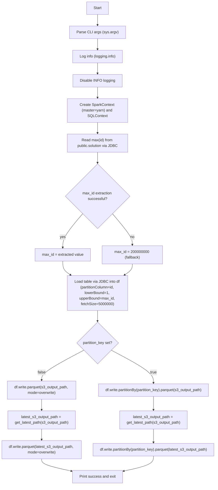
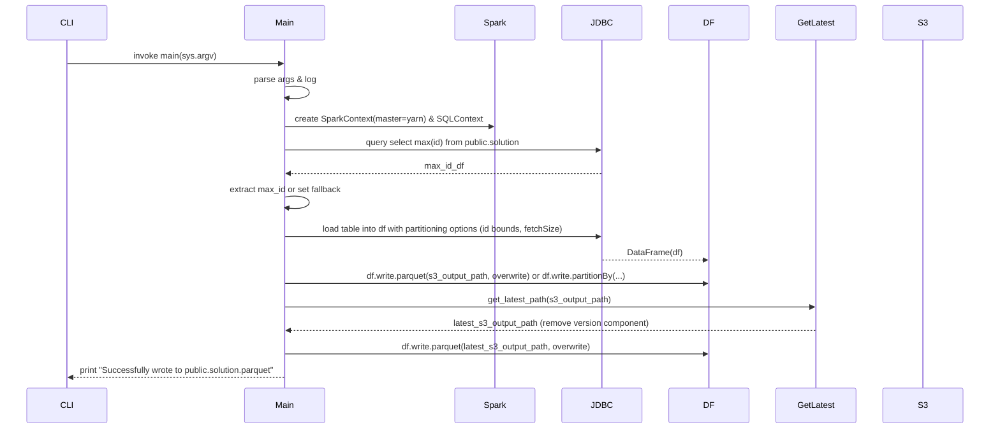
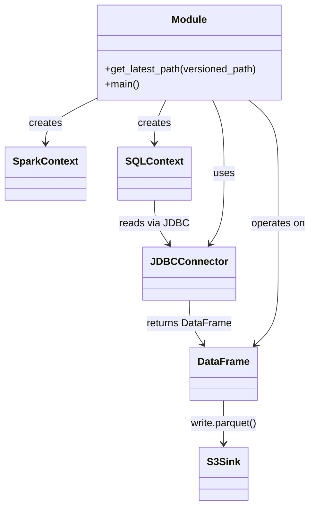

# Diagram: research/orchestrator/tasks/etl/extract_public_solution_spark.py

> Auto-generated by Obscura crawlers

## Diagram 1

### SVG

<svg id="container" width="956.75" xmlns="http://www.w3.org/2000/svg" class="flowchart" height="2087.5" viewBox="0 0 956.75 2087.5" role="graphics-document document" aria-roledescription="flowchart-v2"><g><marker id="container_flowchart-v2-pointEnd" class="marker flowchart-v2" viewBox="0 0 10 10" refX="5" refY="5" markerUnits="userSpaceOnUse" markerWidth="8" markerHeight="8" orient="auto"><path d="M 0 0 L 10 5 L 0 10 z" class="arrowMarkerPath" style="stroke-width: 1; stroke-dasharray: 1, 0;"></path></marker><marker id="container_flowchart-v2-pointStart" class="marker flowchart-v2" viewBox="0 0 10 10" refX="4.5" refY="5" markerUnits="userSpaceOnUse" markerWidth="8" markerHeight="8" orient="auto"><path d="M 0 5 L 10 10 L 10 0 z" class="arrowMarkerPath" style="stroke-width: 1; stroke-dasharray: 1, 0;"></path></marker><marker id="container_flowchart-v2-circleEnd" class="marker flowchart-v2" viewBox="0 0 10 10" refX="11" refY="5" markerUnits="userSpaceOnUse" markerWidth="11" markerHeight="11" orient="auto"><circle cx="5" cy="5" r="5" class="arrowMarkerPath" style="stroke-width: 1; stroke-dasharray: 1, 0;"></circle></marker><marker id="container_flowchart-v2-circleStart" class="marker flowchart-v2" viewBox="0 0 10 10" refX="-1" refY="5" markerUnits="userSpaceOnUse" markerWidth="11" markerHeight="11" orient="auto"><circle cx="5" cy="5" r="5" class="arrowMarkerPath" style="stroke-width: 1; stroke-dasharray: 1, 0;"></circle></marker><marker id="container_flowchart-v2-crossEnd" class="marker cross flowchart-v2" viewBox="0 0 11 11" refX="12" refY="5.2" markerUnits="userSpaceOnUse" markerWidth="11" markerHeight="11" orient="auto"><path d="M 1,1 l 9,9 M 10,1 l -9,9" class="arrowMarkerPath" style="stroke-width: 2; stroke-dasharray: 1, 0;"></path></marker><marker id="container_flowchart-v2-crossStart" class="marker cross flowchart-v2" viewBox="0 0 11 11" refX="-1" refY="5.2" markerUnits="userSpaceOnUse" markerWidth="11" markerHeight="11" orient="auto"><path d="M 1,1 l 9,9 M 10,1 l -9,9" class="arrowMarkerPath" style="stroke-width: 2; stroke-dasharray: 1, 0;"></path></marker><g class="root"><g class="clusters"></g><g class="edgePaths"><path d="M431.164,62L431.164,66.167C431.164,70.333,431.164,78.667,431.164,86.333C431.164,94,431.164,101,431.164,104.5L431.164,108" id="L_Start_ParseArgs_0" class="edge-thickness-normal edge-pattern-solid edge-thickness-normal edge-pattern-solid flowchart-link" style=";" data-edge="true" data-et="edge" data-id="L_Start_ParseArgs_0" data-points="W3sieCI6NDMxLjE2NDA2MjUsInkiOjYyfSx7IngiOjQzMS4xNjQwNjI1LCJ5Ijo4N30seyJ4Ijo0MzEuMTY0MDYyNSwieSI6MTEyfV0=" marker-end="url(#container_flowchart-v2-pointEnd)"></path><path d="M431.164,166L431.164,170.167C431.164,174.333,431.164,182.667,431.164,190.333C431.164,198,431.164,205,431.164,208.5L431.164,212" id="L_ParseArgs_LogInfo_0" class="edge-thickness-normal edge-pattern-solid edge-thickness-normal edge-pattern-solid flowchart-link" style=";" data-edge="true" data-et="edge" data-id="L_ParseArgs_LogInfo_0" data-points="W3sieCI6NDMxLjE2NDA2MjUsInkiOjE2Nn0seyJ4Ijo0MzEuMTY0MDYyNSwieSI6MTkxfSx7IngiOjQzMS4xNjQwNjI1LCJ5IjoyMTZ9XQ==" marker-end="url(#container_flowchart-v2-pointEnd)"></path><path d="M431.164,270L431.164,274.167C431.164,278.333,431.164,286.667,431.164,294.333C431.164,302,431.164,309,431.164,312.5L431.164,316" id="L_LogInfo_DisableLogging_0" class="edge-thickness-normal edge-pattern-solid edge-thickness-normal edge-pattern-solid flowchart-link" style=";" data-edge="true" data-et="edge" data-id="L_LogInfo_DisableLogging_0" data-points="W3sieCI6NDMxLjE2NDA2MjUsInkiOjI3MH0seyJ4Ijo0MzEuMTY0MDYyNSwieSI6Mjk1fSx7IngiOjQzMS4xNjQwNjI1LCJ5IjozMjB9XQ==" marker-end="url(#container_flowchart-v2-pointEnd)"></path><path d="M431.164,374L431.164,378.167C431.164,382.333,431.164,390.667,431.164,398.333C431.164,406,431.164,413,431.164,416.5L431.164,420" id="L_DisableLogging_CreateSpark_0" class="edge-thickness-normal edge-pattern-solid edge-thickness-normal edge-pattern-solid flowchart-link" style=";" data-edge="true" data-et="edge" data-id="L_DisableLogging_CreateSpark_0" data-points="W3sieCI6NDMxLjE2NDA2MjUsInkiOjM3NH0seyJ4Ijo0MzEuMTY0MDYyNSwieSI6Mzk5fSx7IngiOjQzMS4xNjQwNjI1LCJ5Ijo0MjR9XQ==" marker-end="url(#container_flowchart-v2-pointEnd)"></path><path d="M431.164,526L431.164,530.167C431.164,534.333,431.164,542.667,431.164,550.333C431.164,558,431.164,565,431.164,568.5L431.164,572" id="L_CreateSpark_ReadMaxId_0" class="edge-thickness-normal edge-pattern-solid edge-thickness-normal edge-pattern-solid flowchart-link" style=";" data-edge="true" data-et="edge" data-id="L_CreateSpark_ReadMaxId_0" data-points="W3sieCI6NDMxLjE2NDA2MjUsInkiOjUyNn0seyJ4Ijo0MzEuMTY0MDYyNSwieSI6NTUxfSx7IngiOjQzMS4xNjQwNjI1LCJ5Ijo1NzZ9XQ==" marker-end="url(#container_flowchart-v2-pointEnd)"></path><path d="M431.164,654L431.164,658.167C431.164,662.333,431.164,670.667,431.164,678.333C431.164,686,431.164,693,431.164,696.5L431.164,700" id="L_ReadMaxId_TryExtractMaxId_0" class="edge-thickness-normal edge-pattern-solid edge-thickness-normal edge-pattern-solid flowchart-link" style=";" data-edge="true" data-et="edge" data-id="L_ReadMaxId_TryExtractMaxId_0" data-points="W3sieCI6NDMxLjE2NDA2MjUsInkiOjY1NH0seyJ4Ijo0MzEuMTY0MDYyNSwieSI6Njc5fSx7IngiOjQzMS4xNjQwNjI1LCJ5Ijo3MDR9XQ==" marker-end="url(#container_flowchart-v2-pointEnd)"></path><path d="M367.202,918.038L352.858,934.865C338.515,951.692,309.828,985.346,295.484,1009.673C281.141,1034,281.141,1049,281.141,1056.5L281.141,1064" id="L_TryExtractMaxId_SetMaxId_0" class="edge-thickness-normal edge-pattern-solid edge-thickness-normal edge-pattern-solid flowchart-link" style=";" data-edge="true" data-et="edge" data-id="L_TryExtractMaxId_SetMaxId_0" data-points="W3sieCI6MzY3LjIwMTYxMjUyMjc2NDgzLCJ5Ijo5MTguMDM3NTUwMDIyNzY0OX0seyJ4IjoyODEuMTQwNjI1LCJ5IjoxMDE5fSx7IngiOjI4MS4xNDA2MjUsInkiOjEwNjh9XQ==" marker-end="url(#container_flowchart-v2-pointEnd)"></path><path d="M495.127,918.038L509.47,934.865C523.814,951.692,552.501,985.346,566.844,1007.673C581.188,1030,581.188,1041,581.188,1046.5L581.188,1052" id="L_TryExtractMaxId_SetDefaultMaxId_0" class="edge-thickness-normal edge-pattern-solid edge-thickness-normal edge-pattern-solid flowchart-link" style=";" data-edge="true" data-et="edge" data-id="L_TryExtractMaxId_SetDefaultMaxId_0" data-points="W3sieCI6NDk1LjEyNjUxMjQ3NzIzNTE3LCJ5Ijo5MTguMDM3NTUwMDIyNzY0OX0seyJ4Ijo1ODEuMTg3NSwieSI6MTAxOX0seyJ4Ijo1ODEuMTg3NSwieSI6MTA1Nn1d" marker-end="url(#container_flowchart-v2-pointEnd)"></path><path d="M281.141,1122L281.141,1128.167C281.141,1134.333,281.141,1146.667,286.837,1156.63C292.533,1166.594,303.926,1174.188,309.622,1177.985L315.318,1181.781" id="L_SetMaxId_LoadTable_0" class="edge-thickness-normal edge-pattern-solid edge-thickness-normal edge-pattern-solid flowchart-link" style=";" data-edge="true" data-et="edge" data-id="L_SetMaxId_LoadTable_0" data-points="W3sieCI6MjgxLjE0MDYyNSwieSI6MTEyMn0seyJ4IjoyODEuMTQwNjI1LCJ5IjoxMTU5fSx7IngiOjMxOC42NDY0ODQzNzUsInkiOjExODR9XQ==" marker-end="url(#container_flowchart-v2-pointEnd)"></path><path d="M581.188,1134L581.188,1138.167C581.188,1142.333,581.188,1150.667,575.491,1158.63C569.795,1166.594,558.403,1174.188,552.706,1177.985L547.01,1181.781" id="L_SetDefaultMaxId_LoadTable_0" class="edge-thickness-normal edge-pattern-solid edge-thickness-normal edge-pattern-solid flowchart-link" style=";" data-edge="true" data-et="edge" data-id="L_SetDefaultMaxId_LoadTable_0" data-points="W3sieCI6NTgxLjE4NzUsInkiOjExMzR9LHsieCI6NTgxLjE4NzUsInkiOjExNTl9LHsieCI6NTQzLjY4MTY0MDYyNSwieSI6MTE4NH1d" marker-end="url(#container_flowchart-v2-pointEnd)"></path><path d="M431.164,1334L431.164,1338.167C431.164,1342.333,431.164,1350.667,431.164,1358.333C431.164,1366,431.164,1373,431.164,1376.5L431.164,1380" id="L_LoadTable_CheckPartition_0" class="edge-thickness-normal edge-pattern-solid edge-thickness-normal edge-pattern-solid flowchart-link" style=";" data-edge="true" data-et="edge" data-id="L_LoadTable_CheckPartition_0" data-points="W3sieCI6NDMxLjE2NDA2MjUsInkiOjEzMzR9LHsieCI6NDMxLjE2NDA2MjUsInkiOjEzNTl9LHsieCI6NDMxLjE2NDA2MjUsInkiOjEzODR9XQ==" marker-end="url(#container_flowchart-v2-pointEnd)"></path><path d="M491.534,1507.131L522.753,1523.359C553.973,1539.587,616.412,1572.044,647.632,1595.772C678.852,1619.5,678.852,1634.5,678.852,1642L678.852,1649.5" id="L_CheckPartition_WritePartitioned_0" class="edge-thickness-normal edge-pattern-solid edge-thickness-normal edge-pattern-solid flowchart-link" style=";" data-edge="true" data-et="edge" data-id="L_CheckPartition_WritePartitioned_0" data-points="W3sieCI6NDkxLjUzMzUyMTI0MTQ5MSwieSI6MTUwNy4xMzA1NDEyNTg1MDl9LHsieCI6Njc4Ljg1MTU2MjUsInkiOjE2MDQuNX0seyJ4Ijo2NzguODUxNTYyNSwieSI6MTY1My41fV0=" marker-end="url(#container_flowchart-v2-pointEnd)"></path><path d="M678.852,1707.5L678.852,1713.667C678.852,1719.833,678.852,1732.167,678.852,1741.833C678.852,1751.5,678.852,1758.5,678.852,1762L678.852,1765.5" id="L_WritePartitioned_GetLatest_0" class="edge-thickness-normal edge-pattern-solid edge-thickness-normal edge-pattern-solid flowchart-link" style=";" data-edge="true" data-et="edge" data-id="L_WritePartitioned_GetLatest_0" data-points="W3sieCI6Njc4Ljg1MTU2MjUsInkiOjE3MDcuNX0seyJ4Ijo2NzguODUxNTYyNSwieSI6MTc0NC41fSx7IngiOjY3OC44NTE1NjI1LCJ5IjoxNzY5LjV9XQ==" marker-end="url(#container_flowchart-v2-pointEnd)"></path><path d="M678.852,1847.5L678.852,1851.667C678.852,1855.833,678.852,1864.167,678.852,1873.833C678.852,1883.5,678.852,1894.5,678.852,1900L678.852,1905.5" id="L_GetLatest_WritePartitionedLatest_0" class="edge-thickness-normal edge-pattern-solid edge-thickness-normal edge-pattern-solid flowchart-link" style=";" data-edge="true" data-et="edge" data-id="L_GetLatest_WritePartitionedLatest_0" data-points="W3sieCI6Njc4Ljg1MTU2MjUsInkiOjE4NDcuNX0seyJ4Ijo2NzguODUxNTYyNSwieSI6MTg3Mi41fSx7IngiOjY3OC44NTE1NjI1LCJ5IjoxOTA5LjV9XQ==" marker-end="url(#container_flowchart-v2-pointEnd)"></path><path d="M370.795,1507.131L339.575,1523.359C308.355,1539.587,245.916,1572.044,214.696,1593.772C183.477,1615.5,183.477,1626.5,183.477,1632L183.477,1637.5" id="L_CheckPartition_WriteParquet_0" class="edge-thickness-normal edge-pattern-solid edge-thickness-normal edge-pattern-solid flowchart-link" style=";" data-edge="true" data-et="edge" data-id="L_CheckPartition_WriteParquet_0" data-points="W3sieCI6MzcwLjc5NDYwMzc1ODUwOSwieSI6MTUwNy4xMzA1NDEyNTg1MDl9LHsieCI6MTgzLjQ3NjU2MjUsInkiOjE2MDQuNX0seyJ4IjoxODMuNDc2NTYyNSwieSI6MTY0MS41fV0=" marker-end="url(#container_flowchart-v2-pointEnd)"></path><path d="M183.477,1719.5L183.477,1723.667C183.477,1727.833,183.477,1736.167,183.477,1743.833C183.477,1751.5,183.477,1758.5,183.477,1762L183.477,1765.5" id="L_WriteParquet_GetLatest2_0" class="edge-thickness-normal edge-pattern-solid edge-thickness-normal edge-pattern-solid flowchart-link" style=";" data-edge="true" data-et="edge" data-id="L_WriteParquet_GetLatest2_0" data-points="W3sieCI6MTgzLjQ3NjU2MjUsInkiOjE3MTkuNX0seyJ4IjoxODMuNDc2NTYyNSwieSI6MTc0NC41fSx7IngiOjE4My40NzY1NjI1LCJ5IjoxNzY5LjV9XQ==" marker-end="url(#container_flowchart-v2-pointEnd)"></path><path d="M183.477,1847.5L183.477,1851.667C183.477,1855.833,183.477,1864.167,183.477,1871.833C183.477,1879.5,183.477,1886.5,183.477,1890L183.477,1893.5" id="L_GetLatest2_WriteParquetLatest_0" class="edge-thickness-normal edge-pattern-solid edge-thickness-normal edge-pattern-solid flowchart-link" style=";" data-edge="true" data-et="edge" data-id="L_GetLatest2_WriteParquetLatest_0" data-points="W3sieCI6MTgzLjQ3NjU2MjUsInkiOjE4NDcuNX0seyJ4IjoxODMuNDc2NTYyNSwieSI6MTg3Mi41fSx7IngiOjE4My40NzY1NjI1LCJ5IjoxODk3LjV9XQ==" marker-end="url(#container_flowchart-v2-pointEnd)"></path><path d="M183.477,1975.5L183.477,1979.667C183.477,1983.833,183.477,1992.167,206.042,2001.071C228.607,2009.975,273.737,2019.449,296.302,2024.187L318.867,2028.924" id="L_WriteParquetLatest_Success_0" class="edge-thickness-normal edge-pattern-solid edge-thickness-normal edge-pattern-solid flowchart-link" style=";" data-edge="true" data-et="edge" data-id="L_WriteParquetLatest_Success_0" data-points="W3sieCI6MTgzLjQ3NjU2MjUsInkiOjE5NzUuNX0seyJ4IjoxODMuNDc2NTYyNSwieSI6MjAwMC41fSx7IngiOjMyMi43ODEyNSwieSI6MjAyOS43NDU4OTk1NzEwMzJ9XQ==" marker-end="url(#container_flowchart-v2-pointEnd)"></path><path d="M678.852,1963.5L678.852,1969.667C678.852,1975.833,678.852,1988.167,656.287,1999.071C633.722,2009.975,588.592,2019.449,566.027,2024.187L543.462,2028.924" id="L_WritePartitionedLatest_Success_0" class="edge-thickness-normal edge-pattern-solid edge-thickness-normal edge-pattern-solid flowchart-link" style=";" data-edge="true" data-et="edge" data-id="L_WritePartitionedLatest_Success_0" data-points="W3sieCI6Njc4Ljg1MTU2MjUsInkiOjE5NjMuNX0seyJ4Ijo2NzguODUxNTYyNSwieSI6MjAwMC41fSx7IngiOjUzOS41NDY4NzUsInkiOjIwMjkuNzQ1ODk5NTcxMDMyfV0=" marker-end="url(#container_flowchart-v2-pointEnd)"></path></g><g class="edgeLabels"><g class="edgeLabel"><g class="label" data-id="L_Start_ParseArgs_0" transform="translate(0, 0)"><foreignObject width="0" height="0">

</foreignObject></g></g><g class="edgeLabel"><g class="label" data-id="L_ParseArgs_LogInfo_0" transform="translate(0, 0)"><foreignObject width="0" height="0">

</foreignObject></g></g><g class="edgeLabel"><g class="label" data-id="L_LogInfo_DisableLogging_0" transform="translate(0, 0)"><foreignObject width="0" height="0">

</foreignObject></g></g><g class="edgeLabel"><g class="label" data-id="L_DisableLogging_CreateSpark_0" transform="translate(0, 0)"><foreignObject width="0" height="0">

</foreignObject></g></g><g class="edgeLabel"><g class="label" data-id="L_CreateSpark_ReadMaxId_0" transform="translate(0, 0)"><foreignObject width="0" height="0">

</foreignObject></g></g><g class="edgeLabel"><g class="label" data-id="L_ReadMaxId_TryExtractMaxId_0" transform="translate(0, 0)"><foreignObject width="0" height="0">

</foreignObject></g></g><g class="edgeLabel" transform="translate(281.140625, 1019)"><g class="label" data-id="L_TryExtractMaxId_SetMaxId_0" transform="translate(-12.0078125, -12)"><foreignObject width="24.015625" height="24">

yes

</foreignObject></g></g><g class="edgeLabel" transform="translate(581.1875, 1019)"><g class="label" data-id="L_TryExtractMaxId_SetDefaultMaxId_0" transform="translate(-9.3671875, -12)"><foreignObject width="18.734375" height="24">

no

</foreignObject></g></g><g class="edgeLabel"><g class="label" data-id="L_SetMaxId_LoadTable_0" transform="translate(0, 0)"><foreignObject width="0" height="0">

</foreignObject></g></g><g class="edgeLabel"><g class="label" data-id="L_SetDefaultMaxId_LoadTable_0" transform="translate(0, 0)"><foreignObject width="0" height="0">

</foreignObject></g></g><g class="edgeLabel"><g class="label" data-id="L_LoadTable_CheckPartition_0" transform="translate(0, 0)"><foreignObject width="0" height="0">

</foreignObject></g></g><g class="edgeLabel" transform="translate(678.8515625, 1604.5)"><g class="label" data-id="L_CheckPartition_WritePartitioned_0" transform="translate(-14.9921875, -12)"><foreignObject width="29.984375" height="24">

true

</foreignObject></g></g><g class="edgeLabel"><g class="label" data-id="L_WritePartitioned_GetLatest_0" transform="translate(0, 0)"><foreignObject width="0" height="0">

</foreignObject></g></g><g class="edgeLabel"><g class="label" data-id="L_GetLatest_WritePartitionedLatest_0" transform="translate(0, 0)"><foreignObject width="0" height="0">

</foreignObject></g></g><g class="edgeLabel" transform="translate(183.4765625, 1604.5)"><g class="label" data-id="L_CheckPartition_WriteParquet_0" transform="translate(-17.21875, -12)"><foreignObject width="34.4375" height="24">

false

</foreignObject></g></g><g class="edgeLabel"><g class="label" data-id="L_WriteParquet_GetLatest2_0" transform="translate(0, 0)"><foreignObject width="0" height="0">

</foreignObject></g></g><g class="edgeLabel"><g class="label" data-id="L_GetLatest2_WriteParquetLatest_0" transform="translate(0, 0)"><foreignObject width="0" height="0">

</foreignObject></g></g><g class="edgeLabel"><g class="label" data-id="L_WriteParquetLatest_Success_0" transform="translate(0, 0)"><foreignObject width="0" height="0">

</foreignObject></g></g><g class="edgeLabel"><g class="label" data-id="L_WritePartitionedLatest_Success_0" transform="translate(0, 0)"><foreignObject width="0" height="0">

</foreignObject></g></g></g><g class="nodes"><g class="node default" id="flowchart-Start-0" transform="translate(431.1640625, 35)"><rect class="basic label-container" style="" x="-47.5234375" y="-27" width="95.046875" height="54"></rect><g class="label" style="" transform="translate(-17.5234375, -12)"><rect></rect><foreignObject width="35.046875" height="24">

Start

</foreignObject></g></g><g class="node default" id="flowchart-ParseArgs-1" transform="translate(431.1640625, 139)"><rect class="basic label-container" style="" x="-115.7109375" y="-27" width="231.421875" height="54"></rect><g class="label" style="" transform="translate(-85.7109375, -12)"><rect></rect><foreignObject width="171.421875" height="24">

Parse CLI args (sys.argv)

</foreignObject></g></g><g class="node default" id="flowchart-LogInfo-3" transform="translate(431.1640625, 243)"><rect class="basic label-container" style="" x="-108.796875" y="-27" width="217.59375" height="54"></rect><g class="label" style="" transform="translate(-78.796875, -12)"><rect></rect><foreignObject width="157.59375" height="24">

Log info (logging.info)

</foreignObject></g></g><g class="node default" id="flowchart-DisableLogging-5" transform="translate(431.1640625, 347)"><rect class="basic label-container" style="" x="-104.625" y="-27" width="209.25" height="54"></rect><g class="label" style="" transform="translate(-74.625, -12)"><rect></rect><foreignObject width="149.25" height="24">

Disable INFO logging

</foreignObject></g></g><g class="node default" id="flowchart-CreateSpark-7" transform="translate(431.1640625, 475)"><rect class="basic label-container" style="" x="-130" y="-51" width="260" height="102"></rect><g class="label" style="" transform="translate(-100, -36)"><rect></rect><foreignObject width="200" height="72">

Create SparkContext (master=yarn) and SQLContext

</foreignObject></g></g><g class="node default" id="flowchart-ReadMaxId-9" transform="translate(431.1640625, 615)"><rect class="basic label-container" style="" x="-130" y="-39" width="260" height="78"></rect><g class="label" style="" transform="translate(-100, -24)"><rect></rect><foreignObject width="200" height="48">

Read max(id) from public.solution via JDBC

</foreignObject></g></g><g class="node default" id="flowchart-TryExtractMaxId-11" transform="translate(431.1640625, 843)"><polygon points="139,0 278,-139 139,-278 0,-139" class="label-container" transform="translate(-138.5, 139)"></polygon><g class="label" style="" transform="translate(-100, -24)"><rect></rect><foreignObject width="200" height="48">

max_id extraction successful?

</foreignObject></g></g><g class="node default" id="flowchart-SetMaxId-13" transform="translate(281.140625, 1095)"><rect class="basic label-container" style="" x="-120.046875" y="-27" width="240.09375" height="54"></rect><g class="label" style="" transform="translate(-90.046875, -12)"><rect></rect><foreignObject width="180.09375" height="24">

max_id = extracted value

</foreignObject></g></g><g class="node default" id="flowchart-SetDefaultMaxId-15" transform="translate(581.1875, 1095)"><rect class="basic label-container" style="" x="-130" y="-39" width="260" height="78"></rect><g class="label" style="" transform="translate(-100, -24)"><rect></rect><foreignObject width="200" height="48">

max_id = 200000000 (fallback)

</foreignObject></g></g><g class="node default" id="flowchart-LoadTable-17" transform="translate(431.1640625, 1259)"><rect class="basic label-container" style="" x="-130" y="-75" width="260" height="150"></rect><g class="label" style="" transform="translate(-100, -60)"><rect></rect><foreignObject width="200" height="120">

Load table via JDBC into df (partitionColumn=id, lowerBound=1, upperBound=max_id, fetchSize=5000000)

</foreignObject></g></g><g class="node default" id="flowchart-CheckPartition-21" transform="translate(431.1640625, 1475.75)"><polygon points="91.75,0 183.5,-91.75 91.75,-183.5 0,-91.75" class="label-container" transform="translate(-91.25, 91.75)"></polygon><g class="label" style="" transform="translate(-64.75, -12)"><rect></rect><foreignObject width="129.5" height="24">

partition_key set?

</foreignObject></g></g><g class="node default" id="flowchart-WritePartitioned-23" transform="translate(678.8515625, 1680.5)"><rect class="basic label-container" style="" x="-245.3359375" y="-27" width="490.671875" height="54"></rect><g class="label" style="" transform="translate(-215.3359375, -12)"><rect></rect><foreignObject width="430.671875" height="24">

df.write.partitionBy(partition_key).parquet(s3_output_path)

</foreignObject></g></g><g class="node default" id="flowchart-GetLatest-25" transform="translate(678.8515625, 1808.5)"><rect class="basic label-container" style="" x="-148.5546875" y="-39" width="297.109375" height="78"></rect><g class="label" style="" transform="translate(-118.5546875, -24)"><rect></rect><foreignObject width="237.109375" height="48">

latest_s3_output_path = get_latest_path(s3_output_path)

</foreignObject></g></g><g class="node default" id="flowchart-WritePartitionedLatest-27" transform="translate(678.8515625, 1936.5)"><rect class="basic label-container" style="" x="-269.8984375" y="-27" width="539.796875" height="54"></rect><g class="label" style="" transform="translate(-239.8984375, -12)"><rect></rect><foreignObject width="479.796875" height="24">

df.write.partitionBy(partition_key).parquet(latest_s3_output_path)

</foreignObject></g></g><g class="node default" id="flowchart-WriteParquet-29" transform="translate(183.4765625, 1680.5)"><rect class="basic label-container" style="" x="-150.90625" y="-39" width="301.8125" height="78"></rect><g class="label" style="" transform="translate(-120.90625, -24)"><rect></rect><foreignObject width="241.8125" height="48">

df.write.parquet(s3_output_path, mode=overwrite)

</foreignObject></g></g><g class="node default" id="flowchart-GetLatest2-31" transform="translate(183.4765625, 1808.5)"><rect class="basic label-container" style="" x="-148.5546875" y="-39" width="297.109375" height="78"></rect><g class="label" style="" transform="translate(-118.5546875, -24)"><rect></rect><foreignObject width="237.109375" height="48">

latest_s3_output_path = get_latest_path(s3_output_path)

</foreignObject></g></g><g class="node default" id="flowchart-WriteParquetLatest-33" transform="translate(183.4765625, 1936.5)"><rect class="basic label-container" style="" x="-175.4765625" y="-39" width="350.953125" height="78"></rect><g class="label" style="" transform="translate(-145.4765625, -24)"><rect></rect><foreignObject width="290.953125" height="48">

df.write.parquet(latest_s3_output_path, mode=overwrite)

</foreignObject></g></g><g class="node default" id="flowchart-Success-35" transform="translate(431.1640625, 2052.5)"><rect class="basic label-container" style="" x="-108.3828125" y="-27" width="216.765625" height="54"></rect><g class="label" style="" transform="translate(-78.3828125, -12)"><rect></rect><foreignObject width="156.765625" height="24">

Print success and exit

</foreignObject></g></g></g></g></g></svg>

## Diagram 2

### SVG

<svg id="container" width="1916" xmlns="http://www.w3.org/2000/svg" height="855" viewBox="-50 -10 1916 855" role="graphics-document document" aria-roledescription="sequence"><g><rect x="1666" y="769" fill="#eaeaea" stroke="#666" width="150" height="65" name="S3" rx="3" ry="3" class="actor actor-bottom"></rect><text x="1741" y="801.5" dominant-baseline="central" alignment-baseline="central" class="actor actor-box" style="text-anchor: middle; font-size: 16px; font-weight: 400;"><tspan x="1741" dy="0">S3</tspan></text></g><g><rect x="1466" y="769" fill="#eaeaea" stroke="#666" width="150" height="65" name="GetLatest" rx="3" ry="3" class="actor actor-bottom"></rect><text x="1541" y="801.5" dominant-baseline="central" alignment-baseline="central" class="actor actor-box" style="text-anchor: middle; font-size: 16px; font-weight: 400;"><tspan x="1541" dy="0">GetLatest</tspan></text></g><g><rect x="1266" y="769" fill="#eaeaea" stroke="#666" width="150" height="65" name="DF" rx="3" ry="3" class="actor actor-bottom"></rect><text x="1341" y="801.5" dominant-baseline="central" alignment-baseline="central" class="actor actor-box" style="text-anchor: middle; font-size: 16px; font-weight: 400;"><tspan x="1341" dy="0">DF</tspan></text></g><g><rect x="1066" y="769" fill="#eaeaea" stroke="#666" width="150" height="65" name="JDBC" rx="3" ry="3" class="actor actor-bottom"></rect><text x="1141" y="801.5" dominant-baseline="central" alignment-baseline="central" class="actor actor-box" style="text-anchor: middle; font-size: 16px; font-weight: 400;"><tspan x="1141" dy="0">JDBC</tspan></text></g><g><rect x="866" y="769" fill="#eaeaea" stroke="#666" width="150" height="65" name="Spark" rx="3" ry="3" class="actor actor-bottom"></rect><text x="941" y="801.5" dominant-baseline="central" alignment-baseline="central" class="actor actor-box" style="text-anchor: middle; font-size: 16px; font-weight: 400;"><tspan x="941" dy="0">Spark</tspan></text></g><g><rect x="448" y="769" fill="#eaeaea" stroke="#666" width="150" height="65" name="Main" rx="3" ry="3" class="actor actor-bottom"></rect><text x="523" y="801.5" dominant-baseline="central" alignment-baseline="central" class="actor actor-box" style="text-anchor: middle; font-size: 16px; font-weight: 400;"><tspan x="523" dy="0">Main</tspan></text></g><g><rect x="0" y="769" fill="#eaeaea" stroke="#666" width="150" height="65" name="CLI" rx="3" ry="3" class="actor actor-bottom"></rect><text x="75" y="801.5" dominant-baseline="central" alignment-baseline="central" class="actor actor-box" style="text-anchor: middle; font-size: 16px; font-weight: 400;"><tspan x="75" dy="0">CLI</tspan></text></g><g><line id="actor6" x1="1741" y1="65" x2="1741" y2="769" class="actor-line 200" stroke-width="0.5px" stroke="#999" name="S3"></line><g id="root-6"><rect x="1666" y="0" fill="#eaeaea" stroke="#666" width="150" height="65" name="S3" rx="3" ry="3" class="actor actor-top"></rect><text x="1741" y="32.5" dominant-baseline="central" alignment-baseline="central" class="actor actor-box" style="text-anchor: middle; font-size: 16px; font-weight: 400;"><tspan x="1741" dy="0">S3</tspan></text></g></g><g><line id="actor5" x1="1541" y1="65" x2="1541" y2="769" class="actor-line 200" stroke-width="0.5px" stroke="#999" name="GetLatest"></line><g id="root-5"><rect x="1466" y="0" fill="#eaeaea" stroke="#666" width="150" height="65" name="GetLatest" rx="3" ry="3" class="actor actor-top"></rect><text x="1541" y="32.5" dominant-baseline="central" alignment-baseline="central" class="actor actor-box" style="text-anchor: middle; font-size: 16px; font-weight: 400;"><tspan x="1541" dy="0">GetLatest</tspan></text></g></g><g><line id="actor4" x1="1341" y1="65" x2="1341" y2="769" class="actor-line 200" stroke-width="0.5px" stroke="#999" name="DF"></line><g id="root-4"><rect x="1266" y="0" fill="#eaeaea" stroke="#666" width="150" height="65" name="DF" rx="3" ry="3" class="actor actor-top"></rect><text x="1341" y="32.5" dominant-baseline="central" alignment-baseline="central" class="actor actor-box" style="text-anchor: middle; font-size: 16px; font-weight: 400;"><tspan x="1341" dy="0">DF</tspan></text></g></g><g><line id="actor3" x1="1141" y1="65" x2="1141" y2="769" class="actor-line 200" stroke-width="0.5px" stroke="#999" name="JDBC"></line><g id="root-3"><rect x="1066" y="0" fill="#eaeaea" stroke="#666" width="150" height="65" name="JDBC" rx="3" ry="3" class="actor actor-top"></rect><text x="1141" y="32.5" dominant-baseline="central" alignment-baseline="central" class="actor actor-box" style="text-anchor: middle; font-size: 16px; font-weight: 400;"><tspan x="1141" dy="0">JDBC</tspan></text></g></g><g><line id="actor2" x1="941" y1="65" x2="941" y2="769" class="actor-line 200" stroke-width="0.5px" stroke="#999" name="Spark"></line><g id="root-2"><rect x="866" y="0" fill="#eaeaea" stroke="#666" width="150" height="65" name="Spark" rx="3" ry="3" class="actor actor-top"></rect><text x="941" y="32.5" dominant-baseline="central" alignment-baseline="central" class="actor actor-box" style="text-anchor: middle; font-size: 16px; font-weight: 400;"><tspan x="941" dy="0">Spark</tspan></text></g></g><g><line id="actor1" x1="523" y1="65" x2="523" y2="769" class="actor-line 200" stroke-width="0.5px" stroke="#999" name="Main"></line><g id="root-1"><rect x="448" y="0" fill="#eaeaea" stroke="#666" width="150" height="65" name="Main" rx="3" ry="3" class="actor actor-top"></rect><text x="523" y="32.5" dominant-baseline="central" alignment-baseline="central" class="actor actor-box" style="text-anchor: middle; font-size: 16px; font-weight: 400;"><tspan x="523" dy="0">Main</tspan></text></g></g><g><line id="actor0" x1="75" y1="65" x2="75" y2="769" class="actor-line 200" stroke-width="0.5px" stroke="#999" name="CLI"></line><g id="root-0"><rect x="0" y="0" fill="#eaeaea" stroke="#666" width="150" height="65" name="CLI" rx="3" ry="3" class="actor actor-top"></rect><text x="75" y="32.5" dominant-baseline="central" alignment-baseline="central" class="actor actor-box" style="text-anchor: middle; font-size: 16px; font-weight: 400;"><tspan x="75" dy="0">CLI</tspan></text></g></g><g></g><defs><symbol id="computer" width="24" height="24"><path transform="scale(.5)" d="M2 2v13h20v-13h-20zm18 11h-16v-9h16v9zm-10.228 6l.466-1h3.524l.467 1h-4.457zm14.228 3h-24l2-6h2.104l-1.33 4h18.45l-1.297-4h2.073l2 6zm-5-10h-14v-7h14v7z"></path></symbol></defs><defs><symbol id="database" fill-rule="evenodd" clip-rule="evenodd"><path transform="scale(.5)" d="M12.258.001l.256.004.255.005.253.008.251.01.249.012.247.015.246.016.242.019.241.02.239.023.236.024.233.027.231.028.229.031.225.032.223.034.22.036.217.038.214.04.211.041.208.043.205.045.201.046.198.048.194.05.191.051.187.053.183.054.18.056.175.057.172.059.168.06.163.061.16.063.155.064.15.066.074.033.073.033.071.034.07.034.069.035.068.035.067.035.066.035.064.036.064.036.062.036.06.036.06.037.058.037.058.037.055.038.055.038.053.038.052.038.051.039.05.039.048.039.047.039.045.04.044.04.043.04.041.04.04.041.039.041.037.041.036.041.034.041.033.042.032.042.03.042.029.042.027.042.026.043.024.043.023.043.021.043.02.043.018.044.017.043.015.044.013.044.012.044.011.045.009.044.007.045.006.045.004.045.002.045.001.045v17l-.001.045-.002.045-.004.045-.006.045-.007.045-.009.044-.011.045-.012.044-.013.044-.015.044-.017.043-.018.044-.02.043-.021.043-.023.043-.024.043-.026.043-.027.042-.029.042-.03.042-.032.042-.033.042-.034.041-.036.041-.037.041-.039.041-.04.041-.041.04-.043.04-.044.04-.045.04-.047.039-.048.039-.05.039-.051.039-.052.038-.053.038-.055.038-.055.038-.058.037-.058.037-.06.037-.06.036-.062.036-.064.036-.064.036-.066.035-.067.035-.068.035-.069.035-.07.034-.071.034-.073.033-.074.033-.15.066-.155.064-.16.063-.163.061-.168.06-.172.059-.175.057-.18.056-.183.054-.187.053-.191.051-.194.05-.198.048-.201.046-.205.045-.208.043-.211.041-.214.04-.217.038-.22.036-.223.034-.225.032-.229.031-.231.028-.233.027-.236.024-.239.023-.241.02-.242.019-.246.016-.247.015-.249.012-.251.01-.253.008-.255.005-.256.004-.258.001-.258-.001-.256-.004-.255-.005-.253-.008-.251-.01-.249-.012-.247-.015-.245-.016-.243-.019-.241-.02-.238-.023-.236-.024-.234-.027-.231-.028-.228-.031-.226-.032-.223-.034-.22-.036-.217-.038-.214-.04-.211-.041-.208-.043-.204-.045-.201-.046-.198-.048-.195-.05-.19-.051-.187-.053-.184-.054-.179-.056-.176-.057-.172-.059-.167-.06-.164-.061-.159-.063-.155-.064-.151-.066-.074-.033-.072-.033-.072-.034-.07-.034-.069-.035-.068-.035-.067-.035-.066-.035-.064-.036-.063-.036-.062-.036-.061-.036-.06-.037-.058-.037-.057-.037-.056-.038-.055-.038-.053-.038-.052-.038-.051-.039-.049-.039-.049-.039-.046-.039-.046-.04-.044-.04-.043-.04-.041-.04-.04-.041-.039-.041-.037-.041-.036-.041-.034-.041-.033-.042-.032-.042-.03-.042-.029-.042-.027-.042-.026-.043-.024-.043-.023-.043-.021-.043-.02-.043-.018-.044-.017-.043-.015-.044-.013-.044-.012-.044-.011-.045-.009-.044-.007-.045-.006-.045-.004-.045-.002-.045-.001-.045v-17l.001-.045.002-.045.004-.045.006-.045.007-.045.009-.044.011-.045.012-.044.013-.044.015-.044.017-.043.018-.044.02-.043.021-.043.023-.043.024-.043.026-.043.027-.042.029-.042.03-.042.032-.042.033-.042.034-.041.036-.041.037-.041.039-.041.04-.041.041-.04.043-.04.044-.04.046-.04.046-.039.049-.039.049-.039.051-.039.052-.038.053-.038.055-.038.056-.038.057-.037.058-.037.06-.037.061-.036.062-.036.063-.036.064-.036.066-.035.067-.035.068-.035.069-.035.07-.034.072-.034.072-.033.074-.033.151-.066.155-.064.159-.063.164-.061.167-.06.172-.059.176-.057.179-.056.184-.054.187-.053.19-.051.195-.05.198-.048.201-.046.204-.045.208-.043.211-.041.214-.04.217-.038.22-.036.223-.034.226-.032.228-.031.231-.028.234-.027.236-.024.238-.023.241-.02.243-.019.245-.016.247-.015.249-.012.251-.01.253-.008.255-.005.256-.004.258-.001.258.001zm-9.258 20.499v.01l.001.021.003.021.004.022.005.021.006.022.007.022.009.023.01.022.011.023.012.023.013.023.015.023.016.024.017.023.018.024.019.024.021.024.022.025.023.024.024.025.052.049.056.05.061.051.066.051.07.051.075.051.079.052.084.052.088.052.092.052.097.052.102.051.105.052.11.052.114.051.119.051.123.051.127.05.131.05.135.05.139.048.144.049.147.047.152.047.155.047.16.045.163.045.167.043.171.043.176.041.178.041.183.039.187.039.19.037.194.035.197.035.202.033.204.031.209.03.212.029.216.027.219.025.222.024.226.021.23.02.233.018.236.016.24.015.243.012.246.01.249.008.253.005.256.004.259.001.26-.001.257-.004.254-.005.25-.008.247-.011.244-.012.241-.014.237-.016.233-.018.231-.021.226-.021.224-.024.22-.026.216-.027.212-.028.21-.031.205-.031.202-.034.198-.034.194-.036.191-.037.187-.039.183-.04.179-.04.175-.042.172-.043.168-.044.163-.045.16-.046.155-.046.152-.047.148-.048.143-.049.139-.049.136-.05.131-.05.126-.05.123-.051.118-.052.114-.051.11-.052.106-.052.101-.052.096-.052.092-.052.088-.053.083-.051.079-.052.074-.052.07-.051.065-.051.06-.051.056-.05.051-.05.023-.024.023-.025.021-.024.02-.024.019-.024.018-.024.017-.024.015-.023.014-.024.013-.023.012-.023.01-.023.01-.022.008-.022.006-.022.006-.022.004-.022.004-.021.001-.021.001-.021v-4.127l-.077.055-.08.053-.083.054-.085.053-.087.052-.09.052-.093.051-.095.05-.097.05-.1.049-.102.049-.105.048-.106.047-.109.047-.111.046-.114.045-.115.045-.118.044-.12.043-.122.042-.124.042-.126.041-.128.04-.13.04-.132.038-.134.038-.135.037-.138.037-.139.035-.142.035-.143.034-.144.033-.147.032-.148.031-.15.03-.151.03-.153.029-.154.027-.156.027-.158.026-.159.025-.161.024-.162.023-.163.022-.165.021-.166.02-.167.019-.169.018-.169.017-.171.016-.173.015-.173.014-.175.013-.175.012-.177.011-.178.01-.179.008-.179.008-.181.006-.182.005-.182.004-.184.003-.184.002h-.37l-.184-.002-.184-.003-.182-.004-.182-.005-.181-.006-.179-.008-.179-.008-.178-.01-.176-.011-.176-.012-.175-.013-.173-.014-.172-.015-.171-.016-.17-.017-.169-.018-.167-.019-.166-.02-.165-.021-.163-.022-.162-.023-.161-.024-.159-.025-.157-.026-.156-.027-.155-.027-.153-.029-.151-.03-.15-.03-.148-.031-.146-.032-.145-.033-.143-.034-.141-.035-.14-.035-.137-.037-.136-.037-.134-.038-.132-.038-.13-.04-.128-.04-.126-.041-.124-.042-.122-.042-.12-.044-.117-.043-.116-.045-.113-.045-.112-.046-.109-.047-.106-.047-.105-.048-.102-.049-.1-.049-.097-.05-.095-.05-.093-.052-.09-.051-.087-.052-.085-.053-.083-.054-.08-.054-.077-.054v4.127zm0-5.654v.011l.001.021.003.021.004.021.005.022.006.022.007.022.009.022.01.022.011.023.012.023.013.023.015.024.016.023.017.024.018.024.019.024.021.024.022.024.023.025.024.024.052.05.056.05.061.05.066.051.07.051.075.052.079.051.084.052.088.052.092.052.097.052.102.052.105.052.11.051.114.051.119.052.123.05.127.051.131.05.135.049.139.049.144.048.147.048.152.047.155.046.16.045.163.045.167.044.171.042.176.042.178.04.183.04.187.038.19.037.194.036.197.034.202.033.204.032.209.03.212.028.216.027.219.025.222.024.226.022.23.02.233.018.236.016.24.014.243.012.246.01.249.008.253.006.256.003.259.001.26-.001.257-.003.254-.006.25-.008.247-.01.244-.012.241-.015.237-.016.233-.018.231-.02.226-.022.224-.024.22-.025.216-.027.212-.029.21-.03.205-.032.202-.033.198-.035.194-.036.191-.037.187-.039.183-.039.179-.041.175-.042.172-.043.168-.044.163-.045.16-.045.155-.047.152-.047.148-.048.143-.048.139-.05.136-.049.131-.05.126-.051.123-.051.118-.051.114-.052.11-.052.106-.052.101-.052.096-.052.092-.052.088-.052.083-.052.079-.052.074-.051.07-.052.065-.051.06-.05.056-.051.051-.049.023-.025.023-.024.021-.025.02-.024.019-.024.018-.024.017-.024.015-.023.014-.023.013-.024.012-.022.01-.023.01-.023.008-.022.006-.022.006-.022.004-.021.004-.022.001-.021.001-.021v-4.139l-.077.054-.08.054-.083.054-.085.052-.087.053-.09.051-.093.051-.095.051-.097.05-.1.049-.102.049-.105.048-.106.047-.109.047-.111.046-.114.045-.115.044-.118.044-.12.044-.122.042-.124.042-.126.041-.128.04-.13.039-.132.039-.134.038-.135.037-.138.036-.139.036-.142.035-.143.033-.144.033-.147.033-.148.031-.15.03-.151.03-.153.028-.154.028-.156.027-.158.026-.159.025-.161.024-.162.023-.163.022-.165.021-.166.02-.167.019-.169.018-.169.017-.171.016-.173.015-.173.014-.175.013-.175.012-.177.011-.178.009-.179.009-.179.007-.181.007-.182.005-.182.004-.184.003-.184.002h-.37l-.184-.002-.184-.003-.182-.004-.182-.005-.181-.007-.179-.007-.179-.009-.178-.009-.176-.011-.176-.012-.175-.013-.173-.014-.172-.015-.171-.016-.17-.017-.169-.018-.167-.019-.166-.02-.165-.021-.163-.022-.162-.023-.161-.024-.159-.025-.157-.026-.156-.027-.155-.028-.153-.028-.151-.03-.15-.03-.148-.031-.146-.033-.145-.033-.143-.033-.141-.035-.14-.036-.137-.036-.136-.037-.134-.038-.132-.039-.13-.039-.128-.04-.126-.041-.124-.042-.122-.043-.12-.043-.117-.044-.116-.044-.113-.046-.112-.046-.109-.046-.106-.047-.105-.048-.102-.049-.1-.049-.097-.05-.095-.051-.093-.051-.09-.051-.087-.053-.085-.052-.083-.054-.08-.054-.077-.054v4.139zm0-5.666v.011l.001.02.003.022.004.021.005.022.006.021.007.022.009.023.01.022.011.023.012.023.013.023.015.023.016.024.017.024.018.023.019.024.021.025.022.024.023.024.024.025.052.05.056.05.061.05.066.051.07.051.075.052.079.051.084.052.088.052.092.052.097.052.102.052.105.051.11.052.114.051.119.051.123.051.127.05.131.05.135.05.139.049.144.048.147.048.152.047.155.046.16.045.163.045.167.043.171.043.176.042.178.04.183.04.187.038.19.037.194.036.197.034.202.033.204.032.209.03.212.028.216.027.219.025.222.024.226.021.23.02.233.018.236.017.24.014.243.012.246.01.249.008.253.006.256.003.259.001.26-.001.257-.003.254-.006.25-.008.247-.01.244-.013.241-.014.237-.016.233-.018.231-.02.226-.022.224-.024.22-.025.216-.027.212-.029.21-.03.205-.032.202-.033.198-.035.194-.036.191-.037.187-.039.183-.039.179-.041.175-.042.172-.043.168-.044.163-.045.16-.045.155-.047.152-.047.148-.048.143-.049.139-.049.136-.049.131-.051.126-.05.123-.051.118-.052.114-.051.11-.052.106-.052.101-.052.096-.052.092-.052.088-.052.083-.052.079-.052.074-.052.07-.051.065-.051.06-.051.056-.05.051-.049.023-.025.023-.025.021-.024.02-.024.019-.024.018-.024.017-.024.015-.023.014-.024.013-.023.012-.023.01-.022.01-.023.008-.022.006-.022.006-.022.004-.022.004-.021.001-.021.001-.021v-4.153l-.077.054-.08.054-.083.053-.085.053-.087.053-.09.051-.093.051-.095.051-.097.05-.1.049-.102.048-.105.048-.106.048-.109.046-.111.046-.114.046-.115.044-.118.044-.12.043-.122.043-.124.042-.126.041-.128.04-.13.039-.132.039-.134.038-.135.037-.138.036-.139.036-.142.034-.143.034-.144.033-.147.032-.148.032-.15.03-.151.03-.153.028-.154.028-.156.027-.158.026-.159.024-.161.024-.162.023-.163.023-.165.021-.166.02-.167.019-.169.018-.169.017-.171.016-.173.015-.173.014-.175.013-.175.012-.177.01-.178.01-.179.009-.179.007-.181.006-.182.006-.182.004-.184.003-.184.001-.185.001-.185-.001-.184-.001-.184-.003-.182-.004-.182-.006-.181-.006-.179-.007-.179-.009-.178-.01-.176-.01-.176-.012-.175-.013-.173-.014-.172-.015-.171-.016-.17-.017-.169-.018-.167-.019-.166-.02-.165-.021-.163-.023-.162-.023-.161-.024-.159-.024-.157-.026-.156-.027-.155-.028-.153-.028-.151-.03-.15-.03-.148-.032-.146-.032-.145-.033-.143-.034-.141-.034-.14-.036-.137-.036-.136-.037-.134-.038-.132-.039-.13-.039-.128-.041-.126-.041-.124-.041-.122-.043-.12-.043-.117-.044-.116-.044-.113-.046-.112-.046-.109-.046-.106-.048-.105-.048-.102-.048-.1-.05-.097-.049-.095-.051-.093-.051-.09-.052-.087-.052-.085-.053-.083-.053-.08-.054-.077-.054v4.153zm8.74-8.179l-.257.004-.254.005-.25.008-.247.011-.244.012-.241.014-.237.016-.233.018-.231.021-.226.022-.224.023-.22.026-.216.027-.212.028-.21.031-.205.032-.202.033-.198.034-.194.036-.191.038-.187.038-.183.04-.179.041-.175.042-.172.043-.168.043-.163.045-.16.046-.155.046-.152.048-.148.048-.143.048-.139.049-.136.05-.131.05-.126.051-.123.051-.118.051-.114.052-.11.052-.106.052-.101.052-.096.052-.092.052-.088.052-.083.052-.079.052-.074.051-.07.052-.065.051-.06.05-.056.05-.051.05-.023.025-.023.024-.021.024-.02.025-.019.024-.018.024-.017.023-.015.024-.014.023-.013.023-.012.023-.01.023-.01.022-.008.022-.006.023-.006.021-.004.022-.004.021-.001.021-.001.021.001.021.001.021.004.021.004.022.006.021.006.023.008.022.01.022.01.023.012.023.013.023.014.023.015.024.017.023.018.024.019.024.02.025.021.024.023.024.023.025.051.05.056.05.06.05.065.051.07.052.074.051.079.052.083.052.088.052.092.052.096.052.101.052.106.052.11.052.114.052.118.051.123.051.126.051.131.05.136.05.139.049.143.048.148.048.152.048.155.046.16.046.163.045.168.043.172.043.175.042.179.041.183.04.187.038.191.038.194.036.198.034.202.033.205.032.21.031.212.028.216.027.22.026.224.023.226.022.231.021.233.018.237.016.241.014.244.012.247.011.25.008.254.005.257.004.26.001.26-.001.257-.004.254-.005.25-.008.247-.011.244-.012.241-.014.237-.016.233-.018.231-.021.226-.022.224-.023.22-.026.216-.027.212-.028.21-.031.205-.032.202-.033.198-.034.194-.036.191-.038.187-.038.183-.04.179-.041.175-.042.172-.043.168-.043.163-.045.16-.046.155-.046.152-.048.148-.048.143-.048.139-.049.136-.05.131-.05.126-.051.123-.051.118-.051.114-.052.11-.052.106-.052.101-.052.096-.052.092-.052.088-.052.083-.052.079-.052.074-.051.07-.052.065-.051.06-.05.056-.05.051-.05.023-.025.023-.024.021-.024.02-.025.019-.024.018-.024.017-.023.015-.024.014-.023.013-.023.012-.023.01-.023.01-.022.008-.022.006-.023.006-.021.004-.022.004-.021.001-.021.001-.021-.001-.021-.001-.021-.004-.021-.004-.022-.006-.021-.006-.023-.008-.022-.01-.022-.01-.023-.012-.023-.013-.023-.014-.023-.015-.024-.017-.023-.018-.024-.019-.024-.02-.025-.021-.024-.023-.024-.023-.025-.051-.05-.056-.05-.06-.05-.065-.051-.07-.052-.074-.051-.079-.052-.083-.052-.088-.052-.092-.052-.096-.052-.101-.052-.106-.052-.11-.052-.114-.052-.118-.051-.123-.051-.126-.051-.131-.05-.136-.05-.139-.049-.143-.048-.148-.048-.152-.048-.155-.046-.16-.046-.163-.045-.168-.043-.172-.043-.175-.042-.179-.041-.183-.04-.187-.038-.191-.038-.194-.036-.198-.034-.202-.033-.205-.032-.21-.031-.212-.028-.216-.027-.22-.026-.224-.023-.226-.022-.231-.021-.233-.018-.237-.016-.241-.014-.244-.012-.247-.011-.25-.008-.254-.005-.257-.004-.26-.001-.26.001z"></path></symbol></defs><defs><symbol id="clock" width="24" height="24"><path transform="scale(.5)" d="M12 2c5.514 0 10 4.486 10 10s-4.486 10-10 10-10-4.486-10-10 4.486-10 10-10zm0-2c-6.627 0-12 5.373-12 12s5.373 12 12 12 12-5.373 12-12-5.373-12-12-12zm5.848 12.459c.202.038.202.333.001.372-1.907.361-6.045 1.111-6.547 1.111-.719 0-1.301-.582-1.301-1.301 0-.512.77-5.447 1.125-7.445.034-.192.312-.181.343.014l.985 6.238 5.394 1.011z"></path></symbol></defs><defs><marker id="arrowhead" refX="7.9" refY="5" markerUnits="userSpaceOnUse" markerWidth="12" markerHeight="12" orient="auto-start-reverse"><path d="M -1 0 L 10 5 L 0 10 z"></path></marker></defs><defs><marker id="crosshead" markerWidth="15" markerHeight="8" orient="auto" refX="4" refY="4.5"><path fill="none" stroke="#000000" stroke-width="1pt" d="M 1,2 L 6,7 M 6,2 L 1,7" style="stroke-dasharray: 0, 0;"></path></marker></defs><defs><marker id="filled-head" refX="15.5" refY="7" markerWidth="20" markerHeight="28" orient="auto"><path d="M 18,7 L9,13 L14,7 L9,1 Z"></path></marker></defs><defs><marker id="sequencenumber" refX="15" refY="15" markerWidth="60" markerHeight="40" orient="auto"><circle cx="15" cy="15" r="6"></circle></marker></defs><text x="298" y="80" text-anchor="middle" dominant-baseline="middle" alignment-baseline="middle" class="messageText" dy="1em" style="font-size: 16px; font-weight: 400;">invoke main(sys.argv)</text><line x1="76" y1="113" x2="519" y2="113" class="messageLine0" stroke-width="2" stroke="none" marker-end="url(#arrowhead)" style="fill: none;"></line><text x="524" y="128" text-anchor="middle" dominant-baseline="middle" alignment-baseline="middle" class="messageText" dy="1em" style="font-size: 16px; font-weight: 400;">parse args &amp; log</text><path d="M 524,161 C 584,151 584,191 524,181" class="messageLine0" stroke-width="2" stroke="none" marker-end="url(#arrowhead)" style="fill: none;"></path><text x="731" y="206" text-anchor="middle" dominant-baseline="middle" alignment-baseline="middle" class="messageText" dy="1em" style="font-size: 16px; font-weight: 400;">create SparkContext(master=yarn) &amp; SQLContext</text><line x1="524" y1="239" x2="937" y2="239" class="messageLine0" stroke-width="2" stroke="none" marker-end="url(#arrowhead)" style="fill: none;"></line><text x="831" y="254" text-anchor="middle" dominant-baseline="middle" alignment-baseline="middle" class="messageText" dy="1em" style="font-size: 16px; font-weight: 400;">query select max(id) from public.solution</text><line x1="524" y1="287" x2="1137" y2="287" class="messageLine0" stroke-width="2" stroke="none" marker-end="url(#arrowhead)" style="fill: none;"></line><text x="834" y="302" text-anchor="middle" dominant-baseline="middle" alignment-baseline="middle" class="messageText" dy="1em" style="font-size: 16px; font-weight: 400;">max_id_df</text><line x1="1140" y1="335" x2="527" y2="335" class="messageLine1" stroke-width="2" stroke="none" marker-end="url(#arrowhead)" style="stroke-dasharray: 3, 3; fill: none;"></line><text x="524" y="350" text-anchor="middle" dominant-baseline="middle" alignment-baseline="middle" class="messageText" dy="1em" style="font-size: 16px; font-weight: 400;">extract max_id or set fallback</text><path d="M 524,383 C 584,373 584,413 524,403" class="messageLine0" stroke-width="2" stroke="none" marker-end="url(#arrowhead)" style="fill: none;"></path><text x="831" y="428" text-anchor="middle" dominant-baseline="middle" alignment-baseline="middle" class="messageText" dy="1em" style="font-size: 16px; font-weight: 400;">load table into df with partitioning options (id bounds, fetchSize)</text><line x1="524" y1="461" x2="1137" y2="461" class="messageLine0" stroke-width="2" stroke="none" marker-end="url(#arrowhead)" style="fill: none;"></line><text x="1240" y="476" text-anchor="middle" dominant-baseline="middle" alignment-baseline="middle" class="messageText" dy="1em" style="font-size: 16px; font-weight: 400;">DataFrame(df)</text><line x1="1142" y1="509" x2="1337" y2="509" class="messageLine1" stroke-width="2" stroke="none" marker-end="url(#arrowhead)" style="stroke-dasharray: 3, 3; fill: none;"></line><text x="931" y="524" text-anchor="middle" dominant-baseline="middle" alignment-baseline="middle" class="messageText" dy="1em" style="font-size: 16px; font-weight: 400;">df.write.parquet(s3_output_path, overwrite) or df.write.partitionBy(...)</text><line x1="524" y1="557" x2="1337" y2="557" class="messageLine0" stroke-width="2" stroke="none" marker-end="url(#arrowhead)" style="fill: none;"></line><text x="1031" y="572" text-anchor="middle" dominant-baseline="middle" alignment-baseline="middle" class="messageText" dy="1em" style="font-size: 16px; font-weight: 400;">get_latest_path(s3_output_path)</text><line x1="524" y1="605" x2="1537" y2="605" class="messageLine0" stroke-width="2" stroke="none" marker-end="url(#arrowhead)" style="fill: none;"></line><text x="1034" y="620" text-anchor="middle" dominant-baseline="middle" alignment-baseline="middle" class="messageText" dy="1em" style="font-size: 16px; font-weight: 400;">latest_s3_output_path (remove version component)</text><line x1="1540" y1="653" x2="527" y2="653" class="messageLine1" stroke-width="2" stroke="none" marker-end="url(#arrowhead)" style="stroke-dasharray: 3, 3; fill: none;"></line><text x="931" y="668" text-anchor="middle" dominant-baseline="middle" alignment-baseline="middle" class="messageText" dy="1em" style="font-size: 16px; font-weight: 400;">df.write.parquet(latest_s3_output_path, overwrite)</text><line x1="524" y1="701" x2="1337" y2="701" class="messageLine0" stroke-width="2" stroke="none" marker-end="url(#arrowhead)" style="fill: none;"></line><text x="301" y="716" text-anchor="middle" dominant-baseline="middle" alignment-baseline="middle" class="messageText" dy="1em" style="font-size: 16px; font-weight: 400;">print "Successfully wrote to public.solution.parquet"</text><line x1="522" y1="749" x2="79" y2="749" class="messageLine1" stroke-width="2" stroke="none" marker-end="url(#arrowhead)" style="stroke-dasharray: 3, 3; fill: none;"></line></svg>

## Diagram 3

### SVG

<svg id="container" width="474.1796875" xmlns="http://www.w3.org/2000/svg" class="classDiagram" height="798" viewBox="0 0 474.1796875 798" role="graphics-document document" aria-roledescription="class"><g><defs><marker id="container_class-aggregationStart" class="marker aggregation class" refX="18" refY="7" markerWidth="190" markerHeight="240" orient="auto"><path d="M 18,7 L9,13 L1,7 L9,1 Z"></path></marker></defs><defs><marker id="container_class-aggregationEnd" class="marker aggregation class" refX="1" refY="7" markerWidth="20" markerHeight="28" orient="auto"><path d="M 18,7 L9,13 L1,7 L9,1 Z"></path></marker></defs><defs><marker id="container_class-extensionStart" class="marker extension class" refX="18" refY="7" markerWidth="190" markerHeight="240" orient="auto"><path d="M 1,7 L18,13 V 1 Z"></path></marker></defs><defs><marker id="container_class-extensionEnd" class="marker extension class" refX="1" refY="7" markerWidth="20" markerHeight="28" orient="auto"><path d="M 1,1 V 13 L18,7 Z"></path></marker></defs><defs><marker id="container_class-compositionStart" class="marker composition class" refX="18" refY="7" markerWidth="190" markerHeight="240" orient="auto"><path d="M 18,7 L9,13 L1,7 L9,1 Z"></path></marker></defs><defs><marker id="container_class-compositionEnd" class="marker composition class" refX="1" refY="7" markerWidth="20" markerHeight="28" orient="auto"><path d="M 18,7 L9,13 L1,7 L9,1 Z"></path></marker></defs><defs><marker id="container_class-dependencyStart" class="marker dependency class" refX="6" refY="7" markerWidth="190" markerHeight="240" orient="auto"><path d="M 5,7 L9,13 L1,7 L9,1 Z"></path></marker></defs><defs><marker id="container_class-dependencyEnd" class="marker dependency class" refX="13" refY="7" markerWidth="20" markerHeight="28" orient="auto"><path d="M 18,7 L9,13 L14,7 L9,1 Z"></path></marker></defs><defs><marker id="container_class-lollipopStart" class="marker lollipop class" refX="13" refY="7" markerWidth="190" markerHeight="240" orient="auto"><circle stroke="black" fill="transparent" cx="7" cy="7" r="6"></circle></marker></defs><defs><marker id="container_class-lollipopEnd" class="marker lollipop class" refX="1" refY="7" markerWidth="190" markerHeight="240" orient="auto"><circle stroke="black" fill="transparent" cx="7" cy="7" r="6"></circle></marker></defs><g class="root"><g class="clusters"></g><g class="edgePaths"><path d="M141.556,158L129.539,164.167C117.522,170.333,93.487,182.667,81.47,194C69.453,205.333,69.453,215.667,69.453,220.833L69.453,226" id="id_Module_SparkContext_1" class="edge-thickness-normal edge-pattern-solid relation" style=";;;" data-edge="true" data-et="edge" data-id="id_Module_SparkContext_1" data-points="W3sieCI6MTQxLjU1NjE1MjM0Mzc1LCJ5IjoxNTh9LHsieCI6NjkuNDUzMTI1LCJ5IjoxOTV9LHsieCI6NjkuNDUzMTI1LCJ5IjoyMzJ9XQ==" marker-end="url(#container_class-dependencyEnd)"></path><path d="M252.377,158L249.472,164.167C246.566,170.333,240.756,182.667,237.851,194C234.945,205.333,234.945,215.667,234.945,220.833L234.945,226" id="id_Module_SQLContext_2" class="edge-thickness-normal edge-pattern-solid relation" style=";;;" data-edge="true" data-et="edge" data-id="id_Module_SQLContext_2" data-points="W3sieCI6MjUyLjM3NjgxMzYxNjA3MTQ0LCJ5IjoxNTh9LHsieCI6MjM0Ljk0NTMxMjUsInkiOjE5NX0seyJ4IjoyMzQuOTQ1MzEyNSwieSI6MjMyfV0=" marker-end="url(#container_class-dependencyEnd)"></path><path d="M234.945,316L234.945,322.167C234.945,328.333,234.945,340.667,238.509,352.168C242.072,363.67,249.199,374.34,252.762,379.675L256.326,385.011" id="id_SQLContext_JDBCConnector_3" class="edge-thickness-normal edge-pattern-solid relation" style=";;;" data-edge="true" data-et="edge" data-id="id_SQLContext_JDBCConnector_3" data-points="W3sieCI6MjM0Ljk0NTMxMjUsInkiOjMxNn0seyJ4IjoyMzQuOTQ1MzEyNSwieSI6MzUzfSx7IngiOjI1OS42NTgzMjY3NDA1MDYzLCJ5IjozOTB9XQ==" marker-end="url(#container_class-dependencyEnd)"></path><path d="M287.711,474L287.711,480.167C287.711,486.333,287.711,498.667,291.133,510.159C294.556,521.651,301.4,532.302,304.823,537.627L308.245,542.952" id="id_JDBCConnector_DataFrame_4" class="edge-thickness-normal edge-pattern-solid relation" style=";;;" data-edge="true" data-et="edge" data-id="id_JDBCConnector_DataFrame_4" data-points="W3sieCI6Mjg3LjcxMDkzNzUsInkiOjQ3NH0seyJ4IjoyODcuNzEwOTM3NSwieSI6NTExfSx7IngiOjMxMS40ODkwNzIzODkyNDA1LCJ5Ijo1NDh9XQ==" marker-end="url(#container_class-dependencyEnd)"></path><path d="M338.48,632L338.48,638.167C338.48,644.333,338.48,656.667,338.48,668C338.48,679.333,338.48,689.667,338.48,694.833L338.48,700" id="id_DataFrame_S3Sink_5" class="edge-thickness-normal edge-pattern-solid relation" style=";;;" data-edge="true" data-et="edge" data-id="id_DataFrame_S3Sink_5" data-points="W3sieCI6MzM4LjQ4MDQ2ODc1LCJ5Ijo2MzJ9LHsieCI6MzM4LjQ4MDQ2ODc1LCJ5Ijo2Njl9LHsieCI6MzM4LjQ4MDQ2ODc1LCJ5Ijo3MDZ9XQ==" marker-end="url(#container_class-dependencyEnd)"></path><path d="M323.045,158L325.95,164.167C328.856,170.333,334.666,182.667,337.571,202C340.477,221.333,340.477,247.667,340.477,274C340.477,300.333,340.477,326.667,336.913,345.168C333.35,363.67,326.223,374.34,322.659,379.675L319.096,385.011" id="id_Module_JDBCConnector_6" class="edge-thickness-normal edge-pattern-solid relation" style=";;;" data-edge="true" data-et="edge" data-id="id_Module_JDBCConnector_6" data-points="W3sieCI6MzIzLjA0NTA2MTM4MzkyODU2LCJ5IjoxNTh9LHsieCI6MzQwLjQ3NjU2MjUsInkiOjE5NX0seyJ4IjozNDAuNDc2NTYyNSwieSI6Mjc0fSx7IngiOjM0MC40NzY1NjI1LCJ5IjozNTN9LHsieCI6MzE1Ljc2MzU0ODI1OTQ5MzcsInkiOjM5MH1d" marker-end="url(#container_class-dependencyEnd)"></path><path d="M378.233,158L385.676,164.167C393.119,170.333,408.005,182.667,415.448,202C422.891,221.333,422.891,247.667,422.891,274C422.891,300.333,422.891,326.667,422.891,353C422.891,379.333,422.891,405.667,422.891,432C422.891,458.333,422.891,484.667,417.032,503.317C411.173,521.967,399.455,532.933,393.596,538.417L387.737,543.9" id="id_Module_DataFrame_7" class="edge-thickness-normal edge-pattern-solid relation" style=";;;" data-edge="true" data-et="edge" data-id="id_Module_DataFrame_7" data-points="W3sieCI6Mzc4LjIzMzA0OTY2NTE3ODU2LCJ5IjoxNTh9LHsieCI6NDIyLjg5MDYyNSwieSI6MTk1fSx7IngiOjQyMi44OTA2MjUsInkiOjI3NH0seyJ4Ijo0MjIuODkwNjI1LCJ5IjozNTN9LHsieCI6NDIyLjg5MDYyNSwieSI6NDMyfSx7IngiOjQyMi44OTA2MjUsInkiOjUxMX0seyJ4IjozODMuMzU2NzU0MzUxMjY1OCwieSI6NTQ4fV0=" marker-end="url(#container_class-dependencyEnd)"></path></g><g class="edgeLabels"><g class="edgeLabel" transform="translate(69.453125, 195)"><g class="label" data-id="id_Module_SparkContext_1" transform="translate(-26.171875, -12)"><foreignObject width="52.34375" height="24">

creates

</foreignObject></g></g><g class="edgeLabel" transform="translate(234.9453125, 195)"><g class="label" data-id="id_Module_SQLContext_2" transform="translate(-26.171875, -12)"><foreignObject width="52.34375" height="24">

creates

</foreignObject></g></g><g class="edgeLabel" transform="translate(234.9453125, 353)"><g class="label" data-id="id_SQLContext_JDBCConnector_3" transform="translate(-51.7265625, -12)"><foreignObject width="103.453125" height="24">

reads via JDBC

</foreignObject></g></g><g class="edgeLabel" transform="translate(287.7109375, 511)"><g class="label" data-id="id_JDBCConnector_DataFrame_4" transform="translate(-67.0234375, -12)"><foreignObject width="134.046875" height="24">

returns DataFrame

</foreignObject></g></g><g class="edgeLabel" transform="translate(338.48046875, 669)"><g class="label" data-id="id_DataFrame_S3Sink_5" transform="translate(-53.796875, -12)"><foreignObject width="107.59375" height="24">

write.parquet()

</foreignObject></g></g><g class="edgeLabel" transform="translate(340.4765625, 274)"><g class="label" data-id="id_Module_JDBCConnector_6" transform="translate(-16.4921875, -12)"><foreignObject width="32.984375" height="24">

uses

</foreignObject></g></g><g class="edgeLabel" transform="translate(422.890625, 353)"><g class="label" data-id="id_Module_DataFrame_7" transform="translate(-43.2890625, -12)"><foreignObject width="86.578125" height="24">

operates on

</foreignObject></g></g></g><g class="nodes"><g class="node default" id="classId-Module-0" transform="translate(287.7109375, 83)"><g class="basic label-container"><path d="M-147.7421875 -75 L147.7421875 -75 L147.7421875 75 L-147.7421875 75" stroke="none" stroke-width="0" fill="#ECECFF" style=""></path><path d="M-147.7421875 -75 C-79.16431625118707 -75, -10.586445002374148 -75, 147.7421875 -75 M-147.7421875 -75 C-81.08523205239071 -75, -14.428276604781416 -75, 147.7421875 -75 M147.7421875 -75 C147.7421875 -16.082736099466636, 147.7421875 42.83452780106673, 147.7421875 75 M147.7421875 -75 C147.7421875 -37.35117283638604, 147.7421875 0.2976543272279173, 147.7421875 75 M147.7421875 75 C41.70058994111288 75, -64.34100761777424 75, -147.7421875 75 M147.7421875 75 C42.750923535543194 75, -62.24034042891361 75, -147.7421875 75 M-147.7421875 75 C-147.7421875 36.81320409644774, -147.7421875 -1.3735918071045177, -147.7421875 -75 M-147.7421875 75 C-147.7421875 30.841327503238972, -147.7421875 -13.317344993522056, -147.7421875 -75" stroke="#9370DB" stroke-width="1.3" fill="none" stroke-dasharray="0 0" style=""></path></g><g class="annotation-group text" transform="translate(0, -51)"></g><g class="label-group text" transform="translate(-27.09375, -51)"><g class="label" style="font-weight: bolder" transform="translate(0,-12)"><foreignObject width="54.1875" height="24">

Module

</foreignObject></g></g><g class="members-group text" transform="translate(-135.7421875, -3)"></g><g class="methods-group text" transform="translate(-135.7421875, 27)"><g class="label" style="" transform="translate(0,-12)"><foreignObject width="244.390625" height="24">

+get_latest_path(versioned_path)

</foreignObject></g><g class="label" style="" transform="translate(0,12)"><foreignObject width="54.65625" height="24">

+main()

</foreignObject></g></g><g class="divider" style=""><path d="M-147.7421875 -27 C-85.85453924102907 -27, -23.966890982058146 -27, 147.7421875 -27 M-147.7421875 -27 C-83.31206241119769 -27, -18.881937322395373 -27, 147.7421875 -27" stroke="#9370DB" stroke-width="1.3" fill="none" stroke-dasharray="0 0" style=""></path></g><g class="divider" style=""><path d="M-147.7421875 -3 C-65.2007410709186 -3, 17.340705358162808 -3, 147.7421875 -3 M-147.7421875 -3 C-77.36722303691901 -3, -6.992258573838029 -3, 147.7421875 -3" stroke="#9370DB" stroke-width="1.3" fill="none" stroke-dasharray="0 0" style=""></path></g></g><g class="node default" id="classId-SparkContext-1" transform="translate(69.453125, 274)"><g class="basic label-container"><path d="M-61.453125 -42 L61.453125 -42 L61.453125 42 L-61.453125 42" stroke="none" stroke-width="0" fill="#ECECFF" style=""></path><path d="M-61.453125 -42 C-34.32898605596111 -42, -7.20484711192222 -42, 61.453125 -42 M-61.453125 -42 C-24.169258276617136 -42, 13.114608446765729 -42, 61.453125 -42 M61.453125 -42 C61.453125 -9.50711452113859, 61.453125 22.98577095772282, 61.453125 42 M61.453125 -42 C61.453125 -16.8037489039681, 61.453125 8.392502192063802, 61.453125 42 M61.453125 42 C13.315449181694738 42, -34.82222663661052 42, -61.453125 42 M61.453125 42 C34.73841574017162 42, 8.023706480343229 42, -61.453125 42 M-61.453125 42 C-61.453125 20.50302888498988, -61.453125 -0.9939422300202381, -61.453125 -42 M-61.453125 42 C-61.453125 15.714561288519633, -61.453125 -10.570877422960734, -61.453125 -42" stroke="#9370DB" stroke-width="1.3" fill="none" stroke-dasharray="0 0" style=""></path></g><g class="annotation-group text" transform="translate(0, -18)"></g><g class="label-group text" transform="translate(-49.453125, -18)"><g class="label" style="font-weight: bolder" transform="translate(0,-12)"><foreignObject width="98.90625" height="24">

SparkContext

</foreignObject></g></g><g class="members-group text" transform="translate(-49.453125, 30)"></g><g class="methods-group text" transform="translate(-49.453125, 60)"></g><g class="divider" style=""><path d="M-61.453125 6 C-28.767071386909237 6, 3.9189822261815266 6, 61.453125 6 M-61.453125 6 C-27.951463864696642 6, 5.550197270606716 6, 61.453125 6" stroke="#9370DB" stroke-width="1.3" fill="none" stroke-dasharray="0 0" style=""></path></g><g class="divider" style=""><path d="M-61.453125 24 C-19.078690747225387 24, 23.295743505549225 24, 61.453125 24 M-61.453125 24 C-35.4056434295264 24, -9.3581618590528 24, 61.453125 24" stroke="#9370DB" stroke-width="1.3" fill="none" stroke-dasharray="0 0" style=""></path></g></g><g class="node default" id="classId-SQLContext-2" transform="translate(234.9453125, 274)"><g class="basic label-container"><path d="M-54.0390625 -42 L54.0390625 -42 L54.0390625 42 L-54.0390625 42" stroke="none" stroke-width="0" fill="#ECECFF" style=""></path><path d="M-54.0390625 -42 C-14.665158096878564 -42, 24.708746306242872 -42, 54.0390625 -42 M-54.0390625 -42 C-28.087920457036574 -42, -2.1367784140731487 -42, 54.0390625 -42 M54.0390625 -42 C54.0390625 -10.975273670738982, 54.0390625 20.049452658522036, 54.0390625 42 M54.0390625 -42 C54.0390625 -21.821467881503732, 54.0390625 -1.6429357630074648, 54.0390625 42 M54.0390625 42 C20.191964661870593 42, -13.655133176258815 42, -54.0390625 42 M54.0390625 42 C31.963983322092922 42, 9.888904144185844 42, -54.0390625 42 M-54.0390625 42 C-54.0390625 17.873679708602168, -54.0390625 -6.252640582795664, -54.0390625 -42 M-54.0390625 42 C-54.0390625 9.244748446069543, -54.0390625 -23.510503107860913, -54.0390625 -42" stroke="#9370DB" stroke-width="1.3" fill="none" stroke-dasharray="0 0" style=""></path></g><g class="annotation-group text" transform="translate(0, -18)"></g><g class="label-group text" transform="translate(-42.0390625, -18)"><g class="label" style="font-weight: bolder" transform="translate(0,-12)"><foreignObject width="84.078125" height="24">

SQLContext

</foreignObject></g></g><g class="members-group text" transform="translate(-42.0390625, 30)"></g><g class="methods-group text" transform="translate(-42.0390625, 60)"></g><g class="divider" style=""><path d="M-54.0390625 6 C-25.9219310581592 6, 2.195200383681602 6, 54.0390625 6 M-54.0390625 6 C-14.329945523494082 6, 25.379171453011836 6, 54.0390625 6" stroke="#9370DB" stroke-width="1.3" fill="none" stroke-dasharray="0 0" style=""></path></g><g class="divider" style=""><path d="M-54.0390625 24 C-21.48208384257009 24, 11.074894814859817 24, 54.0390625 24 M-54.0390625 24 C-21.653523290506833 24, 10.732015918986335 24, 54.0390625 24" stroke="#9370DB" stroke-width="1.3" fill="none" stroke-dasharray="0 0" style=""></path></g></g><g class="node default" id="classId-JDBCConnector-3" transform="translate(287.7109375, 432)"><g class="basic label-container"><path d="M-66.5390625 -42 L66.5390625 -42 L66.5390625 42 L-66.5390625 42" stroke="none" stroke-width="0" fill="#ECECFF" style=""></path><path d="M-66.5390625 -42 C-35.8230632722387 -42, -5.107064044477397 -42, 66.5390625 -42 M-66.5390625 -42 C-22.893530615067334 -42, 20.752001269865332 -42, 66.5390625 -42 M66.5390625 -42 C66.5390625 -23.588322901223066, 66.5390625 -5.1766458024461315, 66.5390625 42 M66.5390625 -42 C66.5390625 -18.04214504795562, 66.5390625 5.915709904088757, 66.5390625 42 M66.5390625 42 C35.27624882827132 42, 4.0134351565426485 42, -66.5390625 42 M66.5390625 42 C28.68517958049398 42, -9.16870333901204 42, -66.5390625 42 M-66.5390625 42 C-66.5390625 18.79913528009148, -66.5390625 -4.401729439817039, -66.5390625 -42 M-66.5390625 42 C-66.5390625 22.677552988025564, -66.5390625 3.355105976051128, -66.5390625 -42" stroke="#9370DB" stroke-width="1.3" fill="none" stroke-dasharray="0 0" style=""></path></g><g class="annotation-group text" transform="translate(0, -18)"></g><g class="label-group text" transform="translate(-54.5390625, -18)"><g class="label" style="font-weight: bolder" transform="translate(0,-12)"><foreignObject width="109.078125" height="24">

JDBCConnector

</foreignObject></g></g><g class="members-group text" transform="translate(-54.5390625, 30)"></g><g class="methods-group text" transform="translate(-54.5390625, 60)"></g><g class="divider" style=""><path d="M-66.5390625 6 C-26.024626480351053 6, 14.489809539297895 6, 66.5390625 6 M-66.5390625 6 C-34.564909460028986 6, -2.5907564200579714 6, 66.5390625 6" stroke="#9370DB" stroke-width="1.3" fill="none" stroke-dasharray="0 0" style=""></path></g><g class="divider" style=""><path d="M-66.5390625 24 C-19.551012639234898 24, 27.437037221530204 24, 66.5390625 24 M-66.5390625 24 C-26.401174853454798 24, 13.736712793090405 24, 66.5390625 24" stroke="#9370DB" stroke-width="1.3" fill="none" stroke-dasharray="0 0" style=""></path></g></g><g class="node default" id="classId-DataFrame-4" transform="translate(338.48046875, 590)"><g class="basic label-container"><path d="M-50.9921875 -42 L50.9921875 -42 L50.9921875 42 L-50.9921875 42" stroke="none" stroke-width="0" fill="#ECECFF" style=""></path><path d="M-50.9921875 -42 C-17.225867093222945 -42, 16.54045331355411 -42, 50.9921875 -42 M-50.9921875 -42 C-27.240877745555757 -42, -3.489567991111514 -42, 50.9921875 -42 M50.9921875 -42 C50.9921875 -22.16506719854284, 50.9921875 -2.330134397085679, 50.9921875 42 M50.9921875 -42 C50.9921875 -13.979193340985457, 50.9921875 14.041613318029086, 50.9921875 42 M50.9921875 42 C14.385453175738292 42, -22.221281148523417 42, -50.9921875 42 M50.9921875 42 C20.905486952358842 42, -9.181213595282316 42, -50.9921875 42 M-50.9921875 42 C-50.9921875 20.734728637781664, -50.9921875 -0.5305427244366712, -50.9921875 -42 M-50.9921875 42 C-50.9921875 17.440408886786766, -50.9921875 -7.119182226426467, -50.9921875 -42" stroke="#9370DB" stroke-width="1.3" fill="none" stroke-dasharray="0 0" style=""></path></g><g class="annotation-group text" transform="translate(0, -18)"></g><g class="label-group text" transform="translate(-38.9921875, -18)"><g class="label" style="font-weight: bolder" transform="translate(0,-12)"><foreignObject width="77.984375" height="24">

DataFrame

</foreignObject></g></g><g class="members-group text" transform="translate(-38.9921875, 30)"></g><g class="methods-group text" transform="translate(-38.9921875, 60)"></g><g class="divider" style=""><path d="M-50.9921875 6 C-29.204488585694534 6, -7.416789671389068 6, 50.9921875 6 M-50.9921875 6 C-14.799085883138716 6, 21.39401573372257 6, 50.9921875 6" stroke="#9370DB" stroke-width="1.3" fill="none" stroke-dasharray="0 0" style=""></path></g><g class="divider" style=""><path d="M-50.9921875 24 C-21.13142688768416 24, 8.72933372463168 24, 50.9921875 24 M-50.9921875 24 C-20.968263027356333 24, 9.055661445287335 24, 50.9921875 24" stroke="#9370DB" stroke-width="1.3" fill="none" stroke-dasharray="0 0" style=""></path></g></g><g class="node default" id="classId-S3Sink-5" transform="translate(338.48046875, 748)"><g class="basic label-container"><path d="M-36.6015625 -42 L36.6015625 -42 L36.6015625 42 L-36.6015625 42" stroke="none" stroke-width="0" fill="#ECECFF" style=""></path><path d="M-36.6015625 -42 C-8.186217261138104 -42, 20.229127977723792 -42, 36.6015625 -42 M-36.6015625 -42 C-15.44880932358905 -42, 5.703943852821901 -42, 36.6015625 -42 M36.6015625 -42 C36.6015625 -16.21115828589719, 36.6015625 9.577683428205617, 36.6015625 42 M36.6015625 -42 C36.6015625 -21.29827988067312, 36.6015625 -0.5965597613462421, 36.6015625 42 M36.6015625 42 C14.292184086170483 42, -8.017194327659034 42, -36.6015625 42 M36.6015625 42 C18.892440777678015 42, 1.18331905535603 42, -36.6015625 42 M-36.6015625 42 C-36.6015625 9.771359942834373, -36.6015625 -22.457280114331255, -36.6015625 -42 M-36.6015625 42 C-36.6015625 13.118883692150426, -36.6015625 -15.762232615699148, -36.6015625 -42" stroke="#9370DB" stroke-width="1.3" fill="none" stroke-dasharray="0 0" style=""></path></g><g class="annotation-group text" transform="translate(0, -18)"></g><g class="label-group text" transform="translate(-24.6015625, -18)"><g class="label" style="font-weight: bolder" transform="translate(0,-12)"><foreignObject width="49.203125" height="24">

S3Sink

</foreignObject></g></g><g class="members-group text" transform="translate(-24.6015625, 30)"></g><g class="methods-group text" transform="translate(-24.6015625, 60)"></g><g class="divider" style=""><path d="M-36.6015625 6 C-17.419058992042128 6, 1.7634445159157437 6, 36.6015625 6 M-36.6015625 6 C-18.210348084920273 6, 0.18086633015945353 6, 36.6015625 6" stroke="#9370DB" stroke-width="1.3" fill="none" stroke-dasharray="0 0" style=""></path></g><g class="divider" style=""><path d="M-36.6015625 24 C-8.464975206075493 24, 19.671612087849013 24, 36.6015625 24 M-36.6015625 24 C-12.215976286430841 24, 12.169609927138318 24, 36.6015625 24" stroke="#9370DB" stroke-width="1.3" fill="none" stroke-dasharray="0 0" style=""></path></g></g></g></g></g></svg>
