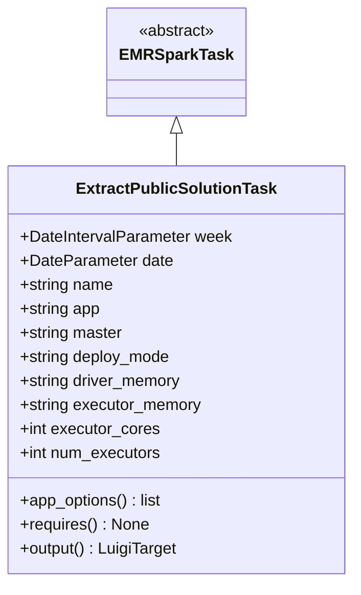
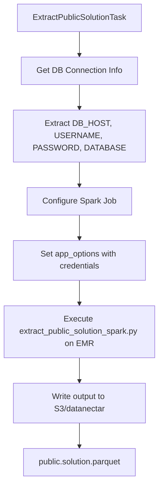

# Diagram: research/orchestrator/tasks/etl/extract_public_solution_task.py

> Auto-generated by Obscura crawlers

## Diagram 1

### SVG

<svg id="container" width="347.5" xmlns="http://www.w3.org/2000/svg" class="classDiagram" height="582" viewBox="0 0 347.5 582" role="graphics-document document" aria-roledescription="class"><g><defs><marker id="container_class-aggregationStart" class="marker aggregation class" refX="18" refY="7" markerWidth="190" markerHeight="240" orient="auto"><path d="M 18,7 L9,13 L1,7 L9,1 Z"></path></marker></defs><defs><marker id="container_class-aggregationEnd" class="marker aggregation class" refX="1" refY="7" markerWidth="20" markerHeight="28" orient="auto"><path d="M 18,7 L9,13 L1,7 L9,1 Z"></path></marker></defs><defs><marker id="container_class-extensionStart" class="marker extension class" refX="18" refY="7" markerWidth="190" markerHeight="240" orient="auto"><path d="M 1,7 L18,13 V 1 Z"></path></marker></defs><defs><marker id="container_class-extensionEnd" class="marker extension class" refX="1" refY="7" markerWidth="20" markerHeight="28" orient="auto"><path d="M 1,1 V 13 L18,7 Z"></path></marker></defs><defs><marker id="container_class-compositionStart" class="marker composition class" refX="18" refY="7" markerWidth="190" markerHeight="240" orient="auto"><path d="M 18,7 L9,13 L1,7 L9,1 Z"></path></marker></defs><defs><marker id="container_class-compositionEnd" class="marker composition class" refX="1" refY="7" markerWidth="20" markerHeight="28" orient="auto"><path d="M 18,7 L9,13 L1,7 L9,1 Z"></path></marker></defs><defs><marker id="container_class-dependencyStart" class="marker dependency class" refX="6" refY="7" markerWidth="190" markerHeight="240" orient="auto"><path d="M 5,7 L9,13 L1,7 L9,1 Z"></path></marker></defs><defs><marker id="container_class-dependencyEnd" class="marker dependency class" refX="13" refY="7" markerWidth="20" markerHeight="28" orient="auto"><path d="M 18,7 L9,13 L14,7 L9,1 Z"></path></marker></defs><defs><marker id="container_class-lollipopStart" class="marker lollipop class" refX="13" refY="7" markerWidth="190" markerHeight="240" orient="auto"><circle stroke="black" fill="transparent" cx="7" cy="7" r="6"></circle></marker></defs><defs><marker id="container_class-lollipopEnd" class="marker lollipop class" refX="1" refY="7" markerWidth="190" markerHeight="240" orient="auto"><circle stroke="black" fill="transparent" cx="7" cy="7" r="6"></circle></marker></defs><g class="root"><g class="clusters"></g><g class="edgePaths"><path d="M173.75,133.25L173.75,134.542C173.75,135.833,173.75,138.417,173.75,143.875C173.75,149.333,173.75,157.667,173.75,161.833L173.75,166" id="id_EMRSparkTask_ExtractPublicSolutionTask_1" class="edge-thickness-normal edge-pattern-solid relation" style=";;;" data-edge="true" data-et="edge" data-id="id_EMRSparkTask_ExtractPublicSolutionTask_1" data-points="W3sieCI6MTczLjc1LCJ5IjoxMTZ9LHsieCI6MTczLjc1LCJ5IjoxNDF9LHsieCI6MTczLjc1LCJ5IjoxNjZ9XQ==" marker-start="url(#container_class-extensionStart)"></path></g><g class="edgeLabels"><g class="edgeLabel"><g class="label" data-id="id_EMRSparkTask_ExtractPublicSolutionTask_1" transform="translate(0, 0)"><foreignObject width="0" height="0">

</foreignObject></g></g></g><g class="nodes"><g class="node default" id="classId-EMRSparkTask-0" transform="translate(173.75, 62)"><g class="basic label-container"><path d="M-65.1484375 -54 L65.1484375 -54 L65.1484375 54 L-65.1484375 54" stroke="none" stroke-width="0" fill="#ECECFF" style=""></path><path d="M-65.1484375 -54 C-30.16120092712756 -54, 4.826035645744881 -54, 65.1484375 -54 M-65.1484375 -54 C-15.797206695653784 -54, 33.55402410869243 -54, 65.1484375 -54 M65.1484375 -54 C65.1484375 -19.545731626062903, 65.1484375 14.908536747874194, 65.1484375 54 M65.1484375 -54 C65.1484375 -21.008953950647552, 65.1484375 11.982092098704896, 65.1484375 54 M65.1484375 54 C25.603886405192306 54, -13.940664689615389 54, -65.1484375 54 M65.1484375 54 C33.30875929495993 54, 1.4690810899198468 54, -65.1484375 54 M-65.1484375 54 C-65.1484375 28.725222276126154, -65.1484375 3.450444552252307, -65.1484375 -54 M-65.1484375 54 C-65.1484375 29.158605194696968, -65.1484375 4.317210389393935, -65.1484375 -54" stroke="#9370DB" stroke-width="1.3" fill="none" stroke-dasharray="0 0" style=""></path></g><g class="annotation-group text" transform="translate(-38.609375, -30)"><g class="label" style="" transform="translate(0,-12)"><foreignObject width="77.21875" height="24">

«abstract»

</foreignObject></g></g><g class="label-group text" transform="translate(-53.1484375, -6)"><g class="label" style="font-weight: bolder" transform="translate(0,-12)"><foreignObject width="106.296875" height="24">

EMRSparkTask

</foreignObject></g></g><g class="members-group text" transform="translate(-53.1484375, 42)"></g><g class="methods-group text" transform="translate(-53.1484375, 72)"></g><g class="divider" style=""><path d="M-65.1484375 18 C-13.28859054132699 18, 38.57125641734602 18, 65.1484375 18 M-65.1484375 18 C-33.321997513680486 18, -1.4955575273609654 18, 65.1484375 18" stroke="#9370DB" stroke-width="1.3" fill="none" stroke-dasharray="0 0" style=""></path></g><g class="divider" style=""><path d="M-65.1484375 36 C-17.27432989104276 36, 30.599777717914478 36, 65.1484375 36 M-65.1484375 36 C-19.069684000903443 36, 27.009069498193114 36, 65.1484375 36" stroke="#9370DB" stroke-width="1.3" fill="none" stroke-dasharray="0 0" style=""></path></g></g><g class="node default" id="classId-ExtractPublicSolutionTask-1" transform="translate(173.75, 370)"><g class="basic label-container"><path d="M-165.75 -204 L165.75 -204 L165.75 204 L-165.75 204" stroke="none" stroke-width="0" fill="#ECECFF" style=""></path><path d="M-165.75 -204 C-67.77328754781385 -204, 30.203424904372298 -204, 165.75 -204 M-165.75 -204 C-57.10846842652178 -204, 51.53306314695644 -204, 165.75 -204 M165.75 -204 C165.75 -78.87001579688797, 165.75 46.25996840622406, 165.75 204 M165.75 -204 C165.75 -89.65110360898097, 165.75 24.69779278203805, 165.75 204 M165.75 204 C81.47086134644925 204, -2.8082773071014913 204, -165.75 204 M165.75 204 C43.21065599564491 204, -79.32868800871017 204, -165.75 204 M-165.75 204 C-165.75 55.449816418284854, -165.75 -93.10036716343029, -165.75 -204 M-165.75 204 C-165.75 89.88355563188162, -165.75 -24.23288873623676, -165.75 -204" stroke="#9370DB" stroke-width="1.3" fill="none" stroke-dasharray="0 0" style=""></path></g><g class="annotation-group text" transform="translate(0, -180)"></g><g class="label-group text" transform="translate(-95.375, -180)"><g class="label" style="font-weight: bolder" transform="translate(0,-12)"><foreignObject width="190.75" height="24">

ExtractPublicSolutionTask

</foreignObject></g></g><g class="members-group text" transform="translate(-153.75, -132)"><g class="label" style="" transform="translate(0,-12)"><foreignObject width="212.125" height="24">

+DateIntervalParameter week

</foreignObject></g><g class="label" style="" transform="translate(0,12)"><foreignObject width="152.171875" height="24">

+DateParameter date

</foreignObject></g><g class="label" style="" transform="translate(0,36)"><foreignObject width="94.375" height="24">

+string name

</foreignObject></g><g class="label" style="" transform="translate(0,60)"><foreignObject width="81.578125" height="24">

+string app

</foreignObject></g><g class="label" style="" transform="translate(0,84)"><foreignObject width="104.03125" height="24">

+string master

</foreignObject></g><g class="label" style="" transform="translate(0,108)"><foreignObject width="152.59375" height="24">

+string deploy_mode

</foreignObject></g><g class="label" style="" transform="translate(0,132)"><foreignObject width="163.40625" height="24">

+string driver_memory

</foreignObject></g><g class="label" style="" transform="translate(0,156)"><foreignObject width="183.203125" height="24">

+string executor_memory

</foreignObject></g><g class="label" style="" transform="translate(0,180)"><foreignObject width="139.9375" height="24">

+int executor_cores

</foreignObject></g><g class="label" style="" transform="translate(0,204)"><foreignObject width="142.296875" height="24">

+int num_executors

</foreignObject></g></g><g class="methods-group text" transform="translate(-153.75, 132)"><g class="label" style="" transform="translate(0,-12)"><foreignObject width="143.609375" height="24">

+app_options() : list

</foreignObject></g><g class="label" style="" transform="translate(0,12)"><foreignObject width="128.75" height="24">

+requires() : None

</foreignObject></g><g class="label" style="" transform="translate(0,36)"><foreignObject width="158.765625" height="24">

+output() : LuigiTarget

</foreignObject></g></g><g class="divider" style=""><path d="M-165.75 -156 C-92.2585220189538 -156, -18.767044037907596 -156, 165.75 -156 M-165.75 -156 C-90.80801421424434 -156, -15.866028428488676 -156, 165.75 -156" stroke="#9370DB" stroke-width="1.3" fill="none" stroke-dasharray="0 0" style=""></path></g><g class="divider" style=""><path d="M-165.75 108 C-83.21936521933033 108, -0.6887304386606559 108, 165.75 108 M-165.75 108 C-74.09391484200953 108, 17.56217031598095 108, 165.75 108" stroke="#9370DB" stroke-width="1.3" fill="none" stroke-dasharray="0 0" style=""></path></g></g></g></g></g></svg>

## Diagram 2

### SVG

<svg id="container" width="321.15625" xmlns="http://www.w3.org/2000/svg" class="flowchart" height="942" viewBox="0 0 321.15625 942" role="graphics-document document" aria-roledescription="flowchart-v2"><g><marker id="container_flowchart-v2-pointEnd" class="marker flowchart-v2" viewBox="0 0 10 10" refX="5" refY="5" markerUnits="userSpaceOnUse" markerWidth="8" markerHeight="8" orient="auto"><path d="M 0 0 L 10 5 L 0 10 z" class="arrowMarkerPath" style="stroke-width: 1; stroke-dasharray: 1, 0;"></path></marker><marker id="container_flowchart-v2-pointStart" class="marker flowchart-v2" viewBox="0 0 10 10" refX="4.5" refY="5" markerUnits="userSpaceOnUse" markerWidth="8" markerHeight="8" orient="auto"><path d="M 0 5 L 10 10 L 10 0 z" class="arrowMarkerPath" style="stroke-width: 1; stroke-dasharray: 1, 0;"></path></marker><marker id="container_flowchart-v2-circleEnd" class="marker flowchart-v2" viewBox="0 0 10 10" refX="11" refY="5" markerUnits="userSpaceOnUse" markerWidth="11" markerHeight="11" orient="auto"><circle cx="5" cy="5" r="5" class="arrowMarkerPath" style="stroke-width: 1; stroke-dasharray: 1, 0;"></circle></marker><marker id="container_flowchart-v2-circleStart" class="marker flowchart-v2" viewBox="0 0 10 10" refX="-1" refY="5" markerUnits="userSpaceOnUse" markerWidth="11" markerHeight="11" orient="auto"><circle cx="5" cy="5" r="5" class="arrowMarkerPath" style="stroke-width: 1; stroke-dasharray: 1, 0;"></circle></marker><marker id="container_flowchart-v2-crossEnd" class="marker cross flowchart-v2" viewBox="0 0 11 11" refX="12" refY="5.2" markerUnits="userSpaceOnUse" markerWidth="11" markerHeight="11" orient="auto"><path d="M 1,1 l 9,9 M 10,1 l -9,9" class="arrowMarkerPath" style="stroke-width: 2; stroke-dasharray: 1, 0;"></path></marker><marker id="container_flowchart-v2-crossStart" class="marker cross flowchart-v2" viewBox="0 0 11 11" refX="-1" refY="5.2" markerUnits="userSpaceOnUse" markerWidth="11" markerHeight="11" orient="auto"><path d="M 1,1 l 9,9 M 10,1 l -9,9" class="arrowMarkerPath" style="stroke-width: 2; stroke-dasharray: 1, 0;"></path></marker><g class="root"><g class="clusters"></g><g class="edgePaths"><path d="M160.578,62L160.578,66.167C160.578,70.333,160.578,78.667,160.578,86.333C160.578,94,160.578,101,160.578,104.5L160.578,108" id="L_A_B_0" class="edge-thickness-normal edge-pattern-solid edge-thickness-normal edge-pattern-solid flowchart-link" style=";" data-edge="true" data-et="edge" data-id="L_A_B_0" data-points="W3sieCI6MTYwLjU3ODEyNSwieSI6NjJ9LHsieCI6MTYwLjU3ODEyNSwieSI6ODd9LHsieCI6MTYwLjU3ODEyNSwieSI6MTEyfV0=" marker-end="url(#container_flowchart-v2-pointEnd)"></path><path d="M160.578,166L160.578,170.167C160.578,174.333,160.578,182.667,160.578,190.333C160.578,198,160.578,205,160.578,208.5L160.578,212" id="L_B_C_0" class="edge-thickness-normal edge-pattern-solid edge-thickness-normal edge-pattern-solid flowchart-link" style=";" data-edge="true" data-et="edge" data-id="L_B_C_0" data-points="W3sieCI6MTYwLjU3ODEyNSwieSI6MTY2fSx7IngiOjE2MC41NzgxMjUsInkiOjE5MX0seyJ4IjoxNjAuNTc4MTI1LCJ5IjoyMTZ9XQ==" marker-end="url(#container_flowchart-v2-pointEnd)"></path><path d="M160.578,318L160.578,322.167C160.578,326.333,160.578,334.667,160.578,342.333C160.578,350,160.578,357,160.578,360.5L160.578,364" id="L_C_D_0" class="edge-thickness-normal edge-pattern-solid edge-thickness-normal edge-pattern-solid flowchart-link" style=";" data-edge="true" data-et="edge" data-id="L_C_D_0" data-points="W3sieCI6MTYwLjU3ODEyNSwieSI6MzE4fSx7IngiOjE2MC41NzgxMjUsInkiOjM0M30seyJ4IjoxNjAuNTc4MTI1LCJ5IjozNjh9XQ==" marker-end="url(#container_flowchart-v2-pointEnd)"></path><path d="M160.578,422L160.578,426.167C160.578,430.333,160.578,438.667,160.578,446.333C160.578,454,160.578,461,160.578,464.5L160.578,468" id="L_D_E_0" class="edge-thickness-normal edge-pattern-solid edge-thickness-normal edge-pattern-solid flowchart-link" style=";" data-edge="true" data-et="edge" data-id="L_D_E_0" data-points="W3sieCI6MTYwLjU3ODEyNSwieSI6NDIyfSx7IngiOjE2MC41NzgxMjUsInkiOjQ0N30seyJ4IjoxNjAuNTc4MTI1LCJ5Ijo0NzJ9XQ==" marker-end="url(#container_flowchart-v2-pointEnd)"></path><path d="M160.578,550L160.578,554.167C160.578,558.333,160.578,566.667,160.578,574.333C160.578,582,160.578,589,160.578,592.5L160.578,596" id="L_E_F_0" class="edge-thickness-normal edge-pattern-solid edge-thickness-normal edge-pattern-solid flowchart-link" style=";" data-edge="true" data-et="edge" data-id="L_E_F_0" data-points="W3sieCI6MTYwLjU3ODEyNSwieSI6NTUwfSx7IngiOjE2MC41NzgxMjUsInkiOjU3NX0seyJ4IjoxNjAuNTc4MTI1LCJ5Ijo2MDB9XQ==" marker-end="url(#container_flowchart-v2-pointEnd)"></path><path d="M160.578,702L160.578,706.167C160.578,710.333,160.578,718.667,160.578,726.333C160.578,734,160.578,741,160.578,744.5L160.578,748" id="L_F_G_0" class="edge-thickness-normal edge-pattern-solid edge-thickness-normal edge-pattern-solid flowchart-link" style=";" data-edge="true" data-et="edge" data-id="L_F_G_0" data-points="W3sieCI6MTYwLjU3ODEyNSwieSI6NzAyfSx7IngiOjE2MC41NzgxMjUsInkiOjcyN30seyJ4IjoxNjAuNTc4MTI1LCJ5Ijo3NTJ9XQ==" marker-end="url(#container_flowchart-v2-pointEnd)"></path><path d="M160.578,830L160.578,834.167C160.578,838.333,160.578,846.667,160.578,854.333C160.578,862,160.578,869,160.578,872.5L160.578,876" id="L_G_H_0" class="edge-thickness-normal edge-pattern-solid edge-thickness-normal edge-pattern-solid flowchart-link" style=";" data-edge="true" data-et="edge" data-id="L_G_H_0" data-points="W3sieCI6MTYwLjU3ODEyNSwieSI6ODMwfSx7IngiOjE2MC41NzgxMjUsInkiOjg1NX0seyJ4IjoxNjAuNTc4MTI1LCJ5Ijo4ODB9XQ==" marker-end="url(#container_flowchart-v2-pointEnd)"></path></g><g class="edgeLabels"><g class="edgeLabel"><g class="label" data-id="L_A_B_0" transform="translate(0, 0)"><foreignObject width="0" height="0">

</foreignObject></g></g><g class="edgeLabel"><g class="label" data-id="L_B_C_0" transform="translate(0, 0)"><foreignObject width="0" height="0">

</foreignObject></g></g><g class="edgeLabel"><g class="label" data-id="L_C_D_0" transform="translate(0, 0)"><foreignObject width="0" height="0">

</foreignObject></g></g><g class="edgeLabel"><g class="label" data-id="L_D_E_0" transform="translate(0, 0)"><foreignObject width="0" height="0">

</foreignObject></g></g><g class="edgeLabel"><g class="label" data-id="L_E_F_0" transform="translate(0, 0)"><foreignObject width="0" height="0">

</foreignObject></g></g><g class="edgeLabel"><g class="label" data-id="L_F_G_0" transform="translate(0, 0)"><foreignObject width="0" height="0">

</foreignObject></g></g><g class="edgeLabel"><g class="label" data-id="L_G_H_0" transform="translate(0, 0)"><foreignObject width="0" height="0">

</foreignObject></g></g></g><g class="nodes"><g class="node default" id="flowchart-A-0" transform="translate(160.578125, 35)"><rect class="basic label-container" style="" x="-123.5625" y="-27" width="247.125" height="54"></rect><g class="label" style="" transform="translate(-93.5625, -12)"><rect></rect><foreignObject width="187.125" height="24">

ExtractPublicSolutionTask

</foreignObject></g></g><g class="node default" id="flowchart-B-1" transform="translate(160.578125, 139)"><rect class="basic label-container" style="" x="-114.0546875" y="-27" width="228.109375" height="54"></rect><g class="label" style="" transform="translate(-84.0546875, -12)"><rect></rect><foreignObject width="168.109375" height="24">

Get DB Connection Info

</foreignObject></g></g><g class="node default" id="flowchart-C-3" transform="translate(160.578125, 267)"><rect class="basic label-container" style="" x="-130" y="-51" width="260" height="102"></rect><g class="label" style="" transform="translate(-100, -36)"><rect></rect><foreignObject width="200" height="72">

Extract DB_HOST, USERNAME, PASSWORD, DATABASE

</foreignObject></g></g><g class="node default" id="flowchart-D-5" transform="translate(160.578125, 395)"><rect class="basic label-container" style="" x="-100.8984375" y="-27" width="201.796875" height="54"></rect><g class="label" style="" transform="translate(-70.8984375, -12)"><rect></rect><foreignObject width="141.796875" height="24">

Configure Spark Job

</foreignObject></g></g><g class="node default" id="flowchart-E-7" transform="translate(160.578125, 511)"><rect class="basic label-container" style="" x="-130" y="-39" width="260" height="78"></rect><g class="label" style="" transform="translate(-100, -24)"><rect></rect><foreignObject width="200" height="48">

Set app_options with credentials

</foreignObject></g></g><g class="node default" id="flowchart-F-9" transform="translate(160.578125, 651)"><rect class="basic label-container" style="" x="-152.578125" y="-51" width="305.15625" height="102"></rect><g class="label" style="" transform="translate(-122.578125, -36)"><rect></rect><foreignObject width="245.15625" height="72">

Execute extract_public_solution_spark.py on EMR

</foreignObject></g></g><g class="node default" id="flowchart-G-11" transform="translate(160.578125, 791)"><rect class="basic label-container" style="" x="-130" y="-39" width="260" height="78"></rect><g class="label" style="" transform="translate(-100, -24)"><rect></rect><foreignObject width="200" height="48">

Write output to S3/datanectar

</foreignObject></g></g><g class="node default" id="flowchart-H-13" transform="translate(160.578125, 907)"><rect class="basic label-container" style="" x="-115.015625" y="-27" width="230.03125" height="54"></rect><g class="label" style="" transform="translate(-85.015625, -12)"><rect></rect><foreignObject width="170.03125" height="24">

public.solution.parquet

</foreignObject></g></g></g></g></g></svg>
