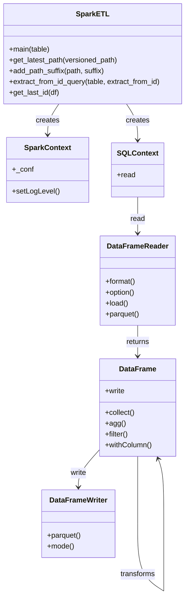
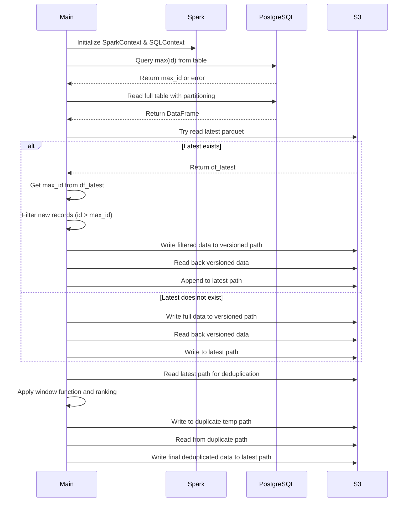

# Diagram: research/orchestrator/tasks/etl/extract_public_status_update_spark.py

> Auto-generated by Obscura crawlers

## Diagram 1

```mermaid
flowchart TD
    Start([Start: main function]) --> GetArgs[Get command line arguments:<br/>s3_output_path, DB_HOSTNAME,<br/>DB_USERNAME, DB_PASSWORD, DATABASE]
    GetArgs --> InitSpark[Initialize SparkContext with YARN<br/>and configure settings]
    InitSpark --> InitSQL[Create SQLContext]
    InitSQL --> GetMaxId[Query PostgreSQL for max id<br/>from table]
    GetMaxId --> CheckMaxId{Max id<br/>retrieved?}
    CheckMaxId -->|Error| SetDefault[Set max_id = 6000000000]
    CheckMaxId -->|Success| ReadDB[Read data from PostgreSQL<br/>with partitioning by id]
    SetDefault --> ReadDB
    ReadDB --> GetLatestPath[Get latest S3 path<br/>using get_latest_path]
    GetLatestPath --> TryReadLatest[Try to read existing<br/>parquet from latest path]
    TryReadLatest --> CheckLatest{df_latest<br/>exists?}
    CheckLatest -->|Yes| GetMaxFromLatest[Get max id from df_latest]
    GetMaxFromLatest --> FilterNew[Filter df where id > max_id]
    FilterNew --> WriteVersioned[Write filtered df to<br/>versioned S3 path]
    WriteVersioned --> ReadBack1[Read back from<br/>versioned path]
    ReadBack1 --> AppendLatest[Append to latest S3 path]
    CheckLatest -->|No| WriteVersioned2[Write df to versioned<br/>S3 path overwrite]
    WriteVersioned2 --> ReadBack2[Read from versioned path]
    ReadBack2 --> WriteLatest[Write to latest S3 path<br/>overwrite]
    AppendLatest --> Dedup[Read from latest path]
    WriteLatest --> Dedup
    Dedup --> CreateWindow[Create Window partitioned by id<br/>ordered by status_update_ts desc]
    CreateWindow --> AddRank[Add row_rank column<br/>using rank function]
    AddRank --> CreateDupePath[Create duplicate path name]
    CreateDupePath --> WriteDupe[Write to duplicate path]
    WriteDupe --> ReadDupe[Read from duplicate path]
    ReadDupe --> WriteFinal[Write final deduplicated<br/>data to latest path]
    WriteFinal --> End([End])
```

### SVG

<svg id="container" width="545.2578125" xmlns="http://www.w3.org/2000/svg" class="flowchart" height="3192.421875" viewBox="0 0 545.2578125 3192.421875" role="graphics-document document" aria-roledescription="flowchart-v2"><g><marker id="container_flowchart-v2-pointEnd" class="marker flowchart-v2" viewBox="0 0 10 10" refX="5" refY="5" markerUnits="userSpaceOnUse" markerWidth="8" markerHeight="8" orient="auto"><path d="M 0 0 L 10 5 L 0 10 z" class="arrowMarkerPath" style="stroke-width: 1; stroke-dasharray: 1, 0;"></path></marker><marker id="container_flowchart-v2-pointStart" class="marker flowchart-v2" viewBox="0 0 10 10" refX="4.5" refY="5" markerUnits="userSpaceOnUse" markerWidth="8" markerHeight="8" orient="auto"><path d="M 0 5 L 10 10 L 10 0 z" class="arrowMarkerPath" style="stroke-width: 1; stroke-dasharray: 1, 0;"></path></marker><marker id="container_flowchart-v2-circleEnd" class="marker flowchart-v2" viewBox="0 0 10 10" refX="11" refY="5" markerUnits="userSpaceOnUse" markerWidth="11" markerHeight="11" orient="auto"><circle cx="5" cy="5" r="5" class="arrowMarkerPath" style="stroke-width: 1; stroke-dasharray: 1, 0;"></circle></marker><marker id="container_flowchart-v2-circleStart" class="marker flowchart-v2" viewBox="0 0 10 10" refX="-1" refY="5" markerUnits="userSpaceOnUse" markerWidth="11" markerHeight="11" orient="auto"><circle cx="5" cy="5" r="5" class="arrowMarkerPath" style="stroke-width: 1; stroke-dasharray: 1, 0;"></circle></marker><marker id="container_flowchart-v2-crossEnd" class="marker cross flowchart-v2" viewBox="0 0 11 11" refX="12" refY="5.2" markerUnits="userSpaceOnUse" markerWidth="11" markerHeight="11" orient="auto"><path d="M 1,1 l 9,9 M 10,1 l -9,9" class="arrowMarkerPath" style="stroke-width: 2; stroke-dasharray: 1, 0;"></path></marker><marker id="container_flowchart-v2-crossStart" class="marker cross flowchart-v2" viewBox="0 0 11 11" refX="-1" refY="5.2" markerUnits="userSpaceOnUse" markerWidth="11" markerHeight="11" orient="auto"><path d="M 1,1 l 9,9 M 10,1 l -9,9" class="arrowMarkerPath" style="stroke-width: 2; stroke-dasharray: 1, 0;"></path></marker><g class="root"><g class="clusters"></g><g class="edgePaths"><path d="M274.113,47.5L274.03,51.583C273.947,55.667,273.78,63.833,273.697,71.417C273.613,79,273.613,86,273.613,89.5L273.613,93" id="L_Start_GetArgs_0" class="edge-thickness-normal edge-pattern-solid edge-thickness-normal edge-pattern-solid flowchart-link" style=";" data-edge="true" data-et="edge" data-id="L_Start_GetArgs_0" data-points="W3sieCI6Mjc0LjExMzI4MTI1LCJ5Ijo0Ny41fSx7IngiOjI3My42MTMyODEyNSwieSI6NzJ9LHsieCI6MjczLjYxMzI4MTI1LCJ5Ijo5N31d" marker-end="url(#container_flowchart-v2-pointEnd)"></path><path d="M273.613,271L273.613,275.167C273.613,279.333,273.613,287.667,273.613,295.333C273.613,303,273.613,310,273.613,313.5L273.613,317" id="L_GetArgs_InitSpark_0" class="edge-thickness-normal edge-pattern-solid edge-thickness-normal edge-pattern-solid flowchart-link" style=";" data-edge="true" data-et="edge" data-id="L_GetArgs_InitSpark_0" data-points="W3sieCI6MjczLjYxMzI4MTI1LCJ5IjoyNzF9LHsieCI6MjczLjYxMzI4MTI1LCJ5IjoyOTZ9LHsieCI6MjczLjYxMzI4MTI1LCJ5IjozMjF9XQ==" marker-end="url(#container_flowchart-v2-pointEnd)"></path><path d="M273.613,423L273.613,427.167C273.613,431.333,273.613,439.667,273.613,447.333C273.613,455,273.613,462,273.613,465.5L273.613,469" id="L_InitSpark_InitSQL_0" class="edge-thickness-normal edge-pattern-solid edge-thickness-normal edge-pattern-solid flowchart-link" style=";" data-edge="true" data-et="edge" data-id="L_InitSpark_InitSQL_0" data-points="W3sieCI6MjczLjYxMzI4MTI1LCJ5Ijo0MjN9LHsieCI6MjczLjYxMzI4MTI1LCJ5Ijo0NDh9LHsieCI6MjczLjYxMzI4MTI1LCJ5Ijo0NzN9XQ==" marker-end="url(#container_flowchart-v2-pointEnd)"></path><path d="M273.613,527L273.613,531.167C273.613,535.333,273.613,543.667,273.613,551.333C273.613,559,273.613,566,273.613,569.5L273.613,573" id="L_InitSQL_GetMaxId_0" class="edge-thickness-normal edge-pattern-solid edge-thickness-normal edge-pattern-solid flowchart-link" style=";" data-edge="true" data-et="edge" data-id="L_InitSQL_GetMaxId_0" data-points="W3sieCI6MjczLjYxMzI4MTI1LCJ5Ijo1Mjd9LHsieCI6MjczLjYxMzI4MTI1LCJ5Ijo1NTJ9LHsieCI6MjczLjYxMzI4MTI1LCJ5Ijo1Nzd9XQ==" marker-end="url(#container_flowchart-v2-pointEnd)"></path><path d="M273.613,679L273.613,683.167C273.613,687.333,273.613,695.667,273.613,703.333C273.613,711,273.613,718,273.613,721.5L273.613,725" id="L_GetMaxId_CheckMaxId_0" class="edge-thickness-normal edge-pattern-solid edge-thickness-normal edge-pattern-solid flowchart-link" style=";" data-edge="true" data-et="edge" data-id="L_GetMaxId_CheckMaxId_0" data-points="W3sieCI6MjczLjYxMzI4MTI1LCJ5Ijo2Nzl9LHsieCI6MjczLjYxMzI4MTI1LCJ5Ijo3MDR9LHsieCI6MjczLjYxMzI4MTI1LCJ5Ijo3Mjl9XQ==" marker-end="url(#container_flowchart-v2-pointEnd)"></path><path d="M307.759,845.838L317.552,857.696C327.345,869.554,346.93,893.269,356.723,910.627C366.516,927.984,366.516,938.984,366.516,944.484L366.516,949.984" id="L_CheckMaxId_SetDefault_0" class="edge-thickness-normal edge-pattern-solid edge-thickness-normal edge-pattern-solid flowchart-link" style=";" data-edge="true" data-et="edge" data-id="L_CheckMaxId_SetDefault_0" data-points="W3sieCI6MzA3Ljc1OTI3ODc2NDU0OSwieSI6ODQ1LjgzODM3NzQ4NTQ1MX0seyJ4IjozNjYuNTE1NjI1LCJ5Ijo5MTYuOTg0Mzc1fSx7IngiOjM2Ni41MTU2MjUsInkiOjk1My45ODQzNzV9XQ==" marker-end="url(#container_flowchart-v2-pointEnd)"></path><path d="M239.467,845.838L229.675,857.696C219.882,869.554,200.296,893.269,190.504,915.793C180.711,938.318,180.711,959.651,180.711,978.984C180.711,998.318,180.711,1015.651,186.21,1028.106C191.71,1040.561,202.708,1048.138,208.208,1051.927L213.707,1055.715" id="L_CheckMaxId_ReadDB_0" class="edge-thickness-normal edge-pattern-solid edge-thickness-normal edge-pattern-solid flowchart-link" style=";" data-edge="true" data-et="edge" data-id="L_CheckMaxId_ReadDB_0" data-points="W3sieCI6MjM5LjQ2NzI4MzczNTQ1MTAyLCJ5Ijo4NDUuODM4Mzc3NDg1NDUxfSx7IngiOjE4MC43MTA5Mzc1LCJ5Ijo5MTYuOTg0Mzc1fSx7IngiOjE4MC43MTA5Mzc1LCJ5Ijo5ODAuOTg0Mzc1fSx7IngiOjE4MC43MTA5Mzc1LCJ5IjoxMDMyLjk4NDM3NX0seyJ4IjoyMTcuMDAwOTE1NTI3MzQzNzUsInkiOjEwNTcuOTg0Mzc1fV0=" marker-end="url(#container_flowchart-v2-pointEnd)"></path><path d="M366.516,1007.984L366.516,1012.151C366.516,1016.318,366.516,1024.651,361.016,1032.606C355.517,1040.561,344.518,1048.138,339.019,1051.927L333.52,1055.715" id="L_SetDefault_ReadDB_0" class="edge-thickness-normal edge-pattern-solid edge-thickness-normal edge-pattern-solid flowchart-link" style=";" data-edge="true" data-et="edge" data-id="L_SetDefault_ReadDB_0" data-points="W3sieCI6MzY2LjUxNTYyNSwieSI6MTAwNy45ODQzNzV9LHsieCI6MzY2LjUxNTYyNSwieSI6MTAzMi45ODQzNzV9LHsieCI6MzMwLjIyNTY0Njk3MjY1NjI1LCJ5IjoxMDU3Ljk4NDM3NX1d" marker-end="url(#container_flowchart-v2-pointEnd)"></path><path d="M273.613,1135.984L273.613,1140.151C273.613,1144.318,273.613,1152.651,273.613,1160.318C273.613,1167.984,273.613,1174.984,273.613,1178.484L273.613,1181.984" id="L_ReadDB_GetLatestPath_0" class="edge-thickness-normal edge-pattern-solid edge-thickness-normal edge-pattern-solid flowchart-link" style=";" data-edge="true" data-et="edge" data-id="L_ReadDB_GetLatestPath_0" data-points="W3sieCI6MjczLjYxMzI4MTI1LCJ5IjoxMTM1Ljk4NDM3NX0seyJ4IjoyNzMuNjEzMjgxMjUsInkiOjExNjAuOTg0Mzc1fSx7IngiOjI3My42MTMyODEyNSwieSI6MTE4NS45ODQzNzV9XQ==" marker-end="url(#container_flowchart-v2-pointEnd)"></path><path d="M273.613,1263.984L273.613,1268.151C273.613,1272.318,273.613,1280.651,273.613,1288.318C273.613,1295.984,273.613,1302.984,273.613,1306.484L273.613,1309.984" id="L_GetLatestPath_TryReadLatest_0" class="edge-thickness-normal edge-pattern-solid edge-thickness-normal edge-pattern-solid flowchart-link" style=";" data-edge="true" data-et="edge" data-id="L_GetLatestPath_TryReadLatest_0" data-points="W3sieCI6MjczLjYxMzI4MTI1LCJ5IjoxMjYzLjk4NDM3NX0seyJ4IjoyNzMuNjEzMjgxMjUsInkiOjEyODguOTg0Mzc1fSx7IngiOjI3My42MTMyODEyNSwieSI6MTMxMy45ODQzNzV9XQ==" marker-end="url(#container_flowchart-v2-pointEnd)"></path><path d="M273.613,1391.984L273.613,1396.151C273.613,1400.318,273.613,1408.651,273.613,1416.318C273.613,1423.984,273.613,1430.984,273.613,1434.484L273.613,1437.984" id="L_TryReadLatest_CheckLatest_0" class="edge-thickness-normal edge-pattern-solid edge-thickness-normal edge-pattern-solid flowchart-link" style=";" data-edge="true" data-et="edge" data-id="L_TryReadLatest_CheckLatest_0" data-points="W3sieCI6MjczLjYxMzI4MTI1LCJ5IjoxMzkxLjk4NDM3NX0seyJ4IjoyNzMuNjEzMjgxMjUsInkiOjE0MTYuOTg0Mzc1fSx7IngiOjI3My42MTMyODEyNSwieSI6MTQ0MS45ODQzNzV9XQ==" marker-end="url(#container_flowchart-v2-pointEnd)"></path><path d="M233.676,1543.484L217.038,1556.307C200.401,1569.13,167.126,1594.776,150.489,1613.099C133.852,1631.422,133.852,1642.422,133.852,1647.922L133.852,1653.422" id="L_CheckLatest_GetMaxFromLatest_0" class="edge-thickness-normal edge-pattern-solid edge-thickness-normal edge-pattern-solid flowchart-link" style=";" data-edge="true" data-et="edge" data-id="L_CheckLatest_GetMaxFromLatest_0" data-points="W3sieCI6MjMzLjY3NTY4OTAxMTgxODMyLCJ5IjoxNTQzLjQ4NDI4Mjc2MTgxODN9LHsieCI6MTMzLjg1MTU2MjUsInkiOjE2MjAuNDIxODc1fSx7IngiOjEzMy44NTE1NjI1LCJ5IjoxNjU3LjQyMTg3NX1d" marker-end="url(#container_flowchart-v2-pointEnd)"></path><path d="M133.852,1711.422L133.852,1717.589C133.852,1723.755,133.852,1736.089,133.852,1747.755C133.852,1759.422,133.852,1770.422,133.852,1775.922L133.852,1781.422" id="L_GetMaxFromLatest_FilterNew_0" class="edge-thickness-normal edge-pattern-solid edge-thickness-normal edge-pattern-solid flowchart-link" style=";" data-edge="true" data-et="edge" data-id="L_GetMaxFromLatest_FilterNew_0" data-points="W3sieCI6MTMzLjg1MTU2MjUsInkiOjE3MTEuNDIxODc1fSx7IngiOjEzMy44NTE1NjI1LCJ5IjoxNzQ4LjQyMTg3NX0seyJ4IjoxMzMuODUxNTYyNSwieSI6MTc4NS40MjE4NzV9XQ==" marker-end="url(#container_flowchart-v2-pointEnd)"></path><path d="M133.852,1839.422L133.852,1843.589C133.852,1847.755,133.852,1856.089,133.852,1863.755C133.852,1871.422,133.852,1878.422,133.852,1881.922L133.852,1885.422" id="L_FilterNew_WriteVersioned_0" class="edge-thickness-normal edge-pattern-solid edge-thickness-normal edge-pattern-solid flowchart-link" style=";" data-edge="true" data-et="edge" data-id="L_FilterNew_WriteVersioned_0" data-points="W3sieCI6MTMzLjg1MTU2MjUsInkiOjE4MzkuNDIxODc1fSx7IngiOjEzMy44NTE1NjI1LCJ5IjoxODY0LjQyMTg3NX0seyJ4IjoxMzMuODUxNTYyNSwieSI6MTg4OS40MjE4NzV9XQ==" marker-end="url(#container_flowchart-v2-pointEnd)"></path><path d="M133.852,1967.422L133.852,1971.589C133.852,1975.755,133.852,1984.089,133.852,1991.755C133.852,1999.422,133.852,2006.422,133.852,2009.922L133.852,2013.422" id="L_WriteVersioned_ReadBack1_0" class="edge-thickness-normal edge-pattern-solid edge-thickness-normal edge-pattern-solid flowchart-link" style=";" data-edge="true" data-et="edge" data-id="L_WriteVersioned_ReadBack1_0" data-points="W3sieCI6MTMzLjg1MTU2MjUsInkiOjE5NjcuNDIxODc1fSx7IngiOjEzMy44NTE1NjI1LCJ5IjoxOTkyLjQyMTg3NX0seyJ4IjoxMzMuODUxNTYyNSwieSI6MjAxNy40MjE4NzV9XQ==" marker-end="url(#container_flowchart-v2-pointEnd)"></path><path d="M133.852,2095.422L133.852,2099.589C133.852,2103.755,133.852,2112.089,133.852,2121.755C133.852,2131.422,133.852,2142.422,133.852,2147.922L133.852,2153.422" id="L_ReadBack1_AppendLatest_0" class="edge-thickness-normal edge-pattern-solid edge-thickness-normal edge-pattern-solid flowchart-link" style=";" data-edge="true" data-et="edge" data-id="L_ReadBack1_AppendLatest_0" data-points="W3sieCI6MTMzLjg1MTU2MjUsInkiOjIwOTUuNDIxODc1fSx7IngiOjEzMy44NTE1NjI1LCJ5IjoyMTIwLjQyMTg3NX0seyJ4IjoxMzMuODUxNTYyNSwieSI6MjE1Ny40MjE4NzV9XQ==" marker-end="url(#container_flowchart-v2-pointEnd)"></path><path d="M313.551,1543.484L330.188,1556.307C346.826,1569.13,380.1,1594.776,396.738,1618.266C413.375,1641.755,413.375,1663.089,413.375,1684.422C413.375,1705.755,413.375,1727.089,413.375,1748.422C413.375,1769.755,413.375,1791.089,413.375,1810.422C413.375,1829.755,413.375,1847.089,413.375,1859.255C413.375,1871.422,413.375,1878.422,413.375,1881.922L413.375,1885.422" id="L_CheckLatest_WriteVersioned2_0" class="edge-thickness-normal edge-pattern-solid edge-thickness-normal edge-pattern-solid flowchart-link" style=";" data-edge="true" data-et="edge" data-id="L_CheckLatest_WriteVersioned2_0" data-points="W3sieCI6MzEzLjU1MDg3MzQ4ODE4MTY1LCJ5IjoxNTQzLjQ4NDI4Mjc2MTgxODN9LHsieCI6NDEzLjM3NSwieSI6MTYyMC40MjE4NzV9LHsieCI6NDEzLjM3NSwieSI6MTY4NC40MjE4NzV9LHsieCI6NDEzLjM3NSwieSI6MTc0OC40MjE4NzV9LHsieCI6NDEzLjM3NSwieSI6MTgxMi40MjE4NzV9LHsieCI6NDEzLjM3NSwieSI6MTg2NC40MjE4NzV9LHsieCI6NDEzLjM3NSwieSI6MTg4OS40MjE4NzV9XQ==" marker-end="url(#container_flowchart-v2-pointEnd)"></path><path d="M413.375,1967.422L413.375,1971.589C413.375,1975.755,413.375,1984.089,413.375,1993.755C413.375,2003.422,413.375,2014.422,413.375,2019.922L413.375,2025.422" id="L_WriteVersioned2_ReadBack2_0" class="edge-thickness-normal edge-pattern-solid edge-thickness-normal edge-pattern-solid flowchart-link" style=";" data-edge="true" data-et="edge" data-id="L_WriteVersioned2_ReadBack2_0" data-points="W3sieCI6NDEzLjM3NSwieSI6MTk2Ny40MjE4NzV9LHsieCI6NDEzLjM3NSwieSI6MTk5Mi40MjE4NzV9LHsieCI6NDEzLjM3NSwieSI6MjAyOS40MjE4NzV9XQ==" marker-end="url(#container_flowchart-v2-pointEnd)"></path><path d="M413.375,2083.422L413.375,2089.589C413.375,2095.755,413.375,2108.089,413.375,2117.755C413.375,2127.422,413.375,2134.422,413.375,2137.922L413.375,2141.422" id="L_ReadBack2_WriteLatest_0" class="edge-thickness-normal edge-pattern-solid edge-thickness-normal edge-pattern-solid flowchart-link" style=";" data-edge="true" data-et="edge" data-id="L_ReadBack2_WriteLatest_0" data-points="W3sieCI6NDEzLjM3NSwieSI6MjA4My40MjE4NzV9LHsieCI6NDEzLjM3NSwieSI6MjEyMC40MjE4NzV9LHsieCI6NDEzLjM3NSwieSI6MjE0NS40MjE4NzV9XQ==" marker-end="url(#container_flowchart-v2-pointEnd)"></path><path d="M133.852,2211.422L133.852,2217.589C133.852,2223.755,133.852,2236.089,144.426,2246.189C155,2256.29,176.148,2264.159,186.722,2268.093L197.296,2272.027" id="L_AppendLatest_Dedup_0" class="edge-thickness-normal edge-pattern-solid edge-thickness-normal edge-pattern-solid flowchart-link" style=";" data-edge="true" data-et="edge" data-id="L_AppendLatest_Dedup_0" data-points="W3sieCI6MTMzLjg1MTU2MjUsInkiOjIyMTEuNDIxODc1fSx7IngiOjEzMy44NTE1NjI1LCJ5IjoyMjQ4LjQyMTg3NX0seyJ4IjoyMDEuMDQ0Njk2NTE0NDIzMSwieSI6MjI3My40MjE4NzV9XQ==" marker-end="url(#container_flowchart-v2-pointEnd)"></path><path d="M413.375,2223.422L413.375,2227.589C413.375,2231.755,413.375,2240.089,402.801,2248.189C392.227,2256.29,371.079,2264.159,360.505,2268.093L349.931,2272.027" id="L_WriteLatest_Dedup_0" class="edge-thickness-normal edge-pattern-solid edge-thickness-normal edge-pattern-solid flowchart-link" style=";" data-edge="true" data-et="edge" data-id="L_WriteLatest_Dedup_0" data-points="W3sieCI6NDEzLjM3NSwieSI6MjIyMy40MjE4NzV9LHsieCI6NDEzLjM3NSwieSI6MjI0OC40MjE4NzV9LHsieCI6MzQ2LjE4MTg2NTk4NTU3NjksInkiOjIyNzMuNDIxODc1fV0=" marker-end="url(#container_flowchart-v2-pointEnd)"></path><path d="M273.613,2327.422L273.613,2331.589C273.613,2335.755,273.613,2344.089,273.613,2351.755C273.613,2359.422,273.613,2366.422,273.613,2369.922L273.613,2373.422" id="L_Dedup_CreateWindow_0" class="edge-thickness-normal edge-pattern-solid edge-thickness-normal edge-pattern-solid flowchart-link" style=";" data-edge="true" data-et="edge" data-id="L_Dedup_CreateWindow_0" data-points="W3sieCI6MjczLjYxMzI4MTI1LCJ5IjoyMzI3LjQyMTg3NX0seyJ4IjoyNzMuNjEzMjgxMjUsInkiOjIzNTIuNDIxODc1fSx7IngiOjI3My42MTMyODEyNSwieSI6MjM3Ny40MjE4NzV9XQ==" marker-end="url(#container_flowchart-v2-pointEnd)"></path><path d="M273.613,2503.422L273.613,2507.589C273.613,2511.755,273.613,2520.089,273.613,2527.755C273.613,2535.422,273.613,2542.422,273.613,2545.922L273.613,2549.422" id="L_CreateWindow_AddRank_0" class="edge-thickness-normal edge-pattern-solid edge-thickness-normal edge-pattern-solid flowchart-link" style=";" data-edge="true" data-et="edge" data-id="L_CreateWindow_AddRank_0" data-points="W3sieCI6MjczLjYxMzI4MTI1LCJ5IjoyNTAzLjQyMTg3NX0seyJ4IjoyNzMuNjEzMjgxMjUsInkiOjI1MjguNDIxODc1fSx7IngiOjI3My42MTMyODEyNSwieSI6MjU1My40MjE4NzV9XQ==" marker-end="url(#container_flowchart-v2-pointEnd)"></path><path d="M273.613,2631.422L273.613,2635.589C273.613,2639.755,273.613,2648.089,273.613,2655.755C273.613,2663.422,273.613,2670.422,273.613,2673.922L273.613,2677.422" id="L_AddRank_CreateDupePath_0" class="edge-thickness-normal edge-pattern-solid edge-thickness-normal edge-pattern-solid flowchart-link" style=";" data-edge="true" data-et="edge" data-id="L_AddRank_CreateDupePath_0" data-points="W3sieCI6MjczLjYxMzI4MTI1LCJ5IjoyNjMxLjQyMTg3NX0seyJ4IjoyNzMuNjEzMjgxMjUsInkiOjI2NTYuNDIxODc1fSx7IngiOjI3My42MTMyODEyNSwieSI6MjY4MS40MjE4NzV9XQ==" marker-end="url(#container_flowchart-v2-pointEnd)"></path><path d="M273.613,2759.422L273.613,2763.589C273.613,2767.755,273.613,2776.089,273.613,2783.755C273.613,2791.422,273.613,2798.422,273.613,2801.922L273.613,2805.422" id="L_CreateDupePath_WriteDupe_0" class="edge-thickness-normal edge-pattern-solid edge-thickness-normal edge-pattern-solid flowchart-link" style=";" data-edge="true" data-et="edge" data-id="L_CreateDupePath_WriteDupe_0" data-points="W3sieCI6MjczLjYxMzI4MTI1LCJ5IjoyNzU5LjQyMTg3NX0seyJ4IjoyNzMuNjEzMjgxMjUsInkiOjI3ODQuNDIxODc1fSx7IngiOjI3My42MTMyODEyNSwieSI6MjgwOS40MjE4NzV9XQ==" marker-end="url(#container_flowchart-v2-pointEnd)"></path><path d="M273.613,2863.422L273.613,2867.589C273.613,2871.755,273.613,2880.089,273.613,2887.755C273.613,2895.422,273.613,2902.422,273.613,2905.922L273.613,2909.422" id="L_WriteDupe_ReadDupe_0" class="edge-thickness-normal edge-pattern-solid edge-thickness-normal edge-pattern-solid flowchart-link" style=";" data-edge="true" data-et="edge" data-id="L_WriteDupe_ReadDupe_0" data-points="W3sieCI6MjczLjYxMzI4MTI1LCJ5IjoyODYzLjQyMTg3NX0seyJ4IjoyNzMuNjEzMjgxMjUsInkiOjI4ODguNDIxODc1fSx7IngiOjI3My42MTMyODEyNSwieSI6MjkxMy40MjE4NzV9XQ==" marker-end="url(#container_flowchart-v2-pointEnd)"></path><path d="M273.613,2967.422L273.613,2971.589C273.613,2975.755,273.613,2984.089,273.613,2991.755C273.613,2999.422,273.613,3006.422,273.613,3009.922L273.613,3013.422" id="L_ReadDupe_WriteFinal_0" class="edge-thickness-normal edge-pattern-solid edge-thickness-normal edge-pattern-solid flowchart-link" style=";" data-edge="true" data-et="edge" data-id="L_ReadDupe_WriteFinal_0" data-points="W3sieCI6MjczLjYxMzI4MTI1LCJ5IjoyOTY3LjQyMTg3NX0seyJ4IjoyNzMuNjEzMjgxMjUsInkiOjI5OTIuNDIxODc1fSx7IngiOjI3My42MTMyODEyNSwieSI6MzAxNy40MjE4NzV9XQ==" marker-end="url(#container_flowchart-v2-pointEnd)"></path><path d="M273.613,3095.422L273.613,3099.589C273.613,3103.755,273.613,3112.089,273.684,3119.839C273.754,3127.589,273.894,3134.756,273.965,3138.339L274.035,3141.923" id="L_WriteFinal_End_0" class="edge-thickness-normal edge-pattern-solid edge-thickness-normal edge-pattern-solid flowchart-link" style=";" data-edge="true" data-et="edge" data-id="L_WriteFinal_End_0" data-points="W3sieCI6MjczLjYxMzI4MTI1LCJ5IjozMDk1LjQyMTg3NX0seyJ4IjoyNzMuNjEzMjgxMjUsInkiOjMxMjAuNDIxODc1fSx7IngiOjI3NC4xMTMyODEyNSwieSI6MzE0NS45MjE4NzV9XQ==" marker-end="url(#container_flowchart-v2-pointEnd)"></path></g><g class="edgeLabels"><g class="edgeLabel"><g class="label" data-id="L_Start_GetArgs_0" transform="translate(0, 0)"><foreignObject width="0" height="0">

</foreignObject></g></g><g class="edgeLabel"><g class="label" data-id="L_GetArgs_InitSpark_0" transform="translate(0, 0)"><foreignObject width="0" height="0">

</foreignObject></g></g><g class="edgeLabel"><g class="label" data-id="L_InitSpark_InitSQL_0" transform="translate(0, 0)"><foreignObject width="0" height="0">

</foreignObject></g></g><g class="edgeLabel"><g class="label" data-id="L_InitSQL_GetMaxId_0" transform="translate(0, 0)"><foreignObject width="0" height="0">

</foreignObject></g></g><g class="edgeLabel"><g class="label" data-id="L_GetMaxId_CheckMaxId_0" transform="translate(0, 0)"><foreignObject width="0" height="0">

</foreignObject></g></g><g class="edgeLabel" transform="translate(366.515625, 916.984375)"><g class="label" data-id="L_CheckMaxId_SetDefault_0" transform="translate(-17.8984375, -12)"><foreignObject width="35.796875" height="24">

Error

</foreignObject></g></g><g class="edgeLabel" transform="translate(180.7109375, 980.984375)"><g class="label" data-id="L_CheckMaxId_ReadDB_0" transform="translate(-28.1015625, -12)"><foreignObject width="56.203125" height="24">

Success

</foreignObject></g></g><g class="edgeLabel"><g class="label" data-id="L_SetDefault_ReadDB_0" transform="translate(0, 0)"><foreignObject width="0" height="0">

</foreignObject></g></g><g class="edgeLabel"><g class="label" data-id="L_ReadDB_GetLatestPath_0" transform="translate(0, 0)"><foreignObject width="0" height="0">

</foreignObject></g></g><g class="edgeLabel"><g class="label" data-id="L_GetLatestPath_TryReadLatest_0" transform="translate(0, 0)"><foreignObject width="0" height="0">

</foreignObject></g></g><g class="edgeLabel"><g class="label" data-id="L_TryReadLatest_CheckLatest_0" transform="translate(0, 0)"><foreignObject width="0" height="0">

</foreignObject></g></g><g class="edgeLabel" transform="translate(133.8515625, 1620.421875)"><g class="label" data-id="L_CheckLatest_GetMaxFromLatest_0" transform="translate(-12.03125, -12)"><foreignObject width="24.0625" height="24">

Yes

</foreignObject></g></g><g class="edgeLabel"><g class="label" data-id="L_GetMaxFromLatest_FilterNew_0" transform="translate(0, 0)"><foreignObject width="0" height="0">

</foreignObject></g></g><g class="edgeLabel"><g class="label" data-id="L_FilterNew_WriteVersioned_0" transform="translate(0, 0)"><foreignObject width="0" height="0">

</foreignObject></g></g><g class="edgeLabel"><g class="label" data-id="L_WriteVersioned_ReadBack1_0" transform="translate(0, 0)"><foreignObject width="0" height="0">

</foreignObject></g></g><g class="edgeLabel"><g class="label" data-id="L_ReadBack1_AppendLatest_0" transform="translate(0, 0)"><foreignObject width="0" height="0">

</foreignObject></g></g><g class="edgeLabel" transform="translate(413.375, 1748.421875)"><g class="label" data-id="L_CheckLatest_WriteVersioned2_0" transform="translate(-10.140625, -12)"><foreignObject width="20.28125" height="24">

No

</foreignObject></g></g><g class="edgeLabel"><g class="label" data-id="L_WriteVersioned2_ReadBack2_0" transform="translate(0, 0)"><foreignObject width="0" height="0">

</foreignObject></g></g><g class="edgeLabel"><g class="label" data-id="L_ReadBack2_WriteLatest_0" transform="translate(0, 0)"><foreignObject width="0" height="0">

</foreignObject></g></g><g class="edgeLabel"><g class="label" data-id="L_AppendLatest_Dedup_0" transform="translate(0, 0)"><foreignObject width="0" height="0">

</foreignObject></g></g><g class="edgeLabel"><g class="label" data-id="L_WriteLatest_Dedup_0" transform="translate(0, 0)"><foreignObject width="0" height="0">

</foreignObject></g></g><g class="edgeLabel"><g class="label" data-id="L_Dedup_CreateWindow_0" transform="translate(0, 0)"><foreignObject width="0" height="0">

</foreignObject></g></g><g class="edgeLabel"><g class="label" data-id="L_CreateWindow_AddRank_0" transform="translate(0, 0)"><foreignObject width="0" height="0">

</foreignObject></g></g><g class="edgeLabel"><g class="label" data-id="L_AddRank_CreateDupePath_0" transform="translate(0, 0)"><foreignObject width="0" height="0">

</foreignObject></g></g><g class="edgeLabel"><g class="label" data-id="L_CreateDupePath_WriteDupe_0" transform="translate(0, 0)"><foreignObject width="0" height="0">

</foreignObject></g></g><g class="edgeLabel"><g class="label" data-id="L_WriteDupe_ReadDupe_0" transform="translate(0, 0)"><foreignObject width="0" height="0">

</foreignObject></g></g><g class="edgeLabel"><g class="label" data-id="L_ReadDupe_WriteFinal_0" transform="translate(0, 0)"><foreignObject width="0" height="0">

</foreignObject></g></g><g class="edgeLabel"><g class="label" data-id="L_WriteFinal_End_0" transform="translate(0, 0)"><foreignObject width="0" height="0">

</foreignObject></g></g></g><g class="nodes"><g class="node default" id="flowchart-Start-0" transform="translate(273.61328125, 27.5)"><g class="basic label-container outer-path"><path d="M-65.09375 -19.5 C-34.8810665159435 -19.5, -4.668383031887004 -19.5, 65.09375 -19.5 C65.09375 -19.5, 65.09375 -19.5, 65.09375 -19.5 C65.46478446865815 -19.488101646764914, 65.83581893731632 -19.476203293529828, 66.3431192896239 -19.45993515863156 C66.78302289012699 -19.41749818735251, 67.22292649063006 -19.375061216073462, 67.58735465284786 -19.3399052695533 C67.84069966381506 -19.298946412900026, 68.09404467478225 -19.257987556246754, 68.82134325967675 -19.140403561325776 C69.28179266093112 -19.035308990202616, 69.74224206218548 -18.930214419079455, 70.04001438623538 -18.862249829261074 C70.37367736066979 -18.763220409881637, 70.7073403351042 -18.6641909905022, 71.2383602514606 -18.50658706670804 C71.53996286553433 -18.395594516744904, 71.84156547960806 -18.284601966781768, 72.4114565951478 -18.074876768247425 C72.80795969387411 -17.899356608287807, 73.20446279260042 -17.723836448328193, 73.55448291279238 -17.568892924097174 C73.78825820118317 -17.446932505883918, 74.02203348957397 -17.32497208767066, 74.66274226407678 -16.990714730406097 C74.99922835675797 -16.78673488361099, 75.33571444943917 -16.58275503681588, 75.7316805736057 -16.342718045390892 C76.06451353007968 -16.110548183061113, 76.39734648655366 -15.87837832073133, 76.75690534457871 -15.627565626425154 C77.04414123921018 -15.398502644124727, 77.33137713384164 -15.169439661824303, 77.73420370850187 -14.848196188198123 C78.07311258533898 -14.540408113292164, 78.41202146217609 -14.232620038386205, 78.65955973676799 -14.007812326905688 C78.92095593004979 -13.737899296315646, 79.18235212333157 -13.467986265725603, 79.52917094296865 -13.10986736009568 C79.7659028574638 -12.831788582902135, 80.00263477195897 -12.553709805708587, 80.33946390812658 -12.158051136245305 C80.58188517408 -11.833228724899385, 80.82430644003341 -11.508406313553463, 81.08710896464063 -11.156274872382312 C81.26213068674734 -10.887394507313418, 81.43715240885405 -10.618514142244525, 81.76903387860425 -10.108655082055241 C81.96425527430618 -9.76201972567655, 82.1594766700081 -9.41538436929786, 82.3824364742735 -9.019496659696287 C82.5758964040535 -8.617772976128755, 82.76935633383349 -8.216049292561223, 82.92479614880834 -7.893275190886684 C83.05459661852731 -7.572665521159458, 83.18439708824629 -7.25205585143223, 83.39388422997033 -6.734618561215508 C83.51227274243354 -6.3780512243242, 83.63066125489674 -6.021483887432892, 83.78777313421489 -5.548287939305138 C83.89297256894744 -5.147116900946475, 83.99817200368 -4.745945862587812, 84.10484428754556 -4.339158212148133 C84.1573128691955 -4.069743134614347, 84.20978145084544 -3.8003280570805615, 84.34379477658177 -3.1121979531509023 C84.39893095874822 -2.6845726121386475, 84.45406714091466 -2.2569472711263927, 84.50364270250937 -1.872449005199798 C84.52677138518474 -1.5122011033940586, 84.54990006786014 -1.1519532015883192, 84.58373121591342 -0.6250057626472757 C84.58373121591342 -0.29913057290743084, 84.58373121591342 0.026744616832414025, 84.58373121591342 0.625005762647271 C84.55694644026755 1.0422002636134198, 84.53016166462169 1.4593947645795684, 84.50364270250937 1.8724490051997846 C84.47085471404117 2.1267461690384755, 84.43806672557297 2.381043332877166, 84.34379477658177 3.1121979531508885 C84.28064290896164 3.4364694462283096, 84.21749104134152 3.760740939305731, 84.10484428754556 4.339158212148129 C84.03928241571266 4.589174044141977, 83.97372054387976 4.839189876135826, 83.78777313421489 5.548287939305125 C83.69360235402225 5.831915325169143, 83.59943157382959 6.115542711033161, 83.39388422997033 6.734618561215495 C83.22784496237024 7.144738762338542, 83.06180569477017 7.554858963461589, 82.92479614880834 7.893275190886679 C82.73309222672896 8.291352486891352, 82.54138830464957 8.689429782896026, 82.3824364742735 9.019496659696284 C82.25045649631646 9.253840474980962, 82.11847651835943 9.488184290265641, 81.76903387860425 10.108655082055236 C81.53279257669456 10.471585161460467, 81.29655127478489 10.834515240865699, 81.08710896464065 11.156274872382301 C80.92993916879219 11.366868080356276, 80.77276937294373 11.577461288330252, 80.33946390812659 12.158051136245302 C80.0158798481511 12.53815138554713, 79.6922957881756 12.918251634848955, 79.52917094296866 13.10986736009567 C79.26121975880257 13.386548956948506, 78.99326857463649 13.663230553801343, 78.65955973676799 14.007812326905684 C78.38595679685855 14.256291277794345, 78.1123538569491 14.504770228683006, 77.7342037085019 14.848196188198111 C77.35293774875443 15.152245645183426, 76.97167178900695 15.45629510216874, 76.75690534457871 15.627565626425152 C76.49082620976952 15.813170912487942, 76.22474707496032 15.998776198550734, 75.7316805736057 16.34271804539089 C75.32133462063398 16.591472173542833, 74.91098866766227 16.84022630169478, 74.66274226407678 16.990714730406093 C74.30854627419458 17.175498551454275, 73.9543502843124 17.360282372502457, 73.55448291279238 17.56889292409717 C73.22187894196973 17.716126835634114, 72.88927497114707 17.86336074717106, 72.4114565951478 18.07487676824742 C72.14819548928794 18.171759288762836, 71.88493438342807 18.26864180927825, 71.23836025146062 18.506587066708033 C70.76763752124538 18.646295102161886, 70.29691479103013 18.786003137615737, 70.04001438623541 18.86224982926107 C69.633999625236 18.954920048965263, 69.22798486423659 19.047590268669452, 68.82134325967677 19.140403561325773 C68.48569137229327 19.194669155458673, 68.1500394849098 19.248934749591573, 67.58735465284788 19.3399052695533 C67.14164008775643 19.38290281759748, 66.69592552266498 19.42590036564166, 66.3431192896239 19.45993515863156 C65.94411747325007 19.472730370272746, 65.54511565687623 19.485525581913933, 65.09375 19.5 C65.09375 19.5, 65.09375 19.5, 65.09375 19.5 C35.91738988691814 19.5, 6.741029773836274 19.5, -65.09375 19.5 C-65.4335604513754 19.489102940225308, -65.7733709027508 19.47820588045062, -66.3431192896239 19.45993515863156 C-66.83748667539514 19.412244131489974, -67.3318540611664 19.364553104348392, -67.58735465284786 19.3399052695533 C-67.88473551809308 19.291827037483507, -68.18211638333828 19.243748805413713, -68.82134325967675 19.140403561325773 C-69.26218370898575 19.039784605523774, -69.70302415829472 18.93916564972178, -70.04001438623538 18.862249829261074 C-70.4468682529433 18.74149773724169, -70.85372211965122 18.620745645222307, -71.23836025146059 18.506587066708043 C-71.60859120418148 18.370338653729345, -71.97882215690238 18.234090240750646, -72.4114565951478 18.074876768247425 C-72.7956520843211 17.90480482194466, -73.17984757349443 17.734732875641892, -73.55448291279238 17.568892924097174 C-73.88289917459058 17.397558370677714, -74.21131543638876 17.226223817258255, -74.66274226407678 16.990714730406097 C-74.93540432072423 16.82542538932631, -75.20806637737168 16.66013604824652, -75.73168057360569 16.3427180453909 C-76.11130718959144 16.077906951850576, -76.4909338055772 15.813095858310254, -76.75690534457871 15.627565626425156 C-77.00276773304005 15.431496914300174, -77.24863012150138 15.235428202175191, -77.73420370850187 14.848196188198125 C-78.0335142112437 14.576370308929935, -78.33282471398552 14.304544429661746, -78.65955973676797 14.007812326905697 C-78.97531275554975 13.681771411208548, -79.29106577433154 13.355730495511398, -79.52917094296865 13.109867360095677 C-79.83471800272227 12.750954397588856, -80.14026506247588 12.392041435082033, -80.33946390812658 12.158051136245307 C-80.59530623295034 11.815245728696746, -80.8511485577741 11.472440321148184, -81.08710896464063 11.156274872382316 C-81.2291639001495 10.938040344349416, -81.37121883565837 10.719805816316518, -81.76903387860425 10.108655082055249 C-81.98295668957645 9.728813469140526, -82.19687950054868 9.348971856225802, -82.3824364742735 9.019496659696289 C-82.4937395355122 8.788373471530113, -82.60504259675092 8.557250283363938, -82.92479614880834 7.893275190886686 C-83.05508752492872 7.571452972856944, -83.1853789010491 7.249630754827203, -83.39388422997033 6.73461856121551 C-83.55044055620957 6.263095850446051, -83.70699688244882 5.791573139676593, -83.78777313421489 5.5482879393051325 C-83.91140043038763 5.076843478589348, -84.03502772656039 4.605399017873564, -84.10484428754556 4.339158212148136 C-84.1933201660834 3.8848532752399, -84.28179604462123 3.430548338331664, -84.34379477658177 3.112197953150904 C-84.37683085397333 2.8559766606133943, -84.40986693136487 2.599755368075884, -84.50364270250937 1.872449005199809 C-84.53155529009557 1.437687922909514, -84.55946787768177 1.002926840619219, -84.58373121591342 0.6250057626472781 C-84.58373121591342 0.3610127850769446, -84.58373121591342 0.0970198075066111, -84.58373121591342 -0.6250057626472687 C-84.55452313348928 -1.0799452227428508, -84.52531505106516 -1.5348846828384326, -84.50364270250937 -1.8724490051997822 C-84.45499286379108 -2.249767547301566, -84.40634302507279 -2.6270860894033503, -84.34379477658177 -3.112197953150895 C-84.2807514846859 -3.4359119328317997, -84.21770819279001 -3.7596259125127043, -84.10484428754556 -4.339158212148126 C-84.01380129115631 -4.68634461566457, -83.92275829476706 -5.033531019181014, -83.78777313421489 -5.548287939305123 C-83.69110381050173 -5.839440540164088, -83.59443448678856 -6.130593141023054, -83.39388422997033 -6.734618561215485 C-83.22200491045321 -7.159163803483358, -83.05012559093608 -7.58370904575123, -82.92479614880834 -7.893275190886676 C-82.78143127559125 -8.190975417638844, -82.63806640237416 -8.488675644391014, -82.3824364742735 -9.019496659696282 C-82.23512138600277 -9.281069516191213, -82.08780629773206 -9.542642372686144, -81.76903387860425 -10.108655082055243 C-81.53455666328767 -10.468875050729869, -81.3000794479711 -10.829095019404495, -81.08710896464063 -11.156274872382308 C-80.79504407915051 -11.547615211280641, -80.50297919366038 -11.938955550178974, -80.33946390812659 -12.158051136245302 C-80.03681206591838 -12.513563211480738, -79.73416022371018 -12.869075286716175, -79.52917094296866 -13.10986736009567 C-79.3097325486776 -13.336455518428409, -79.09029415438656 -13.563043676761147, -78.65955973676799 -14.007812326905677 C-78.43241809643933 -14.214096354813691, -78.20527645611068 -14.420380382721707, -77.7342037085019 -14.848196188198107 C-77.43692740865512 -15.085266126471332, -77.13965110880835 -15.322336064744555, -76.75690534457871 -15.627565626425149 C-76.51287794820723 -15.797788574358167, -76.26885055183574 -15.968011522291185, -75.73168057360571 -16.342718045390885 C-75.46453643895536 -16.50466238972912, -75.19739230430501 -16.666606734067354, -74.66274226407678 -16.99071473040609 C-74.36324810962141 -17.1469606389503, -74.06375395516604 -17.30320654749451, -73.5544829127924 -17.56889292409717 C-73.2833925212597 -17.68889659881795, -73.01230212972699 -17.808900273538733, -72.41145659514781 -18.07487676824742 C-72.03873063991409 -18.212043365214388, -71.66600468468037 -18.349209962181355, -71.23836025146062 -18.506587066708033 C-70.92317763564071 -18.600131612656067, -70.6079950198208 -18.693676158604106, -70.04001438623541 -18.862249829261067 C-69.71649408316348 -18.93609122726996, -69.39297378009155 -19.00993262527885, -68.82134325967677 -19.140403561325773 C-68.53574757873633 -19.186576456192636, -68.25015189779592 -19.2327493510595, -67.58735465284788 -19.3399052695533 C-67.24868453764404 -19.37257636825661, -66.9100144224402 -19.405247466959917, -66.3431192896239 -19.45993515863156 C-65.9917501325026 -19.471202883601865, -65.64038097538129 -19.482470608572168, -65.09375 -19.5 C-65.09375 -19.5, -65.09375 -19.5, -65.09375 -19.5" stroke="none" stroke-width="0" fill="#ECECFF" style=""></path><path d="M-65.09375 -19.5 C-13.964702566402472 -19.5, 37.164344867195055 -19.5, 65.09375 -19.5 M-65.09375 -19.5 C-30.271316131628915 -19.5, 4.551117736742171 -19.5, 65.09375 -19.5 M65.09375 -19.5 C65.09375 -19.5, 65.09375 -19.5, 65.09375 -19.5 M65.09375 -19.5 C65.09375 -19.5, 65.09375 -19.5, 65.09375 -19.5 M65.09375 -19.5 C65.43509241510075 -19.489053813130425, 65.7764348302015 -19.478107626260847, 66.3431192896239 -19.45993515863156 M65.09375 -19.5 C65.36633521416671 -19.491258722736607, 65.63892042833344 -19.482517445473214, 66.3431192896239 -19.45993515863156 M66.3431192896239 -19.45993515863156 C66.72135952516064 -19.42344677800977, 67.09959976069736 -19.386958397387975, 67.58735465284786 -19.3399052695533 M66.3431192896239 -19.45993515863156 C66.67182464106394 -19.42822534870416, 67.00052999250397 -19.396515538776764, 67.58735465284786 -19.3399052695533 M67.58735465284786 -19.3399052695533 C67.89850577567307 -19.289600769027917, 68.20965689849827 -19.239296268502535, 68.82134325967675 -19.140403561325776 M67.58735465284786 -19.3399052695533 C67.95148169428786 -19.281036033340662, 68.31560873572786 -19.222166797128022, 68.82134325967675 -19.140403561325776 M68.82134325967675 -19.140403561325776 C69.0879703055609 -19.079547678006794, 69.35459735144507 -19.018691794687815, 70.04001438623538 -18.862249829261074 M68.82134325967675 -19.140403561325776 C69.1772700510221 -19.059165593840575, 69.53319684236746 -18.977927626355374, 70.04001438623538 -18.862249829261074 M70.04001438623538 -18.862249829261074 C70.43292582633273 -18.74563577627442, 70.82583726643009 -18.629021723287764, 71.2383602514606 -18.50658706670804 M70.04001438623538 -18.862249829261074 C70.36797375404065 -18.764913210390326, 70.6959331218459 -18.667576591519577, 71.2383602514606 -18.50658706670804 M71.2383602514606 -18.50658706670804 C71.55646045050791 -18.389523252972626, 71.8745606495552 -18.272459439237213, 72.4114565951478 -18.074876768247425 M71.2383602514606 -18.50658706670804 C71.56387681798496 -18.38679396118492, 71.88939338450932 -18.267000855661806, 72.4114565951478 -18.074876768247425 M72.4114565951478 -18.074876768247425 C72.67683279820561 -17.9574025952591, 72.94220900126341 -17.839928422270777, 73.55448291279238 -17.568892924097174 M72.4114565951478 -18.074876768247425 C72.79922380630694 -17.9032237265729, 73.18699101746608 -17.731570684898372, 73.55448291279238 -17.568892924097174 M73.55448291279238 -17.568892924097174 C73.88938871610904 -17.394172781024277, 74.2242945194257 -17.219452637951385, 74.66274226407678 -16.990714730406097 M73.55448291279238 -17.568892924097174 C73.98792322553251 -17.34276739057242, 74.42136353827264 -17.116641857047664, 74.66274226407678 -16.990714730406097 M74.66274226407678 -16.990714730406097 C75.02626695317777 -16.770343927564884, 75.38979164227874 -16.549973124723667, 75.7316805736057 -16.342718045390892 M74.66274226407678 -16.990714730406097 C74.93689606075758 -16.82452108775166, 75.21104985743837 -16.658327445097225, 75.7316805736057 -16.342718045390892 M75.7316805736057 -16.342718045390892 C75.93819896114448 -16.198659758280744, 76.14471734868327 -16.0546014711706, 76.75690534457871 -15.627565626425154 M75.7316805736057 -16.342718045390892 C76.08860355393296 -16.093744025261394, 76.44552653426021 -15.844770005131894, 76.75690534457871 -15.627565626425154 M76.75690534457871 -15.627565626425154 C77.03667226206875 -15.404458954637194, 77.31643917955877 -15.181352282849234, 77.73420370850187 -14.848196188198123 M76.75690534457871 -15.627565626425154 C76.9554433979374 -15.469236812191083, 77.15398145129609 -15.31090799795701, 77.73420370850187 -14.848196188198123 M77.73420370850187 -14.848196188198123 C78.08737499039295 -14.527455374384715, 78.44054627228401 -14.206714560571305, 78.65955973676799 -14.007812326905688 M77.73420370850187 -14.848196188198123 C78.01552423079023 -14.59270833318897, 78.2968447530786 -14.337220478179814, 78.65955973676799 -14.007812326905688 M78.65955973676799 -14.007812326905688 C78.9587121295699 -13.698912920469487, 79.25786452237182 -13.390013514033289, 79.52917094296865 -13.10986736009568 M78.65955973676799 -14.007812326905688 C78.88035741302099 -13.779820598348119, 79.10115508927397 -13.551828869790548, 79.52917094296865 -13.10986736009568 M79.52917094296865 -13.10986736009568 C79.73217578636503 -12.871406319739455, 79.93518062976143 -12.632945279383229, 80.33946390812658 -12.158051136245305 M79.52917094296865 -13.10986736009568 C79.78165468632214 -12.813285588420673, 80.03413842967565 -12.516703816745663, 80.33946390812658 -12.158051136245305 M80.33946390812658 -12.158051136245305 C80.59802137168613 -11.811607690145001, 80.8565788352457 -11.465164244044695, 81.08710896464063 -11.156274872382312 M80.33946390812658 -12.158051136245305 C80.5938694046481 -11.817170947723984, 80.84827490116963 -11.476290759202664, 81.08710896464063 -11.156274872382312 M81.08710896464063 -11.156274872382312 C81.29142891405311 -10.842384562496141, 81.4957488634656 -10.528494252609972, 81.76903387860425 -10.108655082055241 M81.08710896464063 -11.156274872382312 C81.34813956868301 -10.755261768041608, 81.60917017272537 -10.354248663700902, 81.76903387860425 -10.108655082055241 M81.76903387860425 -10.108655082055241 C81.91997460179027 -9.840644543632845, 82.0709153249763 -9.57263400521045, 82.3824364742735 -9.019496659696287 M81.76903387860425 -10.108655082055241 C81.92991885896434 -9.822987508055068, 82.09080383932442 -9.537319934054894, 82.3824364742735 -9.019496659696287 M82.3824364742735 -9.019496659696287 C82.56110956177007 -8.648478170518025, 82.73978264926663 -8.277459681339764, 82.92479614880834 -7.893275190886684 M82.3824364742735 -9.019496659696287 C82.59439264678012 -8.579365132350722, 82.80634881928674 -8.139233605005156, 82.92479614880834 -7.893275190886684 M82.92479614880834 -7.893275190886684 C83.05686090892866 -7.567072680091079, 83.18892566904896 -7.240870169295475, 83.39388422997033 -6.734618561215508 M82.92479614880834 -7.893275190886684 C83.10769337946371 -7.441515495090512, 83.2905906101191 -6.989755799294338, 83.39388422997033 -6.734618561215508 M83.39388422997033 -6.734618561215508 C83.48586012849793 -6.4576018092196925, 83.57783602702554 -6.180585057223876, 83.78777313421489 -5.548287939305138 M83.39388422997033 -6.734618561215508 C83.4885441482553 -6.449517969350962, 83.58320406654028 -6.1644173774864175, 83.78777313421489 -5.548287939305138 M83.78777313421489 -5.548287939305138 C83.87026386145928 -5.2337150446149, 83.95275458870368 -4.919142149924664, 84.10484428754556 -4.339158212148133 M83.78777313421489 -5.548287939305138 C83.91259110135871 -5.072302934136541, 84.03740906850255 -4.5963179289679434, 84.10484428754556 -4.339158212148133 M84.10484428754556 -4.339158212148133 C84.18650780968147 -3.9198332855717135, 84.2681713318174 -3.500508358995294, 84.34379477658177 -3.1121979531509023 M84.10484428754556 -4.339158212148133 C84.16017735015987 -4.0550346302705655, 84.21551041277418 -3.770911048392998, 84.34379477658177 -3.1121979531509023 M84.34379477658177 -3.1121979531509023 C84.37738106056997 -2.851709366900393, 84.41096734455817 -2.5912207806498833, 84.50364270250937 -1.872449005199798 M84.34379477658177 -3.1121979531509023 C84.40145345598503 -2.6650086216932785, 84.45911213538831 -2.217819290235654, 84.50364270250937 -1.872449005199798 M84.50364270250937 -1.872449005199798 C84.52930689525202 -1.4727084874695275, 84.55497108799466 -1.0729679697392571, 84.58373121591342 -0.6250057626472757 M84.50364270250937 -1.872449005199798 C84.52502824958628 -1.5393518473738523, 84.54641379666322 -1.206254689547907, 84.58373121591342 -0.6250057626472757 M84.58373121591342 -0.6250057626472757 C84.58373121591342 -0.16124361135973841, 84.58373121591342 0.30251853992779887, 84.58373121591342 0.625005762647271 M84.58373121591342 -0.6250057626472757 C84.58373121591342 -0.21233085283623793, 84.58373121591342 0.20034405697479984, 84.58373121591342 0.625005762647271 M84.58373121591342 0.625005762647271 C84.55321012926734 1.1003963233376792, 84.52268904262125 1.575786884028087, 84.50364270250937 1.8724490051997846 M84.58373121591342 0.625005762647271 C84.55583409375184 1.0595259584655017, 84.52793697159026 1.4940461542837324, 84.50364270250937 1.8724490051997846 M84.50364270250937 1.8724490051997846 C84.46710167899485 2.1558539677370607, 84.43056065548035 2.4392589302743373, 84.34379477658177 3.1121979531508885 M84.50364270250937 1.8724490051997846 C84.44563963262551 2.3223093612172168, 84.38763656274168 2.7721697172346493, 84.34379477658177 3.1121979531508885 M84.34379477658177 3.1121979531508885 C84.2772840998896 3.4537162209287073, 84.21077342319742 3.795234488706526, 84.10484428754556 4.339158212148129 M84.34379477658177 3.1121979531508885 C84.28069446508623 3.4362047164249647, 84.21759415359068 3.760211479699041, 84.10484428754556 4.339158212148129 M84.10484428754556 4.339158212148129 C83.98859598767115 4.7824633619011525, 83.87234768779673 5.225768511654175, 83.78777313421489 5.548287939305125 M84.10484428754556 4.339158212148129 C84.00101676655413 4.735097548820709, 83.8971892455627 5.131036885493291, 83.78777313421489 5.548287939305125 M83.78777313421489 5.548287939305125 C83.63475839732722 6.009143947223251, 83.48174366043956 6.469999955141377, 83.39388422997033 6.734618561215495 M83.78777313421489 5.548287939305125 C83.68585937033782 5.855235958349697, 83.58394560646076 6.1621839773942675, 83.39388422997033 6.734618561215495 M83.39388422997033 6.734618561215495 C83.28173286181061 7.011634608869178, 83.16958149365091 7.288650656522861, 82.92479614880834 7.893275190886679 M83.39388422997033 6.734618561215495 C83.27384309275571 7.031122490973086, 83.1538019555411 7.3276264207306765, 82.92479614880834 7.893275190886679 M82.92479614880834 7.893275190886679 C82.71752341875445 8.323681449769534, 82.51025068870058 8.754087708652388, 82.3824364742735 9.019496659696284 M82.92479614880834 7.893275190886679 C82.71911130680256 8.320384166262295, 82.51342646479677 8.747493141637912, 82.3824364742735 9.019496659696284 M82.3824364742735 9.019496659696284 C82.1596785451448 9.415025919550594, 81.93692061601608 9.810555179404904, 81.76903387860425 10.108655082055236 M82.3824364742735 9.019496659696284 C82.24821442037545 9.257821507849048, 82.11399236647739 9.496146356001812, 81.76903387860425 10.108655082055236 M81.76903387860425 10.108655082055236 C81.56134172103698 10.427726009231836, 81.35364956346973 10.746796936408439, 81.08710896464065 11.156274872382301 M81.76903387860425 10.108655082055236 C81.51818078008044 10.494032804876547, 81.26732768155662 10.879410527697857, 81.08710896464065 11.156274872382301 M81.08710896464065 11.156274872382301 C80.83278701893059 11.497043110427898, 80.57846507322053 11.837811348473494, 80.33946390812659 12.158051136245302 M81.08710896464065 11.156274872382301 C80.86142929175307 11.458665074210504, 80.63574961886549 11.761055276038705, 80.33946390812659 12.158051136245302 M80.33946390812659 12.158051136245302 C80.08054465578233 12.462192422971686, 79.82162540343808 12.766333709698069, 79.52917094296866 13.10986736009567 M80.33946390812659 12.158051136245302 C80.10384792448735 12.434819077557218, 79.86823194084812 12.711587018869137, 79.52917094296866 13.10986736009567 M79.52917094296866 13.10986736009567 C79.19816178109785 13.451661496084887, 78.86715261922703 13.793455632074105, 78.65955973676799 14.007812326905684 M79.52917094296866 13.10986736009567 C79.21605681545857 13.433183403897788, 78.9029426879485 13.756499447699905, 78.65955973676799 14.007812326905684 M78.65955973676799 14.007812326905684 C78.42853022929148 14.217627212890049, 78.19750072181498 14.427442098874414, 77.7342037085019 14.848196188198111 M78.65955973676799 14.007812326905684 C78.35875873166431 14.280991840982379, 78.05795772656063 14.554171355059074, 77.7342037085019 14.848196188198111 M77.7342037085019 14.848196188198111 C77.42883426167909 15.091720195817038, 77.12346481485628 15.335244203435964, 76.75690534457871 15.627565626425152 M77.7342037085019 14.848196188198111 C77.51221616277132 15.025225348581559, 77.29022861704074 15.202254508965005, 76.75690534457871 15.627565626425152 M76.75690534457871 15.627565626425152 C76.35652733337369 15.906851994957016, 75.95614932216866 16.18613836348888, 75.7316805736057 16.34271804539089 M76.75690534457871 15.627565626425152 C76.37494308236097 15.894005965668411, 75.99298082014323 16.16044630491167, 75.7316805736057 16.34271804539089 M75.7316805736057 16.34271804539089 C75.37872826801076 16.55667980722052, 75.02577596241582 16.77064156905015, 74.66274226407678 16.990714730406093 M75.7316805736057 16.34271804539089 C75.37713697352736 16.557644459287843, 75.02259337344901 16.772570873184797, 74.66274226407678 16.990714730406093 M74.66274226407678 16.990714730406093 C74.28446254988037 17.188063015002637, 73.90618283568396 17.385411299599184, 73.55448291279238 17.56889292409717 M74.66274226407678 16.990714730406093 C74.39874846391452 17.128440126854652, 74.13475466375223 17.26616552330321, 73.55448291279238 17.56889292409717 M73.55448291279238 17.56889292409717 C73.28514450561815 17.688121047313228, 73.0158060984439 17.80734917052929, 72.4114565951478 18.07487676824742 M73.55448291279238 17.56889292409717 C73.1271665329942 17.758053209543792, 72.69985015319602 17.947213494990418, 72.4114565951478 18.07487676824742 M72.4114565951478 18.07487676824742 C72.15343792797125 18.169830022866805, 71.8954192607947 18.26478327748619, 71.23836025146062 18.506587066708033 M72.4114565951478 18.07487676824742 C72.01640343817743 18.220259981843867, 71.62135028120706 18.365643195440317, 71.23836025146062 18.506587066708033 M71.23836025146062 18.506587066708033 C70.84463645613037 18.623442222463677, 70.45091266080011 18.74029737821932, 70.04001438623541 18.86224982926107 M71.23836025146062 18.506587066708033 C70.84918151181732 18.622093273793272, 70.46000277217404 18.73759948087851, 70.04001438623541 18.86224982926107 M70.04001438623541 18.86224982926107 C69.74634703289038 18.9292774863035, 69.45267967954534 18.996305143345932, 68.82134325967677 19.140403561325773 M70.04001438623541 18.86224982926107 C69.56368077324524 18.970969868058763, 69.08734716025505 19.07968990685645, 68.82134325967677 19.140403561325773 M68.82134325967677 19.140403561325773 C68.46827331389673 19.197485172061164, 68.11520336811671 19.25456678279656, 67.58735465284788 19.3399052695533 M68.82134325967677 19.140403561325773 C68.42928809290922 19.203788000255525, 68.03723292614167 19.267172439185273, 67.58735465284788 19.3399052695533 M67.58735465284788 19.3399052695533 C67.2474256662418 19.372697810066768, 66.90749667963571 19.405490350580237, 66.3431192896239 19.45993515863156 M67.58735465284788 19.3399052695533 C67.1992017827965 19.377349910105032, 66.8110489127451 19.414794550656765, 66.3431192896239 19.45993515863156 M66.3431192896239 19.45993515863156 C65.89892241837997 19.474179687715594, 65.45472554713604 19.488424216799626, 65.09375 19.5 M66.3431192896239 19.45993515863156 C65.88667944471885 19.474572296051402, 65.4302395998138 19.489209433471245, 65.09375 19.5 M65.09375 19.5 C65.09375 19.5, 65.09375 19.5, 65.09375 19.5 M65.09375 19.5 C65.09375 19.5, 65.09375 19.5, 65.09375 19.5 M65.09375 19.5 C26.135746291488275 19.5, -12.822257417023451 19.5, -65.09375 19.5 M65.09375 19.5 C21.88472372419399 19.5, -21.32430255161202 19.5, -65.09375 19.5 M-65.09375 19.5 C-65.57572624771313 19.484543959845695, -66.05770249542627 19.46908791969139, -66.3431192896239 19.45993515863156 M-65.09375 19.5 C-65.49944268569298 19.486990225202735, -65.90513537138597 19.47398045040547, -66.3431192896239 19.45993515863156 M-66.3431192896239 19.45993515863156 C-66.60310217282469 19.43485492256434, -66.86308505602548 19.409774686497123, -67.58735465284786 19.3399052695533 M-66.3431192896239 19.45993515863156 C-66.7738637191896 19.418381761557324, -67.2046081487553 19.37682836448309, -67.58735465284786 19.3399052695533 M-67.58735465284786 19.3399052695533 C-68.06048522003837 19.263413188632285, -68.5336157872289 19.186921107711267, -68.82134325967675 19.140403561325773 M-67.58735465284786 19.3399052695533 C-67.96130162550301 19.279448423016497, -68.33524859815817 19.218991576479695, -68.82134325967675 19.140403561325773 M-68.82134325967675 19.140403561325773 C-69.28222428771022 19.03521047420691, -69.7431053157437 18.930017387088046, -70.04001438623538 18.862249829261074 M-68.82134325967675 19.140403561325773 C-69.08369392294989 19.08052373443175, -69.34604458622304 19.02064390753773, -70.04001438623538 18.862249829261074 M-70.04001438623538 18.862249829261074 C-70.46830172709821 18.735136394619115, -70.89658906796105 18.60802295997716, -71.23836025146059 18.506587066708043 M-70.04001438623538 18.862249829261074 C-70.49900120080613 18.726024951967428, -70.9579880153769 18.589800074673786, -71.23836025146059 18.506587066708043 M-71.23836025146059 18.506587066708043 C-71.5653341801267 18.386257638445052, -71.8923081087928 18.26592821018206, -72.4114565951478 18.074876768247425 M-71.23836025146059 18.506587066708043 C-71.65689296719755 18.35256315844283, -72.0754256829345 18.19853925017762, -72.4114565951478 18.074876768247425 M-72.4114565951478 18.074876768247425 C-72.6941035656482 17.949757338831372, -72.97675053614863 17.82463790941532, -73.55448291279238 17.568892924097174 M-72.4114565951478 18.074876768247425 C-72.68121634587126 17.955462128740837, -72.95097609659472 17.836047489234247, -73.55448291279238 17.568892924097174 M-73.55448291279238 17.568892924097174 C-73.7973661306144 17.442180904933547, -74.04024934843645 17.31546888576992, -74.66274226407678 16.990714730406097 M-73.55448291279238 17.568892924097174 C-73.86476324167755 17.407019875261813, -74.17504357056274 17.245146826426456, -74.66274226407678 16.990714730406097 M-74.66274226407678 16.990714730406097 C-75.0071937934252 16.781906189093213, -75.35164532277362 16.57309764778033, -75.73168057360569 16.3427180453909 M-74.66274226407678 16.990714730406097 C-74.99438174883727 16.789672925814347, -75.32602123359776 16.5886311212226, -75.73168057360569 16.3427180453909 M-75.73168057360569 16.3427180453909 C-75.96407857103594 16.18060726273072, -76.1964765684662 16.01849648007054, -76.75690534457871 15.627565626425156 M-75.73168057360569 16.3427180453909 C-75.98068250154256 16.169025079581875, -76.22968442947942 15.995332113772847, -76.75690534457871 15.627565626425156 M-76.75690534457871 15.627565626425156 C-77.0528623622578 15.39154778057309, -77.34881937993687 15.155529934721024, -77.73420370850187 14.848196188198125 M-76.75690534457871 15.627565626425156 C-77.02304600965738 15.41532552832545, -77.28918667473606 15.203085430225746, -77.73420370850187 14.848196188198125 M-77.73420370850187 14.848196188198125 C-78.07210038762838 14.541327364471641, -78.4099970667549 14.234458540745159, -78.65955973676797 14.007812326905697 M-77.73420370850187 14.848196188198125 C-78.05947357885104 14.552794698116166, -78.38474344920023 14.257393208034205, -78.65955973676797 14.007812326905697 M-78.65955973676797 14.007812326905697 C-78.86382367621715 13.79689303904311, -79.06808761566631 13.585973751180527, -79.52917094296865 13.109867360095677 M-78.65955973676797 14.007812326905697 C-78.98046339314699 13.676452955014197, -79.301367049526 13.345093583122699, -79.52917094296865 13.109867360095677 M-79.52917094296865 13.109867360095677 C-79.78193880980244 12.81295184081364, -80.03470667663622 12.516036321531601, -80.33946390812658 12.158051136245307 M-79.52917094296865 13.109867360095677 C-79.78151740523727 12.813446846594491, -80.03386386750587 12.517026333093304, -80.33946390812658 12.158051136245307 M-80.33946390812658 12.158051136245307 C-80.55013467349465 11.875771503153628, -80.76080543886275 11.59349187006195, -81.08710896464063 11.156274872382316 M-80.33946390812658 12.158051136245307 C-80.6287486626302 11.770435919593742, -80.91803341713383 11.382820702942178, -81.08710896464063 11.156274872382316 M-81.08710896464063 11.156274872382316 C-81.34176477840477 10.765055157779868, -81.59642059216888 10.37383544317742, -81.76903387860425 10.108655082055249 M-81.08710896464063 11.156274872382316 C-81.34620887628583 10.758227830027167, -81.60530878793104 10.360180787672016, -81.76903387860425 10.108655082055249 M-81.76903387860425 10.108655082055249 C-81.91844139018134 9.84336691609902, -82.06784890175844 9.578078750142794, -82.3824364742735 9.019496659696289 M-81.76903387860425 10.108655082055249 C-81.99409918534597 9.709028839601718, -82.21916449208769 9.309402597148189, -82.3824364742735 9.019496659696289 M-82.3824364742735 9.019496659696289 C-82.54212781687107 8.687894169945073, -82.70181915946864 8.356291680193857, -82.92479614880834 7.893275190886686 M-82.3824364742735 9.019496659696289 C-82.54514075186255 8.681637745968802, -82.70784502945158 8.343778832241314, -82.92479614880834 7.893275190886686 M-82.92479614880834 7.893275190886686 C-83.03312820500648 7.6256929176194745, -83.14146026120461 7.358110644352262, -83.39388422997033 6.73461856121551 M-82.92479614880834 7.893275190886686 C-83.1071508335777 7.442855593918379, -83.28950551834706 6.992435996950072, -83.39388422997033 6.73461856121551 M-83.39388422997033 6.73461856121551 C-83.53968350887635 6.295494363110954, -83.68548278778239 5.856370165006399, -83.78777313421489 5.5482879393051325 M-83.39388422997033 6.73461856121551 C-83.48422831073776 6.462516584318458, -83.5745723915052 6.190414607421406, -83.78777313421489 5.5482879393051325 M-83.78777313421489 5.5482879393051325 C-83.88433827379804 5.180043210478361, -83.98090341338117 4.81179848165159, -84.10484428754556 4.339158212148136 M-83.78777313421489 5.5482879393051325 C-83.90191680385333 5.113008656794405, -84.01606047349176 4.677729374283678, -84.10484428754556 4.339158212148136 M-84.10484428754556 4.339158212148136 C-84.16274049466992 4.041873424932245, -84.22063670179428 3.7445886377163538, -84.34379477658177 3.112197953150904 M-84.10484428754556 4.339158212148136 C-84.17764791294496 3.965326982773875, -84.25045153834436 3.5914957533996144, -84.34379477658177 3.112197953150904 M-84.34379477658177 3.112197953150904 C-84.37584082413652 2.8636551365242204, -84.40788687169125 2.6151123198975363, -84.50364270250937 1.872449005199809 M-84.34379477658177 3.112197953150904 C-84.39714368532637 2.6984343518614056, -84.45049259407098 2.2846707505719066, -84.50364270250937 1.872449005199809 M-84.50364270250937 1.872449005199809 C-84.51998236079922 1.617945638200671, -84.53632201908906 1.3634422712015328, -84.58373121591342 0.6250057626472781 M-84.50364270250937 1.872449005199809 C-84.52263806594473 1.5765808869124895, -84.54163342938011 1.2807127686251698, -84.58373121591342 0.6250057626472781 M-84.58373121591342 0.6250057626472781 C-84.58373121591342 0.3416115123145712, -84.58373121591342 0.05821726198186428, -84.58373121591342 -0.6250057626472687 M-84.58373121591342 0.6250057626472781 C-84.58373121591342 0.1579553632438403, -84.58373121591342 -0.30909503615959755, -84.58373121591342 -0.6250057626472687 M-84.58373121591342 -0.6250057626472687 C-84.55366366843162 -1.093332084763718, -84.52359612094983 -1.5616584068801675, -84.50364270250937 -1.8724490051997822 M-84.58373121591342 -0.6250057626472687 C-84.56682859230635 -0.8882777688795431, -84.54992596869928 -1.1515497751118176, -84.50364270250937 -1.8724490051997822 M-84.50364270250937 -1.8724490051997822 C-84.44383605267511 -2.3362975711554856, -84.38402940284084 -2.800146137111189, -84.34379477658177 -3.112197953150895 M-84.50364270250937 -1.8724490051997822 C-84.46919652719232 -2.139606738792075, -84.43475035187528 -2.4067644723843684, -84.34379477658177 -3.112197953150895 M-84.34379477658177 -3.112197953150895 C-84.27394365702979 -3.4708686890110116, -84.2040925374778 -3.829539424871128, -84.10484428754556 -4.339158212148126 M-84.34379477658177 -3.112197953150895 C-84.26585173278427 -3.5124190097829158, -84.18790868898678 -3.9126400664149363, -84.10484428754556 -4.339158212148126 M-84.10484428754556 -4.339158212148126 C-84.00875638081294 -4.705583045281807, -83.91266847408033 -5.072007878415487, -83.78777313421489 -5.548287939305123 M-84.10484428754556 -4.339158212148126 C-84.02251751379076 -4.65310588112466, -83.94019074003594 -4.967053550101195, -83.78777313421489 -5.548287939305123 M-83.78777313421489 -5.548287939305123 C-83.67506348310746 -5.887751450596476, -83.56235383200006 -6.22721496188783, -83.39388422997033 -6.734618561215485 M-83.78777313421489 -5.548287939305123 C-83.66072568442318 -5.930934615815558, -83.53367823463148 -6.313581292325993, -83.39388422997033 -6.734618561215485 M-83.39388422997033 -6.734618561215485 C-83.26498497235332 -7.053002219627091, -83.13608571473632 -7.371385878038696, -82.92479614880834 -7.893275190886676 M-83.39388422997033 -6.734618561215485 C-83.2438019211504 -7.105324765644729, -83.09371961233049 -7.476030970073975, -82.92479614880834 -7.893275190886676 M-82.92479614880834 -7.893275190886676 C-82.79269370560908 -8.167588740729407, -82.66059126240984 -8.44190229057214, -82.3824364742735 -9.019496659696282 M-82.92479614880834 -7.893275190886676 C-82.80586991539515 -8.14022805918293, -82.68694368198196 -8.387180927479184, -82.3824364742735 -9.019496659696282 M-82.3824364742735 -9.019496659696282 C-82.21357365739178 -9.319329690284166, -82.04471084051006 -9.61916272087205, -81.76903387860425 -10.108655082055243 M-82.3824364742735 -9.019496659696282 C-82.21598137299085 -9.31505454743038, -82.04952627170819 -9.610612435164478, -81.76903387860425 -10.108655082055243 M-81.76903387860425 -10.108655082055243 C-81.600352480603 -10.367795006682751, -81.43167108260174 -10.626934931310261, -81.08710896464063 -11.156274872382308 M-81.76903387860425 -10.108655082055243 C-81.54041066375056 -10.459881733999657, -81.31178744889687 -10.81110838594407, -81.08710896464063 -11.156274872382308 M-81.08710896464063 -11.156274872382308 C-80.88369687301542 -11.428828543937325, -80.68028478139021 -11.70138221549234, -80.33946390812659 -12.158051136245302 M-81.08710896464063 -11.156274872382308 C-80.8008370567927 -11.539853148991222, -80.51456514894477 -11.923431425600135, -80.33946390812659 -12.158051136245302 M-80.33946390812659 -12.158051136245302 C-80.10590924367987 -12.43239773474129, -79.87235457923317 -12.706744333237276, -79.52917094296866 -13.10986736009567 M-80.33946390812659 -12.158051136245302 C-80.10143539511822 -12.437652971831017, -79.86340688210984 -12.717254807416733, -79.52917094296866 -13.10986736009567 M-79.52917094296866 -13.10986736009567 C-79.32478138274179 -13.32091636172489, -79.1203918225149 -13.53196536335411, -78.65955973676799 -14.007812326905677 M-79.52917094296866 -13.10986736009567 C-79.18627538646366 -13.463935174435834, -78.84337982995865 -13.818002988776, -78.65955973676799 -14.007812326905677 M-78.65955973676799 -14.007812326905677 C-78.43614722182392 -14.210709661806662, -78.21273470687984 -14.41360699670765, -77.7342037085019 -14.848196188198107 M-78.65955973676799 -14.007812326905677 C-78.31457395293081 -14.321119287962947, -77.96958816909365 -14.634426249020219, -77.7342037085019 -14.848196188198107 M-77.7342037085019 -14.848196188198107 C-77.41900214067024 -15.099561050677861, -77.10380057283858 -15.350925913157615, -76.75690534457871 -15.627565626425149 M-77.7342037085019 -14.848196188198107 C-77.4872012830284 -15.045174049502627, -77.2401988575549 -15.242151910807147, -76.75690534457871 -15.627565626425149 M-76.75690534457871 -15.627565626425149 C-76.51456887218923 -15.796609058987244, -76.27223239979975 -15.965652491549339, -75.73168057360571 -16.342718045390885 M-76.75690534457871 -15.627565626425149 C-76.40503236019532 -15.873016987995015, -76.05315937581193 -16.118468349564882, -75.73168057360571 -16.342718045390885 M-75.73168057360571 -16.342718045390885 C-75.32326558016406 -16.59030161452812, -74.91485058672242 -16.837885183665353, -74.66274226407678 -16.99071473040609 M-75.73168057360571 -16.342718045390885 C-75.45785752894493 -16.508711184227078, -75.18403448428413 -16.674704323063274, -74.66274226407678 -16.99071473040609 M-74.66274226407678 -16.99071473040609 C-74.34807496946213 -17.154876456452534, -74.03340767484748 -17.31903818249898, -73.5544829127924 -17.56889292409717 M-74.66274226407678 -16.99071473040609 C-74.36786908095175 -17.144549881167137, -74.0729958978267 -17.298385031928188, -73.5544829127924 -17.56889292409717 M-73.5544829127924 -17.56889292409717 C-73.25839429817104 -17.699962570633357, -72.9623056835497 -17.83103221716954, -72.41145659514781 -18.07487676824742 M-73.5544829127924 -17.56889292409717 C-73.29992824445367 -17.681576724674777, -73.04537357611495 -17.794260525252383, -72.41145659514781 -18.07487676824742 M-72.41145659514781 -18.07487676824742 C-72.14607774335988 -18.172538638840592, -71.88069889157195 -18.270200509433764, -71.23836025146062 -18.506587066708033 M-72.41145659514781 -18.07487676824742 C-71.96996618411538 -18.237349320599975, -71.52847577308295 -18.399821872952533, -71.23836025146062 -18.506587066708033 M-71.23836025146062 -18.506587066708033 C-70.79593823170052 -18.63789559985226, -70.35351621194042 -18.769204132996485, -70.04001438623541 -18.862249829261067 M-71.23836025146062 -18.506587066708033 C-70.89370424045023 -18.608879161639596, -70.54904822943985 -18.71117125657116, -70.04001438623541 -18.862249829261067 M-70.04001438623541 -18.862249829261067 C-69.66841660734603 -18.947064597390444, -69.29681882845665 -19.031879365519817, -68.82134325967677 -19.140403561325773 M-70.04001438623541 -18.862249829261067 C-69.75086586464569 -18.92824609244348, -69.46171734305597 -18.994242355625897, -68.82134325967677 -19.140403561325773 M-68.82134325967677 -19.140403561325773 C-68.53926987056487 -19.18600699936558, -68.25719648145297 -19.231610437405394, -67.58735465284788 -19.3399052695533 M-68.82134325967677 -19.140403561325773 C-68.37099447662199 -19.213212460063097, -67.9206456935672 -19.286021358800422, -67.58735465284788 -19.3399052695533 M-67.58735465284788 -19.3399052695533 C-67.25297276950741 -19.372162687686103, -66.91859088616694 -19.404420105818904, -66.3431192896239 -19.45993515863156 M-67.58735465284788 -19.3399052695533 C-67.22130453066592 -19.37521768460051, -66.85525440848396 -19.410530099647726, -66.3431192896239 -19.45993515863156 M-66.3431192896239 -19.45993515863156 C-65.87761471954391 -19.474862984144345, -65.41211014946394 -19.48979080965713, -65.09375 -19.5 M-66.3431192896239 -19.45993515863156 C-65.97310507749307 -19.471800794225622, -65.60309086536225 -19.483666429819685, -65.09375 -19.5 M-65.09375 -19.5 C-65.09375 -19.5, -65.09375 -19.5, -65.09375 -19.5 M-65.09375 -19.5 C-65.09375 -19.5, -65.09375 -19.5, -65.09375 -19.5" stroke="#9370DB" stroke-width="1.3" fill="none" stroke-dasharray="0 0" style=""></path></g><g class="label" style="" transform="translate(-72.21875, -12)"><rect></rect><foreignObject width="144.4375" height="24">

Start: main function

</foreignObject></g></g><g class="node default" id="flowchart-GetArgs-1" transform="translate(273.61328125, 184)"><rect class="basic label-container" style="" x="-130" y="-87" width="260" height="174"></rect><g class="label" style="" transform="translate(-100, -72)"><rect></rect><foreignObject width="200" height="144">

Get command line arguments: s3_output_path, DB_HOSTNAME, DB_USERNAME, DB_PASSWORD, DATABASE

</foreignObject></g></g><g class="node default" id="flowchart-InitSpark-3" transform="translate(273.61328125, 372)"><rect class="basic label-container" style="" x="-130" y="-51" width="260" height="102"></rect><g class="label" style="" transform="translate(-100, -36)"><rect></rect><foreignObject width="200" height="72">

Initialize SparkContext with YARN and configure settings

</foreignObject></g></g><g class="node default" id="flowchart-InitSQL-5" transform="translate(273.61328125, 500)"><rect class="basic label-container" style="" x="-96.109375" y="-27" width="192.21875" height="54"></rect><g class="label" style="" transform="translate(-66.109375, -12)"><rect></rect><foreignObject width="132.21875" height="24">

Create SQLContext

</foreignObject></g></g><g class="node default" id="flowchart-GetMaxId-7" transform="translate(273.61328125, 628)"><rect class="basic label-container" style="" x="-130" y="-51" width="260" height="102"></rect><g class="label" style="" transform="translate(-100, -36)"><rect></rect><foreignObject width="200" height="72">

Query PostgreSQL for max id from table

</foreignObject></g></g><g class="node default" id="flowchart-CheckMaxId-9" transform="translate(273.61328125, 804.4921875)"><polygon points="75.4921875,0 150.984375,-75.4921875 75.4921875,-150.984375 0,-75.4921875" class="label-container" transform="translate(-74.9921875, 75.4921875)"></polygon><g class="label" style="" transform="translate(-36.4921875, -24)"><rect></rect><foreignObject width="72.984375" height="48">

Max id retrieved?

</foreignObject></g></g><g class="node default" id="flowchart-SetDefault-11" transform="translate(366.515625, 980.984375)"><rect class="basic label-container" style="" x="-122.703125" y="-27" width="245.40625" height="54"></rect><g class="label" style="" transform="translate(-92.703125, -12)"><rect></rect><foreignObject width="185.40625" height="24">

Set max_id = 6000000000

</foreignObject></g></g><g class="node default" id="flowchart-ReadDB-13" transform="translate(273.61328125, 1096.984375)"><rect class="basic label-container" style="" x="-128.703125" y="-39" width="257.40625" height="78"></rect><g class="label" style="" transform="translate(-98.703125, -24)"><rect></rect><foreignObject width="197.40625" height="48">

Read data from PostgreSQL with partitioning by id

</foreignObject></g></g><g class="node default" id="flowchart-GetLatestPath-17" transform="translate(273.61328125, 1224.984375)"><rect class="basic label-container" style="" x="-108.1484375" y="-39" width="216.296875" height="78"></rect><g class="label" style="" transform="translate(-78.1484375, -24)"><rect></rect><foreignObject width="156.296875" height="48">

Get latest S3 path using get_latest_path

</foreignObject></g></g><g class="node default" id="flowchart-TryReadLatest-19" transform="translate(273.61328125, 1352.984375)"><rect class="basic label-container" style="" x="-118.984375" y="-39" width="237.96875" height="78"></rect><g class="label" style="" transform="translate(-88.984375, -24)"><rect></rect><foreignObject width="177.96875" height="48">

Try to read existing parquet from latest path

</foreignObject></g></g><g class="node default" id="flowchart-CheckLatest-21" transform="translate(273.61328125, 1512.703125)"><polygon points="70.71875,0 141.4375,-70.71875 70.71875,-141.4375 0,-70.71875" class="label-container" transform="translate(-70.21875, 70.71875)"></polygon><g class="label" style="" transform="translate(-31.71875, -24)"><rect></rect><foreignObject width="63.4375" height="48">

df_latest exists?

</foreignObject></g></g><g class="node default" id="flowchart-GetMaxFromLatest-23" transform="translate(133.8515625, 1684.421875)"><rect class="basic label-container" style="" x="-121.6796875" y="-27" width="243.359375" height="54"></rect><g class="label" style="" transform="translate(-91.6796875, -12)"><rect></rect><foreignObject width="183.359375" height="24">

Get max id from df_latest

</foreignObject></g></g><g class="node default" id="flowchart-FilterNew-25" transform="translate(133.8515625, 1812.421875)"><rect class="basic label-container" style="" x="-125.8515625" y="-27" width="251.703125" height="54"></rect><g class="label" style="" transform="translate(-95.8515625, -12)"><rect></rect><foreignObject width="191.703125" height="24">

Filter df where id &gt; max_id

</foreignObject></g></g><g class="node default" id="flowchart-WriteVersioned-27" transform="translate(133.8515625, 1928.421875)"><rect class="basic label-container" style="" x="-96.375" y="-39" width="192.75" height="78"></rect><g class="label" style="" transform="translate(-66.375, -24)"><rect></rect><foreignObject width="132.75" height="48">

Write filtered df to versioned S3 path

</foreignObject></g></g><g class="node default" id="flowchart-ReadBack1-29" transform="translate(133.8515625, 2056.421875)"><rect class="basic label-container" style="" x="-86.3828125" y="-39" width="172.765625" height="78"></rect><g class="label" style="" transform="translate(-56.3828125, -24)"><rect></rect><foreignObject width="112.765625" height="48">

Read back from versioned path

</foreignObject></g></g><g class="node default" id="flowchart-AppendLatest-31" transform="translate(133.8515625, 2184.421875)"><rect class="basic label-container" style="" x="-119.203125" y="-27" width="238.40625" height="54"></rect><g class="label" style="" transform="translate(-89.203125, -12)"><rect></rect><foreignObject width="178.40625" height="24">

Append to latest S3 path

</foreignObject></g></g><g class="node default" id="flowchart-WriteVersioned2-33" transform="translate(413.375, 1928.421875)"><rect class="basic label-container" style="" x="-106.0390625" y="-39" width="212.078125" height="78"></rect><g class="label" style="" transform="translate(-76.0390625, -24)"><rect></rect><foreignObject width="152.078125" height="48">

Write df to versioned S3 path overwrite

</foreignObject></g></g><g class="node default" id="flowchart-ReadBack2-35" transform="translate(413.375, 2056.421875)"><rect class="basic label-container" style="" x="-123.8828125" y="-27" width="247.765625" height="54"></rect><g class="label" style="" transform="translate(-93.8828125, -12)"><rect></rect><foreignObject width="187.765625" height="24">

Read from versioned path

</foreignObject></g></g><g class="node default" id="flowchart-WriteLatest-37" transform="translate(413.375, 2184.421875)"><rect class="basic label-container" style="" x="-110.3203125" y="-39" width="220.640625" height="78"></rect><g class="label" style="" transform="translate(-80.3203125, -24)"><rect></rect><foreignObject width="160.640625" height="48">

Write to latest S3 path overwrite

</foreignObject></g></g><g class="node default" id="flowchart-Dedup-39" transform="translate(273.61328125, 2300.421875)"><rect class="basic label-container" style="" x="-108.5625" y="-27" width="217.125" height="54"></rect><g class="label" style="" transform="translate(-78.5625, -12)"><rect></rect><foreignObject width="157.125" height="24">

Read from latest path

</foreignObject></g></g><g class="node default" id="flowchart-CreateWindow-43" transform="translate(273.61328125, 2440.421875)"><rect class="basic label-container" style="" x="-130" y="-63" width="260" height="126"></rect><g class="label" style="" transform="translate(-100, -48)"><rect></rect><foreignObject width="200" height="96">

Create Window partitioned by id ordered by status_update_ts desc

</foreignObject></g></g><g class="node default" id="flowchart-AddRank-45" transform="translate(273.61328125, 2592.421875)"><rect class="basic label-container" style="" x="-108.4765625" y="-39" width="216.953125" height="78"></rect><g class="label" style="" transform="translate(-78.4765625, -24)"><rect></rect><foreignObject width="156.953125" height="48">

Add row_rank column using rank function

</foreignObject></g></g><g class="node default" id="flowchart-CreateDupePath-47" transform="translate(273.61328125, 2720.421875)"><rect class="basic label-container" style="" x="-130" y="-39" width="260" height="78"></rect><g class="label" style="" transform="translate(-100, -24)"><rect></rect><foreignObject width="200" height="48">

Create duplicate path name

</foreignObject></g></g><g class="node default" id="flowchart-WriteDupe-49" transform="translate(273.61328125, 2836.421875)"><rect class="basic label-container" style="" x="-113.4609375" y="-27" width="226.921875" height="54"></rect><g class="label" style="" transform="translate(-83.4609375, -12)"><rect></rect><foreignObject width="166.921875" height="24">

Write to duplicate path

</foreignObject></g></g><g class="node default" id="flowchart-ReadDupe-51" transform="translate(273.61328125, 2940.421875)"><rect class="basic label-container" style="" x="-122.171875" y="-27" width="244.34375" height="54"></rect><g class="label" style="" transform="translate(-92.171875, -12)"><rect></rect><foreignObject width="184.34375" height="24">

Read from duplicate path

</foreignObject></g></g><g class="node default" id="flowchart-WriteFinal-53" transform="translate(273.61328125, 3056.421875)"><rect class="basic label-container" style="" x="-117.1328125" y="-39" width="234.265625" height="78"></rect><g class="label" style="" transform="translate(-87.1328125, -24)"><rect></rect><foreignObject width="174.265625" height="48">

Write final deduplicated data to latest path

</foreignObject></g></g><g class="node default" id="flowchart-End-55" transform="translate(273.61328125, 3164.921875)"><g class="basic label-container outer-path"><path d="M-6.5546875 -19.5 C-2.5433331933155605 -19.5, 1.468021113368879 -19.5, 6.5546875 -19.5 C6.5546875 -19.5, 6.554687499999999 -19.5, 6.554687499999999 -19.5 C6.967933055683227 -19.486748019362917, 7.381178611366456 -19.473496038725834, 7.8040567896239 -19.45993515863156 C8.286393812847272 -19.413404686096342, 8.768730836070645 -19.366874213561122, 9.048292152847864 -19.3399052695533 C9.329781713385476 -19.29439622038972, 9.611271273923089 -19.248887171226148, 10.282280759676757 -19.140403561325776 C10.661155249549868 -19.05392793139934, 11.040029739422978 -18.967452301472907, 11.50095188623539 -18.862249829261074 C11.828967144969676 -18.764896622255968, 12.156982403703964 -18.667543415250858, 12.699297751460602 -18.50658706670804 C12.955897421898811 -18.412156016005426, 13.21249709233702 -18.317724965302816, 13.872394095147794 -18.074876768247425 C14.205023663508937 -17.927631525439512, 14.53765323187008 -17.780386282631603, 15.015420412792382 -17.568892924097174 C15.25964174978547 -17.441482809019114, 15.503863086778555 -17.314072693941053, 16.123679764076783 -16.990714730406097 C16.407893047188672 -16.818422967961027, 16.69210633030056 -16.646131205515957, 17.192618073605697 -16.342718045390892 C17.425905915615008 -16.179986545673113, 17.65919375762432 -16.017255045955334, 18.217842844578712 -15.627565626425154 C18.49182171119414 -15.409074771183185, 18.765800577809575 -15.190583915941218, 19.19514120850187 -14.848196188198123 C19.542431221070448 -14.532796587573543, 19.88972123363903 -14.21739698694896, 20.120497236767985 -14.007812326905688 C20.334850755087903 -13.786474720489228, 20.54920427340782 -13.565137114072765, 20.990108442968648 -13.10986736009568 C21.197997358129836 -12.865669211132971, 21.405886273291024 -12.621471062170261, 21.800401408126582 -12.158051136245305 C22.07139970005152 -11.794938113518171, 22.342397991976455 -11.431825090791039, 22.548046464640635 -11.156274872382312 C22.69056221773763 -10.937332404787199, 22.833077970834626 -10.718389937192084, 23.229971378604247 -10.108655082055241 C23.421796907289934 -9.76804943143271, 23.613622435975625 -9.427443780810176, 23.8433739742735 -9.019496659696287 C23.992153890795077 -8.710551979658987, 24.140933807316653 -8.40160729962169, 24.38573364880834 -7.893275190886684 C24.519558174415995 -7.562726025314592, 24.65338270002365 -7.232176859742499, 24.854821729970325 -6.734618561215508 C25.010635966337016 -6.265330906906211, 25.166450202703707 -5.796043252596915, 25.24871063421488 -5.548287939305138 C25.313791599754335 -5.300106011434303, 25.378872565293793 -5.051924083563469, 25.56578178754556 -4.339158212148133 C25.63916347776415 -3.9623587421013986, 25.71254516798274 -3.5855592720546636, 25.804732276581777 -3.1121979531509023 C25.84860972632247 -2.7718931175445927, 25.892487176063156 -2.431588281938283, 25.964580202509367 -1.872449005199798 C25.991923698868305 -1.4465519781363452, 26.01926719522724 -1.0206549510728922, 26.044668715913414 -0.6250057626472757 C26.044668715913414 -0.19637707395295445, 26.044668715913414 0.2322516147413668, 26.044668715913414 0.625005762647271 C26.024630432965573 0.9371181941707529, 26.004592150017736 1.2492306256942347, 25.964580202509367 1.8724490051997846 C25.91945532559967 2.2224286395965396, 25.874330448689978 2.572408273993294, 25.804732276581777 3.1121979531508885 C25.728118903611815 3.505591431109539, 25.651505530641852 3.898984909068189, 25.56578178754556 4.339158212148129 C25.460814134013702 4.739445368333919, 25.355846480481844 5.139732524519708, 25.248710634214884 5.548287939305125 C25.15673082038084 5.8253164835801154, 25.0647510065468 6.102345027855105, 24.85482172997033 6.734618561215495 C24.710743181320513 7.090495361949781, 24.566664632670694 7.446372162684067, 24.385733648808344 7.893275190886679 C24.19552736944786 8.288242599741137, 24.005321090087378 8.683210008595596, 23.843373974273504 9.019496659696284 C23.668361117541394 9.330249708797595, 23.49334826080928 9.641002757898908, 23.22997137860425 10.108655082055236 C23.000086702375118 10.461819677422143, 22.770202026145984 10.814984272789049, 22.54804646464064 11.156274872382301 C22.346180435122037 11.42675696156362, 22.144314405603428 11.697239050744939, 21.800401408126582 12.158051136245302 C21.520215513789797 12.487173430762322, 21.240029619453015 12.816295725279343, 20.99010844296866 13.10986736009567 C20.646114323844387 13.4650695305339, 20.302120204720115 13.820271700972128, 20.12049723676799 14.007812326905684 C19.759895892008565 14.335300927227442, 19.39929454724914 14.662789527549197, 19.195141208501887 14.848196188198111 C18.830327864516704 15.139125121935498, 18.46551452053152 15.430054055672883, 18.217842844578715 15.627565626425152 C17.9820079596023 15.792073833057072, 17.746173074625883 15.956582039688993, 17.192618073605708 16.34271804539089 C16.91929664505765 16.50840710159172, 16.645975216509594 16.674096157792555, 16.123679764076787 16.990714730406093 C15.871780144272666 17.122130600708495, 15.619880524468547 17.2535464710109, 15.015420412792386 17.56889292409717 C14.716963153680457 17.701011099285992, 14.41850589456853 17.833129274474814, 13.872394095147804 18.07487676824742 C13.549342712061401 18.193762663477468, 13.226291328974996 18.31264855870751, 12.699297751460616 18.506587066708033 C12.428647547654863 18.586914626525672, 12.157997343849111 18.66724218634331, 11.500951886235413 18.86224982926107 C11.253086613984829 18.918823460180203, 11.005221341734243 18.97539709109934, 10.282280759676766 19.140403561325773 C9.89138558283298 19.203600462080505, 9.500490405989193 19.266797362835238, 9.048292152847878 19.3399052695533 C8.747272055213916 19.368944316342414, 8.446251957579953 19.397983363131527, 7.804056789623901 19.45993515863156 C7.544196452757805 19.468268373847394, 7.284336115891709 19.47660158906323, 6.5546875000000036 19.5 C6.554687500000002 19.5, 6.554687500000001 19.5, 6.5546875 19.5 C3.821746187963379 19.5, 1.0888048759267583 19.5, -6.5546874999999964 19.5 C-7.046850105311561 19.484217303184057, -7.539012710623127 19.46843460636811, -7.8040567896238935 19.45993515863156 C-8.08862525771233 19.432483180758723, -8.373193725800766 19.405031202885887, -9.048292152847871 19.3399052695533 C-9.36125412356639 19.28930800518386, -9.674216094284906 19.23871074081442, -10.282280759676759 19.140403561325773 C-10.610260869025847 19.065544241637074, -10.938240978374935 18.99068492194838, -11.500951886235388 18.862249829261074 C-11.87772636835336 18.750425140698077, -12.25450085047133 18.638600452135076, -12.699297751460593 18.506587066708043 C-13.063493074094477 18.372559821394116, -13.427688396728364 18.23853257608019, -13.872394095147797 18.074876768247425 C-14.11393108059478 17.96795550973015, -14.35546806604176 17.86103425121287, -15.01542041279238 17.568892924097174 C-15.438628417698782 17.34810557901517, -15.861836422605181 17.127318233933163, -16.12367976407678 16.990714730406097 C-16.446342328076526 16.795114787933752, -16.769004892076268 16.59951484546141, -17.192618073605686 16.3427180453909 C-17.407265384261464 16.19298937340975, -17.62191269491724 16.0432607014286, -18.217842844578712 15.627565626425156 C-18.58064303732669 15.338242127227236, -18.94344323007467 15.048918628029316, -19.19514120850187 14.848196188198125 C-19.556109227954334 14.520374583621829, -19.9170772474068 14.192552979045532, -20.120497236767974 14.007812326905697 C-20.35664701803092 13.763968289494093, -20.592796799293865 13.52012425208249, -20.990108442968655 13.109867360095677 C-21.25528395717795 12.798377112191226, -21.52045947138725 12.486886864286776, -21.80040140812658 12.158051136245307 C-22.043571111706093 11.832225886664489, -22.286740815285608 11.50640063708367, -22.548046464640635 11.156274872382316 C-22.78247316539428 10.796132507641403, -23.01689986614792 10.43599014290049, -23.229971378604244 10.108655082055249 C-23.46145591751375 9.697630842870074, -23.692940456423255 9.2866066036849, -23.8433739742735 9.019496659696289 C-24.01504152298383 8.66302532170217, -24.186709071694157 8.306553983708051, -24.38573364880834 7.893275190886686 C-24.517076804216682 7.568855057680921, -24.648419959625027 7.244434924475155, -24.854821729970325 6.73461856121551 C-24.974839577983722 6.373143925246381, -25.094857425997123 6.011669289277251, -25.24871063421488 5.5482879393051325 C-25.35051339955145 5.160069873479205, -25.452316164888014 4.771851807653278, -25.565781787545557 4.339158212148136 C-25.62476294689336 4.036302424569629, -25.683744106241157 3.7334466369911232, -25.804732276581777 3.112197953150904 C-25.86797298584654 2.6217155003839836, -25.931213695111296 2.131233047617063, -25.964580202509364 1.872449005199809 C-25.984575759129896 1.561002070712195, -26.004571315750432 1.249555136224581, -26.044668715913414 0.6250057626472781 C-26.044668715913414 0.2356969760296055, -26.044668715913414 -0.15361181058806717, -26.044668715913414 -0.6250057626472687 C-26.020438001794197 -1.0024186937344897, -25.99620728767498 -1.3798316248217106, -25.964580202509367 -1.8724490051997822 C-25.926495504603132 -2.167826401486285, -25.8884108066969 -2.463203797772788, -25.804732276581777 -3.112197953150895 C-25.749312064576273 -3.3967690287332077, -25.69389185257077 -3.6813401043155203, -25.56578178754556 -4.339158212148126 C-25.443600161028076 -4.805089707911203, -25.321418534510588 -5.27102120367428, -25.248710634214884 -5.548287939305123 C-25.105482087255062 -5.979669502378213, -24.962253540295244 -6.411051065451303, -24.854821729970332 -6.734618561215485 C-24.74948624340025 -6.994799249566685, -24.64415075683016 -7.254979937917885, -24.385733648808344 -7.893275190886676 C-24.231405066533508 -8.21374179408305, -24.07707648425867 -8.534208397279425, -23.843373974273504 -9.019496659696282 C-23.696787057759632 -9.279776573501538, -23.550200141245757 -9.540056487306796, -23.229971378604247 -10.108655082055243 C-23.029307190040548 -10.41692916156845, -22.82864300147685 -10.725203241081656, -22.54804646464064 -11.156274872382308 C-22.29915613910487 -11.48976523422513, -22.050265813569098 -11.823255596067952, -21.800401408126586 -12.158051136245302 C-21.5341815186342 -12.470768166783905, -21.267961629141812 -12.78348519732251, -20.990108442968662 -13.10986736009567 C-20.69191014539341 -13.41778158487766, -20.39371184781816 -13.72569580965965, -20.120497236767996 -14.007812326905677 C-19.76909267073633 -14.326948656120313, -19.417688104704666 -14.64608498533495, -19.195141208501887 -14.848196188198107 C-18.814470308447472 -15.15177110091342, -18.433799408393053 -15.45534601362873, -18.21784284457872 -15.627565626425149 C-17.85517339610829 -15.88054813397073, -17.49250394763786 -16.133530641516312, -17.19261807360571 -16.342718045390885 C-16.963927926121745 -16.481351356728148, -16.73523777863778 -16.619984668065406, -16.12367976407679 -16.99071473040609 C-15.881834128816458 -17.116885443411885, -15.639988493556125 -17.243056156417676, -15.01542041279239 -17.56889292409717 C-14.61924013110626 -17.744270182529124, -14.22305984942013 -17.919647440961075, -13.872394095147806 -18.07487676824742 C-13.511953584624491 -18.207522207995556, -13.151513074101175 -18.34016764774369, -12.699297751460618 -18.506587066708033 C-12.247582778948685 -18.6406536994493, -11.79586780643675 -18.774720332190565, -11.500951886235413 -18.862249829261067 C-11.236081811458467 -18.922704695390138, -10.971211736681521 -18.983159561519205, -10.282280759676768 -19.140403561325773 C-9.93815215436658 -19.196039605475132, -9.594023549056395 -19.25167564962449, -9.04829215284788 -19.3399052695533 C-8.653472376475523 -19.377993058539687, -8.258652600103165 -19.416080847526075, -7.804056789623903 -19.45993515863156 C-7.466946719237037 -19.47074562244392, -7.129836648850171 -19.48155608625628, -6.554687500000006 -19.5 C-6.554687500000004 -19.5, -6.554687500000002 -19.5, -6.5546875 -19.5" stroke="none" stroke-width="0" fill="#ECECFF" style=""></path><path d="M-6.5546875 -19.5 C-2.4663232514841127 -19.5, 1.6220409970317746 -19.5, 6.5546875 -19.5 M-6.5546875 -19.5 C-3.3277833901291305 -19.5, -0.10087928025826098 -19.5, 6.5546875 -19.5 M6.5546875 -19.5 C6.5546875 -19.5, 6.5546875 -19.5, 6.554687499999999 -19.5 M6.5546875 -19.5 C6.5546875 -19.5, 6.554687499999999 -19.5, 6.554687499999999 -19.5 M6.554687499999999 -19.5 C6.840526512221617 -19.49083369922994, 7.1263655244432345 -19.481667398459876, 7.8040567896239 -19.45993515863156 M6.554687499999999 -19.5 C6.972524991188281 -19.48660076492893, 7.3903624823765615 -19.47320152985786, 7.8040567896239 -19.45993515863156 M7.8040567896239 -19.45993515863156 C8.211656170849619 -19.42061453653469, 8.619255552075337 -19.38129391443782, 9.048292152847864 -19.3399052695533 M7.8040567896239 -19.45993515863156 C8.087601023847636 -19.43258198736783, 8.37114525807137 -19.4052288161041, 9.048292152847864 -19.3399052695533 M9.048292152847864 -19.3399052695533 C9.317793326227818 -19.296334409854044, 9.587294499607774 -19.252763550154786, 10.282280759676757 -19.140403561325776 M9.048292152847864 -19.3399052695533 C9.345016092747665 -19.29193324407882, 9.641740032647464 -19.243961218604344, 10.282280759676757 -19.140403561325776 M10.282280759676757 -19.140403561325776 C10.736544347375713 -19.03672086178043, 11.190807935074666 -18.933038162235086, 11.50095188623539 -18.862249829261074 M10.282280759676757 -19.140403561325776 C10.591258876115186 -19.069881322519343, 10.900236992553612 -18.999359083712914, 11.50095188623539 -18.862249829261074 M11.50095188623539 -18.862249829261074 C11.742866769294652 -18.79045076180622, 11.984781652353915 -18.718651694351365, 12.699297751460602 -18.50658706670804 M11.50095188623539 -18.862249829261074 C11.937456519509048 -18.732697545365028, 12.373961152782707 -18.603145261468985, 12.699297751460602 -18.50658706670804 M12.699297751460602 -18.50658706670804 C13.135314233143534 -18.346128970956546, 13.571330714826464 -18.185670875205055, 13.872394095147794 -18.074876768247425 M12.699297751460602 -18.50658706670804 C13.016996356566244 -18.38967104325545, 13.334694961671884 -18.27275501980286, 13.872394095147794 -18.074876768247425 M13.872394095147794 -18.074876768247425 C14.270180109443451 -17.8987886996216, 14.66796612373911 -17.722700630995774, 15.015420412792382 -17.568892924097174 M13.872394095147794 -18.074876768247425 C14.124412368014703 -17.96331575470569, 14.376430640881612 -17.85175474116396, 15.015420412792382 -17.568892924097174 M15.015420412792382 -17.568892924097174 C15.261452315407212 -17.44053823809397, 15.507484218022043 -17.31218355209077, 16.123679764076783 -16.990714730406097 M15.015420412792382 -17.568892924097174 C15.338189250447943 -17.400504628235577, 15.660958088103502 -17.232116332373977, 16.123679764076783 -16.990714730406097 M16.123679764076783 -16.990714730406097 C16.452411290971316 -16.79143574696175, 16.781142817865845 -16.592156763517398, 17.192618073605697 -16.342718045390892 M16.123679764076783 -16.990714730406097 C16.455923234857323 -16.789306785939576, 16.788166705637863 -16.587898841473056, 17.192618073605697 -16.342718045390892 M17.192618073605697 -16.342718045390892 C17.562197587874053 -16.084915375076605, 17.93177710214241 -15.827112704762317, 18.217842844578712 -15.627565626425154 M17.192618073605697 -16.342718045390892 C17.44822895340449 -16.1644149608599, 17.70383983320329 -15.986111876328906, 18.217842844578712 -15.627565626425154 M18.217842844578712 -15.627565626425154 C18.535401912633 -15.374320720253564, 18.852960980687282 -15.121075814081976, 19.19514120850187 -14.848196188198123 M18.217842844578712 -15.627565626425154 C18.47675728900933 -15.421088246994463, 18.73567173343995 -15.214610867563772, 19.19514120850187 -14.848196188198123 M19.19514120850187 -14.848196188198123 C19.403413433310728 -14.659048864207817, 19.611685658119587 -14.46990154021751, 20.120497236767985 -14.007812326905688 M19.19514120850187 -14.848196188198123 C19.490357056198352 -14.58008896630348, 19.785572903894835 -14.311981744408836, 20.120497236767985 -14.007812326905688 M20.120497236767985 -14.007812326905688 C20.457012508884638 -13.660332680027583, 20.793527781001295 -13.312853033149477, 20.990108442968648 -13.10986736009568 M20.120497236767985 -14.007812326905688 C20.360561965986072 -13.759925784307192, 20.600626695204163 -13.512039241708695, 20.990108442968648 -13.10986736009568 M20.990108442968648 -13.10986736009568 C21.29248307792981 -12.75468090826616, 21.59485771289097 -12.399494456436639, 21.800401408126582 -12.158051136245305 M20.990108442968648 -13.10986736009568 C21.161661401710102 -12.908351493118081, 21.333214360451557 -12.706835626140482, 21.800401408126582 -12.158051136245305 M21.800401408126582 -12.158051136245305 C22.0767965377366 -11.787706842682192, 22.353191667346618 -11.41736254911908, 22.548046464640635 -11.156274872382312 M21.800401408126582 -12.158051136245305 C22.078331602757935 -11.785649995400902, 22.356261797389287 -11.413248854556501, 22.548046464640635 -11.156274872382312 M22.548046464640635 -11.156274872382312 C22.685743918865366 -10.944734605749403, 22.823441373090102 -10.733194339116492, 23.229971378604247 -10.108655082055241 M22.548046464640635 -11.156274872382312 C22.700695078601544 -10.921765609446098, 22.853343692562458 -10.687256346509885, 23.229971378604247 -10.108655082055241 M23.229971378604247 -10.108655082055241 C23.45448369393164 -9.710010731854306, 23.678996009259027 -9.31136638165337, 23.8433739742735 -9.019496659696287 M23.229971378604247 -10.108655082055241 C23.371254256029317 -9.857793026744355, 23.512537133454387 -9.606930971433467, 23.8433739742735 -9.019496659696287 M23.8433739742735 -9.019496659696287 C24.039413471266634 -8.612416449616765, 24.23545296825977 -8.205336239537242, 24.38573364880834 -7.893275190886684 M23.8433739742735 -9.019496659696287 C23.953119555428543 -8.791607612248574, 24.062865136583586 -8.56371856480086, 24.38573364880834 -7.893275190886684 M24.38573364880834 -7.893275190886684 C24.543957073488244 -7.502460272885512, 24.702180498168147 -7.11164535488434, 24.854821729970325 -6.734618561215508 M24.38573364880834 -7.893275190886684 C24.55426236540026 -7.47700600262357, 24.722791081992177 -7.060736814360456, 24.854821729970325 -6.734618561215508 M24.854821729970325 -6.734618561215508 C24.958867831337507 -6.421248281392541, 25.06291393270469 -6.107878001569574, 25.24871063421488 -5.548287939305138 M24.854821729970325 -6.734618561215508 C24.996705819186673 -6.3072862906555125, 25.138589908403016 -5.879954020095518, 25.24871063421488 -5.548287939305138 M25.24871063421488 -5.548287939305138 C25.34244552149432 -5.19083618915151, 25.436180408773758 -4.833384438997881, 25.56578178754556 -4.339158212148133 M25.24871063421488 -5.548287939305138 C25.313371424754866 -5.301708320812287, 25.378032215294848 -5.055128702319435, 25.56578178754556 -4.339158212148133 M25.56578178754556 -4.339158212148133 C25.648842018773077 -3.91266147958093, 25.73190225000059 -3.486164747013727, 25.804732276581777 -3.1121979531509023 M25.56578178754556 -4.339158212148133 C25.64615095751837 -3.9264795103678485, 25.726520127491177 -3.513800808587564, 25.804732276581777 -3.1121979531509023 M25.804732276581777 -3.1121979531509023 C25.84715938750341 -2.7831416590234106, 25.889586498425043 -2.454085364895919, 25.964580202509367 -1.872449005199798 M25.804732276581777 -3.1121979531509023 C25.837677020886808 -2.8566850219966904, 25.87062176519184 -2.601172090842478, 25.964580202509367 -1.872449005199798 M25.964580202509367 -1.872449005199798 C25.981422545408243 -1.6101159196553059, 25.99826488830712 -1.3477828341108138, 26.044668715913414 -0.6250057626472757 M25.964580202509367 -1.872449005199798 C25.990182347356566 -1.4736749335253163, 26.015784492203764 -1.0749008618508347, 26.044668715913414 -0.6250057626472757 M26.044668715913414 -0.6250057626472757 C26.044668715913414 -0.284771632090703, 26.044668715913414 0.0554624984658697, 26.044668715913414 0.625005762647271 M26.044668715913414 -0.6250057626472757 C26.044668715913414 -0.35411265307880124, 26.044668715913414 -0.08321954351032679, 26.044668715913414 0.625005762647271 M26.044668715913414 0.625005762647271 C26.02372709451249 0.951188419739214, 26.002785473111565 1.277371076831157, 25.964580202509367 1.8724490051997846 M26.044668715913414 0.625005762647271 C26.028140467211912 0.8824465775353763, 26.01161221851041 1.1398873924234814, 25.964580202509367 1.8724490051997846 M25.964580202509367 1.8724490051997846 C25.92238109755477 2.19973693007183, 25.88018199260017 2.5270248549438747, 25.804732276581777 3.1121979531508885 M25.964580202509367 1.8724490051997846 C25.909682947111463 2.2982212773766855, 25.85478569171356 2.7239935495535863, 25.804732276581777 3.1121979531508885 M25.804732276581777 3.1121979531508885 C25.714834092538915 3.57380612822306, 25.624935908496056 4.035414303295232, 25.56578178754556 4.339158212148129 M25.804732276581777 3.1121979531508885 C25.742078629472154 3.4339111892058036, 25.67942498236253 3.7556244252607183, 25.56578178754556 4.339158212148129 M25.56578178754556 4.339158212148129 C25.45447610176019 4.763615032237126, 25.343170415974814 5.1880718523261224, 25.248710634214884 5.548287939305125 M25.56578178754556 4.339158212148129 C25.500649329120566 4.587536504708677, 25.435516870695572 4.835914797269224, 25.248710634214884 5.548287939305125 M25.248710634214884 5.548287939305125 C25.116213477848575 5.947348263725455, 24.983716321482262 6.346408588145783, 24.85482172997033 6.734618561215495 M25.248710634214884 5.548287939305125 C25.138224700181066 5.88105396907201, 25.027738766147245 6.213819998838893, 24.85482172997033 6.734618561215495 M24.85482172997033 6.734618561215495 C24.751687884489215 6.989361153511103, 24.6485540390081 7.2441037458067115, 24.385733648808344 7.893275190886679 M24.85482172997033 6.734618561215495 C24.69642629108193 7.125858357637321, 24.538030852193533 7.517098154059146, 24.385733648808344 7.893275190886679 M24.385733648808344 7.893275190886679 C24.25636657271551 8.16190869240545, 24.126999496622677 8.430542193924223, 23.843373974273504 9.019496659696284 M24.385733648808344 7.893275190886679 C24.210226262243296 8.257720034345496, 24.034718875678248 8.622164877804313, 23.843373974273504 9.019496659696284 M23.843373974273504 9.019496659696284 C23.59928912541386 9.452894025117663, 23.355204276554222 9.886291390539045, 23.22997137860425 10.108655082055236 M23.843373974273504 9.019496659696284 C23.654685142573822 9.35453278719515, 23.46599631087414 9.689568914694018, 23.22997137860425 10.108655082055236 M23.22997137860425 10.108655082055236 C23.066348469688286 10.360023809053226, 22.90272556077232 10.611392536051218, 22.54804646464064 11.156274872382301 M23.22997137860425 10.108655082055236 C22.97665345570853 10.497819437009811, 22.72333553281281 10.886983791964386, 22.54804646464064 11.156274872382301 M22.54804646464064 11.156274872382301 C22.31309270630774 11.471091503820672, 22.078138947974836 11.785908135259042, 21.800401408126582 12.158051136245302 M22.54804646464064 11.156274872382301 C22.37983459512527 11.381663453116335, 22.211622725609896 11.607052033850369, 21.800401408126582 12.158051136245302 M21.800401408126582 12.158051136245302 C21.595859910920684 12.39831721760425, 21.39131841371479 12.6385832989632, 20.99010844296866 13.10986736009567 M21.800401408126582 12.158051136245302 C21.52484077406356 12.481740336859996, 21.249280140000536 12.805429537474692, 20.99010844296866 13.10986736009567 M20.99010844296866 13.10986736009567 C20.698654643097797 13.41081733726432, 20.40720084322694 13.711767314432967, 20.12049723676799 14.007812326905684 M20.99010844296866 13.10986736009567 C20.70280338511458 13.406533420513934, 20.415498327260508 13.703199480932197, 20.12049723676799 14.007812326905684 M20.12049723676799 14.007812326905684 C19.8509639099925 14.252595362822149, 19.58143058321701 14.497378398738615, 19.195141208501887 14.848196188198111 M20.12049723676799 14.007812326905684 C19.868919702547135 14.236288387108267, 19.61734216832628 14.464764447310849, 19.195141208501887 14.848196188198111 M19.195141208501887 14.848196188198111 C18.870570772932112 15.107032473382977, 18.546000337362337 15.365868758567844, 18.217842844578715 15.627565626425152 M19.195141208501887 14.848196188198111 C18.959465022455042 15.036141674963769, 18.723788836408193 15.224087161729429, 18.217842844578715 15.627565626425152 M18.217842844578715 15.627565626425152 C17.999117231146332 15.780139145876383, 17.780391617713946 15.932712665327616, 17.192618073605708 16.34271804539089 M18.217842844578715 15.627565626425152 C17.9171853584779 15.837291273476277, 17.616527872377084 16.0470169205274, 17.192618073605708 16.34271804539089 M17.192618073605708 16.34271804539089 C16.795794093245 16.583275074282106, 16.398970112884292 16.823832103173324, 16.123679764076787 16.990714730406093 M17.192618073605708 16.34271804539089 C16.842457875936336 16.55498721498779, 16.492297678266965 16.767256384584694, 16.123679764076787 16.990714730406093 M16.123679764076787 16.990714730406093 C15.891626827915845 17.11177659856426, 15.659573891754903 17.23283846672242, 15.015420412792386 17.56889292409717 M16.123679764076787 16.990714730406093 C15.75898244868035 17.180977086248635, 15.394285133283912 17.371239442091177, 15.015420412792386 17.56889292409717 M15.015420412792386 17.56889292409717 C14.748420266364892 17.687085968642688, 14.4814201199374 17.8052790131882, 13.872394095147804 18.07487676824742 M15.015420412792386 17.56889292409717 C14.619852511882687 17.743999099725027, 14.22428461097299 17.919105275352884, 13.872394095147804 18.07487676824742 M13.872394095147804 18.07487676824742 C13.411606419201402 18.24445089247028, 12.950818743255 18.414025016693138, 12.699297751460616 18.506587066708033 M13.872394095147804 18.07487676824742 C13.466144304808584 18.22438044642415, 13.059894514469363 18.373884124600877, 12.699297751460616 18.506587066708033 M12.699297751460616 18.506587066708033 C12.440122482941613 18.583508925965727, 12.180947214422611 18.660430785223422, 11.500951886235413 18.86224982926107 M12.699297751460616 18.506587066708033 C12.276830150421887 18.63197323311864, 11.854362549383158 18.757359399529246, 11.500951886235413 18.86224982926107 M11.500951886235413 18.86224982926107 C11.127501274415762 18.947487494415913, 10.754050662596113 19.03272515957076, 10.282280759676766 19.140403561325773 M11.500951886235413 18.86224982926107 C11.079928033787445 18.95834577614492, 10.658904181339475 19.05444172302877, 10.282280759676766 19.140403561325773 M10.282280759676766 19.140403561325773 C9.960988290328947 19.192347636109616, 9.63969582098113 19.244291710893457, 9.048292152847878 19.3399052695533 M10.282280759676766 19.140403561325773 C9.846203154157402 19.210905206753804, 9.410125548638039 19.28140685218184, 9.048292152847878 19.3399052695533 M9.048292152847878 19.3399052695533 C8.644684718719443 19.378840793314712, 8.241077284591006 19.417776317076125, 7.804056789623901 19.45993515863156 M9.048292152847878 19.3399052695533 C8.678661962460463 19.37556304947463, 8.309031772073048 19.411220829395962, 7.804056789623901 19.45993515863156 M7.804056789623901 19.45993515863156 C7.547066277766002 19.468176344145157, 7.290075765908104 19.476417529658754, 6.5546875000000036 19.5 M7.804056789623901 19.45993515863156 C7.429866209274383 19.471934722225587, 7.055675628924867 19.483934285819615, 6.5546875000000036 19.5 M6.5546875000000036 19.5 C6.554687500000003 19.5, 6.554687500000002 19.5, 6.5546875 19.5 M6.5546875000000036 19.5 C6.554687500000002 19.5, 6.554687500000001 19.5, 6.5546875 19.5 M6.5546875 19.5 C3.144548117972554 19.5, -0.2655912640548923 19.5, -6.5546874999999964 19.5 M6.5546875 19.5 C2.073876012897842 19.5, -2.4069354742043156 19.5, -6.5546874999999964 19.5 M-6.5546874999999964 19.5 C-6.824844755921075 19.49133658263181, -7.095002011842152 19.48267316526362, -7.8040567896238935 19.45993515863156 M-6.5546874999999964 19.5 C-6.943461505051738 19.487532774360684, -7.33223551010348 19.47506554872137, -7.8040567896238935 19.45993515863156 M-7.8040567896238935 19.45993515863156 C-8.299669047078428 19.412124040215865, -8.795281304532963 19.364312921800174, -9.048292152847871 19.3399052695533 M-7.8040567896238935 19.45993515863156 C-8.18855716190314 19.422842870147132, -8.573057534182384 19.38575058166271, -9.048292152847871 19.3399052695533 M-9.048292152847871 19.3399052695533 C-9.49686830382338 19.267382956223585, -9.94544445479889 19.194860642893868, -10.282280759676759 19.140403561325773 M-9.048292152847871 19.3399052695533 C-9.40688733460577 19.28193038151385, -9.765482516363669 19.2239554934744, -10.282280759676759 19.140403561325773 M-10.282280759676759 19.140403561325773 C-10.595866374137504 19.06882969116248, -10.90945198859825 18.997255820999193, -11.500951886235388 18.862249829261074 M-10.282280759676759 19.140403561325773 C-10.720440552193011 19.040396447943795, -11.158600344709265 18.94038933456182, -11.500951886235388 18.862249829261074 M-11.500951886235388 18.862249829261074 C-11.910333689501002 18.740747458940778, -12.319715492766615 18.61924508862048, -12.699297751460593 18.506587066708043 M-11.500951886235388 18.862249829261074 C-11.754697738243266 18.786939392324292, -12.008443590251145 18.711628955387514, -12.699297751460593 18.506587066708043 M-12.699297751460593 18.506587066708043 C-13.101336835275879 18.358632967455467, -13.503375919091162 18.21067886820289, -13.872394095147797 18.074876768247425 M-12.699297751460593 18.506587066708043 C-13.145596674659046 18.34234493742899, -13.5918955978575 18.17810280814994, -13.872394095147797 18.074876768247425 M-13.872394095147797 18.074876768247425 C-14.230130498220126 17.91651747448066, -14.587866901292452 17.7581581807139, -15.01542041279238 17.568892924097174 M-13.872394095147797 18.074876768247425 C-14.145528500281578 17.953968269338954, -14.41866290541536 17.833059770430484, -15.01542041279238 17.568892924097174 M-15.01542041279238 17.568892924097174 C-15.384821148223638 17.37617679703515, -15.754221883654896 17.183460669973126, -16.12367976407678 16.990714730406097 M-15.01542041279238 17.568892924097174 C-15.301701161639684 17.419540440795107, -15.587981910486988 17.27018795749304, -16.12367976407678 16.990714730406097 M-16.12367976407678 16.990714730406097 C-16.353636161832164 16.85131381071299, -16.583592559587547 16.71191289101988, -17.192618073605686 16.3427180453909 M-16.12367976407678 16.990714730406097 C-16.520997310981603 16.749858498575318, -16.918314857886422 16.50900226674454, -17.192618073605686 16.3427180453909 M-17.192618073605686 16.3427180453909 C-17.469546529729698 16.149544742438444, -17.74647498585371 15.956371439485986, -18.217842844578712 15.627565626425156 M-17.192618073605686 16.3427180453909 C-17.486780637340736 16.137522975021476, -17.780943201075786 15.932327904652054, -18.217842844578712 15.627565626425156 M-18.217842844578712 15.627565626425156 C-18.489322125069975 15.411068124600432, -18.760801405561235 15.194570622775707, -19.19514120850187 14.848196188198125 M-18.217842844578712 15.627565626425156 C-18.589925450906215 15.330839649412964, -18.96200805723372 15.034113672400771, -19.19514120850187 14.848196188198125 M-19.19514120850187 14.848196188198125 C-19.500804731040873 14.570600664441832, -19.806468253579872 14.29300514068554, -20.120497236767974 14.007812326905697 M-19.19514120850187 14.848196188198125 C-19.548621028119694 14.527175168584737, -19.902100847737522 14.20615414897135, -20.120497236767974 14.007812326905697 M-20.120497236767974 14.007812326905697 C-20.33361056738897 13.787755316109676, -20.54672389800997 13.567698305313655, -20.990108442968655 13.109867360095677 M-20.120497236767974 14.007812326905697 C-20.42845495904476 13.689820694855705, -20.736412681321543 13.371829062805713, -20.990108442968655 13.109867360095677 M-20.990108442968655 13.109867360095677 C-21.24447352254161 12.81107566384623, -21.498838602114567 12.512283967596781, -21.80040140812658 12.158051136245307 M-20.990108442968655 13.109867360095677 C-21.276646464786925 12.773283495192608, -21.563184486605195 12.43669963028954, -21.80040140812658 12.158051136245307 M-21.80040140812658 12.158051136245307 C-21.978786949293994 11.91903076233809, -22.15717249046141 11.680010388430873, -22.548046464640635 11.156274872382316 M-21.80040140812658 12.158051136245307 C-21.951856798438246 11.95511471109758, -22.10331218874991 11.752178285949855, -22.548046464640635 11.156274872382316 M-22.548046464640635 11.156274872382316 C-22.775119697588565 10.807429408873567, -23.00219293053649 10.458583945364818, -23.229971378604244 10.108655082055249 M-22.548046464640635 11.156274872382316 C-22.810258556695302 10.753446685180766, -23.07247064874997 10.350618497979218, -23.229971378604244 10.108655082055249 M-23.229971378604244 10.108655082055249 C-23.420943299687995 9.769565098167098, -23.611915220771746 9.430475114278947, -23.8433739742735 9.019496659696289 M-23.229971378604244 10.108655082055249 C-23.391118424344743 9.822522184435156, -23.552265470085246 9.536389286815064, -23.8433739742735 9.019496659696289 M-23.8433739742735 9.019496659696289 C-23.996908779388267 8.70067835175691, -24.150443584503037 8.38186004381753, -24.38573364880834 7.893275190886686 M-23.8433739742735 9.019496659696289 C-24.01214085682327 8.669048617048887, -24.180907739373033 8.318600574401485, -24.38573364880834 7.893275190886686 M-24.38573364880834 7.893275190886686 C-24.554251109434365 7.477033805076954, -24.722768570060385 7.060792419267221, -24.854821729970325 6.73461856121551 M-24.38573364880834 7.893275190886686 C-24.552640145981893 7.481012915950412, -24.719546643155446 7.068750641014138, -24.854821729970325 6.73461856121551 M-24.854821729970325 6.73461856121551 C-25.00281553143622 6.28888481081032, -25.150809332902117 5.8431510604051295, -25.24871063421488 5.5482879393051325 M-24.854821729970325 6.73461856121551 C-24.95274608180321 6.439686015621513, -25.050670433636096 6.144753470027516, -25.24871063421488 5.5482879393051325 M-25.24871063421488 5.5482879393051325 C-25.35652207173118 5.137156202282892, -25.464333509247478 4.726024465260651, -25.565781787545557 4.339158212148136 M-25.24871063421488 5.5482879393051325 C-25.322091820910423 5.268453670827538, -25.395473007605965 4.988619402349943, -25.565781787545557 4.339158212148136 M-25.565781787545557 4.339158212148136 C-25.624292704627923 4.038717019216892, -25.682803621710292 3.7382758262856477, -25.804732276581777 3.112197953150904 M-25.565781787545557 4.339158212148136 C-25.629933122343054 4.009754666352408, -25.69408445714055 3.6803511205566797, -25.804732276581777 3.112197953150904 M-25.804732276581777 3.112197953150904 C-25.860989243584065 2.6758800262758236, -25.917246210586352 2.2395620994007426, -25.964580202509364 1.872449005199809 M-25.804732276581777 3.112197953150904 C-25.854500077050332 2.7262087204805994, -25.904267877518883 2.3402194878102947, -25.964580202509364 1.872449005199809 M-25.964580202509364 1.872449005199809 C-25.99028742138261 1.4720383207553924, -26.015994640255858 1.0716276363109758, -26.044668715913414 0.6250057626472781 M-25.964580202509364 1.872449005199809 C-25.9937051511992 1.418804420120153, -26.02283009988904 0.9651598350404972, -26.044668715913414 0.6250057626472781 M-26.044668715913414 0.6250057626472781 C-26.044668715913414 0.2682637680881057, -26.044668715913414 -0.08847822647106673, -26.044668715913414 -0.6250057626472687 M-26.044668715913414 0.6250057626472781 C-26.044668715913414 0.24624032853056227, -26.044668715913414 -0.1325251055861536, -26.044668715913414 -0.6250057626472687 M-26.044668715913414 -0.6250057626472687 C-26.028112050650932 -0.8828891884100969, -26.011555385388448 -1.140772614172925, -25.964580202509367 -1.8724490051997822 M-26.044668715913414 -0.6250057626472687 C-26.020780319970005 -0.997086811832008, -25.996891924026595 -1.3691678610167473, -25.964580202509367 -1.8724490051997822 M-25.964580202509367 -1.8724490051997822 C-25.920101342348893 -2.217418261260027, -25.875622482188415 -2.5623875173202717, -25.804732276581777 -3.112197953150895 M-25.964580202509367 -1.8724490051997822 C-25.914451133580183 -2.261240164710223, -25.864322064650995 -2.6500313242206643, -25.804732276581777 -3.112197953150895 M-25.804732276581777 -3.112197953150895 C-25.75655485572923 -3.3595788269272138, -25.708377434876688 -3.6069597007035323, -25.56578178754556 -4.339158212148126 M-25.804732276581777 -3.112197953150895 C-25.73344692215067 -3.478233181989637, -25.66216156771956 -3.844268410828379, -25.56578178754556 -4.339158212148126 M-25.56578178754556 -4.339158212148126 C-25.467342733868364 -4.714548987575017, -25.368903680191167 -5.089939763001908, -25.248710634214884 -5.548287939305123 M-25.56578178754556 -4.339158212148126 C-25.45022840593245 -4.7798133373913085, -25.33467502431934 -5.220468462634491, -25.248710634214884 -5.548287939305123 M-25.248710634214884 -5.548287939305123 C-25.091804845593696 -6.020863175089735, -24.934899056972505 -6.493438410874348, -24.854821729970332 -6.734618561215485 M-25.248710634214884 -5.548287939305123 C-25.107498674067973 -5.973595864197211, -24.966286713921058 -6.3989037890892995, -24.854821729970332 -6.734618561215485 M-24.854821729970332 -6.734618561215485 C-24.66958322931278 -7.192161239182411, -24.48434472865523 -7.649703917149337, -24.385733648808344 -7.893275190886676 M-24.854821729970332 -6.734618561215485 C-24.69720059618451 -7.123945809063783, -24.53957946239868 -7.513273056912082, -24.385733648808344 -7.893275190886676 M-24.385733648808344 -7.893275190886676 C-24.27392989484425 -8.125438078210223, -24.16212614088016 -8.35760096553377, -23.843373974273504 -9.019496659696282 M-24.385733648808344 -7.893275190886676 C-24.265375823911587 -8.143200789529699, -24.14501799901483 -8.393126388172721, -23.843373974273504 -9.019496659696282 M-23.843373974273504 -9.019496659696282 C-23.696947921743174 -9.279490943209511, -23.550521869212844 -9.539485226722743, -23.229971378604247 -10.108655082055243 M-23.843373974273504 -9.019496659696282 C-23.634705795656473 -9.390008140775159, -23.42603761703944 -9.760519621854035, -23.229971378604247 -10.108655082055243 M-23.229971378604247 -10.108655082055243 C-23.06976688871983 -10.35477219944674, -22.909562398835416 -10.600889316838236, -22.54804646464064 -11.156274872382308 M-23.229971378604247 -10.108655082055243 C-23.02318804257103 -10.4263298153028, -22.81640470653781 -10.744004548550357, -22.54804646464064 -11.156274872382308 M-22.54804646464064 -11.156274872382308 C-22.287763608831046 -11.505030186911195, -22.02748075302145 -11.853785501440083, -21.800401408126586 -12.158051136245302 M-22.54804646464064 -11.156274872382308 C-22.396337327532304 -11.359551295120763, -22.24462819042397 -11.562827717859218, -21.800401408126586 -12.158051136245302 M-21.800401408126586 -12.158051136245302 C-21.487485169272425 -12.525620355841795, -21.174568930418264 -12.893189575438289, -20.990108442968662 -13.10986736009567 M-21.800401408126586 -12.158051136245302 C-21.62710814374394 -12.361611265255243, -21.45381487936129 -12.565171394265187, -20.990108442968662 -13.10986736009567 M-20.990108442968662 -13.10986736009567 C-20.78455720718503 -13.322115887112577, -20.5790059714014 -13.534364414129485, -20.120497236767996 -14.007812326905677 M-20.990108442968662 -13.10986736009567 C-20.69625385007251 -13.413296353171706, -20.402399257176352 -13.716725346247744, -20.120497236767996 -14.007812326905677 M-20.120497236767996 -14.007812326905677 C-19.818151871617697 -14.282394387915181, -19.515806506467403 -14.556976448924685, -19.195141208501887 -14.848196188198107 M-20.120497236767996 -14.007812326905677 C-19.827089511980695 -14.274277459414511, -19.533681787193398 -14.540742591923346, -19.195141208501887 -14.848196188198107 M-19.195141208501887 -14.848196188198107 C-18.86937958167673 -15.107982416710211, -18.543617954851573 -15.367768645222316, -18.21784284457872 -15.627565626425149 M-19.195141208501887 -14.848196188198107 C-18.880411325606914 -15.099184894492923, -18.56568144271194 -15.350173600787741, -18.21784284457872 -15.627565626425149 M-18.21784284457872 -15.627565626425149 C-17.990606802518744 -15.78607565247647, -17.76337076045877 -15.94458567852779, -17.19261807360571 -16.342718045390885 M-18.21784284457872 -15.627565626425149 C-17.961917399719002 -15.80608813792534, -17.705991954859282 -15.98461064942553, -17.19261807360571 -16.342718045390885 M-17.19261807360571 -16.342718045390885 C-16.829654758768957 -16.562748539854123, -16.466691443932202 -16.782779034317365, -16.12367976407679 -16.99071473040609 M-17.19261807360571 -16.342718045390885 C-16.92613824406229 -16.50425968406941, -16.659658414518873 -16.66580132274793, -16.12367976407679 -16.99071473040609 M-16.12367976407679 -16.99071473040609 C-15.770742383750708 -17.174841935655024, -15.417805003424627 -17.358969140903962, -15.01542041279239 -17.56889292409717 M-16.12367976407679 -16.99071473040609 C-15.776596472925625 -17.171787861082194, -15.429513181774462 -17.3528609917583, -15.01542041279239 -17.56889292409717 M-15.01542041279239 -17.56889292409717 C-14.731485481552328 -17.694582495526667, -14.447550550312265 -17.820272066956164, -13.872394095147806 -18.07487676824742 M-15.01542041279239 -17.56889292409717 C-14.688280719859703 -17.713707961904273, -14.361141026927019 -17.858522999711376, -13.872394095147806 -18.07487676824742 M-13.872394095147806 -18.07487676824742 C-13.550602423110059 -18.19329907816692, -13.22881075107231 -18.31172138808642, -12.699297751460618 -18.506587066708033 M-13.872394095147806 -18.07487676824742 C-13.571617368013957 -18.185565384182265, -13.270840640880108 -18.29625400011711, -12.699297751460618 -18.506587066708033 M-12.699297751460618 -18.506587066708033 C-12.225221376560597 -18.647290446300687, -11.751145001660575 -18.78799382589334, -11.500951886235413 -18.862249829261067 M-12.699297751460618 -18.506587066708033 C-12.394005560410346 -18.59719618650034, -12.088713369360072 -18.687805306292653, -11.500951886235413 -18.862249829261067 M-11.500951886235413 -18.862249829261067 C-11.177794986387656 -18.936008282855468, -10.8546380865399 -19.009766736449873, -10.282280759676768 -19.140403561325773 M-11.500951886235413 -18.862249829261067 C-11.093554536687495 -18.955235615779223, -10.686157187139578 -19.04822140229738, -10.282280759676768 -19.140403561325773 M-10.282280759676768 -19.140403561325773 C-9.894440735730777 -19.203106528653056, -9.506600711784785 -19.265809495980335, -9.04829215284788 -19.3399052695533 M-10.282280759676768 -19.140403561325773 C-9.824645444038879 -19.21439049014323, -9.367010128400992 -19.288377418960685, -9.04829215284788 -19.3399052695533 M-9.04829215284788 -19.3399052695533 C-8.748237259925899 -19.368851204204677, -8.448182367003918 -19.397797138856056, -7.804056789623903 -19.45993515863156 M-9.04829215284788 -19.3399052695533 C-8.651148619617095 -19.378217228569092, -8.254005086386309 -19.41652918758489, -7.804056789623903 -19.45993515863156 M-7.804056789623903 -19.45993515863156 C-7.401413662286995 -19.47284714002795, -6.9987705349500855 -19.48575912142434, -6.554687500000006 -19.5 M-7.804056789623903 -19.45993515863156 C-7.416485026586862 -19.472363830709483, -7.028913263549821 -19.48479250278741, -6.554687500000006 -19.5 M-6.554687500000006 -19.5 C-6.554687500000004 -19.5, -6.554687500000003 -19.5, -6.5546875 -19.5 M-6.554687500000006 -19.5 C-6.554687500000004 -19.5, -6.5546875000000036 -19.5, -6.5546875 -19.5" stroke="#9370DB" stroke-width="1.3" fill="none" stroke-dasharray="0 0" style=""></path></g><g class="label" style="" transform="translate(-13.6796875, -12)"><rect></rect><foreignObject width="27.359375" height="24">

End

</foreignObject></g></g></g></g></g></svg>

## Diagram 2

### SVG

<svg id="container" width="415.7734375" xmlns="http://www.w3.org/2000/svg" class="classDiagram" height="1316.1500244140625" viewBox="0 0 415.7734375 1316.1500244140625" role="graphics-document document" aria-roledescription="class"><g><defs><marker id="container_class-aggregationStart" class="marker aggregation class" refX="18" refY="7" markerWidth="190" markerHeight="240" orient="auto"><path d="M 18,7 L9,13 L1,7 L9,1 Z"></path></marker></defs><defs><marker id="container_class-aggregationEnd" class="marker aggregation class" refX="1" refY="7" markerWidth="20" markerHeight="28" orient="auto"><path d="M 18,7 L9,13 L1,7 L9,1 Z"></path></marker></defs><defs><marker id="container_class-extensionStart" class="marker extension class" refX="18" refY="7" markerWidth="190" markerHeight="240" orient="auto"><path d="M 1,7 L18,13 V 1 Z"></path></marker></defs><defs><marker id="container_class-extensionEnd" class="marker extension class" refX="1" refY="7" markerWidth="20" markerHeight="28" orient="auto"><path d="M 1,1 V 13 L18,7 Z"></path></marker></defs><defs><marker id="container_class-compositionStart" class="marker composition class" refX="18" refY="7" markerWidth="190" markerHeight="240" orient="auto"><path d="M 18,7 L9,13 L1,7 L9,1 Z"></path></marker></defs><defs><marker id="container_class-compositionEnd" class="marker composition class" refX="1" refY="7" markerWidth="20" markerHeight="28" orient="auto"><path d="M 18,7 L9,13 L1,7 L9,1 Z"></path></marker></defs><defs><marker id="container_class-dependencyStart" class="marker dependency class" refX="6" refY="7" markerWidth="190" markerHeight="240" orient="auto"><path d="M 5,7 L9,13 L1,7 L9,1 Z"></path></marker></defs><defs><marker id="container_class-dependencyEnd" class="marker dependency class" refX="13" refY="7" markerWidth="20" markerHeight="28" orient="auto"><path d="M 18,7 L9,13 L14,7 L9,1 Z"></path></marker></defs><defs><marker id="container_class-lollipopStart" class="marker lollipop class" refX="13" refY="7" markerWidth="190" markerHeight="240" orient="auto"><circle stroke="black" fill="transparent" cx="7" cy="7" r="6"></circle></marker></defs><defs><marker id="container_class-lollipopEnd" class="marker lollipop class" refX="1" refY="7" markerWidth="190" markerHeight="240" orient="auto"><circle stroke="black" fill="transparent" cx="7" cy="7" r="6"></circle></marker></defs><g class="root"><g class="clusters"></g><g class="edgePaths"><path d="M135.787,230L131.782,236.167C127.776,242.333,119.765,254.667,115.759,266C111.754,277.333,111.754,287.667,111.754,292.833L111.754,298" id="id_SparkETL_SparkContext_1" class="edge-thickness-normal edge-pattern-solid relation" style=";;;" data-edge="true" data-et="edge" data-id="id_SparkETL_SparkContext_1" data-points="W3sieCI6MTM1Ljc4NzEwOTM3NSwieSI6MjMwfSx7IngiOjExMS43NTM5MDYyNSwieSI6MjY3fSx7IngiOjExMS43NTM5MDYyNSwieSI6MzA0fV0=" marker-end="url(#container_class-dependencyEnd)"></path><path d="M279.986,230L283.992,236.167C287.997,242.333,296.008,254.667,300.014,268C304.02,281.333,304.02,295.667,304.02,302.833L304.02,310" id="id_SparkETL_SQLContext_2" class="edge-thickness-normal edge-pattern-solid relation" style=";;;" data-edge="true" data-et="edge" data-id="id_SparkETL_SQLContext_2" data-points="W3sieCI6Mjc5Ljk4NjMyODEyNSwieSI6MjMwfSx7IngiOjMwNC4wMTk1MzEyNSwieSI6MjY3fSx7IngiOjMwNC4wMTk1MzEyNSwieSI6MzE2fV0=" marker-end="url(#container_class-dependencyEnd)"></path><path d="M304.02,436L304.02,444.167C304.02,452.333,304.02,468.667,304.02,482C304.02,495.333,304.02,505.667,304.02,510.833L304.02,516" id="id_SQLContext_DataFrameReader_3" class="edge-thickness-normal edge-pattern-solid relation" style=";;;" data-edge="true" data-et="edge" data-id="id_SQLContext_DataFrameReader_3" data-points="W3sieCI6MzA0LjAxOTUzMTI1LCJ5Ijo0MzZ9LHsieCI6MzA0LjAxOTUzMTI1LCJ5Ijo0ODV9LHsieCI6MzA0LjAxOTUzMTI1LCJ5Ijo1MjJ9XQ==" marker-end="url(#container_class-dependencyEnd)"></path><path d="M304.02,720L304.02,726.167C304.02,732.333,304.02,744.667,304.02,756C304.02,767.333,304.02,777.667,304.02,782.833L304.02,788" id="id_DataFrameReader_DataFrame_4" class="edge-thickness-normal edge-pattern-solid relation" style=";;;" data-edge="true" data-et="edge" data-id="id_DataFrameReader_DataFrame_4" data-points="W3sieCI6MzA0LjAxOTUzMTI1LCJ5Ijo3MjB9LHsieCI6MzA0LjAxOTUzMTI1LCJ5Ijo3NTd9LHsieCI6MzA0LjAxOTUzMTI1LCJ5Ijo3OTR9XQ==" marker-end="url(#container_class-dependencyEnd)"></path><path d="M220.242,994.961L212.426,1003.634C204.61,1012.308,188.977,1029.654,181.161,1043.494C173.345,1057.333,173.345,1067.667,173.345,1072.833L173.345,1078" id="id_DataFrame_DataFrameWriter_5" class="edge-thickness-normal edge-pattern-solid relation" style=";;;" data-edge="true" data-et="edge" data-id="id_DataFrame_DataFrameWriter_5" data-points="W3sieCI6MjIwLjI0MjE4NzUsInkiOjk5NC45NjEyNzY3ODM0NzYxfSx7IngiOjE3My4zNDQ1MzEyNDkyNTQ5NCwieSI6MTA0N30seyJ4IjoxNzMuMzQ0NTMxMjQ5MjU0OTQsInkiOjEwODR9XQ==" marker-end="url(#container_class-dependencyEnd)"></path><path d="M304.02,1010L304.02,1016.167C304.02,1022.333,304.02,1034.667,304.02,1059.492C304.02,1084.317,304.02,1121.633,304.02,1140.292L304.02,1158.95" id="DataFrame-cyclic-special-1" class="edge-thickness-normal edge-pattern-solid relation" style=";;;" data-edge="true" data-et="edge" data-id="DataFrame-cyclic-special-1" data-points="W3sieCI6MzA0LjAxOTUzMTI1LCJ5IjoxMDEwfSx7IngiOjMwNC4wMTk1MzEyNSwieSI6MTA0N30seyJ4IjozMDQuMDE5NTMxMjUsInkiOjExNTguOTQ5OTk5OTk5MjU1fV0="></path><path d="M304.02,1159.05L304.02,1177.708C304.02,1196.367,304.02,1233.683,313.916,1258.511C323.813,1283.34,343.606,1295.679,353.503,1301.849L363.399,1308.019" id="DataFrame-cyclic-special-mid" class="edge-thickness-normal edge-pattern-solid relation" style=";;;" data-edge="true" data-et="edge" data-id="DataFrame-cyclic-special-mid" data-points="W3sieCI6MzA0LjAxOTUzMTI1LCJ5IjoxMTU5LjA1MDAwMDAwMDc0NX0seyJ4IjozMDQuMDE5NTMxMjUsInkiOjEyNzF9LHsieCI6MzYzLjM5OTIxODc0OTI1NDk0LCJ5IjoxMzA4LjAxODgyODcxMDY3ODJ9XQ=="></path><path d="M363.449,1308L363.449,1301.833C363.449,1295.667,363.449,1283.333,363.449,1258.5C363.449,1233.667,363.449,1196.333,363.449,1159C363.449,1121.667,363.449,1084.333,361.301,1060.425C359.153,1036.517,354.856,1026.035,352.708,1020.793L350.56,1015.552" id="DataFrame-cyclic-special-2" class="edge-thickness-normal edge-pattern-solid relation" style=";;;" data-edge="true" data-et="edge" data-id="DataFrame-cyclic-special-2" data-points="W3sieCI6MzYzLjQ0OTIxODc1LCJ5IjoxMzA4fSx7IngiOjM2My40NDkyMTg3NSwieSI6MTI3MX0seyJ4IjozNjMuNDQ5MjE4NzUsInkiOjExNTl9LHsieCI6MzYzLjQ0OTIxODc1LCJ5IjoxMDQ3fSx7IngiOjM0OC4yODQ0MDE5Mzk2NTUyLCJ5IjoxMDEwfV0=" marker-end="url(#container_class-dependencyEnd)"></path></g><g class="edgeLabels"><g class="edgeLabel" transform="translate(111.75390625, 267)"><g class="label" data-id="id_SparkETL_SparkContext_1" transform="translate(-26.171875, -12)"><foreignObject width="52.34375" height="24">

creates

</foreignObject></g></g><g class="edgeLabel" transform="translate(304.01953125, 267)"><g class="label" data-id="id_SparkETL_SQLContext_2" transform="translate(-26.171875, -12)"><foreignObject width="52.34375" height="24">

creates

</foreignObject></g></g><g class="edgeLabel" transform="translate(304.01953125, 485)"><g class="label" data-id="id_SQLContext_DataFrameReader_3" transform="translate(-16.265625, -12)"><foreignObject width="32.53125" height="24">

read

</foreignObject></g></g><g class="edgeLabel" transform="translate(304.01953125, 757)"><g class="label" data-id="id_DataFrameReader_DataFrame_4" transform="translate(-26.265625, -12)"><foreignObject width="52.53125" height="24">

returns

</foreignObject></g></g><g class="edgeLabel" transform="translate(173.34453124925494, 1047)"><g class="label" data-id="id_DataFrame_DataFrameWriter_5" transform="translate(-18.2109375, -12)"><foreignObject width="36.421875" height="24">

write

</foreignObject></g></g><g class="edgeLabel"><g class="label" data-id="DataFrame-cyclic-special-1" transform="translate(0, 0)"><foreignObject width="0" height="0">

</foreignObject></g></g><g class="edgeLabel" transform="translate(304.01953125, 1271)"><g class="label" data-id="DataFrame-cyclic-special-mid" transform="translate(-39.4296875, -12)"><foreignObject width="78.859375" height="24">

transforms

</foreignObject></g></g><g class="edgeLabel"><g class="label" data-id="DataFrame-cyclic-special-2" transform="translate(0, 0)"><foreignObject width="0" height="0">

</foreignObject></g></g></g><g class="nodes"><g class="node default" id="classId-SparkETL-0" transform="translate(207.88671875, 119)"><g class="basic label-container"><path d="M-199.88671875 -111 L199.88671875 -111 L199.88671875 111 L-199.88671875 111" stroke="none" stroke-width="0" fill="#ECECFF" style=""></path><path d="M-199.88671875 -111 C-97.12932340043967 -111, 5.628071949120653 -111, 199.88671875 -111 M-199.88671875 -111 C-97.7766135523747 -111, 4.333491645250604 -111, 199.88671875 -111 M199.88671875 -111 C199.88671875 -28.203742487321037, 199.88671875 54.592515025357926, 199.88671875 111 M199.88671875 -111 C199.88671875 -28.518579159661883, 199.88671875 53.962841680676235, 199.88671875 111 M199.88671875 111 C94.5817218393086 111, -10.723275071382801 111, -199.88671875 111 M199.88671875 111 C90.21523165616657 111, -19.45625543766687 111, -199.88671875 111 M-199.88671875 111 C-199.88671875 40.62435152078639, -199.88671875 -29.75129695842722, -199.88671875 -111 M-199.88671875 111 C-199.88671875 46.942501704713436, -199.88671875 -17.114996590573128, -199.88671875 -111" stroke="#9370DB" stroke-width="1.3" fill="none" stroke-dasharray="0 0" style=""></path></g><g class="annotation-group text" transform="translate(0, -87)"></g><g class="label-group text" transform="translate(-33.9140625, -87)"><g class="label" style="font-weight: bolder" transform="translate(0,-12)"><foreignObject width="67.828125" height="24">

SparkETL

</foreignObject></g></g><g class="members-group text" transform="translate(-187.88671875, -39)"></g><g class="methods-group text" transform="translate(-187.88671875, -9)"><g class="label" style="" transform="translate(0,-12)"><foreignObject width="91.859375" height="24">

+main(table)

</foreignObject></g><g class="label" style="" transform="translate(0,12)"><foreignObject width="244.390625" height="24">

+get_latest_path(versioned_path)

</foreignObject></g><g class="label" style="" transform="translate(0,36)"><foreignObject width="215.28125" height="24">

+add_path_suffix(path, suffix)

</foreignObject></g><g class="label" style="" transform="translate(0,60)"><foreignObject width="341.859375" height="24">

+extract_from_id_query(table, extract_from_id)

</foreignObject></g><g class="label" style="" transform="translate(0,84)"><foreignObject width="114.09375" height="24">

+get_last_id(df)

</foreignObject></g></g><g class="divider" style=""><path d="M-199.88671875 -63 C-108.76389343661121 -63, -17.641068123222425 -63, 199.88671875 -63 M-199.88671875 -63 C-58.71388086934439 -63, 82.45895701131121 -63, 199.88671875 -63" stroke="#9370DB" stroke-width="1.3" fill="none" stroke-dasharray="0 0" style=""></path></g><g class="divider" style=""><path d="M-199.88671875 -39 C-79.21398204469317 -39, 41.458754660613664 -39, 199.88671875 -39 M-199.88671875 -39 C-64.40423554042593 -39, 71.07824766914814 -39, 199.88671875 -39" stroke="#9370DB" stroke-width="1.3" fill="none" stroke-dasharray="0 0" style=""></path></g></g><g class="node default" id="classId-SparkContext-1" transform="translate(111.75390625, 376)"><g class="basic label-container"><path d="M-88.2265625 -72 L88.2265625 -72 L88.2265625 72 L-88.2265625 72" stroke="none" stroke-width="0" fill="#ECECFF" style=""></path><path d="M-88.2265625 -72 C-50.40225889526394 -72, -12.577955290527882 -72, 88.2265625 -72 M-88.2265625 -72 C-51.600609516088795 -72, -14.97465653217759 -72, 88.2265625 -72 M88.2265625 -72 C88.2265625 -41.78015315732688, 88.2265625 -11.560306314653765, 88.2265625 72 M88.2265625 -72 C88.2265625 -18.076255163818267, 88.2265625 35.847489672363466, 88.2265625 72 M88.2265625 72 C51.98036222494374 72, 15.73416194988748 72, -88.2265625 72 M88.2265625 72 C40.375351699003176 72, -7.475859101993649 72, -88.2265625 72 M-88.2265625 72 C-88.2265625 25.6800378531726, -88.2265625 -20.6399242936548, -88.2265625 -72 M-88.2265625 72 C-88.2265625 16.175921226701988, -88.2265625 -39.648157546596025, -88.2265625 -72" stroke="#9370DB" stroke-width="1.3" fill="none" stroke-dasharray="0 0" style=""></path></g><g class="annotation-group text" transform="translate(0, -48)"></g><g class="label-group text" transform="translate(-49.453125, -48)"><g class="label" style="font-weight: bolder" transform="translate(0,-12)"><foreignObject width="98.90625" height="24">

SparkContext

</foreignObject></g></g><g class="members-group text" transform="translate(-76.2265625, 0)"><g class="label" style="" transform="translate(0,-12)"><foreignObject width="46.125" height="24">

+_conf

</foreignObject></g></g><g class="methods-group text" transform="translate(-76.2265625, 48)"><g class="label" style="" transform="translate(0,-12)"><foreignObject width="103" height="24">

+setLogLevel()

</foreignObject></g></g><g class="divider" style=""><path d="M-88.2265625 -24 C-39.46394375273061 -24, 9.298674994538786 -24, 88.2265625 -24 M-88.2265625 -24 C-32.63217467231011 -24, 22.962213155379786 -24, 88.2265625 -24" stroke="#9370DB" stroke-width="1.3" fill="none" stroke-dasharray="0 0" style=""></path></g><g class="divider" style=""><path d="M-88.2265625 24 C-51.081686826692604 24, -13.936811153385207 24, 88.2265625 24 M-88.2265625 24 C-29.389974601901343 24, 29.446613296197313 24, 88.2265625 24" stroke="#9370DB" stroke-width="1.3" fill="none" stroke-dasharray="0 0" style=""></path></g></g><g class="node default" id="classId-SQLContext-2" transform="translate(304.01953125, 376)"><g class="basic label-container"><path d="M-54.0390625 -60 L54.0390625 -60 L54.0390625 60 L-54.0390625 60" stroke="none" stroke-width="0" fill="#ECECFF" style=""></path><path d="M-54.0390625 -60 C-23.814668910487175 -60, 6.409724679025651 -60, 54.0390625 -60 M-54.0390625 -60 C-13.97728270146957 -60, 26.08449709706086 -60, 54.0390625 -60 M54.0390625 -60 C54.0390625 -21.50520629219151, 54.0390625 16.98958741561698, 54.0390625 60 M54.0390625 -60 C54.0390625 -35.79595107621033, 54.0390625 -11.591902152420666, 54.0390625 60 M54.0390625 60 C29.30677741423824 60, 4.574492328476481 60, -54.0390625 60 M54.0390625 60 C18.417689952819913 60, -17.203682594360174 60, -54.0390625 60 M-54.0390625 60 C-54.0390625 33.26917823081058, -54.0390625 6.538356461621163, -54.0390625 -60 M-54.0390625 60 C-54.0390625 12.4706879979084, -54.0390625 -35.0586240041832, -54.0390625 -60" stroke="#9370DB" stroke-width="1.3" fill="none" stroke-dasharray="0 0" style=""></path></g><g class="annotation-group text" transform="translate(0, -36)"></g><g class="label-group text" transform="translate(-42.0390625, -36)"><g class="label" style="font-weight: bolder" transform="translate(0,-12)"><foreignObject width="84.078125" height="24">

SQLContext

</foreignObject></g></g><g class="members-group text" transform="translate(-42.0390625, 12)"><g class="label" style="" transform="translate(0,-12)"><foreignObject width="40.515625" height="24">

+read

</foreignObject></g></g><g class="methods-group text" transform="translate(-42.0390625, 60)"></g><g class="divider" style=""><path d="M-54.0390625 -12 C-22.808999047745473 -12, 8.421064404509053 -12, 54.0390625 -12 M-54.0390625 -12 C-16.291921298170877 -12, 21.455219903658246 -12, 54.0390625 -12" stroke="#9370DB" stroke-width="1.3" fill="none" stroke-dasharray="0 0" style=""></path></g><g class="divider" style=""><path d="M-54.0390625 36 C-26.334260740871056 36, 1.3705410182578888 36, 54.0390625 36 M-54.0390625 36 C-20.621506734147466 36, 12.796049031705067 36, 54.0390625 36" stroke="#9370DB" stroke-width="1.3" fill="none" stroke-dasharray="0 0" style=""></path></g></g><g class="node default" id="classId-DataFrame-3" transform="translate(304.01953125, 902)"><g class="basic label-container"><path d="M-83.77734375 -108 L83.77734375 -108 L83.77734375 108 L-83.77734375 108" stroke="none" stroke-width="0" fill="#ECECFF" style=""></path><path d="M-83.77734375 -108 C-50.02341842089323 -108, -16.269493091786458 -108, 83.77734375 -108 M-83.77734375 -108 C-29.296374682061447 -108, 25.184594385877105 -108, 83.77734375 -108 M83.77734375 -108 C83.77734375 -41.9755759779912, 83.77734375 24.048848044017603, 83.77734375 108 M83.77734375 -108 C83.77734375 -37.696208673235944, 83.77734375 32.60758265352811, 83.77734375 108 M83.77734375 108 C28.37100190262663 108, -27.035339944746738 108, -83.77734375 108 M83.77734375 108 C31.917209655790096 108, -19.94292443841981 108, -83.77734375 108 M-83.77734375 108 C-83.77734375 21.97486108498333, -83.77734375 -64.05027783003334, -83.77734375 -108 M-83.77734375 108 C-83.77734375 43.68546117481543, -83.77734375 -20.62907765036914, -83.77734375 -108" stroke="#9370DB" stroke-width="1.3" fill="none" stroke-dasharray="0 0" style=""></path></g><g class="annotation-group text" transform="translate(0, -84)"></g><g class="label-group text" transform="translate(-38.9921875, -84)"><g class="label" style="font-weight: bolder" transform="translate(0,-12)"><foreignObject width="77.984375" height="24">

DataFrame

</foreignObject></g></g><g class="members-group text" transform="translate(-71.77734375, -36)"><g class="label" style="" transform="translate(0,-12)"><foreignObject width="44.40625" height="24">

+write

</foreignObject></g></g><g class="methods-group text" transform="translate(-71.77734375, 12)"><g class="label" style="" transform="translate(0,-12)"><foreignObject width="66.46875" height="24">

+collect()

</foreignObject></g><g class="label" style="" transform="translate(0,12)"><foreignObject width="43.296875" height="24">

+agg()

</foreignObject></g><g class="label" style="" transform="translate(0,36)"><foreignObject width="52.4375" height="24">

+filter()

</foreignObject></g><g class="label" style="" transform="translate(0,60)"><foreignObject width="104.5625" height="24">

+withColumn()

</foreignObject></g></g><g class="divider" style=""><path d="M-83.77734375 -60 C-45.72525542332533 -60, -7.673167096650658 -60, 83.77734375 -60 M-83.77734375 -60 C-37.96695812502886 -60, 7.84342749994228 -60, 83.77734375 -60" stroke="#9370DB" stroke-width="1.3" fill="none" stroke-dasharray="0 0" style=""></path></g><g class="divider" style=""><path d="M-83.77734375 -12 C-18.626494339980823 -12, 46.524355070038354 -12, 83.77734375 -12 M-83.77734375 -12 C-26.663307736285375 -12, 30.45072827742925 -12, 83.77734375 -12" stroke="#9370DB" stroke-width="1.3" fill="none" stroke-dasharray="0 0" style=""></path></g></g><g class="node default" id="classId-DataFrameReader-4" transform="translate(304.01953125, 621)"><g class="basic label-container"><path d="M-82.21875 -99 L82.21875 -99 L82.21875 99 L-82.21875 99" stroke="none" stroke-width="0" fill="#ECECFF" style=""></path><path d="M-82.21875 -99 C-21.483988093734467 -99, 39.250773812531065 -99, 82.21875 -99 M-82.21875 -99 C-27.026689872724525 -99, 28.16537025455095 -99, 82.21875 -99 M82.21875 -99 C82.21875 -39.33564007586309, 82.21875 20.32871984827382, 82.21875 99 M82.21875 -99 C82.21875 -25.2712136138002, 82.21875 48.4575727723996, 82.21875 99 M82.21875 99 C45.92994150305585 99, 9.641133006111701 99, -82.21875 99 M82.21875 99 C21.061841314938334 99, -40.09506737012333 99, -82.21875 99 M-82.21875 99 C-82.21875 45.204676438016655, -82.21875 -8.59064712396669, -82.21875 -99 M-82.21875 99 C-82.21875 30.321365518741487, -82.21875 -38.357268962517026, -82.21875 -99" stroke="#9370DB" stroke-width="1.3" fill="none" stroke-dasharray="0 0" style=""></path></g><g class="annotation-group text" transform="translate(0, -75)"></g><g class="label-group text" transform="translate(-64.953125, -75)"><g class="label" style="font-weight: bolder" transform="translate(0,-12)"><foreignObject width="129.90625" height="24">

DataFrameReader

</foreignObject></g></g><g class="members-group text" transform="translate(-70.21875, -27)"></g><g class="methods-group text" transform="translate(-70.21875, 3)"><g class="label" style="" transform="translate(0,-12)"><foreignObject width="67.03125" height="24">

+format()

</foreignObject></g><g class="label" style="" transform="translate(0,12)"><foreignObject width="66.21875" height="24">

+option()

</foreignObject></g><g class="label" style="" transform="translate(0,36)"><foreignObject width="50.421875" height="24">

+load()

</foreignObject></g><g class="label" style="" transform="translate(0,60)"><foreignObject width="75.484375" height="24">

+parquet()

</foreignObject></g></g><g class="divider" style=""><path d="M-82.21875 -51 C-30.78849871895656 -51, 20.64175256208688 -51, 82.21875 -51 M-82.21875 -51 C-38.41777267847033 -51, 5.383204643059344 -51, 82.21875 -51" stroke="#9370DB" stroke-width="1.3" fill="none" stroke-dasharray="0 0" style=""></path></g><g class="divider" style=""><path d="M-82.21875 -27 C-26.786229614668258 -27, 28.646290770663484 -27, 82.21875 -27 M-82.21875 -27 C-22.00451483121504 -27, 38.20972033756992 -27, 82.21875 -27" stroke="#9370DB" stroke-width="1.3" fill="none" stroke-dasharray="0 0" style=""></path></g></g><g class="node default" id="classId-DataFrameWriter-5" transform="translate(173.34453124925494, 1159)"><g class="basic label-container"><path d="M-80.625 -75 L80.625 -75 L80.625 75 L-80.625 75" stroke="none" stroke-width="0" fill="#ECECFF" style=""></path><path d="M-80.625 -75 C-47.20879231950521 -75, -13.792584639010414 -75, 80.625 -75 M-80.625 -75 C-31.461575396000278 -75, 17.701849207999445 -75, 80.625 -75 M80.625 -75 C80.625 -22.052614850797568, 80.625 30.894770298404865, 80.625 75 M80.625 -75 C80.625 -37.326105545709495, 80.625 0.3477889085810091, 80.625 75 M80.625 75 C44.585020080396504 75, 8.545040160793008 75, -80.625 75 M80.625 75 C23.535614300724284 75, -33.55377139855143 75, -80.625 75 M-80.625 75 C-80.625 31.29973768733234, -80.625 -12.400524625335322, -80.625 -75 M-80.625 75 C-80.625 40.966367257603025, -80.625 6.93273451520605, -80.625 -75" stroke="#9370DB" stroke-width="1.3" fill="none" stroke-dasharray="0 0" style=""></path></g><g class="annotation-group text" transform="translate(0, -51)"></g><g class="label-group text" transform="translate(-61.765625, -51)"><g class="label" style="font-weight: bolder" transform="translate(0,-12)"><foreignObject width="123.53125" height="24">

DataFrameWriter

</foreignObject></g></g><g class="members-group text" transform="translate(-68.625, -3)"></g><g class="methods-group text" transform="translate(-68.625, 27)"><g class="label" style="" transform="translate(0,-12)"><foreignObject width="75.484375" height="24">

+parquet()

</foreignObject></g><g class="label" style="" transform="translate(0,12)"><foreignObject width="59.703125" height="24">

+mode()

</foreignObject></g></g><g class="divider" style=""><path d="M-80.625 -27 C-37.21038124168025 -27, 6.204237516639495 -27, 80.625 -27 M-80.625 -27 C-22.275517255612222 -27, 36.073965488775556 -27, 80.625 -27" stroke="#9370DB" stroke-width="1.3" fill="none" stroke-dasharray="0 0" style=""></path></g><g class="divider" style=""><path d="M-80.625 -3 C-46.84581705413674 -3, -13.066634108273476 -3, 80.625 -3 M-80.625 -3 C-44.13047500360917 -3, -7.635950007218341 -3, 80.625 -3" stroke="#9370DB" stroke-width="1.3" fill="none" stroke-dasharray="0 0" style=""></path></g></g><g class="label edgeLabel" id="DataFrame---DataFrame---1" transform="translate(304.01953125, 1159)"><rect width="0.1" height="0.1"></rect><g class="label" style="" transform="translate(0, 0)"><rect></rect><foreignObject width="0" height="0">

</foreignObject></g></g><g class="label edgeLabel" id="DataFrame---DataFrame---2" transform="translate(363.44921875, 1308.050000000745)"><rect width="0.1" height="0.1"></rect><g class="label" style="" transform="translate(0, 0)"><rect></rect><foreignObject width="0" height="0">

</foreignObject></g></g></g></g></g></svg>

## Diagram 3

### SVG

<svg id="container" width="1037" xmlns="http://www.w3.org/2000/svg" height="1321" viewBox="-102 -10 1037 1321" role="graphics-document document" aria-roledescription="sequence"><g><rect x="735" y="1235" fill="#eaeaea" stroke="#666" width="150" height="65" name="S3" rx="3" ry="3" class="actor actor-bottom"></rect><text x="810" y="1267.5" dominant-baseline="central" alignment-baseline="central" class="actor actor-box" style="text-anchor: middle; font-size: 16px; font-weight: 400;"><tspan x="810" dy="0">S3</tspan></text></g><g><rect x="535" y="1235" fill="#eaeaea" stroke="#666" width="150" height="65" name="PostgreSQL" rx="3" ry="3" class="actor actor-bottom"></rect><text x="610" y="1267.5" dominant-baseline="central" alignment-baseline="central" class="actor actor-box" style="text-anchor: middle; font-size: 16px; font-weight: 400;"><tspan x="610" dy="0">PostgreSQL</tspan></text></g><g><rect x="335" y="1235" fill="#eaeaea" stroke="#666" width="150" height="65" name="Spark" rx="3" ry="3" class="actor actor-bottom"></rect><text x="410" y="1267.5" dominant-baseline="central" alignment-baseline="central" class="actor actor-box" style="text-anchor: middle; font-size: 16px; font-weight: 400;"><tspan x="410" dy="0">Spark</tspan></text></g><g><rect x="0" y="1235" fill="#eaeaea" stroke="#666" width="150" height="65" name="Main" rx="3" ry="3" class="actor actor-bottom"></rect><text x="75" y="1267.5" dominant-baseline="central" alignment-baseline="central" class="actor actor-box" style="text-anchor: middle; font-size: 16px; font-weight: 400;"><tspan x="75" dy="0">Main</tspan></text></g><g><line id="actor3" x1="810" y1="65" x2="810" y2="1235" class="actor-line 200" stroke-width="0.5px" stroke="#999" name="S3"></line><g id="root-3"><rect x="735" y="0" fill="#eaeaea" stroke="#666" width="150" height="65" name="S3" rx="3" ry="3" class="actor actor-top"></rect><text x="810" y="32.5" dominant-baseline="central" alignment-baseline="central" class="actor actor-box" style="text-anchor: middle; font-size: 16px; font-weight: 400;"><tspan x="810" dy="0">S3</tspan></text></g></g><g><line id="actor2" x1="610" y1="65" x2="610" y2="1235" class="actor-line 200" stroke-width="0.5px" stroke="#999" name="PostgreSQL"></line><g id="root-2"><rect x="535" y="0" fill="#eaeaea" stroke="#666" width="150" height="65" name="PostgreSQL" rx="3" ry="3" class="actor actor-top"></rect><text x="610" y="32.5" dominant-baseline="central" alignment-baseline="central" class="actor actor-box" style="text-anchor: middle; font-size: 16px; font-weight: 400;"><tspan x="610" dy="0">PostgreSQL</tspan></text></g></g><g><line id="actor1" x1="410" y1="65" x2="410" y2="1235" class="actor-line 200" stroke-width="0.5px" stroke="#999" name="Spark"></line><g id="root-1"><rect x="335" y="0" fill="#eaeaea" stroke="#666" width="150" height="65" name="Spark" rx="3" ry="3" class="actor actor-top"></rect><text x="410" y="32.5" dominant-baseline="central" alignment-baseline="central" class="actor actor-box" style="text-anchor: middle; font-size: 16px; font-weight: 400;"><tspan x="410" dy="0">Spark</tspan></text></g></g><g><line id="actor0" x1="75" y1="65" x2="75" y2="1235" class="actor-line 200" stroke-width="0.5px" stroke="#999" name="Main"></line><g id="root-0"><rect x="0" y="0" fill="#eaeaea" stroke="#666" width="150" height="65" name="Main" rx="3" ry="3" class="actor actor-top"></rect><text x="75" y="32.5" dominant-baseline="central" alignment-baseline="central" class="actor actor-box" style="text-anchor: middle; font-size: 16px; font-weight: 400;"><tspan x="75" dy="0">Main</tspan></text></g></g><g></g><defs><symbol id="computer" width="24" height="24"><path transform="scale(.5)" d="M2 2v13h20v-13h-20zm18 11h-16v-9h16v9zm-10.228 6l.466-1h3.524l.467 1h-4.457zm14.228 3h-24l2-6h2.104l-1.33 4h18.45l-1.297-4h2.073l2 6zm-5-10h-14v-7h14v7z"></path></symbol></defs><defs><symbol id="database" fill-rule="evenodd" clip-rule="evenodd"><path transform="scale(.5)" d="M12.258.001l.256.004.255.005.253.008.251.01.249.012.247.015.246.016.242.019.241.02.239.023.236.024.233.027.231.028.229.031.225.032.223.034.22.036.217.038.214.04.211.041.208.043.205.045.201.046.198.048.194.05.191.051.187.053.183.054.18.056.175.057.172.059.168.06.163.061.16.063.155.064.15.066.074.033.073.033.071.034.07.034.069.035.068.035.067.035.066.035.064.036.064.036.062.036.06.036.06.037.058.037.058.037.055.038.055.038.053.038.052.038.051.039.05.039.048.039.047.039.045.04.044.04.043.04.041.04.04.041.039.041.037.041.036.041.034.041.033.042.032.042.03.042.029.042.027.042.026.043.024.043.023.043.021.043.02.043.018.044.017.043.015.044.013.044.012.044.011.045.009.044.007.045.006.045.004.045.002.045.001.045v17l-.001.045-.002.045-.004.045-.006.045-.007.045-.009.044-.011.045-.012.044-.013.044-.015.044-.017.043-.018.044-.02.043-.021.043-.023.043-.024.043-.026.043-.027.042-.029.042-.03.042-.032.042-.033.042-.034.041-.036.041-.037.041-.039.041-.04.041-.041.04-.043.04-.044.04-.045.04-.047.039-.048.039-.05.039-.051.039-.052.038-.053.038-.055.038-.055.038-.058.037-.058.037-.06.037-.06.036-.062.036-.064.036-.064.036-.066.035-.067.035-.068.035-.069.035-.07.034-.071.034-.073.033-.074.033-.15.066-.155.064-.16.063-.163.061-.168.06-.172.059-.175.057-.18.056-.183.054-.187.053-.191.051-.194.05-.198.048-.201.046-.205.045-.208.043-.211.041-.214.04-.217.038-.22.036-.223.034-.225.032-.229.031-.231.028-.233.027-.236.024-.239.023-.241.02-.242.019-.246.016-.247.015-.249.012-.251.01-.253.008-.255.005-.256.004-.258.001-.258-.001-.256-.004-.255-.005-.253-.008-.251-.01-.249-.012-.247-.015-.245-.016-.243-.019-.241-.02-.238-.023-.236-.024-.234-.027-.231-.028-.228-.031-.226-.032-.223-.034-.22-.036-.217-.038-.214-.04-.211-.041-.208-.043-.204-.045-.201-.046-.198-.048-.195-.05-.19-.051-.187-.053-.184-.054-.179-.056-.176-.057-.172-.059-.167-.06-.164-.061-.159-.063-.155-.064-.151-.066-.074-.033-.072-.033-.072-.034-.07-.034-.069-.035-.068-.035-.067-.035-.066-.035-.064-.036-.063-.036-.062-.036-.061-.036-.06-.037-.058-.037-.057-.037-.056-.038-.055-.038-.053-.038-.052-.038-.051-.039-.049-.039-.049-.039-.046-.039-.046-.04-.044-.04-.043-.04-.041-.04-.04-.041-.039-.041-.037-.041-.036-.041-.034-.041-.033-.042-.032-.042-.03-.042-.029-.042-.027-.042-.026-.043-.024-.043-.023-.043-.021-.043-.02-.043-.018-.044-.017-.043-.015-.044-.013-.044-.012-.044-.011-.045-.009-.044-.007-.045-.006-.045-.004-.045-.002-.045-.001-.045v-17l.001-.045.002-.045.004-.045.006-.045.007-.045.009-.044.011-.045.012-.044.013-.044.015-.044.017-.043.018-.044.02-.043.021-.043.023-.043.024-.043.026-.043.027-.042.029-.042.03-.042.032-.042.033-.042.034-.041.036-.041.037-.041.039-.041.04-.041.041-.04.043-.04.044-.04.046-.04.046-.039.049-.039.049-.039.051-.039.052-.038.053-.038.055-.038.056-.038.057-.037.058-.037.06-.037.061-.036.062-.036.063-.036.064-.036.066-.035.067-.035.068-.035.069-.035.07-.034.072-.034.072-.033.074-.033.151-.066.155-.064.159-.063.164-.061.167-.06.172-.059.176-.057.179-.056.184-.054.187-.053.19-.051.195-.05.198-.048.201-.046.204-.045.208-.043.211-.041.214-.04.217-.038.22-.036.223-.034.226-.032.228-.031.231-.028.234-.027.236-.024.238-.023.241-.02.243-.019.245-.016.247-.015.249-.012.251-.01.253-.008.255-.005.256-.004.258-.001.258.001zm-9.258 20.499v.01l.001.021.003.021.004.022.005.021.006.022.007.022.009.023.01.022.011.023.012.023.013.023.015.023.016.024.017.023.018.024.019.024.021.024.022.025.023.024.024.025.052.049.056.05.061.051.066.051.07.051.075.051.079.052.084.052.088.052.092.052.097.052.102.051.105.052.11.052.114.051.119.051.123.051.127.05.131.05.135.05.139.048.144.049.147.047.152.047.155.047.16.045.163.045.167.043.171.043.176.041.178.041.183.039.187.039.19.037.194.035.197.035.202.033.204.031.209.03.212.029.216.027.219.025.222.024.226.021.23.02.233.018.236.016.24.015.243.012.246.01.249.008.253.005.256.004.259.001.26-.001.257-.004.254-.005.25-.008.247-.011.244-.012.241-.014.237-.016.233-.018.231-.021.226-.021.224-.024.22-.026.216-.027.212-.028.21-.031.205-.031.202-.034.198-.034.194-.036.191-.037.187-.039.183-.04.179-.04.175-.042.172-.043.168-.044.163-.045.16-.046.155-.046.152-.047.148-.048.143-.049.139-.049.136-.05.131-.05.126-.05.123-.051.118-.052.114-.051.11-.052.106-.052.101-.052.096-.052.092-.052.088-.053.083-.051.079-.052.074-.052.07-.051.065-.051.06-.051.056-.05.051-.05.023-.024.023-.025.021-.024.02-.024.019-.024.018-.024.017-.024.015-.023.014-.024.013-.023.012-.023.01-.023.01-.022.008-.022.006-.022.006-.022.004-.022.004-.021.001-.021.001-.021v-4.127l-.077.055-.08.053-.083.054-.085.053-.087.052-.09.052-.093.051-.095.05-.097.05-.1.049-.102.049-.105.048-.106.047-.109.047-.111.046-.114.045-.115.045-.118.044-.12.043-.122.042-.124.042-.126.041-.128.04-.13.04-.132.038-.134.038-.135.037-.138.037-.139.035-.142.035-.143.034-.144.033-.147.032-.148.031-.15.03-.151.03-.153.029-.154.027-.156.027-.158.026-.159.025-.161.024-.162.023-.163.022-.165.021-.166.02-.167.019-.169.018-.169.017-.171.016-.173.015-.173.014-.175.013-.175.012-.177.011-.178.01-.179.008-.179.008-.181.006-.182.005-.182.004-.184.003-.184.002h-.37l-.184-.002-.184-.003-.182-.004-.182-.005-.181-.006-.179-.008-.179-.008-.178-.01-.176-.011-.176-.012-.175-.013-.173-.014-.172-.015-.171-.016-.17-.017-.169-.018-.167-.019-.166-.02-.165-.021-.163-.022-.162-.023-.161-.024-.159-.025-.157-.026-.156-.027-.155-.027-.153-.029-.151-.03-.15-.03-.148-.031-.146-.032-.145-.033-.143-.034-.141-.035-.14-.035-.137-.037-.136-.037-.134-.038-.132-.038-.13-.04-.128-.04-.126-.041-.124-.042-.122-.042-.12-.044-.117-.043-.116-.045-.113-.045-.112-.046-.109-.047-.106-.047-.105-.048-.102-.049-.1-.049-.097-.05-.095-.05-.093-.052-.09-.051-.087-.052-.085-.053-.083-.054-.08-.054-.077-.054v4.127zm0-5.654v.011l.001.021.003.021.004.021.005.022.006.022.007.022.009.022.01.022.011.023.012.023.013.023.015.024.016.023.017.024.018.024.019.024.021.024.022.024.023.025.024.024.052.05.056.05.061.05.066.051.07.051.075.052.079.051.084.052.088.052.092.052.097.052.102.052.105.052.11.051.114.051.119.052.123.05.127.051.131.05.135.049.139.049.144.048.147.048.152.047.155.046.16.045.163.045.167.044.171.042.176.042.178.04.183.04.187.038.19.037.194.036.197.034.202.033.204.032.209.03.212.028.216.027.219.025.222.024.226.022.23.02.233.018.236.016.24.014.243.012.246.01.249.008.253.006.256.003.259.001.26-.001.257-.003.254-.006.25-.008.247-.01.244-.012.241-.015.237-.016.233-.018.231-.02.226-.022.224-.024.22-.025.216-.027.212-.029.21-.03.205-.032.202-.033.198-.035.194-.036.191-.037.187-.039.183-.039.179-.041.175-.042.172-.043.168-.044.163-.045.16-.045.155-.047.152-.047.148-.048.143-.048.139-.05.136-.049.131-.05.126-.051.123-.051.118-.051.114-.052.11-.052.106-.052.101-.052.096-.052.092-.052.088-.052.083-.052.079-.052.074-.051.07-.052.065-.051.06-.05.056-.051.051-.049.023-.025.023-.024.021-.025.02-.024.019-.024.018-.024.017-.024.015-.023.014-.023.013-.024.012-.022.01-.023.01-.023.008-.022.006-.022.006-.022.004-.021.004-.022.001-.021.001-.021v-4.139l-.077.054-.08.054-.083.054-.085.052-.087.053-.09.051-.093.051-.095.051-.097.05-.1.049-.102.049-.105.048-.106.047-.109.047-.111.046-.114.045-.115.044-.118.044-.12.044-.122.042-.124.042-.126.041-.128.04-.13.039-.132.039-.134.038-.135.037-.138.036-.139.036-.142.035-.143.033-.144.033-.147.033-.148.031-.15.03-.151.03-.153.028-.154.028-.156.027-.158.026-.159.025-.161.024-.162.023-.163.022-.165.021-.166.02-.167.019-.169.018-.169.017-.171.016-.173.015-.173.014-.175.013-.175.012-.177.011-.178.009-.179.009-.179.007-.181.007-.182.005-.182.004-.184.003-.184.002h-.37l-.184-.002-.184-.003-.182-.004-.182-.005-.181-.007-.179-.007-.179-.009-.178-.009-.176-.011-.176-.012-.175-.013-.173-.014-.172-.015-.171-.016-.17-.017-.169-.018-.167-.019-.166-.02-.165-.021-.163-.022-.162-.023-.161-.024-.159-.025-.157-.026-.156-.027-.155-.028-.153-.028-.151-.03-.15-.03-.148-.031-.146-.033-.145-.033-.143-.033-.141-.035-.14-.036-.137-.036-.136-.037-.134-.038-.132-.039-.13-.039-.128-.04-.126-.041-.124-.042-.122-.043-.12-.043-.117-.044-.116-.044-.113-.046-.112-.046-.109-.046-.106-.047-.105-.048-.102-.049-.1-.049-.097-.05-.095-.051-.093-.051-.09-.051-.087-.053-.085-.052-.083-.054-.08-.054-.077-.054v4.139zm0-5.666v.011l.001.02.003.022.004.021.005.022.006.021.007.022.009.023.01.022.011.023.012.023.013.023.015.023.016.024.017.024.018.023.019.024.021.025.022.024.023.024.024.025.052.05.056.05.061.05.066.051.07.051.075.052.079.051.084.052.088.052.092.052.097.052.102.052.105.051.11.052.114.051.119.051.123.051.127.05.131.05.135.05.139.049.144.048.147.048.152.047.155.046.16.045.163.045.167.043.171.043.176.042.178.04.183.04.187.038.19.037.194.036.197.034.202.033.204.032.209.03.212.028.216.027.219.025.222.024.226.021.23.02.233.018.236.017.24.014.243.012.246.01.249.008.253.006.256.003.259.001.26-.001.257-.003.254-.006.25-.008.247-.01.244-.013.241-.014.237-.016.233-.018.231-.02.226-.022.224-.024.22-.025.216-.027.212-.029.21-.03.205-.032.202-.033.198-.035.194-.036.191-.037.187-.039.183-.039.179-.041.175-.042.172-.043.168-.044.163-.045.16-.045.155-.047.152-.047.148-.048.143-.049.139-.049.136-.049.131-.051.126-.05.123-.051.118-.052.114-.051.11-.052.106-.052.101-.052.096-.052.092-.052.088-.052.083-.052.079-.052.074-.052.07-.051.065-.051.06-.051.056-.05.051-.049.023-.025.023-.025.021-.024.02-.024.019-.024.018-.024.017-.024.015-.023.014-.024.013-.023.012-.023.01-.022.01-.023.008-.022.006-.022.006-.022.004-.022.004-.021.001-.021.001-.021v-4.153l-.077.054-.08.054-.083.053-.085.053-.087.053-.09.051-.093.051-.095.051-.097.05-.1.049-.102.048-.105.048-.106.048-.109.046-.111.046-.114.046-.115.044-.118.044-.12.043-.122.043-.124.042-.126.041-.128.04-.13.039-.132.039-.134.038-.135.037-.138.036-.139.036-.142.034-.143.034-.144.033-.147.032-.148.032-.15.03-.151.03-.153.028-.154.028-.156.027-.158.026-.159.024-.161.024-.162.023-.163.023-.165.021-.166.02-.167.019-.169.018-.169.017-.171.016-.173.015-.173.014-.175.013-.175.012-.177.01-.178.01-.179.009-.179.007-.181.006-.182.006-.182.004-.184.003-.184.001-.185.001-.185-.001-.184-.001-.184-.003-.182-.004-.182-.006-.181-.006-.179-.007-.179-.009-.178-.01-.176-.01-.176-.012-.175-.013-.173-.014-.172-.015-.171-.016-.17-.017-.169-.018-.167-.019-.166-.02-.165-.021-.163-.023-.162-.023-.161-.024-.159-.024-.157-.026-.156-.027-.155-.028-.153-.028-.151-.03-.15-.03-.148-.032-.146-.032-.145-.033-.143-.034-.141-.034-.14-.036-.137-.036-.136-.037-.134-.038-.132-.039-.13-.039-.128-.041-.126-.041-.124-.041-.122-.043-.12-.043-.117-.044-.116-.044-.113-.046-.112-.046-.109-.046-.106-.048-.105-.048-.102-.048-.1-.05-.097-.049-.095-.051-.093-.051-.09-.052-.087-.052-.085-.053-.083-.053-.08-.054-.077-.054v4.153zm8.74-8.179l-.257.004-.254.005-.25.008-.247.011-.244.012-.241.014-.237.016-.233.018-.231.021-.226.022-.224.023-.22.026-.216.027-.212.028-.21.031-.205.032-.202.033-.198.034-.194.036-.191.038-.187.038-.183.04-.179.041-.175.042-.172.043-.168.043-.163.045-.16.046-.155.046-.152.048-.148.048-.143.048-.139.049-.136.05-.131.05-.126.051-.123.051-.118.051-.114.052-.11.052-.106.052-.101.052-.096.052-.092.052-.088.052-.083.052-.079.052-.074.051-.07.052-.065.051-.06.05-.056.05-.051.05-.023.025-.023.024-.021.024-.02.025-.019.024-.018.024-.017.023-.015.024-.014.023-.013.023-.012.023-.01.023-.01.022-.008.022-.006.023-.006.021-.004.022-.004.021-.001.021-.001.021.001.021.001.021.004.021.004.022.006.021.006.023.008.022.01.022.01.023.012.023.013.023.014.023.015.024.017.023.018.024.019.024.02.025.021.024.023.024.023.025.051.05.056.05.06.05.065.051.07.052.074.051.079.052.083.052.088.052.092.052.096.052.101.052.106.052.11.052.114.052.118.051.123.051.126.051.131.05.136.05.139.049.143.048.148.048.152.048.155.046.16.046.163.045.168.043.172.043.175.042.179.041.183.04.187.038.191.038.194.036.198.034.202.033.205.032.21.031.212.028.216.027.22.026.224.023.226.022.231.021.233.018.237.016.241.014.244.012.247.011.25.008.254.005.257.004.26.001.26-.001.257-.004.254-.005.25-.008.247-.011.244-.012.241-.014.237-.016.233-.018.231-.021.226-.022.224-.023.22-.026.216-.027.212-.028.21-.031.205-.032.202-.033.198-.034.194-.036.191-.038.187-.038.183-.04.179-.041.175-.042.172-.043.168-.043.163-.045.16-.046.155-.046.152-.048.148-.048.143-.048.139-.049.136-.05.131-.05.126-.051.123-.051.118-.051.114-.052.11-.052.106-.052.101-.052.096-.052.092-.052.088-.052.083-.052.079-.052.074-.051.07-.052.065-.051.06-.05.056-.05.051-.05.023-.025.023-.024.021-.024.02-.025.019-.024.018-.024.017-.023.015-.024.014-.023.013-.023.012-.023.01-.023.01-.022.008-.022.006-.023.006-.021.004-.022.004-.021.001-.021.001-.021-.001-.021-.001-.021-.004-.021-.004-.022-.006-.021-.006-.023-.008-.022-.01-.022-.01-.023-.012-.023-.013-.023-.014-.023-.015-.024-.017-.023-.018-.024-.019-.024-.02-.025-.021-.024-.023-.024-.023-.025-.051-.05-.056-.05-.06-.05-.065-.051-.07-.052-.074-.051-.079-.052-.083-.052-.088-.052-.092-.052-.096-.052-.101-.052-.106-.052-.11-.052-.114-.052-.118-.051-.123-.051-.126-.051-.131-.05-.136-.05-.139-.049-.143-.048-.148-.048-.152-.048-.155-.046-.16-.046-.163-.045-.168-.043-.172-.043-.175-.042-.179-.041-.183-.04-.187-.038-.191-.038-.194-.036-.198-.034-.202-.033-.205-.032-.21-.031-.212-.028-.216-.027-.22-.026-.224-.023-.226-.022-.231-.021-.233-.018-.237-.016-.241-.014-.244-.012-.247-.011-.25-.008-.254-.005-.257-.004-.26-.001-.26.001z"></path></symbol></defs><defs><symbol id="clock" width="24" height="24"><path transform="scale(.5)" d="M12 2c5.514 0 10 4.486 10 10s-4.486 10-10 10-10-4.486-10-10 4.486-10 10-10zm0-2c-6.627 0-12 5.373-12 12s5.373 12 12 12 12-5.373 12-12-5.373-12-12-12zm5.848 12.459c.202.038.202.333.001.372-1.907.361-6.045 1.111-6.547 1.111-.719 0-1.301-.582-1.301-1.301 0-.512.77-5.447 1.125-7.445.034-.192.312-.181.343.014l.985 6.238 5.394 1.011z"></path></symbol></defs><defs><marker id="arrowhead" refX="7.9" refY="5" markerUnits="userSpaceOnUse" markerWidth="12" markerHeight="12" orient="auto-start-reverse"><path d="M -1 0 L 10 5 L 0 10 z"></path></marker></defs><defs><marker id="crosshead" markerWidth="15" markerHeight="8" orient="auto" refX="4" refY="4.5"><path fill="none" stroke="#000000" stroke-width="1pt" d="M 1,2 L 6,7 M 6,2 L 1,7" style="stroke-dasharray: 0, 0;"></path></marker></defs><defs><marker id="filled-head" refX="15.5" refY="7" markerWidth="20" markerHeight="28" orient="auto"><path d="M 18,7 L9,13 L14,7 L9,1 Z"></path></marker></defs><defs><marker id="sequencenumber" refX="15" refY="15" markerWidth="60" markerHeight="40" orient="auto"><circle cx="15" cy="15" r="6"></circle></marker></defs><g><line x1="-47.5" y1="363" x2="821" y2="363" class="loopLine"></line><line x1="821" y1="363" x2="821" y2="945" class="loopLine"></line><line x1="-47.5" y1="945" x2="821" y2="945" class="loopLine"></line><line x1="-47.5" y1="363" x2="-47.5" y2="945" class="loopLine"></line><line x1="-47.5" y1="761" x2="821" y2="761" class="loopLine" style="stroke-dasharray: 3, 3;"></line><polygon points="-47.5,363 2.5,363 2.5,376 -5.9,383 -47.5,383" class="labelBox"></polygon><text x="-22" y="376" text-anchor="middle" dominant-baseline="middle" alignment-baseline="middle" class="labelText" style="font-size: 16px; font-weight: 400;">alt</text><text x="411.75" y="381" text-anchor="middle" class="loopText" style="font-size: 16px; font-weight: 400;"><tspan x="411.75">[Latest exists]</tspan></text><text x="386.75" y="779" text-anchor="middle" class="loopText" style="font-size: 16px; font-weight: 400;">[Latest does not exist]</text></g><text x="241" y="80" text-anchor="middle" dominant-baseline="middle" alignment-baseline="middle" class="messageText" dy="1em" style="font-size: 16px; font-weight: 400;">Initialize SparkContext &amp; SQLContext</text><line x1="76" y1="113" x2="406" y2="113" class="messageLine0" stroke-width="2" stroke="none" marker-end="url(#arrowhead)" style="fill: none;"></line><text x="341" y="128" text-anchor="middle" dominant-baseline="middle" alignment-baseline="middle" class="messageText" dy="1em" style="font-size: 16px; font-weight: 400;">Query max(id) from table</text><line x1="76" y1="161" x2="606" y2="161" class="messageLine0" stroke-width="2" stroke="none" marker-end="url(#arrowhead)" style="fill: none;"></line><text x="344" y="176" text-anchor="middle" dominant-baseline="middle" alignment-baseline="middle" class="messageText" dy="1em" style="font-size: 16px; font-weight: 400;">Return max_id or error</text><line x1="609" y1="209" x2="79" y2="209" class="messageLine1" stroke-width="2" stroke="none" marker-end="url(#arrowhead)" style="stroke-dasharray: 3, 3; fill: none;"></line><text x="341" y="224" text-anchor="middle" dominant-baseline="middle" alignment-baseline="middle" class="messageText" dy="1em" style="font-size: 16px; font-weight: 400;">Read full table with partitioning</text><line x1="76" y1="257" x2="606" y2="257" class="messageLine0" stroke-width="2" stroke="none" marker-end="url(#arrowhead)" style="fill: none;"></line><text x="344" y="272" text-anchor="middle" dominant-baseline="middle" alignment-baseline="middle" class="messageText" dy="1em" style="font-size: 16px; font-weight: 400;">Return DataFrame</text><line x1="609" y1="305" x2="79" y2="305" class="messageLine1" stroke-width="2" stroke="none" marker-end="url(#arrowhead)" style="stroke-dasharray: 3, 3; fill: none;"></line><text x="441" y="320" text-anchor="middle" dominant-baseline="middle" alignment-baseline="middle" class="messageText" dy="1em" style="font-size: 16px; font-weight: 400;">Try read latest parquet</text><line x1="76" y1="353" x2="806" y2="353" class="messageLine0" stroke-width="2" stroke="none" marker-end="url(#arrowhead)" style="fill: none;"></line><text x="444" y="413" text-anchor="middle" dominant-baseline="middle" alignment-baseline="middle" class="messageText" dy="1em" style="font-size: 16px; font-weight: 400;">Return df_latest</text><line x1="809" y1="446" x2="79" y2="446" class="messageLine1" stroke-width="2" stroke="none" marker-end="url(#arrowhead)" style="stroke-dasharray: 3, 3; fill: none;"></line><text x="76" y="461" text-anchor="middle" dominant-baseline="middle" alignment-baseline="middle" class="messageText" dy="1em" style="font-size: 16px; font-weight: 400;">Get max_id from df_latest</text><path d="M 76,494 C 136,484 136,524 76,514" class="messageLine0" stroke-width="2" stroke="none" marker-end="url(#arrowhead)" style="fill: none;"></path><text x="76" y="539" text-anchor="middle" dominant-baseline="middle" alignment-baseline="middle" class="messageText" dy="1em" style="font-size: 16px; font-weight: 400;">Filter new records (id &gt; max_id)</text><path d="M 76,572 C 136,562 136,602 76,592" class="messageLine0" stroke-width="2" stroke="none" marker-end="url(#arrowhead)" style="fill: none;"></path><text x="441" y="617" text-anchor="middle" dominant-baseline="middle" alignment-baseline="middle" class="messageText" dy="1em" style="font-size: 16px; font-weight: 400;">Write filtered data to versioned path</text><line x1="76" y1="650" x2="806" y2="650" class="messageLine0" stroke-width="2" stroke="none" marker-end="url(#arrowhead)" style="fill: none;"></line><text x="441" y="665" text-anchor="middle" dominant-baseline="middle" alignment-baseline="middle" class="messageText" dy="1em" style="font-size: 16px; font-weight: 400;">Read back versioned data</text><line x1="76" y1="698" x2="806" y2="698" class="messageLine0" stroke-width="2" stroke="none" marker-end="url(#arrowhead)" style="fill: none;"></line><text x="441" y="713" text-anchor="middle" dominant-baseline="middle" alignment-baseline="middle" class="messageText" dy="1em" style="font-size: 16px; font-weight: 400;">Append to latest path</text><line x1="76" y1="746" x2="806" y2="746" class="messageLine0" stroke-width="2" stroke="none" marker-end="url(#arrowhead)" style="fill: none;"></line><text x="441" y="806" text-anchor="middle" dominant-baseline="middle" alignment-baseline="middle" class="messageText" dy="1em" style="font-size: 16px; font-weight: 400;">Write full data to versioned path</text><line x1="76" y1="839" x2="806" y2="839" class="messageLine0" stroke-width="2" stroke="none" marker-end="url(#arrowhead)" style="fill: none;"></line><text x="441" y="854" text-anchor="middle" dominant-baseline="middle" alignment-baseline="middle" class="messageText" dy="1em" style="font-size: 16px; font-weight: 400;">Read back versioned data</text><line x1="76" y1="887" x2="806" y2="887" class="messageLine0" stroke-width="2" stroke="none" marker-end="url(#arrowhead)" style="fill: none;"></line><text x="441" y="902" text-anchor="middle" dominant-baseline="middle" alignment-baseline="middle" class="messageText" dy="1em" style="font-size: 16px; font-weight: 400;">Write to latest path</text><line x1="76" y1="935" x2="806" y2="935" class="messageLine0" stroke-width="2" stroke="none" marker-end="url(#arrowhead)" style="fill: none;"></line><text x="441" y="960" text-anchor="middle" dominant-baseline="middle" alignment-baseline="middle" class="messageText" dy="1em" style="font-size: 16px; font-weight: 400;">Read latest path for deduplication</text><line x1="76" y1="993" x2="806" y2="993" class="messageLine0" stroke-width="2" stroke="none" marker-end="url(#arrowhead)" style="fill: none;"></line><text x="76" y="1008" text-anchor="middle" dominant-baseline="middle" alignment-baseline="middle" class="messageText" dy="1em" style="font-size: 16px; font-weight: 400;">Apply window function and ranking</text><path d="M 76,1041 C 136,1031 136,1071 76,1061" class="messageLine0" stroke-width="2" stroke="none" marker-end="url(#arrowhead)" style="fill: none;"></path><text x="441" y="1086" text-anchor="middle" dominant-baseline="middle" alignment-baseline="middle" class="messageText" dy="1em" style="font-size: 16px; font-weight: 400;">Write to duplicate temp path</text><line x1="76" y1="1119" x2="806" y2="1119" class="messageLine0" stroke-width="2" stroke="none" marker-end="url(#arrowhead)" style="fill: none;"></line><text x="441" y="1134" text-anchor="middle" dominant-baseline="middle" alignment-baseline="middle" class="messageText" dy="1em" style="font-size: 16px; font-weight: 400;">Read from duplicate path</text><line x1="76" y1="1167" x2="806" y2="1167" class="messageLine0" stroke-width="2" stroke="none" marker-end="url(#arrowhead)" style="fill: none;"></line><text x="441" y="1182" text-anchor="middle" dominant-baseline="middle" alignment-baseline="middle" class="messageText" dy="1em" style="font-size: 16px; font-weight: 400;">Write final deduplicated data to latest path</text><line x1="76" y1="1215" x2="806" y2="1215" class="messageLine0" stroke-width="2" stroke="none" marker-end="url(#arrowhead)" style="fill: none;"></line></svg>
