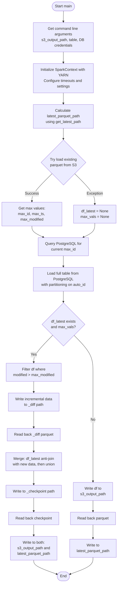
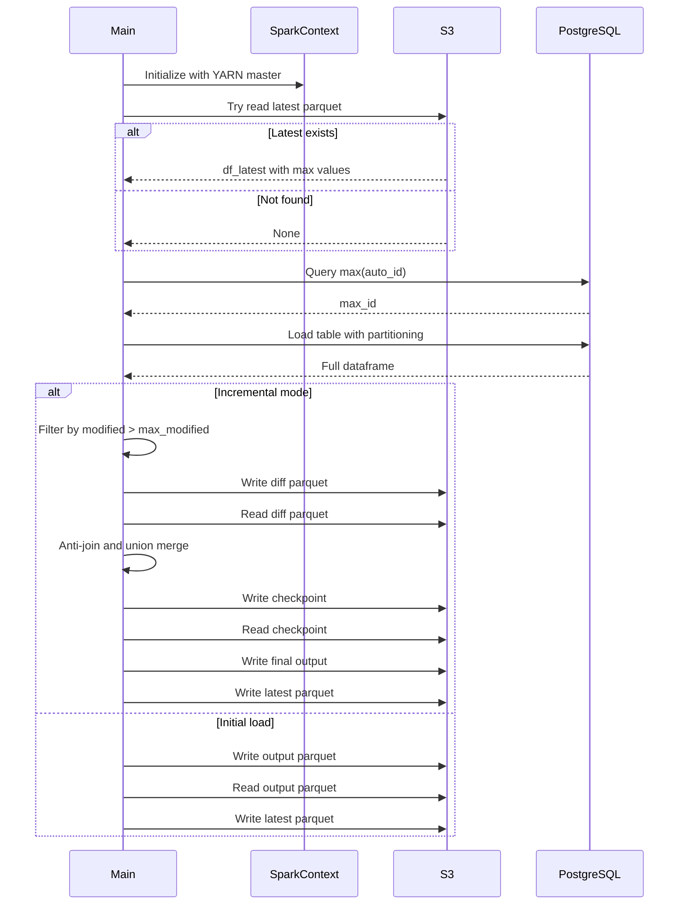

# Diagram: research/orchestrator/tasks/etl/extract_public_trip_leg_spark.py

> Auto-generated by Obscura crawlers

## Diagram 1

### SVG

<svg id="container" width="515.35546875" xmlns="http://www.w3.org/2000/svg" class="flowchart" height="2531.9375" viewBox="0 0 515.35546875 2531.9375" role="graphics-document document" aria-roledescription="flowchart-v2"><g><marker id="container_flowchart-v2-pointEnd" class="marker flowchart-v2" viewBox="0 0 10 10" refX="5" refY="5" markerUnits="userSpaceOnUse" markerWidth="8" markerHeight="8" orient="auto"><path d="M 0 0 L 10 5 L 0 10 z" class="arrowMarkerPath" style="stroke-width: 1; stroke-dasharray: 1, 0;"></path></marker><marker id="container_flowchart-v2-pointStart" class="marker flowchart-v2" viewBox="0 0 10 10" refX="4.5" refY="5" markerUnits="userSpaceOnUse" markerWidth="8" markerHeight="8" orient="auto"><path d="M 0 5 L 10 10 L 10 0 z" class="arrowMarkerPath" style="stroke-width: 1; stroke-dasharray: 1, 0;"></path></marker><marker id="container_flowchart-v2-circleEnd" class="marker flowchart-v2" viewBox="0 0 10 10" refX="11" refY="5" markerUnits="userSpaceOnUse" markerWidth="11" markerHeight="11" orient="auto"><circle cx="5" cy="5" r="5" class="arrowMarkerPath" style="stroke-width: 1; stroke-dasharray: 1, 0;"></circle></marker><marker id="container_flowchart-v2-circleStart" class="marker flowchart-v2" viewBox="0 0 10 10" refX="-1" refY="5" markerUnits="userSpaceOnUse" markerWidth="11" markerHeight="11" orient="auto"><circle cx="5" cy="5" r="5" class="arrowMarkerPath" style="stroke-width: 1; stroke-dasharray: 1, 0;"></circle></marker><marker id="container_flowchart-v2-crossEnd" class="marker cross flowchart-v2" viewBox="0 0 11 11" refX="12" refY="5.2" markerUnits="userSpaceOnUse" markerWidth="11" markerHeight="11" orient="auto"><path d="M 1,1 l 9,9 M 10,1 l -9,9" class="arrowMarkerPath" style="stroke-width: 2; stroke-dasharray: 1, 0;"></path></marker><marker id="container_flowchart-v2-crossStart" class="marker cross flowchart-v2" viewBox="0 0 11 11" refX="-1" refY="5.2" markerUnits="userSpaceOnUse" markerWidth="11" markerHeight="11" orient="auto"><path d="M 1,1 l 9,9 M 10,1 l -9,9" class="arrowMarkerPath" style="stroke-width: 2; stroke-dasharray: 1, 0;"></path></marker><g class="root"><g class="clusters"></g><g class="edgePaths"><path d="M273.797,47.5L273.714,51.583C273.63,55.667,273.464,63.833,273.38,71.417C273.297,79,273.297,86,273.297,89.5L273.297,93" id="L_Start_GetArgs_0" class="edge-thickness-normal edge-pattern-solid edge-thickness-normal edge-pattern-solid flowchart-link" style=";" data-edge="true" data-et="edge" data-id="L_Start_GetArgs_0" data-points="W3sieCI6MjczLjc5Njg3NSwieSI6NDcuNX0seyJ4IjoyNzMuMjk2ODc1LCJ5Ijo3Mn0seyJ4IjoyNzMuMjk2ODc1LCJ5Ijo5N31d" marker-end="url(#container_flowchart-v2-pointEnd)"></path><path d="M273.297,223L273.297,227.167C273.297,231.333,273.297,239.667,273.297,247.333C273.297,255,273.297,262,273.297,265.5L273.297,269" id="L_GetArgs_InitSpark_0" class="edge-thickness-normal edge-pattern-solid edge-thickness-normal edge-pattern-solid flowchart-link" style=";" data-edge="true" data-et="edge" data-id="L_GetArgs_InitSpark_0" data-points="W3sieCI6MjczLjI5Njg3NSwieSI6MjIzfSx7IngiOjI3My4yOTY4NzUsInkiOjI0OH0seyJ4IjoyNzMuMjk2ODc1LCJ5IjoyNzN9XQ==" marker-end="url(#container_flowchart-v2-pointEnd)"></path><path d="M273.297,399L273.297,403.167C273.297,407.333,273.297,415.667,273.297,423.333C273.297,431,273.297,438,273.297,441.5L273.297,445" id="L_InitSpark_CalcLatestPath_0" class="edge-thickness-normal edge-pattern-solid edge-thickness-normal edge-pattern-solid flowchart-link" style=";" data-edge="true" data-et="edge" data-id="L_InitSpark_CalcLatestPath_0" data-points="W3sieCI6MjczLjI5Njg3NSwieSI6Mzk5fSx7IngiOjI3My4yOTY4NzUsInkiOjQyNH0seyJ4IjoyNzMuMjk2ODc1LCJ5Ijo0NDl9XQ==" marker-end="url(#container_flowchart-v2-pointEnd)"></path><path d="M273.297,551L273.297,555.167C273.297,559.333,273.297,567.667,273.297,575.333C273.297,583,273.297,590,273.297,593.5L273.297,597" id="L_CalcLatestPath_TryLoadLatest_0" class="edge-thickness-normal edge-pattern-solid edge-thickness-normal edge-pattern-solid flowchart-link" style=";" data-edge="true" data-et="edge" data-id="L_CalcLatestPath_TryLoadLatest_0" data-points="W3sieCI6MjczLjI5Njg3NSwieSI6NTUxfSx7IngiOjI3My4yOTY4NzUsInkiOjU3Nn0seyJ4IjoyNzMuMjk2ODc1LCJ5Ijo2MDF9XQ==" marker-end="url(#container_flowchart-v2-pointEnd)"></path><path d="M224.131,748.537L209.776,762.898C195.421,777.259,166.71,805.981,152.355,825.842C138,845.703,138,856.703,138,862.203L138,867.703" id="L_TryLoadLatest_GetMaxVals_0" class="edge-thickness-normal edge-pattern-solid edge-thickness-normal edge-pattern-solid flowchart-link" style=";" data-edge="true" data-et="edge" data-id="L_TryLoadLatest_GetMaxVals_0" data-points="W3sieCI6MjI0LjEzMTAzMDI1ODYzODEsInkiOjc0OC41MzcyODAyNTg2MzgxfSx7IngiOjEzOCwieSI6ODM0LjcwMzEyNX0seyJ4IjoxMzgsInkiOjg3MS43MDMxMjV9XQ==" marker-end="url(#container_flowchart-v2-pointEnd)"></path><path d="M322.463,748.537L336.818,762.898C351.173,777.259,379.883,805.981,394.239,827.842C408.594,849.703,408.594,864.703,408.594,872.203L408.594,879.703" id="L_TryLoadLatest_SetNull_0" class="edge-thickness-normal edge-pattern-solid edge-thickness-normal edge-pattern-solid flowchart-link" style=";" data-edge="true" data-et="edge" data-id="L_TryLoadLatest_SetNull_0" data-points="W3sieCI6MzIyLjQ2MjcxOTc0MTM2MTg3LCJ5Ijo3NDguNTM3MjgwMjU4NjM4MX0seyJ4Ijo0MDguNTkzNzUsInkiOjgzNC43MDMxMjV9LHsieCI6NDA4LjU5Mzc1LCJ5Ijo4ODMuNzAzMTI1fV0=" marker-end="url(#container_flowchart-v2-pointEnd)"></path><path d="M138,973.703L138,977.87C138,982.036,138,990.37,146.206,998.418C154.411,1006.466,170.823,1014.23,179.029,1018.111L187.234,1021.993" id="L_GetMaxVals_QueryMaxId_0" class="edge-thickness-normal edge-pattern-solid edge-thickness-normal edge-pattern-solid flowchart-link" style=";" data-edge="true" data-et="edge" data-id="L_GetMaxVals_QueryMaxId_0" data-points="W3sieCI6MTM4LCJ5Ijo5NzMuNzAzMTI1fSx7IngiOjEzOCwieSI6OTk4LjcwMzEyNX0seyJ4IjoxOTAuODUwMzQxNzk2ODc1LCJ5IjoxMDIzLjcwMzEyNX1d" marker-end="url(#container_flowchart-v2-pointEnd)"></path><path d="M408.594,961.703L408.594,967.87C408.594,974.036,408.594,986.37,400.388,996.418C392.182,1006.466,375.771,1014.23,367.565,1018.111L359.359,1021.993" id="L_SetNull_QueryMaxId_0" class="edge-thickness-normal edge-pattern-solid edge-thickness-normal edge-pattern-solid flowchart-link" style=";" data-edge="true" data-et="edge" data-id="L_SetNull_QueryMaxId_0" data-points="W3sieCI6NDA4LjU5Mzc1LCJ5Ijo5NjEuNzAzMTI1fSx7IngiOjQwOC41OTM3NSwieSI6OTk4LjcwMzEyNX0seyJ4IjozNTUuNzQzNDA4MjAzMTI1LCJ5IjoxMDIzLjcwMzEyNX1d" marker-end="url(#container_flowchart-v2-pointEnd)"></path><path d="M273.297,1101.703L273.297,1105.87C273.297,1110.036,273.297,1118.37,273.297,1126.036C273.297,1133.703,273.297,1140.703,273.297,1144.203L273.297,1147.703" id="L_QueryMaxId_LoadFullTable_0" class="edge-thickness-normal edge-pattern-solid edge-thickness-normal edge-pattern-solid flowchart-link" style=";" data-edge="true" data-et="edge" data-id="L_QueryMaxId_LoadFullTable_0" data-points="W3sieCI6MjczLjI5Njg3NSwieSI6MTEwMS43MDMxMjV9LHsieCI6MjczLjI5Njg3NSwieSI6MTEyNi43MDMxMjV9LHsieCI6MjczLjI5Njg3NSwieSI6MTE1MS43MDMxMjV9XQ==" marker-end="url(#container_flowchart-v2-pointEnd)"></path><path d="M273.297,1277.703L273.297,1281.87C273.297,1286.036,273.297,1294.37,273.297,1302.036C273.297,1309.703,273.297,1316.703,273.297,1320.203L273.297,1323.703" id="L_LoadFullTable_CheckLatest_0" class="edge-thickness-normal edge-pattern-solid edge-thickness-normal edge-pattern-solid flowchart-link" style=";" data-edge="true" data-et="edge" data-id="L_LoadFullTable_CheckLatest_0" data-points="W3sieCI6MjczLjI5Njg3NSwieSI6MTI3Ny43MDMxMjV9LHsieCI6MjczLjI5Njg3NSwieSI6MTMwMi43MDMxMjV9LHsieCI6MjczLjI5Njg3NSwieSI6MTMyNy43MDMxMjV9XQ==" marker-end="url(#container_flowchart-v2-pointEnd)"></path><path d="M226.569,1468.21L212.662,1482.164C198.756,1496.119,170.942,1524.028,157.036,1543.483C143.129,1562.938,143.129,1573.938,143.129,1579.438L143.129,1584.938" id="L_CheckLatest_FilterIncremental_0" class="edge-thickness-normal edge-pattern-solid edge-thickness-normal edge-pattern-solid flowchart-link" style=";" data-edge="true" data-et="edge" data-id="L_CheckLatest_FilterIncremental_0" data-points="W3sieCI6MjI2LjU2ODkxMTk4MTczMzM1LCJ5IjoxNDY4LjIwOTUzNjk4MTczMzR9LHsieCI6MTQzLjEyODkwNjI1LCJ5IjoxNTUxLjkzNzV9LHsieCI6MTQzLjEyODkwNjI1LCJ5IjoxNTg4LjkzNzV9XQ==" marker-end="url(#container_flowchart-v2-pointEnd)"></path><path d="M143.129,1666.938L143.129,1671.104C143.129,1675.271,143.129,1683.604,143.129,1691.271C143.129,1698.938,143.129,1705.938,143.129,1709.438L143.129,1712.938" id="L_FilterIncremental_WriteDiff_0" class="edge-thickness-normal edge-pattern-solid edge-thickness-normal edge-pattern-solid flowchart-link" style=";" data-edge="true" data-et="edge" data-id="L_FilterIncremental_WriteDiff_0" data-points="W3sieCI6MTQzLjEyODkwNjI1LCJ5IjoxNjY2LjkzNzV9LHsieCI6MTQzLjEyODkwNjI1LCJ5IjoxNjkxLjkzNzV9LHsieCI6MTQzLjEyODkwNjI1LCJ5IjoxNzE2LjkzNzV9XQ==" marker-end="url(#container_flowchart-v2-pointEnd)"></path><path d="M143.129,1794.938L143.129,1801.104C143.129,1807.271,143.129,1819.604,143.129,1831.271C143.129,1842.938,143.129,1853.938,143.129,1859.438L143.129,1864.938" id="L_WriteDiff_ReadDiff_0" class="edge-thickness-normal edge-pattern-solid edge-thickness-normal edge-pattern-solid flowchart-link" style=";" data-edge="true" data-et="edge" data-id="L_WriteDiff_ReadDiff_0" data-points="W3sieCI6MTQzLjEyODkwNjI1LCJ5IjoxNzk0LjkzNzV9LHsieCI6MTQzLjEyODkwNjI1LCJ5IjoxODMxLjkzNzV9LHsieCI6MTQzLjEyODkwNjI1LCJ5IjoxODY4LjkzNzV9XQ==" marker-end="url(#container_flowchart-v2-pointEnd)"></path><path d="M143.129,1922.938L143.129,1927.104C143.129,1931.271,143.129,1939.604,143.129,1947.271C143.129,1954.938,143.129,1961.938,143.129,1965.438L143.129,1968.938" id="L_ReadDiff_Merge_0" class="edge-thickness-normal edge-pattern-solid edge-thickness-normal edge-pattern-solid flowchart-link" style=";" data-edge="true" data-et="edge" data-id="L_ReadDiff_Merge_0" data-points="W3sieCI6MTQzLjEyODkwNjI1LCJ5IjoxOTIyLjkzNzV9LHsieCI6MTQzLjEyODkwNjI1LCJ5IjoxOTQ3LjkzNzV9LHsieCI6MTQzLjEyODkwNjI1LCJ5IjoxOTcyLjkzNzV9XQ==" marker-end="url(#container_flowchart-v2-pointEnd)"></path><path d="M143.129,2050.938L143.129,2055.104C143.129,2059.271,143.129,2067.604,143.129,2077.271C143.129,2086.938,143.129,2097.938,143.129,2103.438L143.129,2108.938" id="L_Merge_WriteCheckpoint_0" class="edge-thickness-normal edge-pattern-solid edge-thickness-normal edge-pattern-solid flowchart-link" style=";" data-edge="true" data-et="edge" data-id="L_Merge_WriteCheckpoint_0" data-points="W3sieCI6MTQzLjEyODkwNjI1LCJ5IjoyMDUwLjkzNzV9LHsieCI6MTQzLjEyODkwNjI1LCJ5IjoyMDc1LjkzNzV9LHsieCI6MTQzLjEyODkwNjI1LCJ5IjoyMTEyLjkzNzV9XQ==" marker-end="url(#container_flowchart-v2-pointEnd)"></path><path d="M143.129,2166.938L143.129,2173.104C143.129,2179.271,143.129,2191.604,143.129,2201.271C143.129,2210.938,143.129,2217.938,143.129,2221.438L143.129,2224.938" id="L_WriteCheckpoint_ReadCheckpoint_0" class="edge-thickness-normal edge-pattern-solid edge-thickness-normal edge-pattern-solid flowchart-link" style=";" data-edge="true" data-et="edge" data-id="L_WriteCheckpoint_ReadCheckpoint_0" data-points="W3sieCI6MTQzLjEyODkwNjI1LCJ5IjoyMTY2LjkzNzV9LHsieCI6MTQzLjEyODkwNjI1LCJ5IjoyMjAzLjkzNzV9LHsieCI6MTQzLjEyODkwNjI1LCJ5IjoyMjI4LjkzNzV9XQ==" marker-end="url(#container_flowchart-v2-pointEnd)"></path><path d="M143.129,2282.938L143.129,2287.104C143.129,2291.271,143.129,2299.604,143.129,2307.271C143.129,2314.938,143.129,2321.938,143.129,2325.438L143.129,2328.938" id="L_ReadCheckpoint_WriteOutputs_0" class="edge-thickness-normal edge-pattern-solid edge-thickness-normal edge-pattern-solid flowchart-link" style=";" data-edge="true" data-et="edge" data-id="L_ReadCheckpoint_WriteOutputs_0" data-points="W3sieCI6MTQzLjEyODkwNjI1LCJ5IjoyMjgyLjkzNzV9LHsieCI6MTQzLjEyODkwNjI1LCJ5IjoyMzA3LjkzNzV9LHsieCI6MTQzLjEyODkwNjI1LCJ5IjoyMzMyLjkzNzV9XQ==" marker-end="url(#container_flowchart-v2-pointEnd)"></path><path d="M320.025,1468.21L333.932,1482.164C347.838,1496.119,375.652,1524.028,389.558,1550.65C403.465,1577.271,403.465,1602.604,403.465,1625.938C403.465,1649.271,403.465,1670.604,403.465,1691.938C403.465,1713.271,403.465,1734.604,403.465,1757.938C403.465,1781.271,403.465,1806.604,403.465,1829.938C403.465,1853.271,403.465,1874.604,403.465,1893.938C403.465,1913.271,403.465,1930.604,403.465,1949.938C403.465,1969.271,403.465,1990.604,403.465,2011.938C403.465,2033.271,403.465,2054.604,403.465,2068.771C403.465,2082.938,403.465,2089.938,403.465,2093.438L403.465,2096.938" id="L_CheckLatest_WriteInitial_0" class="edge-thickness-normal edge-pattern-solid edge-thickness-normal edge-pattern-solid flowchart-link" style=";" data-edge="true" data-et="edge" data-id="L_CheckLatest_WriteInitial_0" data-points="W3sieCI6MzIwLjAyNDgzODAxODI2NjcsInkiOjE0NjguMjA5NTM2OTgxNzMzNH0seyJ4Ijo0MDMuNDY0ODQzNzUsInkiOjE1NTEuOTM3NX0seyJ4Ijo0MDMuNDY0ODQzNzUsInkiOjE2MjcuOTM3NX0seyJ4Ijo0MDMuNDY0ODQzNzUsInkiOjE2OTEuOTM3NX0seyJ4Ijo0MDMuNDY0ODQzNzUsInkiOjE3NTUuOTM3NX0seyJ4Ijo0MDMuNDY0ODQzNzUsInkiOjE4MzEuOTM3NX0seyJ4Ijo0MDMuNDY0ODQzNzUsInkiOjE4OTUuOTM3NX0seyJ4Ijo0MDMuNDY0ODQzNzUsInkiOjE5NDcuOTM3NX0seyJ4Ijo0MDMuNDY0ODQzNzUsInkiOjIwMTEuOTM3NX0seyJ4Ijo0MDMuNDY0ODQzNzUsInkiOjIwNzUuOTM3NX0seyJ4Ijo0MDMuNDY0ODQzNzUsInkiOjIxMDAuOTM3NX1d" marker-end="url(#container_flowchart-v2-pointEnd)"></path><path d="M403.465,2178.938L403.465,2183.104C403.465,2187.271,403.465,2195.604,403.465,2203.271C403.465,2210.938,403.465,2217.938,403.465,2221.438L403.465,2224.938" id="L_WriteInitial_ReadInitial_0" class="edge-thickness-normal edge-pattern-solid edge-thickness-normal edge-pattern-solid flowchart-link" style=";" data-edge="true" data-et="edge" data-id="L_WriteInitial_ReadInitial_0" data-points="W3sieCI6NDAzLjQ2NDg0Mzc1LCJ5IjoyMTc4LjkzNzV9LHsieCI6NDAzLjQ2NDg0Mzc1LCJ5IjoyMjAzLjkzNzV9LHsieCI6NDAzLjQ2NDg0Mzc1LCJ5IjoyMjI4LjkzNzV9XQ==" marker-end="url(#container_flowchart-v2-pointEnd)"></path><path d="M403.465,2282.938L403.465,2287.104C403.465,2291.271,403.465,2299.604,403.465,2309.271C403.465,2318.938,403.465,2329.938,403.465,2335.438L403.465,2340.938" id="L_ReadInitial_WriteLatest_0" class="edge-thickness-normal edge-pattern-solid edge-thickness-normal edge-pattern-solid flowchart-link" style=";" data-edge="true" data-et="edge" data-id="L_ReadInitial_WriteLatest_0" data-points="W3sieCI6NDAzLjQ2NDg0Mzc1LCJ5IjoyMjgyLjkzNzV9LHsieCI6NDAzLjQ2NDg0Mzc1LCJ5IjoyMzA3LjkzNzV9LHsieCI6NDAzLjQ2NDg0Mzc1LCJ5IjoyMzQ0LjkzNzV9XQ==" marker-end="url(#container_flowchart-v2-pointEnd)"></path><path d="M143.129,2434.938L143.129,2439.104C143.129,2443.271,143.129,2451.604,160.243,2461.674C177.357,2471.745,211.585,2483.552,228.699,2489.456L245.813,2495.359" id="L_WriteOutputs_End_0" class="edge-thickness-normal edge-pattern-solid edge-thickness-normal edge-pattern-solid flowchart-link" style=";" data-edge="true" data-et="edge" data-id="L_WriteOutputs_End_0" data-points="W3sieCI6MTQzLjEyODkwNjI1LCJ5IjoyNDM0LjkzNzV9LHsieCI6MTQzLjEyODkwNjI1LCJ5IjoyNDU5LjkzNzV9LHsieCI6MjQ5LjU5NDQ3NzgxMDg0ODMsInkiOjI0OTYuNjYzNTIzODA0MDE1fV0=" marker-end="url(#container_flowchart-v2-pointEnd)"></path><path d="M403.465,2422.938L403.465,2429.104C403.465,2435.271,403.465,2447.604,386.517,2459.673C369.569,2471.741,335.673,2483.545,318.725,2489.446L301.777,2495.348" id="L_WriteLatest_End_0" class="edge-thickness-normal edge-pattern-solid edge-thickness-normal edge-pattern-solid flowchart-link" style=";" data-edge="true" data-et="edge" data-id="L_WriteLatest_End_0" data-points="W3sieCI6NDAzLjQ2NDg0Mzc1LCJ5IjoyNDIyLjkzNzV9LHsieCI6NDAzLjQ2NDg0Mzc1LCJ5IjoyNDU5LjkzNzV9LHsieCI6Mjk3Ljk5OTI3MzA3OTE1NTYsInkiOjI0OTYuNjYzNTIzNDk5NzUzfV0=" marker-end="url(#container_flowchart-v2-pointEnd)"></path></g><g class="edgeLabels"><g class="edgeLabel"><g class="label" data-id="L_Start_GetArgs_0" transform="translate(0, 0)"><foreignObject width="0" height="0">

</foreignObject></g></g><g class="edgeLabel"><g class="label" data-id="L_GetArgs_InitSpark_0" transform="translate(0, 0)"><foreignObject width="0" height="0">

</foreignObject></g></g><g class="edgeLabel"><g class="label" data-id="L_InitSpark_CalcLatestPath_0" transform="translate(0, 0)"><foreignObject width="0" height="0">

</foreignObject></g></g><g class="edgeLabel"><g class="label" data-id="L_CalcLatestPath_TryLoadLatest_0" transform="translate(0, 0)"><foreignObject width="0" height="0">

</foreignObject></g></g><g class="edgeLabel" transform="translate(138, 834.703125)"><g class="label" data-id="L_TryLoadLatest_GetMaxVals_0" transform="translate(-28.1015625, -12)"><foreignObject width="56.203125" height="24">

Success

</foreignObject></g></g><g class="edgeLabel" transform="translate(408.59375, 834.703125)"><g class="label" data-id="L_TryLoadLatest_SetNull_0" transform="translate(-35.375, -12)"><foreignObject width="70.75" height="24">

Exception

</foreignObject></g></g><g class="edgeLabel"><g class="label" data-id="L_GetMaxVals_QueryMaxId_0" transform="translate(0, 0)"><foreignObject width="0" height="0">

</foreignObject></g></g><g class="edgeLabel"><g class="label" data-id="L_SetNull_QueryMaxId_0" transform="translate(0, 0)"><foreignObject width="0" height="0">

</foreignObject></g></g><g class="edgeLabel"><g class="label" data-id="L_QueryMaxId_LoadFullTable_0" transform="translate(0, 0)"><foreignObject width="0" height="0">

</foreignObject></g></g><g class="edgeLabel"><g class="label" data-id="L_LoadFullTable_CheckLatest_0" transform="translate(0, 0)"><foreignObject width="0" height="0">

</foreignObject></g></g><g class="edgeLabel" transform="translate(143.12890625, 1551.9375)"><g class="label" data-id="L_CheckLatest_FilterIncremental_0" transform="translate(-12.03125, -12)"><foreignObject width="24.0625" height="24">

Yes

</foreignObject></g></g><g class="edgeLabel"><g class="label" data-id="L_FilterIncremental_WriteDiff_0" transform="translate(0, 0)"><foreignObject width="0" height="0">

</foreignObject></g></g><g class="edgeLabel"><g class="label" data-id="L_WriteDiff_ReadDiff_0" transform="translate(0, 0)"><foreignObject width="0" height="0">

</foreignObject></g></g><g class="edgeLabel"><g class="label" data-id="L_ReadDiff_Merge_0" transform="translate(0, 0)"><foreignObject width="0" height="0">

</foreignObject></g></g><g class="edgeLabel"><g class="label" data-id="L_Merge_WriteCheckpoint_0" transform="translate(0, 0)"><foreignObject width="0" height="0">

</foreignObject></g></g><g class="edgeLabel"><g class="label" data-id="L_WriteCheckpoint_ReadCheckpoint_0" transform="translate(0, 0)"><foreignObject width="0" height="0">

</foreignObject></g></g><g class="edgeLabel"><g class="label" data-id="L_ReadCheckpoint_WriteOutputs_0" transform="translate(0, 0)"><foreignObject width="0" height="0">

</foreignObject></g></g><g class="edgeLabel" transform="translate(403.46484375, 1831.9375)"><g class="label" data-id="L_CheckLatest_WriteInitial_0" transform="translate(-10.140625, -12)"><foreignObject width="20.28125" height="24">

No

</foreignObject></g></g><g class="edgeLabel"><g class="label" data-id="L_WriteInitial_ReadInitial_0" transform="translate(0, 0)"><foreignObject width="0" height="0">

</foreignObject></g></g><g class="edgeLabel"><g class="label" data-id="L_ReadInitial_WriteLatest_0" transform="translate(0, 0)"><foreignObject width="0" height="0">

</foreignObject></g></g><g class="edgeLabel"><g class="label" data-id="L_WriteOutputs_End_0" transform="translate(0, 0)"><foreignObject width="0" height="0">

</foreignObject></g></g><g class="edgeLabel"><g class="label" data-id="L_WriteLatest_End_0" transform="translate(0, 0)"><foreignObject width="0" height="0">

</foreignObject></g></g></g><g class="nodes"><g class="node default" id="flowchart-Start-0" transform="translate(273.296875, 27.5)"><g class="basic label-container outer-path"><path d="M-30.671875 -19.5 C-15.431516166616692 -19.5, -0.19115733323338446 -19.5, 30.671875 -19.5 C30.671875 -19.5, 30.671875 -19.5, 30.671875 -19.5 C30.9517415591522 -19.4910252241752, 31.2316081183044 -19.4820504483504, 31.9212442896239 -19.45993515863156 C32.21280266828394 -19.43180887249248, 32.504361046943984 -19.403682586353394, 33.165479652847864 -19.3399052695533 C33.57211936920867 -19.27416291375018, 33.97875908556948 -19.20842055794707, 34.39946825967676 -19.140403561325776 C34.83449594728595 -19.04111133044994, 35.269523634895144 -18.941819099574104, 35.61813938623539 -18.862249829261074 C36.036310036749825 -18.738138975210926, 36.45448068726426 -18.614028121160782, 36.816485251460605 -18.50658706670804 C37.08870652872442 -18.406407120289053, 37.36092780598823 -18.306227173870067, 37.9895815951478 -18.074876768247425 C38.26632744591025 -17.95236958948887, 38.5430732966727 -17.829862410730314, 39.13260791279238 -17.568892924097174 C39.42761194820351 -17.414989507782288, 39.722615983614645 -17.261086091467405, 40.24086726407678 -16.990714730406097 C40.463646967848355 -16.85566436478091, 40.68642667161993 -16.720613999155727, 41.3098055736057 -16.342718045390892 C41.66254745607617 -16.096660578129477, 42.015289338546644 -15.85060311086806, 42.33503034457871 -15.627565626425154 C42.59046914317096 -15.423859982059746, 42.8459079417632 -15.22015433769434, 43.312328708501866 -14.848196188198123 C43.64051152341224 -14.550149238937976, 43.96869433832262 -14.252102289677829, 44.23768473676799 -14.007812326905688 C44.4830660793685 -13.754435944487765, 44.72844742196901 -13.501059562069845, 45.10729594296865 -13.10986736009568 C45.341791563633436 -12.834415460884008, 45.57628718429823 -12.558963561672334, 45.91758890812658 -12.158051136245305 C46.117729586166675 -11.889880860862444, 46.31787026420676 -11.621710585479585, 46.665233964640635 -11.156274872382312 C46.86547600379127 -10.848649327730561, 47.06571804294191 -10.54102378307881, 47.34715887860425 -10.108655082055241 C47.533451024256415 -9.777874513324512, 47.71974316990859 -9.447093944593782, 47.960561474273504 -9.019496659696287 C48.07955656694496 -8.772400803676904, 48.19855165961641 -8.52530494765752, 48.50292114880834 -7.893275190886684 C48.59896883863819 -7.656035540051191, 48.695016528468045 -7.418795889215698, 48.972009229970325 -6.734618561215508 C49.11578269353469 -6.301595796150211, 49.25955615709905 -5.868573031084914, 49.36589813421488 -5.548287939305138 C49.48943218016369 -5.07719908210813, 49.612966226112505 -4.606110224911123, 49.68296928754556 -4.339158212148133 C49.76481288980384 -3.9189086122033006, 49.84665649206213 -3.498659012258468, 49.921919776581774 -3.1121979531509023 C49.965023936665766 -2.7778905994186394, 50.00812809674976 -2.4435832456863764, 50.08176770250937 -1.872449005199798 C50.101580225227686 -1.5638529714815035, 50.121392747946004 -1.2552569377632092, 50.16185621591342 -0.6250057626472757 C50.16185621591342 -0.1281507359021818, 50.16185621591342 0.3687042908429121, 50.16185621591342 0.625005762647271 C50.130396659560716 1.1150137465373942, 50.098937103208016 1.6050217304275174, 50.08176770250937 1.8724490051997846 C50.03475266323977 2.2370883656051403, 49.987737623970176 2.601727726010496, 49.921919776581774 3.1121979531508885 C49.853979573206686 3.4610565383149035, 49.7860393698316 3.809915123478918, 49.68296928754556 4.339158212148129 C49.61155736031746 4.611482840793908, 49.540145433089364 4.883807469439688, 49.36589813421489 5.548287939305125 C49.25650774982122 5.877754348108008, 49.14711736542755 6.20722075691089, 48.972009229970325 6.734618561215495 C48.78577343466504 7.1946245762437115, 48.59953763935975 7.654630591271929, 48.50292114880834 7.893275190886679 C48.34011244644445 8.231350944893475, 48.17730374408056 8.56942669890027, 47.960561474273504 9.019496659696284 C47.735587059606345 9.41896151406761, 47.51061264493919 9.818426368438935, 47.34715887860425 10.108655082055236 C47.17615053266573 10.371369823587392, 47.00514218672721 10.634084565119547, 46.66523396464064 11.156274872382301 C46.44657055506294 11.44926392057, 46.22790714548524 11.742252968757699, 45.91758890812658 12.158051136245302 C45.6218489635135 12.505444103267397, 45.32610901890042 12.852837070289493, 45.10729594296866 13.10986736009567 C44.82083966453505 13.405656986076217, 44.53438338610144 13.701446612056762, 44.23768473676799 14.007812326905684 C43.982663362159236 14.239415991829535, 43.727641987550484 14.471019656753384, 43.31232870850189 14.848196188198111 C42.965768282364245 15.12456890568263, 42.619207856226595 15.400941623167146, 42.33503034457871 15.627565626425152 C41.95142730926067 15.895150497955258, 41.567824273942634 16.162735369485365, 41.30980557360571 16.34271804539089 C41.04345455291954 16.50418159938318, 40.777103532233376 16.66564515337547, 40.24086726407678 16.990714730406093 C40.00060548584721 17.11605914621345, 39.760343707617636 17.241403562020807, 39.13260791279239 17.56889292409717 C38.6758866452309 17.771069881091606, 38.219165377669405 17.973246838086045, 37.989581595147804 18.07487676824742 C37.7483145697469 18.163665263842887, 37.507047544346 18.252453759438353, 36.81648525146062 18.506587066708033 C36.42271831369337 18.623455026912517, 36.028951375926134 18.740322987117, 35.61813938623541 18.86224982926107 C35.37413662087956 18.917941868186695, 35.1301338555237 18.97363390711232, 34.399468259676766 19.140403561325773 C34.02726085877388 19.20057916739225, 33.65505345787099 19.26075477345872, 33.16547965284788 19.3399052695533 C32.905491875199345 19.364985977782002, 32.64550409755081 19.39006668601071, 31.9212442896239 19.45993515863156 C31.632520060757503 19.469193982683684, 31.343795831891104 19.478452806735813, 30.671875000000004 19.5 C30.671875000000004 19.5, 30.671875 19.5, 30.671875 19.5 C17.013834629707752 19.5, 3.3557942594155072 19.5, -30.671874999999996 19.5 C-31.05959438766322 19.487566593887646, -31.447313775326442 19.475133187775295, -31.921244289623893 19.45993515863156 C-32.30999357799323 19.422432982321993, -32.698742866362565 19.384930806012424, -33.16547965284787 19.3399052695533 C-33.61656234860705 19.266977717501508, -34.067645044366216 19.194050165449713, -34.39946825967676 19.140403561325773 C-34.829728927149304 19.042199371688415, -35.25998959462185 18.943995182051054, -35.618139386235384 18.862249829261074 C-35.94303294476593 18.765823126490297, -36.26792650329648 18.669396423719522, -36.81648525146059 18.506587066708043 C-37.22348346066599 18.356807963470253, -37.63048166987139 18.207028860232462, -37.9895815951478 18.074876768247425 C-38.22136864764831 17.972271515824065, -38.45315570014883 17.869666263400703, -39.13260791279238 17.568892924097174 C-39.530969836037215 17.361067763903336, -39.92933175928205 17.153242603709494, -40.24086726407678 16.990714730406097 C-40.46706908772549 16.85358985560078, -40.6932709113742 16.716464980795468, -41.309805573605686 16.3427180453909 C-41.54601919362269 16.177945649589844, -41.782232813639695 16.01317325378879, -42.33503034457871 15.627565626425156 C-42.61443176698813 15.40475042723775, -42.893833189397554 15.18193522805034, -43.312328708501866 14.848196188198125 C-43.5309686479944 14.649633180046804, -43.74960858748693 14.451070171895484, -44.237684736767974 14.007812326905697 C-44.46653628615181 13.77150431310526, -44.695387835535634 13.535196299304822, -45.107295942968655 13.109867360095677 C-45.34891999701144 12.826041997418853, -45.59054405105423 12.54221663474203, -45.917588908126575 12.158051136245307 C-46.21035113045969 11.765776429506062, -46.503113352792816 11.373501722766816, -46.665233964640635 11.156274872382316 C-46.896967840097254 10.800269410422473, -47.12870171555387 10.444263948462629, -47.34715887860425 10.108655082055249 C-47.48957632600272 9.855778482868912, -47.6319937734012 9.602901883682575, -47.960561474273504 9.019496659696289 C-48.10866199820349 8.711962752912108, -48.25676252213347 8.404428846127924, -48.50292114880834 7.893275190886686 C-48.60213507339502 7.648214878986852, -48.7013489979817 7.403154567087016, -48.972009229970325 6.73461856121551 C-49.102310938774714 6.34217057505462, -49.2326126475791 5.949722588893731, -49.36589813421488 5.5482879393051325 C-49.46305896399111 5.177771585598382, -49.56021979376734 4.807255231891632, -49.68296928754556 4.339158212148136 C-49.760358140734 3.9417828071654184, -49.83774699392244 3.5444074021827014, -49.921919776581774 3.112197953150904 C-49.97352531062689 2.7119556217623564, -50.025130844672 2.3117132903738087, -50.08176770250937 1.872449005199809 C-50.10724386529867 1.4756372057679816, -50.13272002808797 1.0788254063361542, -50.16185621591342 0.6250057626472781 C-50.16185621591342 0.3278941954856604, -50.16185621591342 0.03078262832404266, -50.16185621591342 -0.6250057626472687 C-50.13434107740421 -1.0535762547482923, -50.10682593889499 -1.482146746849316, -50.08176770250937 -1.8724490051997822 C-50.024954595744376 -2.31308024225218, -49.96814148897938 -2.7537114793045774, -49.921919776581774 -3.112197953150895 C-49.86645489611648 -3.3969983918335567, -49.81099001565118 -3.681798830516218, -49.68296928754556 -4.339158212148126 C-49.59431397790526 -4.677239331260866, -49.50565866826495 -5.015320450373606, -49.36589813421489 -5.548287939305123 C-49.2757313606064 -5.819855895289475, -49.185564586997906 -6.091423851273828, -48.97200922997033 -6.734618561215485 C-48.84078861966289 -7.058736005652786, -48.70956800935544 -7.382853450090088, -48.50292114880834 -7.893275190886676 C-48.33652820122921 -8.238793706773496, -48.170135253650066 -8.584312222660316, -47.960561474273504 -9.019496659696282 C-47.79035559537784 -9.32171443288969, -47.62014971648218 -9.623932206083097, -47.34715887860425 -10.108655082055243 C-47.15437456401374 -10.404823559103184, -46.961590249423246 -10.700992036151124, -46.66523396464064 -11.156274872382308 C-46.4080619650287 -11.500861923011165, -46.150889965416766 -11.845448973640023, -45.91758890812659 -12.158051136245302 C-45.712184958799504 -12.399330302940712, -45.50678100947242 -12.640609469636123, -45.10729594296866 -13.10986736009567 C-44.761918114381636 -13.466498324158852, -44.41654028579461 -13.823129288222034, -44.237684736767996 -14.007812326905677 C-43.99789047896472 -14.225587127234222, -43.758096221161445 -14.44336192756277, -43.31232870850189 -14.848196188198107 C-43.01577699603733 -15.084688287316098, -42.719225283572776 -15.321180386434088, -42.33503034457872 -15.627565626425149 C-41.98844450415835 -15.869328905243178, -41.64185866373799 -16.111092184061206, -41.309805573605715 -16.342718045390885 C-40.93607128605813 -16.56927796680869, -40.56233699851054 -16.795837888226497, -40.24086726407679 -16.99071473040609 C-39.81946850218652 -17.210558194565458, -39.39806974029624 -17.430401658724826, -39.13260791279239 -17.56889292409717 C-38.781055956425554 -17.724514546762503, -38.42950400005873 -17.880136169427836, -37.989581595147804 -18.07487676824742 C-37.72887311290391 -18.170819899675966, -37.46816463066002 -18.266763031104507, -36.81648525146062 -18.506587066708033 C-36.374371357737516 -18.637804149661864, -35.93225746401442 -18.769021232615696, -35.61813938623541 -18.862249829261067 C-35.29610529425335 -18.935752009287132, -34.97407120227129 -19.009254189313193, -34.399468259676766 -19.140403561325773 C-33.911618093506 -19.21927539285772, -33.423767927335234 -19.298147224389666, -33.16547965284788 -19.3399052695533 C-32.8630176493994 -19.369083415262192, -32.56055564595093 -19.39826156097109, -31.921244289623903 -19.45993515863156 C-31.474914504195883 -19.47424808612201, -31.028584718767863 -19.48856101361246, -30.671875000000007 -19.5 C-30.671875000000004 -19.5, -30.671875000000004 -19.5, -30.671875 -19.5" stroke="none" stroke-width="0" fill="#ECECFF" style=""></path><path d="M-30.671875 -19.5 C-16.45279247627045 -19.5, -2.2337099525408988 -19.5, 30.671875 -19.5 M-30.671875 -19.5 C-16.06622267239213 -19.5, -1.4605703447842586 -19.5, 30.671875 -19.5 M30.671875 -19.5 C30.671875 -19.5, 30.671875 -19.5, 30.671875 -19.5 M30.671875 -19.5 C30.671875 -19.5, 30.671875 -19.5, 30.671875 -19.5 M30.671875 -19.5 C30.923418821630108 -19.491933479240668, 31.174962643260216 -19.48386695848134, 31.9212442896239 -19.45993515863156 M30.671875 -19.5 C30.96621283917365 -19.49056115839155, 31.260550678347297 -19.4811223167831, 31.9212442896239 -19.45993515863156 M31.9212442896239 -19.45993515863156 C32.41842876577948 -19.411972370168645, 32.915613241935056 -19.364009581705734, 33.165479652847864 -19.3399052695533 M31.9212442896239 -19.45993515863156 C32.20857055844957 -19.432217139038343, 32.495896827275246 -19.404499119445124, 33.165479652847864 -19.3399052695533 M33.165479652847864 -19.3399052695533 C33.469443578215134 -19.290762739375367, 33.773407503582405 -19.241620209197432, 34.39946825967676 -19.140403561325776 M33.165479652847864 -19.3399052695533 C33.446772122509756 -19.294428084514045, 33.72806459217165 -19.248950899474796, 34.39946825967676 -19.140403561325776 M34.39946825967676 -19.140403561325776 C34.69572713805981 -19.0727844056047, 34.99198601644286 -19.005165249883625, 35.61813938623539 -18.862249829261074 M34.39946825967676 -19.140403561325776 C34.68788301952028 -19.07457477447369, 34.9762977793638 -19.008745987621605, 35.61813938623539 -18.862249829261074 M35.61813938623539 -18.862249829261074 C35.91392745334528 -18.774461483566107, 36.20971552045517 -18.68667313787114, 36.816485251460605 -18.50658706670804 M35.61813938623539 -18.862249829261074 C36.00402833351348 -18.747720015281356, 36.38991728079158 -18.633190201301638, 36.816485251460605 -18.50658706670804 M36.816485251460605 -18.50658706670804 C37.194434530009154 -18.367498238477342, 37.5723838085577 -18.228409410246645, 37.9895815951478 -18.074876768247425 M36.816485251460605 -18.50658706670804 C37.18596922996031 -18.370613547147695, 37.55545320846 -18.23464002758735, 37.9895815951478 -18.074876768247425 M37.9895815951478 -18.074876768247425 C38.380400741450636 -17.901872725417224, 38.77121988775347 -17.728868682587027, 39.13260791279238 -17.568892924097174 M37.9895815951478 -18.074876768247425 C38.327986543642 -17.925074935975175, 38.66639149213619 -17.775273103702926, 39.13260791279238 -17.568892924097174 M39.13260791279238 -17.568892924097174 C39.5033097420306 -17.37549801722945, 39.87401157126882 -17.182103110361727, 40.24086726407678 -16.990714730406097 M39.13260791279238 -17.568892924097174 C39.41916492359688 -17.419396315108994, 39.70572193440138 -17.26989970612081, 40.24086726407678 -16.990714730406097 M40.24086726407678 -16.990714730406097 C40.64259046941599 -16.74718776254187, 41.0443136747552 -16.503660794677643, 41.3098055736057 -16.342718045390892 M40.24086726407678 -16.990714730406097 C40.651468214707286 -16.741806021174867, 41.06206916533779 -16.492897311943633, 41.3098055736057 -16.342718045390892 M41.3098055736057 -16.342718045390892 C41.56697619391585 -16.163326953399256, 41.824146814226 -15.983935861407621, 42.33503034457871 -15.627565626425154 M41.3098055736057 -16.342718045390892 C41.548845500032705 -16.175974140587048, 41.78788542645972 -16.009230235783203, 42.33503034457871 -15.627565626425154 M42.33503034457871 -15.627565626425154 C42.71216332231744 -15.326812112608538, 43.08929630005616 -15.026058598791922, 43.312328708501866 -14.848196188198123 M42.33503034457871 -15.627565626425154 C42.611713816756044 -15.406917920220149, 42.88839728893337 -15.186270214015142, 43.312328708501866 -14.848196188198123 M43.312328708501866 -14.848196188198123 C43.59892864654064 -14.587913707490133, 43.88552858457942 -14.32763122678214, 44.23768473676799 -14.007812326905688 M43.312328708501866 -14.848196188198123 C43.55808024821662 -14.625011142058616, 43.80383178793137 -14.40182609591911, 44.23768473676799 -14.007812326905688 M44.23768473676799 -14.007812326905688 C44.56923324040628 -13.665461276260773, 44.90078174404456 -13.323110225615856, 45.10729594296865 -13.10986736009568 M44.23768473676799 -14.007812326905688 C44.48893971463014 -13.748370933845692, 44.7401946924923 -13.488929540785696, 45.10729594296865 -13.10986736009568 M45.10729594296865 -13.10986736009568 C45.33159145269101 -12.846397091599744, 45.55588696241336 -12.582926823103808, 45.91758890812658 -12.158051136245305 M45.10729594296865 -13.10986736009568 C45.33335310944762 -12.844327749332315, 45.559410275926595 -12.578788138568948, 45.91758890812658 -12.158051136245305 M45.91758890812658 -12.158051136245305 C46.15045829228894 -11.84602737630507, 46.3833276764513 -11.534003616364835, 46.665233964640635 -11.156274872382312 M45.91758890812658 -12.158051136245305 C46.20867102596843 -11.76802761646369, 46.49975314381028 -11.378004096682076, 46.665233964640635 -11.156274872382312 M46.665233964640635 -11.156274872382312 C46.83318214470042 -10.898261367409482, 47.00113032476021 -10.640247862436652, 47.34715887860425 -10.108655082055241 M46.665233964640635 -11.156274872382312 C46.816734302723134 -10.923529669550584, 46.96823464080564 -10.690784466718855, 47.34715887860425 -10.108655082055241 M47.34715887860425 -10.108655082055241 C47.56142387712967 -9.728205880489552, 47.775688875655085 -9.347756678923863, 47.960561474273504 -9.019496659696287 M47.34715887860425 -10.108655082055241 C47.592405898287666 -9.673194164653692, 47.837652917971084 -9.237733247252143, 47.960561474273504 -9.019496659696287 M47.960561474273504 -9.019496659696287 C48.11212072738507 -8.704780627761604, 48.263679980496626 -8.390064595826923, 48.50292114880834 -7.893275190886684 M47.960561474273504 -9.019496659696287 C48.13291965401317 -8.661591211592606, 48.30527783375284 -8.303685763488925, 48.50292114880834 -7.893275190886684 M48.50292114880834 -7.893275190886684 C48.667445930620296 -7.486895798940886, 48.83197071243226 -7.080516406995088, 48.972009229970325 -6.734618561215508 M48.50292114880834 -7.893275190886684 C48.616484373431575 -7.6127718304717105, 48.73004759805481 -7.3322684700567375, 48.972009229970325 -6.734618561215508 M48.972009229970325 -6.734618561215508 C49.118399845075636 -6.293713352695333, 49.264790460180954 -5.852808144175158, 49.36589813421488 -5.548287939305138 M48.972009229970325 -6.734618561215508 C49.067144923071815 -6.448085011408053, 49.1622806161733 -6.161551461600598, 49.36589813421488 -5.548287939305138 M49.36589813421488 -5.548287939305138 C49.450576878044785 -5.2253711890819785, 49.53525562187469 -4.902454438858818, 49.68296928754556 -4.339158212148133 M49.36589813421488 -5.548287939305138 C49.44945598712917 -5.2296456319404285, 49.53301384004345 -4.911003324575719, 49.68296928754556 -4.339158212148133 M49.68296928754556 -4.339158212148133 C49.74288559253305 -4.031500649352906, 49.802801897520546 -3.723843086557678, 49.921919776581774 -3.1121979531509023 M49.68296928754556 -4.339158212148133 C49.770173618477635 -3.891382403453802, 49.85737794940971 -3.443606594759471, 49.921919776581774 -3.1121979531509023 M49.921919776581774 -3.1121979531509023 C49.958870984334126 -2.82561168266498, 49.99582219208647 -2.539025412179058, 50.08176770250937 -1.872449005199798 M49.921919776581774 -3.1121979531509023 C49.96137310536552 -2.806205726045203, 50.00082643414925 -2.5002134989395035, 50.08176770250937 -1.872449005199798 M50.08176770250937 -1.872449005199798 C50.10690604101243 -1.4808990917130247, 50.132044379515484 -1.0893491782262514, 50.16185621591342 -0.6250057626472757 M50.08176770250937 -1.872449005199798 C50.10630754735821 -1.4902211134727987, 50.13084739220706 -1.1079932217457995, 50.16185621591342 -0.6250057626472757 M50.16185621591342 -0.6250057626472757 C50.16185621591342 -0.2851449563378863, 50.16185621591342 0.05471584997150314, 50.16185621591342 0.625005762647271 M50.16185621591342 -0.6250057626472757 C50.16185621591342 -0.15867622346388216, 50.16185621591342 0.3076533157195114, 50.16185621591342 0.625005762647271 M50.16185621591342 0.625005762647271 C50.14334051226775 0.9134027925355879, 50.12482480862207 1.2017998224239048, 50.08176770250937 1.8724490051997846 M50.16185621591342 0.625005762647271 C50.14183979602766 0.9367776593312505, 50.121823376141904 1.24854955601523, 50.08176770250937 1.8724490051997846 M50.08176770250937 1.8724490051997846 C50.03138829098487 2.2631817724437235, 49.98100887946037 2.6539145396876624, 49.921919776581774 3.1121979531508885 M50.08176770250937 1.8724490051997846 C50.02808095161975 2.2888328434515395, 49.97439420073014 2.705216681703294, 49.921919776581774 3.1121979531508885 M49.921919776581774 3.1121979531508885 C49.83081294197948 3.5800122933973686, 49.73970610737719 4.047826633643848, 49.68296928754556 4.339158212148129 M49.921919776581774 3.1121979531508885 C49.84144432716111 3.525422377433743, 49.760968877740446 3.9386468017165983, 49.68296928754556 4.339158212148129 M49.68296928754556 4.339158212148129 C49.614486228694524 4.600313796292604, 49.54600316984348 4.8614693804370805, 49.36589813421489 5.548287939305125 M49.68296928754556 4.339158212148129 C49.59963094956591 4.656963413928693, 49.51629261158626 4.974768615709259, 49.36589813421489 5.548287939305125 M49.36589813421489 5.548287939305125 C49.259721406181875 5.868075327176304, 49.15354467814887 6.187862715047482, 48.972009229970325 6.734618561215495 M49.36589813421489 5.548287939305125 C49.27224484160795 5.830356735011442, 49.178591549001005 6.112425530717758, 48.972009229970325 6.734618561215495 M48.972009229970325 6.734618561215495 C48.82249442905898 7.103923010138542, 48.67297962814764 7.473227459061591, 48.50292114880834 7.893275190886679 M48.972009229970325 6.734618561215495 C48.853957436360574 7.0262087738077454, 48.73590564275082 7.317798986399996, 48.50292114880834 7.893275190886679 M48.50292114880834 7.893275190886679 C48.39433051040823 8.118765974991952, 48.28573987200813 8.344256759097226, 47.960561474273504 9.019496659696284 M48.50292114880834 7.893275190886679 C48.31653490849526 8.280310206923476, 48.13014866818217 8.667345222960272, 47.960561474273504 9.019496659696284 M47.960561474273504 9.019496659696284 C47.818263889671485 9.27216043035008, 47.67596630506947 9.524824201003879, 47.34715887860425 10.108655082055236 M47.960561474273504 9.019496659696284 C47.75328103910072 9.38754406176563, 47.54600060392794 9.755591463834975, 47.34715887860425 10.108655082055236 M47.34715887860425 10.108655082055236 C47.204049122725834 10.328510097434693, 47.060939366847414 10.548365112814151, 46.66523396464064 11.156274872382301 M47.34715887860425 10.108655082055236 C47.08939322096703 10.504652351956755, 46.83162756332982 10.900649621858276, 46.66523396464064 11.156274872382301 M46.66523396464064 11.156274872382301 C46.46277507053061 11.427551346105057, 46.260316176420574 11.698827819827812, 45.91758890812658 12.158051136245302 M46.66523396464064 11.156274872382301 C46.37859026708184 11.540351313333037, 46.09194656952304 11.924427754283771, 45.91758890812658 12.158051136245302 M45.91758890812658 12.158051136245302 C45.74016430487029 12.36646417097607, 45.56273970161399 12.574877205706839, 45.10729594296866 13.10986736009567 M45.91758890812658 12.158051136245302 C45.60087223039323 12.530084567600394, 45.284155552659875 12.902117998955486, 45.10729594296866 13.10986736009567 M45.10729594296866 13.10986736009567 C44.84262553196701 13.383161289299737, 44.577955120965356 13.656455218503806, 44.23768473676799 14.007812326905684 M45.10729594296866 13.10986736009567 C44.8225669792581 13.403873391809496, 44.53783801554753 13.697879423523323, 44.23768473676799 14.007812326905684 M44.23768473676799 14.007812326905684 C43.92382642993548 14.292850136935227, 43.60996812310297 14.577887946964772, 43.31232870850189 14.848196188198111 M44.23768473676799 14.007812326905684 C43.9133314995176 14.30238135506011, 43.5889782622672 14.596950383214537, 43.31232870850189 14.848196188198111 M43.31232870850189 14.848196188198111 C42.955203341105495 15.132994165191583, 42.59807797370911 15.417792142185053, 42.33503034457871 15.627565626425152 M43.31232870850189 14.848196188198111 C43.06464064067306 15.045720831035297, 42.81695257284424 15.243245473872484, 42.33503034457871 15.627565626425152 M42.33503034457871 15.627565626425152 C41.97999794236098 15.875220861107259, 41.62496554014324 16.122876095789366, 41.30980557360571 16.34271804539089 M42.33503034457871 15.627565626425152 C41.962217750715034 15.88762355310738, 41.58940515685135 16.147681479789608, 41.30980557360571 16.34271804539089 M41.30980557360571 16.34271804539089 C40.99730895881196 16.532155329712804, 40.684812344018226 16.72159261403472, 40.24086726407678 16.990714730406093 M41.30980557360571 16.34271804539089 C40.90150878888375 16.590229955707574, 40.4932120041618 16.837741866024263, 40.24086726407678 16.990714730406093 M40.24086726407678 16.990714730406093 C39.801600783865545 17.21987977176869, 39.36233430365431 17.449044813131284, 39.13260791279239 17.56889292409717 M40.24086726407678 16.990714730406093 C39.821436336746565 17.209531576535937, 39.40200540941635 17.42834842266578, 39.13260791279239 17.56889292409717 M39.13260791279239 17.56889292409717 C38.83334433317001 17.701368033457317, 38.53408075354764 17.833843142817464, 37.989581595147804 18.07487676824742 M39.13260791279239 17.56889292409717 C38.892855701576806 17.675024116005652, 38.65310349036122 17.781155307914137, 37.989581595147804 18.07487676824742 M37.989581595147804 18.07487676824742 C37.52570773051779 18.24558663843427, 37.06183386588776 18.416296508621112, 36.81648525146062 18.506587066708033 M37.989581595147804 18.07487676824742 C37.6341035895368 18.205695960314934, 37.2786255839258 18.336515152382443, 36.81648525146062 18.506587066708033 M36.81648525146062 18.506587066708033 C36.417614210094705 18.624969898068617, 36.0187431687288 18.743352729429198, 35.61813938623541 18.86224982926107 M36.81648525146062 18.506587066708033 C36.52759678040407 18.59232764851109, 36.23870830934751 18.67806823031415, 35.61813938623541 18.86224982926107 M35.61813938623541 18.86224982926107 C35.14496965195949 18.97024773338847, 34.67179991768357 19.07824563751587, 34.399468259676766 19.140403561325773 M35.61813938623541 18.86224982926107 C35.34641494956287 18.924269158763916, 35.07469051289033 18.986288488266766, 34.399468259676766 19.140403561325773 M34.399468259676766 19.140403561325773 C34.07982136722523 19.192081591998665, 33.760174474773684 19.243759622671558, 33.16547965284788 19.3399052695533 M34.399468259676766 19.140403561325773 C34.08210091893538 19.191713051756356, 33.76473357819399 19.243022542186935, 33.16547965284788 19.3399052695533 M33.16547965284788 19.3399052695533 C32.89133640264949 19.36635153919444, 32.6171931524511 19.392797808835585, 31.9212442896239 19.45993515863156 M33.16547965284788 19.3399052695533 C32.75641555640508 19.37936719096558, 32.34735145996228 19.418829112377864, 31.9212442896239 19.45993515863156 M31.9212442896239 19.45993515863156 C31.539311536434752 19.47218299863933, 31.1573787832456 19.4844308386471, 30.671875000000004 19.5 M31.9212442896239 19.45993515863156 C31.533770173432377 19.472360699365208, 31.14629605724085 19.484786240098856, 30.671875000000004 19.5 M30.671875000000004 19.5 C30.671875000000004 19.5, 30.671875 19.5, 30.671875 19.5 M30.671875000000004 19.5 C30.671875000000004 19.5, 30.671875 19.5, 30.671875 19.5 M30.671875 19.5 C11.398999012404246 19.5, -7.873876975191507 19.5, -30.671874999999996 19.5 M30.671875 19.5 C17.182691396699532 19.5, 3.6935077933990677 19.5, -30.671874999999996 19.5 M-30.671874999999996 19.5 C-30.988516894797616 19.4898459107399, -31.30515878959524 19.4796918214798, -31.921244289623893 19.45993515863156 M-30.671874999999996 19.5 C-30.938971654291027 19.491434730168987, -31.206068308582058 19.48286946033797, -31.921244289623893 19.45993515863156 M-31.921244289623893 19.45993515863156 C-32.20500719506226 19.432560892418746, -32.48877010050062 19.40518662620593, -33.16547965284787 19.3399052695533 M-31.921244289623893 19.45993515863156 C-32.185981614318926 19.434396267311445, -32.45071893901395 19.40885737599133, -33.16547965284787 19.3399052695533 M-33.16547965284787 19.3399052695533 C-33.60632369931974 19.26863302291637, -34.047167745791604 19.197360776279435, -34.39946825967676 19.140403561325773 M-33.16547965284787 19.3399052695533 C-33.52722709785639 19.281420748037654, -33.88897454286491 19.222936226522013, -34.39946825967676 19.140403561325773 M-34.39946825967676 19.140403561325773 C-34.705547272684065 19.070543023959075, -35.01162628569138 19.000682486592382, -35.618139386235384 18.862249829261074 M-34.39946825967676 19.140403561325773 C-34.72100923455087 19.06701393206171, -35.04255020942498 18.993624302797645, -35.618139386235384 18.862249829261074 M-35.618139386235384 18.862249829261074 C-35.86666224890594 18.78848954814358, -36.11518511157649 18.71472926702609, -36.81648525146059 18.506587066708043 M-35.618139386235384 18.862249829261074 C-35.897451955501445 18.7793513248445, -36.17676452476751 18.69645282042793, -36.81648525146059 18.506587066708043 M-36.81648525146059 18.506587066708043 C-37.163391607668515 18.378922320856326, -37.51029796387643 18.251257575004605, -37.9895815951478 18.074876768247425 M-36.81648525146059 18.506587066708043 C-37.16257692219576 18.379222132641168, -37.50866859293093 18.251857198574292, -37.9895815951478 18.074876768247425 M-37.9895815951478 18.074876768247425 C-38.32267211715263 17.927427474935154, -38.655762639157466 17.779978181622887, -39.13260791279238 17.568892924097174 M-37.9895815951478 18.074876768247425 C-38.417140037762714 17.88560932877237, -38.84469848037763 17.696341889297315, -39.13260791279238 17.568892924097174 M-39.13260791279238 17.568892924097174 C-39.40499119683827 17.426790739280253, -39.67737448088416 17.284688554463333, -40.24086726407678 16.990714730406097 M-39.13260791279238 17.568892924097174 C-39.51649514945296 17.36861919862286, -39.90038238611354 17.16834547314855, -40.24086726407678 16.990714730406097 M-40.24086726407678 16.990714730406097 C-40.561571854652605 16.796301722929666, -40.88227644522842 16.60188871545323, -41.309805573605686 16.3427180453909 M-40.24086726407678 16.990714730406097 C-40.60141416362686 16.77214908109007, -40.96196106317695 16.553583431774044, -41.309805573605686 16.3427180453909 M-41.309805573605686 16.3427180453909 C-41.53025621000963 16.18894122458975, -41.75070684641357 16.035164403788603, -42.33503034457871 15.627565626425156 M-41.309805573605686 16.3427180453909 C-41.56679548756346 16.163453006328027, -41.82378540152124 15.984187967265157, -42.33503034457871 15.627565626425156 M-42.33503034457871 15.627565626425156 C-42.533427298110794 15.469349335547982, -42.73182425164287 15.311133044670807, -43.312328708501866 14.848196188198125 M-42.33503034457871 15.627565626425156 C-42.541195093581756 15.463154725369606, -42.74735984258481 15.298743824314053, -43.312328708501866 14.848196188198125 M-43.312328708501866 14.848196188198125 C-43.50616519693766 14.672159018033183, -43.70000168537345 14.496121847868242, -44.237684736767974 14.007812326905697 M-43.312328708501866 14.848196188198125 C-43.63188093255796 14.557987313198915, -43.95143315661406 14.267778438199702, -44.237684736767974 14.007812326905697 M-44.237684736767974 14.007812326905697 C-44.41835660471601 13.821253789813126, -44.59902847266405 13.634695252720554, -45.107295942968655 13.109867360095677 M-44.237684736767974 14.007812326905697 C-44.518270354909724 13.718084639666671, -44.798855973051474 13.428356952427643, -45.107295942968655 13.109867360095677 M-45.107295942968655 13.109867360095677 C-45.39571447429176 12.771074541724206, -45.68413300561487 12.432281723352736, -45.917588908126575 12.158051136245307 M-45.107295942968655 13.109867360095677 C-45.39610066561446 12.770620899421656, -45.68490538826026 12.431374438747635, -45.917588908126575 12.158051136245307 M-45.917588908126575 12.158051136245307 C-46.18302928250303 11.802385216696436, -46.44846965687949 11.446719297147565, -46.665233964640635 11.156274872382316 M-45.917588908126575 12.158051136245307 C-46.19560946423904 11.785528919248318, -46.47363002035151 11.413006702251327, -46.665233964640635 11.156274872382316 M-46.665233964640635 11.156274872382316 C-46.89532956616392 10.802786239122215, -47.12542516768721 10.449297605862114, -47.34715887860425 10.108655082055249 M-46.665233964640635 11.156274872382316 C-46.89056926719064 10.810099336664434, -47.11590456974065 10.463923800946553, -47.34715887860425 10.108655082055249 M-47.34715887860425 10.108655082055249 C-47.516558830274604 9.80786831425935, -47.68595878194496 9.507081546463452, -47.960561474273504 9.019496659696289 M-47.34715887860425 10.108655082055249 C-47.55242863325756 9.744177846851686, -47.757698387910885 9.379700611648124, -47.960561474273504 9.019496659696289 M-47.960561474273504 9.019496659696289 C-48.15628605923311 8.613070371192427, -48.35201064419272 8.206644082688566, -48.50292114880834 7.893275190886686 M-47.960561474273504 9.019496659696289 C-48.15921269902464 8.606993141045248, -48.35786392377578 8.194489622394208, -48.50292114880834 7.893275190886686 M-48.50292114880834 7.893275190886686 C-48.64225876408269 7.549108587249523, -48.78159637935703 7.20494198361236, -48.972009229970325 6.73461856121551 M-48.50292114880834 7.893275190886686 C-48.66316731976255 7.497464050480835, -48.82341349071676 7.101652910074984, -48.972009229970325 6.73461856121551 M-48.972009229970325 6.73461856121551 C-49.0606550875202 6.467631362074624, -49.14930094507008 6.20064416293374, -49.36589813421488 5.5482879393051325 M-48.972009229970325 6.73461856121551 C-49.0655143435338 6.452996057178981, -49.15901945709727 6.171373553142452, -49.36589813421488 5.5482879393051325 M-49.36589813421488 5.5482879393051325 C-49.48313995593212 5.101194060170342, -49.60038177764936 4.6541001810355525, -49.68296928754556 4.339158212148136 M-49.36589813421488 5.5482879393051325 C-49.46651191676439 5.164603980154676, -49.56712569931389 4.78092002100422, -49.68296928754556 4.339158212148136 M-49.68296928754556 4.339158212148136 C-49.74748805403396 4.007867982276338, -49.812006820522356 3.676577752404539, -49.921919776581774 3.112197953150904 M-49.68296928754556 4.339158212148136 C-49.74817259818075 4.00435299276101, -49.81337590881594 3.669547773373884, -49.921919776581774 3.112197953150904 M-49.921919776581774 3.112197953150904 C-49.95963762193266 2.819665792840478, -49.99735546728354 2.5271336325300515, -50.08176770250937 1.872449005199809 M-49.921919776581774 3.112197953150904 C-49.95680061737993 2.841669039921472, -49.9916814581781 2.5711401266920397, -50.08176770250937 1.872449005199809 M-50.08176770250937 1.872449005199809 C-50.102765759148625 1.545387323717177, -50.123763815787875 1.2183256422345448, -50.16185621591342 0.6250057626472781 M-50.08176770250937 1.872449005199809 C-50.10467921799146 1.515583657723786, -50.12759073347355 1.158718310247763, -50.16185621591342 0.6250057626472781 M-50.16185621591342 0.6250057626472781 C-50.16185621591342 0.3264303979417112, -50.16185621591342 0.027855033236144244, -50.16185621591342 -0.6250057626472687 M-50.16185621591342 0.6250057626472781 C-50.16185621591342 0.13358108821588494, -50.16185621591342 -0.35784358621550827, -50.16185621591342 -0.6250057626472687 M-50.16185621591342 -0.6250057626472687 C-50.13237990466675 -1.0841231031643466, -50.10290359342007 -1.5432404436814244, -50.08176770250937 -1.8724490051997822 M-50.16185621591342 -0.6250057626472687 C-50.138340505007314 -0.9912819415500023, -50.11482479410121 -1.3575581204527358, -50.08176770250937 -1.8724490051997822 M-50.08176770250937 -1.8724490051997822 C-50.03683795166991 -2.2209152803278003, -49.991908200830444 -2.569381555455818, -49.921919776581774 -3.112197953150895 M-50.08176770250937 -1.8724490051997822 C-50.02329156099955 -2.3259784113296758, -49.96481541948973 -2.779507817459569, -49.921919776581774 -3.112197953150895 M-49.921919776581774 -3.112197953150895 C-49.85596027473685 -3.45088605457891, -49.790000772891936 -3.7895741560069247, -49.68296928754556 -4.339158212148126 M-49.921919776581774 -3.112197953150895 C-49.844313902705274 -3.510687713499474, -49.76670802882877 -3.9091774738480525, -49.68296928754556 -4.339158212148126 M-49.68296928754556 -4.339158212148126 C-49.573455781844004 -4.756780672841771, -49.46394227614245 -5.1744031335354155, -49.36589813421489 -5.548287939305123 M-49.68296928754556 -4.339158212148126 C-49.61954803239335 -4.581010944989374, -49.55612677724113 -4.822863677830621, -49.36589813421489 -5.548287939305123 M-49.36589813421489 -5.548287939305123 C-49.235522210010885 -5.940959450425029, -49.10514628580688 -6.3336309615449355, -48.97200922997033 -6.734618561215485 M-49.36589813421489 -5.548287939305123 C-49.209369311732004 -6.019727813142551, -49.05284048924912 -6.491167686979979, -48.97200922997033 -6.734618561215485 M-48.97200922997033 -6.734618561215485 C-48.849975149236315 -7.036045099996946, -48.727941068502304 -7.337471638778409, -48.50292114880834 -7.893275190886676 M-48.97200922997033 -6.734618561215485 C-48.86965952562389 -6.987424309748125, -48.767309821277436 -7.240230058280765, -48.50292114880834 -7.893275190886676 M-48.50292114880834 -7.893275190886676 C-48.373471072415896 -8.162081044303505, -48.24402099602346 -8.430886897720336, -47.960561474273504 -9.019496659696282 M-48.50292114880834 -7.893275190886676 C-48.33042024601765 -8.251477006459584, -48.157919343226965 -8.60967882203249, -47.960561474273504 -9.019496659696282 M-47.960561474273504 -9.019496659696282 C-47.72535472847256 -9.43713005413152, -47.49014798267162 -9.85476344856676, -47.34715887860425 -10.108655082055243 M-47.960561474273504 -9.019496659696282 C-47.83120175143957 -9.24918794668028, -47.70184202860565 -9.478879233664276, -47.34715887860425 -10.108655082055243 M-47.34715887860425 -10.108655082055243 C-47.157250880494665 -10.40040476458937, -46.96734288238508 -10.692154447123496, -46.66523396464064 -11.156274872382308 M-47.34715887860425 -10.108655082055243 C-47.128309086887555 -10.44486713152965, -46.90945929517086 -10.781079181004056, -46.66523396464064 -11.156274872382308 M-46.66523396464064 -11.156274872382308 C-46.4253525967888 -11.477694051661594, -46.18547122893696 -11.799113230940879, -45.91758890812659 -12.158051136245302 M-46.66523396464064 -11.156274872382308 C-46.39369671883302 -11.520110044212526, -46.122159473025405 -11.883945216042743, -45.91758890812659 -12.158051136245302 M-45.91758890812659 -12.158051136245302 C-45.67735543261989 -12.440243046247469, -45.4371219571132 -12.722434956249634, -45.10729594296866 -13.10986736009567 M-45.91758890812659 -12.158051136245302 C-45.62883614277643 -12.497236564923407, -45.34008337742626 -12.836421993601512, -45.10729594296866 -13.10986736009567 M-45.10729594296866 -13.10986736009567 C-44.79880419202016 -13.428410420593787, -44.490312441071644 -13.746953481091904, -44.237684736767996 -14.007812326905677 M-45.10729594296866 -13.10986736009567 C-44.86541734381997 -13.359626872319001, -44.623538744671286 -13.609386384542331, -44.237684736767996 -14.007812326905677 M-44.237684736767996 -14.007812326905677 C-43.91402832130324 -14.301748519951277, -43.59037190583849 -14.595684712996876, -43.31232870850189 -14.848196188198107 M-44.237684736767996 -14.007812326905677 C-44.03084142876237 -14.195661946462357, -43.82399812075674 -14.383511566019036, -43.31232870850189 -14.848196188198107 M-43.31232870850189 -14.848196188198107 C-43.09831904592427 -15.018863199067463, -42.88430938334665 -15.189530209936816, -42.33503034457872 -15.627565626425149 M-43.31232870850189 -14.848196188198107 C-43.1114117705647 -15.008422099578755, -42.910494832627506 -15.168648010959402, -42.33503034457872 -15.627565626425149 M-42.33503034457872 -15.627565626425149 C-42.015400787521756 -15.850525368887567, -41.6957712304648 -16.073485111349985, -41.309805573605715 -16.342718045390885 M-42.33503034457872 -15.627565626425149 C-42.018273972141564 -15.848521159674947, -41.70151759970441 -16.069476692924745, -41.309805573605715 -16.342718045390885 M-41.309805573605715 -16.342718045390885 C-40.95334236773233 -16.558808135601648, -40.59687916185895 -16.774898225812407, -40.24086726407679 -16.99071473040609 M-41.309805573605715 -16.342718045390885 C-41.06178020031725 -16.49307248423723, -40.81375482702878 -16.64342692308358, -40.24086726407679 -16.99071473040609 M-40.24086726407679 -16.99071473040609 C-39.89694670356491 -17.170137866533505, -39.55302614305303 -17.34956100266092, -39.13260791279239 -17.56889292409717 M-40.24086726407679 -16.99071473040609 C-39.960608490673565 -17.136925552976244, -39.68034971727033 -17.283136375546395, -39.13260791279239 -17.56889292409717 M-39.13260791279239 -17.56889292409717 C-38.73449068899268 -17.74512760934546, -38.33637346519296 -17.92136229459375, -37.989581595147804 -18.07487676824742 M-39.13260791279239 -17.56889292409717 C-38.69267379110184 -17.763638709587532, -38.252739669411284 -17.958384495077894, -37.989581595147804 -18.07487676824742 M-37.989581595147804 -18.07487676824742 C-37.59842136611955 -18.21882734837534, -37.2072611370913 -18.362777928503252, -36.81648525146062 -18.506587066708033 M-37.989581595147804 -18.07487676824742 C-37.72460697671021 -18.172389877230977, -37.45963235827262 -18.269902986214532, -36.81648525146062 -18.506587066708033 M-36.81648525146062 -18.506587066708033 C-36.51581810967463 -18.59582349615608, -36.215150967888654 -18.685059925604126, -35.61813938623541 -18.862249829261067 M-36.81648525146062 -18.506587066708033 C-36.52971778242261 -18.591698146245353, -36.24295031338459 -18.676809225782673, -35.61813938623541 -18.862249829261067 M-35.61813938623541 -18.862249829261067 C-35.31763802992534 -18.930837302884232, -35.01713667361526 -18.999424776507396, -34.399468259676766 -19.140403561325773 M-35.61813938623541 -18.862249829261067 C-35.321319964406776 -18.92999692536571, -35.02450054257813 -18.997744021470357, -34.399468259676766 -19.140403561325773 M-34.399468259676766 -19.140403561325773 C-33.969889814976085 -19.209854472834387, -33.540311370275404 -19.279305384342997, -33.16547965284788 -19.3399052695533 M-34.399468259676766 -19.140403561325773 C-33.97491500069977 -19.20904203977748, -33.55036174172277 -19.277680518229182, -33.16547965284788 -19.3399052695533 M-33.16547965284788 -19.3399052695533 C-32.75468053271347 -19.37953456661444, -32.343881412579066 -19.419163863675582, -31.921244289623903 -19.45993515863156 M-33.16547965284788 -19.3399052695533 C-32.68172174668785 -19.386572812956555, -32.19796384052782 -19.43324035635981, -31.921244289623903 -19.45993515863156 M-31.921244289623903 -19.45993515863156 C-31.55955854585973 -19.471533716455482, -31.197872802095556 -19.48313227427941, -30.671875000000007 -19.5 M-31.921244289623903 -19.45993515863156 C-31.524614535956488 -19.47265430283869, -31.127984782289072 -19.485373447045824, -30.671875000000007 -19.5 M-30.671875000000007 -19.5 C-30.671875000000004 -19.5, -30.671875000000004 -19.5, -30.671875 -19.5 M-30.671875000000007 -19.5 C-30.671875000000004 -19.5, -30.671875000000004 -19.5, -30.671875 -19.5" stroke="#9370DB" stroke-width="1.3" fill="none" stroke-dasharray="0 0" style=""></path></g><g class="label" style="" transform="translate(-37.796875, -12)"><rect></rect><foreignObject width="75.59375" height="24">

Start main

</foreignObject></g></g><g class="node default" id="flowchart-GetArgs-1" transform="translate(273.296875, 160)"><rect class="basic label-container" style="" x="-130" y="-63" width="260" height="126"></rect><g class="label" style="" transform="translate(-100, -48)"><rect></rect><foreignObject width="200" height="96">

Get command line arguments s3_output_path, table, DB credentials

</foreignObject></g></g><g class="node default" id="flowchart-InitSpark-3" transform="translate(273.296875, 336)"><rect class="basic label-container" style="" x="-130" y="-63" width="260" height="126"></rect><g class="label" style="" transform="translate(-100, -48)"><rect></rect><foreignObject width="200" height="96">

Initialize SparkContext with YARN Configure timeouts and settings

</foreignObject></g></g><g class="node default" id="flowchart-CalcLatestPath-5" transform="translate(273.296875, 500)"><rect class="basic label-container" style="" x="-130" y="-51" width="260" height="102"></rect><g class="label" style="" transform="translate(-100, -36)"><rect></rect><foreignObject width="200" height="72">

Calculate latest_parquet_path using get_latest_path

</foreignObject></g></g><g class="node default" id="flowchart-TryLoadLatest-7" transform="translate(273.296875, 699.3515625)"><polygon points="98.3515625,0 196.703125,-98.3515625 98.3515625,-196.703125 0,-98.3515625" class="label-container" transform="translate(-97.8515625, 98.3515625)"></polygon><g class="label" style="" transform="translate(-59.3515625, -24)"><rect></rect><foreignObject width="118.703125" height="48">

Try load existing parquet from S3

</foreignObject></g></g><g class="node default" id="flowchart-GetMaxVals-9" transform="translate(138, 922.703125)"><rect class="basic label-container" style="" x="-130" y="-51" width="260" height="102"></rect><g class="label" style="" transform="translate(-100, -36)"><rect></rect><foreignObject width="200" height="72">

Get max values: max_id, max_ts, max_modified

</foreignObject></g></g><g class="node default" id="flowchart-SetNull-11" transform="translate(408.59375, 922.703125)"><rect class="basic label-container" style="" x="-90.59375" y="-39" width="181.1875" height="78"></rect><g class="label" style="" transform="translate(-60.59375, -24)"><rect></rect><foreignObject width="121.1875" height="48">

df_latest = None max_vals = None

</foreignObject></g></g><g class="node default" id="flowchart-QueryMaxId-13" transform="translate(273.296875, 1062.703125)"><rect class="basic label-container" style="" x="-106.9921875" y="-39" width="213.984375" height="78"></rect><g class="label" style="" transform="translate(-76.9921875, -24)"><rect></rect><foreignObject width="153.984375" height="48">

Query PostgreSQL for current max_id

</foreignObject></g></g><g class="node default" id="flowchart-LoadFullTable-17" transform="translate(273.296875, 1214.703125)"><rect class="basic label-container" style="" x="-130" y="-63" width="260" height="126"></rect><g class="label" style="" transform="translate(-100, -48)"><rect></rect><foreignObject width="200" height="96">

Load full table from PostgreSQL with partitioning on auto_id

</foreignObject></g></g><g class="node default" id="flowchart-CheckLatest-19" transform="translate(273.296875, 1421.3203125)"><polygon points="93.6171875,0 187.234375,-93.6171875 93.6171875,-187.234375 0,-93.6171875" class="label-container" transform="translate(-93.1171875, 93.6171875)"></polygon><g class="label" style="" transform="translate(-54.6171875, -24)"><rect></rect><foreignObject width="109.234375" height="48">

df_latest exists and max_vals?

</foreignObject></g></g><g class="node default" id="flowchart-FilterIncremental-21" transform="translate(143.12890625, 1627.9375)"><rect class="basic label-container" style="" x="-122.1171875" y="-39" width="244.234375" height="78"></rect><g class="label" style="" transform="translate(-92.1171875, -24)"><rect></rect><foreignObject width="184.234375" height="48">

Filter df where modified &gt; max_modified

</foreignObject></g></g><g class="node default" id="flowchart-WriteDiff-23" transform="translate(143.12890625, 1755.9375)"><rect class="basic label-container" style="" x="-112.9296875" y="-39" width="225.859375" height="78"></rect><g class="label" style="" transform="translate(-82.9296875, -24)"><rect></rect><foreignObject width="165.859375" height="48">

Write incremental data to _diff path

</foreignObject></g></g><g class="node default" id="flowchart-ReadDiff-25" transform="translate(143.12890625, 1895.9375)"><rect class="basic label-container" style="" x="-116.40625" y="-27" width="232.8125" height="54"></rect><g class="label" style="" transform="translate(-86.40625, -12)"><rect></rect><foreignObject width="172.8125" height="24">

Read back _diff parquet

</foreignObject></g></g><g class="node default" id="flowchart-Merge-27" transform="translate(143.12890625, 2011.9375)"><rect class="basic label-container" style="" x="-124.65625" y="-39" width="249.3125" height="78"></rect><g class="label" style="" transform="translate(-94.65625, -24)"><rect></rect><foreignObject width="189.3125" height="48">

Merge: df_latest anti-join with new data, then union

</foreignObject></g></g><g class="node default" id="flowchart-WriteCheckpoint-29" transform="translate(143.12890625, 2139.9375)"><rect class="basic label-container" style="" x="-123.4921875" y="-27" width="246.984375" height="54"></rect><g class="label" style="" transform="translate(-93.4921875, -12)"><rect></rect><foreignObject width="186.984375" height="24">

Write to _checkpoint path

</foreignObject></g></g><g class="node default" id="flowchart-ReadCheckpoint-31" transform="translate(143.12890625, 2255.9375)"><rect class="basic label-container" style="" x="-109.375" y="-27" width="218.75" height="54"></rect><g class="label" style="" transform="translate(-79.375, -12)"><rect></rect><foreignObject width="158.75" height="24">

Read back checkpoint

</foreignObject></g></g><g class="node default" id="flowchart-WriteOutputs-33" transform="translate(143.12890625, 2383.9375)"><rect class="basic label-container" style="" x="-103.890625" y="-51" width="207.78125" height="102"></rect><g class="label" style="" transform="translate(-73.890625, -36)"><rect></rect><foreignObject width="147.78125" height="72">

Write to both: s3_output_path and latest_parquet_path

</foreignObject></g></g><g class="node default" id="flowchart-WriteInitial-35" transform="translate(403.46484375, 2139.9375)"><rect class="basic label-container" style="" x="-86.84375" y="-39" width="173.6875" height="78"></rect><g class="label" style="" transform="translate(-56.84375, -24)"><rect></rect><foreignObject width="113.6875" height="48">

Write df to s3_output_path

</foreignObject></g></g><g class="node default" id="flowchart-ReadInitial-37" transform="translate(403.46484375, 2255.9375)"><rect class="basic label-container" style="" x="-97.8828125" y="-27" width="195.765625" height="54"></rect><g class="label" style="" transform="translate(-67.8828125, -12)"><rect></rect><foreignObject width="135.765625" height="24">

Read back parquet

</foreignObject></g></g><g class="node default" id="flowchart-WriteLatest-39" transform="translate(403.46484375, 2383.9375)"><rect class="basic label-container" style="" x="-103.890625" y="-39" width="207.78125" height="78"></rect><g class="label" style="" transform="translate(-73.890625, -24)"><rect></rect><foreignObject width="147.78125" height="48">

Write to latest_parquet_path

</foreignObject></g></g><g class="node default" id="flowchart-End-41" transform="translate(273.296875, 2504.4375)"><g class="basic label-container outer-path"><path d="M-6.5546875 -19.5 C-2.234742501256588 -19.5, 2.085202497486824 -19.5, 6.5546875 -19.5 C6.5546875 -19.5, 6.554687499999999 -19.5, 6.554687499999999 -19.5 C6.9474281840768235 -19.487405570685024, 7.340168868153649 -19.474811141370047, 7.8040567896239 -19.45993515863156 C8.282438480905716 -19.41378625221176, 8.760820172187534 -19.367637345791962, 9.048292152847864 -19.3399052695533 C9.314976240237161 -19.296789854470184, 9.581660327626457 -19.25367443938707, 10.282280759676757 -19.140403561325776 C10.711333792623368 -19.04247500638841, 11.140386825569978 -18.944546451451043, 11.50095188623539 -18.862249829261074 C11.908805503916135 -18.741201016400755, 12.316659121596881 -18.62015220354044, 12.699297751460602 -18.50658706670804 C13.03199436293402 -18.38415163827206, 13.364690974407438 -18.261716209836077, 13.872394095147794 -18.074876768247425 C14.274243600885953 -17.896989912499198, 14.67609310662411 -17.719103056750967, 15.015420412792382 -17.568892924097174 C15.395706174101889 -17.37049808600666, 15.775991935411398 -17.172103247916144, 16.123679764076783 -16.990714730406097 C16.53322784995505 -16.74244427397499, 16.94277593583332 -16.49417381754388, 17.192618073605697 -16.342718045390892 C17.569712142066106 -16.07967354737204, 17.94680621052651 -15.816629049353184, 18.217842844578712 -15.627565626425154 C18.593719509616808 -15.327813988555407, 18.969596174654903 -15.02806235068566, 19.19514120850187 -14.848196188198123 C19.52067336492943 -14.55255649683949, 19.84620552135699 -14.256916805480856, 20.120497236767985 -14.007812326905688 C20.37386379414872 -13.74619055462886, 20.627230351529448 -13.484568782352033, 20.990108442968648 -13.10986736009568 C21.307993209222996 -12.736461825497713, 21.62587797547734 -12.363056290899744, 21.800401408126582 -12.158051136245305 C22.08119007019902 -11.781819909441587, 22.36197873227146 -11.405588682637868, 22.548046464640635 -11.156274872382312 C22.758341691483743 -10.83320493177604, 22.968636918326855 -10.510134991169767, 23.229971378604247 -10.108655082055241 C23.420819333007692 -9.769785213560965, 23.611667287411134 -9.430915345066687, 23.8433739742735 -9.019496659696287 C24.007561458101055 -8.678557836478996, 24.17174894192861 -8.337619013261703, 24.38573364880834 -7.893275190886684 C24.572294203920933 -7.4324670128556205, 24.75885475903353 -6.971658834824557, 24.854821729970325 -6.734618561215508 C24.97819604571239 -6.3630347792281485, 25.101570361454453 -5.991450997240788, 25.24871063421488 -5.548287939305138 C25.337194619594268 -5.210860153851688, 25.425678604973655 -4.873432368398238, 25.56578178754556 -4.339158212148133 C25.62367190317998 -4.041904703445677, 25.681562018814393 -3.7446511947432217, 25.804732276581777 -3.1121979531509023 C25.858464454394934 -2.6954617926507214, 25.912196632208087 -2.2787256321505405, 25.964580202509367 -1.872449005199798 C25.985829427665283 -1.541475171330583, 26.007078652821196 -1.210501337461368, 26.044668715913414 -0.6250057626472757 C26.044668715913414 -0.1777834296420151, 26.044668715913414 0.2694389033632455, 26.044668715913414 0.625005762647271 C26.026377880074826 0.9099002949302268, 26.008087044236238 1.1947948272131828, 25.964580202509367 1.8724490051997846 C25.91964155711619 2.2209842647299896, 25.874702911723016 2.569519524260195, 25.804732276581777 3.1121979531508885 C25.71111627651482 3.592896327746107, 25.61750027644786 4.0735947023413255, 25.56578178754556 4.339158212148129 C25.501480912984015 4.584365315026628, 25.43718003842247 4.829572417905126, 25.248710634214884 5.548287939305125 C25.1481698390384 5.851100795376416, 25.04762904386191 6.153913651447707, 24.85482172997033 6.734618561215495 C24.70577628025762 7.102763703603626, 24.556730830544907 7.470908845991759, 24.385733648808344 7.893275190886679 C24.208863275550474 8.26055030537638, 24.031992902292608 8.627825419866081, 23.843373974273504 9.019496659696284 C23.6708423551211 9.325844020222277, 23.498310735968694 9.632191380748269, 23.22997137860425 10.108655082055236 C23.014439494350565 10.43976993468356, 22.79890761009688 10.770884787311886, 22.54804646464064 11.156274872382301 C22.31576327770715 11.467513181439523, 22.083480090773655 11.778751490496743, 21.800401408126582 12.158051136245302 C21.59915229650324 12.394449794156936, 21.397903184879898 12.630848452068568, 20.99010844296866 13.10986736009567 C20.691939141890636 13.417751643613617, 20.393769840812613 13.725635927131563, 20.12049723676799 14.007812326905684 C19.929228264463042 14.181517746853348, 19.737959292158095 14.355223166801013, 19.195141208501887 14.848196188198111 C18.821004660595108 15.146560128962095, 18.446868112688325 15.444924069726081, 18.217842844578715 15.627565626425152 C17.932122668226917 15.82687165282108, 17.64640249187512 16.026177679217007, 17.192618073605708 16.34271804539089 C16.911122004155235 16.51336261694629, 16.629625934704762 16.68400718850169, 16.123679764076787 16.990714730406093 C15.839464334170346 17.13898973813961, 15.555248904263905 17.28726474587313, 15.015420412792386 17.56889292409717 C14.640114852508457 17.735029562590977, 14.264809292224527 17.901166201084784, 13.872394095147804 18.07487676824742 C13.474830841681191 18.221183720557562, 13.07726758821458 18.367490672867703, 12.699297751460616 18.506587066708033 C12.318820640556352 18.61951067605931, 11.938343529652087 18.732434285410587, 11.500951886235413 18.86224982926107 C11.183915568851493 18.934611299848633, 10.866879251467573 19.0069727704362, 10.282280759676766 19.140403561325773 C9.902620299630655 19.20178412019519, 9.522959839584546 19.2631646790646, 9.048292152847878 19.3399052695533 C8.697631588393307 19.3737330724752, 8.346971023938737 19.407560875397103, 7.804056789623901 19.45993515863156 C7.428411032705092 19.471981386905835, 7.0527652757862835 19.48402761518011, 6.5546875000000036 19.5 C6.554687500000003 19.5, 6.554687500000001 19.5, 6.5546875 19.5 C3.6482705675029456 19.5, 0.7418536350058913 19.5, -6.5546874999999964 19.5 C-6.81775366289205 19.491563980183276, -7.080819825784103 19.483127960366552, -7.8040567896238935 19.45993515863156 C-8.123650681050705 19.429104320293504, -8.443244572477516 19.39827348195545, -9.048292152847871 19.3399052695533 C-9.332406455719186 19.29397187240439, -9.6165207585905 19.24803847525548, -10.282280759676759 19.140403561325773 C-10.625687079533654 19.0620233097541, -10.969093399390546 18.983643058182427, -11.500951886235388 18.862249829261074 C-11.760621178618887 18.785181346313582, -12.020290471002385 18.70811286336609, -12.699297751460593 18.506587066708043 C-13.095369697146207 18.360828929446807, -13.491441642831823 18.215070792185568, -13.872394095147797 18.074876768247425 C-14.238259361574935 17.91291906780765, -14.60412462800207 17.75096136736788, -15.01542041279238 17.568892924097174 C-15.373247438701348 17.382214793879616, -15.731074464610316 17.195536663662054, -16.12367976407678 16.990714730406097 C-16.43993297577027 16.79900017496734, -16.756186187463758 16.607285619528586, -17.192618073605686 16.3427180453909 C-17.435336449216162 16.17340821367417, -17.678054824826635 16.004098381957437, -18.217842844578712 15.627565626425156 C-18.564172368626934 15.35137704721239, -18.910501892675157 15.075188467999624, -19.19514120850187 14.848196188198125 C-19.43580435102401 14.629632289757334, -19.676467493546152 14.411068391316544, -20.120497236767974 14.007812326905697 C-20.41094522818532 13.707900929543715, -20.701393219602664 13.407989532181734, -20.990108442968655 13.109867360095677 C-21.199207575299763 12.86424762118187, -21.40830670763087 12.618627882268061, -21.80040140812658 12.158051136245307 C-22.030175307162956 11.850175044369394, -22.259949206199334 11.54229895249348, -22.548046464640635 11.156274872382316 C-22.788381013508996 10.787056466457848, -23.028715562377357 10.41783806053338, -23.229971378604244 10.108655082055249 C-23.470821243795303 9.681001757715054, -23.711671108986362 9.253348433374859, -23.8433739742735 9.019496659696289 C-24.03986947019732 8.611469558080382, -24.236364966121144 8.203442456464476, -24.38573364880834 7.893275190886686 C-24.511293241964406 7.58314056826161, -24.636852835120475 7.273005945636536, -24.854821729970325 6.73461856121551 C-24.98393232432606 6.345758021995658, -25.11304291868179 5.956897482775806, -25.24871063421488 5.5482879393051325 C-25.313614043223104 5.300783111441372, -25.37851745223133 5.053278283577611, -25.565781787545557 4.339158212148136 C-25.641507419641698 3.950323095952461, -25.717233051737843 3.561487979756787, -25.804732276581777 3.112197953150904 C-25.863591793536774 2.6556951627742396, -25.92245131049177 2.199192372397575, -25.964580202509364 1.872449005199809 C-25.98820647725548 1.5044507052432818, -26.011832752001602 1.1364524052867544, -26.044668715913414 0.6250057626472781 C-26.044668715913414 0.2676358005289637, -26.044668715913414 -0.08973416158935077, -26.044668715913414 -0.6250057626472687 C-26.014930855723403 -1.0881969390754083, -25.985192995533392 -1.5513881155035478, -25.964580202509367 -1.8724490051997822 C-25.912685303786617 -2.274935591886584, -25.860790405063867 -2.677422178573386, -25.804732276581777 -3.112197953150895 C-25.726908950398258 -3.5118042851374485, -25.64908562421474 -3.9114106171240017, -25.56578178754556 -4.339158212148126 C-25.47899515506546 -4.670113255359209, -25.392208522585353 -5.001068298570292, -25.248710634214884 -5.548287939305123 C-25.13428620699058 -5.892916083048075, -25.019861779766277 -6.2375442267910275, -24.854821729970332 -6.734618561215485 C-24.681812845648878 -7.161953850388706, -24.508803961327423 -7.589289139561926, -24.385733648808344 -7.893275190886676 C-24.268621873883173 -8.13646029730936, -24.151510098958 -8.379645403732045, -23.843373974273504 -9.019496659696282 C-23.62161789829171 -9.413247027839615, -23.399861822309912 -9.806997395982949, -23.229971378604247 -10.108655082055243 C-22.98370644143369 -10.486984156944121, -22.737441504263128 -10.865313231833001, -22.54804646464064 -11.156274872382308 C-22.383936639666437 -11.376167087135123, -22.21982681469223 -11.596059301887937, -21.800401408126586 -12.158051136245302 C-21.51496547375982 -12.49334042651728, -21.229529539393052 -12.82862971678926, -20.990108442968662 -13.10986736009567 C-20.72361712760148 -13.385041522556177, -20.457125812234295 -13.660215685016686, -20.120497236767996 -14.007812326905677 C-19.817990948493932 -14.282540534038393, -19.51548466021987 -14.557268741171109, -19.195141208501887 -14.848196188198107 C-18.896570091366893 -15.086298708802158, -18.5979989742319 -15.324401229406208, -18.21784284457872 -15.627565626425149 C-17.849871061258973 -15.884246813227238, -17.48189927793923 -16.140928000029326, -17.19261807360571 -16.342718045390885 C-16.84685092326473 -16.552324123880908, -16.501083772923742 -16.76193020237093, -16.12367976407679 -16.99071473040609 C-15.777318381343276 -17.17141124192311, -15.430956998609764 -17.35210775344013, -15.01542041279239 -17.56889292409717 C-14.770339740372803 -17.67738286771748, -14.525259067953217 -17.78587281133779, -13.872394095147806 -18.07487676824742 C-13.571053240627531 -18.185772988275204, -13.269712386107257 -18.29666920830299, -12.699297751460618 -18.506587066708033 C-12.395624235736333 -18.596715772160188, -12.091950720012047 -18.686844477612343, -11.500951886235413 -18.862249829261067 C-11.028847784380096 -18.970004509742367, -10.556743682524779 -19.077759190223667, -10.282280759676768 -19.140403561325773 C-9.859874115200048 -19.208694991792317, -9.43746747072333 -19.27698642225886, -9.04829215284788 -19.3399052695533 C-8.793730433146576 -19.364462532497623, -8.539168713445273 -19.38901979544195, -7.804056789623903 -19.45993515863156 C-7.337610765173104 -19.474893174753586, -6.871164740722305 -19.489851190875616, -6.554687500000006 -19.5 C-6.554687500000004 -19.5, -6.5546875000000036 -19.5, -6.5546875 -19.5" stroke="none" stroke-width="0" fill="#ECECFF" style=""></path><path d="M-6.5546875 -19.5 C-3.3978095280465506 -19.5, -0.24093155609310113 -19.5, 6.5546875 -19.5 M-6.5546875 -19.5 C-1.732067151042056 -19.5, 3.090553197915888 -19.5, 6.5546875 -19.5 M6.5546875 -19.5 C6.5546875 -19.5, 6.554687499999999 -19.5, 6.554687499999999 -19.5 M6.5546875 -19.5 C6.5546875 -19.5, 6.5546875 -19.5, 6.554687499999999 -19.5 M6.554687499999999 -19.5 C6.882624339331458 -19.489483703852976, 7.210561178662918 -19.47896740770595, 7.8040567896239 -19.45993515863156 M6.554687499999999 -19.5 C7.038236542674056 -19.484493523372556, 7.5217855853481135 -19.468987046745116, 7.8040567896239 -19.45993515863156 M7.8040567896239 -19.45993515863156 C8.252433045562796 -19.416680840472477, 8.700809301501694 -19.373426522313395, 9.048292152847864 -19.3399052695533 M7.8040567896239 -19.45993515863156 C8.238080034985746 -19.418065458140823, 8.672103280347592 -19.376195757650088, 9.048292152847864 -19.3399052695533 M9.048292152847864 -19.3399052695533 C9.340022011940668 -19.29274064833402, 9.631751871033472 -19.245576027114744, 10.282280759676757 -19.140403561325776 M9.048292152847864 -19.3399052695533 C9.343668193528476 -19.292151161971464, 9.63904423420909 -19.24439705438963, 10.282280759676757 -19.140403561325776 M10.282280759676757 -19.140403561325776 C10.70906938870426 -19.04299184180633, 11.13585801773176 -18.945580122286884, 11.50095188623539 -18.862249829261074 M10.282280759676757 -19.140403561325776 C10.549574248997029 -19.079395566641452, 10.816867738317299 -19.018387571957124, 11.50095188623539 -18.862249829261074 M11.50095188623539 -18.862249829261074 C11.880442915004403 -18.74961888391149, 12.259933943773417 -18.636987938561905, 12.699297751460602 -18.50658706670804 M11.50095188623539 -18.862249829261074 C11.820536282215992 -18.76739885806676, 12.140120678196594 -18.672547886872444, 12.699297751460602 -18.50658706670804 M12.699297751460602 -18.50658706670804 C13.057386773581985 -18.374806996428735, 13.415475795703369 -18.243026926149433, 13.872394095147794 -18.074876768247425 M12.699297751460602 -18.50658706670804 C13.13968410582129 -18.344520817416473, 13.580070460181977 -18.182454568124903, 13.872394095147794 -18.074876768247425 M13.872394095147794 -18.074876768247425 C14.135981078631271 -17.958194629689345, 14.39956806211475 -17.84151249113126, 15.015420412792382 -17.568892924097174 M13.872394095147794 -18.074876768247425 C14.113278606652123 -17.96824434058961, 14.354163118156452 -17.861611912931792, 15.015420412792382 -17.568892924097174 M15.015420412792382 -17.568892924097174 C15.328465104970869 -17.405577708702353, 15.641509797149356 -17.242262493307532, 16.123679764076783 -16.990714730406097 M15.015420412792382 -17.568892924097174 C15.455760901213045 -17.339167573339658, 15.896101389633706 -17.109442222582143, 16.123679764076783 -16.990714730406097 M16.123679764076783 -16.990714730406097 C16.35956902957004 -16.84771727142489, 16.595458295063295 -16.704719812443685, 17.192618073605697 -16.342718045390892 M16.123679764076783 -16.990714730406097 C16.529310540636224 -16.744818969904728, 16.934941317195666 -16.498923209403358, 17.192618073605697 -16.342718045390892 M17.192618073605697 -16.342718045390892 C17.589545648636214 -16.06583855176739, 17.986473223666735 -15.788959058143888, 18.217842844578712 -15.627565626425154 M17.192618073605697 -16.342718045390892 C17.416921377966716 -16.186253770202196, 17.641224682327735 -16.0297894950135, 18.217842844578712 -15.627565626425154 M18.217842844578712 -15.627565626425154 C18.450349683430016 -15.44214760970807, 18.682856522281323 -15.256729592990983, 19.19514120850187 -14.848196188198123 M18.217842844578712 -15.627565626425154 C18.41351161237436 -15.471524991072714, 18.60918038017001 -15.315484355720274, 19.19514120850187 -14.848196188198123 M19.19514120850187 -14.848196188198123 C19.512000383041386 -14.560433069515685, 19.8288595575809 -14.272669950833249, 20.120497236767985 -14.007812326905688 M19.19514120850187 -14.848196188198123 C19.542267930317628 -14.532944883914817, 19.889394652133387 -14.217693579631513, 20.120497236767985 -14.007812326905688 M20.120497236767985 -14.007812326905688 C20.39845141936104 -13.720801812915562, 20.6764056019541 -13.433791298925435, 20.990108442968648 -13.10986736009568 M20.120497236767985 -14.007812326905688 C20.35174837694871 -13.76902653859739, 20.58299951712943 -13.530240750289092, 20.990108442968648 -13.10986736009568 M20.990108442968648 -13.10986736009568 C21.181461623264404 -12.885093026215875, 21.37281480356016 -12.66031869233607, 21.800401408126582 -12.158051136245305 M20.990108442968648 -13.10986736009568 C21.215307577586145 -12.8453356423802, 21.440506712203643 -12.580803924664718, 21.800401408126582 -12.158051136245305 M21.800401408126582 -12.158051136245305 C22.088020170023142 -11.77266819791216, 22.375638931919703 -11.387285259579016, 22.548046464640635 -11.156274872382312 M21.800401408126582 -12.158051136245305 C22.046998052231864 -11.827634098560663, 22.29359469633714 -11.497217060876023, 22.548046464640635 -11.156274872382312 M22.548046464640635 -11.156274872382312 C22.711774188311622 -10.904745121773901, 22.875501911982614 -10.653215371165489, 23.229971378604247 -10.108655082055241 M22.548046464640635 -11.156274872382312 C22.778127302686045 -10.802808919788784, 23.00820814073145 -10.449342967195259, 23.229971378604247 -10.108655082055241 M23.229971378604247 -10.108655082055241 C23.46487163481867 -9.6915658909163, 23.699771891033095 -9.274476699777358, 23.8433739742735 -9.019496659696287 M23.229971378604247 -10.108655082055241 C23.44460101022563 -9.727558437504564, 23.65923064184701 -9.346461792953889, 23.8433739742735 -9.019496659696287 M23.8433739742735 -9.019496659696287 C24.013508130968315 -8.666209443031715, 24.18364228766313 -8.312922226367142, 24.38573364880834 -7.893275190886684 M23.8433739742735 -9.019496659696287 C24.017057330468536 -8.658839454328804, 24.19074068666357 -8.29818224896132, 24.38573364880834 -7.893275190886684 M24.38573364880834 -7.893275190886684 C24.541803253624114 -7.507780249591188, 24.697872858439887 -7.122285308295693, 24.854821729970325 -6.734618561215508 M24.38573364880834 -7.893275190886684 C24.484529217787294 -7.649248225426283, 24.583324786766248 -7.405221259965883, 24.854821729970325 -6.734618561215508 M24.854821729970325 -6.734618561215508 C24.955397487585582 -6.431700403849155, 25.055973245200835 -6.128782246482802, 25.24871063421488 -5.548287939305138 M24.854821729970325 -6.734618561215508 C24.974951083048136 -6.372808089758284, 25.09508043612595 -6.010997618301062, 25.24871063421488 -5.548287939305138 M25.24871063421488 -5.548287939305138 C25.332400237389365 -5.229143211097378, 25.416089840563846 -4.909998482889619, 25.56578178754556 -4.339158212148133 M25.24871063421488 -5.548287939305138 C25.35124176618047 -5.157292295846661, 25.453772898146056 -4.766296652388185, 25.56578178754556 -4.339158212148133 M25.56578178754556 -4.339158212148133 C25.645830370217343 -3.9281256584024633, 25.72587895288913 -3.517093104656794, 25.804732276581777 -3.1121979531509023 M25.56578178754556 -4.339158212148133 C25.648462807284893 -3.914608650426366, 25.731143827024226 -3.490059088704599, 25.804732276581777 -3.1121979531509023 M25.804732276581777 -3.1121979531509023 C25.86745887496373 -2.625702842868351, 25.930185473345688 -2.1392077325857994, 25.964580202509367 -1.872449005199798 M25.804732276581777 -3.1121979531509023 C25.84604335130788 -2.7917974153696687, 25.887354426033983 -2.471396877588435, 25.964580202509367 -1.872449005199798 M25.964580202509367 -1.872449005199798 C25.982715968649956 -1.5899698086331933, 26.000851734790544 -1.3074906120665886, 26.044668715913414 -0.6250057626472757 M25.964580202509367 -1.872449005199798 C25.995698035712014 -1.3877636352057094, 26.026815868914657 -0.9030782652116212, 26.044668715913414 -0.6250057626472757 M26.044668715913414 -0.6250057626472757 C26.044668715913414 -0.37218476012805657, 26.044668715913414 -0.11936375760883744, 26.044668715913414 0.625005762647271 M26.044668715913414 -0.6250057626472757 C26.044668715913414 -0.1368946662435136, 26.044668715913414 0.3512164301602485, 26.044668715913414 0.625005762647271 M26.044668715913414 0.625005762647271 C26.02097766485393 0.9940130059709524, 25.997286613794447 1.363020249294634, 25.964580202509367 1.8724490051997846 M26.044668715913414 0.625005762647271 C26.020374283457354 1.0034111582633023, 25.996079851001298 1.3818165538793337, 25.964580202509367 1.8724490051997846 M25.964580202509367 1.8724490051997846 C25.923807732998085 2.1886722272944934, 25.883035263486807 2.5048954493892017, 25.804732276581777 3.1121979531508885 M25.964580202509367 1.8724490051997846 C25.932556207963387 2.1208207830454207, 25.900532213417403 2.3691925608910562, 25.804732276581777 3.1121979531508885 M25.804732276581777 3.1121979531508885 C25.742871028798966 3.4298423861362872, 25.68100978101615 3.7474868191216864, 25.56578178754556 4.339158212148129 M25.804732276581777 3.1121979531508885 C25.750577957537008 3.390268935926399, 25.696423638492238 3.6683399187019097, 25.56578178754556 4.339158212148129 M25.56578178754556 4.339158212148129 C25.441222818560945 4.8141555450851135, 25.31666384957633 5.289152878022097, 25.248710634214884 5.548287939305125 M25.56578178754556 4.339158212148129 C25.465659760847952 4.720966893106972, 25.365537734150344 5.1027755740658165, 25.248710634214884 5.548287939305125 M25.248710634214884 5.548287939305125 C25.153547042414672 5.834905515548083, 25.05838345061446 6.121523091791042, 24.85482172997033 6.734618561215495 M25.248710634214884 5.548287939305125 C25.150214876486004 5.844941468416696, 25.05171911875712 6.141594997528266, 24.85482172997033 6.734618561215495 M24.85482172997033 6.734618561215495 C24.715520123612453 7.07869622213279, 24.576218517254578 7.422773883050086, 24.385733648808344 7.893275190886679 M24.85482172997033 6.734618561215495 C24.697823500123082 7.122407224292477, 24.540825270275835 7.51019588736946, 24.385733648808344 7.893275190886679 M24.385733648808344 7.893275190886679 C24.257966385481048 8.158586646967303, 24.13019912215375 8.423898103047927, 23.843373974273504 9.019496659696284 M24.385733648808344 7.893275190886679 C24.174314937965768 8.332290667587031, 23.96289622712319 8.771306144287383, 23.843373974273504 9.019496659696284 M23.843373974273504 9.019496659696284 C23.689081717152316 9.293458186000171, 23.534789460031128 9.56741971230406, 23.22997137860425 10.108655082055236 M23.843373974273504 9.019496659696284 C23.670154946886957 9.32706458314963, 23.49693591950041 9.634632506602976, 23.22997137860425 10.108655082055236 M23.22997137860425 10.108655082055236 C23.048744641200177 10.387068016900795, 22.867517903796106 10.665480951746353, 22.54804646464064 11.156274872382301 M23.22997137860425 10.108655082055236 C23.047571278338225 10.388870617348802, 22.865171178072195 10.669086152642368, 22.54804646464064 11.156274872382301 M22.54804646464064 11.156274872382301 C22.39092319361819 11.366805741327928, 22.233799922595736 11.577336610273555, 21.800401408126582 12.158051136245302 M22.54804646464064 11.156274872382301 C22.291475038038165 11.500057209891807, 22.034903611435684 11.843839547401315, 21.800401408126582 12.158051136245302 M21.800401408126582 12.158051136245302 C21.547790321772435 12.45478249225489, 21.295179235418292 12.751513848264482, 20.99010844296866 13.10986736009567 M21.800401408126582 12.158051136245302 C21.510965186123187 12.49803939199808, 21.22152896411979 12.838027647750858, 20.99010844296866 13.10986736009567 M20.99010844296866 13.10986736009567 C20.64621564304866 13.464964910137025, 20.302322843128664 13.82006246017838, 20.12049723676799 14.007812326905684 M20.99010844296866 13.10986736009567 C20.75967155688911 13.347812364193, 20.529234670809565 13.585757368290329, 20.12049723676799 14.007812326905684 M20.12049723676799 14.007812326905684 C19.923123810913527 14.187061650052028, 19.72575038505906 14.366310973198372, 19.195141208501887 14.848196188198111 M20.12049723676799 14.007812326905684 C19.862362100772994 14.242243827534907, 19.604226964778 14.476675328164129, 19.195141208501887 14.848196188198111 M19.195141208501887 14.848196188198111 C18.887542328696377 15.093498109293042, 18.57994344889087 15.338800030387972, 18.217842844578715 15.627565626425152 M19.195141208501887 14.848196188198111 C18.936226079462553 15.054674113586032, 18.677310950423223 15.261152038973954, 18.217842844578715 15.627565626425152 M18.217842844578715 15.627565626425152 C17.82342291479756 15.902695895276914, 17.429002985016407 16.177826164128675, 17.192618073605708 16.34271804539089 M18.217842844578715 15.627565626425152 C17.990476448492227 15.786166581802435, 17.763110052405736 15.944767537179716, 17.192618073605708 16.34271804539089 M17.192618073605708 16.34271804539089 C16.77183158407527 16.59780128816013, 16.35104509454483 16.852884530929373, 16.123679764076787 16.990714730406093 M17.192618073605708 16.34271804539089 C16.807332162444112 16.576280628928384, 16.422046251282516 16.80984321246588, 16.123679764076787 16.990714730406093 M16.123679764076787 16.990714730406093 C15.78271803074046 17.168594248291242, 15.441756297404131 17.34647376617639, 15.015420412792386 17.56889292409717 M16.123679764076787 16.990714730406093 C15.758022508178739 17.181477886593456, 15.39236525228069 17.372241042780814, 15.015420412792386 17.56889292409717 M15.015420412792386 17.56889292409717 C14.701373021115337 17.70791238850772, 14.387325629438289 17.84693185291827, 13.872394095147804 18.07487676824742 M15.015420412792386 17.56889292409717 C14.577834354698707 17.762599291486026, 14.14024829660503 17.956305658874886, 13.872394095147804 18.07487676824742 M13.872394095147804 18.07487676824742 C13.555349590360793 18.191552076736315, 13.238305085573783 18.308227385225212, 12.699297751460616 18.506587066708033 M13.872394095147804 18.07487676824742 C13.508718874671445 18.20871261115961, 13.145043654195085 18.342548454071792, 12.699297751460616 18.506587066708033 M12.699297751460616 18.506587066708033 C12.387237757903113 18.59920483475957, 12.075177764345613 18.691822602811104, 11.500951886235413 18.86224982926107 M12.699297751460616 18.506587066708033 C12.396611972186154 18.596422617166617, 12.09392619291169 18.6862581676252, 11.500951886235413 18.86224982926107 M11.500951886235413 18.86224982926107 C11.138811007053873 18.944906121744168, 10.77667012787233 19.027562414227265, 10.282280759676766 19.140403561325773 M11.500951886235413 18.86224982926107 C11.252786256614245 18.918892014790025, 11.004620626993075 18.97553420031898, 10.282280759676766 19.140403561325773 M10.282280759676766 19.140403561325773 C9.875647728628698 19.206144836299373, 9.46901469758063 19.27188611127297, 9.048292152847878 19.3399052695533 M10.282280759676766 19.140403561325773 C9.8358414200618 19.212580411565934, 9.389402080446837 19.284757261806096, 9.048292152847878 19.3399052695533 M9.048292152847878 19.3399052695533 C8.735301082147563 19.370099141716924, 8.422310011447246 19.400293013880546, 7.804056789623901 19.45993515863156 M9.048292152847878 19.3399052695533 C8.567394886849037 19.386296850440626, 8.086497620850196 19.432688431327957, 7.804056789623901 19.45993515863156 M7.804056789623901 19.45993515863156 C7.5336106697197485 19.46860783930545, 7.2631645498155954 19.477280519979335, 6.5546875000000036 19.5 M7.804056789623901 19.45993515863156 C7.410789959597954 19.472546460423043, 7.017523129572007 19.485157762214527, 6.5546875000000036 19.5 M6.5546875000000036 19.5 C6.554687500000003 19.5, 6.554687500000001 19.5, 6.5546875 19.5 M6.5546875000000036 19.5 C6.554687500000003 19.5, 6.554687500000001 19.5, 6.5546875 19.5 M6.5546875 19.5 C1.5773104740775548 19.5, -3.4000665518448905 19.5, -6.5546874999999964 19.5 M6.5546875 19.5 C2.1668363272572932 19.5, -2.2210148454854135 19.5, -6.5546874999999964 19.5 M-6.5546874999999964 19.5 C-6.962737842911112 19.48691461972465, -7.370788185822229 19.4738292394493, -7.8040567896238935 19.45993515863156 M-6.5546874999999964 19.5 C-7.039423703282426 19.484455453442514, -7.524159906564856 19.46891090688503, -7.8040567896238935 19.45993515863156 M-7.8040567896238935 19.45993515863156 C-8.156419279040657 19.42594317305542, -8.50878176845742 19.39195118747928, -9.048292152847871 19.3399052695533 M-7.8040567896238935 19.45993515863156 C-8.20659993963267 19.42110230507918, -8.609143089641446 19.382269451526803, -9.048292152847871 19.3399052695533 M-9.048292152847871 19.3399052695533 C-9.529594087309471 19.262092105341793, -10.010896021771073 19.18427894113029, -10.282280759676759 19.140403561325773 M-9.048292152847871 19.3399052695533 C-9.315238164530724 19.296747508581653, -9.582184176213575 19.253589747610008, -10.282280759676759 19.140403561325773 M-10.282280759676759 19.140403561325773 C-10.565601603181854 19.075737427637023, -10.848922446686949 19.011071293948273, -11.500951886235388 18.862249829261074 M-10.282280759676759 19.140403561325773 C-10.554196670254779 19.078340529153483, -10.826112580832799 19.016277496981196, -11.500951886235388 18.862249829261074 M-11.500951886235388 18.862249829261074 C-11.951276703771297 18.72859578721962, -12.401601521307207 18.59494174517817, -12.699297751460593 18.506587066708043 M-11.500951886235388 18.862249829261074 C-11.79119984890346 18.776105757483837, -12.08144781157153 18.6899616857066, -12.699297751460593 18.506587066708043 M-12.699297751460593 18.506587066708043 C-12.93510895782938 18.419806362949434, -13.170920164198167 18.333025659190824, -13.872394095147797 18.074876768247425 M-12.699297751460593 18.506587066708043 C-12.955553898753186 18.41228243569851, -13.21181004604578 18.31797780468898, -13.872394095147797 18.074876768247425 M-13.872394095147797 18.074876768247425 C-14.178461685371648 17.939389725227805, -14.484529275595499 17.80390268220819, -15.01542041279238 17.568892924097174 M-13.872394095147797 18.074876768247425 C-14.223547996987858 17.919431352513225, -14.574701898827918 17.763985936779026, -15.01542041279238 17.568892924097174 M-15.01542041279238 17.568892924097174 C-15.337836493261722 17.400688661433673, -15.660252573731064 17.232484398770175, -16.12367976407678 16.990714730406097 M-15.01542041279238 17.568892924097174 C-15.411655498652289 17.362177333604745, -15.807890584512196 17.155461743112316, -16.12367976407678 16.990714730406097 M-16.12367976407678 16.990714730406097 C-16.47098249845885 16.780177771846276, -16.818285232840918 16.56964081328645, -17.192618073605686 16.3427180453909 M-16.12367976407678 16.990714730406097 C-16.342498592046326 16.85806547096879, -16.561317420015875 16.72541621153148, -17.192618073605686 16.3427180453909 M-17.192618073605686 16.3427180453909 C-17.520861727997524 16.113749481525936, -17.849105382389364 15.884780917660974, -18.217842844578712 15.627565626425156 M-17.192618073605686 16.3427180453909 C-17.403177683707593 16.195840776362424, -17.613737293809503 16.048963507333948, -18.217842844578712 15.627565626425156 M-18.217842844578712 15.627565626425156 C-18.53655589110197 15.373400453133218, -18.855268937625226 15.11923527984128, -19.19514120850187 14.848196188198125 M-18.217842844578712 15.627565626425156 C-18.576953516234397 15.341184422116061, -18.93606418789008 15.054803217806967, -19.19514120850187 14.848196188198125 M-19.19514120850187 14.848196188198125 C-19.511541367001726 14.560849935738005, -19.827941525501583 14.273503683277886, -20.120497236767974 14.007812326905697 M-19.19514120850187 14.848196188198125 C-19.471476855455904 14.597235465075036, -19.747812502409936 14.346274741951946, -20.120497236767974 14.007812326905697 M-20.120497236767974 14.007812326905697 C-20.36461912253599 13.755736437070656, -20.608741008304005 13.503660547235615, -20.990108442968655 13.109867360095677 M-20.120497236767974 14.007812326905697 C-20.375785232385507 13.744206511896362, -20.63107322800304 13.480600696887027, -20.990108442968655 13.109867360095677 M-20.990108442968655 13.109867360095677 C-21.26043563966241 12.792325652805946, -21.530762836356164 12.474783945516215, -21.80040140812658 12.158051136245307 M-20.990108442968655 13.109867360095677 C-21.244588303376897 12.81094083574589, -21.499068163785136 12.512014311396102, -21.80040140812658 12.158051136245307 M-21.80040140812658 12.158051136245307 C-21.99126840884964 11.902306743617885, -22.182135409572698 11.646562350990463, -22.548046464640635 11.156274872382316 M-21.80040140812658 12.158051136245307 C-22.000671889768753 11.889706935861005, -22.20094237141093 11.621362735476703, -22.548046464640635 11.156274872382316 M-22.548046464640635 11.156274872382316 C-22.71978881098063 10.89243250912678, -22.89153115732063 10.628590145871241, -23.229971378604244 10.108655082055249 M-22.548046464640635 11.156274872382316 C-22.734401284985463 10.869983825056678, -22.92075610533029 10.583692777731041, -23.229971378604244 10.108655082055249 M-23.229971378604244 10.108655082055249 C-23.371496654004357 9.857362624594217, -23.513021929404466 9.606070167133186, -23.8433739742735 9.019496659696289 M-23.229971378604244 10.108655082055249 C-23.424499639931835 9.76325045594566, -23.61902790125943 9.41784582983607, -23.8433739742735 9.019496659696289 M-23.8433739742735 9.019496659696289 C-23.99766391834082 8.699110289564555, -24.151953862408135 8.378723919432822, -24.38573364880834 7.893275190886686 M-23.8433739742735 9.019496659696289 C-24.02801826865543 8.636078831657212, -24.21266256303736 8.252661003618135, -24.38573364880834 7.893275190886686 M-24.38573364880834 7.893275190886686 C-24.542067226658446 7.507128231092815, -24.698400804508555 7.120981271298944, -24.854821729970325 6.73461856121551 M-24.38573364880834 7.893275190886686 C-24.547735811822474 7.493126716143028, -24.70973797483661 7.092978241399369, -24.854821729970325 6.73461856121551 M-24.854821729970325 6.73461856121551 C-24.999834919290404 6.297861939697463, -25.144848108610486 5.8611053181794155, -25.24871063421488 5.5482879393051325 M-24.854821729970325 6.73461856121551 C-24.97788485599565 6.363972033073616, -25.100947982020976 5.993325504931723, -25.24871063421488 5.5482879393051325 M-25.24871063421488 5.5482879393051325 C-25.36728004225772 5.096131398131274, -25.48584945030056 4.643974856957415, -25.565781787545557 4.339158212148136 M-25.24871063421488 5.5482879393051325 C-25.357022234396652 5.135248865267578, -25.465333834578423 4.722209791230024, -25.565781787545557 4.339158212148136 M-25.565781787545557 4.339158212148136 C-25.620021601812358 4.0606482294769295, -25.674261416079155 3.782138246805724, -25.804732276581777 3.112197953150904 M-25.565781787545557 4.339158212148136 C-25.642542499090563 3.945008181746666, -25.71930321063557 3.5508581513451962, -25.804732276581777 3.112197953150904 M-25.804732276581777 3.112197953150904 C-25.85491977925218 2.7229535930826057, -25.90510728192259 2.3337092330143068, -25.964580202509364 1.872449005199809 M-25.804732276581777 3.112197953150904 C-25.84318741757951 2.813947473398989, -25.881642558577244 2.5156969936470746, -25.964580202509364 1.872449005199809 M-25.964580202509364 1.872449005199809 C-25.988941911455896 1.4929957239400566, -26.01330362040243 1.1135424426803042, -26.044668715913414 0.6250057626472781 M-25.964580202509364 1.872449005199809 C-25.98106943629529 1.6156158791140491, -25.99755867008122 1.358782753028289, -26.044668715913414 0.6250057626472781 M-26.044668715913414 0.6250057626472781 C-26.044668715913414 0.19026436683943937, -26.044668715913414 -0.2444770289683994, -26.044668715913414 -0.6250057626472687 M-26.044668715913414 0.6250057626472781 C-26.044668715913414 0.36621673309803426, -26.044668715913414 0.10742770354879039, -26.044668715913414 -0.6250057626472687 M-26.044668715913414 -0.6250057626472687 C-26.021625537764887 -0.9839218624292023, -25.99858235961636 -1.342837962211136, -25.964580202509367 -1.8724490051997822 M-26.044668715913414 -0.6250057626472687 C-26.013968648529044 -1.1031840928072243, -25.98326858114467 -1.5813624229671797, -25.964580202509367 -1.8724490051997822 M-25.964580202509367 -1.8724490051997822 C-25.917578140675225 -2.2369877151784534, -25.870576078841086 -2.6015264251571244, -25.804732276581777 -3.112197953150895 M-25.964580202509367 -1.8724490051997822 C-25.92828655348869 -2.1539353800125296, -25.891992904468008 -2.435421754825277, -25.804732276581777 -3.112197953150895 M-25.804732276581777 -3.112197953150895 C-25.756592530117874 -3.3593853769040223, -25.70845278365397 -3.606572800657149, -25.56578178754556 -4.339158212148126 M-25.804732276581777 -3.112197953150895 C-25.709380326203917 -3.601810065699369, -25.614028375826052 -4.091422178247843, -25.56578178754556 -4.339158212148126 M-25.56578178754556 -4.339158212148126 C-25.488313009921 -4.634580236411183, -25.41084423229644 -4.9300022606742395, -25.248710634214884 -5.548287939305123 M-25.56578178754556 -4.339158212148126 C-25.455719472241054 -4.758873521713409, -25.345657156936547 -5.1785888312786925, -25.248710634214884 -5.548287939305123 M-25.248710634214884 -5.548287939305123 C-25.138322892145325 -5.880758230520424, -25.027935150075763 -6.213228521735726, -24.854821729970332 -6.734618561215485 M-25.248710634214884 -5.548287939305123 C-25.14724375779506 -5.853890004530334, -25.04577688137524 -6.159492069755546, -24.854821729970332 -6.734618561215485 M-24.854821729970332 -6.734618561215485 C-24.732567260677573 -7.036589463997968, -24.610312791384814 -7.3385603667804515, -24.385733648808344 -7.893275190886676 M-24.854821729970332 -6.734618561215485 C-24.739444714462905 -7.019602020181674, -24.62406769895548 -7.304585479147862, -24.385733648808344 -7.893275190886676 M-24.385733648808344 -7.893275190886676 C-24.19606859539728 -8.287118732476788, -24.006403541986213 -8.6809622740669, -23.843373974273504 -9.019496659696282 M-24.385733648808344 -7.893275190886676 C-24.198518697776013 -8.282031042463556, -24.011303746743682 -8.670786894040436, -23.843373974273504 -9.019496659696282 M-23.843373974273504 -9.019496659696282 C-23.6688451483036 -9.329390263165866, -23.494316322333695 -9.63928386663545, -23.229971378604247 -10.108655082055243 M-23.843373974273504 -9.019496659696282 C-23.616810426981317 -9.421783179960471, -23.390246879689133 -9.82406970022466, -23.229971378604247 -10.108655082055243 M-23.229971378604247 -10.108655082055243 C-22.95772333048933 -10.52690119279688, -22.685475282374412 -10.945147303538516, -22.54804646464064 -11.156274872382308 M-23.229971378604247 -10.108655082055243 C-23.066373923200054 -10.359984705623933, -22.902776467795857 -10.611314329192622, -22.54804646464064 -11.156274872382308 M-22.54804646464064 -11.156274872382308 C-22.27455918176479 -11.522722916231926, -22.001071898888938 -11.889170960081545, -21.800401408126586 -12.158051136245302 M-22.54804646464064 -11.156274872382308 C-22.317128249590002 -11.465684243468003, -22.08621003453936 -11.775093614553697, -21.800401408126586 -12.158051136245302 M-21.800401408126586 -12.158051136245302 C-21.5425461550598 -12.4609425888771, -21.284690901993013 -12.763834041508895, -20.990108442968662 -13.10986736009567 M-21.800401408126586 -12.158051136245302 C-21.56746873198873 -12.431667111881579, -21.33453605585087 -12.705283087517856, -20.990108442968662 -13.10986736009567 M-20.990108442968662 -13.10986736009567 C-20.70034004748293 -13.4090770188624, -20.4105716519972 -13.708286677629127, -20.120497236767996 -14.007812326905677 M-20.990108442968662 -13.10986736009567 C-20.81174300060181 -13.294044323414607, -20.633377558234955 -13.478221286733543, -20.120497236767996 -14.007812326905677 M-20.120497236767996 -14.007812326905677 C-19.79745830563743 -14.301187737016708, -19.474419374506866 -14.594563147127738, -19.195141208501887 -14.848196188198107 M-20.120497236767996 -14.007812326905677 C-19.757016421902293 -14.337915985791351, -19.393535607036593 -14.668019644677026, -19.195141208501887 -14.848196188198107 M-19.195141208501887 -14.848196188198107 C-18.870004343115646 -15.107484186088277, -18.544867477729404 -15.366772183978446, -18.21784284457872 -15.627565626425149 M-19.195141208501887 -14.848196188198107 C-18.91322703245083 -15.073015241547534, -18.631312856399777 -15.297834294896962, -18.21784284457872 -15.627565626425149 M-18.21784284457872 -15.627565626425149 C-17.902320693099192 -15.847660220563471, -17.58679854161966 -16.067754814701793, -17.19261807360571 -16.342718045390885 M-18.21784284457872 -15.627565626425149 C-17.82371531548796 -15.902491929213111, -17.429587786397203 -16.177418232001074, -17.19261807360571 -16.342718045390885 M-17.19261807360571 -16.342718045390885 C-16.878543977047094 -16.53311160842898, -16.564469880488474 -16.723505171467075, -16.12367976407679 -16.99071473040609 M-17.19261807360571 -16.342718045390885 C-16.88288193458791 -16.530481913075068, -16.573145795570113 -16.71824578075925, -16.12367976407679 -16.99071473040609 M-16.12367976407679 -16.99071473040609 C-15.867036176001807 -17.124605525916746, -15.610392587926825 -17.2584963214274, -15.01542041279239 -17.56889292409717 M-16.12367976407679 -16.99071473040609 C-15.882025480176644 -17.11678561552984, -15.640371196276499 -17.24285650065359, -15.01542041279239 -17.56889292409717 M-15.01542041279239 -17.56889292409717 C-14.657764900077996 -17.727216410102002, -14.300109387363605 -17.885539896106835, -13.872394095147806 -18.07487676824742 M-15.01542041279239 -17.56889292409717 C-14.728036087080026 -17.696109440136905, -14.440651761367665 -17.823325956176635, -13.872394095147806 -18.07487676824742 M-13.872394095147806 -18.07487676824742 C-13.409856746904453 -18.24509478804935, -12.947319398661097 -18.415312807851283, -12.699297751460618 -18.506587066708033 M-13.872394095147806 -18.07487676824742 C-13.512407007795801 -18.207355344077115, -13.152419920443794 -18.33983391990681, -12.699297751460618 -18.506587066708033 M-12.699297751460618 -18.506587066708033 C-12.228508881253953 -18.646314732164164, -11.757720011047288 -18.786042397620292, -11.500951886235413 -18.862249829261067 M-12.699297751460618 -18.506587066708033 C-12.353388790232502 -18.609251030687346, -12.007479829004387 -18.711914994666664, -11.500951886235413 -18.862249829261067 M-11.500951886235413 -18.862249829261067 C-11.243310865973378 -18.921054710871097, -10.985669845711342 -18.979859592481127, -10.282280759676768 -19.140403561325773 M-11.500951886235413 -18.862249829261067 C-11.070755811728997 -18.960439275975418, -10.640559737222581 -19.058628722689765, -10.282280759676768 -19.140403561325773 M-10.282280759676768 -19.140403561325773 C-9.8407308178735 -19.211789931645587, -9.399180876070233 -19.283176301965398, -9.04829215284788 -19.3399052695533 M-10.282280759676768 -19.140403561325773 C-9.98333996810075 -19.18873399018732, -9.684399176524733 -19.237064419048867, -9.04829215284788 -19.3399052695533 M-9.04829215284788 -19.3399052695533 C-8.585172610982113 -19.38458185477435, -8.122053069116346 -19.429258439995404, -7.804056789623903 -19.45993515863156 M-9.04829215284788 -19.3399052695533 C-8.616160666723479 -19.38159247430557, -8.184029180599078 -19.423279679057842, -7.804056789623903 -19.45993515863156 M-7.804056789623903 -19.45993515863156 C-7.490811462302295 -19.46998032658372, -7.177566134980688 -19.480025494535884, -6.554687500000006 -19.5 M-7.804056789623903 -19.45993515863156 C-7.361099113421788 -19.474139949142547, -6.918141437219673 -19.488344739653538, -6.554687500000006 -19.5 M-6.554687500000006 -19.5 C-6.5546875000000036 -19.5, -6.554687500000002 -19.5, -6.5546875 -19.5 M-6.554687500000006 -19.5 C-6.5546875000000036 -19.5, -6.554687500000001 -19.5, -6.5546875 -19.5" stroke="#9370DB" stroke-width="1.3" fill="none" stroke-dasharray="0 0" style=""></path></g><g class="label" style="" transform="translate(-13.6796875, -12)"><rect></rect><foreignObject width="27.359375" height="24">

End

</foreignObject></g></g></g></g></g></svg>

## Diagram 2

### SVG

<svg id="container" width="972.5" xmlns="http://www.w3.org/2000/svg" height="1343" viewBox="-107.5 -10 972.5 1343" role="graphics-document document" aria-roledescription="sequence"><g><rect x="665" y="1257" fill="#eaeaea" stroke="#666" width="150" height="65" name="PostgreSQL" rx="3" ry="3" class="actor actor-bottom"></rect><text x="740" y="1289.5" dominant-baseline="central" alignment-baseline="central" class="actor actor-box" style="text-anchor: middle; font-size: 16px; font-weight: 400;"><tspan x="740" dy="0">PostgreSQL</tspan></text></g><g><rect x="465" y="1257" fill="#eaeaea" stroke="#666" width="150" height="65" name="S3" rx="3" ry="3" class="actor actor-bottom"></rect><text x="540" y="1289.5" dominant-baseline="central" alignment-baseline="central" class="actor actor-box" style="text-anchor: middle; font-size: 16px; font-weight: 400;"><tspan x="540" dy="0">S3</tspan></text></g><g><rect x="265" y="1257" fill="#eaeaea" stroke="#666" width="150" height="65" name="SparkContext" rx="3" ry="3" class="actor actor-bottom"></rect><text x="340" y="1289.5" dominant-baseline="central" alignment-baseline="central" class="actor actor-box" style="text-anchor: middle; font-size: 16px; font-weight: 400;"><tspan x="340" dy="0">SparkContext</tspan></text></g><g><rect x="0" y="1257" fill="#eaeaea" stroke="#666" width="150" height="65" name="Main" rx="3" ry="3" class="actor actor-bottom"></rect><text x="75" y="1289.5" dominant-baseline="central" alignment-baseline="central" class="actor actor-box" style="text-anchor: middle; font-size: 16px; font-weight: 400;"><tspan x="75" dy="0">Main</tspan></text></g><g><line id="actor3" x1="740" y1="65" x2="740" y2="1257" class="actor-line 200" stroke-width="0.5px" stroke="#999" name="PostgreSQL"></line><g id="root-3"><rect x="665" y="0" fill="#eaeaea" stroke="#666" width="150" height="65" name="PostgreSQL" rx="3" ry="3" class="actor actor-top"></rect><text x="740" y="32.5" dominant-baseline="central" alignment-baseline="central" class="actor actor-box" style="text-anchor: middle; font-size: 16px; font-weight: 400;"><tspan x="740" dy="0">PostgreSQL</tspan></text></g></g><g><line id="actor2" x1="540" y1="65" x2="540" y2="1257" class="actor-line 200" stroke-width="0.5px" stroke="#999" name="S3"></line><g id="root-2"><rect x="465" y="0" fill="#eaeaea" stroke="#666" width="150" height="65" name="S3" rx="3" ry="3" class="actor actor-top"></rect><text x="540" y="32.5" dominant-baseline="central" alignment-baseline="central" class="actor actor-box" style="text-anchor: middle; font-size: 16px; font-weight: 400;"><tspan x="540" dy="0">S3</tspan></text></g></g><g><line id="actor1" x1="340" y1="65" x2="340" y2="1257" class="actor-line 200" stroke-width="0.5px" stroke="#999" name="SparkContext"></line><g id="root-1"><rect x="265" y="0" fill="#eaeaea" stroke="#666" width="150" height="65" name="SparkContext" rx="3" ry="3" class="actor actor-top"></rect><text x="340" y="32.5" dominant-baseline="central" alignment-baseline="central" class="actor actor-box" style="text-anchor: middle; font-size: 16px; font-weight: 400;"><tspan x="340" dy="0">SparkContext</tspan></text></g></g><g><line id="actor0" x1="75" y1="65" x2="75" y2="1257" class="actor-line 200" stroke-width="0.5px" stroke="#999" name="Main"></line><g id="root-0"><rect x="0" y="0" fill="#eaeaea" stroke="#666" width="150" height="65" name="Main" rx="3" ry="3" class="actor actor-top"></rect><text x="75" y="32.5" dominant-baseline="central" alignment-baseline="central" class="actor actor-box" style="text-anchor: middle; font-size: 16px; font-weight: 400;"><tspan x="75" dy="0">Main</tspan></text></g></g><g></g><defs><symbol id="computer" width="24" height="24"><path transform="scale(.5)" d="M2 2v13h20v-13h-20zm18 11h-16v-9h16v9zm-10.228 6l.466-1h3.524l.467 1h-4.457zm14.228 3h-24l2-6h2.104l-1.33 4h18.45l-1.297-4h2.073l2 6zm-5-10h-14v-7h14v7z"></path></symbol></defs><defs><symbol id="database" fill-rule="evenodd" clip-rule="evenodd"><path transform="scale(.5)" d="M12.258.001l.256.004.255.005.253.008.251.01.249.012.247.015.246.016.242.019.241.02.239.023.236.024.233.027.231.028.229.031.225.032.223.034.22.036.217.038.214.04.211.041.208.043.205.045.201.046.198.048.194.05.191.051.187.053.183.054.18.056.175.057.172.059.168.06.163.061.16.063.155.064.15.066.074.033.073.033.071.034.07.034.069.035.068.035.067.035.066.035.064.036.064.036.062.036.06.036.06.037.058.037.058.037.055.038.055.038.053.038.052.038.051.039.05.039.048.039.047.039.045.04.044.04.043.04.041.04.04.041.039.041.037.041.036.041.034.041.033.042.032.042.03.042.029.042.027.042.026.043.024.043.023.043.021.043.02.043.018.044.017.043.015.044.013.044.012.044.011.045.009.044.007.045.006.045.004.045.002.045.001.045v17l-.001.045-.002.045-.004.045-.006.045-.007.045-.009.044-.011.045-.012.044-.013.044-.015.044-.017.043-.018.044-.02.043-.021.043-.023.043-.024.043-.026.043-.027.042-.029.042-.03.042-.032.042-.033.042-.034.041-.036.041-.037.041-.039.041-.04.041-.041.04-.043.04-.044.04-.045.04-.047.039-.048.039-.05.039-.051.039-.052.038-.053.038-.055.038-.055.038-.058.037-.058.037-.06.037-.06.036-.062.036-.064.036-.064.036-.066.035-.067.035-.068.035-.069.035-.07.034-.071.034-.073.033-.074.033-.15.066-.155.064-.16.063-.163.061-.168.06-.172.059-.175.057-.18.056-.183.054-.187.053-.191.051-.194.05-.198.048-.201.046-.205.045-.208.043-.211.041-.214.04-.217.038-.22.036-.223.034-.225.032-.229.031-.231.028-.233.027-.236.024-.239.023-.241.02-.242.019-.246.016-.247.015-.249.012-.251.01-.253.008-.255.005-.256.004-.258.001-.258-.001-.256-.004-.255-.005-.253-.008-.251-.01-.249-.012-.247-.015-.245-.016-.243-.019-.241-.02-.238-.023-.236-.024-.234-.027-.231-.028-.228-.031-.226-.032-.223-.034-.22-.036-.217-.038-.214-.04-.211-.041-.208-.043-.204-.045-.201-.046-.198-.048-.195-.05-.19-.051-.187-.053-.184-.054-.179-.056-.176-.057-.172-.059-.167-.06-.164-.061-.159-.063-.155-.064-.151-.066-.074-.033-.072-.033-.072-.034-.07-.034-.069-.035-.068-.035-.067-.035-.066-.035-.064-.036-.063-.036-.062-.036-.061-.036-.06-.037-.058-.037-.057-.037-.056-.038-.055-.038-.053-.038-.052-.038-.051-.039-.049-.039-.049-.039-.046-.039-.046-.04-.044-.04-.043-.04-.041-.04-.04-.041-.039-.041-.037-.041-.036-.041-.034-.041-.033-.042-.032-.042-.03-.042-.029-.042-.027-.042-.026-.043-.024-.043-.023-.043-.021-.043-.02-.043-.018-.044-.017-.043-.015-.044-.013-.044-.012-.044-.011-.045-.009-.044-.007-.045-.006-.045-.004-.045-.002-.045-.001-.045v-17l.001-.045.002-.045.004-.045.006-.045.007-.045.009-.044.011-.045.012-.044.013-.044.015-.044.017-.043.018-.044.02-.043.021-.043.023-.043.024-.043.026-.043.027-.042.029-.042.03-.042.032-.042.033-.042.034-.041.036-.041.037-.041.039-.041.04-.041.041-.04.043-.04.044-.04.046-.04.046-.039.049-.039.049-.039.051-.039.052-.038.053-.038.055-.038.056-.038.057-.037.058-.037.06-.037.061-.036.062-.036.063-.036.064-.036.066-.035.067-.035.068-.035.069-.035.07-.034.072-.034.072-.033.074-.033.151-.066.155-.064.159-.063.164-.061.167-.06.172-.059.176-.057.179-.056.184-.054.187-.053.19-.051.195-.05.198-.048.201-.046.204-.045.208-.043.211-.041.214-.04.217-.038.22-.036.223-.034.226-.032.228-.031.231-.028.234-.027.236-.024.238-.023.241-.02.243-.019.245-.016.247-.015.249-.012.251-.01.253-.008.255-.005.256-.004.258-.001.258.001zm-9.258 20.499v.01l.001.021.003.021.004.022.005.021.006.022.007.022.009.023.01.022.011.023.012.023.013.023.015.023.016.024.017.023.018.024.019.024.021.024.022.025.023.024.024.025.052.049.056.05.061.051.066.051.07.051.075.051.079.052.084.052.088.052.092.052.097.052.102.051.105.052.11.052.114.051.119.051.123.051.127.05.131.05.135.05.139.048.144.049.147.047.152.047.155.047.16.045.163.045.167.043.171.043.176.041.178.041.183.039.187.039.19.037.194.035.197.035.202.033.204.031.209.03.212.029.216.027.219.025.222.024.226.021.23.02.233.018.236.016.24.015.243.012.246.01.249.008.253.005.256.004.259.001.26-.001.257-.004.254-.005.25-.008.247-.011.244-.012.241-.014.237-.016.233-.018.231-.021.226-.021.224-.024.22-.026.216-.027.212-.028.21-.031.205-.031.202-.034.198-.034.194-.036.191-.037.187-.039.183-.04.179-.04.175-.042.172-.043.168-.044.163-.045.16-.046.155-.046.152-.047.148-.048.143-.049.139-.049.136-.05.131-.05.126-.05.123-.051.118-.052.114-.051.11-.052.106-.052.101-.052.096-.052.092-.052.088-.053.083-.051.079-.052.074-.052.07-.051.065-.051.06-.051.056-.05.051-.05.023-.024.023-.025.021-.024.02-.024.019-.024.018-.024.017-.024.015-.023.014-.024.013-.023.012-.023.01-.023.01-.022.008-.022.006-.022.006-.022.004-.022.004-.021.001-.021.001-.021v-4.127l-.077.055-.08.053-.083.054-.085.053-.087.052-.09.052-.093.051-.095.05-.097.05-.1.049-.102.049-.105.048-.106.047-.109.047-.111.046-.114.045-.115.045-.118.044-.12.043-.122.042-.124.042-.126.041-.128.04-.13.04-.132.038-.134.038-.135.037-.138.037-.139.035-.142.035-.143.034-.144.033-.147.032-.148.031-.15.03-.151.03-.153.029-.154.027-.156.027-.158.026-.159.025-.161.024-.162.023-.163.022-.165.021-.166.02-.167.019-.169.018-.169.017-.171.016-.173.015-.173.014-.175.013-.175.012-.177.011-.178.01-.179.008-.179.008-.181.006-.182.005-.182.004-.184.003-.184.002h-.37l-.184-.002-.184-.003-.182-.004-.182-.005-.181-.006-.179-.008-.179-.008-.178-.01-.176-.011-.176-.012-.175-.013-.173-.014-.172-.015-.171-.016-.17-.017-.169-.018-.167-.019-.166-.02-.165-.021-.163-.022-.162-.023-.161-.024-.159-.025-.157-.026-.156-.027-.155-.027-.153-.029-.151-.03-.15-.03-.148-.031-.146-.032-.145-.033-.143-.034-.141-.035-.14-.035-.137-.037-.136-.037-.134-.038-.132-.038-.13-.04-.128-.04-.126-.041-.124-.042-.122-.042-.12-.044-.117-.043-.116-.045-.113-.045-.112-.046-.109-.047-.106-.047-.105-.048-.102-.049-.1-.049-.097-.05-.095-.05-.093-.052-.09-.051-.087-.052-.085-.053-.083-.054-.08-.054-.077-.054v4.127zm0-5.654v.011l.001.021.003.021.004.021.005.022.006.022.007.022.009.022.01.022.011.023.012.023.013.023.015.024.016.023.017.024.018.024.019.024.021.024.022.024.023.025.024.024.052.05.056.05.061.05.066.051.07.051.075.052.079.051.084.052.088.052.092.052.097.052.102.052.105.052.11.051.114.051.119.052.123.05.127.051.131.05.135.049.139.049.144.048.147.048.152.047.155.046.16.045.163.045.167.044.171.042.176.042.178.04.183.04.187.038.19.037.194.036.197.034.202.033.204.032.209.03.212.028.216.027.219.025.222.024.226.022.23.02.233.018.236.016.24.014.243.012.246.01.249.008.253.006.256.003.259.001.26-.001.257-.003.254-.006.25-.008.247-.01.244-.012.241-.015.237-.016.233-.018.231-.02.226-.022.224-.024.22-.025.216-.027.212-.029.21-.03.205-.032.202-.033.198-.035.194-.036.191-.037.187-.039.183-.039.179-.041.175-.042.172-.043.168-.044.163-.045.16-.045.155-.047.152-.047.148-.048.143-.048.139-.05.136-.049.131-.05.126-.051.123-.051.118-.051.114-.052.11-.052.106-.052.101-.052.096-.052.092-.052.088-.052.083-.052.079-.052.074-.051.07-.052.065-.051.06-.05.056-.051.051-.049.023-.025.023-.024.021-.025.02-.024.019-.024.018-.024.017-.024.015-.023.014-.023.013-.024.012-.022.01-.023.01-.023.008-.022.006-.022.006-.022.004-.021.004-.022.001-.021.001-.021v-4.139l-.077.054-.08.054-.083.054-.085.052-.087.053-.09.051-.093.051-.095.051-.097.05-.1.049-.102.049-.105.048-.106.047-.109.047-.111.046-.114.045-.115.044-.118.044-.12.044-.122.042-.124.042-.126.041-.128.04-.13.039-.132.039-.134.038-.135.037-.138.036-.139.036-.142.035-.143.033-.144.033-.147.033-.148.031-.15.03-.151.03-.153.028-.154.028-.156.027-.158.026-.159.025-.161.024-.162.023-.163.022-.165.021-.166.02-.167.019-.169.018-.169.017-.171.016-.173.015-.173.014-.175.013-.175.012-.177.011-.178.009-.179.009-.179.007-.181.007-.182.005-.182.004-.184.003-.184.002h-.37l-.184-.002-.184-.003-.182-.004-.182-.005-.181-.007-.179-.007-.179-.009-.178-.009-.176-.011-.176-.012-.175-.013-.173-.014-.172-.015-.171-.016-.17-.017-.169-.018-.167-.019-.166-.02-.165-.021-.163-.022-.162-.023-.161-.024-.159-.025-.157-.026-.156-.027-.155-.028-.153-.028-.151-.03-.15-.03-.148-.031-.146-.033-.145-.033-.143-.033-.141-.035-.14-.036-.137-.036-.136-.037-.134-.038-.132-.039-.13-.039-.128-.04-.126-.041-.124-.042-.122-.043-.12-.043-.117-.044-.116-.044-.113-.046-.112-.046-.109-.046-.106-.047-.105-.048-.102-.049-.1-.049-.097-.05-.095-.051-.093-.051-.09-.051-.087-.053-.085-.052-.083-.054-.08-.054-.077-.054v4.139zm0-5.666v.011l.001.02.003.022.004.021.005.022.006.021.007.022.009.023.01.022.011.023.012.023.013.023.015.023.016.024.017.024.018.023.019.024.021.025.022.024.023.024.024.025.052.05.056.05.061.05.066.051.07.051.075.052.079.051.084.052.088.052.092.052.097.052.102.052.105.051.11.052.114.051.119.051.123.051.127.05.131.05.135.05.139.049.144.048.147.048.152.047.155.046.16.045.163.045.167.043.171.043.176.042.178.04.183.04.187.038.19.037.194.036.197.034.202.033.204.032.209.03.212.028.216.027.219.025.222.024.226.021.23.02.233.018.236.017.24.014.243.012.246.01.249.008.253.006.256.003.259.001.26-.001.257-.003.254-.006.25-.008.247-.01.244-.013.241-.014.237-.016.233-.018.231-.02.226-.022.224-.024.22-.025.216-.027.212-.029.21-.03.205-.032.202-.033.198-.035.194-.036.191-.037.187-.039.183-.039.179-.041.175-.042.172-.043.168-.044.163-.045.16-.045.155-.047.152-.047.148-.048.143-.049.139-.049.136-.049.131-.051.126-.05.123-.051.118-.052.114-.051.11-.052.106-.052.101-.052.096-.052.092-.052.088-.052.083-.052.079-.052.074-.052.07-.051.065-.051.06-.051.056-.05.051-.049.023-.025.023-.025.021-.024.02-.024.019-.024.018-.024.017-.024.015-.023.014-.024.013-.023.012-.023.01-.022.01-.023.008-.022.006-.022.006-.022.004-.022.004-.021.001-.021.001-.021v-4.153l-.077.054-.08.054-.083.053-.085.053-.087.053-.09.051-.093.051-.095.051-.097.05-.1.049-.102.048-.105.048-.106.048-.109.046-.111.046-.114.046-.115.044-.118.044-.12.043-.122.043-.124.042-.126.041-.128.04-.13.039-.132.039-.134.038-.135.037-.138.036-.139.036-.142.034-.143.034-.144.033-.147.032-.148.032-.15.03-.151.03-.153.028-.154.028-.156.027-.158.026-.159.024-.161.024-.162.023-.163.023-.165.021-.166.02-.167.019-.169.018-.169.017-.171.016-.173.015-.173.014-.175.013-.175.012-.177.01-.178.01-.179.009-.179.007-.181.006-.182.006-.182.004-.184.003-.184.001-.185.001-.185-.001-.184-.001-.184-.003-.182-.004-.182-.006-.181-.006-.179-.007-.179-.009-.178-.01-.176-.01-.176-.012-.175-.013-.173-.014-.172-.015-.171-.016-.17-.017-.169-.018-.167-.019-.166-.02-.165-.021-.163-.023-.162-.023-.161-.024-.159-.024-.157-.026-.156-.027-.155-.028-.153-.028-.151-.03-.15-.03-.148-.032-.146-.032-.145-.033-.143-.034-.141-.034-.14-.036-.137-.036-.136-.037-.134-.038-.132-.039-.13-.039-.128-.041-.126-.041-.124-.041-.122-.043-.12-.043-.117-.044-.116-.044-.113-.046-.112-.046-.109-.046-.106-.048-.105-.048-.102-.048-.1-.05-.097-.049-.095-.051-.093-.051-.09-.052-.087-.052-.085-.053-.083-.053-.08-.054-.077-.054v4.153zm8.74-8.179l-.257.004-.254.005-.25.008-.247.011-.244.012-.241.014-.237.016-.233.018-.231.021-.226.022-.224.023-.22.026-.216.027-.212.028-.21.031-.205.032-.202.033-.198.034-.194.036-.191.038-.187.038-.183.04-.179.041-.175.042-.172.043-.168.043-.163.045-.16.046-.155.046-.152.048-.148.048-.143.048-.139.049-.136.05-.131.05-.126.051-.123.051-.118.051-.114.052-.11.052-.106.052-.101.052-.096.052-.092.052-.088.052-.083.052-.079.052-.074.051-.07.052-.065.051-.06.05-.056.05-.051.05-.023.025-.023.024-.021.024-.02.025-.019.024-.018.024-.017.023-.015.024-.014.023-.013.023-.012.023-.01.023-.01.022-.008.022-.006.023-.006.021-.004.022-.004.021-.001.021-.001.021.001.021.001.021.004.021.004.022.006.021.006.023.008.022.01.022.01.023.012.023.013.023.014.023.015.024.017.023.018.024.019.024.02.025.021.024.023.024.023.025.051.05.056.05.06.05.065.051.07.052.074.051.079.052.083.052.088.052.092.052.096.052.101.052.106.052.11.052.114.052.118.051.123.051.126.051.131.05.136.05.139.049.143.048.148.048.152.048.155.046.16.046.163.045.168.043.172.043.175.042.179.041.183.04.187.038.191.038.194.036.198.034.202.033.205.032.21.031.212.028.216.027.22.026.224.023.226.022.231.021.233.018.237.016.241.014.244.012.247.011.25.008.254.005.257.004.26.001.26-.001.257-.004.254-.005.25-.008.247-.011.244-.012.241-.014.237-.016.233-.018.231-.021.226-.022.224-.023.22-.026.216-.027.212-.028.21-.031.205-.032.202-.033.198-.034.194-.036.191-.038.187-.038.183-.04.179-.041.175-.042.172-.043.168-.043.163-.045.16-.046.155-.046.152-.048.148-.048.143-.048.139-.049.136-.05.131-.05.126-.051.123-.051.118-.051.114-.052.11-.052.106-.052.101-.052.096-.052.092-.052.088-.052.083-.052.079-.052.074-.051.07-.052.065-.051.06-.05.056-.05.051-.05.023-.025.023-.024.021-.024.02-.025.019-.024.018-.024.017-.023.015-.024.014-.023.013-.023.012-.023.01-.023.01-.022.008-.022.006-.023.006-.021.004-.022.004-.021.001-.021.001-.021-.001-.021-.001-.021-.004-.021-.004-.022-.006-.021-.006-.023-.008-.022-.01-.022-.01-.023-.012-.023-.013-.023-.014-.023-.015-.024-.017-.023-.018-.024-.019-.024-.02-.025-.021-.024-.023-.024-.023-.025-.051-.05-.056-.05-.06-.05-.065-.051-.07-.052-.074-.051-.079-.052-.083-.052-.088-.052-.092-.052-.096-.052-.101-.052-.106-.052-.11-.052-.114-.052-.118-.051-.123-.051-.126-.051-.131-.05-.136-.05-.139-.049-.143-.048-.148-.048-.152-.048-.155-.046-.16-.046-.163-.045-.168-.043-.172-.043-.175-.042-.179-.041-.183-.04-.187-.038-.191-.038-.194-.036-.198-.034-.202-.033-.205-.032-.21-.031-.212-.028-.216-.027-.22-.026-.224-.023-.226-.022-.231-.021-.233-.018-.237-.016-.241-.014-.244-.012-.247-.011-.25-.008-.254-.005-.257-.004-.26-.001-.26.001z"></path></symbol></defs><defs><symbol id="clock" width="24" height="24"><path transform="scale(.5)" d="M12 2c5.514 0 10 4.486 10 10s-4.486 10-10 10-10-4.486-10-10 4.486-10 10-10zm0-2c-6.627 0-12 5.373-12 12s5.373 12 12 12 12-5.373 12-12-5.373-12-12-12zm5.848 12.459c.202.038.202.333.001.372-1.907.361-6.045 1.111-6.547 1.111-.719 0-1.301-.582-1.301-1.301 0-.512.77-5.447 1.125-7.445.034-.192.312-.181.343.014l.985 6.238 5.394 1.011z"></path></symbol></defs><defs><marker id="arrowhead" refX="7.9" refY="5" markerUnits="userSpaceOnUse" markerWidth="12" markerHeight="12" orient="auto-start-reverse"><path d="M -1 0 L 10 5 L 0 10 z"></path></marker></defs><defs><marker id="crosshead" markerWidth="15" markerHeight="8" orient="auto" refX="4" refY="4.5"><path fill="none" stroke="#000000" stroke-width="1pt" d="M 1,2 L 6,7 M 6,2 L 1,7" style="stroke-dasharray: 0, 0;"></path></marker></defs><defs><marker id="filled-head" refX="15.5" refY="7" markerWidth="20" markerHeight="28" orient="auto"><path d="M 18,7 L9,13 L14,7 L9,1 Z"></path></marker></defs><defs><marker id="sequencenumber" refX="15" refY="15" markerWidth="60" markerHeight="40" orient="auto"><circle cx="15" cy="15" r="6"></circle></marker></defs><g><line x1="64" y1="171" x2="551" y2="171" class="loopLine"></line><line x1="551" y1="171" x2="551" y2="357" class="loopLine"></line><line x1="64" y1="357" x2="551" y2="357" class="loopLine"></line><line x1="64" y1="171" x2="64" y2="357" class="loopLine"></line><line x1="64" y1="269" x2="551" y2="269" class="loopLine" style="stroke-dasharray: 3, 3;"></line><polygon points="64,171 114,171 114,184 105.6,191 64,191" class="labelBox"></polygon><text x="89" y="184" text-anchor="middle" dominant-baseline="middle" alignment-baseline="middle" class="labelText" style="font-size: 16px; font-weight: 400;">alt</text><text x="332.5" y="189" text-anchor="middle" class="loopText" style="font-size: 16px; font-weight: 400;"><tspan x="332.5">[Latest exists]</tspan></text><text x="307.5" y="287" text-anchor="middle" class="loopText" style="font-size: 16px; font-weight: 400;">[Not found]</text></g><g><line x1="-57.5" y1="559" x2="551" y2="559" class="loopLine"></line><line x1="551" y1="559" x2="551" y2="1237" class="loopLine"></line><line x1="-57.5" y1="1237" x2="551" y2="1237" class="loopLine"></line><line x1="-57.5" y1="559" x2="-57.5" y2="1237" class="loopLine"></line><line x1="-57.5" y1="1053" x2="551" y2="1053" class="loopLine" style="stroke-dasharray: 3, 3;"></line><polygon points="-57.5,559 -7.5,559 -7.5,572 -15.9,579 -57.5,579" class="labelBox"></polygon><text x="-32" y="572" text-anchor="middle" dominant-baseline="middle" alignment-baseline="middle" class="labelText" style="font-size: 16px; font-weight: 400;">alt</text><text x="271.75" y="577" text-anchor="middle" class="loopText" style="font-size: 16px; font-weight: 400;"><tspan x="271.75">[Incremental mode]</tspan></text><text x="246.75" y="1071" text-anchor="middle" class="loopText" style="font-size: 16px; font-weight: 400;">[Initial load]</text></g><text x="206" y="80" text-anchor="middle" dominant-baseline="middle" alignment-baseline="middle" class="messageText" dy="1em" style="font-size: 16px; font-weight: 400;">Initialize with YARN master</text><line x1="76" y1="113" x2="336" y2="113" class="messageLine0" stroke-width="2" stroke="none" marker-end="url(#arrowhead)" style="fill: none;"></line><text x="306" y="128" text-anchor="middle" dominant-baseline="middle" alignment-baseline="middle" class="messageText" dy="1em" style="font-size: 16px; font-weight: 400;">Try read latest parquet</text><line x1="76" y1="161" x2="536" y2="161" class="messageLine0" stroke-width="2" stroke="none" marker-end="url(#arrowhead)" style="fill: none;"></line><text x="309" y="221" text-anchor="middle" dominant-baseline="middle" alignment-baseline="middle" class="messageText" dy="1em" style="font-size: 16px; font-weight: 400;">df_latest with max values</text><line x1="539" y1="254" x2="79" y2="254" class="messageLine1" stroke-width="2" stroke="none" marker-end="url(#arrowhead)" style="stroke-dasharray: 3, 3; fill: none;"></line><text x="309" y="314" text-anchor="middle" dominant-baseline="middle" alignment-baseline="middle" class="messageText" dy="1em" style="font-size: 16px; font-weight: 400;">None</text><line x1="539" y1="347" x2="79" y2="347" class="messageLine1" stroke-width="2" stroke="none" marker-end="url(#arrowhead)" style="stroke-dasharray: 3, 3; fill: none;"></line><text x="406" y="372" text-anchor="middle" dominant-baseline="middle" alignment-baseline="middle" class="messageText" dy="1em" style="font-size: 16px; font-weight: 400;">Query max(auto_id)</text><line x1="76" y1="405" x2="736" y2="405" class="messageLine0" stroke-width="2" stroke="none" marker-end="url(#arrowhead)" style="fill: none;"></line><text x="409" y="420" text-anchor="middle" dominant-baseline="middle" alignment-baseline="middle" class="messageText" dy="1em" style="font-size: 16px; font-weight: 400;">max_id</text><line x1="739" y1="453" x2="79" y2="453" class="messageLine1" stroke-width="2" stroke="none" marker-end="url(#arrowhead)" style="stroke-dasharray: 3, 3; fill: none;"></line><text x="406" y="468" text-anchor="middle" dominant-baseline="middle" alignment-baseline="middle" class="messageText" dy="1em" style="font-size: 16px; font-weight: 400;">Load table with partitioning</text><line x1="76" y1="501" x2="736" y2="501" class="messageLine0" stroke-width="2" stroke="none" marker-end="url(#arrowhead)" style="fill: none;"></line><text x="409" y="516" text-anchor="middle" dominant-baseline="middle" alignment-baseline="middle" class="messageText" dy="1em" style="font-size: 16px; font-weight: 400;">Full dataframe</text><line x1="739" y1="549" x2="79" y2="549" class="messageLine1" stroke-width="2" stroke="none" marker-end="url(#arrowhead)" style="stroke-dasharray: 3, 3; fill: none;"></line><text x="76" y="609" text-anchor="middle" dominant-baseline="middle" alignment-baseline="middle" class="messageText" dy="1em" style="font-size: 16px; font-weight: 400;">Filter by modified &gt; max_modified</text><path d="M 76,642 C 136,632 136,672 76,662" class="messageLine0" stroke-width="2" stroke="none" marker-end="url(#arrowhead)" style="fill: none;"></path><text x="306" y="687" text-anchor="middle" dominant-baseline="middle" alignment-baseline="middle" class="messageText" dy="1em" style="font-size: 16px; font-weight: 400;">Write diff parquet</text><line x1="76" y1="720" x2="536" y2="720" class="messageLine0" stroke-width="2" stroke="none" marker-end="url(#arrowhead)" style="fill: none;"></line><text x="306" y="735" text-anchor="middle" dominant-baseline="middle" alignment-baseline="middle" class="messageText" dy="1em" style="font-size: 16px; font-weight: 400;">Read diff parquet</text><line x1="76" y1="768" x2="536" y2="768" class="messageLine0" stroke-width="2" stroke="none" marker-end="url(#arrowhead)" style="fill: none;"></line><text x="76" y="783" text-anchor="middle" dominant-baseline="middle" alignment-baseline="middle" class="messageText" dy="1em" style="font-size: 16px; font-weight: 400;">Anti-join and union merge</text><path d="M 76,816 C 136,806 136,846 76,836" class="messageLine0" stroke-width="2" stroke="none" marker-end="url(#arrowhead)" style="fill: none;"></path><text x="306" y="861" text-anchor="middle" dominant-baseline="middle" alignment-baseline="middle" class="messageText" dy="1em" style="font-size: 16px; font-weight: 400;">Write checkpoint</text><line x1="76" y1="894" x2="536" y2="894" class="messageLine0" stroke-width="2" stroke="none" marker-end="url(#arrowhead)" style="fill: none;"></line><text x="306" y="909" text-anchor="middle" dominant-baseline="middle" alignment-baseline="middle" class="messageText" dy="1em" style="font-size: 16px; font-weight: 400;">Read checkpoint</text><line x1="76" y1="942" x2="536" y2="942" class="messageLine0" stroke-width="2" stroke="none" marker-end="url(#arrowhead)" style="fill: none;"></line><text x="306" y="957" text-anchor="middle" dominant-baseline="middle" alignment-baseline="middle" class="messageText" dy="1em" style="font-size: 16px; font-weight: 400;">Write final output</text><line x1="76" y1="990" x2="536" y2="990" class="messageLine0" stroke-width="2" stroke="none" marker-end="url(#arrowhead)" style="fill: none;"></line><text x="306" y="1005" text-anchor="middle" dominant-baseline="middle" alignment-baseline="middle" class="messageText" dy="1em" style="font-size: 16px; font-weight: 400;">Write latest parquet</text><line x1="76" y1="1038" x2="536" y2="1038" class="messageLine0" stroke-width="2" stroke="none" marker-end="url(#arrowhead)" style="fill: none;"></line><text x="306" y="1098" text-anchor="middle" dominant-baseline="middle" alignment-baseline="middle" class="messageText" dy="1em" style="font-size: 16px; font-weight: 400;">Write output parquet</text><line x1="76" y1="1131" x2="536" y2="1131" class="messageLine0" stroke-width="2" stroke="none" marker-end="url(#arrowhead)" style="fill: none;"></line><text x="306" y="1146" text-anchor="middle" dominant-baseline="middle" alignment-baseline="middle" class="messageText" dy="1em" style="font-size: 16px; font-weight: 400;">Read output parquet</text><line x1="76" y1="1179" x2="536" y2="1179" class="messageLine0" stroke-width="2" stroke="none" marker-end="url(#arrowhead)" style="fill: none;"></line><text x="306" y="1194" text-anchor="middle" dominant-baseline="middle" alignment-baseline="middle" class="messageText" dy="1em" style="font-size: 16px; font-weight: 400;">Write latest parquet</text><line x1="76" y1="1227" x2="536" y2="1227" class="messageLine0" stroke-width="2" stroke="none" marker-end="url(#arrowhead)" style="fill: none;"></line></svg>
