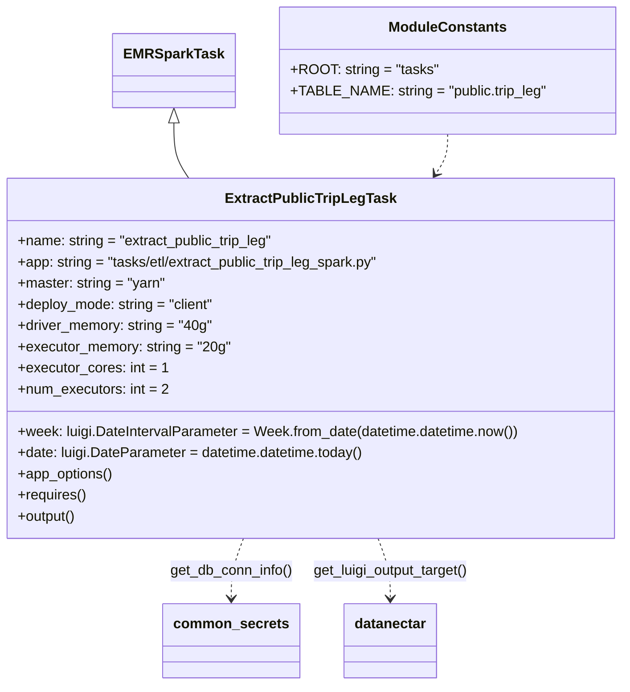

# Diagram: research/orchestrator/tasks/etl/extract_public_trip_leg_task.py


> Auto-generated by Obscura crawlers

## Diagram 1



### SVG

<svg id="container" width="704.9140625" xmlns="http://www.w3.org/2000/svg" class="classDiagram" height="776" viewBox="0 0 704.9140625 776" role="graphics-document document" aria-roledescription="class"><style>#container{font-family:"trebuchet ms",verdana,arial,sans-serif;font-size:16px;fill:#333;}@keyframes edge-animation-frame{from{stroke-dashoffset:0;}}@keyframes dash{to{stroke-dashoffset:0;}}#container .edge-animation-slow{stroke-dasharray:9,5!important;stroke-dashoffset:900;animation:dash 50s linear infinite;stroke-linecap:round;}#container .edge-animation-fast{stroke-dasharray:9,5!important;stroke-dashoffset:900;animation:dash 20s linear infinite;stroke-linecap:round;}#container .error-icon{fill:#552222;}#container .error-text{fill:#552222;stroke:#552222;}#container .edge-thickness-normal{stroke-width:1px;}#container .edge-thickness-thick{stroke-width:3.5px;}#container .edge-pattern-solid{stroke-dasharray:0;}#container .edge-thickness-invisible{stroke-width:0;fill:none;}#container .edge-pattern-dashed{stroke-dasharray:3;}#container .edge-pattern-dotted{stroke-dasharray:2;}#container .marker{fill:#333333;stroke:#333333;}#container .marker.cross{stroke:#333333;}#container svg{font-family:"trebuchet ms",verdana,arial,sans-serif;font-size:16px;}#container p{margin:0;}#container g.classGroup text{fill:#9370DB;stroke:none;font-family:"trebuchet ms",verdana,arial,sans-serif;font-size:10px;}#container g.classGroup text .title{font-weight:bolder;}#container .nodeLabel,#container .edgeLabel{color:#131300;}#container .edgeLabel .label rect{fill:#ECECFF;}#container .label text{fill:#131300;}#container .labelBkg{background:#ECECFF;}#container .edgeLabel .label span{background:#ECECFF;}#container .classTitle{font-weight:bolder;}#container .node rect,#container .node circle,#container .node ellipse,#container .node polygon,#container .node path{fill:#ECECFF;stroke:#9370DB;stroke-width:1px;}#container .divider{stroke:#9370DB;stroke-width:1;}#container g.clickable{cursor:pointer;}#container g.classGroup rect{fill:#ECECFF;stroke:#9370DB;}#container g.classGroup line{stroke:#9370DB;stroke-width:1;}#container .classLabel .box{stroke:none;stroke-width:0;fill:#ECECFF;opacity:0.5;}#container .classLabel .label{fill:#9370DB;font-size:10px;}#container .relation{stroke:#333333;stroke-width:1;fill:none;}#container .dashed-line{stroke-dasharray:3;}#container .dotted-line{stroke-dasharray:1 2;}#container #compositionStart,#container .composition{fill:#333333!important;stroke:#333333!important;stroke-width:1;}#container #compositionEnd,#container .composition{fill:#333333!important;stroke:#333333!important;stroke-width:1;}#container #dependencyStart,#container .dependency{fill:#333333!important;stroke:#333333!important;stroke-width:1;}#container #dependencyStart,#container .dependency{fill:#333333!important;stroke:#333333!important;stroke-width:1;}#container #extensionStart,#container .extension{fill:transparent!important;stroke:#333333!important;stroke-width:1;}#container #extensionEnd,#container .extension{fill:transparent!important;stroke:#333333!important;stroke-width:1;}#container #aggregationStart,#container .aggregation{fill:transparent!important;stroke:#333333!important;stroke-width:1;}#container #aggregationEnd,#container .aggregation{fill:transparent!important;stroke:#333333!important;stroke-width:1;}#container #lollipopStart,#container .lollipop{fill:#ECECFF!important;stroke:#333333!important;stroke-width:1;}#container #lollipopEnd,#container .lollipop{fill:#ECECFF!important;stroke:#333333!important;stroke-width:1;}#container .edgeTerminals{font-size:11px;line-height:initial;}#container .classTitleText{text-anchor:middle;font-size:18px;fill:#333;}#container .label-icon{display:inline-block;height:1em;overflow:visible;vertical-align:-0.125em;}#container .node .label-icon path{fill:currentColor;stroke:revert;stroke-width:revert;}#container :root{--mermaid-font-family:"trebuchet ms",verdana,arial,sans-serif;}</style><g><defs><marker id="container_class-aggregationStart" class="marker aggregation class" refX="18" refY="7" markerWidth="190" markerHeight="240" orient="auto"><path d="M 18,7 L9,13 L1,7 L9,1 Z"></path></marker></defs><defs><marker id="container_class-aggregationEnd" class="marker aggregation class" refX="1" refY="7" markerWidth="20" markerHeight="28" orient="auto"><path d="M 18,7 L9,13 L1,7 L9,1 Z"></path></marker></defs><defs><marker id="container_class-extensionStart" class="marker extension class" refX="18" refY="7" markerWidth="190" markerHeight="240" orient="auto"><path d="M 1,7 L18,13 V 1 Z"></path></marker></defs><defs><marker id="container_class-extensionEnd" class="marker extension class" refX="1" refY="7" markerWidth="20" markerHeight="28" orient="auto"><path d="M 1,1 V 13 L18,7 Z"></path></marker></defs><defs><marker id="container_class-compositionStart" class="marker composition class" refX="18" refY="7" markerWidth="190" markerHeight="240" orient="auto"><path d="M 18,7 L9,13 L1,7 L9,1 Z"></path></marker></defs><defs><marker id="container_class-compositionEnd" class="marker composition class" refX="1" refY="7" markerWidth="20" markerHeight="28" orient="auto"><path d="M 18,7 L9,13 L1,7 L9,1 Z"></path></marker></defs><defs><marker id="container_class-dependencyStart" class="marker dependency class" refX="6" refY="7" markerWidth="190" markerHeight="240" orient="auto"><path d="M 5,7 L9,13 L1,7 L9,1 Z"></path></marker></defs><defs><marker id="container_class-dependencyEnd" class="marker dependency class" refX="13" refY="7" markerWidth="20" markerHeight="28" orient="auto"><path d="M 18,7 L9,13 L14,7 L9,1 Z"></path></marker></defs><defs><marker id="container_class-lollipopStart" class="marker lollipop class" refX="13" refY="7" markerWidth="190" markerHeight="240" orient="auto"><circle stroke="black" fill="transparent" cx="7" cy="7" r="6"></circle></marker></defs><defs><marker id="container_class-lollipopEnd" class="marker lollipop class" refX="1" refY="7" markerWidth="190" markerHeight="240" orient="auto"><circle stroke="black" fill="transparent" cx="7" cy="7" r="6"></circle></marker></defs><g class="root"><g class="clusters"></g><g class="edgePaths"><path d="M202.324,139.25L202.324,145.542C202.324,151.833,202.324,164.417,205.056,174.875C207.788,185.333,213.251,193.667,215.983,197.833L218.714,202" id="id_EMRSparkTask_ExtractPublicTripLegTask_1" class="edge-thickness-normal edge-pattern-solid relation" style=";;;" data-edge="true" data-et="edge" data-id="id_EMRSparkTask_ExtractPublicTripLegTask_1" data-points="W3sieCI6MjAyLjMyNDIxODc1LCJ5IjoxMjJ9LHsieCI6MjAyLjMyNDIxODc1LCJ5IjoxNzd9LHsieCI6MjE4LjcxNDI2Mzc4Mjc1MTEsInkiOjIwMn1d" marker-start="url(#container_class-extensionStart)"></path><path d="M276.235,610L273.931,616.167C271.627,622.333,267.018,634.667,264.714,646C262.41,657.333,262.41,667.667,262.41,672.833L262.41,678" id="id_ExtractPublicTripLegTask_common_secrets_2" class="edge-thickness-normal edge-pattern-dashed relation" style=";;;" data-edge="true" data-et="edge" data-id="id_ExtractPublicTripLegTask_common_secrets_2" data-points="W3sieCI6Mjc2LjIzNDc4MDIxMjY1NTYsInkiOjYxMH0seyJ4IjoyNjIuNDEwMTU2MjUsInkiOjY0N30seyJ4IjoyNjIuNDEwMTU2MjUsInkiOjY4NH1d" marker-end="url(#container_class-dependencyEnd)"></path><path d="M428.679,610L430.983,616.167C433.287,622.333,437.896,634.667,440.2,646C442.504,657.333,442.504,667.667,442.504,672.833L442.504,678" id="id_ExtractPublicTripLegTask_datanectar_3" class="edge-thickness-normal edge-pattern-dashed relation" style=";;;" data-edge="true" data-et="edge" data-id="id_ExtractPublicTripLegTask_datanectar_3" data-points="W3sieCI6NDI4LjY3OTI4MjI4NzM0NDQsInkiOjYxMH0seyJ4Ijo0NDIuNTAzOTA2MjUsInkiOjY0N30seyJ4Ijo0NDIuNTAzOTA2MjUsInkiOjY4NH1d" marker-end="url(#container_class-dependencyEnd)"></path><path d="M502.59,152L502.59,156.167C502.59,160.333,502.59,168.667,500.406,176.164C498.223,183.661,493.856,190.321,491.673,193.652L489.489,196.982" id="id_ModuleConstants_ExtractPublicTripLegTask_4" class="edge-thickness-normal edge-pattern-dashed relation" style=";;;" data-edge="true" data-et="edge" data-id="id_ModuleConstants_ExtractPublicTripLegTask_4" data-points="W3sieCI6NTAyLjU4OTg0Mzc1LCJ5IjoxNTJ9LHsieCI6NTAyLjU4OTg0Mzc1LCJ5IjoxNzd9LHsieCI6NDg2LjE5OTc5ODcxNzI0ODksInkiOjIwMn1d" marker-end="url(#container_class-dependencyEnd)"></path></g><g class="edgeLabels"><g class="edgeLabel"><g class="label" data-id="id_EMRSparkTask_ExtractPublicTripLegTask_1" transform="translate(0, 0)"><foreignObject width="0" height="0"><div xmlns="http://www.w3.org/1999/xhtml" class="labelBkg" style="display: table-cell; white-space: nowrap; line-height: 1.5; max-width: 200px; text-align: center;"><span class="edgeLabel"></span></div></foreignObject></g></g><g class="edgeLabel" transform="translate(262.41015625, 647)"><g class="label" data-id="id_ExtractPublicTripLegTask_common_secrets_2" transform="translate(-69.9296875, -12)"><foreignObject width="139.859375" height="24"><div xmlns="http://www.w3.org/1999/xhtml" class="labelBkg" style="display: table-cell; white-space: nowrap; line-height: 1.5; max-width: 200px; text-align: center;"><span class="edgeLabel"><p>get_db_conn_info()</p></span></div></foreignObject></g></g><g class="edgeLabel" transform="translate(442.50390625, 647)"><g class="label" data-id="id_ExtractPublicTripLegTask_datanectar_3" transform="translate(-90.1640625, -12)"><foreignObject width="180.328125" height="24"><div xmlns="http://www.w3.org/1999/xhtml" class="labelBkg" style="display: table-cell; white-space: nowrap; line-height: 1.5; max-width: 200px; text-align: center;"><span class="edgeLabel"><p>get_luigi_output_target()</p></span></div></foreignObject></g></g><g class="edgeLabel"><g class="label" data-id="id_ModuleConstants_ExtractPublicTripLegTask_4" transform="translate(0, 0)"><foreignObject width="0" height="0"><div xmlns="http://www.w3.org/1999/xhtml" class="labelBkg" style="display: table-cell; white-space: nowrap; line-height: 1.5; max-width: 200px; text-align: center;"><span class="edgeLabel"></span></div></foreignObject></g></g></g><g class="nodes"><g class="node default" id="classId-EMRSparkTask-0" transform="translate(202.32421875, 80)"><g class="basic label-container"><path d="M-65.1484375 -42 L65.1484375 -42 L65.1484375 42 L-65.1484375 42" stroke="none" stroke-width="0" fill="#ECECFF" style=""></path><path d="M-65.1484375 -42 C-13.817467612512843 -42, 37.513502274974314 -42, 65.1484375 -42 M-65.1484375 -42 C-21.590884445902468 -42, 21.966668608195064 -42, 65.1484375 -42 M65.1484375 -42 C65.1484375 -9.376000780281032, 65.1484375 23.247998439437936, 65.1484375 42 M65.1484375 -42 C65.1484375 -9.810768755010407, 65.1484375 22.378462489979185, 65.1484375 42 M65.1484375 42 C24.047721647181277 42, -17.052994205637447 42, -65.1484375 42 M65.1484375 42 C29.036577306150335 42, -7.075282887699331 42, -65.1484375 42 M-65.1484375 42 C-65.1484375 8.70778137478709, -65.1484375 -24.58443725042582, -65.1484375 -42 M-65.1484375 42 C-65.1484375 17.03736709470007, -65.1484375 -7.925265810599861, -65.1484375 -42" stroke="#9370DB" stroke-width="1.3" fill="none" stroke-dasharray="0 0" style=""></path></g><g class="annotation-group text" transform="translate(0, -18)"></g><g class="label-group text" transform="translate(-53.1484375, -18)"><g class="label" style="font-weight: bolder" transform="translate(0,-12)"><foreignObject width="106.296875" height="24"><div xmlns="http://www.w3.org/1999/xhtml" style="display: table-cell; white-space: nowrap; line-height: 1.5; max-width: 154px; text-align: center;"><span class="nodeLabel markdown-node-label" style=""><p>EMRSparkTask</p></span></div></foreignObject></g></g><g class="members-group text" transform="translate(-53.1484375, 30)"></g><g class="methods-group text" transform="translate(-53.1484375, 60)"></g><g class="divider" style=""><path d="M-65.1484375 6 C-24.01591792910306 6, 17.116601641793878 6, 65.1484375 6 M-65.1484375 6 C-29.2713798978982 6, 6.6056777042036 6, 65.1484375 6" stroke="#9370DB" stroke-width="1.3" fill="none" stroke-dasharray="0 0" style=""></path></g><g class="divider" style=""><path d="M-65.1484375 24 C-28.055671995054418 24, 9.037093509891164 24, 65.1484375 24 M-65.1484375 24 C-18.089220463687333 24, 28.969996572625334 24, 65.1484375 24" stroke="#9370DB" stroke-width="1.3" fill="none" stroke-dasharray="0 0" style=""></path></g></g><g class="node default" id="classId-ExtractPublicTripLegTask-1" transform="translate(352.45703125, 406)"><g class="basic label-container"><path d="M-344.45703125 -204 L344.45703125 -204 L344.45703125 204 L-344.45703125 204" stroke="none" stroke-width="0" fill="#ECECFF" style=""></path><path d="M-344.45703125 -204 C-87.37701094277065 -204, 169.7030093644587 -204, 344.45703125 -204 M-344.45703125 -204 C-144.72794361019075 -204, 55.0011440296185 -204, 344.45703125 -204 M344.45703125 -204 C344.45703125 -106.59268070497302, 344.45703125 -9.18536140994604, 344.45703125 204 M344.45703125 -204 C344.45703125 -48.422998016797266, 344.45703125 107.15400396640547, 344.45703125 204 M344.45703125 204 C187.20299198168132 204, 29.948952713362644 204, -344.45703125 204 M344.45703125 204 C201.38542348724576 204, 58.31381572449152 204, -344.45703125 204 M-344.45703125 204 C-344.45703125 52.17251761546606, -344.45703125 -99.65496476906787, -344.45703125 -204 M-344.45703125 204 C-344.45703125 63.74715542713983, -344.45703125 -76.50568914572034, -344.45703125 -204" stroke="#9370DB" stroke-width="1.3" fill="none" stroke-dasharray="0 0" style=""></path></g><g class="annotation-group text" transform="translate(0, -180)"></g><g class="label-group text" transform="translate(-91.5859375, -180)"><g class="label" style="font-weight: bolder" transform="translate(0,-12)"><foreignObject width="183.171875" height="24"><div xmlns="http://www.w3.org/1999/xhtml" style="display: table-cell; white-space: nowrap; line-height: 1.5; max-width: 229px; text-align: center;"><span class="nodeLabel markdown-node-label" style=""><p>ExtractPublicTripLegTask</p></span></div></foreignObject></g></g><g class="members-group text" transform="translate(-332.45703125, -132)"><g class="label" style="" transform="translate(0,-12)"><foreignObject width="294.109375" height="24"><div xmlns="http://www.w3.org/1999/xhtml" style="display: table-cell; white-space: nowrap; line-height: 1.5; max-width: 351px; text-align: center;"><span class="nodeLabel markdown-node-label" style=""><p>+name: string = "extract_public_trip_leg"</p></span></div></foreignObject></g><g class="label" style="" transform="translate(0,12)"><foreignObject width="422.203125" height="24"><div xmlns="http://www.w3.org/1999/xhtml" style="display: table-cell; white-space: nowrap; line-height: 1.5; max-width: 480px; text-align: center;"><span class="nodeLabel markdown-node-label" style=""><p>+app: string = "tasks/etl/extract_public_trip_leg_spark.py"</p></span></div></foreignObject></g><g class="label" style="" transform="translate(0,36)"><foreignObject width="168.984375" height="24"><div xmlns="http://www.w3.org/1999/xhtml" style="display: table-cell; white-space: nowrap; line-height: 1.5; max-width: 226px; text-align: center;"><span class="nodeLabel markdown-node-label" style=""><p>+master: string = "yarn"</p></span></div></foreignObject></g><g class="label" style="" transform="translate(0,60)"><foreignObject width="226.015625" height="24"><div xmlns="http://www.w3.org/1999/xhtml" style="display: table-cell; white-space: nowrap; line-height: 1.5; max-width: 283px; text-align: center;"><span class="nodeLabel markdown-node-label" style=""><p>+deploy_mode: string = "client"</p></span></div></foreignObject></g><g class="label" style="" transform="translate(0,84)"><foreignObject width="221.671875" height="24"><div xmlns="http://www.w3.org/1999/xhtml" style="display: table-cell; white-space: nowrap; line-height: 1.5; max-width: 279px; text-align: center;"><span class="nodeLabel markdown-node-label" style=""><p>+driver_memory: string = "40g"</p></span></div></foreignObject></g><g class="label" style="" transform="translate(0,108)"><foreignObject width="241.53125" height="24"><div xmlns="http://www.w3.org/1999/xhtml" style="display: table-cell; white-space: nowrap; line-height: 1.5; max-width: 299px; text-align: center;"><span class="nodeLabel markdown-node-label" style=""><p>+executor_memory: string = "20g"</p></span></div></foreignObject></g><g class="label" style="" transform="translate(0,132)"><foreignObject width="167.1875" height="24"><div xmlns="http://www.w3.org/1999/xhtml" style="display: table-cell; white-space: nowrap; line-height: 1.5; max-width: 225px; text-align: center;"><span class="nodeLabel markdown-node-label" style=""><p>+executor_cores: int = 1</p></span></div></foreignObject></g><g class="label" style="" transform="translate(0,156)"><foreignObject width="170.53125" height="24"><div xmlns="http://www.w3.org/1999/xhtml" style="display: table-cell; white-space: nowrap; line-height: 1.5; max-width: 228px; text-align: center;"><span class="nodeLabel markdown-node-label" style=""><p>+num_executors: int = 2</p></span></div></foreignObject></g></g><g class="methods-group text" transform="translate(-332.45703125, 84)"><g class="label" style="" transform="translate(0,-12)"><foreignObject width="573.328125" height="24"><div xmlns="http://www.w3.org/1999/xhtml" style="display: table-cell; white-space: nowrap; line-height: 1.5; max-width: 631px; text-align: center;"><span class="nodeLabel markdown-node-label" style=""><p>+week: luigi.DateIntervalParameter = Week.from_date(datetime.datetime.now())</p></span></div></foreignObject></g><g class="label" style="" transform="translate(0,12)"><foreignObject width="396.046875" height="24"><div xmlns="http://www.w3.org/1999/xhtml" style="display: table-cell; white-space: nowrap; line-height: 1.5; max-width: 453px; text-align: center;"><span class="nodeLabel markdown-node-label" style=""><p>+date: luigi.DateParameter = datetime.datetime.today()</p></span></div></foreignObject></g><g class="label" style="" transform="translate(0,36)"><foreignObject width="108.84375" height="24"><div xmlns="http://www.w3.org/1999/xhtml" style="display: table-cell; white-space: nowrap; line-height: 1.5; max-width: 166px; text-align: center;"><span class="nodeLabel markdown-node-label" style=""><p>+app_options()</p></span></div></foreignObject></g><g class="label" style="" transform="translate(0,60)"><foreignObject width="78.0625" height="24"><div xmlns="http://www.w3.org/1999/xhtml" style="display: table-cell; white-space: nowrap; line-height: 1.5; max-width: 135px; text-align: center;"><span class="nodeLabel markdown-node-label" style=""><p>+requires()</p></span></div></foreignObject></g><g class="label" style="" transform="translate(0,84)"><foreignObject width="67.390625" height="24"><div xmlns="http://www.w3.org/1999/xhtml" style="display: table-cell; white-space: nowrap; line-height: 1.5; max-width: 125px; text-align: center;"><span class="nodeLabel markdown-node-label" style=""><p>+output()</p></span></div></foreignObject></g></g><g class="divider" style=""><path d="M-344.45703125 -156 C-128.8011847319127 -156, 86.85466178617457 -156, 344.45703125 -156 M-344.45703125 -156 C-180.67782891087333 -156, -16.89862657174666 -156, 344.45703125 -156" stroke="#9370DB" stroke-width="1.3" fill="none" stroke-dasharray="0 0" style=""></path></g><g class="divider" style=""><path d="M-344.45703125 60 C-98.36149413742194 60, 147.73404297515611 60, 344.45703125 60 M-344.45703125 60 C-125.25446989158678 60, 93.94809146682644 60, 344.45703125 60" stroke="#9370DB" stroke-width="1.3" fill="none" stroke-dasharray="0 0" style=""></path></g></g><g class="node default" id="classId-common_secrets-2" transform="translate(262.41015625, 726)"><g class="basic label-container"><path d="M-73.765625 -42 L73.765625 -42 L73.765625 42 L-73.765625 42" stroke="none" stroke-width="0" fill="#ECECFF" style=""></path><path d="M-73.765625 -42 C-18.688545063072624 -42, 36.38853487385475 -42, 73.765625 -42 M-73.765625 -42 C-22.355557618077654 -42, 29.054509763844692 -42, 73.765625 -42 M73.765625 -42 C73.765625 -10.77181538459087, 73.765625 20.45636923081826, 73.765625 42 M73.765625 -42 C73.765625 -21.78173754895616, 73.765625 -1.5634750979123169, 73.765625 42 M73.765625 42 C43.24298628817008 42, 12.72034757634016 42, -73.765625 42 M73.765625 42 C31.791894714830086 42, -10.181835570339828 42, -73.765625 42 M-73.765625 42 C-73.765625 9.296223672425143, -73.765625 -23.407552655149715, -73.765625 -42 M-73.765625 42 C-73.765625 16.034459975665442, -73.765625 -9.931080048669116, -73.765625 -42" stroke="#9370DB" stroke-width="1.3" fill="none" stroke-dasharray="0 0" style=""></path></g><g class="annotation-group text" transform="translate(0, -18)"></g><g class="label-group text" transform="translate(-61.765625, -18)"><g class="label" style="font-weight: bolder" transform="translate(0,-12)"><foreignObject width="123.53125" height="24"><div xmlns="http://www.w3.org/1999/xhtml" style="display: table-cell; white-space: nowrap; line-height: 1.5; max-width: 173px; text-align: center;"><span class="nodeLabel markdown-node-label" style=""><p>common_secrets</p></span></div></foreignObject></g></g><g class="members-group text" transform="translate(-61.765625, 30)"></g><g class="methods-group text" transform="translate(-61.765625, 60)"></g><g class="divider" style=""><path d="M-73.765625 6 C-42.66969629091923 6, -11.573767581838453 6, 73.765625 6 M-73.765625 6 C-40.111851231549934 6, -6.458077463099869 6, 73.765625 6" stroke="#9370DB" stroke-width="1.3" fill="none" stroke-dasharray="0 0" style=""></path></g><g class="divider" style=""><path d="M-73.765625 24 C-25.324305467865443 24, 23.117014064269114 24, 73.765625 24 M-73.765625 24 C-42.61148790696036 24, -11.45735081392072 24, 73.765625 24" stroke="#9370DB" stroke-width="1.3" fill="none" stroke-dasharray="0 0" style=""></path></g></g><g class="node default" id="classId-datanectar-3" transform="translate(442.50390625, 726)"><g class="basic label-container"><path d="M-52.015625 -42 L52.015625 -42 L52.015625 42 L-52.015625 42" stroke="none" stroke-width="0" fill="#ECECFF" style=""></path><path d="M-52.015625 -42 C-26.358679753613927 -42, -0.7017345072278545 -42, 52.015625 -42 M-52.015625 -42 C-18.02694264718285 -42, 15.961739705634301 -42, 52.015625 -42 M52.015625 -42 C52.015625 -21.569743576110948, 52.015625 -1.1394871522218963, 52.015625 42 M52.015625 -42 C52.015625 -21.544051492473166, 52.015625 -1.0881029849463317, 52.015625 42 M52.015625 42 C12.80701235667982 42, -26.40160028664036 42, -52.015625 42 M52.015625 42 C20.789363582387086 42, -10.436897835225828 42, -52.015625 42 M-52.015625 42 C-52.015625 8.463376032543245, -52.015625 -25.07324793491351, -52.015625 -42 M-52.015625 42 C-52.015625 10.306883416803071, -52.015625 -21.386233166393858, -52.015625 -42" stroke="#9370DB" stroke-width="1.3" fill="none" stroke-dasharray="0 0" style=""></path></g><g class="annotation-group text" transform="translate(0, -18)"></g><g class="label-group text" transform="translate(-40.015625, -18)"><g class="label" style="font-weight: bolder" transform="translate(0,-12)"><foreignObject width="80.03125" height="24"><div xmlns="http://www.w3.org/1999/xhtml" style="display: table-cell; white-space: nowrap; line-height: 1.5; max-width: 130px; text-align: center;"><span class="nodeLabel markdown-node-label" style=""><p>datanectar</p></span></div></foreignObject></g></g><g class="members-group text" transform="translate(-40.015625, 30)"></g><g class="methods-group text" transform="translate(-40.015625, 60)"></g><g class="divider" style=""><path d="M-52.015625 6 C-12.21251266622216 6, 27.59059966755568 6, 52.015625 6 M-52.015625 6 C-17.242786147646093 6, 17.530052704707813 6, 52.015625 6" stroke="#9370DB" stroke-width="1.3" fill="none" stroke-dasharray="0 0" style=""></path></g><g class="divider" style=""><path d="M-52.015625 24 C-26.609884306924243 24, -1.204143613848487 24, 52.015625 24 M-52.015625 24 C-15.596666571714835 24, 20.82229185657033 24, 52.015625 24" stroke="#9370DB" stroke-width="1.3" fill="none" stroke-dasharray="0 0" style=""></path></g></g><g class="node default" id="classId-ModuleConstants-4" transform="translate(502.58984375, 80)"><g class="basic label-container"><path d="M-185.1171875 -72 L185.1171875 -72 L185.1171875 72 L-185.1171875 72" stroke="none" stroke-width="0" fill="#ECECFF" style=""></path><path d="M-185.1171875 -72 C-90.1387653652073 -72, 4.839656769585389 -72, 185.1171875 -72 M-185.1171875 -72 C-86.5429075146708 -72, 12.031372470658397 -72, 185.1171875 -72 M185.1171875 -72 C185.1171875 -20.645713087479585, 185.1171875 30.70857382504083, 185.1171875 72 M185.1171875 -72 C185.1171875 -40.503541986674165, 185.1171875 -9.007083973348337, 185.1171875 72 M185.1171875 72 C64.64933186246743 72, -55.81852377506513 72, -185.1171875 72 M185.1171875 72 C59.9966065748672 72, -65.1239743502656 72, -185.1171875 72 M-185.1171875 72 C-185.1171875 28.336484484528242, -185.1171875 -15.327031030943516, -185.1171875 -72 M-185.1171875 72 C-185.1171875 23.990062891035798, -185.1171875 -24.019874217928404, -185.1171875 -72" stroke="#9370DB" stroke-width="1.3" fill="none" stroke-dasharray="0 0" style=""></path></g><g class="annotation-group text" transform="translate(0, -48)"></g><g class="label-group text" transform="translate(-63.625, -48)"><g class="label" style="font-weight: bolder" transform="translate(0,-12)"><foreignObject width="127.25" height="24"><div xmlns="http://www.w3.org/1999/xhtml" style="display: table-cell; white-space: nowrap; line-height: 1.5; max-width: 176px; text-align: center;"><span class="nodeLabel markdown-node-label" style=""><p>ModuleConstants</p></span></div></foreignObject></g></g><g class="members-group text" transform="translate(-173.1171875, 0)"><g class="label" style="" transform="translate(0,-12)"><foreignObject width="162.890625" height="24"><div xmlns="http://www.w3.org/1999/xhtml" style="display: table-cell; white-space: nowrap; line-height: 1.5; max-width: 220px; text-align: center;"><span class="nodeLabel markdown-node-label" style=""><p>+ROOT: string = "tasks"</p></span></div></foreignObject></g><g class="label" style="" transform="translate(0,12)"><foreignObject width="282.609375" height="24"><div xmlns="http://www.w3.org/1999/xhtml" style="display: table-cell; white-space: nowrap; line-height: 1.5; max-width: 340px; text-align: center;"><span class="nodeLabel markdown-node-label" style=""><p>+TABLE_NAME: string = "public.trip_leg"</p></span></div></foreignObject></g></g><g class="methods-group text" transform="translate(-173.1171875, 72)"></g><g class="divider" style=""><path d="M-185.1171875 -24 C-40.45566424644272 -24, 104.20585900711455 -24, 185.1171875 -24 M-185.1171875 -24 C-63.04911705919518 -24, 59.018953381609634 -24, 185.1171875 -24" stroke="#9370DB" stroke-width="1.3" fill="none" stroke-dasharray="0 0" style=""></path></g><g class="divider" style=""><path d="M-185.1171875 48 C-78.58020106001506 48, 27.956785379969887 48, 185.1171875 48 M-185.1171875 48 C-83.51132519826183 48, 18.09453710347634 48, 185.1171875 48" stroke="#9370DB" stroke-width="1.3" fill="none" stroke-dasharray="0 0" style=""></path></g></g></g></g></g></svg>

## Diagram 2

```mermaid
flowchart TD
Start([ExtractPublicTripLegTask]) --> AppOptions[app_options()]
AppOptions -->|calls| GetDB[common_secrets.get_db_conn_info(parts_db)]
GetDB --> DBInfo[db_info (dict)]
DBInfo --> Fields[DB_HOST, USERNAME, PASSWORD, DATABASE]
AppOptions -->|reads| OutputPath[output().path]
AppOptions --> ReturnOpts[return [None, output().path, TABLE_NAME, DB_HOST, USERNAME, PASSWORD, DATABASE]]
OutputCall[ExtractPublicTripLegTask.output()] -->|calls| Datanectar[datanectar.get_luigi_output_target(ROOT, self, filename=TABLE_NAME + ".parquet")]
Datanectar --> LuigiTarget([Luigi Output Target])
ReturnOpts --> LuigiTarget
```

> SVG rendering failed for this diagram.
