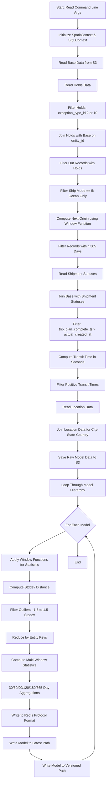
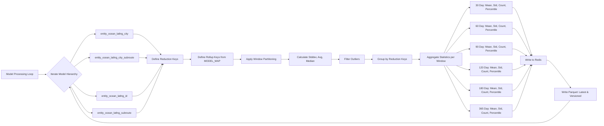
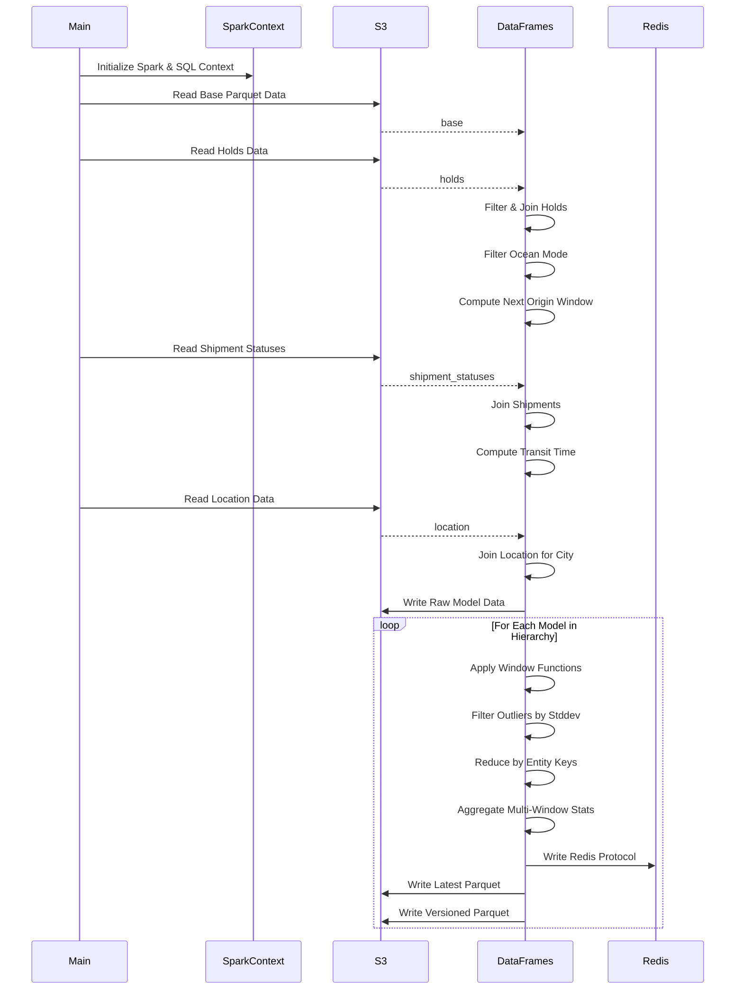

# Diagram: research/orchestrator/tasks/models/entity_ocean_latlng_spark.py

> Auto-generated by Obscura crawlers

## Diagram 1

### SVG

<svg id="container" width="499.6796875" xmlns="http://www.w3.org/2000/svg" class="flowchart" height="3572.171875" viewBox="0 0 499.6796875 3572.171875" role="graphics-document document" aria-roledescription="flowchart-v2"><g><marker id="container_flowchart-v2-pointEnd" class="marker flowchart-v2" viewBox="0 0 10 10" refX="5" refY="5" markerUnits="userSpaceOnUse" markerWidth="8" markerHeight="8" orient="auto"><path d="M 0 0 L 10 5 L 0 10 z" class="arrowMarkerPath" style="stroke-width: 1; stroke-dasharray: 1, 0;"></path></marker><marker id="container_flowchart-v2-pointStart" class="marker flowchart-v2" viewBox="0 0 10 10" refX="4.5" refY="5" markerUnits="userSpaceOnUse" markerWidth="8" markerHeight="8" orient="auto"><path d="M 0 5 L 10 10 L 10 0 z" class="arrowMarkerPath" style="stroke-width: 1; stroke-dasharray: 1, 0;"></path></marker><marker id="container_flowchart-v2-circleEnd" class="marker flowchart-v2" viewBox="0 0 10 10" refX="11" refY="5" markerUnits="userSpaceOnUse" markerWidth="11" markerHeight="11" orient="auto"><circle cx="5" cy="5" r="5" class="arrowMarkerPath" style="stroke-width: 1; stroke-dasharray: 1, 0;"></circle></marker><marker id="container_flowchart-v2-circleStart" class="marker flowchart-v2" viewBox="0 0 10 10" refX="-1" refY="5" markerUnits="userSpaceOnUse" markerWidth="11" markerHeight="11" orient="auto"><circle cx="5" cy="5" r="5" class="arrowMarkerPath" style="stroke-width: 1; stroke-dasharray: 1, 0;"></circle></marker><marker id="container_flowchart-v2-crossEnd" class="marker cross flowchart-v2" viewBox="0 0 11 11" refX="12" refY="5.2" markerUnits="userSpaceOnUse" markerWidth="11" markerHeight="11" orient="auto"><path d="M 1,1 l 9,9 M 10,1 l -9,9" class="arrowMarkerPath" style="stroke-width: 2; stroke-dasharray: 1, 0;"></path></marker><marker id="container_flowchart-v2-crossStart" class="marker cross flowchart-v2" viewBox="0 0 11 11" refX="-1" refY="5.2" markerUnits="userSpaceOnUse" markerWidth="11" markerHeight="11" orient="auto"><path d="M 1,1 l 9,9 M 10,1 l -9,9" class="arrowMarkerPath" style="stroke-width: 2; stroke-dasharray: 1, 0;"></path></marker><g class="root"><g class="clusters"></g><g class="edgePaths"><path d="M361.68,86L361.68,90.167C361.68,94.333,361.68,102.667,361.68,110.333C361.68,118,361.68,125,361.68,128.5L361.68,132" id="L_A_B_0" class="edge-thickness-normal edge-pattern-solid edge-thickness-normal edge-pattern-solid flowchart-link" style=";" data-edge="true" data-et="edge" data-id="L_A_B_0" data-points="W3sieCI6MzYxLjY3OTY4NzUsInkiOjg2fSx7IngiOjM2MS42Nzk2ODc1LCJ5IjoxMTF9LHsieCI6MzYxLjY3OTY4NzUsInkiOjEzNn1d" marker-end="url(#container_flowchart-v2-pointEnd)"></path><path d="M361.68,214L361.68,218.167C361.68,222.333,361.68,230.667,361.68,238.333C361.68,246,361.68,253,361.68,256.5L361.68,260" id="L_B_C_0" class="edge-thickness-normal edge-pattern-solid edge-thickness-normal edge-pattern-solid flowchart-link" style=";" data-edge="true" data-et="edge" data-id="L_B_C_0" data-points="W3sieCI6MzYxLjY3OTY4NzUsInkiOjIxNH0seyJ4IjozNjEuNjc5Njg3NSwieSI6MjM5fSx7IngiOjM2MS42Nzk2ODc1LCJ5IjoyNjR9XQ==" marker-end="url(#container_flowchart-v2-pointEnd)"></path><path d="M361.68,318L361.68,322.167C361.68,326.333,361.68,334.667,361.68,342.333C361.68,350,361.68,357,361.68,360.5L361.68,364" id="L_C_D_0" class="edge-thickness-normal edge-pattern-solid edge-thickness-normal edge-pattern-solid flowchart-link" style=";" data-edge="true" data-et="edge" data-id="L_C_D_0" data-points="W3sieCI6MzYxLjY3OTY4NzUsInkiOjMxOH0seyJ4IjozNjEuNjc5Njg3NSwieSI6MzQzfSx7IngiOjM2MS42Nzk2ODc1LCJ5IjozNjh9XQ==" marker-end="url(#container_flowchart-v2-pointEnd)"></path><path d="M361.68,422L361.68,426.167C361.68,430.333,361.68,438.667,361.68,446.333C361.68,454,361.68,461,361.68,464.5L361.68,468" id="L_D_E_0" class="edge-thickness-normal edge-pattern-solid edge-thickness-normal edge-pattern-solid flowchart-link" style=";" data-edge="true" data-et="edge" data-id="L_D_E_0" data-points="W3sieCI6MzYxLjY3OTY4NzUsInkiOjQyMn0seyJ4IjozNjEuNjc5Njg3NSwieSI6NDQ3fSx7IngiOjM2MS42Nzk2ODc1LCJ5Ijo0NzJ9XQ==" marker-end="url(#container_flowchart-v2-pointEnd)"></path><path d="M361.68,550L361.68,554.167C361.68,558.333,361.68,566.667,361.68,574.333C361.68,582,361.68,589,361.68,592.5L361.68,596" id="L_E_F_0" class="edge-thickness-normal edge-pattern-solid edge-thickness-normal edge-pattern-solid flowchart-link" style=";" data-edge="true" data-et="edge" data-id="L_E_F_0" data-points="W3sieCI6MzYxLjY3OTY4NzUsInkiOjU1MH0seyJ4IjozNjEuNjc5Njg3NSwieSI6NTc1fSx7IngiOjM2MS42Nzk2ODc1LCJ5Ijo2MDB9XQ==" marker-end="url(#container_flowchart-v2-pointEnd)"></path><path d="M361.68,678L361.68,682.167C361.68,686.333,361.68,694.667,361.68,702.333C361.68,710,361.68,717,361.68,720.5L361.68,724" id="L_F_G_0" class="edge-thickness-normal edge-pattern-solid edge-thickness-normal edge-pattern-solid flowchart-link" style=";" data-edge="true" data-et="edge" data-id="L_F_G_0" data-points="W3sieCI6MzYxLjY3OTY4NzUsInkiOjY3OH0seyJ4IjozNjEuNjc5Njg3NSwieSI6NzAzfSx7IngiOjM2MS42Nzk2ODc1LCJ5Ijo3Mjh9XQ==" marker-end="url(#container_flowchart-v2-pointEnd)"></path><path d="M361.68,806L361.68,810.167C361.68,814.333,361.68,822.667,361.68,830.333C361.68,838,361.68,845,361.68,848.5L361.68,852" id="L_G_H_0" class="edge-thickness-normal edge-pattern-solid edge-thickness-normal edge-pattern-solid flowchart-link" style=";" data-edge="true" data-et="edge" data-id="L_G_H_0" data-points="W3sieCI6MzYxLjY3OTY4NzUsInkiOjgwNn0seyJ4IjozNjEuNjc5Njg3NSwieSI6ODMxfSx7IngiOjM2MS42Nzk2ODc1LCJ5Ijo4NTZ9XQ==" marker-end="url(#container_flowchart-v2-pointEnd)"></path><path d="M361.68,934L361.68,938.167C361.68,942.333,361.68,950.667,361.68,958.333C361.68,966,361.68,973,361.68,976.5L361.68,980" id="L_H_I_0" class="edge-thickness-normal edge-pattern-solid edge-thickness-normal edge-pattern-solid flowchart-link" style=";" data-edge="true" data-et="edge" data-id="L_H_I_0" data-points="W3sieCI6MzYxLjY3OTY4NzUsInkiOjkzNH0seyJ4IjozNjEuNjc5Njg3NSwieSI6OTU5fSx7IngiOjM2MS42Nzk2ODc1LCJ5Ijo5ODR9XQ==" marker-end="url(#container_flowchart-v2-pointEnd)"></path><path d="M361.68,1062L361.68,1066.167C361.68,1070.333,361.68,1078.667,361.68,1086.333C361.68,1094,361.68,1101,361.68,1104.5L361.68,1108" id="L_I_J_0" class="edge-thickness-normal edge-pattern-solid edge-thickness-normal edge-pattern-solid flowchart-link" style=";" data-edge="true" data-et="edge" data-id="L_I_J_0" data-points="W3sieCI6MzYxLjY3OTY4NzUsInkiOjEwNjJ9LHsieCI6MzYxLjY3OTY4NzUsInkiOjEwODd9LHsieCI6MzYxLjY3OTY4NzUsInkiOjExMTJ9XQ==" marker-end="url(#container_flowchart-v2-pointEnd)"></path><path d="M361.68,1190L361.68,1194.167C361.68,1198.333,361.68,1206.667,361.68,1214.333C361.68,1222,361.68,1229,361.68,1232.5L361.68,1236" id="L_J_K_0" class="edge-thickness-normal edge-pattern-solid edge-thickness-normal edge-pattern-solid flowchart-link" style=";" data-edge="true" data-et="edge" data-id="L_J_K_0" data-points="W3sieCI6MzYxLjY3OTY4NzUsInkiOjExOTB9LHsieCI6MzYxLjY3OTY4NzUsInkiOjEyMTV9LHsieCI6MzYxLjY3OTY4NzUsInkiOjEyNDB9XQ==" marker-end="url(#container_flowchart-v2-pointEnd)"></path><path d="M361.68,1294L361.68,1298.167C361.68,1302.333,361.68,1310.667,361.68,1318.333C361.68,1326,361.68,1333,361.68,1336.5L361.68,1340" id="L_K_L_0" class="edge-thickness-normal edge-pattern-solid edge-thickness-normal edge-pattern-solid flowchart-link" style=";" data-edge="true" data-et="edge" data-id="L_K_L_0" data-points="W3sieCI6MzYxLjY3OTY4NzUsInkiOjEyOTR9LHsieCI6MzYxLjY3OTY4NzUsInkiOjEzMTl9LHsieCI6MzYxLjY3OTY4NzUsInkiOjEzNDR9XQ==" marker-end="url(#container_flowchart-v2-pointEnd)"></path><path d="M361.68,1422L361.68,1426.167C361.68,1430.333,361.68,1438.667,361.68,1446.333C361.68,1454,361.68,1461,361.68,1464.5L361.68,1468" id="L_L_M_0" class="edge-thickness-normal edge-pattern-solid edge-thickness-normal edge-pattern-solid flowchart-link" style=";" data-edge="true" data-et="edge" data-id="L_L_M_0" data-points="W3sieCI6MzYxLjY3OTY4NzUsInkiOjE0MjJ9LHsieCI6MzYxLjY3OTY4NzUsInkiOjE0NDd9LHsieCI6MzYxLjY3OTY4NzUsInkiOjE0NzJ9XQ==" marker-end="url(#container_flowchart-v2-pointEnd)"></path><path d="M361.68,1574L361.68,1578.167C361.68,1582.333,361.68,1590.667,361.68,1598.333C361.68,1606,361.68,1613,361.68,1616.5L361.68,1620" id="L_M_N_0" class="edge-thickness-normal edge-pattern-solid edge-thickness-normal edge-pattern-solid flowchart-link" style=";" data-edge="true" data-et="edge" data-id="L_M_N_0" data-points="W3sieCI6MzYxLjY3OTY4NzUsInkiOjE1NzR9LHsieCI6MzYxLjY3OTY4NzUsInkiOjE1OTl9LHsieCI6MzYxLjY3OTY4NzUsInkiOjE2MjR9XQ==" marker-end="url(#container_flowchart-v2-pointEnd)"></path><path d="M361.68,1702L361.68,1706.167C361.68,1710.333,361.68,1718.667,361.68,1726.333C361.68,1734,361.68,1741,361.68,1744.5L361.68,1748" id="L_N_O_0" class="edge-thickness-normal edge-pattern-solid edge-thickness-normal edge-pattern-solid flowchart-link" style=";" data-edge="true" data-et="edge" data-id="L_N_O_0" data-points="W3sieCI6MzYxLjY3OTY4NzUsInkiOjE3MDJ9LHsieCI6MzYxLjY3OTY4NzUsInkiOjE3Mjd9LHsieCI6MzYxLjY3OTY4NzUsInkiOjE3NTJ9XQ==" marker-end="url(#container_flowchart-v2-pointEnd)"></path><path d="M361.68,1806L361.68,1810.167C361.68,1814.333,361.68,1822.667,361.68,1830.333C361.68,1838,361.68,1845,361.68,1848.5L361.68,1852" id="L_O_P_0" class="edge-thickness-normal edge-pattern-solid edge-thickness-normal edge-pattern-solid flowchart-link" style=";" data-edge="true" data-et="edge" data-id="L_O_P_0" data-points="W3sieCI6MzYxLjY3OTY4NzUsInkiOjE4MDZ9LHsieCI6MzYxLjY3OTY4NzUsInkiOjE4MzF9LHsieCI6MzYxLjY3OTY4NzUsInkiOjE4NTZ9XQ==" marker-end="url(#container_flowchart-v2-pointEnd)"></path><path d="M361.68,1910L361.68,1914.167C361.68,1918.333,361.68,1926.667,361.68,1934.333C361.68,1942,361.68,1949,361.68,1952.5L361.68,1956" id="L_P_Q_0" class="edge-thickness-normal edge-pattern-solid edge-thickness-normal edge-pattern-solid flowchart-link" style=";" data-edge="true" data-et="edge" data-id="L_P_Q_0" data-points="W3sieCI6MzYxLjY3OTY4NzUsInkiOjE5MTB9LHsieCI6MzYxLjY3OTY4NzUsInkiOjE5MzV9LHsieCI6MzYxLjY3OTY4NzUsInkiOjE5NjB9XQ==" marker-end="url(#container_flowchart-v2-pointEnd)"></path><path d="M361.68,2038L361.68,2042.167C361.68,2046.333,361.68,2054.667,361.68,2062.333C361.68,2070,361.68,2077,361.68,2080.5L361.68,2084" id="L_Q_R_0" class="edge-thickness-normal edge-pattern-solid edge-thickness-normal edge-pattern-solid flowchart-link" style=";" data-edge="true" data-et="edge" data-id="L_Q_R_0" data-points="W3sieCI6MzYxLjY3OTY4NzUsInkiOjIwMzh9LHsieCI6MzYxLjY3OTY4NzUsInkiOjIwNjN9LHsieCI6MzYxLjY3OTY4NzUsInkiOjIwODh9XQ==" marker-end="url(#container_flowchart-v2-pointEnd)"></path><path d="M361.68,2142L361.68,2146.167C361.68,2150.333,361.68,2158.667,361.68,2166.333C361.68,2174,361.68,2181,361.68,2184.5L361.68,2188" id="L_R_S_0" class="edge-thickness-normal edge-pattern-solid edge-thickness-normal edge-pattern-solid flowchart-link" style=";" data-edge="true" data-et="edge" data-id="L_R_S_0" data-points="W3sieCI6MzYxLjY3OTY4NzUsInkiOjIxNDJ9LHsieCI6MzYxLjY3OTY4NzUsInkiOjIxNjd9LHsieCI6MzYxLjY3OTY4NzUsInkiOjIxOTJ9XQ==" marker-end="url(#container_flowchart-v2-pointEnd)"></path><path d="M361.68,2270L361.68,2274.167C361.68,2278.333,361.68,2286.667,361.68,2294.333C361.68,2302,361.68,2309,361.68,2312.5L361.68,2316" id="L_S_T_0" class="edge-thickness-normal edge-pattern-solid edge-thickness-normal edge-pattern-solid flowchart-link" style=";" data-edge="true" data-et="edge" data-id="L_S_T_0" data-points="W3sieCI6MzYxLjY3OTY4NzUsInkiOjIyNzB9LHsieCI6MzYxLjY3OTY4NzUsInkiOjIyOTV9LHsieCI6MzYxLjY3OTY4NzUsInkiOjIzMjB9XQ==" marker-end="url(#container_flowchart-v2-pointEnd)"></path><path d="M306.169,2428.661L278.141,2442.08C250.113,2455.498,194.056,2482.335,166.028,2499.253C138,2516.172,138,2523.172,138,2526.672L138,2530.172" id="L_T_U_0" class="edge-thickness-normal edge-pattern-solid edge-thickness-normal edge-pattern-solid flowchart-link" style=";" data-edge="true" data-et="edge" data-id="L_T_U_0" data-points="W3sieCI6MzA2LjE2OTIxMjgzMDM3NywieSI6MjQyOC42NjE0MDAzMzAzNzd9LHsieCI6MTM4LCJ5IjoyNTA5LjE3MTg3NX0seyJ4IjoxMzgsInkiOjI1MzQuMTcxODc1fV0=" marker-end="url(#container_flowchart-v2-pointEnd)"></path><path d="M138,2612.172L138,2616.339C138,2620.505,138,2628.839,138,2636.505C138,2644.172,138,2651.172,138,2654.672L138,2658.172" id="L_U_V_0" class="edge-thickness-normal edge-pattern-solid edge-thickness-normal edge-pattern-solid flowchart-link" style=";" data-edge="true" data-et="edge" data-id="L_U_V_0" data-points="W3sieCI6MTM4LCJ5IjoyNjEyLjE3MTg3NX0seyJ4IjoxMzgsInkiOjI2MzcuMTcxODc1fSx7IngiOjEzOCwieSI6MjY2Mi4xNzE4NzV9XQ==" marker-end="url(#container_flowchart-v2-pointEnd)"></path><path d="M138,2716.172L138,2720.339C138,2724.505,138,2732.839,138,2740.505C138,2748.172,138,2755.172,138,2758.672L138,2762.172" id="L_V_W_0" class="edge-thickness-normal edge-pattern-solid edge-thickness-normal edge-pattern-solid flowchart-link" style=";" data-edge="true" data-et="edge" data-id="L_V_W_0" data-points="W3sieCI6MTM4LCJ5IjoyNzE2LjE3MTg3NX0seyJ4IjoxMzgsInkiOjI3NDEuMTcxODc1fSx7IngiOjEzOCwieSI6Mjc2Ni4xNzE4NzV9XQ==" marker-end="url(#container_flowchart-v2-pointEnd)"></path><path d="M138,2844.172L138,2848.339C138,2852.505,138,2860.839,138,2868.505C138,2876.172,138,2883.172,138,2886.672L138,2890.172" id="L_W_X_0" class="edge-thickness-normal edge-pattern-solid edge-thickness-normal edge-pattern-solid flowchart-link" style=";" data-edge="true" data-et="edge" data-id="L_W_X_0" data-points="W3sieCI6MTM4LCJ5IjoyODQ0LjE3MTg3NX0seyJ4IjoxMzgsInkiOjI4NjkuMTcxODc1fSx7IngiOjEzOCwieSI6Mjg5NC4xNzE4NzV9XQ==" marker-end="url(#container_flowchart-v2-pointEnd)"></path><path d="M138,2948.172L138,2952.339C138,2956.505,138,2964.839,138,2972.505C138,2980.172,138,2987.172,138,2990.672L138,2994.172" id="L_X_Y_0" class="edge-thickness-normal edge-pattern-solid edge-thickness-normal edge-pattern-solid flowchart-link" style=";" data-edge="true" data-et="edge" data-id="L_X_Y_0" data-points="W3sieCI6MTM4LCJ5IjoyOTQ4LjE3MTg3NX0seyJ4IjoxMzgsInkiOjI5NzMuMTcxODc1fSx7IngiOjEzOCwieSI6Mjk5OC4xNzE4NzV9XQ==" marker-end="url(#container_flowchart-v2-pointEnd)"></path><path d="M138,3076.172L138,3080.339C138,3084.505,138,3092.839,138,3100.505C138,3108.172,138,3115.172,138,3118.672L138,3122.172" id="L_Y_Z_0" class="edge-thickness-normal edge-pattern-solid edge-thickness-normal edge-pattern-solid flowchart-link" style=";" data-edge="true" data-et="edge" data-id="L_Y_Z_0" data-points="W3sieCI6MTM4LCJ5IjozMDc2LjE3MTg3NX0seyJ4IjoxMzgsInkiOjMxMDEuMTcxODc1fSx7IngiOjEzOCwieSI6MzEyNi4xNzE4NzV9XQ==" marker-end="url(#container_flowchart-v2-pointEnd)"></path><path d="M138,3204.172L138,3208.339C138,3212.505,138,3220.839,138,3228.505C138,3236.172,138,3243.172,138,3246.672L138,3250.172" id="L_Z_AA_0" class="edge-thickness-normal edge-pattern-solid edge-thickness-normal edge-pattern-solid flowchart-link" style=";" data-edge="true" data-et="edge" data-id="L_Z_AA_0" data-points="W3sieCI6MTM4LCJ5IjozMjA0LjE3MTg3NX0seyJ4IjoxMzgsInkiOjMyMjkuMTcxODc1fSx7IngiOjEzOCwieSI6MzI1NC4xNzE4NzV9XQ==" marker-end="url(#container_flowchart-v2-pointEnd)"></path><path d="M138,3332.172L138,3336.339C138,3340.505,138,3348.839,138,3356.505C138,3364.172,138,3371.172,138,3374.672L138,3378.172" id="L_AA_AB_0" class="edge-thickness-normal edge-pattern-solid edge-thickness-normal edge-pattern-solid flowchart-link" style=";" data-edge="true" data-et="edge" data-id="L_AA_AB_0" data-points="W3sieCI6MTM4LCJ5IjozMzMyLjE3MTg3NX0seyJ4IjoxMzgsInkiOjMzNTcuMTcxODc1fSx7IngiOjEzOCwieSI6MzM4Mi4xNzE4NzV9XQ==" marker-end="url(#container_flowchart-v2-pointEnd)"></path><path d="M138,3436.172L138,3440.339C138,3444.505,138,3452.839,147.229,3460.912C156.457,3468.985,174.914,3476.799,184.143,3480.706L193.371,3484.613" id="L_AB_AC_0" class="edge-thickness-normal edge-pattern-solid edge-thickness-normal edge-pattern-solid flowchart-link" style=";" data-edge="true" data-et="edge" data-id="L_AB_AC_0" data-points="W3sieCI6MTM4LCJ5IjozNDM2LjE3MTg3NX0seyJ4IjoxMzgsInkiOjM0NjEuMTcxODc1fSx7IngiOjE5Ny4wNTQ1NjU0Mjk2ODc1LCJ5IjozNDg2LjE3MTg3NX1d" marker-end="url(#container_flowchart-v2-pointEnd)"></path><path d="M381.305,3486.172L391.147,3482.005C400.99,3477.839,420.675,3469.505,430.517,3456.672C440.359,3443.839,440.359,3426.505,440.359,3409.172C440.359,3391.839,440.359,3374.505,440.359,3355.172C440.359,3335.839,440.359,3314.505,440.359,3293.172C440.359,3271.839,440.359,3250.505,440.359,3229.172C440.359,3207.839,440.359,3186.505,440.359,3165.172C440.359,3143.839,440.359,3122.505,440.359,3101.172C440.359,3079.839,440.359,3058.505,440.359,3037.172C440.359,3015.839,440.359,2994.505,440.359,2975.172C440.359,2955.839,440.359,2938.505,440.359,2921.172C440.359,2903.839,440.359,2886.505,440.359,2867.172C440.359,2847.839,440.359,2826.505,440.359,2805.172C440.359,2783.839,440.359,2762.505,440.359,2743.172C440.359,2723.839,440.359,2706.505,440.359,2689.172C440.359,2671.839,440.359,2654.505,440.359,2635.172C440.359,2615.839,440.359,2594.505,440.359,2573.172C440.359,2551.839,440.359,2530.505,433.435,2510.415C426.511,2490.324,412.663,2471.476,405.739,2462.052L398.815,2452.628" id="L_AC_T_0" class="edge-thickness-normal edge-pattern-solid edge-thickness-normal edge-pattern-solid flowchart-link" style=";" data-edge="true" data-et="edge" data-id="L_AC_T_0" data-points="W3sieCI6MzgxLjMwNDgwOTU3MDMxMjUsInkiOjM0ODYuMTcxODc1fSx7IngiOjQ0MC4zNTkzNzUsInkiOjM0NjEuMTcxODc1fSx7IngiOjQ0MC4zNTkzNzUsInkiOjM0MDkuMTcxODc1fSx7IngiOjQ0MC4zNTkzNzUsInkiOjMzNTcuMTcxODc1fSx7IngiOjQ0MC4zNTkzNzUsInkiOjMyOTMuMTcxODc1fSx7IngiOjQ0MC4zNTkzNzUsInkiOjMyMjkuMTcxODc1fSx7IngiOjQ0MC4zNTkzNzUsInkiOjMxNjUuMTcxODc1fSx7IngiOjQ0MC4zNTkzNzUsInkiOjMxMDEuMTcxODc1fSx7IngiOjQ0MC4zNTkzNzUsInkiOjMwMzcuMTcxODc1fSx7IngiOjQ0MC4zNTkzNzUsInkiOjI5NzMuMTcxODc1fSx7IngiOjQ0MC4zNTkzNzUsInkiOjI5MjEuMTcxODc1fSx7IngiOjQ0MC4zNTkzNzUsInkiOjI4NjkuMTcxODc1fSx7IngiOjQ0MC4zNTkzNzUsInkiOjI4MDUuMTcxODc1fSx7IngiOjQ0MC4zNTkzNzUsInkiOjI3NDEuMTcxODc1fSx7IngiOjQ0MC4zNTkzNzUsInkiOjI2ODkuMTcxODc1fSx7IngiOjQ0MC4zNTkzNzUsInkiOjI2MzcuMTcxODc1fSx7IngiOjQ0MC4zNTkzNzUsInkiOjI1NzMuMTcxODc1fSx7IngiOjQ0MC4zNTkzNzUsInkiOjI1MDkuMTcxODc1fSx7IngiOjM5Ni40NDY1OTI4OTgzNzI0NCwieSI6MjQ0OS40MDQ5Njk2MDE2Mjc3fV0=" marker-end="url(#container_flowchart-v2-pointEnd)"></path><path d="M361.68,2484.172L361.68,2488.339C361.68,2492.505,361.68,2500.839,361.68,2510.505C361.68,2520.172,361.68,2531.172,361.68,2536.672L361.68,2542.172" id="L_T_AD_0" class="edge-thickness-normal edge-pattern-solid edge-thickness-normal edge-pattern-solid flowchart-link" style=";" data-edge="true" data-et="edge" data-id="L_T_AD_0" data-points="W3sieCI6MzYxLjY3OTY4NzUsInkiOjI0ODQuMTcxODc1fSx7IngiOjM2MS42Nzk2ODc1LCJ5IjoyNTA5LjE3MTg3NX0seyJ4IjozNjEuNjc5Njg3NSwieSI6MjU0Ni4xNzE4NzV9XQ==" marker-end="url(#container_flowchart-v2-pointEnd)"></path></g><g class="edgeLabels"><g class="edgeLabel"><g class="label" data-id="L_A_B_0" transform="translate(0, 0)"><foreignObject width="0" height="0">

</foreignObject></g></g><g class="edgeLabel"><g class="label" data-id="L_B_C_0" transform="translate(0, 0)"><foreignObject width="0" height="0">

</foreignObject></g></g><g class="edgeLabel"><g class="label" data-id="L_C_D_0" transform="translate(0, 0)"><foreignObject width="0" height="0">

</foreignObject></g></g><g class="edgeLabel"><g class="label" data-id="L_D_E_0" transform="translate(0, 0)"><foreignObject width="0" height="0">

</foreignObject></g></g><g class="edgeLabel"><g class="label" data-id="L_E_F_0" transform="translate(0, 0)"><foreignObject width="0" height="0">

</foreignObject></g></g><g class="edgeLabel"><g class="label" data-id="L_F_G_0" transform="translate(0, 0)"><foreignObject width="0" height="0">

</foreignObject></g></g><g class="edgeLabel"><g class="label" data-id="L_G_H_0" transform="translate(0, 0)"><foreignObject width="0" height="0">

</foreignObject></g></g><g class="edgeLabel"><g class="label" data-id="L_H_I_0" transform="translate(0, 0)"><foreignObject width="0" height="0">

</foreignObject></g></g><g class="edgeLabel"><g class="label" data-id="L_I_J_0" transform="translate(0, 0)"><foreignObject width="0" height="0">

</foreignObject></g></g><g class="edgeLabel"><g class="label" data-id="L_J_K_0" transform="translate(0, 0)"><foreignObject width="0" height="0">

</foreignObject></g></g><g class="edgeLabel"><g class="label" data-id="L_K_L_0" transform="translate(0, 0)"><foreignObject width="0" height="0">

</foreignObject></g></g><g class="edgeLabel"><g class="label" data-id="L_L_M_0" transform="translate(0, 0)"><foreignObject width="0" height="0">

</foreignObject></g></g><g class="edgeLabel"><g class="label" data-id="L_M_N_0" transform="translate(0, 0)"><foreignObject width="0" height="0">

</foreignObject></g></g><g class="edgeLabel"><g class="label" data-id="L_N_O_0" transform="translate(0, 0)"><foreignObject width="0" height="0">

</foreignObject></g></g><g class="edgeLabel"><g class="label" data-id="L_O_P_0" transform="translate(0, 0)"><foreignObject width="0" height="0">

</foreignObject></g></g><g class="edgeLabel"><g class="label" data-id="L_P_Q_0" transform="translate(0, 0)"><foreignObject width="0" height="0">

</foreignObject></g></g><g class="edgeLabel"><g class="label" data-id="L_Q_R_0" transform="translate(0, 0)"><foreignObject width="0" height="0">

</foreignObject></g></g><g class="edgeLabel"><g class="label" data-id="L_R_S_0" transform="translate(0, 0)"><foreignObject width="0" height="0">

</foreignObject></g></g><g class="edgeLabel"><g class="label" data-id="L_S_T_0" transform="translate(0, 0)"><foreignObject width="0" height="0">

</foreignObject></g></g><g class="edgeLabel"><g class="label" data-id="L_T_U_0" transform="translate(0, 0)"><foreignObject width="0" height="0">

</foreignObject></g></g><g class="edgeLabel"><g class="label" data-id="L_U_V_0" transform="translate(0, 0)"><foreignObject width="0" height="0">

</foreignObject></g></g><g class="edgeLabel"><g class="label" data-id="L_V_W_0" transform="translate(0, 0)"><foreignObject width="0" height="0">

</foreignObject></g></g><g class="edgeLabel"><g class="label" data-id="L_W_X_0" transform="translate(0, 0)"><foreignObject width="0" height="0">

</foreignObject></g></g><g class="edgeLabel"><g class="label" data-id="L_X_Y_0" transform="translate(0, 0)"><foreignObject width="0" height="0">

</foreignObject></g></g><g class="edgeLabel"><g class="label" data-id="L_Y_Z_0" transform="translate(0, 0)"><foreignObject width="0" height="0">

</foreignObject></g></g><g class="edgeLabel"><g class="label" data-id="L_Z_AA_0" transform="translate(0, 0)"><foreignObject width="0" height="0">

</foreignObject></g></g><g class="edgeLabel"><g class="label" data-id="L_AA_AB_0" transform="translate(0, 0)"><foreignObject width="0" height="0">

</foreignObject></g></g><g class="edgeLabel"><g class="label" data-id="L_AB_AC_0" transform="translate(0, 0)"><foreignObject width="0" height="0">

</foreignObject></g></g><g class="edgeLabel"><g class="label" data-id="L_AC_T_0" transform="translate(0, 0)"><foreignObject width="0" height="0">

</foreignObject></g></g><g class="edgeLabel"><g class="label" data-id="L_T_AD_0" transform="translate(0, 0)"><foreignObject width="0" height="0">

</foreignObject></g></g></g><g class="nodes"><g class="node default" id="flowchart-A-0" transform="translate(361.6796875, 47)"><rect class="basic label-container" style="" x="-130" y="-39" width="260" height="78"></rect><g class="label" style="" transform="translate(-100, -24)"><rect></rect><foreignObject width="200" height="48">

Start: Read Command Line Args

</foreignObject></g></g><g class="node default" id="flowchart-B-1" transform="translate(361.6796875, 175)"><rect class="basic label-container" style="" x="-130" y="-39" width="260" height="78"></rect><g class="label" style="" transform="translate(-100, -24)"><rect></rect><foreignObject width="200" height="48">

Initialize SparkContext &amp; SQLContext

</foreignObject></g></g><g class="node default" id="flowchart-C-3" transform="translate(361.6796875, 291)"><rect class="basic label-container" style="" x="-115.8671875" y="-27" width="231.734375" height="54"></rect><g class="label" style="" transform="translate(-85.8671875, -12)"><rect></rect><foreignObject width="171.734375" height="24">

Read Base Data from S3

</foreignObject></g></g><g class="node default" id="flowchart-D-5" transform="translate(361.6796875, 395)"><rect class="basic label-container" style="" x="-89.921875" y="-27" width="179.84375" height="54"></rect><g class="label" style="" transform="translate(-59.921875, -12)"><rect></rect><foreignObject width="119.84375" height="24">

Read Holds Data

</foreignObject></g></g><g class="node default" id="flowchart-E-7" transform="translate(361.6796875, 511)"><rect class="basic label-container" style="" x="-130" y="-39" width="260" height="78"></rect><g class="label" style="" transform="translate(-100, -24)"><rect></rect><foreignObject width="200" height="48">

Filter Holds: exception_type_id 2 or 10

</foreignObject></g></g><g class="node default" id="flowchart-F-9" transform="translate(361.6796875, 639)"><rect class="basic label-container" style="" x="-130" y="-39" width="260" height="78"></rect><g class="label" style="" transform="translate(-100, -24)"><rect></rect><foreignObject width="200" height="48">

Join Holds with Base on entity_id

</foreignObject></g></g><g class="node default" id="flowchart-G-11" transform="translate(361.6796875, 767)"><rect class="basic label-container" style="" x="-130" y="-39" width="260" height="78"></rect><g class="label" style="" transform="translate(-100, -24)"><rect></rect><foreignObject width="200" height="48">

Filter Out Records with Holds

</foreignObject></g></g><g class="node default" id="flowchart-H-13" transform="translate(361.6796875, 895)"><rect class="basic label-container" style="" x="-130" y="-39" width="260" height="78"></rect><g class="label" style="" transform="translate(-100, -24)"><rect></rect><foreignObject width="200" height="48">

Filter Ship Mode == 5: Ocean Only

</foreignObject></g></g><g class="node default" id="flowchart-I-15" transform="translate(361.6796875, 1023)"><rect class="basic label-container" style="" x="-130" y="-39" width="260" height="78"></rect><g class="label" style="" transform="translate(-100, -24)"><rect></rect><foreignObject width="200" height="48">

Compute Next Origin using Window Function

</foreignObject></g></g><g class="node default" id="flowchart-J-17" transform="translate(361.6796875, 1151)"><rect class="basic label-container" style="" x="-130" y="-39" width="260" height="78"></rect><g class="label" style="" transform="translate(-100, -24)"><rect></rect><foreignObject width="200" height="48">

Filter Records within 365 Days

</foreignObject></g></g><g class="node default" id="flowchart-K-19" transform="translate(361.6796875, 1267)"><rect class="basic label-container" style="" x="-118.1484375" y="-27" width="236.296875" height="54"></rect><g class="label" style="" transform="translate(-88.1484375, -12)"><rect></rect><foreignObject width="176.296875" height="24">

Read Shipment Statuses

</foreignObject></g></g><g class="node default" id="flowchart-L-21" transform="translate(361.6796875, 1383)"><rect class="basic label-container" style="" x="-130" y="-39" width="260" height="78"></rect><g class="label" style="" transform="translate(-100, -24)"><rect></rect><foreignObject width="200" height="48">

Join Base with Shipment Statuses

</foreignObject></g></g><g class="node default" id="flowchart-M-23" transform="translate(361.6796875, 1523)"><rect class="basic label-container" style="" x="-130" y="-51" width="260" height="102"></rect><g class="label" style="" transform="translate(-100, -36)"><rect></rect><foreignObject width="200" height="72">

Filter: trip_plan_complete_ts &gt; actual_created_at

</foreignObject></g></g><g class="node default" id="flowchart-N-25" transform="translate(361.6796875, 1663)"><rect class="basic label-container" style="" x="-130" y="-39" width="260" height="78"></rect><g class="label" style="" transform="translate(-100, -24)"><rect></rect><foreignObject width="200" height="48">

Compute Transit Time in Seconds

</foreignObject></g></g><g class="node default" id="flowchart-O-27" transform="translate(361.6796875, 1779)"><rect class="basic label-container" style="" x="-129.2734375" y="-27" width="258.546875" height="54"></rect><g class="label" style="" transform="translate(-99.2734375, -12)"><rect></rect><foreignObject width="198.546875" height="24">

Filter Positive Transit Times

</foreignObject></g></g><g class="node default" id="flowchart-P-29" transform="translate(361.6796875, 1883)"><rect class="basic label-container" style="" x="-100.046875" y="-27" width="200.09375" height="54"></rect><g class="label" style="" transform="translate(-70.046875, -12)"><rect></rect><foreignObject width="140.09375" height="24">

Read Location Data

</foreignObject></g></g><g class="node default" id="flowchart-Q-31" transform="translate(361.6796875, 1999)"><rect class="basic label-container" style="" x="-130" y="-39" width="260" height="78"></rect><g class="label" style="" transform="translate(-100, -24)"><rect></rect><foreignObject width="200" height="48">

Join Location Data for City-State-Country

</foreignObject></g></g><g class="node default" id="flowchart-R-33" transform="translate(361.6796875, 2115)"><rect class="basic label-container" style="" x="-127.0546875" y="-27" width="254.109375" height="54"></rect><g class="label" style="" transform="translate(-97.0546875, -12)"><rect></rect><foreignObject width="194.109375" height="24">

Save Raw Model Data to S3

</foreignObject></g></g><g class="node default" id="flowchart-S-35" transform="translate(361.6796875, 2231)"><rect class="basic label-container" style="" x="-130" y="-39" width="260" height="78"></rect><g class="label" style="" transform="translate(-100, -24)"><rect></rect><foreignObject width="200" height="48">

Loop Through Model Hierarchy

</foreignObject></g></g><g class="node default" id="flowchart-T-37" transform="translate(361.6796875, 2402.0859375)"><polygon points="82.0859375,0 164.171875,-82.0859375 82.0859375,-164.171875 0,-82.0859375" class="label-container" transform="translate(-81.5859375, 82.0859375)"></polygon><g class="label" style="" transform="translate(-55.0859375, -12)"><rect></rect><foreignObject width="110.171875" height="24">

For Each Model

</foreignObject></g></g><g class="node default" id="flowchart-U-39" transform="translate(138, 2573.171875)"><rect class="basic label-container" style="" x="-130" y="-39" width="260" height="78"></rect><g class="label" style="" transform="translate(-100, -24)"><rect></rect><foreignObject width="200" height="48">

Apply Window Functions for Statistics

</foreignObject></g></g><g class="node default" id="flowchart-V-41" transform="translate(138, 2689.171875)"><rect class="basic label-container" style="" x="-122.625" y="-27" width="245.25" height="54"></rect><g class="label" style="" transform="translate(-92.625, -12)"><rect></rect><foreignObject width="185.25" height="24">

Compute Stddev Distance

</foreignObject></g></g><g class="node default" id="flowchart-W-43" transform="translate(138, 2805.171875)"><rect class="basic label-container" style="" x="-130" y="-39" width="260" height="78"></rect><g class="label" style="" transform="translate(-100, -24)"><rect></rect><foreignObject width="200" height="48">

Filter Outliers: -1.5 to 1.5 Stddev

</foreignObject></g></g><g class="node default" id="flowchart-X-45" transform="translate(138, 2921.171875)"><rect class="basic label-container" style="" x="-108.921875" y="-27" width="217.84375" height="54"></rect><g class="label" style="" transform="translate(-78.921875, -12)"><rect></rect><foreignObject width="157.84375" height="24">

Reduce by Entity Keys

</foreignObject></g></g><g class="node default" id="flowchart-Y-47" transform="translate(138, 3037.171875)"><rect class="basic label-container" style="" x="-130" y="-39" width="260" height="78"></rect><g class="label" style="" transform="translate(-100, -24)"><rect></rect><foreignObject width="200" height="48">

Compute Multi-Window Statistics

</foreignObject></g></g><g class="node default" id="flowchart-Z-49" transform="translate(138, 3165.171875)"><rect class="basic label-container" style="" x="-130" y="-39" width="260" height="78"></rect><g class="label" style="" transform="translate(-100, -24)"><rect></rect><foreignObject width="200" height="48">

30/60/90/120/180/365 Day Aggregations

</foreignObject></g></g><g class="node default" id="flowchart-AA-51" transform="translate(138, 3293.171875)"><rect class="basic label-container" style="" x="-130" y="-39" width="260" height="78"></rect><g class="label" style="" transform="translate(-100, -24)"><rect></rect><foreignObject width="200" height="48">

Write to Redis Protocol Format

</foreignObject></g></g><g class="node default" id="flowchart-AB-53" transform="translate(138, 3409.171875)"><rect class="basic label-container" style="" x="-125.4921875" y="-27" width="250.984375" height="54"></rect><g class="label" style="" transform="translate(-95.4921875, -12)"><rect></rect><foreignObject width="190.984375" height="24">

Write Model to Latest Path

</foreignObject></g></g><g class="node default" id="flowchart-AC-55" transform="translate(289.1796875, 3525.171875)"><rect class="basic label-container" style="" x="-130" y="-39" width="260" height="78"></rect><g class="label" style="" transform="translate(-100, -24)"><rect></rect><foreignObject width="200" height="48">

Write Model to Versioned Path

</foreignObject></g></g><g class="node default" id="flowchart-AD-59" transform="translate(361.6796875, 2573.171875)"><rect class="basic label-container" style="" x="-43.6796875" y="-27" width="87.359375" height="54"></rect><g class="label" style="" transform="translate(-13.6796875, -12)"><rect></rect><foreignObject width="27.359375" height="24">

End

</foreignObject></g></g></g></g></g></svg>

## Diagram 2

### SVG

<svg id="container" width="3707.984375" xmlns="http://www.w3.org/2000/svg" class="flowchart" height="769" viewBox="0 0 3707.984375 769" role="graphics-document document" aria-roledescription="flowchart-v2"><g><marker id="container_flowchart-v2-pointEnd" class="marker flowchart-v2" viewBox="0 0 10 10" refX="5" refY="5" markerUnits="userSpaceOnUse" markerWidth="8" markerHeight="8" orient="auto"><path d="M 0 0 L 10 5 L 0 10 z" class="arrowMarkerPath" style="stroke-width: 1; stroke-dasharray: 1, 0;"></path></marker><marker id="container_flowchart-v2-pointStart" class="marker flowchart-v2" viewBox="0 0 10 10" refX="4.5" refY="5" markerUnits="userSpaceOnUse" markerWidth="8" markerHeight="8" orient="auto"><path d="M 0 5 L 10 10 L 10 0 z" class="arrowMarkerPath" style="stroke-width: 1; stroke-dasharray: 1, 0;"></path></marker><marker id="container_flowchart-v2-circleEnd" class="marker flowchart-v2" viewBox="0 0 10 10" refX="11" refY="5" markerUnits="userSpaceOnUse" markerWidth="11" markerHeight="11" orient="auto"><circle cx="5" cy="5" r="5" class="arrowMarkerPath" style="stroke-width: 1; stroke-dasharray: 1, 0;"></circle></marker><marker id="container_flowchart-v2-circleStart" class="marker flowchart-v2" viewBox="0 0 10 10" refX="-1" refY="5" markerUnits="userSpaceOnUse" markerWidth="11" markerHeight="11" orient="auto"><circle cx="5" cy="5" r="5" class="arrowMarkerPath" style="stroke-width: 1; stroke-dasharray: 1, 0;"></circle></marker><marker id="container_flowchart-v2-crossEnd" class="marker cross flowchart-v2" viewBox="0 0 11 11" refX="12" refY="5.2" markerUnits="userSpaceOnUse" markerWidth="11" markerHeight="11" orient="auto"><path d="M 1,1 l 9,9 M 10,1 l -9,9" class="arrowMarkerPath" style="stroke-width: 2; stroke-dasharray: 1, 0;"></path></marker><marker id="container_flowchart-v2-crossStart" class="marker cross flowchart-v2" viewBox="0 0 11 11" refX="-1" refY="5.2" markerUnits="userSpaceOnUse" markerWidth="11" markerHeight="11" orient="auto"><path d="M 1,1 l 9,9 M 10,1 l -9,9" class="arrowMarkerPath" style="stroke-width: 2; stroke-dasharray: 1, 0;"></path></marker><g class="root"><g class="clusters"></g><g class="edgePaths"><path d="M234.078,461L238.245,461C242.411,461,250.745,461,258.411,461C266.078,461,273.078,461,276.578,461L280.078,461" id="L_A_B_0" class="edge-thickness-normal edge-pattern-solid edge-thickness-normal edge-pattern-solid flowchart-link" style=";" data-edge="true" data-et="edge" data-id="L_A_B_0" data-points="W3sieCI6MjM0LjA3ODEyNSwieSI6NDYxfSx7IngiOjI1OS4wNzgxMjUsInkiOjQ2MX0seyJ4IjoyODQuMDc4MTI1LCJ5Ijo0NjF9XQ==" marker-end="url(#container_flowchart-v2-pointEnd)"></path><path d="M435.51,388.713L451.725,359.094C467.939,329.475,500.368,270.238,526.144,240.619C551.919,211,571.042,211,580.603,211L590.164,211" id="L_B_C_0" class="edge-thickness-normal edge-pattern-solid edge-thickness-normal edge-pattern-solid flowchart-link" style=";" data-edge="true" data-et="edge" data-id="L_B_C_0" data-points="W3sieCI6NDM1LjUxMDAyOTgxMjM5MTQ1LCJ5IjozODguNzEzMTU0ODEyMzkxNDV9LHsieCI6NTMyLjc5Njg3NSwieSI6MjExfSx7IngiOjU5NC4xNjQwNjI1LCJ5IjoyMTF9XQ==" marker-end="url(#container_flowchart-v2-pointEnd)"></path><path d="M459.497,412.701L471.714,403.417C483.931,394.134,508.364,375.567,524.08,366.283C539.797,357,546.797,357,550.297,357L553.797,357" id="L_B_D_0" class="edge-thickness-normal edge-pattern-solid edge-thickness-normal edge-pattern-solid flowchart-link" style=";" data-edge="true" data-et="edge" data-id="L_B_D_0" data-points="W3sieCI6NDU5LjQ5NzQyNjQxMDk2MzMsInkiOjQxMi43MDA1NTE0MTA5NjMzfSx7IngiOjUzMi43OTY4NzUsInkiOjM1N30seyJ4Ijo1NTcuNzk2ODc1LCJ5IjozNTd9XQ==" marker-end="url(#container_flowchart-v2-pointEnd)"></path><path d="M452.458,516.339L465.847,529.449C479.237,542.56,506.017,568.78,529.912,581.89C553.807,595,574.818,595,585.323,595L595.828,595" id="L_B_E_0" class="edge-thickness-normal edge-pattern-solid edge-thickness-normal edge-pattern-solid flowchart-link" style=";" data-edge="true" data-et="edge" data-id="L_B_E_0" data-points="W3sieCI6NDUyLjQ1NzYxOTE1OTIxNTUsInkiOjUxNi4zMzkyNTU4NDA3ODQ1fSx7IngiOjUzMi43OTY4NzUsInkiOjU5NX0seyJ4Ijo1OTkuODI4MTI1LCJ5Ijo1OTV9XQ==" marker-end="url(#container_flowchart-v2-pointEnd)"></path><path d="M436.777,532.02L452.78,559.85C468.784,587.68,500.79,643.34,523.064,671.17C545.339,699,557.88,699,564.151,699L570.422,699" id="L_B_F_0" class="edge-thickness-normal edge-pattern-solid edge-thickness-normal edge-pattern-solid flowchart-link" style=";" data-edge="true" data-et="edge" data-id="L_B_F_0" data-points="W3sieCI6NDM2Ljc3NjgyNTgxNDg4ODksInkiOjUzMi4wMjAwNDkxODUxMTExfSx7IngiOjUzMi43OTY4NzUsInkiOjY5OX0seyJ4Ijo1NzQuNDIxODc1LCJ5Ijo2OTl9XQ==" marker-end="url(#container_flowchart-v2-pointEnd)"></path><path d="M830.227,211L840.454,211C850.682,211,871.138,211,899.644,231.997C928.15,252.994,964.705,294.989,982.983,315.986L1001.261,336.983" id="L_C_G_0" class="edge-thickness-normal edge-pattern-solid edge-thickness-normal edge-pattern-solid flowchart-link" style=";" data-edge="true" data-et="edge" data-id="L_C_G_0" data-points="W3sieCI6ODMwLjIyNjU2MjUsInkiOjIxMX0seyJ4Ijo4OTEuNTkzNzUsInkiOjIxMX0seyJ4IjoxMDAzLjg4NzMxOTcxMTUzODUsInkiOjM0MH1d" marker-end="url(#container_flowchart-v2-pointEnd)"></path><path d="M866.594,357L870.76,357C874.927,357,883.26,357,890.929,357.258C898.597,357.516,905.601,358.031,909.103,358.289L912.605,358.547" id="L_D_G_0" class="edge-thickness-normal edge-pattern-solid edge-thickness-normal edge-pattern-solid flowchart-link" style=";" data-edge="true" data-et="edge" data-id="L_D_G_0" data-points="W3sieCI6ODY2LjU5Mzc1LCJ5IjozNTd9LHsieCI6ODkxLjU5Mzc1LCJ5IjozNTd9LHsieCI6OTE2LjU5Mzc1LCJ5IjozNTguODQwOTg0OTI2OTM1OX1d" marker-end="url(#container_flowchart-v2-pointEnd)"></path><path d="M824.563,595L835.734,595C846.906,595,869.25,595,900.033,562.073C930.817,529.146,970.04,463.291,989.651,430.364L1009.263,397.437" id="L_E_G_0" class="edge-thickness-normal edge-pattern-solid edge-thickness-normal edge-pattern-solid flowchart-link" style=";" data-edge="true" data-et="edge" data-id="L_E_G_0" data-points="W3sieCI6ODI0LjU2MjUsInkiOjU5NX0seyJ4Ijo4OTEuNTkzNzUsInkiOjU5NX0seyJ4IjoxMDExLjMwOTQxNjExODQyMSwieSI6Mzk0fV0=" marker-end="url(#container_flowchart-v2-pointEnd)"></path><path d="M849.969,699L856.906,699C863.844,699,877.719,699,905.196,648.784C932.673,598.567,973.753,498.135,994.293,447.919L1014.833,397.702" id="L_F_G_0" class="edge-thickness-normal edge-pattern-solid edge-thickness-normal edge-pattern-solid flowchart-link" style=";" data-edge="true" data-et="edge" data-id="L_F_G_0" data-points="W3sieCI6ODQ5Ljk2ODc1LCJ5Ijo2OTl9LHsieCI6ODkxLjU5Mzc1LCJ5Ijo2OTl9LHsieCI6MTAxNi4zNDY5MDMyMzc5NTE4LCJ5IjozOTR9XQ==" marker-end="url(#container_flowchart-v2-pointEnd)"></path><path d="M1138.188,367L1142.354,367C1146.521,367,1154.854,367,1162.521,367C1170.188,367,1177.188,367,1180.688,367L1184.188,367" id="L_G_H_0" class="edge-thickness-normal edge-pattern-solid edge-thickness-normal edge-pattern-solid flowchart-link" style=";" data-edge="true" data-et="edge" data-id="L_G_H_0" data-points="W3sieCI6MTEzOC4xODc1LCJ5IjozNjd9LHsieCI6MTE2My4xODc1LCJ5IjozNjd9LHsieCI6MTE4OC4xODc1LCJ5IjozNjd9XQ==" marker-end="url(#container_flowchart-v2-pointEnd)"></path><path d="M1448.188,367L1452.354,367C1456.521,367,1464.854,367,1472.521,367C1480.188,367,1487.188,367,1490.688,367L1494.188,367" id="L_H_I_0" class="edge-thickness-normal edge-pattern-solid edge-thickness-normal edge-pattern-solid flowchart-link" style=";" data-edge="true" data-et="edge" data-id="L_H_I_0" data-points="W3sieCI6MTQ0OC4xODc1LCJ5IjozNjd9LHsieCI6MTQ3My4xODc1LCJ5IjozNjd9LHsieCI6MTQ5OC4xODc1LCJ5IjozNjd9XQ==" marker-end="url(#container_flowchart-v2-pointEnd)"></path><path d="M1749.547,367L1753.714,367C1757.88,367,1766.214,367,1773.88,367C1781.547,367,1788.547,367,1792.047,367L1795.547,367" id="L_I_J_0" class="edge-thickness-normal edge-pattern-solid edge-thickness-normal edge-pattern-solid flowchart-link" style=";" data-edge="true" data-et="edge" data-id="L_I_J_0" data-points="W3sieCI6MTc0OS41NDY4NzUsInkiOjM2N30seyJ4IjoxNzc0LjU0Njg3NSwieSI6MzY3fSx7IngiOjE3OTkuNTQ2ODc1LCJ5IjozNjd9XQ==" marker-end="url(#container_flowchart-v2-pointEnd)"></path><path d="M2059.547,367L2063.714,367C2067.88,367,2076.214,367,2083.88,367C2091.547,367,2098.547,367,2102.047,367L2105.547,367" id="L_J_K_0" class="edge-thickness-normal edge-pattern-solid edge-thickness-normal edge-pattern-solid flowchart-link" style=";" data-edge="true" data-et="edge" data-id="L_J_K_0" data-points="W3sieCI6MjA1OS41NDY4NzUsInkiOjM2N30seyJ4IjoyMDg0LjU0Njg3NSwieSI6MzY3fSx7IngiOjIxMDkuNTQ2ODc1LCJ5IjozNjd9XQ==" marker-end="url(#container_flowchart-v2-pointEnd)"></path><path d="M2268.047,367L2272.214,367C2276.38,367,2284.714,367,2292.38,367C2300.047,367,2307.047,367,2310.547,367L2314.047,367" id="L_K_L_0" class="edge-thickness-normal edge-pattern-solid edge-thickness-normal edge-pattern-solid flowchart-link" style=";" data-edge="true" data-et="edge" data-id="L_K_L_0" data-points="W3sieCI6MjI2OC4wNDY4NzUsInkiOjM2N30seyJ4IjoyMjkzLjA0Njg3NSwieSI6MzY3fSx7IngiOjIzMTguMDQ2ODc1LCJ5IjozNjd9XQ==" marker-end="url(#container_flowchart-v2-pointEnd)"></path><path d="M2558.828,367L2562.995,367C2567.161,367,2575.495,367,2583.161,367C2590.828,367,2597.828,367,2601.328,367L2604.828,367" id="L_L_M_0" class="edge-thickness-normal edge-pattern-solid edge-thickness-normal edge-pattern-solid flowchart-link" style=";" data-edge="true" data-et="edge" data-id="L_L_M_0" data-points="W3sieCI6MjU1OC44MjgxMjUsInkiOjM2N30seyJ4IjoyNTgzLjgyODEyNSwieSI6MzY3fSx7IngiOjI2MDguODI4MTI1LCJ5IjozNjd9XQ==" marker-end="url(#container_flowchart-v2-pointEnd)"></path><path d="M2757.719,328L2780.404,281.167C2803.089,234.333,2848.458,140.667,2874.643,93.833C2900.828,47,2907.828,47,2911.328,47L2914.828,47" id="L_M_N_0" class="edge-thickness-normal edge-pattern-solid edge-thickness-normal edge-pattern-solid flowchart-link" style=";" data-edge="true" data-et="edge" data-id="L_M_N_0" data-points="W3sieCI6Mjc1Ny43MTg3NSwieSI6MzI4fSx7IngiOjI4OTMuODI4MTI1LCJ5Ijo0N30seyJ4IjoyOTE4LjgyODEyNSwieSI6NDd9XQ==" marker-end="url(#container_flowchart-v2-pointEnd)"></path><path d="M2770.313,328L2790.898,302.5C2811.484,277,2852.656,226,2876.742,200.5C2900.828,175,2907.828,175,2911.328,175L2914.828,175" id="L_M_O_0" class="edge-thickness-normal edge-pattern-solid edge-thickness-normal edge-pattern-solid flowchart-link" style=";" data-edge="true" data-et="edge" data-id="L_M_O_0" data-points="W3sieCI6Mjc3MC4zMTI1LCJ5IjozMjh9LHsieCI6Mjg5My44MjgxMjUsInkiOjE3NX0seyJ4IjoyOTE4LjgyODEyNSwieSI6MTc1fV0=" marker-end="url(#container_flowchart-v2-pointEnd)"></path><path d="M2833.281,328L2843.372,323.833C2853.464,319.667,2873.646,311.333,2887.237,307.167C2900.828,303,2907.828,303,2911.328,303L2914.828,303" id="L_M_P_0" class="edge-thickness-normal edge-pattern-solid edge-thickness-normal edge-pattern-solid flowchart-link" style=";" data-edge="true" data-et="edge" data-id="L_M_P_0" data-points="W3sieCI6MjgzMy4yODEyNSwieSI6MzI4fSx7IngiOjI4OTMuODI4MTI1LCJ5IjozMDN9LHsieCI6MjkxOC44MjgxMjUsInkiOjMwM31d" marker-end="url(#container_flowchart-v2-pointEnd)"></path><path d="M2833.281,406L2843.372,410.167C2853.464,414.333,2873.646,422.667,2887.237,426.833C2900.828,431,2907.828,431,2911.328,431L2914.828,431" id="L_M_Q_0" class="edge-thickness-normal edge-pattern-solid edge-thickness-normal edge-pattern-solid flowchart-link" style=";" data-edge="true" data-et="edge" data-id="L_M_Q_0" data-points="W3sieCI6MjgzMy4yODEyNSwieSI6NDA2fSx7IngiOjI4OTMuODI4MTI1LCJ5Ijo0MzF9LHsieCI6MjkxOC44MjgxMjUsInkiOjQzMX1d" marker-end="url(#container_flowchart-v2-pointEnd)"></path><path d="M2770.313,406L2790.898,431.5C2811.484,457,2852.656,508,2876.742,533.5C2900.828,559,2907.828,559,2911.328,559L2914.828,559" id="L_M_R_0" class="edge-thickness-normal edge-pattern-solid edge-thickness-normal edge-pattern-solid flowchart-link" style=";" data-edge="true" data-et="edge" data-id="L_M_R_0" data-points="W3sieCI6Mjc3MC4zMTI1LCJ5Ijo0MDZ9LHsieCI6Mjg5My44MjgxMjUsInkiOjU1OX0seyJ4IjoyOTE4LjgyODEyNSwieSI6NTU5fV0=" marker-end="url(#container_flowchart-v2-pointEnd)"></path><path d="M2757.719,406L2780.404,452.833C2803.089,499.667,2848.458,593.333,2874.643,640.167C2900.828,687,2907.828,687,2911.328,687L2914.828,687" id="L_M_S_0" class="edge-thickness-normal edge-pattern-solid edge-thickness-normal edge-pattern-solid flowchart-link" style=";" data-edge="true" data-et="edge" data-id="L_M_S_0" data-points="W3sieCI6Mjc1Ny43MTg3NSwieSI6NDA2fSx7IngiOjI4OTMuODI4MTI1LCJ5Ijo2ODd9LHsieCI6MjkxOC44MjgxMjUsInkiOjY4N31d" marker-end="url(#container_flowchart-v2-pointEnd)"></path><path d="M3178.828,47L3182.995,47C3187.161,47,3195.495,47,3215.595,96.199C3235.695,145.398,3267.562,243.796,3283.496,292.995L3299.43,342.195" id="L_N_T_0" class="edge-thickness-normal edge-pattern-solid edge-thickness-normal edge-pattern-solid flowchart-link" style=";" data-edge="true" data-et="edge" data-id="L_N_T_0" data-points="W3sieCI6MzE3OC44MjgxMjUsInkiOjQ3fSx7IngiOjMyMDMuODI4MTI1LCJ5Ijo0N30seyJ4IjozMzAwLjY2MjA0OTQ2MzE5LCJ5IjozNDZ9XQ==" marker-end="url(#container_flowchart-v2-pointEnd)"></path><path d="M3178.828,175L3182.995,175C3187.161,175,3195.495,175,3214.545,202.912C3233.594,230.823,3263.361,286.647,3278.244,314.559L3293.127,342.47" id="L_O_T_0" class="edge-thickness-normal edge-pattern-solid edge-thickness-normal edge-pattern-solid flowchart-link" style=";" data-edge="true" data-et="edge" data-id="L_O_T_0" data-points="W3sieCI6MzE3OC44MjgxMjUsInkiOjE3NX0seyJ4IjozMjAzLjgyODEyNSwieSI6MTc1fSx7IngiOjMyOTUuMDA5MjMyOTU0NTQ1NSwieSI6MzQ2fV0=" marker-end="url(#container_flowchart-v2-pointEnd)"></path><path d="M3178.828,303L3182.995,303C3187.161,303,3195.495,303,3209.915,309.798C3224.335,316.597,3244.842,330.193,3255.096,336.991L3265.349,343.79" id="L_P_T_0" class="edge-thickness-normal edge-pattern-solid edge-thickness-normal edge-pattern-solid flowchart-link" style=";" data-edge="true" data-et="edge" data-id="L_P_T_0" data-points="W3sieCI6MzE3OC44MjgxMjUsInkiOjMwM30seyJ4IjozMjAzLjgyODEyNSwieSI6MzAzfSx7IngiOjMyNjguNjgzMjU4OTI4NTcxNCwieSI6MzQ2fV0=" marker-end="url(#container_flowchart-v2-pointEnd)"></path><path d="M3178.828,431L3182.995,431C3187.161,431,3195.495,431,3208.482,426.154C3221.469,421.309,3239.111,411.617,3247.931,406.772L3256.752,401.926" id="L_Q_T_0" class="edge-thickness-normal edge-pattern-solid edge-thickness-normal edge-pattern-solid flowchart-link" style=";" data-edge="true" data-et="edge" data-id="L_Q_T_0" data-points="W3sieCI6MzE3OC44MjgxMjUsInkiOjQzMX0seyJ4IjozMjAzLjgyODEyNSwieSI6NDMxfSx7IngiOjMyNjAuMjU3ODEyNSwieSI6NDAwfV0=" marker-end="url(#container_flowchart-v2-pointEnd)"></path><path d="M3178.828,559L3182.995,559C3187.161,559,3195.495,559,3214.374,533.08C3233.254,507.16,3262.68,455.319,3277.393,429.399L3292.106,403.479" id="L_R_T_0" class="edge-thickness-normal edge-pattern-solid edge-thickness-normal edge-pattern-solid flowchart-link" style=";" data-edge="true" data-et="edge" data-id="L_R_T_0" data-points="W3sieCI6MzE3OC44MjgxMjUsInkiOjU1OX0seyJ4IjozMjAzLjgyODEyNSwieSI6NTU5fSx7IngiOjMyOTQuMDgwMzkzMTQ1MTYxNSwieSI6NDAwfV0=" marker-end="url(#container_flowchart-v2-pointEnd)"></path><path d="M3178.828,687L3182.995,687C3187.161,687,3195.495,687,3215.532,639.799C3235.57,592.597,3267.311,498.194,3283.182,450.993L3299.053,403.791" id="L_S_T_0" class="edge-thickness-normal edge-pattern-solid edge-thickness-normal edge-pattern-solid flowchart-link" style=";" data-edge="true" data-et="edge" data-id="L_S_T_0" data-points="W3sieCI6MzE3OC44MjgxMjUsInkiOjY4N30seyJ4IjozMjAzLjgyODEyNSwieSI6Njg3fSx7IngiOjMzMDAuMzI3ODc2MTk0MjY3NCwieSI6NDAwfV0=" marker-end="url(#container_flowchart-v2-pointEnd)"></path><path d="M3389.984,373L3394.151,373C3398.318,373,3406.651,373,3431.481,401.129C3456.312,429.259,3497.639,485.518,3518.303,513.647L3538.967,541.776" id="L_T_U_0" class="edge-thickness-normal edge-pattern-solid edge-thickness-normal edge-pattern-solid flowchart-link" style=";" data-edge="true" data-et="edge" data-id="L_T_U_0" data-points="W3sieCI6MzM4OS45ODQzNzUsInkiOjM3M30seyJ4IjozNDE0Ljk4NDM3NSwieSI6MzczfSx7IngiOjM1NDEuMzM1MDg1OTAwNDc0LCJ5Ijo1NDV9XQ==" marker-end="url(#container_flowchart-v2-pointEnd)"></path><path d="M3535.832,623L3515.691,646C3495.549,669,3455.267,715,3417.529,738C3379.792,761,3344.599,761,3309.406,761C3274.214,761,3239.021,761,3195.591,761C3152.161,761,3100.495,761,3048.828,761C2997.161,761,2945.495,761,2893.828,761C2842.161,761,2790.495,761,2738.828,761C2687.161,761,2635.495,761,2585.43,761C2535.365,761,2486.901,761,2438.438,761C2389.974,761,2341.51,761,2299.904,761C2258.297,761,2223.547,761,2188.797,761C2154.047,761,2119.297,761,2076.089,761C2032.88,761,1981.214,761,1929.547,761C1877.88,761,1826.214,761,1775.267,761C1724.32,761,1674.094,761,1623.867,761C1573.641,761,1523.414,761,1472.467,761C1421.521,761,1369.854,761,1318.188,761C1266.521,761,1214.854,761,1166.388,761C1117.922,761,1072.656,761,1027.391,761C982.125,761,936.859,761,884.327,761C831.794,761,771.995,761,712.195,761C652.396,761,592.596,761,546.004,724.409C499.412,687.818,466.026,614.637,449.334,578.046L432.641,541.455" id="L_U_B_0" class="edge-thickness-normal edge-pattern-solid edge-thickness-normal edge-pattern-solid flowchart-link" style=";" data-edge="true" data-et="edge" data-id="L_U_B_0" data-points="W3sieCI6MzUzNS44MzE4MzI2MjcxMTg3LCJ5Ijo2MjN9LHsieCI6MzQxNC45ODQzNzUsInkiOjc2MX0seyJ4IjozMzA5LjQwNjI1LCJ5Ijo3NjF9LHsieCI6MzIwMy44MjgxMjUsInkiOjc2MX0seyJ4IjozMDQ4LjgyODEyNSwieSI6NzYxfSx7IngiOjI4OTMuODI4MTI1LCJ5Ijo3NjF9LHsieCI6MjczOC44MjgxMjUsInkiOjc2MX0seyJ4IjoyNTgzLjgyODEyNSwieSI6NzYxfSx7IngiOjI0MzguNDM3NSwieSI6NzYxfSx7IngiOjIyOTMuMDQ2ODc1LCJ5Ijo3NjF9LHsieCI6MjE4OC43OTY4NzUsInkiOjc2MX0seyJ4IjoyMDg0LjU0Njg3NSwieSI6NzYxfSx7IngiOjE5MjkuNTQ2ODc1LCJ5Ijo3NjF9LHsieCI6MTc3NC41NDY4NzUsInkiOjc2MX0seyJ4IjoxNjIzLjg2NzE4NzUsInkiOjc2MX0seyJ4IjoxNDczLjE4NzUsInkiOjc2MX0seyJ4IjoxMzE4LjE4NzUsInkiOjc2MX0seyJ4IjoxMTYzLjE4NzUsInkiOjc2MX0seyJ4IjoxMDI3LjM5MDYyNSwieSI6NzYxfSx7IngiOjg5MS41OTM3NSwieSI6NzYxfSx7IngiOjcxMi4xOTUzMTI1LCJ5Ijo3NjF9LHsieCI6NTMyLjc5Njg3NSwieSI6NzYxfSx7IngiOjQzMC45ODA4MjI5MjM3NDU1LCJ5Ijo1MzcuODE2MDUyMDc2MjU0Nn1d" marker-end="url(#container_flowchart-v2-pointEnd)"></path></g><g class="edgeLabels"><g class="edgeLabel"><g class="label" data-id="L_A_B_0" transform="translate(0, 0)"><foreignObject width="0" height="0">

</foreignObject></g></g><g class="edgeLabel"><g class="label" data-id="L_B_C_0" transform="translate(0, 0)"><foreignObject width="0" height="0">

</foreignObject></g></g><g class="edgeLabel"><g class="label" data-id="L_B_D_0" transform="translate(0, 0)"><foreignObject width="0" height="0">

</foreignObject></g></g><g class="edgeLabel"><g class="label" data-id="L_B_E_0" transform="translate(0, 0)"><foreignObject width="0" height="0">

</foreignObject></g></g><g class="edgeLabel"><g class="label" data-id="L_B_F_0" transform="translate(0, 0)"><foreignObject width="0" height="0">

</foreignObject></g></g><g class="edgeLabel"><g class="label" data-id="L_C_G_0" transform="translate(0, 0)"><foreignObject width="0" height="0">

</foreignObject></g></g><g class="edgeLabel"><g class="label" data-id="L_D_G_0" transform="translate(0, 0)"><foreignObject width="0" height="0">

</foreignObject></g></g><g class="edgeLabel"><g class="label" data-id="L_E_G_0" transform="translate(0, 0)"><foreignObject width="0" height="0">

</foreignObject></g></g><g class="edgeLabel"><g class="label" data-id="L_F_G_0" transform="translate(0, 0)"><foreignObject width="0" height="0">

</foreignObject></g></g><g class="edgeLabel"><g class="label" data-id="L_G_H_0" transform="translate(0, 0)"><foreignObject width="0" height="0">

</foreignObject></g></g><g class="edgeLabel"><g class="label" data-id="L_H_I_0" transform="translate(0, 0)"><foreignObject width="0" height="0">

</foreignObject></g></g><g class="edgeLabel"><g class="label" data-id="L_I_J_0" transform="translate(0, 0)"><foreignObject width="0" height="0">

</foreignObject></g></g><g class="edgeLabel"><g class="label" data-id="L_J_K_0" transform="translate(0, 0)"><foreignObject width="0" height="0">

</foreignObject></g></g><g class="edgeLabel"><g class="label" data-id="L_K_L_0" transform="translate(0, 0)"><foreignObject width="0" height="0">

</foreignObject></g></g><g class="edgeLabel"><g class="label" data-id="L_L_M_0" transform="translate(0, 0)"><foreignObject width="0" height="0">

</foreignObject></g></g><g class="edgeLabel"><g class="label" data-id="L_M_N_0" transform="translate(0, 0)"><foreignObject width="0" height="0">

</foreignObject></g></g><g class="edgeLabel"><g class="label" data-id="L_M_O_0" transform="translate(0, 0)"><foreignObject width="0" height="0">

</foreignObject></g></g><g class="edgeLabel"><g class="label" data-id="L_M_P_0" transform="translate(0, 0)"><foreignObject width="0" height="0">

</foreignObject></g></g><g class="edgeLabel"><g class="label" data-id="L_M_Q_0" transform="translate(0, 0)"><foreignObject width="0" height="0">

</foreignObject></g></g><g class="edgeLabel"><g class="label" data-id="L_M_R_0" transform="translate(0, 0)"><foreignObject width="0" height="0">

</foreignObject></g></g><g class="edgeLabel"><g class="label" data-id="L_M_S_0" transform="translate(0, 0)"><foreignObject width="0" height="0">

</foreignObject></g></g><g class="edgeLabel"><g class="label" data-id="L_N_T_0" transform="translate(0, 0)"><foreignObject width="0" height="0">

</foreignObject></g></g><g class="edgeLabel"><g class="label" data-id="L_O_T_0" transform="translate(0, 0)"><foreignObject width="0" height="0">

</foreignObject></g></g><g class="edgeLabel"><g class="label" data-id="L_P_T_0" transform="translate(0, 0)"><foreignObject width="0" height="0">

</foreignObject></g></g><g class="edgeLabel"><g class="label" data-id="L_Q_T_0" transform="translate(0, 0)"><foreignObject width="0" height="0">

</foreignObject></g></g><g class="edgeLabel"><g class="label" data-id="L_R_T_0" transform="translate(0, 0)"><foreignObject width="0" height="0">

</foreignObject></g></g><g class="edgeLabel"><g class="label" data-id="L_S_T_0" transform="translate(0, 0)"><foreignObject width="0" height="0">

</foreignObject></g></g><g class="edgeLabel"><g class="label" data-id="L_T_U_0" transform="translate(0, 0)"><foreignObject width="0" height="0">

</foreignObject></g></g><g class="edgeLabel"><g class="label" data-id="L_U_B_0" transform="translate(0, 0)"><foreignObject width="0" height="0">

</foreignObject></g></g></g><g class="nodes"><g class="node default" id="flowchart-A-0" transform="translate(121.0390625, 461)"><rect class="basic label-container" style="" x="-113.0390625" y="-27" width="226.078125" height="54"></rect><g class="label" style="" transform="translate(-83.0390625, -12)"><rect></rect><foreignObject width="166.078125" height="24">

Model Processing Loop

</foreignObject></g></g><g class="node default" id="flowchart-B-1" transform="translate(395.9375, 461)"><polygon points="111.859375,0 223.71875,-111.859375 111.859375,-223.71875 0,-111.859375" class="label-container" transform="translate(-111.359375, 111.859375)"></polygon><g class="label" style="" transform="translate(-84.859375, -12)"><rect></rect><foreignObject width="169.71875" height="24">

Iterate Model Hierarchy

</foreignObject></g></g><g class="node default" id="flowchart-C-3" transform="translate(712.1953125, 211)"><rect class="basic label-container" style="" x="-118.03125" y="-27" width="236.0625" height="54"></rect><g class="label" style="" transform="translate(-88.03125, -12)"><rect></rect><foreignObject width="176.0625" height="24">

entity_ocean_latlng_city

</foreignObject></g></g><g class="node default" id="flowchart-D-5" transform="translate(712.1953125, 357)"><rect class="basic label-container" style="" x="-154.3984375" y="-27" width="308.796875" height="54"></rect><g class="label" style="" transform="translate(-124.3984375, -12)"><rect></rect><foreignObject width="248.796875" height="24">

entity_ocean_latlng_city_subroute

</foreignObject></g></g><g class="node default" id="flowchart-E-7" transform="translate(712.1953125, 595)"><rect class="basic label-container" style="" x="-112.3671875" y="-27" width="224.734375" height="54"></rect><g class="label" style="" transform="translate(-82.3671875, -12)"><rect></rect><foreignObject width="164.734375" height="24">

entity_ocean_latlng_id

</foreignObject></g></g><g class="node default" id="flowchart-F-9" transform="translate(712.1953125, 699)"><rect class="basic label-container" style="" x="-137.7734375" y="-27" width="275.546875" height="54"></rect><g class="label" style="" transform="translate(-107.7734375, -12)"><rect></rect><foreignObject width="215.546875" height="24">

entity_ocean_latlng_subroute

</foreignObject></g></g><g class="node default" id="flowchart-G-11" transform="translate(1027.390625, 367)"><rect class="basic label-container" style="" x="-110.796875" y="-27" width="221.59375" height="54"></rect><g class="label" style="" transform="translate(-80.796875, -12)"><rect></rect><foreignObject width="161.59375" height="24">

Define Reduction Keys

</foreignObject></g></g><g class="node default" id="flowchart-H-19" transform="translate(1318.1875, 367)"><rect class="basic label-container" style="" x="-130" y="-39" width="260" height="78"></rect><g class="label" style="" transform="translate(-100, -24)"><rect></rect><foreignObject width="200" height="48">

Define Rollup Keys from MODEL_MAP

</foreignObject></g></g><g class="node default" id="flowchart-I-21" transform="translate(1623.8671875, 367)"><rect class="basic label-container" style="" x="-125.6796875" y="-27" width="251.359375" height="54"></rect><g class="label" style="" transform="translate(-95.6796875, -12)"><rect></rect><foreignObject width="191.359375" height="24">

Apply Window Partitioning

</foreignObject></g></g><g class="node default" id="flowchart-J-23" transform="translate(1929.546875, 367)"><rect class="basic label-container" style="" x="-130" y="-39" width="260" height="78"></rect><g class="label" style="" transform="translate(-100, -24)"><rect></rect><foreignObject width="200" height="48">

Calculate Stddev, Avg, Median

</foreignObject></g></g><g class="node default" id="flowchart-K-25" transform="translate(2188.796875, 367)"><rect class="basic label-container" style="" x="-79.25" y="-27" width="158.5" height="54"></rect><g class="label" style="" transform="translate(-49.25, -12)"><rect></rect><foreignObject width="98.5" height="24">

Filter Outliers

</foreignObject></g></g><g class="node default" id="flowchart-L-27" transform="translate(2438.4375, 367)"><rect class="basic label-container" style="" x="-120.390625" y="-27" width="240.78125" height="54"></rect><g class="label" style="" transform="translate(-90.390625, -12)"><rect></rect><foreignObject width="180.78125" height="24">

Group by Reduction Keys

</foreignObject></g></g><g class="node default" id="flowchart-M-29" transform="translate(2738.828125, 367)"><rect class="basic label-container" style="" x="-130" y="-39" width="260" height="78"></rect><g class="label" style="" transform="translate(-100, -24)"><rect></rect><foreignObject width="200" height="48">

Aggregate Statistics per Window

</foreignObject></g></g><g class="node default" id="flowchart-N-31" transform="translate(3048.828125, 47)"><rect class="basic label-container" style="" x="-130" y="-39" width="260" height="78"></rect><g class="label" style="" transform="translate(-100, -24)"><rect></rect><foreignObject width="200" height="48">

30 Day: Mean, Std, Count, Percentile

</foreignObject></g></g><g class="node default" id="flowchart-O-33" transform="translate(3048.828125, 175)"><rect class="basic label-container" style="" x="-130" y="-39" width="260" height="78"></rect><g class="label" style="" transform="translate(-100, -24)"><rect></rect><foreignObject width="200" height="48">

60 Day: Mean, Std, Count, Percentile

</foreignObject></g></g><g class="node default" id="flowchart-P-35" transform="translate(3048.828125, 303)"><rect class="basic label-container" style="" x="-130" y="-39" width="260" height="78"></rect><g class="label" style="" transform="translate(-100, -24)"><rect></rect><foreignObject width="200" height="48">

90 Day: Mean, Std, Count, Percentile

</foreignObject></g></g><g class="node default" id="flowchart-Q-37" transform="translate(3048.828125, 431)"><rect class="basic label-container" style="" x="-130" y="-39" width="260" height="78"></rect><g class="label" style="" transform="translate(-100, -24)"><rect></rect><foreignObject width="200" height="48">

120 Day: Mean, Std, Count, Percentile

</foreignObject></g></g><g class="node default" id="flowchart-R-39" transform="translate(3048.828125, 559)"><rect class="basic label-container" style="" x="-130" y="-39" width="260" height="78"></rect><g class="label" style="" transform="translate(-100, -24)"><rect></rect><foreignObject width="200" height="48">

180 Day: Mean, Std, Count, Percentile

</foreignObject></g></g><g class="node default" id="flowchart-S-41" transform="translate(3048.828125, 687)"><rect class="basic label-container" style="" x="-130" y="-39" width="260" height="78"></rect><g class="label" style="" transform="translate(-100, -24)"><rect></rect><foreignObject width="200" height="48">

365 Day: Mean, Std, Count, Percentile

</foreignObject></g></g><g class="node default" id="flowchart-T-43" transform="translate(3309.40625, 373)"><rect class="basic label-container" style="" x="-80.578125" y="-27" width="161.15625" height="54"></rect><g class="label" style="" transform="translate(-50.578125, -12)"><rect></rect><foreignObject width="101.15625" height="24">

Write to Redis

</foreignObject></g></g><g class="node default" id="flowchart-U-55" transform="translate(3569.984375, 584)"><rect class="basic label-container" style="" x="-130" y="-39" width="260" height="78"></rect><g class="label" style="" transform="translate(-100, -24)"><rect></rect><foreignObject width="200" height="48">

Write Parquet: Latest &amp; Versioned

</foreignObject></g></g></g></g></g></svg>

## Diagram 3

### SVG

<svg id="container" width="1197" xmlns="http://www.w3.org/2000/svg" height="1648" viewBox="-50 -10 1197 1648" role="graphics-document document" aria-roledescription="sequence"><g><rect x="947" y="1562" fill="#eaeaea" stroke="#666" width="150" height="65" name="Redis" rx="3" ry="3" class="actor actor-bottom"></rect><text x="1022" y="1594.5" dominant-baseline="central" alignment-baseline="central" class="actor actor-box" style="text-anchor: middle; font-size: 16px; font-weight: 400;"><tspan x="1022" dy="0">Redis</tspan></text></g><g><rect x="730" y="1562" fill="#eaeaea" stroke="#666" width="150" height="65" name="DataFrames" rx="3" ry="3" class="actor actor-bottom"></rect><text x="805" y="1594.5" dominant-baseline="central" alignment-baseline="central" class="actor actor-box" style="text-anchor: middle; font-size: 16px; font-weight: 400;"><tspan x="805" dy="0">DataFrames</tspan></text></g><g><rect x="485" y="1562" fill="#eaeaea" stroke="#666" width="150" height="65" name="S3" rx="3" ry="3" class="actor actor-bottom"></rect><text x="560" y="1594.5" dominant-baseline="central" alignment-baseline="central" class="actor actor-box" style="text-anchor: middle; font-size: 16px; font-weight: 400;"><tspan x="560" dy="0">S3</tspan></text></g><g><rect x="285" y="1562" fill="#eaeaea" stroke="#666" width="150" height="65" name="SparkContext" rx="3" ry="3" class="actor actor-bottom"></rect><text x="360" y="1594.5" dominant-baseline="central" alignment-baseline="central" class="actor actor-box" style="text-anchor: middle; font-size: 16px; font-weight: 400;"><tspan x="360" dy="0">SparkContext</tspan></text></g><g><rect x="0" y="1562" fill="#eaeaea" stroke="#666" width="150" height="65" name="Main" rx="3" ry="3" class="actor actor-bottom"></rect><text x="75" y="1594.5" dominant-baseline="central" alignment-baseline="central" class="actor actor-box" style="text-anchor: middle; font-size: 16px; font-weight: 400;"><tspan x="75" dy="0">Main</tspan></text></g><g><line id="actor4" x1="1022" y1="65" x2="1022" y2="1562" class="actor-line 200" stroke-width="0.5px" stroke="#999" name="Redis"></line><g id="root-4"><rect x="947" y="0" fill="#eaeaea" stroke="#666" width="150" height="65" name="Redis" rx="3" ry="3" class="actor actor-top"></rect><text x="1022" y="32.5" dominant-baseline="central" alignment-baseline="central" class="actor actor-box" style="text-anchor: middle; font-size: 16px; font-weight: 400;"><tspan x="1022" dy="0">Redis</tspan></text></g></g><g><line id="actor3" x1="805" y1="65" x2="805" y2="1562" class="actor-line 200" stroke-width="0.5px" stroke="#999" name="DataFrames"></line><g id="root-3"><rect x="730" y="0" fill="#eaeaea" stroke="#666" width="150" height="65" name="DataFrames" rx="3" ry="3" class="actor actor-top"></rect><text x="805" y="32.5" dominant-baseline="central" alignment-baseline="central" class="actor actor-box" style="text-anchor: middle; font-size: 16px; font-weight: 400;"><tspan x="805" dy="0">DataFrames</tspan></text></g></g><g><line id="actor2" x1="560" y1="65" x2="560" y2="1562" class="actor-line 200" stroke-width="0.5px" stroke="#999" name="S3"></line><g id="root-2"><rect x="485" y="0" fill="#eaeaea" stroke="#666" width="150" height="65" name="S3" rx="3" ry="3" class="actor actor-top"></rect><text x="560" y="32.5" dominant-baseline="central" alignment-baseline="central" class="actor actor-box" style="text-anchor: middle; font-size: 16px; font-weight: 400;"><tspan x="560" dy="0">S3</tspan></text></g></g><g><line id="actor1" x1="360" y1="65" x2="360" y2="1562" class="actor-line 200" stroke-width="0.5px" stroke="#999" name="SparkContext"></line><g id="root-1"><rect x="285" y="0" fill="#eaeaea" stroke="#666" width="150" height="65" name="SparkContext" rx="3" ry="3" class="actor actor-top"></rect><text x="360" y="32.5" dominant-baseline="central" alignment-baseline="central" class="actor actor-box" style="text-anchor: middle; font-size: 16px; font-weight: 400;"><tspan x="360" dy="0">SparkContext</tspan></text></g></g><g><line id="actor0" x1="75" y1="65" x2="75" y2="1562" class="actor-line 200" stroke-width="0.5px" stroke="#999" name="Main"></line><g id="root-0"><rect x="0" y="0" fill="#eaeaea" stroke="#666" width="150" height="65" name="Main" rx="3" ry="3" class="actor actor-top"></rect><text x="75" y="32.5" dominant-baseline="central" alignment-baseline="central" class="actor actor-box" style="text-anchor: middle; font-size: 16px; font-weight: 400;"><tspan x="75" dy="0">Main</tspan></text></g></g><g></g><defs><symbol id="computer" width="24" height="24"><path transform="scale(.5)" d="M2 2v13h20v-13h-20zm18 11h-16v-9h16v9zm-10.228 6l.466-1h3.524l.467 1h-4.457zm14.228 3h-24l2-6h2.104l-1.33 4h18.45l-1.297-4h2.073l2 6zm-5-10h-14v-7h14v7z"></path></symbol></defs><defs><symbol id="database" fill-rule="evenodd" clip-rule="evenodd"><path transform="scale(.5)" d="M12.258.001l.256.004.255.005.253.008.251.01.249.012.247.015.246.016.242.019.241.02.239.023.236.024.233.027.231.028.229.031.225.032.223.034.22.036.217.038.214.04.211.041.208.043.205.045.201.046.198.048.194.05.191.051.187.053.183.054.18.056.175.057.172.059.168.06.163.061.16.063.155.064.15.066.074.033.073.033.071.034.07.034.069.035.068.035.067.035.066.035.064.036.064.036.062.036.06.036.06.037.058.037.058.037.055.038.055.038.053.038.052.038.051.039.05.039.048.039.047.039.045.04.044.04.043.04.041.04.04.041.039.041.037.041.036.041.034.041.033.042.032.042.03.042.029.042.027.042.026.043.024.043.023.043.021.043.02.043.018.044.017.043.015.044.013.044.012.044.011.045.009.044.007.045.006.045.004.045.002.045.001.045v17l-.001.045-.002.045-.004.045-.006.045-.007.045-.009.044-.011.045-.012.044-.013.044-.015.044-.017.043-.018.044-.02.043-.021.043-.023.043-.024.043-.026.043-.027.042-.029.042-.03.042-.032.042-.033.042-.034.041-.036.041-.037.041-.039.041-.04.041-.041.04-.043.04-.044.04-.045.04-.047.039-.048.039-.05.039-.051.039-.052.038-.053.038-.055.038-.055.038-.058.037-.058.037-.06.037-.06.036-.062.036-.064.036-.064.036-.066.035-.067.035-.068.035-.069.035-.07.034-.071.034-.073.033-.074.033-.15.066-.155.064-.16.063-.163.061-.168.06-.172.059-.175.057-.18.056-.183.054-.187.053-.191.051-.194.05-.198.048-.201.046-.205.045-.208.043-.211.041-.214.04-.217.038-.22.036-.223.034-.225.032-.229.031-.231.028-.233.027-.236.024-.239.023-.241.02-.242.019-.246.016-.247.015-.249.012-.251.01-.253.008-.255.005-.256.004-.258.001-.258-.001-.256-.004-.255-.005-.253-.008-.251-.01-.249-.012-.247-.015-.245-.016-.243-.019-.241-.02-.238-.023-.236-.024-.234-.027-.231-.028-.228-.031-.226-.032-.223-.034-.22-.036-.217-.038-.214-.04-.211-.041-.208-.043-.204-.045-.201-.046-.198-.048-.195-.05-.19-.051-.187-.053-.184-.054-.179-.056-.176-.057-.172-.059-.167-.06-.164-.061-.159-.063-.155-.064-.151-.066-.074-.033-.072-.033-.072-.034-.07-.034-.069-.035-.068-.035-.067-.035-.066-.035-.064-.036-.063-.036-.062-.036-.061-.036-.06-.037-.058-.037-.057-.037-.056-.038-.055-.038-.053-.038-.052-.038-.051-.039-.049-.039-.049-.039-.046-.039-.046-.04-.044-.04-.043-.04-.041-.04-.04-.041-.039-.041-.037-.041-.036-.041-.034-.041-.033-.042-.032-.042-.03-.042-.029-.042-.027-.042-.026-.043-.024-.043-.023-.043-.021-.043-.02-.043-.018-.044-.017-.043-.015-.044-.013-.044-.012-.044-.011-.045-.009-.044-.007-.045-.006-.045-.004-.045-.002-.045-.001-.045v-17l.001-.045.002-.045.004-.045.006-.045.007-.045.009-.044.011-.045.012-.044.013-.044.015-.044.017-.043.018-.044.02-.043.021-.043.023-.043.024-.043.026-.043.027-.042.029-.042.03-.042.032-.042.033-.042.034-.041.036-.041.037-.041.039-.041.04-.041.041-.04.043-.04.044-.04.046-.04.046-.039.049-.039.049-.039.051-.039.052-.038.053-.038.055-.038.056-.038.057-.037.058-.037.06-.037.061-.036.062-.036.063-.036.064-.036.066-.035.067-.035.068-.035.069-.035.07-.034.072-.034.072-.033.074-.033.151-.066.155-.064.159-.063.164-.061.167-.06.172-.059.176-.057.179-.056.184-.054.187-.053.19-.051.195-.05.198-.048.201-.046.204-.045.208-.043.211-.041.214-.04.217-.038.22-.036.223-.034.226-.032.228-.031.231-.028.234-.027.236-.024.238-.023.241-.02.243-.019.245-.016.247-.015.249-.012.251-.01.253-.008.255-.005.256-.004.258-.001.258.001zm-9.258 20.499v.01l.001.021.003.021.004.022.005.021.006.022.007.022.009.023.01.022.011.023.012.023.013.023.015.023.016.024.017.023.018.024.019.024.021.024.022.025.023.024.024.025.052.049.056.05.061.051.066.051.07.051.075.051.079.052.084.052.088.052.092.052.097.052.102.051.105.052.11.052.114.051.119.051.123.051.127.05.131.05.135.05.139.048.144.049.147.047.152.047.155.047.16.045.163.045.167.043.171.043.176.041.178.041.183.039.187.039.19.037.194.035.197.035.202.033.204.031.209.03.212.029.216.027.219.025.222.024.226.021.23.02.233.018.236.016.24.015.243.012.246.01.249.008.253.005.256.004.259.001.26-.001.257-.004.254-.005.25-.008.247-.011.244-.012.241-.014.237-.016.233-.018.231-.021.226-.021.224-.024.22-.026.216-.027.212-.028.21-.031.205-.031.202-.034.198-.034.194-.036.191-.037.187-.039.183-.04.179-.04.175-.042.172-.043.168-.044.163-.045.16-.046.155-.046.152-.047.148-.048.143-.049.139-.049.136-.05.131-.05.126-.05.123-.051.118-.052.114-.051.11-.052.106-.052.101-.052.096-.052.092-.052.088-.053.083-.051.079-.052.074-.052.07-.051.065-.051.06-.051.056-.05.051-.05.023-.024.023-.025.021-.024.02-.024.019-.024.018-.024.017-.024.015-.023.014-.024.013-.023.012-.023.01-.023.01-.022.008-.022.006-.022.006-.022.004-.022.004-.021.001-.021.001-.021v-4.127l-.077.055-.08.053-.083.054-.085.053-.087.052-.09.052-.093.051-.095.05-.097.05-.1.049-.102.049-.105.048-.106.047-.109.047-.111.046-.114.045-.115.045-.118.044-.12.043-.122.042-.124.042-.126.041-.128.04-.13.04-.132.038-.134.038-.135.037-.138.037-.139.035-.142.035-.143.034-.144.033-.147.032-.148.031-.15.03-.151.03-.153.029-.154.027-.156.027-.158.026-.159.025-.161.024-.162.023-.163.022-.165.021-.166.02-.167.019-.169.018-.169.017-.171.016-.173.015-.173.014-.175.013-.175.012-.177.011-.178.01-.179.008-.179.008-.181.006-.182.005-.182.004-.184.003-.184.002h-.37l-.184-.002-.184-.003-.182-.004-.182-.005-.181-.006-.179-.008-.179-.008-.178-.01-.176-.011-.176-.012-.175-.013-.173-.014-.172-.015-.171-.016-.17-.017-.169-.018-.167-.019-.166-.02-.165-.021-.163-.022-.162-.023-.161-.024-.159-.025-.157-.026-.156-.027-.155-.027-.153-.029-.151-.03-.15-.03-.148-.031-.146-.032-.145-.033-.143-.034-.141-.035-.14-.035-.137-.037-.136-.037-.134-.038-.132-.038-.13-.04-.128-.04-.126-.041-.124-.042-.122-.042-.12-.044-.117-.043-.116-.045-.113-.045-.112-.046-.109-.047-.106-.047-.105-.048-.102-.049-.1-.049-.097-.05-.095-.05-.093-.052-.09-.051-.087-.052-.085-.053-.083-.054-.08-.054-.077-.054v4.127zm0-5.654v.011l.001.021.003.021.004.021.005.022.006.022.007.022.009.022.01.022.011.023.012.023.013.023.015.024.016.023.017.024.018.024.019.024.021.024.022.024.023.025.024.024.052.05.056.05.061.05.066.051.07.051.075.052.079.051.084.052.088.052.092.052.097.052.102.052.105.052.11.051.114.051.119.052.123.05.127.051.131.05.135.049.139.049.144.048.147.048.152.047.155.046.16.045.163.045.167.044.171.042.176.042.178.04.183.04.187.038.19.037.194.036.197.034.202.033.204.032.209.03.212.028.216.027.219.025.222.024.226.022.23.02.233.018.236.016.24.014.243.012.246.01.249.008.253.006.256.003.259.001.26-.001.257-.003.254-.006.25-.008.247-.01.244-.012.241-.015.237-.016.233-.018.231-.02.226-.022.224-.024.22-.025.216-.027.212-.029.21-.03.205-.032.202-.033.198-.035.194-.036.191-.037.187-.039.183-.039.179-.041.175-.042.172-.043.168-.044.163-.045.16-.045.155-.047.152-.047.148-.048.143-.048.139-.05.136-.049.131-.05.126-.051.123-.051.118-.051.114-.052.11-.052.106-.052.101-.052.096-.052.092-.052.088-.052.083-.052.079-.052.074-.051.07-.052.065-.051.06-.05.056-.051.051-.049.023-.025.023-.024.021-.025.02-.024.019-.024.018-.024.017-.024.015-.023.014-.023.013-.024.012-.022.01-.023.01-.023.008-.022.006-.022.006-.022.004-.021.004-.022.001-.021.001-.021v-4.139l-.077.054-.08.054-.083.054-.085.052-.087.053-.09.051-.093.051-.095.051-.097.05-.1.049-.102.049-.105.048-.106.047-.109.047-.111.046-.114.045-.115.044-.118.044-.12.044-.122.042-.124.042-.126.041-.128.04-.13.039-.132.039-.134.038-.135.037-.138.036-.139.036-.142.035-.143.033-.144.033-.147.033-.148.031-.15.03-.151.03-.153.028-.154.028-.156.027-.158.026-.159.025-.161.024-.162.023-.163.022-.165.021-.166.02-.167.019-.169.018-.169.017-.171.016-.173.015-.173.014-.175.013-.175.012-.177.011-.178.009-.179.009-.179.007-.181.007-.182.005-.182.004-.184.003-.184.002h-.37l-.184-.002-.184-.003-.182-.004-.182-.005-.181-.007-.179-.007-.179-.009-.178-.009-.176-.011-.176-.012-.175-.013-.173-.014-.172-.015-.171-.016-.17-.017-.169-.018-.167-.019-.166-.02-.165-.021-.163-.022-.162-.023-.161-.024-.159-.025-.157-.026-.156-.027-.155-.028-.153-.028-.151-.03-.15-.03-.148-.031-.146-.033-.145-.033-.143-.033-.141-.035-.14-.036-.137-.036-.136-.037-.134-.038-.132-.039-.13-.039-.128-.04-.126-.041-.124-.042-.122-.043-.12-.043-.117-.044-.116-.044-.113-.046-.112-.046-.109-.046-.106-.047-.105-.048-.102-.049-.1-.049-.097-.05-.095-.051-.093-.051-.09-.051-.087-.053-.085-.052-.083-.054-.08-.054-.077-.054v4.139zm0-5.666v.011l.001.02.003.022.004.021.005.022.006.021.007.022.009.023.01.022.011.023.012.023.013.023.015.023.016.024.017.024.018.023.019.024.021.025.022.024.023.024.024.025.052.05.056.05.061.05.066.051.07.051.075.052.079.051.084.052.088.052.092.052.097.052.102.052.105.051.11.052.114.051.119.051.123.051.127.05.131.05.135.05.139.049.144.048.147.048.152.047.155.046.16.045.163.045.167.043.171.043.176.042.178.04.183.04.187.038.19.037.194.036.197.034.202.033.204.032.209.03.212.028.216.027.219.025.222.024.226.021.23.02.233.018.236.017.24.014.243.012.246.01.249.008.253.006.256.003.259.001.26-.001.257-.003.254-.006.25-.008.247-.01.244-.013.241-.014.237-.016.233-.018.231-.02.226-.022.224-.024.22-.025.216-.027.212-.029.21-.03.205-.032.202-.033.198-.035.194-.036.191-.037.187-.039.183-.039.179-.041.175-.042.172-.043.168-.044.163-.045.16-.045.155-.047.152-.047.148-.048.143-.049.139-.049.136-.049.131-.051.126-.05.123-.051.118-.052.114-.051.11-.052.106-.052.101-.052.096-.052.092-.052.088-.052.083-.052.079-.052.074-.052.07-.051.065-.051.06-.051.056-.05.051-.049.023-.025.023-.025.021-.024.02-.024.019-.024.018-.024.017-.024.015-.023.014-.024.013-.023.012-.023.01-.022.01-.023.008-.022.006-.022.006-.022.004-.022.004-.021.001-.021.001-.021v-4.153l-.077.054-.08.054-.083.053-.085.053-.087.053-.09.051-.093.051-.095.051-.097.05-.1.049-.102.048-.105.048-.106.048-.109.046-.111.046-.114.046-.115.044-.118.044-.12.043-.122.043-.124.042-.126.041-.128.04-.13.039-.132.039-.134.038-.135.037-.138.036-.139.036-.142.034-.143.034-.144.033-.147.032-.148.032-.15.03-.151.03-.153.028-.154.028-.156.027-.158.026-.159.024-.161.024-.162.023-.163.023-.165.021-.166.02-.167.019-.169.018-.169.017-.171.016-.173.015-.173.014-.175.013-.175.012-.177.01-.178.01-.179.009-.179.007-.181.006-.182.006-.182.004-.184.003-.184.001-.185.001-.185-.001-.184-.001-.184-.003-.182-.004-.182-.006-.181-.006-.179-.007-.179-.009-.178-.01-.176-.01-.176-.012-.175-.013-.173-.014-.172-.015-.171-.016-.17-.017-.169-.018-.167-.019-.166-.02-.165-.021-.163-.023-.162-.023-.161-.024-.159-.024-.157-.026-.156-.027-.155-.028-.153-.028-.151-.03-.15-.03-.148-.032-.146-.032-.145-.033-.143-.034-.141-.034-.14-.036-.137-.036-.136-.037-.134-.038-.132-.039-.13-.039-.128-.041-.126-.041-.124-.041-.122-.043-.12-.043-.117-.044-.116-.044-.113-.046-.112-.046-.109-.046-.106-.048-.105-.048-.102-.048-.1-.05-.097-.049-.095-.051-.093-.051-.09-.052-.087-.052-.085-.053-.083-.053-.08-.054-.077-.054v4.153zm8.74-8.179l-.257.004-.254.005-.25.008-.247.011-.244.012-.241.014-.237.016-.233.018-.231.021-.226.022-.224.023-.22.026-.216.027-.212.028-.21.031-.205.032-.202.033-.198.034-.194.036-.191.038-.187.038-.183.04-.179.041-.175.042-.172.043-.168.043-.163.045-.16.046-.155.046-.152.048-.148.048-.143.048-.139.049-.136.05-.131.05-.126.051-.123.051-.118.051-.114.052-.11.052-.106.052-.101.052-.096.052-.092.052-.088.052-.083.052-.079.052-.074.051-.07.052-.065.051-.06.05-.056.05-.051.05-.023.025-.023.024-.021.024-.02.025-.019.024-.018.024-.017.023-.015.024-.014.023-.013.023-.012.023-.01.023-.01.022-.008.022-.006.023-.006.021-.004.022-.004.021-.001.021-.001.021.001.021.001.021.004.021.004.022.006.021.006.023.008.022.01.022.01.023.012.023.013.023.014.023.015.024.017.023.018.024.019.024.02.025.021.024.023.024.023.025.051.05.056.05.06.05.065.051.07.052.074.051.079.052.083.052.088.052.092.052.096.052.101.052.106.052.11.052.114.052.118.051.123.051.126.051.131.05.136.05.139.049.143.048.148.048.152.048.155.046.16.046.163.045.168.043.172.043.175.042.179.041.183.04.187.038.191.038.194.036.198.034.202.033.205.032.21.031.212.028.216.027.22.026.224.023.226.022.231.021.233.018.237.016.241.014.244.012.247.011.25.008.254.005.257.004.26.001.26-.001.257-.004.254-.005.25-.008.247-.011.244-.012.241-.014.237-.016.233-.018.231-.021.226-.022.224-.023.22-.026.216-.027.212-.028.21-.031.205-.032.202-.033.198-.034.194-.036.191-.038.187-.038.183-.04.179-.041.175-.042.172-.043.168-.043.163-.045.16-.046.155-.046.152-.048.148-.048.143-.048.139-.049.136-.05.131-.05.126-.051.123-.051.118-.051.114-.052.11-.052.106-.052.101-.052.096-.052.092-.052.088-.052.083-.052.079-.052.074-.051.07-.052.065-.051.06-.05.056-.05.051-.05.023-.025.023-.024.021-.024.02-.025.019-.024.018-.024.017-.023.015-.024.014-.023.013-.023.012-.023.01-.023.01-.022.008-.022.006-.023.006-.021.004-.022.004-.021.001-.021.001-.021-.001-.021-.001-.021-.004-.021-.004-.022-.006-.021-.006-.023-.008-.022-.01-.022-.01-.023-.012-.023-.013-.023-.014-.023-.015-.024-.017-.023-.018-.024-.019-.024-.02-.025-.021-.024-.023-.024-.023-.025-.051-.05-.056-.05-.06-.05-.065-.051-.07-.052-.074-.051-.079-.052-.083-.052-.088-.052-.092-.052-.096-.052-.101-.052-.106-.052-.11-.052-.114-.052-.118-.051-.123-.051-.126-.051-.131-.05-.136-.05-.139-.049-.143-.048-.148-.048-.152-.048-.155-.046-.16-.046-.163-.045-.168-.043-.172-.043-.175-.042-.179-.041-.183-.04-.187-.038-.191-.038-.194-.036-.198-.034-.202-.033-.205-.032-.21-.031-.212-.028-.216-.027-.22-.026-.224-.023-.226-.022-.231-.021-.233-.018-.237-.016-.241-.014-.244-.012-.247-.011-.25-.008-.254-.005-.257-.004-.26-.001-.26.001z"></path></symbol></defs><defs><symbol id="clock" width="24" height="24"><path transform="scale(.5)" d="M12 2c5.514 0 10 4.486 10 10s-4.486 10-10 10-10-4.486-10-10 4.486-10 10-10zm0-2c-6.627 0-12 5.373-12 12s5.373 12 12 12 12-5.373 12-12-5.373-12-12-12zm5.848 12.459c.202.038.202.333.001.372-1.907.361-6.045 1.111-6.547 1.111-.719 0-1.301-.582-1.301-1.301 0-.512.77-5.447 1.125-7.445.034-.192.312-.181.343.014l.985 6.238 5.394 1.011z"></path></symbol></defs><defs><marker id="arrowhead" refX="7.9" refY="5" markerUnits="userSpaceOnUse" markerWidth="12" markerHeight="12" orient="auto-start-reverse"><path d="M -1 0 L 10 5 L 0 10 z"></path></marker></defs><defs><marker id="crosshead" markerWidth="15" markerHeight="8" orient="auto" refX="4" refY="4.5"><path fill="none" stroke="#000000" stroke-width="1pt" d="M 1,2 L 6,7 M 6,2 L 1,7" style="stroke-dasharray: 0, 0;"></path></marker></defs><defs><marker id="filled-head" refX="15.5" refY="7" markerWidth="20" markerHeight="28" orient="auto"><path d="M 18,7 L9,13 L14,7 L9,1 Z"></path></marker></defs><defs><marker id="sequencenumber" refX="15" refY="15" markerWidth="60" markerHeight="40" orient="auto"><circle cx="15" cy="15" r="6"></circle></marker></defs><g><line x1="549" y1="1023" x2="1033" y2="1023" class="loopLine"></line><line x1="1033" y1="1023" x2="1033" y2="1542" class="loopLine"></line><line x1="549" y1="1542" x2="1033" y2="1542" class="loopLine"></line><line x1="549" y1="1023" x2="549" y2="1542" class="loopLine"></line><polygon points="549,1023 599,1023 599,1036 590.6,1043 549,1043" class="labelBox"></polygon><text x="574" y="1036" text-anchor="middle" dominant-baseline="middle" alignment-baseline="middle" class="labelText" style="font-size: 16px; font-weight: 400;">loop</text><text x="816" y="1041" text-anchor="middle" class="loopText" style="font-size: 16px; font-weight: 400;"><tspan x="816">[For Each Model in</tspan></text><text x="816" y="1060" text-anchor="middle" class="loopText" style="font-size: 16px; font-weight: 400;"><tspan x="816">Hierarchy]</tspan></text></g><text x="216" y="80" text-anchor="middle" dominant-baseline="middle" alignment-baseline="middle" class="messageText" dy="1em" style="font-size: 16px; font-weight: 400;">Initialize Spark &amp; SQL Context</text><line x1="76" y1="113" x2="356" y2="113" class="messageLine0" stroke-width="2" stroke="none" marker-end="url(#arrowhead)" style="fill: none;"></line><text x="316" y="128" text-anchor="middle" dominant-baseline="middle" alignment-baseline="middle" class="messageText" dy="1em" style="font-size: 16px; font-weight: 400;">Read Base Parquet Data</text><line x1="76" y1="161" x2="556" y2="161" class="messageLine0" stroke-width="2" stroke="none" marker-end="url(#arrowhead)" style="fill: none;"></line><text x="681" y="176" text-anchor="middle" dominant-baseline="middle" alignment-baseline="middle" class="messageText" dy="1em" style="font-size: 16px; font-weight: 400;">base</text><line x1="561" y1="209" x2="801" y2="209" class="messageLine1" stroke-width="2" stroke="none" marker-end="url(#arrowhead)" style="stroke-dasharray: 3, 3; fill: none;"></line><text x="316" y="224" text-anchor="middle" dominant-baseline="middle" alignment-baseline="middle" class="messageText" dy="1em" style="font-size: 16px; font-weight: 400;">Read Holds Data</text><line x1="76" y1="257" x2="556" y2="257" class="messageLine0" stroke-width="2" stroke="none" marker-end="url(#arrowhead)" style="fill: none;"></line><text x="681" y="272" text-anchor="middle" dominant-baseline="middle" alignment-baseline="middle" class="messageText" dy="1em" style="font-size: 16px; font-weight: 400;">holds</text><line x1="561" y1="305" x2="801" y2="305" class="messageLine1" stroke-width="2" stroke="none" marker-end="url(#arrowhead)" style="stroke-dasharray: 3, 3; fill: none;"></line><text x="806" y="320" text-anchor="middle" dominant-baseline="middle" alignment-baseline="middle" class="messageText" dy="1em" style="font-size: 16px; font-weight: 400;">Filter &amp; Join Holds</text><path d="M 806,353 C 866,343 866,383 806,373" class="messageLine0" stroke-width="2" stroke="none" marker-end="url(#arrowhead)" style="fill: none;"></path><text x="806" y="398" text-anchor="middle" dominant-baseline="middle" alignment-baseline="middle" class="messageText" dy="1em" style="font-size: 16px; font-weight: 400;">Filter Ocean Mode</text><path d="M 806,431 C 866,421 866,461 806,451" class="messageLine0" stroke-width="2" stroke="none" marker-end="url(#arrowhead)" style="fill: none;"></path><text x="806" y="476" text-anchor="middle" dominant-baseline="middle" alignment-baseline="middle" class="messageText" dy="1em" style="font-size: 16px; font-weight: 400;">Compute Next Origin Window</text><path d="M 806,509 C 866,499 866,539 806,529" class="messageLine0" stroke-width="2" stroke="none" marker-end="url(#arrowhead)" style="fill: none;"></path><text x="316" y="554" text-anchor="middle" dominant-baseline="middle" alignment-baseline="middle" class="messageText" dy="1em" style="font-size: 16px; font-weight: 400;">Read Shipment Statuses</text><line x1="76" y1="587" x2="556" y2="587" class="messageLine0" stroke-width="2" stroke="none" marker-end="url(#arrowhead)" style="fill: none;"></line><text x="681" y="602" text-anchor="middle" dominant-baseline="middle" alignment-baseline="middle" class="messageText" dy="1em" style="font-size: 16px; font-weight: 400;">shipment_statuses</text><line x1="561" y1="635" x2="801" y2="635" class="messageLine1" stroke-width="2" stroke="none" marker-end="url(#arrowhead)" style="stroke-dasharray: 3, 3; fill: none;"></line><text x="806" y="650" text-anchor="middle" dominant-baseline="middle" alignment-baseline="middle" class="messageText" dy="1em" style="font-size: 16px; font-weight: 400;">Join Shipments</text><path d="M 806,683 C 866,673 866,713 806,703" class="messageLine0" stroke-width="2" stroke="none" marker-end="url(#arrowhead)" style="fill: none;"></path><text x="806" y="728" text-anchor="middle" dominant-baseline="middle" alignment-baseline="middle" class="messageText" dy="1em" style="font-size: 16px; font-weight: 400;">Compute Transit Time</text><path d="M 806,761 C 866,751 866,791 806,781" class="messageLine0" stroke-width="2" stroke="none" marker-end="url(#arrowhead)" style="fill: none;"></path><text x="316" y="806" text-anchor="middle" dominant-baseline="middle" alignment-baseline="middle" class="messageText" dy="1em" style="font-size: 16px; font-weight: 400;">Read Location Data</text><line x1="76" y1="839" x2="556" y2="839" class="messageLine0" stroke-width="2" stroke="none" marker-end="url(#arrowhead)" style="fill: none;"></line><text x="681" y="854" text-anchor="middle" dominant-baseline="middle" alignment-baseline="middle" class="messageText" dy="1em" style="font-size: 16px; font-weight: 400;">location</text><line x1="561" y1="887" x2="801" y2="887" class="messageLine1" stroke-width="2" stroke="none" marker-end="url(#arrowhead)" style="stroke-dasharray: 3, 3; fill: none;"></line><text x="806" y="902" text-anchor="middle" dominant-baseline="middle" alignment-baseline="middle" class="messageText" dy="1em" style="font-size: 16px; font-weight: 400;">Join Location for City</text><path d="M 806,935 C 866,925 866,965 806,955" class="messageLine0" stroke-width="2" stroke="none" marker-end="url(#arrowhead)" style="fill: none;"></path><text x="684" y="980" text-anchor="middle" dominant-baseline="middle" alignment-baseline="middle" class="messageText" dy="1em" style="font-size: 16px; font-weight: 400;">Write Raw Model Data</text><line x1="804" y1="1013" x2="564" y2="1013" class="messageLine0" stroke-width="2" stroke="none" marker-end="url(#arrowhead)" style="fill: none;"></line><text x="806" y="1091" text-anchor="middle" dominant-baseline="middle" alignment-baseline="middle" class="messageText" dy="1em" style="font-size: 16px; font-weight: 400;">Apply Window Functions</text><path d="M 806,1124 C 866,1114 866,1154 806,1144" class="messageLine0" stroke-width="2" stroke="none" marker-end="url(#arrowhead)" style="fill: none;"></path><text x="806" y="1169" text-anchor="middle" dominant-baseline="middle" alignment-baseline="middle" class="messageText" dy="1em" style="font-size: 16px; font-weight: 400;">Filter Outliers by Stddev</text><path d="M 806,1202 C 866,1192 866,1232 806,1222" class="messageLine0" stroke-width="2" stroke="none" marker-end="url(#arrowhead)" style="fill: none;"></path><text x="806" y="1247" text-anchor="middle" dominant-baseline="middle" alignment-baseline="middle" class="messageText" dy="1em" style="font-size: 16px; font-weight: 400;">Reduce by Entity Keys</text><path d="M 806,1280 C 866,1270 866,1310 806,1300" class="messageLine0" stroke-width="2" stroke="none" marker-end="url(#arrowhead)" style="fill: none;"></path><text x="806" y="1325" text-anchor="middle" dominant-baseline="middle" alignment-baseline="middle" class="messageText" dy="1em" style="font-size: 16px; font-weight: 400;">Aggregate Multi-Window Stats</text><path d="M 806,1358 C 866,1348 866,1388 806,1378" class="messageLine0" stroke-width="2" stroke="none" marker-end="url(#arrowhead)" style="fill: none;"></path><text x="912" y="1403" text-anchor="middle" dominant-baseline="middle" alignment-baseline="middle" class="messageText" dy="1em" style="font-size: 16px; font-weight: 400;">Write Redis Protocol</text><line x1="806" y1="1436" x2="1018" y2="1436" class="messageLine0" stroke-width="2" stroke="none" marker-end="url(#arrowhead)" style="fill: none;"></line><text x="684" y="1451" text-anchor="middle" dominant-baseline="middle" alignment-baseline="middle" class="messageText" dy="1em" style="font-size: 16px; font-weight: 400;">Write Latest Parquet</text><line x1="804" y1="1484" x2="564" y2="1484" class="messageLine0" stroke-width="2" stroke="none" marker-end="url(#arrowhead)" style="fill: none;"></line><text x="684" y="1499" text-anchor="middle" dominant-baseline="middle" alignment-baseline="middle" class="messageText" dy="1em" style="font-size: 16px; font-weight: 400;">Write Versioned Parquet</text><line x1="804" y1="1532" x2="564" y2="1532" class="messageLine0" stroke-width="2" stroke="none" marker-end="url(#arrowhead)" style="fill: none;"></line></svg>
