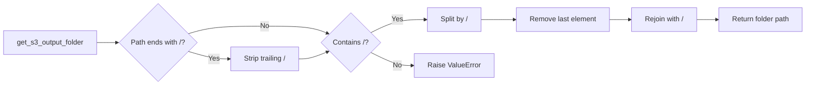
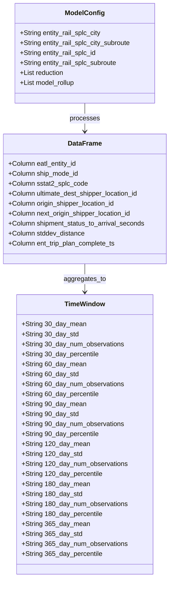
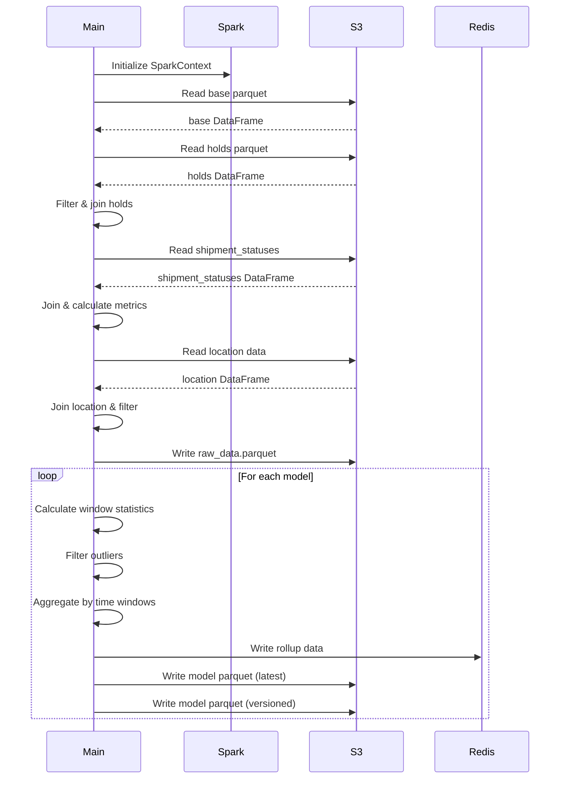

# Diagram: research/orchestrator/tasks/models/entity_rail_splc_spark.py

> Auto-generated by Obscura crawlers

## Diagram 1

```mermaid
flowchart TD
    Start([Start: main]) --> InitSpark[Initialize SparkContext & SQLContext]
    InitSpark --> ReadBase[Read base data from s3_input_path]
    ReadBase --> ReadHolds[Read holds/exceptions data]
    ReadHolds --> FilterHolds[Filter holds: exception_type_id = 2 or 10]
    FilterHolds --> RenameHolds[Rename holds columns with hold_ prefix]
    RenameHolds --> AggHolds[Group by hold_entity_id and aggregate]
    AggHolds --> JoinHolds[Left join base with holds on entity_id]
    JoinHolds --> FilterNullHolds[Filter out records with holds]
    FilterNullHolds --> FilterRail[Filter ship_mode_id = 2 for rail only]
    FilterRail --> ComputeNext[Compute next_origin using Window function]
    ComputeNext --> ReadShipmentStatus[Read shipment_statuses from parquet]
    ReadShipmentStatus --> JoinShipment[Join base with shipment_statuses]
    JoinShipment --> FilterTime1[Filter: trip_plan_complete > status_created]
    FilterTime1 --> CalcSeconds[Calculate shipment_status_to_arrival_seconds]
    CalcSeconds --> FilterPositive[Filter: arrival_seconds > 0]
    FilterPositive --> ReadLocation[Read location data]
    ReadLocation --> TransformLoc[Transform location: concat city-state-country]
    TransformLoc --> JoinLocation[Join with location on dest_location_id]
    JoinLocation --> FilterRange[Filter: 600 <= arrival_seconds <= 6480000]
    FilterRange --> SaveRaw[Save raw data to model_raw_data.parquet]
    SaveRaw --> LoopModels{For each model in MODEL_MAP}
    LoopModels --> CalcStats[Calculate window statistics: stddev, avg, median, mean]
    CalcStats --> CalcStdDist[Calculate stddev_distance]
    CalcStdDist --> FilterOutliers[Filter: -1.5 <= stddev_distance <= 1.5]
    FilterOutliers --> GroupReduce[Group by reduction_keys and aggregate]
    GroupReduce --> CalcTimeDeltas[Calculate time deltas: 30/60/90/120/180/365 days]
    CalcTimeDeltas --> RollupStats[Aggregate statistics for each time window]
    RollupStats --> WriteRedis[Write to Redis via redis_bulk_load]
    WriteRedis --> WriteParquet1[Write to latest path parquet]
    WriteParquet1 --> WriteParquet2[Write to versioned path parquet]
    WriteParquet2 --> LoopModels
    LoopModels -->|All models processed| End([End])
```

### SVG

<svg id="container" width="514.763427734375" xmlns="http://www.w3.org/2000/svg" class="flowchart" height="4119" viewBox="0 0 514.763427734375 4119" role="graphics-document document" aria-roledescription="flowchart-v2"><g><marker id="container_flowchart-v2-pointEnd" class="marker flowchart-v2" viewBox="0 0 10 10" refX="5" refY="5" markerUnits="userSpaceOnUse" markerWidth="8" markerHeight="8" orient="auto"><path d="M 0 0 L 10 5 L 0 10 z" class="arrowMarkerPath" style="stroke-width: 1; stroke-dasharray: 1, 0;"></path></marker><marker id="container_flowchart-v2-pointStart" class="marker flowchart-v2" viewBox="0 0 10 10" refX="4.5" refY="5" markerUnits="userSpaceOnUse" markerWidth="8" markerHeight="8" orient="auto"><path d="M 0 5 L 10 10 L 10 0 z" class="arrowMarkerPath" style="stroke-width: 1; stroke-dasharray: 1, 0;"></path></marker><marker id="container_flowchart-v2-circleEnd" class="marker flowchart-v2" viewBox="0 0 10 10" refX="11" refY="5" markerUnits="userSpaceOnUse" markerWidth="11" markerHeight="11" orient="auto"><circle cx="5" cy="5" r="5" class="arrowMarkerPath" style="stroke-width: 1; stroke-dasharray: 1, 0;"></circle></marker><marker id="container_flowchart-v2-circleStart" class="marker flowchart-v2" viewBox="0 0 10 10" refX="-1" refY="5" markerUnits="userSpaceOnUse" markerWidth="11" markerHeight="11" orient="auto"><circle cx="5" cy="5" r="5" class="arrowMarkerPath" style="stroke-width: 1; stroke-dasharray: 1, 0;"></circle></marker><marker id="container_flowchart-v2-crossEnd" class="marker cross flowchart-v2" viewBox="0 0 11 11" refX="12" refY="5.2" markerUnits="userSpaceOnUse" markerWidth="11" markerHeight="11" orient="auto"><path d="M 1,1 l 9,9 M 10,1 l -9,9" class="arrowMarkerPath" style="stroke-width: 2; stroke-dasharray: 1, 0;"></path></marker><marker id="container_flowchart-v2-crossStart" class="marker cross flowchart-v2" viewBox="0 0 11 11" refX="-1" refY="5.2" markerUnits="userSpaceOnUse" markerWidth="11" markerHeight="11" orient="auto"><path d="M 1,1 l 9,9 M 10,1 l -9,9" class="arrowMarkerPath" style="stroke-width: 2; stroke-dasharray: 1, 0;"></path></marker><g class="root"><g class="clusters"></g><g class="edgePaths"><path d="M344.545,47.5L344.461,51.583C344.378,55.667,344.211,63.833,344.128,71.417C344.045,79,344.045,86,344.045,89.5L344.045,93" id="L_Start_InitSpark_0" class="edge-thickness-normal edge-pattern-solid edge-thickness-normal edge-pattern-solid flowchart-link" style=";" data-edge="true" data-et="edge" data-id="L_Start_InitSpark_0" data-points="W3sieCI6MzQ0LjU0NDY2ODE5NzYzMTg0LCJ5Ijo0Ny40OTk5OTk5OTk5OTk5N30seyJ4IjozNDQuMDQ0NjY4MTk3NjMxODQsInkiOjcyfSx7IngiOjM0NC4wNDQ2NjgxOTc2MzE4NCwieSI6OTd9XQ==" marker-end="url(#container_flowchart-v2-pointEnd)"></path><path d="M344.045,175L344.045,179.167C344.045,183.333,344.045,191.667,344.045,199.333C344.045,207,344.045,214,344.045,217.5L344.045,221" id="L_InitSpark_ReadBase_0" class="edge-thickness-normal edge-pattern-solid edge-thickness-normal edge-pattern-solid flowchart-link" style=";" data-edge="true" data-et="edge" data-id="L_InitSpark_ReadBase_0" data-points="W3sieCI6MzQ0LjA0NDY2ODE5NzYzMTg0LCJ5IjoxNzV9LHsieCI6MzQ0LjA0NDY2ODE5NzYzMTg0LCJ5IjoyMDB9LHsieCI6MzQ0LjA0NDY2ODE5NzYzMTg0LCJ5IjoyMjV9XQ==" marker-end="url(#container_flowchart-v2-pointEnd)"></path><path d="M344.045,303L344.045,307.167C344.045,311.333,344.045,319.667,344.045,327.333C344.045,335,344.045,342,344.045,345.5L344.045,349" id="L_ReadBase_ReadHolds_0" class="edge-thickness-normal edge-pattern-solid edge-thickness-normal edge-pattern-solid flowchart-link" style=";" data-edge="true" data-et="edge" data-id="L_ReadBase_ReadHolds_0" data-points="W3sieCI6MzQ0LjA0NDY2ODE5NzYzMTg0LCJ5IjozMDN9LHsieCI6MzQ0LjA0NDY2ODE5NzYzMTg0LCJ5IjozMjh9LHsieCI6MzQ0LjA0NDY2ODE5NzYzMTg0LCJ5IjozNTN9XQ==" marker-end="url(#container_flowchart-v2-pointEnd)"></path><path d="M344.045,431L344.045,435.167C344.045,439.333,344.045,447.667,344.045,455.333C344.045,463,344.045,470,344.045,473.5L344.045,477" id="L_ReadHolds_FilterHolds_0" class="edge-thickness-normal edge-pattern-solid edge-thickness-normal edge-pattern-solid flowchart-link" style=";" data-edge="true" data-et="edge" data-id="L_ReadHolds_FilterHolds_0" data-points="W3sieCI6MzQ0LjA0NDY2ODE5NzYzMTg0LCJ5Ijo0MzF9LHsieCI6MzQ0LjA0NDY2ODE5NzYzMTg0LCJ5Ijo0NTZ9LHsieCI6MzQ0LjA0NDY2ODE5NzYzMTg0LCJ5Ijo0ODF9XQ==" marker-end="url(#container_flowchart-v2-pointEnd)"></path><path d="M344.045,559L344.045,563.167C344.045,567.333,344.045,575.667,344.045,583.333C344.045,591,344.045,598,344.045,601.5L344.045,605" id="L_FilterHolds_RenameHolds_0" class="edge-thickness-normal edge-pattern-solid edge-thickness-normal edge-pattern-solid flowchart-link" style=";" data-edge="true" data-et="edge" data-id="L_FilterHolds_RenameHolds_0" data-points="W3sieCI6MzQ0LjA0NDY2ODE5NzYzMTg0LCJ5Ijo1NTl9LHsieCI6MzQ0LjA0NDY2ODE5NzYzMTg0LCJ5Ijo1ODR9LHsieCI6MzQ0LjA0NDY2ODE5NzYzMTg0LCJ5Ijo2MDl9XQ==" marker-end="url(#container_flowchart-v2-pointEnd)"></path><path d="M344.045,687L344.045,691.167C344.045,695.333,344.045,703.667,344.045,711.333C344.045,719,344.045,726,344.045,729.5L344.045,733" id="L_RenameHolds_AggHolds_0" class="edge-thickness-normal edge-pattern-solid edge-thickness-normal edge-pattern-solid flowchart-link" style=";" data-edge="true" data-et="edge" data-id="L_RenameHolds_AggHolds_0" data-points="W3sieCI6MzQ0LjA0NDY2ODE5NzYzMTg0LCJ5Ijo2ODd9LHsieCI6MzQ0LjA0NDY2ODE5NzYzMTg0LCJ5Ijo3MTJ9LHsieCI6MzQ0LjA0NDY2ODE5NzYzMTg0LCJ5Ijo3Mzd9XQ==" marker-end="url(#container_flowchart-v2-pointEnd)"></path><path d="M344.045,815L344.045,819.167C344.045,823.333,344.045,831.667,344.045,839.333C344.045,847,344.045,854,344.045,857.5L344.045,861" id="L_AggHolds_JoinHolds_0" class="edge-thickness-normal edge-pattern-solid edge-thickness-normal edge-pattern-solid flowchart-link" style=";" data-edge="true" data-et="edge" data-id="L_AggHolds_JoinHolds_0" data-points="W3sieCI6MzQ0LjA0NDY2ODE5NzYzMTg0LCJ5Ijo4MTV9LHsieCI6MzQ0LjA0NDY2ODE5NzYzMTg0LCJ5Ijo4NDB9LHsieCI6MzQ0LjA0NDY2ODE5NzYzMTg0LCJ5Ijo4NjV9XQ==" marker-end="url(#container_flowchart-v2-pointEnd)"></path><path d="M344.045,943L344.045,947.167C344.045,951.333,344.045,959.667,344.045,967.333C344.045,975,344.045,982,344.045,985.5L344.045,989" id="L_JoinHolds_FilterNullHolds_0" class="edge-thickness-normal edge-pattern-solid edge-thickness-normal edge-pattern-solid flowchart-link" style=";" data-edge="true" data-et="edge" data-id="L_JoinHolds_FilterNullHolds_0" data-points="W3sieCI6MzQ0LjA0NDY2ODE5NzYzMTg0LCJ5Ijo5NDN9LHsieCI6MzQ0LjA0NDY2ODE5NzYzMTg0LCJ5Ijo5Njh9LHsieCI6MzQ0LjA0NDY2ODE5NzYzMTg0LCJ5Ijo5OTN9XQ==" marker-end="url(#container_flowchart-v2-pointEnd)"></path><path d="M344.045,1071L344.045,1075.167C344.045,1079.333,344.045,1087.667,344.045,1095.333C344.045,1103,344.045,1110,344.045,1113.5L344.045,1117" id="L_FilterNullHolds_FilterRail_0" class="edge-thickness-normal edge-pattern-solid edge-thickness-normal edge-pattern-solid flowchart-link" style=";" data-edge="true" data-et="edge" data-id="L_FilterNullHolds_FilterRail_0" data-points="W3sieCI6MzQ0LjA0NDY2ODE5NzYzMTg0LCJ5IjoxMDcxfSx7IngiOjM0NC4wNDQ2NjgxOTc2MzE4NCwieSI6MTA5Nn0seyJ4IjozNDQuMDQ0NjY4MTk3NjMxODQsInkiOjExMjF9XQ==" marker-end="url(#container_flowchart-v2-pointEnd)"></path><path d="M344.045,1199L344.045,1203.167C344.045,1207.333,344.045,1215.667,344.045,1223.333C344.045,1231,344.045,1238,344.045,1241.5L344.045,1245" id="L_FilterRail_ComputeNext_0" class="edge-thickness-normal edge-pattern-solid edge-thickness-normal edge-pattern-solid flowchart-link" style=";" data-edge="true" data-et="edge" data-id="L_FilterRail_ComputeNext_0" data-points="W3sieCI6MzQ0LjA0NDY2ODE5NzYzMTg0LCJ5IjoxMTk5fSx7IngiOjM0NC4wNDQ2NjgxOTc2MzE4NCwieSI6MTIyNH0seyJ4IjozNDQuMDQ0NjY4MTk3NjMxODQsInkiOjEyNDl9XQ==" marker-end="url(#container_flowchart-v2-pointEnd)"></path><path d="M344.045,1327L344.045,1331.167C344.045,1335.333,344.045,1343.667,344.045,1351.333C344.045,1359,344.045,1366,344.045,1369.5L344.045,1373" id="L_ComputeNext_ReadShipmentStatus_0" class="edge-thickness-normal edge-pattern-solid edge-thickness-normal edge-pattern-solid flowchart-link" style=";" data-edge="true" data-et="edge" data-id="L_ComputeNext_ReadShipmentStatus_0" data-points="W3sieCI6MzQ0LjA0NDY2ODE5NzYzMTg0LCJ5IjoxMzI3fSx7IngiOjM0NC4wNDQ2NjgxOTc2MzE4NCwieSI6MTM1Mn0seyJ4IjozNDQuMDQ0NjY4MTk3NjMxODQsInkiOjEzNzd9XQ==" marker-end="url(#container_flowchart-v2-pointEnd)"></path><path d="M344.045,1455L344.045,1459.167C344.045,1463.333,344.045,1471.667,344.045,1479.333C344.045,1487,344.045,1494,344.045,1497.5L344.045,1501" id="L_ReadShipmentStatus_JoinShipment_0" class="edge-thickness-normal edge-pattern-solid edge-thickness-normal edge-pattern-solid flowchart-link" style=";" data-edge="true" data-et="edge" data-id="L_ReadShipmentStatus_JoinShipment_0" data-points="W3sieCI6MzQ0LjA0NDY2ODE5NzYzMTg0LCJ5IjoxNDU1fSx7IngiOjM0NC4wNDQ2NjgxOTc2MzE4NCwieSI6MTQ4MH0seyJ4IjozNDQuMDQ0NjY4MTk3NjMxODQsInkiOjE1MDV9XQ==" marker-end="url(#container_flowchart-v2-pointEnd)"></path><path d="M344.045,1583L344.045,1587.167C344.045,1591.333,344.045,1599.667,344.045,1607.333C344.045,1615,344.045,1622,344.045,1625.5L344.045,1629" id="L_JoinShipment_FilterTime1_0" class="edge-thickness-normal edge-pattern-solid edge-thickness-normal edge-pattern-solid flowchart-link" style=";" data-edge="true" data-et="edge" data-id="L_JoinShipment_FilterTime1_0" data-points="W3sieCI6MzQ0LjA0NDY2ODE5NzYzMTg0LCJ5IjoxNTgzfSx7IngiOjM0NC4wNDQ2NjgxOTc2MzE4NCwieSI6MTYwOH0seyJ4IjozNDQuMDQ0NjY4MTk3NjMxODQsInkiOjE2MzN9XQ==" marker-end="url(#container_flowchart-v2-pointEnd)"></path><path d="M344.045,1711L344.045,1715.167C344.045,1719.333,344.045,1727.667,344.045,1735.333C344.045,1743,344.045,1750,344.045,1753.5L344.045,1757" id="L_FilterTime1_CalcSeconds_0" class="edge-thickness-normal edge-pattern-solid edge-thickness-normal edge-pattern-solid flowchart-link" style=";" data-edge="true" data-et="edge" data-id="L_FilterTime1_CalcSeconds_0" data-points="W3sieCI6MzQ0LjA0NDY2ODE5NzYzMTg0LCJ5IjoxNzExfSx7IngiOjM0NC4wNDQ2NjgxOTc2MzE4NCwieSI6MTczNn0seyJ4IjozNDQuMDQ0NjY4MTk3NjMxODQsInkiOjE3NjF9XQ==" marker-end="url(#container_flowchart-v2-pointEnd)"></path><path d="M344.045,1839L344.045,1843.167C344.045,1847.333,344.045,1855.667,344.045,1863.333C344.045,1871,344.045,1878,344.045,1881.5L344.045,1885" id="L_CalcSeconds_FilterPositive_0" class="edge-thickness-normal edge-pattern-solid edge-thickness-normal edge-pattern-solid flowchart-link" style=";" data-edge="true" data-et="edge" data-id="L_CalcSeconds_FilterPositive_0" data-points="W3sieCI6MzQ0LjA0NDY2ODE5NzYzMTg0LCJ5IjoxODM5fSx7IngiOjM0NC4wNDQ2NjgxOTc2MzE4NCwieSI6MTg2NH0seyJ4IjozNDQuMDQ0NjY4MTk3NjMxODQsInkiOjE4ODl9XQ==" marker-end="url(#container_flowchart-v2-pointEnd)"></path><path d="M344.045,1943L344.045,1947.167C344.045,1951.333,344.045,1959.667,344.045,1967.333C344.045,1975,344.045,1982,344.045,1985.5L344.045,1989" id="L_FilterPositive_ReadLocation_0" class="edge-thickness-normal edge-pattern-solid edge-thickness-normal edge-pattern-solid flowchart-link" style=";" data-edge="true" data-et="edge" data-id="L_FilterPositive_ReadLocation_0" data-points="W3sieCI6MzQ0LjA0NDY2ODE5NzYzMTg0LCJ5IjoxOTQzfSx7IngiOjM0NC4wNDQ2NjgxOTc2MzE4NCwieSI6MTk2OH0seyJ4IjozNDQuMDQ0NjY4MTk3NjMxODQsInkiOjE5OTN9XQ==" marker-end="url(#container_flowchart-v2-pointEnd)"></path><path d="M344.045,2047L344.045,2051.167C344.045,2055.333,344.045,2063.667,344.045,2071.333C344.045,2079,344.045,2086,344.045,2089.5L344.045,2093" id="L_ReadLocation_TransformLoc_0" class="edge-thickness-normal edge-pattern-solid edge-thickness-normal edge-pattern-solid flowchart-link" style=";" data-edge="true" data-et="edge" data-id="L_ReadLocation_TransformLoc_0" data-points="W3sieCI6MzQ0LjA0NDY2ODE5NzYzMTg0LCJ5IjoyMDQ3fSx7IngiOjM0NC4wNDQ2NjgxOTc2MzE4NCwieSI6MjA3Mn0seyJ4IjozNDQuMDQ0NjY4MTk3NjMxODQsInkiOjIwOTd9XQ==" marker-end="url(#container_flowchart-v2-pointEnd)"></path><path d="M344.045,2175L344.045,2179.167C344.045,2183.333,344.045,2191.667,344.045,2199.333C344.045,2207,344.045,2214,344.045,2217.5L344.045,2221" id="L_TransformLoc_JoinLocation_0" class="edge-thickness-normal edge-pattern-solid edge-thickness-normal edge-pattern-solid flowchart-link" style=";" data-edge="true" data-et="edge" data-id="L_TransformLoc_JoinLocation_0" data-points="W3sieCI6MzQ0LjA0NDY2ODE5NzYzMTg0LCJ5IjoyMTc1fSx7IngiOjM0NC4wNDQ2NjgxOTc2MzE4NCwieSI6MjIwMH0seyJ4IjozNDQuMDQ0NjY4MTk3NjMxODQsInkiOjIyMjV9XQ==" marker-end="url(#container_flowchart-v2-pointEnd)"></path><path d="M344.045,2303L344.045,2307.167C344.045,2311.333,344.045,2319.667,344.045,2327.333C344.045,2335,344.045,2342,344.045,2345.5L344.045,2349" id="L_JoinLocation_FilterRange_0" class="edge-thickness-normal edge-pattern-solid edge-thickness-normal edge-pattern-solid flowchart-link" style=";" data-edge="true" data-et="edge" data-id="L_JoinLocation_FilterRange_0" data-points="W3sieCI6MzQ0LjA0NDY2ODE5NzYzMTg0LCJ5IjoyMzAzfSx7IngiOjM0NC4wNDQ2NjgxOTc2MzE4NCwieSI6MjMyOH0seyJ4IjozNDQuMDQ0NjY4MTk3NjMxODQsInkiOjIzNTN9XQ==" marker-end="url(#container_flowchart-v2-pointEnd)"></path><path d="M344.045,2455L344.045,2459.167C344.045,2463.333,344.045,2471.667,344.045,2479.333C344.045,2487,344.045,2494,344.045,2497.5L344.045,2501" id="L_FilterRange_SaveRaw_0" class="edge-thickness-normal edge-pattern-solid edge-thickness-normal edge-pattern-solid flowchart-link" style=";" data-edge="true" data-et="edge" data-id="L_FilterRange_SaveRaw_0" data-points="W3sieCI6MzQ0LjA0NDY2ODE5NzYzMTg0LCJ5IjoyNDU1fSx7IngiOjM0NC4wNDQ2NjgxOTc2MzE4NCwieSI6MjQ4MH0seyJ4IjozNDQuMDQ0NjY4MTk3NjMxODQsInkiOjI1MDV9XQ==" marker-end="url(#container_flowchart-v2-pointEnd)"></path><path d="M344.045,2583L344.045,2587.167C344.045,2591.333,344.045,2599.667,344.045,2607.333C344.045,2615,344.045,2622,344.045,2625.5L344.045,2629" id="L_SaveRaw_LoopModels_0" class="edge-thickness-normal edge-pattern-solid edge-thickness-normal edge-pattern-solid flowchart-link" style=";" data-edge="true" data-et="edge" data-id="L_SaveRaw_LoopModels_0" data-points="W3sieCI6MzQ0LjA0NDY2ODE5NzYzMTg0LCJ5IjoyNTgzfSx7IngiOjM0NC4wNDQ2NjgxOTc2MzE4NCwieSI6MjYwOH0seyJ4IjozNDQuMDQ0NjY4MTk3NjMxODQsInkiOjI2MzN9XQ==" marker-end="url(#container_flowchart-v2-pointEnd)"></path><path d="M269.079,2836.034L247.233,2854.695C225.386,2873.356,181.693,2910.678,159.847,2934.839C138,2959,138,2970,138,2975.5L138,2981" id="L_LoopModels_CalcStats_0" class="edge-thickness-normal edge-pattern-solid edge-thickness-normal edge-pattern-solid flowchart-link" style=";" data-edge="true" data-et="edge" data-id="L_LoopModels_CalcStats_0" data-points="W3sieCI6MjY5LjA3OTA2NTMxNTE1NjMsInkiOjI4MzYuMDM0Mzk3MTE3NTI0M30seyJ4IjoxMzgsInkiOjI5NDh9LHsieCI6MTM4LCJ5IjoyOTg1fV0=" marker-end="url(#container_flowchart-v2-pointEnd)"></path><path d="M138,3087L138,3091.167C138,3095.333,138,3103.667,138,3111.333C138,3119,138,3126,138,3129.5L138,3133" id="L_CalcStats_CalcStdDist_0" class="edge-thickness-normal edge-pattern-solid edge-thickness-normal edge-pattern-solid flowchart-link" style=";" data-edge="true" data-et="edge" data-id="L_CalcStats_CalcStdDist_0" data-points="W3sieCI6MTM4LCJ5IjozMDg3fSx7IngiOjEzOCwieSI6MzExMn0seyJ4IjoxMzgsInkiOjMxMzd9XQ==" marker-end="url(#container_flowchart-v2-pointEnd)"></path><path d="M138,3191L138,3195.167C138,3199.333,138,3207.667,138,3215.333C138,3223,138,3230,138,3233.5L138,3237" id="L_CalcStdDist_FilterOutliers_0" class="edge-thickness-normal edge-pattern-solid edge-thickness-normal edge-pattern-solid flowchart-link" style=";" data-edge="true" data-et="edge" data-id="L_CalcStdDist_FilterOutliers_0" data-points="W3sieCI6MTM4LCJ5IjozMTkxfSx7IngiOjEzOCwieSI6MzIxNn0seyJ4IjoxMzgsInkiOjMyNDF9XQ==" marker-end="url(#container_flowchart-v2-pointEnd)"></path><path d="M138,3319L138,3323.167C138,3327.333,138,3335.667,138,3343.333C138,3351,138,3358,138,3361.5L138,3365" id="L_FilterOutliers_GroupReduce_0" class="edge-thickness-normal edge-pattern-solid edge-thickness-normal edge-pattern-solid flowchart-link" style=";" data-edge="true" data-et="edge" data-id="L_FilterOutliers_GroupReduce_0" data-points="W3sieCI6MTM4LCJ5IjozMzE5fSx7IngiOjEzOCwieSI6MzM0NH0seyJ4IjoxMzgsInkiOjMzNjl9XQ==" marker-end="url(#container_flowchart-v2-pointEnd)"></path><path d="M138,3447L138,3451.167C138,3455.333,138,3463.667,138,3471.333C138,3479,138,3486,138,3489.5L138,3493" id="L_GroupReduce_CalcTimeDeltas_0" class="edge-thickness-normal edge-pattern-solid edge-thickness-normal edge-pattern-solid flowchart-link" style=";" data-edge="true" data-et="edge" data-id="L_GroupReduce_CalcTimeDeltas_0" data-points="W3sieCI6MTM4LCJ5IjozNDQ3fSx7IngiOjEzOCwieSI6MzQ3Mn0seyJ4IjoxMzgsInkiOjM0OTd9XQ==" marker-end="url(#container_flowchart-v2-pointEnd)"></path><path d="M138,3599L138,3603.167C138,3607.333,138,3615.667,138,3623.333C138,3631,138,3638,138,3641.5L138,3645" id="L_CalcTimeDeltas_RollupStats_0" class="edge-thickness-normal edge-pattern-solid edge-thickness-normal edge-pattern-solid flowchart-link" style=";" data-edge="true" data-et="edge" data-id="L_CalcTimeDeltas_RollupStats_0" data-points="W3sieCI6MTM4LCJ5IjozNTk5fSx7IngiOjEzOCwieSI6MzYyNH0seyJ4IjoxMzgsInkiOjM2NDl9XQ==" marker-end="url(#container_flowchart-v2-pointEnd)"></path><path d="M138,3727L138,3731.167C138,3735.333,138,3743.667,138,3751.333C138,3759,138,3766,138,3769.5L138,3773" id="L_RollupStats_WriteRedis_0" class="edge-thickness-normal edge-pattern-solid edge-thickness-normal edge-pattern-solid flowchart-link" style=";" data-edge="true" data-et="edge" data-id="L_RollupStats_WriteRedis_0" data-points="W3sieCI6MTM4LCJ5IjozNzI3fSx7IngiOjEzOCwieSI6Mzc1Mn0seyJ4IjoxMzgsInkiOjM3Nzd9XQ==" marker-end="url(#container_flowchart-v2-pointEnd)"></path><path d="M138,3855L138,3859.167C138,3863.333,138,3871.667,138,3879.333C138,3887,138,3894,138,3897.5L138,3901" id="L_WriteRedis_WriteParquet1_0" class="edge-thickness-normal edge-pattern-solid edge-thickness-normal edge-pattern-solid flowchart-link" style=";" data-edge="true" data-et="edge" data-id="L_WriteRedis_WriteParquet1_0" data-points="W3sieCI6MTM4LCJ5IjozODU1fSx7IngiOjEzOCwieSI6Mzg4MH0seyJ4IjoxMzgsInkiOjM5MDV9XQ==" marker-end="url(#container_flowchart-v2-pointEnd)"></path><path d="M138,3983L138,3987.167C138,3991.333,138,3999.667,147.254,4007.741C156.508,4015.815,175.016,4023.629,184.269,4027.537L193.523,4031.444" id="L_WriteParquet1_WriteParquet2_0" class="edge-thickness-normal edge-pattern-solid edge-thickness-normal edge-pattern-solid flowchart-link" style=";" data-edge="true" data-et="edge" data-id="L_WriteParquet1_WriteParquet2_0" data-points="W3sieCI6MTM4LCJ5IjozOTgzfSx7IngiOjEzOCwieSI6NDAwOH0seyJ4IjoxOTcuMjA4MjQ4MTgzMTMxMjIsInkiOjQwMzN9XQ==" marker-end="url(#container_flowchart-v2-pointEnd)"></path><path d="M381.938,4033L391.806,4028.833C401.674,4024.667,421.41,4016.333,431.278,4001.5C441.146,3986.667,441.146,3965.333,441.146,3944C441.146,3922.667,441.146,3901.333,441.146,3880C441.146,3858.667,441.146,3837.333,441.146,3816C441.146,3794.667,441.146,3773.333,441.146,3752C441.146,3730.667,441.146,3709.333,441.146,3688C441.146,3666.667,441.146,3645.333,441.146,3622C441.146,3598.667,441.146,3573.333,441.146,3548C441.146,3522.667,441.146,3497.333,441.146,3474C441.146,3450.667,441.146,3429.333,441.146,3408C441.146,3386.667,441.146,3365.333,441.146,3344C441.146,3322.667,441.146,3301.333,441.146,3280C441.146,3258.667,441.146,3237.333,441.146,3218C441.146,3198.667,441.146,3181.333,441.146,3164C441.146,3146.667,441.146,3129.333,441.146,3108C441.146,3086.667,441.146,3061.333,441.146,3034C441.146,3006.667,441.146,2977.333,433.522,2948.847C425.897,2920.36,410.648,2892.72,403.023,2878.901L395.399,2865.081" id="L_WriteParquet2_LoopModels_0" class="edge-thickness-normal edge-pattern-solid edge-thickness-normal edge-pattern-solid flowchart-link" style=";" data-edge="true" data-et="edge" data-id="L_WriteParquet2_LoopModels_0" data-points="W3sieCI6MzgxLjkzNzk4MjUxNDUwMDYsInkiOjQwMzN9LHsieCI6NDQxLjE0NjIzMDY5NzYzMTg0LCJ5Ijo0MDA4fSx7IngiOjQ0MS4xNDYyMzA2OTc2MzE4NCwieSI6Mzk0NH0seyJ4Ijo0NDEuMTQ2MjMwNjk3NjMxODQsInkiOjM4ODB9LHsieCI6NDQxLjE0NjIzMDY5NzYzMTg0LCJ5IjozODE2fSx7IngiOjQ0MS4xNDYyMzA2OTc2MzE4NCwieSI6Mzc1Mn0seyJ4Ijo0NDEuMTQ2MjMwNjk3NjMxODQsInkiOjM2ODh9LHsieCI6NDQxLjE0NjIzMDY5NzYzMTg0LCJ5IjozNjI0fSx7IngiOjQ0MS4xNDYyMzA2OTc2MzE4NCwieSI6MzU0OH0seyJ4Ijo0NDEuMTQ2MjMwNjk3NjMxODQsInkiOjM0NzJ9LHsieCI6NDQxLjE0NjIzMDY5NzYzMTg0LCJ5IjozNDA4fSx7IngiOjQ0MS4xNDYyMzA2OTc2MzE4NCwieSI6MzM0NH0seyJ4Ijo0NDEuMTQ2MjMwNjk3NjMxODQsInkiOjMyODB9LHsieCI6NDQxLjE0NjIzMDY5NzYzMTg0LCJ5IjozMjE2fSx7IngiOjQ0MS4xNDYyMzA2OTc2MzE4NCwieSI6MzE2NH0seyJ4Ijo0NDEuMTQ2MjMwNjk3NjMxODQsInkiOjMxMTJ9LHsieCI6NDQxLjE0NjIzMDY5NzYzMTg0LCJ5IjozMDM2fSx7IngiOjQ0MS4xNDYyMzA2OTc2MzE4NCwieSI6Mjk0OH0seyJ4IjozOTMuNDY2MjcxODgyMTU4NTQsInkiOjI4NjEuNTc4Mzk2MzE1NDczfV0=" marker-end="url(#container_flowchart-v2-pointEnd)"></path><path d="M344.045,2911L344.045,2917.167C344.045,2923.333,344.045,2935.667,344.123,2952.667C344.202,2969.667,344.359,2991.333,344.437,3002.167L344.516,3013" id="L_LoopModels_End_0" class="edge-thickness-normal edge-pattern-solid edge-thickness-normal edge-pattern-solid flowchart-link" style=";" data-edge="true" data-et="edge" data-id="L_LoopModels_End_0" data-points="W3sieCI6MzQ0LjA0NDY2ODE5NzYzMTg0LCJ5IjoyOTExfSx7IngiOjM0NC4wNDQ2NjgxOTc2MzE4NCwieSI6Mjk0OH0seyJ4IjozNDQuNTQ0NjY4MTk3NjMxODQsInkiOjMwMTYuOTk5OTk5OTk5OTkxfV0=" marker-end="url(#container_flowchart-v2-pointEnd)"></path></g><g class="edgeLabels"><g class="edgeLabel"><g class="label" data-id="L_Start_InitSpark_0" transform="translate(0, 0)"><foreignObject width="0" height="0">

</foreignObject></g></g><g class="edgeLabel"><g class="label" data-id="L_InitSpark_ReadBase_0" transform="translate(0, 0)"><foreignObject width="0" height="0">

</foreignObject></g></g><g class="edgeLabel"><g class="label" data-id="L_ReadBase_ReadHolds_0" transform="translate(0, 0)"><foreignObject width="0" height="0">

</foreignObject></g></g><g class="edgeLabel"><g class="label" data-id="L_ReadHolds_FilterHolds_0" transform="translate(0, 0)"><foreignObject width="0" height="0">

</foreignObject></g></g><g class="edgeLabel"><g class="label" data-id="L_FilterHolds_RenameHolds_0" transform="translate(0, 0)"><foreignObject width="0" height="0">

</foreignObject></g></g><g class="edgeLabel"><g class="label" data-id="L_RenameHolds_AggHolds_0" transform="translate(0, 0)"><foreignObject width="0" height="0">

</foreignObject></g></g><g class="edgeLabel"><g class="label" data-id="L_AggHolds_JoinHolds_0" transform="translate(0, 0)"><foreignObject width="0" height="0">

</foreignObject></g></g><g class="edgeLabel"><g class="label" data-id="L_JoinHolds_FilterNullHolds_0" transform="translate(0, 0)"><foreignObject width="0" height="0">

</foreignObject></g></g><g class="edgeLabel"><g class="label" data-id="L_FilterNullHolds_FilterRail_0" transform="translate(0, 0)"><foreignObject width="0" height="0">

</foreignObject></g></g><g class="edgeLabel"><g class="label" data-id="L_FilterRail_ComputeNext_0" transform="translate(0, 0)"><foreignObject width="0" height="0">

</foreignObject></g></g><g class="edgeLabel"><g class="label" data-id="L_ComputeNext_ReadShipmentStatus_0" transform="translate(0, 0)"><foreignObject width="0" height="0">

</foreignObject></g></g><g class="edgeLabel"><g class="label" data-id="L_ReadShipmentStatus_JoinShipment_0" transform="translate(0, 0)"><foreignObject width="0" height="0">

</foreignObject></g></g><g class="edgeLabel"><g class="label" data-id="L_JoinShipment_FilterTime1_0" transform="translate(0, 0)"><foreignObject width="0" height="0">

</foreignObject></g></g><g class="edgeLabel"><g class="label" data-id="L_FilterTime1_CalcSeconds_0" transform="translate(0, 0)"><foreignObject width="0" height="0">

</foreignObject></g></g><g class="edgeLabel"><g class="label" data-id="L_CalcSeconds_FilterPositive_0" transform="translate(0, 0)"><foreignObject width="0" height="0">

</foreignObject></g></g><g class="edgeLabel"><g class="label" data-id="L_FilterPositive_ReadLocation_0" transform="translate(0, 0)"><foreignObject width="0" height="0">

</foreignObject></g></g><g class="edgeLabel"><g class="label" data-id="L_ReadLocation_TransformLoc_0" transform="translate(0, 0)"><foreignObject width="0" height="0">

</foreignObject></g></g><g class="edgeLabel"><g class="label" data-id="L_TransformLoc_JoinLocation_0" transform="translate(0, 0)"><foreignObject width="0" height="0">

</foreignObject></g></g><g class="edgeLabel"><g class="label" data-id="L_JoinLocation_FilterRange_0" transform="translate(0, 0)"><foreignObject width="0" height="0">

</foreignObject></g></g><g class="edgeLabel"><g class="label" data-id="L_FilterRange_SaveRaw_0" transform="translate(0, 0)"><foreignObject width="0" height="0">

</foreignObject></g></g><g class="edgeLabel"><g class="label" data-id="L_SaveRaw_LoopModels_0" transform="translate(0, 0)"><foreignObject width="0" height="0">

</foreignObject></g></g><g class="edgeLabel"><g class="label" data-id="L_LoopModels_CalcStats_0" transform="translate(0, 0)"><foreignObject width="0" height="0">

</foreignObject></g></g><g class="edgeLabel"><g class="label" data-id="L_CalcStats_CalcStdDist_0" transform="translate(0, 0)"><foreignObject width="0" height="0">

</foreignObject></g></g><g class="edgeLabel"><g class="label" data-id="L_CalcStdDist_FilterOutliers_0" transform="translate(0, 0)"><foreignObject width="0" height="0">

</foreignObject></g></g><g class="edgeLabel"><g class="label" data-id="L_FilterOutliers_GroupReduce_0" transform="translate(0, 0)"><foreignObject width="0" height="0">

</foreignObject></g></g><g class="edgeLabel"><g class="label" data-id="L_GroupReduce_CalcTimeDeltas_0" transform="translate(0, 0)"><foreignObject width="0" height="0">

</foreignObject></g></g><g class="edgeLabel"><g class="label" data-id="L_CalcTimeDeltas_RollupStats_0" transform="translate(0, 0)"><foreignObject width="0" height="0">

</foreignObject></g></g><g class="edgeLabel"><g class="label" data-id="L_RollupStats_WriteRedis_0" transform="translate(0, 0)"><foreignObject width="0" height="0">

</foreignObject></g></g><g class="edgeLabel"><g class="label" data-id="L_WriteRedis_WriteParquet1_0" transform="translate(0, 0)"><foreignObject width="0" height="0">

</foreignObject></g></g><g class="edgeLabel"><g class="label" data-id="L_WriteParquet1_WriteParquet2_0" transform="translate(0, 0)"><foreignObject width="0" height="0">

</foreignObject></g></g><g class="edgeLabel"><g class="label" data-id="L_WriteParquet2_LoopModels_0" transform="translate(0, 0)"><foreignObject width="0" height="0">

</foreignObject></g></g><g class="edgeLabel" transform="translate(344.04466819763184, 2948)"><g class="label" data-id="L_LoopModels_End_0" transform="translate(-77.1015625, -12)"><foreignObject width="154.203125" height="24">

All models processed

</foreignObject></g></g></g><g class="nodes"><g class="node default" id="flowchart-Start-0" transform="translate(344.04466819763184, 27.5)"><g class="basic label-container outer-path"><path d="M-32.625 -19.5 C-15.894032274236189 -19.5, 0.8369354515276228 -19.5, 32.625 -19.5 C32.625 -19.5, 32.625 -19.5, 32.625 -19.5 C32.98917052522391 -19.488321760070995, 33.353341050447824 -19.47664352014199, 33.8743692896239 -19.45993515863156 C34.26353227348853 -19.4223930736151, 34.65269525735315 -19.384850988598647, 35.118604652847864 -19.3399052695533 C35.529050754048434 -19.273547526968244, 35.939496855249004 -19.207189784383193, 36.35259325967676 -19.140403561325776 C36.77100550797134 -19.044903696047626, 37.18941775626591 -18.949403830769477, 37.57126438623539 -18.862249829261074 C37.888554757931544 -18.768079712432804, 38.20584512962769 -18.673909595604535, 38.769610251460605 -18.50658706670804 C39.09453073146575 -18.387013326534152, 39.4194512114709 -18.26743958636027, 39.9427065951478 -18.074876768247425 C40.18692717096288 -17.96676756388007, 40.43114774677796 -17.858658359512717, 41.08573291279238 -17.568892924097174 C41.31258817995424 -17.450542676526567, 41.53944344711609 -17.33219242895596, 42.19399226407678 -16.990714730406097 C42.44606498129562 -16.837906767884327, 42.69813769851445 -16.685098805362557, 43.2629305736057 -16.342718045390892 C43.57945051042035 -16.12192743939622, 43.895970447235 -15.901136833401551, 44.28815534457871 -15.627565626425154 C44.660567261254826 -15.330577033173261, 45.03297917793094 -15.033588439921367, 45.265453708501866 -14.848196188198123 C45.568922019950776 -14.572594297071754, 45.87239033139968 -14.296992405945387, 46.19080973676799 -14.007812326905688 C46.463266409138114 -13.726478443574718, 46.73572308150825 -13.445144560243747, 47.06042094296865 -13.10986736009568 C47.26689112643845 -12.867335734105788, 47.47336130990826 -12.624804108115896, 47.87071390812658 -12.158051136245305 C48.133228158146 -11.80630595675945, 48.39574240816542 -11.454560777273594, 48.618358964640635 -11.156274872382312 C48.85676059078674 -10.790025954821658, 49.09516221693284 -10.423777037261004, 49.30028387860425 -10.108655082055241 C49.50153410109602 -9.751314933226274, 49.70278432358779 -9.393974784397308, 49.913686474273504 -9.019496659696287 C50.04478485356255 -8.747268070046637, 50.17588323285159 -8.475039480396987, 50.45604614880834 -7.893275190886684 C50.576963280767366 -7.5946075371741815, 50.69788041272639 -7.295939883461679, 50.925134229970325 -6.734618561215508 C51.07668762029008 -6.278163896325969, 51.22824101060983 -5.82170923143643, 51.31902313421488 -5.548287939305138 C51.383493467412265 -5.302434617204352, 51.44796380060965 -5.056581295103568, 51.63609428754556 -4.339158212148133 C51.70602014395182 -3.9801037183369687, 51.77594600035808 -3.6210492245258044, 51.875044776581774 -3.1121979531509023 C51.931888711473576 -2.6713276192346904, 51.98873264636538 -2.2304572853184785, 52.03489270250937 -1.872449005199798 C52.065167158839614 -1.400899910754865, 52.09544161516987 -0.9293508163099319, 52.11498121591342 -0.6250057626472757 C52.11498121591342 -0.3653311685636147, 52.11498121591342 -0.10565657447995369, 52.11498121591342 0.625005762647271 C52.09368503042989 0.9567110415246958, 52.07238884494637 1.2884163204021206, 52.03489270250937 1.8724490051997846 C51.98605803504877 2.251201042528327, 51.937223367588174 2.6299530798568695, 51.875044776581774 3.1121979531508885 C51.782717880555964 3.5862770509470425, 51.690390984530154 4.060356148743196, 51.63609428754556 4.339158212148129 C51.568780699659435 4.5958540966514745, 51.5014671117733 4.852549981154819, 51.31902313421489 5.548287939305125 C51.18267151192589 5.958957300958834, 51.0463198896369 6.369626662612541, 50.925134229970325 6.734618561215495 C50.79246222949632 7.0623209674249114, 50.65979022902232 7.390023373634327, 50.45604614880834 7.893275190886679 C50.26324149023515 8.293638189772738, 50.07043683166196 8.694001188658795, 49.913686474273504 9.019496659696284 C49.677005424863495 9.439747829478852, 49.44032437545348 9.859998999261423, 49.30028387860425 10.108655082055236 C49.08278670253714 10.442789150663716, 48.86528952647004 10.776923219272193, 48.61835896464064 11.156274872382301 C48.34472264790295 11.522922608029527, 48.07108633116525 11.889570343676752, 47.87071390812658 12.158051136245302 C47.689092650112165 12.371393800451386, 47.50747139209774 12.584736464657471, 47.06042094296866 13.10986736009567 C46.71746418865199 13.46399836620082, 46.374507434335314 13.818129372305968, 46.19080973676799 14.007812326905684 C45.91213331581707 14.260898879039257, 45.63345689486616 14.51398543117283, 45.26545370850189 14.848196188198111 C44.92831171076847 15.11705795966516, 44.59116971303506 15.385919731132212, 44.28815534457871 15.627565626425152 C44.07631162923122 15.77533863168493, 43.86446791388373 15.923111636944709, 43.26293057360571 16.34271804539089 C42.94841311809755 16.53338037522966, 42.63389566258939 16.724042705068435, 42.19399226407678 16.990714730406093 C41.93873253943779 17.1238835652486, 41.68347281479879 17.257052400091112, 41.08573291279239 17.56889292409717 C40.84827874324012 17.674006841130286, 40.61082457368786 17.779120758163405, 39.942706595147804 18.07487676824742 C39.61566093708098 18.195232593592934, 39.28861527901415 18.31558841893845, 38.76961025146062 18.506587066708033 C38.35773113970446 18.628830625079686, 37.945852027948305 18.751074183451337, 37.57126438623541 18.86224982926107 C37.13570728111892 18.961662896228173, 36.70015017600243 19.06107596319528, 36.352593259676766 19.140403561325773 C35.87392149307535 19.2177915003949, 35.39524972647394 19.295179439464025, 35.11860465284788 19.3399052695533 C34.65896705887684 19.384245955448602, 34.1993294649058 19.428586641343905, 33.8743692896239 19.45993515863156 C33.56454345334797 19.469870670161523, 33.254717617072046 19.479806181691483, 32.62500000000001 19.5 C32.62500000000001 19.5, 32.625 19.5, 32.625 19.5 C14.641308189895032 19.5, -3.3423836202099366 19.5, -32.62499999999999 19.5 C-33.09188621517277 19.485027867818296, -33.55877243034555 19.470055735636596, -33.87436928962389 19.45993515863156 C-34.35882020321279 19.413200761635107, -34.843271116801674 19.36646636463865, -35.11860465284787 19.3399052695533 C-35.369626589194546 19.299321989588957, -35.62064852554122 19.25873870962462, -36.35259325967676 19.140403561325773 C-36.75060803874998 19.049559285291473, -37.1486228178232 18.958715009257173, -37.571264386235384 18.862249829261074 C-37.86383501740408 18.77541640166479, -38.15640564857278 18.688582974068503, -38.76961025146059 18.506587066708043 C-39.16895207524396 18.359625584080412, -39.56829389902732 18.212664101452784, -39.9427065951478 18.074876768247425 C-40.356160329292415 17.891853064810864, -40.769614063437025 17.7088293613743, -41.08573291279238 17.568892924097174 C-41.45725250396886 17.375071391350062, -41.82877209514534 17.181249858602946, -42.19399226407678 16.990714730406097 C-42.621038116312995 16.731837025180514, -43.04808396854921 16.472959319954935, -43.262930573605686 16.3427180453909 C-43.57627172419313 16.12414482306089, -43.889612874780575 15.905571600730882, -44.28815534457871 15.627565626425156 C-44.64978263486525 15.339177485727992, -45.011409925151774 15.05078934503083, -45.265453708501866 14.848196188198125 C-45.607123323973674 14.537900883509277, -45.948792939445475 14.227605578820429, -46.190809736767974 14.007812326905697 C-46.53679413382823 13.650555031093711, -46.88277853088848 13.293297735281728, -47.060420942968655 13.109867360095677 C-47.37445153964138 12.740989152396741, -47.6884821363141 12.372110944697807, -47.870713908126575 12.158051136245307 C-48.08957564414351 11.864796348696943, -48.30843738016045 11.571541561148582, -48.618358964640635 11.156274872382316 C-48.827758498653004 10.834580956491259, -49.037158032665374 10.512887040600203, -49.30028387860425 10.108655082055249 C-49.52950323541168 9.701652903066865, -49.75872259221911 9.294650724078481, -49.913686474273504 9.019496659696289 C-50.10227469193738 8.627889190575809, -50.29086290960125 8.23628172145533, -50.45604614880834 7.893275190886686 C-50.55294785225616 7.653926109903593, -50.64984955570397 7.4145770289205, -50.925134229970325 6.73461856121551 C-51.014045798338046 6.4668310834265545, -51.102957366705766 6.199043605637599, -51.31902313421488 5.5482879393051325 C-51.44441409128032 5.070117875230057, -51.569805048345756 4.591947811154981, -51.63609428754556 4.339158212148136 C-51.69152733045503 4.0545212525857615, -51.7469603733645 3.769884293023387, -51.875044776581774 3.112197953150904 C-51.931505086163874 2.6743029413813386, -51.98796539574598 2.236407929611773, -52.03489270250937 1.872449005199809 C-52.06349956025662 1.4268741047463869, -52.09210641800387 0.9812992042929649, -52.11498121591342 0.6250057626472781 C-52.11498121591342 0.18882520601161495, -52.11498121591342 -0.24735535062404823, -52.11498121591342 -0.6250057626472687 C-52.09472832157632 -0.9404609397896093, -52.07447542723922 -1.25591611693195, -52.03489270250937 -1.8724490051997822 C-51.99147677319983 -2.2091743794796113, -51.94806084389028 -2.54589975375944, -51.875044776581774 -3.112197953150895 C-51.80971504762516 -3.4476523038999884, -51.744385318668556 -3.7831066546490817, -51.63609428754556 -4.339158212148126 C-51.55769611631475 -4.638124417033542, -51.47929794508395 -4.937090621918958, -51.31902313421489 -5.548287939305123 C-51.222706455471176 -5.838378429702443, -51.126389776727464 -6.128468920099763, -50.92513422997033 -6.734618561215485 C-50.8114648786735 -7.01538405656607, -50.69779552737666 -7.296149551916654, -50.45604614880834 -7.893275190886676 C-50.31872194525686 -8.178431837828587, -50.181397741705375 -8.463588484770499, -49.913686474273504 -9.019496659696282 C-49.72183850717018 -9.360142152001462, -49.529990540066855 -9.700787644306642, -49.30028387860425 -10.108655082055243 C-49.151928279982464 -10.336569120594532, -49.00357268136067 -10.564483159133822, -48.61835896464064 -11.156274872382308 C-48.44045928241061 -11.394644239576097, -48.26255960018057 -11.633013606769886, -47.87071390812659 -12.158051136245302 C-47.61227274685086 -12.461630829998441, -47.353831585575136 -12.76521052375158, -47.06042094296866 -13.10986736009567 C-46.82408139374229 -13.353907348509752, -46.58774184451592 -13.597947336923834, -46.190809736767996 -14.007812326905677 C-46.00436234742773 -14.177138912776913, -45.81791495808746 -14.34646549864815, -45.26545370850189 -14.848196188198107 C-45.06320869289657 -15.009481206177453, -44.86096367729126 -15.170766224156798, -44.28815534457872 -15.627565626425149 C-43.94792851978765 -15.86489313121753, -43.607701694996585 -16.10222063600991, -43.262930573605715 -16.342718045390885 C-42.84557754148714 -16.59571990609982, -42.42822450936857 -16.848721766808755, -42.19399226407679 -16.99071473040609 C-41.86317638111358 -17.16330116465031, -41.53236049815037 -17.335887598894534, -41.08573291279239 -17.56889292409717 C-40.76074108666563 -17.71275716498349, -40.435749260538884 -17.85662140586981, -39.942706595147804 -18.07487676824742 C-39.66327448654039 -18.177710367257045, -39.38384237793298 -18.28054396626667, -38.76961025146062 -18.506587066708033 C-38.324537679339805 -18.638682269879887, -37.87946510721899 -18.770777473051737, -37.57126438623541 -18.862249829261067 C-37.15259425270097 -18.957808555162355, -36.73392411916654 -19.053367281063643, -36.352593259676766 -19.140403561325773 C-35.940904656566914 -19.206962181983773, -35.52921605345707 -19.273520802641773, -35.11860465284788 -19.3399052695533 C-34.647950809282136 -19.385308679798023, -34.177296965716394 -19.43071209004275, -33.8743692896239 -19.45993515863156 C-33.468515208888384 -19.472950109053702, -33.062661128152875 -19.485965059475845, -32.62500000000001 -19.5 C-32.62500000000001 -19.5, -32.625 -19.5, -32.625 -19.5" stroke="none" stroke-width="0" fill="#ECECFF" style=""></path><path d="M-32.625 -19.5 C-18.215118263720775 -19.5, -3.8052365274415507 -19.5, 32.625 -19.5 M-32.625 -19.5 C-11.28397356364351 -19.5, 10.05705287271298 -19.5, 32.625 -19.5 M32.625 -19.5 C32.625 -19.5, 32.625 -19.5, 32.625 -19.5 M32.625 -19.5 C32.625 -19.5, 32.625 -19.5, 32.625 -19.5 M32.625 -19.5 C33.1001724826 -19.484762143350146, 33.5753449652 -19.469524286700295, 33.8743692896239 -19.45993515863156 M32.625 -19.5 C32.9390707947335 -19.489928360914615, 33.253141589467006 -19.479856721829226, 33.8743692896239 -19.45993515863156 M33.8743692896239 -19.45993515863156 C34.23376225046208 -19.425264951932775, 34.59315521130025 -19.390594745233987, 35.118604652847864 -19.3399052695533 M33.8743692896239 -19.45993515863156 C34.15297999946121 -19.433057918531954, 34.43159070929852 -19.406180678432353, 35.118604652847864 -19.3399052695533 M35.118604652847864 -19.3399052695533 C35.36742488970136 -19.299677943288582, 35.616245126554865 -19.259450617023862, 36.35259325967676 -19.140403561325776 M35.118604652847864 -19.3399052695533 C35.46818833000462 -19.283387291692502, 35.81777200716137 -19.226869313831703, 36.35259325967676 -19.140403561325776 M36.35259325967676 -19.140403561325776 C36.60152174655138 -19.08358725860683, 36.85045023342599 -19.026770955887887, 37.57126438623539 -18.862249829261074 M36.35259325967676 -19.140403561325776 C36.8098169600821 -19.03604523537174, 37.26704066048744 -18.931686909417703, 37.57126438623539 -18.862249829261074 M37.57126438623539 -18.862249829261074 C37.9731460711607 -18.742973454695253, 38.37502775608601 -18.623697080129435, 38.769610251460605 -18.50658706670804 M37.57126438623539 -18.862249829261074 C37.97698495147965 -18.741834095167285, 38.3827055167239 -18.621418361073495, 38.769610251460605 -18.50658706670804 M38.769610251460605 -18.50658706670804 C39.03977911415197 -18.40716242782403, 39.309947976843326 -18.307737788940017, 39.9427065951478 -18.074876768247425 M38.769610251460605 -18.50658706670804 C39.06851481717787 -18.396587423480568, 39.36741938289514 -18.286587780253097, 39.9427065951478 -18.074876768247425 M39.9427065951478 -18.074876768247425 C40.39847071840897 -17.87312351064206, 40.85423484167015 -17.671370253036695, 41.08573291279238 -17.568892924097174 M39.9427065951478 -18.074876768247425 C40.35959197392609 -17.890333977527654, 40.77647735270438 -17.705791186807883, 41.08573291279238 -17.568892924097174 M41.08573291279238 -17.568892924097174 C41.42646798717445 -17.391131654043278, 41.76720306155652 -17.213370383989385, 42.19399226407678 -16.990714730406097 M41.08573291279238 -17.568892924097174 C41.48384963803503 -17.361195683544015, 41.88196636327769 -17.153498442990855, 42.19399226407678 -16.990714730406097 M42.19399226407678 -16.990714730406097 C42.421261733104515 -16.852942642697837, 42.64853120213225 -16.715170554989577, 43.2629305736057 -16.342718045390892 M42.19399226407678 -16.990714730406097 C42.52829940855232 -16.788055774818176, 42.86260655302786 -16.585396819230258, 43.2629305736057 -16.342718045390892 M43.2629305736057 -16.342718045390892 C43.55099690286911 -16.14177544428715, 43.83906323213251 -15.940832843183408, 44.28815534457871 -15.627565626425154 M43.2629305736057 -16.342718045390892 C43.58612754950402 -16.117269825975814, 43.90932452540235 -15.891821606560736, 44.28815534457871 -15.627565626425154 M44.28815534457871 -15.627565626425154 C44.58750495403758 -15.388842278909369, 44.88685456349644 -15.150118931393584, 45.265453708501866 -14.848196188198123 M44.28815534457871 -15.627565626425154 C44.5784323426649 -15.39607744504675, 44.86870934075109 -15.164589263668345, 45.265453708501866 -14.848196188198123 M45.265453708501866 -14.848196188198123 C45.45093138080734 -14.67975027368058, 45.636409053112814 -14.51130435916304, 46.19080973676799 -14.007812326905688 M45.265453708501866 -14.848196188198123 C45.52024757705989 -14.616799138250066, 45.77504144561792 -14.385402088302008, 46.19080973676799 -14.007812326905688 M46.19080973676799 -14.007812326905688 C46.470911891723176 -13.718583855099853, 46.75101404667836 -13.42935538329402, 47.06042094296865 -13.10986736009568 M46.19080973676799 -14.007812326905688 C46.493634182494326 -13.695121224343872, 46.79645862822066 -13.382430121782058, 47.06042094296865 -13.10986736009568 M47.06042094296865 -13.10986736009568 C47.30363566878 -12.824173503847721, 47.54685039459135 -12.53847964759976, 47.87071390812658 -12.158051136245305 M47.06042094296865 -13.10986736009568 C47.36332725970774 -12.754056364596256, 47.66623357644683 -12.39824536909683, 47.87071390812658 -12.158051136245305 M47.87071390812658 -12.158051136245305 C48.13836474151285 -11.79942340300024, 48.40601557489912 -11.440795669755174, 48.618358964640635 -11.156274872382312 M47.87071390812658 -12.158051136245305 C48.03765317403402 -11.934367728409326, 48.204592439941464 -11.710684320573348, 48.618358964640635 -11.156274872382312 M48.618358964640635 -11.156274872382312 C48.76946148094442 -10.92414083063279, 48.92056399724821 -10.69200678888327, 49.30028387860425 -10.108655082055241 M48.618358964640635 -11.156274872382312 C48.85427036809332 -10.793851605597172, 49.09018177154601 -10.431428338812033, 49.30028387860425 -10.108655082055241 M49.30028387860425 -10.108655082055241 C49.48358625159384 -9.783183157434223, 49.66688862458344 -9.457711232813205, 49.913686474273504 -9.019496659696287 M49.30028387860425 -10.108655082055241 C49.446588758557546 -9.84887595272259, 49.59289363851084 -9.589096823389937, 49.913686474273504 -9.019496659696287 M49.913686474273504 -9.019496659696287 C50.03378749030387 -8.770104330159148, 50.15388850633424 -8.520712000622007, 50.45604614880834 -7.893275190886684 M49.913686474273504 -9.019496659696287 C50.11621647836828 -8.598938772745605, 50.318746482463055 -8.17838088579492, 50.45604614880834 -7.893275190886684 M50.45604614880834 -7.893275190886684 C50.58940547171083 -7.563875084990427, 50.72276479461332 -7.23447497909417, 50.925134229970325 -6.734618561215508 M50.45604614880834 -7.893275190886684 C50.60985234929389 -7.513370902046796, 50.763658549779436 -7.133466613206907, 50.925134229970325 -6.734618561215508 M50.925134229970325 -6.734618561215508 C51.07644192393191 -6.27890389461037, 51.227749617893494 -5.823189228005232, 51.31902313421488 -5.548287939305138 M50.925134229970325 -6.734618561215508 C51.02879570357215 -6.422406718939683, 51.132457177173976 -6.110194876663859, 51.31902313421488 -5.548287939305138 M51.31902313421488 -5.548287939305138 C51.425834984635756 -5.140968061101538, 51.53264683505663 -4.733648182897938, 51.63609428754556 -4.339158212148133 M51.31902313421488 -5.548287939305138 C51.41950217748644 -5.1651177994178425, 51.519981220758005 -4.781947659530548, 51.63609428754556 -4.339158212148133 M51.63609428754556 -4.339158212148133 C51.69298866200931 -4.047017623907058, 51.749883036473065 -3.7548770356659826, 51.875044776581774 -3.1121979531509023 M51.63609428754556 -4.339158212148133 C51.70912441173924 -3.9641639593357905, 51.782154535932925 -3.589169706523448, 51.875044776581774 -3.1121979531509023 M51.875044776581774 -3.1121979531509023 C51.935759420174776 -2.6413071669060946, 51.99647406376777 -2.170416380661287, 52.03489270250937 -1.872449005199798 M51.875044776581774 -3.1121979531509023 C51.92379899844487 -2.7340698359907725, 51.97255322030797 -2.3559417188306426, 52.03489270250937 -1.872449005199798 M52.03489270250937 -1.872449005199798 C52.06238250955511 -1.444273071089583, 52.08987231660084 -1.0160971369793679, 52.11498121591342 -0.6250057626472757 M52.03489270250937 -1.872449005199798 C52.056210373059045 -1.540409079074612, 52.07752804360872 -1.2083691529494263, 52.11498121591342 -0.6250057626472757 M52.11498121591342 -0.6250057626472757 C52.11498121591342 -0.18987218875764433, 52.11498121591342 0.24526138513198703, 52.11498121591342 0.625005762647271 M52.11498121591342 -0.6250057626472757 C52.11498121591342 -0.3238312416005573, 52.11498121591342 -0.022656720553838938, 52.11498121591342 0.625005762647271 M52.11498121591342 0.625005762647271 C52.08942513537754 1.023062345490497, 52.06386905484166 1.4211189283337227, 52.03489270250937 1.8724490051997846 M52.11498121591342 0.625005762647271 C52.09116462576751 0.9959683785753191, 52.0673480356216 1.3669309945033672, 52.03489270250937 1.8724490051997846 M52.03489270250937 1.8724490051997846 C51.98601909783167 2.251503031895125, 51.93714549315397 2.630557058590465, 51.875044776581774 3.1121979531508885 M52.03489270250937 1.8724490051997846 C51.98656358725143 2.2472800794770356, 51.9382344719935 2.622111153754286, 51.875044776581774 3.1121979531508885 M51.875044776581774 3.1121979531508885 C51.810507095671994 3.443585304578935, 51.74596941476221 3.774972656006981, 51.63609428754556 4.339158212148129 M51.875044776581774 3.1121979531508885 C51.78022536872173 3.5990755724232733, 51.68540596086169 4.085953191695658, 51.63609428754556 4.339158212148129 M51.63609428754556 4.339158212148129 C51.512524378245516 4.810383831846669, 51.38895446894547 5.281609451545209, 51.31902313421489 5.548287939305125 M51.63609428754556 4.339158212148129 C51.5273000693034 4.754037718017955, 51.418505851061234 5.168917223887781, 51.31902313421489 5.548287939305125 M51.31902313421489 5.548287939305125 C51.226370404375814 5.827343199372652, 51.13371767453675 6.106398459440178, 50.925134229970325 6.734618561215495 M51.31902313421489 5.548287939305125 C51.18366139342515 5.955975935599277, 51.04829965263541 6.363663931893428, 50.925134229970325 6.734618561215495 M50.925134229970325 6.734618561215495 C50.77727743551801 7.099827702129361, 50.6294206410657 7.465036843043228, 50.45604614880834 7.893275190886679 M50.925134229970325 6.734618561215495 C50.75250945105273 7.161005102615003, 50.579884672135144 7.58739164401451, 50.45604614880834 7.893275190886679 M50.45604614880834 7.893275190886679 C50.2559068719944 8.308868681485349, 50.055767595180455 8.724462172084019, 49.913686474273504 9.019496659696284 M50.45604614880834 7.893275190886679 C50.301527641553896 8.214136177366951, 50.14700913429945 8.534997163847223, 49.913686474273504 9.019496659696284 M49.913686474273504 9.019496659696284 C49.73662181501844 9.333892891944632, 49.55955715576337 9.648289124192981, 49.30028387860425 10.108655082055236 M49.913686474273504 9.019496659696284 C49.706793786752186 9.386855576546747, 49.49990109923087 9.754214493397209, 49.30028387860425 10.108655082055236 M49.30028387860425 10.108655082055236 C49.155351269352565 10.331310489720694, 49.01041866010089 10.553965897386151, 48.61835896464064 11.156274872382301 M49.30028387860425 10.108655082055236 C49.06393769138599 10.47174629346009, 48.82759150416773 10.834837504864943, 48.61835896464064 11.156274872382301 M48.61835896464064 11.156274872382301 C48.329710586613636 11.54303740253028, 48.04106220858664 11.929799932678256, 47.87071390812658 12.158051136245302 M48.61835896464064 11.156274872382301 C48.35796830427468 11.505174635195528, 48.09757764390871 11.854074398008756, 47.87071390812658 12.158051136245302 M47.87071390812658 12.158051136245302 C47.656525191479126 12.40964939050264, 47.44233647483168 12.661247644759978, 47.06042094296866 13.10986736009567 M47.87071390812658 12.158051136245302 C47.68671918124936 12.37418181203184, 47.502724454372135 12.590312487818375, 47.06042094296866 13.10986736009567 M47.06042094296866 13.10986736009567 C46.75082267033469 13.429552995081144, 46.44122439770072 13.749238630066618, 46.19080973676799 14.007812326905684 M47.06042094296866 13.10986736009567 C46.84595307669613 13.331323040161353, 46.631485210423584 13.552778720227035, 46.19080973676799 14.007812326905684 M46.19080973676799 14.007812326905684 C45.92077959008835 14.253046561513962, 45.65074944340871 14.49828079612224, 45.26545370850189 14.848196188198111 M46.19080973676799 14.007812326905684 C45.9790702718943 14.200108506584723, 45.76733080702062 14.39240468626376, 45.26545370850189 14.848196188198111 M45.26545370850189 14.848196188198111 C45.02594026702853 15.039201784052757, 44.78642682555517 15.230207379907402, 44.28815534457871 15.627565626425152 M45.26545370850189 14.848196188198111 C45.02628800783815 15.038924470010858, 44.78712230717441 15.229652751823606, 44.28815534457871 15.627565626425152 M44.28815534457871 15.627565626425152 C44.05914196434111 15.787315446649458, 43.8301285841035 15.947065266873766, 43.26293057360571 16.34271804539089 M44.28815534457871 15.627565626425152 C43.956448038595184 15.858950283701422, 43.62474073261165 16.09033494097769, 43.26293057360571 16.34271804539089 M43.26293057360571 16.34271804539089 C42.96622647527022 16.522581813428683, 42.66952237693473 16.702445581466474, 42.19399226407678 16.990714730406093 M43.26293057360571 16.34271804539089 C42.83944190580296 16.59943936450857, 42.4159532380002 16.85616068362625, 42.19399226407678 16.990714730406093 M42.19399226407678 16.990714730406093 C41.96692853390805 17.10917373299386, 41.73986480373932 17.227632735581626, 41.08573291279239 17.56889292409717 M42.19399226407678 16.990714730406093 C41.79082058176723 17.2010491388232, 41.38764889945767 17.41138354724031, 41.08573291279239 17.56889292409717 M41.08573291279239 17.56889292409717 C40.70900832196648 17.735657725317868, 40.33228373114057 17.90242252653856, 39.942706595147804 18.07487676824742 M41.08573291279239 17.56889292409717 C40.66460979859262 17.75531163458007, 40.24348668439286 17.94173034506297, 39.942706595147804 18.07487676824742 M39.942706595147804 18.07487676824742 C39.476281671954595 18.246525451567248, 39.00985674876139 18.418174134887074, 38.76961025146062 18.506587066708033 M39.942706595147804 18.07487676824742 C39.54322492818915 18.221889714456257, 39.14374326123048 18.368902660665093, 38.76961025146062 18.506587066708033 M38.76961025146062 18.506587066708033 C38.45702130434142 18.599361825400145, 38.14443235722222 18.69213658409226, 37.57126438623541 18.86224982926107 M38.76961025146062 18.506587066708033 C38.375521129174444 18.623550649586555, 37.98143200688827 18.740514232465078, 37.57126438623541 18.86224982926107 M37.57126438623541 18.86224982926107 C37.324300390939726 18.91861774959663, 37.07733639564404 18.97498566993219, 36.352593259676766 19.140403561325773 M37.57126438623541 18.86224982926107 C37.291480377289496 18.926108703541694, 37.01169636834357 18.989967577822313, 36.352593259676766 19.140403561325773 M36.352593259676766 19.140403561325773 C36.058647440958666 19.187926441712246, 35.76470162224057 19.235449322098717, 35.11860465284788 19.3399052695533 M36.352593259676766 19.140403561325773 C35.859189670883616 19.220173227159872, 35.36578608209046 19.299942892993972, 35.11860465284788 19.3399052695533 M35.11860465284788 19.3399052695533 C34.844155759100325 19.36638102426004, 34.56970686535278 19.392856778966777, 33.8743692896239 19.45993515863156 M35.11860465284788 19.3399052695533 C34.79576421368052 19.37104929844734, 34.47292377451316 19.40219332734138, 33.8743692896239 19.45993515863156 M33.8743692896239 19.45993515863156 C33.38348492200034 19.475676864852787, 32.892600554376784 19.491418571074018, 32.62500000000001 19.5 M33.8743692896239 19.45993515863156 C33.423009037695 19.474409403391483, 32.97164878576611 19.48888364815141, 32.62500000000001 19.5 M32.62500000000001 19.5 C32.62500000000001 19.5, 32.625 19.5, 32.625 19.5 M32.62500000000001 19.5 C32.62500000000001 19.5, 32.625 19.5, 32.625 19.5 M32.625 19.5 C9.485850539988345 19.5, -13.65329892002331 19.5, -32.62499999999999 19.5 M32.625 19.5 C19.286477899709965 19.5, 5.94795579941993 19.5, -32.62499999999999 19.5 M-32.62499999999999 19.5 C-32.88577018894728 19.491637607598843, -33.14654037789457 19.483275215197683, -33.87436928962389 19.45993515863156 M-32.62499999999999 19.5 C-33.085539058212 19.48523140878804, -33.546078116424006 19.470462817576074, -33.87436928962389 19.45993515863156 M-33.87436928962389 19.45993515863156 C-34.320378659396795 19.416909171134314, -34.76638802916969 19.373883183637066, -35.11860465284787 19.3399052695533 M-33.87436928962389 19.45993515863156 C-34.16711084037457 19.431694733303868, -34.459852391125246 19.403454307976173, -35.11860465284787 19.3399052695533 M-35.11860465284787 19.3399052695533 C-35.48015860177693 19.2814520309832, -35.84171255070598 19.222998792413097, -36.35259325967676 19.140403561325773 M-35.11860465284787 19.3399052695533 C-35.55074366232467 19.27004038578916, -35.98288267180147 19.20017550202502, -36.35259325967676 19.140403561325773 M-36.35259325967676 19.140403561325773 C-36.691976944478284 19.06294144995534, -37.03136062927982 18.98547933858491, -37.571264386235384 18.862249829261074 M-36.35259325967676 19.140403561325773 C-36.722458387284284 19.055984259544875, -37.09232351489181 18.971564957763977, -37.571264386235384 18.862249829261074 M-37.571264386235384 18.862249829261074 C-37.92626397864971 18.75688781366339, -38.281263571064024 18.65152579806571, -38.76961025146059 18.506587066708043 M-37.571264386235384 18.862249829261074 C-37.89850441317817 18.76512670698241, -38.22574444012096 18.668003584703744, -38.76961025146059 18.506587066708043 M-38.76961025146059 18.506587066708043 C-39.19397209279326 18.350417986339764, -39.61833393412592 18.19424890597148, -39.9427065951478 18.074876768247425 M-38.76961025146059 18.506587066708043 C-39.141656481012305 18.369670615075368, -39.513702710564026 18.23275416344269, -39.9427065951478 18.074876768247425 M-39.9427065951478 18.074876768247425 C-40.186689497762146 17.966872774755707, -40.4306724003765 17.858868781263993, -41.08573291279238 17.568892924097174 M-39.9427065951478 18.074876768247425 C-40.361387468319506 17.889539165421137, -40.78006834149121 17.704201562594854, -41.08573291279238 17.568892924097174 M-41.08573291279238 17.568892924097174 C-41.51816170290894 17.343295101277224, -41.9505904930255 17.117697278457275, -42.19399226407678 16.990714730406097 M-41.08573291279238 17.568892924097174 C-41.440133827569504 17.38400219386257, -41.79453474234663 17.199111463627965, -42.19399226407678 16.990714730406097 M-42.19399226407678 16.990714730406097 C-42.61621711056877 16.73475954719404, -43.038441957060755 16.478804363981983, -43.262930573605686 16.3427180453909 M-42.19399226407678 16.990714730406097 C-42.48187214534975 16.81620025460846, -42.76975202662271 16.641685778810825, -43.262930573605686 16.3427180453909 M-43.262930573605686 16.3427180453909 C-43.49938785739011 16.177775680293724, -43.735845141174536 16.01283331519655, -44.28815534457871 15.627565626425156 M-43.262930573605686 16.3427180453909 C-43.63963423215148 16.07994588042791, -44.016337890697265 15.81717371546492, -44.28815534457871 15.627565626425156 M-44.28815534457871 15.627565626425156 C-44.55019115100661 15.418599043864564, -44.81222695743451 15.209632461303972, -45.265453708501866 14.848196188198125 M-44.28815534457871 15.627565626425156 C-44.66714072762619 15.325334868669389, -45.04612611067366 15.02310411091362, -45.265453708501866 14.848196188198125 M-45.265453708501866 14.848196188198125 C-45.49742658096141 14.637524563096237, -45.72939945342096 14.426852937994349, -46.190809736767974 14.007812326905697 M-45.265453708501866 14.848196188198125 C-45.623454025945854 14.523069772064838, -45.98145434338984 14.19794335593155, -46.190809736767974 14.007812326905697 M-46.190809736767974 14.007812326905697 C-46.50612112209345 13.682227434010974, -46.82143250741891 13.356642541116251, -47.060420942968655 13.109867360095677 M-46.190809736767974 14.007812326905697 C-46.419182069225236 13.771999143926385, -46.6475544016825 13.536185960947073, -47.060420942968655 13.109867360095677 M-47.060420942968655 13.109867360095677 C-47.377812565212714 12.737041100512872, -47.69520418745678 12.364214840930067, -47.870713908126575 12.158051136245307 M-47.060420942968655 13.109867360095677 C-47.24434514091614 12.89381953160322, -47.42826933886362 12.677771703110766, -47.870713908126575 12.158051136245307 M-47.870713908126575 12.158051136245307 C-48.03990867815406 11.931345558369117, -48.20910344818155 11.704639980492926, -48.618358964640635 11.156274872382316 M-47.870713908126575 12.158051136245307 C-48.168128059225154 11.75954326875978, -48.465542210323726 11.361035401274252, -48.618358964640635 11.156274872382316 M-48.618358964640635 11.156274872382316 C-48.83177071989369 10.828417107233314, -49.045182475146746 10.500559342084312, -49.30028387860425 10.108655082055249 M-48.618358964640635 11.156274872382316 C-48.88917322152399 10.740231449999223, -49.15998747840734 10.324188027616131, -49.30028387860425 10.108655082055249 M-49.30028387860425 10.108655082055249 C-49.53797055157065 9.686618325817873, -49.775657224537056 9.2645815695805, -49.913686474273504 9.019496659696289 M-49.30028387860425 10.108655082055249 C-49.4283579862267 9.881246535061882, -49.55643209384916 9.653837988068515, -49.913686474273504 9.019496659696289 M-49.913686474273504 9.019496659696289 C-50.1104933850129 8.61082289855262, -50.307300295752306 8.202149137408952, -50.45604614880834 7.893275190886686 M-49.913686474273504 9.019496659696289 C-50.11240430618366 8.606854829854369, -50.31112213809383 8.19421300001245, -50.45604614880834 7.893275190886686 M-50.45604614880834 7.893275190886686 C-50.56097814108115 7.634091141250787, -50.66591013335396 7.3749070916148876, -50.925134229970325 6.73461856121551 M-50.45604614880834 7.893275190886686 C-50.553262701615466 7.653148425898907, -50.650479254422585 7.413021660911129, -50.925134229970325 6.73461856121551 M-50.925134229970325 6.73461856121551 C-51.035104170642384 6.403406621241876, -51.145074111314436 6.072194681268242, -51.31902313421488 5.5482879393051325 M-50.925134229970325 6.73461856121551 C-51.04142956183302 6.384355550789897, -51.157724893695715 6.034092540364283, -51.31902313421488 5.5482879393051325 M-51.31902313421488 5.5482879393051325 C-51.43522189194175 5.105171715232416, -51.55142064966862 4.6620554911597, -51.63609428754556 4.339158212148136 M-51.31902313421488 5.5482879393051325 C-51.383163030852785 5.303694715017759, -51.44730292749069 5.059101490730384, -51.63609428754556 4.339158212148136 M-51.63609428754556 4.339158212148136 C-51.73006400812087 3.8566435575013847, -51.82403372869618 3.374128902854634, -51.875044776581774 3.112197953150904 M-51.63609428754556 4.339158212148136 C-51.70637098781704 3.9783022092399682, -51.77664768808851 3.6174462063318007, -51.875044776581774 3.112197953150904 M-51.875044776581774 3.112197953150904 C-51.91201746840214 2.825445056475936, -51.948990160222515 2.5386921598009686, -52.03489270250937 1.872449005199809 M-51.875044776581774 3.112197953150904 C-51.909057859258716 2.8483992005514143, -51.94307094193566 2.584600447951924, -52.03489270250937 1.872449005199809 M-52.03489270250937 1.872449005199809 C-52.06116615505895 1.463218774190854, -52.08743960760854 1.053988543181899, -52.11498121591342 0.6250057626472781 M-52.03489270250937 1.872449005199809 C-52.0521617704155 1.6034693332209884, -52.069430838321644 1.3344896612421677, -52.11498121591342 0.6250057626472781 M-52.11498121591342 0.6250057626472781 C-52.11498121591342 0.15103468823503308, -52.11498121591342 -0.322936386177212, -52.11498121591342 -0.6250057626472687 M-52.11498121591342 0.6250057626472781 C-52.11498121591342 0.30235900292947304, -52.11498121591342 -0.020287756788332056, -52.11498121591342 -0.6250057626472687 M-52.11498121591342 -0.6250057626472687 C-52.082977538438215 -1.1234888722270393, -52.05097386096301 -1.62197198180681, -52.03489270250937 -1.8724490051997822 M-52.11498121591342 -0.6250057626472687 C-52.09651848684621 -0.9125776707156701, -52.078055757779005 -1.2001495787840715, -52.03489270250937 -1.8724490051997822 M-52.03489270250937 -1.8724490051997822 C-51.97745617006651 -2.3179154087003675, -51.92001963762365 -2.7633818122009526, -51.875044776581774 -3.112197953150895 M-52.03489270250937 -1.8724490051997822 C-51.98452898120887 -2.263060082164747, -51.934165259908376 -2.6536711591297113, -51.875044776581774 -3.112197953150895 M-51.875044776581774 -3.112197953150895 C-51.81895891198713 -3.4001870140927126, -51.76287304739249 -3.6881760750345296, -51.63609428754556 -4.339158212148126 M-51.875044776581774 -3.112197953150895 C-51.82175208654971 -3.3858446530515294, -51.76845939651764 -3.6594913529521635, -51.63609428754556 -4.339158212148126 M-51.63609428754556 -4.339158212148126 C-51.56437446311869 -4.61265698625631, -51.492654638691825 -4.886155760364493, -51.31902313421489 -5.548287939305123 M-51.63609428754556 -4.339158212148126 C-51.53552131456544 -4.722686546723546, -51.43494834158532 -5.106214881298966, -51.31902313421489 -5.548287939305123 M-51.31902313421489 -5.548287939305123 C-51.21483377399502 -5.862089691967183, -51.11064441377515 -6.175891444629244, -50.92513422997033 -6.734618561215485 M-51.31902313421489 -5.548287939305123 C-51.18028311508186 -5.966150771713683, -51.041543095948846 -6.384013604122243, -50.92513422997033 -6.734618561215485 M-50.92513422997033 -6.734618561215485 C-50.8257539740977 -6.980089714607429, -50.72637371822506 -7.225560867999373, -50.45604614880834 -7.893275190886676 M-50.92513422997033 -6.734618561215485 C-50.82800199327006 -6.974537063789201, -50.73086975656979 -7.2144555663629175, -50.45604614880834 -7.893275190886676 M-50.45604614880834 -7.893275190886676 C-50.3355401685936 -8.143508437217504, -50.215034188378866 -8.393741683548331, -49.913686474273504 -9.019496659696282 M-50.45604614880834 -7.893275190886676 C-50.254010078998746 -8.312807412725691, -50.051974009189145 -8.732339634564704, -49.913686474273504 -9.019496659696282 M-49.913686474273504 -9.019496659696282 C-49.74804033157441 -9.313618159549334, -49.582394188875305 -9.607739659402386, -49.30028387860425 -10.108655082055243 M-49.913686474273504 -9.019496659696282 C-49.73489818433147 -9.336953372765882, -49.55610989438944 -9.654410085835481, -49.30028387860425 -10.108655082055243 M-49.30028387860425 -10.108655082055243 C-49.132916857074214 -10.365775771463461, -48.965549835544174 -10.622896460871681, -48.61835896464064 -11.156274872382308 M-49.30028387860425 -10.108655082055243 C-49.110984155459796 -10.399470290898234, -48.92168443231534 -10.690285499741226, -48.61835896464064 -11.156274872382308 M-48.61835896464064 -11.156274872382308 C-48.3712131896595 -11.48742769541375, -48.124067414678365 -11.818580518445192, -47.87071390812659 -12.158051136245302 M-48.61835896464064 -11.156274872382308 C-48.43972811633356 -11.395623935508736, -48.26109726802648 -11.634972998635163, -47.87071390812659 -12.158051136245302 M-47.87071390812659 -12.158051136245302 C-47.63119591136423 -12.43940260420247, -47.39167791460188 -12.720754072159641, -47.06042094296866 -13.10986736009567 M-47.87071390812659 -12.158051136245302 C-47.65961696338843 -12.406017619291173, -47.44852001865028 -12.653984102337047, -47.06042094296866 -13.10986736009567 M-47.06042094296866 -13.10986736009567 C-46.8780559429061 -13.298174195105215, -46.69569094284355 -13.486481030114762, -46.190809736767996 -14.007812326905677 M-47.06042094296866 -13.10986736009567 C-46.73188094578484 -13.44911188082338, -46.40334094860101 -13.78835640155109, -46.190809736767996 -14.007812326905677 M-46.190809736767996 -14.007812326905677 C-45.944710717820826 -14.23131294449027, -45.698611698873655 -14.454813562074865, -45.26545370850189 -14.848196188198107 M-46.190809736767996 -14.007812326905677 C-45.99190692152497 -14.188450601029288, -45.79300410628194 -14.369088875152901, -45.26545370850189 -14.848196188198107 M-45.26545370850189 -14.848196188198107 C-45.060329119748765 -15.011777589134171, -44.85520453099564 -15.175358990070233, -44.28815534457872 -15.627565626425149 M-45.26545370850189 -14.848196188198107 C-45.035552396481194 -15.031536366603762, -44.8056510844605 -15.214876545009416, -44.28815534457872 -15.627565626425149 M-44.28815534457872 -15.627565626425149 C-43.90284297495097 -15.89634285557382, -43.517530605323216 -16.165120084722492, -43.262930573605715 -16.342718045390885 M-44.28815534457872 -15.627565626425149 C-43.89466652996392 -15.902046389644186, -43.50117771534913 -16.176527152863223, -43.262930573605715 -16.342718045390885 M-43.262930573605715 -16.342718045390885 C-42.86362809913687 -16.584777551975705, -42.46432562466802 -16.82683705856052, -42.19399226407679 -16.99071473040609 M-43.262930573605715 -16.342718045390885 C-42.993490586976264 -16.506054148690772, -42.724050600346814 -16.669390251990663, -42.19399226407679 -16.99071473040609 M-42.19399226407679 -16.99071473040609 C-41.866210703392085 -17.16171816066119, -41.53842914270737 -17.332721590916293, -41.08573291279239 -17.56889292409717 M-42.19399226407679 -16.99071473040609 C-41.82471584549199 -17.183366001448945, -41.45543942690718 -17.376017272491804, -41.08573291279239 -17.56889292409717 M-41.08573291279239 -17.56889292409717 C-40.775862787039436 -17.706063236797313, -40.465992661286485 -17.843233549497455, -39.942706595147804 -18.07487676824742 M-41.08573291279239 -17.56889292409717 C-40.690689186822155 -17.74376706302842, -40.29564546085192 -17.918641201959673, -39.942706595147804 -18.07487676824742 M-39.942706595147804 -18.07487676824742 C-39.4975718937827 -18.238690453129852, -39.05243719241759 -18.402504138012283, -38.76961025146062 -18.506587066708033 M-39.942706595147804 -18.07487676824742 C-39.65169436390584 -18.18197195943204, -39.360682132663875 -18.28906715061666, -38.76961025146062 -18.506587066708033 M-38.76961025146062 -18.506587066708033 C-38.45185901851131 -18.60089396473713, -38.134107785562 -18.695200862766228, -37.57126438623541 -18.862249829261067 M-38.76961025146062 -18.506587066708033 C-38.32055872384991 -18.63986320298332, -37.87150719623921 -18.773139339258613, -37.57126438623541 -18.862249829261067 M-37.57126438623541 -18.862249829261067 C-37.13943364204674 -18.960812378663174, -36.70760289785807 -19.05937492806528, -36.352593259676766 -19.140403561325773 M-37.57126438623541 -18.862249829261067 C-37.234248271946115 -18.939171558111923, -36.89723215765682 -19.016093286962782, -36.352593259676766 -19.140403561325773 M-36.352593259676766 -19.140403561325773 C-36.084969096813346 -19.18367096052115, -35.81734493394993 -19.226938359716527, -35.11860465284788 -19.3399052695533 M-36.352593259676766 -19.140403561325773 C-35.979790260558126 -19.20067545909284, -35.606987261439485 -19.2609473568599, -35.11860465284788 -19.3399052695533 M-35.11860465284788 -19.3399052695533 C-34.629099303186955 -19.387127261918774, -34.13959395352603 -19.434349254284246, -33.8743692896239 -19.45993515863156 M-35.11860465284788 -19.3399052695533 C-34.63651586439925 -19.386411795178343, -34.154427075950615 -19.432918320803388, -33.8743692896239 -19.45993515863156 M-33.8743692896239 -19.45993515863156 C-33.49720567580096 -19.472030061622423, -33.120042061978026 -19.484124964613283, -32.62500000000001 -19.5 M-33.8743692896239 -19.45993515863156 C-33.53913032979761 -19.470685619570137, -33.203891369971316 -19.48143608050872, -32.62500000000001 -19.5 M-32.62500000000001 -19.5 C-32.62500000000001 -19.5, -32.625 -19.5, -32.625 -19.5 M-32.62500000000001 -19.5 C-32.62500000000001 -19.5, -32.625 -19.5, -32.625 -19.5" stroke="#9370DB" stroke-width="1.3" fill="none" stroke-dasharray="0 0" style=""></path></g><g class="label" style="" transform="translate(-39.75, -12)"><rect></rect><foreignObject width="79.5" height="24">

Start: main

</foreignObject></g></g><g class="node default" id="flowchart-InitSpark-1" transform="translate(344.04466819763184, 136)"><rect class="basic label-container" style="" x="-130" y="-39" width="260" height="78"></rect><g class="label" style="" transform="translate(-100, -24)"><rect></rect><foreignObject width="200" height="48">

Initialize SparkContext &amp; SQLContext

</foreignObject></g></g><g class="node default" id="flowchart-ReadBase-3" transform="translate(344.04466819763184, 264)"><rect class="basic label-container" style="" x="-130" y="-39" width="260" height="78"></rect><g class="label" style="" transform="translate(-100, -24)"><rect></rect><foreignObject width="200" height="48">

Read base data from s3_input_path

</foreignObject></g></g><g class="node default" id="flowchart-ReadHolds-5" transform="translate(344.04466819763184, 392)"><rect class="basic label-container" style="" x="-130" y="-39" width="260" height="78"></rect><g class="label" style="" transform="translate(-100, -24)"><rect></rect><foreignObject width="200" height="48">

Read holds/exceptions data

</foreignObject></g></g><g class="node default" id="flowchart-FilterHolds-7" transform="translate(344.04466819763184, 520)"><rect class="basic label-container" style="" x="-130" y="-39" width="260" height="78"></rect><g class="label" style="" transform="translate(-100, -24)"><rect></rect><foreignObject width="200" height="48">

Filter holds: exception_type_id = 2 or 10

</foreignObject></g></g><g class="node default" id="flowchart-RenameHolds-9" transform="translate(344.04466819763184, 648)"><rect class="basic label-container" style="" x="-130" y="-39" width="260" height="78"></rect><g class="label" style="" transform="translate(-100, -24)"><rect></rect><foreignObject width="200" height="48">

Rename holds columns with hold_ prefix

</foreignObject></g></g><g class="node default" id="flowchart-AggHolds-11" transform="translate(344.04466819763184, 776)"><rect class="basic label-container" style="" x="-130" y="-39" width="260" height="78"></rect><g class="label" style="" transform="translate(-100, -24)"><rect></rect><foreignObject width="200" height="48">

Group by hold_entity_id and aggregate

</foreignObject></g></g><g class="node default" id="flowchart-JoinHolds-13" transform="translate(344.04466819763184, 904)"><rect class="basic label-container" style="" x="-130" y="-39" width="260" height="78"></rect><g class="label" style="" transform="translate(-100, -24)"><rect></rect><foreignObject width="200" height="48">

Left join base with holds on entity_id

</foreignObject></g></g><g class="node default" id="flowchart-FilterNullHolds-15" transform="translate(344.04466819763184, 1032)"><rect class="basic label-container" style="" x="-130" y="-39" width="260" height="78"></rect><g class="label" style="" transform="translate(-100, -24)"><rect></rect><foreignObject width="200" height="48">

Filter out records with holds

</foreignObject></g></g><g class="node default" id="flowchart-FilterRail-17" transform="translate(344.04466819763184, 1160)"><rect class="basic label-container" style="" x="-130" y="-39" width="260" height="78"></rect><g class="label" style="" transform="translate(-100, -24)"><rect></rect><foreignObject width="200" height="48">

Filter ship_mode_id = 2 for rail only

</foreignObject></g></g><g class="node default" id="flowchart-ComputeNext-19" transform="translate(344.04466819763184, 1288)"><rect class="basic label-container" style="" x="-130" y="-39" width="260" height="78"></rect><g class="label" style="" transform="translate(-100, -24)"><rect></rect><foreignObject width="200" height="48">

Compute next_origin using Window function

</foreignObject></g></g><g class="node default" id="flowchart-ReadShipmentStatus-21" transform="translate(344.04466819763184, 1416)"><rect class="basic label-container" style="" x="-130" y="-39" width="260" height="78"></rect><g class="label" style="" transform="translate(-100, -24)"><rect></rect><foreignObject width="200" height="48">

Read shipment_statuses from parquet

</foreignObject></g></g><g class="node default" id="flowchart-JoinShipment-23" transform="translate(344.04466819763184, 1544)"><rect class="basic label-container" style="" x="-130" y="-39" width="260" height="78"></rect><g class="label" style="" transform="translate(-100, -24)"><rect></rect><foreignObject width="200" height="48">

Join base with shipment_statuses

</foreignObject></g></g><g class="node default" id="flowchart-FilterTime1-25" transform="translate(344.04466819763184, 1672)"><rect class="basic label-container" style="" x="-130" y="-39" width="260" height="78"></rect><g class="label" style="" transform="translate(-100, -24)"><rect></rect><foreignObject width="200" height="48">

Filter: trip_plan_complete &gt; status_created

</foreignObject></g></g><g class="node default" id="flowchart-CalcSeconds-27" transform="translate(344.04466819763184, 1800)"><rect class="basic label-container" style="" x="-162.71875" y="-39" width="325.4375" height="78"></rect><g class="label" style="" transform="translate(-132.71875, -24)"><rect></rect><foreignObject width="265.4375" height="48">

Calculate shipment_status_to_arrival_seconds

</foreignObject></g></g><g class="node default" id="flowchart-FilterPositive-29" transform="translate(344.04466819763184, 1916)"><rect class="basic label-container" style="" x="-122.296875" y="-27" width="244.59375" height="54"></rect><g class="label" style="" transform="translate(-92.296875, -12)"><rect></rect><foreignObject width="184.59375" height="24">

Filter: arrival_seconds &gt; 0

</foreignObject></g></g><g class="node default" id="flowchart-ReadLocation-31" transform="translate(344.04466819763184, 2020)"><rect class="basic label-container" style="" x="-98.2734375" y="-27" width="196.546875" height="54"></rect><g class="label" style="" transform="translate(-68.2734375, -12)"><rect></rect><foreignObject width="136.546875" height="24">

Read location data

</foreignObject></g></g><g class="node default" id="flowchart-TransformLoc-33" transform="translate(344.04466819763184, 2136)"><rect class="basic label-container" style="" x="-130" y="-39" width="260" height="78"></rect><g class="label" style="" transform="translate(-100, -24)"><rect></rect><foreignObject width="200" height="48">

Transform location: concat city-state-country

</foreignObject></g></g><g class="node default" id="flowchart-JoinLocation-35" transform="translate(344.04466819763184, 2264)"><rect class="basic label-container" style="" x="-130" y="-39" width="260" height="78"></rect><g class="label" style="" transform="translate(-100, -24)"><rect></rect><foreignObject width="200" height="48">

Join with location on dest_location_id

</foreignObject></g></g><g class="node default" id="flowchart-FilterRange-37" transform="translate(344.04466819763184, 2404)"><rect class="basic label-container" style="" x="-130" y="-51" width="260" height="102"></rect><g class="label" style="" transform="translate(-100, -36)"><rect></rect><foreignObject width="200" height="72">

Filter: 600 &lt;= arrival_seconds &lt;= 6480000

</foreignObject></g></g><g class="node default" id="flowchart-SaveRaw-39" transform="translate(344.04466819763184, 2544)"><rect class="basic label-container" style="" x="-130" y="-39" width="260" height="78"></rect><g class="label" style="" transform="translate(-100, -24)"><rect></rect><foreignObject width="200" height="48">

Save raw data to model_raw_data.parquet

</foreignObject></g></g><g class="node default" id="flowchart-LoopModels-41" transform="translate(344.04466819763184, 2772)"><polygon points="139,0 278,-139 139,-278 0,-139" class="label-container" transform="translate(-138.5, 139)"></polygon><g class="label" style="" transform="translate(-100, -24)"><rect></rect><foreignObject width="200" height="48">

For each model in MODEL_MAP

</foreignObject></g></g><g class="node default" id="flowchart-CalcStats-43" transform="translate(138, 3036)"><rect class="basic label-container" style="" x="-130" y="-51" width="260" height="102"></rect><g class="label" style="" transform="translate(-100, -36)"><rect></rect><foreignObject width="200" height="72">

Calculate window statistics: stddev, avg, median, mean

</foreignObject></g></g><g class="node default" id="flowchart-CalcStdDist-45" transform="translate(138, 3164)"><rect class="basic label-container" style="" x="-124.0546875" y="-27" width="248.109375" height="54"></rect><g class="label" style="" transform="translate(-94.0546875, -12)"><rect></rect><foreignObject width="188.109375" height="24">

Calculate stddev_distance

</foreignObject></g></g><g class="node default" id="flowchart-FilterOutliers-47" transform="translate(138, 3280)"><rect class="basic label-container" style="" x="-130" y="-39" width="260" height="78"></rect><g class="label" style="" transform="translate(-100, -24)"><rect></rect><foreignObject width="200" height="48">

Filter: -1.5 &lt;= stddev_distance &lt;= 1.5

</foreignObject></g></g><g class="node default" id="flowchart-GroupReduce-49" transform="translate(138, 3408)"><rect class="basic label-container" style="" x="-130" y="-39" width="260" height="78"></rect><g class="label" style="" transform="translate(-100, -24)"><rect></rect><foreignObject width="200" height="48">

Group by reduction_keys and aggregate

</foreignObject></g></g><g class="node default" id="flowchart-CalcTimeDeltas-51" transform="translate(138, 3548)"><rect class="basic label-container" style="" x="-130" y="-51" width="260" height="102"></rect><g class="label" style="" transform="translate(-100, -36)"><rect></rect><foreignObject width="200" height="72">

Calculate time deltas: 30/60/90/120/180/365 days

</foreignObject></g></g><g class="node default" id="flowchart-RollupStats-53" transform="translate(138, 3688)"><rect class="basic label-container" style="" x="-130" y="-39" width="260" height="78"></rect><g class="label" style="" transform="translate(-100, -24)"><rect></rect><foreignObject width="200" height="48">

Aggregate statistics for each time window

</foreignObject></g></g><g class="node default" id="flowchart-WriteRedis-55" transform="translate(138, 3816)"><rect class="basic label-container" style="" x="-130" y="-39" width="260" height="78"></rect><g class="label" style="" transform="translate(-100, -24)"><rect></rect><foreignObject width="200" height="48">

Write to Redis via redis_bulk_load

</foreignObject></g></g><g class="node default" id="flowchart-WriteParquet1-57" transform="translate(138, 3944)"><rect class="basic label-container" style="" x="-130" y="-39" width="260" height="78"></rect><g class="label" style="" transform="translate(-100, -24)"><rect></rect><foreignObject width="200" height="48">

Write to latest path parquet

</foreignObject></g></g><g class="node default" id="flowchart-WriteParquet2-59" transform="translate(289.5731153488159, 4072)"><rect class="basic label-container" style="" x="-130" y="-39" width="260" height="78"></rect><g class="label" style="" transform="translate(-100, -24)"><rect></rect><foreignObject width="200" height="48">

Write to versioned path parquet

</foreignObject></g></g><g class="node default" id="flowchart-End-63" transform="translate(344.04466819763184, 3036)"><g class="basic label-container outer-path"><path d="M-6.5546875 -19.5 C-1.8155007315900216 -19.5, 2.923686036819957 -19.5, 6.5546875 -19.5 C6.5546875 -19.5, 6.554687499999999 -19.5, 6.554687499999999 -19.5 C6.849805927413445 -19.490536126446024, 7.144924354826891 -19.481072252892044, 7.8040567896239 -19.45993515863156 C8.250029438463814 -19.416912713558556, 8.69600208730373 -19.37389026848555, 9.048292152847864 -19.3399052695533 C9.495386252584577 -19.267622562774395, 9.942480352321288 -19.195339855995492, 10.282280759676757 -19.140403561325776 C10.537312258696565 -19.082194285910568, 10.792343757716374 -19.02398501049536, 11.50095188623539 -18.862249829261074 C11.917901156914235 -18.738501474334978, 12.334850427593079 -18.614753119408878, 12.699297751460602 -18.50658706670804 C13.016449385202497 -18.389872333773457, 13.333601018944393 -18.273157600838875, 13.872394095147794 -18.074876768247425 C14.224372740621435 -17.91906626297179, 14.576351386095077 -17.763255757696154, 15.015420412792382 -17.568892924097174 C15.437084084267394 -17.348911256777132, 15.858747755742405 -17.12892958945709, 16.123679764076783 -16.990714730406097 C16.362536708140386 -16.84591824723553, 16.60139365220399 -16.701121764064965, 17.192618073605697 -16.342718045390892 C17.40691754649393 -16.193232009978725, 17.62121701938216 -16.043745974566562, 18.217842844578712 -15.627565626425154 C18.474552343762124 -15.422846632153053, 18.731261842945536 -15.218127637880952, 19.19514120850187 -14.848196188198123 C19.479101763781642 -14.590310725077618, 19.76306231906141 -14.332425261957113, 20.120497236767985 -14.007812326905688 C20.417700404961476 -13.700925654912005, 20.714903573154967 -13.394038982918323, 20.990108442968648 -13.10986736009568 C21.290029661161412 -12.75756283120569, 21.589950879354173 -12.405258302315698, 21.800401408126582 -12.158051136245305 C21.953455186451343 -11.952973016776172, 22.106508964776108 -11.74789489730704, 22.548046464640635 -11.156274872382312 C22.79247031174497 -10.78077420623706, 23.036894158849307 -10.405273540091809, 23.229971378604247 -10.108655082055241 C23.453537740018664 -9.711690368815013, 23.67710410143308 -9.314725655574783, 23.8433739742735 -9.019496659696287 C24.017274099062234 -8.65838932970588, 24.19117422385097 -8.297281999715471, 24.38573364880834 -7.893275190886684 C24.484229465834606 -7.6499886185447386, 24.582725282860867 -7.406702046202793, 24.854821729970325 -6.734618561215508 C24.972536033233027 -6.380081835015465, 25.09025033649573 -6.0255451088154235, 25.24871063421488 -5.548287939305138 C25.333944600176167 -5.223253886460234, 25.419178566137454 -4.898219833615331, 25.56578178754556 -4.339158212148133 C25.652869718987542 -3.8919800902343837, 25.739957650429524 -3.444801968320634, 25.804732276581777 -3.1121979531509023 C25.848449007243794 -2.7731396229812146, 25.89216573790581 -2.4340812928115274, 25.964580202509367 -1.872449005199798 C25.994652072786142 -1.4040553520622168, 26.024723943062916 -0.9356616989246356, 26.044668715913414 -0.6250057626472757 C26.044668715913414 -0.3457468957466404, 26.044668715913414 -0.06648802884600513, 26.044668715913414 0.625005762647271 C26.01774555069536 1.0443557929062999, 25.990822385477305 1.4637058231653286, 25.964580202509367 1.8724490051997846 C25.9161238136293 2.2482671885572945, 25.867667424749232 2.624085371914804, 25.804732276581777 3.1121979531508885 C25.748997957910454 3.3983819000757047, 25.693263639239134 3.6845658470005205, 25.56578178754556 4.339158212148129 C25.49815022285057 4.5970666800356925, 25.430518658155574 4.854975147923256, 25.248710634214884 5.548287939305125 C25.104192617570508 5.983553179619002, 24.95967460092613 6.4188184199328795, 24.85482172997033 6.734618561215495 C24.71673344069962 7.075699305469602, 24.57864515142891 7.416780049723708, 24.385733648808344 7.893275190886679 C24.258881950928398 8.156685455725913, 24.132030253048455 8.420095720565149, 23.843373974273504 9.019496659696284 C23.655369616310946 9.353317434764405, 23.46736525834839 9.687138209832524, 23.22997137860425 10.108655082055236 C23.011246694185456 10.444674933124057, 22.792522009766664 10.780694784192878, 22.54804646464064 11.156274872382301 C22.38555127432053 11.374003623794874, 22.22305608400042 11.591732375207446, 21.800401408126582 12.158051136245302 C21.551575127331176 12.450336644284057, 21.302748846535774 12.742622152322813, 20.99010844296866 13.10986736009567 C20.707544934636854 13.401637381343733, 20.42498142630505 13.693407402591797, 20.12049723676799 14.007812326905684 C19.80886935993947 14.290824519419548, 19.497241483110955 14.573836711933412, 19.195141208501887 14.848196188198111 C18.91215701216351 15.07386855425224, 18.629172815825136 15.299540920306367, 18.217842844578715 15.627565626425152 C17.950393191419135 15.814126926760391, 17.68294353825955 16.00068822709563, 17.192618073605708 16.34271804539089 C16.82393808792124 16.5662140193169, 16.455258102236765 16.789709993242912, 16.123679764076787 16.990714730406093 C15.821904779216604 17.14815054671155, 15.520129794356423 17.305586363017, 15.015420412792386 17.56889292409717 C14.618458163892825 17.744616336218275, 14.221495914993266 17.92033974833938, 13.872394095147804 18.07487676824742 C13.555598607737803 18.191460436039684, 13.2388031203278 18.30804410383195, 12.699297751460616 18.506587066708033 C12.385934427197432 18.59959165647169, 12.072571102934248 18.69259624623535, 11.500951886235413 18.86224982926107 C11.07368664118547 18.95977033327743, 10.646421396135528 19.057290837293785, 10.282280759676766 19.140403561325773 C10.023716035520573 19.182206300727962, 9.76515131136438 19.224009040130152, 9.048292152847878 19.3399052695533 C8.68740742960689 19.374719384776977, 8.326522706365903 19.409533500000656, 7.804056789623901 19.45993515863156 C7.454472241401759 19.471145654668, 7.104887693179618 19.48235615070444, 6.5546875000000036 19.5 C6.554687500000002 19.5, 6.554687500000001 19.5, 6.5546875 19.5 C3.71947952098108 19.5, 0.8842715419621596 19.5, -6.5546874999999964 19.5 C-6.9154313335141815 19.488431647404475, -7.2761751670283665 19.47686329480895, -7.8040567896238935 19.45993515863156 C-8.211545539076393 19.420625209048797, -8.619034288528892 19.38131525946604, -9.048292152847871 19.3399052695533 C-9.407320515465159 19.28186034819187, -9.766348878082445 19.223815426830445, -10.282280759676759 19.140403561325773 C-10.586124944824947 19.071053108834306, -10.889969129973135 19.00170265634284, -11.500951886235388 18.862249829261074 C-11.772489641552413 18.781658848813745, -12.044027396869437 18.701067868366415, -12.699297751460593 18.506587066708043 C-12.950774218935717 18.414041402054217, -13.20225068641084 18.321495737400387, -13.872394095147797 18.074876768247425 C-14.10520629851441 17.97181771194566, -14.338018501881022 17.8687586556439, -15.01542041279238 17.568892924097174 C-15.326864029188503 17.406412988912475, -15.638307645584627 17.243933053727773, -16.12367976407678 16.990714730406097 C-16.48887054257263 16.769333934382683, -16.854061321068485 16.54795313835927, -17.192618073605686 16.3427180453909 C-17.548048574319335 16.094785114431453, -17.903479075032983 15.846852183472004, -18.217842844578712 15.627565626425156 C-18.421838832422605 15.464884254680872, -18.625834820266498 15.302202882936589, -19.19514120850187 14.848196188198125 C-19.448516085625386 14.61808782872643, -19.701890962748905 14.387979469254736, -20.120497236767974 14.007812326905697 C-20.36018454324027 13.760315504279218, -20.599871849712564 13.512818681652739, -20.990108442968655 13.109867360095677 C-21.292649953688255 12.754484886504793, -21.595191464407854 12.399102412913908, -21.80040140812658 12.158051136245307 C-22.05915670803568 11.811342607459878, -22.31791200794478 11.464634078674449, -22.548046464640635 11.156274872382316 C-22.694152164583453 10.93181728239631, -22.840257864526272 10.707359692410305, -23.229971378604244 10.108655082055249 C-23.425239071631466 9.761937520087383, -23.620506764658693 9.415219958119518, -23.8433739742735 9.019496659696289 C-24.022124517677156 8.648317331669668, -24.200875061080808 8.277138003643048, -24.38573364880834 7.893275190886686 C-24.562174871603677 7.457461959323233, -24.73861609439901 7.02164872775978, -24.854821729970325 6.73461856121551 C-24.93782449015028 6.484627472247367, -25.020827250330235 6.234636383279224, -25.24871063421488 5.5482879393051325 C-25.32473535766043 5.258372719483683, -25.40076008110598 4.968457499662233, -25.565781787545557 4.339158212148136 C-25.636337437626256 3.9768698609256754, -25.706893087706955 3.614581509703215, -25.804732276581777 3.112197953150904 C-25.839305407412105 2.8440555776677834, -25.87387853824243 2.5759132021846622, -25.964580202509364 1.872449005199809 C-25.984505695832844 1.5620933631178568, -26.00443118915633 1.2517377210359046, -26.044668715913414 0.6250057626472781 C-26.044668715913414 0.35456506756973555, -26.044668715913414 0.08412437249219296, -26.044668715913414 -0.6250057626472687 C-26.02415494361932 -0.9445243245467877, -26.00364117132522 -1.2640428864463067, -25.964580202509367 -1.8724490051997822 C-25.911658408733455 -2.2828999871355364, -25.858736614957543 -2.6933509690712905, -25.804732276581777 -3.112197953150895 C-25.738303257532134 -3.4532969261926607, -25.67187423848249 -3.7943958992344258, -25.56578178754556 -4.339158212148126 C-25.490446430064388 -4.626444580774309, -25.415111072583215 -4.913730949400492, -25.248710634214884 -5.548287939305123 C-25.169648266528803 -5.786411193897995, -25.090585898842725 -6.024534448490867, -24.854821729970332 -6.734618561215485 C-24.703817737890123 -7.107601341117184, -24.55281374580991 -7.480584121018882, -24.385733648808344 -7.893275190886676 C-24.171533245324195 -8.338066911875943, -23.957332841840042 -8.782858632865212, -23.843373974273504 -9.019496659696282 C-23.703924714840156 -9.267102940588915, -23.564475455406807 -9.514709221481546, -23.229971378604247 -10.108655082055243 C-23.09166811419081 -10.321126035820818, -22.953364849777373 -10.533596989586393, -22.54804646464064 -11.156274872382308 C-22.28661510447897 -11.50656907811208, -22.025183744317296 -11.85686328384185, -21.800401408126586 -12.158051136245302 C-21.498549110660484 -12.512624020731284, -21.19669681319438 -12.867196905217266, -20.990108442968662 -13.10986736009567 C-20.741053554673027 -13.367036980047518, -20.491998666377395 -13.624206599999365, -20.120497236767996 -14.007812326905677 C-19.750555892444385 -14.34378326770878, -19.380614548120775 -14.679754208511884, -19.195141208501887 -14.848196188198107 C-18.842762952295146 -15.12920847034377, -18.490384696088405 -15.410220752489433, -18.21784284457872 -15.627565626425149 C-17.815184890001106 -15.908442384756574, -17.41252693542349 -16.189319143088, -17.19261807360571 -16.342718045390885 C-16.843921577186986 -16.554099910687984, -16.49522508076826 -16.765481775985084, -16.12367976407679 -16.99071473040609 C-15.854379572174034 -17.131208468026752, -15.585079380271278 -17.271702205647415, -15.01542041279239 -17.56889292409717 C-14.651287187042204 -17.73008390150842, -14.28715396129202 -17.891274878919667, -13.872394095147806 -18.07487676824742 C-13.599029784857992 -18.175477361386054, -13.325665474568178 -18.27607795452469, -12.699297751460618 -18.506587066708033 C-12.367214356101778 -18.605147675309222, -12.035130960742936 -18.703708283910416, -11.500951886235413 -18.862249829261067 C-11.088931399716083 -18.95629081662416, -10.676910913196755 -19.050331803987252, -10.282280759676768 -19.140403561325773 C-9.97001784449992 -19.19088780781649, -9.657754929323069 -19.24137205430721, -9.04829215284788 -19.3399052695533 C-8.551149308915058 -19.387864041805752, -8.054006464982235 -19.435822814058206, -7.804056789623903 -19.45993515863156 C-7.331833407998845 -19.475078443353222, -6.859610026373786 -19.490221728074886, -6.554687500000006 -19.5 C-6.5546875000000036 -19.5, -6.554687500000002 -19.5, -6.5546875 -19.5" stroke="none" stroke-width="0" fill="#ECECFF" style=""></path><path d="M-6.5546875 -19.5 C-3.0927817473679364 -19.5, 0.36912400526412714 -19.5, 6.5546875 -19.5 M-6.5546875 -19.5 C-3.3061333791150713 -19.5, -0.05757925823014265 -19.5, 6.5546875 -19.5 M6.5546875 -19.5 C6.5546875 -19.5, 6.554687499999999 -19.5, 6.554687499999999 -19.5 M6.5546875 -19.5 C6.5546875 -19.5, 6.554687499999999 -19.5, 6.554687499999999 -19.5 M6.554687499999999 -19.5 C7.002513451602056 -19.48563909337246, 7.4503394032041115 -19.471278186744915, 7.8040567896239 -19.45993515863156 M6.554687499999999 -19.5 C7.028438797302754 -19.48480771799646, 7.502190094605509 -19.46961543599292, 7.8040567896239 -19.45993515863156 M7.8040567896239 -19.45993515863156 C8.062307826717543 -19.43502199167545, 8.320558863811184 -19.410108824719337, 9.048292152847864 -19.3399052695533 M7.8040567896239 -19.45993515863156 C8.246471753114818 -19.41725591918543, 8.688886716605738 -19.3745766797393, 9.048292152847864 -19.3399052695533 M9.048292152847864 -19.3399052695533 C9.392882398102396 -19.28419459103781, 9.737472643356929 -19.22848391252232, 10.282280759676757 -19.140403561325776 M9.048292152847864 -19.3399052695533 C9.493122506717647 -19.26798854765055, 9.937952860587428 -19.1960718257478, 10.282280759676757 -19.140403561325776 M10.282280759676757 -19.140403561325776 C10.645662158654467 -19.05746412829435, 11.009043557632179 -18.97452469526292, 11.50095188623539 -18.862249829261074 M10.282280759676757 -19.140403561325776 C10.75330093266353 -19.032896280535425, 11.2243211056503 -18.925388999745074, 11.50095188623539 -18.862249829261074 M11.50095188623539 -18.862249829261074 C11.753119686612926 -18.787407749764817, 12.005287486990463 -18.71256567026856, 12.699297751460602 -18.50658706670804 M11.50095188623539 -18.862249829261074 C11.786313906438934 -18.777555879560474, 12.071675926642481 -18.692861929859873, 12.699297751460602 -18.50658706670804 M12.699297751460602 -18.50658706670804 C12.959381396048217 -18.41087388131294, 13.21946504063583 -18.315160695917843, 13.872394095147794 -18.074876768247425 M12.699297751460602 -18.50658706670804 C13.054548730812451 -18.375851422402505, 13.4097997101643 -18.24511577809697, 13.872394095147794 -18.074876768247425 M13.872394095147794 -18.074876768247425 C14.189751318692622 -17.934392139451685, 14.50710854223745 -17.79390751065594, 15.015420412792382 -17.568892924097174 M13.872394095147794 -18.074876768247425 C14.212176087717653 -17.924465359411442, 14.551958080287513 -17.774053950575457, 15.015420412792382 -17.568892924097174 M15.015420412792382 -17.568892924097174 C15.41907187074627 -17.35830821703373, 15.822723328700159 -17.147723509970284, 16.123679764076783 -16.990714730406097 M15.015420412792382 -17.568892924097174 C15.370458534843937 -17.38366976323565, 15.72549665689549 -17.198446602374123, 16.123679764076783 -16.990714730406097 M16.123679764076783 -16.990714730406097 C16.47096157225738 -16.78019045743258, 16.81824338043798 -16.569666184459066, 17.192618073605697 -16.342718045390892 M16.123679764076783 -16.990714730406097 C16.435779045561333 -16.801518311871202, 16.747878327045886 -16.612321893336304, 17.192618073605697 -16.342718045390892 M17.192618073605697 -16.342718045390892 C17.428453635175924 -16.17820936679642, 17.664289196746154 -16.013700688201947, 18.217842844578712 -15.627565626425154 M17.192618073605697 -16.342718045390892 C17.442118610616543 -16.168677271476298, 17.691619147627392 -15.9946364975617, 18.217842844578712 -15.627565626425154 M18.217842844578712 -15.627565626425154 C18.55843509099105 -15.355952373451636, 18.89902733740339 -15.084339120478116, 19.19514120850187 -14.848196188198123 M18.217842844578712 -15.627565626425154 C18.5026996336787 -15.400399917475427, 18.78755642277868 -15.173234208525702, 19.19514120850187 -14.848196188198123 M19.19514120850187 -14.848196188198123 C19.5436027781154 -14.531732610463019, 19.89206434772893 -14.215269032727914, 20.120497236767985 -14.007812326905688 M19.19514120850187 -14.848196188198123 C19.51958275490169 -14.55354696001072, 19.844024301301516 -14.258897731823316, 20.120497236767985 -14.007812326905688 M20.120497236767985 -14.007812326905688 C20.381079180522516 -13.738740075803676, 20.641661124277043 -13.469667824701663, 20.990108442968648 -13.10986736009568 M20.120497236767985 -14.007812326905688 C20.461462056940913 -13.65573815634479, 20.80242687711384 -13.303663985783892, 20.990108442968648 -13.10986736009568 M20.990108442968648 -13.10986736009568 C21.230204334118692 -12.82783706450761, 21.470300225268737 -12.545806768919538, 21.800401408126582 -12.158051136245305 M20.990108442968648 -13.10986736009568 C21.177197062516612 -12.890102421930612, 21.364285682064576 -12.670337483765545, 21.800401408126582 -12.158051136245305 M21.800401408126582 -12.158051136245305 C22.04653360640124 -11.828256413661812, 22.292665804675895 -11.49846169107832, 22.548046464640635 -11.156274872382312 M21.800401408126582 -12.158051136245305 C22.09322615613852 -11.765692650792644, 22.386050904150462 -11.373334165339983, 22.548046464640635 -11.156274872382312 M22.548046464640635 -11.156274872382312 C22.736575273510734 -10.866643994884202, 22.92510408238083 -10.577013117386091, 23.229971378604247 -10.108655082055241 M22.548046464640635 -11.156274872382312 C22.750047805726215 -10.84594656751977, 22.952049146811795 -10.535618262657229, 23.229971378604247 -10.108655082055241 M23.229971378604247 -10.108655082055241 C23.405259633272962 -9.797413036030427, 23.580547887941673 -9.486170990005613, 23.8433739742735 -9.019496659696287 M23.229971378604247 -10.108655082055241 C23.442198277862964 -9.73182473211751, 23.654425177121684 -9.354994382179775, 23.8433739742735 -9.019496659696287 M23.8433739742735 -9.019496659696287 C23.95532266248284 -8.787032813311395, 24.067271350692174 -8.554568966926501, 24.38573364880834 -7.893275190886684 M23.8433739742735 -9.019496659696287 C23.980121107098817 -8.735538312464598, 24.116868239924134 -8.45157996523291, 24.38573364880834 -7.893275190886684 M24.38573364880834 -7.893275190886684 C24.4905136440961 -7.63446657674252, 24.59529363938386 -7.375657962598355, 24.854821729970325 -6.734618561215508 M24.38573364880834 -7.893275190886684 C24.482954503277142 -7.653137800711394, 24.580175357745944 -7.413000410536104, 24.854821729970325 -6.734618561215508 M24.854821729970325 -6.734618561215508 C24.986806128446602 -6.337102581863084, 25.11879052692288 -5.9395866025106585, 25.24871063421488 -5.548287939305138 M24.854821729970325 -6.734618561215508 C24.959795416805346 -6.418454541754087, 25.064769103640366 -6.102290522292665, 25.24871063421488 -5.548287939305138 M25.24871063421488 -5.548287939305138 C25.362972041634162 -5.11255967160819, 25.477233449053443 -4.676831403911241, 25.56578178754556 -4.339158212148133 M25.24871063421488 -5.548287939305138 C25.356644283857726 -5.136690154477312, 25.464577933500568 -4.725092369649485, 25.56578178754556 -4.339158212148133 M25.56578178754556 -4.339158212148133 C25.653715649630175 -3.8876364151719756, 25.741649511714787 -3.436114618195818, 25.804732276581777 -3.1121979531509023 M25.56578178754556 -4.339158212148133 C25.637147134629945 -3.9727122379412654, 25.70851248171433 -3.6062662637343976, 25.804732276581777 -3.1121979531509023 M25.804732276581777 -3.1121979531509023 C25.85159717164578 -2.7487230815547945, 25.89846206670978 -2.3852482099586867, 25.964580202509367 -1.872449005199798 M25.804732276581777 -3.1121979531509023 C25.865503966078286 -2.6408647301434556, 25.92627565557479 -2.169531507136009, 25.964580202509367 -1.872449005199798 M25.964580202509367 -1.872449005199798 C25.996150168070635 -1.380721308765511, 26.027720133631902 -0.888993612331224, 26.044668715913414 -0.6250057626472757 M25.964580202509367 -1.872449005199798 C25.982956323932086 -1.5862260811027105, 26.001332445354805 -1.300003157005623, 26.044668715913414 -0.6250057626472757 M26.044668715913414 -0.6250057626472757 C26.044668715913414 -0.2766290195064531, 26.044668715913414 0.07174772363436954, 26.044668715913414 0.625005762647271 M26.044668715913414 -0.6250057626472757 C26.044668715913414 -0.22674992005377792, 26.044668715913414 0.17150592253971986, 26.044668715913414 0.625005762647271 M26.044668715913414 0.625005762647271 C26.025118722825265 0.9295126854655641, 26.005568729737117 1.234019608283857, 25.964580202509367 1.8724490051997846 M26.044668715913414 0.625005762647271 C26.021389282180312 0.9876017338610463, 25.998109848447207 1.3501977050748215, 25.964580202509367 1.8724490051997846 M25.964580202509367 1.8724490051997846 C25.92544910368681 2.1759420803580674, 25.88631800486425 2.47943515551635, 25.804732276581777 3.1121979531508885 M25.964580202509367 1.8724490051997846 C25.912020910209435 2.2800884972718594, 25.8594616179095 2.6877279893439345, 25.804732276581777 3.1121979531508885 M25.804732276581777 3.1121979531508885 C25.721356466996223 3.5403151138891116, 25.637980657410672 3.9684322746273346, 25.56578178754556 4.339158212148129 M25.804732276581777 3.1121979531508885 C25.743892836780113 3.4245956181122823, 25.683053396978448 3.736993283073676, 25.56578178754556 4.339158212148129 M25.56578178754556 4.339158212148129 C25.487728018550445 4.636811062043978, 25.40967424955533 4.934463911939827, 25.248710634214884 5.548287939305125 M25.56578178754556 4.339158212148129 C25.49073950187577 4.62532697093939, 25.415697216205977 4.9114957297306505, 25.248710634214884 5.548287939305125 M25.248710634214884 5.548287939305125 C25.12552454028581 5.919304827180833, 25.002338446356738 6.290321715056539, 24.85482172997033 6.734618561215495 M25.248710634214884 5.548287939305125 C25.099685788650905 5.997127030259176, 24.950660943086923 6.445966121213227, 24.85482172997033 6.734618561215495 M24.85482172997033 6.734618561215495 C24.7116473312435 7.0882620941594485, 24.568472932516674 7.441905627103403, 24.385733648808344 7.893275190886679 M24.85482172997033 6.734618561215495 C24.704232971236934 7.106575706722567, 24.55364421250354 7.47853285222964, 24.385733648808344 7.893275190886679 M24.385733648808344 7.893275190886679 C24.214996115548097 8.247815331899563, 24.04425858228785 8.602355472912448, 23.843373974273504 9.019496659696284 M24.385733648808344 7.893275190886679 C24.196673305377463 8.28586303926422, 24.00761296194658 8.678450887641759, 23.843373974273504 9.019496659696284 M23.843373974273504 9.019496659696284 C23.685713572001887 9.299438668776439, 23.528053169730267 9.579380677856594, 23.22997137860425 10.108655082055236 M23.843373974273504 9.019496659696284 C23.63247783671271 9.393964107485116, 23.42158169915192 9.76843155527395, 23.22997137860425 10.108655082055236 M23.22997137860425 10.108655082055236 C22.974125332513715 10.501703313133183, 22.718279286423176 10.894751544211129, 22.54804646464064 11.156274872382301 M23.22997137860425 10.108655082055236 C23.080889980561565 10.33768414340946, 22.931808582518876 10.566713204763683, 22.54804646464064 11.156274872382301 M22.54804646464064 11.156274872382301 C22.356938377515398 11.412342298825227, 22.165830290390154 11.668409725268152, 21.800401408126582 12.158051136245302 M22.54804646464064 11.156274872382301 C22.286346498686637 11.506928985403308, 22.024646532732632 11.857583098424314, 21.800401408126582 12.158051136245302 M21.800401408126582 12.158051136245302 C21.55715426247146 12.443783074686497, 21.313907116816342 12.729515013127692, 20.99010844296866 13.10986736009567 M21.800401408126582 12.158051136245302 C21.53254749188071 12.472687587587306, 21.264693575634837 12.787324038929311, 20.99010844296866 13.10986736009567 M20.99010844296866 13.10986736009567 C20.66686850676634 13.443639132716878, 20.343628570564015 13.777410905338087, 20.12049723676799 14.007812326905684 M20.99010844296866 13.10986736009567 C20.762649435053856 13.344737460499555, 20.535190427139057 13.57960756090344, 20.12049723676799 14.007812326905684 M20.12049723676799 14.007812326905684 C19.84107498968309 14.261576218600663, 19.56165274259819 14.51534011029564, 19.195141208501887 14.848196188198111 M20.12049723676799 14.007812326905684 C19.781460691741845 14.31571634668301, 19.4424241467157 14.623620366460337, 19.195141208501887 14.848196188198111 M19.195141208501887 14.848196188198111 C18.837760035377766 15.133198163452175, 18.480378862253644 15.418200138706236, 18.217842844578715 15.627565626425152 M19.195141208501887 14.848196188198111 C18.813147322310037 15.152826147151885, 18.43115343611819 15.457456106105658, 18.217842844578715 15.627565626425152 M18.217842844578715 15.627565626425152 C17.900776939988795 15.848737075905289, 17.583711035398874 16.069908525385426, 17.192618073605708 16.34271804539089 M18.217842844578715 15.627565626425152 C17.972867828785674 15.798449592644864, 17.727892812992632 15.969333558864575, 17.192618073605708 16.34271804539089 M17.192618073605708 16.34271804539089 C16.922668494075467 16.50636306690194, 16.652718914545222 16.670008088412988, 16.123679764076787 16.990714730406093 M17.192618073605708 16.34271804539089 C16.812198127303592 16.57333085243498, 16.431778181001476 16.803943659479074, 16.123679764076787 16.990714730406093 M16.123679764076787 16.990714730406093 C15.815063920301807 17.151719418425618, 15.506448076526826 17.312724106445142, 15.015420412792386 17.56889292409717 M16.123679764076787 16.990714730406093 C15.714054080732001 17.204416187029295, 15.304428397387216 17.418117643652497, 15.015420412792386 17.56889292409717 M15.015420412792386 17.56889292409717 C14.58728208657331 17.75841706084215, 14.159143760354237 17.947941197587127, 13.872394095147804 18.07487676824742 M15.015420412792386 17.56889292409717 C14.746145035534536 17.68809314583896, 14.476869658276685 17.80729336758075, 13.872394095147804 18.07487676824742 M13.872394095147804 18.07487676824742 C13.447632913872635 18.231192809406, 13.022871732597467 18.38750885056458, 12.699297751460616 18.506587066708033 M13.872394095147804 18.07487676824742 C13.435143915098164 18.235788876402044, 12.997893735048525 18.396700984556666, 12.699297751460616 18.506587066708033 M12.699297751460616 18.506587066708033 C12.444256750993564 18.582281896909123, 12.189215750526511 18.657976727110217, 11.500951886235413 18.86224982926107 M12.699297751460616 18.506587066708033 C12.370503650679176 18.60417142994451, 12.041709549897734 18.70175579318099, 11.500951886235413 18.86224982926107 M11.500951886235413 18.86224982926107 C11.242915526118196 18.92114494461321, 10.984879166000978 18.980040059965354, 10.282280759676766 19.140403561325773 M11.500951886235413 18.86224982926107 C11.103349487616232 18.95299998214777, 10.70574708899705 19.04375013503447, 10.282280759676766 19.140403561325773 M10.282280759676766 19.140403561325773 C9.800747837525513 19.218254069835602, 9.319214915374262 19.296104578345435, 9.048292152847878 19.3399052695533 M10.282280759676766 19.140403561325773 C9.913433395887072 19.200035942649265, 9.544586032097378 19.259668323972754, 9.048292152847878 19.3399052695533 M9.048292152847878 19.3399052695533 C8.597653298236121 19.38337785788518, 8.147014443624364 19.42685044621706, 7.804056789623901 19.45993515863156 M9.048292152847878 19.3399052695533 C8.57777942306905 19.385295066720715, 8.10726669329022 19.430684863888132, 7.804056789623901 19.45993515863156 M7.804056789623901 19.45993515863156 C7.406911465191511 19.472670836189625, 7.009766140759121 19.485406513747694, 6.5546875000000036 19.5 M7.804056789623901 19.45993515863156 C7.519089860556655 19.469073493392266, 7.234122931489409 19.478211828152975, 6.5546875000000036 19.5 M6.5546875000000036 19.5 C6.554687500000003 19.5, 6.554687500000002 19.5, 6.5546875 19.5 M6.5546875000000036 19.5 C6.554687500000002 19.5, 6.554687500000001 19.5, 6.5546875 19.5 M6.5546875 19.5 C2.4901805027157176 19.5, -1.5743264945685649 19.5, -6.5546874999999964 19.5 M6.5546875 19.5 C1.8988748463292033 19.5, -2.7569378073415933 19.5, -6.5546874999999964 19.5 M-6.5546874999999964 19.5 C-6.8051057091680605 19.491969575441455, -7.055523918336125 19.48393915088291, -7.8040567896238935 19.45993515863156 M-6.5546874999999964 19.5 C-7.0402025341580465 19.484430477852236, -7.5257175683160975 19.46886095570447, -7.8040567896238935 19.45993515863156 M-7.8040567896238935 19.45993515863156 C-8.113669878222467 19.430067156338673, -8.42328296682104 19.400199154045787, -9.048292152847871 19.3399052695533 M-7.8040567896238935 19.45993515863156 C-8.191643375436746 19.422545146839262, -8.579229961249599 19.385155135046965, -9.048292152847871 19.3399052695533 M-9.048292152847871 19.3399052695533 C-9.440535201287593 19.276490455371835, -9.832778249727314 19.213075641190372, -10.282280759676759 19.140403561325773 M-9.048292152847871 19.3399052695533 C-9.532838691837293 19.26156754284402, -10.017385230826715 19.18322981613474, -10.282280759676759 19.140403561325773 M-10.282280759676759 19.140403561325773 C-10.637565699354026 19.05931209229534, -10.992850639031293 18.978220623264903, -11.500951886235388 18.862249829261074 M-10.282280759676759 19.140403561325773 C-10.616374389309858 19.064148870526697, -10.950468018942956 18.987894179727625, -11.500951886235388 18.862249829261074 M-11.500951886235388 18.862249829261074 C-11.854781240472356 18.757235134211722, -12.208610594709324 18.652220439162374, -12.699297751460593 18.506587066708043 M-11.500951886235388 18.862249829261074 C-11.76301989260465 18.784469420593716, -12.025087898973913 18.706689011926354, -12.699297751460593 18.506587066708043 M-12.699297751460593 18.506587066708043 C-12.974861533498961 18.405177047634247, -13.25042531553733 18.30376702856045, -13.872394095147797 18.074876768247425 M-12.699297751460593 18.506587066708043 C-13.114711795271717 18.353710858540225, -13.53012583908284 18.200834650372403, -13.872394095147797 18.074876768247425 M-13.872394095147797 18.074876768247425 C-14.226982188405735 17.9179111378442, -14.581570281663675 17.760945507440972, -15.01542041279238 17.568892924097174 M-13.872394095147797 18.074876768247425 C-14.213426228442726 17.92391195919656, -14.554458361737655 17.772947150145693, -15.01542041279238 17.568892924097174 M-15.01542041279238 17.568892924097174 C-15.363846853671758 17.387119073068188, -15.712273294551133 17.205345222039206, -16.12367976407678 16.990714730406097 M-15.01542041279238 17.568892924097174 C-15.43749444826187 17.348697170144064, -15.85956848373136 17.128501416190954, -16.12367976407678 16.990714730406097 M-16.12367976407678 16.990714730406097 C-16.348822767024835 16.854231718931842, -16.573965769972887 16.717748707457584, -17.192618073605686 16.3427180453909 M-16.12367976407678 16.990714730406097 C-16.536854623398582 16.740245702600234, -16.95002948272039 16.489776674794367, -17.192618073605686 16.3427180453909 M-17.192618073605686 16.3427180453909 C-17.499538094363977 16.12862392526348, -17.806458115122265 15.914529805136057, -18.217842844578712 15.627565626425156 M-17.192618073605686 16.3427180453909 C-17.540027152113307 16.100380511320605, -17.887436230620924 15.858042977250314, -18.217842844578712 15.627565626425156 M-18.217842844578712 15.627565626425156 C-18.48749541099073 15.412524880467727, -18.757147977402745 15.197484134510297, -19.19514120850187 14.848196188198125 M-18.217842844578712 15.627565626425156 C-18.4788488632129 15.419420272226246, -18.739854881847087 15.211274918027335, -19.19514120850187 14.848196188198125 M-19.19514120850187 14.848196188198125 C-19.412160826654322 14.65110471301651, -19.629180444806778 14.454013237834895, -20.120497236767974 14.007812326905697 M-19.19514120850187 14.848196188198125 C-19.467612843127945 14.600744658835124, -19.74008447775402 14.35329312947212, -20.120497236767974 14.007812326905697 M-20.120497236767974 14.007812326905697 C-20.431177817714648 13.687009119728188, -20.741858398661325 13.36620591255068, -20.990108442968655 13.109867360095677 M-20.120497236767974 14.007812326905697 C-20.41002160753631 13.708854643694483, -20.699545978304645 13.409896960483268, -20.990108442968655 13.109867360095677 M-20.990108442968655 13.109867360095677 C-21.2404304155198 12.815824927413356, -21.490752388070945 12.521782494731037, -21.80040140812658 12.158051136245307 M-20.990108442968655 13.109867360095677 C-21.23258354773922 12.825042304807848, -21.47505865250979 12.540217249520019, -21.80040140812658 12.158051136245307 M-21.80040140812658 12.158051136245307 C-21.998958197378748 11.892003127543024, -22.19751498663092 11.62595511884074, -22.548046464640635 11.156274872382316 M-21.80040140812658 12.158051136245307 C-21.964709851879263 11.937892790423872, -22.12901829563195 11.717734444602437, -22.548046464640635 11.156274872382316 M-22.548046464640635 11.156274872382316 C-22.727241430327442 10.880983284501573, -22.90643639601425 10.605691696620832, -23.229971378604244 10.108655082055249 M-22.548046464640635 11.156274872382316 C-22.76450135781827 10.823742030184205, -22.980956250995906 10.491209187986094, -23.229971378604244 10.108655082055249 M-23.229971378604244 10.108655082055249 C-23.361749866448804 9.874669032868363, -23.493528354293364 9.640682983681478, -23.8433739742735 9.019496659696289 M-23.229971378604244 10.108655082055249 C-23.35706414226362 9.88298901064018, -23.484156905922998 9.657322939225113, -23.8433739742735 9.019496659696289 M-23.8433739742735 9.019496659696289 C-23.97410313367474 8.748034763043705, -24.104832293075976 8.476572866391122, -24.38573364880834 7.893275190886686 M-23.8433739742735 9.019496659696289 C-24.049988639627536 8.590456886243004, -24.25660330498157 8.161417112789719, -24.38573364880834 7.893275190886686 M-24.38573364880834 7.893275190886686 C-24.481922373087695 7.655687182234214, -24.578111097367046 7.4180991735817425, -24.854821729970325 6.73461856121551 M-24.38573364880834 7.893275190886686 C-24.561548499798686 7.45900910979163, -24.737363350789032 7.024743028696573, -24.854821729970325 6.73461856121551 M-24.854821729970325 6.73461856121551 C-24.96292534347737 6.4090277013040415, -25.071028956984414 6.083436841392572, -25.24871063421488 5.5482879393051325 M-24.854821729970325 6.73461856121551 C-25.004093914478005 6.285034524771143, -25.153366098985686 5.835450488326777, -25.24871063421488 5.5482879393051325 M-25.24871063421488 5.5482879393051325 C-25.328606807364405 5.243609203865516, -25.408502980513926 4.9389304684259, -25.565781787545557 4.339158212148136 M-25.24871063421488 5.5482879393051325 C-25.35519719163141 5.14220854430997, -25.461683749047946 4.736129149314807, -25.565781787545557 4.339158212148136 M-25.565781787545557 4.339158212148136 C-25.62720671369614 4.023754198527642, -25.688631639846722 3.7083501849071476, -25.804732276581777 3.112197953150904 M-25.565781787545557 4.339158212148136 C-25.619984802041035 4.060837188525032, -25.674187816536513 3.7825161649019283, -25.804732276581777 3.112197953150904 M-25.804732276581777 3.112197953150904 C-25.867737307858285 2.6235433723209973, -25.93074233913479 2.1348887914910906, -25.964580202509364 1.872449005199809 M-25.804732276581777 3.112197953150904 C-25.862608653875796 2.6633201998418907, -25.920485031169815 2.2144424465328774, -25.964580202509364 1.872449005199809 M-25.964580202509364 1.872449005199809 C-25.984718484550132 1.5587790070861285, -26.004856766590905 1.2451090089724481, -26.044668715913414 0.6250057626472781 M-25.964580202509364 1.872449005199809 C-25.986956662717088 1.5239175755109027, -26.009333122924815 1.1753861458219963, -26.044668715913414 0.6250057626472781 M-26.044668715913414 0.6250057626472781 C-26.044668715913414 0.25197295519300233, -26.044668715913414 -0.12105985226127347, -26.044668715913414 -0.6250057626472687 M-26.044668715913414 0.6250057626472781 C-26.044668715913414 0.32316195879709275, -26.044668715913414 0.021318154946907364, -26.044668715913414 -0.6250057626472687 M-26.044668715913414 -0.6250057626472687 C-26.017831548965553 -1.0430163004314372, -25.990994382017696 -1.4610268382156057, -25.964580202509367 -1.8724490051997822 M-26.044668715913414 -0.6250057626472687 C-26.02856904143379 -0.8757711880907568, -26.012469366954164 -1.126536613534245, -25.964580202509367 -1.8724490051997822 M-25.964580202509367 -1.8724490051997822 C-25.924496616905227 -2.1833293797462257, -25.884413031301087 -2.494209754292669, -25.804732276581777 -3.112197953150895 M-25.964580202509367 -1.8724490051997822 C-25.92845785918111 -2.152606766890243, -25.892335515852853 -2.432764528580704, -25.804732276581777 -3.112197953150895 M-25.804732276581777 -3.112197953150895 C-25.715258476373176 -3.571627006927696, -25.625784676164574 -4.031056060704497, -25.56578178754556 -4.339158212148126 M-25.804732276581777 -3.112197953150895 C-25.753756619120747 -3.373947180504273, -25.702780961659712 -3.635696407857651, -25.56578178754556 -4.339158212148126 M-25.56578178754556 -4.339158212148126 C-25.488464514717045 -4.634002482961274, -25.41114724188853 -4.9288467537744225, -25.248710634214884 -5.548287939305123 M-25.56578178754556 -4.339158212148126 C-25.50231985102153 -4.581166080691531, -25.4388579144975 -4.823173949234937, -25.248710634214884 -5.548287939305123 M-25.248710634214884 -5.548287939305123 C-25.122205910431592 -5.929300011549876, -24.9957011866483 -6.3103120837946305, -24.854821729970332 -6.734618561215485 M-25.248710634214884 -5.548287939305123 C-25.102960281517884 -5.987264779463414, -24.957209928820888 -6.426241619621705, -24.854821729970332 -6.734618561215485 M-24.854821729970332 -6.734618561215485 C-24.676292588448653 -7.175588992400177, -24.49776344692697 -7.616559423584869, -24.385733648808344 -7.893275190886676 M-24.854821729970332 -6.734618561215485 C-24.672716834434283 -7.18442117394817, -24.490611938898233 -7.634223786680855, -24.385733648808344 -7.893275190886676 M-24.385733648808344 -7.893275190886676 C-24.252219903913936 -8.170519338896415, -24.118706159019528 -8.447763486906155, -23.843373974273504 -9.019496659696282 M-24.385733648808344 -7.893275190886676 C-24.197482697239064 -8.284182319745389, -24.009231745669783 -8.675089448604101, -23.843373974273504 -9.019496659696282 M-23.843373974273504 -9.019496659696282 C-23.7187453966611 -9.24078731925906, -23.594116819048693 -9.462077978821835, -23.229971378604247 -10.108655082055243 M-23.843373974273504 -9.019496659696282 C-23.66013971817818 -9.344847635873938, -23.476905462082854 -9.670198612051596, -23.229971378604247 -10.108655082055243 M-23.229971378604247 -10.108655082055243 C-23.07033632936927 -10.35389738569298, -22.910701280134287 -10.599139689330716, -22.54804646464064 -11.156274872382308 M-23.229971378604247 -10.108655082055243 C-22.966212942947493 -10.513858868280993, -22.702454507290742 -10.919062654506744, -22.54804646464064 -11.156274872382308 M-22.54804646464064 -11.156274872382308 C-22.380924230889175 -11.380203440460567, -22.21380199713771 -11.604132008538825, -21.800401408126586 -12.158051136245302 M-22.54804646464064 -11.156274872382308 C-22.311385270065212 -11.47337931283502, -22.074724075489787 -11.79048375328773, -21.800401408126586 -12.158051136245302 M-21.800401408126586 -12.158051136245302 C-21.52180235974031 -12.485309431214763, -21.243203311354037 -12.812567726184222, -20.990108442968662 -13.10986736009567 M-21.800401408126586 -12.158051136245302 C-21.6376421081509 -12.34923747126327, -21.474882808175217 -12.540423806281238, -20.990108442968662 -13.10986736009567 M-20.990108442968662 -13.10986736009567 C-20.65289835405601 -13.458064462361163, -20.315688265143358 -13.806261564626654, -20.120497236767996 -14.007812326905677 M-20.990108442968662 -13.10986736009567 C-20.699761819973027 -13.409674086239734, -20.409415196977395 -13.709480812383797, -20.120497236767996 -14.007812326905677 M-20.120497236767996 -14.007812326905677 C-19.838538279031134 -14.263879992097083, -19.55657932129427 -14.519947657288487, -19.195141208501887 -14.848196188198107 M-20.120497236767996 -14.007812326905677 C-19.849959088821276 -14.253507914823743, -19.579420940874556 -14.499203502741807, -19.195141208501887 -14.848196188198107 M-19.195141208501887 -14.848196188198107 C-18.857051745187768 -15.117813538252653, -18.518962281873648 -15.387430888307197, -18.21784284457872 -15.627565626425149 M-19.195141208501887 -14.848196188198107 C-18.964454304418723 -15.032162855368101, -18.733767400335555 -15.216129522538093, -18.21784284457872 -15.627565626425149 M-18.21784284457872 -15.627565626425149 C-17.897060766863444 -15.851329317406991, -17.57627868914817 -16.075093008388833, -17.19261807360571 -16.342718045390885 M-18.21784284457872 -15.627565626425149 C-17.926225509063084 -15.830985255769864, -17.634608173547445 -16.03440488511458, -17.19261807360571 -16.342718045390885 M-17.19261807360571 -16.342718045390885 C-16.770800387874136 -16.598426405357237, -16.34898270214256 -16.85413476532359, -16.12367976407679 -16.99071473040609 M-17.19261807360571 -16.342718045390885 C-16.777048789364226 -16.594638587654263, -16.36147950512274 -16.84655912991764, -16.12367976407679 -16.99071473040609 M-16.12367976407679 -16.99071473040609 C-15.84677821711767 -17.135174090090757, -15.56987667015855 -17.279633449775424, -15.01542041279239 -17.56889292409717 M-16.12367976407679 -16.99071473040609 C-15.774019188122708 -17.173132428913046, -15.424358612168625 -17.355550127420006, -15.01542041279239 -17.56889292409717 M-15.01542041279239 -17.56889292409717 C-14.700067419218968 -17.70849033973794, -14.384714425645544 -17.84808775537871, -13.872394095147806 -18.07487676824742 M-15.01542041279239 -17.56889292409717 C-14.727427908268144 -17.696378662855942, -14.439435403743897 -17.82386440161471, -13.872394095147806 -18.07487676824742 M-13.872394095147806 -18.07487676824742 C-13.436948849600668 -18.23512464382049, -13.00150360405353 -18.395372519393565, -12.699297751460618 -18.506587066708033 M-13.872394095147806 -18.07487676824742 C-13.61665979425361 -18.16898935495845, -13.360925493359415 -18.263101941669476, -12.699297751460618 -18.506587066708033 M-12.699297751460618 -18.506587066708033 C-12.424427218398726 -18.58816719809593, -12.149556685336835 -18.66974732948383, -11.500951886235413 -18.862249829261067 M-12.699297751460618 -18.506587066708033 C-12.290766533925845 -18.627836987648234, -11.882235316391073 -18.74908690858843, -11.500951886235413 -18.862249829261067 M-11.500951886235413 -18.862249829261067 C-11.247155551527008 -18.920177186482398, -10.993359216818606 -18.978104543703733, -10.282280759676768 -19.140403561325773 M-11.500951886235413 -18.862249829261067 C-11.087669538692172 -18.956578828168453, -10.67438719114893 -19.050907827075843, -10.282280759676768 -19.140403561325773 M-10.282280759676768 -19.140403561325773 C-9.856822278311212 -19.209188389113155, -9.431363796945657 -19.277973216900538, -9.04829215284788 -19.3399052695533 M-10.282280759676768 -19.140403561325773 C-9.994893047408915 -19.186866177920244, -9.707505335141065 -19.233328794514716, -9.04829215284788 -19.3399052695533 M-9.04829215284788 -19.3399052695533 C-8.630929309598304 -19.38016776108933, -8.213566466348729 -19.42043025262536, -7.804056789623903 -19.45993515863156 M-9.04829215284788 -19.3399052695533 C-8.784719302315906 -19.36533182545139, -8.521146451783931 -19.390758381349478, -7.804056789623903 -19.45993515863156 M-7.804056789623903 -19.45993515863156 C-7.457026323641461 -19.47106375022179, -7.10999585765902 -19.482192341812024, -6.554687500000006 -19.5 M-7.804056789623903 -19.45993515863156 C-7.358189864841529 -19.474233243082008, -6.9123229400591555 -19.488531327532456, -6.554687500000006 -19.5 M-6.554687500000006 -19.5 C-6.5546875000000036 -19.5, -6.554687500000002 -19.5, -6.5546875 -19.5 M-6.554687500000006 -19.5 C-6.554687500000004 -19.5, -6.554687500000003 -19.5, -6.5546875 -19.5" stroke="#9370DB" stroke-width="1.3" fill="none" stroke-dasharray="0 0" style=""></path></g><g class="label" style="" transform="translate(-13.6796875, -12)"><rect></rect><foreignObject width="27.359375" height="24">

End

</foreignObject></g></g></g></g></g></svg>

## Diagram 2

### SVG

<svg id="container" width="1208.15625" xmlns="http://www.w3.org/2000/svg" class="flowchart" height="94" viewBox="0 0 1208.15625 94" role="graphics-document document" aria-roledescription="flowchart-v2"><g><marker id="container_flowchart-v2-pointEnd" class="marker flowchart-v2" viewBox="0 0 10 10" refX="5" refY="5" markerUnits="userSpaceOnUse" markerWidth="8" markerHeight="8" orient="auto"><path d="M 0 0 L 10 5 L 0 10 z" class="arrowMarkerPath" style="stroke-width: 1; stroke-dasharray: 1, 0;"></path></marker><marker id="container_flowchart-v2-pointStart" class="marker flowchart-v2" viewBox="0 0 10 10" refX="4.5" refY="5" markerUnits="userSpaceOnUse" markerWidth="8" markerHeight="8" orient="auto"><path d="M 0 5 L 10 10 L 10 0 z" class="arrowMarkerPath" style="stroke-width: 1; stroke-dasharray: 1, 0;"></path></marker><marker id="container_flowchart-v2-circleEnd" class="marker flowchart-v2" viewBox="0 0 10 10" refX="11" refY="5" markerUnits="userSpaceOnUse" markerWidth="11" markerHeight="11" orient="auto"><circle cx="5" cy="5" r="5" class="arrowMarkerPath" style="stroke-width: 1; stroke-dasharray: 1, 0;"></circle></marker><marker id="container_flowchart-v2-circleStart" class="marker flowchart-v2" viewBox="0 0 10 10" refX="-1" refY="5" markerUnits="userSpaceOnUse" markerWidth="11" markerHeight="11" orient="auto"><circle cx="5" cy="5" r="5" class="arrowMarkerPath" style="stroke-width: 1; stroke-dasharray: 1, 0;"></circle></marker><marker id="container_flowchart-v2-crossEnd" class="marker cross flowchart-v2" viewBox="0 0 11 11" refX="12" refY="5.2" markerUnits="userSpaceOnUse" markerWidth="11" markerHeight="11" orient="auto"><path d="M 1,1 l 9,9 M 10,1 l -9,9" class="arrowMarkerPath" style="stroke-width: 2; stroke-dasharray: 1, 0;"></path></marker><marker id="container_flowchart-v2-crossStart" class="marker cross flowchart-v2" viewBox="0 0 11 11" refX="-1" refY="5.2" markerUnits="userSpaceOnUse" markerWidth="11" markerHeight="11" orient="auto"><path d="M 1,1 l 9,9 M 10,1 l -9,9" class="arrowMarkerPath" style="stroke-width: 2; stroke-dasharray: 1, 0;"></path></marker><g class="root"><g class="clusters"></g><g class="edgePaths"><path d="M181.063,47L185.229,47C189.396,47,197.729,47,205.396,47C213.063,47,220.063,47,223.563,47L227.063,47" id="L_A_B_0" class="edge-thickness-normal edge-pattern-solid edge-thickness-normal edge-pattern-solid flowchart-link" style=";" data-edge="true" data-et="edge" data-id="L_A_B_0" data-points="W3sieCI6MTgxLjA2MjUsInkiOjQ3fSx7IngiOjIwNi4wNjI1LCJ5Ijo0N30seyJ4IjoyMzEuMDYyNSwieSI6NDd9XQ==" marker-end="url(#container_flowchart-v2-pointEnd)"></path><path d="M395.828,47L399.995,47C404.161,47,412.495,47,420.161,47C427.828,47,434.828,47,438.328,47L441.828,47" id="L_B_C_0" class="edge-thickness-normal edge-pattern-solid edge-thickness-normal edge-pattern-solid flowchart-link" style=";" data-edge="true" data-et="edge" data-id="L_B_C_0" data-points="W3sieCI6Mzk1LjgyODEyNSwieSI6NDd9LHsieCI6NDIwLjgyODEyNSwieSI6NDd9LHsieCI6NDQ1LjgyODEyNSwieSI6NDd9XQ==" marker-end="url(#container_flowchart-v2-pointEnd)"></path><path d="M705.828,47L709.995,47C714.161,47,722.495,47,730.161,47C737.828,47,744.828,47,748.328,47L751.828,47" id="L_C_D_0" class="edge-thickness-normal edge-pattern-solid edge-thickness-normal edge-pattern-solid flowchart-link" style=";" data-edge="true" data-et="edge" data-id="L_C_D_0" data-points="W3sieCI6NzA1LjgyODEyNSwieSI6NDd9LHsieCI6NzMwLjgyODEyNSwieSI6NDd9LHsieCI6NzU1LjgyODEyNSwieSI6NDd9XQ==" marker-end="url(#container_flowchart-v2-pointEnd)"></path><path d="M909.641,47L913.807,47C917.974,47,926.307,47,933.974,47C941.641,47,948.641,47,952.141,47L955.641,47" id="L_D_E_0" class="edge-thickness-normal edge-pattern-solid edge-thickness-normal edge-pattern-solid flowchart-link" style=";" data-edge="true" data-et="edge" data-id="L_D_E_0" data-points="W3sieCI6OTA5LjY0MDYyNSwieSI6NDd9LHsieCI6OTM0LjY0MDYyNSwieSI6NDd9LHsieCI6OTU5LjY0MDYyNSwieSI6NDd9XQ==" marker-end="url(#container_flowchart-v2-pointEnd)"></path></g><g class="edgeLabels"><g class="edgeLabel"><g class="label" data-id="L_A_B_0" transform="translate(0, 0)"><foreignObject width="0" height="0">

</foreignObject></g></g><g class="edgeLabel"><g class="label" data-id="L_B_C_0" transform="translate(0, 0)"><foreignObject width="0" height="0">

</foreignObject></g></g><g class="edgeLabel"><g class="label" data-id="L_C_D_0" transform="translate(0, 0)"><foreignObject width="0" height="0">

</foreignObject></g></g><g class="edgeLabel"><g class="label" data-id="L_D_E_0" transform="translate(0, 0)"><foreignObject width="0" height="0">

</foreignObject></g></g></g><g class="nodes"><g class="node default" id="flowchart-A-0" transform="translate(94.53125, 47)"><rect class="basic label-container" style="" x="-86.53125" y="-27" width="173.0625" height="54"></rect><g class="label" style="" transform="translate(-56.53125, -12)"><rect></rect><foreignObject width="113.0625" height="24">

get_latest_path

</foreignObject></g></g><g class="node default" id="flowchart-B-1" transform="translate(313.4453125, 47)"><rect class="basic label-container" style="" x="-82.3828125" y="-27" width="164.765625" height="54"></rect><g class="label" style="" transform="translate(-52.3828125, -12)"><rect></rect><foreignObject width="104.765625" height="24">

Split path by /

</foreignObject></g></g><g class="node default" id="flowchart-C-3" transform="translate(575.828125, 47)"><rect class="basic label-container" style="" x="-130" y="-39" width="260" height="78"></rect><g class="label" style="" transform="translate(-100, -24)"><rect></rect><foreignObject width="200" height="48">

Remove second-to-last element

</foreignObject></g></g><g class="node default" id="flowchart-D-5" transform="translate(832.734375, 47)"><rect class="basic label-container" style="" x="-76.90625" y="-27" width="153.8125" height="54"></rect><g class="label" style="" transform="translate(-46.90625, -12)"><rect></rect><foreignObject width="93.8125" height="24">

Rejoin with /

</foreignObject></g></g><g class="node default" id="flowchart-E-7" transform="translate(1079.8984375, 47)"><rect class="basic label-container" style="" x="-120.2578125" y="-27" width="240.515625" height="54"></rect><g class="label" style="" transform="translate(-90.2578125, -12)"><rect></rect><foreignObject width="180.515625" height="24">

Return unversioned path

</foreignObject></g></g></g></g></g></svg>

## Diagram 3

### SVG

<svg id="container" width="1846.421875" xmlns="http://www.w3.org/2000/svg" class="flowchart" height="195.96875" viewBox="0 0 1846.421875 195.96875" role="graphics-document document" aria-roledescription="flowchart-v2"><g><marker id="container_flowchart-v2-pointEnd" class="marker flowchart-v2" viewBox="0 0 10 10" refX="5" refY="5" markerUnits="userSpaceOnUse" markerWidth="8" markerHeight="8" orient="auto"><path d="M 0 0 L 10 5 L 0 10 z" class="arrowMarkerPath" style="stroke-width: 1; stroke-dasharray: 1, 0;"></path></marker><marker id="container_flowchart-v2-pointStart" class="marker flowchart-v2" viewBox="0 0 10 10" refX="4.5" refY="5" markerUnits="userSpaceOnUse" markerWidth="8" markerHeight="8" orient="auto"><path d="M 0 5 L 10 10 L 10 0 z" class="arrowMarkerPath" style="stroke-width: 1; stroke-dasharray: 1, 0;"></path></marker><marker id="container_flowchart-v2-circleEnd" class="marker flowchart-v2" viewBox="0 0 10 10" refX="11" refY="5" markerUnits="userSpaceOnUse" markerWidth="11" markerHeight="11" orient="auto"><circle cx="5" cy="5" r="5" class="arrowMarkerPath" style="stroke-width: 1; stroke-dasharray: 1, 0;"></circle></marker><marker id="container_flowchart-v2-circleStart" class="marker flowchart-v2" viewBox="0 0 10 10" refX="-1" refY="5" markerUnits="userSpaceOnUse" markerWidth="11" markerHeight="11" orient="auto"><circle cx="5" cy="5" r="5" class="arrowMarkerPath" style="stroke-width: 1; stroke-dasharray: 1, 0;"></circle></marker><marker id="container_flowchart-v2-crossEnd" class="marker cross flowchart-v2" viewBox="0 0 11 11" refX="12" refY="5.2" markerUnits="userSpaceOnUse" markerWidth="11" markerHeight="11" orient="auto"><path d="M 1,1 l 9,9 M 10,1 l -9,9" class="arrowMarkerPath" style="stroke-width: 2; stroke-dasharray: 1, 0;"></path></marker><marker id="container_flowchart-v2-crossStart" class="marker cross flowchart-v2" viewBox="0 0 11 11" refX="-1" refY="5.2" markerUnits="userSpaceOnUse" markerWidth="11" markerHeight="11" orient="auto"><path d="M 1,1 l 9,9 M 10,1 l -9,9" class="arrowMarkerPath" style="stroke-width: 2; stroke-dasharray: 1, 0;"></path></marker><g class="root"><g class="clusters"></g><g class="edgePaths"><path d="M222.672,97.984L226.839,97.984C231.005,97.984,239.339,97.984,247.005,97.984C254.672,97.984,261.672,97.984,265.172,97.984L268.672,97.984" id="L_F_G_0" class="edge-thickness-normal edge-pattern-solid edge-thickness-normal edge-pattern-solid flowchart-link" style=";" data-edge="true" data-et="edge" data-id="L_F_G_0" data-points="W3sieCI6MjIyLjY3MTg3NSwieSI6OTcuOTg0Mzc1fSx7IngiOjI0Ny42NzE4NzUsInkiOjk3Ljk4NDM3NX0seyJ4IjoyNzIuNjcxODc1LCJ5Ijo5Ny45ODQzNzV9XQ==" marker-end="url(#container_flowchart-v2-pointEnd)"></path><path d="M432.341,118.284L441.896,121.067C451.451,123.851,470.562,129.418,485.622,132.201C500.682,134.984,511.693,134.984,517.198,134.984L522.703,134.984" id="L_G_H_0" class="edge-thickness-normal edge-pattern-solid edge-thickness-normal edge-pattern-solid flowchart-link" style=";" data-edge="true" data-et="edge" data-id="L_G_H_0" data-points="W3sieCI6NDMyLjM0MTIwNjExODQxNDgsInkiOjExOC4yODM3OTM4ODE1ODUyMX0seyJ4Ijo0ODkuNjcxODc1LCJ5IjoxMzQuOTg0Mzc1fSx7IngiOjUyNi43MDMxMjUsInkiOjEzNC45ODQzNzV9XQ==" marker-end="url(#container_flowchart-v2-pointEnd)"></path><path d="M432.341,77.685L441.896,74.902C451.451,72.118,470.562,66.551,499.872,63.768C529.182,60.984,568.693,60.984,606.198,60.984C643.703,60.984,679.203,60.984,703.726,63.678C728.25,66.373,741.797,71.761,748.57,74.455L755.343,77.149" id="L_G_I_0" class="edge-thickness-normal edge-pattern-solid edge-thickness-normal edge-pattern-solid flowchart-link" style=";" data-edge="true" data-et="edge" data-id="L_G_I_0" data-points="W3sieCI6NDMyLjM0MTIwNjExODQxNDgsInkiOjc3LjY4NDk1NjExODQxNDc5fSx7IngiOjQ4OS42NzE4NzUsInkiOjYwLjk4NDM3NX0seyJ4Ijo2MDguMjAzMTI1LCJ5Ijo2MC45ODQzNzV9LHsieCI6NzE0LjcwMzEyNSwieSI6NjAuOTg0Mzc1fSx7IngiOjc1OS4wNjAxNTE5NzgzMDkyLCJ5Ijo3OC42MjczNDgwMjE2OTA4fV0=" marker-end="url(#container_flowchart-v2-pointEnd)"></path><path d="M689.703,134.984L693.87,134.984C698.036,134.984,706.37,134.984,717.31,132.29C728.25,129.596,741.797,124.208,748.57,121.514L755.343,118.82" id="L_H_I_0" class="edge-thickness-normal edge-pattern-solid edge-thickness-normal edge-pattern-solid flowchart-link" style=";" data-edge="true" data-et="edge" data-id="L_H_I_0" data-points="W3sieCI6Njg5LjcwMzEyNSwieSI6MTM0Ljk4NDM3NX0seyJ4Ijo3MTQuNzAzMTI1LCJ5IjoxMzQuOTg0Mzc1fSx7IngiOjc1OS4wNjAxNTE5NzgzMDkyLCJ5IjoxMTcuMzQxNDAxOTc4MzA5Mn1d" marker-end="url(#container_flowchart-v2-pointEnd)"></path><path d="M853.228,75.462L863.153,70.549C873.079,65.636,892.93,55.81,912.625,50.897C932.32,45.984,951.859,45.984,961.629,45.984L971.398,45.984" id="L_I_J_0" class="edge-thickness-normal edge-pattern-solid edge-thickness-normal edge-pattern-solid flowchart-link" style=";" data-edge="true" data-et="edge" data-id="L_I_J_0" data-points="W3sieCI6ODUzLjIyNzc4OTM4NDY2OSwieSI6NzUuNDYyMTY0Mzg0NjY4OTV9LHsieCI6OTEyLjc4MTI1LCJ5Ijo0NS45ODQzNzV9LHsieCI6OTc1LjM5ODQzNzUsInkiOjQ1Ljk4NDM3NX1d" marker-end="url(#container_flowchart-v2-pointEnd)"></path><path d="M1102.711,45.984L1111.142,45.984C1119.573,45.984,1136.435,45.984,1148.366,45.984C1160.297,45.984,1167.297,45.984,1170.797,45.984L1174.297,45.984" id="L_J_K_0" class="edge-thickness-normal edge-pattern-solid edge-thickness-normal edge-pattern-solid flowchart-link" style=";" data-edge="true" data-et="edge" data-id="L_J_K_0" data-points="W3sieCI6MTEwMi43MTA5Mzc1LCJ5Ijo0NS45ODQzNzV9LHsieCI6MTE1My4yOTY4NzUsInkiOjQ1Ljk4NDM3NX0seyJ4IjoxMTc4LjI5Njg3NSwieSI6NDUuOTg0Mzc1fV0=" marker-end="url(#container_flowchart-v2-pointEnd)"></path><path d="M1390.5,45.984L1394.667,45.984C1398.833,45.984,1407.167,45.984,1414.833,45.984C1422.5,45.984,1429.5,45.984,1433,45.984L1436.5,45.984" id="L_K_L_0" class="edge-thickness-normal edge-pattern-solid edge-thickness-normal edge-pattern-solid flowchart-link" style=";" data-edge="true" data-et="edge" data-id="L_K_L_0" data-points="W3sieCI6MTM5MC41LCJ5Ijo0NS45ODQzNzV9LHsieCI6MTQxNS41LCJ5Ijo0NS45ODQzNzV9LHsieCI6MTQ0MC41LCJ5Ijo0NS45ODQzNzV9XQ==" marker-end="url(#container_flowchart-v2-pointEnd)"></path><path d="M1594.313,45.984L1598.479,45.984C1602.646,45.984,1610.979,45.984,1618.646,45.984C1626.313,45.984,1633.313,45.984,1636.813,45.984L1640.313,45.984" id="L_L_M_0" class="edge-thickness-normal edge-pattern-solid edge-thickness-normal edge-pattern-solid flowchart-link" style=";" data-edge="true" data-et="edge" data-id="L_L_M_0" data-points="W3sieCI6MTU5NC4zMTI1LCJ5Ijo0NS45ODQzNzV9LHsieCI6MTYxOS4zMTI1LCJ5Ijo0NS45ODQzNzV9LHsieCI6MTY0NC4zMTI1LCJ5Ijo0NS45ODQzNzV9XQ==" marker-end="url(#container_flowchart-v2-pointEnd)"></path><path d="M853.228,120.507L863.153,125.42C873.079,130.333,892.93,140.158,908.361,145.071C923.792,149.984,934.802,149.984,940.307,149.984L945.813,149.984" id="L_I_N_0" class="edge-thickness-normal edge-pattern-solid edge-thickness-normal edge-pattern-solid flowchart-link" style=";" data-edge="true" data-et="edge" data-id="L_I_N_0" data-points="W3sieCI6ODUzLjIyNzc4OTM4NDY2OSwieSI6MTIwLjUwNjU4NTYxNTMzMTA1fSx7IngiOjkxMi43ODEyNSwieSI6MTQ5Ljk4NDM3NX0seyJ4Ijo5NDkuODEyNSwieSI6MTQ5Ljk4NDM3NX1d" marker-end="url(#container_flowchart-v2-pointEnd)"></path></g><g class="edgeLabels"><g class="edgeLabel"><g class="label" data-id="L_F_G_0" transform="translate(0, 0)"><foreignObject width="0" height="0">

</foreignObject></g></g><g class="edgeLabel" transform="translate(489.671875, 134.984375)"><g class="label" data-id="L_G_H_0" transform="translate(-12.03125, -12)"><foreignObject width="24.0625" height="24">

Yes

</foreignObject></g></g><g class="edgeLabel" transform="translate(608.203125, 60.984375)"><g class="label" data-id="L_G_I_0" transform="translate(-10.140625, -12)"><foreignObject width="20.28125" height="24">

No

</foreignObject></g></g><g class="edgeLabel"><g class="label" data-id="L_H_I_0" transform="translate(0, 0)"><foreignObject width="0" height="0">

</foreignObject></g></g><g class="edgeLabel" transform="translate(912.78125, 45.984375)"><g class="label" data-id="L_I_J_0" transform="translate(-12.03125, -12)"><foreignObject width="24.0625" height="24">

Yes

</foreignObject></g></g><g class="edgeLabel"><g class="label" data-id="L_J_K_0" transform="translate(0, 0)"><foreignObject width="0" height="0">

</foreignObject></g></g><g class="edgeLabel"><g class="label" data-id="L_K_L_0" transform="translate(0, 0)"><foreignObject width="0" height="0">

</foreignObject></g></g><g class="edgeLabel"><g class="label" data-id="L_L_M_0" transform="translate(0, 0)"><foreignObject width="0" height="0">

</foreignObject></g></g><g class="edgeLabel" transform="translate(912.78125, 149.984375)"><g class="label" data-id="L_I_N_0" transform="translate(-10.140625, -12)"><foreignObject width="20.28125" height="24">

No

</foreignObject></g></g></g><g class="nodes"><g class="node default" id="flowchart-F-0" transform="translate(115.3359375, 97.984375)"><rect class="basic label-container" style="" x="-107.3359375" y="-27" width="214.671875" height="54"></rect><g class="label" style="" transform="translate(-77.3359375, -12)"><rect></rect><foreignObject width="154.671875" height="24">

get_s3_output_folder

</foreignObject></g></g><g class="node default" id="flowchart-G-1" transform="translate(362.65625, 97.984375)"><polygon points="89.984375,0 179.96875,-89.984375 89.984375,-179.96875 0,-89.984375" class="label-container" transform="translate(-89.484375, 89.984375)"></polygon><g class="label" style="" transform="translate(-62.984375, -12)"><rect></rect><foreignObject width="125.96875" height="24">

Path ends with /?

</foreignObject></g></g><g class="node default" id="flowchart-H-3" transform="translate(608.203125, 134.984375)"><rect class="basic label-container" style="" x="-81.5" y="-27" width="163" height="54"></rect><g class="label" style="" transform="translate(-51.5, -12)"><rect></rect><foreignObject width="103" height="24">

Strip trailing /

</foreignObject></g></g><g class="node default" id="flowchart-I-5" transform="translate(807.7265625, 97.984375)"><polygon points="68.0234375,0 136.046875,-68.0234375 68.0234375,-136.046875 0,-68.0234375" class="label-container" transform="translate(-67.5234375, 68.0234375)"></polygon><g class="label" style="" transform="translate(-41.0234375, -12)"><rect></rect><foreignObject width="82.046875" height="24">

Contains /?

</foreignObject></g></g><g class="node default" id="flowchart-J-9" transform="translate(1039.0546875, 45.984375)"><rect class="basic label-container" style="" x="-63.65625" y="-27" width="127.3125" height="54"></rect><g class="label" style="" transform="translate(-33.65625, -12)"><rect></rect><foreignObject width="67.3125" height="24">

Split by /

</foreignObject></g></g><g class="node default" id="flowchart-K-11" transform="translate(1284.3984375, 45.984375)"><rect class="basic label-container" style="" x="-106.1015625" y="-27" width="212.203125" height="54"></rect><g class="label" style="" transform="translate(-76.1015625, -12)"><rect></rect><foreignObject width="152.203125" height="24">

Remove last element

</foreignObject></g></g><g class="node default" id="flowchart-L-13" transform="translate(1517.40625, 45.984375)"><rect class="basic label-container" style="" x="-76.90625" y="-27" width="153.8125" height="54"></rect><g class="label" style="" transform="translate(-46.90625, -12)"><rect></rect><foreignObject width="93.8125" height="24">

Rejoin with /

</foreignObject></g></g><g class="node default" id="flowchart-M-15" transform="translate(1741.3671875, 45.984375)"><rect class="basic label-container" style="" x="-97.0546875" y="-27" width="194.109375" height="54"></rect><g class="label" style="" transform="translate(-67.0546875, -12)"><rect></rect><foreignObject width="134.109375" height="24">

Return folder path

</foreignObject></g></g><g class="node default" id="flowchart-N-17" transform="translate(1039.0546875, 149.984375)"><rect class="basic label-container" style="" x="-89.2421875" y="-27" width="178.484375" height="54"></rect><g class="label" style="" transform="translate(-59.2421875, -12)"><rect></rect><foreignObject width="118.484375" height="24">

Raise ValueError

</foreignObject></g></g></g></g></g></svg>

## Diagram 4

### SVG

<svg id="container" width="411.7265625" xmlns="http://www.w3.org/2000/svg" class="classDiagram" height="1388" viewBox="0 0 411.7265625 1388" role="graphics-document document" aria-roledescription="class"><g><defs><marker id="container_class-aggregationStart" class="marker aggregation class" refX="18" refY="7" markerWidth="190" markerHeight="240" orient="auto"><path d="M 18,7 L9,13 L1,7 L9,1 Z"></path></marker></defs><defs><marker id="container_class-aggregationEnd" class="marker aggregation class" refX="1" refY="7" markerWidth="20" markerHeight="28" orient="auto"><path d="M 18,7 L9,13 L1,7 L9,1 Z"></path></marker></defs><defs><marker id="container_class-extensionStart" class="marker extension class" refX="18" refY="7" markerWidth="190" markerHeight="240" orient="auto"><path d="M 1,7 L18,13 V 1 Z"></path></marker></defs><defs><marker id="container_class-extensionEnd" class="marker extension class" refX="1" refY="7" markerWidth="20" markerHeight="28" orient="auto"><path d="M 1,1 V 13 L18,7 Z"></path></marker></defs><defs><marker id="container_class-compositionStart" class="marker composition class" refX="18" refY="7" markerWidth="190" markerHeight="240" orient="auto"><path d="M 18,7 L9,13 L1,7 L9,1 Z"></path></marker></defs><defs><marker id="container_class-compositionEnd" class="marker composition class" refX="1" refY="7" markerWidth="20" markerHeight="28" orient="auto"><path d="M 18,7 L9,13 L1,7 L9,1 Z"></path></marker></defs><defs><marker id="container_class-dependencyStart" class="marker dependency class" refX="6" refY="7" markerWidth="190" markerHeight="240" orient="auto"><path d="M 5,7 L9,13 L1,7 L9,1 Z"></path></marker></defs><defs><marker id="container_class-dependencyEnd" class="marker dependency class" refX="13" refY="7" markerWidth="20" markerHeight="28" orient="auto"><path d="M 18,7 L9,13 L14,7 L9,1 Z"></path></marker></defs><defs><marker id="container_class-lollipopStart" class="marker lollipop class" refX="13" refY="7" markerWidth="190" markerHeight="240" orient="auto"><circle stroke="black" fill="transparent" cx="7" cy="7" r="6"></circle></marker></defs><defs><marker id="container_class-lollipopEnd" class="marker lollipop class" refX="1" refY="7" markerWidth="190" markerHeight="240" orient="auto"><circle stroke="black" fill="transparent" cx="7" cy="7" r="6"></circle></marker></defs><g class="root"><g class="clusters"></g><g class="edgePaths"><path d="M205.863,248L205.863,254.167C205.863,260.333,205.863,272.667,205.863,284C205.863,295.333,205.863,305.667,205.863,310.833L205.863,316" id="id_ModelConfig_DataFrame_1" class="edge-thickness-normal edge-pattern-solid relation" style=";;;" data-edge="true" data-et="edge" data-id="id_ModelConfig_DataFrame_1" data-points="W3sieCI6MjA1Ljg2MzI4MTI1LCJ5IjoyNDh9LHsieCI6MjA1Ljg2MzI4MTI1LCJ5IjoyODV9LHsieCI6MjA1Ljg2MzI4MTI1LCJ5IjozMjJ9XQ==" marker-end="url(#container_class-dependencyEnd)"></path><path d="M205.863,634L205.863,640.167C205.863,646.333,205.863,658.667,205.863,670C205.863,681.333,205.863,691.667,205.863,696.833L205.863,702" id="id_DataFrame_TimeWindow_2" class="edge-thickness-normal edge-pattern-solid relation" style=";;;" data-edge="true" data-et="edge" data-id="id_DataFrame_TimeWindow_2" data-points="W3sieCI6MjA1Ljg2MzI4MTI1LCJ5Ijo2MzR9LHsieCI6MjA1Ljg2MzI4MTI1LCJ5Ijo2NzF9LHsieCI6MjA1Ljg2MzI4MTI1LCJ5Ijo3MDh9XQ==" marker-end="url(#container_class-dependencyEnd)"></path></g><g class="edgeLabels"><g class="edgeLabel" transform="translate(205.86328125, 285)"><g class="label" data-id="id_ModelConfig_DataFrame_1" transform="translate(-35.7890625, -12)"><foreignObject width="71.578125" height="24">

processes

</foreignObject></g></g><g class="edgeLabel" transform="translate(205.86328125, 671)"><g class="label" data-id="id_DataFrame_TimeWindow_2" transform="translate(-50.3046875, -12)"><foreignObject width="100.609375" height="24">

aggregates_to

</foreignObject></g></g></g><g class="nodes"><g class="node default" id="classId-ModelConfig-0" transform="translate(205.86328125, 128)"><g class="basic label-container"><path d="M-170.640625 -120 L170.640625 -120 L170.640625 120 L-170.640625 120" stroke="none" stroke-width="0" fill="#ECECFF" style=""></path><path d="M-170.640625 -120 C-86.68756537950908 -120, -2.7345057590181625 -120, 170.640625 -120 M-170.640625 -120 C-57.851318944334906 -120, 54.93798711133019 -120, 170.640625 -120 M170.640625 -120 C170.640625 -49.602326658096416, 170.640625 20.795346683807168, 170.640625 120 M170.640625 -120 C170.640625 -35.92745117434515, 170.640625 48.1450976513097, 170.640625 120 M170.640625 120 C38.82200199504055 120, -92.9966210099189 120, -170.640625 120 M170.640625 120 C45.52927134077366 120, -79.58208231845268 120, -170.640625 120 M-170.640625 120 C-170.640625 27.09202326710934, -170.640625 -65.81595346578132, -170.640625 -120 M-170.640625 120 C-170.640625 45.5371003427681, -170.640625 -28.925799314463802, -170.640625 -120" stroke="#9370DB" stroke-width="1.3" fill="none" stroke-dasharray="0 0" style=""></path></g><g class="annotation-group text" transform="translate(0, -96)"></g><g class="label-group text" transform="translate(-45.484375, -96)"><g class="label" style="font-weight: bolder" transform="translate(0,-12)"><foreignObject width="90.96875" height="24">

ModelConfig

</foreignObject></g></g><g class="members-group text" transform="translate(-158.640625, -48)"><g class="label" style="" transform="translate(0,-12)"><foreignObject width="199.0625" height="24">

+String entity_rail_splc_city

</foreignObject></g><g class="label" style="" transform="translate(0,12)"><foreignObject width="271.796875" height="24">

+String entity_rail_splc_city_subroute

</foreignObject></g><g class="label" style="" transform="translate(0,36)"><foreignObject width="187.734375" height="24">

+String entity_rail_splc_id

</foreignObject></g><g class="label" style="" transform="translate(0,60)"><foreignObject width="238.546875" height="24">

+String entity_rail_splc_subroute

</foreignObject></g><g class="label" style="" transform="translate(0,84)"><foreignObject width="107.90625" height="24">

+List reduction

</foreignObject></g><g class="label" style="" transform="translate(0,108)"><foreignObject width="135.546875" height="24">

+List model_rollup

</foreignObject></g></g><g class="methods-group text" transform="translate(-158.640625, 120)"></g><g class="divider" style=""><path d="M-170.640625 -72 C-65.31389129774021 -72, 40.012842404519574 -72, 170.640625 -72 M-170.640625 -72 C-41.109721021247395 -72, 88.42118295750521 -72, 170.640625 -72" stroke="#9370DB" stroke-width="1.3" fill="none" stroke-dasharray="0 0" style=""></path></g><g class="divider" style=""><path d="M-170.640625 96 C-98.83400782945364 96, -27.02739065890728 96, 170.640625 96 M-170.640625 96 C-80.855792102967 96, 8.929040794065997 96, 170.640625 96" stroke="#9370DB" stroke-width="1.3" fill="none" stroke-dasharray="0 0" style=""></path></g></g><g class="node default" id="classId-TimeWindow-1" transform="translate(205.86328125, 1044)"><g class="basic label-container"><path d="M-162.84765625 -336 L162.84765625 -336 L162.84765625 336 L-162.84765625 336" stroke="none" stroke-width="0" fill="#ECECFF" style=""></path><path d="M-162.84765625 -336 C-84.05890773510495 -336, -5.270159220209905 -336, 162.84765625 -336 M-162.84765625 -336 C-70.01932233488611 -336, 22.809011580227775 -336, 162.84765625 -336 M162.84765625 -336 C162.84765625 -174.0272035634843, 162.84765625 -12.054407126968613, 162.84765625 336 M162.84765625 -336 C162.84765625 -100.2013616526304, 162.84765625 135.5972766947392, 162.84765625 336 M162.84765625 336 C41.43507196489591 336, -79.97751232020818 336, -162.84765625 336 M162.84765625 336 C54.325962781606265 336, -54.19573068678747 336, -162.84765625 336 M-162.84765625 336 C-162.84765625 137.55298299498114, -162.84765625 -60.89403401003773, -162.84765625 -336 M-162.84765625 336 C-162.84765625 153.8983074441415, -162.84765625 -28.20338511171701, -162.84765625 -336" stroke="#9370DB" stroke-width="1.3" fill="none" stroke-dasharray="0 0" style=""></path></g><g class="annotation-group text" transform="translate(0, -312)"></g><g class="label-group text" transform="translate(-46.8671875, -312)"><g class="label" style="font-weight: bolder" transform="translate(0,-12)"><foreignObject width="93.734375" height="24">

TimeWindow

</foreignObject></g></g><g class="members-group text" transform="translate(-150.84765625, -264)"><g class="label" style="" transform="translate(0,-12)"><foreignObject width="153" height="24">

+String 30_day_mean

</foreignObject></g><g class="label" style="" transform="translate(0,12)"><foreignObject width="135.21875" height="24">

+String 30_day_std

</foreignObject></g><g class="label" style="" transform="translate(0,36)"><foreignObject width="247.0625" height="24">

+String 30_day_num_observations

</foreignObject></g><g class="label" style="" transform="translate(0,60)"><foreignObject width="185.609375" height="24">

+String 30_day_percentile

</foreignObject></g><g class="label" style="" transform="translate(0,84)"><foreignObject width="153.546875" height="24">

+String 60_day_mean

</foreignObject></g><g class="label" style="" transform="translate(0,108)"><foreignObject width="135.765625" height="24">

+String 60_day_std

</foreignObject></g><g class="label" style="" transform="translate(0,132)"><foreignObject width="247.609375" height="24">

+String 60_day_num_observations

</foreignObject></g><g class="label" style="" transform="translate(0,156)"><foreignObject width="186.15625" height="24">

+String 60_day_percentile

</foreignObject></g><g class="label" style="" transform="translate(0,180)"><foreignObject width="153.421875" height="24">

+String 90_day_mean

</foreignObject></g><g class="label" style="" transform="translate(0,204)"><foreignObject width="135.640625" height="24">

+String 90_day_std

</foreignObject></g><g class="label" style="" transform="translate(0,228)"><foreignObject width="247.484375" height="24">

+String 90_day_num_observations

</foreignObject></g><g class="label" style="" transform="translate(0,252)"><foreignObject width="186.03125" height="24">

+String 90_day_percentile

</foreignObject></g><g class="label" style="" transform="translate(0,276)"><foreignObject width="159.859375" height="24">

+String 120_day_mean

</foreignObject></g><g class="label" style="" transform="translate(0,300)"><foreignObject width="142.09375" height="24">

+String 120_day_std

</foreignObject></g><g class="label" style="" transform="translate(0,324)"><foreignObject width="253.921875" height="24">

+String 120_day_num_observations

</foreignObject></g><g class="label" style="" transform="translate(0,348)"><foreignObject width="192.46875" height="24">

+String 120_day_percentile

</foreignObject></g><g class="label" style="" transform="translate(0,372)"><foreignObject width="160.765625" height="24">

+String 180_day_mean

</foreignObject></g><g class="label" style="" transform="translate(0,396)"><foreignObject width="142.984375" height="24">

+String 180_day_std

</foreignObject></g><g class="label" style="" transform="translate(0,420)"><foreignObject width="254.828125" height="24">

+String 180_day_num_observations

</foreignObject></g><g class="label" style="" transform="translate(0,444)"><foreignObject width="193.375" height="24">

+String 180_day_percentile

</foreignObject></g><g class="label" style="" transform="translate(0,468)"><foreignObject width="160.703125" height="24">

+String 365_day_mean

</foreignObject></g><g class="label" style="" transform="translate(0,492)"><foreignObject width="142.921875" height="24">

+String 365_day_std

</foreignObject></g><g class="label" style="" transform="translate(0,516)"><foreignObject width="254.765625" height="24">

+String 365_day_num_observations

</foreignObject></g><g class="label" style="" transform="translate(0,540)"><foreignObject width="193.296875" height="24">

+String 365_day_percentile

</foreignObject></g></g><g class="methods-group text" transform="translate(-150.84765625, 336)"></g><g class="divider" style=""><path d="M-162.84765625 -288 C-51.32977356545665 -288, 60.188109119086704 -288, 162.84765625 -288 M-162.84765625 -288 C-90.20089658302092 -288, -17.55413691604184 -288, 162.84765625 -288" stroke="#9370DB" stroke-width="1.3" fill="none" stroke-dasharray="0 0" style=""></path></g><g class="divider" style=""><path d="M-162.84765625 312 C-64.44736784267351 312, 33.95292056465297 312, 162.84765625 312 M-162.84765625 312 C-71.45968976367053 312, 19.92827672265895 312, 162.84765625 312" stroke="#9370DB" stroke-width="1.3" fill="none" stroke-dasharray="0 0" style=""></path></g></g><g class="node default" id="classId-DataFrame-2" transform="translate(205.86328125, 478)"><g class="basic label-container"><path d="M-197.86328125 -156 L197.86328125 -156 L197.86328125 156 L-197.86328125 156" stroke="none" stroke-width="0" fill="#ECECFF" style=""></path><path d="M-197.86328125 -156 C-43.11687410576204 -156, 111.62953303847593 -156, 197.86328125 -156 M-197.86328125 -156 C-50.67037460821081 -156, 96.52253203357839 -156, 197.86328125 -156 M197.86328125 -156 C197.86328125 -65.1572195780437, 197.86328125 25.68556084391261, 197.86328125 156 M197.86328125 -156 C197.86328125 -60.9355798874212, 197.86328125 34.1288402251576, 197.86328125 156 M197.86328125 156 C89.58441281257905 156, -18.694455624841908 156, -197.86328125 156 M197.86328125 156 C64.86072519199209 156, -68.14183086601582 156, -197.86328125 156 M-197.86328125 156 C-197.86328125 91.61078167501432, -197.86328125 27.221563350028646, -197.86328125 -156 M-197.86328125 156 C-197.86328125 81.32130572357764, -197.86328125 6.642611447155275, -197.86328125 -156" stroke="#9370DB" stroke-width="1.3" fill="none" stroke-dasharray="0 0" style=""></path></g><g class="annotation-group text" transform="translate(0, -132)"></g><g class="label-group text" transform="translate(-38.9921875, -132)"><g class="label" style="font-weight: bolder" transform="translate(0,-12)"><foreignObject width="77.984375" height="24">

DataFrame

</foreignObject></g></g><g class="members-group text" transform="translate(-185.86328125, -84)"><g class="label" style="" transform="translate(0,-12)"><foreignObject width="166.75" height="24">

+Column eatl_entity_id

</foreignObject></g><g class="label" style="" transform="translate(0,12)"><foreignObject width="169.59375" height="24">

+Column ship_mode_id

</foreignObject></g><g class="label" style="" transform="translate(0,36)"><foreignObject width="190.671875" height="24">

+Column sstat2_splc_code

</foreignObject></g><g class="label" style="" transform="translate(0,60)"><foreignObject width="319.5" height="24">

+Column ultimate_dest_shipper_location_id

</foreignObject></g><g class="label" style="" transform="translate(0,84)"><foreignObject width="261.5625" height="24">

+Column origin_shipper_location_id

</foreignObject></g><g class="label" style="" transform="translate(0,108)"><foreignObject width="301.046875" height="24">

+Column next_origin_shipper_location_id

</foreignObject></g><g class="label" style="" transform="translate(0,132)"><foreignObject width="332.734375" height="24">

+Column shipment_status_to_arrival_seconds

</foreignObject></g><g class="label" style="" transform="translate(0,156)"><foreignObject width="184.84375" height="24">

+Column stddev_distance

</foreignObject></g><g class="label" style="" transform="translate(0,180)"><foreignObject width="261.734375" height="24">

+Column ent_trip_plan_complete_ts

</foreignObject></g></g><g class="methods-group text" transform="translate(-185.86328125, 156)"></g><g class="divider" style=""><path d="M-197.86328125 -108 C-68.07984778561104 -108, 61.70358567877793 -108, 197.86328125 -108 M-197.86328125 -108 C-110.50143044857545 -108, -23.139579647150896 -108, 197.86328125 -108" stroke="#9370DB" stroke-width="1.3" fill="none" stroke-dasharray="0 0" style=""></path></g><g class="divider" style=""><path d="M-197.86328125 132 C-61.474412268111706 132, 74.91445671377659 132, 197.86328125 132 M-197.86328125 132 C-63.04342705061913 132, 71.77642714876174 132, 197.86328125 132" stroke="#9370DB" stroke-width="1.3" fill="none" stroke-dasharray="0 0" style=""></path></g></g></g></g></g></svg>

## Diagram 5

### SVG

<svg id="container" width="915.5" xmlns="http://www.w3.org/2000/svg" height="1318" viewBox="-82.5 -10 915.5 1318" role="graphics-document document" aria-roledescription="sequence"><g><rect x="633" y="1232" fill="#eaeaea" stroke="#666" width="150" height="65" name="Redis" rx="3" ry="3" class="actor actor-bottom"></rect><text x="708" y="1264.5" dominant-baseline="central" alignment-baseline="central" class="actor actor-box" style="text-anchor: middle; font-size: 16px; font-weight: 400;"><tspan x="708" dy="0">Redis</tspan></text></g><g><rect x="433" y="1232" fill="#eaeaea" stroke="#666" width="150" height="65" name="S3" rx="3" ry="3" class="actor actor-bottom"></rect><text x="508" y="1264.5" dominant-baseline="central" alignment-baseline="central" class="actor actor-box" style="text-anchor: middle; font-size: 16px; font-weight: 400;"><tspan x="508" dy="0">S3</tspan></text></g><g><rect x="233" y="1232" fill="#eaeaea" stroke="#666" width="150" height="65" name="Spark" rx="3" ry="3" class="actor actor-bottom"></rect><text x="308" y="1264.5" dominant-baseline="central" alignment-baseline="central" class="actor actor-box" style="text-anchor: middle; font-size: 16px; font-weight: 400;"><tspan x="308" dy="0">Spark</tspan></text></g><g><rect x="0" y="1232" fill="#eaeaea" stroke="#666" width="150" height="65" name="Main" rx="3" ry="3" class="actor actor-bottom"></rect><text x="75" y="1264.5" dominant-baseline="central" alignment-baseline="central" class="actor actor-box" style="text-anchor: middle; font-size: 16px; font-weight: 400;"><tspan x="75" dy="0">Main</tspan></text></g><g><line id="actor3" x1="708" y1="65" x2="708" y2="1232" class="actor-line 200" stroke-width="0.5px" stroke="#999" name="Redis"></line><g id="root-3"><rect x="633" y="0" fill="#eaeaea" stroke="#666" width="150" height="65" name="Redis" rx="3" ry="3" class="actor actor-top"></rect><text x="708" y="32.5" dominant-baseline="central" alignment-baseline="central" class="actor actor-box" style="text-anchor: middle; font-size: 16px; font-weight: 400;"><tspan x="708" dy="0">Redis</tspan></text></g></g><g><line id="actor2" x1="508" y1="65" x2="508" y2="1232" class="actor-line 200" stroke-width="0.5px" stroke="#999" name="S3"></line><g id="root-2"><rect x="433" y="0" fill="#eaeaea" stroke="#666" width="150" height="65" name="S3" rx="3" ry="3" class="actor actor-top"></rect><text x="508" y="32.5" dominant-baseline="central" alignment-baseline="central" class="actor actor-box" style="text-anchor: middle; font-size: 16px; font-weight: 400;"><tspan x="508" dy="0">S3</tspan></text></g></g><g><line id="actor1" x1="308" y1="65" x2="308" y2="1232" class="actor-line 200" stroke-width="0.5px" stroke="#999" name="Spark"></line><g id="root-1"><rect x="233" y="0" fill="#eaeaea" stroke="#666" width="150" height="65" name="Spark" rx="3" ry="3" class="actor actor-top"></rect><text x="308" y="32.5" dominant-baseline="central" alignment-baseline="central" class="actor actor-box" style="text-anchor: middle; font-size: 16px; font-weight: 400;"><tspan x="308" dy="0">Spark</tspan></text></g></g><g><line id="actor0" x1="75" y1="65" x2="75" y2="1232" class="actor-line 200" stroke-width="0.5px" stroke="#999" name="Main"></line><g id="root-0"><rect x="0" y="0" fill="#eaeaea" stroke="#666" width="150" height="65" name="Main" rx="3" ry="3" class="actor actor-top"></rect><text x="75" y="32.5" dominant-baseline="central" alignment-baseline="central" class="actor actor-box" style="text-anchor: middle; font-size: 16px; font-weight: 400;"><tspan x="75" dy="0">Main</tspan></text></g></g><g></g><defs><symbol id="computer" width="24" height="24"><path transform="scale(.5)" d="M2 2v13h20v-13h-20zm18 11h-16v-9h16v9zm-10.228 6l.466-1h3.524l.467 1h-4.457zm14.228 3h-24l2-6h2.104l-1.33 4h18.45l-1.297-4h2.073l2 6zm-5-10h-14v-7h14v7z"></path></symbol></defs><defs><symbol id="database" fill-rule="evenodd" clip-rule="evenodd"><path transform="scale(.5)" d="M12.258.001l.256.004.255.005.253.008.251.01.249.012.247.015.246.016.242.019.241.02.239.023.236.024.233.027.231.028.229.031.225.032.223.034.22.036.217.038.214.04.211.041.208.043.205.045.201.046.198.048.194.05.191.051.187.053.183.054.18.056.175.057.172.059.168.06.163.061.16.063.155.064.15.066.074.033.073.033.071.034.07.034.069.035.068.035.067.035.066.035.064.036.064.036.062.036.06.036.06.037.058.037.058.037.055.038.055.038.053.038.052.038.051.039.05.039.048.039.047.039.045.04.044.04.043.04.041.04.04.041.039.041.037.041.036.041.034.041.033.042.032.042.03.042.029.042.027.042.026.043.024.043.023.043.021.043.02.043.018.044.017.043.015.044.013.044.012.044.011.045.009.044.007.045.006.045.004.045.002.045.001.045v17l-.001.045-.002.045-.004.045-.006.045-.007.045-.009.044-.011.045-.012.044-.013.044-.015.044-.017.043-.018.044-.02.043-.021.043-.023.043-.024.043-.026.043-.027.042-.029.042-.03.042-.032.042-.033.042-.034.041-.036.041-.037.041-.039.041-.04.041-.041.04-.043.04-.044.04-.045.04-.047.039-.048.039-.05.039-.051.039-.052.038-.053.038-.055.038-.055.038-.058.037-.058.037-.06.037-.06.036-.062.036-.064.036-.064.036-.066.035-.067.035-.068.035-.069.035-.07.034-.071.034-.073.033-.074.033-.15.066-.155.064-.16.063-.163.061-.168.06-.172.059-.175.057-.18.056-.183.054-.187.053-.191.051-.194.05-.198.048-.201.046-.205.045-.208.043-.211.041-.214.04-.217.038-.22.036-.223.034-.225.032-.229.031-.231.028-.233.027-.236.024-.239.023-.241.02-.242.019-.246.016-.247.015-.249.012-.251.01-.253.008-.255.005-.256.004-.258.001-.258-.001-.256-.004-.255-.005-.253-.008-.251-.01-.249-.012-.247-.015-.245-.016-.243-.019-.241-.02-.238-.023-.236-.024-.234-.027-.231-.028-.228-.031-.226-.032-.223-.034-.22-.036-.217-.038-.214-.04-.211-.041-.208-.043-.204-.045-.201-.046-.198-.048-.195-.05-.19-.051-.187-.053-.184-.054-.179-.056-.176-.057-.172-.059-.167-.06-.164-.061-.159-.063-.155-.064-.151-.066-.074-.033-.072-.033-.072-.034-.07-.034-.069-.035-.068-.035-.067-.035-.066-.035-.064-.036-.063-.036-.062-.036-.061-.036-.06-.037-.058-.037-.057-.037-.056-.038-.055-.038-.053-.038-.052-.038-.051-.039-.049-.039-.049-.039-.046-.039-.046-.04-.044-.04-.043-.04-.041-.04-.04-.041-.039-.041-.037-.041-.036-.041-.034-.041-.033-.042-.032-.042-.03-.042-.029-.042-.027-.042-.026-.043-.024-.043-.023-.043-.021-.043-.02-.043-.018-.044-.017-.043-.015-.044-.013-.044-.012-.044-.011-.045-.009-.044-.007-.045-.006-.045-.004-.045-.002-.045-.001-.045v-17l.001-.045.002-.045.004-.045.006-.045.007-.045.009-.044.011-.045.012-.044.013-.044.015-.044.017-.043.018-.044.02-.043.021-.043.023-.043.024-.043.026-.043.027-.042.029-.042.03-.042.032-.042.033-.042.034-.041.036-.041.037-.041.039-.041.04-.041.041-.04.043-.04.044-.04.046-.04.046-.039.049-.039.049-.039.051-.039.052-.038.053-.038.055-.038.056-.038.057-.037.058-.037.06-.037.061-.036.062-.036.063-.036.064-.036.066-.035.067-.035.068-.035.069-.035.07-.034.072-.034.072-.033.074-.033.151-.066.155-.064.159-.063.164-.061.167-.06.172-.059.176-.057.179-.056.184-.054.187-.053.19-.051.195-.05.198-.048.201-.046.204-.045.208-.043.211-.041.214-.04.217-.038.22-.036.223-.034.226-.032.228-.031.231-.028.234-.027.236-.024.238-.023.241-.02.243-.019.245-.016.247-.015.249-.012.251-.01.253-.008.255-.005.256-.004.258-.001.258.001zm-9.258 20.499v.01l.001.021.003.021.004.022.005.021.006.022.007.022.009.023.01.022.011.023.012.023.013.023.015.023.016.024.017.023.018.024.019.024.021.024.022.025.023.024.024.025.052.049.056.05.061.051.066.051.07.051.075.051.079.052.084.052.088.052.092.052.097.052.102.051.105.052.11.052.114.051.119.051.123.051.127.05.131.05.135.05.139.048.144.049.147.047.152.047.155.047.16.045.163.045.167.043.171.043.176.041.178.041.183.039.187.039.19.037.194.035.197.035.202.033.204.031.209.03.212.029.216.027.219.025.222.024.226.021.23.02.233.018.236.016.24.015.243.012.246.01.249.008.253.005.256.004.259.001.26-.001.257-.004.254-.005.25-.008.247-.011.244-.012.241-.014.237-.016.233-.018.231-.021.226-.021.224-.024.22-.026.216-.027.212-.028.21-.031.205-.031.202-.034.198-.034.194-.036.191-.037.187-.039.183-.04.179-.04.175-.042.172-.043.168-.044.163-.045.16-.046.155-.046.152-.047.148-.048.143-.049.139-.049.136-.05.131-.05.126-.05.123-.051.118-.052.114-.051.11-.052.106-.052.101-.052.096-.052.092-.052.088-.053.083-.051.079-.052.074-.052.07-.051.065-.051.06-.051.056-.05.051-.05.023-.024.023-.025.021-.024.02-.024.019-.024.018-.024.017-.024.015-.023.014-.024.013-.023.012-.023.01-.023.01-.022.008-.022.006-.022.006-.022.004-.022.004-.021.001-.021.001-.021v-4.127l-.077.055-.08.053-.083.054-.085.053-.087.052-.09.052-.093.051-.095.05-.097.05-.1.049-.102.049-.105.048-.106.047-.109.047-.111.046-.114.045-.115.045-.118.044-.12.043-.122.042-.124.042-.126.041-.128.04-.13.04-.132.038-.134.038-.135.037-.138.037-.139.035-.142.035-.143.034-.144.033-.147.032-.148.031-.15.03-.151.03-.153.029-.154.027-.156.027-.158.026-.159.025-.161.024-.162.023-.163.022-.165.021-.166.02-.167.019-.169.018-.169.017-.171.016-.173.015-.173.014-.175.013-.175.012-.177.011-.178.01-.179.008-.179.008-.181.006-.182.005-.182.004-.184.003-.184.002h-.37l-.184-.002-.184-.003-.182-.004-.182-.005-.181-.006-.179-.008-.179-.008-.178-.01-.176-.011-.176-.012-.175-.013-.173-.014-.172-.015-.171-.016-.17-.017-.169-.018-.167-.019-.166-.02-.165-.021-.163-.022-.162-.023-.161-.024-.159-.025-.157-.026-.156-.027-.155-.027-.153-.029-.151-.03-.15-.03-.148-.031-.146-.032-.145-.033-.143-.034-.141-.035-.14-.035-.137-.037-.136-.037-.134-.038-.132-.038-.13-.04-.128-.04-.126-.041-.124-.042-.122-.042-.12-.044-.117-.043-.116-.045-.113-.045-.112-.046-.109-.047-.106-.047-.105-.048-.102-.049-.1-.049-.097-.05-.095-.05-.093-.052-.09-.051-.087-.052-.085-.053-.083-.054-.08-.054-.077-.054v4.127zm0-5.654v.011l.001.021.003.021.004.021.005.022.006.022.007.022.009.022.01.022.011.023.012.023.013.023.015.024.016.023.017.024.018.024.019.024.021.024.022.024.023.025.024.024.052.05.056.05.061.05.066.051.07.051.075.052.079.051.084.052.088.052.092.052.097.052.102.052.105.052.11.051.114.051.119.052.123.05.127.051.131.05.135.049.139.049.144.048.147.048.152.047.155.046.16.045.163.045.167.044.171.042.176.042.178.04.183.04.187.038.19.037.194.036.197.034.202.033.204.032.209.03.212.028.216.027.219.025.222.024.226.022.23.02.233.018.236.016.24.014.243.012.246.01.249.008.253.006.256.003.259.001.26-.001.257-.003.254-.006.25-.008.247-.01.244-.012.241-.015.237-.016.233-.018.231-.02.226-.022.224-.024.22-.025.216-.027.212-.029.21-.03.205-.032.202-.033.198-.035.194-.036.191-.037.187-.039.183-.039.179-.041.175-.042.172-.043.168-.044.163-.045.16-.045.155-.047.152-.047.148-.048.143-.048.139-.05.136-.049.131-.05.126-.051.123-.051.118-.051.114-.052.11-.052.106-.052.101-.052.096-.052.092-.052.088-.052.083-.052.079-.052.074-.051.07-.052.065-.051.06-.05.056-.051.051-.049.023-.025.023-.024.021-.025.02-.024.019-.024.018-.024.017-.024.015-.023.014-.023.013-.024.012-.022.01-.023.01-.023.008-.022.006-.022.006-.022.004-.021.004-.022.001-.021.001-.021v-4.139l-.077.054-.08.054-.083.054-.085.052-.087.053-.09.051-.093.051-.095.051-.097.05-.1.049-.102.049-.105.048-.106.047-.109.047-.111.046-.114.045-.115.044-.118.044-.12.044-.122.042-.124.042-.126.041-.128.04-.13.039-.132.039-.134.038-.135.037-.138.036-.139.036-.142.035-.143.033-.144.033-.147.033-.148.031-.15.03-.151.03-.153.028-.154.028-.156.027-.158.026-.159.025-.161.024-.162.023-.163.022-.165.021-.166.02-.167.019-.169.018-.169.017-.171.016-.173.015-.173.014-.175.013-.175.012-.177.011-.178.009-.179.009-.179.007-.181.007-.182.005-.182.004-.184.003-.184.002h-.37l-.184-.002-.184-.003-.182-.004-.182-.005-.181-.007-.179-.007-.179-.009-.178-.009-.176-.011-.176-.012-.175-.013-.173-.014-.172-.015-.171-.016-.17-.017-.169-.018-.167-.019-.166-.02-.165-.021-.163-.022-.162-.023-.161-.024-.159-.025-.157-.026-.156-.027-.155-.028-.153-.028-.151-.03-.15-.03-.148-.031-.146-.033-.145-.033-.143-.033-.141-.035-.14-.036-.137-.036-.136-.037-.134-.038-.132-.039-.13-.039-.128-.04-.126-.041-.124-.042-.122-.043-.12-.043-.117-.044-.116-.044-.113-.046-.112-.046-.109-.046-.106-.047-.105-.048-.102-.049-.1-.049-.097-.05-.095-.051-.093-.051-.09-.051-.087-.053-.085-.052-.083-.054-.08-.054-.077-.054v4.139zm0-5.666v.011l.001.02.003.022.004.021.005.022.006.021.007.022.009.023.01.022.011.023.012.023.013.023.015.023.016.024.017.024.018.023.019.024.021.025.022.024.023.024.024.025.052.05.056.05.061.05.066.051.07.051.075.052.079.051.084.052.088.052.092.052.097.052.102.052.105.051.11.052.114.051.119.051.123.051.127.05.131.05.135.05.139.049.144.048.147.048.152.047.155.046.16.045.163.045.167.043.171.043.176.042.178.04.183.04.187.038.19.037.194.036.197.034.202.033.204.032.209.03.212.028.216.027.219.025.222.024.226.021.23.02.233.018.236.017.24.014.243.012.246.01.249.008.253.006.256.003.259.001.26-.001.257-.003.254-.006.25-.008.247-.01.244-.013.241-.014.237-.016.233-.018.231-.02.226-.022.224-.024.22-.025.216-.027.212-.029.21-.03.205-.032.202-.033.198-.035.194-.036.191-.037.187-.039.183-.039.179-.041.175-.042.172-.043.168-.044.163-.045.16-.045.155-.047.152-.047.148-.048.143-.049.139-.049.136-.049.131-.051.126-.05.123-.051.118-.052.114-.051.11-.052.106-.052.101-.052.096-.052.092-.052.088-.052.083-.052.079-.052.074-.052.07-.051.065-.051.06-.051.056-.05.051-.049.023-.025.023-.025.021-.024.02-.024.019-.024.018-.024.017-.024.015-.023.014-.024.013-.023.012-.023.01-.022.01-.023.008-.022.006-.022.006-.022.004-.022.004-.021.001-.021.001-.021v-4.153l-.077.054-.08.054-.083.053-.085.053-.087.053-.09.051-.093.051-.095.051-.097.05-.1.049-.102.048-.105.048-.106.048-.109.046-.111.046-.114.046-.115.044-.118.044-.12.043-.122.043-.124.042-.126.041-.128.04-.13.039-.132.039-.134.038-.135.037-.138.036-.139.036-.142.034-.143.034-.144.033-.147.032-.148.032-.15.03-.151.03-.153.028-.154.028-.156.027-.158.026-.159.024-.161.024-.162.023-.163.023-.165.021-.166.02-.167.019-.169.018-.169.017-.171.016-.173.015-.173.014-.175.013-.175.012-.177.01-.178.01-.179.009-.179.007-.181.006-.182.006-.182.004-.184.003-.184.001-.185.001-.185-.001-.184-.001-.184-.003-.182-.004-.182-.006-.181-.006-.179-.007-.179-.009-.178-.01-.176-.01-.176-.012-.175-.013-.173-.014-.172-.015-.171-.016-.17-.017-.169-.018-.167-.019-.166-.02-.165-.021-.163-.023-.162-.023-.161-.024-.159-.024-.157-.026-.156-.027-.155-.028-.153-.028-.151-.03-.15-.03-.148-.032-.146-.032-.145-.033-.143-.034-.141-.034-.14-.036-.137-.036-.136-.037-.134-.038-.132-.039-.13-.039-.128-.041-.126-.041-.124-.041-.122-.043-.12-.043-.117-.044-.116-.044-.113-.046-.112-.046-.109-.046-.106-.048-.105-.048-.102-.048-.1-.05-.097-.049-.095-.051-.093-.051-.09-.052-.087-.052-.085-.053-.083-.053-.08-.054-.077-.054v4.153zm8.74-8.179l-.257.004-.254.005-.25.008-.247.011-.244.012-.241.014-.237.016-.233.018-.231.021-.226.022-.224.023-.22.026-.216.027-.212.028-.21.031-.205.032-.202.033-.198.034-.194.036-.191.038-.187.038-.183.04-.179.041-.175.042-.172.043-.168.043-.163.045-.16.046-.155.046-.152.048-.148.048-.143.048-.139.049-.136.05-.131.05-.126.051-.123.051-.118.051-.114.052-.11.052-.106.052-.101.052-.096.052-.092.052-.088.052-.083.052-.079.052-.074.051-.07.052-.065.051-.06.05-.056.05-.051.05-.023.025-.023.024-.021.024-.02.025-.019.024-.018.024-.017.023-.015.024-.014.023-.013.023-.012.023-.01.023-.01.022-.008.022-.006.023-.006.021-.004.022-.004.021-.001.021-.001.021.001.021.001.021.004.021.004.022.006.021.006.023.008.022.01.022.01.023.012.023.013.023.014.023.015.024.017.023.018.024.019.024.02.025.021.024.023.024.023.025.051.05.056.05.06.05.065.051.07.052.074.051.079.052.083.052.088.052.092.052.096.052.101.052.106.052.11.052.114.052.118.051.123.051.126.051.131.05.136.05.139.049.143.048.148.048.152.048.155.046.16.046.163.045.168.043.172.043.175.042.179.041.183.04.187.038.191.038.194.036.198.034.202.033.205.032.21.031.212.028.216.027.22.026.224.023.226.022.231.021.233.018.237.016.241.014.244.012.247.011.25.008.254.005.257.004.26.001.26-.001.257-.004.254-.005.25-.008.247-.011.244-.012.241-.014.237-.016.233-.018.231-.021.226-.022.224-.023.22-.026.216-.027.212-.028.21-.031.205-.032.202-.033.198-.034.194-.036.191-.038.187-.038.183-.04.179-.041.175-.042.172-.043.168-.043.163-.045.16-.046.155-.046.152-.048.148-.048.143-.048.139-.049.136-.05.131-.05.126-.051.123-.051.118-.051.114-.052.11-.052.106-.052.101-.052.096-.052.092-.052.088-.052.083-.052.079-.052.074-.051.07-.052.065-.051.06-.05.056-.05.051-.05.023-.025.023-.024.021-.024.02-.025.019-.024.018-.024.017-.023.015-.024.014-.023.013-.023.012-.023.01-.023.01-.022.008-.022.006-.023.006-.021.004-.022.004-.021.001-.021.001-.021-.001-.021-.001-.021-.004-.021-.004-.022-.006-.021-.006-.023-.008-.022-.01-.022-.01-.023-.012-.023-.013-.023-.014-.023-.015-.024-.017-.023-.018-.024-.019-.024-.02-.025-.021-.024-.023-.024-.023-.025-.051-.05-.056-.05-.06-.05-.065-.051-.07-.052-.074-.051-.079-.052-.083-.052-.088-.052-.092-.052-.096-.052-.101-.052-.106-.052-.11-.052-.114-.052-.118-.051-.123-.051-.126-.051-.131-.05-.136-.05-.139-.049-.143-.048-.148-.048-.152-.048-.155-.046-.16-.046-.163-.045-.168-.043-.172-.043-.175-.042-.179-.041-.183-.04-.187-.038-.191-.038-.194-.036-.198-.034-.202-.033-.205-.032-.21-.031-.212-.028-.216-.027-.22-.026-.224-.023-.226-.022-.231-.021-.233-.018-.237-.016-.241-.014-.244-.012-.247-.011-.25-.008-.254-.005-.257-.004-.26-.001-.26.001z"></path></symbol></defs><defs><symbol id="clock" width="24" height="24"><path transform="scale(.5)" d="M12 2c5.514 0 10 4.486 10 10s-4.486 10-10 10-10-4.486-10-10 4.486-10 10-10zm0-2c-6.627 0-12 5.373-12 12s5.373 12 12 12 12-5.373 12-12-5.373-12-12-12zm5.848 12.459c.202.038.202.333.001.372-1.907.361-6.045 1.111-6.547 1.111-.719 0-1.301-.582-1.301-1.301 0-.512.77-5.447 1.125-7.445.034-.192.312-.181.343.014l.985 6.238 5.394 1.011z"></path></symbol></defs><defs><marker id="arrowhead" refX="7.9" refY="5" markerUnits="userSpaceOnUse" markerWidth="12" markerHeight="12" orient="auto-start-reverse"><path d="M -1 0 L 10 5 L 0 10 z"></path></marker></defs><defs><marker id="crosshead" markerWidth="15" markerHeight="8" orient="auto" refX="4" refY="4.5"><path fill="none" stroke="#000000" stroke-width="1pt" d="M 1,2 L 6,7 M 6,2 L 1,7" style="stroke-dasharray: 0, 0;"></path></marker></defs><defs><marker id="filled-head" refX="15.5" refY="7" markerWidth="20" markerHeight="28" orient="auto"><path d="M 18,7 L9,13 L14,7 L9,1 Z"></path></marker></defs><defs><marker id="sequencenumber" refX="15" refY="15" markerWidth="60" markerHeight="40" orient="auto"><circle cx="15" cy="15" r="6"></circle></marker></defs><g><line x1="-32.5" y1="789" x2="719" y2="789" class="loopLine"></line><line x1="719" y1="789" x2="719" y2="1212" class="loopLine"></line><line x1="-32.5" y1="1212" x2="719" y2="1212" class="loopLine"></line><line x1="-32.5" y1="789" x2="-32.5" y2="1212" class="loopLine"></line><polygon points="-32.5,789 17.5,789 17.5,802 9.1,809 -32.5,809" class="labelBox"></polygon><text x="-7" y="802" text-anchor="middle" dominant-baseline="middle" alignment-baseline="middle" class="labelText" style="font-size: 16px; font-weight: 400;">loop</text><text x="368.25" y="807" text-anchor="middle" class="loopText" style="font-size: 16px; font-weight: 400;"><tspan x="368.25">[For each model]</tspan></text></g><text x="190" y="80" text-anchor="middle" dominant-baseline="middle" alignment-baseline="middle" class="messageText" dy="1em" style="font-size: 16px; font-weight: 400;">Initialize SparkContext</text><line x1="76" y1="113" x2="304" y2="113" class="messageLine0" stroke-width="2" stroke="none" marker-end="url(#arrowhead)" style="fill: none;"></line><text x="290" y="128" text-anchor="middle" dominant-baseline="middle" alignment-baseline="middle" class="messageText" dy="1em" style="font-size: 16px; font-weight: 400;">Read base parquet</text><line x1="76" y1="161" x2="504" y2="161" class="messageLine0" stroke-width="2" stroke="none" marker-end="url(#arrowhead)" style="fill: none;"></line><text x="293" y="176" text-anchor="middle" dominant-baseline="middle" alignment-baseline="middle" class="messageText" dy="1em" style="font-size: 16px; font-weight: 400;">base DataFrame</text><line x1="507" y1="209" x2="79" y2="209" class="messageLine1" stroke-width="2" stroke="none" marker-end="url(#arrowhead)" style="stroke-dasharray: 3, 3; fill: none;"></line><text x="290" y="224" text-anchor="middle" dominant-baseline="middle" alignment-baseline="middle" class="messageText" dy="1em" style="font-size: 16px; font-weight: 400;">Read holds parquet</text><line x1="76" y1="257" x2="504" y2="257" class="messageLine0" stroke-width="2" stroke="none" marker-end="url(#arrowhead)" style="fill: none;"></line><text x="293" y="272" text-anchor="middle" dominant-baseline="middle" alignment-baseline="middle" class="messageText" dy="1em" style="font-size: 16px; font-weight: 400;">holds DataFrame</text><line x1="507" y1="305" x2="79" y2="305" class="messageLine1" stroke-width="2" stroke="none" marker-end="url(#arrowhead)" style="stroke-dasharray: 3, 3; fill: none;"></line><text x="76" y="320" text-anchor="middle" dominant-baseline="middle" alignment-baseline="middle" class="messageText" dy="1em" style="font-size: 16px; font-weight: 400;">Filter &amp; join holds</text><path d="M 76,353 C 136,343 136,383 76,373" class="messageLine0" stroke-width="2" stroke="none" marker-end="url(#arrowhead)" style="fill: none;"></path><text x="290" y="398" text-anchor="middle" dominant-baseline="middle" alignment-baseline="middle" class="messageText" dy="1em" style="font-size: 16px; font-weight: 400;">Read shipment_statuses</text><line x1="76" y1="431" x2="504" y2="431" class="messageLine0" stroke-width="2" stroke="none" marker-end="url(#arrowhead)" style="fill: none;"></line><text x="293" y="446" text-anchor="middle" dominant-baseline="middle" alignment-baseline="middle" class="messageText" dy="1em" style="font-size: 16px; font-weight: 400;">shipment_statuses DataFrame</text><line x1="507" y1="479" x2="79" y2="479" class="messageLine1" stroke-width="2" stroke="none" marker-end="url(#arrowhead)" style="stroke-dasharray: 3, 3; fill: none;"></line><text x="76" y="494" text-anchor="middle" dominant-baseline="middle" alignment-baseline="middle" class="messageText" dy="1em" style="font-size: 16px; font-weight: 400;">Join &amp; calculate metrics</text><path d="M 76,527 C 136,517 136,557 76,547" class="messageLine0" stroke-width="2" stroke="none" marker-end="url(#arrowhead)" style="fill: none;"></path><text x="290" y="572" text-anchor="middle" dominant-baseline="middle" alignment-baseline="middle" class="messageText" dy="1em" style="font-size: 16px; font-weight: 400;">Read location data</text><line x1="76" y1="605" x2="504" y2="605" class="messageLine0" stroke-width="2" stroke="none" marker-end="url(#arrowhead)" style="fill: none;"></line><text x="293" y="620" text-anchor="middle" dominant-baseline="middle" alignment-baseline="middle" class="messageText" dy="1em" style="font-size: 16px; font-weight: 400;">location DataFrame</text><line x1="507" y1="653" x2="79" y2="653" class="messageLine1" stroke-width="2" stroke="none" marker-end="url(#arrowhead)" style="stroke-dasharray: 3, 3; fill: none;"></line><text x="76" y="668" text-anchor="middle" dominant-baseline="middle" alignment-baseline="middle" class="messageText" dy="1em" style="font-size: 16px; font-weight: 400;">Join location &amp; filter</text><path d="M 76,701 C 136,691 136,731 76,721" class="messageLine0" stroke-width="2" stroke="none" marker-end="url(#arrowhead)" style="fill: none;"></path><text x="290" y="746" text-anchor="middle" dominant-baseline="middle" alignment-baseline="middle" class="messageText" dy="1em" style="font-size: 16px; font-weight: 400;">Write raw_data.parquet</text><line x1="76" y1="779" x2="504" y2="779" class="messageLine0" stroke-width="2" stroke="none" marker-end="url(#arrowhead)" style="fill: none;"></line><text x="76" y="839" text-anchor="middle" dominant-baseline="middle" alignment-baseline="middle" class="messageText" dy="1em" style="font-size: 16px; font-weight: 400;">Calculate window statistics</text><path d="M 76,872 C 136,862 136,902 76,892" class="messageLine0" stroke-width="2" stroke="none" marker-end="url(#arrowhead)" style="fill: none;"></path><text x="76" y="917" text-anchor="middle" dominant-baseline="middle" alignment-baseline="middle" class="messageText" dy="1em" style="font-size: 16px; font-weight: 400;">Filter outliers</text><path d="M 76,950 C 136,940 136,980 76,970" class="messageLine0" stroke-width="2" stroke="none" marker-end="url(#arrowhead)" style="fill: none;"></path><text x="76" y="995" text-anchor="middle" dominant-baseline="middle" alignment-baseline="middle" class="messageText" dy="1em" style="font-size: 16px; font-weight: 400;">Aggregate by time windows</text><path d="M 76,1028 C 136,1018 136,1058 76,1048" class="messageLine0" stroke-width="2" stroke="none" marker-end="url(#arrowhead)" style="fill: none;"></path><text x="390" y="1073" text-anchor="middle" dominant-baseline="middle" alignment-baseline="middle" class="messageText" dy="1em" style="font-size: 16px; font-weight: 400;">Write rollup data</text><line x1="76" y1="1106" x2="704" y2="1106" class="messageLine0" stroke-width="2" stroke="none" marker-end="url(#arrowhead)" style="fill: none;"></line><text x="290" y="1121" text-anchor="middle" dominant-baseline="middle" alignment-baseline="middle" class="messageText" dy="1em" style="font-size: 16px; font-weight: 400;">Write model parquet (latest)</text><line x1="76" y1="1154" x2="504" y2="1154" class="messageLine0" stroke-width="2" stroke="none" marker-end="url(#arrowhead)" style="fill: none;"></line><text x="290" y="1169" text-anchor="middle" dominant-baseline="middle" alignment-baseline="middle" class="messageText" dy="1em" style="font-size: 16px; font-weight: 400;">Write model parquet (versioned)</text><line x1="76" y1="1202" x2="504" y2="1202" class="messageLine0" stroke-width="2" stroke="none" marker-end="url(#arrowhead)" style="fill: none;"></line></svg>
