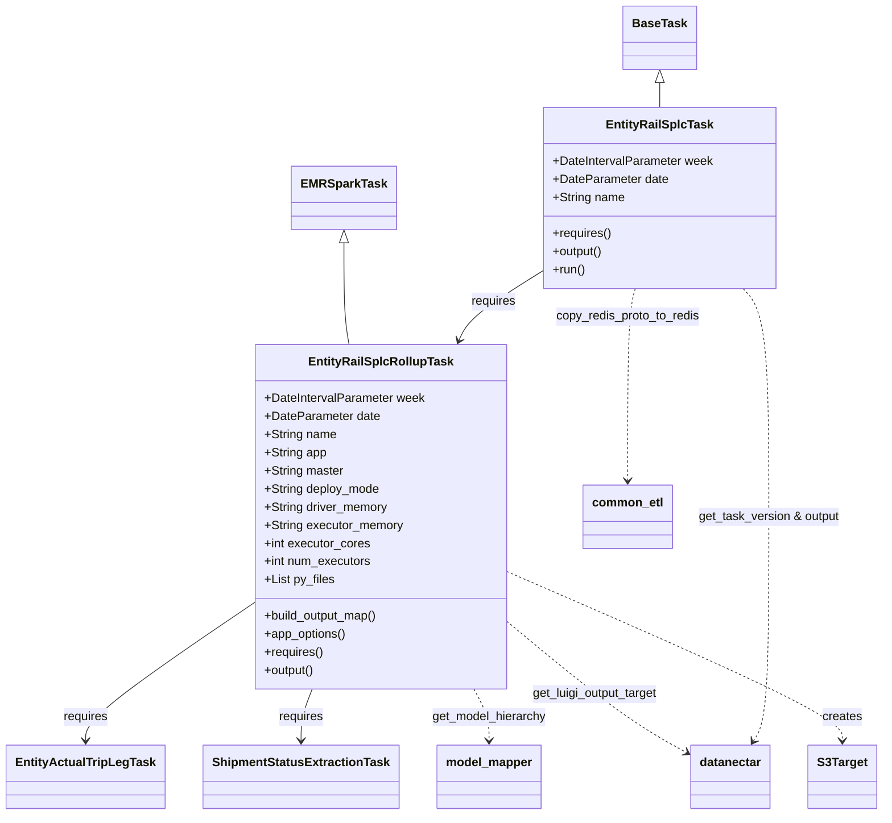

# Diagram: research/orchestrator/tasks/models/entity_rail_splc_task.py


> Auto-generated by Obscura crawlers

## Diagram 1



### SVG

<svg id="container" width="1143.130859375" xmlns="http://www.w3.org/2000/svg" class="classDiagram" height="1078" viewBox="0 0 1143.130859375 1078" role="graphics-document document" aria-roledescription="class"><style>#container{font-family:"trebuchet ms",verdana,arial,sans-serif;font-size:16px;fill:#333;}@keyframes edge-animation-frame{from{stroke-dashoffset:0;}}@keyframes dash{to{stroke-dashoffset:0;}}#container .edge-animation-slow{stroke-dasharray:9,5!important;stroke-dashoffset:900;animation:dash 50s linear infinite;stroke-linecap:round;}#container .edge-animation-fast{stroke-dasharray:9,5!important;stroke-dashoffset:900;animation:dash 20s linear infinite;stroke-linecap:round;}#container .error-icon{fill:#552222;}#container .error-text{fill:#552222;stroke:#552222;}#container .edge-thickness-normal{stroke-width:1px;}#container .edge-thickness-thick{stroke-width:3.5px;}#container .edge-pattern-solid{stroke-dasharray:0;}#container .edge-thickness-invisible{stroke-width:0;fill:none;}#container .edge-pattern-dashed{stroke-dasharray:3;}#container .edge-pattern-dotted{stroke-dasharray:2;}#container .marker{fill:#333333;stroke:#333333;}#container .marker.cross{stroke:#333333;}#container svg{font-family:"trebuchet ms",verdana,arial,sans-serif;font-size:16px;}#container p{margin:0;}#container g.classGroup text{fill:#9370DB;stroke:none;font-family:"trebuchet ms",verdana,arial,sans-serif;font-size:10px;}#container g.classGroup text .title{font-weight:bolder;}#container .nodeLabel,#container .edgeLabel{color:#131300;}#container .edgeLabel .label rect{fill:#ECECFF;}#container .label text{fill:#131300;}#container .labelBkg{background:#ECECFF;}#container .edgeLabel .label span{background:#ECECFF;}#container .classTitle{font-weight:bolder;}#container .node rect,#container .node circle,#container .node ellipse,#container .node polygon,#container .node path{fill:#ECECFF;stroke:#9370DB;stroke-width:1px;}#container .divider{stroke:#9370DB;stroke-width:1;}#container g.clickable{cursor:pointer;}#container g.classGroup rect{fill:#ECECFF;stroke:#9370DB;}#container g.classGroup line{stroke:#9370DB;stroke-width:1;}#container .classLabel .box{stroke:none;stroke-width:0;fill:#ECECFF;opacity:0.5;}#container .classLabel .label{fill:#9370DB;font-size:10px;}#container .relation{stroke:#333333;stroke-width:1;fill:none;}#container .dashed-line{stroke-dasharray:3;}#container .dotted-line{stroke-dasharray:1 2;}#container #compositionStart,#container .composition{fill:#333333!important;stroke:#333333!important;stroke-width:1;}#container #compositionEnd,#container .composition{fill:#333333!important;stroke:#333333!important;stroke-width:1;}#container #dependencyStart,#container .dependency{fill:#333333!important;stroke:#333333!important;stroke-width:1;}#container #dependencyStart,#container .dependency{fill:#333333!important;stroke:#333333!important;stroke-width:1;}#container #extensionStart,#container .extension{fill:transparent!important;stroke:#333333!important;stroke-width:1;}#container #extensionEnd,#container .extension{fill:transparent!important;stroke:#333333!important;stroke-width:1;}#container #aggregationStart,#container .aggregation{fill:transparent!important;stroke:#333333!important;stroke-width:1;}#container #aggregationEnd,#container .aggregation{fill:transparent!important;stroke:#333333!important;stroke-width:1;}#container #lollipopStart,#container .lollipop{fill:#ECECFF!important;stroke:#333333!important;stroke-width:1;}#container #lollipopEnd,#container .lollipop{fill:#ECECFF!important;stroke:#333333!important;stroke-width:1;}#container .edgeTerminals{font-size:11px;line-height:initial;}#container .classTitleText{text-anchor:middle;font-size:18px;fill:#333;}#container .label-icon{display:inline-block;height:1em;overflow:visible;vertical-align:-0.125em;}#container .node .label-icon path{fill:currentColor;stroke:revert;stroke-width:revert;}#container :root{--mermaid-font-family:"trebuchet ms",verdana,arial,sans-serif;}</style><g><defs><marker id="container_class-aggregationStart" class="marker aggregation class" refX="18" refY="7" markerWidth="190" markerHeight="240" orient="auto"><path d="M 18,7 L9,13 L1,7 L9,1 Z"></path></marker></defs><defs><marker id="container_class-aggregationEnd" class="marker aggregation class" refX="1" refY="7" markerWidth="20" markerHeight="28" orient="auto"><path d="M 18,7 L9,13 L1,7 L9,1 Z"></path></marker></defs><defs><marker id="container_class-extensionStart" class="marker extension class" refX="18" refY="7" markerWidth="190" markerHeight="240" orient="auto"><path d="M 1,7 L18,13 V 1 Z"></path></marker></defs><defs><marker id="container_class-extensionEnd" class="marker extension class" refX="1" refY="7" markerWidth="20" markerHeight="28" orient="auto"><path d="M 1,1 V 13 L18,7 Z"></path></marker></defs><defs><marker id="container_class-compositionStart" class="marker composition class" refX="18" refY="7" markerWidth="190" markerHeight="240" orient="auto"><path d="M 18,7 L9,13 L1,7 L9,1 Z"></path></marker></defs><defs><marker id="container_class-compositionEnd" class="marker composition class" refX="1" refY="7" markerWidth="20" markerHeight="28" orient="auto"><path d="M 18,7 L9,13 L1,7 L9,1 Z"></path></marker></defs><defs><marker id="container_class-dependencyStart" class="marker dependency class" refX="6" refY="7" markerWidth="190" markerHeight="240" orient="auto"><path d="M 5,7 L9,13 L1,7 L9,1 Z"></path></marker></defs><defs><marker id="container_class-dependencyEnd" class="marker dependency class" refX="13" refY="7" markerWidth="20" markerHeight="28" orient="auto"><path d="M 18,7 L9,13 L14,7 L9,1 Z"></path></marker></defs><defs><marker id="container_class-lollipopStart" class="marker lollipop class" refX="13" refY="7" markerWidth="190" markerHeight="240" orient="auto"><circle stroke="black" fill="transparent" cx="7" cy="7" r="6"></circle></marker></defs><defs><marker id="container_class-lollipopEnd" class="marker lollipop class" refX="1" refY="7" markerWidth="190" markerHeight="240" orient="auto"><circle stroke="black" fill="transparent" cx="7" cy="7" r="6"></circle></marker></defs><g class="root"><g class="clusters"></g><g class="edgePaths"><path d="M438.166,321.25L438.166,337.542C438.166,353.833,438.166,386.417,439.326,408.875C440.486,431.333,442.806,443.667,443.966,449.833L445.126,456" id="id_EMRSparkTask_EntityRailSplcRollupTask_1" class="edge-thickness-normal edge-pattern-solid relation" style=";;;" data-edge="true" data-et="edge" data-id="id_EMRSparkTask_EntityRailSplcRollupTask_1" data-points="W3sieCI6NDM4LjE2NjAxNTYyNSwieSI6MzA0fSx7IngiOjQzOC4xNjYwMTU2MjUsInkiOjQxOX0seyJ4Ijo0NDUuMTI2NDIyNDY0NjIyNjQsInkiOjQ1Nn1d" marker-start="url(#container_class-extensionStart)"></path><path d="M852.049,109.25L852.049,110.542C852.049,111.833,852.049,114.417,852.049,119.875C852.049,125.333,852.049,133.667,852.049,137.833L852.049,142" id="id_BaseTask_EntityRailSplcTask_2" class="edge-thickness-normal edge-pattern-solid relation" style=";;;" data-edge="true" data-et="edge" data-id="id_BaseTask_EntityRailSplcTask_2" data-points="W3sieCI6ODUyLjA0ODgyODEyNSwieSI6OTJ9LHsieCI6ODUyLjA0ODgyODEyNSwieSI6MTE3fSx7IngiOjg1Mi4wNDg4MjgxMjUsInkiOjE0Mn1d" marker-start="url(#container_class-extensionStart)"></path><path d="M324.568,797.899L288.429,823.083C252.29,848.266,180.012,898.633,143.873,928.983C107.734,959.333,107.734,969.667,107.734,974.833L107.734,980" id="id_EntityRailSplcRollupTask_EntityActualTripLegTask_3" class="edge-thickness-normal edge-pattern-solid relation" style=";;;" data-edge="true" data-et="edge" data-id="id_EntityRailSplcRollupTask_EntityActualTripLegTask_3" data-points="W3sieCI6MzI0LjU2ODM1OTM3NSwieSI6Nzk3Ljg5OTQzNzYxMDc0NDV9LHsieCI6MTA3LjczNDM3NSwieSI6OTQ5fSx7IngiOjEwNy43MzQzNzUsInkiOjk4Nn1d" marker-end="url(#container_class-dependencyEnd)"></path><path d="M396.567,912L394.094,918.167C391.62,924.333,386.673,936.667,384.2,948C381.727,959.333,381.727,969.667,381.727,974.833L381.727,980" id="id_EntityRailSplcRollupTask_ShipmentStatusExtractionTask_4" class="edge-thickness-normal edge-pattern-solid relation" style=";;;" data-edge="true" data-et="edge" data-id="id_EntityRailSplcRollupTask_ShipmentStatusExtractionTask_4" data-points="W3sieCI6Mzk2LjU2NzE5NDg3MDI4MywieSI6OTEyfSx7IngiOjM4MS43MjY1NjI1LCJ5Ijo5NDl9LHsieCI6MzgxLjcyNjU2MjUsInkiOjk4Nn1d" marker-end="url(#container_class-dependencyEnd)"></path><path d="M604.577,912L607.729,918.167C610.882,924.333,617.187,936.667,620.34,948C623.492,959.333,623.492,969.667,623.492,974.833L623.492,980" id="id_EntityRailSplcRollupTask_model_mapper_5" class="edge-thickness-normal edge-pattern-dashed relation" style=";;;" data-edge="true" data-et="edge" data-id="id_EntityRailSplcRollupTask_model_mapper_5" data-points="W3sieCI6NjA0LjU3Njg2NDY4MTYwMzgsInkiOjkxMn0seyJ4Ijo2MjMuNDkyMTg3NSwieSI6OTQ5fSx7IngiOjYyMy40OTIxODc1LCJ5Ijo5ODZ9XQ==" marker-end="url(#container_class-dependencyEnd)"></path><path d="M651.467,820.736L677.021,842.113C702.574,863.491,753.682,906.245,793.175,935.439C832.669,964.633,860.549,980.266,874.489,988.082L888.429,995.899" id="id_EntityRailSplcRollupTask_datanectar_6" class="edge-thickness-normal edge-pattern-dashed relation" style=";;;" data-edge="true" data-et="edge" data-id="id_EntityRailSplcRollupTask_datanectar_6" data-points="W3sieCI6NjUxLjQ2Njc5Njg3NSwieSI6ODIwLjczNTkyODI4MDMxODR9LHsieCI6ODA0Ljc4OTA2MjUsInkiOjk0OX0seyJ4Ijo4OTMuNjYyMTA5Mzc1LCJ5Ijo5OTguODMzNDY1MDMwODQ1fV0=" marker-end="url(#container_class-dependencyEnd)"></path><path d="M651.467,755.784L724.791,787.987C798.115,820.189,944.764,884.595,1018.088,921.964C1091.412,959.333,1091.412,969.667,1091.412,974.833L1091.412,980" id="id_EntityRailSplcRollupTask_S3Target_7" class="edge-thickness-normal edge-pattern-dashed relation" style=";;;" data-edge="true" data-et="edge" data-id="id_EntityRailSplcRollupTask_S3Target_7" data-points="W3sieCI6NjUxLjQ2Njc5Njg3NSwieSI6NzU1Ljc4Mzk1MDE3NzcwNTZ9LHsieCI6MTA5MS40MTIxMDkzNzUsInkiOjk0OX0seyJ4IjoxMDkxLjQxMjEwOTM3NSwieSI6OTg2fV0=" marker-end="url(#container_class-dependencyEnd)"></path><path d="M700.396,356.515L683.687,366.929C666.977,377.343,633.557,398.172,614.627,413.832C595.698,429.491,591.259,439.983,589.04,445.229L586.82,450.474" id="id_EntityRailSplcTask_EntityRailSplcRollupTask_8" class="edge-thickness-normal edge-pattern-solid relation" style=";;;" data-edge="true" data-et="edge" data-id="id_EntityRailSplcTask_EntityRailSplcRollupTask_8" data-points="W3sieCI6NzAwLjM5NjQ4NDM3NSwieSI6MzU2LjUxNDc4MTQ3NjA1NDJ9LHsieCI6NjAwLjEzNjcxODc1LCJ5Ijo0MTl9LHsieCI6NTg0LjQ4MjM0ODE3MjE2OTgsInkiOjQ1Nn1d" marker-end="url(#container_class-dependencyEnd)"></path><path d="M961.662,382L967.295,388.167C972.927,394.333,984.193,406.667,989.826,457C995.459,507.333,995.459,595.667,995.459,684C995.459,772.333,995.459,860.667,992.106,910.154C988.753,959.641,982.048,970.283,978.695,975.603L975.342,980.924" id="id_EntityRailSplcTask_datanectar_9" class="edge-thickness-normal edge-pattern-dashed relation" style=";;;" data-edge="true" data-et="edge" data-id="id_EntityRailSplcTask_datanectar_9" data-points="W3sieCI6OTYxLjY2MTY4NjQwNTI1NDgsInkiOjM4Mn0seyJ4Ijo5OTUuNDU4OTg0Mzc1LCJ5Ijo0MTl9LHsieCI6OTk1LjQ1ODk4NDM3NSwieSI6Njg0fSx7IngiOjk5NS40NTg5ODQzNzUsInkiOjk0OX0seyJ4Ijo5NzIuMTQzNzE1Mzg3NjU4MiwieSI6OTg2fV0=" marker-end="url(#container_class-dependencyEnd)"></path><path d="M818.535,382L816.812,388.167C815.09,394.333,811.646,406.667,809.923,449C808.201,491.333,808.201,563.667,808.201,599.833L808.201,636" id="id_EntityRailSplcTask_common_etl_10" class="edge-thickness-normal edge-pattern-dashed relation" style=";;;" data-edge="true" data-et="edge" data-id="id_EntityRailSplcTask_common_etl_10" data-points="W3sieCI6ODE4LjUzNDY5NTk1OTM5NDksInkiOjM4Mn0seyJ4Ijo4MDguMjAxMTcxODc1LCJ5Ijo0MTl9LHsieCI6ODA4LjIwMTE3MTg3NSwieSI6NjQyfV0=" marker-end="url(#container_class-dependencyEnd)"></path></g><g class="edgeLabels"><g class="edgeLabel"><g class="label" data-id="id_EMRSparkTask_EntityRailSplcRollupTask_1" transform="translate(0, 0)"><foreignObject width="0" height="0"><div xmlns="http://www.w3.org/1999/xhtml" class="labelBkg" style="display: table-cell; white-space: nowrap; line-height: 1.5; max-width: 200px; text-align: center;"><span class="edgeLabel"></span></div></foreignObject></g></g><g class="edgeLabel"><g class="label" data-id="id_BaseTask_EntityRailSplcTask_2" transform="translate(0, 0)"><foreignObject width="0" height="0"><div xmlns="http://www.w3.org/1999/xhtml" class="labelBkg" style="display: table-cell; white-space: nowrap; line-height: 1.5; max-width: 200px; text-align: center;"><span class="edgeLabel"></span></div></foreignObject></g></g><g class="edgeLabel" transform="translate(107.734375, 949)"><g class="label" data-id="id_EntityRailSplcRollupTask_EntityActualTripLegTask_3" transform="translate(-29.8515625, -12)"><foreignObject width="59.703125" height="24"><div xmlns="http://www.w3.org/1999/xhtml" class="labelBkg" style="display: table-cell; white-space: nowrap; line-height: 1.5; max-width: 200px; text-align: center;"><span class="edgeLabel"><p>requires</p></span></div></foreignObject></g></g><g class="edgeLabel" transform="translate(381.7265625, 949)"><g class="label" data-id="id_EntityRailSplcRollupTask_ShipmentStatusExtractionTask_4" transform="translate(-29.8515625, -12)"><foreignObject width="59.703125" height="24"><div xmlns="http://www.w3.org/1999/xhtml" class="labelBkg" style="display: table-cell; white-space: nowrap; line-height: 1.5; max-width: 200px; text-align: center;"><span class="edgeLabel"><p>requires</p></span></div></foreignObject></g></g><g class="edgeLabel" transform="translate(623.4921875, 949)"><g class="label" data-id="id_EntityRailSplcRollupTask_model_mapper_5" transform="translate(-76.3203125, -12)"><foreignObject width="152.640625" height="24"><div xmlns="http://www.w3.org/1999/xhtml" class="labelBkg" style="display: table-cell; white-space: nowrap; line-height: 1.5; max-width: 200px; text-align: center;"><span class="edgeLabel"><p>get_model_hierarchy</p></span></div></foreignObject></g></g><g class="edgeLabel" transform="translate(767.2032, 917.55698)"><g class="label" data-id="id_EntityRailSplcRollupTask_datanectar_6" transform="translate(-84.9765625, -12)"><foreignObject width="169.953125" height="24"><div xmlns="http://www.w3.org/1999/xhtml" class="labelBkg" style="display: table-cell; white-space: nowrap; line-height: 1.5; max-width: 200px; text-align: center;"><span class="edgeLabel"><p>get_luigi_output_target</p></span></div></foreignObject></g></g><g class="edgeLabel" transform="translate(1091.412109375, 949)"><g class="label" data-id="id_EntityRailSplcRollupTask_S3Target_7" transform="translate(-26.171875, -12)"><foreignObject width="52.34375" height="24"><div xmlns="http://www.w3.org/1999/xhtml" class="labelBkg" style="display: table-cell; white-space: nowrap; line-height: 1.5; max-width: 200px; text-align: center;"><span class="edgeLabel"><p>creates</p></span></div></foreignObject></g></g><g class="edgeLabel" transform="translate(633.21876, 398.38217)"><g class="label" data-id="id_EntityRailSplcTask_EntityRailSplcRollupTask_8" transform="translate(-29.8515625, -12)"><foreignObject width="59.703125" height="24"><div xmlns="http://www.w3.org/1999/xhtml" class="labelBkg" style="display: table-cell; white-space: nowrap; line-height: 1.5; max-width: 200px; text-align: center;"><span class="edgeLabel"><p>requires</p></span></div></foreignObject></g></g><g class="edgeLabel" transform="translate(995.458984375, 684)"><g class="label" data-id="id_EntityRailSplcTask_datanectar_9" transform="translate(-95.3046875, -12)"><foreignObject width="190.609375" height="24"><div xmlns="http://www.w3.org/1999/xhtml" class="labelBkg" style="display: table-cell; white-space: nowrap; line-height: 1.5; max-width: 200px; text-align: center;"><span class="edgeLabel"><p>get_task_version &amp; output</p></span></div></foreignObject></g></g><g class="edgeLabel" transform="translate(808.201171875, 419)"><g class="label" data-id="id_EntityRailSplcTask_common_etl_10" transform="translate(-95.875, -12)"><foreignObject width="191.75" height="24"><div xmlns="http://www.w3.org/1999/xhtml" class="labelBkg" style="display: table-cell; white-space: nowrap; line-height: 1.5; max-width: 200px; text-align: center;"><span class="edgeLabel"><p>copy_redis_proto_to_redis</p></span></div></foreignObject></g></g></g><g class="nodes"><g class="node default" id="classId-EMRSparkTask-0" transform="translate(438.166015625, 262)"><g class="basic label-container"><path d="M-65.1484375 -42 L65.1484375 -42 L65.1484375 42 L-65.1484375 42" stroke="none" stroke-width="0" fill="#ECECFF" style=""></path><path d="M-65.1484375 -42 C-33.187927597490955 -42, -1.2274176949819093 -42, 65.1484375 -42 M-65.1484375 -42 C-26.821644116884727 -42, 11.505149266230546 -42, 65.1484375 -42 M65.1484375 -42 C65.1484375 -15.19979258082347, 65.1484375 11.60041483835306, 65.1484375 42 M65.1484375 -42 C65.1484375 -12.838271263482675, 65.1484375 16.32345747303465, 65.1484375 42 M65.1484375 42 C21.824450537889163 42, -21.499536424221674 42, -65.1484375 42 M65.1484375 42 C21.800863453669834 42, -21.546710592660332 42, -65.1484375 42 M-65.1484375 42 C-65.1484375 19.29067424405283, -65.1484375 -3.418651511894339, -65.1484375 -42 M-65.1484375 42 C-65.1484375 21.613743266318462, -65.1484375 1.2274865326369238, -65.1484375 -42" stroke="#9370DB" stroke-width="1.3" fill="none" stroke-dasharray="0 0" style=""></path></g><g class="annotation-group text" transform="translate(0, -18)"></g><g class="label-group text" transform="translate(-53.1484375, -18)"><g class="label" style="font-weight: bolder" transform="translate(0,-12)"><foreignObject width="106.296875" height="24"><div xmlns="http://www.w3.org/1999/xhtml" style="display: table-cell; white-space: nowrap; line-height: 1.5; max-width: 154px; text-align: center;"><span class="nodeLabel markdown-node-label" style=""><p>EMRSparkTask</p></span></div></foreignObject></g></g><g class="members-group text" transform="translate(-53.1484375, 30)"></g><g class="methods-group text" transform="translate(-53.1484375, 60)"></g><g class="divider" style=""><path d="M-65.1484375 6 C-16.93857714336543 6, 31.271283213269143 6, 65.1484375 6 M-65.1484375 6 C-19.72236320552019 6, 25.703711088959622 6, 65.1484375 6" stroke="#9370DB" stroke-width="1.3" fill="none" stroke-dasharray="0 0" style=""></path></g><g class="divider" style=""><path d="M-65.1484375 24 C-22.94292486890081 24, 19.26258776219838 24, 65.1484375 24 M-65.1484375 24 C-31.274026931550893 24, 2.600383636898215 24, 65.1484375 24" stroke="#9370DB" stroke-width="1.3" fill="none" stroke-dasharray="0 0" style=""></path></g></g><g class="node default" id="classId-BaseTask-1" transform="translate(852.048828125, 50)"><g class="basic label-container"><path d="M-46.03125 -42 L46.03125 -42 L46.03125 42 L-46.03125 42" stroke="none" stroke-width="0" fill="#ECECFF" style=""></path><path d="M-46.03125 -42 C-25.784854264295586 -42, -5.538458528591171 -42, 46.03125 -42 M-46.03125 -42 C-21.352605493063848 -42, 3.326039013872304 -42, 46.03125 -42 M46.03125 -42 C46.03125 -15.083695149980635, 46.03125 11.83260970003873, 46.03125 42 M46.03125 -42 C46.03125 -24.685002776015807, 46.03125 -7.370005552031614, 46.03125 42 M46.03125 42 C23.94329478628388 42, 1.8553395725677575 42, -46.03125 42 M46.03125 42 C21.61207020010782 42, -2.8071095997843614 42, -46.03125 42 M-46.03125 42 C-46.03125 16.099892775570723, -46.03125 -9.800214448858554, -46.03125 -42 M-46.03125 42 C-46.03125 22.195102665246623, -46.03125 2.390205330493245, -46.03125 -42" stroke="#9370DB" stroke-width="1.3" fill="none" stroke-dasharray="0 0" style=""></path></g><g class="annotation-group text" transform="translate(0, -18)"></g><g class="label-group text" transform="translate(-34.03125, -18)"><g class="label" style="font-weight: bolder" transform="translate(0,-12)"><foreignObject width="68.0625" height="24"><div xmlns="http://www.w3.org/1999/xhtml" style="display: table-cell; white-space: nowrap; line-height: 1.5; max-width: 117px; text-align: center;"><span class="nodeLabel markdown-node-label" style=""><p>BaseTask</p></span></div></foreignObject></g></g><g class="members-group text" transform="translate(-34.03125, 30)"></g><g class="methods-group text" transform="translate(-34.03125, 60)"></g><g class="divider" style=""><path d="M-46.03125 6 C-19.733033673684574 6, 6.5651826526308525 6, 46.03125 6 M-46.03125 6 C-23.202422663168132 6, -0.3735953263362646 6, 46.03125 6" stroke="#9370DB" stroke-width="1.3" fill="none" stroke-dasharray="0 0" style=""></path></g><g class="divider" style=""><path d="M-46.03125 24 C-27.38827438639244 24, -8.745298772784878 24, 46.03125 24 M-46.03125 24 C-18.216706187993843 24, 9.597837624012314 24, 46.03125 24" stroke="#9370DB" stroke-width="1.3" fill="none" stroke-dasharray="0 0" style=""></path></g></g><g class="node default" id="classId-EntityRailSplcRollupTask-2" transform="translate(488.017578125, 684)"><g class="basic label-container"><path d="M-163.44921875 -228 L163.44921875 -228 L163.44921875 228 L-163.44921875 228" stroke="none" stroke-width="0" fill="#ECECFF" style=""></path><path d="M-163.44921875 -228 C-82.92524236066552 -228, -2.4012659713310427 -228, 163.44921875 -228 M-163.44921875 -228 C-88.28850819869648 -228, -13.127797647392953 -228, 163.44921875 -228 M163.44921875 -228 C163.44921875 -90.87076267396603, 163.44921875 46.258474652067946, 163.44921875 228 M163.44921875 -228 C163.44921875 -72.0108909728452, 163.44921875 83.9782180543096, 163.44921875 228 M163.44921875 228 C62.98893446776117 228, -37.47134981447766 228, -163.44921875 228 M163.44921875 228 C78.08000368273973 228, -7.2892113845205415 228, -163.44921875 228 M-163.44921875 228 C-163.44921875 57.652886675360406, -163.44921875 -112.69422664927919, -163.44921875 -228 M-163.44921875 228 C-163.44921875 132.03320678208237, -163.44921875 36.06641356416475, -163.44921875 -228" stroke="#9370DB" stroke-width="1.3" fill="none" stroke-dasharray="0 0" style=""></path></g><g class="annotation-group text" transform="translate(0, -204)"></g><g class="label-group text" transform="translate(-90.7734375, -204)"><g class="label" style="font-weight: bolder" transform="translate(0,-12)"><foreignObject width="181.546875" height="24"><div xmlns="http://www.w3.org/1999/xhtml" style="display: table-cell; white-space: nowrap; line-height: 1.5; max-width: 229px; text-align: center;"><span class="nodeLabel markdown-node-label" style=""><p>EntityRailSplcRollupTask</p></span></div></foreignObject></g></g><g class="members-group text" transform="translate(-151.44921875, -156)"><g class="label" style="" transform="translate(0,-12)"><foreignObject width="212.125" height="24"><div xmlns="http://www.w3.org/1999/xhtml" style="display: table-cell; white-space: nowrap; line-height: 1.5; max-width: 270px; text-align: center;"><span class="nodeLabel markdown-node-label" style=""><p>+DateIntervalParameter week</p></span></div></foreignObject></g><g class="label" style="" transform="translate(0,12)"><foreignObject width="152.171875" height="24"><div xmlns="http://www.w3.org/1999/xhtml" style="display: table-cell; white-space: nowrap; line-height: 1.5; max-width: 210px; text-align: center;"><span class="nodeLabel markdown-node-label" style=""><p>+DateParameter date</p></span></div></foreignObject></g><g class="label" style="" transform="translate(0,36)"><foreignObject width="94.984375" height="24"><div xmlns="http://www.w3.org/1999/xhtml" style="display: table-cell; white-space: nowrap; line-height: 1.5; max-width: 152px; text-align: center;"><span class="nodeLabel markdown-node-label" style=""><p>+String name</p></span></div></foreignObject></g><g class="label" style="" transform="translate(0,60)"><foreignObject width="82.1875" height="24"><div xmlns="http://www.w3.org/1999/xhtml" style="display: table-cell; white-space: nowrap; line-height: 1.5; max-width: 140px; text-align: center;"><span class="nodeLabel markdown-node-label" style=""><p>+String app</p></span></div></foreignObject></g><g class="label" style="" transform="translate(0,84)"><foreignObject width="104.625" height="24"><div xmlns="http://www.w3.org/1999/xhtml" style="display: table-cell; white-space: nowrap; line-height: 1.5; max-width: 163px; text-align: center;"><span class="nodeLabel markdown-node-label" style=""><p>+String master</p></span></div></foreignObject></g><g class="label" style="" transform="translate(0,108)"><foreignObject width="153.203125" height="24"><div xmlns="http://www.w3.org/1999/xhtml" style="display: table-cell; white-space: nowrap; line-height: 1.5; max-width: 211px; text-align: center;"><span class="nodeLabel markdown-node-label" style=""><p>+String deploy_mode</p></span></div></foreignObject></g><g class="label" style="" transform="translate(0,132)"><foreignObject width="164.015625" height="24"><div xmlns="http://www.w3.org/1999/xhtml" style="display: table-cell; white-space: nowrap; line-height: 1.5; max-width: 221px; text-align: center;"><span class="nodeLabel markdown-node-label" style=""><p>+String driver_memory</p></span></div></foreignObject></g><g class="label" style="" transform="translate(0,156)"><foreignObject width="183.8125" height="24"><div xmlns="http://www.w3.org/1999/xhtml" style="display: table-cell; white-space: nowrap; line-height: 1.5; max-width: 241px; text-align: center;"><span class="nodeLabel markdown-node-label" style=""><p>+String executor_memory</p></span></div></foreignObject></g><g class="label" style="" transform="translate(0,180)"><foreignObject width="139.9375" height="24"><div xmlns="http://www.w3.org/1999/xhtml" style="display: table-cell; white-space: nowrap; line-height: 1.5; max-width: 197px; text-align: center;"><span class="nodeLabel markdown-node-label" style=""><p>+int executor_cores</p></span></div></foreignObject></g><g class="label" style="" transform="translate(0,204)"><foreignObject width="142.296875" height="24"><div xmlns="http://www.w3.org/1999/xhtml" style="display: table-cell; white-space: nowrap; line-height: 1.5; max-width: 200px; text-align: center;"><span class="nodeLabel markdown-node-label" style=""><p>+int num_executors</p></span></div></foreignObject></g><g class="label" style="" transform="translate(0,228)"><foreignObject width="92.796875" height="24"><div xmlns="http://www.w3.org/1999/xhtml" style="display: table-cell; white-space: nowrap; line-height: 1.5; max-width: 150px; text-align: center;"><span class="nodeLabel markdown-node-label" style=""><p>+List py_files</p></span></div></foreignObject></g></g><g class="methods-group text" transform="translate(-151.44921875, 132)"><g class="label" style="" transform="translate(0,-12)"><foreignObject width="153.125" height="24"><div xmlns="http://www.w3.org/1999/xhtml" style="display: table-cell; white-space: nowrap; line-height: 1.5; max-width: 210px; text-align: center;"><span class="nodeLabel markdown-node-label" style=""><p>+build_output_map()</p></span></div></foreignObject></g><g class="label" style="" transform="translate(0,12)"><foreignObject width="108.84375" height="24"><div xmlns="http://www.w3.org/1999/xhtml" style="display: table-cell; white-space: nowrap; line-height: 1.5; max-width: 166px; text-align: center;"><span class="nodeLabel markdown-node-label" style=""><p>+app_options()</p></span></div></foreignObject></g><g class="label" style="" transform="translate(0,36)"><foreignObject width="78.0625" height="24"><div xmlns="http://www.w3.org/1999/xhtml" style="display: table-cell; white-space: nowrap; line-height: 1.5; max-width: 135px; text-align: center;"><span class="nodeLabel markdown-node-label" style=""><p>+requires()</p></span></div></foreignObject></g><g class="label" style="" transform="translate(0,60)"><foreignObject width="67.390625" height="24"><div xmlns="http://www.w3.org/1999/xhtml" style="display: table-cell; white-space: nowrap; line-height: 1.5; max-width: 125px; text-align: center;"><span class="nodeLabel markdown-node-label" style=""><p>+output()</p></span></div></foreignObject></g></g><g class="divider" style=""><path d="M-163.44921875 -180 C-43.150777644143176 -180, 77.14766346171365 -180, 163.44921875 -180 M-163.44921875 -180 C-45.94217270310395 -180, 71.5648733437921 -180, 163.44921875 -180" stroke="#9370DB" stroke-width="1.3" fill="none" stroke-dasharray="0 0" style=""></path></g><g class="divider" style=""><path d="M-163.44921875 108 C-37.66623864463088 108, 88.11674146073824 108, 163.44921875 108 M-163.44921875 108 C-92.69156978481804 108, -21.933920819636086 108, 163.44921875 108" stroke="#9370DB" stroke-width="1.3" fill="none" stroke-dasharray="0 0" style=""></path></g></g><g class="node default" id="classId-EntityRailSplcTask-3" transform="translate(852.048828125, 262)"><g class="basic label-container"><path d="M-151.65234375 -120 L151.65234375 -120 L151.65234375 120 L-151.65234375 120" stroke="none" stroke-width="0" fill="#ECECFF" style=""></path><path d="M-151.65234375 -120 C-72.78153201985846 -120, 6.08927971028308 -120, 151.65234375 -120 M-151.65234375 -120 C-57.26058716556763 -120, 37.131169418864744 -120, 151.65234375 -120 M151.65234375 -120 C151.65234375 -55.64683801297261, 151.65234375 8.706323974054783, 151.65234375 120 M151.65234375 -120 C151.65234375 -68.56777720399992, 151.65234375 -17.135554407999848, 151.65234375 120 M151.65234375 120 C67.2799393228051 120, -17.092465104389788 120, -151.65234375 120 M151.65234375 120 C76.22374266643341 120, 0.7951415828668189 120, -151.65234375 120 M-151.65234375 120 C-151.65234375 51.025713942450636, -151.65234375 -17.948572115098727, -151.65234375 -120 M-151.65234375 120 C-151.65234375 58.94503468317869, -151.65234375 -2.1099306336426196, -151.65234375 -120" stroke="#9370DB" stroke-width="1.3" fill="none" stroke-dasharray="0 0" style=""></path></g><g class="annotation-group text" transform="translate(0, -96)"></g><g class="label-group text" transform="translate(-67.1796875, -96)"><g class="label" style="font-weight: bolder" transform="translate(0,-12)"><foreignObject width="134.359375" height="24"><div xmlns="http://www.w3.org/1999/xhtml" style="display: table-cell; white-space: nowrap; line-height: 1.5; max-width: 182px; text-align: center;"><span class="nodeLabel markdown-node-label" style=""><p>EntityRailSplcTask</p></span></div></foreignObject></g></g><g class="members-group text" transform="translate(-139.65234375, -48)"><g class="label" style="" transform="translate(0,-12)"><foreignObject width="212.125" height="24"><div xmlns="http://www.w3.org/1999/xhtml" style="display: table-cell; white-space: nowrap; line-height: 1.5; max-width: 270px; text-align: center;"><span class="nodeLabel markdown-node-label" style=""><p>+DateIntervalParameter week</p></span></div></foreignObject></g><g class="label" style="" transform="translate(0,12)"><foreignObject width="152.171875" height="24"><div xmlns="http://www.w3.org/1999/xhtml" style="display: table-cell; white-space: nowrap; line-height: 1.5; max-width: 210px; text-align: center;"><span class="nodeLabel markdown-node-label" style=""><p>+DateParameter date</p></span></div></foreignObject></g><g class="label" style="" transform="translate(0,36)"><foreignObject width="94.984375" height="24"><div xmlns="http://www.w3.org/1999/xhtml" style="display: table-cell; white-space: nowrap; line-height: 1.5; max-width: 152px; text-align: center;"><span class="nodeLabel markdown-node-label" style=""><p>+String name</p></span></div></foreignObject></g></g><g class="methods-group text" transform="translate(-139.65234375, 48)"><g class="label" style="" transform="translate(0,-12)"><foreignObject width="78.0625" height="24"><div xmlns="http://www.w3.org/1999/xhtml" style="display: table-cell; white-space: nowrap; line-height: 1.5; max-width: 135px; text-align: center;"><span class="nodeLabel markdown-node-label" style=""><p>+requires()</p></span></div></foreignObject></g><g class="label" style="" transform="translate(0,12)"><foreignObject width="67.390625" height="24"><div xmlns="http://www.w3.org/1999/xhtml" style="display: table-cell; white-space: nowrap; line-height: 1.5; max-width: 125px; text-align: center;"><span class="nodeLabel markdown-node-label" style=""><p>+output()</p></span></div></foreignObject></g><g class="label" style="" transform="translate(0,36)"><foreignObject width="43.21875" height="24"><div xmlns="http://www.w3.org/1999/xhtml" style="display: table-cell; white-space: nowrap; line-height: 1.5; max-width: 101px; text-align: center;"><span class="nodeLabel markdown-node-label" style=""><p>+run()</p></span></div></foreignObject></g></g><g class="divider" style=""><path d="M-151.65234375 -72 C-75.3094905943155 -72, 1.033362561368989 -72, 151.65234375 -72 M-151.65234375 -72 C-73.34969741139095 -72, 4.952948927218102 -72, 151.65234375 -72" stroke="#9370DB" stroke-width="1.3" fill="none" stroke-dasharray="0 0" style=""></path></g><g class="divider" style=""><path d="M-151.65234375 24 C-68.90609900486061 24, 13.840145740278786 24, 151.65234375 24 M-151.65234375 24 C-75.5258901010712 24, 0.6005635478576039 24, 151.65234375 24" stroke="#9370DB" stroke-width="1.3" fill="none" stroke-dasharray="0 0" style=""></path></g></g><g class="node default" id="classId-EntityActualTripLegTask-4" transform="translate(107.734375, 1028)"><g class="basic label-container"><path d="M-99.734375 -42 L99.734375 -42 L99.734375 42 L-99.734375 42" stroke="none" stroke-width="0" fill="#ECECFF" style=""></path><path d="M-99.734375 -42 C-42.79760699518319 -42, 14.139161009633625 -42, 99.734375 -42 M-99.734375 -42 C-39.38331462478809 -42, 20.967745750423816 -42, 99.734375 -42 M99.734375 -42 C99.734375 -9.778782060429101, 99.734375 22.442435879141797, 99.734375 42 M99.734375 -42 C99.734375 -21.824980425295134, 99.734375 -1.6499608505902685, 99.734375 42 M99.734375 42 C46.66434464986379 42, -6.405685700272414 42, -99.734375 42 M99.734375 42 C43.19820783842324 42, -13.337959323153527 42, -99.734375 42 M-99.734375 42 C-99.734375 19.714584111647163, -99.734375 -2.570831776705674, -99.734375 -42 M-99.734375 42 C-99.734375 22.184979943550285, -99.734375 2.3699598871005705, -99.734375 -42" stroke="#9370DB" stroke-width="1.3" fill="none" stroke-dasharray="0 0" style=""></path></g><g class="annotation-group text" transform="translate(0, -18)"></g><g class="label-group text" transform="translate(-87.734375, -18)"><g class="label" style="font-weight: bolder" transform="translate(0,-12)"><foreignObject width="175.46875" height="24"><div xmlns="http://www.w3.org/1999/xhtml" style="display: table-cell; white-space: nowrap; line-height: 1.5; max-width: 222px; text-align: center;"><span class="nodeLabel markdown-node-label" style=""><p>EntityActualTripLegTask</p></span></div></foreignObject></g></g><g class="members-group text" transform="translate(-87.734375, 30)"></g><g class="methods-group text" transform="translate(-87.734375, 60)"></g><g class="divider" style=""><path d="M-99.734375 6 C-37.39282157589747 6, 24.948731848205057 6, 99.734375 6 M-99.734375 6 C-27.318778035770123 6, 45.096818928459754 6, 99.734375 6" stroke="#9370DB" stroke-width="1.3" fill="none" stroke-dasharray="0 0" style=""></path></g><g class="divider" style=""><path d="M-99.734375 24 C-52.667802588831854 24, -5.601230177663709 24, 99.734375 24 M-99.734375 24 C-53.21554965452574 24, -6.696724309051476 24, 99.734375 24" stroke="#9370DB" stroke-width="1.3" fill="none" stroke-dasharray="0 0" style=""></path></g></g><g class="node default" id="classId-ShipmentStatusExtractionTask-5" transform="translate(381.7265625, 1028)"><g class="basic label-container"><path d="M-124.2578125 -42 L124.2578125 -42 L124.2578125 42 L-124.2578125 42" stroke="none" stroke-width="0" fill="#ECECFF" style=""></path><path d="M-124.2578125 -42 C-37.007991683806424 -42, 50.24182913238715 -42, 124.2578125 -42 M-124.2578125 -42 C-72.32127871854108 -42, -20.38474493708216 -42, 124.2578125 -42 M124.2578125 -42 C124.2578125 -18.174686567613055, 124.2578125 5.650626864773891, 124.2578125 42 M124.2578125 -42 C124.2578125 -8.530407362929893, 124.2578125 24.939185274140215, 124.2578125 42 M124.2578125 42 C40.876048628247105 42, -42.50571524350579 42, -124.2578125 42 M124.2578125 42 C61.965483552183734 42, -0.3268453956325317 42, -124.2578125 42 M-124.2578125 42 C-124.2578125 19.476600800807955, -124.2578125 -3.046798398384091, -124.2578125 -42 M-124.2578125 42 C-124.2578125 13.337450273861773, -124.2578125 -15.325099452276454, -124.2578125 -42" stroke="#9370DB" stroke-width="1.3" fill="none" stroke-dasharray="0 0" style=""></path></g><g class="annotation-group text" transform="translate(0, -18)"></g><g class="label-group text" transform="translate(-112.2578125, -18)"><g class="label" style="font-weight: bolder" transform="translate(0,-12)"><foreignObject width="224.515625" height="24"><div xmlns="http://www.w3.org/1999/xhtml" style="display: table-cell; white-space: nowrap; line-height: 1.5; max-width: 271px; text-align: center;"><span class="nodeLabel markdown-node-label" style=""><p>ShipmentStatusExtractionTask</p></span></div></foreignObject></g></g><g class="members-group text" transform="translate(-112.2578125, 30)"></g><g class="methods-group text" transform="translate(-112.2578125, 60)"></g><g class="divider" style=""><path d="M-124.2578125 6 C-44.06592520906207 6, 36.125962081875855 6, 124.2578125 6 M-124.2578125 6 C-38.80964368108067 6, 46.638525137838656 6, 124.2578125 6" stroke="#9370DB" stroke-width="1.3" fill="none" stroke-dasharray="0 0" style=""></path></g><g class="divider" style=""><path d="M-124.2578125 24 C-71.00755519705822 24, -17.757297894116448 24, 124.2578125 24 M-124.2578125 24 C-56.54853818464636 24, 11.160736130707278 24, 124.2578125 24" stroke="#9370DB" stroke-width="1.3" fill="none" stroke-dasharray="0 0" style=""></path></g></g><g class="node default" id="classId-model_mapper-6" transform="translate(623.4921875, 1028)"><g class="basic label-container"><path d="M-67.5078125 -42 L67.5078125 -42 L67.5078125 42 L-67.5078125 42" stroke="none" stroke-width="0" fill="#ECECFF" style=""></path><path d="M-67.5078125 -42 C-25.50690890955058 -42, 16.493994680898837 -42, 67.5078125 -42 M-67.5078125 -42 C-28.936979145018178 -42, 9.633854209963644 -42, 67.5078125 -42 M67.5078125 -42 C67.5078125 -23.925683342535738, 67.5078125 -5.851366685071476, 67.5078125 42 M67.5078125 -42 C67.5078125 -12.55396932182505, 67.5078125 16.8920613563499, 67.5078125 42 M67.5078125 42 C15.155399882803202 42, -37.197012734393596 42, -67.5078125 42 M67.5078125 42 C13.960004712736918 42, -39.587803074526164 42, -67.5078125 42 M-67.5078125 42 C-67.5078125 15.050283985468436, -67.5078125 -11.899432029063128, -67.5078125 -42 M-67.5078125 42 C-67.5078125 24.101653751282335, -67.5078125 6.20330750256467, -67.5078125 -42" stroke="#9370DB" stroke-width="1.3" fill="none" stroke-dasharray="0 0" style=""></path></g><g class="annotation-group text" transform="translate(0, -18)"></g><g class="label-group text" transform="translate(-55.5078125, -18)"><g class="label" style="font-weight: bolder" transform="translate(0,-12)"><foreignObject width="111.015625" height="24"><div xmlns="http://www.w3.org/1999/xhtml" style="display: table-cell; white-space: nowrap; line-height: 1.5; max-width: 161px; text-align: center;"><span class="nodeLabel markdown-node-label" style=""><p>model_mapper</p></span></div></foreignObject></g></g><g class="members-group text" transform="translate(-55.5078125, 30)"></g><g class="methods-group text" transform="translate(-55.5078125, 60)"></g><g class="divider" style=""><path d="M-67.5078125 6 C-32.22325047429847 6, 3.0613115514030653 6, 67.5078125 6 M-67.5078125 6 C-21.813945229592107 6, 23.879922040815785 6, 67.5078125 6" stroke="#9370DB" stroke-width="1.3" fill="none" stroke-dasharray="0 0" style=""></path></g><g class="divider" style=""><path d="M-67.5078125 24 C-36.94645686325124 24, -6.385101226502492 24, 67.5078125 24 M-67.5078125 24 C-39.07706539998753 24, -10.646318299975071 24, 67.5078125 24" stroke="#9370DB" stroke-width="1.3" fill="none" stroke-dasharray="0 0" style=""></path></g></g><g class="node default" id="classId-datanectar-7" transform="translate(945.677734375, 1028)"><g class="basic label-container"><path d="M-52.015625 -42 L52.015625 -42 L52.015625 42 L-52.015625 42" stroke="none" stroke-width="0" fill="#ECECFF" style=""></path><path d="M-52.015625 -42 C-16.789289550374768 -42, 18.437045899250464 -42, 52.015625 -42 M-52.015625 -42 C-24.175836418199136 -42, 3.663952163601728 -42, 52.015625 -42 M52.015625 -42 C52.015625 -24.66319547226743, 52.015625 -7.326390944534857, 52.015625 42 M52.015625 -42 C52.015625 -11.916806576111199, 52.015625 18.166386847777602, 52.015625 42 M52.015625 42 C23.37466806926245 42, -5.266288861475097 42, -52.015625 42 M52.015625 42 C17.983141753353394 42, -16.049341493293213 42, -52.015625 42 M-52.015625 42 C-52.015625 12.556954253837397, -52.015625 -16.886091492325207, -52.015625 -42 M-52.015625 42 C-52.015625 15.5479255989123, -52.015625 -10.9041488021754, -52.015625 -42" stroke="#9370DB" stroke-width="1.3" fill="none" stroke-dasharray="0 0" style=""></path></g><g class="annotation-group text" transform="translate(0, -18)"></g><g class="label-group text" transform="translate(-40.015625, -18)"><g class="label" style="font-weight: bolder" transform="translate(0,-12)"><foreignObject width="80.03125" height="24"><div xmlns="http://www.w3.org/1999/xhtml" style="display: table-cell; white-space: nowrap; line-height: 1.5; max-width: 130px; text-align: center;"><span class="nodeLabel markdown-node-label" style=""><p>datanectar</p></span></div></foreignObject></g></g><g class="members-group text" transform="translate(-40.015625, 30)"></g><g class="methods-group text" transform="translate(-40.015625, 60)"></g><g class="divider" style=""><path d="M-52.015625 6 C-19.54146345522161 6, 12.93269808955678 6, 52.015625 6 M-52.015625 6 C-19.29059149708967 6, 13.434442005820657 6, 52.015625 6" stroke="#9370DB" stroke-width="1.3" fill="none" stroke-dasharray="0 0" style=""></path></g><g class="divider" style=""><path d="M-52.015625 24 C-21.758596641580475 24, 8.49843171683905 24, 52.015625 24 M-52.015625 24 C-18.264731359630083 24, 15.486162280739833 24, 52.015625 24" stroke="#9370DB" stroke-width="1.3" fill="none" stroke-dasharray="0 0" style=""></path></g></g><g class="node default" id="classId-common_etl-8" transform="translate(808.201171875, 684)"><g class="basic label-container"><path d="M-56.953125 -42 L56.953125 -42 L56.953125 42 L-56.953125 42" stroke="none" stroke-width="0" fill="#ECECFF" style=""></path><path d="M-56.953125 -42 C-27.201854663831956 -42, 2.549415672336089 -42, 56.953125 -42 M-56.953125 -42 C-20.901303167765718 -42, 15.150518664468564 -42, 56.953125 -42 M56.953125 -42 C56.953125 -12.067131028958755, 56.953125 17.86573794208249, 56.953125 42 M56.953125 -42 C56.953125 -11.439230622904802, 56.953125 19.121538754190397, 56.953125 42 M56.953125 42 C32.541994677240424 42, 8.130864354480856 42, -56.953125 42 M56.953125 42 C31.485178816311024 42, 6.017232632622047 42, -56.953125 42 M-56.953125 42 C-56.953125 11.597440381658025, -56.953125 -18.80511923668395, -56.953125 -42 M-56.953125 42 C-56.953125 16.68873292300088, -56.953125 -8.622534153998238, -56.953125 -42" stroke="#9370DB" stroke-width="1.3" fill="none" stroke-dasharray="0 0" style=""></path></g><g class="annotation-group text" transform="translate(0, -18)"></g><g class="label-group text" transform="translate(-44.953125, -18)"><g class="label" style="font-weight: bolder" transform="translate(0,-12)"><foreignObject width="89.90625" height="24"><div xmlns="http://www.w3.org/1999/xhtml" style="display: table-cell; white-space: nowrap; line-height: 1.5; max-width: 140px; text-align: center;"><span class="nodeLabel markdown-node-label" style=""><p>common_etl</p></span></div></foreignObject></g></g><g class="members-group text" transform="translate(-44.953125, 30)"></g><g class="methods-group text" transform="translate(-44.953125, 60)"></g><g class="divider" style=""><path d="M-56.953125 6 C-12.753915594115341 6, 31.445293811769318 6, 56.953125 6 M-56.953125 6 C-11.749732984518872 6, 33.45365903096226 6, 56.953125 6" stroke="#9370DB" stroke-width="1.3" fill="none" stroke-dasharray="0 0" style=""></path></g><g class="divider" style=""><path d="M-56.953125 24 C-25.15989940054279 24, 6.633326198914418 24, 56.953125 24 M-56.953125 24 C-18.89764751233698 24, 19.157829975326038 24, 56.953125 24" stroke="#9370DB" stroke-width="1.3" fill="none" stroke-dasharray="0 0" style=""></path></g></g><g class="node default" id="classId-S3Target-9" transform="translate(1091.412109375, 1028)"><g class="basic label-container"><path d="M-43.71875 -42 L43.71875 -42 L43.71875 42 L-43.71875 42" stroke="none" stroke-width="0" fill="#ECECFF" style=""></path><path d="M-43.71875 -42 C-13.625618514964987 -42, 16.467512970070025 -42, 43.71875 -42 M-43.71875 -42 C-20.43420016922078 -42, 2.8503496615584396 -42, 43.71875 -42 M43.71875 -42 C43.71875 -14.299446406042922, 43.71875 13.401107187914157, 43.71875 42 M43.71875 -42 C43.71875 -24.496151702448767, 43.71875 -6.992303404897534, 43.71875 42 M43.71875 42 C10.985494233042218 42, -21.747761533915565 42, -43.71875 42 M43.71875 42 C22.235646469539827 42, 0.7525429390796532 42, -43.71875 42 M-43.71875 42 C-43.71875 18.382196816371277, -43.71875 -5.235606367257446, -43.71875 -42 M-43.71875 42 C-43.71875 9.510871704711164, -43.71875 -22.978256590577672, -43.71875 -42" stroke="#9370DB" stroke-width="1.3" fill="none" stroke-dasharray="0 0" style=""></path></g><g class="annotation-group text" transform="translate(0, -18)"></g><g class="label-group text" transform="translate(-31.71875, -18)"><g class="label" style="font-weight: bolder" transform="translate(0,-12)"><foreignObject width="63.4375" height="24"><div xmlns="http://www.w3.org/1999/xhtml" style="display: table-cell; white-space: nowrap; line-height: 1.5; max-width: 111px; text-align: center;"><span class="nodeLabel markdown-node-label" style=""><p>S3Target</p></span></div></foreignObject></g></g><g class="members-group text" transform="translate(-31.71875, 30)"></g><g class="methods-group text" transform="translate(-31.71875, 60)"></g><g class="divider" style=""><path d="M-43.71875 6 C-24.3135951291172 6, -4.9084402582344 6, 43.71875 6 M-43.71875 6 C-14.10872618032289 6, 15.50129763935422 6, 43.71875 6" stroke="#9370DB" stroke-width="1.3" fill="none" stroke-dasharray="0 0" style=""></path></g><g class="divider" style=""><path d="M-43.71875 24 C-19.91782207973124 24, 3.8831058405375174 24, 43.71875 24 M-43.71875 24 C-19.049173059253754 24, 5.620403881492493 24, 43.71875 24" stroke="#9370DB" stroke-width="1.3" fill="none" stroke-dasharray="0 0" style=""></path></g></g></g></g></g></svg>

## Diagram 2

```mermaid
flowchart TD
    LU[luigi.run()] --> ERTask[EntityRailSplcTask]
    ERTask --> Rollup[EntityRailSplcRollupTask]
    Rollup --> ATask[EntityActualTripLegTask]
    Rollup --> STask[ShipmentStatusExtractionTask]
    Rollup --> BuildMap[build_output_map()]
    BuildMap --> MM[model_mapper.get_model_hierarchy(MODEL_TYPE)]
    BuildMap --> DN[datanectar.get_luigi_output_target]
    DN --> S3[S3Target outputs]
    Rollup --> SparkCfg[py_files / app / spark config]
    ERTask --> CopyRedis[common_etl.copy_redis_proto_to_redis]
    CopyRedis --> RedisDir[redis_data directory]
    ERTask --> Done[write .done file]
    S3 --> Done
```

> SVG rendering failed for this diagram.
