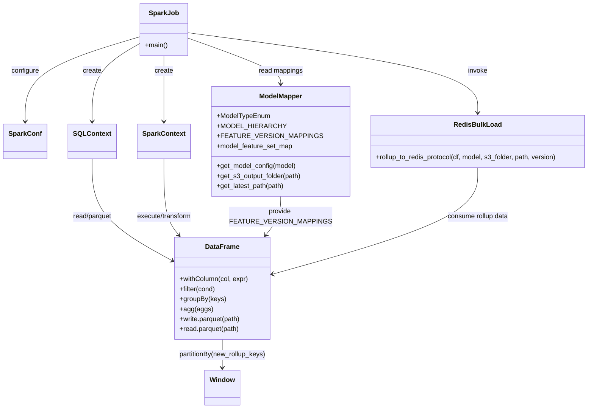

# Diagram: research/orchestrator/tasks/models/entity_status_spark.py


> Auto-generated by Obscura crawlers

## Diagram 1

```mermaid
flowchart TD
    Start((Start)) --> ParseArgs[Parse CLI args: with_legs, without_legs, model_path_map, env]
    ParseArgs --> InitSpark[Configure SparkConf -> create SparkContext & SQLContext]
    InitSpark --> LoadModules[Import model_mapper & redis_bulk_load]
    LoadModules --> ForEachModel[Iterate MODEL_HIERARCHY]
    ForEachModel --> CheckUpfitter{Contains "upfitter" and not "entity_status_city_upfitter"?}
    CheckUpfitter -- Yes --> SkipModel[Skip model]
    SkipModel --> ForEachModel
    CheckUpfitter -- No --> IsSubroute{'subroute' in model.value?}
    IsSubroute -- Yes --> ReadWithLegs[sqlCtx.read.parquet(with_legs)]
    IsSubroute -- No --> ReadWithoutLegs[sqlCtx.read.parquet(without_legs)]
    ReadWithLegs --> MapFeatures
    ReadWithoutLegs --> MapFeatures
    MapFeatures[Map rollup_keys -> new_rollup_keys using FEATURE_VERSION_MAPPINGS] --> WindowSpec[Window.partitionBy(new_rollup_keys)]
    WindowSpec --> ComputeCols[Add std/avg/median & compute stddev_distance]
    ComputeCols --> FilterStd[Filter stddev_distance between -3 and 3]
    FilterStd --> FilterSup[Filter sup_code not starting with "4D:" and not in {ETAD,50,FEPD,REL,CST}]
    FilterSup --> DateDeltas[Compute delt30, delt60, delt90, delt120, delt180, delt365]
    DateDeltas --> EnsureNotNulls[Filter out rows with nulls in any new_rollup_key]
    EnsureNotNulls --> GroupRollup[GroupBy new_rollup_keys and compute 30/60/90/120/180/365 stats and percentiles]
    GroupRollup --> RenameCols[Rename mapped feature columns back to original rollup_keys]
    RenameCols --> DeterminePath[Get this_model_path from model_path_map[model.value]]
    DeterminePath --> ExtractVersion[Extract model_version and s3_output_folder]
    ExtractVersion --> RedisLoad[Call redis_bulk_load.rollup_to_redis_protocol(model_rollup, model.value, s3_output_folder, this_model_path, model_version)]
    RedisLoad --> WriteLatest[Write model_rollup to get_latest_path(this_model_path) (overwrite)]
    WriteLatest --> ReadLatest[Read model_rollup from get_latest_path(this_model_path)]
    ReadLatest --> WriteModelPath[Write model_rollup to this_model_path (overwrite)]
    WriteModelPath --> ForEachModel
    ForEachModel --> End((End))
```

> SVG rendering failed for this diagram.

## Diagram 2



### SVG

<svg id="container" width="1363.390625" xmlns="http://www.w3.org/2000/svg" class="classDiagram" height="982" viewBox="0 0 1363.390625 982" role="graphics-document document" aria-roledescription="class"><style>#container{font-family:"trebuchet ms",verdana,arial,sans-serif;font-size:16px;fill:#333;}@keyframes edge-animation-frame{from{stroke-dashoffset:0;}}@keyframes dash{to{stroke-dashoffset:0;}}#container .edge-animation-slow{stroke-dasharray:9,5!important;stroke-dashoffset:900;animation:dash 50s linear infinite;stroke-linecap:round;}#container .edge-animation-fast{stroke-dasharray:9,5!important;stroke-dashoffset:900;animation:dash 20s linear infinite;stroke-linecap:round;}#container .error-icon{fill:#552222;}#container .error-text{fill:#552222;stroke:#552222;}#container .edge-thickness-normal{stroke-width:1px;}#container .edge-thickness-thick{stroke-width:3.5px;}#container .edge-pattern-solid{stroke-dasharray:0;}#container .edge-thickness-invisible{stroke-width:0;fill:none;}#container .edge-pattern-dashed{stroke-dasharray:3;}#container .edge-pattern-dotted{stroke-dasharray:2;}#container .marker{fill:#333333;stroke:#333333;}#container .marker.cross{stroke:#333333;}#container svg{font-family:"trebuchet ms",verdana,arial,sans-serif;font-size:16px;}#container p{margin:0;}#container g.classGroup text{fill:#9370DB;stroke:none;font-family:"trebuchet ms",verdana,arial,sans-serif;font-size:10px;}#container g.classGroup text .title{font-weight:bolder;}#container .nodeLabel,#container .edgeLabel{color:#131300;}#container .edgeLabel .label rect{fill:#ECECFF;}#container .label text{fill:#131300;}#container .labelBkg{background:#ECECFF;}#container .edgeLabel .label span{background:#ECECFF;}#container .classTitle{font-weight:bolder;}#container .node rect,#container .node circle,#container .node ellipse,#container .node polygon,#container .node path{fill:#ECECFF;stroke:#9370DB;stroke-width:1px;}#container .divider{stroke:#9370DB;stroke-width:1;}#container g.clickable{cursor:pointer;}#container g.classGroup rect{fill:#ECECFF;stroke:#9370DB;}#container g.classGroup line{stroke:#9370DB;stroke-width:1;}#container .classLabel .box{stroke:none;stroke-width:0;fill:#ECECFF;opacity:0.5;}#container .classLabel .label{fill:#9370DB;font-size:10px;}#container .relation{stroke:#333333;stroke-width:1;fill:none;}#container .dashed-line{stroke-dasharray:3;}#container .dotted-line{stroke-dasharray:1 2;}#container #compositionStart,#container .composition{fill:#333333!important;stroke:#333333!important;stroke-width:1;}#container #compositionEnd,#container .composition{fill:#333333!important;stroke:#333333!important;stroke-width:1;}#container #dependencyStart,#container .dependency{fill:#333333!important;stroke:#333333!important;stroke-width:1;}#container #dependencyStart,#container .dependency{fill:#333333!important;stroke:#333333!important;stroke-width:1;}#container #extensionStart,#container .extension{fill:transparent!important;stroke:#333333!important;stroke-width:1;}#container #extensionEnd,#container .extension{fill:transparent!important;stroke:#333333!important;stroke-width:1;}#container #aggregationStart,#container .aggregation{fill:transparent!important;stroke:#333333!important;stroke-width:1;}#container #aggregationEnd,#container .aggregation{fill:transparent!important;stroke:#333333!important;stroke-width:1;}#container #lollipopStart,#container .lollipop{fill:#ECECFF!important;stroke:#333333!important;stroke-width:1;}#container #lollipopEnd,#container .lollipop{fill:#ECECFF!important;stroke:#333333!important;stroke-width:1;}#container .edgeTerminals{font-size:11px;line-height:initial;}#container .classTitleText{text-anchor:middle;font-size:18px;fill:#333;}#container .label-icon{display:inline-block;height:1em;overflow:visible;vertical-align:-0.125em;}#container .node .label-icon path{fill:currentColor;stroke:revert;stroke-width:revert;}#container :root{--mermaid-font-family:"trebuchet ms",verdana,arial,sans-serif;}</style><g><defs><marker id="container_class-aggregationStart" class="marker aggregation class" refX="18" refY="7" markerWidth="190" markerHeight="240" orient="auto"><path d="M 18,7 L9,13 L1,7 L9,1 Z"></path></marker></defs><defs><marker id="container_class-aggregationEnd" class="marker aggregation class" refX="1" refY="7" markerWidth="20" markerHeight="28" orient="auto"><path d="M 18,7 L9,13 L1,7 L9,1 Z"></path></marker></defs><defs><marker id="container_class-extensionStart" class="marker extension class" refX="18" refY="7" markerWidth="190" markerHeight="240" orient="auto"><path d="M 1,7 L18,13 V 1 Z"></path></marker></defs><defs><marker id="container_class-extensionEnd" class="marker extension class" refX="1" refY="7" markerWidth="20" markerHeight="28" orient="auto"><path d="M 1,1 V 13 L18,7 Z"></path></marker></defs><defs><marker id="container_class-compositionStart" class="marker composition class" refX="18" refY="7" markerWidth="190" markerHeight="240" orient="auto"><path d="M 18,7 L9,13 L1,7 L9,1 Z"></path></marker></defs><defs><marker id="container_class-compositionEnd" class="marker composition class" refX="1" refY="7" markerWidth="20" markerHeight="28" orient="auto"><path d="M 18,7 L9,13 L1,7 L9,1 Z"></path></marker></defs><defs><marker id="container_class-dependencyStart" class="marker dependency class" refX="6" refY="7" markerWidth="190" markerHeight="240" orient="auto"><path d="M 5,7 L9,13 L1,7 L9,1 Z"></path></marker></defs><defs><marker id="container_class-dependencyEnd" class="marker dependency class" refX="13" refY="7" markerWidth="20" markerHeight="28" orient="auto"><path d="M 18,7 L9,13 L14,7 L9,1 Z"></path></marker></defs><defs><marker id="container_class-lollipopStart" class="marker lollipop class" refX="13" refY="7" markerWidth="190" markerHeight="240" orient="auto"><circle stroke="black" fill="transparent" cx="7" cy="7" r="6"></circle></marker></defs><defs><marker id="container_class-lollipopEnd" class="marker lollipop class" refX="1" refY="7" markerWidth="190" markerHeight="240" orient="auto"><circle stroke="black" fill="transparent" cx="7" cy="7" r="6"></circle></marker></defs><g class="root"><g class="clusters"></g><g class="edgePaths"><path d="M321.289,88.521L277.384,102.268C233.479,116.014,145.669,143.507,101.764,177.42C57.859,211.333,57.859,251.667,57.859,271.833L57.859,292" id="id_SparkJob_SparkConf_1" class="edge-thickness-normal edge-pattern-solid relation" style=";;;" data-edge="true" data-et="edge" data-id="id_SparkJob_SparkConf_1" data-points="W3sieCI6MzIxLjI4OTA2MjUsInkiOjg4LjUyMTE1ODQ1NjA0NDIyfSx7IngiOjU3Ljg1OTM3NSwieSI6MTcxfSx7IngiOjU3Ljg1OTM3NSwieSI6Mjk4fV0=" marker-end="url(#container_class-dependencyEnd)"></path><path d="M377.25,134L377.25,140.167C377.25,146.333,377.25,158.667,377.25,185C377.25,211.333,377.25,251.667,377.25,271.833L377.25,292" id="id_SparkJob_SparkContext_2" class="edge-thickness-normal edge-pattern-solid relation" style=";;;" data-edge="true" data-et="edge" data-id="id_SparkJob_SparkContext_2" data-points="W3sieCI6Mzc3LjI1LCJ5IjoxMzR9LHsieCI6Mzc3LjI1LCJ5IjoxNzF9LHsieCI6Mzc3LjI1LCJ5IjoyOTh9XQ==" marker-end="url(#container_class-dependencyEnd)"></path><path d="M321.289,104.815L303.034,115.846C284.779,126.877,248.268,148.938,230.013,180.136C211.758,211.333,211.758,251.667,211.758,271.833L211.758,292" id="id_SparkJob_SQLContext_3" class="edge-thickness-normal edge-pattern-solid relation" style=";;;" data-edge="true" data-et="edge" data-id="id_SparkJob_SQLContext_3" data-points="W3sieCI6MzIxLjI4OTA2MjUsInkiOjEwNC44MTQ4NTE1MzE4ODg3OH0seyJ4IjoyMTEuNzU3ODEyNSwieSI6MTcxfSx7IngiOjIxMS43NTc4MTI1LCJ5IjoyOTh9XQ==" marker-end="url(#container_class-dependencyEnd)"></path><path d="M433.211,92.516L467.232,105.597C501.253,118.678,569.294,144.839,603.315,163.086C637.336,181.333,637.336,191.667,637.336,196.833L637.336,202" id="id_SparkJob_ModelMapper_4" class="edge-thickness-normal edge-pattern-solid relation" style=";;;" data-edge="true" data-et="edge" data-id="id_SparkJob_ModelMapper_4" data-points="W3sieCI6NDMzLjIxMDkzNzUsInkiOjkyLjUxNjMyNTczMzY4MTc4fSx7IngiOjYzNy4zMzU5Mzc1LCJ5IjoxNzF9LHsieCI6NjM3LjMzNTkzNzUsInkiOjIwOH1d" marker-end="url(#container_class-dependencyEnd)"></path><path d="M433.211,78.789L543.622,94.158C654.034,109.526,874.857,140.263,985.268,172.298C1095.68,204.333,1095.68,237.667,1095.68,254.333L1095.68,271" id="id_SparkJob_RedisBulkLoad_5" class="edge-thickness-normal edge-pattern-solid relation" style=";;;" data-edge="true" data-et="edge" data-id="id_SparkJob_RedisBulkLoad_5" data-points="W3sieCI6NDMzLjIxMDkzNzUsInkiOjc4Ljc4OTM0MDkwMTkyMzY4fSx7IngiOjEwOTUuNjc5Njg3NSwieSI6MTcxfSx7IngiOjEwOTUuNjc5Njg3NSwieSI6Mjc3fV0=" marker-end="url(#container_class-dependencyEnd)"></path><path d="M211.758,382L211.758,405.167C211.758,428.333,211.758,474.667,241.059,514.886C270.36,555.106,328.962,589.212,358.263,606.265L387.564,623.319" id="id_SQLContext_DataFrame_6" class="edge-thickness-normal edge-pattern-solid relation" style=";;;" data-edge="true" data-et="edge" data-id="id_SQLContext_DataFrame_6" data-points="W3sieCI6MjExLjc1NzgxMjUsInkiOjM4Mn0seyJ4IjoyMTEuNzU3ODEyNSwieSI6NTIxfSx7IngiOjM5Mi43NSwieSI6NjI2LjMzNjU1ODQxNDk1MTd9XQ==" marker-end="url(#container_class-dependencyEnd)"></path><path d="M377.25,382L377.25,405.167C377.25,428.333,377.25,474.667,382.821,505.202C388.393,535.738,399.536,550.476,405.107,557.845L410.679,565.214" id="id_SparkContext_DataFrame_7" class="edge-thickness-normal edge-pattern-solid relation" style=";;;" data-edge="true" data-et="edge" data-id="id_SparkContext_DataFrame_7" data-points="W3sieCI6Mzc3LjI1LCJ5IjozODJ9LHsieCI6Mzc3LjI1LCJ5Ijo1MjF9LHsieCI6NDE0LjI5NzEyNDgxODMxMzkzLCJ5Ijo1NzB9XQ==" marker-end="url(#container_class-dependencyEnd)"></path><path d="M507.293,816L507.293,822.167C507.293,828.333,507.293,840.667,507.293,852C507.293,863.333,507.293,873.667,507.293,878.833L507.293,884" id="id_DataFrame_Window_8" class="edge-thickness-normal edge-pattern-solid relation" style=";;;" data-edge="true" data-et="edge" data-id="id_DataFrame_Window_8" data-points="W3sieCI6NTA3LjI5Mjk2ODc1LCJ5Ijo4MTZ9LHsieCI6NTA3LjI5Mjk2ODc1LCJ5Ijo4NTN9LHsieCI6NTA3LjI5Mjk2ODc1LCJ5Ijo4OTB9XQ==" marker-end="url(#container_class-dependencyEnd)"></path><path d="M637.336,472L637.336,480.167C637.336,488.333,637.336,504.667,631.765,520.202C626.193,535.738,615.05,550.476,609.479,557.845L603.907,565.214" id="id_ModelMapper_DataFrame_9" class="edge-thickness-normal edge-pattern-solid relation" style=";;;" data-edge="true" data-et="edge" data-id="id_ModelMapper_DataFrame_9" data-points="W3sieCI6NjM3LjMzNTkzNzUsInkiOjQ3Mn0seyJ4Ijo2MzcuMzM1OTM3NSwieSI6NTIxfSx7IngiOjYwMC4yODg4MTI2ODE2ODYxLCJ5Ijo1NzB9XQ==" marker-end="url(#container_class-dependencyEnd)"></path><path d="M1095.68,403L1095.68,422.667C1095.68,442.333,1095.68,481.667,1017.666,524.139C939.651,566.611,783.623,612.222,705.609,635.027L627.595,657.833" id="id_RedisBulkLoad_DataFrame_10" class="edge-thickness-normal edge-pattern-solid relation" style=";;;" data-edge="true" data-et="edge" data-id="id_RedisBulkLoad_DataFrame_10" data-points="W3sieCI6MTA5NS42Nzk2ODc1LCJ5Ijo0MDN9LHsieCI6MTA5NS42Nzk2ODc1LCJ5Ijo1MjF9LHsieCI6NjIxLjgzNTkzNzUsInkiOjY1OS41MTYyNTUzODU4MjA2fV0=" marker-end="url(#container_class-dependencyEnd)"></path></g><g class="edgeLabels"><g class="edgeLabel" transform="translate(57.859375, 171)"><g class="label" data-id="id_SparkJob_SparkConf_1" transform="translate(-33.5703125, -12)"><foreignObject width="67.140625" height="24"><div xmlns="http://www.w3.org/1999/xhtml" class="labelBkg" style="display: table-cell; white-space: nowrap; line-height: 1.5; max-width: 200px; text-align: center;"><span class="edgeLabel"><p>configure</p></span></div></foreignObject></g></g><g class="edgeLabel" transform="translate(377.25, 171)"><g class="label" data-id="id_SparkJob_SparkContext_2" transform="translate(-22.4375, -12)"><foreignObject width="44.875" height="24"><div xmlns="http://www.w3.org/1999/xhtml" class="labelBkg" style="display: table-cell; white-space: nowrap; line-height: 1.5; max-width: 200px; text-align: center;"><span class="edgeLabel"><p>create</p></span></div></foreignObject></g></g><g class="edgeLabel" transform="translate(211.7578125, 171)"><g class="label" data-id="id_SparkJob_SQLContext_3" transform="translate(-22.4375, -12)"><foreignObject width="44.875" height="24"><div xmlns="http://www.w3.org/1999/xhtml" class="labelBkg" style="display: table-cell; white-space: nowrap; line-height: 1.5; max-width: 200px; text-align: center;"><span class="edgeLabel"><p>create</p></span></div></foreignObject></g></g><g class="edgeLabel" transform="translate(637.3359375, 171)"><g class="label" data-id="id_SparkJob_ModelMapper_4" transform="translate(-53.8828125, -12)"><foreignObject width="107.765625" height="24"><div xmlns="http://www.w3.org/1999/xhtml" class="labelBkg" style="display: table-cell; white-space: nowrap; line-height: 1.5; max-width: 200px; text-align: center;"><span class="edgeLabel"><p>read mappings</p></span></div></foreignObject></g></g><g class="edgeLabel" transform="translate(1095.6796875, 171)"><g class="label" data-id="id_SparkJob_RedisBulkLoad_5" transform="translate(-23.8515625, -12)"><foreignObject width="47.703125" height="24"><div xmlns="http://www.w3.org/1999/xhtml" class="labelBkg" style="display: table-cell; white-space: nowrap; line-height: 1.5; max-width: 200px; text-align: center;"><span class="edgeLabel"><p>invoke</p></span></div></foreignObject></g></g><g class="edgeLabel" transform="translate(211.7578125, 521)"><g class="label" data-id="id_SQLContext_DataFrame_6" transform="translate(-48.75, -12)"><foreignObject width="97.5" height="24"><div xmlns="http://www.w3.org/1999/xhtml" class="labelBkg" style="display: table-cell; white-space: nowrap; line-height: 1.5; max-width: 200px; text-align: center;"><span class="edgeLabel"><p>read/parquet</p></span></div></foreignObject></g></g><g class="edgeLabel" transform="translate(377.25, 521)"><g class="label" data-id="id_SparkContext_DataFrame_7" transform="translate(-67.59375, -12)"><foreignObject width="135.1875" height="24"><div xmlns="http://www.w3.org/1999/xhtml" class="labelBkg" style="display: table-cell; white-space: nowrap; line-height: 1.5; max-width: 200px; text-align: center;"><span class="edgeLabel"><p>execute/transform</p></span></div></foreignObject></g></g><g class="edgeLabel" transform="translate(507.29296875, 853)"><g class="label" data-id="id_DataFrame_Window_8" transform="translate(-106.1171875, -12)"><foreignObject width="212.234375" height="24"><div xmlns="http://www.w3.org/1999/xhtml" class="labelBkg" style="display: table; white-space: break-spaces; line-height: 1.5; max-width: 200px; text-align: center; width: 200px;"><span class="edgeLabel"><p>partitionBy(new_rollup_keys)</p></span></div></foreignObject></g></g><g class="edgeLabel" transform="translate(637.3359375, 521)"><g class="label" data-id="id_ModelMapper_DataFrame_9" transform="translate(-107.4296875, -24)"><foreignObject width="214.859375" height="48"><div xmlns="http://www.w3.org/1999/xhtml" class="labelBkg" style="display: table; white-space: break-spaces; line-height: 1.5; max-width: 200px; text-align: center; width: 200px;"><span class="edgeLabel"><p>provide FEATURE_VERSION_MAPPINGS</p></span></div></foreignObject></g></g><g class="edgeLabel" transform="translate(1095.6796875, 521)"><g class="label" data-id="id_RedisBulkLoad_DataFrame_10" transform="translate(-74.8125, -12)"><foreignObject width="149.625" height="24"><div xmlns="http://www.w3.org/1999/xhtml" class="labelBkg" style="display: table-cell; white-space: nowrap; line-height: 1.5; max-width: 200px; text-align: center;"><span class="edgeLabel"><p>consume rollup data</p></span></div></foreignObject></g></g></g><g class="nodes"><g class="node default" id="classId-SparkJob-0" transform="translate(377.25, 71)"><g class="basic label-container"><path d="M-55.9609375 -63 L55.9609375 -63 L55.9609375 63 L-55.9609375 63" stroke="none" stroke-width="0" fill="#ECECFF" style=""></path><path d="M-55.9609375 -63 C-14.222377368869893 -63, 27.516182762260215 -63, 55.9609375 -63 M-55.9609375 -63 C-29.185890376414132 -63, -2.410843252828265 -63, 55.9609375 -63 M55.9609375 -63 C55.9609375 -28.953495302096094, 55.9609375 5.093009395807812, 55.9609375 63 M55.9609375 -63 C55.9609375 -23.939756640369467, 55.9609375 15.120486719261066, 55.9609375 63 M55.9609375 63 C29.490841261979867 63, 3.0207450239597335 63, -55.9609375 63 M55.9609375 63 C11.918008657476562 63, -32.124920185046875 63, -55.9609375 63 M-55.9609375 63 C-55.9609375 20.322680462458834, -55.9609375 -22.354639075082332, -55.9609375 -63 M-55.9609375 63 C-55.9609375 24.732451629665512, -55.9609375 -13.535096740668976, -55.9609375 -63" stroke="#9370DB" stroke-width="1.3" fill="none" stroke-dasharray="0 0" style=""></path></g><g class="annotation-group text" transform="translate(0, -39)"></g><g class="label-group text" transform="translate(-33.265625, -39)"><g class="label" style="font-weight: bolder" transform="translate(0,-12)"><foreignObject width="66.53125" height="24"><div xmlns="http://www.w3.org/1999/xhtml" style="display: table-cell; white-space: nowrap; line-height: 1.5; max-width: 115px; text-align: center;"><span class="nodeLabel markdown-node-label" style=""><p>SparkJob</p></span></div></foreignObject></g></g><g class="members-group text" transform="translate(-43.9609375, 9)"></g><g class="methods-group text" transform="translate(-43.9609375, 39)"><g class="label" style="" transform="translate(0,-12)"><foreignObject width="54.65625" height="24"><div xmlns="http://www.w3.org/1999/xhtml" style="display: table-cell; white-space: nowrap; line-height: 1.5; max-width: 112px; text-align: center;"><span class="nodeLabel markdown-node-label" style=""><p>+main()</p></span></div></foreignObject></g></g><g class="divider" style=""><path d="M-55.9609375 -15 C-17.87373493198634 -15, 20.213467636027318 -15, 55.9609375 -15 M-55.9609375 -15 C-31.382418009710026 -15, -6.803898519420052 -15, 55.9609375 -15" stroke="#9370DB" stroke-width="1.3" fill="none" stroke-dasharray="0 0" style=""></path></g><g class="divider" style=""><path d="M-55.9609375 9 C-15.526599006328254 9, 24.90773948734349 9, 55.9609375 9 M-55.9609375 9 C-31.733180987725408 9, -7.505424475450816 9, 55.9609375 9" stroke="#9370DB" stroke-width="1.3" fill="none" stroke-dasharray="0 0" style=""></path></g></g><g class="node default" id="classId-SparkConf-1" transform="translate(57.859375, 340)"><g class="basic label-container"><path d="M-49.859375 -42 L49.859375 -42 L49.859375 42 L-49.859375 42" stroke="none" stroke-width="0" fill="#ECECFF" style=""></path><path d="M-49.859375 -42 C-12.845650900773308 -42, 24.168073198453385 -42, 49.859375 -42 M-49.859375 -42 C-26.39120410250778 -42, -2.9230332050155567 -42, 49.859375 -42 M49.859375 -42 C49.859375 -21.55702880368721, 49.859375 -1.11405760737442, 49.859375 42 M49.859375 -42 C49.859375 -11.12847254248043, 49.859375 19.74305491503914, 49.859375 42 M49.859375 42 C22.293787126838893 42, -5.271800746322214 42, -49.859375 42 M49.859375 42 C9.978982091126035 42, -29.90141081774793 42, -49.859375 42 M-49.859375 42 C-49.859375 11.774194794922707, -49.859375 -18.451610410154586, -49.859375 -42 M-49.859375 42 C-49.859375 20.56289355467778, -49.859375 -0.8742128906444435, -49.859375 -42" stroke="#9370DB" stroke-width="1.3" fill="none" stroke-dasharray="0 0" style=""></path></g><g class="annotation-group text" transform="translate(0, -18)"></g><g class="label-group text" transform="translate(-37.859375, -18)"><g class="label" style="font-weight: bolder" transform="translate(0,-12)"><foreignObject width="75.71875" height="24"><div xmlns="http://www.w3.org/1999/xhtml" style="display: table-cell; white-space: nowrap; line-height: 1.5; max-width: 125px; text-align: center;"><span class="nodeLabel markdown-node-label" style=""><p>SparkConf</p></span></div></foreignObject></g></g><g class="members-group text" transform="translate(-37.859375, 30)"></g><g class="methods-group text" transform="translate(-37.859375, 60)"></g><g class="divider" style=""><path d="M-49.859375 6 C-29.90834223989478 6, -9.957309479789558 6, 49.859375 6 M-49.859375 6 C-12.571267568675339 6, 24.716839862649323 6, 49.859375 6" stroke="#9370DB" stroke-width="1.3" fill="none" stroke-dasharray="0 0" style=""></path></g><g class="divider" style=""><path d="M-49.859375 24 C-25.053036886248194 24, -0.24669877249638716 24, 49.859375 24 M-49.859375 24 C-25.72360029981115 24, -1.587825599622299 24, 49.859375 24" stroke="#9370DB" stroke-width="1.3" fill="none" stroke-dasharray="0 0" style=""></path></g></g><g class="node default" id="classId-SparkContext-2" transform="translate(377.25, 340)"><g class="basic label-container"><path d="M-61.453125 -42 L61.453125 -42 L61.453125 42 L-61.453125 42" stroke="none" stroke-width="0" fill="#ECECFF" style=""></path><path d="M-61.453125 -42 C-20.58152063520084 -42, 20.290083729598322 -42, 61.453125 -42 M-61.453125 -42 C-14.895286865303916 -42, 31.662551269392168 -42, 61.453125 -42 M61.453125 -42 C61.453125 -15.52287503449639, 61.453125 10.954249931007219, 61.453125 42 M61.453125 -42 C61.453125 -12.370979661961215, 61.453125 17.25804067607757, 61.453125 42 M61.453125 42 C35.59503736693857 42, 9.73694973387714 42, -61.453125 42 M61.453125 42 C32.34834815273861 42, 3.243571305477225 42, -61.453125 42 M-61.453125 42 C-61.453125 23.58405384403013, -61.453125 5.16810768806026, -61.453125 -42 M-61.453125 42 C-61.453125 16.732199101094565, -61.453125 -8.53560179781087, -61.453125 -42" stroke="#9370DB" stroke-width="1.3" fill="none" stroke-dasharray="0 0" style=""></path></g><g class="annotation-group text" transform="translate(0, -18)"></g><g class="label-group text" transform="translate(-49.453125, -18)"><g class="label" style="font-weight: bolder" transform="translate(0,-12)"><foreignObject width="98.90625" height="24"><div xmlns="http://www.w3.org/1999/xhtml" style="display: table-cell; white-space: nowrap; line-height: 1.5; max-width: 146px; text-align: center;"><span class="nodeLabel markdown-node-label" style=""><p>SparkContext</p></span></div></foreignObject></g></g><g class="members-group text" transform="translate(-49.453125, 30)"></g><g class="methods-group text" transform="translate(-49.453125, 60)"></g><g class="divider" style=""><path d="M-61.453125 6 C-20.77109940555875 6, 19.9109261888825 6, 61.453125 6 M-61.453125 6 C-25.44768721150134 6, 10.557750576997321 6, 61.453125 6" stroke="#9370DB" stroke-width="1.3" fill="none" stroke-dasharray="0 0" style=""></path></g><g class="divider" style=""><path d="M-61.453125 24 C-19.81646890527614 24, 21.820187189447722 24, 61.453125 24 M-61.453125 24 C-31.725357492551574 24, -1.9975899851031471 24, 61.453125 24" stroke="#9370DB" stroke-width="1.3" fill="none" stroke-dasharray="0 0" style=""></path></g></g><g class="node default" id="classId-SQLContext-3" transform="translate(211.7578125, 340)"><g class="basic label-container"><path d="M-54.0390625 -42 L54.0390625 -42 L54.0390625 42 L-54.0390625 42" stroke="none" stroke-width="0" fill="#ECECFF" style=""></path><path d="M-54.0390625 -42 C-14.895875208149711 -42, 24.247312083700578 -42, 54.0390625 -42 M-54.0390625 -42 C-18.101371246626165 -42, 17.83632000674767 -42, 54.0390625 -42 M54.0390625 -42 C54.0390625 -10.09810551739919, 54.0390625 21.80378896520162, 54.0390625 42 M54.0390625 -42 C54.0390625 -11.273877112531029, 54.0390625 19.452245774937943, 54.0390625 42 M54.0390625 42 C14.034430759062808 42, -25.970200981874385 42, -54.0390625 42 M54.0390625 42 C27.90600050510327 42, 1.7729385102065365 42, -54.0390625 42 M-54.0390625 42 C-54.0390625 8.553064599043367, -54.0390625 -24.893870801913266, -54.0390625 -42 M-54.0390625 42 C-54.0390625 22.173711403207726, -54.0390625 2.3474228064154516, -54.0390625 -42" stroke="#9370DB" stroke-width="1.3" fill="none" stroke-dasharray="0 0" style=""></path></g><g class="annotation-group text" transform="translate(0, -18)"></g><g class="label-group text" transform="translate(-42.0390625, -18)"><g class="label" style="font-weight: bolder" transform="translate(0,-12)"><foreignObject width="84.078125" height="24"><div xmlns="http://www.w3.org/1999/xhtml" style="display: table-cell; white-space: nowrap; line-height: 1.5; max-width: 132px; text-align: center;"><span class="nodeLabel markdown-node-label" style=""><p>SQLContext</p></span></div></foreignObject></g></g><g class="members-group text" transform="translate(-42.0390625, 30)"></g><g class="methods-group text" transform="translate(-42.0390625, 60)"></g><g class="divider" style=""><path d="M-54.0390625 6 C-16.455132930342373 6, 21.128796639315254 6, 54.0390625 6 M-54.0390625 6 C-23.582133913252754 6, 6.874794673494492 6, 54.0390625 6" stroke="#9370DB" stroke-width="1.3" fill="none" stroke-dasharray="0 0" style=""></path></g><g class="divider" style=""><path d="M-54.0390625 24 C-13.947617538322604 24, 26.143827423354793 24, 54.0390625 24 M-54.0390625 24 C-12.718966039588267 24, 28.601130420823466 24, 54.0390625 24" stroke="#9370DB" stroke-width="1.3" fill="none" stroke-dasharray="0 0" style=""></path></g></g><g class="node default" id="classId-DataFrame-4" transform="translate(507.29296875, 693)"><g class="basic label-container"><path d="M-114.54296875 -123 L114.54296875 -123 L114.54296875 123 L-114.54296875 123" stroke="none" stroke-width="0" fill="#ECECFF" style=""></path><path d="M-114.54296875 -123 C-37.13394470064706 -123, 40.27507934870587 -123, 114.54296875 -123 M-114.54296875 -123 C-32.29926109051162 -123, 49.94444656897676 -123, 114.54296875 -123 M114.54296875 -123 C114.54296875 -69.72875076354859, 114.54296875 -16.457501527097193, 114.54296875 123 M114.54296875 -123 C114.54296875 -51.454832928051985, 114.54296875 20.09033414389603, 114.54296875 123 M114.54296875 123 C56.21781619714379 123, -2.1073363557124196 123, -114.54296875 123 M114.54296875 123 C31.27080223979597 123, -52.00136427040806 123, -114.54296875 123 M-114.54296875 123 C-114.54296875 26.11582738777382, -114.54296875 -70.76834522445236, -114.54296875 -123 M-114.54296875 123 C-114.54296875 46.661395741261586, -114.54296875 -29.677208517476828, -114.54296875 -123" stroke="#9370DB" stroke-width="1.3" fill="none" stroke-dasharray="0 0" style=""></path></g><g class="annotation-group text" transform="translate(0, -99)"></g><g class="label-group text" transform="translate(-38.9921875, -99)"><g class="label" style="font-weight: bolder" transform="translate(0,-12)"><foreignObject width="77.984375" height="24"><div xmlns="http://www.w3.org/1999/xhtml" style="display: table-cell; white-space: nowrap; line-height: 1.5; max-width: 127px; text-align: center;"><span class="nodeLabel markdown-node-label" style=""><p>DataFrame</p></span></div></foreignObject></g></g><g class="members-group text" transform="translate(-102.54296875, -51)"></g><g class="methods-group text" transform="translate(-102.54296875, -21)"><g class="label" style="" transform="translate(0,-12)"><foreignObject width="166.09375" height="24"><div xmlns="http://www.w3.org/1999/xhtml" style="display: table-cell; white-space: nowrap; line-height: 1.5; max-width: 223px; text-align: center;"><span class="nodeLabel markdown-node-label" style=""><p>+withColumn(col, expr)</p></span></div></foreignObject></g><g class="label" style="" transform="translate(0,12)"><foreignObject width="88.0625" height="24"><div xmlns="http://www.w3.org/1999/xhtml" style="display: table-cell; white-space: nowrap; line-height: 1.5; max-width: 145px; text-align: center;"><span class="nodeLabel markdown-node-label" style=""><p>+filter(cond)</p></span></div></foreignObject></g><g class="label" style="" transform="translate(0,36)"><foreignObject width="110.078125" height="24"><div xmlns="http://www.w3.org/1999/xhtml" style="display: table-cell; white-space: nowrap; line-height: 1.5; max-width: 167px; text-align: center;"><span class="nodeLabel markdown-node-label" style=""><p>+groupBy(keys)</p></span></div></foreignObject></g><g class="label" style="" transform="translate(0,60)"><foreignObject width="75.84375" height="24"><div xmlns="http://www.w3.org/1999/xhtml" style="display: table-cell; white-space: nowrap; line-height: 1.5; max-width: 133px; text-align: center;"><span class="nodeLabel markdown-node-label" style=""><p>+agg(aggs)</p></span></div></foreignObject></g><g class="label" style="" transform="translate(0,84)"><foreignObject width="148.78125" height="24"><div xmlns="http://www.w3.org/1999/xhtml" style="display: table-cell; white-space: nowrap; line-height: 1.5; max-width: 206px; text-align: center;"><span class="nodeLabel markdown-node-label" style=""><p>+write.parquet(path)</p></span></div></foreignObject></g><g class="label" style="" transform="translate(0,108)"><foreignObject width="145.046875" height="24"><div xmlns="http://www.w3.org/1999/xhtml" style="display: table-cell; white-space: nowrap; line-height: 1.5; max-width: 202px; text-align: center;"><span class="nodeLabel markdown-node-label" style=""><p>+read.parquet(path)</p></span></div></foreignObject></g></g><g class="divider" style=""><path d="M-114.54296875 -75 C-52.723260574960086 -75, 9.096447600079827 -75, 114.54296875 -75 M-114.54296875 -75 C-35.89177659938342 -75, 42.75941555123316 -75, 114.54296875 -75" stroke="#9370DB" stroke-width="1.3" fill="none" stroke-dasharray="0 0" style=""></path></g><g class="divider" style=""><path d="M-114.54296875 -51 C-46.493846888955616 -51, 21.555274972088768 -51, 114.54296875 -51 M-114.54296875 -51 C-58.989726549062425 -51, -3.43648434812485 -51, 114.54296875 -51" stroke="#9370DB" stroke-width="1.3" fill="none" stroke-dasharray="0 0" style=""></path></g></g><g class="node default" id="classId-Window-5" transform="translate(507.29296875, 932)"><g class="basic label-container"><path d="M-41.1171875 -42 L41.1171875 -42 L41.1171875 42 L-41.1171875 42" stroke="none" stroke-width="0" fill="#ECECFF" style=""></path><path d="M-41.1171875 -42 C-22.45246788761331 -42, -3.787748275226619 -42, 41.1171875 -42 M-41.1171875 -42 C-16.44608126400775 -42, 8.225024971984503 -42, 41.1171875 -42 M41.1171875 -42 C41.1171875 -8.866675181083025, 41.1171875 24.26664963783395, 41.1171875 42 M41.1171875 -42 C41.1171875 -21.256685395563977, 41.1171875 -0.5133707911279544, 41.1171875 42 M41.1171875 42 C8.419997216371257 42, -24.277193067257485 42, -41.1171875 42 M41.1171875 42 C15.572041623197364 42, -9.973104253605271 42, -41.1171875 42 M-41.1171875 42 C-41.1171875 21.172631809537073, -41.1171875 0.3452636190741458, -41.1171875 -42 M-41.1171875 42 C-41.1171875 9.391905154221938, -41.1171875 -23.216189691556124, -41.1171875 -42" stroke="#9370DB" stroke-width="1.3" fill="none" stroke-dasharray="0 0" style=""></path></g><g class="annotation-group text" transform="translate(0, -18)"></g><g class="label-group text" transform="translate(-29.1171875, -18)"><g class="label" style="font-weight: bolder" transform="translate(0,-12)"><foreignObject width="58.234375" height="24"><div xmlns="http://www.w3.org/1999/xhtml" style="display: table-cell; white-space: nowrap; line-height: 1.5; max-width: 108px; text-align: center;"><span class="nodeLabel markdown-node-label" style=""><p>Window</p></span></div></foreignObject></g></g><g class="members-group text" transform="translate(-29.1171875, 30)"></g><g class="methods-group text" transform="translate(-29.1171875, 60)"></g><g class="divider" style=""><path d="M-41.1171875 6 C-13.814527665163318 6, 13.488132169673364 6, 41.1171875 6 M-41.1171875 6 C-23.174758199564394 6, -5.232328899128788 6, 41.1171875 6" stroke="#9370DB" stroke-width="1.3" fill="none" stroke-dasharray="0 0" style=""></path></g><g class="divider" style=""><path d="M-41.1171875 24 C-12.808423569591664 24, 15.500340360816672 24, 41.1171875 24 M-41.1171875 24 C-9.350874568114289 24, 22.415438363771422 24, 41.1171875 24" stroke="#9370DB" stroke-width="1.3" fill="none" stroke-dasharray="0 0" style=""></path></g></g><g class="node default" id="classId-ModelMapper-6" transform="translate(637.3359375, 340)"><g class="basic label-container"><path d="M-148.6328125 -132 L148.6328125 -132 L148.6328125 132 L-148.6328125 132" stroke="none" stroke-width="0" fill="#ECECFF" style=""></path><path d="M-148.6328125 -132 C-34.47797337569328 -132, 79.67686574861344 -132, 148.6328125 -132 M-148.6328125 -132 C-76.16380425440724 -132, -3.6947960088144782 -132, 148.6328125 -132 M148.6328125 -132 C148.6328125 -27.827639594388756, 148.6328125 76.34472081122249, 148.6328125 132 M148.6328125 -132 C148.6328125 -68.4812482980618, 148.6328125 -4.9624965961236, 148.6328125 132 M148.6328125 132 C35.56001783121799 132, -77.51277683756402 132, -148.6328125 132 M148.6328125 132 C72.12893919844888 132, -4.374934103102248 132, -148.6328125 132 M-148.6328125 132 C-148.6328125 67.01949652260093, -148.6328125 2.038993045201863, -148.6328125 -132 M-148.6328125 132 C-148.6328125 48.33687109602501, -148.6328125 -35.326257807949986, -148.6328125 -132" stroke="#9370DB" stroke-width="1.3" fill="none" stroke-dasharray="0 0" style=""></path></g><g class="annotation-group text" transform="translate(0, -108)"></g><g class="label-group text" transform="translate(-50.40625, -108)"><g class="label" style="font-weight: bolder" transform="translate(0,-12)"><foreignObject width="100.8125" height="24"><div xmlns="http://www.w3.org/1999/xhtml" style="display: table-cell; white-space: nowrap; line-height: 1.5; max-width: 151px; text-align: center;"><span class="nodeLabel markdown-node-label" style=""><p>ModelMapper</p></span></div></foreignObject></g></g><g class="members-group text" transform="translate(-136.6328125, -60)"><g class="label" style="" transform="translate(0,-12)"><foreignObject width="127.28125" height="24"><div xmlns="http://www.w3.org/1999/xhtml" style="display: table-cell; white-space: nowrap; line-height: 1.5; max-width: 185px; text-align: center;"><span class="nodeLabel markdown-node-label" style=""><p>+ModelTypeEnum</p></span></div></foreignObject></g><g class="label" style="" transform="translate(0,12)"><foreignObject width="147.6875" height="24"><div xmlns="http://www.w3.org/1999/xhtml" style="display: table-cell; white-space: nowrap; line-height: 1.5; max-width: 205px; text-align: center;"><span class="nodeLabel markdown-node-label" style=""><p>+MODEL_HIERARCHY</p></span></div></foreignObject></g><g class="label" style="" transform="translate(0,36)"><foreignObject width="222.859375" height="24"><div xmlns="http://www.w3.org/1999/xhtml" style="display: table-cell; white-space: nowrap; line-height: 1.5; max-width: 280px; text-align: center;"><span class="nodeLabel markdown-node-label" style=""><p>+FEATURE_VERSION_MAPPINGS</p></span></div></foreignObject></g><g class="label" style="" transform="translate(0,60)"><foreignObject width="184.203125" height="24"><div xmlns="http://www.w3.org/1999/xhtml" style="display: table-cell; white-space: nowrap; line-height: 1.5; max-width: 242px; text-align: center;"><span class="nodeLabel markdown-node-label" style=""><p>+model_feature_set_map</p></span></div></foreignObject></g></g><g class="methods-group text" transform="translate(-136.6328125, 60)"><g class="label" style="" transform="translate(0,-12)"><foreignObject width="192.875" height="24"><div xmlns="http://www.w3.org/1999/xhtml" style="display: table-cell; white-space: nowrap; line-height: 1.5; max-width: 250px; text-align: center;"><span class="nodeLabel markdown-node-label" style=""><p>+get_model_config(model)</p></span></div></foreignObject></g><g class="label" style="" transform="translate(0,12)"><foreignObject width="206.21875" height="24"><div xmlns="http://www.w3.org/1999/xhtml" style="display: table-cell; white-space: nowrap; line-height: 1.5; max-width: 264px; text-align: center;"><span class="nodeLabel markdown-node-label" style=""><p>+get_s3_output_folder(path)</p></span></div></foreignObject></g><g class="label" style="" transform="translate(0,36)"><foreignObject width="164.609375" height="24"><div xmlns="http://www.w3.org/1999/xhtml" style="display: table-cell; white-space: nowrap; line-height: 1.5; max-width: 222px; text-align: center;"><span class="nodeLabel markdown-node-label" style=""><p>+get_latest_path(path)</p></span></div></foreignObject></g></g><g class="divider" style=""><path d="M-148.6328125 -84 C-34.97953851964962 -84, 78.67373546070075 -84, 148.6328125 -84 M-148.6328125 -84 C-61.976226653103964 -84, 24.68035919379207 -84, 148.6328125 -84" stroke="#9370DB" stroke-width="1.3" fill="none" stroke-dasharray="0 0" style=""></path></g><g class="divider" style=""><path d="M-148.6328125 36 C-48.74285832849165 36, 51.1470958430167 36, 148.6328125 36 M-148.6328125 36 C-62.006635074681995 36, 24.61954235063601 36, 148.6328125 36" stroke="#9370DB" stroke-width="1.3" fill="none" stroke-dasharray="0 0" style=""></path></g></g><g class="node default" id="classId-RedisBulkLoad-7" transform="translate(1095.6796875, 340)"><g class="basic label-container"><path d="M-259.7109375 -63 L259.7109375 -63 L259.7109375 63 L-259.7109375 63" stroke="none" stroke-width="0" fill="#ECECFF" style=""></path><path d="M-259.7109375 -63 C-140.439616185373 -63, -21.168294870746024 -63, 259.7109375 -63 M-259.7109375 -63 C-103.90259901346809 -63, 51.90573947306382 -63, 259.7109375 -63 M259.7109375 -63 C259.7109375 -23.302791278811164, 259.7109375 16.394417442377673, 259.7109375 63 M259.7109375 -63 C259.7109375 -34.424842000875785, 259.7109375 -5.849684001751569, 259.7109375 63 M259.7109375 63 C140.99947052850524 63, 22.288003557010484 63, -259.7109375 63 M259.7109375 63 C154.40620866249938 63, 49.10147982499876 63, -259.7109375 63 M-259.7109375 63 C-259.7109375 30.994465340671873, -259.7109375 -1.0110693186562543, -259.7109375 -63 M-259.7109375 63 C-259.7109375 26.46908819185935, -259.7109375 -10.061823616281302, -259.7109375 -63" stroke="#9370DB" stroke-width="1.3" fill="none" stroke-dasharray="0 0" style=""></path></g><g class="annotation-group text" transform="translate(0, -39)"></g><g class="label-group text" transform="translate(-54.140625, -39)"><g class="label" style="font-weight: bolder" transform="translate(0,-12)"><foreignObject width="108.28125" height="24"><div xmlns="http://www.w3.org/1999/xhtml" style="display: table-cell; white-space: nowrap; line-height: 1.5; max-width: 157px; text-align: center;"><span class="nodeLabel markdown-node-label" style=""><p>RedisBulkLoad</p></span></div></foreignObject></g></g><g class="members-group text" transform="translate(-247.7109375, 9)"></g><g class="methods-group text" transform="translate(-247.7109375, 39)"><g class="label" style="" transform="translate(0,-12)"><foreignObject width="441.28125" height="24"><div xmlns="http://www.w3.org/1999/xhtml" style="display: table-cell; white-space: nowrap; line-height: 1.5; max-width: 499px; text-align: center;"><span class="nodeLabel markdown-node-label" style=""><p>+rollup_to_redis_protocol(df, model, s3_folder, path, version)</p></span></div></foreignObject></g></g><g class="divider" style=""><path d="M-259.7109375 -15 C-138.9467404768625 -15, -18.182543453724975 -15, 259.7109375 -15 M-259.7109375 -15 C-122.49750657363833 -15, 14.715924352723334 -15, 259.7109375 -15" stroke="#9370DB" stroke-width="1.3" fill="none" stroke-dasharray="0 0" style=""></path></g><g class="divider" style=""><path d="M-259.7109375 9 C-83.10301153339248 9, 93.50491443321505 9, 259.7109375 9 M-259.7109375 9 C-61.050952739887975 9, 137.60903202022405 9, 259.7109375 9" stroke="#9370DB" stroke-width="1.3" fill="none" stroke-dasharray="0 0" style=""></path></g></g></g></g></g></svg>
