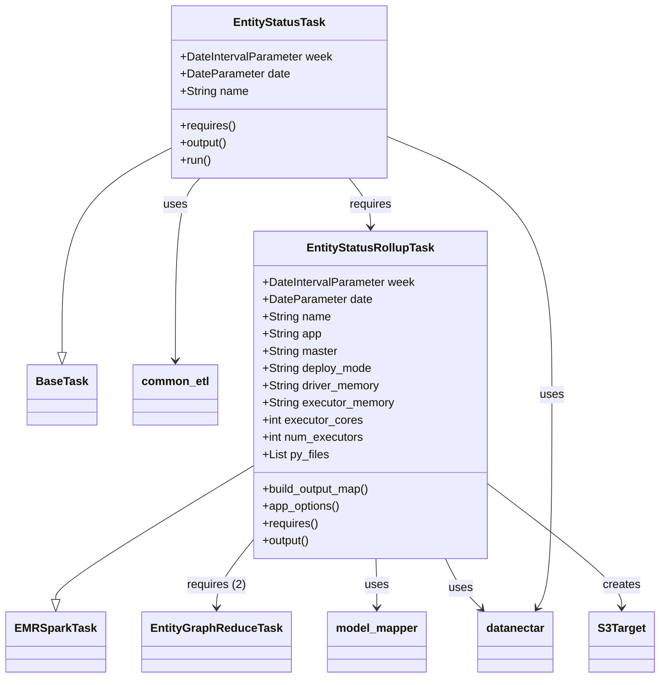

# Diagram: research/orchestrator/tasks/models/entity_status_task.py


> Auto-generated by Obscura crawlers

## Diagram 1



### SVG

<svg id="container" width="890.71484375" xmlns="http://www.w3.org/2000/svg" class="classDiagram" height="944" viewBox="0 0 890.71484375 944" role="graphics-document document" aria-roledescription="class"><style>#container{font-family:"trebuchet ms",verdana,arial,sans-serif;font-size:16px;fill:#333;}@keyframes edge-animation-frame{from{stroke-dashoffset:0;}}@keyframes dash{to{stroke-dashoffset:0;}}#container .edge-animation-slow{stroke-dasharray:9,5!important;stroke-dashoffset:900;animation:dash 50s linear infinite;stroke-linecap:round;}#container .edge-animation-fast{stroke-dasharray:9,5!important;stroke-dashoffset:900;animation:dash 20s linear infinite;stroke-linecap:round;}#container .error-icon{fill:#552222;}#container .error-text{fill:#552222;stroke:#552222;}#container .edge-thickness-normal{stroke-width:1px;}#container .edge-thickness-thick{stroke-width:3.5px;}#container .edge-pattern-solid{stroke-dasharray:0;}#container .edge-thickness-invisible{stroke-width:0;fill:none;}#container .edge-pattern-dashed{stroke-dasharray:3;}#container .edge-pattern-dotted{stroke-dasharray:2;}#container .marker{fill:#333333;stroke:#333333;}#container .marker.cross{stroke:#333333;}#container svg{font-family:"trebuchet ms",verdana,arial,sans-serif;font-size:16px;}#container p{margin:0;}#container g.classGroup text{fill:#9370DB;stroke:none;font-family:"trebuchet ms",verdana,arial,sans-serif;font-size:10px;}#container g.classGroup text .title{font-weight:bolder;}#container .nodeLabel,#container .edgeLabel{color:#131300;}#container .edgeLabel .label rect{fill:#ECECFF;}#container .label text{fill:#131300;}#container .labelBkg{background:#ECECFF;}#container .edgeLabel .label span{background:#ECECFF;}#container .classTitle{font-weight:bolder;}#container .node rect,#container .node circle,#container .node ellipse,#container .node polygon,#container .node path{fill:#ECECFF;stroke:#9370DB;stroke-width:1px;}#container .divider{stroke:#9370DB;stroke-width:1;}#container g.clickable{cursor:pointer;}#container g.classGroup rect{fill:#ECECFF;stroke:#9370DB;}#container g.classGroup line{stroke:#9370DB;stroke-width:1;}#container .classLabel .box{stroke:none;stroke-width:0;fill:#ECECFF;opacity:0.5;}#container .classLabel .label{fill:#9370DB;font-size:10px;}#container .relation{stroke:#333333;stroke-width:1;fill:none;}#container .dashed-line{stroke-dasharray:3;}#container .dotted-line{stroke-dasharray:1 2;}#container #compositionStart,#container .composition{fill:#333333!important;stroke:#333333!important;stroke-width:1;}#container #compositionEnd,#container .composition{fill:#333333!important;stroke:#333333!important;stroke-width:1;}#container #dependencyStart,#container .dependency{fill:#333333!important;stroke:#333333!important;stroke-width:1;}#container #dependencyStart,#container .dependency{fill:#333333!important;stroke:#333333!important;stroke-width:1;}#container #extensionStart,#container .extension{fill:transparent!important;stroke:#333333!important;stroke-width:1;}#container #extensionEnd,#container .extension{fill:transparent!important;stroke:#333333!important;stroke-width:1;}#container #aggregationStart,#container .aggregation{fill:transparent!important;stroke:#333333!important;stroke-width:1;}#container #aggregationEnd,#container .aggregation{fill:transparent!important;stroke:#333333!important;stroke-width:1;}#container #lollipopStart,#container .lollipop{fill:#ECECFF!important;stroke:#333333!important;stroke-width:1;}#container #lollipopEnd,#container .lollipop{fill:#ECECFF!important;stroke:#333333!important;stroke-width:1;}#container .edgeTerminals{font-size:11px;line-height:initial;}#container .classTitleText{text-anchor:middle;font-size:18px;fill:#333;}#container .label-icon{display:inline-block;height:1em;overflow:visible;vertical-align:-0.125em;}#container .node .label-icon path{fill:currentColor;stroke:revert;stroke-width:revert;}#container :root{--mermaid-font-family:"trebuchet ms",verdana,arial,sans-serif;}</style><g><defs><marker id="container_class-aggregationStart" class="marker aggregation class" refX="18" refY="7" markerWidth="190" markerHeight="240" orient="auto"><path d="M 18,7 L9,13 L1,7 L9,1 Z"></path></marker></defs><defs><marker id="container_class-aggregationEnd" class="marker aggregation class" refX="1" refY="7" markerWidth="20" markerHeight="28" orient="auto"><path d="M 18,7 L9,13 L1,7 L9,1 Z"></path></marker></defs><defs><marker id="container_class-extensionStart" class="marker extension class" refX="18" refY="7" markerWidth="190" markerHeight="240" orient="auto"><path d="M 1,7 L18,13 V 1 Z"></path></marker></defs><defs><marker id="container_class-extensionEnd" class="marker extension class" refX="1" refY="7" markerWidth="20" markerHeight="28" orient="auto"><path d="M 1,1 V 13 L18,7 Z"></path></marker></defs><defs><marker id="container_class-compositionStart" class="marker composition class" refX="18" refY="7" markerWidth="190" markerHeight="240" orient="auto"><path d="M 18,7 L9,13 L1,7 L9,1 Z"></path></marker></defs><defs><marker id="container_class-compositionEnd" class="marker composition class" refX="1" refY="7" markerWidth="20" markerHeight="28" orient="auto"><path d="M 18,7 L9,13 L1,7 L9,1 Z"></path></marker></defs><defs><marker id="container_class-dependencyStart" class="marker dependency class" refX="6" refY="7" markerWidth="190" markerHeight="240" orient="auto"><path d="M 5,7 L9,13 L1,7 L9,1 Z"></path></marker></defs><defs><marker id="container_class-dependencyEnd" class="marker dependency class" refX="13" refY="7" markerWidth="20" markerHeight="28" orient="auto"><path d="M 18,7 L9,13 L14,7 L9,1 Z"></path></marker></defs><defs><marker id="container_class-lollipopStart" class="marker lollipop class" refX="13" refY="7" markerWidth="190" markerHeight="240" orient="auto"><circle stroke="black" fill="transparent" cx="7" cy="7" r="6"></circle></marker></defs><defs><marker id="container_class-lollipopEnd" class="marker lollipop class" refX="1" refY="7" markerWidth="190" markerHeight="240" orient="auto"><circle stroke="black" fill="transparent" cx="7" cy="7" r="6"></circle></marker></defs><g class="root"><g class="clusters"></g><g class="edgePaths"><path d="M337.551,650.096L293.484,677.58C249.417,705.064,161.283,760.032,117.215,790.808C73.148,821.583,73.148,828.167,73.148,831.458L73.148,834.75" id="id_EntityStatusRollupTask_EMRSparkTask_1" class="edge-thickness-normal edge-pattern-solid relation" style=";;;" data-edge="true" data-et="edge" data-id="id_EntityStatusRollupTask_EMRSparkTask_1" data-points="W3sieCI6MzM3LjU1MDc4MTI1LCJ5Ijo2NTAuMDk2NDM5MzczNzQxNn0seyJ4Ijo3My4xNDg0Mzc1LCJ5Ijo4MTV9LHsieCI6NzMuMTQ4NDM3NSwieSI6ODUyfV0=" marker-end="url(#container_class-extensionEnd)"></path><path d="M220.09,208.177L196.344,220.98C172.598,233.784,125.105,259.392,101.359,306.488C77.613,353.583,77.613,422.167,77.613,456.458L77.613,490.75" id="id_EntityStatusTask_BaseTask_2" class="edge-thickness-normal edge-pattern-solid relation" style=";;;" data-edge="true" data-et="edge" data-id="id_EntityStatusTask_BaseTask_2" data-points="W3sieCI6MjIwLjA4OTg0Mzc1LCJ5IjoyMDguMTc2NTc2MzM0ODUzNzZ9LHsieCI6NzcuNjEzMjgxMjUsInkiOjI4NX0seyJ4Ijo3Ny42MTMyODEyNSwieSI6NTA4fV0=" marker-end="url(#container_class-extensionEnd)"></path><path d="M337.551,751.19L329.067,761.825C320.583,772.46,303.616,793.73,295.132,809.532C286.648,825.333,286.648,835.667,286.648,840.833L286.648,846" id="id_EntityStatusRollupTask_EntityGraphReduceTask_3" class="edge-thickness-normal edge-pattern-solid relation" style=";;;" data-edge="true" data-et="edge" data-id="id_EntityStatusRollupTask_EntityGraphReduceTask_3" data-points="W3sieCI6MzM3LjU1MDc4MTI1LCJ5Ijo3NTEuMTg5ODI5NDQzNjEyOX0seyJ4IjoyODYuNjQ4NDM3NSwieSI6ODE1fSx7IngiOjI4Ni42NDg0Mzc1LCJ5Ijo4NTJ9XQ==" marker-end="url(#container_class-dependencyEnd)"></path><path d="M501.884,778L501.988,784.167C502.092,790.333,502.3,802.667,502.404,814C502.508,825.333,502.508,835.667,502.508,840.833L502.508,846" id="id_EntityStatusRollupTask_model_mapper_4" class="edge-thickness-normal edge-pattern-solid relation" style=";;;" data-edge="true" data-et="edge" data-id="id_EntityStatusRollupTask_model_mapper_4" data-points="W3sieCI6NTAxLjg4NDQxOTIyMTY5ODEsInkiOjc3OH0seyJ4Ijo1MDIuNTA3ODEyNSwieSI6ODE1fSx7IngiOjUwMi41MDc4MTI1LCJ5Ijo4NTJ9XQ==" marker-end="url(#container_class-dependencyEnd)"></path><path d="M597.605,778L600.298,784.167C602.99,790.333,608.376,802.667,616.565,814.295C624.754,825.924,635.747,836.847,641.244,842.309L646.74,847.771" id="id_EntityStatusRollupTask_datanectar_5" class="edge-thickness-normal edge-pattern-solid relation" style=";;;" data-edge="true" data-et="edge" data-id="id_EntityStatusRollupTask_datanectar_5" data-points="W3sieCI6NTk3LjYwNDc2MTIwMjgzMDIsInkiOjc3OH0seyJ4Ijo2MTMuNzYxNzE4NzUsInkiOjgxNX0seyJ4Ijo2NTAuOTk1ODk1OTY1MTg5OSwieSI6ODUyfV0=" marker-end="url(#container_class-dependencyEnd)"></path><path d="M658.535,674.74L688.612,698.117C718.689,721.493,778.842,768.247,808.919,796.79C838.996,825.333,838.996,835.667,838.996,840.833L838.996,846" id="id_EntityStatusRollupTask_S3Target_6" class="edge-thickness-normal edge-pattern-solid relation" style=";;;" data-edge="true" data-et="edge" data-id="id_EntityStatusRollupTask_S3Target_6" data-points="W3sieCI6NjU4LjUzNTE1NjI1LCJ5Ijo2NzQuNzM5ODE0ODU3MjQ3N30seyJ4Ijo4MzguOTk2MDkzNzUsInkiOjgxNX0seyJ4Ijo4MzguOTk2MDkzNzUsInkiOjg1Mn1d" marker-end="url(#container_class-dependencyEnd)"></path><path d="M467.581,248L472.658,254.167C477.735,260.333,487.889,272.667,492.966,284C498.043,295.333,498.043,305.667,498.043,310.833L498.043,316" id="id_EntityStatusTask_EntityStatusRollupTask_7" class="edge-thickness-normal edge-pattern-solid relation" style=";;;" data-edge="true" data-et="edge" data-id="id_EntityStatusTask_EntityStatusRollupTask_7" data-points="W3sieCI6NDY3LjU4MDkzNjUwNDc3NzA3LCJ5IjoyNDh9LHsieCI6NDk4LjA0Mjk2ODc1LCJ5IjoyODV9LHsieCI6NDk4LjA0Mjk2ODc1LCJ5IjozMjJ9XQ==" marker-end="url(#container_class-dependencyEnd)"></path><path d="M263.164,248L257.736,254.167C252.309,260.333,241.453,272.667,236.025,315C230.598,357.333,230.598,429.667,230.598,465.833L230.598,502" id="id_EntityStatusTask_common_etl_8" class="edge-thickness-normal edge-pattern-solid relation" style=";;;" data-edge="true" data-et="edge" data-id="id_EntityStatusTask_common_etl_8" data-points="W3sieCI6MjYzLjE2NDEzNzE0MTcxOTcsInkiOjI0OH0seyJ4IjoyMzAuNTk3NjU2MjUsInkiOjI4NX0seyJ4IjoyMzAuNTk3NjU2MjUsInkiOjUwOH1d" marker-end="url(#container_class-dependencyEnd)"></path><path d="M517.48,190.377L555.074,206.148C592.668,221.918,667.855,253.459,705.449,313.396C743.043,373.333,743.043,461.667,743.043,550C743.043,638.333,743.043,726.667,739.69,776.154C736.337,825.641,729.632,836.283,726.279,841.603L722.926,846.924" id="id_EntityStatusTask_datanectar_9" class="edge-thickness-normal edge-pattern-solid relation" style=";;;" data-edge="true" data-et="edge" data-id="id_EntityStatusTask_datanectar_9" data-points="W3sieCI6NTE3LjQ4MDQ2ODc1LCJ5IjoxOTAuMzc3MjI1NzU5MzE1M30seyJ4Ijo3NDMuMDQyOTY4NzUsInkiOjI4NX0seyJ4Ijo3NDMuMDQyOTY4NzUsInkiOjU1MH0seyJ4Ijo3NDMuMDQyOTY4NzUsInkiOjgxNX0seyJ4Ijo3MTkuNzI3Njk5NzYyNjU4MiwieSI6ODUyfV0=" marker-end="url(#container_class-dependencyEnd)"></path></g><g class="edgeLabels"><g class="edgeLabel"><g class="label" data-id="id_EntityStatusRollupTask_EMRSparkTask_1" transform="translate(0, 0)"><foreignObject width="0" height="0"><div xmlns="http://www.w3.org/1999/xhtml" class="labelBkg" style="display: table-cell; white-space: nowrap; line-height: 1.5; max-width: 200px; text-align: center;"><span class="edgeLabel"></span></div></foreignObject></g></g><g class="edgeLabel"><g class="label" data-id="id_EntityStatusTask_BaseTask_2" transform="translate(0, 0)"><foreignObject width="0" height="0"><div xmlns="http://www.w3.org/1999/xhtml" class="labelBkg" style="display: table-cell; white-space: nowrap; line-height: 1.5; max-width: 200px; text-align: center;"><span class="edgeLabel"></span></div></foreignObject></g></g><g class="edgeLabel" transform="translate(286.6484375, 815)"><g class="label" data-id="id_EntityStatusRollupTask_EntityGraphReduceTask_3" transform="translate(-41.1171875, -12)"><foreignObject width="82.234375" height="24"><div xmlns="http://www.w3.org/1999/xhtml" class="labelBkg" style="display: table-cell; white-space: nowrap; line-height: 1.5; max-width: 200px; text-align: center;"><span class="edgeLabel"><p>requires (2)</p></span></div></foreignObject></g></g><g class="edgeLabel" transform="translate(502.5078125, 815)"><g class="label" data-id="id_EntityStatusRollupTask_model_mapper_4" transform="translate(-16.4921875, -12)"><foreignObject width="32.984375" height="24"><div xmlns="http://www.w3.org/1999/xhtml" class="labelBkg" style="display: table-cell; white-space: nowrap; line-height: 1.5; max-width: 200px; text-align: center;"><span class="edgeLabel"><p>uses</p></span></div></foreignObject></g></g><g class="edgeLabel" transform="translate(618.05954, 819.27079)"><g class="label" data-id="id_EntityStatusRollupTask_datanectar_5" transform="translate(-16.4921875, -12)"><foreignObject width="32.984375" height="24"><div xmlns="http://www.w3.org/1999/xhtml" class="labelBkg" style="display: table-cell; white-space: nowrap; line-height: 1.5; max-width: 200px; text-align: center;"><span class="edgeLabel"><p>uses</p></span></div></foreignObject></g></g><g class="edgeLabel" transform="translate(838.99609375, 815)"><g class="label" data-id="id_EntityStatusRollupTask_S3Target_6" transform="translate(-26.171875, -12)"><foreignObject width="52.34375" height="24"><div xmlns="http://www.w3.org/1999/xhtml" class="labelBkg" style="display: table-cell; white-space: nowrap; line-height: 1.5; max-width: 200px; text-align: center;"><span class="edgeLabel"><p>creates</p></span></div></foreignObject></g></g><g class="edgeLabel" transform="translate(498.04296875, 285)"><g class="label" data-id="id_EntityStatusTask_EntityStatusRollupTask_7" transform="translate(-29.8515625, -12)"><foreignObject width="59.703125" height="24"><div xmlns="http://www.w3.org/1999/xhtml" class="labelBkg" style="display: table-cell; white-space: nowrap; line-height: 1.5; max-width: 200px; text-align: center;"><span class="edgeLabel"><p>requires</p></span></div></foreignObject></g></g><g class="edgeLabel" transform="translate(230.59765625, 285)"><g class="label" data-id="id_EntityStatusTask_common_etl_8" transform="translate(-16.4921875, -12)"><foreignObject width="32.984375" height="24"><div xmlns="http://www.w3.org/1999/xhtml" class="labelBkg" style="display: table-cell; white-space: nowrap; line-height: 1.5; max-width: 200px; text-align: center;"><span class="edgeLabel"><p>uses</p></span></div></foreignObject></g></g><g class="edgeLabel" transform="translate(743.04296875, 550)"><g class="label" data-id="id_EntityStatusTask_datanectar_9" transform="translate(-16.4921875, -12)"><foreignObject width="32.984375" height="24"><div xmlns="http://www.w3.org/1999/xhtml" class="labelBkg" style="display: table-cell; white-space: nowrap; line-height: 1.5; max-width: 200px; text-align: center;"><span class="edgeLabel"><p>uses</p></span></div></foreignObject></g></g></g><g class="nodes"><g class="node default" id="classId-EMRSparkTask-0" transform="translate(73.1484375, 894)"><g class="basic label-container"><path d="M-65.1484375 -42 L65.1484375 -42 L65.1484375 42 L-65.1484375 42" stroke="none" stroke-width="0" fill="#ECECFF" style=""></path><path d="M-65.1484375 -42 C-25.48937005432527 -42, 14.169697391349459 -42, 65.1484375 -42 M-65.1484375 -42 C-27.904619204694768 -42, 9.339199090610464 -42, 65.1484375 -42 M65.1484375 -42 C65.1484375 -11.265218680223555, 65.1484375 19.46956263955289, 65.1484375 42 M65.1484375 -42 C65.1484375 -8.96561379986553, 65.1484375 24.06877240026894, 65.1484375 42 M65.1484375 42 C13.778805644753795 42, -37.59082621049241 42, -65.1484375 42 M65.1484375 42 C33.08779903910119 42, 1.027160578202384 42, -65.1484375 42 M-65.1484375 42 C-65.1484375 19.94177756864554, -65.1484375 -2.116444862708917, -65.1484375 -42 M-65.1484375 42 C-65.1484375 9.608509840437762, -65.1484375 -22.782980319124476, -65.1484375 -42" stroke="#9370DB" stroke-width="1.3" fill="none" stroke-dasharray="0 0" style=""></path></g><g class="annotation-group text" transform="translate(0, -18)"></g><g class="label-group text" transform="translate(-53.1484375, -18)"><g class="label" style="font-weight: bolder" transform="translate(0,-12)"><foreignObject width="106.296875" height="24"><div xmlns="http://www.w3.org/1999/xhtml" style="display: table-cell; white-space: nowrap; line-height: 1.5; max-width: 154px; text-align: center;"><span class="nodeLabel markdown-node-label" style=""><p>EMRSparkTask</p></span></div></foreignObject></g></g><g class="members-group text" transform="translate(-53.1484375, 30)"></g><g class="methods-group text" transform="translate(-53.1484375, 60)"></g><g class="divider" style=""><path d="M-65.1484375 6 C-31.065088135673058 6, 3.018261228653884 6, 65.1484375 6 M-65.1484375 6 C-35.601269864942324 6, -6.0541022298846485 6, 65.1484375 6" stroke="#9370DB" stroke-width="1.3" fill="none" stroke-dasharray="0 0" style=""></path></g><g class="divider" style=""><path d="M-65.1484375 24 C-14.84428084899556 24, 35.45987580200888 24, 65.1484375 24 M-65.1484375 24 C-18.24524686599024 24, 28.65794376801952 24, 65.1484375 24" stroke="#9370DB" stroke-width="1.3" fill="none" stroke-dasharray="0 0" style=""></path></g></g><g class="node default" id="classId-BaseTask-1" transform="translate(77.61328125, 550)"><g class="basic label-container"><path d="M-46.03125 -42 L46.03125 -42 L46.03125 42 L-46.03125 42" stroke="none" stroke-width="0" fill="#ECECFF" style=""></path><path d="M-46.03125 -42 C-9.626727072648528 -42, 26.777795854702944 -42, 46.03125 -42 M-46.03125 -42 C-12.058345098200299 -42, 21.914559803599403 -42, 46.03125 -42 M46.03125 -42 C46.03125 -21.641750792882227, 46.03125 -1.283501585764455, 46.03125 42 M46.03125 -42 C46.03125 -10.800889882454225, 46.03125 20.39822023509155, 46.03125 42 M46.03125 42 C26.7728502122822 42, 7.5144504245644015 42, -46.03125 42 M46.03125 42 C25.318499294108538 42, 4.605748588217075 42, -46.03125 42 M-46.03125 42 C-46.03125 15.729296369101618, -46.03125 -10.541407261796763, -46.03125 -42 M-46.03125 42 C-46.03125 18.603946993165202, -46.03125 -4.792106013669596, -46.03125 -42" stroke="#9370DB" stroke-width="1.3" fill="none" stroke-dasharray="0 0" style=""></path></g><g class="annotation-group text" transform="translate(0, -18)"></g><g class="label-group text" transform="translate(-34.03125, -18)"><g class="label" style="font-weight: bolder" transform="translate(0,-12)"><foreignObject width="68.0625" height="24"><div xmlns="http://www.w3.org/1999/xhtml" style="display: table-cell; white-space: nowrap; line-height: 1.5; max-width: 117px; text-align: center;"><span class="nodeLabel markdown-node-label" style=""><p>BaseTask</p></span></div></foreignObject></g></g><g class="members-group text" transform="translate(-34.03125, 30)"></g><g class="methods-group text" transform="translate(-34.03125, 60)"></g><g class="divider" style=""><path d="M-46.03125 6 C-19.62113706779661 6, 6.78897586440678 6, 46.03125 6 M-46.03125 6 C-12.70765068394995 6, 20.6159486321001 6, 46.03125 6" stroke="#9370DB" stroke-width="1.3" fill="none" stroke-dasharray="0 0" style=""></path></g><g class="divider" style=""><path d="M-46.03125 24 C-23.465299355407037 24, -0.8993487108140741 24, 46.03125 24 M-46.03125 24 C-12.067389235771948 24, 21.896471528456104 24, 46.03125 24" stroke="#9370DB" stroke-width="1.3" fill="none" stroke-dasharray="0 0" style=""></path></g></g><g class="node default" id="classId-EntityGraphReduceTask-2" transform="translate(286.6484375, 894)"><g class="basic label-container"><path d="M-98.3515625 -42 L98.3515625 -42 L98.3515625 42 L-98.3515625 42" stroke="none" stroke-width="0" fill="#ECECFF" style=""></path><path d="M-98.3515625 -42 C-30.439254097677434 -42, 37.47305430464513 -42, 98.3515625 -42 M-98.3515625 -42 C-50.2345394587938 -42, -2.117516417587595 -42, 98.3515625 -42 M98.3515625 -42 C98.3515625 -23.844597222503687, 98.3515625 -5.689194445007374, 98.3515625 42 M98.3515625 -42 C98.3515625 -17.49867548603685, 98.3515625 7.002649027926303, 98.3515625 42 M98.3515625 42 C27.613145552130305 42, -43.12527139573939 42, -98.3515625 42 M98.3515625 42 C21.116965982767624 42, -56.11763053446475 42, -98.3515625 42 M-98.3515625 42 C-98.3515625 14.900999472277093, -98.3515625 -12.198001055445815, -98.3515625 -42 M-98.3515625 42 C-98.3515625 21.391481845759284, -98.3515625 0.7829636915185674, -98.3515625 -42" stroke="#9370DB" stroke-width="1.3" fill="none" stroke-dasharray="0 0" style=""></path></g><g class="annotation-group text" transform="translate(0, -18)"></g><g class="label-group text" transform="translate(-86.3515625, -18)"><g class="label" style="font-weight: bolder" transform="translate(0,-12)"><foreignObject width="172.703125" height="24"><div xmlns="http://www.w3.org/1999/xhtml" style="display: table-cell; white-space: nowrap; line-height: 1.5; max-width: 221px; text-align: center;"><span class="nodeLabel markdown-node-label" style=""><p>EntityGraphReduceTask</p></span></div></foreignObject></g></g><g class="members-group text" transform="translate(-86.3515625, 30)"></g><g class="methods-group text" transform="translate(-86.3515625, 60)"></g><g class="divider" style=""><path d="M-98.3515625 6 C-19.883704941312573 6, 58.584152617374855 6, 98.3515625 6 M-98.3515625 6 C-25.58393618956491 6, 47.18369012087018 6, 98.3515625 6" stroke="#9370DB" stroke-width="1.3" fill="none" stroke-dasharray="0 0" style=""></path></g><g class="divider" style=""><path d="M-98.3515625 24 C-22.592938652023093 24, 53.16568519595381 24, 98.3515625 24 M-98.3515625 24 C-39.93469116977359 24, 18.482180160452813 24, 98.3515625 24" stroke="#9370DB" stroke-width="1.3" fill="none" stroke-dasharray="0 0" style=""></path></g></g><g class="node default" id="classId-datanectar-3" transform="translate(693.26171875, 894)"><g class="basic label-container"><path d="M-52.015625 -42 L52.015625 -42 L52.015625 42 L-52.015625 42" stroke="none" stroke-width="0" fill="#ECECFF" style=""></path><path d="M-52.015625 -42 C-30.282048730376875 -42, -8.54847246075375 -42, 52.015625 -42 M-52.015625 -42 C-26.760424595012555 -42, -1.5052241900251104 -42, 52.015625 -42 M52.015625 -42 C52.015625 -14.520347562867105, 52.015625 12.95930487426579, 52.015625 42 M52.015625 -42 C52.015625 -22.009353901829467, 52.015625 -2.018707803658934, 52.015625 42 M52.015625 42 C29.749966454327485 42, 7.484307908654969 42, -52.015625 42 M52.015625 42 C16.451339899663132 42, -19.112945200673735 42, -52.015625 42 M-52.015625 42 C-52.015625 19.95740259318306, -52.015625 -2.0851948136338834, -52.015625 -42 M-52.015625 42 C-52.015625 19.683650382694637, -52.015625 -2.632699234610726, -52.015625 -42" stroke="#9370DB" stroke-width="1.3" fill="none" stroke-dasharray="0 0" style=""></path></g><g class="annotation-group text" transform="translate(0, -18)"></g><g class="label-group text" transform="translate(-40.015625, -18)"><g class="label" style="font-weight: bolder" transform="translate(0,-12)"><foreignObject width="80.03125" height="24"><div xmlns="http://www.w3.org/1999/xhtml" style="display: table-cell; white-space: nowrap; line-height: 1.5; max-width: 130px; text-align: center;"><span class="nodeLabel markdown-node-label" style=""><p>datanectar</p></span></div></foreignObject></g></g><g class="members-group text" transform="translate(-40.015625, 30)"></g><g class="methods-group text" transform="translate(-40.015625, 60)"></g><g class="divider" style=""><path d="M-52.015625 6 C-26.08540915467051 6, -0.1551933093410227 6, 52.015625 6 M-52.015625 6 C-16.90961058935296 6, 18.196403821294084 6, 52.015625 6" stroke="#9370DB" stroke-width="1.3" fill="none" stroke-dasharray="0 0" style=""></path></g><g class="divider" style=""><path d="M-52.015625 24 C-22.51938422245481 24, 6.976856555090379 24, 52.015625 24 M-52.015625 24 C-12.154802562990788 24, 27.706019874018423 24, 52.015625 24" stroke="#9370DB" stroke-width="1.3" fill="none" stroke-dasharray="0 0" style=""></path></g></g><g class="node default" id="classId-model_mapper-4" transform="translate(502.5078125, 894)"><g class="basic label-container"><path d="M-67.5078125 -42 L67.5078125 -42 L67.5078125 42 L-67.5078125 42" stroke="none" stroke-width="0" fill="#ECECFF" style=""></path><path d="M-67.5078125 -42 C-22.582933743407224 -42, 22.34194501318555 -42, 67.5078125 -42 M-67.5078125 -42 C-21.490077400645887 -42, 24.527657698708225 -42, 67.5078125 -42 M67.5078125 -42 C67.5078125 -22.821572962457743, 67.5078125 -3.643145924915487, 67.5078125 42 M67.5078125 -42 C67.5078125 -11.715863189290616, 67.5078125 18.56827362141877, 67.5078125 42 M67.5078125 42 C20.447976114236205 42, -26.61186027152759 42, -67.5078125 42 M67.5078125 42 C34.66427750803007 42, 1.820742516060136 42, -67.5078125 42 M-67.5078125 42 C-67.5078125 9.765143573312947, -67.5078125 -22.469712853374105, -67.5078125 -42 M-67.5078125 42 C-67.5078125 12.444725115110298, -67.5078125 -17.110549769779404, -67.5078125 -42" stroke="#9370DB" stroke-width="1.3" fill="none" stroke-dasharray="0 0" style=""></path></g><g class="annotation-group text" transform="translate(0, -18)"></g><g class="label-group text" transform="translate(-55.5078125, -18)"><g class="label" style="font-weight: bolder" transform="translate(0,-12)"><foreignObject width="111.015625" height="24"><div xmlns="http://www.w3.org/1999/xhtml" style="display: table-cell; white-space: nowrap; line-height: 1.5; max-width: 161px; text-align: center;"><span class="nodeLabel markdown-node-label" style=""><p>model_mapper</p></span></div></foreignObject></g></g><g class="members-group text" transform="translate(-55.5078125, 30)"></g><g class="methods-group text" transform="translate(-55.5078125, 60)"></g><g class="divider" style=""><path d="M-67.5078125 6 C-39.39087903373171 6, -11.273945567463421 6, 67.5078125 6 M-67.5078125 6 C-25.771884036354386 6, 15.964044427291228 6, 67.5078125 6" stroke="#9370DB" stroke-width="1.3" fill="none" stroke-dasharray="0 0" style=""></path></g><g class="divider" style=""><path d="M-67.5078125 24 C-25.21359899931135 24, 17.080614501377298 24, 67.5078125 24 M-67.5078125 24 C-23.898231067609743 24, 19.711350364780515 24, 67.5078125 24" stroke="#9370DB" stroke-width="1.3" fill="none" stroke-dasharray="0 0" style=""></path></g></g><g class="node default" id="classId-common_etl-5" transform="translate(230.59765625, 550)"><g class="basic label-container"><path d="M-56.953125 -42 L56.953125 -42 L56.953125 42 L-56.953125 42" stroke="none" stroke-width="0" fill="#ECECFF" style=""></path><path d="M-56.953125 -42 C-21.937103189894827 -42, 13.078918620210345 -42, 56.953125 -42 M-56.953125 -42 C-17.220955356615143 -42, 22.511214286769714 -42, 56.953125 -42 M56.953125 -42 C56.953125 -11.99708038644214, 56.953125 18.00583922711572, 56.953125 42 M56.953125 -42 C56.953125 -12.406372957928152, 56.953125 17.187254084143696, 56.953125 42 M56.953125 42 C23.59121134507432 42, -9.770702309851359 42, -56.953125 42 M56.953125 42 C18.364355428616378 42, -20.224414142767245 42, -56.953125 42 M-56.953125 42 C-56.953125 20.002016859115965, -56.953125 -1.9959662817680695, -56.953125 -42 M-56.953125 42 C-56.953125 20.77400012332391, -56.953125 -0.4519997533521831, -56.953125 -42" stroke="#9370DB" stroke-width="1.3" fill="none" stroke-dasharray="0 0" style=""></path></g><g class="annotation-group text" transform="translate(0, -18)"></g><g class="label-group text" transform="translate(-44.953125, -18)"><g class="label" style="font-weight: bolder" transform="translate(0,-12)"><foreignObject width="89.90625" height="24"><div xmlns="http://www.w3.org/1999/xhtml" style="display: table-cell; white-space: nowrap; line-height: 1.5; max-width: 140px; text-align: center;"><span class="nodeLabel markdown-node-label" style=""><p>common_etl</p></span></div></foreignObject></g></g><g class="members-group text" transform="translate(-44.953125, 30)"></g><g class="methods-group text" transform="translate(-44.953125, 60)"></g><g class="divider" style=""><path d="M-56.953125 6 C-30.654874665513535 6, -4.356624331027071 6, 56.953125 6 M-56.953125 6 C-14.65848213806931 6, 27.63616072386138 6, 56.953125 6" stroke="#9370DB" stroke-width="1.3" fill="none" stroke-dasharray="0 0" style=""></path></g><g class="divider" style=""><path d="M-56.953125 24 C-19.245045025772534 24, 18.463034948454933 24, 56.953125 24 M-56.953125 24 C-12.270875415913714 24, 32.41137416817257 24, 56.953125 24" stroke="#9370DB" stroke-width="1.3" fill="none" stroke-dasharray="0 0" style=""></path></g></g><g class="node default" id="classId-S3Target-6" transform="translate(838.99609375, 894)"><g class="basic label-container"><path d="M-43.71875 -42 L43.71875 -42 L43.71875 42 L-43.71875 42" stroke="none" stroke-width="0" fill="#ECECFF" style=""></path><path d="M-43.71875 -42 C-25.46309760978941 -42, -7.207445219578823 -42, 43.71875 -42 M-43.71875 -42 C-11.818872609569986 -42, 20.081004780860027 -42, 43.71875 -42 M43.71875 -42 C43.71875 -20.05176416033861, 43.71875 1.8964716793227794, 43.71875 42 M43.71875 -42 C43.71875 -21.111281825795214, 43.71875 -0.22256365159042701, 43.71875 42 M43.71875 42 C11.167440468457734 42, -21.383869063084532 42, -43.71875 42 M43.71875 42 C21.07061791848573 42, -1.577514163028539 42, -43.71875 42 M-43.71875 42 C-43.71875 21.23463013411786, -43.71875 0.46926026823572187, -43.71875 -42 M-43.71875 42 C-43.71875 14.96138229868447, -43.71875 -12.07723540263106, -43.71875 -42" stroke="#9370DB" stroke-width="1.3" fill="none" stroke-dasharray="0 0" style=""></path></g><g class="annotation-group text" transform="translate(0, -18)"></g><g class="label-group text" transform="translate(-31.71875, -18)"><g class="label" style="font-weight: bolder" transform="translate(0,-12)"><foreignObject width="63.4375" height="24"><div xmlns="http://www.w3.org/1999/xhtml" style="display: table-cell; white-space: nowrap; line-height: 1.5; max-width: 111px; text-align: center;"><span class="nodeLabel markdown-node-label" style=""><p>S3Target</p></span></div></foreignObject></g></g><g class="members-group text" transform="translate(-31.71875, 30)"></g><g class="methods-group text" transform="translate(-31.71875, 60)"></g><g class="divider" style=""><path d="M-43.71875 6 C-16.595218749068007 6, 10.528312501863986 6, 43.71875 6 M-43.71875 6 C-17.814263939357872 6, 8.090222121284256 6, 43.71875 6" stroke="#9370DB" stroke-width="1.3" fill="none" stroke-dasharray="0 0" style=""></path></g><g class="divider" style=""><path d="M-43.71875 24 C-16.79271272163626 24, 10.13332455672748 24, 43.71875 24 M-43.71875 24 C-22.468659882240615 24, -1.2185697644812308 24, 43.71875 24" stroke="#9370DB" stroke-width="1.3" fill="none" stroke-dasharray="0 0" style=""></path></g></g><g class="node default" id="classId-EntityStatusRollupTask-7" transform="translate(498.04296875, 550)"><g class="basic label-container"><path d="M-160.4921875 -228 L160.4921875 -228 L160.4921875 228 L-160.4921875 228" stroke="none" stroke-width="0" fill="#ECECFF" style=""></path><path d="M-160.4921875 -228 C-77.97618576379571 -228, 4.539815972408576 -228, 160.4921875 -228 M-160.4921875 -228 C-46.72806788870662 -228, 67.03605172258676 -228, 160.4921875 -228 M160.4921875 -228 C160.4921875 -51.88364387207031, 160.4921875 124.23271225585938, 160.4921875 228 M160.4921875 -228 C160.4921875 -118.49517224060762, 160.4921875 -8.990344481215232, 160.4921875 228 M160.4921875 228 C45.86694551720596 228, -68.75829646558807 228, -160.4921875 228 M160.4921875 228 C69.14380142667662 228, -22.204584646646765 228, -160.4921875 228 M-160.4921875 228 C-160.4921875 72.02913539806022, -160.4921875 -83.94172920387956, -160.4921875 -228 M-160.4921875 228 C-160.4921875 47.27816706016117, -160.4921875 -133.44366587967767, -160.4921875 -228" stroke="#9370DB" stroke-width="1.3" fill="none" stroke-dasharray="0 0" style=""></path></g><g class="annotation-group text" transform="translate(0, -204)"></g><g class="label-group text" transform="translate(-84.859375, -204)"><g class="label" style="font-weight: bolder" transform="translate(0,-12)"><foreignObject width="169.71875" height="24"><div xmlns="http://www.w3.org/1999/xhtml" style="display: table-cell; white-space: nowrap; line-height: 1.5; max-width: 217px; text-align: center;"><span class="nodeLabel markdown-node-label" style=""><p>EntityStatusRollupTask</p></span></div></foreignObject></g></g><g class="members-group text" transform="translate(-148.4921875, -156)"><g class="label" style="" transform="translate(0,-12)"><foreignObject width="212.125" height="24"><div xmlns="http://www.w3.org/1999/xhtml" style="display: table-cell; white-space: nowrap; line-height: 1.5; max-width: 270px; text-align: center;"><span class="nodeLabel markdown-node-label" style=""><p>+DateIntervalParameter week</p></span></div></foreignObject></g><g class="label" style="" transform="translate(0,12)"><foreignObject width="152.171875" height="24"><div xmlns="http://www.w3.org/1999/xhtml" style="display: table-cell; white-space: nowrap; line-height: 1.5; max-width: 210px; text-align: center;"><span class="nodeLabel markdown-node-label" style=""><p>+DateParameter date</p></span></div></foreignObject></g><g class="label" style="" transform="translate(0,36)"><foreignObject width="94.984375" height="24"><div xmlns="http://www.w3.org/1999/xhtml" style="display: table-cell; white-space: nowrap; line-height: 1.5; max-width: 152px; text-align: center;"><span class="nodeLabel markdown-node-label" style=""><p>+String name</p></span></div></foreignObject></g><g class="label" style="" transform="translate(0,60)"><foreignObject width="82.1875" height="24"><div xmlns="http://www.w3.org/1999/xhtml" style="display: table-cell; white-space: nowrap; line-height: 1.5; max-width: 140px; text-align: center;"><span class="nodeLabel markdown-node-label" style=""><p>+String app</p></span></div></foreignObject></g><g class="label" style="" transform="translate(0,84)"><foreignObject width="104.625" height="24"><div xmlns="http://www.w3.org/1999/xhtml" style="display: table-cell; white-space: nowrap; line-height: 1.5; max-width: 163px; text-align: center;"><span class="nodeLabel markdown-node-label" style=""><p>+String master</p></span></div></foreignObject></g><g class="label" style="" transform="translate(0,108)"><foreignObject width="153.203125" height="24"><div xmlns="http://www.w3.org/1999/xhtml" style="display: table-cell; white-space: nowrap; line-height: 1.5; max-width: 211px; text-align: center;"><span class="nodeLabel markdown-node-label" style=""><p>+String deploy_mode</p></span></div></foreignObject></g><g class="label" style="" transform="translate(0,132)"><foreignObject width="164.015625" height="24"><div xmlns="http://www.w3.org/1999/xhtml" style="display: table-cell; white-space: nowrap; line-height: 1.5; max-width: 221px; text-align: center;"><span class="nodeLabel markdown-node-label" style=""><p>+String driver_memory</p></span></div></foreignObject></g><g class="label" style="" transform="translate(0,156)"><foreignObject width="183.8125" height="24"><div xmlns="http://www.w3.org/1999/xhtml" style="display: table-cell; white-space: nowrap; line-height: 1.5; max-width: 241px; text-align: center;"><span class="nodeLabel markdown-node-label" style=""><p>+String executor_memory</p></span></div></foreignObject></g><g class="label" style="" transform="translate(0,180)"><foreignObject width="139.9375" height="24"><div xmlns="http://www.w3.org/1999/xhtml" style="display: table-cell; white-space: nowrap; line-height: 1.5; max-width: 197px; text-align: center;"><span class="nodeLabel markdown-node-label" style=""><p>+int executor_cores</p></span></div></foreignObject></g><g class="label" style="" transform="translate(0,204)"><foreignObject width="142.296875" height="24"><div xmlns="http://www.w3.org/1999/xhtml" style="display: table-cell; white-space: nowrap; line-height: 1.5; max-width: 200px; text-align: center;"><span class="nodeLabel markdown-node-label" style=""><p>+int num_executors</p></span></div></foreignObject></g><g class="label" style="" transform="translate(0,228)"><foreignObject width="92.796875" height="24"><div xmlns="http://www.w3.org/1999/xhtml" style="display: table-cell; white-space: nowrap; line-height: 1.5; max-width: 150px; text-align: center;"><span class="nodeLabel markdown-node-label" style=""><p>+List py_files</p></span></div></foreignObject></g></g><g class="methods-group text" transform="translate(-148.4921875, 132)"><g class="label" style="" transform="translate(0,-12)"><foreignObject width="153.125" height="24"><div xmlns="http://www.w3.org/1999/xhtml" style="display: table-cell; white-space: nowrap; line-height: 1.5; max-width: 210px; text-align: center;"><span class="nodeLabel markdown-node-label" style=""><p>+build_output_map()</p></span></div></foreignObject></g><g class="label" style="" transform="translate(0,12)"><foreignObject width="108.84375" height="24"><div xmlns="http://www.w3.org/1999/xhtml" style="display: table-cell; white-space: nowrap; line-height: 1.5; max-width: 166px; text-align: center;"><span class="nodeLabel markdown-node-label" style=""><p>+app_options()</p></span></div></foreignObject></g><g class="label" style="" transform="translate(0,36)"><foreignObject width="78.0625" height="24"><div xmlns="http://www.w3.org/1999/xhtml" style="display: table-cell; white-space: nowrap; line-height: 1.5; max-width: 135px; text-align: center;"><span class="nodeLabel markdown-node-label" style=""><p>+requires()</p></span></div></foreignObject></g><g class="label" style="" transform="translate(0,60)"><foreignObject width="67.390625" height="24"><div xmlns="http://www.w3.org/1999/xhtml" style="display: table-cell; white-space: nowrap; line-height: 1.5; max-width: 125px; text-align: center;"><span class="nodeLabel markdown-node-label" style=""><p>+output()</p></span></div></foreignObject></g></g><g class="divider" style=""><path d="M-160.4921875 -180 C-47.001651659629246 -180, 66.48888418074151 -180, 160.4921875 -180 M-160.4921875 -180 C-47.43869937712043 -180, 65.61478874575914 -180, 160.4921875 -180" stroke="#9370DB" stroke-width="1.3" fill="none" stroke-dasharray="0 0" style=""></path></g><g class="divider" style=""><path d="M-160.4921875 108 C-62.43116060474827 108, 35.62986629050346 108, 160.4921875 108 M-160.4921875 108 C-59.58416038175058 108, 41.32386673649884 108, 160.4921875 108" stroke="#9370DB" stroke-width="1.3" fill="none" stroke-dasharray="0 0" style=""></path></g></g><g class="node default" id="classId-EntityStatusTask-8" transform="translate(368.78515625, 128)"><g class="basic label-container"><path d="M-148.6953125 -120 L148.6953125 -120 L148.6953125 120 L-148.6953125 120" stroke="none" stroke-width="0" fill="#ECECFF" style=""></path><path d="M-148.6953125 -120 C-51.67153217037328 -120, 45.352248159253435 -120, 148.6953125 -120 M-148.6953125 -120 C-55.65285471367851 -120, 37.389603072642984 -120, 148.6953125 -120 M148.6953125 -120 C148.6953125 -28.753863202428292, 148.6953125 62.492273595143416, 148.6953125 120 M148.6953125 -120 C148.6953125 -47.38762656026394, 148.6953125 25.22474687947212, 148.6953125 120 M148.6953125 120 C44.68418737968041 120, -59.32693774063918 120, -148.6953125 120 M148.6953125 120 C87.9864003117035 120, 27.27748812340701 120, -148.6953125 120 M-148.6953125 120 C-148.6953125 42.268414934011744, -148.6953125 -35.46317013197651, -148.6953125 -120 M-148.6953125 120 C-148.6953125 45.015253566277124, -148.6953125 -29.96949286744575, -148.6953125 -120" stroke="#9370DB" stroke-width="1.3" fill="none" stroke-dasharray="0 0" style=""></path></g><g class="annotation-group text" transform="translate(0, -96)"></g><g class="label-group text" transform="translate(-61.265625, -96)"><g class="label" style="font-weight: bolder" transform="translate(0,-12)"><foreignObject width="122.53125" height="24"><div xmlns="http://www.w3.org/1999/xhtml" style="display: table-cell; white-space: nowrap; line-height: 1.5; max-width: 170px; text-align: center;"><span class="nodeLabel markdown-node-label" style=""><p>EntityStatusTask</p></span></div></foreignObject></g></g><g class="members-group text" transform="translate(-136.6953125, -48)"><g class="label" style="" transform="translate(0,-12)"><foreignObject width="212.125" height="24"><div xmlns="http://www.w3.org/1999/xhtml" style="display: table-cell; white-space: nowrap; line-height: 1.5; max-width: 270px; text-align: center;"><span class="nodeLabel markdown-node-label" style=""><p>+DateIntervalParameter week</p></span></div></foreignObject></g><g class="label" style="" transform="translate(0,12)"><foreignObject width="152.171875" height="24"><div xmlns="http://www.w3.org/1999/xhtml" style="display: table-cell; white-space: nowrap; line-height: 1.5; max-width: 210px; text-align: center;"><span class="nodeLabel markdown-node-label" style=""><p>+DateParameter date</p></span></div></foreignObject></g><g class="label" style="" transform="translate(0,36)"><foreignObject width="94.984375" height="24"><div xmlns="http://www.w3.org/1999/xhtml" style="display: table-cell; white-space: nowrap; line-height: 1.5; max-width: 152px; text-align: center;"><span class="nodeLabel markdown-node-label" style=""><p>+String name</p></span></div></foreignObject></g></g><g class="methods-group text" transform="translate(-136.6953125, 48)"><g class="label" style="" transform="translate(0,-12)"><foreignObject width="78.0625" height="24"><div xmlns="http://www.w3.org/1999/xhtml" style="display: table-cell; white-space: nowrap; line-height: 1.5; max-width: 135px; text-align: center;"><span class="nodeLabel markdown-node-label" style=""><p>+requires()</p></span></div></foreignObject></g><g class="label" style="" transform="translate(0,12)"><foreignObject width="67.390625" height="24"><div xmlns="http://www.w3.org/1999/xhtml" style="display: table-cell; white-space: nowrap; line-height: 1.5; max-width: 125px; text-align: center;"><span class="nodeLabel markdown-node-label" style=""><p>+output()</p></span></div></foreignObject></g><g class="label" style="" transform="translate(0,36)"><foreignObject width="43.21875" height="24"><div xmlns="http://www.w3.org/1999/xhtml" style="display: table-cell; white-space: nowrap; line-height: 1.5; max-width: 101px; text-align: center;"><span class="nodeLabel markdown-node-label" style=""><p>+run()</p></span></div></foreignObject></g></g><g class="divider" style=""><path d="M-148.6953125 -72 C-44.544984877023566 -72, 59.60534274595287 -72, 148.6953125 -72 M-148.6953125 -72 C-47.25018474939412 -72, 54.194943001211755 -72, 148.6953125 -72" stroke="#9370DB" stroke-width="1.3" fill="none" stroke-dasharray="0 0" style=""></path></g><g class="divider" style=""><path d="M-148.6953125 24 C-74.06222281997682 24, 0.5708668600463511 24, 148.6953125 24 M-148.6953125 24 C-58.73523313420138 24, 31.22484623159724 24, 148.6953125 24" stroke="#9370DB" stroke-width="1.3" fill="none" stroke-dasharray="0 0" style=""></path></g></g></g></g></g></svg>

## Diagram 2

```mermaid
flowchart LR
    EGRTFalse[EntityGraphReduceTask (reduce_legs=false)]
    EGRTTrue[EntityGraphReduceTask (reduce_legs=true)]
    ESRollup[EntityStatusRollupTask]
    ESTask[EntityStatusTask]
    ModelHierarchy[model_mapper.get_model_hierarchy(MODEL_TYPE)]
    S3Targets[S3 Targets (.parquet)]
    Redis[Redis (common_etl.copy_redis_proto_to_redis)]
    Completed[Completed file (.done)]
    EGRTFalse --> ESRollup
    EGRTTrue --> ESRollup
    ESRollup --> ModelHierarchy
    ModelHierarchy --> S3Targets
    ESRollup --> ESTask
    ESTask --> Redis
    ESTask --> Completed
```

> SVG rendering failed for this diagram.
