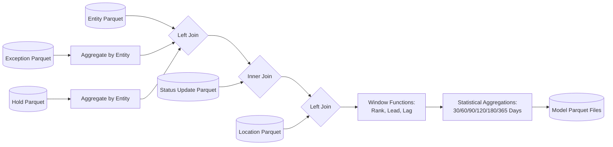
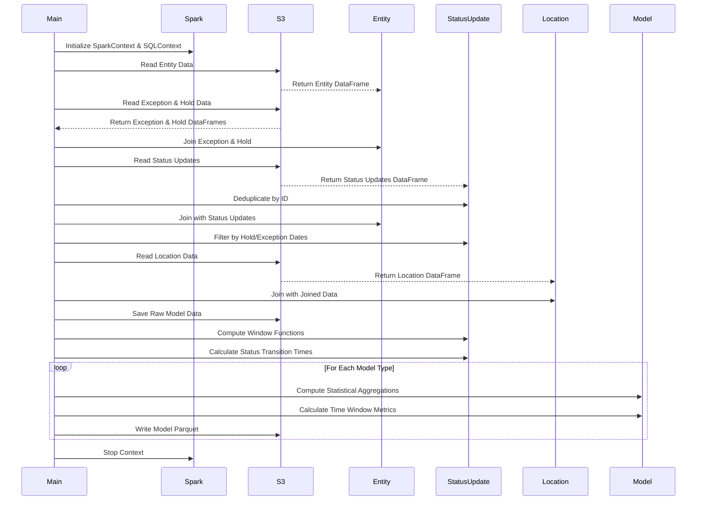

# Diagram: research/orchestrator/tasks/models/org_ptsi_spark.py

> Auto-generated by Obscura crawlers

## Diagram 1

```mermaid
flowchart TD
    Start([Start main]) --> LoadConfig[Load Spark Config & Context]
    LoadConfig --> LoadEntity[Load Entity Data from S3]
    LoadEntity --> ExtractDest[Extract Ultimate Destination]
    ExtractDest --> LoadExcHold[Load Exception & Hold Data]
    LoadExcHold --> FilterExc[Filter Exceptions Type 2 & 10]
    FilterExc --> AggregateExcHold[Aggregate Exception & Hold by Entity]
    AggregateExcHold --> JoinExcHold[Join Entity with Exception & Hold]
    JoinExcHold --> LoadStatus[Load Status Updates]
    LoadStatus --> DedupeStatus[Deduplicate Status Updates]
    DedupeStatus --> JoinEntityStatus[Join Entity with Status Updates]
    JoinEntityStatus --> FilterHolds[Filter Status Updates After Holds Cleared]
    FilterHolds --> FilterHonda[Filter Honda Data >= 2023-02-13]
    FilterHonda --> LoadLocation[Load Location Data]
    LoadLocation --> JoinLocation[Join Location Data for Dest & Origin]
    JoinLocation --> FilterDate[Filter Last 365 Days]
    FilterDate --> SaveRaw[Save Raw Model Data]
    SaveRaw --> CreateRanks[Create Status Code Ranks & Next Status]
    CreateRanks --> ComputeDiff[Compute Status to Status Seconds]
    ComputeDiff --> FilterValid[Filter Valid Status Transitions]
    FilterValid --> LoopModels{For Each Model in Hierarchy}
    LoopModels --> ComputeStats[Compute Std Dev & Median]
    ComputeStats --> FilterOutliers[Filter Outliers > 3 Std Dev]
    FilterOutliers --> AggregateTime[Aggregate Stats by Time Windows]
    AggregateTime --> SaveModel[Save Model to S3]
    SaveModel --> MoreModels{More Models?}
    MoreModels -->|Yes| LoopModels
    MoreModels -->|No| End([End])
```

### SVG

<svg id="container" width="368" xmlns="http://www.w3.org/2000/svg" class="flowchart" height="3475.5625" viewBox="0 0 368 3475.5625" role="graphics-document document" aria-roledescription="flowchart-v2"><g><marker id="container_flowchart-v2-pointEnd" class="marker flowchart-v2" viewBox="0 0 10 10" refX="5" refY="5" markerUnits="userSpaceOnUse" markerWidth="8" markerHeight="8" orient="auto"><path d="M 0 0 L 10 5 L 0 10 z" class="arrowMarkerPath" style="stroke-width: 1; stroke-dasharray: 1, 0;"></path></marker><marker id="container_flowchart-v2-pointStart" class="marker flowchart-v2" viewBox="0 0 10 10" refX="4.5" refY="5" markerUnits="userSpaceOnUse" markerWidth="8" markerHeight="8" orient="auto"><path d="M 0 5 L 10 10 L 10 0 z" class="arrowMarkerPath" style="stroke-width: 1; stroke-dasharray: 1, 0;"></path></marker><marker id="container_flowchart-v2-circleEnd" class="marker flowchart-v2" viewBox="0 0 10 10" refX="11" refY="5" markerUnits="userSpaceOnUse" markerWidth="11" markerHeight="11" orient="auto"><circle cx="5" cy="5" r="5" class="arrowMarkerPath" style="stroke-width: 1; stroke-dasharray: 1, 0;"></circle></marker><marker id="container_flowchart-v2-circleStart" class="marker flowchart-v2" viewBox="0 0 10 10" refX="-1" refY="5" markerUnits="userSpaceOnUse" markerWidth="11" markerHeight="11" orient="auto"><circle cx="5" cy="5" r="5" class="arrowMarkerPath" style="stroke-width: 1; stroke-dasharray: 1, 0;"></circle></marker><marker id="container_flowchart-v2-crossEnd" class="marker cross flowchart-v2" viewBox="0 0 11 11" refX="12" refY="5.2" markerUnits="userSpaceOnUse" markerWidth="11" markerHeight="11" orient="auto"><path d="M 1,1 l 9,9 M 10,1 l -9,9" class="arrowMarkerPath" style="stroke-width: 2; stroke-dasharray: 1, 0;"></path></marker><marker id="container_flowchart-v2-crossStart" class="marker cross flowchart-v2" viewBox="0 0 11 11" refX="-1" refY="5.2" markerUnits="userSpaceOnUse" markerWidth="11" markerHeight="11" orient="auto"><path d="M 1,1 l 9,9 M 10,1 l -9,9" class="arrowMarkerPath" style="stroke-width: 2; stroke-dasharray: 1, 0;"></path></marker><g class="root"><g class="clusters"></g><g class="edgePaths"><path d="M221,47.5L220.917,51.583C220.833,55.667,220.667,63.833,220.583,71.417C220.5,79,220.5,86,220.5,89.5L220.5,93" id="L_Start_LoadConfig_0" class="edge-thickness-normal edge-pattern-solid edge-thickness-normal edge-pattern-solid flowchart-link" style=";" data-edge="true" data-et="edge" data-id="L_Start_LoadConfig_0" data-points="W3sieCI6MjIxLCJ5Ijo0Ny41fSx7IngiOjIyMC41LCJ5Ijo3Mn0seyJ4IjoyMjAuNSwieSI6OTd9XQ==" marker-end="url(#container_flowchart-v2-pointEnd)"></path><path d="M220.5,175L220.5,179.167C220.5,183.333,220.5,191.667,220.5,199.333C220.5,207,220.5,214,220.5,217.5L220.5,221" id="L_LoadConfig_LoadEntity_0" class="edge-thickness-normal edge-pattern-solid edge-thickness-normal edge-pattern-solid flowchart-link" style=";" data-edge="true" data-et="edge" data-id="L_LoadConfig_LoadEntity_0" data-points="W3sieCI6MjIwLjUsInkiOjE3NX0seyJ4IjoyMjAuNSwieSI6MjAwfSx7IngiOjIyMC41LCJ5IjoyMjV9XQ==" marker-end="url(#container_flowchart-v2-pointEnd)"></path><path d="M220.5,279L220.5,283.167C220.5,287.333,220.5,295.667,220.5,303.333C220.5,311,220.5,318,220.5,321.5L220.5,325" id="L_LoadEntity_ExtractDest_0" class="edge-thickness-normal edge-pattern-solid edge-thickness-normal edge-pattern-solid flowchart-link" style=";" data-edge="true" data-et="edge" data-id="L_LoadEntity_ExtractDest_0" data-points="W3sieCI6MjIwLjUsInkiOjI3OX0seyJ4IjoyMjAuNSwieSI6MzA0fSx7IngiOjIyMC41LCJ5IjozMjl9XQ==" marker-end="url(#container_flowchart-v2-pointEnd)"></path><path d="M220.5,407L220.5,411.167C220.5,415.333,220.5,423.667,220.5,431.333C220.5,439,220.5,446,220.5,449.5L220.5,453" id="L_ExtractDest_LoadExcHold_0" class="edge-thickness-normal edge-pattern-solid edge-thickness-normal edge-pattern-solid flowchart-link" style=";" data-edge="true" data-et="edge" data-id="L_ExtractDest_LoadExcHold_0" data-points="W3sieCI6MjIwLjUsInkiOjQwN30seyJ4IjoyMjAuNSwieSI6NDMyfSx7IngiOjIyMC41LCJ5Ijo0NTd9XQ==" marker-end="url(#container_flowchart-v2-pointEnd)"></path><path d="M220.5,535L220.5,539.167C220.5,543.333,220.5,551.667,220.5,559.333C220.5,567,220.5,574,220.5,577.5L220.5,581" id="L_LoadExcHold_FilterExc_0" class="edge-thickness-normal edge-pattern-solid edge-thickness-normal edge-pattern-solid flowchart-link" style=";" data-edge="true" data-et="edge" data-id="L_LoadExcHold_FilterExc_0" data-points="W3sieCI6MjIwLjUsInkiOjUzNX0seyJ4IjoyMjAuNSwieSI6NTYwfSx7IngiOjIyMC41LCJ5Ijo1ODV9XQ==" marker-end="url(#container_flowchart-v2-pointEnd)"></path><path d="M220.5,663L220.5,667.167C220.5,671.333,220.5,679.667,220.5,687.333C220.5,695,220.5,702,220.5,705.5L220.5,709" id="L_FilterExc_AggregateExcHold_0" class="edge-thickness-normal edge-pattern-solid edge-thickness-normal edge-pattern-solid flowchart-link" style=";" data-edge="true" data-et="edge" data-id="L_FilterExc_AggregateExcHold_0" data-points="W3sieCI6MjIwLjUsInkiOjY2M30seyJ4IjoyMjAuNSwieSI6Njg4fSx7IngiOjIyMC41LCJ5Ijo3MTN9XQ==" marker-end="url(#container_flowchart-v2-pointEnd)"></path><path d="M220.5,791L220.5,795.167C220.5,799.333,220.5,807.667,220.5,815.333C220.5,823,220.5,830,220.5,833.5L220.5,837" id="L_AggregateExcHold_JoinExcHold_0" class="edge-thickness-normal edge-pattern-solid edge-thickness-normal edge-pattern-solid flowchart-link" style=";" data-edge="true" data-et="edge" data-id="L_AggregateExcHold_JoinExcHold_0" data-points="W3sieCI6MjIwLjUsInkiOjc5MX0seyJ4IjoyMjAuNSwieSI6ODE2fSx7IngiOjIyMC41LCJ5Ijo4NDF9XQ==" marker-end="url(#container_flowchart-v2-pointEnd)"></path><path d="M220.5,919L220.5,923.167C220.5,927.333,220.5,935.667,220.5,943.333C220.5,951,220.5,958,220.5,961.5L220.5,965" id="L_JoinExcHold_LoadStatus_0" class="edge-thickness-normal edge-pattern-solid edge-thickness-normal edge-pattern-solid flowchart-link" style=";" data-edge="true" data-et="edge" data-id="L_JoinExcHold_LoadStatus_0" data-points="W3sieCI6MjIwLjUsInkiOjkxOX0seyJ4IjoyMjAuNSwieSI6OTQ0fSx7IngiOjIyMC41LCJ5Ijo5Njl9XQ==" marker-end="url(#container_flowchart-v2-pointEnd)"></path><path d="M220.5,1023L220.5,1027.167C220.5,1031.333,220.5,1039.667,220.5,1047.333C220.5,1055,220.5,1062,220.5,1065.5L220.5,1069" id="L_LoadStatus_DedupeStatus_0" class="edge-thickness-normal edge-pattern-solid edge-thickness-normal edge-pattern-solid flowchart-link" style=";" data-edge="true" data-et="edge" data-id="L_LoadStatus_DedupeStatus_0" data-points="W3sieCI6MjIwLjUsInkiOjEwMjN9LHsieCI6MjIwLjUsInkiOjEwNDh9LHsieCI6MjIwLjUsInkiOjEwNzN9XQ==" marker-end="url(#container_flowchart-v2-pointEnd)"></path><path d="M220.5,1151L220.5,1155.167C220.5,1159.333,220.5,1167.667,220.5,1175.333C220.5,1183,220.5,1190,220.5,1193.5L220.5,1197" id="L_DedupeStatus_JoinEntityStatus_0" class="edge-thickness-normal edge-pattern-solid edge-thickness-normal edge-pattern-solid flowchart-link" style=";" data-edge="true" data-et="edge" data-id="L_DedupeStatus_JoinEntityStatus_0" data-points="W3sieCI6MjIwLjUsInkiOjExNTF9LHsieCI6MjIwLjUsInkiOjExNzZ9LHsieCI6MjIwLjUsInkiOjEyMDF9XQ==" marker-end="url(#container_flowchart-v2-pointEnd)"></path><path d="M220.5,1279L220.5,1283.167C220.5,1287.333,220.5,1295.667,220.5,1303.333C220.5,1311,220.5,1318,220.5,1321.5L220.5,1325" id="L_JoinEntityStatus_FilterHolds_0" class="edge-thickness-normal edge-pattern-solid edge-thickness-normal edge-pattern-solid flowchart-link" style=";" data-edge="true" data-et="edge" data-id="L_JoinEntityStatus_FilterHolds_0" data-points="W3sieCI6MjIwLjUsInkiOjEyNzl9LHsieCI6MjIwLjUsInkiOjEzMDR9LHsieCI6MjIwLjUsInkiOjEzMjl9XQ==" marker-end="url(#container_flowchart-v2-pointEnd)"></path><path d="M220.5,1407L220.5,1411.167C220.5,1415.333,220.5,1423.667,220.5,1431.333C220.5,1439,220.5,1446,220.5,1449.5L220.5,1453" id="L_FilterHolds_FilterHonda_0" class="edge-thickness-normal edge-pattern-solid edge-thickness-normal edge-pattern-solid flowchart-link" style=";" data-edge="true" data-et="edge" data-id="L_FilterHolds_FilterHonda_0" data-points="W3sieCI6MjIwLjUsInkiOjE0MDd9LHsieCI6MjIwLjUsInkiOjE0MzJ9LHsieCI6MjIwLjUsInkiOjE0NTd9XQ==" marker-end="url(#container_flowchart-v2-pointEnd)"></path><path d="M220.5,1535L220.5,1539.167C220.5,1543.333,220.5,1551.667,220.5,1559.333C220.5,1567,220.5,1574,220.5,1577.5L220.5,1581" id="L_FilterHonda_LoadLocation_0" class="edge-thickness-normal edge-pattern-solid edge-thickness-normal edge-pattern-solid flowchart-link" style=";" data-edge="true" data-et="edge" data-id="L_FilterHonda_LoadLocation_0" data-points="W3sieCI6MjIwLjUsInkiOjE1MzV9LHsieCI6MjIwLjUsInkiOjE1NjB9LHsieCI6MjIwLjUsInkiOjE1ODV9XQ==" marker-end="url(#container_flowchart-v2-pointEnd)"></path><path d="M220.5,1639L220.5,1643.167C220.5,1647.333,220.5,1655.667,220.5,1663.333C220.5,1671,220.5,1678,220.5,1681.5L220.5,1685" id="L_LoadLocation_JoinLocation_0" class="edge-thickness-normal edge-pattern-solid edge-thickness-normal edge-pattern-solid flowchart-link" style=";" data-edge="true" data-et="edge" data-id="L_LoadLocation_JoinLocation_0" data-points="W3sieCI6MjIwLjUsInkiOjE2Mzl9LHsieCI6MjIwLjUsInkiOjE2NjR9LHsieCI6MjIwLjUsInkiOjE2ODl9XQ==" marker-end="url(#container_flowchart-v2-pointEnd)"></path><path d="M220.5,1767L220.5,1771.167C220.5,1775.333,220.5,1783.667,220.5,1791.333C220.5,1799,220.5,1806,220.5,1809.5L220.5,1813" id="L_JoinLocation_FilterDate_0" class="edge-thickness-normal edge-pattern-solid edge-thickness-normal edge-pattern-solid flowchart-link" style=";" data-edge="true" data-et="edge" data-id="L_JoinLocation_FilterDate_0" data-points="W3sieCI6MjIwLjUsInkiOjE3Njd9LHsieCI6MjIwLjUsInkiOjE3OTJ9LHsieCI6MjIwLjUsInkiOjE4MTd9XQ==" marker-end="url(#container_flowchart-v2-pointEnd)"></path><path d="M220.5,1871L220.5,1875.167C220.5,1879.333,220.5,1887.667,220.5,1895.333C220.5,1903,220.5,1910,220.5,1913.5L220.5,1917" id="L_FilterDate_SaveRaw_0" class="edge-thickness-normal edge-pattern-solid edge-thickness-normal edge-pattern-solid flowchart-link" style=";" data-edge="true" data-et="edge" data-id="L_FilterDate_SaveRaw_0" data-points="W3sieCI6MjIwLjUsInkiOjE4NzF9LHsieCI6MjIwLjUsInkiOjE4OTZ9LHsieCI6MjIwLjUsInkiOjE5MjF9XQ==" marker-end="url(#container_flowchart-v2-pointEnd)"></path><path d="M220.5,1975L220.5,1979.167C220.5,1983.333,220.5,1991.667,220.5,1999.333C220.5,2007,220.5,2014,220.5,2017.5L220.5,2021" id="L_SaveRaw_CreateRanks_0" class="edge-thickness-normal edge-pattern-solid edge-thickness-normal edge-pattern-solid flowchart-link" style=";" data-edge="true" data-et="edge" data-id="L_SaveRaw_CreateRanks_0" data-points="W3sieCI6MjIwLjUsInkiOjE5NzV9LHsieCI6MjIwLjUsInkiOjIwMDB9LHsieCI6MjIwLjUsInkiOjIwMjV9XQ==" marker-end="url(#container_flowchart-v2-pointEnd)"></path><path d="M220.5,2103L220.5,2107.167C220.5,2111.333,220.5,2119.667,220.5,2127.333C220.5,2135,220.5,2142,220.5,2145.5L220.5,2149" id="L_CreateRanks_ComputeDiff_0" class="edge-thickness-normal edge-pattern-solid edge-thickness-normal edge-pattern-solid flowchart-link" style=";" data-edge="true" data-et="edge" data-id="L_CreateRanks_ComputeDiff_0" data-points="W3sieCI6MjIwLjUsInkiOjIxMDN9LHsieCI6MjIwLjUsInkiOjIxMjh9LHsieCI6MjIwLjUsInkiOjIxNTN9XQ==" marker-end="url(#container_flowchart-v2-pointEnd)"></path><path d="M220.5,2231L220.5,2235.167C220.5,2239.333,220.5,2247.667,220.5,2255.333C220.5,2263,220.5,2270,220.5,2273.5L220.5,2277" id="L_ComputeDiff_FilterValid_0" class="edge-thickness-normal edge-pattern-solid edge-thickness-normal edge-pattern-solid flowchart-link" style=";" data-edge="true" data-et="edge" data-id="L_ComputeDiff_FilterValid_0" data-points="W3sieCI6MjIwLjUsInkiOjIyMzF9LHsieCI6MjIwLjUsInkiOjIyNTZ9LHsieCI6MjIwLjUsInkiOjIyODF9XQ==" marker-end="url(#container_flowchart-v2-pointEnd)"></path><path d="M220.5,2359L220.5,2363.167C220.5,2367.333,220.5,2375.667,220.5,2383.333C220.5,2391,220.5,2398,220.5,2401.5L220.5,2405" id="L_FilterValid_LoopModels_0" class="edge-thickness-normal edge-pattern-solid edge-thickness-normal edge-pattern-solid flowchart-link" style=";" data-edge="true" data-et="edge" data-id="L_FilterValid_LoopModels_0" data-points="W3sieCI6MjIwLjUsInkiOjIzNTl9LHsieCI6MjIwLjUsInkiOjIzODR9LHsieCI6MjIwLjUsInkiOjI0MDl9XQ==" marker-end="url(#container_flowchart-v2-pointEnd)"></path><path d="M173.979,2640.479L167.982,2652.399C161.986,2664.319,149.993,2688.16,143.996,2703.58C138,2719,138,2726,138,2729.5L138,2733" id="L_LoopModels_ComputeStats_0" class="edge-thickness-normal edge-pattern-solid edge-thickness-normal edge-pattern-solid flowchart-link" style=";" data-edge="true" data-et="edge" data-id="L_LoopModels_ComputeStats_0" data-points="W3sieCI6MTczLjk3ODcwMTgyNTU1NzgsInkiOjI2NDAuNDc4NzAxODI1NTU4fSx7IngiOjEzOCwieSI6MjcxMn0seyJ4IjoxMzgsInkiOjI3Mzd9XQ==" marker-end="url(#container_flowchart-v2-pointEnd)"></path><path d="M138,2791L138,2795.167C138,2799.333,138,2807.667,138,2815.333C138,2823,138,2830,138,2833.5L138,2837" id="L_ComputeStats_FilterOutliers_0" class="edge-thickness-normal edge-pattern-solid edge-thickness-normal edge-pattern-solid flowchart-link" style=";" data-edge="true" data-et="edge" data-id="L_ComputeStats_FilterOutliers_0" data-points="W3sieCI6MTM4LCJ5IjoyNzkxfSx7IngiOjEzOCwieSI6MjgxNn0seyJ4IjoxMzgsInkiOjI4NDF9XQ==" marker-end="url(#container_flowchart-v2-pointEnd)"></path><path d="M138,2895L138,2901.167C138,2907.333,138,2919.667,138,2931.333C138,2943,138,2954,138,2959.5L138,2965" id="L_FilterOutliers_AggregateTime_0" class="edge-thickness-normal edge-pattern-solid edge-thickness-normal edge-pattern-solid flowchart-link" style=";" data-edge="true" data-et="edge" data-id="L_FilterOutliers_AggregateTime_0" data-points="W3sieCI6MTM4LCJ5IjoyODk1fSx7IngiOjEzOCwieSI6MjkzMn0seyJ4IjoxMzgsInkiOjI5Njl9XQ==" marker-end="url(#container_flowchart-v2-pointEnd)"></path><path d="M138,3047L138,3051.167C138,3055.333,138,3063.667,138,3071.333C138,3079,138,3086,138,3089.5L138,3093" id="L_AggregateTime_SaveModel_0" class="edge-thickness-normal edge-pattern-solid edge-thickness-normal edge-pattern-solid flowchart-link" style=";" data-edge="true" data-et="edge" data-id="L_AggregateTime_SaveModel_0" data-points="W3sieCI6MTM4LCJ5IjozMDQ3fSx7IngiOjEzOCwieSI6MzA3Mn0seyJ4IjoxMzgsInkiOjMwOTd9XQ==" marker-end="url(#container_flowchart-v2-pointEnd)"></path><path d="M138,3151L138,3155.167C138,3159.333,138,3167.667,145.601,3181.211C153.202,3194.755,168.405,3213.511,176.006,3222.889L183.607,3232.266" id="L_SaveModel_MoreModels_0" class="edge-thickness-normal edge-pattern-solid edge-thickness-normal edge-pattern-solid flowchart-link" style=";" data-edge="true" data-et="edge" data-id="L_SaveModel_MoreModels_0" data-points="W3sieCI6MTM4LCJ5IjozMTUxfSx7IngiOjEzOCwieSI6MzE3Nn0seyJ4IjoxODYuMTI2MTY1ODQ3MDQwODgsInkiOjMyMzUuMzczODM0MTUyOTU5M31d" marker-end="url(#container_flowchart-v2-pointEnd)"></path><path d="M254.874,3235.374L262.895,3225.478C270.916,3215.583,286.958,3195.791,294.979,3177.229C303,3158.667,303,3141.333,303,3124C303,3106.667,303,3089.333,303,3070C303,3050.667,303,3029.333,303,3006C303,2982.667,303,2957.333,303,2934C303,2910.667,303,2889.333,303,2870C303,2850.667,303,2833.333,303,2816C303,2798.667,303,2781.333,303,2764C303,2746.667,303,2729.333,297.303,2709.342C291.606,2689.351,280.213,2666.701,274.516,2655.377L268.819,2644.052" id="L_MoreModels_LoopModels_0" class="edge-thickness-normal edge-pattern-solid edge-thickness-normal edge-pattern-solid flowchart-link" style=";" data-edge="true" data-et="edge" data-id="L_MoreModels_LoopModels_0" data-points="W3sieCI6MjU0Ljg3MzgzNDE1Mjk1OTEyLCJ5IjozMjM1LjM3MzgzNDE1Mjk1OTN9LHsieCI6MzAzLCJ5IjozMTc2fSx7IngiOjMwMywieSI6MzEyNH0seyJ4IjozMDMsInkiOjMwNzJ9LHsieCI6MzAzLCJ5IjozMDA4fSx7IngiOjMwMywieSI6MjkzMn0seyJ4IjozMDMsInkiOjI4Njh9LHsieCI6MzAzLCJ5IjoyODE2fSx7IngiOjMwMywieSI6Mjc2NH0seyJ4IjozMDMsInkiOjI3MTJ9LHsieCI6MjY3LjAyMTI5ODE3NDQ0MjE3LCJ5IjoyNjQwLjQ3ODcwMTgyNTU1OH1d" marker-end="url(#container_flowchart-v2-pointEnd)"></path><path d="M220.5,3354.563L220.5,3360.729C220.5,3366.896,220.5,3379.229,220.574,3390.979C220.649,3402.729,220.798,3413.896,220.872,3419.479L220.947,3425.063" id="L_MoreModels_End_0" class="edge-thickness-normal edge-pattern-solid edge-thickness-normal edge-pattern-solid flowchart-link" style=";" data-edge="true" data-et="edge" data-id="L_MoreModels_End_0" data-points="W3sieCI6MjIwLjUsInkiOjMzNTQuNTYyNX0seyJ4IjoyMjAuNSwieSI6MzM5MS41NjI1fSx7IngiOjIyMSwieSI6MzQyOS4wNjI1fV0=" marker-end="url(#container_flowchart-v2-pointEnd)"></path></g><g class="edgeLabels"><g class="edgeLabel"><g class="label" data-id="L_Start_LoadConfig_0" transform="translate(0, 0)"><foreignObject width="0" height="0">

</foreignObject></g></g><g class="edgeLabel"><g class="label" data-id="L_LoadConfig_LoadEntity_0" transform="translate(0, 0)"><foreignObject width="0" height="0">

</foreignObject></g></g><g class="edgeLabel"><g class="label" data-id="L_LoadEntity_ExtractDest_0" transform="translate(0, 0)"><foreignObject width="0" height="0">

</foreignObject></g></g><g class="edgeLabel"><g class="label" data-id="L_ExtractDest_LoadExcHold_0" transform="translate(0, 0)"><foreignObject width="0" height="0">

</foreignObject></g></g><g class="edgeLabel"><g class="label" data-id="L_LoadExcHold_FilterExc_0" transform="translate(0, 0)"><foreignObject width="0" height="0">

</foreignObject></g></g><g class="edgeLabel"><g class="label" data-id="L_FilterExc_AggregateExcHold_0" transform="translate(0, 0)"><foreignObject width="0" height="0">

</foreignObject></g></g><g class="edgeLabel"><g class="label" data-id="L_AggregateExcHold_JoinExcHold_0" transform="translate(0, 0)"><foreignObject width="0" height="0">

</foreignObject></g></g><g class="edgeLabel"><g class="label" data-id="L_JoinExcHold_LoadStatus_0" transform="translate(0, 0)"><foreignObject width="0" height="0">

</foreignObject></g></g><g class="edgeLabel"><g class="label" data-id="L_LoadStatus_DedupeStatus_0" transform="translate(0, 0)"><foreignObject width="0" height="0">

</foreignObject></g></g><g class="edgeLabel"><g class="label" data-id="L_DedupeStatus_JoinEntityStatus_0" transform="translate(0, 0)"><foreignObject width="0" height="0">

</foreignObject></g></g><g class="edgeLabel"><g class="label" data-id="L_JoinEntityStatus_FilterHolds_0" transform="translate(0, 0)"><foreignObject width="0" height="0">

</foreignObject></g></g><g class="edgeLabel"><g class="label" data-id="L_FilterHolds_FilterHonda_0" transform="translate(0, 0)"><foreignObject width="0" height="0">

</foreignObject></g></g><g class="edgeLabel"><g class="label" data-id="L_FilterHonda_LoadLocation_0" transform="translate(0, 0)"><foreignObject width="0" height="0">

</foreignObject></g></g><g class="edgeLabel"><g class="label" data-id="L_LoadLocation_JoinLocation_0" transform="translate(0, 0)"><foreignObject width="0" height="0">

</foreignObject></g></g><g class="edgeLabel"><g class="label" data-id="L_JoinLocation_FilterDate_0" transform="translate(0, 0)"><foreignObject width="0" height="0">

</foreignObject></g></g><g class="edgeLabel"><g class="label" data-id="L_FilterDate_SaveRaw_0" transform="translate(0, 0)"><foreignObject width="0" height="0">

</foreignObject></g></g><g class="edgeLabel"><g class="label" data-id="L_SaveRaw_CreateRanks_0" transform="translate(0, 0)"><foreignObject width="0" height="0">

</foreignObject></g></g><g class="edgeLabel"><g class="label" data-id="L_CreateRanks_ComputeDiff_0" transform="translate(0, 0)"><foreignObject width="0" height="0">

</foreignObject></g></g><g class="edgeLabel"><g class="label" data-id="L_ComputeDiff_FilterValid_0" transform="translate(0, 0)"><foreignObject width="0" height="0">

</foreignObject></g></g><g class="edgeLabel"><g class="label" data-id="L_FilterValid_LoopModels_0" transform="translate(0, 0)"><foreignObject width="0" height="0">

</foreignObject></g></g><g class="edgeLabel"><g class="label" data-id="L_LoopModels_ComputeStats_0" transform="translate(0, 0)"><foreignObject width="0" height="0">

</foreignObject></g></g><g class="edgeLabel"><g class="label" data-id="L_ComputeStats_FilterOutliers_0" transform="translate(0, 0)"><foreignObject width="0" height="0">

</foreignObject></g></g><g class="edgeLabel"><g class="label" data-id="L_FilterOutliers_AggregateTime_0" transform="translate(0, 0)"><foreignObject width="0" height="0">

</foreignObject></g></g><g class="edgeLabel"><g class="label" data-id="L_AggregateTime_SaveModel_0" transform="translate(0, 0)"><foreignObject width="0" height="0">

</foreignObject></g></g><g class="edgeLabel"><g class="label" data-id="L_SaveModel_MoreModels_0" transform="translate(0, 0)"><foreignObject width="0" height="0">

</foreignObject></g></g><g class="edgeLabel" transform="translate(303, 2932)"><g class="label" data-id="L_MoreModels_LoopModels_0" transform="translate(-12.03125, -12)"><foreignObject width="24.0625" height="24">

Yes

</foreignObject></g></g><g class="edgeLabel" transform="translate(220.5, 3391.5625)"><g class="label" data-id="L_MoreModels_End_0" transform="translate(-10.140625, -12)"><foreignObject width="20.28125" height="24">

No

</foreignObject></g></g></g><g class="nodes"><g class="node default" id="flowchart-Start-0" transform="translate(220.5, 27.5)"><g class="basic label-container outer-path"><path d="M-30.671875 -19.5 C-10.303566670161956 -19.5, 10.064741659676088 -19.5, 30.671875 -19.5 C30.671875 -19.5, 30.671875 -19.5, 30.671875 -19.5 C30.945128583748243 -19.49123728942503, 31.218382167496486 -19.48247457885006, 31.9212442896239 -19.45993515863156 C32.189021630672464 -19.434103000589975, 32.456798971721035 -19.408270842548387, 33.165479652847864 -19.3399052695533 C33.63445049186345 -19.264085701224435, 34.10342133087903 -19.18826613289557, 34.39946825967676 -19.140403561325776 C34.65703501555754 -19.081615630076147, 34.91460177143832 -19.022827698826518, 35.61813938623539 -18.862249829261074 C36.07728532895744 -18.725977723567407, 36.53643127167948 -18.58970561787374, 36.816485251460605 -18.50658706670804 C37.222062311754286 -18.357330959406717, 37.627639372047966 -18.208074852105398, 37.9895815951478 -18.074876768247425 C38.389911502556366 -17.897662593602423, 38.790241409964935 -17.72044841895742, 39.13260791279238 -17.568892924097174 C39.401786441800084 -17.428462657930933, 39.67096497080779 -17.28803239176469, 40.24086726407678 -16.990714730406097 C40.47250742926666 -16.85029310099928, 40.70414759445655 -16.709871471592464, 41.3098055736057 -16.342718045390892 C41.71388269212344 -16.06085133972945, 42.11795981064119 -15.778984634068006, 42.33503034457871 -15.627565626425154 C42.642294347955826 -15.382530760370432, 42.94955835133294 -15.13749589431571, 43.312328708501866 -14.848196188198123 C43.64613304183288 -14.54504392464558, 43.9799373751639 -14.241891661093035, 44.23768473676799 -14.007812326905688 C44.41816535911888 -13.821451266593723, 44.59864598146977 -13.635090206281758, 45.10729594296865 -13.10986736009568 C45.37233712926802 -12.798534901397712, 45.63737831556738 -12.487202442699742, 45.91758890812658 -12.158051136245305 C46.17214654939298 -11.81696708762653, 46.42670419065937 -11.475883039007753, 46.665233964640635 -11.156274872382312 C46.915145081861255 -10.772344285800107, 47.165056199081874 -10.388413699217903, 47.34715887860425 -10.108655082055241 C47.555418928204794 -9.738868275372685, 47.763678977805334 -9.369081468690126, 47.960561474273504 -9.019496659696287 C48.146636614935474 -8.633107648741499, 48.332711755597444 -8.24671863778671, 48.50292114880834 -7.893275190886684 C48.6136628849113 -7.619740961666555, 48.724404621014266 -7.346206732446426, 48.972009229970325 -6.734618561215508 C49.122328615156334 -6.281880523176784, 49.27264800034234 -5.8291424851380595, 49.36589813421488 -5.548287939305138 C49.44571127409165 -5.243925845721372, 49.52552441396843 -4.939563752137606, 49.68296928754556 -4.339158212148133 C49.73353355454237 -4.079521387881129, 49.78409782153918 -3.819884563614125, 49.921919776581774 -3.1121979531509023 C49.96855813136633 -2.750480083226741, 50.015196486150884 -2.38876221330258, 50.08176770250937 -1.872449005199798 C50.09827593619378 -1.6153199403587442, 50.114784169878185 -1.3581908755176904, 50.16185621591342 -0.6250057626472757 C50.16185621591342 -0.16105380977385703, 50.16185621591342 0.30289814309956165, 50.16185621591342 0.625005762647271 C50.14544724453229 0.8805887369916298, 50.12903827315116 1.1361717113359884, 50.08176770250937 1.8724490051997846 C50.0232745271446 2.3261105225449215, 49.96478135177984 2.7797720398900583, 49.921919776581774 3.1121979531508885 C49.83256209914642 3.5710307410296003, 49.74320442171108 4.0298635289083125, 49.68296928754556 4.339158212148129 C49.559759811188535 4.809009344822323, 49.4365503348315 5.278860477496519, 49.36589813421489 5.548287939305125 C49.25624624155744 5.878541969332819, 49.146594348899995 6.208795999360513, 48.972009229970325 6.734618561215495 C48.80790345350734 7.1399630018484, 48.64379767704437 7.545307442481306, 48.50292114880834 7.893275190886679 C48.35816440531719 8.193865666044191, 48.21340766182604 8.494456141201702, 47.960561474273504 9.019496659696284 C47.7871858175369 9.327342694421093, 47.6138101608003 9.635188729145904, 47.34715887860425 10.108655082055236 C47.187083249929785 10.35457423402416, 47.02700762125533 10.600493385993081, 46.66523396464064 11.156274872382301 C46.40058787217183 11.510876526535501, 46.13594177970302 11.8654781806887, 45.91758890812658 12.158051136245302 C45.7082374614778 12.403967257913742, 45.49888601482902 12.64988337958218, 45.10729594296866 13.10986736009567 C44.77648787916504 13.451453845820055, 44.44567981536141 13.79304033154444, 44.23768473676799 14.007812326905684 C43.96401881347204 14.256348477639518, 43.690352890176094 14.504884628373354, 43.31232870850189 14.848196188198111 C42.972024525744644 15.119579718072389, 42.63172034298739 15.390963247946665, 42.33503034457871 15.627565626425152 C42.03450328720848 15.837200292039995, 41.73397622983824 16.046834957654838, 41.30980557360571 16.34271804539089 C41.05997664169046 16.49416581207568, 40.810147709775215 16.645613578760468, 40.24086726407678 16.990714730406093 C39.930511520695504 17.152627122935765, 39.620155777314224 17.314539515465437, 39.13260791279239 17.56889292409717 C38.73625509203505 17.744346560457757, 38.339902271277715 17.919800196818343, 37.989581595147804 18.07487676824742 C37.537557862094395 18.241225680472656, 37.085534129040994 18.407574592697895, 36.81648525146062 18.506587066708033 C36.46297123723419 18.61150817049751, 36.109457223007766 18.716429274286988, 35.61813938623541 18.86224982926107 C35.20321899383034 18.956952701218928, 34.788298601425275 19.051655573176784, 34.399468259676766 19.140403561325773 C34.12335718290008 19.18504305894565, 33.847246106123386 19.22968255656552, 33.16547965284788 19.3399052695533 C32.70414318018837 19.38440984423248, 32.24280670752886 19.428914418911656, 31.9212442896239 19.45993515863156 C31.618632440276777 19.46963933164189, 31.316020590929657 19.479343504652217, 30.671875000000004 19.5 C30.671875000000004 19.5, 30.671875000000004 19.5, 30.671875 19.5 C10.624335176315014 19.5, -9.423204647369971 19.5, -30.671874999999996 19.5 C-31.074539421459814 19.487087335742533, -31.477203842919636 19.474174671485066, -31.921244289623893 19.45993515863156 C-32.376280713793086 19.416038342053323, -32.83131713796227 19.37214152547509, -33.16547965284787 19.3399052695533 C-33.506805621907134 19.28472233389822, -33.84813159096639 19.229539398243144, -34.39946825967676 19.140403561325773 C-34.823122385724645 19.04370727165688, -35.24677651177253 18.947010981987987, -35.618139386235384 18.862249829261074 C-36.013685525473996 18.74485381139911, -36.40923166471261 18.627457793537143, -36.81648525146059 18.506587066708043 C-37.092513042053696 18.405006288196855, -37.368540832646794 18.30342550968567, -37.9895815951478 18.074876768247425 C-38.3017849166926 17.936673618982024, -38.6139882382374 17.798470469716626, -39.13260791279238 17.568892924097174 C-39.48469710797147 17.385208216496135, -39.83678630315056 17.2015235088951, -40.24086726407678 16.990714730406097 C-40.482860202131384 16.84401718924904, -40.72485314018599 16.697319648091984, -41.309805573605686 16.3427180453909 C-41.55434201777859 16.172140007747938, -41.798878461951496 16.001561970104976, -42.33503034457871 15.627565626425156 C-42.58224228376945 15.430420683506526, -42.82945422296019 15.233275740587894, -43.312328708501866 14.848196188198125 C-43.57869629755594 14.606288191519416, -43.84506388661002 14.364380194840708, -44.237684736767974 14.007812326905697 C-44.46803792733265 13.769953745298999, -44.69839111789734 13.5320951636923, -45.107295942968655 13.109867360095677 C-45.324321146737674 12.854937206664657, -45.54134635050669 12.600007053233638, -45.917588908126575 12.158051136245307 C-46.12039797687631 11.886305460406914, -46.323207045626056 11.614559784568522, -46.665233964640635 11.156274872382316 C-46.81655580441777 10.923803890881137, -46.96787764419491 10.691332909379959, -47.34715887860425 10.108655082055249 C-47.540391475850484 9.765551038722318, -47.73362407309672 9.422446995389388, -47.960561474273504 9.019496659696289 C-48.12256031905475 8.683102592288028, -48.28455916383599 8.34670852487977, -48.50292114880834 7.893275190886686 C-48.62063362885716 7.602523089350117, -48.738346108905986 7.3117709878135475, -48.972009229970325 6.73461856121551 C-49.07611034835596 6.421082578898721, -49.1802114667416 6.1075465965819316, -49.36589813421488 5.5482879393051325 C-49.48201043538461 5.105501411555301, -49.59812273655434 4.662714883805471, -49.68296928754556 4.339158212148136 C-49.77450807861254 3.869125866749534, -49.86604686967952 3.3990935213509323, -49.921919776581774 3.112197953150904 C-49.97024896725141 2.737366293995417, -50.018578157921034 2.36253463483993, -50.08176770250937 1.872449005199809 C-50.097969537289345 1.620092350616005, -50.11417137206932 1.367735696032201, -50.16185621591342 0.6250057626472781 C-50.16185621591342 0.20415343603234593, -50.16185621591342 -0.2166988905825863, -50.16185621591342 -0.6250057626472687 C-50.14345045909118 -0.9116902820131435, -50.12504470226894 -1.1983748013790183, -50.08176770250937 -1.8724490051997822 C-50.04161391412095 -2.1838738586779654, -50.001460125732535 -2.4952987121561487, -49.921919776581774 -3.112197953150895 C-49.843696742590815 -3.5138567002503884, -49.765473708599856 -3.9155154473498817, -49.68296928754556 -4.339158212148126 C-49.587272754832064 -4.704090566524324, -49.49157622211857 -5.069022920900523, -49.36589813421489 -5.548287939305123 C-49.28419654457388 -5.794360109923313, -49.20249495493288 -6.040432280541505, -48.97200922997033 -6.734618561215485 C-48.78722026575023 -7.191050875490711, -48.60243130153013 -7.647483189765937, -48.50292114880834 -7.893275190886676 C-48.391899788812886 -8.123813420393795, -48.28087842881744 -8.354351649900913, -47.960561474273504 -9.019496659696282 C-47.776049265908384 -9.347116769535665, -47.59153705754326 -9.674736879375047, -47.34715887860425 -10.108655082055243 C-47.084966063340424 -10.511453654929515, -46.8227732480766 -10.914252227803788, -46.66523396464064 -11.156274872382308 C-46.43607733626738 -11.463323877804164, -46.20692070789411 -11.77037288322602, -45.91758890812659 -12.158051136245302 C-45.74634891261423 -12.359199378805894, -45.57510891710187 -12.560347621366486, -45.10729594296866 -13.10986736009567 C-44.775370375740955 -13.452607759854155, -44.44344480851325 -13.795348159612642, -44.237684736767996 -14.007812326905677 C-43.996919095611176 -14.226469311894515, -43.75615345445436 -14.445126296883354, -43.31232870850189 -14.848196188198107 C-43.03104903636268 -15.072509241562692, -42.749769364223475 -15.296822294927278, -42.33503034457872 -15.627565626425149 C-41.980469820733255 -15.874891699182047, -41.62590929688779 -16.122217771938946, -41.309805573605715 -16.342718045390885 C-40.93130433874096 -16.57216771828605, -40.5528031038762 -16.801617391181217, -40.24086726407679 -16.99071473040609 C-39.935875532625005 -17.149828721347962, -39.63088380117321 -17.30894271228983, -39.13260791279239 -17.56889292409717 C-38.76813142621642 -17.73023585289352, -38.403654939640454 -17.89157878168987, -37.989581595147804 -18.07487676824742 C-37.69396494393937 -18.18366642854249, -37.39834829273094 -18.292456088837564, -36.81648525146062 -18.506587066708033 C-36.397524900999954 -18.630932299557003, -35.97856455053928 -18.755277532405973, -35.61813938623541 -18.862249829261067 C-35.36805703911714 -18.919329493050984, -35.117974691998874 -18.9764091568409, -34.399468259676766 -19.140403561325773 C-34.073548957819035 -19.193095666508196, -33.747629655961305 -19.24578777169062, -33.16547965284788 -19.3399052695533 C-32.90924121741556 -19.364624283247647, -32.653002781983254 -19.389343296942, -31.921244289623903 -19.45993515863156 C-31.520058494543374 -19.472800406219015, -31.11887269946284 -19.485665653806468, -30.671875000000007 -19.5 C-30.671875000000007 -19.5, -30.671875000000004 -19.5, -30.671875 -19.5" stroke="none" stroke-width="0" fill="#ECECFF" style=""></path><path d="M-30.671875 -19.5 C-7.433879331748191 -19.5, 15.804116336503618 -19.5, 30.671875 -19.5 M-30.671875 -19.5 C-10.427895463623884 -19.5, 9.816084072752233 -19.5, 30.671875 -19.5 M30.671875 -19.5 C30.671875 -19.5, 30.671875 -19.5, 30.671875 -19.5 M30.671875 -19.5 C30.671875 -19.5, 30.671875 -19.5, 30.671875 -19.5 M30.671875 -19.5 C30.97389806469285 -19.49031470816753, 31.275921129385704 -19.480629416335066, 31.9212442896239 -19.45993515863156 M30.671875 -19.5 C30.947247602283124 -19.491169336625035, 31.222620204566248 -19.48233867325007, 31.9212442896239 -19.45993515863156 M31.9212442896239 -19.45993515863156 C32.31967773886959 -19.421498762969158, 32.718111188115294 -19.383062367306753, 33.165479652847864 -19.3399052695533 M31.9212442896239 -19.45993515863156 C32.39976542941743 -19.413772799781547, 32.878286569210964 -19.367610440931536, 33.165479652847864 -19.3399052695533 M33.165479652847864 -19.3399052695533 C33.53338120991996 -19.28042579892507, 33.90128276699205 -19.22094632829684, 34.39946825967676 -19.140403561325776 M33.165479652847864 -19.3399052695533 C33.540633491604034 -19.279253306264675, 33.9157873303602 -19.218601342976047, 34.39946825967676 -19.140403561325776 M34.39946825967676 -19.140403561325776 C34.67973393731677 -19.07643474930891, 34.95999961495677 -19.012465937292045, 35.61813938623539 -18.862249829261074 M34.39946825967676 -19.140403561325776 C34.88566143038009 -19.029433142819684, 35.37185460108341 -18.918462724313592, 35.61813938623539 -18.862249829261074 M35.61813938623539 -18.862249829261074 C35.94147964452651 -18.766284137847922, 36.26481990281762 -18.67031844643477, 36.816485251460605 -18.50658706670804 M35.61813938623539 -18.862249829261074 C36.005959066144115 -18.747146983971206, 36.39377874605284 -18.63204413868134, 36.816485251460605 -18.50658706670804 M36.816485251460605 -18.50658706670804 C37.13508098095947 -18.389340893185818, 37.45367671045834 -18.272094719663595, 37.9895815951478 -18.074876768247425 M36.816485251460605 -18.50658706670804 C37.07422487968853 -18.411736501001158, 37.331964507916446 -18.316885935294277, 37.9895815951478 -18.074876768247425 M37.9895815951478 -18.074876768247425 C38.42869105548708 -17.88049603587456, 38.86780051582636 -17.686115303501698, 39.13260791279238 -17.568892924097174 M37.9895815951478 -18.074876768247425 C38.40659308901971 -17.890278150116778, 38.823604582891626 -17.705679531986135, 39.13260791279238 -17.568892924097174 M39.13260791279238 -17.568892924097174 C39.36804462189582 -17.446065743762322, 39.60348133099925 -17.32323856342747, 40.24086726407678 -16.990714730406097 M39.13260791279238 -17.568892924097174 C39.409332125372764 -17.424526079644306, 39.686056337953154 -17.280159235191434, 40.24086726407678 -16.990714730406097 M40.24086726407678 -16.990714730406097 C40.567015741379095 -16.793001606804236, 40.893164218681406 -16.595288483202374, 41.3098055736057 -16.342718045390892 M40.24086726407678 -16.990714730406097 C40.559867791670726 -16.797334735923464, 40.878868319264676 -16.60395474144083, 41.3098055736057 -16.342718045390892 M41.3098055736057 -16.342718045390892 C41.668966179518016 -16.092183154518505, 42.02812678543033 -15.841648263646116, 42.33503034457871 -15.627565626425154 M41.3098055736057 -16.342718045390892 C41.63889297913282 -16.113160917259357, 41.96798038465993 -15.88360378912782, 42.33503034457871 -15.627565626425154 M42.33503034457871 -15.627565626425154 C42.539737651082085 -15.464316996978917, 42.744444957585465 -15.30106836753268, 43.312328708501866 -14.848196188198123 M42.33503034457871 -15.627565626425154 C42.696781111073214 -15.339079016737973, 43.058531877567724 -15.050592407050791, 43.312328708501866 -14.848196188198123 M43.312328708501866 -14.848196188198123 C43.53607480694277 -14.644995901591454, 43.75982090538368 -14.441795614984786, 44.23768473676799 -14.007812326905688 M43.312328708501866 -14.848196188198123 C43.56795450931077 -14.616043599391537, 43.82358031011968 -14.38389101058495, 44.23768473676799 -14.007812326905688 M44.23768473676799 -14.007812326905688 C44.468132130999884 -13.769856472278324, 44.69857952523178 -13.531900617650962, 45.10729594296865 -13.10986736009568 M44.23768473676799 -14.007812326905688 C44.42773020240814 -13.811574780609325, 44.61777566804829 -13.61533723431296, 45.10729594296865 -13.10986736009568 M45.10729594296865 -13.10986736009568 C45.31573567099377 -12.86502219500086, 45.52417539901889 -12.620177029906037, 45.91758890812658 -12.158051136245305 M45.10729594296865 -13.10986736009568 C45.301510649026156 -12.881731715230696, 45.495725355083664 -12.65359607036571, 45.91758890812658 -12.158051136245305 M45.91758890812658 -12.158051136245305 C46.21112815385402 -11.764735288945959, 46.50466739958146 -11.371419441646612, 46.665233964640635 -11.156274872382312 M45.91758890812658 -12.158051136245305 C46.09670932661872 -11.91804609367166, 46.27582974511086 -11.678041051098011, 46.665233964640635 -11.156274872382312 M46.665233964640635 -11.156274872382312 C46.90655834768616 -10.785535815354036, 47.14788273073167 -10.41479675832576, 47.34715887860425 -10.108655082055241 M46.665233964640635 -11.156274872382312 C46.87990981297151 -10.826475120809247, 47.094585661302396 -10.496675369236183, 47.34715887860425 -10.108655082055241 M47.34715887860425 -10.108655082055241 C47.55967230123504 -9.731315980856754, 47.77218572386583 -9.353976879658267, 47.960561474273504 -9.019496659696287 M47.34715887860425 -10.108655082055241 C47.47167027626452 -9.887572487363244, 47.59618167392478 -9.666489892671246, 47.960561474273504 -9.019496659696287 M47.960561474273504 -9.019496659696287 C48.1521387702708 -8.621682305460418, 48.34371606626811 -8.223867951224548, 48.50292114880834 -7.893275190886684 M47.960561474273504 -9.019496659696287 C48.14372007955802 -8.639163896856637, 48.32687868484254 -8.258831134016985, 48.50292114880834 -7.893275190886684 M48.50292114880834 -7.893275190886684 C48.596780173628275 -7.66144158494065, 48.69063919844821 -7.429607978994614, 48.972009229970325 -6.734618561215508 M48.50292114880834 -7.893275190886684 C48.62404914655946 -7.5940866945908985, 48.74517714431058 -7.294898198295113, 48.972009229970325 -6.734618561215508 M48.972009229970325 -6.734618561215508 C49.07046705269444 -6.438079286294178, 49.168924875418554 -6.141540011372848, 49.36589813421488 -5.548287939305138 M48.972009229970325 -6.734618561215508 C49.10343812527901 -6.338775668896453, 49.2348670205877 -5.942932776577399, 49.36589813421488 -5.548287939305138 M49.36589813421488 -5.548287939305138 C49.48386421590846 -5.098432142984288, 49.60183029760205 -4.6485763466634396, 49.68296928754556 -4.339158212148133 M49.36589813421488 -5.548287939305138 C49.46288431378264 -5.178437602537158, 49.559870493350395 -4.8085872657691775, 49.68296928754556 -4.339158212148133 M49.68296928754556 -4.339158212148133 C49.731810254892544 -4.088370167363472, 49.78065122223953 -3.8375821225788096, 49.921919776581774 -3.1121979531509023 M49.68296928754556 -4.339158212148133 C49.75822954365714 -3.952712703275928, 49.83348979976872 -3.5662671944037228, 49.921919776581774 -3.1121979531509023 M49.921919776581774 -3.1121979531509023 C49.97970720465954 -2.664010072398169, 50.0374946327373 -2.2158221916454357, 50.08176770250937 -1.872449005199798 M49.921919776581774 -3.1121979531509023 C49.98536002968207 -2.6201678777999695, 50.048800282782366 -2.1281378024490367, 50.08176770250937 -1.872449005199798 M50.08176770250937 -1.872449005199798 C50.10180140806344 -1.560407870279145, 50.1218351136175 -1.2483667353584922, 50.16185621591342 -0.6250057626472757 M50.08176770250937 -1.872449005199798 C50.108341002283 -1.4585484116439527, 50.134914302056636 -1.0446478180881076, 50.16185621591342 -0.6250057626472757 M50.16185621591342 -0.6250057626472757 C50.16185621591342 -0.23215813619985626, 50.16185621591342 0.16068949024756318, 50.16185621591342 0.625005762647271 M50.16185621591342 -0.6250057626472757 C50.16185621591342 -0.16791979415708208, 50.16185621591342 0.28916617433311154, 50.16185621591342 0.625005762647271 M50.16185621591342 0.625005762647271 C50.14479081458159 0.8908131633344669, 50.12772541324976 1.156620564021663, 50.08176770250937 1.8724490051997846 M50.16185621591342 0.625005762647271 C50.14519944797814 0.8844483683402339, 50.12854268004287 1.1438909740331966, 50.08176770250937 1.8724490051997846 M50.08176770250937 1.8724490051997846 C50.043534457989885 2.168978499684795, 50.0053012134704 2.465507994169805, 49.921919776581774 3.1121979531508885 M50.08176770250937 1.8724490051997846 C50.047522690187975 2.1380465583219435, 50.013277677866576 2.4036441114441027, 49.921919776581774 3.1121979531508885 M49.921919776581774 3.1121979531508885 C49.848143837421745 3.4910218081874005, 49.77436789826171 3.869845663223912, 49.68296928754556 4.339158212148129 M49.921919776581774 3.1121979531508885 C49.84159864506428 3.5246299876160503, 49.761277513546794 3.937062022081212, 49.68296928754556 4.339158212148129 M49.68296928754556 4.339158212148129 C49.55870187435009 4.81304371650003, 49.434434461154616 5.286929220851933, 49.36589813421489 5.548287939305125 M49.68296928754556 4.339158212148129 C49.60361560469094 4.641768196976505, 49.52426192183632 4.944378181804883, 49.36589813421489 5.548287939305125 M49.36589813421489 5.548287939305125 C49.28509749760442 5.791646582942704, 49.204296860993956 6.035005226580283, 48.972009229970325 6.734618561215495 M49.36589813421489 5.548287939305125 C49.266544361220085 5.847525673691487, 49.167190588225274 6.146763408077848, 48.972009229970325 6.734618561215495 M48.972009229970325 6.734618561215495 C48.80884270215356 7.137643039533103, 48.645676174336806 7.540667517850712, 48.50292114880834 7.893275190886679 M48.972009229970325 6.734618561215495 C48.82460784017522 7.098702843821404, 48.67720645038012 7.462787126427314, 48.50292114880834 7.893275190886679 M48.50292114880834 7.893275190886679 C48.315922108274606 8.281582699693477, 48.12892306774087 8.669890208500275, 47.960561474273504 9.019496659696284 M48.50292114880834 7.893275190886679 C48.36324753940943 8.183310429340013, 48.22357393001051 8.473345667793346, 47.960561474273504 9.019496659696284 M47.960561474273504 9.019496659696284 C47.81616406825155 9.27588887591115, 47.6717666622296 9.532281092126016, 47.34715887860425 10.108655082055236 M47.960561474273504 9.019496659696284 C47.81594383579739 9.276279920934472, 47.67132619732128 9.533063182172661, 47.34715887860425 10.108655082055236 M47.34715887860425 10.108655082055236 C47.11813068790536 10.460503885649125, 46.889102497206466 10.812352689243015, 46.66523396464064 11.156274872382301 M47.34715887860425 10.108655082055236 C47.17087548326156 10.379473716021304, 46.99459208791887 10.65029234998737, 46.66523396464064 11.156274872382301 M46.66523396464064 11.156274872382301 C46.48184255873631 11.402002648993326, 46.29845115283198 11.647730425604351, 45.91758890812658 12.158051136245302 M46.66523396464064 11.156274872382301 C46.37295817635144 11.547897801817756, 46.080682388062236 11.93952073125321, 45.91758890812658 12.158051136245302 M45.91758890812658 12.158051136245302 C45.67889267263257 12.438437316657138, 45.44019643713855 12.718823497068975, 45.10729594296866 13.10986736009567 M45.91758890812658 12.158051136245302 C45.633607326249766 12.491632061327582, 45.34962574437295 12.825212986409865, 45.10729594296866 13.10986736009567 M45.10729594296866 13.10986736009567 C44.809467323864396 13.4173998615052, 44.51163870476013 13.724932362914728, 44.23768473676799 14.007812326905684 M45.10729594296866 13.10986736009567 C44.84370681679947 13.382044773935089, 44.580117690630274 13.65422218777451, 44.23768473676799 14.007812326905684 M44.23768473676799 14.007812326905684 C44.015730305503645 14.209385468787517, 43.79377587423931 14.410958610669349, 43.31232870850189 14.848196188198111 M44.23768473676799 14.007812326905684 C44.01765843517627 14.207634392434356, 43.79763213358456 14.407456457963026, 43.31232870850189 14.848196188198111 M43.31232870850189 14.848196188198111 C43.05413431203645 15.05409934853785, 42.79593991557101 15.260002508877589, 42.33503034457871 15.627565626425152 M43.31232870850189 14.848196188198111 C43.10967478404699 15.009807300103477, 42.90702085959209 15.171418412008844, 42.33503034457871 15.627565626425152 M42.33503034457871 15.627565626425152 C42.07487054758002 15.809041838675343, 41.81471075058133 15.990518050925536, 41.30980557360571 16.34271804539089 M42.33503034457871 15.627565626425152 C42.01154294324126 15.853216434054252, 41.688055541903815 16.07886724168335, 41.30980557360571 16.34271804539089 M41.30980557360571 16.34271804539089 C40.9723450251723 16.547288612989526, 40.634884476738904 16.75185918058816, 40.24086726407678 16.990714730406093 M41.30980557360571 16.34271804539089 C40.945134047901504 16.563784067320537, 40.580462522197294 16.784850089250188, 40.24086726407678 16.990714730406093 M40.24086726407678 16.990714730406093 C40.00539755748552 17.11355912550921, 39.76992785089427 17.23640352061232, 39.13260791279239 17.56889292409717 M40.24086726407678 16.990714730406093 C39.88702925508808 17.17531179305144, 39.53319124609938 17.359908855696784, 39.13260791279239 17.56889292409717 M39.13260791279239 17.56889292409717 C38.89495999990944 17.674092605555586, 38.65731208702649 17.779292287014005, 37.989581595147804 18.07487676824742 M39.13260791279239 17.56889292409717 C38.69416073573524 17.762980483306972, 38.25571355867808 17.957068042516774, 37.989581595147804 18.07487676824742 M37.989581595147804 18.07487676824742 C37.727393026156356 18.171364585280838, 37.4652044571649 18.267852402314254, 36.81648525146062 18.506587066708033 M37.989581595147804 18.07487676824742 C37.64883454360057 18.200274833048017, 37.30808749205334 18.325672897848616, 36.81648525146062 18.506587066708033 M36.81648525146062 18.506587066708033 C36.48323630422076 18.605493604989405, 36.1499873569809 18.704400143270774, 35.61813938623541 18.86224982926107 M36.81648525146062 18.506587066708033 C36.47306233991371 18.60851318419151, 36.1296394283668 18.71043930167498, 35.61813938623541 18.86224982926107 M35.61813938623541 18.86224982926107 C35.24794041645618 18.946745328339137, 34.87774144667695 19.0312408274172, 34.399468259676766 19.140403561325773 M35.61813938623541 18.86224982926107 C35.226001145014955 18.951752823878472, 34.83386290379449 19.04125581849587, 34.399468259676766 19.140403561325773 M34.399468259676766 19.140403561325773 C33.91791992894335 19.218256560975675, 33.436371598209924 19.296109560625574, 33.16547965284788 19.3399052695533 M34.399468259676766 19.140403561325773 C33.92105311367309 19.21775001196678, 33.44263796766942 19.295096462607784, 33.16547965284788 19.3399052695533 M33.16547965284788 19.3399052695533 C32.69237087657692 19.385545504203606, 32.21926210030597 19.431185738853916, 31.9212442896239 19.45993515863156 M33.16547965284788 19.3399052695533 C32.824950665579365 19.372755691409065, 32.48442167831086 19.405606113264835, 31.9212442896239 19.45993515863156 M31.9212442896239 19.45993515863156 C31.63018212024753 19.469268955885315, 31.339119950871158 19.47860275313907, 30.671875000000004 19.5 M31.9212442896239 19.45993515863156 C31.517186047876134 19.472892519992755, 31.113127806128368 19.485849881353946, 30.671875000000004 19.5 M30.671875000000004 19.5 C30.671875000000004 19.5, 30.671875000000004 19.5, 30.671875 19.5 M30.671875000000004 19.5 C30.671875000000004 19.5, 30.671875000000004 19.5, 30.671875 19.5 M30.671875 19.5 C11.54574468017081 19.5, -7.580385639658381 19.5, -30.671874999999996 19.5 M30.671875 19.5 C12.354090100031346 19.5, -5.963694799937308 19.5, -30.671874999999996 19.5 M-30.671874999999996 19.5 C-31.032604578678395 19.488432104529313, -31.393334157356794 19.47686420905863, -31.921244289623893 19.45993515863156 M-30.671874999999996 19.5 C-31.121257831871777 19.485589167252492, -31.57064066374356 19.471178334504984, -31.921244289623893 19.45993515863156 M-31.921244289623893 19.45993515863156 C-32.22745450624316 19.430395427305964, -32.533664722862426 19.40085569598037, -33.16547965284787 19.3399052695533 M-31.921244289623893 19.45993515863156 C-32.37488671794117 19.416172819156632, -32.82852914625845 19.372410479681708, -33.16547965284787 19.3399052695533 M-33.16547965284787 19.3399052695533 C-33.47431412817726 19.289975306629167, -33.78314860350666 19.240045343705038, -34.39946825967676 19.140403561325773 M-33.16547965284787 19.3399052695533 C-33.505526360535015 19.284929154956043, -33.84557306822216 19.22995304035879, -34.39946825967676 19.140403561325773 M-34.39946825967676 19.140403561325773 C-34.728070426260466 19.065402261132576, -35.05667259284418 18.99040096093938, -35.618139386235384 18.862249829261074 M-34.39946825967676 19.140403561325773 C-34.68057773866747 19.076242157156926, -34.96168721765819 19.012080752988084, -35.618139386235384 18.862249829261074 M-35.618139386235384 18.862249829261074 C-35.941826938779606 18.766181062736585, -36.26551449132382 18.670112296212096, -36.81648525146059 18.506587066708043 M-35.618139386235384 18.862249829261074 C-35.97837676238918 18.7553332669432, -36.33861413854299 18.64841670462533, -36.81648525146059 18.506587066708043 M-36.81648525146059 18.506587066708043 C-37.17684265560141 18.373972210876893, -37.537200059742226 18.241357355045746, -37.9895815951478 18.074876768247425 M-36.81648525146059 18.506587066708043 C-37.16296587322641 18.379078995066465, -37.50944649499223 18.251570923424886, -37.9895815951478 18.074876768247425 M-37.9895815951478 18.074876768247425 C-38.31022459705356 17.93293762284045, -38.630867598959334 17.79099847743347, -39.13260791279238 17.568892924097174 M-37.9895815951478 18.074876768247425 C-38.272560770022196 17.949610281809502, -38.5555399448966 17.824343795371576, -39.13260791279238 17.568892924097174 M-39.13260791279238 17.568892924097174 C-39.39710135202519 17.430906866265552, -39.66159479125799 17.292920808433934, -40.24086726407678 16.990714730406097 M-39.13260791279238 17.568892924097174 C-39.56038766925608 17.345720499156073, -39.98816742571978 17.122548074214976, -40.24086726407678 16.990714730406097 M-40.24086726407678 16.990714730406097 C-40.584059865669325 16.78266935849711, -40.92725246726186 16.57462398658812, -41.309805573605686 16.3427180453909 M-40.24086726407678 16.990714730406097 C-40.59584536485103 16.775524919633874, -40.950823465625284 16.56033510886165, -41.309805573605686 16.3427180453909 M-41.309805573605686 16.3427180453909 C-41.65636071424198 16.10097618141327, -42.00291585487827 15.859234317435641, -42.33503034457871 15.627565626425156 M-41.309805573605686 16.3427180453909 C-41.67209629138901 16.08999972397766, -42.03438700917233 15.837281402564416, -42.33503034457871 15.627565626425156 M-42.33503034457871 15.627565626425156 C-42.67013479339049 15.360328746001658, -43.00523924220226 15.093091865578161, -43.312328708501866 14.848196188198125 M-42.33503034457871 15.627565626425156 C-42.71383298267601 15.325480602904104, -43.092635620773315 15.023395579383054, -43.312328708501866 14.848196188198125 M-43.312328708501866 14.848196188198125 C-43.53313766277506 14.647663338211995, -43.75394661704825 14.447130488225863, -44.237684736767974 14.007812326905697 M-43.312328708501866 14.848196188198125 C-43.64081415925234 14.549874393075305, -43.969299610002814 14.251552597952484, -44.237684736767974 14.007812326905697 M-44.237684736767974 14.007812326905697 C-44.56470113641583 13.670141045723561, -44.89171753606369 13.332469764541425, -45.107295942968655 13.109867360095677 M-44.237684736767974 14.007812326905697 C-44.50502671576256 13.731759784409114, -44.77236869475715 13.455707241912531, -45.107295942968655 13.109867360095677 M-45.107295942968655 13.109867360095677 C-45.36261141232569 12.80995928192714, -45.61792688168272 12.510051203758605, -45.917588908126575 12.158051136245307 M-45.107295942968655 13.109867360095677 C-45.361969143010185 12.810713728011292, -45.616642343051716 12.511560095926907, -45.917588908126575 12.158051136245307 M-45.917588908126575 12.158051136245307 C-46.18999357998542 11.793053692530586, -46.46239825184427 11.428056248815865, -46.665233964640635 11.156274872382316 M-45.917588908126575 12.158051136245307 C-46.178021403802525 11.809095317927978, -46.438453899478475 11.46013949961065, -46.665233964640635 11.156274872382316 M-46.665233964640635 11.156274872382316 C-46.8840342950424 10.820138808769862, -47.10283462544417 10.48400274515741, -47.34715887860425 10.108655082055249 M-46.665233964640635 11.156274872382316 C-46.89179513788956 10.808216070078526, -47.11835631113848 10.460157267774735, -47.34715887860425 10.108655082055249 M-47.34715887860425 10.108655082055249 C-47.47225715368844 9.886530427069289, -47.59735542877263 9.664405772083331, -47.960561474273504 9.019496659696289 M-47.34715887860425 10.108655082055249 C-47.479425984865316 9.873801441391873, -47.611693091126384 9.638947800728499, -47.960561474273504 9.019496659696289 M-47.960561474273504 9.019496659696289 C-48.15028749622357 8.625526515630417, -48.34001351817364 8.231556371564544, -48.50292114880834 7.893275190886686 M-47.960561474273504 9.019496659696289 C-48.120387505445535 8.68761448623833, -48.280213536617566 8.35573231278037, -48.50292114880834 7.893275190886686 M-48.50292114880834 7.893275190886686 C-48.670229417718566 7.480020531993107, -48.83753768662879 7.066765873099528, -48.972009229970325 6.73461856121551 M-48.50292114880834 7.893275190886686 C-48.60970558053318 7.629515579989794, -48.71649001225802 7.3657559690929, -48.972009229970325 6.73461856121551 M-48.972009229970325 6.73461856121551 C-49.053784193251275 6.488325400884298, -49.13555915653223 6.242032240553085, -49.36589813421488 5.5482879393051325 M-48.972009229970325 6.73461856121551 C-49.07531589156817 6.423475356164067, -49.17862255316601 6.112332151112624, -49.36589813421488 5.5482879393051325 M-49.36589813421488 5.5482879393051325 C-49.44891229539331 5.231718964166721, -49.531926456571746 4.9151499890283095, -49.68296928754556 4.339158212148136 M-49.36589813421488 5.5482879393051325 C-49.466687824768506 5.1639331666959425, -49.56747751532214 4.779578394086752, -49.68296928754556 4.339158212148136 M-49.68296928754556 4.339158212148136 C-49.7415750116733 4.038230205076371, -49.80018073580104 3.737302198004607, -49.921919776581774 3.112197953150904 M-49.68296928754556 4.339158212148136 C-49.75571576864824 3.9656204066601255, -49.828462249750906 3.592082601172115, -49.921919776581774 3.112197953150904 M-49.921919776581774 3.112197953150904 C-49.959298310828395 2.822297422760572, -49.996676845075015 2.53239689237024, -50.08176770250937 1.872449005199809 M-49.921919776581774 3.112197953150904 C-49.971685666920145 2.72622353507309, -50.02145155725852 2.3402491169952757, -50.08176770250937 1.872449005199809 M-50.08176770250937 1.872449005199809 C-50.11187722773703 1.4034688458075646, -50.141986752964705 0.9344886864153199, -50.16185621591342 0.6250057626472781 M-50.08176770250937 1.872449005199809 C-50.112710600623224 1.3904883904186751, -50.14365349873708 0.9085277756375414, -50.16185621591342 0.6250057626472781 M-50.16185621591342 0.6250057626472781 C-50.16185621591342 0.20771686574347664, -50.16185621591342 -0.20957203116032486, -50.16185621591342 -0.6250057626472687 M-50.16185621591342 0.6250057626472781 C-50.16185621591342 0.17351288144028365, -50.16185621591342 -0.27797999976671084, -50.16185621591342 -0.6250057626472687 M-50.16185621591342 -0.6250057626472687 C-50.14475279655661 -0.8914053247611532, -50.1276493771998 -1.1578048868750377, -50.08176770250937 -1.8724490051997822 M-50.16185621591342 -0.6250057626472687 C-50.14143072992181 -0.9431491941221017, -50.1210052439302 -1.2612926255969348, -50.08176770250937 -1.8724490051997822 M-50.08176770250937 -1.8724490051997822 C-50.038133114820866 -2.2108702506878743, -49.99449852713236 -2.5492914961759667, -49.921919776581774 -3.112197953150895 M-50.08176770250937 -1.8724490051997822 C-50.02634066260006 -2.302330181429294, -49.970913622690766 -2.7322113576588056, -49.921919776581774 -3.112197953150895 M-49.921919776581774 -3.112197953150895 C-49.87257106015093 -3.365593182168371, -49.82322234372008 -3.6189884111858475, -49.68296928754556 -4.339158212148126 M-49.921919776581774 -3.112197953150895 C-49.86502515388664 -3.404339816007657, -49.8081305311915 -3.696481678864419, -49.68296928754556 -4.339158212148126 M-49.68296928754556 -4.339158212148126 C-49.587463156282986 -4.703364483271458, -49.49195702502041 -5.06757075439479, -49.36589813421489 -5.548287939305123 M-49.68296928754556 -4.339158212148126 C-49.608384933611966 -4.623580678760404, -49.53380057967837 -4.908003145372683, -49.36589813421489 -5.548287939305123 M-49.36589813421489 -5.548287939305123 C-49.21626496413151 -5.998959206788238, -49.066631794048135 -6.449630474271353, -48.97200922997033 -6.734618561215485 M-49.36589813421489 -5.548287939305123 C-49.21779695531823 -5.9943450934235045, -49.06969577642157 -6.440402247541886, -48.97200922997033 -6.734618561215485 M-48.97200922997033 -6.734618561215485 C-48.78499192364973 -7.196554923561024, -48.597974617329115 -7.658491285906563, -48.50292114880834 -7.893275190886676 M-48.97200922997033 -6.734618561215485 C-48.87704374712512 -6.96918513987587, -48.7820782642799 -7.203751718536256, -48.50292114880834 -7.893275190886676 M-48.50292114880834 -7.893275190886676 C-48.361408058535766 -8.187130150732749, -48.2198949682632 -8.480985110578823, -47.960561474273504 -9.019496659696282 M-48.50292114880834 -7.893275190886676 C-48.337782734179676 -8.236188642259128, -48.17264431955102 -8.57910209363158, -47.960561474273504 -9.019496659696282 M-47.960561474273504 -9.019496659696282 C-47.735162378044926 -9.419715579183585, -47.50976328181634 -9.819934498670888, -47.34715887860425 -10.108655082055243 M-47.960561474273504 -9.019496659696282 C-47.735896636100996 -9.418411829653333, -47.51123179792849 -9.817326999610385, -47.34715887860425 -10.108655082055243 M-47.34715887860425 -10.108655082055243 C-47.192941656075945 -10.345574148981344, -47.03872443354765 -10.582493215907444, -46.66523396464064 -11.156274872382308 M-47.34715887860425 -10.108655082055243 C-47.2021394685597 -10.331443839047822, -47.05712005851515 -10.5542325960404, -46.66523396464064 -11.156274872382308 M-46.66523396464064 -11.156274872382308 C-46.45651827283756 -11.435934885007748, -46.247802581034485 -11.715594897633189, -45.91758890812659 -12.158051136245302 M-46.66523396464064 -11.156274872382308 C-46.51473582574682 -11.357928667837523, -46.364237686852995 -11.559582463292738, -45.91758890812659 -12.158051136245302 M-45.91758890812659 -12.158051136245302 C-45.66934296173682 -12.449654950469236, -45.421097015347044 -12.741258764693171, -45.10729594296866 -13.10986736009567 M-45.91758890812659 -12.158051136245302 C-45.65942157680512 -12.461309173752804, -45.40125424548365 -12.764567211260307, -45.10729594296866 -13.10986736009567 M-45.10729594296866 -13.10986736009567 C-44.81195651982655 -13.414829562307483, -44.51661709668445 -13.719791764519297, -44.237684736767996 -14.007812326905677 M-45.10729594296866 -13.10986736009567 C-44.896357538291525 -13.327678581289913, -44.68541913361439 -13.545489802484157, -44.237684736767996 -14.007812326905677 M-44.237684736767996 -14.007812326905677 C-43.9007974858474 -14.313764414643554, -43.563910234926794 -14.619716502381433, -43.31232870850189 -14.848196188198107 M-44.237684736767996 -14.007812326905677 C-44.04010185775847 -14.18725186986562, -43.84251897874895 -14.366691412825562, -43.31232870850189 -14.848196188198107 M-43.31232870850189 -14.848196188198107 C-42.92697281544516 -15.155507258159858, -42.54161692238844 -15.46281832812161, -42.33503034457872 -15.627565626425149 M-43.31232870850189 -14.848196188198107 C-42.9646327235135 -15.125474483647599, -42.616936738525126 -15.40275277909709, -42.33503034457872 -15.627565626425149 M-42.33503034457872 -15.627565626425149 C-42.050310198102075 -15.826174075270766, -41.76559005162543 -16.024782524116382, -41.309805573605715 -16.342718045390885 M-42.33503034457872 -15.627565626425149 C-41.938876375400504 -15.903905486094946, -41.54272240622228 -16.180245345764742, -41.309805573605715 -16.342718045390885 M-41.309805573605715 -16.342718045390885 C-41.014334597041476 -16.52183428776432, -40.71886362047724 -16.700950530137757, -40.24086726407679 -16.99071473040609 M-41.309805573605715 -16.342718045390885 C-40.96544318147191 -16.55147255120044, -40.6210807893381 -16.760227057009995, -40.24086726407679 -16.99071473040609 M-40.24086726407679 -16.99071473040609 C-40.00954254337305 -17.111396689026677, -39.77821782266931 -17.232078647647263, -39.13260791279239 -17.56889292409717 M-40.24086726407679 -16.99071473040609 C-39.91489834701057 -17.16077250564648, -39.58892942994435 -17.33083028088687, -39.13260791279239 -17.56889292409717 M-39.13260791279239 -17.56889292409717 C-38.900669377972676 -17.671565233249673, -38.66873084315297 -17.77423754240218, -37.989581595147804 -18.07487676824742 M-39.13260791279239 -17.56889292409717 C-38.8186843809099 -17.707857559450837, -38.50476084902741 -17.846822194804506, -37.989581595147804 -18.07487676824742 M-37.989581595147804 -18.07487676824742 C-37.58218085341404 -18.224804007176623, -37.17478011168026 -18.37473124610582, -36.81648525146062 -18.506587066708033 M-37.989581595147804 -18.07487676824742 C-37.71136741209333 -18.177262159395184, -37.43315322903886 -18.279647550542947, -36.81648525146062 -18.506587066708033 M-36.81648525146062 -18.506587066708033 C-36.405739710839356 -18.628494187117084, -35.994994170218085 -18.750401307526136, -35.61813938623541 -18.862249829261067 M-36.81648525146062 -18.506587066708033 C-36.3938739463756 -18.63201588372526, -35.971262641290586 -18.757444700742482, -35.61813938623541 -18.862249829261067 M-35.61813938623541 -18.862249829261067 C-35.3559068805402 -18.922102687458977, -35.093674374845 -18.981955545656884, -34.399468259676766 -19.140403561325773 M-35.61813938623541 -18.862249829261067 C-35.285098701854785 -18.938264192177375, -34.952058017474165 -19.014278555093682, -34.399468259676766 -19.140403561325773 M-34.399468259676766 -19.140403561325773 C-34.02753087048499 -19.20053551399277, -33.65559348129321 -19.260667466659765, -33.16547965284788 -19.3399052695533 M-34.399468259676766 -19.140403561325773 C-33.932392688501565 -19.215916717448227, -33.465317117326364 -19.29142987357068, -33.16547965284788 -19.3399052695533 M-33.16547965284788 -19.3399052695533 C-32.77032989995556 -19.378024890977713, -32.37518014706325 -19.416144512402127, -31.921244289623903 -19.45993515863156 M-33.16547965284788 -19.3399052695533 C-32.740008149491466 -19.380949993777744, -32.31453664613505 -19.42199471800219, -31.921244289623903 -19.45993515863156 M-31.921244289623903 -19.45993515863156 C-31.480894416957863 -19.47405632195893, -31.040544544291826 -19.488177485286297, -30.671875000000007 -19.5 M-31.921244289623903 -19.45993515863156 C-31.659659883544848 -19.468323661391356, -31.39807547746579 -19.476712164151152, -30.671875000000007 -19.5 M-30.671875000000007 -19.5 C-30.671875000000004 -19.5, -30.671875000000004 -19.5, -30.671875 -19.5 M-30.671875000000007 -19.5 C-30.671875000000004 -19.5, -30.671875000000004 -19.5, -30.671875 -19.5" stroke="#9370DB" stroke-width="1.3" fill="none" stroke-dasharray="0 0" style=""></path></g><g class="label" style="" transform="translate(-37.796875, -12)"><rect></rect><foreignObject width="75.59375" height="24">

Start main

</foreignObject></g></g><g class="node default" id="flowchart-LoadConfig-1" transform="translate(220.5, 136)"><rect class="basic label-container" style="" x="-130" y="-39" width="260" height="78"></rect><g class="label" style="" transform="translate(-100, -24)"><rect></rect><foreignObject width="200" height="48">

Load Spark Config &amp; Context

</foreignObject></g></g><g class="node default" id="flowchart-LoadEntity-3" transform="translate(220.5, 252)"><rect class="basic label-container" style="" x="-118.828125" y="-27" width="237.65625" height="54"></rect><g class="label" style="" transform="translate(-88.828125, -12)"><rect></rect><foreignObject width="177.65625" height="24">

Load Entity Data from S3

</foreignObject></g></g><g class="node default" id="flowchart-ExtractDest-5" transform="translate(220.5, 368)"><rect class="basic label-container" style="" x="-130" y="-39" width="260" height="78"></rect><g class="label" style="" transform="translate(-100, -24)"><rect></rect><foreignObject width="200" height="48">

Extract Ultimate Destination

</foreignObject></g></g><g class="node default" id="flowchart-LoadExcHold-7" transform="translate(220.5, 496)"><rect class="basic label-container" style="" x="-130" y="-39" width="260" height="78"></rect><g class="label" style="" transform="translate(-100, -24)"><rect></rect><foreignObject width="200" height="48">

Load Exception &amp; Hold Data

</foreignObject></g></g><g class="node default" id="flowchart-FilterExc-9" transform="translate(220.5, 624)"><rect class="basic label-container" style="" x="-130" y="-39" width="260" height="78"></rect><g class="label" style="" transform="translate(-100, -24)"><rect></rect><foreignObject width="200" height="48">

Filter Exceptions Type 2 &amp; 10

</foreignObject></g></g><g class="node default" id="flowchart-AggregateExcHold-11" transform="translate(220.5, 752)"><rect class="basic label-container" style="" x="-130" y="-39" width="260" height="78"></rect><g class="label" style="" transform="translate(-100, -24)"><rect></rect><foreignObject width="200" height="48">

Aggregate Exception &amp; Hold by Entity

</foreignObject></g></g><g class="node default" id="flowchart-JoinExcHold-13" transform="translate(220.5, 880)"><rect class="basic label-container" style="" x="-130" y="-39" width="260" height="78"></rect><g class="label" style="" transform="translate(-100, -24)"><rect></rect><foreignObject width="200" height="48">

Join Entity with Exception &amp; Hold

</foreignObject></g></g><g class="node default" id="flowchart-LoadStatus-15" transform="translate(220.5, 996)"><rect class="basic label-container" style="" x="-104.625" y="-27" width="209.25" height="54"></rect><g class="label" style="" transform="translate(-74.625, -12)"><rect></rect><foreignObject width="149.25" height="24">

Load Status Updates

</foreignObject></g></g><g class="node default" id="flowchart-DedupeStatus-17" transform="translate(220.5, 1112)"><rect class="basic label-container" style="" x="-130" y="-39" width="260" height="78"></rect><g class="label" style="" transform="translate(-100, -24)"><rect></rect><foreignObject width="200" height="48">

Deduplicate Status Updates

</foreignObject></g></g><g class="node default" id="flowchart-JoinEntityStatus-19" transform="translate(220.5, 1240)"><rect class="basic label-container" style="" x="-130" y="-39" width="260" height="78"></rect><g class="label" style="" transform="translate(-100, -24)"><rect></rect><foreignObject width="200" height="48">

Join Entity with Status Updates

</foreignObject></g></g><g class="node default" id="flowchart-FilterHolds-21" transform="translate(220.5, 1368)"><rect class="basic label-container" style="" x="-130" y="-39" width="260" height="78"></rect><g class="label" style="" transform="translate(-100, -24)"><rect></rect><foreignObject width="200" height="48">

Filter Status Updates After Holds Cleared

</foreignObject></g></g><g class="node default" id="flowchart-FilterHonda-23" transform="translate(220.5, 1496)"><rect class="basic label-container" style="" x="-130" y="-39" width="260" height="78"></rect><g class="label" style="" transform="translate(-100, -24)"><rect></rect><foreignObject width="200" height="48">

Filter Honda Data &gt;= 2023-02-13

</foreignObject></g></g><g class="node default" id="flowchart-LoadLocation-25" transform="translate(220.5, 1612)"><rect class="basic label-container" style="" x="-99.421875" y="-27" width="198.84375" height="54"></rect><g class="label" style="" transform="translate(-69.421875, -12)"><rect></rect><foreignObject width="138.84375" height="24">

Load Location Data

</foreignObject></g></g><g class="node default" id="flowchart-JoinLocation-27" transform="translate(220.5, 1728)"><rect class="basic label-container" style="" x="-130" y="-39" width="260" height="78"></rect><g class="label" style="" transform="translate(-100, -24)"><rect></rect><foreignObject width="200" height="48">

Join Location Data for Dest &amp; Origin

</foreignObject></g></g><g class="node default" id="flowchart-FilterDate-29" transform="translate(220.5, 1844)"><rect class="basic label-container" style="" x="-98.7734375" y="-27" width="197.546875" height="54"></rect><g class="label" style="" transform="translate(-68.7734375, -12)"><rect></rect><foreignObject width="137.546875" height="24">

Filter Last 365 Days

</foreignObject></g></g><g class="node default" id="flowchart-SaveRaw-31" transform="translate(220.5, 1948)"><rect class="basic label-container" style="" x="-107.0234375" y="-27" width="214.046875" height="54"></rect><g class="label" style="" transform="translate(-77.0234375, -12)"><rect></rect><foreignObject width="154.046875" height="24">

Save Raw Model Data

</foreignObject></g></g><g class="node default" id="flowchart-CreateRanks-33" transform="translate(220.5, 2064)"><rect class="basic label-container" style="" x="-130" y="-39" width="260" height="78"></rect><g class="label" style="" transform="translate(-100, -24)"><rect></rect><foreignObject width="200" height="48">

Create Status Code Ranks &amp; Next Status

</foreignObject></g></g><g class="node default" id="flowchart-ComputeDiff-35" transform="translate(220.5, 2192)"><rect class="basic label-container" style="" x="-130" y="-39" width="260" height="78"></rect><g class="label" style="" transform="translate(-100, -24)"><rect></rect><foreignObject width="200" height="48">

Compute Status to Status Seconds

</foreignObject></g></g><g class="node default" id="flowchart-FilterValid-37" transform="translate(220.5, 2320)"><rect class="basic label-container" style="" x="-130" y="-39" width="260" height="78"></rect><g class="label" style="" transform="translate(-100, -24)"><rect></rect><foreignObject width="200" height="48">

Filter Valid Status Transitions

</foreignObject></g></g><g class="node default" id="flowchart-LoopModels-39" transform="translate(220.5, 2548)"><polygon points="139,0 278,-139 139,-278 0,-139" class="label-container" transform="translate(-138.5, 139)"></polygon><g class="label" style="" transform="translate(-100, -24)"><rect></rect><foreignObject width="200" height="48">

For Each Model in Hierarchy

</foreignObject></g></g><g class="node default" id="flowchart-ComputeStats-41" transform="translate(138, 2764)"><rect class="basic label-container" style="" x="-128.6953125" y="-27" width="257.390625" height="54"></rect><g class="label" style="" transform="translate(-98.6953125, -12)"><rect></rect><foreignObject width="197.390625" height="24">

Compute Std Dev &amp; Median

</foreignObject></g></g><g class="node default" id="flowchart-FilterOutliers-43" transform="translate(138, 2868)"><rect class="basic label-container" style="" x="-121.0546875" y="-27" width="242.109375" height="54"></rect><g class="label" style="" transform="translate(-91.0546875, -12)"><rect></rect><foreignObject width="182.109375" height="24">

Filter Outliers &gt; 3 Std Dev

</foreignObject></g></g><g class="node default" id="flowchart-AggregateTime-45" transform="translate(138, 3008)"><rect class="basic label-container" style="" x="-130" y="-39" width="260" height="78"></rect><g class="label" style="" transform="translate(-100, -24)"><rect></rect><foreignObject width="200" height="48">

Aggregate Stats by Time Windows

</foreignObject></g></g><g class="node default" id="flowchart-SaveModel-47" transform="translate(138, 3124)"><rect class="basic label-container" style="" x="-91.3984375" y="-27" width="182.796875" height="54"></rect><g class="label" style="" transform="translate(-61.3984375, -12)"><rect></rect><foreignObject width="122.796875" height="24">

Save Model to S3

</foreignObject></g></g><g class="node default" id="flowchart-MoreModels-49" transform="translate(220.5, 3277.78125)"><polygon points="76.78125,0 153.5625,-76.78125 76.78125,-153.5625 0,-76.78125" class="label-container" transform="translate(-76.28125, 76.78125)"></polygon><g class="label" style="" transform="translate(-49.78125, -12)"><rect></rect><foreignObject width="99.5625" height="24">

More Models?

</foreignObject></g></g><g class="node default" id="flowchart-End-53" transform="translate(220.5, 3448.0625)"><g class="basic label-container outer-path"><path d="M-6.5546875 -19.5 C-1.82218539696344 -19.5, 2.91031670607312 -19.5, 6.5546875 -19.5 C6.5546875 -19.5, 6.554687499999999 -19.5, 6.554687499999999 -19.5 C6.874523869236545 -19.48974347016231, 7.194360238473091 -19.47948694032462, 7.8040567896239 -19.45993515863156 C8.29923213768933 -19.41216618833917, 8.79440748575476 -19.364397218046786, 9.048292152847864 -19.3399052695533 C9.518847688685284 -19.263829499731788, 9.989403224522704 -19.187753729910277, 10.282280759676757 -19.140403561325776 C10.531764123854742 -19.08346061148325, 10.781247488032728 -19.026517661640725, 11.50095188623539 -18.862249829261074 C11.870773315285655 -18.75248877035125, 12.240594744335919 -18.642727711441427, 12.699297751460602 -18.50658706670804 C13.134895755982026 -18.34628297442034, 13.57049376050345 -18.185978882132645, 13.872394095147794 -18.074876768247425 C14.251923466665383 -17.906870373815384, 14.631452838182973 -17.738863979383346, 15.015420412792382 -17.568892924097174 C15.266040802948046 -17.438144427082985, 15.516661193103712 -17.307395930068797, 16.123679764076783 -16.990714730406097 C16.53962802525073 -16.73856445009914, 16.955576286424684 -16.486414169792187, 17.192618073605697 -16.342718045390892 C17.49304427296238 -16.133153733960235, 17.793470472319058 -15.923589422529577, 18.217842844578712 -15.627565626425154 C18.438182990331864 -15.451850223684545, 18.658523136085016 -15.276134820943934, 19.19514120850187 -14.848196188198123 C19.430169515409176 -14.634749698373145, 19.665197822316483 -14.421303208548167, 20.120497236767985 -14.007812326905688 C20.312282047122878 -13.809778764388499, 20.50406685747777 -13.611745201871308, 20.990108442968648 -13.10986736009568 C21.20023447422991 -12.863041367266312, 21.41036050549117 -12.616215374436944, 21.800401408126582 -12.158051136245305 C22.034055893240872 -11.84497541255365, 22.267710378355165 -11.531899688861992, 22.548046464640635 -11.156274872382312 C22.72087706799598 -10.890760654113278, 22.893707671351326 -10.625246435844241, 23.229971378604247 -10.108655082055241 C23.468056488032854 -9.68591086153316, 23.70614159746146 -9.263166641011079, 23.8433739742735 -9.019496659696287 C23.959585571988047 -8.778180790512177, 24.07579716970259 -8.536864921328068, 24.38573364880834 -7.893275190886684 C24.53722996593513 -7.519076358601479, 24.68872628306192 -7.144877526316274, 24.854821729970325 -6.734618561215508 C24.958090935109716 -6.423588169049042, 25.061360140249107 -6.112557776882575, 25.24871063421488 -5.548287939305138 C25.339886779787456 -5.200593780245457, 25.431062925360028 -4.8528996211857764, 25.56578178754556 -4.339158212148133 C25.61416050829096 -4.0907437059667435, 25.662539229036366 -3.842329199785354, 25.804732276581777 -3.1121979531509023 C25.84925494361369 -2.766888939646432, 25.893777610645603 -2.421579926141962, 25.964580202509367 -1.872449005199798 C25.98586289763524 -1.5409538495320025, 26.007145592761116 -1.2094586938642071, 26.044668715913414 -0.6250057626472757 C26.044668715913414 -0.23972499424991411, 26.044668715913414 0.14555577414744747, 26.044668715913414 0.625005762647271 C26.022046779879084 0.977360676480084, 25.999424843844753 1.329715590312897, 25.964580202509367 1.8724490051997846 C25.908971212661964 2.3037413492191483, 25.853362222814557 2.7350336932385124, 25.804732276581777 3.1121979531508885 C25.715217047641044 3.5718397347112245, 25.62570181870031 4.03148151627156, 25.56578178754556 4.339158212148129 C25.43947658432117 4.820814693064088, 25.313171381096776 5.302471173980049, 25.248710634214884 5.548287939305125 C25.098687235467743 6.000134513349012, 24.948663836720602 6.451981087392899, 24.85482172997033 6.734618561215495 C24.731883401921397 7.038278608347232, 24.608945073872466 7.34193865547897, 24.385733648808344 7.893275190886679 C24.23469908966598 8.206901684567669, 24.083664530523617 8.520528178248659, 23.843373974273504 9.019496659696284 C23.685676901137565 9.299503781609367, 23.52797982800163 9.579510903522449, 23.22997137860425 10.108655082055236 C23.041662975779982 10.39794735667964, 22.853354572955716 10.687239631304047, 22.54804646464064 11.156274872382301 C22.297426825774615 11.49208235654398, 22.04680718690859 11.827889840705657, 21.800401408126582 12.158051136245302 C21.557341445150215 12.443563199261039, 21.314281482173847 12.729075262276776, 20.99010844296866 13.10986736009567 C20.779395973801076 13.32744528432665, 20.568683504633494 13.545023208557629, 20.12049723676799 14.007812326905684 C19.90654651718197 14.202116709607871, 19.69259579759595 14.39642109231006, 19.195141208501887 14.848196188198111 C18.98506966286462 15.015722655605227, 18.774998117227355 15.183249123012342, 18.217842844578715 15.627565626425152 C17.931592300586424 15.827241614327843, 17.64534175659413 16.026917602230533, 17.192618073605708 16.34271804539089 C16.856236853102764 16.546634318055244, 16.51985563259982 16.7505505907196, 16.123679764076787 16.990714730406093 C15.901218231378976 17.10677276952113, 15.678756698681166 17.222830808636164, 15.015420412792386 17.56889292409717 C14.571454608890697 17.7654234157068, 14.127488804989007 17.961953907316428, 13.872394095147804 18.07487676824742 C13.509551147185404 18.208406327181027, 13.146708199223003 18.341935886114634, 12.699297751460616 18.506587066708033 C12.261218034727984 18.63660682710692, 11.823138317995351 18.76662658750581, 11.500951886235413 18.86224982926107 C11.223945102358106 18.92547482004287, 10.9469383184808 18.988699810824667, 10.282280759676766 19.140403561325773 C9.98981523107119 19.187687119886675, 9.697349702465614 19.234970678447574, 9.048292152847878 19.3399052695533 C8.683787761488293 19.37506856980709, 8.319283370128707 19.41023187006088, 7.804056789623901 19.45993515863156 C7.400754049939886 19.472868292512064, 6.997451310255872 19.48580142639257, 6.5546875000000036 19.5 C6.554687500000003 19.5, 6.554687500000001 19.5, 6.5546875 19.5 C3.3114496524914805 19.5, 0.06821180498296098 19.5, -6.5546874999999964 19.5 C-6.821705920972704 19.491437238959232, -7.088724341945412 19.482874477918465, -7.8040567896238935 19.45993515863156 C-8.284049559839112 19.41363083336466, -8.76404233005433 19.367326508097765, -9.048292152847871 19.3399052695533 C-9.456124500727213 19.273970098335262, -9.863956848606556 19.20803492711722, -10.282280759676759 19.140403561325773 C-10.684586506137938 19.04857989998635, -11.08689225259912 18.95675623864693, -11.500951886235388 18.862249829261074 C-11.873861907219794 18.75157209247755, -12.246771928204202 18.64089435569402, -12.699297751460593 18.506587066708043 C-12.984333823374788 18.401691157399053, -13.269369895288982 18.296795248090067, -13.872394095147797 18.074876768247425 C-14.266702016391152 17.90032834824189, -14.661009937634505 17.725779928236356, -15.01542041279238 17.568892924097174 C-15.429805382800277 17.352708550670297, -15.844190352808171 17.136524177243416, -16.12367976407678 16.990714730406097 C-16.40659779158043 16.819208159522507, -16.689515819084082 16.647701588638917, -17.192618073605686 16.3427180453909 C-17.401870542105506 16.19675258175879, -17.61112301060533 16.05078711812668, -18.217842844578712 15.627565626425156 C-18.544968972848753 15.366691244321665, -18.872095101118795 15.105816862218173, -19.19514120850187 14.848196188198125 C-19.533079574383645 14.541289505663485, -19.87101794026542 14.234382823128847, -20.120497236767974 14.007812326905697 C-20.35337858720618 13.767343212663798, -20.586259937644385 13.526874098421898, -20.990108442968655 13.109867360095677 C-21.19177707726619 12.872975906979418, -21.39344571156373 12.63608445386316, -21.80040140812658 12.158051136245307 C-21.96046579997117 11.943579433339634, -22.120530191815764 11.729107730433961, -22.548046464640635 11.156274872382316 C-22.684930298861975 10.94598454456218, -22.821814133083315 10.735694216742043, -23.229971378604244 10.108655082055249 C-23.43540226773245 9.743891736274888, -23.64083315686066 9.379128390494529, -23.8433739742735 9.019496659696289 C-23.962539243271415 8.77204742889382, -24.08170451226933 8.524598198091352, -24.38573364880834 7.893275190886686 C-24.510884428869062 7.584150344510976, -24.636035208929783 7.275025498135266, -24.854821729970325 6.73461856121551 C-24.977805538923057 6.36421092345881, -25.10078934787579 5.993803285702109, -25.24871063421488 5.5482879393051325 C-25.355144045202486 5.142411214677277, -25.461577456190092 4.736534490049422, -25.565781787545557 4.339158212148136 C-25.629162919494636 4.0137094951965935, -25.69254405144372 3.6882607782450507, -25.804732276581777 3.112197953150904 C-25.855819831338692 2.715972966835015, -25.90690738609561 2.3197479805191263, -25.964580202509364 1.872449005199809 C-25.99288968813832 1.4315059155233096, -26.021199173767275 0.9905628258468102, -26.044668715913414 0.6250057626472781 C-26.044668715913414 0.35211357739373256, -26.044668715913414 0.07922139214018697, -26.044668715913414 -0.6250057626472687 C-26.02638254897895 -0.909827572979819, -26.00809638204449 -1.1946493833123693, -25.964580202509367 -1.8724490051997822 C-25.90212627868942 -2.356829305425098, -25.83967235486947 -2.8412096056504144, -25.804732276581777 -3.112197953150895 C-25.745804268299608 -3.41478082124088, -25.686876260017435 -3.7173636893308646, -25.56578178754556 -4.339158212148126 C-25.44532187040687 -4.798524083856287, -25.324861953268183 -5.257889955564448, -25.248710634214884 -5.548287939305123 C-25.1450311414053 -5.860554052563742, -25.041351648595718 -6.172820165822362, -24.854821729970332 -6.734618561215485 C-24.73382568692996 -7.033481126824552, -24.61282964388959 -7.332343692433618, -24.385733648808344 -7.893275190886676 C-24.25704403635358 -8.160501924665597, -24.128354423898816 -8.427728658444519, -23.843373974273504 -9.019496659696282 C-23.709291978521275 -9.257572820428702, -23.575209982769046 -9.495648981161125, -23.229971378604247 -10.108655082055243 C-23.030472440404587 -10.415139024095755, -22.830973502204923 -10.721622966136264, -22.54804646464064 -11.156274872382308 C-22.39365033245407 -11.363151623735314, -22.239254200267496 -11.57002837508832, -21.800401408126586 -12.158051136245302 C-21.49240476478928 -12.519841519014783, -21.184408121451973 -12.881631901784266, -20.990108442968662 -13.10986736009567 C-20.775610692104166 -13.331353898456118, -20.56111294123967 -13.552840436816567, -20.120497236767996 -14.007812326905677 C-19.75611190528186 -14.338737443853834, -19.39172657379572 -14.669662560801989, -19.195141208501887 -14.848196188198107 C-18.99489718352488 -15.007885469399973, -18.794653158547874 -15.16757475060184, -18.21784284457872 -15.627565626425149 C-17.940792593998363 -15.820823887917957, -17.663742343418004 -16.014082149410765, -17.19261807360571 -16.342718045390885 C-16.92227983800159 -16.506598672497915, -16.65194160239747 -16.67047929960495, -16.12367976407679 -16.99071473040609 C-15.89126236043838 -17.111966741013795, -15.658844956799971 -17.233218751621504, -15.01542041279239 -17.56889292409717 C-14.691547519719116 -17.712261846512686, -14.367674626645842 -17.8556307689282, -13.872394095147806 -18.07487676824742 C-13.489179714216865 -18.21590320282491, -13.105965333285926 -18.356929637402402, -12.699297751460618 -18.506587066708033 C-12.226740060505533 -18.646839708877565, -11.754182369550447 -18.787092351047097, -11.500951886235413 -18.862249829261067 C-11.235871082323712 -18.92275279294001, -10.97079027841201 -18.98325575661895, -10.282280759676768 -19.140403561325773 C-9.808074450282188 -19.217069559903834, -9.333868140887608 -19.2937355584819, -9.04829215284788 -19.3399052695533 C-8.758928266376847 -19.36781985567017, -8.469564379905814 -19.39573444178704, -7.804056789623903 -19.45993515863156 C-7.417435626602572 -19.472333346817212, -7.0308144635812395 -19.484731535002865, -6.554687500000006 -19.5 C-6.554687500000004 -19.5, -6.554687500000003 -19.5, -6.5546875 -19.5" stroke="none" stroke-width="0" fill="#ECECFF" style=""></path><path d="M-6.5546875 -19.5 C-2.5076248612458434 -19.5, 1.5394377775083132 -19.5, 6.5546875 -19.5 M-6.5546875 -19.5 C-3.181234674408303 -19.5, 0.19221815118339425 -19.5, 6.5546875 -19.5 M6.5546875 -19.5 C6.5546875 -19.5, 6.554687499999999 -19.5, 6.554687499999999 -19.5 M6.5546875 -19.5 C6.5546875 -19.5, 6.554687499999999 -19.5, 6.554687499999999 -19.5 M6.554687499999999 -19.5 C6.848430032515985 -19.490580248717368, 7.142172565031972 -19.481160497434733, 7.8040567896239 -19.45993515863156 M6.554687499999999 -19.5 C7.02499497870397 -19.48491815455594, 7.49530245740794 -19.469836309111876, 7.8040567896239 -19.45993515863156 M7.8040567896239 -19.45993515863156 C8.188951078135577 -19.422804869521944, 8.573845366647255 -19.385674580412328, 9.048292152847864 -19.3399052695533 M7.8040567896239 -19.45993515863156 C8.251478893919018 -19.416772886334016, 8.698900998214134 -19.373610614036473, 9.048292152847864 -19.3399052695533 M9.048292152847864 -19.3399052695533 C9.393364879560604 -19.284116587177348, 9.738437606273342 -19.228327904801397, 10.282280759676757 -19.140403561325776 M9.048292152847864 -19.3399052695533 C9.534228005748714 -19.261342929345112, 10.020163858649564 -19.182780589136925, 10.282280759676757 -19.140403561325776 M10.282280759676757 -19.140403561325776 C10.666299272523357 -19.05275384172353, 11.050317785369957 -18.965104122121282, 11.50095188623539 -18.862249829261074 M10.282280759676757 -19.140403561325776 C10.554627039872749 -19.07824230009661, 10.826973320068738 -19.016081038867444, 11.50095188623539 -18.862249829261074 M11.50095188623539 -18.862249829261074 C11.944158310199692 -18.730708489066462, 12.387364734163993 -18.599167148871853, 12.699297751460602 -18.50658706670804 M11.50095188623539 -18.862249829261074 C11.95606665215653 -18.727174155681837, 12.41118141807767 -18.5920984821026, 12.699297751460602 -18.50658706670804 M12.699297751460602 -18.50658706670804 C13.006648328905278 -18.393479213090806, 13.313998906349955 -18.28037135947357, 13.872394095147794 -18.074876768247425 M12.699297751460602 -18.50658706670804 C13.104574571126836 -18.357441450733013, 13.50985139079307 -18.208295834757983, 13.872394095147794 -18.074876768247425 M13.872394095147794 -18.074876768247425 C14.158632325683369 -17.94816759454475, 14.444870556218945 -17.821458420842077, 15.015420412792382 -17.568892924097174 M13.872394095147794 -18.074876768247425 C14.315985442606545 -17.87851203739723, 14.759576790065296 -17.682147306547037, 15.015420412792382 -17.568892924097174 M15.015420412792382 -17.568892924097174 C15.338896556094358 -17.40013562733289, 15.662372699396334 -17.23137833056861, 16.123679764076783 -16.990714730406097 M15.015420412792382 -17.568892924097174 C15.455967144644164 -17.33905997627375, 15.896513876495948 -17.109227028450324, 16.123679764076783 -16.990714730406097 M16.123679764076783 -16.990714730406097 C16.520263689134428 -16.750303224450317, 16.91684761419207 -16.50989171849454, 17.192618073605697 -16.342718045390892 M16.123679764076783 -16.990714730406097 C16.536902773519234 -16.740216513714135, 16.95012578296168 -16.489718297022172, 17.192618073605697 -16.342718045390892 M17.192618073605697 -16.342718045390892 C17.41693852213487 -16.18624181117265, 17.64125897066404 -16.029765576954407, 18.217842844578712 -15.627565626425154 M17.192618073605697 -16.342718045390892 C17.53642903184609 -16.1028904042589, 17.880239990086487 -15.863062763126905, 18.217842844578712 -15.627565626425154 M18.217842844578712 -15.627565626425154 C18.453116617937475 -15.439941053069589, 18.68839039129624 -15.252316479714024, 19.19514120850187 -14.848196188198123 M18.217842844578712 -15.627565626425154 C18.519360339563132 -15.387113447892593, 18.820877834547556 -15.146661269360033, 19.19514120850187 -14.848196188198123 M19.19514120850187 -14.848196188198123 C19.41252660694935 -14.65077252103058, 19.629912005396832 -14.453348853863039, 20.120497236767985 -14.007812326905688 M19.19514120850187 -14.848196188198123 C19.413355075785244 -14.650020127553905, 19.631568943068622 -14.451844066909686, 20.120497236767985 -14.007812326905688 M20.120497236767985 -14.007812326905688 C20.335998092365738 -13.785290000551718, 20.55149894796349 -13.56276767419775, 20.990108442968648 -13.10986736009568 M20.120497236767985 -14.007812326905688 C20.330506206319733 -13.790960823786449, 20.54051517587148 -13.574109320667212, 20.990108442968648 -13.10986736009568 M20.990108442968648 -13.10986736009568 C21.27074677783062 -12.78021360319318, 21.551385112692593 -12.450559846290682, 21.800401408126582 -12.158051136245305 M20.990108442968648 -13.10986736009568 C21.289891874447004 -12.757724683320717, 21.58967530592536 -12.405582006545755, 21.800401408126582 -12.158051136245305 M21.800401408126582 -12.158051136245305 C22.00537751135681 -11.88340183162396, 22.210353614587035 -11.608752527002615, 22.548046464640635 -11.156274872382312 M21.800401408126582 -12.158051136245305 C22.05840965504914 -11.812343590403916, 22.316417901971697 -11.466636044562527, 22.548046464640635 -11.156274872382312 M22.548046464640635 -11.156274872382312 C22.79992699841634 -10.769318733109102, 23.051807532192047 -10.382362593835891, 23.229971378604247 -10.108655082055241 M22.548046464640635 -11.156274872382312 C22.705793240726116 -10.913933463374544, 22.863540016811598 -10.671592054366776, 23.229971378604247 -10.108655082055241 M23.229971378604247 -10.108655082055241 C23.427016706667825 -9.758781149075267, 23.6240620347314 -9.408907216095292, 23.8433739742735 -9.019496659696287 M23.229971378604247 -10.108655082055241 C23.37863930414048 -9.84468012600577, 23.527307229676715 -9.580705169956298, 23.8433739742735 -9.019496659696287 M23.8433739742735 -9.019496659696287 C23.983450382406577 -8.728625001052956, 24.123526790539653 -8.437753342409625, 24.38573364880834 -7.893275190886684 M23.8433739742735 -9.019496659696287 C23.986818015824532 -8.72163203820476, 24.130262057375564 -8.423767416713233, 24.38573364880834 -7.893275190886684 M24.38573364880834 -7.893275190886684 C24.52790029657959 -7.542120822286554, 24.670066944350836 -7.190966453686424, 24.854821729970325 -6.734618561215508 M24.38573364880834 -7.893275190886684 C24.570882877738793 -7.435953015811641, 24.75603210666925 -6.978630840736599, 24.854821729970325 -6.734618561215508 M24.854821729970325 -6.734618561215508 C25.003172310712813 -6.2878102484742815, 25.1515228914553 -5.841001935733056, 25.24871063421488 -5.548287939305138 M24.854821729970325 -6.734618561215508 C24.94523573737309 -6.462305976434156, 25.035649744775853 -6.189993391652805, 25.24871063421488 -5.548287939305138 M25.24871063421488 -5.548287939305138 C25.35797922403345 -5.1315994490205465, 25.467247813852016 -4.714910958735955, 25.56578178754556 -4.339158212148133 M25.24871063421488 -5.548287939305138 C25.327024746859397 -5.249642286240476, 25.405338859503914 -4.950996633175814, 25.56578178754556 -4.339158212148133 M25.56578178754556 -4.339158212148133 C25.653042268237304 -3.891094086305161, 25.740302748929047 -3.443029960462189, 25.804732276581777 -3.1121979531509023 M25.56578178754556 -4.339158212148133 C25.630428536158387 -4.00721082111642, 25.695075284771217 -3.6752634300847067, 25.804732276581777 -3.1121979531509023 M25.804732276581777 -3.1121979531509023 C25.837259136755137 -2.8599260488013782, 25.869785996928496 -2.6076541444518537, 25.964580202509367 -1.872449005199798 M25.804732276581777 -3.1121979531509023 C25.837612178342113 -2.8571879279687438, 25.870492080102448 -2.6021779027865852, 25.964580202509367 -1.872449005199798 M25.964580202509367 -1.872449005199798 C25.986096640348002 -1.5373131181070205, 26.007613078186637 -1.2021772310142431, 26.044668715913414 -0.6250057626472757 M25.964580202509367 -1.872449005199798 C25.99500152261978 -1.3986123888324953, 26.02542284273019 -0.9247757724651927, 26.044668715913414 -0.6250057626472757 M26.044668715913414 -0.6250057626472757 C26.044668715913414 -0.3410810756558546, 26.044668715913414 -0.05715638866443351, 26.044668715913414 0.625005762647271 M26.044668715913414 -0.6250057626472757 C26.044668715913414 -0.3189772381904301, 26.044668715913414 -0.012948713733584527, 26.044668715913414 0.625005762647271 M26.044668715913414 0.625005762647271 C26.018864513412094 1.0269270453826735, 25.993060310910778 1.4288483281180762, 25.964580202509367 1.8724490051997846 M26.044668715913414 0.625005762647271 C26.028501923700297 0.8768166009663556, 26.01233513148718 1.1286274392854403, 25.964580202509367 1.8724490051997846 M25.964580202509367 1.8724490051997846 C25.92741764582217 2.1606744562888136, 25.890255089134975 2.448899907377843, 25.804732276581777 3.1121979531508885 M25.964580202509367 1.8724490051997846 C25.912011833239156 2.2801588964608963, 25.85944346396894 2.687868787722008, 25.804732276581777 3.1121979531508885 M25.804732276581777 3.1121979531508885 C25.72730240987277 3.5097839538935194, 25.649872543163763 3.9073699546361507, 25.56578178754556 4.339158212148129 M25.804732276581777 3.1121979531508885 C25.754529797130907 3.3699770748333258, 25.704327317680036 3.6277561965157634, 25.56578178754556 4.339158212148129 M25.56578178754556 4.339158212148129 C25.466553056278904 4.717560370472059, 25.36732432501225 5.095962528795989, 25.248710634214884 5.548287939305125 M25.56578178754556 4.339158212148129 C25.457333070390504 4.752720172631693, 25.348884353235448 5.166282133115257, 25.248710634214884 5.548287939305125 M25.248710634214884 5.548287939305125 C25.129139713842264 5.90841650042848, 25.009568793469644 6.268545061551834, 24.85482172997033 6.734618561215495 M25.248710634214884 5.548287939305125 C25.10445046676623 5.982776578924175, 24.960190299317578 6.417265218543223, 24.85482172997033 6.734618561215495 M24.85482172997033 6.734618561215495 C24.741642447175185 7.0141735778920715, 24.628463164380044 7.293728594568649, 24.385733648808344 7.893275190886679 M24.85482172997033 6.734618561215495 C24.724281258059428 7.057056050663749, 24.59374078614853 7.379493540112003, 24.385733648808344 7.893275190886679 M24.385733648808344 7.893275190886679 C24.258695509935986 8.157072604435855, 24.131657371063632 8.420870017985031, 23.843373974273504 9.019496659696284 M24.385733648808344 7.893275190886679 C24.174787595549716 8.331309184000709, 23.96384154229109 8.769343177114738, 23.843373974273504 9.019496659696284 M23.843373974273504 9.019496659696284 C23.649638396027225 9.363493796727138, 23.455902817780945 9.707490933757994, 23.22997137860425 10.108655082055236 M23.843373974273504 9.019496659696284 C23.645486153093255 9.370866524516593, 23.447598331913003 9.722236389336901, 23.22997137860425 10.108655082055236 M23.22997137860425 10.108655082055236 C23.047623900997674 10.388789774812722, 22.865276423391098 10.668924467570207, 22.54804646464064 11.156274872382301 M23.22997137860425 10.108655082055236 C23.038161971546412 10.403325839333677, 22.846352564488573 10.697996596612118, 22.54804646464064 11.156274872382301 M22.54804646464064 11.156274872382301 C22.33833096618356 11.437274534839847, 22.128615467726473 11.718274197297395, 21.800401408126582 12.158051136245302 M22.54804646464064 11.156274872382301 C22.33152000208391 11.446400606241783, 22.114993539527177 11.736526340101262, 21.800401408126582 12.158051136245302 M21.800401408126582 12.158051136245302 C21.498088779804 12.513164751548873, 21.195776151481414 12.868278366852444, 20.99010844296866 13.10986736009567 M21.800401408126582 12.158051136245302 C21.606990122352183 12.385243037929841, 21.413578836577784 12.612434939614381, 20.99010844296866 13.10986736009567 M20.99010844296866 13.10986736009567 C20.780283223463616 13.326529126205527, 20.57045800395857 13.543190892315385, 20.12049723676799 14.007812326905684 M20.99010844296866 13.10986736009567 C20.800082263448154 13.306084991890076, 20.61005608392765 13.502302623684484, 20.12049723676799 14.007812326905684 M20.12049723676799 14.007812326905684 C19.759216912503895 14.33591755844877, 19.3979365882398 14.664022789991854, 19.195141208501887 14.848196188198111 M20.12049723676799 14.007812326905684 C19.809301958752226 14.290431644623741, 19.498106680736463 14.5730509623418, 19.195141208501887 14.848196188198111 M19.195141208501887 14.848196188198111 C18.884329985843355 15.096059867234294, 18.573518763184822 15.343923546270478, 18.217842844578715 15.627565626425152 M19.195141208501887 14.848196188198111 C18.843389068868333 15.12870915903832, 18.491636929234776 15.409222129878527, 18.217842844578715 15.627565626425152 M18.217842844578715 15.627565626425152 C17.95940560210693 15.807840259205557, 17.70096835963514 15.98811489198596, 17.192618073605708 16.34271804539089 M18.217842844578715 15.627565626425152 C17.87742200984555 15.865028464154586, 17.537001175112387 16.10249130188402, 17.192618073605708 16.34271804539089 M17.192618073605708 16.34271804539089 C16.78324079781139 16.590884955745313, 16.37386352201707 16.839051866099737, 16.123679764076787 16.990714730406093 M17.192618073605708 16.34271804539089 C16.8912353901917 16.5254179991977, 16.58985270677769 16.70811795300451, 16.123679764076787 16.990714730406093 M16.123679764076787 16.990714730406093 C15.815918359876378 17.151273657846858, 15.508156955675968 17.311832585287625, 15.015420412792386 17.56889292409717 M16.123679764076787 16.990714730406093 C15.722657970210888 17.199927543399216, 15.321636176344988 17.409140356392335, 15.015420412792386 17.56889292409717 M15.015420412792386 17.56889292409717 C14.584281465378538 17.75974534683481, 14.153142517964692 17.95059776957245, 13.872394095147804 18.07487676824742 M15.015420412792386 17.56889292409717 C14.759826038095747 17.682036971837633, 14.504231663399109 17.7951810195781, 13.872394095147804 18.07487676824742 M13.872394095147804 18.07487676824742 C13.420894354441888 18.241032846445048, 12.969394613735972 18.40718892464268, 12.699297751460616 18.506587066708033 M13.872394095147804 18.07487676824742 C13.467387349675908 18.22392299442239, 13.062380604204012 18.372969220597366, 12.699297751460616 18.506587066708033 M12.699297751460616 18.506587066708033 C12.331043410792477 18.615883022011857, 11.96278907012434 18.725178977315682, 11.500951886235413 18.86224982926107 M12.699297751460616 18.506587066708033 C12.22633656914848 18.64695946299437, 11.753375386836343 18.787331859280705, 11.500951886235413 18.86224982926107 M11.500951886235413 18.86224982926107 C11.146930050066496 18.943053003158244, 10.792908213897578 19.023856177055418, 10.282280759676766 19.140403561325773 M11.500951886235413 18.86224982926107 C11.131134784893078 18.94665816936034, 10.761317683550741 19.031066509459606, 10.282280759676766 19.140403561325773 M10.282280759676766 19.140403561325773 C10.00616951741375 19.185043085700194, 9.730058275150736 19.229682610074615, 9.048292152847878 19.3399052695533 M10.282280759676766 19.140403561325773 C9.960083883641795 19.192493853569015, 9.637887007606823 19.244584145812258, 9.048292152847878 19.3399052695533 M9.048292152847878 19.3399052695533 C8.574979940045786 19.385565129481098, 8.101667727243694 19.431224989408896, 7.804056789623901 19.45993515863156 M9.048292152847878 19.3399052695533 C8.604960530370855 19.382672937989373, 8.161628907893832 19.425440606425447, 7.804056789623901 19.45993515863156 M7.804056789623901 19.45993515863156 C7.326280038981168 19.475256529088643, 6.848503288338435 19.490577899545723, 6.5546875000000036 19.5 M7.804056789623901 19.45993515863156 C7.329981282291264 19.47513783741972, 6.855905774958628 19.49034051620788, 6.5546875000000036 19.5 M6.5546875000000036 19.5 C6.554687500000003 19.5, 6.554687500000001 19.5, 6.5546875 19.5 M6.5546875000000036 19.5 C6.554687500000003 19.5, 6.554687500000002 19.5, 6.5546875 19.5 M6.5546875 19.5 C1.6110581612846397 19.5, -3.3325711774307205 19.5, -6.5546874999999964 19.5 M6.5546875 19.5 C3.283675780553659 19.5, 0.012664061107318325 19.5, -6.5546874999999964 19.5 M-6.5546874999999964 19.5 C-7.006187361911673 19.48552127821966, -7.45768722382335 19.471042556439322, -7.8040567896238935 19.45993515863156 M-6.5546874999999964 19.5 C-6.875122609670315 19.48972426972198, -7.195557719340634 19.479448539443954, -7.8040567896238935 19.45993515863156 M-7.8040567896238935 19.45993515863156 C-8.216258128970516 19.42017059116943, -8.628459468317137 19.3804060237073, -9.048292152847871 19.3399052695533 M-7.8040567896238935 19.45993515863156 C-8.230004567069457 19.418844488818536, -8.655952344515022 19.377753819005513, -9.048292152847871 19.3399052695533 M-9.048292152847871 19.3399052695533 C-9.530033851539436 19.262021007671517, -10.011775550230999 19.184136745789733, -10.282280759676759 19.140403561325773 M-9.048292152847871 19.3399052695533 C-9.512485964066615 19.26485801403222, -9.976679775285357 19.189810758511147, -10.282280759676759 19.140403561325773 M-10.282280759676759 19.140403561325773 C-10.652568616836762 19.05588777428309, -11.022856473996764 18.97137198724041, -11.500951886235388 18.862249829261074 M-10.282280759676759 19.140403561325773 C-10.689411522010312 19.04747862159965, -11.096542284343865 18.95455368187353, -11.500951886235388 18.862249829261074 M-11.500951886235388 18.862249829261074 C-11.875096221144615 18.751205754583708, -12.249240556053843 18.64016167990634, -12.699297751460593 18.506587066708043 M-11.500951886235388 18.862249829261074 C-11.74386392949656 18.790154809892492, -11.986775972757734 18.718059790523913, -12.699297751460593 18.506587066708043 M-12.699297751460593 18.506587066708043 C-13.004129270358213 18.39440624992205, -13.308960789255833 18.282225433136052, -13.872394095147797 18.074876768247425 M-12.699297751460593 18.506587066708043 C-12.99613151014501 18.397349499610993, -13.292965268829429 18.28811193251394, -13.872394095147797 18.074876768247425 M-13.872394095147797 18.074876768247425 C-14.154226903724133 17.950117744163904, -14.43605971230047 17.825358720080388, -15.01542041279238 17.568892924097174 M-13.872394095147797 18.074876768247425 C-14.263992171967764 17.901527915983444, -14.655590248787732 17.728179063719463, -15.01542041279238 17.568892924097174 M-15.01542041279238 17.568892924097174 C-15.258611138419473 17.442020478308613, -15.501801864046566 17.315148032520053, -16.12367976407678 16.990714730406097 M-15.01542041279238 17.568892924097174 C-15.284129334783085 17.428707651610903, -15.552838256773791 17.28852237912463, -16.12367976407678 16.990714730406097 M-16.12367976407678 16.990714730406097 C-16.443897839188068 16.796596651463346, -16.764115914299357 16.602478572520596, -17.192618073605686 16.3427180453909 M-16.12367976407678 16.990714730406097 C-16.456996613017886 16.78865609779077, -16.790313461958995 16.586597465175444, -17.192618073605686 16.3427180453909 M-17.192618073605686 16.3427180453909 C-17.546145452951063 16.096112649513163, -17.89967283229644 15.849507253635425, -18.217842844578712 15.627565626425156 M-17.192618073605686 16.3427180453909 C-17.40410819697626 16.19519169058747, -17.615598320346834 16.047665335784046, -18.217842844578712 15.627565626425156 M-18.217842844578712 15.627565626425156 C-18.508201623367007 15.396012227113097, -18.798560402155303 15.164458827801038, -19.19514120850187 14.848196188198125 M-18.217842844578712 15.627565626425156 C-18.44670979461698 15.44505032417496, -18.675576744655242 15.262535021924764, -19.19514120850187 14.848196188198125 M-19.19514120850187 14.848196188198125 C-19.515420712140514 14.557326817124805, -19.835700215779163 14.266457446051483, -20.120497236767974 14.007812326905697 M-19.19514120850187 14.848196188198125 C-19.420849880778952 14.643213543960297, -19.646558553056035 14.438230899722466, -20.120497236767974 14.007812326905697 M-20.120497236767974 14.007812326905697 C-20.444930708839227 13.6728081305087, -20.769364180910483 13.337803934111705, -20.990108442968655 13.109867360095677 M-20.120497236767974 14.007812326905697 C-20.381779724048556 13.738016707097344, -20.643062211329138 13.468221087288992, -20.990108442968655 13.109867360095677 M-20.990108442968655 13.109867360095677 C-21.192479629844808 12.872150648744201, -21.39485081672096 12.634433937392725, -21.80040140812658 12.158051136245307 M-20.990108442968655 13.109867360095677 C-21.238692708831895 12.81786613656728, -21.487276974695135 12.525864913038884, -21.80040140812658 12.158051136245307 M-21.80040140812658 12.158051136245307 C-22.03085658035385 11.849262200358863, -22.261311752581115 11.54047326447242, -22.548046464640635 11.156274872382316 M-21.80040140812658 12.158051136245307 C-21.97378493607708 11.925733004355976, -22.147168464027583 11.693414872466647, -22.548046464640635 11.156274872382316 M-22.548046464640635 11.156274872382316 C-22.779936209823642 10.800029952665858, -23.011825955006646 10.4437850329494, -23.229971378604244 10.108655082055249 M-22.548046464640635 11.156274872382316 C-22.807276328477236 10.758028188564122, -23.066506192313835 10.35978150474593, -23.229971378604244 10.108655082055249 M-23.229971378604244 10.108655082055249 C-23.442463207237132 9.731354323186666, -23.654955035870024 9.354053564318084, -23.8433739742735 9.019496659696289 M-23.229971378604244 10.108655082055249 C-23.363394294196166 9.871749184886559, -23.496817209788084 9.634843287717867, -23.8433739742735 9.019496659696289 M-23.8433739742735 9.019496659696289 C-23.999053912341374 8.696223937281298, -24.154733850409244 8.372951214866305, -24.38573364880834 7.893275190886686 M-23.8433739742735 9.019496659696289 C-23.986532476860948 8.722224965972197, -24.129690979448398 8.424953272248107, -24.38573364880834 7.893275190886686 M-24.38573364880834 7.893275190886686 C-24.49650984052323 7.619655855638943, -24.607286032238118 7.346036520391199, -24.854821729970325 6.73461856121551 M-24.38573364880834 7.893275190886686 C-24.549757980716446 7.4881319198789456, -24.71378231262455 7.082988648871205, -24.854821729970325 6.73461856121551 M-24.854821729970325 6.73461856121551 C-24.968523137042556 6.392168038972981, -25.082224544114787 6.0497175167304515, -25.24871063421488 5.5482879393051325 M-24.854821729970325 6.73461856121551 C-24.994843536396594 6.312895189704753, -25.134865342822867 5.891171818193996, -25.24871063421488 5.5482879393051325 M-25.24871063421488 5.5482879393051325 C-25.355976053410895 5.139238406783972, -25.46324147260691 4.730188874262811, -25.565781787545557 4.339158212148136 M-25.24871063421488 5.5482879393051325 C-25.33083995879886 5.235093229591974, -25.412969283382843 4.921898519878816, -25.565781787545557 4.339158212148136 M-25.565781787545557 4.339158212148136 C-25.628099526268826 4.019169794662896, -25.690417264992096 3.6991813771776565, -25.804732276581777 3.112197953150904 M-25.565781787545557 4.339158212148136 C-25.621851818491617 4.051250453645356, -25.677921849437677 3.7633426951425766, -25.804732276581777 3.112197953150904 M-25.804732276581777 3.112197953150904 C-25.86209779352022 2.667282331878959, -25.91946331045866 2.222366710607014, -25.964580202509364 1.872449005199809 M-25.804732276581777 3.112197953150904 C-25.86534579915821 2.642091441541961, -25.92595932173464 2.171984929933018, -25.964580202509364 1.872449005199809 M-25.964580202509364 1.872449005199809 C-25.98579091006952 1.5420751139753526, -26.00700161762968 1.211701222750896, -26.044668715913414 0.6250057626472781 M-25.964580202509364 1.872449005199809 C-25.9813383517829 1.6114273033299027, -25.99809650105643 1.3504056014599963, -26.044668715913414 0.6250057626472781 M-26.044668715913414 0.6250057626472781 C-26.044668715913414 0.2290464519305892, -26.044668715913414 -0.16691285878609974, -26.044668715913414 -0.6250057626472687 M-26.044668715913414 0.6250057626472781 C-26.044668715913414 0.2630917152793077, -26.044668715913414 -0.09882233208866276, -26.044668715913414 -0.6250057626472687 M-26.044668715913414 -0.6250057626472687 C-26.019499371938128 -1.0170386113911176, -25.994330027962846 -1.4090714601349668, -25.964580202509367 -1.8724490051997822 M-26.044668715913414 -0.6250057626472687 C-26.021753070502676 -0.9819354370955518, -25.99883742509194 -1.3388651115438348, -25.964580202509367 -1.8724490051997822 M-25.964580202509367 -1.8724490051997822 C-25.913845960207023 -2.265933769887437, -25.86311171790468 -2.6594185345750914, -25.804732276581777 -3.112197953150895 M-25.964580202509367 -1.8724490051997822 C-25.932403227264455 -2.122007271136863, -25.900226252019543 -2.371565537073945, -25.804732276581777 -3.112197953150895 M-25.804732276581777 -3.112197953150895 C-25.74746769366887 -3.406239483534781, -25.690203110755967 -3.7002810139186666, -25.56578178754556 -4.339158212148126 M-25.804732276581777 -3.112197953150895 C-25.714403612089054 -3.576016554351023, -25.624074947596334 -4.039835155551151, -25.56578178754556 -4.339158212148126 M-25.56578178754556 -4.339158212148126 C-25.489126644375755 -4.6314774956038045, -25.412471501205946 -4.923796779059484, -25.248710634214884 -5.548287939305123 M-25.56578178754556 -4.339158212148126 C-25.4684791134938 -4.710215479553193, -25.371176439442035 -5.081272746958261, -25.248710634214884 -5.548287939305123 M-25.248710634214884 -5.548287939305123 C-25.167192947605002 -5.7938062232945375, -25.085675260995124 -6.039324507283952, -24.854821729970332 -6.734618561215485 M-25.248710634214884 -5.548287939305123 C-25.167885383352697 -5.791720717147141, -25.08706013249051 -6.03515349498916, -24.854821729970332 -6.734618561215485 M-24.854821729970332 -6.734618561215485 C-24.751803985213016 -6.989074382478655, -24.6487862404557 -7.243530203741826, -24.385733648808344 -7.893275190886676 M-24.854821729970332 -6.734618561215485 C-24.68993262062871 -7.141897849203347, -24.52504351128709 -7.549177137191209, -24.385733648808344 -7.893275190886676 M-24.385733648808344 -7.893275190886676 C-24.273682706008252 -8.125951371117168, -24.161631763208163 -8.35862755134766, -23.843373974273504 -9.019496659696282 M-24.385733648808344 -7.893275190886676 C-24.189223712672195 -8.30133227791245, -23.99271377653605 -8.709389364938225, -23.843373974273504 -9.019496659696282 M-23.843373974273504 -9.019496659696282 C-23.619648391772675 -9.416744086098321, -23.395922809271845 -9.813991512500362, -23.229971378604247 -10.108655082055243 M-23.843373974273504 -9.019496659696282 C-23.64234962694699 -9.37643574429699, -23.441325279620482 -9.733374828897698, -23.229971378604247 -10.108655082055243 M-23.229971378604247 -10.108655082055243 C-23.05504047100422 -10.377395931654771, -22.880109563404194 -10.646136781254297, -22.54804646464064 -11.156274872382308 M-23.229971378604247 -10.108655082055243 C-22.988463272158874 -10.479676387562334, -22.746955165713505 -10.850697693069424, -22.54804646464064 -11.156274872382308 M-22.54804646464064 -11.156274872382308 C-22.303930218445164 -11.483368402836712, -22.059813972249685 -11.810461933291116, -21.800401408126586 -12.158051136245302 M-22.54804646464064 -11.156274872382308 C-22.34321217755183 -11.430734156293871, -22.138377890463023 -11.705193440205434, -21.800401408126586 -12.158051136245302 M-21.800401408126586 -12.158051136245302 C-21.61646214875374 -12.374116656745006, -21.432522889380895 -12.590182177244712, -20.990108442968662 -13.10986736009567 M-21.800401408126586 -12.158051136245302 C-21.5780710654957 -12.419213007654424, -21.35574072286481 -12.680374879063548, -20.990108442968662 -13.10986736009567 M-20.990108442968662 -13.10986736009567 C-20.707199521016648 -13.401994049265586, -20.424290599064634 -13.6941207384355, -20.120497236767996 -14.007812326905677 M-20.990108442968662 -13.10986736009567 C-20.776881794249345 -13.330041381131796, -20.563655145530028 -13.550215402167922, -20.120497236767996 -14.007812326905677 M-20.120497236767996 -14.007812326905677 C-19.871442806776354 -14.233996970604968, -19.622388376784713 -14.460181614304261, -19.195141208501887 -14.848196188198107 M-20.120497236767996 -14.007812326905677 C-19.767009826618096 -14.32884024003946, -19.413522416468197 -14.64986815317324, -19.195141208501887 -14.848196188198107 M-19.195141208501887 -14.848196188198107 C-18.975823900478346 -15.023095905068208, -18.7565065924548 -15.19799562193831, -18.21784284457872 -15.627565626425149 M-19.195141208501887 -14.848196188198107 C-18.836569227028146 -15.13414780142225, -18.47799724555441 -15.420099414646394, -18.21784284457872 -15.627565626425149 M-18.21784284457872 -15.627565626425149 C-17.820159700513322 -15.904972172299328, -17.422476556447926 -16.182378718173506, -17.19261807360571 -16.342718045390885 M-18.21784284457872 -15.627565626425149 C-17.880148610719363 -15.863126505417663, -17.542454376860004 -16.098687384410177, -17.19261807360571 -16.342718045390885 M-17.19261807360571 -16.342718045390885 C-16.854278655888287 -16.547821388714304, -16.515939238170866 -16.752924732037723, -16.12367976407679 -16.99071473040609 M-17.19261807360571 -16.342718045390885 C-16.863013084645644 -16.542526526672393, -16.53340809568558 -16.7423350079539, -16.12367976407679 -16.99071473040609 M-16.12367976407679 -16.99071473040609 C-15.810229234655223 -17.154241670830675, -15.496778705233655 -17.31776861125526, -15.01542041279239 -17.56889292409717 M-16.12367976407679 -16.99071473040609 C-15.824008928769272 -17.147052813237693, -15.524338093461754 -17.303390896069295, -15.01542041279239 -17.56889292409717 M-15.01542041279239 -17.56889292409717 C-14.760142802919885 -17.681896749446484, -14.504865193047381 -17.794900574795797, -13.872394095147806 -18.07487676824742 M-15.01542041279239 -17.56889292409717 C-14.701703588799791 -17.707766055999755, -14.387986764807193 -17.84663918790234, -13.872394095147806 -18.07487676824742 M-13.872394095147806 -18.07487676824742 C-13.514005112812592 -18.206767226658215, -13.15561613047738 -18.33865768506901, -12.699297751460618 -18.506587066708033 M-13.872394095147806 -18.07487676824742 C-13.433022214174978 -18.236569681954567, -12.993650333202151 -18.398262595661713, -12.699297751460618 -18.506587066708033 M-12.699297751460618 -18.506587066708033 C-12.45084868342276 -18.580325445965897, -12.202399615384905 -18.654063825223762, -11.500951886235413 -18.862249829261067 M-12.699297751460618 -18.506587066708033 C-12.225132783737756 -18.647316740185474, -11.750967816014892 -18.78804641366291, -11.500951886235413 -18.862249829261067 M-11.500951886235413 -18.862249829261067 C-11.091094642309534 -18.955797070618683, -10.681237398383654 -19.049344311976295, -10.282280759676768 -19.140403561325773 M-11.500951886235413 -18.862249829261067 C-11.022252153674762 -18.971509919410348, -10.543552421114113 -19.080770009559625, -10.282280759676768 -19.140403561325773 M-10.282280759676768 -19.140403561325773 C-9.802602928835368 -19.217954153059075, -9.322925097993968 -19.295504744792378, -9.04829215284788 -19.3399052695533 M-10.282280759676768 -19.140403561325773 C-9.803021823438574 -19.217886429428205, -9.32376288720038 -19.295369297530637, -9.04829215284788 -19.3399052695533 M-9.04829215284788 -19.3399052695533 C-8.677673354498271 -19.375658419295767, -8.30705455614866 -19.411411569038236, -7.804056789623903 -19.45993515863156 M-9.04829215284788 -19.3399052695533 C-8.565200267426532 -19.3865085627369, -8.082108382005183 -19.4331118559205, -7.804056789623903 -19.45993515863156 M-7.804056789623903 -19.45993515863156 C-7.512161473367978 -19.46929567328412, -7.220266157112053 -19.478656187936682, -6.554687500000006 -19.5 M-7.804056789623903 -19.45993515863156 C-7.5463286139505765 -19.46819999958794, -7.288600438277249 -19.476464840544324, -6.554687500000006 -19.5 M-6.554687500000006 -19.5 C-6.554687500000004 -19.5, -6.554687500000003 -19.5, -6.5546875 -19.5 M-6.554687500000006 -19.5 C-6.554687500000004 -19.5, -6.554687500000002 -19.5, -6.5546875 -19.5" stroke="#9370DB" stroke-width="1.3" fill="none" stroke-dasharray="0 0" style=""></path></g><g class="label" style="" transform="translate(-13.6796875, -12)"><rect></rect><foreignObject width="27.359375" height="24">

End

</foreignObject></g></g></g></g></g></svg>

## Diagram 2

### SVG

<svg id="container" width="1752.796875" xmlns="http://www.w3.org/2000/svg" class="flowchart" height="420.7613525390625" viewBox="0 0 1752.796875 420.7613525390625" role="graphics-document document" aria-roledescription="flowchart-v2"><g><marker id="container_flowchart-v2-pointEnd" class="marker flowchart-v2" viewBox="0 0 10 10" refX="5" refY="5" markerUnits="userSpaceOnUse" markerWidth="8" markerHeight="8" orient="auto"><path d="M 0 0 L 10 5 L 0 10 z" class="arrowMarkerPath" style="stroke-width: 1; stroke-dasharray: 1, 0;"></path></marker><marker id="container_flowchart-v2-pointStart" class="marker flowchart-v2" viewBox="0 0 10 10" refX="4.5" refY="5" markerUnits="userSpaceOnUse" markerWidth="8" markerHeight="8" orient="auto"><path d="M 0 5 L 10 10 L 10 0 z" class="arrowMarkerPath" style="stroke-width: 1; stroke-dasharray: 1, 0;"></path></marker><marker id="container_flowchart-v2-circleEnd" class="marker flowchart-v2" viewBox="0 0 10 10" refX="11" refY="5" markerUnits="userSpaceOnUse" markerWidth="11" markerHeight="11" orient="auto"><circle cx="5" cy="5" r="5" class="arrowMarkerPath" style="stroke-width: 1; stroke-dasharray: 1, 0;"></circle></marker><marker id="container_flowchart-v2-circleStart" class="marker flowchart-v2" viewBox="0 0 10 10" refX="-1" refY="5" markerUnits="userSpaceOnUse" markerWidth="11" markerHeight="11" orient="auto"><circle cx="5" cy="5" r="5" class="arrowMarkerPath" style="stroke-width: 1; stroke-dasharray: 1, 0;"></circle></marker><marker id="container_flowchart-v2-crossEnd" class="marker cross flowchart-v2" viewBox="0 0 11 11" refX="12" refY="5.2" markerUnits="userSpaceOnUse" markerWidth="11" markerHeight="11" orient="auto"><path d="M 1,1 l 9,9 M 10,1 l -9,9" class="arrowMarkerPath" style="stroke-width: 2; stroke-dasharray: 1, 0;"></path></marker><marker id="container_flowchart-v2-crossStart" class="marker cross flowchart-v2" viewBox="0 0 11 11" refX="-1" refY="5.2" markerUnits="userSpaceOnUse" markerWidth="11" markerHeight="11" orient="auto"><path d="M 1,1 l 9,9 M 10,1 l -9,9" class="arrowMarkerPath" style="stroke-width: 2; stroke-dasharray: 1, 0;"></path></marker><g class="root"><g class="clusters"></g><g class="edgePaths"><path d="M362.023,45.636L372.986,45.636C383.948,45.636,405.872,45.636,428.926,51.717C451.98,57.798,476.163,69.959,488.254,76.04L500.346,82.121" id="L_Entity_Join1_0" class="edge-thickness-normal edge-pattern-solid edge-thickness-normal edge-pattern-solid flowchart-link" style=";" data-edge="true" data-et="edge" data-id="L_Entity_Join1_0" data-points="W3sieCI6MzYyLjAyMzQzNzUsInkiOjQ1LjYzNjQxNzM4ODkxNjAxNn0seyJ4Ijo0MjcuNzk2ODc1LCJ5Ijo0NS42MzY0MTczODg5MTYwMTZ9LHsieCI6NTAzLjkxOTQwNDc2NTg5MTk1LCJ5Ijo4My45MTgwMzM4MTc0ODIwOH1d" marker-end="url(#container_flowchart-v2-pointEnd)"></path><path d="M154.172,160.273L158.339,160.273C162.505,160.273,170.839,160.273,178.505,160.273C186.172,160.273,193.172,160.273,196.672,160.273L200.172,160.273" id="L_Exception_Agg1_0" class="edge-thickness-normal edge-pattern-solid edge-thickness-normal edge-pattern-solid flowchart-link" style=";" data-edge="true" data-et="edge" data-id="L_Exception_Agg1_0" data-points="W3sieCI6MTU0LjE3MTg3NSwieSI6MTYwLjI3MjgzNDc3NzgzMjAzfSx7IngiOjE3OS4xNzE4NzUsInkiOjE2MC4yNzI4MzQ3Nzc4MzIwM30seyJ4IjoyMDQuMTcxODc1LCJ5IjoxNjAuMjcyODM0Nzc3ODMyMDN9XQ==" marker-end="url(#container_flowchart-v2-pointEnd)"></path><path d="M136.008,287.027L143.202,287.027C150.396,287.027,164.784,287.027,175.478,287.027C186.172,287.027,193.172,287.027,196.672,287.027L200.172,287.027" id="L_Hold_Agg2_0" class="edge-thickness-normal edge-pattern-solid edge-thickness-normal edge-pattern-solid flowchart-link" style=";" data-edge="true" data-et="edge" data-id="L_Hold_Agg2_0" data-points="W3sieCI6MTM2LjAwNzgxMjUsInkiOjI4Ny4wMjY2Njg1NDg1ODR9LHsieCI6MTc5LjE3MTg3NSwieSI6Mjg3LjAyNjY2ODU0ODU4NH0seyJ4IjoyMDQuMTcxODc1LCJ5IjoyODcuMDI2NjY4NTQ4NTg0fV0=" marker-end="url(#container_flowchart-v2-pointEnd)"></path><path d="M402.797,160.273L406.964,160.273C411.13,160.273,419.464,160.273,435.722,154.192C451.98,148.111,476.163,135.95,488.254,129.869L500.346,123.788" id="L_Agg1_Join1_0" class="edge-thickness-normal edge-pattern-solid edge-thickness-normal edge-pattern-solid flowchart-link" style=";" data-edge="true" data-et="edge" data-id="L_Agg1_Join1_0" data-points="W3sieCI6NDAyLjc5Njg3NSwieSI6MTYwLjI3MjgzNDc3NzgzMjAzfSx7IngiOjQyNy43OTY4NzUsInkiOjE2MC4yNzI4MzQ3Nzc4MzIwM30seyJ4Ijo1MDMuOTE5NDA0NzY1ODkxOSwieSI6MTIxLjk5MTIxODM0OTI2NTk4fV0=" marker-end="url(#container_flowchart-v2-pointEnd)"></path><path d="M402.797,287.027L406.964,287.027C411.13,287.027,419.464,287.027,438.649,262.771C457.835,238.515,487.874,190.003,502.893,165.747L517.912,141.491" id="L_Agg2_Join1_0" class="edge-thickness-normal edge-pattern-solid edge-thickness-normal edge-pattern-solid flowchart-link" style=";" data-edge="true" data-et="edge" data-id="L_Agg2_Join1_0" data-points="W3sieCI6NDAyLjc5Njg3NSwieSI6Mjg3LjAyNjY2ODU0ODU4NH0seyJ4Ijo0MjcuNzk2ODc1LCJ5IjoyODcuMDI2NjY4NTQ4NTg0fSx7IngiOjUyMC4wMTc5MzI2MzI4MjA5LCJ5IjoxMzguMDg5NzQ2MjE2MTk0OTJ9XQ==" marker-end="url(#container_flowchart-v2-pointEnd)"></path><path d="M598.664,102.955L608.178,102.955C617.693,102.955,636.721,102.955,656.874,116.472C677.027,129.989,698.305,157.024,708.943,170.542L719.582,184.059" id="L_Join1_Join2_0" class="edge-thickness-normal edge-pattern-solid edge-thickness-normal edge-pattern-solid flowchart-link" style=";" data-edge="true" data-et="edge" data-id="L_Join1_Join2_0" data-points="W3sieCI6NTk4LjY2NDA2MjUsInkiOjEwMi45NTQ2MjYwODMzNzQwMn0seyJ4Ijo2NTUuNzUsInkiOjEwMi45NTQ2MjYwODMzNzQwMn0seyJ4Ijo3MjIuMDU2MDI5NzMwODIxNSwieSI6MTg3LjIwMjMyMjU0ODg0MTZ9XQ==" marker-end="url(#container_flowchart-v2-pointEnd)"></path><path d="M630.75,251.373L634.917,251.373C639.083,251.373,647.417,251.373,658.654,249.166C669.891,246.958,684.033,242.544,691.104,240.337L698.174,238.13" id="L_StatusUpdate_Join2_0" class="edge-thickness-normal edge-pattern-solid edge-thickness-normal edge-pattern-solid flowchart-link" style=";" data-edge="true" data-et="edge" data-id="L_StatusUpdate_Join2_0" data-points="W3sieCI6NjMwLjc1LCJ5IjoyNTEuMzcyNTYwNTAxMDk4NjN9LHsieCI6NjU1Ljc1LCJ5IjoyNTEuMzcyNTYwNTAxMDk4NjN9LHsieCI6NzAxLjk5MjU1MDA0ODg4NzEsInkiOjIzNi45Mzg0MDIzMjg1NTAxM31d" marker-end="url(#container_flowchart-v2-pointEnd)"></path><path d="M811.891,222.102L817.125,222.102C822.359,222.102,832.828,222.102,846.69,231.388C860.553,240.674,877.809,259.246,886.436,268.532L895.064,277.818" id="L_Join2_Join3_0" class="edge-thickness-normal edge-pattern-solid edge-thickness-normal edge-pattern-solid flowchart-link" style=";" data-edge="true" data-et="edge" data-id="L_Join2_Join3_0" data-points="W3sieCI6ODExLjg5MDYyNSwieSI6MjIyLjEwMjEwMjI3OTY2MzExfSx7IngiOjg0My4yOTY4NzUsInkiOjIyMi4xMDIxMDIyNzk2NjMxfSx7IngiOjg5Ny43ODcwODQ0OTk0NTk1LCJ5IjoyODAuNzQ4MjA5MDc5NjQyMX1d" marker-end="url(#container_flowchart-v2-pointEnd)"></path><path d="M818.297,373.615L822.464,373.615C826.63,373.615,834.964,373.615,846.906,367.597C858.849,361.579,874.401,349.543,882.178,343.525L889.954,337.507" id="L_Location_Join3_0" class="edge-thickness-normal edge-pattern-solid edge-thickness-normal edge-pattern-solid flowchart-link" style=";" data-edge="true" data-et="edge" data-id="L_Location_Join3_0" data-points="W3sieCI6ODE4LjI5Njg3NSwieSI6MzczLjYxNTMzNTQ2NDQ3NzU0fSx7IngiOjg0My4yOTY4NzUsInkiOjM3My42MTUzMzU0NjQ0Nzc1NH0seyJ4Ijo4OTMuMTE2OTU3NzYxNjg4NiwieSI6MzM1LjA1ODUwMTM0MDc5MDE0fV0=" marker-end="url(#container_flowchart-v2-pointEnd)"></path><path d="M982.078,310.238L986.245,310.238C990.411,310.238,998.745,310.238,1006.411,310.238C1014.078,310.238,1021.078,310.238,1024.578,310.238L1028.078,310.238" id="L_Join3_Windowed_0" class="edge-thickness-normal edge-pattern-solid edge-thickness-normal edge-pattern-solid flowchart-link" style=";" data-edge="true" data-et="edge" data-id="L_Join3_Windowed_0" data-points="W3sieCI6OTgyLjA3ODEyNSwieSI6MzEwLjIzODQxODU3OTEwMTU2fSx7IngiOjEwMDcuMDc4MTI1LCJ5IjozMTAuMjM4NDE4NTc5MTAxNTZ9LHsieCI6MTAzMi4wNzgxMjUsInkiOjMxMC4yMzg0MTg1NzkxMDE1Nn1d" marker-end="url(#container_flowchart-v2-pointEnd)"></path><path d="M1227.734,310.238L1231.901,310.238C1236.068,310.238,1244.401,310.238,1252.068,310.238C1259.734,310.238,1266.734,310.238,1270.234,310.238L1273.734,310.238" id="L_Windowed_Statistics_0" class="edge-thickness-normal edge-pattern-solid edge-thickness-normal edge-pattern-solid flowchart-link" style=";" data-edge="true" data-et="edge" data-id="L_Windowed_Statistics_0" data-points="W3sieCI6MTIyNy43MzQzNzUsInkiOjMxMC4yMzg0MTg1NzkxMDE1Nn0seyJ4IjoxMjUyLjczNDM3NSwieSI6MzEwLjIzODQxODU3OTEwMTU2fSx7IngiOjEyNzcuNzM0Mzc1LCJ5IjozMTAuMjM4NDE4NTc5MTAxNTZ9XQ==" marker-end="url(#container_flowchart-v2-pointEnd)"></path><path d="M1537.734,310.238L1541.901,310.238C1546.068,310.238,1554.401,310.238,1562.068,310.238C1569.734,310.238,1576.734,310.238,1580.234,310.238L1583.734,310.238" id="L_Statistics_Output_0" class="edge-thickness-normal edge-pattern-solid edge-thickness-normal edge-pattern-solid flowchart-link" style=";" data-edge="true" data-et="edge" data-id="L_Statistics_Output_0" data-points="W3sieCI6MTUzNy43MzQzNzUsInkiOjMxMC4yMzg0MTg1NzkxMDE1Nn0seyJ4IjoxNTYyLjczNDM3NSwieSI6MzEwLjIzODQxODU3OTEwMTU2fSx7IngiOjE1ODcuNzM0Mzc1LCJ5IjozMTAuMjM4NDE4NTc5MTAxNTZ9XQ==" marker-end="url(#container_flowchart-v2-pointEnd)"></path></g><g class="edgeLabels"><g class="edgeLabel"><g class="label" data-id="L_Entity_Join1_0" transform="translate(0, 0)"><foreignObject width="0" height="0">

</foreignObject></g></g><g class="edgeLabel"><g class="label" data-id="L_Exception_Agg1_0" transform="translate(0, 0)"><foreignObject width="0" height="0">

</foreignObject></g></g><g class="edgeLabel"><g class="label" data-id="L_Hold_Agg2_0" transform="translate(0, 0)"><foreignObject width="0" height="0">

</foreignObject></g></g><g class="edgeLabel"><g class="label" data-id="L_Agg1_Join1_0" transform="translate(0, 0)"><foreignObject width="0" height="0">

</foreignObject></g></g><g class="edgeLabel"><g class="label" data-id="L_Agg2_Join1_0" transform="translate(0, 0)"><foreignObject width="0" height="0">

</foreignObject></g></g><g class="edgeLabel"><g class="label" data-id="L_Join1_Join2_0" transform="translate(0, 0)"><foreignObject width="0" height="0">

</foreignObject></g></g><g class="edgeLabel"><g class="label" data-id="L_StatusUpdate_Join2_0" transform="translate(0, 0)"><foreignObject width="0" height="0">

</foreignObject></g></g><g class="edgeLabel"><g class="label" data-id="L_Join2_Join3_0" transform="translate(0, 0)"><foreignObject width="0" height="0">

</foreignObject></g></g><g class="edgeLabel"><g class="label" data-id="L_Location_Join3_0" transform="translate(0, 0)"><foreignObject width="0" height="0">

</foreignObject></g></g><g class="edgeLabel"><g class="label" data-id="L_Join3_Windowed_0" transform="translate(0, 0)"><foreignObject width="0" height="0">

</foreignObject></g></g><g class="edgeLabel"><g class="label" data-id="L_Windowed_Statistics_0" transform="translate(0, 0)"><foreignObject width="0" height="0">

</foreignObject></g></g><g class="edgeLabel"><g class="label" data-id="L_Statistics_Output_0" transform="translate(0, 0)"><foreignObject width="0" height="0">

</foreignObject></g></g></g><g class="nodes"><g class="node default" id="flowchart-Entity-0" transform="translate(303.484375, 45.636417388916016)"><path d="M0,12.090944297424643 a58.5390625,12.090944297424643 0,0,0 117.078125,0 a58.5390625,12.090944297424643 0,0,0 -117.078125,0 l0,51.09094429742464 a58.5390625,12.090944297424643 0,0,0 117.078125,0 l0,-51.09094429742464" class="basic label-container" style="" transform="translate(-58.5390625, -37.63641644613696)"></path><g class="label" style="" transform="translate(-51.0390625, -2)"><rect></rect><foreignObject width="102.078125" height="24">

Entity Parquet

</foreignObject></g></g><g class="node default" id="flowchart-Join1-1" transform="translate(541.7734375, 102.95462608337402)"><polygon points="56.890625,0 113.78125,-56.890625 56.890625,-113.78125 0,-56.890625" class="label-container" transform="translate(-56.390625, 56.890625)"></polygon><g class="label" style="" transform="translate(-29.890625, -12)"><rect></rect><foreignObject width="59.78125" height="24">

Left Join

</foreignObject></g></g><g class="node default" id="flowchart-Exception-2" transform="translate(81.0859375, 160.27283477783203)"><path d="M0,13.475943532123306 a73.0859375,13.475943532123306 0,0,0 146.171875,0 a73.0859375,13.475943532123306 0,0,0 -146.171875,0 l0,52.47594353212331 a73.0859375,13.475943532123306 0,0,0 146.171875,0 l0,-52.47594353212331" class="basic label-container" style="" transform="translate(-73.0859375, -39.71391529818496)"></path><g class="label" style="" transform="translate(-65.5859375, -2)"><rect></rect><foreignObject width="131.171875" height="24">

Exception Parquet

</foreignObject></g></g><g class="node default" id="flowchart-Agg1-3" transform="translate(303.484375, 160.27283477783203)"><rect class="basic label-container" style="" x="-99.3125" y="-27" width="198.625" height="54"></rect><g class="label" style="" transform="translate(-69.3125, -12)"><rect></rect><foreignObject width="138.625" height="24">

Aggregate by Entity

</foreignObject></g></g><g class="node default" id="flowchart-Hold-4" transform="translate(81.0859375, 287.026668548584)"><path d="M0,11.693280106453757 a54.921875,11.693280106453757 0,0,0 109.84375,0 a54.921875,11.693280106453757 0,0,0 -109.84375,0 l0,50.693280106453756 a54.921875,11.693280106453757 0,0,0 109.84375,0 l0,-50.693280106453756" class="basic label-container" style="" transform="translate(-54.921875, -37.039920159680634)"></path><g class="label" style="" transform="translate(-47.421875, -2)"><rect></rect><foreignObject width="94.84375" height="24">

Hold Parquet

</foreignObject></g></g><g class="node default" id="flowchart-Agg2-5" transform="translate(303.484375, 287.026668548584)"><rect class="basic label-container" style="" x="-99.3125" y="-27" width="198.625" height="54"></rect><g class="label" style="" transform="translate(-69.3125, -12)"><rect></rect><foreignObject width="138.625" height="24">

Aggregate by Entity

</foreignObject></g></g><g class="node default" id="flowchart-Join2-11" transform="translate(749.5234375, 222.1021022796631)"><polygon points="62.3671875,0 124.734375,-62.3671875 62.3671875,-124.734375 0,-62.3671875" class="label-container" transform="translate(-61.8671875, 62.3671875)"></polygon><g class="label" style="" transform="translate(-35.3671875, -12)"><rect></rect><foreignObject width="70.734375" height="24">

Inner Join

</foreignObject></g></g><g class="node default" id="flowchart-StatusUpdate-12" transform="translate(541.7734375, 251.37256050109863)"><path d="M0,14.684872866058075 a88.9765625,14.684872866058075 0,0,0 177.953125,0 a88.9765625,14.684872866058075 0,0,0 -177.953125,0 l0,53.68487286605807 a88.9765625,14.684872866058075 0,0,0 177.953125,0 l0,-53.68487286605807" class="basic label-container" style="" transform="translate(-88.9765625, -41.52730929908711)"></path><g class="label" style="" transform="translate(-81.4765625, -2)"><rect></rect><foreignObject width="162.953125" height="24">

Status Update Parquet

</foreignObject></g></g><g class="node default" id="flowchart-Join3-15" transform="translate(925.1875, 310.23841857910156)"><polygon points="56.890625,0 113.78125,-56.890625 56.890625,-113.78125 0,-56.890625" class="label-container" transform="translate(-56.390625, 56.890625)"></polygon><g class="label" style="" transform="translate(-29.890625, -12)"><rect></rect><foreignObject width="59.78125" height="24">

Left Join

</foreignObject></g></g><g class="node default" id="flowchart-Location-16" transform="translate(749.5234375, 373.61533546447754)"><path d="M0,13.097363566029875 a68.7734375,13.097363566029875 0,0,0 137.546875,0 a68.7734375,13.097363566029875 0,0,0 -137.546875,0 l0,52.09736356602988 a68.7734375,13.097363566029875 0,0,0 137.546875,0 l0,-52.09736356602988" class="basic label-container" style="" transform="translate(-68.7734375, -39.14604534904481)"></path><g class="label" style="" transform="translate(-61.2734375, -2)"><rect></rect><foreignObject width="122.546875" height="24">

Location Parquet

</foreignObject></g></g><g class="node default" id="flowchart-Windowed-19" transform="translate(1129.90625, 310.23841857910156)"><rect class="basic label-container" style="" x="-97.828125" y="-39" width="195.65625" height="78"></rect><g class="label" style="" transform="translate(-67.828125, -24)"><rect></rect><foreignObject width="135.65625" height="48">

Window Functions: Rank, Lead, Lag

</foreignObject></g></g><g class="node default" id="flowchart-Statistics-21" transform="translate(1407.734375, 310.23841857910156)"><rect class="basic label-container" style="" x="-130" y="-51" width="260" height="102"></rect><g class="label" style="" transform="translate(-100, -36)"><rect></rect><foreignObject width="200" height="72">

Statistical Aggregations: 30/60/90/120/180/365 Days

</foreignObject></g></g><g class="node default" id="flowchart-Output-23" transform="translate(1666.265625, 310.23841857910156)"><path d="M0,13.920895191668514 a78.53125,13.920895191668514 0,0,0 157.0625,0 a78.53125,13.920895191668514 0,0,0 -157.0625,0 l0,52.920895191668514 a78.53125,13.920895191668514 0,0,0 157.0625,0 l0,-52.920895191668514" class="basic label-container" style="" transform="translate(-78.53125, -40.381342787502774)"></path><g class="label" style="" transform="translate(-71.03125, -2)"><rect></rect><foreignObject width="142.0625" height="24">

Model Parquet Files

</foreignObject></g></g></g></g></g></svg>

## Diagram 3

### SVG

<svg id="container" width="1631" xmlns="http://www.w3.org/2000/svg" height="1234" viewBox="-50 -10 1631 1234" role="graphics-document document" aria-roledescription="sequence"><g><rect x="1381" y="1148" fill="#eaeaea" stroke="#666" width="150" height="65" name="Model" rx="3" ry="3" class="actor actor-bottom"></rect><text x="1456" y="1180.5" dominant-baseline="central" alignment-baseline="central" class="actor actor-box" style="text-anchor: middle; font-size: 16px; font-weight: 400;"><tspan x="1456" dy="0">Model</tspan></text></g><g><rect x="1181" y="1148" fill="#eaeaea" stroke="#666" width="150" height="65" name="Location" rx="3" ry="3" class="actor actor-bottom"></rect><text x="1256" y="1180.5" dominant-baseline="central" alignment-baseline="central" class="actor actor-box" style="text-anchor: middle; font-size: 16px; font-weight: 400;"><tspan x="1256" dy="0">Location</tspan></text></g><g><rect x="981" y="1148" fill="#eaeaea" stroke="#666" width="150" height="65" name="StatusUpdate" rx="3" ry="3" class="actor actor-bottom"></rect><text x="1056" y="1180.5" dominant-baseline="central" alignment-baseline="central" class="actor actor-box" style="text-anchor: middle; font-size: 16px; font-weight: 400;"><tspan x="1056" dy="0">StatusUpdate</tspan></text></g><g><rect x="781" y="1148" fill="#eaeaea" stroke="#666" width="150" height="65" name="Entity" rx="3" ry="3" class="actor actor-bottom"></rect><text x="856" y="1180.5" dominant-baseline="central" alignment-baseline="central" class="actor actor-box" style="text-anchor: middle; font-size: 16px; font-weight: 400;"><tspan x="856" dy="0">Entity</tspan></text></g><g><rect x="535" y="1148" fill="#eaeaea" stroke="#666" width="150" height="65" name="S3" rx="3" ry="3" class="actor actor-bottom"></rect><text x="610" y="1180.5" dominant-baseline="central" alignment-baseline="central" class="actor actor-box" style="text-anchor: middle; font-size: 16px; font-weight: 400;"><tspan x="610" dy="0">S3</tspan></text></g><g><rect x="335" y="1148" fill="#eaeaea" stroke="#666" width="150" height="65" name="Spark" rx="3" ry="3" class="actor actor-bottom"></rect><text x="410" y="1180.5" dominant-baseline="central" alignment-baseline="central" class="actor actor-box" style="text-anchor: middle; font-size: 16px; font-weight: 400;"><tspan x="410" dy="0">Spark</tspan></text></g><g><rect x="0" y="1148" fill="#eaeaea" stroke="#666" width="150" height="65" name="Main" rx="3" ry="3" class="actor actor-bottom"></rect><text x="75" y="1180.5" dominant-baseline="central" alignment-baseline="central" class="actor actor-box" style="text-anchor: middle; font-size: 16px; font-weight: 400;"><tspan x="75" dy="0">Main</tspan></text></g><g><line id="actor6" x1="1456" y1="65" x2="1456" y2="1148" class="actor-line 200" stroke-width="0.5px" stroke="#999" name="Model"></line><g id="root-6"><rect x="1381" y="0" fill="#eaeaea" stroke="#666" width="150" height="65" name="Model" rx="3" ry="3" class="actor actor-top"></rect><text x="1456" y="32.5" dominant-baseline="central" alignment-baseline="central" class="actor actor-box" style="text-anchor: middle; font-size: 16px; font-weight: 400;"><tspan x="1456" dy="0">Model</tspan></text></g></g><g><line id="actor5" x1="1256" y1="65" x2="1256" y2="1148" class="actor-line 200" stroke-width="0.5px" stroke="#999" name="Location"></line><g id="root-5"><rect x="1181" y="0" fill="#eaeaea" stroke="#666" width="150" height="65" name="Location" rx="3" ry="3" class="actor actor-top"></rect><text x="1256" y="32.5" dominant-baseline="central" alignment-baseline="central" class="actor actor-box" style="text-anchor: middle; font-size: 16px; font-weight: 400;"><tspan x="1256" dy="0">Location</tspan></text></g></g><g><line id="actor4" x1="1056" y1="65" x2="1056" y2="1148" class="actor-line 200" stroke-width="0.5px" stroke="#999" name="StatusUpdate"></line><g id="root-4"><rect x="981" y="0" fill="#eaeaea" stroke="#666" width="150" height="65" name="StatusUpdate" rx="3" ry="3" class="actor actor-top"></rect><text x="1056" y="32.5" dominant-baseline="central" alignment-baseline="central" class="actor actor-box" style="text-anchor: middle; font-size: 16px; font-weight: 400;"><tspan x="1056" dy="0">StatusUpdate</tspan></text></g></g><g><line id="actor3" x1="856" y1="65" x2="856" y2="1148" class="actor-line 200" stroke-width="0.5px" stroke="#999" name="Entity"></line><g id="root-3"><rect x="781" y="0" fill="#eaeaea" stroke="#666" width="150" height="65" name="Entity" rx="3" ry="3" class="actor actor-top"></rect><text x="856" y="32.5" dominant-baseline="central" alignment-baseline="central" class="actor actor-box" style="text-anchor: middle; font-size: 16px; font-weight: 400;"><tspan x="856" dy="0">Entity</tspan></text></g></g><g><line id="actor2" x1="610" y1="65" x2="610" y2="1148" class="actor-line 200" stroke-width="0.5px" stroke="#999" name="S3"></line><g id="root-2"><rect x="535" y="0" fill="#eaeaea" stroke="#666" width="150" height="65" name="S3" rx="3" ry="3" class="actor actor-top"></rect><text x="610" y="32.5" dominant-baseline="central" alignment-baseline="central" class="actor actor-box" style="text-anchor: middle; font-size: 16px; font-weight: 400;"><tspan x="610" dy="0">S3</tspan></text></g></g><g><line id="actor1" x1="410" y1="65" x2="410" y2="1148" class="actor-line 200" stroke-width="0.5px" stroke="#999" name="Spark"></line><g id="root-1"><rect x="335" y="0" fill="#eaeaea" stroke="#666" width="150" height="65" name="Spark" rx="3" ry="3" class="actor actor-top"></rect><text x="410" y="32.5" dominant-baseline="central" alignment-baseline="central" class="actor actor-box" style="text-anchor: middle; font-size: 16px; font-weight: 400;"><tspan x="410" dy="0">Spark</tspan></text></g></g><g><line id="actor0" x1="75" y1="65" x2="75" y2="1148" class="actor-line 200" stroke-width="0.5px" stroke="#999" name="Main"></line><g id="root-0"><rect x="0" y="0" fill="#eaeaea" stroke="#666" width="150" height="65" name="Main" rx="3" ry="3" class="actor actor-top"></rect><text x="75" y="32.5" dominant-baseline="central" alignment-baseline="central" class="actor actor-box" style="text-anchor: middle; font-size: 16px; font-weight: 400;"><tspan x="75" dy="0">Main</tspan></text></g></g><g></g><defs><symbol id="computer" width="24" height="24"><path transform="scale(.5)" d="M2 2v13h20v-13h-20zm18 11h-16v-9h16v9zm-10.228 6l.466-1h3.524l.467 1h-4.457zm14.228 3h-24l2-6h2.104l-1.33 4h18.45l-1.297-4h2.073l2 6zm-5-10h-14v-7h14v7z"></path></symbol></defs><defs><symbol id="database" fill-rule="evenodd" clip-rule="evenodd"><path transform="scale(.5)" d="M12.258.001l.256.004.255.005.253.008.251.01.249.012.247.015.246.016.242.019.241.02.239.023.236.024.233.027.231.028.229.031.225.032.223.034.22.036.217.038.214.04.211.041.208.043.205.045.201.046.198.048.194.05.191.051.187.053.183.054.18.056.175.057.172.059.168.06.163.061.16.063.155.064.15.066.074.033.073.033.071.034.07.034.069.035.068.035.067.035.066.035.064.036.064.036.062.036.06.036.06.037.058.037.058.037.055.038.055.038.053.038.052.038.051.039.05.039.048.039.047.039.045.04.044.04.043.04.041.04.04.041.039.041.037.041.036.041.034.041.033.042.032.042.03.042.029.042.027.042.026.043.024.043.023.043.021.043.02.043.018.044.017.043.015.044.013.044.012.044.011.045.009.044.007.045.006.045.004.045.002.045.001.045v17l-.001.045-.002.045-.004.045-.006.045-.007.045-.009.044-.011.045-.012.044-.013.044-.015.044-.017.043-.018.044-.02.043-.021.043-.023.043-.024.043-.026.043-.027.042-.029.042-.03.042-.032.042-.033.042-.034.041-.036.041-.037.041-.039.041-.04.041-.041.04-.043.04-.044.04-.045.04-.047.039-.048.039-.05.039-.051.039-.052.038-.053.038-.055.038-.055.038-.058.037-.058.037-.06.037-.06.036-.062.036-.064.036-.064.036-.066.035-.067.035-.068.035-.069.035-.07.034-.071.034-.073.033-.074.033-.15.066-.155.064-.16.063-.163.061-.168.06-.172.059-.175.057-.18.056-.183.054-.187.053-.191.051-.194.05-.198.048-.201.046-.205.045-.208.043-.211.041-.214.04-.217.038-.22.036-.223.034-.225.032-.229.031-.231.028-.233.027-.236.024-.239.023-.241.02-.242.019-.246.016-.247.015-.249.012-.251.01-.253.008-.255.005-.256.004-.258.001-.258-.001-.256-.004-.255-.005-.253-.008-.251-.01-.249-.012-.247-.015-.245-.016-.243-.019-.241-.02-.238-.023-.236-.024-.234-.027-.231-.028-.228-.031-.226-.032-.223-.034-.22-.036-.217-.038-.214-.04-.211-.041-.208-.043-.204-.045-.201-.046-.198-.048-.195-.05-.19-.051-.187-.053-.184-.054-.179-.056-.176-.057-.172-.059-.167-.06-.164-.061-.159-.063-.155-.064-.151-.066-.074-.033-.072-.033-.072-.034-.07-.034-.069-.035-.068-.035-.067-.035-.066-.035-.064-.036-.063-.036-.062-.036-.061-.036-.06-.037-.058-.037-.057-.037-.056-.038-.055-.038-.053-.038-.052-.038-.051-.039-.049-.039-.049-.039-.046-.039-.046-.04-.044-.04-.043-.04-.041-.04-.04-.041-.039-.041-.037-.041-.036-.041-.034-.041-.033-.042-.032-.042-.03-.042-.029-.042-.027-.042-.026-.043-.024-.043-.023-.043-.021-.043-.02-.043-.018-.044-.017-.043-.015-.044-.013-.044-.012-.044-.011-.045-.009-.044-.007-.045-.006-.045-.004-.045-.002-.045-.001-.045v-17l.001-.045.002-.045.004-.045.006-.045.007-.045.009-.044.011-.045.012-.044.013-.044.015-.044.017-.043.018-.044.02-.043.021-.043.023-.043.024-.043.026-.043.027-.042.029-.042.03-.042.032-.042.033-.042.034-.041.036-.041.037-.041.039-.041.04-.041.041-.04.043-.04.044-.04.046-.04.046-.039.049-.039.049-.039.051-.039.052-.038.053-.038.055-.038.056-.038.057-.037.058-.037.06-.037.061-.036.062-.036.063-.036.064-.036.066-.035.067-.035.068-.035.069-.035.07-.034.072-.034.072-.033.074-.033.151-.066.155-.064.159-.063.164-.061.167-.06.172-.059.176-.057.179-.056.184-.054.187-.053.19-.051.195-.05.198-.048.201-.046.204-.045.208-.043.211-.041.214-.04.217-.038.22-.036.223-.034.226-.032.228-.031.231-.028.234-.027.236-.024.238-.023.241-.02.243-.019.245-.016.247-.015.249-.012.251-.01.253-.008.255-.005.256-.004.258-.001.258.001zm-9.258 20.499v.01l.001.021.003.021.004.022.005.021.006.022.007.022.009.023.01.022.011.023.012.023.013.023.015.023.016.024.017.023.018.024.019.024.021.024.022.025.023.024.024.025.052.049.056.05.061.051.066.051.07.051.075.051.079.052.084.052.088.052.092.052.097.052.102.051.105.052.11.052.114.051.119.051.123.051.127.05.131.05.135.05.139.048.144.049.147.047.152.047.155.047.16.045.163.045.167.043.171.043.176.041.178.041.183.039.187.039.19.037.194.035.197.035.202.033.204.031.209.03.212.029.216.027.219.025.222.024.226.021.23.02.233.018.236.016.24.015.243.012.246.01.249.008.253.005.256.004.259.001.26-.001.257-.004.254-.005.25-.008.247-.011.244-.012.241-.014.237-.016.233-.018.231-.021.226-.021.224-.024.22-.026.216-.027.212-.028.21-.031.205-.031.202-.034.198-.034.194-.036.191-.037.187-.039.183-.04.179-.04.175-.042.172-.043.168-.044.163-.045.16-.046.155-.046.152-.047.148-.048.143-.049.139-.049.136-.05.131-.05.126-.05.123-.051.118-.052.114-.051.11-.052.106-.052.101-.052.096-.052.092-.052.088-.053.083-.051.079-.052.074-.052.07-.051.065-.051.06-.051.056-.05.051-.05.023-.024.023-.025.021-.024.02-.024.019-.024.018-.024.017-.024.015-.023.014-.024.013-.023.012-.023.01-.023.01-.022.008-.022.006-.022.006-.022.004-.022.004-.021.001-.021.001-.021v-4.127l-.077.055-.08.053-.083.054-.085.053-.087.052-.09.052-.093.051-.095.05-.097.05-.1.049-.102.049-.105.048-.106.047-.109.047-.111.046-.114.045-.115.045-.118.044-.12.043-.122.042-.124.042-.126.041-.128.04-.13.04-.132.038-.134.038-.135.037-.138.037-.139.035-.142.035-.143.034-.144.033-.147.032-.148.031-.15.03-.151.03-.153.029-.154.027-.156.027-.158.026-.159.025-.161.024-.162.023-.163.022-.165.021-.166.02-.167.019-.169.018-.169.017-.171.016-.173.015-.173.014-.175.013-.175.012-.177.011-.178.01-.179.008-.179.008-.181.006-.182.005-.182.004-.184.003-.184.002h-.37l-.184-.002-.184-.003-.182-.004-.182-.005-.181-.006-.179-.008-.179-.008-.178-.01-.176-.011-.176-.012-.175-.013-.173-.014-.172-.015-.171-.016-.17-.017-.169-.018-.167-.019-.166-.02-.165-.021-.163-.022-.162-.023-.161-.024-.159-.025-.157-.026-.156-.027-.155-.027-.153-.029-.151-.03-.15-.03-.148-.031-.146-.032-.145-.033-.143-.034-.141-.035-.14-.035-.137-.037-.136-.037-.134-.038-.132-.038-.13-.04-.128-.04-.126-.041-.124-.042-.122-.042-.12-.044-.117-.043-.116-.045-.113-.045-.112-.046-.109-.047-.106-.047-.105-.048-.102-.049-.1-.049-.097-.05-.095-.05-.093-.052-.09-.051-.087-.052-.085-.053-.083-.054-.08-.054-.077-.054v4.127zm0-5.654v.011l.001.021.003.021.004.021.005.022.006.022.007.022.009.022.01.022.011.023.012.023.013.023.015.024.016.023.017.024.018.024.019.024.021.024.022.024.023.025.024.024.052.05.056.05.061.05.066.051.07.051.075.052.079.051.084.052.088.052.092.052.097.052.102.052.105.052.11.051.114.051.119.052.123.05.127.051.131.05.135.049.139.049.144.048.147.048.152.047.155.046.16.045.163.045.167.044.171.042.176.042.178.04.183.04.187.038.19.037.194.036.197.034.202.033.204.032.209.03.212.028.216.027.219.025.222.024.226.022.23.02.233.018.236.016.24.014.243.012.246.01.249.008.253.006.256.003.259.001.26-.001.257-.003.254-.006.25-.008.247-.01.244-.012.241-.015.237-.016.233-.018.231-.02.226-.022.224-.024.22-.025.216-.027.212-.029.21-.03.205-.032.202-.033.198-.035.194-.036.191-.037.187-.039.183-.039.179-.041.175-.042.172-.043.168-.044.163-.045.16-.045.155-.047.152-.047.148-.048.143-.048.139-.05.136-.049.131-.05.126-.051.123-.051.118-.051.114-.052.11-.052.106-.052.101-.052.096-.052.092-.052.088-.052.083-.052.079-.052.074-.051.07-.052.065-.051.06-.05.056-.051.051-.049.023-.025.023-.024.021-.025.02-.024.019-.024.018-.024.017-.024.015-.023.014-.023.013-.024.012-.022.01-.023.01-.023.008-.022.006-.022.006-.022.004-.021.004-.022.001-.021.001-.021v-4.139l-.077.054-.08.054-.083.054-.085.052-.087.053-.09.051-.093.051-.095.051-.097.05-.1.049-.102.049-.105.048-.106.047-.109.047-.111.046-.114.045-.115.044-.118.044-.12.044-.122.042-.124.042-.126.041-.128.04-.13.039-.132.039-.134.038-.135.037-.138.036-.139.036-.142.035-.143.033-.144.033-.147.033-.148.031-.15.03-.151.03-.153.028-.154.028-.156.027-.158.026-.159.025-.161.024-.162.023-.163.022-.165.021-.166.02-.167.019-.169.018-.169.017-.171.016-.173.015-.173.014-.175.013-.175.012-.177.011-.178.009-.179.009-.179.007-.181.007-.182.005-.182.004-.184.003-.184.002h-.37l-.184-.002-.184-.003-.182-.004-.182-.005-.181-.007-.179-.007-.179-.009-.178-.009-.176-.011-.176-.012-.175-.013-.173-.014-.172-.015-.171-.016-.17-.017-.169-.018-.167-.019-.166-.02-.165-.021-.163-.022-.162-.023-.161-.024-.159-.025-.157-.026-.156-.027-.155-.028-.153-.028-.151-.03-.15-.03-.148-.031-.146-.033-.145-.033-.143-.033-.141-.035-.14-.036-.137-.036-.136-.037-.134-.038-.132-.039-.13-.039-.128-.04-.126-.041-.124-.042-.122-.043-.12-.043-.117-.044-.116-.044-.113-.046-.112-.046-.109-.046-.106-.047-.105-.048-.102-.049-.1-.049-.097-.05-.095-.051-.093-.051-.09-.051-.087-.053-.085-.052-.083-.054-.08-.054-.077-.054v4.139zm0-5.666v.011l.001.02.003.022.004.021.005.022.006.021.007.022.009.023.01.022.011.023.012.023.013.023.015.023.016.024.017.024.018.023.019.024.021.025.022.024.023.024.024.025.052.05.056.05.061.05.066.051.07.051.075.052.079.051.084.052.088.052.092.052.097.052.102.052.105.051.11.052.114.051.119.051.123.051.127.05.131.05.135.05.139.049.144.048.147.048.152.047.155.046.16.045.163.045.167.043.171.043.176.042.178.04.183.04.187.038.19.037.194.036.197.034.202.033.204.032.209.03.212.028.216.027.219.025.222.024.226.021.23.02.233.018.236.017.24.014.243.012.246.01.249.008.253.006.256.003.259.001.26-.001.257-.003.254-.006.25-.008.247-.01.244-.013.241-.014.237-.016.233-.018.231-.02.226-.022.224-.024.22-.025.216-.027.212-.029.21-.03.205-.032.202-.033.198-.035.194-.036.191-.037.187-.039.183-.039.179-.041.175-.042.172-.043.168-.044.163-.045.16-.045.155-.047.152-.047.148-.048.143-.049.139-.049.136-.049.131-.051.126-.05.123-.051.118-.052.114-.051.11-.052.106-.052.101-.052.096-.052.092-.052.088-.052.083-.052.079-.052.074-.052.07-.051.065-.051.06-.051.056-.05.051-.049.023-.025.023-.025.021-.024.02-.024.019-.024.018-.024.017-.024.015-.023.014-.024.013-.023.012-.023.01-.022.01-.023.008-.022.006-.022.006-.022.004-.022.004-.021.001-.021.001-.021v-4.153l-.077.054-.08.054-.083.053-.085.053-.087.053-.09.051-.093.051-.095.051-.097.05-.1.049-.102.048-.105.048-.106.048-.109.046-.111.046-.114.046-.115.044-.118.044-.12.043-.122.043-.124.042-.126.041-.128.04-.13.039-.132.039-.134.038-.135.037-.138.036-.139.036-.142.034-.143.034-.144.033-.147.032-.148.032-.15.03-.151.03-.153.028-.154.028-.156.027-.158.026-.159.024-.161.024-.162.023-.163.023-.165.021-.166.02-.167.019-.169.018-.169.017-.171.016-.173.015-.173.014-.175.013-.175.012-.177.01-.178.01-.179.009-.179.007-.181.006-.182.006-.182.004-.184.003-.184.001-.185.001-.185-.001-.184-.001-.184-.003-.182-.004-.182-.006-.181-.006-.179-.007-.179-.009-.178-.01-.176-.01-.176-.012-.175-.013-.173-.014-.172-.015-.171-.016-.17-.017-.169-.018-.167-.019-.166-.02-.165-.021-.163-.023-.162-.023-.161-.024-.159-.024-.157-.026-.156-.027-.155-.028-.153-.028-.151-.03-.15-.03-.148-.032-.146-.032-.145-.033-.143-.034-.141-.034-.14-.036-.137-.036-.136-.037-.134-.038-.132-.039-.13-.039-.128-.041-.126-.041-.124-.041-.122-.043-.12-.043-.117-.044-.116-.044-.113-.046-.112-.046-.109-.046-.106-.048-.105-.048-.102-.048-.1-.05-.097-.049-.095-.051-.093-.051-.09-.052-.087-.052-.085-.053-.083-.053-.08-.054-.077-.054v4.153zm8.74-8.179l-.257.004-.254.005-.25.008-.247.011-.244.012-.241.014-.237.016-.233.018-.231.021-.226.022-.224.023-.22.026-.216.027-.212.028-.21.031-.205.032-.202.033-.198.034-.194.036-.191.038-.187.038-.183.04-.179.041-.175.042-.172.043-.168.043-.163.045-.16.046-.155.046-.152.048-.148.048-.143.048-.139.049-.136.05-.131.05-.126.051-.123.051-.118.051-.114.052-.11.052-.106.052-.101.052-.096.052-.092.052-.088.052-.083.052-.079.052-.074.051-.07.052-.065.051-.06.05-.056.05-.051.05-.023.025-.023.024-.021.024-.02.025-.019.024-.018.024-.017.023-.015.024-.014.023-.013.023-.012.023-.01.023-.01.022-.008.022-.006.023-.006.021-.004.022-.004.021-.001.021-.001.021.001.021.001.021.004.021.004.022.006.021.006.023.008.022.01.022.01.023.012.023.013.023.014.023.015.024.017.023.018.024.019.024.02.025.021.024.023.024.023.025.051.05.056.05.06.05.065.051.07.052.074.051.079.052.083.052.088.052.092.052.096.052.101.052.106.052.11.052.114.052.118.051.123.051.126.051.131.05.136.05.139.049.143.048.148.048.152.048.155.046.16.046.163.045.168.043.172.043.175.042.179.041.183.04.187.038.191.038.194.036.198.034.202.033.205.032.21.031.212.028.216.027.22.026.224.023.226.022.231.021.233.018.237.016.241.014.244.012.247.011.25.008.254.005.257.004.26.001.26-.001.257-.004.254-.005.25-.008.247-.011.244-.012.241-.014.237-.016.233-.018.231-.021.226-.022.224-.023.22-.026.216-.027.212-.028.21-.031.205-.032.202-.033.198-.034.194-.036.191-.038.187-.038.183-.04.179-.041.175-.042.172-.043.168-.043.163-.045.16-.046.155-.046.152-.048.148-.048.143-.048.139-.049.136-.05.131-.05.126-.051.123-.051.118-.051.114-.052.11-.052.106-.052.101-.052.096-.052.092-.052.088-.052.083-.052.079-.052.074-.051.07-.052.065-.051.06-.05.056-.05.051-.05.023-.025.023-.024.021-.024.02-.025.019-.024.018-.024.017-.023.015-.024.014-.023.013-.023.012-.023.01-.023.01-.022.008-.022.006-.023.006-.021.004-.022.004-.021.001-.021.001-.021-.001-.021-.001-.021-.004-.021-.004-.022-.006-.021-.006-.023-.008-.022-.01-.022-.01-.023-.012-.023-.013-.023-.014-.023-.015-.024-.017-.023-.018-.024-.019-.024-.02-.025-.021-.024-.023-.024-.023-.025-.051-.05-.056-.05-.06-.05-.065-.051-.07-.052-.074-.051-.079-.052-.083-.052-.088-.052-.092-.052-.096-.052-.101-.052-.106-.052-.11-.052-.114-.052-.118-.051-.123-.051-.126-.051-.131-.05-.136-.05-.139-.049-.143-.048-.148-.048-.152-.048-.155-.046-.16-.046-.163-.045-.168-.043-.172-.043-.175-.042-.179-.041-.183-.04-.187-.038-.191-.038-.194-.036-.198-.034-.202-.033-.205-.032-.21-.031-.212-.028-.216-.027-.22-.026-.224-.023-.226-.022-.231-.021-.233-.018-.237-.016-.241-.014-.244-.012-.247-.011-.25-.008-.254-.005-.257-.004-.26-.001-.26.001z"></path></symbol></defs><defs><symbol id="clock" width="24" height="24"><path transform="scale(.5)" d="M12 2c5.514 0 10 4.486 10 10s-4.486 10-10 10-10-4.486-10-10 4.486-10 10-10zm0-2c-6.627 0-12 5.373-12 12s5.373 12 12 12 12-5.373 12-12-5.373-12-12-12zm5.848 12.459c.202.038.202.333.001.372-1.907.361-6.045 1.111-6.547 1.111-.719 0-1.301-.582-1.301-1.301 0-.512.77-5.447 1.125-7.445.034-.192.312-.181.343.014l.985 6.238 5.394 1.011z"></path></symbol></defs><defs><marker id="arrowhead" refX="7.9" refY="5" markerUnits="userSpaceOnUse" markerWidth="12" markerHeight="12" orient="auto-start-reverse"><path d="M -1 0 L 10 5 L 0 10 z"></path></marker></defs><defs><marker id="crosshead" markerWidth="15" markerHeight="8" orient="auto" refX="4" refY="4.5"><path fill="none" stroke="#000000" stroke-width="1pt" d="M 1,2 L 6,7 M 6,2 L 1,7" style="stroke-dasharray: 0, 0;"></path></marker></defs><defs><marker id="filled-head" refX="15.5" refY="7" markerWidth="20" markerHeight="28" orient="auto"><path d="M 18,7 L9,13 L14,7 L9,1 Z"></path></marker></defs><defs><marker id="sequencenumber" refX="15" refY="15" markerWidth="60" markerHeight="40" orient="auto"><circle cx="15" cy="15" r="6"></circle></marker></defs><g><line x1="64" y1="891" x2="1467" y2="891" class="loopLine"></line><line x1="1467" y1="891" x2="1467" y2="1080" class="loopLine"></line><line x1="64" y1="1080" x2="1467" y2="1080" class="loopLine"></line><line x1="64" y1="891" x2="64" y2="1080" class="loopLine"></line><polygon points="64,891 114,891 114,904 105.6,911 64,911" class="labelBox"></polygon><text x="89" y="904" text-anchor="middle" dominant-baseline="middle" alignment-baseline="middle" class="labelText" style="font-size: 16px; font-weight: 400;">loop</text><text x="790.5" y="909" text-anchor="middle" class="loopText" style="font-size: 16px; font-weight: 400;"><tspan x="790.5">[For Each Model Type]</tspan></text></g><text x="241" y="80" text-anchor="middle" dominant-baseline="middle" alignment-baseline="middle" class="messageText" dy="1em" style="font-size: 16px; font-weight: 400;">Initialize SparkContext &amp; SQLContext</text><line x1="76" y1="113" x2="406" y2="113" class="messageLine0" stroke-width="2" stroke="none" marker-end="url(#arrowhead)" style="fill: none;"></line><text x="341" y="128" text-anchor="middle" dominant-baseline="middle" alignment-baseline="middle" class="messageText" dy="1em" style="font-size: 16px; font-weight: 400;">Read Entity Data</text><line x1="76" y1="161" x2="606" y2="161" class="messageLine0" stroke-width="2" stroke="none" marker-end="url(#arrowhead)" style="fill: none;"></line><text x="732" y="176" text-anchor="middle" dominant-baseline="middle" alignment-baseline="middle" class="messageText" dy="1em" style="font-size: 16px; font-weight: 400;">Return Entity DataFrame</text><line x1="611" y1="209" x2="852" y2="209" class="messageLine1" stroke-width="2" stroke="none" marker-end="url(#arrowhead)" style="stroke-dasharray: 3, 3; fill: none;"></line><text x="341" y="224" text-anchor="middle" dominant-baseline="middle" alignment-baseline="middle" class="messageText" dy="1em" style="font-size: 16px; font-weight: 400;">Read Exception &amp; Hold Data</text><line x1="76" y1="257" x2="606" y2="257" class="messageLine0" stroke-width="2" stroke="none" marker-end="url(#arrowhead)" style="fill: none;"></line><text x="344" y="272" text-anchor="middle" dominant-baseline="middle" alignment-baseline="middle" class="messageText" dy="1em" style="font-size: 16px; font-weight: 400;">Return Exception &amp; Hold DataFrames</text><line x1="609" y1="305" x2="79" y2="305" class="messageLine1" stroke-width="2" stroke="none" marker-end="url(#arrowhead)" style="stroke-dasharray: 3, 3; fill: none;"></line><text x="464" y="320" text-anchor="middle" dominant-baseline="middle" alignment-baseline="middle" class="messageText" dy="1em" style="font-size: 16px; font-weight: 400;">Join Exception &amp; Hold</text><line x1="76" y1="353" x2="852" y2="353" class="messageLine0" stroke-width="2" stroke="none" marker-end="url(#arrowhead)" style="fill: none;"></line><text x="341" y="368" text-anchor="middle" dominant-baseline="middle" alignment-baseline="middle" class="messageText" dy="1em" style="font-size: 16px; font-weight: 400;">Read Status Updates</text><line x1="76" y1="401" x2="606" y2="401" class="messageLine0" stroke-width="2" stroke="none" marker-end="url(#arrowhead)" style="fill: none;"></line><text x="832" y="416" text-anchor="middle" dominant-baseline="middle" alignment-baseline="middle" class="messageText" dy="1em" style="font-size: 16px; font-weight: 400;">Return Status Updates DataFrame</text><line x1="611" y1="449" x2="1052" y2="449" class="messageLine1" stroke-width="2" stroke="none" marker-end="url(#arrowhead)" style="stroke-dasharray: 3, 3; fill: none;"></line><text x="564" y="464" text-anchor="middle" dominant-baseline="middle" alignment-baseline="middle" class="messageText" dy="1em" style="font-size: 16px; font-weight: 400;">Deduplicate by ID</text><line x1="76" y1="497" x2="1052" y2="497" class="messageLine0" stroke-width="2" stroke="none" marker-end="url(#arrowhead)" style="fill: none;"></line><text x="464" y="512" text-anchor="middle" dominant-baseline="middle" alignment-baseline="middle" class="messageText" dy="1em" style="font-size: 16px; font-weight: 400;">Join with Status Updates</text><line x1="76" y1="545" x2="852" y2="545" class="messageLine0" stroke-width="2" stroke="none" marker-end="url(#arrowhead)" style="fill: none;"></line><text x="564" y="560" text-anchor="middle" dominant-baseline="middle" alignment-baseline="middle" class="messageText" dy="1em" style="font-size: 16px; font-weight: 400;">Filter by Hold/Exception Dates</text><line x1="76" y1="593" x2="1052" y2="593" class="messageLine0" stroke-width="2" stroke="none" marker-end="url(#arrowhead)" style="fill: none;"></line><text x="341" y="608" text-anchor="middle" dominant-baseline="middle" alignment-baseline="middle" class="messageText" dy="1em" style="font-size: 16px; font-weight: 400;">Read Location Data</text><line x1="76" y1="641" x2="606" y2="641" class="messageLine0" stroke-width="2" stroke="none" marker-end="url(#arrowhead)" style="fill: none;"></line><text x="932" y="656" text-anchor="middle" dominant-baseline="middle" alignment-baseline="middle" class="messageText" dy="1em" style="font-size: 16px; font-weight: 400;">Return Location DataFrame</text><line x1="611" y1="689" x2="1252" y2="689" class="messageLine1" stroke-width="2" stroke="none" marker-end="url(#arrowhead)" style="stroke-dasharray: 3, 3; fill: none;"></line><text x="664" y="704" text-anchor="middle" dominant-baseline="middle" alignment-baseline="middle" class="messageText" dy="1em" style="font-size: 16px; font-weight: 400;">Join with Joined Data</text><line x1="76" y1="737" x2="1252" y2="737" class="messageLine0" stroke-width="2" stroke="none" marker-end="url(#arrowhead)" style="fill: none;"></line><text x="341" y="752" text-anchor="middle" dominant-baseline="middle" alignment-baseline="middle" class="messageText" dy="1em" style="font-size: 16px; font-weight: 400;">Save Raw Model Data</text><line x1="76" y1="785" x2="606" y2="785" class="messageLine0" stroke-width="2" stroke="none" marker-end="url(#arrowhead)" style="fill: none;"></line><text x="564" y="800" text-anchor="middle" dominant-baseline="middle" alignment-baseline="middle" class="messageText" dy="1em" style="font-size: 16px; font-weight: 400;">Compute Window Functions</text><line x1="76" y1="833" x2="1052" y2="833" class="messageLine0" stroke-width="2" stroke="none" marker-end="url(#arrowhead)" style="fill: none;"></line><text x="564" y="848" text-anchor="middle" dominant-baseline="middle" alignment-baseline="middle" class="messageText" dy="1em" style="font-size: 16px; font-weight: 400;">Calculate Status Transition Times</text><line x1="76" y1="881" x2="1052" y2="881" class="messageLine0" stroke-width="2" stroke="none" marker-end="url(#arrowhead)" style="fill: none;"></line><text x="764" y="941" text-anchor="middle" dominant-baseline="middle" alignment-baseline="middle" class="messageText" dy="1em" style="font-size: 16px; font-weight: 400;">Compute Statistical Aggregations</text><line x1="76" y1="974" x2="1452" y2="974" class="messageLine0" stroke-width="2" stroke="none" marker-end="url(#arrowhead)" style="fill: none;"></line><text x="764" y="989" text-anchor="middle" dominant-baseline="middle" alignment-baseline="middle" class="messageText" dy="1em" style="font-size: 16px; font-weight: 400;">Calculate Time Window Metrics</text><line x1="76" y1="1022" x2="1452" y2="1022" class="messageLine0" stroke-width="2" stroke="none" marker-end="url(#arrowhead)" style="fill: none;"></line><text x="341" y="1037" text-anchor="middle" dominant-baseline="middle" alignment-baseline="middle" class="messageText" dy="1em" style="font-size: 16px; font-weight: 400;">Write Model Parquet</text><line x1="76" y1="1070" x2="606" y2="1070" class="messageLine0" stroke-width="2" stroke="none" marker-end="url(#arrowhead)" style="fill: none;"></line><text x="241" y="1095" text-anchor="middle" dominant-baseline="middle" alignment-baseline="middle" class="messageText" dy="1em" style="font-size: 16px; font-weight: 400;">Stop Context</text><line x1="76" y1="1128" x2="406" y2="1128" class="messageLine0" stroke-width="2" stroke="none" marker-end="url(#arrowhead)" style="fill: none;"></line></svg>
