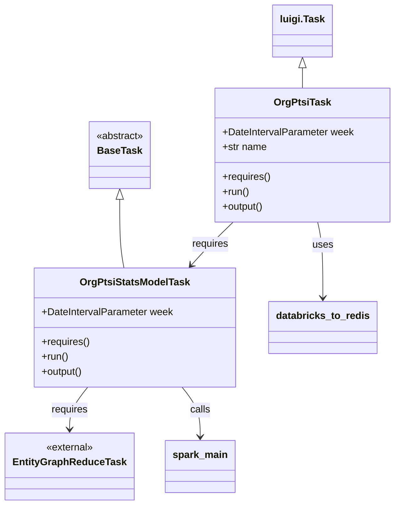
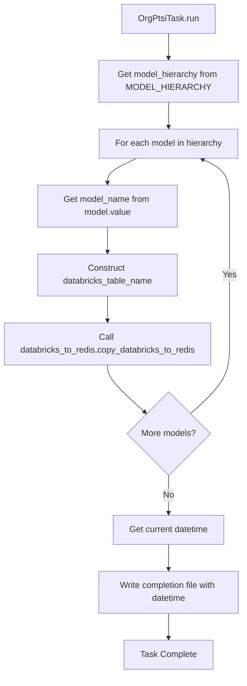

# Diagram: research/orchestrator/tasks/models/org_ptsi_stats_model.py


> Auto-generated by Obscura crawlers

## Diagram 1



### SVG

<svg id="container" width="623.53515625" xmlns="http://www.w3.org/2000/svg" class="classDiagram" height="814" viewBox="0 0 623.53515625 814" role="graphics-document document" aria-roledescription="class"><style>#container{font-family:"trebuchet ms",verdana,arial,sans-serif;font-size:16px;fill:#333;}@keyframes edge-animation-frame{from{stroke-dashoffset:0;}}@keyframes dash{to{stroke-dashoffset:0;}}#container .edge-animation-slow{stroke-dasharray:9,5!important;stroke-dashoffset:900;animation:dash 50s linear infinite;stroke-linecap:round;}#container .edge-animation-fast{stroke-dasharray:9,5!important;stroke-dashoffset:900;animation:dash 20s linear infinite;stroke-linecap:round;}#container .error-icon{fill:#552222;}#container .error-text{fill:#552222;stroke:#552222;}#container .edge-thickness-normal{stroke-width:1px;}#container .edge-thickness-thick{stroke-width:3.5px;}#container .edge-pattern-solid{stroke-dasharray:0;}#container .edge-thickness-invisible{stroke-width:0;fill:none;}#container .edge-pattern-dashed{stroke-dasharray:3;}#container .edge-pattern-dotted{stroke-dasharray:2;}#container .marker{fill:#333333;stroke:#333333;}#container .marker.cross{stroke:#333333;}#container svg{font-family:"trebuchet ms",verdana,arial,sans-serif;font-size:16px;}#container p{margin:0;}#container g.classGroup text{fill:#9370DB;stroke:none;font-family:"trebuchet ms",verdana,arial,sans-serif;font-size:10px;}#container g.classGroup text .title{font-weight:bolder;}#container .nodeLabel,#container .edgeLabel{color:#131300;}#container .edgeLabel .label rect{fill:#ECECFF;}#container .label text{fill:#131300;}#container .labelBkg{background:#ECECFF;}#container .edgeLabel .label span{background:#ECECFF;}#container .classTitle{font-weight:bolder;}#container .node rect,#container .node circle,#container .node ellipse,#container .node polygon,#container .node path{fill:#ECECFF;stroke:#9370DB;stroke-width:1px;}#container .divider{stroke:#9370DB;stroke-width:1;}#container g.clickable{cursor:pointer;}#container g.classGroup rect{fill:#ECECFF;stroke:#9370DB;}#container g.classGroup line{stroke:#9370DB;stroke-width:1;}#container .classLabel .box{stroke:none;stroke-width:0;fill:#ECECFF;opacity:0.5;}#container .classLabel .label{fill:#9370DB;font-size:10px;}#container .relation{stroke:#333333;stroke-width:1;fill:none;}#container .dashed-line{stroke-dasharray:3;}#container .dotted-line{stroke-dasharray:1 2;}#container #compositionStart,#container .composition{fill:#333333!important;stroke:#333333!important;stroke-width:1;}#container #compositionEnd,#container .composition{fill:#333333!important;stroke:#333333!important;stroke-width:1;}#container #dependencyStart,#container .dependency{fill:#333333!important;stroke:#333333!important;stroke-width:1;}#container #dependencyStart,#container .dependency{fill:#333333!important;stroke:#333333!important;stroke-width:1;}#container #extensionStart,#container .extension{fill:transparent!important;stroke:#333333!important;stroke-width:1;}#container #extensionEnd,#container .extension{fill:transparent!important;stroke:#333333!important;stroke-width:1;}#container #aggregationStart,#container .aggregation{fill:transparent!important;stroke:#333333!important;stroke-width:1;}#container #aggregationEnd,#container .aggregation{fill:transparent!important;stroke:#333333!important;stroke-width:1;}#container #lollipopStart,#container .lollipop{fill:#ECECFF!important;stroke:#333333!important;stroke-width:1;}#container #lollipopEnd,#container .lollipop{fill:#ECECFF!important;stroke:#333333!important;stroke-width:1;}#container .edgeTerminals{font-size:11px;line-height:initial;}#container .classTitleText{text-anchor:middle;font-size:18px;fill:#333;}#container .label-icon{display:inline-block;height:1em;overflow:visible;vertical-align:-0.125em;}#container .node .label-icon path{fill:currentColor;stroke:revert;stroke-width:revert;}#container :root{--mermaid-font-family:"trebuchet ms",verdana,arial,sans-serif;}</style><g><defs><marker id="container_class-aggregationStart" class="marker aggregation class" refX="18" refY="7" markerWidth="190" markerHeight="240" orient="auto"><path d="M 18,7 L9,13 L1,7 L9,1 Z"></path></marker></defs><defs><marker id="container_class-aggregationEnd" class="marker aggregation class" refX="1" refY="7" markerWidth="20" markerHeight="28" orient="auto"><path d="M 18,7 L9,13 L1,7 L9,1 Z"></path></marker></defs><defs><marker id="container_class-extensionStart" class="marker extension class" refX="18" refY="7" markerWidth="190" markerHeight="240" orient="auto"><path d="M 1,7 L18,13 V 1 Z"></path></marker></defs><defs><marker id="container_class-extensionEnd" class="marker extension class" refX="1" refY="7" markerWidth="20" markerHeight="28" orient="auto"><path d="M 1,1 V 13 L18,7 Z"></path></marker></defs><defs><marker id="container_class-compositionStart" class="marker composition class" refX="18" refY="7" markerWidth="190" markerHeight="240" orient="auto"><path d="M 18,7 L9,13 L1,7 L9,1 Z"></path></marker></defs><defs><marker id="container_class-compositionEnd" class="marker composition class" refX="1" refY="7" markerWidth="20" markerHeight="28" orient="auto"><path d="M 18,7 L9,13 L1,7 L9,1 Z"></path></marker></defs><defs><marker id="container_class-dependencyStart" class="marker dependency class" refX="6" refY="7" markerWidth="190" markerHeight="240" orient="auto"><path d="M 5,7 L9,13 L1,7 L9,1 Z"></path></marker></defs><defs><marker id="container_class-dependencyEnd" class="marker dependency class" refX="13" refY="7" markerWidth="20" markerHeight="28" orient="auto"><path d="M 18,7 L9,13 L14,7 L9,1 Z"></path></marker></defs><defs><marker id="container_class-lollipopStart" class="marker lollipop class" refX="13" refY="7" markerWidth="190" markerHeight="240" orient="auto"><circle stroke="black" fill="transparent" cx="7" cy="7" r="6"></circle></marker></defs><defs><marker id="container_class-lollipopEnd" class="marker lollipop class" refX="1" refY="7" markerWidth="190" markerHeight="240" orient="auto"><circle stroke="black" fill="transparent" cx="7" cy="7" r="6"></circle></marker></defs><g class="root"><g class="clusters"></g><g class="edgePaths"><path d="M182.977,321.25L182.977,333.542C182.977,345.833,182.977,370.417,184.132,388.875C185.288,407.333,187.599,419.667,188.755,425.833L189.911,432" id="id_BaseTask_OrgPtsiStatsModelTask_1" class="edge-thickness-normal edge-pattern-solid relation" style=";;;" data-edge="true" data-et="edge" data-id="id_BaseTask_OrgPtsiStatsModelTask_1" data-points="W3sieCI6MTgyLjk3NjU2MjUsInkiOjMwNH0seyJ4IjoxODIuOTc2NTYyNSwieSI6Mzk1fSx7IngiOjE4OS45MTA4MDIzOTY2MTY1MywieSI6NDMyfV0=" marker-start="url(#container_class-extensionStart)"></path><path d="M475.711,109.25L475.711,110.542C475.711,111.833,475.711,114.417,475.711,119.875C475.711,125.333,475.711,133.667,475.711,137.833L475.711,142" id="id_luigi.Task_OrgPtsiTask_2" class="edge-thickness-normal edge-pattern-solid relation" style=";;;" data-edge="true" data-et="edge" data-id="id_luigi.Task_OrgPtsiTask_2" data-points="W3sieCI6NDc1LjcxMDkzNzUsInkiOjkyfSx7IngiOjQ3NS43MTA5Mzc1LCJ5IjoxMTd9LHsieCI6NDc1LjcxMDkzNzUsInkiOjE0Mn1d" marker-start="url(#container_class-extensionStart)"></path><path d="M134.603,624L129.894,630.167C125.186,636.333,115.769,648.667,111.06,660C106.352,671.333,106.352,681.667,106.352,686.833L106.352,692" id="id_OrgPtsiStatsModelTask_EntityGraphReduceTask_3" class="edge-thickness-normal edge-pattern-solid relation" style=";;;" data-edge="true" data-et="edge" data-id="id_OrgPtsiStatsModelTask_EntityGraphReduceTask_3" data-points="W3sieCI6MTM0LjYwMjUzMTcxOTkyNDgsInkiOjYyNH0seyJ4IjoxMDYuMzUxNTYyNSwieSI6NjYxfSx7IngiOjEwNi4zNTE1NjI1LCJ5Ijo2OTh9XQ==" marker-end="url(#container_class-dependencyEnd)"></path><path d="M365.78,358L359.504,364.167C353.227,370.333,340.673,382.667,329.493,394.258C318.312,405.85,308.506,416.699,303.602,422.124L298.699,427.549" id="id_OrgPtsiTask_OrgPtsiStatsModelTask_4" class="edge-thickness-normal edge-pattern-solid relation" style=";;;" data-edge="true" data-et="edge" data-id="id_OrgPtsiTask_OrgPtsiStatsModelTask_4" data-points="W3sieCI6MzY1Ljc4MDQ5NTY4OTY1NTE0LCJ5IjozNTh9LHsieCI6MzI4LjExOTE0MDYyNSwieSI6Mzk1fSx7IngiOjI5NC42NzUzNzAwNjU3ODk1LCJ5Ijo0MzJ9XQ==" marker-end="url(#container_class-dependencyEnd)"></path><path d="M281.202,624L285.911,630.167C290.619,636.333,300.036,648.667,304.745,662C309.453,675.333,309.453,689.667,309.453,696.833L309.453,704" id="id_OrgPtsiStatsModelTask_spark_main_5" class="edge-thickness-normal edge-pattern-solid relation" style=";;;" data-edge="true" data-et="edge" data-id="id_OrgPtsiStatsModelTask_spark_main_5" data-points="W3sieCI6MjgxLjIwMjE1NTc4MDA3NTIsInkiOjYyNH0seyJ4IjozMDkuNDUzMTI1LCJ5Ijo2NjF9LHsieCI6MzA5LjQ1MzEyNSwieSI6NzEwfV0=" marker-end="url(#container_class-dependencyEnd)"></path><path d="M500.418,358L501.829,364.167C503.24,370.333,506.061,382.667,507.472,403C508.883,423.333,508.883,451.667,508.883,465.833L508.883,480" id="id_OrgPtsiTask_databricks_to_redis_6" class="edge-thickness-normal edge-pattern-solid relation" style=";;;" data-edge="true" data-et="edge" data-id="id_OrgPtsiTask_databricks_to_redis_6" data-points="W3sieCI6NTAwLjQxODI2NTA4NjIwNjksInkiOjM1OH0seyJ4Ijo1MDguODgyODEyNSwieSI6Mzk1fSx7IngiOjUwOC44ODI4MTI1LCJ5Ijo0ODZ9XQ==" marker-end="url(#container_class-dependencyEnd)"></path></g><g class="edgeLabels"><g class="edgeLabel"><g class="label" data-id="id_BaseTask_OrgPtsiStatsModelTask_1" transform="translate(0, 0)"><foreignObject width="0" height="0"><div xmlns="http://www.w3.org/1999/xhtml" class="labelBkg" style="display: table-cell; white-space: nowrap; line-height: 1.5; max-width: 200px; text-align: center;"><span class="edgeLabel"></span></div></foreignObject></g></g><g class="edgeLabel"><g class="label" data-id="id_luigi.Task_OrgPtsiTask_2" transform="translate(0, 0)"><foreignObject width="0" height="0"><div xmlns="http://www.w3.org/1999/xhtml" class="labelBkg" style="display: table-cell; white-space: nowrap; line-height: 1.5; max-width: 200px; text-align: center;"><span class="edgeLabel"></span></div></foreignObject></g></g><g class="edgeLabel" transform="translate(106.3515625, 661)"><g class="label" data-id="id_OrgPtsiStatsModelTask_EntityGraphReduceTask_3" transform="translate(-29.8515625, -12)"><foreignObject width="59.703125" height="24"><div xmlns="http://www.w3.org/1999/xhtml" class="labelBkg" style="display: table-cell; white-space: nowrap; line-height: 1.5; max-width: 200px; text-align: center;"><span class="edgeLabel"><p>requires</p></span></div></foreignObject></g></g><g class="edgeLabel" transform="translate(329.16095, 393.97649)"><g class="label" data-id="id_OrgPtsiTask_OrgPtsiStatsModelTask_4" transform="translate(-29.8515625, -12)"><foreignObject width="59.703125" height="24"><div xmlns="http://www.w3.org/1999/xhtml" class="labelBkg" style="display: table-cell; white-space: nowrap; line-height: 1.5; max-width: 200px; text-align: center;"><span class="edgeLabel"><p>requires</p></span></div></foreignObject></g></g><g class="edgeLabel" transform="translate(309.453125, 661)"><g class="label" data-id="id_OrgPtsiStatsModelTask_spark_main_5" transform="translate(-16.4453125, -12)"><foreignObject width="32.890625" height="24"><div xmlns="http://www.w3.org/1999/xhtml" class="labelBkg" style="display: table-cell; white-space: nowrap; line-height: 1.5; max-width: 200px; text-align: center;"><span class="edgeLabel"><p>calls</p></span></div></foreignObject></g></g><g class="edgeLabel" transform="translate(508.8828125, 395)"><g class="label" data-id="id_OrgPtsiTask_databricks_to_redis_6" transform="translate(-16.4921875, -12)"><foreignObject width="32.984375" height="24"><div xmlns="http://www.w3.org/1999/xhtml" class="labelBkg" style="display: table-cell; white-space: nowrap; line-height: 1.5; max-width: 200px; text-align: center;"><span class="edgeLabel"><p>uses</p></span></div></foreignObject></g></g></g><g class="nodes"><g class="node default" id="classId-BaseTask-0" transform="translate(182.9765625, 250)"><g class="basic label-container"><path d="M-50.609375 -54 L50.609375 -54 L50.609375 54 L-50.609375 54" stroke="none" stroke-width="0" fill="#ECECFF" style=""></path><path d="M-50.609375 -54 C-22.40883777439476 -54, 5.7916994512104765 -54, 50.609375 -54 M-50.609375 -54 C-24.309634446473797 -54, 1.990106107052405 -54, 50.609375 -54 M50.609375 -54 C50.609375 -13.686406864939187, 50.609375 26.627186270121626, 50.609375 54 M50.609375 -54 C50.609375 -26.930054104117286, 50.609375 0.13989179176542876, 50.609375 54 M50.609375 54 C28.067795483180248 54, 5.526215966360496 54, -50.609375 54 M50.609375 54 C30.302144481925716 54, 9.994913963851431 54, -50.609375 54 M-50.609375 54 C-50.609375 27.32697919523739, -50.609375 0.6539583904747772, -50.609375 -54 M-50.609375 54 C-50.609375 17.258417657948172, -50.609375 -19.483164684103656, -50.609375 -54" stroke="#9370DB" stroke-width="1.3" fill="none" stroke-dasharray="0 0" style=""></path></g><g class="annotation-group text" transform="translate(-38.609375, -30)"><g class="label" style="" transform="translate(0,-12)"><foreignObject width="77.21875" height="24"><div xmlns="http://www.w3.org/1999/xhtml" style="display: table-cell; white-space: nowrap; line-height: 1.5; max-width: 127px; text-align: center;"><span class="nodeLabel markdown-node-label" style=""><p>«abstract»</p></span></div></foreignObject></g></g><g class="label-group text" transform="translate(-34.03125, -6)"><g class="label" style="font-weight: bolder" transform="translate(0,-12)"><foreignObject width="68.0625" height="24"><div xmlns="http://www.w3.org/1999/xhtml" style="display: table-cell; white-space: nowrap; line-height: 1.5; max-width: 117px; text-align: center;"><span class="nodeLabel markdown-node-label" style=""><p>BaseTask</p></span></div></foreignObject></g></g><g class="members-group text" transform="translate(-38.609375, 42)"></g><g class="methods-group text" transform="translate(-38.609375, 72)"></g><g class="divider" style=""><path d="M-50.609375 18 C-10.154023893473678 18, 30.301327213052645 18, 50.609375 18 M-50.609375 18 C-12.426136354069804 18, 25.75710229186039 18, 50.609375 18" stroke="#9370DB" stroke-width="1.3" fill="none" stroke-dasharray="0 0" style=""></path></g><g class="divider" style=""><path d="M-50.609375 36 C-16.08001171666215 36, 18.449351566675702 36, 50.609375 36 M-50.609375 36 C-10.566899813126597 36, 29.475575373746807 36, 50.609375 36" stroke="#9370DB" stroke-width="1.3" fill="none" stroke-dasharray="0 0" style=""></path></g></g><g class="node default" id="classId-OrgPtsiStatsModelTask-1" transform="translate(207.90234375, 528)"><g class="basic label-container"><path d="M-160.55078125 -96 L160.55078125 -96 L160.55078125 96 L-160.55078125 96" stroke="none" stroke-width="0" fill="#ECECFF" style=""></path><path d="M-160.55078125 -96 C-35.9336505713279 -96, 88.6834801073442 -96, 160.55078125 -96 M-160.55078125 -96 C-65.46185973118668 -96, 29.627061787626644 -96, 160.55078125 -96 M160.55078125 -96 C160.55078125 -31.35576691339989, 160.55078125 33.28846617320022, 160.55078125 96 M160.55078125 -96 C160.55078125 -44.34771981025181, 160.55078125 7.30456037949638, 160.55078125 96 M160.55078125 96 C64.95477152326761 96, -30.64123820346478 96, -160.55078125 96 M160.55078125 96 C93.27426494830384 96, 25.997748646607675 96, -160.55078125 96 M-160.55078125 96 C-160.55078125 23.250035839765943, -160.55078125 -49.499928320468115, -160.55078125 -96 M-160.55078125 96 C-160.55078125 20.544834998595775, -160.55078125 -54.91033000280845, -160.55078125 -96" stroke="#9370DB" stroke-width="1.3" fill="none" stroke-dasharray="0 0" style=""></path></g><g class="annotation-group text" transform="translate(0, -72)"></g><g class="label-group text" transform="translate(-84.9765625, -72)"><g class="label" style="font-weight: bolder" transform="translate(0,-12)"><foreignObject width="169.953125" height="24"><div xmlns="http://www.w3.org/1999/xhtml" style="display: table-cell; white-space: nowrap; line-height: 1.5; max-width: 216px; text-align: center;"><span class="nodeLabel markdown-node-label" style=""><p>OrgPtsiStatsModelTask</p></span></div></foreignObject></g></g><g class="members-group text" transform="translate(-148.55078125, -24)"><g class="label" style="" transform="translate(0,-12)"><foreignObject width="212.125" height="24"><div xmlns="http://www.w3.org/1999/xhtml" style="display: table-cell; white-space: nowrap; line-height: 1.5; max-width: 270px; text-align: center;"><span class="nodeLabel markdown-node-label" style=""><p>+DateIntervalParameter week</p></span></div></foreignObject></g></g><g class="methods-group text" transform="translate(-148.55078125, 24)"><g class="label" style="" transform="translate(0,-12)"><foreignObject width="78.0625" height="24"><div xmlns="http://www.w3.org/1999/xhtml" style="display: table-cell; white-space: nowrap; line-height: 1.5; max-width: 135px; text-align: center;"><span class="nodeLabel markdown-node-label" style=""><p>+requires()</p></span></div></foreignObject></g><g class="label" style="" transform="translate(0,12)"><foreignObject width="43.21875" height="24"><div xmlns="http://www.w3.org/1999/xhtml" style="display: table-cell; white-space: nowrap; line-height: 1.5; max-width: 101px; text-align: center;"><span class="nodeLabel markdown-node-label" style=""><p>+run()</p></span></div></foreignObject></g><g class="label" style="" transform="translate(0,36)"><foreignObject width="67.390625" height="24"><div xmlns="http://www.w3.org/1999/xhtml" style="display: table-cell; white-space: nowrap; line-height: 1.5; max-width: 125px; text-align: center;"><span class="nodeLabel markdown-node-label" style=""><p>+output()</p></span></div></foreignObject></g></g><g class="divider" style=""><path d="M-160.55078125 -48 C-32.64446568982903 -48, 95.26184987034193 -48, 160.55078125 -48 M-160.55078125 -48 C-68.04815715834614 -48, 24.454466933307714 -48, 160.55078125 -48" stroke="#9370DB" stroke-width="1.3" fill="none" stroke-dasharray="0 0" style=""></path></g><g class="divider" style=""><path d="M-160.55078125 0 C-86.33934968698416 0, -12.127918123968328 0, 160.55078125 0 M-160.55078125 0 C-42.90926154031227 0, 74.73225816937546 0, 160.55078125 0" stroke="#9370DB" stroke-width="1.3" fill="none" stroke-dasharray="0 0" style=""></path></g></g><g class="node default" id="classId-OrgPtsiTask-2" transform="translate(475.7109375, 250)"><g class="basic label-container"><path d="M-139.82421875 -108 L139.82421875 -108 L139.82421875 108 L-139.82421875 108" stroke="none" stroke-width="0" fill="#ECECFF" style=""></path><path d="M-139.82421875 -108 C-69.6292289266532 -108, 0.5657608966936039 -108, 139.82421875 -108 M-139.82421875 -108 C-49.432007811236176 -108, 40.96020312752765 -108, 139.82421875 -108 M139.82421875 -108 C139.82421875 -27.488028294037292, 139.82421875 53.023943411925416, 139.82421875 108 M139.82421875 -108 C139.82421875 -53.091800925250254, 139.82421875 1.8163981494994914, 139.82421875 108 M139.82421875 108 C65.40699445910589 108, -9.010229831788223 108, -139.82421875 108 M139.82421875 108 C77.70916149502087 108, 15.59410424004173 108, -139.82421875 108 M-139.82421875 108 C-139.82421875 64.06371460053613, -139.82421875 20.12742920107226, -139.82421875 -108 M-139.82421875 108 C-139.82421875 38.28556283341125, -139.82421875 -31.428874333177504, -139.82421875 -108" stroke="#9370DB" stroke-width="1.3" fill="none" stroke-dasharray="0 0" style=""></path></g><g class="annotation-group text" transform="translate(0, -84)"></g><g class="label-group text" transform="translate(-43.5234375, -84)"><g class="label" style="font-weight: bolder" transform="translate(0,-12)"><foreignObject width="87.046875" height="24"><div xmlns="http://www.w3.org/1999/xhtml" style="display: table-cell; white-space: nowrap; line-height: 1.5; max-width: 135px; text-align: center;"><span class="nodeLabel markdown-node-label" style=""><p>OrgPtsiTask</p></span></div></foreignObject></g></g><g class="members-group text" transform="translate(-127.82421875, -36)"><g class="label" style="" transform="translate(0,-12)"><foreignObject width="212.125" height="24"><div xmlns="http://www.w3.org/1999/xhtml" style="display: table-cell; white-space: nowrap; line-height: 1.5; max-width: 270px; text-align: center;"><span class="nodeLabel markdown-node-label" style=""><p>+DateIntervalParameter week</p></span></div></foreignObject></g><g class="label" style="" transform="translate(0,12)"><foreignObject width="72.171875" height="24"><div xmlns="http://www.w3.org/1999/xhtml" style="display: table-cell; white-space: nowrap; line-height: 1.5; max-width: 130px; text-align: center;"><span class="nodeLabel markdown-node-label" style=""><p>+str name</p></span></div></foreignObject></g></g><g class="methods-group text" transform="translate(-127.82421875, 36)"><g class="label" style="" transform="translate(0,-12)"><foreignObject width="78.0625" height="24"><div xmlns="http://www.w3.org/1999/xhtml" style="display: table-cell; white-space: nowrap; line-height: 1.5; max-width: 135px; text-align: center;"><span class="nodeLabel markdown-node-label" style=""><p>+requires()</p></span></div></foreignObject></g><g class="label" style="" transform="translate(0,12)"><foreignObject width="43.21875" height="24"><div xmlns="http://www.w3.org/1999/xhtml" style="display: table-cell; white-space: nowrap; line-height: 1.5; max-width: 101px; text-align: center;"><span class="nodeLabel markdown-node-label" style=""><p>+run()</p></span></div></foreignObject></g><g class="label" style="" transform="translate(0,36)"><foreignObject width="67.390625" height="24"><div xmlns="http://www.w3.org/1999/xhtml" style="display: table-cell; white-space: nowrap; line-height: 1.5; max-width: 125px; text-align: center;"><span class="nodeLabel markdown-node-label" style=""><p>+output()</p></span></div></foreignObject></g></g><g class="divider" style=""><path d="M-139.82421875 -60 C-42.36151228503499 -60, 55.10119417993002 -60, 139.82421875 -60 M-139.82421875 -60 C-36.78549159736312 -60, 66.25323555527376 -60, 139.82421875 -60" stroke="#9370DB" stroke-width="1.3" fill="none" stroke-dasharray="0 0" style=""></path></g><g class="divider" style=""><path d="M-139.82421875 12 C-37.00048639683686 12, 65.82324595632628 12, 139.82421875 12 M-139.82421875 12 C-79.9449063119271 12, -20.065593873854212 12, 139.82421875 12" stroke="#9370DB" stroke-width="1.3" fill="none" stroke-dasharray="0 0" style=""></path></g></g><g class="node default" id="classId-EntityGraphReduceTask-3" transform="translate(106.3515625, 752)"><g class="basic label-container"><path d="M-98.3515625 -54 L98.3515625 -54 L98.3515625 54 L-98.3515625 54" stroke="none" stroke-width="0" fill="#ECECFF" style=""></path><path d="M-98.3515625 -54 C-40.91123017748094 -54, 16.529102145038124 -54, 98.3515625 -54 M-98.3515625 -54 C-43.97376927831208 -54, 10.404023943375833 -54, 98.3515625 -54 M98.3515625 -54 C98.3515625 -26.348727232425883, 98.3515625 1.3025455351482336, 98.3515625 54 M98.3515625 -54 C98.3515625 -14.563280692611826, 98.3515625 24.873438614776347, 98.3515625 54 M98.3515625 54 C38.510699200679504 54, -21.330164098640992 54, -98.3515625 54 M98.3515625 54 C38.13805778220978 54, -22.075446935580445 54, -98.3515625 54 M-98.3515625 54 C-98.3515625 25.428292263266737, -98.3515625 -3.1434154734665256, -98.3515625 -54 M-98.3515625 54 C-98.3515625 25.998121214859754, -98.3515625 -2.0037575702804915, -98.3515625 -54" stroke="#9370DB" stroke-width="1.3" fill="none" stroke-dasharray="0 0" style=""></path></g><g class="annotation-group text" transform="translate(-38.65625, -30)"><g class="label" style="" transform="translate(0,-12)"><foreignObject width="77.3125" height="24"><div xmlns="http://www.w3.org/1999/xhtml" style="display: table-cell; white-space: nowrap; line-height: 1.5; max-width: 127px; text-align: center;"><span class="nodeLabel markdown-node-label" style=""><p>«external»</p></span></div></foreignObject></g></g><g class="label-group text" transform="translate(-86.3515625, -6)"><g class="label" style="font-weight: bolder" transform="translate(0,-12)"><foreignObject width="172.703125" height="24"><div xmlns="http://www.w3.org/1999/xhtml" style="display: table-cell; white-space: nowrap; line-height: 1.5; max-width: 221px; text-align: center;"><span class="nodeLabel markdown-node-label" style=""><p>EntityGraphReduceTask</p></span></div></foreignObject></g></g><g class="members-group text" transform="translate(-86.3515625, 42)"></g><g class="methods-group text" transform="translate(-86.3515625, 72)"></g><g class="divider" style=""><path d="M-98.3515625 18 C-56.7412066504025 18, -15.130850800805007 18, 98.3515625 18 M-98.3515625 18 C-57.03952428045334 18, -15.727486060906685 18, 98.3515625 18" stroke="#9370DB" stroke-width="1.3" fill="none" stroke-dasharray="0 0" style=""></path></g><g class="divider" style=""><path d="M-98.3515625 36 C-38.18208376977814 36, 21.987394960443723 36, 98.3515625 36 M-98.3515625 36 C-41.308811340179886 36, 15.733939819640227 36, 98.3515625 36" stroke="#9370DB" stroke-width="1.3" fill="none" stroke-dasharray="0 0" style=""></path></g></g><g class="node default" id="classId-luigi.Task-4" transform="translate(475.7109375, 50)"><g class="basic label-container"><path d="M-45.8203125 -42 L45.8203125 -42 L45.8203125 42 L-45.8203125 42" stroke="none" stroke-width="0" fill="#ECECFF" style=""></path><path d="M-45.8203125 -42 C-24.908630798024227 -42, -3.9969490960484535 -42, 45.8203125 -42 M-45.8203125 -42 C-17.64986303443924 -42, 10.520586431121522 -42, 45.8203125 -42 M45.8203125 -42 C45.8203125 -12.842543341336857, 45.8203125 16.314913317326287, 45.8203125 42 M45.8203125 -42 C45.8203125 -20.572895640620484, 45.8203125 0.8542087187590326, 45.8203125 42 M45.8203125 42 C13.646419482651858 42, -18.527473534696284 42, -45.8203125 42 M45.8203125 42 C26.68894168540098 42, 7.55757087080196 42, -45.8203125 42 M-45.8203125 42 C-45.8203125 8.697907161620655, -45.8203125 -24.60418567675869, -45.8203125 -42 M-45.8203125 42 C-45.8203125 10.366951016239042, -45.8203125 -21.266097967521915, -45.8203125 -42" stroke="#9370DB" stroke-width="1.3" fill="none" stroke-dasharray="0 0" style=""></path></g><g class="annotation-group text" transform="translate(0, -18)"></g><g class="label-group text" transform="translate(-33.8203125, -18)"><g class="label" style="font-weight: bolder" transform="translate(0,-12)"><foreignObject width="67.640625" height="24"><div xmlns="http://www.w3.org/1999/xhtml" style="display: table-cell; white-space: nowrap; line-height: 1.5; max-width: 117px; text-align: center;"><span class="nodeLabel markdown-node-label" style=""><p>luigi.Task</p></span></div></foreignObject></g></g><g class="members-group text" transform="translate(-33.8203125, 30)"></g><g class="methods-group text" transform="translate(-33.8203125, 60)"></g><g class="divider" style=""><path d="M-45.8203125 6 C-18.410185019524654 6, 8.999942460950692 6, 45.8203125 6 M-45.8203125 6 C-26.297561673432366 6, -6.774810846864732 6, 45.8203125 6" stroke="#9370DB" stroke-width="1.3" fill="none" stroke-dasharray="0 0" style=""></path></g><g class="divider" style=""><path d="M-45.8203125 24 C-27.400546928970236 24, -8.980781357940472 24, 45.8203125 24 M-45.8203125 24 C-10.268420966895803 24, 25.283470566208393 24, 45.8203125 24" stroke="#9370DB" stroke-width="1.3" fill="none" stroke-dasharray="0 0" style=""></path></g></g><g class="node default" id="classId-spark_main-5" transform="translate(309.453125, 752)"><g class="basic label-container"><path d="M-54.75 -42 L54.75 -42 L54.75 42 L-54.75 42" stroke="none" stroke-width="0" fill="#ECECFF" style=""></path><path d="M-54.75 -42 C-16.24997540232407 -42, 22.250049195351863 -42, 54.75 -42 M-54.75 -42 C-16.075253682281733 -42, 22.599492635436533 -42, 54.75 -42 M54.75 -42 C54.75 -14.288499376163017, 54.75 13.423001247673966, 54.75 42 M54.75 -42 C54.75 -10.063808973248143, 54.75 21.872382053503713, 54.75 42 M54.75 42 C21.51871127101233 42, -11.712577457975343 42, -54.75 42 M54.75 42 C26.239232763286925 42, -2.2715344734261507 42, -54.75 42 M-54.75 42 C-54.75 17.027617194052116, -54.75 -7.944765611895768, -54.75 -42 M-54.75 42 C-54.75 19.338051643200853, -54.75 -3.3238967135982946, -54.75 -42" stroke="#9370DB" stroke-width="1.3" fill="none" stroke-dasharray="0 0" style=""></path></g><g class="annotation-group text" transform="translate(0, -18)"></g><g class="label-group text" transform="translate(-42.75, -18)"><g class="label" style="font-weight: bolder" transform="translate(0,-12)"><foreignObject width="85.5" height="24"><div xmlns="http://www.w3.org/1999/xhtml" style="display: table-cell; white-space: nowrap; line-height: 1.5; max-width: 135px; text-align: center;"><span class="nodeLabel markdown-node-label" style=""><p>spark_main</p></span></div></foreignObject></g></g><g class="members-group text" transform="translate(-42.75, 30)"></g><g class="methods-group text" transform="translate(-42.75, 60)"></g><g class="divider" style=""><path d="M-54.75 6 C-21.89151232053964 6, 10.96697535892072 6, 54.75 6 M-54.75 6 C-17.846782588334264 6, 19.05643482333147 6, 54.75 6" stroke="#9370DB" stroke-width="1.3" fill="none" stroke-dasharray="0 0" style=""></path></g><g class="divider" style=""><path d="M-54.75 24 C-23.52228076720049 24, 7.705438465599023 24, 54.75 24 M-54.75 24 C-16.155934429656696 24, 22.438131140686608 24, 54.75 24" stroke="#9370DB" stroke-width="1.3" fill="none" stroke-dasharray="0 0" style=""></path></g></g><g class="node default" id="classId-databricks_to_redis-6" transform="translate(508.8828125, 528)"><g class="basic label-container"><path d="M-84.6328125 -42 L84.6328125 -42 L84.6328125 42 L-84.6328125 42" stroke="none" stroke-width="0" fill="#ECECFF" style=""></path><path d="M-84.6328125 -42 C-19.532500044916716 -42, 45.56781241016657 -42, 84.6328125 -42 M-84.6328125 -42 C-33.50577700641667 -42, 17.621258487166656 -42, 84.6328125 -42 M84.6328125 -42 C84.6328125 -17.064911482950194, 84.6328125 7.870177034099612, 84.6328125 42 M84.6328125 -42 C84.6328125 -19.49087158737278, 84.6328125 3.01825682525444, 84.6328125 42 M84.6328125 42 C30.525232886712367 42, -23.582346726575267 42, -84.6328125 42 M84.6328125 42 C49.65541563108968 42, 14.678018762179363 42, -84.6328125 42 M-84.6328125 42 C-84.6328125 23.936056045649163, -84.6328125 5.872112091298327, -84.6328125 -42 M-84.6328125 42 C-84.6328125 9.934541159151486, -84.6328125 -22.130917681697028, -84.6328125 -42" stroke="#9370DB" stroke-width="1.3" fill="none" stroke-dasharray="0 0" style=""></path></g><g class="annotation-group text" transform="translate(0, -18)"></g><g class="label-group text" transform="translate(-72.6328125, -18)"><g class="label" style="font-weight: bolder" transform="translate(0,-12)"><foreignObject width="145.265625" height="24"><div xmlns="http://www.w3.org/1999/xhtml" style="display: table-cell; white-space: nowrap; line-height: 1.5; max-width: 193px; text-align: center;"><span class="nodeLabel markdown-node-label" style=""><p>databricks_to_redis</p></span></div></foreignObject></g></g><g class="members-group text" transform="translate(-72.6328125, 30)"></g><g class="methods-group text" transform="translate(-72.6328125, 60)"></g><g class="divider" style=""><path d="M-84.6328125 6 C-23.415896404939268 6, 37.801019690121464 6, 84.6328125 6 M-84.6328125 6 C-28.512629372306968 6, 27.607553755386064 6, 84.6328125 6" stroke="#9370DB" stroke-width="1.3" fill="none" stroke-dasharray="0 0" style=""></path></g><g class="divider" style=""><path d="M-84.6328125 24 C-25.46403400941916 24, 33.70474448116168 24, 84.6328125 24 M-84.6328125 24 C-19.997393485419707 24, 44.638025529160586 24, 84.6328125 24" stroke="#9370DB" stroke-width="1.3" fill="none" stroke-dasharray="0 0" style=""></path></g></g></g></g></g></svg>

## Diagram 2

```mermaid
flowchart TD
    A[OrgPtsiStatsModelTask.run] --> B[spark_main]
    B --> C[Read INPUT_TABLE from Databricks]
    C --> D[Filter by 365-day window]
    D --> E[Create Window Spec by ent_id, sup_status_location_id]
    E --> F[Add status_code_rank using rank]
    F --> G[Add next_status_code using lead]
    G --> H[Add next_status_code_ts using lead]
    H --> I[Calculate status_to_status_seconds]
    I --> J[Filter: positive seconds, different codes, chronological]
    J --> K[Rename and add location city column]
    K --> L[For each model in hierarchy]
    L --> M[Calculate statistics columns: std, avg, median, stddev_distance]
    M --> N[Filter outliers: stddev_distance between -3.0 and 3.0]
    N --> O[Group by rollup_keys]
    O --> P[Aggregate: 30/60/90/120/180/365-day statistics]
    P --> Q[Add modelTs timestamp]
    Q --> R[Write to Delta table with overwrite]
    R --> S[Write completion marker file]
    L --> L : next model
```

> SVG rendering failed for this diagram.

## Diagram 3



### SVG

<svg id="container" width="456.28125" xmlns="http://www.w3.org/2000/svg" class="flowchart" height="1274.828125" viewBox="0 0 456.28125 1274.828125" role="graphics-document document" aria-roledescription="flowchart-v2"><style>#container{font-family:"trebuchet ms",verdana,arial,sans-serif;font-size:16px;fill:#333;}@keyframes edge-animation-frame{from{stroke-dashoffset:0;}}@keyframes dash{to{stroke-dashoffset:0;}}#container .edge-animation-slow{stroke-dasharray:9,5!important;stroke-dashoffset:900;animation:dash 50s linear infinite;stroke-linecap:round;}#container .edge-animation-fast{stroke-dasharray:9,5!important;stroke-dashoffset:900;animation:dash 20s linear infinite;stroke-linecap:round;}#container .error-icon{fill:#552222;}#container .error-text{fill:#552222;stroke:#552222;}#container .edge-thickness-normal{stroke-width:1px;}#container .edge-thickness-thick{stroke-width:3.5px;}#container .edge-pattern-solid{stroke-dasharray:0;}#container .edge-thickness-invisible{stroke-width:0;fill:none;}#container .edge-pattern-dashed{stroke-dasharray:3;}#container .edge-pattern-dotted{stroke-dasharray:2;}#container .marker{fill:#333333;stroke:#333333;}#container .marker.cross{stroke:#333333;}#container svg{font-family:"trebuchet ms",verdana,arial,sans-serif;font-size:16px;}#container p{margin:0;}#container .label{font-family:"trebuchet ms",verdana,arial,sans-serif;color:#333;}#container .cluster-label text{fill:#333;}#container .cluster-label span{color:#333;}#container .cluster-label span p{background-color:transparent;}#container .label text,#container span{fill:#333;color:#333;}#container .node rect,#container .node circle,#container .node ellipse,#container .node polygon,#container .node path{fill:#ECECFF;stroke:#9370DB;stroke-width:1px;}#container .rough-node .label text,#container .node .label text,#container .image-shape .label,#container .icon-shape .label{text-anchor:middle;}#container .node .katex path{fill:#000;stroke:#000;stroke-width:1px;}#container .rough-node .label,#container .node .label,#container .image-shape .label,#container .icon-shape .label{text-align:center;}#container .node.clickable{cursor:pointer;}#container .root .anchor path{fill:#333333!important;stroke-width:0;stroke:#333333;}#container .arrowheadPath{fill:#333333;}#container .edgePath .path{stroke:#333333;stroke-width:2.0px;}#container .flowchart-link{stroke:#333333;fill:none;}#container .edgeLabel{background-color:rgba(232,232,232, 0.8);text-align:center;}#container .edgeLabel p{background-color:rgba(232,232,232, 0.8);}#container .edgeLabel rect{opacity:0.5;background-color:rgba(232,232,232, 0.8);fill:rgba(232,232,232, 0.8);}#container .labelBkg{background-color:rgba(232, 232, 232, 0.5);}#container .cluster rect{fill:#ffffde;stroke:#aaaa33;stroke-width:1px;}#container .cluster text{fill:#333;}#container .cluster span{color:#333;}#container div.mermaidTooltip{position:absolute;text-align:center;max-width:200px;padding:2px;font-family:"trebuchet ms",verdana,arial,sans-serif;font-size:12px;background:hsl(80, 100%, 96.2745098039%);border:1px solid #aaaa33;border-radius:2px;pointer-events:none;z-index:100;}#container .flowchartTitleText{text-anchor:middle;font-size:18px;fill:#333;}#container rect.text{fill:none;stroke-width:0;}#container .icon-shape,#container .image-shape{background-color:rgba(232,232,232, 0.8);text-align:center;}#container .icon-shape p,#container .image-shape p{background-color:rgba(232,232,232, 0.8);padding:2px;}#container .icon-shape rect,#container .image-shape rect{opacity:0.5;background-color:rgba(232,232,232, 0.8);fill:rgba(232,232,232, 0.8);}#container .label-icon{display:inline-block;height:1em;overflow:visible;vertical-align:-0.125em;}#container .node .label-icon path{fill:currentColor;stroke:revert;stroke-width:revert;}#container :root{--mermaid-font-family:"trebuchet ms",verdana,arial,sans-serif;}</style><g><marker id="container_flowchart-v2-pointEnd" class="marker flowchart-v2" viewBox="0 0 10 10" refX="5" refY="5" markerUnits="userSpaceOnUse" markerWidth="8" markerHeight="8" orient="auto"><path d="M 0 0 L 10 5 L 0 10 z" class="arrowMarkerPath" style="stroke-width: 1; stroke-dasharray: 1, 0;"></path></marker><marker id="container_flowchart-v2-pointStart" class="marker flowchart-v2" viewBox="0 0 10 10" refX="4.5" refY="5" markerUnits="userSpaceOnUse" markerWidth="8" markerHeight="8" orient="auto"><path d="M 0 5 L 10 10 L 10 0 z" class="arrowMarkerPath" style="stroke-width: 1; stroke-dasharray: 1, 0;"></path></marker><marker id="container_flowchart-v2-circleEnd" class="marker flowchart-v2" viewBox="0 0 10 10" refX="11" refY="5" markerUnits="userSpaceOnUse" markerWidth="11" markerHeight="11" orient="auto"><circle cx="5" cy="5" r="5" class="arrowMarkerPath" style="stroke-width: 1; stroke-dasharray: 1, 0;"></circle></marker><marker id="container_flowchart-v2-circleStart" class="marker flowchart-v2" viewBox="0 0 10 10" refX="-1" refY="5" markerUnits="userSpaceOnUse" markerWidth="11" markerHeight="11" orient="auto"><circle cx="5" cy="5" r="5" class="arrowMarkerPath" style="stroke-width: 1; stroke-dasharray: 1, 0;"></circle></marker><marker id="container_flowchart-v2-crossEnd" class="marker cross flowchart-v2" viewBox="0 0 11 11" refX="12" refY="5.2" markerUnits="userSpaceOnUse" markerWidth="11" markerHeight="11" orient="auto"><path d="M 1,1 l 9,9 M 10,1 l -9,9" class="arrowMarkerPath" style="stroke-width: 2; stroke-dasharray: 1, 0;"></path></marker><marker id="container_flowchart-v2-crossStart" class="marker cross flowchart-v2" viewBox="0 0 11 11" refX="-1" refY="5.2" markerUnits="userSpaceOnUse" markerWidth="11" markerHeight="11" orient="auto"><path d="M 1,1 l 9,9 M 10,1 l -9,9" class="arrowMarkerPath" style="stroke-width: 2; stroke-dasharray: 1, 0;"></path></marker><g class="root"><g class="clusters"></g><g class="edgePaths"><path d="M318.281,62L318.281,66.167C318.281,70.333,318.281,78.667,318.281,86.333C318.281,94,318.281,101,318.281,104.5L318.281,108" id="L_Start_A_0" class="edge-thickness-normal edge-pattern-solid edge-thickness-normal edge-pattern-solid flowchart-link" style=";" data-edge="true" data-et="edge" data-id="L_Start_A_0" data-points="W3sieCI6MzE4LjI4MTI1LCJ5Ijo2Mn0seyJ4IjozMTguMjgxMjUsInkiOjg3fSx7IngiOjMxOC4yODEyNSwieSI6MTEyfV0=" marker-end="url(#container_flowchart-v2-pointEnd)"></path><path d="M318.281,190L318.281,194.167C318.281,198.333,318.281,206.667,318.281,214.333C318.281,222,318.281,229,318.281,232.5L318.281,236" id="L_A_B_0" class="edge-thickness-normal edge-pattern-solid edge-thickness-normal edge-pattern-solid flowchart-link" style=";" data-edge="true" data-et="edge" data-id="L_A_B_0" data-points="W3sieCI6MzE4LjI4MTI1LCJ5IjoxOTB9LHsieCI6MzE4LjI4MTI1LCJ5IjoyMTV9LHsieCI6MzE4LjI4MTI1LCJ5IjoyNDB9XQ==" marker-end="url(#container_flowchart-v2-pointEnd)"></path><path d="M248.146,318L240.653,322.167C233.16,326.333,218.174,334.667,210.681,342.333C203.188,350,203.188,357,203.188,360.5L203.188,364" id="L_B_C_0" class="edge-thickness-normal edge-pattern-solid edge-thickness-normal edge-pattern-solid flowchart-link" style=";" data-edge="true" data-et="edge" data-id="L_B_C_0" data-points="W3sieCI6MjQ4LjE0NTk5NjA5Mzc1LCJ5IjozMTh9LHsieCI6MjAzLjE4NzUsInkiOjM0M30seyJ4IjoyMDMuMTg3NSwieSI6MzY4fV0=" marker-end="url(#container_flowchart-v2-pointEnd)"></path><path d="M203.188,446L203.188,450.167C203.188,454.333,203.188,462.667,203.188,470.333C203.188,478,203.188,485,203.188,488.5L203.188,492" id="L_C_D_0" class="edge-thickness-normal edge-pattern-solid edge-thickness-normal edge-pattern-solid flowchart-link" style=";" data-edge="true" data-et="edge" data-id="L_C_D_0" data-points="W3sieCI6MjAzLjE4NzUsInkiOjQ0Nn0seyJ4IjoyMDMuMTg3NSwieSI6NDcxfSx7IngiOjIwMy4xODc1LCJ5Ijo0OTZ9XQ==" marker-end="url(#container_flowchart-v2-pointEnd)"></path><path d="M203.188,574L203.188,578.167C203.188,582.333,203.188,590.667,203.188,598.333C203.188,606,203.188,613,203.188,616.5L203.188,620" id="L_D_E_0" class="edge-thickness-normal edge-pattern-solid edge-thickness-normal edge-pattern-solid flowchart-link" style=";" data-edge="true" data-et="edge" data-id="L_D_E_0" data-points="W3sieCI6MjAzLjE4NzUsInkiOjU3NH0seyJ4IjoyMDMuMTg3NSwieSI6NTk5fSx7IngiOjIwMy4xODc1LCJ5Ijo2MjR9XQ==" marker-end="url(#container_flowchart-v2-pointEnd)"></path><path d="M203.188,702L203.188,706.167C203.188,710.333,203.188,718.667,215.045,733.384C226.902,748.101,250.616,769.203,262.473,779.754L274.33,790.304" id="L_E_F_0" class="edge-thickness-normal edge-pattern-solid edge-thickness-normal edge-pattern-solid flowchart-link" style=";" data-edge="true" data-et="edge" data-id="L_E_F_0" data-points="W3sieCI6MjAzLjE4NzUsInkiOjcwMn0seyJ4IjoyMDMuMTg3NSwieSI6NzI3fSx7IngiOjI3Ny4zMTc3Nzk5ODI3NTkyNSwieSI6NzkyLjk2MzQ3MDAxNzI0MDh9XQ==" marker-end="url(#container_flowchart-v2-pointEnd)"></path><path d="M359.245,792.963L371.6,781.97C383.955,770.976,408.665,748.988,421.02,727.327C433.375,705.667,433.375,684.333,433.375,663C433.375,641.667,433.375,620.333,433.375,599C433.375,577.667,433.375,556.333,433.375,535C433.375,513.667,433.375,492.333,433.375,471C433.375,449.667,433.375,428.333,433.375,407C433.375,385.667,433.375,364.333,426.465,349.824C419.554,335.315,405.733,327.629,398.823,323.787L391.912,319.944" id="L_F_B_0" class="edge-thickness-normal edge-pattern-solid edge-thickness-normal edge-pattern-solid flowchart-link" style=";" data-edge="true" data-et="edge" data-id="L_F_B_0" data-points="W3sieCI6MzU5LjI0NDcyMDAxNzI0MDc1LCJ5Ijo3OTIuOTYzNDcwMDE3MjQwOH0seyJ4Ijo0MzMuMzc1LCJ5Ijo3Mjd9LHsieCI6NDMzLjM3NSwieSI6NjYzfSx7IngiOjQzMy4zNzUsInkiOjU5OX0seyJ4Ijo0MzMuMzc1LCJ5Ijo1MzV9LHsieCI6NDMzLjM3NSwieSI6NDcxfSx7IngiOjQzMy4zNzUsInkiOjQwN30seyJ4Ijo0MzMuMzc1LCJ5IjozNDN9LHsieCI6Mzg4LjQxNjUwMzkwNjI1LCJ5IjozMTh9XQ==" marker-end="url(#container_flowchart-v2-pointEnd)"></path><path d="M318.281,906.828L318.281,912.995C318.281,919.161,318.281,931.495,318.281,943.161C318.281,954.828,318.281,965.828,318.281,971.328L318.281,976.828" id="L_F_G_0" class="edge-thickness-normal edge-pattern-solid edge-thickness-normal edge-pattern-solid flowchart-link" style=";" data-edge="true" data-et="edge" data-id="L_F_G_0" data-points="W3sieCI6MzE4LjI4MTI1LCJ5Ijo5MDYuODI4MTI1fSx7IngiOjMxOC4yODEyNSwieSI6OTQzLjgyODEyNX0seyJ4IjozMTguMjgxMjUsInkiOjk4MC44MjgxMjV9XQ==" marker-end="url(#container_flowchart-v2-pointEnd)"></path><path d="M318.281,1034.828L318.281,1038.995C318.281,1043.161,318.281,1051.495,318.281,1059.161C318.281,1066.828,318.281,1073.828,318.281,1077.328L318.281,1080.828" id="L_G_H_0" class="edge-thickness-normal edge-pattern-solid edge-thickness-normal edge-pattern-solid flowchart-link" style=";" data-edge="true" data-et="edge" data-id="L_G_H_0" data-points="W3sieCI6MzE4LjI4MTI1LCJ5IjoxMDM0LjgyODEyNX0seyJ4IjozMTguMjgxMjUsInkiOjEwNTkuODI4MTI1fSx7IngiOjMxOC4yODEyNSwieSI6MTA4NC44MjgxMjV9XQ==" marker-end="url(#container_flowchart-v2-pointEnd)"></path><path d="M318.281,1162.828L318.281,1166.995C318.281,1171.161,318.281,1179.495,318.281,1187.161C318.281,1194.828,318.281,1201.828,318.281,1205.328L318.281,1208.828" id="L_H_End_0" class="edge-thickness-normal edge-pattern-solid edge-thickness-normal edge-pattern-solid flowchart-link" style=";" data-edge="true" data-et="edge" data-id="L_H_End_0" data-points="W3sieCI6MzE4LjI4MTI1LCJ5IjoxMTYyLjgyODEyNX0seyJ4IjozMTguMjgxMjUsInkiOjExODcuODI4MTI1fSx7IngiOjMxOC4yODEyNSwieSI6MTIxMi44MjgxMjV9XQ==" marker-end="url(#container_flowchart-v2-pointEnd)"></path></g><g class="edgeLabels"><g class="edgeLabel"><g class="label" data-id="L_Start_A_0" transform="translate(0, 0)"><foreignObject width="0" height="0"><div xmlns="http://www.w3.org/1999/xhtml" class="labelBkg" style="display: table-cell; white-space: nowrap; line-height: 1.5; max-width: 200px; text-align: center;"><span class="edgeLabel"></span></div></foreignObject></g></g><g class="edgeLabel"><g class="label" data-id="L_A_B_0" transform="translate(0, 0)"><foreignObject width="0" height="0"><div xmlns="http://www.w3.org/1999/xhtml" class="labelBkg" style="display: table-cell; white-space: nowrap; line-height: 1.5; max-width: 200px; text-align: center;"><span class="edgeLabel"></span></div></foreignObject></g></g><g class="edgeLabel"><g class="label" data-id="L_B_C_0" transform="translate(0, 0)"><foreignObject width="0" height="0"><div xmlns="http://www.w3.org/1999/xhtml" class="labelBkg" style="display: table-cell; white-space: nowrap; line-height: 1.5; max-width: 200px; text-align: center;"><span class="edgeLabel"></span></div></foreignObject></g></g><g class="edgeLabel"><g class="label" data-id="L_C_D_0" transform="translate(0, 0)"><foreignObject width="0" height="0"><div xmlns="http://www.w3.org/1999/xhtml" class="labelBkg" style="display: table-cell; white-space: nowrap; line-height: 1.5; max-width: 200px; text-align: center;"><span class="edgeLabel"></span></div></foreignObject></g></g><g class="edgeLabel"><g class="label" data-id="L_D_E_0" transform="translate(0, 0)"><foreignObject width="0" height="0"><div xmlns="http://www.w3.org/1999/xhtml" class="labelBkg" style="display: table-cell; white-space: nowrap; line-height: 1.5; max-width: 200px; text-align: center;"><span class="edgeLabel"></span></div></foreignObject></g></g><g class="edgeLabel"><g class="label" data-id="L_E_F_0" transform="translate(0, 0)"><foreignObject width="0" height="0"><div xmlns="http://www.w3.org/1999/xhtml" class="labelBkg" style="display: table-cell; white-space: nowrap; line-height: 1.5; max-width: 200px; text-align: center;"><span class="edgeLabel"></span></div></foreignObject></g></g><g class="edgeLabel" transform="translate(433.375, 535)"><g class="label" data-id="L_F_B_0" transform="translate(-12.03125, -12)"><foreignObject width="24.0625" height="24"><div xmlns="http://www.w3.org/1999/xhtml" class="labelBkg" style="display: table-cell; white-space: nowrap; line-height: 1.5; max-width: 200px; text-align: center;"><span class="edgeLabel"><p>Yes</p></span></div></foreignObject></g></g><g class="edgeLabel" transform="translate(318.28125, 943.828125)"><g class="label" data-id="L_F_G_0" transform="translate(-10.140625, -12)"><foreignObject width="20.28125" height="24"><div xmlns="http://www.w3.org/1999/xhtml" class="labelBkg" style="display: table-cell; white-space: nowrap; line-height: 1.5; max-width: 200px; text-align: center;"><span class="edgeLabel"><p>No</p></span></div></foreignObject></g></g><g class="edgeLabel"><g class="label" data-id="L_G_H_0" transform="translate(0, 0)"><foreignObject width="0" height="0"><div xmlns="http://www.w3.org/1999/xhtml" class="labelBkg" style="display: table-cell; white-space: nowrap; line-height: 1.5; max-width: 200px; text-align: center;"><span class="edgeLabel"></span></div></foreignObject></g></g><g class="edgeLabel"><g class="label" data-id="L_H_End_0" transform="translate(0, 0)"><foreignObject width="0" height="0"><div xmlns="http://www.w3.org/1999/xhtml" class="labelBkg" style="display: table-cell; white-space: nowrap; line-height: 1.5; max-width: 200px; text-align: center;"><span class="edgeLabel"></span></div></foreignObject></g></g></g><g class="nodes"><g class="node default" id="flowchart-Start-0" transform="translate(318.28125, 35)"><rect class="basic label-container" style="" x="-86.3828125" y="-27" width="172.765625" height="54"></rect><g class="label" style="" transform="translate(-56.3828125, -12)"><rect></rect><foreignObject width="112.765625" height="24"><div xmlns="http://www.w3.org/1999/xhtml" style="display: table-cell; white-space: nowrap; line-height: 1.5; max-width: 200px; text-align: center;"><span class="nodeLabel"><p>OrgPtsiTask.run</p></span></div></foreignObject></g></g><g class="node default" id="flowchart-A-1" transform="translate(318.28125, 151)"><rect class="basic label-container" style="" x="-130" y="-39" width="260" height="78"></rect><g class="label" style="" transform="translate(-100, -24)"><rect></rect><foreignObject width="200" height="48"><div xmlns="http://www.w3.org/1999/xhtml" style="display: table; white-space: break-spaces; line-height: 1.5; max-width: 200px; text-align: center; width: 200px;"><span class="nodeLabel"><p>Get model_hierarchy from MODEL_HIERARCHY</p></span></div></foreignObject></g></g><g class="node default" id="flowchart-B-3" transform="translate(318.28125, 279)"><rect class="basic label-container" style="" x="-130" y="-39" width="260" height="78"></rect><g class="label" style="" transform="translate(-100, -24)"><rect></rect><foreignObject width="200" height="48"><div xmlns="http://www.w3.org/1999/xhtml" style="display: table; white-space: break-spaces; line-height: 1.5; max-width: 200px; text-align: center; width: 200px;"><span class="nodeLabel"><p>For each model in hierarchy</p></span></div></foreignObject></g></g><g class="node default" id="flowchart-C-5" transform="translate(203.1875, 407)"><rect class="basic label-container" style="" x="-130" y="-39" width="260" height="78"></rect><g class="label" style="" transform="translate(-100, -24)"><rect></rect><foreignObject width="200" height="48"><div xmlns="http://www.w3.org/1999/xhtml" style="display: table; white-space: break-spaces; line-height: 1.5; max-width: 200px; text-align: center; width: 200px;"><span class="nodeLabel"><p>Get model_name from model.value</p></span></div></foreignObject></g></g><g class="node default" id="flowchart-D-7" transform="translate(203.1875, 535)"><rect class="basic label-container" style="" x="-130" y="-39" width="260" height="78"></rect><g class="label" style="" transform="translate(-100, -24)"><rect></rect><foreignObject width="200" height="48"><div xmlns="http://www.w3.org/1999/xhtml" style="display: table; white-space: break-spaces; line-height: 1.5; max-width: 200px; text-align: center; width: 200px;"><span class="nodeLabel"><p>Construct databricks_table_name</p></span></div></foreignObject></g></g><g class="node default" id="flowchart-E-9" transform="translate(203.1875, 663)"><rect class="basic label-container" style="" x="-195.1875" y="-39" width="390.375" height="78"></rect><g class="label" style="" transform="translate(-165.1875, -24)"><rect></rect><foreignObject width="330.375" height="48"><div xmlns="http://www.w3.org/1999/xhtml" style="display: table; white-space: break-spaces; line-height: 1.5; max-width: 200px; text-align: center; width: 200px;"><span class="nodeLabel"><p>Call databricks_to_redis.copy_databricks_to_redis</p></span></div></foreignObject></g></g><g class="node default" id="flowchart-F-11" transform="translate(318.28125, 829.4140625)"><polygon points="77.4140625,0 154.828125,-77.4140625 77.4140625,-154.828125 0,-77.4140625" class="label-container" transform="translate(-76.9140625, 77.4140625)"></polygon><g class="label" style="" transform="translate(-50.4140625, -12)"><rect></rect><foreignObject width="100.828125" height="24"><div xmlns="http://www.w3.org/1999/xhtml" style="display: table-cell; white-space: nowrap; line-height: 1.5; max-width: 200px; text-align: center;"><span class="nodeLabel"><p>More models?</p></span></div></foreignObject></g></g><g class="node default" id="flowchart-G-15" transform="translate(318.28125, 1007.828125)"><rect class="basic label-container" style="" x="-105.4375" y="-27" width="210.875" height="54"></rect><g class="label" style="" transform="translate(-75.4375, -12)"><rect></rect><foreignObject width="150.875" height="24"><div xmlns="http://www.w3.org/1999/xhtml" style="display: table-cell; white-space: nowrap; line-height: 1.5; max-width: 200px; text-align: center;"><span class="nodeLabel"><p>Get current datetime</p></span></div></foreignObject></g></g><g class="node default" id="flowchart-H-17" transform="translate(318.28125, 1123.828125)"><rect class="basic label-container" style="" x="-130" y="-39" width="260" height="78"></rect><g class="label" style="" transform="translate(-100, -24)"><rect></rect><foreignObject width="200" height="48"><div xmlns="http://www.w3.org/1999/xhtml" style="display: table; white-space: break-spaces; line-height: 1.5; max-width: 200px; text-align: center; width: 200px;"><span class="nodeLabel"><p>Write completion file with datetime</p></span></div></foreignObject></g></g><g class="node default" id="flowchart-End-19" transform="translate(318.28125, 1239.828125)"><rect class="basic label-container" style="" x="-82.359375" y="-27" width="164.71875" height="54"></rect><g class="label" style="" transform="translate(-52.359375, -12)"><rect></rect><foreignObject width="104.71875" height="24"><div xmlns="http://www.w3.org/1999/xhtml" style="display: table-cell; white-space: nowrap; line-height: 1.5; max-width: 200px; text-align: center;"><span class="nodeLabel"><p>Task Complete</p></span></div></foreignObject></g></g></g></g></g></svg>
