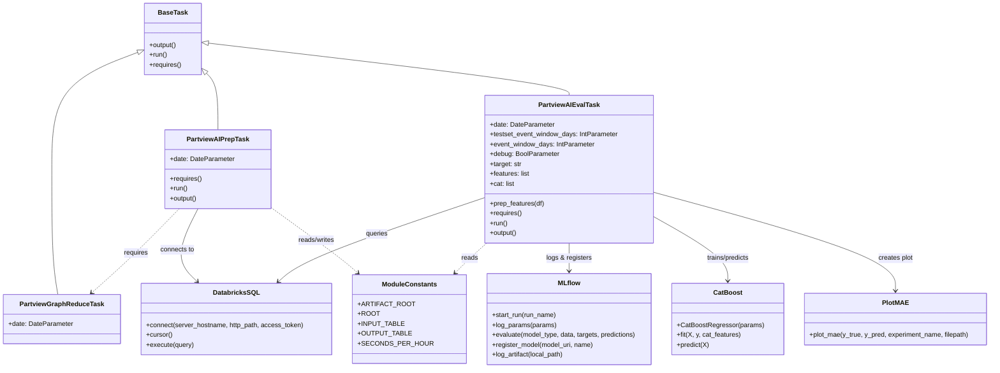

# Diagram: research/orchestrator/tasks/models/partview_ai_task.py


> Auto-generated by Obscura crawlers

## Diagram 1



### SVG

<svg id="container" width="2368.84375" xmlns="http://www.w3.org/2000/svg" class="classDiagram" height="896" viewBox="0 0 2368.84375 896" role="graphics-document document" aria-roledescription="class"><style>#container{font-family:"trebuchet ms",verdana,arial,sans-serif;font-size:16px;fill:#333;}@keyframes edge-animation-frame{from{stroke-dashoffset:0;}}@keyframes dash{to{stroke-dashoffset:0;}}#container .edge-animation-slow{stroke-dasharray:9,5!important;stroke-dashoffset:900;animation:dash 50s linear infinite;stroke-linecap:round;}#container .edge-animation-fast{stroke-dasharray:9,5!important;stroke-dashoffset:900;animation:dash 20s linear infinite;stroke-linecap:round;}#container .error-icon{fill:#552222;}#container .error-text{fill:#552222;stroke:#552222;}#container .edge-thickness-normal{stroke-width:1px;}#container .edge-thickness-thick{stroke-width:3.5px;}#container .edge-pattern-solid{stroke-dasharray:0;}#container .edge-thickness-invisible{stroke-width:0;fill:none;}#container .edge-pattern-dashed{stroke-dasharray:3;}#container .edge-pattern-dotted{stroke-dasharray:2;}#container .marker{fill:#333333;stroke:#333333;}#container .marker.cross{stroke:#333333;}#container svg{font-family:"trebuchet ms",verdana,arial,sans-serif;font-size:16px;}#container p{margin:0;}#container g.classGroup text{fill:#9370DB;stroke:none;font-family:"trebuchet ms",verdana,arial,sans-serif;font-size:10px;}#container g.classGroup text .title{font-weight:bolder;}#container .nodeLabel,#container .edgeLabel{color:#131300;}#container .edgeLabel .label rect{fill:#ECECFF;}#container .label text{fill:#131300;}#container .labelBkg{background:#ECECFF;}#container .edgeLabel .label span{background:#ECECFF;}#container .classTitle{font-weight:bolder;}#container .node rect,#container .node circle,#container .node ellipse,#container .node polygon,#container .node path{fill:#ECECFF;stroke:#9370DB;stroke-width:1px;}#container .divider{stroke:#9370DB;stroke-width:1;}#container g.clickable{cursor:pointer;}#container g.classGroup rect{fill:#ECECFF;stroke:#9370DB;}#container g.classGroup line{stroke:#9370DB;stroke-width:1;}#container .classLabel .box{stroke:none;stroke-width:0;fill:#ECECFF;opacity:0.5;}#container .classLabel .label{fill:#9370DB;font-size:10px;}#container .relation{stroke:#333333;stroke-width:1;fill:none;}#container .dashed-line{stroke-dasharray:3;}#container .dotted-line{stroke-dasharray:1 2;}#container #compositionStart,#container .composition{fill:#333333!important;stroke:#333333!important;stroke-width:1;}#container #compositionEnd,#container .composition{fill:#333333!important;stroke:#333333!important;stroke-width:1;}#container #dependencyStart,#container .dependency{fill:#333333!important;stroke:#333333!important;stroke-width:1;}#container #dependencyStart,#container .dependency{fill:#333333!important;stroke:#333333!important;stroke-width:1;}#container #extensionStart,#container .extension{fill:transparent!important;stroke:#333333!important;stroke-width:1;}#container #extensionEnd,#container .extension{fill:transparent!important;stroke:#333333!important;stroke-width:1;}#container #aggregationStart,#container .aggregation{fill:transparent!important;stroke:#333333!important;stroke-width:1;}#container #aggregationEnd,#container .aggregation{fill:transparent!important;stroke:#333333!important;stroke-width:1;}#container #lollipopStart,#container .lollipop{fill:#ECECFF!important;stroke:#333333!important;stroke-width:1;}#container #lollipopEnd,#container .lollipop{fill:#ECECFF!important;stroke:#333333!important;stroke-width:1;}#container .edgeTerminals{font-size:11px;line-height:initial;}#container .classTitleText{text-anchor:middle;font-size:18px;fill:#333;}#container .label-icon{display:inline-block;height:1em;overflow:visible;vertical-align:-0.125em;}#container .node .label-icon path{fill:currentColor;stroke:revert;stroke-width:revert;}#container :root{--mermaid-font-family:"trebuchet ms",verdana,arial,sans-serif;}</style><g><defs><marker id="container_class-aggregationStart" class="marker aggregation class" refX="18" refY="7" markerWidth="190" markerHeight="240" orient="auto"><path d="M 18,7 L9,13 L1,7 L9,1 Z"></path></marker></defs><defs><marker id="container_class-aggregationEnd" class="marker aggregation class" refX="1" refY="7" markerWidth="20" markerHeight="28" orient="auto"><path d="M 18,7 L9,13 L1,7 L9,1 Z"></path></marker></defs><defs><marker id="container_class-extensionStart" class="marker extension class" refX="18" refY="7" markerWidth="190" markerHeight="240" orient="auto"><path d="M 1,7 L18,13 V 1 Z"></path></marker></defs><defs><marker id="container_class-extensionEnd" class="marker extension class" refX="1" refY="7" markerWidth="20" markerHeight="28" orient="auto"><path d="M 1,1 V 13 L18,7 Z"></path></marker></defs><defs><marker id="container_class-compositionStart" class="marker composition class" refX="18" refY="7" markerWidth="190" markerHeight="240" orient="auto"><path d="M 18,7 L9,13 L1,7 L9,1 Z"></path></marker></defs><defs><marker id="container_class-compositionEnd" class="marker composition class" refX="1" refY="7" markerWidth="20" markerHeight="28" orient="auto"><path d="M 18,7 L9,13 L1,7 L9,1 Z"></path></marker></defs><defs><marker id="container_class-dependencyStart" class="marker dependency class" refX="6" refY="7" markerWidth="190" markerHeight="240" orient="auto"><path d="M 5,7 L9,13 L1,7 L9,1 Z"></path></marker></defs><defs><marker id="container_class-dependencyEnd" class="marker dependency class" refX="13" refY="7" markerWidth="20" markerHeight="28" orient="auto"><path d="M 18,7 L9,13 L14,7 L9,1 Z"></path></marker></defs><defs><marker id="container_class-lollipopStart" class="marker lollipop class" refX="13" refY="7" markerWidth="190" markerHeight="240" orient="auto"><circle stroke="black" fill="transparent" cx="7" cy="7" r="6"></circle></marker></defs><defs><marker id="container_class-lollipopEnd" class="marker lollipop class" refX="1" refY="7" markerWidth="190" markerHeight="240" orient="auto"><circle stroke="black" fill="transparent" cx="7" cy="7" r="6"></circle></marker></defs><g class="root"><g class="clusters"></g><g class="edgePaths"><path d="M327.418,127.49L293.1,140.742C258.782,153.993,190.147,180.497,155.829,227.915C121.512,275.333,121.512,343.667,121.512,414C121.512,484.333,121.512,556.667,123.982,607.5C126.452,658.333,131.392,687.667,133.862,702.333L136.332,717" id="id_BaseTask_PartviewGraphReduceTask_1" class="edge-thickness-normal edge-pattern-solid relation" style=";;;" data-edge="true" data-et="edge" data-id="id_BaseTask_PartviewGraphReduceTask_1" data-points="W3sieCI6MzQzLjUwOTc2NTYyNSwieSI6MTIxLjI3NjEwMjE2NjI4NjIxfSx7IngiOjEyMS41MTE3MTg3NSwieSI6MjA3fSx7IngiOjEyMS41MTE3MTg3NSwieSI6NDEyfSx7IngiOjEyMS41MTE3MTg3NSwieSI6NjI5fSx7IngiOjEzNi4zMzI0NTM1NDcyOTczLCJ5Ijo3MTd9XQ==" marker-start="url(#container_class-extensionStart)"></path><path d="M491.572,178.047L496.222,182.872C500.871,187.698,510.17,197.349,514.819,220.341C519.469,243.333,519.469,279.667,519.469,297.833L519.469,316" id="id_BaseTask_PartviewAIPrepTask_2" class="edge-thickness-normal edge-pattern-solid relation" style=";;;" data-edge="true" data-et="edge" data-id="id_BaseTask_PartviewAIPrepTask_2" data-points="W3sieCI6NDc5LjYwMzUxNTYyNSwieSI6MTY1LjYyNDYwNDA3OTU2NDE2fSx7IngiOjUxOS40Njg3NSwieSI6MjA3fSx7IngiOjUxOS40Njg3NSwieSI6MzE2fV0=" marker-start="url(#container_class-extensionStart)"></path><path d="M496.731,105.207L638.295,122.173C779.86,139.138,1062.988,173.069,1204.553,194.201C1346.117,215.333,1346.117,223.667,1346.117,227.833L1346.117,232" id="id_BaseTask_PartviewAIEvalTask_3" class="edge-thickness-normal edge-pattern-solid relation" style=";;;" data-edge="true" data-et="edge" data-id="id_BaseTask_PartviewAIEvalTask_3" data-points="W3sieCI6NDc5LjYwMzUxNTYyNSwieSI6MTAzLjE1NDkwMjM1MDA3NjgxfSx7IngiOjEzNDYuMTE3MTg3NSwieSI6MjA3fSx7IngiOjEzNDYuMTE3MTg3NSwieSI6MjMyfV0=" marker-start="url(#container_class-extensionStart)"></path><path d="M426.787,508L407.317,528.167C387.847,548.333,348.908,588.667,313.974,622.829C279.04,656.991,248.111,684.983,232.647,698.978L217.183,712.974" id="id_PartviewAIPrepTask_PartviewGraphReduceTask_4" class="edge-thickness-normal edge-pattern-dashed relation" style=";;;" data-edge="true" data-et="edge" data-id="id_PartviewAIPrepTask_PartviewGraphReduceTask_4" data-points="W3sieCI6NDI2Ljc4NjcyMjM1MDIzMDQzLCJ5Ijo1MDh9LHsieCI6MzA5Ljk2ODc1LCJ5Ijo2Mjl9LHsieCI6MjEyLjczMzk1MjcwMjcwMjcsInkiOjcxN31d" marker-end="url(#container_class-dependencyEnd)"></path><path d="M471.729,508L461.7,528.167C451.671,548.333,431.614,588.667,431.435,618.307C431.256,647.947,450.956,666.894,460.806,676.367L470.656,685.841" id="id_PartviewAIPrepTask_DatabricksSQL_5" class="edge-thickness-normal edge-pattern-solid relation" style=";;;" data-edge="true" data-et="edge" data-id="id_PartviewAIPrepTask_DatabricksSQL_5" data-points="W3sieCI6NDcxLjcyODgzMDY0NTE2MTMsInkiOjUwOH0seyJ4Ijo0MTEuNTU2NjQwNjI1LCJ5Ijo2Mjl9LHsieCI6NDc0Ljk4MDUwODM0MDM3MTYsInkiOjY5MH1d" marker-end="url(#container_class-dependencyEnd)"></path><path d="M645.559,504.827L673.67,525.523C701.781,546.218,758.004,587.609,792.4,614.282C826.796,640.955,839.365,652.91,845.649,658.887L851.934,664.865" id="id_PartviewAIPrepTask_ModuleConstants_6" class="edge-thickness-normal edge-pattern-dashed relation" style=";;;" data-edge="true" data-et="edge" data-id="id_PartviewAIPrepTask_ModuleConstants_6" data-points="W3sieCI6NjQ1LjU1ODU5Mzc1LCJ5Ijo1MDQuODI3MDQyODU4Mjc4OH0seyJ4Ijo4MTQuMjI2NTYyNSwieSI6NjI5fSx7IngiOjg1Ni4yODEwMzg4NTEzNTE0LCJ5Ijo2Njl9XQ==" marker-end="url(#container_class-dependencyEnd)"></path><path d="M1142.77,482.593L1072.481,506.995C1002.193,531.396,861.616,580.198,781.363,614.076C701.111,647.955,681.182,666.91,671.218,676.387L661.253,685.865" id="id_PartviewAIEvalTask_DatabricksSQL_7" class="edge-thickness-normal edge-pattern-solid relation" style=";;;" data-edge="true" data-et="edge" data-id="id_PartviewAIEvalTask_DatabricksSQL_7" data-points="W3sieCI6MTE0Mi43Njk1MzEyNSwieSI6NDgyLjU5MzQ4MjA2NDc0MTl9LHsieCI6NzIxLjAzOTA2MjUsInkiOjYyOX0seyJ4Ijo2NTYuOTA1OTg2MDY0MTg5MiwieSI6NjkwfV0=" marker-end="url(#container_class-dependencyEnd)"></path><path d="M1346.117,592L1346.117,598.167C1346.117,604.333,1346.117,616.667,1346.117,628C1346.117,639.333,1346.117,649.667,1346.117,654.833L1346.117,660" id="id_PartviewAIEvalTask_MLflow_8" class="edge-thickness-normal edge-pattern-solid relation" style=";;;" data-edge="true" data-et="edge" data-id="id_PartviewAIEvalTask_MLflow_8" data-points="W3sieCI6MTM0Ni4xMTcxODc1LCJ5Ijo1OTJ9LHsieCI6MTM0Ni4xMTcxODc1LCJ5Ijo2Mjl9LHsieCI6MTM0Ni4xMTcxODc1LCJ5Ijo2NjZ9XQ==" marker-end="url(#container_class-dependencyEnd)"></path><path d="M1549.465,526.583L1579.758,543.652C1610.051,560.722,1670.637,594.861,1700.93,621.097C1731.223,647.333,1731.223,665.667,1731.223,674.833L1731.223,684" id="id_PartviewAIEvalTask_CatBoost_9" class="edge-thickness-normal edge-pattern-solid relation" style=";;;" data-edge="true" data-et="edge" data-id="id_PartviewAIEvalTask_CatBoost_9" data-points="W3sieCI6MTU0OS40NjQ4NDM3NSwieSI6NTI2LjU4Mjc0NDE3NTE5NTZ9LHsieCI6MTczMS4yMjI2NTYyNSwieSI6NjI5fSx7IngiOjE3MzEuMjIyNjU2MjUsInkiOjY5MH1d" marker-end="url(#container_class-dependencyEnd)"></path><path d="M1549.465,467.769L1647.447,494.641C1745.428,521.513,1941.392,575.256,2039.374,615.295C2137.355,655.333,2137.355,681.667,2137.355,694.833L2137.355,708" id="id_PartviewAIEvalTask_PlotMAE_10" class="edge-thickness-normal edge-pattern-solid relation" style=";;;" data-edge="true" data-et="edge" data-id="id_PartviewAIEvalTask_PlotMAE_10" data-points="W3sieCI6MTU0OS40NjQ4NDM3NSwieSI6NDY3Ljc2ODg0MDM3NTc5NTQzfSx7IngiOjIxMzcuMzU1NDY4NzUsInkiOjYyOX0seyJ4IjoyMTM3LjM1NTQ2ODc1LCJ5Ijo3MTR9XQ==" marker-end="url(#container_class-dependencyEnd)"></path><path d="M1150.198,592L1143.486,598.167C1136.774,604.333,1123.35,616.667,1111.015,628.774C1098.679,640.881,1087.433,652.762,1081.81,658.702L1076.186,664.643" id="id_PartviewAIEvalTask_ModuleConstants_11" class="edge-thickness-normal edge-pattern-dashed relation" style=";;;" data-edge="true" data-et="edge" data-id="id_PartviewAIEvalTask_ModuleConstants_11" data-points="W3sieCI6MTE1MC4xOTgwNDg2NzUxMTUyLCJ5Ijo1OTJ9LHsieCI6MTEwOS45MjU3ODEyNSwieSI6NjI5fSx7IngiOjEwNzIuMDYxNTQ5ODMxMDgxLCJ5Ijo2Njl9XQ==" marker-end="url(#container_class-dependencyEnd)"></path></g><g class="edgeLabels"><g class="edgeLabel"><g class="label" data-id="id_BaseTask_PartviewGraphReduceTask_1" transform="translate(0, 0)"><foreignObject width="0" height="0"><div xmlns="http://www.w3.org/1999/xhtml" class="labelBkg" style="display: table-cell; white-space: nowrap; line-height: 1.5; max-width: 200px; text-align: center;"><span class="edgeLabel"></span></div></foreignObject></g></g><g class="edgeLabel"><g class="label" data-id="id_BaseTask_PartviewAIPrepTask_2" transform="translate(0, 0)"><foreignObject width="0" height="0"><div xmlns="http://www.w3.org/1999/xhtml" class="labelBkg" style="display: table-cell; white-space: nowrap; line-height: 1.5; max-width: 200px; text-align: center;"><span class="edgeLabel"></span></div></foreignObject></g></g><g class="edgeLabel"><g class="label" data-id="id_BaseTask_PartviewAIEvalTask_3" transform="translate(0, 0)"><foreignObject width="0" height="0"><div xmlns="http://www.w3.org/1999/xhtml" class="labelBkg" style="display: table-cell; white-space: nowrap; line-height: 1.5; max-width: 200px; text-align: center;"><span class="edgeLabel"></span></div></foreignObject></g></g><g class="edgeLabel" transform="translate(322.83391, 615.67427)"><g class="label" data-id="id_PartviewAIPrepTask_PartviewGraphReduceTask_4" transform="translate(-29.8515625, -12)"><foreignObject width="59.703125" height="24"><div xmlns="http://www.w3.org/1999/xhtml" class="labelBkg" style="display: table-cell; white-space: nowrap; line-height: 1.5; max-width: 200px; text-align: center;"><span class="edgeLabel"><p>requires</p></span></div></foreignObject></g></g><g class="edgeLabel" transform="translate(422.05129, 607.89635)"><g class="label" data-id="id_PartviewAIPrepTask_DatabricksSQL_5" transform="translate(-42.0859375, -12)"><foreignObject width="84.171875" height="24"><div xmlns="http://www.w3.org/1999/xhtml" class="labelBkg" style="display: table-cell; white-space: nowrap; line-height: 1.5; max-width: 200px; text-align: center;"><span class="edgeLabel"><p>connects to</p></span></div></foreignObject></g></g><g class="edgeLabel" transform="translate(753.26227, 584.11823)"><g class="label" data-id="id_PartviewAIPrepTask_ModuleConstants_6" transform="translate(-45.9453125, -12)"><foreignObject width="91.890625" height="24"><div xmlns="http://www.w3.org/1999/xhtml" class="labelBkg" style="display: table-cell; white-space: nowrap; line-height: 1.5; max-width: 200px; text-align: center;"><span class="edgeLabel"><p>reads/writes</p></span></div></foreignObject></g></g><g class="edgeLabel" transform="translate(890.09683, 570.31048)"><g class="label" data-id="id_PartviewAIEvalTask_DatabricksSQL_7" transform="translate(-27.2421875, -12)"><foreignObject width="54.484375" height="24"><div xmlns="http://www.w3.org/1999/xhtml" class="labelBkg" style="display: table-cell; white-space: nowrap; line-height: 1.5; max-width: 200px; text-align: center;"><span class="edgeLabel"><p>queries</p></span></div></foreignObject></g></g><g class="edgeLabel" transform="translate(1346.1171875, 629)"><g class="label" data-id="id_PartviewAIEvalTask_MLflow_8" transform="translate(-56.0859375, -12)"><foreignObject width="112.171875" height="24"><div xmlns="http://www.w3.org/1999/xhtml" class="labelBkg" style="display: table-cell; white-space: nowrap; line-height: 1.5; max-width: 200px; text-align: center;"><span class="edgeLabel"><p>logs &amp; registers</p></span></div></foreignObject></g></g><g class="edgeLabel" transform="translate(1731.22265625, 629)"><g class="label" data-id="id_PartviewAIEvalTask_CatBoost_9" transform="translate(-54.1015625, -12)"><foreignObject width="108.203125" height="24"><div xmlns="http://www.w3.org/1999/xhtml" class="labelBkg" style="display: table-cell; white-space: nowrap; line-height: 1.5; max-width: 200px; text-align: center;"><span class="edgeLabel"><p>trains/predicts</p></span></div></foreignObject></g></g><g class="edgeLabel" transform="translate(2137.35546875, 629)"><g class="label" data-id="id_PartviewAIEvalTask_PlotMAE_10" transform="translate(-42.90625, -12)"><foreignObject width="85.8125" height="24"><div xmlns="http://www.w3.org/1999/xhtml" class="labelBkg" style="display: table-cell; white-space: nowrap; line-height: 1.5; max-width: 200px; text-align: center;"><span class="edgeLabel"><p>creates plot</p></span></div></foreignObject></g></g><g class="edgeLabel" transform="translate(1109.92578125, 629)"><g class="label" data-id="id_PartviewAIEvalTask_ModuleConstants_11" transform="translate(-20.0078125, -12)"><foreignObject width="40.015625" height="24"><div xmlns="http://www.w3.org/1999/xhtml" class="labelBkg" style="display: table-cell; white-space: nowrap; line-height: 1.5; max-width: 200px; text-align: center;"><span class="edgeLabel"><p>reads</p></span></div></foreignObject></g></g></g><g class="nodes"><g class="node default" id="classId-BaseTask-0" transform="translate(411.556640625, 95)"><g class="basic label-container"><path d="M-68.046875 -87 L68.046875 -87 L68.046875 87 L-68.046875 87" stroke="none" stroke-width="0" fill="#ECECFF" style=""></path><path d="M-68.046875 -87 C-15.416974563450268 -87, 37.212925873099465 -87, 68.046875 -87 M-68.046875 -87 C-30.965794327273805 -87, 6.11528634545239 -87, 68.046875 -87 M68.046875 -87 C68.046875 -50.352450858192526, 68.046875 -13.704901716385052, 68.046875 87 M68.046875 -87 C68.046875 -51.65573415186136, 68.046875 -16.31146830372272, 68.046875 87 M68.046875 87 C39.02392227241383 87, 10.000969544827662 87, -68.046875 87 M68.046875 87 C39.901748699389316 87, 11.756622398778639 87, -68.046875 87 M-68.046875 87 C-68.046875 31.558927787853932, -68.046875 -23.882144424292136, -68.046875 -87 M-68.046875 87 C-68.046875 45.27364907150654, -68.046875 3.54729814301308, -68.046875 -87" stroke="#9370DB" stroke-width="1.3" fill="none" stroke-dasharray="0 0" style=""></path></g><g class="annotation-group text" transform="translate(0, -63)"></g><g class="label-group text" transform="translate(-34.03125, -63)"><g class="label" style="font-weight: bolder" transform="translate(0,-12)"><foreignObject width="68.0625" height="24"><div xmlns="http://www.w3.org/1999/xhtml" style="display: table-cell; white-space: nowrap; line-height: 1.5; max-width: 117px; text-align: center;"><span class="nodeLabel markdown-node-label" style=""><p>BaseTask</p></span></div></foreignObject></g></g><g class="members-group text" transform="translate(-56.046875, -15)"></g><g class="methods-group text" transform="translate(-56.046875, 15)"><g class="label" style="" transform="translate(0,-12)"><foreignObject width="67.390625" height="24"><div xmlns="http://www.w3.org/1999/xhtml" style="display: table-cell; white-space: nowrap; line-height: 1.5; max-width: 125px; text-align: center;"><span class="nodeLabel markdown-node-label" style=""><p>+output()</p></span></div></foreignObject></g><g class="label" style="" transform="translate(0,12)"><foreignObject width="43.21875" height="24"><div xmlns="http://www.w3.org/1999/xhtml" style="display: table-cell; white-space: nowrap; line-height: 1.5; max-width: 101px; text-align: center;"><span class="nodeLabel markdown-node-label" style=""><p>+run()</p></span></div></foreignObject></g><g class="label" style="" transform="translate(0,36)"><foreignObject width="78.0625" height="24"><div xmlns="http://www.w3.org/1999/xhtml" style="display: table-cell; white-space: nowrap; line-height: 1.5; max-width: 135px; text-align: center;"><span class="nodeLabel markdown-node-label" style=""><p>+requires()</p></span></div></foreignObject></g></g><g class="divider" style=""><path d="M-68.046875 -39 C-22.74010463156234 -39, 22.566665736875322 -39, 68.046875 -39 M-68.046875 -39 C-35.77800380026372 -39, -3.509132600527437 -39, 68.046875 -39" stroke="#9370DB" stroke-width="1.3" fill="none" stroke-dasharray="0 0" style=""></path></g><g class="divider" style=""><path d="M-68.046875 -15 C-39.26583521953033 -15, -10.484795439060655 -15, 68.046875 -15 M-68.046875 -15 C-23.126666572566535 -15, 21.79354185486693 -15, 68.046875 -15" stroke="#9370DB" stroke-width="1.3" fill="none" stroke-dasharray="0 0" style=""></path></g></g><g class="node default" id="classId-PartviewGraphReduceTask-1" transform="translate(146.4375, 777)"><g class="basic label-container"><path d="M-138.4375 -60 L138.4375 -60 L138.4375 60 L-138.4375 60" stroke="none" stroke-width="0" fill="#ECECFF" style=""></path><path d="M-138.4375 -60 C-54.74657550421584 -60, 28.94434899156832 -60, 138.4375 -60 M-138.4375 -60 C-66.8508349144185 -60, 4.735830171163002 -60, 138.4375 -60 M138.4375 -60 C138.4375 -16.838152598494993, 138.4375 26.323694803010014, 138.4375 60 M138.4375 -60 C138.4375 -31.994774322228814, 138.4375 -3.989548644457628, 138.4375 60 M138.4375 60 C60.305168099501586 60, -17.82716380099683 60, -138.4375 60 M138.4375 60 C72.31377895180626 60, 6.190057903612512 60, -138.4375 60 M-138.4375 60 C-138.4375 31.50422974947472, -138.4375 3.008459498949442, -138.4375 -60 M-138.4375 60 C-138.4375 28.364221866142813, -138.4375 -3.2715562677143737, -138.4375 -60" stroke="#9370DB" stroke-width="1.3" fill="none" stroke-dasharray="0 0" style=""></path></g><g class="annotation-group text" transform="translate(0, -36)"></g><g class="label-group text" transform="translate(-96.859375, -36)"><g class="label" style="font-weight: bolder" transform="translate(0,-12)"><foreignObject width="193.71875" height="24"><div xmlns="http://www.w3.org/1999/xhtml" style="display: table-cell; white-space: nowrap; line-height: 1.5; max-width: 240px; text-align: center;"><span class="nodeLabel markdown-node-label" style=""><p>PartviewGraphReduceTask</p></span></div></foreignObject></g></g><g class="members-group text" transform="translate(-126.4375, 12)"><g class="label" style="" transform="translate(0,-12)"><foreignObject width="156.015625" height="24"><div xmlns="http://www.w3.org/1999/xhtml" style="display: table-cell; white-space: nowrap; line-height: 1.5; max-width: 214px; text-align: center;"><span class="nodeLabel markdown-node-label" style=""><p>+date: DateParameter</p></span></div></foreignObject></g></g><g class="methods-group text" transform="translate(-126.4375, 60)"></g><g class="divider" style=""><path d="M-138.4375 -12 C-59.23968555926544 -12, 19.958128881469122 -12, 138.4375 -12 M-138.4375 -12 C-64.04862477133415 -12, 10.340250457331706 -12, 138.4375 -12" stroke="#9370DB" stroke-width="1.3" fill="none" stroke-dasharray="0 0" style=""></path></g><g class="divider" style=""><path d="M-138.4375 36 C-39.476875083996234 36, 59.48374983200753 36, 138.4375 36 M-138.4375 36 C-81.31337839989324 36, -24.189256799786477 36, 138.4375 36" stroke="#9370DB" stroke-width="1.3" fill="none" stroke-dasharray="0 0" style=""></path></g></g><g class="node default" id="classId-PartviewAIPrepTask-2" transform="translate(519.46875, 412)"><g class="basic label-container"><path d="M-126.08984375 -96 L126.08984375 -96 L126.08984375 96 L-126.08984375 96" stroke="none" stroke-width="0" fill="#ECECFF" style=""></path><path d="M-126.08984375 -96 C-44.365901100143205 -96, 37.35804154971359 -96, 126.08984375 -96 M-126.08984375 -96 C-30.13471851822294 -96, 65.82040671355412 -96, 126.08984375 -96 M126.08984375 -96 C126.08984375 -51.464653999693, 126.08984375 -6.929307999385998, 126.08984375 96 M126.08984375 -96 C126.08984375 -42.104677343511284, 126.08984375 11.790645312977432, 126.08984375 96 M126.08984375 96 C57.494413184047716 96, -11.101017381904569 96, -126.08984375 96 M126.08984375 96 C45.56462690704055 96, -34.960589935918904 96, -126.08984375 96 M-126.08984375 96 C-126.08984375 30.231909681442957, -126.08984375 -35.536180637114086, -126.08984375 -96 M-126.08984375 96 C-126.08984375 40.33469306570392, -126.08984375 -15.330613868592167, -126.08984375 -96" stroke="#9370DB" stroke-width="1.3" fill="none" stroke-dasharray="0 0" style=""></path></g><g class="annotation-group text" transform="translate(0, -72)"></g><g class="label-group text" transform="translate(-72.1640625, -72)"><g class="label" style="font-weight: bolder" transform="translate(0,-12)"><foreignObject width="144.328125" height="24"><div xmlns="http://www.w3.org/1999/xhtml" style="display: table-cell; white-space: nowrap; line-height: 1.5; max-width: 191px; text-align: center;"><span class="nodeLabel markdown-node-label" style=""><p>PartviewAIPrepTask</p></span></div></foreignObject></g></g><g class="members-group text" transform="translate(-114.08984375, -24)"><g class="label" style="" transform="translate(0,-12)"><foreignObject width="156.015625" height="24"><div xmlns="http://www.w3.org/1999/xhtml" style="display: table-cell; white-space: nowrap; line-height: 1.5; max-width: 214px; text-align: center;"><span class="nodeLabel markdown-node-label" style=""><p>+date: DateParameter</p></span></div></foreignObject></g></g><g class="methods-group text" transform="translate(-114.08984375, 24)"><g class="label" style="" transform="translate(0,-12)"><foreignObject width="78.0625" height="24"><div xmlns="http://www.w3.org/1999/xhtml" style="display: table-cell; white-space: nowrap; line-height: 1.5; max-width: 135px; text-align: center;"><span class="nodeLabel markdown-node-label" style=""><p>+requires()</p></span></div></foreignObject></g><g class="label" style="" transform="translate(0,12)"><foreignObject width="43.21875" height="24"><div xmlns="http://www.w3.org/1999/xhtml" style="display: table-cell; white-space: nowrap; line-height: 1.5; max-width: 101px; text-align: center;"><span class="nodeLabel markdown-node-label" style=""><p>+run()</p></span></div></foreignObject></g><g class="label" style="" transform="translate(0,36)"><foreignObject width="67.390625" height="24"><div xmlns="http://www.w3.org/1999/xhtml" style="display: table-cell; white-space: nowrap; line-height: 1.5; max-width: 125px; text-align: center;"><span class="nodeLabel markdown-node-label" style=""><p>+output()</p></span></div></foreignObject></g></g><g class="divider" style=""><path d="M-126.08984375 -48 C-73.3698579444879 -48, -20.64987213897581 -48, 126.08984375 -48 M-126.08984375 -48 C-33.08525692183471 -48, 59.919329906330574 -48, 126.08984375 -48" stroke="#9370DB" stroke-width="1.3" fill="none" stroke-dasharray="0 0" style=""></path></g><g class="divider" style=""><path d="M-126.08984375 0 C-41.89947488994123 0, 42.29089397011754 0, 126.08984375 0 M-126.08984375 0 C-62.62089520444006 0, 0.8480533411198792 0, 126.08984375 0" stroke="#9370DB" stroke-width="1.3" fill="none" stroke-dasharray="0 0" style=""></path></g></g><g class="node default" id="classId-PartviewAIEvalTask-3" transform="translate(1346.1171875, 412)"><g class="basic label-container"><path d="M-203.34765625 -180 L203.34765625 -180 L203.34765625 180 L-203.34765625 180" stroke="none" stroke-width="0" fill="#ECECFF" style=""></path><path d="M-203.34765625 -180 C-113.57992619021611 -180, -23.812196130432227 -180, 203.34765625 -180 M-203.34765625 -180 C-111.8419710381863 -180, -20.336285826372603 -180, 203.34765625 -180 M203.34765625 -180 C203.34765625 -86.32790838419893, 203.34765625 7.3441832316021305, 203.34765625 180 M203.34765625 -180 C203.34765625 -60.79251989060583, 203.34765625 58.41496021878834, 203.34765625 180 M203.34765625 180 C60.95492401486868 180, -81.43780822026264 180, -203.34765625 180 M203.34765625 180 C99.69605789525941 180, -3.9555404594811705 180, -203.34765625 180 M-203.34765625 180 C-203.34765625 65.66615825564523, -203.34765625 -48.66768348870954, -203.34765625 -180 M-203.34765625 180 C-203.34765625 61.22593879687726, -203.34765625 -57.54812240624548, -203.34765625 -180" stroke="#9370DB" stroke-width="1.3" fill="none" stroke-dasharray="0 0" style=""></path></g><g class="annotation-group text" transform="translate(0, -156)"></g><g class="label-group text" transform="translate(-70.0234375, -156)"><g class="label" style="font-weight: bolder" transform="translate(0,-12)"><foreignObject width="140.046875" height="24"><div xmlns="http://www.w3.org/1999/xhtml" style="display: table-cell; white-space: nowrap; line-height: 1.5; max-width: 187px; text-align: center;"><span class="nodeLabel markdown-node-label" style=""><p>PartviewAIEvalTask</p></span></div></foreignObject></g></g><g class="members-group text" transform="translate(-191.34765625, -108)"><g class="label" style="" transform="translate(0,-12)"><foreignObject width="156.015625" height="24"><div xmlns="http://www.w3.org/1999/xhtml" style="display: table-cell; white-space: nowrap; line-height: 1.5; max-width: 214px; text-align: center;"><span class="nodeLabel markdown-node-label" style=""><p>+date: DateParameter</p></span></div></foreignObject></g><g class="label" style="" transform="translate(0,12)"><foreignObject width="312.671875" height="24"><div xmlns="http://www.w3.org/1999/xhtml" style="display: table-cell; white-space: nowrap; line-height: 1.5; max-width: 371px; text-align: center;"><span class="nodeLabel markdown-node-label" style=""><p>+testset_event_window_days: IntParameter</p></span></div></foreignObject></g><g class="label" style="" transform="translate(0,36)"><foreignObject width="255.265625" height="24"><div xmlns="http://www.w3.org/1999/xhtml" style="display: table-cell; white-space: nowrap; line-height: 1.5; max-width: 313px; text-align: center;"><span class="nodeLabel markdown-node-label" style=""><p>+event_window_days: IntParameter</p></span></div></foreignObject></g><g class="label" style="" transform="translate(0,60)"><foreignObject width="168.90625" height="24"><div xmlns="http://www.w3.org/1999/xhtml" style="display: table-cell; white-space: nowrap; line-height: 1.5; max-width: 227px; text-align: center;"><span class="nodeLabel markdown-node-label" style=""><p>+debug: BoolParameter</p></span></div></foreignObject></g><g class="label" style="" transform="translate(0,84)"><foreignObject width="78.34375" height="24"><div xmlns="http://www.w3.org/1999/xhtml" style="display: table-cell; white-space: nowrap; line-height: 1.5; max-width: 137px; text-align: center;"><span class="nodeLabel markdown-node-label" style=""><p>+target: str</p></span></div></foreignObject></g><g class="label" style="" transform="translate(0,108)"><foreignObject width="97.71875" height="24"><div xmlns="http://www.w3.org/1999/xhtml" style="display: table-cell; white-space: nowrap; line-height: 1.5; max-width: 155px; text-align: center;"><span class="nodeLabel markdown-node-label" style=""><p>+features: list</p></span></div></foreignObject></g><g class="label" style="" transform="translate(0,132)"><foreignObject width="60.546875" height="24"><div xmlns="http://www.w3.org/1999/xhtml" style="display: table-cell; white-space: nowrap; line-height: 1.5; max-width: 118px; text-align: center;"><span class="nodeLabel markdown-node-label" style=""><p>+cat: list</p></span></div></foreignObject></g></g><g class="methods-group text" transform="translate(-191.34765625, 84)"><g class="label" style="" transform="translate(0,-12)"><foreignObject width="135.109375" height="24"><div xmlns="http://www.w3.org/1999/xhtml" style="display: table-cell; white-space: nowrap; line-height: 1.5; max-width: 192px; text-align: center;"><span class="nodeLabel markdown-node-label" style=""><p>+prep_features(df)</p></span></div></foreignObject></g><g class="label" style="" transform="translate(0,12)"><foreignObject width="78.0625" height="24"><div xmlns="http://www.w3.org/1999/xhtml" style="display: table-cell; white-space: nowrap; line-height: 1.5; max-width: 135px; text-align: center;"><span class="nodeLabel markdown-node-label" style=""><p>+requires()</p></span></div></foreignObject></g><g class="label" style="" transform="translate(0,36)"><foreignObject width="43.21875" height="24"><div xmlns="http://www.w3.org/1999/xhtml" style="display: table-cell; white-space: nowrap; line-height: 1.5; max-width: 101px; text-align: center;"><span class="nodeLabel markdown-node-label" style=""><p>+run()</p></span></div></foreignObject></g><g class="label" style="" transform="translate(0,60)"><foreignObject width="67.390625" height="24"><div xmlns="http://www.w3.org/1999/xhtml" style="display: table-cell; white-space: nowrap; line-height: 1.5; max-width: 125px; text-align: center;"><span class="nodeLabel markdown-node-label" style=""><p>+output()</p></span></div></foreignObject></g></g><g class="divider" style=""><path d="M-203.34765625 -132 C-97.03799163851565 -132, 9.271672972968702 -132, 203.34765625 -132 M-203.34765625 -132 C-67.04206440830922 -132, 69.26352743338157 -132, 203.34765625 -132" stroke="#9370DB" stroke-width="1.3" fill="none" stroke-dasharray="0 0" style=""></path></g><g class="divider" style=""><path d="M-203.34765625 60 C-45.408391952272524 60, 112.53087234545495 60, 203.34765625 60 M-203.34765625 60 C-45.87041794977651 60, 111.60682035044698 60, 203.34765625 60" stroke="#9370DB" stroke-width="1.3" fill="none" stroke-dasharray="0 0" style=""></path></g></g><g class="node default" id="classId-DatabricksSQL-4" transform="translate(565.4375, 777)"><g class="basic label-container"><path d="M-230.5625 -87 L230.5625 -87 L230.5625 87 L-230.5625 87" stroke="none" stroke-width="0" fill="#ECECFF" style=""></path><path d="M-230.5625 -87 C-70.47312139008713 -87, 89.61625721982574 -87, 230.5625 -87 M-230.5625 -87 C-110.94856490623062 -87, 8.66537018753877 -87, 230.5625 -87 M230.5625 -87 C230.5625 -34.100359906617236, 230.5625 18.79928018676553, 230.5625 87 M230.5625 -87 C230.5625 -25.828717388778593, 230.5625 35.342565222442815, 230.5625 87 M230.5625 87 C122.66406948645746 87, 14.765638972914928 87, -230.5625 87 M230.5625 87 C75.31869640949614 87, -79.92510718100772 87, -230.5625 87 M-230.5625 87 C-230.5625 39.08115610003702, -230.5625 -8.837687799925959, -230.5625 -87 M-230.5625 87 C-230.5625 43.1040873523154, -230.5625 -0.7918252953691933, -230.5625 -87" stroke="#9370DB" stroke-width="1.3" fill="none" stroke-dasharray="0 0" style=""></path></g><g class="annotation-group text" transform="translate(0, -63)"></g><g class="label-group text" transform="translate(-53.40625, -63)"><g class="label" style="font-weight: bolder" transform="translate(0,-12)"><foreignObject width="106.8125" height="24"><div xmlns="http://www.w3.org/1999/xhtml" style="display: table-cell; white-space: nowrap; line-height: 1.5; max-width: 154px; text-align: center;"><span class="nodeLabel markdown-node-label" style=""><p>DatabricksSQL</p></span></div></foreignObject></g></g><g class="members-group text" transform="translate(-218.5625, -15)"></g><g class="methods-group text" transform="translate(-218.5625, 15)"><g class="label" style="" transform="translate(0,-12)"><foreignObject width="383.71875" height="24"><div xmlns="http://www.w3.org/1999/xhtml" style="display: table-cell; white-space: nowrap; line-height: 1.5; max-width: 441px; text-align: center;"><span class="nodeLabel markdown-node-label" style=""><p>+connect(server_hostname, http_path, access_token)</p></span></div></foreignObject></g><g class="label" style="" transform="translate(0,12)"><foreignObject width="64.09375" height="24"><div xmlns="http://www.w3.org/1999/xhtml" style="display: table-cell; white-space: nowrap; line-height: 1.5; max-width: 121px; text-align: center;"><span class="nodeLabel markdown-node-label" style=""><p>+cursor()</p></span></div></foreignObject></g><g class="label" style="" transform="translate(0,36)"><foreignObject width="115.96875" height="24"><div xmlns="http://www.w3.org/1999/xhtml" style="display: table-cell; white-space: nowrap; line-height: 1.5; max-width: 173px; text-align: center;"><span class="nodeLabel markdown-node-label" style=""><p>+execute(query)</p></span></div></foreignObject></g></g><g class="divider" style=""><path d="M-230.5625 -39 C-107.01524058614164 -39, 16.532018827716712 -39, 230.5625 -39 M-230.5625 -39 C-115.54900372903734 -39, -0.5355074580746759 -39, 230.5625 -39" stroke="#9370DB" stroke-width="1.3" fill="none" stroke-dasharray="0 0" style=""></path></g><g class="divider" style=""><path d="M-230.5625 -15 C-67.38119173353255 -15, 95.80011653293491 -15, 230.5625 -15 M-230.5625 -15 C-125.90088412466746 -15, -21.239268249334913 -15, 230.5625 -15" stroke="#9370DB" stroke-width="1.3" fill="none" stroke-dasharray="0 0" style=""></path></g></g><g class="node default" id="classId-MLflow-5" transform="translate(1346.1171875, 777)"><g class="basic label-container"><path d="M-202.4609375 -111 L202.4609375 -111 L202.4609375 111 L-202.4609375 111" stroke="none" stroke-width="0" fill="#ECECFF" style=""></path><path d="M-202.4609375 -111 C-55.93246841180627 -111, 90.59600067638746 -111, 202.4609375 -111 M-202.4609375 -111 C-46.44422757304551 -111, 109.57248235390898 -111, 202.4609375 -111 M202.4609375 -111 C202.4609375 -53.41009084784273, 202.4609375 4.179818304314537, 202.4609375 111 M202.4609375 -111 C202.4609375 -24.140932730121534, 202.4609375 62.71813453975693, 202.4609375 111 M202.4609375 111 C49.400711404809556 111, -103.65951469038089 111, -202.4609375 111 M202.4609375 111 C87.4677079611465 111, -27.525521577706996 111, -202.4609375 111 M-202.4609375 111 C-202.4609375 53.31239928062053, -202.4609375 -4.3752014387589355, -202.4609375 -111 M-202.4609375 111 C-202.4609375 49.101530910431926, -202.4609375 -12.796938179136149, -202.4609375 -111" stroke="#9370DB" stroke-width="1.3" fill="none" stroke-dasharray="0 0" style=""></path></g><g class="annotation-group text" transform="translate(0, -87)"></g><g class="label-group text" transform="translate(-25.78125, -87)"><g class="label" style="font-weight: bolder" transform="translate(0,-12)"><foreignObject width="51.5625" height="24"><div xmlns="http://www.w3.org/1999/xhtml" style="display: table-cell; white-space: nowrap; line-height: 1.5; max-width: 101px; text-align: center;"><span class="nodeLabel markdown-node-label" style=""><p>MLflow</p></span></div></foreignObject></g></g><g class="members-group text" transform="translate(-190.4609375, -39)"></g><g class="methods-group text" transform="translate(-190.4609375, -9)"><g class="label" style="" transform="translate(0,-12)"><foreignObject width="159.03125" height="24"><div xmlns="http://www.w3.org/1999/xhtml" style="display: table-cell; white-space: nowrap; line-height: 1.5; max-width: 216px; text-align: center;"><span class="nodeLabel markdown-node-label" style=""><p>+start_run(run_name)</p></span></div></foreignObject></g><g class="label" style="" transform="translate(0,12)"><foreignObject width="156.125" height="24"><div xmlns="http://www.w3.org/1999/xhtml" style="display: table-cell; white-space: nowrap; line-height: 1.5; max-width: 213px; text-align: center;"><span class="nodeLabel markdown-node-label" style=""><p>+log_params(params)</p></span></div></foreignObject></g><g class="label" style="" transform="translate(0,36)"><foreignObject width="355.140625" height="24"><div xmlns="http://www.w3.org/1999/xhtml" style="display: table-cell; white-space: nowrap; line-height: 1.5; max-width: 413px; text-align: center;"><span class="nodeLabel markdown-node-label" style=""><p>+evaluate(model_type, data, targets, predictions)</p></span></div></foreignObject></g><g class="label" style="" transform="translate(0,60)"><foreignObject width="249.203125" height="24"><div xmlns="http://www.w3.org/1999/xhtml" style="display: table-cell; white-space: nowrap; line-height: 1.5; max-width: 307px; text-align: center;"><span class="nodeLabel markdown-node-label" style=""><p>+register_model(model_uri, name)</p></span></div></foreignObject></g><g class="label" style="" transform="translate(0,84)"><foreignObject width="177.1875" height="24"><div xmlns="http://www.w3.org/1999/xhtml" style="display: table-cell; white-space: nowrap; line-height: 1.5; max-width: 235px; text-align: center;"><span class="nodeLabel markdown-node-label" style=""><p>+log_artifact(local_path)</p></span></div></foreignObject></g></g><g class="divider" style=""><path d="M-202.4609375 -63 C-45.36011736433309 -63, 111.74070277133382 -63, 202.4609375 -63 M-202.4609375 -63 C-50.80539165007988 -63, 100.85015419984023 -63, 202.4609375 -63" stroke="#9370DB" stroke-width="1.3" fill="none" stroke-dasharray="0 0" style=""></path></g><g class="divider" style=""><path d="M-202.4609375 -39 C-116.0637733856312 -39, -29.666609271262388 -39, 202.4609375 -39 M-202.4609375 -39 C-103.87168799505523 -39, -5.282438490110451 -39, 202.4609375 -39" stroke="#9370DB" stroke-width="1.3" fill="none" stroke-dasharray="0 0" style=""></path></g></g><g class="node default" id="classId-CatBoost-6" transform="translate(1731.22265625, 777)"><g class="basic label-container"><path d="M-132.64453125 -87 L132.64453125 -87 L132.64453125 87 L-132.64453125 87" stroke="none" stroke-width="0" fill="#ECECFF" style=""></path><path d="M-132.64453125 -87 C-42.201256717262666 -87, 48.24201781547467 -87, 132.64453125 -87 M-132.64453125 -87 C-66.9334524330596 -87, -1.2223736161191994 -87, 132.64453125 -87 M132.64453125 -87 C132.64453125 -35.26833959592201, 132.64453125 16.463320808155984, 132.64453125 87 M132.64453125 -87 C132.64453125 -48.2677816087378, 132.64453125 -9.535563217475598, 132.64453125 87 M132.64453125 87 C45.20350206607182 87, -42.23752711785636 87, -132.64453125 87 M132.64453125 87 C73.91068861490336 87, 15.176845979806743 87, -132.64453125 87 M-132.64453125 87 C-132.64453125 35.7526734098044, -132.64453125 -15.494653180391197, -132.64453125 -87 M-132.64453125 87 C-132.64453125 25.680913419015816, -132.64453125 -35.63817316196837, -132.64453125 -87" stroke="#9370DB" stroke-width="1.3" fill="none" stroke-dasharray="0 0" style=""></path></g><g class="annotation-group text" transform="translate(0, -63)"></g><g class="label-group text" transform="translate(-33.2265625, -63)"><g class="label" style="font-weight: bolder" transform="translate(0,-12)"><foreignObject width="66.453125" height="24"><div xmlns="http://www.w3.org/1999/xhtml" style="display: table-cell; white-space: nowrap; line-height: 1.5; max-width: 115px; text-align: center;"><span class="nodeLabel markdown-node-label" style=""><p>CatBoost</p></span></div></foreignObject></g></g><g class="members-group text" transform="translate(-120.64453125, -15)"></g><g class="methods-group text" transform="translate(-120.64453125, 15)"><g class="label" style="" transform="translate(0,-12)"><foreignObject width="208.0625" height="24"><div xmlns="http://www.w3.org/1999/xhtml" style="display: table-cell; white-space: nowrap; line-height: 1.5; max-width: 265px; text-align: center;"><span class="nodeLabel markdown-node-label" style=""><p>+CatBoostRegressor(params)</p></span></div></foreignObject></g><g class="label" style="" transform="translate(0,12)"><foreignObject width="154.53125" height="24"><div xmlns="http://www.w3.org/1999/xhtml" style="display: table-cell; white-space: nowrap; line-height: 1.5; max-width: 212px; text-align: center;"><span class="nodeLabel markdown-node-label" style=""><p>+fit(X, y, cat_features)</p></span></div></foreignObject></g><g class="label" style="" transform="translate(0,36)"><foreignObject width="78.421875" height="24"><div xmlns="http://www.w3.org/1999/xhtml" style="display: table-cell; white-space: nowrap; line-height: 1.5; max-width: 136px; text-align: center;"><span class="nodeLabel markdown-node-label" style=""><p>+predict(X)</p></span></div></foreignObject></g></g><g class="divider" style=""><path d="M-132.64453125 -39 C-34.21432625307891 -39, 64.21587874384218 -39, 132.64453125 -39 M-132.64453125 -39 C-60.5086360362878 -39, 11.627259177424406 -39, 132.64453125 -39" stroke="#9370DB" stroke-width="1.3" fill="none" stroke-dasharray="0 0" style=""></path></g><g class="divider" style=""><path d="M-132.64453125 -15 C-70.00074066778168 -15, -7.356950085563369 -15, 132.64453125 -15 M-132.64453125 -15 C-36.8331563043199 -15, 58.9782186413602 -15, 132.64453125 -15" stroke="#9370DB" stroke-width="1.3" fill="none" stroke-dasharray="0 0" style=""></path></g></g><g class="node default" id="classId-PlotMAE-7" transform="translate(2137.35546875, 777)"><g class="basic label-container"><path d="M-223.48828125 -63 L223.48828125 -63 L223.48828125 63 L-223.48828125 63" stroke="none" stroke-width="0" fill="#ECECFF" style=""></path><path d="M-223.48828125 -63 C-122.22894920352539 -63, -20.969617157050777 -63, 223.48828125 -63 M-223.48828125 -63 C-117.44067085235854 -63, -11.393060454717073 -63, 223.48828125 -63 M223.48828125 -63 C223.48828125 -15.435100697726448, 223.48828125 32.129798604547105, 223.48828125 63 M223.48828125 -63 C223.48828125 -33.818774483256135, 223.48828125 -4.63754896651227, 223.48828125 63 M223.48828125 63 C130.53553988608775 63, 37.582798522175466 63, -223.48828125 63 M223.48828125 63 C84.48351797760048 63, -54.52124529479903 63, -223.48828125 63 M-223.48828125 63 C-223.48828125 29.34980755227017, -223.48828125 -4.300384895459658, -223.48828125 -63 M-223.48828125 63 C-223.48828125 21.739161441439528, -223.48828125 -19.521677117120944, -223.48828125 -63" stroke="#9370DB" stroke-width="1.3" fill="none" stroke-dasharray="0 0" style=""></path></g><g class="annotation-group text" transform="translate(0, -39)"></g><g class="label-group text" transform="translate(-30.0390625, -39)"><g class="label" style="font-weight: bolder" transform="translate(0,-12)"><foreignObject width="60.078125" height="24"><div xmlns="http://www.w3.org/1999/xhtml" style="display: table-cell; white-space: nowrap; line-height: 1.5; max-width: 109px; text-align: center;"><span class="nodeLabel markdown-node-label" style=""><p>PlotMAE</p></span></div></foreignObject></g></g><g class="members-group text" transform="translate(-211.48828125, 9)"></g><g class="methods-group text" transform="translate(-211.48828125, 39)"><g class="label" style="" transform="translate(0,-12)"><foreignObject width="392.9375" height="24"><div xmlns="http://www.w3.org/1999/xhtml" style="display: table-cell; white-space: nowrap; line-height: 1.5; max-width: 450px; text-align: center;"><span class="nodeLabel markdown-node-label" style=""><p>+plot_mae(y_true, y_pred, experiment_name, filepath)</p></span></div></foreignObject></g></g><g class="divider" style=""><path d="M-223.48828125 -15 C-74.04738350705108 -15, 75.39351423589784 -15, 223.48828125 -15 M-223.48828125 -15 C-90.65370109499793 -15, 42.180879060004145 -15, 223.48828125 -15" stroke="#9370DB" stroke-width="1.3" fill="none" stroke-dasharray="0 0" style=""></path></g><g class="divider" style=""><path d="M-223.48828125 9 C-116.83036071677782 9, -10.172440183555636 9, 223.48828125 9 M-223.48828125 9 C-107.6615417614604 9, 8.165197727079203 9, 223.48828125 9" stroke="#9370DB" stroke-width="1.3" fill="none" stroke-dasharray="0 0" style=""></path></g></g><g class="node default" id="classId-ModuleConstants-8" transform="translate(969.828125, 777)"><g class="basic label-container"><path d="M-123.828125 -108 L123.828125 -108 L123.828125 108 L-123.828125 108" stroke="none" stroke-width="0" fill="#ECECFF" style=""></path><path d="M-123.828125 -108 C-31.33758528887894 -108, 61.15295442224212 -108, 123.828125 -108 M-123.828125 -108 C-60.42152377484602 -108, 2.985077450307955 -108, 123.828125 -108 M123.828125 -108 C123.828125 -38.369425836104256, 123.828125 31.26114832779149, 123.828125 108 M123.828125 -108 C123.828125 -41.441138315107295, 123.828125 25.11772336978541, 123.828125 108 M123.828125 108 C56.44785313150618 108, -10.932418736987643 108, -123.828125 108 M123.828125 108 C69.79608599418091 108, 15.764046988361827 108, -123.828125 108 M-123.828125 108 C-123.828125 22.622077531252202, -123.828125 -62.755844937495596, -123.828125 -108 M-123.828125 108 C-123.828125 51.45841912432907, -123.828125 -5.083161751341862, -123.828125 -108" stroke="#9370DB" stroke-width="1.3" fill="none" stroke-dasharray="0 0" style=""></path></g><g class="annotation-group text" transform="translate(0, -84)"></g><g class="label-group text" transform="translate(-63.625, -84)"><g class="label" style="font-weight: bolder" transform="translate(0,-12)"><foreignObject width="127.25" height="24"><div xmlns="http://www.w3.org/1999/xhtml" style="display: table-cell; white-space: nowrap; line-height: 1.5; max-width: 176px; text-align: center;"><span class="nodeLabel markdown-node-label" style=""><p>ModuleConstants</p></span></div></foreignObject></g></g><g class="members-group text" transform="translate(-111.828125, -36)"><g class="label" style="" transform="translate(0,-12)"><foreignObject width="119.40625" height="24"><div xmlns="http://www.w3.org/1999/xhtml" style="display: table-cell; white-space: nowrap; line-height: 1.5; max-width: 177px; text-align: center;"><span class="nodeLabel markdown-node-label" style=""><p>+ARTIFACT_ROOT</p></span></div></foreignObject></g><g class="label" style="" transform="translate(0,12)"><foreignObject width="47.390625" height="24"><div xmlns="http://www.w3.org/1999/xhtml" style="display: table-cell; white-space: nowrap; line-height: 1.5; max-width: 105px; text-align: center;"><span class="nodeLabel markdown-node-label" style=""><p>+ROOT</p></span></div></foreignObject></g><g class="label" style="" transform="translate(0,36)"><foreignObject width="101.421875" height="24"><div xmlns="http://www.w3.org/1999/xhtml" style="display: table-cell; white-space: nowrap; line-height: 1.5; max-width: 159px; text-align: center;"><span class="nodeLabel markdown-node-label" style=""><p>+INPUT_TABLE</p></span></div></foreignObject></g><g class="label" style="" transform="translate(0,60)"><foreignObject width="115.703125" height="24"><div xmlns="http://www.w3.org/1999/xhtml" style="display: table-cell; white-space: nowrap; line-height: 1.5; max-width: 173px; text-align: center;"><span class="nodeLabel markdown-node-label" style=""><p>+OUTPUT_TABLE</p></span></div></foreignObject></g><g class="label" style="" transform="translate(0,84)"><foreignObject width="160.03125" height="24"><div xmlns="http://www.w3.org/1999/xhtml" style="display: table-cell; white-space: nowrap; line-height: 1.5; max-width: 218px; text-align: center;"><span class="nodeLabel markdown-node-label" style=""><p>+SECONDS_PER_HOUR</p></span></div></foreignObject></g></g><g class="methods-group text" transform="translate(-111.828125, 108)"></g><g class="divider" style=""><path d="M-123.828125 -60 C-37.99673588195192 -60, 47.83465323609616 -60, 123.828125 -60 M-123.828125 -60 C-65.20455314777976 -60, -6.580981295559525 -60, 123.828125 -60" stroke="#9370DB" stroke-width="1.3" fill="none" stroke-dasharray="0 0" style=""></path></g><g class="divider" style=""><path d="M-123.828125 84 C-31.44425436439171 84, 60.93961627121658 84, 123.828125 84 M-123.828125 84 C-26.308714869958592 84, 71.21069526008282 84, 123.828125 84" stroke="#9370DB" stroke-width="1.3" fill="none" stroke-dasharray="0 0" style=""></path></g></g></g></g></g></svg>

## Diagram 2

```mermaid
flowchart TD
    PGRT[PartviewGraphReduceTask]
    PREPT[PartviewAIPrepTask]
    EVALT[PartviewAIEvalTask]

    PGRT -->|requires| PREPT
    PREPT -->|connects| DB1[Databricks SQL connect]
    DB1 -->|cursor.execute| SQL_CREATE[CREATE OR REPLACE TABLE {OUTPUT_TABLE} with windowed agg & features]
    SQL_CREATE --> AGGS[compute row_num, last_transit, window_dates, avg/std (various windows)]
    AGGS --> WRITE_PREP[write artifact file to ARTIFACT_ROOT]
    WRITE_PREP --> PREP_DONE[PartviewAIPrepTask.done]

    PREP_DONE -->|requires| EVALT
    EVALT -->|connects| DB2[Databricks SQL connect]
    DB2 -->|query| WINDOW_END[select max(evt_event_ts) as window_end_date]
    WINDOW_END -->|compute| WINDOW_RANGE[compute window_start_date and train_test_cutoff_date]
    DB2 -->|fetch data| RAW_DATA[select * from {OUTPUT_TABLE} between dates]
    RAW_DATA --> DF[load into pandas.DataFrame]
    DF --> PREP_FEAT[prep_features(df): group, compute grp_avg/grp_std, trim outliers, fill na, encode cats]
    PREP_FEAT --> SPLIT[split into train/test by cutoff dates]
    SPLIT --> MLFLOW[initialize_mlflow & start_run]
    MLFLOW --> TRAIN[create CatBoostRegressor(params) & fit(train[features], train[target])]
    TRAIN --> PRED[predict on test -> test["pred"]]
    PRED --> EVAL[mlflow.evaluate(model_type=regressor) & infer_signature]
    EVAL --> LOG_MODEL[mlflow.catboost.log_model(cb_model) & mlflow.register_model(model_uri)]
    LOG_MODEL --> PLOT[plot_mae(y_true, y_pred) -> save /tmp/mae_plot.png]
    PLOT --> LOG_ART[mlflow.log_artifact(plot_filepath)]
    LOG_MODEL --> REGISTER[if model_version == 1 -> set_permissions_on_registered_model]
    REGISTER --> WRITE_EVAL[write eval task artifact to ARTIFACT_ROOT]
    WRITE_EVAL --> EVAL_DONE[PartviewAIEvalTask.done]
```

> SVG rendering failed for this diagram.
