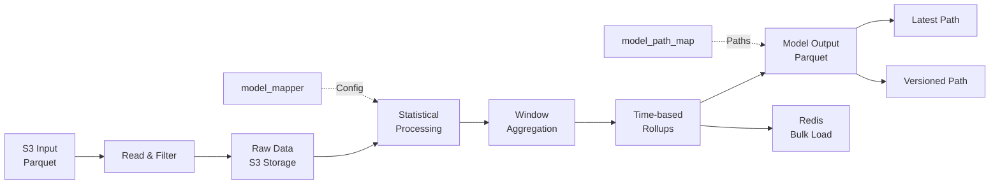
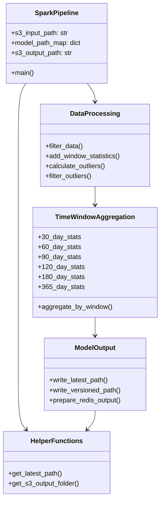
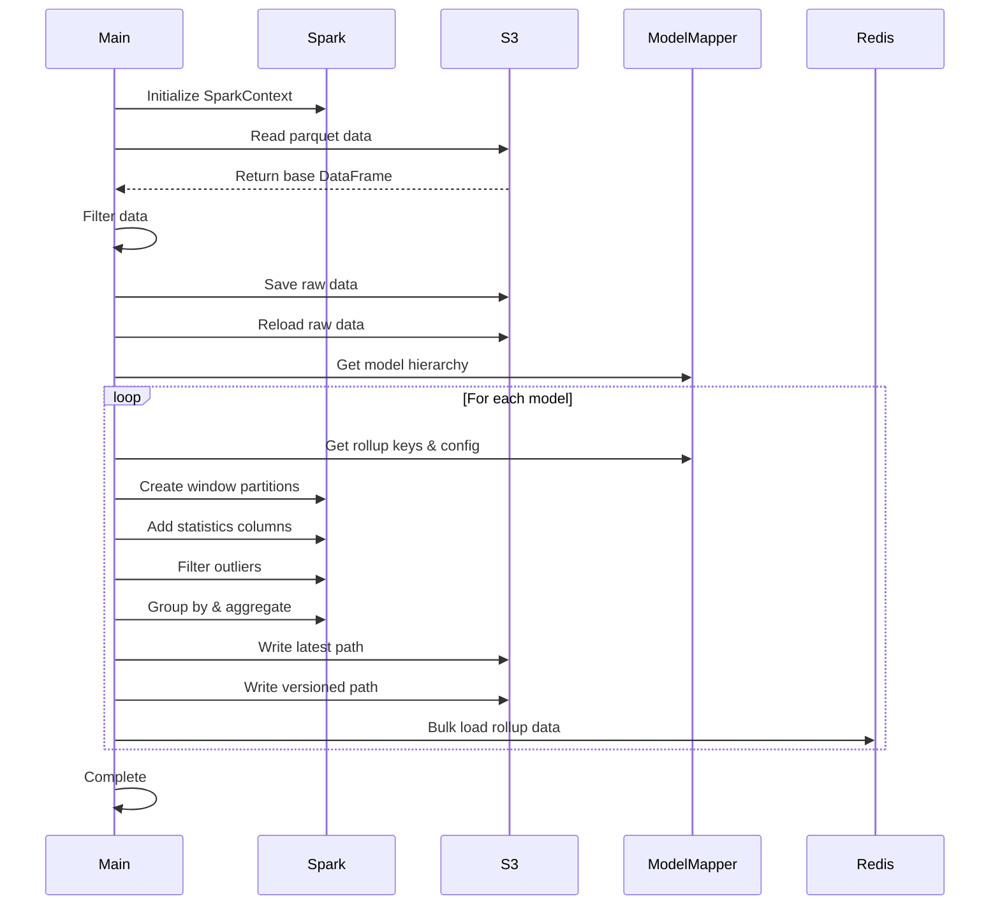

# Diagram: research/orchestrator/tasks/models/partview_org_ptsi_spark.py

> Auto-generated by Obscura crawlers

## Diagram 1

```mermaid
flowchart TD
    Start([Start: Parse Command Line Args]) --> Init[Initialize SparkContext & SQLContext]
    Init --> Read[Read Parquet Data from S3]
    Read --> Filter1[Filter: pc_next_evt_code not null<br/>& evt_event_code != pc_next_evt_code]
    Filter1 --> Filter2[Filter: pc_status_to_status_seconds > 0]
    Filter2 --> SaveRaw[Save Raw Data to S3]
    SaveRaw --> ReloadRaw[Reload Raw Data]
    ReloadRaw --> GetHierarchy[Get Model Hierarchy]
    GetHierarchy --> LoopStart{For Each Model<br/>in Hierarchy}
    LoopStart --> GetConfig[Get Rollup Keys & Percentile Config]
    GetConfig --> MapKeys[Map Features to New Rollup Keys]
    MapKeys --> Window[Create Window Partition]
    Window --> AddStats[Add Window Stats:<br/>stddev, avg, median]
    AddStats --> CalcDist[Calculate stddev_distance]
    CalcDist --> FilterOutliers[Filter Outliers:<br/>-3.0 <= stddev_distance <= 3.0]
    FilterOutliers --> CalcDeltas[Calculate Time Deltas:<br/>30, 60, 90, 120, 180, 365 days]
    CalcDeltas --> Aggregate[Group By & Aggregate:<br/>mean, std, count, percentiles<br/>for each time window]
    Aggregate --> WriteLatest[Write to Latest Path]
    WriteLatest --> WriteVersioned[Write to Versioned Path]
    WriteVersioned --> Redis[Prepare & Load to Redis]
    Redis --> LoopCheck{More Models?}
    LoopCheck -->|Yes| LoopStart
    LoopCheck -->|No| End([End])
```

### SVG

<svg id="container" width="372.6953125" xmlns="http://www.w3.org/2000/svg" class="flowchart" height="2889.734375" viewBox="0 0 372.6953125 2889.734375" role="graphics-document document" aria-roledescription="flowchart-v2"><g><marker id="container_flowchart-v2-pointEnd" class="marker flowchart-v2" viewBox="0 0 10 10" refX="5" refY="5" markerUnits="userSpaceOnUse" markerWidth="8" markerHeight="8" orient="auto"><path d="M 0 0 L 10 5 L 0 10 z" class="arrowMarkerPath" style="stroke-width: 1; stroke-dasharray: 1, 0;"></path></marker><marker id="container_flowchart-v2-pointStart" class="marker flowchart-v2" viewBox="0 0 10 10" refX="4.5" refY="5" markerUnits="userSpaceOnUse" markerWidth="8" markerHeight="8" orient="auto"><path d="M 0 5 L 10 10 L 10 0 z" class="arrowMarkerPath" style="stroke-width: 1; stroke-dasharray: 1, 0;"></path></marker><marker id="container_flowchart-v2-circleEnd" class="marker flowchart-v2" viewBox="0 0 10 10" refX="11" refY="5" markerUnits="userSpaceOnUse" markerWidth="11" markerHeight="11" orient="auto"><circle cx="5" cy="5" r="5" class="arrowMarkerPath" style="stroke-width: 1; stroke-dasharray: 1, 0;"></circle></marker><marker id="container_flowchart-v2-circleStart" class="marker flowchart-v2" viewBox="0 0 10 10" refX="-1" refY="5" markerUnits="userSpaceOnUse" markerWidth="11" markerHeight="11" orient="auto"><circle cx="5" cy="5" r="5" class="arrowMarkerPath" style="stroke-width: 1; stroke-dasharray: 1, 0;"></circle></marker><marker id="container_flowchart-v2-crossEnd" class="marker cross flowchart-v2" viewBox="0 0 11 11" refX="12" refY="5.2" markerUnits="userSpaceOnUse" markerWidth="11" markerHeight="11" orient="auto"><path d="M 1,1 l 9,9 M 10,1 l -9,9" class="arrowMarkerPath" style="stroke-width: 2; stroke-dasharray: 1, 0;"></path></marker><marker id="container_flowchart-v2-crossStart" class="marker cross flowchart-v2" viewBox="0 0 11 11" refX="-1" refY="5.2" markerUnits="userSpaceOnUse" markerWidth="11" markerHeight="11" orient="auto"><path d="M 1,1 l 9,9 M 10,1 l -9,9" class="arrowMarkerPath" style="stroke-width: 2; stroke-dasharray: 1, 0;"></path></marker><g class="root"><g class="clusters"></g><g class="edgePaths"><path d="M227.016,71.5L226.932,75.583C226.849,79.667,226.682,87.833,226.599,95.417C226.516,103,226.516,110,226.516,113.5L226.516,117" id="L_Start_Init_0" class="edge-thickness-normal edge-pattern-solid edge-thickness-normal edge-pattern-solid flowchart-link" style=";" data-edge="true" data-et="edge" data-id="L_Start_Init_0" data-points="W3sieCI6MjI3LjAxNTYyNSwieSI6NzEuNDk5OTk5OTk5OTk5OTl9LHsieCI6MjI2LjUxNTYyNSwieSI6OTZ9LHsieCI6MjI2LjUxNTYyNSwieSI6MTIxfV0=" marker-end="url(#container_flowchart-v2-pointEnd)"></path><path d="M226.516,199L226.516,203.167C226.516,207.333,226.516,215.667,226.516,223.333C226.516,231,226.516,238,226.516,241.5L226.516,245" id="L_Init_Read_0" class="edge-thickness-normal edge-pattern-solid edge-thickness-normal edge-pattern-solid flowchart-link" style=";" data-edge="true" data-et="edge" data-id="L_Init_Read_0" data-points="W3sieCI6MjI2LjUxNTYyNSwieSI6MTk5fSx7IngiOjIyNi41MTU2MjUsInkiOjIyNH0seyJ4IjoyMjYuNTE1NjI1LCJ5IjoyNDl9XQ==" marker-end="url(#container_flowchart-v2-pointEnd)"></path><path d="M226.516,303L226.516,307.167C226.516,311.333,226.516,319.667,226.516,327.333C226.516,335,226.516,342,226.516,345.5L226.516,349" id="L_Read_Filter1_0" class="edge-thickness-normal edge-pattern-solid edge-thickness-normal edge-pattern-solid flowchart-link" style=";" data-edge="true" data-et="edge" data-id="L_Read_Filter1_0" data-points="W3sieCI6MjI2LjUxNTYyNSwieSI6MzAzfSx7IngiOjIyNi41MTU2MjUsInkiOjMyOH0seyJ4IjoyMjYuNTE1NjI1LCJ5IjozNTN9XQ==" marker-end="url(#container_flowchart-v2-pointEnd)"></path><path d="M226.516,479L226.516,483.167C226.516,487.333,226.516,495.667,226.516,503.333C226.516,511,226.516,518,226.516,521.5L226.516,525" id="L_Filter1_Filter2_0" class="edge-thickness-normal edge-pattern-solid edge-thickness-normal edge-pattern-solid flowchart-link" style=";" data-edge="true" data-et="edge" data-id="L_Filter1_Filter2_0" data-points="W3sieCI6MjI2LjUxNTYyNSwieSI6NDc5fSx7IngiOjIyNi41MTU2MjUsInkiOjUwNH0seyJ4IjoyMjYuNTE1NjI1LCJ5Ijo1Mjl9XQ==" marker-end="url(#container_flowchart-v2-pointEnd)"></path><path d="M226.516,631L226.516,635.167C226.516,639.333,226.516,647.667,226.516,655.333C226.516,663,226.516,670,226.516,673.5L226.516,677" id="L_Filter2_SaveRaw_0" class="edge-thickness-normal edge-pattern-solid edge-thickness-normal edge-pattern-solid flowchart-link" style=";" data-edge="true" data-et="edge" data-id="L_Filter2_SaveRaw_0" data-points="W3sieCI6MjI2LjUxNTYyNSwieSI6NjMxfSx7IngiOjIyNi41MTU2MjUsInkiOjY1Nn0seyJ4IjoyMjYuNTE1NjI1LCJ5Ijo2ODF9XQ==" marker-end="url(#container_flowchart-v2-pointEnd)"></path><path d="M226.516,735L226.516,739.167C226.516,743.333,226.516,751.667,226.516,759.333C226.516,767,226.516,774,226.516,777.5L226.516,781" id="L_SaveRaw_ReloadRaw_0" class="edge-thickness-normal edge-pattern-solid edge-thickness-normal edge-pattern-solid flowchart-link" style=";" data-edge="true" data-et="edge" data-id="L_SaveRaw_ReloadRaw_0" data-points="W3sieCI6MjI2LjUxNTYyNSwieSI6NzM1fSx7IngiOjIyNi41MTU2MjUsInkiOjc2MH0seyJ4IjoyMjYuNTE1NjI1LCJ5Ijo3ODV9XQ==" marker-end="url(#container_flowchart-v2-pointEnd)"></path><path d="M226.516,839L226.516,843.167C226.516,847.333,226.516,855.667,226.516,863.333C226.516,871,226.516,878,226.516,881.5L226.516,885" id="L_ReloadRaw_GetHierarchy_0" class="edge-thickness-normal edge-pattern-solid edge-thickness-normal edge-pattern-solid flowchart-link" style=";" data-edge="true" data-et="edge" data-id="L_ReloadRaw_GetHierarchy_0" data-points="W3sieCI6MjI2LjUxNTYyNSwieSI6ODM5fSx7IngiOjIyNi41MTU2MjUsInkiOjg2NH0seyJ4IjoyMjYuNTE1NjI1LCJ5Ijo4ODl9XQ==" marker-end="url(#container_flowchart-v2-pointEnd)"></path><path d="M226.516,943L226.516,947.167C226.516,951.333,226.516,959.667,226.516,967.333C226.516,975,226.516,982,226.516,985.5L226.516,989" id="L_GetHierarchy_LoopStart_0" class="edge-thickness-normal edge-pattern-solid edge-thickness-normal edge-pattern-solid flowchart-link" style=";" data-edge="true" data-et="edge" data-id="L_GetHierarchy_LoopStart_0" data-points="W3sieCI6MjI2LjUxNTYyNSwieSI6OTQzfSx7IngiOjIyNi41MTU2MjUsInkiOjk2OH0seyJ4IjoyMjYuNTE1NjI1LCJ5Ijo5OTN9XQ==" marker-end="url(#container_flowchart-v2-pointEnd)"></path><path d="M186.4,1141.056L178.333,1151.909C170.267,1162.761,154.133,1184.467,146.067,1198.819C138,1213.172,138,1220.172,138,1223.672L138,1227.172" id="L_LoopStart_GetConfig_0" class="edge-thickness-normal edge-pattern-solid edge-thickness-normal edge-pattern-solid flowchart-link" style=";" data-edge="true" data-et="edge" data-id="L_LoopStart_GetConfig_0" data-points="W3sieCI6MTg2LjM5OTk1NjAxNzM4NjA3LCJ5IjoxMTQxLjA1NjIwNjAxNzM4Nn0seyJ4IjoxMzgsInkiOjEyMDYuMTcxODc1fSx7IngiOjEzOCwieSI6MTIzMS4xNzE4NzV9XQ==" marker-end="url(#container_flowchart-v2-pointEnd)"></path><path d="M138,1309.172L138,1313.339C138,1317.505,138,1325.839,138,1333.505C138,1341.172,138,1348.172,138,1351.672L138,1355.172" id="L_GetConfig_MapKeys_0" class="edge-thickness-normal edge-pattern-solid edge-thickness-normal edge-pattern-solid flowchart-link" style=";" data-edge="true" data-et="edge" data-id="L_GetConfig_MapKeys_0" data-points="W3sieCI6MTM4LCJ5IjoxMzA5LjE3MTg3NX0seyJ4IjoxMzgsInkiOjEzMzQuMTcxODc1fSx7IngiOjEzOCwieSI6MTM1OS4xNzE4NzV9XQ==" marker-end="url(#container_flowchart-v2-pointEnd)"></path><path d="M138,1437.172L138,1441.339C138,1445.505,138,1453.839,138,1461.505C138,1469.172,138,1476.172,138,1479.672L138,1483.172" id="L_MapKeys_Window_0" class="edge-thickness-normal edge-pattern-solid edge-thickness-normal edge-pattern-solid flowchart-link" style=";" data-edge="true" data-et="edge" data-id="L_MapKeys_Window_0" data-points="W3sieCI6MTM4LCJ5IjoxNDM3LjE3MTg3NX0seyJ4IjoxMzgsInkiOjE0NjIuMTcxODc1fSx7IngiOjEzOCwieSI6MTQ4Ny4xNzE4NzV9XQ==" marker-end="url(#container_flowchart-v2-pointEnd)"></path><path d="M138,1541.172L138,1545.339C138,1549.505,138,1557.839,138,1565.505C138,1573.172,138,1580.172,138,1583.672L138,1587.172" id="L_Window_AddStats_0" class="edge-thickness-normal edge-pattern-solid edge-thickness-normal edge-pattern-solid flowchart-link" style=";" data-edge="true" data-et="edge" data-id="L_Window_AddStats_0" data-points="W3sieCI6MTM4LCJ5IjoxNTQxLjE3MTg3NX0seyJ4IjoxMzgsInkiOjE1NjYuMTcxODc1fSx7IngiOjEzOCwieSI6MTU5MS4xNzE4NzV9XQ==" marker-end="url(#container_flowchart-v2-pointEnd)"></path><path d="M138,1669.172L138,1673.339C138,1677.505,138,1685.839,138,1693.505C138,1701.172,138,1708.172,138,1711.672L138,1715.172" id="L_AddStats_CalcDist_0" class="edge-thickness-normal edge-pattern-solid edge-thickness-normal edge-pattern-solid flowchart-link" style=";" data-edge="true" data-et="edge" data-id="L_AddStats_CalcDist_0" data-points="W3sieCI6MTM4LCJ5IjoxNjY5LjE3MTg3NX0seyJ4IjoxMzgsInkiOjE2OTQuMTcxODc1fSx7IngiOjEzOCwieSI6MTcxOS4xNzE4NzV9XQ==" marker-end="url(#container_flowchart-v2-pointEnd)"></path><path d="M138,1773.172L138,1777.339C138,1781.505,138,1789.839,138,1797.505C138,1805.172,138,1812.172,138,1815.672L138,1819.172" id="L_CalcDist_FilterOutliers_0" class="edge-thickness-normal edge-pattern-solid edge-thickness-normal edge-pattern-solid flowchart-link" style=";" data-edge="true" data-et="edge" data-id="L_CalcDist_FilterOutliers_0" data-points="W3sieCI6MTM4LCJ5IjoxNzczLjE3MTg3NX0seyJ4IjoxMzgsInkiOjE3OTguMTcxODc1fSx7IngiOjEzOCwieSI6MTgyMy4xNzE4NzV9XQ==" marker-end="url(#container_flowchart-v2-pointEnd)"></path><path d="M138,1925.172L138,1929.339C138,1933.505,138,1941.839,138,1949.505C138,1957.172,138,1964.172,138,1967.672L138,1971.172" id="L_FilterOutliers_CalcDeltas_0" class="edge-thickness-normal edge-pattern-solid edge-thickness-normal edge-pattern-solid flowchart-link" style=";" data-edge="true" data-et="edge" data-id="L_FilterOutliers_CalcDeltas_0" data-points="W3sieCI6MTM4LCJ5IjoxOTI1LjE3MTg3NX0seyJ4IjoxMzgsInkiOjE5NTAuMTcxODc1fSx7IngiOjEzOCwieSI6MTk3NS4xNzE4NzV9XQ==" marker-end="url(#container_flowchart-v2-pointEnd)"></path><path d="M138,2077.172L138,2081.339C138,2085.505,138,2093.839,138,2101.505C138,2109.172,138,2116.172,138,2119.672L138,2123.172" id="L_CalcDeltas_Aggregate_0" class="edge-thickness-normal edge-pattern-solid edge-thickness-normal edge-pattern-solid flowchart-link" style=";" data-edge="true" data-et="edge" data-id="L_CalcDeltas_Aggregate_0" data-points="W3sieCI6MTM4LCJ5IjoyMDc3LjE3MTg3NX0seyJ4IjoxMzgsInkiOjIxMDIuMTcxODc1fSx7IngiOjEzOCwieSI6MjEyNy4xNzE4NzV9XQ==" marker-end="url(#container_flowchart-v2-pointEnd)"></path><path d="M138,2253.172L138,2257.339C138,2261.505,138,2269.839,138,2277.505C138,2285.172,138,2292.172,138,2295.672L138,2299.172" id="L_Aggregate_WriteLatest_0" class="edge-thickness-normal edge-pattern-solid edge-thickness-normal edge-pattern-solid flowchart-link" style=";" data-edge="true" data-et="edge" data-id="L_Aggregate_WriteLatest_0" data-points="W3sieCI6MTM4LCJ5IjoyMjUzLjE3MTg3NX0seyJ4IjoxMzgsInkiOjIyNzguMTcxODc1fSx7IngiOjEzOCwieSI6MjMwMy4xNzE4NzV9XQ==" marker-end="url(#container_flowchart-v2-pointEnd)"></path><path d="M138,2357.172L138,2361.339C138,2365.505,138,2373.839,138,2381.505C138,2389.172,138,2396.172,138,2399.672L138,2403.172" id="L_WriteLatest_WriteVersioned_0" class="edge-thickness-normal edge-pattern-solid edge-thickness-normal edge-pattern-solid flowchart-link" style=";" data-edge="true" data-et="edge" data-id="L_WriteLatest_WriteVersioned_0" data-points="W3sieCI6MTM4LCJ5IjoyMzU3LjE3MTg3NX0seyJ4IjoxMzgsInkiOjIzODIuMTcxODc1fSx7IngiOjEzOCwieSI6MjQwNy4xNzE4NzV9XQ==" marker-end="url(#container_flowchart-v2-pointEnd)"></path><path d="M138,2461.172L138,2465.339C138,2469.505,138,2477.839,138,2485.505C138,2493.172,138,2500.172,138,2503.672L138,2507.172" id="L_WriteVersioned_Redis_0" class="edge-thickness-normal edge-pattern-solid edge-thickness-normal edge-pattern-solid flowchart-link" style=";" data-edge="true" data-et="edge" data-id="L_WriteVersioned_Redis_0" data-points="W3sieCI6MTM4LCJ5IjoyNDYxLjE3MTg3NX0seyJ4IjoxMzgsInkiOjI0ODYuMTcxODc1fSx7IngiOjEzOCwieSI6MjUxMS4xNzE4NzV9XQ==" marker-end="url(#container_flowchart-v2-pointEnd)"></path><path d="M138,2565.172L138,2569.339C138,2573.505,138,2581.839,146.363,2595.621C154.725,2609.404,171.451,2628.636,179.814,2638.252L188.176,2647.868" id="L_Redis_LoopCheck_0" class="edge-thickness-normal edge-pattern-solid edge-thickness-normal edge-pattern-solid flowchart-link" style=";" data-edge="true" data-et="edge" data-id="L_Redis_LoopCheck_0" data-points="W3sieCI6MTM4LCJ5IjoyNTY1LjE3MTg3NX0seyJ4IjoxMzgsInkiOjI1OTAuMTcxODc1fSx7IngiOjE5MC44MDEyMTY0ODk0NDkwNSwieSI6MjY1MC44ODYyODM1MTA1NTF9XQ==" marker-end="url(#container_flowchart-v2-pointEnd)"></path><path d="M262.23,2650.886L271.03,2640.767C279.83,2630.648,297.431,2610.41,306.231,2591.624C315.031,2572.839,315.031,2555.505,315.031,2538.172C315.031,2520.839,315.031,2503.505,315.031,2486.172C315.031,2468.839,315.031,2451.505,315.031,2434.172C315.031,2416.839,315.031,2399.505,315.031,2382.172C315.031,2364.839,315.031,2347.505,315.031,2330.172C315.031,2312.839,315.031,2295.505,315.031,2272.172C315.031,2248.839,315.031,2219.505,315.031,2190.172C315.031,2160.839,315.031,2131.505,315.031,2104.172C315.031,2076.839,315.031,2051.505,315.031,2026.172C315.031,2000.839,315.031,1975.505,315.031,1950.172C315.031,1924.839,315.031,1899.505,315.031,1874.172C315.031,1848.839,315.031,1823.505,315.031,1802.172C315.031,1780.839,315.031,1763.505,315.031,1746.172C315.031,1728.839,315.031,1711.505,315.031,1692.172C315.031,1672.839,315.031,1651.505,315.031,1630.172C315.031,1608.839,315.031,1587.505,315.031,1568.172C315.031,1548.839,315.031,1531.505,315.031,1514.172C315.031,1496.839,315.031,1479.505,315.031,1460.172C315.031,1440.839,315.031,1419.505,315.031,1398.172C315.031,1376.839,315.031,1355.505,315.031,1334.172C315.031,1312.839,315.031,1291.505,315.031,1270.172C315.031,1248.839,315.031,1227.505,307.362,1206.521C299.693,1185.537,284.355,1164.902,276.686,1154.584L269.017,1144.267" id="L_LoopCheck_LoopStart_0" class="edge-thickness-normal edge-pattern-solid edge-thickness-normal edge-pattern-solid flowchart-link" style=";" data-edge="true" data-et="edge" data-id="L_LoopCheck_LoopStart_0" data-points="W3sieCI6MjYyLjIzMDAzMzUxMDU1MDksInkiOjI2NTAuODg2MjgzNTEwNTUxfSx7IngiOjMxNS4wMzEyNSwieSI6MjU5MC4xNzE4NzV9LHsieCI6MzE1LjAzMTI1LCJ5IjoyNTM4LjE3MTg3NX0seyJ4IjozMTUuMDMxMjUsInkiOjI0ODYuMTcxODc1fSx7IngiOjMxNS4wMzEyNSwieSI6MjQzNC4xNzE4NzV9LHsieCI6MzE1LjAzMTI1LCJ5IjoyMzgyLjE3MTg3NX0seyJ4IjozMTUuMDMxMjUsInkiOjIzMzAuMTcxODc1fSx7IngiOjMxNS4wMzEyNSwieSI6MjI3OC4xNzE4NzV9LHsieCI6MzE1LjAzMTI1LCJ5IjoyMTkwLjE3MTg3NX0seyJ4IjozMTUuMDMxMjUsInkiOjIxMDIuMTcxODc1fSx7IngiOjMxNS4wMzEyNSwieSI6MjAyNi4xNzE4NzV9LHsieCI6MzE1LjAzMTI1LCJ5IjoxOTUwLjE3MTg3NX0seyJ4IjozMTUuMDMxMjUsInkiOjE4NzQuMTcxODc1fSx7IngiOjMxNS4wMzEyNSwieSI6MTc5OC4xNzE4NzV9LHsieCI6MzE1LjAzMTI1LCJ5IjoxNzQ2LjE3MTg3NX0seyJ4IjozMTUuMDMxMjUsInkiOjE2OTQuMTcxODc1fSx7IngiOjMxNS4wMzEyNSwieSI6MTYzMC4xNzE4NzV9LHsieCI6MzE1LjAzMTI1LCJ5IjoxNTY2LjE3MTg3NX0seyJ4IjozMTUuMDMxMjUsInkiOjE1MTQuMTcxODc1fSx7IngiOjMxNS4wMzEyNSwieSI6MTQ2Mi4xNzE4NzV9LHsieCI6MzE1LjAzMTI1LCJ5IjoxMzk4LjE3MTg3NX0seyJ4IjozMTUuMDMxMjUsInkiOjEzMzQuMTcxODc1fSx7IngiOjMxNS4wMzEyNSwieSI6MTI3MC4xNzE4NzV9LHsieCI6MzE1LjAzMTI1LCJ5IjoxMjA2LjE3MTg3NX0seyJ4IjoyNjYuNjMxMjkzOTgyNjEzOTUsInkiOjExNDEuMDU2MjA2MDE3Mzg2fV0=" marker-end="url(#container_flowchart-v2-pointEnd)"></path><path d="M226.516,2768.734L226.516,2774.901C226.516,2781.068,226.516,2793.401,226.59,2805.151C226.665,2816.901,226.813,2828.068,226.888,2833.651L226.962,2839.235" id="L_LoopCheck_End_0" class="edge-thickness-normal edge-pattern-solid edge-thickness-normal edge-pattern-solid flowchart-link" style=";" data-edge="true" data-et="edge" data-id="L_LoopCheck_End_0" data-points="W3sieCI6MjI2LjUxNTYyNSwieSI6Mjc2OC43MzQzNzV9LHsieCI6MjI2LjUxNTYyNSwieSI6MjgwNS43MzQzNzV9LHsieCI6MjI3LjAxNTYyNSwieSI6Mjg0My4yMzQzNzV9XQ==" marker-end="url(#container_flowchart-v2-pointEnd)"></path></g><g class="edgeLabels"><g class="edgeLabel"><g class="label" data-id="L_Start_Init_0" transform="translate(0, 0)"><foreignObject width="0" height="0">

</foreignObject></g></g><g class="edgeLabel"><g class="label" data-id="L_Init_Read_0" transform="translate(0, 0)"><foreignObject width="0" height="0">

</foreignObject></g></g><g class="edgeLabel"><g class="label" data-id="L_Read_Filter1_0" transform="translate(0, 0)"><foreignObject width="0" height="0">

</foreignObject></g></g><g class="edgeLabel"><g class="label" data-id="L_Filter1_Filter2_0" transform="translate(0, 0)"><foreignObject width="0" height="0">

</foreignObject></g></g><g class="edgeLabel"><g class="label" data-id="L_Filter2_SaveRaw_0" transform="translate(0, 0)"><foreignObject width="0" height="0">

</foreignObject></g></g><g class="edgeLabel"><g class="label" data-id="L_SaveRaw_ReloadRaw_0" transform="translate(0, 0)"><foreignObject width="0" height="0">

</foreignObject></g></g><g class="edgeLabel"><g class="label" data-id="L_ReloadRaw_GetHierarchy_0" transform="translate(0, 0)"><foreignObject width="0" height="0">

</foreignObject></g></g><g class="edgeLabel"><g class="label" data-id="L_GetHierarchy_LoopStart_0" transform="translate(0, 0)"><foreignObject width="0" height="0">

</foreignObject></g></g><g class="edgeLabel"><g class="label" data-id="L_LoopStart_GetConfig_0" transform="translate(0, 0)"><foreignObject width="0" height="0">

</foreignObject></g></g><g class="edgeLabel"><g class="label" data-id="L_GetConfig_MapKeys_0" transform="translate(0, 0)"><foreignObject width="0" height="0">

</foreignObject></g></g><g class="edgeLabel"><g class="label" data-id="L_MapKeys_Window_0" transform="translate(0, 0)"><foreignObject width="0" height="0">

</foreignObject></g></g><g class="edgeLabel"><g class="label" data-id="L_Window_AddStats_0" transform="translate(0, 0)"><foreignObject width="0" height="0">

</foreignObject></g></g><g class="edgeLabel"><g class="label" data-id="L_AddStats_CalcDist_0" transform="translate(0, 0)"><foreignObject width="0" height="0">

</foreignObject></g></g><g class="edgeLabel"><g class="label" data-id="L_CalcDist_FilterOutliers_0" transform="translate(0, 0)"><foreignObject width="0" height="0">

</foreignObject></g></g><g class="edgeLabel"><g class="label" data-id="L_FilterOutliers_CalcDeltas_0" transform="translate(0, 0)"><foreignObject width="0" height="0">

</foreignObject></g></g><g class="edgeLabel"><g class="label" data-id="L_CalcDeltas_Aggregate_0" transform="translate(0, 0)"><foreignObject width="0" height="0">

</foreignObject></g></g><g class="edgeLabel"><g class="label" data-id="L_Aggregate_WriteLatest_0" transform="translate(0, 0)"><foreignObject width="0" height="0">

</foreignObject></g></g><g class="edgeLabel"><g class="label" data-id="L_WriteLatest_WriteVersioned_0" transform="translate(0, 0)"><foreignObject width="0" height="0">

</foreignObject></g></g><g class="edgeLabel"><g class="label" data-id="L_WriteVersioned_Redis_0" transform="translate(0, 0)"><foreignObject width="0" height="0">

</foreignObject></g></g><g class="edgeLabel"><g class="label" data-id="L_Redis_LoopCheck_0" transform="translate(0, 0)"><foreignObject width="0" height="0">

</foreignObject></g></g><g class="edgeLabel" transform="translate(315.03125, 1874.171875)"><g class="label" data-id="L_LoopCheck_LoopStart_0" transform="translate(-12.03125, -12)"><foreignObject width="24.0625" height="24">

Yes

</foreignObject></g></g><g class="edgeLabel" transform="translate(226.515625, 2805.734375)"><g class="label" data-id="L_LoopCheck_End_0" transform="translate(-10.140625, -12)"><foreignObject width="20.28125" height="24">

No

</foreignObject></g></g></g><g class="nodes"><g class="node default" id="flowchart-Start-0" transform="translate(226.515625, 39.5)"><g class="basic label-container outer-path"><path d="M-83.875 -31.5 C-32.89788901437984 -31.5, 18.079221971240315 -31.5, 83.875 -31.5 C83.875 -31.5, 83.875 -31.5, 83.875 -31.5 C84.61714913432563 -31.476200721767835, 85.35929826865124 -31.452401443535667, 85.89321192939245 -31.435279871635593 C86.41963072888183 -31.384496883160086, 86.94604952837119 -31.333713894684582, 87.90313059306193 -31.241385435432253 C88.69885120456556 -31.112739497869853, 89.49457181606918 -30.98409356030745, 89.89649680409322 -30.91911344521856 C90.3933095731592 -30.80571917268555, 90.89012234222518 -30.69232490015254, 91.86511939314947 -30.469788185729428 C92.63219478819077 -30.242124234942082, 93.39927018323209 -30.014460284154737, 93.80090886774406 -29.895256030836062 C94.37853372633704 -29.68268474336818, 94.95615858493002 -29.4701134559003, 95.69591065370028 -29.197877856399685 C96.36294094471289 -28.90260333331896, 97.0299712357255 -28.60732881023824, 97.54233778220308 -28.380519338926202 C98.25567726600012 -28.00837058714503, 98.96901674979716 -27.636221835363862, 99.33260288812403 -27.44653917988677 C99.90800047622567 -27.097729780567995, 100.48339806432732 -26.74892038124922, 101.05934938813228 -26.399775304092984 C101.53080643182312 -26.07090727946073, 102.00226347551397 -25.74203925482848, 102.7154817104733 -25.244529088840633 C103.19248924132322 -24.864128276691325, 103.66949677217312 -24.483727464542017, 104.29419445219533 -23.985547688627737 C104.86993154170342 -23.462678497105124, 105.44566863121152 -22.93980930558251, 105.78900034400982 -22.62800452807842 C106.3432043088348 -22.05574343340491, 106.89740827365978 -21.4834823387314, 107.19375690787243 -21.177478043231485 C107.52588254732747 -20.78734436864334, 107.85800818678251 -20.397210694055197, 108.50269169774293 -19.63992875855011 C108.76254399306082 -19.291750355855243, 109.02239628837872 -18.943571953160376, 109.7104260198041 -18.02167479384835 C109.94385089672959 -17.663071499534865, 110.17727577365505 -17.30446820522138, 110.8119970346684 -16.329365901781543 C111.04099240563644 -15.922761432332006, 111.2699877766045 -15.516156962882468, 111.8028781507495 -14.56995614258631 C112.13962121598426 -13.870701962478993, 112.476364281219 -13.171447782371676, 112.67899762499809 -12.750675308355413 C112.90785969949269 -12.185381559606544, 113.1367217739873 -11.620087810857676, 113.43675529456745 -10.878999214271206 C113.62059348938405 -10.325307862122205, 113.80443168420065 -9.771616509973205, 114.07303737065482 -8.962618978877531 C114.20198094277383 -8.470901253890059, 114.33092451489284 -7.979183528902587, 114.58522923372745 -7.009409419623907 C114.72965812191492 -6.267797603837542, 114.8740870101024 -5.526185788051177, 114.97122617755518 -5.027396693551458 C115.05706454175521 -4.361651291518342, 115.14290290595522 -3.6959058894852275, 115.22944205789975 -3.024725316091981 C115.27479872827953 -2.3182585636813196, 115.32015539865934 -1.6117918112706577, 115.35881581032167 -1.0096246935071378 C115.35881581032167 -0.45081679845043743, 115.35881581032167 0.10799109660626294, 115.35881581032167 1.00962469350713 C115.31580712642534 1.6795196611773897, 115.272798442529 2.34941462884765, 115.22944205789975 3.02472531609196 C115.14194592474261 3.703328046792868, 115.0544497915855 4.381930777493777, 114.97122617755518 5.027396693551435 C114.86470797723993 5.574345139540605, 114.7581897769247 6.121293585529774, 114.58522923372745 7.0094094196239 C114.45130973062899 7.520102526018089, 114.31739022753054 8.030795632412278, 114.07303737065482 8.96261897887751 C113.87036783025421 9.573027343558085, 113.6676982898536 10.183435708238658, 113.43675529456746 10.878999214271184 C113.21345241576908 11.430561642170636, 112.9901495369707 11.982124070070087, 112.67899762499809 12.750675308355405 C112.33927748578336 13.456111446281344, 111.99955734656861 14.161547584207286, 111.8028781507495 14.569956142586303 C111.54565095369121 15.02668907804147, 111.28842375663291 15.483422013496634, 110.81199703466841 16.329365901781536 C110.39846138065175 16.964667716222678, 109.98492572663508 17.59996953066382, 109.71042601980412 18.021674793848334 C109.2851566927384 18.59149694928369, 108.85988736567268 19.161319104719052, 108.50269169774295 19.639928758550102 C108.19689147756036 19.999139097702038, 107.89109125737777 20.35834943685397, 107.19375690787246 21.177478043231467 C106.7542008062028 21.63135580643248, 106.31464470453314 22.085233569633495, 105.78900034400982 22.628004528078414 C105.39915526757386 22.982051511762055, 105.00931019113791 23.3360984954457, 104.29419445219536 23.985547688627715 C103.77251688138196 24.401571668928216, 103.25083931056857 24.817595649228718, 102.71548171047331 25.24452908884063 C102.2350377974637 25.579665964474344, 101.7545938844541 25.914802840108056, 101.05934938813229 26.399775304092973 C100.49045123716263 26.744644706427408, 99.92155308619297 27.089514108761843, 99.33260288812404 27.446539179886766 C98.71169467650401 27.77046659617825, 98.09078646488396 28.09439401246973, 97.54233778220309 28.3805193389262 C96.99572506264047 28.622488575186352, 96.44911234307786 28.864457811446503, 95.6959106537003 29.197877856399682 C95.10064000145059 29.416942959049162, 94.50536934920088 29.636008061698643, 93.80090886774407 29.895256030836055 C93.0668791865075 30.113112187226648, 92.33284950527094 30.330968343617236, 91.86511939314951 30.46978818572942 C91.12265601447079 30.6392506068865, 90.38019263579208 30.808713028043577, 89.89649680409323 30.919113445218557 C89.33237868932967 31.010315687212213, 88.76826057456611 31.101517929205865, 87.90313059306196 31.24138543543225 C87.41344765475553 31.288624559560773, 86.9237647164491 31.335863683689297, 85.89321192939245 31.435279871635593 C85.32156951511654 31.453611331226963, 84.74992710084062 31.471942790818332, 83.875 31.5 C83.875 31.5, 83.875 31.5, 83.875 31.5 C26.55280587938941 31.5, -30.76938824122118 31.5, -83.875 31.5 C-84.42863586390196 31.4822459754315, -84.98227172780392 31.464491950863, -85.89321192939244 31.435279871635593 C-86.69616451012698 31.357820001863896, -87.4991170908615 31.2803601320922, -87.90313059306195 31.24138543543225 C-88.35888100489215 31.16770324324477, -88.81463141672236 31.094021051057293, -89.89649680409323 30.919113445218557 C-90.63371412320852 30.75084840292309, -91.37093144232382 30.582583360627623, -91.86511939314947 30.469788185729428 C-92.44346782475863 30.2981374070407, -93.02181625636777 30.12648662835197, -93.80090886774403 29.89525603083607 C-94.25629637015957 29.727669220391224, -94.71168387257511 29.56008240994638, -95.69591065370028 29.197877856399685 C-96.2657091065105 28.94564498381116, -96.83550755932072 28.693412111222635, -97.54233778220308 28.380519338926206 C-98.21534406536547 28.029412392081483, -98.88835034852787 27.678305445236763, -99.33260288812403 27.446539179886773 C-99.83004578098395 27.14498637493617, -100.32748867384386 26.84343356998557, -101.05934938813226 26.399775304092994 C-101.48106837613852 26.105602393980583, -101.90278736414479 25.81142948386817, -102.7154817104733 25.244529088840636 C-103.09015898849012 24.945733930203332, -103.46483626650694 24.646938771566028, -104.29419445219533 23.98554768862774 C-104.79310550930936 23.532449867019984, -105.29201656642338 23.07935204541223, -105.7890003440098 22.628004528078435 C-106.21425424672637 22.188894959528856, -106.63950814944293 21.74978539097928, -107.19375690787244 21.177478043231478 C-107.59733167686112 20.703416155522472, -108.00090644584981 20.229354267813466, -108.50269169774293 19.639928758550113 C-108.75810368445215 19.297699964870425, -109.01351567116137 18.955471171190734, -109.7104260198041 18.021674793848355 C-109.96208609913299 17.635057331805772, -110.21374617846188 17.248439869763185, -110.8119970346684 16.329365901781557 C-111.17611786936101 15.682832488552142, -111.5402387040536 15.036299075322729, -111.8028781507495 14.569956142586314 C-112.13747341201321 13.87516192338052, -112.47206867327691 13.180367704174726, -112.67899762499809 12.750675308355417 C-112.84128449735805 12.349823596023109, -113.00357136971799 11.948971883690799, -113.43675529456745 10.878999214271209 C-113.61754804167145 10.334480265406361, -113.79834078877545 9.789961316541513, -114.07303737065482 8.962618978877522 C-114.18929928760251 8.519261901322398, -114.3055612045502 8.075904823767276, -114.58522923372743 7.009409419623911 C-114.72048180428565 6.314916055448376, -114.85573437484388 5.62042269127284, -114.97122617755518 5.027396693551461 C-115.03293716333687 4.548778474041159, -115.09464814911857 4.0701602545308555, -115.22944205789975 3.024725316091999 C-115.2698131330615 2.395913233502173, -115.31018420822328 1.767101150912347, -115.35881581032167 1.0096246935071416 C-115.35881581032167 0.47454404513019854, -115.35881581032167 -0.06053660324674448, -115.35881581032167 -1.0096246935071262 C-115.31811668196302 -1.6435464694383288, -115.27741755360435 -2.277468245369531, -115.22944205789975 -3.024725316091956 C-115.14547310879966 -3.6759719037676786, -115.0615041596996 -4.327218491443401, -114.97122617755518 -5.027396693551446 C-114.83036492488458 -5.750689454978701, -114.68950367221397 -6.4739822164059575, -114.58522923372745 -7.009409419623896 C-114.40015577393247 -7.715174733167007, -114.21508231413749 -8.420940046710118, -114.07303737065482 -8.962618978877506 C-113.88049581090884 -9.54252347950089, -113.68795425116288 -10.122427980124275, -113.43675529456746 -10.878999214271168 C-113.26626966928819 -11.300102004826305, -113.09578404400891 -11.721204795381441, -112.67899762499809 -12.750675308355401 C-112.3520772035111 -13.429532558549592, -112.0251567820241 -14.108389808743784, -111.8028781507495 -14.5699561425863 C-111.51917928500221 -15.073692206345894, -111.23548041925491 -15.577428270105491, -110.8119970346684 -16.329365901781546 C-110.534708353115 -16.7553557790843, -110.25741967156159 -17.18134565638705, -109.71042601980412 -18.021674793848344 C-109.39769793869142 -18.44070193242506, -109.08496985757874 -18.859729071001773, -108.50269169774295 -19.639928758550102 C-108.21018025908768 -19.983529338766953, -107.91766882043241 -20.3271299189838, -107.19375690787246 -21.177478043231467 C-106.75108290587141 -21.63457529450901, -106.30840890387039 -22.09167254578655, -105.78900034400984 -22.628004528078403 C-105.21623617621466 -23.14817379076054, -104.6434720084195 -23.668343053442683, -104.29419445219536 -23.98554768862771 C-103.8124685491428 -24.369711277047465, -103.33074264609026 -24.753874865467218, -102.71548171047331 -25.244529088840626 C-102.13520525594159 -25.649304823759103, -101.55492880140986 -26.054080558677583, -101.0593493881323 -26.39977530409297 C-100.67460431299953 -26.63301002965148, -100.28985923786678 -26.866244755209994, -99.33260288812404 -27.446539179886763 C-98.83679828794878 -27.70520012222019, -98.34099368777353 -27.96386106455362, -97.54233778220309 -28.3805193389262 C-97.11668564539964 -28.568942913367064, -96.6910335085962 -28.757366487807932, -95.6959106537003 -29.19787785639968 C-95.12984648471738 -29.40619470322521, -94.56378231573447 -29.61451155005074, -93.80090886774407 -29.895256030836055 C-93.33841952996733 -30.032520438632123, -92.87593019219057 -30.16978484642819, -91.86511939314951 -30.469788185729417 C-91.36524567871047 -30.583881099069295, -90.86537196427143 -30.697974012409173, -89.89649680409325 -30.919113445218553 C-89.17797969694008 -31.03527771891969, -88.45946258978691 -31.15144199262083, -87.90313059306196 -31.24138543543225 C-87.29483349027319 -31.300067125353983, -86.68653638748441 -31.358748815275714, -85.89321192939246 -31.435279871635593 C-85.3876149120409 -31.451493383897166, -84.88201789468934 -31.467706896158738, -83.87500000000001 -31.5 C-83.87500000000001 -31.5, -83.875 -31.5, -83.875 -31.5" stroke="none" stroke-width="0" fill="#ECECFF" style=""></path><path d="M-83.875 -31.5 C-41.60213506939167 -31.5, 0.6707298612166568 -31.5, 83.875 -31.5 M-83.875 -31.5 C-17.92559476883146 -31.5, 48.02381046233708 -31.5, 83.875 -31.5 M83.875 -31.5 C83.875 -31.5, 83.875 -31.5, 83.875 -31.5 M83.875 -31.5 C83.875 -31.5, 83.875 -31.5, 83.875 -31.5 M83.875 -31.5 C84.3346466650523 -31.48526002609973, 84.79429333010461 -31.47052005219946, 85.89321192939245 -31.435279871635593 M83.875 -31.5 C84.322422455946 -31.48565203269279, 84.76984491189198 -31.47130406538558, 85.89321192939245 -31.435279871635593 M85.89321192939245 -31.435279871635593 C86.56797714318803 -31.370186082984635, 87.24274235698361 -31.305092294333672, 87.90313059306193 -31.241385435432253 M85.89321192939245 -31.435279871635593 C86.49268213565668 -31.377449701805688, 87.0921523419209 -31.319619531975782, 87.90313059306193 -31.241385435432253 M87.90313059306193 -31.241385435432253 C88.64576678337615 -31.12132177541192, 89.38840297369038 -31.00125811539159, 89.89649680409322 -30.91911344521856 M87.90313059306193 -31.241385435432253 C88.60370250222562 -31.128122402174967, 89.3042744113893 -31.01485936891768, 89.89649680409322 -30.91911344521856 M89.89649680409322 -30.91911344521856 C90.51659142750124 -30.77758089392126, 91.13668605090925 -30.636048342623965, 91.86511939314947 -30.469788185729428 M89.89649680409322 -30.91911344521856 C90.50957974753378 -30.77918126411835, 91.12266269097432 -30.639249083018136, 91.86511939314947 -30.469788185729428 M91.86511939314947 -30.469788185729428 C92.61645173265471 -30.246796691188205, 93.36778407215995 -30.02380519664698, 93.80090886774406 -29.895256030836062 M91.86511939314947 -30.469788185729428 C92.3530529445091 -30.324972068901367, 92.84098649586873 -30.180155952073303, 93.80090886774406 -29.895256030836062 M93.80090886774406 -29.895256030836062 C94.47182671207443 -29.648352062225918, 95.14274455640479 -29.401448093615777, 95.69591065370028 -29.197877856399685 M93.80090886774406 -29.895256030836062 C94.3438340608647 -29.695454541022194, 94.88675925398535 -29.49565305120833, 95.69591065370028 -29.197877856399685 M95.69591065370028 -29.197877856399685 C96.2294344172004 -28.961702712718314, 96.76295818070051 -28.725527569036945, 97.54233778220308 -28.380519338926202 M95.69591065370028 -29.197877856399685 C96.35187865128793 -28.907500282466916, 97.00784664887559 -28.617122708534147, 97.54233778220308 -28.380519338926202 M97.54233778220308 -28.380519338926202 C97.9781694265636 -28.15314624922681, 98.41400107092412 -27.925773159527424, 99.33260288812403 -27.44653917988677 M97.54233778220308 -28.380519338926202 C98.00449972268365 -28.139409750606337, 98.46666166316423 -27.898300162286475, 99.33260288812403 -27.44653917988677 M99.33260288812403 -27.44653917988677 C99.99479715984658 -27.045113120883066, 100.65699143156915 -26.643687061879362, 101.05934938813228 -26.399775304092984 M99.33260288812403 -27.44653917988677 C99.69967615759467 -27.224017206771695, 100.0667494270653 -27.00149523365662, 101.05934938813228 -26.399775304092984 M101.05934938813228 -26.399775304092984 C101.48871845151427 -26.100266032564885, 101.91808751489627 -25.800756761036784, 102.7154817104733 -25.244529088840633 M101.05934938813228 -26.399775304092984 C101.67027106896867 -25.97362278591483, 102.28119274980509 -25.547470267736674, 102.7154817104733 -25.244529088840633 M102.7154817104733 -25.244529088840633 C103.09204163972814 -24.94423256594046, 103.46860156898298 -24.643936043040284, 104.29419445219533 -23.985547688627737 M102.7154817104733 -25.244529088840633 C103.13264327492779 -24.911853842323623, 103.54980483938228 -24.579178595806617, 104.29419445219533 -23.985547688627737 M104.29419445219533 -23.985547688627737 C104.84304892404157 -23.487092579190534, 105.39190339588781 -22.98863746975333, 105.78900034400982 -22.62800452807842 M104.29419445219533 -23.985547688627737 C104.81288711956844 -23.51448473197541, 105.33157978694156 -23.043421775323083, 105.78900034400982 -22.62800452807842 M105.78900034400982 -22.62800452807842 C106.29428599697118 -22.10625560667219, 106.79957164993256 -21.584506685265954, 107.19375690787243 -21.177478043231485 M105.78900034400982 -22.62800452807842 C106.32019359411507 -22.07950388556785, 106.85138684422031 -21.531003243057278, 107.19375690787243 -21.177478043231485 M107.19375690787243 -21.177478043231485 C107.46259040123714 -20.861690924866185, 107.73142389460183 -20.545903806500885, 108.50269169774293 -19.63992875855011 M107.19375690787243 -21.177478043231485 C107.57910913752156 -20.72482138712259, 107.96446136717067 -20.27216473101369, 108.50269169774293 -19.63992875855011 M108.50269169774293 -19.63992875855011 C108.97841673671482 -19.0025005457704, 109.45414177568672 -18.365072332990692, 109.7104260198041 -18.02167479384835 M108.50269169774293 -19.63992875855011 C108.98499147995493 -18.993690988800104, 109.46729126216691 -18.347453219050095, 109.7104260198041 -18.02167479384835 M109.7104260198041 -18.02167479384835 C109.99501178907043 -17.584474630276127, 110.27959755833677 -17.147274466703898, 110.8119970346684 -16.329365901781543 M109.7104260198041 -18.02167479384835 C110.09252239161482 -17.434672159504878, 110.47461876342555 -16.8476695251614, 110.8119970346684 -16.329365901781543 M110.8119970346684 -16.329365901781543 C111.04466621235271 -15.916238216494008, 111.27733539003702 -15.503110531206474, 111.8028781507495 -14.56995614258631 M110.8119970346684 -16.329365901781543 C111.01095770865021 -15.976091078173923, 111.20991838263204 -15.622816254566303, 111.8028781507495 -14.56995614258631 M111.8028781507495 -14.56995614258631 C112.12597948780125 -13.89902930293723, 112.449080824853 -13.228102463288149, 112.67899762499809 -12.750675308355413 M111.8028781507495 -14.56995614258631 C112.1261704877102 -13.898632687539562, 112.44946282467089 -13.227309232492816, 112.67899762499809 -12.750675308355413 M112.67899762499809 -12.750675308355413 C112.94384101517153 -12.09650701422839, 113.20868440534498 -11.442338720101366, 113.43675529456745 -10.878999214271206 M112.67899762499809 -12.750675308355413 C112.94560473680906 -12.092150587684465, 113.21221184862003 -11.433625867013514, 113.43675529456745 -10.878999214271206 M113.43675529456745 -10.878999214271206 C113.67326065118296 -10.16668276215656, 113.90976600779847 -9.454366310041916, 114.07303737065482 -8.962618978877531 M113.43675529456745 -10.878999214271206 C113.59578607850203 -10.400023831174677, 113.75481686243661 -9.92104844807815, 114.07303737065482 -8.962618978877531 M114.07303737065482 -8.962618978877531 C114.1767679117016 -8.56704946876524, 114.2804984527484 -8.17147995865295, 114.58522923372745 -7.009409419623907 M114.07303737065482 -8.962618978877531 C114.18891355128464 -8.52073288108163, 114.30478973191447 -8.078846783285728, 114.58522923372745 -7.009409419623907 M114.58522923372745 -7.009409419623907 C114.68045357776553 -6.520452538660548, 114.77567792180363 -6.031495657697189, 114.97122617755518 -5.027396693551458 M114.58522923372745 -7.009409419623907 C114.67438674094123 -6.551604463526978, 114.763544248155 -6.093799507430049, 114.97122617755518 -5.027396693551458 M114.97122617755518 -5.027396693551458 C115.05528312876184 -4.375467578915088, 115.1393400799685 -3.7235384642787173, 115.22944205789975 -3.024725316091981 M114.97122617755518 -5.027396693551458 C115.02332810131115 -4.623304461588685, 115.07543002506713 -4.219212229625913, 115.22944205789975 -3.024725316091981 M115.22944205789975 -3.024725316091981 C115.2736190179326 -2.336633504579985, 115.31779597796545 -1.648541693067989, 115.35881581032167 -1.0096246935071378 M115.22944205789975 -3.024725316091981 C115.26125310598509 -2.5292425647467933, 115.29306415407045 -2.033759813401606, 115.35881581032167 -1.0096246935071378 M115.35881581032167 -1.0096246935071378 C115.35881581032167 -0.4684811906332358, 115.35881581032167 0.07266231224066622, 115.35881581032167 1.00962469350713 M115.35881581032167 -1.0096246935071378 C115.35881581032167 -0.4909000774898168, 115.35881581032167 0.027824538527504217, 115.35881581032167 1.00962469350713 M115.35881581032167 1.00962469350713 C115.3167812992821 1.6643461325950755, 115.27474678824252 2.319067571683021, 115.22944205789975 3.02472531609196 M115.35881581032167 1.00962469350713 C115.3228861910658 1.5692575152839292, 115.28695657180994 2.128890337060728, 115.22944205789975 3.02472531609196 M115.22944205789975 3.02472531609196 C115.14186237143355 3.703976069758533, 115.05428268496736 4.383226823425106, 114.97122617755518 5.027396693551435 M115.22944205789975 3.02472531609196 C115.17748612542228 3.427685268527881, 115.12553019294481 3.8306452209638024, 114.97122617755518 5.027396693551435 M114.97122617755518 5.027396693551435 C114.82264431460818 5.790333156996438, 114.67406245166117 6.553269620441441, 114.58522923372745 7.0094094196239 M114.97122617755518 5.027396693551435 C114.8683070209664 5.555864810663406, 114.76538786437762 6.084332927775377, 114.58522923372745 7.0094094196239 M114.58522923372745 7.0094094196239 C114.4143790570711 7.660935190149516, 114.24352888041476 8.312460960675132, 114.07303737065482 8.96261897887751 M114.58522923372745 7.0094094196239 C114.41324907842827 7.665244288450483, 114.24126892312908 8.321079157277065, 114.07303737065482 8.96261897887751 M114.07303737065482 8.96261897887751 C113.91924936234112 9.425803957126778, 113.76546135402742 9.888988935376045, 113.43675529456746 10.878999214271184 M114.07303737065482 8.96261897887751 C113.86791410536266 9.58041757198348, 113.66279084007049 10.198216165089452, 113.43675529456746 10.878999214271184 M113.43675529456746 10.878999214271184 C113.17220101531383 11.53245339883667, 112.9076467360602 12.185907583402157, 112.67899762499809 12.750675308355405 M113.43675529456746 10.878999214271184 C113.28491927658267 11.254037114243319, 113.13308325859788 11.629075014215454, 112.67899762499809 12.750675308355405 M112.67899762499809 12.750675308355405 C112.33802528550538 13.458711666951338, 111.99705294601267 14.166748025547271, 111.8028781507495 14.569956142586303 M112.67899762499809 12.750675308355405 C112.40287313732838 13.324053715119133, 112.12674864965867 13.89743212188286, 111.8028781507495 14.569956142586303 M111.8028781507495 14.569956142586303 C111.49511515301293 15.116420509450466, 111.18735215527636 15.662884876314628, 110.81199703466841 16.329365901781536 M111.8028781507495 14.569956142586303 C111.44849655889529 15.199196543950894, 111.09411496704107 15.828436945315483, 110.81199703466841 16.329365901781536 M110.81199703466841 16.329365901781536 C110.5315959473626 16.760137270117948, 110.25119486005678 17.19090863845436, 109.71042601980412 18.021674793848334 M110.81199703466841 16.329365901781536 C110.46739166856928 16.858772283607347, 110.12278630247015 17.38817866543316, 109.71042601980412 18.021674793848334 M109.71042601980412 18.021674793848334 C109.23494420692899 18.658777105816746, 108.75946239405384 19.29587941778516, 108.50269169774295 19.639928758550102 M109.71042601980412 18.021674793848334 C109.26719037370965 18.615570180016878, 108.82395472761517 19.209465566185422, 108.50269169774295 19.639928758550102 M108.50269169774295 19.639928758550102 C108.01739993916189 20.209980072062738, 107.53210818058085 20.78003138557537, 107.19375690787246 21.177478043231467 M108.50269169774295 19.639928758550102 C108.11259326787268 20.098160571505186, 107.72249483800243 20.556392384460274, 107.19375690787246 21.177478043231467 M107.19375690787246 21.177478043231467 C106.9030347593728 21.47767253028965, 106.61231261087315 21.77786701734783, 105.78900034400982 22.628004528078414 M107.19375690787246 21.177478043231467 C106.67630678423916 21.71178777932808, 106.15885666060585 22.246097515424694, 105.78900034400982 22.628004528078414 M105.78900034400982 22.628004528078414 C105.38141981328124 22.998158382096214, 104.97383928255266 23.36831223611402, 104.29419445219536 23.985547688627715 M105.78900034400982 22.628004528078414 C105.3140410201371 23.059350019284558, 104.83908169626436 23.4906955104907, 104.29419445219536 23.985547688627715 M104.29419445219536 23.985547688627715 C103.7687972661474 24.40453796309466, 103.24340008009943 24.823528237561604, 102.71548171047331 25.24452908884063 M104.29419445219536 23.985547688627715 C103.77445975628333 24.40002227789644, 103.25472506037133 24.81449686716516, 102.71548171047331 25.24452908884063 M102.71548171047331 25.24452908884063 C102.29887882423891 25.535133227829462, 101.88227593800451 25.8257373668183, 101.05934938813229 26.399775304092973 M102.71548171047331 25.24452908884063 C102.23160111646446 25.582063244367895, 101.74772052245561 25.91959739989516, 101.05934938813229 26.399775304092973 M101.05934938813229 26.399775304092973 C100.58069277603124 26.689939755247106, 100.10203616393021 26.98010420640124, 99.33260288812404 27.446539179886766 M101.05934938813229 26.399775304092973 C100.59197457050085 26.68310066514045, 100.1245997528694 26.966426026187932, 99.33260288812404 27.446539179886766 M99.33260288812404 27.446539179886766 C98.92072783458399 27.66141413150005, 98.50885278104394 27.87628908311333, 97.54233778220309 28.3805193389262 M99.33260288812404 27.446539179886766 C98.88819172495896 27.678388199051057, 98.44378056179387 27.910237218215343, 97.54233778220309 28.3805193389262 M97.54233778220309 28.3805193389262 C96.94496744483084 28.644957466919443, 96.34759710745857 28.90939559491269, 95.6959106537003 29.197877856399682 M97.54233778220309 28.3805193389262 C97.05926012675855 28.594363487001996, 96.576182471314 28.80820763507779, 95.6959106537003 29.197877856399682 M95.6959106537003 29.197877856399682 C95.06088930584413 29.431571582483745, 94.42586795798795 29.665265308567808, 93.80090886774407 29.895256030836055 M95.6959106537003 29.197877856399682 C95.13446427817733 29.404495312545535, 94.57301790265437 29.611112768691385, 93.80090886774407 29.895256030836055 M93.80090886774407 29.895256030836055 C93.14605750064396 30.089612479206398, 92.49120613354387 30.283968927576737, 91.86511939314951 30.46978818572942 M93.80090886774407 29.895256030836055 C93.28495575271006 30.048388207084983, 92.76900263767605 30.20152038333391, 91.86511939314951 30.46978818572942 M91.86511939314951 30.46978818572942 C91.40740151500282 30.57425930452811, 90.94968363685612 30.678730423326797, 89.89649680409323 30.919113445218557 M91.86511939314951 30.46978818572942 C91.40543024366767 30.57470923434661, 90.94574109418583 30.679630282963796, 89.89649680409323 30.919113445218557 M89.89649680409323 30.919113445218557 C89.3169488575634 31.012810262752048, 88.73740091103357 31.106507080285542, 87.90313059306196 31.24138543543225 M89.89649680409323 30.919113445218557 C89.36795385236833 31.00456417074163, 88.83941090064341 31.09001489626471, 87.90313059306196 31.24138543543225 M87.90313059306196 31.24138543543225 C87.24222229642422 31.305142463950375, 86.58131399978647 31.368899492468497, 85.89321192939245 31.435279871635593 M87.90313059306196 31.24138543543225 C87.33896848832913 31.295809475171627, 86.7748063835963 31.350233514911004, 85.89321192939245 31.435279871635593 M85.89321192939245 31.435279871635593 C85.36167455448341 31.45232524067419, 84.83013717957438 31.469370609712787, 83.875 31.5 M85.89321192939245 31.435279871635593 C85.44677805415199 31.44959613708373, 85.00034417891152 31.46391240253187, 83.875 31.5 M83.875 31.5 C83.875 31.5, 83.875 31.5, 83.875 31.5 M83.875 31.5 C83.875 31.5, 83.875 31.5, 83.875 31.5 M83.875 31.5 C22.297705768776098 31.5, -39.279588462447805 31.5, -83.875 31.5 M83.875 31.5 C48.72060814928863 31.5, 13.56621629857726 31.5, -83.875 31.5 M-83.875 31.5 C-84.54550772006655 31.478498122481568, -85.21601544013309 31.45699624496314, -85.89321192939244 31.435279871635593 M-83.875 31.5 C-84.63842520674964 31.475518439536557, -85.40185041349929 31.451036879073115, -85.89321192939244 31.435279871635593 M-85.89321192939244 31.435279871635593 C-86.43365361199659 31.38314411249099, -86.97409529460073 31.331008353346384, -87.90313059306195 31.24138543543225 M-85.89321192939244 31.435279871635593 C-86.32499885544856 31.393625906178713, -86.75678578150468 31.351971940721835, -87.90313059306195 31.24138543543225 M-87.90313059306195 31.24138543543225 C-88.50487436852343 31.14410016840831, -89.10661814398492 31.046814901384373, -89.89649680409323 30.919113445218557 M-87.90313059306195 31.24138543543225 C-88.5155520055008 31.142373890868125, -89.12797341793963 31.043362346303997, -89.89649680409323 30.919113445218557 M-89.89649680409323 30.919113445218557 C-90.6742544949763 30.741595327617745, -91.45201218585936 30.564077210016933, -91.86511939314947 30.469788185729428 M-89.89649680409323 30.919113445218557 C-90.3140113765514 30.823818468592183, -90.73152594900958 30.728523491965813, -91.86511939314947 30.469788185729428 M-91.86511939314947 30.469788185729428 C-92.3725319960174 30.319190788661327, -92.87994459888534 30.16859339159323, -93.80090886774403 29.89525603083607 M-91.86511939314947 30.469788185729428 C-92.41296388546289 30.30719081610523, -92.9608083777763 30.14459344648103, -93.80090886774403 29.89525603083607 M-93.80090886774403 29.89525603083607 C-94.33920703100355 29.69715733078289, -94.87750519426308 29.49905863072971, -95.69591065370028 29.197877856399685 M-93.80090886774403 29.89525603083607 C-94.26585588241109 29.724151231515503, -94.73080289707815 29.553046432194936, -95.69591065370028 29.197877856399685 M-95.69591065370028 29.197877856399685 C-96.1026120814563 29.017843198701303, -96.50931350921232 28.83780854100292, -97.54233778220308 28.380519338926206 M-95.69591065370028 29.197877856399685 C-96.35679563141245 28.905323681222825, -97.01768060912462 28.61276950604596, -97.54233778220308 28.380519338926206 M-97.54233778220308 28.380519338926206 C-97.96061181997575 28.16230604133751, -98.37888585774843 27.944092743748808, -99.33260288812403 27.446539179886773 M-97.54233778220308 28.380519338926206 C-98.04806441669314 28.11668207764611, -98.5537910511832 27.852844816366016, -99.33260288812403 27.446539179886773 M-99.33260288812403 27.446539179886773 C-99.77314344059134 27.17948090807744, -100.21368399305865 26.912422636268108, -101.05934938813226 26.399775304092994 M-99.33260288812403 27.446539179886773 C-99.82846939519227 27.14594198926696, -100.3243359022605 26.845344798647147, -101.05934938813226 26.399775304092994 M-101.05934938813226 26.399775304092994 C-101.47403870843766 26.110505985859298, -101.88872802874306 25.821236667625598, -102.7154817104733 25.244529088840636 M-101.05934938813226 26.399775304092994 C-101.44966899671569 26.127505241808723, -101.83998860529913 25.85523517952445, -102.7154817104733 25.244529088840636 M-102.7154817104733 25.244529088840636 C-103.33120565418298 24.75350562883444, -103.94692959789266 24.26248216882824, -104.29419445219533 23.98554768862774 M-102.7154817104733 25.244529088840636 C-103.30171036192296 24.777027339509118, -103.88793901337262 24.3095255901776, -104.29419445219533 23.98554768862774 M-104.29419445219533 23.98554768862774 C-104.79094642586706 23.53441068947607, -105.28769839953878 23.083273690324397, -105.7890003440098 22.628004528078435 M-104.29419445219533 23.98554768862774 C-104.73007287170466 23.589694440740363, -105.16595129121401 23.193841192852986, -105.7890003440098 22.628004528078435 M-105.7890003440098 22.628004528078435 C-106.28951886778034 22.111178058950326, -106.79003739155087 21.59435158982222, -107.19375690787244 21.177478043231478 M-105.7890003440098 22.628004528078435 C-106.2846392221681 22.11621669367132, -106.7802781003264 21.604428859264203, -107.19375690787244 21.177478043231478 M-107.19375690787244 21.177478043231478 C-107.588238158452 20.714097919681684, -107.98271940903156 20.250717796131894, -108.50269169774293 19.639928758550113 M-107.19375690787244 21.177478043231478 C-107.54498754873192 20.76490254688829, -107.89621818959142 20.3523270505451, -108.50269169774293 19.639928758550113 M-108.50269169774293 19.639928758550113 C-108.86098790583185 19.159844481167024, -109.21928411392076 18.679760203783932, -109.7104260198041 18.021674793848355 M-108.50269169774293 19.639928758550113 C-108.8579086368822 19.16397042103238, -109.21312557602147 18.68801208351465, -109.7104260198041 18.021674793848355 M-109.7104260198041 18.021674793848355 C-110.00078320430534 17.575608186633335, -110.29114038880657 17.12954157941832, -110.8119970346684 16.329365901781557 M-109.7104260198041 18.021674793848355 C-110.1416784804327 17.359155206822578, -110.57293094106129 16.696635619796798, -110.8119970346684 16.329365901781557 M-110.8119970346684 16.329365901781557 C-111.07729920589473 15.858295032011254, -111.34260137712106 15.387224162240951, -111.8028781507495 14.569956142586314 M-110.8119970346684 16.329365901781557 C-111.14687170562004 15.73476201376943, -111.48174637657169 15.140158125757303, -111.8028781507495 14.569956142586314 M-111.8028781507495 14.569956142586314 C-112.00012953173643 14.160359429463522, -112.19738091272336 13.750762716340729, -112.67899762499809 12.750675308355417 M-111.8028781507495 14.569956142586314 C-112.10505088961911 13.942487984862709, -112.40722362848872 13.315019827139102, -112.67899762499809 12.750675308355417 M-112.67899762499809 12.750675308355417 C-112.91627437549027 12.164597147205823, -113.15355112598246 11.578518986056228, -113.43675529456745 10.878999214271209 M-112.67899762499809 12.750675308355417 C-112.96991533942327 12.032102929213844, -113.26083305384846 11.31353055007227, -113.43675529456745 10.878999214271209 M-113.43675529456745 10.878999214271209 C-113.65264145310776 10.228784501535994, -113.86852761164806 9.57856978880078, -114.07303737065482 8.962618978877522 M-113.43675529456745 10.878999214271209 C-113.61714578567188 10.335691796386266, -113.79753627677631 9.792384378501323, -114.07303737065482 8.962618978877522 M-114.07303737065482 8.962618978877522 C-114.2417120289686 8.319389402667678, -114.4103866872824 7.676159826457834, -114.58522923372743 7.009409419623911 M-114.07303737065482 8.962618978877522 C-114.25568394687355 8.266108424228594, -114.43833052309229 7.569597869579669, -114.58522923372743 7.009409419623911 M-114.58522923372743 7.009409419623911 C-114.6884611767281 6.479335210394375, -114.79169311972878 5.949261001164839, -114.97122617755518 5.027396693551461 M-114.58522923372743 7.009409419623911 C-114.68798301393159 6.481790475294713, -114.79073679413575 5.954171530965515, -114.97122617755518 5.027396693551461 M-114.97122617755518 5.027396693551461 C-115.04210676640128 4.47766084341662, -115.11298735524736 3.9279249932817795, -115.22944205789975 3.024725316091999 M-114.97122617755518 5.027396693551461 C-115.02630083911417 4.600248494221953, -115.08137550067318 4.173100294892444, -115.22944205789975 3.024725316091999 M-115.22944205789975 3.024725316091999 C-115.26968871402872 2.397851160367144, -115.30993537015769 1.7709770046422895, -115.35881581032167 1.0096246935071416 M-115.22944205789975 3.024725316091999 C-115.27984400411475 2.2396743200746947, -115.33024595032974 1.4546233240573903, -115.35881581032167 1.0096246935071416 M-115.35881581032167 1.0096246935071416 C-115.35881581032167 0.5621575004694699, -115.35881581032167 0.11469030743179809, -115.35881581032167 -1.0096246935071262 M-115.35881581032167 1.0096246935071416 C-115.35881581032167 0.4359813464161558, -115.35881581032167 -0.13766200067482992, -115.35881581032167 -1.0096246935071262 M-115.35881581032167 -1.0096246935071262 C-115.3235625099128 -1.5587233033270769, -115.28830920950395 -2.1078219131470277, -115.22944205789975 -3.024725316091956 M-115.35881581032167 -1.0096246935071262 C-115.328690822168 -1.4788457004534104, -115.29856583401431 -1.9480667073996942, -115.22944205789975 -3.024725316091956 M-115.22944205789975 -3.024725316091956 C-115.14018602669783 -3.7169774684970016, -115.05092999549593 -4.409229620902048, -114.97122617755518 -5.027396693551446 M-115.22944205789975 -3.024725316091956 C-115.14230989439372 -3.700505170052878, -115.05517773088769 -4.376285024013801, -114.97122617755518 -5.027396693551446 M-114.97122617755518 -5.027396693551446 C-114.81821350412277 -5.813084432386939, -114.66520083069034 -6.598772171222432, -114.58522923372745 -7.009409419623896 M-114.97122617755518 -5.027396693551446 C-114.88020333539245 -5.494779750372574, -114.78918049322972 -5.962162807193703, -114.58522923372745 -7.009409419623896 M-114.58522923372745 -7.009409419623896 C-114.43311068272872 -7.589503383179086, -114.28099213172999 -8.169597346734276, -114.07303737065482 -8.962618978877506 M-114.58522923372745 -7.009409419623896 C-114.40024725300599 -7.714825883812404, -114.21526527228453 -8.420242348000912, -114.07303737065482 -8.962618978877506 M-114.07303737065482 -8.962618978877506 C-113.91676020443904 -9.433300904134365, -113.76048303822328 -9.903982829391225, -113.43675529456746 -10.878999214271168 M-114.07303737065482 -8.962618978877506 C-113.84136342978532 -9.66038397654672, -113.60968948891583 -10.358148974215935, -113.43675529456746 -10.878999214271168 M-113.43675529456746 -10.878999214271168 C-113.2788527198856 -11.269021626573945, -113.12095014520375 -11.65904403887672, -112.67899762499809 -12.750675308355401 M-113.43675529456746 -10.878999214271168 C-113.23226064755421 -11.384104946028916, -113.02776600054098 -11.889210677786664, -112.67899762499809 -12.750675308355401 M-112.67899762499809 -12.750675308355401 C-112.50361134982239 -13.11486866142287, -112.32822507464668 -13.47906201449034, -111.8028781507495 -14.5699561425863 M-112.67899762499809 -12.750675308355401 C-112.50293575020999 -13.11627155847355, -112.32687387542187 -13.481867808591696, -111.8028781507495 -14.5699561425863 M-111.8028781507495 -14.5699561425863 C-111.57992754937001 -14.96582751153206, -111.35697694799052 -15.361698880477823, -110.8119970346684 -16.329365901781546 M-111.8028781507495 -14.5699561425863 C-111.48191714902002 -15.1398549019827, -111.16095614729053 -15.709753661379102, -110.8119970346684 -16.329365901781546 M-110.8119970346684 -16.329365901781546 C-110.57790715350458 -16.688990821183754, -110.34381727234077 -17.048615740585962, -109.71042601980412 -18.021674793848344 M-110.8119970346684 -16.329365901781546 C-110.56507403563229 -16.70870593641025, -110.31815103659619 -17.088045971038955, -109.71042601980412 -18.021674793848344 M-109.71042601980412 -18.021674793848344 C-109.25110009988461 -18.63712968108834, -108.7917741799651 -19.25258456832833, -108.50269169774295 -19.639928758550102 M-109.71042601980412 -18.021674793848344 C-109.32457294896905 -18.53868275682944, -108.93871987813398 -19.05569071981054, -108.50269169774295 -19.639928758550102 M-108.50269169774295 -19.639928758550102 C-108.13086543406489 -20.076697045380126, -107.75903917038681 -20.51346533221015, -107.19375690787246 -21.177478043231467 M-108.50269169774295 -19.639928758550102 C-108.12635975355907 -20.081989674082728, -107.75002780937521 -20.524050589615353, -107.19375690787246 -21.177478043231467 M-107.19375690787246 -21.177478043231467 C-106.90950921821813 -21.470987119968893, -106.6252615285638 -21.764496196706315, -105.78900034400984 -22.628004528078403 M-107.19375690787246 -21.177478043231467 C-106.63663311868233 -21.752754096284026, -106.0795093294922 -22.32803014933658, -105.78900034400984 -22.628004528078403 M-105.78900034400984 -22.628004528078403 C-105.46749144296803 -22.91999040534521, -105.1459825419262 -23.211976282612017, -104.29419445219536 -23.98554768862771 M-105.78900034400984 -22.628004528078403 C-105.37085822033077 -23.007750141369396, -104.9527160966517 -23.38749575466039, -104.29419445219536 -23.98554768862771 M-104.29419445219536 -23.98554768862771 C-103.82288293114443 -24.36140608453951, -103.35157141009351 -24.73726448045131, -102.71548171047331 -25.244529088840626 M-104.29419445219536 -23.98554768862771 C-103.74811823068549 -24.421028943583284, -103.20204200917563 -24.856510198538857, -102.71548171047331 -25.244529088840626 M-102.71548171047331 -25.244529088840626 C-102.25111388048856 -25.568451984878624, -101.7867460505038 -25.892374880916623, -101.0593493881323 -26.39977530409297 M-102.71548171047331 -25.244529088840626 C-102.0852220186173 -25.684170966377057, -101.45496232676129 -26.123812843913484, -101.0593493881323 -26.39977530409297 M-101.0593493881323 -26.39977530409297 C-100.39766166915231 -26.800894287847296, -99.73597395017232 -27.20201327160162, -99.33260288812404 -27.446539179886763 M-101.0593493881323 -26.39977530409297 C-100.48413660517552 -26.74847267344689, -99.90892382221875 -27.097170042800812, -99.33260288812404 -27.446539179886763 M-99.33260288812404 -27.446539179886763 C-98.71737348493478 -27.76750396545736, -98.10214408174552 -28.08846875102796, -97.54233778220309 -28.3805193389262 M-99.33260288812404 -27.446539179886763 C-98.913093381788 -27.665397020633616, -98.49358387545196 -27.884254861380466, -97.54233778220309 -28.3805193389262 M-97.54233778220309 -28.3805193389262 C-97.05043859474306 -28.598268517543804, -96.55853940728302 -28.816017696161406, -95.6959106537003 -29.19787785639968 M-97.54233778220309 -28.3805193389262 C-96.9467013318254 -28.644189926580882, -96.3510648814477 -28.907860514235562, -95.6959106537003 -29.19787785639968 M-95.6959106537003 -29.19787785639968 C-95.23844111973477 -29.366230873701006, -94.78097158576925 -29.534583891002335, -93.80090886774407 -29.895256030836055 M-95.6959106537003 -29.19787785639968 C-95.24622470337151 -29.36336644297203, -94.79653875304271 -29.52885502954438, -93.80090886774407 -29.895256030836055 M-93.80090886774407 -29.895256030836055 C-93.37105885608712 -30.022833257967086, -92.94120884443015 -30.150410485098117, -91.86511939314951 -30.469788185729417 M-93.80090886774407 -29.895256030836055 C-93.32936832837315 -30.035206787754543, -92.85782778900223 -30.175157544673034, -91.86511939314951 -30.469788185729417 M-91.86511939314951 -30.469788185729417 C-91.21794849384058 -30.617500720311888, -90.57077759453165 -30.765213254894356, -89.89649680409325 -30.919113445218553 M-91.86511939314951 -30.469788185729417 C-91.29300901164908 -30.600368646937753, -90.72089863014864 -30.730949108146085, -89.89649680409325 -30.919113445218553 M-89.89649680409325 -30.919113445218553 C-89.41065919776916 -30.997659901682123, -88.92482159144507 -31.076206358145694, -87.90313059306196 -31.24138543543225 M-89.89649680409325 -30.919113445218553 C-89.46437374723882 -30.98897574988642, -89.03225069038442 -31.058838054554286, -87.90313059306196 -31.24138543543225 M-87.90313059306196 -31.24138543543225 C-87.48381311407057 -31.2818364883275, -87.06449563507918 -31.322287541222746, -85.89321192939246 -31.435279871635593 M-87.90313059306196 -31.24138543543225 C-87.15247580109427 -31.313800200418903, -86.40182100912659 -31.386214965405554, -85.89321192939246 -31.435279871635593 M-85.89321192939246 -31.435279871635593 C-85.32457136293732 -31.45351506781009, -84.75593079648218 -31.471750263984593, -83.87500000000001 -31.5 M-85.89321192939246 -31.435279871635593 C-85.29832386902656 -31.45435677385216, -84.70343580866066 -31.473433676068733, -83.87500000000001 -31.5 M-83.87500000000001 -31.5 C-83.87500000000001 -31.5, -83.875 -31.5, -83.875 -31.5 M-83.87500000000001 -31.5 C-83.87500000000001 -31.5, -83.87500000000001 -31.5, -83.875 -31.5" stroke="#9370DB" stroke-width="1.3" fill="none" stroke-dasharray="0 0" style=""></path></g><g class="label" style="" transform="translate(-100, -24)"><rect></rect><foreignObject width="200" height="48">

Start: Parse Command Line Args

</foreignObject></g></g><g class="node default" id="flowchart-Init-1" transform="translate(226.515625, 160)"><rect class="basic label-container" style="" x="-130" y="-39" width="260" height="78"></rect><g class="label" style="" transform="translate(-100, -24)"><rect></rect><foreignObject width="200" height="48">

Initialize SparkContext &amp; SQLContext

</foreignObject></g></g><g class="node default" id="flowchart-Read-3" transform="translate(226.515625, 276)"><rect class="basic label-container" style="" x="-126.734375" y="-27" width="253.46875" height="54"></rect><g class="label" style="" transform="translate(-96.734375, -12)"><rect></rect><foreignObject width="193.46875" height="24">

Read Parquet Data from S3

</foreignObject></g></g><g class="node default" id="flowchart-Filter1-5" transform="translate(226.515625, 416)"><rect class="basic label-container" style="" x="-130" y="-63" width="260" height="126"></rect><g class="label" style="" transform="translate(-100, -48)"><rect></rect><foreignObject width="200" height="96">

Filter: pc_next_evt_code not null &amp; evt_event_code != pc_next_evt_code

</foreignObject></g></g><g class="node default" id="flowchart-Filter2-7" transform="translate(226.515625, 580)"><rect class="basic label-container" style="" x="-138.1796875" y="-51" width="276.359375" height="102"></rect><g class="label" style="" transform="translate(-108.1796875, -36)"><rect></rect><foreignObject width="216.359375" height="72">

Filter: pc_status_to_status_seconds &gt; 0

</foreignObject></g></g><g class="node default" id="flowchart-SaveRaw-9" transform="translate(226.515625, 708)"><rect class="basic label-container" style="" x="-102.546875" y="-27" width="205.09375" height="54"></rect><g class="label" style="" transform="translate(-72.546875, -12)"><rect></rect><foreignObject width="145.09375" height="24">

Save Raw Data to S3

</foreignObject></g></g><g class="node default" id="flowchart-ReloadRaw-11" transform="translate(226.515625, 812)"><rect class="basic label-container" style="" x="-90.7734375" y="-27" width="181.546875" height="54"></rect><g class="label" style="" transform="translate(-60.7734375, -12)"><rect></rect><foreignObject width="121.546875" height="24">

Reload Raw Data

</foreignObject></g></g><g class="node default" id="flowchart-GetHierarchy-13" transform="translate(226.515625, 916)"><rect class="basic label-container" style="" x="-103.3828125" y="-27" width="206.765625" height="54"></rect><g class="label" style="" transform="translate(-73.3828125, -12)"><rect></rect><foreignObject width="146.765625" height="24">

Get Model Hierarchy

</foreignObject></g></g><g class="node default" id="flowchart-LoopStart-15" transform="translate(226.515625, 1087.0859375)"><polygon points="94.0859375,0 188.171875,-94.0859375 94.0859375,-188.171875 0,-94.0859375" class="label-container" transform="translate(-93.5859375, 94.0859375)"></polygon><g class="label" style="" transform="translate(-55.0859375, -24)"><rect></rect><foreignObject width="110.171875" height="48">

For Each Model in Hierarchy

</foreignObject></g></g><g class="node default" id="flowchart-GetConfig-17" transform="translate(138, 1270.171875)"><rect class="basic label-container" style="" x="-130" y="-39" width="260" height="78"></rect><g class="label" style="" transform="translate(-100, -24)"><rect></rect><foreignObject width="200" height="48">

Get Rollup Keys &amp; Percentile Config

</foreignObject></g></g><g class="node default" id="flowchart-MapKeys-19" transform="translate(138, 1398.171875)"><rect class="basic label-container" style="" x="-130" y="-39" width="260" height="78"></rect><g class="label" style="" transform="translate(-100, -24)"><rect></rect><foreignObject width="200" height="48">

Map Features to New Rollup Keys

</foreignObject></g></g><g class="node default" id="flowchart-Window-21" transform="translate(138, 1514.171875)"><rect class="basic label-container" style="" x="-117.25" y="-27" width="234.5" height="54"></rect><g class="label" style="" transform="translate(-87.25, -12)"><rect></rect><foreignObject width="174.5" height="24">

Create Window Partition

</foreignObject></g></g><g class="node default" id="flowchart-AddStats-23" transform="translate(138, 1630.171875)"><rect class="basic label-container" style="" x="-101.7109375" y="-39" width="203.421875" height="78"></rect><g class="label" style="" transform="translate(-71.7109375, -24)"><rect></rect><foreignObject width="143.421875" height="48">

Add Window Stats: stddev, avg, median

</foreignObject></g></g><g class="node default" id="flowchart-CalcDist-25" transform="translate(138, 1746.171875)"><rect class="basic label-container" style="" x="-124.0546875" y="-27" width="248.109375" height="54"></rect><g class="label" style="" transform="translate(-94.0546875, -12)"><rect></rect><foreignObject width="188.109375" height="24">

Calculate stddev_distance

</foreignObject></g></g><g class="node default" id="flowchart-FilterOutliers-27" transform="translate(138, 1874.171875)"><rect class="basic label-container" style="" x="-130" y="-51" width="260" height="102"></rect><g class="label" style="" transform="translate(-100, -36)"><rect></rect><foreignObject width="200" height="72">

Filter Outliers: -3.0 &lt;= stddev_distance &lt;= 3.0

</foreignObject></g></g><g class="node default" id="flowchart-CalcDeltas-29" transform="translate(138, 2026.171875)"><rect class="basic label-container" style="" x="-130" y="-51" width="260" height="102"></rect><g class="label" style="" transform="translate(-100, -36)"><rect></rect><foreignObject width="200" height="72">

Calculate Time Deltas: 30, 60, 90, 120, 180, 365 days

</foreignObject></g></g><g class="node default" id="flowchart-Aggregate-31" transform="translate(138, 2190.171875)"><rect class="basic label-container" style="" x="-130" y="-63" width="260" height="126"></rect><g class="label" style="" transform="translate(-100, -48)"><rect></rect><foreignObject width="200" height="96">

Group By &amp; Aggregate: mean, std, count, percentiles for each time window

</foreignObject></g></g><g class="node default" id="flowchart-WriteLatest-33" transform="translate(138, 2330.171875)"><rect class="basic label-container" style="" x="-100.984375" y="-27" width="201.96875" height="54"></rect><g class="label" style="" transform="translate(-70.984375, -12)"><rect></rect><foreignObject width="141.96875" height="24">

Write to Latest Path

</foreignObject></g></g><g class="node default" id="flowchart-WriteVersioned-35" transform="translate(138, 2434.171875)"><rect class="basic label-container" style="" x="-115.0546875" y="-27" width="230.109375" height="54"></rect><g class="label" style="" transform="translate(-85.0546875, -12)"><rect></rect><foreignObject width="170.109375" height="24">

Write to Versioned Path

</foreignObject></g></g><g class="node default" id="flowchart-Redis-37" transform="translate(138, 2538.171875)"><rect class="basic label-container" style="" x="-117.0546875" y="-27" width="234.109375" height="54"></rect><g class="label" style="" transform="translate(-87.0546875, -12)"><rect></rect><foreignObject width="174.109375" height="24">

Prepare &amp; Load to Redis

</foreignObject></g></g><g class="node default" id="flowchart-LoopCheck-39" transform="translate(226.515625, 2691.953125)"><polygon points="76.78125,0 153.5625,-76.78125 76.78125,-153.5625 0,-76.78125" class="label-container" transform="translate(-76.28125, 76.78125)"></polygon><g class="label" style="" transform="translate(-49.78125, -12)"><rect></rect><foreignObject width="99.5625" height="24">

More Models?

</foreignObject></g></g><g class="node default" id="flowchart-End-43" transform="translate(226.515625, 2862.234375)"><g class="basic label-container outer-path"><path d="M-6.5546875 -19.5 C-2.614693601517349 -19.5, 1.3253002969653016 -19.5, 6.5546875 -19.5 C6.5546875 -19.5, 6.554687499999999 -19.5, 6.554687499999999 -19.5 C7.028306427154262 -19.48481196284948, 7.501925354308524 -19.46962392569896, 7.8040567896239 -19.45993515863156 C8.28856820983335 -19.41319492463419, 8.773079630042803 -19.366454690636818, 9.048292152847864 -19.3399052695533 C9.35732017929596 -19.28994401478531, 9.66634820574406 -19.23998276001732, 10.282280759676757 -19.140403561325776 C10.659949381395144 -19.05420316293663, 11.037618003113531 -18.96800276454749, 11.50095188623539 -18.862249829261074 C11.815339346728274 -18.76894128124024, 12.129726807221157 -18.67563273321941, 12.699297751460602 -18.50658706670804 C13.028037701943472 -18.385607726091553, 13.356777652426342 -18.264628385475067, 13.872394095147794 -18.074876768247425 C14.187587676668704 -17.935349919593513, 14.502781258189614 -17.795823070939598, 15.015420412792382 -17.568892924097174 C15.311519100535305 -17.41441842836195, 15.60761778827823 -17.25994393262673, 16.123679764076783 -16.990714730406097 C16.467993689050235 -16.78198960567397, 16.812307614023688 -16.573264480941845, 17.192618073605697 -16.342718045390892 C17.53452830946411 -16.104216265911624, 17.87643854532252 -15.865714486432354, 18.217842844578712 -15.627565626425154 C18.434528516993886 -15.454764568921961, 18.651214189409064 -15.281963511418768, 19.19514120850187 -14.848196188198123 C19.497078871332842 -14.573984391647818, 19.799016534163815 -14.299772595097513, 20.120497236767985 -14.007812326905688 C20.38739823195882 -13.732215136391922, 20.65429922714965 -13.456617945878154, 20.990108442968648 -13.10986736009568 C21.241225795621496 -12.81489062868749, 21.492343148274347 -12.5199138972793, 21.800401408126582 -12.158051136245305 C22.081713871656504 -11.781118063207858, 22.363026335186422 -11.404184990170409, 22.548046464640635 -11.156274872382312 C22.73970898559477 -10.8618297716036, 22.931371506548906 -10.56738467082489, 23.229971378604247 -10.108655082055241 C23.457521971477917 -9.704615962411925, 23.685072564351586 -9.300576842768608, 23.8433739742735 -9.019496659696287 C23.973095350105158 -8.750127447189048, 24.10281672593682 -8.480758234681806, 24.38573364880834 -7.893275190886684 C24.514698667183662 -7.5747291021306316, 24.643663685558984 -7.256183013374579, 24.854821729970325 -6.734618561215508 C24.988763369739914 -6.331207682931682, 25.122705009509502 -5.927796804647857, 25.24871063421488 -5.548287939305138 C25.324528199778108 -5.259162702271776, 25.400345765341335 -4.9700374652384145, 25.56578178754556 -4.339158212148133 C25.62420919518689 -4.039145822546889, 25.682636602828218 -3.739133432945645, 25.804732276581777 -3.1121979531509023 C25.867964387744724 -2.621782185563769, 25.93119649890767 -2.131366417976635, 25.964580202509367 -1.872449005199798 C25.99558415034488 -1.389537491725458, 26.026588098180387 -0.9066259782511178, 26.044668715913414 -0.6250057626472757 C26.044668715913414 -0.36446472636804894, 26.044668715913414 -0.10392369008882218, 26.044668715913414 0.625005762647271 C26.024786412235887 0.9346886911314313, 26.00490410855836 1.2443716196155914, 25.964580202509367 1.8724490051997846 C25.918380745754565 2.2307628686754057, 25.872181288999762 2.589076732151027, 25.804732276581777 3.1121979531508885 C25.74882507978713 3.399269592701163, 25.69291788299249 3.6863412322514377, 25.56578178754556 4.339158212148129 C25.443781079000782 4.804399789270928, 25.321780370456004 5.269641366393728, 25.248710634214884 5.548287939305125 C25.151799135257544 5.840169933414175, 25.0548876363002 6.132051927523224, 24.85482172997033 6.734618561215495 C24.69696389515953 7.1245304651717785, 24.539106060348733 7.514442369128063, 24.385733648808344 7.893275190886679 C24.194084418255926 8.291238918765398, 24.00243518770351 8.689202646644116, 23.843373974273504 9.019496659696284 C23.648250165551314 9.365958740510695, 23.453126356829124 9.712420821325107, 23.22997137860425 10.108655082055236 C22.967925830529897 10.511227412979702, 22.705880282455542 10.913799743904168, 22.54804646464064 11.156274872382301 C22.3802509755145 11.381105541327802, 22.212455486388357 11.6059362102733, 21.800401408126582 12.158051136245302 C21.538306566860904 12.465922650414923, 21.27621172559522 12.773794164584544, 20.99010844296866 13.10986736009567 C20.77719771625345 13.329715165724878, 20.56428698953824 13.549562971354083, 20.12049723676799 14.007812326905684 C19.906871139845702 14.201821895893715, 19.693245042923415 14.395831464881745, 19.195141208501887 14.848196188198111 C18.834955565826174 15.1354346532895, 18.474769923150458 15.422673118380889, 18.217842844578715 15.627565626425152 C17.819940231069456 15.90512526468269, 17.422037617560196 16.182684902940228, 17.192618073605708 16.34271804539089 C16.96361755185114 16.48153950743495, 16.734617030096572 16.62036096947901, 16.123679764076787 16.990714730406093 C15.844653779058495 17.136282408065462, 15.565627794040203 17.281850085724834, 15.015420412792386 17.56889292409717 C14.710317303301254 17.70395302010672, 14.405214193810123 17.839013116116266, 13.872394095147804 18.07487676824742 C13.512567038214026 18.207296451403902, 13.152739981280247 18.339716134560383, 12.699297751460616 18.506587066708033 C12.28154717584017 18.630573244734663, 11.863796600219725 18.754559422761297, 11.500951886235413 18.86224982926107 C11.110873041383252 18.951282780096225, 10.720794196531093 19.040315730931376, 10.282280759676766 19.140403561325773 C9.825698106351705 19.21422030386401, 9.369115453026645 19.28803704640225, 9.048292152847878 19.3399052695533 C8.622507733724442 19.380980180385453, 8.196723314601003 19.422055091217608, 7.804056789623901 19.45993515863156 C7.366226938470505 19.473975509773943, 6.92839708731711 19.488015860916324, 6.5546875000000036 19.5 C6.554687500000003 19.5, 6.554687500000002 19.5, 6.5546875 19.5 C2.0471051329642815 19.5, -2.460477234071437 19.5, -6.5546874999999964 19.5 C-6.924615998969448 19.48813711306019, -7.294544497938898 19.476274226120385, -7.8040567896238935 19.45993515863156 C-8.065059995994638 19.434756493215254, -8.326063202365383 19.409577827798948, -9.048292152847871 19.3399052695533 C-9.44147082309289 19.27633919129421, -9.834649493337912 19.212773113035123, -10.282280759676759 19.140403561325773 C-10.530162973704465 19.083826063556568, -10.778045187732172 19.02724856578736, -11.500951886235388 18.862249829261074 C-11.743617808899383 18.790227857193823, -11.986283731563377 18.71820588512657, -12.699297751460593 18.506587066708043 C-13.057264299375213 18.374852068068968, -13.415230847289834 18.243117069429893, -13.872394095147797 18.074876768247425 C-14.262902194174542 17.90201041681946, -14.653410293201285 17.7291440653915, -15.01542041279238 17.568892924097174 C-15.41147549937476 17.362271239112538, -15.807530585957139 17.1556495541279, -16.12367976407678 16.990714730406097 C-16.479922521398226 16.774758277403016, -16.836165278719676 16.558801824399936, -17.192618073605686 16.3427180453909 C-17.500358905011396 16.128051363288158, -17.808099736417105 15.913384681185416, -18.217842844578712 15.627565626425156 C-18.477259747435294 15.420687549770738, -18.736676650291876 15.213809473116322, -19.19514120850187 14.848196188198125 C-19.501694306453903 14.569792775588596, -19.808247404405932 14.291389362979064, -20.120497236767974 14.007812326905697 C-20.355665022144876 13.764982280869793, -20.590832807521778 13.52215223483389, -20.990108442968655 13.109867360095677 C-21.157408847199605 12.91334678562332, -21.32470925143056 12.716826211150963, -21.80040140812658 12.158051136245307 C-21.98469041074315 11.911120661812625, -22.16897941335972 11.664190187379942, -22.548046464640635 11.156274872382316 C-22.742128957844667 10.858112044374225, -22.9362114510487 10.559949216366135, -23.229971378604244 10.108655082055249 C-23.382770021226534 9.837345619539018, -23.535568663848828 9.56603615702279, -23.8433739742735 9.019496659696289 C-23.996217596595198 8.702113607615665, -24.149061218916895 8.384730555535041, -24.38573364880834 7.893275190886686 C-24.546855845096662 7.495300250968788, -24.70797804138498 7.09732531105089, -24.854821729970325 6.73461856121551 C-24.979237710565037 6.359897450658727, -25.10365369115975 5.985176340101945, -25.24871063421488 5.5482879393051325 C-25.339051277584247 5.203779912255229, -25.429391920953613 4.859271885205326, -25.565781787545557 4.339158212148136 C-25.659916671462987 3.8557954786469004, -25.754051555380418 3.3724327451456655, -25.804732276581777 3.112197953150904 C-25.8411823442254 2.8294984263869676, -25.87763241186902 2.546798899623031, -25.964580202509364 1.872449005199809 C-25.98743716733646 1.5164333282078597, -26.010294132163555 1.1604176512159103, -26.044668715913414 0.6250057626472781 C-26.044668715913414 0.18362292431923444, -26.044668715913414 -0.25775991400880927, -26.044668715913414 -0.6250057626472687 C-26.01577936473262 -1.074980726352694, -25.986890013551825 -1.5249556900581194, -25.964580202509367 -1.8724490051997822 C-25.93153710157952 -2.1287247709133723, -25.89849400064967 -2.3850005366269627, -25.804732276581777 -3.112197953150895 C-25.730921592225474 -3.4912002174268544, -25.657110907869168 -3.870202481702813, -25.56578178754556 -4.339158212148126 C-25.453108014398797 -4.76883214227892, -25.340434241252034 -5.198506072409714, -25.248710634214884 -5.548287939305123 C-25.121888901556062 -5.930254791774467, -24.99506716889724 -6.312221644243811, -24.854821729970332 -6.734618561215485 C-24.72543125542813 -7.054215534929365, -24.596040780885932 -7.373812508643245, -24.385733648808344 -7.893275190886676 C-24.183429820295977 -8.313363419401108, -23.98112599178361 -8.73345164791554, -23.843373974273504 -9.019496659696282 C-23.643545117917167 -9.374313029022856, -23.443716261560834 -9.72912939834943, -23.229971378604247 -10.108655082055243 C-23.07679010194544 -10.343982657935385, -22.923608825286635 -10.579310233815528, -22.54804646464064 -11.156274872382308 C-22.322400238753097 -11.458620258277545, -22.096754012865556 -11.76096564417278, -21.800401408126586 -12.158051136245302 C-21.57121283821826 -12.42726907165869, -21.34202426830993 -12.696487007072081, -20.990108442968662 -13.10986736009567 C-20.69201494744653 -13.417673368153405, -20.3939214519244 -13.725479376211142, -20.120497236767996 -14.007812326905677 C-19.79427569159231 -14.304078102885132, -19.468054146416627 -14.600343878864585, -19.195141208501887 -14.848196188198107 C-18.964384884660706 -15.03221821577778, -18.733628560819525 -15.216240243357454, -18.21784284457872 -15.627565626425149 C-17.899693845625276 -15.849492595646879, -17.581544846671836 -16.07141956486861, -17.19261807360571 -16.342718045390885 C-16.91568059102726 -16.510599174795235, -16.638743108448807 -16.678480304199585, -16.12367976407679 -16.99071473040609 C-15.723976234626244 -17.19923980569811, -15.324272705175698 -17.407764880990133, -15.01542041279239 -17.56889292409717 C-14.60260278452132 -17.751635042332925, -14.189785156250249 -17.93437716056868, -13.872394095147806 -18.07487676824742 C-13.556616283507584 -18.191085921949114, -13.240838471867361 -18.30729507565081, -12.699297751460618 -18.506587066708033 C-12.400427456061133 -18.595290201580408, -12.101557160661647 -18.68399333645278, -11.500951886235413 -18.862249829261067 C-11.193251301672102 -18.93248047975368, -10.885550717108792 -19.00271113024629, -10.282280759676768 -19.140403561325773 C-9.885030882167603 -19.204627840802644, -9.487781004658439 -19.268852120279515, -9.04829215284788 -19.3399052695533 C-8.686649937180686 -19.374792459160314, -8.325007721513492 -19.40967964876733, -7.804056789623903 -19.45993515863156 C-7.553492602641858 -19.46797026441447, -7.302928415659811 -19.47600537019738, -6.554687500000006 -19.5 C-6.554687500000004 -19.5, -6.554687500000003 -19.5, -6.5546875 -19.5" stroke="none" stroke-width="0" fill="#ECECFF" style=""></path><path d="M-6.5546875 -19.5 C-2.146564332076686 -19.5, 2.2615588358466283 -19.5, 6.5546875 -19.5 M-6.5546875 -19.5 C-1.7771099482243429 -19.5, 3.0004676035513143 -19.5, 6.5546875 -19.5 M6.5546875 -19.5 C6.5546875 -19.5, 6.5546875 -19.5, 6.554687499999999 -19.5 M6.5546875 -19.5 C6.5546875 -19.5, 6.554687499999999 -19.5, 6.554687499999999 -19.5 M6.554687499999999 -19.5 C7.020909738556341 -19.485049160256036, 7.487131977112684 -19.47009832051207, 7.8040567896239 -19.45993515863156 M6.554687499999999 -19.5 C6.829281070745004 -19.49119431865017, 7.103874641490009 -19.48238863730034, 7.8040567896239 -19.45993515863156 M7.8040567896239 -19.45993515863156 C8.161591904832402 -19.425444176066282, 8.519127020040907 -19.390953193501005, 9.048292152847864 -19.3399052695533 M7.8040567896239 -19.45993515863156 C8.280050779467853 -19.41401659089784, 8.756044769311805 -19.36809802316412, 9.048292152847864 -19.3399052695533 M9.048292152847864 -19.3399052695533 C9.433659642029282 -19.277602042471962, 9.819027131210701 -19.21529881539062, 10.282280759676757 -19.140403561325776 M9.048292152847864 -19.3399052695533 C9.301918734012057 -19.298900890814185, 9.555545315176248 -19.25789651207507, 10.282280759676757 -19.140403561325776 M10.282280759676757 -19.140403561325776 C10.604579418928598 -19.066840995546848, 10.926878078180437 -18.993278429767923, 11.50095188623539 -18.862249829261074 M10.282280759676757 -19.140403561325776 C10.53817000441343 -19.081998511048006, 10.794059249150102 -19.023593460770236, 11.50095188623539 -18.862249829261074 M11.50095188623539 -18.862249829261074 C11.763047978173459 -18.784461084944315, 12.025144070111526 -18.70667234062756, 12.699297751460602 -18.50658706670804 M11.50095188623539 -18.862249829261074 C11.902607631846912 -18.743040512297608, 12.304263377458435 -18.62383119533414, 12.699297751460602 -18.50658706670804 M12.699297751460602 -18.50658706670804 C13.078334619039255 -18.3670979956607, 13.45737148661791 -18.22760892461336, 13.872394095147794 -18.074876768247425 M12.699297751460602 -18.50658706670804 C13.109937489023714 -18.35546784737269, 13.520577226586827 -18.204348628037344, 13.872394095147794 -18.074876768247425 M13.872394095147794 -18.074876768247425 C14.188034753394783 -17.935152011988936, 14.50367541164177 -17.79542725573045, 15.015420412792382 -17.568892924097174 M13.872394095147794 -18.074876768247425 C14.203181713965957 -17.9284469018627, 14.533969332784123 -17.782017035477974, 15.015420412792382 -17.568892924097174 M15.015420412792382 -17.568892924097174 C15.31276199909666 -17.41377000897861, 15.610103585400937 -17.25864709386004, 16.123679764076783 -16.990714730406097 M15.015420412792382 -17.568892924097174 C15.406570858479913 -17.364829987125805, 15.797721304167446 -17.16076705015444, 16.123679764076783 -16.990714730406097 M16.123679764076783 -16.990714730406097 C16.378576690513377 -16.836194715659623, 16.63347361694997 -16.681674700913153, 17.192618073605697 -16.342718045390892 M16.123679764076783 -16.990714730406097 C16.34194536647379 -16.858400839561977, 16.560210968870795 -16.726086948717857, 17.192618073605697 -16.342718045390892 M17.192618073605697 -16.342718045390892 C17.509799297454784 -16.121466154187654, 17.82698052130387 -15.900214262984413, 18.217842844578712 -15.627565626425154 M17.192618073605697 -16.342718045390892 C17.398687326223662 -16.19897305535877, 17.60475657884163 -16.05522806532665, 18.217842844578712 -15.627565626425154 M18.217842844578712 -15.627565626425154 C18.5019927137356 -15.40096366731812, 18.786142582892484 -15.174361708211086, 19.19514120850187 -14.848196188198123 M18.217842844578712 -15.627565626425154 C18.557365455990958 -15.356805378900027, 18.896888067403204 -15.086045131374899, 19.19514120850187 -14.848196188198123 M19.19514120850187 -14.848196188198123 C19.41850776942925 -14.645340587519222, 19.641874330356632 -14.44248498684032, 20.120497236767985 -14.007812326905688 M19.19514120850187 -14.848196188198123 C19.416282913965986 -14.64736114238451, 19.637424619430103 -14.446526096570896, 20.120497236767985 -14.007812326905688 M20.120497236767985 -14.007812326905688 C20.33872400876719 -13.78247526806532, 20.556950780766396 -13.557138209224954, 20.990108442968648 -13.10986736009568 M20.120497236767985 -14.007812326905688 C20.388561793398377 -13.731013663675403, 20.656626350028773 -13.45421500044512, 20.990108442968648 -13.10986736009568 M20.990108442968648 -13.10986736009568 C21.30536936132712 -12.739543946537381, 21.620630279685592 -12.369220532979082, 21.800401408126582 -12.158051136245305 M20.990108442968648 -13.10986736009568 C21.175971947838143 -12.891541511342941, 21.361835452707638 -12.673215662590204, 21.800401408126582 -12.158051136245305 M21.800401408126582 -12.158051136245305 C21.953527202722267 -11.952876521533954, 22.10665299731795 -11.747701906822604, 22.548046464640635 -11.156274872382312 M21.800401408126582 -12.158051136245305 C22.084158626515567 -11.777842314418463, 22.367915844904548 -11.397633492591618, 22.548046464640635 -11.156274872382312 M22.548046464640635 -11.156274872382312 C22.801357469852153 -10.767121144848332, 23.054668475063668 -10.37796741731435, 23.229971378604247 -10.108655082055241 M22.548046464640635 -11.156274872382312 C22.78213543072683 -10.79665135878506, 23.016224396813023 -10.437027845187806, 23.229971378604247 -10.108655082055241 M23.229971378604247 -10.108655082055241 C23.435563768068413 -9.743604976074703, 23.641156157532578 -9.378554870094163, 23.8433739742735 -9.019496659696287 M23.229971378604247 -10.108655082055241 C23.357085390619783 -9.882951282032183, 23.48419940263532 -9.657247482009124, 23.8433739742735 -9.019496659696287 M23.8433739742735 -9.019496659696287 C24.028492499819198 -8.635094080498726, 24.213611025364894 -8.250691501301164, 24.38573364880834 -7.893275190886684 M23.8433739742735 -9.019496659696287 C24.031809910017632 -8.628205407240467, 24.220245845761767 -8.236914154784646, 24.38573364880834 -7.893275190886684 M24.38573364880834 -7.893275190886684 C24.57095374502915 -7.435777972234338, 24.75617384124996 -6.978280753581991, 24.854821729970325 -6.734618561215508 M24.38573364880834 -7.893275190886684 C24.482030163335963 -7.655420938237002, 24.578326677863586 -7.41756668558732, 24.854821729970325 -6.734618561215508 M24.854821729970325 -6.734618561215508 C24.995224334416978 -6.311748286739288, 25.13562693886363 -5.888878012263069, 25.24871063421488 -5.548287939305138 M24.854821729970325 -6.734618561215508 C24.98617926473753 -6.338990595477639, 25.117536799504737 -5.94336262973977, 25.24871063421488 -5.548287939305138 M25.24871063421488 -5.548287939305138 C25.356175732402114 -5.1384769442490335, 25.463640830589352 -4.728665949192929, 25.56578178754556 -4.339158212148133 M25.24871063421488 -5.548287939305138 C25.319616800673973 -5.277891995669684, 25.390522967133066 -5.00749605203423, 25.56578178754556 -4.339158212148133 M25.56578178754556 -4.339158212148133 C25.65534359355515 -3.8792772671833093, 25.744905399564733 -3.4193963222184856, 25.804732276581777 -3.1121979531509023 M25.56578178754556 -4.339158212148133 C25.615438487496796 -4.084181552845785, 25.665095187448035 -3.8292048935434377, 25.804732276581777 -3.1121979531509023 M25.804732276581777 -3.1121979531509023 C25.839646445054438 -2.841410557059332, 25.874560613527102 -2.570623160967762, 25.964580202509367 -1.872449005199798 M25.804732276581777 -3.1121979531509023 C25.84444835246034 -2.804167911463037, 25.884164428338902 -2.496137869775172, 25.964580202509367 -1.872449005199798 M25.964580202509367 -1.872449005199798 C25.981102403604595 -1.6151023866609255, 25.997624604699823 -1.3577557681220531, 26.044668715913414 -0.6250057626472757 M25.964580202509367 -1.872449005199798 C25.992023030248664 -1.4450048117083865, 26.01946585798796 -1.017560618216975, 26.044668715913414 -0.6250057626472757 M26.044668715913414 -0.6250057626472757 C26.044668715913414 -0.14489546685222476, 26.044668715913414 0.33521482894282617, 26.044668715913414 0.625005762647271 M26.044668715913414 -0.6250057626472757 C26.044668715913414 -0.31665030283392964, 26.044668715913414 -0.008294843020583587, 26.044668715913414 0.625005762647271 M26.044668715913414 0.625005762647271 C26.022268732722882 0.9739035817807906, 25.999868749532354 1.3228014009143103, 25.964580202509367 1.8724490051997846 M26.044668715913414 0.625005762647271 C26.02184477951714 0.9805069951691383, 25.999020843120864 1.3360082276910057, 25.964580202509367 1.8724490051997846 M25.964580202509367 1.8724490051997846 C25.9240658996752 2.186669937527578, 25.883551596841034 2.5008908698553713, 25.804732276581777 3.1121979531508885 M25.964580202509367 1.8724490051997846 C25.927115546738616 2.1630174771246597, 25.889650890967864 2.4535859490495353, 25.804732276581777 3.1121979531508885 M25.804732276581777 3.1121979531508885 C25.74191684277188 3.43474192971808, 25.67910140896198 3.757285906285272, 25.56578178754556 4.339158212148129 M25.804732276581777 3.1121979531508885 C25.725750480532945 3.51775278305315, 25.64676868448411 3.923307612955412, 25.56578178754556 4.339158212148129 M25.56578178754556 4.339158212148129 C25.481383123229747 4.661006897796824, 25.396984458913934 4.982855583445518, 25.248710634214884 5.548287939305125 M25.56578178754556 4.339158212148129 C25.45668759490646 4.755181650403208, 25.347593402267353 5.1712050886582865, 25.248710634214884 5.548287939305125 M25.248710634214884 5.548287939305125 C25.113682488411275 5.954971200652201, 24.978654342607662 6.361654461999278, 24.85482172997033 6.734618561215495 M25.248710634214884 5.548287939305125 C25.119731216352157 5.936753395828181, 24.990751798489427 6.325218852351238, 24.85482172997033 6.734618561215495 M24.85482172997033 6.734618561215495 C24.692387796286926 7.135833517859967, 24.529953862603524 7.53704847450444, 24.385733648808344 7.893275190886679 M24.85482172997033 6.734618561215495 C24.679712363105605 7.1671420828806625, 24.504602996240877 7.599665604545829, 24.385733648808344 7.893275190886679 M24.385733648808344 7.893275190886679 C24.252805609767094 8.169303108160241, 24.11987757072584 8.445331025433804, 23.843373974273504 9.019496659696284 M24.385733648808344 7.893275190886679 C24.21792542616132 8.241732555734, 24.050117203514297 8.59018992058132, 23.843373974273504 9.019496659696284 M23.843373974273504 9.019496659696284 C23.70378300884933 9.267354553924907, 23.564192043425162 9.515212448153532, 23.22997137860425 10.108655082055236 M23.843373974273504 9.019496659696284 C23.643141019237675 9.375030547147725, 23.44290806420185 9.730564434599165, 23.22997137860425 10.108655082055236 M23.22997137860425 10.108655082055236 C23.012637145193843 10.4425388269868, 22.795302911783434 10.776422571918365, 22.54804646464064 11.156274872382301 M23.22997137860425 10.108655082055236 C22.96151203829659 10.52108072019443, 22.693052697988925 10.933506358333622, 22.54804646464064 11.156274872382301 M22.54804646464064 11.156274872382301 C22.38688638125221 11.372214702137168, 22.225726297863776 11.588154531892034, 21.800401408126582 12.158051136245302 M22.54804646464064 11.156274872382301 C22.26784421860521 11.531720355120031, 21.987641972569772 11.907165837857761, 21.800401408126582 12.158051136245302 M21.800401408126582 12.158051136245302 C21.602788198216533 12.390178857115833, 21.405174988306484 12.622306577986365, 20.99010844296866 13.10986736009567 M21.800401408126582 12.158051136245302 C21.62563979860313 12.363336067008836, 21.45087818907968 12.568620997772372, 20.99010844296866 13.10986736009567 M20.99010844296866 13.10986736009567 C20.72608209629658 13.382496240000792, 20.462055749624497 13.655125119905914, 20.12049723676799 14.007812326905684 M20.99010844296866 13.10986736009567 C20.657405370840785 13.453410597497918, 20.324702298712914 13.796953834900167, 20.12049723676799 14.007812326905684 M20.12049723676799 14.007812326905684 C19.873702613507053 14.231944673923358, 19.62690799024612 14.45607702094103, 19.195141208501887 14.848196188198111 M20.12049723676799 14.007812326905684 C19.921764006594454 14.188296588356158, 19.72303077642092 14.368780849806631, 19.195141208501887 14.848196188198111 M19.195141208501887 14.848196188198111 C18.942928937254898 15.049328762867177, 18.69071666600791 15.250461337536242, 18.217842844578715 15.627565626425152 M19.195141208501887 14.848196188198111 C18.944135689499564 15.04836641006508, 18.69313017049724 15.24853663193205, 18.217842844578715 15.627565626425152 M18.217842844578715 15.627565626425152 C17.849045145422355 15.884822936361543, 17.480247446265995 16.142080246297933, 17.192618073605708 16.34271804539089 M18.217842844578715 15.627565626425152 C17.83039334280221 15.897833626445836, 17.442943841025702 16.16810162646652, 17.192618073605708 16.34271804539089 M17.192618073605708 16.34271804539089 C16.809003727191634 16.57526731655523, 16.42538938077756 16.807816587719575, 16.123679764076787 16.990714730406093 M17.192618073605708 16.34271804539089 C16.81992556439737 16.568646434657275, 16.44723305518903 16.79457482392366, 16.123679764076787 16.990714730406093 M16.123679764076787 16.990714730406093 C15.772700736037105 17.1738202645216, 15.421721707997426 17.356925798637103, 15.015420412792386 17.56889292409717 M16.123679764076787 16.990714730406093 C15.752099867700531 17.184567724337303, 15.380519971324276 17.37842071826851, 15.015420412792386 17.56889292409717 M15.015420412792386 17.56889292409717 C14.7844306128399 17.671145256467174, 14.553440812887416 17.773397588837177, 13.872394095147804 18.07487676824742 M15.015420412792386 17.56889292409717 C14.619688347426036 17.74407177046022, 14.223956282059687 17.919250616823273, 13.872394095147804 18.07487676824742 M13.872394095147804 18.07487676824742 C13.629833055860216 18.16414147291492, 13.387272016572625 18.25340617758242, 12.699297751460616 18.506587066708033 M13.872394095147804 18.07487676824742 C13.4489717889177 18.23070009101299, 13.025549482687595 18.386523413778562, 12.699297751460616 18.506587066708033 M12.699297751460616 18.506587066708033 C12.229208274089396 18.646107156041793, 11.759118796718179 18.78562724537555, 11.500951886235413 18.86224982926107 M12.699297751460616 18.506587066708033 C12.23305486934271 18.6449655067618, 11.766811987224806 18.783343946815567, 11.500951886235413 18.86224982926107 M11.500951886235413 18.86224982926107 C11.052365335337639 18.96463678220267, 10.603778784439866 19.06702373514427, 10.282280759676766 19.140403561325773 M11.500951886235413 18.86224982926107 C11.207593451203445 18.929206977714422, 10.914235016171476 18.996164126167777, 10.282280759676766 19.140403561325773 M10.282280759676766 19.140403561325773 C9.992088422762826 19.187319607882834, 9.701896085848887 19.234235654439896, 9.048292152847878 19.3399052695533 M10.282280759676766 19.140403561325773 C9.893388726399364 19.203276609363304, 9.50449669312196 19.266149657400835, 9.048292152847878 19.3399052695533 M9.048292152847878 19.3399052695533 C8.657073199506483 19.377645691472512, 8.26585424616509 19.41538611339173, 7.804056789623901 19.45993515863156 M9.048292152847878 19.3399052695533 C8.77246793684776 19.366513699943678, 8.49664372084764 19.393122130334056, 7.804056789623901 19.45993515863156 M7.804056789623901 19.45993515863156 C7.384840019304559 19.47337862449976, 6.965623248985218 19.486822090367955, 6.5546875000000036 19.5 M7.804056789623901 19.45993515863156 C7.306532737660049 19.47588978660622, 6.809008685696198 19.491844414580882, 6.5546875000000036 19.5 M6.5546875000000036 19.5 C6.554687500000003 19.5, 6.554687500000002 19.5, 6.5546875 19.5 M6.5546875000000036 19.5 C6.554687500000003 19.5, 6.554687500000002 19.5, 6.5546875 19.5 M6.5546875 19.5 C3.0765962209855187 19.5, -0.4014950580289627 19.5, -6.5546874999999964 19.5 M6.5546875 19.5 C1.35514686595556 19.5, -3.84439376808888 19.5, -6.5546874999999964 19.5 M-6.5546874999999964 19.5 C-6.96464736404358 19.48685338509859, -7.374607228087164 19.47370677019718, -7.8040567896238935 19.45993515863156 M-6.5546874999999964 19.5 C-7.007272541028763 19.485486478637547, -7.459857582057529 19.470972957275098, -7.8040567896238935 19.45993515863156 M-7.8040567896238935 19.45993515863156 C-8.232885703048835 19.41856654909568, -8.661714616473777 19.3771979395598, -9.048292152847871 19.3399052695533 M-7.8040567896238935 19.45993515863156 C-8.164960882770211 19.42511917481641, -8.52586497591653 19.39030319100126, -9.048292152847871 19.3399052695533 M-9.048292152847871 19.3399052695533 C-9.475605037665954 19.270820636196824, -9.902917922484038 19.201736002840352, -10.282280759676759 19.140403561325773 M-9.048292152847871 19.3399052695533 C-9.305614794950248 19.29830334034508, -9.562937437052623 19.25670141113686, -10.282280759676759 19.140403561325773 M-10.282280759676759 19.140403561325773 C-10.692510410601443 19.046771320500866, -11.102740061526127 18.953139079675957, -11.500951886235388 18.862249829261074 M-10.282280759676759 19.140403561325773 C-10.714726301656297 19.04170068833983, -11.147171843635835 18.94299781535389, -11.500951886235388 18.862249829261074 M-11.500951886235388 18.862249829261074 C-11.85141920048393 18.75823297003258, -12.201886514732472 18.654216110804086, -12.699297751460593 18.506587066708043 M-11.500951886235388 18.862249829261074 C-11.830088060184735 18.76456394050394, -12.159224234134081 18.66687805174681, -12.699297751460593 18.506587066708043 M-12.699297751460593 18.506587066708043 C-13.053455885085258 18.376253599732266, -13.407614018709923 18.245920132756492, -13.872394095147797 18.074876768247425 M-12.699297751460593 18.506587066708043 C-13.088156456867445 18.36348346854785, -13.477015162274297 18.220379870387664, -13.872394095147797 18.074876768247425 M-13.872394095147797 18.074876768247425 C-14.25203756555384 17.90681986562209, -14.631681035959883 17.738762962996752, -15.01542041279238 17.568892924097174 M-13.872394095147797 18.074876768247425 C-14.291146888351573 17.889507328556373, -14.70989968155535 17.704137888865322, -15.01542041279238 17.568892924097174 M-15.01542041279238 17.568892924097174 C-15.269676830059938 17.4362475140677, -15.523933247327495 17.30360210403822, -16.12367976407678 16.990714730406097 M-15.01542041279238 17.568892924097174 C-15.32655288925653 17.40657531041569, -15.637685365720678 17.244257696734206, -16.12367976407678 16.990714730406097 M-16.12367976407678 16.990714730406097 C-16.487514709362852 16.77015584844221, -16.851349654648924 16.54959696647833, -17.192618073605686 16.3427180453909 M-16.12367976407678 16.990714730406097 C-16.485125261018823 16.77160434607032, -16.84657075796087 16.55249396173454, -17.192618073605686 16.3427180453909 M-17.192618073605686 16.3427180453909 C-17.417409274025662 16.185913435032155, -17.642200474445637 16.029108824673408, -18.217842844578712 15.627565626425156 M-17.192618073605686 16.3427180453909 C-17.586553973854766 16.067925414587418, -17.980489874103842 15.793132783783934, -18.217842844578712 15.627565626425156 M-18.217842844578712 15.627565626425156 C-18.572216368887105 15.34496217106474, -18.926589893195498 15.062358715704324, -19.19514120850187 14.848196188198125 M-18.217842844578712 15.627565626425156 C-18.446537897645527 15.445187407435322, -18.675232950712342 15.262809188445488, -19.19514120850187 14.848196188198125 M-19.19514120850187 14.848196188198125 C-19.545304437167108 14.53018720873569, -19.895467665832346 14.212178229273254, -20.120497236767974 14.007812326905697 M-19.19514120850187 14.848196188198125 C-19.530567079983555 14.543571286600688, -19.86599295146524 14.238946385003251, -20.120497236767974 14.007812326905697 M-20.120497236767974 14.007812326905697 C-20.41607708976711 13.702601861126844, -20.711656942766247 13.39739139534799, -20.990108442968655 13.109867360095677 M-20.120497236767974 14.007812326905697 C-20.372017227451924 13.748097286349246, -20.62353721813587 13.488382245792794, -20.990108442968655 13.109867360095677 M-20.990108442968655 13.109867360095677 C-21.279978441216844 12.769369566083196, -21.569848439465034 12.428871772070714, -21.80040140812658 12.158051136245307 M-20.990108442968655 13.109867360095677 C-21.257911503405857 12.795290646880314, -21.52571456384306 12.480713933664951, -21.80040140812658 12.158051136245307 M-21.80040140812658 12.158051136245307 C-21.963761059778058 11.939164085402751, -22.127120711429534 11.720277034560196, -22.548046464640635 11.156274872382316 M-21.80040140812658 12.158051136245307 C-22.03447446108653 11.844414569772786, -22.268547514046478 11.530778003300263, -22.548046464640635 11.156274872382316 M-22.548046464640635 11.156274872382316 C-22.78612842130562 10.790517052987934, -23.024210377970608 10.424759233593551, -23.229971378604244 10.108655082055249 M-22.548046464640635 11.156274872382316 C-22.79539217726472 10.776285436167976, -23.042737889888805 10.396295999953638, -23.229971378604244 10.108655082055249 M-23.229971378604244 10.108655082055249 C-23.445915093147256 9.725225150211891, -23.66185880769027 9.341795218368535, -23.8433739742735 9.019496659696289 M-23.229971378604244 10.108655082055249 C-23.452144020178196 9.714165059521203, -23.674316661752144 9.319675036987158, -23.8433739742735 9.019496659696289 M-23.8433739742735 9.019496659696289 C-24.005215291524 8.683429701576175, -24.1670566087745 8.347362743456062, -24.38573364880834 7.893275190886686 M-23.8433739742735 9.019496659696289 C-24.017421431836986 8.658083390046695, -24.191468889400472 8.296670120397101, -24.38573364880834 7.893275190886686 M-24.38573364880834 7.893275190886686 C-24.549545160467414 7.488657590008652, -24.713356672126487 7.084039989130616, -24.854821729970325 6.73461856121551 M-24.38573364880834 7.893275190886686 C-24.47965404475481 7.661289997071585, -24.573574440701275 7.429304803256485, -24.854821729970325 6.73461856121551 M-24.854821729970325 6.73461856121551 C-24.972401439780548 6.380487209049775, -25.089981149590773 6.026355856884041, -25.24871063421488 5.5482879393051325 M-24.854821729970325 6.73461856121551 C-24.991425901869825 6.3231885603732785, -25.12803007376932 5.911758559531046, -25.24871063421488 5.5482879393051325 M-25.24871063421488 5.5482879393051325 C-25.349122935928094 5.165372313905795, -25.44953523764131 4.782456688506458, -25.565781787545557 4.339158212148136 M-25.24871063421488 5.5482879393051325 C-25.37257338515845 5.07594558750147, -25.496436136102016 4.603603235697808, -25.565781787545557 4.339158212148136 M-25.565781787545557 4.339158212148136 C-25.613761286805143 4.09279362392093, -25.661740786064726 3.846429035693724, -25.804732276581777 3.112197953150904 M-25.565781787545557 4.339158212148136 C-25.631420773698427 4.002115891057795, -25.697059759851296 3.6650735699674555, -25.804732276581777 3.112197953150904 M-25.804732276581777 3.112197953150904 C-25.859041204274163 2.69098863447955, -25.91335013196655 2.2697793158081963, -25.964580202509364 1.872449005199809 M-25.804732276581777 3.112197953150904 C-25.84447040209167 2.803996898876646, -25.884208527601558 2.4957958446023882, -25.964580202509364 1.872449005199809 M-25.964580202509364 1.872449005199809 C-25.996165923655784 1.380475902809067, -26.02775164480221 0.8885028004183249, -26.044668715913414 0.6250057626472781 M-25.964580202509364 1.872449005199809 C-25.988498970845242 1.4998948814862134, -26.01241773918112 1.1273407577726178, -26.044668715913414 0.6250057626472781 M-26.044668715913414 0.6250057626472781 C-26.044668715913414 0.2087284660078807, -26.044668715913414 -0.20754883063151675, -26.044668715913414 -0.6250057626472687 M-26.044668715913414 0.6250057626472781 C-26.044668715913414 0.22929292860534323, -26.044668715913414 -0.1664199054365917, -26.044668715913414 -0.6250057626472687 M-26.044668715913414 -0.6250057626472687 C-26.01685039559474 -1.0582985561546308, -25.989032075276064 -1.4915913496619928, -25.964580202509367 -1.8724490051997822 M-26.044668715913414 -0.6250057626472687 C-26.01887963074843 -1.0266915806667825, -25.993090545583446 -1.4283773986862962, -25.964580202509367 -1.8724490051997822 M-25.964580202509367 -1.8724490051997822 C-25.906534211308532 -2.322642250475993, -25.8484882201077 -2.7728354957522043, -25.804732276581777 -3.112197953150895 M-25.964580202509367 -1.8724490051997822 C-25.921104074223948 -2.209641270848901, -25.877627945938528 -2.5468335364980197, -25.804732276581777 -3.112197953150895 M-25.804732276581777 -3.112197953150895 C-25.72489019798079 -3.522170152137673, -25.645048119379805 -3.932142351124451, -25.56578178754556 -4.339158212148126 M-25.804732276581777 -3.112197953150895 C-25.71161063158119 -3.590357918962259, -25.61848898658061 -4.068517884773623, -25.56578178754556 -4.339158212148126 M-25.56578178754556 -4.339158212148126 C-25.470738146060924 -4.7016008093038275, -25.37569450457629 -5.064043406459529, -25.248710634214884 -5.548287939305123 M-25.56578178754556 -4.339158212148126 C-25.500219587018375 -4.5891752975957365, -25.43465738649119 -4.839192383043348, -25.248710634214884 -5.548287939305123 M-25.248710634214884 -5.548287939305123 C-25.13051066585794 -5.904287411388801, -25.012310697500997 -6.26028688347248, -24.854821729970332 -6.734618561215485 M-25.248710634214884 -5.548287939305123 C-25.159021023593166 -5.81841875639892, -25.069331412971447 -6.088549573492718, -24.854821729970332 -6.734618561215485 M-24.854821729970332 -6.734618561215485 C-24.688067984260435 -7.146503537083278, -24.52131423855054 -7.558388512951072, -24.385733648808344 -7.893275190886676 M-24.854821729970332 -6.734618561215485 C-24.686675765588678 -7.149942344119241, -24.51852980120702 -7.565266127022998, -24.385733648808344 -7.893275190886676 M-24.385733648808344 -7.893275190886676 C-24.230594434602775 -8.21542508863196, -24.075455220397206 -8.537574986377246, -23.843373974273504 -9.019496659696282 M-24.385733648808344 -7.893275190886676 C-24.178265101897292 -8.32408806766325, -23.970796554986237 -8.754900944439823, -23.843373974273504 -9.019496659696282 M-23.843373974273504 -9.019496659696282 C-23.653400093142626 -9.356814522585601, -23.46342621201175 -9.694132385474921, -23.229971378604247 -10.108655082055243 M-23.843373974273504 -9.019496659696282 C-23.66318603785653 -9.339438586811713, -23.482998101439552 -9.659380513927145, -23.229971378604247 -10.108655082055243 M-23.229971378604247 -10.108655082055243 C-23.045774361537635 -10.39163116409423, -22.861577344471023 -10.674607246133219, -22.54804646464064 -11.156274872382308 M-23.229971378604247 -10.108655082055243 C-23.05019206907553 -10.384844378995453, -22.87041275954681 -10.661033675935663, -22.54804646464064 -11.156274872382308 M-22.54804646464064 -11.156274872382308 C-22.326530744931517 -11.453085756295318, -22.105015025222393 -11.749896640208325, -21.800401408126586 -12.158051136245302 M-22.54804646464064 -11.156274872382308 C-22.278451927210412 -11.517506991971198, -22.008857389780182 -11.878739111560087, -21.800401408126586 -12.158051136245302 M-21.800401408126586 -12.158051136245302 C-21.594852974742505 -12.399500022135436, -21.389304541358424 -12.640948908025571, -20.990108442968662 -13.10986736009567 M-21.800401408126586 -12.158051136245302 C-21.482793285711647 -12.531131709248024, -21.165185163296705 -12.904212282250747, -20.990108442968662 -13.10986736009567 M-20.990108442968662 -13.10986736009567 C-20.75084230232251 -13.3569292944283, -20.51157616167636 -13.603991228760929, -20.120497236767996 -14.007812326905677 M-20.990108442968662 -13.10986736009567 C-20.773832823946673 -13.333189693294422, -20.557557204924684 -13.556512026493172, -20.120497236767996 -14.007812326905677 M-20.120497236767996 -14.007812326905677 C-19.76907546690648 -14.326964280183397, -19.417653697044962 -14.646116233461116, -19.195141208501887 -14.848196188198107 M-20.120497236767996 -14.007812326905677 C-19.800765968204836 -14.298183805388947, -19.481034699641675 -14.588555283872216, -19.195141208501887 -14.848196188198107 M-19.195141208501887 -14.848196188198107 C-18.827584859004418 -15.1413125958371, -18.46002850950695 -15.434429003476092, -18.21784284457872 -15.627565626425149 M-19.195141208501887 -14.848196188198107 C-18.832181709522178 -15.137646729876517, -18.46922221054247 -15.427097271554928, -18.21784284457872 -15.627565626425149 M-18.21784284457872 -15.627565626425149 C-17.905433748867964 -15.845488687621186, -17.59302465315721 -16.063411748817224, -17.19261807360571 -16.342718045390885 M-18.21784284457872 -15.627565626425149 C-17.820734581055497 -15.904571160519284, -17.423626317532275 -16.18157669461342, -17.19261807360571 -16.342718045390885 M-17.19261807360571 -16.342718045390885 C-16.786134180481216 -16.58913097016746, -16.37965028735672 -16.83554389494403, -16.12367976407679 -16.99071473040609 M-17.19261807360571 -16.342718045390885 C-16.8259114892291 -16.56501773184708, -16.459204904852484 -16.787317418303275, -16.12367976407679 -16.99071473040609 M-16.12367976407679 -16.99071473040609 C-15.788633581833444 -17.165508109075123, -15.453587399590099 -17.340301487744156, -15.01542041279239 -17.56889292409717 M-16.12367976407679 -16.99071473040609 C-15.885768508598163 -17.11483287999986, -15.647857253119536 -17.238951029593625, -15.01542041279239 -17.56889292409717 M-15.01542041279239 -17.56889292409717 C-14.758571766756443 -17.682592200552907, -14.501723120720495 -17.796291477008648, -13.872394095147806 -18.07487676824742 M-15.01542041279239 -17.56889292409717 C-14.746013817475523 -17.68815123218124, -14.476607222158655 -17.80740954026531, -13.872394095147806 -18.07487676824742 M-13.872394095147806 -18.07487676824742 C-13.468015785789234 -18.22369172412349, -13.063637476430664 -18.372506679999557, -12.699297751460618 -18.506587066708033 M-13.872394095147806 -18.07487676824742 C-13.561091222147535 -18.189439103163732, -13.249788349147265 -18.304001438080046, -12.699297751460618 -18.506587066708033 M-12.699297751460618 -18.506587066708033 C-12.35036794260386 -18.610147602406776, -12.0014381337471 -18.71370813810552, -11.500951886235413 -18.862249829261067 M-12.699297751460618 -18.506587066708033 C-12.456196063163063 -18.578738371727944, -12.213094374865507 -18.65088967674786, -11.500951886235413 -18.862249829261067 M-11.500951886235413 -18.862249829261067 C-11.224728099327276 -18.925296106094184, -10.94850431241914 -18.988342382927303, -10.282280759676768 -19.140403561325773 M-11.500951886235413 -18.862249829261067 C-11.134500435731107 -18.945889981519482, -10.768048985226802 -19.029530133777893, -10.282280759676768 -19.140403561325773 M-10.282280759676768 -19.140403561325773 C-9.826288833172622 -19.214124799732758, -9.370296906668479 -19.287846038139744, -9.04829215284788 -19.3399052695533 M-10.282280759676768 -19.140403561325773 C-9.97696358975058 -19.189764873589425, -9.671646419824393 -19.239126185853074, -9.04829215284788 -19.3399052695533 M-9.04829215284788 -19.3399052695533 C-8.644032599318223 -19.37890370248906, -8.239773045788564 -19.41790213542482, -7.804056789623903 -19.45993515863156 M-9.04829215284788 -19.3399052695533 C-8.639660790041392 -19.379325445672126, -8.231029427234901 -19.41874562179095, -7.804056789623903 -19.45993515863156 M-7.804056789623903 -19.45993515863156 C-7.491816880820001 -19.469948084768788, -7.179576972016098 -19.479961010906013, -6.554687500000006 -19.5 M-7.804056789623903 -19.45993515863156 C-7.530572579837745 -19.46870526493468, -7.257088370051586 -19.4774753712378, -6.554687500000006 -19.5 M-6.554687500000006 -19.5 C-6.554687500000004 -19.5, -6.554687500000002 -19.5, -6.5546875 -19.5 M-6.554687500000006 -19.5 C-6.554687500000004 -19.5, -6.5546875000000036 -19.5, -6.5546875 -19.5" stroke="#9370DB" stroke-width="1.3" fill="none" stroke-dasharray="0 0" style=""></path></g><g class="label" style="" transform="translate(-13.6796875, -12)"><rect></rect><foreignObject width="27.359375" height="24">

End

</foreignObject></g></g></g></g></g></svg>

## Diagram 2

### SVG

<svg id="container" width="1693.5625" xmlns="http://www.w3.org/2000/svg" class="flowchart" height="314" viewBox="0 0 1693.5625 314" role="graphics-document document" aria-roledescription="flowchart-v2"><g><marker id="container_flowchart-v2-pointEnd" class="marker flowchart-v2" viewBox="0 0 10 10" refX="5" refY="5" markerUnits="userSpaceOnUse" markerWidth="8" markerHeight="8" orient="auto"><path d="M 0 0 L 10 5 L 0 10 z" class="arrowMarkerPath" style="stroke-width: 1; stroke-dasharray: 1, 0;"></path></marker><marker id="container_flowchart-v2-pointStart" class="marker flowchart-v2" viewBox="0 0 10 10" refX="4.5" refY="5" markerUnits="userSpaceOnUse" markerWidth="8" markerHeight="8" orient="auto"><path d="M 0 5 L 10 10 L 10 0 z" class="arrowMarkerPath" style="stroke-width: 1; stroke-dasharray: 1, 0;"></path></marker><marker id="container_flowchart-v2-circleEnd" class="marker flowchart-v2" viewBox="0 0 10 10" refX="11" refY="5" markerUnits="userSpaceOnUse" markerWidth="11" markerHeight="11" orient="auto"><circle cx="5" cy="5" r="5" class="arrowMarkerPath" style="stroke-width: 1; stroke-dasharray: 1, 0;"></circle></marker><marker id="container_flowchart-v2-circleStart" class="marker flowchart-v2" viewBox="0 0 10 10" refX="-1" refY="5" markerUnits="userSpaceOnUse" markerWidth="11" markerHeight="11" orient="auto"><circle cx="5" cy="5" r="5" class="arrowMarkerPath" style="stroke-width: 1; stroke-dasharray: 1, 0;"></circle></marker><marker id="container_flowchart-v2-crossEnd" class="marker cross flowchart-v2" viewBox="0 0 11 11" refX="12" refY="5.2" markerUnits="userSpaceOnUse" markerWidth="11" markerHeight="11" orient="auto"><path d="M 1,1 l 9,9 M 10,1 l -9,9" class="arrowMarkerPath" style="stroke-width: 2; stroke-dasharray: 1, 0;"></path></marker><marker id="container_flowchart-v2-crossStart" class="marker cross flowchart-v2" viewBox="0 0 11 11" refX="-1" refY="5.2" markerUnits="userSpaceOnUse" markerWidth="11" markerHeight="11" orient="auto"><path d="M 1,1 l 9,9 M 10,1 l -9,9" class="arrowMarkerPath" style="stroke-width: 2; stroke-dasharray: 1, 0;"></path></marker><g class="root"><g class="clusters"></g><g class="edgePaths"><path d="M127.641,267L131.807,267C135.974,267,144.307,267,151.974,267C159.641,267,166.641,267,170.141,267L173.641,267" id="L_A_B_0" class="edge-thickness-normal edge-pattern-solid edge-thickness-normal edge-pattern-solid flowchart-link" style=";" data-edge="true" data-et="edge" data-id="L_A_B_0" data-points="W3sieCI6MTI3LjY0MDYyNSwieSI6MjY3fSx7IngiOjE1Mi42NDA2MjUsInkiOjI2N30seyJ4IjoxNzcuNjQwNjI1LCJ5IjoyNjd9XQ==" marker-end="url(#container_flowchart-v2-pointEnd)"></path><path d="M331,267L335.167,267C339.333,267,347.667,267,358.266,267C368.865,267,381.729,267,388.161,267L394.594,267" id="L_B_C_0" class="edge-thickness-normal edge-pattern-solid edge-thickness-normal edge-pattern-solid flowchart-link" style=";" data-edge="true" data-et="edge" data-id="L_B_C_0" data-points="W3sieCI6MzMxLCJ5IjoyNjd9LHsieCI6MzU2LCJ5IjoyNjd9LHsieCI6Mzk4LjU5Mzc1LCJ5IjoyNjd9XQ==" marker-end="url(#container_flowchart-v2-pointEnd)"></path><path d="M534.094,267L544.934,267C555.773,267,577.453,267,595.604,263.344C613.755,259.687,628.378,252.374,635.689,248.718L643.001,245.062" id="L_C_D_0" class="edge-thickness-normal edge-pattern-solid edge-thickness-normal edge-pattern-solid flowchart-link" style=";" data-edge="true" data-et="edge" data-id="L_C_D_0" data-points="W3sieCI6NTM0LjA5Mzc1LCJ5IjoyNjd9LHsieCI6NTk5LjEzMjgxMjUsInkiOjI2N30seyJ4Ijo2NDYuNTc4MTI1LCJ5IjoyNDMuMjcyNTQ5NjgwMDI2OTR9XQ==" marker-end="url(#container_flowchart-v2-pointEnd)"></path><path d="M783.641,209L787.807,209C791.974,209,800.307,209,807.974,209C815.641,209,822.641,209,826.141,209L829.641,209" id="L_D_E_0" class="edge-thickness-normal edge-pattern-solid edge-thickness-normal edge-pattern-solid flowchart-link" style=";" data-edge="true" data-et="edge" data-id="L_D_E_0" data-points="W3sieCI6NzgzLjY0MDYyNSwieSI6MjA5fSx7IngiOjgwOC42NDA2MjUsInkiOjIwOX0seyJ4Ijo4MzMuNjQwNjI1LCJ5IjoyMDl9XQ==" marker-end="url(#container_flowchart-v2-pointEnd)"></path><path d="M979.594,209L983.76,209C987.927,209,996.26,209,1007.467,209C1018.674,209,1032.755,209,1039.796,209L1046.836,209" id="L_E_F_0" class="edge-thickness-normal edge-pattern-solid edge-thickness-normal edge-pattern-solid flowchart-link" style=";" data-edge="true" data-et="edge" data-id="L_E_F_0" data-points="W3sieCI6OTc5LjU5Mzc1LCJ5IjoyMDl9LHsieCI6MTAwNC41OTM3NSwieSI6MjA5fSx7IngiOjEwNTAuODM1OTM3NSwieSI6MjA5fV0=" marker-end="url(#container_flowchart-v2-pointEnd)"></path><path d="M1196.148,175.492L1207.168,170.41C1218.188,165.328,1240.227,155.164,1258.121,146.886C1276.015,138.608,1289.764,132.216,1296.639,129.02L1303.513,125.824" id="L_F_G_0" class="edge-thickness-normal edge-pattern-solid edge-thickness-normal edge-pattern-solid flowchart-link" style=";" data-edge="true" data-et="edge" data-id="L_F_G_0" data-points="W3sieCI6MTE5Ni4xNDg0Mzc1LCJ5IjoxNzUuNDkyMTQ2NTk2ODU4NjV9LHsieCI6MTI2Mi4yNjU2MjUsInkiOjE0NX0seyJ4IjoxMzA3LjE0MDYyNSwieSI6MTI0LjEzNzU3OTA1OTQyNzY1fV0=" marker-end="url(#container_flowchart-v2-pointEnd)"></path><path d="M1196.148,214.236L1207.168,215.03C1218.188,215.824,1240.227,217.412,1260.44,218.206C1280.654,219,1299.042,219,1308.236,219L1317.43,219" id="L_F_H_0" class="edge-thickness-normal edge-pattern-solid edge-thickness-normal edge-pattern-solid flowchart-link" style=";" data-edge="true" data-et="edge" data-id="L_F_H_0" data-points="W3sieCI6MTE5Ni4xNDg0Mzc1LCJ5IjoyMTQuMjM1NjAyMDk0MjQwODV9LHsieCI6MTI2Mi4yNjU2MjUsInkiOjIxOX0seyJ4IjoxMzIxLjQyOTY4NzUsInkiOjIxOX1d" marker-end="url(#container_flowchart-v2-pointEnd)"></path><path d="M551.688,151L559.595,151C567.503,151,583.318,151,598.537,154.656C613.755,158.313,628.378,165.626,635.689,169.282L643.001,172.938" id="L_I_D_0" class="edge-thickness-normal edge-pattern-dotted edge-thickness-normal edge-pattern-solid flowchart-link" style=";" data-edge="true" data-et="edge" data-id="L_I_D_0" data-points="W3sieCI6NTUxLjY4NzUsInkiOjE1MX0seyJ4Ijo1OTkuMTMyODEyNSwieSI6MTUxfSx7IngiOjY0Ni41NzgxMjUsInkiOjE3NC43Mjc0NTAzMTk5NzMwNn1d" marker-end="url(#container_flowchart-v2-pointEnd)"></path><path d="M1217.391,71L1224.87,71C1232.349,71,1247.307,71,1261.604,71.874C1275.901,72.749,1289.537,74.498,1296.355,75.372L1303.173,76.246" id="L_J_G_0" class="edge-thickness-normal edge-pattern-dotted edge-thickness-normal edge-pattern-solid flowchart-link" style=";" data-edge="true" data-et="edge" data-id="L_J_G_0" data-points="W3sieCI6MTIxNy4zOTA2MjUsInkiOjcxfSx7IngiOjEyNjIuMjY1NjI1LCJ5Ijo3MX0seyJ4IjoxMzA3LjE0MDYyNSwieSI6NzYuNzU1MTUwNjA0Mjk1ODJ9XQ==" marker-end="url(#container_flowchart-v2-pointEnd)"></path><path d="M1465.686,48L1470.056,45.833C1474.426,43.667,1483.166,39.333,1493.38,37.167C1503.594,35,1515.281,35,1521.125,35L1526.969,35" id="L_G_K_0" class="edge-thickness-normal edge-pattern-solid edge-thickness-normal edge-pattern-solid flowchart-link" style=";" data-edge="true" data-et="edge" data-id="L_G_K_0" data-points="W3sieCI6MTQ2NS42ODU1NDY4NzUsInkiOjQ4fSx7IngiOjE0OTEuOTA2MjUsInkiOjM1fSx7IngiOjE1MzAuOTY4NzUsInkiOjM1fV0=" marker-end="url(#container_flowchart-v2-pointEnd)"></path><path d="M1465.686,126L1470.056,128.167C1474.426,130.333,1483.166,134.667,1491.036,136.833C1498.906,139,1505.906,139,1509.406,139L1512.906,139" id="L_G_L_0" class="edge-thickness-normal edge-pattern-solid edge-thickness-normal edge-pattern-solid flowchart-link" style=";" data-edge="true" data-et="edge" data-id="L_G_L_0" data-points="W3sieCI6MTQ2NS42ODU1NDY4NzUsInkiOjEyNn0seyJ4IjoxNDkxLjkwNjI1LCJ5IjoxMzl9LHsieCI6MTUxNi45MDYyNSwieSI6MTM5fV0=" marker-end="url(#container_flowchart-v2-pointEnd)"></path></g><g class="edgeLabels"><g class="edgeLabel"><g class="label" data-id="L_A_B_0" transform="translate(0, 0)"><foreignObject width="0" height="0">

</foreignObject></g></g><g class="edgeLabel"><g class="label" data-id="L_B_C_0" transform="translate(0, 0)"><foreignObject width="0" height="0">

</foreignObject></g></g><g class="edgeLabel"><g class="label" data-id="L_C_D_0" transform="translate(0, 0)"><foreignObject width="0" height="0">

</foreignObject></g></g><g class="edgeLabel"><g class="label" data-id="L_D_E_0" transform="translate(0, 0)"><foreignObject width="0" height="0">

</foreignObject></g></g><g class="edgeLabel"><g class="label" data-id="L_E_F_0" transform="translate(0, 0)"><foreignObject width="0" height="0">

</foreignObject></g></g><g class="edgeLabel"><g class="label" data-id="L_F_G_0" transform="translate(0, 0)"><foreignObject width="0" height="0">

</foreignObject></g></g><g class="edgeLabel"><g class="label" data-id="L_F_H_0" transform="translate(0, 0)"><foreignObject width="0" height="0">

</foreignObject></g></g><g class="edgeLabel" transform="translate(599.1328125, 151)"><g class="label" data-id="L_I_D_0" transform="translate(-22.4453125, -12)"><foreignObject width="44.890625" height="24">

Config

</foreignObject></g></g><g class="edgeLabel" transform="translate(1262.265625, 71)"><g class="label" data-id="L_J_G_0" transform="translate(-19.875, -12)"><foreignObject width="39.75" height="24">

Paths

</foreignObject></g></g><g class="edgeLabel"><g class="label" data-id="L_G_K_0" transform="translate(0, 0)"><foreignObject width="0" height="0">

</foreignObject></g></g><g class="edgeLabel"><g class="label" data-id="L_G_L_0" transform="translate(0, 0)"><foreignObject width="0" height="0">

</foreignObject></g></g></g><g class="nodes"><g class="node default" id="flowchart-A-0" transform="translate(67.8203125, 267)"><rect class="basic label-container" style="" x="-59.8203125" y="-39" width="119.640625" height="78"></rect><g class="label" style="" transform="translate(-29.8203125, -24)"><rect></rect><foreignObject width="59.640625" height="48">

S3 Input Parquet

</foreignObject></g></g><g class="node default" id="flowchart-B-1" transform="translate(254.3203125, 267)"><rect class="basic label-container" style="" x="-76.6796875" y="-27" width="153.359375" height="54"></rect><g class="label" style="" transform="translate(-46.6796875, -12)"><rect></rect><foreignObject width="93.359375" height="24">

Read &amp; Filter

</foreignObject></g></g><g class="node default" id="flowchart-C-3" transform="translate(466.34375, 267)"><rect class="basic label-container" style="" x="-67.75" y="-39" width="135.5" height="78"></rect><g class="label" style="" transform="translate(-37.75, -24)"><rect></rect><foreignObject width="75.5" height="48">

Raw Data S3 Storage

</foreignObject></g></g><g class="node default" id="flowchart-D-5" transform="translate(715.109375, 209)"><rect class="basic label-container" style="" x="-68.53125" y="-39" width="137.0625" height="78"></rect><g class="label" style="" transform="translate(-38.53125, -24)"><rect></rect><foreignObject width="77.0625" height="48">

Statistical Processing

</foreignObject></g></g><g class="node default" id="flowchart-E-7" transform="translate(906.6171875, 209)"><rect class="basic label-container" style="" x="-72.9765625" y="-39" width="145.953125" height="78"></rect><g class="label" style="" transform="translate(-42.9765625, -24)"><rect></rect><foreignObject width="85.953125" height="48">

Window Aggregation

</foreignObject></g></g><g class="node default" id="flowchart-F-9" transform="translate(1123.4921875, 209)"><rect class="basic label-container" style="" x="-72.65625" y="-39" width="145.3125" height="78"></rect><g class="label" style="" transform="translate(-42.65625, -24)"><rect></rect><foreignObject width="85.3125" height="48">

Time-based Rollups

</foreignObject></g></g><g class="node default" id="flowchart-G-11" transform="translate(1387.0234375, 87)"><rect class="basic label-container" style="" x="-79.8828125" y="-39" width="159.765625" height="78"></rect><g class="label" style="" transform="translate(-49.8828125, -24)"><rect></rect><foreignObject width="99.765625" height="48">

Model Output Parquet

</foreignObject></g></g><g class="node default" id="flowchart-H-13" transform="translate(1387.0234375, 219)"><rect class="basic label-container" style="" x="-65.59375" y="-39" width="131.1875" height="78"></rect><g class="label" style="" transform="translate(-35.59375, -24)"><rect></rect><foreignObject width="71.1875" height="48">

Redis Bulk Load

</foreignObject></g></g><g class="node default" id="flowchart-I-14" transform="translate(466.34375, 151)"><rect class="basic label-container" style="" x="-85.34375" y="-27" width="170.6875" height="54"></rect><g class="label" style="" transform="translate(-55.34375, -12)"><rect></rect><foreignObject width="110.6875" height="24">

model_mapper

</foreignObject></g></g><g class="node default" id="flowchart-J-16" transform="translate(1123.4921875, 71)"><rect class="basic label-container" style="" x="-93.8984375" y="-27" width="187.796875" height="54"></rect><g class="label" style="" transform="translate(-63.8984375, -12)"><rect></rect><foreignObject width="127.796875" height="24">

model_path_map

</foreignObject></g></g><g class="node default" id="flowchart-K-19" transform="translate(1601.234375, 35)"><rect class="basic label-container" style="" x="-70.265625" y="-27" width="140.53125" height="54"></rect><g class="label" style="" transform="translate(-40.265625, -12)"><rect></rect><foreignObject width="80.53125" height="24">

Latest Path

</foreignObject></g></g><g class="node default" id="flowchart-L-21" transform="translate(1601.234375, 139)"><rect class="basic label-container" style="" x="-84.328125" y="-27" width="168.65625" height="54"></rect><g class="label" style="" transform="translate(-54.328125, -12)"><rect></rect><foreignObject width="108.65625" height="24">

Versioned Path

</foreignObject></g></g></g></g></g></svg>

## Diagram 3

### SVG

<svg id="container" width="381.0546875" xmlns="http://www.w3.org/2000/svg" class="classDiagram" height="1194" viewBox="0 0 381.0546875 1194" role="graphics-document document" aria-roledescription="class"><g><defs><marker id="container_class-aggregationStart" class="marker aggregation class" refX="18" refY="7" markerWidth="190" markerHeight="240" orient="auto"><path d="M 18,7 L9,13 L1,7 L9,1 Z"></path></marker></defs><defs><marker id="container_class-aggregationEnd" class="marker aggregation class" refX="1" refY="7" markerWidth="20" markerHeight="28" orient="auto"><path d="M 18,7 L9,13 L1,7 L9,1 Z"></path></marker></defs><defs><marker id="container_class-extensionStart" class="marker extension class" refX="18" refY="7" markerWidth="190" markerHeight="240" orient="auto"><path d="M 1,7 L18,13 V 1 Z"></path></marker></defs><defs><marker id="container_class-extensionEnd" class="marker extension class" refX="1" refY="7" markerWidth="20" markerHeight="28" orient="auto"><path d="M 1,1 V 13 L18,7 Z"></path></marker></defs><defs><marker id="container_class-compositionStart" class="marker composition class" refX="18" refY="7" markerWidth="190" markerHeight="240" orient="auto"><path d="M 18,7 L9,13 L1,7 L9,1 Z"></path></marker></defs><defs><marker id="container_class-compositionEnd" class="marker composition class" refX="1" refY="7" markerWidth="20" markerHeight="28" orient="auto"><path d="M 18,7 L9,13 L1,7 L9,1 Z"></path></marker></defs><defs><marker id="container_class-dependencyStart" class="marker dependency class" refX="6" refY="7" markerWidth="190" markerHeight="240" orient="auto"><path d="M 5,7 L9,13 L1,7 L9,1 Z"></path></marker></defs><defs><marker id="container_class-dependencyEnd" class="marker dependency class" refX="13" refY="7" markerWidth="20" markerHeight="28" orient="auto"><path d="M 18,7 L9,13 L14,7 L9,1 Z"></path></marker></defs><defs><marker id="container_class-lollipopStart" class="marker lollipop class" refX="13" refY="7" markerWidth="190" markerHeight="240" orient="auto"><circle stroke="black" fill="transparent" cx="7" cy="7" r="6"></circle></marker></defs><defs><marker id="container_class-lollipopEnd" class="marker lollipop class" refX="1" refY="7" markerWidth="190" markerHeight="240" orient="auto"><circle stroke="black" fill="transparent" cx="7" cy="7" r="6"></circle></marker></defs><g class="root"><g class="clusters"></g><g class="edgePaths"><path d="M208.193,200L211.312,204.167C214.43,208.333,220.668,216.667,223.787,224C226.906,231.333,226.906,237.667,226.906,240.833L226.906,244" id="id_SparkPipeline_DataProcessing_1" class="edge-thickness-normal edge-pattern-solid relation" style=";;;" data-edge="true" data-et="edge" data-id="id_SparkPipeline_DataProcessing_1" data-points="W3sieCI6MjA4LjE5MjU2ODQ0MDA4MjY1LCJ5IjoyMDB9LHsieCI6MjI2LjkwNjI1LCJ5IjoyMjV9LHsieCI6MjI2LjkwNjI1LCJ5IjoyNTB9XQ==" marker-end="url(#container_class-dependencyEnd)"></path><path d="M226.906,448L226.906,452.167C226.906,456.333,226.906,464.667,226.906,472C226.906,479.333,226.906,485.667,226.906,488.833L226.906,492" id="id_DataProcessing_TimeWindowAggregation_2" class="edge-thickness-normal edge-pattern-solid relation" style=";;;" data-edge="true" data-et="edge" data-id="id_DataProcessing_TimeWindowAggregation_2" data-points="W3sieCI6MjI2LjkwNjI1LCJ5Ijo0NDh9LHsieCI6MjI2LjkwNjI1LCJ5Ijo0NzN9LHsieCI6MjI2LjkwNjI1LCJ5Ijo0OTh9XQ==" marker-end="url(#container_class-dependencyEnd)"></path><path d="M226.906,762L226.906,766.167C226.906,770.333,226.906,778.667,226.906,786C226.906,793.333,226.906,799.667,226.906,802.833L226.906,806" id="id_TimeWindowAggregation_ModelOutput_3" class="edge-thickness-normal edge-pattern-solid relation" style=";;;" data-edge="true" data-et="edge" data-id="id_TimeWindowAggregation_ModelOutput_3" data-points="W3sieCI6MjI2LjkwNjI1LCJ5Ijo3NjJ9LHsieCI6MjI2LjkwNjI1LCJ5Ijo3ODd9LHsieCI6MjI2LjkwNjI1LCJ5Ijo4MTJ9XQ==" marker-end="url(#container_class-dependencyEnd)"></path><path d="M64.471,200L61.353,204.167C58.234,208.333,51.996,216.667,48.877,241.5C45.758,266.333,45.758,307.667,45.758,349C45.758,390.333,45.758,431.667,45.758,478.5C45.758,525.333,45.758,577.667,45.758,630C45.758,682.333,45.758,734.667,45.758,779.5C45.758,824.333,45.758,861.667,45.758,899C45.758,936.333,45.758,973.667,48.86,995.759C51.963,1017.851,58.168,1024.702,61.271,1028.127L64.373,1031.553" id="id_SparkPipeline_HelperFunctions_4" class="edge-thickness-normal edge-pattern-solid relation" style=";;;" data-edge="true" data-et="edge" data-id="id_SparkPipeline_HelperFunctions_4" data-points="W3sieCI6NjQuNDcxNDk0MDU5OTE3MzYsInkiOjIwMH0seyJ4Ijo0NS43NTc4MTI1LCJ5IjoyMjV9LHsieCI6NDUuNzU3ODEyNSwieSI6MzQ5fSx7IngiOjQ1Ljc1NzgxMjUsInkiOjQ3M30seyJ4Ijo0NS43NTc4MTI1LCJ5Ijo2MzB9LHsieCI6NDUuNzU3ODEyNSwieSI6Nzg3fSx7IngiOjQ1Ljc1NzgxMjUsInkiOjg5OX0seyJ4Ijo0NS43NTc4MTI1LCJ5IjoxMDExfSx7IngiOjY4LjQwMTM2NzE4NzUsInkiOjEwMzZ9XQ==" marker-end="url(#container_class-dependencyEnd)"></path><path d="M226.906,986L226.906,990.167C226.906,994.333,226.906,1002.667,223.804,1010.259C220.701,1017.851,214.496,1024.702,211.393,1028.127L208.291,1031.553" id="id_ModelOutput_HelperFunctions_5" class="edge-thickness-normal edge-pattern-solid relation" style=";;;" data-edge="true" data-et="edge" data-id="id_ModelOutput_HelperFunctions_5" data-points="W3sieCI6MjI2LjkwNjI1LCJ5Ijo5ODZ9LHsieCI6MjI2LjkwNjI1LCJ5IjoxMDExfSx7IngiOjIwNC4yNjI2OTUzMTI1LCJ5IjoxMDM2fV0=" marker-end="url(#container_class-dependencyEnd)"></path></g><g class="edgeLabels"><g class="edgeLabel"><g class="label" data-id="id_SparkPipeline_DataProcessing_1" transform="translate(0, 0)"><foreignObject width="0" height="0">

</foreignObject></g></g><g class="edgeLabel"><g class="label" data-id="id_DataProcessing_TimeWindowAggregation_2" transform="translate(0, 0)"><foreignObject width="0" height="0">

</foreignObject></g></g><g class="edgeLabel"><g class="label" data-id="id_TimeWindowAggregation_ModelOutput_3" transform="translate(0, 0)"><foreignObject width="0" height="0">

</foreignObject></g></g><g class="edgeLabel"><g class="label" data-id="id_SparkPipeline_HelperFunctions_4" transform="translate(0, 0)"><foreignObject width="0" height="0">

</foreignObject></g></g><g class="edgeLabel"><g class="label" data-id="id_ModelOutput_HelperFunctions_5" transform="translate(0, 0)"><foreignObject width="0" height="0">

</foreignObject></g></g></g><g class="nodes"><g class="node default" id="classId-SparkPipeline-0" transform="translate(136.33203125, 104)"><g class="basic label-container"><path d="M-123.28515625 -96 L123.28515625 -96 L123.28515625 96 L-123.28515625 96" stroke="none" stroke-width="0" fill="#ECECFF" style=""></path><path d="M-123.28515625 -96 C-39.55123070682437 -96, 44.18269483635126 -96, 123.28515625 -96 M-123.28515625 -96 C-48.18388826173559 -96, 26.91737972652882 -96, 123.28515625 -96 M123.28515625 -96 C123.28515625 -34.21632701455853, 123.28515625 27.56734597088294, 123.28515625 96 M123.28515625 -96 C123.28515625 -36.53435531042231, 123.28515625 22.931289379155373, 123.28515625 96 M123.28515625 96 C43.143512059677406 96, -36.99813213064519 96, -123.28515625 96 M123.28515625 96 C31.138001842722204 96, -61.00915256455559 96, -123.28515625 96 M-123.28515625 96 C-123.28515625 30.522492773651692, -123.28515625 -34.955014452696616, -123.28515625 -96 M-123.28515625 96 C-123.28515625 51.231333307987285, -123.28515625 6.46266661597457, -123.28515625 -96" stroke="#9370DB" stroke-width="1.3" fill="none" stroke-dasharray="0 0" style=""></path></g><g class="annotation-group text" transform="translate(0, -72)"></g><g class="label-group text" transform="translate(-51.1953125, -72)"><g class="label" style="font-weight: bolder" transform="translate(0,-12)"><foreignObject width="102.390625" height="24">

SparkPipeline

</foreignObject></g></g><g class="members-group text" transform="translate(-111.28515625, -24)"><g class="label" style="" transform="translate(0,-12)"><foreignObject width="138.953125" height="24">

+s3_input_path: str

</foreignObject></g><g class="label" style="" transform="translate(0,12)"><foreignObject width="171.375" height="24">

+model_path_map: dict

</foreignObject></g><g class="label" style="" transform="translate(0,36)"><foreignObject width="149.171875" height="24">

+s3_output_path: str

</foreignObject></g></g><g class="methods-group text" transform="translate(-111.28515625, 72)"><g class="label" style="" transform="translate(0,-12)"><foreignObject width="54.65625" height="24">

+main()

</foreignObject></g></g><g class="divider" style=""><path d="M-123.28515625 -48 C-67.56669898775027 -48, -11.848241725500529 -48, 123.28515625 -48 M-123.28515625 -48 C-52.46803909496863 -48, 18.349078060062737 -48, 123.28515625 -48" stroke="#9370DB" stroke-width="1.3" fill="none" stroke-dasharray="0 0" style=""></path></g><g class="divider" style=""><path d="M-123.28515625 48 C-25.515626628263504 48, 72.25390299347299 48, 123.28515625 48 M-123.28515625 48 C-58.566848762126085 48, 6.15145872574783 48, 123.28515625 48" stroke="#9370DB" stroke-width="1.3" fill="none" stroke-dasharray="0 0" style=""></path></g></g><g class="node default" id="classId-DataProcessing-1" transform="translate(226.90625, 349)"><g class="basic label-container"><path d="M-131.46484375 -99 L131.46484375 -99 L131.46484375 99 L-131.46484375 99" stroke="none" stroke-width="0" fill="#ECECFF" style=""></path><path d="M-131.46484375 -99 C-40.301820224777714 -99, 50.86120330044457 -99, 131.46484375 -99 M-131.46484375 -99 C-60.300598521731914 -99, 10.863646706536173 -99, 131.46484375 -99 M131.46484375 -99 C131.46484375 -41.83510118962294, 131.46484375 15.329797620754121, 131.46484375 99 M131.46484375 -99 C131.46484375 -22.36175976610356, 131.46484375 54.27648046779288, 131.46484375 99 M131.46484375 99 C78.20656331389856 99, 24.948282877797112 99, -131.46484375 99 M131.46484375 99 C74.82258429265309 99, 18.18032483530618 99, -131.46484375 99 M-131.46484375 99 C-131.46484375 23.541006847620224, -131.46484375 -51.91798630475955, -131.46484375 -99 M-131.46484375 99 C-131.46484375 21.745011986703503, -131.46484375 -55.509976026592994, -131.46484375 -99" stroke="#9370DB" stroke-width="1.3" fill="none" stroke-dasharray="0 0" style=""></path></g><g class="annotation-group text" transform="translate(0, -75)"></g><g class="label-group text" transform="translate(-56.2109375, -75)"><g class="label" style="font-weight: bolder" transform="translate(0,-12)"><foreignObject width="112.421875" height="24">

DataProcessing

</foreignObject></g></g><g class="members-group text" transform="translate(-119.46484375, -27)"></g><g class="methods-group text" transform="translate(-119.46484375, 3)"><g class="label" style="" transform="translate(0,-12)"><foreignObject width="91.796875" height="24">

+filter_data()

</foreignObject></g><g class="label" style="" transform="translate(0,12)"><foreignObject width="182.71875" height="24">

+add_window_statistics()

</foreignObject></g><g class="label" style="" transform="translate(0,36)"><foreignObject width="146.640625" height="24">

+calculate_outliers()

</foreignObject></g><g class="label" style="" transform="translate(0,60)"><foreignObject width="114.765625" height="24">

+filter_outliers()

</foreignObject></g></g><g class="divider" style=""><path d="M-131.46484375 -51 C-28.62176942399735 -51, 74.2213049020053 -51, 131.46484375 -51 M-131.46484375 -51 C-56.23270995737144 -51, 18.99942383525712 -51, 131.46484375 -51" stroke="#9370DB" stroke-width="1.3" fill="none" stroke-dasharray="0 0" style=""></path></g><g class="divider" style=""><path d="M-131.46484375 -27 C-66.94139806089676 -27, -2.4179523717935183 -27, 131.46484375 -27 M-131.46484375 -27 C-38.16674268566345 -27, 55.1313583786731 -27, 131.46484375 -27" stroke="#9370DB" stroke-width="1.3" fill="none" stroke-dasharray="0 0" style=""></path></g></g><g class="node default" id="classId-TimeWindowAggregation-2" transform="translate(226.90625, 630)"><g class="basic label-container"><path d="M-146.1484375 -132 L146.1484375 -132 L146.1484375 132 L-146.1484375 132" stroke="none" stroke-width="0" fill="#ECECFF" style=""></path><path d="M-146.1484375 -132 C-29.25387789078799 -132, 87.64068171842402 -132, 146.1484375 -132 M-146.1484375 -132 C-43.56935065369569 -132, 59.009736192608614 -132, 146.1484375 -132 M146.1484375 -132 C146.1484375 -50.22057642572821, 146.1484375 31.558847148543578, 146.1484375 132 M146.1484375 -132 C146.1484375 -49.07069359037497, 146.1484375 33.858612819250055, 146.1484375 132 M146.1484375 132 C29.90683081179364 132, -86.33477587641272 132, -146.1484375 132 M146.1484375 132 C42.95915119042495 132, -60.230135119150106 132, -146.1484375 132 M-146.1484375 132 C-146.1484375 35.22801349806777, -146.1484375 -61.543973003864465, -146.1484375 -132 M-146.1484375 132 C-146.1484375 42.66173878529476, -146.1484375 -46.67652242941048, -146.1484375 -132" stroke="#9370DB" stroke-width="1.3" fill="none" stroke-dasharray="0 0" style=""></path></g><g class="annotation-group text" transform="translate(0, -108)"></g><g class="label-group text" transform="translate(-91.03125, -108)"><g class="label" style="font-weight: bolder" transform="translate(0,-12)"><foreignObject width="182.0625" height="24">

TimeWindowAggregation

</foreignObject></g></g><g class="members-group text" transform="translate(-134.1484375, -60)"><g class="label" style="" transform="translate(0,-12)"><foreignObject width="100.296875" height="24">

+30_day_stats

</foreignObject></g><g class="label" style="" transform="translate(0,12)"><foreignObject width="101.796875" height="24">

+60_day_stats

</foreignObject></g><g class="label" style="" transform="translate(0,36)"><foreignObject width="101.515625" height="24">

+90_day_stats

</foreignObject></g><g class="label" style="" transform="translate(0,60)"><foreignObject width="107" height="24">

+120_day_stats

</foreignObject></g><g class="label" style="" transform="translate(0,84)"><foreignObject width="107.890625" height="24">

+180_day_stats

</foreignObject></g><g class="label" style="" transform="translate(0,108)"><foreignObject width="107.984375" height="24">

+365_day_stats

</foreignObject></g></g><g class="methods-group text" transform="translate(-134.1484375, 108)"><g class="label" style="" transform="translate(0,-12)"><foreignObject width="177.265625" height="24">

+aggregate_by_window()

</foreignObject></g></g><g class="divider" style=""><path d="M-146.1484375 -84 C-65.0928164123303 -84, 15.962804675339413 -84, 146.1484375 -84 M-146.1484375 -84 C-86.00239916658887 -84, -25.856360833177746 -84, 146.1484375 -84" stroke="#9370DB" stroke-width="1.3" fill="none" stroke-dasharray="0 0" style=""></path></g><g class="divider" style=""><path d="M-146.1484375 84 C-34.069762366091396 84, 78.00891276781721 84, 146.1484375 84 M-146.1484375 84 C-56.371792020069265 84, 33.40485345986147 84, 146.1484375 84" stroke="#9370DB" stroke-width="1.3" fill="none" stroke-dasharray="0 0" style=""></path></g></g><g class="node default" id="classId-ModelOutput-3" transform="translate(226.90625, 899)"><g class="basic label-container"><path d="M-123.8046875 -87 L123.8046875 -87 L123.8046875 87 L-123.8046875 87" stroke="none" stroke-width="0" fill="#ECECFF" style=""></path><path d="M-123.8046875 -87 C-59.98433924386167 -87, 3.836009012276662 -87, 123.8046875 -87 M-123.8046875 -87 C-40.79076713558581 -87, 42.22315322882838 -87, 123.8046875 -87 M123.8046875 -87 C123.8046875 -31.928936006287465, 123.8046875 23.14212798742507, 123.8046875 87 M123.8046875 -87 C123.8046875 -43.21484710462139, 123.8046875 0.5703057907572173, 123.8046875 87 M123.8046875 87 C56.20654429436493 87, -11.391598911270137 87, -123.8046875 87 M123.8046875 87 C45.717099560087874 87, -32.37048837982425 87, -123.8046875 87 M-123.8046875 87 C-123.8046875 51.664720992573564, -123.8046875 16.329441985147128, -123.8046875 -87 M-123.8046875 87 C-123.8046875 36.32204663109174, -123.8046875 -14.355906737816525, -123.8046875 -87" stroke="#9370DB" stroke-width="1.3" fill="none" stroke-dasharray="0 0" style=""></path></g><g class="annotation-group text" transform="translate(0, -63)"></g><g class="label-group text" transform="translate(-48.1875, -63)"><g class="label" style="font-weight: bolder" transform="translate(0,-12)"><foreignObject width="96.375" height="24">

ModelOutput

</foreignObject></g></g><g class="members-group text" transform="translate(-111.8046875, -15)"></g><g class="methods-group text" transform="translate(-111.8046875, 15)"><g class="label" style="" transform="translate(0,-12)"><foreignObject width="144.953125" height="24">

+write_latest_path()

</foreignObject></g><g class="label" style="" transform="translate(0,12)"><foreignObject width="175.265625" height="24">

+write_versioned_path()

</foreignObject></g><g class="label" style="" transform="translate(0,36)"><foreignObject width="175.421875" height="24">

+prepare_redis_output()

</foreignObject></g></g><g class="divider" style=""><path d="M-123.8046875 -39 C-31.572372373926044 -39, 60.65994275214791 -39, 123.8046875 -39 M-123.8046875 -39 C-50.38166971393382 -39, 23.041348072132365 -39, 123.8046875 -39" stroke="#9370DB" stroke-width="1.3" fill="none" stroke-dasharray="0 0" style=""></path></g><g class="divider" style=""><path d="M-123.8046875 -15 C-33.737746361969954 -15, 56.32919477606009 -15, 123.8046875 -15 M-123.8046875 -15 C-54.31303962740222 -15, 15.178608245195562 -15, 123.8046875 -15" stroke="#9370DB" stroke-width="1.3" fill="none" stroke-dasharray="0 0" style=""></path></g></g><g class="node default" id="classId-HelperFunctions-4" transform="translate(136.33203125, 1111)"><g class="basic label-container"><path d="M-128.33203125 -75 L128.33203125 -75 L128.33203125 75 L-128.33203125 75" stroke="none" stroke-width="0" fill="#ECECFF" style=""></path><path d="M-128.33203125 -75 C-64.35854333988695 -75, -0.3850554297739137 -75, 128.33203125 -75 M-128.33203125 -75 C-42.520968558950074 -75, 43.29009413209985 -75, 128.33203125 -75 M128.33203125 -75 C128.33203125 -21.759161380532277, 128.33203125 31.481677238935447, 128.33203125 75 M128.33203125 -75 C128.33203125 -34.53230656214812, 128.33203125 5.935386875703756, 128.33203125 75 M128.33203125 75 C29.89222969143472 75, -68.54757186713056 75, -128.33203125 75 M128.33203125 75 C28.001554849192473 75, -72.32892155161505 75, -128.33203125 75 M-128.33203125 75 C-128.33203125 24.522811550049184, -128.33203125 -25.954376899901632, -128.33203125 -75 M-128.33203125 75 C-128.33203125 32.69218490735705, -128.33203125 -9.615630185285895, -128.33203125 -75" stroke="#9370DB" stroke-width="1.3" fill="none" stroke-dasharray="0 0" style=""></path></g><g class="annotation-group text" transform="translate(0, -51)"></g><g class="label-group text" transform="translate(-59.6484375, -51)"><g class="label" style="font-weight: bolder" transform="translate(0,-12)"><foreignObject width="119.296875" height="24">

HelperFunctions

</foreignObject></g></g><g class="members-group text" transform="translate(-116.33203125, -3)"></g><g class="methods-group text" transform="translate(-116.33203125, 27)"><g class="label" style="" transform="translate(0,-12)"><foreignObject width="131.421875" height="24">

+get_latest_path()

</foreignObject></g><g class="label" style="" transform="translate(0,12)"><foreignObject width="173.015625" height="24">

+get_s3_output_folder()

</foreignObject></g></g><g class="divider" style=""><path d="M-128.33203125 -27 C-59.10747785948037 -27, 10.117075531039262 -27, 128.33203125 -27 M-128.33203125 -27 C-34.831474615278026 -27, 58.66908201944395 -27, 128.33203125 -27" stroke="#9370DB" stroke-width="1.3" fill="none" stroke-dasharray="0 0" style=""></path></g><g class="divider" style=""><path d="M-128.33203125 -3 C-39.51917087182987 -3, 49.29368950634026 -3, 128.33203125 -3 M-128.33203125 -3 C-38.97156046050645 -3, 50.388910328987095 -3, 128.33203125 -3" stroke="#9370DB" stroke-width="1.3" fill="none" stroke-dasharray="0 0" style=""></path></g></g></g></g></g></svg>

## Diagram 4

### SVG

<svg id="container" width="1101" xmlns="http://www.w3.org/2000/svg" height="1054" viewBox="-50 -10 1101 1054" role="graphics-document document" aria-roledescription="sequence"><g><rect x="851" y="968" fill="#eaeaea" stroke="#666" width="150" height="65" name="Redis" rx="3" ry="3" class="actor actor-bottom"></rect><text x="926" y="1000.5" dominant-baseline="central" alignment-baseline="central" class="actor actor-box" style="text-anchor: middle; font-size: 16px; font-weight: 400;"><tspan x="926" dy="0">Redis</tspan></text></g><g><rect x="651" y="968" fill="#eaeaea" stroke="#666" width="150" height="65" name="ModelMapper" rx="3" ry="3" class="actor actor-bottom"></rect><text x="726" y="1000.5" dominant-baseline="central" alignment-baseline="central" class="actor actor-box" style="text-anchor: middle; font-size: 16px; font-weight: 400;"><tspan x="726" dy="0">ModelMapper</tspan></text></g><g><rect x="451" y="968" fill="#eaeaea" stroke="#666" width="150" height="65" name="S3" rx="3" ry="3" class="actor actor-bottom"></rect><text x="526" y="1000.5" dominant-baseline="central" alignment-baseline="central" class="actor actor-box" style="text-anchor: middle; font-size: 16px; font-weight: 400;"><tspan x="526" dy="0">S3</tspan></text></g><g><rect x="251" y="968" fill="#eaeaea" stroke="#666" width="150" height="65" name="Spark" rx="3" ry="3" class="actor actor-bottom"></rect><text x="326" y="1000.5" dominant-baseline="central" alignment-baseline="central" class="actor actor-box" style="text-anchor: middle; font-size: 16px; font-weight: 400;"><tspan x="326" dy="0">Spark</tspan></text></g><g><rect x="0" y="968" fill="#eaeaea" stroke="#666" width="150" height="65" name="Main" rx="3" ry="3" class="actor actor-bottom"></rect><text x="75" y="1000.5" dominant-baseline="central" alignment-baseline="central" class="actor actor-box" style="text-anchor: middle; font-size: 16px; font-weight: 400;"><tspan x="75" dy="0">Main</tspan></text></g><g><line id="actor4" x1="926" y1="65" x2="926" y2="968" class="actor-line 200" stroke-width="0.5px" stroke="#999" name="Redis"></line><g id="root-4"><rect x="851" y="0" fill="#eaeaea" stroke="#666" width="150" height="65" name="Redis" rx="3" ry="3" class="actor actor-top"></rect><text x="926" y="32.5" dominant-baseline="central" alignment-baseline="central" class="actor actor-box" style="text-anchor: middle; font-size: 16px; font-weight: 400;"><tspan x="926" dy="0">Redis</tspan></text></g></g><g><line id="actor3" x1="726" y1="65" x2="726" y2="968" class="actor-line 200" stroke-width="0.5px" stroke="#999" name="ModelMapper"></line><g id="root-3"><rect x="651" y="0" fill="#eaeaea" stroke="#666" width="150" height="65" name="ModelMapper" rx="3" ry="3" class="actor actor-top"></rect><text x="726" y="32.5" dominant-baseline="central" alignment-baseline="central" class="actor actor-box" style="text-anchor: middle; font-size: 16px; font-weight: 400;"><tspan x="726" dy="0">ModelMapper</tspan></text></g></g><g><line id="actor2" x1="526" y1="65" x2="526" y2="968" class="actor-line 200" stroke-width="0.5px" stroke="#999" name="S3"></line><g id="root-2"><rect x="451" y="0" fill="#eaeaea" stroke="#666" width="150" height="65" name="S3" rx="3" ry="3" class="actor actor-top"></rect><text x="526" y="32.5" dominant-baseline="central" alignment-baseline="central" class="actor actor-box" style="text-anchor: middle; font-size: 16px; font-weight: 400;"><tspan x="526" dy="0">S3</tspan></text></g></g><g><line id="actor1" x1="326" y1="65" x2="326" y2="968" class="actor-line 200" stroke-width="0.5px" stroke="#999" name="Spark"></line><g id="root-1"><rect x="251" y="0" fill="#eaeaea" stroke="#666" width="150" height="65" name="Spark" rx="3" ry="3" class="actor actor-top"></rect><text x="326" y="32.5" dominant-baseline="central" alignment-baseline="central" class="actor actor-box" style="text-anchor: middle; font-size: 16px; font-weight: 400;"><tspan x="326" dy="0">Spark</tspan></text></g></g><g><line id="actor0" x1="75" y1="65" x2="75" y2="968" class="actor-line 200" stroke-width="0.5px" stroke="#999" name="Main"></line><g id="root-0"><rect x="0" y="0" fill="#eaeaea" stroke="#666" width="150" height="65" name="Main" rx="3" ry="3" class="actor actor-top"></rect><text x="75" y="32.5" dominant-baseline="central" alignment-baseline="central" class="actor actor-box" style="text-anchor: middle; font-size: 16px; font-weight: 400;"><tspan x="75" dy="0">Main</tspan></text></g></g><g></g><defs><symbol id="computer" width="24" height="24"><path transform="scale(.5)" d="M2 2v13h20v-13h-20zm18 11h-16v-9h16v9zm-10.228 6l.466-1h3.524l.467 1h-4.457zm14.228 3h-24l2-6h2.104l-1.33 4h18.45l-1.297-4h2.073l2 6zm-5-10h-14v-7h14v7z"></path></symbol></defs><defs><symbol id="database" fill-rule="evenodd" clip-rule="evenodd"><path transform="scale(.5)" d="M12.258.001l.256.004.255.005.253.008.251.01.249.012.247.015.246.016.242.019.241.02.239.023.236.024.233.027.231.028.229.031.225.032.223.034.22.036.217.038.214.04.211.041.208.043.205.045.201.046.198.048.194.05.191.051.187.053.183.054.18.056.175.057.172.059.168.06.163.061.16.063.155.064.15.066.074.033.073.033.071.034.07.034.069.035.068.035.067.035.066.035.064.036.064.036.062.036.06.036.06.037.058.037.058.037.055.038.055.038.053.038.052.038.051.039.05.039.048.039.047.039.045.04.044.04.043.04.041.04.04.041.039.041.037.041.036.041.034.041.033.042.032.042.03.042.029.042.027.042.026.043.024.043.023.043.021.043.02.043.018.044.017.043.015.044.013.044.012.044.011.045.009.044.007.045.006.045.004.045.002.045.001.045v17l-.001.045-.002.045-.004.045-.006.045-.007.045-.009.044-.011.045-.012.044-.013.044-.015.044-.017.043-.018.044-.02.043-.021.043-.023.043-.024.043-.026.043-.027.042-.029.042-.03.042-.032.042-.033.042-.034.041-.036.041-.037.041-.039.041-.04.041-.041.04-.043.04-.044.04-.045.04-.047.039-.048.039-.05.039-.051.039-.052.038-.053.038-.055.038-.055.038-.058.037-.058.037-.06.037-.06.036-.062.036-.064.036-.064.036-.066.035-.067.035-.068.035-.069.035-.07.034-.071.034-.073.033-.074.033-.15.066-.155.064-.16.063-.163.061-.168.06-.172.059-.175.057-.18.056-.183.054-.187.053-.191.051-.194.05-.198.048-.201.046-.205.045-.208.043-.211.041-.214.04-.217.038-.22.036-.223.034-.225.032-.229.031-.231.028-.233.027-.236.024-.239.023-.241.02-.242.019-.246.016-.247.015-.249.012-.251.01-.253.008-.255.005-.256.004-.258.001-.258-.001-.256-.004-.255-.005-.253-.008-.251-.01-.249-.012-.247-.015-.245-.016-.243-.019-.241-.02-.238-.023-.236-.024-.234-.027-.231-.028-.228-.031-.226-.032-.223-.034-.22-.036-.217-.038-.214-.04-.211-.041-.208-.043-.204-.045-.201-.046-.198-.048-.195-.05-.19-.051-.187-.053-.184-.054-.179-.056-.176-.057-.172-.059-.167-.06-.164-.061-.159-.063-.155-.064-.151-.066-.074-.033-.072-.033-.072-.034-.07-.034-.069-.035-.068-.035-.067-.035-.066-.035-.064-.036-.063-.036-.062-.036-.061-.036-.06-.037-.058-.037-.057-.037-.056-.038-.055-.038-.053-.038-.052-.038-.051-.039-.049-.039-.049-.039-.046-.039-.046-.04-.044-.04-.043-.04-.041-.04-.04-.041-.039-.041-.037-.041-.036-.041-.034-.041-.033-.042-.032-.042-.03-.042-.029-.042-.027-.042-.026-.043-.024-.043-.023-.043-.021-.043-.02-.043-.018-.044-.017-.043-.015-.044-.013-.044-.012-.044-.011-.045-.009-.044-.007-.045-.006-.045-.004-.045-.002-.045-.001-.045v-17l.001-.045.002-.045.004-.045.006-.045.007-.045.009-.044.011-.045.012-.044.013-.044.015-.044.017-.043.018-.044.02-.043.021-.043.023-.043.024-.043.026-.043.027-.042.029-.042.03-.042.032-.042.033-.042.034-.041.036-.041.037-.041.039-.041.04-.041.041-.04.043-.04.044-.04.046-.04.046-.039.049-.039.049-.039.051-.039.052-.038.053-.038.055-.038.056-.038.057-.037.058-.037.06-.037.061-.036.062-.036.063-.036.064-.036.066-.035.067-.035.068-.035.069-.035.07-.034.072-.034.072-.033.074-.033.151-.066.155-.064.159-.063.164-.061.167-.06.172-.059.176-.057.179-.056.184-.054.187-.053.19-.051.195-.05.198-.048.201-.046.204-.045.208-.043.211-.041.214-.04.217-.038.22-.036.223-.034.226-.032.228-.031.231-.028.234-.027.236-.024.238-.023.241-.02.243-.019.245-.016.247-.015.249-.012.251-.01.253-.008.255-.005.256-.004.258-.001.258.001zm-9.258 20.499v.01l.001.021.003.021.004.022.005.021.006.022.007.022.009.023.01.022.011.023.012.023.013.023.015.023.016.024.017.023.018.024.019.024.021.024.022.025.023.024.024.025.052.049.056.05.061.051.066.051.07.051.075.051.079.052.084.052.088.052.092.052.097.052.102.051.105.052.11.052.114.051.119.051.123.051.127.05.131.05.135.05.139.048.144.049.147.047.152.047.155.047.16.045.163.045.167.043.171.043.176.041.178.041.183.039.187.039.19.037.194.035.197.035.202.033.204.031.209.03.212.029.216.027.219.025.222.024.226.021.23.02.233.018.236.016.24.015.243.012.246.01.249.008.253.005.256.004.259.001.26-.001.257-.004.254-.005.25-.008.247-.011.244-.012.241-.014.237-.016.233-.018.231-.021.226-.021.224-.024.22-.026.216-.027.212-.028.21-.031.205-.031.202-.034.198-.034.194-.036.191-.037.187-.039.183-.04.179-.04.175-.042.172-.043.168-.044.163-.045.16-.046.155-.046.152-.047.148-.048.143-.049.139-.049.136-.05.131-.05.126-.05.123-.051.118-.052.114-.051.11-.052.106-.052.101-.052.096-.052.092-.052.088-.053.083-.051.079-.052.074-.052.07-.051.065-.051.06-.051.056-.05.051-.05.023-.024.023-.025.021-.024.02-.024.019-.024.018-.024.017-.024.015-.023.014-.024.013-.023.012-.023.01-.023.01-.022.008-.022.006-.022.006-.022.004-.022.004-.021.001-.021.001-.021v-4.127l-.077.055-.08.053-.083.054-.085.053-.087.052-.09.052-.093.051-.095.05-.097.05-.1.049-.102.049-.105.048-.106.047-.109.047-.111.046-.114.045-.115.045-.118.044-.12.043-.122.042-.124.042-.126.041-.128.04-.13.04-.132.038-.134.038-.135.037-.138.037-.139.035-.142.035-.143.034-.144.033-.147.032-.148.031-.15.03-.151.03-.153.029-.154.027-.156.027-.158.026-.159.025-.161.024-.162.023-.163.022-.165.021-.166.02-.167.019-.169.018-.169.017-.171.016-.173.015-.173.014-.175.013-.175.012-.177.011-.178.01-.179.008-.179.008-.181.006-.182.005-.182.004-.184.003-.184.002h-.37l-.184-.002-.184-.003-.182-.004-.182-.005-.181-.006-.179-.008-.179-.008-.178-.01-.176-.011-.176-.012-.175-.013-.173-.014-.172-.015-.171-.016-.17-.017-.169-.018-.167-.019-.166-.02-.165-.021-.163-.022-.162-.023-.161-.024-.159-.025-.157-.026-.156-.027-.155-.027-.153-.029-.151-.03-.15-.03-.148-.031-.146-.032-.145-.033-.143-.034-.141-.035-.14-.035-.137-.037-.136-.037-.134-.038-.132-.038-.13-.04-.128-.04-.126-.041-.124-.042-.122-.042-.12-.044-.117-.043-.116-.045-.113-.045-.112-.046-.109-.047-.106-.047-.105-.048-.102-.049-.1-.049-.097-.05-.095-.05-.093-.052-.09-.051-.087-.052-.085-.053-.083-.054-.08-.054-.077-.054v4.127zm0-5.654v.011l.001.021.003.021.004.021.005.022.006.022.007.022.009.022.01.022.011.023.012.023.013.023.015.024.016.023.017.024.018.024.019.024.021.024.022.024.023.025.024.024.052.05.056.05.061.05.066.051.07.051.075.052.079.051.084.052.088.052.092.052.097.052.102.052.105.052.11.051.114.051.119.052.123.05.127.051.131.05.135.049.139.049.144.048.147.048.152.047.155.046.16.045.163.045.167.044.171.042.176.042.178.04.183.04.187.038.19.037.194.036.197.034.202.033.204.032.209.03.212.028.216.027.219.025.222.024.226.022.23.02.233.018.236.016.24.014.243.012.246.01.249.008.253.006.256.003.259.001.26-.001.257-.003.254-.006.25-.008.247-.01.244-.012.241-.015.237-.016.233-.018.231-.02.226-.022.224-.024.22-.025.216-.027.212-.029.21-.03.205-.032.202-.033.198-.035.194-.036.191-.037.187-.039.183-.039.179-.041.175-.042.172-.043.168-.044.163-.045.16-.045.155-.047.152-.047.148-.048.143-.048.139-.05.136-.049.131-.05.126-.051.123-.051.118-.051.114-.052.11-.052.106-.052.101-.052.096-.052.092-.052.088-.052.083-.052.079-.052.074-.051.07-.052.065-.051.06-.05.056-.051.051-.049.023-.025.023-.024.021-.025.02-.024.019-.024.018-.024.017-.024.015-.023.014-.023.013-.024.012-.022.01-.023.01-.023.008-.022.006-.022.006-.022.004-.021.004-.022.001-.021.001-.021v-4.139l-.077.054-.08.054-.083.054-.085.052-.087.053-.09.051-.093.051-.095.051-.097.05-.1.049-.102.049-.105.048-.106.047-.109.047-.111.046-.114.045-.115.044-.118.044-.12.044-.122.042-.124.042-.126.041-.128.04-.13.039-.132.039-.134.038-.135.037-.138.036-.139.036-.142.035-.143.033-.144.033-.147.033-.148.031-.15.03-.151.03-.153.028-.154.028-.156.027-.158.026-.159.025-.161.024-.162.023-.163.022-.165.021-.166.02-.167.019-.169.018-.169.017-.171.016-.173.015-.173.014-.175.013-.175.012-.177.011-.178.009-.179.009-.179.007-.181.007-.182.005-.182.004-.184.003-.184.002h-.37l-.184-.002-.184-.003-.182-.004-.182-.005-.181-.007-.179-.007-.179-.009-.178-.009-.176-.011-.176-.012-.175-.013-.173-.014-.172-.015-.171-.016-.17-.017-.169-.018-.167-.019-.166-.02-.165-.021-.163-.022-.162-.023-.161-.024-.159-.025-.157-.026-.156-.027-.155-.028-.153-.028-.151-.03-.15-.03-.148-.031-.146-.033-.145-.033-.143-.033-.141-.035-.14-.036-.137-.036-.136-.037-.134-.038-.132-.039-.13-.039-.128-.04-.126-.041-.124-.042-.122-.043-.12-.043-.117-.044-.116-.044-.113-.046-.112-.046-.109-.046-.106-.047-.105-.048-.102-.049-.1-.049-.097-.05-.095-.051-.093-.051-.09-.051-.087-.053-.085-.052-.083-.054-.08-.054-.077-.054v4.139zm0-5.666v.011l.001.02.003.022.004.021.005.022.006.021.007.022.009.023.01.022.011.023.012.023.013.023.015.023.016.024.017.024.018.023.019.024.021.025.022.024.023.024.024.025.052.05.056.05.061.05.066.051.07.051.075.052.079.051.084.052.088.052.092.052.097.052.102.052.105.051.11.052.114.051.119.051.123.051.127.05.131.05.135.05.139.049.144.048.147.048.152.047.155.046.16.045.163.045.167.043.171.043.176.042.178.04.183.04.187.038.19.037.194.036.197.034.202.033.204.032.209.03.212.028.216.027.219.025.222.024.226.021.23.02.233.018.236.017.24.014.243.012.246.01.249.008.253.006.256.003.259.001.26-.001.257-.003.254-.006.25-.008.247-.01.244-.013.241-.014.237-.016.233-.018.231-.02.226-.022.224-.024.22-.025.216-.027.212-.029.21-.03.205-.032.202-.033.198-.035.194-.036.191-.037.187-.039.183-.039.179-.041.175-.042.172-.043.168-.044.163-.045.16-.045.155-.047.152-.047.148-.048.143-.049.139-.049.136-.049.131-.051.126-.05.123-.051.118-.052.114-.051.11-.052.106-.052.101-.052.096-.052.092-.052.088-.052.083-.052.079-.052.074-.052.07-.051.065-.051.06-.051.056-.05.051-.049.023-.025.023-.025.021-.024.02-.024.019-.024.018-.024.017-.024.015-.023.014-.024.013-.023.012-.023.01-.022.01-.023.008-.022.006-.022.006-.022.004-.022.004-.021.001-.021.001-.021v-4.153l-.077.054-.08.054-.083.053-.085.053-.087.053-.09.051-.093.051-.095.051-.097.05-.1.049-.102.048-.105.048-.106.048-.109.046-.111.046-.114.046-.115.044-.118.044-.12.043-.122.043-.124.042-.126.041-.128.04-.13.039-.132.039-.134.038-.135.037-.138.036-.139.036-.142.034-.143.034-.144.033-.147.032-.148.032-.15.03-.151.03-.153.028-.154.028-.156.027-.158.026-.159.024-.161.024-.162.023-.163.023-.165.021-.166.02-.167.019-.169.018-.169.017-.171.016-.173.015-.173.014-.175.013-.175.012-.177.01-.178.01-.179.009-.179.007-.181.006-.182.006-.182.004-.184.003-.184.001-.185.001-.185-.001-.184-.001-.184-.003-.182-.004-.182-.006-.181-.006-.179-.007-.179-.009-.178-.01-.176-.01-.176-.012-.175-.013-.173-.014-.172-.015-.171-.016-.17-.017-.169-.018-.167-.019-.166-.02-.165-.021-.163-.023-.162-.023-.161-.024-.159-.024-.157-.026-.156-.027-.155-.028-.153-.028-.151-.03-.15-.03-.148-.032-.146-.032-.145-.033-.143-.034-.141-.034-.14-.036-.137-.036-.136-.037-.134-.038-.132-.039-.13-.039-.128-.041-.126-.041-.124-.041-.122-.043-.12-.043-.117-.044-.116-.044-.113-.046-.112-.046-.109-.046-.106-.048-.105-.048-.102-.048-.1-.05-.097-.049-.095-.051-.093-.051-.09-.052-.087-.052-.085-.053-.083-.053-.08-.054-.077-.054v4.153zm8.74-8.179l-.257.004-.254.005-.25.008-.247.011-.244.012-.241.014-.237.016-.233.018-.231.021-.226.022-.224.023-.22.026-.216.027-.212.028-.21.031-.205.032-.202.033-.198.034-.194.036-.191.038-.187.038-.183.04-.179.041-.175.042-.172.043-.168.043-.163.045-.16.046-.155.046-.152.048-.148.048-.143.048-.139.049-.136.05-.131.05-.126.051-.123.051-.118.051-.114.052-.11.052-.106.052-.101.052-.096.052-.092.052-.088.052-.083.052-.079.052-.074.051-.07.052-.065.051-.06.05-.056.05-.051.05-.023.025-.023.024-.021.024-.02.025-.019.024-.018.024-.017.023-.015.024-.014.023-.013.023-.012.023-.01.023-.01.022-.008.022-.006.023-.006.021-.004.022-.004.021-.001.021-.001.021.001.021.001.021.004.021.004.022.006.021.006.023.008.022.01.022.01.023.012.023.013.023.014.023.015.024.017.023.018.024.019.024.02.025.021.024.023.024.023.025.051.05.056.05.06.05.065.051.07.052.074.051.079.052.083.052.088.052.092.052.096.052.101.052.106.052.11.052.114.052.118.051.123.051.126.051.131.05.136.05.139.049.143.048.148.048.152.048.155.046.16.046.163.045.168.043.172.043.175.042.179.041.183.04.187.038.191.038.194.036.198.034.202.033.205.032.21.031.212.028.216.027.22.026.224.023.226.022.231.021.233.018.237.016.241.014.244.012.247.011.25.008.254.005.257.004.26.001.26-.001.257-.004.254-.005.25-.008.247-.011.244-.012.241-.014.237-.016.233-.018.231-.021.226-.022.224-.023.22-.026.216-.027.212-.028.21-.031.205-.032.202-.033.198-.034.194-.036.191-.038.187-.038.183-.04.179-.041.175-.042.172-.043.168-.043.163-.045.16-.046.155-.046.152-.048.148-.048.143-.048.139-.049.136-.05.131-.05.126-.051.123-.051.118-.051.114-.052.11-.052.106-.052.101-.052.096-.052.092-.052.088-.052.083-.052.079-.052.074-.051.07-.052.065-.051.06-.05.056-.05.051-.05.023-.025.023-.024.021-.024.02-.025.019-.024.018-.024.017-.023.015-.024.014-.023.013-.023.012-.023.01-.023.01-.022.008-.022.006-.023.006-.021.004-.022.004-.021.001-.021.001-.021-.001-.021-.001-.021-.004-.021-.004-.022-.006-.021-.006-.023-.008-.022-.01-.022-.01-.023-.012-.023-.013-.023-.014-.023-.015-.024-.017-.023-.018-.024-.019-.024-.02-.025-.021-.024-.023-.024-.023-.025-.051-.05-.056-.05-.06-.05-.065-.051-.07-.052-.074-.051-.079-.052-.083-.052-.088-.052-.092-.052-.096-.052-.101-.052-.106-.052-.11-.052-.114-.052-.118-.051-.123-.051-.126-.051-.131-.05-.136-.05-.139-.049-.143-.048-.148-.048-.152-.048-.155-.046-.16-.046-.163-.045-.168-.043-.172-.043-.175-.042-.179-.041-.183-.04-.187-.038-.191-.038-.194-.036-.198-.034-.202-.033-.205-.032-.21-.031-.212-.028-.216-.027-.22-.026-.224-.023-.226-.022-.231-.021-.233-.018-.237-.016-.241-.014-.244-.012-.247-.011-.25-.008-.254-.005-.257-.004-.26-.001-.26.001z"></path></symbol></defs><defs><symbol id="clock" width="24" height="24"><path transform="scale(.5)" d="M12 2c5.514 0 10 4.486 10 10s-4.486 10-10 10-10-4.486-10-10 4.486-10 10-10zm0-2c-6.627 0-12 5.373-12 12s5.373 12 12 12 12-5.373 12-12-5.373-12-12-12zm5.848 12.459c.202.038.202.333.001.372-1.907.361-6.045 1.111-6.547 1.111-.719 0-1.301-.582-1.301-1.301 0-.512.77-5.447 1.125-7.445.034-.192.312-.181.343.014l.985 6.238 5.394 1.011z"></path></symbol></defs><defs><marker id="arrowhead" refX="7.9" refY="5" markerUnits="userSpaceOnUse" markerWidth="12" markerHeight="12" orient="auto-start-reverse"><path d="M -1 0 L 10 5 L 0 10 z"></path></marker></defs><defs><marker id="crosshead" markerWidth="15" markerHeight="8" orient="auto" refX="4" refY="4.5"><path fill="none" stroke="#000000" stroke-width="1pt" d="M 1,2 L 6,7 M 6,2 L 1,7" style="stroke-dasharray: 0, 0;"></path></marker></defs><defs><marker id="filled-head" refX="15.5" refY="7" markerWidth="20" markerHeight="28" orient="auto"><path d="M 18,7 L9,13 L14,7 L9,1 Z"></path></marker></defs><defs><marker id="sequencenumber" refX="15" refY="15" markerWidth="60" markerHeight="40" orient="auto"><circle cx="15" cy="15" r="6"></circle></marker></defs><g><line x1="64" y1="441" x2="937" y2="441" class="loopLine"></line><line x1="937" y1="441" x2="937" y2="870" class="loopLine"></line><line x1="64" y1="870" x2="937" y2="870" class="loopLine"></line><line x1="64" y1="441" x2="64" y2="870" class="loopLine"></line><polygon points="64,441 114,441 114,454 105.6,461 64,461" class="labelBox"></polygon><text x="89" y="454" text-anchor="middle" dominant-baseline="middle" alignment-baseline="middle" class="labelText" style="font-size: 16px; font-weight: 400;">loop</text><text x="525.5" y="459" text-anchor="middle" class="loopText" style="font-size: 16px; font-weight: 400;"><tspan x="525.5">[For each model]</tspan></text></g><text x="199" y="80" text-anchor="middle" dominant-baseline="middle" alignment-baseline="middle" class="messageText" dy="1em" style="font-size: 16px; font-weight: 400;">Initialize SparkContext</text><line x1="76" y1="113" x2="322" y2="113" class="messageLine0" stroke-width="2" stroke="none" marker-end="url(#arrowhead)" style="fill: none;"></line><text x="299" y="128" text-anchor="middle" dominant-baseline="middle" alignment-baseline="middle" class="messageText" dy="1em" style="font-size: 16px; font-weight: 400;">Read parquet data</text><line x1="76" y1="161" x2="522" y2="161" class="messageLine0" stroke-width="2" stroke="none" marker-end="url(#arrowhead)" style="fill: none;"></line><text x="302" y="176" text-anchor="middle" dominant-baseline="middle" alignment-baseline="middle" class="messageText" dy="1em" style="font-size: 16px; font-weight: 400;">Return base DataFrame</text><line x1="525" y1="209" x2="79" y2="209" class="messageLine1" stroke-width="2" stroke="none" marker-end="url(#arrowhead)" style="stroke-dasharray: 3, 3; fill: none;"></line><text x="76" y="224" text-anchor="middle" dominant-baseline="middle" alignment-baseline="middle" class="messageText" dy="1em" style="font-size: 16px; font-weight: 400;">Filter data</text><path d="M 76,257 C 136,247 136,287 76,277" class="messageLine0" stroke-width="2" stroke="none" marker-end="url(#arrowhead)" style="fill: none;"></path><text x="299" y="302" text-anchor="middle" dominant-baseline="middle" alignment-baseline="middle" class="messageText" dy="1em" style="font-size: 16px; font-weight: 400;">Save raw data</text><line x1="76" y1="335" x2="522" y2="335" class="messageLine0" stroke-width="2" stroke="none" marker-end="url(#arrowhead)" style="fill: none;"></line><text x="299" y="350" text-anchor="middle" dominant-baseline="middle" alignment-baseline="middle" class="messageText" dy="1em" style="font-size: 16px; font-weight: 400;">Reload raw data</text><line x1="76" y1="383" x2="522" y2="383" class="messageLine0" stroke-width="2" stroke="none" marker-end="url(#arrowhead)" style="fill: none;"></line><text x="399" y="398" text-anchor="middle" dominant-baseline="middle" alignment-baseline="middle" class="messageText" dy="1em" style="font-size: 16px; font-weight: 400;">Get model hierarchy</text><line x1="76" y1="431" x2="722" y2="431" class="messageLine0" stroke-width="2" stroke="none" marker-end="url(#arrowhead)" style="fill: none;"></line><text x="399" y="491" text-anchor="middle" dominant-baseline="middle" alignment-baseline="middle" class="messageText" dy="1em" style="font-size: 16px; font-weight: 400;">Get rollup keys &amp; config</text><line x1="76" y1="524" x2="722" y2="524" class="messageLine0" stroke-width="2" stroke="none" marker-end="url(#arrowhead)" style="fill: none;"></line><text x="199" y="539" text-anchor="middle" dominant-baseline="middle" alignment-baseline="middle" class="messageText" dy="1em" style="font-size: 16px; font-weight: 400;">Create window partitions</text><line x1="76" y1="572" x2="322" y2="572" class="messageLine0" stroke-width="2" stroke="none" marker-end="url(#arrowhead)" style="fill: none;"></line><text x="199" y="587" text-anchor="middle" dominant-baseline="middle" alignment-baseline="middle" class="messageText" dy="1em" style="font-size: 16px; font-weight: 400;">Add statistics columns</text><line x1="76" y1="620" x2="322" y2="620" class="messageLine0" stroke-width="2" stroke="none" marker-end="url(#arrowhead)" style="fill: none;"></line><text x="199" y="635" text-anchor="middle" dominant-baseline="middle" alignment-baseline="middle" class="messageText" dy="1em" style="font-size: 16px; font-weight: 400;">Filter outliers</text><line x1="76" y1="668" x2="322" y2="668" class="messageLine0" stroke-width="2" stroke="none" marker-end="url(#arrowhead)" style="fill: none;"></line><text x="199" y="683" text-anchor="middle" dominant-baseline="middle" alignment-baseline="middle" class="messageText" dy="1em" style="font-size: 16px; font-weight: 400;">Group by &amp; aggregate</text><line x1="76" y1="716" x2="322" y2="716" class="messageLine0" stroke-width="2" stroke="none" marker-end="url(#arrowhead)" style="fill: none;"></line><text x="299" y="731" text-anchor="middle" dominant-baseline="middle" alignment-baseline="middle" class="messageText" dy="1em" style="font-size: 16px; font-weight: 400;">Write latest path</text><line x1="76" y1="764" x2="522" y2="764" class="messageLine0" stroke-width="2" stroke="none" marker-end="url(#arrowhead)" style="fill: none;"></line><text x="299" y="779" text-anchor="middle" dominant-baseline="middle" alignment-baseline="middle" class="messageText" dy="1em" style="font-size: 16px; font-weight: 400;">Write versioned path</text><line x1="76" y1="812" x2="522" y2="812" class="messageLine0" stroke-width="2" stroke="none" marker-end="url(#arrowhead)" style="fill: none;"></line><text x="499" y="827" text-anchor="middle" dominant-baseline="middle" alignment-baseline="middle" class="messageText" dy="1em" style="font-size: 16px; font-weight: 400;">Bulk load rollup data</text><line x1="76" y1="860" x2="922" y2="860" class="messageLine0" stroke-width="2" stroke="none" marker-end="url(#arrowhead)" style="fill: none;"></line><text x="76" y="885" text-anchor="middle" dominant-baseline="middle" alignment-baseline="middle" class="messageText" dy="1em" style="font-size: 16px; font-weight: 400;">Complete</text><path d="M 76,918 C 136,908 136,948 76,938" class="messageLine0" stroke-width="2" stroke="none" marker-end="url(#arrowhead)" style="fill: none;"></path></svg>
