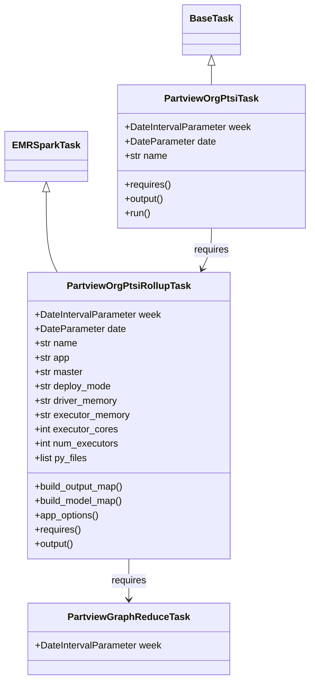
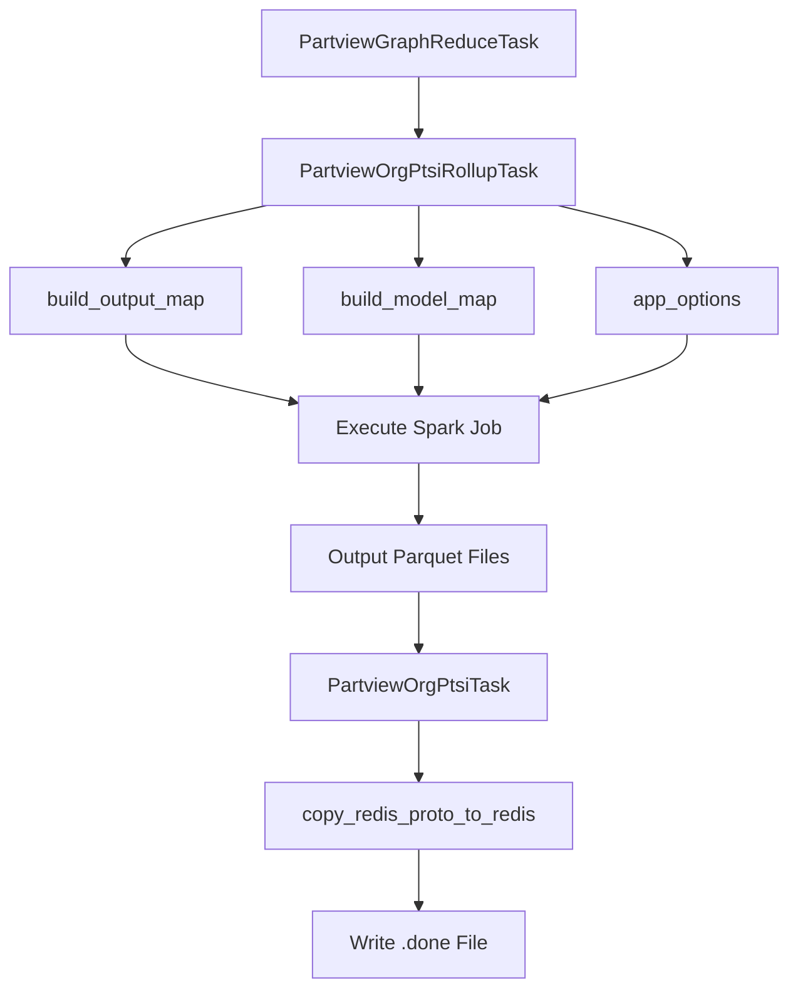
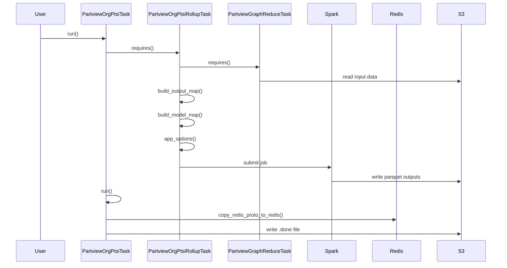

# Diagram: research/orchestrator/tasks/models/partview_org_ptsi_task.py

> Auto-generated by Obscura crawlers

## Diagram 1

### SVG

<svg id="container" width="507.734375" xmlns="http://www.w3.org/2000/svg" class="classDiagram" height="1138" viewBox="0 0 507.734375 1138" role="graphics-document document" aria-roledescription="class"><g><defs><marker id="container_class-aggregationStart" class="marker aggregation class" refX="18" refY="7" markerWidth="190" markerHeight="240" orient="auto"><path d="M 18,7 L9,13 L1,7 L9,1 Z"></path></marker></defs><defs><marker id="container_class-aggregationEnd" class="marker aggregation class" refX="1" refY="7" markerWidth="20" markerHeight="28" orient="auto"><path d="M 18,7 L9,13 L1,7 L9,1 Z"></path></marker></defs><defs><marker id="container_class-extensionStart" class="marker extension class" refX="18" refY="7" markerWidth="190" markerHeight="240" orient="auto"><path d="M 1,7 L18,13 V 1 Z"></path></marker></defs><defs><marker id="container_class-extensionEnd" class="marker extension class" refX="1" refY="7" markerWidth="20" markerHeight="28" orient="auto"><path d="M 1,1 V 13 L18,7 Z"></path></marker></defs><defs><marker id="container_class-compositionStart" class="marker composition class" refX="18" refY="7" markerWidth="190" markerHeight="240" orient="auto"><path d="M 18,7 L9,13 L1,7 L9,1 Z"></path></marker></defs><defs><marker id="container_class-compositionEnd" class="marker composition class" refX="1" refY="7" markerWidth="20" markerHeight="28" orient="auto"><path d="M 18,7 L9,13 L1,7 L9,1 Z"></path></marker></defs><defs><marker id="container_class-dependencyStart" class="marker dependency class" refX="6" refY="7" markerWidth="190" markerHeight="240" orient="auto"><path d="M 5,7 L9,13 L1,7 L9,1 Z"></path></marker></defs><defs><marker id="container_class-dependencyEnd" class="marker dependency class" refX="13" refY="7" markerWidth="20" markerHeight="28" orient="auto"><path d="M 18,7 L9,13 L14,7 L9,1 Z"></path></marker></defs><defs><marker id="container_class-lollipopStart" class="marker lollipop class" refX="13" refY="7" markerWidth="190" markerHeight="240" orient="auto"><circle stroke="black" fill="transparent" cx="7" cy="7" r="6"></circle></marker></defs><defs><marker id="container_class-lollipopEnd" class="marker lollipop class" refX="1" refY="7" markerWidth="190" markerHeight="240" orient="auto"><circle stroke="black" fill="transparent" cx="7" cy="7" r="6"></circle></marker></defs><g class="root"><g class="clusters"></g><g class="edgePaths"><path d="M73.148,321.25L73.148,337.542C73.148,353.833,73.148,386.417,76.164,408.875C79.179,431.333,85.209,443.667,88.224,449.833L91.239,456" id="id_EMRSparkTask_PartviewOrgPtsiRollupTask_1" class="edge-thickness-normal edge-pattern-solid relation" style=";;;" data-edge="true" data-et="edge" data-id="id_EMRSparkTask_PartviewOrgPtsiRollupTask_1" data-points="W3sieCI6NzMuMTQ4NDM3NSwieSI6MzA0fSx7IngiOjczLjE0ODQzNzUsInkiOjQxOX0seyJ4Ijo5MS4yMzg4NDUzMjk0MjIzOSwieSI6NDU2fV0=" marker-start="url(#container_class-extensionStart)"></path><path d="M344.016,109.25L344.016,110.542C344.016,111.833,344.016,114.417,344.016,119.875C344.016,125.333,344.016,133.667,344.016,137.833L344.016,142" id="id_BaseTask_PartviewOrgPtsiTask_2" class="edge-thickness-normal edge-pattern-solid relation" style=";;;" data-edge="true" data-et="edge" data-id="id_BaseTask_PartviewOrgPtsiTask_2" data-points="W3sieCI6MzQ0LjAxNTYyNSwieSI6OTJ9LHsieCI6MzQ0LjAxNTYyNSwieSI6MTE3fSx7IngiOjM0NC4wMTU2MjUsInkiOjE0Mn1d" marker-start="url(#container_class-extensionStart)"></path><path d="M208.582,936L208.582,942.167C208.582,948.333,208.582,960.667,208.582,972C208.582,983.333,208.582,993.667,208.582,998.833L208.582,1004" id="id_PartviewOrgPtsiRollupTask_PartviewGraphReduceTask_3" class="edge-thickness-normal edge-pattern-solid relation" style=";;;" data-edge="true" data-et="edge" data-id="id_PartviewOrgPtsiRollupTask_PartviewGraphReduceTask_3" data-points="W3sieCI6MjA4LjU4MjAzMTI1LCJ5Ijo5MzZ9LHsieCI6MjA4LjU4MjAzMTI1LCJ5Ijo5NzN9LHsieCI6MjA4LjU4MjAzMTI1LCJ5IjoxMDEwfV0=" marker-end="url(#container_class-dependencyEnd)"></path><path d="M344.016,382L344.016,388.167C344.016,394.333,344.016,406.667,341.44,418.102C338.864,429.537,333.712,440.073,331.136,445.341L328.561,450.61" id="id_PartviewOrgPtsiTask_PartviewOrgPtsiRollupTask_4" class="edge-thickness-normal edge-pattern-solid relation" style=";;;" data-edge="true" data-et="edge" data-id="id_PartviewOrgPtsiTask_PartviewOrgPtsiRollupTask_4" data-points="W3sieCI6MzQ0LjAxNTYyNSwieSI6MzgyfSx7IngiOjM0NC4wMTU2MjUsInkiOjQxOX0seyJ4IjozMjUuOTI1MjE3MTcwNTc3NjQsInkiOjQ1Nn1d" marker-end="url(#container_class-dependencyEnd)"></path></g><g class="edgeLabels"><g class="edgeLabel"><g class="label" data-id="id_EMRSparkTask_PartviewOrgPtsiRollupTask_1" transform="translate(0, 0)"><foreignObject width="0" height="0">

</foreignObject></g></g><g class="edgeLabel"><g class="label" data-id="id_BaseTask_PartviewOrgPtsiTask_2" transform="translate(0, 0)"><foreignObject width="0" height="0">

</foreignObject></g></g><g class="edgeLabel" transform="translate(208.58203125, 973)"><g class="label" data-id="id_PartviewOrgPtsiRollupTask_PartviewGraphReduceTask_3" transform="translate(-29.8515625, -12)"><foreignObject width="59.703125" height="24">

requires

</foreignObject></g></g><g class="edgeLabel" transform="translate(344.015625, 419)"><g class="label" data-id="id_PartviewOrgPtsiTask_PartviewOrgPtsiRollupTask_4" transform="translate(-29.8515625, -12)"><foreignObject width="59.703125" height="24">

requires

</foreignObject></g></g></g><g class="nodes"><g class="node default" id="classId-EMRSparkTask-0" transform="translate(73.1484375, 262)"><g class="basic label-container"><path d="M-65.1484375 -42 L65.1484375 -42 L65.1484375 42 L-65.1484375 42" stroke="none" stroke-width="0" fill="#ECECFF" style=""></path><path d="M-65.1484375 -42 C-20.409376801970673 -42, 24.329683896058654 -42, 65.1484375 -42 M-65.1484375 -42 C-29.023228035783987 -42, 7.101981428432026 -42, 65.1484375 -42 M65.1484375 -42 C65.1484375 -18.46738345579675, 65.1484375 5.065233088406501, 65.1484375 42 M65.1484375 -42 C65.1484375 -18.148753982334334, 65.1484375 5.702492035331332, 65.1484375 42 M65.1484375 42 C31.174655748328433 42, -2.799126003343133 42, -65.1484375 42 M65.1484375 42 C16.341390440074726 42, -32.46565661985055 42, -65.1484375 42 M-65.1484375 42 C-65.1484375 22.22467767636897, -65.1484375 2.449355352737939, -65.1484375 -42 M-65.1484375 42 C-65.1484375 8.804583621440713, -65.1484375 -24.390832757118574, -65.1484375 -42" stroke="#9370DB" stroke-width="1.3" fill="none" stroke-dasharray="0 0" style=""></path></g><g class="annotation-group text" transform="translate(0, -18)"></g><g class="label-group text" transform="translate(-53.1484375, -18)"><g class="label" style="font-weight: bolder" transform="translate(0,-12)"><foreignObject width="106.296875" height="24">

EMRSparkTask

</foreignObject></g></g><g class="members-group text" transform="translate(-53.1484375, 30)"></g><g class="methods-group text" transform="translate(-53.1484375, 60)"></g><g class="divider" style=""><path d="M-65.1484375 6 C-24.855783149031005 6, 15.43687120193799 6, 65.1484375 6 M-65.1484375 6 C-34.65723296170256 6, -4.166028423405123 6, 65.1484375 6" stroke="#9370DB" stroke-width="1.3" fill="none" stroke-dasharray="0 0" style=""></path></g><g class="divider" style=""><path d="M-65.1484375 24 C-14.23720219899159 24, 36.67403310201682 24, 65.1484375 24 M-65.1484375 24 C-19.25043443317115 24, 26.6475686336577 24, 65.1484375 24" stroke="#9370DB" stroke-width="1.3" fill="none" stroke-dasharray="0 0" style=""></path></g></g><g class="node default" id="classId-PartviewOrgPtsiRollupTask-1" transform="translate(208.58203125, 696)"><g class="basic label-container"><path d="M-167.515625 -240 L167.515625 -240 L167.515625 240 L-167.515625 240" stroke="none" stroke-width="0" fill="#ECECFF" style=""></path><path d="M-167.515625 -240 C-45.45973071696709 -240, 76.59616356606583 -240, 167.515625 -240 M-167.515625 -240 C-80.51016221558272 -240, 6.495300568834551 -240, 167.515625 -240 M167.515625 -240 C167.515625 -93.32649719607676, 167.515625 53.347005607846484, 167.515625 240 M167.515625 -240 C167.515625 -130.173692463727, 167.515625 -20.347384927454016, 167.515625 240 M167.515625 240 C68.51976799185968 240, -30.47608901628064 240, -167.515625 240 M167.515625 240 C67.36757620259372 240, -32.78047259481255 240, -167.515625 240 M-167.515625 240 C-167.515625 100.69100697293592, -167.515625 -38.61798605412815, -167.515625 -240 M-167.515625 240 C-167.515625 142.0420174517642, -167.515625 44.08403490352836, -167.515625 -240" stroke="#9370DB" stroke-width="1.3" fill="none" stroke-dasharray="0 0" style=""></path></g><g class="annotation-group text" transform="translate(0, -216)"></g><g class="label-group text" transform="translate(-98.90625, -216)"><g class="label" style="font-weight: bolder" transform="translate(0,-12)"><foreignObject width="197.8125" height="24">

PartviewOrgPtsiRollupTask

</foreignObject></g></g><g class="members-group text" transform="translate(-155.515625, -168)"><g class="label" style="" transform="translate(0,-12)"><foreignObject width="212.125" height="24">

+DateIntervalParameter week

</foreignObject></g><g class="label" style="" transform="translate(0,12)"><foreignObject width="152.171875" height="24">

+DateParameter date

</foreignObject></g><g class="label" style="" transform="translate(0,36)"><foreignObject width="72.171875" height="24">

+str name

</foreignObject></g><g class="label" style="" transform="translate(0,60)"><foreignObject width="59.375" height="24">

+str app

</foreignObject></g><g class="label" style="" transform="translate(0,84)"><foreignObject width="81.8125" height="24">

+str master

</foreignObject></g><g class="label" style="" transform="translate(0,108)"><foreignObject width="130.390625" height="24">

+str deploy_mode

</foreignObject></g><g class="label" style="" transform="translate(0,132)"><foreignObject width="141.1875" height="24">

+str driver_memory

</foreignObject></g><g class="label" style="" transform="translate(0,156)"><foreignObject width="161" height="24">

+str executor_memory

</foreignObject></g><g class="label" style="" transform="translate(0,180)"><foreignObject width="139.9375" height="24">

+int executor_cores

</foreignObject></g><g class="label" style="" transform="translate(0,204)"><foreignObject width="142.296875" height="24">

+int num_executors

</foreignObject></g><g class="label" style="" transform="translate(0,228)"><foreignObject width="89.515625" height="24">

+list py_files

</foreignObject></g></g><g class="methods-group text" transform="translate(-155.515625, 120)"><g class="label" style="" transform="translate(0,-12)"><foreignObject width="153.125" height="24">

+build_output_map()

</foreignObject></g><g class="label" style="" transform="translate(0,12)"><foreignObject width="150.453125" height="24">

+build_model_map()

</foreignObject></g><g class="label" style="" transform="translate(0,36)"><foreignObject width="108.84375" height="24">

+app_options()

</foreignObject></g><g class="label" style="" transform="translate(0,60)"><foreignObject width="78.0625" height="24">

+requires()

</foreignObject></g><g class="label" style="" transform="translate(0,84)"><foreignObject width="67.390625" height="24">

+output()

</foreignObject></g></g><g class="divider" style=""><path d="M-167.515625 -192 C-34.12787715085014 -192, 99.25987069829972 -192, 167.515625 -192 M-167.515625 -192 C-72.68500830269862 -192, 22.14560839460276 -192, 167.515625 -192" stroke="#9370DB" stroke-width="1.3" fill="none" stroke-dasharray="0 0" style=""></path></g><g class="divider" style=""><path d="M-167.515625 96 C-59.48132122920994 96, 48.55298254158012 96, 167.515625 96 M-167.515625 96 C-57.203367824777445 96, 53.10888935044511 96, 167.515625 96" stroke="#9370DB" stroke-width="1.3" fill="none" stroke-dasharray="0 0" style=""></path></g></g><g class="node default" id="classId-BaseTask-2" transform="translate(344.015625, 50)"><g class="basic label-container"><path d="M-46.03125 -42 L46.03125 -42 L46.03125 42 L-46.03125 42" stroke="none" stroke-width="0" fill="#ECECFF" style=""></path><path d="M-46.03125 -42 C-14.790952732387186 -42, 16.449344535225627 -42, 46.03125 -42 M-46.03125 -42 C-13.279433627422556 -42, 19.47238274515489 -42, 46.03125 -42 M46.03125 -42 C46.03125 -15.05956765328838, 46.03125 11.880864693423241, 46.03125 42 M46.03125 -42 C46.03125 -22.04375741476456, 46.03125 -2.0875148295291197, 46.03125 42 M46.03125 42 C17.845071834402226 42, -10.341106331195547 42, -46.03125 42 M46.03125 42 C9.803672806971043 42, -26.423904386057913 42, -46.03125 42 M-46.03125 42 C-46.03125 16.81338149965854, -46.03125 -8.37323700068292, -46.03125 -42 M-46.03125 42 C-46.03125 23.287074843196198, -46.03125 4.574149686392396, -46.03125 -42" stroke="#9370DB" stroke-width="1.3" fill="none" stroke-dasharray="0 0" style=""></path></g><g class="annotation-group text" transform="translate(0, -18)"></g><g class="label-group text" transform="translate(-34.03125, -18)"><g class="label" style="font-weight: bolder" transform="translate(0,-12)"><foreignObject width="68.0625" height="24">

BaseTask

</foreignObject></g></g><g class="members-group text" transform="translate(-34.03125, 30)"></g><g class="methods-group text" transform="translate(-34.03125, 60)"></g><g class="divider" style=""><path d="M-46.03125 6 C-17.018941213988118 6, 11.993367572023764 6, 46.03125 6 M-46.03125 6 C-24.486051195032612 6, -2.940852390065224 6, 46.03125 6" stroke="#9370DB" stroke-width="1.3" fill="none" stroke-dasharray="0 0" style=""></path></g><g class="divider" style=""><path d="M-46.03125 24 C-27.194935189757206 24, -8.358620379514413 24, 46.03125 24 M-46.03125 24 C-10.871459615939877 24, 24.288330768120247 24, 46.03125 24" stroke="#9370DB" stroke-width="1.3" fill="none" stroke-dasharray="0 0" style=""></path></g></g><g class="node default" id="classId-PartviewOrgPtsiTask-3" transform="translate(344.015625, 262)"><g class="basic label-container"><path d="M-155.71875 -120 L155.71875 -120 L155.71875 120 L-155.71875 120" stroke="none" stroke-width="0" fill="#ECECFF" style=""></path><path d="M-155.71875 -120 C-76.59011031175078 -120, 2.5385293764984453 -120, 155.71875 -120 M-155.71875 -120 C-52.11339078190849 -120, 51.491968436183015 -120, 155.71875 -120 M155.71875 -120 C155.71875 -41.34166538745613, 155.71875 37.316669225087736, 155.71875 120 M155.71875 -120 C155.71875 -39.876000315337095, 155.71875 40.24799936932581, 155.71875 120 M155.71875 120 C76.89580592495659 120, -1.9271381500868188 120, -155.71875 120 M155.71875 120 C55.42474754327485 120, -44.869254913450305 120, -155.71875 120 M-155.71875 120 C-155.71875 67.76475493971387, -155.71875 15.52950987942772, -155.71875 -120 M-155.71875 120 C-155.71875 70.84296747372704, -155.71875 21.685934947454072, -155.71875 -120" stroke="#9370DB" stroke-width="1.3" fill="none" stroke-dasharray="0 0" style=""></path></g><g class="annotation-group text" transform="translate(0, -96)"></g><g class="label-group text" transform="translate(-75.3125, -96)"><g class="label" style="font-weight: bolder" transform="translate(0,-12)"><foreignObject width="150.625" height="24">

PartviewOrgPtsiTask

</foreignObject></g></g><g class="members-group text" transform="translate(-143.71875, -48)"><g class="label" style="" transform="translate(0,-12)"><foreignObject width="212.125" height="24">

+DateIntervalParameter week

</foreignObject></g><g class="label" style="" transform="translate(0,12)"><foreignObject width="152.171875" height="24">

+DateParameter date

</foreignObject></g><g class="label" style="" transform="translate(0,36)"><foreignObject width="72.171875" height="24">

+str name

</foreignObject></g></g><g class="methods-group text" transform="translate(-143.71875, 48)"><g class="label" style="" transform="translate(0,-12)"><foreignObject width="78.0625" height="24">

+requires()

</foreignObject></g><g class="label" style="" transform="translate(0,12)"><foreignObject width="67.390625" height="24">

+output()

</foreignObject></g><g class="label" style="" transform="translate(0,36)"><foreignObject width="43.21875" height="24">

+run()

</foreignObject></g></g><g class="divider" style=""><path d="M-155.71875 -72 C-41.58581402630102 -72, 72.54712194739795 -72, 155.71875 -72 M-155.71875 -72 C-67.6683994066545 -72, 20.381951186690998 -72, 155.71875 -72" stroke="#9370DB" stroke-width="1.3" fill="none" stroke-dasharray="0 0" style=""></path></g><g class="divider" style=""><path d="M-155.71875 24 C-42.43779375238876 24, 70.84316249522249 24, 155.71875 24 M-155.71875 24 C-65.2270641460426 24, 25.264621707914813 24, 155.71875 24" stroke="#9370DB" stroke-width="1.3" fill="none" stroke-dasharray="0 0" style=""></path></g></g><g class="node default" id="classId-PartviewGraphReduceTask-4" transform="translate(208.58203125, 1070)"><g class="basic label-container"><path d="M-166.4921875 -60 L166.4921875 -60 L166.4921875 60 L-166.4921875 60" stroke="none" stroke-width="0" fill="#ECECFF" style=""></path><path d="M-166.4921875 -60 C-61.20824494993958 -60, 44.07569760012083 -60, 166.4921875 -60 M-166.4921875 -60 C-84.90418898425727 -60, -3.3161904685145487 -60, 166.4921875 -60 M166.4921875 -60 C166.4921875 -31.687582040905106, 166.4921875 -3.3751640818102118, 166.4921875 60 M166.4921875 -60 C166.4921875 -26.65574416556114, 166.4921875 6.688511668877723, 166.4921875 60 M166.4921875 60 C41.690849826988 60, -83.110487846024 60, -166.4921875 60 M166.4921875 60 C81.78094847462513 60, -2.9302905507497314 60, -166.4921875 60 M-166.4921875 60 C-166.4921875 15.315926103352247, -166.4921875 -29.368147793295506, -166.4921875 -60 M-166.4921875 60 C-166.4921875 18.581544492085634, -166.4921875 -22.836911015828733, -166.4921875 -60" stroke="#9370DB" stroke-width="1.3" fill="none" stroke-dasharray="0 0" style=""></path></g><g class="annotation-group text" transform="translate(0, -36)"></g><g class="label-group text" transform="translate(-96.859375, -36)"><g class="label" style="font-weight: bolder" transform="translate(0,-12)"><foreignObject width="193.71875" height="24">

PartviewGraphReduceTask

</foreignObject></g></g><g class="members-group text" transform="translate(-154.4921875, 12)"><g class="label" style="" transform="translate(0,-12)"><foreignObject width="212.125" height="24">

+DateIntervalParameter week

</foreignObject></g></g><g class="methods-group text" transform="translate(-154.4921875, 60)"></g><g class="divider" style=""><path d="M-166.4921875 -12 C-80.15785205546307 -12, 6.176483389073866 -12, 166.4921875 -12 M-166.4921875 -12 C-36.5497683725564 -12, 93.3926507548872 -12, 166.4921875 -12" stroke="#9370DB" stroke-width="1.3" fill="none" stroke-dasharray="0 0" style=""></path></g><g class="divider" style=""><path d="M-166.4921875 36 C-90.15797957600878 36, -13.82377165201757 36, 166.4921875 36 M-166.4921875 36 C-75.26767581387674 36, 15.956835872246529 36, 166.4921875 36" stroke="#9370DB" stroke-width="1.3" fill="none" stroke-dasharray="0 0" style=""></path></g></g></g></g></g></svg>

## Diagram 2

### SVG

<svg id="container" width="653.625" xmlns="http://www.w3.org/2000/svg" class="flowchart" height="798" viewBox="0 0 653.625 798" role="graphics-document document" aria-roledescription="flowchart-v2"><g><marker id="container_flowchart-v2-pointEnd" class="marker flowchart-v2" viewBox="0 0 10 10" refX="5" refY="5" markerUnits="userSpaceOnUse" markerWidth="8" markerHeight="8" orient="auto"><path d="M 0 0 L 10 5 L 0 10 z" class="arrowMarkerPath" style="stroke-width: 1; stroke-dasharray: 1, 0;"></path></marker><marker id="container_flowchart-v2-pointStart" class="marker flowchart-v2" viewBox="0 0 10 10" refX="4.5" refY="5" markerUnits="userSpaceOnUse" markerWidth="8" markerHeight="8" orient="auto"><path d="M 0 5 L 10 10 L 10 0 z" class="arrowMarkerPath" style="stroke-width: 1; stroke-dasharray: 1, 0;"></path></marker><marker id="container_flowchart-v2-circleEnd" class="marker flowchart-v2" viewBox="0 0 10 10" refX="11" refY="5" markerUnits="userSpaceOnUse" markerWidth="11" markerHeight="11" orient="auto"><circle cx="5" cy="5" r="5" class="arrowMarkerPath" style="stroke-width: 1; stroke-dasharray: 1, 0;"></circle></marker><marker id="container_flowchart-v2-circleStart" class="marker flowchart-v2" viewBox="0 0 10 10" refX="-1" refY="5" markerUnits="userSpaceOnUse" markerWidth="11" markerHeight="11" orient="auto"><circle cx="5" cy="5" r="5" class="arrowMarkerPath" style="stroke-width: 1; stroke-dasharray: 1, 0;"></circle></marker><marker id="container_flowchart-v2-crossEnd" class="marker cross flowchart-v2" viewBox="0 0 11 11" refX="12" refY="5.2" markerUnits="userSpaceOnUse" markerWidth="11" markerHeight="11" orient="auto"><path d="M 1,1 l 9,9 M 10,1 l -9,9" class="arrowMarkerPath" style="stroke-width: 2; stroke-dasharray: 1, 0;"></path></marker><marker id="container_flowchart-v2-crossStart" class="marker cross flowchart-v2" viewBox="0 0 11 11" refX="-1" refY="5.2" markerUnits="userSpaceOnUse" markerWidth="11" markerHeight="11" orient="auto"><path d="M 1,1 l 9,9 M 10,1 l -9,9" class="arrowMarkerPath" style="stroke-width: 2; stroke-dasharray: 1, 0;"></path></marker><g class="root"><g class="clusters"></g><g class="edgePaths"><path d="M348.836,62L348.836,66.167C348.836,70.333,348.836,78.667,348.836,86.333C348.836,94,348.836,101,348.836,104.5L348.836,108" id="L_A_B_0" class="edge-thickness-normal edge-pattern-solid edge-thickness-normal edge-pattern-solid flowchart-link" style=";" data-edge="true" data-et="edge" data-id="L_A_B_0" data-points="W3sieCI6MzQ4LjgzNTkzNzUsInkiOjYyfSx7IngiOjM0OC44MzU5Mzc1LCJ5Ijo4N30seyJ4IjozNDguODM1OTM3NSwieSI6MTEyfV0=" marker-end="url(#container_flowchart-v2-pointEnd)"></path><path d="M222.57,165.97L203.04,170.142C183.51,174.314,144.451,182.657,124.921,190.328C105.391,198,105.391,205,105.391,208.5L105.391,212" id="L_B_C_0" class="edge-thickness-normal edge-pattern-solid edge-thickness-normal edge-pattern-solid flowchart-link" style=";" data-edge="true" data-et="edge" data-id="L_B_C_0" data-points="W3sieCI6MjIyLjU3MDMxMjUsInkiOjE2NS45NzAzNzk2NDEyMTgyfSx7IngiOjEwNS4zOTA2MjUsInkiOjE5MX0seyJ4IjoxMDUuMzkwNjI1LCJ5IjoyMTZ9XQ==" marker-end="url(#container_flowchart-v2-pointEnd)"></path><path d="M348.836,166L348.836,170.167C348.836,174.333,348.836,182.667,348.836,190.333C348.836,198,348.836,205,348.836,208.5L348.836,212" id="L_B_D_0" class="edge-thickness-normal edge-pattern-solid edge-thickness-normal edge-pattern-solid flowchart-link" style=";" data-edge="true" data-et="edge" data-id="L_B_D_0" data-points="W3sieCI6MzQ4LjgzNTkzNzUsInkiOjE2Nn0seyJ4IjozNDguODM1OTM3NSwieSI6MTkxfSx7IngiOjM0OC44MzU5Mzc1LCJ5IjoyMTZ9XQ==" marker-end="url(#container_flowchart-v2-pointEnd)"></path><path d="M463.805,166L481.547,170.167C499.289,174.333,534.774,182.667,552.516,190.333C570.258,198,570.258,205,570.258,208.5L570.258,212" id="L_B_E_0" class="edge-thickness-normal edge-pattern-solid edge-thickness-normal edge-pattern-solid flowchart-link" style=";" data-edge="true" data-et="edge" data-id="L_B_E_0" data-points="W3sieCI6NDYzLjgwNDk4Nzk4MDc2OTIsInkiOjE2Nn0seyJ4Ijo1NzAuMjU3ODEyNSwieSI6MTkxfSx7IngiOjU3MC4yNTc4MTI1LCJ5IjoyMTZ9XQ==" marker-end="url(#container_flowchart-v2-pointEnd)"></path><path d="M105.391,270L105.391,274.167C105.391,278.333,105.391,286.667,129.538,295.991C153.686,305.316,201.981,315.632,226.128,320.79L250.276,325.948" id="L_C_F_0" class="edge-thickness-normal edge-pattern-solid edge-thickness-normal edge-pattern-solid flowchart-link" style=";" data-edge="true" data-et="edge" data-id="L_C_F_0" data-points="W3sieCI6MTA1LjM5MDYyNSwieSI6MjcwfSx7IngiOjEwNS4zOTA2MjUsInkiOjI5NX0seyJ4IjoyNTQuMTg3NSwieSI6MzI2Ljc4MzA2MjE2MTAzNDY1fV0=" marker-end="url(#container_flowchart-v2-pointEnd)"></path><path d="M348.836,270L348.836,274.167C348.836,278.333,348.836,286.667,348.836,294.333C348.836,302,348.836,309,348.836,312.5L348.836,316" id="L_D_F_0" class="edge-thickness-normal edge-pattern-solid edge-thickness-normal edge-pattern-solid flowchart-link" style=";" data-edge="true" data-et="edge" data-id="L_D_F_0" data-points="W3sieCI6MzQ4LjgzNTkzNzUsInkiOjI3MH0seyJ4IjozNDguODM1OTM3NSwieSI6Mjk1fSx7IngiOjM0OC44MzU5Mzc1LCJ5IjozMjB9XQ==" marker-end="url(#container_flowchart-v2-pointEnd)"></path><path d="M570.258,270L570.258,274.167C570.258,278.333,570.258,286.667,549.778,295.643C529.298,304.619,488.338,314.238,467.858,319.048L447.378,323.858" id="L_E_F_0" class="edge-thickness-normal edge-pattern-solid edge-thickness-normal edge-pattern-solid flowchart-link" style=";" data-edge="true" data-et="edge" data-id="L_E_F_0" data-points="W3sieCI6NTcwLjI1NzgxMjUsInkiOjI3MH0seyJ4Ijo1NzAuMjU3ODEyNSwieSI6Mjk1fSx7IngiOjQ0My40ODQzNzUsInkiOjMyNC43NzIyMTA4NTMxNTA4fV0=" marker-end="url(#container_flowchart-v2-pointEnd)"></path><path d="M348.836,374L348.836,378.167C348.836,382.333,348.836,390.667,348.836,398.333C348.836,406,348.836,413,348.836,416.5L348.836,420" id="L_F_G_0" class="edge-thickness-normal edge-pattern-solid edge-thickness-normal edge-pattern-solid flowchart-link" style=";" data-edge="true" data-et="edge" data-id="L_F_G_0" data-points="W3sieCI6MzQ4LjgzNTkzNzUsInkiOjM3NH0seyJ4IjozNDguODM1OTM3NSwieSI6Mzk5fSx7IngiOjM0OC44MzU5Mzc1LCJ5Ijo0MjR9XQ==" marker-end="url(#container_flowchart-v2-pointEnd)"></path><path d="M348.836,478L348.836,482.167C348.836,486.333,348.836,494.667,348.836,502.333C348.836,510,348.836,517,348.836,520.5L348.836,524" id="L_G_H_0" class="edge-thickness-normal edge-pattern-solid edge-thickness-normal edge-pattern-solid flowchart-link" style=";" data-edge="true" data-et="edge" data-id="L_G_H_0" data-points="W3sieCI6MzQ4LjgzNTkzNzUsInkiOjQ3OH0seyJ4IjozNDguODM1OTM3NSwieSI6NTAzfSx7IngiOjM0OC44MzU5Mzc1LCJ5Ijo1Mjh9XQ==" marker-end="url(#container_flowchart-v2-pointEnd)"></path><path d="M348.836,582L348.836,586.167C348.836,590.333,348.836,598.667,348.836,606.333C348.836,614,348.836,621,348.836,624.5L348.836,628" id="L_H_I_0" class="edge-thickness-normal edge-pattern-solid edge-thickness-normal edge-pattern-solid flowchart-link" style=";" data-edge="true" data-et="edge" data-id="L_H_I_0" data-points="W3sieCI6MzQ4LjgzNTkzNzUsInkiOjU4Mn0seyJ4IjozNDguODM1OTM3NSwieSI6NjA3fSx7IngiOjM0OC44MzU5Mzc1LCJ5Ijo2MzJ9XQ==" marker-end="url(#container_flowchart-v2-pointEnd)"></path><path d="M348.836,686L348.836,690.167C348.836,694.333,348.836,702.667,348.836,710.333C348.836,718,348.836,725,348.836,728.5L348.836,732" id="L_I_J_0" class="edge-thickness-normal edge-pattern-solid edge-thickness-normal edge-pattern-solid flowchart-link" style=";" data-edge="true" data-et="edge" data-id="L_I_J_0" data-points="W3sieCI6MzQ4LjgzNTkzNzUsInkiOjY4Nn0seyJ4IjozNDguODM1OTM3NSwieSI6NzExfSx7IngiOjM0OC44MzU5Mzc1LCJ5Ijo3MzZ9XQ==" marker-end="url(#container_flowchart-v2-pointEnd)"></path></g><g class="edgeLabels"><g class="edgeLabel"><g class="label" data-id="L_A_B_0" transform="translate(0, 0)"><foreignObject width="0" height="0">

</foreignObject></g></g><g class="edgeLabel"><g class="label" data-id="L_B_C_0" transform="translate(0, 0)"><foreignObject width="0" height="0">

</foreignObject></g></g><g class="edgeLabel"><g class="label" data-id="L_B_D_0" transform="translate(0, 0)"><foreignObject width="0" height="0">

</foreignObject></g></g><g class="edgeLabel"><g class="label" data-id="L_B_E_0" transform="translate(0, 0)"><foreignObject width="0" height="0">

</foreignObject></g></g><g class="edgeLabel"><g class="label" data-id="L_C_F_0" transform="translate(0, 0)"><foreignObject width="0" height="0">

</foreignObject></g></g><g class="edgeLabel"><g class="label" data-id="L_D_F_0" transform="translate(0, 0)"><foreignObject width="0" height="0">

</foreignObject></g></g><g class="edgeLabel"><g class="label" data-id="L_E_F_0" transform="translate(0, 0)"><foreignObject width="0" height="0">

</foreignObject></g></g><g class="edgeLabel"><g class="label" data-id="L_F_G_0" transform="translate(0, 0)"><foreignObject width="0" height="0">

</foreignObject></g></g><g class="edgeLabel"><g class="label" data-id="L_G_H_0" transform="translate(0, 0)"><foreignObject width="0" height="0">

</foreignObject></g></g><g class="edgeLabel"><g class="label" data-id="L_H_I_0" transform="translate(0, 0)"><foreignObject width="0" height="0">

</foreignObject></g></g><g class="edgeLabel"><g class="label" data-id="L_I_J_0" transform="translate(0, 0)"><foreignObject width="0" height="0">

</foreignObject></g></g></g><g class="nodes"><g class="node default" id="flowchart-A-0" transform="translate(348.8359375, 35)"><rect class="basic label-container" style="" x="-124.8203125" y="-27" width="249.640625" height="54"></rect><g class="label" style="" transform="translate(-94.8203125, -12)"><rect></rect><foreignObject width="189.640625" height="24">

PartviewGraphReduceTask

</foreignObject></g></g><g class="node default" id="flowchart-B-1" transform="translate(348.8359375, 139)"><rect class="basic label-container" style="" x="-126.265625" y="-27" width="252.53125" height="54"></rect><g class="label" style="" transform="translate(-96.265625, -12)"><rect></rect><foreignObject width="192.53125" height="24">

PartviewOrgPtsiRollupTask

</foreignObject></g></g><g class="node default" id="flowchart-C-3" transform="translate(105.390625, 243)"><rect class="basic label-container" style="" x="-97.390625" y="-27" width="194.78125" height="54"></rect><g class="label" style="" transform="translate(-67.390625, -12)"><rect></rect><foreignObject width="134.78125" height="24">

build_output_map

</foreignObject></g></g><g class="node default" id="flowchart-D-5" transform="translate(348.8359375, 243)"><rect class="basic label-container" style="" x="-96.0546875" y="-27" width="192.109375" height="54"></rect><g class="label" style="" transform="translate(-66.0546875, -12)"><rect></rect><foreignObject width="132.109375" height="24">

build_model_map

</foreignObject></g></g><g class="node default" id="flowchart-E-7" transform="translate(570.2578125, 243)"><rect class="basic label-container" style="" x="-75.3671875" y="-27" width="150.734375" height="54"></rect><g class="label" style="" transform="translate(-45.3671875, -12)"><rect></rect><foreignObject width="90.734375" height="24">

app_options

</foreignObject></g></g><g class="node default" id="flowchart-F-9" transform="translate(348.8359375, 347)"><rect class="basic label-container" style="" x="-94.6484375" y="-27" width="189.296875" height="54"></rect><g class="label" style="" transform="translate(-64.6484375, -12)"><rect></rect><foreignObject width="129.296875" height="24">

Execute Spark Job

</foreignObject></g></g><g class="node default" id="flowchart-G-15" transform="translate(348.8359375, 451)"><rect class="basic label-container" style="" x="-104.0234375" y="-27" width="208.046875" height="54"></rect><g class="label" style="" transform="translate(-74.0234375, -12)"><rect></rect><foreignObject width="148.046875" height="24">

Output Parquet Files

</foreignObject></g></g><g class="node default" id="flowchart-H-17" transform="translate(348.8359375, 555)"><rect class="basic label-container" style="" x="-102.78125" y="-27" width="205.5625" height="54"></rect><g class="label" style="" transform="translate(-72.78125, -12)"><rect></rect><foreignObject width="145.5625" height="24">

PartviewOrgPtsiTask

</foreignObject></g></g><g class="node default" id="flowchart-I-19" transform="translate(348.8359375, 659)"><rect class="basic label-container" style="" x="-125.875" y="-27" width="251.75" height="54"></rect><g class="label" style="" transform="translate(-95.875, -12)"><rect></rect><foreignObject width="191.75" height="24">

copy_redis_proto_to_redis

</foreignObject></g></g><g class="node default" id="flowchart-J-21" transform="translate(348.8359375, 763)"><rect class="basic label-container" style="" x="-86.1953125" y="-27" width="172.390625" height="54"></rect><g class="label" style="" transform="translate(-56.1953125, -12)"><rect></rect><foreignObject width="112.390625" height="24">

Write .done File

</foreignObject></g></g></g></g></g></svg>

## Diagram 3

### SVG

<svg id="container" width="1589" xmlns="http://www.w3.org/2000/svg" height="867" viewBox="-50 -10 1589 867" role="graphics-document document" aria-roledescription="sequence"><g><rect x="1339" y="781" fill="#eaeaea" stroke="#666" width="150" height="65" name="S3" rx="3" ry="3" class="actor actor-bottom"></rect><text x="1414" y="813.5" dominant-baseline="central" alignment-baseline="central" class="actor actor-box" style="text-anchor: middle; font-size: 16px; font-weight: 400;"><tspan x="1414" dy="0">S3</tspan></text></g><g><rect x="1139" y="781" fill="#eaeaea" stroke="#666" width="150" height="65" name="Redis" rx="3" ry="3" class="actor actor-bottom"></rect><text x="1214" y="813.5" dominant-baseline="central" alignment-baseline="central" class="actor actor-box" style="text-anchor: middle; font-size: 16px; font-weight: 400;"><tspan x="1214" dy="0">Redis</tspan></text></g><g><rect x="939" y="781" fill="#eaeaea" stroke="#666" width="150" height="65" name="Spark" rx="3" ry="3" class="actor actor-bottom"></rect><text x="1014" y="813.5" dominant-baseline="central" alignment-baseline="central" class="actor actor-box" style="text-anchor: middle; font-size: 16px; font-weight: 400;"><tspan x="1014" dy="0">Spark</tspan></text></g><g><rect x="679" y="781" fill="#eaeaea" stroke="#666" width="210" height="65" name="PartviewGraphReduceTask" rx="3" ry="3" class="actor actor-bottom"></rect><text x="784" y="813.5" dominant-baseline="central" alignment-baseline="central" class="actor actor-box" style="text-anchor: middle; font-size: 16px; font-weight: 400;"><tspan x="784" dy="0">PartviewGraphReduceTask</tspan></text></g><g><rect x="416" y="781" fill="#eaeaea" stroke="#666" width="213" height="65" name="PartviewOrgPtsiRollupTask" rx="3" ry="3" class="actor actor-bottom"></rect><text x="522.5" y="813.5" dominant-baseline="central" alignment-baseline="central" class="actor actor-box" style="text-anchor: middle; font-size: 16px; font-weight: 400;"><tspan x="522.5" dy="0">PartviewOrgPtsiRollupTask</tspan></text></g><g><rect x="200" y="781" fill="#eaeaea" stroke="#666" width="166" height="65" name="PartviewOrgPtsiTask" rx="3" ry="3" class="actor actor-bottom"></rect><text x="283" y="813.5" dominant-baseline="central" alignment-baseline="central" class="actor actor-box" style="text-anchor: middle; font-size: 16px; font-weight: 400;"><tspan x="283" dy="0">PartviewOrgPtsiTask</tspan></text></g><g><rect x="0" y="781" fill="#eaeaea" stroke="#666" width="150" height="65" name="User" rx="3" ry="3" class="actor actor-bottom"></rect><text x="75" y="813.5" dominant-baseline="central" alignment-baseline="central" class="actor actor-box" style="text-anchor: middle; font-size: 16px; font-weight: 400;"><tspan x="75" dy="0">User</tspan></text></g><g><line id="actor6" x1="1414" y1="65" x2="1414" y2="781" class="actor-line 200" stroke-width="0.5px" stroke="#999" name="S3"></line><g id="root-6"><rect x="1339" y="0" fill="#eaeaea" stroke="#666" width="150" height="65" name="S3" rx="3" ry="3" class="actor actor-top"></rect><text x="1414" y="32.5" dominant-baseline="central" alignment-baseline="central" class="actor actor-box" style="text-anchor: middle; font-size: 16px; font-weight: 400;"><tspan x="1414" dy="0">S3</tspan></text></g></g><g><line id="actor5" x1="1214" y1="65" x2="1214" y2="781" class="actor-line 200" stroke-width="0.5px" stroke="#999" name="Redis"></line><g id="root-5"><rect x="1139" y="0" fill="#eaeaea" stroke="#666" width="150" height="65" name="Redis" rx="3" ry="3" class="actor actor-top"></rect><text x="1214" y="32.5" dominant-baseline="central" alignment-baseline="central" class="actor actor-box" style="text-anchor: middle; font-size: 16px; font-weight: 400;"><tspan x="1214" dy="0">Redis</tspan></text></g></g><g><line id="actor4" x1="1014" y1="65" x2="1014" y2="781" class="actor-line 200" stroke-width="0.5px" stroke="#999" name="Spark"></line><g id="root-4"><rect x="939" y="0" fill="#eaeaea" stroke="#666" width="150" height="65" name="Spark" rx="3" ry="3" class="actor actor-top"></rect><text x="1014" y="32.5" dominant-baseline="central" alignment-baseline="central" class="actor actor-box" style="text-anchor: middle; font-size: 16px; font-weight: 400;"><tspan x="1014" dy="0">Spark</tspan></text></g></g><g><line id="actor3" x1="784" y1="65" x2="784" y2="781" class="actor-line 200" stroke-width="0.5px" stroke="#999" name="PartviewGraphReduceTask"></line><g id="root-3"><rect x="679" y="0" fill="#eaeaea" stroke="#666" width="210" height="65" name="PartviewGraphReduceTask" rx="3" ry="3" class="actor actor-top"></rect><text x="784" y="32.5" dominant-baseline="central" alignment-baseline="central" class="actor actor-box" style="text-anchor: middle; font-size: 16px; font-weight: 400;"><tspan x="784" dy="0">PartviewGraphReduceTask</tspan></text></g></g><g><line id="actor2" x1="522.5" y1="65" x2="522.5" y2="781" class="actor-line 200" stroke-width="0.5px" stroke="#999" name="PartviewOrgPtsiRollupTask"></line><g id="root-2"><rect x="416" y="0" fill="#eaeaea" stroke="#666" width="213" height="65" name="PartviewOrgPtsiRollupTask" rx="3" ry="3" class="actor actor-top"></rect><text x="522.5" y="32.5" dominant-baseline="central" alignment-baseline="central" class="actor actor-box" style="text-anchor: middle; font-size: 16px; font-weight: 400;"><tspan x="522.5" dy="0">PartviewOrgPtsiRollupTask</tspan></text></g></g><g><line id="actor1" x1="283" y1="65" x2="283" y2="781" class="actor-line 200" stroke-width="0.5px" stroke="#999" name="PartviewOrgPtsiTask"></line><g id="root-1"><rect x="200" y="0" fill="#eaeaea" stroke="#666" width="166" height="65" name="PartviewOrgPtsiTask" rx="3" ry="3" class="actor actor-top"></rect><text x="283" y="32.5" dominant-baseline="central" alignment-baseline="central" class="actor actor-box" style="text-anchor: middle; font-size: 16px; font-weight: 400;"><tspan x="283" dy="0">PartviewOrgPtsiTask</tspan></text></g></g><g><line id="actor0" x1="75" y1="65" x2="75" y2="781" class="actor-line 200" stroke-width="0.5px" stroke="#999" name="User"></line><g id="root-0"><rect x="0" y="0" fill="#eaeaea" stroke="#666" width="150" height="65" name="User" rx="3" ry="3" class="actor actor-top"></rect><text x="75" y="32.5" dominant-baseline="central" alignment-baseline="central" class="actor actor-box" style="text-anchor: middle; font-size: 16px; font-weight: 400;"><tspan x="75" dy="0">User</tspan></text></g></g><g></g><defs><symbol id="computer" width="24" height="24"><path transform="scale(.5)" d="M2 2v13h20v-13h-20zm18 11h-16v-9h16v9zm-10.228 6l.466-1h3.524l.467 1h-4.457zm14.228 3h-24l2-6h2.104l-1.33 4h18.45l-1.297-4h2.073l2 6zm-5-10h-14v-7h14v7z"></path></symbol></defs><defs><symbol id="database" fill-rule="evenodd" clip-rule="evenodd"><path transform="scale(.5)" d="M12.258.001l.256.004.255.005.253.008.251.01.249.012.247.015.246.016.242.019.241.02.239.023.236.024.233.027.231.028.229.031.225.032.223.034.22.036.217.038.214.04.211.041.208.043.205.045.201.046.198.048.194.05.191.051.187.053.183.054.18.056.175.057.172.059.168.06.163.061.16.063.155.064.15.066.074.033.073.033.071.034.07.034.069.035.068.035.067.035.066.035.064.036.064.036.062.036.06.036.06.037.058.037.058.037.055.038.055.038.053.038.052.038.051.039.05.039.048.039.047.039.045.04.044.04.043.04.041.04.04.041.039.041.037.041.036.041.034.041.033.042.032.042.03.042.029.042.027.042.026.043.024.043.023.043.021.043.02.043.018.044.017.043.015.044.013.044.012.044.011.045.009.044.007.045.006.045.004.045.002.045.001.045v17l-.001.045-.002.045-.004.045-.006.045-.007.045-.009.044-.011.045-.012.044-.013.044-.015.044-.017.043-.018.044-.02.043-.021.043-.023.043-.024.043-.026.043-.027.042-.029.042-.03.042-.032.042-.033.042-.034.041-.036.041-.037.041-.039.041-.04.041-.041.04-.043.04-.044.04-.045.04-.047.039-.048.039-.05.039-.051.039-.052.038-.053.038-.055.038-.055.038-.058.037-.058.037-.06.037-.06.036-.062.036-.064.036-.064.036-.066.035-.067.035-.068.035-.069.035-.07.034-.071.034-.073.033-.074.033-.15.066-.155.064-.16.063-.163.061-.168.06-.172.059-.175.057-.18.056-.183.054-.187.053-.191.051-.194.05-.198.048-.201.046-.205.045-.208.043-.211.041-.214.04-.217.038-.22.036-.223.034-.225.032-.229.031-.231.028-.233.027-.236.024-.239.023-.241.02-.242.019-.246.016-.247.015-.249.012-.251.01-.253.008-.255.005-.256.004-.258.001-.258-.001-.256-.004-.255-.005-.253-.008-.251-.01-.249-.012-.247-.015-.245-.016-.243-.019-.241-.02-.238-.023-.236-.024-.234-.027-.231-.028-.228-.031-.226-.032-.223-.034-.22-.036-.217-.038-.214-.04-.211-.041-.208-.043-.204-.045-.201-.046-.198-.048-.195-.05-.19-.051-.187-.053-.184-.054-.179-.056-.176-.057-.172-.059-.167-.06-.164-.061-.159-.063-.155-.064-.151-.066-.074-.033-.072-.033-.072-.034-.07-.034-.069-.035-.068-.035-.067-.035-.066-.035-.064-.036-.063-.036-.062-.036-.061-.036-.06-.037-.058-.037-.057-.037-.056-.038-.055-.038-.053-.038-.052-.038-.051-.039-.049-.039-.049-.039-.046-.039-.046-.04-.044-.04-.043-.04-.041-.04-.04-.041-.039-.041-.037-.041-.036-.041-.034-.041-.033-.042-.032-.042-.03-.042-.029-.042-.027-.042-.026-.043-.024-.043-.023-.043-.021-.043-.02-.043-.018-.044-.017-.043-.015-.044-.013-.044-.012-.044-.011-.045-.009-.044-.007-.045-.006-.045-.004-.045-.002-.045-.001-.045v-17l.001-.045.002-.045.004-.045.006-.045.007-.045.009-.044.011-.045.012-.044.013-.044.015-.044.017-.043.018-.044.02-.043.021-.043.023-.043.024-.043.026-.043.027-.042.029-.042.03-.042.032-.042.033-.042.034-.041.036-.041.037-.041.039-.041.04-.041.041-.04.043-.04.044-.04.046-.04.046-.039.049-.039.049-.039.051-.039.052-.038.053-.038.055-.038.056-.038.057-.037.058-.037.06-.037.061-.036.062-.036.063-.036.064-.036.066-.035.067-.035.068-.035.069-.035.07-.034.072-.034.072-.033.074-.033.151-.066.155-.064.159-.063.164-.061.167-.06.172-.059.176-.057.179-.056.184-.054.187-.053.19-.051.195-.05.198-.048.201-.046.204-.045.208-.043.211-.041.214-.04.217-.038.22-.036.223-.034.226-.032.228-.031.231-.028.234-.027.236-.024.238-.023.241-.02.243-.019.245-.016.247-.015.249-.012.251-.01.253-.008.255-.005.256-.004.258-.001.258.001zm-9.258 20.499v.01l.001.021.003.021.004.022.005.021.006.022.007.022.009.023.01.022.011.023.012.023.013.023.015.023.016.024.017.023.018.024.019.024.021.024.022.025.023.024.024.025.052.049.056.05.061.051.066.051.07.051.075.051.079.052.084.052.088.052.092.052.097.052.102.051.105.052.11.052.114.051.119.051.123.051.127.05.131.05.135.05.139.048.144.049.147.047.152.047.155.047.16.045.163.045.167.043.171.043.176.041.178.041.183.039.187.039.19.037.194.035.197.035.202.033.204.031.209.03.212.029.216.027.219.025.222.024.226.021.23.02.233.018.236.016.24.015.243.012.246.01.249.008.253.005.256.004.259.001.26-.001.257-.004.254-.005.25-.008.247-.011.244-.012.241-.014.237-.016.233-.018.231-.021.226-.021.224-.024.22-.026.216-.027.212-.028.21-.031.205-.031.202-.034.198-.034.194-.036.191-.037.187-.039.183-.04.179-.04.175-.042.172-.043.168-.044.163-.045.16-.046.155-.046.152-.047.148-.048.143-.049.139-.049.136-.05.131-.05.126-.05.123-.051.118-.052.114-.051.11-.052.106-.052.101-.052.096-.052.092-.052.088-.053.083-.051.079-.052.074-.052.07-.051.065-.051.06-.051.056-.05.051-.05.023-.024.023-.025.021-.024.02-.024.019-.024.018-.024.017-.024.015-.023.014-.024.013-.023.012-.023.01-.023.01-.022.008-.022.006-.022.006-.022.004-.022.004-.021.001-.021.001-.021v-4.127l-.077.055-.08.053-.083.054-.085.053-.087.052-.09.052-.093.051-.095.05-.097.05-.1.049-.102.049-.105.048-.106.047-.109.047-.111.046-.114.045-.115.045-.118.044-.12.043-.122.042-.124.042-.126.041-.128.04-.13.04-.132.038-.134.038-.135.037-.138.037-.139.035-.142.035-.143.034-.144.033-.147.032-.148.031-.15.03-.151.03-.153.029-.154.027-.156.027-.158.026-.159.025-.161.024-.162.023-.163.022-.165.021-.166.02-.167.019-.169.018-.169.017-.171.016-.173.015-.173.014-.175.013-.175.012-.177.011-.178.01-.179.008-.179.008-.181.006-.182.005-.182.004-.184.003-.184.002h-.37l-.184-.002-.184-.003-.182-.004-.182-.005-.181-.006-.179-.008-.179-.008-.178-.01-.176-.011-.176-.012-.175-.013-.173-.014-.172-.015-.171-.016-.17-.017-.169-.018-.167-.019-.166-.02-.165-.021-.163-.022-.162-.023-.161-.024-.159-.025-.157-.026-.156-.027-.155-.027-.153-.029-.151-.03-.15-.03-.148-.031-.146-.032-.145-.033-.143-.034-.141-.035-.14-.035-.137-.037-.136-.037-.134-.038-.132-.038-.13-.04-.128-.04-.126-.041-.124-.042-.122-.042-.12-.044-.117-.043-.116-.045-.113-.045-.112-.046-.109-.047-.106-.047-.105-.048-.102-.049-.1-.049-.097-.05-.095-.05-.093-.052-.09-.051-.087-.052-.085-.053-.083-.054-.08-.054-.077-.054v4.127zm0-5.654v.011l.001.021.003.021.004.021.005.022.006.022.007.022.009.022.01.022.011.023.012.023.013.023.015.024.016.023.017.024.018.024.019.024.021.024.022.024.023.025.024.024.052.05.056.05.061.05.066.051.07.051.075.052.079.051.084.052.088.052.092.052.097.052.102.052.105.052.11.051.114.051.119.052.123.05.127.051.131.05.135.049.139.049.144.048.147.048.152.047.155.046.16.045.163.045.167.044.171.042.176.042.178.04.183.04.187.038.19.037.194.036.197.034.202.033.204.032.209.03.212.028.216.027.219.025.222.024.226.022.23.02.233.018.236.016.24.014.243.012.246.01.249.008.253.006.256.003.259.001.26-.001.257-.003.254-.006.25-.008.247-.01.244-.012.241-.015.237-.016.233-.018.231-.02.226-.022.224-.024.22-.025.216-.027.212-.029.21-.03.205-.032.202-.033.198-.035.194-.036.191-.037.187-.039.183-.039.179-.041.175-.042.172-.043.168-.044.163-.045.16-.045.155-.047.152-.047.148-.048.143-.048.139-.05.136-.049.131-.05.126-.051.123-.051.118-.051.114-.052.11-.052.106-.052.101-.052.096-.052.092-.052.088-.052.083-.052.079-.052.074-.051.07-.052.065-.051.06-.05.056-.051.051-.049.023-.025.023-.024.021-.025.02-.024.019-.024.018-.024.017-.024.015-.023.014-.023.013-.024.012-.022.01-.023.01-.023.008-.022.006-.022.006-.022.004-.021.004-.022.001-.021.001-.021v-4.139l-.077.054-.08.054-.083.054-.085.052-.087.053-.09.051-.093.051-.095.051-.097.05-.1.049-.102.049-.105.048-.106.047-.109.047-.111.046-.114.045-.115.044-.118.044-.12.044-.122.042-.124.042-.126.041-.128.04-.13.039-.132.039-.134.038-.135.037-.138.036-.139.036-.142.035-.143.033-.144.033-.147.033-.148.031-.15.03-.151.03-.153.028-.154.028-.156.027-.158.026-.159.025-.161.024-.162.023-.163.022-.165.021-.166.02-.167.019-.169.018-.169.017-.171.016-.173.015-.173.014-.175.013-.175.012-.177.011-.178.009-.179.009-.179.007-.181.007-.182.005-.182.004-.184.003-.184.002h-.37l-.184-.002-.184-.003-.182-.004-.182-.005-.181-.007-.179-.007-.179-.009-.178-.009-.176-.011-.176-.012-.175-.013-.173-.014-.172-.015-.171-.016-.17-.017-.169-.018-.167-.019-.166-.02-.165-.021-.163-.022-.162-.023-.161-.024-.159-.025-.157-.026-.156-.027-.155-.028-.153-.028-.151-.03-.15-.03-.148-.031-.146-.033-.145-.033-.143-.033-.141-.035-.14-.036-.137-.036-.136-.037-.134-.038-.132-.039-.13-.039-.128-.04-.126-.041-.124-.042-.122-.043-.12-.043-.117-.044-.116-.044-.113-.046-.112-.046-.109-.046-.106-.047-.105-.048-.102-.049-.1-.049-.097-.05-.095-.051-.093-.051-.09-.051-.087-.053-.085-.052-.083-.054-.08-.054-.077-.054v4.139zm0-5.666v.011l.001.02.003.022.004.021.005.022.006.021.007.022.009.023.01.022.011.023.012.023.013.023.015.023.016.024.017.024.018.023.019.024.021.025.022.024.023.024.024.025.052.05.056.05.061.05.066.051.07.051.075.052.079.051.084.052.088.052.092.052.097.052.102.052.105.051.11.052.114.051.119.051.123.051.127.05.131.05.135.05.139.049.144.048.147.048.152.047.155.046.16.045.163.045.167.043.171.043.176.042.178.04.183.04.187.038.19.037.194.036.197.034.202.033.204.032.209.03.212.028.216.027.219.025.222.024.226.021.23.02.233.018.236.017.24.014.243.012.246.01.249.008.253.006.256.003.259.001.26-.001.257-.003.254-.006.25-.008.247-.01.244-.013.241-.014.237-.016.233-.018.231-.02.226-.022.224-.024.22-.025.216-.027.212-.029.21-.03.205-.032.202-.033.198-.035.194-.036.191-.037.187-.039.183-.039.179-.041.175-.042.172-.043.168-.044.163-.045.16-.045.155-.047.152-.047.148-.048.143-.049.139-.049.136-.049.131-.051.126-.05.123-.051.118-.052.114-.051.11-.052.106-.052.101-.052.096-.052.092-.052.088-.052.083-.052.079-.052.074-.052.07-.051.065-.051.06-.051.056-.05.051-.049.023-.025.023-.025.021-.024.02-.024.019-.024.018-.024.017-.024.015-.023.014-.024.013-.023.012-.023.01-.022.01-.023.008-.022.006-.022.006-.022.004-.022.004-.021.001-.021.001-.021v-4.153l-.077.054-.08.054-.083.053-.085.053-.087.053-.09.051-.093.051-.095.051-.097.05-.1.049-.102.048-.105.048-.106.048-.109.046-.111.046-.114.046-.115.044-.118.044-.12.043-.122.043-.124.042-.126.041-.128.04-.13.039-.132.039-.134.038-.135.037-.138.036-.139.036-.142.034-.143.034-.144.033-.147.032-.148.032-.15.03-.151.03-.153.028-.154.028-.156.027-.158.026-.159.024-.161.024-.162.023-.163.023-.165.021-.166.02-.167.019-.169.018-.169.017-.171.016-.173.015-.173.014-.175.013-.175.012-.177.01-.178.01-.179.009-.179.007-.181.006-.182.006-.182.004-.184.003-.184.001-.185.001-.185-.001-.184-.001-.184-.003-.182-.004-.182-.006-.181-.006-.179-.007-.179-.009-.178-.01-.176-.01-.176-.012-.175-.013-.173-.014-.172-.015-.171-.016-.17-.017-.169-.018-.167-.019-.166-.02-.165-.021-.163-.023-.162-.023-.161-.024-.159-.024-.157-.026-.156-.027-.155-.028-.153-.028-.151-.03-.15-.03-.148-.032-.146-.032-.145-.033-.143-.034-.141-.034-.14-.036-.137-.036-.136-.037-.134-.038-.132-.039-.13-.039-.128-.041-.126-.041-.124-.041-.122-.043-.12-.043-.117-.044-.116-.044-.113-.046-.112-.046-.109-.046-.106-.048-.105-.048-.102-.048-.1-.05-.097-.049-.095-.051-.093-.051-.09-.052-.087-.052-.085-.053-.083-.053-.08-.054-.077-.054v4.153zm8.74-8.179l-.257.004-.254.005-.25.008-.247.011-.244.012-.241.014-.237.016-.233.018-.231.021-.226.022-.224.023-.22.026-.216.027-.212.028-.21.031-.205.032-.202.033-.198.034-.194.036-.191.038-.187.038-.183.04-.179.041-.175.042-.172.043-.168.043-.163.045-.16.046-.155.046-.152.048-.148.048-.143.048-.139.049-.136.05-.131.05-.126.051-.123.051-.118.051-.114.052-.11.052-.106.052-.101.052-.096.052-.092.052-.088.052-.083.052-.079.052-.074.051-.07.052-.065.051-.06.05-.056.05-.051.05-.023.025-.023.024-.021.024-.02.025-.019.024-.018.024-.017.023-.015.024-.014.023-.013.023-.012.023-.01.023-.01.022-.008.022-.006.023-.006.021-.004.022-.004.021-.001.021-.001.021.001.021.001.021.004.021.004.022.006.021.006.023.008.022.01.022.01.023.012.023.013.023.014.023.015.024.017.023.018.024.019.024.02.025.021.024.023.024.023.025.051.05.056.05.06.05.065.051.07.052.074.051.079.052.083.052.088.052.092.052.096.052.101.052.106.052.11.052.114.052.118.051.123.051.126.051.131.05.136.05.139.049.143.048.148.048.152.048.155.046.16.046.163.045.168.043.172.043.175.042.179.041.183.04.187.038.191.038.194.036.198.034.202.033.205.032.21.031.212.028.216.027.22.026.224.023.226.022.231.021.233.018.237.016.241.014.244.012.247.011.25.008.254.005.257.004.26.001.26-.001.257-.004.254-.005.25-.008.247-.011.244-.012.241-.014.237-.016.233-.018.231-.021.226-.022.224-.023.22-.026.216-.027.212-.028.21-.031.205-.032.202-.033.198-.034.194-.036.191-.038.187-.038.183-.04.179-.041.175-.042.172-.043.168-.043.163-.045.16-.046.155-.046.152-.048.148-.048.143-.048.139-.049.136-.05.131-.05.126-.051.123-.051.118-.051.114-.052.11-.052.106-.052.101-.052.096-.052.092-.052.088-.052.083-.052.079-.052.074-.051.07-.052.065-.051.06-.05.056-.05.051-.05.023-.025.023-.024.021-.024.02-.025.019-.024.018-.024.017-.023.015-.024.014-.023.013-.023.012-.023.01-.023.01-.022.008-.022.006-.023.006-.021.004-.022.004-.021.001-.021.001-.021-.001-.021-.001-.021-.004-.021-.004-.022-.006-.021-.006-.023-.008-.022-.01-.022-.01-.023-.012-.023-.013-.023-.014-.023-.015-.024-.017-.023-.018-.024-.019-.024-.02-.025-.021-.024-.023-.024-.023-.025-.051-.05-.056-.05-.06-.05-.065-.051-.07-.052-.074-.051-.079-.052-.083-.052-.088-.052-.092-.052-.096-.052-.101-.052-.106-.052-.11-.052-.114-.052-.118-.051-.123-.051-.126-.051-.131-.05-.136-.05-.139-.049-.143-.048-.148-.048-.152-.048-.155-.046-.16-.046-.163-.045-.168-.043-.172-.043-.175-.042-.179-.041-.183-.04-.187-.038-.191-.038-.194-.036-.198-.034-.202-.033-.205-.032-.21-.031-.212-.028-.216-.027-.22-.026-.224-.023-.226-.022-.231-.021-.233-.018-.237-.016-.241-.014-.244-.012-.247-.011-.25-.008-.254-.005-.257-.004-.26-.001-.26.001z"></path></symbol></defs><defs><symbol id="clock" width="24" height="24"><path transform="scale(.5)" d="M12 2c5.514 0 10 4.486 10 10s-4.486 10-10 10-10-4.486-10-10 4.486-10 10-10zm0-2c-6.627 0-12 5.373-12 12s5.373 12 12 12 12-5.373 12-12-5.373-12-12-12zm5.848 12.459c.202.038.202.333.001.372-1.907.361-6.045 1.111-6.547 1.111-.719 0-1.301-.582-1.301-1.301 0-.512.77-5.447 1.125-7.445.034-.192.312-.181.343.014l.985 6.238 5.394 1.011z"></path></symbol></defs><defs><marker id="arrowhead" refX="7.9" refY="5" markerUnits="userSpaceOnUse" markerWidth="12" markerHeight="12" orient="auto-start-reverse"><path d="M -1 0 L 10 5 L 0 10 z"></path></marker></defs><defs><marker id="crosshead" markerWidth="15" markerHeight="8" orient="auto" refX="4" refY="4.5"><path fill="none" stroke="#000000" stroke-width="1pt" d="M 1,2 L 6,7 M 6,2 L 1,7" style="stroke-dasharray: 0, 0;"></path></marker></defs><defs><marker id="filled-head" refX="15.5" refY="7" markerWidth="20" markerHeight="28" orient="auto"><path d="M 18,7 L9,13 L14,7 L9,1 Z"></path></marker></defs><defs><marker id="sequencenumber" refX="15" refY="15" markerWidth="60" markerHeight="40" orient="auto"><circle cx="15" cy="15" r="6"></circle></marker></defs><text x="178" y="80" text-anchor="middle" dominant-baseline="middle" alignment-baseline="middle" class="messageText" dy="1em" style="font-size: 16px; font-weight: 400;">run()</text><line x1="76" y1="113" x2="279" y2="113" class="messageLine0" stroke-width="2" stroke="none" marker-end="url(#arrowhead)" style="fill: none;"></line><text x="401" y="128" text-anchor="middle" dominant-baseline="middle" alignment-baseline="middle" class="messageText" dy="1em" style="font-size: 16px; font-weight: 400;">requires()</text><line x1="284" y1="161" x2="518.5" y2="161" class="messageLine0" stroke-width="2" stroke="none" marker-end="url(#arrowhead)" style="fill: none;"></line><text x="652" y="176" text-anchor="middle" dominant-baseline="middle" alignment-baseline="middle" class="messageText" dy="1em" style="font-size: 16px; font-weight: 400;">requires()</text><line x1="523.5" y1="209" x2="780" y2="209" class="messageLine0" stroke-width="2" stroke="none" marker-end="url(#arrowhead)" style="fill: none;"></line><text x="1098" y="224" text-anchor="middle" dominant-baseline="middle" alignment-baseline="middle" class="messageText" dy="1em" style="font-size: 16px; font-weight: 400;">read input data</text><line x1="785" y1="257" x2="1410" y2="257" class="messageLine0" stroke-width="2" stroke="none" marker-end="url(#arrowhead)" style="fill: none;"></line><text x="524" y="272" text-anchor="middle" dominant-baseline="middle" alignment-baseline="middle" class="messageText" dy="1em" style="font-size: 16px; font-weight: 400;">build_output_map()</text><path d="M 523.5,305 C 583.5,295 583.5,335 523.5,325" class="messageLine0" stroke-width="2" stroke="none" marker-end="url(#arrowhead)" style="fill: none;"></path><text x="524" y="350" text-anchor="middle" dominant-baseline="middle" alignment-baseline="middle" class="messageText" dy="1em" style="font-size: 16px; font-weight: 400;">build_model_map()</text><path d="M 523.5,383 C 583.5,373 583.5,413 523.5,403" class="messageLine0" stroke-width="2" stroke="none" marker-end="url(#arrowhead)" style="fill: none;"></path><text x="524" y="428" text-anchor="middle" dominant-baseline="middle" alignment-baseline="middle" class="messageText" dy="1em" style="font-size: 16px; font-weight: 400;">app_options()</text><path d="M 523.5,461 C 583.5,451 583.5,491 523.5,481" class="messageLine0" stroke-width="2" stroke="none" marker-end="url(#arrowhead)" style="fill: none;"></path><text x="767" y="506" text-anchor="middle" dominant-baseline="middle" alignment-baseline="middle" class="messageText" dy="1em" style="font-size: 16px; font-weight: 400;">submit job</text><line x1="523.5" y1="539" x2="1010" y2="539" class="messageLine0" stroke-width="2" stroke="none" marker-end="url(#arrowhead)" style="fill: none;"></line><text x="1213" y="554" text-anchor="middle" dominant-baseline="middle" alignment-baseline="middle" class="messageText" dy="1em" style="font-size: 16px; font-weight: 400;">write parquet outputs</text><line x1="1015" y1="587" x2="1410" y2="587" class="messageLine0" stroke-width="2" stroke="none" marker-end="url(#arrowhead)" style="fill: none;"></line><text x="284" y="602" text-anchor="middle" dominant-baseline="middle" alignment-baseline="middle" class="messageText" dy="1em" style="font-size: 16px; font-weight: 400;">run()</text><path d="M 284,635 C 344,625 344,665 284,655" class="messageLine0" stroke-width="2" stroke="none" marker-end="url(#arrowhead)" style="fill: none;"></path><text x="747" y="680" text-anchor="middle" dominant-baseline="middle" alignment-baseline="middle" class="messageText" dy="1em" style="font-size: 16px; font-weight: 400;">copy_redis_proto_to_redis()</text><line x1="284" y1="713" x2="1210" y2="713" class="messageLine0" stroke-width="2" stroke="none" marker-end="url(#arrowhead)" style="fill: none;"></line><text x="847" y="728" text-anchor="middle" dominant-baseline="middle" alignment-baseline="middle" class="messageText" dy="1em" style="font-size: 16px; font-weight: 400;">write .done file</text><line x1="284" y1="761" x2="1410" y2="761" class="messageLine0" stroke-width="2" stroke="none" marker-end="url(#arrowhead)" style="fill: none;"></line></svg>
