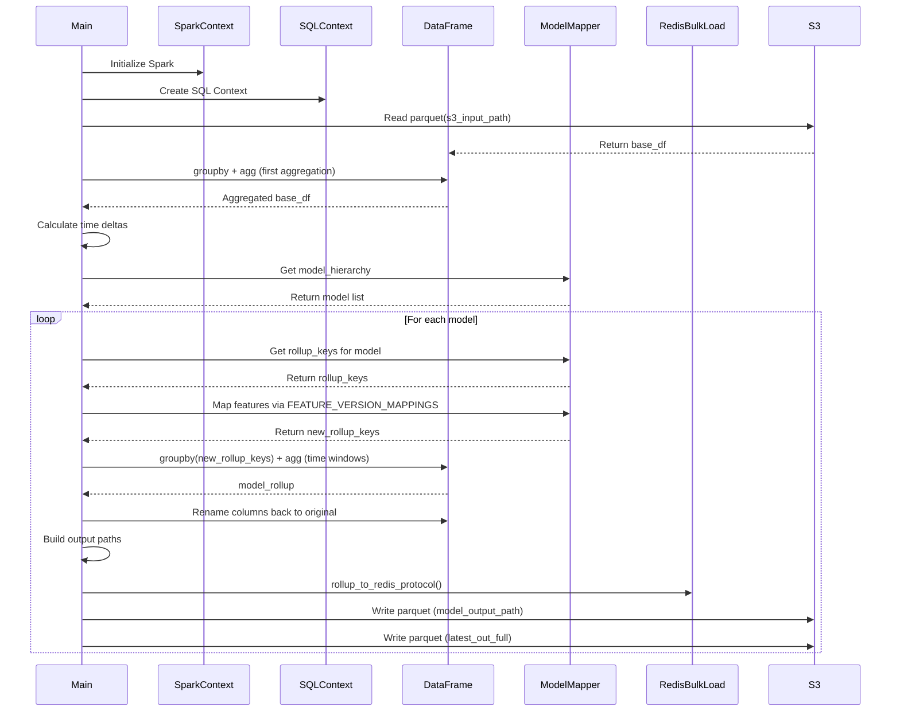
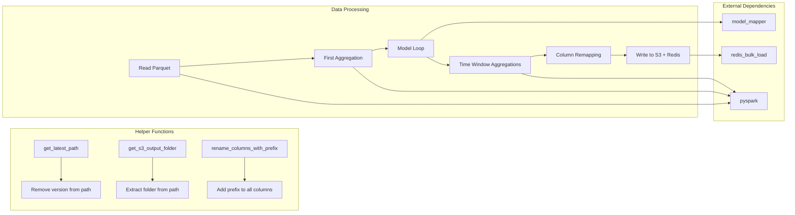
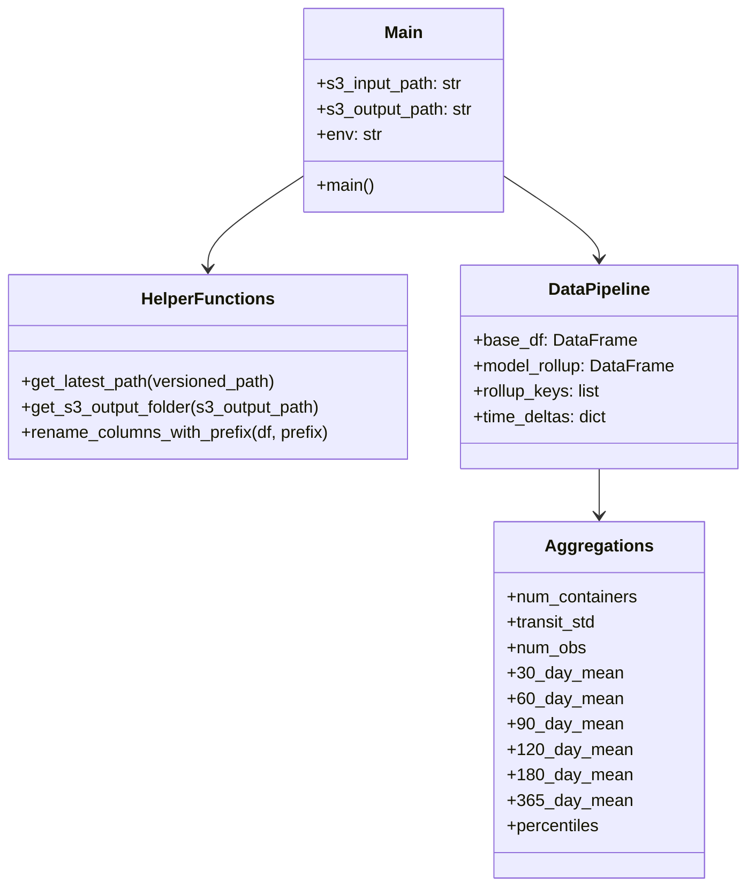
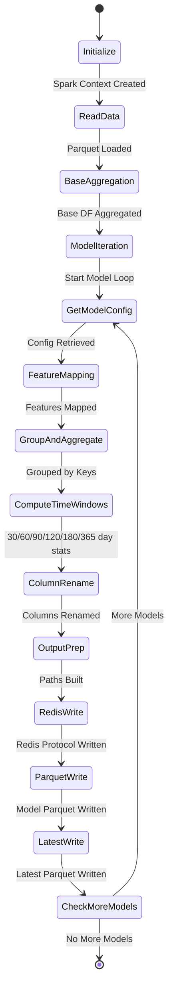

# Diagram: research/orchestrator/tasks/models/partview_spark.py

> Auto-generated by Obscura crawlers

## Diagram 1

```mermaid
flowchart TD
    Start([Start]) --> ParseArgs[Parse Command Line Args<br/>s3_input_path, s3_output_path, env]
    ParseArgs --> InitSpark[Initialize Spark Context<br/>and SQL Context]
    InitSpark --> ReadParquet[Read Parquet from s3_input_path]
    ReadParquet --> FirstGroupBy[Group by multiple dimensions<br/>tl_ids, pc_solution_id, locations, etc.]
    FirstGroupBy --> FirstAgg[Aggregate: countDistinct, avg, stddev<br/>num_containers, transit times]
    FirstAgg --> CalcDeltas[Calculate time deltas<br/>30, 60, 90, 120, 180, 365 days]
    CalcDeltas --> GetModelHierarchy[Get model hierarchy<br/>from model_mapper]
    GetModelHierarchy --> LoopModels{For each model<br/>in hierarchy}
    LoopModels --> GetRollupKeys[Get rollup keys for model]
    GetRollupKeys --> MapFeatures[Map features using<br/>FEATURE_VERSION_MAPPINGS]
    MapFeatures --> ModelGroupBy[Group by mapped rollup keys]
    ModelGroupBy --> TimeWindowAgg[Aggregate statistics for<br/>each time window<br/>mean, stddev, percentiles, counts]
    TimeWindowAgg --> RenameColumns[Rename columns back to<br/>original names]
    RenameColumns --> BuildOutputPath[Build S3 output path<br/>for model]
    BuildOutputPath --> RedisLoad[Load to Redis protocol<br/>redis_bulk_load.rollup_to_redis_protocol]
    RedisLoad --> WriteParquet[Write parquet to<br/>model_output_path]
    WriteParquet --> WriteLatest[Write parquet to<br/>latest path]
    WriteLatest --> MoreModels{More models?}
    MoreModels -->|Yes| LoopModels
    MoreModels -->|No| End([End])
```

### SVG

<svg id="container" width="432.2109375" xmlns="http://www.w3.org/2000/svg" class="flowchart" height="2828.453125" viewBox="0 0 432.2109375 2828.453125" role="graphics-document document" aria-roledescription="flowchart-v2"><g><marker id="container_flowchart-v2-pointEnd" class="marker flowchart-v2" viewBox="0 0 10 10" refX="5" refY="5" markerUnits="userSpaceOnUse" markerWidth="8" markerHeight="8" orient="auto"><path d="M 0 0 L 10 5 L 0 10 z" class="arrowMarkerPath" style="stroke-width: 1; stroke-dasharray: 1, 0;"></path></marker><marker id="container_flowchart-v2-pointStart" class="marker flowchart-v2" viewBox="0 0 10 10" refX="4.5" refY="5" markerUnits="userSpaceOnUse" markerWidth="8" markerHeight="8" orient="auto"><path d="M 0 5 L 10 10 L 10 0 z" class="arrowMarkerPath" style="stroke-width: 1; stroke-dasharray: 1, 0;"></path></marker><marker id="container_flowchart-v2-circleEnd" class="marker flowchart-v2" viewBox="0 0 10 10" refX="11" refY="5" markerUnits="userSpaceOnUse" markerWidth="11" markerHeight="11" orient="auto"><circle cx="5" cy="5" r="5" class="arrowMarkerPath" style="stroke-width: 1; stroke-dasharray: 1, 0;"></circle></marker><marker id="container_flowchart-v2-circleStart" class="marker flowchart-v2" viewBox="0 0 10 10" refX="-1" refY="5" markerUnits="userSpaceOnUse" markerWidth="11" markerHeight="11" orient="auto"><circle cx="5" cy="5" r="5" class="arrowMarkerPath" style="stroke-width: 1; stroke-dasharray: 1, 0;"></circle></marker><marker id="container_flowchart-v2-crossEnd" class="marker cross flowchart-v2" viewBox="0 0 11 11" refX="12" refY="5.2" markerUnits="userSpaceOnUse" markerWidth="11" markerHeight="11" orient="auto"><path d="M 1,1 l 9,9 M 10,1 l -9,9" class="arrowMarkerPath" style="stroke-width: 2; stroke-dasharray: 1, 0;"></path></marker><marker id="container_flowchart-v2-crossStart" class="marker cross flowchart-v2" viewBox="0 0 11 11" refX="-1" refY="5.2" markerUnits="userSpaceOnUse" markerWidth="11" markerHeight="11" orient="auto"><path d="M 1,1 l 9,9 M 10,1 l -9,9" class="arrowMarkerPath" style="stroke-width: 2; stroke-dasharray: 1, 0;"></path></marker><g class="root"><g class="clusters"></g><g class="edgePaths"><path d="M294.711,47.5L294.628,51.583C294.544,55.667,294.378,63.833,294.294,71.417C294.211,79,294.211,86,294.211,89.5L294.211,93" id="L_Start_ParseArgs_0" class="edge-thickness-normal edge-pattern-solid edge-thickness-normal edge-pattern-solid flowchart-link" style=";" data-edge="true" data-et="edge" data-id="L_Start_ParseArgs_0" data-points="W3sieCI6Mjk0LjcxMDkzNzUsInkiOjQ3LjV9LHsieCI6Mjk0LjIxMDkzNzUsInkiOjcyfSx7IngiOjI5NC4yMTA5Mzc1LCJ5Ijo5N31d" marker-end="url(#container_flowchart-v2-pointEnd)"></path><path d="M294.211,199L294.211,203.167C294.211,207.333,294.211,215.667,294.211,223.333C294.211,231,294.211,238,294.211,241.5L294.211,245" id="L_ParseArgs_InitSpark_0" class="edge-thickness-normal edge-pattern-solid edge-thickness-normal edge-pattern-solid flowchart-link" style=";" data-edge="true" data-et="edge" data-id="L_ParseArgs_InitSpark_0" data-points="W3sieCI6Mjk0LjIxMDkzNzUsInkiOjE5OX0seyJ4IjoyOTQuMjEwOTM3NSwieSI6MjI0fSx7IngiOjI5NC4yMTA5Mzc1LCJ5IjoyNDl9XQ==" marker-end="url(#container_flowchart-v2-pointEnd)"></path><path d="M294.211,327L294.211,331.167C294.211,335.333,294.211,343.667,294.211,351.333C294.211,359,294.211,366,294.211,369.5L294.211,373" id="L_InitSpark_ReadParquet_0" class="edge-thickness-normal edge-pattern-solid edge-thickness-normal edge-pattern-solid flowchart-link" style=";" data-edge="true" data-et="edge" data-id="L_InitSpark_ReadParquet_0" data-points="W3sieCI6Mjk0LjIxMDkzNzUsInkiOjMyN30seyJ4IjoyOTQuMjEwOTM3NSwieSI6MzUyfSx7IngiOjI5NC4yMTA5Mzc1LCJ5IjozNzd9XQ==" marker-end="url(#container_flowchart-v2-pointEnd)"></path><path d="M294.211,455L294.211,459.167C294.211,463.333,294.211,471.667,294.211,479.333C294.211,487,294.211,494,294.211,497.5L294.211,501" id="L_ReadParquet_FirstGroupBy_0" class="edge-thickness-normal edge-pattern-solid edge-thickness-normal edge-pattern-solid flowchart-link" style=";" data-edge="true" data-et="edge" data-id="L_ReadParquet_FirstGroupBy_0" data-points="W3sieCI6Mjk0LjIxMDkzNzUsInkiOjQ1NX0seyJ4IjoyOTQuMjEwOTM3NSwieSI6NDgwfSx7IngiOjI5NC4yMTA5Mzc1LCJ5Ijo1MDV9XQ==" marker-end="url(#container_flowchart-v2-pointEnd)"></path><path d="M294.211,631L294.211,635.167C294.211,639.333,294.211,647.667,294.211,655.333C294.211,663,294.211,670,294.211,673.5L294.211,677" id="L_FirstGroupBy_FirstAgg_0" class="edge-thickness-normal edge-pattern-solid edge-thickness-normal edge-pattern-solid flowchart-link" style=";" data-edge="true" data-et="edge" data-id="L_FirstGroupBy_FirstAgg_0" data-points="W3sieCI6Mjk0LjIxMDkzNzUsInkiOjYzMX0seyJ4IjoyOTQuMjEwOTM3NSwieSI6NjU2fSx7IngiOjI5NC4yMTA5Mzc1LCJ5Ijo2ODF9XQ==" marker-end="url(#container_flowchart-v2-pointEnd)"></path><path d="M294.211,807L294.211,811.167C294.211,815.333,294.211,823.667,294.211,831.333C294.211,839,294.211,846,294.211,849.5L294.211,853" id="L_FirstAgg_CalcDeltas_0" class="edge-thickness-normal edge-pattern-solid edge-thickness-normal edge-pattern-solid flowchart-link" style=";" data-edge="true" data-et="edge" data-id="L_FirstAgg_CalcDeltas_0" data-points="W3sieCI6Mjk0LjIxMDkzNzUsInkiOjgwN30seyJ4IjoyOTQuMjEwOTM3NSwieSI6ODMyfSx7IngiOjI5NC4yMTA5Mzc1LCJ5Ijo4NTd9XQ==" marker-end="url(#container_flowchart-v2-pointEnd)"></path><path d="M294.211,959L294.211,963.167C294.211,967.333,294.211,975.667,294.211,983.333C294.211,991,294.211,998,294.211,1001.5L294.211,1005" id="L_CalcDeltas_GetModelHierarchy_0" class="edge-thickness-normal edge-pattern-solid edge-thickness-normal edge-pattern-solid flowchart-link" style=";" data-edge="true" data-et="edge" data-id="L_CalcDeltas_GetModelHierarchy_0" data-points="W3sieCI6Mjk0LjIxMDkzNzUsInkiOjk1OX0seyJ4IjoyOTQuMjEwOTM3NSwieSI6OTg0fSx7IngiOjI5NC4yMTA5Mzc1LCJ5IjoxMDA5fV0=" marker-end="url(#container_flowchart-v2-pointEnd)"></path><path d="M294.211,1087L294.211,1091.167C294.211,1095.333,294.211,1103.667,294.211,1111.333C294.211,1119,294.211,1126,294.211,1129.5L294.211,1133" id="L_GetModelHierarchy_LoopModels_0" class="edge-thickness-normal edge-pattern-solid edge-thickness-normal edge-pattern-solid flowchart-link" style=";" data-edge="true" data-et="edge" data-id="L_GetModelHierarchy_LoopModels_0" data-points="W3sieCI6Mjk0LjIxMDkzNzUsInkiOjEwODd9LHsieCI6Mjk0LjIxMDkzNzUsInkiOjExMTJ9LHsieCI6Mjk0LjIxMDkzNzUsInkiOjExMzd9XQ==" marker-end="url(#container_flowchart-v2-pointEnd)"></path><path d="M249.467,1281.881L239.079,1293.505C228.692,1305.129,207.916,1328.377,197.528,1343.501C187.141,1358.625,187.141,1365.625,187.141,1369.125L187.141,1372.625" id="L_LoopModels_GetRollupKeys_0" class="edge-thickness-normal edge-pattern-solid edge-thickness-normal edge-pattern-solid flowchart-link" style=";" data-edge="true" data-et="edge" data-id="L_LoopModels_GetRollupKeys_0" data-points="W3sieCI6MjQ5LjQ2NzExNjI2NDUwNTM2LCJ5IjoxMjgxLjg4MTE3ODc2NDUwNTR9LHsieCI6MTg3LjE0MDYyNSwieSI6MTM1MS42MjV9LHsieCI6MTg3LjE0MDYyNSwieSI6MTM3Ni42MjV9XQ==" marker-end="url(#container_flowchart-v2-pointEnd)"></path><path d="M187.141,1430.625L187.141,1434.792C187.141,1438.958,187.141,1447.292,187.141,1454.958C187.141,1462.625,187.141,1469.625,187.141,1473.125L187.141,1476.625" id="L_GetRollupKeys_MapFeatures_0" class="edge-thickness-normal edge-pattern-solid edge-thickness-normal edge-pattern-solid flowchart-link" style=";" data-edge="true" data-et="edge" data-id="L_GetRollupKeys_MapFeatures_0" data-points="W3sieCI6MTg3LjE0MDYyNSwieSI6MTQzMC42MjV9LHsieCI6MTg3LjE0MDYyNSwieSI6MTQ1NS42MjV9LHsieCI6MTg3LjE0MDYyNSwieSI6MTQ4MC42MjV9XQ==" marker-end="url(#container_flowchart-v2-pointEnd)"></path><path d="M187.141,1558.625L187.141,1562.792C187.141,1566.958,187.141,1575.292,187.141,1582.958C187.141,1590.625,187.141,1597.625,187.141,1601.125L187.141,1604.625" id="L_MapFeatures_ModelGroupBy_0" class="edge-thickness-normal edge-pattern-solid edge-thickness-normal edge-pattern-solid flowchart-link" style=";" data-edge="true" data-et="edge" data-id="L_MapFeatures_ModelGroupBy_0" data-points="W3sieCI6MTg3LjE0MDYyNSwieSI6MTU1OC42MjV9LHsieCI6MTg3LjE0MDYyNSwieSI6MTU4My42MjV9LHsieCI6MTg3LjE0MDYyNSwieSI6MTYwOC42MjV9XQ==" marker-end="url(#container_flowchart-v2-pointEnd)"></path><path d="M187.141,1686.625L187.141,1690.792C187.141,1694.958,187.141,1703.292,187.141,1710.958C187.141,1718.625,187.141,1725.625,187.141,1729.125L187.141,1732.625" id="L_ModelGroupBy_TimeWindowAgg_0" class="edge-thickness-normal edge-pattern-solid edge-thickness-normal edge-pattern-solid flowchart-link" style=";" data-edge="true" data-et="edge" data-id="L_ModelGroupBy_TimeWindowAgg_0" data-points="W3sieCI6MTg3LjE0MDYyNSwieSI6MTY4Ni42MjV9LHsieCI6MTg3LjE0MDYyNSwieSI6MTcxMS42MjV9LHsieCI6MTg3LjE0MDYyNSwieSI6MTczNi42MjV9XQ==" marker-end="url(#container_flowchart-v2-pointEnd)"></path><path d="M187.141,1862.625L187.141,1866.792C187.141,1870.958,187.141,1879.292,187.141,1886.958C187.141,1894.625,187.141,1901.625,187.141,1905.125L187.141,1908.625" id="L_TimeWindowAgg_RenameColumns_0" class="edge-thickness-normal edge-pattern-solid edge-thickness-normal edge-pattern-solid flowchart-link" style=";" data-edge="true" data-et="edge" data-id="L_TimeWindowAgg_RenameColumns_0" data-points="W3sieCI6MTg3LjE0MDYyNSwieSI6MTg2Mi42MjV9LHsieCI6MTg3LjE0MDYyNSwieSI6MTg4Ny42MjV9LHsieCI6MTg3LjE0MDYyNSwieSI6MTkxMi42MjV9XQ==" marker-end="url(#container_flowchart-v2-pointEnd)"></path><path d="M187.141,1990.625L187.141,1994.792C187.141,1998.958,187.141,2007.292,187.141,2014.958C187.141,2022.625,187.141,2029.625,187.141,2033.125L187.141,2036.625" id="L_RenameColumns_BuildOutputPath_0" class="edge-thickness-normal edge-pattern-solid edge-thickness-normal edge-pattern-solid flowchart-link" style=";" data-edge="true" data-et="edge" data-id="L_RenameColumns_BuildOutputPath_0" data-points="W3sieCI6MTg3LjE0MDYyNSwieSI6MTk5MC42MjV9LHsieCI6MTg3LjE0MDYyNSwieSI6MjAxNS42MjV9LHsieCI6MTg3LjE0MDYyNSwieSI6MjA0MC42MjV9XQ==" marker-end="url(#container_flowchart-v2-pointEnd)"></path><path d="M187.141,2118.625L187.141,2122.792C187.141,2126.958,187.141,2135.292,187.141,2142.958C187.141,2150.625,187.141,2157.625,187.141,2161.125L187.141,2164.625" id="L_BuildOutputPath_RedisLoad_0" class="edge-thickness-normal edge-pattern-solid edge-thickness-normal edge-pattern-solid flowchart-link" style=";" data-edge="true" data-et="edge" data-id="L_BuildOutputPath_RedisLoad_0" data-points="W3sieCI6MTg3LjE0MDYyNSwieSI6MjExOC42MjV9LHsieCI6MTg3LjE0MDYyNSwieSI6MjE0My42MjV9LHsieCI6MTg3LjE0MDYyNSwieSI6MjE2OC42MjV9XQ==" marker-end="url(#container_flowchart-v2-pointEnd)"></path><path d="M187.141,2246.625L187.141,2250.792C187.141,2254.958,187.141,2263.292,187.141,2270.958C187.141,2278.625,187.141,2285.625,187.141,2289.125L187.141,2292.625" id="L_RedisLoad_WriteParquet_0" class="edge-thickness-normal edge-pattern-solid edge-thickness-normal edge-pattern-solid flowchart-link" style=";" data-edge="true" data-et="edge" data-id="L_RedisLoad_WriteParquet_0" data-points="W3sieCI6MTg3LjE0MDYyNSwieSI6MjI0Ni42MjV9LHsieCI6MTg3LjE0MDYyNSwieSI6MjI3MS42MjV9LHsieCI6MTg3LjE0MDYyNSwieSI6MjI5Ni42MjV9XQ==" marker-end="url(#container_flowchart-v2-pointEnd)"></path><path d="M187.141,2374.625L187.141,2378.792C187.141,2382.958,187.141,2391.292,187.141,2398.958C187.141,2406.625,187.141,2413.625,187.141,2417.125L187.141,2420.625" id="L_WriteParquet_WriteLatest_0" class="edge-thickness-normal edge-pattern-solid edge-thickness-normal edge-pattern-solid flowchart-link" style=";" data-edge="true" data-et="edge" data-id="L_WriteParquet_WriteLatest_0" data-points="W3sieCI6MTg3LjE0MDYyNSwieSI6MjM3NC42MjV9LHsieCI6MTg3LjE0MDYyNSwieSI6MjM5OS42MjV9LHsieCI6MTg3LjE0MDYyNSwieSI6MjQyNC42MjV9XQ==" marker-end="url(#container_flowchart-v2-pointEnd)"></path><path d="M187.141,2502.625L187.141,2506.792C187.141,2510.958,187.141,2519.292,197.909,2533.759C208.678,2548.226,230.216,2568.827,240.984,2579.127L251.753,2589.428" id="L_WriteLatest_MoreModels_0" class="edge-thickness-normal edge-pattern-solid edge-thickness-normal edge-pattern-solid flowchart-link" style=";" data-edge="true" data-et="edge" data-id="L_WriteLatest_MoreModels_0" data-points="W3sieCI6MTg3LjE0MDYyNSwieSI6MjUwMi42MjV9LHsieCI6MTg3LjE0MDYyNSwieSI6MjUyNy42MjV9LHsieCI6MjU0LjY0MzU1NzUyODI1MDE3LCJ5IjoyNTkyLjE5MjM3OTk3MTc0OTd9XQ==" marker-end="url(#container_flowchart-v2-pointEnd)"></path><path d="M333.778,2592.192L345.029,2581.431C356.279,2570.67,378.78,2549.147,390.031,2527.72C401.281,2506.292,401.281,2484.958,401.281,2463.625C401.281,2442.292,401.281,2420.958,401.281,2399.625C401.281,2378.292,401.281,2356.958,401.281,2335.625C401.281,2314.292,401.281,2292.958,401.281,2271.625C401.281,2250.292,401.281,2228.958,401.281,2207.625C401.281,2186.292,401.281,2164.958,401.281,2143.625C401.281,2122.292,401.281,2100.958,401.281,2079.625C401.281,2058.292,401.281,2036.958,401.281,2015.625C401.281,1994.292,401.281,1972.958,401.281,1951.625C401.281,1930.292,401.281,1908.958,401.281,1883.625C401.281,1858.292,401.281,1828.958,401.281,1799.625C401.281,1770.292,401.281,1740.958,401.281,1715.625C401.281,1690.292,401.281,1668.958,401.281,1647.625C401.281,1626.292,401.281,1604.958,401.281,1583.625C401.281,1562.292,401.281,1540.958,401.281,1519.625C401.281,1498.292,401.281,1476.958,401.281,1457.625C401.281,1438.292,401.281,1420.958,401.281,1403.625C401.281,1386.292,401.281,1368.958,391.338,1349.165C381.394,1329.371,361.507,1307.118,351.564,1295.991L341.62,1284.864" id="L_MoreModels_LoopModels_0" class="edge-thickness-normal edge-pattern-solid edge-thickness-normal edge-pattern-solid flowchart-link" style=";" data-edge="true" data-et="edge" data-id="L_MoreModels_LoopModels_0" data-points="W3sieCI6MzMzLjc3ODMxNzQ3MTc0OTg2LCJ5IjoyNTkyLjE5MjM3OTk3MTc0OTd9LHsieCI6NDAxLjI4MTI1LCJ5IjoyNTI3LjYyNX0seyJ4Ijo0MDEuMjgxMjUsInkiOjI0NjMuNjI1fSx7IngiOjQwMS4yODEyNSwieSI6MjM5OS42MjV9LHsieCI6NDAxLjI4MTI1LCJ5IjoyMzM1LjYyNX0seyJ4Ijo0MDEuMjgxMjUsInkiOjIyNzEuNjI1fSx7IngiOjQwMS4yODEyNSwieSI6MjIwNy42MjV9LHsieCI6NDAxLjI4MTI1LCJ5IjoyMTQzLjYyNX0seyJ4Ijo0MDEuMjgxMjUsInkiOjIwNzkuNjI1fSx7IngiOjQwMS4yODEyNSwieSI6MjAxNS42MjV9LHsieCI6NDAxLjI4MTI1LCJ5IjoxOTUxLjYyNX0seyJ4Ijo0MDEuMjgxMjUsInkiOjE4ODcuNjI1fSx7IngiOjQwMS4yODEyNSwieSI6MTc5OS42MjV9LHsieCI6NDAxLjI4MTI1LCJ5IjoxNzExLjYyNX0seyJ4Ijo0MDEuMjgxMjUsInkiOjE2NDcuNjI1fSx7IngiOjQwMS4yODEyNSwieSI6MTU4My42MjV9LHsieCI6NDAxLjI4MTI1LCJ5IjoxNTE5LjYyNX0seyJ4Ijo0MDEuMjgxMjUsInkiOjE0NTUuNjI1fSx7IngiOjQwMS4yODEyNSwieSI6MTQwMy42MjV9LHsieCI6NDAxLjI4MTI1LCJ5IjoxMzUxLjYyNX0seyJ4IjozMzguOTU0NzU4NzM1NDk0NjQsInkiOjEyODEuODgxMTc4NzY0NTA1NH1d" marker-end="url(#container_flowchart-v2-pointEnd)"></path><path d="M294.211,2707.453L294.211,2713.62C294.211,2719.786,294.211,2732.12,294.285,2743.87C294.36,2755.62,294.509,2766.787,294.583,2772.37L294.658,2777.953" id="L_MoreModels_End_0" class="edge-thickness-normal edge-pattern-solid edge-thickness-normal edge-pattern-solid flowchart-link" style=";" data-edge="true" data-et="edge" data-id="L_MoreModels_End_0" data-points="W3sieCI6Mjk0LjIxMDkzNzUsInkiOjI3MDcuNDUzMTI1fSx7IngiOjI5NC4yMTA5Mzc1LCJ5IjoyNzQ0LjQ1MzEyNX0seyJ4IjoyOTQuNzEwOTM3NSwieSI6Mjc4MS45NTMxMjV9XQ==" marker-end="url(#container_flowchart-v2-pointEnd)"></path></g><g class="edgeLabels"><g class="edgeLabel"><g class="label" data-id="L_Start_ParseArgs_0" transform="translate(0, 0)"><foreignObject width="0" height="0">

</foreignObject></g></g><g class="edgeLabel"><g class="label" data-id="L_ParseArgs_InitSpark_0" transform="translate(0, 0)"><foreignObject width="0" height="0">

</foreignObject></g></g><g class="edgeLabel"><g class="label" data-id="L_InitSpark_ReadParquet_0" transform="translate(0, 0)"><foreignObject width="0" height="0">

</foreignObject></g></g><g class="edgeLabel"><g class="label" data-id="L_ReadParquet_FirstGroupBy_0" transform="translate(0, 0)"><foreignObject width="0" height="0">

</foreignObject></g></g><g class="edgeLabel"><g class="label" data-id="L_FirstGroupBy_FirstAgg_0" transform="translate(0, 0)"><foreignObject width="0" height="0">

</foreignObject></g></g><g class="edgeLabel"><g class="label" data-id="L_FirstAgg_CalcDeltas_0" transform="translate(0, 0)"><foreignObject width="0" height="0">

</foreignObject></g></g><g class="edgeLabel"><g class="label" data-id="L_CalcDeltas_GetModelHierarchy_0" transform="translate(0, 0)"><foreignObject width="0" height="0">

</foreignObject></g></g><g class="edgeLabel"><g class="label" data-id="L_GetModelHierarchy_LoopModels_0" transform="translate(0, 0)"><foreignObject width="0" height="0">

</foreignObject></g></g><g class="edgeLabel"><g class="label" data-id="L_LoopModels_GetRollupKeys_0" transform="translate(0, 0)"><foreignObject width="0" height="0">

</foreignObject></g></g><g class="edgeLabel"><g class="label" data-id="L_GetRollupKeys_MapFeatures_0" transform="translate(0, 0)"><foreignObject width="0" height="0">

</foreignObject></g></g><g class="edgeLabel"><g class="label" data-id="L_MapFeatures_ModelGroupBy_0" transform="translate(0, 0)"><foreignObject width="0" height="0">

</foreignObject></g></g><g class="edgeLabel"><g class="label" data-id="L_ModelGroupBy_TimeWindowAgg_0" transform="translate(0, 0)"><foreignObject width="0" height="0">

</foreignObject></g></g><g class="edgeLabel"><g class="label" data-id="L_TimeWindowAgg_RenameColumns_0" transform="translate(0, 0)"><foreignObject width="0" height="0">

</foreignObject></g></g><g class="edgeLabel"><g class="label" data-id="L_RenameColumns_BuildOutputPath_0" transform="translate(0, 0)"><foreignObject width="0" height="0">

</foreignObject></g></g><g class="edgeLabel"><g class="label" data-id="L_BuildOutputPath_RedisLoad_0" transform="translate(0, 0)"><foreignObject width="0" height="0">

</foreignObject></g></g><g class="edgeLabel"><g class="label" data-id="L_RedisLoad_WriteParquet_0" transform="translate(0, 0)"><foreignObject width="0" height="0">

</foreignObject></g></g><g class="edgeLabel"><g class="label" data-id="L_WriteParquet_WriteLatest_0" transform="translate(0, 0)"><foreignObject width="0" height="0">

</foreignObject></g></g><g class="edgeLabel"><g class="label" data-id="L_WriteLatest_MoreModels_0" transform="translate(0, 0)"><foreignObject width="0" height="0">

</foreignObject></g></g><g class="edgeLabel" transform="translate(401.28125, 1951.625)"><g class="label" data-id="L_MoreModels_LoopModels_0" transform="translate(-12.03125, -12)"><foreignObject width="24.0625" height="24">

Yes

</foreignObject></g></g><g class="edgeLabel" transform="translate(294.2109375, 2744.453125)"><g class="label" data-id="L_MoreModels_End_0" transform="translate(-10.140625, -12)"><foreignObject width="20.28125" height="24">

No

</foreignObject></g></g></g><g class="nodes"><g class="node default" id="flowchart-Start-0" transform="translate(294.2109375, 27.5)"><g class="basic label-container outer-path"><path d="M-10.3984375 -19.5 C-2.693498367388133 -19.5, 5.011440765223734 -19.5, 10.3984375 -19.5 C10.3984375 -19.5, 10.3984375 -19.5, 10.398437499999998 -19.5 C10.854494388422568 -19.485375143249172, 11.310551276845139 -19.47075028649834, 11.6478067896239 -19.45993515863156 C11.947342644934771 -19.431039294914292, 12.246878500245645 -19.402143431197022, 12.892042152847864 -19.3399052695533 C13.280205106708207 -19.277150093421824, 13.66836806056855 -19.21439491729035, 14.126030759676757 -19.140403561325776 C14.596505833239894 -19.033020695921763, 15.066980906803028 -18.92563783051775, 15.34470188623539 -18.862249829261074 C15.712907489719194 -18.752968338897734, 16.081113093203 -18.643686848534394, 16.543047751460602 -18.50658706670804 C16.822175908946093 -18.403865324520975, 17.10130406643158 -18.301143582333914, 17.716144095147794 -18.074876768247425 C18.116119954806813 -17.897819320038696, 18.51609581446583 -17.720761871829964, 18.85917041279238 -17.568892924097174 C19.255673770367526 -17.36203737642274, 19.65217712794267 -17.15518182874831, 19.967429764076783 -16.990714730406097 C20.34226145936896 -16.763489553964437, 20.717093154661136 -16.536264377522773, 21.036368073605697 -16.342718045390892 C21.382181790636906 -16.101493366424457, 21.727995507668115 -15.860268687458023, 22.061592844578712 -15.627565626425154 C22.442941026961016 -15.323450599076592, 22.82428920934332 -15.019335571728032, 23.03889120850187 -14.848196188198123 C23.261488529320697 -14.646039191032834, 23.484085850139525 -14.443882193867543, 23.964247236767985 -14.007812326905688 C24.171493061230713 -13.793813997949293, 24.37873888569344 -13.579815668992898, 24.833858442968648 -13.10986736009568 C25.125468772076896 -12.767325274427344, 25.417079101185145 -12.42478318875901, 25.644151408126582 -12.158051136245305 C25.81629390766734 -11.927395869365018, 25.988436407208095 -11.696740602484729, 26.391796464640635 -11.156274872382312 C26.52873063218194 -10.945907219066319, 26.66566479972325 -10.735539565750326, 27.073721378604247 -10.108655082055241 C27.294398395919522 -9.716820691840852, 27.5150754132348 -9.32498630162646, 27.6871239742735 -9.019496659696287 C27.811385695415876 -8.761464536969239, 27.93564741655825 -8.50343241424219, 28.22948364880834 -7.893275190886684 C28.395425071015072 -7.483396669776914, 28.561366493221804 -7.073518148667144, 28.698571729970325 -6.734618561215508 C28.80247152704103 -6.42168892662311, 28.90637132411173 -6.1087592920307126, 29.09246063421488 -5.548287939305138 C29.166351335925167 -5.266510669251115, 29.240242037635454 -4.9847333991970935, 29.40953178754556 -4.339158212148133 C29.474823653655886 -4.003898279112397, 29.540115519766214 -3.6686383460766603, 29.648482276581777 -3.1121979531509023 C29.697826665003056 -2.7294926207070933, 29.747171053424335 -2.3467872882632843, 29.808330202509367 -1.872449005199798 C29.826107733197404 -1.5955496149691206, 29.84388526388544 -1.3186502247384433, 29.888418715913414 -0.6250057626472757 C29.888418715913414 -0.2194004038168445, 29.888418715913414 0.1862049550135867, 29.888418715913414 0.625005762647271 C29.867839567181655 0.9455426153342801, 29.8472604184499 1.2660794680212892, 29.808330202509367 1.8724490051997846 C29.748887194676705 2.333477235600331, 29.68944418684404 2.7945054660008775, 29.648482276581777 3.1121979531508885 C29.599373397122932 3.3643616700067147, 29.550264517664086 3.616525386862541, 29.40953178754556 4.339158212148129 C29.302952001430796 4.745593128575223, 29.196372215316032 5.152028045002317, 29.092460634214884 5.548287939305125 C28.976247302964477 5.898303976951548, 28.86003397171407 6.2483200145979705, 28.69857172997033 6.734618561215495 C28.53096868675197 7.1486013183492485, 28.363365643533605 7.562584075483001, 28.229483648808344 7.893275190886679 C28.038539523835038 8.289774751943535, 27.84759539886173 8.68627431300039, 27.687123974273504 9.019496659696284 C27.50384657474895 9.344924241401285, 27.320569175224392 9.670351823106289, 27.07372137860425 10.108655082055236 C26.83805699518966 10.470698859727692, 26.60239261177507 10.832742637400148, 26.39179646464064 11.156274872382301 C26.23111985485759 11.37156689155131, 26.070443245074536 11.586858910720318, 25.644151408126582 12.158051136245302 C25.422688111729453 12.418194525811922, 25.201224815332324 12.678337915378544, 24.83385844296866 13.10986736009567 C24.65580018032924 13.293727135126106, 24.47774191768982 13.477586910156543, 23.96424723676799 14.007812326905684 C23.71968366871733 14.22991848861187, 23.475120100666675 14.452024650318055, 23.038891208501887 14.848196188198111 C22.790094988492132 15.046604552910422, 22.54129876848238 15.245012917622732, 22.061592844578715 15.627565626425152 C21.681834422974408 15.892468661859205, 21.302076001370096 16.157371697293257, 21.036368073605708 16.34271804539089 C20.669166654831393 16.56531770336694, 20.30196523605708 16.78791736134299, 19.967429764076787 16.990714730406093 C19.6462201440147 17.158289583447903, 19.32501052395261 17.325864436489717, 18.859170412792388 17.56889292409717 C18.450140167605856 17.749958480190127, 18.04110992241932 17.931024036283084, 17.716144095147804 18.07487676824742 C17.360277575328098 18.20583893713512, 17.00441105550839 18.336801106022822, 16.543047751460616 18.506587066708033 C16.121767277343736 18.63162090007959, 15.700486803226855 18.75665473345115, 15.344701886235413 18.86224982926107 C15.096636908892123 18.918869041564417, 14.848571931548832 18.975488253867763, 14.126030759676766 19.140403561325773 C13.718150209800502 19.20634652546886, 13.31026965992424 19.27228948961195, 12.892042152847878 19.3399052695533 C12.604599928803763 19.367634475206984, 12.317157704759646 19.395363680860665, 11.6478067896239 19.45993515863156 C11.248017923228618 19.472755609435033, 10.848229056833336 19.485576060238508, 10.398437500000004 19.5 C10.398437500000002 19.5, 10.398437500000002 19.5, 10.3984375 19.5 C2.1029944032936196 19.5, -6.192448693412761 19.5, -10.398437499999996 19.5 C-10.774229341083466 19.4879490870909, -11.150021182166936 19.475898174181797, -11.647806789623893 19.45993515863156 C-11.90001090694628 19.435605330753297, -12.152215024268667 19.411275502875036, -12.892042152847871 19.3399052695533 C-13.189711860610043 19.291780339665372, -13.487381568372214 19.243655409777443, -14.126030759676759 19.140403561325773 C-14.606317671130489 19.03078120795146, -15.086604582584217 18.921158854577147, -15.344701886235388 18.862249829261074 C-15.637817667181366 18.77525460407244, -15.930933448127345 18.688259378883807, -16.54304775146059 18.506587066708043 C-16.781869400603984 18.41869849218015, -17.020691049747377 18.330809917652257, -17.716144095147797 18.074876768247425 C-18.160467534577304 17.878187961998513, -18.60479097400681 17.6814991557496, -18.85917041279238 17.568892924097174 C-19.166125444769243 17.408754680528926, -19.4730804767461 17.24861643696068, -19.96742976407678 16.990714730406097 C-20.292111977906032 16.793890464338325, -20.61679419173528 16.597066198270557, -21.036368073605686 16.3427180453909 C-21.434221529176146 16.06519269758346, -21.8320749847466 15.787667349776019, -22.061592844578712 15.627565626425156 C-22.287388446091853 15.44749964289173, -22.513184047604994 15.267433659358305, -23.03889120850187 14.848196188198125 C-23.39175141582243 14.527737884079071, -23.74461162314299 14.207279579960018, -23.964247236767974 14.007812326905697 C-24.24811203148143 13.71469862063098, -24.53197682619489 13.421584914356265, -24.833858442968655 13.109867360095677 C-24.997309804208104 12.91786809053789, -25.160761165447553 12.725868820980104, -25.64415140812658 12.158051136245307 C-25.855466019203934 11.874908808558754, -26.06678063028129 11.5917664808722, -26.391796464640635 11.156274872382316 C-26.53452930694499 10.936998897468083, -26.677262149249344 10.717722922553849, -27.073721378604244 10.108655082055249 C-27.25601252096685 9.784978699810654, -27.438303663329457 9.46130231756606, -27.6871239742735 9.019496659696289 C-27.801774517812614 8.781422352908672, -27.916425061351728 8.543348046121054, -28.22948364880834 7.893275190886686 C-28.41148901286737 7.44371842282655, -28.593494376926404 6.9941616547664145, -28.698571729970325 6.73461856121551 C-28.83934906757349 6.310619650177491, -28.980126405176655 5.886620739139474, -29.09246063421488 5.5482879393051325 C-29.21035461339887 5.098707101102783, -29.328248592582863 4.649126262900434, -29.409531787545557 4.339158212148136 C-29.498681050990385 3.8813955860624607, -29.58783031443521 3.4236329599767856, -29.648482276581777 3.112197953150904 C-29.69326023124496 2.7649089791905594, -29.738038185908138 2.417620005230215, -29.808330202509364 1.872449005199809 C-29.83501700864931 1.456780458367946, -29.861703814789255 1.0411119115360827, -29.888418715913414 0.6250057626472781 C-29.888418715913414 0.14842095365830715, -29.888418715913414 -0.32816385533066383, -29.888418715913414 -0.6250057626472687 C-29.85996968429775 -1.0681223937062378, -29.831520652682087 -1.511239024765207, -29.808330202509367 -1.8724490051997822 C-29.757669476391047 -2.2653635928815494, -29.70700875027273 -2.658278180563317, -29.648482276581777 -3.112197953150895 C-29.568570081801983 -3.5225301838967926, -29.48865788702219 -3.93286241464269, -29.40953178754556 -4.339158212148126 C-29.324451007047248 -4.6636081024317155, -29.239370226548935 -4.988057992715305, -29.092460634214884 -5.548287939305123 C-28.956371386662802 -5.958167070054993, -28.820282139110716 -6.368046200804864, -28.698571729970332 -6.734618561215485 C-28.536252136970237 -7.135551094161556, -28.373932543970145 -7.536483627107628, -28.229483648808344 -7.893275190886676 C-28.0835648064022 -8.196278789306097, -27.93764596399606 -8.499282387725518, -27.687123974273504 -9.019496659696282 C-27.528650536112 -9.300882296327739, -27.3701770979505 -9.582267932959198, -27.073721378604247 -10.108655082055243 C-26.85511047134612 -10.444500140851835, -26.636499564087995 -10.780345199648428, -26.39179646464064 -11.156274872382308 C-26.167789391500477 -11.456423942925944, -25.943782318360313 -11.75657301346958, -25.644151408126586 -12.158051136245302 C-25.4571805572654 -12.377677736609654, -25.270209706404213 -12.597304336974004, -24.833858442968662 -13.10986736009567 C-24.548989509429106 -13.404017922149666, -24.26412057588955 -13.698168484203661, -23.964247236767996 -14.007812326905677 C-23.64911407864803 -14.294007923143774, -23.333980920528063 -14.58020351938187, -23.038891208501887 -14.848196188198107 C-22.74743330440405 -15.080626110695574, -22.45597540030621 -15.31305603319304, -22.06159284457872 -15.627565626425149 C-21.756479951864858 -15.84039917225809, -21.451367059150996 -16.05323271809103, -21.03636807360571 -16.342718045390885 C-20.69430877831807 -16.550076400357796, -20.352249483030434 -16.757434755324706, -19.96742976407679 -16.99071473040609 C-19.654212722808413 -17.154119860210713, -19.34099568154004 -17.317524990015333, -18.859170412792388 -17.56889292409717 C-18.612700123153342 -17.677998010039005, -18.366229833514296 -17.787103095980836, -17.716144095147804 -18.07487676824742 C-17.416311946439265 -18.185217770590164, -17.116479797730726 -18.295558772932903, -16.54304775146062 -18.506587066708033 C-16.270302664079235 -18.58753637697465, -15.997557576697847 -18.668485687241265, -15.344701886235413 -18.862249829261067 C-14.89788739992521 -18.964232320024358, -14.45107291361501 -19.06621481078765, -14.126030759676768 -19.140403561325773 C-13.741377864926935 -19.202591258321174, -13.356724970177103 -19.26477895531658, -12.89204215284788 -19.3399052695533 C-12.60114115221036 -19.367968139225162, -12.31024015157284 -19.396031008897022, -11.647806789623903 -19.45993515863156 C-11.247744968697747 -19.472764362555566, -10.84768314777159 -19.485593566479572, -10.398437500000005 -19.5 C-10.398437500000004 -19.5, -10.398437500000004 -19.5, -10.3984375 -19.5" stroke="none" stroke-width="0" fill="#ECECFF" style=""></path><path d="M-10.3984375 -19.5 C-5.351591753466612 -19.5, -0.3047460069332235 -19.5, 10.3984375 -19.5 M-10.3984375 -19.5 C-4.36874484812889 -19.5, 1.6609478037422196 -19.5, 10.3984375 -19.5 M10.3984375 -19.5 C10.3984375 -19.5, 10.398437499999998 -19.5, 10.398437499999998 -19.5 M10.3984375 -19.5 C10.3984375 -19.5, 10.3984375 -19.5, 10.398437499999998 -19.5 M10.398437499999998 -19.5 C10.740609651925714 -19.48902720508543, 11.08278180385143 -19.478054410170866, 11.6478067896239 -19.45993515863156 M10.398437499999998 -19.5 C10.817660476528284 -19.48655633511076, 11.236883453056569 -19.47311267022152, 11.6478067896239 -19.45993515863156 M11.6478067896239 -19.45993515863156 C12.094851366647294 -19.416809305935878, 12.541895943670688 -19.373683453240194, 12.892042152847864 -19.3399052695533 M11.6478067896239 -19.45993515863156 C11.920193860337209 -19.433658305513227, 12.192580931050516 -19.407381452394894, 12.892042152847864 -19.3399052695533 M12.892042152847864 -19.3399052695533 C13.311657850456877 -19.27206505773221, 13.73127354806589 -19.20422484591112, 14.126030759676757 -19.140403561325776 M12.892042152847864 -19.3399052695533 C13.32187309625928 -19.270413536011294, 13.751704039670697 -19.200921802469285, 14.126030759676757 -19.140403561325776 M14.126030759676757 -19.140403561325776 C14.566745036435236 -19.03981340358508, 15.007459313193717 -18.93922324584438, 15.34470188623539 -18.862249829261074 M14.126030759676757 -19.140403561325776 C14.567880684146914 -19.039554199405682, 15.009730608617069 -18.938704837485588, 15.34470188623539 -18.862249829261074 M15.34470188623539 -18.862249829261074 C15.766818201286807 -18.736967922687565, 16.18893451633822 -18.61168601611406, 16.543047751460602 -18.50658706670804 M15.34470188623539 -18.862249829261074 C15.813141884673945 -18.72321929661624, 16.281581883112498 -18.584188763971408, 16.543047751460602 -18.50658706670804 M16.543047751460602 -18.50658706670804 C16.86151792594857 -18.389387098590447, 17.179988100436535 -18.27218713047285, 17.716144095147794 -18.074876768247425 M16.543047751460602 -18.50658706670804 C16.965922715147485 -18.350965171057954, 17.388797678834372 -18.195343275407865, 17.716144095147794 -18.074876768247425 M17.716144095147794 -18.074876768247425 C18.024257948922333 -17.93848390505417, 18.332371802696873 -17.802091041860912, 18.85917041279238 -17.568892924097174 M17.716144095147794 -18.074876768247425 C18.004226228975362 -17.94735135325483, 18.29230836280293 -17.81982593826224, 18.85917041279238 -17.568892924097174 M18.85917041279238 -17.568892924097174 C19.278870190172636 -17.34993581906843, 19.698569967552896 -17.130978714039692, 19.967429764076783 -16.990714730406097 M18.85917041279238 -17.568892924097174 C19.255718616811425 -17.362013980061686, 19.65226682083047 -17.1551350360262, 19.967429764076783 -16.990714730406097 M19.967429764076783 -16.990714730406097 C20.324434018910182 -16.774296653136215, 20.68143827374358 -16.557878575866333, 21.036368073605697 -16.342718045390892 M19.967429764076783 -16.990714730406097 C20.33133576058231 -16.770112776775434, 20.69524175708784 -16.54951082314477, 21.036368073605697 -16.342718045390892 M21.036368073605697 -16.342718045390892 C21.32379617780692 -16.142220642462213, 21.61122428200814 -15.941723239533532, 22.061592844578712 -15.627565626425154 M21.036368073605697 -16.342718045390892 C21.412036659549152 -16.08066790226772, 21.78770524549261 -15.818617759144546, 22.061592844578712 -15.627565626425154 M22.061592844578712 -15.627565626425154 C22.40430728497485 -15.35425998022351, 22.747021725370985 -15.080954334021866, 23.03889120850187 -14.848196188198123 M22.061592844578712 -15.627565626425154 C22.32104841546351 -15.420656713047237, 22.580503986348305 -15.213747799669319, 23.03889120850187 -14.848196188198123 M23.03889120850187 -14.848196188198123 C23.23073116961479 -14.673972211322598, 23.422571130727707 -14.49974823444707, 23.964247236767985 -14.007812326905688 M23.03889120850187 -14.848196188198123 C23.24982998952102 -14.656627168410838, 23.460768770540174 -14.465058148623553, 23.964247236767985 -14.007812326905688 M23.964247236767985 -14.007812326905688 C24.188898059455486 -13.775841908305287, 24.413548882142983 -13.543871489704886, 24.833858442968648 -13.10986736009568 M23.964247236767985 -14.007812326905688 C24.166824425832672 -13.798634747299865, 24.36940161489736 -13.589457167694043, 24.833858442968648 -13.10986736009568 M24.833858442968648 -13.10986736009568 C25.06282175939276 -12.840914020242135, 25.291785075816875 -12.571960680388589, 25.644151408126582 -12.158051136245305 M24.833858442968648 -13.10986736009568 C25.024882912380047 -12.885479148724823, 25.215907381791443 -12.661090937353963, 25.644151408126582 -12.158051136245305 M25.644151408126582 -12.158051136245305 C25.915443579126705 -11.794544342330354, 26.186735750126832 -11.431037548415404, 26.391796464640635 -11.156274872382312 M25.644151408126582 -12.158051136245305 C25.849806697733513 -11.882491783754327, 26.055461987340443 -11.606932431263349, 26.391796464640635 -11.156274872382312 M26.391796464640635 -11.156274872382312 C26.53133005341159 -10.941913810015242, 26.670863642182546 -10.727552747648174, 27.073721378604247 -10.108655082055241 M26.391796464640635 -11.156274872382312 C26.605194144820743 -10.828438730325038, 26.818591825000855 -10.500602588267762, 27.073721378604247 -10.108655082055241 M27.073721378604247 -10.108655082055241 C27.232895809505685 -9.826024761830816, 27.392070240407126 -9.543394441606388, 27.6871239742735 -9.019496659696287 M27.073721378604247 -10.108655082055241 C27.199988835915327 -9.884454425632907, 27.326256293226404 -9.660253769210572, 27.6871239742735 -9.019496659696287 M27.6871239742735 -9.019496659696287 C27.861255648942034 -8.657908511426106, 28.035387323610568 -8.296320363155925, 28.22948364880834 -7.893275190886684 M27.6871239742735 -9.019496659696287 C27.88929774061985 -8.599678508052481, 28.091471506966197 -8.179860356408675, 28.22948364880834 -7.893275190886684 M28.22948364880834 -7.893275190886684 C28.33543042382019 -7.631584608265873, 28.441377198832036 -7.369894025645062, 28.698571729970325 -6.734618561215508 M28.22948364880834 -7.893275190886684 C28.338779693558198 -7.623311847259268, 28.448075738308052 -7.353348503631852, 28.698571729970325 -6.734618561215508 M28.698571729970325 -6.734618561215508 C28.82058956420186 -6.367120285411888, 28.942607398433392 -5.9996220096082675, 29.09246063421488 -5.548287939305138 M28.698571729970325 -6.734618561215508 C28.787645153787146 -6.466343600602033, 28.876718577603963 -6.198068639988557, 29.09246063421488 -5.548287939305138 M29.09246063421488 -5.548287939305138 C29.175362984127812 -5.232145348981398, 29.258265334040743 -4.916002758657657, 29.40953178754556 -4.339158212148133 M29.09246063421488 -5.548287939305138 C29.176894256761482 -5.226305942771461, 29.26132787930808 -4.904323946237783, 29.40953178754556 -4.339158212148133 M29.40953178754556 -4.339158212148133 C29.47225669645578 -4.0170790618083565, 29.534981605365996 -3.6949999114685808, 29.648482276581777 -3.1121979531509023 M29.40953178754556 -4.339158212148133 C29.470734731711723 -4.02489402910172, 29.531937675877884 -3.7106298460553058, 29.648482276581777 -3.1121979531509023 M29.648482276581777 -3.1121979531509023 C29.689141259095884 -2.7968549137957384, 29.72980024160999 -2.4815118744405744, 29.808330202509367 -1.872449005199798 M29.648482276581777 -3.1121979531509023 C29.709594392950642 -2.6382244465463573, 29.770706509319503 -2.164250939941813, 29.808330202509367 -1.872449005199798 M29.808330202509367 -1.872449005199798 C29.835474933721898 -1.4496479057319476, 29.862619664934428 -1.0268468062640972, 29.888418715913414 -0.6250057626472757 M29.808330202509367 -1.872449005199798 C29.83935884059683 -1.3891529211216702, 29.870387478684293 -0.9058568370435427, 29.888418715913414 -0.6250057626472757 M29.888418715913414 -0.6250057626472757 C29.888418715913414 -0.2953061330192126, 29.888418715913414 0.03439349660885049, 29.888418715913414 0.625005762647271 M29.888418715913414 -0.6250057626472757 C29.888418715913414 -0.3167078109615391, 29.888418715913414 -0.008409859275802511, 29.888418715913414 0.625005762647271 M29.888418715913414 0.625005762647271 C29.858839234548263 1.0857300610371026, 29.829259753183113 1.5464543594269342, 29.808330202509367 1.8724490051997846 M29.888418715913414 0.625005762647271 C29.862356794268656 1.0309412290688922, 29.8362948726239 1.4368766954905134, 29.808330202509367 1.8724490051997846 M29.808330202509367 1.8724490051997846 C29.757758679817744 2.2646717487193126, 29.70718715712612 2.6568944922388407, 29.648482276581777 3.1121979531508885 M29.808330202509367 1.8724490051997846 C29.75585954916099 2.279401031067327, 29.703388895812612 2.6863530569348693, 29.648482276581777 3.1121979531508885 M29.648482276581777 3.1121979531508885 C29.562642930641584 3.552964852401599, 29.47680358470139 3.993731751652309, 29.40953178754556 4.339158212148129 M29.648482276581777 3.1121979531508885 C29.581850438461963 3.454338359252174, 29.515218600342145 3.7964787653534593, 29.40953178754556 4.339158212148129 M29.40953178754556 4.339158212148129 C29.338348999570506 4.610609033512473, 29.267166211595452 4.882059854876816, 29.092460634214884 5.548287939305125 M29.40953178754556 4.339158212148129 C29.315414500858147 4.698068216977322, 29.221297214170733 5.056978221806514, 29.092460634214884 5.548287939305125 M29.092460634214884 5.548287939305125 C28.945454249297573 5.991047748389439, 28.79844786438026 6.433807557473753, 28.69857172997033 6.734618561215495 M29.092460634214884 5.548287939305125 C28.985743003510994 5.869704439839859, 28.879025372807106 6.191120940374593, 28.69857172997033 6.734618561215495 M28.69857172997033 6.734618561215495 C28.5781714519566 7.0320095756904255, 28.45777117394287 7.329400590165356, 28.229483648808344 7.893275190886679 M28.69857172997033 6.734618561215495 C28.56851444624685 7.05586256649901, 28.43845716252337 7.377106571782524, 28.229483648808344 7.893275190886679 M28.229483648808344 7.893275190886679 C28.09392935199484 8.174756588617235, 27.95837505518134 8.45623798634779, 27.687123974273504 9.019496659696284 M28.229483648808344 7.893275190886679 C28.04800626021 8.270116871305214, 27.866528871611656 8.646958551723749, 27.687123974273504 9.019496659696284 M27.687123974273504 9.019496659696284 C27.534875872409334 9.28982858134817, 27.382627770545167 9.560160503000056, 27.07372137860425 10.108655082055236 M27.687123974273504 9.019496659696284 C27.48166516809302 9.38430957502987, 27.276206361912536 9.749122490363458, 27.07372137860425 10.108655082055236 M27.07372137860425 10.108655082055236 C26.801703617635663 10.52654740989935, 26.529685856667076 10.944439737743465, 26.39179646464064 11.156274872382301 M27.07372137860425 10.108655082055236 C26.883661117579916 10.40063868131474, 26.69360085655558 10.692622280574245, 26.39179646464064 11.156274872382301 M26.39179646464064 11.156274872382301 C26.185434527078495 11.432781068756315, 25.97907258951635 11.709287265130326, 25.644151408126582 12.158051136245302 M26.39179646464064 11.156274872382301 C26.18574703479388 11.432362336887739, 25.979697604947116 11.708449801393176, 25.644151408126582 12.158051136245302 M25.644151408126582 12.158051136245302 C25.434603623935075 12.404197887163347, 25.22505583974357 12.650344638081393, 24.83385844296866 13.10986736009567 M25.644151408126582 12.158051136245302 C25.478467176445466 12.352673262477799, 25.31278294476435 12.547295388710296, 24.83385844296866 13.10986736009567 M24.83385844296866 13.10986736009567 C24.4962523521242 13.458473366868118, 24.15864626127974 13.807079373640567, 23.96424723676799 14.007812326905684 M24.83385844296866 13.10986736009567 C24.61431852364665 13.336560351358232, 24.394778604324642 13.563253342620794, 23.96424723676799 14.007812326905684 M23.96424723676799 14.007812326905684 C23.771071767075362 14.18324917733768, 23.57789629738274 14.358686027769677, 23.038891208501887 14.848196188198111 M23.96424723676799 14.007812326905684 C23.64513414127613 14.297622396961561, 23.326021045784273 14.587432467017438, 23.038891208501887 14.848196188198111 M23.038891208501887 14.848196188198111 C22.715124227277688 15.1063917399232, 22.391357246053488 15.364587291648288, 22.061592844578715 15.627565626425152 M23.038891208501887 14.848196188198111 C22.8150176343337 15.026729406071231, 22.591144060165515 15.20526262394435, 22.061592844578715 15.627565626425152 M22.061592844578715 15.627565626425152 C21.687127969615833 15.888776112876085, 21.312663094652954 16.14998659932702, 21.036368073605708 16.34271804539089 M22.061592844578715 15.627565626425152 C21.678654157392003 15.894687077458011, 21.29571547020529 16.16180852849087, 21.036368073605708 16.34271804539089 M21.036368073605708 16.34271804539089 C20.68424697815359 16.556175922747208, 20.332125882701472 16.769633800103527, 19.967429764076787 16.990714730406093 M21.036368073605708 16.34271804539089 C20.781275803854342 16.49735647840274, 20.526183534102977 16.65199491141459, 19.967429764076787 16.990714730406093 M19.967429764076787 16.990714730406093 C19.65966242885985 17.151276752054383, 19.35189509364291 17.311838773702675, 18.859170412792388 17.56889292409717 M19.967429764076787 16.990714730406093 C19.73379554173635 17.112601554551237, 19.50016131939591 17.234488378696383, 18.859170412792388 17.56889292409717 M18.859170412792388 17.56889292409717 C18.486616333413174 17.733811563614243, 18.11406225403396 17.89873020313131, 17.716144095147804 18.07487676824742 M18.859170412792388 17.56889292409717 C18.44936939994806 17.750299676168222, 18.039568387103735 17.931706428239274, 17.716144095147804 18.07487676824742 M17.716144095147804 18.07487676824742 C17.343440662039953 18.212035076863877, 16.9707372289321 18.349193385480337, 16.543047751460616 18.506587066708033 M17.716144095147804 18.07487676824742 C17.34370797193695 18.211936704350798, 16.971271848726097 18.348996640454175, 16.543047751460616 18.506587066708033 M16.543047751460616 18.506587066708033 C16.093983593203504 18.639866951692877, 15.644919434946393 18.77314683667772, 15.344701886235413 18.86224982926107 M16.543047751460616 18.506587066708033 C16.155411726355084 18.621635404216338, 15.76777570124955 18.736683741724647, 15.344701886235413 18.86224982926107 M15.344701886235413 18.86224982926107 C15.057864475265912 18.927718596525825, 14.771027064296412 18.99318736379058, 14.126030759676766 19.140403561325773 M15.344701886235413 18.86224982926107 C15.025391414511509 18.93513036073649, 14.706080942787606 19.008010892211914, 14.126030759676766 19.140403561325773 M14.126030759676766 19.140403561325773 C13.853620021442161 19.184444816906716, 13.581209283207556 19.228486072487662, 12.892042152847878 19.3399052695533 M14.126030759676766 19.140403561325773 C13.872962990466075 19.181317595681897, 13.619895221255382 19.22223163003802, 12.892042152847878 19.3399052695533 M12.892042152847878 19.3399052695533 C12.535724106767569 19.37427884292352, 12.179406060687262 19.408652416293737, 11.6478067896239 19.45993515863156 M12.892042152847878 19.3399052695533 C12.448274180332351 19.3827150321528, 12.004506207816824 19.425524794752302, 11.6478067896239 19.45993515863156 M11.6478067896239 19.45993515863156 C11.168310739265644 19.475311663684106, 10.688814688907389 19.49068816873665, 10.398437500000004 19.5 M11.6478067896239 19.45993515863156 C11.299059464202266 19.47111880656234, 10.95031213878063 19.482302454493123, 10.398437500000004 19.5 M10.398437500000004 19.5 C10.398437500000004 19.5, 10.398437500000002 19.5, 10.3984375 19.5 M10.398437500000004 19.5 C10.398437500000002 19.5, 10.398437500000002 19.5, 10.3984375 19.5 M10.3984375 19.5 C6.004895269563829 19.5, 1.6113530391276587 19.5, -10.398437499999996 19.5 M10.3984375 19.5 C2.7097130367130715 19.5, -4.979011426573857 19.5, -10.398437499999996 19.5 M-10.398437499999996 19.5 C-10.823854726422 19.486357697573045, -11.249271952844005 19.47271539514609, -11.647806789623893 19.45993515863156 M-10.398437499999996 19.5 C-10.7878024096499 19.48751382520035, -11.177167319299805 19.475027650400698, -11.647806789623893 19.45993515863156 M-11.647806789623893 19.45993515863156 C-12.082346750729103 19.4180156111945, -12.516886711834314 19.376096063757448, -12.892042152847871 19.3399052695533 M-11.647806789623893 19.45993515863156 C-11.902851730218861 19.43533127994878, -12.157896670813829 19.410727401266, -12.892042152847871 19.3399052695533 M-12.892042152847871 19.3399052695533 C-13.280441153450512 19.2771119312151, -13.668840154053155 19.214318592876896, -14.126030759676759 19.140403561325773 M-12.892042152847871 19.3399052695533 C-13.370108242570346 19.262615251624865, -13.84817433229282 19.18532523369643, -14.126030759676759 19.140403561325773 M-14.126030759676759 19.140403561325773 C-14.549235543664272 19.04380983104993, -14.972440327651784 18.94721610077409, -15.344701886235388 18.862249829261074 M-14.126030759676759 19.140403561325773 C-14.521167643583725 19.050216146083148, -14.916304527490691 18.960028730840527, -15.344701886235388 18.862249829261074 M-15.344701886235388 18.862249829261074 C-15.755748475862314 18.740253359087383, -16.16679506548924 18.618256888913688, -16.54304775146059 18.506587066708043 M-15.344701886235388 18.862249829261074 C-15.747458654517397 18.742713734548392, -16.150215422799405 18.62317763983571, -16.54304775146059 18.506587066708043 M-16.54304775146059 18.506587066708043 C-16.90364078768882 18.37388549609057, -17.26423382391705 18.241183925473095, -17.716144095147797 18.074876768247425 M-16.54304775146059 18.506587066708043 C-16.988876007037913 18.34251814746437, -17.434704262615234 18.1784492282207, -17.716144095147797 18.074876768247425 M-17.716144095147797 18.074876768247425 C-18.03388812836525 17.934220910283916, -18.3516321615827 17.793565052320403, -18.85917041279238 17.568892924097174 M-17.716144095147797 18.074876768247425 C-18.064809257963386 17.92053304345354, -18.41347442077897 17.766189318659652, -18.85917041279238 17.568892924097174 M-18.85917041279238 17.568892924097174 C-19.093840442296987 17.44646572001795, -19.32851047180159 17.324038515938724, -19.96742976407678 16.990714730406097 M-18.85917041279238 17.568892924097174 C-19.28505718924127 17.34670806561729, -19.71094396569016 17.1245232071374, -19.96742976407678 16.990714730406097 M-19.96742976407678 16.990714730406097 C-20.325352431691655 16.773739905910894, -20.683275099306528 16.556765081415687, -21.036368073605686 16.3427180453909 M-19.96742976407678 16.990714730406097 C-20.288104249294413 16.796319972974715, -20.608778734512047 16.601925215543336, -21.036368073605686 16.3427180453909 M-21.036368073605686 16.3427180453909 C-21.314957145455747 16.14838636879485, -21.593546217305803 15.954054692198795, -22.061592844578712 15.627565626425156 M-21.036368073605686 16.3427180453909 C-21.288195501970794 16.167054132797073, -21.5400229303359 15.99139022020325, -22.061592844578712 15.627565626425156 M-22.061592844578712 15.627565626425156 C-22.3760321318356 15.376808662418636, -22.690471419092493 15.126051698412116, -23.03889120850187 14.848196188198125 M-22.061592844578712 15.627565626425156 C-22.323927683236082 15.418360573619143, -22.586262521893456 15.20915552081313, -23.03889120850187 14.848196188198125 M-23.03889120850187 14.848196188198125 C-23.334913463886426 14.579356608177548, -23.630935719270987 14.310517028156973, -23.964247236767974 14.007812326905697 M-23.03889120850187 14.848196188198125 C-23.312463991210397 14.599744625281422, -23.586036773918924 14.351293062364718, -23.964247236767974 14.007812326905697 M-23.964247236767974 14.007812326905697 C-24.25141041899452 13.711292764721065, -24.538573601221064 13.414773202536434, -24.833858442968655 13.109867360095677 M-23.964247236767974 14.007812326905697 C-24.302826428786137 13.658201513278312, -24.641405620804296 13.308590699650928, -24.833858442968655 13.109867360095677 M-24.833858442968655 13.109867360095677 C-25.06209377253595 12.841769155027777, -25.29032910210324 12.573670949959878, -25.64415140812658 12.158051136245307 M-24.833858442968655 13.109867360095677 C-25.106026818099668 12.79016289984752, -25.37819519323068 12.470458439599364, -25.64415140812658 12.158051136245307 M-25.64415140812658 12.158051136245307 C-25.91003902618581 11.801785950906256, -26.17592664424504 11.445520765567203, -26.391796464640635 11.156274872382316 M-25.64415140812658 12.158051136245307 C-25.922163859254947 11.785539779188628, -26.200176310383313 11.41302842213195, -26.391796464640635 11.156274872382316 M-26.391796464640635 11.156274872382316 C-26.625920609561458 10.79659731464823, -26.860044754482285 10.436919756914142, -27.073721378604244 10.108655082055249 M-26.391796464640635 11.156274872382316 C-26.57811646687841 10.870037315019085, -26.764436469116184 10.583799757655852, -27.073721378604244 10.108655082055249 M-27.073721378604244 10.108655082055249 C-27.19685134570872 9.89002535720007, -27.319981312813198 9.67139563234489, -27.6871239742735 9.019496659696289 M-27.073721378604244 10.108655082055249 C-27.215387407426498 9.857112702640375, -27.35705343624875 9.605570323225502, -27.6871239742735 9.019496659696289 M-27.6871239742735 9.019496659696289 C-27.815813024782877 8.752271092808991, -27.944502075292252 8.485045525921693, -28.22948364880834 7.893275190886686 M-27.6871239742735 9.019496659696289 C-27.873652599034372 8.632165979307127, -28.060181223795244 8.244835298917964, -28.22948364880834 7.893275190886686 M-28.22948364880834 7.893275190886686 C-28.332425254374073 7.639007434898783, -28.4353668599398 7.384739678910879, -28.698571729970325 6.73461856121551 M-28.22948364880834 7.893275190886686 C-28.36491775887943 7.558750320570713, -28.500351868950517 7.224225450254741, -28.698571729970325 6.73461856121551 M-28.698571729970325 6.73461856121551 C-28.81759201870208 6.376148414863206, -28.936612307433833 6.0176782685109025, -29.09246063421488 5.5482879393051325 M-28.698571729970325 6.73461856121551 C-28.80951302616639 6.400481053168057, -28.92045432236245 6.066343545120603, -29.09246063421488 5.5482879393051325 M-29.09246063421488 5.5482879393051325 C-29.160054747304116 5.290522290621953, -29.22764886039335 5.032756641938773, -29.409531787545557 4.339158212148136 M-29.09246063421488 5.5482879393051325 C-29.191397479744545 5.170998867800425, -29.29033432527421 4.793709796295718, -29.409531787545557 4.339158212148136 M-29.409531787545557 4.339158212148136 C-29.468896080599254 4.034335113965193, -29.528260373652948 3.729512015782251, -29.648482276581777 3.112197953150904 M-29.409531787545557 4.339158212148136 C-29.461798764966094 4.070778329723277, -29.51406574238663 3.802398447298418, -29.648482276581777 3.112197953150904 M-29.648482276581777 3.112197953150904 C-29.685077697178887 2.8283710975829006, -29.721673117775996 2.5445442420148976, -29.808330202509364 1.872449005199809 M-29.648482276581777 3.112197953150904 C-29.704028155186176 2.681395087469561, -29.759574033790575 2.250592221788218, -29.808330202509364 1.872449005199809 M-29.808330202509364 1.872449005199809 C-29.827616841861346 1.5720440293976186, -29.846903481213328 1.2716390535954283, -29.888418715913414 0.6250057626472781 M-29.808330202509364 1.872449005199809 C-29.82453667818266 1.620020064956512, -29.840743153855957 1.3675911247132149, -29.888418715913414 0.6250057626472781 M-29.888418715913414 0.6250057626472781 C-29.888418715913414 0.17618718990826143, -29.888418715913414 -0.2726313828307553, -29.888418715913414 -0.6250057626472687 M-29.888418715913414 0.6250057626472781 C-29.888418715913414 0.31671892524166795, -29.888418715913414 0.008432087836057756, -29.888418715913414 -0.6250057626472687 M-29.888418715913414 -0.6250057626472687 C-29.868463359514795 -0.9358265462295062, -29.84850800311618 -1.2466473298117438, -29.808330202509367 -1.8724490051997822 M-29.888418715913414 -0.6250057626472687 C-29.86629406141699 -0.9696151151287293, -29.844169406920567 -1.31422446761019, -29.808330202509367 -1.8724490051997822 M-29.808330202509367 -1.8724490051997822 C-29.74810872049586 -2.339514927619829, -29.687887238482354 -2.8065808500398757, -29.648482276581777 -3.112197953150895 M-29.808330202509367 -1.8724490051997822 C-29.746801811182177 -2.3496510581783285, -29.685273419854987 -2.8268531111568747, -29.648482276581777 -3.112197953150895 M-29.648482276581777 -3.112197953150895 C-29.591123233831954 -3.4067245148332637, -29.533764191082128 -3.7012510765156326, -29.40953178754556 -4.339158212148126 M-29.648482276581777 -3.112197953150895 C-29.572263985894796 -3.5035627670871072, -29.496045695207812 -3.8949275810233193, -29.40953178754556 -4.339158212148126 M-29.40953178754556 -4.339158212148126 C-29.3240319244846 -4.665206245874628, -29.238532061423637 -4.9912542796011286, -29.092460634214884 -5.548287939305123 M-29.40953178754556 -4.339158212148126 C-29.32105288160185 -4.676566627511893, -29.232573975658145 -5.01397504287566, -29.092460634214884 -5.548287939305123 M-29.092460634214884 -5.548287939305123 C-28.974422330557317 -5.903800503072054, -28.856384026899747 -6.259313066838984, -28.698571729970332 -6.734618561215485 M-29.092460634214884 -5.548287939305123 C-28.949038580038586 -5.9802523152830585, -28.805616525862284 -6.412216691260994, -28.698571729970332 -6.734618561215485 M-28.698571729970332 -6.734618561215485 C-28.555501182546664 -7.088005579432804, -28.412430635123 -7.441392597650123, -28.229483648808344 -7.893275190886676 M-28.698571729970332 -6.734618561215485 C-28.514580989370444 -7.189079247716187, -28.330590248770555 -7.643539934216889, -28.229483648808344 -7.893275190886676 M-28.229483648808344 -7.893275190886676 C-28.093387885190097 -8.175880956022816, -27.957292121571854 -8.458486721158955, -27.687123974273504 -9.019496659696282 M-28.229483648808344 -7.893275190886676 C-28.065556958501872 -8.233672470777355, -27.901630268195397 -8.574069750668032, -27.687123974273504 -9.019496659696282 M-27.687123974273504 -9.019496659696282 C-27.466164618532176 -9.411832370375995, -27.245205262790844 -9.80416808105571, -27.073721378604247 -10.108655082055243 M-27.687123974273504 -9.019496659696282 C-27.460995272597216 -9.421011067536552, -27.23486657092093 -9.822525475376821, -27.073721378604247 -10.108655082055243 M-27.073721378604247 -10.108655082055243 C-26.854273544319504 -10.445785885511091, -26.634825710034765 -10.782916688966939, -26.39179646464064 -11.156274872382308 M-27.073721378604247 -10.108655082055243 C-26.93552760177933 -10.320957833483314, -26.797333824954414 -10.533260584911385, -26.39179646464064 -11.156274872382308 M-26.39179646464064 -11.156274872382308 C-26.09543907053574 -11.553366781768858, -25.799081676430838 -11.95045869115541, -25.644151408126586 -12.158051136245302 M-26.39179646464064 -11.156274872382308 C-26.165778701993105 -11.459118083688242, -25.939760939345565 -11.761961294994178, -25.644151408126586 -12.158051136245302 M-25.644151408126586 -12.158051136245302 C-25.341709766089007 -12.513316298399594, -25.03926812405143 -12.868581460553886, -24.833858442968662 -13.10986736009567 M-25.644151408126586 -12.158051136245302 C-25.41232240968323 -12.430370669260576, -25.180493411239873 -12.702690202275852, -24.833858442968662 -13.10986736009567 M-24.833858442968662 -13.10986736009567 C-24.561254599050848 -13.39135321013263, -24.288650755133038 -13.67283906016959, -23.964247236767996 -14.007812326905677 M-24.833858442968662 -13.10986736009567 C-24.511594897659098 -13.442630928956921, -24.189331352349534 -13.775394497818173, -23.964247236767996 -14.007812326905677 M-23.964247236767996 -14.007812326905677 C-23.598416930190062 -14.340049732000255, -23.23258662361213 -14.672287137094834, -23.038891208501887 -14.848196188198107 M-23.964247236767996 -14.007812326905677 C-23.774838927694827 -14.179827941736692, -23.585430618621654 -14.351843556567708, -23.038891208501887 -14.848196188198107 M-23.038891208501887 -14.848196188198107 C-22.83831565402288 -15.00814985535545, -22.637740099543873 -15.16810352251279, -22.06159284457872 -15.627565626425149 M-23.038891208501887 -14.848196188198107 C-22.751551134209976 -15.077342251005401, -22.46421105991806 -15.306488313812697, -22.06159284457872 -15.627565626425149 M-22.06159284457872 -15.627565626425149 C-21.74861611941744 -15.845884641353587, -21.435639394256167 -16.064203656282025, -21.03636807360571 -16.342718045390885 M-22.06159284457872 -15.627565626425149 C-21.83864365756842 -15.783085327968783, -21.615694470558115 -15.938605029512415, -21.03636807360571 -16.342718045390885 M-21.03636807360571 -16.342718045390885 C-20.63065589646313 -16.588663151404116, -20.224943719320542 -16.83460825741735, -19.96742976407679 -16.99071473040609 M-21.03636807360571 -16.342718045390885 C-20.796992128235708 -16.48782915020338, -20.557616182865708 -16.632940255015875, -19.96742976407679 -16.99071473040609 M-19.96742976407679 -16.99071473040609 C-19.734281135813568 -17.11234822043219, -19.501132507550345 -17.233981710458288, -18.859170412792388 -17.56889292409717 M-19.96742976407679 -16.99071473040609 C-19.706122634468983 -17.12703849254728, -19.444815504861175 -17.263362254688467, -18.859170412792388 -17.56889292409717 M-18.859170412792388 -17.56889292409717 C-18.546590600449314 -17.707262734670763, -18.23401078810624 -17.845632545244356, -17.716144095147804 -18.07487676824742 M-18.859170412792388 -17.56889292409717 C-18.560539277505836 -17.701088069110643, -18.261908142219283 -17.83328321412412, -17.716144095147804 -18.07487676824742 M-17.716144095147804 -18.07487676824742 C-17.426266675548856 -18.181554338257328, -17.136389255949904 -18.28823190826723, -16.54304775146062 -18.506587066708033 M-17.716144095147804 -18.07487676824742 C-17.419848938654777 -18.183916124759257, -17.12355378216175 -18.292955481271093, -16.54304775146062 -18.506587066708033 M-16.54304775146062 -18.506587066708033 C-16.27639047649573 -18.585729546205012, -16.009733201530842 -18.664872025701992, -15.344701886235413 -18.862249829261067 M-16.54304775146062 -18.506587066708033 C-16.223735822892003 -18.601357171004683, -15.904423894323383 -18.696127275301333, -15.344701886235413 -18.862249829261067 M-15.344701886235413 -18.862249829261067 C-15.001553482865447 -18.94057121307766, -14.65840507949548 -19.018892596894254, -14.126030759676768 -19.140403561325773 M-15.344701886235413 -18.862249829261067 C-14.906131659269345 -18.96235062162788, -14.467561432303276 -19.062451413994694, -14.126030759676768 -19.140403561325773 M-14.126030759676768 -19.140403561325773 C-13.696676332014713 -19.20981825549686, -13.267321904352656 -19.279232949667946, -12.89204215284788 -19.3399052695533 M-14.126030759676768 -19.140403561325773 C-13.850518219003396 -19.18494629227018, -13.575005678330026 -19.229489023214587, -12.89204215284788 -19.3399052695533 M-12.89204215284788 -19.3399052695533 C-12.565266335132984 -19.371428939682836, -12.238490517418088 -19.40295260981237, -11.647806789623903 -19.45993515863156 M-12.89204215284788 -19.3399052695533 C-12.50840838008135 -19.37691395822497, -12.124774607314823 -19.413922646896644, -11.647806789623903 -19.45993515863156 M-11.647806789623903 -19.45993515863156 C-11.221121521247756 -19.47361812469589, -10.79443625287161 -19.48730109076022, -10.398437500000005 -19.5 M-11.647806789623903 -19.45993515863156 C-11.38236832151097 -19.468447253659306, -11.116929853398036 -19.476959348687053, -10.398437500000005 -19.5 M-10.398437500000005 -19.5 C-10.398437500000004 -19.5, -10.398437500000002 -19.5, -10.3984375 -19.5 M-10.398437500000005 -19.5 C-10.398437500000004 -19.5, -10.398437500000002 -19.5, -10.3984375 -19.5" stroke="#9370DB" stroke-width="1.3" fill="none" stroke-dasharray="0 0" style=""></path></g><g class="label" style="" transform="translate(-17.5234375, -12)"><rect></rect><foreignObject width="35.046875" height="24">

Start

</foreignObject></g></g><g class="node default" id="flowchart-ParseArgs-1" transform="translate(294.2109375, 148)"><rect class="basic label-container" style="" x="-130" y="-51" width="260" height="102"></rect><g class="label" style="" transform="translate(-100, -36)"><rect></rect><foreignObject width="200" height="72">

Parse Command Line Args s3_input_path, s3_output_path, env

</foreignObject></g></g><g class="node default" id="flowchart-InitSpark-3" transform="translate(294.2109375, 288)"><rect class="basic label-container" style="" x="-113.4375" y="-39" width="226.875" height="78"></rect><g class="label" style="" transform="translate(-83.4375, -24)"><rect></rect><foreignObject width="166.875" height="48">

Initialize Spark Context and SQL Context

</foreignObject></g></g><g class="node default" id="flowchart-ReadParquet-5" transform="translate(294.2109375, 416)"><rect class="basic label-container" style="" x="-130" y="-39" width="260" height="78"></rect><g class="label" style="" transform="translate(-100, -24)"><rect></rect><foreignObject width="200" height="48">

Read Parquet from s3_input_path

</foreignObject></g></g><g class="node default" id="flowchart-FirstGroupBy-7" transform="translate(294.2109375, 568)"><rect class="basic label-container" style="" x="-130" y="-63" width="260" height="126"></rect><g class="label" style="" transform="translate(-100, -48)"><rect></rect><foreignObject width="200" height="96">

Group by multiple dimensions tl_ids, pc_solution_id, locations, etc.

</foreignObject></g></g><g class="node default" id="flowchart-FirstAgg-9" transform="translate(294.2109375, 744)"><rect class="basic label-container" style="" x="-130" y="-63" width="260" height="126"></rect><g class="label" style="" transform="translate(-100, -48)"><rect></rect><foreignObject width="200" height="96">

Aggregate: countDistinct, avg, stddev num_containers, transit times

</foreignObject></g></g><g class="node default" id="flowchart-CalcDeltas-11" transform="translate(294.2109375, 908)"><rect class="basic label-container" style="" x="-130" y="-51" width="260" height="102"></rect><g class="label" style="" transform="translate(-100, -36)"><rect></rect><foreignObject width="200" height="72">

Calculate time deltas 30, 60, 90, 120, 180, 365 days

</foreignObject></g></g><g class="node default" id="flowchart-GetModelHierarchy-13" transform="translate(294.2109375, 1048)"><rect class="basic label-container" style="" x="-104.515625" y="-39" width="209.03125" height="78"></rect><g class="label" style="" transform="translate(-74.515625, -24)"><rect></rect><foreignObject width="149.03125" height="48">

Get model hierarchy from model_mapper

</foreignObject></g></g><g class="node default" id="flowchart-LoopModels-15" transform="translate(294.2109375, 1231.8125)"><polygon points="94.8125,0 189.625,-94.8125 94.8125,-189.625 0,-94.8125" class="label-container" transform="translate(-94.3125, 94.8125)"></polygon><g class="label" style="" transform="translate(-55.8125, -24)"><rect></rect><foreignObject width="111.625" height="48">

For each model in hierarchy

</foreignObject></g></g><g class="node default" id="flowchart-GetRollupKeys-17" transform="translate(187.140625, 1403.625)"><rect class="basic label-container" style="" x="-121.7421875" y="-27" width="243.484375" height="54"></rect><g class="label" style="" transform="translate(-91.7421875, -12)"><rect></rect><foreignObject width="183.484375" height="24">

Get rollup keys for model

</foreignObject></g></g><g class="node default" id="flowchart-MapFeatures-19" transform="translate(187.140625, 1519.625)"><rect class="basic label-container" style="" x="-137.4375" y="-39" width="274.875" height="78"></rect><g class="label" style="" transform="translate(-107.4375, -24)"><rect></rect><foreignObject width="214.875" height="48">

Map features using FEATURE_VERSION_MAPPINGS

</foreignObject></g></g><g class="node default" id="flowchart-ModelGroupBy-21" transform="translate(187.140625, 1647.625)"><rect class="basic label-container" style="" x="-130" y="-39" width="260" height="78"></rect><g class="label" style="" transform="translate(-100, -24)"><rect></rect><foreignObject width="200" height="48">

Group by mapped rollup keys

</foreignObject></g></g><g class="node default" id="flowchart-TimeWindowAgg-23" transform="translate(187.140625, 1799.625)"><rect class="basic label-container" style="" x="-130" y="-63" width="260" height="126"></rect><g class="label" style="" transform="translate(-100, -48)"><rect></rect><foreignObject width="200" height="96">

Aggregate statistics for each time window mean, stddev, percentiles, counts

</foreignObject></g></g><g class="node default" id="flowchart-RenameColumns-25" transform="translate(187.140625, 1951.625)"><rect class="basic label-container" style="" x="-120.703125" y="-39" width="241.40625" height="78"></rect><g class="label" style="" transform="translate(-90.703125, -24)"><rect></rect><foreignObject width="181.40625" height="48">

Rename columns back to original names

</foreignObject></g></g><g class="node default" id="flowchart-BuildOutputPath-27" transform="translate(187.140625, 2079.625)"><rect class="basic label-container" style="" x="-104.6953125" y="-39" width="209.390625" height="78"></rect><g class="label" style="" transform="translate(-74.6953125, -24)"><rect></rect><foreignObject width="149.390625" height="48">

Build S3 output path for model

</foreignObject></g></g><g class="node default" id="flowchart-RedisLoad-29" transform="translate(187.140625, 2207.625)"><rect class="basic label-container" style="" x="-179.140625" y="-39" width="358.28125" height="78"></rect><g class="label" style="" transform="translate(-149.140625, -24)"><rect></rect><foreignObject width="298.28125" height="48">

Load to Redis protocol redis_bulk_load.rollup_to_redis_protocol

</foreignObject></g></g><g class="node default" id="flowchart-WriteParquet-31" transform="translate(187.140625, 2335.625)"><rect class="basic label-container" style="" x="-102.2890625" y="-39" width="204.578125" height="78"></rect><g class="label" style="" transform="translate(-72.2890625, -24)"><rect></rect><foreignObject width="144.578125" height="48">

Write parquet to model_output_path

</foreignObject></g></g><g class="node default" id="flowchart-WriteLatest-33" transform="translate(187.140625, 2463.625)"><rect class="basic label-container" style="" x="-89.28125" y="-39" width="178.5625" height="78"></rect><g class="label" style="" transform="translate(-59.28125, -24)"><rect></rect><foreignObject width="118.5625" height="48">

Write parquet to latest path

</foreignObject></g></g><g class="node default" id="flowchart-MoreModels-35" transform="translate(294.2109375, 2630.0390625)"><polygon points="77.4140625,0 154.828125,-77.4140625 77.4140625,-154.828125 0,-77.4140625" class="label-container" transform="translate(-76.9140625, 77.4140625)"></polygon><g class="label" style="" transform="translate(-50.4140625, -12)"><rect></rect><foreignObject width="100.828125" height="24">

More models?

</foreignObject></g></g><g class="node default" id="flowchart-End-39" transform="translate(294.2109375, 2800.953125)"><g class="basic label-container outer-path"><path d="M-6.5546875 -19.5 C-3.82366777851235 -19.5, -1.0926480570247001 -19.5, 6.5546875 -19.5 C6.5546875 -19.5, 6.5546875 -19.5, 6.554687499999999 -19.5 C6.805827452859858 -19.49194643052605, 7.056967405719716 -19.483892861052098, 7.8040567896239 -19.45993515863156 C8.270862263919504 -19.414902995941983, 8.73766773821511 -19.369870833252406, 9.048292152847864 -19.3399052695533 C9.416542455000675 -19.280369416524977, 9.784792757153488 -19.220833563496658, 10.282280759676757 -19.140403561325776 C10.53499402010743 -19.082723408740616, 10.7877072805381 -19.025043256155456, 11.50095188623539 -18.862249829261074 C11.891140662510814 -18.74644384860521, 12.28132943878624 -18.630637867949346, 12.699297751460602 -18.50658706670804 C13.117373261667657 -18.35273141430419, 13.53544877187471 -18.198875761900343, 13.872394095147794 -18.074876768247425 C14.166811297405088 -17.94454700638412, 14.461228499662383 -17.81421724452082, 15.015420412792382 -17.568892924097174 C15.392514141845133 -17.372163367190417, 15.769607870897884 -17.175433810283657, 16.123679764076783 -16.990714730406097 C16.470451425998334 -16.780499711092766, 16.81722308791989 -16.570284691779435, 17.192618073605697 -16.342718045390892 C17.575256270694574 -16.075806203242276, 17.95789446778345 -15.808894361093662, 18.217842844578712 -15.627565626425154 C18.555168581217213 -15.358557328070795, 18.892494317855714 -15.089549029716437, 19.19514120850187 -14.848196188198123 C19.48962945471439 -14.580749754719934, 19.784117700926913 -14.313303321241742, 20.120497236767985 -14.007812326905688 C20.446915653941318 -13.67075851172377, 20.77333407111465 -13.333704696541853, 20.990108442968648 -13.10986736009568 C21.302462062595637 -12.742959025057363, 21.61481568222263 -12.376050690019047, 21.800401408126582 -12.158051136245305 C22.083127768265864 -11.779223570559942, 22.365854128405147 -11.40039600487458, 22.548046464640635 -11.156274872382312 C22.700188537336793 -10.922543792854132, 22.852330610032954 -10.688812713325953, 23.229971378604247 -10.108655082055241 C23.446231543070123 -9.724663261329809, 23.662491707536002 -9.340671440604376, 23.8433739742735 -9.019496659696287 C23.987887029799573 -8.719412207812349, 24.13240008532565 -8.419327755928412, 24.38573364880834 -7.893275190886684 C24.56462831545087 -7.451401905586547, 24.743522982093403 -7.009528620286409, 24.854821729970325 -6.734618561215508 C24.993306710741397 -6.317523863718298, 25.13179169151247 -5.900429166221089, 25.24871063421488 -5.548287939305138 C25.369124695739487 -5.089096934927429, 25.489538757264093 -4.629905930549722, 25.56578178754556 -4.339158212148133 C25.653056170039893 -3.8910227034870166, 25.74033055253422 -3.4428871948259006, 25.804732276581777 -3.1121979531509023 C25.845770330636828 -2.7939149097803213, 25.88680838469188 -2.4756318664097403, 25.964580202509367 -1.872449005199798 C25.98903547522752 -1.4915383926737305, 26.01349074794567 -1.110627780147663, 26.044668715913414 -0.6250057626472757 C26.044668715913414 -0.3024108436672882, 26.044668715913414 0.02018407531269928, 26.044668715913414 0.625005762647271 C26.023906914528734 0.9483875778381013, 26.003145113144054 1.2717693930289315, 25.964580202509367 1.8724490051997846 C25.906522334093825 2.3227343678078394, 25.848464465678287 2.7730197304158937, 25.804732276581777 3.1121979531508885 C25.716304105848817 3.5662579205641327, 25.62787593511586 4.020317887977377, 25.56578178754556 4.339158212148129 C25.46205741764492 4.734704189005551, 25.35833304774428 5.130250165862973, 25.248710634214884 5.548287939305125 C25.144043199970653 5.863529574757812, 25.039375765726422 6.178771210210499, 24.85482172997033 6.734618561215495 C24.738606721401005 7.021671879246065, 24.622391712831682 7.308725197276634, 24.385733648808344 7.893275190886679 C24.199119613728495 8.280783227630684, 24.01250557864865 8.66829126437469, 23.843373974273504 9.019496659696284 C23.6384032809336 9.383442881254636, 23.433432587593696 9.74738910281299, 23.22997137860425 10.108655082055236 C22.982389281205883 10.489007668761074, 22.734807183807515 10.86936025546691, 22.54804646464064 11.156274872382301 C22.317086310187786 11.465740438446206, 22.08612615573493 11.77520600451011, 21.800401408126582 12.158051136245302 C21.60627230965525 12.386086221568357, 21.41214321118392 12.614121306891414, 20.99010844296866 13.10986736009567 C20.702998010936824 13.406332453373395, 20.415887578904986 13.70279754665112, 20.12049723676799 14.007812326905684 C19.841902483713614 14.260824710416433, 19.56330773065924 14.51383709392718, 19.195141208501887 14.848196188198111 C18.927334497498254 15.061764913587629, 18.65952778649462 15.275333638977147, 18.217842844578715 15.627565626425152 C17.977990519747873 15.794876225187352, 17.73813819491703 15.962186823949551, 17.192618073605708 16.34271804539089 C16.90525350581142 16.516920135129435, 16.617888938017128 16.691122224867982, 16.123679764076787 16.990714730406093 C15.88967562892681 17.112794537827035, 15.655671493776833 17.234874345247974, 15.015420412792386 17.56889292409717 C14.590162574388371 17.757141954333058, 14.164904735984358 17.945390984568945, 13.872394095147804 18.07487676824742 C13.61172919697412 18.17080386033524, 13.351064298800436 18.26673095242306, 12.699297751460616 18.506587066708033 C12.379002154677673 18.601649118567316, 12.05870655789473 18.6967111704266, 11.500951886235413 18.86224982926107 C11.181154744017656 18.935241440100892, 10.861357601799899 19.008233050940714, 10.282280759676766 19.140403561325773 C9.880435592151276 19.205370771655478, 9.478590424625786 19.270337981985183, 9.048292152847878 19.3399052695533 C8.759337872040678 19.367780341504403, 8.470383591233476 19.395655413455508, 7.804056789623901 19.45993515863156 C7.466027721882869 19.470775092900347, 7.127998654141837 19.481615027169138, 6.5546875000000036 19.5 C6.554687500000003 19.5, 6.554687500000001 19.5, 6.5546875 19.5 C1.7128705854631354 19.5, -3.128946329073729 19.5, -6.5546874999999964 19.5 C-6.981961862997228 19.486298142817773, -7.40923622599446 19.472596285635547, -7.8040567896238935 19.45993515863156 C-8.171526241803987 19.42448582252642, -8.538995693984079 19.389036486421283, -9.048292152847871 19.3399052695533 C-9.343372473458457 19.292198971699044, -9.638452794069043 19.244492673844785, -10.282280759676759 19.140403561325773 C-10.658040102350508 19.05463894341936, -11.033799445024256 18.968874325512942, -11.500951886235388 18.862249829261074 C-11.785079400455668 18.77792227445625, -12.069206914675949 18.69359471965143, -12.699297751460593 18.506587066708043 C-12.976944954203212 18.404410329556153, -13.254592156945831 18.30223359240426, -13.872394095147797 18.074876768247425 C-14.235670548257694 17.914065058668776, -14.59894700136759 17.753253349090127, -15.01542041279238 17.568892924097174 C-15.292909485435533 17.424127052639474, -15.570398558078686 17.279361181181777, -16.12367976407678 16.990714730406097 C-16.43489654617187 16.802053288187235, -16.746113328266958 16.613391845968376, -17.192618073605686 16.3427180453909 C-17.44315917900269 16.1679514160156, -17.693700284399696 15.9931847866403, -18.217842844578712 15.627565626425156 C-18.483598576642088 15.415632502161651, -18.749354308705463 15.203699377898149, -19.19514120850187 14.848196188198125 C-19.47340247056938 14.595486672377959, -19.751663732636892 14.342777156557794, -20.120497236767974 14.007812326905697 C-20.349316503284133 13.771537647816604, -20.57813576980029 13.535262968727512, -20.990108442968655 13.109867360095677 C-21.29844830611016 12.74767381181442, -21.60678816925167 12.385480263533164, -21.80040140812658 12.158051136245307 C-22.0770476981625 11.787370310592673, -22.35369398819842 11.416689484940038, -22.548046464640635 11.156274872382316 C-22.812865663572495 10.74944146891118, -23.077684862504352 10.342608065440045, -23.229971378604244 10.108655082055249 C-23.38526503338225 9.832915472809168, -23.54055868816026 9.557175863563089, -23.8433739742735 9.019496659696289 C-23.99194264248517 8.7109906412945, -24.14051131069684 8.402484622892715, -24.38573364880834 7.893275190886686 C-24.557521381615636 7.468956169562799, -24.729309114422932 7.044637148238912, -24.854821729970325 6.73461856121551 C-24.957701708462746 6.424760457694874, -25.060581686955167 6.114902354174237, -25.24871063421488 5.5482879393051325 C-25.363224260537788 5.111597851616289, -25.477737886860695 4.674907763927446, -25.565781787545557 4.339158212148136 C-25.65159490404332 3.898525995540721, -25.737408020541086 3.457893778933307, -25.804732276581777 3.112197953150904 C-25.85044659605075 2.7576467186629645, -25.89616091551973 2.403095484175025, -25.964580202509364 1.872449005199809 C-25.992369220902155 1.4396126128401816, -26.020158239294943 1.0067762204805542, -26.044668715913414 0.6250057626472781 C-26.044668715913414 0.2720230791020009, -26.044668715913414 -0.08095960444327632, -26.044668715913414 -0.6250057626472687 C-26.021821005186112 -0.9808772995651436, -25.99897329445881 -1.3367488364830185, -25.964580202509367 -1.8724490051997822 C-25.907600786772964 -2.3143701017930183, -25.85062137103656 -2.7562911983862546, -25.804732276581777 -3.112197953150895 C-25.71166482513997 -3.590079646491747, -25.61859737369816 -4.067961339832599, -25.56578178754556 -4.339158212148126 C-25.449632268624136 -4.782086667315447, -25.333482749702714 -5.225015122482768, -25.248710634214884 -5.548287939305123 C-25.112807506424584 -5.957606506986659, -24.976904378634284 -6.366925074668195, -24.854821729970332 -6.734618561215485 C-24.72266856813303 -7.061039425961191, -24.59051540629573 -7.387460290706897, -24.385733648808344 -7.893275190886676 C-24.175630949962354 -8.329557940517967, -23.965528251116368 -8.765840690149256, -23.843373974273504 -9.019496659696282 C-23.699938933942736 -9.274180098176362, -23.55650389361197 -9.528863536656441, -23.229971378604247 -10.108655082055243 C-22.968765095257016 -10.509938076984714, -22.707558811909788 -10.911221071914186, -22.54804646464064 -11.156274872382308 C-22.38515468379526 -11.374535018968604, -22.222262902949875 -11.5927951655549, -21.800401408126586 -12.158051136245302 C-21.63011065991187 -12.358084338916377, -21.45981991169716 -12.558117541587455, -20.990108442968662 -13.10986736009567 C-20.73987768029082 -13.36825116688823, -20.489646917612976 -13.626634973680789, -20.120497236767996 -14.007812326905677 C-19.859284267812264 -14.245039033994843, -19.59807129885653 -14.482265741084008, -19.195141208501887 -14.848196188198107 C-18.976959727081205 -15.022190113578041, -18.758778245660526 -15.196184038957977, -18.21784284457872 -15.627565626425149 C-17.964607245442224 -15.804211817990364, -17.711371646305732 -15.980858009555579, -17.19261807360571 -16.342718045390885 C-16.83118250271362 -16.56182241249685, -16.46974693182153 -16.78092677960281, -16.12367976407679 -16.99071473040609 C-15.685279248905156 -17.2194279983622, -15.24687873373352 -17.448141266318313, -15.01542041279239 -17.56889292409717 C-14.576800540902433 -17.763056930186643, -14.138180669012476 -17.957220936276116, -13.872394095147806 -18.07487676824742 C-13.439608809296319 -18.234145754064095, -13.00682352344483 -18.393414739880768, -12.699297751460618 -18.506587066708033 C-12.277655318863816 -18.63172832745647, -11.856012886267013 -18.75686958820491, -11.500951886235413 -18.862249829261067 C-11.166278626676943 -18.93863681680817, -10.831605367118476 -19.01502380435527, -10.282280759676768 -19.140403561325773 C-9.893934295481788 -19.20318840598501, -9.505587831286807 -19.265973250644244, -9.04829215284788 -19.3399052695533 C-8.769431227490301 -19.366806647643212, -8.490570302132722 -19.39370802573313, -7.804056789623903 -19.45993515863156 C-7.481956980957949 -19.470264272566233, -7.159857172291995 -19.480593386500907, -6.554687500000006 -19.5 C-6.554687500000004 -19.5, -6.554687500000002 -19.5, -6.5546875 -19.5" stroke="none" stroke-width="0" fill="#ECECFF" style=""></path><path d="M-6.5546875 -19.5 C-1.385718988284272 -19.5, 3.783249523431456 -19.5, 6.5546875 -19.5 M-6.5546875 -19.5 C-2.199889894893296 -19.5, 2.1549077102134078 -19.5, 6.5546875 -19.5 M6.5546875 -19.5 C6.5546875 -19.5, 6.5546875 -19.5, 6.554687499999999 -19.5 M6.5546875 -19.5 C6.5546875 -19.5, 6.554687499999999 -19.5, 6.554687499999999 -19.5 M6.554687499999999 -19.5 C6.98334726301019 -19.486253715735877, 7.4120070260203805 -19.47250743147175, 7.8040567896239 -19.45993515863156 M6.554687499999999 -19.5 C6.953399757109841 -19.487214073960818, 7.352112014219681 -19.474428147921632, 7.8040567896239 -19.45993515863156 M7.8040567896239 -19.45993515863156 C8.158015732322939 -19.42578916512729, 8.511974675021978 -19.391643171623027, 9.048292152847864 -19.3399052695533 M7.8040567896239 -19.45993515863156 C8.15821070267601 -19.425770356571817, 8.51236461572812 -19.391605554512076, 9.048292152847864 -19.3399052695533 M9.048292152847864 -19.3399052695533 C9.45224673095082 -19.274597026080155, 9.856201309053777 -19.209288782607008, 10.282280759676757 -19.140403561325776 M9.048292152847864 -19.3399052695533 C9.301857250779918 -19.298910830946348, 9.555422348711973 -19.257916392339396, 10.282280759676757 -19.140403561325776 M10.282280759676757 -19.140403561325776 C10.744355627351409 -19.034937988099344, 11.20643049502606 -18.92947241487291, 11.50095188623539 -18.862249829261074 M10.282280759676757 -19.140403561325776 C10.657326422664616 -19.05480183615047, 11.032372085652474 -18.969200110975162, 11.50095188623539 -18.862249829261074 M11.50095188623539 -18.862249829261074 C11.885122643534972 -18.748229965048015, 12.269293400834554 -18.634210100834952, 12.699297751460602 -18.50658706670804 M11.50095188623539 -18.862249829261074 C11.900540314521864 -18.74365408122811, 12.300128742808338 -18.62505833319515, 12.699297751460602 -18.50658706670804 M12.699297751460602 -18.50658706670804 C13.020240297867657 -18.388477242869865, 13.341182844274714 -18.270367419031693, 13.872394095147794 -18.074876768247425 M12.699297751460602 -18.50658706670804 C12.976013176117144 -18.404753232505087, 13.252728600773686 -18.302919398302134, 13.872394095147794 -18.074876768247425 M13.872394095147794 -18.074876768247425 C14.12422802268355 -17.963397358915383, 14.376061950219306 -17.851917949583342, 15.015420412792382 -17.568892924097174 M13.872394095147794 -18.074876768247425 C14.244291411981058 -17.910248858027277, 14.61618872881432 -17.74562094780713, 15.015420412792382 -17.568892924097174 M15.015420412792382 -17.568892924097174 C15.432356999212857 -17.351377374022242, 15.849293585633331 -17.13386182394731, 16.123679764076783 -16.990714730406097 M15.015420412792382 -17.568892924097174 C15.24199115449152 -17.45069111327822, 15.468561896190659 -17.332489302459265, 16.123679764076783 -16.990714730406097 M16.123679764076783 -16.990714730406097 C16.409808367862386 -16.817261889312945, 16.69593697164799 -16.643809048219797, 17.192618073605697 -16.342718045390892 M16.123679764076783 -16.990714730406097 C16.345641142240705 -16.856160438573283, 16.567602520404627 -16.72160614674047, 17.192618073605697 -16.342718045390892 M17.192618073605697 -16.342718045390892 C17.565360792669413 -16.08270886034429, 17.93810351173313 -15.822699675297688, 18.217842844578712 -15.627565626425154 M17.192618073605697 -16.342718045390892 C17.501914460112765 -16.126966275388337, 17.81121084661983 -15.911214505385784, 18.217842844578712 -15.627565626425154 M18.217842844578712 -15.627565626425154 C18.5856680338133 -15.334234826249936, 18.953493223047882 -15.04090402607472, 19.19514120850187 -14.848196188198123 M18.217842844578712 -15.627565626425154 C18.420280614480912 -15.466126892023452, 18.62271838438311 -15.304688157621747, 19.19514120850187 -14.848196188198123 M19.19514120850187 -14.848196188198123 C19.42485189170239 -14.639579023527036, 19.654562574902908 -14.430961858855948, 20.120497236767985 -14.007812326905688 M19.19514120850187 -14.848196188198123 C19.39314573911932 -14.668373712404154, 19.591150269736765 -14.488551236610185, 20.120497236767985 -14.007812326905688 M20.120497236767985 -14.007812326905688 C20.435418563319683 -13.682630201719304, 20.750339889871377 -13.357448076532918, 20.990108442968648 -13.10986736009568 M20.120497236767985 -14.007812326905688 C20.355485731272392 -13.76516741341569, 20.5904742257768 -13.52252249992569, 20.990108442968648 -13.10986736009568 M20.990108442968648 -13.10986736009568 C21.23755349098106 -12.819204326678202, 21.48499853899347 -12.528541293260725, 21.800401408126582 -12.158051136245305 M20.990108442968648 -13.10986736009568 C21.208182285557648 -12.853705415837476, 21.426256128146644 -12.597543471579273, 21.800401408126582 -12.158051136245305 M21.800401408126582 -12.158051136245305 C21.97781999996126 -11.92032638635306, 22.155238591795936 -11.682601636460815, 22.548046464640635 -11.156274872382312 M21.800401408126582 -12.158051136245305 C22.06481554553886 -11.80376028073632, 22.329229682951137 -11.449469425227335, 22.548046464640635 -11.156274872382312 M22.548046464640635 -11.156274872382312 C22.719455189808436 -10.892945040837098, 22.890863914976237 -10.629615209291886, 23.229971378604247 -10.108655082055241 M22.548046464640635 -11.156274872382312 C22.703450600878263 -10.917532387267727, 22.85885473711589 -10.678789902153142, 23.229971378604247 -10.108655082055241 M23.229971378604247 -10.108655082055241 C23.401512433753375 -9.804066568222545, 23.573053488902506 -9.49947805438985, 23.8433739742735 -9.019496659696287 M23.229971378604247 -10.108655082055241 C23.452910621853803 -9.71280388061932, 23.67584986510336 -9.3169526791834, 23.8433739742735 -9.019496659696287 M23.8433739742735 -9.019496659696287 C23.957742384141916 -8.782008209512565, 24.072110794010335 -8.544519759328843, 24.38573364880834 -7.893275190886684 M23.8433739742735 -9.019496659696287 C24.012960049466418 -8.667347545997469, 24.182546124659336 -8.315198432298649, 24.38573364880834 -7.893275190886684 M24.38573364880834 -7.893275190886684 C24.481537629608702 -7.656637506065831, 24.577341610409064 -7.4199998212449785, 24.854821729970325 -6.734618561215508 M24.38573364880834 -7.893275190886684 C24.487294025060734 -7.6424190980069735, 24.58885440131313 -7.391563005127262, 24.854821729970325 -6.734618561215508 M24.854821729970325 -6.734618561215508 C24.994597981355213 -6.313634762365511, 25.134374232740104 -5.892650963515512, 25.24871063421488 -5.548287939305138 M24.854821729970325 -6.734618561215508 C24.98751800429946 -6.334958525216294, 25.12021427862859 -5.935298489217081, 25.24871063421488 -5.548287939305138 M25.24871063421488 -5.548287939305138 C25.348433843026754 -5.168000123793364, 25.44815705183863 -4.7877123082815904, 25.56578178754556 -4.339158212148133 M25.24871063421488 -5.548287939305138 C25.337377624340654 -5.210162277438955, 25.42604461446643 -4.872036615572772, 25.56578178754556 -4.339158212148133 M25.56578178754556 -4.339158212148133 C25.64587571640725 -3.9278928153012154, 25.72596964526894 -3.5166274184542976, 25.804732276581777 -3.1121979531509023 M25.56578178754556 -4.339158212148133 C25.650596888382022 -3.903650595030816, 25.735411989218484 -3.4681429779134993, 25.804732276581777 -3.1121979531509023 M25.804732276581777 -3.1121979531509023 C25.84121949089584 -2.8292103241464766, 25.8777067052099 -2.5462226951420512, 25.964580202509367 -1.872449005199798 M25.804732276581777 -3.1121979531509023 C25.85266021763851 -2.740478306757368, 25.90058815869524 -2.3687586603638335, 25.964580202509367 -1.872449005199798 M25.964580202509367 -1.872449005199798 C25.98708579835895 -1.5219061836525332, 26.009591394208535 -1.1713633621052681, 26.044668715913414 -0.6250057626472757 M25.964580202509367 -1.872449005199798 C25.99576235692264 -1.3867617804310464, 26.026944511335913 -0.9010745556622949, 26.044668715913414 -0.6250057626472757 M26.044668715913414 -0.6250057626472757 C26.044668715913414 -0.304896941147998, 26.044668715913414 0.015211880351279738, 26.044668715913414 0.625005762647271 M26.044668715913414 -0.6250057626472757 C26.044668715913414 -0.18220222026462402, 26.044668715913414 0.26060132211802767, 26.044668715913414 0.625005762647271 M26.044668715913414 0.625005762647271 C26.026280681718006 0.9114142377947781, 26.007892647522603 1.1978227129422852, 25.964580202509367 1.8724490051997846 M26.044668715913414 0.625005762647271 C26.013875039460903 1.1046421296034166, 25.983081363008388 1.5842784965595622, 25.964580202509367 1.8724490051997846 M25.964580202509367 1.8724490051997846 C25.907270716440017 2.3169300621155933, 25.849961230370667 2.7614111190314015, 25.804732276581777 3.1121979531508885 M25.964580202509367 1.8724490051997846 C25.920875333142657 2.211415341505364, 25.877170463775943 2.5503816778109436, 25.804732276581777 3.1121979531508885 M25.804732276581777 3.1121979531508885 C25.713878627851177 3.578712237457061, 25.62302497912058 4.045226521763233, 25.56578178754556 4.339158212148129 M25.804732276581777 3.1121979531508885 C25.7339451089304 3.4756750981675353, 25.66315794127902 3.8391522431841816, 25.56578178754556 4.339158212148129 M25.56578178754556 4.339158212148129 C25.439694859942964 4.819982313516931, 25.313607932340368 5.3008064148857335, 25.248710634214884 5.548287939305125 M25.56578178754556 4.339158212148129 C25.49094850505372 4.624529951239316, 25.416115222561878 4.909901690330503, 25.248710634214884 5.548287939305125 M25.248710634214884 5.548287939305125 C25.09743035907853 6.003920024777262, 24.94615008394218 6.4595521102493985, 24.85482172997033 6.734618561215495 M25.248710634214884 5.548287939305125 C25.144691644458444 5.861576563276185, 25.040672654702007 6.174865187247244, 24.85482172997033 6.734618561215495 M24.85482172997033 6.734618561215495 C24.74103257899518 7.015679964087679, 24.627243428020037 7.296741366959862, 24.385733648808344 7.893275190886679 M24.85482172997033 6.734618561215495 C24.67079863344487 7.189159167477908, 24.486775536919417 7.6436997737403205, 24.385733648808344 7.893275190886679 M24.385733648808344 7.893275190886679 C24.19139671149679 8.296819999358462, 23.99705977418523 8.700364807830244, 23.843373974273504 9.019496659696284 M24.385733648808344 7.893275190886679 C24.182503955672004 8.315285997103116, 23.979274262535668 8.737296803319554, 23.843373974273504 9.019496659696284 M23.843373974273504 9.019496659696284 C23.69357355374126 9.285482475288726, 23.543773133209015 9.551468290881168, 23.22997137860425 10.108655082055236 M23.843373974273504 9.019496659696284 C23.71315778809603 9.250708684073063, 23.582941601918552 9.481920708449843, 23.22997137860425 10.108655082055236 M23.22997137860425 10.108655082055236 C23.052853787036305 10.380755265436346, 22.87573619546836 10.652855448817457, 22.54804646464064 11.156274872382301 M23.22997137860425 10.108655082055236 C23.06955422864205 10.355098902433436, 22.909137078679848 10.601542722811635, 22.54804646464064 11.156274872382301 M22.54804646464064 11.156274872382301 C22.31597783586498 11.467225693054676, 22.08390920708932 11.77817651372705, 21.800401408126582 12.158051136245302 M22.54804646464064 11.156274872382301 C22.297744352566188 11.491656899570557, 22.047442240491733 11.827038926758815, 21.800401408126582 12.158051136245302 M21.800401408126582 12.158051136245302 C21.478549242889272 12.53611700344006, 21.15669707765196 12.914182870634818, 20.99010844296866 13.10986736009567 M21.800401408126582 12.158051136245302 C21.48339436322137 12.530425649402817, 21.166387318316165 12.90280016256033, 20.99010844296866 13.10986736009567 M20.99010844296866 13.10986736009567 C20.746227524489058 13.361694431421643, 20.502346606009453 13.613521502747618, 20.12049723676799 14.007812326905684 M20.99010844296866 13.10986736009567 C20.730808657747563 13.377615677244737, 20.471508872526467 13.645363994393804, 20.12049723676799 14.007812326905684 M20.12049723676799 14.007812326905684 C19.883228334003565 14.22329366660518, 19.64595943123914 14.438775006304676, 19.195141208501887 14.848196188198111 M20.12049723676799 14.007812326905684 C19.863216735353944 14.241467671020878, 19.605936233939904 14.475123015136072, 19.195141208501887 14.848196188198111 M19.195141208501887 14.848196188198111 C18.983688218125106 15.0168243210232, 18.77223522774833 15.185452453848288, 18.217842844578715 15.627565626425152 M19.195141208501887 14.848196188198111 C18.943479471037012 15.04888972682626, 18.691817733572137 15.249583265454408, 18.217842844578715 15.627565626425152 M18.217842844578715 15.627565626425152 C17.813941245449698 15.909309897359133, 17.410039646320676 16.191054168293114, 17.192618073605708 16.34271804539089 M18.217842844578715 15.627565626425152 C17.849927486866523 15.884207453166036, 17.482012129154334 16.14084927990692, 17.192618073605708 16.34271804539089 M17.192618073605708 16.34271804539089 C16.85135781781292 16.549592017920343, 16.510097562020135 16.756465990449794, 16.123679764076787 16.990714730406093 M17.192618073605708 16.34271804539089 C16.97782369756001 16.472927658421654, 16.76302932151431 16.60313727145242, 16.123679764076787 16.990714730406093 M16.123679764076787 16.990714730406093 C15.77723688285584 17.171453759631806, 15.430794001634894 17.352192788857515, 15.015420412792386 17.56889292409717 M16.123679764076787 16.990714730406093 C15.831010760151122 17.14339996229067, 15.538341756225455 17.296085194175244, 15.015420412792386 17.56889292409717 M15.015420412792386 17.56889292409717 C14.764456100534256 17.679987380542027, 14.513491788276125 17.791081836986887, 13.872394095147804 18.07487676824742 M15.015420412792386 17.56889292409717 C14.726578471781611 17.69675468319089, 14.437736530770836 17.824616442284608, 13.872394095147804 18.07487676824742 M13.872394095147804 18.07487676824742 C13.598737316821742 18.17558499232694, 13.32508053849568 18.276293216406458, 12.699297751460616 18.506587066708033 M13.872394095147804 18.07487676824742 C13.558603020543627 18.190354784354653, 13.244811945939452 18.305832800461886, 12.699297751460616 18.506587066708033 M12.699297751460616 18.506587066708033 C12.4412484657212 18.58317474018715, 12.183199179981784 18.659762413666268, 11.500951886235413 18.86224982926107 M12.699297751460616 18.506587066708033 C12.430389921326592 18.58639749916581, 12.16148209119257 18.666207931623582, 11.500951886235413 18.86224982926107 M11.500951886235413 18.86224982926107 C11.217171058981307 18.92702095123886, 10.933390231727204 18.991792073216647, 10.282280759676766 19.140403561325773 M11.500951886235413 18.86224982926107 C11.038502241548795 18.967800942894833, 10.576052596862176 19.0733520565286, 10.282280759676766 19.140403561325773 M10.282280759676766 19.140403561325773 C9.920620352224534 19.198874011284303, 9.5589599447723 19.25734446124283, 9.048292152847878 19.3399052695533 M10.282280759676766 19.140403561325773 C10.006098305305596 19.18505459872158, 9.729915850934425 19.22970563611739, 9.048292152847878 19.3399052695533 M9.048292152847878 19.3399052695533 C8.555265616393404 19.387466946573902, 8.06223907993893 19.4350286235945, 7.804056789623901 19.45993515863156 M9.048292152847878 19.3399052695533 C8.785598044649769 19.365247054235283, 8.522903936451657 19.390588838917267, 7.804056789623901 19.45993515863156 M7.804056789623901 19.45993515863156 C7.329886356725493 19.475140881497854, 6.855715923827084 19.49034660436415, 6.5546875000000036 19.5 M7.804056789623901 19.45993515863156 C7.350036386697476 19.474494709256305, 6.8960159837710515 19.48905425988105, 6.5546875000000036 19.5 M6.5546875000000036 19.5 C6.554687500000003 19.5, 6.554687500000002 19.5, 6.5546875 19.5 M6.5546875000000036 19.5 C6.554687500000003 19.5, 6.554687500000002 19.5, 6.5546875 19.5 M6.5546875 19.5 C1.5548820770673277 19.5, -3.4449233458653445 19.5, -6.5546874999999964 19.5 M6.5546875 19.5 C2.052683556012915 19.5, -2.4493203879741703 19.5, -6.5546874999999964 19.5 M-6.5546874999999964 19.5 C-6.943247317009444 19.48753964295431, -7.3318071340188915 19.47507928590862, -7.8040567896238935 19.45993515863156 M-6.5546874999999964 19.5 C-6.82047135132398 19.491476829204924, -7.086255202647964 19.482953658409844, -7.8040567896238935 19.45993515863156 M-7.8040567896238935 19.45993515863156 C-8.227015778826791 19.41913281362576, -8.649974768029688 19.378330468619968, -9.048292152847871 19.3399052695533 M-7.8040567896238935 19.45993515863156 C-8.17367602200891 19.42427843581554, -8.543295254393927 19.388621712999523, -9.048292152847871 19.3399052695533 M-9.048292152847871 19.3399052695533 C-9.310818608242672 19.297462028168134, -9.573345063637474 19.255018786782973, -10.282280759676759 19.140403561325773 M-9.048292152847871 19.3399052695533 C-9.40011930185249 19.283024584562522, -9.75194645085711 19.226143899571746, -10.282280759676759 19.140403561325773 M-10.282280759676759 19.140403561325773 C-10.536684933603127 19.082337468769463, -10.791089107529494 19.024271376213154, -11.500951886235388 18.862249829261074 M-10.282280759676759 19.140403561325773 C-10.544849979146466 19.080473850406097, -10.807419198616174 19.02054413948642, -11.500951886235388 18.862249829261074 M-11.500951886235388 18.862249829261074 C-11.762777260069724 18.78454143265648, -12.024602633904058 18.70683303605188, -12.699297751460593 18.506587066708043 M-11.500951886235388 18.862249829261074 C-11.802754687262862 18.77267634211135, -12.104557488290336 18.68310285496163, -12.699297751460593 18.506587066708043 M-12.699297751460593 18.506587066708043 C-13.080969983943572 18.366128157014867, -13.462642216426548 18.22566924732169, -13.872394095147797 18.074876768247425 M-12.699297751460593 18.506587066708043 C-13.104397119088214 18.357506754723573, -13.509496486715834 18.208426442739107, -13.872394095147797 18.074876768247425 M-13.872394095147797 18.074876768247425 C-14.200412351580166 17.92967281644067, -14.528430608012536 17.784468864633922, -15.01542041279238 17.568892924097174 M-13.872394095147797 18.074876768247425 C-14.215820562628533 17.9228520584779, -14.559247030109269 17.77082734870838, -15.01542041279238 17.568892924097174 M-15.01542041279238 17.568892924097174 C-15.342797358657764 17.398100581134145, -15.670174304523146 17.227308238171116, -16.12367976407678 16.990714730406097 M-15.01542041279238 17.568892924097174 C-15.333495003461959 17.402953613881355, -15.651569594131539 17.237014303665532, -16.12367976407678 16.990714730406097 M-16.12367976407678 16.990714730406097 C-16.413516500386464 16.815013997585446, -16.703353236696145 16.63931326476479, -17.192618073605686 16.3427180453909 M-16.12367976407678 16.990714730406097 C-16.405444283969075 16.819907422615273, -16.68720880386137 16.649100114824453, -17.192618073605686 16.3427180453909 M-17.192618073605686 16.3427180453909 C-17.493032956409365 16.13316162789773, -17.793447839213048 15.92360521040456, -18.217842844578712 15.627565626425156 M-17.192618073605686 16.3427180453909 C-17.557638978637105 16.088095263541287, -17.922659883668523 15.833472481691675, -18.217842844578712 15.627565626425156 M-18.217842844578712 15.627565626425156 C-18.47079826833102 15.42584040740922, -18.723753692083324 15.224115188393283, -19.19514120850187 14.848196188198125 M-18.217842844578712 15.627565626425156 C-18.42318982748757 15.463806872068051, -18.628536810396426 15.300048117710947, -19.19514120850187 14.848196188198125 M-19.19514120850187 14.848196188198125 C-19.384542798436247 14.67618667551118, -19.573944388370627 14.504177162824238, -20.120497236767974 14.007812326905697 M-19.19514120850187 14.848196188198125 C-19.408518888394774 14.654412224983428, -19.621896568287674 14.460628261768731, -20.120497236767974 14.007812326905697 M-20.120497236767974 14.007812326905697 C-20.444203939410045 13.673558579613212, -20.767910642052115 13.339304832320728, -20.990108442968655 13.109867360095677 M-20.120497236767974 14.007812326905697 C-20.370644125005015 13.749515127359485, -20.620791013242055 13.491217927813274, -20.990108442968655 13.109867360095677 M-20.990108442968655 13.109867360095677 C-21.310596863821026 12.733403424654721, -21.6310852846734 12.356939489213765, -21.80040140812658 12.158051136245307 M-20.990108442968655 13.109867360095677 C-21.16402542983416 12.905574571166552, -21.337942416699672 12.701281782237428, -21.80040140812658 12.158051136245307 M-21.80040140812658 12.158051136245307 C-22.01143897752882 11.875280019164391, -22.222476546931063 11.592508902083475, -22.548046464640635 11.156274872382316 M-21.80040140812658 12.158051136245307 C-22.01631008789942 11.86875317503507, -22.23221876767226 11.579455213824835, -22.548046464640635 11.156274872382316 M-22.548046464640635 11.156274872382316 C-22.74654833018638 10.851322701689721, -22.945050195732122 10.546370530997125, -23.229971378604244 10.108655082055249 M-22.548046464640635 11.156274872382316 C-22.765042017825223 10.822911431225984, -22.982037571009812 10.489547990069653, -23.229971378604244 10.108655082055249 M-23.229971378604244 10.108655082055249 C-23.43676382771486 9.741474148653223, -23.643556276825475 9.3742932152512, -23.8433739742735 9.019496659696289 M-23.229971378604244 10.108655082055249 C-23.39890701510016 9.80869275286858, -23.567842651596074 9.508730423681913, -23.8433739742735 9.019496659696289 M-23.8433739742735 9.019496659696289 C-23.989347019230138 8.716380508521016, -24.135320064186775 8.413264357345742, -24.38573364880834 7.893275190886686 M-23.8433739742735 9.019496659696289 C-24.02902866513533 8.633980721747683, -24.214683355997153 8.248464783799077, -24.38573364880834 7.893275190886686 M-24.38573364880834 7.893275190886686 C-24.569345877481254 7.439749436163648, -24.752958106154168 6.98622368144061, -24.854821729970325 6.73461856121551 M-24.38573364880834 7.893275190886686 C-24.52132112962148 7.5583714918726255, -24.65690861043462 7.223467792858564, -24.854821729970325 6.73461856121551 M-24.854821729970325 6.73461856121551 C-24.970818682898233 6.385254220601251, -25.086815635826138 6.035889879986991, -25.24871063421488 5.5482879393051325 M-24.854821729970325 6.73461856121551 C-25.011666538829864 6.262226986757179, -25.168511347689403 5.789835412298849, -25.24871063421488 5.5482879393051325 M-25.24871063421488 5.5482879393051325 C-25.356183070209628 5.13844896200876, -25.463655506204375 4.728609984712387, -25.565781787545557 4.339158212148136 M-25.24871063421488 5.5482879393051325 C-25.32261700175556 5.266450928650215, -25.396523369296236 4.984613917995299, -25.565781787545557 4.339158212148136 M-25.565781787545557 4.339158212148136 C-25.63848096549716 3.96586329834337, -25.71118014344876 3.592568384538604, -25.804732276581777 3.112197953150904 M-25.565781787545557 4.339158212148136 C-25.627663080203032 4.0214108529678425, -25.689544372860507 3.7036634937875497, -25.804732276581777 3.112197953150904 M-25.804732276581777 3.112197953150904 C-25.860095226080645 2.6828138494886167, -25.915458175579516 2.2534297458263293, -25.964580202509364 1.872449005199809 M-25.804732276581777 3.112197953150904 C-25.85358012344994 2.733343698939837, -25.902427970318104 2.35448944472877, -25.964580202509364 1.872449005199809 M-25.964580202509364 1.872449005199809 C-25.98259573768047 1.5918425030315753, -26.000611272851575 1.3112360008633417, -26.044668715913414 0.6250057626472781 M-25.964580202509364 1.872449005199809 C-25.994048699437407 1.413453379002922, -26.023517196365454 0.9544577528060347, -26.044668715913414 0.6250057626472781 M-26.044668715913414 0.6250057626472781 C-26.044668715913414 0.34469978775359544, -26.044668715913414 0.06439381285991275, -26.044668715913414 -0.6250057626472687 M-26.044668715913414 0.6250057626472781 C-26.044668715913414 0.27426284084428393, -26.044668715913414 -0.07648008095871028, -26.044668715913414 -0.6250057626472687 M-26.044668715913414 -0.6250057626472687 C-26.018857676389914 -1.0270335375218775, -25.993046636866417 -1.4290613123964864, -25.964580202509367 -1.8724490051997822 M-26.044668715913414 -0.6250057626472687 C-26.028417245956103 -0.8781355251828429, -26.012165775998792 -1.131265287718417, -25.964580202509367 -1.8724490051997822 M-25.964580202509367 -1.8724490051997822 C-25.90980942252656 -2.297240359032573, -25.855038642543757 -2.7220317128653635, -25.804732276581777 -3.112197953150895 M-25.964580202509367 -1.8724490051997822 C-25.910490679157895 -2.2919566671293015, -25.85640115580642 -2.7114643290588205, -25.804732276581777 -3.112197953150895 M-25.804732276581777 -3.112197953150895 C-25.72039372859355 -3.54525857211201, -25.636055180605325 -3.978319191073124, -25.56578178754556 -4.339158212148126 M-25.804732276581777 -3.112197953150895 C-25.734489552200806 -3.472879497042136, -25.66424682781983 -3.833561040933377, -25.56578178754556 -4.339158212148126 M-25.56578178754556 -4.339158212148126 C-25.46391317925312 -4.727627365701325, -25.362044570960673 -5.1160965192545245, -25.248710634214884 -5.548287939305123 M-25.56578178754556 -4.339158212148126 C-25.48365524439752 -4.652342315040555, -25.401528701249482 -4.965526417932984, -25.248710634214884 -5.548287939305123 M-25.248710634214884 -5.548287939305123 C-25.105418748234175 -5.979860269417428, -24.962126862253466 -6.411432599529734, -24.854821729970332 -6.734618561215485 M-25.248710634214884 -5.548287939305123 C-25.117372555617408 -5.943857306159687, -24.98603447701993 -6.339426673014253, -24.854821729970332 -6.734618561215485 M-24.854821729970332 -6.734618561215485 C-24.738690701052874 -7.021464447882307, -24.622559672135417 -7.308310334549129, -24.385733648808344 -7.893275190886676 M-24.854821729970332 -6.734618561215485 C-24.668329863745203 -7.195257076366502, -24.481837997520074 -7.65589559151752, -24.385733648808344 -7.893275190886676 M-24.385733648808344 -7.893275190886676 C-24.202727315449877 -8.273291757813785, -24.019720982091407 -8.653308324740895, -23.843373974273504 -9.019496659696282 M-24.385733648808344 -7.893275190886676 C-24.276329496440468 -8.12045525415243, -24.16692534407259 -8.347635317418185, -23.843373974273504 -9.019496659696282 M-23.843373974273504 -9.019496659696282 C-23.617894169478703 -9.419858885415538, -23.3924143646839 -9.820221111134794, -23.229971378604247 -10.108655082055243 M-23.843373974273504 -9.019496659696282 C-23.61422112742841 -9.426380743511666, -23.385068280583322 -9.83326482732705, -23.229971378604247 -10.108655082055243 M-23.229971378604247 -10.108655082055243 C-23.033654680162396 -10.410250249276732, -22.837337981720548 -10.71184541649822, -22.54804646464064 -11.156274872382308 M-23.229971378604247 -10.108655082055243 C-23.04167873897966 -10.39792314017193, -22.85338609935507 -10.687191198288616, -22.54804646464064 -11.156274872382308 M-22.54804646464064 -11.156274872382308 C-22.350376831837462 -11.421134172264559, -22.152707199034282 -11.68599347214681, -21.800401408126586 -12.158051136245302 M-22.54804646464064 -11.156274872382308 C-22.383826225557563 -11.376315031982083, -22.219605986474484 -11.596355191581857, -21.800401408126586 -12.158051136245302 M-21.800401408126586 -12.158051136245302 C-21.529016793746877 -12.476834946517725, -21.25763217936717 -12.795618756790146, -20.990108442968662 -13.10986736009567 M-21.800401408126586 -12.158051136245302 C-21.545831219762455 -12.457083764951884, -21.29126103139832 -12.756116393658466, -20.990108442968662 -13.10986736009567 M-20.990108442968662 -13.10986736009567 C-20.726189327764587 -13.382385514706206, -20.462270212560515 -13.654903669316743, -20.120497236767996 -14.007812326905677 M-20.990108442968662 -13.10986736009567 C-20.679618962024986 -13.430473240830482, -20.36912948108131 -13.751079121565294, -20.120497236767996 -14.007812326905677 M-20.120497236767996 -14.007812326905677 C-19.758903672294654 -14.33620203491892, -19.397310107821312 -14.664591742932162, -19.195141208501887 -14.848196188198107 M-20.120497236767996 -14.007812326905677 C-19.884846787723138 -14.221823829759002, -19.64919633867828 -14.435835332612326, -19.195141208501887 -14.848196188198107 M-19.195141208501887 -14.848196188198107 C-18.804562090367856 -15.159672641163155, -18.413982972233825 -15.471149094128204, -18.21784284457872 -15.627565626425149 M-19.195141208501887 -14.848196188198107 C-18.976641846455514 -15.02244361491787, -18.758142484409145 -15.196691041637635, -18.21784284457872 -15.627565626425149 M-18.21784284457872 -15.627565626425149 C-17.891335615918226 -15.855322934868585, -17.564828387257734 -16.083080243312022, -17.19261807360571 -16.342718045390885 M-18.21784284457872 -15.627565626425149 C-17.94592487411407 -15.817243831482065, -17.674006903649417 -16.00692203653898, -17.19261807360571 -16.342718045390885 M-17.19261807360571 -16.342718045390885 C-16.964728227844144 -16.480866209120933, -16.736838382082578 -16.61901437285098, -16.12367976407679 -16.99071473040609 M-17.19261807360571 -16.342718045390885 C-16.92757709627095 -16.503387443404886, -16.66253611893619 -16.664056841418887, -16.12367976407679 -16.99071473040609 M-16.12367976407679 -16.99071473040609 C-15.861787451832443 -17.127343781953932, -15.599895139588096 -17.26397283350178, -15.01542041279239 -17.56889292409717 M-16.12367976407679 -16.99071473040609 C-15.691452092092575 -17.21620763002522, -15.259224420108358 -17.441700529644347, -15.01542041279239 -17.56889292409717 M-15.01542041279239 -17.56889292409717 C-14.697655791711298 -17.7095578956972, -14.379891170630206 -17.850222867297223, -13.872394095147806 -18.07487676824742 M-15.01542041279239 -17.56889292409717 C-14.638991587504922 -17.735526798687573, -14.262562762217456 -17.902160673277972, -13.872394095147806 -18.07487676824742 M-13.872394095147806 -18.07487676824742 C-13.50419871006474 -18.21037607351882, -13.136003324981674 -18.345875378790215, -12.699297751460618 -18.506587066708033 M-13.872394095147806 -18.07487676824742 C-13.543358158148457 -18.19596503463804, -13.214322221149107 -18.31705330102866, -12.699297751460618 -18.506587066708033 M-12.699297751460618 -18.506587066708033 C-12.364720583250387 -18.605887814001434, -12.030143415040156 -18.70518856129484, -11.500951886235413 -18.862249829261067 M-12.699297751460618 -18.506587066708033 C-12.356207294970474 -18.60841451327575, -12.01311683848033 -18.71024195984347, -11.500951886235413 -18.862249829261067 M-11.500951886235413 -18.862249829261067 C-11.173636612749595 -18.936957404502433, -10.84632133926378 -19.0116649797438, -10.282280759676768 -19.140403561325773 M-11.500951886235413 -18.862249829261067 C-11.170538010491821 -18.9376646402475, -10.840124134748228 -19.013079451233935, -10.282280759676768 -19.140403561325773 M-10.282280759676768 -19.140403561325773 C-9.9803856707216 -19.189211618076662, -9.678490581766432 -19.238019674827555, -9.04829215284788 -19.3399052695533 M-10.282280759676768 -19.140403561325773 C-9.952600008123524 -19.193703788524488, -9.622919256570277 -19.247004015723206, -9.04829215284788 -19.3399052695533 M-9.04829215284788 -19.3399052695533 C-8.6088501604724 -19.382297710051443, -8.169408168096922 -19.424690150549587, -7.804056789623903 -19.45993515863156 M-9.04829215284788 -19.3399052695533 C-8.796122030483518 -19.364231817978844, -8.543951908119155 -19.388558366404393, -7.804056789623903 -19.45993515863156 M-7.804056789623903 -19.45993515863156 C-7.3187893813758285 -19.475496739898364, -6.833521973127754 -19.49105832116517, -6.554687500000006 -19.5 M-7.804056789623903 -19.45993515863156 C-7.440723057731339 -19.471586564227145, -7.077389325838775 -19.483237969822735, -6.554687500000006 -19.5 M-6.554687500000006 -19.5 C-6.554687500000004 -19.5, -6.554687500000002 -19.5, -6.5546875 -19.5 M-6.554687500000006 -19.5 C-6.554687500000004 -19.5, -6.554687500000002 -19.5, -6.5546875 -19.5" stroke="#9370DB" stroke-width="1.3" fill="none" stroke-dasharray="0 0" style=""></path></g><g class="label" style="" transform="translate(-13.6796875, -12)"><rect></rect><foreignObject width="27.359375" height="24">

End

</foreignObject></g></g></g></g></g></svg>

## Diagram 2

### SVG

<svg id="container" width="1459" xmlns="http://www.w3.org/2000/svg" height="1246" viewBox="-59 -10 1459 1246" role="graphics-document document" aria-roledescription="sequence"><g><rect x="1200" y="1160" fill="#eaeaea" stroke="#666" width="150" height="65" name="S3" rx="3" ry="3" class="actor actor-bottom"></rect><text x="1275" y="1192.5" dominant-baseline="central" alignment-baseline="central" class="actor actor-box" style="text-anchor: middle; font-size: 16px; font-weight: 400;"><tspan x="1275" dy="0">S3</tspan></text></g><g><rect x="1000" y="1160" fill="#eaeaea" stroke="#666" width="150" height="65" name="RedisBulkLoad" rx="3" ry="3" class="actor actor-bottom"></rect><text x="1075" y="1192.5" dominant-baseline="central" alignment-baseline="central" class="actor actor-box" style="text-anchor: middle; font-size: 16px; font-weight: 400;"><tspan x="1075" dy="0">RedisBulkLoad</tspan></text></g><g><rect x="800" y="1160" fill="#eaeaea" stroke="#666" width="150" height="65" name="ModelMapper" rx="3" ry="3" class="actor actor-bottom"></rect><text x="875" y="1192.5" dominant-baseline="central" alignment-baseline="central" class="actor actor-box" style="text-anchor: middle; font-size: 16px; font-weight: 400;"><tspan x="875" dy="0">ModelMapper</tspan></text></g><g><rect x="600" y="1160" fill="#eaeaea" stroke="#666" width="150" height="65" name="DataFrame" rx="3" ry="3" class="actor actor-bottom"></rect><text x="675" y="1192.5" dominant-baseline="central" alignment-baseline="central" class="actor actor-box" style="text-anchor: middle; font-size: 16px; font-weight: 400;"><tspan x="675" dy="0">DataFrame</tspan></text></g><g><rect x="400" y="1160" fill="#eaeaea" stroke="#666" width="150" height="65" name="SQLContext" rx="3" ry="3" class="actor actor-bottom"></rect><text x="475" y="1192.5" dominant-baseline="central" alignment-baseline="central" class="actor actor-box" style="text-anchor: middle; font-size: 16px; font-weight: 400;"><tspan x="475" dy="0">SQLContext</tspan></text></g><g><rect x="200" y="1160" fill="#eaeaea" stroke="#666" width="150" height="65" name="SparkContext" rx="3" ry="3" class="actor actor-bottom"></rect><text x="275" y="1192.5" dominant-baseline="central" alignment-baseline="central" class="actor actor-box" style="text-anchor: middle; font-size: 16px; font-weight: 400;"><tspan x="275" dy="0">SparkContext</tspan></text></g><g><rect x="0" y="1160" fill="#eaeaea" stroke="#666" width="150" height="65" name="Main" rx="3" ry="3" class="actor actor-bottom"></rect><text x="75" y="1192.5" dominant-baseline="central" alignment-baseline="central" class="actor actor-box" style="text-anchor: middle; font-size: 16px; font-weight: 400;"><tspan x="75" dy="0">Main</tspan></text></g><g><line id="actor6" x1="1275" y1="65" x2="1275" y2="1160" class="actor-line 200" stroke-width="0.5px" stroke="#999" name="S3"></line><g id="root-6"><rect x="1200" y="0" fill="#eaeaea" stroke="#666" width="150" height="65" name="S3" rx="3" ry="3" class="actor actor-top"></rect><text x="1275" y="32.5" dominant-baseline="central" alignment-baseline="central" class="actor actor-box" style="text-anchor: middle; font-size: 16px; font-weight: 400;"><tspan x="1275" dy="0">S3</tspan></text></g></g><g><line id="actor5" x1="1075" y1="65" x2="1075" y2="1160" class="actor-line 200" stroke-width="0.5px" stroke="#999" name="RedisBulkLoad"></line><g id="root-5"><rect x="1000" y="0" fill="#eaeaea" stroke="#666" width="150" height="65" name="RedisBulkLoad" rx="3" ry="3" class="actor actor-top"></rect><text x="1075" y="32.5" dominant-baseline="central" alignment-baseline="central" class="actor actor-box" style="text-anchor: middle; font-size: 16px; font-weight: 400;"><tspan x="1075" dy="0">RedisBulkLoad</tspan></text></g></g><g><line id="actor4" x1="875" y1="65" x2="875" y2="1160" class="actor-line 200" stroke-width="0.5px" stroke="#999" name="ModelMapper"></line><g id="root-4"><rect x="800" y="0" fill="#eaeaea" stroke="#666" width="150" height="65" name="ModelMapper" rx="3" ry="3" class="actor actor-top"></rect><text x="875" y="32.5" dominant-baseline="central" alignment-baseline="central" class="actor actor-box" style="text-anchor: middle; font-size: 16px; font-weight: 400;"><tspan x="875" dy="0">ModelMapper</tspan></text></g></g><g><line id="actor3" x1="675" y1="65" x2="675" y2="1160" class="actor-line 200" stroke-width="0.5px" stroke="#999" name="DataFrame"></line><g id="root-3"><rect x="600" y="0" fill="#eaeaea" stroke="#666" width="150" height="65" name="DataFrame" rx="3" ry="3" class="actor actor-top"></rect><text x="675" y="32.5" dominant-baseline="central" alignment-baseline="central" class="actor actor-box" style="text-anchor: middle; font-size: 16px; font-weight: 400;"><tspan x="675" dy="0">DataFrame</tspan></text></g></g><g><line id="actor2" x1="475" y1="65" x2="475" y2="1160" class="actor-line 200" stroke-width="0.5px" stroke="#999" name="SQLContext"></line><g id="root-2"><rect x="400" y="0" fill="#eaeaea" stroke="#666" width="150" height="65" name="SQLContext" rx="3" ry="3" class="actor actor-top"></rect><text x="475" y="32.5" dominant-baseline="central" alignment-baseline="central" class="actor actor-box" style="text-anchor: middle; font-size: 16px; font-weight: 400;"><tspan x="475" dy="0">SQLContext</tspan></text></g></g><g><line id="actor1" x1="275" y1="65" x2="275" y2="1160" class="actor-line 200" stroke-width="0.5px" stroke="#999" name="SparkContext"></line><g id="root-1"><rect x="200" y="0" fill="#eaeaea" stroke="#666" width="150" height="65" name="SparkContext" rx="3" ry="3" class="actor actor-top"></rect><text x="275" y="32.5" dominant-baseline="central" alignment-baseline="central" class="actor actor-box" style="text-anchor: middle; font-size: 16px; font-weight: 400;"><tspan x="275" dy="0">SparkContext</tspan></text></g></g><g><line id="actor0" x1="75" y1="65" x2="75" y2="1160" class="actor-line 200" stroke-width="0.5px" stroke="#999" name="Main"></line><g id="root-0"><rect x="0" y="0" fill="#eaeaea" stroke="#666" width="150" height="65" name="Main" rx="3" ry="3" class="actor actor-top"></rect><text x="75" y="32.5" dominant-baseline="central" alignment-baseline="central" class="actor actor-box" style="text-anchor: middle; font-size: 16px; font-weight: 400;"><tspan x="75" dy="0">Main</tspan></text></g></g><g></g><defs><symbol id="computer" width="24" height="24"><path transform="scale(.5)" d="M2 2v13h20v-13h-20zm18 11h-16v-9h16v9zm-10.228 6l.466-1h3.524l.467 1h-4.457zm14.228 3h-24l2-6h2.104l-1.33 4h18.45l-1.297-4h2.073l2 6zm-5-10h-14v-7h14v7z"></path></symbol></defs><defs><symbol id="database" fill-rule="evenodd" clip-rule="evenodd"><path transform="scale(.5)" d="M12.258.001l.256.004.255.005.253.008.251.01.249.012.247.015.246.016.242.019.241.02.239.023.236.024.233.027.231.028.229.031.225.032.223.034.22.036.217.038.214.04.211.041.208.043.205.045.201.046.198.048.194.05.191.051.187.053.183.054.18.056.175.057.172.059.168.06.163.061.16.063.155.064.15.066.074.033.073.033.071.034.07.034.069.035.068.035.067.035.066.035.064.036.064.036.062.036.06.036.06.037.058.037.058.037.055.038.055.038.053.038.052.038.051.039.05.039.048.039.047.039.045.04.044.04.043.04.041.04.04.041.039.041.037.041.036.041.034.041.033.042.032.042.03.042.029.042.027.042.026.043.024.043.023.043.021.043.02.043.018.044.017.043.015.044.013.044.012.044.011.045.009.044.007.045.006.045.004.045.002.045.001.045v17l-.001.045-.002.045-.004.045-.006.045-.007.045-.009.044-.011.045-.012.044-.013.044-.015.044-.017.043-.018.044-.02.043-.021.043-.023.043-.024.043-.026.043-.027.042-.029.042-.03.042-.032.042-.033.042-.034.041-.036.041-.037.041-.039.041-.04.041-.041.04-.043.04-.044.04-.045.04-.047.039-.048.039-.05.039-.051.039-.052.038-.053.038-.055.038-.055.038-.058.037-.058.037-.06.037-.06.036-.062.036-.064.036-.064.036-.066.035-.067.035-.068.035-.069.035-.07.034-.071.034-.073.033-.074.033-.15.066-.155.064-.16.063-.163.061-.168.06-.172.059-.175.057-.18.056-.183.054-.187.053-.191.051-.194.05-.198.048-.201.046-.205.045-.208.043-.211.041-.214.04-.217.038-.22.036-.223.034-.225.032-.229.031-.231.028-.233.027-.236.024-.239.023-.241.02-.242.019-.246.016-.247.015-.249.012-.251.01-.253.008-.255.005-.256.004-.258.001-.258-.001-.256-.004-.255-.005-.253-.008-.251-.01-.249-.012-.247-.015-.245-.016-.243-.019-.241-.02-.238-.023-.236-.024-.234-.027-.231-.028-.228-.031-.226-.032-.223-.034-.22-.036-.217-.038-.214-.04-.211-.041-.208-.043-.204-.045-.201-.046-.198-.048-.195-.05-.19-.051-.187-.053-.184-.054-.179-.056-.176-.057-.172-.059-.167-.06-.164-.061-.159-.063-.155-.064-.151-.066-.074-.033-.072-.033-.072-.034-.07-.034-.069-.035-.068-.035-.067-.035-.066-.035-.064-.036-.063-.036-.062-.036-.061-.036-.06-.037-.058-.037-.057-.037-.056-.038-.055-.038-.053-.038-.052-.038-.051-.039-.049-.039-.049-.039-.046-.039-.046-.04-.044-.04-.043-.04-.041-.04-.04-.041-.039-.041-.037-.041-.036-.041-.034-.041-.033-.042-.032-.042-.03-.042-.029-.042-.027-.042-.026-.043-.024-.043-.023-.043-.021-.043-.02-.043-.018-.044-.017-.043-.015-.044-.013-.044-.012-.044-.011-.045-.009-.044-.007-.045-.006-.045-.004-.045-.002-.045-.001-.045v-17l.001-.045.002-.045.004-.045.006-.045.007-.045.009-.044.011-.045.012-.044.013-.044.015-.044.017-.043.018-.044.02-.043.021-.043.023-.043.024-.043.026-.043.027-.042.029-.042.03-.042.032-.042.033-.042.034-.041.036-.041.037-.041.039-.041.04-.041.041-.04.043-.04.044-.04.046-.04.046-.039.049-.039.049-.039.051-.039.052-.038.053-.038.055-.038.056-.038.057-.037.058-.037.06-.037.061-.036.062-.036.063-.036.064-.036.066-.035.067-.035.068-.035.069-.035.07-.034.072-.034.072-.033.074-.033.151-.066.155-.064.159-.063.164-.061.167-.06.172-.059.176-.057.179-.056.184-.054.187-.053.19-.051.195-.05.198-.048.201-.046.204-.045.208-.043.211-.041.214-.04.217-.038.22-.036.223-.034.226-.032.228-.031.231-.028.234-.027.236-.024.238-.023.241-.02.243-.019.245-.016.247-.015.249-.012.251-.01.253-.008.255-.005.256-.004.258-.001.258.001zm-9.258 20.499v.01l.001.021.003.021.004.022.005.021.006.022.007.022.009.023.01.022.011.023.012.023.013.023.015.023.016.024.017.023.018.024.019.024.021.024.022.025.023.024.024.025.052.049.056.05.061.051.066.051.07.051.075.051.079.052.084.052.088.052.092.052.097.052.102.051.105.052.11.052.114.051.119.051.123.051.127.05.131.05.135.05.139.048.144.049.147.047.152.047.155.047.16.045.163.045.167.043.171.043.176.041.178.041.183.039.187.039.19.037.194.035.197.035.202.033.204.031.209.03.212.029.216.027.219.025.222.024.226.021.23.02.233.018.236.016.24.015.243.012.246.01.249.008.253.005.256.004.259.001.26-.001.257-.004.254-.005.25-.008.247-.011.244-.012.241-.014.237-.016.233-.018.231-.021.226-.021.224-.024.22-.026.216-.027.212-.028.21-.031.205-.031.202-.034.198-.034.194-.036.191-.037.187-.039.183-.04.179-.04.175-.042.172-.043.168-.044.163-.045.16-.046.155-.046.152-.047.148-.048.143-.049.139-.049.136-.05.131-.05.126-.05.123-.051.118-.052.114-.051.11-.052.106-.052.101-.052.096-.052.092-.052.088-.053.083-.051.079-.052.074-.052.07-.051.065-.051.06-.051.056-.05.051-.05.023-.024.023-.025.021-.024.02-.024.019-.024.018-.024.017-.024.015-.023.014-.024.013-.023.012-.023.01-.023.01-.022.008-.022.006-.022.006-.022.004-.022.004-.021.001-.021.001-.021v-4.127l-.077.055-.08.053-.083.054-.085.053-.087.052-.09.052-.093.051-.095.05-.097.05-.1.049-.102.049-.105.048-.106.047-.109.047-.111.046-.114.045-.115.045-.118.044-.12.043-.122.042-.124.042-.126.041-.128.04-.13.04-.132.038-.134.038-.135.037-.138.037-.139.035-.142.035-.143.034-.144.033-.147.032-.148.031-.15.03-.151.03-.153.029-.154.027-.156.027-.158.026-.159.025-.161.024-.162.023-.163.022-.165.021-.166.02-.167.019-.169.018-.169.017-.171.016-.173.015-.173.014-.175.013-.175.012-.177.011-.178.01-.179.008-.179.008-.181.006-.182.005-.182.004-.184.003-.184.002h-.37l-.184-.002-.184-.003-.182-.004-.182-.005-.181-.006-.179-.008-.179-.008-.178-.01-.176-.011-.176-.012-.175-.013-.173-.014-.172-.015-.171-.016-.17-.017-.169-.018-.167-.019-.166-.02-.165-.021-.163-.022-.162-.023-.161-.024-.159-.025-.157-.026-.156-.027-.155-.027-.153-.029-.151-.03-.15-.03-.148-.031-.146-.032-.145-.033-.143-.034-.141-.035-.14-.035-.137-.037-.136-.037-.134-.038-.132-.038-.13-.04-.128-.04-.126-.041-.124-.042-.122-.042-.12-.044-.117-.043-.116-.045-.113-.045-.112-.046-.109-.047-.106-.047-.105-.048-.102-.049-.1-.049-.097-.05-.095-.05-.093-.052-.09-.051-.087-.052-.085-.053-.083-.054-.08-.054-.077-.054v4.127zm0-5.654v.011l.001.021.003.021.004.021.005.022.006.022.007.022.009.022.01.022.011.023.012.023.013.023.015.024.016.023.017.024.018.024.019.024.021.024.022.024.023.025.024.024.052.05.056.05.061.05.066.051.07.051.075.052.079.051.084.052.088.052.092.052.097.052.102.052.105.052.11.051.114.051.119.052.123.05.127.051.131.05.135.049.139.049.144.048.147.048.152.047.155.046.16.045.163.045.167.044.171.042.176.042.178.04.183.04.187.038.19.037.194.036.197.034.202.033.204.032.209.03.212.028.216.027.219.025.222.024.226.022.23.02.233.018.236.016.24.014.243.012.246.01.249.008.253.006.256.003.259.001.26-.001.257-.003.254-.006.25-.008.247-.01.244-.012.241-.015.237-.016.233-.018.231-.02.226-.022.224-.024.22-.025.216-.027.212-.029.21-.03.205-.032.202-.033.198-.035.194-.036.191-.037.187-.039.183-.039.179-.041.175-.042.172-.043.168-.044.163-.045.16-.045.155-.047.152-.047.148-.048.143-.048.139-.05.136-.049.131-.05.126-.051.123-.051.118-.051.114-.052.11-.052.106-.052.101-.052.096-.052.092-.052.088-.052.083-.052.079-.052.074-.051.07-.052.065-.051.06-.05.056-.051.051-.049.023-.025.023-.024.021-.025.02-.024.019-.024.018-.024.017-.024.015-.023.014-.023.013-.024.012-.022.01-.023.01-.023.008-.022.006-.022.006-.022.004-.021.004-.022.001-.021.001-.021v-4.139l-.077.054-.08.054-.083.054-.085.052-.087.053-.09.051-.093.051-.095.051-.097.05-.1.049-.102.049-.105.048-.106.047-.109.047-.111.046-.114.045-.115.044-.118.044-.12.044-.122.042-.124.042-.126.041-.128.04-.13.039-.132.039-.134.038-.135.037-.138.036-.139.036-.142.035-.143.033-.144.033-.147.033-.148.031-.15.03-.151.03-.153.028-.154.028-.156.027-.158.026-.159.025-.161.024-.162.023-.163.022-.165.021-.166.02-.167.019-.169.018-.169.017-.171.016-.173.015-.173.014-.175.013-.175.012-.177.011-.178.009-.179.009-.179.007-.181.007-.182.005-.182.004-.184.003-.184.002h-.37l-.184-.002-.184-.003-.182-.004-.182-.005-.181-.007-.179-.007-.179-.009-.178-.009-.176-.011-.176-.012-.175-.013-.173-.014-.172-.015-.171-.016-.17-.017-.169-.018-.167-.019-.166-.02-.165-.021-.163-.022-.162-.023-.161-.024-.159-.025-.157-.026-.156-.027-.155-.028-.153-.028-.151-.03-.15-.03-.148-.031-.146-.033-.145-.033-.143-.033-.141-.035-.14-.036-.137-.036-.136-.037-.134-.038-.132-.039-.13-.039-.128-.04-.126-.041-.124-.042-.122-.043-.12-.043-.117-.044-.116-.044-.113-.046-.112-.046-.109-.046-.106-.047-.105-.048-.102-.049-.1-.049-.097-.05-.095-.051-.093-.051-.09-.051-.087-.053-.085-.052-.083-.054-.08-.054-.077-.054v4.139zm0-5.666v.011l.001.02.003.022.004.021.005.022.006.021.007.022.009.023.01.022.011.023.012.023.013.023.015.023.016.024.017.024.018.023.019.024.021.025.022.024.023.024.024.025.052.05.056.05.061.05.066.051.07.051.075.052.079.051.084.052.088.052.092.052.097.052.102.052.105.051.11.052.114.051.119.051.123.051.127.05.131.05.135.05.139.049.144.048.147.048.152.047.155.046.16.045.163.045.167.043.171.043.176.042.178.04.183.04.187.038.19.037.194.036.197.034.202.033.204.032.209.03.212.028.216.027.219.025.222.024.226.021.23.02.233.018.236.017.24.014.243.012.246.01.249.008.253.006.256.003.259.001.26-.001.257-.003.254-.006.25-.008.247-.01.244-.013.241-.014.237-.016.233-.018.231-.02.226-.022.224-.024.22-.025.216-.027.212-.029.21-.03.205-.032.202-.033.198-.035.194-.036.191-.037.187-.039.183-.039.179-.041.175-.042.172-.043.168-.044.163-.045.16-.045.155-.047.152-.047.148-.048.143-.049.139-.049.136-.049.131-.051.126-.05.123-.051.118-.052.114-.051.11-.052.106-.052.101-.052.096-.052.092-.052.088-.052.083-.052.079-.052.074-.052.07-.051.065-.051.06-.051.056-.05.051-.049.023-.025.023-.025.021-.024.02-.024.019-.024.018-.024.017-.024.015-.023.014-.024.013-.023.012-.023.01-.022.01-.023.008-.022.006-.022.006-.022.004-.022.004-.021.001-.021.001-.021v-4.153l-.077.054-.08.054-.083.053-.085.053-.087.053-.09.051-.093.051-.095.051-.097.05-.1.049-.102.048-.105.048-.106.048-.109.046-.111.046-.114.046-.115.044-.118.044-.12.043-.122.043-.124.042-.126.041-.128.04-.13.039-.132.039-.134.038-.135.037-.138.036-.139.036-.142.034-.143.034-.144.033-.147.032-.148.032-.15.03-.151.03-.153.028-.154.028-.156.027-.158.026-.159.024-.161.024-.162.023-.163.023-.165.021-.166.02-.167.019-.169.018-.169.017-.171.016-.173.015-.173.014-.175.013-.175.012-.177.01-.178.01-.179.009-.179.007-.181.006-.182.006-.182.004-.184.003-.184.001-.185.001-.185-.001-.184-.001-.184-.003-.182-.004-.182-.006-.181-.006-.179-.007-.179-.009-.178-.01-.176-.01-.176-.012-.175-.013-.173-.014-.172-.015-.171-.016-.17-.017-.169-.018-.167-.019-.166-.02-.165-.021-.163-.023-.162-.023-.161-.024-.159-.024-.157-.026-.156-.027-.155-.028-.153-.028-.151-.03-.15-.03-.148-.032-.146-.032-.145-.033-.143-.034-.141-.034-.14-.036-.137-.036-.136-.037-.134-.038-.132-.039-.13-.039-.128-.041-.126-.041-.124-.041-.122-.043-.12-.043-.117-.044-.116-.044-.113-.046-.112-.046-.109-.046-.106-.048-.105-.048-.102-.048-.1-.05-.097-.049-.095-.051-.093-.051-.09-.052-.087-.052-.085-.053-.083-.053-.08-.054-.077-.054v4.153zm8.74-8.179l-.257.004-.254.005-.25.008-.247.011-.244.012-.241.014-.237.016-.233.018-.231.021-.226.022-.224.023-.22.026-.216.027-.212.028-.21.031-.205.032-.202.033-.198.034-.194.036-.191.038-.187.038-.183.04-.179.041-.175.042-.172.043-.168.043-.163.045-.16.046-.155.046-.152.048-.148.048-.143.048-.139.049-.136.05-.131.05-.126.051-.123.051-.118.051-.114.052-.11.052-.106.052-.101.052-.096.052-.092.052-.088.052-.083.052-.079.052-.074.051-.07.052-.065.051-.06.05-.056.05-.051.05-.023.025-.023.024-.021.024-.02.025-.019.024-.018.024-.017.023-.015.024-.014.023-.013.023-.012.023-.01.023-.01.022-.008.022-.006.023-.006.021-.004.022-.004.021-.001.021-.001.021.001.021.001.021.004.021.004.022.006.021.006.023.008.022.01.022.01.023.012.023.013.023.014.023.015.024.017.023.018.024.019.024.02.025.021.024.023.024.023.025.051.05.056.05.06.05.065.051.07.052.074.051.079.052.083.052.088.052.092.052.096.052.101.052.106.052.11.052.114.052.118.051.123.051.126.051.131.05.136.05.139.049.143.048.148.048.152.048.155.046.16.046.163.045.168.043.172.043.175.042.179.041.183.04.187.038.191.038.194.036.198.034.202.033.205.032.21.031.212.028.216.027.22.026.224.023.226.022.231.021.233.018.237.016.241.014.244.012.247.011.25.008.254.005.257.004.26.001.26-.001.257-.004.254-.005.25-.008.247-.011.244-.012.241-.014.237-.016.233-.018.231-.021.226-.022.224-.023.22-.026.216-.027.212-.028.21-.031.205-.032.202-.033.198-.034.194-.036.191-.038.187-.038.183-.04.179-.041.175-.042.172-.043.168-.043.163-.045.16-.046.155-.046.152-.048.148-.048.143-.048.139-.049.136-.05.131-.05.126-.051.123-.051.118-.051.114-.052.11-.052.106-.052.101-.052.096-.052.092-.052.088-.052.083-.052.079-.052.074-.051.07-.052.065-.051.06-.05.056-.05.051-.05.023-.025.023-.024.021-.024.02-.025.019-.024.018-.024.017-.023.015-.024.014-.023.013-.023.012-.023.01-.023.01-.022.008-.022.006-.023.006-.021.004-.022.004-.021.001-.021.001-.021-.001-.021-.001-.021-.004-.021-.004-.022-.006-.021-.006-.023-.008-.022-.01-.022-.01-.023-.012-.023-.013-.023-.014-.023-.015-.024-.017-.023-.018-.024-.019-.024-.02-.025-.021-.024-.023-.024-.023-.025-.051-.05-.056-.05-.06-.05-.065-.051-.07-.052-.074-.051-.079-.052-.083-.052-.088-.052-.092-.052-.096-.052-.101-.052-.106-.052-.11-.052-.114-.052-.118-.051-.123-.051-.126-.051-.131-.05-.136-.05-.139-.049-.143-.048-.148-.048-.152-.048-.155-.046-.16-.046-.163-.045-.168-.043-.172-.043-.175-.042-.179-.041-.183-.04-.187-.038-.191-.038-.194-.036-.198-.034-.202-.033-.205-.032-.21-.031-.212-.028-.216-.027-.22-.026-.224-.023-.226-.022-.231-.021-.233-.018-.237-.016-.241-.014-.244-.012-.247-.011-.25-.008-.254-.005-.257-.004-.26-.001-.26.001z"></path></symbol></defs><defs><symbol id="clock" width="24" height="24"><path transform="scale(.5)" d="M12 2c5.514 0 10 4.486 10 10s-4.486 10-10 10-10-4.486-10-10 4.486-10 10-10zm0-2c-6.627 0-12 5.373-12 12s5.373 12 12 12 12-5.373 12-12-5.373-12-12-12zm5.848 12.459c.202.038.202.333.001.372-1.907.361-6.045 1.111-6.547 1.111-.719 0-1.301-.582-1.301-1.301 0-.512.77-5.447 1.125-7.445.034-.192.312-.181.343.014l.985 6.238 5.394 1.011z"></path></symbol></defs><defs><marker id="arrowhead" refX="7.9" refY="5" markerUnits="userSpaceOnUse" markerWidth="12" markerHeight="12" orient="auto-start-reverse"><path d="M -1 0 L 10 5 L 0 10 z"></path></marker></defs><defs><marker id="crosshead" markerWidth="15" markerHeight="8" orient="auto" refX="4" refY="4.5"><path fill="none" stroke="#000000" stroke-width="1pt" d="M 1,2 L 6,7 M 6,2 L 1,7" style="stroke-dasharray: 0, 0;"></path></marker></defs><defs><marker id="filled-head" refX="15.5" refY="7" markerWidth="20" markerHeight="28" orient="auto"><path d="M 18,7 L9,13 L14,7 L9,1 Z"></path></marker></defs><defs><marker id="sequencenumber" refX="15" refY="15" markerWidth="60" markerHeight="40" orient="auto"><circle cx="15" cy="15" r="6"></circle></marker></defs><g><line x1="-9" y1="537" x2="1286" y2="537" class="loopLine"></line><line x1="1286" y1="537" x2="1286" y2="1140" class="loopLine"></line><line x1="-9" y1="1140" x2="1286" y2="1140" class="loopLine"></line><line x1="-9" y1="537" x2="-9" y2="1140" class="loopLine"></line><polygon points="-9,537 41,537 41,550 32.6,557 -9,557" class="labelBox"></polygon><text x="16" y="550" text-anchor="middle" dominant-baseline="middle" alignment-baseline="middle" class="labelText" style="font-size: 16px; font-weight: 400;">loop</text><text x="663.5" y="555" text-anchor="middle" class="loopText" style="font-size: 16px; font-weight: 400;"><tspan x="663.5">[For each model]</tspan></text></g><text x="174" y="80" text-anchor="middle" dominant-baseline="middle" alignment-baseline="middle" class="messageText" dy="1em" style="font-size: 16px; font-weight: 400;">Initialize Spark</text><line x1="76" y1="113" x2="271" y2="113" class="messageLine0" stroke-width="2" stroke="none" marker-end="url(#arrowhead)" style="fill: none;"></line><text x="274" y="128" text-anchor="middle" dominant-baseline="middle" alignment-baseline="middle" class="messageText" dy="1em" style="font-size: 16px; font-weight: 400;">Create SQL Context</text><line x1="76" y1="161" x2="471" y2="161" class="messageLine0" stroke-width="2" stroke="none" marker-end="url(#arrowhead)" style="fill: none;"></line><text x="674" y="176" text-anchor="middle" dominant-baseline="middle" alignment-baseline="middle" class="messageText" dy="1em" style="font-size: 16px; font-weight: 400;">Read parquet(s3_input_path)</text><line x1="76" y1="209" x2="1271" y2="209" class="messageLine0" stroke-width="2" stroke="none" marker-end="url(#arrowhead)" style="fill: none;"></line><text x="977" y="224" text-anchor="middle" dominant-baseline="middle" alignment-baseline="middle" class="messageText" dy="1em" style="font-size: 16px; font-weight: 400;">Return base_df</text><line x1="1274" y1="257" x2="679" y2="257" class="messageLine1" stroke-width="2" stroke="none" marker-end="url(#arrowhead)" style="stroke-dasharray: 3, 3; fill: none;"></line><text x="374" y="272" text-anchor="middle" dominant-baseline="middle" alignment-baseline="middle" class="messageText" dy="1em" style="font-size: 16px; font-weight: 400;">groupby + agg (first aggregation)</text><line x1="76" y1="305" x2="671" y2="305" class="messageLine0" stroke-width="2" stroke="none" marker-end="url(#arrowhead)" style="fill: none;"></line><text x="377" y="320" text-anchor="middle" dominant-baseline="middle" alignment-baseline="middle" class="messageText" dy="1em" style="font-size: 16px; font-weight: 400;">Aggregated base_df</text><line x1="674" y1="353" x2="79" y2="353" class="messageLine1" stroke-width="2" stroke="none" marker-end="url(#arrowhead)" style="stroke-dasharray: 3, 3; fill: none;"></line><text x="76" y="368" text-anchor="middle" dominant-baseline="middle" alignment-baseline="middle" class="messageText" dy="1em" style="font-size: 16px; font-weight: 400;">Calculate time deltas</text><path d="M 76,401 C 136,391 136,431 76,421" class="messageLine0" stroke-width="2" stroke="none" marker-end="url(#arrowhead)" style="fill: none;"></path><text x="474" y="446" text-anchor="middle" dominant-baseline="middle" alignment-baseline="middle" class="messageText" dy="1em" style="font-size: 16px; font-weight: 400;">Get model_hierarchy</text><line x1="76" y1="479" x2="871" y2="479" class="messageLine0" stroke-width="2" stroke="none" marker-end="url(#arrowhead)" style="fill: none;"></line><text x="477" y="494" text-anchor="middle" dominant-baseline="middle" alignment-baseline="middle" class="messageText" dy="1em" style="font-size: 16px; font-weight: 400;">Return model list</text><line x1="874" y1="527" x2="79" y2="527" class="messageLine1" stroke-width="2" stroke="none" marker-end="url(#arrowhead)" style="stroke-dasharray: 3, 3; fill: none;"></line><text x="474" y="587" text-anchor="middle" dominant-baseline="middle" alignment-baseline="middle" class="messageText" dy="1em" style="font-size: 16px; font-weight: 400;">Get rollup_keys for model</text><line x1="76" y1="620" x2="871" y2="620" class="messageLine0" stroke-width="2" stroke="none" marker-end="url(#arrowhead)" style="fill: none;"></line><text x="477" y="635" text-anchor="middle" dominant-baseline="middle" alignment-baseline="middle" class="messageText" dy="1em" style="font-size: 16px; font-weight: 400;">Return rollup_keys</text><line x1="874" y1="668" x2="79" y2="668" class="messageLine1" stroke-width="2" stroke="none" marker-end="url(#arrowhead)" style="stroke-dasharray: 3, 3; fill: none;"></line><text x="474" y="683" text-anchor="middle" dominant-baseline="middle" alignment-baseline="middle" class="messageText" dy="1em" style="font-size: 16px; font-weight: 400;">Map features via FEATURE_VERSION_MAPPINGS</text><line x1="76" y1="716" x2="871" y2="716" class="messageLine0" stroke-width="2" stroke="none" marker-end="url(#arrowhead)" style="fill: none;"></line><text x="477" y="731" text-anchor="middle" dominant-baseline="middle" alignment-baseline="middle" class="messageText" dy="1em" style="font-size: 16px; font-weight: 400;">Return new_rollup_keys</text><line x1="874" y1="764" x2="79" y2="764" class="messageLine1" stroke-width="2" stroke="none" marker-end="url(#arrowhead)" style="stroke-dasharray: 3, 3; fill: none;"></line><text x="374" y="779" text-anchor="middle" dominant-baseline="middle" alignment-baseline="middle" class="messageText" dy="1em" style="font-size: 16px; font-weight: 400;">groupby(new_rollup_keys) + agg (time windows)</text><line x1="76" y1="812" x2="671" y2="812" class="messageLine0" stroke-width="2" stroke="none" marker-end="url(#arrowhead)" style="fill: none;"></line><text x="377" y="827" text-anchor="middle" dominant-baseline="middle" alignment-baseline="middle" class="messageText" dy="1em" style="font-size: 16px; font-weight: 400;">model_rollup</text><line x1="674" y1="860" x2="79" y2="860" class="messageLine1" stroke-width="2" stroke="none" marker-end="url(#arrowhead)" style="stroke-dasharray: 3, 3; fill: none;"></line><text x="374" y="875" text-anchor="middle" dominant-baseline="middle" alignment-baseline="middle" class="messageText" dy="1em" style="font-size: 16px; font-weight: 400;">Rename columns back to original</text><line x1="76" y1="908" x2="671" y2="908" class="messageLine0" stroke-width="2" stroke="none" marker-end="url(#arrowhead)" style="fill: none;"></line><text x="76" y="923" text-anchor="middle" dominant-baseline="middle" alignment-baseline="middle" class="messageText" dy="1em" style="font-size: 16px; font-weight: 400;">Build output paths</text><path d="M 76,956 C 136,946 136,986 76,976" class="messageLine0" stroke-width="2" stroke="none" marker-end="url(#arrowhead)" style="fill: none;"></path><text x="574" y="1001" text-anchor="middle" dominant-baseline="middle" alignment-baseline="middle" class="messageText" dy="1em" style="font-size: 16px; font-weight: 400;">rollup_to_redis_protocol()</text><line x1="76" y1="1034" x2="1071" y2="1034" class="messageLine0" stroke-width="2" stroke="none" marker-end="url(#arrowhead)" style="fill: none;"></line><text x="674" y="1049" text-anchor="middle" dominant-baseline="middle" alignment-baseline="middle" class="messageText" dy="1em" style="font-size: 16px; font-weight: 400;">Write parquet (model_output_path)</text><line x1="76" y1="1082" x2="1271" y2="1082" class="messageLine0" stroke-width="2" stroke="none" marker-end="url(#arrowhead)" style="fill: none;"></line><text x="674" y="1097" text-anchor="middle" dominant-baseline="middle" alignment-baseline="middle" class="messageText" dy="1em" style="font-size: 16px; font-weight: 400;">Write parquet (latest_out_full)</text><line x1="76" y1="1130" x2="1271" y2="1130" class="messageLine0" stroke-width="2" stroke="none" marker-end="url(#arrowhead)" style="fill: none;"></line></svg>

## Diagram 3

### SVG

<svg id="container" width="2484.7421875" xmlns="http://www.w3.org/2000/svg" class="flowchart" height="671" viewBox="0 0 2484.7421875 671" role="graphics-document document" aria-roledescription="flowchart-v2"><g><marker id="container_flowchart-v2-pointEnd" class="marker flowchart-v2" viewBox="0 0 10 10" refX="5" refY="5" markerUnits="userSpaceOnUse" markerWidth="8" markerHeight="8" orient="auto"><path d="M 0 0 L 10 5 L 0 10 z" class="arrowMarkerPath" style="stroke-width: 1; stroke-dasharray: 1, 0;"></path></marker><marker id="container_flowchart-v2-pointStart" class="marker flowchart-v2" viewBox="0 0 10 10" refX="4.5" refY="5" markerUnits="userSpaceOnUse" markerWidth="8" markerHeight="8" orient="auto"><path d="M 0 5 L 10 10 L 10 0 z" class="arrowMarkerPath" style="stroke-width: 1; stroke-dasharray: 1, 0;"></path></marker><marker id="container_flowchart-v2-circleEnd" class="marker flowchart-v2" viewBox="0 0 10 10" refX="11" refY="5" markerUnits="userSpaceOnUse" markerWidth="11" markerHeight="11" orient="auto"><circle cx="5" cy="5" r="5" class="arrowMarkerPath" style="stroke-width: 1; stroke-dasharray: 1, 0;"></circle></marker><marker id="container_flowchart-v2-circleStart" class="marker flowchart-v2" viewBox="0 0 10 10" refX="-1" refY="5" markerUnits="userSpaceOnUse" markerWidth="11" markerHeight="11" orient="auto"><circle cx="5" cy="5" r="5" class="arrowMarkerPath" style="stroke-width: 1; stroke-dasharray: 1, 0;"></circle></marker><marker id="container_flowchart-v2-crossEnd" class="marker cross flowchart-v2" viewBox="0 0 11 11" refX="12" refY="5.2" markerUnits="userSpaceOnUse" markerWidth="11" markerHeight="11" orient="auto"><path d="M 1,1 l 9,9 M 10,1 l -9,9" class="arrowMarkerPath" style="stroke-width: 2; stroke-dasharray: 1, 0;"></path></marker><marker id="container_flowchart-v2-crossStart" class="marker cross flowchart-v2" viewBox="0 0 11 11" refX="-1" refY="5.2" markerUnits="userSpaceOnUse" markerWidth="11" markerHeight="11" orient="auto"><path d="M 1,1 l 9,9 M 10,1 l -9,9" class="arrowMarkerPath" style="stroke-width: 2; stroke-dasharray: 1, 0;"></path></marker><g class="root"><g class="clusters"><g class="cluster" id="subGraph2" data-look="classic"><rect style="" x="2250.8515625" y="8" width="225.890625" height="373"></rect><g class="cluster-label" transform="translate(2280.671875, 8)"><foreignObject width="166.25" height="24">

External Dependencies

</foreignObject></g></g><g class="cluster" id="subGraph1" data-look="classic"><rect style="" x="8" y="19" width="2192.8515625" height="351"></rect><g class="cluster-label" transform="translate(1047.16796875, 19)"><foreignObject width="114.515625" height="24">

Data Processing

</foreignObject></g></g></g><g class="edgePaths"><path d="M569.777,209.975L637.287,205.646C704.797,201.317,839.816,192.658,910.826,188.329C981.836,184,988.836,184,992.336,184L995.836,184" id="L_D_E_0" class="edge-thickness-normal edge-pattern-solid edge-thickness-normal edge-pattern-solid flowchart-link" style=";" data-edge="true" data-et="edge" data-id="L_D_E_0" data-points="W3sieCI6NTY5Ljc3NzM0Mzc1LCJ5IjoyMDkuOTc1MDcxNzE0Mjc0MTh9LHsieCI6OTc0LjgzNTkzNzUsInkiOjE4NH0seyJ4Ijo5OTkuODM1OTM3NSwieSI6MTg0fV0=" marker-end="url(#container_flowchart-v2-pointEnd)"></path><path d="M1181.023,159.705L1185.19,158.587C1189.357,157.47,1197.69,155.235,1205.357,154.117C1213.023,153,1220.023,153,1223.523,153L1227.023,153" id="L_E_F_0" class="edge-thickness-normal edge-pattern-solid edge-thickness-normal edge-pattern-solid flowchart-link" style=";" data-edge="true" data-et="edge" data-id="L_E_F_0" data-points="W3sieCI6MTE4MS4wMjM0Mzc1LCJ5IjoxNTkuNzA0NTE0NzMzNzExODJ9LHsieCI6MTIwNi4wMjM0Mzc1LCJ5IjoxNTN9LHsieCI6MTIzMS4wMjM0Mzc1LCJ5IjoxNTN9XQ==" marker-end="url(#container_flowchart-v2-pointEnd)"></path><path d="M1353.982,180L1361.786,184.167C1369.59,188.333,1385.197,196.667,1396.501,200.833C1407.805,205,1414.805,205,1418.305,205L1421.805,205" id="L_F_G_0" class="edge-thickness-normal edge-pattern-solid edge-thickness-normal edge-pattern-solid flowchart-link" style=";" data-edge="true" data-et="edge" data-id="L_F_G_0" data-points="W3sieCI6MTM1My45ODIyNzE2MzQ2MTU1LCJ5IjoxODB9LHsieCI6MTQwMC44MDQ2ODc1LCJ5IjoyMDV9LHsieCI6MTQyNS44MDQ2ODc1LCJ5IjoyMDV9XQ==" marker-end="url(#container_flowchart-v2-pointEnd)"></path><path d="M1680.414,179.088L1684.581,178.24C1688.747,177.392,1697.081,175.696,1704.747,174.848C1712.414,174,1719.414,174,1722.914,174L1726.414,174" id="L_G_H_0" class="edge-thickness-normal edge-pattern-solid edge-thickness-normal edge-pattern-solid flowchart-link" style=";" data-edge="true" data-et="edge" data-id="L_G_H_0" data-points="W3sieCI6MTY4MC40MTQwNjI1LCJ5IjoxNzkuMDg4NDg0MjI2NzI0OH0seyJ4IjoxNzA1LjQxNDA2MjUsInkiOjE3NH0seyJ4IjoxNzMwLjQxNDA2MjUsInkiOjE3NH1d" marker-end="url(#container_flowchart-v2-pointEnd)"></path><path d="M1931.523,174L1935.69,174C1939.857,174,1948.19,174,1955.857,174C1963.523,174,1970.523,174,1974.023,174L1977.523,174" id="L_H_I_0" class="edge-thickness-normal edge-pattern-solid edge-thickness-normal edge-pattern-solid flowchart-link" style=";" data-edge="true" data-et="edge" data-id="L_H_I_0" data-points="W3sieCI6MTkzMS41MjM0Mzc1LCJ5IjoxNzR9LHsieCI6MTk1Ni41MjM0Mzc1LCJ5IjoxNzR9LHsieCI6MTk4MS41MjM0Mzc1LCJ5IjoxNzR9XQ==" marker-end="url(#container_flowchart-v2-pointEnd)"></path><path d="M1335.095,126L1346.047,116.667C1356.998,107.333,1378.902,88.667,1415.237,79.333C1451.573,70,1502.341,70,1553.109,70C1603.878,70,1654.646,70,1700.956,70C1747.266,70,1789.117,70,1830.969,70C1872.82,70,1914.672,70,1955.958,70C1997.245,70,2037.966,70,2078.688,70C2119.409,70,2160.13,70,2184.658,70C2209.185,70,2217.518,70,2225.852,70C2234.185,70,2242.518,70,2250.618,70C2258.719,70,2266.586,70,2270.52,70L2274.453,70" id="L_F_J_0" class="edge-thickness-normal edge-pattern-solid edge-thickness-normal edge-pattern-solid flowchart-link" style=";" data-edge="true" data-et="edge" data-id="L_F_J_0" data-points="W3sieCI6MTMzNS4wOTUzNTAxNTA2MDI0LCJ5IjoxMjZ9LHsieCI6MTQwMC44MDQ2ODc1LCJ5Ijo3MH0seyJ4IjoxNTUzLjEwOTM3NSwieSI6NzB9LHsieCI6MTcwNS40MTQwNjI1LCJ5Ijo3MH0seyJ4IjoxODMwLjk2ODc1LCJ5Ijo3MH0seyJ4IjoxOTU2LjUyMzQzNzUsInkiOjcwfSx7IngiOjIwNzguNjg3NSwieSI6NzB9LHsieCI6MjIwMC44NTE1NjI1LCJ5Ijo3MH0seyJ4IjoyMjI1Ljg1MTU2MjUsInkiOjcwfSx7IngiOjIyNTAuODUxNTYyNSwieSI6NzB9LHsieCI6MjI3OC40NTMxMjUsInkiOjcwfV0=" marker-end="url(#container_flowchart-v2-pointEnd)"></path><path d="M2175.852,174L2180.018,174C2184.185,174,2192.518,174,2200.852,174C2209.185,174,2217.518,174,2225.852,174C2234.185,174,2242.518,174,2250.185,174C2257.852,174,2264.852,174,2268.352,174L2271.852,174" id="L_I_K_0" class="edge-thickness-normal edge-pattern-solid edge-thickness-normal edge-pattern-solid flowchart-link" style=";" data-edge="true" data-et="edge" data-id="L_I_K_0" data-points="W3sieCI6MjE3NS44NTE1NjI1LCJ5IjoxNzR9LHsieCI6MjIwMC44NTE1NjI1LCJ5IjoxNzR9LHsieCI6MjIyNS44NTE1NjI1LCJ5IjoxNzR9LHsieCI6MjI1MC44NTE1NjI1LCJ5IjoxNzR9LHsieCI6MjI3NS44NTE1NjI1LCJ5IjoxNzR9XQ==" marker-end="url(#container_flowchart-v2-pointEnd)"></path><path d="M569.777,233.479L637.287,249.399C704.797,265.319,839.816,297.16,926.592,313.08C1013.367,329,1051.898,329,1090.43,329C1128.961,329,1167.492,329,1202.99,329C1238.487,329,1270.951,329,1303.414,329C1335.878,329,1368.341,329,1409.957,329C1451.573,329,1502.341,329,1553.109,329C1603.878,329,1654.646,329,1700.956,329C1747.266,329,1789.117,329,1830.969,329C1872.82,329,1914.672,329,1955.958,329C1997.245,329,2037.966,329,2078.688,329C2119.409,329,2160.13,329,2184.658,329C2209.185,329,2217.518,329,2225.852,329C2234.185,329,2242.518,329,2255.087,328.256C2267.656,327.512,2284.461,326.024,2292.863,325.28L2301.266,324.536" id="L_D_L_0" class="edge-thickness-normal edge-pattern-solid edge-thickness-normal edge-pattern-solid flowchart-link" style=";" data-edge="true" data-et="edge" data-id="L_D_L_0" data-points="W3sieCI6NTY5Ljc3NzM0Mzc1LCJ5IjoyMzMuNDc4NzY4NTM0NjA0NjV9LHsieCI6OTc0LjgzNTkzNzUsInkiOjMyOX0seyJ4IjoxMDkwLjQyOTY4NzUsInkiOjMyOX0seyJ4IjoxMjA2LjAyMzQzNzUsInkiOjMyOX0seyJ4IjoxMzAzLjQxNDA2MjUsInkiOjMyOX0seyJ4IjoxNDAwLjgwNDY4NzUsInkiOjMyOX0seyJ4IjoxNTUzLjEwOTM3NSwieSI6MzI5fSx7IngiOjE3MDUuNDE0MDYyNSwieSI6MzI5fSx7IngiOjE4MzAuOTY4NzUsInkiOjMyOX0seyJ4IjoxOTU2LjUyMzQzNzUsInkiOjMyOX0seyJ4IjoyMDc4LjY4NzUsInkiOjMyOX0seyJ4IjoyMjAwLjg1MTU2MjUsInkiOjMyOX0seyJ4IjoyMjI1Ljg1MTU2MjUsInkiOjMyOX0seyJ4IjoyMjUwLjg1MTU2MjUsInkiOjMyOX0seyJ4IjoyMzA1LjI1LCJ5IjozMjQuMTgzNjQ4MDU5NzYzNH1d" marker-end="url(#container_flowchart-v2-pointEnd)"></path><path d="M1120.44,211L1134.704,223.833C1148.968,236.667,1177.495,262.333,1207.991,275.167C1238.487,288,1270.951,288,1303.414,288C1335.878,288,1368.341,288,1409.957,288C1451.573,288,1502.341,288,1553.109,288C1603.878,288,1654.646,288,1700.956,288C1747.266,288,1789.117,288,1830.969,288C1872.82,288,1914.672,288,1955.958,288C1997.245,288,2037.966,288,2078.688,288C2119.409,288,2160.13,288,2184.658,288C2209.185,288,2217.518,288,2225.852,288C2234.185,288,2242.518,288,2255.108,290.312C2267.699,292.624,2284.546,297.248,2292.969,299.56L2301.393,301.872" id="L_E_L_0" class="edge-thickness-normal edge-pattern-solid edge-thickness-normal edge-pattern-solid flowchart-link" style=";" data-edge="true" data-et="edge" data-id="L_E_L_0" data-points="W3sieCI6MTEyMC40Mzk2MDMzNjUzODQ1LCJ5IjoyMTF9LHsieCI6MTIwNi4wMjM0Mzc1LCJ5IjoyODh9LHsieCI6MTMwMy40MTQwNjI1LCJ5IjoyODh9LHsieCI6MTQwMC44MDQ2ODc1LCJ5IjoyODh9LHsieCI6MTU1My4xMDkzNzUsInkiOjI4OH0seyJ4IjoxNzA1LjQxNDA2MjUsInkiOjI4OH0seyJ4IjoxODMwLjk2ODc1LCJ5IjoyODh9LHsieCI6MTk1Ni41MjM0Mzc1LCJ5IjoyODh9LHsieCI6MjA3OC42ODc1LCJ5IjoyODh9LHsieCI6MjIwMC44NTE1NjI1LCJ5IjoyODh9LHsieCI6MjIyNS44NTE1NjI1LCJ5IjoyODh9LHsieCI6MjI1MC44NTE1NjI1LCJ5IjoyODh9LHsieCI6MjMwNS4yNSwieSI6MzAyLjkzMDY5MTAxNDczMzN9XQ==" marker-end="url(#container_flowchart-v2-pointEnd)"></path><path d="M1651.02,232L1660.085,234.5C1669.151,237,1687.283,242,1717.274,244.5C1747.266,247,1789.117,247,1830.969,247C1872.82,247,1914.672,247,1955.958,247C1997.245,247,2037.966,247,2078.688,247C2119.409,247,2160.13,247,2184.658,247C2209.185,247,2217.518,247,2225.852,247C2234.185,247,2242.518,247,2257.888,254.142C2273.258,261.283,2295.663,275.567,2306.866,282.708L2318.069,289.85" id="L_G_L_0" class="edge-thickness-normal edge-pattern-solid edge-thickness-normal edge-pattern-solid flowchart-link" style=";" data-edge="true" data-et="edge" data-id="L_G_L_0" data-points="W3sieCI6MTY1MS4wMTk1MzEyNSwieSI6MjMyfSx7IngiOjE3MDUuNDE0MDYyNSwieSI6MjQ3fSx7IngiOjE4MzAuOTY4NzUsInkiOjI0N30seyJ4IjoxOTU2LjUyMzQzNzUsInkiOjI0N30seyJ4IjoyMDc4LjY4NzUsInkiOjI0N30seyJ4IjoyMjAwLjg1MTU2MjUsInkiOjI0N30seyJ4IjoyMjI1Ljg1MTU2MjUsInkiOjI0N30seyJ4IjoyMjUwLjg1MTU2MjUsInkiOjI0N30seyJ4IjoyMzIxLjQ0MjM4MjgxMjUsInkiOjI5Mn1d" marker-end="url(#container_flowchart-v2-pointEnd)"></path></g><g class="edgeLabels"><g class="edgeLabel"><g class="label" data-id="L_D_E_0" transform="translate(0, 0)"><foreignObject width="0" height="0">

</foreignObject></g></g><g class="edgeLabel"><g class="label" data-id="L_E_F_0" transform="translate(0, 0)"><foreignObject width="0" height="0">

</foreignObject></g></g><g class="edgeLabel"><g class="label" data-id="L_F_G_0" transform="translate(0, 0)"><foreignObject width="0" height="0">

</foreignObject></g></g><g class="edgeLabel"><g class="label" data-id="L_G_H_0" transform="translate(0, 0)"><foreignObject width="0" height="0">

</foreignObject></g></g><g class="edgeLabel"><g class="label" data-id="L_H_I_0" transform="translate(0, 0)"><foreignObject width="0" height="0">

</foreignObject></g></g><g class="edgeLabel"><g class="label" data-id="L_F_J_0" transform="translate(0, 0)"><foreignObject width="0" height="0">

</foreignObject></g></g><g class="edgeLabel"><g class="label" data-id="L_I_K_0" transform="translate(0, 0)"><foreignObject width="0" height="0">

</foreignObject></g></g><g class="edgeLabel"><g class="label" data-id="L_D_L_0" transform="translate(0, 0)"><foreignObject width="0" height="0">

</foreignObject></g></g><g class="edgeLabel"><g class="label" data-id="L_E_L_0" transform="translate(0, 0)"><foreignObject width="0" height="0">

</foreignObject></g></g><g class="edgeLabel"><g class="label" data-id="L_G_L_0" transform="translate(0, 0)"><foreignObject width="0" height="0">

</foreignObject></g></g></g><g class="nodes"><g class="root" transform="translate(25, 397)"><g class="clusters"><g class="cluster" id="subGraph0" data-look="classic"><rect style="" x="8" y="8" width="916.8359375" height="258"></rect><g class="cluster-label" transform="translate(404.91015625, 8)"><foreignObject width="123.015625" height="24">

Helper Functions

</foreignObject></g></g></g><g class="edgePaths"><path d="M168.445,99.5L168.445,105.75C168.445,112,168.445,124.5,168.445,136.333C168.445,148.167,168.445,159.333,168.445,164.917L168.445,170.5" id="L_A_A1_0" class="edge-thickness-normal edge-pattern-solid edge-thickness-normal edge-pattern-solid flowchart-link" style=";" data-edge="true" data-et="edge" data-id="L_A_A1_0" data-points="W3sieCI6MTY4LjQ0NTMxMjUsInkiOjk5LjV9LHsieCI6MTY4LjQ0NTMxMjUsInkiOjEzN30seyJ4IjoxNjguNDQ1MzEyNSwieSI6MTc0LjV9XQ==" marker-end="url(#container_flowchart-v2-pointEnd)"></path><path d="M460.641,99.5L460.641,105.75C460.641,112,460.641,124.5,460.641,136.333C460.641,148.167,460.641,159.333,460.641,164.917L460.641,170.5" id="L_B_B1_0" class="edge-thickness-normal edge-pattern-solid edge-thickness-normal edge-pattern-solid flowchart-link" style=";" data-edge="true" data-et="edge" data-id="L_B_B1_0" data-points="W3sieCI6NDYwLjY0MDYyNSwieSI6OTkuNX0seyJ4Ijo0NjAuNjQwNjI1LCJ5IjoxMzd9LHsieCI6NDYwLjY0MDYyNSwieSI6MTc0LjV9XQ==" marker-end="url(#container_flowchart-v2-pointEnd)"></path><path d="M753.906,99.5L753.906,105.75C753.906,112,753.906,124.5,753.906,136.333C753.906,148.167,753.906,159.333,753.906,164.917L753.906,170.5" id="L_C_C1_0" class="edge-thickness-normal edge-pattern-solid edge-thickness-normal edge-pattern-solid flowchart-link" style=";" data-edge="true" data-et="edge" data-id="L_C_C1_0" data-points="W3sieCI6NzUzLjkwNjI1LCJ5Ijo5OS41fSx7IngiOjc1My45MDYyNSwieSI6MTM3fSx7IngiOjc1My45MDYyNSwieSI6MTc0LjV9XQ==" marker-end="url(#container_flowchart-v2-pointEnd)"></path></g><g class="edgeLabels"><g class="edgeLabel"><g class="label" data-id="L_A_A1_0" transform="translate(0, 0)"><foreignObject width="0" height="0">

</foreignObject></g></g><g class="edgeLabel"><g class="label" data-id="L_B_B1_0" transform="translate(0, 0)"><foreignObject width="0" height="0">

</foreignObject></g></g><g class="edgeLabel"><g class="label" data-id="L_C_C1_0" transform="translate(0, 0)"><foreignObject width="0" height="0">

</foreignObject></g></g></g><g class="nodes"><g class="node default" id="flowchart-A-0" transform="translate(168.4453125, 72.5)"><rect class="basic label-container" style="" x="-86.53125" y="-27" width="173.0625" height="54"></rect><g class="label" style="" transform="translate(-56.53125, -12)"><rect></rect><foreignObject width="113.0625" height="24">

get_latest_path

</foreignObject></g></g><g class="node default" id="flowchart-A1-1" transform="translate(168.4453125, 201.5)"><rect class="basic label-container" style="" x="-125.4453125" y="-27" width="250.890625" height="54"></rect><g class="label" style="" transform="translate(-95.4453125, -12)"><rect></rect><foreignObject width="190.890625" height="24">

Remove version from path

</foreignObject></g></g><g class="node default" id="flowchart-B-2" transform="translate(460.640625, 72.5)"><rect class="basic label-container" style="" x="-107.3359375" y="-27" width="214.671875" height="54"></rect><g class="label" style="" transform="translate(-77.3359375, -12)"><rect></rect><foreignObject width="154.671875" height="24">

get_s3_output_folder

</foreignObject></g></g><g class="node default" id="flowchart-B1-3" transform="translate(460.640625, 201.5)"><rect class="basic label-container" style="" x="-116.75" y="-27" width="233.5" height="54"></rect><g class="label" style="" transform="translate(-86.75, -12)"><rect></rect><foreignObject width="173.5" height="24">

Extract folder from path

</foreignObject></g></g><g class="node default" id="flowchart-C-4" transform="translate(753.90625, 72.5)"><rect class="basic label-container" style="" x="-135.9296875" y="-27" width="271.859375" height="54"></rect><g class="label" style="" transform="translate(-105.9296875, -12)"><rect></rect><foreignObject width="211.859375" height="24">

rename_columns_with_prefix

</foreignObject></g></g><g class="node default" id="flowchart-C1-5" transform="translate(753.90625, 201.5)"><rect class="basic label-container" style="" x="-120.09375" y="-27" width="240.1875" height="54"></rect><g class="label" style="" transform="translate(-90.09375, -12)"><rect></rect><foreignObject width="180.1875" height="24">

Add prefix to all columns

</foreignObject></g></g></g></g><g class="node default" id="flowchart-D-6" transform="translate(491.41796875, 215)"><rect class="basic label-container" style="" x="-78.359375" y="-27" width="156.71875" height="54"></rect><g class="label" style="" transform="translate(-48.359375, -12)"><rect></rect><foreignObject width="96.71875" height="24">

Read Parquet

</foreignObject></g></g><g class="node default" id="flowchart-E-7" transform="translate(1090.4296875, 184)"><rect class="basic label-container" style="" x="-90.59375" y="-27" width="181.1875" height="54"></rect><g class="label" style="" transform="translate(-60.59375, -12)"><rect></rect><foreignObject width="121.1875" height="24">

First Aggregation

</foreignObject></g></g><g class="node default" id="flowchart-F-9" transform="translate(1303.4140625, 153)"><rect class="basic label-container" style="" x="-72.390625" y="-27" width="144.78125" height="54"></rect><g class="label" style="" transform="translate(-42.390625, -12)"><rect></rect><foreignObject width="84.78125" height="24">

Model Loop

</foreignObject></g></g><g class="node default" id="flowchart-G-11" transform="translate(1553.109375, 205)"><rect class="basic label-container" style="" x="-127.3046875" y="-27" width="254.609375" height="54"></rect><g class="label" style="" transform="translate(-97.3046875, -12)"><rect></rect><foreignObject width="194.609375" height="24">

Time Window Aggregations

</foreignObject></g></g><g class="node default" id="flowchart-H-13" transform="translate(1830.96875, 174)"><rect class="basic label-container" style="" x="-100.5546875" y="-27" width="201.109375" height="54"></rect><g class="label" style="" transform="translate(-70.5546875, -12)"><rect></rect><foreignObject width="141.109375" height="24">

Column Remapping

</foreignObject></g></g><g class="node default" id="flowchart-I-15" transform="translate(2078.6875, 174)"><rect class="basic label-container" style="" x="-97.1640625" y="-27" width="194.328125" height="54"></rect><g class="label" style="" transform="translate(-67.1640625, -12)"><rect></rect><foreignObject width="134.328125" height="24">

Write to S3 + Redis

</foreignObject></g></g><g class="node default" id="flowchart-J-16" transform="translate(2363.796875, 70)"><rect class="basic label-container" style="" x="-85.34375" y="-27" width="170.6875" height="54"></rect><g class="label" style="" transform="translate(-55.34375, -12)"><rect></rect><foreignObject width="110.6875" height="24">

model_mapper

</foreignObject></g></g><g class="node default" id="flowchart-K-17" transform="translate(2363.796875, 174)"><rect class="basic label-container" style="" x="-87.9453125" y="-27" width="175.890625" height="54"></rect><g class="label" style="" transform="translate(-57.9453125, -12)"><rect></rect><foreignObject width="115.890625" height="24">

redis_bulk_load

</foreignObject></g></g><g class="node default" id="flowchart-L-18" transform="translate(2363.796875, 319)"><rect class="basic label-container" style="" x="-58.546875" y="-27" width="117.09375" height="54"></rect><g class="label" style="" transform="translate(-28.546875, -12)"><rect></rect><foreignObject width="57.09375" height="24">

pyspark

</foreignObject></g></g></g></g></g></svg>

## Diagram 4

### SVG

<svg id="container" width="704.671875" xmlns="http://www.w3.org/2000/svg" class="classDiagram" height="836" viewBox="0 0 704.671875 836" role="graphics-document document" aria-roledescription="class"><g><defs><marker id="container_class-aggregationStart" class="marker aggregation class" refX="18" refY="7" markerWidth="190" markerHeight="240" orient="auto"><path d="M 18,7 L9,13 L1,7 L9,1 Z"></path></marker></defs><defs><marker id="container_class-aggregationEnd" class="marker aggregation class" refX="1" refY="7" markerWidth="20" markerHeight="28" orient="auto"><path d="M 18,7 L9,13 L1,7 L9,1 Z"></path></marker></defs><defs><marker id="container_class-extensionStart" class="marker extension class" refX="18" refY="7" markerWidth="190" markerHeight="240" orient="auto"><path d="M 1,7 L18,13 V 1 Z"></path></marker></defs><defs><marker id="container_class-extensionEnd" class="marker extension class" refX="1" refY="7" markerWidth="20" markerHeight="28" orient="auto"><path d="M 1,1 V 13 L18,7 Z"></path></marker></defs><defs><marker id="container_class-compositionStart" class="marker composition class" refX="18" refY="7" markerWidth="190" markerHeight="240" orient="auto"><path d="M 18,7 L9,13 L1,7 L9,1 Z"></path></marker></defs><defs><marker id="container_class-compositionEnd" class="marker composition class" refX="1" refY="7" markerWidth="20" markerHeight="28" orient="auto"><path d="M 18,7 L9,13 L1,7 L9,1 Z"></path></marker></defs><defs><marker id="container_class-dependencyStart" class="marker dependency class" refX="6" refY="7" markerWidth="190" markerHeight="240" orient="auto"><path d="M 5,7 L9,13 L1,7 L9,1 Z"></path></marker></defs><defs><marker id="container_class-dependencyEnd" class="marker dependency class" refX="13" refY="7" markerWidth="20" markerHeight="28" orient="auto"><path d="M 18,7 L9,13 L14,7 L9,1 Z"></path></marker></defs><defs><marker id="container_class-lollipopStart" class="marker lollipop class" refX="13" refY="7" markerWidth="190" markerHeight="240" orient="auto"><circle stroke="black" fill="transparent" cx="7" cy="7" r="6"></circle></marker></defs><defs><marker id="container_class-lollipopEnd" class="marker lollipop class" refX="1" refY="7" markerWidth="190" markerHeight="240" orient="auto"><circle stroke="black" fill="transparent" cx="7" cy="7" r="6"></circle></marker></defs><g class="root"><g class="clusters"></g><g class="edgePaths"><path d="M285.781,166.482L270.896,176.235C256.012,185.988,226.242,205.494,211.357,219.914C196.473,234.333,196.473,243.667,196.473,248.333L196.473,253" id="id_Main_HelperFunctions_1" class="edge-thickness-normal edge-pattern-solid relation" style=";;;" data-edge="true" data-et="edge" data-id="id_Main_HelperFunctions_1" data-points="W3sieCI6Mjg1Ljc4MTI1LCJ5IjoxNjYuNDgyMzI2ODExMjExfSx7IngiOjE5Ni40NzI2NTYyNSwieSI6MjI1fSx7IngiOjE5Ni40NzI2NTYyNSwieSI6MjU5fV0=" marker-end="url(#container_class-dependencyEnd)"></path><path d="M476.5,166.482L491.385,176.235C506.27,185.988,536.039,205.494,550.924,218.414C565.809,231.333,565.809,237.667,565.809,240.833L565.809,244" id="id_Main_DataPipeline_2" class="edge-thickness-normal edge-pattern-solid relation" style=";;;" data-edge="true" data-et="edge" data-id="id_Main_DataPipeline_2" data-points="W3sieCI6NDc2LjUsInkiOjE2Ni40ODIzMjY4MTEyMTF9LHsieCI6NTY1LjgwODU5Mzc1LCJ5IjoyMjV9LHsieCI6NTY1LjgwODU5Mzc1LCJ5IjoyNTB9XQ==" marker-end="url(#container_class-dependencyEnd)"></path><path d="M565.809,442L565.809,446.167C565.809,450.333,565.809,458.667,565.809,466C565.809,473.333,565.809,479.667,565.809,482.833L565.809,486" id="id_DataPipeline_Aggregations_3" class="edge-thickness-normal edge-pattern-solid relation" style=";;;" data-edge="true" data-et="edge" data-id="id_DataPipeline_Aggregations_3" data-points="W3sieCI6NTY1LjgwODU5Mzc1LCJ5Ijo0NDJ9LHsieCI6NTY1LjgwODU5Mzc1LCJ5Ijo0Njd9LHsieCI6NTY1LjgwODU5Mzc1LCJ5Ijo0OTJ9XQ==" marker-end="url(#container_class-dependencyEnd)"></path></g><g class="edgeLabels"><g class="edgeLabel"><g class="label" data-id="id_Main_HelperFunctions_1" transform="translate(0, 0)"><foreignObject width="0" height="0">

</foreignObject></g></g><g class="edgeLabel"><g class="label" data-id="id_Main_DataPipeline_2" transform="translate(0, 0)"><foreignObject width="0" height="0">

</foreignObject></g></g><g class="edgeLabel"><g class="label" data-id="id_DataPipeline_Aggregations_3" transform="translate(0, 0)"><foreignObject width="0" height="0">

</foreignObject></g></g></g><g class="nodes"><g class="node default" id="classId-Main-0" transform="translate(381.140625, 104)"><g class="basic label-container"><path d="M-95.359375 -96 L95.359375 -96 L95.359375 96 L-95.359375 96" stroke="none" stroke-width="0" fill="#ECECFF" style=""></path><path d="M-95.359375 -96 C-37.73320309563469 -96, 19.892968808730615 -96, 95.359375 -96 M-95.359375 -96 C-40.73616894589214 -96, 13.887037108215722 -96, 95.359375 -96 M95.359375 -96 C95.359375 -27.02936933800308, 95.359375 41.94126132399384, 95.359375 96 M95.359375 -96 C95.359375 -33.41987655788975, 95.359375 29.1602468842205, 95.359375 96 M95.359375 96 C34.974604299957704 96, -25.41016640008459 96, -95.359375 96 M95.359375 96 C41.555729368771374 96, -12.247916262457252 96, -95.359375 96 M-95.359375 96 C-95.359375 32.45705975119606, -95.359375 -31.085880497607874, -95.359375 -96 M-95.359375 96 C-95.359375 24.399330265653063, -95.359375 -47.201339468693874, -95.359375 -96" stroke="#9370DB" stroke-width="1.3" fill="none" stroke-dasharray="0 0" style=""></path></g><g class="annotation-group text" transform="translate(0, -72)"></g><g class="label-group text" transform="translate(-17.546875, -72)"><g class="label" style="font-weight: bolder" transform="translate(0,-12)"><foreignObject width="35.09375" height="24">

Main

</foreignObject></g></g><g class="members-group text" transform="translate(-83.359375, -24)"><g class="label" style="" transform="translate(0,-12)"><foreignObject width="138.953125" height="24">

+s3_input_path: str

</foreignObject></g><g class="label" style="" transform="translate(0,12)"><foreignObject width="149.171875" height="24">

+s3_output_path: str

</foreignObject></g><g class="label" style="" transform="translate(0,36)"><foreignObject width="61.421875" height="24">

+env: str

</foreignObject></g></g><g class="methods-group text" transform="translate(-83.359375, 72)"><g class="label" style="" transform="translate(0,-12)"><foreignObject width="54.65625" height="24">

+main()

</foreignObject></g></g><g class="divider" style=""><path d="M-95.359375 -48 C-50.603635699959725 -48, -5.847896399919449 -48, 95.359375 -48 M-95.359375 -48 C-24.831768405499687 -48, 45.695838189000625 -48, 95.359375 -48" stroke="#9370DB" stroke-width="1.3" fill="none" stroke-dasharray="0 0" style=""></path></g><g class="divider" style=""><path d="M-95.359375 48 C-33.82528028178901 48, 27.708814436421974 48, 95.359375 48 M-95.359375 48 C-24.07457635585935 48, 47.2102222882813 48, 95.359375 48" stroke="#9370DB" stroke-width="1.3" fill="none" stroke-dasharray="0 0" style=""></path></g></g><g class="node default" id="classId-HelperFunctions-1" transform="translate(196.47265625, 346)"><g class="basic label-container"><path d="M-188.47265625 -87 L188.47265625 -87 L188.47265625 87 L-188.47265625 87" stroke="none" stroke-width="0" fill="#ECECFF" style=""></path><path d="M-188.47265625 -87 C-60.036646463142944 -87, 68.39936332371411 -87, 188.47265625 -87 M-188.47265625 -87 C-41.09295925480461 -87, 106.28673774039078 -87, 188.47265625 -87 M188.47265625 -87 C188.47265625 -41.87041707877485, 188.47265625 3.259165842450301, 188.47265625 87 M188.47265625 -87 C188.47265625 -39.0651604328, 188.47265625 8.869679134400002, 188.47265625 87 M188.47265625 87 C111.60815190199506 87, 34.743647553990115 87, -188.47265625 87 M188.47265625 87 C66.05758051871099 87, -56.357495212578016 87, -188.47265625 87 M-188.47265625 87 C-188.47265625 30.23721907136885, -188.47265625 -26.525561857262304, -188.47265625 -87 M-188.47265625 87 C-188.47265625 26.402005853113558, -188.47265625 -34.195988293772885, -188.47265625 -87" stroke="#9370DB" stroke-width="1.3" fill="none" stroke-dasharray="0 0" style=""></path></g><g class="annotation-group text" transform="translate(0, -63)"></g><g class="label-group text" transform="translate(-59.6484375, -63)"><g class="label" style="font-weight: bolder" transform="translate(0,-12)"><foreignObject width="119.296875" height="24">

HelperFunctions

</foreignObject></g></g><g class="members-group text" transform="translate(-176.47265625, -15)"></g><g class="methods-group text" transform="translate(-176.47265625, 15)"><g class="label" style="" transform="translate(0,-12)"><foreignObject width="244.390625" height="24">

+get_latest_path(versioned_path)

</foreignObject></g><g class="label" style="" transform="translate(0,12)"><foreignObject width="286.703125" height="24">

+get_s3_output_folder(s3_output_path)

</foreignObject></g><g class="label" style="" transform="translate(0,36)"><foreignObject width="293.296875" height="24">

+rename_columns_with_prefix(df, prefix)

</foreignObject></g></g><g class="divider" style=""><path d="M-188.47265625 -39 C-67.53332866407605 -39, 53.405998921847896 -39, 188.47265625 -39 M-188.47265625 -39 C-48.475772002653656 -39, 91.52111224469269 -39, 188.47265625 -39" stroke="#9370DB" stroke-width="1.3" fill="none" stroke-dasharray="0 0" style=""></path></g><g class="divider" style=""><path d="M-188.47265625 -15 C-66.27884884903266 -15, 55.91495855193469 -15, 188.47265625 -15 M-188.47265625 -15 C-53.250234775504595 -15, 81.97218669899081 -15, 188.47265625 -15" stroke="#9370DB" stroke-width="1.3" fill="none" stroke-dasharray="0 0" style=""></path></g></g><g class="node default" id="classId-DataPipeline-2" transform="translate(565.80859375, 346)"><g class="basic label-container"><path d="M-130.86328125 -96 L130.86328125 -96 L130.86328125 96 L-130.86328125 96" stroke="none" stroke-width="0" fill="#ECECFF" style=""></path><path d="M-130.86328125 -96 C-57.97214921699516 -96, 14.918982816009674 -96, 130.86328125 -96 M-130.86328125 -96 C-68.03461697156605 -96, -5.2059526931321045 -96, 130.86328125 -96 M130.86328125 -96 C130.86328125 -22.043996510950336, 130.86328125 51.91200697809933, 130.86328125 96 M130.86328125 -96 C130.86328125 -35.0352482024751, 130.86328125 25.929503595049795, 130.86328125 96 M130.86328125 96 C29.638447369109812 96, -71.58638651178038 96, -130.86328125 96 M130.86328125 96 C73.23501802108083 96, 15.606754792161667 96, -130.86328125 96 M-130.86328125 96 C-130.86328125 28.939264061292675, -130.86328125 -38.12147187741465, -130.86328125 -96 M-130.86328125 96 C-130.86328125 54.861722394396466, -130.86328125 13.723444788792932, -130.86328125 -96" stroke="#9370DB" stroke-width="1.3" fill="none" stroke-dasharray="0 0" style=""></path></g><g class="annotation-group text" transform="translate(0, -72)"></g><g class="label-group text" transform="translate(-46.8046875, -72)"><g class="label" style="font-weight: bolder" transform="translate(0,-12)"><foreignObject width="93.609375" height="24">

DataPipeline

</foreignObject></g></g><g class="members-group text" transform="translate(-118.86328125, -24)"><g class="label" style="" transform="translate(0,-12)"><foreignObject width="150.125" height="24">

+base_df: DataFrame

</foreignObject></g><g class="label" style="" transform="translate(0,12)"><foreignObject width="190.921875" height="24">

+model_rollup: DataFrame

</foreignObject></g><g class="label" style="" transform="translate(0,36)"><foreignObject width="121.6875" height="24">

+rollup_keys: list

</foreignObject></g><g class="label" style="" transform="translate(0,60)"><foreignObject width="128.546875" height="24">

+time_deltas: dict

</foreignObject></g></g><g class="methods-group text" transform="translate(-118.86328125, 96)"></g><g class="divider" style=""><path d="M-130.86328125 -48 C-66.40274171249548 -48, -1.9422021749909675 -48, 130.86328125 -48 M-130.86328125 -48 C-47.58125545470354 -48, 35.700770340592925 -48, 130.86328125 -48" stroke="#9370DB" stroke-width="1.3" fill="none" stroke-dasharray="0 0" style=""></path></g><g class="divider" style=""><path d="M-130.86328125 72 C-26.779868937447233 72, 77.30354337510553 72, 130.86328125 72 M-130.86328125 72 C-64.62903025708508 72, 1.605220735829846 72, 130.86328125 72" stroke="#9370DB" stroke-width="1.3" fill="none" stroke-dasharray="0 0" style=""></path></g></g><g class="node default" id="classId-Aggregations-3" transform="translate(565.80859375, 660)"><g class="basic label-container"><path d="M-98.4296875 -168 L98.4296875 -168 L98.4296875 168 L-98.4296875 168" stroke="none" stroke-width="0" fill="#ECECFF" style=""></path><path d="M-98.4296875 -168 C-38.12515792905834 -168, 22.17937164188332 -168, 98.4296875 -168 M-98.4296875 -168 C-46.009376243491985 -168, 6.410935013016029 -168, 98.4296875 -168 M98.4296875 -168 C98.4296875 -90.34517621723695, 98.4296875 -12.690352434473908, 98.4296875 168 M98.4296875 -168 C98.4296875 -42.62652462651366, 98.4296875 82.74695074697269, 98.4296875 168 M98.4296875 168 C56.40660342252096 168, 14.383519345041918 168, -98.4296875 168 M98.4296875 168 C53.507918473650044 168, 8.586149447300087 168, -98.4296875 168 M-98.4296875 168 C-98.4296875 58.381528423136956, -98.4296875 -51.23694315372609, -98.4296875 -168 M-98.4296875 168 C-98.4296875 56.33979125878818, -98.4296875 -55.320417482423636, -98.4296875 -168" stroke="#9370DB" stroke-width="1.3" fill="none" stroke-dasharray="0 0" style=""></path></g><g class="annotation-group text" transform="translate(0, -144)"></g><g class="label-group text" transform="translate(-48.03125, -144)"><g class="label" style="font-weight: bolder" transform="translate(0,-12)"><foreignObject width="96.0625" height="24">

Aggregations

</foreignObject></g></g><g class="members-group text" transform="translate(-86.4296875, -96)"><g class="label" style="" transform="translate(0,-12)"><foreignObject width="124.828125" height="24">

+num_containers

</foreignObject></g><g class="label" style="" transform="translate(0,12)"><foreignObject width="86.046875" height="24">

+transit_std

</foreignObject></g><g class="label" style="" transform="translate(0,36)"><foreignObject width="74.71875" height="24">

+num_obs

</foreignObject></g><g class="label" style="" transform="translate(0,60)"><foreignObject width="105.5625" height="24">

+30_day_mean

</foreignObject></g><g class="label" style="" transform="translate(0,84)"><foreignObject width="107.0625" height="24">

+60_day_mean

</foreignObject></g><g class="label" style="" transform="translate(0,108)"><foreignObject width="106.78125" height="24">

+90_day_mean

</foreignObject></g><g class="label" style="" transform="translate(0,132)"><foreignObject width="112.265625" height="24">

+120_day_mean

</foreignObject></g><g class="label" style="" transform="translate(0,156)"><foreignObject width="113.15625" height="24">

+180_day_mean

</foreignObject></g><g class="label" style="" transform="translate(0,180)"><foreignObject width="113.25" height="24">

+365_day_mean

</foreignObject></g><g class="label" style="" transform="translate(0,204)"><foreignObject width="88.421875" height="24">

+percentiles

</foreignObject></g></g><g class="methods-group text" transform="translate(-86.4296875, 168)"></g><g class="divider" style=""><path d="M-98.4296875 -120 C-44.46039914038981 -120, 9.508889219220379 -120, 98.4296875 -120 M-98.4296875 -120 C-58.161441383721844 -120, -17.893195267443687 -120, 98.4296875 -120" stroke="#9370DB" stroke-width="1.3" fill="none" stroke-dasharray="0 0" style=""></path></g><g class="divider" style=""><path d="M-98.4296875 144 C-32.54301075254823 144, 33.343665994903546 144, 98.4296875 144 M-98.4296875 144 C-32.475945250862026 144, 33.47779699827595 144, 98.4296875 144" stroke="#9370DB" stroke-width="1.3" fill="none" stroke-dasharray="0 0" style=""></path></g></g></g></g></g></svg>

## Diagram 5

### SVG

<svg id="container" width="296.21875" xmlns="http://www.w3.org/2000/svg" class="statediagram" height="1714" viewBox="0 0 296.21875 1714" role="graphics-document document" aria-roledescription="stateDiagram"><g><defs><marker id="container_stateDiagram-barbEnd" refX="19" refY="7" markerWidth="20" markerHeight="14" markerUnits="userSpaceOnUse" orient="auto"><path d="M 19,7 L9,13 L14,7 L9,1 Z"></path></marker></defs><g class="root"><g class="clusters"></g><g class="edgePaths"><path d="M174.934,22L174.934,26.167C174.934,30.333,174.934,38.667,175.017,47.083C175.1,55.5,175.267,64,175.35,68.25L175.434,72.5" id="edge0" class="edge-thickness-normal edge-pattern-solid transition" style="fill:none;;;fill:none" data-edge="true" data-et="edge" data-id="edge0" data-points="W3sieCI6MTc0LjkzMzU5Mzc1LCJ5IjoyMn0seyJ4IjoxNzQuOTMzNTkzNzUsInkiOjQ3fSx7IngiOjE3NS40MzM1OTM3NSwieSI6NzIuNX1d" marker-end="url(#container_stateDiagram-barbEnd)"></path><path d="M175.434,112.5L175.35,118.583C175.267,124.667,175.1,136.833,175.1,149.167C175.1,161.5,175.267,174,175.35,180.25L175.434,186.5" id="edge1" class="edge-thickness-normal edge-pattern-solid transition" style="fill:none;;;fill:none" data-edge="true" data-et="edge" data-id="edge1" data-points="W3sieCI6MTc1LjQzMzU5Mzc1LCJ5IjoxMTIuNX0seyJ4IjoxNzQuOTMzNTkzNzUsInkiOjE0OX0seyJ4IjoxNzUuNDMzNTkzNzUsInkiOjE4Ni41fV0=" marker-end="url(#container_stateDiagram-barbEnd)"></path><path d="M175.434,226.5L175.35,232.583C175.267,238.667,175.1,250.833,175.1,263.167C175.1,275.5,175.267,288,175.35,294.25L175.434,300.5" id="edge2" class="edge-thickness-normal edge-pattern-solid transition" style="fill:none;;;fill:none" data-edge="true" data-et="edge" data-id="edge2" data-points="W3sieCI6MTc1LjQzMzU5Mzc1LCJ5IjoyMjYuNX0seyJ4IjoxNzQuOTMzNTkzNzUsInkiOjI2M30seyJ4IjoxNzUuNDMzNTkzNzUsInkiOjMwMC41fV0=" marker-end="url(#container_stateDiagram-barbEnd)"></path><path d="M175.434,340.5L175.35,346.583C175.267,352.667,175.1,364.833,175.1,377.167C175.1,389.5,175.267,402,175.35,408.25L175.434,414.5" id="edge3" class="edge-thickness-normal edge-pattern-solid transition" style="fill:none;;;fill:none" data-edge="true" data-et="edge" data-id="edge3" data-points="W3sieCI6MTc1LjQzMzU5Mzc1LCJ5IjozNDAuNX0seyJ4IjoxNzQuOTMzNTkzNzUsInkiOjM3N30seyJ4IjoxNzUuNDMzNTkzNzUsInkiOjQxNC41fV0=" marker-end="url(#container_stateDiagram-barbEnd)"></path><path d="M175.434,454.5L175.35,460.583C175.267,466.667,175.1,478.833,175.1,491.167C175.1,503.5,175.267,516,175.35,522.25L175.434,528.5" id="edge4" class="edge-thickness-normal edge-pattern-solid transition" style="fill:none;;;fill:none" data-edge="true" data-et="edge" data-id="edge4" data-points="W3sieCI6MTc1LjQzMzU5Mzc1LCJ5Ijo0NTQuNX0seyJ4IjoxNzQuOTMzNTkzNzUsInkiOjQ5MX0seyJ4IjoxNzUuNDMzNTkzNzUsInkiOjUyOC41fV0=" marker-end="url(#container_stateDiagram-barbEnd)"></path><path d="M151.948,568.5L144.623,574.583C137.299,580.667,122.649,592.833,115.408,605.167C108.167,617.5,108.333,630,108.417,636.25L108.5,642.5" id="edge5" class="edge-thickness-normal edge-pattern-solid transition" style="fill:none;;;fill:none" data-edge="true" data-et="edge" data-id="edge5" data-points="W3sieCI6MTUxLjk0ODEyMjI1ODc3MTkyLCJ5Ijo1NjguNX0seyJ4IjoxMDgsInkiOjYwNX0seyJ4IjoxMDguNSwieSI6NjQyLjV9XQ==" marker-end="url(#container_stateDiagram-barbEnd)"></path><path d="M108.5,682.5L108.417,688.583C108.333,694.667,108.167,706.833,108.167,719.167C108.167,731.5,108.333,744,108.417,750.25L108.5,756.5" id="edge6" class="edge-thickness-normal edge-pattern-solid transition" style="fill:none;;;fill:none" data-edge="true" data-et="edge" data-id="edge6" data-points="W3sieCI6MTA4LjUsInkiOjY4Mi41fSx7IngiOjEwOCwieSI6NzE5fSx7IngiOjEwOC41LCJ5Ijo3NTYuNX1d" marker-end="url(#container_stateDiagram-barbEnd)"></path><path d="M108.5,796.5L108.417,802.583C108.333,808.667,108.167,820.833,108.167,833.167C108.167,845.5,108.333,858,108.417,864.25L108.5,870.5" id="edge7" class="edge-thickness-normal edge-pattern-solid transition" style="fill:none;;;fill:none" data-edge="true" data-et="edge" data-id="edge7" data-points="W3sieCI6MTA4LjUsInkiOjc5Ni41fSx7IngiOjEwOCwieSI6ODMzfSx7IngiOjEwOC41LCJ5Ijo4NzAuNX1d" marker-end="url(#container_stateDiagram-barbEnd)"></path><path d="M108.5,910.5L108.417,918.583C108.333,926.667,108.167,942.833,108.167,959.167C108.167,975.5,108.333,992,108.417,1000.25L108.5,1008.5" id="edge8" class="edge-thickness-normal edge-pattern-solid transition" style="fill:none;;;fill:none" data-edge="true" data-et="edge" data-id="edge8" data-points="W3sieCI6MTA4LjUsInkiOjkxMC41fSx7IngiOjEwOCwieSI6OTU5fSx7IngiOjEwOC41LCJ5IjoxMDA4LjV9XQ==" marker-end="url(#container_stateDiagram-barbEnd)"></path><path d="M108.5,1048.5L108.417,1054.583C108.333,1060.667,108.167,1072.833,108.167,1085.167C108.167,1097.5,108.333,1110,108.417,1116.25L108.5,1122.5" id="edge9" class="edge-thickness-normal edge-pattern-solid transition" style="fill:none;;;fill:none" data-edge="true" data-et="edge" data-id="edge9" data-points="W3sieCI6MTA4LjUsInkiOjEwNDguNX0seyJ4IjoxMDgsInkiOjEwODV9LHsieCI6MTA4LjUsInkiOjExMjIuNX1d" marker-end="url(#container_stateDiagram-barbEnd)"></path><path d="M108.5,1162.5L108.417,1168.583C108.333,1174.667,108.167,1186.833,108.167,1199.167C108.167,1211.5,108.333,1224,108.417,1230.25L108.5,1236.5" id="edge10" class="edge-thickness-normal edge-pattern-solid transition" style="fill:none;;;fill:none" data-edge="true" data-et="edge" data-id="edge10" data-points="W3sieCI6MTA4LjUsInkiOjExNjIuNX0seyJ4IjoxMDgsInkiOjExOTl9LHsieCI6MTA4LjUsInkiOjEyMzYuNX1d" marker-end="url(#container_stateDiagram-barbEnd)"></path><path d="M108.5,1276.5L108.417,1282.583C108.333,1288.667,108.167,1300.833,108.167,1313.167C108.167,1325.5,108.333,1338,108.417,1344.25L108.5,1350.5" id="edge11" class="edge-thickness-normal edge-pattern-solid transition" style="fill:none;;;fill:none" data-edge="true" data-et="edge" data-id="edge11" data-points="W3sieCI6MTA4LjUsInkiOjEyNzYuNX0seyJ4IjoxMDgsInkiOjEzMTN9LHsieCI6MTA4LjUsInkiOjEzNTAuNX1d" marker-end="url(#container_stateDiagram-barbEnd)"></path><path d="M108.5,1390.5L108.417,1396.583C108.333,1402.667,108.167,1414.833,108.167,1427.167C108.167,1439.5,108.333,1452,108.417,1458.25L108.5,1464.5" id="edge12" class="edge-thickness-normal edge-pattern-solid transition" style="fill:none;;;fill:none" data-edge="true" data-et="edge" data-id="edge12" data-points="W3sieCI6MTA4LjUsInkiOjEzOTAuNX0seyJ4IjoxMDgsInkiOjE0Mjd9LHsieCI6MTA4LjUsInkiOjE0NjQuNX1d" marker-end="url(#container_stateDiagram-barbEnd)"></path><path d="M108.5,1504.5L108.417,1510.583C108.333,1516.667,108.167,1528.833,115.408,1541.167C122.649,1553.5,137.299,1566,144.623,1572.25L151.948,1578.5" id="edge13" class="edge-thickness-normal edge-pattern-solid transition" style="fill:none;;;fill:none" data-edge="true" data-et="edge" data-id="edge13" data-points="W3sieCI6MTA4LjUsInkiOjE1MDQuNX0seyJ4IjoxMDgsInkiOjE1NDF9LHsieCI6MTUxLjk0ODEyMjI1ODc3MTkyLCJ5IjoxNTc4LjV9XQ==" marker-end="url(#container_stateDiagram-barbEnd)"></path><path d="M198.919,1578.5L206.077,1572.25C213.235,1566,227.551,1553.5,234.709,1537.75C241.867,1522,241.867,1503,241.867,1484C241.867,1465,241.867,1446,241.867,1427C241.867,1408,241.867,1389,241.867,1370C241.867,1351,241.867,1332,241.867,1313C241.867,1294,241.867,1275,241.867,1256C241.867,1237,241.867,1218,241.867,1199C241.867,1180,241.867,1161,241.867,1142C241.867,1123,241.867,1104,241.867,1085C241.867,1066,241.867,1047,241.867,1026C241.867,1005,241.867,982,241.867,959C241.867,936,241.867,913,241.867,892C241.867,871,241.867,852,241.867,833C241.867,814,241.867,795,241.867,776C241.867,757,241.867,738,241.867,719C241.867,700,241.867,681,241.867,662C241.867,643,241.867,624,234.709,608.417C227.551,592.833,213.235,580.667,206.077,574.583L198.919,568.5" id="edge14" class="edge-thickness-normal edge-pattern-solid transition" style="fill:none;;;fill:none" data-edge="true" data-et="edge" data-id="edge14" data-points="W3sieCI6MTk4LjkxOTA2NTI0MTIyODA4LCJ5IjoxNTc4LjV9LHsieCI6MjQxLjg2NzE4NzUsInkiOjE1NDF9LHsieCI6MjQxLjg2NzE4NzUsInkiOjE0ODR9LHsieCI6MjQxLjg2NzE4NzUsInkiOjE0Mjd9LHsieCI6MjQxLjg2NzE4NzUsInkiOjEzNzB9LHsieCI6MjQxLjg2NzE4NzUsInkiOjEzMTN9LHsieCI6MjQxLjg2NzE4NzUsInkiOjEyNTZ9LHsieCI6MjQxLjg2NzE4NzUsInkiOjExOTl9LHsieCI6MjQxLjg2NzE4NzUsInkiOjExNDJ9LHsieCI6MjQxLjg2NzE4NzUsInkiOjEwODV9LHsieCI6MjQxLjg2NzE4NzUsInkiOjEwMjh9LHsieCI6MjQxLjg2NzE4NzUsInkiOjk1OX0seyJ4IjoyNDEuODY3MTg3NSwieSI6ODkwfSx7IngiOjI0MS44NjcxODc1LCJ5Ijo4MzN9LHsieCI6MjQxLjg2NzE4NzUsInkiOjc3Nn0seyJ4IjoyNDEuODY3MTg3NSwieSI6NzE5fSx7IngiOjI0MS44NjcxODc1LCJ5Ijo2NjJ9LHsieCI6MjQxLjg2NzE4NzUsInkiOjYwNX0seyJ4IjoxOTguOTE5MDY1MjQxMjI4MDgsInkiOjU2OC41fV0=" marker-end="url(#container_stateDiagram-barbEnd)"></path><path d="M175.434,1618.5L175.35,1624.583C175.267,1630.667,175.1,1642.833,175.017,1655.083C174.934,1667.333,174.934,1679.667,174.934,1685.833L174.934,1692" id="edge15" class="edge-thickness-normal edge-pattern-solid transition" style="fill:none;;;fill:none" data-edge="true" data-et="edge" data-id="edge15" data-points="W3sieCI6MTc1LjQzMzU5Mzc1LCJ5IjoxNjE4LjV9LHsieCI6MTc0LjkzMzU5Mzc1LCJ5IjoxNjU1fSx7IngiOjE3NC45MzM1OTM3NSwieSI6MTY5Mn1d" marker-end="url(#container_stateDiagram-barbEnd)"></path></g><g class="edgeLabels"><g class="edgeLabel"><g class="label" data-id="edge0" transform="translate(0, 0)"><foreignObject width="0" height="0">

</foreignObject></g></g><g class="edgeLabel" transform="translate(174.93359375, 149)"><g class="label" data-id="edge1" transform="translate(-80.0703125, -12)"><foreignObject width="160.140625" height="24">

Spark Context Created

</foreignObject></g></g><g class="edgeLabel" transform="translate(174.93359375, 263)"><g class="label" data-id="edge2" transform="translate(-56.875, -12)"><foreignObject width="113.75" height="24">

Parquet Loaded

</foreignObject></g></g><g class="edgeLabel" transform="translate(174.93359375, 377)"><g class="label" data-id="edge3" transform="translate(-70.9375, -12)"><foreignObject width="141.875" height="24">

Base DF Aggregated

</foreignObject></g></g><g class="edgeLabel" transform="translate(174.93359375, 491)"><g class="label" data-id="edge4" transform="translate(-62.03125, -12)"><foreignObject width="124.0625" height="24">

Start Model Loop

</foreignObject></g></g><g class="edgeLabel" transform="translate(108, 605)"><g class="label" data-id="edge5" transform="translate(-59.25, -12)"><foreignObject width="118.5" height="24">

Config Retrieved

</foreignObject></g></g><g class="edgeLabel" transform="translate(108, 719)"><g class="label" data-id="edge6" transform="translate(-62.1171875, -12)"><foreignObject width="124.234375" height="24">

Features Mapped

</foreignObject></g></g><g class="edgeLabel" transform="translate(108, 833)"><g class="label" data-id="edge7" transform="translate(-60.5625, -12)"><foreignObject width="121.125" height="24">

Grouped by Keys

</foreignObject></g></g><g class="edgeLabel" transform="translate(108, 959)"><g class="label" data-id="edge8" transform="translate(-100, -24)"><foreignObject width="200" height="48">

30/60/90/120/180/365 day stats

</foreignObject></g></g><g class="edgeLabel" transform="translate(108, 1085)"><g class="label" data-id="edge9" transform="translate(-67.515625, -12)"><foreignObject width="135.03125" height="24">

Columns Renamed

</foreignObject></g></g><g class="edgeLabel" transform="translate(108, 1199)"><g class="label" data-id="edge10" transform="translate(-39.0078125, -12)"><foreignObject width="78.015625" height="24">

Paths Built

</foreignObject></g></g><g class="edgeLabel" transform="translate(108, 1313)"><g class="label" data-id="edge11" transform="translate(-80.84375, -12)"><foreignObject width="161.6875" height="24">

Redis Protocol Written

</foreignObject></g></g><g class="edgeLabel" transform="translate(108, 1427)"><g class="label" data-id="edge12" transform="translate(-81.34375, -12)"><foreignObject width="162.6875" height="24">

Model Parquet Written

</foreignObject></g></g><g class="edgeLabel" transform="translate(108, 1541)"><g class="label" data-id="edge13" transform="translate(-80.9609375, -12)"><foreignObject width="161.921875" height="24">

Latest Parquet Written

</foreignObject></g></g><g class="edgeLabel" transform="translate(241.8671875, 1085)"><g class="label" data-id="edge14" transform="translate(-46.3515625, -12)"><foreignObject width="92.703125" height="24">

More Models

</foreignObject></g></g><g class="edgeLabel" transform="translate(174.93359375, 1655)"><g class="label" data-id="edge15" transform="translate(-58.6015625, -12)"><foreignObject width="117.203125" height="24">

No More Models

</foreignObject></g></g></g><g class="nodes"><g class="node default" id="state-root_start-0" transform="translate(174.93359375, 15)"><circle class="state-start" r="7" width="14" height="14"></circle></g><g class="node  statediagram-state" id="state-Initialize-1" transform="translate(174.93359375, 92)"><g class="basic label-container outer-path"><path d="M-34.125 -20 C-9.551378817754358 -20, 15.022242364491284 -20, 34.125 -20 C34.125 -20, 34.125 -20, 34.125 -20 C34.20909024462934 -19.996522001755288, 34.293180489258674 -19.993044003510573, 34.53789672736166 -19.982922465033347 C34.62373399263514 -19.972222861075267, 34.709571257908614 -19.961523257117182, 34.94797295140367 -19.931806517013612 C35.07882817636107 -19.904369061639336, 35.20968340131848 -19.876931606265064, 35.352427435703994 -19.847001329696653 C35.49507662050732 -19.80453282735405, 35.63772580531064 -19.762064325011448, 35.74849734602342 -19.729086208503173 C35.848680382751255 -19.689994666266507, 35.94886341947909 -19.650903124029842, 36.133477123264846 -19.578866633275286 C36.22792847110801 -19.53269218292919, 36.32237981895117 -19.486517732583092, 36.504736965185366 -19.397368756032446 C36.61739836276393 -19.330237134396054, 36.73005976034249 -19.26310551275966, 36.859740790612136 -19.185832391312644 C36.97249106110812 -19.105330245489682, 37.08524133160411 -19.024828099666724, 37.19606356344834 -18.94570254698197 C37.30966433001022 -18.84948760565504, 37.423265096572095 -18.753272664328104, 37.511407858128706 -18.678619553365657 C37.60143109165117 -18.588596319843187, 37.691454325173645 -18.49857308632072, 37.80361955336566 -18.386407858128706 C37.88354543379246 -18.292039549429475, 37.96347131421928 -18.19767124073024, 38.07070254698197 -18.07106356344834 C38.15984480548554 -17.946212062210044, 38.24898706398911 -17.82136056097175, 38.310832391312644 -17.734740790612136 C38.367793034917035 -17.639148496563244, 38.42475367852143 -17.54355620251435, 38.52236875603245 -17.37973696518537 C38.58386069315378 -17.253953197342696, 38.645352630275106 -17.128169429500023, 38.70386663327529 -17.008477123264846 C38.760502678827585 -16.863331377995095, 38.81713872437987 -16.718185632725344, 38.854086208503176 -16.623497346023417 C38.895004318514935 -16.48605583726047, 38.935922428526695 -16.348614328497522, 38.97200132969665 -16.227427435703994 C38.99864083106924 -16.10037782788463, 39.025280332441824 -15.973328220065262, 39.05680651701361 -15.82297295140367 C39.07116320477784 -15.707796836390989, 39.08551989254206 -15.592620721378307, 39.10792246503335 -15.412896727361662 C39.11386116458905 -15.269312210268168, 39.11979986414475 -15.125727693174674, 39.125 -15 C39.125 -15, 39.125 -15, 39.125 -15 C39.125 -6.973625973099564, 39.125 1.0527480538008724, 39.125 15 C39.125 15, 39.125 15, 39.125 15 C39.11969170487858 15.128342743129112, 39.11438340975716 15.256685486258226, 39.10792246503335 15.412896727361662 C39.09008424860625 15.556003306021687, 39.07224603217915 15.699109884681711, 39.05680651701361 15.822972951403669 C39.02900299388342 15.955574033544144, 39.00119947075323 16.08817511568462, 38.97200132969665 16.227427435703994 C38.94141686123313 16.330158854362676, 38.9108323927696 16.432890273021357, 38.854086208503176 16.623497346023417 C38.79979952217016 16.762622199624918, 38.74551283583715 16.90174705322642, 38.70386663327529 17.008477123264846 C38.64462663701605 17.12965447244756, 38.585386640756816 17.250831821630268, 38.52236875603245 17.379736965185366 C38.46882699222219 17.469591638626095, 38.41528522841194 17.559446312066825, 38.310832391312644 17.734740790612133 C38.23542229540793 17.84035920145653, 38.160012199503214 17.94597761230093, 38.07070254698197 18.07106356344834 C37.97489965780909 18.184177820951245, 37.87909676863622 18.297292078454152, 37.80361955336566 18.386407858128706 C37.726314870120426 18.463712541373937, 37.649010186875195 18.541017224619168, 37.511407858128706 18.678619553365657 C37.43804988606049 18.740750586386124, 37.36469191399227 18.80288161940659, 37.19606356344834 18.94570254698197 C37.12160357580282 18.998865956320564, 37.0471435881573 19.052029365659163, 36.859740790612136 19.185832391312644 C36.772470936101854 19.23783393735384, 36.68520108159157 19.289835483395034, 36.504736965185366 19.397368756032446 C36.40391444514328 19.44665788267553, 36.30309192510119 19.495947009318616, 36.133477123264846 19.578866633275286 C36.02629764695741 19.62068819470747, 35.91911817064997 19.662509756139652, 35.74849734602342 19.729086208503173 C35.6441774944752 19.760143573927053, 35.53985764292698 19.791200939350936, 35.352427435703994 19.847001329696653 C35.2233934694845 19.87405690727153, 35.094359503265004 19.901112484846408, 34.94797295140367 19.931806517013612 C34.789271794797685 19.951588595554483, 34.6305706381917 19.971370674095358, 34.53789672736166 19.982922465033347 C34.396469809951036 19.988771925606063, 34.25504289254041 19.994621386178782, 34.125 20 C34.125 20, 34.125 20, 34.125 20 C16.423550545311453 20, -1.2778989093770932 20, -34.125 20 C-34.125 20, -34.125 20, -34.125 20 C-34.28098235246452 19.993548522180316, -34.43696470492904 19.987097044360635, -34.53789672736166 19.982922465033347 C-34.67351306732103 19.96601790588661, -34.809129407280395 19.949113346739868, -34.94797295140367 19.931806517013612 C-35.04326477063213 19.91182592366348, -35.138556589860585 19.891845330313345, -35.352427435703994 19.847001329696653 C-35.44756949336808 19.81867631189611, -35.54271155103216 19.790351294095565, -35.74849734602342 19.729086208503173 C-35.846212683353805 19.690957565559376, -35.94392802068419 19.652828922615583, -36.133477123264846 19.578866633275286 C-36.227311463160135 19.532993819734834, -36.321145803055416 19.487121006194382, -36.504736965185366 19.397368756032446 C-36.638138493040714 19.317878699223442, -36.77154002089606 19.23838864241444, -36.859740790612136 19.185832391312644 C-36.974078487642196 19.10419684472916, -37.08841618467226 19.022561298145675, -37.19606356344834 18.94570254698197 C-37.27812869107473 18.87619692938335, -37.36019381870111 18.806691311784732, -37.511407858128706 18.67861955336566 C-37.594946208489766 18.595081203004604, -37.67848455885082 18.511542852643544, -37.80361955336566 18.386407858128706 C-37.89461328929753 18.27897175712787, -37.9856070252294 18.171535656127038, -38.07070254698197 18.07106356344834 C-38.1486749857345 17.961856368153025, -38.226647424487034 17.852649172857713, -38.310832391312644 17.734740790612133 C-38.3759696644345 17.625426341690986, -38.441106937556356 17.516111892769842, -38.52236875603244 17.37973696518537 C-38.59290058135444 17.23546181047172, -38.663432406676435 17.091186655758065, -38.70386663327528 17.00847712326485 C-38.75995311971903 16.864739777285727, -38.816039606162775 16.721002431306605, -38.854086208503176 16.623497346023417 C-38.88087256841644 16.533523549098565, -38.90765892832971 16.443549752173716, -38.97200132969665 16.227427435703994 C-38.99662827921797 16.10997612778686, -39.021255228739285 15.992524819869729, -39.05680651701361 15.82297295140367 C-39.07347244539272 15.689271019919978, -39.09013837377183 15.555569088436286, -39.10792246503335 15.412896727361664 C-39.11322359301387 15.28472726972291, -39.118524720994394 15.156557812084158, -39.125 15 C-39.125 15, -39.125 15, -39.125 15 C-39.125 5.547356330809995, -39.125 -3.9052873383800097, -39.125 -15 C-39.125 -15, -39.125 -15, -39.125 -15 C-39.11997453189339 -15.121504616370682, -39.11494906378678 -15.243009232741365, -39.10792246503335 -15.41289672736166 C-39.09586592987788 -15.509619934171283, -39.083809394722415 -15.606343140980904, -39.05680651701361 -15.822972951403669 C-39.039257514532274 -15.906667982015966, -39.021708512050935 -15.990363012628263, -38.97200132969665 -16.227427435703994 C-38.94675447945619 -16.312230110792473, -38.921507629215725 -16.397032785880953, -38.854086208503176 -16.623497346023417 C-38.79663278506321 -16.770737851291273, -38.739179361623236 -16.917978356559132, -38.70386663327529 -17.008477123264846 C-38.63813753560891 -17.142928141535144, -38.572408437942535 -17.27737915980544, -38.52236875603245 -17.379736965185366 C-38.4736857428572 -17.46143760296179, -38.42500272968196 -17.543138240738216, -38.310832391312644 -17.734740790612133 C-38.25427956847223 -17.813947947233665, -38.19772674563181 -17.893155103855193, -38.07070254698197 -18.07106356344834 C-37.99937797163427 -18.155276330430834, -37.928053396286565 -18.239489097413326, -37.80361955336566 -18.386407858128706 C-37.7085276443688 -18.48149976712556, -37.61343573537195 -18.576591676122412, -37.511407858128706 -18.678619553365657 C-37.407157465229844 -18.766915132168908, -37.302907072330974 -18.855210710972155, -37.19606356344834 -18.945702546981966 C-37.11391326793636 -19.004356730600442, -37.03176297242439 -19.06301091421892, -36.859740790612136 -19.185832391312644 C-36.75787500380869 -19.246531225202162, -36.65600921700525 -19.30723005909168, -36.504736965185366 -19.397368756032446 C-36.39945110564072 -19.44883987639976, -36.29416524609607 -19.500310996767073, -36.133477123264846 -19.578866633275286 C-36.043819019937374 -19.613851333755136, -35.95416091660991 -19.648836034234986, -35.74849734602342 -19.729086208503173 C-35.60875376295781 -19.770689675729205, -35.46901017989221 -19.812293142955237, -35.352427435703994 -19.847001329696653 C-35.253078099927684 -19.867832694800445, -35.153728764151374 -19.888664059904237, -34.94797295140367 -19.931806517013612 C-34.79150159943521 -19.95131065069628, -34.635030247466744 -19.97081478437894, -34.53789672736166 -19.982922465033347 C-34.44919085812471 -19.98659136692395, -34.36048498888775 -19.990260268814556, -34.125 -20 C-34.125 -20, -34.125 -20, -34.125 -20" stroke="none" stroke-width="0" fill="#ECECFF" style=""></path><path d="M-34.125 -20 C-14.548965528194476 -20, 5.027068943611049 -20, 34.125 -20 M-34.125 -20 C-7.339362742674531 -20, 19.446274514650938 -20, 34.125 -20 M34.125 -20 C34.125 -20, 34.125 -20, 34.125 -20 M34.125 -20 C34.125 -20, 34.125 -20, 34.125 -20 M34.125 -20 C34.27119794430977 -19.99395320829507, 34.41739588861954 -19.987906416590143, 34.53789672736166 -19.982922465033347 M34.125 -20 C34.22664657382263 -19.99579586660861, 34.328293147645255 -19.991591733217223, 34.53789672736166 -19.982922465033347 M34.53789672736166 -19.982922465033347 C34.671063122131216 -19.96632329123604, 34.80422951690077 -19.949724117438738, 34.94797295140367 -19.931806517013612 M34.53789672736166 -19.982922465033347 C34.67032243188725 -19.96641561817867, 34.80274813641284 -19.949908771323987, 34.94797295140367 -19.931806517013612 M34.94797295140367 -19.931806517013612 C35.067299981748455 -19.90678626985806, 35.18662701209324 -19.881766022702507, 35.352427435703994 -19.847001329696653 M34.94797295140367 -19.931806517013612 C35.08927741416096 -19.90217808687373, 35.23058187691826 -19.872549656733845, 35.352427435703994 -19.847001329696653 M35.352427435703994 -19.847001329696653 C35.45807937488046 -19.815547384603292, 35.56373131405692 -19.784093439509935, 35.74849734602342 -19.729086208503173 M35.352427435703994 -19.847001329696653 C35.48618264559815 -19.80718067840757, 35.6199378554923 -19.767360027118485, 35.74849734602342 -19.729086208503173 M35.74849734602342 -19.729086208503173 C35.89545338204659 -19.671743785306926, 36.04240941806976 -19.61440136211068, 36.133477123264846 -19.578866633275286 M35.74849734602342 -19.729086208503173 C35.8329594855468 -19.69612897939115, 35.91742162507019 -19.663171750279126, 36.133477123264846 -19.578866633275286 M36.133477123264846 -19.578866633275286 C36.26583417209327 -19.514161214891715, 36.398191220921696 -19.449455796508143, 36.504736965185366 -19.397368756032446 M36.133477123264846 -19.578866633275286 C36.26969632952415 -19.512273121173696, 36.40591553578346 -19.445679609072105, 36.504736965185366 -19.397368756032446 M36.504736965185366 -19.397368756032446 C36.63911153792565 -19.317298890323013, 36.773486110665935 -19.237229024613583, 36.859740790612136 -19.185832391312644 M36.504736965185366 -19.397368756032446 C36.58075966084052 -19.3520690619918, 36.656782356495675 -19.306769367951155, 36.859740790612136 -19.185832391312644 M36.859740790612136 -19.185832391312644 C36.990371274550334 -19.092564018468334, 37.121001758488525 -18.999295645624024, 37.19606356344834 -18.94570254698197 M36.859740790612136 -19.185832391312644 C36.93679686873133 -19.1308154090029, 37.01385294685051 -19.075798426693158, 37.19606356344834 -18.94570254698197 M37.19606356344834 -18.94570254698197 C37.305692102916346 -18.852851910389425, 37.41532064238435 -18.76000127379688, 37.511407858128706 -18.678619553365657 M37.19606356344834 -18.94570254698197 C37.287115857921975 -18.868585187340816, 37.3781681523956 -18.791467827699663, 37.511407858128706 -18.678619553365657 M37.511407858128706 -18.678619553365657 C37.601519349471715 -18.588508062022647, 37.691630840814724 -18.49839657067964, 37.80361955336566 -18.386407858128706 M37.511407858128706 -18.678619553365657 C37.62719290507712 -18.56283450641724, 37.74297795202554 -18.447049459468822, 37.80361955336566 -18.386407858128706 M37.80361955336566 -18.386407858128706 C37.88010161776928 -18.296105655324634, 37.9565836821729 -18.205803452520566, 38.07070254698197 -18.07106356344834 M37.80361955336566 -18.386407858128706 C37.872196778567094 -18.305438881334357, 37.94077400376853 -18.224469904540012, 38.07070254698197 -18.07106356344834 M38.07070254698197 -18.07106356344834 C38.13126084197912 -17.98624639401884, 38.19181913697627 -17.901429224589336, 38.310832391312644 -17.734740790612136 M38.07070254698197 -18.07106356344834 C38.13227158147572 -17.98483076527407, 38.19384061596948 -17.898597967099793, 38.310832391312644 -17.734740790612136 M38.310832391312644 -17.734740790612136 C38.35717253284902 -17.656971998763876, 38.4035126743854 -17.57920320691562, 38.52236875603245 -17.37973696518537 M38.310832391312644 -17.734740790612136 C38.394918319421514 -17.59362639553993, 38.47900424753038 -17.45251200046772, 38.52236875603245 -17.37973696518537 M38.52236875603245 -17.37973696518537 C38.58065563061541 -17.260509257553508, 38.63894250519838 -17.141281549921647, 38.70386663327529 -17.008477123264846 M38.52236875603245 -17.37973696518537 C38.56477677780971 -17.292989970122036, 38.60718479958698 -17.206242975058707, 38.70386663327529 -17.008477123264846 M38.70386663327529 -17.008477123264846 C38.75530428724196 -16.87665371385984, 38.806741941208635 -16.74483030445484, 38.854086208503176 -16.623497346023417 M38.70386663327529 -17.008477123264846 C38.75120115123429 -16.88716915023908, 38.79853566919329 -16.765861177213317, 38.854086208503176 -16.623497346023417 M38.854086208503176 -16.623497346023417 C38.88676487109814 -16.513731653274743, 38.919443533693105 -16.403965960526065, 38.97200132969665 -16.227427435703994 M38.854086208503176 -16.623497346023417 C38.89172966506444 -16.497055204308037, 38.929373121625694 -16.37061306259266, 38.97200132969665 -16.227427435703994 M38.97200132969665 -16.227427435703994 C39.00355610491365 -16.07693581200291, 39.035110880130645 -15.926444188301833, 39.05680651701361 -15.82297295140367 M38.97200132969665 -16.227427435703994 C38.99422586892774 -16.121433747842335, 39.01645040815884 -16.015440059980676, 39.05680651701361 -15.82297295140367 M39.05680651701361 -15.82297295140367 C39.07349166043684 -15.689116867780717, 39.09017680386007 -15.555260784157765, 39.10792246503335 -15.412896727361662 M39.05680651701361 -15.82297295140367 C39.07150711973102 -15.705037788562366, 39.08620772244842 -15.587102625721064, 39.10792246503335 -15.412896727361662 M39.10792246503335 -15.412896727361662 C39.1122226083103 -15.308928848525229, 39.11652275158724 -15.204960969688797, 39.125 -15 M39.10792246503335 -15.412896727361662 C39.11272941521709 -15.296675387259974, 39.11753636540083 -15.180454047158285, 39.125 -15 M39.125 -15 C39.125 -15, 39.125 -15, 39.125 -15 M39.125 -15 C39.125 -15, 39.125 -15, 39.125 -15 M39.125 -15 C39.125 -6.281146079622097, 39.125 2.437707840755806, 39.125 15 M39.125 -15 C39.125 -8.595471667129473, 39.125 -2.1909433342589466, 39.125 15 M39.125 15 C39.125 15, 39.125 15, 39.125 15 M39.125 15 C39.125 15, 39.125 15, 39.125 15 M39.125 15 C39.118879075149316 15.14799031852138, 39.112758150298625 15.295980637042762, 39.10792246503335 15.412896727361662 M39.125 15 C39.11914254459548 15.14162021462201, 39.11328508919097 15.28324042924402, 39.10792246503335 15.412896727361662 M39.10792246503335 15.412896727361662 C39.091416124600514 15.545318369132538, 39.07490978416768 15.677740010903413, 39.05680651701361 15.822972951403669 M39.10792246503335 15.412896727361662 C39.09733059949773 15.497869664237047, 39.086738733962115 15.582842601112432, 39.05680651701361 15.822972951403669 M39.05680651701361 15.822972951403669 C39.03088539077255 15.946596471119834, 39.004964264531495 16.070219990836, 38.97200132969665 16.227427435703994 M39.05680651701361 15.822972951403669 C39.03972151102689 15.9044550812621, 39.02263650504016 15.98593721112053, 38.97200132969665 16.227427435703994 M38.97200132969665 16.227427435703994 C38.930965463676905 16.36526447992544, 38.88992959765715 16.503101524146885, 38.854086208503176 16.623497346023417 M38.97200132969665 16.227427435703994 C38.936199585105435 16.34768337596001, 38.90039784051421 16.467939316216025, 38.854086208503176 16.623497346023417 M38.854086208503176 16.623497346023417 C38.79788540380688 16.767527664575084, 38.741684599110584 16.911557983126755, 38.70386663327529 17.008477123264846 M38.854086208503176 16.623497346023417 C38.805694495126055 16.747514678704555, 38.757302781748926 16.871532011385693, 38.70386663327529 17.008477123264846 M38.70386663327529 17.008477123264846 C38.63678752787472 17.145689626493542, 38.56970842247416 17.282902129722235, 38.52236875603245 17.379736965185366 M38.70386663327529 17.008477123264846 C38.64440053006709 17.130116981604164, 38.58493442685889 17.251756839943482, 38.52236875603245 17.379736965185366 M38.52236875603245 17.379736965185366 C38.466471791256424 17.473544175834554, 38.4105748264804 17.567351386483743, 38.310832391312644 17.734740790612133 M38.52236875603245 17.379736965185366 C38.44172704081585 17.515071225225192, 38.36108532559925 17.65040548526502, 38.310832391312644 17.734740790612133 M38.310832391312644 17.734740790612133 C38.229223644152874 17.84904095271388, 38.1476148969931 17.963341114815627, 38.07070254698197 18.07106356344834 M38.310832391312644 17.734740790612133 C38.24316049980647 17.829521171859064, 38.1754886083003 17.924301553105995, 38.07070254698197 18.07106356344834 M38.07070254698197 18.07106356344834 C37.98802198966299 18.168684313008264, 37.90534143234402 18.266305062568183, 37.80361955336566 18.386407858128706 M38.07070254698197 18.07106356344834 C37.964314616236265 18.19667555592025, 37.85792668549056 18.322287548392158, 37.80361955336566 18.386407858128706 M37.80361955336566 18.386407858128706 C37.73364391183152 18.456383499662845, 37.66366827029738 18.52635914119698, 37.511407858128706 18.678619553365657 M37.80361955336566 18.386407858128706 C37.73449047217565 18.455536939318716, 37.66536139098564 18.524666020508725, 37.511407858128706 18.678619553365657 M37.511407858128706 18.678619553365657 C37.41641828125432 18.759071621095856, 37.32142870437994 18.839523688826056, 37.19606356344834 18.94570254698197 M37.511407858128706 18.678619553365657 C37.424729512539905 18.75203236727127, 37.338051166951104 18.825445181176878, 37.19606356344834 18.94570254698197 M37.19606356344834 18.94570254698197 C37.07996522942459 19.028595164217116, 36.963866895400834 19.11148778145226, 36.859740790612136 19.185832391312644 M37.19606356344834 18.94570254698197 C37.062690524935896 19.040929066155265, 36.92931748642344 19.136155585328563, 36.859740790612136 19.185832391312644 M36.859740790612136 19.185832391312644 C36.73147008474511 19.262265141823242, 36.603199378878095 19.338697892333844, 36.504736965185366 19.397368756032446 M36.859740790612136 19.185832391312644 C36.7864638783986 19.22949595355429, 36.713186966185056 19.273159515795935, 36.504736965185366 19.397368756032446 M36.504736965185366 19.397368756032446 C36.418236902676014 19.43965605983995, 36.33173684016667 19.481943363647456, 36.133477123264846 19.578866633275286 M36.504736965185366 19.397368756032446 C36.372104098128126 19.462209013731727, 36.239471231070894 19.527049271431007, 36.133477123264846 19.578866633275286 M36.133477123264846 19.578866633275286 C36.00744492004618 19.628044551575837, 35.88141271682751 19.677222469876387, 35.74849734602342 19.729086208503173 M36.133477123264846 19.578866633275286 C36.02750499798198 19.620217084875776, 35.92153287269911 19.661567536476262, 35.74849734602342 19.729086208503173 M35.74849734602342 19.729086208503173 C35.633951194168674 19.763188075436982, 35.51940504231393 19.797289942370792, 35.352427435703994 19.847001329696653 M35.74849734602342 19.729086208503173 C35.65537215219767 19.75681077992359, 35.56224695837192 19.784535351344008, 35.352427435703994 19.847001329696653 M35.352427435703994 19.847001329696653 C35.26315649520742 19.865719477534398, 35.17388555471085 19.884437625372147, 34.94797295140367 19.931806517013612 M35.352427435703994 19.847001329696653 C35.202783739137764 19.878378313289886, 35.053140042571535 19.909755296883123, 34.94797295140367 19.931806517013612 M34.94797295140367 19.931806517013612 C34.82764516705768 19.94680535969055, 34.70731738271169 19.961804202367492, 34.53789672736166 19.982922465033347 M34.94797295140367 19.931806517013612 C34.85684335644661 19.943165809178787, 34.76571376148956 19.95452510134396, 34.53789672736166 19.982922465033347 M34.53789672736166 19.982922465033347 C34.38401382281128 19.98928710904499, 34.230130918260905 19.99565175305663, 34.125 20 M34.53789672736166 19.982922465033347 C34.41266891675399 19.988101925592687, 34.28744110614631 19.993281386152024, 34.125 20 M34.125 20 C34.125 20, 34.125 20, 34.125 20 M34.125 20 C34.125 20, 34.125 20, 34.125 20 M34.125 20 C18.598197906855233 20, 3.0713958137104704 20, -34.125 20 M34.125 20 C13.841924215577944 20, -6.441151568844113 20, -34.125 20 M-34.125 20 C-34.125 20, -34.125 20, -34.125 20 M-34.125 20 C-34.125 20, -34.125 20, -34.125 20 M-34.125 20 C-34.242642926840595 19.99513425255381, -34.3602858536812 19.990268505107622, -34.53789672736166 19.982922465033347 M-34.125 20 C-34.21056045250711 19.99646119350766, -34.29612090501422 19.992922387015323, -34.53789672736166 19.982922465033347 M-34.53789672736166 19.982922465033347 C-34.681228774643984 19.96505614397179, -34.824560821926305 19.947189822910236, -34.94797295140367 19.931806517013612 M-34.53789672736166 19.982922465033347 C-34.63253189131065 19.97112620414903, -34.72716705525963 19.959329943264713, -34.94797295140367 19.931806517013612 M-34.94797295140367 19.931806517013612 C-35.09535986168406 19.90090273174339, -35.24274677196444 19.869998946473167, -35.352427435703994 19.847001329696653 M-34.94797295140367 19.931806517013612 C-35.09214553369901 19.901576705447354, -35.23631811599436 19.8713468938811, -35.352427435703994 19.847001329696653 M-35.352427435703994 19.847001329696653 C-35.47520309034299 19.810449433631916, -35.59797874498198 19.773897537567176, -35.74849734602342 19.729086208503173 M-35.352427435703994 19.847001329696653 C-35.496574118159444 19.804087002986844, -35.64072080061489 19.761172676277035, -35.74849734602342 19.729086208503173 M-35.74849734602342 19.729086208503173 C-35.87408906601653 19.68008016729059, -35.99968078600964 19.631074126078005, -36.133477123264846 19.578866633275286 M-35.74849734602342 19.729086208503173 C-35.82884769571184 19.697733404763465, -35.90919804540027 19.666380601023757, -36.133477123264846 19.578866633275286 M-36.133477123264846 19.578866633275286 C-36.26880082751881 19.51271090542797, -36.40412453177277 19.44655517758065, -36.504736965185366 19.397368756032446 M-36.133477123264846 19.578866633275286 C-36.25999455634316 19.51701602907543, -36.38651198942147 19.455165424875577, -36.504736965185366 19.397368756032446 M-36.504736965185366 19.397368756032446 C-36.621303357222175 19.327910262760362, -36.737869749258984 19.25845176948828, -36.859740790612136 19.185832391312644 M-36.504736965185366 19.397368756032446 C-36.62595354574049 19.32513935184625, -36.74717012629561 19.252909947660058, -36.859740790612136 19.185832391312644 M-36.859740790612136 19.185832391312644 C-36.97220503420474 19.10553446477345, -37.08466927779735 19.025236538234253, -37.19606356344834 18.94570254698197 M-36.859740790612136 19.185832391312644 C-36.9894264757515 19.093238591844898, -37.11911216089086 19.000644792377155, -37.19606356344834 18.94570254698197 M-37.19606356344834 18.94570254698197 C-37.280032360096534 18.874584603967048, -37.364001156744735 18.80346666095212, -37.511407858128706 18.67861955336566 M-37.19606356344834 18.94570254698197 C-37.29656123465702 18.860585361319586, -37.3970589058657 18.775468175657203, -37.511407858128706 18.67861955336566 M-37.511407858128706 18.67861955336566 C-37.62514832340802 18.564879088086343, -37.73888878868733 18.451138622807026, -37.80361955336566 18.386407858128706 M-37.511407858128706 18.67861955336566 C-37.62337948361452 18.566647927879846, -37.735351109100336 18.45467630239403, -37.80361955336566 18.386407858128706 M-37.80361955336566 18.386407858128706 C-37.90927240039289 18.261663777363168, -38.01492524742012 18.13691969659763, -38.07070254698197 18.07106356344834 M-37.80361955336566 18.386407858128706 C-37.86361567930948 18.31557056608274, -37.9236118052533 18.244733274036776, -38.07070254698197 18.07106356344834 M-38.07070254698197 18.07106356344834 C-38.137071014165485 17.978108741550773, -38.203439481349 17.885153919653206, -38.310832391312644 17.734740790612133 M-38.07070254698197 18.07106356344834 C-38.16664127010149 17.93669302124497, -38.26257999322102 17.802322479041603, -38.310832391312644 17.734740790612133 M-38.310832391312644 17.734740790612133 C-38.366915856041935 17.640620592657246, -38.42299932077122 17.546500394702363, -38.52236875603244 17.37973696518537 M-38.310832391312644 17.734740790612133 C-38.369256203586765 17.63669298270543, -38.42768001586089 17.538645174798727, -38.52236875603244 17.37973696518537 M-38.52236875603244 17.37973696518537 C-38.5628861405692 17.29685733041134, -38.60340352510595 17.213977695637308, -38.70386663327528 17.00847712326485 M-38.52236875603244 17.37973696518537 C-38.563754985578015 17.29508007953916, -38.605141215123595 17.21042319389295, -38.70386663327528 17.00847712326485 M-38.70386663327528 17.00847712326485 C-38.755530802596034 16.87607320475893, -38.80719497191679 16.74366928625301, -38.854086208503176 16.623497346023417 M-38.70386663327528 17.00847712326485 C-38.75627409160128 16.874168318293705, -38.80868154992727 16.73985951332256, -38.854086208503176 16.623497346023417 M-38.854086208503176 16.623497346023417 C-38.891671996418935 16.497248909873722, -38.92925778433469 16.371000473724024, -38.97200132969665 16.227427435703994 M-38.854086208503176 16.623497346023417 C-38.88508968702652 16.51935849738344, -38.91609316554987 16.415219648743463, -38.97200132969665 16.227427435703994 M-38.97200132969665 16.227427435703994 C-39.00163025729834 16.086120600442584, -39.03125918490002 15.944813765181175, -39.05680651701361 15.82297295140367 M-38.97200132969665 16.227427435703994 C-38.996718550425776 16.109545604655494, -39.0214357711549 15.99166377360699, -39.05680651701361 15.82297295140367 M-39.05680651701361 15.82297295140367 C-39.072070827778475 15.700515456951214, -39.08733513854334 15.578057962498756, -39.10792246503335 15.412896727361664 M-39.05680651701361 15.82297295140367 C-39.07275858232774 15.694997965844141, -39.08871064764186 15.567022980284612, -39.10792246503335 15.412896727361664 M-39.10792246503335 15.412896727361664 C-39.113762782707184 15.27169086486526, -39.11960310038101 15.130485002368857, -39.125 15 M-39.10792246503335 15.412896727361664 C-39.11472932104791 15.248322122330986, -39.12153617706247 15.083747517300306, -39.125 15 M-39.125 15 C-39.125 15, -39.125 15, -39.125 15 M-39.125 15 C-39.125 15, -39.125 15, -39.125 15 M-39.125 15 C-39.125 6.505233287853688, -39.125 -1.989533424292624, -39.125 -15 M-39.125 15 C-39.125 7.117365461194255, -39.125 -0.7652690776114905, -39.125 -15 M-39.125 -15 C-39.125 -15, -39.125 -15, -39.125 -15 M-39.125 -15 C-39.125 -15, -39.125 -15, -39.125 -15 M-39.125 -15 C-39.11853706365586 -15.156259394043348, -39.112074127311715 -15.312518788086697, -39.10792246503335 -15.41289672736166 M-39.125 -15 C-39.120390366725495 -15.111450657082358, -39.11578073345099 -15.222901314164714, -39.10792246503335 -15.41289672736166 M-39.10792246503335 -15.41289672736166 C-39.095993457051186 -15.508596851088287, -39.08406444906902 -15.604296974814915, -39.05680651701361 -15.822972951403669 M-39.10792246503335 -15.41289672736166 C-39.09689048403635 -15.50140047787811, -39.08585850303936 -15.589904228394563, -39.05680651701361 -15.822972951403669 M-39.05680651701361 -15.822972951403669 C-39.03046368157167 -15.948607694522131, -39.00412084612973 -16.074242437640592, -38.97200132969665 -16.227427435703994 M-39.05680651701361 -15.822972951403669 C-39.03064057990189 -15.947764027699527, -39.00447464279017 -16.072555103995388, -38.97200132969665 -16.227427435703994 M-38.97200132969665 -16.227427435703994 C-38.93350080692143 -16.35674841208506, -38.895000284146214 -16.48606938846613, -38.854086208503176 -16.623497346023417 M-38.97200132969665 -16.227427435703994 C-38.94759209386371 -16.30941661359285, -38.92318285803077 -16.39140579148171, -38.854086208503176 -16.623497346023417 M-38.854086208503176 -16.623497346023417 C-38.806527896296494 -16.745378854552065, -38.758969584089805 -16.867260363080714, -38.70386663327529 -17.008477123264846 M-38.854086208503176 -16.623497346023417 C-38.82339727722751 -16.702146336398748, -38.79270834595184 -16.780795326774083, -38.70386663327529 -17.008477123264846 M-38.70386663327529 -17.008477123264846 C-38.65831930618777 -17.101645669978968, -38.61277197910026 -17.19481421669309, -38.52236875603245 -17.379736965185366 M-38.70386663327529 -17.008477123264846 C-38.66651817346637 -17.08487461890102, -38.62916971365745 -17.16127211453719, -38.52236875603245 -17.379736965185366 M-38.52236875603245 -17.379736965185366 C-38.45100725406879 -17.499497017878223, -38.37964575210513 -17.619257070571077, -38.310832391312644 -17.734740790612133 M-38.52236875603245 -17.379736965185366 C-38.4704199105931 -17.466918376674123, -38.418471065153746 -17.554099788162883, -38.310832391312644 -17.734740790612133 M-38.310832391312644 -17.734740790612133 C-38.21503867191176 -17.868908242471353, -38.11924495251088 -18.003075694330573, -38.07070254698197 -18.07106356344834 M-38.310832391312644 -17.734740790612133 C-38.254601410431164 -17.81349717952361, -38.19837042954968 -17.892253568435084, -38.07070254698197 -18.07106356344834 M-38.07070254698197 -18.07106356344834 C-37.98781873143843 -18.168924299540517, -37.9049349158949 -18.26678503563269, -37.80361955336566 -18.386407858128706 M-38.07070254698197 -18.07106356344834 C-37.99329288903441 -18.162460973880208, -37.915883231086845 -18.253858384312075, -37.80361955336566 -18.386407858128706 M-37.80361955336566 -18.386407858128706 C-37.72297441995907 -18.46705299153529, -37.64232928655249 -18.547698124941874, -37.511407858128706 -18.678619553365657 M-37.80361955336566 -18.386407858128706 C-37.717598115322616 -18.47242929617175, -37.63157667727957 -18.55845073421479, -37.511407858128706 -18.678619553365657 M-37.511407858128706 -18.678619553365657 C-37.41779018492652 -18.757909677956555, -37.32417251172432 -18.83719980254745, -37.19606356344834 -18.945702546981966 M-37.511407858128706 -18.678619553365657 C-37.404763841184696 -18.768942428322205, -37.29811982424068 -18.859265303278754, -37.19606356344834 -18.945702546981966 M-37.19606356344834 -18.945702546981966 C-37.09558618074985 -19.017442019342624, -36.99510879805136 -19.08918149170328, -36.859740790612136 -19.185832391312644 M-37.19606356344834 -18.945702546981966 C-37.09705879790077 -19.016390590906102, -36.9980540323532 -19.08707863483024, -36.859740790612136 -19.185832391312644 M-36.859740790612136 -19.185832391312644 C-36.734341318525814 -19.26055425784756, -36.608941846439485 -19.335276124382474, -36.504736965185366 -19.397368756032446 M-36.859740790612136 -19.185832391312644 C-36.75908080359473 -19.24581272448457, -36.65842081657732 -19.30579305765649, -36.504736965185366 -19.397368756032446 M-36.504736965185366 -19.397368756032446 C-36.402403557581806 -19.447396510596455, -36.30007014997824 -19.497424265160465, -36.133477123264846 -19.578866633275286 M-36.504736965185366 -19.397368756032446 C-36.41358060571631 -19.441932384716964, -36.32242424624725 -19.48649601340148, -36.133477123264846 -19.578866633275286 M-36.133477123264846 -19.578866633275286 C-36.04765342500133 -19.612355144256338, -35.96182972673781 -19.64584365523739, -35.74849734602342 -19.729086208503173 M-36.133477123264846 -19.578866633275286 C-36.013844566470674 -19.625547401792062, -35.8942120096765 -19.672228170308838, -35.74849734602342 -19.729086208503173 M-35.74849734602342 -19.729086208503173 C-35.650048614822 -19.758395665668445, -35.551599883620575 -19.787705122833717, -35.352427435703994 -19.847001329696653 M-35.74849734602342 -19.729086208503173 C-35.61376954252291 -19.76919641345432, -35.47904173902239 -19.809306618405465, -35.352427435703994 -19.847001329696653 M-35.352427435703994 -19.847001329696653 C-35.20255252453454 -19.878426793894004, -35.052677613365084 -19.90985225809136, -34.94797295140367 -19.931806517013612 M-35.352427435703994 -19.847001329696653 C-35.254929395626924 -19.867444518912556, -35.15743135554985 -19.88788770812846, -34.94797295140367 -19.931806517013612 M-34.94797295140367 -19.931806517013612 C-34.851070256133745 -19.94388542538232, -34.75416756086383 -19.95596433375103, -34.53789672736166 -19.982922465033347 M-34.94797295140367 -19.931806517013612 C-34.83082103326957 -19.94640948838008, -34.713669115135474 -19.96101245974655, -34.53789672736166 -19.982922465033347 M-34.53789672736166 -19.982922465033347 C-34.39042039610584 -19.989022131213478, -34.242944064850015 -19.99512179739361, -34.125 -20 M-34.53789672736166 -19.982922465033347 C-34.405106376876915 -19.98841471455571, -34.27231602639217 -19.99390696407807, -34.125 -20 M-34.125 -20 C-34.125 -20, -34.125 -20, -34.125 -20 M-34.125 -20 C-34.125 -20, -34.125 -20, -34.125 -20" stroke="#9370DB" stroke-width="1.3" fill="none" stroke-dasharray="0 0" style=""></path></g><g class="label" style="" transform="translate(-31.125, -12)"><rect></rect><foreignObject width="62.25" height="24">

Initialize

</foreignObject></g></g><g class="node  statediagram-state" id="state-ReadData-2" transform="translate(174.93359375, 206)"><g class="basic label-container outer-path"><path d="M-37.75 -20 C-11.626071696697714 -20, 14.497856606604572 -20, 37.75 -20 C37.75 -20, 37.75 -20, 37.75 -20 C37.91326256677586 -19.99324741028907, 38.07652513355172 -19.986494820578134, 38.16289672736166 -19.982922465033347 C38.245955604927545 -19.972569186741847, 38.32901448249343 -19.962215908450343, 38.57297295140367 -19.931806517013612 C38.68672471466077 -19.907955280434198, 38.80047647791787 -19.88410404385478, 38.977427435703994 -19.847001329696653 C39.09039555856557 -19.81336926234905, 39.20336368142714 -19.779737195001445, 39.37349734602342 -19.729086208503173 C39.50182459092711 -19.6790127621582, 39.630151835830794 -19.628939315813234, 39.758477123264846 -19.578866633275286 C39.86816947417245 -19.525241310545745, 39.97786182508005 -19.471615987816204, 40.129736965185366 -19.397368756032446 C40.207436873189955 -19.35106966035765, 40.285136781194545 -19.304770564682848, 40.484740790612136 -19.185832391312644 C40.564019477386296 -19.129228496924885, 40.643298164160456 -19.072624602537125, 40.82106356344834 -18.94570254698197 C40.88968021165908 -18.88758721042699, 40.958296859869826 -18.82947187387201, 41.136407858128706 -18.678619553365657 C41.23891360103978 -18.576113810454576, 41.34141934395087 -18.4736080675435, 41.42861955336566 -18.386407858128706 C41.496068687650194 -18.306770815763088, 41.56351782193473 -18.227133773397473, 41.69570254698197 -18.07106356344834 C41.768850617161306 -17.96861331675408, 41.84199868734064 -17.86616307005982, 41.935832391312644 -17.734740790612136 C42.0113344259567 -17.60803202750351, 42.08683646060074 -17.48132326439488, 42.14736875603245 -17.37973696518537 C42.20225350391363 -17.267468418953552, 42.25713825179481 -17.155199872721738, 42.32886663327529 -17.008477123264846 C42.360658366969965 -16.92700189250796, 42.39245010066463 -16.84552666175107, 42.479086208503176 -16.623497346023417 C42.50593197993458 -16.53332398932691, 42.532777751365984 -16.4431506326304, 42.59700132969665 -16.227427435703994 C42.629310614105464 -16.07333739266409, 42.66161989851427 -15.91924734962419, 42.68180651701361 -15.82297295140367 C42.69218893973558 -15.739680263481924, 42.70257136245755 -15.656387575560176, 42.73292246503335 -15.412896727361662 C42.738100395828134 -15.28770590305084, 42.74327832662292 -15.162515078740016, 42.75 -15 C42.75 -15, 42.75 -15, 42.75 -15 C42.75 -7.846465162481958, 42.75 -0.6929303249639158, 42.75 15 C42.75 15, 42.75 15, 42.75 15 C42.74605012572217 15.095499155234682, 42.74210025144434 15.190998310469364, 42.73292246503335 15.412896727361662 C42.71799339165911 15.532664789481736, 42.703064318284866 15.65243285160181, 42.68180651701361 15.822972951403669 C42.65959096436059 15.928923780309258, 42.637375411707566 16.034874609214846, 42.59700132969665 16.227427435703994 C42.55402913329235 16.371768499036776, 42.51105693688805 16.516109562369554, 42.479086208503176 16.623497346023417 C42.430307313810914 16.74850693937516, 42.38152841911865 16.873516532726907, 42.32886663327529 17.008477123264846 C42.27703655314939 17.114497246731766, 42.22520647302349 17.22051737019868, 42.14736875603245 17.379736965185366 C42.07180282887096 17.50655295377335, 41.99623690170946 17.63336894236134, 41.935832391312644 17.734740790612133 C41.85849599431752 17.84305715399903, 41.78115959732241 17.951373517385925, 41.69570254698197 18.07106356344834 C41.59232923998692 18.193116196383716, 41.48895593299186 18.31516882931909, 41.42861955336566 18.386407858128706 C41.3579770305195 18.457050380974863, 41.28733450767334 18.52769290382102, 41.136407858128706 18.678619553365657 C41.04456319787544 18.756408012589187, 40.95271853762217 18.834196471812714, 40.82106356344834 18.94570254698197 C40.69774690446301 19.033748949180097, 40.574430245477686 19.121795351378225, 40.484740790612136 19.185832391312644 C40.3624456959509 19.258704450413987, 40.24015060128966 19.331576509515326, 40.129736965185366 19.397368756032446 C40.04093972761464 19.44077908029683, 39.952142490043926 19.484189404561214, 39.758477123264846 19.578866633275286 C39.609370702577834 19.63704813917113, 39.46026428189082 19.695229645066977, 39.37349734602342 19.729086208503173 C39.27303260872403 19.7589958566882, 39.17256787142463 19.788905504873224, 38.977427435703994 19.847001329696653 C38.890420554105035 19.865244754305056, 38.803413672506075 19.883488178913463, 38.57297295140367 19.931806517013612 C38.454116900839395 19.946621908265975, 38.33526085027512 19.96143729951834, 38.16289672736166 19.982922465033347 C38.01039242782261 19.989230089519946, 37.857888128283555 19.995537714006545, 37.75 20 C37.75 20, 37.75 20, 37.75 20 C12.22863582334707 20, -13.292728353305861 20, -37.75 20 C-37.75 20, -37.75 20, -37.75 20 C-37.87506476083065 19.994827283229323, -38.00012952166129 19.989654566458647, -38.16289672736166 19.982922465033347 C-38.26458405587336 19.97024715275302, -38.36627138438506 19.957571840472696, -38.57297295140367 19.931806517013612 C-38.6951442214385 19.90618989550927, -38.817315491473316 19.880573274004934, -38.977427435703994 19.847001329696653 C-39.10353579791823 19.809457243598292, -39.22964416013246 19.77191315749993, -39.37349734602342 19.729086208503173 C-39.51190965061759 19.6750775596556, -39.65032195521176 19.621068910808027, -39.758477123264846 19.578866633275286 C-39.900595827567 19.509389032320893, -40.042714531869166 19.4399114313665, -40.129736965185366 19.397368756032446 C-40.25831433483418 19.32075327357096, -40.38689170448299 19.24413779110948, -40.484740790612136 19.185832391312644 C-40.56542195040153 19.128227150438633, -40.646103110190914 19.070621909564625, -40.82106356344834 18.94570254698197 C-40.905748081710286 18.873978418681883, -40.99043259997222 18.8022542903818, -41.136407858128706 18.67861955336566 C-41.23615674894091 18.578870662553456, -41.33590563975311 18.479121771741255, -41.42861955336566 18.386407858128706 C-41.48684412967597 18.317662230782556, -41.545068705986296 18.24891660343641, -41.69570254698197 18.07106356344834 C-41.76565685439119 17.97308645983057, -41.835611161800415 17.8751093562128, -41.935832391312644 17.734740790612133 C-42.01685600237929 17.59876562664139, -42.09787961344593 17.46279046267065, -42.14736875603244 17.37973696518537 C-42.21369406523353 17.244066376727858, -42.280019374434616 17.108395788270347, -42.32886663327528 17.00847712326485 C-42.36633697008792 16.912448879958966, -42.40380730690056 16.81642063665308, -42.479086208503176 16.623497346023417 C-42.510274636280094 16.518737263791554, -42.54146306405702 16.41397718155969, -42.59700132969665 16.227427435703994 C-42.624929167886215 16.09423346785903, -42.65285700607577 15.96103950001407, -42.68180651701361 15.82297295140367 C-42.69882764329952 15.686421454920131, -42.71584876958544 15.549869958436592, -42.73292246503335 15.412896727361664 C-42.73635361724949 15.329939115276998, -42.739784769465636 15.246981503192334, -42.75 15 C-42.75 15, -42.75 15, -42.75 15 C-42.75 7.555557294456356, -42.75 0.1111145889127112, -42.75 -15 C-42.75 -15, -42.75 -15, -42.75 -15 C-42.744407042773034 -15.135225238290994, -42.73881408554607 -15.27045047658199, -42.73292246503335 -15.41289672736166 C-42.72182949485441 -15.501889761837568, -42.710736524675475 -15.590882796313476, -42.68180651701361 -15.822972951403669 C-42.663174849128005 -15.911831450096267, -42.64454318124239 -16.000689948788864, -42.59700132969665 -16.227427435703994 C-42.56102549318393 -16.348268140416334, -42.52504965667121 -16.469108845128673, -42.479086208503176 -16.623497346023417 C-42.43100428793961 -16.746720747765973, -42.38292236737605 -16.869944149508527, -42.32886663327529 -17.008477123264846 C-42.25942633992443 -17.150519513644213, -42.18998604657357 -17.292561904023575, -42.14736875603245 -17.379736965185366 C-42.07016351204128 -17.509304082386116, -41.99295826805011 -17.638871199586866, -41.935832391312644 -17.734740790612133 C-41.88430902626409 -17.806903753309594, -41.83278566121554 -17.879066716007056, -41.69570254698197 -18.07106356344834 C-41.6056385329091 -18.177401943924533, -41.51557451883623 -18.283740324400725, -41.42861955336566 -18.386407858128706 C-41.33868210551579 -18.476345305978576, -41.24874465766592 -18.566282753828446, -41.136407858128706 -18.678619553365657 C-41.01901181855958 -18.778048926960643, -40.90161577899045 -18.87747830055563, -40.82106356344834 -18.945702546981966 C-40.723603324510556 -19.015287820102795, -40.626143085572764 -19.084873093223624, -40.484740790612136 -19.185832391312644 C-40.348476363260424 -19.267028365941805, -40.212211935908705 -19.34822434057097, -40.129736965185366 -19.397368756032446 C-40.04236751384816 -19.440081078139638, -39.95499806251096 -19.482793400246827, -39.758477123264846 -19.578866633275286 C-39.614581774707425 -19.6350147725164, -39.47068642615001 -19.691162911757512, -39.37349734602342 -19.729086208503173 C-39.24836277925058 -19.76634038313768, -39.123228212477734 -19.803594557772186, -38.977427435703994 -19.847001329696653 C-38.882156222698114 -19.86697760237627, -38.78688500969224 -19.886953875055887, -38.57297295140367 -19.931806517013612 C-38.41134681740778 -19.95195319360591, -38.249720683411894 -19.972099870198207, -38.16289672736166 -19.982922465033347 C-38.026767108706046 -19.988552827708883, -37.89063749005043 -19.994183190384422, -37.75 -20 C-37.75 -20, -37.75 -20, -37.75 -20" stroke="none" stroke-width="0" fill="#ECECFF" style=""></path><path d="M-37.75 -20 C-20.004704403074275 -20, -2.2594088061485493 -20, 37.75 -20 M-37.75 -20 C-18.711375924372817 -20, 0.32724815125436635 -20, 37.75 -20 M37.75 -20 C37.75 -20, 37.75 -20, 37.75 -20 M37.75 -20 C37.75 -20, 37.75 -20, 37.75 -20 M37.75 -20 C37.90929368910251 -19.99341156428389, 38.06858737820503 -19.986823128567774, 38.16289672736166 -19.982922465033347 M37.75 -20 C37.90285375345769 -19.993677921992415, 38.055707506915375 -19.987355843984826, 38.16289672736166 -19.982922465033347 M38.16289672736166 -19.982922465033347 C38.30786471556248 -19.96485222414896, 38.4528327037633 -19.946781983264575, 38.57297295140367 -19.931806517013612 M38.16289672736166 -19.982922465033347 C38.26120809949997 -19.970667965276114, 38.35951947163827 -19.958413465518877, 38.57297295140367 -19.931806517013612 M38.57297295140367 -19.931806517013612 C38.712822872280505 -19.902483072234062, 38.85267279315733 -19.873159627454513, 38.977427435703994 -19.847001329696653 M38.57297295140367 -19.931806517013612 C38.6919713737176 -19.90685517171647, 38.81096979603152 -19.881903826419325, 38.977427435703994 -19.847001329696653 M38.977427435703994 -19.847001329696653 C39.11727921850662 -19.805365650013247, 39.25713100130924 -19.763729970329837, 39.37349734602342 -19.729086208503173 M38.977427435703994 -19.847001329696653 C39.088680039958454 -19.8138799943668, 39.19993264421291 -19.780758659036945, 39.37349734602342 -19.729086208503173 M39.37349734602342 -19.729086208503173 C39.49554596789964 -19.68146268846592, 39.61759458977585 -19.63383916842867, 39.758477123264846 -19.578866633275286 M39.37349734602342 -19.729086208503173 C39.46799089841219 -19.692214709944658, 39.56248445080096 -19.655343211386143, 39.758477123264846 -19.578866633275286 M39.758477123264846 -19.578866633275286 C39.87360329416658 -19.522584877818865, 39.9887294650683 -19.466303122362444, 40.129736965185366 -19.397368756032446 M39.758477123264846 -19.578866633275286 C39.857941816640626 -19.530241307641013, 39.95740651001641 -19.481615982006737, 40.129736965185366 -19.397368756032446 M40.129736965185366 -19.397368756032446 C40.24318769862556 -19.329766792313087, 40.35663843206575 -19.26216482859373, 40.484740790612136 -19.185832391312644 M40.129736965185366 -19.397368756032446 C40.23311528360408 -19.33576864892698, 40.336493602022784 -19.27416854182151, 40.484740790612136 -19.185832391312644 M40.484740790612136 -19.185832391312644 C40.582936968667966 -19.115721667761083, 40.6811331467238 -19.04561094420952, 40.82106356344834 -18.94570254698197 M40.484740790612136 -19.185832391312644 C40.57811575381557 -19.11916394900249, 40.67149071701899 -19.052495506692335, 40.82106356344834 -18.94570254698197 M40.82106356344834 -18.94570254698197 C40.91564088008331 -18.865599645863465, 41.01021819671828 -18.785496744744965, 41.136407858128706 -18.678619553365657 M40.82106356344834 -18.94570254698197 C40.889997459631374 -18.88731851510068, 40.958931355814414 -18.828934483219392, 41.136407858128706 -18.678619553365657 M41.136407858128706 -18.678619553365657 C41.24834512135541 -18.56668229013895, 41.36028238458212 -18.454745026912242, 41.42861955336566 -18.386407858128706 M41.136407858128706 -18.678619553365657 C41.22318080412561 -18.59184660736875, 41.30995375012252 -18.505073661371846, 41.42861955336566 -18.386407858128706 M41.42861955336566 -18.386407858128706 C41.52812245831389 -18.268925000254857, 41.62762536326212 -18.15144214238101, 41.69570254698197 -18.07106356344834 M41.42861955336566 -18.386407858128706 C41.48265576211468 -18.322607427017612, 41.53669197086371 -18.25880699590652, 41.69570254698197 -18.07106356344834 M41.69570254698197 -18.07106356344834 C41.77015237819214 -17.966790086989874, 41.8446022094023 -17.862516610531408, 41.935832391312644 -17.734740790612136 M41.69570254698197 -18.07106356344834 C41.78349846710963 -17.94809772643068, 41.87129438723729 -17.825131889413026, 41.935832391312644 -17.734740790612136 M41.935832391312644 -17.734740790612136 C42.01919571299468 -17.59483908559511, 42.102559034676716 -17.454937380578077, 42.14736875603245 -17.37973696518537 M41.935832391312644 -17.734740790612136 C41.99478103062073 -17.635812209298035, 42.05372966992881 -17.53688362798393, 42.14736875603245 -17.37973696518537 M42.14736875603245 -17.37973696518537 C42.1878306900891 -17.296970756181324, 42.22829262414576 -17.214204547177275, 42.32886663327529 -17.008477123264846 M42.14736875603245 -17.37973696518537 C42.20249214641604 -17.266980267912523, 42.257615536799634 -17.154223570639676, 42.32886663327529 -17.008477123264846 M42.32886663327529 -17.008477123264846 C42.37613608148185 -16.88733590972273, 42.42340552968842 -16.766194696180612, 42.479086208503176 -16.623497346023417 M42.32886663327529 -17.008477123264846 C42.36599491774905 -16.9133254849755, 42.4031232022228 -16.818173846686154, 42.479086208503176 -16.623497346023417 M42.479086208503176 -16.623497346023417 C42.503391140185784 -16.541858519599664, 42.52769607186839 -16.46021969317591, 42.59700132969665 -16.227427435703994 M42.479086208503176 -16.623497346023417 C42.505285961704324 -16.535493926311513, 42.53148571490547 -16.447490506599614, 42.59700132969665 -16.227427435703994 M42.59700132969665 -16.227427435703994 C42.621076501498585 -16.112607676398493, 42.64515167330051 -15.997787917092994, 42.68180651701361 -15.82297295140367 M42.59700132969665 -16.227427435703994 C42.623012439764445 -16.10337476343964, 42.649023549832236 -15.979322091175288, 42.68180651701361 -15.82297295140367 M42.68180651701361 -15.82297295140367 C42.69510564853592 -15.716281050950178, 42.70840478005824 -15.609589150496683, 42.73292246503335 -15.412896727361662 M42.68180651701361 -15.82297295140367 C42.700310815380384 -15.674522749524138, 42.71881511374716 -15.526072547644608, 42.73292246503335 -15.412896727361662 M42.73292246503335 -15.412896727361662 C42.739114923587564 -15.263176883347167, 42.74530738214178 -15.113457039332673, 42.75 -15 M42.73292246503335 -15.412896727361662 C42.73753994392771 -15.30125638068008, 42.742157422822075 -15.1896160339985, 42.75 -15 M42.75 -15 C42.75 -15, 42.75 -15, 42.75 -15 M42.75 -15 C42.75 -15, 42.75 -15, 42.75 -15 M42.75 -15 C42.75 -5.856937922260826, 42.75 3.2861241554783476, 42.75 15 M42.75 -15 C42.75 -3.956867069711084, 42.75 7.086265860577832, 42.75 15 M42.75 15 C42.75 15, 42.75 15, 42.75 15 M42.75 15 C42.75 15, 42.75 15, 42.75 15 M42.75 15 C42.745429159456755 15.110512735314765, 42.74085831891351 15.221025470629531, 42.73292246503335 15.412896727361662 M42.75 15 C42.744519301195105 15.132511079884555, 42.7390386023902 15.265022159769112, 42.73292246503335 15.412896727361662 M42.73292246503335 15.412896727361662 C42.71651951619076 15.544488913071028, 42.70011656734817 15.676081098780394, 42.68180651701361 15.822972951403669 M42.73292246503335 15.412896727361662 C42.714011140722 15.564612283184628, 42.69509981641065 15.716327839007594, 42.68180651701361 15.822972951403669 M42.68180651701361 15.822972951403669 C42.649046695122465 15.979211706224552, 42.616286873231324 16.135450461045433, 42.59700132969665 16.227427435703994 M42.68180651701361 15.822972951403669 C42.65625886567899 15.944815287616052, 42.63071121434438 16.066657623828434, 42.59700132969665 16.227427435703994 M42.59700132969665 16.227427435703994 C42.5581912733755 16.357788116938345, 42.51938121705434 16.488148798172695, 42.479086208503176 16.623497346023417 M42.59700132969665 16.227427435703994 C42.5567816686432 16.362522895771257, 42.51656200758974 16.49761835583852, 42.479086208503176 16.623497346023417 M42.479086208503176 16.623497346023417 C42.43097513551909 16.74679545901676, 42.382864062535006 16.870093572010102, 42.32886663327529 17.008477123264846 M42.479086208503176 16.623497346023417 C42.44229454183915 16.717786306800786, 42.40550287517514 16.81207526757816, 42.32886663327529 17.008477123264846 M42.32886663327529 17.008477123264846 C42.270714978672316 17.12742823400665, 42.21256332406935 17.24637934474846, 42.14736875603245 17.379736965185366 M42.32886663327529 17.008477123264846 C42.28304452778687 17.10220773818181, 42.23722242229846 17.195938353098775, 42.14736875603245 17.379736965185366 M42.14736875603245 17.379736965185366 C42.10043487701149 17.458502177098826, 42.053500997990525 17.537267389012285, 41.935832391312644 17.734740790612133 M42.14736875603245 17.379736965185366 C42.09593785068146 17.466049161052716, 42.04450694533047 17.552361356920066, 41.935832391312644 17.734740790612133 M41.935832391312644 17.734740790612133 C41.840105111208594 17.868815188446366, 41.74437783110454 18.0028895862806, 41.69570254698197 18.07106356344834 M41.935832391312644 17.734740790612133 C41.85465520009017 17.84843652101622, 41.773478008867706 17.962132251420314, 41.69570254698197 18.07106356344834 M41.69570254698197 18.07106356344834 C41.59396567290304 18.19118406369065, 41.492228798824115 18.311304563932957, 41.42861955336566 18.386407858128706 M41.69570254698197 18.07106356344834 C41.60380972977346 18.179561207706588, 41.51191691256494 18.288058851964834, 41.42861955336566 18.386407858128706 M41.42861955336566 18.386407858128706 C41.32320094204833 18.49182646944603, 41.21778233073101 18.597245080763354, 41.136407858128706 18.678619553365657 M41.42861955336566 18.386407858128706 C41.342105643206516 18.472921768287847, 41.255591733047375 18.559435678446988, 41.136407858128706 18.678619553365657 M41.136407858128706 18.678619553365657 C41.070120799204055 18.73476182844173, 41.00383374027941 18.790904103517807, 40.82106356344834 18.94570254698197 M41.136407858128706 18.678619553365657 C41.061893064672276 18.741730364123203, 40.987378271215846 18.80484117488075, 40.82106356344834 18.94570254698197 M40.82106356344834 18.94570254698197 C40.70955513045367 19.02531803787116, 40.598046697459 19.10493352876035, 40.484740790612136 19.185832391312644 M40.82106356344834 18.94570254698197 C40.69240158170565 19.03756543627313, 40.563739599962965 19.129428325564287, 40.484740790612136 19.185832391312644 M40.484740790612136 19.185832391312644 C40.35980384502316 19.260278651877066, 40.23486689943418 19.334724912441487, 40.129736965185366 19.397368756032446 M40.484740790612136 19.185832391312644 C40.34337424978252 19.270068565681076, 40.20200770895291 19.354304740049507, 40.129736965185366 19.397368756032446 M40.129736965185366 19.397368756032446 C40.03412925318468 19.444108518368182, 39.938521541184 19.490848280703922, 39.758477123264846 19.578866633275286 M40.129736965185366 19.397368756032446 C40.01015971345768 19.455826512311276, 39.89058246173 19.51428426859011, 39.758477123264846 19.578866633275286 M39.758477123264846 19.578866633275286 C39.605648397002376 19.638500587313786, 39.4528196707399 19.69813454135229, 39.37349734602342 19.729086208503173 M39.758477123264846 19.578866633275286 C39.65663671244408 19.618604884889823, 39.55479630162332 19.65834313650436, 39.37349734602342 19.729086208503173 M39.37349734602342 19.729086208503173 C39.28553646594331 19.75527329710722, 39.1975755858632 19.781460385711263, 38.977427435703994 19.847001329696653 M39.37349734602342 19.729086208503173 C39.23256887556172 19.771042431990843, 39.091640405100016 19.812998655478513, 38.977427435703994 19.847001329696653 M38.977427435703994 19.847001329696653 C38.83448243199035 19.876973745101886, 38.6915374282767 19.906946160507122, 38.57297295140367 19.931806517013612 M38.977427435703994 19.847001329696653 C38.82054305935866 19.87989652418581, 38.663658683013324 19.912791718674963, 38.57297295140367 19.931806517013612 M38.57297295140367 19.931806517013612 C38.415629104848755 19.95141940703306, 38.25828525829383 19.97103229705251, 38.16289672736166 19.982922465033347 M38.57297295140367 19.931806517013612 C38.45377403426363 19.946664646540075, 38.334575117123585 19.961522776066538, 38.16289672736166 19.982922465033347 M38.16289672736166 19.982922465033347 C38.009292432629586 19.989275585657666, 37.855688137897516 19.995628706281984, 37.75 20 M38.16289672736166 19.982922465033347 C38.055154397886945 19.98737872074346, 37.94741206841223 19.99183497645358, 37.75 20 M37.75 20 C37.75 20, 37.75 20, 37.75 20 M37.75 20 C37.75 20, 37.75 20, 37.75 20 M37.75 20 C11.40764670354579 20, -14.93470659290842 20, -37.75 20 M37.75 20 C18.82577952136457 20, -0.09844095727086 20, -37.75 20 M-37.75 20 C-37.75 20, -37.75 20, -37.75 20 M-37.75 20 C-37.75 20, -37.75 20, -37.75 20 M-37.75 20 C-37.899153054851396 19.993830984018974, -38.04830610970279 19.987661968037948, -38.16289672736166 19.982922465033347 M-37.75 20 C-37.84658798929879 19.996005091212158, -37.94317597859758 19.992010182424313, -38.16289672736166 19.982922465033347 M-38.16289672736166 19.982922465033347 C-38.30049081870389 19.96577137943383, -38.43808491004613 19.94862029383431, -38.57297295140367 19.931806517013612 M-38.16289672736166 19.982922465033347 C-38.286045254857726 19.967572017089427, -38.40919378235378 19.95222156914551, -38.57297295140367 19.931806517013612 M-38.57297295140367 19.931806517013612 C-38.658546977512295 19.913863530607706, -38.74412100362092 19.8959205442018, -38.977427435703994 19.847001329696653 M-38.57297295140367 19.931806517013612 C-38.679526859680166 19.90946451191414, -38.78608076795666 19.887122506814666, -38.977427435703994 19.847001329696653 M-38.977427435703994 19.847001329696653 C-39.12641101035874 19.80264699778822, -39.27539458501347 19.758292665879786, -39.37349734602342 19.729086208503173 M-38.977427435703994 19.847001329696653 C-39.07570182137051 19.817743777446, -39.17397620703702 19.78848622519535, -39.37349734602342 19.729086208503173 M-39.37349734602342 19.729086208503173 C-39.52268927880438 19.670871335684726, -39.671881211585344 19.61265646286628, -39.758477123264846 19.578866633275286 M-39.37349734602342 19.729086208503173 C-39.518200085100894 19.672623024503515, -39.662902824178374 19.616159840503855, -39.758477123264846 19.578866633275286 M-39.758477123264846 19.578866633275286 C-39.84702769463743 19.535576896767225, -39.93557826601001 19.49228716025916, -40.129736965185366 19.397368756032446 M-39.758477123264846 19.578866633275286 C-39.87689721180977 19.52097457960573, -39.9953173003547 19.463082525936176, -40.129736965185366 19.397368756032446 M-40.129736965185366 19.397368756032446 C-40.22667662289686 19.339605257949515, -40.32361628060836 19.281841759866587, -40.484740790612136 19.185832391312644 M-40.129736965185366 19.397368756032446 C-40.22917993616932 19.338113607010904, -40.32862290715327 19.278858457989358, -40.484740790612136 19.185832391312644 M-40.484740790612136 19.185832391312644 C-40.607072114116434 19.098489505125873, -40.729403437620725 19.0111466189391, -40.82106356344834 18.94570254698197 M-40.484740790612136 19.185832391312644 C-40.57091026659374 19.124308567995463, -40.657079742575355 19.06278474467828, -40.82106356344834 18.94570254698197 M-40.82106356344834 18.94570254698197 C-40.90107242058136 18.877938501653144, -40.98108127771438 18.810174456324322, -41.136407858128706 18.67861955336566 M-40.82106356344834 18.94570254698197 C-40.891838926868814 18.885758871908408, -40.96261429028928 18.825815196834842, -41.136407858128706 18.67861955336566 M-41.136407858128706 18.67861955336566 C-41.21070564865424 18.604321762840126, -41.285003439179775 18.53002397231459, -41.42861955336566 18.386407858128706 M-41.136407858128706 18.67861955336566 C-41.21325059189553 18.601776819598836, -41.290093325662355 18.52493408583201, -41.42861955336566 18.386407858128706 M-41.42861955336566 18.386407858128706 C-41.50156263672014 18.30028412235362, -41.57450572007462 18.214160386578534, -41.69570254698197 18.07106356344834 M-41.42861955336566 18.386407858128706 C-41.50416215652547 18.2972148751192, -41.57970475968527 18.208021892109688, -41.69570254698197 18.07106356344834 M-41.69570254698197 18.07106356344834 C-41.74543765223883 18.00140521442508, -41.795172757495685 17.931746865401823, -41.935832391312644 17.734740790612133 M-41.69570254698197 18.07106356344834 C-41.78001338914226 17.95297888182727, -41.864324231302554 17.8348942002062, -41.935832391312644 17.734740790612133 M-41.935832391312644 17.734740790612133 C-41.98679665653732 17.649211717921535, -42.037760921762 17.563682645230934, -42.14736875603244 17.37973696518537 M-41.935832391312644 17.734740790612133 C-42.013604087970734 17.604223043178386, -42.09137578462882 17.473705295744644, -42.14736875603244 17.37973696518537 M-42.14736875603244 17.37973696518537 C-42.20210635308898 17.267769420776407, -42.25684395014552 17.15580187636745, -42.32886663327528 17.00847712326485 M-42.14736875603244 17.37973696518537 C-42.21962438058444 17.23193572278764, -42.291880005136434 17.084134480389906, -42.32886663327528 17.00847712326485 M-42.32886663327528 17.00847712326485 C-42.36627865128269 16.912598338247683, -42.4036906692901 16.816719553230516, -42.479086208503176 16.623497346023417 M-42.32886663327528 17.00847712326485 C-42.36670019895015 16.91151800416427, -42.40453376462502 16.81455888506369, -42.479086208503176 16.623497346023417 M-42.479086208503176 16.623497346023417 C-42.524463362112655 16.471078173836272, -42.569840515722134 16.318659001649124, -42.59700132969665 16.227427435703994 M-42.479086208503176 16.623497346023417 C-42.525702231966065 16.466916883352308, -42.572318255428954 16.310336420681203, -42.59700132969665 16.227427435703994 M-42.59700132969665 16.227427435703994 C-42.61568410365251 16.138325200986024, -42.63436687760837 16.049222966268054, -42.68180651701361 15.82297295140367 M-42.59700132969665 16.227427435703994 C-42.61724801672906 16.13086655751295, -42.63749470376146 16.034305679321903, -42.68180651701361 15.82297295140367 M-42.68180651701361 15.82297295140367 C-42.701402194765215 15.665767189772879, -42.720997872516826 15.508561428142087, -42.73292246503335 15.412896727361664 M-42.68180651701361 15.82297295140367 C-42.69361615253323 15.728230489827336, -42.70542578805285 15.633488028251001, -42.73292246503335 15.412896727361664 M-42.73292246503335 15.412896727361664 C-42.73741307850733 15.304323703744748, -42.74190369198131 15.195750680127833, -42.75 15 M-42.73292246503335 15.412896727361664 C-42.73705260748435 15.31303908954167, -42.74118274993536 15.213181451721676, -42.75 15 M-42.75 15 C-42.75 15, -42.75 15, -42.75 15 M-42.75 15 C-42.75 15, -42.75 15, -42.75 15 M-42.75 15 C-42.75 7.503648826490574, -42.75 0.0072976529811477064, -42.75 -15 M-42.75 15 C-42.75 4.9189871377206735, -42.75 -5.162025724558653, -42.75 -15 M-42.75 -15 C-42.75 -15, -42.75 -15, -42.75 -15 M-42.75 -15 C-42.75 -15, -42.75 -15, -42.75 -15 M-42.75 -15 C-42.74532554165101 -15.113017982879462, -42.740651083302026 -15.226035965758925, -42.73292246503335 -15.41289672736166 M-42.75 -15 C-42.74556000571475 -15.107349164470408, -42.7411200114295 -15.214698328940816, -42.73292246503335 -15.41289672736166 M-42.73292246503335 -15.41289672736166 C-42.71787222237276 -15.533636866599345, -42.702821979712176 -15.654377005837027, -42.68180651701361 -15.822972951403669 M-42.73292246503335 -15.41289672736166 C-42.72063096753299 -15.511504912830947, -42.708339470032634 -15.610113098300234, -42.68180651701361 -15.822972951403669 M-42.68180651701361 -15.822972951403669 C-42.659031583349005 -15.931591590684132, -42.6362566496844 -16.040210229964593, -42.59700132969665 -16.227427435703994 M-42.68180651701361 -15.822972951403669 C-42.64992522780627 -15.975021791729821, -42.61804393859892 -16.127070632055972, -42.59700132969665 -16.227427435703994 M-42.59700132969665 -16.227427435703994 C-42.550610106818745 -16.383252806520616, -42.504218883940844 -16.539078177337235, -42.479086208503176 -16.623497346023417 M-42.59700132969665 -16.227427435703994 C-42.56269597270397 -16.34265709861782, -42.52839061571129 -16.457886761531647, -42.479086208503176 -16.623497346023417 M-42.479086208503176 -16.623497346023417 C-42.444091048651124 -16.713182254424563, -42.409095888799065 -16.802867162825706, -42.32886663327529 -17.008477123264846 M-42.479086208503176 -16.623497346023417 C-42.43186416059753 -16.744517083005253, -42.38464211269187 -16.86553681998709, -42.32886663327529 -17.008477123264846 M-42.32886663327529 -17.008477123264846 C-42.28815484737322 -17.091754412387516, -42.24744306147116 -17.175031701510186, -42.14736875603245 -17.379736965185366 M-42.32886663327529 -17.008477123264846 C-42.28896184734445 -17.09010366756174, -42.249057061413616 -17.171730211858627, -42.14736875603245 -17.379736965185366 M-42.14736875603245 -17.379736965185366 C-42.08028096212556 -17.49232481034349, -42.013193168218685 -17.604912655501614, -41.935832391312644 -17.734740790612133 M-42.14736875603245 -17.379736965185366 C-42.066127948815875 -17.51607663132666, -41.98488714159931 -17.652416297467955, -41.935832391312644 -17.734740790612133 M-41.935832391312644 -17.734740790612133 C-41.85556192039146 -17.847166580219124, -41.77529144947028 -17.95959236982612, -41.69570254698197 -18.07106356344834 M-41.935832391312644 -17.734740790612133 C-41.84205645629463 -17.86608215960555, -41.74828052127661 -17.997423528598965, -41.69570254698197 -18.07106356344834 M-41.69570254698197 -18.07106356344834 C-41.63032837374461 -18.148250703934952, -41.56495420050725 -18.225437844421563, -41.42861955336566 -18.386407858128706 M-41.69570254698197 -18.07106356344834 C-41.59580894356536 -18.18900771813213, -41.49591534014874 -18.306951872815922, -41.42861955336566 -18.386407858128706 M-41.42861955336566 -18.386407858128706 C-41.3580200077819 -18.45700740371246, -41.28742046219815 -18.527606949296214, -41.136407858128706 -18.678619553365657 M-41.42861955336566 -18.386407858128706 C-41.35831325813993 -18.456714153354437, -41.288006962914196 -18.527020448580167, -41.136407858128706 -18.678619553365657 M-41.136407858128706 -18.678619553365657 C-41.054554298929 -18.74794598164738, -40.972700739729284 -18.8172724099291, -40.82106356344834 -18.945702546981966 M-41.136407858128706 -18.678619553365657 C-41.02313415726777 -18.774557484174274, -40.90986045640683 -18.87049541498289, -40.82106356344834 -18.945702546981966 M-40.82106356344834 -18.945702546981966 C-40.71294725691996 -19.022896106125557, -40.60483095039158 -19.100089665269145, -40.484740790612136 -19.185832391312644 M-40.82106356344834 -18.945702546981966 C-40.70648308352406 -19.027511437220127, -40.591902603599785 -19.10932032745829, -40.484740790612136 -19.185832391312644 M-40.484740790612136 -19.185832391312644 C-40.41028503102754 -19.23019839411851, -40.33582927144294 -19.274564396924376, -40.129736965185366 -19.397368756032446 M-40.484740790612136 -19.185832391312644 C-40.40464650394084 -19.23355822699034, -40.32455221726954 -19.28128406266804, -40.129736965185366 -19.397368756032446 M-40.129736965185366 -19.397368756032446 C-40.035888076159125 -19.443248682209617, -39.94203918713289 -19.489128608386785, -39.758477123264846 -19.578866633275286 M-40.129736965185366 -19.397368756032446 C-40.05019228496441 -19.436255780633275, -39.97064760474346 -19.475142805234107, -39.758477123264846 -19.578866633275286 M-39.758477123264846 -19.578866633275286 C-39.60566794965732 -19.638492957844154, -39.452858776049794 -19.698119282413018, -39.37349734602342 -19.729086208503173 M-39.758477123264846 -19.578866633275286 C-39.677065490703846 -19.610633550876916, -39.595653858142846 -19.642400468478545, -39.37349734602342 -19.729086208503173 M-39.37349734602342 -19.729086208503173 C-39.27549413532809 -19.758263028467027, -39.17749092463275 -19.787439848430886, -38.977427435703994 -19.847001329696653 M-39.37349734602342 -19.729086208503173 C-39.22254710206328 -19.77402604323182, -39.07159685810314 -19.81896587796047, -38.977427435703994 -19.847001329696653 M-38.977427435703994 -19.847001329696653 C-38.888767797827946 -19.865591300853826, -38.8001081599519 -19.884181272011, -38.57297295140367 -19.931806517013612 M-38.977427435703994 -19.847001329696653 C-38.819253054927756 -19.88016700967095, -38.66107867415152 -19.91333268964524, -38.57297295140367 -19.931806517013612 M-38.57297295140367 -19.931806517013612 C-38.45630408015956 -19.946349276648036, -38.33963520891545 -19.96089203628246, -38.16289672736166 -19.982922465033347 M-38.57297295140367 -19.931806517013612 C-38.40989456901667 -19.95213421617908, -38.24681618662967 -19.972461915344546, -38.16289672736166 -19.982922465033347 M-38.16289672736166 -19.982922465033347 C-38.07282198073735 -19.986647984111492, -37.98274723411305 -19.990373503189634, -37.75 -20 M-38.16289672736166 -19.982922465033347 C-38.00836097733943 -19.98931411093344, -37.853825227317195 -19.99570575683353, -37.75 -20 M-37.75 -20 C-37.75 -20, -37.75 -20, -37.75 -20 M-37.75 -20 C-37.75 -20, -37.75 -20, -37.75 -20" stroke="#9370DB" stroke-width="1.3" fill="none" stroke-dasharray="0 0" style=""></path></g><g class="label" style="" transform="translate(-34.75, -12)"><rect></rect><foreignObject width="69.5" height="24">

ReadData

</foreignObject></g></g><g class="node  statediagram-state" id="state-BaseAggregation-3" transform="translate(174.93359375, 320)"><g class="basic label-container outer-path"><path d="M-63.2109375 -20 C-18.908260294900828 -20, 25.394416910198345 -20, 63.2109375 -20 C63.2109375 -20, 63.2109375 -20, 63.2109375 -20 C63.33604510600158 -19.994825511139943, 63.46115271200316 -19.98965102227989, 63.62383422736166 -19.982922465033347 C63.72569266055878 -19.970225824576225, 63.827551093755886 -19.957529184119103, 64.03391045140367 -19.931806517013612 C64.14990732937103 -19.907484529383233, 64.26590420733838 -19.883162541752853, 64.438364935704 -19.847001329696653 C64.5505947349436 -19.813589070814917, 64.66282453418322 -19.78017681193318, 64.83443484602341 -19.729086208503173 C64.94277332362131 -19.686812403364087, 65.05111180121922 -19.644538598225004, 65.21941462326485 -19.578866633275286 C65.30544896121216 -19.536807008332676, 65.39148329915947 -19.494747383390067, 65.59067446518537 -19.397368756032446 C65.69634529564622 -19.334402608257165, 65.80201612610709 -19.27143646048188, 65.94567829061214 -19.185832391312644 C66.03628925327622 -19.12113740745624, 66.1269002159403 -19.056442423599837, 66.28200106344833 -18.94570254698197 C66.39222408724454 -18.85234840784725, 66.50244711104074 -18.758994268712527, 66.5973453581287 -18.678619553365657 C66.65715074277645 -18.618814168717915, 66.7169561274242 -18.559008784070173, 66.88955705336566 -18.386407858128706 C66.9918791395353 -18.26559639927654, 67.09420122570495 -18.144784940424373, 67.15664004698196 -18.07106356344834 C67.23429315877651 -17.962303613385085, 67.31194627057106 -17.853543663321833, 67.39676989131264 -17.734740790612136 C67.466752332007 -17.617295101346794, 67.53673477270138 -17.499849412081456, 67.60830625603245 -17.37973696518537 C67.6723358659343 -17.24876230470165, 67.73636547583617 -17.117787644217927, 67.78980413327528 -17.008477123264846 C67.83713716062408 -16.88717297034565, 67.88447018797287 -16.76586881742645, 67.94002370850318 -16.623497346023417 C67.96591622289121 -16.536525923293095, 67.99180873727926 -16.449554500562776, 68.05793882969665 -16.227427435703994 C68.08408523358445 -16.10272951762474, 68.11023163747224 -15.978031599545492, 68.14274401701361 -15.82297295140367 C68.16085133712646 -15.677707496158167, 68.17895865723929 -15.532442040912663, 68.19385996503335 -15.412896727361662 C68.19974291429676 -15.270660128060756, 68.20562586356019 -15.12842352875985, 68.2109375 -15 C68.2109375 -15, 68.2109375 -15, 68.2109375 -15 C68.2109375 -6.970896727496594, 68.2109375 1.0582065450068114, 68.2109375 15 C68.2109375 15, 68.2109375 15, 68.2109375 15 C68.20435711391058 15.15909906707302, 68.19777672782115 15.318198134146042, 68.19385996503335 15.412896727361662 C68.18320498896159 15.498375966699598, 68.17255001288983 15.583855206037533, 68.14274401701361 15.822972951403669 C68.10934848850921 15.982243530085372, 68.07595296000483 16.141514108767076, 68.05793882969665 16.227427435703994 C68.02566455563723 16.33583481130567, 67.99339028157782 16.444242186907346, 67.94002370850318 16.623497346023417 C67.89359550620827 16.74248263106432, 67.84716730391335 16.861467916105223, 67.78980413327528 17.008477123264846 C67.74319518815996 17.103817244364148, 67.69658624304464 17.199157365463453, 67.60830625603245 17.379736965185366 C67.53132632707057 17.508925954977936, 67.45434639810871 17.638114944770507, 67.39676989131264 17.734740790612133 C67.32607461650582 17.83375568364103, 67.255379341699 17.932770576669927, 67.15664004698196 18.07106356344834 C67.07049245429432 18.172777833932834, 66.98434486160667 18.27449210441733, 66.88955705336566 18.386407858128706 C66.80927927840159 18.466685633092773, 66.72900150343753 18.546963408056843, 66.5973453581287 18.678619553365657 C66.49236768436714 18.76753110763853, 66.38739001060559 18.8564426619114, 66.28200106344833 18.94570254698197 C66.1870013540717 19.013531035762835, 66.09200164469507 19.0813595245437, 65.94567829061214 19.185832391312644 C65.85315815750262 19.24096242434215, 65.7606380243931 19.29609245737166, 65.59067446518537 19.397368756032446 C65.45007076732668 19.466105715467204, 65.309467069468 19.534842674901963, 65.21941462326485 19.578866633275286 C65.10323022295573 19.62420192695643, 64.98704582264662 19.669537220637576, 64.83443484602341 19.729086208503173 C64.73581272006618 19.758447287523865, 64.63719059410893 19.787808366544557, 64.438364935704 19.847001329696653 C64.32501478549489 19.870768356875296, 64.21166463528577 19.89453538405394, 64.03391045140367 19.931806517013612 C63.88777513777101 19.95002226486133, 63.74163982413835 19.968238012709055, 63.62383422736166 19.982922465033347 C63.52696621550214 19.98692895563997, 63.43009820364262 19.9909354462466, 63.2109375 20 C63.2109375 20, 63.2109375 20, 63.2109375 20 C34.110871418503926 20, 5.010805337007852 20, -63.2109375 20 C-63.2109375 20, -63.2109375 20, -63.2109375 20 C-63.36501918591958 19.99362713433011, -63.51910087183916 19.987254268660223, -63.62383422736166 19.982922465033347 C-63.76652103813277 19.965136572619038, -63.90920784890388 19.947350680204725, -64.03391045140367 19.931806517013612 C-64.14789622327136 19.90790621398834, -64.26188199513906 19.88400591096307, -64.438364935704 19.847001329696653 C-64.52066157972243 19.822500557230942, -64.60295822374087 19.79799978476523, -64.83443484602341 19.729086208503173 C-64.95776358351594 19.680963185802423, -65.08109232100847 19.632840163101672, -65.21941462326485 19.578866633275286 C-65.30207439024818 19.538456735551755, -65.38473415723152 19.498046837828223, -65.59067446518537 19.397368756032446 C-65.71359260445287 19.324125442928672, -65.83651074372038 19.2508821298249, -65.94567829061214 19.185832391312644 C-66.017975027129 19.134213513592865, -66.09027176364584 19.082594635873086, -66.28200106344833 18.94570254698197 C-66.37007376326626 18.871108775285272, -66.45814646308419 18.796515003588578, -66.5973453581287 18.67861955336566 C-66.70916425669436 18.566800654800005, -66.82098315526001 18.454981756234353, -66.88955705336566 18.386407858128706 C-66.96643865293325 18.295633925047927, -67.04332025250085 18.204859991967144, -67.15664004698196 18.07106356344834 C-67.2447535009781 17.947652992576742, -67.33286695497425 17.824242421705144, -67.39676989131264 17.734740790612133 C-67.45679911067248 17.633998761985744, -67.51682833003233 17.533256733359355, -67.60830625603245 17.37973696518537 C-67.64480819062017 17.305071064566047, -67.6813101252079 17.230405163946724, -67.78980413327528 17.00847712326485 C-67.82515975243719 16.917868436823454, -67.86051537159909 16.82725975038206, -67.94002370850318 16.623497346023417 C-67.98452938693187 16.47400540736838, -68.02903506536056 16.32451346871335, -68.05793882969665 16.227427435703994 C-68.07935412453098 16.12529321134356, -68.10076941936532 16.023158986983127, -68.14274401701361 15.82297295140367 C-68.1608862033603 15.6774277827991, -68.17902838970699 15.531882614194528, -68.19385996503335 15.412896727361664 C-68.1981086488375 15.310173023867488, -68.20235733264164 15.207449320373312, -68.2109375 15 C-68.2109375 15, -68.2109375 15, -68.2109375 15 C-68.2109375 8.543673862238993, -68.2109375 2.087347724477988, -68.2109375 -15 C-68.2109375 -15, -68.2109375 -15, -68.2109375 -15 C-68.20593040645232 -15.12106036049502, -68.20092331290465 -15.24212072099004, -68.19385996503335 -15.41289672736166 C-68.17375000632825 -15.574228293162713, -68.15364004762314 -15.735559858963768, -68.14274401701361 -15.822972951403669 C-68.10908832124288 -15.983484324674343, -68.07543262547213 -16.14399569794502, -68.05793882969665 -16.227427435703994 C-68.02425646755408 -16.3405644958039, -67.99057410541151 -16.453701555903805, -67.94002370850318 -16.623497346023417 C-67.90499540938525 -16.71326718308432, -67.86996711026732 -16.803037020145226, -67.78980413327528 -17.008477123264846 C-67.71947748554084 -17.152332580514955, -67.64915083780639 -17.296188037765067, -67.60830625603245 -17.379736965185366 C-67.54914137283563 -17.479028450569533, -67.48997648963882 -17.5783199359537, -67.39676989131264 -17.734740790612133 C-67.31748797124717 -17.845782028599512, -67.23820605118172 -17.95682326658689, -67.15664004698196 -18.07106356344834 C-67.07041557274484 -18.17286860780678, -66.98419109850771 -18.274673652165223, -66.88955705336566 -18.386407858128706 C-66.79582141344922 -18.480143498045148, -66.70208577353277 -18.57387913796159, -66.5973453581287 -18.678619553365657 C-66.51957127799778 -18.744490839123902, -66.44179719786685 -18.810362124882147, -66.28200106344833 -18.945702546981966 C-66.16592466190954 -19.028579504723837, -66.04984826037077 -19.111456462465707, -65.94567829061214 -19.185832391312644 C-65.8094708933991 -19.26699438335528, -65.67326349618605 -19.348156375397917, -65.59067446518537 -19.397368756032446 C-65.50309692973455 -19.440182804264154, -65.41551939428375 -19.482996852495866, -65.21941462326485 -19.578866633275286 C-65.0814927936068 -19.632683898208896, -64.94357096394876 -19.686501163142506, -64.83443484602341 -19.729086208503173 C-64.73663452516945 -19.758202625544186, -64.63883420431547 -19.7873190425852, -64.438364935704 -19.847001329696653 C-64.32637715057149 -19.870482698958273, -64.21438936543898 -19.89396406821989, -64.03391045140367 -19.931806517013612 C-63.91654396697084 -19.946436234041325, -63.79917748253802 -19.96106595106904, -63.62383422736166 -19.982922465033347 C-63.5297956115657 -19.98681193095315, -63.435756995769744 -19.990701396872954, -63.2109375 -20 C-63.2109375 -20, -63.2109375 -20, -63.2109375 -20" stroke="none" stroke-width="0" fill="#ECECFF" style=""></path><path d="M-63.2109375 -20 C-20.7196439166788 -20, 21.771649666642404 -20, 63.2109375 -20 M-63.2109375 -20 C-32.678222539935746 -20, -2.1455075798714915 -20, 63.2109375 -20 M63.2109375 -20 C63.2109375 -20, 63.2109375 -20, 63.2109375 -20 M63.2109375 -20 C63.2109375 -20, 63.2109375 -20, 63.2109375 -20 M63.2109375 -20 C63.37218247469379 -19.99333085851485, 63.53342744938757 -19.9866617170297, 63.62383422736166 -19.982922465033347 M63.2109375 -20 C63.3057853301159 -19.99607706472835, 63.40063316023181 -19.9921541294567, 63.62383422736166 -19.982922465033347 M63.62383422736166 -19.982922465033347 C63.75369533785152 -19.96673529449184, 63.88355644834137 -19.950548123950337, 64.03391045140367 -19.931806517013612 M63.62383422736166 -19.982922465033347 C63.730267204468745 -19.969655608272507, 63.83670018157583 -19.956388751511668, 64.03391045140367 -19.931806517013612 M64.03391045140367 -19.931806517013612 C64.18733147613287 -19.899637510993003, 64.34075250086208 -19.867468504972393, 64.438364935704 -19.847001329696653 M64.03391045140367 -19.931806517013612 C64.14883652579059 -19.907709053283313, 64.26376260017749 -19.88361158955301, 64.438364935704 -19.847001329696653 M64.438364935704 -19.847001329696653 C64.54948197243742 -19.81392035456649, 64.66059900917084 -19.780839379436333, 64.83443484602341 -19.729086208503173 M64.438364935704 -19.847001329696653 C64.53623693363984 -19.817863573463807, 64.63410893157568 -19.788725817230958, 64.83443484602341 -19.729086208503173 M64.83443484602341 -19.729086208503173 C64.9659956304693 -19.677751031113548, 65.09755641491518 -19.626415853723923, 65.21941462326485 -19.578866633275286 M64.83443484602341 -19.729086208503173 C64.98563630482595 -19.670087216197903, 65.13683776362846 -19.611088223892633, 65.21941462326485 -19.578866633275286 M65.21941462326485 -19.578866633275286 C65.36381281602273 -19.50827465831865, 65.50821100878062 -19.437682683362016, 65.59067446518537 -19.397368756032446 M65.21941462326485 -19.578866633275286 C65.36761132880326 -19.506417678574277, 65.51580803434167 -19.433968723873267, 65.59067446518537 -19.397368756032446 M65.59067446518537 -19.397368756032446 C65.68877674880761 -19.338912483277603, 65.78687903242985 -19.28045621052276, 65.94567829061214 -19.185832391312644 M65.59067446518537 -19.397368756032446 C65.66473562345789 -19.35323788457191, 65.73879678173041 -19.309107013111376, 65.94567829061214 -19.185832391312644 M65.94567829061214 -19.185832391312644 C66.07892710996451 -19.090694562914937, 66.21217592931689 -18.99555673451723, 66.28200106344833 -18.94570254698197 M65.94567829061214 -19.185832391312644 C66.06352140216077 -19.101694026868916, 66.18136451370941 -19.01755566242519, 66.28200106344833 -18.94570254698197 M66.28200106344833 -18.94570254698197 C66.37959853802661 -18.86304170256689, 66.47719601260488 -18.78038085815181, 66.5973453581287 -18.678619553365657 M66.28200106344833 -18.94570254698197 C66.37667209719123 -18.865520271521955, 66.47134313093414 -18.78533799606194, 66.5973453581287 -18.678619553365657 M66.5973453581287 -18.678619553365657 C66.66879438116563 -18.607170530328734, 66.74024340420256 -18.535721507291807, 66.88955705336566 -18.386407858128706 M66.5973453581287 -18.678619553365657 C66.70020820419735 -18.575756707297007, 66.80307105026601 -18.472893861228354, 66.88955705336566 -18.386407858128706 M66.88955705336566 -18.386407858128706 C66.94935608120541 -18.31580327937449, 67.00915510904514 -18.245198700620275, 67.15664004698196 -18.07106356344834 M66.88955705336566 -18.386407858128706 C66.95780909292819 -18.305822827292708, 67.02606113249071 -18.225237796456707, 67.15664004698196 -18.07106356344834 M67.15664004698196 -18.07106356344834 C67.23769348825473 -17.957541155632864, 67.3187469295275 -17.844018747817387, 67.39676989131264 -17.734740790612136 M67.15664004698196 -18.07106356344834 C67.21055049701422 -17.995557280211305, 67.26446094704649 -17.92005099697427, 67.39676989131264 -17.734740790612136 M67.39676989131264 -17.734740790612136 C67.4742403998186 -17.60472850211602, 67.55171090832455 -17.474716213619907, 67.60830625603245 -17.37973696518537 M67.39676989131264 -17.734740790612136 C67.4608140466393 -17.62726083005167, 67.52485820196596 -17.519780869491207, 67.60830625603245 -17.37973696518537 M67.60830625603245 -17.37973696518537 C67.64646514835195 -17.30168170335195, 67.68462404067145 -17.223626441518533, 67.78980413327528 -17.008477123264846 M67.60830625603245 -17.37973696518537 C67.67794526229352 -17.237288101051284, 67.7475842685546 -17.094839236917203, 67.78980413327528 -17.008477123264846 M67.78980413327528 -17.008477123264846 C67.82141518900254 -16.92746493045455, 67.85302624472978 -16.846452737644256, 67.94002370850318 -16.623497346023417 M67.78980413327528 -17.008477123264846 C67.82719086201519 -16.91266314908581, 67.86457759075508 -16.81684917490677, 67.94002370850318 -16.623497346023417 M67.94002370850318 -16.623497346023417 C67.96766869256378 -16.530639481426924, 67.99531367662438 -16.43778161683043, 68.05793882969665 -16.227427435703994 M67.94002370850318 -16.623497346023417 C67.97711852036677 -16.498898069362177, 68.01421333223037 -16.37429879270094, 68.05793882969665 -16.227427435703994 M68.05793882969665 -16.227427435703994 C68.09102862072058 -16.069614985928148, 68.12411841174452 -15.911802536152297, 68.14274401701361 -15.82297295140367 M68.05793882969665 -16.227427435703994 C68.08862452668961 -16.081080636111455, 68.11931022368258 -15.934733836518916, 68.14274401701361 -15.82297295140367 M68.14274401701361 -15.82297295140367 C68.1624269913708 -15.665066855263385, 68.18210996572797 -15.5071607591231, 68.19385996503335 -15.412896727361662 M68.14274401701361 -15.82297295140367 C68.16003442345568 -15.684261162605786, 68.17732482989777 -15.5455493738079, 68.19385996503335 -15.412896727361662 M68.19385996503335 -15.412896727361662 C68.20051541787397 -15.251982713578705, 68.20717087071459 -15.09106869979575, 68.2109375 -15 M68.19385996503335 -15.412896727361662 C68.20015498650866 -15.260697140541733, 68.20645000798397 -15.108497553721804, 68.2109375 -15 M68.2109375 -15 C68.2109375 -15, 68.2109375 -15, 68.2109375 -15 M68.2109375 -15 C68.2109375 -15, 68.2109375 -15, 68.2109375 -15 M68.2109375 -15 C68.2109375 -7.667425192275882, 68.2109375 -0.3348503845517641, 68.2109375 15 M68.2109375 -15 C68.2109375 -6.611746859741267, 68.2109375 1.7765062805174665, 68.2109375 15 M68.2109375 15 C68.2109375 15, 68.2109375 15, 68.2109375 15 M68.2109375 15 C68.2109375 15, 68.2109375 15, 68.2109375 15 M68.2109375 15 C68.20732427872468 15.08735963607898, 68.20371105744937 15.174719272157962, 68.19385996503335 15.412896727361662 M68.2109375 15 C68.204354676343 15.159158002023403, 68.19777185268599 15.318316004046807, 68.19385996503335 15.412896727361662 M68.19385996503335 15.412896727361662 C68.17954251695963 15.527758043084942, 68.1652250688859 15.642619358808224, 68.14274401701361 15.822972951403669 M68.19385996503335 15.412896727361662 C68.17861156182245 15.535226603919623, 68.16336315861155 15.657556480477583, 68.14274401701361 15.822972951403669 M68.14274401701361 15.822972951403669 C68.11130812689062 15.972897586092524, 68.07987223676764 16.12282222078138, 68.05793882969665 16.227427435703994 M68.14274401701361 15.822972951403669 C68.11401697080967 15.95997851704742, 68.08528992460575 16.096984082691172, 68.05793882969665 16.227427435703994 M68.05793882969665 16.227427435703994 C68.02158532857052 16.34953669349119, 67.9852318274444 16.471645951278383, 67.94002370850318 16.623497346023417 M68.05793882969665 16.227427435703994 C68.01382480117326 16.3756038455168, 67.96971077264986 16.523780255329605, 67.94002370850318 16.623497346023417 M67.94002370850318 16.623497346023417 C67.88254004153451 16.770815358812655, 67.82505637456585 16.918133371601897, 67.78980413327528 17.008477123264846 M67.94002370850318 16.623497346023417 C67.891002367795 16.749128275263367, 67.84198102708682 16.874759204503317, 67.78980413327528 17.008477123264846 M67.78980413327528 17.008477123264846 C67.73194993778814 17.126819771659886, 67.674095742301 17.245162420054925, 67.60830625603245 17.379736965185366 M67.78980413327528 17.008477123264846 C67.71924594650118 17.152806201190664, 67.64868775972708 17.297135279116485, 67.60830625603245 17.379736965185366 M67.60830625603245 17.379736965185366 C67.54653438463919 17.4834035412723, 67.48476251324593 17.587070117359236, 67.39676989131264 17.734740790612133 M67.60830625603245 17.379736965185366 C67.55356730464784 17.47160077861113, 67.49882835326324 17.563464592036897, 67.39676989131264 17.734740790612133 M67.39676989131264 17.734740790612133 C67.31846696088735 17.844410868295487, 67.24016403046204 17.95408094597884, 67.15664004698196 18.07106356344834 M67.39676989131264 17.734740790612133 C67.3077590780327 17.85940819136008, 67.21874826475276 17.98407559210803, 67.15664004698196 18.07106356344834 M67.15664004698196 18.07106356344834 C67.08365546995086 18.157236290714845, 67.01067089291975 18.243409017981353, 66.88955705336566 18.386407858128706 M67.15664004698196 18.07106356344834 C67.06488414116825 18.179399556728214, 66.97312823535454 18.287735550008087, 66.88955705336566 18.386407858128706 M66.88955705336566 18.386407858128706 C66.82233065836458 18.453634253129785, 66.7551042633635 18.520860648130864, 66.5973453581287 18.678619553365657 M66.88955705336566 18.386407858128706 C66.81179849159385 18.464166419900522, 66.73403992982203 18.54192498167234, 66.5973453581287 18.678619553365657 M66.5973453581287 18.678619553365657 C66.5066580904427 18.75542775108812, 66.4159708227567 18.832235948810585, 66.28200106344833 18.94570254698197 M66.5973453581287 18.678619553365657 C66.51863285947775 18.745285639067404, 66.43992036082678 18.811951724769152, 66.28200106344833 18.94570254698197 M66.28200106344833 18.94570254698197 C66.16215349752656 19.031272064340286, 66.0423059316048 19.1168415816986, 65.94567829061214 19.185832391312644 M66.28200106344833 18.94570254698197 C66.20211847755135 19.002737617055903, 66.12223589165438 19.059772687129836, 65.94567829061214 19.185832391312644 M65.94567829061214 19.185832391312644 C65.87160113043373 19.22997279783944, 65.79752397025533 19.27411320436624, 65.59067446518537 19.397368756032446 M65.94567829061214 19.185832391312644 C65.82575661663249 19.25729019865957, 65.70583494265284 19.328748006006503, 65.59067446518537 19.397368756032446 M65.59067446518537 19.397368756032446 C65.48361472803757 19.449707072317846, 65.37655499088974 19.50204538860325, 65.21941462326485 19.578866633275286 M65.59067446518537 19.397368756032446 C65.50076712893164 19.441321774474186, 65.41085979267791 19.485274792915927, 65.21941462326485 19.578866633275286 M65.21941462326485 19.578866633275286 C65.10538270880451 19.62336202437193, 64.99135079434416 19.667857415468568, 64.83443484602341 19.729086208503173 M65.21941462326485 19.578866633275286 C65.06801541376008 19.63794278814402, 64.91661620425529 19.69701894301275, 64.83443484602341 19.729086208503173 M64.83443484602341 19.729086208503173 C64.74450899334008 19.75585829479731, 64.65458314065674 19.782630381091447, 64.438364935704 19.847001329696653 M64.83443484602341 19.729086208503173 C64.74612516965553 19.755377138261203, 64.65781549328763 19.781668068019233, 64.438364935704 19.847001329696653 M64.438364935704 19.847001329696653 C64.28193560253257 19.87980111166574, 64.12550626936115 19.912600893634824, 64.03391045140367 19.931806517013612 M64.438364935704 19.847001329696653 C64.32461284196445 19.87085263557095, 64.2108607482249 19.894703941445247, 64.03391045140367 19.931806517013612 M64.03391045140367 19.931806517013612 C63.90620962289569 19.9477244086869, 63.7785087943877 19.963642300360185, 63.62383422736166 19.982922465033347 M64.03391045140367 19.931806517013612 C63.88862529840936 19.94991629244828, 63.74334014541504 19.968026067882946, 63.62383422736166 19.982922465033347 M63.62383422736166 19.982922465033347 C63.48070812061283 19.98884220459695, 63.337582013863994 19.994761944160548, 63.2109375 20 M63.62383422736166 19.982922465033347 C63.53643288593875 19.98653741125445, 63.44903154451584 19.990152357475555, 63.2109375 20 M63.2109375 20 C63.2109375 20, 63.2109375 20, 63.2109375 20 M63.2109375 20 C63.2109375 20, 63.2109375 20, 63.2109375 20 M63.2109375 20 C33.114500617786184 20, 3.018063735572369 20, -63.2109375 20 M63.2109375 20 C37.4314100016514 20, 11.651882503302794 20, -63.2109375 20 M-63.2109375 20 C-63.2109375 20, -63.2109375 20, -63.2109375 20 M-63.2109375 20 C-63.2109375 20, -63.2109375 20, -63.2109375 20 M-63.2109375 20 C-63.36807319988121 19.993500819378305, -63.52520889976242 19.987001638756606, -63.62383422736166 19.982922465033347 M-63.2109375 20 C-63.30063267861228 19.99629017997096, -63.390327857224555 19.992580359941922, -63.62383422736166 19.982922465033347 M-63.62383422736166 19.982922465033347 C-63.74815222449976 19.96742624285057, -63.87247022163787 19.951930020667795, -64.03391045140367 19.931806517013612 M-63.62383422736166 19.982922465033347 C-63.733087505971135 19.969304058056856, -63.84234078458061 19.955685651080362, -64.03391045140367 19.931806517013612 M-64.03391045140367 19.931806517013612 C-64.13447244192054 19.91072088494922, -64.2350344324374 19.889635252884833, -64.438364935704 19.847001329696653 M-64.03391045140367 19.931806517013612 C-64.18052161136337 19.90106538948069, -64.3271327713231 19.87032426194776, -64.438364935704 19.847001329696653 M-64.438364935704 19.847001329696653 C-64.58952255441453 19.801999756829893, -64.74068017312506 19.756998183963137, -64.83443484602341 19.729086208503173 M-64.438364935704 19.847001329696653 C-64.54030930288064 19.816651176611476, -64.64225367005727 19.786301023526303, -64.83443484602341 19.729086208503173 M-64.83443484602341 19.729086208503173 C-64.95287385984243 19.682871161900493, -65.07131287366144 19.636656115297814, -65.21941462326485 19.578866633275286 M-64.83443484602341 19.729086208503173 C-64.93916593454345 19.688220010950236, -65.0438970230635 19.6473538133973, -65.21941462326485 19.578866633275286 M-65.21941462326485 19.578866633275286 C-65.31015419614627 19.534506759137795, -65.40089376902768 19.490146885000307, -65.59067446518537 19.397368756032446 M-65.21941462326485 19.578866633275286 C-65.31275475239322 19.533235424656716, -65.4060948815216 19.48760421603815, -65.59067446518537 19.397368756032446 M-65.59067446518537 19.397368756032446 C-65.67476164835303 19.347263670473353, -65.75884883152068 19.297158584914257, -65.94567829061214 19.185832391312644 M-65.59067446518537 19.397368756032446 C-65.69507436132004 19.335159920736366, -65.7994742574547 19.272951085440287, -65.94567829061214 19.185832391312644 M-65.94567829061214 19.185832391312644 C-66.05134878367456 19.110385109419003, -66.15701927673696 19.03493782752536, -66.28200106344833 18.94570254698197 M-65.94567829061214 19.185832391312644 C-66.04421188410738 19.115480757767813, -66.14274547760262 19.045129124222978, -66.28200106344833 18.94570254698197 M-66.28200106344833 18.94570254698197 C-66.34845435821498 18.889419477329696, -66.41490765298163 18.833136407677422, -66.5973453581287 18.67861955336566 M-66.28200106344833 18.94570254698197 C-66.40186429667538 18.84418356695013, -66.52172752990244 18.74266458691829, -66.5973453581287 18.67861955336566 M-66.5973453581287 18.67861955336566 C-66.68077293477468 18.595191976719693, -66.76420051142064 18.511764400073726, -66.88955705336566 18.386407858128706 M-66.5973453581287 18.67861955336566 C-66.69080779163833 18.585157119856028, -66.78427022514798 18.491694686346396, -66.88955705336566 18.386407858128706 M-66.88955705336566 18.386407858128706 C-66.98876253270573 18.26927617000682, -67.08796801204582 18.152144481884932, -67.15664004698196 18.07106356344834 M-66.88955705336566 18.386407858128706 C-66.94920929669603 18.31597658751722, -67.00886154002639 18.245545316905734, -67.15664004698196 18.07106356344834 M-67.15664004698196 18.07106356344834 C-67.25208047225645 17.93739093080056, -67.34752089753094 17.803718298152784, -67.39676989131264 17.734740790612133 M-67.15664004698196 18.07106356344834 C-67.22414286285137 17.97651998736463, -67.29164567872076 17.881976411280917, -67.39676989131264 17.734740790612133 M-67.39676989131264 17.734740790612133 C-67.4484211163779 17.64805885055689, -67.50007234144317 17.561376910501643, -67.60830625603245 17.37973696518537 M-67.39676989131264 17.734740790612133 C-67.4686881817178 17.61404632634923, -67.54060647212293 17.49335186208632, -67.60830625603245 17.37973696518537 M-67.60830625603245 17.37973696518537 C-67.66644015178643 17.260822180749788, -67.72457404754041 17.141907396314206, -67.78980413327528 17.00847712326485 M-67.60830625603245 17.37973696518537 C-67.67172954686995 17.250002550171192, -67.73515283770747 17.120268135157016, -67.78980413327528 17.00847712326485 M-67.78980413327528 17.00847712326485 C-67.83623192488034 16.889492890731855, -67.88265971648538 16.770508658198857, -67.94002370850318 16.623497346023417 M-67.78980413327528 17.00847712326485 C-67.83811562566765 16.88466537934798, -67.88642711806003 16.760853635431108, -67.94002370850318 16.623497346023417 M-67.94002370850318 16.623497346023417 C-67.97329583019072 16.51173825932153, -68.00656795187828 16.39997917261964, -68.05793882969665 16.227427435703994 M-67.94002370850318 16.623497346023417 C-67.97565591888055 16.503810861153593, -68.0112881292579 16.384124376283772, -68.05793882969665 16.227427435703994 M-68.05793882969665 16.227427435703994 C-68.08808569307493 16.083650451457018, -68.11823255645321 15.939873467210045, -68.14274401701361 15.82297295140367 M-68.05793882969665 16.227427435703994 C-68.080509966827 16.119780746663547, -68.10308110395734 16.0121340576231, -68.14274401701361 15.82297295140367 M-68.14274401701361 15.82297295140367 C-68.15694680403557 15.709031500673094, -68.17114959105753 15.595090049942517, -68.19385996503335 15.412896727361664 M-68.14274401701361 15.82297295140367 C-68.16275376128668 15.662445353003735, -68.18276350555975 15.501917754603797, -68.19385996503335 15.412896727361664 M-68.19385996503335 15.412896727361664 C-68.2004806940605 15.252822257984286, -68.20710142308766 15.092747788606909, -68.2109375 15 M-68.19385996503335 15.412896727361664 C-68.20034050334053 15.256211757089291, -68.2068210416477 15.099526786816917, -68.2109375 15 M-68.2109375 15 C-68.2109375 15, -68.2109375 15, -68.2109375 15 M-68.2109375 15 C-68.2109375 15, -68.2109375 15, -68.2109375 15 M-68.2109375 15 C-68.2109375 4.547606049037661, -68.2109375 -5.904787901924678, -68.2109375 -15 M-68.2109375 15 C-68.2109375 7.011005844981381, -68.2109375 -0.9779883100372384, -68.2109375 -15 M-68.2109375 -15 C-68.2109375 -15, -68.2109375 -15, -68.2109375 -15 M-68.2109375 -15 C-68.2109375 -15, -68.2109375 -15, -68.2109375 -15 M-68.2109375 -15 C-68.20441822083218 -15.15762163792404, -68.19789894166438 -15.315243275848081, -68.19385996503335 -15.41289672736166 M-68.2109375 -15 C-68.2042958169124 -15.160581091849473, -68.19765413382481 -15.321162183698943, -68.19385996503335 -15.41289672736166 M-68.19385996503335 -15.41289672736166 C-68.18319071320491 -15.498490493547358, -68.17252146137646 -15.584084259733057, -68.14274401701361 -15.822972951403669 M-68.19385996503335 -15.41289672736166 C-68.17416839270334 -15.57087180049197, -68.15447682037332 -15.72884687362228, -68.14274401701361 -15.822972951403669 M-68.14274401701361 -15.822972951403669 C-68.11489447596192 -15.955793503075432, -68.08704493491021 -16.088614054747193, -68.05793882969665 -16.227427435703994 M-68.14274401701361 -15.822972951403669 C-68.12175021025132 -15.92309700697361, -68.10075640348903 -16.02322106254355, -68.05793882969665 -16.227427435703994 M-68.05793882969665 -16.227427435703994 C-68.01924235024258 -16.35740661896672, -67.9805458707885 -16.48738580222945, -67.94002370850318 -16.623497346023417 M-68.05793882969665 -16.227427435703994 C-68.02821634781324 -16.32726349247839, -67.99849386592983 -16.42709954925279, -67.94002370850318 -16.623497346023417 M-67.94002370850318 -16.623497346023417 C-67.89959721901553 -16.72710155934912, -67.85917072952789 -16.83070577267482, -67.78980413327528 -17.008477123264846 M-67.94002370850318 -16.623497346023417 C-67.8816454569428 -16.7731079826356, -67.82326720538242 -16.922718619247785, -67.78980413327528 -17.008477123264846 M-67.78980413327528 -17.008477123264846 C-67.7331825836365 -17.12429835427606, -67.67656103399773 -17.240119585287275, -67.60830625603245 -17.379736965185366 M-67.78980413327528 -17.008477123264846 C-67.7531490769768 -17.083456239349793, -67.71649402067833 -17.158435355434737, -67.60830625603245 -17.379736965185366 M-67.60830625603245 -17.379736965185366 C-67.55731547015404 -17.465310545275617, -67.50632468427564 -17.55088412536587, -67.39676989131264 -17.734740790612133 M-67.60830625603245 -17.379736965185366 C-67.55434780332928 -17.470290932816933, -67.5003893506261 -17.560844900448505, -67.39676989131264 -17.734740790612133 M-67.39676989131264 -17.734740790612133 C-67.31895605633203 -17.843725847503517, -67.24114222135142 -17.952710904394902, -67.15664004698196 -18.07106356344834 M-67.39676989131264 -17.734740790612133 C-67.32323934453814 -17.837726729108432, -67.24970879776362 -17.940712667604735, -67.15664004698196 -18.07106356344834 M-67.15664004698196 -18.07106356344834 C-67.07785951934277 -18.16407955666661, -66.99907899170357 -18.25709554988488, -66.88955705336566 -18.386407858128706 M-67.15664004698196 -18.07106356344834 C-67.08402510745425 -18.156799860539273, -67.01141016792654 -18.2425361576302, -66.88955705336566 -18.386407858128706 M-66.88955705336566 -18.386407858128706 C-66.77933829784261 -18.49662661365175, -66.66911954231958 -18.606845369174792, -66.5973453581287 -18.678619553365657 M-66.88955705336566 -18.386407858128706 C-66.80237934734295 -18.473585564151417, -66.71520164132023 -18.560763270174128, -66.5973453581287 -18.678619553365657 M-66.5973453581287 -18.678619553365657 C-66.48580928656403 -18.773085787232006, -66.37427321499938 -18.86755202109835, -66.28200106344833 -18.945702546981966 M-66.5973453581287 -18.678619553365657 C-66.48758370189692 -18.771582934106004, -66.37782204566516 -18.86454631484635, -66.28200106344833 -18.945702546981966 M-66.28200106344833 -18.945702546981966 C-66.1622969230375 -19.03116966049375, -66.04259278262668 -19.116636774005535, -65.94567829061214 -19.185832391312644 M-66.28200106344833 -18.945702546981966 C-66.17733139584683 -19.02043525323119, -66.07266172824532 -19.095167959480417, -65.94567829061214 -19.185832391312644 M-65.94567829061214 -19.185832391312644 C-65.85351191119067 -19.240751632897624, -65.76134553176918 -19.295670874482607, -65.59067446518537 -19.397368756032446 M-65.94567829061214 -19.185832391312644 C-65.84290985674238 -19.24706908610775, -65.74014142287264 -19.30830578090286, -65.59067446518537 -19.397368756032446 M-65.59067446518537 -19.397368756032446 C-65.45494208732065 -19.463724272234074, -65.31920970945592 -19.530079788435703, -65.21941462326485 -19.578866633275286 M-65.59067446518537 -19.397368756032446 C-65.47690870514629 -19.452985447143444, -65.36314294510721 -19.508602138254442, -65.21941462326485 -19.578866633275286 M-65.21941462326485 -19.578866633275286 C-65.07298979979585 -19.636001776689685, -64.92656497632683 -19.693136920104084, -64.83443484602341 -19.729086208503173 M-65.21941462326485 -19.578866633275286 C-65.10633636862515 -19.622989905155183, -64.99325811398546 -19.66711317703508, -64.83443484602341 -19.729086208503173 M-64.83443484602341 -19.729086208503173 C-64.69332224458735 -19.771097250157013, -64.55220964315129 -19.81310829181085, -64.438364935704 -19.847001329696653 M-64.83443484602341 -19.729086208503173 C-64.68509043974066 -19.773547964641622, -64.53574603345791 -19.818009720780072, -64.438364935704 -19.847001329696653 M-64.438364935704 -19.847001329696653 C-64.28686297598074 -19.878767950100045, -64.13536101625746 -19.910534570503437, -64.03391045140367 -19.931806517013612 M-64.438364935704 -19.847001329696653 C-64.28684870526406 -19.878770942354667, -64.13533247482412 -19.91054055501268, -64.03391045140367 -19.931806517013612 M-64.03391045140367 -19.931806517013612 C-63.90560893294586 -19.947799284611058, -63.77730741448805 -19.963792052208507, -63.62383422736166 -19.982922465033347 M-64.03391045140367 -19.931806517013612 C-63.939797526722685 -19.94353768084106, -63.84568460204169 -19.95526884466851, -63.62383422736166 -19.982922465033347 M-63.62383422736166 -19.982922465033347 C-63.52744643989254 -19.986909093412265, -63.431058652423424 -19.990895721791183, -63.2109375 -20 M-63.62383422736166 -19.982922465033347 C-63.4974100483904 -19.988151407754227, -63.37098586941913 -19.993380350475103, -63.2109375 -20 M-63.2109375 -20 C-63.2109375 -20, -63.2109375 -20, -63.2109375 -20 M-63.2109375 -20 C-63.2109375 -20, -63.2109375 -20, -63.2109375 -20" stroke="#9370DB" stroke-width="1.3" fill="none" stroke-dasharray="0 0" style=""></path></g><g class="label" style="" transform="translate(-60.2109375, -12)"><rect></rect><foreignObject width="120.421875" height="24">

BaseAggregation

</foreignObject></g></g><g class="node  statediagram-state" id="state-ModelIteration-4" transform="translate(174.93359375, 434)"><g class="basic label-container outer-path"><path d="M-56.5390625 -20 C-11.722730426623755 -20, 33.09360164675249 -20, 56.5390625 -20 C56.5390625 -20, 56.5390625 -20, 56.5390625 -20 C56.68314649581858 -19.994040641851416, 56.82723049163717 -19.98808128370283, 56.95195922736166 -19.982922465033347 C57.074479427689134 -19.967650337989316, 57.1969996280166 -19.952378210945284, 57.36203545140367 -19.931806517013612 C57.45673812546293 -19.911949454415073, 57.551440799522176 -19.892092391816533, 57.766489935703994 -19.847001329696653 C57.90308079351648 -19.806336469445363, 58.03967165132897 -19.76567160919407, 58.16255984602342 -19.729086208503173 C58.296052921236004 -19.676997048916686, 58.42954599644858 -19.624907889330203, 58.547539623264846 -19.578866633275286 C58.65875489094343 -19.524496801902632, 58.769970158622016 -19.470126970529975, 58.918799465185366 -19.397368756032446 C59.04652799321487 -19.32125907338919, 59.17425652124438 -19.245149390745933, 59.273803290612136 -19.185832391312644 C59.401844947041496 -19.09441240578226, 59.52988660347086 -19.00299242025188, 59.61012606344834 -18.94570254698197 C59.70758777293349 -18.86315668973523, 59.80504948241865 -18.780610832488495, 59.925470358128706 -18.678619553365657 C59.9839930314768 -18.620096880017567, 60.042515704824886 -18.561574206669476, 60.21768205336566 -18.386407858128706 C60.32344382014299 -18.261535176057233, 60.42920558692032 -18.13666249398576, 60.48476504698197 -18.07106356344834 C60.54040041259536 -17.99314138562406, 60.59603577820875 -17.915219207799783, 60.724894891312644 -17.734740790612136 C60.77814735926286 -17.64537161826778, 60.831399827213076 -17.55600244592343, 60.93643125603245 -17.37973696518537 C60.984277335230225 -17.281866245872674, 61.03212341442801 -17.183995526559983, 61.11792913327529 -17.008477123264846 C61.14845129322535 -16.93025553116757, 61.17897345317541 -16.8520339390703, 61.268148708503176 -16.623497346023417 C61.29612629977427 -16.529522273500575, 61.32410389104537 -16.43554720097773, 61.38606382969665 -16.227427435703994 C61.41263710246797 -16.100693686567578, 61.439210375239284 -15.973959937431157, 61.47086901701361 -15.82297295140367 C61.48475105697351 -15.711604684760998, 61.4986330969334 -15.600236418118325, 61.52198496503335 -15.412896727361662 C61.52596555669408 -15.316654894281612, 61.52994614835481 -15.22041306120156, 61.5390625 -15 C61.5390625 -15, 61.5390625 -15, 61.5390625 -15 C61.5390625 -4.89304097013123, 61.5390625 5.213918059737541, 61.5390625 15 C61.5390625 15, 61.5390625 15, 61.5390625 15 C61.53237173352264 15.161767818800447, 61.525680967045275 15.323535637600894, 61.52198496503335 15.412896727361662 C61.50501108834348 15.549069165318746, 61.48803721165361 15.68524160327583, 61.47086901701361 15.822972951403669 C61.45299185060232 15.908233067563883, 61.435114684191014 15.993493183724096, 61.38606382969665 16.227427435703994 C61.35592565864131 16.328659767793916, 61.32578748758596 16.429892099883837, 61.268148708503176 16.623497346023417 C61.220128391288945 16.74656287191212, 61.172108074074714 16.86962839780082, 61.11792913327529 17.008477123264846 C61.04910614446091 17.149256797032262, 60.980283155646525 17.290036470799674, 60.93643125603245 17.379736965185366 C60.8715361903307 17.488644937608722, 60.80664112462895 17.597552910032082, 60.724894891312644 17.734740790612133 C60.637328490529335 17.857385165786813, 60.54976208974603 17.98002954096149, 60.48476504698197 18.07106356344834 C60.406444084245734 18.163536949411007, 60.32812312150949 18.256010335373677, 60.21768205336566 18.386407858128706 C60.137965870785294 18.466124040709072, 60.058249688204924 18.54584022328944, 59.925470358128706 18.678619553365657 C59.860610074619586 18.733553411306474, 59.79574979111047 18.78848726924729, 59.61012606344834 18.94570254698197 C59.51898623860662 19.010775131175443, 59.427846413764904 19.07584771536892, 59.273803290612136 19.185832391312644 C59.17235917076496 19.246279966233487, 59.07091505091779 19.30672754115433, 58.918799465185366 19.397368756032446 C58.841365705159205 19.435223814632316, 58.763931945133045 19.473078873232183, 58.547539623264846 19.578866633275286 C58.42176050631266 19.62794579700821, 58.29598138936046 19.677024960741136, 58.16255984602342 19.729086208503173 C58.01572567088666 19.77280063645008, 57.86889149574991 19.81651506439698, 57.766489935703994 19.847001329696653 C57.60647620016094 19.880552681808595, 57.446462464617895 19.91410403392054, 57.36203545140367 19.931806517013612 C57.2238715130442 19.949028633969753, 57.08570757468474 19.966250750925894, 56.95195922736166 19.982922465033347 C56.85763584817616 19.98682370885406, 56.76331246899065 19.99072495267478, 56.5390625 20 C56.5390625 20, 56.5390625 20, 56.5390625 20 C15.734131577962536 20, -25.070799344074928 20, -56.5390625 20 C-56.5390625 20, -56.5390625 20, -56.5390625 20 C-56.69725463947812 19.993457124713366, -56.855446778956235 19.98691424942673, -56.95195922736166 19.982922465033347 C-57.073754900732716 19.96774065018025, -57.19555057410377 19.95255883532715, -57.36203545140367 19.931806517013612 C-57.49192614696269 19.904571302186735, -57.62181684252171 19.87733608735986, -57.766489935703994 19.847001329696653 C-57.8688802800723 19.816518403448875, -57.971270624440606 19.786035477201096, -58.16255984602342 19.729086208503173 C-58.3139908964503 19.66999762926808, -58.46542194687717 19.610909050032987, -58.547539623264846 19.578866633275286 C-58.66007027718616 19.523853748752646, -58.77260093110747 19.46884086423001, -58.918799465185366 19.397368756032446 C-59.021380002390856 19.336244023347195, -59.12396053959634 19.27511929066194, -59.273803290612136 19.185832391312644 C-59.37128095261076 19.116234678365483, -59.468758614609385 19.046636965418323, -59.61012606344834 18.94570254698197 C-59.70393975216654 18.86624640571757, -59.79775344088475 18.786790264453167, -59.925470358128706 18.67861955336566 C-60.03380796301197 18.5702819484824, -60.14214556789523 18.461944343599136, -60.21768205336566 18.386407858128706 C-60.30356307437863 18.285008328225764, -60.389444095391596 18.18360879832282, -60.48476504698197 18.07106356344834 C-60.54193319661364 17.99099458803368, -60.59910134624531 17.910925612619014, -60.724894891312644 17.734740790612133 C-60.77708400067062 17.64715616424192, -60.829273110028595 17.559571537871705, -60.93643125603244 17.37973696518537 C-60.99807933536765 17.25363380333918, -61.05972741470286 17.12753064149299, -61.11792913327528 17.00847712326485 C-61.172181132230065 16.869441165795063, -61.22643313118485 16.730405208325273, -61.268148708503176 16.623497346023417 C-61.30997393120692 16.483008899438342, -61.35179915391067 16.342520452853268, -61.38606382969665 16.227427435703994 C-61.41678751687231 16.080899452622123, -61.44751120404796 15.934371469540256, -61.47086901701361 15.82297295140367 C-61.48862308699716 15.68054143516888, -61.506377156980705 15.538109918934088, -61.52198496503335 15.412896727361664 C-61.52862121296483 15.252447045471342, -61.53525746089632 15.091997363581019, -61.5390625 15 C-61.5390625 15, -61.5390625 15, -61.5390625 15 C-61.5390625 5.124586087897473, -61.5390625 -4.750827824205054, -61.5390625 -15 C-61.5390625 -15, -61.5390625 -15, -61.5390625 -15 C-61.53369628785185 -15.129743047730553, -61.52833007570371 -15.259486095461106, -61.52198496503335 -15.41289672736166 C-61.50413974517658 -15.556059490834958, -61.48629452531981 -15.699222254308255, -61.47086901701361 -15.822972951403669 C-61.43974109819821 -15.971428803576611, -61.40861317938281 -16.119884655749555, -61.38606382969665 -16.227427435703994 C-61.358255065597945 -16.320835427751057, -61.33044630149924 -16.414243419798122, -61.268148708503176 -16.623497346023417 C-61.22349942882112 -16.737923643128255, -61.17885014913906 -16.852349940233093, -61.11792913327529 -17.008477123264846 C-61.0646091954804 -17.117544799304138, -61.01128925768552 -17.22661247534343, -60.93643125603245 -17.379736965185366 C-60.882415160207955 -17.470387670456365, -60.82839906438346 -17.561038375727367, -60.724894891312644 -17.734740790612133 C-60.65567054263907 -17.83169552340918, -60.58644619396549 -17.92865025620623, -60.48476504698197 -18.07106356344834 C-60.420064752567605 -18.14745505671212, -60.35536445815324 -18.223846549975896, -60.21768205336566 -18.386407858128706 C-60.14861215991581 -18.455477751578556, -60.07954226646596 -18.524547645028406, -59.925470358128706 -18.678619553365657 C-59.85647871467388 -18.73705249469127, -59.78748707121905 -18.795485436016882, -59.61012606344834 -18.945702546981966 C-59.51628059968474 -19.012706920235242, -59.422435135921134 -19.079711293488522, -59.273803290612136 -19.185832391312644 C-59.14841691307844 -19.260546455187804, -59.02303053554475 -19.335260519062963, -58.918799465185366 -19.397368756032446 C-58.77555588913237 -19.467396273276982, -58.63231231307937 -19.537423790521515, -58.547539623264846 -19.578866633275286 C-58.442713440464644 -19.619769936731487, -58.33788725766444 -19.66067324018769, -58.16255984602342 -19.729086208503173 C-58.031426288973854 -19.768126359923816, -57.900292731924296 -19.807166511344462, -57.766489935703994 -19.847001329696653 C-57.64429555851503 -19.872622796261712, -57.522101181326065 -19.898244262826772, -57.36203545140367 -19.931806517013612 C-57.21788314973493 -19.949775082677807, -57.0737308480662 -19.967743648342005, -56.95195922736166 -19.982922465033347 C-56.814083691075496 -19.988625039396236, -56.67620815478933 -19.994327613759122, -56.5390625 -20 C-56.5390625 -20, -56.5390625 -20, -56.5390625 -20" stroke="none" stroke-width="0" fill="#ECECFF" style=""></path><path d="M-56.5390625 -20 C-33.161066625410335 -20, -9.78307075082067 -20, 56.5390625 -20 M-56.5390625 -20 C-18.939037909631203 -20, 18.660986680737594 -20, 56.5390625 -20 M56.5390625 -20 C56.5390625 -20, 56.5390625 -20, 56.5390625 -20 M56.5390625 -20 C56.5390625 -20, 56.5390625 -20, 56.5390625 -20 M56.5390625 -20 C56.68346379692597 -19.994027518180538, 56.82786509385194 -19.988055036361075, 56.95195922736166 -19.982922465033347 M56.5390625 -20 C56.67212326851362 -19.99449656590523, 56.80518403702725 -19.98899313181046, 56.95195922736166 -19.982922465033347 M56.95195922736166 -19.982922465033347 C57.05757712432338 -19.96975720790667, 57.1631950212851 -19.95659195078, 57.36203545140367 -19.931806517013612 M56.95195922736166 -19.982922465033347 C57.07206465435792 -19.967951339171147, 57.19217008135418 -19.952980213308948, 57.36203545140367 -19.931806517013612 M57.36203545140367 -19.931806517013612 C57.511448147357456 -19.900477969155347, 57.66086084331124 -19.86914942129708, 57.766489935703994 -19.847001329696653 M57.36203545140367 -19.931806517013612 C57.50338681625287 -19.902168252539227, 57.64473818110207 -19.87252998806484, 57.766489935703994 -19.847001329696653 M57.766489935703994 -19.847001329696653 C57.867516765943286 -19.816924339193, 57.96854359618257 -19.786847348689353, 58.16255984602342 -19.729086208503173 M57.766489935703994 -19.847001329696653 C57.885546449121065 -19.811556669946746, 58.004602962538144 -19.776112010196844, 58.16255984602342 -19.729086208503173 M58.16255984602342 -19.729086208503173 C58.25583244050574 -19.692691129198135, 58.349105034988064 -19.656296049893097, 58.547539623264846 -19.578866633275286 M58.16255984602342 -19.729086208503173 C58.26411930285009 -19.68945758547732, 58.36567875967676 -19.64982896245147, 58.547539623264846 -19.578866633275286 M58.547539623264846 -19.578866633275286 C58.650681274673836 -19.528443752391603, 58.753822926082826 -19.478020871507923, 58.918799465185366 -19.397368756032446 M58.547539623264846 -19.578866633275286 C58.675680460876855 -19.51622239495856, 58.803821298488856 -19.453578156641836, 58.918799465185366 -19.397368756032446 M58.918799465185366 -19.397368756032446 C59.03067657705116 -19.33070446724347, 59.142553688916955 -19.264040178454497, 59.273803290612136 -19.185832391312644 M58.918799465185366 -19.397368756032446 C59.01520279573465 -19.339924839571086, 59.111606126283945 -19.282480923109727, 59.273803290612136 -19.185832391312644 M59.273803290612136 -19.185832391312644 C59.385591634345396 -19.10601704799742, 59.49737997807865 -19.02620170468219, 59.61012606344834 -18.94570254698197 M59.273803290612136 -19.185832391312644 C59.35992774944063 -19.124340709625, 59.44605220826912 -19.062849027937357, 59.61012606344834 -18.94570254698197 M59.61012606344834 -18.94570254698197 C59.73139137951508 -18.842996063359802, 59.85265669558182 -18.740289579737635, 59.925470358128706 -18.678619553365657 M59.61012606344834 -18.94570254698197 C59.71336311610339 -18.858265223585384, 59.81660016875844 -18.7708279001888, 59.925470358128706 -18.678619553365657 M59.925470358128706 -18.678619553365657 C60.03994820680001 -18.56414170469435, 60.15442605547132 -18.449663856023044, 60.21768205336566 -18.386407858128706 M59.925470358128706 -18.678619553365657 C60.01514103589791 -18.588948875596447, 60.104811713667125 -18.499278197827238, 60.21768205336566 -18.386407858128706 M60.21768205336566 -18.386407858128706 C60.28750452321796 -18.303968623753317, 60.35732699307027 -18.221529389377928, 60.48476504698197 -18.07106356344834 M60.21768205336566 -18.386407858128706 C60.283911679719765 -18.308210686055734, 60.350141306073866 -18.23001351398276, 60.48476504698197 -18.07106356344834 M60.48476504698197 -18.07106356344834 C60.568151094281134 -17.95427413762051, 60.6515371415803 -17.837484711792676, 60.724894891312644 -17.734740790612136 M60.48476504698197 -18.07106356344834 C60.57220518237892 -17.948596033950516, 60.65964531777587 -17.826128504452686, 60.724894891312644 -17.734740790612136 M60.724894891312644 -17.734740790612136 C60.78430042827597 -17.63504543609734, 60.843705965239295 -17.535350081582543, 60.93643125603245 -17.37973696518537 M60.724894891312644 -17.734740790612136 C60.7944481251495 -17.618015403392818, 60.86400135898636 -17.5012900161735, 60.93643125603245 -17.37973696518537 M60.93643125603245 -17.37973696518537 C60.98485184946179 -17.280691058228438, 61.03327244289113 -17.18164515127151, 61.11792913327529 -17.008477123264846 M60.93643125603245 -17.37973696518537 C60.996715838095795 -17.256422881587923, 61.05700042015914 -17.133108797990477, 61.11792913327529 -17.008477123264846 M61.11792913327529 -17.008477123264846 C61.17053955994922 -16.873648154997692, 61.22314998662315 -16.738819186730538, 61.268148708503176 -16.623497346023417 M61.11792913327529 -17.008477123264846 C61.149797440597894 -16.926805651118116, 61.1816657479205 -16.845134178971385, 61.268148708503176 -16.623497346023417 M61.268148708503176 -16.623497346023417 C61.303746812553875 -16.503925422285423, 61.33934491660458 -16.38435349854743, 61.38606382969665 -16.227427435703994 M61.268148708503176 -16.623497346023417 C61.3104161070957 -16.481523656809227, 61.352683505688226 -16.339549967595037, 61.38606382969665 -16.227427435703994 M61.38606382969665 -16.227427435703994 C61.405442139214124 -16.135008039786516, 61.4248204487316 -16.042588643869035, 61.47086901701361 -15.82297295140367 M61.38606382969665 -16.227427435703994 C61.40811198470624 -16.122274962768042, 61.430160139715824 -16.01712248983209, 61.47086901701361 -15.82297295140367 M61.47086901701361 -15.82297295140367 C61.48256581462316 -15.72913572871821, 61.4942626122327 -15.635298506032749, 61.52198496503335 -15.412896727361662 M61.47086901701361 -15.82297295140367 C61.48164198333152 -15.736547138706754, 61.49241494964942 -15.650121326009836, 61.52198496503335 -15.412896727361662 M61.52198496503335 -15.412896727361662 C61.525677252375736 -15.323625450029855, 61.529369539718125 -15.23435417269805, 61.5390625 -15 M61.52198496503335 -15.412896727361662 C61.527427891710076 -15.281298893337034, 61.532870818386805 -15.149701059312408, 61.5390625 -15 M61.5390625 -15 C61.5390625 -15, 61.5390625 -15, 61.5390625 -15 M61.5390625 -15 C61.5390625 -15, 61.5390625 -15, 61.5390625 -15 M61.5390625 -15 C61.5390625 -7.059721083089591, 61.5390625 0.8805578338208182, 61.5390625 15 M61.5390625 -15 C61.5390625 -4.399058609686914, 61.5390625 6.201882780626171, 61.5390625 15 M61.5390625 15 C61.5390625 15, 61.5390625 15, 61.5390625 15 M61.5390625 15 C61.5390625 15, 61.5390625 15, 61.5390625 15 M61.5390625 15 C61.53423884348412 15.1166252619721, 61.52941518696824 15.2332505239442, 61.52198496503335 15.412896727361662 M61.5390625 15 C61.5339442154062 15.123748712130364, 61.5288259308124 15.247497424260729, 61.52198496503335 15.412896727361662 M61.52198496503335 15.412896727361662 C61.50916266749955 15.515763240845331, 61.49634036996575 15.618629754328998, 61.47086901701361 15.822972951403669 M61.52198496503335 15.412896727361662 C61.51052636109961 15.504823048128088, 61.49906775716586 15.596749368894514, 61.47086901701361 15.822972951403669 M61.47086901701361 15.822972951403669 C61.450954206280706 15.91795103894462, 61.4310393955478 16.01292912648557, 61.38606382969665 16.227427435703994 M61.47086901701361 15.822972951403669 C61.44572357835653 15.942897047397288, 61.420578139699444 16.062821143390906, 61.38606382969665 16.227427435703994 M61.38606382969665 16.227427435703994 C61.35037975644287 16.34728812490489, 61.314695683189086 16.46714881410578, 61.268148708503176 16.623497346023417 M61.38606382969665 16.227427435703994 C61.36187363427232 16.308680869829743, 61.337683438847996 16.38993430395549, 61.268148708503176 16.623497346023417 M61.268148708503176 16.623497346023417 C61.21337779299873 16.763863172635713, 61.158606877494286 16.904228999248012, 61.11792913327529 17.008477123264846 M61.268148708503176 16.623497346023417 C61.2211746447205 16.74388155416504, 61.17420058093782 16.864265762306665, 61.11792913327529 17.008477123264846 M61.11792913327529 17.008477123264846 C61.06018491604769 17.126594807534282, 61.002440698820095 17.244712491803714, 60.93643125603245 17.379736965185366 M61.11792913327529 17.008477123264846 C61.04880303452844 17.149876818309217, 60.97967693578159 17.291276513353584, 60.93643125603245 17.379736965185366 M60.93643125603245 17.379736965185366 C60.874450602772974 17.483753922452784, 60.81246994951349 17.5877708797202, 60.724894891312644 17.734740790612133 M60.93643125603245 17.379736965185366 C60.870551233627744 17.49029790823575, 60.80467121122304 17.600858851286134, 60.724894891312644 17.734740790612133 M60.724894891312644 17.734740790612133 C60.671351890449266 17.809732429267203, 60.61780888958588 17.88472406792227, 60.48476504698197 18.07106356344834 M60.724894891312644 17.734740790612133 C60.67143145868812 17.809620987014792, 60.6179680260636 17.884501183417456, 60.48476504698197 18.07106356344834 M60.48476504698197 18.07106356344834 C60.37983618966068 18.194952831183347, 60.27490733233939 18.318842098918353, 60.21768205336566 18.386407858128706 M60.48476504698197 18.07106356344834 C60.396496936099034 18.175281525034972, 60.3082288252161 18.279499486621603, 60.21768205336566 18.386407858128706 M60.21768205336566 18.386407858128706 C60.14738250212946 18.456707409364903, 60.077082950893264 18.5270069606011, 59.925470358128706 18.678619553365657 M60.21768205336566 18.386407858128706 C60.13807446430325 18.466015447191115, 60.05846687524084 18.545623036253524, 59.925470358128706 18.678619553365657 M59.925470358128706 18.678619553365657 C59.80820978741651 18.77793419069155, 59.69094921670432 18.877248828017443, 59.61012606344834 18.94570254698197 M59.925470358128706 18.678619553365657 C59.86069914825368 18.73347796978669, 59.79592793837865 18.788336386207728, 59.61012606344834 18.94570254698197 M59.61012606344834 18.94570254698197 C59.53092584632661 19.002250415114766, 59.45172562920487 19.058798283247558, 59.273803290612136 19.185832391312644 M59.61012606344834 18.94570254698197 C59.5249402551555 19.006524045068588, 59.43975444686265 19.067345543155206, 59.273803290612136 19.185832391312644 M59.273803290612136 19.185832391312644 C59.18848139188884 19.236673207648128, 59.10315949316555 19.28751402398361, 58.918799465185366 19.397368756032446 M59.273803290612136 19.185832391312644 C59.135374338092646 19.26831814298797, 58.99694538557315 19.350803894663297, 58.918799465185366 19.397368756032446 M58.918799465185366 19.397368756032446 C58.78158765328503 19.464447523463175, 58.64437584138469 19.5315262908939, 58.547539623264846 19.578866633275286 M58.918799465185366 19.397368756032446 C58.82069426403186 19.445329466417213, 58.72258906287834 19.493290176801978, 58.547539623264846 19.578866633275286 M58.547539623264846 19.578866633275286 C58.44470110659171 19.618994347001966, 58.34186258991858 19.65912206072864, 58.16255984602342 19.729086208503173 M58.547539623264846 19.578866633275286 C58.40940438009625 19.632767172419126, 58.27126913692765 19.68666771156296, 58.16255984602342 19.729086208503173 M58.16255984602342 19.729086208503173 C58.0586461125825 19.760022667328005, 57.95473237914159 19.790959126152842, 57.766489935703994 19.847001329696653 M58.16255984602342 19.729086208503173 C58.082677641188624 19.75286817128015, 58.00279543635383 19.776650134057128, 57.766489935703994 19.847001329696653 M57.766489935703994 19.847001329696653 C57.642071974383235 19.873089032825114, 57.51765401306247 19.899176735953574, 57.36203545140367 19.931806517013612 M57.766489935703994 19.847001329696653 C57.62726582687553 19.876193555488534, 57.488041718047064 19.90538578128042, 57.36203545140367 19.931806517013612 M57.36203545140367 19.931806517013612 C57.20407170661899 19.951496677266817, 57.04610796183431 19.971186837520023, 56.95195922736166 19.982922465033347 M57.36203545140367 19.931806517013612 C57.24231993924997 19.946729040041376, 57.12260442709626 19.961651563069136, 56.95195922736166 19.982922465033347 M56.95195922736166 19.982922465033347 C56.845829222839676 19.987312034490138, 56.739699218317696 19.991701603946925, 56.5390625 20 M56.95195922736166 19.982922465033347 C56.810347726166945 19.988779560047846, 56.668736224972236 19.994636655062344, 56.5390625 20 M56.5390625 20 C56.5390625 20, 56.5390625 20, 56.5390625 20 M56.5390625 20 C56.5390625 20, 56.5390625 20, 56.5390625 20 M56.5390625 20 C19.233703102204593 20, -18.071656295590813 20, -56.5390625 20 M56.5390625 20 C30.261647707624302 20, 3.9842329152486045 20, -56.5390625 20 M-56.5390625 20 C-56.5390625 20, -56.5390625 20, -56.5390625 20 M-56.5390625 20 C-56.5390625 20, -56.5390625 20, -56.5390625 20 M-56.5390625 20 C-56.704037415510996 19.9931765870215, -56.86901233102199 19.986353174043, -56.95195922736166 19.982922465033347 M-56.5390625 20 C-56.637386221324 19.99593330080456, -56.73570994264799 19.991866601609118, -56.95195922736166 19.982922465033347 M-56.95195922736166 19.982922465033347 C-57.098957208947816 19.964599185737363, -57.24595519053397 19.946275906441382, -57.36203545140367 19.931806517013612 M-56.95195922736166 19.982922465033347 C-57.091049518195035 19.965584878361753, -57.230139809028415 19.94824729169016, -57.36203545140367 19.931806517013612 M-57.36203545140367 19.931806517013612 C-57.44526039797282 19.91435608079098, -57.52848534454196 19.89690564456835, -57.766489935703994 19.847001329696653 M-57.36203545140367 19.931806517013612 C-57.50186597907335 19.90248713856199, -57.641696506743024 19.87316776011037, -57.766489935703994 19.847001329696653 M-57.766489935703994 19.847001329696653 C-57.873900208338135 19.815023906052264, -57.98131048097228 19.783046482407872, -58.16255984602342 19.729086208503173 M-57.766489935703994 19.847001329696653 C-57.89165722230243 19.809737413948014, -58.01682450890087 19.77247349819938, -58.16255984602342 19.729086208503173 M-58.16255984602342 19.729086208503173 C-58.28985337546279 19.67941611918404, -58.41714690490216 19.62974602986491, -58.547539623264846 19.578866633275286 M-58.16255984602342 19.729086208503173 C-58.284569687308725 19.681477820699453, -58.40657952859402 19.633869432895732, -58.547539623264846 19.578866633275286 M-58.547539623264846 19.578866633275286 C-58.686915307203456 19.510730013264702, -58.82629099114207 19.44259339325412, -58.918799465185366 19.397368756032446 M-58.547539623264846 19.578866633275286 C-58.6797345516481 19.514240470747946, -58.81192948003136 19.449614308220603, -58.918799465185366 19.397368756032446 M-58.918799465185366 19.397368756032446 C-59.00201577673774 19.34778259731988, -59.08523208829011 19.298196438607313, -59.273803290612136 19.185832391312644 M-58.918799465185366 19.397368756032446 C-59.04338524784179 19.32313174315736, -59.16797103049822 19.248894730282274, -59.273803290612136 19.185832391312644 M-59.273803290612136 19.185832391312644 C-59.36741245611377 19.11899673177561, -59.4610216216154 19.052161072238576, -59.61012606344834 18.94570254698197 M-59.273803290612136 19.185832391312644 C-59.3800490495127 19.109974377505143, -59.48629480841326 19.03411636369764, -59.61012606344834 18.94570254698197 M-59.61012606344834 18.94570254698197 C-59.69212192527185 18.876255594525862, -59.77411778709536 18.80680864206975, -59.925470358128706 18.67861955336566 M-59.61012606344834 18.94570254698197 C-59.71721929699647 18.85499920496947, -59.82431253054459 18.764295862956967, -59.925470358128706 18.67861955336566 M-59.925470358128706 18.67861955336566 C-60.02871444235159 18.57537546914277, -60.131958526574486 18.47213138491988, -60.21768205336566 18.386407858128706 M-59.925470358128706 18.67861955336566 C-60.00160001963616 18.60248989185821, -60.07772968114361 18.526360230350758, -60.21768205336566 18.386407858128706 M-60.21768205336566 18.386407858128706 C-60.27328990850313 18.320751787633235, -60.328897763640605 18.25509571713776, -60.48476504698197 18.07106356344834 M-60.21768205336566 18.386407858128706 C-60.28306779989521 18.30920705308182, -60.348453546424764 18.23200624803494, -60.48476504698197 18.07106356344834 M-60.48476504698197 18.07106356344834 C-60.571442490202095 17.949664250808127, -60.65811993342222 17.82826493816791, -60.724894891312644 17.734740790612133 M-60.48476504698197 18.07106356344834 C-60.55676292409769 17.970224262371982, -60.62876080121342 17.869384961295623, -60.724894891312644 17.734740790612133 M-60.724894891312644 17.734740790612133 C-60.772153507849126 17.655430598829973, -60.81941212438561 17.576120407047814, -60.93643125603244 17.37973696518537 M-60.724894891312644 17.734740790612133 C-60.80513363341596 17.600082806714937, -60.88537237551928 17.46542482281774, -60.93643125603244 17.37973696518537 M-60.93643125603244 17.37973696518537 C-60.98585217648073 17.27864485660578, -61.03527309692902 17.177552748026187, -61.11792913327528 17.00847712326485 M-60.93643125603244 17.37973696518537 C-60.97867690996369 17.293322098859637, -61.02092256389494 17.206907232533904, -61.11792913327528 17.00847712326485 M-61.11792913327528 17.00847712326485 C-61.15462397279987 16.914436309178843, -61.191318812324454 16.820395495092836, -61.268148708503176 16.623497346023417 M-61.11792913327528 17.00847712326485 C-61.17459327668226 16.86325936936494, -61.23125742008923 16.71804161546503, -61.268148708503176 16.623497346023417 M-61.268148708503176 16.623497346023417 C-61.30387879192661 16.503482111386948, -61.33960887535003 16.38346687675048, -61.38606382969665 16.227427435703994 M-61.268148708503176 16.623497346023417 C-61.31023301025214 16.482138668265556, -61.352317312001105 16.340779990507695, -61.38606382969665 16.227427435703994 M-61.38606382969665 16.227427435703994 C-61.41487016572117 16.090043719566054, -61.443676501745685 15.952660003428116, -61.47086901701361 15.82297295140367 M-61.38606382969665 16.227427435703994 C-61.41942495179745 16.068320948685344, -61.45278607389826 15.909214461666693, -61.47086901701361 15.82297295140367 M-61.47086901701361 15.82297295140367 C-61.482153030182516 15.732447280030835, -61.49343704335143 15.641921608658, -61.52198496503335 15.412896727361664 M-61.47086901701361 15.82297295140367 C-61.484852359299154 15.71079198976469, -61.498835701584696 15.59861102812571, -61.52198496503335 15.412896727361664 M-61.52198496503335 15.412896727361664 C-61.52731542666804 15.284018047353772, -61.53264588830273 15.15513936734588, -61.5390625 15 M-61.52198496503335 15.412896727361664 C-61.52813216199475 15.264271207767354, -61.53427935895614 15.115645688173046, -61.5390625 15 M-61.5390625 15 C-61.5390625 15, -61.5390625 15, -61.5390625 15 M-61.5390625 15 C-61.5390625 15, -61.5390625 15, -61.5390625 15 M-61.5390625 15 C-61.5390625 7.38137972818349, -61.5390625 -0.23724054363301939, -61.5390625 -15 M-61.5390625 15 C-61.5390625 8.9298253327984, -61.5390625 2.8596506655967993, -61.5390625 -15 M-61.5390625 -15 C-61.5390625 -15, -61.5390625 -15, -61.5390625 -15 M-61.5390625 -15 C-61.5390625 -15, -61.5390625 -15, -61.5390625 -15 M-61.5390625 -15 C-61.53312427627983 -15.143573012451002, -61.52718605255966 -15.287146024902006, -61.52198496503335 -15.41289672736166 M-61.5390625 -15 C-61.53540746972728 -15.088370484438162, -61.531752439454564 -15.176740968876322, -61.52198496503335 -15.41289672736166 M-61.52198496503335 -15.41289672736166 C-61.50752987336926 -15.528862284833098, -61.493074781705175 -15.644827842304537, -61.47086901701361 -15.822972951403669 M-61.52198496503335 -15.41289672736166 C-61.5070777425515 -15.532489491325455, -61.49217052006966 -15.652082255289251, -61.47086901701361 -15.822972951403669 M-61.47086901701361 -15.822972951403669 C-61.4454953188974 -15.943985666675765, -61.42012162078119 -16.064998381947863, -61.38606382969665 -16.227427435703994 M-61.47086901701361 -15.822972951403669 C-61.44162584116833 -15.962440052179032, -61.412382665323044 -16.101907152954393, -61.38606382969665 -16.227427435703994 M-61.38606382969665 -16.227427435703994 C-61.355151603576026 -16.331259772926312, -61.32423937745539 -16.43509211014863, -61.268148708503176 -16.623497346023417 M-61.38606382969665 -16.227427435703994 C-61.3460504321491 -16.36183006886782, -61.306037034601545 -16.49623270203165, -61.268148708503176 -16.623497346023417 M-61.268148708503176 -16.623497346023417 C-61.2228562336554 -16.73957201106729, -61.17756375880762 -16.85564667611116, -61.11792913327529 -17.008477123264846 M-61.268148708503176 -16.623497346023417 C-61.23789903726543 -16.70102060940016, -61.20764936602769 -16.7785438727769, -61.11792913327529 -17.008477123264846 M-61.11792913327529 -17.008477123264846 C-61.0455256351885 -17.156580845812687, -60.973122137101704 -17.30468456836053, -60.93643125603245 -17.379736965185366 M-61.11792913327529 -17.008477123264846 C-61.04690616628733 -17.153756924313956, -60.975883199299375 -17.299036725363067, -60.93643125603245 -17.379736965185366 M-60.93643125603245 -17.379736965185366 C-60.8627363225642 -17.50341302121692, -60.789041389095956 -17.627089077248474, -60.724894891312644 -17.734740790612133 M-60.93643125603245 -17.379736965185366 C-60.86522157238729 -17.49924223386551, -60.79401188874213 -17.61874750254565, -60.724894891312644 -17.734740790612133 M-60.724894891312644 -17.734740790612133 C-60.65343989237231 -17.83481974349534, -60.58198489343198 -17.934898696378546, -60.48476504698197 -18.07106356344834 M-60.724894891312644 -17.734740790612133 C-60.634066205374666 -17.861954280434183, -60.54323751943669 -17.98916777025623, -60.48476504698197 -18.07106356344834 M-60.48476504698197 -18.07106356344834 C-60.40439715879943 -18.165953749718607, -60.3240292706169 -18.260843935988873, -60.21768205336566 -18.386407858128706 M-60.48476504698197 -18.07106356344834 C-60.39055811512948 -18.182293477703766, -60.29635118327699 -18.29352339195919, -60.21768205336566 -18.386407858128706 M-60.21768205336566 -18.386407858128706 C-60.128256048233496 -18.475833863260863, -60.03883004310134 -18.565259868393024, -59.925470358128706 -18.678619553365657 M-60.21768205336566 -18.386407858128706 C-60.15453822273669 -18.449551688757673, -60.09139439210772 -18.51269551938664, -59.925470358128706 -18.678619553365657 M-59.925470358128706 -18.678619553365657 C-59.856498173381375 -18.7370360140067, -59.78752598863405 -18.795452474647746, -59.61012606344834 -18.945702546981966 M-59.925470358128706 -18.678619553365657 C-59.840971247393 -18.750186649501277, -59.756472136657294 -18.821753745636894, -59.61012606344834 -18.945702546981966 M-59.61012606344834 -18.945702546981966 C-59.505239909820936 -19.020589821282773, -59.400353756193525 -19.09547709558358, -59.273803290612136 -19.185832391312644 M-59.61012606344834 -18.945702546981966 C-59.49762153658255 -19.026029235225398, -59.38511700971675 -19.106355923468826, -59.273803290612136 -19.185832391312644 M-59.273803290612136 -19.185832391312644 C-59.14337242403337 -19.263552318218096, -59.01294155745462 -19.341272245123548, -58.918799465185366 -19.397368756032446 M-59.273803290612136 -19.185832391312644 C-59.148408176426976 -19.260551661102106, -59.023013062241816 -19.335270930891568, -58.918799465185366 -19.397368756032446 M-58.918799465185366 -19.397368756032446 C-58.797263140208415 -19.456784244863943, -58.67572681523147 -19.51619973369544, -58.547539623264846 -19.578866633275286 M-58.918799465185366 -19.397368756032446 C-58.7790314016643 -19.465697198732283, -58.63926333814322 -19.53402564143212, -58.547539623264846 -19.578866633275286 M-58.547539623264846 -19.578866633275286 C-58.39618072507426 -19.637927058620413, -58.24482182688368 -19.69698748396554, -58.16255984602342 -19.729086208503173 M-58.547539623264846 -19.578866633275286 C-58.465560691052794 -19.610854911887664, -58.38358175884075 -19.64284319050004, -58.16255984602342 -19.729086208503173 M-58.16255984602342 -19.729086208503173 C-58.0053127687358 -19.775900691736034, -57.848065691448184 -19.8227151749689, -57.766489935703994 -19.847001329696653 M-58.16255984602342 -19.729086208503173 C-58.02823813224566 -19.76907551530572, -57.893916418467896 -19.809064822108265, -57.766489935703994 -19.847001329696653 M-57.766489935703994 -19.847001329696653 C-57.639042070730305 -19.87372433681311, -57.51159420575661 -19.900447343929567, -57.36203545140367 -19.931806517013612 M-57.766489935703994 -19.847001329696653 C-57.61747956616493 -19.87824551857687, -57.468469196625875 -19.909489707457084, -57.36203545140367 -19.931806517013612 M-57.36203545140367 -19.931806517013612 C-57.24118331620555 -19.94687071995611, -57.12033118100742 -19.961934922898603, -56.95195922736166 -19.982922465033347 M-57.36203545140367 -19.931806517013612 C-57.27868189549432 -19.94219652692232, -57.195328339584975 -19.95258653683103, -56.95195922736166 -19.982922465033347 M-56.95195922736166 -19.982922465033347 C-56.80624850006845 -19.98894910529341, -56.66053777277524 -19.994975745553475, -56.5390625 -20 M-56.95195922736166 -19.982922465033347 C-56.82056189815496 -19.988357098769466, -56.689164568948264 -19.99379173250558, -56.5390625 -20 M-56.5390625 -20 C-56.5390625 -20, -56.5390625 -20, -56.5390625 -20 M-56.5390625 -20 C-56.5390625 -20, -56.5390625 -20, -56.5390625 -20" stroke="#9370DB" stroke-width="1.3" fill="none" stroke-dasharray="0 0" style=""></path></g><g class="label" style="" transform="translate(-53.5390625, -12)"><rect></rect><foreignObject width="107.078125" height="24">

ModelIteration

</foreignObject></g></g><g class="node  statediagram-state" id="state-GetModelConfig-14" transform="translate(174.93359375, 548)"><g class="basic label-container outer-path"><path d="M-60.125 -20 C-14.007305063546688 -20, 32.11038987290662 -20, 60.125 -20 C60.125 -20, 60.125 -20, 60.125 -20 C60.21807697271431 -19.996150307932265, 60.31115394542861 -19.992300615864526, 60.53789672736166 -19.982922465033347 C60.64811314879749 -19.96918400242875, 60.75832957023333 -19.955445539824154, 60.94797295140367 -19.931806517013612 C61.04568016500903 -19.91131946872101, 61.143387378614385 -19.890832420428406, 61.352427435703994 -19.847001329696653 C61.457075656474906 -19.815846204519552, 61.56172387724582 -19.784691079342455, 61.74849734602342 -19.729086208503173 C61.84743977571258 -19.690478752635173, 61.94638220540174 -19.651871296767172, 62.133477123264846 -19.578866633275286 C62.263295851861336 -19.515402124039, 62.39311458045782 -19.451937614802713, 62.504736965185366 -19.397368756032446 C62.62433200567001 -19.32610558000265, 62.74392704615465 -19.25484240397285, 62.859740790612136 -19.185832391312644 C62.960274480660914 -19.114052716276607, 63.0608081707097 -19.04227304124057, 63.19606356344834 -18.94570254698197 C63.28855590385583 -18.867365530649867, 63.381048244263326 -18.78902851431776, 63.511407858128706 -18.678619553365657 C63.60567744187326 -18.5843499696211, 63.69994702561782 -18.490080385876546, 63.80361955336566 -18.386407858128706 C63.901658067757715 -18.27065400291736, 63.999696582149774 -18.15490014770602, 64.07070254698196 -18.07106356344834 C64.122528094263 -17.998477368200952, 64.17435364154403 -17.925891172953563, 64.31083239131264 -17.734740790612136 C64.38735112888325 -17.606325779839054, 64.46386986645386 -17.47791076906597, 64.52236875603245 -17.37973696518537 C64.59438901522216 -17.232417170331374, 64.66640927441189 -17.085097375477382, 64.70386663327528 -17.008477123264846 C64.7443642874501 -16.904690530476486, 64.7848619416249 -16.800903937688126, 64.85408620850318 -16.623497346023417 C64.87986416549957 -16.536910714788696, 64.90564212249595 -16.450324083553976, 64.97200132969665 -16.227427435703994 C65.00189276511087 -16.084868643276973, 65.03178420052508 -15.942309850849949, 65.05680651701361 -15.82297295140367 C65.07544528003943 -15.673444010661191, 65.09408404306524 -15.523915069918711, 65.10792246503335 -15.412896727361662 C65.1119450627877 -15.315639280575239, 65.11596766054204 -15.218381833788813, 65.125 -15 C65.125 -15, 65.125 -15, 65.125 -15 C65.125 -3.4073722286820143, 65.125 8.185255542635971, 65.125 15 C65.125 15, 65.125 15, 65.125 15 C65.11839283569721 15.15974650457986, 65.11178567139443 15.319493009159721, 65.10792246503335 15.412896727361662 C65.09269348831961 15.535070755404377, 65.07746451160588 15.65724478344709, 65.05680651701361 15.822972951403669 C65.02608874867417 15.969472706261266, 64.99537098033473 16.11597246111886, 64.97200132969665 16.227427435703994 C64.94426723693819 16.32058461114047, 64.91653314417974 16.41374178657695, 64.85408620850318 16.623497346023417 C64.81234425154798 16.73047281354055, 64.7706022945928 16.837448281057682, 64.70386663327528 17.008477123264846 C64.6620105310802 17.09409514877798, 64.62015442888512 17.17971317429112, 64.52236875603245 17.379736965185366 C64.44915235935612 17.502609932859226, 64.37593596267978 17.625482900533086, 64.31083239131264 17.734740790612133 C64.23890823332549 17.83547684162476, 64.16698407533833 17.936212892637386, 64.07070254698196 18.07106356344834 C63.97472906545084 18.18437923896803, 63.878755583919705 18.297694914487717, 63.80361955336566 18.386407858128706 C63.712850677815574 18.47717673367879, 63.62208180226549 18.567945609228875, 63.511407858128706 18.678619553365657 C63.44708336783709 18.733099617599393, 63.38275887754547 18.78757968183313, 63.19606356344834 18.94570254698197 C63.11981125313413 19.000145650109346, 63.043558942819914 19.054588753236718, 62.859740790612136 19.185832391312644 C62.77862989726834 19.234163993081992, 62.69751900392454 19.28249559485134, 62.504736965185366 19.397368756032446 C62.426450741201236 19.435640558867288, 62.348164517217114 19.47391236170213, 62.133477123264846 19.578866633275286 C62.034077342325595 19.61765254815485, 61.93467756138634 19.656438463034416, 61.74849734602342 19.729086208503173 C61.64797873356439 19.75901189601816, 61.54746012110536 19.78893758353314, 61.352427435703994 19.847001329696653 C61.21791159626777 19.875206335212223, 61.08339575683155 19.90341134072779, 60.94797295140367 19.931806517013612 C60.79736171072485 19.950580188585796, 60.64675047004604 19.96935386015798, 60.53789672736166 19.982922465033347 C60.39179768289031 19.9889651662107, 60.24569863841895 19.995007867388058, 60.125 20 C60.125 20, 60.125 20, 60.125 20 C28.366763575809223 20, -3.3914728483815537 20, -60.125 20 C-60.125 20, -60.125 20, -60.125 20 C-60.21853703492213 19.996131279618595, -60.312074069844265 19.99226255923719, -60.53789672736166 19.982922465033347 C-60.67764121550835 19.965503332751688, -60.81738570365504 19.94808420047003, -60.94797295140367 19.931806517013612 C-61.048012303978744 19.910830470601685, -61.14805165655382 19.889854424189753, -61.352427435703994 19.847001329696653 C-61.453629293180406 19.816872231326844, -61.55483115065681 19.78674313295703, -61.74849734602342 19.729086208503173 C-61.83100138826414 19.696893031321782, -61.91350543050487 19.664699854140395, -62.133477123264846 19.578866633275286 C-62.26775852206237 19.513220457516347, -62.4020399208599 19.447574281757408, -62.504736965185366 19.397368756032446 C-62.6357281790425 19.319314934622884, -62.76671939289964 19.241261113213323, -62.859740790612136 19.185832391312644 C-62.96483713340972 19.11079504482883, -63.069933476207304 19.03575769834502, -63.19606356344834 18.94570254698197 C-63.2658532622228 18.886593687279415, -63.33564296099726 18.827484827576857, -63.511407858128706 18.67861955336566 C-63.609129709157436 18.58089770233693, -63.70685156018616 18.483175851308204, -63.80361955336566 18.386407858128706 C-63.859368041655486 18.32058574238401, -63.915116529945315 18.254763626639313, -64.07070254698196 18.07106356344834 C-64.12206415385197 17.999127157176186, -64.17342576072195 17.927190750904032, -64.31083239131264 17.734740790612133 C-64.38261852337237 17.614268116669987, -64.45440465543211 17.493795442727837, -64.52236875603245 17.37973696518537 C-64.57437694025269 17.2733525239704, -64.62638512447295 17.166968082755425, -64.70386663327528 17.00847712326485 C-64.75613087696713 16.874535345945496, -64.808395120659 16.740593568626142, -64.85408620850318 16.623497346023417 C-64.89000284249119 16.502855499086227, -64.92591947647918 16.382213652149037, -64.97200132969665 16.227427435703994 C-64.99787115908917 16.10404856187657, -65.0237409884817 15.980669688049145, -65.05680651701361 15.82297295140367 C-65.06887898549282 15.726121919962269, -65.08095145397202 15.62927088852087, -65.10792246503335 15.412896727361664 C-65.11146021316473 15.327361863663155, -65.11499796129613 15.241826999964646, -65.125 15 C-65.125 15, -65.125 15, -65.125 15 C-65.125 4.888535526584542, -65.125 -5.2229289468309155, -65.125 -15 C-65.125 -15, -65.125 -15, -65.125 -15 C-65.12105593557109 -15.095358686038583, -65.1171118711422 -15.190717372077165, -65.10792246503335 -15.41289672736166 C-65.09511406968817 -15.515651710936742, -65.08230567434298 -15.618406694511824, -65.05680651701361 -15.822972951403669 C-65.03372546586785 -15.933051531896368, -65.0106444147221 -16.04313011238907, -64.97200132969665 -16.227427435703994 C-64.94128051507157 -16.330616833046253, -64.9105597004465 -16.433806230388516, -64.85408620850318 -16.623497346023417 C-64.80159933400492 -16.758009677201187, -64.74911245950666 -16.892522008378954, -64.70386663327528 -17.008477123264846 C-64.6454588506813 -17.12795215218631, -64.5870510680873 -17.247427181107778, -64.52236875603245 -17.379736965185366 C-64.43857930472086 -17.520353807993573, -64.35478985340927 -17.660970650801776, -64.31083239131264 -17.734740790612133 C-64.26244509390389 -17.80251141729089, -64.21405779649514 -17.87028204396965, -64.07070254698196 -18.07106356344834 C-63.96427400214982 -18.196723508881494, -63.85784545731769 -18.32238345431465, -63.80361955336566 -18.386407858128706 C-63.68853352656346 -18.501493884930902, -63.573447499761265 -18.616579911733098, -63.511407858128706 -18.678619553365657 C-63.431602319796 -18.746211396454697, -63.3517967814633 -18.81380323954374, -63.19606356344834 -18.945702546981966 C-63.11387928791469 -19.004380991869596, -63.03169501238104 -19.06305943675723, -62.859740790612136 -19.185832391312644 C-62.77952694812912 -19.2336294667911, -62.6993131056461 -19.28142654226956, -62.504736965185366 -19.397368756032446 C-62.39593619528546 -19.450558211366666, -62.28713542538554 -19.503747666700882, -62.133477123264846 -19.578866633275286 C-62.0308267428191 -19.618920936018235, -61.92817636237336 -19.65897523876118, -61.74849734602342 -19.729086208503173 C-61.617935674815264 -19.767956102132093, -61.487374003607115 -19.806825995761017, -61.352427435703994 -19.847001329696653 C-61.264350655310025 -19.86546908849158, -61.17627387491606 -19.883936847286506, -60.94797295140367 -19.931806517013612 C-60.828496060611435 -19.946699295919686, -60.70901916981921 -19.96159207482576, -60.53789672736166 -19.982922465033347 C-60.393613269309824 -19.988890073000924, -60.24932981125799 -19.9948576809685, -60.125 -20 C-60.125 -20, -60.125 -20, -60.125 -20" stroke="none" stroke-width="0" fill="#ECECFF" style=""></path><path d="M-60.125 -20 C-17.715704682503024 -20, 24.693590634993953 -20, 60.125 -20 M-60.125 -20 C-14.088395792384077 -20, 31.948208415231846 -20, 60.125 -20 M60.125 -20 C60.125 -20, 60.125 -20, 60.125 -20 M60.125 -20 C60.125 -20, 60.125 -20, 60.125 -20 M60.125 -20 C60.27389741865123 -19.993841557210423, 60.42279483730246 -19.987683114420843, 60.53789672736166 -19.982922465033347 M60.125 -20 C60.238223683989716 -19.995317033790162, 60.351447367979425 -19.990634067580324, 60.53789672736166 -19.982922465033347 M60.53789672736166 -19.982922465033347 C60.69334108291227 -19.963546346320665, 60.848785438462876 -19.944170227607984, 60.94797295140367 -19.931806517013612 M60.53789672736166 -19.982922465033347 C60.63461246988063 -19.97086686030074, 60.731328212399596 -19.958811255568136, 60.94797295140367 -19.931806517013612 M60.94797295140367 -19.931806517013612 C61.05047401147675 -19.9103143048189, 61.15297507154984 -19.888822092624192, 61.352427435703994 -19.847001329696653 M60.94797295140367 -19.931806517013612 C61.03344246895146 -19.913885443748544, 61.11891198649926 -19.89596437048348, 61.352427435703994 -19.847001329696653 M61.352427435703994 -19.847001329696653 C61.470547543377045 -19.81183545001541, 61.588667651050095 -19.77666957033416, 61.74849734602342 -19.729086208503173 M61.352427435703994 -19.847001329696653 C61.45100871385804 -19.81765241159387, 61.54958999201208 -19.78830349349108, 61.74849734602342 -19.729086208503173 M61.74849734602342 -19.729086208503173 C61.900989032318044 -19.669583767868225, 62.05348071861267 -19.61008132723328, 62.133477123264846 -19.578866633275286 M61.74849734602342 -19.729086208503173 C61.858200438982855 -19.68627992879769, 61.9679035319423 -19.6434736490922, 62.133477123264846 -19.578866633275286 M62.133477123264846 -19.578866633275286 C62.21009160815625 -19.541412093883384, 62.28670609304765 -19.503957554491485, 62.504736965185366 -19.397368756032446 M62.133477123264846 -19.578866633275286 C62.22577744122463 -19.53374375736207, 62.318077759184405 -19.488620881448856, 62.504736965185366 -19.397368756032446 M62.504736965185366 -19.397368756032446 C62.6108626833019 -19.33413155404832, 62.71698840141844 -19.27089435206419, 62.859740790612136 -19.185832391312644 M62.504736965185366 -19.397368756032446 C62.62721694945482 -19.324386526637728, 62.74969693372427 -19.251404297243013, 62.859740790612136 -19.185832391312644 M62.859740790612136 -19.185832391312644 C62.94754238010944 -19.12314326134332, 63.03534396960674 -19.06045413137399, 63.19606356344834 -18.94570254698197 M62.859740790612136 -19.185832391312644 C62.95985306620171 -19.11435360041726, 63.05996534179129 -19.042874809521877, 63.19606356344834 -18.94570254698197 M63.19606356344834 -18.94570254698197 C63.26712006898336 -18.88552075668371, 63.33817657451837 -18.825338966385452, 63.511407858128706 -18.678619553365657 M63.19606356344834 -18.94570254698197 C63.26365374882522 -18.888456580100485, 63.33124393420209 -18.831210613218996, 63.511407858128706 -18.678619553365657 M63.511407858128706 -18.678619553365657 C63.58741391906489 -18.60261349242947, 63.66341998000108 -18.52660743149328, 63.80361955336566 -18.386407858128706 M63.511407858128706 -18.678619553365657 C63.592263299789515 -18.597764111704848, 63.673118741450324 -18.51690867004404, 63.80361955336566 -18.386407858128706 M63.80361955336566 -18.386407858128706 C63.85837170755945 -18.321762111828306, 63.913123861753235 -18.257116365527907, 64.07070254698196 -18.07106356344834 M63.80361955336566 -18.386407858128706 C63.86957166607214 -18.308538345800326, 63.935523778778624 -18.230668833471945, 64.07070254698196 -18.07106356344834 M64.07070254698196 -18.07106356344834 C64.1653292586875 -17.938530607564047, 64.25995597039305 -17.805997651679753, 64.31083239131264 -17.734740790612136 M64.07070254698196 -18.07106356344834 C64.15853291269836 -17.94804948238194, 64.24636327841476 -17.825035401315535, 64.31083239131264 -17.734740790612136 M64.31083239131264 -17.734740790612136 C64.37194839520086 -17.632174902218196, 64.43306439908906 -17.529609013824253, 64.52236875603245 -17.37973696518537 M64.31083239131264 -17.734740790612136 C64.36372844103376 -17.645969765233904, 64.41662449075488 -17.55719873985567, 64.52236875603245 -17.37973696518537 M64.52236875603245 -17.37973696518537 C64.57483699847633 -17.272411459832494, 64.6273052409202 -17.165085954479622, 64.70386663327528 -17.008477123264846 M64.52236875603245 -17.37973696518537 C64.56033594156203 -17.302073845858533, 64.5983031270916 -17.2244107265317, 64.70386663327528 -17.008477123264846 M64.70386663327528 -17.008477123264846 C64.74280994672522 -16.908673964360585, 64.78175326017515 -16.808870805456326, 64.85408620850318 -16.623497346023417 M64.70386663327528 -17.008477123264846 C64.76078815192322 -16.86259977315196, 64.81770967057116 -16.71672242303907, 64.85408620850318 -16.623497346023417 M64.85408620850318 -16.623497346023417 C64.88445434663575 -16.521492568137475, 64.91482248476831 -16.419487790251534, 64.97200132969665 -16.227427435703994 M64.85408620850318 -16.623497346023417 C64.8916873723377 -16.497197263072973, 64.92928853617224 -16.370897180122533, 64.97200132969665 -16.227427435703994 M64.97200132969665 -16.227427435703994 C64.99302217118489 -16.127174445613836, 65.01404301267311 -16.02692145552368, 65.05680651701361 -15.82297295140367 M64.97200132969665 -16.227427435703994 C64.99129323907876 -16.135420100926858, 65.01058514846088 -16.04341276614972, 65.05680651701361 -15.82297295140367 M65.05680651701361 -15.82297295140367 C65.0705173190538 -15.712978436050877, 65.084228121094 -15.602983920698083, 65.10792246503335 -15.412896727361662 M65.05680651701361 -15.82297295140367 C65.06903537791797 -15.724867266225734, 65.08126423882234 -15.626761581047797, 65.10792246503335 -15.412896727361662 M65.10792246503335 -15.412896727361662 C65.1120555867319 -15.31296705797737, 65.11618870843044 -15.213037388593076, 65.125 -15 M65.10792246503335 -15.412896727361662 C65.11404582562379 -15.264847518082801, 65.12016918621421 -15.11679830880394, 65.125 -15 M65.125 -15 C65.125 -15, 65.125 -15, 65.125 -15 M65.125 -15 C65.125 -15, 65.125 -15, 65.125 -15 M65.125 -15 C65.125 -4.140650998024823, 65.125 6.7186980039503545, 65.125 15 M65.125 -15 C65.125 -5.0206009531410345, 65.125 4.958798093717931, 65.125 15 M65.125 15 C65.125 15, 65.125 15, 65.125 15 M65.125 15 C65.125 15, 65.125 15, 65.125 15 M65.125 15 C65.11974765327442 15.126990035634542, 65.11449530654882 15.253980071269082, 65.10792246503335 15.412896727361662 M65.125 15 C65.11927942999176 15.138310630876015, 65.11355885998353 15.276621261752032, 65.10792246503335 15.412896727361662 M65.10792246503335 15.412896727361662 C65.09080587779643 15.550214056581389, 65.0736892905595 15.687531385801115, 65.05680651701361 15.822972951403669 M65.10792246503335 15.412896727361662 C65.09378030668125 15.526351786330563, 65.07963814832917 15.639806845299464, 65.05680651701361 15.822972951403669 M65.05680651701361 15.822972951403669 C65.02692337764232 15.96549217818772, 64.99704023827104 16.10801140497177, 64.97200132969665 16.227427435703994 M65.05680651701361 15.822972951403669 C65.03545538257029 15.924801180828156, 65.01410424812698 16.026629410252642, 64.97200132969665 16.227427435703994 M64.97200132969665 16.227427435703994 C64.94165486865889 16.329359401511976, 64.91130840762114 16.431291367319957, 64.85408620850318 16.623497346023417 M64.97200132969665 16.227427435703994 C64.93812281755173 16.341223352047738, 64.9042443054068 16.45501926839148, 64.85408620850318 16.623497346023417 M64.85408620850318 16.623497346023417 C64.79661723603238 16.77077770004212, 64.73914826356157 16.918058054060825, 64.70386663327528 17.008477123264846 M64.85408620850318 16.623497346023417 C64.81652328474293 16.719762869340332, 64.77896036098268 16.816028392657252, 64.70386663327528 17.008477123264846 M64.70386663327528 17.008477123264846 C64.63698283756045 17.14529011414579, 64.57009904184561 17.28210310502673, 64.52236875603245 17.379736965185366 M64.70386663327528 17.008477123264846 C64.64901034801494 17.12068744827518, 64.59415406275458 17.232897773285515, 64.52236875603245 17.379736965185366 M64.52236875603245 17.379736965185366 C64.46292776103566 17.479491825958295, 64.40348676603885 17.579246686731228, 64.31083239131264 17.734740790612133 M64.52236875603245 17.379736965185366 C64.43950661526748 17.51879758009941, 64.3566444745025 17.657858195013453, 64.31083239131264 17.734740790612133 M64.31083239131264 17.734740790612133 C64.26227443210722 17.80275044400927, 64.21371647290178 17.870760097406407, 64.07070254698196 18.07106356344834 M64.31083239131264 17.734740790612133 C64.25879950392898 17.80761738374167, 64.20676661654532 17.880493976871207, 64.07070254698196 18.07106356344834 M64.07070254698196 18.07106356344834 C63.9880374577453 18.168666049877984, 63.905372368508644 18.266268536307628, 63.80361955336566 18.386407858128706 M64.07070254698196 18.07106356344834 C63.969088750093775 18.19103874672614, 63.86747495320559 18.311013930003934, 63.80361955336566 18.386407858128706 M63.80361955336566 18.386407858128706 C63.735101999251775 18.45492541224259, 63.666584445137886 18.523442966356477, 63.511407858128706 18.678619553365657 M63.80361955336566 18.386407858128706 C63.68887533269353 18.501152078800835, 63.5741311120214 18.615896299472965, 63.511407858128706 18.678619553365657 M63.511407858128706 18.678619553365657 C63.412055528480906 18.762766684208742, 63.312703198833105 18.846913815051828, 63.19606356344834 18.94570254698197 M63.511407858128706 18.678619553365657 C63.43433603484497 18.743896057914288, 63.35726421156123 18.80917256246292, 63.19606356344834 18.94570254698197 M63.19606356344834 18.94570254698197 C63.127003074597866 18.995010788280105, 63.057942585747384 19.04431902957824, 62.859740790612136 19.185832391312644 M63.19606356344834 18.94570254698197 C63.06342230693162 19.040406583852814, 62.9307810504149 19.135110620723662, 62.859740790612136 19.185832391312644 M62.859740790612136 19.185832391312644 C62.75815495856769 19.24636440837439, 62.65656912652324 19.30689642543614, 62.504736965185366 19.397368756032446 M62.859740790612136 19.185832391312644 C62.767316225607544 19.240905478112136, 62.67489166060296 19.295978564911625, 62.504736965185366 19.397368756032446 M62.504736965185366 19.397368756032446 C62.37088366125531 19.46280564896321, 62.23703035732525 19.528242541893977, 62.133477123264846 19.578866633275286 M62.504736965185366 19.397368756032446 C62.37837381163266 19.45914393756807, 62.25201065807995 19.52091911910369, 62.133477123264846 19.578866633275286 M62.133477123264846 19.578866633275286 C62.0017729468587 19.630257762381433, 61.870068770452555 19.68164889148758, 61.74849734602342 19.729086208503173 M62.133477123264846 19.578866633275286 C61.99765906955185 19.631863002287805, 61.861841015838856 19.684859371300327, 61.74849734602342 19.729086208503173 M61.74849734602342 19.729086208503173 C61.623346587249294 19.766345203705324, 61.49819582847516 19.803604198907472, 61.352427435703994 19.847001329696653 M61.74849734602342 19.729086208503173 C61.61072775648502 19.770101992393688, 61.47295816694662 19.8111177762842, 61.352427435703994 19.847001329696653 M61.352427435703994 19.847001329696653 C61.26013187433508 19.86635367383979, 61.167836312966166 19.885706017982926, 60.94797295140367 19.931806517013612 M61.352427435703994 19.847001329696653 C61.21075875797295 19.876706127685754, 61.0690900802419 19.906410925674855, 60.94797295140367 19.931806517013612 M60.94797295140367 19.931806517013612 C60.82675778381822 19.946915971895997, 60.70554261623277 19.962025426778382, 60.53789672736166 19.982922465033347 M60.94797295140367 19.931806517013612 C60.8009901379938 19.950127905598393, 60.65400732458393 19.968449294183173, 60.53789672736166 19.982922465033347 M60.53789672736166 19.982922465033347 C60.41503559567066 19.988004039028624, 60.29217446397965 19.9930856130239, 60.125 20 M60.53789672736166 19.982922465033347 C60.4436731893302 19.986819579393387, 60.349449651298734 19.990716693753424, 60.125 20 M60.125 20 C60.125 20, 60.125 20, 60.125 20 M60.125 20 C60.125 20, 60.125 20, 60.125 20 M60.125 20 C31.189556521164622 20, 2.2541130423292444 20, -60.125 20 M60.125 20 C33.24534829438154 20, 6.365696588763093 20, -60.125 20 M-60.125 20 C-60.125 20, -60.125 20, -60.125 20 M-60.125 20 C-60.125 20, -60.125 20, -60.125 20 M-60.125 20 C-60.214896014812766 19.996281873324264, -60.30479202962553 19.99256374664853, -60.53789672736166 19.982922465033347 M-60.125 20 C-60.23956532367985 19.995261543162112, -60.3541306473597 19.990523086324224, -60.53789672736166 19.982922465033347 M-60.53789672736166 19.982922465033347 C-60.62112350178207 19.972548258420755, -60.70435027620248 19.962174051808162, -60.94797295140367 19.931806517013612 M-60.53789672736166 19.982922465033347 C-60.6728167960981 19.966104696004034, -60.80773686483453 19.949286926974725, -60.94797295140367 19.931806517013612 M-60.94797295140367 19.931806517013612 C-61.05643711042346 19.90906397445345, -61.16490126944324 19.886321431893283, -61.352427435703994 19.847001329696653 M-60.94797295140367 19.931806517013612 C-61.056766437254744 19.908994921878435, -61.16555992310582 19.88618332674326, -61.352427435703994 19.847001329696653 M-61.352427435703994 19.847001329696653 C-61.44745746939524 19.818709662877815, -61.54248750308649 19.790417996058977, -61.74849734602342 19.729086208503173 M-61.352427435703994 19.847001329696653 C-61.503107365196335 19.802141971071844, -61.65378729468868 19.75728261244704, -61.74849734602342 19.729086208503173 M-61.74849734602342 19.729086208503173 C-61.8960968360756 19.671492708765687, -62.04369632612778 19.6138992090282, -62.133477123264846 19.578866633275286 M-61.74849734602342 19.729086208503173 C-61.873982644625855 19.68012169304609, -61.99946794322829 19.631157177589007, -62.133477123264846 19.578866633275286 M-62.133477123264846 19.578866633275286 C-62.253663072318815 19.52011130300614, -62.373849021372784 19.46135597273699, -62.504736965185366 19.397368756032446 M-62.133477123264846 19.578866633275286 C-62.228805472104604 19.532263443266967, -62.32413382094436 19.485660253258644, -62.504736965185366 19.397368756032446 M-62.504736965185366 19.397368756032446 C-62.613347753257045 19.33265077376728, -62.721958541328725 19.267932791502112, -62.859740790612136 19.185832391312644 M-62.504736965185366 19.397368756032446 C-62.60449355279924 19.337926732061792, -62.70425014041312 19.27848470809114, -62.859740790612136 19.185832391312644 M-62.859740790612136 19.185832391312644 C-62.94237365204591 19.126833662248426, -63.025006513479674 19.067834933184212, -63.19606356344834 18.94570254698197 M-62.859740790612136 19.185832391312644 C-62.940269227198186 19.128336192709945, -63.02079766378424 19.070839994107242, -63.19606356344834 18.94570254698197 M-63.19606356344834 18.94570254698197 C-63.287012612465816 18.868672631781617, -63.37796166148328 18.79164271658127, -63.511407858128706 18.67861955336566 M-63.19606356344834 18.94570254698197 C-63.292159498492765 18.864313441680295, -63.38825543353718 18.78292433637862, -63.511407858128706 18.67861955336566 M-63.511407858128706 18.67861955336566 C-63.58608793252513 18.60393947896923, -63.660768006921565 18.5292594045728, -63.80361955336566 18.386407858128706 M-63.511407858128706 18.67861955336566 C-63.57813969095314 18.61188772054123, -63.64487152377757 18.5451558877168, -63.80361955336566 18.386407858128706 M-63.80361955336566 18.386407858128706 C-63.87374244801365 18.303613912867313, -63.943865342661645 18.22081996760592, -64.07070254698196 18.07106356344834 M-63.80361955336566 18.386407858128706 C-63.897473913858555 18.275594224090938, -63.99132827435145 18.164780590053166, -64.07070254698196 18.07106356344834 M-64.07070254698196 18.07106356344834 C-64.14830790756179 17.96237049312254, -64.2259132681416 17.85367742279674, -64.31083239131264 17.734740790612133 M-64.07070254698196 18.07106356344834 C-64.15515759104399 17.952776914497573, -64.23961263510603 17.8344902655468, -64.31083239131264 17.734740790612133 M-64.31083239131264 17.734740790612133 C-64.36060269639626 17.651215441574656, -64.41037300147987 17.56769009253718, -64.52236875603245 17.37973696518537 M-64.31083239131264 17.734740790612133 C-64.38436266456821 17.611341070072445, -64.4578929378238 17.487941349532758, -64.52236875603245 17.37973696518537 M-64.52236875603245 17.37973696518537 C-64.58197575213785 17.25780890581836, -64.64158274824327 17.13588084645135, -64.70386663327528 17.00847712326485 M-64.52236875603245 17.37973696518537 C-64.5838678119503 17.253938635611668, -64.64536686786815 17.128140306037967, -64.70386663327528 17.00847712326485 M-64.70386663327528 17.00847712326485 C-64.73737092828692 16.92261297399771, -64.77087522329857 16.83674882473057, -64.85408620850318 16.623497346023417 M-64.70386663327528 17.00847712326485 C-64.74133158537506 16.91246267979532, -64.77879653747485 16.81644823632579, -64.85408620850318 16.623497346023417 M-64.85408620850318 16.623497346023417 C-64.87909084226395 16.539508261748555, -64.90409547602472 16.455519177473697, -64.97200132969665 16.227427435703994 M-64.85408620850318 16.623497346023417 C-64.9009513002991 16.46608027756901, -64.94781639209502 16.308663209114602, -64.97200132969665 16.227427435703994 M-64.97200132969665 16.227427435703994 C-65.00558359855617 16.067266251430585, -65.03916586741569 15.907105067157175, -65.05680651701361 15.82297295140367 M-64.97200132969665 16.227427435703994 C-64.99015579008741 16.140844843914472, -65.00831025047819 16.05426225212495, -65.05680651701361 15.82297295140367 M-65.05680651701361 15.82297295140367 C-65.06948886705757 15.721229162635444, -65.08217121710155 15.619485373867217, -65.10792246503335 15.412896727361664 M-65.05680651701361 15.82297295140367 C-65.07384324949788 15.686296254642336, -65.09087998198216 15.549619557881002, -65.10792246503335 15.412896727361664 M-65.10792246503335 15.412896727361664 C-65.11214783530042 15.310736693225, -65.11637320556748 15.208576659088333, -65.125 15 M-65.10792246503335 15.412896727361664 C-65.11349986487876 15.278047631877271, -65.11907726472417 15.143198536392877, -65.125 15 M-65.125 15 C-65.125 15, -65.125 15, -65.125 15 M-65.125 15 C-65.125 15, -65.125 15, -65.125 15 M-65.125 15 C-65.125 4.820359441775976, -65.125 -5.359281116448049, -65.125 -15 M-65.125 15 C-65.125 3.61499615553897, -65.125 -7.77000768892206, -65.125 -15 M-65.125 -15 C-65.125 -15, -65.125 -15, -65.125 -15 M-65.125 -15 C-65.125 -15, -65.125 -15, -65.125 -15 M-65.125 -15 C-65.1198060439211 -15.125578279958301, -65.11461208784219 -15.251156559916602, -65.10792246503335 -15.41289672736166 M-65.125 -15 C-65.11953164410691 -15.132212655790966, -65.11406328821383 -15.264425311581931, -65.10792246503335 -15.41289672736166 M-65.10792246503335 -15.41289672736166 C-65.09009121297495 -15.555947434573955, -65.07225996091655 -15.698998141786252, -65.05680651701361 -15.822972951403669 M-65.10792246503335 -15.41289672736166 C-65.08962306066708 -15.55970317301033, -65.0713236563008 -15.706509618659, -65.05680651701361 -15.822972951403669 M-65.05680651701361 -15.822972951403669 C-65.02988646042098 -15.95136058842182, -65.00296640382837 -16.07974822543997, -64.97200132969665 -16.227427435703994 M-65.05680651701361 -15.822972951403669 C-65.03908064129011 -15.907511529188127, -65.02135476556661 -15.992050106972586, -64.97200132969665 -16.227427435703994 M-64.97200132969665 -16.227427435703994 C-64.92622338942498 -16.38119282655883, -64.8804454491533 -16.534958217413667, -64.85408620850318 -16.623497346023417 M-64.97200132969665 -16.227427435703994 C-64.92672868232522 -16.379495577625367, -64.88145603495379 -16.53156371954674, -64.85408620850318 -16.623497346023417 M-64.85408620850318 -16.623497346023417 C-64.80077863760755 -16.760112941810746, -64.74747106671194 -16.896728537598076, -64.70386663327528 -17.008477123264846 M-64.85408620850318 -16.623497346023417 C-64.81494356258652 -16.723811350258714, -64.77580091666985 -16.82412535449401, -64.70386663327528 -17.008477123264846 M-64.70386663327528 -17.008477123264846 C-64.63955711265973 -17.140024350265016, -64.57524759204419 -17.271571577265185, -64.52236875603245 -17.379736965185366 M-64.70386663327528 -17.008477123264846 C-64.6405495964423 -17.13799419223883, -64.5772325596093 -17.267511261212814, -64.52236875603245 -17.379736965185366 M-64.52236875603245 -17.379736965185366 C-64.44568274529965 -17.508432696545416, -64.36899673456685 -17.637128427905466, -64.31083239131264 -17.734740790612133 M-64.52236875603245 -17.379736965185366 C-64.44249283301592 -17.513786060091213, -64.36261690999939 -17.647835154997058, -64.31083239131264 -17.734740790612133 M-64.31083239131264 -17.734740790612133 C-64.23584396088879 -17.839768622205018, -64.16085553046491 -17.944796453797906, -64.07070254698196 -18.07106356344834 M-64.31083239131264 -17.734740790612133 C-64.22655305451688 -17.852781346224674, -64.14227371772112 -17.970821901837216, -64.07070254698196 -18.07106356344834 M-64.07070254698196 -18.07106356344834 C-63.977011467959926 -18.18168441141776, -63.88332038893789 -18.292305259387177, -63.80361955336566 -18.386407858128706 M-64.07070254698196 -18.07106356344834 C-63.98329271508389 -18.174268156952433, -63.89588288318582 -18.27747275045652, -63.80361955336566 -18.386407858128706 M-63.80361955336566 -18.386407858128706 C-63.70588452027995 -18.484142891214407, -63.608149487194254 -18.581877924300112, -63.511407858128706 -18.678619553365657 M-63.80361955336566 -18.386407858128706 C-63.725829197549366 -18.464198213944996, -63.648038841733076 -18.54198856976129, -63.511407858128706 -18.678619553365657 M-63.511407858128706 -18.678619553365657 C-63.39436752292684 -18.777747660729247, -63.27732718772498 -18.876875768092834, -63.19606356344834 -18.945702546981966 M-63.511407858128706 -18.678619553365657 C-63.38876814793 -18.78249008943896, -63.2661284377313 -18.886360625512264, -63.19606356344834 -18.945702546981966 M-63.19606356344834 -18.945702546981966 C-63.101258498653934 -19.0133920622023, -63.00645343385953 -19.081081577422633, -62.859740790612136 -19.185832391312644 M-63.19606356344834 -18.945702546981966 C-63.068470973748326 -19.036801905030295, -62.94087838404832 -19.127901263078623, -62.859740790612136 -19.185832391312644 M-62.859740790612136 -19.185832391312644 C-62.745189806594254 -19.25408996207287, -62.63063882257637 -19.3223475328331, -62.504736965185366 -19.397368756032446 M-62.859740790612136 -19.185832391312644 C-62.75772659469498 -19.2466196578391, -62.65571239877782 -19.307406924365562, -62.504736965185366 -19.397368756032446 M-62.504736965185366 -19.397368756032446 C-62.39562460670031 -19.45071053774402, -62.28651224821525 -19.504052319455592, -62.133477123264846 -19.578866633275286 M-62.504736965185366 -19.397368756032446 C-62.415021514916575 -19.441227967132246, -62.32530606464778 -19.48508717823205, -62.133477123264846 -19.578866633275286 M-62.133477123264846 -19.578866633275286 C-61.98196930147807 -19.63798516878797, -61.83046147969128 -19.697103704300655, -61.74849734602342 -19.729086208503173 M-62.133477123264846 -19.578866633275286 C-62.0489479185025 -19.61185003132476, -61.964418713740145 -19.64483342937423, -61.74849734602342 -19.729086208503173 M-61.74849734602342 -19.729086208503173 C-61.65179860820261 -19.757874670065934, -61.5550998703818 -19.786663131628696, -61.352427435703994 -19.847001329696653 M-61.74849734602342 -19.729086208503173 C-61.61626255070428 -19.768454212761505, -61.484027755385135 -19.807822217019833, -61.352427435703994 -19.847001329696653 M-61.352427435703994 -19.847001329696653 C-61.26750576591954 -19.864807531365546, -61.18258409613507 -19.88261373303444, -60.94797295140367 -19.931806517013612 M-61.352427435703994 -19.847001329696653 C-61.217686349899296 -19.875253564409107, -61.0829452640946 -19.903505799121564, -60.94797295140367 -19.931806517013612 M-60.94797295140367 -19.931806517013612 C-60.84116849723987 -19.945119678341282, -60.73436404307608 -19.95843283966895, -60.53789672736166 -19.982922465033347 M-60.94797295140367 -19.931806517013612 C-60.790116133928784 -19.95148334879155, -60.6322593164539 -19.97116018056949, -60.53789672736166 -19.982922465033347 M-60.53789672736166 -19.982922465033347 C-60.39806408560798 -19.988705985877136, -60.258231443854285 -19.994489506720925, -60.125 -20 M-60.53789672736166 -19.982922465033347 C-60.45471032136786 -19.98636308023557, -60.37152391537406 -19.989803695437796, -60.125 -20 M-60.125 -20 C-60.125 -20, -60.125 -20, -60.125 -20 M-60.125 -20 C-60.125 -20, -60.125 -20, -60.125 -20" stroke="#9370DB" stroke-width="1.3" fill="none" stroke-dasharray="0 0" style=""></path></g><g class="label" style="" transform="translate(-57.125, -12)"><rect></rect><foreignObject width="114.25" height="24">

GetModelConfig

</foreignObject></g></g><g class="node  statediagram-state" id="state-FeatureMapping-6" transform="translate(108, 662)"><g class="basic label-container outer-path"><path d="M-61.21875 -20 C-26.014862979197403 -20, 9.189024041605194 -20, 61.21875 -20 C61.21875 -20, 61.21875 -20, 61.21875 -20 C61.36326128266742 -19.994022969136623, 61.50777256533485 -19.988045938273242, 61.63164672736166 -19.982922465033347 C61.7733618402162 -19.965257694638023, 61.91507695307073 -19.9475929242427, 62.04172295140367 -19.931806517013612 C62.15621724948929 -19.90779958725322, 62.270711547574905 -19.883792657492823, 62.446177435703994 -19.847001329696653 C62.59916851477078 -19.8014539120321, 62.75215959383756 -19.755906494367544, 62.84224734602342 -19.729086208503173 C62.945946683315064 -19.688622601528838, 63.0496460206067 -19.648158994554503, 63.227227123264846 -19.578866633275286 C63.314173030058015 -19.53636136947869, 63.40111893685119 -19.49385610568209, 63.598486965185366 -19.397368756032446 C63.68910855721472 -19.343370007934546, 63.779730149244074 -19.289371259836646, 63.953490790612136 -19.185832391312644 C64.07224043795694 -19.10104677275116, 64.19099008530175 -19.016261154189674, 64.28981356344833 -18.94570254698197 C64.3785897753558 -18.87051293093962, 64.46736598726328 -18.795323314897264, 64.6051578581287 -18.678619553365657 C64.70934500050774 -18.57443241098662, 64.81353214288679 -18.47024526860758, 64.89736955336566 -18.386407858128706 C64.97027779814002 -18.30032525618745, 65.04318604291437 -18.214242654246192, 65.16445254698196 -18.07106356344834 C65.23183992490145 -17.976681668273194, 65.29922730282094 -17.88229977309805, 65.40458239131264 -17.734740790612136 C65.48741769354965 -17.595725216559565, 65.57025299578665 -17.456709642506993, 65.61611875603245 -17.37973696518537 C65.68842758272352 -17.23182689607272, 65.76073640941459 -17.083916826960078, 65.79761663327528 -17.008477123264846 C65.85494854679689 -16.861548021229464, 65.91228046031848 -16.714618919194077, 65.94783620850318 -16.623497346023417 C65.98182828766694 -16.509319964787682, 66.01582036683072 -16.395142583551948, 66.06575132969665 -16.227427435703994 C66.09805392412686 -16.073369298635072, 66.13035651855706 -15.91931116156615, 66.15055651701361 -15.82297295140367 C66.16900108627163 -15.675001924582622, 66.18744565552966 -15.527030897761575, 66.20167246503335 -15.412896727361662 C66.20830502509942 -15.252536209836252, 66.21493758516549 -15.092175692310843, 66.21875 -15 C66.21875 -15, 66.21875 -15, 66.21875 -15 C66.21875 -5.92946042513732, 66.21875 3.1410791497253605, 66.21875 15 C66.21875 15, 66.21875 15, 66.21875 15 C66.21467349732792 15.098560747535666, 66.21059699465586 15.197121495071334, 66.20167246503335 15.412896727361662 C66.19054167837562 15.50219314345189, 66.17941089171791 15.591489559542119, 66.15055651701361 15.822972951403669 C66.12375095571002 15.950814535349497, 66.09694539440643 16.078656119295328, 66.06575132969665 16.227427435703994 C66.02841598321595 16.35283465390201, 65.99108063673525 16.478241872100025, 65.94783620850318 16.623497346023417 C65.89469217502256 16.75969383133528, 65.84154814154194 16.89589031664714, 65.79761663327528 17.008477123264846 C65.75895652648254 17.087557635690363, 65.72029641968979 17.16663814811588, 65.61611875603245 17.379736965185366 C65.53836748363771 17.510220436282587, 65.46061621124299 17.64070390737981, 65.40458239131264 17.734740790612133 C65.35495133050456 17.804253416318044, 65.30532026969648 17.873766042023956, 65.16445254698196 18.07106356344834 C65.10099047816273 18.14599308651452, 65.03752840934351 18.220922609580697, 64.89736955336566 18.386407858128706 C64.81989911057617 18.463878300918193, 64.74242866778668 18.541348743707676, 64.6051578581287 18.678619553365657 C64.51361529594952 18.756152148572127, 64.42207273377034 18.8336847437786, 64.28981356344833 18.94570254698197 C64.16435472974412 19.035278432531573, 64.0388958960399 19.124854318081177, 63.953490790612136 19.185832391312644 C63.816133027804106 19.26767985246472, 63.67877526499608 19.349527313616793, 63.598486965185366 19.397368756032446 C63.45126562427789 19.469340884020564, 63.30404428337041 19.54131301200868, 63.227227123264846 19.578866633275286 C63.102100466480614 19.62769120626065, 62.97697380969638 19.676515779246014, 62.84224734602342 19.729086208503173 C62.68742333780722 19.775179312818395, 62.53259932959101 19.821272417133617, 62.446177435703994 19.847001329696653 C62.333104356587185 19.870710261176534, 62.22003127747037 19.89441919265641, 62.04172295140367 19.931806517013612 C61.911973967133086 19.94797971103646, 61.7822249828625 19.96415290505931, 61.63164672736166 19.982922465033347 C61.515569626768574 19.987723449426884, 61.399492526175486 19.992524433820424, 61.21875 20 C61.21875 20, 61.21875 20, 61.21875 20 C14.339116814769113 20, -32.54051637046177 20, -61.21875 20 C-61.21875 20, -61.21875 20, -61.21875 20 C-61.34924066557529 19.994602866149066, -61.479731331150575 19.98920573229813, -61.63164672736166 19.982922465033347 C-61.77476405383754 19.965082908892402, -61.91788138031342 19.947243352751457, -62.04172295140367 19.931806517013612 C-62.14169825134588 19.910843901026464, -62.24167355128808 19.889881285039316, -62.446177435703994 19.847001329696653 C-62.59430984955812 19.802900399337656, -62.742442263412244 19.758799468978655, -62.84224734602342 19.729086208503173 C-62.92711493521485 19.695970772439743, -63.01198252440629 19.66285533637631, -63.227227123264846 19.578866633275286 C-63.333869084093735 19.526732555387053, -63.440511044922616 19.474598477498823, -63.598486965185366 19.397368756032446 C-63.6952717193616 19.33969756042173, -63.79205647353783 19.282026364811014, -63.953490790612136 19.185832391312644 C-64.04940874505134 19.117348288158503, -64.14532669949052 19.04886418500436, -64.28981356344833 18.94570254698197 C-64.39174337307804 18.859372401950374, -64.49367318270775 18.773042256918778, -64.6051578581287 18.67861955336566 C-64.67460574186433 18.609171669630037, -64.74405362559995 18.539723785894417, -64.89736955336566 18.386407858128706 C-64.95503573155085 18.31832153020307, -65.01270190973604 18.250235202277437, -65.16445254698196 18.07106356344834 C-65.23132421964156 17.977403958430234, -65.29819589230115 17.883744353412126, -65.40458239131264 17.734740790612133 C-65.46454452986833 17.634111338100567, -65.52450666842402 17.533481885589005, -65.61611875603245 17.37973696518537 C-65.68545144686698 17.23791467927118, -65.7547841377015 17.096092393356994, -65.79761663327528 17.00847712326485 C-65.84356835410908 16.890712955554882, -65.88952007494288 16.772948787844918, -65.94783620850318 16.623497346023417 C-65.97754681102204 16.52370119133115, -66.0072574135409 16.423905036638878, -66.06575132969665 16.227427435703994 C-66.09160570043426 16.10412228758249, -66.11746007117188 15.98081713946099, -66.15055651701361 15.82297295140367 C-66.17074929627586 15.660976960063048, -66.19094207553809 15.498980968722424, -66.20167246503335 15.412896727361664 C-66.20551154042919 15.320076442108164, -66.209350615825 15.227256156854661, -66.21875 15 C-66.21875 15, -66.21875 15, -66.21875 15 C-66.21875 7.054353391987501, -66.21875 -0.891293216024998, -66.21875 -15 C-66.21875 -15, -66.21875 -15, -66.21875 -15 C-66.21502789173647 -15.08999228073007, -66.21130578347295 -15.179984561460143, -66.20167246503335 -15.41289672736166 C-66.18881125084805 -15.516075448563729, -66.17595003666273 -15.619254169765796, -66.15055651701361 -15.822972951403669 C-66.1201911266834 -15.967792138473996, -66.08982573635316 -16.112611325544325, -66.06575132969665 -16.227427435703994 C-66.02408556523484 -16.367380271495932, -65.98241980077304 -16.507333107287874, -65.94783620850318 -16.623497346023417 C-65.90485040295286 -16.73366052429227, -65.86186459740256 -16.843823702561124, -65.79761663327528 -17.008477123264846 C-65.74419162878195 -17.117759716670957, -65.6907666242886 -17.22704231007707, -65.61611875603245 -17.379736965185366 C-65.56736923675736 -17.461549214598364, -65.51861971748225 -17.543361464011358, -65.40458239131264 -17.734740790612133 C-65.34895003833537 -17.812658748976986, -65.29331768535812 -17.890576707341836, -65.16445254698196 -18.07106356344834 C-65.1073171542838 -18.13852319413367, -65.05018176158565 -18.205982824818992, -64.89736955336566 -18.386407858128706 C-64.81372425269811 -18.470053158796258, -64.73007895203055 -18.55369845946381, -64.6051578581287 -18.678619553365657 C-64.50724481147371 -18.761547673695894, -64.40933176481873 -18.844475794026135, -64.28981356344833 -18.945702546981966 C-64.1818963830731 -19.022753932784887, -64.07397920269787 -19.09980531858781, -63.953490790612136 -19.185832391312644 C-63.84587033131966 -19.249960265711852, -63.73824987202718 -19.31408814011106, -63.598486965185366 -19.397368756032446 C-63.467345800996426 -19.461479764635804, -63.33620463680748 -19.525590773239163, -63.227227123264846 -19.578866633275286 C-63.128939528474156 -19.617218571773005, -63.03065193368346 -19.655570510270724, -62.84224734602342 -19.729086208503173 C-62.69205051516369 -19.773801742433577, -62.54185368430397 -19.818517276363984, -62.446177435703994 -19.847001329696653 C-62.29459950621735 -19.878783879284324, -62.14302157673072 -19.910566428871995, -62.04172295140367 -19.931806517013612 C-61.95586865000064 -19.94250824452303, -61.8700143485976 -19.953209972032447, -61.63164672736166 -19.982922465033347 C-61.48614849450695 -19.98894031645842, -61.340650261652236 -19.9949581678835, -61.21875 -20 C-61.21875 -20, -61.21875 -20, -61.21875 -20" stroke="none" stroke-width="0" fill="#ECECFF" style=""></path><path d="M-61.21875 -20 C-28.75148017709524 -20, 3.7157896458095223 -20, 61.21875 -20 M-61.21875 -20 C-14.674180109997671 -20, 31.870389780004658 -20, 61.21875 -20 M61.21875 -20 C61.21875 -20, 61.21875 -20, 61.21875 -20 M61.21875 -20 C61.21875 -20, 61.21875 -20, 61.21875 -20 M61.21875 -20 C61.329441375222 -19.995421770855536, 61.440132750444 -19.990843541711072, 61.63164672736166 -19.982922465033347 M61.21875 -20 C61.31223568224077 -19.996133403581208, 61.40572136448153 -19.992266807162412, 61.63164672736166 -19.982922465033347 M61.63164672736166 -19.982922465033347 C61.73338947866537 -19.9702402443092, 61.83513222996909 -19.957558023585054, 62.04172295140367 -19.931806517013612 M61.63164672736166 -19.982922465033347 C61.78238917862902 -19.96413243807836, 61.93313162989637 -19.94534241112337, 62.04172295140367 -19.931806517013612 M62.04172295140367 -19.931806517013612 C62.133620476143115 -19.912537632375145, 62.225518000882566 -19.893268747736677, 62.446177435703994 -19.847001329696653 M62.04172295140367 -19.931806517013612 C62.15809476593391 -19.90740591345318, 62.27446658046416 -19.883005309892745, 62.446177435703994 -19.847001329696653 M62.446177435703994 -19.847001329696653 C62.55863223718432 -19.81352208474556, 62.671087038664645 -19.78004283979447, 62.84224734602342 -19.729086208503173 M62.446177435703994 -19.847001329696653 C62.54519288580994 -19.817523153003417, 62.644208335915884 -19.788044976310186, 62.84224734602342 -19.729086208503173 M62.84224734602342 -19.729086208503173 C62.9244911675464 -19.696994569760932, 63.00673498906938 -19.66490293101869, 63.227227123264846 -19.578866633275286 M62.84224734602342 -19.729086208503173 C62.9942925149426 -19.669757999488787, 63.14633768386177 -19.610429790474402, 63.227227123264846 -19.578866633275286 M63.227227123264846 -19.578866633275286 C63.32573241711588 -19.530710329489075, 63.42423771096691 -19.482554025702868, 63.598486965185366 -19.397368756032446 M63.227227123264846 -19.578866633275286 C63.34019863905013 -19.5236382245202, 63.45317015483541 -19.468409815765114, 63.598486965185366 -19.397368756032446 M63.598486965185366 -19.397368756032446 C63.67597348142957 -19.35119681424732, 63.75345999767379 -19.305024872462194, 63.953490790612136 -19.185832391312644 M63.598486965185366 -19.397368756032446 C63.73963740781405 -19.31326134824221, 63.880787850442736 -19.229153940451976, 63.953490790612136 -19.185832391312644 M63.953490790612136 -19.185832391312644 C64.05345256125513 -19.114461058883695, 64.1534143318981 -19.043089726454742, 64.28981356344833 -18.94570254698197 M63.953490790612136 -19.185832391312644 C64.060324260887 -19.109554759649253, 64.16715773116188 -19.03327712798586, 64.28981356344833 -18.94570254698197 M64.28981356344833 -18.94570254698197 C64.40166781769565 -18.850966826130023, 64.51352207194297 -18.756231105278072, 64.6051578581287 -18.678619553365657 M64.28981356344833 -18.94570254698197 C64.40460584233139 -18.84847844619651, 64.51939812121444 -18.75125434541105, 64.6051578581287 -18.678619553365657 M64.6051578581287 -18.678619553365657 C64.67707225338972 -18.606705158104635, 64.74898664865076 -18.53479076284361, 64.89736955336566 -18.386407858128706 M64.6051578581287 -18.678619553365657 C64.71588330449589 -18.56789410699848, 64.82660875086306 -18.457168660631304, 64.89736955336566 -18.386407858128706 M64.89736955336566 -18.386407858128706 C64.98111750101947 -18.287526843181876, 65.06486544867327 -18.188645828235043, 65.16445254698196 -18.07106356344834 M64.89736955336566 -18.386407858128706 C64.98704244133077 -18.280531279375303, 65.0767153292959 -18.1746547006219, 65.16445254698196 -18.07106356344834 M65.16445254698196 -18.07106356344834 C65.2181636639612 -17.995836463522714, 65.27187478094045 -17.920609363597087, 65.40458239131264 -17.734740790612136 M65.16445254698196 -18.07106356344834 C65.26007250728128 -17.937139476352918, 65.35569246758058 -17.803215389257495, 65.40458239131264 -17.734740790612136 M65.40458239131264 -17.734740790612136 C65.46550664229902 -17.632496705109055, 65.5264308932854 -17.530252619605974, 65.61611875603245 -17.37973696518537 M65.40458239131264 -17.734740790612136 C65.47021530033076 -17.6245945573336, 65.53584820934888 -17.51444832405507, 65.61611875603245 -17.37973696518537 M65.61611875603245 -17.37973696518537 C65.67956879746124 -17.249947830962117, 65.74301883889004 -17.120158696738866, 65.79761663327528 -17.008477123264846 M65.61611875603245 -17.37973696518537 C65.67688797436684 -17.255431542250456, 65.73765719270123 -17.131126119315546, 65.79761663327528 -17.008477123264846 M65.79761663327528 -17.008477123264846 C65.83219259379725 -16.919866530674238, 65.86676855431921 -16.831255938083633, 65.94783620850318 -16.623497346023417 M65.79761663327528 -17.008477123264846 C65.85545242491153 -16.860256692292882, 65.91328821654777 -16.71203626132092, 65.94783620850318 -16.623497346023417 M65.94783620850318 -16.623497346023417 C65.98604072969988 -16.495170621418282, 66.0242452508966 -16.366843896813148, 66.06575132969665 -16.227427435703994 M65.94783620850318 -16.623497346023417 C65.97755469244407 -16.523674718101187, 66.00727317638497 -16.42385209017896, 66.06575132969665 -16.227427435703994 M66.06575132969665 -16.227427435703994 C66.08496534265467 -16.13579160600845, 66.10417935561269 -16.044155776312902, 66.15055651701361 -15.82297295140367 M66.06575132969665 -16.227427435703994 C66.09733865123123 -16.076780591496835, 66.12892597276581 -15.92613374728968, 66.15055651701361 -15.82297295140367 M66.15055651701361 -15.82297295140367 C66.16117278397654 -15.737804254778881, 66.17178905093948 -15.652635558154092, 66.20167246503335 -15.412896727361662 M66.15055651701361 -15.82297295140367 C66.16488553359133 -15.708018827689498, 66.17921455016906 -15.593064703975326, 66.20167246503335 -15.412896727361662 M66.20167246503335 -15.412896727361662 C66.20832764116062 -15.251989403890889, 66.21498281728788 -15.091082080420113, 66.21875 -15 M66.20167246503335 -15.412896727361662 C66.20831615780146 -15.252267045917142, 66.21495985056958 -15.091637364472623, 66.21875 -15 M66.21875 -15 C66.21875 -15, 66.21875 -15, 66.21875 -15 M66.21875 -15 C66.21875 -15, 66.21875 -15, 66.21875 -15 M66.21875 -15 C66.21875 -8.02451567351851, 66.21875 -1.049031347037019, 66.21875 15 M66.21875 -15 C66.21875 -5.42542453005046, 66.21875 4.14915093989908, 66.21875 15 M66.21875 15 C66.21875 15, 66.21875 15, 66.21875 15 M66.21875 15 C66.21875 15, 66.21875 15, 66.21875 15 M66.21875 15 C66.21254962102023 15.149911342248787, 66.20634924204046 15.299822684497572, 66.20167246503335 15.412896727361662 M66.21875 15 C66.21266848753652 15.147037414854298, 66.20658697507304 15.294074829708595, 66.20167246503335 15.412896727361662 M66.20167246503335 15.412896727361662 C66.18162085970168 15.573760154901237, 66.16156925437002 15.73462358244081, 66.15055651701361 15.822972951403669 M66.20167246503335 15.412896727361662 C66.18982324399451 15.50795676262843, 66.17797402295565 15.603016797895197, 66.15055651701361 15.822972951403669 M66.15055651701361 15.822972951403669 C66.11924946479883 15.97228312993283, 66.08794241258404 16.121593308461993, 66.06575132969665 16.227427435703994 M66.15055651701361 15.822972951403669 C66.12926333477628 15.924524794084272, 66.10797015253895 16.026076636764877, 66.06575132969665 16.227427435703994 M66.06575132969665 16.227427435703994 C66.02415490447922 16.3671473650797, 65.98255847926177 16.506867294455404, 65.94783620850318 16.623497346023417 M66.06575132969665 16.227427435703994 C66.02193591019176 16.37460083550432, 65.97812049068686 16.52177423530465, 65.94783620850318 16.623497346023417 M65.94783620850318 16.623497346023417 C65.91111201284797 16.717613393424465, 65.87438781719275 16.811729440825516, 65.79761663327528 17.008477123264846 M65.94783620850318 16.623497346023417 C65.89983464934265 16.746514799140463, 65.85183309018213 16.86953225225751, 65.79761663327528 17.008477123264846 M65.79761663327528 17.008477123264846 C65.76116304343813 17.083044133116243, 65.724709453601 17.15761114296764, 65.61611875603245 17.379736965185366 M65.79761663327528 17.008477123264846 C65.7357763085416 17.134973529359005, 65.67393598380794 17.261469935453164, 65.61611875603245 17.379736965185366 M65.61611875603245 17.379736965185366 C65.57249764882383 17.45294262866041, 65.5288765416152 17.52614829213545, 65.40458239131264 17.734740790612133 M65.61611875603245 17.379736965185366 C65.56963650327033 17.45774425044273, 65.52315425050823 17.535751535700093, 65.40458239131264 17.734740790612133 M65.40458239131264 17.734740790612133 C65.3467438221653 17.815748746981466, 65.28890525301794 17.896756703350796, 65.16445254698196 18.07106356344834 M65.40458239131264 17.734740790612133 C65.33118327890605 17.837542643822456, 65.25778416649946 17.940344497032783, 65.16445254698196 18.07106356344834 M65.16445254698196 18.07106356344834 C65.07103004923464 18.181367298105933, 64.97760755148732 18.291671032763524, 64.89736955336566 18.386407858128706 M65.16445254698196 18.07106356344834 C65.08712061814512 18.16236919929261, 65.00978868930828 18.253674835136874, 64.89736955336566 18.386407858128706 M64.89736955336566 18.386407858128706 C64.81105902131479 18.472718390179583, 64.7247484892639 18.55902892223046, 64.6051578581287 18.678619553365657 M64.89736955336566 18.386407858128706 C64.80873889980636 18.475038511688005, 64.72010824624707 18.563669165247305, 64.6051578581287 18.678619553365657 M64.6051578581287 18.678619553365657 C64.49683782805933 18.77036193902975, 64.38851779798995 18.862104324693846, 64.28981356344833 18.94570254698197 M64.6051578581287 18.678619553365657 C64.48752285707512 18.778251317014007, 64.36988785602153 18.877883080662357, 64.28981356344833 18.94570254698197 M64.28981356344833 18.94570254698197 C64.17320567813405 19.028958976845807, 64.05659779281977 19.112215406709645, 63.953490790612136 19.185832391312644 M64.28981356344833 18.94570254698197 C64.18665925174548 19.019353309915317, 64.08350494004262 19.093004072848665, 63.953490790612136 19.185832391312644 M63.953490790612136 19.185832391312644 C63.827090697019905 19.2611504988474, 63.700690603427674 19.336468606382155, 63.598486965185366 19.397368756032446 M63.953490790612136 19.185832391312644 C63.84622862203765 19.24974677078428, 63.738966453463156 19.31366115025592, 63.598486965185366 19.397368756032446 M63.598486965185366 19.397368756032446 C63.52043359325388 19.435526724435192, 63.44238022132238 19.47368469283794, 63.227227123264846 19.578866633275286 M63.598486965185366 19.397368756032446 C63.45242377281328 19.468774699701733, 63.3063605804412 19.540180643371023, 63.227227123264846 19.578866633275286 M63.227227123264846 19.578866633275286 C63.149729592682306 19.609106263545574, 63.07223206209977 19.639345893815864, 62.84224734602342 19.729086208503173 M63.227227123264846 19.578866633275286 C63.08804840523609 19.63317433757304, 62.94886968720732 19.687482041870794, 62.84224734602342 19.729086208503173 M62.84224734602342 19.729086208503173 C62.69379038823146 19.773283759778746, 62.545333430439506 19.817481311054316, 62.446177435703994 19.847001329696653 M62.84224734602342 19.729086208503173 C62.73133813604131 19.762105310928717, 62.6204289260592 19.795124413354262, 62.446177435703994 19.847001329696653 M62.446177435703994 19.847001329696653 C62.361019118175484 19.864857151179496, 62.275860800646974 19.882712972662343, 62.04172295140367 19.931806517013612 M62.446177435703994 19.847001329696653 C62.34034344455343 19.869192384048667, 62.23450945340287 19.891383438400684, 62.04172295140367 19.931806517013612 M62.04172295140367 19.931806517013612 C61.91842277909174 19.947175867464114, 61.79512260677981 19.96254521791462, 61.63164672736166 19.982922465033347 M62.04172295140367 19.931806517013612 C61.95142827044676 19.9430617372572, 61.86113358948986 19.954316957500787, 61.63164672736166 19.982922465033347 M61.63164672736166 19.982922465033347 C61.52968958871352 19.987139443480935, 61.42773245006537 19.991356421928522, 61.21875 20 M61.63164672736166 19.982922465033347 C61.47897328220811 19.98923708543431, 61.326299837054556 19.995551705835275, 61.21875 20 M61.21875 20 C61.21875 20, 61.21875 20, 61.21875 20 M61.21875 20 C61.21875 20, 61.21875 20, 61.21875 20 M61.21875 20 C19.846139968068393 20, -21.526470063863215 20, -61.21875 20 M61.21875 20 C30.583999268569322 20, -0.050751462861356345 20, -61.21875 20 M-61.21875 20 C-61.21875 20, -61.21875 20, -61.21875 20 M-61.21875 20 C-61.21875 20, -61.21875 20, -61.21875 20 M-61.21875 20 C-61.345066579960644 19.99477550760712, -61.47138315992129 19.98955101521424, -61.63164672736166 19.982922465033347 M-61.21875 20 C-61.328842554712615 19.99544653825501, -61.43893510942524 19.99089307651002, -61.63164672736166 19.982922465033347 M-61.63164672736166 19.982922465033347 C-61.77873744916527 19.964587625681315, -61.92582817096888 19.946252786329282, -62.04172295140367 19.931806517013612 M-61.63164672736166 19.982922465033347 C-61.78747855395249 19.963498048105873, -61.943310380543316 19.944073631178394, -62.04172295140367 19.931806517013612 M-62.04172295140367 19.931806517013612 C-62.16835219059317 19.905255157673768, -62.294981429782666 19.878703798333923, -62.446177435703994 19.847001329696653 M-62.04172295140367 19.931806517013612 C-62.12668005497895 19.913992885660083, -62.211637158554225 19.896179254306553, -62.446177435703994 19.847001329696653 M-62.446177435703994 19.847001329696653 C-62.55327250858716 19.815117745083878, -62.660367581470325 19.783234160471103, -62.84224734602342 19.729086208503173 M-62.446177435703994 19.847001329696653 C-62.53774211900913 19.81974134238719, -62.62930680231427 19.792481355077726, -62.84224734602342 19.729086208503173 M-62.84224734602342 19.729086208503173 C-62.94723751187373 19.688118918662262, -63.052227677724034 19.64715162882135, -63.227227123264846 19.578866633275286 M-62.84224734602342 19.729086208503173 C-62.95649061088999 19.684508348222106, -63.070733875756574 19.639930487941044, -63.227227123264846 19.578866633275286 M-63.227227123264846 19.578866633275286 C-63.34426115800508 19.52165218002164, -63.46129519274532 19.464437726767994, -63.598486965185366 19.397368756032446 M-63.227227123264846 19.578866633275286 C-63.35329759454415 19.517234535384404, -63.47936806582346 19.45560243749352, -63.598486965185366 19.397368756032446 M-63.598486965185366 19.397368756032446 C-63.699075824592235 19.337430805716952, -63.7996646839991 19.27749285540146, -63.953490790612136 19.185832391312644 M-63.598486965185366 19.397368756032446 C-63.68212115031948 19.3475335987118, -63.765755335453605 19.297698441391155, -63.953490790612136 19.185832391312644 M-63.953490790612136 19.185832391312644 C-64.07724537070993 19.09747331944996, -64.20099995080771 19.009114247587277, -64.28981356344833 18.94570254698197 M-63.953490790612136 19.185832391312644 C-64.03785774740568 19.125595541959136, -64.12222470419924 19.06535869260563, -64.28981356344833 18.94570254698197 M-64.28981356344833 18.94570254698197 C-64.40513751470105 18.848028142669516, -64.52046146595376 18.750353738357063, -64.6051578581287 18.67861955336566 M-64.28981356344833 18.94570254698197 C-64.39886114674567 18.853343955166643, -64.507908730043 18.76098536335132, -64.6051578581287 18.67861955336566 M-64.6051578581287 18.67861955336566 C-64.69041285604317 18.593364555451203, -64.77566785395763 18.508109557536745, -64.89736955336566 18.386407858128706 M-64.6051578581287 18.67861955336566 C-64.68511712292448 18.598660288569885, -64.76507638772026 18.51870102377411, -64.89736955336566 18.386407858128706 M-64.89736955336566 18.386407858128706 C-64.99590960612973 18.27006183768049, -65.09444965889381 18.15371581723228, -65.16445254698196 18.07106356344834 M-64.89736955336566 18.386407858128706 C-64.9798883562376 18.288978091683525, -65.06240715910951 18.191548325238347, -65.16445254698196 18.07106356344834 M-65.16445254698196 18.07106356344834 C-65.21900975645882 17.994651437248002, -65.27356696593569 17.918239311047667, -65.40458239131264 17.734740790612133 M-65.16445254698196 18.07106356344834 C-65.214956831168 18.00032791230552, -65.26546111535404 17.929592261162693, -65.40458239131264 17.734740790612133 M-65.40458239131264 17.734740790612133 C-65.47332901815102 17.619369064596437, -65.5420756449894 17.50399733858074, -65.61611875603245 17.37973696518537 M-65.40458239131264 17.734740790612133 C-65.48044103849169 17.60743355445001, -65.55629968567074 17.480126318287887, -65.61611875603245 17.37973696518537 M-65.61611875603245 17.37973696518537 C-65.68552651121723 17.237761132688522, -65.75493426640202 17.095785300191675, -65.79761663327528 17.00847712326485 M-65.61611875603245 17.37973696518537 C-65.68526278511767 17.238300593047626, -65.7544068142029 17.096864220909882, -65.79761663327528 17.00847712326485 M-65.79761663327528 17.00847712326485 C-65.83850919035433 16.903678481068976, -65.87940174743338 16.798879838873106, -65.94783620850318 16.623497346023417 M-65.79761663327528 17.00847712326485 C-65.83458442696515 16.913736787604584, -65.87155222065502 16.818996451944315, -65.94783620850318 16.623497346023417 M-65.94783620850318 16.623497346023417 C-65.99072276360724 16.479443946747313, -66.0336093187113 16.335390547471214, -66.06575132969665 16.227427435703994 M-65.94783620850318 16.623497346023417 C-65.98177604955626 16.50949542950848, -66.01571589060933 16.395493512993543, -66.06575132969665 16.227427435703994 M-66.06575132969665 16.227427435703994 C-66.0927282562634 16.098768573342422, -66.11970518283015 15.970109710980847, -66.15055651701361 15.82297295140367 M-66.06575132969665 16.227427435703994 C-66.08923531130607 16.115427191713525, -66.1127192929155 16.00342694772306, -66.15055651701361 15.82297295140367 M-66.15055651701361 15.82297295140367 C-66.16120675114227 15.737531754167964, -66.17185698527094 15.65209055693226, -66.20167246503335 15.412896727361664 M-66.15055651701361 15.82297295140367 C-66.1612764520599 15.736972580559383, -66.17199638710618 15.650972209715098, -66.20167246503335 15.412896727361664 M-66.20167246503335 15.412896727361664 C-66.20592067439244 15.310184494891303, -66.21016888375154 15.207472262420941, -66.21875 15 M-66.20167246503335 15.412896727361664 C-66.2064838641557 15.29656782184172, -66.21129526327805 15.180238916321775, -66.21875 15 M-66.21875 15 C-66.21875 15, -66.21875 15, -66.21875 15 M-66.21875 15 C-66.21875 15, -66.21875 15, -66.21875 15 M-66.21875 15 C-66.21875 3.5352606792886565, -66.21875 -7.929478641422687, -66.21875 -15 M-66.21875 15 C-66.21875 6.051139911944976, -66.21875 -2.897720176110049, -66.21875 -15 M-66.21875 -15 C-66.21875 -15, -66.21875 -15, -66.21875 -15 M-66.21875 -15 C-66.21875 -15, -66.21875 -15, -66.21875 -15 M-66.21875 -15 C-66.21358683551067 -15.12483380796114, -66.20842367102134 -15.249667615922279, -66.20167246503335 -15.41289672736166 M-66.21875 -15 C-66.2123266344091 -15.155302661438565, -66.2059032688182 -15.31060532287713, -66.20167246503335 -15.41289672736166 M-66.20167246503335 -15.41289672736166 C-66.18253382666704 -15.566435903658135, -66.16339518830073 -15.719975079954612, -66.15055651701361 -15.822972951403669 M-66.20167246503335 -15.41289672736166 C-66.18419082707668 -15.553142665489883, -66.16670918912001 -15.693388603618105, -66.15055651701361 -15.822972951403669 M-66.15055651701361 -15.822972951403669 C-66.12047782288855 -15.966424821574238, -66.09039912876347 -16.10987669174481, -66.06575132969665 -16.227427435703994 M-66.15055651701361 -15.822972951403669 C-66.12032754723688 -15.967141519020647, -66.09009857746017 -16.111310086637626, -66.06575132969665 -16.227427435703994 M-66.06575132969665 -16.227427435703994 C-66.02821778274732 -16.353500397540675, -65.99068423579799 -16.479573359377355, -65.94783620850318 -16.623497346023417 M-66.06575132969665 -16.227427435703994 C-66.02992949783186 -16.347750847922576, -65.99410766596706 -16.46807426014116, -65.94783620850318 -16.623497346023417 M-65.94783620850318 -16.623497346023417 C-65.89364376471083 -16.76238067669249, -65.8394513209185 -16.90126400736157, -65.79761663327528 -17.008477123264846 M-65.94783620850318 -16.623497346023417 C-65.90952565330278 -16.72167888451244, -65.8712150981024 -16.819860423001465, -65.79761663327528 -17.008477123264846 M-65.79761663327528 -17.008477123264846 C-65.75415195950298 -17.09738553453097, -65.71068728573066 -17.1862939457971, -65.61611875603245 -17.379736965185366 M-65.79761663327528 -17.008477123264846 C-65.75015647729549 -17.10555842401751, -65.7026963213157 -17.202639724770176, -65.61611875603245 -17.379736965185366 M-65.61611875603245 -17.379736965185366 C-65.55856445599555 -17.476325543276523, -65.50101015595865 -17.572914121367678, -65.40458239131264 -17.734740790612133 M-65.61611875603245 -17.379736965185366 C-65.55265232625493 -17.486247377175477, -65.48918589647742 -17.59275778916559, -65.40458239131264 -17.734740790612133 M-65.40458239131264 -17.734740790612133 C-65.32983986526921 -17.83942421169116, -65.25509733922577 -17.94410763277019, -65.16445254698196 -18.07106356344834 M-65.40458239131264 -17.734740790612133 C-65.31046471256346 -17.86656080148192, -65.21634703381429 -17.998380812351712, -65.16445254698196 -18.07106356344834 M-65.16445254698196 -18.07106356344834 C-65.10537125233793 -18.1408207162197, -65.0462899576939 -18.21057786899106, -64.89736955336566 -18.386407858128706 M-65.16445254698196 -18.07106356344834 C-65.0911892073062 -18.157565425147443, -65.01792586763045 -18.244067286846548, -64.89736955336566 -18.386407858128706 M-64.89736955336566 -18.386407858128706 C-64.80596526133606 -18.477812150158318, -64.71456096930643 -18.56921644218793, -64.6051578581287 -18.678619553365657 M-64.89736955336566 -18.386407858128706 C-64.83246719209073 -18.451310219403638, -64.7675648308158 -18.51621258067857, -64.6051578581287 -18.678619553365657 M-64.6051578581287 -18.678619553365657 C-64.52465336290341 -18.746803382745338, -64.44414886767811 -18.81498721212502, -64.28981356344833 -18.945702546981966 M-64.6051578581287 -18.678619553365657 C-64.5132827168761 -18.75643382867873, -64.4214075756235 -18.834248103991804, -64.28981356344833 -18.945702546981966 M-64.28981356344833 -18.945702546981966 C-64.22162604973487 -18.99438749601242, -64.1534385360214 -19.043072445042874, -63.953490790612136 -19.185832391312644 M-64.28981356344833 -18.945702546981966 C-64.16037694186332 -19.0381185184899, -64.0309403202783 -19.13053448999783, -63.953490790612136 -19.185832391312644 M-63.953490790612136 -19.185832391312644 C-63.882481847050684 -19.22814453757058, -63.811472903489225 -19.270456683828513, -63.598486965185366 -19.397368756032446 M-63.953490790612136 -19.185832391312644 C-63.81308192150704 -19.269497917195935, -63.67267305240195 -19.35316344307922, -63.598486965185366 -19.397368756032446 M-63.598486965185366 -19.397368756032446 C-63.45360718484734 -19.468196164810987, -63.30872740450931 -19.539023573589525, -63.227227123264846 -19.578866633275286 M-63.598486965185366 -19.397368756032446 C-63.5052931104317 -19.442928455466593, -63.41209925567803 -19.488488154900743, -63.227227123264846 -19.578866633275286 M-63.227227123264846 -19.578866633275286 C-63.09532237323471 -19.63033602645238, -62.96341762320456 -19.68180541962947, -62.84224734602342 -19.729086208503173 M-63.227227123264846 -19.578866633275286 C-63.1126736325225 -19.623565544068708, -62.99812014178016 -19.668264454862133, -62.84224734602342 -19.729086208503173 M-62.84224734602342 -19.729086208503173 C-62.72328575105702 -19.764502609805962, -62.60432415609061 -19.799919011108752, -62.446177435703994 -19.847001329696653 M-62.84224734602342 -19.729086208503173 C-62.7351217290035 -19.760978886499444, -62.62799611198358 -19.79287156449572, -62.446177435703994 -19.847001329696653 M-62.446177435703994 -19.847001329696653 C-62.316066271408566 -19.874282771956317, -62.185955107113145 -19.90156421421598, -62.04172295140367 -19.931806517013612 M-62.446177435703994 -19.847001329696653 C-62.30402130433153 -19.876808335966224, -62.161865172959054 -19.9066153422358, -62.04172295140367 -19.931806517013612 M-62.04172295140367 -19.931806517013612 C-61.95675937966982 -19.942397215185554, -61.87179580793596 -19.952987913357497, -61.63164672736166 -19.982922465033347 M-62.04172295140367 -19.931806517013612 C-61.896728132711324 -19.94988010231528, -61.751733314018985 -19.967953687616948, -61.63164672736166 -19.982922465033347 M-61.63164672736166 -19.982922465033347 C-61.52680262284062 -19.987258849272685, -61.42195851831958 -19.991595233512022, -61.21875 -20 M-61.63164672736166 -19.982922465033347 C-61.51272090105844 -19.987841273593805, -61.39379507475522 -19.992760082154263, -61.21875 -20 M-61.21875 -20 C-61.21875 -20, -61.21875 -20, -61.21875 -20 M-61.21875 -20 C-61.21875 -20, -61.21875 -20, -61.21875 -20" stroke="#9370DB" stroke-width="1.3" fill="none" stroke-dasharray="0 0" style=""></path></g><g class="label" style="" transform="translate(-58.21875, -12)"><rect></rect><foreignObject width="116.4375" height="24">

FeatureMapping

</foreignObject></g></g><g class="node  statediagram-state" id="state-GroupAndAggregate-7" transform="translate(108, 776)"><g class="basic label-container outer-path"><path d="M-74.6328125 -20 C-44.11683846413645 -20, -13.6008644282729 -20, 74.6328125 -20 C74.6328125 -20, 74.6328125 -20, 74.6328125 -20 C74.74396958983067 -19.99540250875684, 74.85512667966134 -19.99080501751368, 75.04570922736166 -19.982922465033347 C75.15048954903524 -19.96986161155746, 75.25526987070883 -19.95680075808157, 75.45578545140367 -19.931806517013612 C75.61715922701394 -19.897969994487852, 75.7785330026242 -19.864133471962088, 75.860239935704 -19.847001329696653 C75.99013647636544 -19.808329454010984, 76.12003301702687 -19.76965757832531, 76.25630984602341 -19.729086208503173 C76.37203965323175 -19.68392829760039, 76.48776946044009 -19.638770386697605, 76.64128962326485 -19.578866633275286 C76.77212585890997 -19.514904695153476, 76.9029620945551 -19.450942757031665, 77.01254946518537 -19.397368756032446 C77.08412374581529 -19.354719742000878, 77.1556980264452 -19.31207072796931, 77.36755329061214 -19.185832391312644 C77.44930015201749 -19.127466254109837, 77.53104701342282 -19.06910011690703, 77.70387606344833 -18.94570254698197 C77.8274061704787 -18.841077883260517, 77.95093627750906 -18.73645321953906, 78.0192203581287 -18.678619553365657 C78.0787924734883 -18.61904743800606, 78.1383645888479 -18.55947532264646, 78.31143205336566 -18.386407858128706 C78.37992146007097 -18.305542568436795, 78.4484108667763 -18.22467727874489, 78.57851504698196 -18.07106356344834 C78.66898268369061 -17.944355754535216, 78.75945032039925 -17.81764794562209, 78.81864489131264 -17.734740790612136 C78.89860928473878 -17.60054322320186, 78.97857367816492 -17.46634565579159, 79.03018125603245 -17.37973696518537 C79.07936902732882 -17.27912177081877, 79.12855679862518 -17.17850657645217, 79.21167913327528 -17.008477123264846 C79.25868089804904 -16.888021923567308, 79.3056826628228 -16.76756672386977, 79.36189870850318 -16.623497346023417 C79.39942874876594 -16.497436162939312, 79.4369587890287 -16.371374979855204, 79.47981382969665 -16.227427435703994 C79.51037592947625 -16.08167009825136, 79.54093802925584 -15.935912760798727, 79.56461901701361 -15.82297295140367 C79.58132376809029 -15.68895956594448, 79.59802851916695 -15.554946180485288, 79.61573496503335 -15.412896727361662 C79.62152481970288 -15.272910947820458, 79.62731467437241 -15.132925168279254, 79.6328125 -15 C79.6328125 -15, 79.6328125 -15, 79.6328125 -15 C79.6328125 -3.420974206968655, 79.6328125 8.15805158606269, 79.6328125 15 C79.6328125 15, 79.6328125 15, 79.6328125 15 C79.62759875370256 15.126056763327702, 79.6223850074051 15.252113526655402, 79.61573496503335 15.412896727361662 C79.6013477630568 15.528317641765847, 79.58696056108025 15.643738556170034, 79.56461901701361 15.822972951403669 C79.53910654647974 15.94464750268365, 79.51359407594586 16.066322053963628, 79.47981382969665 16.227427435703994 C79.43908543591635 16.36423169887858, 79.39835704213607 16.501035962053162, 79.36189870850318 16.623497346023417 C79.31923642354064 16.732831412083502, 79.27657413857811 16.842165478143592, 79.21167913327528 17.008477123264846 C79.14816390362874 17.13839960211881, 79.0846486739822 17.268322080972773, 79.03018125603245 17.379736965185366 C78.96428350983507 17.490327652597706, 78.89838576363769 17.600918340010043, 78.81864489131264 17.734740790612133 C78.73691594341281 17.849209304325086, 78.65518699551299 17.963677818038043, 78.57851504698196 18.07106356344834 C78.51438744971797 18.1467788744644, 78.450259852454 18.22249418548046, 78.31143205336566 18.386407858128706 C78.23663648971616 18.46120342177821, 78.16184092606665 18.535998985427714, 78.0192203581287 18.678619553365657 C77.91970298575608 18.762906468266245, 77.82018561338344 18.847193383166836, 77.70387606344833 18.94570254698197 C77.63509498918401 18.994811290100095, 77.56631391491969 19.043920033218217, 77.36755329061214 19.185832391312644 C77.26713966750074 19.24566592346062, 77.16672604438936 19.305499455608597, 77.01254946518537 19.397368756032446 C76.91602837858984 19.444555039999056, 76.81950729199431 19.491741323965666, 76.64128962326485 19.578866633275286 C76.56190577183217 19.60984230822533, 76.48252192039949 19.640817983175374, 76.25630984602341 19.729086208503173 C76.1243584010769 19.768369855700644, 75.99240695613041 19.807653502898116, 75.860239935704 19.847001329696653 C75.72083138689298 19.876232228486057, 75.58142283808196 19.90546312727546, 75.45578545140367 19.931806517013612 C75.30190075739232 19.95098822411817, 75.14801606338098 19.970169931222728, 75.04570922736166 19.982922465033347 C74.89489393630353 19.989160231612434, 74.7440786452454 19.99539799819152, 74.6328125 20 C74.6328125 20, 74.6328125 20, 74.6328125 20 C29.575279361544318 20, -15.482253776911364 20, -74.6328125 20 C-74.6328125 20, -74.6328125 20, -74.6328125 20 C-74.78597862804348 19.993665002083976, -74.93914475608695 19.98733000416795, -75.04570922736166 19.982922465033347 C-75.13368776287577 19.97195595201812, -75.22166629838986 19.960989439002898, -75.45578545140367 19.931806517013612 C-75.5508157694085 19.91188075470409, -75.64584608741332 19.891954992394563, -75.860239935704 19.847001329696653 C-75.98541675117818 19.809734577078792, -76.11059356665235 19.772467824460936, -76.25630984602341 19.729086208503173 C-76.35737427197512 19.689650747124134, -76.45843869792684 19.650215285745094, -76.64128962326485 19.578866633275286 C-76.73778281444314 19.53169398654719, -76.83427600562142 19.484521339819093, -77.01254946518537 19.397368756032446 C-77.13353479459538 19.325277147619342, -77.25452012400538 19.253185539206243, -77.36755329061214 19.185832391312644 C-77.46852018837589 19.11374341191317, -77.56948708613965 19.0416544325137, -77.70387606344833 18.94570254698197 C-77.80444955911277 18.860521141281442, -77.90502305477722 18.775339735580914, -78.0192203581287 18.67861955336566 C-78.13533642977931 18.56250348171505, -78.25145250142992 18.446387410064446, -78.31143205336566 18.386407858128706 C-78.40739556500905 18.27310395403323, -78.50335907665243 18.15980004993775, -78.57851504698196 18.07106356344834 C-78.62727744855859 18.002767570694452, -78.6760398501352 17.934471577940563, -78.81864489131264 17.734740790612133 C-78.86633829402625 17.654700933477518, -78.91403169673985 17.574661076342903, -79.03018125603245 17.37973696518537 C-79.10022862336996 17.236452785118185, -79.17027599070748 17.093168605051005, -79.21167913327528 17.00847712326485 C-79.24909700027236 16.912583348571832, -79.28651486726943 16.81668957387882, -79.36189870850318 16.623497346023417 C-79.38597227103025 16.54263567489367, -79.41004583355735 16.461774003763924, -79.47981382969665 16.227427435703994 C-79.51060900829927 16.08055849437254, -79.54140418690189 15.933689553041084, -79.56461901701361 15.82297295140367 C-79.57831045429522 15.713133789270138, -79.59200189157683 15.603294627136606, -79.61573496503335 15.412896727361664 C-79.6201256518527 15.306739707503557, -79.62451633867207 15.200582687645447, -79.6328125 15 C-79.6328125 15, -79.6328125 15, -79.6328125 15 C-79.6328125 4.54063550211297, -79.6328125 -5.91872899577406, -79.6328125 -15 C-79.6328125 -15, -79.6328125 -15, -79.6328125 -15 C-79.62897924078517 -15.092679662962167, -79.62514598157034 -15.185359325924335, -79.61573496503335 -15.41289672736166 C-79.60472983498018 -15.501185066952955, -79.593724704927 -15.58947340654425, -79.56461901701361 -15.822972951403669 C-79.53186441330158 -15.979186819587193, -79.49910980958956 -16.135400687770716, -79.47981382969665 -16.227427435703994 C-79.45118802888368 -16.323579805697452, -79.42256222807069 -16.41973217569091, -79.36189870850318 -16.623497346023417 C-79.32642913882613 -16.71439806260713, -79.2909595691491 -16.805298779190846, -79.21167913327528 -17.008477123264846 C-79.14517163451178 -17.144520386428912, -79.07866413574828 -17.28056364959298, -79.03018125603245 -17.379736965185366 C-78.9579775015596 -17.500910499967382, -78.88577374708674 -17.6220840347494, -78.81864489131264 -17.734740790612133 C-78.74438856702906 -17.838743243756962, -78.6701322427455 -17.94274569690179, -78.57851504698196 -18.07106356344834 C-78.52072222514768 -18.139299419247916, -78.4629294033134 -18.20753527504749, -78.31143205336566 -18.386407858128706 C-78.24710930374484 -18.450730607749538, -78.182786554124 -18.515053357370366, -78.0192203581287 -18.678619553365657 C-77.92059938941124 -18.762147253098107, -77.82197842069375 -18.845674952830556, -77.70387606344833 -18.945702546981966 C-77.59491043994325 -19.023502506791452, -77.48594481643816 -19.101302466600938, -77.36755329061214 -19.185832391312644 C-77.26503131663458 -19.246922227888458, -77.16250934265703 -19.308012064464272, -77.01254946518537 -19.397368756032446 C-76.91235404535273 -19.446351312063843, -76.81215862552008 -19.495333868095244, -76.64128962326485 -19.578866633275286 C-76.52257860160715 -19.62518781766598, -76.40386757994943 -19.671509002056677, -76.25630984602341 -19.729086208503173 C-76.16032952802526 -19.757660787217862, -76.0643492100271 -19.786235365932548, -75.860239935704 -19.847001329696653 C-75.7275273711114 -19.87482822823892, -75.5948148065188 -19.902655126781184, -75.45578545140367 -19.931806517013612 C-75.29319670379536 -19.952073183267565, -75.13060795618705 -19.972339849521518, -75.04570922736167 -19.982922465033347 C-74.8879350749671 -19.989448052246328, -74.73016092257254 -19.995973639459304, -74.6328125 -20 C-74.6328125 -20, -74.6328125 -20, -74.6328125 -20" stroke="none" stroke-width="0" fill="#ECECFF" style=""></path><path d="M-74.6328125 -20 C-19.93760687277036 -20, 34.75759875445928 -20, 74.6328125 -20 M-74.6328125 -20 C-32.15411398190398 -20, 10.324584536192035 -20, 74.6328125 -20 M74.6328125 -20 C74.6328125 -20, 74.6328125 -20, 74.6328125 -20 M74.6328125 -20 C74.6328125 -20, 74.6328125 -20, 74.6328125 -20 M74.6328125 -20 C74.79317971603514 -19.993367162881515, 74.95354693207027 -19.98673432576303, 75.04570922736166 -19.982922465033347 M74.6328125 -20 C74.74063251014405 -19.995540531393637, 74.8484525202881 -19.99108106278727, 75.04570922736166 -19.982922465033347 M75.04570922736166 -19.982922465033347 C75.14285896917514 -19.970812762345098, 75.24000871098862 -19.958703059656848, 75.45578545140367 -19.931806517013612 M75.04570922736166 -19.982922465033347 C75.13799993535316 -19.971418440279365, 75.23029064334467 -19.959914415525386, 75.45578545140367 -19.931806517013612 M75.45578545140367 -19.931806517013612 C75.57476168736223 -19.906859823705993, 75.69373792332077 -19.881913130398374, 75.860239935704 -19.847001329696653 M75.45578545140367 -19.931806517013612 C75.61675778187285 -19.89805416868225, 75.77773011234203 -19.86430182035089, 75.860239935704 -19.847001329696653 M75.860239935704 -19.847001329696653 C75.9632696022909 -19.816328068977807, 76.06629926887777 -19.785654808258965, 76.25630984602341 -19.729086208503173 M75.860239935704 -19.847001329696653 C75.97177413052125 -19.81379616122403, 76.0833083253385 -19.780590992751403, 76.25630984602341 -19.729086208503173 M76.25630984602341 -19.729086208503173 C76.40833073946341 -19.669767471810157, 76.5603516329034 -19.610448735117142, 76.64128962326485 -19.578866633275286 M76.25630984602341 -19.729086208503173 C76.34108065274471 -19.69600853707678, 76.42585145946602 -19.662930865650385, 76.64128962326485 -19.578866633275286 M76.64128962326485 -19.578866633275286 C76.75717345501072 -19.522214480002155, 76.87305728675656 -19.465562326729025, 77.01254946518537 -19.397368756032446 M76.64128962326485 -19.578866633275286 C76.78353370765551 -19.50932773773058, 76.92577779204616 -19.43978884218587, 77.01254946518537 -19.397368756032446 M77.01254946518537 -19.397368756032446 C77.10063838820156 -19.34487915109783, 77.18872731121776 -19.292389546163218, 77.36755329061214 -19.185832391312644 M77.01254946518537 -19.397368756032446 C77.14970063525016 -19.315644397435197, 77.28685180531494 -19.233920038837947, 77.36755329061214 -19.185832391312644 M77.36755329061214 -19.185832391312644 C77.44495678361284 -19.130567359545193, 77.52236027661354 -19.07530232777774, 77.70387606344833 -18.94570254698197 M77.36755329061214 -19.185832391312644 C77.4365024456502 -19.13660364082869, 77.50545160068829 -19.087374890344737, 77.70387606344833 -18.94570254698197 M77.70387606344833 -18.94570254698197 C77.79806689323247 -18.86592698352853, 77.89225772301663 -18.786151420075093, 78.0192203581287 -18.678619553365657 M77.70387606344833 -18.94570254698197 C77.81313594368119 -18.85316414883423, 77.92239582391403 -18.760625750686497, 78.0192203581287 -18.678619553365657 M78.0192203581287 -18.678619553365657 C78.11155698214071 -18.58628292935366, 78.2038936061527 -18.493946305341662, 78.31143205336566 -18.386407858128706 M78.0192203581287 -18.678619553365657 C78.11897678839446 -18.578863123099904, 78.21873321866022 -18.47910669283415, 78.31143205336566 -18.386407858128706 M78.31143205336566 -18.386407858128706 C78.41344239556986 -18.265964474681017, 78.51545273777405 -18.145521091233327, 78.57851504698196 -18.07106356344834 M78.31143205336566 -18.386407858128706 C78.40771479175943 -18.27272704372128, 78.50399753015319 -18.15904622931385, 78.57851504698196 -18.07106356344834 M78.57851504698196 -18.07106356344834 C78.65376017765773 -17.965676200782813, 78.72900530833348 -17.860288838117285, 78.81864489131264 -17.734740790612136 M78.57851504698196 -18.07106356344834 C78.62829956504497 -18.001336007484056, 78.67808408310796 -17.931608451519775, 78.81864489131264 -17.734740790612136 M78.81864489131264 -17.734740790612136 C78.88031783022225 -17.63124024465531, 78.94199076913186 -17.527739698698486, 79.03018125603245 -17.37973696518537 M78.81864489131264 -17.734740790612136 C78.87325418779784 -17.643094566182658, 78.92786348428302 -17.551448341753183, 79.03018125603245 -17.37973696518537 M79.03018125603245 -17.37973696518537 C79.09532999047335 -17.2464730988676, 79.16047872491423 -17.11320923254983, 79.21167913327528 -17.008477123264846 M79.03018125603245 -17.37973696518537 C79.07956088726763 -17.278729315041122, 79.12894051850282 -17.17772166489688, 79.21167913327528 -17.008477123264846 M79.21167913327528 -17.008477123264846 C79.26825913561125 -16.863475004449285, 79.32483913794721 -16.71847288563372, 79.36189870850318 -16.623497346023417 M79.21167913327528 -17.008477123264846 C79.2690553015294 -16.86143460607006, 79.32643146978354 -16.714392088875275, 79.36189870850318 -16.623497346023417 M79.36189870850318 -16.623497346023417 C79.39371611968227 -16.516624545785863, 79.42553353086136 -16.40975174554831, 79.47981382969665 -16.227427435703994 M79.36189870850318 -16.623497346023417 C79.39441017033583 -16.51429327073538, 79.42692163216847 -16.405089195447342, 79.47981382969665 -16.227427435703994 M79.47981382969665 -16.227427435703994 C79.50116000022544 -16.12562288027346, 79.52250617075423 -16.02381832484293, 79.56461901701361 -15.82297295140367 M79.47981382969665 -16.227427435703994 C79.5068462324696 -16.098503995182966, 79.53387863524256 -15.969580554661936, 79.56461901701361 -15.82297295140367 M79.56461901701361 -15.82297295140367 C79.57563981301261 -15.734558932212142, 79.58666060901163 -15.646144913020613, 79.61573496503335 -15.412896727361662 M79.56461901701361 -15.82297295140367 C79.58414651546173 -15.66631415627587, 79.60367401390984 -15.50965536114807, 79.61573496503335 -15.412896727361662 M79.61573496503335 -15.412896727361662 C79.62012822760076 -15.306677431657368, 79.62452149016816 -15.200458135953074, 79.6328125 -15 M79.61573496503335 -15.412896727361662 C79.62196285998684 -15.262320110205383, 79.62819075494032 -15.111743493049106, 79.6328125 -15 M79.6328125 -15 C79.6328125 -15, 79.6328125 -15, 79.6328125 -15 M79.6328125 -15 C79.6328125 -15, 79.6328125 -15, 79.6328125 -15 M79.6328125 -15 C79.6328125 -3.0867840882081463, 79.6328125 8.826431823583707, 79.6328125 15 M79.6328125 -15 C79.6328125 -6.434155614428288, 79.6328125 2.1316887711434234, 79.6328125 15 M79.6328125 15 C79.6328125 15, 79.6328125 15, 79.6328125 15 M79.6328125 15 C79.6328125 15, 79.6328125 15, 79.6328125 15 M79.6328125 15 C79.62734807444127 15.132117629067611, 79.62188364888253 15.264235258135223, 79.61573496503335 15.412896727361662 M79.6328125 15 C79.62855615430759 15.102908950873152, 79.62429980861518 15.205817901746306, 79.61573496503335 15.412896727361662 M79.61573496503335 15.412896727361662 C79.6049326844708 15.4995577127439, 79.59413040390822 15.586218698126139, 79.56461901701361 15.822972951403669 M79.61573496503335 15.412896727361662 C79.60240183403405 15.51986138764218, 79.58906870303477 15.6268260479227, 79.56461901701361 15.822972951403669 M79.56461901701361 15.822972951403669 C79.5393483947611 15.943494075340165, 79.5140777725086 16.064015199276664, 79.47981382969665 16.227427435703994 M79.56461901701361 15.822972951403669 C79.54159858664428 15.932762418156422, 79.51857815627497 16.042551884909177, 79.47981382969665 16.227427435703994 M79.47981382969665 16.227427435703994 C79.4524936020731 16.31919446265732, 79.42517337444954 16.410961489610653, 79.36189870850318 16.623497346023417 M79.47981382969665 16.227427435703994 C79.44466063297067 16.345504942081295, 79.40950743624468 16.46358244845859, 79.36189870850318 16.623497346023417 M79.36189870850318 16.623497346023417 C79.33111685484177 16.702384476064022, 79.30033500118036 16.781271606104625, 79.21167913327528 17.008477123264846 M79.36189870850318 16.623497346023417 C79.32156710198112 16.726858395148312, 79.28123549545906 16.830219444273208, 79.21167913327528 17.008477123264846 M79.21167913327528 17.008477123264846 C79.14209733955343 17.150808957279406, 79.07251554583158 17.293140791293965, 79.03018125603245 17.379736965185366 M79.21167913327528 17.008477123264846 C79.14705345021949 17.1406710708734, 79.08242776716368 17.27286501848195, 79.03018125603245 17.379736965185366 M79.03018125603245 17.379736965185366 C78.95231468720858 17.510413928656607, 78.87444811838472 17.64109089212785, 78.81864489131264 17.734740790612133 M79.03018125603245 17.379736965185366 C78.95951689034383 17.498327072252973, 78.88885252465522 17.616917179320577, 78.81864489131264 17.734740790612133 M78.81864489131264 17.734740790612133 C78.73442043492983 17.852704481423856, 78.650195978547 17.970668172235577, 78.57851504698196 18.07106356344834 M78.81864489131264 17.734740790612133 C78.75997716657275 17.816910051644683, 78.70130944183285 17.899079312677234, 78.57851504698196 18.07106356344834 M78.57851504698196 18.07106356344834 C78.48050920678554 18.1867788403098, 78.38250336658912 18.30249411717126, 78.31143205336566 18.386407858128706 M78.57851504698196 18.07106356344834 C78.50628010385388 18.156351199638028, 78.43404516072582 18.241638835827715, 78.31143205336566 18.386407858128706 M78.31143205336566 18.386407858128706 C78.22071972915863 18.47712018233574, 78.1300074049516 18.567832506542775, 78.0192203581287 18.678619553365657 M78.31143205336566 18.386407858128706 C78.23924215803862 18.458597753455752, 78.16705226271156 18.5307876487828, 78.0192203581287 18.678619553365657 M78.0192203581287 18.678619553365657 C77.9014213395237 18.77839023279393, 77.78362232091868 18.878160912222206, 77.70387606344833 18.94570254698197 M78.0192203581287 18.678619553365657 C77.94927767028055 18.737857988203967, 77.8793349824324 18.79709642304228, 77.70387606344833 18.94570254698197 M77.70387606344833 18.94570254698197 C77.57075336386691 19.040750327594, 77.4376306642855 19.13579810820603, 77.36755329061214 19.185832391312644 M77.70387606344833 18.94570254698197 C77.60883590910728 19.013559912912385, 77.51379575476625 19.081417278842803, 77.36755329061214 19.185832391312644 M77.36755329061214 19.185832391312644 C77.2489064736906 19.256530548739505, 77.13025965676904 19.327228706166366, 77.01254946518537 19.397368756032446 M77.36755329061214 19.185832391312644 C77.23601070378639 19.26421475969841, 77.10446811696063 19.342597128084183, 77.01254946518537 19.397368756032446 M77.01254946518537 19.397368756032446 C76.9371300102962 19.434239080855047, 76.86171055540703 19.471109405677645, 76.64128962326485 19.578866633275286 M77.01254946518537 19.397368756032446 C76.90028501575853 19.452251501107718, 76.78802056633167 19.50713424618299, 76.64128962326485 19.578866633275286 M76.64128962326485 19.578866633275286 C76.53483322950302 19.620406047022634, 76.4283768357412 19.66194546076998, 76.25630984602341 19.729086208503173 M76.64128962326485 19.578866633275286 C76.55364528830113 19.61306555890125, 76.4660009533374 19.64726448452722, 76.25630984602341 19.729086208503173 M76.25630984602341 19.729086208503173 C76.15291491268303 19.759868213846094, 76.04951997934266 19.790650219189015, 75.860239935704 19.847001329696653 M76.25630984602341 19.729086208503173 C76.13689879141334 19.76463641973945, 76.01748773680326 19.800186630975727, 75.860239935704 19.847001329696653 M75.860239935704 19.847001329696653 C75.77563357312387 19.864741418397184, 75.69102721054372 19.882481507097715, 75.45578545140367 19.931806517013612 M75.860239935704 19.847001329696653 C75.76807253113523 19.8663268021846, 75.67590512656646 19.885652274672545, 75.45578545140367 19.931806517013612 M75.45578545140367 19.931806517013612 C75.35998922335196 19.943747504387407, 75.26419299530023 19.955688491761197, 75.04570922736166 19.982922465033347 M75.45578545140367 19.931806517013612 C75.35721900782319 19.944092811392956, 75.25865256424271 19.9563791057723, 75.04570922736166 19.982922465033347 M75.04570922736166 19.982922465033347 C74.88652507252135 19.989506370378862, 74.72734091768105 19.996090275724377, 74.6328125 20 M75.04570922736166 19.982922465033347 C74.95218095818481 19.986790822860847, 74.85865268900797 19.990659180688343, 74.6328125 20 M74.6328125 20 C74.6328125 20, 74.6328125 20, 74.6328125 20 M74.6328125 20 C74.6328125 20, 74.6328125 20, 74.6328125 20 M74.6328125 20 C28.626233794648442 20, -17.380344910703116 20, -74.6328125 20 M74.6328125 20 C31.38172574177444 20, -11.869361016451123 20, -74.6328125 20 M-74.6328125 20 C-74.6328125 20, -74.6328125 20, -74.6328125 20 M-74.6328125 20 C-74.6328125 20, -74.6328125 20, -74.6328125 20 M-74.6328125 20 C-74.7431054180896 19.995438251164437, -74.8533983361792 19.990876502328877, -75.04570922736166 19.982922465033347 M-74.6328125 20 C-74.73043653937809 19.995962239863903, -74.82806057875618 19.99192447972781, -75.04570922736166 19.982922465033347 M-75.04570922736166 19.982922465033347 C-75.1535529807397 19.969479755193724, -75.26139673411774 19.9560370453541, -75.45578545140367 19.931806517013612 M-75.04570922736166 19.982922465033347 C-75.17599035441897 19.966682939481306, -75.30627148147629 19.950443413929268, -75.45578545140367 19.931806517013612 M-75.45578545140367 19.931806517013612 C-75.56760030144815 19.90836140842681, -75.67941515149263 19.884916299840008, -75.860239935704 19.847001329696653 M-75.45578545140367 19.931806517013612 C-75.55779243269582 19.910417902245047, -75.65979941398795 19.889029287476486, -75.860239935704 19.847001329696653 M-75.860239935704 19.847001329696653 C-75.99640432500146 19.806463434623286, -76.13256871429893 19.76592553954992, -76.25630984602341 19.729086208503173 M-75.860239935704 19.847001329696653 C-75.95887052695255 19.817637730449544, -76.0575011182011 19.788274131202435, -76.25630984602341 19.729086208503173 M-76.25630984602341 19.729086208503173 C-76.3807894527185 19.680514115246066, -76.5052690594136 19.63194202198896, -76.64128962326485 19.578866633275286 M-76.25630984602341 19.729086208503173 C-76.34991836102591 19.692560052604414, -76.44352687602843 19.656033896705658, -76.64128962326485 19.578866633275286 M-76.64128962326485 19.578866633275286 C-76.74195261488063 19.52965549532762, -76.84261560649642 19.48044435737996, -77.01254946518537 19.397368756032446 M-76.64128962326485 19.578866633275286 C-76.74082526753999 19.530206621859875, -76.84036091181513 19.481546610444465, -77.01254946518537 19.397368756032446 M-77.01254946518537 19.397368756032446 C-77.13167517667078 19.32638523938445, -77.25080088815619 19.25540172273645, -77.36755329061214 19.185832391312644 M-77.01254946518537 19.397368756032446 C-77.1050786506099 19.342233328994, -77.19760783603441 19.28709790195555, -77.36755329061214 19.185832391312644 M-77.36755329061214 19.185832391312644 C-77.46520885170894 19.11610766085076, -77.56286441280572 19.046382930388873, -77.70387606344833 18.94570254698197 M-77.36755329061214 19.185832391312644 C-77.4867837520509 19.10070347808645, -77.60601421348967 19.015574564860255, -77.70387606344833 18.94570254698197 M-77.70387606344833 18.94570254698197 C-77.78104556058693 18.880343316898127, -77.85821505772552 18.814984086814288, -78.0192203581287 18.67861955336566 M-77.70387606344833 18.94570254698197 C-77.77018909107527 18.889538277537, -77.8365021187022 18.83337400809203, -78.0192203581287 18.67861955336566 M-78.0192203581287 18.67861955336566 C-78.13244717009127 18.565392741403105, -78.24567398205382 18.452165929440554, -78.31143205336566 18.386407858128706 M-78.0192203581287 18.67861955336566 C-78.11435298689673 18.58348692459763, -78.20948561566478 18.4883542958296, -78.31143205336566 18.386407858128706 M-78.31143205336566 18.386407858128706 C-78.38034623578457 18.30504103669946, -78.44926041820348 18.22367421527022, -78.57851504698196 18.07106356344834 M-78.31143205336566 18.386407858128706 C-78.41092931884242 18.268931658766242, -78.51042658431916 18.15145545940378, -78.57851504698196 18.07106356344834 M-78.57851504698196 18.07106356344834 C-78.67111993986356 17.941362341016166, -78.76372483274514 17.81166111858399, -78.81864489131264 17.734740790612133 M-78.57851504698196 18.07106356344834 C-78.66400735736367 17.951324132625434, -78.74949966774537 17.831584701802527, -78.81864489131264 17.734740790612133 M-78.81864489131264 17.734740790612133 C-78.87565063513335 17.639072808634385, -78.93265637895408 17.543404826656637, -79.03018125603245 17.37973696518537 M-78.81864489131264 17.734740790612133 C-78.90128447841032 17.596053668942893, -78.983924065508 17.457366547273654, -79.03018125603245 17.37973696518537 M-79.03018125603245 17.37973696518537 C-79.0989409152213 17.23908683423751, -79.16770057441016 17.098436703289654, -79.21167913327528 17.00847712326485 M-79.03018125603245 17.37973696518537 C-79.09625158079915 17.24458795572505, -79.16232190556583 17.109438946264728, -79.21167913327528 17.00847712326485 M-79.21167913327528 17.00847712326485 C-79.24866993792696 16.913677815563553, -79.28566074257866 16.818878507862255, -79.36189870850318 16.623497346023417 M-79.21167913327528 17.00847712326485 C-79.2438634971846 16.92599566750471, -79.27604786109391 16.84351421174457, -79.36189870850318 16.623497346023417 M-79.36189870850318 16.623497346023417 C-79.39451547513951 16.513939558134894, -79.42713224177585 16.404381770246374, -79.47981382969665 16.227427435703994 M-79.36189870850318 16.623497346023417 C-79.40767159322448 16.46974893646293, -79.4534444779458 16.316000526902446, -79.47981382969665 16.227427435703994 M-79.47981382969665 16.227427435703994 C-79.51078270948823 16.07973007541583, -79.5417515892798 15.932032715127669, -79.56461901701361 15.82297295140367 M-79.47981382969665 16.227427435703994 C-79.4968084378031 16.146376433105647, -79.51380304590955 16.0653254305073, -79.56461901701361 15.82297295140367 M-79.56461901701361 15.82297295140367 C-79.5770166206717 15.723513532333282, -79.58941422432977 15.624054113262893, -79.61573496503335 15.412896727361664 M-79.56461901701361 15.82297295140367 C-79.58017009706214 15.69821485861406, -79.59572117711068 15.573456765824451, -79.61573496503335 15.412896727361664 M-79.61573496503335 15.412896727361664 C-79.61940350076847 15.324199710948134, -79.62307203650359 15.235502694534604, -79.6328125 15 M-79.61573496503335 15.412896727361664 C-79.61961164792915 15.319167176591291, -79.62348833082493 15.225437625820918, -79.6328125 15 M-79.6328125 15 C-79.6328125 15, -79.6328125 15, -79.6328125 15 M-79.6328125 15 C-79.6328125 15, -79.6328125 15, -79.6328125 15 M-79.6328125 15 C-79.6328125 8.082332163424745, -79.6328125 1.1646643268494916, -79.6328125 -15 M-79.6328125 15 C-79.6328125 4.226150415203193, -79.6328125 -6.5476991695936135, -79.6328125 -15 M-79.6328125 -15 C-79.6328125 -15, -79.6328125 -15, -79.6328125 -15 M-79.6328125 -15 C-79.6328125 -15, -79.6328125 -15, -79.6328125 -15 M-79.6328125 -15 C-79.62607715738552 -15.162845570429766, -79.61934181477105 -15.325691140859531, -79.61573496503335 -15.41289672736166 M-79.6328125 -15 C-79.62784102721392 -15.120199129883359, -79.62286955442782 -15.24039825976672, -79.61573496503335 -15.41289672736166 M-79.61573496503335 -15.41289672736166 C-79.60479728489953 -15.50064395191322, -79.59385960476573 -15.588391176464782, -79.56461901701361 -15.822972951403669 M-79.61573496503335 -15.41289672736166 C-79.60170213943383 -15.525474667465096, -79.58766931383428 -15.63805260756853, -79.56461901701361 -15.822972951403669 M-79.56461901701361 -15.822972951403669 C-79.54755283137057 -15.904365322927287, -79.53048664572752 -15.985757694450905, -79.47981382969665 -16.227427435703994 M-79.56461901701361 -15.822972951403669 C-79.5421049924657 -15.930347258048597, -79.51959096791778 -16.037721564693523, -79.47981382969665 -16.227427435703994 M-79.47981382969665 -16.227427435703994 C-79.43573225056262 -16.375494849939244, -79.3916506714286 -16.523562264174494, -79.36189870850318 -16.623497346023417 M-79.47981382969665 -16.227427435703994 C-79.44191915548035 -16.35471340264805, -79.40402448126403 -16.481999369592103, -79.36189870850318 -16.623497346023417 M-79.36189870850318 -16.623497346023417 C-79.31833300559677 -16.7351466738479, -79.27476730269036 -16.846796001672384, -79.21167913327528 -17.008477123264846 M-79.36189870850318 -16.623497346023417 C-79.32166646363932 -16.726603753042042, -79.28143421877546 -16.829710160060667, -79.21167913327528 -17.008477123264846 M-79.21167913327528 -17.008477123264846 C-79.13954143994398 -17.156037133494912, -79.06740374661268 -17.30359714372498, -79.03018125603245 -17.379736965185366 M-79.21167913327528 -17.008477123264846 C-79.16047100690574 -17.113225019988548, -79.10926288053619 -17.21797291671225, -79.03018125603245 -17.379736965185366 M-79.03018125603245 -17.379736965185366 C-78.95247119644468 -17.51015127226842, -78.8747611368569 -17.640565579351474, -78.81864489131264 -17.734740790612133 M-79.03018125603245 -17.379736965185366 C-78.97359058114527 -17.474708371614902, -78.91699990625808 -17.569679778044442, -78.81864489131264 -17.734740790612133 M-78.81864489131264 -17.734740790612133 C-78.74781533784689 -17.833943752604434, -78.67698578438113 -17.933146714596738, -78.57851504698196 -18.07106356344834 M-78.81864489131264 -17.734740790612133 C-78.76518656401825 -17.809613836555055, -78.71172823672384 -17.884486882497974, -78.57851504698196 -18.07106356344834 M-78.57851504698196 -18.07106356344834 C-78.48755966004371 -18.178454385877963, -78.39660427310548 -18.285845208307585, -78.31143205336566 -18.386407858128706 M-78.57851504698196 -18.07106356344834 C-78.48820024710209 -18.17769804616735, -78.39788544722221 -18.28433252888636, -78.31143205336566 -18.386407858128706 M-78.31143205336566 -18.386407858128706 C-78.20258650036729 -18.495253411127074, -78.09374094736893 -18.604098964125438, -78.0192203581287 -18.678619553365657 M-78.31143205336566 -18.386407858128706 C-78.22741603676407 -18.470423874730294, -78.14340002016249 -18.55443989133188, -78.0192203581287 -18.678619553365657 M-78.0192203581287 -18.678619553365657 C-77.89948550600948 -18.780029800145673, -77.77975065389026 -18.881440046925693, -77.70387606344833 -18.945702546981966 M-78.0192203581287 -18.678619553365657 C-77.90159839218855 -18.778240276836094, -77.78397642624839 -18.877861000306527, -77.70387606344833 -18.945702546981966 M-77.70387606344833 -18.945702546981966 C-77.60532828178135 -19.01606431068671, -77.50678050011437 -19.086426074391454, -77.36755329061214 -19.185832391312644 M-77.70387606344833 -18.945702546981966 C-77.60612857377494 -19.015492913185973, -77.50838108410156 -19.085283279389984, -77.36755329061214 -19.185832391312644 M-77.36755329061214 -19.185832391312644 C-77.27370460228799 -19.24175407141833, -77.17985591396386 -19.297675751524014, -77.01254946518537 -19.397368756032446 M-77.36755329061214 -19.185832391312644 C-77.29547661874369 -19.228780765544457, -77.22339994687523 -19.271729139776273, -77.01254946518537 -19.397368756032446 M-77.01254946518537 -19.397368756032446 C-76.9054097391952 -19.449746176480087, -76.79827001320503 -19.502123596927728, -76.64128962326485 -19.578866633275286 M-77.01254946518537 -19.397368756032446 C-76.90727707221916 -19.448833292990717, -76.80200467925296 -19.50029782994899, -76.64128962326485 -19.578866633275286 M-76.64128962326485 -19.578866633275286 C-76.5196034784859 -19.62634871431028, -76.39791733370697 -19.67383079534527, -76.25630984602341 -19.729086208503173 M-76.64128962326485 -19.578866633275286 C-76.52206373204994 -19.625388720390625, -76.40283784083503 -19.671910807505967, -76.25630984602341 -19.729086208503173 M-76.25630984602341 -19.729086208503173 C-76.10271160284977 -19.77481438675413, -75.9491133596761 -19.820542565005088, -75.860239935704 -19.847001329696653 M-76.25630984602341 -19.729086208503173 C-76.09998724449434 -19.77562546337794, -75.94366464296527 -19.822164718252704, -75.860239935704 -19.847001329696653 M-75.860239935704 -19.847001329696653 C-75.77914080269038 -19.864006029689932, -75.69804166967675 -19.88101072968321, -75.45578545140367 -19.931806517013612 M-75.860239935704 -19.847001329696653 C-75.7529056953454 -19.86950695322777, -75.6455714549868 -19.892012576758884, -75.45578545140367 -19.931806517013612 M-75.45578545140367 -19.931806517013612 C-75.32927986281527 -19.947575422186297, -75.20277427422688 -19.96334432735898, -75.04570922736167 -19.982922465033347 M-75.45578545140367 -19.931806517013612 C-75.32418346190316 -19.948210687897493, -75.19258147240264 -19.964614858781374, -75.04570922736167 -19.982922465033347 M-75.04570922736167 -19.982922465033347 C-74.9234700371242 -19.987978315339827, -74.80123084688675 -19.993034165646304, -74.6328125 -20 M-75.04570922736167 -19.982922465033347 C-74.93456041076477 -19.987519614093028, -74.82341159416787 -19.99211676315271, -74.6328125 -20 M-74.6328125 -20 C-74.6328125 -20, -74.6328125 -20, -74.6328125 -20 M-74.6328125 -20 C-74.6328125 -20, -74.6328125 -20, -74.6328125 -20" stroke="#9370DB" stroke-width="1.3" fill="none" stroke-dasharray="0 0" style=""></path></g><g class="label" style="" transform="translate(-71.6328125, -12)"><rect></rect><foreignObject width="143.265625" height="24">

GroupAndAggregate

</foreignObject></g></g><g class="node  statediagram-state" id="state-ComputeTimeWindows-8" transform="translate(108, 890)"><g class="basic label-container outer-path"><path d="M-85.4765625 -20 C-30.760179056994367 -20, 23.956204386011265 -20, 85.4765625 -20 C85.4765625 -20, 85.4765625 -20, 85.4765625 -20 C85.57018397915411 -19.996127786979326, 85.6638054583082 -19.99225557395865, 85.88945922736166 -19.982922465033347 C86.02886553765458 -19.965545486577202, 86.1682718479475 -19.948168508121054, 86.29953545140367 -19.931806517013612 C86.41797676132661 -19.90697198590078, 86.53641807124956 -19.882137454787944, 86.703989935704 -19.847001329696653 C86.83395028984097 -19.80831045591619, 86.96391064397794 -19.769619582135725, 87.10005984602341 -19.729086208503173 C87.25093886422441 -19.670213032911043, 87.40181788242542 -19.61133985731891, 87.48503962326485 -19.578866633275286 C87.61569120750625 -19.514994965724174, 87.74634279174762 -19.451123298173062, 87.85629946518537 -19.397368756032446 C87.93528994839552 -19.35030064445464, 88.01428043160567 -19.303232532876834, 88.21130329061214 -19.185832391312644 C88.31562721580721 -19.111346540396866, 88.41995114100229 -19.03686068948109, 88.54762606344833 -18.94570254698197 C88.66015602097742 -18.850394534643108, 88.77268597850652 -18.75508652230425, 88.8629703581287 -18.678619553365657 C88.97390695071932 -18.56768296077505, 89.08484354330993 -18.456746368184437, 89.15518205336566 -18.386407858128706 C89.25914847693609 -18.263654933776078, 89.3631149005065 -18.140902009423453, 89.42226504698196 -18.07106356344834 C89.48017561113842 -17.989954771794828, 89.53808617529488 -17.90884598014131, 89.66239489131264 -17.734740790612136 C89.72749394283929 -17.62549048580414, 89.79259299436595 -17.51624018099614, 89.87393125603245 -17.37973696518537 C89.91211277805151 -17.301635413561634, 89.95029430007057 -17.223533861937895, 90.05542913327528 -17.008477123264846 C90.09023114960124 -16.91928719929926, 90.12503316592719 -16.830097275333667, 90.20564870850318 -16.623497346023417 C90.24614270995338 -16.487480392807225, 90.28663671140357 -16.35146343959103, 90.32356382969665 -16.227427435703994 C90.3415479957331 -16.141657014931816, 90.35953216176954 -16.055886594159638, 90.40836901701361 -15.82297295140367 C90.42637430876933 -15.678526015721191, 90.44437960052504 -15.534079080038712, 90.45948496503335 -15.412896727361662 C90.46541488987886 -15.269524363200764, 90.47134481472436 -15.126151999039866, 90.4765625 -15 C90.4765625 -15, 90.4765625 -15, 90.4765625 -15 C90.4765625 -5.801097499334979, 90.4765625 3.397805001330042, 90.4765625 15 C90.4765625 15, 90.4765625 15, 90.4765625 15 C90.47178879994223 15.115417426174576, 90.46701509988448 15.230834852349151, 90.45948496503335 15.412896727361662 C90.44799772585955 15.505052773518573, 90.43651048668575 15.597208819675485, 90.40836901701361 15.822972951403669 C90.37683870579374 15.973347900952449, 90.34530839457386 16.123722850501228, 90.32356382969665 16.227427435703994 C90.27782035420219 16.381077061412824, 90.23207687870773 16.534726687121655, 90.20564870850318 16.623497346023417 C90.16657268778071 16.723640604519467, 90.12749666705825 16.823783863015514, 90.05542913327528 17.008477123264846 C90.01465603208055 17.091879834823363, 89.97388293088581 17.175282546381876, 89.87393125603245 17.379736965185366 C89.78983894833817 17.5208620665833, 89.7057466406439 17.66198716798124, 89.66239489131264 17.734740790612133 C89.56839770455582 17.866392041946487, 89.474400517799 17.99804329328084, 89.42226504698196 18.07106356344834 C89.3484687019418 18.158194743392034, 89.27467235690162 18.245325923335724, 89.15518205336566 18.386407858128706 C89.08667143359068 18.454918477903686, 89.0181608138157 18.52342909767867, 88.8629703581287 18.678619553365657 C88.7778682960074 18.75069732327526, 88.6927662338861 18.82277509318487, 88.54762606344833 18.94570254698197 C88.43632049950877 19.02517319214986, 88.3250149355692 19.104643837317752, 88.21130329061214 19.185832391312644 C88.13490638475973 19.231355066231515, 88.05850947890733 19.276877741150386, 87.85629946518537 19.397368756032446 C87.75918092599163 19.44484711677679, 87.66206238679788 19.492325477521135, 87.48503962326485 19.578866633275286 C87.38843194875477 19.616563064845398, 87.29182427424469 19.65425949641551, 87.10005984602341 19.729086208503173 C87.01040147511783 19.755778662021836, 86.92074310421225 19.7824711155405, 86.703989935704 19.847001329696653 C86.58585758217586 19.871771079465848, 86.46772522864771 19.89654082923504, 86.29953545140367 19.931806517013612 C86.19196891224193 19.945214672137208, 86.08440237308018 19.958622827260807, 85.88945922736166 19.982922465033347 C85.73073452667528 19.98948736721449, 85.5720098259889 19.996052269395634, 85.4765625 20 C85.4765625 20, 85.4765625 20, 85.4765625 20 C36.2709676548268 20, -12.934627190346404 20, -85.4765625 20 C-85.4765625 20, -85.4765625 20, -85.4765625 20 C-85.57781178260873 19.995812298694766, -85.67906106521745 19.99162459738953, -85.88945922736166 19.982922465033347 C-86.01725865594047 19.96699228287405, -86.14505808451929 19.95106210071475, -86.29953545140367 19.931806517013612 C-86.43015799614444 19.90441784955027, -86.56078054088523 19.877029182086925, -86.703989935704 19.847001329696653 C-86.80985626764247 19.815483557112596, -86.91572259958095 19.783965784528544, -87.10005984602341 19.729086208503173 C-87.22581925077645 19.68001473649423, -87.3515786555295 19.630943264485282, -87.48503962326485 19.578866633275286 C-87.62122917574277 19.51228761802406, -87.75741872822069 19.445708602772836, -87.85629946518537 19.397368756032446 C-87.96075378864599 19.335127489089587, -88.06520811210659 19.272886222146727, -88.21130329061214 19.185832391312644 C-88.29927503018823 19.12302177652209, -88.38724676976432 19.060211161731537, -88.54762606344833 18.94570254698197 C-88.6337199776797 18.872784721186623, -88.71981389191107 18.799866895391272, -88.8629703581287 18.67861955336566 C-88.92761840336092 18.613971508133442, -88.99226644859314 18.549323462901224, -89.15518205336566 18.386407858128706 C-89.21273711817248 18.318452721521005, -89.2702921829793 18.250497584913308, -89.42226504698196 18.07106356344834 C-89.47963741199989 17.9907085665891, -89.53700977701783 17.910353569729857, -89.66239489131264 17.734740790612133 C-89.72549353449112 17.628847604174567, -89.78859217766961 17.522954417736997, -89.87393125603245 17.37973696518537 C-89.92622004667393 17.27277853436141, -89.97850883731542 17.165820103537452, -90.05542913327528 17.00847712326485 C-90.10923658527875 16.870580441991446, -90.16304403728223 16.73268376071804, -90.20564870850318 16.623497346023417 C-90.23316375765988 16.531075925075623, -90.2606788068166 16.43865450412783, -90.32356382969665 16.227427435703994 C-90.3447080734456 16.126585913245705, -90.36585231719455 16.025744390787413, -90.40836901701361 15.82297295140367 C-90.42597406216468 15.68173698260477, -90.44357910731577 15.54050101380587, -90.45948496503335 15.412896727361664 C-90.46398943853801 15.303988599099057, -90.46849391204265 15.195080470836452, -90.4765625 15 C-90.4765625 15, -90.4765625 15, -90.4765625 15 C-90.4765625 7.668244587908856, -90.4765625 0.33648917581771265, -90.4765625 -15 C-90.4765625 -15, -90.4765625 -15, -90.4765625 -15 C-90.46996757340749 -15.15945062402507, -90.46337264681496 -15.31890124805014, -90.45948496503335 -15.41289672736166 C-90.44665104026227 -15.515856520022334, -90.43381711549118 -15.618816312683006, -90.40836901701361 -15.822972951403669 C-90.38342345219523 -15.941943805350272, -90.35847788737684 -16.060914659296873, -90.32356382969665 -16.227427435703994 C-90.28372567921046 -16.361241424365126, -90.24388752872426 -16.495055413026257, -90.20564870850318 -16.623497346023417 C-90.1510162283534 -16.76350839322748, -90.09638374820362 -16.903519440431545, -90.05542913327528 -17.008477123264846 C-90.01482767264551 -17.091528738435994, -89.97422621201574 -17.174580353607137, -89.87393125603245 -17.379736965185366 C-89.82202250733269 -17.466851085662658, -89.77011375863295 -17.55396520613995, -89.66239489131264 -17.734740790612133 C-89.59263020921954 -17.832452307449998, -89.52286552712643 -17.930163824287863, -89.42226504698196 -18.07106356344834 C-89.32126187855458 -18.190317779064827, -89.2202587101272 -18.30957199468131, -89.15518205336566 -18.386407858128706 C-89.05330878254405 -18.488281128950312, -88.95143551172245 -18.590154399771915, -88.8629703581287 -18.678619553365657 C-88.78020689224373 -18.748716633298642, -88.69744342635876 -18.818813713231627, -88.54762606344833 -18.945702546981966 C-88.47981610466445 -18.994117926974017, -88.41200614588055 -19.04253330696607, -88.21130329061214 -19.185832391312644 C-88.09073355923171 -19.257676357052446, -87.97016382785128 -19.32952032279225, -87.85629946518537 -19.397368756032446 C-87.71957397670053 -19.46420977443244, -87.5828484882157 -19.531050792832435, -87.48503962326485 -19.578866633275286 C-87.40437760916096 -19.610341048847282, -87.32371559505708 -19.64181546441928, -87.10005984602341 -19.729086208503173 C-86.94678806335244 -19.77471719525148, -86.79351628068146 -19.82034818199979, -86.703989935704 -19.847001329696653 C-86.54388958237584 -19.88057084364825, -86.3837892290477 -19.914140357599845, -86.29953545140367 -19.931806517013612 C-86.21319586483334 -19.94256873525605, -86.12685627826299 -19.953330953498487, -85.88945922736167 -19.982922465033347 C-85.73632412108897 -19.98925617987944, -85.58318901481628 -19.995589894725533, -85.4765625 -20 C-85.4765625 -20, -85.4765625 -20, -85.4765625 -20" stroke="none" stroke-width="0" fill="#ECECFF" style=""></path><path d="M-85.4765625 -20 C-30.345252583878136 -20, 24.78605733224373 -20, 85.4765625 -20 M-85.4765625 -20 C-29.815168268632746 -20, 25.846225962734508 -20, 85.4765625 -20 M85.4765625 -20 C85.4765625 -20, 85.4765625 -20, 85.4765625 -20 M85.4765625 -20 C85.4765625 -20, 85.4765625 -20, 85.4765625 -20 M85.4765625 -20 C85.6365711588692 -19.993381992915598, 85.79657981773839 -19.986763985831196, 85.88945922736166 -19.982922465033347 M85.4765625 -20 C85.61404742056082 -19.994313581623018, 85.75153234112163 -19.988627163246036, 85.88945922736166 -19.982922465033347 M85.88945922736166 -19.982922465033347 C85.99388964643956 -19.969905226870527, 86.09832006551746 -19.956887988707706, 86.29953545140367 -19.931806517013612 M85.88945922736166 -19.982922465033347 C86.01119740352497 -19.96774781719972, 86.1329355796883 -19.95257316936609, 86.29953545140367 -19.931806517013612 M86.29953545140367 -19.931806517013612 C86.38107363644257 -19.914709757491536, 86.46261182148146 -19.89761299796946, 86.703989935704 -19.847001329696653 M86.29953545140367 -19.931806517013612 C86.44922750975543 -19.90041939302031, 86.59891956810718 -19.869032269027006, 86.703989935704 -19.847001329696653 M86.703989935704 -19.847001329696653 C86.78770075503077 -19.822079539000256, 86.87141157435754 -19.797157748303857, 87.10005984602341 -19.729086208503173 M86.703989935704 -19.847001329696653 C86.79657823597954 -19.819436598411503, 86.88916653625506 -19.791871867126353, 87.10005984602341 -19.729086208503173 M87.10005984602341 -19.729086208503173 C87.19306616020052 -19.692795032095656, 87.28607247437762 -19.65650385568814, 87.48503962326485 -19.578866633275286 M87.10005984602341 -19.729086208503173 C87.20392152358235 -19.688559256159973, 87.30778320114129 -19.648032303816777, 87.48503962326485 -19.578866633275286 M87.48503962326485 -19.578866633275286 C87.59185833868781 -19.52664614533136, 87.69867705411077 -19.47442565738743, 87.85629946518537 -19.397368756032446 M87.48503962326485 -19.578866633275286 C87.57055134189152 -19.537062501350217, 87.65606306051816 -19.49525836942515, 87.85629946518537 -19.397368756032446 M87.85629946518537 -19.397368756032446 C87.98098507662931 -19.323072258111583, 88.10567068807326 -19.24877576019072, 88.21130329061214 -19.185832391312644 M87.85629946518537 -19.397368756032446 C87.93908291864275 -19.348040524759796, 88.02186637210015 -19.298712293487146, 88.21130329061214 -19.185832391312644 M88.21130329061214 -19.185832391312644 C88.31290882593794 -19.11328743345812, 88.41451436126373 -19.040742475603594, 88.54762606344833 -18.94570254698197 M88.21130329061214 -19.185832391312644 C88.28594692558241 -19.132537860304428, 88.3605905605527 -19.079243329296208, 88.54762606344833 -18.94570254698197 M88.54762606344833 -18.94570254698197 C88.6652932782215 -18.846043499704884, 88.78296049299466 -18.746384452427794, 88.8629703581287 -18.678619553365657 M88.54762606344833 -18.94570254698197 C88.66115611395854 -18.849547499095628, 88.77468616446873 -18.75339245120929, 88.8629703581287 -18.678619553365657 M88.8629703581287 -18.678619553365657 C88.94588303707653 -18.595706874417832, 89.02879571602436 -18.512794195470008, 89.15518205336566 -18.386407858128706 M88.8629703581287 -18.678619553365657 C88.96070223384342 -18.58088767765095, 89.05843410955812 -18.483155801936242, 89.15518205336566 -18.386407858128706 M89.15518205336566 -18.386407858128706 C89.24666857737316 -18.278389923346428, 89.33815510138065 -18.170371988564145, 89.42226504698196 -18.07106356344834 M89.15518205336566 -18.386407858128706 C89.24119717784289 -18.2848499925647, 89.32721230232013 -18.183292127000694, 89.42226504698196 -18.07106356344834 M89.42226504698196 -18.07106356344834 C89.48515567027259 -17.982979764995655, 89.5480462935632 -17.894895966542965, 89.66239489131264 -17.734740790612136 M89.42226504698196 -18.07106356344834 C89.48806288881802 -17.978907952076415, 89.55386073065407 -17.88675234070449, 89.66239489131264 -17.734740790612136 M89.66239489131264 -17.734740790612136 C89.70488720706136 -17.66342948363181, 89.74737952281008 -17.592118176651482, 89.87393125603245 -17.37973696518537 M89.66239489131264 -17.734740790612136 C89.73081310126956 -17.61992021923791, 89.79923131122646 -17.50509964786368, 89.87393125603245 -17.37973696518537 M89.87393125603245 -17.37973696518537 C89.93024373940618 -17.264547939324125, 89.98655622277992 -17.14935891346288, 90.05542913327528 -17.008477123264846 M89.87393125603245 -17.37973696518537 C89.92974378321456 -17.265570616060025, 89.98555631039666 -17.151404266934676, 90.05542913327528 -17.008477123264846 M90.05542913327528 -17.008477123264846 C90.093908106124 -16.909863967334243, 90.13238707897271 -16.81125081140364, 90.20564870850318 -16.623497346023417 M90.05542913327528 -17.008477123264846 C90.0875346381502 -16.926197765889363, 90.11964014302512 -16.84391840851388, 90.20564870850318 -16.623497346023417 M90.20564870850318 -16.623497346023417 C90.23100292381758 -16.538334038008664, 90.25635713913199 -16.45317072999391, 90.32356382969665 -16.227427435703994 M90.20564870850318 -16.623497346023417 C90.250096384726 -16.474200233343538, 90.29454406094884 -16.324903120663656, 90.32356382969665 -16.227427435703994 M90.32356382969665 -16.227427435703994 C90.35285743692778 -16.087719816620726, 90.38215104415892 -15.948012197537462, 90.40836901701361 -15.82297295140367 M90.32356382969665 -16.227427435703994 C90.34670343135888 -16.117069614993895, 90.36984303302111 -16.006711794283795, 90.40836901701361 -15.82297295140367 M90.40836901701361 -15.82297295140367 C90.42578707357825 -15.683237093165882, 90.44320513014289 -15.543501234928094, 90.45948496503335 -15.412896727361662 M90.40836901701361 -15.82297295140367 C90.42810117523621 -15.664672279116491, 90.4478333334588 -15.50637160682931, 90.45948496503335 -15.412896727361662 M90.45948496503335 -15.412896727361662 C90.46528485134101 -15.272668405172507, 90.47108473764865 -15.132440082983353, 90.4765625 -15 M90.45948496503335 -15.412896727361662 C90.46467753436337 -15.287351975899966, 90.46987010369341 -15.161807224438268, 90.4765625 -15 M90.4765625 -15 C90.4765625 -15, 90.4765625 -15, 90.4765625 -15 M90.4765625 -15 C90.4765625 -15, 90.4765625 -15, 90.4765625 -15 M90.4765625 -15 C90.4765625 -8.930887257305216, 90.4765625 -2.861774514610433, 90.4765625 15 M90.4765625 -15 C90.4765625 -7.719574468485884, 90.4765625 -0.43914893697176716, 90.4765625 15 M90.4765625 15 C90.4765625 15, 90.4765625 15, 90.4765625 15 M90.4765625 15 C90.4765625 15, 90.4765625 15, 90.4765625 15 M90.4765625 15 C90.47114340120925 15.131021728857345, 90.4657243024185 15.262043457714688, 90.45948496503335 15.412896727361662 M90.4765625 15 C90.47191689614526 15.112320345529055, 90.46727129229053 15.224640691058108, 90.45948496503335 15.412896727361662 M90.45948496503335 15.412896727361662 C90.446313847814 15.518561636748563, 90.43314273059462 15.624226546135464, 90.40836901701361 15.822972951403669 M90.45948496503335 15.412896727361662 C90.43980805236184 15.570754193802848, 90.42013113969034 15.728611660244034, 90.40836901701361 15.822972951403669 M90.40836901701361 15.822972951403669 C90.37534542317867 15.980469692308606, 90.34232182934373 16.137966433213546, 90.32356382969665 16.227427435703994 M90.40836901701361 15.822972951403669 C90.38253802935931 15.946166580487247, 90.35670704170501 16.069360209570824, 90.32356382969665 16.227427435703994 M90.32356382969665 16.227427435703994 C90.29658259032976 16.318055821174735, 90.26960135096287 16.40868420664548, 90.20564870850318 16.623497346023417 M90.32356382969665 16.227427435703994 C90.28955094198669 16.341674711614296, 90.25553805427674 16.4559219875246, 90.20564870850318 16.623497346023417 M90.20564870850318 16.623497346023417 C90.17226953969237 16.709040824320407, 90.13889037088155 16.7945843026174, 90.05542913327528 17.008477123264846 M90.20564870850318 16.623497346023417 C90.15439990081357 16.75483678389828, 90.10315109312397 16.88617622177314, 90.05542913327528 17.008477123264846 M90.05542913327528 17.008477123264846 C90.00150050873586 17.118789887940935, 89.94757188419644 17.229102652617023, 89.87393125603245 17.379736965185366 M90.05542913327528 17.008477123264846 C89.99975153199216 17.12236747705244, 89.94407393070905 17.236257830840028, 89.87393125603245 17.379736965185366 M89.87393125603245 17.379736965185366 C89.79284929631746 17.515810050822676, 89.71176733660245 17.65188313645999, 89.66239489131264 17.734740790612133 M89.87393125603245 17.379736965185366 C89.81036773054106 17.486410324808173, 89.74680420504966 17.593083684430983, 89.66239489131264 17.734740790612133 M89.66239489131264 17.734740790612133 C89.59886576482569 17.82371886843294, 89.53533663833873 17.91269694625375, 89.42226504698196 18.07106356344834 M89.66239489131264 17.734740790612133 C89.56739762132102 17.867792745667977, 89.4724003513294 18.000844700723825, 89.42226504698196 18.07106356344834 M89.42226504698196 18.07106356344834 C89.36684124728887 18.136502320091278, 89.31141744759577 18.20194107673422, 89.15518205336566 18.386407858128706 M89.42226504698196 18.07106356344834 C89.33579467771007 18.173158935525716, 89.24932430843818 18.275254307603088, 89.15518205336566 18.386407858128706 M89.15518205336566 18.386407858128706 C89.05180352985818 18.489786381636186, 88.9484250063507 18.593164905143666, 88.8629703581287 18.678619553365657 M89.15518205336566 18.386407858128706 C89.0442920449993 18.49729786649507, 88.93340203663293 18.608187874861436, 88.8629703581287 18.678619553365657 M88.8629703581287 18.678619553365657 C88.7463151189457 18.777421501038763, 88.62965987976271 18.876223448711865, 88.54762606344833 18.94570254698197 M88.8629703581287 18.678619553365657 C88.75663810835144 18.768678375001407, 88.65030585857416 18.85873719663716, 88.54762606344833 18.94570254698197 M88.54762606344833 18.94570254698197 C88.4462911496313 19.018054284793063, 88.34495623581428 19.09040602260416, 88.21130329061214 19.185832391312644 M88.54762606344833 18.94570254698197 C88.44183659534748 19.021234775420314, 88.33604712724664 19.09676700385866, 88.21130329061214 19.185832391312644 M88.21130329061214 19.185832391312644 C88.10256645238938 19.250625483164868, 87.99382961416663 19.31541857501709, 87.85629946518537 19.397368756032446 M88.21130329061214 19.185832391312644 C88.13411453703215 19.231826905061716, 88.05692578345216 19.277821418810785, 87.85629946518537 19.397368756032446 M87.85629946518537 19.397368756032446 C87.7535794110807 19.447585530553027, 87.650859356976 19.497802305073613, 87.48503962326485 19.578866633275286 M87.85629946518537 19.397368756032446 C87.77314499117945 19.43802050128248, 87.68999051717351 19.47867224653251, 87.48503962326485 19.578866633275286 M87.48503962326485 19.578866633275286 C87.36902963264424 19.62413387208479, 87.25301964202365 19.6694011108943, 87.10005984602341 19.729086208503173 M87.48503962326485 19.578866633275286 C87.37362774121482 19.622339684552987, 87.26221585916478 19.66581273583069, 87.10005984602341 19.729086208503173 M87.10005984602341 19.729086208503173 C86.94981043219842 19.773817397060604, 86.79956101837344 19.818548585618036, 86.703989935704 19.847001329696653 M87.10005984602341 19.729086208503173 C86.94727160126033 19.774573239779162, 86.79448335649725 19.820060271055155, 86.703989935704 19.847001329696653 M86.703989935704 19.847001329696653 C86.55035698437642 19.879214772052055, 86.39672403304886 19.911428214407454, 86.29953545140367 19.931806517013612 M86.703989935704 19.847001329696653 C86.58926761319363 19.87105607115108, 86.47454529068325 19.895110812605513, 86.29953545140367 19.931806517013612 M86.29953545140367 19.931806517013612 C86.19225232674711 19.94517934455598, 86.08496920209055 19.95855217209835, 85.88945922736166 19.982922465033347 M86.29953545140367 19.931806517013612 C86.19712349355748 19.944572154246284, 86.0947115357113 19.95733779147896, 85.88945922736166 19.982922465033347 M85.88945922736166 19.982922465033347 C85.80566635783987 19.986388163752633, 85.7218734883181 19.989853862471918, 85.4765625 20 M85.88945922736166 19.982922465033347 C85.77466594816278 19.987670350181244, 85.6598726689639 19.99241823532914, 85.4765625 20 M85.4765625 20 C85.4765625 20, 85.4765625 20, 85.4765625 20 M85.4765625 20 C85.4765625 20, 85.4765625 20, 85.4765625 20 M85.4765625 20 C42.973912412048485 20, 0.4712623240969691 20, -85.4765625 20 M85.4765625 20 C33.478414770185616 20, -18.51973295962877 20, -85.4765625 20 M-85.4765625 20 C-85.4765625 20, -85.4765625 20, -85.4765625 20 M-85.4765625 20 C-85.4765625 20, -85.4765625 20, -85.4765625 20 M-85.4765625 20 C-85.59202938537712 19.995224254294484, -85.70749627075423 19.990448508588972, -85.88945922736166 19.982922465033347 M-85.4765625 20 C-85.58542718050147 19.995497323508044, -85.69429186100292 19.990994647016088, -85.88945922736166 19.982922465033347 M-85.88945922736166 19.982922465033347 C-86.02403105617283 19.96614810406545, -86.158602884984 19.949373743097556, -86.29953545140367 19.931806517013612 M-85.88945922736166 19.982922465033347 C-85.97274998581972 19.972540282818777, -86.05604074427778 19.96215810060421, -86.29953545140367 19.931806517013612 M-86.29953545140367 19.931806517013612 C-86.38055560545703 19.91481837716685, -86.46157575951038 19.89783023732009, -86.703989935704 19.847001329696653 M-86.29953545140367 19.931806517013612 C-86.44142739090644 19.902054905953804, -86.5833193304092 19.872303294893996, -86.703989935704 19.847001329696653 M-86.703989935704 19.847001329696653 C-86.79145817005676 19.82096090808026, -86.8789264044095 19.79492048646387, -87.10005984602341 19.729086208503173 M-86.703989935704 19.847001329696653 C-86.79624651859602 19.819535354955384, -86.88850310148804 19.79206938021412, -87.10005984602341 19.729086208503173 M-87.10005984602341 19.729086208503173 C-87.18287664327705 19.696770993937044, -87.26569344053071 19.66445577937092, -87.48503962326485 19.578866633275286 M-87.10005984602341 19.729086208503173 C-87.24357412743576 19.673086762123475, -87.38708840884813 19.617087315743778, -87.48503962326485 19.578866633275286 M-87.48503962326485 19.578866633275286 C-87.58206883072835 19.531431944152757, -87.67909803819184 19.483997255030232, -87.85629946518537 19.397368756032446 M-87.48503962326485 19.578866633275286 C-87.60968369074061 19.517931861712768, -87.73432775821637 19.456997090150253, -87.85629946518537 19.397368756032446 M-87.85629946518537 19.397368756032446 C-87.93497279416096 19.35048962735857, -88.01364612313654 19.303610498684694, -88.21130329061214 19.185832391312644 M-87.85629946518537 19.397368756032446 C-87.96639549968826 19.331765758992034, -88.07649153419115 19.266162761951627, -88.21130329061214 19.185832391312644 M-88.21130329061214 19.185832391312644 C-88.33580060802284 19.096943015201386, -88.46029792543354 19.008053639090132, -88.54762606344833 18.94570254698197 M-88.21130329061214 19.185832391312644 C-88.32648795955483 19.103592118406834, -88.44167262849751 19.021351845501023, -88.54762606344833 18.94570254698197 M-88.54762606344833 18.94570254698197 C-88.66650313221552 18.84501880564187, -88.78538020098273 18.74433506430177, -88.8629703581287 18.67861955336566 M-88.54762606344833 18.94570254698197 C-88.65975556433514 18.850733704118, -88.77188506522194 18.75576486125403, -88.8629703581287 18.67861955336566 M-88.8629703581287 18.67861955336566 C-88.97133668505941 18.57025322643496, -89.0797030119901 18.46188689950426, -89.15518205336566 18.386407858128706 M-88.8629703581287 18.67861955336566 C-88.97600745275392 18.565582458740447, -89.08904454737913 18.452545364115238, -89.15518205336566 18.386407858128706 M-89.15518205336566 18.386407858128706 C-89.21240455056463 18.318845383353615, -89.26962704776359 18.25128290857852, -89.42226504698196 18.07106356344834 M-89.15518205336566 18.386407858128706 C-89.23567174553665 18.29137385816102, -89.31616143770765 18.19633985819333, -89.42226504698196 18.07106356344834 M-89.42226504698196 18.07106356344834 C-89.49340717642225 17.97142281156461, -89.56454930586256 17.871782059680882, -89.66239489131264 17.734740790612133 M-89.42226504698196 18.07106356344834 C-89.4854482708729 17.982569952356553, -89.54863149476384 17.894076341264764, -89.66239489131264 17.734740790612133 M-89.66239489131264 17.734740790612133 C-89.7062600342931 17.661125582269218, -89.75012517727355 17.5875103739263, -89.87393125603245 17.37973696518537 M-89.66239489131264 17.734740790612133 C-89.74208852380062 17.60099761868584, -89.82178215628858 17.467254446759554, -89.87393125603245 17.37973696518537 M-89.87393125603245 17.37973696518537 C-89.92039842745928 17.28468684680115, -89.96686559888609 17.189636728416936, -90.05542913327528 17.00847712326485 M-89.87393125603245 17.37973696518537 C-89.92855543662651 17.268001417858507, -89.98317961722059 17.156265870531648, -90.05542913327528 17.00847712326485 M-90.05542913327528 17.00847712326485 C-90.08921147353375 16.921900405099645, -90.12299381379223 16.835323686934437, -90.20564870850318 16.623497346023417 M-90.05542913327528 17.00847712326485 C-90.08642818339 16.92903336641923, -90.1174272335047 16.84958960957361, -90.20564870850318 16.623497346023417 M-90.20564870850318 16.623497346023417 C-90.24366456356212 16.49580433980408, -90.28168041862106 16.36811133358475, -90.32356382969665 16.227427435703994 M-90.20564870850318 16.623497346023417 C-90.24071450322323 16.505713417808977, -90.27578029794327 16.387929489594534, -90.32356382969665 16.227427435703994 M-90.32356382969665 16.227427435703994 C-90.35401639840482 16.08219247588428, -90.384468967113 15.936957516064565, -90.40836901701361 15.82297295140367 M-90.32356382969665 16.227427435703994 C-90.34120443441164 16.143295534007002, -90.35884503912662 16.059163632310007, -90.40836901701361 15.82297295140367 M-90.40836901701361 15.82297295140367 C-90.42482301819896 15.690971199741638, -90.44127701938432 15.558969448079605, -90.45948496503335 15.412896727361664 M-90.40836901701361 15.82297295140367 C-90.42791741034372 15.666146527685482, -90.44746580367384 15.509320103967294, -90.45948496503335 15.412896727361664 M-90.45948496503335 15.412896727361664 C-90.46547751393577 15.268010253102206, -90.47147006283818 15.123123778842748, -90.4765625 15 M-90.45948496503335 15.412896727361664 C-90.46571389114466 15.26229517910793, -90.47194281725596 15.111693630854196, -90.4765625 15 M-90.4765625 15 C-90.4765625 15, -90.4765625 15, -90.4765625 15 M-90.4765625 15 C-90.4765625 15, -90.4765625 15, -90.4765625 15 M-90.4765625 15 C-90.4765625 6.995779490427088, -90.4765625 -1.008441019145824, -90.4765625 -15 M-90.4765625 15 C-90.4765625 7.299243639180553, -90.4765625 -0.40151272163889473, -90.4765625 -15 M-90.4765625 -15 C-90.4765625 -15, -90.4765625 -15, -90.4765625 -15 M-90.4765625 -15 C-90.4765625 -15, -90.4765625 -15, -90.4765625 -15 M-90.4765625 -15 C-90.47087412560998 -15.137532212596026, -90.46518575121995 -15.275064425192053, -90.45948496503335 -15.41289672736166 M-90.4765625 -15 C-90.47255457600805 -15.096902667921569, -90.46854665201609 -15.193805335843136, -90.45948496503335 -15.41289672736166 M-90.45948496503335 -15.41289672736166 C-90.43997486163977 -15.569415971164393, -90.42046475824618 -15.725935214967123, -90.40836901701361 -15.822972951403669 M-90.45948496503335 -15.41289672736166 C-90.44434618030311 -15.534347192808676, -90.42920739557287 -15.655797658255691, -90.40836901701361 -15.822972951403669 M-90.40836901701361 -15.822972951403669 C-90.3788721031472 -15.963650184291568, -90.34937518928079 -16.10432741717947, -90.32356382969665 -16.227427435703994 M-90.40836901701361 -15.822972951403669 C-90.37945030348288 -15.960892620444469, -90.35053158995217 -16.098812289485267, -90.32356382969665 -16.227427435703994 M-90.32356382969665 -16.227427435703994 C-90.27979727244761 -16.374436710080044, -90.23603071519858 -16.52144598445609, -90.20564870850318 -16.623497346023417 M-90.32356382969665 -16.227427435703994 C-90.2793975861677 -16.375779232628776, -90.23523134263876 -16.524131029553555, -90.20564870850318 -16.623497346023417 M-90.20564870850318 -16.623497346023417 C-90.17372067105183 -16.70532189337107, -90.14179263360046 -16.78714644071873, -90.05542913327528 -17.008477123264846 M-90.20564870850318 -16.623497346023417 C-90.15672067579884 -16.748889147343586, -90.10779264309451 -16.874280948663756, -90.05542913327528 -17.008477123264846 M-90.05542913327528 -17.008477123264846 C-90.011737753701 -17.09784926866098, -89.96804637412673 -17.187221414057113, -89.87393125603245 -17.379736965185366 M-90.05542913327528 -17.008477123264846 C-89.99315410336591 -17.135862733008448, -89.93087907345654 -17.263248342752053, -89.87393125603245 -17.379736965185366 M-89.87393125603245 -17.379736965185366 C-89.80922388569336 -17.488329944147228, -89.74451651535425 -17.596922923109087, -89.66239489131264 -17.734740790612133 M-89.87393125603245 -17.379736965185366 C-89.79708325849231 -17.50870454548425, -89.72023526095218 -17.637672125783137, -89.66239489131264 -17.734740790612133 M-89.66239489131264 -17.734740790612133 C-89.60067490192836 -17.821185014265392, -89.53895491254407 -17.907629237918652, -89.42226504698196 -18.07106356344834 M-89.66239489131264 -17.734740790612133 C-89.57445038983512 -17.857914728758217, -89.48650588835761 -17.981088666904306, -89.42226504698196 -18.07106356344834 M-89.42226504698196 -18.07106356344834 C-89.34355213111421 -18.16399972759891, -89.26483921524647 -18.25693589174948, -89.15518205336566 -18.386407858128706 M-89.42226504698196 -18.07106356344834 C-89.35018444452813 -18.1561689699483, -89.27810384207429 -18.24127437644826, -89.15518205336566 -18.386407858128706 M-89.15518205336566 -18.386407858128706 C-89.07232305614573 -18.469266855348632, -88.9894640589258 -18.552125852568555, -88.8629703581287 -18.678619553365657 M-89.15518205336566 -18.386407858128706 C-89.06919051068674 -18.472399400807635, -88.9831989680078 -18.558390943486568, -88.8629703581287 -18.678619553365657 M-88.8629703581287 -18.678619553365657 C-88.76860281461848 -18.75854478571044, -88.67423527110823 -18.838470018055226, -88.54762606344833 -18.945702546981966 M-88.8629703581287 -18.678619553365657 C-88.77711724165553 -18.751333433863117, -88.69126412518236 -18.82404731436058, -88.54762606344833 -18.945702546981966 M-88.54762606344833 -18.945702546981966 C-88.44567997798326 -19.018490652962445, -88.34373389251819 -19.091278758942927, -88.21130329061214 -19.185832391312644 M-88.54762606344833 -18.945702546981966 C-88.45048476533354 -19.015060100732118, -88.35334346721874 -19.08441765448227, -88.21130329061214 -19.185832391312644 M-88.21130329061214 -19.185832391312644 C-88.10306844216926 -19.25032636218206, -87.99483359372638 -19.31482033305148, -87.85629946518537 -19.397368756032446 M-88.21130329061214 -19.185832391312644 C-88.10800391505133 -19.247385458685063, -88.0047045394905 -19.30893852605748, -87.85629946518537 -19.397368756032446 M-87.85629946518537 -19.397368756032446 C-87.74862189859239 -19.450009110729045, -87.64094433199942 -19.502649465425645, -87.48503962326485 -19.578866633275286 M-87.85629946518537 -19.397368756032446 C-87.74852853676943 -19.450054752543135, -87.64075760835348 -19.502740749053824, -87.48503962326485 -19.578866633275286 M-87.48503962326485 -19.578866633275286 C-87.33119021717583 -19.638898857817985, -87.1773408110868 -19.698931082360684, -87.10005984602341 -19.729086208503173 M-87.48503962326485 -19.578866633275286 C-87.36152750263925 -19.627061212296606, -87.23801538201366 -19.675255791317927, -87.10005984602341 -19.729086208503173 M-87.10005984602341 -19.729086208503173 C-87.01217828433704 -19.75524968299828, -86.92429672265067 -19.781413157493386, -86.703989935704 -19.847001329696653 M-87.10005984602341 -19.729086208503173 C-86.99559836826572 -19.760185737876444, -86.89113689050804 -19.791285267249716, -86.703989935704 -19.847001329696653 M-86.703989935704 -19.847001329696653 C-86.55356177254846 -19.878542798636527, -86.40313360939292 -19.9100842675764, -86.29953545140367 -19.931806517013612 M-86.703989935704 -19.847001329696653 C-86.60022192690022 -19.868759193104538, -86.49645391809644 -19.890517056512422, -86.29953545140367 -19.931806517013612 M-86.29953545140367 -19.931806517013612 C-86.17982944895424 -19.946727854657976, -86.0601234465048 -19.961649192302335, -85.88945922736167 -19.982922465033347 M-86.29953545140367 -19.931806517013612 C-86.15263830555828 -19.95011722714762, -86.0057411597129 -19.96842793728162, -85.88945922736167 -19.982922465033347 M-85.88945922736167 -19.982922465033347 C-85.7801924382189 -19.98744177286173, -85.67092564907614 -19.991961080690114, -85.4765625 -20 M-85.88945922736167 -19.982922465033347 C-85.74820846687115 -19.988764639701955, -85.60695770638063 -19.994606814370563, -85.4765625 -20 M-85.4765625 -20 C-85.4765625 -20, -85.4765625 -20, -85.4765625 -20 M-85.4765625 -20 C-85.4765625 -20, -85.4765625 -20, -85.4765625 -20" stroke="#9370DB" stroke-width="1.3" fill="none" stroke-dasharray="0 0" style=""></path></g><g class="label" style="" transform="translate(-82.4765625, -12)"><rect></rect><foreignObject width="164.953125" height="24">

ComputeTimeWindows

</foreignObject></g></g><g class="node  statediagram-state" id="state-ColumnRename-9" transform="translate(108, 1028)"><g class="basic label-container outer-path"><path d="M-59.875 -20 C-20.15425285537981 -20, 19.56649428924038 -20, 59.875 -20 C59.875 -20, 59.875 -20, 59.875 -20 C60.01184903816763 -19.994339881913344, 60.14869807633527 -19.98867976382669, 60.28789672736166 -19.982922465033347 C60.410925376688546 -19.967586959887633, 60.53395402601543 -19.95225145474192, 60.69797295140367 -19.931806517013612 C60.856206758303124 -19.898628376691597, 61.01444056520258 -19.865450236369586, 61.102427435703994 -19.847001329696653 C61.23068637474442 -19.808816989136922, 61.35894531378485 -19.77063264857719, 61.49849734602342 -19.729086208503173 C61.607730377871356 -19.686463347212563, 61.71696340971929 -19.643840485921952, 61.883477123264846 -19.578866633275286 C61.96437746435399 -19.539316866459824, 62.045277805443135 -19.499767099644366, 62.254736965185366 -19.397368756032446 C62.36523008635535 -19.331529146696557, 62.47572320752534 -19.26568953736067, 62.609740790612136 -19.185832391312644 C62.69330935317458 -19.12616558448351, 62.77687791573702 -19.066498777654374, 62.94606356344834 -18.94570254698197 C63.06109841024297 -18.848273001655187, 63.1761332570376 -18.7508434563284, 63.261407858128706 -18.678619553365657 C63.340944849376896 -18.599082562117463, 63.420481840625094 -18.519545570869273, 63.55361955336566 -18.386407858128706 C63.63517121835184 -18.290119989227467, 63.71672288333803 -18.193832120326228, 63.82070254698197 -18.07106356344834 C63.90874239081324 -17.947756090027323, 63.9967822346445 -17.824448616606304, 64.06083239131264 -17.734740790612136 C64.10892641345292 -17.654028607330677, 64.1570204355932 -17.573316424049217, 64.27236875603245 -17.37973696518537 C64.33506662091284 -17.25148643268407, 64.39776448579323 -17.123235900182774, 64.45386663327528 -17.008477123264846 C64.51138552014255 -16.861068849611158, 64.56890440700981 -16.713660575957466, 64.60408620850318 -16.623497346023417 C64.63974376706685 -16.503725718096653, 64.67540132563053 -16.383954090169887, 64.72200132969665 -16.227427435703994 C64.75465793602514 -16.071680938473538, 64.78731454235364 -15.91593444124308, 64.80680651701361 -15.82297295140367 C64.82217589056201 -15.6996725937896, 64.8375452641104 -15.57637223617553, 64.85792246503335 -15.412896727361662 C64.86159706437505 -15.324053106457809, 64.86527166371674 -15.235209485553955, 64.875 -15 C64.875 -15, 64.875 -15, 64.875 -15 C64.875 -7.458134273791317, 64.875 0.08373145241736601, 64.875 15 C64.875 15, 64.875 15, 64.875 15 C64.8693455195291 15.136712733185638, 64.86369103905821 15.273425466371275, 64.85792246503335 15.412896727361662 C64.84550425320882 15.512521474855177, 64.83308604138429 15.612146222348692, 64.80680651701361 15.822972951403669 C64.78238666873598 15.939436548198817, 64.75796682045836 16.055900144993963, 64.72200132969665 16.227427435703994 C64.68787575688876 16.342053214186187, 64.65375018408085 16.456678992668376, 64.60408620850318 16.623497346023417 C64.54781458894361 16.767709147515927, 64.49154296938406 16.911920949008433, 64.45386663327528 17.008477123264846 C64.39140121912564 17.13625217019648, 64.328935804976 17.264027217128117, 64.27236875603245 17.379736965185366 C64.22158128469232 17.464969339455287, 64.1707938133522 17.550201713725208, 64.06083239131264 17.734740790612133 C63.96669169080329 17.86659304546326, 63.87255099029393 17.998445300314394, 63.82070254698197 18.07106356344834 C63.766808750567264 18.134695848634035, 63.71291495415256 18.19832813381973, 63.55361955336566 18.386407858128706 C63.47395348256585 18.466073928928516, 63.39428741176604 18.545739999728323, 63.261407858128706 18.678619553365657 C63.16751879298439 18.758139535206453, 63.07362972784007 18.83765951704725, 62.94606356344834 18.94570254698197 C62.867224107882905 19.00199283631442, 62.788384652317475 19.058283125646877, 62.609740790612136 19.185832391312644 C62.51062471718815 19.244892751668495, 62.411508643764165 19.303953112024345, 62.254736965185366 19.397368756032446 C62.152880401486854 19.447163395816, 62.051023837788335 19.496958035599548, 61.883477123264846 19.578866633275286 C61.76600815941683 19.62470316520471, 61.64853919556881 19.670539697134135, 61.49849734602342 19.729086208503173 C61.37014188670617 19.767299284394326, 61.241786427388924 19.80551236028548, 61.102427435703994 19.847001329696653 C60.968288862238644 19.875127230856677, 60.83415028877329 19.903253132016697, 60.69797295140367 19.931806517013612 C60.61310971655241 19.942384708206184, 60.528246481701146 19.952962899398752, 60.28789672736166 19.982922465033347 C60.147354760481896 19.988735323781363, 60.00681279360212 19.99454818252938, 59.875 20 C59.875 20, 59.875 20, 59.875 20 C12.214494867275903 20, -35.446010265448194 20, -59.875 20 C-59.875 20, -59.875 20, -59.875 20 C-60.0369427194473 19.993301999578375, -60.198885438894614 19.98660399915675, -60.28789672736166 19.982922465033347 C-60.428685750987675 19.965373131539973, -60.56947477461369 19.9478237980466, -60.69797295140367 19.931806517013612 C-60.84093866397171 19.90182975941823, -60.983904376539755 19.871853001822853, -61.102427435703994 19.847001329696653 C-61.22362933698689 19.81091796030581, -61.34483123826979 19.77483459091497, -61.49849734602342 19.729086208503173 C-61.611122636104064 19.685139683942683, -61.72374792618471 19.641193159382194, -61.883477123264846 19.578866633275286 C-61.99629529084332 19.523713191890415, -62.109113458421795 19.46855975050554, -62.254736965185366 19.397368756032446 C-62.363712879721724 19.3324332056188, -62.47268879425809 19.26749765520515, -62.609740790612136 19.185832391312644 C-62.709839307169716 19.114363424177288, -62.80993782372729 19.042894457041932, -62.94606356344834 18.94570254698197 C-63.066872594589064 18.84338251697903, -63.187681625729795 18.741062486976087, -63.261407858128706 18.67861955336566 C-63.36843537314343 18.57159203835094, -63.47546288815814 18.46456452333622, -63.55361955336566 18.386407858128706 C-63.62308479897295 18.304390397622413, -63.69255004458024 18.222372937116116, -63.82070254698197 18.07106356344834 C-63.883679349688556 17.98285906321358, -63.94665615239514 17.894654562978822, -64.06083239131264 17.734740790612133 C-64.12225174860588 17.63166580951735, -64.18367110589912 17.528590828422573, -64.27236875603245 17.37973696518537 C-64.32935604316688 17.2631676061691, -64.38634333030132 17.146598247152838, -64.45386663327528 17.00847712326485 C-64.49361928515202 16.90659980773494, -64.53337193702875 16.804722492205023, -64.60408620850318 16.623497346023417 C-64.64352639741762 16.491020086718464, -64.68296658633206 16.358542827413515, -64.72200132969665 16.227427435703994 C-64.75417588946084 16.07397992395716, -64.78635044922501 15.920532412210331, -64.80680651701361 15.82297295140367 C-64.82648998712126 15.66506287811943, -64.84617345722893 15.507152804835188, -64.85792246503335 15.412896727361664 C-64.8629675152521 15.290918659170753, -64.86801256547083 15.168940590979844, -64.875 15 C-64.875 15, -64.875 15, -64.875 15 C-64.875 3.3363643989707743, -64.875 -8.327271202058451, -64.875 -15 C-64.875 -15, -64.875 -15, -64.875 -15 C-64.8686571637236 -15.153355642124806, -64.8623143274472 -15.306711284249612, -64.85792246503335 -15.41289672736166 C-64.84105221095443 -15.548237855900346, -64.82418195687549 -15.683578984439034, -64.80680651701361 -15.822972951403669 C-64.78767079580557 -15.914235390622, -64.76853507459752 -16.005497829840333, -64.72200132969665 -16.227427435703994 C-64.69701171382522 -16.31136607577777, -64.67202209795379 -16.39530471585154, -64.60408620850318 -16.623497346023417 C-64.55913760807313 -16.738690736462843, -64.5141890076431 -16.85388412690227, -64.45386663327528 -17.008477123264846 C-64.38920679726445 -17.140740931859533, -64.32454696125362 -17.273004740454216, -64.27236875603245 -17.379736965185366 C-64.20180372075617 -17.49816037431236, -64.13123868547991 -17.61658378343935, -64.06083239131264 -17.734740790612133 C-63.9814251313737 -17.845957578014932, -63.90201787143475 -17.95717436541773, -63.82070254698197 -18.07106356344834 C-63.74890203441107 -18.15583826844842, -63.67710152184016 -18.240612973448496, -63.55361955336566 -18.386407858128706 C-63.494442767940185 -18.445584643554177, -63.435265982514714 -18.50476142897965, -63.261407858128706 -18.678619553365657 C-63.188638482264004 -18.74025207083116, -63.1158691063993 -18.801884588296666, -62.94606356344834 -18.945702546981966 C-62.85863799858933 -19.008123200519872, -62.77121243373031 -19.070543854057778, -62.609740790612136 -19.185832391312644 C-62.49482751997922 -19.254305838038263, -62.37991424934629 -19.322779284763882, -62.254736965185366 -19.397368756032446 C-62.149067708938375 -19.44902730762652, -62.04339845269138 -19.500685859220596, -61.883477123264846 -19.578866633275286 C-61.77444560237644 -19.62141086474549, -61.66541408148804 -19.663955096215695, -61.49849734602342 -19.729086208503173 C-61.40219824206386 -19.75775569391058, -61.3058991381043 -19.78642517931798, -61.102427435703994 -19.847001329696653 C-61.02041675300686 -19.8641971615593, -60.93840607030973 -19.881392993421947, -60.69797295140367 -19.931806517013612 C-60.58381498130286 -19.946036293146925, -60.46965701120205 -19.960266069280234, -60.28789672736166 -19.982922465033347 C-60.13204980783704 -19.9893683413052, -59.97620288831243 -19.995814217577056, -59.875 -20 C-59.875 -20, -59.875 -20, -59.875 -20" stroke="none" stroke-width="0" fill="#ECECFF" style=""></path><path d="M-59.875 -20 C-17.96226133359783 -20, 23.95047733280434 -20, 59.875 -20 M-59.875 -20 C-29.945523278376925 -20, -0.016046556753849472 -20, 59.875 -20 M59.875 -20 C59.875 -20, 59.875 -20, 59.875 -20 M59.875 -20 C59.875 -20, 59.875 -20, 59.875 -20 M59.875 -20 C59.98855353991337 -19.995303390848242, 60.10210707982673 -19.990606781696485, 60.28789672736166 -19.982922465033347 M59.875 -20 C60.00671997257921 -19.994552021635286, 60.13843994515843 -19.98910404327057, 60.28789672736166 -19.982922465033347 M60.28789672736166 -19.982922465033347 C60.38656000191675 -19.970624100685605, 60.48522327647184 -19.958325736337866, 60.69797295140367 -19.931806517013612 M60.28789672736166 -19.982922465033347 C60.432165568968706 -19.96493937268099, 60.57643441057575 -19.946956280328635, 60.69797295140367 -19.931806517013612 M60.69797295140367 -19.931806517013612 C60.79535782335371 -19.91138705665864, 60.892742695303745 -19.890967596303668, 61.102427435703994 -19.847001329696653 M60.69797295140367 -19.931806517013612 C60.817422361247644 -19.906760609575493, 60.93687177109162 -19.881714702137373, 61.102427435703994 -19.847001329696653 M61.102427435703994 -19.847001329696653 C61.26072653300286 -19.799873646536472, 61.41902563030173 -19.752745963376295, 61.49849734602342 -19.729086208503173 M61.102427435703994 -19.847001329696653 C61.2059824419929 -19.81617166857218, 61.30953744828181 -19.785342007447706, 61.49849734602342 -19.729086208503173 M61.49849734602342 -19.729086208503173 C61.58482372859031 -19.69540154949828, 61.67115011115719 -19.661716890493384, 61.883477123264846 -19.578866633275286 M61.49849734602342 -19.729086208503173 C61.63229565764031 -19.676877945302135, 61.7660939692572 -19.624669682101096, 61.883477123264846 -19.578866633275286 M61.883477123264846 -19.578866633275286 C62.02521159232367 -19.509576873485365, 62.16694606138249 -19.440287113695444, 62.254736965185366 -19.397368756032446 M61.883477123264846 -19.578866633275286 C62.018978429467204 -19.51262408112599, 62.154479735669554 -19.446381528976694, 62.254736965185366 -19.397368756032446 M62.254736965185366 -19.397368756032446 C62.381311451304 -19.32194673310741, 62.507885937422635 -19.246524710182374, 62.609740790612136 -19.185832391312644 M62.254736965185366 -19.397368756032446 C62.34816427848414 -19.34169816094237, 62.44159159178292 -19.286027565852297, 62.609740790612136 -19.185832391312644 M62.609740790612136 -19.185832391312644 C62.71472925877852 -19.11087206583511, 62.819717726944894 -19.035911740357577, 62.94606356344834 -18.94570254698197 M62.609740790612136 -19.185832391312644 C62.74129869717797 -19.091901851439545, 62.8728566037438 -18.997971311566445, 62.94606356344834 -18.94570254698197 M62.94606356344834 -18.94570254698197 C63.04713631748588 -18.86009829100913, 63.148209071523425 -18.774494035036295, 63.261407858128706 -18.678619553365657 M62.94606356344834 -18.94570254698197 C63.060654881528244 -18.848648651314566, 63.17524619960814 -18.75159475564716, 63.261407858128706 -18.678619553365657 M63.261407858128706 -18.678619553365657 C63.35879054820677 -18.581236863287597, 63.456173238284826 -18.483854173209536, 63.55361955336566 -18.386407858128706 M63.261407858128706 -18.678619553365657 C63.361635825459445 -18.57839158603492, 63.46186379279018 -18.47816361870418, 63.55361955336566 -18.386407858128706 M63.55361955336566 -18.386407858128706 C63.650479054913234 -18.27204606075238, 63.747338556460804 -18.157684263376055, 63.82070254698197 -18.07106356344834 M63.55361955336566 -18.386407858128706 C63.63395619824882 -18.291554560752303, 63.71429284313198 -18.196701263375903, 63.82070254698197 -18.07106356344834 M63.82070254698197 -18.07106356344834 C63.87752769326624 -17.991474994112366, 63.93435283955051 -17.91188642477639, 64.06083239131264 -17.734740790612136 M63.82070254698197 -18.07106356344834 C63.88388239261552 -17.98257468390042, 63.94706223824907 -17.894085804352496, 64.06083239131264 -17.734740790612136 M64.06083239131264 -17.734740790612136 C64.105393783933 -17.659957124609736, 64.14995517655333 -17.585173458607336, 64.27236875603245 -17.37973696518537 M64.06083239131264 -17.734740790612136 C64.13805016223888 -17.605152650501786, 64.21526793316514 -17.475564510391436, 64.27236875603245 -17.37973696518537 M64.27236875603245 -17.37973696518537 C64.32458249887091 -17.27293204709616, 64.37679624170937 -17.16612712900695, 64.45386663327528 -17.008477123264846 M64.27236875603245 -17.37973696518537 C64.32403555079675 -17.274050847264164, 64.37570234556105 -17.16836472934296, 64.45386663327528 -17.008477123264846 M64.45386663327528 -17.008477123264846 C64.50805378340613 -16.8696073590875, 64.56224093353697 -16.730737594910153, 64.60408620850318 -16.623497346023417 M64.45386663327528 -17.008477123264846 C64.48546330508077 -16.92750179328675, 64.51705997688626 -16.84652646330866, 64.60408620850318 -16.623497346023417 M64.60408620850318 -16.623497346023417 C64.64548270103704 -16.484448978693788, 64.68687919357092 -16.345400611364163, 64.72200132969665 -16.227427435703994 M64.60408620850318 -16.623497346023417 C64.6339056135141 -16.52333573020252, 64.66372501852503 -16.42317411438162, 64.72200132969665 -16.227427435703994 M64.72200132969665 -16.227427435703994 C64.74929159326237 -16.09727420067088, 64.77658185682809 -15.967120965637767, 64.80680651701361 -15.82297295140367 M64.72200132969665 -16.227427435703994 C64.75290518614692 -16.08004018595044, 64.78380904259717 -15.932652936196884, 64.80680651701361 -15.82297295140367 M64.80680651701361 -15.82297295140367 C64.81920041148446 -15.723543289181308, 64.8315943059553 -15.624113626958945, 64.85792246503335 -15.412896727361662 M64.80680651701361 -15.82297295140367 C64.81893049519381 -15.725708684866312, 64.831054473374 -15.628444418328955, 64.85792246503335 -15.412896727361662 M64.85792246503335 -15.412896727361662 C64.86345871300169 -15.279042592531814, 64.86899496097001 -15.145188457701964, 64.875 -15 M64.85792246503335 -15.412896727361662 C64.86261429909378 -15.299458638512474, 64.8673061331542 -15.186020549663285, 64.875 -15 M64.875 -15 C64.875 -15, 64.875 -15, 64.875 -15 M64.875 -15 C64.875 -15, 64.875 -15, 64.875 -15 M64.875 -15 C64.875 -7.441424468900395, 64.875 0.11715106219920912, 64.875 15 M64.875 -15 C64.875 -3.811976815843831, 64.875 7.376046368312338, 64.875 15 M64.875 15 C64.875 15, 64.875 15, 64.875 15 M64.875 15 C64.875 15, 64.875 15, 64.875 15 M64.875 15 C64.86925980952056 15.13878501013322, 64.8635196190411 15.277570020266442, 64.85792246503335 15.412896727361662 M64.875 15 C64.86960871385944 15.13034928097408, 64.86421742771886 15.26069856194816, 64.85792246503335 15.412896727361662 M64.85792246503335 15.412896727361662 C64.84682354669133 15.50193748080506, 64.83572462834928 15.590978234248457, 64.80680651701361 15.822972951403669 M64.85792246503335 15.412896727361662 C64.84250706063096 15.536566366179139, 64.82709165622856 15.660236004996616, 64.80680651701361 15.822972951403669 M64.80680651701361 15.822972951403669 C64.77554305348787 15.972075245942413, 64.74427958996212 16.121177540481156, 64.72200132969665 16.227427435703994 M64.80680651701361 15.822972951403669 C64.77507033342823 15.974329751285612, 64.74333414984287 16.125686551167558, 64.72200132969665 16.227427435703994 M64.72200132969665 16.227427435703994 C64.68156553091782 16.363248889593226, 64.641129732139 16.49907034348246, 64.60408620850318 16.623497346023417 M64.72200132969665 16.227427435703994 C64.67790495778198 16.37554453801353, 64.63380858586731 16.523661640323066, 64.60408620850318 16.623497346023417 M64.60408620850318 16.623497346023417 C64.5483299164215 16.766388476376086, 64.49257362433983 16.90927960672876, 64.45386663327528 17.008477123264846 M64.60408620850318 16.623497346023417 C64.56232952893025 16.730510544376152, 64.52057284935732 16.837523742728884, 64.45386663327528 17.008477123264846 M64.45386663327528 17.008477123264846 C64.4153918384905 17.087178573919317, 64.37691704370575 17.165880024573788, 64.27236875603245 17.379736965185366 M64.45386663327528 17.008477123264846 C64.39322252396894 17.132526631592462, 64.33257841466262 17.256576139920078, 64.27236875603245 17.379736965185366 M64.27236875603245 17.379736965185366 C64.18897963706199 17.519681963638426, 64.10559051809155 17.659626962091487, 64.06083239131264 17.734740790612133 M64.27236875603245 17.379736965185366 C64.22147343645112 17.465150332157158, 64.17057811686978 17.55056369912895, 64.06083239131264 17.734740790612133 M64.06083239131264 17.734740790612133 C64.00832812712729 17.808277588030055, 63.95582386294194 17.88181438544798, 63.82070254698197 18.07106356344834 M64.06083239131264 17.734740790612133 C63.99558773292195 17.826121620362276, 63.93034307453126 17.917502450112416, 63.82070254698197 18.07106356344834 M63.82070254698197 18.07106356344834 C63.73534001920507 18.171850909544258, 63.64997749142816 18.272638255640175, 63.55361955336566 18.386407858128706 M63.82070254698197 18.07106356344834 C63.7241947167715 18.18501014326155, 63.62768688656104 18.298956723074763, 63.55361955336566 18.386407858128706 M63.55361955336566 18.386407858128706 C63.485629963473905 18.454397448020462, 63.417640373582145 18.522387037912214, 63.261407858128706 18.678619553365657 M63.55361955336566 18.386407858128706 C63.49126342452767 18.448763986966693, 63.42890729568968 18.511120115804676, 63.261407858128706 18.678619553365657 M63.261407858128706 18.678619553365657 C63.14443460030323 18.777690849089428, 63.02746134247774 18.8767621448132, 62.94606356344834 18.94570254698197 M63.261407858128706 18.678619553365657 C63.162797114691784 18.76213859272725, 63.064186371254856 18.845657632088848, 62.94606356344834 18.94570254698197 M62.94606356344834 18.94570254698197 C62.843077504346596 19.019233179867108, 62.74009144524486 19.09276381275225, 62.609740790612136 19.185832391312644 M62.94606356344834 18.94570254698197 C62.853617497898355 19.011707769115155, 62.76117143234836 19.077712991248337, 62.609740790612136 19.185832391312644 M62.609740790612136 19.185832391312644 C62.50707858243805 19.24700578933208, 62.40441637426397 19.308179187351513, 62.254736965185366 19.397368756032446 M62.609740790612136 19.185832391312644 C62.477599378299466 19.264571582238148, 62.345457965986796 19.34331077316365, 62.254736965185366 19.397368756032446 M62.254736965185366 19.397368756032446 C62.12710066578005 19.459766340649626, 61.99946436637473 19.522163925266806, 61.883477123264846 19.578866633275286 M62.254736965185366 19.397368756032446 C62.166331378549394 19.440587613821734, 62.07792579191343 19.48380647161102, 61.883477123264846 19.578866633275286 M61.883477123264846 19.578866633275286 C61.776351023847326 19.620667366980392, 61.66922492442981 19.662468100685498, 61.49849734602342 19.729086208503173 M61.883477123264846 19.578866633275286 C61.802328990848494 19.61053073280142, 61.72118085843214 19.64219483232755, 61.49849734602342 19.729086208503173 M61.49849734602342 19.729086208503173 C61.37911432167328 19.764628074769504, 61.25973129732313 19.80016994103584, 61.102427435703994 19.847001329696653 M61.49849734602342 19.729086208503173 C61.34342536343239 19.775253137988393, 61.18835338084135 19.821420067473618, 61.102427435703994 19.847001329696653 M61.102427435703994 19.847001329696653 C60.991476551486734 19.870265283699545, 60.88052566726948 19.89352923770244, 60.69797295140367 19.931806517013612 M61.102427435703994 19.847001329696653 C60.963200895398046 19.87619406531575, 60.8239743550921 19.90538680093485, 60.69797295140367 19.931806517013612 M60.69797295140367 19.931806517013612 C60.58419079459833 19.9459894480685, 60.47040863779298 19.96017237912338, 60.28789672736166 19.982922465033347 M60.69797295140367 19.931806517013612 C60.58753817630912 19.945572197373384, 60.477103401214556 19.959337877733155, 60.28789672736166 19.982922465033347 M60.28789672736166 19.982922465033347 C60.167760310803914 19.987891343977104, 60.04762389424617 19.99286022292086, 59.875 20 M60.28789672736166 19.982922465033347 C60.126730418237806 19.989588352886457, 59.965564109113956 19.996254240739567, 59.875 20 M59.875 20 C59.875 20, 59.875 20, 59.875 20 M59.875 20 C59.875 20, 59.875 20, 59.875 20 M59.875 20 C17.890387942204995 20, -24.09422411559001 20, -59.875 20 M59.875 20 C19.85497120131692 20, -20.165057597366157 20, -59.875 20 M-59.875 20 C-59.875 20, -59.875 20, -59.875 20 M-59.875 20 C-59.875 20, -59.875 20, -59.875 20 M-59.875 20 C-59.98303256675132 19.995531739987328, -60.091065133502646 19.991063479974656, -60.28789672736166 19.982922465033347 M-59.875 20 C-59.982212496348325 19.995565658350092, -60.08942499269666 19.991131316700184, -60.28789672736166 19.982922465033347 M-60.28789672736166 19.982922465033347 C-60.374202427990355 19.97216447066913, -60.46050812861904 19.961406476304916, -60.69797295140367 19.931806517013612 M-60.28789672736166 19.982922465033347 C-60.43403789730917 19.96470598719674, -60.58017906725667 19.946489509360138, -60.69797295140367 19.931806517013612 M-60.69797295140367 19.931806517013612 C-60.80051994589071 19.910304673385127, -60.903066940377755 19.888802829756642, -61.102427435703994 19.847001329696653 M-60.69797295140367 19.931806517013612 C-60.80331565172641 19.909718475515447, -60.90865835204915 19.887630434017282, -61.102427435703994 19.847001329696653 M-61.102427435703994 19.847001329696653 C-61.22789435561994 19.809648209244433, -61.35336127553588 19.772295088792216, -61.49849734602342 19.729086208503173 M-61.102427435703994 19.847001329696653 C-61.20392422855119 19.8167844252626, -61.30542102139838 19.786567520828545, -61.49849734602342 19.729086208503173 M-61.49849734602342 19.729086208503173 C-61.63005551834282 19.67775205036846, -61.76161369066222 19.62641789223375, -61.883477123264846 19.578866633275286 M-61.49849734602342 19.729086208503173 C-61.62618856249044 19.679260941224317, -61.753879778957455 19.629435673945466, -61.883477123264846 19.578866633275286 M-61.883477123264846 19.578866633275286 C-61.96225431430565 19.540354811271868, -62.04103150534647 19.501842989268447, -62.254736965185366 19.397368756032446 M-61.883477123264846 19.578866633275286 C-62.01404624229901 19.515035280507426, -62.14461536133317 19.451203927739567, -62.254736965185366 19.397368756032446 M-62.254736965185366 19.397368756032446 C-62.3506187382487 19.340235620375882, -62.44650051131203 19.28310248471932, -62.609740790612136 19.185832391312644 M-62.254736965185366 19.397368756032446 C-62.346396785913875 19.342751357911542, -62.438056606642384 19.28813395979064, -62.609740790612136 19.185832391312644 M-62.609740790612136 19.185832391312644 C-62.69716342788247 19.12341382803288, -62.78458606515281 19.060995264753114, -62.94606356344834 18.94570254698197 M-62.609740790612136 19.185832391312644 C-62.69664572478978 19.12378346093644, -62.78355065896743 19.061734530560237, -62.94606356344834 18.94570254698197 M-62.94606356344834 18.94570254698197 C-63.029896063642816 18.87470004117486, -63.1137285638373 18.803697535367753, -63.261407858128706 18.67861955336566 M-62.94606356344834 18.94570254698197 C-63.013740259847374 18.8883833090023, -63.0814169562464 18.83106407102263, -63.261407858128706 18.67861955336566 M-63.261407858128706 18.67861955336566 C-63.34989591952176 18.59013149197261, -63.43838398091481 18.50164343057956, -63.55361955336566 18.386407858128706 M-63.261407858128706 18.67861955336566 C-63.351804864490646 18.58822254700372, -63.442201870852585 18.497825540641777, -63.55361955336566 18.386407858128706 M-63.55361955336566 18.386407858128706 C-63.63290817928148 18.292791954408838, -63.712196805197294 18.19917605068897, -63.82070254698197 18.07106356344834 M-63.55361955336566 18.386407858128706 C-63.62185108115655 18.30584704549571, -63.69008260894745 18.22528623286271, -63.82070254698197 18.07106356344834 M-63.82070254698197 18.07106356344834 C-63.8788995246494 17.98955362471352, -63.93709650231682 17.908043685978697, -64.06083239131264 17.734740790612133 M-63.82070254698197 18.07106356344834 C-63.9071242799023 17.950022395366588, -63.99354601282263 17.82898122728483, -64.06083239131264 17.734740790612133 M-64.06083239131264 17.734740790612133 C-64.13577187185355 17.608976115102298, -64.21071135239445 17.483211439592463, -64.27236875603245 17.37973696518537 M-64.06083239131264 17.734740790612133 C-64.13378004651003 17.612318829332413, -64.2067277017074 17.489896868052693, -64.27236875603245 17.37973696518537 M-64.27236875603245 17.37973696518537 C-64.31721138479706 17.28800990193064, -64.36205401356169 17.196282838675913, -64.45386663327528 17.00847712326485 M-64.27236875603245 17.37973696518537 C-64.34200765047622 17.237288329777233, -64.41164654491999 17.094839694369096, -64.45386663327528 17.00847712326485 M-64.45386663327528 17.00847712326485 C-64.51141611407799 16.860990444074254, -64.56896559488068 16.71350376488366, -64.60408620850318 16.623497346023417 M-64.45386663327528 17.00847712326485 C-64.50000607456607 16.890231869254336, -64.54614551585686 16.771986615243826, -64.60408620850318 16.623497346023417 M-64.60408620850318 16.623497346023417 C-64.64326198074953 16.491908246650425, -64.68243775299588 16.360319147277433, -64.72200132969665 16.227427435703994 M-64.60408620850318 16.623497346023417 C-64.64150199477474 16.49781993533073, -64.67891778104631 16.372142524638047, -64.72200132969665 16.227427435703994 M-64.72200132969665 16.227427435703994 C-64.73920262427241 16.145390700133408, -64.75640391884816 16.06335396456282, -64.80680651701361 15.82297295140367 M-64.72200132969665 16.227427435703994 C-64.75385248231537 16.0755223233596, -64.78570363493407 15.923617211015207, -64.80680651701361 15.82297295140367 M-64.80680651701361 15.82297295140367 C-64.82219835269925 15.69949239193906, -64.8375901883849 15.576011832474451, -64.85792246503335 15.412896727361664 M-64.80680651701361 15.82297295140367 C-64.82657746285005 15.664361106599058, -64.8463484086865 15.505749261794445, -64.85792246503335 15.412896727361664 M-64.85792246503335 15.412896727361664 C-64.86164103623986 15.322989964785622, -64.86535960744638 15.23308320220958, -64.875 15 M-64.85792246503335 15.412896727361664 C-64.86452577394316 15.253243437589914, -64.87112908285296 15.093590147818164, -64.875 15 M-64.875 15 C-64.875 15, -64.875 15, -64.875 15 M-64.875 15 C-64.875 15, -64.875 15, -64.875 15 M-64.875 15 C-64.875 7.44766110573496, -64.875 -0.10467778853007914, -64.875 -15 M-64.875 15 C-64.875 4.116835196232664, -64.875 -6.766329607534672, -64.875 -15 M-64.875 -15 C-64.875 -15, -64.875 -15, -64.875 -15 M-64.875 -15 C-64.875 -15, -64.875 -15, -64.875 -15 M-64.875 -15 C-64.8698846282099 -15.123678287029978, -64.8647692564198 -15.247356574059957, -64.85792246503335 -15.41289672736166 M-64.875 -15 C-64.86937471783907 -15.136006783137905, -64.86374943567812 -15.27201356627581, -64.85792246503335 -15.41289672736166 M-64.85792246503335 -15.41289672736166 C-64.84527964045697 -15.514323424202155, -64.83263681588056 -15.615750121042652, -64.80680651701361 -15.822972951403669 M-64.85792246503335 -15.41289672736166 C-64.84021704582422 -15.554937944156817, -64.82251162661508 -15.696979160951972, -64.80680651701361 -15.822972951403669 M-64.80680651701361 -15.822972951403669 C-64.78380875389551 -15.932654313078231, -64.76081099077741 -16.042335674752792, -64.72200132969665 -16.227427435703994 M-64.80680651701361 -15.822972951403669 C-64.78746145528805 -15.915233781330569, -64.7681163935625 -16.007494611257467, -64.72200132969665 -16.227427435703994 M-64.72200132969665 -16.227427435703994 C-64.68819320223464 -16.340986934065302, -64.65438507477265 -16.454546432426614, -64.60408620850318 -16.623497346023417 M-64.72200132969665 -16.227427435703994 C-64.68873330813817 -16.339172750315097, -64.6554652865797 -16.4509180649262, -64.60408620850318 -16.623497346023417 M-64.60408620850318 -16.623497346023417 C-64.55441535502854 -16.750792833825503, -64.5047445015539 -16.878088321627594, -64.45386663327528 -17.008477123264846 M-64.60408620850318 -16.623497346023417 C-64.56595748822158 -16.721212881553598, -64.52782876793998 -16.81892841708378, -64.45386663327528 -17.008477123264846 M-64.45386663327528 -17.008477123264846 C-64.41595879815348 -17.086018839392136, -64.37805096303168 -17.163560555519425, -64.27236875603245 -17.379736965185366 M-64.45386663327528 -17.008477123264846 C-64.41076861957657 -17.096635519362568, -64.36767060587788 -17.184793915460286, -64.27236875603245 -17.379736965185366 M-64.27236875603245 -17.379736965185366 C-64.2280336894589 -17.45414080707331, -64.18369862288534 -17.528544648961248, -64.06083239131264 -17.734740790612133 M-64.27236875603245 -17.379736965185366 C-64.20748873989153 -17.488619681186865, -64.14260872375061 -17.597502397188368, -64.06083239131264 -17.734740790612133 M-64.06083239131264 -17.734740790612133 C-64.00710297537213 -17.809993519827657, -63.953373559431625 -17.88524624904318, -63.82070254698197 -18.07106356344834 M-64.06083239131264 -17.734740790612133 C-63.96641216300499 -17.866984548503922, -63.871991934697334 -17.99922830639571, -63.82070254698197 -18.07106356344834 M-63.82070254698197 -18.07106356344834 C-63.73298758154103 -18.174628427445718, -63.645272616100094 -18.278193291443092, -63.55361955336566 -18.386407858128706 M-63.82070254698197 -18.07106356344834 C-63.727773394267096 -18.180784806726805, -63.63484424155222 -18.290506050005266, -63.55361955336566 -18.386407858128706 M-63.55361955336566 -18.386407858128706 C-63.4435531358178 -18.49647427567656, -63.333486718269945 -18.606540693224414, -63.261407858128706 -18.678619553365657 M-63.55361955336566 -18.386407858128706 C-63.45762729379786 -18.482400117696503, -63.36163503423006 -18.5783923772643, -63.261407858128706 -18.678619553365657 M-63.261407858128706 -18.678619553365657 C-63.141414034012826 -18.78024913823835, -63.02142020989695 -18.881878723111043, -62.94606356344834 -18.945702546981966 M-63.261407858128706 -18.678619553365657 C-63.137917527878216 -18.783210527873056, -63.014427197627725 -18.88780150238045, -62.94606356344834 -18.945702546981966 M-62.94606356344834 -18.945702546981966 C-62.84534014975843 -19.01761768209413, -62.744616736068515 -19.08953281720629, -62.609740790612136 -19.185832391312644 M-62.94606356344834 -18.945702546981966 C-62.86943203937581 -19.0004164035287, -62.792800515303284 -19.05513026007543, -62.609740790612136 -19.185832391312644 M-62.609740790612136 -19.185832391312644 C-62.512149907024956 -19.243983935789686, -62.41455902343778 -19.302135480266728, -62.254736965185366 -19.397368756032446 M-62.609740790612136 -19.185832391312644 C-62.506529702050535 -19.247332851052334, -62.40331861348893 -19.308833310792025, -62.254736965185366 -19.397368756032446 M-62.254736965185366 -19.397368756032446 C-62.17021962473914 -19.438686766086665, -62.08570228429292 -19.480004776140884, -61.883477123264846 -19.578866633275286 M-62.254736965185366 -19.397368756032446 C-62.15177953520326 -19.4477015765483, -62.04882210522115 -19.49803439706416, -61.883477123264846 -19.578866633275286 M-61.883477123264846 -19.578866633275286 C-61.73253826716946 -19.637763157686265, -61.581599411074066 -19.69665968209724, -61.49849734602342 -19.729086208503173 M-61.883477123264846 -19.578866633275286 C-61.73625827078311 -19.636311607771894, -61.589039418301375 -19.6937565822685, -61.49849734602342 -19.729086208503173 M-61.49849734602342 -19.729086208503173 C-61.34992696980006 -19.773317525908755, -61.20135659357669 -19.817548843314338, -61.102427435703994 -19.847001329696653 M-61.49849734602342 -19.729086208503173 C-61.370752265512166 -19.767117566750525, -61.24300718500092 -19.80514892499788, -61.102427435703994 -19.847001329696653 M-61.102427435703994 -19.847001329696653 C-60.98521740067312 -19.87157768961368, -60.86800736564224 -19.896154049530708, -60.69797295140367 -19.931806517013612 M-61.102427435703994 -19.847001329696653 C-60.954199634766475 -19.878081431196414, -60.805971833828956 -19.909161532696174, -60.69797295140367 -19.931806517013612 M-60.69797295140367 -19.931806517013612 C-60.534973366523545 -19.95212439408009, -60.37197378164342 -19.97244227114657, -60.28789672736166 -19.982922465033347 M-60.69797295140367 -19.931806517013612 C-60.60820651554888 -19.94299589157389, -60.518440079694095 -19.954185266134168, -60.28789672736166 -19.982922465033347 M-60.28789672736166 -19.982922465033347 C-60.182118309332786 -19.987297492765215, -60.0763398913039 -19.991672520497087, -59.875 -20 M-60.28789672736166 -19.982922465033347 C-60.19214567907008 -19.986882757685077, -60.0963946307785 -19.990843050336803, -59.875 -20 M-59.875 -20 C-59.875 -20, -59.875 -20, -59.875 -20 M-59.875 -20 C-59.875 -20, -59.875 -20, -59.875 -20" stroke="#9370DB" stroke-width="1.3" fill="none" stroke-dasharray="0 0" style=""></path></g><g class="label" style="" transform="translate(-56.875, -12)"><rect></rect><foreignObject width="113.75" height="24">

ColumnRename

</foreignObject></g></g><g class="node  statediagram-state" id="state-OutputPrep-10" transform="translate(108, 1142)"><g class="basic label-container outer-path"><path d="M-44.828125 -20 C-25.401089855774714 -20, -5.974054711549428 -20, 44.828125 -20 C44.828125 -20, 44.828125 -20, 44.828125 -20 C44.94793431077952 -19.995044650251305, 45.06774362155905 -19.990089300502614, 45.24102172736166 -19.982922465033347 C45.343982073341564 -19.970088471291092, 45.446942419321466 -19.957254477548837, 45.65109795140367 -19.931806517013612 C45.79006235647147 -19.902668745373987, 45.92902676153928 -19.87353097373436, 46.055552435703994 -19.847001329696653 C46.146213686924355 -19.820010305772165, 46.23687493814471 -19.79301928184768, 46.45162234602342 -19.729086208503173 C46.58730239346096 -19.67614368970644, 46.7229824408985 -19.623201170909702, 46.836602123264846 -19.578866633275286 C46.92026012659794 -19.537968727536853, 47.00391812993103 -19.49707082179842, 47.207861965185366 -19.397368756032446 C47.29490918877774 -19.345499869223843, 47.38195641237011 -19.29363098241524, 47.562865790612136 -19.185832391312644 C47.64442448359911 -19.127600603778255, 47.72598317658608 -19.069368816243866, 47.89918856344834 -18.94570254698197 C47.98366568837641 -18.87415407187555, 48.06814281330448 -18.802605596769137, 48.214532858128706 -18.678619553365657 C48.3217576083808 -18.571394803113563, 48.428982358632894 -18.464170052861473, 48.50674455336566 -18.386407858128706 C48.565761589037834 -18.316726575782052, 48.624778624710004 -18.2470452934354, 48.77382754698197 -18.07106356344834 C48.83062542964646 -17.991513179187724, 48.88742331231095 -17.911962794927106, 49.013957391312644 -17.734740790612136 C49.06881065831918 -17.64268513081922, 49.123663925325715 -17.550629471026305, 49.22549375603245 -17.37973696518537 C49.28591439386935 -17.25614457505481, 49.34633503170625 -17.132552184924258, 49.40699163327529 -17.008477123264846 C49.45074086488045 -16.896357451695497, 49.494490096485606 -16.78423778012615, 49.557211208503176 -16.623497346023417 C49.59869681154536 -16.484149661772616, 49.640182414587535 -16.34480197752182, 49.67512632969665 -16.227427435703994 C49.70049045101936 -16.10646039425445, 49.72585457234207 -15.98549335280491, 49.75993151701361 -15.82297295140367 C49.77891464989767 -15.670681313369721, 49.79789778278174 -15.51838967533577, 49.81104746503335 -15.412896727361662 C49.81647659580475 -15.281632447574939, 49.82190572657615 -15.150368167788214, 49.828125 -15 C49.828125 -15, 49.828125 -15, 49.828125 -15 C49.828125 -5.649007266908091, 49.828125 3.7019854661838174, 49.828125 15 C49.828125 15, 49.828125 15, 49.828125 15 C49.8236409041214 15.108415442689306, 49.81915680824279 15.216830885378613, 49.81104746503335 15.412896727361662 C49.798995444580676 15.509583715097861, 49.786943424128005 15.606270702834061, 49.75993151701361 15.822972951403669 C49.73893065317541 15.923130663711937, 49.71792978933721 16.023288376020204, 49.67512632969665 16.227427435703994 C49.637764407044436 16.352923921688546, 49.60040248439222 16.4784204076731, 49.557211208503176 16.623497346023417 C49.526892038810935 16.701198718674473, 49.49657286911869 16.778900091325525, 49.40699163327529 17.008477123264846 C49.3555472603626 17.113708270016556, 49.304102887449915 17.21893941676826, 49.22549375603245 17.379736965185366 C49.17762108553621 17.460077672477333, 49.12974841503996 17.540418379769303, 49.013957391312644 17.734740790612133 C48.93652259870742 17.84319496562556, 48.859087806102195 17.951649140638988, 48.77382754698197 18.07106356344834 C48.71485171411741 18.140696197731973, 48.65587588125285 18.210328832015605, 48.50674455336566 18.386407858128706 C48.4369903980527 18.456162013441663, 48.36723624273974 18.52591616875462, 48.214532858128706 18.678619553365657 C48.09044415834227 18.783717321018344, 47.96635545855583 18.88881508867103, 47.89918856344834 18.94570254698197 C47.788765537507686 19.024543072130008, 47.67834251156704 19.103383597278047, 47.562865790612136 19.185832391312644 C47.48785244112686 19.230530645582142, 47.41283909164159 19.275228899851644, 47.207861965185366 19.397368756032446 C47.11156924393155 19.444443398986277, 47.01527652267774 19.491518041940108, 46.836602123264846 19.578866633275286 C46.74308681718073 19.61535641894123, 46.64957151109662 19.651846204607168, 46.45162234602342 19.729086208503173 C46.33242211102659 19.76457365602123, 46.21322187602976 19.80006110353929, 46.055552435703994 19.847001329696653 C45.96095135203657 19.86683709103005, 45.86635026836914 19.886672852363446, 45.65109795140367 19.931806517013612 C45.53656154658621 19.94608346498516, 45.42202514176875 19.960360412956707, 45.24102172736166 19.982922465033347 C45.08056962454643 19.989558813095027, 44.9201175217312 19.996195161156706, 44.828125 20 C44.828125 20, 44.828125 20, 44.828125 20 C15.680644834705447 20, -13.466835330589106 20, -44.828125 20 C-44.828125 20, -44.828125 20, -44.828125 20 C-44.98909982849563 19.993342031844254, -45.15007465699127 19.98668406368851, -45.24102172736166 19.982922465033347 C-45.40066611367107 19.963022813032556, -45.56031049998048 19.943123161031764, -45.65109795140367 19.931806517013612 C-45.79280311869773 19.902094067967727, -45.934508285991775 19.872381618921843, -46.055552435703994 19.847001329696653 C-46.210070092748246 19.800999430076935, -46.3645877497925 19.754997530457214, -46.45162234602342 19.729086208503173 C-46.52865121022905 19.699029452420632, -46.60568007443468 19.66897269633809, -46.836602123264846 19.578866633275286 C-46.937276017780704 19.529650165224563, -47.03794991229656 19.48043369717384, -47.207861965185366 19.397368756032446 C-47.30315227176603 19.340588057900877, -47.39844257834669 19.283807359769312, -47.562865790612136 19.185832391312644 C-47.653559711986624 19.121078176075486, -47.744253633361105 19.056323960838327, -47.89918856344834 18.94570254698197 C-47.98158942050781 18.875912581058216, -48.06399027756728 18.806122615134463, -48.214532858128706 18.67861955336566 C-48.288758949501585 18.60439346199278, -48.362985040874456 18.530167370619907, -48.50674455336566 18.386407858128706 C-48.56760686040979 18.31454786799012, -48.62846916745392 18.242687877851537, -48.77382754698197 18.07106356344834 C-48.835028002396456 17.985346992393996, -48.89622845781094 17.89963042133965, -49.013957391312644 17.734740790612133 C-49.07167431569393 17.637879293656916, -49.12939124007522 17.5410177967017, -49.22549375603244 17.37973696518537 C-49.27530390458164 17.27784867779967, -49.32511405313084 17.175960390413973, -49.40699163327528 17.00847712326485 C-49.45914361894234 16.87482303860681, -49.51129560460941 16.74116895394877, -49.557211208503176 16.623497346023417 C-49.58297990593461 16.536941817119132, -49.60874860336603 16.450386288214847, -49.67512632969665 16.227427435703994 C-49.69585209403661 16.12858173306418, -49.71657785837656 16.029736030424363, -49.75993151701361 15.82297295140367 C-49.77362944043559 15.713081754395361, -49.78732736385758 15.603190557387052, -49.81104746503335 15.412896727361664 C-49.81697261921087 15.269639707318019, -49.8228977733884 15.126382687274376, -49.828125 15 C-49.828125 15, -49.828125 15, -49.828125 15 C-49.828125 7.665723932419517, -49.828125 0.3314478648390349, -49.828125 -15 C-49.828125 -15, -49.828125 -15, -49.828125 -15 C-49.82462898321994 -15.084525892648337, -49.821132966439876 -15.169051785296675, -49.81104746503335 -15.41289672736166 C-49.79229647934405 -15.563325971196942, -49.77354549365476 -15.713755215032222, -49.75993151701361 -15.822972951403669 C-49.73103257667003 -15.960798317790802, -49.70213363632645 -16.098623684177937, -49.67512632969665 -16.227427435703994 C-49.634404123317516 -16.36421091576444, -49.59368191693838 -16.500994395824886, -49.557211208503176 -16.623497346023417 C-49.51834086631766 -16.723113495604316, -49.47947052413213 -16.822729645185216, -49.40699163327529 -17.008477123264846 C-49.356968756334666 -17.110800553530293, -49.30694587939405 -17.21312398379574, -49.22549375603245 -17.379736965185366 C-49.14964115448648 -17.50703405546608, -49.07378855294051 -17.634331145746792, -49.013957391312644 -17.734740790612133 C-48.926200484778334 -17.857651985692502, -48.83844357824403 -17.98056318077287, -48.77382754698197 -18.07106356344834 C-48.68144880024681 -18.18013494361455, -48.589070053511655 -18.289206323780764, -48.50674455336566 -18.386407858128706 C-48.39251627738677 -18.500636134107594, -48.27828800140788 -18.61486441008648, -48.214532858128706 -18.678619553365657 C-48.098053155637004 -18.777272829045035, -47.9815734531453 -18.875926104724414, -47.89918856344834 -18.945702546981966 C-47.828242583001675 -18.996357003404523, -47.757296602555016 -19.047011459827075, -47.562865790612136 -19.185832391312644 C-47.47653449003671 -19.23727468059869, -47.390203189461296 -19.288716969884735, -47.207861965185366 -19.397368756032446 C-47.11189182434767 -19.444285699030193, -47.01592168350997 -19.491202642027943, -46.836602123264846 -19.578866633275286 C-46.758215299756074 -19.609453266722184, -46.679828476247295 -19.64003990016908, -46.45162234602342 -19.729086208503173 C-46.3434870386969 -19.76127948432768, -46.23535173137037 -19.793472760152188, -46.055552435703994 -19.847001329696653 C-45.91630300548248 -19.876198864826332, -45.77705357526097 -19.90539639995601, -45.65109795140367 -19.931806517013612 C-45.53030601713596 -19.946863215917958, -45.409514082868256 -19.961919914822303, -45.24102172736166 -19.982922465033347 C-45.10723630738247 -19.988455870934434, -44.97345088740329 -19.993989276835524, -44.828125 -20 C-44.828125 -20, -44.828125 -20, -44.828125 -20" stroke="none" stroke-width="0" fill="#ECECFF" style=""></path><path d="M-44.828125 -20 C-25.02091121711244 -20, -5.213697434224883 -20, 44.828125 -20 M-44.828125 -20 C-26.413139293798597 -20, -7.998153587597194 -20, 44.828125 -20 M44.828125 -20 C44.828125 -20, 44.828125 -20, 44.828125 -20 M44.828125 -20 C44.828125 -20, 44.828125 -20, 44.828125 -20 M44.828125 -20 C44.9581519945523 -19.994622043724434, 45.08817898910461 -19.989244087448867, 45.24102172736166 -19.982922465033347 M44.828125 -20 C44.96864790470651 -19.9941879296693, 45.10917080941302 -19.988375859338603, 45.24102172736166 -19.982922465033347 M45.24102172736166 -19.982922465033347 C45.35580661116511 -19.968614544188497, 45.47059149496855 -19.954306623343648, 45.65109795140367 -19.931806517013612 M45.24102172736166 -19.982922465033347 C45.33100963965606 -19.971705483463662, 45.42099755195046 -19.96048850189398, 45.65109795140367 -19.931806517013612 M45.65109795140367 -19.931806517013612 C45.7725667951966 -19.906337178804012, 45.89403563898953 -19.880867840594416, 46.055552435703994 -19.847001329696653 M45.65109795140367 -19.931806517013612 C45.7772417661355 -19.905356940479148, 45.90338558086732 -19.878907363944688, 46.055552435703994 -19.847001329696653 M46.055552435703994 -19.847001329696653 C46.204860363294216 -19.80255043373551, 46.35416829088443 -19.758099537774367, 46.45162234602342 -19.729086208503173 M46.055552435703994 -19.847001329696653 C46.17272034971048 -19.812118930352256, 46.28988826371696 -19.77723653100786, 46.45162234602342 -19.729086208503173 M46.45162234602342 -19.729086208503173 C46.6035970397874 -19.669785498979678, 46.755571733551385 -19.610484789456184, 46.836602123264846 -19.578866633275286 M46.45162234602342 -19.729086208503173 C46.59496720406437 -19.673152871328142, 46.73831206210531 -19.617219534153115, 46.836602123264846 -19.578866633275286 M46.836602123264846 -19.578866633275286 C46.96125332046423 -19.517928376203276, 47.085904517663614 -19.456990119131266, 47.207861965185366 -19.397368756032446 M46.836602123264846 -19.578866633275286 C46.96723368310694 -19.51500475505648, 47.097865242949034 -19.451142876837675, 47.207861965185366 -19.397368756032446 M47.207861965185366 -19.397368756032446 C47.32844066423911 -19.325519446719202, 47.44901936329286 -19.25367013740596, 47.562865790612136 -19.185832391312644 M47.207861965185366 -19.397368756032446 C47.31471087654387 -19.333700624411964, 47.421559787902375 -19.27003249279148, 47.562865790612136 -19.185832391312644 M47.562865790612136 -19.185832391312644 C47.64585531290176 -19.12657901129193, 47.72884483519138 -19.067325631271217, 47.89918856344834 -18.94570254698197 M47.562865790612136 -19.185832391312644 C47.695794540489636 -19.09092308812757, 47.828723290367144 -18.996013784942495, 47.89918856344834 -18.94570254698197 M47.89918856344834 -18.94570254698197 C48.01805964233658 -18.845023878810558, 48.13693072122482 -18.744345210639146, 48.214532858128706 -18.678619553365657 M47.89918856344834 -18.94570254698197 C47.979518666828476 -18.8776664199608, 48.05984877020861 -18.80963029293963, 48.214532858128706 -18.678619553365657 M48.214532858128706 -18.678619553365657 C48.30680716695334 -18.58634524454102, 48.399081475777976 -18.494070935716387, 48.50674455336566 -18.386407858128706 M48.214532858128706 -18.678619553365657 C48.32326635302649 -18.569886058467873, 48.431999847924274 -18.46115256357009, 48.50674455336566 -18.386407858128706 M48.50674455336566 -18.386407858128706 C48.56148096109897 -18.321780703639057, 48.61621736883229 -18.257153549149407, 48.77382754698197 -18.07106356344834 M48.50674455336566 -18.386407858128706 C48.585511029903934 -18.293408455013946, 48.66427750644221 -18.200409051899186, 48.77382754698197 -18.07106356344834 M48.77382754698197 -18.07106356344834 C48.86482652996391 -17.943611557775878, 48.95582551294585 -17.816159552103414, 49.013957391312644 -17.734740790612136 M48.77382754698197 -18.07106356344834 C48.85577282475698 -17.956292060893357, 48.937718102531996 -17.841520558338374, 49.013957391312644 -17.734740790612136 M49.013957391312644 -17.734740790612136 C49.06042119078343 -17.656764473973432, 49.106884990254215 -17.57878815733473, 49.22549375603245 -17.37973696518537 M49.013957391312644 -17.734740790612136 C49.08939416591823 -17.608141547979262, 49.164830940523814 -17.481542305346384, 49.22549375603245 -17.37973696518537 M49.22549375603245 -17.37973696518537 C49.272195493971005 -17.28420703333232, 49.31889723190956 -17.188677101479268, 49.40699163327529 -17.008477123264846 M49.22549375603245 -17.37973696518537 C49.27482272508674 -17.278832946188523, 49.32415169414104 -17.177928927191672, 49.40699163327529 -17.008477123264846 M49.40699163327529 -17.008477123264846 C49.44815857232974 -16.90297530033098, 49.48932551138419 -16.797473477397116, 49.557211208503176 -16.623497346023417 M49.40699163327529 -17.008477123264846 C49.460212464080925 -16.87208382327664, 49.51343329488656 -16.735690523288437, 49.557211208503176 -16.623497346023417 M49.557211208503176 -16.623497346023417 C49.5996848279088 -16.480830973308375, 49.64215844731443 -16.338164600593334, 49.67512632969665 -16.227427435703994 M49.557211208503176 -16.623497346023417 C49.58717244277833 -16.522859334101685, 49.617133677053495 -16.422221322179958, 49.67512632969665 -16.227427435703994 M49.67512632969665 -16.227427435703994 C49.6994309842161 -16.11151322313324, 49.72373563873555 -15.995599010562486, 49.75993151701361 -15.82297295140367 M49.67512632969665 -16.227427435703994 C49.69533712910014 -16.13103771346351, 49.715547928503625 -16.034647991223025, 49.75993151701361 -15.82297295140367 M49.75993151701361 -15.82297295140367 C49.77751380014485 -15.681919590254779, 49.795096083276086 -15.540866229105887, 49.81104746503335 -15.412896727361662 M49.75993151701361 -15.82297295140367 C49.77109387718497 -15.733423237707667, 49.78225623735633 -15.643873524011664, 49.81104746503335 -15.412896727361662 M49.81104746503335 -15.412896727361662 C49.81472994843782 -15.323862487394313, 49.8184124318423 -15.234828247426966, 49.828125 -15 M49.81104746503335 -15.412896727361662 C49.814615350415295 -15.326633212124557, 49.81818323579724 -15.240369696887454, 49.828125 -15 M49.828125 -15 C49.828125 -15, 49.828125 -15, 49.828125 -15 M49.828125 -15 C49.828125 -15, 49.828125 -15, 49.828125 -15 M49.828125 -15 C49.828125 -5.773019910519096, 49.828125 3.4539601789618075, 49.828125 15 M49.828125 -15 C49.828125 -4.782225782197617, 49.828125 5.435548435604765, 49.828125 15 M49.828125 15 C49.828125 15, 49.828125 15, 49.828125 15 M49.828125 15 C49.828125 15, 49.828125 15, 49.828125 15 M49.828125 15 C49.821800140091234 15.152921013626932, 49.81547528018247 15.305842027253863, 49.81104746503335 15.412896727361662 M49.828125 15 C49.82209764213107 15.145728077475962, 49.81607028426214 15.291456154951923, 49.81104746503335 15.412896727361662 M49.81104746503335 15.412896727361662 C49.79533690131975 15.538934273271108, 49.77962633760616 15.664971819180552, 49.75993151701361 15.822972951403669 M49.81104746503335 15.412896727361662 C49.800711972571776 15.495812918618023, 49.79037648011021 15.578729109874386, 49.75993151701361 15.822972951403669 M49.75993151701361 15.822972951403669 C49.73489500090076 15.942377571963682, 49.7098584847879 16.061782192523697, 49.67512632969665 16.227427435703994 M49.75993151701361 15.822972951403669 C49.7268012080923 15.980978639892966, 49.69367089917099 16.13898432838226, 49.67512632969665 16.227427435703994 M49.67512632969665 16.227427435703994 C49.644437178638995 16.330510476998082, 49.613748027581345 16.433593518292174, 49.557211208503176 16.623497346023417 M49.67512632969665 16.227427435703994 C49.6349941836175 16.362228938154338, 49.59486203753835 16.497030440604682, 49.557211208503176 16.623497346023417 M49.557211208503176 16.623497346023417 C49.51667296403833 16.727387962809956, 49.47613471957347 16.831278579596493, 49.40699163327529 17.008477123264846 M49.557211208503176 16.623497346023417 C49.518880120411104 16.721731505804, 49.48054903231903 16.81996566558459, 49.40699163327529 17.008477123264846 M49.40699163327529 17.008477123264846 C49.361714569913474 17.10109283669186, 49.31643750655165 17.19370855011887, 49.22549375603245 17.379736965185366 M49.40699163327529 17.008477123264846 C49.3357859880621 17.15413059859628, 49.26458034284891 17.29978407392771, 49.22549375603245 17.379736965185366 M49.22549375603245 17.379736965185366 C49.14867702702977 17.5086520701076, 49.07186029802709 17.63756717502984, 49.013957391312644 17.734740790612133 M49.22549375603245 17.379736965185366 C49.177359487177604 17.46051669116877, 49.12922521832275 17.541296417152175, 49.013957391312644 17.734740790612133 M49.013957391312644 17.734740790612133 C48.957914350506236 17.813233953070643, 48.90187130969983 17.89172711552915, 48.77382754698197 18.07106356344834 M49.013957391312644 17.734740790612133 C48.93336547442754 17.84761679330365, 48.85277355754244 17.96049279599517, 48.77382754698197 18.07106356344834 M48.77382754698197 18.07106356344834 C48.695569224218524 18.163462990534885, 48.617310901455085 18.25586241762143, 48.50674455336566 18.386407858128706 M48.77382754698197 18.07106356344834 C48.67797008847485 18.184242250842434, 48.58211262996774 18.297420938236524, 48.50674455336566 18.386407858128706 M48.50674455336566 18.386407858128706 C48.44684061142334 18.446311800071026, 48.38693666948102 18.506215742013342, 48.214532858128706 18.678619553365657 M48.50674455336566 18.386407858128706 C48.42041172015741 18.472740691336952, 48.334078886949165 18.559073524545198, 48.214532858128706 18.678619553365657 M48.214532858128706 18.678619553365657 C48.128051657450186 18.751865394049613, 48.041570456771666 18.825111234733566, 47.89918856344834 18.94570254698197 M48.214532858128706 18.678619553365657 C48.13805732058644 18.74339102965289, 48.06158178304418 18.80816250594013, 47.89918856344834 18.94570254698197 M47.89918856344834 18.94570254698197 C47.807990676589384 19.010816586658947, 47.716792789730434 19.07593062633592, 47.562865790612136 19.185832391312644 M47.89918856344834 18.94570254698197 C47.765804535943175 19.040936912145263, 47.632420508438 19.136171277308556, 47.562865790612136 19.185832391312644 M47.562865790612136 19.185832391312644 C47.46591268132744 19.24360390479341, 47.36895957204274 19.301375418274176, 47.207861965185366 19.397368756032446 M47.562865790612136 19.185832391312644 C47.42871002606112 19.26577187564133, 47.2945542615101 19.34571135997002, 47.207861965185366 19.397368756032446 M47.207861965185366 19.397368756032446 C47.09732641362616 19.45140629444242, 46.98679086206696 19.505443832852396, 46.836602123264846 19.578866633275286 M47.207861965185366 19.397368756032446 C47.06419657076705 19.46760248771022, 46.920531176348746 19.537836219387994, 46.836602123264846 19.578866633275286 M46.836602123264846 19.578866633275286 C46.75680425231622 19.610003859141763, 46.6770063813676 19.64114108500824, 46.45162234602342 19.729086208503173 M46.836602123264846 19.578866633275286 C46.69801642475735 19.63294294063779, 46.55943072624985 19.687019248000297, 46.45162234602342 19.729086208503173 M46.45162234602342 19.729086208503173 C46.31288165277392 19.770391102494713, 46.174140959524415 19.81169599648625, 46.055552435703994 19.847001329696653 M46.45162234602342 19.729086208503173 C46.356519768335 19.757399472605712, 46.26141719064658 19.78571273670825, 46.055552435703994 19.847001329696653 M46.055552435703994 19.847001329696653 C45.93751297089357 19.871751602749896, 45.819473506083156 19.896501875803136, 45.65109795140367 19.931806517013612 M46.055552435703994 19.847001329696653 C45.973037683158125 19.864302853892063, 45.890522930612256 19.881604378087477, 45.65109795140367 19.931806517013612 M45.65109795140367 19.931806517013612 C45.55103528113852 19.9442793158547, 45.45097261087336 19.956752114695792, 45.24102172736166 19.982922465033347 M45.65109795140367 19.931806517013612 C45.552733121138985 19.94406768031935, 45.4543682908743 19.95632884362509, 45.24102172736166 19.982922465033347 M45.24102172736166 19.982922465033347 C45.14480609322507 19.986901973097762, 45.04859045908849 19.990881481162177, 44.828125 20 M45.24102172736166 19.982922465033347 C45.111470857497316 19.988280728646153, 44.98191998763297 19.99363899225896, 44.828125 20 M44.828125 20 C44.828125 20, 44.828125 20, 44.828125 20 M44.828125 20 C44.828125 20, 44.828125 20, 44.828125 20 M44.828125 20 C25.532880959648978 20, 6.237636919297955 20, -44.828125 20 M44.828125 20 C17.575339920313553 20, -9.677445159372894 20, -44.828125 20 M-44.828125 20 C-44.828125 20, -44.828125 20, -44.828125 20 M-44.828125 20 C-44.828125 20, -44.828125 20, -44.828125 20 M-44.828125 20 C-44.94277182688168 19.99525817216475, -45.057418653763364 19.990516344329496, -45.24102172736166 19.982922465033347 M-44.828125 20 C-44.99233753786614 19.993208119194136, -45.156550075732284 19.986416238388273, -45.24102172736166 19.982922465033347 M-45.24102172736166 19.982922465033347 C-45.36264754068686 19.967761823212886, -45.48427335401205 19.95260118139242, -45.65109795140367 19.931806517013612 M-45.24102172736166 19.982922465033347 C-45.35964913643952 19.968135573912544, -45.47827654551738 19.953348682791738, -45.65109795140367 19.931806517013612 M-45.65109795140367 19.931806517013612 C-45.79224755386522 19.902210557663146, -45.933397156326755 19.872614598312683, -46.055552435703994 19.847001329696653 M-45.65109795140367 19.931806517013612 C-45.80858588474713 19.89878476993011, -45.9660738180906 19.86576302284661, -46.055552435703994 19.847001329696653 M-46.055552435703994 19.847001329696653 C-46.18532350607308 19.808366808135453, -46.31509457644217 19.76973228657425, -46.45162234602342 19.729086208503173 M-46.055552435703994 19.847001329696653 C-46.20841125676736 19.801493286945707, -46.361270077830724 19.755985244194765, -46.45162234602342 19.729086208503173 M-46.45162234602342 19.729086208503173 C-46.55988749143613 19.68684101767154, -46.668152636848845 19.64459582683991, -46.836602123264846 19.578866633275286 M-46.45162234602342 19.729086208503173 C-46.55199659860432 19.68992005360911, -46.652370851185225 19.650753898715045, -46.836602123264846 19.578866633275286 M-46.836602123264846 19.578866633275286 C-46.955045455980915 19.52096321622288, -47.07348878869698 19.463059799170477, -47.207861965185366 19.397368756032446 M-46.836602123264846 19.578866633275286 C-46.9145727451115 19.540749118923973, -46.992543366958145 19.502631604572663, -47.207861965185366 19.397368756032446 M-47.207861965185366 19.397368756032446 C-47.27895303265473 19.355007674547082, -47.35004410012409 19.312646593061718, -47.562865790612136 19.185832391312644 M-47.207861965185366 19.397368756032446 C-47.28823618384321 19.349476117096412, -47.36861040250106 19.301583478160374, -47.562865790612136 19.185832391312644 M-47.562865790612136 19.185832391312644 C-47.68724961017035 19.09702405111049, -47.811633429728566 19.00821571090834, -47.89918856344834 18.94570254698197 M-47.562865790612136 19.185832391312644 C-47.63745884818654 19.13257397187099, -47.712051905760944 19.07931555242934, -47.89918856344834 18.94570254698197 M-47.89918856344834 18.94570254698197 C-47.9959792354144 18.863725029522733, -48.092769907380465 18.781747512063497, -48.214532858128706 18.67861955336566 M-47.89918856344834 18.94570254698197 C-47.994724079936745 18.864788091985197, -48.09025959642515 18.783873636988424, -48.214532858128706 18.67861955336566 M-48.214532858128706 18.67861955336566 C-48.2855653962339 18.60758701526047, -48.356597934339085 18.536554477155278, -48.50674455336566 18.386407858128706 M-48.214532858128706 18.67861955336566 C-48.32464997659698 18.568502434897383, -48.43476709506526 18.4583853164291, -48.50674455336566 18.386407858128706 M-48.50674455336566 18.386407858128706 C-48.60972640910993 18.26481741081177, -48.71270826485421 18.143226963494836, -48.77382754698197 18.07106356344834 M-48.50674455336566 18.386407858128706 C-48.596975185885185 18.279872751624286, -48.687205818404706 18.17333764511987, -48.77382754698197 18.07106356344834 M-48.77382754698197 18.07106356344834 C-48.84974490537657 17.964734687282036, -48.92566226377116 17.85840581111573, -49.013957391312644 17.734740790612133 M-48.77382754698197 18.07106356344834 C-48.86756129026455 17.939781287657155, -48.961295033547124 17.808499011865973, -49.013957391312644 17.734740790612133 M-49.013957391312644 17.734740790612133 C-49.093875785004265 17.600620420717014, -49.173794178695886 17.466500050821896, -49.22549375603244 17.37973696518537 M-49.013957391312644 17.734740790612133 C-49.09110168327146 17.60527596412003, -49.16824597523028 17.47581113762792, -49.22549375603244 17.37973696518537 M-49.22549375603244 17.37973696518537 C-49.269442743747796 17.28983787391425, -49.31339173146314 17.199938782643137, -49.40699163327528 17.00847712326485 M-49.22549375603244 17.37973696518537 C-49.28705024781631 17.25382114866988, -49.34860673960018 17.127905332154388, -49.40699163327528 17.00847712326485 M-49.40699163327528 17.00847712326485 C-49.447881139204576 16.903686300495647, -49.48877064513387 16.798895477726447, -49.557211208503176 16.623497346023417 M-49.40699163327528 17.00847712326485 C-49.45444374290998 16.88686778860199, -49.50189585254468 16.76525845393913, -49.557211208503176 16.623497346023417 M-49.557211208503176 16.623497346023417 C-49.5994239383863 16.481707285767154, -49.64163666826943 16.33991722551089, -49.67512632969665 16.227427435703994 M-49.557211208503176 16.623497346023417 C-49.5857944603456 16.527487895502706, -49.61437771218804 16.43147844498199, -49.67512632969665 16.227427435703994 M-49.67512632969665 16.227427435703994 C-49.696242747980385 16.12671861897448, -49.71735916626411 16.026009802244964, -49.75993151701361 15.82297295140367 M-49.67512632969665 16.227427435703994 C-49.69372066271365 16.138746995164546, -49.71231499573065 16.050066554625097, -49.75993151701361 15.82297295140367 M-49.75993151701361 15.82297295140367 C-49.776716233253325 15.688318047721927, -49.79350094949304 15.553663144040184, -49.81104746503335 15.412896727361664 M-49.75993151701361 15.82297295140367 C-49.77676443023783 15.687931388798793, -49.793597343462054 15.552889826193915, -49.81104746503335 15.412896727361664 M-49.81104746503335 15.412896727361664 C-49.81764403102666 15.253406466279966, -49.824240597019966 15.09391620519827, -49.828125 15 M-49.81104746503335 15.412896727361664 C-49.81574527859619 15.299314067473043, -49.82044309215903 15.185731407584422, -49.828125 15 M-49.828125 15 C-49.828125 15, -49.828125 15, -49.828125 15 M-49.828125 15 C-49.828125 15, -49.828125 15, -49.828125 15 M-49.828125 15 C-49.828125 3.8436391178385527, -49.828125 -7.312721764322895, -49.828125 -15 M-49.828125 15 C-49.828125 5.362728305728545, -49.828125 -4.274543388542909, -49.828125 -15 M-49.828125 -15 C-49.828125 -15, -49.828125 -15, -49.828125 -15 M-49.828125 -15 C-49.828125 -15, -49.828125 -15, -49.828125 -15 M-49.828125 -15 C-49.821464942913465 -15.161025334185544, -49.81480488582694 -15.322050668371087, -49.81104746503335 -15.41289672736166 M-49.828125 -15 C-49.82243989667723 -15.137453125481384, -49.81675479335446 -15.274906250962767, -49.81104746503335 -15.41289672736166 M-49.81104746503335 -15.41289672736166 C-49.79967263655277 -15.50415096196257, -49.788297808072194 -15.595405196563476, -49.75993151701361 -15.822972951403669 M-49.81104746503335 -15.41289672736166 C-49.791379196495356 -15.570684846490176, -49.77171092795736 -15.728472965618689, -49.75993151701361 -15.822972951403669 M-49.75993151701361 -15.822972951403669 C-49.734155609096774 -15.945903893173927, -49.708379701179936 -16.068834834944184, -49.67512632969665 -16.227427435703994 M-49.75993151701361 -15.822972951403669 C-49.74076789781109 -15.914368442258688, -49.72160427860856 -16.005763933113705, -49.67512632969665 -16.227427435703994 M-49.67512632969665 -16.227427435703994 C-49.643410474171844 -16.33395911651195, -49.611694618647036 -16.440490797319903, -49.557211208503176 -16.623497346023417 M-49.67512632969665 -16.227427435703994 C-49.647126532570155 -16.321477096380324, -49.61912673544365 -16.415526757056657, -49.557211208503176 -16.623497346023417 M-49.557211208503176 -16.623497346023417 C-49.517766879660726 -16.724584497336213, -49.47832255081827 -16.82567164864901, -49.40699163327529 -17.008477123264846 M-49.557211208503176 -16.623497346023417 C-49.51362856824225 -16.735190080567452, -49.47004592798132 -16.846882815111485, -49.40699163327529 -17.008477123264846 M-49.40699163327529 -17.008477123264846 C-49.34893410459077 -17.12723569636304, -49.29087657590625 -17.24599426946123, -49.22549375603245 -17.379736965185366 M-49.40699163327529 -17.008477123264846 C-49.34336241735258 -17.138632764773448, -49.27973320142988 -17.268788406282045, -49.22549375603245 -17.379736965185366 M-49.22549375603245 -17.379736965185366 C-49.14343633327112 -17.517447089038157, -49.06137891050979 -17.65515721289095, -49.013957391312644 -17.734740790612133 M-49.22549375603245 -17.379736965185366 C-49.146251389006345 -17.512722815951022, -49.06700902198025 -17.645708666716683, -49.013957391312644 -17.734740790612133 M-49.013957391312644 -17.734740790612133 C-48.952231751339255 -17.82119292840785, -48.890506111365866 -17.907645066203564, -48.77382754698197 -18.07106356344834 M-49.013957391312644 -17.734740790612133 C-48.94592301983265 -17.830028856650316, -48.87788864835266 -17.925316922688502, -48.77382754698197 -18.07106356344834 M-48.77382754698197 -18.07106356344834 C-48.699694177418046 -18.15859266749529, -48.62556080785413 -18.246121771542246, -48.50674455336566 -18.386407858128706 M-48.77382754698197 -18.07106356344834 C-48.670264899766934 -18.193339749959016, -48.56670225255189 -18.31561593646969, -48.50674455336566 -18.386407858128706 M-48.50674455336566 -18.386407858128706 C-48.41309308593739 -18.48005932555697, -48.31944161850913 -18.573710792985235, -48.214532858128706 -18.678619553365657 M-48.50674455336566 -18.386407858128706 C-48.40771221286915 -18.48544019862521, -48.30867987237265 -18.584472539121712, -48.214532858128706 -18.678619553365657 M-48.214532858128706 -18.678619553365657 C-48.121536209961384 -18.757383696582476, -48.02853956179406 -18.836147839799295, -47.89918856344834 -18.945702546981966 M-48.214532858128706 -18.678619553365657 C-48.13502410885413 -18.745960028944786, -48.05551535957956 -18.81330050452392, -47.89918856344834 -18.945702546981966 M-47.89918856344834 -18.945702546981966 C-47.81097887371592 -19.008683054918666, -47.722769183983495 -19.07166356285537, -47.562865790612136 -19.185832391312644 M-47.89918856344834 -18.945702546981966 C-47.79713787936647 -19.0185653349394, -47.69508719528459 -19.09142812289683, -47.562865790612136 -19.185832391312644 M-47.562865790612136 -19.185832391312644 C-47.43953711566612 -19.259320330583236, -47.316208440720104 -19.332808269853828, -47.207861965185366 -19.397368756032446 M-47.562865790612136 -19.185832391312644 C-47.46380317225012 -19.2448608993653, -47.36474055388809 -19.30388940741795, -47.207861965185366 -19.397368756032446 M-47.207861965185366 -19.397368756032446 C-47.12515240093808 -19.43780299815491, -47.042442836690796 -19.478237240277377, -46.836602123264846 -19.578866633275286 M-47.207861965185366 -19.397368756032446 C-47.09768879943056 -19.451229134817776, -46.98751563367575 -19.505089513603107, -46.836602123264846 -19.578866633275286 M-46.836602123264846 -19.578866633275286 C-46.68527910977103 -19.63791305636828, -46.533956096277215 -19.696959479461277, -46.45162234602342 -19.729086208503173 M-46.836602123264846 -19.578866633275286 C-46.69132722078199 -19.63555307612852, -46.54605231829914 -19.692239518981754, -46.45162234602342 -19.729086208503173 M-46.45162234602342 -19.729086208503173 C-46.2939094578658 -19.77603936964051, -46.13619656970818 -19.822992530777853, -46.055552435703994 -19.847001329696653 M-46.45162234602342 -19.729086208503173 C-46.34830073374579 -19.759846385219948, -46.24497912146816 -19.79060656193672, -46.055552435703994 -19.847001329696653 M-46.055552435703994 -19.847001329696653 C-45.92939121100319 -19.87345455671773, -45.803229986302384 -19.899907783738804, -45.65109795140367 -19.931806517013612 M-46.055552435703994 -19.847001329696653 C-45.90856511626273 -19.877821329578712, -45.76157779682146 -19.90864132946077, -45.65109795140367 -19.931806517013612 M-45.65109795140367 -19.931806517013612 C-45.5512422703892 -19.944253514671512, -45.45138658937473 -19.95670051232941, -45.24102172736166 -19.982922465033347 M-45.65109795140367 -19.931806517013612 C-45.54826096040218 -19.944625134573844, -45.4454239694007 -19.957443752134072, -45.24102172736166 -19.982922465033347 M-45.24102172736166 -19.982922465033347 C-45.07759590494128 -19.989681807047685, -44.9141700825209 -19.996441149062022, -44.828125 -20 M-45.24102172736166 -19.982922465033347 C-45.10512735444215 -19.988543097873265, -44.969232981522644 -19.994163730713186, -44.828125 -20 M-44.828125 -20 C-44.828125 -20, -44.828125 -20, -44.828125 -20 M-44.828125 -20 C-44.828125 -20, -44.828125 -20, -44.828125 -20" stroke="#9370DB" stroke-width="1.3" fill="none" stroke-dasharray="0 0" style=""></path></g><g class="label" style="" transform="translate(-41.828125, -12)"><rect></rect><foreignObject width="83.65625" height="24">

OutputPrep

</foreignObject></g></g><g class="node  statediagram-state" id="state-RedisWrite-11" transform="translate(108, 1256)"><g class="basic label-container outer-path"><path d="M-41.8984375 -20 C-25.110919998806875 -20, -8.323402497613749 -20, 41.8984375 -20 C41.8984375 -20, 41.8984375 -20, 41.8984375 -20 C41.98661404837358 -19.996352990982246, 42.074790596747164 -19.992705981964495, 42.31133422736166 -19.982922465033347 C42.46173536226709 -19.964174983118504, 42.61213649717252 -19.94542750120366, 42.72141045140367 -19.931806517013612 C42.83069250460987 -19.90889248007676, 42.93997455781608 -19.885978443139905, 43.125864935703994 -19.847001329696653 C43.24803230721746 -19.81063052736461, 43.37019967873092 -19.77425972503256, 43.52193484602342 -19.729086208503173 C43.61078431218618 -19.69441703922412, 43.69963377834895 -19.65974786994507, 43.906914623264846 -19.578866633275286 C44.018250244378535 -19.524437964693423, 44.129585865492224 -19.470009296111556, 44.278174465185366 -19.397368756032446 C44.386954485443184 -19.332549933272375, 44.495734505701 -19.2677311105123, 44.633178290612136 -19.185832391312644 C44.71567988498644 -19.126927385127463, 44.79818147936074 -19.06802237894228, 44.96950106344834 -18.94570254698197 C45.07273706852066 -18.858266110842695, 45.175973073592985 -18.77082967470342, 45.284845358128706 -18.678619553365657 C45.393319964981075 -18.57014494651329, 45.501794571833436 -18.461670339660923, 45.57705705336566 -18.386407858128706 C45.675247205402016 -18.27047496468905, 45.77343735743838 -18.154542071249395, 45.84414004698197 -18.07106356344834 C45.893165434500936 -18.002399235964567, 45.9421908220199 -17.933734908480798, 46.084269891312644 -17.734740790612136 C46.15548904216162 -17.615219633913988, 46.226708193010595 -17.49569847721584, 46.29580625603245 -17.37973696518537 C46.33755516655373 -17.29433820374561, 46.379304077075005 -17.208939442305848, 46.47730413327529 -17.008477123264846 C46.53449408594363 -16.861911835716246, 46.59168403861196 -16.71534654816764, 46.627523708503176 -16.623497346023417 C46.666029882239926 -16.49415738839716, 46.70453605597668 -16.3648174307709, 46.74543882969665 -16.227427435703994 C46.76679900979764 -16.12555606555988, 46.78815918989863 -16.023684695415767, 46.83024401701361 -15.82297295140367 C46.846360627070226 -15.693677910376127, 46.86247723712684 -15.564382869348584, 46.88135996503335 -15.412896727361662 C46.88755894987721 -15.263019092211536, 46.89375793472107 -15.11314145706141, 46.8984375 -15 C46.8984375 -15, 46.8984375 -15, 46.8984375 -15 C46.8984375 -4.965967415612749, 46.8984375 5.068065168774503, 46.8984375 15 C46.8984375 15, 46.8984375 15, 46.8984375 15 C46.89170034232626 15.162889454516586, 46.88496318465253 15.32577890903317, 46.88135996503335 15.412896727361662 C46.86735154803575 15.525278850157548, 46.853343131038145 15.637660972953434, 46.83024401701361 15.822972951403669 C46.80137787072781 15.960641915757547, 46.772511724442005 16.098310880111423, 46.74543882969665 16.227427435703994 C46.70520236341193 16.362579343548042, 46.66496589712721 16.497731251392086, 46.627523708503176 16.623497346023417 C46.578629325247334 16.748802911197835, 46.52973494199149 16.874108476372257, 46.47730413327529 17.008477123264846 C46.41686633607349 17.132104613437317, 46.3564285388717 17.255732103609787, 46.29580625603245 17.379736965185366 C46.2365366253092 17.4792042396006, 46.17726699458594 17.578671514015838, 46.084269891312644 17.734740790612133 C46.009643019474815 17.839262227897656, 45.935016147636986 17.943783665183183, 45.84414004698197 18.07106356344834 C45.78959992495195 18.135458963846034, 45.73505980292193 18.199854364243727, 45.57705705336566 18.386407858128706 C45.494927697984636 18.468537213509723, 45.41279834260362 18.550666568890744, 45.284845358128706 18.678619553365657 C45.20388335877373 18.7471908689774, 45.122921359418754 18.81576218458914, 44.96950106344834 18.94570254698197 C44.84420710514027 19.035160713761368, 44.71891314683221 19.124618880540766, 44.633178290612136 19.185832391312644 C44.55209356537157 19.23414840027698, 44.471008840131006 19.282464409241314, 44.278174465185366 19.397368756032446 C44.165160254808654 19.45261803690145, 44.05214604443195 19.50786731777045, 43.906914623264846 19.578866633275286 C43.775992644938164 19.629952547743713, 43.645070666611474 19.68103846221214, 43.52193484602342 19.729086208503173 C43.42410416550998 19.758211664006417, 43.326273484996534 19.787337119509665, 43.125864935703994 19.847001329696653 C43.0102680169808 19.871239454692454, 42.894671098257604 19.895477579688258, 42.72141045140367 19.931806517013612 C42.623942392340865 19.94395589790561, 42.52647433327805 19.956105278797608, 42.31133422736166 19.982922465033347 C42.219532633143736 19.98671940705628, 42.127731038925816 19.990516349079215, 41.8984375 20 C41.8984375 20, 41.8984375 20, 41.8984375 20 C15.999178994640161 20, -9.900079510719678 20, -41.8984375 20 C-41.8984375 20, -41.8984375 20, -41.8984375 20 C-42.049869134423076 19.993736741270773, -42.201300768846146 19.987473482541546, -42.31133422736166 19.982922465033347 C-42.43738547339515 19.967210193601073, -42.563436719428644 19.951497922168794, -42.72141045140367 19.931806517013612 C-42.879409209682585 19.89867766120461, -43.0374079679615 19.865548805395605, -43.125864935703994 19.847001329696653 C-43.22196666580263 19.818390605033564, -43.318068395901264 19.789779880370475, -43.52193484602342 19.729086208503173 C-43.62799078468333 19.68770305282148, -43.734046723343226 19.646319897139787, -43.906914623264846 19.578866633275286 C-43.98786391154482 19.53929293763632, -44.068813199824795 19.49971924199735, -44.278174465185366 19.397368756032446 C-44.39183463593232 19.329641994766313, -44.50549480667928 19.26191523350018, -44.633178290612136 19.185832391312644 C-44.73500808262753 19.113127317259302, -44.836837874642924 19.040422243205963, -44.96950106344834 18.94570254698197 C-45.06007367735192 18.868991456059767, -45.15064629125551 18.79228036513756, -45.284845358128706 18.67861955336566 C-45.397857619566594 18.565607291927776, -45.510869881004474 18.45259503048989, -45.57705705336566 18.386407858128706 C-45.66321198364259 18.28468492416891, -45.74936691391953 18.182961990209115, -45.84414004698197 18.07106356344834 C-45.93276318745357 17.946939132251796, -46.02138632792516 17.822814701055254, -46.084269891312644 17.734740790612133 C-46.166550149534096 17.59665670060516, -46.24883040775554 17.458572610598186, -46.29580625603244 17.37973696518537 C-46.33957703982075 17.290202395873344, -46.38334782360906 17.200667826561318, -46.47730413327528 17.00847712326485 C-46.52444176793864 16.88767371888258, -46.571579402602 16.766870314500313, -46.627523708503176 16.623497346023417 C-46.66947477554577 16.482586195755395, -46.711425842588376 16.341675045487374, -46.74543882969665 16.227427435703994 C-46.76647553965106 16.127098765428375, -46.78751224960547 16.026770095152756, -46.83024401701361 15.82297295140367 C-46.8495112496609 15.668402131183589, -46.86877848230818 15.513831310963507, -46.88135996503335 15.412896727361664 C-46.8864853040063 15.28897745606852, -46.89161064297925 15.165058184775376, -46.8984375 15 C-46.8984375 15, -46.8984375 15, -46.8984375 15 C-46.8984375 6.654837778048657, -46.8984375 -1.6903244439026857, -46.8984375 -15 C-46.8984375 -15, -46.8984375 -15, -46.8984375 -15 C-46.89414852434648 -15.103697870596152, -46.889859548692954 -15.207395741192302, -46.88135996503335 -15.41289672736166 C-46.86650401141813 -15.532078188316294, -46.851648057802905 -15.651259649270928, -46.83024401701361 -15.822972951403669 C-46.8032258663338 -15.951828420575763, -46.776207715653975 -16.080683889747856, -46.74543882969665 -16.227427435703994 C-46.70946158664058 -16.348272864912175, -46.6734843435845 -16.469118294120356, -46.627523708503176 -16.623497346023417 C-46.58030267668381 -16.744514478999285, -46.53308164486444 -16.865531611975154, -46.47730413327529 -17.008477123264846 C-46.407275642077046 -17.151722691571997, -46.3372471508788 -17.294968259879145, -46.29580625603245 -17.379736965185366 C-46.21927014392677 -17.508181134190526, -46.14273403182109 -17.636625303195686, -46.084269891312644 -17.734740790612133 C-46.030950166204555 -17.809419712114796, -45.977630441096466 -17.884098633617455, -45.84414004698197 -18.07106356344834 C-45.755248629603855 -18.176017461623186, -45.66635721222574 -18.28097135979803, -45.57705705336566 -18.386407858128706 C-45.49603325462474 -18.467431656869618, -45.41500945588383 -18.548455455610533, -45.284845358128706 -18.678619553365657 C-45.176130390382724 -18.770696434179147, -45.067415422636735 -18.862773314992637, -44.96950106344834 -18.945702546981966 C-44.87795791642908 -19.011063097675272, -44.786414769409824 -19.076423648368582, -44.633178290612136 -19.185832391312644 C-44.4973598876824 -19.266762593073896, -44.36154148475267 -19.34769279483515, -44.278174465185366 -19.397368756032446 C-44.14032265573565 -19.464760399200156, -44.00247084628593 -19.532152042367866, -43.906914623264846 -19.578866633275286 C-43.789221061796006 -19.624790803468304, -43.67152750032717 -19.670714973661326, -43.52193484602342 -19.729086208503173 C-43.40599307998871 -19.763603567780333, -43.290051313954 -19.798120927057496, -43.125864935703994 -19.847001329696653 C-43.03815558543505 -19.865392046496034, -42.950446235166105 -19.883782763295414, -42.72141045140367 -19.931806517013612 C-42.63206213604916 -19.94294377290788, -42.54271382069465 -19.954081028802154, -42.31133422736166 -19.982922465033347 C-42.198209830481446 -19.987601324697962, -42.08508543360122 -19.992280184362574, -41.8984375 -20 C-41.8984375 -20, -41.8984375 -20, -41.8984375 -20" stroke="none" stroke-width="0" fill="#ECECFF" style=""></path><path d="M-41.8984375 -20 C-20.13934038696713 -20, 1.619756726065738 -20, 41.8984375 -20 M-41.8984375 -20 C-21.10478986473593 -20, -0.3111422294718622 -20, 41.8984375 -20 M41.8984375 -20 C41.8984375 -20, 41.8984375 -20, 41.8984375 -20 M41.8984375 -20 C41.8984375 -20, 41.8984375 -20, 41.8984375 -20 M41.8984375 -20 C42.031515423936696 -19.994495856351683, 42.16459334787339 -19.988991712703367, 42.31133422736166 -19.982922465033347 M41.8984375 -20 C42.01089297448535 -19.99534880717029, 42.12334844897071 -19.99069761434058, 42.31133422736166 -19.982922465033347 M42.31133422736166 -19.982922465033347 C42.44621792890852 -19.96610922916949, 42.581101630455365 -19.949295993305633, 42.72141045140367 -19.931806517013612 M42.31133422736166 -19.982922465033347 C42.466739157671924 -19.96355126067175, 42.622144087982186 -19.944180056310152, 42.72141045140367 -19.931806517013612 M42.72141045140367 -19.931806517013612 C42.84074885189861 -19.90678388578828, 42.96008725239354 -19.881761254562946, 43.125864935703994 -19.847001329696653 M42.72141045140367 -19.931806517013612 C42.803779007956024 -19.914535646894485, 42.88614756450838 -19.897264776775355, 43.125864935703994 -19.847001329696653 M43.125864935703994 -19.847001329696653 C43.280864226727275 -19.800856041428798, 43.435863517750555 -19.75471075316094, 43.52193484602342 -19.729086208503173 M43.125864935703994 -19.847001329696653 C43.241995288403665 -19.81242782573676, 43.35812564110333 -19.777854321776868, 43.52193484602342 -19.729086208503173 M43.52193484602342 -19.729086208503173 C43.6509151959248 -19.6787579197973, 43.779895545826186 -19.628429631091425, 43.906914623264846 -19.578866633275286 M43.52193484602342 -19.729086208503173 C43.63598173289801 -19.684584975152365, 43.75002861977259 -19.640083741801554, 43.906914623264846 -19.578866633275286 M43.906914623264846 -19.578866633275286 C43.99849776727791 -19.5340943623407, 44.09008091129098 -19.489322091406116, 44.278174465185366 -19.397368756032446 M43.906914623264846 -19.578866633275286 C44.023663201198765 -19.521791731350763, 44.14041177913269 -19.464716829426244, 44.278174465185366 -19.397368756032446 M44.278174465185366 -19.397368756032446 C44.35319631944287 -19.35266543401868, 44.42821817370038 -19.307962112004915, 44.633178290612136 -19.185832391312644 M44.278174465185366 -19.397368756032446 C44.37319739717253 -19.340747378577095, 44.4682203291597 -19.284126001121745, 44.633178290612136 -19.185832391312644 M44.633178290612136 -19.185832391312644 C44.717074850845094 -19.125931398647985, 44.80097141107805 -19.066030405983327, 44.96950106344834 -18.94570254698197 M44.633178290612136 -19.185832391312644 C44.7009807240804 -19.137422384292677, 44.76878315754867 -19.08901237727271, 44.96950106344834 -18.94570254698197 M44.96950106344834 -18.94570254698197 C45.03544824259553 -18.889848135393407, 45.101395421742716 -18.833993723804845, 45.284845358128706 -18.678619553365657 M44.96950106344834 -18.94570254698197 C45.037851651442345 -18.88781255193583, 45.10620223943635 -18.829922556889695, 45.284845358128706 -18.678619553365657 M45.284845358128706 -18.678619553365657 C45.346517429183486 -18.616947482310874, 45.40818950023827 -18.555275411256094, 45.57705705336566 -18.386407858128706 M45.284845358128706 -18.678619553365657 C45.37622289459673 -18.587242016897633, 45.46760043106475 -18.495864480429606, 45.57705705336566 -18.386407858128706 M45.57705705336566 -18.386407858128706 C45.65136556800759 -18.298671960678902, 45.72567408264953 -18.2109360632291, 45.84414004698197 -18.07106356344834 M45.57705705336566 -18.386407858128706 C45.65116499214745 -18.29890878014948, 45.725272930929236 -18.21140970217025, 45.84414004698197 -18.07106356344834 M45.84414004698197 -18.07106356344834 C45.89409761689767 -18.00109363328394, 45.944055186813365 -17.931123703119535, 46.084269891312644 -17.734740790612136 M45.84414004698197 -18.07106356344834 C45.902226118950935 -17.989708957808972, 45.96031219091989 -17.908354352169603, 46.084269891312644 -17.734740790612136 M46.084269891312644 -17.734740790612136 C46.152628148614475 -17.620020832775097, 46.2209864059163 -17.505300874938058, 46.29580625603245 -17.37973696518537 M46.084269891312644 -17.734740790612136 C46.16001205448233 -17.607629039840802, 46.23575421765202 -17.480517289069468, 46.29580625603245 -17.37973696518537 M46.29580625603245 -17.37973696518537 C46.36465752991592 -17.23889943338437, 46.433508803799384 -17.098061901583367, 46.47730413327529 -17.008477123264846 M46.29580625603245 -17.37973696518537 C46.348587834977316 -17.271770519775277, 46.40136941392218 -17.163804074365185, 46.47730413327529 -17.008477123264846 M46.47730413327529 -17.008477123264846 C46.52609565701391 -16.883435164441117, 46.574887180752526 -16.758393205617388, 46.627523708503176 -16.623497346023417 M46.47730413327529 -17.008477123264846 C46.531245644839025 -16.8702368767832, 46.58518715640275 -16.73199663030155, 46.627523708503176 -16.623497346023417 M46.627523708503176 -16.623497346023417 C46.652639181335125 -16.53913595987126, 46.67775465416708 -16.454774573719103, 46.74543882969665 -16.227427435703994 M46.627523708503176 -16.623497346023417 C46.674155076581656 -16.466865341697094, 46.720786444660135 -16.31023333737077, 46.74543882969665 -16.227427435703994 M46.74543882969665 -16.227427435703994 C46.77803208884336 -16.071983055036803, 46.810625347990076 -15.916538674369612, 46.83024401701361 -15.82297295140367 M46.74543882969665 -16.227427435703994 C46.769341755138385 -16.113429156958716, 46.793244680580116 -15.999430878213435, 46.83024401701361 -15.82297295140367 M46.83024401701361 -15.82297295140367 C46.84563432513464 -15.699504646782218, 46.861024633255674 -15.576036342160764, 46.88135996503335 -15.412896727361662 M46.83024401701361 -15.82297295140367 C46.84777851310251 -15.68230296042869, 46.865313009191404 -15.541632969453707, 46.88135996503335 -15.412896727361662 M46.88135996503335 -15.412896727361662 C46.88642235249836 -15.290499483203114, 46.89148473996337 -15.168102239044565, 46.8984375 -15 M46.88135996503335 -15.412896727361662 C46.885413029797014 -15.314902656205051, 46.889466094560674 -15.21690858504844, 46.8984375 -15 M46.8984375 -15 C46.8984375 -15, 46.8984375 -15, 46.8984375 -15 M46.8984375 -15 C46.8984375 -15, 46.8984375 -15, 46.8984375 -15 M46.8984375 -15 C46.8984375 -3.697598140606896, 46.8984375 7.604803718786208, 46.8984375 15 M46.8984375 -15 C46.8984375 -5.534916192655373, 46.8984375 3.9301676146892532, 46.8984375 15 M46.8984375 15 C46.8984375 15, 46.8984375 15, 46.8984375 15 M46.8984375 15 C46.8984375 15, 46.8984375 15, 46.8984375 15 M46.8984375 15 C46.89207376929832 15.153860822751417, 46.885710038596635 15.307721645502834, 46.88135996503335 15.412896727361662 M46.8984375 15 C46.893832089913204 15.111348549817707, 46.8892266798264 15.222697099635417, 46.88135996503335 15.412896727361662 M46.88135996503335 15.412896727361662 C46.86227649173943 15.565993343450138, 46.84319301844551 15.719089959538614, 46.83024401701361 15.822972951403669 M46.88135996503335 15.412896727361662 C46.86764120501592 15.522955085358149, 46.85392244499849 15.633013443354633, 46.83024401701361 15.822972951403669 M46.83024401701361 15.822972951403669 C46.8051814132395 15.94250198972528, 46.7801188094654 16.062031028046892, 46.74543882969665 16.227427435703994 M46.83024401701361 15.822972951403669 C46.79964333854652 15.968914279053742, 46.769042660079414 16.114855606703816, 46.74543882969665 16.227427435703994 M46.74543882969665 16.227427435703994 C46.700381726995246 16.37877157584119, 46.65532462429384 16.53011571597838, 46.627523708503176 16.623497346023417 M46.74543882969665 16.227427435703994 C46.70736742600669 16.35530702648588, 46.66929602231673 16.48318661726777, 46.627523708503176 16.623497346023417 M46.627523708503176 16.623497346023417 C46.57760967920931 16.75141604003932, 46.527695649915444 16.879334734055224, 46.47730413327529 17.008477123264846 M46.627523708503176 16.623497346023417 C46.593709051753784 16.710156884256886, 46.55989439500439 16.796816422490352, 46.47730413327529 17.008477123264846 M46.47730413327529 17.008477123264846 C46.4335604853708 17.097956185239326, 46.389816837466306 17.187435247213806, 46.29580625603245 17.379736965185366 M46.47730413327529 17.008477123264846 C46.41139115275389 17.143304279927083, 46.3454781722325 17.27813143658932, 46.29580625603245 17.379736965185366 M46.29580625603245 17.379736965185366 C46.23952948556422 17.47418157202802, 46.18325271509599 17.568626178870673, 46.084269891312644 17.734740790612133 M46.29580625603245 17.379736965185366 C46.22922913032782 17.491467798521594, 46.1626520046232 17.603198631857826, 46.084269891312644 17.734740790612133 M46.084269891312644 17.734740790612133 C45.99759702182149 17.85613369734635, 45.91092415233033 17.977526604080573, 45.84414004698197 18.07106356344834 M46.084269891312644 17.734740790612133 C46.02927765728907 17.81176220659988, 45.97428542326549 17.88878362258763, 45.84414004698197 18.07106356344834 M45.84414004698197 18.07106356344834 C45.74084896801029 18.193019109939975, 45.637557889038604 18.31497465643161, 45.57705705336566 18.386407858128706 M45.84414004698197 18.07106356344834 C45.785473180429264 18.14033140189689, 45.72680631387656 18.20959924034544, 45.57705705336566 18.386407858128706 M45.57705705336566 18.386407858128706 C45.48256495456097 18.48089995693339, 45.38807285575629 18.57539205573807, 45.284845358128706 18.678619553365657 M45.57705705336566 18.386407858128706 C45.46988250956724 18.493582401927124, 45.36270796576882 18.60075694572554, 45.284845358128706 18.678619553365657 M45.284845358128706 18.678619553365657 C45.191412880700426 18.75775282513716, 45.09798040327214 18.836886096908664, 44.96950106344834 18.94570254698197 M45.284845358128706 18.678619553365657 C45.20104782410561 18.749592444336265, 45.11725029008252 18.820565335306874, 44.96950106344834 18.94570254698197 M44.96950106344834 18.94570254698197 C44.84099742728462 19.037452379702778, 44.7124937911209 19.129202212423582, 44.633178290612136 19.185832391312644 M44.96950106344834 18.94570254698197 C44.85730302932766 19.025810403611494, 44.74510499520698 19.10591826024102, 44.633178290612136 19.185832391312644 M44.633178290612136 19.185832391312644 C44.492015532580176 19.26994713749039, 44.35085277454821 19.35406188366814, 44.278174465185366 19.397368756032446 M44.633178290612136 19.185832391312644 C44.50233293274928 19.263799301414235, 44.37148757488643 19.34176621151582, 44.278174465185366 19.397368756032446 M44.278174465185366 19.397368756032446 C44.14723032886199 19.4613834435816, 44.01628619253861 19.525398131130753, 43.906914623264846 19.578866633275286 M44.278174465185366 19.397368756032446 C44.171740836652724 19.44940098646706, 44.06530720812009 19.501433216901674, 43.906914623264846 19.578866633275286 M43.906914623264846 19.578866633275286 C43.77318791793193 19.631046955617617, 43.639461212599 19.683227277959947, 43.52193484602342 19.729086208503173 M43.906914623264846 19.578866633275286 C43.792817521205194 19.623387460652108, 43.67872041914555 19.667908288028933, 43.52193484602342 19.729086208503173 M43.52193484602342 19.729086208503173 C43.40890520382631 19.762736590950503, 43.2958755616292 19.79638697339783, 43.125864935703994 19.847001329696653 M43.52193484602342 19.729086208503173 C43.425898847217 19.757677364112705, 43.32986284841058 19.786268519722235, 43.125864935703994 19.847001329696653 M43.125864935703994 19.847001329696653 C42.99223739747223 19.87502007803629, 42.85860985924046 19.90303882637593, 42.72141045140367 19.931806517013612 M43.125864935703994 19.847001329696653 C42.9996047363254 19.873475309525315, 42.87334453694682 19.899949289353973, 42.72141045140367 19.931806517013612 M42.72141045140367 19.931806517013612 C42.60971216555355 19.945729693824816, 42.498013879703436 19.95965287063602, 42.31133422736166 19.982922465033347 M42.72141045140367 19.931806517013612 C42.56462183782281 19.95135019731502, 42.40783322424195 19.97089387761643, 42.31133422736166 19.982922465033347 M42.31133422736166 19.982922465033347 C42.15837198197125 19.989249030300464, 42.00540973658084 19.99557559556758, 41.8984375 20 M42.31133422736166 19.982922465033347 C42.18400646972337 19.988188780044336, 42.05667871208508 19.993455095055328, 41.8984375 20 M41.8984375 20 C41.8984375 20, 41.8984375 20, 41.8984375 20 M41.8984375 20 C41.8984375 20, 41.8984375 20, 41.8984375 20 M41.8984375 20 C20.51370473416034 20, -0.8710280316793231 20, -41.8984375 20 M41.8984375 20 C15.597150688561147 20, -10.704136122877706 20, -41.8984375 20 M-41.8984375 20 C-41.8984375 20, -41.8984375 20, -41.8984375 20 M-41.8984375 20 C-41.8984375 20, -41.8984375 20, -41.8984375 20 M-41.8984375 20 C-42.03868052176394 19.994199505713436, -42.17892354352788 19.98839901142687, -42.31133422736166 19.982922465033347 M-41.8984375 20 C-41.987409283234186 19.996320099825116, -42.07638106646837 19.992640199650232, -42.31133422736166 19.982922465033347 M-42.31133422736166 19.982922465033347 C-42.41906254886302 19.969494143762148, -42.526790870364366 19.95606582249095, -42.72141045140367 19.931806517013612 M-42.31133422736166 19.982922465033347 C-42.47196681487302 19.962899633881193, -42.63259940238437 19.94287680272904, -42.72141045140367 19.931806517013612 M-42.72141045140367 19.931806517013612 C-42.85546042161019 19.903699194003305, -42.98951039181671 19.875591870992995, -43.125864935703994 19.847001329696653 M-42.72141045140367 19.931806517013612 C-42.81052636686686 19.913120874507133, -42.89964228233005 19.894435232000653, -43.125864935703994 19.847001329696653 M-43.125864935703994 19.847001329696653 C-43.24220651714913 19.812364940214604, -43.35854809859427 19.77772855073255, -43.52193484602342 19.729086208503173 M-43.125864935703994 19.847001329696653 C-43.2680136747397 19.804681816514304, -43.410162413775396 19.76236230333195, -43.52193484602342 19.729086208503173 M-43.52193484602342 19.729086208503173 C-43.6197353930255 19.690924316642306, -43.71753594002758 19.65276242478144, -43.906914623264846 19.578866633275286 M-43.52193484602342 19.729086208503173 C-43.61233132498098 19.693813392958408, -43.702727803938544 19.658540577413643, -43.906914623264846 19.578866633275286 M-43.906914623264846 19.578866633275286 C-44.00333250422544 19.5317308034692, -44.099750385186034 19.48459497366311, -44.278174465185366 19.397368756032446 M-43.906914623264846 19.578866633275286 C-44.01119280162824 19.527888138219637, -44.11547097999163 19.47690964316399, -44.278174465185366 19.397368756032446 M-44.278174465185366 19.397368756032446 C-44.37209161653051 19.341406280821065, -44.46600876787565 19.285443805609685, -44.633178290612136 19.185832391312644 M-44.278174465185366 19.397368756032446 C-44.36929609191024 19.343072051929152, -44.460417718635114 19.288775347825858, -44.633178290612136 19.185832391312644 M-44.633178290612136 19.185832391312644 C-44.762438231357535 19.09354256749955, -44.89169817210293 19.001252743686457, -44.96950106344834 18.94570254698197 M-44.633178290612136 19.185832391312644 C-44.714771314192156 19.127576092205945, -44.79636433777218 19.06931979309925, -44.96950106344834 18.94570254698197 M-44.96950106344834 18.94570254698197 C-45.09386124189267 18.84037484863488, -45.218221420336995 18.73504715028779, -45.284845358128706 18.67861955336566 M-44.96950106344834 18.94570254698197 C-45.07282615110646 18.8581906617412, -45.17615123876459 18.770678776500432, -45.284845358128706 18.67861955336566 M-45.284845358128706 18.67861955336566 C-45.3570204222817 18.606444489212663, -45.4291954864347 18.534269425059666, -45.57705705336566 18.386407858128706 M-45.284845358128706 18.67861955336566 C-45.38559886551743 18.577866045976936, -45.486352372906154 18.47711253858821, -45.57705705336566 18.386407858128706 M-45.57705705336566 18.386407858128706 C-45.67274802479792 18.273425741652453, -45.768438996230174 18.1604436251762, -45.84414004698197 18.07106356344834 M-45.57705705336566 18.386407858128706 C-45.6804191462744 18.264368465640015, -45.783781239183156 18.142329073151323, -45.84414004698197 18.07106356344834 M-45.84414004698197 18.07106356344834 C-45.92166783510271 17.96247914011144, -45.99919562322346 17.85389471677454, -46.084269891312644 17.734740790612133 M-45.84414004698197 18.07106356344834 C-45.89316672091885 18.00239743422418, -45.94219339485573 17.933731305000013, -46.084269891312644 17.734740790612133 M-46.084269891312644 17.734740790612133 C-46.13847563356108 17.64377181757631, -46.19268137580951 17.552802844540494, -46.29580625603244 17.37973696518537 M-46.084269891312644 17.734740790612133 C-46.14163342113486 17.63847236624999, -46.19899695095709 17.542203941887845, -46.29580625603244 17.37973696518537 M-46.29580625603244 17.37973696518537 C-46.33471332948872 17.300151274375096, -46.37362040294501 17.220565583564824, -46.47730413327528 17.00847712326485 M-46.29580625603244 17.37973696518537 C-46.34552358958027 17.27803853391953, -46.3952409231281 17.176340102653693, -46.47730413327528 17.00847712326485 M-46.47730413327528 17.00847712326485 C-46.50953040091809 16.92588827743947, -46.5417566685609 16.843299431614085, -46.627523708503176 16.623497346023417 M-46.47730413327528 17.00847712326485 C-46.51058341267163 16.923189639597524, -46.54386269206798 16.8379021559302, -46.627523708503176 16.623497346023417 M-46.627523708503176 16.623497346023417 C-46.658757568901535 16.51858465830622, -46.68999142929989 16.41367197058902, -46.74543882969665 16.227427435703994 M-46.627523708503176 16.623497346023417 C-46.665838275717384 16.494800983361333, -46.70415284293159 16.36610462069925, -46.74543882969665 16.227427435703994 M-46.74543882969665 16.227427435703994 C-46.771323048179546 16.103979937157842, -46.79720726666245 15.980532438611688, -46.83024401701361 15.82297295140367 M-46.74543882969665 16.227427435703994 C-46.76337056945332 16.141907047325116, -46.781302309209984 16.056386658946234, -46.83024401701361 15.82297295140367 M-46.83024401701361 15.82297295140367 C-46.841010902183264 15.736595924543902, -46.85177778735291 15.650218897684132, -46.88135996503335 15.412896727361664 M-46.83024401701361 15.82297295140367 C-46.842970469909055 15.720875348776834, -46.855696922804505 15.618777746149998, -46.88135996503335 15.412896727361664 M-46.88135996503335 15.412896727361664 C-46.88543445900853 15.314384545639072, -46.88950895298372 15.21587236391648, -46.8984375 15 M-46.88135996503335 15.412896727361664 C-46.88513905447496 15.32152676876421, -46.88891814391658 15.230156810166758, -46.8984375 15 M-46.8984375 15 C-46.8984375 15, -46.8984375 15, -46.8984375 15 M-46.8984375 15 C-46.8984375 15, -46.8984375 15, -46.8984375 15 M-46.8984375 15 C-46.8984375 3.2725794414875704, -46.8984375 -8.45484111702486, -46.8984375 -15 M-46.8984375 15 C-46.8984375 6.495369027064783, -46.8984375 -2.009261945870435, -46.8984375 -15 M-46.8984375 -15 C-46.8984375 -15, -46.8984375 -15, -46.8984375 -15 M-46.8984375 -15 C-46.8984375 -15, -46.8984375 -15, -46.8984375 -15 M-46.8984375 -15 C-46.893629466577536 -15.116247530399356, -46.888821433155066 -15.23249506079871, -46.88135996503335 -15.41289672736166 M-46.8984375 -15 C-46.89311127841217 -15.128776165126325, -46.88778505682435 -15.25755233025265, -46.88135996503335 -15.41289672736166 M-46.88135996503335 -15.41289672736166 C-46.864531388910386 -15.547903495696325, -46.847702812787425 -15.682910264030987, -46.83024401701361 -15.822972951403669 M-46.88135996503335 -15.41289672736166 C-46.868258341745104 -15.518004123683232, -46.85515671845686 -15.623111520004805, -46.83024401701361 -15.822972951403669 M-46.83024401701361 -15.822972951403669 C-46.79663115397974 -15.983280045985193, -46.76301829094586 -16.143587140566716, -46.74543882969665 -16.227427435703994 M-46.83024401701361 -15.822972951403669 C-46.79883761000852 -15.972756974655649, -46.76743120300342 -16.122540997907628, -46.74543882969665 -16.227427435703994 M-46.74543882969665 -16.227427435703994 C-46.72069906055674 -16.31052685540005, -46.695959291416834 -16.3936262750961, -46.627523708503176 -16.623497346023417 M-46.74543882969665 -16.227427435703994 C-46.71951145877982 -16.314515939450676, -46.69358408786299 -16.40160444319736, -46.627523708503176 -16.623497346023417 M-46.627523708503176 -16.623497346023417 C-46.58769578386468 -16.725567569108886, -46.547867859226194 -16.82763779219436, -46.47730413327529 -17.008477123264846 M-46.627523708503176 -16.623497346023417 C-46.59347279834036 -16.710762349865046, -46.55942188817754 -16.79802735370668, -46.47730413327529 -17.008477123264846 M-46.47730413327529 -17.008477123264846 C-46.44003880341606 -17.084704573871022, -46.40277347355683 -17.160932024477198, -46.29580625603245 -17.379736965185366 M-46.47730413327529 -17.008477123264846 C-46.407737515377875 -17.15077791463434, -46.33817089748046 -17.29307870600383, -46.29580625603245 -17.379736965185366 M-46.29580625603245 -17.379736965185366 C-46.231783816447695 -17.48718048202866, -46.16776137686294 -17.594623998871953, -46.084269891312644 -17.734740790612133 M-46.29580625603245 -17.379736965185366 C-46.228897675400695 -17.492024051661534, -46.16198909476895 -17.604311138137703, -46.084269891312644 -17.734740790612133 M-46.084269891312644 -17.734740790612133 C-46.01113871136466 -17.837167381065502, -45.93800753141668 -17.939593971518875, -45.84414004698197 -18.07106356344834 M-46.084269891312644 -17.734740790612133 C-45.99952074091715 -17.853439361112493, -45.91477159052165 -17.972137931612856, -45.84414004698197 -18.07106356344834 M-45.84414004698197 -18.07106356344834 C-45.77901050126196 -18.147961872771003, -45.713880955541946 -18.224860182093664, -45.57705705336566 -18.386407858128706 M-45.84414004698197 -18.07106356344834 C-45.779157500453934 -18.147788311153008, -45.71417495392589 -18.22451305885767, -45.57705705336566 -18.386407858128706 M-45.57705705336566 -18.386407858128706 C-45.506051618597574 -18.457413292896792, -45.435046183829485 -18.528418727664878, -45.284845358128706 -18.678619553365657 M-45.57705705336566 -18.386407858128706 C-45.47722603767441 -18.486238873819953, -45.37739502198316 -18.5860698895112, -45.284845358128706 -18.678619553365657 M-45.284845358128706 -18.678619553365657 C-45.207786918837684 -18.743884722250694, -45.130728479546654 -18.809149891135736, -44.96950106344834 -18.945702546981966 M-45.284845358128706 -18.678619553365657 C-45.161492476013514 -18.783094115240697, -45.03813959389832 -18.88756867711574, -44.96950106344834 -18.945702546981966 M-44.96950106344834 -18.945702546981966 C-44.8647858302945 -19.020467786410247, -44.76007059714067 -19.095233025838525, -44.633178290612136 -19.185832391312644 M-44.96950106344834 -18.945702546981966 C-44.897276757110205 -18.99726971054812, -44.82505245077208 -19.048836874114276, -44.633178290612136 -19.185832391312644 M-44.633178290612136 -19.185832391312644 C-44.5082378688701 -19.26028072321469, -44.383297447128065 -19.334729055116743, -44.278174465185366 -19.397368756032446 M-44.633178290612136 -19.185832391312644 C-44.50525377890108 -19.262058854882106, -44.377329267190014 -19.338285318451568, -44.278174465185366 -19.397368756032446 M-44.278174465185366 -19.397368756032446 C-44.187745726204206 -19.441576672735543, -44.09731698722304 -19.48578458943864, -43.906914623264846 -19.578866633275286 M-44.278174465185366 -19.397368756032446 C-44.16259486821573 -19.453872177986344, -44.04701527124608 -19.510375599940243, -43.906914623264846 -19.578866633275286 M-43.906914623264846 -19.578866633275286 C-43.785561775069915 -19.62621866157963, -43.66420892687499 -19.673570689883974, -43.52193484602342 -19.729086208503173 M-43.906914623264846 -19.578866633275286 C-43.78639922113573 -19.62589188911074, -43.665883819006616 -19.67291714494619, -43.52193484602342 -19.729086208503173 M-43.52193484602342 -19.729086208503173 C-43.430496363529514 -19.75630862420327, -43.339057881035615 -19.783531039903373, -43.125864935703994 -19.847001329696653 M-43.52193484602342 -19.729086208503173 C-43.37256718813319 -19.77355488694509, -43.22319953024296 -19.818023565387005, -43.125864935703994 -19.847001329696653 M-43.125864935703994 -19.847001329696653 C-42.96492293830627 -19.88074731785176, -42.80398094090855 -19.91449330600687, -42.72141045140367 -19.931806517013612 M-43.125864935703994 -19.847001329696653 C-43.04478211474974 -19.864002609410758, -42.96369929379548 -19.88100388912486, -42.72141045140367 -19.931806517013612 M-42.72141045140367 -19.931806517013612 C-42.583717491710225 -19.948969926540258, -42.44602453201677 -19.966133336066903, -42.31133422736166 -19.982922465033347 M-42.72141045140367 -19.931806517013612 C-42.63823986140934 -19.9421737202448, -42.555069271415 -19.952540923475986, -42.31133422736166 -19.982922465033347 M-42.31133422736166 -19.982922465033347 C-42.17497658083822 -19.98856225901126, -42.03861893431478 -19.994202052989174, -41.8984375 -20 M-42.31133422736166 -19.982922465033347 C-42.16458886981197 -19.98899189791736, -42.017843512262274 -19.995061330801366, -41.8984375 -20 M-41.8984375 -20 C-41.8984375 -20, -41.8984375 -20, -41.8984375 -20 M-41.8984375 -20 C-41.8984375 -20, -41.8984375 -20, -41.8984375 -20" stroke="#9370DB" stroke-width="1.3" fill="none" stroke-dasharray="0 0" style=""></path></g><g class="label" style="" transform="translate(-38.8984375, -12)"><rect></rect><foreignObject width="77.796875" height="24">

RedisWrite

</foreignObject></g></g><g class="node  statediagram-state" id="state-ParquetWrite-12" transform="translate(108, 1370)"><g class="basic label-container outer-path"><path d="M-50.140625 -20 C-17.258630738453427 -20, 15.623363523093147 -20, 50.140625 -20 C50.140625 -20, 50.140625 -20, 50.140625 -20 C50.23948199821294 -19.99591124430928, 50.338338996425875 -19.99182248861856, 50.55352172736166 -19.982922465033347 C50.65037834123023 -19.970849300705325, 50.747234955098804 -19.958776136377306, 50.96359795140367 -19.931806517013612 C51.0550991281035 -19.912620737819754, 51.146600304803336 -19.893434958625896, 51.368052435703994 -19.847001329696653 C51.452685750629094 -19.821804900161396, 51.53731906555419 -19.79660847062614, 51.76412234602342 -19.729086208503173 C51.91131331561686 -19.671652113943342, 52.0585042852103 -19.614218019383507, 52.149102123264846 -19.578866633275286 C52.228200242124544 -19.540197919221345, 52.307298360984234 -19.5015292051674, 52.520361965185366 -19.397368756032446 C52.64981133054476 -19.320233676909023, 52.779260695904156 -19.2430985977856, 52.875365790612136 -19.185832391312644 C52.98564143930765 -19.107097091495124, 53.09591708800317 -19.028361791677604, 53.21168856344834 -18.94570254698197 C53.29856309596605 -18.87212357122353, 53.38543762848377 -18.798544595465092, 53.527032858128706 -18.678619553365657 C53.61693826008332 -18.588714151411043, 53.70684366203793 -18.49880874945643, 53.81924455336566 -18.386407858128706 C53.89267774601973 -18.29970545139707, 53.96611093867379 -18.213003044665435, 54.08632754698197 -18.07106356344834 C54.13527749592459 -18.002504894264753, 54.18422744486721 -17.93394622508116, 54.326457391312644 -17.734740790612136 C54.40382942606213 -17.604893762402575, 54.48120146081162 -17.47504673419301, 54.53799375603245 -17.37973696518537 C54.57648144735635 -17.30100913423846, 54.61496913868025 -17.22228130329155, 54.71949163327529 -17.008477123264846 C54.75829952369173 -16.909021023851256, 54.797107414108176 -16.809564924437666, 54.869711208503176 -16.623497346023417 C54.895870012130025 -16.53563147350695, 54.922028815756875 -16.447765600990483, 54.98762632969665 -16.227427435703994 C55.00948191462077 -16.123193371618626, 55.0313374995449 -16.018959307533258, 55.07243151701361 -15.82297295140367 C55.09096097343511 -15.674320919753107, 55.109490429856606 -15.525668888102544, 55.12354746503335 -15.412896727361662 C55.13036910423132 -15.247964697909863, 55.13719074342929 -15.083032668458063, 55.140625 -15 C55.140625 -15, 55.140625 -15, 55.140625 -15 C55.140625 -8.354318302152627, 55.140625 -1.7086366043052532, 55.140625 15 C55.140625 15, 55.140625 15, 55.140625 15 C55.136094453190964 15.109538522641804, 55.13156390638192 15.21907704528361, 55.12354746503335 15.412896727361662 C55.1057824347443 15.555416172332407, 55.08801740445524 15.69793561730315, 55.07243151701361 15.822972951403669 C55.05433432861009 15.909282400561269, 55.03623714020656 15.995591849718867, 54.98762632969665 16.227427435703994 C54.95828645224781 16.325978346836735, 54.92894657479897 16.424529257969475, 54.869711208503176 16.623497346023417 C54.8121389644708 16.77104236237199, 54.75456672043842 16.918587378720567, 54.71949163327529 17.008477123264846 C54.64932495768074 17.152005352272543, 54.57915828208619 17.295533581280235, 54.53799375603245 17.379736965185366 C54.489250665999194 17.46153842493839, 54.44050757596593 17.54333988469141, 54.326457391312644 17.734740790612133 C54.23856027446309 17.85784836245748, 54.15066315761353 17.98095593430283, 54.08632754698197 18.07106356344834 C53.99275110090675 18.181549064553202, 53.89917465483153 18.292034565658064, 53.81924455336566 18.386407858128706 C53.752644850493695 18.45300756100067, 53.686045147621726 18.519607263872633, 53.527032858128706 18.678619553365657 C53.45613806349154 18.738664381519918, 53.38524326885437 18.79870920967418, 53.21168856344834 18.94570254698197 C53.09675347044989 19.02776462608861, 52.98181837745143 19.109826705195257, 52.875365790612136 19.185832391312644 C52.78742031051095 19.23823652282243, 52.69947483040977 19.290640654332215, 52.520361965185366 19.397368756032446 C52.40778387090968 19.452404832731133, 52.295205776634 19.50744090942982, 52.149102123264846 19.578866633275286 C52.04718909262122 19.61863322123264, 51.94527606197758 19.65839980918999, 51.76412234602342 19.729086208503173 C51.66571872108119 19.758382236953256, 51.56731509613896 19.787678265403343, 51.368052435703994 19.847001329696653 C51.24441503236911 19.87292536702643, 51.12077762903423 19.898849404356206, 50.96359795140367 19.931806517013612 C50.817856683890334 19.949973147063783, 50.672115416377 19.968139777113954, 50.55352172736166 19.982922465033347 C50.468089251550175 19.9864559783704, 50.38265677573869 19.989989491707455, 50.140625 20 C50.140625 20, 50.140625 20, 50.140625 20 C27.536787386907168 20, 4.932949773814336 20, -50.140625 20 C-50.140625 20, -50.140625 20, -50.140625 20 C-50.26099224542046 19.995021573903863, -50.38135949084092 19.99004314780772, -50.55352172736166 19.982922465033347 C-50.66232410445293 19.969360262872485, -50.771126481544194 19.955798060711622, -50.96359795140367 19.931806517013612 C-51.07505590473089 19.908436241799006, -51.186513858058106 19.885065966584403, -51.368052435703994 19.847001329696653 C-51.47766608036419 19.814367933778893, -51.58727972502438 19.781734537861134, -51.76412234602342 19.729086208503173 C-51.88313354884318 19.682647893059574, -52.00214475166294 19.636209577615972, -52.149102123264846 19.578866633275286 C-52.244708373329864 19.532127585636346, -52.34031462339488 19.485388537997405, -52.520361965185366 19.397368756032446 C-52.66214341854224 19.312885347461428, -52.80392487189912 19.22840193889041, -52.875365790612136 19.185832391312644 C-52.96497379305189 19.12185350729244, -53.05458179549164 19.057874623272237, -53.21168856344834 18.94570254698197 C-53.27759191180578 18.88988525817868, -53.343495260163216 18.834067969375393, -53.527032858128706 18.67861955336566 C-53.595350448724055 18.61030196277031, -53.663668039319404 18.541984372174962, -53.81924455336566 18.386407858128706 C-53.89021410156745 18.302614270905295, -53.96118364976924 18.218820683681884, -54.08632754698197 18.07106356344834 C-54.167322695483385 17.957622799739006, -54.24831784398479 17.844182036029668, -54.326457391312644 17.734740790612133 C-54.38218291405182 17.64122129682431, -54.43790843679099 17.54770180303648, -54.53799375603244 17.37973696518537 C-54.60901384062009 17.234463060180335, -54.68003392520774 17.089189155175298, -54.71949163327528 17.00847712326485 C-54.775886841655236 16.863948590770597, -54.83228205003518 16.71942005827634, -54.869711208503176 16.623497346023417 C-54.89495745491179 16.538696699170373, -54.9202037013204 16.45389605231733, -54.98762632969665 16.227427435703994 C-55.00923978638695 16.124348134116605, -55.03085324307724 16.021268832529213, -55.07243151701361 15.82297295140367 C-55.08926642597237 15.687915378075852, -55.10610133493112 15.552857804748031, -55.12354746503335 15.412896727361664 C-55.128550649689956 15.291930875139197, -55.133553834346564 15.170965022916732, -55.140625 15 C-55.140625 15, -55.140625 15, -55.140625 15 C-55.140625 5.994512613184153, -55.140625 -3.0109747736316947, -55.140625 -15 C-55.140625 -15, -55.140625 -15, -55.140625 -15 C-55.137084136633725 -15.085610183133857, -55.13354327326745 -15.171220366267715, -55.12354746503335 -15.41289672736166 C-55.11224802822836 -15.503546134411728, -55.10094859142337 -15.594195541461794, -55.07243151701361 -15.822972951403669 C-55.04789663752621 -15.93998515719435, -55.0233617580388 -16.05699736298503, -54.98762632969665 -16.227427435703994 C-54.94929492821121 -16.356180343686386, -54.91096352672577 -16.484933251668778, -54.869711208503176 -16.623497346023417 C-54.83335043125644 -16.71668203186437, -54.796989654009714 -16.809866717705326, -54.71949163327529 -17.008477123264846 C-54.65924405857923 -17.131715507082557, -54.59899648388318 -17.25495389090027, -54.53799375603245 -17.379736965185366 C-54.46535788886305 -17.50163567864053, -54.39272202169366 -17.62353439209569, -54.326457391312644 -17.734740790612133 C-54.23557994838836 -17.862022568842377, -54.144702505464075 -17.98930434707262, -54.08632754698197 -18.07106356344834 C-54.01809440657272 -18.151626280096227, -53.949861266163474 -18.232188996744117, -53.81924455336566 -18.386407858128706 C-53.71082700978312 -18.494825401711246, -53.60240946620058 -18.603242945293786, -53.527032858128706 -18.678619553365657 C-53.41685559513457 -18.771934935078054, -53.306678332140436 -18.86525031679045, -53.21168856344834 -18.945702546981966 C-53.133678415184136 -19.001400722282217, -53.05566826691993 -19.057098897582463, -52.875365790612136 -19.185832391312644 C-52.7444996609423 -19.263811678724625, -52.61363353127246 -19.34179096613661, -52.520361965185366 -19.397368756032446 C-52.42698409890267 -19.44301841322161, -52.333606232619985 -19.48866807041077, -52.149102123264846 -19.578866633275286 C-52.02532698369855 -19.627163842605743, -51.90155184413224 -19.6754610519362, -51.76412234602342 -19.729086208503173 C-51.650757636430804 -19.762836344836167, -51.53739292683819 -19.796586481169157, -51.368052435703994 -19.847001329696653 C-51.21253451423723 -19.879610008727493, -51.057016592770466 -19.912218687758333, -50.96359795140367 -19.931806517013612 C-50.8564016626952 -19.94516852046634, -50.74920537398672 -19.95853052391907, -50.55352172736166 -19.982922465033347 C-50.40791544297718 -19.988944785502753, -50.2623091585927 -19.994967105972158, -50.140625 -20 C-50.140625 -20, -50.140625 -20, -50.140625 -20" stroke="none" stroke-width="0" fill="#ECECFF" style=""></path><path d="M-50.140625 -20 C-13.126481717994317 -20, 23.887661564011367 -20, 50.140625 -20 M-50.140625 -20 C-26.39911584203169 -20, -2.6576066840633814 -20, 50.140625 -20 M50.140625 -20 C50.140625 -20, 50.140625 -20, 50.140625 -20 M50.140625 -20 C50.140625 -20, 50.140625 -20, 50.140625 -20 M50.140625 -20 C50.22705986291569 -19.996425027625644, 50.31349472583137 -19.992850055251285, 50.55352172736166 -19.982922465033347 M50.140625 -20 C50.28178946024661 -19.994161394735883, 50.42295392049321 -19.988322789471766, 50.55352172736166 -19.982922465033347 M50.55352172736166 -19.982922465033347 C50.68593385554968 -19.96641731046738, 50.818345983737686 -19.949912155901416, 50.96359795140367 -19.931806517013612 M50.55352172736166 -19.982922465033347 C50.69985504665395 -19.964682035805893, 50.84618836594623 -19.94644160657844, 50.96359795140367 -19.931806517013612 M50.96359795140367 -19.931806517013612 C51.05150078546856 -19.91337523092845, 51.139403619533454 -19.894943944843295, 51.368052435703994 -19.847001329696653 M50.96359795140367 -19.931806517013612 C51.10216482672511 -19.902752098596448, 51.240731702046546 -19.873697680179284, 51.368052435703994 -19.847001329696653 M51.368052435703994 -19.847001329696653 C51.45135625836059 -19.822200707158803, 51.53466008101718 -19.79740008462095, 51.76412234602342 -19.729086208503173 M51.368052435703994 -19.847001329696653 C51.50272436488731 -19.806907759250457, 51.637396294070626 -19.76681418880426, 51.76412234602342 -19.729086208503173 M51.76412234602342 -19.729086208503173 C51.90088671411867 -19.675720586472863, 52.03765108221392 -19.622354964442554, 52.149102123264846 -19.578866633275286 M51.76412234602342 -19.729086208503173 C51.85787238158914 -19.69250483110929, 51.95162241715486 -19.655923453715406, 52.149102123264846 -19.578866633275286 M52.149102123264846 -19.578866633275286 C52.26114822116332 -19.52409063375776, 52.37319431906179 -19.46931463424023, 52.520361965185366 -19.397368756032446 M52.149102123264846 -19.578866633275286 C52.2337159391678 -19.537501459244183, 52.31832975507076 -19.496136285213076, 52.520361965185366 -19.397368756032446 M52.520361965185366 -19.397368756032446 C52.6059396436574 -19.346375528048572, 52.691517322129435 -19.2953823000647, 52.875365790612136 -19.185832391312644 M52.520361965185366 -19.397368756032446 C52.626346065625334 -19.334215939867107, 52.732330166065296 -19.27106312370177, 52.875365790612136 -19.185832391312644 M52.875365790612136 -19.185832391312644 C52.94330296003361 -19.137326184671114, 53.01124012945508 -19.088819978029587, 53.21168856344834 -18.94570254698197 M52.875365790612136 -19.185832391312644 C52.96422830400245 -19.12238577624314, 53.05309081739275 -19.058939161173637, 53.21168856344834 -18.94570254698197 M53.21168856344834 -18.94570254698197 C53.28018721504278 -18.88768714846313, 53.34868586663722 -18.82967174994429, 53.527032858128706 -18.678619553365657 M53.21168856344834 -18.94570254698197 C53.32094770255511 -18.853164776536, 53.43020684166188 -18.760627006090033, 53.527032858128706 -18.678619553365657 M53.527032858128706 -18.678619553365657 C53.60179884344023 -18.60385356805413, 53.67656482875176 -18.52908758274261, 53.81924455336566 -18.386407858128706 M53.527032858128706 -18.678619553365657 C53.610233793120855 -18.59541861837351, 53.693434728113 -18.512217683381365, 53.81924455336566 -18.386407858128706 M53.81924455336566 -18.386407858128706 C53.92103585265073 -18.266223098166925, 54.02282715193581 -18.146038338205148, 54.08632754698197 -18.07106356344834 M53.81924455336566 -18.386407858128706 C53.88756244155826 -18.30574507996209, 53.95588032975086 -18.225082301795474, 54.08632754698197 -18.07106356344834 M54.08632754698197 -18.07106356344834 C54.15716510535037 -17.971849389892306, 54.22800266371877 -17.87263521633627, 54.326457391312644 -17.734740790612136 M54.08632754698197 -18.07106356344834 C54.158560405138886 -17.96989515094663, 54.230793263295794 -17.868726738444916, 54.326457391312644 -17.734740790612136 M54.326457391312644 -17.734740790612136 C54.3719767006416 -17.658349532948375, 54.41749600997057 -17.581958275284617, 54.53799375603245 -17.37973696518537 M54.326457391312644 -17.734740790612136 C54.388285342421156 -17.630980100619684, 54.450113293529675 -17.527219410627232, 54.53799375603245 -17.37973696518537 M54.53799375603245 -17.37973696518537 C54.57513314919132 -17.303767122217245, 54.61227254235019 -17.22779727924912, 54.71949163327529 -17.008477123264846 M54.53799375603245 -17.37973696518537 C54.60301437092245 -17.246735171597788, 54.66803498581245 -17.11373337801021, 54.71949163327529 -17.008477123264846 M54.71949163327529 -17.008477123264846 C54.756919551089304 -16.91255759053557, 54.79434746890332 -16.81663805780629, 54.869711208503176 -16.623497346023417 M54.71949163327529 -17.008477123264846 C54.76908098040314 -16.881390518327596, 54.818670327530995 -16.75430391339034, 54.869711208503176 -16.623497346023417 M54.869711208503176 -16.623497346023417 C54.89931695820827 -16.524053385724248, 54.928922707913365 -16.42460942542508, 54.98762632969665 -16.227427435703994 M54.869711208503176 -16.623497346023417 C54.91041550331347 -16.48677402986214, 54.95111979812378 -16.350050713700863, 54.98762632969665 -16.227427435703994 M54.98762632969665 -16.227427435703994 C55.00747752175505 -16.1327527595345, 55.027328713813446 -16.03807808336501, 55.07243151701361 -15.82297295140367 M54.98762632969665 -16.227427435703994 C55.01237792555266 -16.10938166215789, 55.03712952140867 -15.991335888611786, 55.07243151701361 -15.82297295140367 M55.07243151701361 -15.82297295140367 C55.09081516716597 -15.67549064635717, 55.10919881731832 -15.528008341310672, 55.12354746503335 -15.412896727361662 M55.07243151701361 -15.82297295140367 C55.088064275814695 -15.697559593168922, 55.10369703461578 -15.572146234934172, 55.12354746503335 -15.412896727361662 M55.12354746503335 -15.412896727361662 C55.13005866501887 -15.255470426055927, 55.13656986500439 -15.098044124750192, 55.140625 -15 M55.12354746503335 -15.412896727361662 C55.12918146334011 -15.27667920724735, 55.13481546164687 -15.140461687133037, 55.140625 -15 M55.140625 -15 C55.140625 -15, 55.140625 -15, 55.140625 -15 M55.140625 -15 C55.140625 -15, 55.140625 -15, 55.140625 -15 M55.140625 -15 C55.140625 -6.494393474569705, 55.140625 2.01121305086059, 55.140625 15 M55.140625 -15 C55.140625 -8.162424276056747, 55.140625 -1.3248485521134938, 55.140625 15 M55.140625 15 C55.140625 15, 55.140625 15, 55.140625 15 M55.140625 15 C55.140625 15, 55.140625 15, 55.140625 15 M55.140625 15 C55.134248767964 15.154163077148029, 55.127872535928006 15.308326154296058, 55.12354746503335 15.412896727361662 M55.140625 15 C55.13559939618993 15.121507897377715, 55.13057379237987 15.24301579475543, 55.12354746503335 15.412896727361662 M55.12354746503335 15.412896727361662 C55.105721686706566 15.555903521719367, 55.08789590837978 15.698910316077074, 55.07243151701361 15.822972951403669 M55.12354746503335 15.412896727361662 C55.103952932768756 15.570093299355777, 55.08435840050417 15.727289871349894, 55.07243151701361 15.822972951403669 M55.07243151701361 15.822972951403669 C55.04675590742293 15.945425548522335, 55.02108029783224 16.067878145641, 54.98762632969665 16.227427435703994 M55.07243151701361 15.822972951403669 C55.05075730565122 15.926342005308706, 55.02908309428882 16.029711059213742, 54.98762632969665 16.227427435703994 M54.98762632969665 16.227427435703994 C54.95657169199174 16.331738125005714, 54.92551705428683 16.43604881430743, 54.869711208503176 16.623497346023417 M54.98762632969665 16.227427435703994 C54.946296766264766 16.366250992142955, 54.90496720283287 16.505074548581916, 54.869711208503176 16.623497346023417 M54.869711208503176 16.623497346023417 C54.836368250509665 16.708948023948977, 54.80302529251615 16.794398701874535, 54.71949163327529 17.008477123264846 M54.869711208503176 16.623497346023417 C54.832835158568315 16.7180025625901, 54.795959108633454 16.812507779156785, 54.71949163327529 17.008477123264846 M54.71949163327529 17.008477123264846 C54.66633096304284 17.117219012297966, 54.613170292810395 17.225960901331085, 54.53799375603245 17.379736965185366 M54.71949163327529 17.008477123264846 C54.64842990285244 17.15383621618738, 54.577368172429594 17.299195309109912, 54.53799375603245 17.379736965185366 M54.53799375603245 17.379736965185366 C54.47935725915945 17.478141703903045, 54.42072076228644 17.576546442620725, 54.326457391312644 17.734740790612133 M54.53799375603245 17.379736965185366 C54.45779113228603 17.51433433465872, 54.37758850853962 17.648931704132075, 54.326457391312644 17.734740790612133 M54.326457391312644 17.734740790612133 C54.2637057352291 17.822629953381163, 54.20095407914556 17.91051911615019, 54.08632754698197 18.07106356344834 M54.326457391312644 17.734740790612133 C54.25826536572799 17.830249664962476, 54.19007334014335 17.92575853931282, 54.08632754698197 18.07106356344834 M54.08632754698197 18.07106356344834 C53.99549461258733 18.178309806432924, 53.90466167819269 18.28555604941751, 53.81924455336566 18.386407858128706 M54.08632754698197 18.07106356344834 C53.987293223615126 18.18799316809449, 53.888258900248275 18.304922772740643, 53.81924455336566 18.386407858128706 M53.81924455336566 18.386407858128706 C53.72571006667014 18.479942344824227, 53.632175579974614 18.573476831519745, 53.527032858128706 18.678619553365657 M53.81924455336566 18.386407858128706 C53.73539666833852 18.470255743155846, 53.65154878331138 18.554103628182986, 53.527032858128706 18.678619553365657 M53.527032858128706 18.678619553365657 C53.45182239604243 18.742319565397363, 53.376611933956156 18.806019577429065, 53.21168856344834 18.94570254698197 M53.527032858128706 18.678619553365657 C53.40261044294939 18.783999963538438, 53.27818802777007 18.889380373711223, 53.21168856344834 18.94570254698197 M53.21168856344834 18.94570254698197 C53.10207007015605 19.02396864685996, 52.992451576863765 19.10223474673795, 52.875365790612136 19.185832391312644 M53.21168856344834 18.94570254698197 C53.13851300101799 18.997948894343544, 53.06533743858765 19.050195241705122, 52.875365790612136 19.185832391312644 M52.875365790612136 19.185832391312644 C52.745137809220026 19.263431424887475, 52.614909827827915 19.341030458462303, 52.520361965185366 19.397368756032446 M52.875365790612136 19.185832391312644 C52.7719654186162 19.24744563949779, 52.668565046620266 19.309058887682934, 52.520361965185366 19.397368756032446 M52.520361965185366 19.397368756032446 C52.430319828095165 19.441387674587553, 52.34027769100496 19.485406593142656, 52.149102123264846 19.578866633275286 M52.520361965185366 19.397368756032446 C52.405434256120394 19.453553489408865, 52.290506547055415 19.509738222785284, 52.149102123264846 19.578866633275286 M52.149102123264846 19.578866633275286 C52.04006531253049 19.621412928849786, 51.931028501796135 19.663959224424286, 51.76412234602342 19.729086208503173 M52.149102123264846 19.578866633275286 C52.00251280688323 19.636065962023363, 51.85592349050161 19.693265290771436, 51.76412234602342 19.729086208503173 M51.76412234602342 19.729086208503173 C51.66922205254369 19.757339249987528, 51.574321759063956 19.785592291471882, 51.368052435703994 19.847001329696653 M51.76412234602342 19.729086208503173 C51.64407683112682 19.764825306750627, 51.52403131623022 19.80056440499808, 51.368052435703994 19.847001329696653 M51.368052435703994 19.847001329696653 C51.28263980217017 19.864910475638258, 51.19722716863635 19.88281962157986, 50.96359795140367 19.931806517013612 M51.368052435703994 19.847001329696653 C51.25908044438811 19.869850353491834, 51.15010845307223 19.892699377287013, 50.96359795140367 19.931806517013612 M50.96359795140367 19.931806517013612 C50.87799366754814 19.942477079868233, 50.792389383692615 19.953147642722854, 50.55352172736166 19.982922465033347 M50.96359795140367 19.931806517013612 C50.83018407493754 19.948436539372224, 50.696770198471405 19.96506656173084, 50.55352172736166 19.982922465033347 M50.55352172736166 19.982922465033347 C50.45563614607504 19.986971042622798, 50.357750564788404 19.991019620212246, 50.140625 20 M50.55352172736166 19.982922465033347 C50.41739192042128 19.9885528354964, 50.281262113480906 19.99418320595945, 50.140625 20 M50.140625 20 C50.140625 20, 50.140625 20, 50.140625 20 M50.140625 20 C50.140625 20, 50.140625 20, 50.140625 20 M50.140625 20 C16.57257607338383 20, -16.995472853232343 20, -50.140625 20 M50.140625 20 C15.156816845411747 20, -19.826991309176506 20, -50.140625 20 M-50.140625 20 C-50.140625 20, -50.140625 20, -50.140625 20 M-50.140625 20 C-50.140625 20, -50.140625 20, -50.140625 20 M-50.140625 20 C-50.2247214235941 19.996521746191412, -50.308817847188195 19.993043492382828, -50.55352172736166 19.982922465033347 M-50.140625 20 C-50.3043798182985 19.993227050615488, -50.468134636597 19.98645410123098, -50.55352172736166 19.982922465033347 M-50.55352172736166 19.982922465033347 C-50.66530795469506 19.968988326327683, -50.77709418202846 19.955054187622018, -50.96359795140367 19.931806517013612 M-50.55352172736166 19.982922465033347 C-50.656680993770394 19.9700636758855, -50.75984026017912 19.95720488673765, -50.96359795140367 19.931806517013612 M-50.96359795140367 19.931806517013612 C-51.063043551038426 19.91095496750128, -51.16248915067318 19.89010341798895, -51.368052435703994 19.847001329696653 M-50.96359795140367 19.931806517013612 C-51.07149858593587 19.90918213311303, -51.17939922046808 19.88655774921245, -51.368052435703994 19.847001329696653 M-51.368052435703994 19.847001329696653 C-51.52489977509475 19.80030585359189, -51.68174711448552 19.753610377487128, -51.76412234602342 19.729086208503173 M-51.368052435703994 19.847001329696653 C-51.50769962895203 19.805426558962637, -51.64734682220007 19.763851788228624, -51.76412234602342 19.729086208503173 M-51.76412234602342 19.729086208503173 C-51.856393641928165 19.693081837115518, -51.9486649378329 19.657077465727863, -52.149102123264846 19.578866633275286 M-51.76412234602342 19.729086208503173 C-51.86934270469524 19.688029097144582, -51.974563063367064 19.646971985785992, -52.149102123264846 19.578866633275286 M-52.149102123264846 19.578866633275286 C-52.23640065578006 19.536188981267564, -52.32369918829527 19.493511329259842, -52.520361965185366 19.397368756032446 M-52.149102123264846 19.578866633275286 C-52.28411267941102 19.51286399420949, -52.41912323555719 19.44686135514369, -52.520361965185366 19.397368756032446 M-52.520361965185366 19.397368756032446 C-52.59600803011748 19.352293485190334, -52.6716540950496 19.30721821434822, -52.875365790612136 19.185832391312644 M-52.520361965185366 19.397368756032446 C-52.65857346127107 19.315012580266433, -52.79678495735677 19.232656404500418, -52.875365790612136 19.185832391312644 M-52.875365790612136 19.185832391312644 C-52.96846817376388 19.11935856741868, -53.06157055691563 19.05288474352471, -53.21168856344834 18.94570254698197 M-52.875365790612136 19.185832391312644 C-52.961644486038864 19.1242305868105, -53.0479231814656 19.06262878230836, -53.21168856344834 18.94570254698197 M-53.21168856344834 18.94570254698197 C-53.313581389390656 18.859403725535767, -53.41547421533298 18.773104904089564, -53.527032858128706 18.67861955336566 M-53.21168856344834 18.94570254698197 C-53.31412760118915 18.85894110774071, -53.41656663892995 18.77217966849945, -53.527032858128706 18.67861955336566 M-53.527032858128706 18.67861955336566 C-53.587324359947594 18.61832805154677, -53.64761586176649 18.558036549727877, -53.81924455336566 18.386407858128706 M-53.527032858128706 18.67861955336566 C-53.61479045351554 18.590861957978827, -53.70254804890237 18.503104362591994, -53.81924455336566 18.386407858128706 M-53.81924455336566 18.386407858128706 C-53.92463549272389 18.261973011163626, -54.03002643208212 18.137538164198542, -54.08632754698197 18.07106356344834 M-53.81924455336566 18.386407858128706 C-53.87999116814617 18.31468446558766, -53.94073778292668 18.24296107304661, -54.08632754698197 18.07106356344834 M-54.08632754698197 18.07106356344834 C-54.17875518498916 17.941610601914448, -54.271182822996344 17.812157640380555, -54.326457391312644 17.734740790612133 M-54.08632754698197 18.07106356344834 C-54.15541132452493 17.974305712769638, -54.224495102067884 17.877547862090935, -54.326457391312644 17.734740790612133 M-54.326457391312644 17.734740790612133 C-54.39154063638528 17.625517012456644, -54.45662388145792 17.516293234301155, -54.53799375603244 17.37973696518537 M-54.326457391312644 17.734740790612133 C-54.39242388671877 17.62403472714077, -54.45839038212489 17.51332866366941, -54.53799375603244 17.37973696518537 M-54.53799375603244 17.37973696518537 C-54.5789634965027 17.295932021559715, -54.619933236972955 17.21212707793406, -54.71949163327528 17.00847712326485 M-54.53799375603244 17.37973696518537 C-54.57715645556059 17.299628382887473, -54.61631915508874 17.21951980058958, -54.71949163327528 17.00847712326485 M-54.71949163327528 17.00847712326485 C-54.779087033956216 16.855747200790006, -54.83868243463715 16.703017278315162, -54.869711208503176 16.623497346023417 M-54.71949163327528 17.00847712326485 C-54.774564674150206 16.86733701568651, -54.829637715025136 16.726196908108168, -54.869711208503176 16.623497346023417 M-54.869711208503176 16.623497346023417 C-54.90318730430058 16.511053122363876, -54.93666340009798 16.398608898704335, -54.98762632969665 16.227427435703994 M-54.869711208503176 16.623497346023417 C-54.89548811992645 16.536914226806882, -54.92126503134972 16.450331107590348, -54.98762632969665 16.227427435703994 M-54.98762632969665 16.227427435703994 C-55.00623667523844 16.138670627932044, -55.024847020780236 16.049913820160093, -55.07243151701361 15.82297295140367 M-54.98762632969665 16.227427435703994 C-55.02037012860813 16.071265097977218, -55.0531139275196 15.915102760250441, -55.07243151701361 15.82297295140367 M-55.07243151701361 15.82297295140367 C-55.0911464215082 15.672833167916046, -55.109861326002786 15.522693384428422, -55.12354746503335 15.412896727361664 M-55.07243151701361 15.82297295140367 C-55.08401097850703 15.730077054337874, -55.09559044000046 15.63718115727208, -55.12354746503335 15.412896727361664 M-55.12354746503335 15.412896727361664 C-55.12748310089265 15.317741825347735, -55.13141873675194 15.222586923333806, -55.140625 15 M-55.12354746503335 15.412896727361664 C-55.12900636240655 15.28091275749718, -55.13446525977975 15.148928787632695, -55.140625 15 M-55.140625 15 C-55.140625 15, -55.140625 15, -55.140625 15 M-55.140625 15 C-55.140625 15, -55.140625 15, -55.140625 15 M-55.140625 15 C-55.140625 6.335038422934417, -55.140625 -2.3299231541311656, -55.140625 -15 M-55.140625 15 C-55.140625 8.24832727239183, -55.140625 1.4966545447836594, -55.140625 -15 M-55.140625 -15 C-55.140625 -15, -55.140625 -15, -55.140625 -15 M-55.140625 -15 C-55.140625 -15, -55.140625 -15, -55.140625 -15 M-55.140625 -15 C-55.13468053858524 -15.143723826001509, -55.12873607717048 -15.287447652003019, -55.12354746503335 -15.41289672736166 M-55.140625 -15 C-55.1360457257902 -15.110716642572271, -55.1314664515804 -15.221433285144542, -55.12354746503335 -15.41289672736166 M-55.12354746503335 -15.41289672736166 C-55.10424572246567 -15.567744402426376, -55.084943979897986 -15.722592077491093, -55.07243151701361 -15.822972951403669 M-55.12354746503335 -15.41289672736166 C-55.11276593951676 -15.499391205984017, -55.10198441400017 -15.585885684606373, -55.07243151701361 -15.822972951403669 M-55.07243151701361 -15.822972951403669 C-55.047318288754894 -15.942743428963434, -55.02220506049617 -16.062513906523197, -54.98762632969665 -16.227427435703994 M-55.07243151701361 -15.822972951403669 C-55.04028106252663 -15.976305499811982, -55.00813060803964 -16.129638048220293, -54.98762632969665 -16.227427435703994 M-54.98762632969665 -16.227427435703994 C-54.96279552246176 -16.310832646970717, -54.93796471522686 -16.394237858237442, -54.869711208503176 -16.623497346023417 M-54.98762632969665 -16.227427435703994 C-54.95107771882794 -16.350192055564065, -54.914529107959225 -16.472956675424133, -54.869711208503176 -16.623497346023417 M-54.869711208503176 -16.623497346023417 C-54.81427936101015 -16.765556996156043, -54.758847513517125 -16.90761664628867, -54.71949163327529 -17.008477123264846 M-54.869711208503176 -16.623497346023417 C-54.83315215640098 -16.71719016677005, -54.796593104298786 -16.81088298751668, -54.71949163327529 -17.008477123264846 M-54.71949163327529 -17.008477123264846 C-54.67082490656108 -17.10802650390323, -54.62215817984687 -17.207575884541612, -54.53799375603245 -17.379736965185366 M-54.71949163327529 -17.008477123264846 C-54.65429123364112 -17.141846672424634, -54.58909083400695 -17.275216221584426, -54.53799375603245 -17.379736965185366 M-54.53799375603245 -17.379736965185366 C-54.45462195967899 -17.519652892536122, -54.371250163325534 -17.65956881988688, -54.326457391312644 -17.734740790612133 M-54.53799375603245 -17.379736965185366 C-54.46084671805271 -17.50920640009519, -54.383699680072965 -17.63867583500502, -54.326457391312644 -17.734740790612133 M-54.326457391312644 -17.734740790612133 C-54.27714896714544 -17.803801535586675, -54.22784054297824 -17.872862280561215, -54.08632754698197 -18.07106356344834 M-54.326457391312644 -17.734740790612133 C-54.25194781510544 -17.839097945145372, -54.177438238898226 -17.943455099678612, -54.08632754698197 -18.07106356344834 M-54.08632754698197 -18.07106356344834 C-53.99023560476576 -18.184519105234614, -53.89414366254954 -18.297974647020887, -53.81924455336566 -18.386407858128706 M-54.08632754698197 -18.07106356344834 C-53.99101285835824 -18.183601403652077, -53.895698169734516 -18.296139243855812, -53.81924455336566 -18.386407858128706 M-53.81924455336566 -18.386407858128706 C-53.7545889379279 -18.451063473566464, -53.68993332249014 -18.51571908900422, -53.527032858128706 -18.678619553365657 M-53.81924455336566 -18.386407858128706 C-53.717935550455444 -18.48771686103892, -53.61662654754523 -18.589025863949136, -53.527032858128706 -18.678619553365657 M-53.527032858128706 -18.678619553365657 C-53.434538406821794 -18.75695835753837, -53.34204395551489 -18.835297161711082, -53.21168856344834 -18.945702546981966 M-53.527032858128706 -18.678619553365657 C-53.42709711571257 -18.76326080961805, -53.32716137329643 -18.847902065870443, -53.21168856344834 -18.945702546981966 M-53.21168856344834 -18.945702546981966 C-53.105104785183805 -19.02180190197659, -52.99852100691927 -19.097901256971213, -52.875365790612136 -19.185832391312644 M-53.21168856344834 -18.945702546981966 C-53.13492677253955 -19.00050941226209, -53.05816498163076 -19.055316277542218, -52.875365790612136 -19.185832391312644 M-52.875365790612136 -19.185832391312644 C-52.769960652043856 -19.248640221083818, -52.66455551347558 -19.311448050854995, -52.520361965185366 -19.397368756032446 M-52.875365790612136 -19.185832391312644 C-52.742788045092645 -19.264831580395256, -52.610210299573154 -19.34383076947787, -52.520361965185366 -19.397368756032446 M-52.520361965185366 -19.397368756032446 C-52.380436637755935 -19.465774080372338, -52.24051131032651 -19.534179404712233, -52.149102123264846 -19.578866633275286 M-52.520361965185366 -19.397368756032446 C-52.372546434344216 -19.469631365778792, -52.22473090350306 -19.541893975525138, -52.149102123264846 -19.578866633275286 M-52.149102123264846 -19.578866633275286 C-52.005753952336335 -19.634801263143054, -51.86240578140783 -19.690735893010824, -51.76412234602342 -19.729086208503173 M-52.149102123264846 -19.578866633275286 C-52.02891188639098 -19.625765009234417, -51.90872164951711 -19.67266338519355, -51.76412234602342 -19.729086208503173 M-51.76412234602342 -19.729086208503173 C-51.62533247261134 -19.770405744063485, -51.486542599199254 -19.811725279623797, -51.368052435703994 -19.847001329696653 M-51.76412234602342 -19.729086208503173 C-51.6530026543604 -19.76216797404012, -51.54188296269737 -19.79524973957707, -51.368052435703994 -19.847001329696653 M-51.368052435703994 -19.847001329696653 C-51.21817481901584 -19.878427361181622, -51.06829720232769 -19.909853392666587, -50.96359795140367 -19.931806517013612 M-51.368052435703994 -19.847001329696653 C-51.27541765929808 -19.86642479975351, -51.18278288289216 -19.885848269810364, -50.96359795140367 -19.931806517013612 M-50.96359795140367 -19.931806517013612 C-50.834921403608654 -19.947846031969192, -50.706244855813644 -19.963885546924768, -50.55352172736166 -19.982922465033347 M-50.96359795140367 -19.931806517013612 C-50.862379711222104 -19.944423357494568, -50.761161471040545 -19.95704019797552, -50.55352172736166 -19.982922465033347 M-50.55352172736166 -19.982922465033347 C-50.39156088016963 -19.98962121522404, -50.229600032977594 -19.996319965414735, -50.140625 -20 M-50.55352172736166 -19.982922465033347 C-50.39851622017994 -19.989333540233275, -50.24351071299823 -19.995744615433203, -50.140625 -20 M-50.140625 -20 C-50.140625 -20, -50.140625 -20, -50.140625 -20 M-50.140625 -20 C-50.140625 -20, -50.140625 -20, -50.140625 -20" stroke="#9370DB" stroke-width="1.3" fill="none" stroke-dasharray="0 0" style=""></path></g><g class="label" style="" transform="translate(-47.140625, -12)"><rect></rect><foreignObject width="94.28125" height="24">

ParquetWrite

</foreignObject></g></g><g class="node  statediagram-state" id="state-LatestWrite-13" transform="translate(108, 1484)"><g class="basic label-container outer-path"><path d="M-44.0546875 -20 C-19.672034802077786 -20, 4.710617895844429 -20, 44.0546875 -20 C44.0546875 -20, 44.0546875 -20, 44.0546875 -20 C44.207941679786714 -19.99366136023694, 44.36119585957343 -19.987322720473873, 44.46758422736166 -19.982922465033347 C44.5657455709583 -19.97068666631433, 44.663906914554936 -19.95845086759531, 44.87766045140367 -19.931806517013612 C45.02356819916918 -19.901212879507884, 45.16947594693469 -19.87061924200216, 45.282114935703994 -19.847001329696653 C45.43312899753539 -19.80204249556455, 45.58414305936678 -19.757083661432443, 45.67818484602342 -19.729086208503173 C45.78474313755303 -19.687507034123453, 45.89130142908263 -19.645927859743733, 46.063164623264846 -19.578866633275286 C46.15556794909488 -19.53369339988281, 46.247971274924915 -19.488520166490332, 46.434424465185366 -19.397368756032446 C46.57255834493085 -19.315058829566517, 46.71069222467632 -19.23274890310059, 46.789428290612136 -19.185832391312644 C46.881403120190846 -19.120163625196017, 46.97337794976956 -19.05449485907939, 47.12575106344834 -18.94570254698197 C47.19671085501538 -18.885602669236203, 47.267670646582424 -18.825502791490436, 47.441095358128706 -18.678619553365657 C47.55298177099463 -18.566733140499736, 47.66486818386055 -18.454846727633818, 47.73330705336566 -18.386407858128706 C47.83498701863414 -18.266354549991924, 47.936666983902626 -18.146301241855138, 48.00039004698197 -18.07106356344834 C48.075568402815236 -17.96576972476874, 48.15074675864851 -17.860475886089137, 48.240519891312644 -17.734740790612136 C48.30011947698656 -17.634719780342262, 48.35971906266048 -17.534698770072392, 48.45205625603245 -17.37973696518537 C48.52434136680038 -17.231875407768904, 48.59662647756831 -17.084013850352438, 48.63355413327529 -17.008477123264846 C48.68529650982573 -16.875872776806585, 48.737038886376176 -16.743268430348326, 48.783773708503176 -16.623497346023417 C48.813807270215335 -16.522616390523325, 48.84384083192749 -16.421735435023237, 48.90168882969665 -16.227427435703994 C48.934545429139924 -16.07072712757282, 48.96740202858319 -15.914026819441649, 48.98649401701361 -15.82297295140367 C49.00197967424968 -15.698739711246926, 49.017465331485745 -15.574506471090181, 49.03760996503335 -15.412896727361662 C49.04140795456692 -15.32106980667155, 49.04520594410049 -15.22924288598144, 49.0546875 -15 C49.0546875 -15, 49.0546875 -15, 49.0546875 -15 C49.0546875 -4.177895057800981, 49.0546875 6.6442098843980375, 49.0546875 15 C49.0546875 15, 49.0546875 15, 49.0546875 15 C49.04910422176513 15.134991221837877, 49.04352094353026 15.269982443675756, 49.03760996503335 15.412896727361662 C49.022105934332785 15.537277368109281, 49.00660190363223 15.6616580088569, 48.98649401701361 15.822972951403669 C48.969163677209714 15.905625131888058, 48.95183333740582 15.988277312372448, 48.90168882969665 16.227427435703994 C48.86493631787214 16.35087694680157, 48.82818380604764 16.474326457899146, 48.783773708503176 16.623497346023417 C48.72610746839289 16.771283253674472, 48.6684412282826 16.91906916132553, 48.63355413327529 17.008477123264846 C48.56984442977214 17.138797404750765, 48.50613472626898 17.26911768623668, 48.45205625603245 17.379736965185366 C48.37148486940215 17.51495319862864, 48.290913482771856 17.65016943207191, 48.240519891312644 17.734740790612133 C48.19104944740834 17.804028458347524, 48.14157900350403 17.873316126082912, 48.00039004698197 18.07106356344834 C47.943766347877315 18.137919038649443, 47.88714264877265 18.204774513850545, 47.73330705336566 18.386407858128706 C47.61688266404648 18.502832247447888, 47.50045827472729 18.619256636767066, 47.441095358128706 18.678619553365657 C47.32695096293871 18.775294924653945, 47.21280656774871 18.871970295942237, 47.12575106344834 18.94570254698197 C46.99175104555866 19.041376720826356, 46.85775102766898 19.13705089467074, 46.789428290612136 19.185832391312644 C46.66340764216598 19.260924398616748, 46.53738699371982 19.33601640592085, 46.434424465185366 19.397368756032446 C46.303624653515676 19.461312887557703, 46.172824841845994 19.525257019082957, 46.063164623264846 19.578866633275286 C45.90951803503058 19.63881971804548, 45.75587144679631 19.698772802815675, 45.67818484602342 19.729086208503173 C45.59116680565725 19.754992601562723, 45.504148765291085 19.780898994622273, 45.282114935703994 19.847001329696653 C45.17756487856144 19.868923171397363, 45.07301482141888 19.89084501309807, 44.87766045140367 19.931806517013612 C44.77496075172651 19.944608021228113, 44.67226105204936 19.95740952544261, 44.46758422736166 19.982922465033347 C44.326289690537806 19.988766450304496, 44.18499515371394 19.99461043557564, 44.0546875 20 C44.0546875 20, 44.0546875 20, 44.0546875 20 C15.379468368499353 20, -13.295750763001294 20, -44.0546875 20 C-44.0546875 20, -44.0546875 20, -44.0546875 20 C-44.21944557798739 19.993185555487816, -44.38420365597479 19.986371110975632, -44.46758422736166 19.982922465033347 C-44.55296441351582 19.97227983592807, -44.63834459966998 19.961637206822797, -44.87766045140367 19.931806517013612 C-44.96348326485647 19.913811365387282, -45.04930607830928 19.895816213760952, -45.282114935703994 19.847001329696653 C-45.38456304687474 19.816501205526656, -45.48701115804549 19.78600108135666, -45.67818484602342 19.729086208503173 C-45.77856199066499 19.689918925123536, -45.87893913530656 19.650751641743895, -46.063164623264846 19.578866633275286 C-46.17403466571566 19.52466557223256, -46.28490470816648 19.470464511189835, -46.434424465185366 19.397368756032446 C-46.56118245563814 19.32183738825822, -46.68794044609091 19.246306020483992, -46.789428290612136 19.185832391312644 C-46.90906657699581 19.10041229667251, -47.028704863379495 19.014992202032374, -47.12575106344834 18.94570254698197 C-47.196835322658174 18.8854972505202, -47.26791958186801 18.825291954058425, -47.441095358128706 18.67861955336566 C-47.51978624842768 18.599928663066688, -47.59847713872665 18.521237772767716, -47.73330705336566 18.386407858128706 C-47.80960442006421 18.296323727492936, -47.885901786762766 18.206239596857163, -48.00039004698197 18.07106356344834 C-48.0583622499021 17.98986844133485, -48.116334452822244 17.908673319221354, -48.240519891312644 17.734740790612133 C-48.32105618807384 17.599583445567458, -48.401592484835035 17.464426100522783, -48.45205625603244 17.37973696518537 C-48.523332037832745 17.233940023171904, -48.59460781963305 17.08814308115844, -48.63355413327528 17.00847712326485 C-48.681552080382126 16.885468927048045, -48.72955002748896 16.76246073083124, -48.783773708503176 16.623497346023417 C-48.812072374417504 16.528443802784842, -48.840371040331824 16.433390259546265, -48.90168882969665 16.227427435703994 C-48.933492099114666 16.075750688815255, -48.96529536853268 15.924073941926519, -48.98649401701361 15.82297295140367 C-48.99720549274785 15.73704044514712, -49.00791696848209 15.65110793889057, -49.03760996503335 15.412896727361664 C-49.04113663164642 15.327629790073932, -49.04466329825948 15.242362852786199, -49.0546875 15 C-49.0546875 15, -49.0546875 15, -49.0546875 15 C-49.0546875 8.755820342566455, -49.0546875 2.5116406851329103, -49.0546875 -15 C-49.0546875 -15, -49.0546875 -15, -49.0546875 -15 C-49.04934675928526 -15.129127205250173, -49.04400601857051 -15.258254410500346, -49.03760996503335 -15.41289672736166 C-49.01947649442437 -15.558371974210974, -49.00134302381539 -15.703847221060288, -48.98649401701361 -15.822972951403669 C-48.95601781970525 -15.968320601185019, -48.92554162239689 -16.11366825096637, -48.90168882969665 -16.227427435703994 C-48.8778475965257 -16.30750872628275, -48.85400636335474 -16.387590016861505, -48.783773708503176 -16.623497346023417 C-48.72531817967671 -16.773306027295494, -48.666862650850256 -16.92311470856757, -48.63355413327529 -17.008477123264846 C-48.59212918030767 -17.093213218936892, -48.550704227340056 -17.177949314608938, -48.45205625603245 -17.379736965185366 C-48.40197056121916 -17.463791606482744, -48.351884866405875 -17.547846247780125, -48.240519891312644 -17.734740790612133 C-48.16714067566357 -17.837514776679683, -48.09376146001449 -17.940288762747233, -48.00039004698197 -18.07106356344834 C-47.92011533312806 -18.16584373899668, -47.83984061927414 -18.26062391454502, -47.73330705336566 -18.386407858128706 C-47.64429783061122 -18.475417080883137, -47.555288607856795 -18.564426303637568, -47.441095358128706 -18.678619553365657 C-47.35043206380004 -18.75540744669019, -47.25976876947138 -18.83219534001472, -47.12575106344834 -18.945702546981966 C-47.024641119137605 -19.017893659652906, -46.92353117482686 -19.090084772323845, -46.789428290612136 -19.185832391312644 C-46.671425948900556 -19.25614652486905, -46.55342360718897 -19.32646065842545, -46.434424465185366 -19.397368756032446 C-46.35326716029659 -19.437044144794843, -46.27210985540781 -19.47671953355724, -46.063164623264846 -19.578866633275286 C-45.95664475871091 -19.62043081340257, -45.85012489415698 -19.661994993529852, -45.67818484602342 -19.729086208503173 C-45.55651147000131 -19.765309942005413, -45.43483809397921 -19.80153367550765, -45.282114935703994 -19.847001329696653 C-45.19817579099058 -19.864601517522388, -45.11423664627717 -19.882201705348123, -44.87766045140367 -19.931806517013612 C-44.756546946925134 -19.946903299602937, -44.635433442446605 -19.962000082192258, -44.46758422736166 -19.982922465033347 C-44.311263863688005 -19.989387923100054, -44.15494350001435 -19.995853381166757, -44.0546875 -20 C-44.0546875 -20, -44.0546875 -20, -44.0546875 -20" stroke="none" stroke-width="0" fill="#ECECFF" style=""></path><path d="M-44.0546875 -20 C-14.498416454996388 -20, 15.057854590007224 -20, 44.0546875 -20 M-44.0546875 -20 C-25.57024626561017 -20, -7.085805031220339 -20, 44.0546875 -20 M44.0546875 -20 C44.0546875 -20, 44.0546875 -20, 44.0546875 -20 M44.0546875 -20 C44.0546875 -20, 44.0546875 -20, 44.0546875 -20 M44.0546875 -20 C44.18901455119504 -19.994444192066116, 44.32334160239007 -19.98888838413223, 44.46758422736166 -19.982922465033347 M44.0546875 -20 C44.15183916437925 -19.995981777438377, 44.248990828758494 -19.991963554876754, 44.46758422736166 -19.982922465033347 M44.46758422736166 -19.982922465033347 C44.626490417822474 -19.963114829049125, 44.785396608283286 -19.9433071930649, 44.87766045140367 -19.931806517013612 M44.46758422736166 -19.982922465033347 C44.59695799349131 -19.96679604190299, 44.72633175962096 -19.950669618772633, 44.87766045140367 -19.931806517013612 M44.87766045140367 -19.931806517013612 C45.004307212798196 -19.90525148365373, 45.13095397419273 -19.878696450293848, 45.282114935703994 -19.847001329696653 M44.87766045140367 -19.931806517013612 C44.972322054960586 -19.911958065993826, 45.0669836585175 -19.89210961497404, 45.282114935703994 -19.847001329696653 M45.282114935703994 -19.847001329696653 C45.38036022663062 -19.817752439325357, 45.478605517557256 -19.788503548954058, 45.67818484602342 -19.729086208503173 M45.282114935703994 -19.847001329696653 C45.39811016002 -19.81246805519959, 45.51410538433602 -19.77793478070253, 45.67818484602342 -19.729086208503173 M45.67818484602342 -19.729086208503173 C45.78570869612148 -19.687130272000907, 45.893232546219544 -19.64517433549864, 46.063164623264846 -19.578866633275286 M45.67818484602342 -19.729086208503173 C45.80140977421726 -19.681003692316466, 45.9246347024111 -19.63292117612976, 46.063164623264846 -19.578866633275286 M46.063164623264846 -19.578866633275286 C46.13922525820842 -19.541682854624224, 46.21528589315199 -19.50449907597316, 46.434424465185366 -19.397368756032446 M46.063164623264846 -19.578866633275286 C46.211016234555856 -19.506586384871806, 46.35886784584687 -19.434306136468322, 46.434424465185366 -19.397368756032446 M46.434424465185366 -19.397368756032446 C46.545729007915874 -19.33104564439356, 46.65703355064638 -19.26472253275467, 46.789428290612136 -19.185832391312644 M46.434424465185366 -19.397368756032446 C46.545296032587714 -19.33130364168928, 46.65616759999007 -19.26523852734612, 46.789428290612136 -19.185832391312644 M46.789428290612136 -19.185832391312644 C46.91956697213962 -19.092915158640405, 47.049705653667104 -18.999997925968167, 47.12575106344834 -18.94570254698197 M46.789428290612136 -19.185832391312644 C46.88960610657555 -19.114306805489775, 46.98978392253896 -19.042781219666903, 47.12575106344834 -18.94570254698197 M47.12575106344834 -18.94570254698197 C47.22378967440859 -18.862668079109987, 47.321828285368845 -18.779633611238005, 47.441095358128706 -18.678619553365657 M47.12575106344834 -18.94570254698197 C47.23155911467054 -18.856087698875154, 47.33736716589273 -18.766472850768334, 47.441095358128706 -18.678619553365657 M47.441095358128706 -18.678619553365657 C47.54035592416919 -18.57935898732517, 47.63961649020968 -18.48009842128468, 47.73330705336566 -18.386407858128706 M47.441095358128706 -18.678619553365657 C47.53914258844588 -18.58057232304849, 47.63718981876304 -18.482525092731322, 47.73330705336566 -18.386407858128706 M47.73330705336566 -18.386407858128706 C47.81927185342044 -18.284909410498017, 47.905236653475214 -18.183410962867327, 48.00039004698197 -18.07106356344834 M47.73330705336566 -18.386407858128706 C47.82978886696368 -18.27249199607176, 47.926270680561714 -18.15857613401481, 48.00039004698197 -18.07106356344834 M48.00039004698197 -18.07106356344834 C48.0942462608086 -17.93960975698765, 48.18810247463523 -17.80815595052696, 48.240519891312644 -17.734740790612136 M48.00039004698197 -18.07106356344834 C48.07559550313613 -17.965731768407707, 48.15080095929029 -17.860399973367073, 48.240519891312644 -17.734740790612136 M48.240519891312644 -17.734740790612136 C48.304212366737666 -17.62785102507829, 48.36790484216268 -17.520961259544443, 48.45205625603245 -17.37973696518537 M48.240519891312644 -17.734740790612136 C48.3172086782991 -17.606040400097285, 48.39389746528556 -17.477340009582434, 48.45205625603245 -17.37973696518537 M48.45205625603245 -17.37973696518537 C48.51783402492064 -17.245186388339565, 48.58361179380883 -17.11063581149376, 48.63355413327529 -17.008477123264846 M48.45205625603245 -17.37973696518537 C48.515537891292 -17.249883204748365, 48.57901952655155 -17.12002944431136, 48.63355413327529 -17.008477123264846 M48.63355413327529 -17.008477123264846 C48.66362190931876 -16.931420017319763, 48.69368968536223 -16.854362911374675, 48.783773708503176 -16.623497346023417 M48.63355413327529 -17.008477123264846 C48.67698771741121 -16.897166386830683, 48.72042130154713 -16.785855650396524, 48.783773708503176 -16.623497346023417 M48.783773708503176 -16.623497346023417 C48.83087744519463 -16.46527868349512, 48.877981181886085 -16.307060020966823, 48.90168882969665 -16.227427435703994 M48.783773708503176 -16.623497346023417 C48.82897887558771 -16.471655866390225, 48.87418404267224 -16.31981438675703, 48.90168882969665 -16.227427435703994 M48.90168882969665 -16.227427435703994 C48.9322585517394 -16.08163374601148, 48.96282827378215 -15.935840056318968, 48.98649401701361 -15.82297295140367 M48.90168882969665 -16.227427435703994 C48.92063545625013 -16.13706683024624, 48.93958208280361 -16.04670622478849, 48.98649401701361 -15.82297295140367 M48.98649401701361 -15.82297295140367 C48.99784043890459 -15.731946607851478, 49.00918686079557 -15.640920264299286, 49.03760996503335 -15.412896727361662 M48.98649401701361 -15.82297295140367 C49.00436924211512 -15.679569471716713, 49.02224446721663 -15.536165992029757, 49.03760996503335 -15.412896727361662 M49.03760996503335 -15.412896727361662 C49.04196138343073 -15.307689130412234, 49.046312801828115 -15.202481533462805, 49.0546875 -15 M49.03760996503335 -15.412896727361662 C49.041504072099656 -15.31874589898891, 49.045398179165964 -15.224595070616157, 49.0546875 -15 M49.0546875 -15 C49.0546875 -15, 49.0546875 -15, 49.0546875 -15 M49.0546875 -15 C49.0546875 -15, 49.0546875 -15, 49.0546875 -15 M49.0546875 -15 C49.0546875 -7.726561024156767, 49.0546875 -0.4531220483135332, 49.0546875 15 M49.0546875 -15 C49.0546875 -6.506491046238862, 49.0546875 1.9870179075222758, 49.0546875 15 M49.0546875 15 C49.0546875 15, 49.0546875 15, 49.0546875 15 M49.0546875 15 C49.0546875 15, 49.0546875 15, 49.0546875 15 M49.0546875 15 C49.048421112130484 15.151507290060007, 49.04215472426097 15.303014580120015, 49.03760996503335 15.412896727361662 M49.0546875 15 C49.05063165550738 15.098061278806293, 49.04657581101477 15.196122557612588, 49.03760996503335 15.412896727361662 M49.03760996503335 15.412896727361662 C49.021314416315285 15.543627298658452, 49.005018867597215 15.674357869955239, 48.98649401701361 15.822972951403669 M49.03760996503335 15.412896727361662 C49.024697388373 15.516487502543661, 49.01178481171266 15.62007827772566, 48.98649401701361 15.822972951403669 M48.98649401701361 15.822972951403669 C48.96862512354356 15.908193612097872, 48.95075623007351 15.993414272792077, 48.90168882969665 16.227427435703994 M48.98649401701361 15.822972951403669 C48.963151917710135 15.93429652764896, 48.93980981840665 16.04562010389425, 48.90168882969665 16.227427435703994 M48.90168882969665 16.227427435703994 C48.860700685663936 16.365104184596614, 48.81971254163122 16.502780933489234, 48.783773708503176 16.623497346023417 M48.90168882969665 16.227427435703994 C48.86486445823125 16.35111831908052, 48.828040086765846 16.474809202457045, 48.783773708503176 16.623497346023417 M48.783773708503176 16.623497346023417 C48.74110698643758 16.73284278340412, 48.698440264371975 16.842188220784823, 48.63355413327529 17.008477123264846 M48.783773708503176 16.623497346023417 C48.74323355396999 16.72739285789556, 48.70269339943682 16.8312883697677, 48.63355413327529 17.008477123264846 M48.63355413327529 17.008477123264846 C48.563971443350766 17.150810790491256, 48.49438875342625 17.293144457717666, 48.45205625603245 17.379736965185366 M48.63355413327529 17.008477123264846 C48.58217979221597 17.11356501757082, 48.530805451156645 17.21865291187679, 48.45205625603245 17.379736965185366 M48.45205625603245 17.379736965185366 C48.37288592060699 17.512601931327644, 48.29371558518153 17.645466897469923, 48.240519891312644 17.734740790612133 M48.45205625603245 17.379736965185366 C48.388023723761414 17.487197419741673, 48.323991191490386 17.594657874297983, 48.240519891312644 17.734740790612133 M48.240519891312644 17.734740790612133 C48.17214256939094 17.83050918862997, 48.103765247469234 17.926277586647807, 48.00039004698197 18.07106356344834 M48.240519891312644 17.734740790612133 C48.19135312762288 17.803603127743177, 48.142186363933114 17.87246546487422, 48.00039004698197 18.07106356344834 M48.00039004698197 18.07106356344834 C47.90996673543216 18.17782616565394, 47.819543423882344 18.284588767859535, 47.73330705336566 18.386407858128706 M48.00039004698197 18.07106356344834 C47.91293367976897 18.174323101094945, 47.82547731255596 18.27758263874155, 47.73330705336566 18.386407858128706 M47.73330705336566 18.386407858128706 C47.655225830977734 18.464489080516625, 47.57714460858982 18.542570302904547, 47.441095358128706 18.678619553365657 M47.73330705336566 18.386407858128706 C47.668055816702804 18.45165909479156, 47.60280458003995 18.51691033145441, 47.441095358128706 18.678619553365657 M47.441095358128706 18.678619553365657 C47.31939578208872 18.781693836423617, 47.197696206048725 18.884768119481578, 47.12575106344834 18.94570254698197 M47.441095358128706 18.678619553365657 C47.34740361629496 18.757972410887458, 47.25371187446121 18.83732526840926, 47.12575106344834 18.94570254698197 M47.12575106344834 18.94570254698197 C47.04420295162393 19.003926779711502, 46.96265483979951 19.062151012441035, 46.789428290612136 19.185832391312644 M47.12575106344834 18.94570254698197 C47.03463303622025 19.01075956797845, 46.94351500899216 19.07581658897493, 46.789428290612136 19.185832391312644 M46.789428290612136 19.185832391312644 C46.69978526101836 19.239248042763556, 46.61014223142459 19.29266369421447, 46.434424465185366 19.397368756032446 M46.789428290612136 19.185832391312644 C46.69695805091338 19.240932694322417, 46.60448781121462 19.29603299733219, 46.434424465185366 19.397368756032446 M46.434424465185366 19.397368756032446 C46.319861243124066 19.453375302570482, 46.20529802106277 19.509381849108518, 46.063164623264846 19.578866633275286 M46.434424465185366 19.397368756032446 C46.286900978053986 19.469488594308785, 46.139377490922605 19.541608432585125, 46.063164623264846 19.578866633275286 M46.063164623264846 19.578866633275286 C45.983952387123345 19.609775343730917, 45.90474015098184 19.640684054186544, 45.67818484602342 19.729086208503173 M46.063164623264846 19.578866633275286 C45.94620105754072 19.62450595824481, 45.82923749181659 19.67014528321434, 45.67818484602342 19.729086208503173 M45.67818484602342 19.729086208503173 C45.551211254808926 19.76688788443547, 45.42423766359444 19.804689560367763, 45.282114935703994 19.847001329696653 M45.67818484602342 19.729086208503173 C45.5412767091467 19.769845526824458, 45.40436857226998 19.81060484514574, 45.282114935703994 19.847001329696653 M45.282114935703994 19.847001329696653 C45.19810281153305 19.864616819705468, 45.1140906873621 19.882232309714283, 44.87766045140367 19.931806517013612 M45.282114935703994 19.847001329696653 C45.156504471770354 19.873339074328882, 45.03089400783672 19.899676818961115, 44.87766045140367 19.931806517013612 M44.87766045140367 19.931806517013612 C44.75807642595742 19.946712650240382, 44.638492400511176 19.961618783467152, 44.46758422736166 19.982922465033347 M44.87766045140367 19.931806517013612 C44.773166919138404 19.944831622227035, 44.66867338687314 19.957856727440458, 44.46758422736166 19.982922465033347 M44.46758422736166 19.982922465033347 C44.367530441918014 19.987060720210078, 44.267476656474365 19.991198975386812, 44.0546875 20 M44.46758422736166 19.982922465033347 C44.361785963498995 19.987298313594973, 44.255987699636336 19.9916741621566, 44.0546875 20 M44.0546875 20 C44.0546875 20, 44.0546875 20, 44.0546875 20 M44.0546875 20 C44.0546875 20, 44.0546875 20, 44.0546875 20 M44.0546875 20 C8.853897162499912 20, -26.346893175000176 20, -44.0546875 20 M44.0546875 20 C16.86098949981496 20, -10.332708500370082 20, -44.0546875 20 M-44.0546875 20 C-44.0546875 20, -44.0546875 20, -44.0546875 20 M-44.0546875 20 C-44.0546875 20, -44.0546875 20, -44.0546875 20 M-44.0546875 20 C-44.18928269663085 19.994433101488855, -44.323877893261695 19.988866202977707, -44.46758422736166 19.982922465033347 M-44.0546875 20 C-44.20947327583369 19.993598012955854, -44.36425905166738 19.987196025911704, -44.46758422736166 19.982922465033347 M-44.46758422736166 19.982922465033347 C-44.606735099825706 19.965577326869365, -44.74588597228975 19.948232188705383, -44.87766045140367 19.931806517013612 M-44.46758422736166 19.982922465033347 C-44.61808391059472 19.964162699082276, -44.76858359382777 19.945402933131202, -44.87766045140367 19.931806517013612 M-44.87766045140367 19.931806517013612 C-44.968054232692246 19.91285293421992, -45.05844801398082 19.893899351426228, -45.282114935703994 19.847001329696653 M-44.87766045140367 19.931806517013612 C-45.02988321885205 19.899888759123755, -45.18210598630043 19.867971001233894, -45.282114935703994 19.847001329696653 M-45.282114935703994 19.847001329696653 C-45.42566598044676 19.80426433201702, -45.569217025189516 19.761527334337387, -45.67818484602342 19.729086208503173 M-45.282114935703994 19.847001329696653 C-45.40619828171413 19.81006011704286, -45.53028162772428 19.77311890438907, -45.67818484602342 19.729086208503173 M-45.67818484602342 19.729086208503173 C-45.82288262869888 19.672624958497583, -45.96758041137433 19.616163708491996, -46.063164623264846 19.578866633275286 M-45.67818484602342 19.729086208503173 C-45.80552755213609 19.679396930386574, -45.93287025824876 19.62970765226998, -46.063164623264846 19.578866633275286 M-46.063164623264846 19.578866633275286 C-46.18196482365289 19.520788754248795, -46.300765024040935 19.462710875222303, -46.434424465185366 19.397368756032446 M-46.063164623264846 19.578866633275286 C-46.15347519800924 19.534716483547545, -46.24378577275363 19.490566333819803, -46.434424465185366 19.397368756032446 M-46.434424465185366 19.397368756032446 C-46.54848631289442 19.329402647248717, -46.662548160603464 19.261436538464988, -46.789428290612136 19.185832391312644 M-46.434424465185366 19.397368756032446 C-46.56667091222016 19.31856697799746, -46.69891735925496 19.239765199962477, -46.789428290612136 19.185832391312644 M-46.789428290612136 19.185832391312644 C-46.868207094287364 19.12958540659745, -46.9469858979626 19.073338421882255, -47.12575106344834 18.94570254698197 M-46.789428290612136 19.185832391312644 C-46.923526386768955 19.090088190931482, -47.05762448292578 18.99434399055032, -47.12575106344834 18.94570254698197 M-47.12575106344834 18.94570254698197 C-47.24878193912721 18.841500710646685, -47.371812814806084 18.737298874311403, -47.441095358128706 18.67861955336566 M-47.12575106344834 18.94570254698197 C-47.206043784371445 18.87769808128685, -47.28633650529455 18.809693615591733, -47.441095358128706 18.67861955336566 M-47.441095358128706 18.67861955336566 C-47.53647266352211 18.583242247972255, -47.63184996891551 18.487864942578852, -47.73330705336566 18.386407858128706 M-47.441095358128706 18.67861955336566 C-47.52702786327372 18.59268704822064, -47.61296036841875 18.50675454307562, -47.73330705336566 18.386407858128706 M-47.73330705336566 18.386407858128706 C-47.79397158442613 18.31478138165277, -47.854636115486606 18.243154905176837, -48.00039004698197 18.07106356344834 M-47.73330705336566 18.386407858128706 C-47.83492552005469 18.26642716122747, -47.93654398674373 18.14644646432623, -48.00039004698197 18.07106356344834 M-48.00039004698197 18.07106356344834 C-48.04850671712759 18.003671973835125, -48.0966233872732 17.93628038422191, -48.240519891312644 17.734740790612133 M-48.00039004698197 18.07106356344834 C-48.07537597427776 17.966039237704447, -48.15036190157356 17.86101491196055, -48.240519891312644 17.734740790612133 M-48.240519891312644 17.734740790612133 C-48.320992124156064 17.599690958693696, -48.401464356999476 17.46464112677526, -48.45205625603244 17.37973696518537 M-48.240519891312644 17.734740790612133 C-48.29507466050538 17.643186074786563, -48.34962942969812 17.55163135896099, -48.45205625603244 17.37973696518537 M-48.45205625603244 17.37973696518537 C-48.511089321056666 17.258982900609436, -48.57012238608089 17.138228836033502, -48.63355413327528 17.00847712326485 M-48.45205625603244 17.37973696518537 C-48.50215295527575 17.277262528986178, -48.55224965451906 17.174788092786986, -48.63355413327528 17.00847712326485 M-48.63355413327528 17.00847712326485 C-48.66954103590706 16.9162505959446, -48.70552793853884 16.824024068624354, -48.783773708503176 16.623497346023417 M-48.63355413327528 17.00847712326485 C-48.68447530357472 16.87797734805904, -48.73539647387417 16.747477572853228, -48.783773708503176 16.623497346023417 M-48.783773708503176 16.623497346023417 C-48.80887710262251 16.539176531551764, -48.833980496741844 16.45485571708011, -48.90168882969665 16.227427435703994 M-48.783773708503176 16.623497346023417 C-48.82708163930719 16.478028570720895, -48.87038957011119 16.332559795418373, -48.90168882969665 16.227427435703994 M-48.90168882969665 16.227427435703994 C-48.92708721265852 16.10629699300464, -48.95248559562039 15.985166550305287, -48.98649401701361 15.82297295140367 M-48.90168882969665 16.227427435703994 C-48.92608573003699 16.111073282640238, -48.95048263037733 15.994719129576483, -48.98649401701361 15.82297295140367 M-48.98649401701361 15.82297295140367 C-48.999394482879175 15.719479334724763, -49.01229494874474 15.615985718045856, -49.03760996503335 15.412896727361664 M-48.98649401701361 15.82297295140367 C-49.00060173753769 15.70979416892034, -49.01470945806177 15.596615386437009, -49.03760996503335 15.412896727361664 M-49.03760996503335 15.412896727361664 C-49.041506499791126 15.318687202820898, -49.0454030345489 15.224477678280133, -49.0546875 15 M-49.03760996503335 15.412896727361664 C-49.041616601027265 15.31602520036147, -49.04562323702119 15.219153673361275, -49.0546875 15 M-49.0546875 15 C-49.0546875 15, -49.0546875 15, -49.0546875 15 M-49.0546875 15 C-49.0546875 15, -49.0546875 15, -49.0546875 15 M-49.0546875 15 C-49.0546875 4.860278085617624, -49.0546875 -5.279443828764752, -49.0546875 -15 M-49.0546875 15 C-49.0546875 3.6185670042829283, -49.0546875 -7.762865991434143, -49.0546875 -15 M-49.0546875 -15 C-49.0546875 -15, -49.0546875 -15, -49.0546875 -15 M-49.0546875 -15 C-49.0546875 -15, -49.0546875 -15, -49.0546875 -15 M-49.0546875 -15 C-49.0511584663785 -15.085324166275205, -49.047629432757006 -15.170648332550408, -49.03760996503335 -15.41289672736166 M-49.0546875 -15 C-49.048126593371975 -15.158628097118617, -49.04156568674395 -15.317256194237233, -49.03760996503335 -15.41289672736166 M-49.03760996503335 -15.41289672736166 C-49.01947640656562 -15.558372679055195, -49.001342848097906 -15.703848630748729, -48.98649401701361 -15.822972951403669 M-49.03760996503335 -15.41289672736166 C-49.0247292093927 -15.516232219327565, -49.01184845375206 -15.619567711293467, -48.98649401701361 -15.822972951403669 M-48.98649401701361 -15.822972951403669 C-48.95436551123158 -15.97620082163812, -48.92223700544955 -16.12942869187257, -48.90168882969665 -16.227427435703994 M-48.98649401701361 -15.822972951403669 C-48.9549249774886 -15.973532604709094, -48.9233559379636 -16.12409225801452, -48.90168882969665 -16.227427435703994 M-48.90168882969665 -16.227427435703994 C-48.86358943343141 -16.355401051888798, -48.82549003716617 -16.4833746680736, -48.783773708503176 -16.623497346023417 M-48.90168882969665 -16.227427435703994 C-48.857490618843684 -16.37588660897738, -48.813292407990716 -16.52434578225076, -48.783773708503176 -16.623497346023417 M-48.783773708503176 -16.623497346023417 C-48.727549847782406 -16.76758675210181, -48.671325987061635 -16.911676158180207, -48.63355413327529 -17.008477123264846 M-48.783773708503176 -16.623497346023417 C-48.7489257969355 -16.71280488941315, -48.71407788536783 -16.802112432802883, -48.63355413327529 -17.008477123264846 M-48.63355413327529 -17.008477123264846 C-48.56503102844862 -17.148643374530764, -48.49650792362196 -17.28880962579668, -48.45205625603245 -17.379736965185366 M-48.63355413327529 -17.008477123264846 C-48.578093732090146 -17.121923187150745, -48.522633330904995 -17.235369251036644, -48.45205625603245 -17.379736965185366 M-48.45205625603245 -17.379736965185366 C-48.40710741685999 -17.45517085039868, -48.36215857768753 -17.53060473561199, -48.240519891312644 -17.734740790612133 M-48.45205625603245 -17.379736965185366 C-48.38009162215134 -17.500509203836007, -48.30812698827024 -17.621281442486648, -48.240519891312644 -17.734740790612133 M-48.240519891312644 -17.734740790612133 C-48.156269525884355 -17.85274076929986, -48.07201916045606 -17.97074074798759, -48.00039004698197 -18.07106356344834 M-48.240519891312644 -17.734740790612133 C-48.1804937954005 -17.818812568845175, -48.120467699488366 -17.902884347078217, -48.00039004698197 -18.07106356344834 M-48.00039004698197 -18.07106356344834 C-47.928851166764794 -18.15552935971209, -47.85731228654762 -18.239995155975844, -47.73330705336566 -18.386407858128706 M-48.00039004698197 -18.07106356344834 C-47.90752338698454 -18.18071102171474, -47.81465672698712 -18.29035847998114, -47.73330705336566 -18.386407858128706 M-47.73330705336566 -18.386407858128706 C-47.6522709370781 -18.46744397441626, -47.57123482079055 -18.548480090703816, -47.441095358128706 -18.678619553365657 M-47.73330705336566 -18.386407858128706 C-47.657875570501794 -18.461839340992565, -47.58244408763794 -18.537270823856428, -47.441095358128706 -18.678619553365657 M-47.441095358128706 -18.678619553365657 C-47.3775660946333 -18.73242609485958, -47.314036831137905 -18.786232636353503, -47.12575106344834 -18.945702546981966 M-47.441095358128706 -18.678619553365657 C-47.3214744973805 -18.779933254379255, -47.20185363663229 -18.881246955392854, -47.12575106344834 -18.945702546981966 M-47.12575106344834 -18.945702546981966 C-47.023804688288 -19.018490859800888, -46.921858313127665 -19.09127917261981, -46.789428290612136 -19.185832391312644 M-47.12575106344834 -18.945702546981966 C-46.9937778807174 -19.039929588337973, -46.86180469798647 -19.13415662969398, -46.789428290612136 -19.185832391312644 M-46.789428290612136 -19.185832391312644 C-46.6961439479164 -19.241417794414737, -46.602859605220665 -19.297003197516833, -46.434424465185366 -19.397368756032446 M-46.789428290612136 -19.185832391312644 C-46.66756569349866 -19.258446737813586, -46.54570309638518 -19.331061084314523, -46.434424465185366 -19.397368756032446 M-46.434424465185366 -19.397368756032446 C-46.358473818348 -19.434498764774823, -46.28252317151064 -19.471628773517196, -46.063164623264846 -19.578866633275286 M-46.434424465185366 -19.397368756032446 C-46.30048699648276 -19.462846794613323, -46.16654952778015 -19.5283248331942, -46.063164623264846 -19.578866633275286 M-46.063164623264846 -19.578866633275286 C-45.92943865505064 -19.631046667993, -45.79571268683643 -19.683226702710716, -45.67818484602342 -19.729086208503173 M-46.063164623264846 -19.578866633275286 C-45.95854415536853 -19.619689666526906, -45.85392368747221 -19.660512699778522, -45.67818484602342 -19.729086208503173 M-45.67818484602342 -19.729086208503173 C-45.57487866725402 -19.759841790465472, -45.47157248848461 -19.79059737242777, -45.282114935703994 -19.847001329696653 M-45.67818484602342 -19.729086208503173 C-45.55916302826072 -19.76452053890923, -45.44014121049803 -19.79995486931529, -45.282114935703994 -19.847001329696653 M-45.282114935703994 -19.847001329696653 C-45.19433381320835 -19.865407095549426, -45.10655269071272 -19.8838128614022, -44.87766045140367 -19.931806517013612 M-45.282114935703994 -19.847001329696653 C-45.15916300738779 -19.87278163802943, -45.036211079071585 -19.898561946362207, -44.87766045140367 -19.931806517013612 M-44.87766045140367 -19.931806517013612 C-44.76469823912748 -19.945887242089526, -44.65173602685129 -19.95996796716544, -44.46758422736166 -19.982922465033347 M-44.87766045140367 -19.931806517013612 C-44.71844405734677 -19.951652819835765, -44.559227663289874 -19.971499122657914, -44.46758422736166 -19.982922465033347 M-44.46758422736166 -19.982922465033347 C-44.314717993873906 -19.989245059218796, -44.161851760386156 -19.995567653404244, -44.0546875 -20 M-44.46758422736166 -19.982922465033347 C-44.384758621959286 -19.986348157412728, -44.30193301655691 -19.989773849792105, -44.0546875 -20 M-44.0546875 -20 C-44.0546875 -20, -44.0546875 -20, -44.0546875 -20 M-44.0546875 -20 C-44.0546875 -20, -44.0546875 -20, -44.0546875 -20" stroke="#9370DB" stroke-width="1.3" fill="none" stroke-dasharray="0 0" style=""></path></g><g class="label" style="" transform="translate(-41.0546875, -12)"><rect></rect><foreignObject width="82.109375" height="24">

LatestWrite

</foreignObject></g></g><g class="node  statediagram-state" id="state-CheckMoreModels-15" transform="translate(174.93359375, 1598)"><g class="basic label-container outer-path"><path d="M-68.59375 -20 C-35.49679998728279 -20, -2.3998499745655835 -20, 68.59375 -20 C68.59375 -20, 68.59375 -20, 68.59375 -20 C68.72313520561413 -19.994648588311268, 68.85252041122824 -19.989297176622536, 69.00664672736166 -19.982922465033347 C69.15712765698396 -19.964165036717418, 69.30760858660626 -19.94540760840149, 69.41672295140367 -19.931806517013612 C69.56880104848884 -19.899919093309002, 69.720879145574 -19.86803166960439, 69.821177435704 -19.847001329696653 C69.9698939564381 -19.80272650318511, 70.1186104771722 -19.758451676673566, 70.21724734602341 -19.729086208503173 C70.34183177163702 -19.68047321477714, 70.46641619725064 -19.631860221051113, 70.60222712326485 -19.578866633275286 C70.72403968210409 -19.519316101937257, 70.84585224094332 -19.45976557059923, 70.97348696518537 -19.397368756032446 C71.07341804901606 -19.337822754885444, 71.17334913284672 -19.278276753738446, 71.32849079061214 -19.185832391312644 C71.42111403404795 -19.11970066660045, 71.51373727748377 -19.05356894188826, 71.66481356344833 -18.94570254698197 C71.7368171471261 -18.88471862241389, 71.80882073080389 -18.823734697845808, 71.9801578581287 -18.678619553365657 C72.04142857472006 -18.617348836774312, 72.1026992913114 -18.556078120182967, 72.27236955336566 -18.386407858128706 C72.35844438876877 -18.28477949200774, 72.44451922417187 -18.183151125886774, 72.53945254698196 -18.07106356344834 C72.62023899440486 -17.95791510378649, 72.70102544182777 -17.844766644124643, 72.77958239131264 -17.734740790612136 C72.83348931169265 -17.644273305377506, 72.88739623207265 -17.55380582014288, 72.99111875603245 -17.37973696518537 C73.03309786191275 -17.29386733161255, 73.07507696779305 -17.207997698039733, 73.17261663327528 -17.008477123264846 C73.20593368675371 -16.92309283292182, 73.23925074023214 -16.837708542578792, 73.32283620850318 -16.623497346023417 C73.36291264344881 -16.48888297397192, 73.40298907839443 -16.354268601920424, 73.44075132969665 -16.227427435703994 C73.4642521693394 -16.115346792065935, 73.48775300898214 -16.003266148427873, 73.52555651701361 -15.82297295140367 C73.54438371322446 -15.671932310849305, 73.56321090943533 -15.52089167029494, 73.57667246503335 -15.412896727361662 C73.58174916401063 -15.290153462738722, 73.58682586298791 -15.167410198115782, 73.59375 -15 C73.59375 -15, 73.59375 -15, 73.59375 -15 C73.59375 -3.1594419350991245, 73.59375 8.681116129801751, 73.59375 15 C73.59375 15, 73.59375 15, 73.59375 15 C73.58853471712729 15.126093914292472, 73.58331943425456 15.252187828584942, 73.57667246503335 15.412896727361662 C73.5594024153229 15.551445204865203, 73.54213236561242 15.689993682368742, 73.52555651701361 15.822972951403669 C73.50288043968574 15.931120123195434, 73.48020436235787 16.0392672949872, 73.44075132969665 16.227427435703994 C73.41175163422297 16.324835695724424, 73.38275193874928 16.42224395574485, 73.32283620850318 16.623497346023417 C73.26755042807297 16.765182658356068, 73.21226464764275 16.906867970688715, 73.17261663327528 17.008477123264846 C73.13426546599779 17.08692568981123, 73.09591429872029 17.165374256357616, 72.99111875603245 17.379736965185366 C72.94293580097099 17.46059839716582, 72.89475284590954 17.541459829146277, 72.77958239131264 17.734740790612133 C72.72128715322322 17.81638835163077, 72.66299191513377 17.898035912649405, 72.53945254698196 18.07106356344834 C72.43531862383549 18.19401425417672, 72.331184700689 18.3169649449051, 72.27236955336566 18.386407858128706 C72.1781069557175 18.480670455776874, 72.08384435806933 18.57493305342504, 71.9801578581287 18.678619553365657 C71.89913046206752 18.747246257162185, 71.81810306600634 18.815872960958718, 71.66481356344833 18.94570254698197 C71.57408843623425 19.010479042760355, 71.48336330902016 19.07525553853874, 71.32849079061214 19.185832391312644 C71.22485604219649 19.24758529753033, 71.12122129378083 19.30933820374801, 70.97348696518537 19.397368756032446 C70.83195267610678 19.466560653793202, 70.69041838702819 19.535752551553955, 70.60222712326485 19.578866633275286 C70.46310676101191 19.633151567078652, 70.32398639875898 19.687436500882015, 70.21724734602341 19.729086208503173 C70.0787748826559 19.770311246998954, 69.9403024192884 19.81153628549474, 69.821177435704 19.847001329696653 C69.70926617807397 19.870466652828398, 69.59735492044396 19.893931975960143, 69.41672295140367 19.931806517013612 C69.31922080546155 19.943960146830683, 69.22171865951945 19.956113776647758, 69.00664672736166 19.982922465033347 C68.87407325937268 19.988405744229333, 68.7414997913837 19.993889023425314, 68.59375 20 C68.59375 20, 68.59375 20, 68.59375 20 C29.076049109645 20, -10.441651780710004 20, -68.59375 20 C-68.59375 20, -68.59375 20, -68.59375 20 C-68.67675403817103 19.99656692758672, -68.75975807634204 19.99313385517344, -69.00664672736166 19.982922465033347 C-69.17063456043839 19.96248140295763, -69.33462239351512 19.94204034088191, -69.41672295140367 19.931806517013612 C-69.52764602772899 19.908548393712508, -69.63856910405431 19.885290270411403, -69.821177435704 19.847001329696653 C-69.9672047835023 19.803527104655643, -70.1132321313006 19.760052879614634, -70.21724734602341 19.729086208503173 C-70.35025644704297 19.677185896232825, -70.48326554806252 19.625285583962476, -70.60222712326485 19.578866633275286 C-70.7320998630573 19.515375719574234, -70.86197260284976 19.45188480587318, -70.97348696518537 19.397368756032446 C-71.05368287409051 19.34958236664692, -71.13387878299565 19.301795977261396, -71.32849079061214 19.185832391312644 C-71.41498726073539 19.12407509866578, -71.50148373085864 19.062317806018918, -71.66481356344833 18.94570254698197 C-71.75073536660459 18.872930491831447, -71.83665716976083 18.800158436680928, -71.9801578581287 18.67861955336566 C-72.084216867032 18.574560544462372, -72.18827587593529 18.470501535559087, -72.27236955336566 18.386407858128706 C-72.32911920282723 18.319403673622197, -72.38586885228881 18.25239948911569, -72.53945254698196 18.07106356344834 C-72.6089996320629 17.97365681018827, -72.67854671714385 17.876250056928203, -72.77958239131264 17.734740790612133 C-72.84328995687652 17.62782570055772, -72.90699752244039 17.520910610503307, -72.99111875603245 17.37973696518537 C-73.03227833666612 17.29554369729868, -73.07343791729978 17.211350429411993, -73.17261663327528 17.00847712326485 C-73.21499566803999 16.89986896524902, -73.25737470280468 16.791260807233193, -73.32283620850318 16.623497346023417 C-73.36508872291628 16.48157365188661, -73.40734123732938 16.3396499577498, -73.44075132969665 16.227427435703994 C-73.47353321595645 16.071083451083776, -73.50631510221625 15.914739466463558, -73.52555651701361 15.82297295140367 C-73.54403905071302 15.674697355942566, -73.56252158441245 15.52642176048146, -73.57667246503335 15.412896727361664 C-73.58188275578348 15.286923511465396, -73.58709304653361 15.160950295569126, -73.59375 15 C-73.59375 15, -73.59375 15, -73.59375 15 C-73.59375 5.279699020124534, -73.59375 -4.440601959750932, -73.59375 -15 C-73.59375 -15, -73.59375 -15, -73.59375 -15 C-73.58825519033351 -15.132852249062877, -73.58276038066703 -15.265704498125753, -73.57667246503335 -15.41289672736166 C-73.56292417367091 -15.523191999724828, -73.54917588230848 -15.633487272087997, -73.52555651701361 -15.822972951403669 C-73.50630798216855 -15.914773423528116, -73.48705944732347 -16.00657389565256, -73.44075132969665 -16.227427435703994 C-73.41370030950938 -16.318290210818684, -73.3866492893221 -16.409152985933375, -73.32283620850318 -16.623497346023417 C-73.29196011990243 -16.70262597951589, -73.26108403130168 -16.781754613008367, -73.17261663327528 -17.008477123264846 C-73.10632205491399 -17.144084850784818, -73.04002747655271 -17.279692578304786, -72.99111875603245 -17.379736965185366 C-72.90996898444082 -17.51592385383543, -72.8288192128492 -17.652110742485494, -72.77958239131264 -17.734740790612133 C-72.71950232472575 -17.818888159478373, -72.65942225813886 -17.903035528344613, -72.53945254698196 -18.07106356344834 C-72.45083961920243 -18.17568864957549, -72.36222669142288 -18.28031373570264, -72.27236955336566 -18.386407858128706 C-72.16239161785688 -18.49638579363748, -72.05241368234812 -18.606363729146253, -71.9801578581287 -18.678619553365657 C-71.9063111025756 -18.741164564880663, -71.8324643470225 -18.803709576395665, -71.66481356344833 -18.945702546981966 C-71.57637859880708 -19.008843898112048, -71.48794363416583 -19.071985249242132, -71.32849079061214 -19.185832391312644 C-71.23931846547573 -19.238967563786602, -71.15014614033934 -19.29210273626056, -70.97348696518537 -19.397368756032446 C-70.8600289493179 -19.452835000185352, -70.7465709334504 -19.50830124433826, -70.60222712326485 -19.578866633275286 C-70.4544414251965 -19.636532791606143, -70.30665572712817 -19.694198949937, -70.21724734602341 -19.729086208503173 C-70.0653883011741 -19.774296604979117, -69.9135292563248 -19.81950700145506, -69.821177435704 -19.847001329696653 C-69.71477413389988 -19.869311755939673, -69.60837083209576 -19.891622182182694, -69.41672295140367 -19.931806517013612 C-69.26185434824218 -19.951110868265836, -69.10698574508069 -19.970415219518056, -69.00664672736167 -19.982922465033347 C-68.84915897961338 -19.989436206462532, -68.6916712318651 -19.995949947891717, -68.59375 -20 C-68.59375 -20, -68.59375 -20, -68.59375 -20" stroke="none" stroke-width="0" fill="#ECECFF" style=""></path><path d="M-68.59375 -20 C-15.174999586618931 -20, 38.24375082676214 -20, 68.59375 -20 M-68.59375 -20 C-30.80176481298976 -20, 6.990220374020481 -20, 68.59375 -20 M68.59375 -20 C68.59375 -20, 68.59375 -20, 68.59375 -20 M68.59375 -20 C68.59375 -20, 68.59375 -20, 68.59375 -20 M68.59375 -20 C68.73589053012763 -19.99412102418698, 68.87803106025528 -19.988242048373966, 69.00664672736166 -19.982922465033347 M68.59375 -20 C68.72339125901516 -19.994637997864263, 68.85303251803032 -19.989275995728526, 69.00664672736166 -19.982922465033347 M69.00664672736166 -19.982922465033347 C69.12835970673068 -19.967750957976854, 69.25007268609968 -19.95257945092036, 69.41672295140367 -19.931806517013612 M69.00664672736166 -19.982922465033347 C69.11823826534304 -19.969012594330103, 69.22982980332442 -19.95510272362686, 69.41672295140367 -19.931806517013612 M69.41672295140367 -19.931806517013612 C69.500645084201 -19.914209896211577, 69.58456721699832 -19.896613275409543, 69.821177435704 -19.847001329696653 M69.41672295140367 -19.931806517013612 C69.5554223621906 -19.902724308831683, 69.69412177297752 -19.873642100649754, 69.821177435704 -19.847001329696653 M69.821177435704 -19.847001329696653 C69.96484904391352 -19.80422843871782, 70.10852065212303 -19.76145554773899, 70.21724734602341 -19.729086208503173 M69.821177435704 -19.847001329696653 C69.94060109665867 -19.811447365388982, 70.06002475761335 -19.77589340108131, 70.21724734602341 -19.729086208503173 M70.21724734602341 -19.729086208503173 C70.35134182785183 -19.676762379326988, 70.48543630968022 -19.624438550150803, 70.60222712326485 -19.578866633275286 M70.21724734602341 -19.729086208503173 C70.3439709887964 -19.679638489651307, 70.47069463156939 -19.63019077079944, 70.60222712326485 -19.578866633275286 M70.60222712326485 -19.578866633275286 C70.67697726498957 -19.54232351572059, 70.75172740671431 -19.505780398165893, 70.97348696518537 -19.397368756032446 M70.60222712326485 -19.578866633275286 C70.68389407152242 -19.538942095051674, 70.76556101977998 -19.499017556828058, 70.97348696518537 -19.397368756032446 M70.97348696518537 -19.397368756032446 C71.09308641071378 -19.3261029551663, 71.21268585624219 -19.254837154300155, 71.32849079061214 -19.185832391312644 M70.97348696518537 -19.397368756032446 C71.05160293106105 -19.35082174367827, 71.12971889693674 -19.3042747313241, 71.32849079061214 -19.185832391312644 M71.32849079061214 -19.185832391312644 C71.434802584083 -19.10992722972816, 71.54111437755387 -19.034022068143674, 71.66481356344833 -18.94570254698197 M71.32849079061214 -19.185832391312644 C71.426139277406 -19.116112711805968, 71.52378776419987 -19.046393032299292, 71.66481356344833 -18.94570254698197 M71.66481356344833 -18.94570254698197 C71.74763187379482 -18.875559016159563, 71.8304501841413 -18.805415485337157, 71.9801578581287 -18.678619553365657 M71.66481356344833 -18.94570254698197 C71.74928606093289 -18.87415799112029, 71.83375855841746 -18.802613435258607, 71.9801578581287 -18.678619553365657 M71.9801578581287 -18.678619553365657 C72.09268775701912 -18.566089654475242, 72.20521765590954 -18.453559755584827, 72.27236955336566 -18.386407858128706 M71.9801578581287 -18.678619553365657 C72.0650950372208 -18.593682374273566, 72.1500322163129 -18.508745195181476, 72.27236955336566 -18.386407858128706 M72.27236955336566 -18.386407858128706 C72.34096685223147 -18.305415180403624, 72.40956415109727 -18.224422502678543, 72.53945254698196 -18.07106356344834 M72.27236955336566 -18.386407858128706 C72.37576326639983 -18.264331131828477, 72.479156979434 -18.14225440552825, 72.53945254698196 -18.07106356344834 M72.53945254698196 -18.07106356344834 C72.59482640928712 -17.99350764379566, 72.65020027159228 -17.915951724142978, 72.77958239131264 -17.734740790612136 M72.53945254698196 -18.07106356344834 C72.59280733894525 -17.99633552775911, 72.64616213090854 -17.921607492069885, 72.77958239131264 -17.734740790612136 M72.77958239131264 -17.734740790612136 C72.86092734444753 -17.598226345068475, 72.94227229758242 -17.46171189952481, 72.99111875603245 -17.37973696518537 M72.77958239131264 -17.734740790612136 C72.86336949912328 -17.594127880705994, 72.9471566069339 -17.453514970799855, 72.99111875603245 -17.37973696518537 M72.99111875603245 -17.37973696518537 C73.05302774170964 -17.253100110886393, 73.11493672738683 -17.126463256587417, 73.17261663327528 -17.008477123264846 M72.99111875603245 -17.37973696518537 C73.04702643462873 -17.265375980731374, 73.10293411322502 -17.151014996277375, 73.17261663327528 -17.008477123264846 M73.17261663327528 -17.008477123264846 C73.20530550363456 -16.924702728282714, 73.23799437399384 -16.840928333300585, 73.32283620850318 -16.623497346023417 M73.17261663327528 -17.008477123264846 C73.21161603798954 -16.90853021476994, 73.25061544270382 -16.808583306275032, 73.32283620850318 -16.623497346023417 M73.32283620850318 -16.623497346023417 C73.3577027740655 -16.50638261675339, 73.39256933962783 -16.389267887483356, 73.44075132969665 -16.227427435703994 M73.32283620850318 -16.623497346023417 C73.35674360960653 -16.50960439337883, 73.39065101070987 -16.395711440734242, 73.44075132969665 -16.227427435703994 M73.44075132969665 -16.227427435703994 C73.46070850290803 -16.132247312238963, 73.48066567611943 -16.03706718877393, 73.52555651701361 -15.82297295140367 M73.44075132969665 -16.227427435703994 C73.47403625822751 -16.06868433248311, 73.50732118675838 -15.909941229262225, 73.52555651701361 -15.82297295140367 M73.52555651701361 -15.82297295140367 C73.54170904649754 -15.69338974780277, 73.55786157598146 -15.56380654420187, 73.57667246503335 -15.412896727361662 M73.52555651701361 -15.82297295140367 C73.53676369024775 -15.73306372619934, 73.5479708634819 -15.64315450099501, 73.57667246503335 -15.412896727361662 M73.57667246503335 -15.412896727361662 C73.58179535683006 -15.289036623335198, 73.58691824862674 -15.165176519308732, 73.59375 -15 M73.57667246503335 -15.412896727361662 C73.58289224855089 -15.26251622664511, 73.58911203206843 -15.112135725928557, 73.59375 -15 M73.59375 -15 C73.59375 -15, 73.59375 -15, 73.59375 -15 M73.59375 -15 C73.59375 -15, 73.59375 -15, 73.59375 -15 M73.59375 -15 C73.59375 -3.5640162221240352, 73.59375 7.8719675557519295, 73.59375 15 M73.59375 -15 C73.59375 -7.331526763648528, 73.59375 0.33694647270294453, 73.59375 15 M73.59375 15 C73.59375 15, 73.59375 15, 73.59375 15 M73.59375 15 C73.59375 15, 73.59375 15, 73.59375 15 M73.59375 15 C73.58728977793461 15.15619376883372, 73.58082955586922 15.312387537667442, 73.57667246503335 15.412896727361662 M73.59375 15 C73.5871994788557 15.15837699927297, 73.58064895771139 15.316753998545941, 73.57667246503335 15.412896727361662 M73.57667246503335 15.412896727361662 C73.55929991956336 15.552267474150595, 73.54192737409335 15.691638220939527, 73.52555651701361 15.822972951403669 M73.57667246503335 15.412896727361662 C73.55787111471953 15.563730019949876, 73.5390697644057 15.71456331253809, 73.52555651701361 15.822972951403669 M73.52555651701361 15.822972951403669 C73.50555096627254 15.918383797887426, 73.48554541553146 16.01379464437118, 73.44075132969665 16.227427435703994 M73.52555651701361 15.822972951403669 C73.50617962374427 15.915385592924089, 73.48680273047492 16.00779823444451, 73.44075132969665 16.227427435703994 M73.44075132969665 16.227427435703994 C73.41499741214132 16.313933319879617, 73.38924349458597 16.40043920405524, 73.32283620850318 16.623497346023417 M73.44075132969665 16.227427435703994 C73.39375376553946 16.385289470976204, 73.34675620138226 16.543151506248414, 73.32283620850318 16.623497346023417 M73.32283620850318 16.623497346023417 C73.26449620437826 16.773009962859128, 73.20615620025336 16.92252257969484, 73.17261663327528 17.008477123264846 M73.32283620850318 16.623497346023417 C73.27799548800436 16.738414263893745, 73.23315476750554 16.853331181764073, 73.17261663327528 17.008477123264846 M73.17261663327528 17.008477123264846 C73.13129207270556 17.093007863004708, 73.08996751213583 17.177538602744566, 72.99111875603245 17.379736965185366 M73.17261663327528 17.008477123264846 C73.13330860596945 17.088882978283458, 73.09400057866361 17.16928883330207, 72.99111875603245 17.379736965185366 M72.99111875603245 17.379736965185366 C72.93499950633091 17.473917218072454, 72.87888025662937 17.568097470959543, 72.77958239131264 17.734740790612133 M72.99111875603245 17.379736965185366 C72.9430343045445 17.460433086839814, 72.89494985305656 17.541129208494265, 72.77958239131264 17.734740790612133 M72.77958239131264 17.734740790612133 C72.68595197309868 17.865878350640575, 72.5923215548847 17.99701591066902, 72.53945254698196 18.07106356344834 M72.77958239131264 17.734740790612133 C72.72064763634909 17.81728405074297, 72.66171288138554 17.89982731087381, 72.53945254698196 18.07106356344834 M72.53945254698196 18.07106356344834 C72.44865175089153 18.17827186080886, 72.3578509548011 18.285480158169378, 72.27236955336566 18.386407858128706 M72.53945254698196 18.07106356344834 C72.47711388153836 18.144666686655324, 72.41477521609474 18.218269809862303, 72.27236955336566 18.386407858128706 M72.27236955336566 18.386407858128706 C72.18477562252055 18.474001788973816, 72.09718169167544 18.56159571981892, 71.9801578581287 18.678619553365657 M72.27236955336566 18.386407858128706 C72.17926608454992 18.479511326944447, 72.08616261573418 18.572614795760185, 71.9801578581287 18.678619553365657 M71.9801578581287 18.678619553365657 C71.88494214942061 18.759263144989323, 71.78972644071251 18.83990673661299, 71.66481356344833 18.94570254698197 M71.9801578581287 18.678619553365657 C71.9034382256495 18.743597767518736, 71.82671859317027 18.80857598167181, 71.66481356344833 18.94570254698197 M71.66481356344833 18.94570254698197 C71.57516358387204 19.0097114021016, 71.48551360429573 19.073720257221233, 71.32849079061214 19.185832391312644 M71.66481356344833 18.94570254698197 C71.53796673656474 19.036269440613744, 71.41111990968113 19.126836334245514, 71.32849079061214 19.185832391312644 M71.32849079061214 19.185832391312644 C71.188711561089 19.269122733440973, 71.04893233156585 19.352413075569302, 70.97348696518537 19.397368756032446 M71.32849079061214 19.185832391312644 C71.23130754830392 19.243741034310652, 71.13412430599568 19.301649677308657, 70.97348696518537 19.397368756032446 M70.97348696518537 19.397368756032446 C70.8806915137218 19.44273368796611, 70.78789606225824 19.48809861989978, 70.60222712326485 19.578866633275286 M70.97348696518537 19.397368756032446 C70.86455346911738 19.450623097236456, 70.75561997304939 19.503877438440462, 70.60222712326485 19.578866633275286 M70.60222712326485 19.578866633275286 C70.52075869614268 19.610655712183455, 70.4392902690205 19.642444791091624, 70.21724734602341 19.729086208503173 M70.60222712326485 19.578866633275286 C70.5062953110995 19.61629934254012, 70.41036349893416 19.653732051804955, 70.21724734602341 19.729086208503173 M70.21724734602341 19.729086208503173 C70.13124866845195 19.75468912411002, 70.04524999088048 19.780292039716862, 69.821177435704 19.847001329696653 M70.21724734602341 19.729086208503173 C70.10425039311234 19.762726858928392, 69.99125344020126 19.796367509353612, 69.821177435704 19.847001329696653 M69.821177435704 19.847001329696653 C69.69195815164551 19.874095764336193, 69.562738867587 19.901190198975733, 69.41672295140367 19.931806517013612 M69.821177435704 19.847001329696653 C69.68348715915955 19.875871944678895, 69.5457968826151 19.904742559661138, 69.41672295140367 19.931806517013612 M69.41672295140367 19.931806517013612 C69.31356949712963 19.94466458167963, 69.21041604285561 19.95752264634564, 69.00664672736166 19.982922465033347 M69.41672295140367 19.931806517013612 C69.26649643153033 19.950532233187406, 69.11626991165697 19.9692579493612, 69.00664672736166 19.982922465033347 M69.00664672736166 19.982922465033347 C68.86929030571811 19.988603568655797, 68.73193388407455 19.994284672278248, 68.59375 20 M69.00664672736166 19.982922465033347 C68.84543185011387 19.98959036167892, 68.68421697286608 19.9962582583245, 68.59375 20 M68.59375 20 C68.59375 20, 68.59375 20, 68.59375 20 M68.59375 20 C68.59375 20, 68.59375 20, 68.59375 20 M68.59375 20 C26.993534690909428 20, -14.606680618181144 20, -68.59375 20 M68.59375 20 C19.67642064593055 20, -29.240908708138903 20, -68.59375 20 M-68.59375 20 C-68.59375 20, -68.59375 20, -68.59375 20 M-68.59375 20 C-68.59375 20, -68.59375 20, -68.59375 20 M-68.59375 20 C-68.69860248355755 19.99566326920115, -68.80345496711509 19.991326538402298, -69.00664672736166 19.982922465033347 M-68.59375 20 C-68.68143751106705 19.996373217714865, -68.76912502213409 19.992746435429726, -69.00664672736166 19.982922465033347 M-69.00664672736166 19.982922465033347 C-69.14871105556826 19.965214164989785, -69.29077538377487 19.94750586494622, -69.41672295140367 19.931806517013612 M-69.00664672736166 19.982922465033347 C-69.14670614162303 19.96546407725243, -69.2867655558844 19.94800568947152, -69.41672295140367 19.931806517013612 M-69.41672295140367 19.931806517013612 C-69.55910360365222 19.90195243366691, -69.70148425590078 19.872098350320208, -69.821177435704 19.847001329696653 M-69.41672295140367 19.931806517013612 C-69.52029088218775 19.910090605554828, -69.62385881297183 19.888374694096044, -69.821177435704 19.847001329696653 M-69.821177435704 19.847001329696653 C-69.93716724616164 19.812469666975062, -70.05315705661926 19.777938004253475, -70.21724734602341 19.729086208503173 M-69.821177435704 19.847001329696653 C-69.94380922970285 19.81049226280014, -70.0664410237017 19.77398319590362, -70.21724734602341 19.729086208503173 M-70.21724734602341 19.729086208503173 C-70.35313783878767 19.67606157368514, -70.48902833155194 19.623036938867106, -70.60222712326485 19.578866633275286 M-70.21724734602341 19.729086208503173 C-70.32113913434895 19.68854750690239, -70.42503092267448 19.648008805301604, -70.60222712326485 19.578866633275286 M-70.60222712326485 19.578866633275286 C-70.72061858596875 19.520988573926676, -70.83901004867263 19.463110514578066, -70.97348696518537 19.397368756032446 M-70.60222712326485 19.578866633275286 C-70.70069347182266 19.530729368682795, -70.79915982038045 19.482592104090305, -70.97348696518537 19.397368756032446 M-70.97348696518537 19.397368756032446 C-71.10887956834645 19.316692275861516, -71.24427217150753 19.236015795690587, -71.32849079061214 19.185832391312644 M-70.97348696518537 19.397368756032446 C-71.05899362351319 19.34641784686897, -71.14450028184102 19.29546693770549, -71.32849079061214 19.185832391312644 M-71.32849079061214 19.185832391312644 C-71.42462967872162 19.117190544549867, -71.52076856683111 19.048548697787087, -71.66481356344833 18.94570254698197 M-71.32849079061214 19.185832391312644 C-71.40212815085769 19.133256326648418, -71.47576551110326 19.080680261984188, -71.66481356344833 18.94570254698197 M-71.66481356344833 18.94570254698197 C-71.78123428916784 18.84709922208064, -71.89765501488735 18.748495897179307, -71.9801578581287 18.67861955336566 M-71.66481356344833 18.94570254698197 C-71.7895668979004 18.84004186248204, -71.91432023235248 18.73438117798211, -71.9801578581287 18.67861955336566 M-71.9801578581287 18.67861955336566 C-72.04149232437574 18.617285087118624, -72.10282679062279 18.555950620871585, -72.27236955336566 18.386407858128706 M-71.9801578581287 18.67861955336566 C-72.04668796528622 18.61208944620815, -72.11321807244373 18.545559339050634, -72.27236955336566 18.386407858128706 M-72.27236955336566 18.386407858128706 C-72.33072767768333 18.31750455094823, -72.389085802001 18.248601243767755, -72.53945254698196 18.07106356344834 M-72.27236955336566 18.386407858128706 C-72.36461272698185 18.277496548841594, -72.45685590059803 18.16858523955448, -72.53945254698196 18.07106356344834 M-72.53945254698196 18.07106356344834 C-72.59745222442963 17.989829960864796, -72.65545190187731 17.908596358281248, -72.77958239131264 17.734740790612133 M-72.53945254698196 18.07106356344834 C-72.6023228023641 17.983008292026415, -72.66519305774625 17.894953020604493, -72.77958239131264 17.734740790612133 M-72.77958239131264 17.734740790612133 C-72.84405002435898 17.6265501427395, -72.90851765740531 17.518359494866864, -72.99111875603245 17.37973696518537 M-72.77958239131264 17.734740790612133 C-72.82231158738033 17.66303194716325, -72.86504078344801 17.59132310371437, -72.99111875603245 17.37973696518537 M-72.99111875603245 17.37973696518537 C-73.04001690667921 17.279714199326612, -73.08891505732596 17.17969143346786, -73.17261663327528 17.00847712326485 M-72.99111875603245 17.37973696518537 C-73.02921526591965 17.301809308656804, -73.06731177580684 17.22388165212824, -73.17261663327528 17.00847712326485 M-73.17261663327528 17.00847712326485 C-73.22666625133955 16.869959823566735, -73.28071586940382 16.731442523868623, -73.32283620850318 16.623497346023417 M-73.17261663327528 17.00847712326485 C-73.22889193644727 16.864255881482762, -73.28516723961926 16.720034639700675, -73.32283620850318 16.623497346023417 M-73.32283620850318 16.623497346023417 C-73.34888127028672 16.536013525623936, -73.37492633207027 16.44852970522446, -73.44075132969665 16.227427435703994 M-73.32283620850318 16.623497346023417 C-73.3587131195179 16.50298892620147, -73.39459003053263 16.382480506379526, -73.44075132969665 16.227427435703994 M-73.44075132969665 16.227427435703994 C-73.47137081837532 16.081396398041328, -73.501990307054 15.935365360378661, -73.52555651701361 15.82297295140367 M-73.44075132969665 16.227427435703994 C-73.47199154733246 16.078436005897952, -73.50323176496828 15.929444576091912, -73.52555651701361 15.82297295140367 M-73.52555651701361 15.82297295140367 C-73.54386540454975 15.676090427297327, -73.56217429208588 15.529207903190985, -73.57667246503335 15.412896727361664 M-73.52555651701361 15.82297295140367 C-73.54460049423714 15.670193191404813, -73.56364447146069 15.517413431405956, -73.57667246503335 15.412896727361664 M-73.57667246503335 15.412896727361664 C-73.58316863500582 15.255833818267526, -73.5896648049783 15.098770909173385, -73.59375 15 M-73.57667246503335 15.412896727361664 C-73.58043439408816 15.321941668664453, -73.58419632314296 15.230986609967243, -73.59375 15 M-73.59375 15 C-73.59375 15, -73.59375 15, -73.59375 15 M-73.59375 15 C-73.59375 15, -73.59375 15, -73.59375 15 M-73.59375 15 C-73.59375 4.412495708224586, -73.59375 -6.175008583550827, -73.59375 -15 M-73.59375 15 C-73.59375 4.813837499542473, -73.59375 -5.372325000915055, -73.59375 -15 M-73.59375 -15 C-73.59375 -15, -73.59375 -15, -73.59375 -15 M-73.59375 -15 C-73.59375 -15, -73.59375 -15, -73.59375 -15 M-73.59375 -15 C-73.58934637679664 -15.106469792786362, -73.58494275359328 -15.212939585572725, -73.57667246503335 -15.41289672736166 M-73.59375 -15 C-73.59016614288272 -15.086649676194215, -73.58658228576545 -15.17329935238843, -73.57667246503335 -15.41289672736166 M-73.57667246503335 -15.41289672736166 C-73.55695512513294 -15.57107852008492, -73.53723778523253 -15.729260312808183, -73.52555651701361 -15.822972951403669 M-73.57667246503335 -15.41289672736166 C-73.56281926026782 -15.52403366448626, -73.54896605550226 -15.635170601610863, -73.52555651701361 -15.822972951403669 M-73.52555651701361 -15.822972951403669 C-73.50047812935894 -15.942577266503493, -73.47539974170425 -16.062181581603316, -73.44075132969665 -16.227427435703994 M-73.52555651701361 -15.822972951403669 C-73.4924400726146 -15.980912516954074, -73.4593236282156 -16.138852082504478, -73.44075132969665 -16.227427435703994 M-73.44075132969665 -16.227427435703994 C-73.41077737255107 -16.328108182994175, -73.38080341540548 -16.42878893028435, -73.32283620850318 -16.623497346023417 M-73.44075132969665 -16.227427435703994 C-73.40771071399668 -16.33840890750113, -73.37467009829669 -16.449390379298265, -73.32283620850318 -16.623497346023417 M-73.32283620850318 -16.623497346023417 C-73.2840602112281 -16.722871710320664, -73.24528421395301 -16.82224607461791, -73.17261663327528 -17.008477123264846 M-73.32283620850318 -16.623497346023417 C-73.28713055647889 -16.71500308981027, -73.25142490445458 -16.806508833597125, -73.17261663327528 -17.008477123264846 M-73.17261663327528 -17.008477123264846 C-73.10037225321591 -17.156255364685276, -73.02812787315655 -17.304033606105705, -72.99111875603245 -17.379736965185366 M-73.17261663327528 -17.008477123264846 C-73.11866935521547 -17.118828044326747, -73.06472207715566 -17.229178965388645, -72.99111875603245 -17.379736965185366 M-72.99111875603245 -17.379736965185366 C-72.91919573213579 -17.500439373272, -72.84727270823915 -17.621141781358627, -72.77958239131264 -17.734740790612133 M-72.99111875603245 -17.379736965185366 C-72.91956665844188 -17.49981687861116, -72.84801456085131 -17.619896792036954, -72.77958239131264 -17.734740790612133 M-72.77958239131264 -17.734740790612133 C-72.72425670829334 -17.81222923097644, -72.66893102527405 -17.88971767134074, -72.53945254698196 -18.07106356344834 M-72.77958239131264 -17.734740790612133 C-72.72591675351809 -17.809904192976358, -72.67225111572355 -17.885067595340587, -72.53945254698196 -18.07106356344834 M-72.53945254698196 -18.07106356344834 C-72.45089680759911 -18.17562112736311, -72.36234106821625 -18.280178691277882, -72.27236955336566 -18.386407858128706 M-72.53945254698196 -18.07106356344834 C-72.47428208817031 -18.148010178767016, -72.40911162935868 -18.224956794085696, -72.27236955336566 -18.386407858128706 M-72.27236955336566 -18.386407858128706 C-72.19096722719547 -18.467810184298898, -72.10956490102528 -18.549212510469086, -71.9801578581287 -18.678619553365657 M-72.27236955336566 -18.386407858128706 C-72.16049031101245 -18.49828710048192, -72.04861106865923 -18.610166342835136, -71.9801578581287 -18.678619553365657 M-71.9801578581287 -18.678619553365657 C-71.91570988788975 -18.73320419978002, -71.8512619176508 -18.78778884619438, -71.66481356344833 -18.945702546981966 M-71.9801578581287 -18.678619553365657 C-71.91654609007364 -18.732495972657137, -71.85293432201856 -18.786372391948614, -71.66481356344833 -18.945702546981966 M-71.66481356344833 -18.945702546981966 C-71.57308724508022 -19.011193879504635, -71.48136092671211 -19.0766852120273, -71.32849079061214 -19.185832391312644 M-71.66481356344833 -18.945702546981966 C-71.59567750511813 -18.995064743851557, -71.52654144678793 -19.044426940721152, -71.32849079061214 -19.185832391312644 M-71.32849079061214 -19.185832391312644 C-71.24199307274854 -19.237373843778478, -71.15549535488495 -19.288915296244316, -70.97348696518537 -19.397368756032446 M-71.32849079061214 -19.185832391312644 C-71.21694904947088 -19.252296842525734, -71.10540730832963 -19.318761293738824, -70.97348696518537 -19.397368756032446 M-70.97348696518537 -19.397368756032446 C-70.89778663474242 -19.434376392546284, -70.82208630429945 -19.471384029060122, -70.60222712326485 -19.578866633275286 M-70.97348696518537 -19.397368756032446 C-70.89506615169451 -19.435706355667836, -70.81664533820366 -19.47404395530323, -70.60222712326485 -19.578866633275286 M-70.60222712326485 -19.578866633275286 C-70.5036511232554 -19.617331107838577, -70.40507512324594 -19.65579558240187, -70.21724734602341 -19.729086208503173 M-70.60222712326485 -19.578866633275286 C-70.46247172427991 -19.633399359180405, -70.32271632529498 -19.687932085085524, -70.21724734602341 -19.729086208503173 M-70.21724734602341 -19.729086208503173 C-70.09650981593657 -19.76503132859904, -69.97577228584973 -19.80097644869491, -69.821177435704 -19.847001329696653 M-70.21724734602341 -19.729086208503173 C-70.13689067263283 -19.75300942668936, -70.05653399924226 -19.776932644875547, -69.821177435704 -19.847001329696653 M-69.821177435704 -19.847001329696653 C-69.69309956771532 -19.873856434554067, -69.56502169972664 -19.90071153941148, -69.41672295140367 -19.931806517013612 M-69.821177435704 -19.847001329696653 C-69.73390605564715 -19.865300213799603, -69.6466346755903 -19.883599097902554, -69.41672295140367 -19.931806517013612 M-69.41672295140367 -19.931806517013612 C-69.27562433479439 -19.949394441232105, -69.1345257181851 -19.966982365450598, -69.00664672736167 -19.982922465033347 M-69.41672295140367 -19.931806517013612 C-69.28000151749693 -19.948848825977237, -69.14328008359018 -19.96589113494086, -69.00664672736167 -19.982922465033347 M-69.00664672736167 -19.982922465033347 C-68.9173754715749 -19.986614751484627, -68.82810421578812 -19.99030703793591, -68.59375 -20 M-69.00664672736167 -19.982922465033347 C-68.90774293312755 -19.98701315622182, -68.80883913889343 -19.991103847410294, -68.59375 -20 M-68.59375 -20 C-68.59375 -20, -68.59375 -20, -68.59375 -20 M-68.59375 -20 C-68.59375 -20, -68.59375 -20, -68.59375 -20" stroke="#9370DB" stroke-width="1.3" fill="none" stroke-dasharray="0 0" style=""></path></g><g class="label" style="" transform="translate(-65.59375, -12)"><rect></rect><foreignObject width="131.1875" height="24">

CheckMoreModels

</foreignObject></g></g><g class="node default" id="state-root_end-15" transform="translate(174.93359375, 1699)"><g><path d="M7 0 C7 0.40517908122283747, 6.964012880168563 0.816513743121899, 6.893654271085456 1.2155372436685123 C6.823295662002349 1.6145607442151257, 6.716427752933756 2.013397210557766, 6.5778483455013586 2.394141003279681 C6.439268938068961 2.7748847960015954, 6.26476736710249 3.149104622578984, 6.062177826491071 3.4999999999999996 C5.859588285879653 3.8508953774210153, 5.622755194947063 4.189128084166967, 5.362311101832846 4.499513267805774 C5.10186700871863 4.809898451444582, 4.809898451444583 5.10186700871863, 4.499513267805775 5.362311101832846 C4.189128084166968 5.622755194947063, 3.8508953774210166 5.859588285879652, 3.500000000000001 6.06217782649107 C3.149104622578985 6.264767367102489, 2.7748847960015963 6.439268938068961, 2.3941410032796817 6.5778483455013586 C2.013397210557767 6.716427752933756, 1.6145607442151264 6.823295662002349, 1.2155372436685128 6.893654271085456 C0.8165137431218992 6.964012880168563, 0.4051790812228379 7, 4.286263797015736e-16 7 C-0.405179081222837 7, -0.8165137431218985 6.964012880168563, -1.2155372436685121 6.893654271085456 C-1.6145607442151257 6.823295662002349, -2.0133972105577667 6.716427752933756, -2.394141003279681 6.5778483455013586 C-2.774884796001595 6.439268938068961, -3.149104622578983 6.26476736710249, -3.4999999999999982 6.062177826491071 C-3.8508953774210135 5.859588285879653, -4.189128084166966 5.6227551949470636, -4.499513267805773 5.362311101832848 C-4.809898451444581 5.101867008718632, -5.101867008718628 4.809898451444586, -5.3623111018328435 4.499513267805779 C-5.622755194947059 4.189128084166971, -5.859588285879649 3.8508953774210206, -6.062177826491068 3.5000000000000053 C-6.264767367102486 3.14910462257899, -6.439268938068958 2.774884796001602, -6.577848345501356 2.394141003279688 C-6.716427752933754 2.0133972105577738, -6.823295662002347 1.614560744215134, -6.893654271085454 1.215537243668521 C-6.9640128801685615 0.816513743121908, -6.999999999999999 0.4051790812228472, -7 1.0183126166254463e-14 C-7.000000000000001 -0.40517908122282686, -6.964012880168565 -0.8165137431218878, -6.893654271085459 -1.215537243668501 C-6.823295662002352 -1.6145607442151142, -6.716427752933759 -2.0133972105577542, -6.577848345501363 -2.394141003279669 C-6.439268938068967 -2.7748847960015834, -6.264767367102496 -3.149104622578972, -6.062177826491078 -3.4999999999999876 C-5.859588285879661 -3.8508953774210033, -5.6227551949470715 -4.1891280841669545, -5.362311101832856 -4.499513267805763 C-5.10186700871864 -4.809898451444571, -4.809898451444594 -5.10186700871862, -4.499513267805787 -5.362311101832836 C-4.189128084166979 -5.622755194947053, -3.850895377421028 -5.859588285879643, -3.5000000000000133 -6.062177826491062 C-3.1491046225789985 -6.264767367102482, -2.774884796001611 -6.439268938068954, -2.3941410032796973 -6.577848345501353 C-2.0133972105577835 -6.716427752933752, -1.6145607442151435 -6.823295662002345, -1.2155372436685306 -6.893654271085453 C-0.8165137431219176 -6.9640128801685615, -0.40517908122285695 -6.999999999999999, -1.9937625952807352e-14 -7 C0.4051790812228171 -7.000000000000001, 0.8165137431218781 -6.964012880168565, 1.2155372436684913 -6.89365427108546 C1.6145607442151044 -6.823295662002354, 2.013397210557745 -6.716427752933763, 2.3941410032796595 -6.5778483455013665 C2.774884796001574 -6.43926893806897, 3.149104622578963 -6.2647673671025, 3.499999999999979 -6.062177826491083 C3.8508953774209953 -5.859588285879665, 4.189128084166947 -5.622755194947077, 4.499513267805756 -5.362311101832862 C4.809898451444564 -5.1018670087186475, 5.101867008718613 -4.809898451444602, 5.362311101832829 -4.499513267805796 C5.622755194947046 -4.189128084166989, 5.859588285879637 -3.8508953774210393, 6.062177826491056 -3.500000000000025 C6.2647673671024755 -3.1491046225790105, 6.439268938068949 -2.774884796001623, 6.577848345501348 -2.3941410032797092 C6.716427752933747 -2.0133972105577955, 6.823295662002342 -1.6145607442151562, 6.893654271085451 -1.2155372436685434 C6.96401288016856 -0.8165137431219307, 6.982275711847575 -0.2025895406114567, 7 -3.2800750208310675e-14 C7.017724288152425 0.2025895406113911, 7.017724288152424 -0.2025895406114242, 7 0" stroke="none" stroke-width="0" fill="#ECECFF" style=""></path><path d="M7 0 C7 0.40517908122283747, 6.964012880168563 0.816513743121899, 6.893654271085456 1.2155372436685123 C6.823295662002349 1.6145607442151257, 6.716427752933756 2.013397210557766, 6.5778483455013586 2.394141003279681 C6.439268938068961 2.7748847960015954, 6.26476736710249 3.149104622578984, 6.062177826491071 3.4999999999999996 C5.859588285879653 3.8508953774210153, 5.622755194947063 4.189128084166967, 5.362311101832846 4.499513267805774 C5.10186700871863 4.809898451444582, 4.809898451444583 5.10186700871863, 4.499513267805775 5.362311101832846 C4.189128084166968 5.622755194947063, 3.8508953774210166 5.859588285879652, 3.500000000000001 6.06217782649107 C3.149104622578985 6.264767367102489, 2.7748847960015963 6.439268938068961, 2.3941410032796817 6.5778483455013586 C2.013397210557767 6.716427752933756, 1.6145607442151264 6.823295662002349, 1.2155372436685128 6.893654271085456 C0.8165137431218992 6.964012880168563, 0.4051790812228379 7, 4.286263797015736e-16 7 C-0.405179081222837 7, -0.8165137431218985 6.964012880168563, -1.2155372436685121 6.893654271085456 C-1.6145607442151257 6.823295662002349, -2.0133972105577667 6.716427752933756, -2.394141003279681 6.5778483455013586 C-2.774884796001595 6.439268938068961, -3.149104622578983 6.26476736710249, -3.4999999999999982 6.062177826491071 C-3.8508953774210135 5.859588285879653, -4.189128084166966 5.6227551949470636, -4.499513267805773 5.362311101832848 C-4.809898451444581 5.101867008718632, -5.101867008718628 4.809898451444586, -5.3623111018328435 4.499513267805779 C-5.622755194947059 4.189128084166971, -5.859588285879649 3.8508953774210206, -6.062177826491068 3.5000000000000053 C-6.264767367102486 3.14910462257899, -6.439268938068958 2.774884796001602, -6.577848345501356 2.394141003279688 C-6.716427752933754 2.0133972105577738, -6.823295662002347 1.614560744215134, -6.893654271085454 1.215537243668521 C-6.9640128801685615 0.816513743121908, -6.999999999999999 0.4051790812228472, -7 1.0183126166254463e-14 C-7.000000000000001 -0.40517908122282686, -6.964012880168565 -0.8165137431218878, -6.893654271085459 -1.215537243668501 C-6.823295662002352 -1.6145607442151142, -6.716427752933759 -2.0133972105577542, -6.577848345501363 -2.394141003279669 C-6.439268938068967 -2.7748847960015834, -6.264767367102496 -3.149104622578972, -6.062177826491078 -3.4999999999999876 C-5.859588285879661 -3.8508953774210033, -5.6227551949470715 -4.1891280841669545, -5.362311101832856 -4.499513267805763 C-5.10186700871864 -4.809898451444571, -4.809898451444594 -5.10186700871862, -4.499513267805787 -5.362311101832836 C-4.189128084166979 -5.622755194947053, -3.850895377421028 -5.859588285879643, -3.5000000000000133 -6.062177826491062 C-3.1491046225789985 -6.264767367102482, -2.774884796001611 -6.439268938068954, -2.3941410032796973 -6.577848345501353 C-2.0133972105577835 -6.716427752933752, -1.6145607442151435 -6.823295662002345, -1.2155372436685306 -6.893654271085453 C-0.8165137431219176 -6.9640128801685615, -0.40517908122285695 -6.999999999999999, -1.9937625952807352e-14 -7 C0.4051790812228171 -7.000000000000001, 0.8165137431218781 -6.964012880168565, 1.2155372436684913 -6.89365427108546 C1.6145607442151044 -6.823295662002354, 2.013397210557745 -6.716427752933763, 2.3941410032796595 -6.5778483455013665 C2.774884796001574 -6.43926893806897, 3.149104622578963 -6.2647673671025, 3.499999999999979 -6.062177826491083 C3.8508953774209953 -5.859588285879665, 4.189128084166947 -5.622755194947077, 4.499513267805756 -5.362311101832862 C4.809898451444564 -5.1018670087186475, 5.101867008718613 -4.809898451444602, 5.362311101832829 -4.499513267805796 C5.622755194947046 -4.189128084166989, 5.859588285879637 -3.8508953774210393, 6.062177826491056 -3.500000000000025 C6.2647673671024755 -3.1491046225790105, 6.439268938068949 -2.774884796001623, 6.577848345501348 -2.3941410032797092 C6.716427752933747 -2.0133972105577955, 6.823295662002342 -1.6145607442151562, 6.893654271085451 -1.2155372436685434 C6.96401288016856 -0.8165137431219307, 6.982275711847575 -0.2025895406114567, 7 -3.2800750208310675e-14 C7.017724288152425 0.2025895406113911, 7.017724288152424 -0.2025895406114242, 7 0" stroke="#333333" stroke-width="2" fill="none" stroke-dasharray="0 0" style=""></path><g><path d="M2.5 0 C2.5 0.14470681472244193, 2.487147457203058 0.29161205111496386, 2.46201938253052 0.4341204441673258 C2.436891307857982 0.5766288372196877, 2.3987241974763416 0.7190704323420595, 2.3492315519647713 0.8550503583141718 C2.299738906453201 0.991030284286284, 2.2374169168223177 1.124680222349637, 2.165063509461097 1.2499999999999998 C2.092710102099876 1.3753197776503625, 2.0081268553382365 1.496117172916774, 1.915111107797445 1.6069690242163481 C1.8220953602566536 1.7178208755159223, 1.7178208755159226 1.8220953602566536, 1.6069690242163484 1.915111107797445 C1.4961171729167742 2.0081268553382365, 1.375319777650363 2.0927101020998755, 1.2500000000000002 2.1650635094610964 C1.1246802223496375 2.2374169168223172, 0.9910302842862845 2.2997389064532, 0.8550503583141721 2.349231551964771 C0.7190704323420597 2.3987241974763416, 0.576628837219688 2.436891307857982, 0.43412044416732604 2.46201938253052 C0.291612051114964 2.487147457203058, 0.14470681472244212 2.5, 1.5308084989341916e-16 2.5 C-0.1447068147224418 2.5, -0.2916120511149638 2.487147457203058, -0.43412044416732576 2.46201938253052 C-0.5766288372196877 2.436891307857982, -0.7190704323420595 2.3987241974763416, -0.8550503583141718 2.3492315519647713 C-0.991030284286284 2.299738906453201, -1.124680222349637 2.2374169168223177, -1.2499999999999996 2.165063509461097 C-1.375319777650362 2.092710102099876, -1.4961171729167733 2.008126855338237, -1.6069690242163475 1.9151111077974459 C-1.7178208755159217 1.8220953602566548, -1.822095360256653 1.7178208755159234, -1.9151111077974443 1.6069690242163495 C-2.0081268553382357 1.4961171729167755, -2.0927101020998746 1.3753197776503645, -2.1650635094610955 1.250000000000002 C-2.2374169168223164 1.1246802223496395, -2.2997389064531992 0.9910302842862865, -2.34923155196477 0.8550503583141743 C-2.3987241974763407 0.7190704323420621, -2.436891307857981 0.5766288372196907, -2.4620193825305194 0.434120444167329 C-2.487147457203058 0.29161205111496724, -2.5 0.14470681472244545, -2.5 3.636830773662308e-15 C-2.5 -0.14470681472243818, -2.4871474572030587 -0.2916120511149599, -2.4620193825305208 -0.4341204441673218 C-2.436891307857983 -0.5766288372196837, -2.398724197476343 -0.7190704323420553, -2.3492315519647726 -0.8550503583141675 C-2.2997389064532023 -0.9910302842862798, -2.23741691682232 -1.1246802223496328, -2.165063509461099 -1.2499999999999956 C-2.092710102099878 -1.3753197776503583, -2.00812685533824 -1.4961171729167695, -1.9151111077974488 -1.606969024216344 C-1.8220953602566576 -1.7178208755159183, -1.7178208755159263 -1.82209536025665, -1.6069690242163523 -1.9151111077974416 C-1.4961171729167784 -2.0081268553382334, -1.3753197776503672 -2.0927101020998724, -1.2500000000000047 -2.1650635094610937 C-1.1246802223496422 -2.237416916822315, -0.9910302842862897 -2.299738906453198, -0.8550503583141776 -2.3492315519647686 C-0.7190704323420656 -2.3987241974763394, -0.5766288372196942 -2.4368913078579806, -0.43412044416733236 -2.462019382530519 C-0.29161205111497057 -2.4871474572030574, -0.1447068147224489 -2.4999999999999996, -7.120580697431198e-15 -2.5 C0.14470681472243463 -2.5000000000000004, 0.29161205111495647 -2.487147457203059, 0.4341204441673183 -2.4620193825305217 C0.5766288372196802 -2.436891307857984, 0.7190704323420518 -2.3987241974763442, 0.8550503583141642 -2.349231551964774 C0.9910302842862766 -2.2997389064532037, 1.1246802223496295 -2.2374169168223212, 1.2499999999999925 -2.165063509461101 C1.3753197776503554 -2.0927101020998804, 1.4961171729167668 -2.008126855338242, 1.6069690242163412 -1.915111107797451 C1.7178208755159157 -1.82209536025666, 1.8220953602566472 -1.7178208755159294, 1.915111107797439 -1.6069690242163557 C2.0081268553382308 -1.496117172916782, 2.09271010209987 -1.3753197776503712, 2.1650635094610915 -1.2500000000000089 C2.237416916822313 -1.1246802223496466, 2.299738906453196 -0.9910302842862939, 2.3492315519647673 -0.855050358314182 C2.3987241974763385 -0.71907043234207, 2.4368913078579792 -0.5766288372196986, 2.462019382530518 -0.4341204441673369 C2.487147457203057 -0.29161205111497523, 2.4936698970884197 -0.07235340736123454, 2.5 -1.1714553645825241e-14 C2.5063301029115803 0.07235340736121111, 2.50633010291158 -0.07235340736122292, 2.5 0" stroke="none" stroke-width="0" fill="#9370DB" style=""></path><path d="M2.5 0 C2.5 0.14470681472244193, 2.487147457203058 0.29161205111496386, 2.46201938253052 0.4341204441673258 C2.436891307857982 0.5766288372196877, 2.3987241974763416 0.7190704323420595, 2.3492315519647713 0.8550503583141718 C2.299738906453201 0.991030284286284, 2.2374169168223177 1.124680222349637, 2.165063509461097 1.2499999999999998 C2.092710102099876 1.3753197776503625, 2.0081268553382365 1.496117172916774, 1.915111107797445 1.6069690242163481 C1.8220953602566536 1.7178208755159223, 1.7178208755159226 1.8220953602566536, 1.6069690242163484 1.915111107797445 C1.4961171729167742 2.0081268553382365, 1.375319777650363 2.0927101020998755, 1.2500000000000002 2.1650635094610964 C1.1246802223496375 2.2374169168223172, 0.9910302842862845 2.2997389064532, 0.8550503583141721 2.349231551964771 C0.7190704323420597 2.3987241974763416, 0.576628837219688 2.436891307857982, 0.43412044416732604 2.46201938253052 C0.291612051114964 2.487147457203058, 0.14470681472244212 2.5, 1.5308084989341916e-16 2.5 C-0.1447068147224418 2.5, -0.2916120511149638 2.487147457203058, -0.43412044416732576 2.46201938253052 C-0.5766288372196877 2.436891307857982, -0.7190704323420595 2.3987241974763416, -0.8550503583141718 2.3492315519647713 C-0.991030284286284 2.299738906453201, -1.124680222349637 2.2374169168223177, -1.2499999999999996 2.165063509461097 C-1.375319777650362 2.092710102099876, -1.4961171729167733 2.008126855338237, -1.6069690242163475 1.9151111077974459 C-1.7178208755159217 1.8220953602566548, -1.822095360256653 1.7178208755159234, -1.9151111077974443 1.6069690242163495 C-2.0081268553382357 1.4961171729167755, -2.0927101020998746 1.3753197776503645, -2.1650635094610955 1.250000000000002 C-2.2374169168223164 1.1246802223496395, -2.2997389064531992 0.9910302842862865, -2.34923155196477 0.8550503583141743 C-2.3987241974763407 0.7190704323420621, -2.436891307857981 0.5766288372196907, -2.4620193825305194 0.434120444167329 C-2.487147457203058 0.29161205111496724, -2.5 0.14470681472244545, -2.5 3.636830773662308e-15 C-2.5 -0.14470681472243818, -2.4871474572030587 -0.2916120511149599, -2.4620193825305208 -0.4341204441673218 C-2.436891307857983 -0.5766288372196837, -2.398724197476343 -0.7190704323420553, -2.3492315519647726 -0.8550503583141675 C-2.2997389064532023 -0.9910302842862798, -2.23741691682232 -1.1246802223496328, -2.165063509461099 -1.2499999999999956 C-2.092710102099878 -1.3753197776503583, -2.00812685533824 -1.4961171729167695, -1.9151111077974488 -1.606969024216344 C-1.8220953602566576 -1.7178208755159183, -1.7178208755159263 -1.82209536025665, -1.6069690242163523 -1.9151111077974416 C-1.4961171729167784 -2.0081268553382334, -1.3753197776503672 -2.0927101020998724, -1.2500000000000047 -2.1650635094610937 C-1.1246802223496422 -2.237416916822315, -0.9910302842862897 -2.299738906453198, -0.8550503583141776 -2.3492315519647686 C-0.7190704323420656 -2.3987241974763394, -0.5766288372196942 -2.4368913078579806, -0.43412044416733236 -2.462019382530519 C-0.29161205111497057 -2.4871474572030574, -0.1447068147224489 -2.4999999999999996, -7.120580697431198e-15 -2.5 C0.14470681472243463 -2.5000000000000004, 0.29161205111495647 -2.487147457203059, 0.4341204441673183 -2.4620193825305217 C0.5766288372196802 -2.436891307857984, 0.7190704323420518 -2.3987241974763442, 0.8550503583141642 -2.349231551964774 C0.9910302842862766 -2.2997389064532037, 1.1246802223496295 -2.2374169168223212, 1.2499999999999925 -2.165063509461101 C1.3753197776503554 -2.0927101020998804, 1.4961171729167668 -2.008126855338242, 1.6069690242163412 -1.915111107797451 C1.7178208755159157 -1.82209536025666, 1.8220953602566472 -1.7178208755159294, 1.915111107797439 -1.6069690242163557 C2.0081268553382308 -1.496117172916782, 2.09271010209987 -1.3753197776503712, 2.1650635094610915 -1.2500000000000089 C2.237416916822313 -1.1246802223496466, 2.299738906453196 -0.9910302842862939, 2.3492315519647673 -0.855050358314182 C2.3987241974763385 -0.71907043234207, 2.4368913078579792 -0.5766288372196986, 2.462019382530518 -0.4341204441673369 C2.487147457203057 -0.29161205111497523, 2.4936698970884197 -0.07235340736123454, 2.5 -1.1714553645825241e-14 C2.5063301029115803 0.07235340736121111, 2.50633010291158 -0.07235340736122292, 2.5 0" stroke="#9370DB" stroke-width="2" fill="none" stroke-dasharray="0 0" style=""></path></g></g></g></g></g></g></svg>
