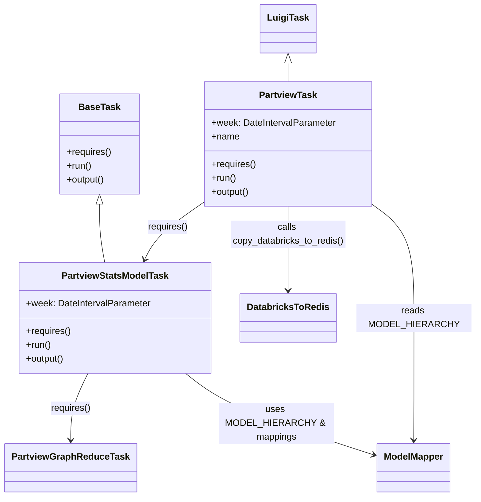

# Diagram: research/orchestrator/tasks/models/partview_stats_model.py


> Auto-generated by Obscura crawlers

## Diagram 1



### SVG

<svg id="container" width="796.0234375" xmlns="http://www.w3.org/2000/svg" class="classDiagram" height="838" viewBox="0 0 796.0234375 838" role="graphics-document document" aria-roledescription="class"><style>#container{font-family:"trebuchet ms",verdana,arial,sans-serif;font-size:16px;fill:#333;}@keyframes edge-animation-frame{from{stroke-dashoffset:0;}}@keyframes dash{to{stroke-dashoffset:0;}}#container .edge-animation-slow{stroke-dasharray:9,5!important;stroke-dashoffset:900;animation:dash 50s linear infinite;stroke-linecap:round;}#container .edge-animation-fast{stroke-dasharray:9,5!important;stroke-dashoffset:900;animation:dash 20s linear infinite;stroke-linecap:round;}#container .error-icon{fill:#552222;}#container .error-text{fill:#552222;stroke:#552222;}#container .edge-thickness-normal{stroke-width:1px;}#container .edge-thickness-thick{stroke-width:3.5px;}#container .edge-pattern-solid{stroke-dasharray:0;}#container .edge-thickness-invisible{stroke-width:0;fill:none;}#container .edge-pattern-dashed{stroke-dasharray:3;}#container .edge-pattern-dotted{stroke-dasharray:2;}#container .marker{fill:#333333;stroke:#333333;}#container .marker.cross{stroke:#333333;}#container svg{font-family:"trebuchet ms",verdana,arial,sans-serif;font-size:16px;}#container p{margin:0;}#container g.classGroup text{fill:#9370DB;stroke:none;font-family:"trebuchet ms",verdana,arial,sans-serif;font-size:10px;}#container g.classGroup text .title{font-weight:bolder;}#container .nodeLabel,#container .edgeLabel{color:#131300;}#container .edgeLabel .label rect{fill:#ECECFF;}#container .label text{fill:#131300;}#container .labelBkg{background:#ECECFF;}#container .edgeLabel .label span{background:#ECECFF;}#container .classTitle{font-weight:bolder;}#container .node rect,#container .node circle,#container .node ellipse,#container .node polygon,#container .node path{fill:#ECECFF;stroke:#9370DB;stroke-width:1px;}#container .divider{stroke:#9370DB;stroke-width:1;}#container g.clickable{cursor:pointer;}#container g.classGroup rect{fill:#ECECFF;stroke:#9370DB;}#container g.classGroup line{stroke:#9370DB;stroke-width:1;}#container .classLabel .box{stroke:none;stroke-width:0;fill:#ECECFF;opacity:0.5;}#container .classLabel .label{fill:#9370DB;font-size:10px;}#container .relation{stroke:#333333;stroke-width:1;fill:none;}#container .dashed-line{stroke-dasharray:3;}#container .dotted-line{stroke-dasharray:1 2;}#container #compositionStart,#container .composition{fill:#333333!important;stroke:#333333!important;stroke-width:1;}#container #compositionEnd,#container .composition{fill:#333333!important;stroke:#333333!important;stroke-width:1;}#container #dependencyStart,#container .dependency{fill:#333333!important;stroke:#333333!important;stroke-width:1;}#container #dependencyStart,#container .dependency{fill:#333333!important;stroke:#333333!important;stroke-width:1;}#container #extensionStart,#container .extension{fill:transparent!important;stroke:#333333!important;stroke-width:1;}#container #extensionEnd,#container .extension{fill:transparent!important;stroke:#333333!important;stroke-width:1;}#container #aggregationStart,#container .aggregation{fill:transparent!important;stroke:#333333!important;stroke-width:1;}#container #aggregationEnd,#container .aggregation{fill:transparent!important;stroke:#333333!important;stroke-width:1;}#container #lollipopStart,#container .lollipop{fill:#ECECFF!important;stroke:#333333!important;stroke-width:1;}#container #lollipopEnd,#container .lollipop{fill:#ECECFF!important;stroke:#333333!important;stroke-width:1;}#container .edgeTerminals{font-size:11px;line-height:initial;}#container .classTitleText{text-anchor:middle;font-size:18px;fill:#333;}#container .label-icon{display:inline-block;height:1em;overflow:visible;vertical-align:-0.125em;}#container .node .label-icon path{fill:currentColor;stroke:revert;stroke-width:revert;}#container :root{--mermaid-font-family:"trebuchet ms",verdana,arial,sans-serif;}</style><g><defs><marker id="container_class-aggregationStart" class="marker aggregation class" refX="18" refY="7" markerWidth="190" markerHeight="240" orient="auto"><path d="M 18,7 L9,13 L1,7 L9,1 Z"></path></marker></defs><defs><marker id="container_class-aggregationEnd" class="marker aggregation class" refX="1" refY="7" markerWidth="20" markerHeight="28" orient="auto"><path d="M 18,7 L9,13 L1,7 L9,1 Z"></path></marker></defs><defs><marker id="container_class-extensionStart" class="marker extension class" refX="18" refY="7" markerWidth="190" markerHeight="240" orient="auto"><path d="M 1,7 L18,13 V 1 Z"></path></marker></defs><defs><marker id="container_class-extensionEnd" class="marker extension class" refX="1" refY="7" markerWidth="20" markerHeight="28" orient="auto"><path d="M 1,1 V 13 L18,7 Z"></path></marker></defs><defs><marker id="container_class-compositionStart" class="marker composition class" refX="18" refY="7" markerWidth="190" markerHeight="240" orient="auto"><path d="M 18,7 L9,13 L1,7 L9,1 Z"></path></marker></defs><defs><marker id="container_class-compositionEnd" class="marker composition class" refX="1" refY="7" markerWidth="20" markerHeight="28" orient="auto"><path d="M 18,7 L9,13 L1,7 L9,1 Z"></path></marker></defs><defs><marker id="container_class-dependencyStart" class="marker dependency class" refX="6" refY="7" markerWidth="190" markerHeight="240" orient="auto"><path d="M 5,7 L9,13 L1,7 L9,1 Z"></path></marker></defs><defs><marker id="container_class-dependencyEnd" class="marker dependency class" refX="13" refY="7" markerWidth="20" markerHeight="28" orient="auto"><path d="M 18,7 L9,13 L14,7 L9,1 Z"></path></marker></defs><defs><marker id="container_class-lollipopStart" class="marker lollipop class" refX="13" refY="7" markerWidth="190" markerHeight="240" orient="auto"><circle stroke="black" fill="transparent" cx="7" cy="7" r="6"></circle></marker></defs><defs><marker id="container_class-lollipopEnd" class="marker lollipop class" refX="1" refY="7" markerWidth="190" markerHeight="240" orient="auto"><circle stroke="black" fill="transparent" cx="7" cy="7" r="6"></circle></marker></defs><g class="root"><g class="clusters"></g><g class="edgePaths"><path d="M166.859,354.25L166.859,363.042C166.859,371.833,166.859,389.417,168.409,406.375C169.959,423.333,173.059,439.667,174.609,447.833L176.159,456" id="id_BaseTask_PartviewStatsModelTask_1" class="edge-thickness-normal edge-pattern-solid relation" style=";;;" data-edge="true" data-et="edge" data-id="id_BaseTask_PartviewStatsModelTask_1" data-points="W3sieCI6MTY2Ljg1OTM3NSwieSI6MzM3fSx7IngiOjE2Ni44NTkzNzUsInkiOjQwN30seyJ4IjoxNzYuMTU5MDc4NjYzNzkzMSwieSI6NDU2fV0=" marker-start="url(#container_class-extensionStart)"></path><path d="M489.18,109.25L489.18,110.542C489.18,111.833,489.18,114.417,489.18,119.875C489.18,125.333,489.18,133.667,489.18,137.833L489.18,142" id="id_LuigiTask_PartviewTask_2" class="edge-thickness-normal edge-pattern-solid relation" style=";;;" data-edge="true" data-et="edge" data-id="id_LuigiTask_PartviewTask_2" data-points="W3sieCI6NDg5LjE3OTY4NzUsInkiOjkyfSx7IngiOjQ4OS4xNzk2ODc1LCJ5IjoxMTd9LHsieCI6NDg5LjE3OTY4NzUsInkiOjE0Mn1d" marker-start="url(#container_class-extensionStart)"></path><path d="M143.056,648L138.69,656.167C134.324,664.333,125.591,680.667,121.225,696C116.859,711.333,116.859,725.667,116.859,732.833L116.859,740" id="id_PartviewStatsModelTask_PartviewGraphReduceTask_3" class="edge-thickness-normal edge-pattern-solid relation" style=";;;" data-edge="true" data-et="edge" data-id="id_PartviewStatsModelTask_PartviewGraphReduceTask_3" data-points="W3sieCI6MTQzLjA1NTYzMDM4NzkzMTA1LCJ5Ijo2NDh9LHsieCI6MTE2Ljg1OTM3NSwieSI6Njk3fSx7IngiOjExNi44NTkzNzUsInkiOjc0Nn1d" marker-end="url(#container_class-dependencyEnd)"></path><path d="M345.016,350.63L331.556,360.025C318.097,369.42,291.178,388.21,274.217,404.871C257.256,421.532,250.253,436.063,246.751,443.329L243.25,450.595" id="id_PartviewTask_PartviewStatsModelTask_4" class="edge-thickness-normal edge-pattern-solid relation" style=";;;" data-edge="true" data-et="edge" data-id="id_PartviewTask_PartviewStatsModelTask_4" data-points="W3sieCI6MzQ1LjAxNTYyNSwieSI6MzUwLjYzMDI5Mzc2Nzc0NzJ9LHsieCI6MjY0LjI1OTc2NTYyNSwieSI6NDA3fSx7IngiOjI0MC42NDQ4NTQ1MjU4NjIwNiwieSI6NDU2fV0=" marker-end="url(#container_class-dependencyEnd)"></path><path d="M489.18,358L489.18,366.167C489.18,374.333,489.18,390.667,489.18,415C489.18,439.333,489.18,471.667,489.18,487.833L489.18,504" id="id_PartviewTask_DatabricksToRedis_5" class="edge-thickness-normal edge-pattern-solid relation" style=";;;" data-edge="true" data-et="edge" data-id="id_PartviewTask_DatabricksToRedis_5" data-points="W3sieCI6NDg5LjE3OTY4NzUsInkiOjM1OH0seyJ4Ijo0ODkuMTc5Njg3NSwieSI6NDA3fSx7IngiOjQ4OS4xNzk2ODc1LCJ5Ijo1MTB9XQ==" marker-end="url(#container_class-dependencyEnd)"></path><path d="M320.727,648L331.475,656.167C342.223,664.333,363.72,680.667,414.914,700.674C466.108,720.681,546.999,744.363,587.445,756.204L627.89,768.044" id="id_PartviewStatsModelTask_ModelMapper_6" class="edge-thickness-normal edge-pattern-solid relation" style=";;;" data-edge="true" data-et="edge" data-id="id_PartviewStatsModelTask_ModelMapper_6" data-points="W3sieCI6MzIwLjcyNjc1MTA3NzU4NjIsInkiOjY0OH0seyJ4IjozODUuMjE2Nzk2ODc1LCJ5Ijo2OTd9LHsieCI6NjMzLjY0ODQzNzUsInkiOjc2OS43MzAxMjcxMTM1ODU0fV0=" marker-end="url(#container_class-dependencyEnd)"></path><path d="M631.489,358L642.25,366.167C653.011,374.333,674.533,390.667,685.294,423C696.055,455.333,696.055,503.667,696.055,552C696.055,600.333,696.055,648.667,696.055,680C696.055,711.333,696.055,725.667,696.055,732.833L696.055,740" id="id_PartviewTask_ModelMapper_7" class="edge-thickness-normal edge-pattern-solid relation" style=";;;" data-edge="true" data-et="edge" data-id="id_PartviewTask_ModelMapper_7" data-points="W3sieCI6NjMxLjQ4ODYwNDY5NzQ1MjMsInkiOjM1OH0seyJ4Ijo2OTYuMDU0Njg3NSwieSI6NDA3fSx7IngiOjY5Ni4wNTQ2ODc1LCJ5Ijo1NTJ9LHsieCI6Njk2LjA1NDY4NzUsInkiOjY5N30seyJ4Ijo2OTYuMDU0Njg3NSwieSI6NzQ2fV0=" marker-end="url(#container_class-dependencyEnd)"></path></g><g class="edgeLabels"><g class="edgeLabel"><g class="label" data-id="id_BaseTask_PartviewStatsModelTask_1" transform="translate(0, 0)"><foreignObject width="0" height="0"><div xmlns="http://www.w3.org/1999/xhtml" class="labelBkg" style="display: table-cell; white-space: nowrap; line-height: 1.5; max-width: 200px; text-align: center;"><span class="edgeLabel"></span></div></foreignObject></g></g><g class="edgeLabel"><g class="label" data-id="id_LuigiTask_PartviewTask_2" transform="translate(0, 0)"><foreignObject width="0" height="0"><div xmlns="http://www.w3.org/1999/xhtml" class="labelBkg" style="display: table-cell; white-space: nowrap; line-height: 1.5; max-width: 200px; text-align: center;"><span class="edgeLabel"></span></div></foreignObject></g></g><g class="edgeLabel" transform="translate(116.859375, 697)"><g class="label" data-id="id_PartviewStatsModelTask_PartviewGraphReduceTask_3" transform="translate(-35.0390625, -12)"><foreignObject width="70.078125" height="24"><div xmlns="http://www.w3.org/1999/xhtml" class="labelBkg" style="display: table-cell; white-space: nowrap; line-height: 1.5; max-width: 200px; text-align: center;"><span class="edgeLabel"><p>requires()</p></span></div></foreignObject></g></g><g class="edgeLabel" transform="translate(282.33655, 394.38193)"><g class="label" data-id="id_PartviewTask_PartviewStatsModelTask_4" transform="translate(-35.0390625, -12)"><foreignObject width="70.078125" height="24"><div xmlns="http://www.w3.org/1999/xhtml" class="labelBkg" style="display: table-cell; white-space: nowrap; line-height: 1.5; max-width: 200px; text-align: center;"><span class="edgeLabel"><p>requires()</p></span></div></foreignObject></g></g><g class="edgeLabel" transform="translate(489.1796875, 407)"><g class="label" data-id="id_PartviewTask_DatabricksToRedis_5" transform="translate(-100, -24)"><foreignObject width="200" height="48"><div xmlns="http://www.w3.org/1999/xhtml" class="labelBkg" style="display: table; white-space: break-spaces; line-height: 1.5; max-width: 200px; text-align: center; width: 200px;"><span class="edgeLabel"><p>calls copy_databricks_to_redis()</p></span></div></foreignObject></g></g><g class="edgeLabel" transform="translate(470.56709, 721.98691)"><g class="label" data-id="id_PartviewStatsModelTask_ModelMapper_6" transform="translate(-100, -24)"><foreignObject width="200" height="48"><div xmlns="http://www.w3.org/1999/xhtml" class="labelBkg" style="display: table; white-space: break-spaces; line-height: 1.5; max-width: 200px; text-align: center; width: 200px;"><span class="edgeLabel"><p>uses MODEL_HIERARCHY &amp; mappings</p></span></div></foreignObject></g></g><g class="edgeLabel" transform="translate(696.0546875, 552)"><g class="label" data-id="id_PartviewTask_ModelMapper_7" transform="translate(-91.96875, -12)"><foreignObject width="183.9375" height="24"><div xmlns="http://www.w3.org/1999/xhtml" class="labelBkg" style="display: table-cell; white-space: nowrap; line-height: 1.5; max-width: 200px; text-align: center;"><span class="edgeLabel"><p>reads MODEL_HIERARCHY</p></span></div></foreignObject></g></g></g><g class="nodes"><g class="node default" id="classId-BaseTask-0" transform="translate(166.859375, 250)"><g class="basic label-container"><path d="M-68.046875 -87 L68.046875 -87 L68.046875 87 L-68.046875 87" stroke="none" stroke-width="0" fill="#ECECFF" style=""></path><path d="M-68.046875 -87 C-34.400857381282556 -87, -0.754839762565112 -87, 68.046875 -87 M-68.046875 -87 C-14.362046185577022 -87, 39.32278262884596 -87, 68.046875 -87 M68.046875 -87 C68.046875 -29.487090138666204, 68.046875 28.025819722667592, 68.046875 87 M68.046875 -87 C68.046875 -35.74746477371831, 68.046875 15.505070452563373, 68.046875 87 M68.046875 87 C29.455356038405384 87, -9.136162923189232 87, -68.046875 87 M68.046875 87 C24.341484854455075 87, -19.36390529108985 87, -68.046875 87 M-68.046875 87 C-68.046875 37.833637563039666, -68.046875 -11.332724873920668, -68.046875 -87 M-68.046875 87 C-68.046875 40.33355740478272, -68.046875 -6.332885190434567, -68.046875 -87" stroke="#9370DB" stroke-width="1.3" fill="none" stroke-dasharray="0 0" style=""></path></g><g class="annotation-group text" transform="translate(0, -63)"></g><g class="label-group text" transform="translate(-34.03125, -63)"><g class="label" style="font-weight: bolder" transform="translate(0,-12)"><foreignObject width="68.0625" height="24"><div xmlns="http://www.w3.org/1999/xhtml" style="display: table-cell; white-space: nowrap; line-height: 1.5; max-width: 117px; text-align: center;"><span class="nodeLabel markdown-node-label" style=""><p>BaseTask</p></span></div></foreignObject></g></g><g class="members-group text" transform="translate(-56.046875, -15)"></g><g class="methods-group text" transform="translate(-56.046875, 15)"><g class="label" style="" transform="translate(0,-12)"><foreignObject width="78.0625" height="24"><div xmlns="http://www.w3.org/1999/xhtml" style="display: table-cell; white-space: nowrap; line-height: 1.5; max-width: 135px; text-align: center;"><span class="nodeLabel markdown-node-label" style=""><p>+requires()</p></span></div></foreignObject></g><g class="label" style="" transform="translate(0,12)"><foreignObject width="43.21875" height="24"><div xmlns="http://www.w3.org/1999/xhtml" style="display: table-cell; white-space: nowrap; line-height: 1.5; max-width: 101px; text-align: center;"><span class="nodeLabel markdown-node-label" style=""><p>+run()</p></span></div></foreignObject></g><g class="label" style="" transform="translate(0,36)"><foreignObject width="67.390625" height="24"><div xmlns="http://www.w3.org/1999/xhtml" style="display: table-cell; white-space: nowrap; line-height: 1.5; max-width: 125px; text-align: center;"><span class="nodeLabel markdown-node-label" style=""><p>+output()</p></span></div></foreignObject></g></g><g class="divider" style=""><path d="M-68.046875 -39 C-39.177766549264874 -39, -10.30865809852974 -39, 68.046875 -39 M-68.046875 -39 C-38.46797542303945 -39, -8.889075846078903 -39, 68.046875 -39" stroke="#9370DB" stroke-width="1.3" fill="none" stroke-dasharray="0 0" style=""></path></g><g class="divider" style=""><path d="M-68.046875 -15 C-22.696797987176026 -15, 22.653279025647947 -15, 68.046875 -15 M-68.046875 -15 C-30.468483130638383 -15, 7.1099087387232345 -15, 68.046875 -15" stroke="#9370DB" stroke-width="1.3" fill="none" stroke-dasharray="0 0" style=""></path></g></g><g class="node default" id="classId-PartviewStatsModelTask-1" transform="translate(194.37890625, 552)"><g class="basic label-container"><path d="M-164.89453125 -96 L164.89453125 -96 L164.89453125 96 L-164.89453125 96" stroke="none" stroke-width="0" fill="#ECECFF" style=""></path><path d="M-164.89453125 -96 C-55.69936802019444 -96, 53.49579520961112 -96, 164.89453125 -96 M-164.89453125 -96 C-73.26376818871074 -96, 18.366994872578516 -96, 164.89453125 -96 M164.89453125 -96 C164.89453125 -21.597826359537365, 164.89453125 52.80434728092527, 164.89453125 96 M164.89453125 -96 C164.89453125 -43.93471183783237, 164.89453125 8.130576324335266, 164.89453125 96 M164.89453125 96 C45.5584161230701 96, -73.7776990038598 96, -164.89453125 96 M164.89453125 96 C50.87737698280763 96, -63.139777284384735 96, -164.89453125 96 M-164.89453125 96 C-164.89453125 47.568690753408546, -164.89453125 -0.8626184931829073, -164.89453125 -96 M-164.89453125 96 C-164.89453125 37.22871131367532, -164.89453125 -21.54257737264936, -164.89453125 -96" stroke="#9370DB" stroke-width="1.3" fill="none" stroke-dasharray="0 0" style=""></path></g><g class="annotation-group text" transform="translate(0, -72)"></g><g class="label-group text" transform="translate(-89.7578125, -72)"><g class="label" style="font-weight: bolder" transform="translate(0,-12)"><foreignObject width="179.515625" height="24"><div xmlns="http://www.w3.org/1999/xhtml" style="display: table-cell; white-space: nowrap; line-height: 1.5; max-width: 225px; text-align: center;"><span class="nodeLabel markdown-node-label" style=""><p>PartviewStatsModelTask</p></span></div></foreignObject></g></g><g class="members-group text" transform="translate(-152.89453125, -24)"><g class="label" style="" transform="translate(0,-12)"><foreignObject width="216.03125" height="24"><div xmlns="http://www.w3.org/1999/xhtml" style="display: table-cell; white-space: nowrap; line-height: 1.5; max-width: 274px; text-align: center;"><span class="nodeLabel markdown-node-label" style=""><p>+week: DateIntervalParameter</p></span></div></foreignObject></g></g><g class="methods-group text" transform="translate(-152.89453125, 24)"><g class="label" style="" transform="translate(0,-12)"><foreignObject width="78.0625" height="24"><div xmlns="http://www.w3.org/1999/xhtml" style="display: table-cell; white-space: nowrap; line-height: 1.5; max-width: 135px; text-align: center;"><span class="nodeLabel markdown-node-label" style=""><p>+requires()</p></span></div></foreignObject></g><g class="label" style="" transform="translate(0,12)"><foreignObject width="43.21875" height="24"><div xmlns="http://www.w3.org/1999/xhtml" style="display: table-cell; white-space: nowrap; line-height: 1.5; max-width: 101px; text-align: center;"><span class="nodeLabel markdown-node-label" style=""><p>+run()</p></span></div></foreignObject></g><g class="label" style="" transform="translate(0,36)"><foreignObject width="67.390625" height="24"><div xmlns="http://www.w3.org/1999/xhtml" style="display: table-cell; white-space: nowrap; line-height: 1.5; max-width: 125px; text-align: center;"><span class="nodeLabel markdown-node-label" style=""><p>+output()</p></span></div></foreignObject></g></g><g class="divider" style=""><path d="M-164.89453125 -48 C-95.11369264332158 -48, -25.33285403664317 -48, 164.89453125 -48 M-164.89453125 -48 C-72.40750868593632 -48, 20.079513878127358 -48, 164.89453125 -48" stroke="#9370DB" stroke-width="1.3" fill="none" stroke-dasharray="0 0" style=""></path></g><g class="divider" style=""><path d="M-164.89453125 0 C-44.64573654260698 0, 75.60305816478603 0, 164.89453125 0 M-164.89453125 0 C-62.023950065630444 0, 40.84663111873911 0, 164.89453125 0" stroke="#9370DB" stroke-width="1.3" fill="none" stroke-dasharray="0 0" style=""></path></g></g><g class="node default" id="classId-PartviewTask-2" transform="translate(489.1796875, 250)"><g class="basic label-container"><path d="M-144.1640625 -108 L144.1640625 -108 L144.1640625 108 L-144.1640625 108" stroke="none" stroke-width="0" fill="#ECECFF" style=""></path><path d="M-144.1640625 -108 C-44.485692206395896 -108, 55.19267808720821 -108, 144.1640625 -108 M-144.1640625 -108 C-74.08207423840173 -108, -4.000085976803462 -108, 144.1640625 -108 M144.1640625 -108 C144.1640625 -41.52922620859768, 144.1640625 24.941547582804645, 144.1640625 108 M144.1640625 -108 C144.1640625 -28.768329012859525, 144.1640625 50.46334197428095, 144.1640625 108 M144.1640625 108 C28.993496101699577 108, -86.17707029660085 108, -144.1640625 108 M144.1640625 108 C67.16154616343451 108, -9.840970173130984 108, -144.1640625 108 M-144.1640625 108 C-144.1640625 61.27443992527094, -144.1640625 14.54887985054188, -144.1640625 -108 M-144.1640625 108 C-144.1640625 38.25075174179587, -144.1640625 -31.498496516408267, -144.1640625 -108" stroke="#9370DB" stroke-width="1.3" fill="none" stroke-dasharray="0 0" style=""></path></g><g class="annotation-group text" transform="translate(0, -84)"></g><g class="label-group text" transform="translate(-48.296875, -84)"><g class="label" style="font-weight: bolder" transform="translate(0,-12)"><foreignObject width="96.59375" height="24"><div xmlns="http://www.w3.org/1999/xhtml" style="display: table-cell; white-space: nowrap; line-height: 1.5; max-width: 144px; text-align: center;"><span class="nodeLabel markdown-node-label" style=""><p>PartviewTask</p></span></div></foreignObject></g></g><g class="members-group text" transform="translate(-132.1640625, -36)"><g class="label" style="" transform="translate(0,-12)"><foreignObject width="216.03125" height="24"><div xmlns="http://www.w3.org/1999/xhtml" style="display: table-cell; white-space: nowrap; line-height: 1.5; max-width: 274px; text-align: center;"><span class="nodeLabel markdown-node-label" style=""><p>+week: DateIntervalParameter</p></span></div></foreignObject></g><g class="label" style="" transform="translate(0,12)"><foreignObject width="48.5" height="24"><div xmlns="http://www.w3.org/1999/xhtml" style="display: table-cell; white-space: nowrap; line-height: 1.5; max-width: 106px; text-align: center;"><span class="nodeLabel markdown-node-label" style=""><p>+name</p></span></div></foreignObject></g></g><g class="methods-group text" transform="translate(-132.1640625, 36)"><g class="label" style="" transform="translate(0,-12)"><foreignObject width="78.0625" height="24"><div xmlns="http://www.w3.org/1999/xhtml" style="display: table-cell; white-space: nowrap; line-height: 1.5; max-width: 135px; text-align: center;"><span class="nodeLabel markdown-node-label" style=""><p>+requires()</p></span></div></foreignObject></g><g class="label" style="" transform="translate(0,12)"><foreignObject width="43.21875" height="24"><div xmlns="http://www.w3.org/1999/xhtml" style="display: table-cell; white-space: nowrap; line-height: 1.5; max-width: 101px; text-align: center;"><span class="nodeLabel markdown-node-label" style=""><p>+run()</p></span></div></foreignObject></g><g class="label" style="" transform="translate(0,36)"><foreignObject width="67.390625" height="24"><div xmlns="http://www.w3.org/1999/xhtml" style="display: table-cell; white-space: nowrap; line-height: 1.5; max-width: 125px; text-align: center;"><span class="nodeLabel markdown-node-label" style=""><p>+output()</p></span></div></foreignObject></g></g><g class="divider" style=""><path d="M-144.1640625 -60 C-75.96751212920185 -60, -7.7709617584037005 -60, 144.1640625 -60 M-144.1640625 -60 C-38.70455758636511 -60, 66.75494732726978 -60, 144.1640625 -60" stroke="#9370DB" stroke-width="1.3" fill="none" stroke-dasharray="0 0" style=""></path></g><g class="divider" style=""><path d="M-144.1640625 12 C-51.49349108549666 12, 41.177080329006685 12, 144.1640625 12 M-144.1640625 12 C-41.00391117045065 12, 62.1562401590987 12, 144.1640625 12" stroke="#9370DB" stroke-width="1.3" fill="none" stroke-dasharray="0 0" style=""></path></g></g><g class="node default" id="classId-PartviewGraphReduceTask-3" transform="translate(116.859375, 788)"><g class="basic label-container"><path d="M-108.859375 -42 L108.859375 -42 L108.859375 42 L-108.859375 42" stroke="none" stroke-width="0" fill="#ECECFF" style=""></path><path d="M-108.859375 -42 C-29.586961091512038 -42, 49.685452816975925 -42, 108.859375 -42 M-108.859375 -42 C-29.722891304395347 -42, 49.413592391209306 -42, 108.859375 -42 M108.859375 -42 C108.859375 -19.415047119600384, 108.859375 3.1699057607992316, 108.859375 42 M108.859375 -42 C108.859375 -10.092382479316324, 108.859375 21.81523504136735, 108.859375 42 M108.859375 42 C43.46854478723036 42, -21.922285425539286 42, -108.859375 42 M108.859375 42 C51.48273472363161 42, -5.893905552736783 42, -108.859375 42 M-108.859375 42 C-108.859375 23.065357340163203, -108.859375 4.130714680326406, -108.859375 -42 M-108.859375 42 C-108.859375 14.073151676552506, -108.859375 -13.853696646894988, -108.859375 -42" stroke="#9370DB" stroke-width="1.3" fill="none" stroke-dasharray="0 0" style=""></path></g><g class="annotation-group text" transform="translate(0, -18)"></g><g class="label-group text" transform="translate(-96.859375, -18)"><g class="label" style="font-weight: bolder" transform="translate(0,-12)"><foreignObject width="193.71875" height="24"><div xmlns="http://www.w3.org/1999/xhtml" style="display: table-cell; white-space: nowrap; line-height: 1.5; max-width: 240px; text-align: center;"><span class="nodeLabel markdown-node-label" style=""><p>PartviewGraphReduceTask</p></span></div></foreignObject></g></g><g class="members-group text" transform="translate(-96.859375, 30)"></g><g class="methods-group text" transform="translate(-96.859375, 60)"></g><g class="divider" style=""><path d="M-108.859375 6 C-21.80241155427069 6, 65.25455189145862 6, 108.859375 6 M-108.859375 6 C-30.628256838790364 6, 47.60286132241927 6, 108.859375 6" stroke="#9370DB" stroke-width="1.3" fill="none" stroke-dasharray="0 0" style=""></path></g><g class="divider" style=""><path d="M-108.859375 24 C-65.04747832509145 24, -21.23558165018288 24, 108.859375 24 M-108.859375 24 C-40.00736195257694 24, 28.844651094846114 24, 108.859375 24" stroke="#9370DB" stroke-width="1.3" fill="none" stroke-dasharray="0 0" style=""></path></g></g><g class="node default" id="classId-LuigiTask-4" transform="translate(489.1796875, 50)"><g class="basic label-container"><path d="M-45.984375 -42 L45.984375 -42 L45.984375 42 L-45.984375 42" stroke="none" stroke-width="0" fill="#ECECFF" style=""></path><path d="M-45.984375 -42 C-9.66424525160295 -42, 26.6558844967941 -42, 45.984375 -42 M-45.984375 -42 C-12.139818883584056 -42, 21.70473723283189 -42, 45.984375 -42 M45.984375 -42 C45.984375 -11.811551961785757, 45.984375 18.376896076428487, 45.984375 42 M45.984375 -42 C45.984375 -16.327665434354305, 45.984375 9.34466913129139, 45.984375 42 M45.984375 42 C20.03269235159649 42, -5.918990296807017 42, -45.984375 42 M45.984375 42 C20.28045957074921 42, -5.423455858501583 42, -45.984375 42 M-45.984375 42 C-45.984375 19.870306355127862, -45.984375 -2.259387289744275, -45.984375 -42 M-45.984375 42 C-45.984375 9.029445699906674, -45.984375 -23.941108600186652, -45.984375 -42" stroke="#9370DB" stroke-width="1.3" fill="none" stroke-dasharray="0 0" style=""></path></g><g class="annotation-group text" transform="translate(0, -18)"></g><g class="label-group text" transform="translate(-33.984375, -18)"><g class="label" style="font-weight: bolder" transform="translate(0,-12)"><foreignObject width="67.96875" height="24"><div xmlns="http://www.w3.org/1999/xhtml" style="display: table-cell; white-space: nowrap; line-height: 1.5; max-width: 117px; text-align: center;"><span class="nodeLabel markdown-node-label" style=""><p>LuigiTask</p></span></div></foreignObject></g></g><g class="members-group text" transform="translate(-33.984375, 30)"></g><g class="methods-group text" transform="translate(-33.984375, 60)"></g><g class="divider" style=""><path d="M-45.984375 6 C-24.121136984353118 6, -2.257898968706236 6, 45.984375 6 M-45.984375 6 C-9.859025377799888 6, 26.266324244400224 6, 45.984375 6" stroke="#9370DB" stroke-width="1.3" fill="none" stroke-dasharray="0 0" style=""></path></g><g class="divider" style=""><path d="M-45.984375 24 C-23.90063563424187 24, -1.8168962684837382 24, 45.984375 24 M-45.984375 24 C-26.27641175186404 24, -6.568448503728078 24, 45.984375 24" stroke="#9370DB" stroke-width="1.3" fill="none" stroke-dasharray="0 0" style=""></path></g></g><g class="node default" id="classId-ModelMapper-5" transform="translate(696.0546875, 788)"><g class="basic label-container"><path d="M-62.40625 -42 L62.40625 -42 L62.40625 42 L-62.40625 42" stroke="none" stroke-width="0" fill="#ECECFF" style=""></path><path d="M-62.40625 -42 C-34.75740465928433 -42, -7.108559318568666 -42, 62.40625 -42 M-62.40625 -42 C-18.4916301133215 -42, 25.422989773357003 -42, 62.40625 -42 M62.40625 -42 C62.40625 -16.06747699886905, 62.40625 9.865046002261899, 62.40625 42 M62.40625 -42 C62.40625 -18.834935883660368, 62.40625 4.3301282326792645, 62.40625 42 M62.40625 42 C24.312047642844462 42, -13.782154714311076 42, -62.40625 42 M62.40625 42 C34.838853331509355 42, 7.271456663018711 42, -62.40625 42 M-62.40625 42 C-62.40625 22.595290558295506, -62.40625 3.1905811165910123, -62.40625 -42 M-62.40625 42 C-62.40625 12.800784896166292, -62.40625 -16.398430207667417, -62.40625 -42" stroke="#9370DB" stroke-width="1.3" fill="none" stroke-dasharray="0 0" style=""></path></g><g class="annotation-group text" transform="translate(0, -18)"></g><g class="label-group text" transform="translate(-50.40625, -18)"><g class="label" style="font-weight: bolder" transform="translate(0,-12)"><foreignObject width="100.8125" height="24"><div xmlns="http://www.w3.org/1999/xhtml" style="display: table-cell; white-space: nowrap; line-height: 1.5; max-width: 151px; text-align: center;"><span class="nodeLabel markdown-node-label" style=""><p>ModelMapper</p></span></div></foreignObject></g></g><g class="members-group text" transform="translate(-50.40625, 30)"></g><g class="methods-group text" transform="translate(-50.40625, 60)"></g><g class="divider" style=""><path d="M-62.40625 6 C-13.402553950017072 6, 35.601142099965855 6, 62.40625 6 M-62.40625 6 C-33.84093150446351 6, -5.275613008927024 6, 62.40625 6" stroke="#9370DB" stroke-width="1.3" fill="none" stroke-dasharray="0 0" style=""></path></g><g class="divider" style=""><path d="M-62.40625 24 C-26.87474902572731 24, 8.656751948545377 24, 62.40625 24 M-62.40625 24 C-28.887219860497083 24, 4.631810279005833 24, 62.40625 24" stroke="#9370DB" stroke-width="1.3" fill="none" stroke-dasharray="0 0" style=""></path></g></g><g class="node default" id="classId-DatabricksToRedis-6" transform="translate(489.1796875, 552)"><g class="basic label-container"><path d="M-79.90625 -42 L79.90625 -42 L79.90625 42 L-79.90625 42" stroke="none" stroke-width="0" fill="#ECECFF" style=""></path><path d="M-79.90625 -42 C-46.49968788194236 -42, -13.093125763884714 -42, 79.90625 -42 M-79.90625 -42 C-41.048628857567394 -42, -2.1910077151347878 -42, 79.90625 -42 M79.90625 -42 C79.90625 -11.854345161937836, 79.90625 18.291309676124328, 79.90625 42 M79.90625 -42 C79.90625 -11.670050154341435, 79.90625 18.65989969131713, 79.90625 42 M79.90625 42 C45.09560833019888 42, 10.284966660397757 42, -79.90625 42 M79.90625 42 C36.948317428081765 42, -6.00961514383647 42, -79.90625 42 M-79.90625 42 C-79.90625 12.699354511202564, -79.90625 -16.60129097759487, -79.90625 -42 M-79.90625 42 C-79.90625 14.10318193739425, -79.90625 -13.7936361252115, -79.90625 -42" stroke="#9370DB" stroke-width="1.3" fill="none" stroke-dasharray="0 0" style=""></path></g><g class="annotation-group text" transform="translate(0, -18)"></g><g class="label-group text" transform="translate(-67.90625, -18)"><g class="label" style="font-weight: bolder" transform="translate(0,-12)"><foreignObject width="135.8125" height="24"><div xmlns="http://www.w3.org/1999/xhtml" style="display: table-cell; white-space: nowrap; line-height: 1.5; max-width: 183px; text-align: center;"><span class="nodeLabel markdown-node-label" style=""><p>DatabricksToRedis</p></span></div></foreignObject></g></g><g class="members-group text" transform="translate(-67.90625, 30)"></g><g class="methods-group text" transform="translate(-67.90625, 60)"></g><g class="divider" style=""><path d="M-79.90625 6 C-17.381185890154086 6, 45.14387821969183 6, 79.90625 6 M-79.90625 6 C-40.02532407016021 6, -0.1443981403204191 6, 79.90625 6" stroke="#9370DB" stroke-width="1.3" fill="none" stroke-dasharray="0 0" style=""></path></g><g class="divider" style=""><path d="M-79.90625 24 C-39.248435789834055 24, 1.4093784203318904 24, 79.90625 24 M-79.90625 24 C-18.040965339326767 24, 43.824319321346465 24, 79.90625 24" stroke="#9370DB" stroke-width="1.3" fill="none" stroke-dasharray="0 0" style=""></path></g></g></g></g></g></svg>

## Diagram 2

```mermaid
flowchart TD
    subgraph Luigi
        PGR[PartviewGraphReduceTask]
        PST[PartviewStatsModelTask]
        PT[PartviewTask]
        PGR --> PST
        PST --> PT
    end

    Input[Input Table: fv_prod.eta.partview_graph_reduce] --> Read[DatabricksSession.read.table -> base_df]
    Read --> InitialAgg[GroupBy & initial aggregations (countDistinct, avg, stddev, count, first)]
    InitialAgg --> ForModel[Loop over MODEL_HIERARCHY]
    PST --> ForModel
    ForModel --> Rollup[GroupBy new_rollup_keys & compute rollup]
    Rollup --> Percentiles[Compute percentile_approx for 30/60/90/120/180/365 windows]
    Percentiles --> Confidence[Compute coeff_of_var, confidence, combo_confidence using model_factor & INDEX_WEIGHT]
    Confidence --> AddTs[Add modelTs (current_timestamp())]
    AddTs --> WriteTable[Write Delta table fv_prod.eta.{model} (overwrite, overwriteSchema=true)]
    WriteTable --> DoneFile[Write "Done" to artifacts/tasks/partview_modelrollup_<week>.txt]
    PT --> RedisCopy[For each model: databricks_to_redis.copy_databricks_to_redis(databricks_table_name, model_name, 1)]
    RedisCopy --> Redis[Redis DB 1]
```

> SVG rendering failed for this diagram.
