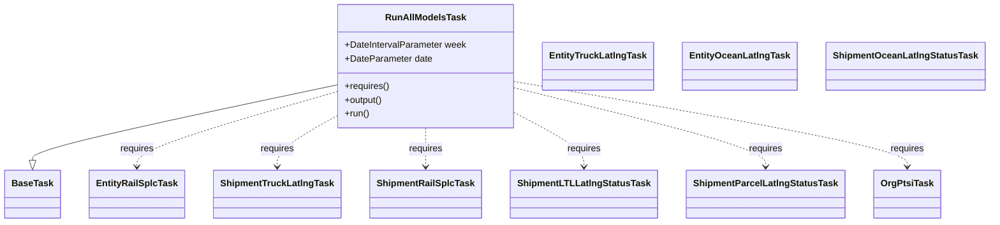
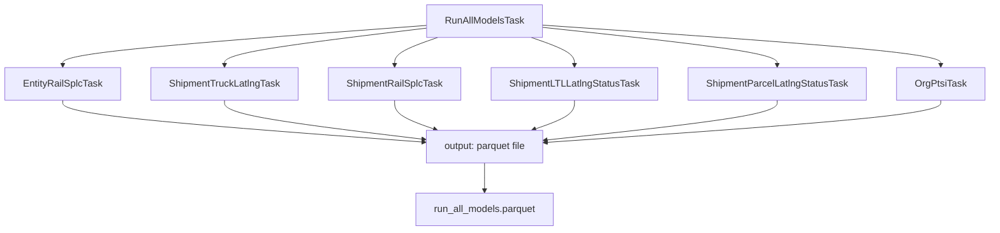

# Diagram: research/orchestrator/tasks/models/run_all_models_task.py

> Auto-generated by Obscura crawlers

## Diagram 1

### SVG

<svg id="container" width="1664.44140625" xmlns="http://www.w3.org/2000/svg" class="classDiagram" height="390" viewBox="0 0 1664.44140625 390" role="graphics-document document" aria-roledescription="class"><g><defs><marker id="container_class-aggregationStart" class="marker aggregation class" refX="18" refY="7" markerWidth="190" markerHeight="240" orient="auto"><path d="M 18,7 L9,13 L1,7 L9,1 Z"></path></marker></defs><defs><marker id="container_class-aggregationEnd" class="marker aggregation class" refX="1" refY="7" markerWidth="20" markerHeight="28" orient="auto"><path d="M 18,7 L9,13 L1,7 L9,1 Z"></path></marker></defs><defs><marker id="container_class-extensionStart" class="marker extension class" refX="18" refY="7" markerWidth="190" markerHeight="240" orient="auto"><path d="M 1,7 L18,13 V 1 Z"></path></marker></defs><defs><marker id="container_class-extensionEnd" class="marker extension class" refX="1" refY="7" markerWidth="20" markerHeight="28" orient="auto"><path d="M 1,1 V 13 L18,7 Z"></path></marker></defs><defs><marker id="container_class-compositionStart" class="marker composition class" refX="18" refY="7" markerWidth="190" markerHeight="240" orient="auto"><path d="M 18,7 L9,13 L1,7 L9,1 Z"></path></marker></defs><defs><marker id="container_class-compositionEnd" class="marker composition class" refX="1" refY="7" markerWidth="20" markerHeight="28" orient="auto"><path d="M 18,7 L9,13 L1,7 L9,1 Z"></path></marker></defs><defs><marker id="container_class-dependencyStart" class="marker dependency class" refX="6" refY="7" markerWidth="190" markerHeight="240" orient="auto"><path d="M 5,7 L9,13 L1,7 L9,1 Z"></path></marker></defs><defs><marker id="container_class-dependencyEnd" class="marker dependency class" refX="13" refY="7" markerWidth="20" markerHeight="28" orient="auto"><path d="M 18,7 L9,13 L14,7 L9,1 Z"></path></marker></defs><defs><marker id="container_class-lollipopStart" class="marker lollipop class" refX="13" refY="7" markerWidth="190" markerHeight="240" orient="auto"><circle stroke="black" fill="transparent" cx="7" cy="7" r="6"></circle></marker></defs><defs><marker id="container_class-lollipopEnd" class="marker lollipop class" refX="1" refY="7" markerWidth="190" markerHeight="240" orient="auto"><circle stroke="black" fill="transparent" cx="7" cy="7" r="6"></circle></marker></defs><g class="root"><g class="clusters"></g><g class="edgePaths"><path d="M563.184,149.221L478.325,167.851C393.466,186.481,223.749,223.74,138.89,245.662C54.031,267.583,54.031,274.167,54.031,277.458L54.031,280.75" id="id_RunAllModelsTask_BaseTask_1" class="edge-thickness-normal edge-pattern-solid relation" style=";;;" data-edge="true" data-et="edge" data-id="id_RunAllModelsTask_BaseTask_1" data-points="W3sieCI6NTYzLjE4MzU5Mzc1LCJ5IjoxNDkuMjIxNDg0MjUwMjQ1NDV9LHsieCI6NTQuMDMxMjUsInkiOjI2MX0seyJ4Ijo1NC4wMzEyNSwieSI6Mjk4fV0=" marker-end="url(#container_class-extensionEnd)"></path><path d="M563.184,161.216L507.527,177.847C451.87,194.478,340.556,227.739,284.899,249.536C229.242,271.333,229.242,281.667,229.242,286.833L229.242,292" id="id_RunAllModelsTask_EntityRailSplcTask_2" class="edge-thickness-normal edge-pattern-dashed relation" style=";;;" data-edge="true" data-et="edge" data-id="id_RunAllModelsTask_EntityRailSplcTask_2" data-points="W3sieCI6NTYzLjE4MzU5Mzc1LCJ5IjoxNjEuMjE2NDk3MDg2MDAzMTZ9LHsieCI6MjI5LjI0MjE4NzUsInkiOjI2MX0seyJ4IjoyMjkuMjQyMTg3NSwieSI6Mjk4fV0=" marker-end="url(#container_class-dependencyEnd)"></path><path d="M563.184,203.927L546.813,213.44C530.443,222.952,497.702,241.976,481.331,256.655C464.961,271.333,464.961,281.667,464.961,286.833L464.961,292" id="id_RunAllModelsTask_ShipmentTruckLatlngTask_3" class="edge-thickness-normal edge-pattern-dashed relation" style=";;;" data-edge="true" data-et="edge" data-id="id_RunAllModelsTask_ShipmentTruckLatlngTask_3" data-points="W3sieCI6NTYzLjE4MzU5Mzc1LCJ5IjoyMDMuOTI3NDE1MzE1MjU4OX0seyJ4Ijo0NjQuOTYwOTM3NSwieSI6MjYxfSx7IngiOjQ2NC45NjA5Mzc1LCJ5IjoyOTh9XQ==" marker-end="url(#container_class-dependencyEnd)"></path><path d="M714.508,224L714.508,230.167C714.508,236.333,714.508,248.667,714.508,260C714.508,271.333,714.508,281.667,714.508,286.833L714.508,292" id="id_RunAllModelsTask_ShipmentRailSplcTask_4" class="edge-thickness-normal edge-pattern-dashed relation" style=";;;" data-edge="true" data-et="edge" data-id="id_RunAllModelsTask_ShipmentRailSplcTask_4" data-points="W3sieCI6NzE0LjUwNzgxMjUsInkiOjIyNH0seyJ4Ijo3MTQuNTA3ODEyNSwieSI6MjYxfSx7IngiOjcxNC41MDc4MTI1LCJ5IjoyOTh9XQ==" marker-end="url(#container_class-dependencyEnd)"></path><path d="M865.832,198.895L884.727,209.246C903.622,219.597,941.413,240.298,960.308,255.816C979.203,271.333,979.203,281.667,979.203,286.833L979.203,292" id="id_RunAllModelsTask_ShipmentLTLLatlngStatusTask_5" class="edge-thickness-normal edge-pattern-dashed relation" style=";;;" data-edge="true" data-et="edge" data-id="id_RunAllModelsTask_ShipmentLTLLatlngStatusTask_5" data-points="W3sieCI6ODY1LjgzMjAzMTI1LCJ5IjoxOTguODk1MzU0MzI4Mzg0NjZ9LHsieCI6OTc5LjIwMzEyNSwieSI6MjYxfSx7IngiOjk3OS4yMDMxMjUsInkiOjI5OH1d" marker-end="url(#container_class-dependencyEnd)"></path><path d="M865.832,154.597L935.36,172.331C1004.888,190.065,1143.944,225.532,1213.472,248.433C1283,271.333,1283,281.667,1283,286.833L1283,292" id="id_RunAllModelsTask_ShipmentParcelLatlngStatusTask_6" class="edge-thickness-normal edge-pattern-dashed relation" style=";;;" data-edge="true" data-et="edge" data-id="id_RunAllModelsTask_ShipmentParcelLatlngStatusTask_6" data-points="W3sieCI6ODY1LjgzMjAzMTI1LCJ5IjoxNTQuNTk2ODU3MDkxODEzNn0seyJ4IjoxMjgzLCJ5IjoyNjF9LHsieCI6MTI4MywieSI6Mjk4fV0=" marker-end="url(#container_class-dependencyEnd)"></path><path d="M865.832,143.219L974.965,162.849C1084.099,182.479,1302.366,221.74,1411.499,246.537C1520.633,271.333,1520.633,281.667,1520.633,286.833L1520.633,292" id="id_RunAllModelsTask_OrgPtsiTask_7" class="edge-thickness-normal edge-pattern-dashed relation" style=";;;" data-edge="true" data-et="edge" data-id="id_RunAllModelsTask_OrgPtsiTask_7" data-points="W3sieCI6ODY1LjgzMjAzMTI1LCJ5IjoxNDMuMjE5MTE4Mjc0MTUxMDR9LHsieCI6MTUyMC42MzI4MTI1LCJ5IjoyNjF9LHsieCI6MTUyMC42MzI4MTI1LCJ5IjoyOTh9XQ==" marker-end="url(#container_class-dependencyEnd)"></path></g><g class="edgeLabels"><g class="edgeLabel"><g class="label" data-id="id_RunAllModelsTask_BaseTask_1" transform="translate(0, 0)"><foreignObject width="0" height="0">

</foreignObject></g></g><g class="edgeLabel" transform="translate(229.2421875, 261)"><g class="label" data-id="id_RunAllModelsTask_EntityRailSplcTask_2" transform="translate(-29.8515625, -12)"><foreignObject width="59.703125" height="24">

requires

</foreignObject></g></g><g class="edgeLabel" transform="translate(464.9609375, 261)"><g class="label" data-id="id_RunAllModelsTask_ShipmentTruckLatlngTask_3" transform="translate(-29.8515625, -12)"><foreignObject width="59.703125" height="24">

requires

</foreignObject></g></g><g class="edgeLabel" transform="translate(714.5078125, 261)"><g class="label" data-id="id_RunAllModelsTask_ShipmentRailSplcTask_4" transform="translate(-29.8515625, -12)"><foreignObject width="59.703125" height="24">

requires

</foreignObject></g></g><g class="edgeLabel" transform="translate(979.203125, 261)"><g class="label" data-id="id_RunAllModelsTask_ShipmentLTLLatlngStatusTask_5" transform="translate(-29.8515625, -12)"><foreignObject width="59.703125" height="24">

requires

</foreignObject></g></g><g class="edgeLabel" transform="translate(1283, 261)"><g class="label" data-id="id_RunAllModelsTask_ShipmentParcelLatlngStatusTask_6" transform="translate(-29.8515625, -12)"><foreignObject width="59.703125" height="24">

requires

</foreignObject></g></g><g class="edgeLabel" transform="translate(1520.6328125, 261)"><g class="label" data-id="id_RunAllModelsTask_OrgPtsiTask_7" transform="translate(-29.8515625, -12)"><foreignObject width="59.703125" height="24">

requires

</foreignObject></g></g></g><g class="nodes"><g class="node default" id="classId-RunAllModelsTask-0" transform="translate(714.5078125, 116)"><g class="basic label-container"><path d="M-151.32421875 -108 L151.32421875 -108 L151.32421875 108 L-151.32421875 108" stroke="none" stroke-width="0" fill="#ECECFF" style=""></path><path d="M-151.32421875 -108 C-73.78025578881177 -108, 3.7637071723764564 -108, 151.32421875 -108 M-151.32421875 -108 C-57.75107603721608 -108, 35.82206667556784 -108, 151.32421875 -108 M151.32421875 -108 C151.32421875 -38.38148583470648, 151.32421875 31.237028330587037, 151.32421875 108 M151.32421875 -108 C151.32421875 -50.79983097962435, 151.32421875 6.4003380407512935, 151.32421875 108 M151.32421875 108 C77.05098338626959 108, 2.7777480225391855 108, -151.32421875 108 M151.32421875 108 C76.4386025378025 108, 1.5529863256049907 108, -151.32421875 108 M-151.32421875 108 C-151.32421875 35.53487023616478, -151.32421875 -36.930259527670444, -151.32421875 -108 M-151.32421875 108 C-151.32421875 59.29019676598487, -151.32421875 10.580393531969733, -151.32421875 -108" stroke="#9370DB" stroke-width="1.3" fill="none" stroke-dasharray="0 0" style=""></path></g><g class="annotation-group text" transform="translate(0, -84)"></g><g class="label-group text" transform="translate(-66.5234375, -84)"><g class="label" style="font-weight: bolder" transform="translate(0,-12)"><foreignObject width="133.046875" height="24">

RunAllModelsTask

</foreignObject></g></g><g class="members-group text" transform="translate(-139.32421875, -36)"><g class="label" style="" transform="translate(0,-12)"><foreignObject width="212.125" height="24">

+DateIntervalParameter week

</foreignObject></g><g class="label" style="" transform="translate(0,12)"><foreignObject width="152.171875" height="24">

+DateParameter date

</foreignObject></g></g><g class="methods-group text" transform="translate(-139.32421875, 36)"><g class="label" style="" transform="translate(0,-12)"><foreignObject width="78.0625" height="24">

+requires()

</foreignObject></g><g class="label" style="" transform="translate(0,12)"><foreignObject width="67.390625" height="24">

+output()

</foreignObject></g><g class="label" style="" transform="translate(0,36)"><foreignObject width="43.21875" height="24">

+run()

</foreignObject></g></g><g class="divider" style=""><path d="M-151.32421875 -60 C-56.40177276530717 -60, 38.52067321938566 -60, 151.32421875 -60 M-151.32421875 -60 C-48.228201100092875 -60, 54.86781654981425 -60, 151.32421875 -60" stroke="#9370DB" stroke-width="1.3" fill="none" stroke-dasharray="0 0" style=""></path></g><g class="divider" style=""><path d="M-151.32421875 12 C-74.45144325996782 12, 2.4213322300643654 12, 151.32421875 12 M-151.32421875 12 C-46.51833532772797 12, 58.287548094544064 12, 151.32421875 12" stroke="#9370DB" stroke-width="1.3" fill="none" stroke-dasharray="0 0" style=""></path></g></g><g class="node default" id="classId-BaseTask-1" transform="translate(54.03125, 340)"><g class="basic label-container"><path d="M-46.03125 -42 L46.03125 -42 L46.03125 42 L-46.03125 42" stroke="none" stroke-width="0" fill="#ECECFF" style=""></path><path d="M-46.03125 -42 C-14.721500872337 -42, 16.588248255326 -42, 46.03125 -42 M-46.03125 -42 C-21.109122757585308 -42, 3.813004484829385 -42, 46.03125 -42 M46.03125 -42 C46.03125 -19.219103523115443, 46.03125 3.561792953769114, 46.03125 42 M46.03125 -42 C46.03125 -9.775239584584078, 46.03125 22.449520830831844, 46.03125 42 M46.03125 42 C18.48261019688873 42, -9.066029606222543 42, -46.03125 42 M46.03125 42 C27.24731697576181 42, 8.463383951523618 42, -46.03125 42 M-46.03125 42 C-46.03125 8.828725277021675, -46.03125 -24.34254944595665, -46.03125 -42 M-46.03125 42 C-46.03125 12.773303608955718, -46.03125 -16.453392782088564, -46.03125 -42" stroke="#9370DB" stroke-width="1.3" fill="none" stroke-dasharray="0 0" style=""></path></g><g class="annotation-group text" transform="translate(0, -18)"></g><g class="label-group text" transform="translate(-34.03125, -18)"><g class="label" style="font-weight: bolder" transform="translate(0,-12)"><foreignObject width="68.0625" height="24">

BaseTask

</foreignObject></g></g><g class="members-group text" transform="translate(-34.03125, 30)"></g><g class="methods-group text" transform="translate(-34.03125, 60)"></g><g class="divider" style=""><path d="M-46.03125 6 C-24.293496267334014 6, -2.5557425346680276 6, 46.03125 6 M-46.03125 6 C-22.31976290554477 6, 1.3917241889104588 6, 46.03125 6" stroke="#9370DB" stroke-width="1.3" fill="none" stroke-dasharray="0 0" style=""></path></g><g class="divider" style=""><path d="M-46.03125 24 C-11.440630057373376 24, 23.149989885253248 24, 46.03125 24 M-46.03125 24 C-23.354353859984286 24, -0.6774577199685723 24, 46.03125 24" stroke="#9370DB" stroke-width="1.3" fill="none" stroke-dasharray="0 0" style=""></path></g></g><g class="node default" id="classId-EntityTruckLatlngTask-2" transform="translate(1008.55078125, 116)"><g class="basic label-container"><path d="M-92.71875 -42 L92.71875 -42 L92.71875 42 L-92.71875 42" stroke="none" stroke-width="0" fill="#ECECFF" style=""></path><path d="M-92.71875 -42 C-54.37859078230837 -42, -16.038431564616744 -42, 92.71875 -42 M-92.71875 -42 C-41.55814259905955 -42, 9.602464801880899 -42, 92.71875 -42 M92.71875 -42 C92.71875 -16.829468378305876, 92.71875 8.341063243388248, 92.71875 42 M92.71875 -42 C92.71875 -11.151830446040044, 92.71875 19.69633910791991, 92.71875 42 M92.71875 42 C48.121399512391235 42, 3.524049024782471 42, -92.71875 42 M92.71875 42 C50.87665868208199 42, 9.034567364163976 42, -92.71875 42 M-92.71875 42 C-92.71875 9.399079079002306, -92.71875 -23.20184184199539, -92.71875 -42 M-92.71875 42 C-92.71875 11.677445423799607, -92.71875 -18.645109152400785, -92.71875 -42" stroke="#9370DB" stroke-width="1.3" fill="none" stroke-dasharray="0 0" style=""></path></g><g class="annotation-group text" transform="translate(0, -18)"></g><g class="label-group text" transform="translate(-80.71875, -18)"><g class="label" style="font-weight: bolder" transform="translate(0,-12)"><foreignObject width="161.4375" height="24">

EntityTruckLatlngTask

</foreignObject></g></g><g class="members-group text" transform="translate(-80.71875, 30)"></g><g class="methods-group text" transform="translate(-80.71875, 60)"></g><g class="divider" style=""><path d="M-92.71875 6 C-37.14323250588111 6, 18.432284988237782 6, 92.71875 6 M-92.71875 6 C-30.336881446511043 6, 32.04498710697791 6, 92.71875 6" stroke="#9370DB" stroke-width="1.3" fill="none" stroke-dasharray="0 0" style=""></path></g><g class="divider" style=""><path d="M-92.71875 24 C-35.915471173433794 24, 20.887807653132413 24, 92.71875 24 M-92.71875 24 C-31.954070616109497 24, 28.810608767781005 24, 92.71875 24" stroke="#9370DB" stroke-width="1.3" fill="none" stroke-dasharray="0 0" style=""></path></g></g><g class="node default" id="classId-EntityRailSplcTask-3" transform="translate(229.2421875, 340)"><g class="basic label-container"><path d="M-79.1796875 -42 L79.1796875 -42 L79.1796875 42 L-79.1796875 42" stroke="none" stroke-width="0" fill="#ECECFF" style=""></path><path d="M-79.1796875 -42 C-35.100067691492065 -42, 8.97955211701587 -42, 79.1796875 -42 M-79.1796875 -42 C-41.62434745544149 -42, -4.069007410882975 -42, 79.1796875 -42 M79.1796875 -42 C79.1796875 -12.422943087005706, 79.1796875 17.15411382598859, 79.1796875 42 M79.1796875 -42 C79.1796875 -12.6641533398796, 79.1796875 16.6716933202408, 79.1796875 42 M79.1796875 42 C41.094177204452066 42, 3.0086669089041322 42, -79.1796875 42 M79.1796875 42 C41.01939373621663 42, 2.859099972433256 42, -79.1796875 42 M-79.1796875 42 C-79.1796875 13.589052265555207, -79.1796875 -14.821895468889586, -79.1796875 -42 M-79.1796875 42 C-79.1796875 8.981507431576624, -79.1796875 -24.036985136846752, -79.1796875 -42" stroke="#9370DB" stroke-width="1.3" fill="none" stroke-dasharray="0 0" style=""></path></g><g class="annotation-group text" transform="translate(0, -18)"></g><g class="label-group text" transform="translate(-67.1796875, -18)"><g class="label" style="font-weight: bolder" transform="translate(0,-12)"><foreignObject width="134.359375" height="24">

EntityRailSplcTask

</foreignObject></g></g><g class="members-group text" transform="translate(-67.1796875, 30)"></g><g class="methods-group text" transform="translate(-67.1796875, 60)"></g><g class="divider" style=""><path d="M-79.1796875 6 C-42.51211752748802 6, -5.844547554976046 6, 79.1796875 6 M-79.1796875 6 C-26.191433449841966 6, 26.796820600316067 6, 79.1796875 6" stroke="#9370DB" stroke-width="1.3" fill="none" stroke-dasharray="0 0" style=""></path></g><g class="divider" style=""><path d="M-79.1796875 24 C-37.91346155541192 24, 3.3527643891761585 24, 79.1796875 24 M-79.1796875 24 C-26.816950165321202 24, 25.545787169357595 24, 79.1796875 24" stroke="#9370DB" stroke-width="1.3" fill="none" stroke-dasharray="0 0" style=""></path></g></g><g class="node default" id="classId-EntityOceanLatlngTask-4" transform="translate(1246.41015625, 116)"><g class="basic label-container"><path d="M-95.140625 -42 L95.140625 -42 L95.140625 42 L-95.140625 42" stroke="none" stroke-width="0" fill="#ECECFF" style=""></path><path d="M-95.140625 -42 C-54.21477943615936 -42, -13.288933872318722 -42, 95.140625 -42 M-95.140625 -42 C-48.49716506290798 -42, -1.8537051258159636 -42, 95.140625 -42 M95.140625 -42 C95.140625 -15.481094801300472, 95.140625 11.037810397399056, 95.140625 42 M95.140625 -42 C95.140625 -11.486332583254438, 95.140625 19.027334833491125, 95.140625 42 M95.140625 42 C46.38564125062262 42, -2.3693424987547616 42, -95.140625 42 M95.140625 42 C42.114822412273064 42, -10.910980175453872 42, -95.140625 42 M-95.140625 42 C-95.140625 23.44451433444977, -95.140625 4.889028668899542, -95.140625 -42 M-95.140625 42 C-95.140625 14.937829060894622, -95.140625 -12.124341878210757, -95.140625 -42" stroke="#9370DB" stroke-width="1.3" fill="none" stroke-dasharray="0 0" style=""></path></g><g class="annotation-group text" transform="translate(0, -18)"></g><g class="label-group text" transform="translate(-83.140625, -18)"><g class="label" style="font-weight: bolder" transform="translate(0,-12)"><foreignObject width="166.28125" height="24">

EntityOceanLatlngTask

</foreignObject></g></g><g class="members-group text" transform="translate(-83.140625, 30)"></g><g class="methods-group text" transform="translate(-83.140625, 60)"></g><g class="divider" style=""><path d="M-95.140625 6 C-43.80595187284581 6, 7.52872125430838 6, 95.140625 6 M-95.140625 6 C-39.522807502223486 6, 16.095009995553028 6, 95.140625 6" stroke="#9370DB" stroke-width="1.3" fill="none" stroke-dasharray="0 0" style=""></path></g><g class="divider" style=""><path d="M-95.140625 24 C-42.88055300793448 24, 9.379518984131039 24, 95.140625 24 M-95.140625 24 C-48.23303712438018 24, -1.3254492487603642 24, 95.140625 24" stroke="#9370DB" stroke-width="1.3" fill="none" stroke-dasharray="0 0" style=""></path></g></g><g class="node default" id="classId-ShipmentTruckLatlngTask-5" transform="translate(464.9609375, 340)"><g class="basic label-container"><path d="M-106.5390625 -42 L106.5390625 -42 L106.5390625 42 L-106.5390625 42" stroke="none" stroke-width="0" fill="#ECECFF" style=""></path><path d="M-106.5390625 -42 C-22.05022805095524 -42, 62.43860639808952 -42, 106.5390625 -42 M-106.5390625 -42 C-31.19567416706768 -42, 44.14771416586464 -42, 106.5390625 -42 M106.5390625 -42 C106.5390625 -16.452783799708982, 106.5390625 9.094432400582036, 106.5390625 42 M106.5390625 -42 C106.5390625 -21.920441937593775, 106.5390625 -1.8408838751875507, 106.5390625 42 M106.5390625 42 C53.477941044918005 42, 0.41681958983600964 42, -106.5390625 42 M106.5390625 42 C24.57795045378853 42, -57.38316159242294 42, -106.5390625 42 M-106.5390625 42 C-106.5390625 10.207153923232156, -106.5390625 -21.58569215353569, -106.5390625 -42 M-106.5390625 42 C-106.5390625 18.23386578582764, -106.5390625 -5.532268428344722, -106.5390625 -42" stroke="#9370DB" stroke-width="1.3" fill="none" stroke-dasharray="0 0" style=""></path></g><g class="annotation-group text" transform="translate(0, -18)"></g><g class="label-group text" transform="translate(-94.5390625, -18)"><g class="label" style="font-weight: bolder" transform="translate(0,-12)"><foreignObject width="189.078125" height="24">

ShipmentTruckLatlngTask

</foreignObject></g></g><g class="members-group text" transform="translate(-94.5390625, 30)"></g><g class="methods-group text" transform="translate(-94.5390625, 60)"></g><g class="divider" style=""><path d="M-106.5390625 6 C-57.366809258335145 6, -8.19455601667029 6, 106.5390625 6 M-106.5390625 6 C-25.943165239836944 6, 54.65273202032611 6, 106.5390625 6" stroke="#9370DB" stroke-width="1.3" fill="none" stroke-dasharray="0 0" style=""></path></g><g class="divider" style=""><path d="M-106.5390625 24 C-48.959948021161715 24, 8.61916645767657 24, 106.5390625 24 M-106.5390625 24 C-22.194448518312512 24, 62.150165463374975 24, 106.5390625 24" stroke="#9370DB" stroke-width="1.3" fill="none" stroke-dasharray="0 0" style=""></path></g></g><g class="node default" id="classId-ShipmentRailSplcTask-6" transform="translate(714.5078125, 340)"><g class="basic label-container"><path d="M-93.0078125 -42 L93.0078125 -42 L93.0078125 42 L-93.0078125 42" stroke="none" stroke-width="0" fill="#ECECFF" style=""></path><path d="M-93.0078125 -42 C-46.123368226616314 -42, 0.7610760467673714 -42, 93.0078125 -42 M-93.0078125 -42 C-51.02757209133137 -42, -9.047331682662744 -42, 93.0078125 -42 M93.0078125 -42 C93.0078125 -18.786295587192612, 93.0078125 4.427408825614776, 93.0078125 42 M93.0078125 -42 C93.0078125 -11.69743364390093, 93.0078125 18.60513271219814, 93.0078125 42 M93.0078125 42 C29.541808747726883 42, -33.924195004546235 42, -93.0078125 42 M93.0078125 42 C54.70235047889458 42, 16.39688845778916 42, -93.0078125 42 M-93.0078125 42 C-93.0078125 8.425187135425219, -93.0078125 -25.149625729149562, -93.0078125 -42 M-93.0078125 42 C-93.0078125 23.981330091790603, -93.0078125 5.962660183581207, -93.0078125 -42" stroke="#9370DB" stroke-width="1.3" fill="none" stroke-dasharray="0 0" style=""></path></g><g class="annotation-group text" transform="translate(0, -18)"></g><g class="label-group text" transform="translate(-81.0078125, -18)"><g class="label" style="font-weight: bolder" transform="translate(0,-12)"><foreignObject width="162.015625" height="24">

ShipmentRailSplcTask

</foreignObject></g></g><g class="members-group text" transform="translate(-81.0078125, 30)"></g><g class="methods-group text" transform="translate(-81.0078125, 60)"></g><g class="divider" style=""><path d="M-93.0078125 6 C-50.14182258223704 6, -7.2758326644740805 6, 93.0078125 6 M-93.0078125 6 C-22.56321789433251 6, 47.88137671133498 6, 93.0078125 6" stroke="#9370DB" stroke-width="1.3" fill="none" stroke-dasharray="0 0" style=""></path></g><g class="divider" style=""><path d="M-93.0078125 24 C-47.30907444700441 24, -1.6103363940088258 24, 93.0078125 24 M-93.0078125 24 C-21.071012171885727 24, 50.86578815622855 24, 93.0078125 24" stroke="#9370DB" stroke-width="1.3" fill="none" stroke-dasharray="0 0" style=""></path></g></g><g class="node default" id="classId-ShipmentOceanLatlngStatusTask-7" transform="translate(1523.99609375, 116)"><g class="basic label-container"><path d="M-132.4453125 -42 L132.4453125 -42 L132.4453125 42 L-132.4453125 42" stroke="none" stroke-width="0" fill="#ECECFF" style=""></path><path d="M-132.4453125 -42 C-72.04595651681146 -42, -11.646600533622902 -42, 132.4453125 -42 M-132.4453125 -42 C-67.87713659573802 -42, -3.308960691476045 -42, 132.4453125 -42 M132.4453125 -42 C132.4453125 -23.787140844401826, 132.4453125 -5.5742816888036515, 132.4453125 42 M132.4453125 -42 C132.4453125 -23.07773175944415, 132.4453125 -4.155463518888297, 132.4453125 42 M132.4453125 42 C35.50007186415874 42, -61.44516877168252 42, -132.4453125 42 M132.4453125 42 C36.38908384397064 42, -59.66714481205872 42, -132.4453125 42 M-132.4453125 42 C-132.4453125 12.406779930951743, -132.4453125 -17.186440138096515, -132.4453125 -42 M-132.4453125 42 C-132.4453125 11.502843931820962, -132.4453125 -18.994312136358076, -132.4453125 -42" stroke="#9370DB" stroke-width="1.3" fill="none" stroke-dasharray="0 0" style=""></path></g><g class="annotation-group text" transform="translate(0, -18)"></g><g class="label-group text" transform="translate(-120.4453125, -18)"><g class="label" style="font-weight: bolder" transform="translate(0,-12)"><foreignObject width="240.890625" height="24">

ShipmentOceanLatlngStatusTask

</foreignObject></g></g><g class="members-group text" transform="translate(-120.4453125, 30)"></g><g class="methods-group text" transform="translate(-120.4453125, 60)"></g><g class="divider" style=""><path d="M-132.4453125 6 C-48.36742862275598 6, 35.71045525448804 6, 132.4453125 6 M-132.4453125 6 C-57.75195993540555 6, 16.941392629188897 6, 132.4453125 6" stroke="#9370DB" stroke-width="1.3" fill="none" stroke-dasharray="0 0" style=""></path></g><g class="divider" style=""><path d="M-132.4453125 24 C-76.78624846539519 24, -21.12718443079038 24, 132.4453125 24 M-132.4453125 24 C-37.10505567498609 24, 58.23520115002782 24, 132.4453125 24" stroke="#9370DB" stroke-width="1.3" fill="none" stroke-dasharray="0 0" style=""></path></g></g><g class="node default" id="classId-ShipmentLTLLatlngStatusTask-8" transform="translate(979.203125, 340)"><g class="basic label-container"><path d="M-121.6875 -42 L121.6875 -42 L121.6875 42 L-121.6875 42" stroke="none" stroke-width="0" fill="#ECECFF" style=""></path><path d="M-121.6875 -42 C-68.29174142050377 -42, -14.895982841007552 -42, 121.6875 -42 M-121.6875 -42 C-60.53850896211911 -42, 0.6104820757617802 -42, 121.6875 -42 M121.6875 -42 C121.6875 -18.132390319458707, 121.6875 5.735219361082585, 121.6875 42 M121.6875 -42 C121.6875 -21.718532906556533, 121.6875 -1.4370658131130654, 121.6875 42 M121.6875 42 C72.79264738871265 42, 23.89779477742529 42, -121.6875 42 M121.6875 42 C27.374873198931198 42, -66.9377536021376 42, -121.6875 42 M-121.6875 42 C-121.6875 8.738745663089361, -121.6875 -24.522508673821278, -121.6875 -42 M-121.6875 42 C-121.6875 9.273353744784572, -121.6875 -23.453292510430856, -121.6875 -42" stroke="#9370DB" stroke-width="1.3" fill="none" stroke-dasharray="0 0" style=""></path></g><g class="annotation-group text" transform="translate(0, -18)"></g><g class="label-group text" transform="translate(-109.6875, -18)"><g class="label" style="font-weight: bolder" transform="translate(0,-12)"><foreignObject width="219.375" height="24">

ShipmentLTLLatlngStatusTask

</foreignObject></g></g><g class="members-group text" transform="translate(-109.6875, 30)"></g><g class="methods-group text" transform="translate(-109.6875, 60)"></g><g class="divider" style=""><path d="M-121.6875 6 C-57.220946159918626 6, 7.245607680162749 6, 121.6875 6 M-121.6875 6 C-33.90797261552811 6, 53.87155476894378 6, 121.6875 6" stroke="#9370DB" stroke-width="1.3" fill="none" stroke-dasharray="0 0" style=""></path></g><g class="divider" style=""><path d="M-121.6875 24 C-44.961006835082046 24, 31.76548632983591 24, 121.6875 24 M-121.6875 24 C-55.69608694220898 24, 10.295326115582043 24, 121.6875 24" stroke="#9370DB" stroke-width="1.3" fill="none" stroke-dasharray="0 0" style=""></path></g></g><g class="node default" id="classId-ShipmentParcelLatlngStatusTask-9" transform="translate(1283, 340)"><g class="basic label-container"><path d="M-132.109375 -42 L132.109375 -42 L132.109375 42 L-132.109375 42" stroke="none" stroke-width="0" fill="#ECECFF" style=""></path><path d="M-132.109375 -42 C-33.33841427162902 -42, 65.43254645674196 -42, 132.109375 -42 M-132.109375 -42 C-60.82641014635554 -42, 10.456554707288916 -42, 132.109375 -42 M132.109375 -42 C132.109375 -23.32765746289938, 132.109375 -4.655314925798763, 132.109375 42 M132.109375 -42 C132.109375 -22.64825652129595, 132.109375 -3.296513042591897, 132.109375 42 M132.109375 42 C32.78106901414627 42, -66.54723697170746 42, -132.109375 42 M132.109375 42 C70.56837962974967 42, 9.027384259499343 42, -132.109375 42 M-132.109375 42 C-132.109375 18.919133735343696, -132.109375 -4.161732529312609, -132.109375 -42 M-132.109375 42 C-132.109375 22.011346383932228, -132.109375 2.0226927678644557, -132.109375 -42" stroke="#9370DB" stroke-width="1.3" fill="none" stroke-dasharray="0 0" style=""></path></g><g class="annotation-group text" transform="translate(0, -18)"></g><g class="label-group text" transform="translate(-120.109375, -18)"><g class="label" style="font-weight: bolder" transform="translate(0,-12)"><foreignObject width="240.21875" height="24">

ShipmentParcelLatlngStatusTask

</foreignObject></g></g><g class="members-group text" transform="translate(-120.109375, 30)"></g><g class="methods-group text" transform="translate(-120.109375, 60)"></g><g class="divider" style=""><path d="M-132.109375 6 C-26.482091666463532 6, 79.14519166707294 6, 132.109375 6 M-132.109375 6 C-46.79207562321774 6, 38.52522375356452 6, 132.109375 6" stroke="#9370DB" stroke-width="1.3" fill="none" stroke-dasharray="0 0" style=""></path></g><g class="divider" style=""><path d="M-132.109375 24 C-28.95326825328985 24, 74.2028384934203 24, 132.109375 24 M-132.109375 24 C-30.229144475400958 24, 71.65108604919808 24, 132.109375 24" stroke="#9370DB" stroke-width="1.3" fill="none" stroke-dasharray="0 0" style=""></path></g></g><g class="node default" id="classId-OrgPtsiTask-10" transform="translate(1520.6328125, 340)"><g class="basic label-container"><path d="M-55.5234375 -42 L55.5234375 -42 L55.5234375 42 L-55.5234375 42" stroke="none" stroke-width="0" fill="#ECECFF" style=""></path><path d="M-55.5234375 -42 C-20.947499324218846 -42, 13.628438851562308 -42, 55.5234375 -42 M-55.5234375 -42 C-17.160099084687808 -42, 21.203239330624385 -42, 55.5234375 -42 M55.5234375 -42 C55.5234375 -19.906421249562097, 55.5234375 2.1871575008758057, 55.5234375 42 M55.5234375 -42 C55.5234375 -23.211310695321842, 55.5234375 -4.422621390643684, 55.5234375 42 M55.5234375 42 C32.71202603417879 42, 9.90061456835759 42, -55.5234375 42 M55.5234375 42 C28.080036732281812 42, 0.6366359645636237 42, -55.5234375 42 M-55.5234375 42 C-55.5234375 19.00354293783248, -55.5234375 -3.9929141243350372, -55.5234375 -42 M-55.5234375 42 C-55.5234375 16.950904546565262, -55.5234375 -8.098190906869476, -55.5234375 -42" stroke="#9370DB" stroke-width="1.3" fill="none" stroke-dasharray="0 0" style=""></path></g><g class="annotation-group text" transform="translate(0, -18)"></g><g class="label-group text" transform="translate(-43.5234375, -18)"><g class="label" style="font-weight: bolder" transform="translate(0,-12)"><foreignObject width="87.046875" height="24">

OrgPtsiTask

</foreignObject></g></g><g class="members-group text" transform="translate(-43.5234375, 30)"></g><g class="methods-group text" transform="translate(-43.5234375, 60)"></g><g class="divider" style=""><path d="M-55.5234375 6 C-26.217519744972513 6, 3.0883980100549735 6, 55.5234375 6 M-55.5234375 6 C-28.02178061382627 6, -0.520123727652539 6, 55.5234375 6" stroke="#9370DB" stroke-width="1.3" fill="none" stroke-dasharray="0 0" style=""></path></g><g class="divider" style=""><path d="M-55.5234375 24 C-26.199452380444335 24, 3.1245327391113307 24, 55.5234375 24 M-55.5234375 24 C-14.945854093328258 24, 25.631729313343484 24, 55.5234375 24" stroke="#9370DB" stroke-width="1.3" fill="none" stroke-dasharray="0 0" style=""></path></g></g></g></g></g></svg>

## Diagram 2

### SVG

<svg id="container" width="1635.015625" xmlns="http://www.w3.org/2000/svg" class="flowchart" height="382" viewBox="0 0 1635.015625 382" role="graphics-document document" aria-roledescription="flowchart-v2"><g><marker id="container_flowchart-v2-pointEnd" class="marker flowchart-v2" viewBox="0 0 10 10" refX="5" refY="5" markerUnits="userSpaceOnUse" markerWidth="8" markerHeight="8" orient="auto"><path d="M 0 0 L 10 5 L 0 10 z" class="arrowMarkerPath" style="stroke-width: 1; stroke-dasharray: 1, 0;"></path></marker><marker id="container_flowchart-v2-pointStart" class="marker flowchart-v2" viewBox="0 0 10 10" refX="4.5" refY="5" markerUnits="userSpaceOnUse" markerWidth="8" markerHeight="8" orient="auto"><path d="M 0 5 L 10 10 L 10 0 z" class="arrowMarkerPath" style="stroke-width: 1; stroke-dasharray: 1, 0;"></path></marker><marker id="container_flowchart-v2-circleEnd" class="marker flowchart-v2" viewBox="0 0 10 10" refX="11" refY="5" markerUnits="userSpaceOnUse" markerWidth="11" markerHeight="11" orient="auto"><circle cx="5" cy="5" r="5" class="arrowMarkerPath" style="stroke-width: 1; stroke-dasharray: 1, 0;"></circle></marker><marker id="container_flowchart-v2-circleStart" class="marker flowchart-v2" viewBox="0 0 10 10" refX="-1" refY="5" markerUnits="userSpaceOnUse" markerWidth="11" markerHeight="11" orient="auto"><circle cx="5" cy="5" r="5" class="arrowMarkerPath" style="stroke-width: 1; stroke-dasharray: 1, 0;"></circle></marker><marker id="container_flowchart-v2-crossEnd" class="marker cross flowchart-v2" viewBox="0 0 11 11" refX="12" refY="5.2" markerUnits="userSpaceOnUse" markerWidth="11" markerHeight="11" orient="auto"><path d="M 1,1 l 9,9 M 10,1 l -9,9" class="arrowMarkerPath" style="stroke-width: 2; stroke-dasharray: 1, 0;"></path></marker><marker id="container_flowchart-v2-crossStart" class="marker cross flowchart-v2" viewBox="0 0 11 11" refX="-1" refY="5.2" markerUnits="userSpaceOnUse" markerWidth="11" markerHeight="11" orient="auto"><path d="M 1,1 l 9,9 M 10,1 l -9,9" class="arrowMarkerPath" style="stroke-width: 2; stroke-dasharray: 1, 0;"></path></marker><g class="root"><g class="clusters"></g><g class="edgePaths"><path d="M706.879,42.102L606.334,49.585C505.789,57.068,304.699,72.034,204.154,83.017C103.609,94,103.609,101,103.609,104.5L103.609,108" id="L_A_B_0" class="edge-thickness-normal edge-pattern-solid edge-thickness-normal edge-pattern-solid flowchart-link" style=";" data-edge="true" data-et="edge" data-id="L_A_B_0" data-points="W3sieCI6NzA2Ljg3ODkwNjI1LCJ5Ijo0Mi4xMDE3NTgzMDkzMzk0NDV9LHsieCI6MTAzLjYwOTM3NSwieSI6ODd9LHsieCI6MTAzLjYwOTM3NSwieSI6MTEyfV0=" marker-end="url(#container_flowchart-v2-pointEnd)"></path><path d="M706.879,46.524L651.02,53.27C595.161,60.016,483.444,73.508,427.585,83.754C371.727,94,371.727,101,371.727,104.5L371.727,108" id="L_A_C_0" class="edge-thickness-normal edge-pattern-solid edge-thickness-normal edge-pattern-solid flowchart-link" style=";" data-edge="true" data-et="edge" data-id="L_A_C_0" data-points="W3sieCI6NzA2Ljg3ODkwNjI1LCJ5Ijo0Ni41MjQwMDA0NzE3NTM3NDV9LHsieCI6MzcxLjcyNjU2MjUsInkiOjg3fSx7IngiOjM3MS43MjY1NjI1LCJ5IjoxMTJ9XQ==" marker-end="url(#container_flowchart-v2-pointEnd)"></path><path d="M725.234,62L713.34,66.167C701.447,70.333,677.661,78.667,665.768,86.333C653.875,94,653.875,101,653.875,104.5L653.875,108" id="L_A_D_0" class="edge-thickness-normal edge-pattern-solid edge-thickness-normal edge-pattern-solid flowchart-link" style=";" data-edge="true" data-et="edge" data-id="L_A_D_0" data-points="W3sieCI6NzI1LjIzMzU0ODY3Nzg4NDYsInkiOjYyfSx7IngiOjY1My44NzUsInkiOjg3fSx7IngiOjY1My44NzUsInkiOjExMn1d" marker-end="url(#container_flowchart-v2-pointEnd)"></path><path d="M879.368,62L891.261,66.167C903.154,70.333,926.94,78.667,938.833,86.333C950.727,94,950.727,101,950.727,104.5L950.727,108" id="L_A_E_0" class="edge-thickness-normal edge-pattern-solid edge-thickness-normal edge-pattern-solid flowchart-link" style=";" data-edge="true" data-et="edge" data-id="L_A_E_0" data-points="W3sieCI6ODc5LjM2ODAxMzgyMjExNTQsInkiOjYyfSx7IngiOjk1MC43MjY1NjI1LCJ5Ijo4N30seyJ4Ijo5NTAuNzI2NTYyNSwieSI6MTEyfV0=" marker-end="url(#container_flowchart-v2-pointEnd)"></path><path d="M897.723,45.269L962.35,52.224C1026.977,59.18,1156.23,73.09,1220.857,83.545C1285.484,94,1285.484,101,1285.484,104.5L1285.484,108" id="L_A_F_0" class="edge-thickness-normal edge-pattern-solid edge-thickness-normal edge-pattern-solid flowchart-link" style=";" data-edge="true" data-et="edge" data-id="L_A_F_0" data-points="W3sieCI6ODk3LjcyMjY1NjI1LCJ5Ijo0NS4yNjkyNTkwNjQ2MzQ3OX0seyJ4IjoxMjg1LjQ4NDM3NSwieSI6ODd9LHsieCI6MTI4NS40ODQzNzUsInkiOjExMn1d" marker-end="url(#container_flowchart-v2-pointEnd)"></path><path d="M897.723,41.592L1007.273,49.16C1116.823,56.728,1335.923,71.864,1445.473,82.932C1555.023,94,1555.023,101,1555.023,104.5L1555.023,108" id="L_A_G_0" class="edge-thickness-normal edge-pattern-solid edge-thickness-normal edge-pattern-solid flowchart-link" style=";" data-edge="true" data-et="edge" data-id="L_A_G_0" data-points="W3sieCI6ODk3LjcyMjY1NjI1LCJ5Ijo0MS41OTE5ODYzODI3NjY3M30seyJ4IjoxNTU1LjAyMzQzNzUsInkiOjg3fSx7IngiOjE1NTUuMDIzNDM3NSwieSI6MTEyfV0=" marker-end="url(#container_flowchart-v2-pointEnd)"></path><path d="M103.609,166L103.609,170.167C103.609,174.333,103.609,182.667,202.638,194.204C301.666,205.74,499.724,220.481,598.752,227.851L697.781,235.221" id="L_B_H_0" class="edge-thickness-normal edge-pattern-solid edge-thickness-normal edge-pattern-solid flowchart-link" style=";" data-edge="true" data-et="edge" data-id="L_B_H_0" data-points="W3sieCI6MTAzLjYwOTM3NSwieSI6MTY2fSx7IngiOjEwMy42MDkzNzUsInkiOjE5MX0seyJ4Ijo3MDEuNzY5NTMxMjUsInkiOjIzNS41MTc5NzcyNDU0MDg1Nn1d" marker-end="url(#container_flowchart-v2-pointEnd)"></path><path d="M371.727,166L371.727,170.167C371.727,174.333,371.727,182.667,426.072,193.397C480.417,204.126,589.108,217.253,643.453,223.816L697.798,230.379" id="L_C_H_0" class="edge-thickness-normal edge-pattern-solid edge-thickness-normal edge-pattern-solid flowchart-link" style=";" data-edge="true" data-et="edge" data-id="L_C_H_0" data-points="W3sieCI6MzcxLjcyNjU2MjUsInkiOjE2Nn0seyJ4IjozNzEuNzI2NTYyNSwieSI6MTkxfSx7IngiOjcwMS43Njk1MzEyNSwieSI6MjMwLjg1ODk0NTYzMDM4MDkzfV0=" marker-end="url(#container_flowchart-v2-pointEnd)"></path><path d="M653.875,166L653.875,170.167C653.875,174.333,653.875,182.667,665.139,190.78C676.403,198.892,698.931,206.785,710.195,210.731L721.459,214.677" id="L_D_H_0" class="edge-thickness-normal edge-pattern-solid edge-thickness-normal edge-pattern-solid flowchart-link" style=";" data-edge="true" data-et="edge" data-id="L_D_H_0" data-points="W3sieCI6NjUzLjg3NSwieSI6MTY2fSx7IngiOjY1My44NzUsInkiOjE5MX0seyJ4Ijo3MjUuMjMzNTQ4Njc3ODg0NiwieSI6MjE2fV0=" marker-end="url(#container_flowchart-v2-pointEnd)"></path><path d="M950.727,166L950.727,170.167C950.727,174.333,950.727,182.667,939.463,190.78C928.199,198.892,905.671,206.785,894.407,210.731L883.143,214.677" id="L_E_H_0" class="edge-thickness-normal edge-pattern-solid edge-thickness-normal edge-pattern-solid flowchart-link" style=";" data-edge="true" data-et="edge" data-id="L_E_H_0" data-points="W3sieCI6OTUwLjcyNjU2MjUsInkiOjE2Nn0seyJ4Ijo5NTAuNzI2NTYyNSwieSI6MTkxfSx7IngiOjg3OS4zNjgwMTM4MjIxMTU0LCJ5IjoyMTZ9XQ==" marker-end="url(#container_flowchart-v2-pointEnd)"></path><path d="M1285.484,166L1285.484,170.167C1285.484,174.333,1285.484,182.667,1222.372,193.625C1159.259,204.584,1033.034,218.169,969.922,224.961L906.809,231.753" id="L_F_H_0" class="edge-thickness-normal edge-pattern-solid edge-thickness-normal edge-pattern-solid flowchart-link" style=";" data-edge="true" data-et="edge" data-id="L_F_H_0" data-points="W3sieCI6MTI4NS40ODQzNzUsInkiOjE2Nn0seyJ4IjoxMjg1LjQ4NDM3NSwieSI6MTkxfSx7IngiOjkwMi44MzIwMzEyNSwieSI6MjMyLjE4MDg3MjMwNjg4Mzg2fV0=" marker-end="url(#container_flowchart-v2-pointEnd)"></path><path d="M1555.023,166L1555.023,170.167C1555.023,174.333,1555.023,182.667,1446.99,194.297C1338.956,205.926,1122.889,220.853,1014.856,228.316L906.823,235.779" id="L_G_H_0" class="edge-thickness-normal edge-pattern-solid edge-thickness-normal edge-pattern-solid flowchart-link" style=";" data-edge="true" data-et="edge" data-id="L_G_H_0" data-points="W3sieCI6MTU1NS4wMjM0Mzc1LCJ5IjoxNjZ9LHsieCI6MTU1NS4wMjM0Mzc1LCJ5IjoxOTF9LHsieCI6OTAyLjgzMjAzMTI1LCJ5IjoyMzYuMDU1MDQ0OTY2OTY4ODZ9XQ==" marker-end="url(#container_flowchart-v2-pointEnd)"></path><path d="M802.301,270L802.301,274.167C802.301,278.333,802.301,286.667,802.301,294.333C802.301,302,802.301,309,802.301,312.5L802.301,316" id="L_H_I_0" class="edge-thickness-normal edge-pattern-solid edge-thickness-normal edge-pattern-solid flowchart-link" style=";" data-edge="true" data-et="edge" data-id="L_H_I_0" data-points="W3sieCI6ODAyLjMwMDc4MTI1LCJ5IjoyNzB9LHsieCI6ODAyLjMwMDc4MTI1LCJ5IjoyOTV9LHsieCI6ODAyLjMwMDc4MTI1LCJ5IjozMjB9XQ==" marker-end="url(#container_flowchart-v2-pointEnd)"></path></g><g class="edgeLabels"><g class="edgeLabel"><g class="label" data-id="L_A_B_0" transform="translate(0, 0)"><foreignObject width="0" height="0">

</foreignObject></g></g><g class="edgeLabel"><g class="label" data-id="L_A_C_0" transform="translate(0, 0)"><foreignObject width="0" height="0">

</foreignObject></g></g><g class="edgeLabel"><g class="label" data-id="L_A_D_0" transform="translate(0, 0)"><foreignObject width="0" height="0">

</foreignObject></g></g><g class="edgeLabel"><g class="label" data-id="L_A_E_0" transform="translate(0, 0)"><foreignObject width="0" height="0">

</foreignObject></g></g><g class="edgeLabel"><g class="label" data-id="L_A_F_0" transform="translate(0, 0)"><foreignObject width="0" height="0">

</foreignObject></g></g><g class="edgeLabel"><g class="label" data-id="L_A_G_0" transform="translate(0, 0)"><foreignObject width="0" height="0">

</foreignObject></g></g><g class="edgeLabel"><g class="label" data-id="L_B_H_0" transform="translate(0, 0)"><foreignObject width="0" height="0">

</foreignObject></g></g><g class="edgeLabel"><g class="label" data-id="L_C_H_0" transform="translate(0, 0)"><foreignObject width="0" height="0">

</foreignObject></g></g><g class="edgeLabel"><g class="label" data-id="L_D_H_0" transform="translate(0, 0)"><foreignObject width="0" height="0">

</foreignObject></g></g><g class="edgeLabel"><g class="label" data-id="L_E_H_0" transform="translate(0, 0)"><foreignObject width="0" height="0">

</foreignObject></g></g><g class="edgeLabel"><g class="label" data-id="L_F_H_0" transform="translate(0, 0)"><foreignObject width="0" height="0">

</foreignObject></g></g><g class="edgeLabel"><g class="label" data-id="L_G_H_0" transform="translate(0, 0)"><foreignObject width="0" height="0">

</foreignObject></g></g><g class="edgeLabel"><g class="label" data-id="L_H_I_0" transform="translate(0, 0)"><foreignObject width="0" height="0">

</foreignObject></g></g></g><g class="nodes"><g class="node default" id="flowchart-A-0" transform="translate(802.30078125, 35)"><rect class="basic label-container" style="" x="-95.421875" y="-27" width="190.84375" height="54"></rect><g class="label" style="" transform="translate(-65.421875, -12)"><rect></rect><foreignObject width="130.84375" height="24">

RunAllModelsTask

</foreignObject></g></g><g class="node default" id="flowchart-B-1" transform="translate(103.609375, 139)"><rect class="basic label-container" style="" x="-95.609375" y="-27" width="191.21875" height="54"></rect><g class="label" style="" transform="translate(-65.609375, -12)"><rect></rect><foreignObject width="131.21875" height="24">

EntityRailSplcTask

</foreignObject></g></g><g class="node default" id="flowchart-C-3" transform="translate(371.7265625, 139)"><rect class="basic label-container" style="" x="-122.5078125" y="-27" width="245.015625" height="54"></rect><g class="label" style="" transform="translate(-92.5078125, -12)"><rect></rect><foreignObject width="185.015625" height="24">

ShipmentTruckLatlngTask

</foreignObject></g></g><g class="node default" id="flowchart-D-5" transform="translate(653.875, 139)"><rect class="basic label-container" style="" x="-109.640625" y="-27" width="219.28125" height="54"></rect><g class="label" style="" transform="translate(-79.640625, -12)"><rect></rect><foreignObject width="159.28125" height="24">

ShipmentRailSplcTask

</foreignObject></g></g><g class="node default" id="flowchart-E-7" transform="translate(950.7265625, 139)"><rect class="basic label-container" style="" x="-137.2109375" y="-27" width="274.421875" height="54"></rect><g class="label" style="" transform="translate(-107.2109375, -12)"><rect></rect><foreignObject width="214.421875" height="24">

ShipmentLTLLatlngStatusTask

</foreignObject></g></g><g class="node default" id="flowchart-F-9" transform="translate(1285.484375, 139)"><rect class="basic label-container" style="" x="-147.546875" y="-27" width="295.09375" height="54"></rect><g class="label" style="" transform="translate(-117.546875, -12)"><rect></rect><foreignObject width="235.09375" height="24">

ShipmentParcelLatlngStatusTask

</foreignObject></g></g><g class="node default" id="flowchart-G-11" transform="translate(1555.0234375, 139)"><rect class="basic label-container" style="" x="-71.9921875" y="-27" width="143.984375" height="54"></rect><g class="label" style="" transform="translate(-41.9921875, -12)"><rect></rect><foreignObject width="83.984375" height="24">

OrgPtsiTask

</foreignObject></g></g><g class="node default" id="flowchart-H-13" transform="translate(802.30078125, 243)"><rect class="basic label-container" style="" x="-100.53125" y="-27" width="201.0625" height="54"></rect><g class="label" style="" transform="translate(-70.53125, -12)"><rect></rect><foreignObject width="141.0625" height="24">

output: parquet file

</foreignObject></g></g><g class="node default" id="flowchart-I-25" transform="translate(802.30078125, 347)"><rect class="basic label-container" style="" x="-116.7890625" y="-27" width="233.578125" height="54"></rect><g class="label" style="" transform="translate(-86.7890625, -12)"><rect></rect><foreignObject width="173.578125" height="24">

run_all_models.parquet

</foreignObject></g></g></g></g></g></svg>
