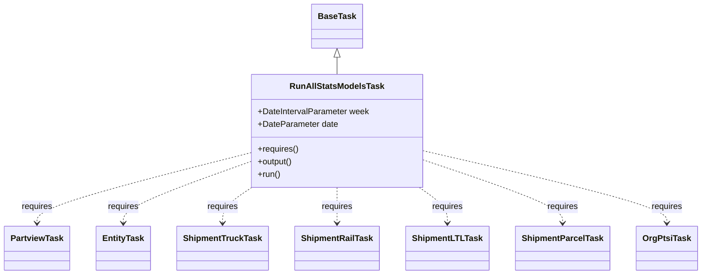
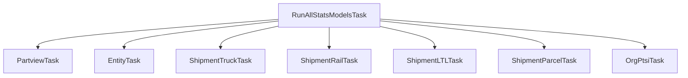

# Diagram: research/orchestrator/tasks/models/run_all_stats_models_task.py


> Auto-generated by Obscura crawlers

## Diagram 1

```mermaid
classDiagram
      BaseTask <|-- RunAllStatsModelsTask
      class BaseTask {
      }...
  └ 26 lines...

✗ read_bash
  Invalid shell ID: 0. Please supply a valid shell ID to read output from.

  <no active shell sessions>
```

> SVG rendering failed for this diagram.

## Diagram 2



### SVG

<svg id="container" width="1290.53125" xmlns="http://www.w3.org/2000/svg" class="classDiagram" height="524" viewBox="0 0 1290.53125 524" role="graphics-document document" aria-roledescription="class"><style>#container{font-family:"trebuchet ms",verdana,arial,sans-serif;font-size:16px;fill:#333;}@keyframes edge-animation-frame{from{stroke-dashoffset:0;}}@keyframes dash{to{stroke-dashoffset:0;}}#container .edge-animation-slow{stroke-dasharray:9,5!important;stroke-dashoffset:900;animation:dash 50s linear infinite;stroke-linecap:round;}#container .edge-animation-fast{stroke-dasharray:9,5!important;stroke-dashoffset:900;animation:dash 20s linear infinite;stroke-linecap:round;}#container .error-icon{fill:#552222;}#container .error-text{fill:#552222;stroke:#552222;}#container .edge-thickness-normal{stroke-width:1px;}#container .edge-thickness-thick{stroke-width:3.5px;}#container .edge-pattern-solid{stroke-dasharray:0;}#container .edge-thickness-invisible{stroke-width:0;fill:none;}#container .edge-pattern-dashed{stroke-dasharray:3;}#container .edge-pattern-dotted{stroke-dasharray:2;}#container .marker{fill:#333333;stroke:#333333;}#container .marker.cross{stroke:#333333;}#container svg{font-family:"trebuchet ms",verdana,arial,sans-serif;font-size:16px;}#container p{margin:0;}#container g.classGroup text{fill:#9370DB;stroke:none;font-family:"trebuchet ms",verdana,arial,sans-serif;font-size:10px;}#container g.classGroup text .title{font-weight:bolder;}#container .nodeLabel,#container .edgeLabel{color:#131300;}#container .edgeLabel .label rect{fill:#ECECFF;}#container .label text{fill:#131300;}#container .labelBkg{background:#ECECFF;}#container .edgeLabel .label span{background:#ECECFF;}#container .classTitle{font-weight:bolder;}#container .node rect,#container .node circle,#container .node ellipse,#container .node polygon,#container .node path{fill:#ECECFF;stroke:#9370DB;stroke-width:1px;}#container .divider{stroke:#9370DB;stroke-width:1;}#container g.clickable{cursor:pointer;}#container g.classGroup rect{fill:#ECECFF;stroke:#9370DB;}#container g.classGroup line{stroke:#9370DB;stroke-width:1;}#container .classLabel .box{stroke:none;stroke-width:0;fill:#ECECFF;opacity:0.5;}#container .classLabel .label{fill:#9370DB;font-size:10px;}#container .relation{stroke:#333333;stroke-width:1;fill:none;}#container .dashed-line{stroke-dasharray:3;}#container .dotted-line{stroke-dasharray:1 2;}#container #compositionStart,#container .composition{fill:#333333!important;stroke:#333333!important;stroke-width:1;}#container #compositionEnd,#container .composition{fill:#333333!important;stroke:#333333!important;stroke-width:1;}#container #dependencyStart,#container .dependency{fill:#333333!important;stroke:#333333!important;stroke-width:1;}#container #dependencyStart,#container .dependency{fill:#333333!important;stroke:#333333!important;stroke-width:1;}#container #extensionStart,#container .extension{fill:transparent!important;stroke:#333333!important;stroke-width:1;}#container #extensionEnd,#container .extension{fill:transparent!important;stroke:#333333!important;stroke-width:1;}#container #aggregationStart,#container .aggregation{fill:transparent!important;stroke:#333333!important;stroke-width:1;}#container #aggregationEnd,#container .aggregation{fill:transparent!important;stroke:#333333!important;stroke-width:1;}#container #lollipopStart,#container .lollipop{fill:#ECECFF!important;stroke:#333333!important;stroke-width:1;}#container #lollipopEnd,#container .lollipop{fill:#ECECFF!important;stroke:#333333!important;stroke-width:1;}#container .edgeTerminals{font-size:11px;line-height:initial;}#container .classTitleText{text-anchor:middle;font-size:18px;fill:#333;}#container .label-icon{display:inline-block;height:1em;overflow:visible;vertical-align:-0.125em;}#container .node .label-icon path{fill:currentColor;stroke:revert;stroke-width:revert;}#container :root{--mermaid-font-family:"trebuchet ms",verdana,arial,sans-serif;}</style><g><defs><marker id="container_class-aggregationStart" class="marker aggregation class" refX="18" refY="7" markerWidth="190" markerHeight="240" orient="auto"><path d="M 18,7 L9,13 L1,7 L9,1 Z"></path></marker></defs><defs><marker id="container_class-aggregationEnd" class="marker aggregation class" refX="1" refY="7" markerWidth="20" markerHeight="28" orient="auto"><path d="M 18,7 L9,13 L1,7 L9,1 Z"></path></marker></defs><defs><marker id="container_class-extensionStart" class="marker extension class" refX="18" refY="7" markerWidth="190" markerHeight="240" orient="auto"><path d="M 1,7 L18,13 V 1 Z"></path></marker></defs><defs><marker id="container_class-extensionEnd" class="marker extension class" refX="1" refY="7" markerWidth="20" markerHeight="28" orient="auto"><path d="M 1,1 V 13 L18,7 Z"></path></marker></defs><defs><marker id="container_class-compositionStart" class="marker composition class" refX="18" refY="7" markerWidth="190" markerHeight="240" orient="auto"><path d="M 18,7 L9,13 L1,7 L9,1 Z"></path></marker></defs><defs><marker id="container_class-compositionEnd" class="marker composition class" refX="1" refY="7" markerWidth="20" markerHeight="28" orient="auto"><path d="M 18,7 L9,13 L1,7 L9,1 Z"></path></marker></defs><defs><marker id="container_class-dependencyStart" class="marker dependency class" refX="6" refY="7" markerWidth="190" markerHeight="240" orient="auto"><path d="M 5,7 L9,13 L1,7 L9,1 Z"></path></marker></defs><defs><marker id="container_class-dependencyEnd" class="marker dependency class" refX="13" refY="7" markerWidth="20" markerHeight="28" orient="auto"><path d="M 18,7 L9,13 L14,7 L9,1 Z"></path></marker></defs><defs><marker id="container_class-lollipopStart" class="marker lollipop class" refX="13" refY="7" markerWidth="190" markerHeight="240" orient="auto"><circle stroke="black" fill="transparent" cx="7" cy="7" r="6"></circle></marker></defs><defs><marker id="container_class-lollipopEnd" class="marker lollipop class" refX="1" refY="7" markerWidth="190" markerHeight="240" orient="auto"><circle stroke="black" fill="transparent" cx="7" cy="7" r="6"></circle></marker></defs><g class="root"><g class="clusters"></g><g class="edgePaths"><path d="M623.109,109.25L623.109,110.542C623.109,111.833,623.109,114.417,623.109,119.875C623.109,125.333,623.109,133.667,623.109,137.833L623.109,142" id="id_BaseTask_RunAllStatsModelsTask_1" class="edge-thickness-normal edge-pattern-solid relation" style=";;;" data-edge="true" data-et="edge" data-id="id_BaseTask_RunAllStatsModelsTask_1" data-points="W3sieCI6NjIzLjEwOTM3NSwieSI6OTJ9LHsieCI6NjIzLjEwOTM3NSwieSI6MTE3fSx7IngiOjYyMy4xMDkzNzUsInkiOjE0Mn1d" marker-start="url(#container_class-extensionStart)"></path><path d="M462.332,292.019L396.66,309.183C330.987,326.346,199.642,360.673,133.969,383.003C68.297,405.333,68.297,415.667,68.297,420.833L68.297,426" id="id_RunAllStatsModelsTask_PartviewTask_2" class="edge-thickness-normal edge-pattern-dashed relation" style=";;;" data-edge="true" data-et="edge" data-id="id_RunAllStatsModelsTask_PartviewTask_2" data-points="W3sieCI6NDYyLjMzMjAzMTI1LCJ5IjoyOTIuMDE5MDg3MjQ3OTQ0MX0seyJ4Ijo2OC4yOTY4NzUsInkiOjM5NX0seyJ4Ijo2OC4yOTY4NzUsInkiOjQzMn1d" marker-end="url(#container_class-dependencyEnd)"></path><path d="M462.332,309.06L423.34,323.384C384.349,337.707,306.366,366.353,267.374,385.843C228.383,405.333,228.383,415.667,228.383,420.833L228.383,426" id="id_RunAllStatsModelsTask_EntityTask_3" class="edge-thickness-normal edge-pattern-dashed relation" style=";;;" data-edge="true" data-et="edge" data-id="id_RunAllStatsModelsTask_EntityTask_3" data-points="W3sieCI6NDYyLjMzMjAzMTI1LCJ5IjozMDkuMDYwNDE1NjM1ODIzODZ9LHsieCI6MjI4LjM4MjgxMjUsInkiOjM5NX0seyJ4IjoyMjguMzgyODEyNSwieSI6NDMyfV0=" marker-end="url(#container_class-dependencyEnd)"></path><path d="M465.794,358L456.811,364.167C447.829,370.333,429.864,382.667,420.881,394C411.898,405.333,411.898,415.667,411.898,420.833L411.898,426" id="id_RunAllStatsModelsTask_ShipmentTruckTask_4" class="edge-thickness-normal edge-pattern-dashed relation" style=";;;" data-edge="true" data-et="edge" data-id="id_RunAllStatsModelsTask_ShipmentTruckTask_4" data-points="W3sieCI6NDY1Ljc5MzY0MjI0MTM3OTMsInkiOjM1OH0seyJ4Ijo0MTEuODk4NDM3NSwieSI6Mzk1fSx7IngiOjQxMS44OTg0Mzc1LCJ5Ijo0MzJ9XQ==" marker-end="url(#container_class-dependencyEnd)"></path><path d="M623.109,358L623.109,364.167C623.109,370.333,623.109,382.667,623.109,394C623.109,405.333,623.109,415.667,623.109,420.833L623.109,426" id="id_RunAllStatsModelsTask_ShipmentRailTask_5" class="edge-thickness-normal edge-pattern-dashed relation" style=";;;" data-edge="true" data-et="edge" data-id="id_RunAllStatsModelsTask_ShipmentRailTask_5" data-points="W3sieCI6NjIzLjEwOTM3NSwieSI6MzU4fSx7IngiOjYyMy4xMDkzNzUsInkiOjM5NX0seyJ4Ijo2MjMuMTA5Mzc1LCJ5Ijo0MzJ9XQ==" marker-end="url(#container_class-dependencyEnd)"></path><path d="M773.652,358L782.248,364.167C790.843,370.333,808.035,382.667,816.631,394C825.227,405.333,825.227,415.667,825.227,420.833L825.227,426" id="id_RunAllStatsModelsTask_ShipmentLTLTask_6" class="edge-thickness-normal edge-pattern-dashed relation" style=";;;" data-edge="true" data-et="edge" data-id="id_RunAllStatsModelsTask_ShipmentLTLTask_6" data-points="W3sieCI6NzczLjY1MTgzMTg5NjU1MTcsInkiOjM1OH0seyJ4Ijo4MjUuMjI2NTYyNSwieSI6Mzk1fSx7IngiOjgyNS4yMjY1NjI1LCJ5Ijo0MzJ9XQ==" marker-end="url(#container_class-dependencyEnd)"></path><path d="M783.887,306.507L825.851,321.256C867.815,336.005,951.743,365.502,993.708,385.418C1035.672,405.333,1035.672,415.667,1035.672,420.833L1035.672,426" id="id_RunAllStatsModelsTask_ShipmentParcelTask_7" class="edge-thickness-normal edge-pattern-dashed relation" style=";;;" data-edge="true" data-et="edge" data-id="id_RunAllStatsModelsTask_ShipmentParcelTask_7" data-points="W3sieCI6NzgzLjg4NjcxODc1LCJ5IjozMDYuNTA3MTEwNjY1MDUwNzN9LHsieCI6MTAzNS42NzE4NzUsInkiOjM5NX0seyJ4IjoxMDM1LjY3MTg3NSwieSI6NDMyfV0=" marker-end="url(#container_class-dependencyEnd)"></path><path d="M783.887,288.604L857.74,306.336C931.594,324.069,1079.301,359.535,1153.154,382.434C1227.008,405.333,1227.008,415.667,1227.008,420.833L1227.008,426" id="id_RunAllStatsModelsTask_OrgPtsiTask_8" class="edge-thickness-normal edge-pattern-dashed relation" style=";;;" data-edge="true" data-et="edge" data-id="id_RunAllStatsModelsTask_OrgPtsiTask_8" data-points="W3sieCI6NzgzLjg4NjcxODc1LCJ5IjoyODguNjAzNzAxMjEyMTc2MX0seyJ4IjoxMjI3LjAwNzgxMjUsInkiOjM5NX0seyJ4IjoxMjI3LjAwNzgxMjUsInkiOjQzMn1d" marker-end="url(#container_class-dependencyEnd)"></path></g><g class="edgeLabels"><g class="edgeLabel"><g class="label" data-id="id_BaseTask_RunAllStatsModelsTask_1" transform="translate(0, 0)"><foreignObject width="0" height="0"><div xmlns="http://www.w3.org/1999/xhtml" class="labelBkg" style="display: table-cell; white-space: nowrap; line-height: 1.5; max-width: 200px; text-align: center;"><span class="edgeLabel"></span></div></foreignObject></g></g><g class="edgeLabel" transform="translate(68.296875, 395)"><g class="label" data-id="id_RunAllStatsModelsTask_PartviewTask_2" transform="translate(-29.8515625, -12)"><foreignObject width="59.703125" height="24"><div xmlns="http://www.w3.org/1999/xhtml" class="labelBkg" style="display: table-cell; white-space: nowrap; line-height: 1.5; max-width: 200px; text-align: center;"><span class="edgeLabel"><p>requires</p></span></div></foreignObject></g></g><g class="edgeLabel" transform="translate(228.3828125, 395)"><g class="label" data-id="id_RunAllStatsModelsTask_EntityTask_3" transform="translate(-29.8515625, -12)"><foreignObject width="59.703125" height="24"><div xmlns="http://www.w3.org/1999/xhtml" class="labelBkg" style="display: table-cell; white-space: nowrap; line-height: 1.5; max-width: 200px; text-align: center;"><span class="edgeLabel"><p>requires</p></span></div></foreignObject></g></g><g class="edgeLabel" transform="translate(411.8984375, 395)"><g class="label" data-id="id_RunAllStatsModelsTask_ShipmentTruckTask_4" transform="translate(-29.8515625, -12)"><foreignObject width="59.703125" height="24"><div xmlns="http://www.w3.org/1999/xhtml" class="labelBkg" style="display: table-cell; white-space: nowrap; line-height: 1.5; max-width: 200px; text-align: center;"><span class="edgeLabel"><p>requires</p></span></div></foreignObject></g></g><g class="edgeLabel" transform="translate(623.109375, 395)"><g class="label" data-id="id_RunAllStatsModelsTask_ShipmentRailTask_5" transform="translate(-29.8515625, -12)"><foreignObject width="59.703125" height="24"><div xmlns="http://www.w3.org/1999/xhtml" class="labelBkg" style="display: table-cell; white-space: nowrap; line-height: 1.5; max-width: 200px; text-align: center;"><span class="edgeLabel"><p>requires</p></span></div></foreignObject></g></g><g class="edgeLabel" transform="translate(825.2265625, 395)"><g class="label" data-id="id_RunAllStatsModelsTask_ShipmentLTLTask_6" transform="translate(-29.8515625, -12)"><foreignObject width="59.703125" height="24"><div xmlns="http://www.w3.org/1999/xhtml" class="labelBkg" style="display: table-cell; white-space: nowrap; line-height: 1.5; max-width: 200px; text-align: center;"><span class="edgeLabel"><p>requires</p></span></div></foreignObject></g></g><g class="edgeLabel" transform="translate(1035.671875, 395)"><g class="label" data-id="id_RunAllStatsModelsTask_ShipmentParcelTask_7" transform="translate(-29.8515625, -12)"><foreignObject width="59.703125" height="24"><div xmlns="http://www.w3.org/1999/xhtml" class="labelBkg" style="display: table-cell; white-space: nowrap; line-height: 1.5; max-width: 200px; text-align: center;"><span class="edgeLabel"><p>requires</p></span></div></foreignObject></g></g><g class="edgeLabel" transform="translate(1227.0078125, 395)"><g class="label" data-id="id_RunAllStatsModelsTask_OrgPtsiTask_8" transform="translate(-29.8515625, -12)"><foreignObject width="59.703125" height="24"><div xmlns="http://www.w3.org/1999/xhtml" class="labelBkg" style="display: table-cell; white-space: nowrap; line-height: 1.5; max-width: 200px; text-align: center;"><span class="edgeLabel"><p>requires</p></span></div></foreignObject></g></g></g><g class="nodes"><g class="node default" id="classId-BaseTask-0" transform="translate(623.109375, 50)"><g class="basic label-container"><path d="M-46.03125 -42 L46.03125 -42 L46.03125 42 L-46.03125 42" stroke="none" stroke-width="0" fill="#ECECFF" style=""></path><path d="M-46.03125 -42 C-23.696505947976075 -42, -1.3617618959521494 -42, 46.03125 -42 M-46.03125 -42 C-13.999565577928117 -42, 18.032118844143767 -42, 46.03125 -42 M46.03125 -42 C46.03125 -16.42977283593308, 46.03125 9.140454328133842, 46.03125 42 M46.03125 -42 C46.03125 -23.87218759472495, 46.03125 -5.744375189449897, 46.03125 42 M46.03125 42 C21.144648994684314 42, -3.7419520106313726 42, -46.03125 42 M46.03125 42 C21.680639507549316 42, -2.6699709849013686 42, -46.03125 42 M-46.03125 42 C-46.03125 19.650365289470816, -46.03125 -2.699269421058368, -46.03125 -42 M-46.03125 42 C-46.03125 21.24098740932582, -46.03125 0.4819748186516435, -46.03125 -42" stroke="#9370DB" stroke-width="1.3" fill="none" stroke-dasharray="0 0" style=""></path></g><g class="annotation-group text" transform="translate(0, -18)"></g><g class="label-group text" transform="translate(-34.03125, -18)"><g class="label" style="font-weight: bolder" transform="translate(0,-12)"><foreignObject width="68.0625" height="24"><div xmlns="http://www.w3.org/1999/xhtml" style="display: table-cell; white-space: nowrap; line-height: 1.5; max-width: 117px; text-align: center;"><span class="nodeLabel markdown-node-label" style=""><p>BaseTask</p></span></div></foreignObject></g></g><g class="members-group text" transform="translate(-34.03125, 30)"></g><g class="methods-group text" transform="translate(-34.03125, 60)"></g><g class="divider" style=""><path d="M-46.03125 6 C-10.773829746075151 6, 24.483590507849698 6, 46.03125 6 M-46.03125 6 C-18.628545716261506 6, 8.774158567476988 6, 46.03125 6" stroke="#9370DB" stroke-width="1.3" fill="none" stroke-dasharray="0 0" style=""></path></g><g class="divider" style=""><path d="M-46.03125 24 C-13.493352587472167 24, 19.044544825055667 24, 46.03125 24 M-46.03125 24 C-27.304308865134015 24, -8.57736773026803 24, 46.03125 24" stroke="#9370DB" stroke-width="1.3" fill="none" stroke-dasharray="0 0" style=""></path></g></g><g class="node default" id="classId-RunAllStatsModelsTask-1" transform="translate(623.109375, 250)"><g class="basic label-container"><path d="M-160.77734375 -108 L160.77734375 -108 L160.77734375 108 L-160.77734375 108" stroke="none" stroke-width="0" fill="#ECECFF" style=""></path><path d="M-160.77734375 -108 C-60.1467951248124 -108, 40.4837535003752 -108, 160.77734375 -108 M-160.77734375 -108 C-39.44914943105887 -108, 81.87904488788226 -108, 160.77734375 -108 M160.77734375 -108 C160.77734375 -31.838125299656838, 160.77734375 44.323749400686324, 160.77734375 108 M160.77734375 -108 C160.77734375 -23.228543800592902, 160.77734375 61.542912398814195, 160.77734375 108 M160.77734375 108 C88.90492261377348 108, 17.03250147754696 108, -160.77734375 108 M160.77734375 108 C52.91045239043825 108, -54.9564389691235 108, -160.77734375 108 M-160.77734375 108 C-160.77734375 27.055068122415165, -160.77734375 -53.88986375516967, -160.77734375 -108 M-160.77734375 108 C-160.77734375 37.32752828575336, -160.77734375 -33.34494342849328, -160.77734375 -108" stroke="#9370DB" stroke-width="1.3" fill="none" stroke-dasharray="0 0" style=""></path></g><g class="annotation-group text" transform="translate(0, -84)"></g><g class="label-group text" transform="translate(-85.4296875, -84)"><g class="label" style="font-weight: bolder" transform="translate(0,-12)"><foreignObject width="170.859375" height="24"><div xmlns="http://www.w3.org/1999/xhtml" style="display: table-cell; white-space: nowrap; line-height: 1.5; max-width: 218px; text-align: center;"><span class="nodeLabel markdown-node-label" style=""><p>RunAllStatsModelsTask</p></span></div></foreignObject></g></g><g class="members-group text" transform="translate(-148.77734375, -36)"><g class="label" style="" transform="translate(0,-12)"><foreignObject width="212.125" height="24"><div xmlns="http://www.w3.org/1999/xhtml" style="display: table-cell; white-space: nowrap; line-height: 1.5; max-width: 270px; text-align: center;"><span class="nodeLabel markdown-node-label" style=""><p>+DateIntervalParameter week</p></span></div></foreignObject></g><g class="label" style="" transform="translate(0,12)"><foreignObject width="152.171875" height="24"><div xmlns="http://www.w3.org/1999/xhtml" style="display: table-cell; white-space: nowrap; line-height: 1.5; max-width: 210px; text-align: center;"><span class="nodeLabel markdown-node-label" style=""><p>+DateParameter date</p></span></div></foreignObject></g></g><g class="methods-group text" transform="translate(-148.77734375, 36)"><g class="label" style="" transform="translate(0,-12)"><foreignObject width="78.0625" height="24"><div xmlns="http://www.w3.org/1999/xhtml" style="display: table-cell; white-space: nowrap; line-height: 1.5; max-width: 135px; text-align: center;"><span class="nodeLabel markdown-node-label" style=""><p>+requires()</p></span></div></foreignObject></g><g class="label" style="" transform="translate(0,12)"><foreignObject width="67.390625" height="24"><div xmlns="http://www.w3.org/1999/xhtml" style="display: table-cell; white-space: nowrap; line-height: 1.5; max-width: 125px; text-align: center;"><span class="nodeLabel markdown-node-label" style=""><p>+output()</p></span></div></foreignObject></g><g class="label" style="" transform="translate(0,36)"><foreignObject width="43.21875" height="24"><div xmlns="http://www.w3.org/1999/xhtml" style="display: table-cell; white-space: nowrap; line-height: 1.5; max-width: 101px; text-align: center;"><span class="nodeLabel markdown-node-label" style=""><p>+run()</p></span></div></foreignObject></g></g><g class="divider" style=""><path d="M-160.77734375 -60 C-48.89124817352857 -60, 62.99484740294287 -60, 160.77734375 -60 M-160.77734375 -60 C-40.783551048737635 -60, 79.21024165252473 -60, 160.77734375 -60" stroke="#9370DB" stroke-width="1.3" fill="none" stroke-dasharray="0 0" style=""></path></g><g class="divider" style=""><path d="M-160.77734375 12 C-38.202700762600045 12, 84.37194222479991 12, 160.77734375 12 M-160.77734375 12 C-80.74693930443884 12, -0.7165348588776794 12, 160.77734375 12" stroke="#9370DB" stroke-width="1.3" fill="none" stroke-dasharray="0 0" style=""></path></g></g><g class="node default" id="classId-PartviewTask-2" transform="translate(68.296875, 474)"><g class="basic label-container"><path d="M-60.296875 -42 L60.296875 -42 L60.296875 42 L-60.296875 42" stroke="none" stroke-width="0" fill="#ECECFF" style=""></path><path d="M-60.296875 -42 C-14.718375832934356 -42, 30.860123334131288 -42, 60.296875 -42 M-60.296875 -42 C-31.193465859824894 -42, -2.0900567196497875 -42, 60.296875 -42 M60.296875 -42 C60.296875 -15.557849660860185, 60.296875 10.88430067827963, 60.296875 42 M60.296875 -42 C60.296875 -12.917561796761959, 60.296875 16.164876406476083, 60.296875 42 M60.296875 42 C20.08996893265126 42, -20.11693713469748 42, -60.296875 42 M60.296875 42 C35.02601701145598 42, 9.755159022911954 42, -60.296875 42 M-60.296875 42 C-60.296875 21.228354202949877, -60.296875 0.4567084058997537, -60.296875 -42 M-60.296875 42 C-60.296875 12.334873319807702, -60.296875 -17.330253360384596, -60.296875 -42" stroke="#9370DB" stroke-width="1.3" fill="none" stroke-dasharray="0 0" style=""></path></g><g class="annotation-group text" transform="translate(0, -18)"></g><g class="label-group text" transform="translate(-48.296875, -18)"><g class="label" style="font-weight: bolder" transform="translate(0,-12)"><foreignObject width="96.59375" height="24"><div xmlns="http://www.w3.org/1999/xhtml" style="display: table-cell; white-space: nowrap; line-height: 1.5; max-width: 144px; text-align: center;"><span class="nodeLabel markdown-node-label" style=""><p>PartviewTask</p></span></div></foreignObject></g></g><g class="members-group text" transform="translate(-48.296875, 30)"></g><g class="methods-group text" transform="translate(-48.296875, 60)"></g><g class="divider" style=""><path d="M-60.296875 6 C-12.50794958365858 6, 35.28097583268284 6, 60.296875 6 M-60.296875 6 C-35.119008063684205 6, -9.941141127368404 6, 60.296875 6" stroke="#9370DB" stroke-width="1.3" fill="none" stroke-dasharray="0 0" style=""></path></g><g class="divider" style=""><path d="M-60.296875 24 C-28.47005898644476 24, 3.3567570271104827 24, 60.296875 24 M-60.296875 24 C-28.962468495005314 24, 2.371938009989371 24, 60.296875 24" stroke="#9370DB" stroke-width="1.3" fill="none" stroke-dasharray="0 0" style=""></path></g></g><g class="node default" id="classId-EntityTask-3" transform="translate(228.3828125, 474)"><g class="basic label-container"><path d="M-49.7890625 -42 L49.7890625 -42 L49.7890625 42 L-49.7890625 42" stroke="none" stroke-width="0" fill="#ECECFF" style=""></path><path d="M-49.7890625 -42 C-23.984166011929737 -42, 1.8207304761405254 -42, 49.7890625 -42 M-49.7890625 -42 C-22.591229187267036 -42, 4.606604125465928 -42, 49.7890625 -42 M49.7890625 -42 C49.7890625 -18.021020201044706, 49.7890625 5.9579595979105875, 49.7890625 42 M49.7890625 -42 C49.7890625 -15.303286823519247, 49.7890625 11.393426352961505, 49.7890625 42 M49.7890625 42 C16.395436895662776 42, -16.998188708674448 42, -49.7890625 42 M49.7890625 42 C12.619995424567229 42, -24.549071650865542 42, -49.7890625 42 M-49.7890625 42 C-49.7890625 13.640964934404682, -49.7890625 -14.718070131190636, -49.7890625 -42 M-49.7890625 42 C-49.7890625 16.84127294584589, -49.7890625 -8.317454108308219, -49.7890625 -42" stroke="#9370DB" stroke-width="1.3" fill="none" stroke-dasharray="0 0" style=""></path></g><g class="annotation-group text" transform="translate(0, -18)"></g><g class="label-group text" transform="translate(-37.7890625, -18)"><g class="label" style="font-weight: bolder" transform="translate(0,-12)"><foreignObject width="75.578125" height="24"><div xmlns="http://www.w3.org/1999/xhtml" style="display: table-cell; white-space: nowrap; line-height: 1.5; max-width: 124px; text-align: center;"><span class="nodeLabel markdown-node-label" style=""><p>EntityTask</p></span></div></foreignObject></g></g><g class="members-group text" transform="translate(-37.7890625, 30)"></g><g class="methods-group text" transform="translate(-37.7890625, 60)"></g><g class="divider" style=""><path d="M-49.7890625 6 C-21.346192103969095 6, 7.09667829206181 6, 49.7890625 6 M-49.7890625 6 C-11.413072883435277 6, 26.962916733129447 6, 49.7890625 6" stroke="#9370DB" stroke-width="1.3" fill="none" stroke-dasharray="0 0" style=""></path></g><g class="divider" style=""><path d="M-49.7890625 24 C-16.787741254554426 24, 16.213579990891148 24, 49.7890625 24 M-49.7890625 24 C-13.288040869552901 24, 23.212980760894197 24, 49.7890625 24" stroke="#9370DB" stroke-width="1.3" fill="none" stroke-dasharray="0 0" style=""></path></g></g><g class="node default" id="classId-ShipmentTruckTask-4" transform="translate(411.8984375, 474)"><g class="basic label-container"><path d="M-83.7265625 -42 L83.7265625 -42 L83.7265625 42 L-83.7265625 42" stroke="none" stroke-width="0" fill="#ECECFF" style=""></path><path d="M-83.7265625 -42 C-49.856982415612855 -42, -15.98740233122571 -42, 83.7265625 -42 M-83.7265625 -42 C-28.96944872201562 -42, 25.78766505596876 -42, 83.7265625 -42 M83.7265625 -42 C83.7265625 -12.993756609300199, 83.7265625 16.012486781399602, 83.7265625 42 M83.7265625 -42 C83.7265625 -22.329567382825665, 83.7265625 -2.6591347656513307, 83.7265625 42 M83.7265625 42 C19.932492031487897 42, -43.86157843702421 42, -83.7265625 42 M83.7265625 42 C30.960401123283027 42, -21.805760253433945 42, -83.7265625 42 M-83.7265625 42 C-83.7265625 24.616500424116303, -83.7265625 7.2330008482326065, -83.7265625 -42 M-83.7265625 42 C-83.7265625 23.57491980525541, -83.7265625 5.149839610510817, -83.7265625 -42" stroke="#9370DB" stroke-width="1.3" fill="none" stroke-dasharray="0 0" style=""></path></g><g class="annotation-group text" transform="translate(0, -18)"></g><g class="label-group text" transform="translate(-71.7265625, -18)"><g class="label" style="font-weight: bolder" transform="translate(0,-12)"><foreignObject width="143.453125" height="24"><div xmlns="http://www.w3.org/1999/xhtml" style="display: table-cell; white-space: nowrap; line-height: 1.5; max-width: 191px; text-align: center;"><span class="nodeLabel markdown-node-label" style=""><p>ShipmentTruckTask</p></span></div></foreignObject></g></g><g class="members-group text" transform="translate(-71.7265625, 30)"></g><g class="methods-group text" transform="translate(-71.7265625, 60)"></g><g class="divider" style=""><path d="M-83.7265625 6 C-31.322032410887736 6, 21.082497678224527 6, 83.7265625 6 M-83.7265625 6 C-17.777063529226893 6, 48.17243544154621 6, 83.7265625 6" stroke="#9370DB" stroke-width="1.3" fill="none" stroke-dasharray="0 0" style=""></path></g><g class="divider" style=""><path d="M-83.7265625 24 C-39.015960735129504 24, 5.694641029740993 24, 83.7265625 24 M-83.7265625 24 C-35.14295766220414 24, 13.440647175591721 24, 83.7265625 24" stroke="#9370DB" stroke-width="1.3" fill="none" stroke-dasharray="0 0" style=""></path></g></g><g class="node default" id="classId-ShipmentRailTask-5" transform="translate(623.109375, 474)"><g class="basic label-container"><path d="M-77.484375 -42 L77.484375 -42 L77.484375 42 L-77.484375 42" stroke="none" stroke-width="0" fill="#ECECFF" style=""></path><path d="M-77.484375 -42 C-30.533297156426762 -42, 16.417780687146475 -42, 77.484375 -42 M-77.484375 -42 C-27.135177917274156 -42, 23.21401916545169 -42, 77.484375 -42 M77.484375 -42 C77.484375 -13.238315094649494, 77.484375 15.523369810701013, 77.484375 42 M77.484375 -42 C77.484375 -15.132260083201125, 77.484375 11.73547983359775, 77.484375 42 M77.484375 42 C24.163937034743448 42, -29.156500930513104 42, -77.484375 42 M77.484375 42 C38.89263597128883 42, 0.3008969425776655 42, -77.484375 42 M-77.484375 42 C-77.484375 14.92187644894413, -77.484375 -12.156247102111742, -77.484375 -42 M-77.484375 42 C-77.484375 15.99580907611756, -77.484375 -10.00838184776488, -77.484375 -42" stroke="#9370DB" stroke-width="1.3" fill="none" stroke-dasharray="0 0" style=""></path></g><g class="annotation-group text" transform="translate(0, -18)"></g><g class="label-group text" transform="translate(-65.484375, -18)"><g class="label" style="font-weight: bolder" transform="translate(0,-12)"><foreignObject width="130.96875" height="24"><div xmlns="http://www.w3.org/1999/xhtml" style="display: table-cell; white-space: nowrap; line-height: 1.5; max-width: 180px; text-align: center;"><span class="nodeLabel markdown-node-label" style=""><p>ShipmentRailTask</p></span></div></foreignObject></g></g><g class="members-group text" transform="translate(-65.484375, 30)"></g><g class="methods-group text" transform="translate(-65.484375, 60)"></g><g class="divider" style=""><path d="M-77.484375 6 C-16.102879343351283 6, 45.278616313297434 6, 77.484375 6 M-77.484375 6 C-26.081589780954488 6, 25.321195438091024 6, 77.484375 6" stroke="#9370DB" stroke-width="1.3" fill="none" stroke-dasharray="0 0" style=""></path></g><g class="divider" style=""><path d="M-77.484375 24 C-37.52469131743542 24, 2.434992365129162 24, 77.484375 24 M-77.484375 24 C-30.180561582994244 24, 17.123251834011512 24, 77.484375 24" stroke="#9370DB" stroke-width="1.3" fill="none" stroke-dasharray="0 0" style=""></path></g></g><g class="node default" id="classId-ShipmentLTLTask-6" transform="translate(825.2265625, 474)"><g class="basic label-container"><path d="M-74.6328125 -42 L74.6328125 -42 L74.6328125 42 L-74.6328125 42" stroke="none" stroke-width="0" fill="#ECECFF" style=""></path><path d="M-74.6328125 -42 C-31.691102970047766 -42, 11.250606559904469 -42, 74.6328125 -42 M-74.6328125 -42 C-38.260550134156844 -42, -1.8882877683136883 -42, 74.6328125 -42 M74.6328125 -42 C74.6328125 -20.269997550526746, 74.6328125 1.460004898946508, 74.6328125 42 M74.6328125 -42 C74.6328125 -19.557719277950884, 74.6328125 2.8845614440982317, 74.6328125 42 M74.6328125 42 C22.062638793506444 42, -30.50753491298711 42, -74.6328125 42 M74.6328125 42 C28.79966433512586 42, -17.033483829748278 42, -74.6328125 42 M-74.6328125 42 C-74.6328125 24.84007179944033, -74.6328125 7.680143598880662, -74.6328125 -42 M-74.6328125 42 C-74.6328125 14.186344329584212, -74.6328125 -13.627311340831575, -74.6328125 -42" stroke="#9370DB" stroke-width="1.3" fill="none" stroke-dasharray="0 0" style=""></path></g><g class="annotation-group text" transform="translate(0, -18)"></g><g class="label-group text" transform="translate(-62.6328125, -18)"><g class="label" style="font-weight: bolder" transform="translate(0,-12)"><foreignObject width="125.265625" height="24"><div xmlns="http://www.w3.org/1999/xhtml" style="display: table-cell; white-space: nowrap; line-height: 1.5; max-width: 174px; text-align: center;"><span class="nodeLabel markdown-node-label" style=""><p>ShipmentLTLTask</p></span></div></foreignObject></g></g><g class="members-group text" transform="translate(-62.6328125, 30)"></g><g class="methods-group text" transform="translate(-62.6328125, 60)"></g><g class="divider" style=""><path d="M-74.6328125 6 C-22.254342861818017 6, 30.124126776363966 6, 74.6328125 6 M-74.6328125 6 C-26.46174977771011 6, 21.70931294457978 6, 74.6328125 6" stroke="#9370DB" stroke-width="1.3" fill="none" stroke-dasharray="0 0" style=""></path></g><g class="divider" style=""><path d="M-74.6328125 24 C-27.516814272709695 24, 19.59918395458061 24, 74.6328125 24 M-74.6328125 24 C-39.326713494430415 24, -4.020614488860829 24, 74.6328125 24" stroke="#9370DB" stroke-width="1.3" fill="none" stroke-dasharray="0 0" style=""></path></g></g><g class="node default" id="classId-ShipmentParcelTask-7" transform="translate(1035.671875, 474)"><g class="basic label-container"><path d="M-85.8125 -42 L85.8125 -42 L85.8125 42 L-85.8125 42" stroke="none" stroke-width="0" fill="#ECECFF" style=""></path><path d="M-85.8125 -42 C-20.496720001447002 -42, 44.819059997105995 -42, 85.8125 -42 M-85.8125 -42 C-37.93769923903549 -42, 9.937101521929023 -42, 85.8125 -42 M85.8125 -42 C85.8125 -13.158713511032737, 85.8125 15.682572977934527, 85.8125 42 M85.8125 -42 C85.8125 -23.477836355418805, 85.8125 -4.955672710837611, 85.8125 42 M85.8125 42 C45.21512213761088 42, 4.617744275221753 42, -85.8125 42 M85.8125 42 C47.25744614038981 42, 8.70239228077962 42, -85.8125 42 M-85.8125 42 C-85.8125 23.052347271206592, -85.8125 4.104694542413185, -85.8125 -42 M-85.8125 42 C-85.8125 24.252992271640455, -85.8125 6.50598454328091, -85.8125 -42" stroke="#9370DB" stroke-width="1.3" fill="none" stroke-dasharray="0 0" style=""></path></g><g class="annotation-group text" transform="translate(0, -18)"></g><g class="label-group text" transform="translate(-73.8125, -18)"><g class="label" style="font-weight: bolder" transform="translate(0,-12)"><foreignObject width="147.625" height="24"><div xmlns="http://www.w3.org/1999/xhtml" style="display: table-cell; white-space: nowrap; line-height: 1.5; max-width: 196px; text-align: center;"><span class="nodeLabel markdown-node-label" style=""><p>ShipmentParcelTask</p></span></div></foreignObject></g></g><g class="members-group text" transform="translate(-73.8125, 30)"></g><g class="methods-group text" transform="translate(-73.8125, 60)"></g><g class="divider" style=""><path d="M-85.8125 6 C-45.28663985384697 6, -4.760779707693942 6, 85.8125 6 M-85.8125 6 C-20.582397809574942 6, 44.647704380850115 6, 85.8125 6" stroke="#9370DB" stroke-width="1.3" fill="none" stroke-dasharray="0 0" style=""></path></g><g class="divider" style=""><path d="M-85.8125 24 C-25.505414346833568 24, 34.801671306332864 24, 85.8125 24 M-85.8125 24 C-29.136083219997346 24, 27.54033356000531 24, 85.8125 24" stroke="#9370DB" stroke-width="1.3" fill="none" stroke-dasharray="0 0" style=""></path></g></g><g class="node default" id="classId-OrgPtsiTask-8" transform="translate(1227.0078125, 474)"><g class="basic label-container"><path d="M-55.5234375 -42 L55.5234375 -42 L55.5234375 42 L-55.5234375 42" stroke="none" stroke-width="0" fill="#ECECFF" style=""></path><path d="M-55.5234375 -42 C-27.80476786796741 -42, -0.08609823593481991 -42, 55.5234375 -42 M-55.5234375 -42 C-16.659566639675276 -42, 22.204304220649448 -42, 55.5234375 -42 M55.5234375 -42 C55.5234375 -13.368216323861347, 55.5234375 15.263567352277306, 55.5234375 42 M55.5234375 -42 C55.5234375 -10.458079184649453, 55.5234375 21.083841630701095, 55.5234375 42 M55.5234375 42 C17.06037785143613 42, -21.40268179712774 42, -55.5234375 42 M55.5234375 42 C28.566062711894197 42, 1.6086879237883949 42, -55.5234375 42 M-55.5234375 42 C-55.5234375 22.035113903682838, -55.5234375 2.0702278073656757, -55.5234375 -42 M-55.5234375 42 C-55.5234375 14.672067472590356, -55.5234375 -12.655865054819287, -55.5234375 -42" stroke="#9370DB" stroke-width="1.3" fill="none" stroke-dasharray="0 0" style=""></path></g><g class="annotation-group text" transform="translate(0, -18)"></g><g class="label-group text" transform="translate(-43.5234375, -18)"><g class="label" style="font-weight: bolder" transform="translate(0,-12)"><foreignObject width="87.046875" height="24"><div xmlns="http://www.w3.org/1999/xhtml" style="display: table-cell; white-space: nowrap; line-height: 1.5; max-width: 135px; text-align: center;"><span class="nodeLabel markdown-node-label" style=""><p>OrgPtsiTask</p></span></div></foreignObject></g></g><g class="members-group text" transform="translate(-43.5234375, 30)"></g><g class="methods-group text" transform="translate(-43.5234375, 60)"></g><g class="divider" style=""><path d="M-55.5234375 6 C-26.104395042436213 6, 3.314647415127574 6, 55.5234375 6 M-55.5234375 6 C-15.473733672900508 6, 24.575970154198984 6, 55.5234375 6" stroke="#9370DB" stroke-width="1.3" fill="none" stroke-dasharray="0 0" style=""></path></g><g class="divider" style=""><path d="M-55.5234375 24 C-32.29515109017524 24, -9.066864680350477 24, 55.5234375 24 M-55.5234375 24 C-21.212674480627676 24, 13.098088538744648 24, 55.5234375 24" stroke="#9370DB" stroke-width="1.3" fill="none" stroke-dasharray="0 0" style=""></path></g></g></g></g></g></svg>

## Diagram 3



### SVG

<svg id="container" width="1523.734375" xmlns="http://www.w3.org/2000/svg" class="flowchart" height="174" viewBox="0 0 1523.734375 174" role="graphics-document document" aria-roledescription="flowchart-v2"><style>#container{font-family:"trebuchet ms",verdana,arial,sans-serif;font-size:16px;fill:#333;}@keyframes edge-animation-frame{from{stroke-dashoffset:0;}}@keyframes dash{to{stroke-dashoffset:0;}}#container .edge-animation-slow{stroke-dasharray:9,5!important;stroke-dashoffset:900;animation:dash 50s linear infinite;stroke-linecap:round;}#container .edge-animation-fast{stroke-dasharray:9,5!important;stroke-dashoffset:900;animation:dash 20s linear infinite;stroke-linecap:round;}#container .error-icon{fill:#552222;}#container .error-text{fill:#552222;stroke:#552222;}#container .edge-thickness-normal{stroke-width:1px;}#container .edge-thickness-thick{stroke-width:3.5px;}#container .edge-pattern-solid{stroke-dasharray:0;}#container .edge-thickness-invisible{stroke-width:0;fill:none;}#container .edge-pattern-dashed{stroke-dasharray:3;}#container .edge-pattern-dotted{stroke-dasharray:2;}#container .marker{fill:#333333;stroke:#333333;}#container .marker.cross{stroke:#333333;}#container svg{font-family:"trebuchet ms",verdana,arial,sans-serif;font-size:16px;}#container p{margin:0;}#container .label{font-family:"trebuchet ms",verdana,arial,sans-serif;color:#333;}#container .cluster-label text{fill:#333;}#container .cluster-label span{color:#333;}#container .cluster-label span p{background-color:transparent;}#container .label text,#container span{fill:#333;color:#333;}#container .node rect,#container .node circle,#container .node ellipse,#container .node polygon,#container .node path{fill:#ECECFF;stroke:#9370DB;stroke-width:1px;}#container .rough-node .label text,#container .node .label text,#container .image-shape .label,#container .icon-shape .label{text-anchor:middle;}#container .node .katex path{fill:#000;stroke:#000;stroke-width:1px;}#container .rough-node .label,#container .node .label,#container .image-shape .label,#container .icon-shape .label{text-align:center;}#container .node.clickable{cursor:pointer;}#container .root .anchor path{fill:#333333!important;stroke-width:0;stroke:#333333;}#container .arrowheadPath{fill:#333333;}#container .edgePath .path{stroke:#333333;stroke-width:2.0px;}#container .flowchart-link{stroke:#333333;fill:none;}#container .edgeLabel{background-color:rgba(232,232,232, 0.8);text-align:center;}#container .edgeLabel p{background-color:rgba(232,232,232, 0.8);}#container .edgeLabel rect{opacity:0.5;background-color:rgba(232,232,232, 0.8);fill:rgba(232,232,232, 0.8);}#container .labelBkg{background-color:rgba(232, 232, 232, 0.5);}#container .cluster rect{fill:#ffffde;stroke:#aaaa33;stroke-width:1px;}#container .cluster text{fill:#333;}#container .cluster span{color:#333;}#container div.mermaidTooltip{position:absolute;text-align:center;max-width:200px;padding:2px;font-family:"trebuchet ms",verdana,arial,sans-serif;font-size:12px;background:hsl(80, 100%, 96.2745098039%);border:1px solid #aaaa33;border-radius:2px;pointer-events:none;z-index:100;}#container .flowchartTitleText{text-anchor:middle;font-size:18px;fill:#333;}#container rect.text{fill:none;stroke-width:0;}#container .icon-shape,#container .image-shape{background-color:rgba(232,232,232, 0.8);text-align:center;}#container .icon-shape p,#container .image-shape p{background-color:rgba(232,232,232, 0.8);padding:2px;}#container .icon-shape rect,#container .image-shape rect{opacity:0.5;background-color:rgba(232,232,232, 0.8);fill:rgba(232,232,232, 0.8);}#container .label-icon{display:inline-block;height:1em;overflow:visible;vertical-align:-0.125em;}#container .node .label-icon path{fill:currentColor;stroke:revert;stroke-width:revert;}#container :root{--mermaid-font-family:"trebuchet ms",verdana,arial,sans-serif;}</style><g><marker id="container_flowchart-v2-pointEnd" class="marker flowchart-v2" viewBox="0 0 10 10" refX="5" refY="5" markerUnits="userSpaceOnUse" markerWidth="8" markerHeight="8" orient="auto"><path d="M 0 0 L 10 5 L 0 10 z" class="arrowMarkerPath" style="stroke-width: 1; stroke-dasharray: 1, 0;"></path></marker><marker id="container_flowchart-v2-pointStart" class="marker flowchart-v2" viewBox="0 0 10 10" refX="4.5" refY="5" markerUnits="userSpaceOnUse" markerWidth="8" markerHeight="8" orient="auto"><path d="M 0 5 L 10 10 L 10 0 z" class="arrowMarkerPath" style="stroke-width: 1; stroke-dasharray: 1, 0;"></path></marker><marker id="container_flowchart-v2-circleEnd" class="marker flowchart-v2" viewBox="0 0 10 10" refX="11" refY="5" markerUnits="userSpaceOnUse" markerWidth="11" markerHeight="11" orient="auto"><circle cx="5" cy="5" r="5" class="arrowMarkerPath" style="stroke-width: 1; stroke-dasharray: 1, 0;"></circle></marker><marker id="container_flowchart-v2-circleStart" class="marker flowchart-v2" viewBox="0 0 10 10" refX="-1" refY="5" markerUnits="userSpaceOnUse" markerWidth="11" markerHeight="11" orient="auto"><circle cx="5" cy="5" r="5" class="arrowMarkerPath" style="stroke-width: 1; stroke-dasharray: 1, 0;"></circle></marker><marker id="container_flowchart-v2-crossEnd" class="marker cross flowchart-v2" viewBox="0 0 11 11" refX="12" refY="5.2" markerUnits="userSpaceOnUse" markerWidth="11" markerHeight="11" orient="auto"><path d="M 1,1 l 9,9 M 10,1 l -9,9" class="arrowMarkerPath" style="stroke-width: 2; stroke-dasharray: 1, 0;"></path></marker><marker id="container_flowchart-v2-crossStart" class="marker cross flowchart-v2" viewBox="0 0 11 11" refX="-1" refY="5.2" markerUnits="userSpaceOnUse" markerWidth="11" markerHeight="11" orient="auto"><path d="M 1,1 l 9,9 M 10,1 l -9,9" class="arrowMarkerPath" style="stroke-width: 2; stroke-dasharray: 1, 0;"></path></marker><g class="root"><g class="clusters"></g><g class="edgePaths"><path d="M625.883,44.02L535.673,51.183C445.464,58.346,265.044,72.673,174.835,83.337C84.625,94,84.625,101,84.625,104.5L84.625,108" id="L_A_B_0" class="edge-thickness-normal edge-pattern-solid edge-thickness-normal edge-pattern-solid flowchart-link" style=";" data-edge="true" data-et="edge" data-id="L_A_B_0" data-points="W3sieCI6NjI1Ljg4MjgxMjUsInkiOjQ0LjAxOTY2MTE3ODcxNjN9LHsieCI6ODQuNjI1LCJ5Ijo4N30seyJ4Ijo4NC42MjUsInkiOjExMn1d" marker-end="url(#container_flowchart-v2-pointEnd)"></path><path d="M625.883,47.797L567.887,54.331C509.891,60.864,393.898,73.932,335.902,83.966C277.906,94,277.906,101,277.906,104.5L277.906,108" id="L_A_C_0" class="edge-thickness-normal edge-pattern-solid edge-thickness-normal edge-pattern-solid flowchart-link" style=";" data-edge="true" data-et="edge" data-id="L_A_C_0" data-points="W3sieCI6NjI1Ljg4MjgxMjUsInkiOjQ3Ljc5NjY4MjQ2NDQ1NDk3NX0seyJ4IjoyNzcuOTA2MjUsInkiOjg3fSx7IngiOjI3Ny45MDYyNSwieSI6MTEyfV0=" marker-end="url(#container_flowchart-v2-pointEnd)"></path><path d="M625.883,59.142L604.038,63.785C582.193,68.428,538.503,77.714,516.658,85.857C494.813,94,494.813,101,494.813,104.5L494.813,108" id="L_A_D_0" class="edge-thickness-normal edge-pattern-solid edge-thickness-normal edge-pattern-solid flowchart-link" style=";" data-edge="true" data-et="edge" data-id="L_A_D_0" data-points="W3sieCI6NjI1Ljg4MjgxMjUsInkiOjU5LjE0MTkwODI4OTY5MjE3fSx7IngiOjQ5NC44MTI1LCJ5Ijo4N30seyJ4Ijo0OTQuODEyNSwieSI6MTEyfV0=" marker-end="url(#container_flowchart-v2-pointEnd)"></path><path d="M739.469,62L739.469,66.167C739.469,70.333,739.469,78.667,739.469,86.333C739.469,94,739.469,101,739.469,104.5L739.469,108" id="L_A_E_0" class="edge-thickness-normal edge-pattern-solid edge-thickness-normal edge-pattern-solid flowchart-link" style=";" data-edge="true" data-et="edge" data-id="L_A_E_0" data-points="W3sieCI6NzM5LjQ2ODc1LCJ5Ijo2Mn0seyJ4Ijo3MzkuNDY4NzUsInkiOjg3fSx7IngiOjczOS40Njg3NSwieSI6MTEyfV0=" marker-end="url(#container_flowchart-v2-pointEnd)"></path><path d="M853.055,60.041L873.436,64.534C893.818,69.027,934.581,78.014,954.962,86.007C975.344,94,975.344,101,975.344,104.5L975.344,108" id="L_A_F_0" class="edge-thickness-normal edge-pattern-solid edge-thickness-normal edge-pattern-solid flowchart-link" style=";" data-edge="true" data-et="edge" data-id="L_A_F_0" data-points="W3sieCI6ODUzLjA1NDY4NzUsInkiOjYwLjA0MDY3MzAyNTk2NzE0NX0seyJ4Ijo5NzUuMzQzNzUsInkiOjg3fSx7IngiOjk3NS4zNDM3NSwieSI6MTEyfV0=" marker-end="url(#container_flowchart-v2-pointEnd)"></path><path d="M853.055,47.31L914.092,53.925C975.13,60.54,1097.206,73.77,1158.243,83.885C1219.281,94,1219.281,101,1219.281,104.5L1219.281,108" id="L_A_G_0" class="edge-thickness-normal edge-pattern-solid edge-thickness-normal edge-pattern-solid flowchart-link" style=";" data-edge="true" data-et="edge" data-id="L_A_G_0" data-points="W3sieCI6ODUzLjA1NDY4NzUsInkiOjQ3LjMwOTk1MTgwNDA5MDE0fSx7IngiOjEyMTkuMjgxMjUsInkiOjg3fSx7IngiOjEyMTkuMjgxMjUsInkiOjExMn1d" marker-end="url(#container_flowchart-v2-pointEnd)"></path><path d="M853.055,43.387L951.503,50.656C1049.951,57.924,1246.846,72.462,1345.294,83.231C1443.742,94,1443.742,101,1443.742,104.5L1443.742,108" id="L_A_H_0" class="edge-thickness-normal edge-pattern-solid edge-thickness-normal edge-pattern-solid flowchart-link" style=";" data-edge="true" data-et="edge" data-id="L_A_H_0" data-points="W3sieCI6ODUzLjA1NDY4NzUsInkiOjQzLjM4NjYxMjk3NjU4Mjd9LHsieCI6MTQ0My43NDIxODc1LCJ5Ijo4N30seyJ4IjoxNDQzLjc0MjE4NzUsInkiOjExMn1d" marker-end="url(#container_flowchart-v2-pointEnd)"></path></g><g class="edgeLabels"><g class="edgeLabel"><g class="label" data-id="L_A_B_0" transform="translate(0, 0)"><foreignObject width="0" height="0"><div xmlns="http://www.w3.org/1999/xhtml" class="labelBkg" style="display: table-cell; white-space: nowrap; line-height: 1.5; max-width: 200px; text-align: center;"><span class="edgeLabel"></span></div></foreignObject></g></g><g class="edgeLabel"><g class="label" data-id="L_A_C_0" transform="translate(0, 0)"><foreignObject width="0" height="0"><div xmlns="http://www.w3.org/1999/xhtml" class="labelBkg" style="display: table-cell; white-space: nowrap; line-height: 1.5; max-width: 200px; text-align: center;"><span class="edgeLabel"></span></div></foreignObject></g></g><g class="edgeLabel"><g class="label" data-id="L_A_D_0" transform="translate(0, 0)"><foreignObject width="0" height="0"><div xmlns="http://www.w3.org/1999/xhtml" class="labelBkg" style="display: table-cell; white-space: nowrap; line-height: 1.5; max-width: 200px; text-align: center;"><span class="edgeLabel"></span></div></foreignObject></g></g><g class="edgeLabel"><g class="label" data-id="L_A_E_0" transform="translate(0, 0)"><foreignObject width="0" height="0"><div xmlns="http://www.w3.org/1999/xhtml" class="labelBkg" style="display: table-cell; white-space: nowrap; line-height: 1.5; max-width: 200px; text-align: center;"><span class="edgeLabel"></span></div></foreignObject></g></g><g class="edgeLabel"><g class="label" data-id="L_A_F_0" transform="translate(0, 0)"><foreignObject width="0" height="0"><div xmlns="http://www.w3.org/1999/xhtml" class="labelBkg" style="display: table-cell; white-space: nowrap; line-height: 1.5; max-width: 200px; text-align: center;"><span class="edgeLabel"></span></div></foreignObject></g></g><g class="edgeLabel"><g class="label" data-id="L_A_G_0" transform="translate(0, 0)"><foreignObject width="0" height="0"><div xmlns="http://www.w3.org/1999/xhtml" class="labelBkg" style="display: table-cell; white-space: nowrap; line-height: 1.5; max-width: 200px; text-align: center;"><span class="edgeLabel"></span></div></foreignObject></g></g><g class="edgeLabel"><g class="label" data-id="L_A_H_0" transform="translate(0, 0)"><foreignObject width="0" height="0"><div xmlns="http://www.w3.org/1999/xhtml" class="labelBkg" style="display: table-cell; white-space: nowrap; line-height: 1.5; max-width: 200px; text-align: center;"><span class="edgeLabel"></span></div></foreignObject></g></g></g><g class="nodes"><g class="node default" id="flowchart-A-0" transform="translate(739.46875, 35)"><rect class="basic label-container" style="" x="-113.5859375" y="-27" width="227.171875" height="54"></rect><g class="label" style="" transform="translate(-83.5859375, -12)"><rect></rect><foreignObject width="167.171875" height="24"><div xmlns="http://www.w3.org/1999/xhtml" style="display: table-cell; white-space: nowrap; line-height: 1.5; max-width: 200px; text-align: center;"><span class="nodeLabel"><p>RunAllStatsModelsTask</p></span></div></foreignObject></g></g><g class="node default" id="flowchart-B-1" transform="translate(84.625, 139)"><rect class="basic label-container" style="" x="-76.625" y="-27" width="153.25" height="54"></rect><g class="label" style="" transform="translate(-46.625, -12)"><rect></rect><foreignObject width="93.25" height="24"><div xmlns="http://www.w3.org/1999/xhtml" style="display: table-cell; white-space: nowrap; line-height: 1.5; max-width: 200px; text-align: center;"><span class="nodeLabel"><p>PartviewTask</p></span></div></foreignObject></g></g><g class="node default" id="flowchart-C-3" transform="translate(277.90625, 139)"><rect class="basic label-container" style="" x="-66.65625" y="-27" width="133.3125" height="54"></rect><g class="label" style="" transform="translate(-36.65625, -12)"><rect></rect><foreignObject width="73.3125" height="24"><div xmlns="http://www.w3.org/1999/xhtml" style="display: table-cell; white-space: nowrap; line-height: 1.5; max-width: 200px; text-align: center;"><span class="nodeLabel"><p>EntityTask</p></span></div></foreignObject></g></g><g class="node default" id="flowchart-D-5" transform="translate(494.8125, 139)"><rect class="basic label-container" style="" x="-100.25" y="-27" width="200.5" height="54"></rect><g class="label" style="" transform="translate(-70.25, -12)"><rect></rect><foreignObject width="140.5" height="24"><div xmlns="http://www.w3.org/1999/xhtml" style="display: table-cell; white-space: nowrap; line-height: 1.5; max-width: 200px; text-align: center;"><span class="nodeLabel"><p>ShipmentTruckTask</p></span></div></foreignObject></g></g><g class="node default" id="flowchart-E-7" transform="translate(739.46875, 139)"><rect class="basic label-container" style="" x="-94.40625" y="-27" width="188.8125" height="54"></rect><g class="label" style="" transform="translate(-64.40625, -12)"><rect></rect><foreignObject width="128.8125" height="24"><div xmlns="http://www.w3.org/1999/xhtml" style="display: table-cell; white-space: nowrap; line-height: 1.5; max-width: 200px; text-align: center;"><span class="nodeLabel"><p>ShipmentRailTask</p></span></div></foreignObject></g></g><g class="node default" id="flowchart-F-9" transform="translate(975.34375, 139)"><rect class="basic label-container" style="" x="-91.46875" y="-27" width="182.9375" height="54"></rect><g class="label" style="" transform="translate(-61.46875, -12)"><rect></rect><foreignObject width="122.9375" height="24"><div xmlns="http://www.w3.org/1999/xhtml" style="display: table-cell; white-space: nowrap; line-height: 1.5; max-width: 200px; text-align: center;"><span class="nodeLabel"><p>ShipmentLTLTask</p></span></div></foreignObject></g></g><g class="node default" id="flowchart-G-11" transform="translate(1219.28125, 139)"><rect class="basic label-container" style="" x="-102.46875" y="-27" width="204.9375" height="54"></rect><g class="label" style="" transform="translate(-72.46875, -12)"><rect></rect><foreignObject width="144.9375" height="24"><div xmlns="http://www.w3.org/1999/xhtml" style="display: table-cell; white-space: nowrap; line-height: 1.5; max-width: 200px; text-align: center;"><span class="nodeLabel"><p>ShipmentParcelTask</p></span></div></foreignObject></g></g><g class="node default" id="flowchart-H-13" transform="translate(1443.7421875, 139)"><rect class="basic label-container" style="" x="-71.9921875" y="-27" width="143.984375" height="54"></rect><g class="label" style="" transform="translate(-41.9921875, -12)"><rect></rect><foreignObject width="83.984375" height="24"><div xmlns="http://www.w3.org/1999/xhtml" style="display: table-cell; white-space: nowrap; line-height: 1.5; max-width: 200px; text-align: center;"><span class="nodeLabel"><p>OrgPtsiTask</p></span></div></foreignObject></g></g></g></g></g></svg>
