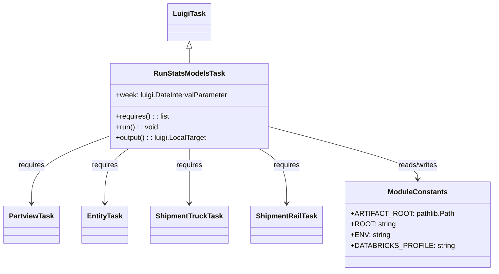

# Diagram: research/orchestrator/tasks/models/run_stats_models.py


> Auto-generated by Obscura crawlers

## Diagram 1



### SVG

<svg id="container" width="1060.921875" xmlns="http://www.w3.org/2000/svg" class="classDiagram" height="608" viewBox="0 0 1060.921875 608" role="graphics-document document" aria-roledescription="class"><style>#container{font-family:"trebuchet ms",verdana,arial,sans-serif;font-size:16px;fill:#333;}@keyframes edge-animation-frame{from{stroke-dashoffset:0;}}@keyframes dash{to{stroke-dashoffset:0;}}#container .edge-animation-slow{stroke-dasharray:9,5!important;stroke-dashoffset:900;animation:dash 50s linear infinite;stroke-linecap:round;}#container .edge-animation-fast{stroke-dasharray:9,5!important;stroke-dashoffset:900;animation:dash 20s linear infinite;stroke-linecap:round;}#container .error-icon{fill:#552222;}#container .error-text{fill:#552222;stroke:#552222;}#container .edge-thickness-normal{stroke-width:1px;}#container .edge-thickness-thick{stroke-width:3.5px;}#container .edge-pattern-solid{stroke-dasharray:0;}#container .edge-thickness-invisible{stroke-width:0;fill:none;}#container .edge-pattern-dashed{stroke-dasharray:3;}#container .edge-pattern-dotted{stroke-dasharray:2;}#container .marker{fill:#333333;stroke:#333333;}#container .marker.cross{stroke:#333333;}#container svg{font-family:"trebuchet ms",verdana,arial,sans-serif;font-size:16px;}#container p{margin:0;}#container g.classGroup text{fill:#9370DB;stroke:none;font-family:"trebuchet ms",verdana,arial,sans-serif;font-size:10px;}#container g.classGroup text .title{font-weight:bolder;}#container .nodeLabel,#container .edgeLabel{color:#131300;}#container .edgeLabel .label rect{fill:#ECECFF;}#container .label text{fill:#131300;}#container .labelBkg{background:#ECECFF;}#container .edgeLabel .label span{background:#ECECFF;}#container .classTitle{font-weight:bolder;}#container .node rect,#container .node circle,#container .node ellipse,#container .node polygon,#container .node path{fill:#ECECFF;stroke:#9370DB;stroke-width:1px;}#container .divider{stroke:#9370DB;stroke-width:1;}#container g.clickable{cursor:pointer;}#container g.classGroup rect{fill:#ECECFF;stroke:#9370DB;}#container g.classGroup line{stroke:#9370DB;stroke-width:1;}#container .classLabel .box{stroke:none;stroke-width:0;fill:#ECECFF;opacity:0.5;}#container .classLabel .label{fill:#9370DB;font-size:10px;}#container .relation{stroke:#333333;stroke-width:1;fill:none;}#container .dashed-line{stroke-dasharray:3;}#container .dotted-line{stroke-dasharray:1 2;}#container #compositionStart,#container .composition{fill:#333333!important;stroke:#333333!important;stroke-width:1;}#container #compositionEnd,#container .composition{fill:#333333!important;stroke:#333333!important;stroke-width:1;}#container #dependencyStart,#container .dependency{fill:#333333!important;stroke:#333333!important;stroke-width:1;}#container #dependencyStart,#container .dependency{fill:#333333!important;stroke:#333333!important;stroke-width:1;}#container #extensionStart,#container .extension{fill:transparent!important;stroke:#333333!important;stroke-width:1;}#container #extensionEnd,#container .extension{fill:transparent!important;stroke:#333333!important;stroke-width:1;}#container #aggregationStart,#container .aggregation{fill:transparent!important;stroke:#333333!important;stroke-width:1;}#container #aggregationEnd,#container .aggregation{fill:transparent!important;stroke:#333333!important;stroke-width:1;}#container #lollipopStart,#container .lollipop{fill:#ECECFF!important;stroke:#333333!important;stroke-width:1;}#container #lollipopEnd,#container .lollipop{fill:#ECECFF!important;stroke:#333333!important;stroke-width:1;}#container .edgeTerminals{font-size:11px;line-height:initial;}#container .classTitleText{text-anchor:middle;font-size:18px;fill:#333;}#container .label-icon{display:inline-block;height:1em;overflow:visible;vertical-align:-0.125em;}#container .node .label-icon path{fill:currentColor;stroke:revert;stroke-width:revert;}#container :root{--mermaid-font-family:"trebuchet ms",verdana,arial,sans-serif;}</style><g><defs><marker id="container_class-aggregationStart" class="marker aggregation class" refX="18" refY="7" markerWidth="190" markerHeight="240" orient="auto"><path d="M 18,7 L9,13 L1,7 L9,1 Z"></path></marker></defs><defs><marker id="container_class-aggregationEnd" class="marker aggregation class" refX="1" refY="7" markerWidth="20" markerHeight="28" orient="auto"><path d="M 18,7 L9,13 L1,7 L9,1 Z"></path></marker></defs><defs><marker id="container_class-extensionStart" class="marker extension class" refX="18" refY="7" markerWidth="190" markerHeight="240" orient="auto"><path d="M 1,7 L18,13 V 1 Z"></path></marker></defs><defs><marker id="container_class-extensionEnd" class="marker extension class" refX="1" refY="7" markerWidth="20" markerHeight="28" orient="auto"><path d="M 1,1 V 13 L18,7 Z"></path></marker></defs><defs><marker id="container_class-compositionStart" class="marker composition class" refX="18" refY="7" markerWidth="190" markerHeight="240" orient="auto"><path d="M 18,7 L9,13 L1,7 L9,1 Z"></path></marker></defs><defs><marker id="container_class-compositionEnd" class="marker composition class" refX="1" refY="7" markerWidth="20" markerHeight="28" orient="auto"><path d="M 18,7 L9,13 L1,7 L9,1 Z"></path></marker></defs><defs><marker id="container_class-dependencyStart" class="marker dependency class" refX="6" refY="7" markerWidth="190" markerHeight="240" orient="auto"><path d="M 5,7 L9,13 L1,7 L9,1 Z"></path></marker></defs><defs><marker id="container_class-dependencyEnd" class="marker dependency class" refX="13" refY="7" markerWidth="20" markerHeight="28" orient="auto"><path d="M 18,7 L9,13 L14,7 L9,1 Z"></path></marker></defs><defs><marker id="container_class-lollipopStart" class="marker lollipop class" refX="13" refY="7" markerWidth="190" markerHeight="240" orient="auto"><circle stroke="black" fill="transparent" cx="7" cy="7" r="6"></circle></marker></defs><defs><marker id="container_class-lollipopEnd" class="marker lollipop class" refX="1" refY="7" markerWidth="190" markerHeight="240" orient="auto"><circle stroke="black" fill="transparent" cx="7" cy="7" r="6"></circle></marker></defs><g class="root"><g class="clusters"></g><g class="edgePaths"><path d="M411.898,109.25L411.898,110.542C411.898,111.833,411.898,114.417,411.898,119.875C411.898,125.333,411.898,133.667,411.898,137.833L411.898,142" id="id_LuigiTask_RunStatsModelsTask_1" class="edge-thickness-normal edge-pattern-solid relation" style=";;;" data-edge="true" data-et="edge" data-id="id_LuigiTask_RunStatsModelsTask_1" data-points="W3sieCI6NDExLjg5ODQzNzUsInkiOjkyfSx7IngiOjQxMS44OTg0Mzc1LCJ5IjoxMTd9LHsieCI6NDExLjg5ODQzNzUsInkiOjE0Mn1d" marker-start="url(#container_class-extensionStart)"></path><path d="M236.32,305.962L208.316,316.802C180.313,327.641,124.305,349.321,96.301,374.327C68.297,399.333,68.297,427.667,68.297,441.833L68.297,456" id="id_RunStatsModelsTask_PartviewTask_2" class="edge-thickness-normal edge-pattern-solid relation" style=";;;" data-edge="true" data-et="edge" data-id="id_RunStatsModelsTask_PartviewTask_2" data-points="W3sieCI6MjM2LjMyMDMxMjUsInkiOjMwNS45NjIxMjAwMDYzNjY0fSx7IngiOjY4LjI5Njg3NSwieSI6MzcxfSx7IngiOjY4LjI5Njg3NSwieSI6NDYyfV0=" marker-end="url(#container_class-dependencyEnd)"></path><path d="M279.436,334L270.927,340.167C262.418,346.333,245.401,358.667,236.892,379C228.383,399.333,228.383,427.667,228.383,441.833L228.383,456" id="id_RunStatsModelsTask_EntityTask_3" class="edge-thickness-normal edge-pattern-solid relation" style=";;;" data-edge="true" data-et="edge" data-id="id_RunStatsModelsTask_EntityTask_3" data-points="W3sieCI6Mjc5LjQzNjAzMTQ4NDk2MjQsInkiOjMzNH0seyJ4IjoyMjguMzgyODEyNSwieSI6MzcxfSx7IngiOjIyOC4zODI4MTI1LCJ5Ijo0NjJ9XQ==" marker-end="url(#container_class-dependencyEnd)"></path><path d="M411.898,334L411.898,340.167C411.898,346.333,411.898,358.667,411.898,379C411.898,399.333,411.898,427.667,411.898,441.833L411.898,456" id="id_RunStatsModelsTask_ShipmentTruckTask_4" class="edge-thickness-normal edge-pattern-solid relation" style=";;;" data-edge="true" data-et="edge" data-id="id_RunStatsModelsTask_ShipmentTruckTask_4" data-points="W3sieCI6NDExLjg5ODQzNzUsInkiOjMzNH0seyJ4Ijo0MTEuODk4NDM3NSwieSI6MzcxfSx7IngiOjQxMS44OTg0Mzc1LCJ5Ijo0NjJ9XQ==" marker-end="url(#container_class-dependencyEnd)"></path><path d="M564.351,334L574.144,340.167C583.937,346.333,603.523,358.667,613.316,379C623.109,399.333,623.109,427.667,623.109,441.833L623.109,456" id="id_RunStatsModelsTask_ShipmentRailTask_5" class="edge-thickness-normal edge-pattern-solid relation" style=";;;" data-edge="true" data-et="edge" data-id="id_RunStatsModelsTask_ShipmentRailTask_5" data-points="W3sieCI6NTY0LjM1MTQ0NTAxODc5NywieSI6MzM0fSx7IngiOjYyMy4xMDkzNzUsInkiOjM3MX0seyJ4Ijo2MjMuMTA5Mzc1LCJ5Ijo0NjJ9XQ==" marker-end="url(#container_class-dependencyEnd)"></path><path d="M587.477,285.671L639.857,299.892C692.237,314.114,796.997,342.557,849.378,361.945C901.758,381.333,901.758,391.667,901.758,396.833L901.758,402" id="id_RunStatsModelsTask_ModuleConstants_6" class="edge-thickness-normal edge-pattern-solid relation" style=";;;" data-edge="true" data-et="edge" data-id="id_RunStatsModelsTask_ModuleConstants_6" data-points="W3sieCI6NTg3LjQ3NjU2MjUsInkiOjI4NS42NzA2MDA2MTg4MDAwNX0seyJ4Ijo5MDEuNzU3ODEyNSwieSI6MzcxfSx7IngiOjkwMS43NTc4MTI1LCJ5Ijo0MDh9XQ==" marker-end="url(#container_class-dependencyEnd)"></path></g><g class="edgeLabels"><g class="edgeLabel"><g class="label" data-id="id_LuigiTask_RunStatsModelsTask_1" transform="translate(0, 0)"><foreignObject width="0" height="0"><div xmlns="http://www.w3.org/1999/xhtml" class="labelBkg" style="display: table-cell; white-space: nowrap; line-height: 1.5; max-width: 200px; text-align: center;"><span class="edgeLabel"></span></div></foreignObject></g></g><g class="edgeLabel" transform="translate(68.296875, 371)"><g class="label" data-id="id_RunStatsModelsTask_PartviewTask_2" transform="translate(-29.8515625, -12)"><foreignObject width="59.703125" height="24"><div xmlns="http://www.w3.org/1999/xhtml" class="labelBkg" style="display: table-cell; white-space: nowrap; line-height: 1.5; max-width: 200px; text-align: center;"><span class="edgeLabel"><p>requires</p></span></div></foreignObject></g></g><g class="edgeLabel" transform="translate(228.3828125, 371)"><g class="label" data-id="id_RunStatsModelsTask_EntityTask_3" transform="translate(-29.8515625, -12)"><foreignObject width="59.703125" height="24"><div xmlns="http://www.w3.org/1999/xhtml" class="labelBkg" style="display: table-cell; white-space: nowrap; line-height: 1.5; max-width: 200px; text-align: center;"><span class="edgeLabel"><p>requires</p></span></div></foreignObject></g></g><g class="edgeLabel" transform="translate(411.8984375, 371)"><g class="label" data-id="id_RunStatsModelsTask_ShipmentTruckTask_4" transform="translate(-29.8515625, -12)"><foreignObject width="59.703125" height="24"><div xmlns="http://www.w3.org/1999/xhtml" class="labelBkg" style="display: table-cell; white-space: nowrap; line-height: 1.5; max-width: 200px; text-align: center;"><span class="edgeLabel"><p>requires</p></span></div></foreignObject></g></g><g class="edgeLabel" transform="translate(623.109375, 371)"><g class="label" data-id="id_RunStatsModelsTask_ShipmentRailTask_5" transform="translate(-29.8515625, -12)"><foreignObject width="59.703125" height="24"><div xmlns="http://www.w3.org/1999/xhtml" class="labelBkg" style="display: table-cell; white-space: nowrap; line-height: 1.5; max-width: 200px; text-align: center;"><span class="edgeLabel"><p>requires</p></span></div></foreignObject></g></g><g class="edgeLabel" transform="translate(901.7578125, 371)"><g class="label" data-id="id_RunStatsModelsTask_ModuleConstants_6" transform="translate(-45.9453125, -12)"><foreignObject width="91.890625" height="24"><div xmlns="http://www.w3.org/1999/xhtml" class="labelBkg" style="display: table-cell; white-space: nowrap; line-height: 1.5; max-width: 200px; text-align: center;"><span class="edgeLabel"><p>reads/writes</p></span></div></foreignObject></g></g></g><g class="nodes"><g class="node default" id="classId-LuigiTask-0" transform="translate(411.8984375, 50)"><g class="basic label-container"><path d="M-45.984375 -42 L45.984375 -42 L45.984375 42 L-45.984375 42" stroke="none" stroke-width="0" fill="#ECECFF" style=""></path><path d="M-45.984375 -42 C-23.634965547027377 -42, -1.2855560940547548 -42, 45.984375 -42 M-45.984375 -42 C-11.047777024114865 -42, 23.88882095177027 -42, 45.984375 -42 M45.984375 -42 C45.984375 -24.281064848497778, 45.984375 -6.562129696995555, 45.984375 42 M45.984375 -42 C45.984375 -24.14248024241124, 45.984375 -6.284960484822477, 45.984375 42 M45.984375 42 C11.21202499710644 42, -23.56032500578712 42, -45.984375 42 M45.984375 42 C22.882198386703987 42, -0.21997822659202626 42, -45.984375 42 M-45.984375 42 C-45.984375 15.736871081516341, -45.984375 -10.526257836967318, -45.984375 -42 M-45.984375 42 C-45.984375 10.863700624797758, -45.984375 -20.272598750404484, -45.984375 -42" stroke="#9370DB" stroke-width="1.3" fill="none" stroke-dasharray="0 0" style=""></path></g><g class="annotation-group text" transform="translate(0, -18)"></g><g class="label-group text" transform="translate(-33.984375, -18)"><g class="label" style="font-weight: bolder" transform="translate(0,-12)"><foreignObject width="67.96875" height="24"><div xmlns="http://www.w3.org/1999/xhtml" style="display: table-cell; white-space: nowrap; line-height: 1.5; max-width: 117px; text-align: center;"><span class="nodeLabel markdown-node-label" style=""><p>LuigiTask</p></span></div></foreignObject></g></g><g class="members-group text" transform="translate(-33.984375, 30)"></g><g class="methods-group text" transform="translate(-33.984375, 60)"></g><g class="divider" style=""><path d="M-45.984375 6 C-16.284688158840584 6, 13.414998682318831 6, 45.984375 6 M-45.984375 6 C-24.81322518239326 6, -3.642075364786521 6, 45.984375 6" stroke="#9370DB" stroke-width="1.3" fill="none" stroke-dasharray="0 0" style=""></path></g><g class="divider" style=""><path d="M-45.984375 24 C-17.276550378966775 24, 11.43127424206645 24, 45.984375 24 M-45.984375 24 C-24.948810192105853 24, -3.913245384211706 24, 45.984375 24" stroke="#9370DB" stroke-width="1.3" fill="none" stroke-dasharray="0 0" style=""></path></g></g><g class="node default" id="classId-RunStatsModelsTask-1" transform="translate(411.8984375, 238)"><g class="basic label-container"><path d="M-175.578125 -96 L175.578125 -96 L175.578125 96 L-175.578125 96" stroke="none" stroke-width="0" fill="#ECECFF" style=""></path><path d="M-175.578125 -96 C-45.411166642514104 -96, 84.75579171497179 -96, 175.578125 -96 M-175.578125 -96 C-55.13789420200591 -96, 65.30233659598818 -96, 175.578125 -96 M175.578125 -96 C175.578125 -48.992027950551815, 175.578125 -1.9840559011036305, 175.578125 96 M175.578125 -96 C175.578125 -25.55770386664811, 175.578125 44.88459226670378, 175.578125 96 M175.578125 96 C39.126859350908006 96, -97.32440629818399 96, -175.578125 96 M175.578125 96 C70.82721777719655 96, -33.9236894456069 96, -175.578125 96 M-175.578125 96 C-175.578125 57.083973647694314, -175.578125 18.16794729538863, -175.578125 -96 M-175.578125 96 C-175.578125 39.35329323394393, -175.578125 -17.29341353211214, -175.578125 -96" stroke="#9370DB" stroke-width="1.3" fill="none" stroke-dasharray="0 0" style=""></path></g><g class="annotation-group text" transform="translate(0, -72)"></g><g class="label-group text" transform="translate(-75.953125, -72)"><g class="label" style="font-weight: bolder" transform="translate(0,-12)"><foreignObject width="151.90625" height="24"><div xmlns="http://www.w3.org/1999/xhtml" style="display: table-cell; white-space: nowrap; line-height: 1.5; max-width: 199px; text-align: center;"><span class="nodeLabel markdown-node-label" style=""><p>RunStatsModelsTask</p></span></div></foreignObject></g></g><g class="members-group text" transform="translate(-163.578125, -24)"><g class="label" style="" transform="translate(0,-12)"><foreignObject width="251.203125" height="24"><div xmlns="http://www.w3.org/1999/xhtml" style="display: table-cell; white-space: nowrap; line-height: 1.5; max-width: 309px; text-align: center;"><span class="nodeLabel markdown-node-label" style=""><p>+week: luigi.DateIntervalParameter</p></span></div></foreignObject></g></g><g class="methods-group text" transform="translate(-163.578125, 24)"><g class="label" style="" transform="translate(0,-12)"><foreignObject width="120.90625" height="24"><div xmlns="http://www.w3.org/1999/xhtml" style="display: table-cell; white-space: nowrap; line-height: 1.5; max-width: 178px; text-align: center;"><span class="nodeLabel markdown-node-label" style=""><p>+requires() : : list</p></span></div></foreignObject></g><g class="label" style="" transform="translate(0,12)"><foreignObject width="94.859375" height="24"><div xmlns="http://www.w3.org/1999/xhtml" style="display: table-cell; white-space: nowrap; line-height: 1.5; max-width: 152px; text-align: center;"><span class="nodeLabel markdown-node-label" style=""><p>+run() : : void</p></span></div></foreignObject></g><g class="label" style="" transform="translate(0,36)"><foreignObject width="205.265625" height="24"><div xmlns="http://www.w3.org/1999/xhtml" style="display: table-cell; white-space: nowrap; line-height: 1.5; max-width: 263px; text-align: center;"><span class="nodeLabel markdown-node-label" style=""><p>+output() : : luigi.LocalTarget</p></span></div></foreignObject></g></g><g class="divider" style=""><path d="M-175.578125 -48 C-41.08831084836325 -48, 93.4015033032735 -48, 175.578125 -48 M-175.578125 -48 C-54.39031892207872 -48, 66.79748715584256 -48, 175.578125 -48" stroke="#9370DB" stroke-width="1.3" fill="none" stroke-dasharray="0 0" style=""></path></g><g class="divider" style=""><path d="M-175.578125 0 C-90.91095188640513 0, -6.243778772810259 0, 175.578125 0 M-175.578125 0 C-87.06963091797526 0, 1.4388631640494793 0, 175.578125 0" stroke="#9370DB" stroke-width="1.3" fill="none" stroke-dasharray="0 0" style=""></path></g></g><g class="node default" id="classId-PartviewTask-2" transform="translate(68.296875, 504)"><g class="basic label-container"><path d="M-60.296875 -42 L60.296875 -42 L60.296875 42 L-60.296875 42" stroke="none" stroke-width="0" fill="#ECECFF" style=""></path><path d="M-60.296875 -42 C-16.53331739662071 -42, 27.23024020675858 -42, 60.296875 -42 M-60.296875 -42 C-31.273552844174286 -42, -2.250230688348573 -42, 60.296875 -42 M60.296875 -42 C60.296875 -24.180529959192835, 60.296875 -6.361059918385671, 60.296875 42 M60.296875 -42 C60.296875 -22.15492227699832, 60.296875 -2.3098445539966406, 60.296875 42 M60.296875 42 C27.122930805454786 42, -6.0510133890904285 42, -60.296875 42 M60.296875 42 C35.551754694050985 42, 10.806634388101976 42, -60.296875 42 M-60.296875 42 C-60.296875 21.118913559428332, -60.296875 0.2378271188566643, -60.296875 -42 M-60.296875 42 C-60.296875 13.931415179315227, -60.296875 -14.137169641369546, -60.296875 -42" stroke="#9370DB" stroke-width="1.3" fill="none" stroke-dasharray="0 0" style=""></path></g><g class="annotation-group text" transform="translate(0, -18)"></g><g class="label-group text" transform="translate(-48.296875, -18)"><g class="label" style="font-weight: bolder" transform="translate(0,-12)"><foreignObject width="96.59375" height="24"><div xmlns="http://www.w3.org/1999/xhtml" style="display: table-cell; white-space: nowrap; line-height: 1.5; max-width: 144px; text-align: center;"><span class="nodeLabel markdown-node-label" style=""><p>PartviewTask</p></span></div></foreignObject></g></g><g class="members-group text" transform="translate(-48.296875, 30)"></g><g class="methods-group text" transform="translate(-48.296875, 60)"></g><g class="divider" style=""><path d="M-60.296875 6 C-35.521283150872165 6, -10.745691301744337 6, 60.296875 6 M-60.296875 6 C-24.682358155029192 6, 10.932158689941616 6, 60.296875 6" stroke="#9370DB" stroke-width="1.3" fill="none" stroke-dasharray="0 0" style=""></path></g><g class="divider" style=""><path d="M-60.296875 24 C-19.46752783581819 24, 21.361819328363623 24, 60.296875 24 M-60.296875 24 C-15.062155165030667 24, 30.172564669938666 24, 60.296875 24" stroke="#9370DB" stroke-width="1.3" fill="none" stroke-dasharray="0 0" style=""></path></g></g><g class="node default" id="classId-EntityTask-3" transform="translate(228.3828125, 504)"><g class="basic label-container"><path d="M-49.7890625 -42 L49.7890625 -42 L49.7890625 42 L-49.7890625 42" stroke="none" stroke-width="0" fill="#ECECFF" style=""></path><path d="M-49.7890625 -42 C-20.978599581162953 -42, 7.831863337674093 -42, 49.7890625 -42 M-49.7890625 -42 C-27.93540279437227 -42, -6.081743088744538 -42, 49.7890625 -42 M49.7890625 -42 C49.7890625 -12.865234248519524, 49.7890625 16.26953150296095, 49.7890625 42 M49.7890625 -42 C49.7890625 -11.098705654980488, 49.7890625 19.802588690039023, 49.7890625 42 M49.7890625 42 C18.24933754342303 42, -13.290387413153937 42, -49.7890625 42 M49.7890625 42 C26.935552457137025 42, 4.082042414274049 42, -49.7890625 42 M-49.7890625 42 C-49.7890625 10.134662138550922, -49.7890625 -21.730675722898155, -49.7890625 -42 M-49.7890625 42 C-49.7890625 14.326814581065602, -49.7890625 -13.346370837868797, -49.7890625 -42" stroke="#9370DB" stroke-width="1.3" fill="none" stroke-dasharray="0 0" style=""></path></g><g class="annotation-group text" transform="translate(0, -18)"></g><g class="label-group text" transform="translate(-37.7890625, -18)"><g class="label" style="font-weight: bolder" transform="translate(0,-12)"><foreignObject width="75.578125" height="24"><div xmlns="http://www.w3.org/1999/xhtml" style="display: table-cell; white-space: nowrap; line-height: 1.5; max-width: 124px; text-align: center;"><span class="nodeLabel markdown-node-label" style=""><p>EntityTask</p></span></div></foreignObject></g></g><g class="members-group text" transform="translate(-37.7890625, 30)"></g><g class="methods-group text" transform="translate(-37.7890625, 60)"></g><g class="divider" style=""><path d="M-49.7890625 6 C-18.561822572059107 6, 12.665417355881786 6, 49.7890625 6 M-49.7890625 6 C-24.28778776556752 6, 1.213486968864963 6, 49.7890625 6" stroke="#9370DB" stroke-width="1.3" fill="none" stroke-dasharray="0 0" style=""></path></g><g class="divider" style=""><path d="M-49.7890625 24 C-19.73813539340474 24, 10.31279171319052 24, 49.7890625 24 M-49.7890625 24 C-25.582776770296658 24, -1.376491040593315 24, 49.7890625 24" stroke="#9370DB" stroke-width="1.3" fill="none" stroke-dasharray="0 0" style=""></path></g></g><g class="node default" id="classId-ShipmentTruckTask-4" transform="translate(411.8984375, 504)"><g class="basic label-container"><path d="M-83.7265625 -42 L83.7265625 -42 L83.7265625 42 L-83.7265625 42" stroke="none" stroke-width="0" fill="#ECECFF" style=""></path><path d="M-83.7265625 -42 C-28.95995588393494 -42, 25.806650732130123 -42, 83.7265625 -42 M-83.7265625 -42 C-38.683619290631654 -42, 6.359323918736692 -42, 83.7265625 -42 M83.7265625 -42 C83.7265625 -12.581774716934714, 83.7265625 16.836450566130573, 83.7265625 42 M83.7265625 -42 C83.7265625 -10.691612302120365, 83.7265625 20.61677539575927, 83.7265625 42 M83.7265625 42 C35.02860830127304 42, -13.669345897453923 42, -83.7265625 42 M83.7265625 42 C24.319980810557176 42, -35.08660087888565 42, -83.7265625 42 M-83.7265625 42 C-83.7265625 23.594570200348016, -83.7265625 5.189140400696033, -83.7265625 -42 M-83.7265625 42 C-83.7265625 12.253923069035878, -83.7265625 -17.492153861928244, -83.7265625 -42" stroke="#9370DB" stroke-width="1.3" fill="none" stroke-dasharray="0 0" style=""></path></g><g class="annotation-group text" transform="translate(0, -18)"></g><g class="label-group text" transform="translate(-71.7265625, -18)"><g class="label" style="font-weight: bolder" transform="translate(0,-12)"><foreignObject width="143.453125" height="24"><div xmlns="http://www.w3.org/1999/xhtml" style="display: table-cell; white-space: nowrap; line-height: 1.5; max-width: 191px; text-align: center;"><span class="nodeLabel markdown-node-label" style=""><p>ShipmentTruckTask</p></span></div></foreignObject></g></g><g class="members-group text" transform="translate(-71.7265625, 30)"></g><g class="methods-group text" transform="translate(-71.7265625, 60)"></g><g class="divider" style=""><path d="M-83.7265625 6 C-20.727366653840676 6, 42.27182919231865 6, 83.7265625 6 M-83.7265625 6 C-41.780293874534664 6, 0.1659747509306726 6, 83.7265625 6" stroke="#9370DB" stroke-width="1.3" fill="none" stroke-dasharray="0 0" style=""></path></g><g class="divider" style=""><path d="M-83.7265625 24 C-34.49430675512633 24, 14.737948989747338 24, 83.7265625 24 M-83.7265625 24 C-50.11315478358488 24, -16.499747067169764 24, 83.7265625 24" stroke="#9370DB" stroke-width="1.3" fill="none" stroke-dasharray="0 0" style=""></path></g></g><g class="node default" id="classId-ShipmentRailTask-5" transform="translate(623.109375, 504)"><g class="basic label-container"><path d="M-77.484375 -42 L77.484375 -42 L77.484375 42 L-77.484375 42" stroke="none" stroke-width="0" fill="#ECECFF" style=""></path><path d="M-77.484375 -42 C-16.149744999381078 -42, 45.184885001237845 -42, 77.484375 -42 M-77.484375 -42 C-33.660554166566676 -42, 10.163266666866647 -42, 77.484375 -42 M77.484375 -42 C77.484375 -9.47894270684963, 77.484375 23.04211458630074, 77.484375 42 M77.484375 -42 C77.484375 -11.724629555440021, 77.484375 18.550740889119957, 77.484375 42 M77.484375 42 C30.048979975585745 42, -17.38641504882851 42, -77.484375 42 M77.484375 42 C37.98639498715598 42, -1.511585025688035 42, -77.484375 42 M-77.484375 42 C-77.484375 19.419424454864554, -77.484375 -3.1611510902708915, -77.484375 -42 M-77.484375 42 C-77.484375 24.95372018775412, -77.484375 7.907440375508237, -77.484375 -42" stroke="#9370DB" stroke-width="1.3" fill="none" stroke-dasharray="0 0" style=""></path></g><g class="annotation-group text" transform="translate(0, -18)"></g><g class="label-group text" transform="translate(-65.484375, -18)"><g class="label" style="font-weight: bolder" transform="translate(0,-12)"><foreignObject width="130.96875" height="24"><div xmlns="http://www.w3.org/1999/xhtml" style="display: table-cell; white-space: nowrap; line-height: 1.5; max-width: 180px; text-align: center;"><span class="nodeLabel markdown-node-label" style=""><p>ShipmentRailTask</p></span></div></foreignObject></g></g><g class="members-group text" transform="translate(-65.484375, 30)"></g><g class="methods-group text" transform="translate(-65.484375, 60)"></g><g class="divider" style=""><path d="M-77.484375 6 C-25.087888082987703 6, 27.308598834024593 6, 77.484375 6 M-77.484375 6 C-38.7136266138217 6, 0.0571217723565951 6, 77.484375 6" stroke="#9370DB" stroke-width="1.3" fill="none" stroke-dasharray="0 0" style=""></path></g><g class="divider" style=""><path d="M-77.484375 24 C-35.7272551792974 24, 6.029864641405197 24, 77.484375 24 M-77.484375 24 C-34.390151905320806 24, 8.704071189358388 24, 77.484375 24" stroke="#9370DB" stroke-width="1.3" fill="none" stroke-dasharray="0 0" style=""></path></g></g><g class="node default" id="classId-ModuleConstants-6" transform="translate(901.7578125, 504)"><g class="basic label-container"><path d="M-151.1640625 -96 L151.1640625 -96 L151.1640625 96 L-151.1640625 96" stroke="none" stroke-width="0" fill="#ECECFF" style=""></path><path d="M-151.1640625 -96 C-71.77406654897014 -96, 7.61592940205972 -96, 151.1640625 -96 M-151.1640625 -96 C-32.94929603287531 -96, 85.26547043424938 -96, 151.1640625 -96 M151.1640625 -96 C151.1640625 -53.831608198167196, 151.1640625 -11.663216396334391, 151.1640625 96 M151.1640625 -96 C151.1640625 -51.42685457503208, 151.1640625 -6.853709150064162, 151.1640625 96 M151.1640625 96 C82.45245058081291 96, 13.740838661625816 96, -151.1640625 96 M151.1640625 96 C71.43086935526492 96, -8.302323789470165 96, -151.1640625 96 M-151.1640625 96 C-151.1640625 23.675970140901413, -151.1640625 -48.648059718197175, -151.1640625 -96 M-151.1640625 96 C-151.1640625 25.109649599781505, -151.1640625 -45.78070080043699, -151.1640625 -96" stroke="#9370DB" stroke-width="1.3" fill="none" stroke-dasharray="0 0" style=""></path></g><g class="annotation-group text" transform="translate(0, -72)"></g><g class="label-group text" transform="translate(-63.625, -72)"><g class="label" style="font-weight: bolder" transform="translate(0,-12)"><foreignObject width="127.25" height="24"><div xmlns="http://www.w3.org/1999/xhtml" style="display: table-cell; white-space: nowrap; line-height: 1.5; max-width: 176px; text-align: center;"><span class="nodeLabel markdown-node-label" style=""><p>ModuleConstants</p></span></div></foreignObject></g></g><g class="members-group text" transform="translate(-139.1640625, -24)"><g class="label" style="" transform="translate(0,-12)"><foreignObject width="214.703125" height="24"><div xmlns="http://www.w3.org/1999/xhtml" style="display: table-cell; white-space: nowrap; line-height: 1.5; max-width: 272px; text-align: center;"><span class="nodeLabel markdown-node-label" style=""><p>+ARTIFACT_ROOT: pathlib.Path</p></span></div></foreignObject></g><g class="label" style="" transform="translate(0,12)"><foreignObject width="96.453125" height="24"><div xmlns="http://www.w3.org/1999/xhtml" style="display: table-cell; white-space: nowrap; line-height: 1.5; max-width: 154px; text-align: center;"><span class="nodeLabel markdown-node-label" style=""><p>+ROOT: string</p></span></div></foreignObject></g><g class="label" style="" transform="translate(0,36)"><foreignObject width="85.921875" height="24"><div xmlns="http://www.w3.org/1999/xhtml" style="display: table-cell; white-space: nowrap; line-height: 1.5; max-width: 144px; text-align: center;"><span class="nodeLabel markdown-node-label" style=""><p>+ENV: string</p></span></div></foreignObject></g><g class="label" style="" transform="translate(0,60)"><foreignObject width="210.78125" height="24"><div xmlns="http://www.w3.org/1999/xhtml" style="display: table-cell; white-space: nowrap; line-height: 1.5; max-width: 269px; text-align: center;"><span class="nodeLabel markdown-node-label" style=""><p>+DATABRICKS_PROFILE: string</p></span></div></foreignObject></g></g><g class="methods-group text" transform="translate(-139.1640625, 96)"></g><g class="divider" style=""><path d="M-151.1640625 -48 C-45.27862860579502 -48, 60.60680528840996 -48, 151.1640625 -48 M-151.1640625 -48 C-87.47055123956841 -48, -23.777039979136816 -48, 151.1640625 -48" stroke="#9370DB" stroke-width="1.3" fill="none" stroke-dasharray="0 0" style=""></path></g><g class="divider" style=""><path d="M-151.1640625 72 C-68.50037846474717 72, 14.163305570505656 72, 151.1640625 72 M-151.1640625 72 C-75.54741277489693 72, 0.06923695020614673 72, 151.1640625 72" stroke="#9370DB" stroke-width="1.3" fill="none" stroke-dasharray="0 0" style=""></path></g></g></g></g></g></svg>

## Diagram 2

```mermaid
flowchart TD
Start([Start]) --> Instantiate[Instantiate RunStatsModelsTask]
Instantiate --> Requires[Call requires()]
Requires --> Partview[Schedule PartviewTask]
Requires --> Entity[Schedule EntityTask]
Requires --> Truck[Schedule ShipmentTruckTask]
Requires --> Rail[Schedule ShipmentRailTask]
Instantiate --> Run[Call run()]
Run --> EnsureDir[Ensure ARTIFACT_ROOT exists]
EnsureDir --> OutputPath[Build output path: ARTIFACT_ROOT/run_stats_models_{week}.txt]
Run --> WriteFile[Write completed_date to output file]
WriteFile --> End([End])
```

> SVG rendering failed for this diagram.
