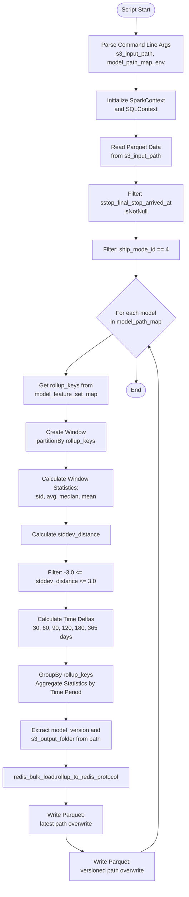
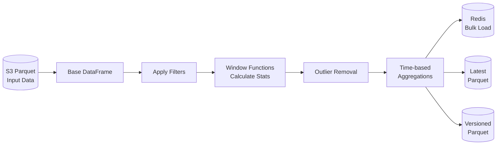
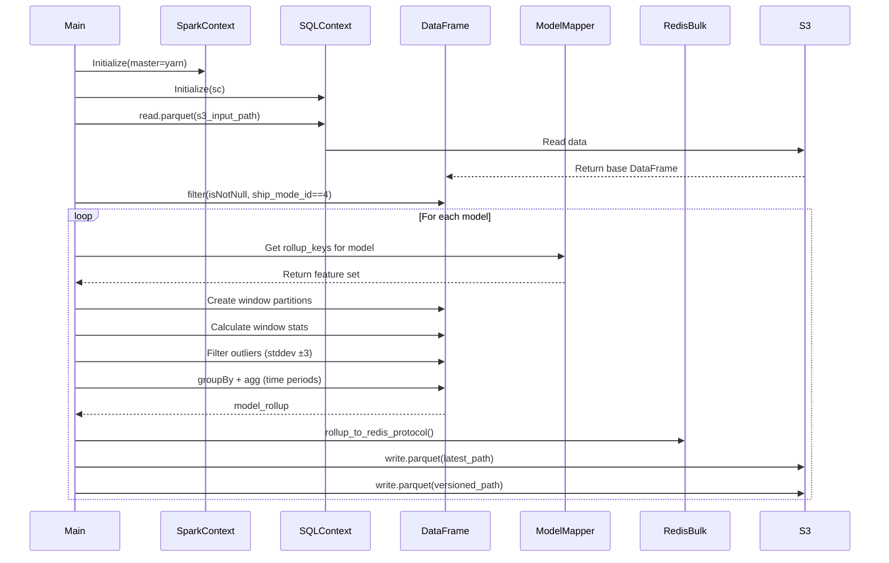
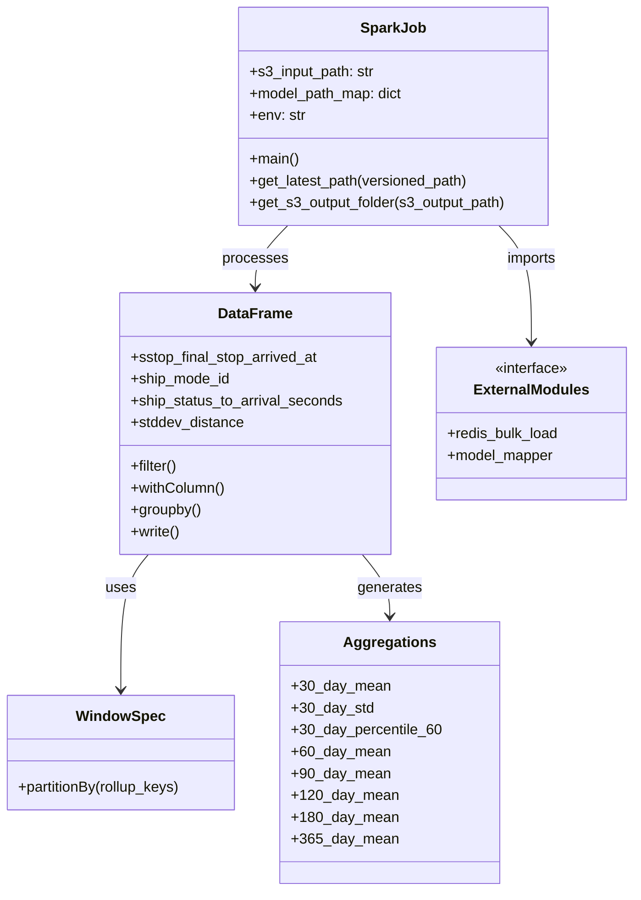

# Diagram: research/orchestrator/tasks/models/shipment_intermodal_spark.py


> Auto-generated by Obscura crawlers

## Diagram 1

```mermaid
flowchart TD
      Start([Script Start]) --> ParseArgs[Parse Command Line Args<br/>s3_input_path,
  model_path_map, env]
      ParseArgs --> InitSpark[Initialize SparkContext<br/>and SQLContext]...
  └ 108 lines...

✗ read_bash
  Invalid shell ID: 0. Please supply a valid shell ID to read output from.

  <no active shell sessions>

● Output Mermaid diagrams without fences
  $ cat << 'EOF'
```

> SVG rendering failed for this diagram.

## Diagram 2

```mermaid
flowchart TD
      Start([Script Start]) --> ParseArgs[Parse Command Line Args<br/>s3_input_path,
  model_path_map, env]
      ParseArgs --> InitSpark[Initialize SparkContext<br/>and SQLContext]...
  └ 108 lines...

● Output diagrams with echo
  $ echo "flowchart TD
      Start([Script Start]) --> ParseArgs[Parse Command Line Args<br/>s3_input_path,
  model_path_map, env]
      ParseArgs --> InitSpark[Initialize SparkContext<br/>and SQLContext]
      InitSpark --> ReadData[Read Parquet Data<br/>from s3_input_path]...
  └ 105 lines...
```

> SVG rendering failed for this diagram.

## Diagram 3



### SVG

<svg id="container" width="519.622802734375" xmlns="http://www.w3.org/2000/svg" class="flowchart" height="2424.921875" viewBox="0 0 519.622802734375 2424.921875" role="graphics-document document" aria-roledescription="flowchart-v2"><style>#container{font-family:"trebuchet ms",verdana,arial,sans-serif;font-size:16px;fill:#333;}@keyframes edge-animation-frame{from{stroke-dashoffset:0;}}@keyframes dash{to{stroke-dashoffset:0;}}#container .edge-animation-slow{stroke-dasharray:9,5!important;stroke-dashoffset:900;animation:dash 50s linear infinite;stroke-linecap:round;}#container .edge-animation-fast{stroke-dasharray:9,5!important;stroke-dashoffset:900;animation:dash 20s linear infinite;stroke-linecap:round;}#container .error-icon{fill:#552222;}#container .error-text{fill:#552222;stroke:#552222;}#container .edge-thickness-normal{stroke-width:1px;}#container .edge-thickness-thick{stroke-width:3.5px;}#container .edge-pattern-solid{stroke-dasharray:0;}#container .edge-thickness-invisible{stroke-width:0;fill:none;}#container .edge-pattern-dashed{stroke-dasharray:3;}#container .edge-pattern-dotted{stroke-dasharray:2;}#container .marker{fill:#333333;stroke:#333333;}#container .marker.cross{stroke:#333333;}#container svg{font-family:"trebuchet ms",verdana,arial,sans-serif;font-size:16px;}#container p{margin:0;}#container .label{font-family:"trebuchet ms",verdana,arial,sans-serif;color:#333;}#container .cluster-label text{fill:#333;}#container .cluster-label span{color:#333;}#container .cluster-label span p{background-color:transparent;}#container .label text,#container span{fill:#333;color:#333;}#container .node rect,#container .node circle,#container .node ellipse,#container .node polygon,#container .node path{fill:#ECECFF;stroke:#9370DB;stroke-width:1px;}#container .rough-node .label text,#container .node .label text,#container .image-shape .label,#container .icon-shape .label{text-anchor:middle;}#container .node .katex path{fill:#000;stroke:#000;stroke-width:1px;}#container .rough-node .label,#container .node .label,#container .image-shape .label,#container .icon-shape .label{text-align:center;}#container .node.clickable{cursor:pointer;}#container .root .anchor path{fill:#333333!important;stroke-width:0;stroke:#333333;}#container .arrowheadPath{fill:#333333;}#container .edgePath .path{stroke:#333333;stroke-width:2.0px;}#container .flowchart-link{stroke:#333333;fill:none;}#container .edgeLabel{background-color:rgba(232,232,232, 0.8);text-align:center;}#container .edgeLabel p{background-color:rgba(232,232,232, 0.8);}#container .edgeLabel rect{opacity:0.5;background-color:rgba(232,232,232, 0.8);fill:rgba(232,232,232, 0.8);}#container .labelBkg{background-color:rgba(232, 232, 232, 0.5);}#container .cluster rect{fill:#ffffde;stroke:#aaaa33;stroke-width:1px;}#container .cluster text{fill:#333;}#container .cluster span{color:#333;}#container div.mermaidTooltip{position:absolute;text-align:center;max-width:200px;padding:2px;font-family:"trebuchet ms",verdana,arial,sans-serif;font-size:12px;background:hsl(80, 100%, 96.2745098039%);border:1px solid #aaaa33;border-radius:2px;pointer-events:none;z-index:100;}#container .flowchartTitleText{text-anchor:middle;font-size:18px;fill:#333;}#container rect.text{fill:none;stroke-width:0;}#container .icon-shape,#container .image-shape{background-color:rgba(232,232,232, 0.8);text-align:center;}#container .icon-shape p,#container .image-shape p{background-color:rgba(232,232,232, 0.8);padding:2px;}#container .icon-shape rect,#container .image-shape rect{opacity:0.5;background-color:rgba(232,232,232, 0.8);fill:rgba(232,232,232, 0.8);}#container .label-icon{display:inline-block;height:1em;overflow:visible;vertical-align:-0.125em;}#container .node .label-icon path{fill:currentColor;stroke:revert;stroke-width:revert;}#container :root{--mermaid-font-family:"trebuchet ms",verdana,arial,sans-serif;}</style><g><marker id="container_flowchart-v2-pointEnd" class="marker flowchart-v2" viewBox="0 0 10 10" refX="5" refY="5" markerUnits="userSpaceOnUse" markerWidth="8" markerHeight="8" orient="auto"><path d="M 0 0 L 10 5 L 0 10 z" class="arrowMarkerPath" style="stroke-width: 1; stroke-dasharray: 1, 0;"></path></marker><marker id="container_flowchart-v2-pointStart" class="marker flowchart-v2" viewBox="0 0 10 10" refX="4.5" refY="5" markerUnits="userSpaceOnUse" markerWidth="8" markerHeight="8" orient="auto"><path d="M 0 5 L 10 10 L 10 0 z" class="arrowMarkerPath" style="stroke-width: 1; stroke-dasharray: 1, 0;"></path></marker><marker id="container_flowchart-v2-circleEnd" class="marker flowchart-v2" viewBox="0 0 10 10" refX="11" refY="5" markerUnits="userSpaceOnUse" markerWidth="11" markerHeight="11" orient="auto"><circle cx="5" cy="5" r="5" class="arrowMarkerPath" style="stroke-width: 1; stroke-dasharray: 1, 0;"></circle></marker><marker id="container_flowchart-v2-circleStart" class="marker flowchart-v2" viewBox="0 0 10 10" refX="-1" refY="5" markerUnits="userSpaceOnUse" markerWidth="11" markerHeight="11" orient="auto"><circle cx="5" cy="5" r="5" class="arrowMarkerPath" style="stroke-width: 1; stroke-dasharray: 1, 0;"></circle></marker><marker id="container_flowchart-v2-crossEnd" class="marker cross flowchart-v2" viewBox="0 0 11 11" refX="12" refY="5.2" markerUnits="userSpaceOnUse" markerWidth="11" markerHeight="11" orient="auto"><path d="M 1,1 l 9,9 M 10,1 l -9,9" class="arrowMarkerPath" style="stroke-width: 2; stroke-dasharray: 1, 0;"></path></marker><marker id="container_flowchart-v2-crossStart" class="marker cross flowchart-v2" viewBox="0 0 11 11" refX="-1" refY="5.2" markerUnits="userSpaceOnUse" markerWidth="11" markerHeight="11" orient="auto"><path d="M 1,1 l 9,9 M 10,1 l -9,9" class="arrowMarkerPath" style="stroke-width: 2; stroke-dasharray: 1, 0;"></path></marker><g class="root"><g class="clusters"></g><g class="edgePaths"><path d="M381.795,47.5L381.711,51.583C381.628,55.667,381.461,63.833,381.378,71.417C381.295,79,381.295,86,381.295,89.5L381.295,93" id="L_Start_ParseArgs_0" class="edge-thickness-normal edge-pattern-solid edge-thickness-normal edge-pattern-solid flowchart-link" style=";" data-edge="true" data-et="edge" data-id="L_Start_ParseArgs_0" data-points="W3sieCI6MzgxLjc5NDY2ODE5NzYzMTg0LCJ5Ijo0Ny40OTk5OTk5OTk5OTk5N30seyJ4IjozODEuMjk0NjY4MTk3NjMxODQsInkiOjcyfSx7IngiOjM4MS4yOTQ2NjgxOTc2MzE4NCwieSI6OTd9XQ==" marker-end="url(#container_flowchart-v2-pointEnd)"></path><path d="M381.295,199L381.295,203.167C381.295,207.333,381.295,215.667,381.295,223.333C381.295,231,381.295,238,381.295,241.5L381.295,245" id="L_ParseArgs_InitSpark_0" class="edge-thickness-normal edge-pattern-solid edge-thickness-normal edge-pattern-solid flowchart-link" style=";" data-edge="true" data-et="edge" data-id="L_ParseArgs_InitSpark_0" data-points="W3sieCI6MzgxLjI5NDY2ODE5NzYzMTg0LCJ5IjoxOTl9LHsieCI6MzgxLjI5NDY2ODE5NzYzMTg0LCJ5IjoyMjR9LHsieCI6MzgxLjI5NDY2ODE5NzYzMTg0LCJ5IjoyNDl9XQ==" marker-end="url(#container_flowchart-v2-pointEnd)"></path><path d="M381.295,327L381.295,331.167C381.295,335.333,381.295,343.667,381.295,351.333C381.295,359,381.295,366,381.295,369.5L381.295,373" id="L_InitSpark_ReadData_0" class="edge-thickness-normal edge-pattern-solid edge-thickness-normal edge-pattern-solid flowchart-link" style=";" data-edge="true" data-et="edge" data-id="L_InitSpark_ReadData_0" data-points="W3sieCI6MzgxLjI5NDY2ODE5NzYzMTg0LCJ5IjozMjd9LHsieCI6MzgxLjI5NDY2ODE5NzYzMTg0LCJ5IjozNTJ9LHsieCI6MzgxLjI5NDY2ODE5NzYzMTg0LCJ5IjozNzd9XQ==" marker-end="url(#container_flowchart-v2-pointEnd)"></path><path d="M381.295,455L381.295,459.167C381.295,463.333,381.295,471.667,381.295,479.333C381.295,487,381.295,494,381.295,497.5L381.295,501" id="L_ReadData_FilterNull_0" class="edge-thickness-normal edge-pattern-solid edge-thickness-normal edge-pattern-solid flowchart-link" style=";" data-edge="true" data-et="edge" data-id="L_ReadData_FilterNull_0" data-points="W3sieCI6MzgxLjI5NDY2ODE5NzYzMTg0LCJ5Ijo0NTV9LHsieCI6MzgxLjI5NDY2ODE5NzYzMTg0LCJ5Ijo0ODB9LHsieCI6MzgxLjI5NDY2ODE5NzYzMTg0LCJ5Ijo1MDV9XQ==" marker-end="url(#container_flowchart-v2-pointEnd)"></path><path d="M381.295,607L381.295,611.167C381.295,615.333,381.295,623.667,381.295,631.333C381.295,639,381.295,646,381.295,649.5L381.295,653" id="L_FilterNull_FilterMode_0" class="edge-thickness-normal edge-pattern-solid edge-thickness-normal edge-pattern-solid flowchart-link" style=";" data-edge="true" data-et="edge" data-id="L_FilterNull_FilterMode_0" data-points="W3sieCI6MzgxLjI5NDY2ODE5NzYzMTg0LCJ5Ijo2MDd9LHsieCI6MzgxLjI5NDY2ODE5NzYzMTg0LCJ5Ijo2MzJ9LHsieCI6MzgxLjI5NDY2ODE5NzYzMTg0LCJ5Ijo2NTd9XQ==" marker-end="url(#container_flowchart-v2-pointEnd)"></path><path d="M381.295,711L381.295,715.167C381.295,719.333,381.295,727.667,381.295,735.333C381.295,743,381.295,750,381.295,753.5L381.295,757" id="L_FilterMode_LoopStart_0" class="edge-thickness-normal edge-pattern-solid edge-thickness-normal edge-pattern-solid flowchart-link" style=";" data-edge="true" data-et="edge" data-id="L_FilterMode_LoopStart_0" data-points="W3sieCI6MzgxLjI5NDY2ODE5NzYzMTg0LCJ5Ijo3MTF9LHsieCI6MzgxLjI5NDY2ODE5NzYzMTg0LCJ5Ijo3MzZ9LHsieCI6MzgxLjI5NDY2ODE5NzYzMTg0LCJ5Ijo3NjF9XQ==" marker-end="url(#container_flowchart-v2-pointEnd)"></path><path d="M315.645,919.272L294.227,934.38C272.81,949.489,229.975,979.705,208.558,998.314C187.141,1016.922,187.141,1023.922,187.141,1027.422L187.141,1030.922" id="L_LoopStart_GetFeatures_0" class="edge-thickness-normal edge-pattern-solid edge-thickness-normal edge-pattern-solid flowchart-link" style=";" data-edge="true" data-et="edge" data-id="L_LoopStart_GetFeatures_0" data-points="W3sieCI6MzE1LjY0NDc1ODE1NzI0OTg0LCJ5Ijo5MTkuMjcxOTY0OTU5NjE4fSx7IngiOjE4Ny4xNDA2MjUsInkiOjEwMDkuOTIxODc1fSx7IngiOjE4Ny4xNDA2MjUsInkiOjEwMzQuOTIxODc1fV0=" marker-end="url(#container_flowchart-v2-pointEnd)"></path><path d="M187.141,1112.922L187.141,1117.089C187.141,1121.255,187.141,1129.589,187.141,1137.255C187.141,1144.922,187.141,1151.922,187.141,1155.422L187.141,1158.922" id="L_GetFeatures_CreateWindow_0" class="edge-thickness-normal edge-pattern-solid edge-thickness-normal edge-pattern-solid flowchart-link" style=";" data-edge="true" data-et="edge" data-id="L_GetFeatures_CreateWindow_0" data-points="W3sieCI6MTg3LjE0MDYyNSwieSI6MTExMi45MjE4NzV9LHsieCI6MTg3LjE0MDYyNSwieSI6MTEzNy45MjE4NzV9LHsieCI6MTg3LjE0MDYyNSwieSI6MTE2Mi45MjE4NzV9XQ==" marker-end="url(#container_flowchart-v2-pointEnd)"></path><path d="M187.141,1240.922L187.141,1245.089C187.141,1249.255,187.141,1257.589,187.141,1265.255C187.141,1272.922,187.141,1279.922,187.141,1283.422L187.141,1286.922" id="L_CreateWindow_CalcStats_0" class="edge-thickness-normal edge-pattern-solid edge-thickness-normal edge-pattern-solid flowchart-link" style=";" data-edge="true" data-et="edge" data-id="L_CreateWindow_CalcStats_0" data-points="W3sieCI6MTg3LjE0MDYyNSwieSI6MTI0MC45MjE4NzV9LHsieCI6MTg3LjE0MDYyNSwieSI6MTI2NS45MjE4NzV9LHsieCI6MTg3LjE0MDYyNSwieSI6MTI5MC45MjE4NzV9XQ==" marker-end="url(#container_flowchart-v2-pointEnd)"></path><path d="M187.141,1392.922L187.141,1397.089C187.141,1401.255,187.141,1409.589,187.141,1417.255C187.141,1424.922,187.141,1431.922,187.141,1435.422L187.141,1438.922" id="L_CalcStats_CalcStdDev_0" class="edge-thickness-normal edge-pattern-solid edge-thickness-normal edge-pattern-solid flowchart-link" style=";" data-edge="true" data-et="edge" data-id="L_CalcStats_CalcStdDev_0" data-points="W3sieCI6MTg3LjE0MDYyNSwieSI6MTM5Mi45MjE4NzV9LHsieCI6MTg3LjE0MDYyNSwieSI6MTQxNy45MjE4NzV9LHsieCI6MTg3LjE0MDYyNSwieSI6MTQ0Mi45MjE4NzV9XQ==" marker-end="url(#container_flowchart-v2-pointEnd)"></path><path d="M187.141,1496.922L187.141,1501.089C187.141,1505.255,187.141,1513.589,187.141,1521.255C187.141,1528.922,187.141,1535.922,187.141,1539.422L187.141,1542.922" id="L_CalcStdDev_FilterOutliers_0" class="edge-thickness-normal edge-pattern-solid edge-thickness-normal edge-pattern-solid flowchart-link" style=";" data-edge="true" data-et="edge" data-id="L_CalcStdDev_FilterOutliers_0" data-points="W3sieCI6MTg3LjE0MDYyNSwieSI6MTQ5Ni45MjE4NzV9LHsieCI6MTg3LjE0MDYyNSwieSI6MTUyMS45MjE4NzV9LHsieCI6MTg3LjE0MDYyNSwieSI6MTU0Ni45MjE4NzV9XQ==" marker-end="url(#container_flowchart-v2-pointEnd)"></path><path d="M187.141,1624.922L187.141,1629.089C187.141,1633.255,187.141,1641.589,187.141,1649.255C187.141,1656.922,187.141,1663.922,187.141,1667.422L187.141,1670.922" id="L_FilterOutliers_CalcDeltas_0" class="edge-thickness-normal edge-pattern-solid edge-thickness-normal edge-pattern-solid flowchart-link" style=";" data-edge="true" data-et="edge" data-id="L_FilterOutliers_CalcDeltas_0" data-points="W3sieCI6MTg3LjE0MDYyNSwieSI6MTYyNC45MjE4NzV9LHsieCI6MTg3LjE0MDYyNSwieSI6MTY0OS45MjE4NzV9LHsieCI6MTg3LjE0MDYyNSwieSI6MTY3NC45MjE4NzV9XQ==" marker-end="url(#container_flowchart-v2-pointEnd)"></path><path d="M187.141,1776.922L187.141,1781.089C187.141,1785.255,187.141,1793.589,187.141,1801.255C187.141,1808.922,187.141,1815.922,187.141,1819.422L187.141,1822.922" id="L_CalcDeltas_GroupAgg_0" class="edge-thickness-normal edge-pattern-solid edge-thickness-normal edge-pattern-solid flowchart-link" style=";" data-edge="true" data-et="edge" data-id="L_CalcDeltas_GroupAgg_0" data-points="W3sieCI6MTg3LjE0MDYyNSwieSI6MTc3Ni45MjE4NzV9LHsieCI6MTg3LjE0MDYyNSwieSI6MTgwMS45MjE4NzV9LHsieCI6MTg3LjE0MDYyNSwieSI6MTgyNi45MjE4NzV9XQ==" marker-end="url(#container_flowchart-v2-pointEnd)"></path><path d="M187.141,1928.922L187.141,1933.089C187.141,1937.255,187.141,1945.589,187.141,1953.255C187.141,1960.922,187.141,1967.922,187.141,1971.422L187.141,1974.922" id="L_GroupAgg_ExtractPath_0" class="edge-thickness-normal edge-pattern-solid edge-thickness-normal edge-pattern-solid flowchart-link" style=";" data-edge="true" data-et="edge" data-id="L_GroupAgg_ExtractPath_0" data-points="W3sieCI6MTg3LjE0MDYyNSwieSI6MTkyOC45MjE4NzV9LHsieCI6MTg3LjE0MDYyNSwieSI6MTk1My45MjE4NzV9LHsieCI6MTg3LjE0MDYyNSwieSI6MTk3OC45MjE4NzV9XQ==" marker-end="url(#container_flowchart-v2-pointEnd)"></path><path d="M187.141,2056.922L187.141,2061.089C187.141,2065.255,187.141,2073.589,187.141,2081.255C187.141,2088.922,187.141,2095.922,187.141,2099.422L187.141,2102.922" id="L_ExtractPath_RedisLoad_0" class="edge-thickness-normal edge-pattern-solid edge-thickness-normal edge-pattern-solid flowchart-link" style=";" data-edge="true" data-et="edge" data-id="L_ExtractPath_RedisLoad_0" data-points="W3sieCI6MTg3LjE0MDYyNSwieSI6MjA1Ni45MjE4NzV9LHsieCI6MTg3LjE0MDYyNSwieSI6MjA4MS45MjE4NzV9LHsieCI6MTg3LjE0MDYyNSwieSI6MjEwNi45MjE4NzV9XQ==" marker-end="url(#container_flowchart-v2-pointEnd)"></path><path d="M187.141,2160.922L187.141,2165.089C187.141,2169.255,187.141,2177.589,187.141,2185.255C187.141,2192.922,187.141,2199.922,187.141,2203.422L187.141,2206.922" id="L_RedisLoad_WriteLatest_0" class="edge-thickness-normal edge-pattern-solid edge-thickness-normal edge-pattern-solid flowchart-link" style=";" data-edge="true" data-et="edge" data-id="L_RedisLoad_WriteLatest_0" data-points="W3sieCI6MTg3LjE0MDYyNSwieSI6MjE2MC45MjE4NzV9LHsieCI6MTg3LjE0MDYyNSwieSI6MjE4NS45MjE4NzV9LHsieCI6MTg3LjE0MDYyNSwieSI6MjIxMC45MjE4NzV9XQ==" marker-end="url(#container_flowchart-v2-pointEnd)"></path><path d="M187.141,2288.922L187.141,2293.089C187.141,2297.255,187.141,2305.589,194.852,2313.623C202.563,2321.657,217.986,2329.393,225.697,2333.261L233.409,2337.129" id="L_WriteLatest_WriteVersioned_0" class="edge-thickness-normal edge-pattern-solid edge-thickness-normal edge-pattern-solid flowchart-link" style=";" data-edge="true" data-et="edge" data-id="L_WriteLatest_WriteVersioned_0" data-points="W3sieCI6MTg3LjE0MDYyNSwieSI6MjI4OC45MjE4NzV9LHsieCI6MTg3LjE0MDYyNSwieSI6MjMxMy45MjE4NzV9LHsieCI6MjM2Ljk4NDEyMzMxOTM4NzQ0LCJ5IjoyMzM4LjkyMTg3NX1d" marker-end="url(#container_flowchart-v2-pointEnd)"></path><path d="M392.496,2338.922L400.803,2334.755C409.11,2330.589,425.725,2322.255,434.032,2307.422C442.339,2292.589,442.339,2271.255,442.339,2249.922C442.339,2228.589,442.339,2207.255,442.339,2187.922C442.339,2168.589,442.339,2151.255,442.339,2133.922C442.339,2116.589,442.339,2099.255,442.339,2079.922C442.339,2060.589,442.339,2039.255,442.339,2017.922C442.339,1996.589,442.339,1975.255,442.339,1951.922C442.339,1928.589,442.339,1903.255,442.339,1877.922C442.339,1852.589,442.339,1827.255,442.339,1801.922C442.339,1776.589,442.339,1751.255,442.339,1725.922C442.339,1700.589,442.339,1675.255,442.339,1651.922C442.339,1628.589,442.339,1607.255,442.339,1585.922C442.339,1564.589,442.339,1543.255,442.339,1523.922C442.339,1504.589,442.339,1487.255,442.339,1469.922C442.339,1452.589,442.339,1435.255,442.339,1413.922C442.339,1392.589,442.339,1367.255,442.339,1341.922C442.339,1316.589,442.339,1291.255,442.339,1267.922C442.339,1244.589,442.339,1223.255,442.339,1201.922C442.339,1180.589,442.339,1159.255,442.339,1137.922C442.339,1116.589,442.339,1095.255,442.339,1073.922C442.339,1052.589,442.339,1031.255,438.19,1011.278C434.04,991.301,425.74,972.679,421.59,963.369L417.44,954.058" id="L_WriteVersioned_LoopStart_0" class="edge-thickness-normal edge-pattern-solid edge-thickness-normal edge-pattern-solid flowchart-link" style=";" data-edge="true" data-et="edge" data-id="L_WriteVersioned_LoopStart_0" data-points="W3sieCI6MzkyLjQ5NTgzODA3NTg3NjI0LCJ5IjoyMzM4LjkyMTg3NX0seyJ4Ijo0NDIuMzM5MzM2Mzk1MjYzNywieSI6MjMxMy45MjE4NzV9LHsieCI6NDQyLjMzOTMzNjM5NTI2MzcsInkiOjIyNDkuOTIxODc1fSx7IngiOjQ0Mi4zMzkzMzYzOTUyNjM3LCJ5IjoyMTg1LjkyMTg3NX0seyJ4Ijo0NDIuMzM5MzM2Mzk1MjYzNywieSI6MjEzMy45MjE4NzV9LHsieCI6NDQyLjMzOTMzNjM5NTI2MzcsInkiOjIwODEuOTIxODc1fSx7IngiOjQ0Mi4zMzkzMzYzOTUyNjM3LCJ5IjoyMDE3LjkyMTg3NX0seyJ4Ijo0NDIuMzM5MzM2Mzk1MjYzNywieSI6MTk1My45MjE4NzV9LHsieCI6NDQyLjMzOTMzNjM5NTI2MzcsInkiOjE4NzcuOTIxODc1fSx7IngiOjQ0Mi4zMzkzMzYzOTUyNjM3LCJ5IjoxODAxLjkyMTg3NX0seyJ4Ijo0NDIuMzM5MzM2Mzk1MjYzNywieSI6MTcyNS45MjE4NzV9LHsieCI6NDQyLjMzOTMzNjM5NTI2MzcsInkiOjE2NDkuOTIxODc1fSx7IngiOjQ0Mi4zMzkzMzYzOTUyNjM3LCJ5IjoxNTg1LjkyMTg3NX0seyJ4Ijo0NDIuMzM5MzM2Mzk1MjYzNywieSI6MTUyMS45MjE4NzV9LHsieCI6NDQyLjMzOTMzNjM5NTI2MzcsInkiOjE0NjkuOTIxODc1fSx7IngiOjQ0Mi4zMzkzMzYzOTUyNjM3LCJ5IjoxNDE3LjkyMTg3NX0seyJ4Ijo0NDIuMzM5MzM2Mzk1MjYzNywieSI6MTM0MS45MjE4NzV9LHsieCI6NDQyLjMzOTMzNjM5NTI2MzcsInkiOjEyNjUuOTIxODc1fSx7IngiOjQ0Mi4zMzkzMzYzOTUyNjM3LCJ5IjoxMjAxLjkyMTg3NX0seyJ4Ijo0NDIuMzM5MzM2Mzk1MjYzNywieSI6MTEzNy45MjE4NzV9LHsieCI6NDQyLjMzOTMzNjM5NTI2MzcsInkiOjEwNzMuOTIxODc1fSx7IngiOjQ0Mi4zMzkzMzYzOTUyNjM3LCJ5IjoxMDA5LjkyMTg3NX0seyJ4Ijo0MTUuODExOTY1MTAyOTUzOSwieSI6OTUwLjQwNDU3ODA5NDY3Nzh9XQ==" marker-end="url(#container_flowchart-v2-pointEnd)"></path><path d="M381.295,984.922L381.295,989.089C381.295,993.255,381.295,1001.589,381.371,1012.589C381.447,1023.589,381.598,1037.255,381.674,1044.089L381.75,1050.922" id="L_LoopStart_End_0" class="edge-thickness-normal edge-pattern-solid edge-thickness-normal edge-pattern-solid flowchart-link" style=";" data-edge="true" data-et="edge" data-id="L_LoopStart_End_0" data-points="W3sieCI6MzgxLjI5NDY2ODE5NzYzMTg0LCJ5Ijo5ODQuOTIxODc1fSx7IngiOjM4MS4yOTQ2NjgxOTc2MzE4NCwieSI6MTAwOS45MjE4NzV9LHsieCI6MzgxLjc5NDY2ODE5NzYzMTg0LCJ5IjoxMDU0LjkyMTg3NX1d" marker-end="url(#container_flowchart-v2-pointEnd)"></path></g><g class="edgeLabels"><g class="edgeLabel"><g class="label" data-id="L_Start_ParseArgs_0" transform="translate(0, 0)"><foreignObject width="0" height="0"><div xmlns="http://www.w3.org/1999/xhtml" class="labelBkg" style="display: table-cell; white-space: nowrap; line-height: 1.5; max-width: 200px; text-align: center;"><span class="edgeLabel"></span></div></foreignObject></g></g><g class="edgeLabel"><g class="label" data-id="L_ParseArgs_InitSpark_0" transform="translate(0, 0)"><foreignObject width="0" height="0"><div xmlns="http://www.w3.org/1999/xhtml" class="labelBkg" style="display: table-cell; white-space: nowrap; line-height: 1.5; max-width: 200px; text-align: center;"><span class="edgeLabel"></span></div></foreignObject></g></g><g class="edgeLabel"><g class="label" data-id="L_InitSpark_ReadData_0" transform="translate(0, 0)"><foreignObject width="0" height="0"><div xmlns="http://www.w3.org/1999/xhtml" class="labelBkg" style="display: table-cell; white-space: nowrap; line-height: 1.5; max-width: 200px; text-align: center;"><span class="edgeLabel"></span></div></foreignObject></g></g><g class="edgeLabel"><g class="label" data-id="L_ReadData_FilterNull_0" transform="translate(0, 0)"><foreignObject width="0" height="0"><div xmlns="http://www.w3.org/1999/xhtml" class="labelBkg" style="display: table-cell; white-space: nowrap; line-height: 1.5; max-width: 200px; text-align: center;"><span class="edgeLabel"></span></div></foreignObject></g></g><g class="edgeLabel"><g class="label" data-id="L_FilterNull_FilterMode_0" transform="translate(0, 0)"><foreignObject width="0" height="0"><div xmlns="http://www.w3.org/1999/xhtml" class="labelBkg" style="display: table-cell; white-space: nowrap; line-height: 1.5; max-width: 200px; text-align: center;"><span class="edgeLabel"></span></div></foreignObject></g></g><g class="edgeLabel"><g class="label" data-id="L_FilterMode_LoopStart_0" transform="translate(0, 0)"><foreignObject width="0" height="0"><div xmlns="http://www.w3.org/1999/xhtml" class="labelBkg" style="display: table-cell; white-space: nowrap; line-height: 1.5; max-width: 200px; text-align: center;"><span class="edgeLabel"></span></div></foreignObject></g></g><g class="edgeLabel"><g class="label" data-id="L_LoopStart_GetFeatures_0" transform="translate(0, 0)"><foreignObject width="0" height="0"><div xmlns="http://www.w3.org/1999/xhtml" class="labelBkg" style="display: table-cell; white-space: nowrap; line-height: 1.5; max-width: 200px; text-align: center;"><span class="edgeLabel"></span></div></foreignObject></g></g><g class="edgeLabel"><g class="label" data-id="L_GetFeatures_CreateWindow_0" transform="translate(0, 0)"><foreignObject width="0" height="0"><div xmlns="http://www.w3.org/1999/xhtml" class="labelBkg" style="display: table-cell; white-space: nowrap; line-height: 1.5; max-width: 200px; text-align: center;"><span class="edgeLabel"></span></div></foreignObject></g></g><g class="edgeLabel"><g class="label" data-id="L_CreateWindow_CalcStats_0" transform="translate(0, 0)"><foreignObject width="0" height="0"><div xmlns="http://www.w3.org/1999/xhtml" class="labelBkg" style="display: table-cell; white-space: nowrap; line-height: 1.5; max-width: 200px; text-align: center;"><span class="edgeLabel"></span></div></foreignObject></g></g><g class="edgeLabel"><g class="label" data-id="L_CalcStats_CalcStdDev_0" transform="translate(0, 0)"><foreignObject width="0" height="0"><div xmlns="http://www.w3.org/1999/xhtml" class="labelBkg" style="display: table-cell; white-space: nowrap; line-height: 1.5; max-width: 200px; text-align: center;"><span class="edgeLabel"></span></div></foreignObject></g></g><g class="edgeLabel"><g class="label" data-id="L_CalcStdDev_FilterOutliers_0" transform="translate(0, 0)"><foreignObject width="0" height="0"><div xmlns="http://www.w3.org/1999/xhtml" class="labelBkg" style="display: table-cell; white-space: nowrap; line-height: 1.5; max-width: 200px; text-align: center;"><span class="edgeLabel"></span></div></foreignObject></g></g><g class="edgeLabel"><g class="label" data-id="L_FilterOutliers_CalcDeltas_0" transform="translate(0, 0)"><foreignObject width="0" height="0"><div xmlns="http://www.w3.org/1999/xhtml" class="labelBkg" style="display: table-cell; white-space: nowrap; line-height: 1.5; max-width: 200px; text-align: center;"><span class="edgeLabel"></span></div></foreignObject></g></g><g class="edgeLabel"><g class="label" data-id="L_CalcDeltas_GroupAgg_0" transform="translate(0, 0)"><foreignObject width="0" height="0"><div xmlns="http://www.w3.org/1999/xhtml" class="labelBkg" style="display: table-cell; white-space: nowrap; line-height: 1.5; max-width: 200px; text-align: center;"><span class="edgeLabel"></span></div></foreignObject></g></g><g class="edgeLabel"><g class="label" data-id="L_GroupAgg_ExtractPath_0" transform="translate(0, 0)"><foreignObject width="0" height="0"><div xmlns="http://www.w3.org/1999/xhtml" class="labelBkg" style="display: table-cell; white-space: nowrap; line-height: 1.5; max-width: 200px; text-align: center;"><span class="edgeLabel"></span></div></foreignObject></g></g><g class="edgeLabel"><g class="label" data-id="L_ExtractPath_RedisLoad_0" transform="translate(0, 0)"><foreignObject width="0" height="0"><div xmlns="http://www.w3.org/1999/xhtml" class="labelBkg" style="display: table-cell; white-space: nowrap; line-height: 1.5; max-width: 200px; text-align: center;"><span class="edgeLabel"></span></div></foreignObject></g></g><g class="edgeLabel"><g class="label" data-id="L_RedisLoad_WriteLatest_0" transform="translate(0, 0)"><foreignObject width="0" height="0"><div xmlns="http://www.w3.org/1999/xhtml" class="labelBkg" style="display: table-cell; white-space: nowrap; line-height: 1.5; max-width: 200px; text-align: center;"><span class="edgeLabel"></span></div></foreignObject></g></g><g class="edgeLabel"><g class="label" data-id="L_WriteLatest_WriteVersioned_0" transform="translate(0, 0)"><foreignObject width="0" height="0"><div xmlns="http://www.w3.org/1999/xhtml" class="labelBkg" style="display: table-cell; white-space: nowrap; line-height: 1.5; max-width: 200px; text-align: center;"><span class="edgeLabel"></span></div></foreignObject></g></g><g class="edgeLabel"><g class="label" data-id="L_WriteVersioned_LoopStart_0" transform="translate(0, 0)"><foreignObject width="0" height="0"><div xmlns="http://www.w3.org/1999/xhtml" class="labelBkg" style="display: table-cell; white-space: nowrap; line-height: 1.5; max-width: 200px; text-align: center;"><span class="edgeLabel"></span></div></foreignObject></g></g><g class="edgeLabel"><g class="label" data-id="L_LoopStart_End_0" transform="translate(0, 0)"><foreignObject width="0" height="0"><div xmlns="http://www.w3.org/1999/xhtml" class="labelBkg" style="display: table-cell; white-space: nowrap; line-height: 1.5; max-width: 200px; text-align: center;"><span class="edgeLabel"></span></div></foreignObject></g></g></g><g class="nodes"><g class="node default" id="flowchart-Start-0" transform="translate(381.29466819763184, 27.5)"><g class="basic label-container outer-path"><path d="M-33.6875 -19.5 C-12.265790127859265 -19.5, 9.15591974428147 -19.5, 33.6875 -19.5 C33.6875 -19.5, 33.6875 -19.5, 33.6875 -19.5 C33.99661071101067 -19.490087421145386, 34.305721422021335 -19.480174842290776, 34.9368692896239 -19.45993515863156 C35.22175112530038 -19.432452950564382, 35.50663296097686 -19.40497074249721, 36.181104652847864 -19.3399052695533 C36.573858642286424 -19.27640785039355, 36.966612631724985 -19.2129104312338, 37.41509325967676 -19.140403561325776 C37.79702694123149 -19.0532296908611, 38.17896062278623 -18.966055820396427, 38.63376438623539 -18.862249829261074 C39.03244554096786 -18.743923355256563, 39.431126695700335 -18.625596881252054, 39.832110251460605 -18.50658706670804 C40.2261546237926 -18.361575095183618, 40.62019899612459 -18.216563123659196, 41.0052065951478 -18.074876768247425 C41.32636324288357 -17.932710247068265, 41.64751989061935 -17.790543725889105, 42.14823291279238 -17.568892924097174 C42.567077300682286 -17.350382075217645, 42.98592168857219 -17.131871226338117, 43.25649226407678 -16.990714730406097 C43.489481155158046 -16.849475495437932, 43.72247004623931 -16.708236260469768, 44.3254305736057 -16.342718045390892 C44.53760955274107 -16.19471117462603, 44.74978853187643 -16.046704303861166, 45.35065534457871 -15.627565626425154 C45.65754570378883 -15.382828731650527, 45.964436062998935 -15.138091836875898, 46.327953708501866 -14.848196188198123 C46.535123331562524 -14.660050217942292, 46.742292954623174 -14.471904247686462, 47.25330973676799 -14.007812326905688 C47.46027438441355 -13.79410433609806, 47.667239032059115 -13.580396345290435, 48.12292094296865 -13.10986736009568 C48.32896655127196 -12.867834464255361, 48.535012159575274 -12.625801568415044, 48.93321390812658 -12.158051136245305 C49.10512051302455 -11.927711946695911, 49.277027117922515 -11.69737275714652, 49.680858964640635 -11.156274872382312 C49.93281173560643 -10.769207757386727, 50.18476450657222 -10.382140642391143, 50.36278387860425 -10.108655082055241 C50.508588057637425 -9.84976499790773, 50.654392236670596 -9.590874913760219, 50.976186474273504 -9.019496659696287 C51.180597709020134 -8.595032357045136, 51.38500894376676 -8.170568054393986, 51.51854614880834 -7.893275190886684 C51.682750757152924 -7.487686633595439, 51.8469553654975 -7.082098076304194, 51.987634229970325 -6.734618561215508 C52.096546916117155 -6.406590903421217, 52.20545960226399 -6.078563245626927, 52.38152313421488 -5.548287939305138 C52.453821398854366 -5.272583321968669, 52.52611966349386 -4.996878704632199, 52.69859428754556 -4.339158212148133 C52.7627057115773 -4.009959599699422, 52.82681713560903 -3.68076098725071, 52.937544776581774 -3.1121979531509023 C52.97499295739256 -2.8217572577622203, 53.012441138203336 -2.531316562373538, 53.09739270250937 -1.872449005199798 C53.12727901721235 -1.4069455299018263, 53.15716533191533 -0.9414420546038548, 53.17748121591342 -0.6250057626472757 C53.17748121591342 -0.18185469971654555, 53.17748121591342 0.2612963632141846, 53.17748121591342 0.625005762647271 C53.15701852453838 0.9437286980006787, 53.13655583316334 1.2624516333540863, 53.09739270250937 1.8724490051997846 C53.05947761825734 2.166510911478283, 53.021562534005305 2.460572817756781, 52.937544776581774 3.1121979531508885 C52.88667841956563 3.3733859458204525, 52.83581206254948 3.634573938490017, 52.69859428754556 4.339158212148129 C52.614221794985106 4.660907093550732, 52.52984930242465 4.982655974953337, 52.38152313421489 5.548287939305125 C52.277750319249485 5.860835124028209, 52.173977504284075 6.173382308751293, 51.987634229970325 6.734618561215495 C51.87668709557918 7.008660128178545, 51.76573996118803 7.282701695141594, 51.51854614880834 7.893275190886679 C51.304375675934466 8.338004760323297, 51.09020520306059 8.782734329759917, 50.976186474273504 9.019496659696284 C50.764465546402015 9.395428606200833, 50.552744618530525 9.771360552705382, 50.36278387860425 10.108655082055236 C50.206411305727066 10.348885345909826, 50.050038732849885 10.589115609764416, 49.68085896464064 11.156274872382301 C49.43715059348004 11.482821887448152, 49.19344222231943 11.809368902514004, 48.93321390812658 12.158051136245302 C48.637260449124 12.505694909418617, 48.34130699012142 12.853338682591934, 48.12292094296866 13.10986736009567 C47.790717591357904 13.452894595036176, 47.45851423974715 13.795921829976681, 47.25330973676799 14.007812326905684 C47.0185217592944 14.221040555897732, 46.78373378182081 14.434268784889777, 46.32795370850189 14.848196188198111 C46.12539086271849 15.009734667286658, 45.9228280169351 15.171273146375206, 45.35065534457871 15.627565626425152 C45.013481413937285 15.8627635644164, 44.676307483295865 16.097961502407646, 44.32543057360571 16.34271804539089 C43.95530249124694 16.56709186403082, 43.58517440888817 16.79146568267075, 43.25649226407678 16.990714730406093 C42.819431888223434 17.218728848538255, 42.38237151237008 17.446742966670417, 42.14823291279239 17.56889292409717 C41.748483910497185 17.745849949280423, 41.34873490820198 17.922806974463676, 41.005206595147804 18.07487676824742 C40.56050398191663 18.238531440702385, 40.11580136868547 18.40218611315735, 39.83211025146062 18.506587066708033 C39.5213782989983 18.59881067913355, 39.210646346535974 18.691034291559063, 38.63376438623541 18.86224982926107 C38.24149466384797 18.951782833596837, 37.84922494146054 19.041315837932604, 37.415093259676766 19.140403561325773 C37.0199732299156 19.204283503535965, 36.624853200154426 19.268163445746154, 36.18110465284788 19.3399052695533 C35.708387997562895 19.385507676763684, 35.235671342277904 19.431110083974072, 34.9368692896239 19.45993515863156 C34.67259558915872 19.468409901827926, 34.40832188869353 19.476884645024292, 33.68750000000001 19.5 C33.68750000000001 19.5, 33.68750000000001 19.5, 33.6875 19.5 C10.277910578973653 19.5, -13.131678842052693 19.5, -33.68749999999999 19.5 C-34.14924857557592 19.48519262192036, -34.61099715115184 19.47038524384072, -34.93686928962389 19.45993515863156 C-35.34190263735281 19.42086207870002, -35.74693598508172 19.38178899876848, -36.18110465284787 19.3399052695533 C-36.62338799484104 19.268400328778387, -37.065671336834214 19.196895388003473, -37.41509325967676 19.140403561325773 C-37.758394124585244 19.062047379157917, -38.10169498949374 18.98369119699006, -38.633764386235384 18.862249829261074 C-39.05231474523873 18.73802627972455, -39.47086510424207 18.613802730188027, -39.83211025146059 18.506587066708043 C-40.169422020621255 18.382453217581105, -40.50673378978192 18.25831936845417, -41.0052065951478 18.074876768247425 C-41.385086109042874 17.906715376171476, -41.76496562293795 17.738553984095525, -42.14823291279238 17.568892924097174 C-42.399240320961155 17.437942520033445, -42.65024772912992 17.306992115969713, -43.25649226407678 16.990714730406097 C-43.629749531520034 16.764443981378818, -44.00300679896329 16.53817323235154, -44.325430573605686 16.3427180453909 C-44.668779759015806 16.103212516995484, -45.012128944425925 15.863706988600066, -45.35065534457871 15.627565626425156 C-45.565522319305366 15.45621493193098, -45.78038929403202 15.284864237436805, -46.327953708501866 14.848196188198125 C-46.60994480042887 14.59209933958546, -46.891935892355875 14.336002490972792, -47.253309736767974 14.007812326905697 C-47.56959906159947 13.681217631180672, -47.88588838643097 13.35462293545565, -48.122920942968655 13.109867360095677 C-48.42803823118597 12.75145923169008, -48.73315551940329 12.393051103284483, -48.933213908126575 12.158051136245307 C-49.088714164986655 11.949694958417629, -49.244214421846735 11.741338780589953, -49.680858964640635 11.156274872382316 C-49.90452936441995 10.812657074409202, -50.12819976419927 10.46903927643609, -50.36278387860425 10.108655082055249 C-50.57409061268198 9.733458578573194, -50.7853973467597 9.358262075091138, -50.976186474273504 9.019496659696289 C-51.169745828152095 8.617566519860683, -51.36330518203068 8.215636380025076, -51.51854614880834 7.893275190886686 C-51.674865967787426 7.507162215770241, -51.83118578676652 7.121049240653796, -51.987634229970325 6.73461856121551 C-52.08252962031012 6.448808765039236, -52.177425010649905 6.162998968862963, -52.38152313421488 5.5482879393051325 C-52.485746345026726 5.150839665854268, -52.58996955583857 4.753391392403404, -52.69859428754556 4.339158212148136 C-52.752857003562596 4.060530633829757, -52.807119719579624 3.781903055511378, -52.937544776581774 3.112197953150904 C-52.979290637044016 2.788425303058304, -53.021036497506266 2.464652652965704, -53.09739270250937 1.872449005199809 C-53.11541366294869 1.5917580000999112, -53.13343462338801 1.3110669950000131, -53.17748121591342 0.6250057626472781 C-53.17748121591342 0.17406394086238297, -53.17748121591342 -0.2768778809225122, -53.17748121591342 -0.6250057626472687 C-53.16075606202817 -0.8855135347112398, -53.144030908142916 -1.146021306775211, -53.09739270250937 -1.8724490051997822 C-53.055129685765834 -2.2002326172860096, -53.012866669022294 -2.528016229372237, -52.937544776581774 -3.112197953150895 C-52.88230998064946 -3.395816956385087, -52.827075184717145 -3.679435959619279, -52.69859428754556 -4.339158212148126 C-52.614650168707236 -4.659273518889916, -52.530706049868904 -4.979388825631706, -52.38152313421489 -5.548287939305123 C-52.24323230502867 -5.964797883162616, -52.104941475842445 -6.38130782702011, -51.98763422997033 -6.734618561215485 C-51.89076280569268 -6.973892852062862, -51.79389138141503 -7.2131671429102395, -51.51854614880834 -7.893275190886676 C-51.32940219211168 -8.286036663999646, -51.14025823541502 -8.678798137112615, -50.976186474273504 -9.019496659696282 C-50.80114518045108 -9.330300201731017, -50.62610388662865 -9.641103743765752, -50.36278387860425 -10.108655082055243 C-50.22019585061619 -10.327708583291551, -50.07760782262814 -10.546762084527861, -49.68085896464064 -11.156274872382308 C-49.525295191271944 -11.364716156545065, -49.36973141790324 -11.57315744070782, -48.93321390812659 -12.158051136245302 C-48.627530940588116 -12.517123743769588, -48.32184797304965 -12.876196351293874, -48.12292094296866 -13.10986736009567 C-47.94562894331129 -13.29293590568578, -47.76833694365392 -13.476004451275891, -47.253309736767996 -14.007812326905677 C-47.06783871077348 -14.17625220541946, -46.88236768477896 -14.344692083933243, -46.32795370850189 -14.848196188198107 C-46.06076171745144 -15.061274690783344, -45.793569726400996 -15.274353193368583, -45.35065534457872 -15.627565626425149 C-45.026664545273135 -15.85356758268507, -44.70267374596756 -16.07956953894499, -44.325430573605715 -16.342718045390885 C-44.065401914440876 -16.500348946674627, -43.80537325527604 -16.657979847958373, -43.25649226407679 -16.99071473040609 C-42.874588547568315 -17.189953654687557, -42.49268483105984 -17.389192578969023, -42.14823291279239 -17.56889292409717 C-41.76670827263988 -17.737782564766345, -41.38518363248738 -17.906672205435523, -41.005206595147804 -18.07487676824742 C-40.559016645948766 -18.239078794087344, -40.11282669674973 -18.403280819927268, -39.83211025146062 -18.506587066708033 C-39.37643638215568 -18.641828679236788, -38.92076251285074 -18.777070291765543, -38.63376438623541 -18.862249829261067 C-38.19818876541941 -18.96166712231576, -37.76261314460341 -19.061084415370452, -37.415093259676766 -19.140403561325773 C-37.08210431242553 -19.1942386319495, -36.7491153651743 -19.248073702573226, -36.18110465284788 -19.3399052695533 C-35.892317270072475 -19.367764241052, -35.60352988729707 -19.3956232125507, -34.9368692896239 -19.45993515863156 C-34.630833495803884 -19.46974913087683, -34.32479770198387 -19.479563103122103, -33.68750000000001 -19.5 C-33.68750000000001 -19.5, -33.6875 -19.5, -33.6875 -19.5" stroke="none" stroke-width="0" fill="#ECECFF" style=""></path><path d="M-33.6875 -19.5 C-10.017397334203363 -19.5, 13.652705331593275 -19.5, 33.6875 -19.5 M-33.6875 -19.5 C-14.591263339078502 -19.5, 4.504973321842996 -19.5, 33.6875 -19.5 M33.6875 -19.5 C33.6875 -19.5, 33.6875 -19.5, 33.6875 -19.5 M33.6875 -19.5 C33.6875 -19.5, 33.6875 -19.5, 33.6875 -19.5 M33.6875 -19.5 C34.16608179324023 -19.484652813393737, 34.64466358648046 -19.46930562678747, 34.9368692896239 -19.45993515863156 M33.6875 -19.5 C34.14070314788098 -19.48546665715387, 34.59390629576196 -19.47093331430774, 34.9368692896239 -19.45993515863156 M34.9368692896239 -19.45993515863156 C35.31083641637326 -19.42385899967532, 35.684803543122634 -19.38778284071908, 36.181104652847864 -19.3399052695533 M34.9368692896239 -19.45993515863156 C35.31227894787167 -19.423719840396565, 35.68768860611944 -19.387504522161574, 36.181104652847864 -19.3399052695533 M36.181104652847864 -19.3399052695533 C36.50744973359526 -19.28714432774196, 36.83379481434265 -19.23438338593062, 37.41509325967676 -19.140403561325776 M36.181104652847864 -19.3399052695533 C36.44926213074923 -19.296551648118506, 36.71741960865061 -19.253198026683712, 37.41509325967676 -19.140403561325776 M37.41509325967676 -19.140403561325776 C37.85197639513726 -19.040687836585807, 38.28885953059776 -18.94097211184584, 38.63376438623539 -18.862249829261074 M37.41509325967676 -19.140403561325776 C37.84220954628723 -19.04291705610118, 38.26932583289769 -18.94543055087659, 38.63376438623539 -18.862249829261074 M38.63376438623539 -18.862249829261074 C38.9676137175085 -18.76316510015012, 39.3014630487816 -18.66408037103916, 39.832110251460605 -18.50658706670804 M38.63376438623539 -18.862249829261074 C39.07075232418393 -18.732554103074445, 39.50774026213246 -18.602858376887813, 39.832110251460605 -18.50658706670804 M39.832110251460605 -18.50658706670804 C40.22888461813201 -18.360570432030922, 40.62565898480341 -18.21455379735381, 41.0052065951478 -18.074876768247425 M39.832110251460605 -18.50658706670804 C40.22877111287138 -18.360612203016068, 40.625431974282144 -18.214637339324096, 41.0052065951478 -18.074876768247425 M41.0052065951478 -18.074876768247425 C41.43910605343227 -17.882802349235003, 41.87300551171674 -17.690727930222586, 42.14823291279238 -17.568892924097174 M41.0052065951478 -18.074876768247425 C41.423431199477676 -17.88974114210268, 41.84165580380756 -17.704605515957937, 42.14823291279238 -17.568892924097174 M42.14823291279238 -17.568892924097174 C42.45449710230437 -17.40911509260034, 42.76076129181637 -17.249337261103513, 43.25649226407678 -16.990714730406097 M42.14823291279238 -17.568892924097174 C42.561226711478504 -17.353434323857776, 42.97422051016463 -17.13797572361838, 43.25649226407678 -16.990714730406097 M43.25649226407678 -16.990714730406097 C43.57158314692204 -16.799704785545742, 43.8866740297673 -16.608694840685384, 44.3254305736057 -16.342718045390892 M43.25649226407678 -16.990714730406097 C43.50398969253105 -16.84068033482079, 43.751487120985324 -16.690645939235477, 44.3254305736057 -16.342718045390892 M44.3254305736057 -16.342718045390892 C44.53829528901276 -16.19423283468794, 44.751160004419816 -16.045747623984994, 45.35065534457871 -15.627565626425154 M44.3254305736057 -16.342718045390892 C44.67547536393668 -16.098541952850752, 45.02552015426765 -15.854365860310608, 45.35065534457871 -15.627565626425154 M45.35065534457871 -15.627565626425154 C45.722393920746605 -15.331114004310223, 46.0941324969145 -15.034662382195293, 46.327953708501866 -14.848196188198123 M45.35065534457871 -15.627565626425154 C45.66563897387614 -15.376374564126854, 45.98062260317357 -15.125183501828554, 46.327953708501866 -14.848196188198123 M46.327953708501866 -14.848196188198123 C46.51311568794254 -14.680036977587617, 46.698277667383216 -14.511877766977111, 47.25330973676799 -14.007812326905688 M46.327953708501866 -14.848196188198123 C46.62123303669911 -14.581847662075193, 46.91451236489635 -14.315499135952262, 47.25330973676799 -14.007812326905688 M47.25330973676799 -14.007812326905688 C47.51378116937785 -13.738854187633676, 47.77425260198772 -13.469896048361663, 48.12292094296865 -13.10986736009568 M47.25330973676799 -14.007812326905688 C47.503046319260775 -13.749938801727144, 47.75278290175356 -13.4920652765486, 48.12292094296865 -13.10986736009568 M48.12292094296865 -13.10986736009568 C48.297988866717596 -12.904222615213106, 48.47305679046654 -12.698577870330533, 48.93321390812658 -12.158051136245305 M48.12292094296865 -13.10986736009568 C48.36838066305215 -12.821536405831855, 48.61384038313566 -12.533205451568028, 48.93321390812658 -12.158051136245305 M48.93321390812658 -12.158051136245305 C49.11289852161734 -11.917290123772734, 49.292583135108096 -11.676529111300162, 49.680858964640635 -11.156274872382312 M48.93321390812658 -12.158051136245305 C49.12440242424849 -11.901875942274083, 49.31559094037039 -11.645700748302863, 49.680858964640635 -11.156274872382312 M49.680858964640635 -11.156274872382312 C49.93889803535146 -10.75985756657804, 50.19693710606228 -10.36344026077377, 50.36278387860425 -10.108655082055241 M49.680858964640635 -11.156274872382312 C49.907946599957555 -10.80740728296722, 50.13503423527447 -10.458539693552128, 50.36278387860425 -10.108655082055241 M50.36278387860425 -10.108655082055241 C50.59923923533254 -9.68880465248292, 50.83569459206084 -9.2689542229106, 50.976186474273504 -9.019496659696287 M50.36278387860425 -10.108655082055241 C50.49206612919844 -9.87910135487781, 50.62134837979264 -9.649547627700375, 50.976186474273504 -9.019496659696287 M50.976186474273504 -9.019496659696287 C51.13285193124002 -8.69417748620154, 51.28951738820653 -8.368858312706791, 51.51854614880834 -7.893275190886684 M50.976186474273504 -9.019496659696287 C51.132935181437105 -8.69400461538601, 51.28968388860071 -8.368512571075733, 51.51854614880834 -7.893275190886684 M51.51854614880834 -7.893275190886684 C51.64165727366561 -7.589188332297567, 51.76476839852287 -7.28510147370845, 51.987634229970325 -6.734618561215508 M51.51854614880834 -7.893275190886684 C51.61313519068032 -7.659638428708194, 51.70772423255229 -7.426001666529703, 51.987634229970325 -6.734618561215508 M51.987634229970325 -6.734618561215508 C52.11098024061944 -6.3631200296583135, 52.23432625126855 -5.991621498101118, 52.38152313421488 -5.548287939305138 M51.987634229970325 -6.734618561215508 C52.09083337902987 -6.423799166799626, 52.19403252808941 -6.112979772383744, 52.38152313421488 -5.548287939305138 M52.38152313421488 -5.548287939305138 C52.497128246629146 -5.107435542096878, 52.61273335904342 -4.666583144888619, 52.69859428754556 -4.339158212148133 M52.38152313421488 -5.548287939305138 C52.49802576278934 -5.104012923992099, 52.6145283913638 -4.659737908679061, 52.69859428754556 -4.339158212148133 M52.69859428754556 -4.339158212148133 C52.76381148323732 -4.004281695930158, 52.82902867892907 -3.6694051797121814, 52.937544776581774 -3.1121979531509023 M52.69859428754556 -4.339158212148133 C52.78139761956847 -3.9139806027008905, 52.864200951591386 -3.488802993253648, 52.937544776581774 -3.1121979531509023 M52.937544776581774 -3.1121979531509023 C52.99161192276095 -2.692863844150855, 53.045679068940125 -2.2735297351508073, 53.09739270250937 -1.872449005199798 M52.937544776581774 -3.1121979531509023 C53.000036851372705 -2.627521761528426, 53.06252892616364 -2.1428455699059494, 53.09739270250937 -1.872449005199798 M53.09739270250937 -1.872449005199798 C53.12098652602096 -1.504956159415247, 53.144580349532546 -1.137463313630696, 53.17748121591342 -0.6250057626472757 M53.09739270250937 -1.872449005199798 C53.12404534760229 -1.4573125442496488, 53.150697992695214 -1.0421760832994997, 53.17748121591342 -0.6250057626472757 M53.17748121591342 -0.6250057626472757 C53.17748121591342 -0.222944793640509, 53.17748121591342 0.17911617536625768, 53.17748121591342 0.625005762647271 M53.17748121591342 -0.6250057626472757 C53.17748121591342 -0.15199678916267562, 53.17748121591342 0.32101218432192447, 53.17748121591342 0.625005762647271 M53.17748121591342 0.625005762647271 C53.1559818306627 0.9598760419186549, 53.134482445411976 1.294746321190039, 53.09739270250937 1.8724490051997846 M53.17748121591342 0.625005762647271 C53.15606494080537 0.9585815343612205, 53.13464866569732 1.2921573060751699, 53.09739270250937 1.8724490051997846 M53.09739270250937 1.8724490051997846 C53.05602572821252 2.1932830890131108, 53.01465875391567 2.514117172826437, 52.937544776581774 3.1121979531508885 M53.09739270250937 1.8724490051997846 C53.03820329953523 2.3315103263975065, 52.9790138965611 2.790571647595229, 52.937544776581774 3.1121979531508885 M52.937544776581774 3.1121979531508885 C52.880656548513635 3.4043069809495448, 52.82376832044549 3.6964160087482005, 52.69859428754556 4.339158212148129 M52.937544776581774 3.1121979531508885 C52.869884932004396 3.459616955142497, 52.802225087427026 3.807035957134106, 52.69859428754556 4.339158212148129 M52.69859428754556 4.339158212148129 C52.596848047953834 4.727160720810573, 52.49510180836211 5.1151632294730165, 52.38152313421489 5.548287939305125 M52.69859428754556 4.339158212148129 C52.60055185804601 4.7130364876876545, 52.50250942854646 5.08691476322718, 52.38152313421489 5.548287939305125 M52.38152313421489 5.548287939305125 C52.25285852805688 5.935805233131978, 52.12419392189888 6.3233225269588305, 51.987634229970325 6.734618561215495 M52.38152313421489 5.548287939305125 C52.25762260219841 5.921456600869843, 52.133722070181925 6.294625262434561, 51.987634229970325 6.734618561215495 M51.987634229970325 6.734618561215495 C51.862838761426964 7.042865781273836, 51.73804329288361 7.351113001332177, 51.51854614880834 7.893275190886679 M51.987634229970325 6.734618561215495 C51.859016702470115 7.052306340791752, 51.7303991749699 7.369994120368008, 51.51854614880834 7.893275190886679 M51.51854614880834 7.893275190886679 C51.335928861384495 8.272483895606292, 51.15331157396066 8.651692600325905, 50.976186474273504 9.019496659696284 M51.51854614880834 7.893275190886679 C51.36822256045584 8.205425338510183, 51.217898972103335 8.517575486133689, 50.976186474273504 9.019496659696284 M50.976186474273504 9.019496659696284 C50.77166852375473 9.382638990530547, 50.56715057323594 9.745781321364811, 50.36278387860425 10.108655082055236 M50.976186474273504 9.019496659696284 C50.73287493272503 9.451520939680824, 50.48956339117656 9.883545219665365, 50.36278387860425 10.108655082055236 M50.36278387860425 10.108655082055236 C50.225724757498604 10.319214697600785, 50.08866563639296 10.529774313146332, 49.68085896464064 11.156274872382301 M50.36278387860425 10.108655082055236 C50.12693684854655 10.470979454018995, 49.89108981848886 10.833303825982753, 49.68085896464064 11.156274872382301 M49.68085896464064 11.156274872382301 C49.511083880059736 11.383758018892323, 49.34130879547884 11.611241165402346, 48.93321390812658 12.158051136245302 M49.68085896464064 11.156274872382301 C49.464938343028734 11.445588834568962, 49.24901772141683 11.734902796755623, 48.93321390812658 12.158051136245302 M48.93321390812658 12.158051136245302 C48.70311799746734 12.428334885733873, 48.47302208680809 12.698618635222445, 48.12292094296866 13.10986736009567 M48.93321390812658 12.158051136245302 C48.72430616653223 12.403446056709278, 48.51539842493787 12.648840977173254, 48.12292094296866 13.10986736009567 M48.12292094296866 13.10986736009567 C47.81105755842441 13.43189190909766, 47.499194173880156 13.753916458099647, 47.25330973676799 14.007812326905684 M48.12292094296866 13.10986736009567 C47.7912550114074 13.452339664712069, 47.45958907984613 13.79481196932847, 47.25330973676799 14.007812326905684 M47.25330973676799 14.007812326905684 C47.06410276486998 14.179645092641309, 46.87489579297197 14.351477858376933, 46.32795370850189 14.848196188198111 M47.25330973676799 14.007812326905684 C46.93462887422732 14.297229854431547, 46.61594801168665 14.586647381957413, 46.32795370850189 14.848196188198111 M46.32795370850189 14.848196188198111 C46.08973487138115 15.038169371532412, 45.851516034260406 15.228142554866714, 45.35065534457871 15.627565626425152 M46.32795370850189 14.848196188198111 C46.00425777381033 15.106335082204046, 45.680561839118766 15.364473976209979, 45.35065534457871 15.627565626425152 M45.35065534457871 15.627565626425152 C44.99839015460764 15.873290573634673, 44.64612496463658 16.119015520844194, 44.32543057360571 16.34271804539089 M45.35065534457871 15.627565626425152 C44.9891816759394 15.879714009725022, 44.62770800730009 16.131862393024893, 44.32543057360571 16.34271804539089 M44.32543057360571 16.34271804539089 C44.07219237775694 16.49623252790724, 43.81895418190817 16.64974701042359, 43.25649226407678 16.990714730406093 M44.32543057360571 16.34271804539089 C43.91865903385753 16.589305343241136, 43.51188749410935 16.835892641091384, 43.25649226407678 16.990714730406093 M43.25649226407678 16.990714730406093 C43.0124327500861 17.118040422527454, 42.768373236095414 17.245366114648817, 42.14823291279239 17.56889292409717 M43.25649226407678 16.990714730406093 C42.95018079575249 17.15051722722902, 42.643869327428185 17.31031972405195, 42.14823291279239 17.56889292409717 M42.14823291279239 17.56889292409717 C41.878747380489564 17.68818617524334, 41.60926184818675 17.807479426389513, 41.005206595147804 18.07487676824742 M42.14823291279239 17.56889292409717 C41.74464380833239 17.747549848596197, 41.34105470387239 17.92620677309522, 41.005206595147804 18.07487676824742 M41.005206595147804 18.07487676824742 C40.65408580636626 18.20409246424402, 40.30296501758472 18.33330816024062, 39.83211025146062 18.506587066708033 M41.005206595147804 18.07487676824742 C40.70588895487455 18.185028426729914, 40.406571314601294 18.295180085212408, 39.83211025146062 18.506587066708033 M39.83211025146062 18.506587066708033 C39.49588800456572 18.60637606471985, 39.15966575767082 18.70616506273167, 38.63376438623541 18.86224982926107 M39.83211025146062 18.506587066708033 C39.414966478102826 18.63039314900828, 38.997822704745026 18.754199231308526, 38.63376438623541 18.86224982926107 M38.63376438623541 18.86224982926107 C38.25974581067598 18.94761712843321, 37.88572723511654 19.03298442760535, 37.415093259676766 19.140403561325773 M38.63376438623541 18.86224982926107 C38.36355695935734 18.923922911177744, 38.09334953247926 18.985595993094417, 37.415093259676766 19.140403561325773 M37.415093259676766 19.140403561325773 C36.97275451278508 19.211917459535005, 36.530415765893395 19.283431357744238, 36.18110465284788 19.3399052695533 M37.415093259676766 19.140403561325773 C36.955673976828315 19.21467890812696, 36.49625469397986 19.28895425492815, 36.18110465284788 19.3399052695533 M36.18110465284788 19.3399052695533 C35.74823295701298 19.38166388144611, 35.31536126117808 19.423422493338922, 34.9368692896239 19.45993515863156 M36.18110465284788 19.3399052695533 C35.90351719646055 19.366683797623224, 35.625929740073225 19.39346232569315, 34.9368692896239 19.45993515863156 M34.9368692896239 19.45993515863156 C34.61870921891707 19.470137932838117, 34.30054914821024 19.480340707044675, 33.68750000000001 19.5 M34.9368692896239 19.45993515863156 C34.470535069119066 19.474889589418652, 34.00420084861423 19.489844020205748, 33.68750000000001 19.5 M33.68750000000001 19.5 C33.68750000000001 19.5, 33.6875 19.5, 33.6875 19.5 M33.68750000000001 19.5 C33.68750000000001 19.5, 33.6875 19.5, 33.6875 19.5 M33.6875 19.5 C19.842861731815205 19.5, 5.99822346363041 19.5, -33.68749999999999 19.5 M33.6875 19.5 C7.922915962856592 19.5, -17.841668074286815 19.5, -33.68749999999999 19.5 M-33.68749999999999 19.5 C-33.9439458961133 19.4917762792533, -34.20039179222661 19.483552558506606, -34.93686928962389 19.45993515863156 M-33.68749999999999 19.5 C-33.945177193761175 19.49173679393431, -34.20285438752236 19.48347358786862, -34.93686928962389 19.45993515863156 M-34.93686928962389 19.45993515863156 C-35.2725314175603 19.427554236842305, -35.60819354549672 19.39517331505305, -36.18110465284787 19.3399052695533 M-34.93686928962389 19.45993515863156 C-35.21006704885354 19.433580099367052, -35.48326480808319 19.407225040102546, -36.18110465284787 19.3399052695533 M-36.18110465284787 19.3399052695533 C-36.449610191439696 19.29649537636532, -36.71811573003152 19.253085483177347, -37.41509325967676 19.140403561325773 M-36.18110465284787 19.3399052695533 C-36.58531666155592 19.274555406696326, -36.98952867026397 19.20920554383935, -37.41509325967676 19.140403561325773 M-37.41509325967676 19.140403561325773 C-37.70739131723597 19.073688437110967, -37.999689374795175 19.00697331289616, -38.633764386235384 18.862249829261074 M-37.41509325967676 19.140403561325773 C-37.66941354353457 19.082356616130177, -37.92373382739238 19.02430967093458, -38.633764386235384 18.862249829261074 M-38.633764386235384 18.862249829261074 C-38.95413321362744 18.767166042941405, -39.274502041019495 18.672082256621735, -39.83211025146059 18.506587066708043 M-38.633764386235384 18.862249829261074 C-38.884268018727134 18.787901666057923, -39.134771651218884 18.713553502854772, -39.83211025146059 18.506587066708043 M-39.83211025146059 18.506587066708043 C-40.265780196956925 18.34699251796436, -40.699450142453266 18.18739796922068, -41.0052065951478 18.074876768247425 M-39.83211025146059 18.506587066708043 C-40.078205882229646 18.416021599701956, -40.32430151299871 18.32545613269587, -41.0052065951478 18.074876768247425 M-41.0052065951478 18.074876768247425 C-41.37281262945758 17.91214848150405, -41.74041866376736 17.749420194760674, -42.14823291279238 17.568892924097174 M-41.0052065951478 18.074876768247425 C-41.28449218363603 17.95124532293631, -41.56377777212426 17.827613877625193, -42.14823291279238 17.568892924097174 M-42.14823291279238 17.568892924097174 C-42.463509949688834 17.404413095892874, -42.778786986585295 17.23993326768857, -43.25649226407678 16.990714730406097 M-42.14823291279238 17.568892924097174 C-42.47325213744134 17.39933060278256, -42.798271362090304 17.229768281467948, -43.25649226407678 16.990714730406097 M-43.25649226407678 16.990714730406097 C-43.658956441334425 16.74673858101048, -44.061420618592074 16.502762431614862, -44.325430573605686 16.3427180453909 M-43.25649226407678 16.990714730406097 C-43.60139026008585 16.7816355383798, -43.946288256094924 16.572556346353498, -44.325430573605686 16.3427180453909 M-44.325430573605686 16.3427180453909 C-44.669267340087394 16.10287240154699, -45.0131041065691 15.863026757703077, -45.35065534457871 15.627565626425156 M-44.325430573605686 16.3427180453909 C-44.718823965893414 16.068303844656462, -45.11221735818115 15.793889643922023, -45.35065534457871 15.627565626425156 M-45.35065534457871 15.627565626425156 C-45.618133518961244 15.414258900248235, -45.88561169334378 15.200952174071315, -46.327953708501866 14.848196188198125 M-45.35065534457871 15.627565626425156 C-45.597572786932766 15.43065553689689, -45.844490229286826 15.233745447368623, -46.327953708501866 14.848196188198125 M-46.327953708501866 14.848196188198125 C-46.62570149669988 14.577789524931465, -46.9234492848979 14.307382861664802, -47.253309736767974 14.007812326905697 M-46.327953708501866 14.848196188198125 C-46.648606669881204 14.55698765268586, -46.96925963126054 14.265779117173595, -47.253309736767974 14.007812326905697 M-47.253309736767974 14.007812326905697 C-47.53960473112089 13.712189239980138, -47.82589972547381 13.416566153054578, -48.122920942968655 13.109867360095677 M-47.253309736767974 14.007812326905697 C-47.562072324277466 13.68898960542227, -47.87083491178696 13.370166883938843, -48.122920942968655 13.109867360095677 M-48.122920942968655 13.109867360095677 C-48.3070051676691 12.893631555073416, -48.49108939236954 12.677395750051152, -48.933213908126575 12.158051136245307 M-48.122920942968655 13.109867360095677 C-48.289754484727005 12.91389518884886, -48.45658802648536 12.717923017602045, -48.933213908126575 12.158051136245307 M-48.933213908126575 12.158051136245307 C-49.21158655619469 11.785057148103983, -49.48995920426281 11.412063159962658, -49.680858964640635 11.156274872382316 M-48.933213908126575 12.158051136245307 C-49.19882197172278 11.802160528418774, -49.46443003531898 11.446269920592243, -49.680858964640635 11.156274872382316 M-49.680858964640635 11.156274872382316 C-49.937575140971354 10.76188988759276, -50.19429131730208 10.367504902803205, -50.36278387860425 10.108655082055249 M-49.680858964640635 11.156274872382316 C-49.92715783706355 10.777893663832938, -50.17345670948646 10.39951245528356, -50.36278387860425 10.108655082055249 M-50.36278387860425 10.108655082055249 C-50.5274196192221 9.816327653411758, -50.69205535983995 9.524000224768265, -50.976186474273504 9.019496659696289 M-50.36278387860425 10.108655082055249 C-50.51733239270706 9.834238545531656, -50.67188090680987 9.559822009008062, -50.976186474273504 9.019496659696289 M-50.976186474273504 9.019496659696289 C-51.19297145364617 8.56933801157345, -51.40975643301884 8.11917936345061, -51.51854614880834 7.893275190886686 M-50.976186474273504 9.019496659696289 C-51.15031967726193 8.65790533783714, -51.32445288025036 8.29631401597799, -51.51854614880834 7.893275190886686 M-51.51854614880834 7.893275190886686 C-51.658644884290986 7.5472286056197655, -51.79874361977363 7.201182020352846, -51.987634229970325 6.73461856121551 M-51.51854614880834 7.893275190886686 C-51.69133817197485 7.46647555295891, -51.86413019514136 7.0396759150311325, -51.987634229970325 6.73461856121551 M-51.987634229970325 6.73461856121551 C-52.142968492855424 6.266776510559378, -52.29830275574052 5.798934459903245, -52.38152313421488 5.5482879393051325 M-51.987634229970325 6.73461856121551 C-52.084824592064706 6.441896675768507, -52.18201495415909 6.149174790321504, -52.38152313421488 5.5482879393051325 M-52.38152313421488 5.5482879393051325 C-52.50289278246423 5.085452868592069, -52.624262430713586 4.622617797879004, -52.69859428754556 4.339158212148136 M-52.38152313421488 5.5482879393051325 C-52.4908808676638 5.13125950572294, -52.60023860111271 4.714231072140747, -52.69859428754556 4.339158212148136 M-52.69859428754556 4.339158212148136 C-52.76572115405949 3.994475939867355, -52.83284802057342 3.6497936675865743, -52.937544776581774 3.112197953150904 M-52.69859428754556 4.339158212148136 C-52.76751521211725 3.985263830915054, -52.836436136688945 3.6313694496819724, -52.937544776581774 3.112197953150904 M-52.937544776581774 3.112197953150904 C-52.99138821493033 2.6945988779090584, -53.04523165327888 2.2769998026672127, -53.09739270250937 1.872449005199809 M-52.937544776581774 3.112197953150904 C-52.9889345042217 2.713629373625155, -53.04032423186164 2.315060794099406, -53.09739270250937 1.872449005199809 M-53.09739270250937 1.872449005199809 C-53.11769895152162 1.556162785924821, -53.13800520053387 1.239876566649833, -53.17748121591342 0.6250057626472781 M-53.09739270250937 1.872449005199809 C-53.1266895735978 1.4161265899886997, -53.15598644468624 0.9598041747775903, -53.17748121591342 0.6250057626472781 M-53.17748121591342 0.6250057626472781 C-53.17748121591342 0.3141886187999904, -53.17748121591342 0.0033714749527026244, -53.17748121591342 -0.6250057626472687 M-53.17748121591342 0.6250057626472781 C-53.17748121591342 0.2349544476037, -53.17748121591342 -0.15509686743987816, -53.17748121591342 -0.6250057626472687 M-53.17748121591342 -0.6250057626472687 C-53.14626727871693 -1.11118802991925, -53.11505334152043 -1.5973702971912316, -53.09739270250937 -1.8724490051997822 M-53.17748121591342 -0.6250057626472687 C-53.14698986518536 -1.0999331624120885, -53.1164985144573 -1.5748605621769083, -53.09739270250937 -1.8724490051997822 M-53.09739270250937 -1.8724490051997822 C-53.0501222950521 -2.2390689508405943, -53.00285188759483 -2.6056888964814062, -52.937544776581774 -3.112197953150895 M-53.09739270250937 -1.8724490051997822 C-53.05745832495771 -2.1821721515556227, -53.017523947406055 -2.491895297911463, -52.937544776581774 -3.112197953150895 M-52.937544776581774 -3.112197953150895 C-52.87167274865152 -3.4504368945147252, -52.805800720721265 -3.7886758358785553, -52.69859428754556 -4.339158212148126 M-52.937544776581774 -3.112197953150895 C-52.852817508402815 -3.547254568135399, -52.76809024022385 -3.9823111831199025, -52.69859428754556 -4.339158212148126 M-52.69859428754556 -4.339158212148126 C-52.582260269818256 -4.782790241224568, -52.46592625209095 -5.22642227030101, -52.38152313421489 -5.548287939305123 M-52.69859428754556 -4.339158212148126 C-52.63493045149404 -4.581936011093648, -52.571266615442525 -4.824713810039168, -52.38152313421489 -5.548287939305123 M-52.38152313421489 -5.548287939305123 C-52.29690839522512 -5.803134051614485, -52.212293656235346 -6.057980163923848, -51.98763422997033 -6.734618561215485 M-52.38152313421489 -5.548287939305123 C-52.29260782094798 -5.816086696133764, -52.20369250768107 -6.083885452962406, -51.98763422997033 -6.734618561215485 M-51.98763422997033 -6.734618561215485 C-51.808774318168595 -7.176406001386927, -51.62991440636685 -7.618193441558369, -51.51854614880834 -7.893275190886676 M-51.98763422997033 -6.734618561215485 C-51.827288061077425 -7.13067669846324, -51.66694189218452 -7.526734835710996, -51.51854614880834 -7.893275190886676 M-51.51854614880834 -7.893275190886676 C-51.37726501137615 -8.186648495696698, -51.23598387394396 -8.480021800506718, -50.976186474273504 -9.019496659696282 M-51.51854614880834 -7.893275190886676 C-51.34630199154957 -8.250943868869083, -51.1740578342908 -8.60861254685149, -50.976186474273504 -9.019496659696282 M-50.976186474273504 -9.019496659696282 C-50.82093103466735 -9.295168414035022, -50.6656755950612 -9.570840168373763, -50.36278387860425 -10.108655082055243 M-50.976186474273504 -9.019496659696282 C-50.8334477959532 -9.272943636912487, -50.69070911763289 -9.526390614128692, -50.36278387860425 -10.108655082055243 M-50.36278387860425 -10.108655082055243 C-50.20335819625903 -10.353575741927422, -50.043932513913816 -10.5984964017996, -49.68085896464064 -11.156274872382308 M-50.36278387860425 -10.108655082055243 C-50.11539694046302 -10.488707851734512, -49.868010002321796 -10.868760621413779, -49.68085896464064 -11.156274872382308 M-49.68085896464064 -11.156274872382308 C-49.48623168184827 -11.417057700413867, -49.2916043990559 -11.677840528445426, -48.93321390812659 -12.158051136245302 M-49.68085896464064 -11.156274872382308 C-49.41818482746131 -11.50823428609643, -49.15551069028198 -11.860193699810551, -48.93321390812659 -12.158051136245302 M-48.93321390812659 -12.158051136245302 C-48.647087304534544 -12.494151725889482, -48.3609607009425 -12.830252315533663, -48.12292094296866 -13.10986736009567 M-48.93321390812659 -12.158051136245302 C-48.6682195644488 -12.469328570934552, -48.403225220771 -12.7806060056238, -48.12292094296866 -13.10986736009567 M-48.12292094296866 -13.10986736009567 C-47.78706018315409 -13.456671169285416, -47.45119942333952 -13.803474978475162, -47.253309736767996 -14.007812326905677 M-48.12292094296866 -13.10986736009567 C-47.862584714112046 -13.378685890392019, -47.60224848525543 -13.647504420688367, -47.253309736767996 -14.007812326905677 M-47.253309736767996 -14.007812326905677 C-47.00804497260473 -14.230555296368701, -46.76278020844146 -14.453298265831725, -46.32795370850189 -14.848196188198107 M-47.253309736767996 -14.007812326905677 C-46.92027703063825 -14.310263819050162, -46.58724432450852 -14.612715311194647, -46.32795370850189 -14.848196188198107 M-46.32795370850189 -14.848196188198107 C-46.08365921067613 -15.043014549264537, -45.83936471285038 -15.237832910330967, -45.35065534457872 -15.627565626425149 M-46.32795370850189 -14.848196188198107 C-46.05096393264526 -15.06908816343627, -45.77397415678863 -15.289980138674434, -45.35065534457872 -15.627565626425149 M-45.35065534457872 -15.627565626425149 C-45.037955316436395 -15.845691629491188, -44.725255288294065 -16.063817632557228, -44.325430573605715 -16.342718045390885 M-45.35065534457872 -15.627565626425149 C-45.0134410617942 -15.862791712324606, -44.676226779009674 -16.098017798224063, -44.325430573605715 -16.342718045390885 M-44.325430573605715 -16.342718045390885 C-43.92799787129495 -16.583644085105476, -43.530565168984175 -16.824570124820067, -43.25649226407679 -16.99071473040609 M-44.325430573605715 -16.342718045390885 C-44.02547646541791 -16.52455198850033, -43.725522357230105 -16.706385931609777, -43.25649226407679 -16.99071473040609 M-43.25649226407679 -16.99071473040609 C-43.0294285311147 -17.10917373445115, -42.80236479815261 -17.22763273849621, -42.14823291279239 -17.56889292409717 M-43.25649226407679 -16.99071473040609 C-42.93769575092158 -17.15703066712025, -42.61889923776637 -17.323346603834413, -42.14823291279239 -17.56889292409717 M-42.14823291279239 -17.56889292409717 C-41.71802205234704 -17.759334510264576, -41.28781119190169 -17.949776096431986, -41.005206595147804 -18.07487676824742 M-42.14823291279239 -17.56889292409717 C-41.713853820158654 -17.76117966300816, -41.27947472752492 -17.95346640191915, -41.005206595147804 -18.07487676824742 M-41.005206595147804 -18.07487676824742 C-40.75369417568893 -18.167435663563605, -40.50218175623005 -18.25999455887979, -39.83211025146062 -18.506587066708033 M-41.005206595147804 -18.07487676824742 C-40.56204923379158 -18.237962773728253, -40.118891872435356 -18.401048779209084, -39.83211025146062 -18.506587066708033 M-39.83211025146062 -18.506587066708033 C-39.55545770364813 -18.58869609071992, -39.27880515583564 -18.670805114731813, -38.63376438623541 -18.862249829261067 M-39.83211025146062 -18.506587066708033 C-39.40073800526347 -18.63461608506022, -38.96936575906632 -18.762645103412407, -38.63376438623541 -18.862249829261067 M-38.63376438623541 -18.862249829261067 C-38.189361920613955 -18.96368179204206, -37.7449594549925 -19.06511375482305, -37.415093259676766 -19.140403561325773 M-38.63376438623541 -18.862249829261067 C-38.21375757551828 -18.958113643006673, -37.79375076480115 -19.05397745675228, -37.415093259676766 -19.140403561325773 M-37.415093259676766 -19.140403561325773 C-37.06769570292139 -19.19656810419369, -36.72029814616602 -19.252732647061613, -36.18110465284788 -19.3399052695533 M-37.415093259676766 -19.140403561325773 C-37.01842443982888 -19.20453389990614, -36.62175561998098 -19.268664238486505, -36.18110465284788 -19.3399052695533 M-36.18110465284788 -19.3399052695533 C-35.857039725791914 -19.371167423321292, -35.53297479873595 -19.402429577089283, -34.9368692896239 -19.45993515863156 M-36.18110465284788 -19.3399052695533 C-35.83792981151699 -19.37301093376836, -35.4947549701861 -19.40611659798342, -34.9368692896239 -19.45993515863156 M-34.9368692896239 -19.45993515863156 C-34.65152904259899 -19.46908546497255, -34.366188795574075 -19.478235771313543, -33.68750000000001 -19.5 M-34.9368692896239 -19.45993515863156 C-34.65157031476015 -19.469084141454672, -34.36627133989641 -19.478233124277786, -33.68750000000001 -19.5 M-33.68750000000001 -19.5 C-33.68750000000001 -19.5, -33.6875 -19.5, -33.6875 -19.5 M-33.68750000000001 -19.5 C-33.68750000000001 -19.5, -33.6875 -19.5, -33.6875 -19.5" stroke="#9370DB" stroke-width="1.3" fill="none" stroke-dasharray="0 0" style=""></path></g><g class="label" style="" transform="translate(-40.8125, -12)"><rect></rect><foreignObject width="81.625" height="24"><div xmlns="http://www.w3.org/1999/xhtml" style="display: table-cell; white-space: nowrap; line-height: 1.5; max-width: 200px; text-align: center;"><span class="nodeLabel"><p>Script Start</p></span></div></foreignObject></g></g><g class="node default" id="flowchart-ParseArgs-1" transform="translate(381.29466819763184, 148)"><rect class="basic label-container" style="" x="-130" y="-51" width="260" height="102"></rect><g class="label" style="" transform="translate(-100, -36)"><rect></rect><foreignObject width="200" height="72"><div xmlns="http://www.w3.org/1999/xhtml" style="display: table; white-space: break-spaces; line-height: 1.5; max-width: 200px; text-align: center; width: 200px;"><span class="nodeLabel"><p>Parse Command Line Args<br/>s3_input_path, model_path_map, env</p></span></div></foreignObject></g></g><g class="node default" id="flowchart-InitSpark-3" transform="translate(381.29466819763184, 288)"><rect class="basic label-container" style="" x="-111.3125" y="-39" width="222.625" height="78"></rect><g class="label" style="" transform="translate(-81.3125, -24)"><rect></rect><foreignObject width="162.625" height="48"><div xmlns="http://www.w3.org/1999/xhtml" style="display: table-cell; white-space: nowrap; line-height: 1.5; max-width: 200px; text-align: center;"><span class="nodeLabel"><p>Initialize SparkContext<br/>and SQLContext</p></span></div></foreignObject></g></g><g class="node default" id="flowchart-ReadData-5" transform="translate(381.29466819763184, 416)"><rect class="basic label-container" style="" x="-100.90625" y="-39" width="201.8125" height="78"></rect><g class="label" style="" transform="translate(-70.90625, -24)"><rect></rect><foreignObject width="141.8125" height="48"><div xmlns="http://www.w3.org/1999/xhtml" style="display: table-cell; white-space: nowrap; line-height: 1.5; max-width: 200px; text-align: center;"><span class="nodeLabel"><p>Read Parquet Data<br/>from s3_input_path</p></span></div></foreignObject></g></g><g class="node default" id="flowchart-FilterNull-7" transform="translate(381.29466819763184, 556)"><rect class="basic label-container" style="" x="-130.328125" y="-51" width="260.65625" height="102"></rect><g class="label" style="" transform="translate(-100.328125, -36)"><rect></rect><foreignObject width="200.65625" height="72"><div xmlns="http://www.w3.org/1999/xhtml" style="display: table; white-space: break-spaces; line-height: 1.5; max-width: 200px; text-align: center; width: 200px;"><span class="nodeLabel"><p>Filter: sstop_final_stop_arrived_at<br/>isNotNull</p></span></div></foreignObject></g></g><g class="node default" id="flowchart-FilterMode-9" transform="translate(381.29466819763184, 684)"><rect class="basic label-container" style="" x="-120.2265625" y="-27" width="240.453125" height="54"></rect><g class="label" style="" transform="translate(-90.2265625, -12)"><rect></rect><foreignObject width="180.453125" height="24"><div xmlns="http://www.w3.org/1999/xhtml" style="display: table-cell; white-space: nowrap; line-height: 1.5; max-width: 200px; text-align: center;"><span class="nodeLabel"><p>Filter: ship_mode_id == 4</p></span></div></foreignObject></g></g><g class="node default" id="flowchart-LoopStart-11" transform="translate(381.29466819763184, 872.9609375)"><polygon points="111.9609375,0 223.921875,-111.9609375 111.9609375,-223.921875 0,-111.9609375" class="label-container" transform="translate(-111.4609375, 111.9609375)"></polygon><g class="label" style="" transform="translate(-72.9609375, -24)"><rect></rect><foreignObject width="145.921875" height="48"><div xmlns="http://www.w3.org/1999/xhtml" style="display: table-cell; white-space: nowrap; line-height: 1.5; max-width: 200px; text-align: center;"><span class="nodeLabel"><p>For each model<br/>in model_path_map</p></span></div></foreignObject></g></g><g class="node default" id="flowchart-GetFeatures-13" transform="translate(187.140625, 1073.921875)"><rect class="basic label-container" style="" x="-118.109375" y="-39" width="236.21875" height="78"></rect><g class="label" style="" transform="translate(-88.109375, -24)"><rect></rect><foreignObject width="176.21875" height="48"><div xmlns="http://www.w3.org/1999/xhtml" style="display: table-cell; white-space: nowrap; line-height: 1.5; max-width: 200px; text-align: center;"><span class="nodeLabel"><p>Get rollup_keys from<br/>model_feature_set_map</p></span></div></foreignObject></g></g><g class="node default" id="flowchart-CreateWindow-15" transform="translate(187.140625, 1201.921875)"><rect class="basic label-container" style="" x="-114.265625" y="-39" width="228.53125" height="78"></rect><g class="label" style="" transform="translate(-84.265625, -24)"><rect></rect><foreignObject width="168.53125" height="48"><div xmlns="http://www.w3.org/1999/xhtml" style="display: table-cell; white-space: nowrap; line-height: 1.5; max-width: 200px; text-align: center;"><span class="nodeLabel"><p>Create Window<br/>partitionBy rollup_keys</p></span></div></foreignObject></g></g><g class="node default" id="flowchart-CalcStats-17" transform="translate(187.140625, 1341.921875)"><rect class="basic label-container" style="" x="-130" y="-51" width="260" height="102"></rect><g class="label" style="" transform="translate(-100, -36)"><rect></rect><foreignObject width="200" height="72"><div xmlns="http://www.w3.org/1999/xhtml" style="display: table; white-space: break-spaces; line-height: 1.5; max-width: 200px; text-align: center; width: 200px;"><span class="nodeLabel"><p>Calculate Window Statistics:<br/>std, avg, median, mean</p></span></div></foreignObject></g></g><g class="node default" id="flowchart-CalcStdDev-19" transform="translate(187.140625, 1469.921875)"><rect class="basic label-container" style="" x="-124.0546875" y="-27" width="248.109375" height="54"></rect><g class="label" style="" transform="translate(-94.0546875, -12)"><rect></rect><foreignObject width="188.109375" height="24"><div xmlns="http://www.w3.org/1999/xhtml" style="display: table-cell; white-space: nowrap; line-height: 1.5; max-width: 200px; text-align: center;"><span class="nodeLabel"><p>Calculate stddev_distance</p></span></div></foreignObject></g></g><g class="node default" id="flowchart-FilterOutliers-21" transform="translate(187.140625, 1585.921875)"><rect class="basic label-container" style="" x="-130" y="-39" width="260" height="78"></rect><g class="label" style="" transform="translate(-100, -24)"><rect></rect><foreignObject width="200" height="48"><div xmlns="http://www.w3.org/1999/xhtml" style="display: table; white-space: break-spaces; line-height: 1.5; max-width: 200px; text-align: center; width: 200px;"><span class="nodeLabel"><p>Filter: -3.0 &lt;= stddev_distance &lt;= 3.0</p></span></div></foreignObject></g></g><g class="node default" id="flowchart-CalcDeltas-23" transform="translate(187.140625, 1725.921875)"><rect class="basic label-container" style="" x="-130" y="-51" width="260" height="102"></rect><g class="label" style="" transform="translate(-100, -36)"><rect></rect><foreignObject width="200" height="72"><div xmlns="http://www.w3.org/1999/xhtml" style="display: table; white-space: break-spaces; line-height: 1.5; max-width: 200px; text-align: center; width: 200px;"><span class="nodeLabel"><p>Calculate Time Deltas<br/>30, 60, 90, 120, 180, 365 days</p></span></div></foreignObject></g></g><g class="node default" id="flowchart-GroupAgg-25" transform="translate(187.140625, 1877.921875)"><rect class="basic label-container" style="" x="-130" y="-51" width="260" height="102"></rect><g class="label" style="" transform="translate(-100, -36)"><rect></rect><foreignObject width="200" height="72"><div xmlns="http://www.w3.org/1999/xhtml" style="display: table; white-space: break-spaces; line-height: 1.5; max-width: 200px; text-align: center; width: 200px;"><span class="nodeLabel"><p>GroupBy rollup_keys<br/>Aggregate Statistics by Time Period</p></span></div></foreignObject></g></g><g class="node default" id="flowchart-ExtractPath-27" transform="translate(187.140625, 2017.921875)"><rect class="basic label-container" style="" x="-129.7890625" y="-39" width="259.578125" height="78"></rect><g class="label" style="" transform="translate(-99.7890625, -24)"><rect></rect><foreignObject width="199.578125" height="48"><div xmlns="http://www.w3.org/1999/xhtml" style="display: table-cell; white-space: nowrap; line-height: 1.5; max-width: 200px; text-align: center;"><span class="nodeLabel"><p>Extract model_version and<br/>s3_output_folder from path</p></span></div></foreignObject></g></g><g class="node default" id="flowchart-RedisLoad-29" transform="translate(187.140625, 2133.921875)"><rect class="basic label-container" style="" x="-179.140625" y="-27" width="358.28125" height="54"></rect><g class="label" style="" transform="translate(-149.140625, -12)"><rect></rect><foreignObject width="298.28125" height="24"><div xmlns="http://www.w3.org/1999/xhtml" style="display: table; white-space: break-spaces; line-height: 1.5; max-width: 200px; text-align: center; width: 200px;"><span class="nodeLabel"><p>redis_bulk_load.rollup_to_redis_protocol</p></span></div></foreignObject></g></g><g class="node default" id="flowchart-WriteLatest-31" transform="translate(187.140625, 2249.921875)"><rect class="basic label-container" style="" x="-105.453125" y="-39" width="210.90625" height="78"></rect><g class="label" style="" transform="translate(-75.453125, -24)"><rect></rect><foreignObject width="150.90625" height="48"><div xmlns="http://www.w3.org/1999/xhtml" style="display: table-cell; white-space: nowrap; line-height: 1.5; max-width: 200px; text-align: center;"><span class="nodeLabel"><p>Write Parquet:<br/>latest path overwrite</p></span></div></foreignObject></g></g><g class="node default" id="flowchart-WriteVersioned-33" transform="translate(314.73998069763184, 2377.921875)"><rect class="basic label-container" style="" x="-120.7734375" y="-39" width="241.546875" height="78"></rect><g class="label" style="" transform="translate(-90.7734375, -24)"><rect></rect><foreignObject width="181.546875" height="48"><div xmlns="http://www.w3.org/1999/xhtml" style="display: table-cell; white-space: nowrap; line-height: 1.5; max-width: 200px; text-align: center;"><span class="nodeLabel"><p>Write Parquet:<br/>versioned path overwrite</p></span></div></foreignObject></g></g><g class="node default" id="flowchart-End-37" transform="translate(381.29466819763184, 1073.921875)"><g class="basic label-container outer-path"><path d="M-6.5546875 -19.5 C-2.910620342720734 -19.5, 0.7334468145585316 -19.5, 6.5546875 -19.5 C6.5546875 -19.5, 6.554687499999999 -19.5, 6.554687499999999 -19.5 C7.010079690827255 -19.485396458807298, 7.465471881654511 -19.470792917614595, 7.8040567896239 -19.45993515863156 C8.27830931424953 -19.414184587953034, 8.75256183887516 -19.368434017274506, 9.048292152847864 -19.3399052695533 C9.526360170194502 -19.262614939981543, 10.004428187541139 -19.185324610409783, 10.282280759676757 -19.140403561325776 C10.748193641429376 -19.034061986431432, 11.214106523181995 -18.927720411537084, 11.50095188623539 -18.862249829261074 C11.750627287690762 -18.788147480682046, 12.000302689146132 -18.714045132103017, 12.699297751460602 -18.50658706670804 C13.160110014143138 -18.337003894339006, 13.620922276825672 -18.16742072196997, 13.872394095147794 -18.074876768247425 C14.137019916608358 -17.957734766932923, 14.40164573806892 -17.840592765618418, 15.015420412792382 -17.568892924097174 C15.435777929232904 -17.349592677021995, 15.856135445673424 -17.130292429946813, 16.123679764076783 -16.990714730406097 C16.340991251665496 -16.858979229565765, 16.558302739254213 -16.727243728725433, 17.192618073605697 -16.342718045390892 C17.485690470009526 -16.138283428559145, 17.778762866413356 -15.9338488117274, 18.217842844578712 -15.627565626425154 C18.597459502693447 -15.324831443602184, 18.97707616080818 -15.022097260779212, 19.19514120850187 -14.848196188198123 C19.523252978130905 -14.550213760382734, 19.85136474775994 -14.252231332567343, 20.120497236767985 -14.007812326905688 C20.45033481435189 -13.667227947881564, 20.780172391935793 -13.32664356885744, 20.990108442968648 -13.10986736009568 C21.21078706284061 -12.850645696224882, 21.43146568271257 -12.591424032354086, 21.800401408126582 -12.158051136245305 C22.047998423101795 -11.826293692730616, 22.295595438077008 -11.494536249215924, 22.548046464640635 -11.156274872382312 C22.74299932511299 -10.856774926523745, 22.937952185585342 -10.557274980665177, 23.229971378604247 -10.108655082055241 C23.394731269382696 -9.816107212230039, 23.559491160161148 -9.523559342404836, 23.8433739742735 -9.019496659696287 C23.974390731123513 -8.747437560787723, 24.105407487973523 -8.47537846187916, 24.38573364880834 -7.893275190886684 C24.529865693789326 -7.537266253180131, 24.673997738770314 -7.1812573154735775, 24.854821729970325 -6.734618561215508 C24.990276349724518 -6.326650828278672, 25.125730969478713 -5.918683095341837, 25.24871063421488 -5.548287939305138 C25.346460758444426 -5.175524350446057, 25.444210882673968 -4.802760761586976, 25.56578178754556 -4.339158212148133 C25.63024559002188 -4.00815021086171, 25.6947093924982 -3.677142209575287, 25.804732276581777 -3.1121979531509023 C25.858581576661948 -2.6945534154761597, 25.912430876742118 -2.276908877801417, 25.964580202509367 -1.872449005199798 C25.995577865641717 -1.3896353810500761, 26.02657552877407 -0.906821756900354, 26.044668715913414 -0.6250057626472757 C26.044668715913414 -0.18639086600771798, 26.044668715913414 0.25222403063183974, 26.044668715913414 0.625005762647271 C26.014572557640598 1.0937777209280868, 25.984476399367782 1.5625496792089022, 25.964580202509367 1.8724490051997846 C25.926638019609832 2.1667210832370927, 25.888695836710298 2.4609931612744003, 25.804732276581777 3.1121979531508885 C25.75097572209129 3.38822649900772, 25.697219167600807 3.6642550448645514, 25.56578178754556 4.339158212148129 C25.49399599764015 4.612908541215617, 25.422210207734736 4.886658870283107, 25.248710634214884 5.548287939305125 C25.111292596767164 5.96216917350674, 24.97387455931944 6.376050407708354, 24.85482172997033 6.734618561215495 C24.756096244387294 6.97847241933301, 24.657370758804255 7.2223262774505255, 24.385733648808344 7.893275190886679 C24.177012000967924 8.326690158555149, 23.968290353127504 8.76010512622362, 23.843373974273504 9.019496659696284 C23.685508001113472 9.299803680705127, 23.52764202795344 9.58011070171397, 23.22997137860425 10.108655082055236 C23.06604996019778 10.360482399791668, 22.902128541791306 10.6123097175281, 22.54804646464064 11.156274872382301 C22.364183537558198 11.402634444415533, 22.180320610475754 11.648994016448766, 21.800401408126582 12.158051136245302 C21.52132223032936 12.485873418540999, 21.24224305253214 12.813695700836695, 20.99010844296866 13.10986736009567 C20.766072148098125 13.341203228271382, 20.542035853227592 13.572539096447093, 20.12049723676799 14.007812326905684 C19.858055823047444 14.246154675027386, 19.5956144093269 14.484497023149087, 19.195141208501887 14.848196188198111 C18.883298188696532 15.09688269800161, 18.571455168891177 15.34556920780511, 18.217842844578715 15.627565626425152 C17.843022098724887 15.889024353004206, 17.468201352871063 16.15048307958326, 17.192618073605708 16.34271804539089 C16.799451523440514 16.58105791860414, 16.406284973275316 16.819397791817394, 16.123679764076787 16.990714730406093 C15.8584242318406 17.129098371669436, 15.59316869960441 17.267482012932778, 15.015420412792386 17.56889292409717 C14.586996679719316 17.75854340199012, 14.158572946646245 17.948193879883068, 13.872394095147804 18.07487676824742 C13.602989164372897 18.174020273124466, 13.33358423359799 18.273163778001514, 12.699297751460616 18.506587066708033 C12.326000360227482 18.617379772948038, 11.952702968994346 18.72817247918804, 11.500951886235413 18.86224982926107 C11.155273104745019 18.94114875537139, 10.809594323254625 19.02004768148171, 10.282280759676766 19.140403561325773 C9.938604792297594 19.195966426484706, 9.594928824918423 19.25152929164364, 9.048292152847878 19.3399052695533 C8.617430800111833 19.381469946065156, 8.186569447375787 19.42303462257701, 7.804056789623901 19.45993515863156 C7.355288143962907 19.474326295622728, 6.906519498301915 19.4887174326139, 6.5546875000000036 19.5 C6.554687500000003 19.5, 6.554687500000001 19.5, 6.5546875 19.5 C2.5534207792643633 19.5, -1.4478459414712734 19.5, -6.5546874999999964 19.5 C-6.823127711256673 19.491391644912174, -7.091567922513349 19.482783289824344, -7.8040567896238935 19.45993515863156 C-8.16872240972226 19.424756304835242, -8.533388029820626 19.389577451038928, -9.048292152847871 19.3399052695533 C-9.459009958613448 19.273503599881273, -9.869727764379025 19.207101930209248, -10.282280759676759 19.140403561325773 C-10.755543342126252 19.032384465208647, -11.228805924575745 18.924365369091518, -11.500951886235388 18.862249829261074 C-11.949569449325146 18.729102491377677, -12.398187012414905 18.59595515349428, -12.699297751460593 18.506587066708043 C-13.156766250740864 18.338234430180453, -13.614234750021135 18.169881793652863, -13.872394095147797 18.074876768247425 C-14.230447460891051 17.916377164508607, -14.588500826634307 17.75787756076979, -15.01542041279238 17.568892924097174 C-15.43785059802784 17.348511367039283, -15.860280783263299 17.12812980998139, -16.12367976407678 16.990714730406097 C-16.389033417050026 16.82985578658256, -16.654387070023272 16.66899684275902, -17.192618073605686 16.3427180453909 C-17.59424143954152 16.06256297130936, -17.99586480547735 15.782407897227825, -18.217842844578712 15.627565626425156 C-18.536853026485474 15.373163495571976, -18.855863208392236 15.118761364718798, -19.19514120850187 14.848196188198125 C-19.482319893704048 14.58738810462914, -19.76949857890623 14.326580021060154, -20.120497236767974 14.007812326905697 C-20.346294199108947 13.77465842501327, -20.572091161449922 13.541504523120842, -20.990108442968655 13.109867360095677 C-21.272708452145174 12.777909308920878, -21.555308461321694 12.445951257746078, -21.80040140812658 12.158051136245307 C-21.974802346525482 11.924369767043117, -22.149203284924386 11.690688397840928, -22.548046464640635 11.156274872382316 C-22.819054479205782 10.739933786168761, -23.090062493770926 10.323592699955208, -23.229971378604244 10.108655082055249 C-23.397713353436643 9.810812220023504, -23.565455328269042 9.512969357991759, -23.8433739742735 9.019496659696289 C-23.991491854893937 8.711926711373005, -24.139609735514373 8.404356763049721, -24.38573364880834 7.893275190886686 C-24.489820736623514 7.636178071596268, -24.593907824438688 7.3790809523058485, -24.854821729970325 6.73461856121551 C-24.94223432860808 6.471345741424816, -25.029646927245835 6.208072921634123, -25.24871063421488 5.5482879393051325 C-25.330004865195043 5.238277803435189, -25.411299096175206 4.928267667565244, -25.565781787545557 4.339158212148136 C-25.62703542115747 4.024633749511027, -25.688289054769378 3.710109286873919, -25.804732276581777 3.112197953150904 C-25.84448035180186 2.8039197308892034, -25.884228427021938 2.495641508627503, -25.964580202509364 1.872449005199809 C-25.982446143500617 1.5941725531330175, -26.000312084491874 1.315896101066226, -26.044668715913414 0.6250057626472781 C-26.044668715913414 0.23928700908014106, -26.044668715913414 -0.14643174448699603, -26.044668715913414 -0.6250057626472687 C-26.019976182524257 -1.0096119016376057, -25.9952836491351 -1.3942180406279427, -25.964580202509367 -1.8724490051997822 C-25.91725410999678 -2.2395008331333934, -25.86992801748419 -2.6065526610670045, -25.804732276581777 -3.112197953150895 C-25.727446446126308 -3.5090443581736808, -25.65016061567084 -3.905890763196466, -25.56578178754556 -4.339158212148126 C-25.445075946978324 -4.799461896473226, -25.324370106411088 -5.2597655807983275, -25.248710634214884 -5.548287939305123 C-25.10740564849188 -5.9738760424107795, -24.96610066276888 -6.399464145516436, -24.854821729970332 -6.734618561215485 C-24.68408635300271 -7.156338243269469, -24.513350976035085 -7.578057925323453, -24.385733648808344 -7.893275190886676 C-24.274761134543272 -8.12371199118953, -24.163788620278197 -8.354148791492385, -23.843373974273504 -9.019496659696282 C-23.672397858549978 -9.323082066372502, -23.50142174282645 -9.62666747304872, -23.229971378604247 -10.108655082055243 C-23.03737229764982 -10.404538990495976, -22.844773216695394 -10.700422898936708, -22.54804646464064 -11.156274872382308 C-22.278845642202977 -11.516979449749332, -22.009644819765317 -11.877684027116356, -21.800401408126586 -12.158051136245302 C-21.512956382072925 -12.49570041993326, -21.22551135601927 -12.833349703621218, -20.990108442968662 -13.10986736009567 C-20.694312196690166 -13.41530126970168, -20.398515950411674 -13.72073517930769, -20.120497236767996 -14.007812326905677 C-19.789691925720135 -14.308240957770444, -19.45888661467227 -14.608669588635212, -19.195141208501887 -14.848196188198107 C-18.881700175602326 -15.098157070919322, -18.568259142702765 -15.34811795364054, -18.21784284457872 -15.627565626425149 C-17.84314942110337 -15.888935538424676, -17.46845599762802 -16.150305450424202, -17.19261807360571 -16.342718045390885 C-16.846343829671454 -16.552631526997164, -16.500069585737197 -16.762545008603443, -16.12367976407679 -16.99071473040609 C-15.722367571367238 -17.200079044289936, -15.321055378657686 -17.40944335817378, -15.01542041279239 -17.56889292409717 C-14.73392958048184 -17.693500565432192, -14.45243874817129 -17.81810820676721, -13.872394095147806 -18.07487676824742 C-13.560178323129364 -18.189775058441167, -13.247962551110922 -18.30467334863491, -12.699297751460618 -18.506587066708033 C-12.341705911609868 -18.612718447737866, -11.984114071759118 -18.7188498287677, -11.500951886235413 -18.862249829261067 C-11.046095610761098 -18.96606780592349, -10.591239335286783 -19.06988578258591, -10.282280759676768 -19.140403561325773 C-9.990906702690811 -19.187510659219704, -9.699532645704856 -19.234617757113632, -9.04829215284788 -19.3399052695533 C-8.636804429197783 -19.379600995367433, -8.225316705547685 -19.419296721181563, -7.804056789623903 -19.45993515863156 C-7.49594808564726 -19.469815605070877, -7.187839381670618 -19.4796960515102, -6.554687500000006 -19.5 C-6.5546875000000036 -19.5, -6.554687500000002 -19.5, -6.5546875 -19.5" stroke="none" stroke-width="0" fill="#ECECFF" style=""></path><path d="M-6.5546875 -19.5 C-1.8333237687415531 -19.5, 2.8880399625168938 -19.5, 6.5546875 -19.5 M-6.5546875 -19.5 C-1.7372429512385974 -19.5, 3.080201597522805 -19.5, 6.5546875 -19.5 M6.5546875 -19.5 C6.5546875 -19.5, 6.554687499999999 -19.5, 6.554687499999999 -19.5 M6.5546875 -19.5 C6.5546875 -19.5, 6.5546875 -19.5, 6.554687499999999 -19.5 M6.554687499999999 -19.5 C6.891144015700116 -19.489210494414376, 7.227600531400233 -19.478420988828752, 7.8040567896239 -19.45993515863156 M6.554687499999999 -19.5 C6.841220322224252 -19.490811450093574, 7.127753144448504 -19.481622900187148, 7.8040567896239 -19.45993515863156 M7.8040567896239 -19.45993515863156 C8.213984139426389 -19.42038996020588, 8.623911489228878 -19.380844761780203, 9.048292152847864 -19.3399052695533 M7.8040567896239 -19.45993515863156 C8.199466027388382 -19.421790505013604, 8.594875265152863 -19.383645851395645, 9.048292152847864 -19.3399052695533 M9.048292152847864 -19.3399052695533 C9.424262701948658 -19.279121266869836, 9.800233251049452 -19.218337264186378, 10.282280759676757 -19.140403561325776 M9.048292152847864 -19.3399052695533 C9.412923940078795 -19.280954429955546, 9.777555727309725 -19.222003590357794, 10.282280759676757 -19.140403561325776 M10.282280759676757 -19.140403561325776 C10.766386526029487 -19.02990957924112, 11.250492292382216 -18.91941559715647, 11.50095188623539 -18.862249829261074 M10.282280759676757 -19.140403561325776 C10.70175436759462 -19.04466144763963, 11.121227975512484 -18.948919333953487, 11.50095188623539 -18.862249829261074 M11.50095188623539 -18.862249829261074 C11.928688004470917 -18.735299994601473, 12.356424122706446 -18.608350159941867, 12.699297751460602 -18.50658706670804 M11.50095188623539 -18.862249829261074 C11.803279365526118 -18.77252062035691, 12.105606844816846 -18.682791411452744, 12.699297751460602 -18.50658706670804 M12.699297751460602 -18.50658706670804 C12.991010423724017 -18.399234106752722, 13.282723095987432 -18.2918811467974, 13.872394095147794 -18.074876768247425 M12.699297751460602 -18.50658706670804 C13.020487400354774 -18.388386306870416, 13.341677049248947 -18.270185547032792, 13.872394095147794 -18.074876768247425 M13.872394095147794 -18.074876768247425 C14.103131269386743 -17.972736265786928, 14.333868443625695 -17.87059576332643, 15.015420412792382 -17.568892924097174 M13.872394095147794 -18.074876768247425 C14.239591047686833 -17.912329569868977, 14.606788000225874 -17.749782371490532, 15.015420412792382 -17.568892924097174 M15.015420412792382 -17.568892924097174 C15.4121685831214 -17.361909657765857, 15.808916753450417 -17.15492639143454, 16.123679764076783 -16.990714730406097 M15.015420412792382 -17.568892924097174 C15.358164784632386 -17.390083404846493, 15.700909156472392 -17.21127388559581, 16.123679764076783 -16.990714730406097 M16.123679764076783 -16.990714730406097 C16.345039101416834 -16.8565253992587, 16.566398438756885 -16.7223360681113, 17.192618073605697 -16.342718045390892 M16.123679764076783 -16.990714730406097 C16.409522957199336 -16.817434906934146, 16.695366150321888 -16.644155083462195, 17.192618073605697 -16.342718045390892 M17.192618073605697 -16.342718045390892 C17.524120634347398 -16.11147620953205, 17.855623195089095 -15.880234373673204, 18.217842844578712 -15.627565626425154 M17.192618073605697 -16.342718045390892 C17.538676495205607 -16.10132267111042, 17.88473491680552 -15.859927296829948, 18.217842844578712 -15.627565626425154 M18.217842844578712 -15.627565626425154 C18.595343562625786 -15.326518849498612, 18.972844280672863 -15.025472072572068, 19.19514120850187 -14.848196188198123 M18.217842844578712 -15.627565626425154 C18.442046880681627 -15.44876887395305, 18.666250916784538 -15.269972121480947, 19.19514120850187 -14.848196188198123 M19.19514120850187 -14.848196188198123 C19.411220865751392 -14.651958360638547, 19.62730052300092 -14.455720533078969, 20.120497236767985 -14.007812326905688 M19.19514120850187 -14.848196188198123 C19.423713941595764 -14.640612479705364, 19.652286674689655 -14.433028771212605, 20.120497236767985 -14.007812326905688 M20.120497236767985 -14.007812326905688 C20.403558986034806 -13.715527830985879, 20.686620735301627 -13.423243335066068, 20.990108442968648 -13.10986736009568 M20.120497236767985 -14.007812326905688 C20.425163048551937 -13.69321986271042, 20.729828860335893 -13.378627398515153, 20.990108442968648 -13.10986736009568 M20.990108442968648 -13.10986736009568 C21.229160882113685 -12.829062762606794, 21.46821332125872 -12.548258165117907, 21.800401408126582 -12.158051136245305 M20.990108442968648 -13.10986736009568 C21.227936121694086 -12.830501435886497, 21.465763800419523 -12.551135511677314, 21.800401408126582 -12.158051136245305 M21.800401408126582 -12.158051136245305 C22.048569175884925 -11.825528935997868, 22.296736943643268 -11.49300673575043, 22.548046464640635 -11.156274872382312 M21.800401408126582 -12.158051136245305 C21.964581764595195 -11.938064415715536, 22.128762121063808 -11.718077695185766, 22.548046464640635 -11.156274872382312 M22.548046464640635 -11.156274872382312 C22.702912623186673 -10.918358865469248, 22.85777878173271 -10.680442858556182, 23.229971378604247 -10.108655082055241 M22.548046464640635 -11.156274872382312 C22.75405552184259 -10.839789639342555, 22.960064579044545 -10.523304406302799, 23.229971378604247 -10.108655082055241 M23.229971378604247 -10.108655082055241 C23.388323972501386 -9.827484016651969, 23.546676566398528 -9.546312951248698, 23.8433739742735 -9.019496659696287 M23.229971378604247 -10.108655082055241 C23.419816089595372 -9.771566573828949, 23.609660800586497 -9.434478065602654, 23.8433739742735 -9.019496659696287 M23.8433739742735 -9.019496659696287 C24.000465573535045 -8.693292592607921, 24.157557172796594 -8.367088525519554, 24.38573364880834 -7.893275190886684 M23.8433739742735 -9.019496659696287 C23.974261129237398 -8.747706681877272, 24.1051482842013 -8.475916704058257, 24.38573364880834 -7.893275190886684 M24.38573364880834 -7.893275190886684 C24.558120329311848 -7.4674767571732845, 24.73050700981536 -7.041678323459884, 24.854821729970325 -6.734618561215508 M24.38573364880834 -7.893275190886684 C24.507513144059452 -7.59247748317007, 24.629292639310563 -7.291679775453455, 24.854821729970325 -6.734618561215508 M24.854821729970325 -6.734618561215508 C24.97103448511722 -6.384604258701076, 25.087247240264112 -6.034589956186644, 25.24871063421488 -5.548287939305138 M24.854821729970325 -6.734618561215508 C24.954654100085587 -6.433939368556419, 25.05448647020085 -6.1332601758973295, 25.24871063421488 -5.548287939305138 M25.24871063421488 -5.548287939305138 C25.371196520954047 -5.081196167449582, 25.493682407693214 -4.614104395594024, 25.56578178754556 -4.339158212148133 M25.24871063421488 -5.548287939305138 C25.317446926848174 -5.286166664996722, 25.386183219481467 -5.024045390688306, 25.56578178754556 -4.339158212148133 M25.56578178754556 -4.339158212148133 C25.634983320075282 -3.9838229683570874, 25.704184852605007 -3.6284877245660416, 25.804732276581777 -3.1121979531509023 M25.56578178754556 -4.339158212148133 C25.660701571345932 -3.851765183636641, 25.755621355146303 -3.364372155125148, 25.804732276581777 -3.1121979531509023 M25.804732276581777 -3.1121979531509023 C25.84582313723718 -2.793505352215822, 25.886913997892584 -2.4748127512807416, 25.964580202509367 -1.872449005199798 M25.804732276581777 -3.1121979531509023 C25.854722562604813 -2.7244831664547715, 25.90471284862785 -2.3367683797586407, 25.964580202509367 -1.872449005199798 M25.964580202509367 -1.872449005199798 C25.995507591376 -1.3907299594630245, 26.02643498024263 -0.9090109137262512, 26.044668715913414 -0.6250057626472757 M25.964580202509367 -1.872449005199798 C25.995425251825043 -1.3920124644324412, 26.02627030114072 -0.9115759236650846, 26.044668715913414 -0.6250057626472757 M26.044668715913414 -0.6250057626472757 C26.044668715913414 -0.1701281942265665, 26.044668715913414 0.2847493741941427, 26.044668715913414 0.625005762647271 M26.044668715913414 -0.6250057626472757 C26.044668715913414 -0.19144492572122684, 26.044668715913414 0.242115911204822, 26.044668715913414 0.625005762647271 M26.044668715913414 0.625005762647271 C26.022072933912185 0.9769533063033617, 25.999477151910956 1.3289008499594523, 25.964580202509367 1.8724490051997846 M26.044668715913414 0.625005762647271 C26.015416483149206 1.0806328999270898, 25.986164250385002 1.5362600372069086, 25.964580202509367 1.8724490051997846 M25.964580202509367 1.8724490051997846 C25.919039981825776 2.225649963887987, 25.87349976114218 2.5788509225761893, 25.804732276581777 3.1121979531508885 M25.964580202509367 1.8724490051997846 C25.9040476312584 2.3419276743140656, 25.84351506000743 2.811406343428347, 25.804732276581777 3.1121979531508885 M25.804732276581777 3.1121979531508885 C25.754195354733785 3.371694365858111, 25.703658432885796 3.631190778565334, 25.56578178754556 4.339158212148129 M25.804732276581777 3.1121979531508885 C25.709377116275686 3.601826548002411, 25.61402195596959 4.091455142853933, 25.56578178754556 4.339158212148129 M25.56578178754556 4.339158212148129 C25.45092191109754 4.777168701629769, 25.336062034649526 5.215179191111409, 25.248710634214884 5.548287939305125 M25.56578178754556 4.339158212148129 C25.45734803592422 4.752663102565528, 25.348914284302882 5.166167992982927, 25.248710634214884 5.548287939305125 M25.248710634214884 5.548287939305125 C25.13029888683165 5.9049252560735805, 25.011887139448415 6.261562572842036, 24.85482172997033 6.734618561215495 M25.248710634214884 5.548287939305125 C25.104996649766733 5.981131562749111, 24.961282665318578 6.413975186193097, 24.85482172997033 6.734618561215495 M24.85482172997033 6.734618561215495 C24.73053570923026 7.041607435350205, 24.606249688490195 7.348596309484915, 24.385733648808344 7.893275190886679 M24.85482172997033 6.734618561215495 C24.75899503731306 6.97131234476202, 24.663168344655787 7.208006128308545, 24.385733648808344 7.893275190886679 M24.385733648808344 7.893275190886679 C24.27199555014051 8.129454786375893, 24.158257451472675 8.365634381865107, 23.843373974273504 9.019496659696284 M24.385733648808344 7.893275190886679 C24.212815763578003 8.25234287941752, 24.039897878347663 8.611410567948361, 23.843373974273504 9.019496659696284 M23.843373974273504 9.019496659696284 C23.711694621698236 9.253306684174008, 23.580015269122967 9.487116708651733, 23.22997137860425 10.108655082055236 M23.843373974273504 9.019496659696284 C23.64376613356159 9.373920593365925, 23.444158292849675 9.728344527035567, 23.22997137860425 10.108655082055236 M23.22997137860425 10.108655082055236 C22.97114717919579 10.506278556375655, 22.712322979787327 10.903902030696074, 22.54804646464064 11.156274872382301 M23.22997137860425 10.108655082055236 C23.011749302611616 10.443902791612219, 22.793527226618977 10.779150501169202, 22.54804646464064 11.156274872382301 M22.54804646464064 11.156274872382301 C22.34084604533841 11.433904557900773, 22.133645626036177 11.711534243419244, 21.800401408126582 12.158051136245302 M22.54804646464064 11.156274872382301 C22.31127872928807 11.47352206777032, 22.0745109939355 11.790769263158337, 21.800401408126582 12.158051136245302 M21.800401408126582 12.158051136245302 C21.568858672945307 12.430034408144095, 21.337315937764032 12.70201768004289, 20.99010844296866 13.10986736009567 M21.800401408126582 12.158051136245302 C21.612507640339604 12.378761847346148, 21.424613872552627 12.599472558446994, 20.99010844296866 13.10986736009567 M20.99010844296866 13.10986736009567 C20.747871266347623 13.359997132998956, 20.50563408972659 13.610126905902241, 20.12049723676799 14.007812326905684 M20.99010844296866 13.10986736009567 C20.70137456094872 13.408008798773833, 20.41264067892878 13.706150237451997, 20.12049723676799 14.007812326905684 M20.12049723676799 14.007812326905684 C19.83974173551276 14.262787044762185, 19.558986234257528 14.517761762618685, 19.195141208501887 14.848196188198111 M20.12049723676799 14.007812326905684 C19.7973901531488 14.301249631303667, 19.474283069529612 14.59468693570165, 19.195141208501887 14.848196188198111 M19.195141208501887 14.848196188198111 C18.85203708168624 15.121812598949322, 18.508932954870595 15.395429009700534, 18.217842844578715 15.627565626425152 M19.195141208501887 14.848196188198111 C18.95237678711958 15.041794354017938, 18.709612365737268 15.235392519837763, 18.217842844578715 15.627565626425152 M18.217842844578715 15.627565626425152 C17.920435913835764 15.835023826772906, 17.62302898309281 16.04248202712066, 17.192618073605708 16.34271804539089 M18.217842844578715 15.627565626425152 C17.95241449487664 15.812716952969252, 17.686986145174565 15.997868279513352, 17.192618073605708 16.34271804539089 M17.192618073605708 16.34271804539089 C16.796356643955665 16.582934052735386, 16.400095214305626 16.823150060079882, 16.123679764076787 16.990714730406093 M17.192618073605708 16.34271804539089 C16.875343995430207 16.53505145609032, 16.558069917254706 16.72738486678975, 16.123679764076787 16.990714730406093 M16.123679764076787 16.990714730406093 C15.73806768382223 17.19188830567857, 15.352455603567671 17.39306188095105, 15.015420412792386 17.56889292409717 M16.123679764076787 16.990714730406093 C15.853610854435443 17.131609507578588, 15.583541944794097 17.272504284751086, 15.015420412792386 17.56889292409717 M15.015420412792386 17.56889292409717 C14.65775467695537 17.72722093557513, 14.300088941118354 17.88554894705309, 13.872394095147804 18.07487676824742 M15.015420412792386 17.56889292409717 C14.646125509658697 17.732368822970376, 14.276830606525008 17.89584472184358, 13.872394095147804 18.07487676824742 M13.872394095147804 18.07487676824742 C13.406333317806393 18.24639144252766, 12.940272540464981 18.417906116807895, 12.699297751460616 18.506587066708033 M13.872394095147804 18.07487676824742 C13.523905951245517 18.20312362659255, 13.17541780734323 18.331370484937683, 12.699297751460616 18.506587066708033 M12.699297751460616 18.506587066708033 C12.43259695047543 18.585742464499365, 12.165896149490246 18.664897862290697, 11.500951886235413 18.86224982926107 M12.699297751460616 18.506587066708033 C12.332923920311757 18.615324896657533, 11.966550089162897 18.72406272660703, 11.500951886235413 18.86224982926107 M11.500951886235413 18.86224982926107 C11.152763463285376 18.941721564657612, 10.80457504033534 19.021193300054158, 10.282280759676766 19.140403561325773 M11.500951886235413 18.86224982926107 C11.036593686178088 18.96823655820371, 10.572235486120764 19.07422328714635, 10.282280759676766 19.140403561325773 M10.282280759676766 19.140403561325773 C9.902316059475103 19.20183330738412, 9.522351359273442 19.263263053442465, 9.048292152847878 19.3399052695533 M10.282280759676766 19.140403561325773 C9.856097023796263 19.2093056426387, 9.429913287915761 19.278207723951628, 9.048292152847878 19.3399052695533 M9.048292152847878 19.3399052695533 C8.709524107007864 19.3725858155073, 8.37075606116785 19.405266361461305, 7.804056789623901 19.45993515863156 M9.048292152847878 19.3399052695533 C8.69805476323921 19.37369224930676, 8.34781737363054 19.40747922906022, 7.804056789623901 19.45993515863156 M7.804056789623901 19.45993515863156 C7.396064396101342 19.473018680582808, 6.988072002578783 19.48610220253406, 6.5546875000000036 19.5 M7.804056789623901 19.45993515863156 C7.481342831956349 19.470283967129344, 7.158628874288798 19.48063277562713, 6.5546875000000036 19.5 M6.5546875000000036 19.5 C6.554687500000003 19.5, 6.554687500000002 19.5, 6.5546875 19.5 M6.5546875000000036 19.5 C6.554687500000003 19.5, 6.554687500000002 19.5, 6.5546875 19.5 M6.5546875 19.5 C1.452127064538777 19.5, -3.650433370922446 19.5, -6.5546874999999964 19.5 M6.5546875 19.5 C2.4738293970369716 19.5, -1.6070287059260568 19.5, -6.5546874999999964 19.5 M-6.5546874999999964 19.5 C-6.969954617948154 19.486683191795812, -7.385221735896312 19.473366383591625, -7.8040567896238935 19.45993515863156 M-6.5546874999999964 19.5 C-6.86521642982695 19.490041941628345, -7.175745359653904 19.48008388325669, -7.8040567896238935 19.45993515863156 M-7.8040567896238935 19.45993515863156 C-8.116869480340352 19.429758494570446, -8.42968217105681 19.39958183050933, -9.048292152847871 19.3399052695533 M-7.8040567896238935 19.45993515863156 C-8.137600193110888 19.4277586276418, -8.471143596597884 19.395582096652042, -9.048292152847871 19.3399052695533 M-9.048292152847871 19.3399052695533 C-9.47800722359922 19.270432269404363, -9.90772229435057 19.20095926925543, -10.282280759676759 19.140403561325773 M-9.048292152847871 19.3399052695533 C-9.433397619805502 19.27764440419309, -9.818503086763133 19.215383538832878, -10.282280759676759 19.140403561325773 M-10.282280759676759 19.140403561325773 C-10.567074469039985 19.075401255616253, -10.851868178403212 19.01039894990673, -11.500951886235388 18.862249829261074 M-10.282280759676759 19.140403561325773 C-10.643572655231628 19.057941043815326, -11.004864550786495 18.97547852630488, -11.500951886235388 18.862249829261074 M-11.500951886235388 18.862249829261074 C-11.873445834407976 18.751695580704084, -12.245939782580564 18.641141332147093, -12.699297751460593 18.506587066708043 M-11.500951886235388 18.862249829261074 C-11.766527586571435 18.783428355436634, -12.03210328690748 18.704606881612193, -12.699297751460593 18.506587066708043 M-12.699297751460593 18.506587066708043 C-13.134959389871335 18.346259556560852, -13.570621028282078 18.185932046413658, -13.872394095147797 18.074876768247425 M-12.699297751460593 18.506587066708043 C-13.03402588653786 18.383404018806647, -13.368754021615127 18.26022097090525, -13.872394095147797 18.074876768247425 M-13.872394095147797 18.074876768247425 C-14.239347072751967 17.912437570335385, -14.606300050356134 17.749998372423345, -15.01542041279238 17.568892924097174 M-13.872394095147797 18.074876768247425 C-14.293368053901636 17.888524084455895, -14.714342012655473 17.70217140066437, -15.01542041279238 17.568892924097174 M-15.01542041279238 17.568892924097174 C-15.30850528395559 17.415990734541147, -15.601590155118801 17.26308854498512, -16.12367976407678 16.990714730406097 M-15.01542041279238 17.568892924097174 C-15.310368325466635 17.41501878697817, -15.605316238140892 17.261144649859165, -16.12367976407678 16.990714730406097 M-16.12367976407678 16.990714730406097 C-16.462590314072557 16.785265163339194, -16.801500864068334 16.57981559627229, -17.192618073605686 16.3427180453909 M-16.12367976407678 16.990714730406097 C-16.42092587362932 16.810522391983316, -16.718171983181854 16.630330053560535, -17.192618073605686 16.3427180453909 M-17.192618073605686 16.3427180453909 C-17.540071662291833 16.10034946294688, -17.887525250977983 15.85798088050286, -18.217842844578712 15.627565626425156 M-17.192618073605686 16.3427180453909 C-17.42263508214919 16.18226813750677, -17.652652090692694 16.02181822962264, -18.217842844578712 15.627565626425156 M-18.217842844578712 15.627565626425156 C-18.456794823568558 15.437007781959965, -18.695746802558407 15.246449937494774, -19.19514120850187 14.848196188198125 M-18.217842844578712 15.627565626425156 C-18.587627935306678 15.332671856964138, -18.95741302603464 15.03777808750312, -19.19514120850187 14.848196188198125 M-19.19514120850187 14.848196188198125 C-19.40788509788375 14.654987816756359, -19.620628987265633 14.461779445314594, -20.120497236767974 14.007812326905697 M-19.19514120850187 14.848196188198125 C-19.412916685899628 14.650418261648865, -19.630692163297386 14.452640335099602, -20.120497236767974 14.007812326905697 M-20.120497236767974 14.007812326905697 C-20.43531097317625 13.682741297375712, -20.750124709584526 13.357670267845728, -20.990108442968655 13.109867360095677 M-20.120497236767974 14.007812326905697 C-20.421165544262163 13.69734761409082, -20.72183385175635 13.386882901275943, -20.990108442968655 13.109867360095677 M-20.990108442968655 13.109867360095677 C-21.303009362957006 12.742316134910633, -21.615910282945354 12.374764909725586, -21.80040140812658 12.158051136245307 M-20.990108442968655 13.109867360095677 C-21.219769229869605 12.840094731732842, -21.449430016770556 12.570322103370009, -21.80040140812658 12.158051136245307 M-21.80040140812658 12.158051136245307 C-22.02352063326508 11.859091701139283, -22.246639858403583 11.560132266033259, -22.548046464640635 11.156274872382316 M-21.80040140812658 12.158051136245307 C-22.008250545515356 11.879552227590302, -22.21609968290413 11.6010533189353, -22.548046464640635 11.156274872382316 M-22.548046464640635 11.156274872382316 C-22.818827165941617 10.740283000384673, -23.089607867242602 10.324291128387031, -23.229971378604244 10.108655082055249 M-22.548046464640635 11.156274872382316 C-22.791588823868 10.78212840832873, -23.035131183095363 10.407981944275143, -23.229971378604244 10.108655082055249 M-23.229971378604244 10.108655082055249 C-23.439439679237378 9.736722903315641, -23.64890797987051 9.364790724576036, -23.8433739742735 9.019496659696289 M-23.229971378604244 10.108655082055249 C-23.468683433308016 9.684797656712016, -23.707395488011787 9.260940231368785, -23.8433739742735 9.019496659696289 M-23.8433739742735 9.019496659696289 C-23.958588331826157 8.780251581045864, -24.073802689378812 8.541006502395438, -24.38573364880834 7.893275190886686 M-23.8433739742735 9.019496659696289 C-24.058641856447924 8.572488296366288, -24.273909738622347 8.125479933036287, -24.38573364880834 7.893275190886686 M-24.38573364880834 7.893275190886686 C-24.493869945614396 7.62617644710266, -24.60200624242045 7.359077703318634, -24.854821729970325 6.73461856121551 M-24.38573364880834 7.893275190886686 C-24.519859701172923 7.5619812483953535, -24.65398575353751 7.230687305904022, -24.854821729970325 6.73461856121551 M-24.854821729970325 6.73461856121551 C-24.94532304518799 6.462043019206288, -25.035824360405652 6.189467477197065, -25.24871063421488 5.5482879393051325 M-24.854821729970325 6.73461856121551 C-24.962970904642383 6.408890478334204, -25.071120079314444 6.083162395452898, -25.24871063421488 5.5482879393051325 M-25.24871063421488 5.5482879393051325 C-25.365998043488194 5.101020215061254, -25.48328545276151 4.653752490817375, -25.565781787545557 4.339158212148136 M-25.24871063421488 5.5482879393051325 C-25.31885221789482 5.280807681178865, -25.388993801574756 5.013327423052596, -25.565781787545557 4.339158212148136 M-25.565781787545557 4.339158212148136 C-25.635792521719573 3.9796678889384807, -25.70580325589359 3.620177565728825, -25.804732276581777 3.112197953150904 M-25.565781787545557 4.339158212148136 C-25.620764021518614 4.056836061195752, -25.675746255491674 3.7745139102433685, -25.804732276581777 3.112197953150904 M-25.804732276581777 3.112197953150904 C-25.855375771408717 2.7194170079623543, -25.90601926623566 2.326636062773804, -25.964580202509364 1.872449005199809 M-25.804732276581777 3.112197953150904 C-25.86505079686012 2.6443794211111507, -25.925369317138465 2.176560889071397, -25.964580202509364 1.872449005199809 M-25.964580202509364 1.872449005199809 C-25.982886509101316 1.5873135034454535, -26.001192815693265 1.302178001691098, -26.044668715913414 0.6250057626472781 M-25.964580202509364 1.872449005199809 C-25.985101436057764 1.5528142282418709, -26.00562266960617 1.233179451283933, -26.044668715913414 0.6250057626472781 M-26.044668715913414 0.6250057626472781 C-26.044668715913414 0.27591910467616043, -26.044668715913414 -0.07316755329495728, -26.044668715913414 -0.6250057626472687 M-26.044668715913414 0.6250057626472781 C-26.044668715913414 0.3342285819586474, -26.044668715913414 0.043451401270016676, -26.044668715913414 -0.6250057626472687 M-26.044668715913414 -0.6250057626472687 C-26.01653771974666 -1.063168734875906, -25.988406723579903 -1.5013317071045436, -25.964580202509367 -1.8724490051997822 M-26.044668715913414 -0.6250057626472687 C-26.021915105219282 -0.9794116155923704, -25.999161494525147 -1.3338174685374722, -25.964580202509367 -1.8724490051997822 M-25.964580202509367 -1.8724490051997822 C-25.921874122304708 -2.2036689299977072, -25.87916804210005 -2.534888854795632, -25.804732276581777 -3.112197953150895 M-25.964580202509367 -1.8724490051997822 C-25.912566019751146 -2.2758607353103875, -25.860551836992926 -2.6792724654209925, -25.804732276581777 -3.112197953150895 M-25.804732276581777 -3.112197953150895 C-25.711197799764307 -3.5924777230899396, -25.617663322946832 -4.072757493028984, -25.56578178754556 -4.339158212148126 M-25.804732276581777 -3.112197953150895 C-25.75319385458035 -3.376836857478879, -25.70165543257892 -3.6414757618068623, -25.56578178754556 -4.339158212148126 M-25.56578178754556 -4.339158212148126 C-25.463079520424483 -4.73080646812493, -25.360377253303405 -5.122454724101734, -25.248710634214884 -5.548287939305123 M-25.56578178754556 -4.339158212148126 C-25.465205076563407 -4.722700801345352, -25.364628365581254 -5.106243390542578, -25.248710634214884 -5.548287939305123 M-25.248710634214884 -5.548287939305123 C-25.157809470141686 -5.822067762359955, -25.066908306068484 -6.095847585414788, -24.854821729970332 -6.734618561215485 M-25.248710634214884 -5.548287939305123 C-25.104168112964036 -5.983626983589414, -24.959625591713188 -6.418966027873705, -24.854821729970332 -6.734618561215485 M-24.854821729970332 -6.734618561215485 C-24.693278665458845 -7.133633053781544, -24.531735600947357 -7.5326475463476035, -24.385733648808344 -7.893275190886676 M-24.854821729970332 -6.734618561215485 C-24.75064436692474 -6.991938662070393, -24.64646700387915 -7.249258762925302, -24.385733648808344 -7.893275190886676 M-24.385733648808344 -7.893275190886676 C-24.257132925377693 -8.160317344705106, -24.128532201947042 -8.427359498523534, -23.843373974273504 -9.019496659696282 M-24.385733648808344 -7.893275190886676 C-24.19102103963251 -8.297600090022726, -23.996308430456672 -8.701924989158776, -23.843373974273504 -9.019496659696282 M-23.843373974273504 -9.019496659696282 C-23.67055689242864 -9.32635088813897, -23.497739810583774 -9.63320511658166, -23.229971378604247 -10.108655082055243 M-23.843373974273504 -9.019496659696282 C-23.686283361090922 -9.298426950551452, -23.529192747908343 -9.57735724140662, -23.229971378604247 -10.108655082055243 M-23.229971378604247 -10.108655082055243 C-22.983562647841357 -10.487205062515928, -22.73715391707847 -10.865755042976613, -22.54804646464064 -11.156274872382308 M-23.229971378604247 -10.108655082055243 C-23.059500975031938 -10.370543399655157, -22.889030571459624 -10.63243171725507, -22.54804646464064 -11.156274872382308 M-22.54804646464064 -11.156274872382308 C-22.339123698497627 -11.4362123457584, -22.130200932354615 -11.716149819134493, -21.800401408126586 -12.158051136245302 M-22.54804646464064 -11.156274872382308 C-22.266019555223235 -11.534165237821629, -21.983992645805827 -11.912055603260947, -21.800401408126586 -12.158051136245302 M-21.800401408126586 -12.158051136245302 C-21.509330071667755 -12.499960090478083, -21.21825873520892 -12.841869044710865, -20.990108442968662 -13.10986736009567 M-21.800401408126586 -12.158051136245302 C-21.630364747282492 -12.357785873432865, -21.460328086438402 -12.55752061062043, -20.990108442968662 -13.10986736009567 M-20.990108442968662 -13.10986736009567 C-20.712745239515176 -13.396267639603897, -20.43538203606169 -13.682667919112125, -20.120497236767996 -14.007812326905677 M-20.990108442968662 -13.10986736009567 C-20.766129186233083 -13.341144331714123, -20.5421499294975 -13.572421303332575, -20.120497236767996 -14.007812326905677 M-20.120497236767996 -14.007812326905677 C-19.784203785729506 -14.313225141301706, -19.447910334691016 -14.618637955697734, -19.195141208501887 -14.848196188198107 M-20.120497236767996 -14.007812326905677 C-19.910252396107182 -14.198751128420174, -19.70000755544637 -14.38968992993467, -19.195141208501887 -14.848196188198107 M-19.195141208501887 -14.848196188198107 C-18.99729602684592 -15.005972455687349, -18.799450845189952 -15.163748723176589, -18.21784284457872 -15.627565626425149 M-19.195141208501887 -14.848196188198107 C-18.812310973183102 -15.15349311332443, -18.429480737864317 -15.45879003845075, -18.21784284457872 -15.627565626425149 M-18.21784284457872 -15.627565626425149 C-18.009862356704392 -15.772643811436069, -17.801881868830062 -15.91772199644699, -17.19261807360571 -16.342718045390885 M-18.21784284457872 -15.627565626425149 C-17.92670527611598 -15.830650591042543, -17.635567707653244 -16.033735555659938, -17.19261807360571 -16.342718045390885 M-17.19261807360571 -16.342718045390885 C-16.835008360579728 -16.55950315497518, -16.47739864755375 -16.77628826455947, -16.12367976407679 -16.99071473040609 M-17.19261807360571 -16.342718045390885 C-16.9184120963897 -16.508943320192415, -16.644206119173692 -16.67516859499395, -16.12367976407679 -16.99071473040609 M-16.12367976407679 -16.99071473040609 C-15.820455253108435 -17.148906763553715, -15.517230742140077 -17.307098796701336, -15.01542041279239 -17.56889292409717 M-16.12367976407679 -16.99071473040609 C-15.76034529191563 -17.18026609180573, -15.39701081975447 -17.36981745320537, -15.01542041279239 -17.56889292409717 M-15.01542041279239 -17.56889292409717 C-14.730771175210865 -17.694898697754887, -14.446121937629341 -17.820904471412604, -13.872394095147806 -18.07487676824742 M-15.01542041279239 -17.56889292409717 C-14.62496709850987 -17.741735023943995, -14.234513784227351 -17.91457712379082, -13.872394095147806 -18.07487676824742 M-13.872394095147806 -18.07487676824742 C-13.601734931931066 -18.17448184225706, -13.331075768714326 -18.274086916266697, -12.699297751460618 -18.506587066708033 M-13.872394095147806 -18.07487676824742 C-13.598938461206693 -18.17551096933392, -13.32548282726558 -18.27614517042042, -12.699297751460618 -18.506587066708033 M-12.699297751460618 -18.506587066708033 C-12.368466087934978 -18.604776167871602, -12.03763442440934 -18.702965269035175, -11.500951886235413 -18.862249829261067 M-12.699297751460618 -18.506587066708033 C-12.31037018074352 -18.62201872817439, -11.921442610026421 -18.737450389640745, -11.500951886235413 -18.862249829261067 M-11.500951886235413 -18.862249829261067 C-11.135825386789554 -18.945587570086502, -10.770698887343697 -19.02892531091194, -10.282280759676768 -19.140403561325773 M-11.500951886235413 -18.862249829261067 C-11.159369167180474 -18.9402138558498, -10.817786448125535 -19.018177882438536, -10.282280759676768 -19.140403561325773 M-10.282280759676768 -19.140403561325773 C-10.030005567865611 -19.18118945791447, -9.777730376054455 -19.221975354503165, -9.04829215284788 -19.3399052695533 M-10.282280759676768 -19.140403561325773 C-9.902574130917781 -19.20179158439464, -9.522867502158796 -19.26317960746351, -9.04829215284788 -19.3399052695533 M-9.04829215284788 -19.3399052695533 C-8.655164197376154 -19.377829850612116, -8.262036241904427 -19.415754431670933, -7.804056789623903 -19.45993515863156 M-9.04829215284788 -19.3399052695533 C-8.752518359164695 -19.368438211709886, -8.45674456548151 -19.39697115386647, -7.804056789623903 -19.45993515863156 M-7.804056789623903 -19.45993515863156 C-7.39474004309824 -19.473061150005922, -6.985423296572577 -19.486187141380285, -6.554687500000006 -19.5 M-7.804056789623903 -19.45993515863156 C-7.390664905049746 -19.47319183175136, -6.97727302047559 -19.486448504871166, -6.554687500000006 -19.5 M-6.554687500000006 -19.5 C-6.5546875000000036 -19.5, -6.554687500000002 -19.5, -6.5546875 -19.5 M-6.554687500000006 -19.5 C-6.554687500000004 -19.5, -6.554687500000003 -19.5, -6.5546875 -19.5" stroke="#9370DB" stroke-width="1.3" fill="none" stroke-dasharray="0 0" style=""></path></g><g class="label" style="" transform="translate(-13.6796875, -12)"><rect></rect><foreignObject width="27.359375" height="24"><div xmlns="http://www.w3.org/1999/xhtml" style="display: table-cell; white-space: nowrap; line-height: 1.5; max-width: 200px; text-align: center;"><span class="nodeLabel"><p>End</p></span></div></foreignObject></g></g></g></g></g></svg>

## Diagram 4



### SVG

<svg id="container" width="1341.84375" xmlns="http://www.w3.org/2000/svg" class="flowchart" height="393.63690185546875" viewBox="0 -0.000003814697265625 1341.84375 393.63690185546875" role="graphics-document document" aria-roledescription="flowchart-v2"><style>#container{font-family:"trebuchet ms",verdana,arial,sans-serif;font-size:16px;fill:#333;}@keyframes edge-animation-frame{from{stroke-dashoffset:0;}}@keyframes dash{to{stroke-dashoffset:0;}}#container .edge-animation-slow{stroke-dasharray:9,5!important;stroke-dashoffset:900;animation:dash 50s linear infinite;stroke-linecap:round;}#container .edge-animation-fast{stroke-dasharray:9,5!important;stroke-dashoffset:900;animation:dash 20s linear infinite;stroke-linecap:round;}#container .error-icon{fill:#552222;}#container .error-text{fill:#552222;stroke:#552222;}#container .edge-thickness-normal{stroke-width:1px;}#container .edge-thickness-thick{stroke-width:3.5px;}#container .edge-pattern-solid{stroke-dasharray:0;}#container .edge-thickness-invisible{stroke-width:0;fill:none;}#container .edge-pattern-dashed{stroke-dasharray:3;}#container .edge-pattern-dotted{stroke-dasharray:2;}#container .marker{fill:#333333;stroke:#333333;}#container .marker.cross{stroke:#333333;}#container svg{font-family:"trebuchet ms",verdana,arial,sans-serif;font-size:16px;}#container p{margin:0;}#container .label{font-family:"trebuchet ms",verdana,arial,sans-serif;color:#333;}#container .cluster-label text{fill:#333;}#container .cluster-label span{color:#333;}#container .cluster-label span p{background-color:transparent;}#container .label text,#container span{fill:#333;color:#333;}#container .node rect,#container .node circle,#container .node ellipse,#container .node polygon,#container .node path{fill:#ECECFF;stroke:#9370DB;stroke-width:1px;}#container .rough-node .label text,#container .node .label text,#container .image-shape .label,#container .icon-shape .label{text-anchor:middle;}#container .node .katex path{fill:#000;stroke:#000;stroke-width:1px;}#container .rough-node .label,#container .node .label,#container .image-shape .label,#container .icon-shape .label{text-align:center;}#container .node.clickable{cursor:pointer;}#container .root .anchor path{fill:#333333!important;stroke-width:0;stroke:#333333;}#container .arrowheadPath{fill:#333333;}#container .edgePath .path{stroke:#333333;stroke-width:2.0px;}#container .flowchart-link{stroke:#333333;fill:none;}#container .edgeLabel{background-color:rgba(232,232,232, 0.8);text-align:center;}#container .edgeLabel p{background-color:rgba(232,232,232, 0.8);}#container .edgeLabel rect{opacity:0.5;background-color:rgba(232,232,232, 0.8);fill:rgba(232,232,232, 0.8);}#container .labelBkg{background-color:rgba(232, 232, 232, 0.5);}#container .cluster rect{fill:#ffffde;stroke:#aaaa33;stroke-width:1px;}#container .cluster text{fill:#333;}#container .cluster span{color:#333;}#container div.mermaidTooltip{position:absolute;text-align:center;max-width:200px;padding:2px;font-family:"trebuchet ms",verdana,arial,sans-serif;font-size:12px;background:hsl(80, 100%, 96.2745098039%);border:1px solid #aaaa33;border-radius:2px;pointer-events:none;z-index:100;}#container .flowchartTitleText{text-anchor:middle;font-size:18px;fill:#333;}#container rect.text{fill:none;stroke-width:0;}#container .icon-shape,#container .image-shape{background-color:rgba(232,232,232, 0.8);text-align:center;}#container .icon-shape p,#container .image-shape p{background-color:rgba(232,232,232, 0.8);padding:2px;}#container .icon-shape rect,#container .image-shape rect{opacity:0.5;background-color:rgba(232,232,232, 0.8);fill:rgba(232,232,232, 0.8);}#container .label-icon{display:inline-block;height:1em;overflow:visible;vertical-align:-0.125em;}#container .node .label-icon path{fill:currentColor;stroke:revert;stroke-width:revert;}#container :root{--mermaid-font-family:"trebuchet ms",verdana,arial,sans-serif;}</style><g><marker id="container_flowchart-v2-pointEnd" class="marker flowchart-v2" viewBox="0 0 10 10" refX="5" refY="5" markerUnits="userSpaceOnUse" markerWidth="8" markerHeight="8" orient="auto"><path d="M 0 0 L 10 5 L 0 10 z" class="arrowMarkerPath" style="stroke-width: 1; stroke-dasharray: 1, 0;"></path></marker><marker id="container_flowchart-v2-pointStart" class="marker flowchart-v2" viewBox="0 0 10 10" refX="4.5" refY="5" markerUnits="userSpaceOnUse" markerWidth="8" markerHeight="8" orient="auto"><path d="M 0 5 L 10 10 L 10 0 z" class="arrowMarkerPath" style="stroke-width: 1; stroke-dasharray: 1, 0;"></path></marker><marker id="container_flowchart-v2-circleEnd" class="marker flowchart-v2" viewBox="0 0 10 10" refX="11" refY="5" markerUnits="userSpaceOnUse" markerWidth="11" markerHeight="11" orient="auto"><circle cx="5" cy="5" r="5" class="arrowMarkerPath" style="stroke-width: 1; stroke-dasharray: 1, 0;"></circle></marker><marker id="container_flowchart-v2-circleStart" class="marker flowchart-v2" viewBox="0 0 10 10" refX="-1" refY="5" markerUnits="userSpaceOnUse" markerWidth="11" markerHeight="11" orient="auto"><circle cx="5" cy="5" r="5" class="arrowMarkerPath" style="stroke-width: 1; stroke-dasharray: 1, 0;"></circle></marker><marker id="container_flowchart-v2-crossEnd" class="marker cross flowchart-v2" viewBox="0 0 11 11" refX="12" refY="5.2" markerUnits="userSpaceOnUse" markerWidth="11" markerHeight="11" orient="auto"><path d="M 1,1 l 9,9 M 10,1 l -9,9" class="arrowMarkerPath" style="stroke-width: 2; stroke-dasharray: 1, 0;"></path></marker><marker id="container_flowchart-v2-crossStart" class="marker cross flowchart-v2" viewBox="0 0 11 11" refX="-1" refY="5.2" markerUnits="userSpaceOnUse" markerWidth="11" markerHeight="11" orient="auto"><path d="M 1,1 l 9,9 M 10,1 l -9,9" class="arrowMarkerPath" style="stroke-width: 2; stroke-dasharray: 1, 0;"></path></marker><g class="root"><g class="clusters"></g><g class="edgePaths"><path d="M100.141,196.717L104.307,196.717C108.474,196.717,116.807,196.717,124.474,196.717C132.141,196.717,139.141,196.717,142.641,196.717L146.141,196.717" id="L_Input_Base_0" class="edge-thickness-normal edge-pattern-solid edge-thickness-normal edge-pattern-solid flowchart-link" style=";" data-edge="true" data-et="edge" data-id="L_Input_Base_0" data-points="W3sieCI6MTAwLjE0MDYyNSwieSI6MTk2LjcxNzEwNTg2NTQ3ODUyfSx7IngiOjEyNS4xNDA2MjUsInkiOjE5Ni43MTcxMDU4NjU0Nzg1Mn0seyJ4IjoxNTAuMTQwNjI1LCJ5IjoxOTYuNzE3MTA1ODY1NDc4NTJ9XQ==" marker-end="url(#container_flowchart-v2-pointEnd)"></path><path d="M326.109,196.717L330.276,196.717C334.443,196.717,342.776,196.717,350.443,196.717C358.109,196.717,365.109,196.717,368.609,196.717L372.109,196.717" id="L_Base_Filter1_0" class="edge-thickness-normal edge-pattern-solid edge-thickness-normal edge-pattern-solid flowchart-link" style=";" data-edge="true" data-et="edge" data-id="L_Base_Filter1_0" data-points="W3sieCI6MzI2LjEwOTM3NSwieSI6MTk2LjcxNzEwNTg2NTQ3ODUyfSx7IngiOjM1MS4xMDkzNzUsInkiOjE5Ni43MTcxMDU4NjU0Nzg1Mn0seyJ4IjozNzYuMTA5Mzc1LCJ5IjoxOTYuNzE3MTA1ODY1NDc4NTJ9XQ==" marker-end="url(#container_flowchart-v2-pointEnd)"></path><path d="M525.094,196.717L529.26,196.717C533.427,196.717,541.76,196.717,549.427,196.717C557.094,196.717,564.094,196.717,567.594,196.717L571.094,196.717" id="L_Filter1_Window_0" class="edge-thickness-normal edge-pattern-solid edge-thickness-normal edge-pattern-solid flowchart-link" style=";" data-edge="true" data-et="edge" data-id="L_Filter1_Window_0" data-points="W3sieCI6NTI1LjA5Mzc1LCJ5IjoxOTYuNzE3MTA1ODY1NDc4NTJ9LHsieCI6NTUwLjA5Mzc1LCJ5IjoxOTYuNzE3MTA1ODY1NDc4NTJ9LHsieCI6NTc1LjA5Mzc1LCJ5IjoxOTYuNzE3MTA1ODY1NDc4NTJ9XQ==" marker-end="url(#container_flowchart-v2-pointEnd)"></path><path d="M766.906,196.717L771.073,196.717C775.24,196.717,783.573,196.717,791.24,196.717C798.906,196.717,805.906,196.717,809.406,196.717L812.906,196.717" id="L_Window_Outlier_0" class="edge-thickness-normal edge-pattern-solid edge-thickness-normal edge-pattern-solid flowchart-link" style=";" data-edge="true" data-et="edge" data-id="L_Window_Outlier_0" data-points="W3sieCI6NzY2LjkwNjI1LCJ5IjoxOTYuNzE3MTA1ODY1NDc4NTJ9LHsieCI6NzkxLjkwNjI1LCJ5IjoxOTYuNzE3MTA1ODY1NDc4NTJ9LHsieCI6ODE2LjkwNjI1LCJ5IjoxOTYuNzE3MTA1ODY1NDc4NTJ9XQ==" marker-end="url(#container_flowchart-v2-pointEnd)"></path><path d="M993.25,196.717L997.417,196.717C1001.583,196.717,1009.917,196.717,1017.583,196.717C1025.25,196.717,1032.25,196.717,1035.75,196.717L1039.25,196.717" id="L_Outlier_Aggregate_0" class="edge-thickness-normal edge-pattern-solid edge-thickness-normal edge-pattern-solid flowchart-link" style=";" data-edge="true" data-et="edge" data-id="L_Outlier_Aggregate_0" data-points="W3sieCI6OTkzLjI1LCJ5IjoxOTYuNzE3MTA1ODY1NDc4NTJ9LHsieCI6MTAxOC4yNSwieSI6MTk2LjcxNzEwNTg2NTQ3ODUyfSx7IngiOjEwNDMuMjUsInkiOjE5Ni43MTcxMDU4NjU0Nzg1Mn1d" marker-end="url(#container_flowchart-v2-pointEnd)"></path><path d="M1147.923,157.717L1160.217,140.565C1172.511,123.413,1197.099,89.108,1212.974,71.956C1228.849,54.804,1236.01,54.804,1239.591,54.804L1243.172,54.804" id="L_Aggregate_Redis_0" class="edge-thickness-normal edge-pattern-solid edge-thickness-normal edge-pattern-solid flowchart-link" style=";" data-edge="true" data-et="edge" data-id="L_Aggregate_Redis_0" data-points="W3sieCI6MTE0Ny45MjI3MTE2MDk0NDI4LCJ5IjoxNTcuNzE3MTA1ODY1NDc4NTJ9LHsieCI6MTIyMS42ODc1LCJ5Ijo1NC44MDQwODA5NjMxMzQ3NjZ9LHsieCI6MTI0Ny4xNzE4NzUsInkiOjU0LjgwNDA4MDk2MzEzNDc2Nn1d" marker-end="url(#container_flowchart-v2-pointEnd)"></path><path d="M1196.688,196.717L1200.854,196.717C1205.021,196.717,1213.354,196.717,1222.35,196.717C1231.346,196.717,1241.005,196.717,1245.835,196.717L1250.664,196.717" id="L_Aggregate_Latest_0" class="edge-thickness-normal edge-pattern-solid edge-thickness-normal edge-pattern-solid flowchart-link" style=";" data-edge="true" data-et="edge" data-id="L_Aggregate_Latest_0" data-points="W3sieCI6MTE5Ni42ODc1LCJ5IjoxOTYuNzE3MTA1ODY1NDc4NTJ9LHsieCI6MTIyMS42ODc1LCJ5IjoxOTYuNzE3MTA1ODY1NDc4NTJ9LHsieCI6MTI1NC42NjQwNjI1LCJ5IjoxOTYuNzE3MTA1ODY1NDc4NTJ9XQ==" marker-end="url(#container_flowchart-v2-pointEnd)"></path><path d="M1147.903,235.717L1160.2,252.886C1172.498,270.055,1197.093,304.393,1212.89,321.562C1228.688,338.731,1235.688,338.731,1239.188,338.731L1242.688,338.731" id="L_Aggregate_Versioned_0" class="edge-thickness-normal edge-pattern-solid edge-thickness-normal edge-pattern-solid flowchart-link" style=";" data-edge="true" data-et="edge" data-id="L_Aggregate_Versioned_0" data-points="W3sieCI6MTE0Ny45MDI3NjE0NTE1ODI2LCJ5IjoyMzUuNzE3MTA1ODY1NDc4NTJ9LHsieCI6MTIyMS42ODc1LCJ5IjozMzguNzMxNDgzNDU5NDcyNjZ9LHsieCI6MTI0Ni42ODc1LCJ5IjozMzguNzMxNDgzNDU5NDcyNjZ9XQ==" marker-end="url(#container_flowchart-v2-pointEnd)"></path></g><g class="edgeLabels"><g class="edgeLabel"><g class="label" data-id="L_Input_Base_0" transform="translate(0, 0)"><foreignObject width="0" height="0"><div xmlns="http://www.w3.org/1999/xhtml" class="labelBkg" style="display: table-cell; white-space: nowrap; line-height: 1.5; max-width: 200px; text-align: center;"><span class="edgeLabel"></span></div></foreignObject></g></g><g class="edgeLabel"><g class="label" data-id="L_Base_Filter1_0" transform="translate(0, 0)"><foreignObject width="0" height="0"><div xmlns="http://www.w3.org/1999/xhtml" class="labelBkg" style="display: table-cell; white-space: nowrap; line-height: 1.5; max-width: 200px; text-align: center;"><span class="edgeLabel"></span></div></foreignObject></g></g><g class="edgeLabel"><g class="label" data-id="L_Filter1_Window_0" transform="translate(0, 0)"><foreignObject width="0" height="0"><div xmlns="http://www.w3.org/1999/xhtml" class="labelBkg" style="display: table-cell; white-space: nowrap; line-height: 1.5; max-width: 200px; text-align: center;"><span class="edgeLabel"></span></div></foreignObject></g></g><g class="edgeLabel"><g class="label" data-id="L_Window_Outlier_0" transform="translate(0, 0)"><foreignObject width="0" height="0"><div xmlns="http://www.w3.org/1999/xhtml" class="labelBkg" style="display: table-cell; white-space: nowrap; line-height: 1.5; max-width: 200px; text-align: center;"><span class="edgeLabel"></span></div></foreignObject></g></g><g class="edgeLabel"><g class="label" data-id="L_Outlier_Aggregate_0" transform="translate(0, 0)"><foreignObject width="0" height="0"><div xmlns="http://www.w3.org/1999/xhtml" class="labelBkg" style="display: table-cell; white-space: nowrap; line-height: 1.5; max-width: 200px; text-align: center;"><span class="edgeLabel"></span></div></foreignObject></g></g><g class="edgeLabel"><g class="label" data-id="L_Aggregate_Redis_0" transform="translate(0, 0)"><foreignObject width="0" height="0"><div xmlns="http://www.w3.org/1999/xhtml" class="labelBkg" style="display: table-cell; white-space: nowrap; line-height: 1.5; max-width: 200px; text-align: center;"><span class="edgeLabel"></span></div></foreignObject></g></g><g class="edgeLabel"><g class="label" data-id="L_Aggregate_Latest_0" transform="translate(0, 0)"><foreignObject width="0" height="0"><div xmlns="http://www.w3.org/1999/xhtml" class="labelBkg" style="display: table-cell; white-space: nowrap; line-height: 1.5; max-width: 200px; text-align: center;"><span class="edgeLabel"></span></div></foreignObject></g></g><g class="edgeLabel"><g class="label" data-id="L_Aggregate_Versioned_0" transform="translate(0, 0)"><foreignObject width="0" height="0"><div xmlns="http://www.w3.org/1999/xhtml" class="labelBkg" style="display: table-cell; white-space: nowrap; line-height: 1.5; max-width: 200px; text-align: center;"><span class="edgeLabel"></span></div></foreignObject></g></g></g><g class="nodes"><g class="node default" id="flowchart-Input-0" transform="translate(54.0703125, 196.71710586547852)"><path d="M0,10.60840469166007 a46.0703125,10.60840469166007 0,0,0 92.140625,0 a46.0703125,10.60840469166007 0,0,0 -92.140625,0 l0,73.60840469166007 a46.0703125,10.60840469166007 0,0,0 92.140625,0 l0,-73.60840469166007" class="basic label-container" style="" transform="translate(-46.0703125, -47.412607037490105)"></path><g class="label" style="" transform="translate(-38.5703125, -14)"><rect></rect><foreignObject width="77.140625" height="48"><div xmlns="http://www.w3.org/1999/xhtml" style="display: table-cell; white-space: nowrap; line-height: 1.5; max-width: 200px; text-align: center;"><span class="nodeLabel"><p>S3 Parquet<br/>Input Data</p></span></div></foreignObject></g></g><g class="node default" id="flowchart-Base-1" transform="translate(238.125, 196.71710586547852)"><rect class="basic label-container" style="" x="-87.984375" y="-27" width="175.96875" height="54"></rect><g class="label" style="" transform="translate(-57.984375, -12)"><rect></rect><foreignObject width="115.96875" height="24"><div xmlns="http://www.w3.org/1999/xhtml" style="display: table-cell; white-space: nowrap; line-height: 1.5; max-width: 200px; text-align: center;"><span class="nodeLabel"><p>Base DataFrame</p></span></div></foreignObject></g></g><g class="node default" id="flowchart-Filter1-3" transform="translate(450.6015625, 196.71710586547852)"><rect class="basic label-container" style="" x="-74.4921875" y="-27" width="148.984375" height="54"></rect><g class="label" style="" transform="translate(-44.4921875, -12)"><rect></rect><foreignObject width="88.984375" height="24"><div xmlns="http://www.w3.org/1999/xhtml" style="display: table-cell; white-space: nowrap; line-height: 1.5; max-width: 200px; text-align: center;"><span class="nodeLabel"><p>Apply Filters</p></span></div></foreignObject></g></g><g class="node default" id="flowchart-Window-5" transform="translate(671, 196.71710586547852)"><rect class="basic label-container" style="" x="-95.90625" y="-39" width="191.8125" height="78"></rect><g class="label" style="" transform="translate(-65.90625, -24)"><rect></rect><foreignObject width="131.8125" height="48"><div xmlns="http://www.w3.org/1999/xhtml" style="display: table-cell; white-space: nowrap; line-height: 1.5; max-width: 200px; text-align: center;"><span class="nodeLabel"><p>Window Functions<br/>Calculate Stats</p></span></div></foreignObject></g></g><g class="node default" id="flowchart-Outlier-7" transform="translate(905.078125, 196.71710586547852)"><rect class="basic label-container" style="" x="-88.171875" y="-27" width="176.34375" height="54"></rect><g class="label" style="" transform="translate(-58.171875, -12)"><rect></rect><foreignObject width="116.34375" height="24"><div xmlns="http://www.w3.org/1999/xhtml" style="display: table-cell; white-space: nowrap; line-height: 1.5; max-width: 200px; text-align: center;"><span class="nodeLabel"><p>Outlier Removal</p></span></div></foreignObject></g></g><g class="node default" id="flowchart-Aggregate-9" transform="translate(1119.96875, 196.71710586547852)"><rect class="basic label-container" style="" x="-76.71875" y="-39" width="153.4375" height="78"></rect><g class="label" style="" transform="translate(-46.71875, -24)"><rect></rect><foreignObject width="93.4375" height="48"><div xmlns="http://www.w3.org/1999/xhtml" style="display: table-cell; white-space: nowrap; line-height: 1.5; max-width: 200px; text-align: center;"><span class="nodeLabel"><p>Time-based<br/>Aggregations</p></span></div></foreignObject></g></g><g class="node default" id="flowchart-Redis-11" transform="translate(1290.265625, 54.804080963134766)"><path d="M0,10.20272269902338 a43.09375,10.20272269902338 0,0,0 86.1875,0 a43.09375,10.20272269902338 0,0,0 -86.1875,0 l0,73.20272269902338 a43.09375,10.20272269902338 0,0,0 86.1875,0 l0,-73.20272269902338" class="basic label-container" style="" transform="translate(-43.09375, -46.804084048535074)"></path><g class="label" style="" transform="translate(-35.59375, -14)"><rect></rect><foreignObject width="71.1875" height="48"><div xmlns="http://www.w3.org/1999/xhtml" style="display: table-cell; white-space: nowrap; line-height: 1.5; max-width: 200px; text-align: center;"><span class="nodeLabel"><p>Redis<br/>Bulk Load</p></span></div></foreignObject></g></g><g class="node default" id="flowchart-Latest-13" transform="translate(1290.265625, 196.71710586547852)"><path d="M0,9.072628812614479 a35.6015625,9.072628812614479 0,0,0 71.203125,0 a35.6015625,9.072628812614479 0,0,0 -71.203125,0 l0,72.07262881261448 a35.6015625,9.072628812614479 0,0,0 71.203125,0 l0,-72.07262881261448" class="basic label-container" style="" transform="translate(-35.6015625, -45.10894321892172)"></path><g class="label" style="" transform="translate(-28.1015625, -14)"><rect></rect><foreignObject width="56.203125" height="48"><div xmlns="http://www.w3.org/1999/xhtml" style="display: table-cell; white-space: nowrap; line-height: 1.5; max-width: 200px; text-align: center;"><span class="nodeLabel"><p>Latest<br/>Parquet</p></span></div></foreignObject></g></g><g class="node default" id="flowchart-Versioned-15" transform="translate(1290.265625, 338.73148345947266)"><path d="M0,10.270290175283547 a43.578125,10.270290175283547 0,0,0 87.15625,0 a43.578125,10.270290175283547 0,0,0 -87.15625,0 l0,73.27029017528355 a43.578125,10.270290175283547 0,0,0 87.15625,0 l0,-73.27029017528355" class="basic label-container" style="" transform="translate(-43.578125, -46.90543526292532)"></path><g class="label" style="" transform="translate(-36.078125, -14)"><rect></rect><foreignObject width="72.15625" height="48"><div xmlns="http://www.w3.org/1999/xhtml" style="display: table-cell; white-space: nowrap; line-height: 1.5; max-width: 200px; text-align: center;"><span class="nodeLabel"><p>Versioned<br/>Parquet</p></span></div></foreignObject></g></g></g></g></g></svg>

## Diagram 5



### SVG

<svg id="container" width="1483" xmlns="http://www.w3.org/2000/svg" height="994" viewBox="-50 -10 1483 994" role="graphics-document document" aria-roledescription="sequence"><g><rect x="1233" y="908" fill="#eaeaea" stroke="#666" width="150" height="65" name="S3" rx="3" ry="3" class="actor actor-bottom"></rect><text x="1308" y="940.5" dominant-baseline="central" alignment-baseline="central" class="actor actor-box" style="text-anchor: middle; font-size: 16px; font-weight: 400;"><tspan x="1308" dy="0">S3</tspan></text></g><g><rect x="1033" y="908" fill="#eaeaea" stroke="#666" width="150" height="65" name="RedisBulk" rx="3" ry="3" class="actor actor-bottom"></rect><text x="1108" y="940.5" dominant-baseline="central" alignment-baseline="central" class="actor actor-box" style="text-anchor: middle; font-size: 16px; font-weight: 400;"><tspan x="1108" dy="0">RedisBulk</tspan></text></g><g><rect x="833" y="908" fill="#eaeaea" stroke="#666" width="150" height="65" name="ModelMapper" rx="3" ry="3" class="actor actor-bottom"></rect><text x="908" y="940.5" dominant-baseline="central" alignment-baseline="central" class="actor actor-box" style="text-anchor: middle; font-size: 16px; font-weight: 400;"><tspan x="908" dy="0">ModelMapper</tspan></text></g><g><rect x="633" y="908" fill="#eaeaea" stroke="#666" width="150" height="65" name="DataFrame" rx="3" ry="3" class="actor actor-bottom"></rect><text x="708" y="940.5" dominant-baseline="central" alignment-baseline="central" class="actor actor-box" style="text-anchor: middle; font-size: 16px; font-weight: 400;"><tspan x="708" dy="0">DataFrame</tspan></text></g><g><rect x="433" y="908" fill="#eaeaea" stroke="#666" width="150" height="65" name="SQLContext" rx="3" ry="3" class="actor actor-bottom"></rect><text x="508" y="940.5" dominant-baseline="central" alignment-baseline="central" class="actor actor-box" style="text-anchor: middle; font-size: 16px; font-weight: 400;"><tspan x="508" dy="0">SQLContext</tspan></text></g><g><rect x="233" y="908" fill="#eaeaea" stroke="#666" width="150" height="65" name="SparkContext" rx="3" ry="3" class="actor actor-bottom"></rect><text x="308" y="940.5" dominant-baseline="central" alignment-baseline="central" class="actor actor-box" style="text-anchor: middle; font-size: 16px; font-weight: 400;"><tspan x="308" dy="0">SparkContext</tspan></text></g><g><rect x="0" y="908" fill="#eaeaea" stroke="#666" width="150" height="65" name="Main" rx="3" ry="3" class="actor actor-bottom"></rect><text x="75" y="940.5" dominant-baseline="central" alignment-baseline="central" class="actor actor-box" style="text-anchor: middle; font-size: 16px; font-weight: 400;"><tspan x="75" dy="0">Main</tspan></text></g><g><line id="actor6" x1="1308" y1="65" x2="1308" y2="908" class="actor-line 200" stroke-width="0.5px" stroke="#999" name="S3"></line><g id="root-6"><rect x="1233" y="0" fill="#eaeaea" stroke="#666" width="150" height="65" name="S3" rx="3" ry="3" class="actor actor-top"></rect><text x="1308" y="32.5" dominant-baseline="central" alignment-baseline="central" class="actor actor-box" style="text-anchor: middle; font-size: 16px; font-weight: 400;"><tspan x="1308" dy="0">S3</tspan></text></g></g><g><line id="actor5" x1="1108" y1="65" x2="1108" y2="908" class="actor-line 200" stroke-width="0.5px" stroke="#999" name="RedisBulk"></line><g id="root-5"><rect x="1033" y="0" fill="#eaeaea" stroke="#666" width="150" height="65" name="RedisBulk" rx="3" ry="3" class="actor actor-top"></rect><text x="1108" y="32.5" dominant-baseline="central" alignment-baseline="central" class="actor actor-box" style="text-anchor: middle; font-size: 16px; font-weight: 400;"><tspan x="1108" dy="0">RedisBulk</tspan></text></g></g><g><line id="actor4" x1="908" y1="65" x2="908" y2="908" class="actor-line 200" stroke-width="0.5px" stroke="#999" name="ModelMapper"></line><g id="root-4"><rect x="833" y="0" fill="#eaeaea" stroke="#666" width="150" height="65" name="ModelMapper" rx="3" ry="3" class="actor actor-top"></rect><text x="908" y="32.5" dominant-baseline="central" alignment-baseline="central" class="actor actor-box" style="text-anchor: middle; font-size: 16px; font-weight: 400;"><tspan x="908" dy="0">ModelMapper</tspan></text></g></g><g><line id="actor3" x1="708" y1="65" x2="708" y2="908" class="actor-line 200" stroke-width="0.5px" stroke="#999" name="DataFrame"></line><g id="root-3"><rect x="633" y="0" fill="#eaeaea" stroke="#666" width="150" height="65" name="DataFrame" rx="3" ry="3" class="actor actor-top"></rect><text x="708" y="32.5" dominant-baseline="central" alignment-baseline="central" class="actor actor-box" style="text-anchor: middle; font-size: 16px; font-weight: 400;"><tspan x="708" dy="0">DataFrame</tspan></text></g></g><g><line id="actor2" x1="508" y1="65" x2="508" y2="908" class="actor-line 200" stroke-width="0.5px" stroke="#999" name="SQLContext"></line><g id="root-2"><rect x="433" y="0" fill="#eaeaea" stroke="#666" width="150" height="65" name="SQLContext" rx="3" ry="3" class="actor actor-top"></rect><text x="508" y="32.5" dominant-baseline="central" alignment-baseline="central" class="actor actor-box" style="text-anchor: middle; font-size: 16px; font-weight: 400;"><tspan x="508" dy="0">SQLContext</tspan></text></g></g><g><line id="actor1" x1="308" y1="65" x2="308" y2="908" class="actor-line 200" stroke-width="0.5px" stroke="#999" name="SparkContext"></line><g id="root-1"><rect x="233" y="0" fill="#eaeaea" stroke="#666" width="150" height="65" name="SparkContext" rx="3" ry="3" class="actor actor-top"></rect><text x="308" y="32.5" dominant-baseline="central" alignment-baseline="central" class="actor actor-box" style="text-anchor: middle; font-size: 16px; font-weight: 400;"><tspan x="308" dy="0">SparkContext</tspan></text></g></g><g><line id="actor0" x1="75" y1="65" x2="75" y2="908" class="actor-line 200" stroke-width="0.5px" stroke="#999" name="Main"></line><g id="root-0"><rect x="0" y="0" fill="#eaeaea" stroke="#666" width="150" height="65" name="Main" rx="3" ry="3" class="actor actor-top"></rect><text x="75" y="32.5" dominant-baseline="central" alignment-baseline="central" class="actor actor-box" style="text-anchor: middle; font-size: 16px; font-weight: 400;"><tspan x="75" dy="0">Main</tspan></text></g></g><style>#container{font-family:"trebuchet ms",verdana,arial,sans-serif;font-size:16px;fill:#333;}@keyframes edge-animation-frame{from{stroke-dashoffset:0;}}@keyframes dash{to{stroke-dashoffset:0;}}#container .edge-animation-slow{stroke-dasharray:9,5!important;stroke-dashoffset:900;animation:dash 50s linear infinite;stroke-linecap:round;}#container .edge-animation-fast{stroke-dasharray:9,5!important;stroke-dashoffset:900;animation:dash 20s linear infinite;stroke-linecap:round;}#container .error-icon{fill:#552222;}#container .error-text{fill:#552222;stroke:#552222;}#container .edge-thickness-normal{stroke-width:1px;}#container .edge-thickness-thick{stroke-width:3.5px;}#container .edge-pattern-solid{stroke-dasharray:0;}#container .edge-thickness-invisible{stroke-width:0;fill:none;}#container .edge-pattern-dashed{stroke-dasharray:3;}#container .edge-pattern-dotted{stroke-dasharray:2;}#container .marker{fill:#333333;stroke:#333333;}#container .marker.cross{stroke:#333333;}#container svg{font-family:"trebuchet ms",verdana,arial,sans-serif;font-size:16px;}#container p{margin:0;}#container .actor{stroke:hsl(259.6261682243, 59.7765363128%, 87.9019607843%);fill:#ECECFF;}#container text.actor&gt;tspan{fill:black;stroke:none;}#container .actor-line{stroke:hsl(259.6261682243, 59.7765363128%, 87.9019607843%);}#container .innerArc{stroke-width:1.5;stroke-dasharray:none;}#container .messageLine0{stroke-width:1.5;stroke-dasharray:none;stroke:#333;}#container .messageLine1{stroke-width:1.5;stroke-dasharray:2,2;stroke:#333;}#container #arrowhead path{fill:#333;stroke:#333;}#container .sequenceNumber{fill:white;}#container #sequencenumber{fill:#333;}#container #crosshead path{fill:#333;stroke:#333;}#container .messageText{fill:#333;stroke:none;}#container .labelBox{stroke:hsl(259.6261682243, 59.7765363128%, 87.9019607843%);fill:#ECECFF;}#container .labelText,#container .labelText&gt;tspan{fill:black;stroke:none;}#container .loopText,#container .loopText&gt;tspan{fill:black;stroke:none;}#container .loopLine{stroke-width:2px;stroke-dasharray:2,2;stroke:hsl(259.6261682243, 59.7765363128%, 87.9019607843%);fill:hsl(259.6261682243, 59.7765363128%, 87.9019607843%);}#container .note{stroke:#aaaa33;fill:#fff5ad;}#container .noteText,#container .noteText&gt;tspan{fill:black;stroke:none;}#container .activation0{fill:#f4f4f4;stroke:#666;}#container .activation1{fill:#f4f4f4;stroke:#666;}#container .activation2{fill:#f4f4f4;stroke:#666;}#container .actorPopupMenu{position:absolute;}#container .actorPopupMenuPanel{position:absolute;fill:#ECECFF;box-shadow:0px 8px 16px 0px rgba(0,0,0,0.2);filter:drop-shadow(3px 5px 2px rgb(0 0 0 / 0.4));}#container .actor-man line{stroke:hsl(259.6261682243, 59.7765363128%, 87.9019607843%);fill:#ECECFF;}#container .actor-man circle,#container line{stroke:hsl(259.6261682243, 59.7765363128%, 87.9019607843%);fill:#ECECFF;stroke-width:2px;}#container :root{--mermaid-font-family:"trebuchet ms",verdana,arial,sans-serif;}</style><g></g><defs><symbol id="computer" width="24" height="24"><path transform="scale(.5)" d="M2 2v13h20v-13h-20zm18 11h-16v-9h16v9zm-10.228 6l.466-1h3.524l.467 1h-4.457zm14.228 3h-24l2-6h2.104l-1.33 4h18.45l-1.297-4h2.073l2 6zm-5-10h-14v-7h14v7z"></path></symbol></defs><defs><symbol id="database" fill-rule="evenodd" clip-rule="evenodd"><path transform="scale(.5)" d="M12.258.001l.256.004.255.005.253.008.251.01.249.012.247.015.246.016.242.019.241.02.239.023.236.024.233.027.231.028.229.031.225.032.223.034.22.036.217.038.214.04.211.041.208.043.205.045.201.046.198.048.194.05.191.051.187.053.183.054.18.056.175.057.172.059.168.06.163.061.16.063.155.064.15.066.074.033.073.033.071.034.07.034.069.035.068.035.067.035.066.035.064.036.064.036.062.036.06.036.06.037.058.037.058.037.055.038.055.038.053.038.052.038.051.039.05.039.048.039.047.039.045.04.044.04.043.04.041.04.04.041.039.041.037.041.036.041.034.041.033.042.032.042.03.042.029.042.027.042.026.043.024.043.023.043.021.043.02.043.018.044.017.043.015.044.013.044.012.044.011.045.009.044.007.045.006.045.004.045.002.045.001.045v17l-.001.045-.002.045-.004.045-.006.045-.007.045-.009.044-.011.045-.012.044-.013.044-.015.044-.017.043-.018.044-.02.043-.021.043-.023.043-.024.043-.026.043-.027.042-.029.042-.03.042-.032.042-.033.042-.034.041-.036.041-.037.041-.039.041-.04.041-.041.04-.043.04-.044.04-.045.04-.047.039-.048.039-.05.039-.051.039-.052.038-.053.038-.055.038-.055.038-.058.037-.058.037-.06.037-.06.036-.062.036-.064.036-.064.036-.066.035-.067.035-.068.035-.069.035-.07.034-.071.034-.073.033-.074.033-.15.066-.155.064-.16.063-.163.061-.168.06-.172.059-.175.057-.18.056-.183.054-.187.053-.191.051-.194.05-.198.048-.201.046-.205.045-.208.043-.211.041-.214.04-.217.038-.22.036-.223.034-.225.032-.229.031-.231.028-.233.027-.236.024-.239.023-.241.02-.242.019-.246.016-.247.015-.249.012-.251.01-.253.008-.255.005-.256.004-.258.001-.258-.001-.256-.004-.255-.005-.253-.008-.251-.01-.249-.012-.247-.015-.245-.016-.243-.019-.241-.02-.238-.023-.236-.024-.234-.027-.231-.028-.228-.031-.226-.032-.223-.034-.22-.036-.217-.038-.214-.04-.211-.041-.208-.043-.204-.045-.201-.046-.198-.048-.195-.05-.19-.051-.187-.053-.184-.054-.179-.056-.176-.057-.172-.059-.167-.06-.164-.061-.159-.063-.155-.064-.151-.066-.074-.033-.072-.033-.072-.034-.07-.034-.069-.035-.068-.035-.067-.035-.066-.035-.064-.036-.063-.036-.062-.036-.061-.036-.06-.037-.058-.037-.057-.037-.056-.038-.055-.038-.053-.038-.052-.038-.051-.039-.049-.039-.049-.039-.046-.039-.046-.04-.044-.04-.043-.04-.041-.04-.04-.041-.039-.041-.037-.041-.036-.041-.034-.041-.033-.042-.032-.042-.03-.042-.029-.042-.027-.042-.026-.043-.024-.043-.023-.043-.021-.043-.02-.043-.018-.044-.017-.043-.015-.044-.013-.044-.012-.044-.011-.045-.009-.044-.007-.045-.006-.045-.004-.045-.002-.045-.001-.045v-17l.001-.045.002-.045.004-.045.006-.045.007-.045.009-.044.011-.045.012-.044.013-.044.015-.044.017-.043.018-.044.02-.043.021-.043.023-.043.024-.043.026-.043.027-.042.029-.042.03-.042.032-.042.033-.042.034-.041.036-.041.037-.041.039-.041.04-.041.041-.04.043-.04.044-.04.046-.04.046-.039.049-.039.049-.039.051-.039.052-.038.053-.038.055-.038.056-.038.057-.037.058-.037.06-.037.061-.036.062-.036.063-.036.064-.036.066-.035.067-.035.068-.035.069-.035.07-.034.072-.034.072-.033.074-.033.151-.066.155-.064.159-.063.164-.061.167-.06.172-.059.176-.057.179-.056.184-.054.187-.053.19-.051.195-.05.198-.048.201-.046.204-.045.208-.043.211-.041.214-.04.217-.038.22-.036.223-.034.226-.032.228-.031.231-.028.234-.027.236-.024.238-.023.241-.02.243-.019.245-.016.247-.015.249-.012.251-.01.253-.008.255-.005.256-.004.258-.001.258.001zm-9.258 20.499v.01l.001.021.003.021.004.022.005.021.006.022.007.022.009.023.01.022.011.023.012.023.013.023.015.023.016.024.017.023.018.024.019.024.021.024.022.025.023.024.024.025.052.049.056.05.061.051.066.051.07.051.075.051.079.052.084.052.088.052.092.052.097.052.102.051.105.052.11.052.114.051.119.051.123.051.127.05.131.05.135.05.139.048.144.049.147.047.152.047.155.047.16.045.163.045.167.043.171.043.176.041.178.041.183.039.187.039.19.037.194.035.197.035.202.033.204.031.209.03.212.029.216.027.219.025.222.024.226.021.23.02.233.018.236.016.24.015.243.012.246.01.249.008.253.005.256.004.259.001.26-.001.257-.004.254-.005.25-.008.247-.011.244-.012.241-.014.237-.016.233-.018.231-.021.226-.021.224-.024.22-.026.216-.027.212-.028.21-.031.205-.031.202-.034.198-.034.194-.036.191-.037.187-.039.183-.04.179-.04.175-.042.172-.043.168-.044.163-.045.16-.046.155-.046.152-.047.148-.048.143-.049.139-.049.136-.05.131-.05.126-.05.123-.051.118-.052.114-.051.11-.052.106-.052.101-.052.096-.052.092-.052.088-.053.083-.051.079-.052.074-.052.07-.051.065-.051.06-.051.056-.05.051-.05.023-.024.023-.025.021-.024.02-.024.019-.024.018-.024.017-.024.015-.023.014-.024.013-.023.012-.023.01-.023.01-.022.008-.022.006-.022.006-.022.004-.022.004-.021.001-.021.001-.021v-4.127l-.077.055-.08.053-.083.054-.085.053-.087.052-.09.052-.093.051-.095.05-.097.05-.1.049-.102.049-.105.048-.106.047-.109.047-.111.046-.114.045-.115.045-.118.044-.12.043-.122.042-.124.042-.126.041-.128.04-.13.04-.132.038-.134.038-.135.037-.138.037-.139.035-.142.035-.143.034-.144.033-.147.032-.148.031-.15.03-.151.03-.153.029-.154.027-.156.027-.158.026-.159.025-.161.024-.162.023-.163.022-.165.021-.166.02-.167.019-.169.018-.169.017-.171.016-.173.015-.173.014-.175.013-.175.012-.177.011-.178.01-.179.008-.179.008-.181.006-.182.005-.182.004-.184.003-.184.002h-.37l-.184-.002-.184-.003-.182-.004-.182-.005-.181-.006-.179-.008-.179-.008-.178-.01-.176-.011-.176-.012-.175-.013-.173-.014-.172-.015-.171-.016-.17-.017-.169-.018-.167-.019-.166-.02-.165-.021-.163-.022-.162-.023-.161-.024-.159-.025-.157-.026-.156-.027-.155-.027-.153-.029-.151-.03-.15-.03-.148-.031-.146-.032-.145-.033-.143-.034-.141-.035-.14-.035-.137-.037-.136-.037-.134-.038-.132-.038-.13-.04-.128-.04-.126-.041-.124-.042-.122-.042-.12-.044-.117-.043-.116-.045-.113-.045-.112-.046-.109-.047-.106-.047-.105-.048-.102-.049-.1-.049-.097-.05-.095-.05-.093-.052-.09-.051-.087-.052-.085-.053-.083-.054-.08-.054-.077-.054v4.127zm0-5.654v.011l.001.021.003.021.004.021.005.022.006.022.007.022.009.022.01.022.011.023.012.023.013.023.015.024.016.023.017.024.018.024.019.024.021.024.022.024.023.025.024.024.052.05.056.05.061.05.066.051.07.051.075.052.079.051.084.052.088.052.092.052.097.052.102.052.105.052.11.051.114.051.119.052.123.05.127.051.131.05.135.049.139.049.144.048.147.048.152.047.155.046.16.045.163.045.167.044.171.042.176.042.178.04.183.04.187.038.19.037.194.036.197.034.202.033.204.032.209.03.212.028.216.027.219.025.222.024.226.022.23.02.233.018.236.016.24.014.243.012.246.01.249.008.253.006.256.003.259.001.26-.001.257-.003.254-.006.25-.008.247-.01.244-.012.241-.015.237-.016.233-.018.231-.02.226-.022.224-.024.22-.025.216-.027.212-.029.21-.03.205-.032.202-.033.198-.035.194-.036.191-.037.187-.039.183-.039.179-.041.175-.042.172-.043.168-.044.163-.045.16-.045.155-.047.152-.047.148-.048.143-.048.139-.05.136-.049.131-.05.126-.051.123-.051.118-.051.114-.052.11-.052.106-.052.101-.052.096-.052.092-.052.088-.052.083-.052.079-.052.074-.051.07-.052.065-.051.06-.05.056-.051.051-.049.023-.025.023-.024.021-.025.02-.024.019-.024.018-.024.017-.024.015-.023.014-.023.013-.024.012-.022.01-.023.01-.023.008-.022.006-.022.006-.022.004-.021.004-.022.001-.021.001-.021v-4.139l-.077.054-.08.054-.083.054-.085.052-.087.053-.09.051-.093.051-.095.051-.097.05-.1.049-.102.049-.105.048-.106.047-.109.047-.111.046-.114.045-.115.044-.118.044-.12.044-.122.042-.124.042-.126.041-.128.04-.13.039-.132.039-.134.038-.135.037-.138.036-.139.036-.142.035-.143.033-.144.033-.147.033-.148.031-.15.03-.151.03-.153.028-.154.028-.156.027-.158.026-.159.025-.161.024-.162.023-.163.022-.165.021-.166.02-.167.019-.169.018-.169.017-.171.016-.173.015-.173.014-.175.013-.175.012-.177.011-.178.009-.179.009-.179.007-.181.007-.182.005-.182.004-.184.003-.184.002h-.37l-.184-.002-.184-.003-.182-.004-.182-.005-.181-.007-.179-.007-.179-.009-.178-.009-.176-.011-.176-.012-.175-.013-.173-.014-.172-.015-.171-.016-.17-.017-.169-.018-.167-.019-.166-.02-.165-.021-.163-.022-.162-.023-.161-.024-.159-.025-.157-.026-.156-.027-.155-.028-.153-.028-.151-.03-.15-.03-.148-.031-.146-.033-.145-.033-.143-.033-.141-.035-.14-.036-.137-.036-.136-.037-.134-.038-.132-.039-.13-.039-.128-.04-.126-.041-.124-.042-.122-.043-.12-.043-.117-.044-.116-.044-.113-.046-.112-.046-.109-.046-.106-.047-.105-.048-.102-.049-.1-.049-.097-.05-.095-.051-.093-.051-.09-.051-.087-.053-.085-.052-.083-.054-.08-.054-.077-.054v4.139zm0-5.666v.011l.001.02.003.022.004.021.005.022.006.021.007.022.009.023.01.022.011.023.012.023.013.023.015.023.016.024.017.024.018.023.019.024.021.025.022.024.023.024.024.025.052.05.056.05.061.05.066.051.07.051.075.052.079.051.084.052.088.052.092.052.097.052.102.052.105.051.11.052.114.051.119.051.123.051.127.05.131.05.135.05.139.049.144.048.147.048.152.047.155.046.16.045.163.045.167.043.171.043.176.042.178.04.183.04.187.038.19.037.194.036.197.034.202.033.204.032.209.03.212.028.216.027.219.025.222.024.226.021.23.02.233.018.236.017.24.014.243.012.246.01.249.008.253.006.256.003.259.001.26-.001.257-.003.254-.006.25-.008.247-.01.244-.013.241-.014.237-.016.233-.018.231-.02.226-.022.224-.024.22-.025.216-.027.212-.029.21-.03.205-.032.202-.033.198-.035.194-.036.191-.037.187-.039.183-.039.179-.041.175-.042.172-.043.168-.044.163-.045.16-.045.155-.047.152-.047.148-.048.143-.049.139-.049.136-.049.131-.051.126-.05.123-.051.118-.052.114-.051.11-.052.106-.052.101-.052.096-.052.092-.052.088-.052.083-.052.079-.052.074-.052.07-.051.065-.051.06-.051.056-.05.051-.049.023-.025.023-.025.021-.024.02-.024.019-.024.018-.024.017-.024.015-.023.014-.024.013-.023.012-.023.01-.022.01-.023.008-.022.006-.022.006-.022.004-.022.004-.021.001-.021.001-.021v-4.153l-.077.054-.08.054-.083.053-.085.053-.087.053-.09.051-.093.051-.095.051-.097.05-.1.049-.102.048-.105.048-.106.048-.109.046-.111.046-.114.046-.115.044-.118.044-.12.043-.122.043-.124.042-.126.041-.128.04-.13.039-.132.039-.134.038-.135.037-.138.036-.139.036-.142.034-.143.034-.144.033-.147.032-.148.032-.15.03-.151.03-.153.028-.154.028-.156.027-.158.026-.159.024-.161.024-.162.023-.163.023-.165.021-.166.02-.167.019-.169.018-.169.017-.171.016-.173.015-.173.014-.175.013-.175.012-.177.01-.178.01-.179.009-.179.007-.181.006-.182.006-.182.004-.184.003-.184.001-.185.001-.185-.001-.184-.001-.184-.003-.182-.004-.182-.006-.181-.006-.179-.007-.179-.009-.178-.01-.176-.01-.176-.012-.175-.013-.173-.014-.172-.015-.171-.016-.17-.017-.169-.018-.167-.019-.166-.02-.165-.021-.163-.023-.162-.023-.161-.024-.159-.024-.157-.026-.156-.027-.155-.028-.153-.028-.151-.03-.15-.03-.148-.032-.146-.032-.145-.033-.143-.034-.141-.034-.14-.036-.137-.036-.136-.037-.134-.038-.132-.039-.13-.039-.128-.041-.126-.041-.124-.041-.122-.043-.12-.043-.117-.044-.116-.044-.113-.046-.112-.046-.109-.046-.106-.048-.105-.048-.102-.048-.1-.05-.097-.049-.095-.051-.093-.051-.09-.052-.087-.052-.085-.053-.083-.053-.08-.054-.077-.054v4.153zm8.74-8.179l-.257.004-.254.005-.25.008-.247.011-.244.012-.241.014-.237.016-.233.018-.231.021-.226.022-.224.023-.22.026-.216.027-.212.028-.21.031-.205.032-.202.033-.198.034-.194.036-.191.038-.187.038-.183.04-.179.041-.175.042-.172.043-.168.043-.163.045-.16.046-.155.046-.152.048-.148.048-.143.048-.139.049-.136.05-.131.05-.126.051-.123.051-.118.051-.114.052-.11.052-.106.052-.101.052-.096.052-.092.052-.088.052-.083.052-.079.052-.074.051-.07.052-.065.051-.06.05-.056.05-.051.05-.023.025-.023.024-.021.024-.02.025-.019.024-.018.024-.017.023-.015.024-.014.023-.013.023-.012.023-.01.023-.01.022-.008.022-.006.023-.006.021-.004.022-.004.021-.001.021-.001.021.001.021.001.021.004.021.004.022.006.021.006.023.008.022.01.022.01.023.012.023.013.023.014.023.015.024.017.023.018.024.019.024.02.025.021.024.023.024.023.025.051.05.056.05.06.05.065.051.07.052.074.051.079.052.083.052.088.052.092.052.096.052.101.052.106.052.11.052.114.052.118.051.123.051.126.051.131.05.136.05.139.049.143.048.148.048.152.048.155.046.16.046.163.045.168.043.172.043.175.042.179.041.183.04.187.038.191.038.194.036.198.034.202.033.205.032.21.031.212.028.216.027.22.026.224.023.226.022.231.021.233.018.237.016.241.014.244.012.247.011.25.008.254.005.257.004.26.001.26-.001.257-.004.254-.005.25-.008.247-.011.244-.012.241-.014.237-.016.233-.018.231-.021.226-.022.224-.023.22-.026.216-.027.212-.028.21-.031.205-.032.202-.033.198-.034.194-.036.191-.038.187-.038.183-.04.179-.041.175-.042.172-.043.168-.043.163-.045.16-.046.155-.046.152-.048.148-.048.143-.048.139-.049.136-.05.131-.05.126-.051.123-.051.118-.051.114-.052.11-.052.106-.052.101-.052.096-.052.092-.052.088-.052.083-.052.079-.052.074-.051.07-.052.065-.051.06-.05.056-.05.051-.05.023-.025.023-.024.021-.024.02-.025.019-.024.018-.024.017-.023.015-.024.014-.023.013-.023.012-.023.01-.023.01-.022.008-.022.006-.023.006-.021.004-.022.004-.021.001-.021.001-.021-.001-.021-.001-.021-.004-.021-.004-.022-.006-.021-.006-.023-.008-.022-.01-.022-.01-.023-.012-.023-.013-.023-.014-.023-.015-.024-.017-.023-.018-.024-.019-.024-.02-.025-.021-.024-.023-.024-.023-.025-.051-.05-.056-.05-.06-.05-.065-.051-.07-.052-.074-.051-.079-.052-.083-.052-.088-.052-.092-.052-.096-.052-.101-.052-.106-.052-.11-.052-.114-.052-.118-.051-.123-.051-.126-.051-.131-.05-.136-.05-.139-.049-.143-.048-.148-.048-.152-.048-.155-.046-.16-.046-.163-.045-.168-.043-.172-.043-.175-.042-.179-.041-.183-.04-.187-.038-.191-.038-.194-.036-.198-.034-.202-.033-.205-.032-.21-.031-.212-.028-.216-.027-.22-.026-.224-.023-.226-.022-.231-.021-.233-.018-.237-.016-.241-.014-.244-.012-.247-.011-.25-.008-.254-.005-.257-.004-.26-.001-.26.001z"></path></symbol></defs><defs><symbol id="clock" width="24" height="24"><path transform="scale(.5)" d="M12 2c5.514 0 10 4.486 10 10s-4.486 10-10 10-10-4.486-10-10 4.486-10 10-10zm0-2c-6.627 0-12 5.373-12 12s5.373 12 12 12 12-5.373 12-12-5.373-12-12-12zm5.848 12.459c.202.038.202.333.001.372-1.907.361-6.045 1.111-6.547 1.111-.719 0-1.301-.582-1.301-1.301 0-.512.77-5.447 1.125-7.445.034-.192.312-.181.343.014l.985 6.238 5.394 1.011z"></path></symbol></defs><defs><marker id="arrowhead" refX="7.9" refY="5" markerUnits="userSpaceOnUse" markerWidth="12" markerHeight="12" orient="auto-start-reverse"><path d="M -1 0 L 10 5 L 0 10 z"></path></marker></defs><defs><marker id="crosshead" markerWidth="15" markerHeight="8" orient="auto" refX="4" refY="4.5"><path fill="none" stroke="#000000" stroke-width="1pt" d="M 1,2 L 6,7 M 6,2 L 1,7" style="stroke-dasharray: 0, 0;"></path></marker></defs><defs><marker id="filled-head" refX="15.5" refY="7" markerWidth="20" markerHeight="28" orient="auto"><path d="M 18,7 L9,13 L14,7 L9,1 Z"></path></marker></defs><defs><marker id="sequencenumber" refX="15" refY="15" markerWidth="60" markerHeight="40" orient="auto"><circle cx="15" cy="15" r="6"></circle></marker></defs><g><line x1="64" y1="363" x2="1319" y2="363" class="loopLine"></line><line x1="1319" y1="363" x2="1319" y2="888" class="loopLine"></line><line x1="64" y1="888" x2="1319" y2="888" class="loopLine"></line><line x1="64" y1="363" x2="64" y2="888" class="loopLine"></line><polygon points="64,363 114,363 114,376 105.6,383 64,383" class="labelBox"></polygon><text x="89" y="376" text-anchor="middle" dominant-baseline="middle" alignment-baseline="middle" class="labelText" style="font-size: 16px; font-weight: 400;">loop</text><text x="716.5" y="381" text-anchor="middle" class="loopText" style="font-size: 16px; font-weight: 400;"><tspan x="716.5">[For each model]</tspan></text></g><text x="190" y="80" text-anchor="middle" dominant-baseline="middle" alignment-baseline="middle" class="messageText" dy="1em" style="font-size: 16px; font-weight: 400;">Initialize(master=yarn)</text><line x1="76" y1="113" x2="304" y2="113" class="messageLine0" stroke-width="2" stroke="none" marker-end="url(#arrowhead)" style="fill: none;"></line><text x="290" y="128" text-anchor="middle" dominant-baseline="middle" alignment-baseline="middle" class="messageText" dy="1em" style="font-size: 16px; font-weight: 400;">Initialize(sc)</text><line x1="76" y1="161" x2="504" y2="161" class="messageLine0" stroke-width="2" stroke="none" marker-end="url(#arrowhead)" style="fill: none;"></line><text x="290" y="176" text-anchor="middle" dominant-baseline="middle" alignment-baseline="middle" class="messageText" dy="1em" style="font-size: 16px; font-weight: 400;">read.parquet(s3_input_path)</text><line x1="76" y1="209" x2="504" y2="209" class="messageLine0" stroke-width="2" stroke="none" marker-end="url(#arrowhead)" style="fill: none;"></line><text x="907" y="224" text-anchor="middle" dominant-baseline="middle" alignment-baseline="middle" class="messageText" dy="1em" style="font-size: 16px; font-weight: 400;">Read data</text><line x1="509" y1="257" x2="1304" y2="257" class="messageLine0" stroke-width="2" stroke="none" marker-end="url(#arrowhead)" style="fill: none;"></line><text x="1010" y="272" text-anchor="middle" dominant-baseline="middle" alignment-baseline="middle" class="messageText" dy="1em" style="font-size: 16px; font-weight: 400;">Return base DataFrame</text><line x1="1307" y1="305" x2="712" y2="305" class="messageLine1" stroke-width="2" stroke="none" marker-end="url(#arrowhead)" style="stroke-dasharray: 3, 3; fill: none;"></line><text x="390" y="320" text-anchor="middle" dominant-baseline="middle" alignment-baseline="middle" class="messageText" dy="1em" style="font-size: 16px; font-weight: 400;">filter(isNotNull, ship_mode_id==4)</text><line x1="76" y1="353" x2="704" y2="353" class="messageLine0" stroke-width="2" stroke="none" marker-end="url(#arrowhead)" style="fill: none;"></line><text x="490" y="413" text-anchor="middle" dominant-baseline="middle" alignment-baseline="middle" class="messageText" dy="1em" style="font-size: 16px; font-weight: 400;">Get rollup_keys for model</text><line x1="76" y1="446" x2="904" y2="446" class="messageLine0" stroke-width="2" stroke="none" marker-end="url(#arrowhead)" style="fill: none;"></line><text x="493" y="461" text-anchor="middle" dominant-baseline="middle" alignment-baseline="middle" class="messageText" dy="1em" style="font-size: 16px; font-weight: 400;">Return feature set</text><line x1="907" y1="494" x2="79" y2="494" class="messageLine1" stroke-width="2" stroke="none" marker-end="url(#arrowhead)" style="stroke-dasharray: 3, 3; fill: none;"></line><text x="390" y="509" text-anchor="middle" dominant-baseline="middle" alignment-baseline="middle" class="messageText" dy="1em" style="font-size: 16px; font-weight: 400;">Create window partitions</text><line x1="76" y1="542" x2="704" y2="542" class="messageLine0" stroke-width="2" stroke="none" marker-end="url(#arrowhead)" style="fill: none;"></line><text x="390" y="557" text-anchor="middle" dominant-baseline="middle" alignment-baseline="middle" class="messageText" dy="1em" style="font-size: 16px; font-weight: 400;">Calculate window stats</text><line x1="76" y1="590" x2="704" y2="590" class="messageLine0" stroke-width="2" stroke="none" marker-end="url(#arrowhead)" style="fill: none;"></line><text x="390" y="605" text-anchor="middle" dominant-baseline="middle" alignment-baseline="middle" class="messageText" dy="1em" style="font-size: 16px; font-weight: 400;">Filter outliers (stddev ±3)</text><line x1="76" y1="638" x2="704" y2="638" class="messageLine0" stroke-width="2" stroke="none" marker-end="url(#arrowhead)" style="fill: none;"></line><text x="390" y="653" text-anchor="middle" dominant-baseline="middle" alignment-baseline="middle" class="messageText" dy="1em" style="font-size: 16px; font-weight: 400;">groupBy + agg (time periods)</text><line x1="76" y1="686" x2="704" y2="686" class="messageLine0" stroke-width="2" stroke="none" marker-end="url(#arrowhead)" style="fill: none;"></line><text x="393" y="701" text-anchor="middle" dominant-baseline="middle" alignment-baseline="middle" class="messageText" dy="1em" style="font-size: 16px; font-weight: 400;">model_rollup</text><line x1="707" y1="734" x2="79" y2="734" class="messageLine1" stroke-width="2" stroke="none" marker-end="url(#arrowhead)" style="stroke-dasharray: 3, 3; fill: none;"></line><text x="590" y="749" text-anchor="middle" dominant-baseline="middle" alignment-baseline="middle" class="messageText" dy="1em" style="font-size: 16px; font-weight: 400;">rollup_to_redis_protocol()</text><line x1="76" y1="782" x2="1104" y2="782" class="messageLine0" stroke-width="2" stroke="none" marker-end="url(#arrowhead)" style="fill: none;"></line><text x="690" y="797" text-anchor="middle" dominant-baseline="middle" alignment-baseline="middle" class="messageText" dy="1em" style="font-size: 16px; font-weight: 400;">write.parquet(latest_path)</text><line x1="76" y1="830" x2="1304" y2="830" class="messageLine0" stroke-width="2" stroke="none" marker-end="url(#arrowhead)" style="fill: none;"></line><text x="690" y="845" text-anchor="middle" dominant-baseline="middle" alignment-baseline="middle" class="messageText" dy="1em" style="font-size: 16px; font-weight: 400;">write.parquet(versioned_path)</text><line x1="76" y1="878" x2="1304" y2="878" class="messageLine0" stroke-width="2" stroke="none" marker-end="url(#arrowhead)" style="fill: none;"></line></svg>

## Diagram 6



### SVG

<svg id="container" width="698.06640625" xmlns="http://www.w3.org/2000/svg" class="classDiagram" height="980" viewBox="0 0 698.06640625 980" role="graphics-document document" aria-roledescription="class"><style>#container{font-family:"trebuchet ms",verdana,arial,sans-serif;font-size:16px;fill:#333;}@keyframes edge-animation-frame{from{stroke-dashoffset:0;}}@keyframes dash{to{stroke-dashoffset:0;}}#container .edge-animation-slow{stroke-dasharray:9,5!important;stroke-dashoffset:900;animation:dash 50s linear infinite;stroke-linecap:round;}#container .edge-animation-fast{stroke-dasharray:9,5!important;stroke-dashoffset:900;animation:dash 20s linear infinite;stroke-linecap:round;}#container .error-icon{fill:#552222;}#container .error-text{fill:#552222;stroke:#552222;}#container .edge-thickness-normal{stroke-width:1px;}#container .edge-thickness-thick{stroke-width:3.5px;}#container .edge-pattern-solid{stroke-dasharray:0;}#container .edge-thickness-invisible{stroke-width:0;fill:none;}#container .edge-pattern-dashed{stroke-dasharray:3;}#container .edge-pattern-dotted{stroke-dasharray:2;}#container .marker{fill:#333333;stroke:#333333;}#container .marker.cross{stroke:#333333;}#container svg{font-family:"trebuchet ms",verdana,arial,sans-serif;font-size:16px;}#container p{margin:0;}#container g.classGroup text{fill:#9370DB;stroke:none;font-family:"trebuchet ms",verdana,arial,sans-serif;font-size:10px;}#container g.classGroup text .title{font-weight:bolder;}#container .nodeLabel,#container .edgeLabel{color:#131300;}#container .edgeLabel .label rect{fill:#ECECFF;}#container .label text{fill:#131300;}#container .labelBkg{background:#ECECFF;}#container .edgeLabel .label span{background:#ECECFF;}#container .classTitle{font-weight:bolder;}#container .node rect,#container .node circle,#container .node ellipse,#container .node polygon,#container .node path{fill:#ECECFF;stroke:#9370DB;stroke-width:1px;}#container .divider{stroke:#9370DB;stroke-width:1;}#container g.clickable{cursor:pointer;}#container g.classGroup rect{fill:#ECECFF;stroke:#9370DB;}#container g.classGroup line{stroke:#9370DB;stroke-width:1;}#container .classLabel .box{stroke:none;stroke-width:0;fill:#ECECFF;opacity:0.5;}#container .classLabel .label{fill:#9370DB;font-size:10px;}#container .relation{stroke:#333333;stroke-width:1;fill:none;}#container .dashed-line{stroke-dasharray:3;}#container .dotted-line{stroke-dasharray:1 2;}#container #compositionStart,#container .composition{fill:#333333!important;stroke:#333333!important;stroke-width:1;}#container #compositionEnd,#container .composition{fill:#333333!important;stroke:#333333!important;stroke-width:1;}#container #dependencyStart,#container .dependency{fill:#333333!important;stroke:#333333!important;stroke-width:1;}#container #dependencyStart,#container .dependency{fill:#333333!important;stroke:#333333!important;stroke-width:1;}#container #extensionStart,#container .extension{fill:transparent!important;stroke:#333333!important;stroke-width:1;}#container #extensionEnd,#container .extension{fill:transparent!important;stroke:#333333!important;stroke-width:1;}#container #aggregationStart,#container .aggregation{fill:transparent!important;stroke:#333333!important;stroke-width:1;}#container #aggregationEnd,#container .aggregation{fill:transparent!important;stroke:#333333!important;stroke-width:1;}#container #lollipopStart,#container .lollipop{fill:#ECECFF!important;stroke:#333333!important;stroke-width:1;}#container #lollipopEnd,#container .lollipop{fill:#ECECFF!important;stroke:#333333!important;stroke-width:1;}#container .edgeTerminals{font-size:11px;line-height:initial;}#container .classTitleText{text-anchor:middle;font-size:18px;fill:#333;}#container .label-icon{display:inline-block;height:1em;overflow:visible;vertical-align:-0.125em;}#container .node .label-icon path{fill:currentColor;stroke:revert;stroke-width:revert;}#container :root{--mermaid-font-family:"trebuchet ms",verdana,arial,sans-serif;}</style><g><defs><marker id="container_class-aggregationStart" class="marker aggregation class" refX="18" refY="7" markerWidth="190" markerHeight="240" orient="auto"><path d="M 18,7 L9,13 L1,7 L9,1 Z"></path></marker></defs><defs><marker id="container_class-aggregationEnd" class="marker aggregation class" refX="1" refY="7" markerWidth="20" markerHeight="28" orient="auto"><path d="M 18,7 L9,13 L1,7 L9,1 Z"></path></marker></defs><defs><marker id="container_class-extensionStart" class="marker extension class" refX="18" refY="7" markerWidth="190" markerHeight="240" orient="auto"><path d="M 1,7 L18,13 V 1 Z"></path></marker></defs><defs><marker id="container_class-extensionEnd" class="marker extension class" refX="1" refY="7" markerWidth="20" markerHeight="28" orient="auto"><path d="M 1,1 V 13 L18,7 Z"></path></marker></defs><defs><marker id="container_class-compositionStart" class="marker composition class" refX="18" refY="7" markerWidth="190" markerHeight="240" orient="auto"><path d="M 18,7 L9,13 L1,7 L9,1 Z"></path></marker></defs><defs><marker id="container_class-compositionEnd" class="marker composition class" refX="1" refY="7" markerWidth="20" markerHeight="28" orient="auto"><path d="M 18,7 L9,13 L1,7 L9,1 Z"></path></marker></defs><defs><marker id="container_class-dependencyStart" class="marker dependency class" refX="6" refY="7" markerWidth="190" markerHeight="240" orient="auto"><path d="M 5,7 L9,13 L1,7 L9,1 Z"></path></marker></defs><defs><marker id="container_class-dependencyEnd" class="marker dependency class" refX="13" refY="7" markerWidth="20" markerHeight="28" orient="auto"><path d="M 18,7 L9,13 L14,7 L9,1 Z"></path></marker></defs><defs><marker id="container_class-lollipopStart" class="marker lollipop class" refX="13" refY="7" markerWidth="190" markerHeight="240" orient="auto"><circle stroke="black" fill="transparent" cx="7" cy="7" r="6"></circle></marker></defs><defs><marker id="container_class-lollipopEnd" class="marker lollipop class" refX="1" refY="7" markerWidth="190" markerHeight="240" orient="auto"><circle stroke="black" fill="transparent" cx="7" cy="7" r="6"></circle></marker></defs><g class="root"><g class="clusters"></g><g class="edgePaths"><path d="M317.605,248L311.64,254.167C305.674,260.333,293.743,272.667,287.778,284C281.813,295.333,281.813,305.667,281.813,310.833L281.813,316" id="id_SparkJob_DataFrame_1" class="edge-thickness-normal edge-pattern-solid relation" style=";;;" data-edge="true" data-et="edge" data-id="id_SparkJob_DataFrame_1" data-points="W3sieCI6MzE3LjYwNTE1Nzc0MjgzNDQsInkiOjI0OH0seyJ4IjoyODEuODEyNSwieSI6Mjg1fSx7IngiOjI4MS44MTI1LCJ5IjozMjJ9XQ==" marker-end="url(#container_class-dependencyEnd)"></path><path d="M164.757,610L159.744,616.167C154.731,622.333,144.705,634.667,139.692,659.5C134.68,684.333,134.68,721.667,134.68,740.333L134.68,759" id="id_DataFrame_WindowSpec_2" class="edge-thickness-normal edge-pattern-solid relation" style=";;;" data-edge="true" data-et="edge" data-id="id_DataFrame_WindowSpec_2" data-points="W3sieCI6MTY0Ljc1NjU2MDc3MzQ4MDY2LCJ5Ijo2MTB9LHsieCI6MTM0LjY3OTY4NzUsInkiOjY0N30seyJ4IjoxMzQuNjc5Njg3NSwieSI6NzY1fV0=" marker-end="url(#container_class-dependencyEnd)"></path><path d="M398.868,610L403.881,616.167C408.894,622.333,418.92,634.667,423.933,646C428.945,657.333,428.945,667.667,428.945,672.833L428.945,678" id="id_DataFrame_Aggregations_3" class="edge-thickness-normal edge-pattern-solid relation" style=";;;" data-edge="true" data-et="edge" data-id="id_DataFrame_Aggregations_3" data-points="W3sieCI6Mzk4Ljg2ODQzOTIyNjUxOTM0LCJ5Ijo2MTB9LHsieCI6NDI4Ljk0NTMxMjUsInkiOjY0N30seyJ4Ijo0MjguOTQ1MzEyNSwieSI6Njg0fV0=" marker-end="url(#container_class-dependencyEnd)"></path><path d="M549.774,248L555.739,254.167C561.705,260.333,573.636,272.667,579.601,294C585.566,315.333,585.566,345.667,585.566,360.833L585.566,376" id="id_SparkJob_ExternalModules_4" class="edge-thickness-normal edge-pattern-solid relation" style=";;;" data-edge="true" data-et="edge" data-id="id_SparkJob_ExternalModules_4" data-points="W3sieCI6NTQ5Ljc3Mzc0ODUwNzE2NTYsInkiOjI0OH0seyJ4Ijo1ODUuNTY2NDA2MjUsInkiOjI4NX0seyJ4Ijo1ODUuNTY2NDA2MjUsInkiOjM4Mn1d" marker-end="url(#container_class-dependencyEnd)"></path></g><g class="edgeLabels"><g class="edgeLabel" transform="translate(281.8125, 285)"><g class="label" data-id="id_SparkJob_DataFrame_1" transform="translate(-35.7890625, -12)"><foreignObject width="71.578125" height="24"><div xmlns="http://www.w3.org/1999/xhtml" class="labelBkg" style="display: table-cell; white-space: nowrap; line-height: 1.5; max-width: 200px; text-align: center;"><span class="edgeLabel"><p>processes</p></span></div></foreignObject></g></g><g class="edgeLabel" transform="translate(134.6796875, 647)"><g class="label" data-id="id_DataFrame_WindowSpec_2" transform="translate(-16.4921875, -12)"><foreignObject width="32.984375" height="24"><div xmlns="http://www.w3.org/1999/xhtml" class="labelBkg" style="display: table-cell; white-space: nowrap; line-height: 1.5; max-width: 200px; text-align: center;"><span class="edgeLabel"><p>uses</p></span></div></foreignObject></g></g><g class="edgeLabel" transform="translate(428.9453125, 647)"><g class="label" data-id="id_DataFrame_Aggregations_3" transform="translate(-35.46875, -12)"><foreignObject width="70.9375" height="24"><div xmlns="http://www.w3.org/1999/xhtml" class="labelBkg" style="display: table-cell; white-space: nowrap; line-height: 1.5; max-width: 200px; text-align: center;"><span class="edgeLabel"><p>generates</p></span></div></foreignObject></g></g><g class="edgeLabel" transform="translate(585.56640625, 285)"><g class="label" data-id="id_SparkJob_ExternalModules_4" transform="translate(-28.25, -12)"><foreignObject width="56.5" height="24"><div xmlns="http://www.w3.org/1999/xhtml" class="labelBkg" style="display: table-cell; white-space: nowrap; line-height: 1.5; max-width: 200px; text-align: center;"><span class="edgeLabel"><p>imports</p></span></div></foreignObject></g></g></g><g class="nodes"><g class="node default" id="classId-SparkJob-0" transform="translate(433.689453125, 128)"><g class="basic label-container"><path d="M-171.984375 -120 L171.984375 -120 L171.984375 120 L-171.984375 120" stroke="none" stroke-width="0" fill="#ECECFF" style=""></path><path d="M-171.984375 -120 C-78.02927913022583 -120, 15.925816739548338 -120, 171.984375 -120 M-171.984375 -120 C-59.05857278658728 -120, 53.867229426825446 -120, 171.984375 -120 M171.984375 -120 C171.984375 -49.24278313227306, 171.984375 21.514433735453878, 171.984375 120 M171.984375 -120 C171.984375 -33.693450499072966, 171.984375 52.61309900185407, 171.984375 120 M171.984375 120 C70.89687414230735 120, -30.190626715385292 120, -171.984375 120 M171.984375 120 C69.72076559380055 120, -32.5428438123989 120, -171.984375 120 M-171.984375 120 C-171.984375 24.68427067215319, -171.984375 -70.63145865569362, -171.984375 -120 M-171.984375 120 C-171.984375 31.479731744016803, -171.984375 -57.040536511966394, -171.984375 -120" stroke="#9370DB" stroke-width="1.3" fill="none" stroke-dasharray="0 0" style=""></path></g><g class="annotation-group text" transform="translate(0, -96)"></g><g class="label-group text" transform="translate(-33.265625, -96)"><g class="label" style="font-weight: bolder" transform="translate(0,-12)"><foreignObject width="66.53125" height="24"><div xmlns="http://www.w3.org/1999/xhtml" style="display: table-cell; white-space: nowrap; line-height: 1.5; max-width: 115px; text-align: center;"><span class="nodeLabel markdown-node-label" style=""><p>SparkJob</p></span></div></foreignObject></g></g><g class="members-group text" transform="translate(-159.984375, -48)"><g class="label" style="" transform="translate(0,-12)"><foreignObject width="138.953125" height="24"><div xmlns="http://www.w3.org/1999/xhtml" style="display: table-cell; white-space: nowrap; line-height: 1.5; max-width: 197px; text-align: center;"><span class="nodeLabel markdown-node-label" style=""><p>+s3_input_path: str</p></span></div></foreignObject></g><g class="label" style="" transform="translate(0,12)"><foreignObject width="171.375" height="24"><div xmlns="http://www.w3.org/1999/xhtml" style="display: table-cell; white-space: nowrap; line-height: 1.5; max-width: 229px; text-align: center;"><span class="nodeLabel markdown-node-label" style=""><p>+model_path_map: dict</p></span></div></foreignObject></g><g class="label" style="" transform="translate(0,36)"><foreignObject width="61.421875" height="24"><div xmlns="http://www.w3.org/1999/xhtml" style="display: table-cell; white-space: nowrap; line-height: 1.5; max-width: 120px; text-align: center;"><span class="nodeLabel markdown-node-label" style=""><p>+env: str</p></span></div></foreignObject></g></g><g class="methods-group text" transform="translate(-159.984375, 48)"><g class="label" style="" transform="translate(0,-12)"><foreignObject width="54.65625" height="24"><div xmlns="http://www.w3.org/1999/xhtml" style="display: table-cell; white-space: nowrap; line-height: 1.5; max-width: 112px; text-align: center;"><span class="nodeLabel markdown-node-label" style=""><p>+main()</p></span></div></foreignObject></g><g class="label" style="" transform="translate(0,12)"><foreignObject width="244.390625" height="24"><div xmlns="http://www.w3.org/1999/xhtml" style="display: table-cell; white-space: nowrap; line-height: 1.5; max-width: 302px; text-align: center;"><span class="nodeLabel markdown-node-label" style=""><p>+get_latest_path(versioned_path)</p></span></div></foreignObject></g><g class="label" style="" transform="translate(0,36)"><foreignObject width="286.703125" height="24"><div xmlns="http://www.w3.org/1999/xhtml" style="display: table-cell; white-space: nowrap; line-height: 1.5; max-width: 344px; text-align: center;"><span class="nodeLabel markdown-node-label" style=""><p>+get_s3_output_folder(s3_output_path)</p></span></div></foreignObject></g></g><g class="divider" style=""><path d="M-171.984375 -72 C-87.24591233804175 -72, -2.507449676083496 -72, 171.984375 -72 M-171.984375 -72 C-56.526511559300445 -72, 58.93135188139911 -72, 171.984375 -72" stroke="#9370DB" stroke-width="1.3" fill="none" stroke-dasharray="0 0" style=""></path></g><g class="divider" style=""><path d="M-171.984375 24 C-65.70714800806377 24, 40.57007898387246 24, 171.984375 24 M-171.984375 24 C-53.3464340431006 24, 65.2915069137988 24, 171.984375 24" stroke="#9370DB" stroke-width="1.3" fill="none" stroke-dasharray="0 0" style=""></path></g></g><g class="node default" id="classId-DataFrame-1" transform="translate(281.8125, 466)"><g class="basic label-container"><path d="M-149.25390625 -144 L149.25390625 -144 L149.25390625 144 L-149.25390625 144" stroke="none" stroke-width="0" fill="#ECECFF" style=""></path><path d="M-149.25390625 -144 C-63.08877307143992 -144, 23.076360107120166 -144, 149.25390625 -144 M-149.25390625 -144 C-58.2107856938469 -144, 32.8323348623062 -144, 149.25390625 -144 M149.25390625 -144 C149.25390625 -51.16973123761433, 149.25390625 41.66053752477134, 149.25390625 144 M149.25390625 -144 C149.25390625 -38.97828268651236, 149.25390625 66.04343462697528, 149.25390625 144 M149.25390625 144 C60.944505620951304 144, -27.364895008097392 144, -149.25390625 144 M149.25390625 144 C68.15287696447577 144, -12.948152321048468 144, -149.25390625 144 M-149.25390625 144 C-149.25390625 38.750495469454535, -149.25390625 -66.49900906109093, -149.25390625 -144 M-149.25390625 144 C-149.25390625 58.007519035399454, -149.25390625 -27.98496192920109, -149.25390625 -144" stroke="#9370DB" stroke-width="1.3" fill="none" stroke-dasharray="0 0" style=""></path></g><g class="annotation-group text" transform="translate(0, -120)"></g><g class="label-group text" transform="translate(-38.9921875, -120)"><g class="label" style="font-weight: bolder" transform="translate(0,-12)"><foreignObject width="77.984375" height="24"><div xmlns="http://www.w3.org/1999/xhtml" style="display: table-cell; white-space: nowrap; line-height: 1.5; max-width: 127px; text-align: center;"><span class="nodeLabel markdown-node-label" style=""><p>DataFrame</p></span></div></foreignObject></g></g><g class="members-group text" transform="translate(-137.25390625, -72)"><g class="label" style="" transform="translate(0,-12)"><foreignObject width="208.640625" height="24"><div xmlns="http://www.w3.org/1999/xhtml" style="display: table-cell; white-space: nowrap; line-height: 1.5; max-width: 266px; text-align: center;"><span class="nodeLabel markdown-node-label" style=""><p>+sstop_final_stop_arrived_at</p></span></div></foreignObject></g><g class="label" style="" transform="translate(0,12)"><foreignObject width="110.28125" height="24"><div xmlns="http://www.w3.org/1999/xhtml" style="display: table-cell; white-space: nowrap; line-height: 1.5; max-width: 168px; text-align: center;"><span class="nodeLabel markdown-node-label" style=""><p>+ship_mode_id</p></span></div></foreignObject></g><g class="label" style="" transform="translate(0,36)"><foreignObject width="235.515625" height="24"><div xmlns="http://www.w3.org/1999/xhtml" style="display: table-cell; white-space: nowrap; line-height: 1.5; max-width: 293px; text-align: center;"><span class="nodeLabel markdown-node-label" style=""><p>+ship_status_to_arrival_seconds</p></span></div></foreignObject></g><g class="label" style="" transform="translate(0,60)"><foreignObject width="125.53125" height="24"><div xmlns="http://www.w3.org/1999/xhtml" style="display: table-cell; white-space: nowrap; line-height: 1.5; max-width: 183px; text-align: center;"><span class="nodeLabel markdown-node-label" style=""><p>+stddev_distance</p></span></div></foreignObject></g></g><g class="methods-group text" transform="translate(-137.25390625, 48)"><g class="label" style="" transform="translate(0,-12)"><foreignObject width="52.4375" height="24"><div xmlns="http://www.w3.org/1999/xhtml" style="display: table-cell; white-space: nowrap; line-height: 1.5; max-width: 110px; text-align: center;"><span class="nodeLabel markdown-node-label" style=""><p>+filter()</p></span></div></foreignObject></g><g class="label" style="" transform="translate(0,12)"><foreignObject width="104.5625" height="24"><div xmlns="http://www.w3.org/1999/xhtml" style="display: table-cell; white-space: nowrap; line-height: 1.5; max-width: 162px; text-align: center;"><span class="nodeLabel markdown-node-label" style=""><p>+withColumn()</p></span></div></foreignObject></g><g class="label" style="" transform="translate(0,36)"><foreignObject width="77.84375" height="24"><div xmlns="http://www.w3.org/1999/xhtml" style="display: table-cell; white-space: nowrap; line-height: 1.5; max-width: 135px; text-align: center;"><span class="nodeLabel markdown-node-label" style=""><p>+groupby()</p></span></div></foreignObject></g><g class="label" style="" transform="translate(0,60)"><foreignObject width="54.78125" height="24"><div xmlns="http://www.w3.org/1999/xhtml" style="display: table-cell; white-space: nowrap; line-height: 1.5; max-width: 112px; text-align: center;"><span class="nodeLabel markdown-node-label" style=""><p>+write()</p></span></div></foreignObject></g></g><g class="divider" style=""><path d="M-149.25390625 -96 C-56.026703358834936 -96, 37.20049953233013 -96, 149.25390625 -96 M-149.25390625 -96 C-40.52230929219124 -96, 68.20928766561752 -96, 149.25390625 -96" stroke="#9370DB" stroke-width="1.3" fill="none" stroke-dasharray="0 0" style=""></path></g><g class="divider" style=""><path d="M-149.25390625 24 C-62.78697164341368 24, 23.679962963172642 24, 149.25390625 24 M-149.25390625 24 C-36.45373770079536 24, 76.34643084840928 24, 149.25390625 24" stroke="#9370DB" stroke-width="1.3" fill="none" stroke-dasharray="0 0" style=""></path></g></g><g class="node default" id="classId-WindowSpec-2" transform="translate(134.6796875, 828)"><g class="basic label-container"><path d="M-126.6796875 -63 L126.6796875 -63 L126.6796875 63 L-126.6796875 63" stroke="none" stroke-width="0" fill="#ECECFF" style=""></path><path d="M-126.6796875 -63 C-29.52111852225572 -63, 67.63745045548856 -63, 126.6796875 -63 M-126.6796875 -63 C-55.962291624305976 -63, 14.755104251388047 -63, 126.6796875 -63 M126.6796875 -63 C126.6796875 -26.158919541002852, 126.6796875 10.682160917994295, 126.6796875 63 M126.6796875 -63 C126.6796875 -37.52008412873501, 126.6796875 -12.040168257470015, 126.6796875 63 M126.6796875 63 C36.77676945535062 63, -53.126148589298765 63, -126.6796875 63 M126.6796875 63 C39.11872621892799 63, -48.44223506214402 63, -126.6796875 63 M-126.6796875 63 C-126.6796875 30.301774727771154, -126.6796875 -2.396450544457693, -126.6796875 -63 M-126.6796875 63 C-126.6796875 16.054073502402602, -126.6796875 -30.891852995194796, -126.6796875 -63" stroke="#9370DB" stroke-width="1.3" fill="none" stroke-dasharray="0 0" style=""></path></g><g class="annotation-group text" transform="translate(0, -39)"></g><g class="label-group text" transform="translate(-46.71875, -39)"><g class="label" style="font-weight: bolder" transform="translate(0,-12)"><foreignObject width="93.4375" height="24"><div xmlns="http://www.w3.org/1999/xhtml" style="display: table-cell; white-space: nowrap; line-height: 1.5; max-width: 142px; text-align: center;"><span class="nodeLabel markdown-node-label" style=""><p>WindowSpec</p></span></div></foreignObject></g></g><g class="members-group text" transform="translate(-114.6796875, 9)"></g><g class="methods-group text" transform="translate(-114.6796875, 39)"><g class="label" style="" transform="translate(0,-12)"><foreignObject width="182.640625" height="24"><div xmlns="http://www.w3.org/1999/xhtml" style="display: table-cell; white-space: nowrap; line-height: 1.5; max-width: 240px; text-align: center;"><span class="nodeLabel markdown-node-label" style=""><p>+partitionBy(rollup_keys)</p></span></div></foreignObject></g></g><g class="divider" style=""><path d="M-126.6796875 -15 C-49.657998702597354 -15, 27.363690094805293 -15, 126.6796875 -15 M-126.6796875 -15 C-34.947044444508975 -15, 56.78559861098205 -15, 126.6796875 -15" stroke="#9370DB" stroke-width="1.3" fill="none" stroke-dasharray="0 0" style=""></path></g><g class="divider" style=""><path d="M-126.6796875 9 C-29.647376337348362 9, 67.38493482530328 9, 126.6796875 9 M-126.6796875 9 C-29.350567802070586 9, 67.97855189585883 9, 126.6796875 9" stroke="#9370DB" stroke-width="1.3" fill="none" stroke-dasharray="0 0" style=""></path></g></g><g class="node default" id="classId-Aggregations-3" transform="translate(428.9453125, 828)"><g class="basic label-container"><path d="M-117.5859375 -144 L117.5859375 -144 L117.5859375 144 L-117.5859375 144" stroke="none" stroke-width="0" fill="#ECECFF" style=""></path><path d="M-117.5859375 -144 C-54.85340669152533 -144, 7.879124116949342 -144, 117.5859375 -144 M-117.5859375 -144 C-40.337019166769565 -144, 36.91189916646087 -144, 117.5859375 -144 M117.5859375 -144 C117.5859375 -55.9056836658968, 117.5859375 32.188632668206395, 117.5859375 144 M117.5859375 -144 C117.5859375 -84.49577783565564, 117.5859375 -24.991555671311275, 117.5859375 144 M117.5859375 144 C49.92732599835112 144, -17.731285503297755 144, -117.5859375 144 M117.5859375 144 C52.74893376722419 144, -12.088069965551625 144, -117.5859375 144 M-117.5859375 144 C-117.5859375 32.55730734853687, -117.5859375 -78.88538530292627, -117.5859375 -144 M-117.5859375 144 C-117.5859375 82.8512686019152, -117.5859375 21.702537203830374, -117.5859375 -144" stroke="#9370DB" stroke-width="1.3" fill="none" stroke-dasharray="0 0" style=""></path></g><g class="annotation-group text" transform="translate(0, -120)"></g><g class="label-group text" transform="translate(-48.03125, -120)"><g class="label" style="font-weight: bolder" transform="translate(0,-12)"><foreignObject width="96.0625" height="24"><div xmlns="http://www.w3.org/1999/xhtml" style="display: table-cell; white-space: nowrap; line-height: 1.5; max-width: 143px; text-align: center;"><span class="nodeLabel markdown-node-label" style=""><p>Aggregations</p></span></div></foreignObject></g></g><g class="members-group text" transform="translate(-105.5859375, -72)"><g class="label" style="" transform="translate(0,-12)"><foreignObject width="105.5625" height="24"><div xmlns="http://www.w3.org/1999/xhtml" style="display: table-cell; white-space: nowrap; line-height: 1.5; max-width: 163px; text-align: center;"><span class="nodeLabel markdown-node-label" style=""><p>+30_day_mean</p></span></div></foreignObject></g><g class="label" style="" transform="translate(0,12)"><foreignObject width="87.78125" height="24"><div xmlns="http://www.w3.org/1999/xhtml" style="display: table-cell; white-space: nowrap; line-height: 1.5; max-width: 145px; text-align: center;"><span class="nodeLabel markdown-node-label" style=""><p>+30_day_std</p></span></div></foreignObject></g><g class="label" style="" transform="translate(0,36)"><foreignObject width="163.140625" height="24"><div xmlns="http://www.w3.org/1999/xhtml" style="display: table-cell; white-space: nowrap; line-height: 1.5; max-width: 221px; text-align: center;"><span class="nodeLabel markdown-node-label" style=""><p>+30_day_percentile_60</p></span></div></foreignObject></g><g class="label" style="" transform="translate(0,60)"><foreignObject width="107.0625" height="24"><div xmlns="http://www.w3.org/1999/xhtml" style="display: table-cell; white-space: nowrap; line-height: 1.5; max-width: 164px; text-align: center;"><span class="nodeLabel markdown-node-label" style=""><p>+60_day_mean</p></span></div></foreignObject></g><g class="label" style="" transform="translate(0,84)"><foreignObject width="106.78125" height="24"><div xmlns="http://www.w3.org/1999/xhtml" style="display: table-cell; white-space: nowrap; line-height: 1.5; max-width: 164px; text-align: center;"><span class="nodeLabel markdown-node-label" style=""><p>+90_day_mean</p></span></div></foreignObject></g><g class="label" style="" transform="translate(0,108)"><foreignObject width="112.265625" height="24"><div xmlns="http://www.w3.org/1999/xhtml" style="display: table-cell; white-space: nowrap; line-height: 1.5; max-width: 170px; text-align: center;"><span class="nodeLabel markdown-node-label" style=""><p>+120_day_mean</p></span></div></foreignObject></g><g class="label" style="" transform="translate(0,132)"><foreignObject width="113.15625" height="24"><div xmlns="http://www.w3.org/1999/xhtml" style="display: table-cell; white-space: nowrap; line-height: 1.5; max-width: 171px; text-align: center;"><span class="nodeLabel markdown-node-label" style=""><p>+180_day_mean</p></span></div></foreignObject></g><g class="label" style="" transform="translate(0,156)"><foreignObject width="113.25" height="24"><div xmlns="http://www.w3.org/1999/xhtml" style="display: table-cell; white-space: nowrap; line-height: 1.5; max-width: 171px; text-align: center;"><span class="nodeLabel markdown-node-label" style=""><p>+365_day_mean</p></span></div></foreignObject></g></g><g class="methods-group text" transform="translate(-105.5859375, 144)"></g><g class="divider" style=""><path d="M-117.5859375 -96 C-25.492523789058993 -96, 66.60088992188201 -96, 117.5859375 -96 M-117.5859375 -96 C-57.849335923554186 -96, 1.887265652891628 -96, 117.5859375 -96" stroke="#9370DB" stroke-width="1.3" fill="none" stroke-dasharray="0 0" style=""></path></g><g class="divider" style=""><path d="M-117.5859375 120 C-62.179395005154284 120, -6.772852510308567 120, 117.5859375 120 M-117.5859375 120 C-47.33528081681753 120, 22.91537586636494 120, 117.5859375 120" stroke="#9370DB" stroke-width="1.3" fill="none" stroke-dasharray="0 0" style=""></path></g></g><g class="node default" id="classId-ExternalModules-4" transform="translate(585.56640625, 466)"><g class="basic label-container"><path d="M-104.5 -84 L104.5 -84 L104.5 84 L-104.5 84" stroke="none" stroke-width="0" fill="#ECECFF" style=""></path><path d="M-104.5 -84 C-25.918881855988403 -84, 52.662236288023195 -84, 104.5 -84 M-104.5 -84 C-55.58938389753867 -84, -6.678767795077334 -84, 104.5 -84 M104.5 -84 C104.5 -20.32289289829682, 104.5 43.35421420340636, 104.5 84 M104.5 -84 C104.5 -33.540961622867286, 104.5 16.918076754265428, 104.5 84 M104.5 84 C23.56649858151411 84, -57.36700283697178 84, -104.5 84 M104.5 84 C55.312359781240914 84, 6.124719562481829 84, -104.5 84 M-104.5 84 C-104.5 35.04696391403049, -104.5 -13.906072171939016, -104.5 -84 M-104.5 84 C-104.5 36.19591279983532, -104.5 -11.60817440032936, -104.5 -84" stroke="#9370DB" stroke-width="1.3" fill="none" stroke-dasharray="0 0" style=""></path></g><g class="annotation-group text" transform="translate(-41.015625, -60)"><g class="label" style="" transform="translate(0,-12)"><foreignObject width="82.03125" height="24"><div xmlns="http://www.w3.org/1999/xhtml" style="display: table-cell; white-space: nowrap; line-height: 1.5; max-width: 132px; text-align: center;"><span class="nodeLabel markdown-node-label" style=""><p>«interface»</p></span></div></foreignObject></g></g><g class="label-group text" transform="translate(-61.125, -36)"><g class="label" style="font-weight: bolder" transform="translate(0,-12)"><foreignObject width="122.25" height="24"><div xmlns="http://www.w3.org/1999/xhtml" style="display: table-cell; white-space: nowrap; line-height: 1.5; max-width: 171px; text-align: center;"><span class="nodeLabel markdown-node-label" style=""><p>ExternalModules</p></span></div></foreignObject></g></g><g class="members-group text" transform="translate(-92.5, 12)"><g class="label" style="" transform="translate(0,-12)"><foreignObject width="123.875" height="24"><div xmlns="http://www.w3.org/1999/xhtml" style="display: table-cell; white-space: nowrap; line-height: 1.5; max-width: 181px; text-align: center;"><span class="nodeLabel markdown-node-label" style=""><p>+redis_bulk_load</p></span></div></foreignObject></g><g class="label" style="" transform="translate(0,12)"><foreignObject width="118.65625" height="24"><div xmlns="http://www.w3.org/1999/xhtml" style="display: table-cell; white-space: nowrap; line-height: 1.5; max-width: 177px; text-align: center;"><span class="nodeLabel markdown-node-label" style=""><p>+model_mapper</p></span></div></foreignObject></g></g><g class="methods-group text" transform="translate(-92.5, 84)"></g><g class="divider" style=""><path d="M-104.5 -12 C-51.07670137558665 -12, 2.346597248826697 -12, 104.5 -12 M-104.5 -12 C-54.48695649571392 -12, -4.473912991427838 -12, 104.5 -12" stroke="#9370DB" stroke-width="1.3" fill="none" stroke-dasharray="0 0" style=""></path></g><g class="divider" style=""><path d="M-104.5 60 C-29.922946391247933 60, 44.654107217504134 60, 104.5 60 M-104.5 60 C-58.82498160520819 60, -13.149963210416374 60, 104.5 60" stroke="#9370DB" stroke-width="1.3" fill="none" stroke-dasharray="0 0" style=""></path></g></g></g></g></g></svg>
