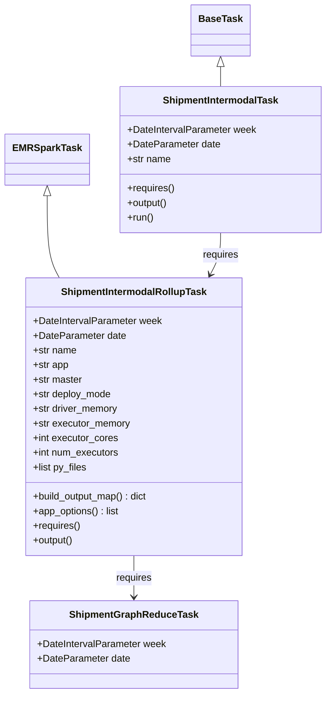
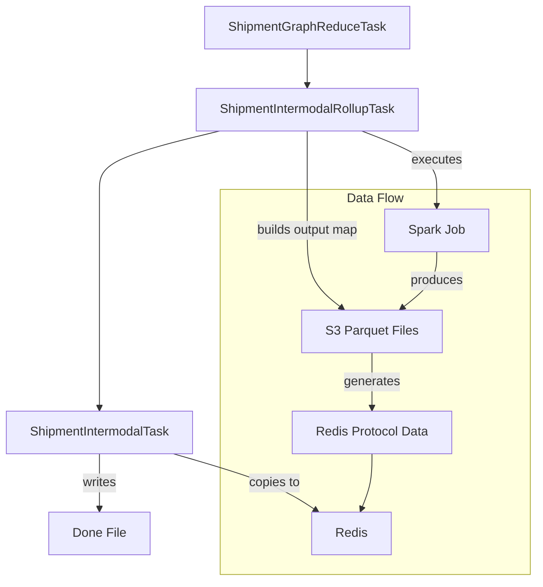

# Diagram: research/orchestrator/tasks/models/shipment_intermodal_task.py


> Auto-generated by Obscura crawlers

## Diagram 1

```mermaid
classDiagram
      EMRSparkTask <|-- ShipmentIntermodalRollupTask
      BaseTask <|-- ShipmentIntermodalTask
      ShipmentIntermodalRollupTask --> ShipmentGraphReduceTask : requires...
  └ 56 lines...

● stop_bash
  └ <command with id: 0 stopped>

● Output diagrams directly
  $ echo 'classDiagram
      EMRSparkTask <|-- ShipmentIntermodalRollupTask
      BaseTask <|-- ShipmentIntermodalTask
      ShipmentIntermodalRollupTask --> ShipmentGraphReduceTask : requires
      ShipmentIntermodalTask --> ShipmentIntermodalRollupTask : requires...
  └ 53 lines...

✗ read_bash
  Invalid shell ID: 1. Please supply a valid shell ID to read output from.

  <no active shell sessions>
```

> SVG rendering failed for this diagram.

## Diagram 2



### SVG

<svg id="container" width="524.4765625" xmlns="http://www.w3.org/2000/svg" class="classDiagram" height="1138" viewBox="0 0 524.4765625 1138" role="graphics-document document" aria-roledescription="class"><style>#container{font-family:"trebuchet ms",verdana,arial,sans-serif;font-size:16px;fill:#333;}@keyframes edge-animation-frame{from{stroke-dashoffset:0;}}@keyframes dash{to{stroke-dashoffset:0;}}#container .edge-animation-slow{stroke-dasharray:9,5!important;stroke-dashoffset:900;animation:dash 50s linear infinite;stroke-linecap:round;}#container .edge-animation-fast{stroke-dasharray:9,5!important;stroke-dashoffset:900;animation:dash 20s linear infinite;stroke-linecap:round;}#container .error-icon{fill:#552222;}#container .error-text{fill:#552222;stroke:#552222;}#container .edge-thickness-normal{stroke-width:1px;}#container .edge-thickness-thick{stroke-width:3.5px;}#container .edge-pattern-solid{stroke-dasharray:0;}#container .edge-thickness-invisible{stroke-width:0;fill:none;}#container .edge-pattern-dashed{stroke-dasharray:3;}#container .edge-pattern-dotted{stroke-dasharray:2;}#container .marker{fill:#333333;stroke:#333333;}#container .marker.cross{stroke:#333333;}#container svg{font-family:"trebuchet ms",verdana,arial,sans-serif;font-size:16px;}#container p{margin:0;}#container g.classGroup text{fill:#9370DB;stroke:none;font-family:"trebuchet ms",verdana,arial,sans-serif;font-size:10px;}#container g.classGroup text .title{font-weight:bolder;}#container .nodeLabel,#container .edgeLabel{color:#131300;}#container .edgeLabel .label rect{fill:#ECECFF;}#container .label text{fill:#131300;}#container .labelBkg{background:#ECECFF;}#container .edgeLabel .label span{background:#ECECFF;}#container .classTitle{font-weight:bolder;}#container .node rect,#container .node circle,#container .node ellipse,#container .node polygon,#container .node path{fill:#ECECFF;stroke:#9370DB;stroke-width:1px;}#container .divider{stroke:#9370DB;stroke-width:1;}#container g.clickable{cursor:pointer;}#container g.classGroup rect{fill:#ECECFF;stroke:#9370DB;}#container g.classGroup line{stroke:#9370DB;stroke-width:1;}#container .classLabel .box{stroke:none;stroke-width:0;fill:#ECECFF;opacity:0.5;}#container .classLabel .label{fill:#9370DB;font-size:10px;}#container .relation{stroke:#333333;stroke-width:1;fill:none;}#container .dashed-line{stroke-dasharray:3;}#container .dotted-line{stroke-dasharray:1 2;}#container #compositionStart,#container .composition{fill:#333333!important;stroke:#333333!important;stroke-width:1;}#container #compositionEnd,#container .composition{fill:#333333!important;stroke:#333333!important;stroke-width:1;}#container #dependencyStart,#container .dependency{fill:#333333!important;stroke:#333333!important;stroke-width:1;}#container #dependencyStart,#container .dependency{fill:#333333!important;stroke:#333333!important;stroke-width:1;}#container #extensionStart,#container .extension{fill:transparent!important;stroke:#333333!important;stroke-width:1;}#container #extensionEnd,#container .extension{fill:transparent!important;stroke:#333333!important;stroke-width:1;}#container #aggregationStart,#container .aggregation{fill:transparent!important;stroke:#333333!important;stroke-width:1;}#container #aggregationEnd,#container .aggregation{fill:transparent!important;stroke:#333333!important;stroke-width:1;}#container #lollipopStart,#container .lollipop{fill:#ECECFF!important;stroke:#333333!important;stroke-width:1;}#container #lollipopEnd,#container .lollipop{fill:#ECECFF!important;stroke:#333333!important;stroke-width:1;}#container .edgeTerminals{font-size:11px;line-height:initial;}#container .classTitleText{text-anchor:middle;font-size:18px;fill:#333;}#container .label-icon{display:inline-block;height:1em;overflow:visible;vertical-align:-0.125em;}#container .node .label-icon path{fill:currentColor;stroke:revert;stroke-width:revert;}#container :root{--mermaid-font-family:"trebuchet ms",verdana,arial,sans-serif;}</style><g><defs><marker id="container_class-aggregationStart" class="marker aggregation class" refX="18" refY="7" markerWidth="190" markerHeight="240" orient="auto"><path d="M 18,7 L9,13 L1,7 L9,1 Z"></path></marker></defs><defs><marker id="container_class-aggregationEnd" class="marker aggregation class" refX="1" refY="7" markerWidth="20" markerHeight="28" orient="auto"><path d="M 18,7 L9,13 L1,7 L9,1 Z"></path></marker></defs><defs><marker id="container_class-extensionStart" class="marker extension class" refX="18" refY="7" markerWidth="190" markerHeight="240" orient="auto"><path d="M 1,7 L18,13 V 1 Z"></path></marker></defs><defs><marker id="container_class-extensionEnd" class="marker extension class" refX="1" refY="7" markerWidth="20" markerHeight="28" orient="auto"><path d="M 1,1 V 13 L18,7 Z"></path></marker></defs><defs><marker id="container_class-compositionStart" class="marker composition class" refX="18" refY="7" markerWidth="190" markerHeight="240" orient="auto"><path d="M 18,7 L9,13 L1,7 L9,1 Z"></path></marker></defs><defs><marker id="container_class-compositionEnd" class="marker composition class" refX="1" refY="7" markerWidth="20" markerHeight="28" orient="auto"><path d="M 18,7 L9,13 L1,7 L9,1 Z"></path></marker></defs><defs><marker id="container_class-dependencyStart" class="marker dependency class" refX="6" refY="7" markerWidth="190" markerHeight="240" orient="auto"><path d="M 5,7 L9,13 L1,7 L9,1 Z"></path></marker></defs><defs><marker id="container_class-dependencyEnd" class="marker dependency class" refX="13" refY="7" markerWidth="20" markerHeight="28" orient="auto"><path d="M 18,7 L9,13 L14,7 L9,1 Z"></path></marker></defs><defs><marker id="container_class-lollipopStart" class="marker lollipop class" refX="13" refY="7" markerWidth="190" markerHeight="240" orient="auto"><circle stroke="black" fill="transparent" cx="7" cy="7" r="6"></circle></marker></defs><defs><marker id="container_class-lollipopEnd" class="marker lollipop class" refX="1" refY="7" markerWidth="190" markerHeight="240" orient="auto"><circle stroke="black" fill="transparent" cx="7" cy="7" r="6"></circle></marker></defs><g class="root"><g class="clusters"></g><g class="edgePaths"><path d="M73.148,321.25L73.148,337.542C73.148,353.833,73.148,386.417,76.397,408.875C79.646,431.333,86.144,443.667,89.393,449.833L92.642,456" id="id_EMRSparkTask_ShipmentIntermodalRollupTask_1" class="edge-thickness-normal edge-pattern-solid relation" style=";;;" data-edge="true" data-et="edge" data-id="id_EMRSparkTask_ShipmentIntermodalRollupTask_1" data-points="W3sieCI6NzMuMTQ4NDM3NSwieSI6MzA0fSx7IngiOjczLjE0ODQzNzUsInkiOjQxOX0seyJ4Ijo5Mi42NDI0MzA3MTkzMzk2MywieSI6NDU2fV0=" marker-start="url(#container_class-extensionStart)"></path><path d="M352.387,109.25L352.387,110.542C352.387,111.833,352.387,114.417,352.387,119.875C352.387,125.333,352.387,133.667,352.387,137.833L352.387,142" id="id_BaseTask_ShipmentIntermodalTask_2" class="edge-thickness-normal edge-pattern-solid relation" style=";;;" data-edge="true" data-et="edge" data-id="id_BaseTask_ShipmentIntermodalTask_2" data-points="W3sieCI6MzUyLjM4NjcxODc1LCJ5Ijo5Mn0seyJ4IjozNTIuMzg2NzE4NzUsInkiOjExN30seyJ4IjozNTIuMzg2NzE4NzUsInkiOjE0Mn1d" marker-start="url(#container_class-extensionStart)"></path><path d="M212.768,912L212.768,918.167C212.768,924.333,212.768,936.667,212.768,948C212.768,959.333,212.768,969.667,212.768,974.833L212.768,980" id="id_ShipmentIntermodalRollupTask_ShipmentGraphReduceTask_3" class="edge-thickness-normal edge-pattern-solid relation" style=";;;" data-edge="true" data-et="edge" data-id="id_ShipmentIntermodalRollupTask_ShipmentGraphReduceTask_3" data-points="W3sieCI6MjEyLjc2NzU3ODEyNSwieSI6OTEyfSx7IngiOjIxMi43Njc1NzgxMjUsInkiOjk0OX0seyJ4IjoyMTIuNzY3NTc4MTI1LCJ5Ijo5ODZ9XQ==" marker-end="url(#container_class-dependencyEnd)"></path><path d="M352.387,382L352.387,388.167C352.387,394.333,352.387,406.667,349.604,418.115C346.821,429.564,341.255,440.128,338.472,445.41L335.689,450.692" id="id_ShipmentIntermodalTask_ShipmentIntermodalRollupTask_4" class="edge-thickness-normal edge-pattern-solid relation" style=";;;" data-edge="true" data-et="edge" data-id="id_ShipmentIntermodalTask_ShipmentIntermodalRollupTask_4" data-points="W3sieCI6MzUyLjM4NjcxODc1LCJ5IjozODJ9LHsieCI6MzUyLjM4NjcxODc1LCJ5Ijo0MTl9LHsieCI6MzMyLjg5MjcyNTUzMDY2MDM2LCJ5Ijo0NTZ9XQ==" marker-end="url(#container_class-dependencyEnd)"></path></g><g class="edgeLabels"><g class="edgeLabel"><g class="label" data-id="id_EMRSparkTask_ShipmentIntermodalRollupTask_1" transform="translate(0, 0)"><foreignObject width="0" height="0"><div xmlns="http://www.w3.org/1999/xhtml" class="labelBkg" style="display: table-cell; white-space: nowrap; line-height: 1.5; max-width: 200px; text-align: center;"><span class="edgeLabel"></span></div></foreignObject></g></g><g class="edgeLabel"><g class="label" data-id="id_BaseTask_ShipmentIntermodalTask_2" transform="translate(0, 0)"><foreignObject width="0" height="0"><div xmlns="http://www.w3.org/1999/xhtml" class="labelBkg" style="display: table-cell; white-space: nowrap; line-height: 1.5; max-width: 200px; text-align: center;"><span class="edgeLabel"></span></div></foreignObject></g></g><g class="edgeLabel" transform="translate(212.767578125, 949)"><g class="label" data-id="id_ShipmentIntermodalRollupTask_ShipmentGraphReduceTask_3" transform="translate(-29.8515625, -12)"><foreignObject width="59.703125" height="24"><div xmlns="http://www.w3.org/1999/xhtml" class="labelBkg" style="display: table-cell; white-space: nowrap; line-height: 1.5; max-width: 200px; text-align: center;"><span class="edgeLabel"><p>requires</p></span></div></foreignObject></g></g><g class="edgeLabel" transform="translate(352.38671875, 419)"><g class="label" data-id="id_ShipmentIntermodalTask_ShipmentIntermodalRollupTask_4" transform="translate(-29.8515625, -12)"><foreignObject width="59.703125" height="24"><div xmlns="http://www.w3.org/1999/xhtml" class="labelBkg" style="display: table-cell; white-space: nowrap; line-height: 1.5; max-width: 200px; text-align: center;"><span class="edgeLabel"><p>requires</p></span></div></foreignObject></g></g></g><g class="nodes"><g class="node default" id="classId-EMRSparkTask-0" transform="translate(73.1484375, 262)"><g class="basic label-container"><path d="M-65.1484375 -42 L65.1484375 -42 L65.1484375 42 L-65.1484375 42" stroke="none" stroke-width="0" fill="#ECECFF" style=""></path><path d="M-65.1484375 -42 C-35.350161730486015 -42, -5.5518859609720295 -42, 65.1484375 -42 M-65.1484375 -42 C-24.34280422497654 -42, 16.46282905004692 -42, 65.1484375 -42 M65.1484375 -42 C65.1484375 -12.474871735244278, 65.1484375 17.050256529511444, 65.1484375 42 M65.1484375 -42 C65.1484375 -20.02971625232769, 65.1484375 1.9405674953446166, 65.1484375 42 M65.1484375 42 C26.1766757225289 42, -12.795086054942203 42, -65.1484375 42 M65.1484375 42 C25.77644561423194 42, -13.595546271536122 42, -65.1484375 42 M-65.1484375 42 C-65.1484375 9.168742813485323, -65.1484375 -23.662514373029353, -65.1484375 -42 M-65.1484375 42 C-65.1484375 24.21091588923836, -65.1484375 6.421831778476722, -65.1484375 -42" stroke="#9370DB" stroke-width="1.3" fill="none" stroke-dasharray="0 0" style=""></path></g><g class="annotation-group text" transform="translate(0, -18)"></g><g class="label-group text" transform="translate(-53.1484375, -18)"><g class="label" style="font-weight: bolder" transform="translate(0,-12)"><foreignObject width="106.296875" height="24"><div xmlns="http://www.w3.org/1999/xhtml" style="display: table-cell; white-space: nowrap; line-height: 1.5; max-width: 154px; text-align: center;"><span class="nodeLabel markdown-node-label" style=""><p>EMRSparkTask</p></span></div></foreignObject></g></g><g class="members-group text" transform="translate(-53.1484375, 30)"></g><g class="methods-group text" transform="translate(-53.1484375, 60)"></g><g class="divider" style=""><path d="M-65.1484375 6 C-20.88125017083668 6, 23.38593715832664 6, 65.1484375 6 M-65.1484375 6 C-21.993456727771623 6, 21.161524044456755 6, 65.1484375 6" stroke="#9370DB" stroke-width="1.3" fill="none" stroke-dasharray="0 0" style=""></path></g><g class="divider" style=""><path d="M-65.1484375 24 C-18.174292393076513 24, 28.799852713846974 24, 65.1484375 24 M-65.1484375 24 C-14.039077874358867 24, 37.070281751282266 24, 65.1484375 24" stroke="#9370DB" stroke-width="1.3" fill="none" stroke-dasharray="0 0" style=""></path></g></g><g class="node default" id="classId-ShipmentIntermodalRollupTask-1" transform="translate(212.767578125, 684)"><g class="basic label-container"><path d="M-175.8828125 -228 L175.8828125 -228 L175.8828125 228 L-175.8828125 228" stroke="none" stroke-width="0" fill="#ECECFF" style=""></path><path d="M-175.8828125 -228 C-43.34720764116173 -228, 89.18839721767654 -228, 175.8828125 -228 M-175.8828125 -228 C-96.61637429844112 -228, -17.34993609688223 -228, 175.8828125 -228 M175.8828125 -228 C175.8828125 -62.639897572344324, 175.8828125 102.72020485531135, 175.8828125 228 M175.8828125 -228 C175.8828125 -124.21196972820013, 175.8828125 -20.423939456400262, 175.8828125 228 M175.8828125 228 C97.50507649817935 228, 19.1273404963587 228, -175.8828125 228 M175.8828125 228 C102.91166381572485 228, 29.9405151314497 228, -175.8828125 228 M-175.8828125 228 C-175.8828125 87.09038916237984, -175.8828125 -53.81922167524033, -175.8828125 -228 M-175.8828125 228 C-175.8828125 86.23518383837296, -175.8828125 -55.52963232325408, -175.8828125 -228" stroke="#9370DB" stroke-width="1.3" fill="none" stroke-dasharray="0 0" style=""></path></g><g class="annotation-group text" transform="translate(0, -204)"></g><g class="label-group text" transform="translate(-115.640625, -204)"><g class="label" style="font-weight: bolder" transform="translate(0,-12)"><foreignObject width="231.28125" height="24"><div xmlns="http://www.w3.org/1999/xhtml" style="display: table-cell; white-space: nowrap; line-height: 1.5; max-width: 280px; text-align: center;"><span class="nodeLabel markdown-node-label" style=""><p>ShipmentIntermodalRollupTask</p></span></div></foreignObject></g></g><g class="members-group text" transform="translate(-163.8828125, -156)"><g class="label" style="" transform="translate(0,-12)"><foreignObject width="212.125" height="24"><div xmlns="http://www.w3.org/1999/xhtml" style="display: table-cell; white-space: nowrap; line-height: 1.5; max-width: 270px; text-align: center;"><span class="nodeLabel markdown-node-label" style=""><p>+DateIntervalParameter week</p></span></div></foreignObject></g><g class="label" style="" transform="translate(0,12)"><foreignObject width="152.171875" height="24"><div xmlns="http://www.w3.org/1999/xhtml" style="display: table-cell; white-space: nowrap; line-height: 1.5; max-width: 210px; text-align: center;"><span class="nodeLabel markdown-node-label" style=""><p>+DateParameter date</p></span></div></foreignObject></g><g class="label" style="" transform="translate(0,36)"><foreignObject width="72.171875" height="24"><div xmlns="http://www.w3.org/1999/xhtml" style="display: table-cell; white-space: nowrap; line-height: 1.5; max-width: 130px; text-align: center;"><span class="nodeLabel markdown-node-label" style=""><p>+str name</p></span></div></foreignObject></g><g class="label" style="" transform="translate(0,60)"><foreignObject width="59.375" height="24"><div xmlns="http://www.w3.org/1999/xhtml" style="display: table-cell; white-space: nowrap; line-height: 1.5; max-width: 117px; text-align: center;"><span class="nodeLabel markdown-node-label" style=""><p>+str app</p></span></div></foreignObject></g><g class="label" style="" transform="translate(0,84)"><foreignObject width="81.8125" height="24"><div xmlns="http://www.w3.org/1999/xhtml" style="display: table-cell; white-space: nowrap; line-height: 1.5; max-width: 140px; text-align: center;"><span class="nodeLabel markdown-node-label" style=""><p>+str master</p></span></div></foreignObject></g><g class="label" style="" transform="translate(0,108)"><foreignObject width="130.390625" height="24"><div xmlns="http://www.w3.org/1999/xhtml" style="display: table-cell; white-space: nowrap; line-height: 1.5; max-width: 188px; text-align: center;"><span class="nodeLabel markdown-node-label" style=""><p>+str deploy_mode</p></span></div></foreignObject></g><g class="label" style="" transform="translate(0,132)"><foreignObject width="141.1875" height="24"><div xmlns="http://www.w3.org/1999/xhtml" style="display: table-cell; white-space: nowrap; line-height: 1.5; max-width: 199px; text-align: center;"><span class="nodeLabel markdown-node-label" style=""><p>+str driver_memory</p></span></div></foreignObject></g><g class="label" style="" transform="translate(0,156)"><foreignObject width="161" height="24"><div xmlns="http://www.w3.org/1999/xhtml" style="display: table-cell; white-space: nowrap; line-height: 1.5; max-width: 218px; text-align: center;"><span class="nodeLabel markdown-node-label" style=""><p>+str executor_memory</p></span></div></foreignObject></g><g class="label" style="" transform="translate(0,180)"><foreignObject width="139.9375" height="24"><div xmlns="http://www.w3.org/1999/xhtml" style="display: table-cell; white-space: nowrap; line-height: 1.5; max-width: 197px; text-align: center;"><span class="nodeLabel markdown-node-label" style=""><p>+int executor_cores</p></span></div></foreignObject></g><g class="label" style="" transform="translate(0,204)"><foreignObject width="142.296875" height="24"><div xmlns="http://www.w3.org/1999/xhtml" style="display: table-cell; white-space: nowrap; line-height: 1.5; max-width: 200px; text-align: center;"><span class="nodeLabel markdown-node-label" style=""><p>+int num_executors</p></span></div></foreignObject></g><g class="label" style="" transform="translate(0,228)"><foreignObject width="89.515625" height="24"><div xmlns="http://www.w3.org/1999/xhtml" style="display: table-cell; white-space: nowrap; line-height: 1.5; max-width: 147px; text-align: center;"><span class="nodeLabel markdown-node-label" style=""><p>+list py_files</p></span></div></foreignObject></g></g><g class="methods-group text" transform="translate(-163.8828125, 132)"><g class="label" style="" transform="translate(0,-12)"><foreignObject width="192.953125" height="24"><div xmlns="http://www.w3.org/1999/xhtml" style="display: table-cell; white-space: nowrap; line-height: 1.5; max-width: 251px; text-align: center;"><span class="nodeLabel markdown-node-label" style=""><p>+build_output_map() : dict</p></span></div></foreignObject></g><g class="label" style="" transform="translate(0,12)"><foreignObject width="143.609375" height="24"><div xmlns="http://www.w3.org/1999/xhtml" style="display: table-cell; white-space: nowrap; line-height: 1.5; max-width: 201px; text-align: center;"><span class="nodeLabel markdown-node-label" style=""><p>+app_options() : list</p></span></div></foreignObject></g><g class="label" style="" transform="translate(0,36)"><foreignObject width="78.0625" height="24"><div xmlns="http://www.w3.org/1999/xhtml" style="display: table-cell; white-space: nowrap; line-height: 1.5; max-width: 135px; text-align: center;"><span class="nodeLabel markdown-node-label" style=""><p>+requires()</p></span></div></foreignObject></g><g class="label" style="" transform="translate(0,60)"><foreignObject width="67.390625" height="24"><div xmlns="http://www.w3.org/1999/xhtml" style="display: table-cell; white-space: nowrap; line-height: 1.5; max-width: 125px; text-align: center;"><span class="nodeLabel markdown-node-label" style=""><p>+output()</p></span></div></foreignObject></g></g><g class="divider" style=""><path d="M-175.8828125 -180 C-103.69925753940913 -180, -31.515702578818264 -180, 175.8828125 -180 M-175.8828125 -180 C-87.51998739377105 -180, 0.8428377124579072 -180, 175.8828125 -180" stroke="#9370DB" stroke-width="1.3" fill="none" stroke-dasharray="0 0" style=""></path></g><g class="divider" style=""><path d="M-175.8828125 108 C-67.66188941702352 108, 40.55903366595297 108, 175.8828125 108 M-175.8828125 108 C-99.28668769892558 108, -22.69056289785115 108, 175.8828125 108" stroke="#9370DB" stroke-width="1.3" fill="none" stroke-dasharray="0 0" style=""></path></g></g><g class="node default" id="classId-BaseTask-2" transform="translate(352.38671875, 50)"><g class="basic label-container"><path d="M-46.03125 -42 L46.03125 -42 L46.03125 42 L-46.03125 42" stroke="none" stroke-width="0" fill="#ECECFF" style=""></path><path d="M-46.03125 -42 C-22.228612944246322 -42, 1.5740241115073559 -42, 46.03125 -42 M-46.03125 -42 C-25.211546996839367 -42, -4.391843993678734 -42, 46.03125 -42 M46.03125 -42 C46.03125 -18.57717607913966, 46.03125 4.845647841720677, 46.03125 42 M46.03125 -42 C46.03125 -8.947788951117083, 46.03125 24.104422097765834, 46.03125 42 M46.03125 42 C9.849245378517658 42, -26.332759242964684 42, -46.03125 42 M46.03125 42 C12.380927228825918 42, -21.269395542348164 42, -46.03125 42 M-46.03125 42 C-46.03125 13.075233335860283, -46.03125 -15.849533328279435, -46.03125 -42 M-46.03125 42 C-46.03125 19.878774168220602, -46.03125 -2.2424516635587963, -46.03125 -42" stroke="#9370DB" stroke-width="1.3" fill="none" stroke-dasharray="0 0" style=""></path></g><g class="annotation-group text" transform="translate(0, -18)"></g><g class="label-group text" transform="translate(-34.03125, -18)"><g class="label" style="font-weight: bolder" transform="translate(0,-12)"><foreignObject width="68.0625" height="24"><div xmlns="http://www.w3.org/1999/xhtml" style="display: table-cell; white-space: nowrap; line-height: 1.5; max-width: 117px; text-align: center;"><span class="nodeLabel markdown-node-label" style=""><p>BaseTask</p></span></div></foreignObject></g></g><g class="members-group text" transform="translate(-34.03125, 30)"></g><g class="methods-group text" transform="translate(-34.03125, 60)"></g><g class="divider" style=""><path d="M-46.03125 6 C-9.414744003796422 6, 27.201761992407157 6, 46.03125 6 M-46.03125 6 C-21.225432648035063 6, 3.580384703929873 6, 46.03125 6" stroke="#9370DB" stroke-width="1.3" fill="none" stroke-dasharray="0 0" style=""></path></g><g class="divider" style=""><path d="M-46.03125 24 C-21.01410055904624 24, 4.003048881907517 24, 46.03125 24 M-46.03125 24 C-11.681393960202051 24, 22.668462079595898 24, 46.03125 24" stroke="#9370DB" stroke-width="1.3" fill="none" stroke-dasharray="0 0" style=""></path></g></g><g class="node default" id="classId-ShipmentIntermodalTask-3" transform="translate(352.38671875, 262)"><g class="basic label-container"><path d="M-164.08984375 -120 L164.08984375 -120 L164.08984375 120 L-164.08984375 120" stroke="none" stroke-width="0" fill="#ECECFF" style=""></path><path d="M-164.08984375 -120 C-47.53450264025 -120, 69.0208384695 -120, 164.08984375 -120 M-164.08984375 -120 C-66.47508046139532 -120, 31.139682827209356 -120, 164.08984375 -120 M164.08984375 -120 C164.08984375 -42.607764412931346, 164.08984375 34.78447117413731, 164.08984375 120 M164.08984375 -120 C164.08984375 -37.22515078671894, 164.08984375 45.54969842656212, 164.08984375 120 M164.08984375 120 C77.33644314765102 120, -9.41695745469795 120, -164.08984375 120 M164.08984375 120 C72.2520147300607 120, -19.585814289878613 120, -164.08984375 120 M-164.08984375 120 C-164.08984375 45.853665008245784, -164.08984375 -28.292669983508432, -164.08984375 -120 M-164.08984375 120 C-164.08984375 43.23132416993744, -164.08984375 -33.537351660125125, -164.08984375 -120" stroke="#9370DB" stroke-width="1.3" fill="none" stroke-dasharray="0 0" style=""></path></g><g class="annotation-group text" transform="translate(0, -96)"></g><g class="label-group text" transform="translate(-92.0546875, -96)"><g class="label" style="font-weight: bolder" transform="translate(0,-12)"><foreignObject width="184.109375" height="24"><div xmlns="http://www.w3.org/1999/xhtml" style="display: table-cell; white-space: nowrap; line-height: 1.5; max-width: 233px; text-align: center;"><span class="nodeLabel markdown-node-label" style=""><p>ShipmentIntermodalTask</p></span></div></foreignObject></g></g><g class="members-group text" transform="translate(-152.08984375, -48)"><g class="label" style="" transform="translate(0,-12)"><foreignObject width="212.125" height="24"><div xmlns="http://www.w3.org/1999/xhtml" style="display: table-cell; white-space: nowrap; line-height: 1.5; max-width: 270px; text-align: center;"><span class="nodeLabel markdown-node-label" style=""><p>+DateIntervalParameter week</p></span></div></foreignObject></g><g class="label" style="" transform="translate(0,12)"><foreignObject width="152.171875" height="24"><div xmlns="http://www.w3.org/1999/xhtml" style="display: table-cell; white-space: nowrap; line-height: 1.5; max-width: 210px; text-align: center;"><span class="nodeLabel markdown-node-label" style=""><p>+DateParameter date</p></span></div></foreignObject></g><g class="label" style="" transform="translate(0,36)"><foreignObject width="72.171875" height="24"><div xmlns="http://www.w3.org/1999/xhtml" style="display: table-cell; white-space: nowrap; line-height: 1.5; max-width: 130px; text-align: center;"><span class="nodeLabel markdown-node-label" style=""><p>+str name</p></span></div></foreignObject></g></g><g class="methods-group text" transform="translate(-152.08984375, 48)"><g class="label" style="" transform="translate(0,-12)"><foreignObject width="78.0625" height="24"><div xmlns="http://www.w3.org/1999/xhtml" style="display: table-cell; white-space: nowrap; line-height: 1.5; max-width: 135px; text-align: center;"><span class="nodeLabel markdown-node-label" style=""><p>+requires()</p></span></div></foreignObject></g><g class="label" style="" transform="translate(0,12)"><foreignObject width="67.390625" height="24"><div xmlns="http://www.w3.org/1999/xhtml" style="display: table-cell; white-space: nowrap; line-height: 1.5; max-width: 125px; text-align: center;"><span class="nodeLabel markdown-node-label" style=""><p>+output()</p></span></div></foreignObject></g><g class="label" style="" transform="translate(0,36)"><foreignObject width="43.21875" height="24"><div xmlns="http://www.w3.org/1999/xhtml" style="display: table-cell; white-space: nowrap; line-height: 1.5; max-width: 101px; text-align: center;"><span class="nodeLabel markdown-node-label" style=""><p>+run()</p></span></div></foreignObject></g></g><g class="divider" style=""><path d="M-164.08984375 -72 C-73.691443839532 -72, 16.706956070936002 -72, 164.08984375 -72 M-164.08984375 -72 C-89.53362742534546 -72, -14.977411100690915 -72, 164.08984375 -72" stroke="#9370DB" stroke-width="1.3" fill="none" stroke-dasharray="0 0" style=""></path></g><g class="divider" style=""><path d="M-164.08984375 24 C-81.81332884744877 24, 0.4631860551024545 24, 164.08984375 24 M-164.08984375 24 C-86.12829141292116 24, -8.166739075842315 24, 164.08984375 24" stroke="#9370DB" stroke-width="1.3" fill="none" stroke-dasharray="0 0" style=""></path></g></g><g class="node default" id="classId-ShipmentGraphReduceTask-4" transform="translate(212.767578125, 1058)"><g class="basic label-container"><path d="M-168.1484375 -72 L168.1484375 -72 L168.1484375 72 L-168.1484375 72" stroke="none" stroke-width="0" fill="#ECECFF" style=""></path><path d="M-168.1484375 -72 C-80.32368719751354 -72, 7.501063104972928 -72, 168.1484375 -72 M-168.1484375 -72 C-95.4690388019796 -72, -22.789640103959186 -72, 168.1484375 -72 M168.1484375 -72 C168.1484375 -29.252066813218207, 168.1484375 13.495866373563587, 168.1484375 72 M168.1484375 -72 C168.1484375 -14.646636230046447, 168.1484375 42.70672753990711, 168.1484375 72 M168.1484375 72 C79.86146022651963 72, -8.42551704696075 72, -168.1484375 72 M168.1484375 72 C74.42838619701097 72, -19.29166510597807 72, -168.1484375 72 M-168.1484375 72 C-168.1484375 36.508848573949166, -168.1484375 1.0176971478983319, -168.1484375 -72 M-168.1484375 72 C-168.1484375 33.97783170695634, -168.1484375 -4.044336586087326, -168.1484375 -72" stroke="#9370DB" stroke-width="1.3" fill="none" stroke-dasharray="0 0" style=""></path></g><g class="annotation-group text" transform="translate(0, -48)"></g><g class="label-group text" transform="translate(-100.171875, -48)"><g class="label" style="font-weight: bolder" transform="translate(0,-12)"><foreignObject width="200.34375" height="24"><div xmlns="http://www.w3.org/1999/xhtml" style="display: table-cell; white-space: nowrap; line-height: 1.5; max-width: 249px; text-align: center;"><span class="nodeLabel markdown-node-label" style=""><p>ShipmentGraphReduceTask</p></span></div></foreignObject></g></g><g class="members-group text" transform="translate(-156.1484375, 0)"><g class="label" style="" transform="translate(0,-12)"><foreignObject width="212.125" height="24"><div xmlns="http://www.w3.org/1999/xhtml" style="display: table-cell; white-space: nowrap; line-height: 1.5; max-width: 270px; text-align: center;"><span class="nodeLabel markdown-node-label" style=""><p>+DateIntervalParameter week</p></span></div></foreignObject></g><g class="label" style="" transform="translate(0,12)"><foreignObject width="152.171875" height="24"><div xmlns="http://www.w3.org/1999/xhtml" style="display: table-cell; white-space: nowrap; line-height: 1.5; max-width: 210px; text-align: center;"><span class="nodeLabel markdown-node-label" style=""><p>+DateParameter date</p></span></div></foreignObject></g></g><g class="methods-group text" transform="translate(-156.1484375, 72)"></g><g class="divider" style=""><path d="M-168.1484375 -24 C-35.57267611949186 -24, 97.00308526101628 -24, 168.1484375 -24 M-168.1484375 -24 C-46.474363935313605 -24, 75.19970962937279 -24, 168.1484375 -24" stroke="#9370DB" stroke-width="1.3" fill="none" stroke-dasharray="0 0" style=""></path></g><g class="divider" style=""><path d="M-168.1484375 48 C-83.98558975346198 48, 0.17725799307604007 48, 168.1484375 48 M-168.1484375 48 C-89.90158614928993 48, -11.654734798579852 48, 168.1484375 48" stroke="#9370DB" stroke-width="1.3" fill="none" stroke-dasharray="0 0" style=""></path></g></g></g></g></g></svg>

## Diagram 3



### SVG

<svg id="container" width="689.75390625" xmlns="http://www.w3.org/2000/svg" class="flowchart" height="736" viewBox="0 0 689.75390625 736" role="graphics-document document" aria-roledescription="flowchart-v2"><style>#container{font-family:"trebuchet ms",verdana,arial,sans-serif;font-size:16px;fill:#333;}@keyframes edge-animation-frame{from{stroke-dashoffset:0;}}@keyframes dash{to{stroke-dashoffset:0;}}#container .edge-animation-slow{stroke-dasharray:9,5!important;stroke-dashoffset:900;animation:dash 50s linear infinite;stroke-linecap:round;}#container .edge-animation-fast{stroke-dasharray:9,5!important;stroke-dashoffset:900;animation:dash 20s linear infinite;stroke-linecap:round;}#container .error-icon{fill:#552222;}#container .error-text{fill:#552222;stroke:#552222;}#container .edge-thickness-normal{stroke-width:1px;}#container .edge-thickness-thick{stroke-width:3.5px;}#container .edge-pattern-solid{stroke-dasharray:0;}#container .edge-thickness-invisible{stroke-width:0;fill:none;}#container .edge-pattern-dashed{stroke-dasharray:3;}#container .edge-pattern-dotted{stroke-dasharray:2;}#container .marker{fill:#333333;stroke:#333333;}#container .marker.cross{stroke:#333333;}#container svg{font-family:"trebuchet ms",verdana,arial,sans-serif;font-size:16px;}#container p{margin:0;}#container .label{font-family:"trebuchet ms",verdana,arial,sans-serif;color:#333;}#container .cluster-label text{fill:#333;}#container .cluster-label span{color:#333;}#container .cluster-label span p{background-color:transparent;}#container .label text,#container span{fill:#333;color:#333;}#container .node rect,#container .node circle,#container .node ellipse,#container .node polygon,#container .node path{fill:#ECECFF;stroke:#9370DB;stroke-width:1px;}#container .rough-node .label text,#container .node .label text,#container .image-shape .label,#container .icon-shape .label{text-anchor:middle;}#container .node .katex path{fill:#000;stroke:#000;stroke-width:1px;}#container .rough-node .label,#container .node .label,#container .image-shape .label,#container .icon-shape .label{text-align:center;}#container .node.clickable{cursor:pointer;}#container .root .anchor path{fill:#333333!important;stroke-width:0;stroke:#333333;}#container .arrowheadPath{fill:#333333;}#container .edgePath .path{stroke:#333333;stroke-width:2.0px;}#container .flowchart-link{stroke:#333333;fill:none;}#container .edgeLabel{background-color:rgba(232,232,232, 0.8);text-align:center;}#container .edgeLabel p{background-color:rgba(232,232,232, 0.8);}#container .edgeLabel rect{opacity:0.5;background-color:rgba(232,232,232, 0.8);fill:rgba(232,232,232, 0.8);}#container .labelBkg{background-color:rgba(232, 232, 232, 0.5);}#container .cluster rect{fill:#ffffde;stroke:#aaaa33;stroke-width:1px;}#container .cluster text{fill:#333;}#container .cluster span{color:#333;}#container div.mermaidTooltip{position:absolute;text-align:center;max-width:200px;padding:2px;font-family:"trebuchet ms",verdana,arial,sans-serif;font-size:12px;background:hsl(80, 100%, 96.2745098039%);border:1px solid #aaaa33;border-radius:2px;pointer-events:none;z-index:100;}#container .flowchartTitleText{text-anchor:middle;font-size:18px;fill:#333;}#container rect.text{fill:none;stroke-width:0;}#container .icon-shape,#container .image-shape{background-color:rgba(232,232,232, 0.8);text-align:center;}#container .icon-shape p,#container .image-shape p{background-color:rgba(232,232,232, 0.8);padding:2px;}#container .icon-shape rect,#container .image-shape rect{opacity:0.5;background-color:rgba(232,232,232, 0.8);fill:rgba(232,232,232, 0.8);}#container .label-icon{display:inline-block;height:1em;overflow:visible;vertical-align:-0.125em;}#container .node .label-icon path{fill:currentColor;stroke:revert;stroke-width:revert;}#container :root{--mermaid-font-family:"trebuchet ms",verdana,arial,sans-serif;}</style><g><marker id="container_flowchart-v2-pointEnd" class="marker flowchart-v2" viewBox="0 0 10 10" refX="5" refY="5" markerUnits="userSpaceOnUse" markerWidth="8" markerHeight="8" orient="auto"><path d="M 0 0 L 10 5 L 0 10 z" class="arrowMarkerPath" style="stroke-width: 1; stroke-dasharray: 1, 0;"></path></marker><marker id="container_flowchart-v2-pointStart" class="marker flowchart-v2" viewBox="0 0 10 10" refX="4.5" refY="5" markerUnits="userSpaceOnUse" markerWidth="8" markerHeight="8" orient="auto"><path d="M 0 5 L 10 10 L 10 0 z" class="arrowMarkerPath" style="stroke-width: 1; stroke-dasharray: 1, 0;"></path></marker><marker id="container_flowchart-v2-circleEnd" class="marker flowchart-v2" viewBox="0 0 10 10" refX="11" refY="5" markerUnits="userSpaceOnUse" markerWidth="11" markerHeight="11" orient="auto"><circle cx="5" cy="5" r="5" class="arrowMarkerPath" style="stroke-width: 1; stroke-dasharray: 1, 0;"></circle></marker><marker id="container_flowchart-v2-circleStart" class="marker flowchart-v2" viewBox="0 0 10 10" refX="-1" refY="5" markerUnits="userSpaceOnUse" markerWidth="11" markerHeight="11" orient="auto"><circle cx="5" cy="5" r="5" class="arrowMarkerPath" style="stroke-width: 1; stroke-dasharray: 1, 0;"></circle></marker><marker id="container_flowchart-v2-crossEnd" class="marker cross flowchart-v2" viewBox="0 0 11 11" refX="12" refY="5.2" markerUnits="userSpaceOnUse" markerWidth="11" markerHeight="11" orient="auto"><path d="M 1,1 l 9,9 M 10,1 l -9,9" class="arrowMarkerPath" style="stroke-width: 2; stroke-dasharray: 1, 0;"></path></marker><marker id="container_flowchart-v2-crossStart" class="marker cross flowchart-v2" viewBox="0 0 11 11" refX="-1" refY="5.2" markerUnits="userSpaceOnUse" markerWidth="11" markerHeight="11" orient="auto"><path d="M 1,1 l 9,9 M 10,1 l -9,9" class="arrowMarkerPath" style="stroke-width: 2; stroke-dasharray: 1, 0;"></path></marker><g class="root"><g class="clusters"><g class="cluster" id="subGraph0" data-look="classic"><rect style="" x="284.765625" y="240" width="396.98828125" height="488"></rect><g class="cluster-label" transform="translate(447.970703125, 240)"><foreignObject width="70.578125" height="24"><div xmlns="http://www.w3.org/1999/xhtml" style="display: table-cell; white-space: nowrap; line-height: 1.5; max-width: 200px; text-align: center;"><span class="nodeLabel"><p>Data Flow</p></span></div></foreignObject></g></g></g><g class="edgePaths"><path d="M397.301,62L397.301,66.167C397.301,70.333,397.301,78.667,397.301,86.333C397.301,94,397.301,101,397.301,104.5L397.301,108" id="L_A_B_0" class="edge-thickness-normal edge-pattern-solid edge-thickness-normal edge-pattern-solid flowchart-link" style=";" data-edge="true" data-et="edge" data-id="L_A_B_0" data-points="W3sieCI6Mzk3LjMwMDc4MTI1LCJ5Ijo2Mn0seyJ4IjozOTcuMzAwNzgxMjUsInkiOjg3fSx7IngiOjM5Ny4zMDA3ODEyNSwieSI6MTEyfV0=" marker-end="url(#container_flowchart-v2-pointEnd)"></path><path d="M284.062,166L258.199,172.167C232.336,178.333,180.609,190.667,154.746,203C128.883,215.333,128.883,227.667,128.883,242.5C128.883,257.333,128.883,274.667,128.883,294C128.883,313.333,128.883,334.667,128.883,356C128.883,377.333,128.883,398.667,128.883,420C128.883,441.333,128.883,462.667,128.883,478.833C128.883,495,128.883,506,128.883,511.5L128.883,517" id="L_B_C_0" class="edge-thickness-normal edge-pattern-solid edge-thickness-normal edge-pattern-solid flowchart-link" style=";" data-edge="true" data-et="edge" data-id="L_B_C_0" data-points="W3sieCI6Mjg0LjA2MTk1MDY4MzU5Mzc1LCJ5IjoxNjZ9LHsieCI6MTI4Ljg4MjgxMjUsInkiOjIwM30seyJ4IjoxMjguODgyODEyNSwieSI6MjQwfSx7IngiOjEyOC44ODI4MTI1LCJ5IjoyOTJ9LHsieCI6MTI4Ljg4MjgxMjUsInkiOjM1Nn0seyJ4IjoxMjguODgyODEyNSwieSI6NDIwfSx7IngiOjEyOC44ODI4MTI1LCJ5Ijo0ODR9LHsieCI6MTI4Ljg4MjgxMjUsInkiOjUyMX1d" marker-end="url(#container_flowchart-v2-pointEnd)"></path><path d="M397.301,166L397.301,172.167C397.301,178.333,397.301,190.667,397.301,203C397.301,215.333,397.301,227.667,397.301,242.5C397.301,257.333,397.301,274.667,397.301,294C397.301,313.333,397.301,334.667,404.806,351.094C412.311,367.521,427.321,379.043,434.826,384.804L442.331,390.564" id="L_B_D_0" class="edge-thickness-normal edge-pattern-solid edge-thickness-normal edge-pattern-solid flowchart-link" style=";" data-edge="true" data-et="edge" data-id="L_B_D_0" data-points="W3sieCI6Mzk3LjMwMDc4MTI1LCJ5IjoxNjZ9LHsieCI6Mzk3LjMwMDc4MTI1LCJ5IjoyMDN9LHsieCI6Mzk3LjMwMDc4MTI1LCJ5IjoyNDB9LHsieCI6Mzk3LjMwMDc4MTI1LCJ5IjoyOTJ9LHsieCI6Mzk3LjMwMDc4MTI1LCJ5IjozNTZ9LHsieCI6NDQ1LjUwNDIxMTQyNTc4MTI1LCJ5IjozOTN9XQ==" marker-end="url(#container_flowchart-v2-pointEnd)"></path><path d="M467.652,166L483.72,172.167C499.787,178.333,531.923,190.667,547.991,203C564.059,215.333,564.059,227.667,564.059,237.333C564.059,247,564.059,254,564.059,257.5L564.059,261" id="L_B_E_0" class="edge-thickness-normal edge-pattern-solid edge-thickness-normal edge-pattern-solid flowchart-link" style=";" data-edge="true" data-et="edge" data-id="L_B_E_0" data-points="W3sieCI6NDY3LjY1MTczMzM5ODQzNzUsInkiOjE2Nn0seyJ4Ijo1NjQuMDU4NTkzNzUsInkiOjIwM30seyJ4Ijo1NjQuMDU4NTkzNzUsInkiOjI0MH0seyJ4Ijo1NjQuMDU4NTkzNzUsInkiOjI2NX1d" marker-end="url(#container_flowchart-v2-pointEnd)"></path><path d="M223.727,575L245.389,581.167C267.051,587.333,310.375,599.667,341.156,611.642C371.937,623.617,390.175,635.234,399.294,641.043L408.414,646.851" id="L_C_F_0" class="edge-thickness-normal edge-pattern-solid edge-thickness-normal edge-pattern-solid flowchart-link" style=";" data-edge="true" data-et="edge" data-id="L_C_F_0" data-points="W3sieCI6MjIzLjcyNzIzMzg4NjcxODc1LCJ5Ijo1NzV9LHsieCI6MzUzLjY5OTIxODc1LCJ5Ijo2MTJ9LHsieCI6NDExLjc4NzIzMTQ0NTMxMjUsInkiOjY0OX1d" marker-end="url(#container_flowchart-v2-pointEnd)"></path><path d="M128.883,575L128.883,581.167C128.883,587.333,128.883,599.667,128.883,611.333C128.883,623,128.883,634,128.883,639.5L128.883,645" id="L_C_G_0" class="edge-thickness-normal edge-pattern-solid edge-thickness-normal edge-pattern-solid flowchart-link" style=";" data-edge="true" data-et="edge" data-id="L_C_G_0" data-points="W3sieCI6MTI4Ljg4MjgxMjUsInkiOjU3NX0seyJ4IjoxMjguODgyODEyNSwieSI6NjEyfSx7IngiOjEyOC44ODI4MTI1LCJ5Ijo2NDl9XQ==" marker-end="url(#container_flowchart-v2-pointEnd)"></path><path d="M564.059,319L564.059,325.167C564.059,331.333,564.059,343.667,556.554,355.594C549.048,367.521,534.038,379.043,526.533,384.804L519.028,390.564" id="L_E_D_0" class="edge-thickness-normal edge-pattern-solid edge-thickness-normal edge-pattern-solid flowchart-link" style=";" data-edge="true" data-et="edge" data-id="L_E_D_0" data-points="W3sieCI6NTY0LjA1ODU5Mzc1LCJ5IjozMTl9LHsieCI6NTY0LjA1ODU5Mzc1LCJ5IjozNTZ9LHsieCI6NTE1Ljg1NTE2MzU3NDIxODgsInkiOjM5M31d" marker-end="url(#container_flowchart-v2-pointEnd)"></path><path d="M480.68,447L480.68,453.167C480.68,459.333,480.68,471.667,480.68,483.333C480.68,495,480.68,506,480.68,511.5L480.68,517" id="L_D_H_0" class="edge-thickness-normal edge-pattern-solid edge-thickness-normal edge-pattern-solid flowchart-link" style=";" data-edge="true" data-et="edge" data-id="L_D_H_0" data-points="W3sieCI6NDgwLjY3OTY4NzUsInkiOjQ0N30seyJ4Ijo0ODAuNjc5Njg3NSwieSI6NDg0fSx7IngiOjQ4MC42Nzk2ODc1LCJ5Ijo1MjF9XQ==" marker-end="url(#container_flowchart-v2-pointEnd)"></path><path d="M480.68,575L480.68,581.167C480.68,587.333,480.68,599.667,478.381,611.384C476.082,623.101,471.485,634.203,469.186,639.754L466.888,645.304" id="L_H_F_0" class="edge-thickness-normal edge-pattern-solid edge-thickness-normal edge-pattern-solid flowchart-link" style=";" data-edge="true" data-et="edge" data-id="L_H_F_0" data-points="W3sieCI6NDgwLjY3OTY4NzUsInkiOjU3NX0seyJ4Ijo0ODAuNjc5Njg3NSwieSI6NjEyfSx7IngiOjQ2NS4zNTcxMTY2OTkyMTg3NSwieSI6NjQ5fV0=" marker-end="url(#container_flowchart-v2-pointEnd)"></path></g><g class="edgeLabels"><g class="edgeLabel"><g class="label" data-id="L_A_B_0" transform="translate(0, 0)"><foreignObject width="0" height="0"><div xmlns="http://www.w3.org/1999/xhtml" class="labelBkg" style="display: table-cell; white-space: nowrap; line-height: 1.5; max-width: 200px; text-align: center;"><span class="edgeLabel"></span></div></foreignObject></g></g><g class="edgeLabel"><g class="label" data-id="L_B_C_0" transform="translate(0, 0)"><foreignObject width="0" height="0"><div xmlns="http://www.w3.org/1999/xhtml" class="labelBkg" style="display: table-cell; white-space: nowrap; line-height: 1.5; max-width: 200px; text-align: center;"><span class="edgeLabel"></span></div></foreignObject></g></g><g class="edgeLabel" transform="translate(397.30078125, 292)"><g class="label" data-id="L_B_D_0" transform="translate(-67.203125, -12)"><foreignObject width="134.40625" height="24"><div xmlns="http://www.w3.org/1999/xhtml" class="labelBkg" style="display: table-cell; white-space: nowrap; line-height: 1.5; max-width: 200px; text-align: center;"><span class="edgeLabel"><p>builds output map</p></span></div></foreignObject></g></g><g class="edgeLabel" transform="translate(564.05859375, 203)"><g class="label" data-id="L_B_E_0" transform="translate(-31.7265625, -12)"><foreignObject width="63.453125" height="24"><div xmlns="http://www.w3.org/1999/xhtml" class="labelBkg" style="display: table-cell; white-space: nowrap; line-height: 1.5; max-width: 200px; text-align: center;"><span class="edgeLabel"><p>executes</p></span></div></foreignObject></g></g><g class="edgeLabel" transform="translate(353.69921875, 612)"><g class="label" data-id="L_C_F_0" transform="translate(-33.0078125, -12)"><foreignObject width="66.015625" height="24"><div xmlns="http://www.w3.org/1999/xhtml" class="labelBkg" style="display: table-cell; white-space: nowrap; line-height: 1.5; max-width: 200px; text-align: center;"><span class="edgeLabel"><p>copies to</p></span></div></foreignObject></g></g><g class="edgeLabel" transform="translate(128.8828125, 612)"><g class="label" data-id="L_C_G_0" transform="translate(-21.9453125, -12)"><foreignObject width="43.890625" height="24"><div xmlns="http://www.w3.org/1999/xhtml" class="labelBkg" style="display: table-cell; white-space: nowrap; line-height: 1.5; max-width: 200px; text-align: center;"><span class="edgeLabel"><p>writes</p></span></div></foreignObject></g></g><g class="edgeLabel" transform="translate(564.05859375, 356)"><g class="label" data-id="L_E_D_0" transform="translate(-33.4765625, -12)"><foreignObject width="66.953125" height="24"><div xmlns="http://www.w3.org/1999/xhtml" class="labelBkg" style="display: table-cell; white-space: nowrap; line-height: 1.5; max-width: 200px; text-align: center;"><span class="edgeLabel"><p>produces</p></span></div></foreignObject></g></g><g class="edgeLabel" transform="translate(480.6796875, 484)"><g class="label" data-id="L_D_H_0" transform="translate(-35.46875, -12)"><foreignObject width="70.9375" height="24"><div xmlns="http://www.w3.org/1999/xhtml" class="labelBkg" style="display: table-cell; white-space: nowrap; line-height: 1.5; max-width: 200px; text-align: center;"><span class="edgeLabel"><p>generates</p></span></div></foreignObject></g></g><g class="edgeLabel"><g class="label" data-id="L_H_F_0" transform="translate(0, 0)"><foreignObject width="0" height="0"><div xmlns="http://www.w3.org/1999/xhtml" class="labelBkg" style="display: table-cell; white-space: nowrap; line-height: 1.5; max-width: 200px; text-align: center;"><span class="edgeLabel"></span></div></foreignObject></g></g></g><g class="nodes"><g class="node default" id="flowchart-A-0" transform="translate(397.30078125, 35)"><rect class="basic label-container" style="" x="-128.8828125" y="-27" width="257.765625" height="54"></rect><g class="label" style="" transform="translate(-98.8828125, -12)"><rect></rect><foreignObject width="197.765625" height="24"><div xmlns="http://www.w3.org/1999/xhtml" style="display: table-cell; white-space: nowrap; line-height: 1.5; max-width: 200px; text-align: center;"><span class="nodeLabel"><p>ShipmentGraphReduceTask</p></span></div></foreignObject></g></g><g class="node default" id="flowchart-B-1" transform="translate(397.30078125, 139)"><rect class="basic label-container" style="" x="-144.375" y="-27" width="288.75" height="54"></rect><g class="label" style="" transform="translate(-114.375, -12)"><rect></rect><foreignObject width="228.75" height="24"><div xmlns="http://www.w3.org/1999/xhtml" style="display: table; white-space: break-spaces; line-height: 1.5; max-width: 200px; text-align: center; width: 200px;"><span class="nodeLabel"><p>ShipmentIntermodalRollupTask</p></span></div></foreignObject></g></g><g class="node default" id="flowchart-C-3" transform="translate(128.8828125, 548)"><rect class="basic label-container" style="" x="-120.8828125" y="-27" width="241.765625" height="54"></rect><g class="label" style="" transform="translate(-90.8828125, -12)"><rect></rect><foreignObject width="181.765625" height="24"><div xmlns="http://www.w3.org/1999/xhtml" style="display: table-cell; white-space: nowrap; line-height: 1.5; max-width: 200px; text-align: center;"><span class="nodeLabel"><p>ShipmentIntermodalTask</p></span></div></foreignObject></g></g><g class="node default" id="flowchart-D-5" transform="translate(480.6796875, 420)"><rect class="basic label-container" style="" x="-86.9921875" y="-27" width="173.984375" height="54"></rect><g class="label" style="" transform="translate(-56.9921875, -12)"><rect></rect><foreignObject width="113.984375" height="24"><div xmlns="http://www.w3.org/1999/xhtml" style="display: table-cell; white-space: nowrap; line-height: 1.5; max-width: 200px; text-align: center;"><span class="nodeLabel"><p>S3 Parquet Files</p></span></div></foreignObject></g></g><g class="node default" id="flowchart-E-7" transform="translate(564.05859375, 292)"><rect class="basic label-container" style="" x="-64.5546875" y="-27" width="129.109375" height="54"></rect><g class="label" style="" transform="translate(-34.5546875, -12)"><rect></rect><foreignObject width="69.109375" height="24"><div xmlns="http://www.w3.org/1999/xhtml" style="display: table-cell; white-space: nowrap; line-height: 1.5; max-width: 200px; text-align: center;"><span class="nodeLabel"><p>Spark Job</p></span></div></foreignObject></g></g><g class="node default" id="flowchart-F-9" transform="translate(454.17578125, 676)"><rect class="basic label-container" style="" x="-49.859375" y="-27" width="99.71875" height="54"></rect><g class="label" style="" transform="translate(-19.859375, -12)"><rect></rect><foreignObject width="39.71875" height="24"><div xmlns="http://www.w3.org/1999/xhtml" style="display: table-cell; white-space: nowrap; line-height: 1.5; max-width: 200px; text-align: center;"><span class="nodeLabel"><p>Redis</p></span></div></foreignObject></g></g><g class="node default" id="flowchart-G-11" transform="translate(128.8828125, 676)"><rect class="basic label-container" style="" x="-63.5625" y="-27" width="127.125" height="54"></rect><g class="label" style="" transform="translate(-33.5625, -12)"><rect></rect><foreignObject width="67.125" height="24"><div xmlns="http://www.w3.org/1999/xhtml" style="display: table-cell; white-space: nowrap; line-height: 1.5; max-width: 200px; text-align: center;"><span class="nodeLabel"><p>Done File</p></span></div></foreignObject></g></g><g class="node default" id="flowchart-H-15" transform="translate(480.6796875, 548)"><rect class="basic label-container" style="" x="-100.8359375" y="-27" width="201.671875" height="54"></rect><g class="label" style="" transform="translate(-70.8359375, -12)"><rect></rect><foreignObject width="141.671875" height="24"><div xmlns="http://www.w3.org/1999/xhtml" style="display: table-cell; white-space: nowrap; line-height: 1.5; max-width: 200px; text-align: center;"><span class="nodeLabel"><p>Redis Protocol Data</p></span></div></foreignObject></g></g></g></g></g></svg>
