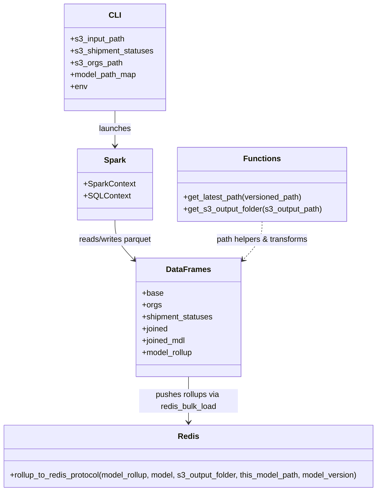

# Diagram: research/orchestrator/tasks/models/shipment_ltl_latlng_status_spark.py


> Auto-generated by Obscura crawlers

## Diagram 1

```mermaid
graph TD
  A[CLI args: s3_input_path, s3_shipment_statuses, s3_orgs_path, model_path_map, env] --> B[Init SparkContext & SQLContext]
  B --> C[Read base parquet (s3_input_path)]
  C --> D[Filter: sstop_final_stop_arrived_at IS NOT NULL]
  D --> E[Filter: sstop_final_stop_location_id == ship_destination_newloc_id]
  E --> F[Read orgs parquet (s3_orgs_path) select id,fv_id]
  F --> G[Rename org columns -> org_*]
  G --> H[Join base with orgs on ship_created_by_org_id == org_id]
  H --> I[Filter ship_mode_id == 3 (LTL)]
  I --> J[Read shipment_statuses parquet (s3_shipment_statuses)]
  J --> K[Join base & shipment_statuses on ship_id == sstat2_shipment_id]
  K --> L[Compute shipment_status_to_arrival_seconds = unix_timestamp(arrived_at) - unix_timestamp(actual_created_at)]
  L --> M[Add day_of_week column]
  M --> N[Read loc parquet (location.location.parquet)]
  N --> O[Compute dest_shipper_location_id_city = UPPER(concat_ws('-', city,state,country))]
  O --> P[Rename id->dupe_dest_loc_id, state->dest_shipper_location_id_state; drop city,country]
  P --> Q[Join loc on true_destination_location_id == dupe_dest_loc_id]
  Q --> R[Filter sstop_final_stop_arrived_at >= window_start_date (1 year)]
  R --> S[Compute sun_thru_thurs = 1 if day_of_week in 1..5 else 0]
  S --> T[Compute raw_data_output_path from model_path_map and base_output_path]
  T --> U[Write joined -> get_latest_path(raw_data_output_path)]
  U --> V[Read joined from get_latest_path(raw_data_output_path)]
  V --> W[For each model in MODEL_MAP]
  W --> X[Set rollup_keys = MODEL_MAP[model]['model_rollup']]
  X --> Y[wspec = Window.partitionBy(rollup_keys)]
  Y --> Z[Compute std_shipment_status_to_arrival_seconds, avg, median, mean over wspec]
  Z --> AA[Compute stddev_distance = (shipment_status_to_arrival_seconds - mean)/std_shipment_status_to_arrival_seconds]
  AA --> AB[Filter where -1.5 <= stddev_distance <= 1.5]
  AB --> AC[Compute deltas: delt30,delt60,delt90,delt120,delt180,delt365]
  AC --> AD[GroupBy rollup_keys and aggregate metrics (30/60/90/120/180/365 means,std,count,percentile_approx)]
  AD --> AE[Determine this_model_path, model_version, s3_output_folder = get_s3_output_folder(this_model_path)]
  AE --> AF[Write model_rollup.parquet(this_model_path)]
  AF --> AG[Read model_rollup from this_model_path]
  AG --> AH[Call redis_bulk_load.rollup_to_redis_protocol(model_rollup, model, s3_output_folder, this_model_path, model_version)]
  AH --> AI[Write model_rollup to get_latest_path(this_model_path)]
  AI --> AJ((End))
```

> SVG rendering failed for this diagram.

## Diagram 2



### SVG

<svg id="container" width="785.125" xmlns="http://www.w3.org/2000/svg" class="classDiagram" height="994" viewBox="0 0 785.125 994" role="graphics-document document" aria-roledescription="class"><style>#container{font-family:"trebuchet ms",verdana,arial,sans-serif;font-size:16px;fill:#333;}@keyframes edge-animation-frame{from{stroke-dashoffset:0;}}@keyframes dash{to{stroke-dashoffset:0;}}#container .edge-animation-slow{stroke-dasharray:9,5!important;stroke-dashoffset:900;animation:dash 50s linear infinite;stroke-linecap:round;}#container .edge-animation-fast{stroke-dasharray:9,5!important;stroke-dashoffset:900;animation:dash 20s linear infinite;stroke-linecap:round;}#container .error-icon{fill:#552222;}#container .error-text{fill:#552222;stroke:#552222;}#container .edge-thickness-normal{stroke-width:1px;}#container .edge-thickness-thick{stroke-width:3.5px;}#container .edge-pattern-solid{stroke-dasharray:0;}#container .edge-thickness-invisible{stroke-width:0;fill:none;}#container .edge-pattern-dashed{stroke-dasharray:3;}#container .edge-pattern-dotted{stroke-dasharray:2;}#container .marker{fill:#333333;stroke:#333333;}#container .marker.cross{stroke:#333333;}#container svg{font-family:"trebuchet ms",verdana,arial,sans-serif;font-size:16px;}#container p{margin:0;}#container g.classGroup text{fill:#9370DB;stroke:none;font-family:"trebuchet ms",verdana,arial,sans-serif;font-size:10px;}#container g.classGroup text .title{font-weight:bolder;}#container .nodeLabel,#container .edgeLabel{color:#131300;}#container .edgeLabel .label rect{fill:#ECECFF;}#container .label text{fill:#131300;}#container .labelBkg{background:#ECECFF;}#container .edgeLabel .label span{background:#ECECFF;}#container .classTitle{font-weight:bolder;}#container .node rect,#container .node circle,#container .node ellipse,#container .node polygon,#container .node path{fill:#ECECFF;stroke:#9370DB;stroke-width:1px;}#container .divider{stroke:#9370DB;stroke-width:1;}#container g.clickable{cursor:pointer;}#container g.classGroup rect{fill:#ECECFF;stroke:#9370DB;}#container g.classGroup line{stroke:#9370DB;stroke-width:1;}#container .classLabel .box{stroke:none;stroke-width:0;fill:#ECECFF;opacity:0.5;}#container .classLabel .label{fill:#9370DB;font-size:10px;}#container .relation{stroke:#333333;stroke-width:1;fill:none;}#container .dashed-line{stroke-dasharray:3;}#container .dotted-line{stroke-dasharray:1 2;}#container #compositionStart,#container .composition{fill:#333333!important;stroke:#333333!important;stroke-width:1;}#container #compositionEnd,#container .composition{fill:#333333!important;stroke:#333333!important;stroke-width:1;}#container #dependencyStart,#container .dependency{fill:#333333!important;stroke:#333333!important;stroke-width:1;}#container #dependencyStart,#container .dependency{fill:#333333!important;stroke:#333333!important;stroke-width:1;}#container #extensionStart,#container .extension{fill:transparent!important;stroke:#333333!important;stroke-width:1;}#container #extensionEnd,#container .extension{fill:transparent!important;stroke:#333333!important;stroke-width:1;}#container #aggregationStart,#container .aggregation{fill:transparent!important;stroke:#333333!important;stroke-width:1;}#container #aggregationEnd,#container .aggregation{fill:transparent!important;stroke:#333333!important;stroke-width:1;}#container #lollipopStart,#container .lollipop{fill:#ECECFF!important;stroke:#333333!important;stroke-width:1;}#container #lollipopEnd,#container .lollipop{fill:#ECECFF!important;stroke:#333333!important;stroke-width:1;}#container .edgeTerminals{font-size:11px;line-height:initial;}#container .classTitleText{text-anchor:middle;font-size:18px;fill:#333;}#container .label-icon{display:inline-block;height:1em;overflow:visible;vertical-align:-0.125em;}#container .node .label-icon path{fill:currentColor;stroke:revert;stroke-width:revert;}#container :root{--mermaid-font-family:"trebuchet ms",verdana,arial,sans-serif;}</style><g><defs><marker id="container_class-aggregationStart" class="marker aggregation class" refX="18" refY="7" markerWidth="190" markerHeight="240" orient="auto"><path d="M 18,7 L9,13 L1,7 L9,1 Z"></path></marker></defs><defs><marker id="container_class-aggregationEnd" class="marker aggregation class" refX="1" refY="7" markerWidth="20" markerHeight="28" orient="auto"><path d="M 18,7 L9,13 L1,7 L9,1 Z"></path></marker></defs><defs><marker id="container_class-extensionStart" class="marker extension class" refX="18" refY="7" markerWidth="190" markerHeight="240" orient="auto"><path d="M 1,7 L18,13 V 1 Z"></path></marker></defs><defs><marker id="container_class-extensionEnd" class="marker extension class" refX="1" refY="7" markerWidth="20" markerHeight="28" orient="auto"><path d="M 1,1 V 13 L18,7 Z"></path></marker></defs><defs><marker id="container_class-compositionStart" class="marker composition class" refX="18" refY="7" markerWidth="190" markerHeight="240" orient="auto"><path d="M 18,7 L9,13 L1,7 L9,1 Z"></path></marker></defs><defs><marker id="container_class-compositionEnd" class="marker composition class" refX="1" refY="7" markerWidth="20" markerHeight="28" orient="auto"><path d="M 18,7 L9,13 L1,7 L9,1 Z"></path></marker></defs><defs><marker id="container_class-dependencyStart" class="marker dependency class" refX="6" refY="7" markerWidth="190" markerHeight="240" orient="auto"><path d="M 5,7 L9,13 L1,7 L9,1 Z"></path></marker></defs><defs><marker id="container_class-dependencyEnd" class="marker dependency class" refX="13" refY="7" markerWidth="20" markerHeight="28" orient="auto"><path d="M 18,7 L9,13 L14,7 L9,1 Z"></path></marker></defs><defs><marker id="container_class-lollipopStart" class="marker lollipop class" refX="13" refY="7" markerWidth="190" markerHeight="240" orient="auto"><circle stroke="black" fill="transparent" cx="7" cy="7" r="6"></circle></marker></defs><defs><marker id="container_class-lollipopEnd" class="marker lollipop class" refX="1" refY="7" markerWidth="190" markerHeight="240" orient="auto"><circle stroke="black" fill="transparent" cx="7" cy="7" r="6"></circle></marker></defs><g class="root"><g class="clusters"></g><g class="edgePaths"><path d="M243.908,224L243.908,230.167C243.908,236.333,243.908,248.667,243.908,260.5C243.908,272.333,243.908,283.667,243.908,289.333L243.908,295" id="id_CLI_Spark_1" class="edge-thickness-normal edge-pattern-solid relation" style=";;;" data-edge="true" data-et="edge" data-id="id_CLI_Spark_1" data-points="W3sieCI6MjQzLjkwODIwMzEyNSwieSI6MjI0fSx7IngiOjI0My45MDgyMDMxMjUsInkiOjI2MX0seyJ4IjoyNDMuOTA4MjAzMTI1LCJ5IjozMDF9XQ==" marker-end="url(#container_class-dependencyEnd)"></path><path d="M243.908,445L243.908,451.667C243.908,458.333,243.908,471.667,250.311,485.096C256.715,498.526,269.521,512.051,275.925,518.814L282.328,525.577" id="id_Spark_DataFrames_2" class="edge-thickness-normal edge-pattern-solid relation" style=";;;" data-edge="true" data-et="edge" data-id="id_Spark_DataFrames_2" data-points="W3sieCI6MjQzLjkwODIwMzEyNSwieSI6NDQ1fSx7IngiOjI0My45MDgyMDMxMjUsInkiOjQ4NX0seyJ4IjoyODYuNDUzMTI1LCJ5Ijo1MjkuOTMzNDY1NTk2MzAwMn1d" marker-end="url(#container_class-dependencyEnd)"></path><path d="M541.217,448L541.217,454.167C541.217,460.333,541.217,472.667,534.814,485.596C528.41,498.526,515.604,512.051,509.2,518.814L502.797,525.577" id="id_Functions_DataFrames_3" class="edge-thickness-normal edge-pattern-dashed relation" style=";;;" data-edge="true" data-et="edge" data-id="id_Functions_DataFrames_3" data-points="W3sieCI6NTQxLjIxNjc5Njg3NSwieSI6NDQ4fSx7IngiOjU0MS4yMTY3OTY4NzUsInkiOjQ4NX0seyJ4Ijo0OTguNjcxODc1LCJ5Ijo1MjkuOTMzNDY1NTk2MzAwMn1d" marker-end="url(#container_class-dependencyEnd)"></path><path d="M392.563,762L392.563,770.167C392.563,778.333,392.563,794.667,392.563,810C392.563,825.333,392.563,839.667,392.563,846.833L392.563,854" id="id_DataFrames_Redis_4" class="edge-thickness-normal edge-pattern-solid relation" style=";;;" data-edge="true" data-et="edge" data-id="id_DataFrames_Redis_4" data-points="W3sieCI6MzkyLjU2MjUsInkiOjc2Mn0seyJ4IjozOTIuNTYyNSwieSI6ODExfSx7IngiOjM5Mi41NjI1LCJ5Ijo4NjB9XQ==" marker-end="url(#container_class-dependencyEnd)"></path></g><g class="edgeLabels"><g class="edgeLabel" transform="translate(243.908203125, 261)"><g class="label" data-id="id_CLI_Spark_1" transform="translate(-32.609375, -12)"><foreignObject width="65.21875" height="24"><div xmlns="http://www.w3.org/1999/xhtml" class="labelBkg" style="display: table-cell; white-space: nowrap; line-height: 1.5; max-width: 200px; text-align: center;"><span class="edgeLabel"><p>launches</p></span></div></foreignObject></g></g><g class="edgeLabel" transform="translate(243.908203125, 485)"><g class="label" data-id="id_Spark_DataFrames_2" transform="translate(-76.625, -12)"><foreignObject width="153.25" height="24"><div xmlns="http://www.w3.org/1999/xhtml" class="labelBkg" style="display: table-cell; white-space: nowrap; line-height: 1.5; max-width: 200px; text-align: center;"><span class="edgeLabel"><p>reads/writes parquet</p></span></div></foreignObject></g></g><g class="edgeLabel" transform="translate(541.216796875, 485)"><g class="label" data-id="id_Functions_DataFrames_3" transform="translate(-95.4296875, -12)"><foreignObject width="190.859375" height="24"><div xmlns="http://www.w3.org/1999/xhtml" class="labelBkg" style="display: table-cell; white-space: nowrap; line-height: 1.5; max-width: 200px; text-align: center;"><span class="edgeLabel"><p>path helpers &amp; transforms</p></span></div></foreignObject></g></g><g class="edgeLabel" transform="translate(392.5625, 811)"><g class="label" data-id="id_DataFrames_Redis_4" transform="translate(-100, -24)"><foreignObject width="200" height="48"><div xmlns="http://www.w3.org/1999/xhtml" class="labelBkg" style="display: table; white-space: break-spaces; line-height: 1.5; max-width: 200px; text-align: center; width: 200px;"><span class="edgeLabel"><p>pushes rollups via redis_bulk_load</p></span></div></foreignObject></g></g></g><g class="nodes"><g class="node default" id="classId-Functions-0" transform="translate(541.216796875, 373)"><g class="basic label-container"><path d="M-172.91796875 -75 L172.91796875 -75 L172.91796875 75 L-172.91796875 75" stroke="none" stroke-width="0" fill="#ECECFF" style=""></path><path d="M-172.91796875 -75 C-54.18455750344499 -75, 64.54885374311002 -75, 172.91796875 -75 M-172.91796875 -75 C-55.427103881791965 -75, 62.06376098641607 -75, 172.91796875 -75 M172.91796875 -75 C172.91796875 -28.72598531273541, 172.91796875 17.54802937452918, 172.91796875 75 M172.91796875 -75 C172.91796875 -40.06508628950665, 172.91796875 -5.130172579013305, 172.91796875 75 M172.91796875 75 C69.52603298814503 75, -33.865902773709934 75, -172.91796875 75 M172.91796875 75 C70.99703919341296 75, -30.92389036317408 75, -172.91796875 75 M-172.91796875 75 C-172.91796875 39.75540904831941, -172.91796875 4.510818096638815, -172.91796875 -75 M-172.91796875 75 C-172.91796875 28.992408396308207, -172.91796875 -17.015183207383586, -172.91796875 -75" stroke="#9370DB" stroke-width="1.3" fill="none" stroke-dasharray="0 0" style=""></path></g><g class="annotation-group text" transform="translate(0, -51)"></g><g class="label-group text" transform="translate(-35.1328125, -51)"><g class="label" style="font-weight: bolder" transform="translate(0,-12)"><foreignObject width="70.265625" height="24"><div xmlns="http://www.w3.org/1999/xhtml" style="display: table-cell; white-space: nowrap; line-height: 1.5; max-width: 120px; text-align: center;"><span class="nodeLabel markdown-node-label" style=""><p>Functions</p></span></div></foreignObject></g></g><g class="members-group text" transform="translate(-160.91796875, -3)"></g><g class="methods-group text" transform="translate(-160.91796875, 27)"><g class="label" style="" transform="translate(0,-12)"><foreignObject width="244.390625" height="24"><div xmlns="http://www.w3.org/1999/xhtml" style="display: table-cell; white-space: nowrap; line-height: 1.5; max-width: 302px; text-align: center;"><span class="nodeLabel markdown-node-label" style=""><p>+get_latest_path(versioned_path)</p></span></div></foreignObject></g><g class="label" style="" transform="translate(0,12)"><foreignObject width="286.703125" height="24"><div xmlns="http://www.w3.org/1999/xhtml" style="display: table-cell; white-space: nowrap; line-height: 1.5; max-width: 344px; text-align: center;"><span class="nodeLabel markdown-node-label" style=""><p>+get_s3_output_folder(s3_output_path)</p></span></div></foreignObject></g></g><g class="divider" style=""><path d="M-172.91796875 -27 C-55.3071843162046 -27, 62.303600117590804 -27, 172.91796875 -27 M-172.91796875 -27 C-102.33012096806561 -27, -31.74227318613123 -27, 172.91796875 -27" stroke="#9370DB" stroke-width="1.3" fill="none" stroke-dasharray="0 0" style=""></path></g><g class="divider" style=""><path d="M-172.91796875 -3 C-55.5028527919992 -3, 61.912263166001594 -3, 172.91796875 -3 M-172.91796875 -3 C-47.99652504696424 -3, 76.92491865607153 -3, 172.91796875 -3" stroke="#9370DB" stroke-width="1.3" fill="none" stroke-dasharray="0 0" style=""></path></g></g><g class="node default" id="classId-CLI-1" transform="translate(243.908203125, 116)"><g class="basic label-container"><path d="M-101.93359375 -108 L101.93359375 -108 L101.93359375 108 L-101.93359375 108" stroke="none" stroke-width="0" fill="#ECECFF" style=""></path><path d="M-101.93359375 -108 C-35.40662647481297 -108, 31.120340800374066 -108, 101.93359375 -108 M-101.93359375 -108 C-56.12679174988206 -108, -10.319989749764119 -108, 101.93359375 -108 M101.93359375 -108 C101.93359375 -43.43544515939523, 101.93359375 21.129109681209542, 101.93359375 108 M101.93359375 -108 C101.93359375 -46.099432064642286, 101.93359375 15.801135870715427, 101.93359375 108 M101.93359375 108 C56.04667453120716 108, 10.159755312414319 108, -101.93359375 108 M101.93359375 108 C22.441611924414005 108, -57.05036990117199 108, -101.93359375 108 M-101.93359375 108 C-101.93359375 41.41692308291786, -101.93359375 -25.166153834164277, -101.93359375 -108 M-101.93359375 108 C-101.93359375 50.05304789336526, -101.93359375 -7.893904213269479, -101.93359375 -108" stroke="#9370DB" stroke-width="1.3" fill="none" stroke-dasharray="0 0" style=""></path></g><g class="annotation-group text" transform="translate(0, -84)"></g><g class="label-group text" transform="translate(-11.0546875, -84)"><g class="label" style="font-weight: bolder" transform="translate(0,-12)"><foreignObject width="22.109375" height="24"><div xmlns="http://www.w3.org/1999/xhtml" style="display: table-cell; white-space: nowrap; line-height: 1.5; max-width: 72px; text-align: center;"><span class="nodeLabel markdown-node-label" style=""><p>CLI</p></span></div></foreignObject></g></g><g class="members-group text" transform="translate(-89.93359375, -36)"><g class="label" style="" transform="translate(0,-12)"><foreignObject width="111.453125" height="24"><div xmlns="http://www.w3.org/1999/xhtml" style="display: table-cell; white-space: nowrap; line-height: 1.5; max-width: 169px; text-align: center;"><span class="nodeLabel markdown-node-label" style=""><p>+s3_input_path</p></span></div></foreignObject></g><g class="label" style="" transform="translate(0,12)"><foreignObject width="168.8125" height="24"><div xmlns="http://www.w3.org/1999/xhtml" style="display: table-cell; white-space: nowrap; line-height: 1.5; max-width: 226px; text-align: center;"><span class="nodeLabel markdown-node-label" style=""><p>+s3_shipment_statuses</p></span></div></foreignObject></g><g class="label" style="" transform="translate(0,36)"><foreignObject width="103.28125" height="24"><div xmlns="http://www.w3.org/1999/xhtml" style="display: table-cell; white-space: nowrap; line-height: 1.5; max-width: 161px; text-align: center;"><span class="nodeLabel markdown-node-label" style=""><p>+s3_orgs_path</p></span></div></foreignObject></g><g class="label" style="" transform="translate(0,60)"><foreignObject width="135.78125" height="24"><div xmlns="http://www.w3.org/1999/xhtml" style="display: table-cell; white-space: nowrap; line-height: 1.5; max-width: 193px; text-align: center;"><span class="nodeLabel markdown-node-label" style=""><p>+model_path_map</p></span></div></foreignObject></g><g class="label" style="" transform="translate(0,84)"><foreignObject width="33.84375" height="24"><div xmlns="http://www.w3.org/1999/xhtml" style="display: table-cell; white-space: nowrap; line-height: 1.5; max-width: 91px; text-align: center;"><span class="nodeLabel markdown-node-label" style=""><p>+env</p></span></div></foreignObject></g></g><g class="methods-group text" transform="translate(-89.93359375, 108)"></g><g class="divider" style=""><path d="M-101.93359375 -60 C-30.48029320161099 -60, 40.97300734677802 -60, 101.93359375 -60 M-101.93359375 -60 C-60.51100083769887 -60, -19.088407925397746 -60, 101.93359375 -60" stroke="#9370DB" stroke-width="1.3" fill="none" stroke-dasharray="0 0" style=""></path></g><g class="divider" style=""><path d="M-101.93359375 84 C-28.979323618103933 84, 43.97494651379213 84, 101.93359375 84 M-101.93359375 84 C-26.399936758779063 84, 49.133720232441874 84, 101.93359375 84" stroke="#9370DB" stroke-width="1.3" fill="none" stroke-dasharray="0 0" style=""></path></g></g><g class="node default" id="classId-Spark-2" transform="translate(243.908203125, 373)"><g class="basic label-container"><path d="M-74.390625 -72 L74.390625 -72 L74.390625 72 L-74.390625 72" stroke="none" stroke-width="0" fill="#ECECFF" style=""></path><path d="M-74.390625 -72 C-19.020172284193237 -72, 36.35028043161353 -72, 74.390625 -72 M-74.390625 -72 C-39.04737082630986 -72, -3.7041166526197173 -72, 74.390625 -72 M74.390625 -72 C74.390625 -38.47113362215649, 74.390625 -4.942267244312987, 74.390625 72 M74.390625 -72 C74.390625 -20.358448929133182, 74.390625 31.283102141733636, 74.390625 72 M74.390625 72 C22.23293247097235 72, -29.9247600580553 72, -74.390625 72 M74.390625 72 C35.60463225644212 72, -3.1813604871157537 72, -74.390625 72 M-74.390625 72 C-74.390625 41.45862413900776, -74.390625 10.91724827801552, -74.390625 -72 M-74.390625 72 C-74.390625 29.85953964843032, -74.390625 -12.280920703139358, -74.390625 -72" stroke="#9370DB" stroke-width="1.3" fill="none" stroke-dasharray="0 0" style=""></path></g><g class="annotation-group text" transform="translate(0, -48)"></g><g class="label-group text" transform="translate(-21.28125, -48)"><g class="label" style="font-weight: bolder" transform="translate(0,-12)"><foreignObject width="42.5625" height="24"><div xmlns="http://www.w3.org/1999/xhtml" style="display: table-cell; white-space: nowrap; line-height: 1.5; max-width: 92px; text-align: center;"><span class="nodeLabel markdown-node-label" style=""><p>Spark</p></span></div></foreignObject></g></g><g class="members-group text" transform="translate(-62.390625, 0)"><g class="label" style="" transform="translate(0,-12)"><foreignObject width="103.5" height="24"><div xmlns="http://www.w3.org/1999/xhtml" style="display: table-cell; white-space: nowrap; line-height: 1.5; max-width: 161px; text-align: center;"><span class="nodeLabel markdown-node-label" style=""><p>+SparkContext</p></span></div></foreignObject></g><g class="label" style="" transform="translate(0,12)"><foreignObject width="89.390625" height="24"><div xmlns="http://www.w3.org/1999/xhtml" style="display: table-cell; white-space: nowrap; line-height: 1.5; max-width: 147px; text-align: center;"><span class="nodeLabel markdown-node-label" style=""><p>+SQLContext</p></span></div></foreignObject></g></g><g class="methods-group text" transform="translate(-62.390625, 72)"></g><g class="divider" style=""><path d="M-74.390625 -24 C-41.343603814207015 -24, -8.29658262841403 -24, 74.390625 -24 M-74.390625 -24 C-31.173309904273793 -24, 12.044005191452413 -24, 74.390625 -24" stroke="#9370DB" stroke-width="1.3" fill="none" stroke-dasharray="0 0" style=""></path></g><g class="divider" style=""><path d="M-74.390625 48 C-38.423875004704946 48, -2.457125009409893 48, 74.390625 48 M-74.390625 48 C-26.826295006659734 48, 20.738034986680532 48, 74.390625 48" stroke="#9370DB" stroke-width="1.3" fill="none" stroke-dasharray="0 0" style=""></path></g></g><g class="node default" id="classId-DataFrames-3" transform="translate(392.5625, 642)"><g class="basic label-container"><path d="M-106.109375 -120 L106.109375 -120 L106.109375 120 L-106.109375 120" stroke="none" stroke-width="0" fill="#ECECFF" style=""></path><path d="M-106.109375 -120 C-49.52261334664313 -120, 7.064148306713733 -120, 106.109375 -120 M-106.109375 -120 C-27.403092413663686 -120, 51.30319017267263 -120, 106.109375 -120 M106.109375 -120 C106.109375 -54.448290412082514, 106.109375 11.103419175834972, 106.109375 120 M106.109375 -120 C106.109375 -66.10293608342943, 106.109375 -12.205872166858853, 106.109375 120 M106.109375 120 C27.861925714621904 120, -50.38552357075619 120, -106.109375 120 M106.109375 120 C59.56596336499172 120, 13.022551729983434 120, -106.109375 120 M-106.109375 120 C-106.109375 55.406220568658384, -106.109375 -9.187558862683233, -106.109375 -120 M-106.109375 120 C-106.109375 30.427169093031978, -106.109375 -59.145661813936044, -106.109375 -120" stroke="#9370DB" stroke-width="1.3" fill="none" stroke-dasharray="0 0" style=""></path></g><g class="annotation-group text" transform="translate(0, -96)"></g><g class="label-group text" transform="translate(-42.859375, -96)"><g class="label" style="font-weight: bolder" transform="translate(0,-12)"><foreignObject width="85.71875" height="24"><div xmlns="http://www.w3.org/1999/xhtml" style="display: table-cell; white-space: nowrap; line-height: 1.5; max-width: 135px; text-align: center;"><span class="nodeLabel markdown-node-label" style=""><p>DataFrames</p></span></div></foreignObject></g></g><g class="members-group text" transform="translate(-94.109375, -48)"><g class="label" style="" transform="translate(0,-12)"><foreignObject width="42.078125" height="24"><div xmlns="http://www.w3.org/1999/xhtml" style="display: table-cell; white-space: nowrap; line-height: 1.5; max-width: 99px; text-align: center;"><span class="nodeLabel markdown-node-label" style=""><p>+base</p></span></div></foreignObject></g><g class="label" style="" transform="translate(0,12)"><foreignObject width="38.953125" height="24"><div xmlns="http://www.w3.org/1999/xhtml" style="display: table-cell; white-space: nowrap; line-height: 1.5; max-width: 96px; text-align: center;"><span class="nodeLabel markdown-node-label" style=""><p>+orgs</p></span></div></foreignObject></g><g class="label" style="" transform="translate(0,36)"><foreignObject width="145.359375" height="24"><div xmlns="http://www.w3.org/1999/xhtml" style="display: table-cell; white-space: nowrap; line-height: 1.5; max-width: 203px; text-align: center;"><span class="nodeLabel markdown-node-label" style=""><p>+shipment_statuses</p></span></div></foreignObject></g><g class="label" style="" transform="translate(0,60)"><foreignObject width="53.828125" height="24"><div xmlns="http://www.w3.org/1999/xhtml" style="display: table-cell; white-space: nowrap; line-height: 1.5; max-width: 111px; text-align: center;"><span class="nodeLabel markdown-node-label" style=""><p>+joined</p></span></div></foreignObject></g><g class="label" style="" transform="translate(0,84)"><foreignObject width="90.125" height="24"><div xmlns="http://www.w3.org/1999/xhtml" style="display: table-cell; white-space: nowrap; line-height: 1.5; max-width: 148px; text-align: center;"><span class="nodeLabel markdown-node-label" style=""><p>+joined_mdl</p></span></div></foreignObject></g><g class="label" style="" transform="translate(0,108)"><foreignObject width="105.578125" height="24"><div xmlns="http://www.w3.org/1999/xhtml" style="display: table-cell; white-space: nowrap; line-height: 1.5; max-width: 163px; text-align: center;"><span class="nodeLabel markdown-node-label" style=""><p>+model_rollup</p></span></div></foreignObject></g></g><g class="methods-group text" transform="translate(-94.109375, 120)"></g><g class="divider" style=""><path d="M-106.109375 -72 C-48.3046789299354 -72, 9.500017140129202 -72, 106.109375 -72 M-106.109375 -72 C-30.257558851961335 -72, 45.59425729607733 -72, 106.109375 -72" stroke="#9370DB" stroke-width="1.3" fill="none" stroke-dasharray="0 0" style=""></path></g><g class="divider" style=""><path d="M-106.109375 96 C-58.33089101413865 96, -10.552407028277301 96, 106.109375 96 M-106.109375 96 C-40.701751993048816 96, 24.705871013902367 96, 106.109375 96" stroke="#9370DB" stroke-width="1.3" fill="none" stroke-dasharray="0 0" style=""></path></g></g><g class="node default" id="classId-Redis-4" transform="translate(392.5625, 923)"><g class="basic label-container"><path d="M-384.5625 -63 L384.5625 -63 L384.5625 63 L-384.5625 63" stroke="none" stroke-width="0" fill="#ECECFF" style=""></path><path d="M-384.5625 -63 C-181.16598491099575 -63, 22.230530178008507 -63, 384.5625 -63 M-384.5625 -63 C-145.32641922303156 -63, 93.90966155393687 -63, 384.5625 -63 M384.5625 -63 C384.5625 -26.200408197375133, 384.5625 10.599183605249735, 384.5625 63 M384.5625 -63 C384.5625 -20.095301659171326, 384.5625 22.809396681657347, 384.5625 63 M384.5625 63 C207.37271075647809 63, 30.18292151295617 63, -384.5625 63 M384.5625 63 C217.75989018859244 63, 50.95728037718487 63, -384.5625 63 M-384.5625 63 C-384.5625 20.109223222029293, -384.5625 -22.781553555941414, -384.5625 -63 M-384.5625 63 C-384.5625 18.616521484872628, -384.5625 -25.766957030254744, -384.5625 -63" stroke="#9370DB" stroke-width="1.3" fill="none" stroke-dasharray="0 0" style=""></path></g><g class="annotation-group text" transform="translate(0, -39)"></g><g class="label-group text" transform="translate(-20.15625, -39)"><g class="label" style="font-weight: bolder" transform="translate(0,-12)"><foreignObject width="40.3125" height="24"><div xmlns="http://www.w3.org/1999/xhtml" style="display: table-cell; white-space: nowrap; line-height: 1.5; max-width: 90px; text-align: center;"><span class="nodeLabel markdown-node-label" style=""><p>Redis</p></span></div></foreignObject></g></g><g class="members-group text" transform="translate(-372.5625, 9)"></g><g class="methods-group text" transform="translate(-372.5625, 39)"><g class="label" style="" transform="translate(0,-12)"><foreignObject width="724.96875" height="24"><div xmlns="http://www.w3.org/1999/xhtml" style="display: table-cell; white-space: nowrap; line-height: 1.5; max-width: 782px; text-align: center;"><span class="nodeLabel markdown-node-label" style=""><p>+rollup_to_redis_protocol(model_rollup, model, s3_output_folder, this_model_path, model_version)</p></span></div></foreignObject></g></g><g class="divider" style=""><path d="M-384.5625 -15 C-92.6267407527456 -15, 199.3090184945088 -15, 384.5625 -15 M-384.5625 -15 C-146.1940242682132 -15, 92.17445146357358 -15, 384.5625 -15" stroke="#9370DB" stroke-width="1.3" fill="none" stroke-dasharray="0 0" style=""></path></g><g class="divider" style=""><path d="M-384.5625 9 C-117.18725343655359 9, 150.18799312689282 9, 384.5625 9 M-384.5625 9 C-204.36243929543016 9, -24.162378590860328 9, 384.5625 9" stroke="#9370DB" stroke-width="1.3" fill="none" stroke-dasharray="0 0" style=""></path></g></g></g></g></g></svg>
