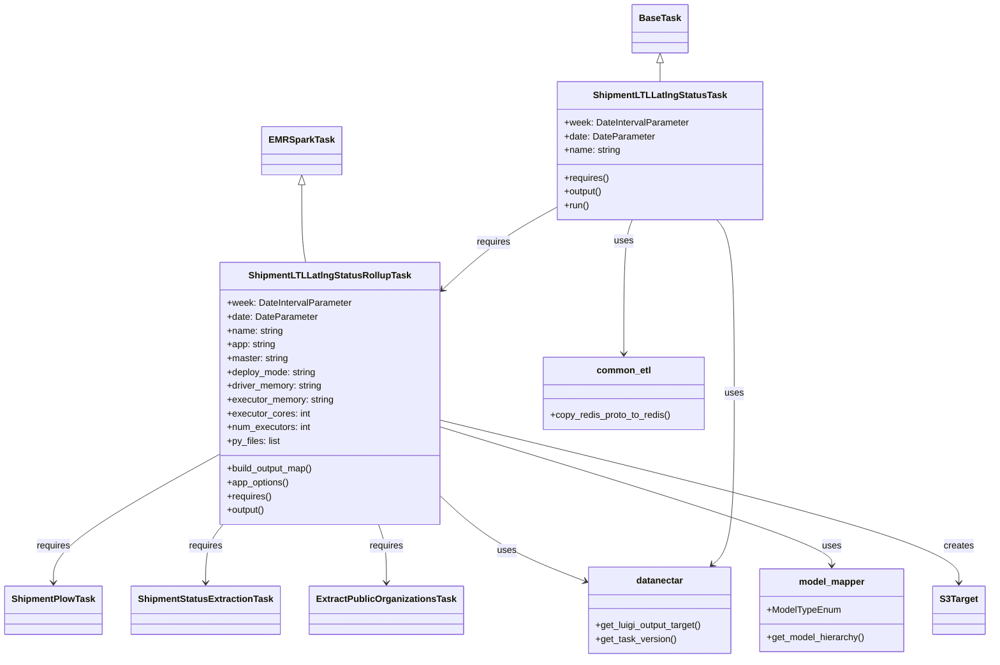

# Diagram: research/orchestrator/tasks/models/shipment_ltl_latlng_status_task.py


> Auto-generated by Obscura crawlers

## Diagram 1



### SVG

<svg id="container" width="1686.794921875" xmlns="http://www.w3.org/2000/svg" class="classDiagram" height="1144" viewBox="0 0 1686.794921875 1144" role="graphics-document document" aria-roledescription="class"><style>#container{font-family:"trebuchet ms",verdana,arial,sans-serif;font-size:16px;fill:#333;}@keyframes edge-animation-frame{from{stroke-dashoffset:0;}}@keyframes dash{to{stroke-dashoffset:0;}}#container .edge-animation-slow{stroke-dasharray:9,5!important;stroke-dashoffset:900;animation:dash 50s linear infinite;stroke-linecap:round;}#container .edge-animation-fast{stroke-dasharray:9,5!important;stroke-dashoffset:900;animation:dash 20s linear infinite;stroke-linecap:round;}#container .error-icon{fill:#552222;}#container .error-text{fill:#552222;stroke:#552222;}#container .edge-thickness-normal{stroke-width:1px;}#container .edge-thickness-thick{stroke-width:3.5px;}#container .edge-pattern-solid{stroke-dasharray:0;}#container .edge-thickness-invisible{stroke-width:0;fill:none;}#container .edge-pattern-dashed{stroke-dasharray:3;}#container .edge-pattern-dotted{stroke-dasharray:2;}#container .marker{fill:#333333;stroke:#333333;}#container .marker.cross{stroke:#333333;}#container svg{font-family:"trebuchet ms",verdana,arial,sans-serif;font-size:16px;}#container p{margin:0;}#container g.classGroup text{fill:#9370DB;stroke:none;font-family:"trebuchet ms",verdana,arial,sans-serif;font-size:10px;}#container g.classGroup text .title{font-weight:bolder;}#container .nodeLabel,#container .edgeLabel{color:#131300;}#container .edgeLabel .label rect{fill:#ECECFF;}#container .label text{fill:#131300;}#container .labelBkg{background:#ECECFF;}#container .edgeLabel .label span{background:#ECECFF;}#container .classTitle{font-weight:bolder;}#container .node rect,#container .node circle,#container .node ellipse,#container .node polygon,#container .node path{fill:#ECECFF;stroke:#9370DB;stroke-width:1px;}#container .divider{stroke:#9370DB;stroke-width:1;}#container g.clickable{cursor:pointer;}#container g.classGroup rect{fill:#ECECFF;stroke:#9370DB;}#container g.classGroup line{stroke:#9370DB;stroke-width:1;}#container .classLabel .box{stroke:none;stroke-width:0;fill:#ECECFF;opacity:0.5;}#container .classLabel .label{fill:#9370DB;font-size:10px;}#container .relation{stroke:#333333;stroke-width:1;fill:none;}#container .dashed-line{stroke-dasharray:3;}#container .dotted-line{stroke-dasharray:1 2;}#container #compositionStart,#container .composition{fill:#333333!important;stroke:#333333!important;stroke-width:1;}#container #compositionEnd,#container .composition{fill:#333333!important;stroke:#333333!important;stroke-width:1;}#container #dependencyStart,#container .dependency{fill:#333333!important;stroke:#333333!important;stroke-width:1;}#container #dependencyStart,#container .dependency{fill:#333333!important;stroke:#333333!important;stroke-width:1;}#container #extensionStart,#container .extension{fill:transparent!important;stroke:#333333!important;stroke-width:1;}#container #extensionEnd,#container .extension{fill:transparent!important;stroke:#333333!important;stroke-width:1;}#container #aggregationStart,#container .aggregation{fill:transparent!important;stroke:#333333!important;stroke-width:1;}#container #aggregationEnd,#container .aggregation{fill:transparent!important;stroke:#333333!important;stroke-width:1;}#container #lollipopStart,#container .lollipop{fill:#ECECFF!important;stroke:#333333!important;stroke-width:1;}#container #lollipopEnd,#container .lollipop{fill:#ECECFF!important;stroke:#333333!important;stroke-width:1;}#container .edgeTerminals{font-size:11px;line-height:initial;}#container .classTitleText{text-anchor:middle;font-size:18px;fill:#333;}#container .label-icon{display:inline-block;height:1em;overflow:visible;vertical-align:-0.125em;}#container .node .label-icon path{fill:currentColor;stroke:revert;stroke-width:revert;}#container :root{--mermaid-font-family:"trebuchet ms",verdana,arial,sans-serif;}</style><g><defs><marker id="container_class-aggregationStart" class="marker aggregation class" refX="18" refY="7" markerWidth="190" markerHeight="240" orient="auto"><path d="M 18,7 L9,13 L1,7 L9,1 Z"></path></marker></defs><defs><marker id="container_class-aggregationEnd" class="marker aggregation class" refX="1" refY="7" markerWidth="20" markerHeight="28" orient="auto"><path d="M 18,7 L9,13 L1,7 L9,1 Z"></path></marker></defs><defs><marker id="container_class-extensionStart" class="marker extension class" refX="18" refY="7" markerWidth="190" markerHeight="240" orient="auto"><path d="M 1,7 L18,13 V 1 Z"></path></marker></defs><defs><marker id="container_class-extensionEnd" class="marker extension class" refX="1" refY="7" markerWidth="20" markerHeight="28" orient="auto"><path d="M 1,1 V 13 L18,7 Z"></path></marker></defs><defs><marker id="container_class-compositionStart" class="marker composition class" refX="18" refY="7" markerWidth="190" markerHeight="240" orient="auto"><path d="M 18,7 L9,13 L1,7 L9,1 Z"></path></marker></defs><defs><marker id="container_class-compositionEnd" class="marker composition class" refX="1" refY="7" markerWidth="20" markerHeight="28" orient="auto"><path d="M 18,7 L9,13 L1,7 L9,1 Z"></path></marker></defs><defs><marker id="container_class-dependencyStart" class="marker dependency class" refX="6" refY="7" markerWidth="190" markerHeight="240" orient="auto"><path d="M 5,7 L9,13 L1,7 L9,1 Z"></path></marker></defs><defs><marker id="container_class-dependencyEnd" class="marker dependency class" refX="13" refY="7" markerWidth="20" markerHeight="28" orient="auto"><path d="M 18,7 L9,13 L14,7 L9,1 Z"></path></marker></defs><defs><marker id="container_class-lollipopStart" class="marker lollipop class" refX="13" refY="7" markerWidth="190" markerHeight="240" orient="auto"><circle stroke="black" fill="transparent" cx="7" cy="7" r="6"></circle></marker></defs><defs><marker id="container_class-lollipopEnd" class="marker lollipop class" refX="1" refY="7" markerWidth="190" markerHeight="240" orient="auto"><circle stroke="black" fill="transparent" cx="7" cy="7" r="6"></circle></marker></defs><g class="root"><g class="clusters"></g><g class="edgePaths"><path d="M497.627,321.25L497.627,337.542C497.627,353.833,497.627,386.417,498.787,408.875C499.947,431.333,502.267,443.667,503.427,449.833L504.587,456" id="id_EMRSparkTask_ShipmentLTLLatlngStatusRollupTask_1" class="edge-thickness-normal edge-pattern-solid relation" style=";;;" data-edge="true" data-et="edge" data-id="id_EMRSparkTask_ShipmentLTLLatlngStatusRollupTask_1" data-points="W3sieCI6NDk3LjYyNjk1MzEyNSwieSI6MzA0fSx7IngiOjQ5Ny42MjY5NTMxMjUsInkiOjQxOX0seyJ4Ijo1MDQuNTg3MzU5OTY0NjIyNjQsInkiOjQ1Nn1d" marker-start="url(#container_class-extensionStart)"></path><path d="M1118.465,109.25L1118.465,110.542C1118.465,111.833,1118.465,114.417,1118.465,119.875C1118.465,125.333,1118.465,133.667,1118.465,137.833L1118.465,142" id="id_BaseTask_ShipmentLTLLatlngStatusTask_2" class="edge-thickness-normal edge-pattern-solid relation" style=";;;" data-edge="true" data-et="edge" data-id="id_BaseTask_ShipmentLTLLatlngStatusTask_2" data-points="W3sieCI6MTExOC40NjQ4NDM3NSwieSI6OTJ9LHsieCI6MTExOC40NjQ4NDM3NSwieSI6MTE3fSx7IngiOjExMTguNDY0ODQzNzUsInkiOjE0Mn1d" marker-start="url(#container_class-extensionStart)"></path><path d="M360.826,791.964L315.578,818.137C270.329,844.309,179.833,896.655,134.584,933.494C89.336,970.333,89.336,991.667,89.336,1002.333L89.336,1013" id="id_ShipmentLTLLatlngStatusRollupTask_ShipmentPlowTask_3" class="edge-thickness-normal edge-pattern-solid relation" style=";;;" data-edge="true" data-et="edge" data-id="id_ShipmentLTLLatlngStatusRollupTask_ShipmentPlowTask_3" data-points="W3sieCI6MzYwLjgyNjE3MTg3NSwieSI6NzkxLjk2MzkyNTMyNjg3Nn0seyJ4Ijo4OS4zMzU5Mzc1LCJ5Ijo5NDl9LHsieCI6ODkuMzM1OTM3NSwieSI6MTAxOX1d" marker-end="url(#container_class-dependencyEnd)"></path><path d="M373.21,912L368.497,918.167C363.783,924.333,354.356,936.667,349.643,953.5C344.93,970.333,344.93,991.667,344.93,1002.333L344.93,1013" id="id_ShipmentLTLLatlngStatusRollupTask_ShipmentStatusExtractionTask_4" class="edge-thickness-normal edge-pattern-solid relation" style=";;;" data-edge="true" data-et="edge" data-id="id_ShipmentLTLLatlngStatusRollupTask_ShipmentStatusExtractionTask_4" data-points="W3sieCI6MzczLjIxMDA4OTkxNzQ1MjgsInkiOjkxMn0seyJ4IjozNDQuOTI5Njg3NSwieSI6OTQ5fSx7IngiOjM0NC45Mjk2ODc1LCJ5IjoxMDE5fV0=" marker-end="url(#container_class-dependencyEnd)"></path><path d="M632.486,912L634.785,918.167C637.085,924.333,641.683,936.667,643.982,953.5C646.281,970.333,646.281,991.667,646.281,1002.333L646.281,1013" id="id_ShipmentLTLLatlngStatusRollupTask_ExtractPublicOrganizationsTask_5" class="edge-thickness-normal edge-pattern-solid relation" style=";;;" data-edge="true" data-et="edge" data-id="id_ShipmentLTLLatlngStatusRollupTask_ExtractPublicOrganizationsTask_5" data-points="W3sieCI6NjMyLjQ4NjE1MTIzODIwNzUsInkiOjkxMn0seyJ4Ijo2NDYuMjgxMjUsInkiOjk0OX0seyJ4Ijo2NDYuMjgxMjUsInkiOjEwMTl9XQ==" marker-end="url(#container_class-dependencyEnd)"></path><path d="M734.131,858.409L750.289,873.507C766.448,888.606,798.765,918.803,840.233,943.897C881.702,968.991,932.321,988.981,957.631,998.976L982.941,1008.972" id="id_ShipmentLTLLatlngStatusRollupTask_datanectar_6" class="edge-thickness-normal edge-pattern-solid relation" style=";;;" data-edge="true" data-et="edge" data-id="id_ShipmentLTLLatlngStatusRollupTask_datanectar_6" data-points="W3sieCI6NzM0LjEzMDg1OTM3NSwieSI6ODU4LjQwODUyNTg3NzIwODF9LHsieCI6ODMxLjA4MjAzMTI1LCJ5Ijo5NDl9LHsieCI6OTg4LjUyMTQ4NDM3NSwieSI6MTAxMS4xNzU2MDAwMTM3NzM2fV0=" marker-end="url(#container_class-dependencyEnd)"></path><path d="M734.131,740.944L847.793,775.62C961.455,810.296,1188.779,879.648,1302.441,919.991C1416.104,960.333,1416.104,971.667,1416.104,977.333L1416.104,983" id="id_ShipmentLTLLatlngStatusRollupTask_model_mapper_7" class="edge-thickness-normal edge-pattern-solid relation" style=";;;" data-edge="true" data-et="edge" data-id="id_ShipmentLTLLatlngStatusRollupTask_model_mapper_7" data-points="W3sieCI6NzM0LjEzMDg1OTM3NSwieSI6NzQwLjk0Mzg3MjMxOTc1ODN9LHsieCI6MTQxNi4xMDM1MTU2MjUsInkiOjk0OX0seyJ4IjoxNDE2LjEwMzUxNTYyNSwieSI6OTg5fV0=" marker-end="url(#container_class-dependencyEnd)"></path><path d="M734.131,729.479L884.288,766.066C1034.446,802.653,1334.761,875.826,1484.919,923.08C1635.076,970.333,1635.076,991.667,1635.076,1002.333L1635.076,1013" id="id_ShipmentLTLLatlngStatusRollupTask_S3Target_8" class="edge-thickness-normal edge-pattern-solid relation" style=";;;" data-edge="true" data-et="edge" data-id="id_ShipmentLTLLatlngStatusRollupTask_S3Target_8" data-points="W3sieCI6NzM0LjEzMDg1OTM3NSwieSI6NzI5LjQ3OTAxNTg5Mjk2OTR9LHsieCI6MTYzNS4wNzYxNzE4NzUsInkiOjk0OX0seyJ4IjoxNjM1LjA3NjE3MTg3NSwieSI6MTAxOX1d" marker-end="url(#container_class-dependencyEnd)"></path><path d="M943.605,358.8L925.481,368.834C907.357,378.867,871.109,398.933,836.932,423.77C802.755,448.606,770.648,478.212,754.595,493.015L738.542,507.818" id="id_ShipmentLTLLatlngStatusTask_ShipmentLTLLatlngStatusRollupTask_9" class="edge-thickness-normal edge-pattern-solid relation" style=";;;" data-edge="true" data-et="edge" data-id="id_ShipmentLTLLatlngStatusTask_ShipmentLTLLatlngStatusRollupTask_9" data-points="W3sieCI6OTQzLjYwNTQ2ODc1LCJ5IjozNTguODAwMzU4MTE0Mzl9LHsieCI6ODM0Ljg2MTMyODEyNSwieSI6NDE5fSx7IngiOjczNC4xMzA4NTkzNzUsInkiOjUxMS44ODUwNzU0MzgzNTgwNn1d" marker-end="url(#container_class-dependencyEnd)"></path><path d="M1216.822,382L1221.876,388.167C1226.931,394.333,1237.04,406.667,1242.094,457C1247.148,507.333,1247.148,595.667,1247.148,684C1247.148,772.333,1247.148,860.667,1240.619,910.354C1234.089,960.042,1221.03,971.084,1214.5,976.605L1207.97,982.126" id="id_ShipmentLTLLatlngStatusTask_datanectar_10" class="edge-thickness-normal edge-pattern-solid relation" style=";;;" data-edge="true" data-et="edge" data-id="id_ShipmentLTLLatlngStatusTask_datanectar_10" data-points="W3sieCI6MTIxNi44MjE3MzA2OTI2NzUxLCJ5IjozODJ9LHsieCI6MTI0Ny4xNDg0Mzc1LCJ5Ijo0MTl9LHsieCI6MTI0Ny4xNDg0Mzc1LCJ5Ijo2ODR9LHsieCI6MTI0Ny4xNDg0Mzc1LCJ5Ijo5NDl9LHsieCI6MTIwMy4zODgzNzU0MTg1MjY3LCJ5Ijo5ODZ9XQ==" marker-end="url(#container_class-dependencyEnd)"></path><path d="M1070.817,382L1068.368,388.167C1065.919,394.333,1061.022,406.667,1058.574,445.5C1056.125,484.333,1056.125,549.667,1056.125,582.333L1056.125,615" id="id_ShipmentLTLLatlngStatusTask_common_etl_11" class="edge-thickness-normal edge-pattern-solid relation" style=";;;" data-edge="true" data-et="edge" data-id="id_ShipmentLTLLatlngStatusTask_common_etl_11" data-points="W3sieCI6MTA3MC44MTY1NTU1MzM0Mzk0LCJ5IjozODJ9LHsieCI6MTA1Ni4xMjUsInkiOjQxOX0seyJ4IjoxMDU2LjEyNSwieSI6NjIxfV0=" marker-end="url(#container_class-dependencyEnd)"></path></g><g class="edgeLabels"><g class="edgeLabel"><g class="label" data-id="id_EMRSparkTask_ShipmentLTLLatlngStatusRollupTask_1" transform="translate(0, 0)"><foreignObject width="0" height="0"><div xmlns="http://www.w3.org/1999/xhtml" class="labelBkg" style="display: table-cell; white-space: nowrap; line-height: 1.5; max-width: 200px; text-align: center;"><span class="edgeLabel"></span></div></foreignObject></g></g><g class="edgeLabel"><g class="label" data-id="id_BaseTask_ShipmentLTLLatlngStatusTask_2" transform="translate(0, 0)"><foreignObject width="0" height="0"><div xmlns="http://www.w3.org/1999/xhtml" class="labelBkg" style="display: table-cell; white-space: nowrap; line-height: 1.5; max-width: 200px; text-align: center;"><span class="edgeLabel"></span></div></foreignObject></g></g><g class="edgeLabel" transform="translate(89.3359375, 949)"><g class="label" data-id="id_ShipmentLTLLatlngStatusRollupTask_ShipmentPlowTask_3" transform="translate(-29.8515625, -12)"><foreignObject width="59.703125" height="24"><div xmlns="http://www.w3.org/1999/xhtml" class="labelBkg" style="display: table-cell; white-space: nowrap; line-height: 1.5; max-width: 200px; text-align: center;"><span class="edgeLabel"><p>requires</p></span></div></foreignObject></g></g><g class="edgeLabel" transform="translate(344.9296875, 949)"><g class="label" data-id="id_ShipmentLTLLatlngStatusRollupTask_ShipmentStatusExtractionTask_4" transform="translate(-29.8515625, -12)"><foreignObject width="59.703125" height="24"><div xmlns="http://www.w3.org/1999/xhtml" class="labelBkg" style="display: table-cell; white-space: nowrap; line-height: 1.5; max-width: 200px; text-align: center;"><span class="edgeLabel"><p>requires</p></span></div></foreignObject></g></g><g class="edgeLabel" transform="translate(646.28125, 949)"><g class="label" data-id="id_ShipmentLTLLatlngStatusRollupTask_ExtractPublicOrganizationsTask_5" transform="translate(-29.8515625, -12)"><foreignObject width="59.703125" height="24"><div xmlns="http://www.w3.org/1999/xhtml" class="labelBkg" style="display: table-cell; white-space: nowrap; line-height: 1.5; max-width: 200px; text-align: center;"><span class="edgeLabel"><p>requires</p></span></div></foreignObject></g></g><g class="edgeLabel" transform="translate(848.09493, 955.71869)"><g class="label" data-id="id_ShipmentLTLLatlngStatusRollupTask_datanectar_6" transform="translate(-16.4921875, -12)"><foreignObject width="32.984375" height="24"><div xmlns="http://www.w3.org/1999/xhtml" class="labelBkg" style="display: table-cell; white-space: nowrap; line-height: 1.5; max-width: 200px; text-align: center;"><span class="edgeLabel"><p>uses</p></span></div></foreignObject></g></g><g class="edgeLabel" transform="translate(1416.103515625, 949)"><g class="label" data-id="id_ShipmentLTLLatlngStatusRollupTask_model_mapper_7" transform="translate(-16.4921875, -12)"><foreignObject width="32.984375" height="24"><div xmlns="http://www.w3.org/1999/xhtml" class="labelBkg" style="display: table-cell; white-space: nowrap; line-height: 1.5; max-width: 200px; text-align: center;"><span class="edgeLabel"><p>uses</p></span></div></foreignObject></g></g><g class="edgeLabel" transform="translate(1635.076171875, 949)"><g class="label" data-id="id_ShipmentLTLLatlngStatusRollupTask_S3Target_8" transform="translate(-26.171875, -12)"><foreignObject width="52.34375" height="24"><div xmlns="http://www.w3.org/1999/xhtml" class="labelBkg" style="display: table-cell; white-space: nowrap; line-height: 1.5; max-width: 200px; text-align: center;"><span class="edgeLabel"><p>creates</p></span></div></foreignObject></g></g><g class="edgeLabel" transform="translate(830.18424, 423.31281)"><g class="label" data-id="id_ShipmentLTLLatlngStatusTask_ShipmentLTLLatlngStatusRollupTask_9" transform="translate(-29.8515625, -12)"><foreignObject width="59.703125" height="24"><div xmlns="http://www.w3.org/1999/xhtml" class="labelBkg" style="display: table-cell; white-space: nowrap; line-height: 1.5; max-width: 200px; text-align: center;"><span class="edgeLabel"><p>requires</p></span></div></foreignObject></g></g><g class="edgeLabel" transform="translate(1247.1484375, 684)"><g class="label" data-id="id_ShipmentLTLLatlngStatusTask_datanectar_10" transform="translate(-16.4921875, -12)"><foreignObject width="32.984375" height="24"><div xmlns="http://www.w3.org/1999/xhtml" class="labelBkg" style="display: table-cell; white-space: nowrap; line-height: 1.5; max-width: 200px; text-align: center;"><span class="edgeLabel"><p>uses</p></span></div></foreignObject></g></g><g class="edgeLabel" transform="translate(1056.125, 419)"><g class="label" data-id="id_ShipmentLTLLatlngStatusTask_common_etl_11" transform="translate(-16.4921875, -12)"><foreignObject width="32.984375" height="24"><div xmlns="http://www.w3.org/1999/xhtml" class="labelBkg" style="display: table-cell; white-space: nowrap; line-height: 1.5; max-width: 200px; text-align: center;"><span class="edgeLabel"><p>uses</p></span></div></foreignObject></g></g></g><g class="nodes"><g class="node default" id="classId-EMRSparkTask-0" transform="translate(497.626953125, 262)"><g class="basic label-container"><path d="M-65.1484375 -42 L65.1484375 -42 L65.1484375 42 L-65.1484375 42" stroke="none" stroke-width="0" fill="#ECECFF" style=""></path><path d="M-65.1484375 -42 C-21.42580830895413 -42, 22.296820882091737 -42, 65.1484375 -42 M-65.1484375 -42 C-38.46928924874885 -42, -11.790140997497701 -42, 65.1484375 -42 M65.1484375 -42 C65.1484375 -11.541750285150751, 65.1484375 18.916499429698497, 65.1484375 42 M65.1484375 -42 C65.1484375 -24.167736254723252, 65.1484375 -6.335472509446504, 65.1484375 42 M65.1484375 42 C34.686124582244744 42, 4.223811664489482 42, -65.1484375 42 M65.1484375 42 C29.75626092363609 42, -5.635915652727817 42, -65.1484375 42 M-65.1484375 42 C-65.1484375 17.641492550259287, -65.1484375 -6.717014899481427, -65.1484375 -42 M-65.1484375 42 C-65.1484375 16.883910613809903, -65.1484375 -8.232178772380195, -65.1484375 -42" stroke="#9370DB" stroke-width="1.3" fill="none" stroke-dasharray="0 0" style=""></path></g><g class="annotation-group text" transform="translate(0, -18)"></g><g class="label-group text" transform="translate(-53.1484375, -18)"><g class="label" style="font-weight: bolder" transform="translate(0,-12)"><foreignObject width="106.296875" height="24"><div xmlns="http://www.w3.org/1999/xhtml" style="display: table-cell; white-space: nowrap; line-height: 1.5; max-width: 154px; text-align: center;"><span class="nodeLabel markdown-node-label" style=""><p>EMRSparkTask</p></span></div></foreignObject></g></g><g class="members-group text" transform="translate(-53.1484375, 30)"></g><g class="methods-group text" transform="translate(-53.1484375, 60)"></g><g class="divider" style=""><path d="M-65.1484375 6 C-33.00685386155786 6, -0.865270223115715 6, 65.1484375 6 M-65.1484375 6 C-23.479683894719095 6, 18.18906971056181 6, 65.1484375 6" stroke="#9370DB" stroke-width="1.3" fill="none" stroke-dasharray="0 0" style=""></path></g><g class="divider" style=""><path d="M-65.1484375 24 C-31.68371887511833 24, 1.780999749763339 24, 65.1484375 24 M-65.1484375 24 C-15.671969679782315 24, 33.80449814043537 24, 65.1484375 24" stroke="#9370DB" stroke-width="1.3" fill="none" stroke-dasharray="0 0" style=""></path></g></g><g class="node default" id="classId-BaseTask-1" transform="translate(1118.46484375, 50)"><g class="basic label-container"><path d="M-46.03125 -42 L46.03125 -42 L46.03125 42 L-46.03125 42" stroke="none" stroke-width="0" fill="#ECECFF" style=""></path><path d="M-46.03125 -42 C-19.419375303664047 -42, 7.192499392671905 -42, 46.03125 -42 M-46.03125 -42 C-19.272298615598253 -42, 7.486652768803495 -42, 46.03125 -42 M46.03125 -42 C46.03125 -22.370188480463728, 46.03125 -2.740376960927456, 46.03125 42 M46.03125 -42 C46.03125 -17.663227612869775, 46.03125 6.673544774260449, 46.03125 42 M46.03125 42 C17.488597287799465 42, -11.05405542440107 42, -46.03125 42 M46.03125 42 C27.171572849479503 42, 8.311895698959006 42, -46.03125 42 M-46.03125 42 C-46.03125 16.236474637794032, -46.03125 -9.527050724411936, -46.03125 -42 M-46.03125 42 C-46.03125 21.803984330519146, -46.03125 1.6079686610382922, -46.03125 -42" stroke="#9370DB" stroke-width="1.3" fill="none" stroke-dasharray="0 0" style=""></path></g><g class="annotation-group text" transform="translate(0, -18)"></g><g class="label-group text" transform="translate(-34.03125, -18)"><g class="label" style="font-weight: bolder" transform="translate(0,-12)"><foreignObject width="68.0625" height="24"><div xmlns="http://www.w3.org/1999/xhtml" style="display: table-cell; white-space: nowrap; line-height: 1.5; max-width: 117px; text-align: center;"><span class="nodeLabel markdown-node-label" style=""><p>BaseTask</p></span></div></foreignObject></g></g><g class="members-group text" transform="translate(-34.03125, 30)"></g><g class="methods-group text" transform="translate(-34.03125, 60)"></g><g class="divider" style=""><path d="M-46.03125 6 C-18.198216332956893 6, 9.634817334086215 6, 46.03125 6 M-46.03125 6 C-19.27003508451375 6, 7.491179830972499 6, 46.03125 6" stroke="#9370DB" stroke-width="1.3" fill="none" stroke-dasharray="0 0" style=""></path></g><g class="divider" style=""><path d="M-46.03125 24 C-16.77094943905534 24, 12.489351121889321 24, 46.03125 24 M-46.03125 24 C-10.771641504674989 24, 24.487966990650023 24, 46.03125 24" stroke="#9370DB" stroke-width="1.3" fill="none" stroke-dasharray="0 0" style=""></path></g></g><g class="node default" id="classId-ShipmentLTLLatlngStatusRollupTask-2" transform="translate(547.478515625, 684)"><g class="basic label-container"><path d="M-186.65234375 -228 L186.65234375 -228 L186.65234375 228 L-186.65234375 228" stroke="none" stroke-width="0" fill="#ECECFF" style=""></path><path d="M-186.65234375 -228 C-47.921337592603265 -228, 90.80966856479347 -228, 186.65234375 -228 M-186.65234375 -228 C-53.224702324396134 -228, 80.20293910120773 -228, 186.65234375 -228 M186.65234375 -228 C186.65234375 -68.24496920349947, 186.65234375 91.51006159300107, 186.65234375 228 M186.65234375 -228 C186.65234375 -69.64896691347445, 186.65234375 88.7020661730511, 186.65234375 228 M186.65234375 228 C107.83084735722029 228, 29.009350964440586 228, -186.65234375 228 M186.65234375 228 C56.60260231164949 228, -73.44713912670102 228, -186.65234375 228 M-186.65234375 228 C-186.65234375 106.89100127156955, -186.65234375 -14.2179974568609, -186.65234375 -228 M-186.65234375 228 C-186.65234375 64.65637632387569, -186.65234375 -98.68724735224862, -186.65234375 -228" stroke="#9370DB" stroke-width="1.3" fill="none" stroke-dasharray="0 0" style=""></path></g><g class="annotation-group text" transform="translate(0, -204)"></g><g class="label-group text" transform="translate(-133.2734375, -204)"><g class="label" style="font-weight: bolder" transform="translate(0,-12)"><foreignObject width="266.546875" height="24"><div xmlns="http://www.w3.org/1999/xhtml" style="display: table-cell; white-space: nowrap; line-height: 1.5; max-width: 312px; text-align: center;"><span class="nodeLabel markdown-node-label" style=""><p>ShipmentLTLLatlngStatusRollupTask</p></span></div></foreignObject></g></g><g class="members-group text" transform="translate(-174.65234375, -156)"><g class="label" style="" transform="translate(0,-12)"><foreignObject width="216.03125" height="24"><div xmlns="http://www.w3.org/1999/xhtml" style="display: table-cell; white-space: nowrap; line-height: 1.5; max-width: 274px; text-align: center;"><span class="nodeLabel markdown-node-label" style=""><p>+week: DateIntervalParameter</p></span></div></foreignObject></g><g class="label" style="" transform="translate(0,12)"><foreignObject width="156.015625" height="24"><div xmlns="http://www.w3.org/1999/xhtml" style="display: table-cell; white-space: nowrap; line-height: 1.5; max-width: 214px; text-align: center;"><span class="nodeLabel markdown-node-label" style=""><p>+date: DateParameter</p></span></div></foreignObject></g><g class="label" style="" transform="translate(0,36)"><foreignObject width="98.21875" height="24"><div xmlns="http://www.w3.org/1999/xhtml" style="display: table-cell; white-space: nowrap; line-height: 1.5; max-width: 156px; text-align: center;"><span class="nodeLabel markdown-node-label" style=""><p>+name: string</p></span></div></foreignObject></g><g class="label" style="" transform="translate(0,60)"><foreignObject width="85.171875" height="24"><div xmlns="http://www.w3.org/1999/xhtml" style="display: table-cell; white-space: nowrap; line-height: 1.5; max-width: 143px; text-align: center;"><span class="nodeLabel markdown-node-label" style=""><p>+app: string</p></span></div></foreignObject></g><g class="label" style="" transform="translate(0,84)"><foreignObject width="108.03125" height="24"><div xmlns="http://www.w3.org/1999/xhtml" style="display: table-cell; white-space: nowrap; line-height: 1.5; max-width: 166px; text-align: center;"><span class="nodeLabel markdown-node-label" style=""><p>+master: string</p></span></div></foreignObject></g><g class="label" style="" transform="translate(0,108)"><foreignObject width="156.4375" height="24"><div xmlns="http://www.w3.org/1999/xhtml" style="display: table-cell; white-space: nowrap; line-height: 1.5; max-width: 214px; text-align: center;"><span class="nodeLabel markdown-node-label" style=""><p>+deploy_mode: string</p></span></div></foreignObject></g><g class="label" style="" transform="translate(0,132)"><foreignObject width="167.296875" height="24"><div xmlns="http://www.w3.org/1999/xhtml" style="display: table-cell; white-space: nowrap; line-height: 1.5; max-width: 225px; text-align: center;"><span class="nodeLabel markdown-node-label" style=""><p>+driver_memory: string</p></span></div></foreignObject></g><g class="label" style="" transform="translate(0,156)"><foreignObject width="187.109375" height="24"><div xmlns="http://www.w3.org/1999/xhtml" style="display: table-cell; white-space: nowrap; line-height: 1.5; max-width: 245px; text-align: center;"><span class="nodeLabel markdown-node-label" style=""><p>+executor_memory: string</p></span></div></foreignObject></g><g class="label" style="" transform="translate(0,180)"><foreignObject width="143.78125" height="24"><div xmlns="http://www.w3.org/1999/xhtml" style="display: table-cell; white-space: nowrap; line-height: 1.5; max-width: 201px; text-align: center;"><span class="nodeLabel markdown-node-label" style=""><p>+executor_cores: int</p></span></div></foreignObject></g><g class="label" style="" transform="translate(0,204)"><foreignObject width="146.140625" height="24"><div xmlns="http://www.w3.org/1999/xhtml" style="display: table-cell; white-space: nowrap; line-height: 1.5; max-width: 204px; text-align: center;"><span class="nodeLabel markdown-node-label" style=""><p>+num_executors: int</p></span></div></foreignObject></g><g class="label" style="" transform="translate(0,228)"><foreignObject width="93.359375" height="24"><div xmlns="http://www.w3.org/1999/xhtml" style="display: table-cell; white-space: nowrap; line-height: 1.5; max-width: 151px; text-align: center;"><span class="nodeLabel markdown-node-label" style=""><p>+py_files: list</p></span></div></foreignObject></g></g><g class="methods-group text" transform="translate(-174.65234375, 132)"><g class="label" style="" transform="translate(0,-12)"><foreignObject width="153.125" height="24"><div xmlns="http://www.w3.org/1999/xhtml" style="display: table-cell; white-space: nowrap; line-height: 1.5; max-width: 210px; text-align: center;"><span class="nodeLabel markdown-node-label" style=""><p>+build_output_map()</p></span></div></foreignObject></g><g class="label" style="" transform="translate(0,12)"><foreignObject width="108.84375" height="24"><div xmlns="http://www.w3.org/1999/xhtml" style="display: table-cell; white-space: nowrap; line-height: 1.5; max-width: 166px; text-align: center;"><span class="nodeLabel markdown-node-label" style=""><p>+app_options()</p></span></div></foreignObject></g><g class="label" style="" transform="translate(0,36)"><foreignObject width="78.0625" height="24"><div xmlns="http://www.w3.org/1999/xhtml" style="display: table-cell; white-space: nowrap; line-height: 1.5; max-width: 135px; text-align: center;"><span class="nodeLabel markdown-node-label" style=""><p>+requires()</p></span></div></foreignObject></g><g class="label" style="" transform="translate(0,60)"><foreignObject width="67.390625" height="24"><div xmlns="http://www.w3.org/1999/xhtml" style="display: table-cell; white-space: nowrap; line-height: 1.5; max-width: 125px; text-align: center;"><span class="nodeLabel markdown-node-label" style=""><p>+output()</p></span></div></foreignObject></g></g><g class="divider" style=""><path d="M-186.65234375 -180 C-104.74439726584386 -180, -22.836450781687716 -180, 186.65234375 -180 M-186.65234375 -180 C-75.77707066902322 -180, 35.098202411953565 -180, 186.65234375 -180" stroke="#9370DB" stroke-width="1.3" fill="none" stroke-dasharray="0 0" style=""></path></g><g class="divider" style=""><path d="M-186.65234375 108 C-102.26089544661923 108, -17.86944714323846 108, 186.65234375 108 M-186.65234375 108 C-104.55787992233698 108, -22.46341609467396 108, 186.65234375 108" stroke="#9370DB" stroke-width="1.3" fill="none" stroke-dasharray="0 0" style=""></path></g></g><g class="node default" id="classId-ShipmentLTLLatlngStatusTask-3" transform="translate(1118.46484375, 262)"><g class="basic label-container"><path d="M-174.859375 -120 L174.859375 -120 L174.859375 120 L-174.859375 120" stroke="none" stroke-width="0" fill="#ECECFF" style=""></path><path d="M-174.859375 -120 C-51.67672702108952 -120, 71.50592095782096 -120, 174.859375 -120 M-174.859375 -120 C-36.485238381645246 -120, 101.88889823670951 -120, 174.859375 -120 M174.859375 -120 C174.859375 -49.95352688124156, 174.859375 20.092946237516884, 174.859375 120 M174.859375 -120 C174.859375 -45.77833216353601, 174.859375 28.443335672927986, 174.859375 120 M174.859375 120 C66.89594028047402 120, -41.067494439051956 120, -174.859375 120 M174.859375 120 C38.676658895081545 120, -97.50605720983691 120, -174.859375 120 M-174.859375 120 C-174.859375 57.12987875192022, -174.859375 -5.740242496159567, -174.859375 -120 M-174.859375 120 C-174.859375 67.53597992498275, -174.859375 15.07195984996551, -174.859375 -120" stroke="#9370DB" stroke-width="1.3" fill="none" stroke-dasharray="0 0" style=""></path></g><g class="annotation-group text" transform="translate(0, -96)"></g><g class="label-group text" transform="translate(-109.6875, -96)"><g class="label" style="font-weight: bolder" transform="translate(0,-12)"><foreignObject width="219.375" height="24"><div xmlns="http://www.w3.org/1999/xhtml" style="display: table-cell; white-space: nowrap; line-height: 1.5; max-width: 265px; text-align: center;"><span class="nodeLabel markdown-node-label" style=""><p>ShipmentLTLLatlngStatusTask</p></span></div></foreignObject></g></g><g class="members-group text" transform="translate(-162.859375, -48)"><g class="label" style="" transform="translate(0,-12)"><foreignObject width="216.03125" height="24"><div xmlns="http://www.w3.org/1999/xhtml" style="display: table-cell; white-space: nowrap; line-height: 1.5; max-width: 274px; text-align: center;"><span class="nodeLabel markdown-node-label" style=""><p>+week: DateIntervalParameter</p></span></div></foreignObject></g><g class="label" style="" transform="translate(0,12)"><foreignObject width="156.015625" height="24"><div xmlns="http://www.w3.org/1999/xhtml" style="display: table-cell; white-space: nowrap; line-height: 1.5; max-width: 214px; text-align: center;"><span class="nodeLabel markdown-node-label" style=""><p>+date: DateParameter</p></span></div></foreignObject></g><g class="label" style="" transform="translate(0,36)"><foreignObject width="98.21875" height="24"><div xmlns="http://www.w3.org/1999/xhtml" style="display: table-cell; white-space: nowrap; line-height: 1.5; max-width: 156px; text-align: center;"><span class="nodeLabel markdown-node-label" style=""><p>+name: string</p></span></div></foreignObject></g></g><g class="methods-group text" transform="translate(-162.859375, 48)"><g class="label" style="" transform="translate(0,-12)"><foreignObject width="78.0625" height="24"><div xmlns="http://www.w3.org/1999/xhtml" style="display: table-cell; white-space: nowrap; line-height: 1.5; max-width: 135px; text-align: center;"><span class="nodeLabel markdown-node-label" style=""><p>+requires()</p></span></div></foreignObject></g><g class="label" style="" transform="translate(0,12)"><foreignObject width="67.390625" height="24"><div xmlns="http://www.w3.org/1999/xhtml" style="display: table-cell; white-space: nowrap; line-height: 1.5; max-width: 125px; text-align: center;"><span class="nodeLabel markdown-node-label" style=""><p>+output()</p></span></div></foreignObject></g><g class="label" style="" transform="translate(0,36)"><foreignObject width="43.21875" height="24"><div xmlns="http://www.w3.org/1999/xhtml" style="display: table-cell; white-space: nowrap; line-height: 1.5; max-width: 101px; text-align: center;"><span class="nodeLabel markdown-node-label" style=""><p>+run()</p></span></div></foreignObject></g></g><g class="divider" style=""><path d="M-174.859375 -72 C-78.8226784143069 -72, 17.214018171386186 -72, 174.859375 -72 M-174.859375 -72 C-41.07526831224317 -72, 92.70883837551366 -72, 174.859375 -72" stroke="#9370DB" stroke-width="1.3" fill="none" stroke-dasharray="0 0" style=""></path></g><g class="divider" style=""><path d="M-174.859375 24 C-45.01497548882344 24, 84.82942402235312 24, 174.859375 24 M-174.859375 24 C-48.61815211086859 24, 77.62307077826281 24, 174.859375 24" stroke="#9370DB" stroke-width="1.3" fill="none" stroke-dasharray="0 0" style=""></path></g></g><g class="node default" id="classId-ShipmentPlowTask-4" transform="translate(89.3359375, 1061)"><g class="basic label-container"><path d="M-81.3359375 -42 L81.3359375 -42 L81.3359375 42 L-81.3359375 42" stroke="none" stroke-width="0" fill="#ECECFF" style=""></path><path d="M-81.3359375 -42 C-36.85639768301588 -42, 7.623142133968244 -42, 81.3359375 -42 M-81.3359375 -42 C-35.69279513861493 -42, 9.950347222770134 -42, 81.3359375 -42 M81.3359375 -42 C81.3359375 -24.321237080081083, 81.3359375 -6.642474160162166, 81.3359375 42 M81.3359375 -42 C81.3359375 -21.94798930908207, 81.3359375 -1.8959786181641434, 81.3359375 42 M81.3359375 42 C24.839314238837922 42, -31.657309022324156 42, -81.3359375 42 M81.3359375 42 C17.248941384329356 42, -46.83805473134129 42, -81.3359375 42 M-81.3359375 42 C-81.3359375 17.958761027586313, -81.3359375 -6.0824779448273745, -81.3359375 -42 M-81.3359375 42 C-81.3359375 19.320749589081355, -81.3359375 -3.358500821837289, -81.3359375 -42" stroke="#9370DB" stroke-width="1.3" fill="none" stroke-dasharray="0 0" style=""></path></g><g class="annotation-group text" transform="translate(0, -18)"></g><g class="label-group text" transform="translate(-69.3359375, -18)"><g class="label" style="font-weight: bolder" transform="translate(0,-12)"><foreignObject width="138.671875" height="24"><div xmlns="http://www.w3.org/1999/xhtml" style="display: table-cell; white-space: nowrap; line-height: 1.5; max-width: 187px; text-align: center;"><span class="nodeLabel markdown-node-label" style=""><p>ShipmentPlowTask</p></span></div></foreignObject></g></g><g class="members-group text" transform="translate(-69.3359375, 30)"></g><g class="methods-group text" transform="translate(-69.3359375, 60)"></g><g class="divider" style=""><path d="M-81.3359375 6 C-18.92222950895343 6, 43.49147848209314 6, 81.3359375 6 M-81.3359375 6 C-41.33003729576449 6, -1.324137091528982 6, 81.3359375 6" stroke="#9370DB" stroke-width="1.3" fill="none" stroke-dasharray="0 0" style=""></path></g><g class="divider" style=""><path d="M-81.3359375 24 C-22.644284346085108 24, 36.047368807829784 24, 81.3359375 24 M-81.3359375 24 C-16.61772147733751 24, 48.10049454532498 24, 81.3359375 24" stroke="#9370DB" stroke-width="1.3" fill="none" stroke-dasharray="0 0" style=""></path></g></g><g class="node default" id="classId-ShipmentStatusExtractionTask-5" transform="translate(344.9296875, 1061)"><g class="basic label-container"><path d="M-124.2578125 -42 L124.2578125 -42 L124.2578125 42 L-124.2578125 42" stroke="none" stroke-width="0" fill="#ECECFF" style=""></path><path d="M-124.2578125 -42 C-64.4665737412563 -42, -4.675334982512609 -42, 124.2578125 -42 M-124.2578125 -42 C-38.53422237253773 -42, 47.18936775492455 -42, 124.2578125 -42 M124.2578125 -42 C124.2578125 -11.562319749654034, 124.2578125 18.875360500691933, 124.2578125 42 M124.2578125 -42 C124.2578125 -17.73942453668991, 124.2578125 6.52115092662018, 124.2578125 42 M124.2578125 42 C72.6136905794954 42, 20.96956865899078 42, -124.2578125 42 M124.2578125 42 C56.57048821270358 42, -11.11683607459284 42, -124.2578125 42 M-124.2578125 42 C-124.2578125 14.038617674154462, -124.2578125 -13.922764651691075, -124.2578125 -42 M-124.2578125 42 C-124.2578125 16.390884744453146, -124.2578125 -9.218230511093708, -124.2578125 -42" stroke="#9370DB" stroke-width="1.3" fill="none" stroke-dasharray="0 0" style=""></path></g><g class="annotation-group text" transform="translate(0, -18)"></g><g class="label-group text" transform="translate(-112.2578125, -18)"><g class="label" style="font-weight: bolder" transform="translate(0,-12)"><foreignObject width="224.515625" height="24"><div xmlns="http://www.w3.org/1999/xhtml" style="display: table-cell; white-space: nowrap; line-height: 1.5; max-width: 271px; text-align: center;"><span class="nodeLabel markdown-node-label" style=""><p>ShipmentStatusExtractionTask</p></span></div></foreignObject></g></g><g class="members-group text" transform="translate(-112.2578125, 30)"></g><g class="methods-group text" transform="translate(-112.2578125, 60)"></g><g class="divider" style=""><path d="M-124.2578125 6 C-68.82477103053151 6, -13.391729561063002 6, 124.2578125 6 M-124.2578125 6 C-26.16085275571791 6, 71.93610698856418 6, 124.2578125 6" stroke="#9370DB" stroke-width="1.3" fill="none" stroke-dasharray="0 0" style=""></path></g><g class="divider" style=""><path d="M-124.2578125 24 C-27.841703871454527 24, 68.57440475709095 24, 124.2578125 24 M-124.2578125 24 C-67.98666028552088 24, -11.715508071041768 24, 124.2578125 24" stroke="#9370DB" stroke-width="1.3" fill="none" stroke-dasharray="0 0" style=""></path></g></g><g class="node default" id="classId-ExtractPublicOrganizationsTask-6" transform="translate(646.28125, 1061)"><g class="basic label-container"><path d="M-127.09375 -42 L127.09375 -42 L127.09375 42 L-127.09375 42" stroke="none" stroke-width="0" fill="#ECECFF" style=""></path><path d="M-127.09375 -42 C-62.413746120003964 -42, 2.2662577599920724 -42, 127.09375 -42 M-127.09375 -42 C-43.372204016728915 -42, 40.34934196654217 -42, 127.09375 -42 M127.09375 -42 C127.09375 -22.018262862389925, 127.09375 -2.0365257247798496, 127.09375 42 M127.09375 -42 C127.09375 -15.964095455321633, 127.09375 10.071809089356734, 127.09375 42 M127.09375 42 C63.429916382205114 42, -0.23391723558977162 42, -127.09375 42 M127.09375 42 C49.19865152064608 42, -28.69644695870784 42, -127.09375 42 M-127.09375 42 C-127.09375 14.387937876254643, -127.09375 -13.224124247490714, -127.09375 -42 M-127.09375 42 C-127.09375 16.428118231900836, -127.09375 -9.143763536198328, -127.09375 -42" stroke="#9370DB" stroke-width="1.3" fill="none" stroke-dasharray="0 0" style=""></path></g><g class="annotation-group text" transform="translate(0, -18)"></g><g class="label-group text" transform="translate(-115.09375, -18)"><g class="label" style="font-weight: bolder" transform="translate(0,-12)"><foreignObject width="230.1875" height="24"><div xmlns="http://www.w3.org/1999/xhtml" style="display: table-cell; white-space: nowrap; line-height: 1.5; max-width: 276px; text-align: center;"><span class="nodeLabel markdown-node-label" style=""><p>ExtractPublicOrganizationsTask</p></span></div></foreignObject></g></g><g class="members-group text" transform="translate(-115.09375, 30)"></g><g class="methods-group text" transform="translate(-115.09375, 60)"></g><g class="divider" style=""><path d="M-127.09375 6 C-73.1033266408653 6, -19.112903281730624 6, 127.09375 6 M-127.09375 6 C-61.6180065202108 6, 3.8577369595784035 6, 127.09375 6" stroke="#9370DB" stroke-width="1.3" fill="none" stroke-dasharray="0 0" style=""></path></g><g class="divider" style=""><path d="M-127.09375 24 C-30.599498242965907 24, 65.89475351406819 24, 127.09375 24 M-127.09375 24 C-52.64967841011372 24, 21.794393179772555 24, 127.09375 24" stroke="#9370DB" stroke-width="1.3" fill="none" stroke-dasharray="0 0" style=""></path></g></g><g class="node default" id="classId-S3Target-7" transform="translate(1635.076171875, 1061)"><g class="basic label-container"><path d="M-43.71875 -42 L43.71875 -42 L43.71875 42 L-43.71875 42" stroke="none" stroke-width="0" fill="#ECECFF" style=""></path><path d="M-43.71875 -42 C-22.26145408050909 -42, -0.8041581610181794 -42, 43.71875 -42 M-43.71875 -42 C-14.26398483784411 -42, 15.190780324311781 -42, 43.71875 -42 M43.71875 -42 C43.71875 -24.543940227940993, 43.71875 -7.087880455881987, 43.71875 42 M43.71875 -42 C43.71875 -18.209889078419508, 43.71875 5.5802218431609845, 43.71875 42 M43.71875 42 C11.110982414955856 42, -21.496785170088287 42, -43.71875 42 M43.71875 42 C13.786383268003934 42, -16.14598346399213 42, -43.71875 42 M-43.71875 42 C-43.71875 13.861650835342786, -43.71875 -14.276698329314428, -43.71875 -42 M-43.71875 42 C-43.71875 12.705385658407398, -43.71875 -16.589228683185205, -43.71875 -42" stroke="#9370DB" stroke-width="1.3" fill="none" stroke-dasharray="0 0" style=""></path></g><g class="annotation-group text" transform="translate(0, -18)"></g><g class="label-group text" transform="translate(-31.71875, -18)"><g class="label" style="font-weight: bolder" transform="translate(0,-12)"><foreignObject width="63.4375" height="24"><div xmlns="http://www.w3.org/1999/xhtml" style="display: table-cell; white-space: nowrap; line-height: 1.5; max-width: 111px; text-align: center;"><span class="nodeLabel markdown-node-label" style=""><p>S3Target</p></span></div></foreignObject></g></g><g class="members-group text" transform="translate(-31.71875, 30)"></g><g class="methods-group text" transform="translate(-31.71875, 60)"></g><g class="divider" style=""><path d="M-43.71875 6 C-8.795859870794033 6, 26.127030258411935 6, 43.71875 6 M-43.71875 6 C-16.06372495688337 6, 11.591300086233261 6, 43.71875 6" stroke="#9370DB" stroke-width="1.3" fill="none" stroke-dasharray="0 0" style=""></path></g><g class="divider" style=""><path d="M-43.71875 24 C-9.850273991452234 24, 24.018202017095533 24, 43.71875 24 M-43.71875 24 C-14.308210680209378 24, 15.102328639581245 24, 43.71875 24" stroke="#9370DB" stroke-width="1.3" fill="none" stroke-dasharray="0 0" style=""></path></g></g><g class="node default" id="classId-datanectar-8" transform="translate(1114.685546875, 1061)"><g class="basic label-container"><path d="M-126.1640625 -75 L126.1640625 -75 L126.1640625 75 L-126.1640625 75" stroke="none" stroke-width="0" fill="#ECECFF" style=""></path><path d="M-126.1640625 -75 C-34.77352646960662 -75, 56.617009560786755 -75, 126.1640625 -75 M-126.1640625 -75 C-65.79370530899378 -75, -5.423348117987558 -75, 126.1640625 -75 M126.1640625 -75 C126.1640625 -30.126622631848683, 126.1640625 14.746754736302634, 126.1640625 75 M126.1640625 -75 C126.1640625 -17.612824152225052, 126.1640625 39.774351695549896, 126.1640625 75 M126.1640625 75 C31.456235793388174 75, -63.25159091322365 75, -126.1640625 75 M126.1640625 75 C52.25002771306889 75, -21.664007073862223 75, -126.1640625 75 M-126.1640625 75 C-126.1640625 21.747469820980292, -126.1640625 -31.505060358039415, -126.1640625 -75 M-126.1640625 75 C-126.1640625 23.056198969300254, -126.1640625 -28.88760206139949, -126.1640625 -75" stroke="#9370DB" stroke-width="1.3" fill="none" stroke-dasharray="0 0" style=""></path></g><g class="annotation-group text" transform="translate(0, -51)"></g><g class="label-group text" transform="translate(-40.015625, -51)"><g class="label" style="font-weight: bolder" transform="translate(0,-12)"><foreignObject width="80.03125" height="24"><div xmlns="http://www.w3.org/1999/xhtml" style="display: table-cell; white-space: nowrap; line-height: 1.5; max-width: 130px; text-align: center;"><span class="nodeLabel markdown-node-label" style=""><p>datanectar</p></span></div></foreignObject></g></g><g class="members-group text" transform="translate(-114.1640625, -3)"></g><g class="methods-group text" transform="translate(-114.1640625, 27)"><g class="label" style="" transform="translate(0,-12)"><foreignObject width="188.3125" height="24"><div xmlns="http://www.w3.org/1999/xhtml" style="display: table-cell; white-space: nowrap; line-height: 1.5; max-width: 246px; text-align: center;"><span class="nodeLabel markdown-node-label" style=""><p>+get_luigi_output_target()</p></span></div></foreignObject></g><g class="label" style="" transform="translate(0,12)"><foreignObject width="139.796875" height="24"><div xmlns="http://www.w3.org/1999/xhtml" style="display: table-cell; white-space: nowrap; line-height: 1.5; max-width: 197px; text-align: center;"><span class="nodeLabel markdown-node-label" style=""><p>+get_task_version()</p></span></div></foreignObject></g></g><g class="divider" style=""><path d="M-126.1640625 -27 C-47.98206734114832 -27, 30.199927817703355 -27, 126.1640625 -27 M-126.1640625 -27 C-27.79729771896382 -27, 70.56946706207236 -27, 126.1640625 -27" stroke="#9370DB" stroke-width="1.3" fill="none" stroke-dasharray="0 0" style=""></path></g><g class="divider" style=""><path d="M-126.1640625 -3 C-56.736453128427186 -3, 12.691156243145628 -3, 126.1640625 -3 M-126.1640625 -3 C-27.417790126726004 -3, 71.32848224654799 -3, 126.1640625 -3" stroke="#9370DB" stroke-width="1.3" fill="none" stroke-dasharray="0 0" style=""></path></g></g><g class="node default" id="classId-model_mapper-9" transform="translate(1416.103515625, 1061)"><g class="basic label-container"><path d="M-125.25390625 -72 L125.25390625 -72 L125.25390625 72 L-125.25390625 72" stroke="none" stroke-width="0" fill="#ECECFF" style=""></path><path d="M-125.25390625 -72 C-31.149257911844217 -72, 62.95539042631157 -72, 125.25390625 -72 M-125.25390625 -72 C-38.16226876843169 -72, 48.929368713136626 -72, 125.25390625 -72 M125.25390625 -72 C125.25390625 -17.30980200319909, 125.25390625 37.38039599360182, 125.25390625 72 M125.25390625 -72 C125.25390625 -31.603263867579585, 125.25390625 8.79347226484083, 125.25390625 72 M125.25390625 72 C48.1491758349281 72, -28.955554580143797 72, -125.25390625 72 M125.25390625 72 C71.59399247390415 72, 17.934078697808303 72, -125.25390625 72 M-125.25390625 72 C-125.25390625 28.100602029875596, -125.25390625 -15.798795940248809, -125.25390625 -72 M-125.25390625 72 C-125.25390625 33.57887040342948, -125.25390625 -4.842259193141047, -125.25390625 -72" stroke="#9370DB" stroke-width="1.3" fill="none" stroke-dasharray="0 0" style=""></path></g><g class="annotation-group text" transform="translate(0, -48)"></g><g class="label-group text" transform="translate(-55.5078125, -48)"><g class="label" style="font-weight: bolder" transform="translate(0,-12)"><foreignObject width="111.015625" height="24"><div xmlns="http://www.w3.org/1999/xhtml" style="display: table-cell; white-space: nowrap; line-height: 1.5; max-width: 161px; text-align: center;"><span class="nodeLabel markdown-node-label" style=""><p>model_mapper</p></span></div></foreignObject></g></g><g class="members-group text" transform="translate(-113.25390625, 0)"><g class="label" style="" transform="translate(0,-12)"><foreignObject width="127.28125" height="24"><div xmlns="http://www.w3.org/1999/xhtml" style="display: table-cell; white-space: nowrap; line-height: 1.5; max-width: 185px; text-align: center;"><span class="nodeLabel markdown-node-label" style=""><p>+ModelTypeEnum</p></span></div></foreignObject></g></g><g class="methods-group text" transform="translate(-113.25390625, 48)"><g class="label" style="" transform="translate(0,-12)"><foreignObject width="171" height="24"><div xmlns="http://www.w3.org/1999/xhtml" style="display: table-cell; white-space: nowrap; line-height: 1.5; max-width: 228px; text-align: center;"><span class="nodeLabel markdown-node-label" style=""><p>+get_model_hierarchy()</p></span></div></foreignObject></g></g><g class="divider" style=""><path d="M-125.25390625 -24 C-39.434027888518855 -24, 46.38585047296229 -24, 125.25390625 -24 M-125.25390625 -24 C-67.7374446809811 -24, -10.220983111962198 -24, 125.25390625 -24" stroke="#9370DB" stroke-width="1.3" fill="none" stroke-dasharray="0 0" style=""></path></g><g class="divider" style=""><path d="M-125.25390625 24 C-39.43070225957071 24, 46.392501730858584 24, 125.25390625 24 M-125.25390625 24 C-49.18924444176315 24, 26.875417366473698 24, 125.25390625 24" stroke="#9370DB" stroke-width="1.3" fill="none" stroke-dasharray="0 0" style=""></path></g></g><g class="node default" id="classId-common_etl-10" transform="translate(1056.125, 684)"><g class="basic label-container"><path d="M-139.53125 -63 L139.53125 -63 L139.53125 63 L-139.53125 63" stroke="none" stroke-width="0" fill="#ECECFF" style=""></path><path d="M-139.53125 -63 C-62.88079373349004 -63, 13.769662533019925 -63, 139.53125 -63 M-139.53125 -63 C-32.725232029256944 -63, 74.08078594148611 -63, 139.53125 -63 M139.53125 -63 C139.53125 -23.849337212599742, 139.53125 15.301325574800515, 139.53125 63 M139.53125 -63 C139.53125 -24.596297989243062, 139.53125 13.807404021513875, 139.53125 63 M139.53125 63 C74.85751833889496 63, 10.183786677789925 63, -139.53125 63 M139.53125 63 C36.73273074768002 63, -66.06578850463995 63, -139.53125 63 M-139.53125 63 C-139.53125 23.137653856346546, -139.53125 -16.724692287306908, -139.53125 -63 M-139.53125 63 C-139.53125 19.714952157574494, -139.53125 -23.57009568485101, -139.53125 -63" stroke="#9370DB" stroke-width="1.3" fill="none" stroke-dasharray="0 0" style=""></path></g><g class="annotation-group text" transform="translate(0, -39)"></g><g class="label-group text" transform="translate(-44.953125, -39)"><g class="label" style="font-weight: bolder" transform="translate(0,-12)"><foreignObject width="89.90625" height="24"><div xmlns="http://www.w3.org/1999/xhtml" style="display: table-cell; white-space: nowrap; line-height: 1.5; max-width: 140px; text-align: center;"><span class="nodeLabel markdown-node-label" style=""><p>common_etl</p></span></div></foreignObject></g></g><g class="members-group text" transform="translate(-127.53125, 9)"></g><g class="methods-group text" transform="translate(-127.53125, 39)"><g class="label" style="" transform="translate(0,-12)"><foreignObject width="210.109375" height="24"><div xmlns="http://www.w3.org/1999/xhtml" style="display: table-cell; white-space: nowrap; line-height: 1.5; max-width: 267px; text-align: center;"><span class="nodeLabel markdown-node-label" style=""><p>+copy_redis_proto_to_redis()</p></span></div></foreignObject></g></g><g class="divider" style=""><path d="M-139.53125 -15 C-52.19703909116163 -15, 35.137171817676744 -15, 139.53125 -15 M-139.53125 -15 C-38.55160896449897 -15, 62.428032071002065 -15, 139.53125 -15" stroke="#9370DB" stroke-width="1.3" fill="none" stroke-dasharray="0 0" style=""></path></g><g class="divider" style=""><path d="M-139.53125 9 C-54.918508996261195 9, 29.69423200747761 9, 139.53125 9 M-139.53125 9 C-37.40697760954937 9, 64.71729478090126 9, 139.53125 9" stroke="#9370DB" stroke-width="1.3" fill="none" stroke-dasharray="0 0" style=""></path></g></g></g></g></g></svg>

## Diagram 2

```mermaid
flowchart TD
    subgraph Inputs
        A[ShipmentPlowTask]
        B[ShipmentStatusExtractionTask]
        C[ExtractPublicOrganizationsTask]
    end
    A -->|output.path| Rollup[ShipmentLTLLatlngStatusRollupTask (EMR Spark)]
    B --> Rollup
    C --> Rollup
    Rollup -->|build_output_map() / S3Target| S3[S3 Targets (model*.parquet)]
    S3 --> Copy[ShipmentLTLLatlngStatusTask: copy_redis_proto_to_redis()]
    Copy --> Done[[completed .done file]]
```

> SVG rendering failed for this diagram.
