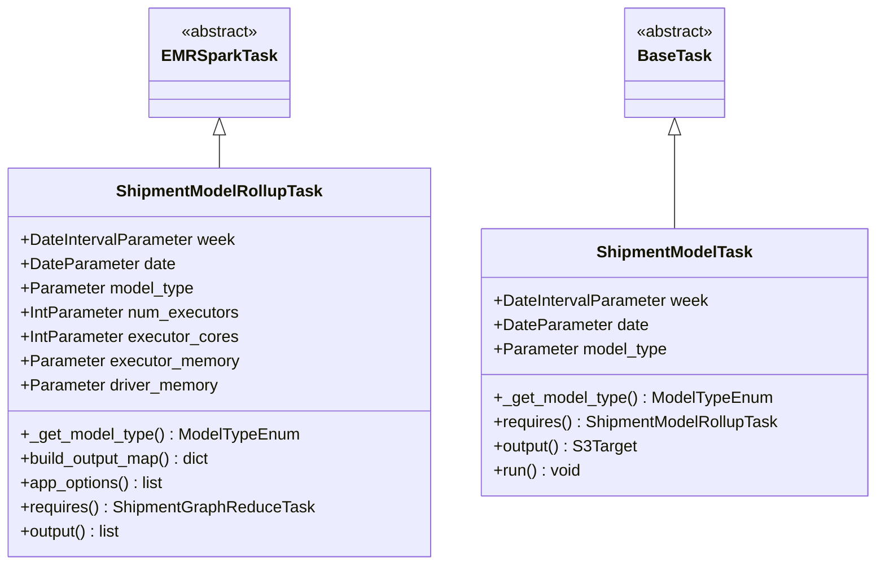
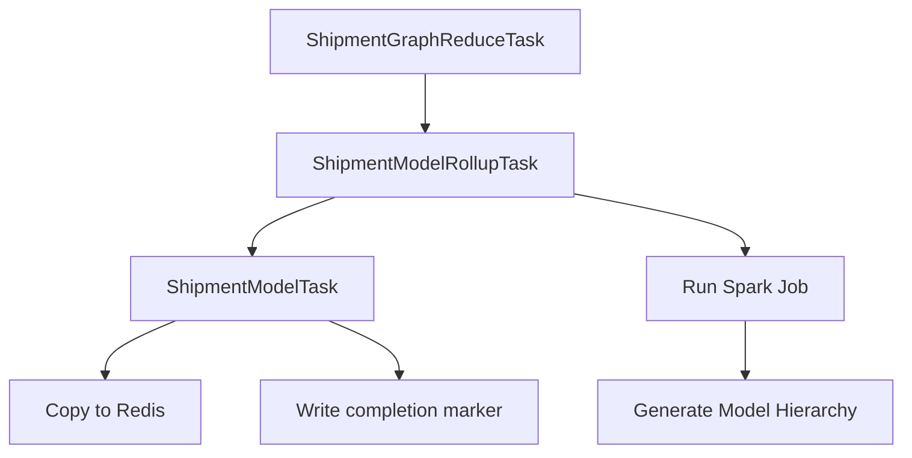
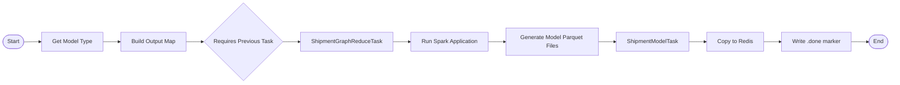

# Diagram: research/orchestrator/tasks/models/shipment_model_task.py


> Auto-generated by Obscura crawlers

## Diagram 1

```mermaid
classDiagram
      EMRSparkTask <|-- ShipmentModelRollupTask
      BaseTask <|-- ShipmentModelTask...
  └ 56 lines...

✗ read_bash
  Invalid shell ID: 0. Please supply a valid shell ID to read output from.

  <no active shell sessions>

● Output Mermaid diagrams
  $ cat << 'MERMAID'
```

> SVG rendering failed for this diagram.

## Diagram 2

```mermaid
classDiagram
      EMRSparkTask <|-- ShipmentModelRollupTask
      BaseTask <|-- ShipmentModelTask...
  └ 56 lines...

✗ Output diagrams using printf
  $ printf '%s\n' "classDiagram" "    EMRSparkTask <|-- ShipmentModelRollupTask" "    BaseTask
  <|-- ShipmentModelTask" "    " "    class ShipmentModelRollupTask {" "
  +DateIntervalParameter week" "        +DateParameter date" "        +Parameter model_type" "
        +IntParameter num_executors" "        +IntParameter executor_cores" "        +Parameter
  executor_memory" "        +Parameter driver_memory" "        +_get_model_type() ModelTypeEnum"...
  Permission denied and could not request permission from user
```

> SVG rendering failed for this diagram.

## Diagram 3



### SVG

<svg id="container" width="857.5625" xmlns="http://www.w3.org/2000/svg" class="classDiagram" height="558" viewBox="0 0 857.5625 558" role="graphics-document document" aria-roledescription="class"><style>#container{font-family:"trebuchet ms",verdana,arial,sans-serif;font-size:16px;fill:#333;}@keyframes edge-animation-frame{from{stroke-dashoffset:0;}}@keyframes dash{to{stroke-dashoffset:0;}}#container .edge-animation-slow{stroke-dasharray:9,5!important;stroke-dashoffset:900;animation:dash 50s linear infinite;stroke-linecap:round;}#container .edge-animation-fast{stroke-dasharray:9,5!important;stroke-dashoffset:900;animation:dash 20s linear infinite;stroke-linecap:round;}#container .error-icon{fill:#552222;}#container .error-text{fill:#552222;stroke:#552222;}#container .edge-thickness-normal{stroke-width:1px;}#container .edge-thickness-thick{stroke-width:3.5px;}#container .edge-pattern-solid{stroke-dasharray:0;}#container .edge-thickness-invisible{stroke-width:0;fill:none;}#container .edge-pattern-dashed{stroke-dasharray:3;}#container .edge-pattern-dotted{stroke-dasharray:2;}#container .marker{fill:#333333;stroke:#333333;}#container .marker.cross{stroke:#333333;}#container svg{font-family:"trebuchet ms",verdana,arial,sans-serif;font-size:16px;}#container p{margin:0;}#container g.classGroup text{fill:#9370DB;stroke:none;font-family:"trebuchet ms",verdana,arial,sans-serif;font-size:10px;}#container g.classGroup text .title{font-weight:bolder;}#container .nodeLabel,#container .edgeLabel{color:#131300;}#container .edgeLabel .label rect{fill:#ECECFF;}#container .label text{fill:#131300;}#container .labelBkg{background:#ECECFF;}#container .edgeLabel .label span{background:#ECECFF;}#container .classTitle{font-weight:bolder;}#container .node rect,#container .node circle,#container .node ellipse,#container .node polygon,#container .node path{fill:#ECECFF;stroke:#9370DB;stroke-width:1px;}#container .divider{stroke:#9370DB;stroke-width:1;}#container g.clickable{cursor:pointer;}#container g.classGroup rect{fill:#ECECFF;stroke:#9370DB;}#container g.classGroup line{stroke:#9370DB;stroke-width:1;}#container .classLabel .box{stroke:none;stroke-width:0;fill:#ECECFF;opacity:0.5;}#container .classLabel .label{fill:#9370DB;font-size:10px;}#container .relation{stroke:#333333;stroke-width:1;fill:none;}#container .dashed-line{stroke-dasharray:3;}#container .dotted-line{stroke-dasharray:1 2;}#container #compositionStart,#container .composition{fill:#333333!important;stroke:#333333!important;stroke-width:1;}#container #compositionEnd,#container .composition{fill:#333333!important;stroke:#333333!important;stroke-width:1;}#container #dependencyStart,#container .dependency{fill:#333333!important;stroke:#333333!important;stroke-width:1;}#container #dependencyStart,#container .dependency{fill:#333333!important;stroke:#333333!important;stroke-width:1;}#container #extensionStart,#container .extension{fill:transparent!important;stroke:#333333!important;stroke-width:1;}#container #extensionEnd,#container .extension{fill:transparent!important;stroke:#333333!important;stroke-width:1;}#container #aggregationStart,#container .aggregation{fill:transparent!important;stroke:#333333!important;stroke-width:1;}#container #aggregationEnd,#container .aggregation{fill:transparent!important;stroke:#333333!important;stroke-width:1;}#container #lollipopStart,#container .lollipop{fill:#ECECFF!important;stroke:#333333!important;stroke-width:1;}#container #lollipopEnd,#container .lollipop{fill:#ECECFF!important;stroke:#333333!important;stroke-width:1;}#container .edgeTerminals{font-size:11px;line-height:initial;}#container .classTitleText{text-anchor:middle;font-size:18px;fill:#333;}#container .label-icon{display:inline-block;height:1em;overflow:visible;vertical-align:-0.125em;}#container .node .label-icon path{fill:currentColor;stroke:revert;stroke-width:revert;}#container :root{--mermaid-font-family:"trebuchet ms",verdana,arial,sans-serif;}</style><g><defs><marker id="container_class-aggregationStart" class="marker aggregation class" refX="18" refY="7" markerWidth="190" markerHeight="240" orient="auto"><path d="M 18,7 L9,13 L1,7 L9,1 Z"></path></marker></defs><defs><marker id="container_class-aggregationEnd" class="marker aggregation class" refX="1" refY="7" markerWidth="20" markerHeight="28" orient="auto"><path d="M 18,7 L9,13 L1,7 L9,1 Z"></path></marker></defs><defs><marker id="container_class-extensionStart" class="marker extension class" refX="18" refY="7" markerWidth="190" markerHeight="240" orient="auto"><path d="M 1,7 L18,13 V 1 Z"></path></marker></defs><defs><marker id="container_class-extensionEnd" class="marker extension class" refX="1" refY="7" markerWidth="20" markerHeight="28" orient="auto"><path d="M 1,1 V 13 L18,7 Z"></path></marker></defs><defs><marker id="container_class-compositionStart" class="marker composition class" refX="18" refY="7" markerWidth="190" markerHeight="240" orient="auto"><path d="M 18,7 L9,13 L1,7 L9,1 Z"></path></marker></defs><defs><marker id="container_class-compositionEnd" class="marker composition class" refX="1" refY="7" markerWidth="20" markerHeight="28" orient="auto"><path d="M 18,7 L9,13 L1,7 L9,1 Z"></path></marker></defs><defs><marker id="container_class-dependencyStart" class="marker dependency class" refX="6" refY="7" markerWidth="190" markerHeight="240" orient="auto"><path d="M 5,7 L9,13 L1,7 L9,1 Z"></path></marker></defs><defs><marker id="container_class-dependencyEnd" class="marker dependency class" refX="13" refY="7" markerWidth="20" markerHeight="28" orient="auto"><path d="M 18,7 L9,13 L14,7 L9,1 Z"></path></marker></defs><defs><marker id="container_class-lollipopStart" class="marker lollipop class" refX="13" refY="7" markerWidth="190" markerHeight="240" orient="auto"><circle stroke="black" fill="transparent" cx="7" cy="7" r="6"></circle></marker></defs><defs><marker id="container_class-lollipopEnd" class="marker lollipop class" refX="1" refY="7" markerWidth="190" markerHeight="240" orient="auto"><circle stroke="black" fill="transparent" cx="7" cy="7" r="6"></circle></marker></defs><g class="root"><g class="clusters"></g><g class="edgePaths"><path d="M212.949,133.25L212.949,134.542C212.949,135.833,212.949,138.417,212.949,143.875C212.949,149.333,212.949,157.667,212.949,161.833L212.949,166" id="id_EMRSparkTask_ShipmentModelRollupTask_1" class="edge-thickness-normal edge-pattern-solid relation" style=";;;" data-edge="true" data-et="edge" data-id="id_EMRSparkTask_ShipmentModelRollupTask_1" data-points="W3sieCI6MjEyLjk0OTIxODc1LCJ5IjoxMTZ9LHsieCI6MjEyLjk0OTIxODc1LCJ5IjoxNDF9LHsieCI6MjEyLjk0OTIxODc1LCJ5IjoxNjZ9XQ==" marker-start="url(#container_class-extensionStart)"></path><path d="M658.73,133.25L658.73,134.542C658.73,135.833,658.73,138.417,658.73,153.875C658.73,169.333,658.73,197.667,658.73,211.833L658.73,226" id="id_BaseTask_ShipmentModelTask_2" class="edge-thickness-normal edge-pattern-solid relation" style=";;;" data-edge="true" data-et="edge" data-id="id_BaseTask_ShipmentModelTask_2" data-points="W3sieCI6NjU4LjczMDQ2ODc1LCJ5IjoxMTZ9LHsieCI6NjU4LjczMDQ2ODc1LCJ5IjoxNDF9LHsieCI6NjU4LjczMDQ2ODc1LCJ5IjoyMjZ9XQ==" marker-start="url(#container_class-extensionStart)"></path></g><g class="edgeLabels"><g class="edgeLabel"><g class="label" data-id="id_EMRSparkTask_ShipmentModelRollupTask_1" transform="translate(0, 0)"><foreignObject width="0" height="0"><div xmlns="http://www.w3.org/1999/xhtml" class="labelBkg" style="display: table-cell; white-space: nowrap; line-height: 1.5; max-width: 200px; text-align: center;"><span class="edgeLabel"></span></div></foreignObject></g></g><g class="edgeLabel"><g class="label" data-id="id_BaseTask_ShipmentModelTask_2" transform="translate(0, 0)"><foreignObject width="0" height="0"><div xmlns="http://www.w3.org/1999/xhtml" class="labelBkg" style="display: table-cell; white-space: nowrap; line-height: 1.5; max-width: 200px; text-align: center;"><span class="edgeLabel"></span></div></foreignObject></g></g></g><g class="nodes"><g class="node default" id="classId-EMRSparkTask-0" transform="translate(212.94921875, 62)"><g class="basic label-container"><path d="M-65.1484375 -54 L65.1484375 -54 L65.1484375 54 L-65.1484375 54" stroke="none" stroke-width="0" fill="#ECECFF" style=""></path><path d="M-65.1484375 -54 C-20.69765128530078 -54, 23.753134929398442 -54, 65.1484375 -54 M-65.1484375 -54 C-14.343728805621723 -54, 36.460979888756555 -54, 65.1484375 -54 M65.1484375 -54 C65.1484375 -30.078896971741372, 65.1484375 -6.157793943482744, 65.1484375 54 M65.1484375 -54 C65.1484375 -31.88606580840448, 65.1484375 -9.772131616808963, 65.1484375 54 M65.1484375 54 C27.59426681356007 54, -9.959903872879863 54, -65.1484375 54 M65.1484375 54 C18.38492872263101 54, -28.37858005473798 54, -65.1484375 54 M-65.1484375 54 C-65.1484375 15.928774847249407, -65.1484375 -22.142450305501185, -65.1484375 -54 M-65.1484375 54 C-65.1484375 25.7371604611759, -65.1484375 -2.525679077648199, -65.1484375 -54" stroke="#9370DB" stroke-width="1.3" fill="none" stroke-dasharray="0 0" style=""></path></g><g class="annotation-group text" transform="translate(-38.609375, -30)"><g class="label" style="" transform="translate(0,-12)"><foreignObject width="77.21875" height="24"><div xmlns="http://www.w3.org/1999/xhtml" style="display: table-cell; white-space: nowrap; line-height: 1.5; max-width: 127px; text-align: center;"><span class="nodeLabel markdown-node-label" style=""><p>«abstract»</p></span></div></foreignObject></g></g><g class="label-group text" transform="translate(-53.1484375, -6)"><g class="label" style="font-weight: bolder" transform="translate(0,-12)"><foreignObject width="106.296875" height="24"><div xmlns="http://www.w3.org/1999/xhtml" style="display: table-cell; white-space: nowrap; line-height: 1.5; max-width: 154px; text-align: center;"><span class="nodeLabel markdown-node-label" style=""><p>EMRSparkTask</p></span></div></foreignObject></g></g><g class="members-group text" transform="translate(-53.1484375, 42)"></g><g class="methods-group text" transform="translate(-53.1484375, 72)"></g><g class="divider" style=""><path d="M-65.1484375 18 C-36.91292431473634 18, -8.677411129472674 18, 65.1484375 18 M-65.1484375 18 C-29.695626007877735 18, 5.7571854842445305 18, 65.1484375 18" stroke="#9370DB" stroke-width="1.3" fill="none" stroke-dasharray="0 0" style=""></path></g><g class="divider" style=""><path d="M-65.1484375 36 C-23.963535523982358 36, 17.221366452035284 36, 65.1484375 36 M-65.1484375 36 C-31.60939956615038 36, 1.9296383676992406 36, 65.1484375 36" stroke="#9370DB" stroke-width="1.3" fill="none" stroke-dasharray="0 0" style=""></path></g></g><g class="node default" id="classId-ShipmentModelRollupTask-1" transform="translate(212.94921875, 358)"><g class="basic label-container"><path d="M-204.94921875 -192 L204.94921875 -192 L204.94921875 192 L-204.94921875 192" stroke="none" stroke-width="0" fill="#ECECFF" style=""></path><path d="M-204.94921875 -192 C-111.49033659409952 -192, -18.031454438199034 -192, 204.94921875 -192 M-204.94921875 -192 C-115.42330789836481 -192, -25.897397046729623 -192, 204.94921875 -192 M204.94921875 -192 C204.94921875 -107.22823519658702, 204.94921875 -22.456470393174044, 204.94921875 192 M204.94921875 -192 C204.94921875 -49.531387935378234, 204.94921875 92.93722412924353, 204.94921875 192 M204.94921875 192 C111.83133111526907 192, 18.713443480538132 192, -204.94921875 192 M204.94921875 192 C115.00283415610484 192, 25.05644956220968 192, -204.94921875 192 M-204.94921875 192 C-204.94921875 80.11071440878834, -204.94921875 -31.77857118242332, -204.94921875 -192 M-204.94921875 192 C-204.94921875 103.19518624688374, -204.94921875 14.390372493767472, -204.94921875 -192" stroke="#9370DB" stroke-width="1.3" fill="none" stroke-dasharray="0 0" style=""></path></g><g class="annotation-group text" transform="translate(0, -168)"></g><g class="label-group text" transform="translate(-97.7578125, -168)"><g class="label" style="font-weight: bolder" transform="translate(0,-12)"><foreignObject width="195.515625" height="24"><div xmlns="http://www.w3.org/1999/xhtml" style="display: table-cell; white-space: nowrap; line-height: 1.5; max-width: 244px; text-align: center;"><span class="nodeLabel markdown-node-label" style=""><p>ShipmentModelRollupTask</p></span></div></foreignObject></g></g><g class="members-group text" transform="translate(-192.94921875, -120)"><g class="label" style="" transform="translate(0,-12)"><foreignObject width="212.125" height="24"><div xmlns="http://www.w3.org/1999/xhtml" style="display: table-cell; white-space: nowrap; line-height: 1.5; max-width: 270px; text-align: center;"><span class="nodeLabel markdown-node-label" style=""><p>+DateIntervalParameter week</p></span></div></foreignObject></g><g class="label" style="" transform="translate(0,12)"><foreignObject width="152.171875" height="24"><div xmlns="http://www.w3.org/1999/xhtml" style="display: table-cell; white-space: nowrap; line-height: 1.5; max-width: 210px; text-align: center;"><span class="nodeLabel markdown-node-label" style=""><p>+DateParameter date</p></span></div></foreignObject></g><g class="label" style="" transform="translate(0,36)"><foreignObject width="172.359375" height="24"><div xmlns="http://www.w3.org/1999/xhtml" style="display: table-cell; white-space: nowrap; line-height: 1.5; max-width: 230px; text-align: center;"><span class="nodeLabel markdown-node-label" style=""><p>+Parameter model_type</p></span></div></foreignObject></g><g class="label" style="" transform="translate(0,60)"><foreignObject width="216.8125" height="24"><div xmlns="http://www.w3.org/1999/xhtml" style="display: table-cell; white-space: nowrap; line-height: 1.5; max-width: 274px; text-align: center;"><span class="nodeLabel markdown-node-label" style=""><p>+IntParameter num_executors</p></span></div></foreignObject></g><g class="label" style="" transform="translate(0,84)"><foreignObject width="214.453125" height="24"><div xmlns="http://www.w3.org/1999/xhtml" style="display: table-cell; white-space: nowrap; line-height: 1.5; max-width: 272px; text-align: center;"><span class="nodeLabel markdown-node-label" style=""><p>+IntParameter executor_cores</p></span></div></foreignObject></g><g class="label" style="" transform="translate(0,108)"><foreignObject width="215.875" height="24"><div xmlns="http://www.w3.org/1999/xhtml" style="display: table-cell; white-space: nowrap; line-height: 1.5; max-width: 273px; text-align: center;"><span class="nodeLabel markdown-node-label" style=""><p>+Parameter executor_memory</p></span></div></foreignObject></g><g class="label" style="" transform="translate(0,132)"><foreignObject width="196.078125" height="24"><div xmlns="http://www.w3.org/1999/xhtml" style="display: table-cell; white-space: nowrap; line-height: 1.5; max-width: 254px; text-align: center;"><span class="nodeLabel markdown-node-label" style=""><p>+Parameter driver_memory</p></span></div></foreignObject></g></g><g class="methods-group text" transform="translate(-192.94921875, 72)"><g class="label" style="" transform="translate(0,-12)"><foreignObject width="273.859375" height="24"><div xmlns="http://www.w3.org/1999/xhtml" style="display: table-cell; white-space: nowrap; line-height: 1.5; max-width: 331px; text-align: center;"><span class="nodeLabel markdown-node-label" style=""><p>+_get_model_type() : ModelTypeEnum</p></span></div></foreignObject></g><g class="label" style="" transform="translate(0,12)"><foreignObject width="192.953125" height="24"><div xmlns="http://www.w3.org/1999/xhtml" style="display: table-cell; white-space: nowrap; line-height: 1.5; max-width: 251px; text-align: center;"><span class="nodeLabel markdown-node-label" style=""><p>+build_output_map() : dict</p></span></div></foreignObject></g><g class="label" style="" transform="translate(0,36)"><foreignObject width="143.609375" height="24"><div xmlns="http://www.w3.org/1999/xhtml" style="display: table-cell; white-space: nowrap; line-height: 1.5; max-width: 201px; text-align: center;"><span class="nodeLabel markdown-node-label" style=""><p>+app_options() : list</p></span></div></foreignObject></g><g class="label" style="" transform="translate(0,60)"><foreignObject width="288.140625" height="24"><div xmlns="http://www.w3.org/1999/xhtml" style="display: table-cell; white-space: nowrap; line-height: 1.5; max-width: 346px; text-align: center;"><span class="nodeLabel markdown-node-label" style=""><p>+requires() : ShipmentGraphReduceTask</p></span></div></foreignObject></g><g class="label" style="" transform="translate(0,84)"><foreignObject width="102.15625" height="24"><div xmlns="http://www.w3.org/1999/xhtml" style="display: table-cell; white-space: nowrap; line-height: 1.5; max-width: 160px; text-align: center;"><span class="nodeLabel markdown-node-label" style=""><p>+output() : list</p></span></div></foreignObject></g></g><g class="divider" style=""><path d="M-204.94921875 -144 C-114.75601469477292 -144, -24.56281063954583 -144, 204.94921875 -144 M-204.94921875 -144 C-112.75531100655002 -144, -20.561403263100033 -144, 204.94921875 -144" stroke="#9370DB" stroke-width="1.3" fill="none" stroke-dasharray="0 0" style=""></path></g><g class="divider" style=""><path d="M-204.94921875 48 C-105.12932696961589 48, -5.3094351892317775 48, 204.94921875 48 M-204.94921875 48 C-50.127712067328304 48, 104.69379461534339 48, 204.94921875 48" stroke="#9370DB" stroke-width="1.3" fill="none" stroke-dasharray="0 0" style=""></path></g></g><g class="node default" id="classId-BaseTask-2" transform="translate(658.73046875, 62)"><g class="basic label-container"><path d="M-50.609375 -54 L50.609375 -54 L50.609375 54 L-50.609375 54" stroke="none" stroke-width="0" fill="#ECECFF" style=""></path><path d="M-50.609375 -54 C-24.19445481206533 -54, 2.2204653758693382 -54, 50.609375 -54 M-50.609375 -54 C-19.84904558479978 -54, 10.911283830400443 -54, 50.609375 -54 M50.609375 -54 C50.609375 -32.33074590323484, 50.609375 -10.661491806469684, 50.609375 54 M50.609375 -54 C50.609375 -13.842942943865935, 50.609375 26.31411411226813, 50.609375 54 M50.609375 54 C28.90254062761926 54, 7.19570625523852 54, -50.609375 54 M50.609375 54 C11.09398931976149 54, -28.42139636047702 54, -50.609375 54 M-50.609375 54 C-50.609375 14.660119509054987, -50.609375 -24.679760981890027, -50.609375 -54 M-50.609375 54 C-50.609375 27.801845992342162, -50.609375 1.6036919846843247, -50.609375 -54" stroke="#9370DB" stroke-width="1.3" fill="none" stroke-dasharray="0 0" style=""></path></g><g class="annotation-group text" transform="translate(-38.609375, -30)"><g class="label" style="" transform="translate(0,-12)"><foreignObject width="77.21875" height="24"><div xmlns="http://www.w3.org/1999/xhtml" style="display: table-cell; white-space: nowrap; line-height: 1.5; max-width: 127px; text-align: center;"><span class="nodeLabel markdown-node-label" style=""><p>«abstract»</p></span></div></foreignObject></g></g><g class="label-group text" transform="translate(-34.03125, -6)"><g class="label" style="font-weight: bolder" transform="translate(0,-12)"><foreignObject width="68.0625" height="24"><div xmlns="http://www.w3.org/1999/xhtml" style="display: table-cell; white-space: nowrap; line-height: 1.5; max-width: 117px; text-align: center;"><span class="nodeLabel markdown-node-label" style=""><p>BaseTask</p></span></div></foreignObject></g></g><g class="members-group text" transform="translate(-38.609375, 42)"></g><g class="methods-group text" transform="translate(-38.609375, 72)"></g><g class="divider" style=""><path d="M-50.609375 18 C-21.16114680887538 18, 8.28708138224924 18, 50.609375 18 M-50.609375 18 C-15.71943635140348 18, 19.17050229719304 18, 50.609375 18" stroke="#9370DB" stroke-width="1.3" fill="none" stroke-dasharray="0 0" style=""></path></g><g class="divider" style=""><path d="M-50.609375 36 C-28.410608462139763 36, -6.2118419242795255 36, 50.609375 36 M-50.609375 36 C-17.521552275281294 36, 15.566270449437411 36, 50.609375 36" stroke="#9370DB" stroke-width="1.3" fill="none" stroke-dasharray="0 0" style=""></path></g></g><g class="node default" id="classId-ShipmentModelTask-3" transform="translate(658.73046875, 358)"><g class="basic label-container"><path d="M-190.83203125 -132 L190.83203125 -132 L190.83203125 132 L-190.83203125 132" stroke="none" stroke-width="0" fill="#ECECFF" style=""></path><path d="M-190.83203125 -132 C-107.32213547718388 -132, -23.812239704367755 -132, 190.83203125 -132 M-190.83203125 -132 C-111.11779651966711 -132, -31.40356178933422 -132, 190.83203125 -132 M190.83203125 -132 C190.83203125 -51.728988841440454, 190.83203125 28.54202231711909, 190.83203125 132 M190.83203125 -132 C190.83203125 -56.08466281897577, 190.83203125 19.830674362048455, 190.83203125 132 M190.83203125 132 C45.897930722373445 132, -99.03616980525311 132, -190.83203125 132 M190.83203125 132 C82.42774878488088 132, -25.976533680238248 132, -190.83203125 132 M-190.83203125 132 C-190.83203125 68.9213601164632, -190.83203125 5.842720232926396, -190.83203125 -132 M-190.83203125 132 C-190.83203125 54.67410401540097, -190.83203125 -22.651791969198058, -190.83203125 -132" stroke="#9370DB" stroke-width="1.3" fill="none" stroke-dasharray="0 0" style=""></path></g><g class="annotation-group text" transform="translate(0, -108)"></g><g class="label-group text" transform="translate(-74.1640625, -108)"><g class="label" style="font-weight: bolder" transform="translate(0,-12)"><foreignObject width="148.328125" height="24"><div xmlns="http://www.w3.org/1999/xhtml" style="display: table-cell; white-space: nowrap; line-height: 1.5; max-width: 197px; text-align: center;"><span class="nodeLabel markdown-node-label" style=""><p>ShipmentModelTask</p></span></div></foreignObject></g></g><g class="members-group text" transform="translate(-178.83203125, -60)"><g class="label" style="" transform="translate(0,-12)"><foreignObject width="212.125" height="24"><div xmlns="http://www.w3.org/1999/xhtml" style="display: table-cell; white-space: nowrap; line-height: 1.5; max-width: 270px; text-align: center;"><span class="nodeLabel markdown-node-label" style=""><p>+DateIntervalParameter week</p></span></div></foreignObject></g><g class="label" style="" transform="translate(0,12)"><foreignObject width="152.171875" height="24"><div xmlns="http://www.w3.org/1999/xhtml" style="display: table-cell; white-space: nowrap; line-height: 1.5; max-width: 210px; text-align: center;"><span class="nodeLabel markdown-node-label" style=""><p>+DateParameter date</p></span></div></foreignObject></g><g class="label" style="" transform="translate(0,36)"><foreignObject width="172.359375" height="24"><div xmlns="http://www.w3.org/1999/xhtml" style="display: table-cell; white-space: nowrap; line-height: 1.5; max-width: 230px; text-align: center;"><span class="nodeLabel markdown-node-label" style=""><p>+Parameter model_type</p></span></div></foreignObject></g></g><g class="methods-group text" transform="translate(-178.83203125, 36)"><g class="label" style="" transform="translate(0,-12)"><foreignObject width="273.859375" height="24"><div xmlns="http://www.w3.org/1999/xhtml" style="display: table-cell; white-space: nowrap; line-height: 1.5; max-width: 331px; text-align: center;"><span class="nodeLabel markdown-node-label" style=""><p>+_get_model_type() : ModelTypeEnum</p></span></div></foreignObject></g><g class="label" style="" transform="translate(0,12)"><foreignObject width="283.5" height="24"><div xmlns="http://www.w3.org/1999/xhtml" style="display: table-cell; white-space: nowrap; line-height: 1.5; max-width: 342px; text-align: center;"><span class="nodeLabel markdown-node-label" style=""><p>+requires() : ShipmentModelRollupTask</p></span></div></foreignObject></g><g class="label" style="" transform="translate(0,36)"><foreignObject width="140.6875" height="24"><div xmlns="http://www.w3.org/1999/xhtml" style="display: table-cell; white-space: nowrap; line-height: 1.5; max-width: 198px; text-align: center;"><span class="nodeLabel markdown-node-label" style=""><p>+output() : S3Target</p></span></div></foreignObject></g><g class="label" style="" transform="translate(0,60)"><foreignObject width="86.78125" height="24"><div xmlns="http://www.w3.org/1999/xhtml" style="display: table-cell; white-space: nowrap; line-height: 1.5; max-width: 144px; text-align: center;"><span class="nodeLabel markdown-node-label" style=""><p>+run() : void</p></span></div></foreignObject></g></g><g class="divider" style=""><path d="M-190.83203125 -84 C-57.68755105819514 -84, 75.45692913360972 -84, 190.83203125 -84 M-190.83203125 -84 C-82.83532523099647 -84, 25.16138078800705 -84, 190.83203125 -84" stroke="#9370DB" stroke-width="1.3" fill="none" stroke-dasharray="0 0" style=""></path></g><g class="divider" style=""><path d="M-190.83203125 12 C-110.72398285144287 12, -30.61593445288574 12, 190.83203125 12 M-190.83203125 12 C-84.24189839525924 12, 22.348234459481517 12, 190.83203125 12" stroke="#9370DB" stroke-width="1.3" fill="none" stroke-dasharray="0 0" style=""></path></g></g></g></g></g></svg>

## Diagram 4



### SVG

<svg id="container" width="762.359375" xmlns="http://www.w3.org/2000/svg" class="flowchart" height="382" viewBox="0 0 762.359375 382" role="graphics-document document" aria-roledescription="flowchart-v2"><style>#container{font-family:"trebuchet ms",verdana,arial,sans-serif;font-size:16px;fill:#333;}@keyframes edge-animation-frame{from{stroke-dashoffset:0;}}@keyframes dash{to{stroke-dashoffset:0;}}#container .edge-animation-slow{stroke-dasharray:9,5!important;stroke-dashoffset:900;animation:dash 50s linear infinite;stroke-linecap:round;}#container .edge-animation-fast{stroke-dasharray:9,5!important;stroke-dashoffset:900;animation:dash 20s linear infinite;stroke-linecap:round;}#container .error-icon{fill:#552222;}#container .error-text{fill:#552222;stroke:#552222;}#container .edge-thickness-normal{stroke-width:1px;}#container .edge-thickness-thick{stroke-width:3.5px;}#container .edge-pattern-solid{stroke-dasharray:0;}#container .edge-thickness-invisible{stroke-width:0;fill:none;}#container .edge-pattern-dashed{stroke-dasharray:3;}#container .edge-pattern-dotted{stroke-dasharray:2;}#container .marker{fill:#333333;stroke:#333333;}#container .marker.cross{stroke:#333333;}#container svg{font-family:"trebuchet ms",verdana,arial,sans-serif;font-size:16px;}#container p{margin:0;}#container .label{font-family:"trebuchet ms",verdana,arial,sans-serif;color:#333;}#container .cluster-label text{fill:#333;}#container .cluster-label span{color:#333;}#container .cluster-label span p{background-color:transparent;}#container .label text,#container span{fill:#333;color:#333;}#container .node rect,#container .node circle,#container .node ellipse,#container .node polygon,#container .node path{fill:#ECECFF;stroke:#9370DB;stroke-width:1px;}#container .rough-node .label text,#container .node .label text,#container .image-shape .label,#container .icon-shape .label{text-anchor:middle;}#container .node .katex path{fill:#000;stroke:#000;stroke-width:1px;}#container .rough-node .label,#container .node .label,#container .image-shape .label,#container .icon-shape .label{text-align:center;}#container .node.clickable{cursor:pointer;}#container .root .anchor path{fill:#333333!important;stroke-width:0;stroke:#333333;}#container .arrowheadPath{fill:#333333;}#container .edgePath .path{stroke:#333333;stroke-width:2.0px;}#container .flowchart-link{stroke:#333333;fill:none;}#container .edgeLabel{background-color:rgba(232,232,232, 0.8);text-align:center;}#container .edgeLabel p{background-color:rgba(232,232,232, 0.8);}#container .edgeLabel rect{opacity:0.5;background-color:rgba(232,232,232, 0.8);fill:rgba(232,232,232, 0.8);}#container .labelBkg{background-color:rgba(232, 232, 232, 0.5);}#container .cluster rect{fill:#ffffde;stroke:#aaaa33;stroke-width:1px;}#container .cluster text{fill:#333;}#container .cluster span{color:#333;}#container div.mermaidTooltip{position:absolute;text-align:center;max-width:200px;padding:2px;font-family:"trebuchet ms",verdana,arial,sans-serif;font-size:12px;background:hsl(80, 100%, 96.2745098039%);border:1px solid #aaaa33;border-radius:2px;pointer-events:none;z-index:100;}#container .flowchartTitleText{text-anchor:middle;font-size:18px;fill:#333;}#container rect.text{fill:none;stroke-width:0;}#container .icon-shape,#container .image-shape{background-color:rgba(232,232,232, 0.8);text-align:center;}#container .icon-shape p,#container .image-shape p{background-color:rgba(232,232,232, 0.8);padding:2px;}#container .icon-shape rect,#container .image-shape rect{opacity:0.5;background-color:rgba(232,232,232, 0.8);fill:rgba(232,232,232, 0.8);}#container .label-icon{display:inline-block;height:1em;overflow:visible;vertical-align:-0.125em;}#container .node .label-icon path{fill:currentColor;stroke:revert;stroke-width:revert;}#container :root{--mermaid-font-family:"trebuchet ms",verdana,arial,sans-serif;}</style><g><marker id="container_flowchart-v2-pointEnd" class="marker flowchart-v2" viewBox="0 0 10 10" refX="5" refY="5" markerUnits="userSpaceOnUse" markerWidth="8" markerHeight="8" orient="auto"><path d="M 0 0 L 10 5 L 0 10 z" class="arrowMarkerPath" style="stroke-width: 1; stroke-dasharray: 1, 0;"></path></marker><marker id="container_flowchart-v2-pointStart" class="marker flowchart-v2" viewBox="0 0 10 10" refX="4.5" refY="5" markerUnits="userSpaceOnUse" markerWidth="8" markerHeight="8" orient="auto"><path d="M 0 5 L 10 10 L 10 0 z" class="arrowMarkerPath" style="stroke-width: 1; stroke-dasharray: 1, 0;"></path></marker><marker id="container_flowchart-v2-circleEnd" class="marker flowchart-v2" viewBox="0 0 10 10" refX="11" refY="5" markerUnits="userSpaceOnUse" markerWidth="11" markerHeight="11" orient="auto"><circle cx="5" cy="5" r="5" class="arrowMarkerPath" style="stroke-width: 1; stroke-dasharray: 1, 0;"></circle></marker><marker id="container_flowchart-v2-circleStart" class="marker flowchart-v2" viewBox="0 0 10 10" refX="-1" refY="5" markerUnits="userSpaceOnUse" markerWidth="11" markerHeight="11" orient="auto"><circle cx="5" cy="5" r="5" class="arrowMarkerPath" style="stroke-width: 1; stroke-dasharray: 1, 0;"></circle></marker><marker id="container_flowchart-v2-crossEnd" class="marker cross flowchart-v2" viewBox="0 0 11 11" refX="12" refY="5.2" markerUnits="userSpaceOnUse" markerWidth="11" markerHeight="11" orient="auto"><path d="M 1,1 l 9,9 M 10,1 l -9,9" class="arrowMarkerPath" style="stroke-width: 2; stroke-dasharray: 1, 0;"></path></marker><marker id="container_flowchart-v2-crossStart" class="marker cross flowchart-v2" viewBox="0 0 11 11" refX="-1" refY="5.2" markerUnits="userSpaceOnUse" markerWidth="11" markerHeight="11" orient="auto"><path d="M 1,1 l 9,9 M 10,1 l -9,9" class="arrowMarkerPath" style="stroke-width: 2; stroke-dasharray: 1, 0;"></path></marker><g class="root"><g class="clusters"></g><g class="edgePaths"><path d="M358.859,62L358.859,66.167C358.859,70.333,358.859,78.667,358.859,86.333C358.859,94,358.859,101,358.859,104.5L358.859,108" id="L_A_B_0" class="edge-thickness-normal edge-pattern-solid edge-thickness-normal edge-pattern-solid flowchart-link" style=";" data-edge="true" data-et="edge" data-id="L_A_B_0" data-points="W3sieCI6MzU4Ljg1OTM3NSwieSI6NjJ9LHsieCI6MzU4Ljg1OTM3NSwieSI6ODd9LHsieCI6MzU4Ljg1OTM3NSwieSI6MTEyfV0=" marker-end="url(#container_flowchart-v2-pointEnd)"></path><path d="M282.534,166L270.756,170.167C258.977,174.333,235.42,182.667,223.642,190.333C211.863,198,211.863,205,211.863,208.5L211.863,212" id="L_B_C_0" class="edge-thickness-normal edge-pattern-solid edge-thickness-normal edge-pattern-solid flowchart-link" style=";" data-edge="true" data-et="edge" data-id="L_B_C_0" data-points="W3sieCI6MjgyLjUzNDQ4MDE2ODI2OTIsInkiOjE2Nn0seyJ4IjoyMTEuODYzMjgxMjUsInkiOjE5MX0seyJ4IjoyMTEuODYzMjgxMjUsInkiOjIxNn1d" marker-end="url(#container_flowchart-v2-pointEnd)"></path><path d="M147.128,270L137.138,274.167C127.148,278.333,107.168,286.667,97.178,294.333C87.188,302,87.188,309,87.188,312.5L87.188,316" id="L_C_D_0" class="edge-thickness-normal edge-pattern-solid edge-thickness-normal edge-pattern-solid flowchart-link" style=";" data-edge="true" data-et="edge" data-id="L_C_D_0" data-points="W3sieCI6MTQ3LjEyNzc3OTQ0NzExNTQsInkiOjI3MH0seyJ4Ijo4Ny4xODc1LCJ5IjoyOTV9LHsieCI6ODcuMTg3NSwieSI6MzIwfV0=" marker-end="url(#container_flowchart-v2-pointEnd)"></path><path d="M276.599,270L286.589,274.167C296.579,278.333,316.559,286.667,326.549,294.333C336.539,302,336.539,309,336.539,312.5L336.539,316" id="L_C_E_0" class="edge-thickness-normal edge-pattern-solid edge-thickness-normal edge-pattern-solid flowchart-link" style=";" data-edge="true" data-et="edge" data-id="L_C_E_0" data-points="W3sieCI6Mjc2LjU5ODc4MzA1Mjg4NDY0LCJ5IjoyNzB9LHsieCI6MzM2LjUzOTA2MjUsInkiOjI5NX0seyJ4IjozMzYuNTM5MDYyNSwieSI6MzIwfV0=" marker-end="url(#container_flowchart-v2-pointEnd)"></path><path d="M485.422,163.225L509.607,167.854C533.792,172.483,582.161,181.742,606.346,189.871C630.531,198,630.531,205,630.531,208.5L630.531,212" id="L_B_F_0" class="edge-thickness-normal edge-pattern-solid edge-thickness-normal edge-pattern-solid flowchart-link" style=";" data-edge="true" data-et="edge" data-id="L_B_F_0" data-points="W3sieCI6NDg1LjQyMTg3NSwieSI6MTYzLjIyNDk5NTY4NjQzMjR9LHsieCI6NjMwLjUzMTI1LCJ5IjoxOTF9LHsieCI6NjMwLjUzMTI1LCJ5IjoyMTZ9XQ==" marker-end="url(#container_flowchart-v2-pointEnd)"></path><path d="M630.531,270L630.531,274.167C630.531,278.333,630.531,286.667,630.531,294.333C630.531,302,630.531,309,630.531,312.5L630.531,316" id="L_F_G_0" class="edge-thickness-normal edge-pattern-solid edge-thickness-normal edge-pattern-solid flowchart-link" style=";" data-edge="true" data-et="edge" data-id="L_F_G_0" data-points="W3sieCI6NjMwLjUzMTI1LCJ5IjoyNzB9LHsieCI6NjMwLjUzMTI1LCJ5IjoyOTV9LHsieCI6NjMwLjUzMTI1LCJ5IjozMjB9XQ==" marker-end="url(#container_flowchart-v2-pointEnd)"></path></g><g class="edgeLabels"><g class="edgeLabel"><g class="label" data-id="L_A_B_0" transform="translate(0, 0)"><foreignObject width="0" height="0"><div xmlns="http://www.w3.org/1999/xhtml" class="labelBkg" style="display: table-cell; white-space: nowrap; line-height: 1.5; max-width: 200px; text-align: center;"><span class="edgeLabel"></span></div></foreignObject></g></g><g class="edgeLabel"><g class="label" data-id="L_B_C_0" transform="translate(0, 0)"><foreignObject width="0" height="0"><div xmlns="http://www.w3.org/1999/xhtml" class="labelBkg" style="display: table-cell; white-space: nowrap; line-height: 1.5; max-width: 200px; text-align: center;"><span class="edgeLabel"></span></div></foreignObject></g></g><g class="edgeLabel"><g class="label" data-id="L_C_D_0" transform="translate(0, 0)"><foreignObject width="0" height="0"><div xmlns="http://www.w3.org/1999/xhtml" class="labelBkg" style="display: table-cell; white-space: nowrap; line-height: 1.5; max-width: 200px; text-align: center;"><span class="edgeLabel"></span></div></foreignObject></g></g><g class="edgeLabel"><g class="label" data-id="L_C_E_0" transform="translate(0, 0)"><foreignObject width="0" height="0"><div xmlns="http://www.w3.org/1999/xhtml" class="labelBkg" style="display: table-cell; white-space: nowrap; line-height: 1.5; max-width: 200px; text-align: center;"><span class="edgeLabel"></span></div></foreignObject></g></g><g class="edgeLabel"><g class="label" data-id="L_B_F_0" transform="translate(0, 0)"><foreignObject width="0" height="0"><div xmlns="http://www.w3.org/1999/xhtml" class="labelBkg" style="display: table-cell; white-space: nowrap; line-height: 1.5; max-width: 200px; text-align: center;"><span class="edgeLabel"></span></div></foreignObject></g></g><g class="edgeLabel"><g class="label" data-id="L_F_G_0" transform="translate(0, 0)"><foreignObject width="0" height="0"><div xmlns="http://www.w3.org/1999/xhtml" class="labelBkg" style="display: table-cell; white-space: nowrap; line-height: 1.5; max-width: 200px; text-align: center;"><span class="edgeLabel"></span></div></foreignObject></g></g></g><g class="nodes"><g class="node default" id="flowchart-A-0" transform="translate(358.859375, 35)"><rect class="basic label-container" style="" x="-128.8828125" y="-27" width="257.765625" height="54"></rect><g class="label" style="" transform="translate(-98.8828125, -12)"><rect></rect><foreignObject width="197.765625" height="24"><div xmlns="http://www.w3.org/1999/xhtml" style="display: table-cell; white-space: nowrap; line-height: 1.5; max-width: 200px; text-align: center;"><span class="nodeLabel"><p>ShipmentGraphReduceTask</p></span></div></foreignObject></g></g><g class="node default" id="flowchart-B-1" transform="translate(358.859375, 139)"><rect class="basic label-container" style="" x="-126.5625" y="-27" width="253.125" height="54"></rect><g class="label" style="" transform="translate(-96.5625, -12)"><rect></rect><foreignObject width="193.125" height="24"><div xmlns="http://www.w3.org/1999/xhtml" style="display: table-cell; white-space: nowrap; line-height: 1.5; max-width: 200px; text-align: center;"><span class="nodeLabel"><p>ShipmentModelRollupTask</p></span></div></foreignObject></g></g><g class="node default" id="flowchart-C-3" transform="translate(211.86328125, 243)"><rect class="basic label-container" style="" x="-103.078125" y="-27" width="206.15625" height="54"></rect><g class="label" style="" transform="translate(-73.078125, -12)"><rect></rect><foreignObject width="146.15625" height="24"><div xmlns="http://www.w3.org/1999/xhtml" style="display: table-cell; white-space: nowrap; line-height: 1.5; max-width: 200px; text-align: center;"><span class="nodeLabel"><p>ShipmentModelTask</p></span></div></foreignObject></g></g><g class="node default" id="flowchart-D-5" transform="translate(87.1875, 347)"><rect class="basic label-container" style="" x="-79.1875" y="-27" width="158.375" height="54"></rect><g class="label" style="" transform="translate(-49.1875, -12)"><rect></rect><foreignObject width="98.375" height="24"><div xmlns="http://www.w3.org/1999/xhtml" style="display: table-cell; white-space: nowrap; line-height: 1.5; max-width: 200px; text-align: center;"><span class="nodeLabel"><p>Copy to Redis</p></span></div></foreignObject></g></g><g class="node default" id="flowchart-E-7" transform="translate(336.5390625, 347)"><rect class="basic label-container" style="" x="-120.1640625" y="-27" width="240.328125" height="54"></rect><g class="label" style="" transform="translate(-90.1640625, -12)"><rect></rect><foreignObject width="180.328125" height="24"><div xmlns="http://www.w3.org/1999/xhtml" style="display: table-cell; white-space: nowrap; line-height: 1.5; max-width: 200px; text-align: center;"><span class="nodeLabel"><p>Write completion marker</p></span></div></foreignObject></g></g><g class="node default" id="flowchart-F-9" transform="translate(630.53125, 243)"><rect class="basic label-container" style="" x="-80.859375" y="-27" width="161.71875" height="54"></rect><g class="label" style="" transform="translate(-50.859375, -12)"><rect></rect><foreignObject width="101.71875" height="24"><div xmlns="http://www.w3.org/1999/xhtml" style="display: table-cell; white-space: nowrap; line-height: 1.5; max-width: 200px; text-align: center;"><span class="nodeLabel"><p>Run Spark Job</p></span></div></foreignObject></g></g><g class="node default" id="flowchart-G-11" transform="translate(630.53125, 347)"><rect class="basic label-container" style="" x="-123.828125" y="-27" width="247.65625" height="54"></rect><g class="label" style="" transform="translate(-93.828125, -12)"><rect></rect><foreignObject width="187.65625" height="24"><div xmlns="http://www.w3.org/1999/xhtml" style="display: table-cell; white-space: nowrap; line-height: 1.5; max-width: 200px; text-align: center;"><span class="nodeLabel"><p>Generate Model Hierarchy</p></span></div></foreignObject></g></g></g></g></g></svg>

## Diagram 5



### SVG

<svg id="container" width="2508.1787109375" xmlns="http://www.w3.org/2000/svg" class="flowchart" height="235.453125" viewBox="0.0000019073486328125 0 2508.1787109375 235.453125" role="graphics-document document" aria-roledescription="flowchart-v2"><style>#container{font-family:"trebuchet ms",verdana,arial,sans-serif;font-size:16px;fill:#333;}@keyframes edge-animation-frame{from{stroke-dashoffset:0;}}@keyframes dash{to{stroke-dashoffset:0;}}#container .edge-animation-slow{stroke-dasharray:9,5!important;stroke-dashoffset:900;animation:dash 50s linear infinite;stroke-linecap:round;}#container .edge-animation-fast{stroke-dasharray:9,5!important;stroke-dashoffset:900;animation:dash 20s linear infinite;stroke-linecap:round;}#container .error-icon{fill:#552222;}#container .error-text{fill:#552222;stroke:#552222;}#container .edge-thickness-normal{stroke-width:1px;}#container .edge-thickness-thick{stroke-width:3.5px;}#container .edge-pattern-solid{stroke-dasharray:0;}#container .edge-thickness-invisible{stroke-width:0;fill:none;}#container .edge-pattern-dashed{stroke-dasharray:3;}#container .edge-pattern-dotted{stroke-dasharray:2;}#container .marker{fill:#333333;stroke:#333333;}#container .marker.cross{stroke:#333333;}#container svg{font-family:"trebuchet ms",verdana,arial,sans-serif;font-size:16px;}#container p{margin:0;}#container .label{font-family:"trebuchet ms",verdana,arial,sans-serif;color:#333;}#container .cluster-label text{fill:#333;}#container .cluster-label span{color:#333;}#container .cluster-label span p{background-color:transparent;}#container .label text,#container span{fill:#333;color:#333;}#container .node rect,#container .node circle,#container .node ellipse,#container .node polygon,#container .node path{fill:#ECECFF;stroke:#9370DB;stroke-width:1px;}#container .rough-node .label text,#container .node .label text,#container .image-shape .label,#container .icon-shape .label{text-anchor:middle;}#container .node .katex path{fill:#000;stroke:#000;stroke-width:1px;}#container .rough-node .label,#container .node .label,#container .image-shape .label,#container .icon-shape .label{text-align:center;}#container .node.clickable{cursor:pointer;}#container .root .anchor path{fill:#333333!important;stroke-width:0;stroke:#333333;}#container .arrowheadPath{fill:#333333;}#container .edgePath .path{stroke:#333333;stroke-width:2.0px;}#container .flowchart-link{stroke:#333333;fill:none;}#container .edgeLabel{background-color:rgba(232,232,232, 0.8);text-align:center;}#container .edgeLabel p{background-color:rgba(232,232,232, 0.8);}#container .edgeLabel rect{opacity:0.5;background-color:rgba(232,232,232, 0.8);fill:rgba(232,232,232, 0.8);}#container .labelBkg{background-color:rgba(232, 232, 232, 0.5);}#container .cluster rect{fill:#ffffde;stroke:#aaaa33;stroke-width:1px;}#container .cluster text{fill:#333;}#container .cluster span{color:#333;}#container div.mermaidTooltip{position:absolute;text-align:center;max-width:200px;padding:2px;font-family:"trebuchet ms",verdana,arial,sans-serif;font-size:12px;background:hsl(80, 100%, 96.2745098039%);border:1px solid #aaaa33;border-radius:2px;pointer-events:none;z-index:100;}#container .flowchartTitleText{text-anchor:middle;font-size:18px;fill:#333;}#container rect.text{fill:none;stroke-width:0;}#container .icon-shape,#container .image-shape{background-color:rgba(232,232,232, 0.8);text-align:center;}#container .icon-shape p,#container .image-shape p{background-color:rgba(232,232,232, 0.8);padding:2px;}#container .icon-shape rect,#container .image-shape rect{opacity:0.5;background-color:rgba(232,232,232, 0.8);fill:rgba(232,232,232, 0.8);}#container .label-icon{display:inline-block;height:1em;overflow:visible;vertical-align:-0.125em;}#container .node .label-icon path{fill:currentColor;stroke:revert;stroke-width:revert;}#container :root{--mermaid-font-family:"trebuchet ms",verdana,arial,sans-serif;}</style><g><marker id="container_flowchart-v2-pointEnd" class="marker flowchart-v2" viewBox="0 0 10 10" refX="5" refY="5" markerUnits="userSpaceOnUse" markerWidth="8" markerHeight="8" orient="auto"><path d="M 0 0 L 10 5 L 0 10 z" class="arrowMarkerPath" style="stroke-width: 1; stroke-dasharray: 1, 0;"></path></marker><marker id="container_flowchart-v2-pointStart" class="marker flowchart-v2" viewBox="0 0 10 10" refX="4.5" refY="5" markerUnits="userSpaceOnUse" markerWidth="8" markerHeight="8" orient="auto"><path d="M 0 5 L 10 10 L 10 0 z" class="arrowMarkerPath" style="stroke-width: 1; stroke-dasharray: 1, 0;"></path></marker><marker id="container_flowchart-v2-circleEnd" class="marker flowchart-v2" viewBox="0 0 10 10" refX="11" refY="5" markerUnits="userSpaceOnUse" markerWidth="11" markerHeight="11" orient="auto"><circle cx="5" cy="5" r="5" class="arrowMarkerPath" style="stroke-width: 1; stroke-dasharray: 1, 0;"></circle></marker><marker id="container_flowchart-v2-circleStart" class="marker flowchart-v2" viewBox="0 0 10 10" refX="-1" refY="5" markerUnits="userSpaceOnUse" markerWidth="11" markerHeight="11" orient="auto"><circle cx="5" cy="5" r="5" class="arrowMarkerPath" style="stroke-width: 1; stroke-dasharray: 1, 0;"></circle></marker><marker id="container_flowchart-v2-crossEnd" class="marker cross flowchart-v2" viewBox="0 0 11 11" refX="12" refY="5.2" markerUnits="userSpaceOnUse" markerWidth="11" markerHeight="11" orient="auto"><path d="M 1,1 l 9,9 M 10,1 l -9,9" class="arrowMarkerPath" style="stroke-width: 2; stroke-dasharray: 1, 0;"></path></marker><marker id="container_flowchart-v2-crossStart" class="marker cross flowchart-v2" viewBox="0 0 11 11" refX="-1" refY="5.2" markerUnits="userSpaceOnUse" markerWidth="11" markerHeight="11" orient="auto"><path d="M 1,1 l 9,9 M 10,1 l -9,9" class="arrowMarkerPath" style="stroke-width: 2; stroke-dasharray: 1, 0;"></path></marker><g class="root"><g class="clusters"></g><g class="edgePaths"><path d="M68.277,118.227L72.36,118.143C76.444,118.06,84.61,117.893,92.194,117.81C99.777,117.727,106.777,117.727,110.277,117.727L113.777,117.727" id="L_Start_GetModelType_0" class="edge-thickness-normal edge-pattern-solid edge-thickness-normal edge-pattern-solid flowchart-link" style=";" data-edge="true" data-et="edge" data-id="L_Start_GetModelType_0" data-points="W3sieCI6NjguMjc2ODM3NDMxODI3MjksInkiOjExOC4yMjY1NjI1MDAwMDAwMX0seyJ4Ijo5Mi43NzY4MzYzOTUyNjM2NywieSI6MTE3LjcyNjU2MjV9LHsieCI6MTE3Ljc3NjgzNjM5NTI2MzY3LCJ5IjoxMTcuNzI2NTYyNX1d" marker-end="url(#container_flowchart-v2-pointEnd)"></path><path d="M289.355,117.727L293.522,117.727C297.688,117.727,306.022,117.727,313.688,117.727C321.355,117.727,328.355,117.727,331.855,117.727L335.355,117.727" id="L_GetModelType_BuildOutputMap_0" class="edge-thickness-normal edge-pattern-solid edge-thickness-normal edge-pattern-solid flowchart-link" style=";" data-edge="true" data-et="edge" data-id="L_GetModelType_BuildOutputMap_0" data-points="W3sieCI6Mjg5LjM1NDk2MTM5NTI2MzcsInkiOjExNy43MjY1NjI1fSx7IngiOjMxNC4zNTQ5NjEzOTUyNjM3LCJ5IjoxMTcuNzI2NTYyNX0seyJ4IjozMzkuMzU0OTYxMzk1MjYzNywieSI6MTE3LjcyNjU2MjV9XQ==" marker-end="url(#container_flowchart-v2-pointEnd)"></path><path d="M526.98,117.727L531.147,117.727C535.313,117.727,543.647,117.727,551.313,117.727C558.98,117.727,565.98,117.727,569.48,117.727L572.98,117.727" id="L_BuildOutputMap_RequiresPrevTask_0" class="edge-thickness-normal edge-pattern-solid edge-thickness-normal edge-pattern-solid flowchart-link" style=";" data-edge="true" data-et="edge" data-id="L_BuildOutputMap_RequiresPrevTask_0" data-points="W3sieCI6NTI2Ljk3OTk2MTM5NTI2MzcsInkiOjExNy43MjY1NjI1fSx7IngiOjU1MS45Nzk5NjEzOTUyNjM3LCJ5IjoxMTcuNzI2NTYyNX0seyJ4Ijo1NzYuOTc5OTYxMzk1MjYzNywieSI6MTE3LjcyNjU2MjV9XQ==" marker-end="url(#container_flowchart-v2-pointEnd)"></path><path d="M796.433,117.727L800.6,117.727C804.766,117.727,813.1,117.727,820.766,117.727C828.433,117.727,835.433,117.727,838.933,117.727L842.433,117.727" id="L_RequiresPrevTask_ShipmentGraphReduce_0" class="edge-thickness-normal edge-pattern-solid edge-thickness-normal edge-pattern-solid flowchart-link" style=";" data-edge="true" data-et="edge" data-id="L_RequiresPrevTask_ShipmentGraphReduce_0" data-points="W3sieCI6Nzk2LjQzMzA4NjM5NTI2MzcsInkiOjExNy43MjY1NjI1fSx7IngiOjgyMS40MzMwODYzOTUyNjM3LCJ5IjoxMTcuNzI2NTYyNX0seyJ4Ijo4NDYuNDMzMDg2Mzk1MjYzNywieSI6MTE3LjcyNjU2MjV9XQ==" marker-end="url(#container_flowchart-v2-pointEnd)"></path><path d="M1104.199,117.727L1108.365,117.727C1112.532,117.727,1120.865,117.727,1128.532,117.727C1136.199,117.727,1143.199,117.727,1146.699,117.727L1150.199,117.727" id="L_ShipmentGraphReduce_RunSparkApp_0" class="edge-thickness-normal edge-pattern-solid edge-thickness-normal edge-pattern-solid flowchart-link" style=";" data-edge="true" data-et="edge" data-id="L_ShipmentGraphReduce_RunSparkApp_0" data-points="W3sieCI6MTEwNC4xOTg3MTEzOTUyNjM3LCJ5IjoxMTcuNzI2NTYyNX0seyJ4IjoxMTI5LjE5ODcxMTM5NTI2MzcsInkiOjExNy43MjY1NjI1fSx7IngiOjExNTQuMTk4NzExMzk1MjYzNywieSI6MTE3LjcyNjU2MjV9XQ==" marker-end="url(#container_flowchart-v2-pointEnd)"></path><path d="M1374.761,117.727L1378.928,117.727C1383.095,117.727,1391.428,117.727,1399.095,117.727C1406.761,117.727,1413.761,117.727,1417.261,117.727L1420.761,117.727" id="L_RunSparkApp_GenerateModels_0" class="edge-thickness-normal edge-pattern-solid edge-thickness-normal edge-pattern-solid flowchart-link" style=";" data-edge="true" data-et="edge" data-id="L_RunSparkApp_GenerateModels_0" data-points="W3sieCI6MTM3NC43NjEyMTEzOTUyNjM3LCJ5IjoxMTcuNzI2NTYyNX0seyJ4IjoxMzk5Ljc2MTIxMTM5NTI2MzcsInkiOjExNy43MjY1NjI1fSx7IngiOjE0MjQuNzYxMjExMzk1MjYzNywieSI6MTE3LjcyNjU2MjV9XQ==" marker-end="url(#container_flowchart-v2-pointEnd)"></path><path d="M1684.761,117.727L1688.928,117.727C1693.095,117.727,1701.428,117.727,1709.095,117.727C1716.761,117.727,1723.761,117.727,1727.261,117.727L1730.761,117.727" id="L_GenerateModels_ShipmentModelTask_0" class="edge-thickness-normal edge-pattern-solid edge-thickness-normal edge-pattern-solid flowchart-link" style=";" data-edge="true" data-et="edge" data-id="L_GenerateModels_ShipmentModelTask_0" data-points="W3sieCI6MTY4NC43NjEyMTEzOTUyNjM3LCJ5IjoxMTcuNzI2NTYyNX0seyJ4IjoxNzA5Ljc2MTIxMTM5NTI2MzcsInkiOjExNy43MjY1NjI1fSx7IngiOjE3MzQuNzYxMjExMzk1MjYzNywieSI6MTE3LjcyNjU2MjV9XQ==" marker-end="url(#container_flowchart-v2-pointEnd)"></path><path d="M1940.917,117.727L1945.084,117.727C1949.251,117.727,1957.584,117.727,1965.251,117.727C1972.917,117.727,1979.917,117.727,1983.417,117.727L1986.917,117.727" id="L_ShipmentModelTask_CopyRedis_0" class="edge-thickness-normal edge-pattern-solid edge-thickness-normal edge-pattern-solid flowchart-link" style=";" data-edge="true" data-et="edge" data-id="L_ShipmentModelTask_CopyRedis_0" data-points="W3sieCI6MTk0MC45MTc0NjEzOTUyNjM3LCJ5IjoxMTcuNzI2NTYyNX0seyJ4IjoxOTY1LjkxNzQ2MTM5NTI2MzcsInkiOjExNy43MjY1NjI1fSx7IngiOjE5OTAuOTE3NDYxMzk1MjYzNywieSI6MTE3LjcyNjU2MjV9XQ==" marker-end="url(#container_flowchart-v2-pointEnd)"></path><path d="M2149.292,117.727L2153.459,117.727C2157.626,117.727,2165.959,117.727,2173.626,117.727C2181.292,117.727,2188.292,117.727,2191.792,117.727L2195.292,117.727" id="L_CopyRedis_WriteDone_0" class="edge-thickness-normal edge-pattern-solid edge-thickness-normal edge-pattern-solid flowchart-link" style=";" data-edge="true" data-et="edge" data-id="L_CopyRedis_WriteDone_0" data-points="W3sieCI6MjE0OS4yOTI0NjEzOTUyNjM3LCJ5IjoxMTcuNzI2NTYyNX0seyJ4IjoyMTc0LjI5MjQ2MTM5NTI2MzcsInkiOjExNy43MjY1NjI1fSx7IngiOjIxOTkuMjkyNDYxMzk1MjYzNywieSI6MTE3LjcyNjU2MjV9XQ==" marker-end="url(#container_flowchart-v2-pointEnd)"></path><path d="M2398.089,117.727L2402.256,117.727C2406.423,117.727,2414.756,117.727,2422.506,117.797C2430.256,117.867,2437.423,118.008,2441.007,118.078L2444.59,118.148" id="L_WriteDone_End_0" class="edge-thickness-normal edge-pattern-solid edge-thickness-normal edge-pattern-solid flowchart-link" style=";" data-edge="true" data-et="edge" data-id="L_WriteDone_End_0" data-points="W3sieCI6MjM5OC4wODkzMzYzOTUyNjM3LCJ5IjoxMTcuNzI2NTYyNX0seyJ4IjoyNDIzLjA4OTMzNjM5NTI2MzcsInkiOjExNy43MjY1NjI1fSx7IngiOjI0NDguNTg5MzM2Mzk1MjQ2NCwieSI6MTE4LjIyNjU2MjUwMDAwMDAxfV0=" marker-end="url(#container_flowchart-v2-pointEnd)"></path></g><g class="edgeLabels"><g class="edgeLabel"><g class="label" data-id="L_Start_GetModelType_0" transform="translate(0, 0)"><foreignObject width="0" height="0"><div xmlns="http://www.w3.org/1999/xhtml" class="labelBkg" style="display: table-cell; white-space: nowrap; line-height: 1.5; max-width: 200px; text-align: center;"><span class="edgeLabel"></span></div></foreignObject></g></g><g class="edgeLabel"><g class="label" data-id="L_GetModelType_BuildOutputMap_0" transform="translate(0, 0)"><foreignObject width="0" height="0"><div xmlns="http://www.w3.org/1999/xhtml" class="labelBkg" style="display: table-cell; white-space: nowrap; line-height: 1.5; max-width: 200px; text-align: center;"><span class="edgeLabel"></span></div></foreignObject></g></g><g class="edgeLabel"><g class="label" data-id="L_BuildOutputMap_RequiresPrevTask_0" transform="translate(0, 0)"><foreignObject width="0" height="0"><div xmlns="http://www.w3.org/1999/xhtml" class="labelBkg" style="display: table-cell; white-space: nowrap; line-height: 1.5; max-width: 200px; text-align: center;"><span class="edgeLabel"></span></div></foreignObject></g></g><g class="edgeLabel"><g class="label" data-id="L_RequiresPrevTask_ShipmentGraphReduce_0" transform="translate(0, 0)"><foreignObject width="0" height="0"><div xmlns="http://www.w3.org/1999/xhtml" class="labelBkg" style="display: table-cell; white-space: nowrap; line-height: 1.5; max-width: 200px; text-align: center;"><span class="edgeLabel"></span></div></foreignObject></g></g><g class="edgeLabel"><g class="label" data-id="L_ShipmentGraphReduce_RunSparkApp_0" transform="translate(0, 0)"><foreignObject width="0" height="0"><div xmlns="http://www.w3.org/1999/xhtml" class="labelBkg" style="display: table-cell; white-space: nowrap; line-height: 1.5; max-width: 200px; text-align: center;"><span class="edgeLabel"></span></div></foreignObject></g></g><g class="edgeLabel"><g class="label" data-id="L_RunSparkApp_GenerateModels_0" transform="translate(0, 0)"><foreignObject width="0" height="0"><div xmlns="http://www.w3.org/1999/xhtml" class="labelBkg" style="display: table-cell; white-space: nowrap; line-height: 1.5; max-width: 200px; text-align: center;"><span class="edgeLabel"></span></div></foreignObject></g></g><g class="edgeLabel"><g class="label" data-id="L_GenerateModels_ShipmentModelTask_0" transform="translate(0, 0)"><foreignObject width="0" height="0"><div xmlns="http://www.w3.org/1999/xhtml" class="labelBkg" style="display: table-cell; white-space: nowrap; line-height: 1.5; max-width: 200px; text-align: center;"><span class="edgeLabel"></span></div></foreignObject></g></g><g class="edgeLabel"><g class="label" data-id="L_ShipmentModelTask_CopyRedis_0" transform="translate(0, 0)"><foreignObject width="0" height="0"><div xmlns="http://www.w3.org/1999/xhtml" class="labelBkg" style="display: table-cell; white-space: nowrap; line-height: 1.5; max-width: 200px; text-align: center;"><span class="edgeLabel"></span></div></foreignObject></g></g><g class="edgeLabel"><g class="label" data-id="L_CopyRedis_WriteDone_0" transform="translate(0, 0)"><foreignObject width="0" height="0"><div xmlns="http://www.w3.org/1999/xhtml" class="labelBkg" style="display: table-cell; white-space: nowrap; line-height: 1.5; max-width: 200px; text-align: center;"><span class="edgeLabel"></span></div></foreignObject></g></g><g class="edgeLabel"><g class="label" data-id="L_WriteDone_End_0" transform="translate(0, 0)"><foreignObject width="0" height="0"><div xmlns="http://www.w3.org/1999/xhtml" class="labelBkg" style="display: table-cell; white-space: nowrap; line-height: 1.5; max-width: 200px; text-align: center;"><span class="edgeLabel"></span></div></foreignObject></g></g></g><g class="nodes"><g class="node default" id="flowchart-Start-0" transform="translate(37.888418197631836, 117.7265625)"><g class="basic label-container outer-path"><path d="M-10.3984375 -19.5 C-2.54827613489459 -19.5, 5.30188523021082 -19.5, 10.3984375 -19.5 C10.3984375 -19.5, 10.398437499999998 -19.5, 10.398437499999998 -19.5 C10.873996592202705 -19.484749745532678, 11.349555684405411 -19.469499491065356, 11.6478067896239 -19.45993515863156 C12.045362597067395 -19.421583428018295, 12.442918404510891 -19.383231697405034, 12.892042152847864 -19.3399052695533 C13.368501670693787 -19.262874989706717, 13.84496118853971 -19.185844709860135, 14.126030759676757 -19.140403561325776 C14.523031265705356 -19.049790786495162, 14.920031771733955 -18.959178011664545, 15.34470188623539 -18.862249829261074 C15.75761984433187 -18.73969794674863, 16.170537802428353 -18.617146064236188, 16.543047751460602 -18.50658706670804 C16.91747497086676 -18.368794388799298, 17.29190219027292 -18.231001710890556, 17.716144095147794 -18.074876768247425 C17.976179810388125 -17.959766670795954, 18.23621552562846 -17.844656573344484, 18.85917041279238 -17.568892924097174 C19.171763637610464 -17.405813238935096, 19.484356862428545 -17.24273355377302, 19.967429764076783 -16.990714730406097 C20.22390018763466 -16.835240852457808, 20.480370611192537 -16.67976697450952, 21.036368073605697 -16.342718045390892 C21.338710992643463 -16.131816713284167, 21.64105391168123 -15.920915381177444, 22.061592844578712 -15.627565626425154 C22.365306276823404 -15.385362246363872, 22.6690197090681 -15.14315886630259, 23.03889120850187 -14.848196188198123 C23.292679360999927 -14.61771250296594, 23.546467513497984 -14.387228817733757, 23.964247236767985 -14.007812326905688 C24.286287402861962 -13.675279415424303, 24.60832756895594 -13.342746503942918, 24.833858442968648 -13.10986736009568 C25.139488820516064 -12.750856527767342, 25.445119198063484 -12.391845695439004, 25.644151408126582 -12.158051136245305 C25.802646870970772 -11.945681655267798, 25.961142333814962 -11.733312174290289, 26.391796464640635 -11.156274872382312 C26.560196006590576 -10.897567954338566, 26.728595548540518 -10.638861036294822, 27.073721378604247 -10.108655082055241 C27.20675255740793 -9.872444753221716, 27.339783736211615 -9.636234424388192, 27.6871239742735 -9.019496659696287 C27.844461860816775 -8.692781171797709, 28.00179974736005 -8.36606568389913, 28.22948364880834 -7.893275190886684 C28.370489169215762 -7.5449888293240726, 28.511494689623188 -7.196702467761461, 28.698571729970325 -6.734618561215508 C28.827591393097556 -6.346031892367976, 28.95661105622479 -5.957445223520444, 29.09246063421488 -5.548287939305138 C29.16085848552795 -5.287457288432123, 29.229256336841022 -5.02662663755911, 29.40953178754556 -4.339158212148133 C29.493356137760518 -3.908737890077016, 29.577180487975475 -3.4783175680058993, 29.648482276581777 -3.1121979531509023 C29.700198513632824 -2.7110970311091083, 29.75191475068387 -2.3099961090673142, 29.808330202509367 -1.872449005199798 C29.835291427265346 -1.4525061669164647, 29.86225265202133 -1.0325633286331317, 29.888418715913414 -0.6250057626472757 C29.888418715913414 -0.1752118021191224, 29.888418715913414 0.2745821584090309, 29.888418715913414 0.625005762647271 C29.859920243526396 1.0688924736279521, 29.83142177113938 1.5127791846086334, 29.808330202509367 1.8724490051997846 C29.754894988498418 2.286881973092202, 29.701459774487464 2.7013149409846196, 29.648482276581777 3.1121979531508885 C29.595381157585255 3.384860976272562, 29.542280038588732 3.657523999394236, 29.40953178754556 4.339158212148129 C29.33909242662154 4.60777402396356, 29.268653065697517 4.876389835778991, 29.092460634214884 5.548287939305125 C28.987485166557768 5.864457322318961, 28.882509698900655 6.180626705332797, 28.69857172997033 6.734618561215495 C28.59126769069139 6.999661612816944, 28.48396365141245 7.264704664418393, 28.229483648808344 7.893275190886679 C28.105772819331616 8.150163375282819, 27.982061989854884 8.40705155967896, 27.687123974273504 9.019496659696284 C27.488324356962497 9.372485510876118, 27.289524739651494 9.725474362055952, 27.07372137860425 10.108655082055236 C26.904218870489604 10.369056452315855, 26.734716362374957 10.629457822576473, 26.39179646464064 11.156274872382301 C26.114667684594536 11.527602190692843, 25.83753890454843 11.898929509003384, 25.644151408126582 12.158051136245302 C25.344651975409562 12.509860211915214, 25.04515254269254 12.861669287585125, 24.83385844296866 13.10986736009567 C24.61729071359674 13.333491321213428, 24.400722984224828 13.557115282331186, 23.96424723676799 14.007812326905684 C23.645428288024895 14.297355260667029, 23.326609339281802 14.586898194428375, 23.038891208501887 14.848196188198111 C22.673261555844082 15.139776106379028, 22.307631903186277 15.431356024559944, 22.061592844578715 15.627565626425152 C21.673173155790398 15.898510386906556, 21.284753467002083 16.16945514738796, 21.036368073605708 16.34271804539089 C20.62863607605052 16.589887578408025, 20.22090407849533 16.83705711142516, 19.967429764076787 16.990714730406093 C19.619741656127253 17.172103393618503, 19.27205354817772 17.353492056830913, 18.859170412792388 17.56889292409717 C18.474147520238024 17.73933113733268, 18.089124627683656 17.90976935056819, 17.716144095147804 18.07487676824742 C17.453901740795615 18.171384378790776, 17.191659386443426 18.26789198933413, 16.543047751460616 18.506587066708033 C16.177976005924744 18.614938444482384, 15.812904260388871 18.723289822256735, 15.344701886235413 18.86224982926107 C14.911490735602557 18.96112744742607, 14.478279584969702 19.060005065591064, 14.126030759676766 19.140403561325773 C13.877401264341216 19.18060004998109, 13.628771769005665 19.22079653863641, 12.892042152847878 19.3399052695533 C12.579189778776556 19.37008576181993, 12.266337404705233 19.400266254086564, 11.6478067896239 19.45993515863156 C11.34095563053982 19.469775278053838, 11.034104471455741 19.479615397476117, 10.398437500000004 19.5 C10.398437500000002 19.5, 10.398437500000002 19.5, 10.3984375 19.5 C2.997521497260461 19.5, -4.403394505479078 19.5, -10.398437499999996 19.5 C-10.892359858196258 19.484160871334193, -11.386282216392521 19.468321742668387, -11.647806789623893 19.45993515863156 C-11.947771430509436 19.430997930485592, -12.247736071394979 19.402060702339625, -12.892042152847871 19.3399052695533 C-13.198783096365108 19.290313772616976, -13.505524039882344 19.240722275680653, -14.126030759676759 19.140403561325773 C-14.38652780896922 19.08094680972688, -14.64702485826168 19.021490058127988, -15.344701886235388 18.862249829261074 C-15.600712698390735 18.786267164041544, -15.856723510546084 18.710284498822013, -16.54304775146059 18.506587066708043 C-16.978036798783744 18.346507076298447, -17.413025846106894 18.186427085888855, -17.716144095147797 18.074876768247425 C-18.084697513410052 17.911729102731435, -18.453250931672308 17.748581437215446, -18.85917041279238 17.568892924097174 C-19.15991107555364 17.41199671296821, -19.4606517383149 17.25510050183925, -19.96742976407678 16.990714730406097 C-20.31279736255901 16.781350862600878, -20.65816496104124 16.571986994795658, -21.036368073605686 16.3427180453909 C-21.281563421509777 16.171680385028544, -21.526758769413867 16.00064272466619, -22.061592844578712 15.627565626425156 C-22.407434127823056 15.351766406260849, -22.7532754110674 15.075967186096541, -23.03889120850187 14.848196188198125 C-23.25563536103754 14.65135488360125, -23.472379513573213 14.454513579004376, -23.964247236767974 14.007812326905697 C-24.23722904479296 13.725936197896647, -24.510210852817952 13.4440600688876, -24.833858442968655 13.109867360095677 C-25.076829574408173 12.824459643657782, -25.31980070584769 12.539051927219887, -25.64415140812658 12.158051136245307 C-25.79940589814552 11.950024263594935, -25.954660388164463 11.741997390944565, -26.391796464640635 11.156274872382316 C-26.65231571506596 10.75604734451506, -26.91283496549129 10.355819816647807, -27.073721378604244 10.108655082055249 C-27.21492501751363 9.85793372275273, -27.356128656423014 9.60721236345021, -27.6871239742735 9.019496659696289 C-27.83196027796121 8.718740976088313, -27.97679658164892 8.417985292480337, -28.22948364880834 7.893275190886686 C-28.405989142525176 7.457303208904537, -28.582494636242007 7.0213312269223875, -28.698571729970325 6.73461856121551 C-28.855697977572216 6.261379338106387, -29.01282422517411 5.788140114997265, -29.09246063421488 5.5482879393051325 C-29.17974670163106 5.215428334226315, -29.267032769047244 4.882568729147498, -29.409531787545557 4.339158212148136 C-29.50181885534303 3.865283623886821, -29.594105923140496 3.391409035625507, -29.648482276581777 3.112197953150904 C-29.689953519884416 2.7905551795189267, -29.73142476318705 2.4689124058869494, -29.808330202509364 1.872449005199809 C-29.83851050659822 1.4023664079129043, -29.868690810687074 0.9322838106259997, -29.888418715913414 0.6250057626472781 C-29.888418715913414 0.3205315361491123, -29.888418715913414 0.016057309650946427, -29.888418715913414 -0.6250057626472687 C-29.870130198599288 -0.9098641820402535, -29.851841681285162 -1.1947226014332384, -29.808330202509367 -1.8724490051997822 C-29.766592792293668 -2.196156116848861, -29.72485538207797 -2.5198632284979396, -29.648482276581777 -3.112197953150895 C-29.584093222194547 -3.4428221387978626, -29.519704167807316 -3.77344632444483, -29.40953178754556 -4.339158212148126 C-29.324975069346603 -4.6616096257542345, -29.240418351147646 -4.984061039360343, -29.092460634214884 -5.548287939305123 C-28.938779270214848 -6.011151721873117, -28.785097906214812 -6.474015504441111, -28.698571729970332 -6.734618561215485 C-28.55476623285866 -7.089820919371461, -28.41096073574699 -7.445023277527438, -28.229483648808344 -7.893275190886676 C-28.076749803682777 -8.210430288270686, -27.924015958557206 -8.527585385654696, -27.687123974273504 -9.019496659696282 C-27.455657772409552 -9.430488339600254, -27.224191570545596 -9.841480019504226, -27.073721378604247 -10.108655082055243 C-26.88229390157359 -10.402739092249364, -26.69086642454293 -10.696823102443487, -26.39179646464064 -11.156274872382308 C-26.214266293336788 -11.394149128598151, -26.03673612203293 -11.632023384813994, -25.644151408126586 -12.158051136245302 C-25.457546969099443 -12.377247328419962, -25.2709425300723 -12.596443520594622, -24.833858442968662 -13.10986736009567 C-24.492592468596694 -13.462252497092292, -24.15132649422473 -13.814637634088916, -23.964247236767996 -14.007812326905677 C-23.74039245121342 -14.211111320273279, -23.51653766565885 -14.41441031364088, -23.038891208501887 -14.848196188198107 C-22.822119713197313 -15.021065687171753, -22.60534821789274 -15.193935186145398, -22.06159284457872 -15.627565626425149 C-21.689646864069935 -15.887019041146086, -21.317700883561155 -16.146472455867023, -21.03636807360571 -16.342718045390885 C-20.758512192554193 -16.511155913346716, -20.480656311502674 -16.67959378130255, -19.96742976407679 -16.99071473040609 C-19.550522083798096 -17.20821520016537, -19.133614403519402 -17.425715669924653, -18.859170412792388 -17.56889292409717 C-18.470860863054835 -17.740786042972456, -18.08255131331728 -17.91267916184774, -17.716144095147804 -18.07487676824742 C-17.384650543788283 -18.19686945944052, -17.05315699242876 -18.318862150633624, -16.54304775146062 -18.506587066708033 C-16.200978757900774 -18.608111348439806, -15.85890976434093 -18.70963563017158, -15.344701886235413 -18.862249829261067 C-14.966458407336503 -18.94858143505037, -14.588214928437596 -19.034913040839676, -14.126030759676768 -19.140403561325773 C-13.793105447938315 -19.194228343853293, -13.460180136199861 -19.248053126380814, -12.89204215284788 -19.3399052695533 C-12.50104571258777 -19.377624225903173, -12.110049272327661 -19.415343182253046, -11.647806789623903 -19.45993515863156 C-11.165170899159644 -19.475412352244977, -10.682535008695385 -19.490889545858394, -10.398437500000005 -19.5 C-10.398437500000004 -19.5, -10.398437500000002 -19.5, -10.3984375 -19.5" stroke="none" stroke-width="0" fill="#ECECFF" style=""></path><path d="M-10.3984375 -19.5 C-4.1159286029265205 -19.5, 2.166580294146959 -19.5, 10.3984375 -19.5 M-10.3984375 -19.5 C-6.209979339463388 -19.5, -2.0215211789267755 -19.5, 10.3984375 -19.5 M10.3984375 -19.5 C10.3984375 -19.5, 10.398437499999998 -19.5, 10.398437499999998 -19.5 M10.3984375 -19.5 C10.3984375 -19.5, 10.398437499999998 -19.5, 10.398437499999998 -19.5 M10.398437499999998 -19.5 C10.778236998722965 -19.48782056931083, 11.158036497445933 -19.475641138621665, 11.6478067896239 -19.45993515863156 M10.398437499999998 -19.5 C10.726610762217945 -19.489476122231174, 11.054784024435891 -19.47895224446235, 11.6478067896239 -19.45993515863156 M11.6478067896239 -19.45993515863156 C12.067573356865692 -19.419440782732902, 12.487339924107484 -19.378946406834242, 12.892042152847864 -19.3399052695533 M11.6478067896239 -19.45993515863156 C12.105223830601574 -19.41580868681292, 12.56264087157925 -19.37168221499428, 12.892042152847864 -19.3399052695533 M12.892042152847864 -19.3399052695533 C13.218377520155032 -19.28714589813565, 13.5447128874622 -19.234386526717994, 14.126030759676757 -19.140403561325776 M12.892042152847864 -19.3399052695533 C13.17975252137265 -19.293390488397442, 13.467462889897439 -19.24687570724159, 14.126030759676757 -19.140403561325776 M14.126030759676757 -19.140403561325776 C14.568445104020922 -19.039425374252623, 15.010859448365085 -18.93844718717947, 15.34470188623539 -18.862249829261074 M14.126030759676757 -19.140403561325776 C14.577901631506986 -19.037266983563537, 15.029772503337213 -18.9341304058013, 15.34470188623539 -18.862249829261074 M15.34470188623539 -18.862249829261074 C15.769940689217053 -18.736041184660145, 16.195179492198715 -18.609832540059212, 16.543047751460602 -18.50658706670804 M15.34470188623539 -18.862249829261074 C15.753821975213123 -18.740825134367654, 16.162942064190858 -18.619400439474234, 16.543047751460602 -18.50658706670804 M16.543047751460602 -18.50658706670804 C16.960284404968377 -18.353040121323833, 17.377521058476148 -18.199493175939626, 17.716144095147794 -18.074876768247425 M16.543047751460602 -18.50658706670804 C16.803539894178 -18.410723550225065, 17.0640320368954 -18.31486003374209, 17.716144095147794 -18.074876768247425 M17.716144095147794 -18.074876768247425 C17.983275548475596 -17.956625598032222, 18.250407001803403 -17.83837442781702, 18.85917041279238 -17.568892924097174 M17.716144095147794 -18.074876768247425 C18.05188064596305 -17.926256156472437, 18.387617196778304 -17.77763554469745, 18.85917041279238 -17.568892924097174 M18.85917041279238 -17.568892924097174 C19.090680817745685 -17.448114094122527, 19.32219122269899 -17.32733526414788, 19.967429764076783 -16.990714730406097 M18.85917041279238 -17.568892924097174 C19.11749127724207 -17.434127094576183, 19.375812141691757 -17.29936126505519, 19.967429764076783 -16.990714730406097 M19.967429764076783 -16.990714730406097 C20.302076101852194 -16.78785015384647, 20.636722439627608 -16.584985577286844, 21.036368073605697 -16.342718045390892 M19.967429764076783 -16.990714730406097 C20.297057808446002 -16.790892272800072, 20.62668585281522 -16.591069815194047, 21.036368073605697 -16.342718045390892 M21.036368073605697 -16.342718045390892 C21.321616577273254 -16.14374103744111, 21.60686508094081 -15.94476402949133, 22.061592844578712 -15.627565626425154 M21.036368073605697 -16.342718045390892 C21.289300343368215 -16.166283443266046, 21.542232613130736 -15.9898488411412, 22.061592844578712 -15.627565626425154 M22.061592844578712 -15.627565626425154 C22.433097407596172 -15.331300623570343, 22.804601970613636 -15.03503562071553, 23.03889120850187 -14.848196188198123 M22.061592844578712 -15.627565626425154 C22.355283530615154 -15.393355119748474, 22.6489742166516 -15.159144613071792, 23.03889120850187 -14.848196188198123 M23.03889120850187 -14.848196188198123 C23.405339877296335 -14.51539720289946, 23.771788546090797 -14.182598217600797, 23.964247236767985 -14.007812326905688 M23.03889120850187 -14.848196188198123 C23.367571731958087 -14.549697233205288, 23.696252255414304 -14.251198278212454, 23.964247236767985 -14.007812326905688 M23.964247236767985 -14.007812326905688 C24.213715488736185 -13.750215875024129, 24.46318374070438 -13.49261942314257, 24.833858442968648 -13.10986736009568 M23.964247236767985 -14.007812326905688 C24.165555890685177 -13.799944613988325, 24.36686454460237 -13.592076901070962, 24.833858442968648 -13.10986736009568 M24.833858442968648 -13.10986736009568 C25.0758522315814 -12.825607686154488, 25.317846020194153 -12.541348012213296, 25.644151408126582 -12.158051136245305 M24.833858442968648 -13.10986736009568 C25.080036068852362 -12.820693112828932, 25.326213694736076 -12.531518865562182, 25.644151408126582 -12.158051136245305 M25.644151408126582 -12.158051136245305 C25.884929907970125 -11.835429881827544, 26.125708407813672 -11.51280862740978, 26.391796464640635 -11.156274872382312 M25.644151408126582 -12.158051136245305 C25.82383102555021 -11.917296818047534, 26.00351064297384 -11.676542499849765, 26.391796464640635 -11.156274872382312 M26.391796464640635 -11.156274872382312 C26.619400059755208 -10.806614630163418, 26.847003654869777 -10.456954387944524, 27.073721378604247 -10.108655082055241 M26.391796464640635 -11.156274872382312 C26.655028534537383 -10.751879725312927, 26.918260604434135 -10.34748457824354, 27.073721378604247 -10.108655082055241 M27.073721378604247 -10.108655082055241 C27.241944408136614 -9.809958058691633, 27.41016743766898 -9.511261035328024, 27.6871239742735 -9.019496659696287 M27.073721378604247 -10.108655082055241 C27.233702114698428 -9.824593085313845, 27.39368285079261 -9.54053108857245, 27.6871239742735 -9.019496659696287 M27.6871239742735 -9.019496659696287 C27.864977779005265 -8.65017942870898, 28.04283158373703 -8.280862197721676, 28.22948364880834 -7.893275190886684 M27.6871239742735 -9.019496659696287 C27.844973875225367 -8.69171796292291, 28.002823776177237 -8.363939266149533, 28.22948364880834 -7.893275190886684 M28.22948364880834 -7.893275190886684 C28.356076649270182 -7.580588032236775, 28.482669649732024 -7.267900873586865, 28.698571729970325 -6.734618561215508 M28.22948364880834 -7.893275190886684 C28.328801687810582 -7.647957714367496, 28.42811972681282 -7.402640237848308, 28.698571729970325 -6.734618561215508 M28.698571729970325 -6.734618561215508 C28.83730540726242 -6.316774829421385, 28.976039084554515 -5.898931097627262, 29.09246063421488 -5.548287939305138 M28.698571729970325 -6.734618561215508 C28.829682512169466 -6.339733774897965, 28.960793294368607 -5.944848988580421, 29.09246063421488 -5.548287939305138 M29.09246063421488 -5.548287939305138 C29.17625114393144 -5.228758410719267, 29.260041653648003 -4.909228882133395, 29.40953178754556 -4.339158212148133 M29.09246063421488 -5.548287939305138 C29.18942017384359 -5.178539192170571, 29.2863797134723 -4.808790445036004, 29.40953178754556 -4.339158212148133 M29.40953178754556 -4.339158212148133 C29.464770902707865 -4.055517030580813, 29.520010017870174 -3.771875849013493, 29.648482276581777 -3.1121979531509023 M29.40953178754556 -4.339158212148133 C29.489581956892433 -3.928117511161233, 29.569632126239302 -3.5170768101743337, 29.648482276581777 -3.1121979531509023 M29.648482276581777 -3.1121979531509023 C29.697419725497546 -2.7326487631525396, 29.746357174413316 -2.353099573154177, 29.808330202509367 -1.872449005199798 M29.648482276581777 -3.1121979531509023 C29.69716297047622 -2.7346401043959117, 29.745843664370668 -2.357082255640921, 29.808330202509367 -1.872449005199798 M29.808330202509367 -1.872449005199798 C29.82908739192621 -1.549139025130757, 29.84984458134305 -1.2258290450617162, 29.888418715913414 -0.6250057626472757 M29.808330202509367 -1.872449005199798 C29.827580052702146 -1.5726170502478396, 29.846829902894928 -1.2727850952958812, 29.888418715913414 -0.6250057626472757 M29.888418715913414 -0.6250057626472757 C29.888418715913414 -0.32399249286325027, 29.888418715913414 -0.022979223079224842, 29.888418715913414 0.625005762647271 M29.888418715913414 -0.6250057626472757 C29.888418715913414 -0.27020596502894406, 29.888418715913414 0.08459383258938757, 29.888418715913414 0.625005762647271 M29.888418715913414 0.625005762647271 C29.867695748986264 0.9477826998154332, 29.84697278205912 1.2705596369835952, 29.808330202509367 1.8724490051997846 M29.888418715913414 0.625005762647271 C29.86834589510236 0.9376561492687527, 29.84827307429131 1.2503065358902345, 29.808330202509367 1.8724490051997846 M29.808330202509367 1.8724490051997846 C29.747320830310375 2.3456256483119393, 29.686311458111383 2.8188022914240944, 29.648482276581777 3.1121979531508885 M29.808330202509367 1.8724490051997846 C29.757236685621713 2.268720232624315, 29.70614316873406 2.6649914600488454, 29.648482276581777 3.1121979531508885 M29.648482276581777 3.1121979531508885 C29.585166609468192 3.4373105220081595, 29.52185094235461 3.7624230908654304, 29.40953178754556 4.339158212148129 M29.648482276581777 3.1121979531508885 C29.56565934836513 3.537476184911288, 29.482836420148487 3.9627544166716873, 29.40953178754556 4.339158212148129 M29.40953178754556 4.339158212148129 C29.33443045906895 4.625552126751098, 29.25932913059234 4.911946041354069, 29.092460634214884 5.548287939305125 M29.40953178754556 4.339158212148129 C29.28583257331346 4.810876927593708, 29.16213335908136 5.282595643039287, 29.092460634214884 5.548287939305125 M29.092460634214884 5.548287939305125 C29.005548174050507 5.810054421700249, 28.91863571388613 6.0718209040953735, 28.69857172997033 6.734618561215495 M29.092460634214884 5.548287939305125 C28.985357601973508 5.870865207865377, 28.878254569732132 6.193442476425629, 28.69857172997033 6.734618561215495 M28.69857172997033 6.734618561215495 C28.54481955962087 7.114389394574649, 28.391067389271413 7.494160227933803, 28.229483648808344 7.893275190886679 M28.69857172997033 6.734618561215495 C28.59185964470601 6.998199474956181, 28.48514755944169 7.261780388696867, 28.229483648808344 7.893275190886679 M28.229483648808344 7.893275190886679 C28.055186397206906 8.255207163200815, 27.88088914560547 8.61713913551495, 27.687123974273504 9.019496659696284 M28.229483648808344 7.893275190886679 C28.082793856449445 8.197879683378687, 27.936104064090543 8.502484175870697, 27.687123974273504 9.019496659696284 M27.687123974273504 9.019496659696284 C27.452384789306773 9.436299852524714, 27.217645604340042 9.853103045353144, 27.07372137860425 10.108655082055236 M27.687123974273504 9.019496659696284 C27.470879371298633 9.403460849418662, 27.25463476832376 9.78742503914104, 27.07372137860425 10.108655082055236 M27.07372137860425 10.108655082055236 C26.922888051480914 10.34037557693617, 26.772054724357574 10.572096071817104, 26.39179646464064 11.156274872382301 M27.07372137860425 10.108655082055236 C26.91077725134656 10.358981018147725, 26.747833124088867 10.609306954240214, 26.39179646464064 11.156274872382301 M26.39179646464064 11.156274872382301 C26.14566208267549 11.486072520912117, 25.899527700710337 11.815870169441935, 25.644151408126582 12.158051136245302 M26.39179646464064 11.156274872382301 C26.13442496268002 11.501129237983358, 25.877053460719395 11.845983603584415, 25.644151408126582 12.158051136245302 M25.644151408126582 12.158051136245302 C25.365705475374998 12.485129572877726, 25.087259542623418 12.812208009510151, 24.83385844296866 13.10986736009567 M25.644151408126582 12.158051136245302 C25.458455987920086 12.376179543188595, 25.27276056771359 12.594307950131888, 24.83385844296866 13.10986736009567 M24.83385844296866 13.10986736009567 C24.652500191070725 13.29713464496968, 24.471141939172792 13.484401929843688, 23.96424723676799 14.007812326905684 M24.83385844296866 13.10986736009567 C24.583716046813525 13.36815992119851, 24.333573650658387 13.62645248230135, 23.96424723676799 14.007812326905684 M23.96424723676799 14.007812326905684 C23.775163856865433 14.179532849661102, 23.586080476962877 14.35125337241652, 23.038891208501887 14.848196188198111 M23.96424723676799 14.007812326905684 C23.691941173831705 14.255113488440806, 23.419635110895417 14.502414649975927, 23.038891208501887 14.848196188198111 M23.038891208501887 14.848196188198111 C22.667590292186922 15.144298788226948, 22.296289375871957 15.440401388255784, 22.061592844578715 15.627565626425152 M23.038891208501887 14.848196188198111 C22.686826574545226 15.128958364945172, 22.334761940588567 15.409720541692234, 22.061592844578715 15.627565626425152 M22.061592844578715 15.627565626425152 C21.826585457093863 15.791496606628748, 21.59157806960901 15.955427586832341, 21.036368073605708 16.34271804539089 M22.061592844578715 15.627565626425152 C21.810930545159042 15.802416795504262, 21.56026824573937 15.977267964583373, 21.036368073605708 16.34271804539089 M21.036368073605708 16.34271804539089 C20.724265555523317 16.531916425970415, 20.41216303744093 16.721114806549938, 19.967429764076787 16.990714730406093 M21.036368073605708 16.34271804539089 C20.702815674941277 16.544919469632735, 20.36926327627685 16.747120893874584, 19.967429764076787 16.990714730406093 M19.967429764076787 16.990714730406093 C19.70227088473976 17.12904794791385, 19.437112005402735 17.26738116542161, 18.859170412792388 17.56889292409717 M19.967429764076787 16.990714730406093 C19.591893838903555 17.186631582026727, 19.21635791373032 17.382548433647365, 18.859170412792388 17.56889292409717 M18.859170412792388 17.56889292409717 C18.56366894027932 17.69970266023897, 18.268167467766254 17.83051239638077, 17.716144095147804 18.07487676824742 M18.859170412792388 17.56889292409717 C18.58861387504435 17.68866027758369, 18.31805733729631 17.808427631070213, 17.716144095147804 18.07487676824742 M17.716144095147804 18.07487676824742 C17.438413746660608 18.177084103801906, 17.160683398173408 18.279291439356395, 16.543047751460616 18.506587066708033 M17.716144095147804 18.07487676824742 C17.382539375967568 18.197646388713967, 17.048934656787328 18.320416009180512, 16.543047751460616 18.506587066708033 M16.543047751460616 18.506587066708033 C16.225452016527857 18.600847813742046, 15.907856281595098 18.695108560776056, 15.344701886235413 18.86224982926107 M16.543047751460616 18.506587066708033 C16.222856706953653 18.60161808800061, 15.902665662446694 18.696649109293187, 15.344701886235413 18.86224982926107 M15.344701886235413 18.86224982926107 C15.083981517985881 18.921757551954624, 14.823261149736348 18.981265274648177, 14.126030759676766 19.140403561325773 M15.344701886235413 18.86224982926107 C15.077939525683496 18.92313659726996, 14.811177165131578 18.984023365278844, 14.126030759676766 19.140403561325773 M14.126030759676766 19.140403561325773 C13.87087839321432 19.181654617199268, 13.615726026751872 19.222905673072763, 12.892042152847878 19.3399052695533 M14.126030759676766 19.140403561325773 C13.820013041797207 19.189878132749694, 13.513995323917648 19.239352704173616, 12.892042152847878 19.3399052695533 M12.892042152847878 19.3399052695533 C12.571988464465964 19.370780463950627, 12.25193477608405 19.401655658347952, 11.6478067896239 19.45993515863156 M12.892042152847878 19.3399052695533 C12.442663989755218 19.383256240490535, 11.993285826662559 19.426607211427772, 11.6478067896239 19.45993515863156 M11.6478067896239 19.45993515863156 C11.19863626461705 19.47433918311114, 10.7494657396102 19.48874320759072, 10.398437500000004 19.5 M11.6478067896239 19.45993515863156 C11.38876657260441 19.46824207420018, 11.12972635558492 19.476548989768798, 10.398437500000004 19.5 M10.398437500000004 19.5 C10.398437500000002 19.5, 10.398437500000002 19.5, 10.3984375 19.5 M10.398437500000004 19.5 C10.398437500000004 19.5, 10.398437500000002 19.5, 10.3984375 19.5 M10.3984375 19.5 C6.170966462812153 19.5, 1.943495425624306 19.5, -10.398437499999996 19.5 M10.3984375 19.5 C2.892235915765065 19.5, -4.61396566846987 19.5, -10.398437499999996 19.5 M-10.398437499999996 19.5 C-10.801518382992702 19.487073980631767, -11.204599265985408 19.474147961263533, -11.647806789623893 19.45993515863156 M-10.398437499999996 19.5 C-10.671877727159897 19.491231304134097, -10.9453179543198 19.482462608268193, -11.647806789623893 19.45993515863156 M-11.647806789623893 19.45993515863156 C-11.973322334479883 19.428533065509022, -12.298837879335874 19.397130972386485, -12.892042152847871 19.3399052695533 M-11.647806789623893 19.45993515863156 C-12.083504884778185 19.41790388739565, -12.519202979932476 19.375872616159736, -12.892042152847871 19.3399052695533 M-12.892042152847871 19.3399052695533 C-13.219814840954044 19.286913523255453, -13.547587529060214 19.233921776957605, -14.126030759676759 19.140403561325773 M-12.892042152847871 19.3399052695533 C-13.223239620955217 19.286359831384427, -13.554437089062562 19.23281439321556, -14.126030759676759 19.140403561325773 M-14.126030759676759 19.140403561325773 C-14.513975135108543 19.051857789207105, -14.901919510540326 18.96331201708844, -15.344701886235388 18.862249829261074 M-14.126030759676759 19.140403561325773 C-14.586895919660034 19.03521409598582, -15.047761079643308 18.930024630645864, -15.344701886235388 18.862249829261074 M-15.344701886235388 18.862249829261074 C-15.625471175194198 18.77891897808617, -15.90624046415301 18.69558812691127, -16.54304775146059 18.506587066708043 M-15.344701886235388 18.862249829261074 C-15.694811530248431 18.758339124681026, -16.044921174261475 18.65442842010098, -16.54304775146059 18.506587066708043 M-16.54304775146059 18.506587066708043 C-16.833324136322553 18.399762673793354, -17.123600521184514 18.292938280878666, -17.716144095147797 18.074876768247425 M-16.54304775146059 18.506587066708043 C-16.790708580787122 18.41544559216427, -17.038369410113653 18.324304117620496, -17.716144095147797 18.074876768247425 M-17.716144095147797 18.074876768247425 C-18.06382706324359 17.920967831920223, -18.411510031339382 17.767058895593017, -18.85917041279238 17.568892924097174 M-17.716144095147797 18.074876768247425 C-18.000152046117854 17.949154873149514, -18.284159997087908 17.8234329780516, -18.85917041279238 17.568892924097174 M-18.85917041279238 17.568892924097174 C-19.225997460446536 17.37751948829994, -19.592824508100687 17.186146052502707, -19.96742976407678 16.990714730406097 M-18.85917041279238 17.568892924097174 C-19.108740673030123 17.438692279188526, -19.358310933267866 17.308491634279875, -19.96742976407678 16.990714730406097 M-19.96742976407678 16.990714730406097 C-20.209525974151273 16.84395458514369, -20.45162218422577 16.69719443988128, -21.036368073605686 16.3427180453909 M-19.96742976407678 16.990714730406097 C-20.377949108150773 16.741855491548996, -20.788468452224762 16.492996252691896, -21.036368073605686 16.3427180453909 M-21.036368073605686 16.3427180453909 C-21.312484459685095 16.15011120734761, -21.588600845764507 15.957504369304322, -22.061592844578712 15.627565626425156 M-21.036368073605686 16.3427180453909 C-21.443879597323892 16.058455647334622, -21.8513911210421 15.774193249278342, -22.061592844578712 15.627565626425156 M-22.061592844578712 15.627565626425156 C-22.372650067339638 15.379505768853651, -22.683707290100564 15.131445911282146, -23.03889120850187 14.848196188198125 M-22.061592844578712 15.627565626425156 C-22.336184831342575 15.408585824180626, -22.610776818106437 15.189606021936095, -23.03889120850187 14.848196188198125 M-23.03889120850187 14.848196188198125 C-23.226815288736983 14.677528510727289, -23.4147393689721 14.506860833256452, -23.964247236767974 14.007812326905697 M-23.03889120850187 14.848196188198125 C-23.242319558909596 14.663447942777033, -23.445747909317323 14.478699697355939, -23.964247236767974 14.007812326905697 M-23.964247236767974 14.007812326905697 C-24.297742113993177 13.66345148573205, -24.631236991218376 13.319090644558406, -24.833858442968655 13.109867360095677 M-23.964247236767974 14.007812326905697 C-24.19732972446345 13.76713552193199, -24.430412212158927 13.526458716958285, -24.833858442968655 13.109867360095677 M-24.833858442968655 13.109867360095677 C-25.02821763328172 12.881561995802725, -25.222576823594785 12.653256631509771, -25.64415140812658 12.158051136245307 M-24.833858442968655 13.109867360095677 C-25.1498891677407 12.738639688120765, -25.465919892512748 12.367412016145854, -25.64415140812658 12.158051136245307 M-25.64415140812658 12.158051136245307 C-25.84136372441687 11.893804598827934, -26.038576040707163 11.629558061410561, -26.391796464640635 11.156274872382316 M-25.64415140812658 12.158051136245307 C-25.901656964280242 11.813017150238167, -26.159162520433902 11.467983164231027, -26.391796464640635 11.156274872382316 M-26.391796464640635 11.156274872382316 C-26.544401714653223 10.921832228115576, -26.69700696466581 10.687389583848837, -27.073721378604244 10.108655082055249 M-26.391796464640635 11.156274872382316 C-26.635712981898152 10.781553601118915, -26.87962949915567 10.406832329855515, -27.073721378604244 10.108655082055249 M-27.073721378604244 10.108655082055249 C-27.291720175304626 9.721576143741848, -27.509718972005007 9.334497205428447, -27.6871239742735 9.019496659696289 M-27.073721378604244 10.108655082055249 C-27.294957390943228 9.71582813957188, -27.516193403282212 9.323001197088512, -27.6871239742735 9.019496659696289 M-27.6871239742735 9.019496659696289 C-27.81236279067985 8.759435577747114, -27.937601607086197 8.49937449579794, -28.22948364880834 7.893275190886686 M-27.6871239742735 9.019496659696289 C-27.849850725606974 8.681591078757627, -28.012577476940447 8.343685497818965, -28.22948364880834 7.893275190886686 M-28.22948364880834 7.893275190886686 C-28.342324860649125 7.614555216003537, -28.455166072489906 7.335835241120387, -28.698571729970325 6.73461856121551 M-28.22948364880834 7.893275190886686 C-28.39812140430641 7.476736674417256, -28.56675915980448 7.060198157947826, -28.698571729970325 6.73461856121551 M-28.698571729970325 6.73461856121551 C-28.82924430719308 6.3410535784683635, -28.959916884415833 5.947488595721216, -29.09246063421488 5.5482879393051325 M-28.698571729970325 6.73461856121551 C-28.782438512695222 6.482025174005303, -28.86630529542012 6.229431786795097, -29.09246063421488 5.5482879393051325 M-29.09246063421488 5.5482879393051325 C-29.159101853529506 5.294156087571307, -29.225743072844136 5.040024235837481, -29.409531787545557 4.339158212148136 M-29.09246063421488 5.5482879393051325 C-29.214019277015762 5.084732150456316, -29.335577919816647 4.621176361607499, -29.409531787545557 4.339158212148136 M-29.409531787545557 4.339158212148136 C-29.47166786472082 4.020102588317726, -29.533803941896082 3.701046964487316, -29.648482276581777 3.112197953150904 M-29.409531787545557 4.339158212148136 C-29.4723612022286 4.016542446752206, -29.535190616911645 3.6939266813562766, -29.648482276581777 3.112197953150904 M-29.648482276581777 3.112197953150904 C-29.68729315786404 2.8111884220010457, -29.726104039146303 2.5101788908511873, -29.808330202509364 1.872449005199809 M-29.648482276581777 3.112197953150904 C-29.702835030753306 2.690648724961842, -29.757187784924835 2.26909949677278, -29.808330202509364 1.872449005199809 M-29.808330202509364 1.872449005199809 C-29.831929788987345 1.5048663965619011, -29.855529375465327 1.1372837879239932, -29.888418715913414 0.6250057626472781 M-29.808330202509364 1.872449005199809 C-29.83437015499377 1.4668557261838306, -29.86041010747818 1.0612624471678522, -29.888418715913414 0.6250057626472781 M-29.888418715913414 0.6250057626472781 C-29.888418715913414 0.13075981839255424, -29.888418715913414 -0.36348612586216966, -29.888418715913414 -0.6250057626472687 M-29.888418715913414 0.6250057626472781 C-29.888418715913414 0.26926306515308995, -29.888418715913414 -0.08647963234109823, -29.888418715913414 -0.6250057626472687 M-29.888418715913414 -0.6250057626472687 C-29.866891269437833 -0.9603131181464662, -29.845363822962256 -1.2956204736456638, -29.808330202509367 -1.8724490051997822 M-29.888418715913414 -0.6250057626472687 C-29.8679694007321 -0.9435203529863747, -29.847520085550784 -1.2620349433254807, -29.808330202509367 -1.8724490051997822 M-29.808330202509367 -1.8724490051997822 C-29.772142004514368 -2.153117522681015, -29.73595380651937 -2.4337860401622473, -29.648482276581777 -3.112197953150895 M-29.808330202509367 -1.8724490051997822 C-29.77526582245013 -2.1288898076388763, -29.74220144239089 -2.38533061007797, -29.648482276581777 -3.112197953150895 M-29.648482276581777 -3.112197953150895 C-29.574878816653786 -3.4901361637843693, -29.50127535672579 -3.8680743744178434, -29.40953178754556 -4.339158212148126 M-29.648482276581777 -3.112197953150895 C-29.57267913177602 -3.501431080728129, -29.496875986970263 -3.8906642083053624, -29.40953178754556 -4.339158212148126 M-29.40953178754556 -4.339158212148126 C-29.329370011830957 -4.644849805281271, -29.249208236116356 -4.9505413984144155, -29.092460634214884 -5.548287939305123 M-29.40953178754556 -4.339158212148126 C-29.315004110069932 -4.69963321491727, -29.220476432594303 -5.060108217686413, -29.092460634214884 -5.548287939305123 M-29.092460634214884 -5.548287939305123 C-28.990793394464497 -5.854493466958428, -28.889126154714113 -6.160698994611734, -28.698571729970332 -6.734618561215485 M-29.092460634214884 -5.548287939305123 C-29.013527731523116 -5.7860212659625745, -28.934594828831347 -6.023754592620027, -28.698571729970332 -6.734618561215485 M-28.698571729970332 -6.734618561215485 C-28.549808462683337 -7.102066707556476, -28.401045195396343 -7.469514853897468, -28.229483648808344 -7.893275190886676 M-28.698571729970332 -6.734618561215485 C-28.588158512012562 -7.0073413442655275, -28.47774529405479 -7.280064127315571, -28.229483648808344 -7.893275190886676 M-28.229483648808344 -7.893275190886676 C-28.09211815499 -8.17851757795119, -27.954752661171657 -8.463759965015706, -27.687123974273504 -9.019496659696282 M-28.229483648808344 -7.893275190886676 C-28.084853354020296 -8.19360309260662, -27.94022305923225 -8.493930994326565, -27.687123974273504 -9.019496659696282 M-27.687123974273504 -9.019496659696282 C-27.454209717009967 -9.433059508593722, -27.221295459746432 -9.846622357491162, -27.073721378604247 -10.108655082055243 M-27.687123974273504 -9.019496659696282 C-27.52110583261405 -9.314278681372425, -27.355087690954598 -9.60906070304857, -27.073721378604247 -10.108655082055243 M-27.073721378604247 -10.108655082055243 C-26.832381416304862 -10.47941807300107, -26.59104145400548 -10.850181063946897, -26.39179646464064 -11.156274872382308 M-27.073721378604247 -10.108655082055243 C-26.82990160649167 -10.483227726796306, -26.586081834379097 -10.857800371537369, -26.39179646464064 -11.156274872382308 M-26.39179646464064 -11.156274872382308 C-26.13971137896726 -11.494045921760893, -25.887626293293877 -11.831816971139478, -25.644151408126586 -12.158051136245302 M-26.39179646464064 -11.156274872382308 C-26.10173406185663 -11.544932066884375, -25.811671659072616 -11.93358926138644, -25.644151408126586 -12.158051136245302 M-25.644151408126586 -12.158051136245302 C-25.331704762116438 -12.52506874536663, -25.019258116106286 -12.892086354487958, -24.833858442968662 -13.10986736009567 M-25.644151408126586 -12.158051136245302 C-25.390325792196446 -12.456209147803545, -25.136500176266306 -12.754367159361788, -24.833858442968662 -13.10986736009567 M-24.833858442968662 -13.10986736009567 C-24.62826794898087 -13.322156424431533, -24.422677454993078 -13.534445488767396, -23.964247236767996 -14.007812326905677 M-24.833858442968662 -13.10986736009567 C-24.538382088218338 -13.414970955435262, -24.242905733468014 -13.720074550774852, -23.964247236767996 -14.007812326905677 M-23.964247236767996 -14.007812326905677 C-23.61215976272644 -14.327568855106142, -23.26007228868488 -14.647325383306606, -23.038891208501887 -14.848196188198107 M-23.964247236767996 -14.007812326905677 C-23.643681532450028 -14.298941617863504, -23.323115828132057 -14.590070908821328, -23.038891208501887 -14.848196188198107 M-23.038891208501887 -14.848196188198107 C-22.731754898288884 -15.093129222352509, -22.42461858807588 -15.33806225650691, -22.06159284457872 -15.627565626425149 M-23.038891208501887 -14.848196188198107 C-22.785911151906756 -15.049941051250691, -22.532931095311625 -15.251685914303273, -22.06159284457872 -15.627565626425149 M-22.06159284457872 -15.627565626425149 C-21.765214571782057 -15.834306279519456, -21.46883629898539 -16.041046932613764, -21.03636807360571 -16.342718045390885 M-22.06159284457872 -15.627565626425149 C-21.665747831903047 -15.90368997141328, -21.26990281922738 -16.179814316401412, -21.03636807360571 -16.342718045390885 M-21.03636807360571 -16.342718045390885 C-20.621104107654535 -16.59445350191243, -20.20584014170336 -16.84618895843397, -19.96742976407679 -16.99071473040609 M-21.03636807360571 -16.342718045390885 C-20.701956109048773 -16.54544054352814, -20.367544144491838 -16.748163041665396, -19.96742976407679 -16.99071473040609 M-19.96742976407679 -16.99071473040609 C-19.688019818859093 -17.13648271985555, -19.408609873641396 -17.28225070930501, -18.859170412792388 -17.56889292409717 M-19.96742976407679 -16.99071473040609 C-19.60015469448011 -17.182321898963767, -19.23287962488343 -17.37392906752145, -18.859170412792388 -17.56889292409717 M-18.859170412792388 -17.56889292409717 C-18.616647113532796 -17.67625079448133, -18.3741238142732 -17.78360866486549, -17.716144095147804 -18.07487676824742 M-18.859170412792388 -17.56889292409717 C-18.577098346504542 -17.693757860472246, -18.295026280216693 -17.818622796847322, -17.716144095147804 -18.07487676824742 M-17.716144095147804 -18.07487676824742 C-17.25896633377848 -18.24312241053623, -16.80178857240916 -18.41136805282504, -16.54304775146062 -18.506587066708033 M-17.716144095147804 -18.07487676824742 C-17.35515034790737 -18.20772580422152, -16.994156600666933 -18.340574840195618, -16.54304775146062 -18.506587066708033 M-16.54304775146062 -18.506587066708033 C-16.170565825834423 -18.617137747036363, -15.798083900208226 -18.72768842736469, -15.344701886235413 -18.862249829261067 M-16.54304775146062 -18.506587066708033 C-16.222908179473606 -18.601602811226872, -15.90276860748659 -18.696618555745715, -15.344701886235413 -18.862249829261067 M-15.344701886235413 -18.862249829261067 C-15.02123011959665 -18.93608014914582, -14.697758352957887 -19.00991046903057, -14.126030759676768 -19.140403561325773 M-15.344701886235413 -18.862249829261067 C-14.927685100037797 -18.957431189421825, -14.510668313840181 -19.052612549582584, -14.126030759676768 -19.140403561325773 M-14.126030759676768 -19.140403561325773 C-13.740555669013716 -19.2027241845802, -13.355080578350664 -19.265044807834627, -12.89204215284788 -19.3399052695533 M-14.126030759676768 -19.140403561325773 C-13.809544793829595 -19.191570557898622, -13.493058827982422 -19.24273755447147, -12.89204215284788 -19.3399052695533 M-12.89204215284788 -19.3399052695533 C-12.621878645367685 -19.36596761820076, -12.351715137887489 -19.392029966848217, -11.647806789623903 -19.45993515863156 M-12.89204215284788 -19.3399052695533 C-12.484672607944749 -19.379203719616548, -12.077303063041619 -19.418502169679794, -11.647806789623903 -19.45993515863156 M-11.647806789623903 -19.45993515863156 C-11.385669989774698 -19.468341375584394, -11.12353318992549 -19.476747592537233, -10.398437500000005 -19.5 M-11.647806789623903 -19.45993515863156 C-11.308619577901867 -19.470812232323627, -10.969432366179833 -19.481689306015696, -10.398437500000005 -19.5 M-10.398437500000005 -19.5 C-10.398437500000004 -19.5, -10.398437500000002 -19.5, -10.3984375 -19.5 M-10.398437500000005 -19.5 C-10.398437500000004 -19.5, -10.398437500000004 -19.5, -10.3984375 -19.5" stroke="#9370DB" stroke-width="1.3" fill="none" stroke-dasharray="0 0" style=""></path></g><g class="label" style="" transform="translate(-17.5234375, -12)"><rect></rect><foreignObject width="35.046875" height="24"><div xmlns="http://www.w3.org/1999/xhtml" style="display: table-cell; white-space: nowrap; line-height: 1.5; max-width: 200px; text-align: center;"><span class="nodeLabel"><p>Start</p></span></div></foreignObject></g></g><g class="node default" id="flowchart-GetModelType-1" transform="translate(203.56589889526367, 117.7265625)"><rect class="basic label-container" style="" x="-85.7890625" y="-27" width="171.578125" height="54"></rect><g class="label" style="" transform="translate(-55.7890625, -12)"><rect></rect><foreignObject width="111.578125" height="24"><div xmlns="http://www.w3.org/1999/xhtml" style="display: table-cell; white-space: nowrap; line-height: 1.5; max-width: 200px; text-align: center;"><span class="nodeLabel"><p>Get Model Type</p></span></div></foreignObject></g></g><g class="node default" id="flowchart-BuildOutputMap-3" transform="translate(433.1674613952637, 117.7265625)"><rect class="basic label-container" style="" x="-93.8125" y="-27" width="187.625" height="54"></rect><g class="label" style="" transform="translate(-63.8125, -12)"><rect></rect><foreignObject width="127.625" height="24"><div xmlns="http://www.w3.org/1999/xhtml" style="display: table-cell; white-space: nowrap; line-height: 1.5; max-width: 200px; text-align: center;"><span class="nodeLabel"><p>Build Output Map</p></span></div></foreignObject></g></g><g class="node default" id="flowchart-RequiresPrevTask-5" transform="translate(686.7065238952637, 117.7265625)"><polygon points="109.7265625,0 219.453125,-109.7265625 109.7265625,-219.453125 0,-109.7265625" class="label-container" transform="translate(-109.2265625, 109.7265625)"></polygon><g class="label" style="" transform="translate(-82.7265625, -12)"><rect></rect><foreignObject width="165.453125" height="24"><div xmlns="http://www.w3.org/1999/xhtml" style="display: table-cell; white-space: nowrap; line-height: 1.5; max-width: 200px; text-align: center;"><span class="nodeLabel"><p>Requires Previous Task</p></span></div></foreignObject></g></g><g class="node default" id="flowchart-ShipmentGraphReduce-7" transform="translate(975.3158988952637, 117.7265625)"><rect class="basic label-container" style="" x="-128.8828125" y="-27" width="257.765625" height="54"></rect><g class="label" style="" transform="translate(-98.8828125, -12)"><rect></rect><foreignObject width="197.765625" height="24"><div xmlns="http://www.w3.org/1999/xhtml" style="display: table-cell; white-space: nowrap; line-height: 1.5; max-width: 200px; text-align: center;"><span class="nodeLabel"><p>ShipmentGraphReduceTask</p></span></div></foreignObject></g></g><g class="node default" id="flowchart-RunSparkApp-9" transform="translate(1264.4799613952637, 117.7265625)"><rect class="basic label-container" style="" x="-110.28125" y="-27" width="220.5625" height="54"></rect><g class="label" style="" transform="translate(-80.28125, -12)"><rect></rect><foreignObject width="160.5625" height="24"><div xmlns="http://www.w3.org/1999/xhtml" style="display: table-cell; white-space: nowrap; line-height: 1.5; max-width: 200px; text-align: center;"><span class="nodeLabel"><p>Run Spark Application</p></span></div></foreignObject></g></g><g class="node default" id="flowchart-GenerateModels-11" transform="translate(1554.7612113952637, 117.7265625)"><rect class="basic label-container" style="" x="-130" y="-39" width="260" height="78"></rect><g class="label" style="" transform="translate(-100, -24)"><rect></rect><foreignObject width="200" height="48"><div xmlns="http://www.w3.org/1999/xhtml" style="display: table; white-space: break-spaces; line-height: 1.5; max-width: 200px; text-align: center; width: 200px;"><span class="nodeLabel"><p>Generate Model Parquet Files</p></span></div></foreignObject></g></g><g class="node default" id="flowchart-ShipmentModelTask-13" transform="translate(1837.8393363952637, 117.7265625)"><rect class="basic label-container" style="" x="-103.078125" y="-27" width="206.15625" height="54"></rect><g class="label" style="" transform="translate(-73.078125, -12)"><rect></rect><foreignObject width="146.15625" height="24"><div xmlns="http://www.w3.org/1999/xhtml" style="display: table-cell; white-space: nowrap; line-height: 1.5; max-width: 200px; text-align: center;"><span class="nodeLabel"><p>ShipmentModelTask</p></span></div></foreignObject></g></g><g class="node default" id="flowchart-CopyRedis-15" transform="translate(2070.1049613952637, 117.7265625)"><rect class="basic label-container" style="" x="-79.1875" y="-27" width="158.375" height="54"></rect><g class="label" style="" transform="translate(-49.1875, -12)"><rect></rect><foreignObject width="98.375" height="24"><div xmlns="http://www.w3.org/1999/xhtml" style="display: table-cell; white-space: nowrap; line-height: 1.5; max-width: 200px; text-align: center;"><span class="nodeLabel"><p>Copy to Redis</p></span></div></foreignObject></g></g><g class="node default" id="flowchart-WriteDone-17" transform="translate(2298.6908988952637, 117.7265625)"><rect class="basic label-container" style="" x="-99.3984375" y="-27" width="198.796875" height="54"></rect><g class="label" style="" transform="translate(-69.3984375, -12)"><rect></rect><foreignObject width="138.796875" height="24"><div xmlns="http://www.w3.org/1999/xhtml" style="display: table-cell; white-space: nowrap; line-height: 1.5; max-width: 200px; text-align: center;"><span class="nodeLabel"><p>Write .done marker</p></span></div></foreignObject></g></g><g class="node default" id="flowchart-End-19" transform="translate(2474.1340045928955, 117.7265625)"><g class="basic label-container outer-path"><path d="M-6.5546875 -19.5 C-1.9332842559813797 -19.5, 2.6881189880372407 -19.5, 6.5546875 -19.5 C6.5546875 -19.5, 6.5546875 -19.5, 6.554687499999999 -19.5 C7.02153199498937 -19.485029205703377, 7.488376489978743 -19.47005841140675, 7.8040567896239 -19.45993515863156 C8.17358646137302 -19.424287075622374, 8.543116133122139 -19.38863899261319, 9.048292152847864 -19.3399052695533 C9.518879167027265 -19.263824410557575, 9.989466181206666 -19.187743551561848, 10.282280759676757 -19.140403561325776 C10.567562171499972 -19.075289940712317, 10.852843583323187 -19.01017632009886, 11.50095188623539 -18.862249829261074 C11.796037631127875 -18.774669929113667, 12.091123376020361 -18.68709002896626, 12.699297751460602 -18.50658706670804 C12.972137450148848 -18.40617953548824, 13.244977148837094 -18.305772004268437, 13.872394095147794 -18.074876768247425 C14.206922635952647 -17.926790906669698, 14.541451176757501 -17.778705045091975, 15.015420412792382 -17.568892924097174 C15.314986991532878 -17.41260923184981, 15.614553570273374 -17.256325539602443, 16.123679764076783 -16.990714730406097 C16.516692727973485 -16.752467962091377, 16.90970569187019 -16.514221193776656, 17.192618073605697 -16.342718045390892 C17.546617481318883 -16.09578338295755, 17.900616889032072 -15.848848720524204, 18.217842844578712 -15.627565626425154 C18.419676360787072 -15.46660876826442, 18.621509876995436 -15.305651910103686, 19.19514120850187 -14.848196188198123 C19.39876466379023 -14.66327075368663, 19.602388119078594 -14.478345319175137, 20.120497236767985 -14.007812326905688 C20.294514930662537 -13.82812477084119, 20.46853262455709 -13.648437214776694, 20.990108442968648 -13.10986736009568 C21.261716512475054 -12.790821066716482, 21.533324581981464 -12.471774773337284, 21.800401408126582 -12.158051136245305 C22.085212890710597 -11.776429696442563, 22.370024373294612 -11.394808256639822, 22.548046464640635 -11.156274872382312 C22.728332804525557 -10.879306640658262, 22.90861914441048 -10.602338408934212, 23.229971378604247 -10.108655082055241 C23.405991306596988 -9.796113875953656, 23.582011234589732 -9.483572669852073, 23.8433739742735 -9.019496659696287 C23.967265426256425 -8.762233408801333, 24.091156878239346 -8.504970157906378, 24.38573364880834 -7.893275190886684 C24.56805312620364 -7.442942556812994, 24.750372603598944 -6.992609922739305, 24.854821729970325 -6.734618561215508 C24.99435268560781 -6.314373554074123, 25.133883641245294 -5.8941285469327385, 25.24871063421488 -5.548287939305138 C25.344332137497275 -5.183641704667687, 25.439953640779674 -4.818995470030235, 25.56578178754556 -4.339158212148133 C25.63260400085828 -3.996040269667105, 25.699426214170998 -3.6529223271860767, 25.804732276581777 -3.1121979531509023 C25.858631525961286 -2.694166018574111, 25.91253077534079 -2.27613408399732, 25.964580202509367 -1.872449005199798 C25.982625282150288 -1.5913823240663507, 26.000670361791204 -1.3103156429329035, 26.044668715913414 -0.6250057626472757 C26.044668715913414 -0.24939520440237867, 26.044668715913414 0.12621535384251836, 26.044668715913414 0.625005762647271 C26.013052466223463 1.1174543717456649, 25.981436216533513 1.6099029808440588, 25.964580202509367 1.8724490051997846 C25.92137119486719 2.2075695358888283, 25.87816218722502 2.542690066577872, 25.804732276581777 3.1121979531508885 C25.73239126352263 3.4836537659310935, 25.66005025046348 3.8551095787112986, 25.56578178754556 4.339158212148129 C25.43968379582095 4.820024505809391, 25.313585804096338 5.300890799470652, 25.248710634214884 5.548287939305125 C25.09123640844802 6.022575217204348, 24.933762182681157 6.496862495103571, 24.85482172997033 6.734618561215495 C24.75650755193369 6.977456481741318, 24.65819337389705 7.220294402267141, 24.385733648808344 7.893275190886679 C24.265082529438814 8.14380982177791, 24.144431410069284 8.394344452669142, 23.843373974273504 9.019496659696284 C23.66332870587008 9.339185265306952, 23.483283437466653 9.65887387091762, 23.22997137860425 10.108655082055236 C22.981388267328903 10.490545494885977, 22.732805156053555 10.872435907716717, 22.54804646464064 11.156274872382301 C22.36518530252565 11.401292170621815, 22.182324140410657 11.64630946886133, 21.800401408126582 12.158051136245302 C21.597279641483706 12.39664952129997, 21.39415787484083 12.635247906354637, 20.99010844296866 13.10986736009567 C20.699581542053494 13.409860237992744, 20.40905464113833 13.709853115889816, 20.12049723676799 14.007812326905684 C19.83670545534246 14.265544514077279, 19.552913673916933 14.523276701248871, 19.195141208501887 14.848196188198111 C18.993594298764098 15.008924485325483, 18.792047389026305 15.169652782452856, 18.217842844578715 15.627565626425152 C17.888000580179515 15.85764931142854, 17.558158315780318 16.087732996431928, 17.192618073605708 16.34271804539089 C16.830879002570388 16.562006396067243, 16.469139931535064 16.781294746743598, 16.123679764076787 16.990714730406093 C15.786314438736825 17.166718004543146, 15.448949113396864 17.3427212786802, 15.015420412792386 17.56889292409717 C14.681152253825948 17.71686352235898, 14.346884094859512 17.864834120620795, 13.872394095147804 18.07487676824742 C13.544376625167143 18.19559022936056, 13.216359155186481 18.316303690473696, 12.699297751460616 18.506587066708033 C12.270359731084321 18.633893619614103, 11.841421710708024 18.761200172520176, 11.500951886235413 18.86224982926107 C11.071457508170733 18.96027911834159, 10.641963130106054 19.058308407422107, 10.282280759676766 19.140403561325773 C9.802163206518275 19.218025243953203, 9.322045653359783 19.295646926580638, 9.048292152847878 19.3399052695533 C8.595479394797938 19.383587571735358, 8.142666636747997 19.42726987391742, 7.804056789623901 19.45993515863156 C7.3552154733969966 19.47432862602633, 6.9063741571700925 19.488722093421107, 6.5546875000000036 19.5 C6.554687500000003 19.5, 6.554687500000002 19.5, 6.5546875 19.5 C2.219051716185218 19.5, -2.1165840676295637 19.5, -6.5546874999999964 19.5 C-6.95579697194691 19.487137199946886, -7.3569064438938225 19.474274399893773, -7.8040567896238935 19.45993515863156 C-8.295815704045626 19.412495767583916, -8.78757461846736 19.365056376536277, -9.048292152847871 19.3399052695533 C-9.461344314200565 19.27312619937315, -9.874396475553256 19.206347129192995, -10.282280759676759 19.140403561325773 C-10.565078179376803 19.075856895704867, -10.847875599076847 19.011310230083957, -11.500951886235388 18.862249829261074 C-11.899588612258396 18.743936541464322, -12.298225338281405 18.625623253667566, -12.699297751460593 18.506587066708043 C-12.964719550962599 18.408909390959085, -13.230141350464605 18.31123171521013, -13.872394095147797 18.074876768247425 C-14.293347630027935 17.88853312549893, -14.71430116490807 17.702189482750438, -15.01542041279238 17.568892924097174 C-15.263755351870943 17.43933674544601, -15.512090290949503 17.309780566794842, -16.12367976407678 16.990714730406097 C-16.44516590882919 16.795827940194897, -16.766652053581595 16.600941149983694, -17.192618073605686 16.3427180453909 C-17.474998669845228 16.14574156551319, -17.75737926608477 15.94876508563548, -18.217842844578712 15.627565626425156 C-18.572495836735655 15.344739302892473, -18.927148828892598 15.061912979359791, -19.19514120850187 14.848196188198125 C-19.447541448373556 14.618972968491056, -19.69994168824524 14.389749748783988, -20.120497236767974 14.007812326905697 C-20.421879928604106 13.696609953605716, -20.72326262044024 13.385407580305735, -20.990108442968655 13.109867360095677 C-21.188836022571266 12.87643063717483, -21.38756360217388 12.642993914253982, -21.80040140812658 12.158051136245307 C-22.078542256029454 11.785367739207976, -22.356683103932326 11.412684342170643, -22.548046464640635 11.156274872382316 C-22.78030193849663 10.799468095212248, -23.012557412352624 10.442661318042179, -23.229971378604244 10.108655082055249 C-23.421899700373274 9.767866911904312, -23.613828022142307 9.427078741753375, -23.8433739742735 9.019496659696289 C-23.98609853761732 8.723126050096402, -24.128823100961142 8.426755440496516, -24.38573364880834 7.893275190886686 C-24.57111027045444 7.435391351407664, -24.756486892100536 6.977507511928642, -24.854821729970325 6.73461856121551 C-24.99108391103705 6.324218582272744, -25.127346092103778 5.913818603329978, -25.24871063421488 5.5482879393051325 C-25.370654654678656 5.083262538403968, -25.492598675142432 4.618237137502803, -25.565781787545557 4.339158212148136 C-25.62062938166779 4.057527408373599, -25.675476975790023 3.7758966045990627, -25.804732276581777 3.112197953150904 C-25.85767032586964 2.701620896674471, -25.910608375157505 2.2910438401980375, -25.964580202509364 1.872449005199809 C-25.985639591276854 1.544432026313511, -26.00669898004434 1.2164150474272128, -26.044668715913414 0.6250057626472781 C-26.044668715913414 0.3551864474271771, -26.044668715913414 0.08536713220707604, -26.044668715913414 -0.6250057626472687 C-26.026040021356867 -0.9151627171770836, -26.00741132680032 -1.2053196717068986, -25.964580202509367 -1.8724490051997822 C-25.900976446711475 -2.365747175186035, -25.83737269091358 -2.8590453451722877, -25.804732276581777 -3.112197953150895 C-25.74230034829868 -3.4327727098918883, -25.67986842001558 -3.753347466632881, -25.56578178754556 -4.339158212148126 C-25.441480270000874 -4.813173771164503, -25.317178752456186 -5.28718933018088, -25.248710634214884 -5.548287939305123 C-25.123232490401854 -5.9262081162427505, -24.997754346588824 -6.304128293180378, -24.854821729970332 -6.734618561215485 C-24.69376136949689 -7.132440765475125, -24.532701009023445 -7.530262969734764, -24.385733648808344 -7.893275190886676 C-24.241365712347836 -8.193058299925916, -24.09699777588733 -8.492841408965155, -23.843373974273504 -9.019496659696282 C-23.672936012588615 -9.322126519382895, -23.502498050903725 -9.624756379069508, -23.229971378604247 -10.108655082055243 C-22.96529803851641 -10.515264407173383, -22.700624698428566 -10.921873732291523, -22.54804646464064 -11.156274872382308 C-22.342971680492106 -11.431056400444172, -22.13789689634357 -11.705837928506034, -21.800401408126586 -12.158051136245302 C-21.47652482102293 -12.538495004557134, -21.152648233919276 -12.918938872868969, -20.990108442968662 -13.10986736009567 C-20.782542000518404 -13.324196753447415, -20.574975558068143 -13.538526146799162, -20.120497236767996 -14.007812326905677 C-19.88677285581811 -14.220074625676117, -19.653048474868225 -14.432336924446558, -19.195141208501887 -14.848196188198107 C-18.898813461715395 -15.084509680647818, -18.602485714928907 -15.320823173097528, -18.21784284457872 -15.627565626425149 C-17.85627610021399 -15.879778935321887, -17.49470935584926 -16.131992244218626, -17.19261807360571 -16.342718045390885 C-16.97323826733423 -16.4757073731715, -16.75385846106275 -16.608696700952112, -16.12367976407679 -16.99071473040609 C-15.816084690362942 -17.151186883338557, -15.508489616649092 -17.311659036271024, -15.01542041279239 -17.56889292409717 C-14.769547581519108 -17.677733532943453, -14.523674750245824 -17.786574141789735, -13.872394095147806 -18.07487676824742 C-13.46140663285701 -18.226123953496888, -13.050419170566212 -18.377371138746355, -12.699297751460618 -18.506587066708033 C-12.451966617717474 -18.579993648935385, -12.20463548397433 -18.653400231162735, -11.500951886235413 -18.862249829261067 C-11.078329055041536 -18.95871073260936, -10.655706223847659 -19.055171635957652, -10.282280759676768 -19.140403561325773 C-9.899951495769935 -19.202215591706505, -9.517622231863102 -19.264027622087237, -9.04829215284788 -19.3399052695533 C-8.675474966406313 -19.37587049515105, -8.302657779964745 -19.4118357207488, -7.804056789623903 -19.45993515863156 C-7.452914597515837 -19.47119560527565, -7.10177240540777 -19.48245605191974, -6.554687500000006 -19.5 C-6.554687500000004 -19.5, -6.554687500000003 -19.5, -6.5546875 -19.5" stroke="none" stroke-width="0" fill="#ECECFF" style=""></path><path d="M-6.5546875 -19.5 C-3.229083912851784 -19.5, 0.09651967429643182 -19.5, 6.5546875 -19.5 M-6.5546875 -19.5 C-3.7258337827086847 -19.5, -0.8969800654173694 -19.5, 6.5546875 -19.5 M6.5546875 -19.5 C6.5546875 -19.5, 6.554687499999999 -19.5, 6.554687499999999 -19.5 M6.5546875 -19.5 C6.5546875 -19.5, 6.554687499999999 -19.5, 6.554687499999999 -19.5 M6.554687499999999 -19.5 C6.845595845039805 -19.490671135593317, 7.136504190079609 -19.481342271186634, 7.8040567896239 -19.45993515863156 M6.554687499999999 -19.5 C6.919270693020869 -19.488308526617956, 7.283853886041739 -19.476617053235913, 7.8040567896239 -19.45993515863156 M7.8040567896239 -19.45993515863156 C8.161885531339804 -19.42541585027025, 8.51971427305571 -19.39089654190894, 9.048292152847864 -19.3399052695533 M7.8040567896239 -19.45993515863156 C8.109537225165559 -19.43046582840883, 8.41501766070722 -19.4009964981861, 9.048292152847864 -19.3399052695533 M9.048292152847864 -19.3399052695533 C9.511886986295552 -19.264954852113107, 9.97548181974324 -19.19000443467291, 10.282280759676757 -19.140403561325776 M9.048292152847864 -19.3399052695533 C9.51276625116269 -19.264812699388187, 9.977240349477517 -19.189720129223076, 10.282280759676757 -19.140403561325776 M10.282280759676757 -19.140403561325776 C10.669731230896014 -19.051970519620593, 11.057181702115269 -18.96353747791541, 11.50095188623539 -18.862249829261074 M10.282280759676757 -19.140403561325776 C10.769677866498496 -19.029158352257074, 11.257074973320234 -18.917913143188372, 11.50095188623539 -18.862249829261074 M11.50095188623539 -18.862249829261074 C11.927127111076363 -18.73576325956768, 12.353302335917334 -18.609276689874285, 12.699297751460602 -18.50658706670804 M11.50095188623539 -18.862249829261074 C11.84141373537031 -18.761202539558546, 12.18187558450523 -18.660155249856015, 12.699297751460602 -18.50658706670804 M12.699297751460602 -18.50658706670804 C13.046454193678699 -18.378830286892807, 13.393610635896795 -18.251073507077574, 13.872394095147794 -18.074876768247425 M12.699297751460602 -18.50658706670804 C13.041385461733196 -18.380695627103595, 13.38347317200579 -18.25480418749915, 13.872394095147794 -18.074876768247425 M13.872394095147794 -18.074876768247425 C14.167536762432015 -17.944225864536858, 14.462679429716236 -17.813574960826287, 15.015420412792382 -17.568892924097174 M13.872394095147794 -18.074876768247425 C14.12785651320097 -17.96179113379867, 14.383318931254145 -17.84870549934991, 15.015420412792382 -17.568892924097174 M15.015420412792382 -17.568892924097174 C15.367796190792522 -17.385058706421958, 15.720171968792663 -17.201224488746746, 16.123679764076783 -16.990714730406097 M15.015420412792382 -17.568892924097174 C15.294247976248734 -17.423428762839574, 15.573075539705085 -17.277964601581974, 16.123679764076783 -16.990714730406097 M16.123679764076783 -16.990714730406097 C16.434420940434464 -16.802341603180224, 16.74516211679214 -16.613968475954348, 17.192618073605697 -16.342718045390892 M16.123679764076783 -16.990714730406097 C16.340832797345996 -16.859075285505426, 16.557985830615213 -16.727435840604755, 17.192618073605697 -16.342718045390892 M17.192618073605697 -16.342718045390892 C17.457355382441 -16.158048759040778, 17.72209269127631 -15.97337947269066, 18.217842844578712 -15.627565626425154 M17.192618073605697 -16.342718045390892 C17.49410368624843 -16.132414733113148, 17.795589298891162 -15.922111420835403, 18.217842844578712 -15.627565626425154 M18.217842844578712 -15.627565626425154 C18.444171562116246 -15.447074497049089, 18.67050027965378 -15.266583367673022, 19.19514120850187 -14.848196188198123 M18.217842844578712 -15.627565626425154 C18.57871474466224 -15.33977988931311, 18.93958664474577 -15.051994152201067, 19.19514120850187 -14.848196188198123 M19.19514120850187 -14.848196188198123 C19.426405856881168 -14.638167753467334, 19.657670505260466 -14.428139318736546, 20.120497236767985 -14.007812326905688 M19.19514120850187 -14.848196188198123 C19.395090306740723 -14.666607707540834, 19.595039404979573 -14.485019226883546, 20.120497236767985 -14.007812326905688 M20.120497236767985 -14.007812326905688 C20.32492647413618 -13.796722355370498, 20.529355711504376 -13.585632383835309, 20.990108442968648 -13.10986736009568 M20.120497236767985 -14.007812326905688 C20.38713875663792 -13.732483065964068, 20.653780276507856 -13.45715380502245, 20.990108442968648 -13.10986736009568 M20.990108442968648 -13.10986736009568 C21.194279150332385 -12.870036829583876, 21.39844985769612 -12.63020629907207, 21.800401408126582 -12.158051136245305 M20.990108442968648 -13.10986736009568 C21.218459336567683 -12.841633406940318, 21.446810230166722 -12.573399453784955, 21.800401408126582 -12.158051136245305 M21.800401408126582 -12.158051136245305 C21.97576189866801 -11.923084054589129, 22.15112238920944 -11.688116972932951, 22.548046464640635 -11.156274872382312 M21.800401408126582 -12.158051136245305 C22.0370235393585 -11.840999037114154, 22.273645670590415 -11.523946937983002, 22.548046464640635 -11.156274872382312 M22.548046464640635 -11.156274872382312 C22.707353048523057 -10.9115371797314, 22.86665963240548 -10.66679948708049, 23.229971378604247 -10.108655082055241 M22.548046464640635 -11.156274872382312 C22.785454806799756 -10.791551905759762, 23.022863148958876 -10.426828939137213, 23.229971378604247 -10.108655082055241 M23.229971378604247 -10.108655082055241 C23.46792206401078 -9.686149544996264, 23.70587274941731 -9.263644007937286, 23.8433739742735 -9.019496659696287 M23.229971378604247 -10.108655082055241 C23.37899979655244 -9.844040035224527, 23.528028214500626 -9.579424988393813, 23.8433739742735 -9.019496659696287 M23.8433739742735 -9.019496659696287 C23.95730169196227 -8.782923316252905, 24.07122940965104 -8.546349972809523, 24.38573364880834 -7.893275190886684 M23.8433739742735 -9.019496659696287 C24.00454868356691 -8.6848139272622, 24.165723392860315 -8.350131194828114, 24.38573364880834 -7.893275190886684 M24.38573364880834 -7.893275190886684 C24.501423892882105 -7.607518051305779, 24.61711413695587 -7.321760911724873, 24.854821729970325 -6.734618561215508 M24.38573364880834 -7.893275190886684 C24.514133216660362 -7.576125775855423, 24.642532784512387 -7.258976360824161, 24.854821729970325 -6.734618561215508 M24.854821729970325 -6.734618561215508 C24.95336445796515 -6.437823565146605, 25.05190718595998 -6.141028569077703, 25.24871063421488 -5.548287939305138 M24.854821729970325 -6.734618561215508 C24.978131611519984 -6.3632288447494805, 25.10144149306964 -5.991839128283454, 25.24871063421488 -5.548287939305138 M25.24871063421488 -5.548287939305138 C25.337269641928998 -5.21057406117448, 25.425828649643112 -4.872860183043823, 25.56578178754556 -4.339158212148133 M25.24871063421488 -5.548287939305138 C25.34581959672268 -5.177969377972312, 25.44292855923048 -4.8076508166394865, 25.56578178754556 -4.339158212148133 M25.56578178754556 -4.339158212148133 C25.631631464098337 -4.001034040383686, 25.697481140651117 -3.6629098686192396, 25.804732276581777 -3.1121979531509023 M25.56578178754556 -4.339158212148133 C25.61577044672504 -4.082477012368358, 25.665759105904524 -3.8257958125885816, 25.804732276581777 -3.1121979531509023 M25.804732276581777 -3.1121979531509023 C25.84889583075692 -2.769674148048686, 25.893059384932062 -2.4271503429464696, 25.964580202509367 -1.872449005199798 M25.804732276581777 -3.1121979531509023 C25.8393394107415 -2.843791854559713, 25.87394654490122 -2.5753857559685245, 25.964580202509367 -1.872449005199798 M25.964580202509367 -1.872449005199798 C25.988356271029527 -1.5021175463011922, 26.01213233954969 -1.1317860874025865, 26.044668715913414 -0.6250057626472757 M25.964580202509367 -1.872449005199798 C25.98220319292396 -1.5979567044706597, 25.999826183338556 -1.3234644037415215, 26.044668715913414 -0.6250057626472757 M26.044668715913414 -0.6250057626472757 C26.044668715913414 -0.24136229623984773, 26.044668715913414 0.14228117016758024, 26.044668715913414 0.625005762647271 M26.044668715913414 -0.6250057626472757 C26.044668715913414 -0.1594198455993105, 26.044668715913414 0.3061660714486547, 26.044668715913414 0.625005762647271 M26.044668715913414 0.625005762647271 C26.018759692717676 1.028559712308005, 25.99285066952194 1.4321136619687391, 25.964580202509367 1.8724490051997846 M26.044668715913414 0.625005762647271 C26.01272262779337 1.1225918715351886, 25.980776539673325 1.6201779804231062, 25.964580202509367 1.8724490051997846 M25.964580202509367 1.8724490051997846 C25.92406934354672 2.186643227540138, 25.88355848458407 2.5008374498804917, 25.804732276581777 3.1121979531508885 M25.964580202509367 1.8724490051997846 C25.90424326239811 2.3404103978262065, 25.843906322286852 2.808371790452628, 25.804732276581777 3.1121979531508885 M25.804732276581777 3.1121979531508885 C25.724070952454852 3.5263768047657646, 25.643409628327927 3.940555656380641, 25.56578178754556 4.339158212148129 M25.804732276581777 3.1121979531508885 C25.710217417985582 3.5975117763199087, 25.61570255938939 4.082825599488928, 25.56578178754556 4.339158212148129 M25.56578178754556 4.339158212148129 C25.467787060075587 4.712854579174687, 25.369792332605613 5.086550946201244, 25.248710634214884 5.548287939305125 M25.56578178754556 4.339158212148129 C25.460701838502203 4.739873599788449, 25.355621889458845 5.140588987428769, 25.248710634214884 5.548287939305125 M25.248710634214884 5.548287939305125 C25.15382700870695 5.834062301682314, 25.05894338319902 6.119836664059503, 24.85482172997033 6.734618561215495 M25.248710634214884 5.548287939305125 C25.15207375994156 5.839342807621418, 25.055436885668232 6.130397675937711, 24.85482172997033 6.734618561215495 M24.85482172997033 6.734618561215495 C24.73660764620973 7.026609633617998, 24.618393562449135 7.318600706020501, 24.385733648808344 7.893275190886679 M24.85482172997033 6.734618561215495 C24.717332046115665 7.074220738518717, 24.579842362261004 7.413822915821939, 24.385733648808344 7.893275190886679 M24.385733648808344 7.893275190886679 C24.27679030350796 8.1194983784171, 24.16784695820757 8.345721565947523, 23.843373974273504 9.019496659696284 M24.385733648808344 7.893275190886679 C24.270877279786298 8.131776898693564, 24.156020910764255 8.370278606500449, 23.843373974273504 9.019496659696284 M23.843373974273504 9.019496659696284 C23.60906757420517 9.435531399113385, 23.374761174136836 9.851566138530488, 23.22997137860425 10.108655082055236 M23.843373974273504 9.019496659696284 C23.72015664684279 9.238281501656893, 23.596939319412073 9.457066343617502, 23.22997137860425 10.108655082055236 M23.22997137860425 10.108655082055236 C23.056429077678704 10.37526265890966, 22.882886776753153 10.641870235764085, 22.54804646464064 11.156274872382301 M23.22997137860425 10.108655082055236 C23.05607207909068 10.37581110460841, 22.882172779577104 10.642967127161583, 22.54804646464064 11.156274872382301 M22.54804646464064 11.156274872382301 C22.25810113558354 11.544775198755943, 21.96815580652644 11.933275525129584, 21.800401408126582 12.158051136245302 M22.54804646464064 11.156274872382301 C22.301998359158187 11.485956918285252, 22.055950253675732 11.815638964188203, 21.800401408126582 12.158051136245302 M21.800401408126582 12.158051136245302 C21.54369515332825 12.459592910131118, 21.28698889852992 12.761134684016932, 20.99010844296866 13.10986736009567 M21.800401408126582 12.158051136245302 C21.614708450576764 12.37617665041193, 21.429015493026945 12.59430216457856, 20.99010844296866 13.10986736009567 M20.99010844296866 13.10986736009567 C20.73693489805845 13.371289831150065, 20.48376135314824 13.632712302204459, 20.12049723676799 14.007812326905684 M20.99010844296866 13.10986736009567 C20.725086565665404 13.383524207112064, 20.46006468836215 13.657181054128458, 20.12049723676799 14.007812326905684 M20.12049723676799 14.007812326905684 C19.819496442765196 14.281173283974429, 19.5184956487624 14.554534241043175, 19.195141208501887 14.848196188198111 M20.12049723676799 14.007812326905684 C19.84016791617927 14.262399998756983, 19.559838595590545 14.516987670608284, 19.195141208501887 14.848196188198111 M19.195141208501887 14.848196188198111 C18.805915259545223 15.15859352475355, 18.41668931058856 15.468990861308992, 18.217842844578715 15.627565626425152 M19.195141208501887 14.848196188198111 C18.963342397884638 15.03304957123996, 18.73154358726739 15.217902954281808, 18.217842844578715 15.627565626425152 M18.217842844578715 15.627565626425152 C17.98547542148908 15.789655081748858, 17.753107998399447 15.951744537072566, 17.192618073605708 16.34271804539089 M18.217842844578715 15.627565626425152 C17.863920138865804 15.874446784863482, 17.509997433152893 16.12132794330181, 17.192618073605708 16.34271804539089 M17.192618073605708 16.34271804539089 C16.924674508448945 16.505147009200087, 16.65673094329218 16.667575973009285, 16.123679764076787 16.990714730406093 M17.192618073605708 16.34271804539089 C16.836282976598042 16.558730475254404, 16.479947879590373 16.774742905117918, 16.123679764076787 16.990714730406093 M16.123679764076787 16.990714730406093 C15.686852183979454 17.218607399141455, 15.25002460388212 17.446500067876812, 15.015420412792386 17.56889292409717 M16.123679764076787 16.990714730406093 C15.774025780750002 17.173128989543613, 15.424371797423214 17.35554324868113, 15.015420412792386 17.56889292409717 M15.015420412792386 17.56889292409717 C14.630406037747438 17.739327366883924, 14.245391662702488 17.909761809670677, 13.872394095147804 18.07487676824742 M15.015420412792386 17.56889292409717 C14.584559862949986 17.7596221084883, 14.153699313107584 17.950351292879432, 13.872394095147804 18.07487676824742 M13.872394095147804 18.07487676824742 C13.548840903199908 18.193947333777167, 13.22528771125201 18.313017899306914, 12.699297751460616 18.506587066708033 M13.872394095147804 18.07487676824742 C13.463291843589055 18.2254301785208, 13.054189592030305 18.375983588794174, 12.699297751460616 18.506587066708033 M12.699297751460616 18.506587066708033 C12.306813010056327 18.62307447776238, 11.914328268652039 18.739561888816723, 11.500951886235413 18.86224982926107 M12.699297751460616 18.506587066708033 C12.284862599451296 18.629589244409896, 11.870427447441976 18.75259142211176, 11.500951886235413 18.86224982926107 M11.500951886235413 18.86224982926107 C11.236432409500388 18.922624673674935, 10.971912932765363 18.982999518088803, 10.282280759676766 19.140403561325773 M11.500951886235413 18.86224982926107 C11.248309852959345 18.91991372471299, 10.995667819683279 18.97757762016491, 10.282280759676766 19.140403561325773 M10.282280759676766 19.140403561325773 C10.02403424309871 19.182154855394465, 9.765787726520655 19.22390614946316, 9.048292152847878 19.3399052695533 M10.282280759676766 19.140403561325773 C9.935349324800534 19.196492745223104, 9.5884178899243 19.25258192912043, 9.048292152847878 19.3399052695533 M9.048292152847878 19.3399052695533 C8.741366955175874 19.369513974241162, 8.43444175750387 19.39912267892902, 7.804056789623901 19.45993515863156 M9.048292152847878 19.3399052695533 C8.573771620502335 19.385681694614238, 8.099251088156793 19.431458119675177, 7.804056789623901 19.45993515863156 M7.804056789623901 19.45993515863156 C7.470637910881221 19.470627253112358, 7.137219032138541 19.48131934759316, 6.5546875000000036 19.5 M7.804056789623901 19.45993515863156 C7.315791234881838 19.475592884620887, 6.827525680139776 19.49125061061022, 6.5546875000000036 19.5 M6.5546875000000036 19.5 C6.554687500000002 19.5, 6.554687500000001 19.5, 6.5546875 19.5 M6.5546875000000036 19.5 C6.554687500000002 19.5, 6.554687500000001 19.5, 6.5546875 19.5 M6.5546875 19.5 C2.737648101976099 19.5, -1.0793912960478016 19.5, -6.5546874999999964 19.5 M6.5546875 19.5 C2.150071784506528 19.5, -2.2545439309869444 19.5, -6.5546874999999964 19.5 M-6.5546874999999964 19.5 C-6.960837349750929 19.486975564841213, -7.366987199501862 19.473951129682426, -7.8040567896238935 19.45993515863156 M-6.5546874999999964 19.5 C-6.942350555849011 19.487568400339285, -7.330013611698026 19.47513680067857, -7.8040567896238935 19.45993515863156 M-7.8040567896238935 19.45993515863156 C-8.220318346701474 19.41977890684805, -8.636579903779054 19.379622655064544, -9.048292152847871 19.3399052695533 M-7.8040567896238935 19.45993515863156 C-8.134352096460313 19.428071967619275, -8.464647403296732 19.39620877660699, -9.048292152847871 19.3399052695533 M-9.048292152847871 19.3399052695533 C-9.485789512133259 19.26917408934673, -9.923286871418648 19.198442909140162, -10.282280759676759 19.140403561325773 M-9.048292152847871 19.3399052695533 C-9.312501111853765 19.297190014032303, -9.576710070859658 19.25447475851131, -10.282280759676759 19.140403561325773 M-10.282280759676759 19.140403561325773 C-10.595472641037404 19.06891955817323, -10.908664522398047 18.99743555502069, -11.500951886235388 18.862249829261074 M-10.282280759676759 19.140403561325773 C-10.697500824233883 19.045632291154753, -11.112720888791005 18.950861020983734, -11.500951886235388 18.862249829261074 M-11.500951886235388 18.862249829261074 C-11.892247237973432 18.746115422816438, -12.283542589711475 18.629981016371804, -12.699297751460593 18.506587066708043 M-11.500951886235388 18.862249829261074 C-11.892294797327134 18.746101307449905, -12.28363770841888 18.629952785638732, -12.699297751460593 18.506587066708043 M-12.699297751460593 18.506587066708043 C-12.996014955489093 18.397392392801788, -13.292732159517591 18.288197718895535, -13.872394095147797 18.074876768247425 M-12.699297751460593 18.506587066708043 C-13.020385522228135 18.388423798962773, -13.341473292995678 18.2702605312175, -13.872394095147797 18.074876768247425 M-13.872394095147797 18.074876768247425 C-14.156300106296023 17.9491999988847, -14.440206117444248 17.823523229521975, -15.01542041279238 17.568892924097174 M-13.872394095147797 18.074876768247425 C-14.170942721985739 17.942718147276626, -14.469491348823679 17.810559526305823, -15.01542041279238 17.568892924097174 M-15.01542041279238 17.568892924097174 C-15.401044873589235 17.36771288990371, -15.786669334386092 17.166532855710248, -16.12367976407678 16.990714730406097 M-15.01542041279238 17.568892924097174 C-15.458255906238682 17.33786593081591, -15.901091399684983 17.106838937534647, -16.12367976407678 16.990714730406097 M-16.12367976407678 16.990714730406097 C-16.473201870221306 16.778832375641397, -16.822723976365836 16.566950020876696, -17.192618073605686 16.3427180453909 M-16.12367976407678 16.990714730406097 C-16.378469774738672 16.836259528630556, -16.633259785400565 16.681804326855016, -17.192618073605686 16.3427180453909 M-17.192618073605686 16.3427180453909 C-17.52446518681361 16.111235864647053, -17.85631230002154 15.879753683903205, -18.217842844578712 15.627565626425156 M-17.192618073605686 16.3427180453909 C-17.59551841063292 16.061672211555187, -17.998418747660157 15.780626377719477, -18.217842844578712 15.627565626425156 M-18.217842844578712 15.627565626425156 C-18.448795245876756 15.443387232291474, -18.679747647174803 15.259208838157793, -19.19514120850187 14.848196188198125 M-18.217842844578712 15.627565626425156 C-18.459903902194874 15.434528374491535, -18.70196495981104 15.241491122557914, -19.19514120850187 14.848196188198125 M-19.19514120850187 14.848196188198125 C-19.459340169591776 14.608257682057726, -19.72353913068168 14.368319175917325, -20.120497236767974 14.007812326905697 M-19.19514120850187 14.848196188198125 C-19.44667887867026 14.619756331473248, -19.698216548838644 14.39131647474837, -20.120497236767974 14.007812326905697 M-20.120497236767974 14.007812326905697 C-20.426196270561938 13.69215297615599, -20.731895304355902 13.376493625406283, -20.990108442968655 13.109867360095677 M-20.120497236767974 14.007812326905697 C-20.423907426842284 13.694516395214098, -20.727317616916594 13.3812204635225, -20.990108442968655 13.109867360095677 M-20.990108442968655 13.109867360095677 C-21.282478968086878 12.766432304937645, -21.574849493205104 12.42299724977961, -21.80040140812658 12.158051136245307 M-20.990108442968655 13.109867360095677 C-21.223037009853602 12.836256211421693, -21.455965576738546 12.56264506274771, -21.80040140812658 12.158051136245307 M-21.80040140812658 12.158051136245307 C-22.0973043711665 11.760228214188182, -22.394207334206428 11.362405292131054, -22.548046464640635 11.156274872382316 M-21.80040140812658 12.158051136245307 C-21.973411771208355 11.926233011284053, -22.146422134290127 11.694414886322797, -22.548046464640635 11.156274872382316 M-22.548046464640635 11.156274872382316 C-22.726774610467782 10.8817004451647, -22.905502756294926 10.607126017947085, -23.229971378604244 10.108655082055249 M-22.548046464640635 11.156274872382316 C-22.76591611091846 10.82156858950791, -22.983785757196287 10.486862306633505, -23.229971378604244 10.108655082055249 M-23.229971378604244 10.108655082055249 C-23.391608709905235 9.821651632775708, -23.553246041206226 9.534648183496168, -23.8433739742735 9.019496659696289 M-23.229971378604244 10.108655082055249 C-23.457855740702637 9.704023321355637, -23.68574010280103 9.299391560656023, -23.8433739742735 9.019496659696289 M-23.8433739742735 9.019496659696289 C-24.003946638219972 8.68606408730682, -24.164519302166443 8.352631514917352, -24.38573364880834 7.893275190886686 M-23.8433739742735 9.019496659696289 C-23.997588960207242 8.699265941732776, -24.15180394614098 8.379035223769264, -24.38573364880834 7.893275190886686 M-24.38573364880834 7.893275190886686 C-24.494977281299754 7.623441306550945, -24.604220913791167 7.353607422215205, -24.854821729970325 6.73461856121551 M-24.38573364880834 7.893275190886686 C-24.497745544525024 7.6166036428637955, -24.60975744024171 7.339932094840905, -24.854821729970325 6.73461856121551 M-24.854821729970325 6.73461856121551 C-24.97092432727068 6.384936036583586, -25.08702692457103 6.035253511951661, -25.24871063421488 5.5482879393051325 M-24.854821729970325 6.73461856121551 C-24.96536012248748 6.401694534854947, -25.07589851500463 6.068770508494384, -25.24871063421488 5.5482879393051325 M-25.24871063421488 5.5482879393051325 C-25.354266833962743 5.145756401320167, -25.45982303371061 4.743224863335201, -25.565781787545557 4.339158212148136 M-25.24871063421488 5.5482879393051325 C-25.35910545234617 5.127304652353683, -25.469500270477464 4.706321365402234, -25.565781787545557 4.339158212148136 M-25.565781787545557 4.339158212148136 C-25.648751240040703 3.913127609185568, -25.73172069253585 3.4870970062230002, -25.804732276581777 3.112197953150904 M-25.565781787545557 4.339158212148136 C-25.65945839093103 3.8581486523208772, -25.753134994316504 3.3771390924936187, -25.804732276581777 3.112197953150904 M-25.804732276581777 3.112197953150904 C-25.851143109361832 2.7522446989643483, -25.897553942141887 2.392291444777793, -25.964580202509364 1.872449005199809 M-25.804732276581777 3.112197953150904 C-25.85211076447922 2.744739756958996, -25.899489252376664 2.3772815607670883, -25.964580202509364 1.872449005199809 M-25.964580202509364 1.872449005199809 C-25.995116122664122 1.396827400638354, -26.02565204281888 0.9212057960768992, -26.044668715913414 0.6250057626472781 M-25.964580202509364 1.872449005199809 C-25.984515059055493 1.5619475233672482, -26.004449915601626 1.2514460415346875, -26.044668715913414 0.6250057626472781 M-26.044668715913414 0.6250057626472781 C-26.044668715913414 0.17822139951199784, -26.044668715913414 -0.26856296362328247, -26.044668715913414 -0.6250057626472687 M-26.044668715913414 0.6250057626472781 C-26.044668715913414 0.2433630797911056, -26.044668715913414 -0.13827960306506693, -26.044668715913414 -0.6250057626472687 M-26.044668715913414 -0.6250057626472687 C-26.023397505269138 -0.9563220382440847, -26.00212629462486 -1.2876383138409007, -25.964580202509367 -1.8724490051997822 M-26.044668715913414 -0.6250057626472687 C-26.02510446076278 -0.9297348286009129, -26.005540205612146 -1.2344638945545572, -25.964580202509367 -1.8724490051997822 M-25.964580202509367 -1.8724490051997822 C-25.919038926636325 -2.2256581477289776, -25.873497650763284 -2.5788672902581737, -25.804732276581777 -3.112197953150895 M-25.964580202509367 -1.8724490051997822 C-25.927196571648405 -2.162389063924515, -25.88981294078744 -2.4523291226492483, -25.804732276581777 -3.112197953150895 M-25.804732276581777 -3.112197953150895 C-25.727618355521503 -3.5081616397624202, -25.650504434461226 -3.9041253263739457, -25.56578178754556 -4.339158212148126 M-25.804732276581777 -3.112197953150895 C-25.72837604675029 -3.5042710554406895, -25.652019816918806 -3.8963441577304834, -25.56578178754556 -4.339158212148126 M-25.56578178754556 -4.339158212148126 C-25.46787120337769 -4.712533704295828, -25.369960619209817 -5.085909196443532, -25.248710634214884 -5.548287939305123 M-25.56578178754556 -4.339158212148126 C-25.484697512102155 -4.648367696561104, -25.40361323665875 -4.9575771809740825, -25.248710634214884 -5.548287939305123 M-25.248710634214884 -5.548287939305123 C-25.15212423862988 -5.8391907738548765, -25.055537843044878 -6.130093608404631, -24.854821729970332 -6.734618561215485 M-25.248710634214884 -5.548287939305123 C-25.10329082403116 -5.986269238078226, -24.957871013847438 -6.4242505368513285, -24.854821729970332 -6.734618561215485 M-24.854821729970332 -6.734618561215485 C-24.717281050591062 -7.074346698450416, -24.579740371211795 -7.414074835685346, -24.385733648808344 -7.893275190886676 M-24.854821729970332 -6.734618561215485 C-24.718091416793023 -7.072345078264208, -24.581361103615716 -7.41007159531293, -24.385733648808344 -7.893275190886676 M-24.385733648808344 -7.893275190886676 C-24.209535967024063 -8.259153447138177, -24.033338285239786 -8.625031703389677, -23.843373974273504 -9.019496659696282 M-24.385733648808344 -7.893275190886676 C-24.207605392937833 -8.263162325535903, -24.029477137067325 -8.63304946018513, -23.843373974273504 -9.019496659696282 M-23.843373974273504 -9.019496659696282 C-23.664456601955283 -9.337182571595807, -23.485539229637062 -9.654868483495335, -23.229971378604247 -10.108655082055243 M-23.843373974273504 -9.019496659696282 C-23.64252750746775 -9.376119899420031, -23.441681040661994 -9.73274313914378, -23.229971378604247 -10.108655082055243 M-23.229971378604247 -10.108655082055243 C-23.059010530318947 -10.371296854437153, -22.88804968203365 -10.633938626819061, -22.54804646464064 -11.156274872382308 M-23.229971378604247 -10.108655082055243 C-23.007886589128773 -10.449836956805669, -22.7858017996533 -10.791018831556096, -22.54804646464064 -11.156274872382308 M-22.54804646464064 -11.156274872382308 C-22.30912809748599 -11.476403718458531, -22.07020973033133 -11.796532564534754, -21.800401408126586 -12.158051136245302 M-22.54804646464064 -11.156274872382308 C-22.317137356806537 -11.46567204062753, -22.086228248972432 -11.77506920887275, -21.800401408126586 -12.158051136245302 M-21.800401408126586 -12.158051136245302 C-21.568898403591213 -12.42998773826668, -21.337395399055843 -12.701924340288057, -20.990108442968662 -13.10986736009567 M-21.800401408126586 -12.158051136245302 C-21.499081874692482 -12.511998205784165, -21.197762341258375 -12.86594527532303, -20.990108442968662 -13.10986736009567 M-20.990108442968662 -13.10986736009567 C-20.68753045805746 -13.422303971631047, -20.384952473146257 -13.734740583166424, -20.120497236767996 -14.007812326905677 M-20.990108442968662 -13.10986736009567 C-20.645822035012603 -13.465371342750078, -20.30153562705654 -13.820875325404486, -20.120497236767996 -14.007812326905677 M-20.120497236767996 -14.007812326905677 C-19.76026143935201 -14.334968946801975, -19.400025641936026 -14.662125566698274, -19.195141208501887 -14.848196188198107 M-20.120497236767996 -14.007812326905677 C-19.92826453137503 -14.182392983744897, -19.736031825982067 -14.356973640584117, -19.195141208501887 -14.848196188198107 M-19.195141208501887 -14.848196188198107 C-18.997039733492294 -15.006176842816613, -18.798938258482696 -15.164157497435118, -18.21784284457872 -15.627565626425149 M-19.195141208501887 -14.848196188198107 C-18.887651948054483 -15.093410690772044, -18.580162687607075 -15.338625193345983, -18.21784284457872 -15.627565626425149 M-18.21784284457872 -15.627565626425149 C-17.818297100668403 -15.906271441320495, -17.418751356758087 -16.18497725621584, -17.19261807360571 -16.342718045390885 M-18.21784284457872 -15.627565626425149 C-17.938247271751397 -15.822599394532215, -17.658651698924075 -16.01763316263928, -17.19261807360571 -16.342718045390885 M-17.19261807360571 -16.342718045390885 C-16.974586295128766 -16.47489019080056, -16.75655451665182 -16.607062336210237, -16.12367976407679 -16.99071473040609 M-17.19261807360571 -16.342718045390885 C-16.86578536492153 -16.540845954077426, -16.53895265623735 -16.738973862763963, -16.12367976407679 -16.99071473040609 M-16.12367976407679 -16.99071473040609 C-15.702901468699622 -17.210234497583, -15.282123173322455 -17.429754264759907, -15.01542041279239 -17.56889292409717 M-16.12367976407679 -16.99071473040609 C-15.850298418817099 -17.133337603118964, -15.576917073557405 -17.275960475831837, -15.01542041279239 -17.56889292409717 M-15.01542041279239 -17.56889292409717 C-14.67351078160307 -17.720246175435832, -14.33160115041375 -17.871599426774495, -13.872394095147806 -18.07487676824742 M-15.01542041279239 -17.56889292409717 C-14.729458167063617 -17.69547992751267, -14.443495921334845 -17.822066930928173, -13.872394095147806 -18.07487676824742 M-13.872394095147806 -18.07487676824742 C-13.633600036790035 -18.16275518911116, -13.394805978432265 -18.250633609974894, -12.699297751460618 -18.506587066708033 M-13.872394095147806 -18.07487676824742 C-13.446200306331711 -18.23172002222394, -13.020006517515617 -18.388563276200458, -12.699297751460618 -18.506587066708033 M-12.699297751460618 -18.506587066708033 C-12.244590616512731 -18.64154175755411, -11.789883481564846 -18.776496448400184, -11.500951886235413 -18.862249829261067 M-12.699297751460618 -18.506587066708033 C-12.238365228293445 -18.64338942009986, -11.777432705126271 -18.780191773491694, -11.500951886235413 -18.862249829261067 M-11.500951886235413 -18.862249829261067 C-11.186547439654047 -18.93401059251251, -10.872142993072682 -19.005771355763954, -10.282280759676768 -19.140403561325773 M-11.500951886235413 -18.862249829261067 C-11.082325093685753 -18.957798662865407, -10.663698301136092 -19.053347496469748, -10.282280759676768 -19.140403561325773 M-10.282280759676768 -19.140403561325773 C-9.840365085814499 -19.21184906036859, -9.398449411952232 -19.283294559411406, -9.04829215284788 -19.3399052695533 M-10.282280759676768 -19.140403561325773 C-9.94270827673187 -19.195303006944368, -9.603135793786974 -19.250202452562963, -9.04829215284788 -19.3399052695533 M-9.04829215284788 -19.3399052695533 C-8.77822633131997 -19.365958194554427, -8.508160509792063 -19.39201111955555, -7.804056789623903 -19.45993515863156 M-9.04829215284788 -19.3399052695533 C-8.636063717963621 -19.379672450889355, -8.223835283079364 -19.419439632225412, -7.804056789623903 -19.45993515863156 M-7.804056789623903 -19.45993515863156 C-7.47039638025126 -19.47063499852955, -7.1367359708786156 -19.481334838427543, -6.554687500000006 -19.5 M-7.804056789623903 -19.45993515863156 C-7.5343016110803065 -19.46858568216085, -7.264546432536711 -19.47723620569014, -6.554687500000006 -19.5 M-6.554687500000006 -19.5 C-6.5546875000000036 -19.5, -6.554687500000002 -19.5, -6.5546875 -19.5 M-6.554687500000006 -19.5 C-6.554687500000004 -19.5, -6.554687500000002 -19.5, -6.5546875 -19.5" stroke="#9370DB" stroke-width="1.3" fill="none" stroke-dasharray="0 0" style=""></path></g><g class="label" style="" transform="translate(-13.6796875, -12)"><rect></rect><foreignObject width="27.359375" height="24"><div xmlns="http://www.w3.org/1999/xhtml" style="display: table-cell; white-space: nowrap; line-height: 1.5; max-width: 200px; text-align: center;"><span class="nodeLabel"><p>End</p></span></div></foreignObject></g></g></g></g></g></svg>
