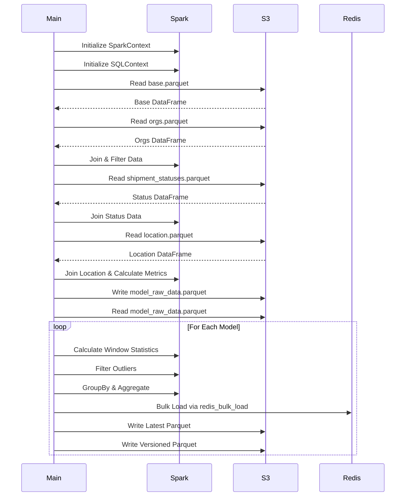
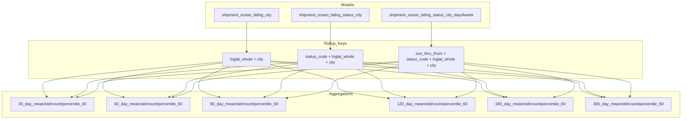
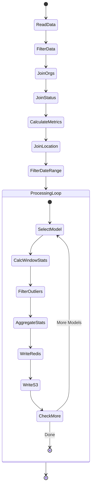

# Diagram: research/orchestrator/tasks/models/shipment_ocean_latlng_status_spark.py


> Auto-generated by Obscura crawlers

## Diagram 1

```mermaid
flowchart TD
      Start([Start]) --> ReadArgs[Read Command Line Arguments]
      ReadArgs --> InitSpark[Initialize SparkContext & SQLContext]
      InitSpark --> ReadBase[Read Base Parquet Data from S3]...
  └ 149 lines...

✗ read_bash
  Invalid shell ID: 0. Please supply a valid shell ID to read output from.

  <no active shell sessions>

● Output main flowchart
  $ cat << 'EOF'
```

> SVG rendering failed for this diagram.

## Diagram 2

```mermaid
flowchart TD
      Start([Start]) --> ReadArgs[Read Command Line Arguments]
      ReadArgs --> InitSpark[Initialize SparkContext & SQLContext]
      InitSpark --> ReadBase[Read Base Parquet Data from S3]...
  └ 32 lines...

● Output mermaid diagrams
  $ echo 'flowchart TD
      Start([Start]) --> ReadArgs[Read Command Line Arguments]
      ReadArgs --> InitSpark[Initialize SparkContext & SQLContext]
      InitSpark --> ReadBase[Read Base Parquet Data from S3]
      ReadBase --> FilterNull[Filter: final_stop_arrived_at NOT NULL]...
  └ 130 lines...

✗ Output first diagram
  $ printf '%s\n' 'flowchart TD' '    Start([Start]) --> ReadArgs[Read Command Line Arguments]' '
     ReadArgs --> InitSpark[Initialize SparkContext & SQLContext]' '    InitSpark -->
  ReadBase[Read Base Parquet Data from S3]' '    ReadBase --> FilterNull[Filter:
  final_stop_arrived_at NOT NULL]' '    FilterNull --> FilterLoc[Filter: final_stop_location_id
  = destination_newloc_id]' '    FilterLoc --> ReadOrgs[Read Organizations Parquet]' '    ...
  Permission denied and could not request permission from user
```

> SVG rendering failed for this diagram.

## Diagram 3

```mermaid
flowchart TD
    Start([Start]) --> ReadArgs[Read Command Line Arguments]
    ReadArgs --> InitSpark[Initialize SparkContext & SQLContext]
    InitSpark --> ReadBase[Read Base Parquet Data from S3]
    ReadBase --> FilterNull[Filter: final_stop_arrived_at NOT NULL]
    FilterNull --> FilterLoc[Filter: final_stop_location_id = destination_newloc_id]
    FilterLoc --> ReadOrgs[Read Organizations Parquet]
    ReadOrgs --> JoinOrgs[Join Base with Orgs on created_by_org_id]
    JoinOrgs --> FilterOcean[Filter: ship_mode_id = 5 Ocean]
    FilterOcean --> ReadStatus[Read Shipment Statuses Parquet]
    ReadStatus --> JoinStatus[Join with Shipment Statuses]
    JoinStatus --> FilterTime[Filter: status created before arrival]
    FilterTime --> CalcSeconds[Calculate shipment_status_to_arrival_seconds]
    CalcSeconds --> FilterPositive[Filter: seconds > 0]
    FilterPositive --> AddDayOfWeek[Add day_of_week Column]
    AddDayOfWeek --> ReadLoc[Read Location Data]
    ReadLoc --> JoinLoc[Join with Location for City/State]
    JoinLoc --> FilterWindow[Filter: Last 365 Days]
    FilterWindow --> FilterCodes[Filter: Specific Status Codes]
    FilterCodes --> AddSunThru[Add sun_thru_thurs Flag]
    AddSunThru --> SaveRaw[Save Raw Data to S3]
    SaveRaw --> ReadRaw[Reload Raw Data]
    ReadRaw --> LoopModels{For Each Model in MODEL_MAP}
    LoopModels --> CalcWindow[Calculate Window Statistics]
    CalcWindow --> CalcStdDev[Calculate stddev_distance]
    CalcStdDev --> FilterOutliers[Filter: -1.5 <= stddev_distance <= 1.5]
    FilterOutliers --> GroupBy[GroupBy Rollup Keys]
    GroupBy --> AggStats[Aggregate: 30/60/90/120/180/365 Day Stats]
    AggStats --> WriteRedis[Write to Redis via redis_bulk_load]
    WriteRedis --> WriteParquet[Write Parquet to S3 Versioned & Latest]
    WriteParquet --> NextModel{More Models?}
    NextModel -->|Yes| LoopModels
    NextModel -->|No| End([End])
```



### SVG

<svg id="container" width="391.21875" xmlns="http://www.w3.org/2000/svg" class="flowchart" height="4091.5625" viewBox="0 0 391.21875 4091.5625" role="graphics-document document" aria-roledescription="flowchart-v2"><style>#container{font-family:"trebuchet ms",verdana,arial,sans-serif;font-size:16px;fill:#333;}@keyframes edge-animation-frame{from{stroke-dashoffset:0;}}@keyframes dash{to{stroke-dashoffset:0;}}#container .edge-animation-slow{stroke-dasharray:9,5!important;stroke-dashoffset:900;animation:dash 50s linear infinite;stroke-linecap:round;}#container .edge-animation-fast{stroke-dasharray:9,5!important;stroke-dashoffset:900;animation:dash 20s linear infinite;stroke-linecap:round;}#container .error-icon{fill:#552222;}#container .error-text{fill:#552222;stroke:#552222;}#container .edge-thickness-normal{stroke-width:1px;}#container .edge-thickness-thick{stroke-width:3.5px;}#container .edge-pattern-solid{stroke-dasharray:0;}#container .edge-thickness-invisible{stroke-width:0;fill:none;}#container .edge-pattern-dashed{stroke-dasharray:3;}#container .edge-pattern-dotted{stroke-dasharray:2;}#container .marker{fill:#333333;stroke:#333333;}#container .marker.cross{stroke:#333333;}#container svg{font-family:"trebuchet ms",verdana,arial,sans-serif;font-size:16px;}#container p{margin:0;}#container .label{font-family:"trebuchet ms",verdana,arial,sans-serif;color:#333;}#container .cluster-label text{fill:#333;}#container .cluster-label span{color:#333;}#container .cluster-label span p{background-color:transparent;}#container .label text,#container span{fill:#333;color:#333;}#container .node rect,#container .node circle,#container .node ellipse,#container .node polygon,#container .node path{fill:#ECECFF;stroke:#9370DB;stroke-width:1px;}#container .rough-node .label text,#container .node .label text,#container .image-shape .label,#container .icon-shape .label{text-anchor:middle;}#container .node .katex path{fill:#000;stroke:#000;stroke-width:1px;}#container .rough-node .label,#container .node .label,#container .image-shape .label,#container .icon-shape .label{text-align:center;}#container .node.clickable{cursor:pointer;}#container .root .anchor path{fill:#333333!important;stroke-width:0;stroke:#333333;}#container .arrowheadPath{fill:#333333;}#container .edgePath .path{stroke:#333333;stroke-width:2.0px;}#container .flowchart-link{stroke:#333333;fill:none;}#container .edgeLabel{background-color:rgba(232,232,232, 0.8);text-align:center;}#container .edgeLabel p{background-color:rgba(232,232,232, 0.8);}#container .edgeLabel rect{opacity:0.5;background-color:rgba(232,232,232, 0.8);fill:rgba(232,232,232, 0.8);}#container .labelBkg{background-color:rgba(232, 232, 232, 0.5);}#container .cluster rect{fill:#ffffde;stroke:#aaaa33;stroke-width:1px;}#container .cluster text{fill:#333;}#container .cluster span{color:#333;}#container div.mermaidTooltip{position:absolute;text-align:center;max-width:200px;padding:2px;font-family:"trebuchet ms",verdana,arial,sans-serif;font-size:12px;background:hsl(80, 100%, 96.2745098039%);border:1px solid #aaaa33;border-radius:2px;pointer-events:none;z-index:100;}#container .flowchartTitleText{text-anchor:middle;font-size:18px;fill:#333;}#container rect.text{fill:none;stroke-width:0;}#container .icon-shape,#container .image-shape{background-color:rgba(232,232,232, 0.8);text-align:center;}#container .icon-shape p,#container .image-shape p{background-color:rgba(232,232,232, 0.8);padding:2px;}#container .icon-shape rect,#container .image-shape rect{opacity:0.5;background-color:rgba(232,232,232, 0.8);fill:rgba(232,232,232, 0.8);}#container .label-icon{display:inline-block;height:1em;overflow:visible;vertical-align:-0.125em;}#container .node .label-icon path{fill:currentColor;stroke:revert;stroke-width:revert;}#container :root{--mermaid-font-family:"trebuchet ms",verdana,arial,sans-serif;}</style><g><marker id="container_flowchart-v2-pointEnd" class="marker flowchart-v2" viewBox="0 0 10 10" refX="5" refY="5" markerUnits="userSpaceOnUse" markerWidth="8" markerHeight="8" orient="auto"><path d="M 0 0 L 10 5 L 0 10 z" class="arrowMarkerPath" style="stroke-width: 1; stroke-dasharray: 1, 0;"></path></marker><marker id="container_flowchart-v2-pointStart" class="marker flowchart-v2" viewBox="0 0 10 10" refX="4.5" refY="5" markerUnits="userSpaceOnUse" markerWidth="8" markerHeight="8" orient="auto"><path d="M 0 5 L 10 10 L 10 0 z" class="arrowMarkerPath" style="stroke-width: 1; stroke-dasharray: 1, 0;"></path></marker><marker id="container_flowchart-v2-circleEnd" class="marker flowchart-v2" viewBox="0 0 10 10" refX="11" refY="5" markerUnits="userSpaceOnUse" markerWidth="11" markerHeight="11" orient="auto"><circle cx="5" cy="5" r="5" class="arrowMarkerPath" style="stroke-width: 1; stroke-dasharray: 1, 0;"></circle></marker><marker id="container_flowchart-v2-circleStart" class="marker flowchart-v2" viewBox="0 0 10 10" refX="-1" refY="5" markerUnits="userSpaceOnUse" markerWidth="11" markerHeight="11" orient="auto"><circle cx="5" cy="5" r="5" class="arrowMarkerPath" style="stroke-width: 1; stroke-dasharray: 1, 0;"></circle></marker><marker id="container_flowchart-v2-crossEnd" class="marker cross flowchart-v2" viewBox="0 0 11 11" refX="12" refY="5.2" markerUnits="userSpaceOnUse" markerWidth="11" markerHeight="11" orient="auto"><path d="M 1,1 l 9,9 M 10,1 l -9,9" class="arrowMarkerPath" style="stroke-width: 2; stroke-dasharray: 1, 0;"></path></marker><marker id="container_flowchart-v2-crossStart" class="marker cross flowchart-v2" viewBox="0 0 11 11" refX="-1" refY="5.2" markerUnits="userSpaceOnUse" markerWidth="11" markerHeight="11" orient="auto"><path d="M 1,1 l 9,9 M 10,1 l -9,9" class="arrowMarkerPath" style="stroke-width: 2; stroke-dasharray: 1, 0;"></path></marker><g class="root"><g class="clusters"></g><g class="edgePaths"><path d="M221,47.5L220.917,51.583C220.833,55.667,220.667,63.833,220.583,71.417C220.5,79,220.5,86,220.5,89.5L220.5,93" id="L_Start_ReadArgs_0" class="edge-thickness-normal edge-pattern-solid edge-thickness-normal edge-pattern-solid flowchart-link" style=";" data-edge="true" data-et="edge" data-id="L_Start_ReadArgs_0" data-points="W3sieCI6MjIxLCJ5Ijo0Ny41fSx7IngiOjIyMC41LCJ5Ijo3Mn0seyJ4IjoyMjAuNSwieSI6OTd9XQ==" marker-end="url(#container_flowchart-v2-pointEnd)"></path><path d="M220.5,175L220.5,179.167C220.5,183.333,220.5,191.667,220.5,199.333C220.5,207,220.5,214,220.5,217.5L220.5,221" id="L_ReadArgs_InitSpark_0" class="edge-thickness-normal edge-pattern-solid edge-thickness-normal edge-pattern-solid flowchart-link" style=";" data-edge="true" data-et="edge" data-id="L_ReadArgs_InitSpark_0" data-points="W3sieCI6MjIwLjUsInkiOjE3NX0seyJ4IjoyMjAuNSwieSI6MjAwfSx7IngiOjIyMC41LCJ5IjoyMjV9XQ==" marker-end="url(#container_flowchart-v2-pointEnd)"></path><path d="M220.5,303L220.5,307.167C220.5,311.333,220.5,319.667,220.5,327.333C220.5,335,220.5,342,220.5,345.5L220.5,349" id="L_InitSpark_ReadBase_0" class="edge-thickness-normal edge-pattern-solid edge-thickness-normal edge-pattern-solid flowchart-link" style=";" data-edge="true" data-et="edge" data-id="L_InitSpark_ReadBase_0" data-points="W3sieCI6MjIwLjUsInkiOjMwM30seyJ4IjoyMjAuNSwieSI6MzI4fSx7IngiOjIyMC41LCJ5IjozNTN9XQ==" marker-end="url(#container_flowchart-v2-pointEnd)"></path><path d="M220.5,431L220.5,435.167C220.5,439.333,220.5,447.667,220.5,455.333C220.5,463,220.5,470,220.5,473.5L220.5,477" id="L_ReadBase_FilterNull_0" class="edge-thickness-normal edge-pattern-solid edge-thickness-normal edge-pattern-solid flowchart-link" style=";" data-edge="true" data-et="edge" data-id="L_ReadBase_FilterNull_0" data-points="W3sieCI6MjIwLjUsInkiOjQzMX0seyJ4IjoyMjAuNSwieSI6NDU2fSx7IngiOjIyMC41LCJ5Ijo0ODF9XQ==" marker-end="url(#container_flowchart-v2-pointEnd)"></path><path d="M220.5,583L220.5,587.167C220.5,591.333,220.5,599.667,220.5,607.333C220.5,615,220.5,622,220.5,625.5L220.5,629" id="L_FilterNull_FilterLoc_0" class="edge-thickness-normal edge-pattern-solid edge-thickness-normal edge-pattern-solid flowchart-link" style=";" data-edge="true" data-et="edge" data-id="L_FilterNull_FilterLoc_0" data-points="W3sieCI6MjIwLjUsInkiOjU4M30seyJ4IjoyMjAuNSwieSI6NjA4fSx7IngiOjIyMC41LCJ5Ijo2MzN9XQ==" marker-end="url(#container_flowchart-v2-pointEnd)"></path><path d="M220.5,735L220.5,739.167C220.5,743.333,220.5,751.667,220.5,759.333C220.5,767,220.5,774,220.5,777.5L220.5,781" id="L_FilterLoc_ReadOrgs_0" class="edge-thickness-normal edge-pattern-solid edge-thickness-normal edge-pattern-solid flowchart-link" style=";" data-edge="true" data-et="edge" data-id="L_FilterLoc_ReadOrgs_0" data-points="W3sieCI6MjIwLjUsInkiOjczNX0seyJ4IjoyMjAuNSwieSI6NzYwfSx7IngiOjIyMC41LCJ5Ijo3ODV9XQ==" marker-end="url(#container_flowchart-v2-pointEnd)"></path><path d="M220.5,863L220.5,867.167C220.5,871.333,220.5,879.667,220.5,887.333C220.5,895,220.5,902,220.5,905.5L220.5,909" id="L_ReadOrgs_JoinOrgs_0" class="edge-thickness-normal edge-pattern-solid edge-thickness-normal edge-pattern-solid flowchart-link" style=";" data-edge="true" data-et="edge" data-id="L_ReadOrgs_JoinOrgs_0" data-points="W3sieCI6MjIwLjUsInkiOjg2M30seyJ4IjoyMjAuNSwieSI6ODg4fSx7IngiOjIyMC41LCJ5Ijo5MTN9XQ==" marker-end="url(#container_flowchart-v2-pointEnd)"></path><path d="M220.5,991L220.5,995.167C220.5,999.333,220.5,1007.667,220.5,1015.333C220.5,1023,220.5,1030,220.5,1033.5L220.5,1037" id="L_JoinOrgs_FilterOcean_0" class="edge-thickness-normal edge-pattern-solid edge-thickness-normal edge-pattern-solid flowchart-link" style=";" data-edge="true" data-et="edge" data-id="L_JoinOrgs_FilterOcean_0" data-points="W3sieCI6MjIwLjUsInkiOjk5MX0seyJ4IjoyMjAuNSwieSI6MTAxNn0seyJ4IjoyMjAuNSwieSI6MTA0MX1d" marker-end="url(#container_flowchart-v2-pointEnd)"></path><path d="M220.5,1119L220.5,1123.167C220.5,1127.333,220.5,1135.667,220.5,1143.333C220.5,1151,220.5,1158,220.5,1161.5L220.5,1165" id="L_FilterOcean_ReadStatus_0" class="edge-thickness-normal edge-pattern-solid edge-thickness-normal edge-pattern-solid flowchart-link" style=";" data-edge="true" data-et="edge" data-id="L_FilterOcean_ReadStatus_0" data-points="W3sieCI6MjIwLjUsInkiOjExMTl9LHsieCI6MjIwLjUsInkiOjExNDR9LHsieCI6MjIwLjUsInkiOjExNjl9XQ==" marker-end="url(#container_flowchart-v2-pointEnd)"></path><path d="M220.5,1247L220.5,1251.167C220.5,1255.333,220.5,1263.667,220.5,1271.333C220.5,1279,220.5,1286,220.5,1289.5L220.5,1293" id="L_ReadStatus_JoinStatus_0" class="edge-thickness-normal edge-pattern-solid edge-thickness-normal edge-pattern-solid flowchart-link" style=";" data-edge="true" data-et="edge" data-id="L_ReadStatus_JoinStatus_0" data-points="W3sieCI6MjIwLjUsInkiOjEyNDd9LHsieCI6MjIwLjUsInkiOjEyNzJ9LHsieCI6MjIwLjUsInkiOjEyOTd9XQ==" marker-end="url(#container_flowchart-v2-pointEnd)"></path><path d="M220.5,1375L220.5,1379.167C220.5,1383.333,220.5,1391.667,220.5,1399.333C220.5,1407,220.5,1414,220.5,1417.5L220.5,1421" id="L_JoinStatus_FilterTime_0" class="edge-thickness-normal edge-pattern-solid edge-thickness-normal edge-pattern-solid flowchart-link" style=";" data-edge="true" data-et="edge" data-id="L_JoinStatus_FilterTime_0" data-points="W3sieCI6MjIwLjUsInkiOjEzNzV9LHsieCI6MjIwLjUsInkiOjE0MDB9LHsieCI6MjIwLjUsInkiOjE0MjV9XQ==" marker-end="url(#container_flowchart-v2-pointEnd)"></path><path d="M220.5,1503L220.5,1507.167C220.5,1511.333,220.5,1519.667,220.5,1527.333C220.5,1535,220.5,1542,220.5,1545.5L220.5,1549" id="L_FilterTime_CalcSeconds_0" class="edge-thickness-normal edge-pattern-solid edge-thickness-normal edge-pattern-solid flowchart-link" style=";" data-edge="true" data-et="edge" data-id="L_FilterTime_CalcSeconds_0" data-points="W3sieCI6MjIwLjUsInkiOjE1MDN9LHsieCI6MjIwLjUsInkiOjE1Mjh9LHsieCI6MjIwLjUsInkiOjE1NTN9XQ==" marker-end="url(#container_flowchart-v2-pointEnd)"></path><path d="M220.5,1631L220.5,1635.167C220.5,1639.333,220.5,1647.667,220.5,1655.333C220.5,1663,220.5,1670,220.5,1673.5L220.5,1677" id="L_CalcSeconds_FilterPositive_0" class="edge-thickness-normal edge-pattern-solid edge-thickness-normal edge-pattern-solid flowchart-link" style=";" data-edge="true" data-et="edge" data-id="L_CalcSeconds_FilterPositive_0" data-points="W3sieCI6MjIwLjUsInkiOjE2MzF9LHsieCI6MjIwLjUsInkiOjE2NTZ9LHsieCI6MjIwLjUsInkiOjE2ODF9XQ==" marker-end="url(#container_flowchart-v2-pointEnd)"></path><path d="M220.5,1735L220.5,1739.167C220.5,1743.333,220.5,1751.667,220.5,1759.333C220.5,1767,220.5,1774,220.5,1777.5L220.5,1781" id="L_FilterPositive_AddDayOfWeek_0" class="edge-thickness-normal edge-pattern-solid edge-thickness-normal edge-pattern-solid flowchart-link" style=";" data-edge="true" data-et="edge" data-id="L_FilterPositive_AddDayOfWeek_0" data-points="W3sieCI6MjIwLjUsInkiOjE3MzV9LHsieCI6MjIwLjUsInkiOjE3NjB9LHsieCI6MjIwLjUsInkiOjE3ODV9XQ==" marker-end="url(#container_flowchart-v2-pointEnd)"></path><path d="M220.5,1839L220.5,1843.167C220.5,1847.333,220.5,1855.667,220.5,1863.333C220.5,1871,220.5,1878,220.5,1881.5L220.5,1885" id="L_AddDayOfWeek_ReadLoc_0" class="edge-thickness-normal edge-pattern-solid edge-thickness-normal edge-pattern-solid flowchart-link" style=";" data-edge="true" data-et="edge" data-id="L_AddDayOfWeek_ReadLoc_0" data-points="W3sieCI6MjIwLjUsInkiOjE4Mzl9LHsieCI6MjIwLjUsInkiOjE4NjR9LHsieCI6MjIwLjUsInkiOjE4ODl9XQ==" marker-end="url(#container_flowchart-v2-pointEnd)"></path><path d="M220.5,1943L220.5,1947.167C220.5,1951.333,220.5,1959.667,220.5,1967.333C220.5,1975,220.5,1982,220.5,1985.5L220.5,1989" id="L_ReadLoc_JoinLoc_0" class="edge-thickness-normal edge-pattern-solid edge-thickness-normal edge-pattern-solid flowchart-link" style=";" data-edge="true" data-et="edge" data-id="L_ReadLoc_JoinLoc_0" data-points="W3sieCI6MjIwLjUsInkiOjE5NDN9LHsieCI6MjIwLjUsInkiOjE5Njh9LHsieCI6MjIwLjUsInkiOjE5OTN9XQ==" marker-end="url(#container_flowchart-v2-pointEnd)"></path><path d="M220.5,2071L220.5,2075.167C220.5,2079.333,220.5,2087.667,220.5,2095.333C220.5,2103,220.5,2110,220.5,2113.5L220.5,2117" id="L_JoinLoc_FilterWindow_0" class="edge-thickness-normal edge-pattern-solid edge-thickness-normal edge-pattern-solid flowchart-link" style=";" data-edge="true" data-et="edge" data-id="L_JoinLoc_FilterWindow_0" data-points="W3sieCI6MjIwLjUsInkiOjIwNzF9LHsieCI6MjIwLjUsInkiOjIwOTZ9LHsieCI6MjIwLjUsInkiOjIxMjF9XQ==" marker-end="url(#container_flowchart-v2-pointEnd)"></path><path d="M220.5,2175L220.5,2179.167C220.5,2183.333,220.5,2191.667,220.5,2199.333C220.5,2207,220.5,2214,220.5,2217.5L220.5,2221" id="L_FilterWindow_FilterCodes_0" class="edge-thickness-normal edge-pattern-solid edge-thickness-normal edge-pattern-solid flowchart-link" style=";" data-edge="true" data-et="edge" data-id="L_FilterWindow_FilterCodes_0" data-points="W3sieCI6MjIwLjUsInkiOjIxNzV9LHsieCI6MjIwLjUsInkiOjIyMDB9LHsieCI6MjIwLjUsInkiOjIyMjV9XQ==" marker-end="url(#container_flowchart-v2-pointEnd)"></path><path d="M220.5,2279L220.5,2283.167C220.5,2287.333,220.5,2295.667,220.5,2303.333C220.5,2311,220.5,2318,220.5,2321.5L220.5,2325" id="L_FilterCodes_AddSunThru_0" class="edge-thickness-normal edge-pattern-solid edge-thickness-normal edge-pattern-solid flowchart-link" style=";" data-edge="true" data-et="edge" data-id="L_FilterCodes_AddSunThru_0" data-points="W3sieCI6MjIwLjUsInkiOjIyNzl9LHsieCI6MjIwLjUsInkiOjIzMDR9LHsieCI6MjIwLjUsInkiOjIzMjl9XQ==" marker-end="url(#container_flowchart-v2-pointEnd)"></path><path d="M220.5,2383L220.5,2387.167C220.5,2391.333,220.5,2399.667,220.5,2407.333C220.5,2415,220.5,2422,220.5,2425.5L220.5,2429" id="L_AddSunThru_SaveRaw_0" class="edge-thickness-normal edge-pattern-solid edge-thickness-normal edge-pattern-solid flowchart-link" style=";" data-edge="true" data-et="edge" data-id="L_AddSunThru_SaveRaw_0" data-points="W3sieCI6MjIwLjUsInkiOjIzODN9LHsieCI6MjIwLjUsInkiOjI0MDh9LHsieCI6MjIwLjUsInkiOjI0MzN9XQ==" marker-end="url(#container_flowchart-v2-pointEnd)"></path><path d="M220.5,2487L220.5,2491.167C220.5,2495.333,220.5,2503.667,220.5,2511.333C220.5,2519,220.5,2526,220.5,2529.5L220.5,2533" id="L_SaveRaw_ReadRaw_0" class="edge-thickness-normal edge-pattern-solid edge-thickness-normal edge-pattern-solid flowchart-link" style=";" data-edge="true" data-et="edge" data-id="L_SaveRaw_ReadRaw_0" data-points="W3sieCI6MjIwLjUsInkiOjI0ODd9LHsieCI6MjIwLjUsInkiOjI1MTJ9LHsieCI6MjIwLjUsInkiOjI1Mzd9XQ==" marker-end="url(#container_flowchart-v2-pointEnd)"></path><path d="M220.5,2591L220.5,2595.167C220.5,2599.333,220.5,2607.667,220.5,2615.333C220.5,2623,220.5,2630,220.5,2633.5L220.5,2637" id="L_ReadRaw_LoopModels_0" class="edge-thickness-normal edge-pattern-solid edge-thickness-normal edge-pattern-solid flowchart-link" style=";" data-edge="true" data-et="edge" data-id="L_ReadRaw_LoopModels_0" data-points="W3sieCI6MjIwLjUsInkiOjI1OTF9LHsieCI6MjIwLjUsInkiOjI2MTZ9LHsieCI6MjIwLjUsInkiOjI2NDF9XQ==" marker-end="url(#container_flowchart-v2-pointEnd)"></path><path d="M173.979,2872.479L167.982,2884.399C161.986,2896.319,149.993,2920.16,143.996,2935.58C138,2951,138,2958,138,2961.5L138,2965" id="L_LoopModels_CalcWindow_0" class="edge-thickness-normal edge-pattern-solid edge-thickness-normal edge-pattern-solid flowchart-link" style=";" data-edge="true" data-et="edge" data-id="L_LoopModels_CalcWindow_0" data-points="W3sieCI6MTczLjk3ODcwMTgyNTU1NzgsInkiOjI4NzIuNDc4NzAxODI1NTU4fSx7IngiOjEzOCwieSI6Mjk0NH0seyJ4IjoxMzgsInkiOjI5Njl9XQ==" marker-end="url(#container_flowchart-v2-pointEnd)"></path><path d="M138,3023L138,3027.167C138,3031.333,138,3039.667,138,3047.333C138,3055,138,3062,138,3065.5L138,3069" id="L_CalcWindow_CalcStdDev_0" class="edge-thickness-normal edge-pattern-solid edge-thickness-normal edge-pattern-solid flowchart-link" style=";" data-edge="true" data-et="edge" data-id="L_CalcWindow_CalcStdDev_0" data-points="W3sieCI6MTM4LCJ5IjozMDIzfSx7IngiOjEzOCwieSI6MzA0OH0seyJ4IjoxMzgsInkiOjMwNzN9XQ==" marker-end="url(#container_flowchart-v2-pointEnd)"></path><path d="M138,3127L138,3131.167C138,3135.333,138,3143.667,138,3151.333C138,3159,138,3166,138,3169.5L138,3173" id="L_CalcStdDev_FilterOutliers_0" class="edge-thickness-normal edge-pattern-solid edge-thickness-normal edge-pattern-solid flowchart-link" style=";" data-edge="true" data-et="edge" data-id="L_CalcStdDev_FilterOutliers_0" data-points="W3sieCI6MTM4LCJ5IjozMTI3fSx7IngiOjEzOCwieSI6MzE1Mn0seyJ4IjoxMzgsInkiOjMxNzd9XQ==" marker-end="url(#container_flowchart-v2-pointEnd)"></path><path d="M138,3255L138,3259.167C138,3263.333,138,3271.667,138,3279.333C138,3287,138,3294,138,3297.5L138,3301" id="L_FilterOutliers_GroupBy_0" class="edge-thickness-normal edge-pattern-solid edge-thickness-normal edge-pattern-solid flowchart-link" style=";" data-edge="true" data-et="edge" data-id="L_FilterOutliers_GroupBy_0" data-points="W3sieCI6MTM4LCJ5IjozMjU1fSx7IngiOjEzOCwieSI6MzI4MH0seyJ4IjoxMzgsInkiOjMzMDV9XQ==" marker-end="url(#container_flowchart-v2-pointEnd)"></path><path d="M138,3359L138,3363.167C138,3367.333,138,3375.667,138,3383.333C138,3391,138,3398,138,3401.5L138,3405" id="L_GroupBy_AggStats_0" class="edge-thickness-normal edge-pattern-solid edge-thickness-normal edge-pattern-solid flowchart-link" style=";" data-edge="true" data-et="edge" data-id="L_GroupBy_AggStats_0" data-points="W3sieCI6MTM4LCJ5IjozMzU5fSx7IngiOjEzOCwieSI6MzM4NH0seyJ4IjoxMzgsInkiOjM0MDl9XQ==" marker-end="url(#container_flowchart-v2-pointEnd)"></path><path d="M138,3511L138,3515.167C138,3519.333,138,3527.667,138,3535.333C138,3543,138,3550,138,3553.5L138,3557" id="L_AggStats_WriteRedis_0" class="edge-thickness-normal edge-pattern-solid edge-thickness-normal edge-pattern-solid flowchart-link" style=";" data-edge="true" data-et="edge" data-id="L_AggStats_WriteRedis_0" data-points="W3sieCI6MTM4LCJ5IjozNTExfSx7IngiOjEzOCwieSI6MzUzNn0seyJ4IjoxMzgsInkiOjM1NjF9XQ==" marker-end="url(#container_flowchart-v2-pointEnd)"></path><path d="M138,3639L138,3643.167C138,3647.333,138,3655.667,138,3663.333C138,3671,138,3678,138,3681.5L138,3685" id="L_WriteRedis_WriteParquet_0" class="edge-thickness-normal edge-pattern-solid edge-thickness-normal edge-pattern-solid flowchart-link" style=";" data-edge="true" data-et="edge" data-id="L_WriteRedis_WriteParquet_0" data-points="W3sieCI6MTM4LCJ5IjozNjM5fSx7IngiOjEzOCwieSI6MzY2NH0seyJ4IjoxMzgsInkiOjM2ODl9XQ==" marker-end="url(#container_flowchart-v2-pointEnd)"></path><path d="M138,3767L138,3771.167C138,3775.333,138,3783.667,145.601,3797.211C153.202,3810.755,168.405,3829.511,176.006,3838.889L183.607,3848.266" id="L_WriteParquet_NextModel_0" class="edge-thickness-normal edge-pattern-solid edge-thickness-normal edge-pattern-solid flowchart-link" style=";" data-edge="true" data-et="edge" data-id="L_WriteParquet_NextModel_0" data-points="W3sieCI6MTM4LCJ5IjozNzY3fSx7IngiOjEzOCwieSI6Mzc5Mn0seyJ4IjoxODYuMTI2MTY1ODQ3MDQwODgsInkiOjM4NTEuMzczODM0MTUyOTU5M31d" marker-end="url(#container_flowchart-v2-pointEnd)"></path><path d="M254.874,3851.374L262.895,3841.478C270.916,3831.583,286.958,3811.791,294.979,3791.229C303,3770.667,303,3749.333,303,3728C303,3706.667,303,3685.333,303,3664C303,3642.667,303,3621.333,303,3600C303,3578.667,303,3557.333,303,3534C303,3510.667,303,3485.333,303,3460C303,3434.667,303,3409.333,303,3388C303,3366.667,303,3349.333,303,3332C303,3314.667,303,3297.333,303,3278C303,3258.667,303,3237.333,303,3216C303,3194.667,303,3173.333,303,3154C303,3134.667,303,3117.333,303,3100C303,3082.667,303,3065.333,303,3048C303,3030.667,303,3013.333,303,2996C303,2978.667,303,2961.333,297.303,2941.342C291.606,2921.351,280.213,2898.701,274.516,2887.377L268.819,2876.052" id="L_NextModel_LoopModels_0" class="edge-thickness-normal edge-pattern-solid edge-thickness-normal edge-pattern-solid flowchart-link" style=";" data-edge="true" data-et="edge" data-id="L_NextModel_LoopModels_0" data-points="W3sieCI6MjU0Ljg3MzgzNDE1Mjk1OTEyLCJ5IjozODUxLjM3MzgzNDE1Mjk1OTN9LHsieCI6MzAzLCJ5IjozNzkyfSx7IngiOjMwMywieSI6MzcyOH0seyJ4IjozMDMsInkiOjM2NjR9LHsieCI6MzAzLCJ5IjozNjAwfSx7IngiOjMwMywieSI6MzUzNn0seyJ4IjozMDMsInkiOjM0NjB9LHsieCI6MzAzLCJ5IjozMzg0fSx7IngiOjMwMywieSI6MzMzMn0seyJ4IjozMDMsInkiOjMyODB9LHsieCI6MzAzLCJ5IjozMjE2fSx7IngiOjMwMywieSI6MzE1Mn0seyJ4IjozMDMsInkiOjMxMDB9LHsieCI6MzAzLCJ5IjozMDQ4fSx7IngiOjMwMywieSI6Mjk5Nn0seyJ4IjozMDMsInkiOjI5NDR9LHsieCI6MjY3LjAyMTI5ODE3NDQ0MjE3LCJ5IjoyODcyLjQ3ODcwMTgyNTU1OH1d" marker-end="url(#container_flowchart-v2-pointEnd)"></path><path d="M220.5,3970.563L220.5,3976.729C220.5,3982.896,220.5,3995.229,220.574,4006.979C220.649,4018.729,220.798,4029.896,220.872,4035.479L220.947,4041.063" id="L_NextModel_End_0" class="edge-thickness-normal edge-pattern-solid edge-thickness-normal edge-pattern-solid flowchart-link" style=";" data-edge="true" data-et="edge" data-id="L_NextModel_End_0" data-points="W3sieCI6MjIwLjUsInkiOjM5NzAuNTYyNX0seyJ4IjoyMjAuNSwieSI6NDAwNy41NjI1fSx7IngiOjIyMSwieSI6NDA0NS4wNjI1fV0=" marker-end="url(#container_flowchart-v2-pointEnd)"></path></g><g class="edgeLabels"><g class="edgeLabel"><g class="label" data-id="L_Start_ReadArgs_0" transform="translate(0, 0)"><foreignObject width="0" height="0"><div xmlns="http://www.w3.org/1999/xhtml" class="labelBkg" style="display: table-cell; white-space: nowrap; line-height: 1.5; max-width: 200px; text-align: center;"><span class="edgeLabel"></span></div></foreignObject></g></g><g class="edgeLabel"><g class="label" data-id="L_ReadArgs_InitSpark_0" transform="translate(0, 0)"><foreignObject width="0" height="0"><div xmlns="http://www.w3.org/1999/xhtml" class="labelBkg" style="display: table-cell; white-space: nowrap; line-height: 1.5; max-width: 200px; text-align: center;"><span class="edgeLabel"></span></div></foreignObject></g></g><g class="edgeLabel"><g class="label" data-id="L_InitSpark_ReadBase_0" transform="translate(0, 0)"><foreignObject width="0" height="0"><div xmlns="http://www.w3.org/1999/xhtml" class="labelBkg" style="display: table-cell; white-space: nowrap; line-height: 1.5; max-width: 200px; text-align: center;"><span class="edgeLabel"></span></div></foreignObject></g></g><g class="edgeLabel"><g class="label" data-id="L_ReadBase_FilterNull_0" transform="translate(0, 0)"><foreignObject width="0" height="0"><div xmlns="http://www.w3.org/1999/xhtml" class="labelBkg" style="display: table-cell; white-space: nowrap; line-height: 1.5; max-width: 200px; text-align: center;"><span class="edgeLabel"></span></div></foreignObject></g></g><g class="edgeLabel"><g class="label" data-id="L_FilterNull_FilterLoc_0" transform="translate(0, 0)"><foreignObject width="0" height="0"><div xmlns="http://www.w3.org/1999/xhtml" class="labelBkg" style="display: table-cell; white-space: nowrap; line-height: 1.5; max-width: 200px; text-align: center;"><span class="edgeLabel"></span></div></foreignObject></g></g><g class="edgeLabel"><g class="label" data-id="L_FilterLoc_ReadOrgs_0" transform="translate(0, 0)"><foreignObject width="0" height="0"><div xmlns="http://www.w3.org/1999/xhtml" class="labelBkg" style="display: table-cell; white-space: nowrap; line-height: 1.5; max-width: 200px; text-align: center;"><span class="edgeLabel"></span></div></foreignObject></g></g><g class="edgeLabel"><g class="label" data-id="L_ReadOrgs_JoinOrgs_0" transform="translate(0, 0)"><foreignObject width="0" height="0"><div xmlns="http://www.w3.org/1999/xhtml" class="labelBkg" style="display: table-cell; white-space: nowrap; line-height: 1.5; max-width: 200px; text-align: center;"><span class="edgeLabel"></span></div></foreignObject></g></g><g class="edgeLabel"><g class="label" data-id="L_JoinOrgs_FilterOcean_0" transform="translate(0, 0)"><foreignObject width="0" height="0"><div xmlns="http://www.w3.org/1999/xhtml" class="labelBkg" style="display: table-cell; white-space: nowrap; line-height: 1.5; max-width: 200px; text-align: center;"><span class="edgeLabel"></span></div></foreignObject></g></g><g class="edgeLabel"><g class="label" data-id="L_FilterOcean_ReadStatus_0" transform="translate(0, 0)"><foreignObject width="0" height="0"><div xmlns="http://www.w3.org/1999/xhtml" class="labelBkg" style="display: table-cell; white-space: nowrap; line-height: 1.5; max-width: 200px; text-align: center;"><span class="edgeLabel"></span></div></foreignObject></g></g><g class="edgeLabel"><g class="label" data-id="L_ReadStatus_JoinStatus_0" transform="translate(0, 0)"><foreignObject width="0" height="0"><div xmlns="http://www.w3.org/1999/xhtml" class="labelBkg" style="display: table-cell; white-space: nowrap; line-height: 1.5; max-width: 200px; text-align: center;"><span class="edgeLabel"></span></div></foreignObject></g></g><g class="edgeLabel"><g class="label" data-id="L_JoinStatus_FilterTime_0" transform="translate(0, 0)"><foreignObject width="0" height="0"><div xmlns="http://www.w3.org/1999/xhtml" class="labelBkg" style="display: table-cell; white-space: nowrap; line-height: 1.5; max-width: 200px; text-align: center;"><span class="edgeLabel"></span></div></foreignObject></g></g><g class="edgeLabel"><g class="label" data-id="L_FilterTime_CalcSeconds_0" transform="translate(0, 0)"><foreignObject width="0" height="0"><div xmlns="http://www.w3.org/1999/xhtml" class="labelBkg" style="display: table-cell; white-space: nowrap; line-height: 1.5; max-width: 200px; text-align: center;"><span class="edgeLabel"></span></div></foreignObject></g></g><g class="edgeLabel"><g class="label" data-id="L_CalcSeconds_FilterPositive_0" transform="translate(0, 0)"><foreignObject width="0" height="0"><div xmlns="http://www.w3.org/1999/xhtml" class="labelBkg" style="display: table-cell; white-space: nowrap; line-height: 1.5; max-width: 200px; text-align: center;"><span class="edgeLabel"></span></div></foreignObject></g></g><g class="edgeLabel"><g class="label" data-id="L_FilterPositive_AddDayOfWeek_0" transform="translate(0, 0)"><foreignObject width="0" height="0"><div xmlns="http://www.w3.org/1999/xhtml" class="labelBkg" style="display: table-cell; white-space: nowrap; line-height: 1.5; max-width: 200px; text-align: center;"><span class="edgeLabel"></span></div></foreignObject></g></g><g class="edgeLabel"><g class="label" data-id="L_AddDayOfWeek_ReadLoc_0" transform="translate(0, 0)"><foreignObject width="0" height="0"><div xmlns="http://www.w3.org/1999/xhtml" class="labelBkg" style="display: table-cell; white-space: nowrap; line-height: 1.5; max-width: 200px; text-align: center;"><span class="edgeLabel"></span></div></foreignObject></g></g><g class="edgeLabel"><g class="label" data-id="L_ReadLoc_JoinLoc_0" transform="translate(0, 0)"><foreignObject width="0" height="0"><div xmlns="http://www.w3.org/1999/xhtml" class="labelBkg" style="display: table-cell; white-space: nowrap; line-height: 1.5; max-width: 200px; text-align: center;"><span class="edgeLabel"></span></div></foreignObject></g></g><g class="edgeLabel"><g class="label" data-id="L_JoinLoc_FilterWindow_0" transform="translate(0, 0)"><foreignObject width="0" height="0"><div xmlns="http://www.w3.org/1999/xhtml" class="labelBkg" style="display: table-cell; white-space: nowrap; line-height: 1.5; max-width: 200px; text-align: center;"><span class="edgeLabel"></span></div></foreignObject></g></g><g class="edgeLabel"><g class="label" data-id="L_FilterWindow_FilterCodes_0" transform="translate(0, 0)"><foreignObject width="0" height="0"><div xmlns="http://www.w3.org/1999/xhtml" class="labelBkg" style="display: table-cell; white-space: nowrap; line-height: 1.5; max-width: 200px; text-align: center;"><span class="edgeLabel"></span></div></foreignObject></g></g><g class="edgeLabel"><g class="label" data-id="L_FilterCodes_AddSunThru_0" transform="translate(0, 0)"><foreignObject width="0" height="0"><div xmlns="http://www.w3.org/1999/xhtml" class="labelBkg" style="display: table-cell; white-space: nowrap; line-height: 1.5; max-width: 200px; text-align: center;"><span class="edgeLabel"></span></div></foreignObject></g></g><g class="edgeLabel"><g class="label" data-id="L_AddSunThru_SaveRaw_0" transform="translate(0, 0)"><foreignObject width="0" height="0"><div xmlns="http://www.w3.org/1999/xhtml" class="labelBkg" style="display: table-cell; white-space: nowrap; line-height: 1.5; max-width: 200px; text-align: center;"><span class="edgeLabel"></span></div></foreignObject></g></g><g class="edgeLabel"><g class="label" data-id="L_SaveRaw_ReadRaw_0" transform="translate(0, 0)"><foreignObject width="0" height="0"><div xmlns="http://www.w3.org/1999/xhtml" class="labelBkg" style="display: table-cell; white-space: nowrap; line-height: 1.5; max-width: 200px; text-align: center;"><span class="edgeLabel"></span></div></foreignObject></g></g><g class="edgeLabel"><g class="label" data-id="L_ReadRaw_LoopModels_0" transform="translate(0, 0)"><foreignObject width="0" height="0"><div xmlns="http://www.w3.org/1999/xhtml" class="labelBkg" style="display: table-cell; white-space: nowrap; line-height: 1.5; max-width: 200px; text-align: center;"><span class="edgeLabel"></span></div></foreignObject></g></g><g class="edgeLabel"><g class="label" data-id="L_LoopModels_CalcWindow_0" transform="translate(0, 0)"><foreignObject width="0" height="0"><div xmlns="http://www.w3.org/1999/xhtml" class="labelBkg" style="display: table-cell; white-space: nowrap; line-height: 1.5; max-width: 200px; text-align: center;"><span class="edgeLabel"></span></div></foreignObject></g></g><g class="edgeLabel"><g class="label" data-id="L_CalcWindow_CalcStdDev_0" transform="translate(0, 0)"><foreignObject width="0" height="0"><div xmlns="http://www.w3.org/1999/xhtml" class="labelBkg" style="display: table-cell; white-space: nowrap; line-height: 1.5; max-width: 200px; text-align: center;"><span class="edgeLabel"></span></div></foreignObject></g></g><g class="edgeLabel"><g class="label" data-id="L_CalcStdDev_FilterOutliers_0" transform="translate(0, 0)"><foreignObject width="0" height="0"><div xmlns="http://www.w3.org/1999/xhtml" class="labelBkg" style="display: table-cell; white-space: nowrap; line-height: 1.5; max-width: 200px; text-align: center;"><span class="edgeLabel"></span></div></foreignObject></g></g><g class="edgeLabel"><g class="label" data-id="L_FilterOutliers_GroupBy_0" transform="translate(0, 0)"><foreignObject width="0" height="0"><div xmlns="http://www.w3.org/1999/xhtml" class="labelBkg" style="display: table-cell; white-space: nowrap; line-height: 1.5; max-width: 200px; text-align: center;"><span class="edgeLabel"></span></div></foreignObject></g></g><g class="edgeLabel"><g class="label" data-id="L_GroupBy_AggStats_0" transform="translate(0, 0)"><foreignObject width="0" height="0"><div xmlns="http://www.w3.org/1999/xhtml" class="labelBkg" style="display: table-cell; white-space: nowrap; line-height: 1.5; max-width: 200px; text-align: center;"><span class="edgeLabel"></span></div></foreignObject></g></g><g class="edgeLabel"><g class="label" data-id="L_AggStats_WriteRedis_0" transform="translate(0, 0)"><foreignObject width="0" height="0"><div xmlns="http://www.w3.org/1999/xhtml" class="labelBkg" style="display: table-cell; white-space: nowrap; line-height: 1.5; max-width: 200px; text-align: center;"><span class="edgeLabel"></span></div></foreignObject></g></g><g class="edgeLabel"><g class="label" data-id="L_WriteRedis_WriteParquet_0" transform="translate(0, 0)"><foreignObject width="0" height="0"><div xmlns="http://www.w3.org/1999/xhtml" class="labelBkg" style="display: table-cell; white-space: nowrap; line-height: 1.5; max-width: 200px; text-align: center;"><span class="edgeLabel"></span></div></foreignObject></g></g><g class="edgeLabel"><g class="label" data-id="L_WriteParquet_NextModel_0" transform="translate(0, 0)"><foreignObject width="0" height="0"><div xmlns="http://www.w3.org/1999/xhtml" class="labelBkg" style="display: table-cell; white-space: nowrap; line-height: 1.5; max-width: 200px; text-align: center;"><span class="edgeLabel"></span></div></foreignObject></g></g><g class="edgeLabel" transform="translate(303, 3332)"><g class="label" data-id="L_NextModel_LoopModels_0" transform="translate(-12.03125, -12)"><foreignObject width="24.0625" height="24"><div xmlns="http://www.w3.org/1999/xhtml" class="labelBkg" style="display: table-cell; white-space: nowrap; line-height: 1.5; max-width: 200px; text-align: center;"><span class="edgeLabel"><p>Yes</p></span></div></foreignObject></g></g><g class="edgeLabel" transform="translate(220.5, 4007.5625)"><g class="label" data-id="L_NextModel_End_0" transform="translate(-10.140625, -12)"><foreignObject width="20.28125" height="24"><div xmlns="http://www.w3.org/1999/xhtml" class="labelBkg" style="display: table-cell; white-space: nowrap; line-height: 1.5; max-width: 200px; text-align: center;"><span class="edgeLabel"><p>No</p></span></div></foreignObject></g></g></g><g class="nodes"><g class="node default" id="flowchart-Start-0" transform="translate(220.5, 27.5)"><g class="basic label-container outer-path"><path d="M-10.3984375 -19.5 C-4.831946929636394 -19.5, 0.7345436407272121 -19.5, 10.3984375 -19.5 C10.3984375 -19.5, 10.3984375 -19.5, 10.398437499999998 -19.5 C10.67357984186151 -19.49117672062858, 10.948722183723023 -19.482353441257164, 11.6478067896239 -19.45993515863156 C12.050262625038814 -19.42111072821304, 12.452718460453728 -19.38228629779452, 12.892042152847864 -19.3399052695533 C13.351086327687316 -19.265690567306002, 13.810130502526768 -19.191475865058703, 14.126030759676757 -19.140403561325776 C14.611145044383896 -19.029679391507926, 15.096259329091035 -18.918955221690076, 15.34470188623539 -18.862249829261074 C15.699999144204018 -18.75679946808935, 16.055296402172647 -18.651349106917625, 16.543047751460602 -18.50658706670804 C16.993663814597177 -18.340756190024553, 17.444279877733752 -18.17492531334107, 17.716144095147794 -18.074876768247425 C18.11797511775159 -17.896998094434494, 18.519806140355385 -17.719119420621567, 18.85917041279238 -17.568892924097174 C19.229246791239216 -17.375824314506694, 19.599323169686052 -17.182755704916215, 19.967429764076783 -16.990714730406097 C20.22132983275129 -16.83679901669319, 20.475229901425795 -16.68288330298028, 21.036368073605697 -16.342718045390892 C21.382141339712305 -16.101521583238366, 21.727914605818917 -15.860325121085838, 22.061592844578712 -15.627565626425154 C22.39431568087577 -15.362228018604773, 22.72703851717283 -15.096890410784392, 23.03889120850187 -14.848196188198123 C23.28016372821182 -14.629078869518601, 23.52143624792177 -14.409961550839078, 23.964247236767985 -14.007812326905688 C24.1654266921617 -13.800078022071213, 24.366606147555412 -13.59234371723674, 24.833858442968648 -13.10986736009568 C25.0241572627602 -12.886331538058927, 25.21445608255175 -12.662795716022176, 25.644151408126582 -12.158051136245305 C25.871393822222828 -11.853567003566143, 26.098636236319074 -11.549082870886982, 26.391796464640635 -11.156274872382312 C26.53518331272484 -10.935994168965086, 26.67857016080905 -10.71571346554786, 27.073721378604247 -10.108655082055241 C27.266474093879754 -9.76640311775466, 27.459226809155265 -9.42415115345408, 27.6871239742735 -9.019496659696287 C27.878888623503048 -8.621293262464945, 28.070653272732596 -8.223089865233602, 28.22948364880834 -7.893275190886684 C28.36582358267559 -7.556512918281281, 28.50216351654284 -7.2197506456758775, 28.698571729970325 -6.734618561215508 C28.83687365861142 -6.318075187568393, 28.97517558725251 -5.901531813921277, 29.09246063421488 -5.548287939305138 C29.168776525277483 -5.257262371167028, 29.245092416340082 -4.966236803028917, 29.40953178754556 -4.339158212148133 C29.459312325342484 -4.083545671681326, 29.509092863139404 -3.827933131214518, 29.648482276581777 -3.1121979531509023 C29.710987735349786 -2.6274179580451644, 29.773493194117794 -2.1426379629394265, 29.808330202509367 -1.872449005199798 C29.84029795062261 -1.3745255244341734, 29.872265698735855 -0.8766020436685489, 29.888418715913414 -0.6250057626472757 C29.888418715913414 -0.16133171759793835, 29.888418715913414 0.302342327451399, 29.888418715913414 0.625005762647271 C29.85675151588679 1.1182479643657373, 29.825084315860167 1.6114901660842036, 29.808330202509367 1.8724490051997846 C29.747601632595657 2.3434478012379785, 29.686873062681947 2.814446597276172, 29.648482276581777 3.1121979531508885 C29.583436402762967 3.44619476776018, 29.518390528944156 3.780191582369472, 29.40953178754556 4.339158212148129 C29.337588133878253 4.613510544158312, 29.265644480210945 4.887862876168496, 29.092460634214884 5.548287939305125 C28.99320893148825 5.847218254306444, 28.893957228761618 6.146148569307762, 28.69857172997033 6.734618561215495 C28.523331678756737 7.167464875748976, 28.34809162754314 7.600311190282457, 28.229483648808344 7.893275190886679 C28.066658445904505 8.231385208617732, 27.903833243000665 8.569495226348787, 27.687123974273504 9.019496659696284 C27.5587952878023 9.247357237214507, 27.430466601331094 9.475217814732732, 27.07372137860425 10.108655082055236 C26.894814848699138 10.38350355511944, 26.715908318794025 10.658352028183645, 26.39179646464064 11.156274872382301 C26.20087326211383 11.412094570306662, 26.009950059587016 11.667914268231023, 25.644151408126582 12.158051136245302 C25.459159737176158 12.375352879267943, 25.274168066225737 12.592654622290585, 24.83385844296866 13.10986736009567 C24.63233181161756 13.31796015260982, 24.430805180266464 13.526052945123968, 23.96424723676799 14.007812326905684 C23.70334466079651 14.244757143299099, 23.442442084825036 14.481701959692511, 23.038891208501887 14.848196188198111 C22.66127726229313 15.149333261570467, 22.283663316084372 15.450470334942825, 22.061592844578715 15.627565626425152 C21.83417562035144 15.786202037313132, 21.606758396124164 15.944838448201113, 21.036368073605708 16.34271804539089 C20.753069394207234 16.51445536969008, 20.46977071480876 16.68619269398927, 19.967429764076787 16.990714730406093 C19.71860373227368 17.120527111817093, 19.469777700470573 17.250339493228093, 18.859170412792388 17.56889292409717 C18.572532944385163 17.695778828562652, 18.28589547597794 17.822664733028134, 17.716144095147804 18.07487676824742 C17.31448351493571 18.222691574675174, 16.912822934723614 18.370506381102928, 16.543047751460616 18.506587066708033 C16.251988226233905 18.592972005992696, 15.960928701007196 18.67935694527736, 15.344701886235413 18.86224982926107 C15.061881306313742 18.92680178105143, 14.779060726392071 18.991353732841787, 14.126030759676766 19.140403561325773 C13.66735505482533 19.21455869220294, 13.208679349973893 19.2887138230801, 12.892042152847878 19.3399052695533 C12.498657892047293 19.37785457607894, 12.105273631246707 19.41580388260458, 11.6478067896239 19.45993515863156 C11.295170768707878 19.47124350945796, 10.942534747791855 19.48255186028436, 10.398437500000004 19.5 C10.398437500000002 19.5, 10.398437500000002 19.5, 10.3984375 19.5 C3.0367445898101284 19.5, -4.324948320379743 19.5, -10.398437499999996 19.5 C-10.659508678331305 19.491627955455137, -10.920579856662611 19.483255910910273, -11.647806789623893 19.45993515863156 C-11.902576259214676 19.435357854305252, -12.15734572880546 19.410780549978945, -12.892042152847871 19.3399052695533 C-13.159139787522486 19.296722995352198, -13.4262374221971 19.2535407211511, -14.126030759676759 19.140403561325773 C-14.407472187672825 19.076166391962627, -14.68891361566889 19.01192922259948, -15.344701886235388 18.862249829261074 C-15.746199296731376 18.74308750532878, -16.147696707227364 18.623925181396483, -16.54304775146059 18.506587066708043 C-16.892539815552073 18.377970756453152, -17.24203187964355 18.249354446198264, -17.716144095147797 18.074876768247425 C-17.948387932780797 17.972069310595963, -18.180631770413793 17.8692618529445, -18.85917041279238 17.568892924097174 C-19.225339173936025 17.37786291595082, -19.59150793507967 17.186832907804465, -19.96742976407678 16.990714730406097 C-20.257948724614273 16.81460042924935, -20.548467685151767 16.638486128092605, -21.036368073605686 16.3427180453909 C-21.279604840576024 16.17304660630233, -21.522841607546358 16.003375167213758, -22.061592844578712 15.627565626425156 C-22.41766387383473 15.343608456041514, -22.773734903090745 15.059651285657871, -23.03889120850187 14.848196188198125 C-23.33331882315085 14.580804818701717, -23.627746437799836 14.313413449205308, -23.964247236767974 14.007812326905697 C-24.166789369985107 13.798670945340614, -24.369331503202236 13.589529563775534, -24.833858442968655 13.109867360095677 C-25.129016486096912 12.763157927668791, -25.42417452922517 12.416448495241907, -25.64415140812658 12.158051136245307 C-25.82835680299167 11.911232688582782, -26.012562197856766 11.664414240920255, -26.391796464640635 11.156274872382316 C-26.568601143852934 10.884655406408209, -26.745405823065234 10.613035940434102, -27.073721378604244 10.108655082055249 C-27.23059996322372 9.830101269384091, -27.387478547843198 9.551547456712935, -27.6871239742735 9.019496659696289 C-27.818458195697378 8.746778338807438, -27.949792417121255 8.474060017918587, -28.22948364880834 7.893275190886686 C-28.39289516367503 7.489645589819254, -28.55630667854172 7.086015988751822, -28.698571729970325 6.73461856121551 C-28.854499037002352 6.26499035607759, -29.010426344034375 5.7953621509396696, -29.09246063421488 5.5482879393051325 C-29.211429745926296 5.094607154810328, -29.33039885763771 4.640926370315523, -29.409531787545557 4.339158212148136 C-29.493766664732238 3.9066299208421396, -29.578001541918916 3.4741016295361433, -29.648482276581777 3.112197953150904 C-29.693584399185067 2.7623947966612885, -29.738686521788352 2.4125916401716734, -29.808330202509364 1.872449005199809 C-29.825359001329844 1.6072117181718333, -29.842387800150323 1.3419744311438575, -29.888418715913414 0.6250057626472781 C-29.888418715913414 0.32375517771994383, -29.888418715913414 0.022504592792609523, -29.888418715913414 -0.6250057626472687 C-29.85822532981342 -1.0952921228172978, -29.828031943713423 -1.5655784829873272, -29.808330202509367 -1.8724490051997822 C-29.76587058307586 -2.201757428925854, -29.72341096364235 -2.5310658526519263, -29.648482276581777 -3.112197953150895 C-29.5738396061903 -3.4954722898771555, -29.499196935798825 -3.878746626603416, -29.40953178754556 -4.339158212148126 C-29.339896775265125 -4.604706693978656, -29.270261762984692 -4.870255175809186, -29.092460634214884 -5.548287939305123 C-28.94985238156004 -5.977801274762109, -28.80724412890519 -6.407314610219096, -28.698571729970332 -6.734618561215485 C-28.535752926525692 -7.136784153611165, -28.372934123081052 -7.538949746006845, -28.229483648808344 -7.893275190886676 C-28.08642590852206 -8.190337649536437, -27.943368168235775 -8.487400108186195, -27.687123974273504 -9.019496659696282 C-27.462035268585314 -9.419164449348674, -27.23694656289712 -9.818832239001065, -27.073721378604247 -10.108655082055243 C-26.907185721084005 -10.364498573091923, -26.740650063563763 -10.620342064128602, -26.39179646464064 -11.156274872382308 C-26.198262750761835 -11.415592417695864, -26.00472903688303 -11.67490996300942, -25.644151408126586 -12.158051136245302 C-25.426701175675927 -12.413480552550594, -25.209250943225264 -12.668909968855885, -24.833858442968662 -13.10986736009567 C-24.639148271148898 -13.310921598501983, -24.444438099329133 -13.511975836908295, -23.964247236767996 -14.007812326905677 C-23.754632935835783 -14.198178488921826, -23.54501863490357 -14.388544650937977, -23.038891208501887 -14.848196188198107 C-22.69929539717055 -15.119014810710782, -22.359699585839206 -15.389833433223457, -22.06159284457872 -15.627565626425149 C-21.78448451910324 -15.820864398450773, -21.50737619362776 -16.014163170476397, -21.03636807360571 -16.342718045390885 C-20.81530995824409 -16.476724774004783, -20.59425184288247 -16.610731502618677, -19.96742976407679 -16.99071473040609 C-19.655343135447342 -17.153530124661046, -19.343256506817895 -17.316345518916005, -18.859170412792388 -17.56889292409717 C-18.44450597455472 -17.752452570321466, -18.029841536317054 -17.936012216545762, -17.716144095147804 -18.07487676824742 C-17.412855914983822 -18.18648962211297, -17.109567734819844 -18.29810247597852, -16.54304775146062 -18.506587066708033 C-16.27511128347343 -18.58610920397941, -16.00717481548624 -18.665631341250787, -15.344701886235413 -18.862249829261067 C-14.96783117699879 -18.948268109333114, -14.590960467762164 -19.034286389405164, -14.126030759676768 -19.140403561325773 C-13.773202331908491 -19.197446125302026, -13.420373904140213 -19.25448868927828, -12.89204215284788 -19.3399052695533 C-12.458805864627966 -19.381699053235007, -12.025569576408051 -19.423492836916715, -11.647806789623903 -19.45993515863156 C-11.282076473329987 -19.471663418024228, -10.916346157036072 -19.4833916774169, -10.398437500000005 -19.5 C-10.398437500000004 -19.5, -10.398437500000004 -19.5, -10.3984375 -19.5" stroke="none" stroke-width="0" fill="#ECECFF" style=""></path><path d="M-10.3984375 -19.5 C-3.191463483797449 -19.5, 4.015510532405102 -19.5, 10.3984375 -19.5 M-10.3984375 -19.5 C-3.01786896668375 -19.5, 4.3626995666325 -19.5, 10.3984375 -19.5 M10.3984375 -19.5 C10.3984375 -19.5, 10.398437499999998 -19.5, 10.398437499999998 -19.5 M10.3984375 -19.5 C10.3984375 -19.5, 10.398437499999998 -19.5, 10.398437499999998 -19.5 M10.398437499999998 -19.5 C10.812878705919756 -19.486709677187022, 11.227319911839514 -19.473419354374048, 11.6478067896239 -19.45993515863156 M10.398437499999998 -19.5 C10.720624840308028 -19.489668079095935, 11.042812180616057 -19.47933615819187, 11.6478067896239 -19.45993515863156 M11.6478067896239 -19.45993515863156 C11.988094498345642 -19.42710801262702, 12.328382207067385 -19.394280866622477, 12.892042152847864 -19.3399052695533 M11.6478067896239 -19.45993515863156 C12.01239669910724 -19.42476360854722, 12.376986608590583 -19.38959205846288, 12.892042152847864 -19.3399052695533 M12.892042152847864 -19.3399052695533 C13.169755883412295 -19.295006667297788, 13.447469613976727 -19.250108065042276, 14.126030759676757 -19.140403561325776 M12.892042152847864 -19.3399052695533 C13.24703939555626 -19.28251206839694, 13.602036638264657 -19.22511886724058, 14.126030759676757 -19.140403561325776 M14.126030759676757 -19.140403561325776 C14.551307105686762 -19.043337010536504, 14.976583451696769 -18.946270459747232, 15.34470188623539 -18.862249829261074 M14.126030759676757 -19.140403561325776 C14.586925531758245 -19.035207337217642, 15.047820303839732 -18.930011113109504, 15.34470188623539 -18.862249829261074 M15.34470188623539 -18.862249829261074 C15.690499306123321 -18.759618970166034, 16.03629672601125 -18.656988111070994, 16.543047751460602 -18.50658706670804 M15.34470188623539 -18.862249829261074 C15.606454334845854 -18.78456307648013, 15.868206783456316 -18.706876323699184, 16.543047751460602 -18.50658706670804 M16.543047751460602 -18.50658706670804 C16.79031130690824 -18.41559179262406, 17.037574862355875 -18.324596518540076, 17.716144095147794 -18.074876768247425 M16.543047751460602 -18.50658706670804 C16.923657452277848 -18.36651917848979, 17.30426715309509 -18.226451290271534, 17.716144095147794 -18.074876768247425 M17.716144095147794 -18.074876768247425 C18.114280028622925 -17.89863380078083, 18.51241596209806 -17.722390833314236, 18.85917041279238 -17.568892924097174 M17.716144095147794 -18.074876768247425 C17.992897141424045 -17.95236640424836, 18.269650187700293 -17.829856040249293, 18.85917041279238 -17.568892924097174 M18.85917041279238 -17.568892924097174 C19.253540140790022 -17.36315048960667, 19.647909868787664 -17.157408055116168, 19.967429764076783 -16.990714730406097 M18.85917041279238 -17.568892924097174 C19.21994601647371 -17.38067652274443, 19.58072162015504 -17.192460121391683, 19.967429764076783 -16.990714730406097 M19.967429764076783 -16.990714730406097 C20.371361169547207 -16.745849138645504, 20.775292575017627 -16.50098354688491, 21.036368073605697 -16.342718045390892 M19.967429764076783 -16.990714730406097 C20.276789648678566 -16.80317895036002, 20.586149533280345 -16.61564317031394, 21.036368073605697 -16.342718045390892 M21.036368073605697 -16.342718045390892 C21.266581157163518 -16.182131364064723, 21.49679424072134 -16.021544682738558, 22.061592844578712 -15.627565626425154 M21.036368073605697 -16.342718045390892 C21.33370907922377 -16.135305831556405, 21.631050084841842 -15.927893617721915, 22.061592844578712 -15.627565626425154 M22.061592844578712 -15.627565626425154 C22.4048501831237 -15.353827033396927, 22.748107521668686 -15.080088440368701, 23.03889120850187 -14.848196188198123 M22.061592844578712 -15.627565626425154 C22.449540996088754 -15.318187299329775, 22.837489147598795 -15.008808972234398, 23.03889120850187 -14.848196188198123 M23.03889120850187 -14.848196188198123 C23.316508445123855 -14.596071559247607, 23.594125681745837 -14.34394693029709, 23.964247236767985 -14.007812326905688 M23.03889120850187 -14.848196188198123 C23.279373926399 -14.629796146627994, 23.51985664429613 -14.411396105057865, 23.964247236767985 -14.007812326905688 M23.964247236767985 -14.007812326905688 C24.23963021744214 -13.723456789996431, 24.515013198116296 -13.439101253087175, 24.833858442968648 -13.10986736009568 M23.964247236767985 -14.007812326905688 C24.20258351641593 -13.761710550396714, 24.440919796063877 -13.51560877388774, 24.833858442968648 -13.10986736009568 M24.833858442968648 -13.10986736009568 C25.111999468188127 -12.783147085200198, 25.390140493407603 -12.456426810304716, 25.644151408126582 -12.158051136245305 M24.833858442968648 -13.10986736009568 C25.01760171628792 -12.894032055966429, 25.20134498960719 -12.678196751837175, 25.644151408126582 -12.158051136245305 M25.644151408126582 -12.158051136245305 C25.94301552238652 -11.757600450217907, 26.241879636646463 -11.357149764190508, 26.391796464640635 -11.156274872382312 M25.644151408126582 -12.158051136245305 C25.80618153916195 -11.940945521906514, 25.968211670197324 -11.72383990756772, 26.391796464640635 -11.156274872382312 M26.391796464640635 -11.156274872382312 C26.633915535876483 -10.784314960890036, 26.876034607112327 -10.41235504939776, 27.073721378604247 -10.108655082055241 M26.391796464640635 -11.156274872382312 C26.633298020978415 -10.785263629599434, 26.874799577316196 -10.414252386816559, 27.073721378604247 -10.108655082055241 M27.073721378604247 -10.108655082055241 C27.240741383839048 -9.812094150151381, 27.40776138907385 -9.51553321824752, 27.6871239742735 -9.019496659696287 M27.073721378604247 -10.108655082055241 C27.26790120065812 -9.763869145159447, 27.46208102271199 -9.41908320826365, 27.6871239742735 -9.019496659696287 M27.6871239742735 -9.019496659696287 C27.88864165258003 -8.601040888905198, 28.09015933088656 -8.182585118114106, 28.22948364880834 -7.893275190886684 M27.6871239742735 -9.019496659696287 C27.818416362656937 -8.746865206011002, 27.94970875104037 -8.474233752325715, 28.22948364880834 -7.893275190886684 M28.22948364880834 -7.893275190886684 C28.323740284531915 -7.660459478321376, 28.41799692025549 -7.427643765756067, 28.698571729970325 -6.734618561215508 M28.22948364880834 -7.893275190886684 C28.40896086083098 -7.44996300723493, 28.58843807285362 -7.006650823583176, 28.698571729970325 -6.734618561215508 M28.698571729970325 -6.734618561215508 C28.800452375941873 -6.42777028802573, 28.90233302191342 -6.120922014835953, 29.09246063421488 -5.548287939305138 M28.698571729970325 -6.734618561215508 C28.78412948483693 -6.476932235334292, 28.86968723970354 -6.219245909453075, 29.09246063421488 -5.548287939305138 M29.09246063421488 -5.548287939305138 C29.163148009493195 -5.278726341266685, 29.23383538477151 -5.009164743228232, 29.40953178754556 -4.339158212148133 M29.09246063421488 -5.548287939305138 C29.200742755798128 -5.135361279939857, 29.309024877381376 -4.722434620574575, 29.40953178754556 -4.339158212148133 M29.40953178754556 -4.339158212148133 C29.477849655303245 -3.988360400198881, 29.546167523060934 -3.6375625882496285, 29.648482276581777 -3.1121979531509023 M29.40953178754556 -4.339158212148133 C29.477183528624227 -3.991780819909713, 29.544835269702897 -3.6444034276712927, 29.648482276581777 -3.1121979531509023 M29.648482276581777 -3.1121979531509023 C29.70410801284419 -2.6807757272436947, 29.7597337491066 -2.2493535013364867, 29.808330202509367 -1.872449005199798 M29.648482276581777 -3.1121979531509023 C29.711681576733444 -2.622036661287998, 29.77488087688511 -2.1318753694250945, 29.808330202509367 -1.872449005199798 M29.808330202509367 -1.872449005199798 C29.833466011307085 -1.4809384939156485, 29.858601820104802 -1.089427982631499, 29.888418715913414 -0.6250057626472757 M29.808330202509367 -1.872449005199798 C29.828106230700605 -1.5644214031986345, 29.84788225889184 -1.2563938011974711, 29.888418715913414 -0.6250057626472757 M29.888418715913414 -0.6250057626472757 C29.888418715913414 -0.22406047088482867, 29.888418715913414 0.17688482087761837, 29.888418715913414 0.625005762647271 M29.888418715913414 -0.6250057626472757 C29.888418715913414 -0.3015373686575185, 29.888418715913414 0.021931025332238674, 29.888418715913414 0.625005762647271 M29.888418715913414 0.625005762647271 C29.86772858548948 0.9472712447727074, 29.847038455065547 1.2695367268981437, 29.808330202509367 1.8724490051997846 M29.888418715913414 0.625005762647271 C29.866450686304532 0.9671755560799695, 29.844482656695646 1.309345349512668, 29.808330202509367 1.8724490051997846 M29.808330202509367 1.8724490051997846 C29.76838343259656 2.1822682642615385, 29.72843666268376 2.492087523323292, 29.648482276581777 3.1121979531508885 M29.808330202509367 1.8724490051997846 C29.74516286896184 2.3623623703934884, 29.68199553541432 2.852275735587192, 29.648482276581777 3.1121979531508885 M29.648482276581777 3.1121979531508885 C29.558769038968936 3.57285646739334, 29.4690558013561 4.033514981635791, 29.40953178754556 4.339158212148129 M29.648482276581777 3.1121979531508885 C29.597027500163353 3.376407355088655, 29.54557272374493 3.640616757026421, 29.40953178754556 4.339158212148129 M29.40953178754556 4.339158212148129 C29.31550295804326 4.6977308913928955, 29.221474128540958 5.056303570637662, 29.092460634214884 5.548287939305125 M29.40953178754556 4.339158212148129 C29.30951122431274 4.720579968941198, 29.209490661079915 5.102001725734268, 29.092460634214884 5.548287939305125 M29.092460634214884 5.548287939305125 C28.96734218411033 5.925124776102238, 28.842223734005774 6.301961612899349, 28.69857172997033 6.734618561215495 M29.092460634214884 5.548287939305125 C28.956068920791687 5.9590780490674, 28.81967720736849 6.369868158829673, 28.69857172997033 6.734618561215495 M28.69857172997033 6.734618561215495 C28.54459970615611 7.114932436883188, 28.39062768234189 7.495246312550881, 28.229483648808344 7.893275190886679 M28.69857172997033 6.734618561215495 C28.564781301403432 7.065083506437702, 28.43099087283653 7.395548451659909, 28.229483648808344 7.893275190886679 M28.229483648808344 7.893275190886679 C28.069867307899976 8.224721938025487, 27.91025096699161 8.556168685164295, 27.687123974273504 9.019496659696284 M28.229483648808344 7.893275190886679 C28.09470026026754 8.173155781094179, 27.95991687172674 8.453036371301678, 27.687123974273504 9.019496659696284 M27.687123974273504 9.019496659696284 C27.49854451263938 9.35433858956883, 27.30996505100526 9.689180519441376, 27.07372137860425 10.108655082055236 M27.687123974273504 9.019496659696284 C27.52294223056352 9.311017970857689, 27.358760486853534 9.602539282019094, 27.07372137860425 10.108655082055236 M27.07372137860425 10.108655082055236 C26.82985295059373 10.483302475321478, 26.58598452258321 10.85794986858772, 26.39179646464064 11.156274872382301 M27.07372137860425 10.108655082055236 C26.820714063141864 10.497342260582439, 26.567706747679477 10.88602943910964, 26.39179646464064 11.156274872382301 M26.39179646464064 11.156274872382301 C26.093294698974404 11.556240044304774, 25.794792933308166 11.956205216227245, 25.644151408126582 12.158051136245302 M26.39179646464064 11.156274872382301 C26.11295906361933 11.52989158714105, 25.83412166259801 11.9035083018998, 25.644151408126582 12.158051136245302 M25.644151408126582 12.158051136245302 C25.414759098869915 12.42750839549035, 25.185366789613248 12.696965654735399, 24.83385844296866 13.10986736009567 M25.644151408126582 12.158051136245302 C25.462670627350033 12.371228787894403, 25.281189846573483 12.584406439543502, 24.83385844296866 13.10986736009567 M24.83385844296866 13.10986736009567 C24.50311478923952 13.451387337129985, 24.172371135510378 13.7929073141643, 23.96424723676799 14.007812326905684 M24.83385844296866 13.10986736009567 C24.570063704409293 13.382257085609034, 24.306268965849927 13.654646811122397, 23.96424723676799 14.007812326905684 M23.96424723676799 14.007812326905684 C23.645431715901232 14.297352147560439, 23.32661619503447 14.586891968215193, 23.038891208501887 14.848196188198111 M23.96424723676799 14.007812326905684 C23.710587114884287 14.238179738121415, 23.456926993000586 14.468547149337146, 23.038891208501887 14.848196188198111 M23.038891208501887 14.848196188198111 C22.807720547081846 15.032548638970939, 22.5765498856618 15.216901089743768, 22.061592844578715 15.627565626425152 M23.038891208501887 14.848196188198111 C22.84127599091521 15.005789065461691, 22.643660773328534 15.163381942725273, 22.061592844578715 15.627565626425152 M22.061592844578715 15.627565626425152 C21.796794233602824 15.812277674494815, 21.531995622626933 15.996989722564479, 21.036368073605708 16.34271804539089 M22.061592844578715 15.627565626425152 C21.768565691382115 15.831968683554084, 21.475538538185518 16.036371740683016, 21.036368073605708 16.34271804539089 M21.036368073605708 16.34271804539089 C20.66022090296383 16.57074067072013, 20.28407373232195 16.798763296049373, 19.967429764076787 16.990714730406093 M21.036368073605708 16.34271804539089 C20.797360734755863 16.487605698764693, 20.558353395906018 16.632493352138496, 19.967429764076787 16.990714730406093 M19.967429764076787 16.990714730406093 C19.52484716228104 17.22160979027525, 19.082264560485292 17.452504850144404, 18.859170412792388 17.56889292409717 M19.967429764076787 16.990714730406093 C19.526883295978465 17.220547540629507, 19.086336827880142 17.45038035085292, 18.859170412792388 17.56889292409717 M18.859170412792388 17.56889292409717 C18.533957539844252 17.712855015854196, 18.208744666896113 17.85681710761122, 17.716144095147804 18.07487676824742 M18.859170412792388 17.56889292409717 C18.493255174919955 17.730872745413425, 18.127339937047523 17.89285256672968, 17.716144095147804 18.07487676824742 M17.716144095147804 18.07487676824742 C17.30747232822602 18.22527175619504, 16.898800561304235 18.375666744142656, 16.543047751460616 18.506587066708033 M17.716144095147804 18.07487676824742 C17.407363013826778 18.188511060514585, 17.098581932505752 18.302145352781746, 16.543047751460616 18.506587066708033 M16.543047751460616 18.506587066708033 C16.18761799604202 18.612076752427416, 15.832188240623426 18.717566438146797, 15.344701886235413 18.86224982926107 M16.543047751460616 18.506587066708033 C16.245675451597087 18.594845604368473, 15.948303151733557 18.683104142028917, 15.344701886235413 18.86224982926107 M15.344701886235413 18.86224982926107 C15.057191032357434 18.92787230547506, 14.769680178479456 18.993494781689048, 14.126030759676766 19.140403561325773 M15.344701886235413 18.86224982926107 C14.977396014176405 18.94608499766372, 14.610090142117397 19.029920166066372, 14.126030759676766 19.140403561325773 M14.126030759676766 19.140403561325773 C13.791192738042978 19.194537575955884, 13.45635471640919 19.248671590585996, 12.892042152847878 19.3399052695533 M14.126030759676766 19.140403561325773 C13.761318367643197 19.19936743248292, 13.39660597560963 19.258331303640063, 12.892042152847878 19.3399052695533 M12.892042152847878 19.3399052695533 C12.620286512957554 19.366121209299543, 12.348530873067228 19.39233714904579, 11.6478067896239 19.45993515863156 M12.892042152847878 19.3399052695533 C12.63871844132152 19.36434310333791, 12.385394729795165 19.38878093712252, 11.6478067896239 19.45993515863156 M11.6478067896239 19.45993515863156 C11.21322097104856 19.47387147996329, 10.778635152473223 19.48780780129502, 10.398437500000004 19.5 M11.6478067896239 19.45993515863156 C11.308251210530818 19.470824045148234, 10.968695631437736 19.48171293166491, 10.398437500000004 19.5 M10.398437500000004 19.5 C10.398437500000004 19.5, 10.398437500000002 19.5, 10.3984375 19.5 M10.398437500000004 19.5 C10.398437500000002 19.5, 10.398437500000002 19.5, 10.3984375 19.5 M10.3984375 19.5 C6.138972457247083 19.5, 1.8795074144941655 19.5, -10.398437499999996 19.5 M10.3984375 19.5 C2.257828908120601 19.5, -5.882779683758798 19.5, -10.398437499999996 19.5 M-10.398437499999996 19.5 C-10.857872973659111 19.48526679859665, -11.317308447318227 19.470533597193302, -11.647806789623893 19.45993515863156 M-10.398437499999996 19.5 C-10.649037985111145 19.491963730206738, -10.89963847022229 19.48392746041348, -11.647806789623893 19.45993515863156 M-11.647806789623893 19.45993515863156 C-12.126888823715046 19.41371869098323, -12.605970857806199 19.3675022233349, -12.892042152847871 19.3399052695533 M-11.647806789623893 19.45993515863156 C-12.091960802996697 19.417088155134838, -12.536114816369501 19.374241151638117, -12.892042152847871 19.3399052695533 M-12.892042152847871 19.3399052695533 C-13.310909753995507 19.27218600416651, -13.729777355143142 19.204466738779722, -14.126030759676759 19.140403561325773 M-12.892042152847871 19.3399052695533 C-13.30379740389146 19.273335873774233, -13.715552654935047 19.206766477995167, -14.126030759676759 19.140403561325773 M-14.126030759676759 19.140403561325773 C-14.407220944587888 19.07622373655725, -14.688411129499015 19.012043911788723, -15.344701886235388 18.862249829261074 M-14.126030759676759 19.140403561325773 C-14.60096530782808 19.0320028499478, -15.0758998559794 18.923602138569827, -15.344701886235388 18.862249829261074 M-15.344701886235388 18.862249829261074 C-15.80257406021653 18.726355771443558, -16.260446234197673 18.59046171362604, -16.54304775146059 18.506587066708043 M-15.344701886235388 18.862249829261074 C-15.802869990523183 18.726267940881915, -16.261038094810978 18.59028605250275, -16.54304775146059 18.506587066708043 M-16.54304775146059 18.506587066708043 C-16.804694688868583 18.410298575104125, -17.06634162627658 18.314010083500207, -17.716144095147797 18.074876768247425 M-16.54304775146059 18.506587066708043 C-16.914300390669702 18.369962663657315, -17.28555302987881 18.233338260606587, -17.716144095147797 18.074876768247425 M-17.716144095147797 18.074876768247425 C-18.105675862165388 17.902442610038054, -18.49520762918298 17.730008451828684, -18.85917041279238 17.568892924097174 M-17.716144095147797 18.074876768247425 C-18.03221423319129 17.93496189402309, -18.348284371234783 17.795047019798755, -18.85917041279238 17.568892924097174 M-18.85917041279238 17.568892924097174 C-19.105587612615103 17.44033722878741, -19.352004812437826 17.311781533477642, -19.96742976407678 16.990714730406097 M-18.85917041279238 17.568892924097174 C-19.192154092251695 17.395175551809476, -19.52513777171101 17.22145817952178, -19.96742976407678 16.990714730406097 M-19.96742976407678 16.990714730406097 C-20.21233183321158 16.842253656892275, -20.457233902346378 16.693792583378453, -21.036368073605686 16.3427180453909 M-19.96742976407678 16.990714730406097 C-20.230936402370645 16.830975457735462, -20.49444304066451 16.67123618506483, -21.036368073605686 16.3427180453909 M-21.036368073605686 16.3427180453909 C-21.345181630935834 16.127303076120825, -21.653995188265984 15.911888106850753, -22.061592844578712 15.627565626425156 M-21.036368073605686 16.3427180453909 C-21.28953929980543 16.166116757599703, -21.542710526005173 15.98951546980851, -22.061592844578712 15.627565626425156 M-22.061592844578712 15.627565626425156 C-22.414196807328587 15.346373349317647, -22.766800770078465 15.065181072210137, -23.03889120850187 14.848196188198125 M-22.061592844578712 15.627565626425156 C-22.300687294975287 15.436894164804423, -22.53978174537186 15.246222703183692, -23.03889120850187 14.848196188198125 M-23.03889120850187 14.848196188198125 C-23.31315403506915 14.599117945706462, -23.58741686163643 14.350039703214799, -23.964247236767974 14.007812326905697 M-23.03889120850187 14.848196188198125 C-23.246294732939937 14.659837794900017, -23.453698257378004 14.47147940160191, -23.964247236767974 14.007812326905697 M-23.964247236767974 14.007812326905697 C-24.274244424364174 13.687714779470193, -24.58424161196037 13.367617232034691, -24.833858442968655 13.109867360095677 M-23.964247236767974 14.007812326905697 C-24.175221446458156 13.789964134095838, -24.386195656148338 13.572115941285977, -24.833858442968655 13.109867360095677 M-24.833858442968655 13.109867360095677 C-25.096857577606386 12.800933611475497, -25.359856712244117 12.491999862855314, -25.64415140812658 12.158051136245307 M-24.833858442968655 13.109867360095677 C-25.14209777163023 12.747791905335124, -25.450337100291804 12.38571645057457, -25.64415140812658 12.158051136245307 M-25.64415140812658 12.158051136245307 C-25.936287212587576 11.76661577238686, -26.228423017048577 11.375180408528413, -26.391796464640635 11.156274872382316 M-25.64415140812658 12.158051136245307 C-25.8440282306922 11.890234403160509, -26.04390505325782 11.622417670075713, -26.391796464640635 11.156274872382316 M-26.391796464640635 11.156274872382316 C-26.54374116788635 10.922847005331137, -26.695685871132063 10.689419138279959, -27.073721378604244 10.108655082055249 M-26.391796464640635 11.156274872382316 C-26.611045938610147 10.819448803637863, -26.830295412579662 10.48262273489341, -27.073721378604244 10.108655082055249 M-27.073721378604244 10.108655082055249 C-27.300910829108428 9.705257207258581, -27.528100279612612 9.301859332461916, -27.6871239742735 9.019496659696289 M-27.073721378604244 10.108655082055249 C-27.261470286161526 9.775287885048856, -27.449219193718804 9.441920688042465, -27.6871239742735 9.019496659696289 M-27.6871239742735 9.019496659696289 C-27.857490140655454 8.665727669952162, -28.027856307037407 8.311958680208035, -28.22948364880834 7.893275190886686 M-27.6871239742735 9.019496659696289 C-27.86838440342783 8.64310550020544, -28.04964483258216 8.266714340714591, -28.22948364880834 7.893275190886686 M-28.22948364880834 7.893275190886686 C-28.33480846556535 7.633120857180078, -28.440133282322353 7.372966523473469, -28.698571729970325 6.73461856121551 M-28.22948364880834 7.893275190886686 C-28.348083087508225 7.600332284333813, -28.46668252620811 7.30738937778094, -28.698571729970325 6.73461856121551 M-28.698571729970325 6.73461856121551 C-28.836706788868938 6.318577772645666, -28.97484184776755 5.902536984075822, -29.09246063421488 5.5482879393051325 M-28.698571729970325 6.73461856121551 C-28.8008418883657 6.426597138665535, -28.903112046761077 6.1185757161155605, -29.09246063421488 5.5482879393051325 M-29.09246063421488 5.5482879393051325 C-29.17723763531102 5.2249964915408516, -29.262014636407162 4.901705043776571, -29.409531787545557 4.339158212148136 M-29.09246063421488 5.5482879393051325 C-29.21661307485646 5.074840875130644, -29.34076551549804 4.601393810956155, -29.409531787545557 4.339158212148136 M-29.409531787545557 4.339158212148136 C-29.49220348094239 3.914656539223993, -29.574875174339223 3.49015486629985, -29.648482276581777 3.112197953150904 M-29.409531787545557 4.339158212148136 C-29.482784782299973 3.9630195661101464, -29.556037777054385 3.5868809200721565, -29.648482276581777 3.112197953150904 M-29.648482276581777 3.112197953150904 C-29.682773167161468 2.8462445773170684, -29.71706405774116 2.5802912014832327, -29.808330202509364 1.872449005199809 M-29.648482276581777 3.112197953150904 C-29.71128252447266 2.625131631820838, -29.774082772363546 2.138065310490772, -29.808330202509364 1.872449005199809 M-29.808330202509364 1.872449005199809 C-29.838040019091487 1.409694630600923, -29.86774983567361 0.9469402560020368, -29.888418715913414 0.6250057626472781 M-29.808330202509364 1.872449005199809 C-29.827114179120045 1.5798734073354195, -29.845898155730726 1.28729780947103, -29.888418715913414 0.6250057626472781 M-29.888418715913414 0.6250057626472781 C-29.888418715913414 0.1560803503095064, -29.888418715913414 -0.31284506202826534, -29.888418715913414 -0.6250057626472687 M-29.888418715913414 0.6250057626472781 C-29.888418715913414 0.1828492801398251, -29.888418715913414 -0.25930720236762794, -29.888418715913414 -0.6250057626472687 M-29.888418715913414 -0.6250057626472687 C-29.866777536119578 -0.9620846063821917, -29.845136356325742 -1.2991634501171148, -29.808330202509367 -1.8724490051997822 M-29.888418715913414 -0.6250057626472687 C-29.868389259900837 -0.9369807075290371, -29.84835980388826 -1.2489556524108054, -29.808330202509367 -1.8724490051997822 M-29.808330202509367 -1.8724490051997822 C-29.76137173732521 -2.2366495881703106, -29.71441327214105 -2.600850171140839, -29.648482276581777 -3.112197953150895 M-29.808330202509367 -1.8724490051997822 C-29.76805397448484 -2.1848234763172014, -29.727777746460312 -2.4971979474346204, -29.648482276581777 -3.112197953150895 M-29.648482276581777 -3.112197953150895 C-29.565827799426334 -3.5366112243141616, -29.48317332227089 -3.961024495477428, -29.40953178754556 -4.339158212148126 M-29.648482276581777 -3.112197953150895 C-29.596997235867242 -3.376562755852832, -29.545512195152703 -3.640927558554769, -29.40953178754556 -4.339158212148126 M-29.40953178754556 -4.339158212148126 C-29.314896360509838 -4.7000441106888635, -29.220260933474115 -5.0609300092296, -29.092460634214884 -5.548287939305123 M-29.40953178754556 -4.339158212148126 C-29.289635800811993 -4.796373572812573, -29.169739814078426 -5.253588933477022, -29.092460634214884 -5.548287939305123 M-29.092460634214884 -5.548287939305123 C-28.956839852897833 -5.956756124395037, -28.82121907158078 -6.365224309484951, -28.698571729970332 -6.734618561215485 M-29.092460634214884 -5.548287939305123 C-28.98884884017031 -5.86035015466987, -28.885237046125738 -6.172412370034618, -28.698571729970332 -6.734618561215485 M-28.698571729970332 -6.734618561215485 C-28.545418673314682 -7.11290957216786, -28.392265616659028 -7.491200583120236, -28.229483648808344 -7.893275190886676 M-28.698571729970332 -6.734618561215485 C-28.539819820579652 -7.126738846669834, -28.38106791118897 -7.5188591321241836, -28.229483648808344 -7.893275190886676 M-28.229483648808344 -7.893275190886676 C-28.015558307711135 -8.337495738944066, -27.801632966613926 -8.781716287001457, -27.687123974273504 -9.019496659696282 M-28.229483648808344 -7.893275190886676 C-28.09019548731806 -8.182510038510474, -27.950907325827778 -8.471744886134271, -27.687123974273504 -9.019496659696282 M-27.687123974273504 -9.019496659696282 C-27.44518844827222 -9.449077684740109, -27.203252922270938 -9.878658709783936, -27.073721378604247 -10.108655082055243 M-27.687123974273504 -9.019496659696282 C-27.487088281825734 -9.374680287447623, -27.287052589377964 -9.729863915198962, -27.073721378604247 -10.108655082055243 M-27.073721378604247 -10.108655082055243 C-26.857671675713988 -10.44056544316312, -26.64162197282373 -10.772475804270995, -26.39179646464064 -11.156274872382308 M-27.073721378604247 -10.108655082055243 C-26.82772117245243 -10.486577459009101, -26.581720966300615 -10.864499835962958, -26.39179646464064 -11.156274872382308 M-26.39179646464064 -11.156274872382308 C-26.128717449727457 -11.508776785374668, -25.865638434814276 -11.861278698367027, -25.644151408126586 -12.158051136245302 M-26.39179646464064 -11.156274872382308 C-26.10092325371376 -11.546018475929676, -25.81005004278688 -11.935762079477044, -25.644151408126586 -12.158051136245302 M-25.644151408126586 -12.158051136245302 C-25.474270292382972 -12.357603161307075, -25.304389176639358 -12.55715518636885, -24.833858442968662 -13.10986736009567 M-25.644151408126586 -12.158051136245302 C-25.433875910649455 -12.405052700596698, -25.223600413172328 -12.652054264948095, -24.833858442968662 -13.10986736009567 M-24.833858442968662 -13.10986736009567 C-24.568921769256423 -13.383436227408993, -24.30398509554419 -13.657005094722315, -23.964247236767996 -14.007812326905677 M-24.833858442968662 -13.10986736009567 C-24.63823533993815 -13.311864274930128, -24.44261223690763 -13.513861189764587, -23.964247236767996 -14.007812326905677 M-23.964247236767996 -14.007812326905677 C-23.650053305537607 -14.29315494213324, -23.33585937430722 -14.578497557360803, -23.038891208501887 -14.848196188198107 M-23.964247236767996 -14.007812326905677 C-23.60280037213026 -14.336068806009685, -23.241353507492526 -14.664325285113694, -23.038891208501887 -14.848196188198107 M-23.038891208501887 -14.848196188198107 C-22.76031218573529 -15.070355545555335, -22.481733162968695 -15.292514902912561, -22.06159284457872 -15.627565626425149 M-23.038891208501887 -14.848196188198107 C-22.705758568152834 -15.113860603844612, -22.37262592780378 -15.379525019491116, -22.06159284457872 -15.627565626425149 M-22.06159284457872 -15.627565626425149 C-21.747327525839047 -15.846783508451558, -21.433062207099375 -16.066001390477968, -21.03636807360571 -16.342718045390885 M-22.06159284457872 -15.627565626425149 C-21.783303268646353 -15.821688387633989, -21.505013692713984 -16.01581114884283, -21.03636807360571 -16.342718045390885 M-21.03636807360571 -16.342718045390885 C-20.65865372853372 -16.5716907010694, -20.28093938346173 -16.800663356747915, -19.96742976407679 -16.99071473040609 M-21.03636807360571 -16.342718045390885 C-20.74368172154074 -16.520146232028594, -20.450995369475766 -16.697574418666306, -19.96742976407679 -16.99071473040609 M-19.96742976407679 -16.99071473040609 C-19.694071204468216 -17.13332571585937, -19.42071264485964 -17.27593670131265, -18.859170412792388 -17.56889292409717 M-19.96742976407679 -16.99071473040609 C-19.574098717182864 -17.195915285630093, -19.18076767028894 -17.401115840854093, -18.859170412792388 -17.56889292409717 M-18.859170412792388 -17.56889292409717 C-18.405096851161264 -17.76989782021764, -17.951023289530145 -17.970902716338106, -17.716144095147804 -18.07487676824742 M-18.859170412792388 -17.56889292409717 C-18.519393323051702 -17.71930216259612, -18.179616233311016 -17.869711401095064, -17.716144095147804 -18.07487676824742 M-17.716144095147804 -18.07487676824742 C-17.307686081758042 -18.225193092919337, -16.89922806836828 -18.375509417591257, -16.54304775146062 -18.506587066708033 M-17.716144095147804 -18.07487676824742 C-17.453943038889715 -18.171369180710393, -17.191741982631626 -18.267861593173365, -16.54304775146062 -18.506587066708033 M-16.54304775146062 -18.506587066708033 C-16.236487086646235 -18.597572662855175, -15.929926421831851 -18.688558259002317, -15.344701886235413 -18.862249829261067 M-16.54304775146062 -18.506587066708033 C-16.262374131891995 -18.589889523710106, -15.981700512323375 -18.67319198071218, -15.344701886235413 -18.862249829261067 M-15.344701886235413 -18.862249829261067 C-14.915343795898526 -18.96024801155708, -14.485985705561639 -19.05824619385309, -14.126030759676768 -19.140403561325773 M-15.344701886235413 -18.862249829261067 C-14.914493052901891 -18.960442188094444, -14.484284219568371 -19.05863454692782, -14.126030759676768 -19.140403561325773 M-14.126030759676768 -19.140403561325773 C-13.770732832681954 -19.197845374785718, -13.41543490568714 -19.255287188245667, -12.89204215284788 -19.3399052695533 M-14.126030759676768 -19.140403561325773 C-13.766740686313584 -19.198490794051, -13.4074506129504 -19.256578026776225, -12.89204215284788 -19.3399052695533 M-12.89204215284788 -19.3399052695533 C-12.436263344670824 -19.383873703023927, -11.980484536493767 -19.42784213649455, -11.647806789623903 -19.45993515863156 M-12.89204215284788 -19.3399052695533 C-12.404787064633512 -19.38691018190336, -11.917531976419145 -19.43391509425342, -11.647806789623903 -19.45993515863156 M-11.647806789623903 -19.45993515863156 C-11.344515527855181 -19.46966111907585, -11.041224266086461 -19.479387079520148, -10.398437500000005 -19.5 M-11.647806789623903 -19.45993515863156 C-11.170138357399274 -19.4752530555278, -10.692469925174647 -19.490570952424047, -10.398437500000005 -19.5 M-10.398437500000005 -19.5 C-10.398437500000004 -19.5, -10.398437500000002 -19.5, -10.3984375 -19.5 M-10.398437500000005 -19.5 C-10.398437500000004 -19.5, -10.398437500000002 -19.5, -10.3984375 -19.5" stroke="#9370DB" stroke-width="1.3" fill="none" stroke-dasharray="0 0" style=""></path></g><g class="label" style="" transform="translate(-17.5234375, -12)"><rect></rect><foreignObject width="35.046875" height="24"><div xmlns="http://www.w3.org/1999/xhtml" style="display: table-cell; white-space: nowrap; line-height: 1.5; max-width: 200px; text-align: center;"><span class="nodeLabel"><p>Start</p></span></div></foreignObject></g></g><g class="node default" id="flowchart-ReadArgs-1" transform="translate(220.5, 136)"><rect class="basic label-container" style="" x="-130" y="-39" width="260" height="78"></rect><g class="label" style="" transform="translate(-100, -24)"><rect></rect><foreignObject width="200" height="48"><div xmlns="http://www.w3.org/1999/xhtml" style="display: table; white-space: break-spaces; line-height: 1.5; max-width: 200px; text-align: center; width: 200px;"><span class="nodeLabel"><p>Read Command Line Arguments</p></span></div></foreignObject></g></g><g class="node default" id="flowchart-InitSpark-3" transform="translate(220.5, 264)"><rect class="basic label-container" style="" x="-130" y="-39" width="260" height="78"></rect><g class="label" style="" transform="translate(-100, -24)"><rect></rect><foreignObject width="200" height="48"><div xmlns="http://www.w3.org/1999/xhtml" style="display: table; white-space: break-spaces; line-height: 1.5; max-width: 200px; text-align: center; width: 200px;"><span class="nodeLabel"><p>Initialize SparkContext &amp; SQLContext</p></span></div></foreignObject></g></g><g class="node default" id="flowchart-ReadBase-5" transform="translate(220.5, 392)"><rect class="basic label-container" style="" x="-130" y="-39" width="260" height="78"></rect><g class="label" style="" transform="translate(-100, -24)"><rect></rect><foreignObject width="200" height="48"><div xmlns="http://www.w3.org/1999/xhtml" style="display: table; white-space: break-spaces; line-height: 1.5; max-width: 200px; text-align: center; width: 200px;"><span class="nodeLabel"><p>Read Base Parquet Data from S3</p></span></div></foreignObject></g></g><g class="node default" id="flowchart-FilterNull-7" transform="translate(220.5, 532)"><rect class="basic label-container" style="" x="-130" y="-51" width="260" height="102"></rect><g class="label" style="" transform="translate(-100, -36)"><rect></rect><foreignObject width="200" height="72"><div xmlns="http://www.w3.org/1999/xhtml" style="display: table; white-space: break-spaces; line-height: 1.5; max-width: 200px; text-align: center; width: 200px;"><span class="nodeLabel"><p>Filter: final_stop_arrived_at NOT NULL</p></span></div></foreignObject></g></g><g class="node default" id="flowchart-FilterLoc-9" transform="translate(220.5, 684)"><rect class="basic label-container" style="" x="-130" y="-51" width="260" height="102"></rect><g class="label" style="" transform="translate(-100, -36)"><rect></rect><foreignObject width="200" height="72"><div xmlns="http://www.w3.org/1999/xhtml" style="display: table; white-space: break-spaces; line-height: 1.5; max-width: 200px; text-align: center; width: 200px;"><span class="nodeLabel"><p>Filter: final_stop_location_id = destination_newloc_id</p></span></div></foreignObject></g></g><g class="node default" id="flowchart-ReadOrgs-11" transform="translate(220.5, 824)"><rect class="basic label-container" style="" x="-130" y="-39" width="260" height="78"></rect><g class="label" style="" transform="translate(-100, -24)"><rect></rect><foreignObject width="200" height="48"><div xmlns="http://www.w3.org/1999/xhtml" style="display: table; white-space: break-spaces; line-height: 1.5; max-width: 200px; text-align: center; width: 200px;"><span class="nodeLabel"><p>Read Organizations Parquet</p></span></div></foreignObject></g></g><g class="node default" id="flowchart-JoinOrgs-13" transform="translate(220.5, 952)"><rect class="basic label-container" style="" x="-130" y="-39" width="260" height="78"></rect><g class="label" style="" transform="translate(-100, -24)"><rect></rect><foreignObject width="200" height="48"><div xmlns="http://www.w3.org/1999/xhtml" style="display: table; white-space: break-spaces; line-height: 1.5; max-width: 200px; text-align: center; width: 200px;"><span class="nodeLabel"><p>Join Base with Orgs on created_by_org_id</p></span></div></foreignObject></g></g><g class="node default" id="flowchart-FilterOcean-15" transform="translate(220.5, 1080)"><rect class="basic label-container" style="" x="-130" y="-39" width="260" height="78"></rect><g class="label" style="" transform="translate(-100, -24)"><rect></rect><foreignObject width="200" height="48"><div xmlns="http://www.w3.org/1999/xhtml" style="display: table; white-space: break-spaces; line-height: 1.5; max-width: 200px; text-align: center; width: 200px;"><span class="nodeLabel"><p>Filter: ship_mode_id = 5 Ocean</p></span></div></foreignObject></g></g><g class="node default" id="flowchart-ReadStatus-17" transform="translate(220.5, 1208)"><rect class="basic label-container" style="" x="-130" y="-39" width="260" height="78"></rect><g class="label" style="" transform="translate(-100, -24)"><rect></rect><foreignObject width="200" height="48"><div xmlns="http://www.w3.org/1999/xhtml" style="display: table; white-space: break-spaces; line-height: 1.5; max-width: 200px; text-align: center; width: 200px;"><span class="nodeLabel"><p>Read Shipment Statuses Parquet</p></span></div></foreignObject></g></g><g class="node default" id="flowchart-JoinStatus-19" transform="translate(220.5, 1336)"><rect class="basic label-container" style="" x="-130" y="-39" width="260" height="78"></rect><g class="label" style="" transform="translate(-100, -24)"><rect></rect><foreignObject width="200" height="48"><div xmlns="http://www.w3.org/1999/xhtml" style="display: table; white-space: break-spaces; line-height: 1.5; max-width: 200px; text-align: center; width: 200px;"><span class="nodeLabel"><p>Join with Shipment Statuses</p></span></div></foreignObject></g></g><g class="node default" id="flowchart-FilterTime-21" transform="translate(220.5, 1464)"><rect class="basic label-container" style="" x="-130" y="-39" width="260" height="78"></rect><g class="label" style="" transform="translate(-100, -24)"><rect></rect><foreignObject width="200" height="48"><div xmlns="http://www.w3.org/1999/xhtml" style="display: table; white-space: break-spaces; line-height: 1.5; max-width: 200px; text-align: center; width: 200px;"><span class="nodeLabel"><p>Filter: status created before arrival</p></span></div></foreignObject></g></g><g class="node default" id="flowchart-CalcSeconds-23" transform="translate(220.5, 1592)"><rect class="basic label-container" style="" x="-162.71875" y="-39" width="325.4375" height="78"></rect><g class="label" style="" transform="translate(-132.71875, -24)"><rect></rect><foreignObject width="265.4375" height="48"><div xmlns="http://www.w3.org/1999/xhtml" style="display: table; white-space: break-spaces; line-height: 1.5; max-width: 200px; text-align: center; width: 200px;"><span class="nodeLabel"><p>Calculate shipment_status_to_arrival_seconds</p></span></div></foreignObject></g></g><g class="node default" id="flowchart-FilterPositive-25" transform="translate(220.5, 1708)"><rect class="basic label-container" style="" x="-94.9296875" y="-27" width="189.859375" height="54"></rect><g class="label" style="" transform="translate(-64.9296875, -12)"><rect></rect><foreignObject width="129.859375" height="24"><div xmlns="http://www.w3.org/1999/xhtml" style="display: table-cell; white-space: nowrap; line-height: 1.5; max-width: 200px; text-align: center;"><span class="nodeLabel"><p>Filter: seconds &gt; 0</p></span></div></foreignObject></g></g><g class="node default" id="flowchart-AddDayOfWeek-27" transform="translate(220.5, 1812)"><rect class="basic label-container" style="" x="-122.3046875" y="-27" width="244.609375" height="54"></rect><g class="label" style="" transform="translate(-92.3046875, -12)"><rect></rect><foreignObject width="184.609375" height="24"><div xmlns="http://www.w3.org/1999/xhtml" style="display: table-cell; white-space: nowrap; line-height: 1.5; max-width: 200px; text-align: center;"><span class="nodeLabel"><p>Add day_of_week Column</p></span></div></foreignObject></g></g><g class="node default" id="flowchart-ReadLoc-29" transform="translate(220.5, 1916)"><rect class="basic label-container" style="" x="-100.046875" y="-27" width="200.09375" height="54"></rect><g class="label" style="" transform="translate(-70.046875, -12)"><rect></rect><foreignObject width="140.09375" height="24"><div xmlns="http://www.w3.org/1999/xhtml" style="display: table-cell; white-space: nowrap; line-height: 1.5; max-width: 200px; text-align: center;"><span class="nodeLabel"><p>Read Location Data</p></span></div></foreignObject></g></g><g class="node default" id="flowchart-JoinLoc-31" transform="translate(220.5, 2032)"><rect class="basic label-container" style="" x="-130" y="-39" width="260" height="78"></rect><g class="label" style="" transform="translate(-100, -24)"><rect></rect><foreignObject width="200" height="48"><div xmlns="http://www.w3.org/1999/xhtml" style="display: table; white-space: break-spaces; line-height: 1.5; max-width: 200px; text-align: center; width: 200px;"><span class="nodeLabel"><p>Join with Location for City/State</p></span></div></foreignObject></g></g><g class="node default" id="flowchart-FilterWindow-33" transform="translate(220.5, 2148)"><rect class="basic label-container" style="" x="-100.7734375" y="-27" width="201.546875" height="54"></rect><g class="label" style="" transform="translate(-70.7734375, -12)"><rect></rect><foreignObject width="141.546875" height="24"><div xmlns="http://www.w3.org/1999/xhtml" style="display: table-cell; white-space: nowrap; line-height: 1.5; max-width: 200px; text-align: center;"><span class="nodeLabel"><p>Filter: Last 365 Days</p></span></div></foreignObject></g></g><g class="node default" id="flowchart-FilterCodes-35" transform="translate(220.5, 2252)"><rect class="basic label-container" style="" x="-129.5" y="-27" width="259" height="54"></rect><g class="label" style="" transform="translate(-99.5, -12)"><rect></rect><foreignObject width="199" height="24"><div xmlns="http://www.w3.org/1999/xhtml" style="display: table-cell; white-space: nowrap; line-height: 1.5; max-width: 200px; text-align: center;"><span class="nodeLabel"><p>Filter: Specific Status Codes</p></span></div></foreignObject></g></g><g class="node default" id="flowchart-AddSunThru-37" transform="translate(220.5, 2356)"><rect class="basic label-container" style="" x="-118.3125" y="-27" width="236.625" height="54"></rect><g class="label" style="" transform="translate(-88.3125, -12)"><rect></rect><foreignObject width="176.625" height="24"><div xmlns="http://www.w3.org/1999/xhtml" style="display: table-cell; white-space: nowrap; line-height: 1.5; max-width: 200px; text-align: center;"><span class="nodeLabel"><p>Add sun_thru_thurs Flag</p></span></div></foreignObject></g></g><g class="node default" id="flowchart-SaveRaw-39" transform="translate(220.5, 2460)"><rect class="basic label-container" style="" x="-102.546875" y="-27" width="205.09375" height="54"></rect><g class="label" style="" transform="translate(-72.546875, -12)"><rect></rect><foreignObject width="145.09375" height="24"><div xmlns="http://www.w3.org/1999/xhtml" style="display: table-cell; white-space: nowrap; line-height: 1.5; max-width: 200px; text-align: center;"><span class="nodeLabel"><p>Save Raw Data to S3</p></span></div></foreignObject></g></g><g class="node default" id="flowchart-ReadRaw-41" transform="translate(220.5, 2564)"><rect class="basic label-container" style="" x="-90.7734375" y="-27" width="181.546875" height="54"></rect><g class="label" style="" transform="translate(-60.7734375, -12)"><rect></rect><foreignObject width="121.546875" height="24"><div xmlns="http://www.w3.org/1999/xhtml" style="display: table-cell; white-space: nowrap; line-height: 1.5; max-width: 200px; text-align: center;"><span class="nodeLabel"><p>Reload Raw Data</p></span></div></foreignObject></g></g><g class="node default" id="flowchart-LoopModels-43" transform="translate(220.5, 2780)"><polygon points="139,0 278,-139 139,-278 0,-139" class="label-container" transform="translate(-138.5, 139)"></polygon><g class="label" style="" transform="translate(-100, -24)"><rect></rect><foreignObject width="200" height="48"><div xmlns="http://www.w3.org/1999/xhtml" style="display: table; white-space: break-spaces; line-height: 1.5; max-width: 200px; text-align: center; width: 200px;"><span class="nodeLabel"><p>For Each Model in MODEL_MAP</p></span></div></foreignObject></g></g><g class="node default" id="flowchart-CalcWindow-45" transform="translate(138, 2996)"><rect class="basic label-container" style="" x="-129.2734375" y="-27" width="258.546875" height="54"></rect><g class="label" style="" transform="translate(-99.2734375, -12)"><rect></rect><foreignObject width="198.546875" height="24"><div xmlns="http://www.w3.org/1999/xhtml" style="display: table-cell; white-space: nowrap; line-height: 1.5; max-width: 200px; text-align: center;"><span class="nodeLabel"><p>Calculate Window Statistics</p></span></div></foreignObject></g></g><g class="node default" id="flowchart-CalcStdDev-47" transform="translate(138, 3100)"><rect class="basic label-container" style="" x="-124.0546875" y="-27" width="248.109375" height="54"></rect><g class="label" style="" transform="translate(-94.0546875, -12)"><rect></rect><foreignObject width="188.109375" height="24"><div xmlns="http://www.w3.org/1999/xhtml" style="display: table-cell; white-space: nowrap; line-height: 1.5; max-width: 200px; text-align: center;"><span class="nodeLabel"><p>Calculate stddev_distance</p></span></div></foreignObject></g></g><g class="node default" id="flowchart-FilterOutliers-49" transform="translate(138, 3216)"><rect class="basic label-container" style="" x="-130" y="-39" width="260" height="78"></rect><g class="label" style="" transform="translate(-100, -24)"><rect></rect><foreignObject width="200" height="48"><div xmlns="http://www.w3.org/1999/xhtml" style="display: table; white-space: break-spaces; line-height: 1.5; max-width: 200px; text-align: center; width: 200px;"><span class="nodeLabel"><p>Filter: -1.5 &lt;= stddev_distance &lt;= 1.5</p></span></div></foreignObject></g></g><g class="node default" id="flowchart-GroupBy-51" transform="translate(138, 3332)"><rect class="basic label-container" style="" x="-105.0546875" y="-27" width="210.109375" height="54"></rect><g class="label" style="" transform="translate(-75.0546875, -12)"><rect></rect><foreignObject width="150.109375" height="24"><div xmlns="http://www.w3.org/1999/xhtml" style="display: table-cell; white-space: nowrap; line-height: 1.5; max-width: 200px; text-align: center;"><span class="nodeLabel"><p>GroupBy Rollup Keys</p></span></div></foreignObject></g></g><g class="node default" id="flowchart-AggStats-53" transform="translate(138, 3460)"><rect class="basic label-container" style="" x="-130" y="-51" width="260" height="102"></rect><g class="label" style="" transform="translate(-100, -36)"><rect></rect><foreignObject width="200" height="72"><div xmlns="http://www.w3.org/1999/xhtml" style="display: table; white-space: break-spaces; line-height: 1.5; max-width: 200px; text-align: center; width: 200px;"><span class="nodeLabel"><p>Aggregate: 30/60/90/120/180/365 Day Stats</p></span></div></foreignObject></g></g><g class="node default" id="flowchart-WriteRedis-55" transform="translate(138, 3600)"><rect class="basic label-container" style="" x="-130" y="-39" width="260" height="78"></rect><g class="label" style="" transform="translate(-100, -24)"><rect></rect><foreignObject width="200" height="48"><div xmlns="http://www.w3.org/1999/xhtml" style="display: table; white-space: break-spaces; line-height: 1.5; max-width: 200px; text-align: center; width: 200px;"><span class="nodeLabel"><p>Write to Redis via redis_bulk_load</p></span></div></foreignObject></g></g><g class="node default" id="flowchart-WriteParquet-57" transform="translate(138, 3728)"><rect class="basic label-container" style="" x="-130" y="-39" width="260" height="78"></rect><g class="label" style="" transform="translate(-100, -24)"><rect></rect><foreignObject width="200" height="48"><div xmlns="http://www.w3.org/1999/xhtml" style="display: table; white-space: break-spaces; line-height: 1.5; max-width: 200px; text-align: center; width: 200px;"><span class="nodeLabel"><p>Write Parquet to S3 Versioned &amp; Latest</p></span></div></foreignObject></g></g><g class="node default" id="flowchart-NextModel-59" transform="translate(220.5, 3893.78125)"><polygon points="76.78125,0 153.5625,-76.78125 76.78125,-153.5625 0,-76.78125" class="label-container" transform="translate(-76.28125, 76.78125)"></polygon><g class="label" style="" transform="translate(-49.78125, -12)"><rect></rect><foreignObject width="99.5625" height="24"><div xmlns="http://www.w3.org/1999/xhtml" style="display: table-cell; white-space: nowrap; line-height: 1.5; max-width: 200px; text-align: center;"><span class="nodeLabel"><p>More Models?</p></span></div></foreignObject></g></g><g class="node default" id="flowchart-End-63" transform="translate(220.5, 4064.0625)"><g class="basic label-container outer-path"><path d="M-6.5546875 -19.5 C-2.1038410940477927 -19.5, 2.3470053119044145 -19.5, 6.5546875 -19.5 C6.5546875 -19.5, 6.554687499999999 -19.5, 6.554687499999999 -19.5 C6.944194177657388 -19.487509278976283, 7.333700855314776 -19.475018557952566, 7.8040567896239 -19.45993515863156 C8.244613220272882 -19.41743520961348, 8.685169650921866 -19.374935260595397, 9.048292152847864 -19.3399052695533 C9.302315063973296 -19.298836815259637, 9.556337975098726 -19.257768360965976, 10.282280759676757 -19.140403561325776 C10.6182094162055 -19.06373003761244, 10.954138072734246 -18.987056513899105, 11.50095188623539 -18.862249829261074 C11.872843322217093 -18.751874403159686, 12.244734758198796 -18.6414989770583, 12.699297751460602 -18.50658706670804 C13.105928289799264 -18.35694326974792, 13.512558828137927 -18.207299472787803, 13.872394095147794 -18.074876768247425 C14.243225852174644 -17.910720549744866, 14.614057609201495 -17.74656433124231, 15.015420412792382 -17.568892924097174 C15.325785528423504 -17.406975642070762, 15.636150644054624 -17.24505836004435, 16.123679764076783 -16.990714730406097 C16.385354998626365 -16.83208566544777, 16.647030233175943 -16.673456600489448, 17.192618073605697 -16.342718045390892 C17.44222172744533 -16.16860534164039, 17.691825381284964 -15.99449263788989, 18.217842844578712 -15.627565626425154 C18.53595494326072 -15.37387969304472, 18.854067041942724 -15.120193759664287, 19.19514120850187 -14.848196188198123 C19.438954152451018 -14.626771723440504, 19.682767096400166 -14.405347258682882, 20.120497236767985 -14.007812326905688 C20.35340372361028 -13.767317257262826, 20.586310210452577 -13.526822187619965, 20.990108442968648 -13.10986736009568 C21.189467849680863 -12.875688457099912, 21.388827256393082 -12.641509554104145, 21.800401408126582 -12.158051136245305 C22.039455033580797 -11.837741056369957, 22.27850865903501 -11.517430976494609, 22.548046464640635 -11.156274872382312 C22.77974157470709 -10.800328964471726, 23.011436684773543 -10.44438305656114, 23.229971378604247 -10.108655082055241 C23.401049361936092 -9.804888799125242, 23.572127345267933 -9.501122516195244, 23.8433739742735 -9.019496659696287 C23.979573079717586 -8.73667630304763, 24.115772185161674 -8.453855946398974, 24.38573364880834 -7.893275190886684 C24.49647264709388 -7.619747724128513, 24.607211645379426 -7.346220257370343, 24.854821729970325 -6.734618561215508 C24.935123661526553 -6.4927619377434365, 25.015425593082778 -6.250905314271365, 25.24871063421488 -5.548287939305138 C25.356543283822578 -5.137075311385023, 25.464375933430272 -4.725862683464909, 25.56578178754556 -4.339158212148133 C25.61609959309729 -4.0807869153119745, 25.666417398649017 -3.8224156184758153, 25.804732276581777 -3.1121979531509023 C25.864191756356213 -2.651041969622716, 25.923651236130652 -2.18988598609453, 25.964580202509367 -1.872449005199798 C25.981701468680775 -1.605771464542817, 25.99882273485218 -1.3390939238858357, 26.044668715913414 -0.6250057626472757 C26.044668715913414 -0.2485253190573984, 26.044668715913414 0.12795512453247893, 26.044668715913414 0.625005762647271 C26.019569267171537 1.0159499367123819, 25.99446981842966 1.4068941107774928, 25.964580202509367 1.8724490051997846 C25.92408345755945 2.1865337620445278, 25.883586712609535 2.500618518889271, 25.804732276581777 3.1121979531508885 C25.754240732796262 3.3714613590979514, 25.703749189010747 3.6307247650450143, 25.56578178754556 4.339158212148129 C25.50211304150771 4.581954734999547, 25.438444295469854 4.824751257850966, 25.248710634214884 5.548287939305125 C25.106847149137447 5.975558153481553, 24.964983664060007 6.402828367657982, 24.85482172997033 6.734618561215495 C24.70922413397284 7.094247438267315, 24.56362653797535 7.453876315319135, 24.385733648808344 7.893275190886679 C24.22253142902504 8.232168092234811, 24.059329209241735 8.571060993582945, 23.843373974273504 9.019496659696284 C23.63228174752295 9.394312283697724, 23.42118952077239 9.769127907699165, 23.22997137860425 10.108655082055236 C23.0450742538043 10.39270671757788, 22.86017712900435 10.676758353100524, 22.54804646464064 11.156274872382301 C22.266645538145696 11.53332647773374, 21.985244611650753 11.910378083085176, 21.800401408126582 12.158051136245302 C21.62957451889953 12.358714120656757, 21.458747629672484 12.559377105068211, 20.99010844296866 13.10986736009567 C20.77792092726333 13.328968390980444, 20.565733411558003 13.54806942186522, 20.12049723676799 14.007812326905684 C19.931353760648953 14.17958742745485, 19.742210284529918 14.351362528004016, 19.195141208501887 14.848196188198111 C18.92548467091103 15.063240101064988, 18.655828133320174 15.278284013931865, 18.217842844578715 15.627565626425152 C17.941484712018692 15.820341096348283, 17.66512657945867 16.013116566271414, 17.192618073605708 16.34271804539089 C16.81924743131234 16.56905752291857, 16.44587678901897 16.795397000446254, 16.123679764076787 16.990714730406093 C15.875462779180896 17.120209372435713, 15.627245794285006 17.24970401446533, 15.015420412792386 17.56889292409717 C14.569323728366648 17.76636669330447, 14.123227043940908 17.963840462511772, 13.872394095147804 18.07487676824742 C13.557366919985796 18.190809680786323, 13.242339744823788 18.30674259332523, 12.699297751460616 18.506587066708033 C12.454049609788743 18.57937542782248, 12.208801468116869 18.652163788936928, 11.500951886235413 18.86224982926107 C11.110085120844015 18.951462617817644, 10.71921835545262 19.040675406374213, 10.282280759676766 19.140403561325773 C10.000781308330685 19.185914209558558, 9.719281856984605 19.231424857791342, 9.048292152847878 19.3399052695533 C8.613201289702436 19.381877961847618, 8.178110426556994 19.42385065414194, 7.804056789623901 19.45993515863156 C7.471496202724045 19.470599729363524, 7.138935615824189 19.48126430009549, 6.5546875000000036 19.5 C6.554687500000003 19.5, 6.554687500000002 19.5, 6.5546875 19.5 C1.767970279638118 19.5, -3.018746940723764 19.5, -6.5546874999999964 19.5 C-6.873391299522446 19.489779789468628, -7.192095099044896 19.479559578937256, -7.8040567896238935 19.45993515863156 C-8.161989999940198 19.42540577231001, -8.519923210256502 19.390876385988463, -9.048292152847871 19.3399052695533 C-9.311458344148537 19.2973586006281, -9.574624535449203 19.254811931702903, -10.282280759676759 19.140403561325773 C-10.689964631255812 19.047352378023742, -11.097648502834865 18.95430119472171, -11.500951886235388 18.862249829261074 C-11.974049808848719 18.721836849171112, -12.447147731462051 18.581423869081146, -12.699297751460593 18.506587066708043 C-13.12945402324335 18.348285582371002, -13.559610295026106 18.18998409803396, -13.872394095147797 18.074876768247425 C-14.11868547414469 17.965850880739676, -14.364976853141583 17.85682499323193, -15.01542041279238 17.568892924097174 C-15.321557502715729 17.40918140037433, -15.627694592639077 17.24946987665148, -16.12367976407678 16.990714730406097 C-16.489597591616747 16.768893192979526, -16.855515419156713 16.547071655552955, -17.192618073605686 16.3427180453909 C-17.426328592856812 16.179691704326633, -17.660039112107935 16.01666536326237, -18.217842844578712 15.627565626425156 C-18.425986637010098 15.461576490900063, -18.634130429441484 15.29558735537497, -19.19514120850187 14.848196188198125 C-19.514488386537245 14.55817353056971, -19.83383556457262 14.268150872941298, -20.120497236767974 14.007812326905697 C-20.337924349096355 13.78330098232874, -20.55535146142473 13.558789637751783, -20.990108442968655 13.109867360095677 C-21.27052664444804 12.780472184390305, -21.550944845927425 12.451077008684933, -21.80040140812658 12.158051136245307 C-22.037680140097148 11.84011925194192, -22.27495887206772 11.522187367638534, -22.548046464640635 11.156274872382316 C-22.795925870776337 10.775465539617361, -23.04380527691204 10.394656206852405, -23.229971378604244 10.108655082055249 C-23.40060572604947 9.805676519564942, -23.571240073494696 9.502697957074638, -23.8433739742735 9.019496659696289 C-23.984580824224096 8.726277614431298, -24.125787674174692 8.433058569166308, -24.38573364880834 7.893275190886686 C-24.567574193109092 7.444125530816079, -24.74941473740984 6.994975870745472, -24.854821729970325 6.73461856121551 C-24.986373539267046 6.338405471548179, -25.11792534856377 5.942192381880848, -25.24871063421488 5.5482879393051325 C-25.365479141561714 5.102999013000442, -25.482247648908547 4.657710086695752, -25.565781787545557 4.339158212148136 C-25.653209157155263 3.8902371469834147, -25.74063652676497 3.4413160818186936, -25.804732276581777 3.112197953150904 C-25.847587745420917 2.7798193996040603, -25.890443214260056 2.447440846057216, -25.964580202509364 1.872449005199809 C-25.98776916523376 1.511262192973522, -26.01095812795816 1.1500753807472348, -26.044668715913414 0.6250057626472781 C-26.044668715913414 0.2357310147776973, -26.044668715913414 -0.15354373309188352, -26.044668715913414 -0.6250057626472687 C-26.0138055815937 -1.1057239919504376, -25.982942447273988 -1.5864422212536065, -25.964580202509367 -1.8724490051997822 C-25.922936224476643 -2.1954314752879704, -25.881292246443923 -2.5184139453761585, -25.804732276581777 -3.112197953150895 C-25.752102686467875 -3.3824397751179665, -25.699473096353977 -3.6526815970850377, -25.56578178754556 -4.339158212148126 C-25.464101254834905 -4.726910151995496, -25.36242072212425 -5.114662091842867, -25.248710634214884 -5.548287939305123 C-25.12278507289757 -5.927555666479353, -24.996859511580258 -6.306823393653585, -24.854821729970332 -6.734618561215485 C-24.735726200950626 -7.028786820449573, -24.61663067193092 -7.322955079683662, -24.385733648808344 -7.893275190886676 C-24.22602770366259 -8.224908003141637, -24.066321758516843 -8.556540815396598, -23.843373974273504 -9.019496659696282 C-23.641789591679895 -9.377430143623444, -23.440205209086283 -9.735363627550607, -23.229971378604247 -10.108655082055243 C-22.96200635882457 -10.520321311119805, -22.694041339044894 -10.931987540184368, -22.54804646464064 -11.156274872382308 C-22.35363899131172 -11.416763175757897, -22.159231517982796 -11.677251479133487, -21.800401408126586 -12.158051136245302 C-21.62420814434476 -12.36501776956416, -21.44801488056293 -12.571984402883018, -20.990108442968662 -13.10986736009567 C-20.673389001209397 -13.43690618686187, -20.356669559450133 -13.76394501362807, -20.120497236767996 -14.007812326905677 C-19.755356580514984 -14.33942340982231, -19.390215924261973 -14.671034492738942, -19.195141208501887 -14.848196188198107 C-18.913887929743424 -15.072488193543908, -18.632634650984958 -15.29678019888971, -18.21784284457872 -15.627565626425149 C-17.935146582257595 -15.824762301296408, -17.65245031993647 -16.021958976167667, -17.19261807360571 -16.342718045390885 C-16.825171324344836 -16.565466424149612, -16.457724575083958 -16.78821480290834, -16.12367976407679 -16.99071473040609 C-15.771094430659145 -17.17465827300839, -15.4185090972415 -17.358601815610694, -15.01542041279239 -17.56889292409717 C-14.577107530434875 -17.76292103502715, -14.13879464807736 -17.956949145957132, -13.872394095147806 -18.07487676824742 C-13.466942164999404 -18.22408682649859, -13.061490234851002 -18.373296884749756, -12.699297751460618 -18.506587066708033 C-12.397264152332557 -18.596229053522528, -12.095230553204498 -18.68587104033702, -11.500951886235413 -18.862249829261067 C-11.256011868274603 -18.91815578997763, -11.011071850313794 -18.97406175069419, -10.282280759676768 -19.140403561325773 C-9.85934992241264 -19.20877973921701, -9.436419085148513 -19.277155917108246, -9.04829215284788 -19.3399052695533 C-8.710958700197464 -19.37244742202765, -8.373625247547048 -19.404989574502004, -7.804056789623903 -19.45993515863156 C-7.402076120780961 -19.472825896273445, -7.000095451938019 -19.485716633915334, -6.554687500000006 -19.5 C-6.5546875000000036 -19.5, -6.554687500000002 -19.5, -6.5546875 -19.5" stroke="none" stroke-width="0" fill="#ECECFF" style=""></path><path d="M-6.5546875 -19.5 C-2.4080964716955355 -19.5, 1.738494556608929 -19.5, 6.5546875 -19.5 M-6.5546875 -19.5 C-1.6796040685366584 -19.5, 3.195479362926683 -19.5, 6.5546875 -19.5 M6.5546875 -19.5 C6.5546875 -19.5, 6.554687499999999 -19.5, 6.554687499999999 -19.5 M6.5546875 -19.5 C6.5546875 -19.5, 6.554687499999999 -19.5, 6.554687499999999 -19.5 M6.554687499999999 -19.5 C6.818659456262954 -19.49153493315289, 7.082631412525909 -19.48306986630578, 7.8040567896239 -19.45993515863156 M6.554687499999999 -19.5 C7.045035857652879 -19.48427548257525, 7.535384215305758 -19.468550965150502, 7.8040567896239 -19.45993515863156 M7.8040567896239 -19.45993515863156 C8.115372733470473 -19.42990288394088, 8.426688677317047 -19.399870609250204, 9.048292152847864 -19.3399052695533 M7.8040567896239 -19.45993515863156 C8.188728652592573 -19.42282632664657, 8.573400515561246 -19.385717494661584, 9.048292152847864 -19.3399052695533 M9.048292152847864 -19.3399052695533 C9.365201641242788 -19.288669801139395, 9.682111129637711 -19.237434332725492, 10.282280759676757 -19.140403561325776 M9.048292152847864 -19.3399052695533 C9.446433719800433 -19.275536828642373, 9.844575286753004 -19.211168387731448, 10.282280759676757 -19.140403561325776 M10.282280759676757 -19.140403561325776 C10.599504501045104 -19.06799931243682, 10.916728242413448 -18.995595063547867, 11.50095188623539 -18.862249829261074 M10.282280759676757 -19.140403561325776 C10.603655123850464 -19.067051959866845, 10.92502948802417 -18.99370035840791, 11.50095188623539 -18.862249829261074 M11.50095188623539 -18.862249829261074 C11.966911486375217 -18.723955465811425, 12.432871086515046 -18.58566110236178, 12.699297751460602 -18.50658706670804 M11.50095188623539 -18.862249829261074 C11.796236006035443 -18.774611052482392, 12.091520125835496 -18.686972275703713, 12.699297751460602 -18.50658706670804 M12.699297751460602 -18.50658706670804 C13.076846253898484 -18.3676457277908, 13.454394756336368 -18.22870438887356, 13.872394095147794 -18.074876768247425 M12.699297751460602 -18.50658706670804 C13.100255208401437 -18.35903101614371, 13.501212665342273 -18.21147496557938, 13.872394095147794 -18.074876768247425 M13.872394095147794 -18.074876768247425 C14.265813683632611 -17.90072158680264, 14.659233272117431 -17.726566405357854, 15.015420412792382 -17.568892924097174 M13.872394095147794 -18.074876768247425 C14.136280023712713 -17.95806229556968, 14.400165952277632 -17.841247822891937, 15.015420412792382 -17.568892924097174 M15.015420412792382 -17.568892924097174 C15.43429466876452 -17.350366493058274, 15.853168924736659 -17.13184006201938, 16.123679764076783 -16.990714730406097 M15.015420412792382 -17.568892924097174 C15.434966367229402 -17.35001606839939, 15.854512321666423 -17.131139212701605, 16.123679764076783 -16.990714730406097 M16.123679764076783 -16.990714730406097 C16.422010845968504 -16.809864675375298, 16.720341927860222 -16.6290146203445, 17.192618073605697 -16.342718045390892 M16.123679764076783 -16.990714730406097 C16.465812712141226 -16.783311726693057, 16.807945660205668 -16.575908722980014, 17.192618073605697 -16.342718045390892 M17.192618073605697 -16.342718045390892 C17.50811028654402 -16.122644335082896, 17.823602499482345 -15.902570624774901, 18.217842844578712 -15.627565626425154 M17.192618073605697 -16.342718045390892 C17.513642540249393 -16.118785274385434, 17.834667006893085 -15.894852503379974, 18.217842844578712 -15.627565626425154 M18.217842844578712 -15.627565626425154 C18.51764047023071 -15.388484997917557, 18.817438095882707 -15.149404369409961, 19.19514120850187 -14.848196188198123 M18.217842844578712 -15.627565626425154 C18.577667059349853 -15.340615390469662, 18.937491274120994 -15.053665154514169, 19.19514120850187 -14.848196188198123 M19.19514120850187 -14.848196188198123 C19.47470776963188 -14.594301234305718, 19.75427433076189 -14.34040628041331, 20.120497236767985 -14.007812326905688 M19.19514120850187 -14.848196188198123 C19.39483350020133 -14.666840932445183, 19.594525791900786 -14.485485676692242, 20.120497236767985 -14.007812326905688 M20.120497236767985 -14.007812326905688 C20.46597478018826 -13.651078399090434, 20.81145232360854 -13.294344471275181, 20.990108442968648 -13.10986736009568 M20.120497236767985 -14.007812326905688 C20.344163767066163 -13.776858271009168, 20.567830297364345 -13.545904215112646, 20.990108442968648 -13.10986736009568 M20.990108442968648 -13.10986736009568 C21.159658217878476 -12.9107045468311, 21.3292079927883 -12.711541733566518, 21.800401408126582 -12.158051136245305 M20.990108442968648 -13.10986736009568 C21.160893548499978 -12.909253457190779, 21.33167865403131 -12.708639554285876, 21.800401408126582 -12.158051136245305 M21.800401408126582 -12.158051136245305 C21.99389060236263 -11.898793243197222, 22.187379796598677 -11.639535350149137, 22.548046464640635 -11.156274872382312 M21.800401408126582 -12.158051136245305 C21.99697211190815 -11.894664301137519, 22.193542815689717 -11.631277466029735, 22.548046464640635 -11.156274872382312 M22.548046464640635 -11.156274872382312 C22.770810193298328 -10.814049964727301, 22.99357392195602 -10.47182505707229, 23.229971378604247 -10.108655082055241 M22.548046464640635 -11.156274872382312 C22.788584492603935 -10.78674386792623, 23.02912252056724 -10.41721286347015, 23.229971378604247 -10.108655082055241 M23.229971378604247 -10.108655082055241 C23.379667451241893 -9.842854546716026, 23.529363523879542 -9.577054011376813, 23.8433739742735 -9.019496659696287 M23.229971378604247 -10.108655082055241 C23.47156195269898 -9.679686554051662, 23.713152526793717 -9.25071802604808, 23.8433739742735 -9.019496659696287 M23.8433739742735 -9.019496659696287 C23.99719140530738 -8.700091472988648, 24.15100883634126 -8.380686286281009, 24.38573364880834 -7.893275190886684 M23.8433739742735 -9.019496659696287 C23.969760567256362 -8.757052195127498, 24.096147160239223 -8.494607730558709, 24.38573364880834 -7.893275190886684 M24.38573364880834 -7.893275190886684 C24.497232638265434 -7.617870531241356, 24.608731627722527 -7.342465871596027, 24.854821729970325 -6.734618561215508 M24.38573364880834 -7.893275190886684 C24.514504849201632 -7.575207836293459, 24.643276049594927 -7.257140481700234, 24.854821729970325 -6.734618561215508 M24.854821729970325 -6.734618561215508 C24.935537105222913 -6.491516711203307, 25.016252480475497 -6.2484148611911055, 25.24871063421488 -5.548287939305138 M24.854821729970325 -6.734618561215508 C24.97450827433183 -6.374141759059823, 25.09419481869333 -6.013664956904138, 25.24871063421488 -5.548287939305138 M25.24871063421488 -5.548287939305138 C25.34148621759343 -5.194494430690538, 25.43426180097198 -4.840700922075938, 25.56578178754556 -4.339158212148133 M25.24871063421488 -5.548287939305138 C25.339077647284615 -5.203679353159028, 25.42944466035435 -4.85907076701292, 25.56578178754556 -4.339158212148133 M25.56578178754556 -4.339158212148133 C25.62487000439009 -4.035752706950538, 25.683958221234615 -3.732347201752942, 25.804732276581777 -3.1121979531509023 M25.56578178754556 -4.339158212148133 C25.65948090841728 -3.8580330297880585, 25.753180029289002 -3.3769078474279834, 25.804732276581777 -3.1121979531509023 M25.804732276581777 -3.1121979531509023 C25.837726906743764 -2.856298117141209, 25.87072153690575 -2.6003982811315156, 25.964580202509367 -1.872449005199798 M25.804732276581777 -3.1121979531509023 C25.854817552552912 -2.7237464431752194, 25.904902828524044 -2.3352949331995365, 25.964580202509367 -1.872449005199798 M25.964580202509367 -1.872449005199798 C25.992302675764158 -1.44064910707878, 26.02002514901895 -1.0088492089577619, 26.044668715913414 -0.6250057626472757 M25.964580202509367 -1.872449005199798 C25.98109357739548 -1.615239861992308, 25.99760695228159 -1.3580307187848182, 26.044668715913414 -0.6250057626472757 M26.044668715913414 -0.6250057626472757 C26.044668715913414 -0.18063251445675949, 26.044668715913414 0.2637407337337567, 26.044668715913414 0.625005762647271 M26.044668715913414 -0.6250057626472757 C26.044668715913414 -0.14597025114598838, 26.044668715913414 0.33306526035529893, 26.044668715913414 0.625005762647271 M26.044668715913414 0.625005762647271 C26.024730126924084 0.935565380295444, 26.004791537934754 1.2461249979436169, 25.964580202509367 1.8724490051997846 M26.044668715913414 0.625005762647271 C26.023829149292332 0.9495988341660248, 26.00298958267125 1.2741919056847784, 25.964580202509367 1.8724490051997846 M25.964580202509367 1.8724490051997846 C25.908091393538378 2.3105650526017385, 25.851602584567388 2.748681100003692, 25.804732276581777 3.1121979531508885 M25.964580202509367 1.8724490051997846 C25.927071267768536 2.1633608960727275, 25.889562333027705 2.4542727869456704, 25.804732276581777 3.1121979531508885 M25.804732276581777 3.1121979531508885 C25.74057508400783 3.4416315773906603, 25.676417891433882 3.771065201630432, 25.56578178754556 4.339158212148129 M25.804732276581777 3.1121979531508885 C25.75503404474467 3.367387869909433, 25.705335812907556 3.6225777866679767, 25.56578178754556 4.339158212148129 M25.56578178754556 4.339158212148129 C25.49450568706148 4.61096487455128, 25.423229586577403 4.882771536954433, 25.248710634214884 5.548287939305125 M25.56578178754556 4.339158212148129 C25.50082618274395 4.586862085193866, 25.435870577942342 4.834565958239604, 25.248710634214884 5.548287939305125 M25.248710634214884 5.548287939305125 C25.153910370826644 5.833811228259752, 25.0591101074384 6.119334517214379, 24.85482172997033 6.734618561215495 M25.248710634214884 5.548287939305125 C25.135927764773548 5.887971972552493, 25.023144895332212 6.227656005799861, 24.85482172997033 6.734618561215495 M24.85482172997033 6.734618561215495 C24.66888623670659 7.193882824395142, 24.48295074344285 7.653147087574789, 24.385733648808344 7.893275190886679 M24.85482172997033 6.734618561215495 C24.715128874720616 7.079662614459915, 24.5754360194709 7.424706667704334, 24.385733648808344 7.893275190886679 M24.385733648808344 7.893275190886679 C24.207091099406405 8.26423026705804, 24.028448550004462 8.635185343229399, 23.843373974273504 9.019496659696284 M24.385733648808344 7.893275190886679 C24.245442663742505 8.184592423122103, 24.105151678676666 8.475909655357528, 23.843373974273504 9.019496659696284 M23.843373974273504 9.019496659696284 C23.6387177416774 9.382884524361414, 23.4340615090813 9.746272389026544, 23.22997137860425 10.108655082055236 M23.843373974273504 9.019496659696284 C23.61848430722432 9.418811036090265, 23.39359464017514 9.818125412484246, 23.22997137860425 10.108655082055236 M23.22997137860425 10.108655082055236 C23.07134819378681 10.352342890223989, 22.91272500896937 10.596030698392742, 22.54804646464064 11.156274872382301 M23.22997137860425 10.108655082055236 C23.054741269189094 10.377855585989739, 22.879511159773937 10.64705608992424, 22.54804646464064 11.156274872382301 M22.54804646464064 11.156274872382301 C22.35073055969186 11.420660209164929, 22.15341465474308 11.685045545947558, 21.800401408126582 12.158051136245302 M22.54804646464064 11.156274872382301 C22.30721370782032 11.47896882620603, 22.066380951 11.801662780029758, 21.800401408126582 12.158051136245302 M21.800401408126582 12.158051136245302 C21.508229171696083 12.501253270227785, 21.216056935265584 12.844455404210269, 20.99010844296866 13.10986736009567 M21.800401408126582 12.158051136245302 C21.636002024510205 12.351164006831029, 21.47160264089383 12.544276877416756, 20.99010844296866 13.10986736009567 M20.99010844296866 13.10986736009567 C20.767310879093372 13.339924136817082, 20.544513315218087 13.569980913538496, 20.12049723676799 14.007812326905684 M20.99010844296866 13.10986736009567 C20.69466325631138 13.414938771820244, 20.3992180696541 13.720010183544819, 20.12049723676799 14.007812326905684 M20.12049723676799 14.007812326905684 C19.88635228641605 14.220456575679412, 19.652207336064112 14.43310082445314, 19.195141208501887 14.848196188198111 M20.12049723676799 14.007812326905684 C19.92349523019536 14.186724336887481, 19.726493223622732 14.36563634686928, 19.195141208501887 14.848196188198111 M19.195141208501887 14.848196188198111 C18.951811505895286 15.042245150751546, 18.70848180328868 15.23629411330498, 18.217842844578715 15.627565626425152 M19.195141208501887 14.848196188198111 C18.958182136391958 15.037164742460044, 18.721223064282032 15.22613329672198, 18.217842844578715 15.627565626425152 M18.217842844578715 15.627565626425152 C17.856231695923892 15.87980990983243, 17.49462054726907 16.132054193239707, 17.192618073605708 16.34271804539089 M18.217842844578715 15.627565626425152 C17.917741254467092 15.836903504498567, 17.61763966435547 16.04624138257198, 17.192618073605708 16.34271804539089 M17.192618073605708 16.34271804539089 C16.920042724536472 16.50795482382721, 16.64746737546724 16.67319160226353, 16.123679764076787 16.990714730406093 M17.192618073605708 16.34271804539089 C16.796217427974533 16.583018446281272, 16.39981678234336 16.823318847171652, 16.123679764076787 16.990714730406093 M16.123679764076787 16.990714730406093 C15.781342242447225 17.169311996162588, 15.439004720817662 17.34790926191908, 15.015420412792386 17.56889292409717 M16.123679764076787 16.990714730406093 C15.685932793568082 17.219087044530166, 15.248185823059377 17.447459358654243, 15.015420412792386 17.56889292409717 M15.015420412792386 17.56889292409717 C14.570642625426872 17.765782856699598, 14.12586483806136 17.96267278930203, 13.872394095147804 18.07487676824742 M15.015420412792386 17.56889292409717 C14.58832201774302 17.757956714161782, 14.161223622693653 17.947020504226394, 13.872394095147804 18.07487676824742 M13.872394095147804 18.07487676824742 C13.41239229411992 18.244161683235717, 12.952390493092036 18.413446598224013, 12.699297751460616 18.506587066708033 M13.872394095147804 18.07487676824742 C13.44603772547565 18.23177985348185, 13.019681355803495 18.38868293871628, 12.699297751460616 18.506587066708033 M12.699297751460616 18.506587066708033 C12.25609596219721 18.63812703134775, 11.812894172933802 18.769666995987464, 11.500951886235413 18.86224982926107 M12.699297751460616 18.506587066708033 C12.414517481370902 18.591108356028517, 12.129737211281189 18.675629645349005, 11.500951886235413 18.86224982926107 M11.500951886235413 18.86224982926107 C11.107325221582945 18.952092546813954, 10.713698556930476 19.041935264366842, 10.282280759676766 19.140403561325773 M11.500951886235413 18.86224982926107 C11.063010313940708 18.962207135301497, 10.625068741646004 19.062164441341928, 10.282280759676766 19.140403561325773 M10.282280759676766 19.140403561325773 C9.916513906528161 19.199537909578527, 9.550747053379556 19.258672257831286, 9.048292152847878 19.3399052695533 M10.282280759676766 19.140403561325773 C9.812538090718592 19.216347913134125, 9.34279542176042 19.29229226494248, 9.048292152847878 19.3399052695533 M9.048292152847878 19.3399052695533 C8.572669450829304 19.385788019597044, 8.097046748810731 19.431670769640785, 7.804056789623901 19.45993515863156 M9.048292152847878 19.3399052695533 C8.773355507793276 19.366428077042023, 8.498418862738674 19.392950884530748, 7.804056789623901 19.45993515863156 M7.804056789623901 19.45993515863156 C7.441420617951078 19.47156419482862, 7.078784446278256 19.483193231025677, 6.5546875000000036 19.5 M7.804056789623901 19.45993515863156 C7.486360563821759 19.470123058234844, 7.168664338019619 19.480310957838128, 6.5546875000000036 19.5 M6.5546875000000036 19.5 C6.554687500000003 19.5, 6.554687500000002 19.5, 6.5546875 19.5 M6.5546875000000036 19.5 C6.554687500000003 19.5, 6.554687500000002 19.5, 6.5546875 19.5 M6.5546875 19.5 C2.8237472534617503 19.5, -0.9071929930764995 19.5, -6.5546874999999964 19.5 M6.5546875 19.5 C2.9920492166895976 19.5, -0.5705890666208049 19.5, -6.5546874999999964 19.5 M-6.5546874999999964 19.5 C-6.926131180265164 19.48808852414516, -7.297574860530332 19.47617704829032, -7.8040567896238935 19.45993515863156 M-6.5546874999999964 19.5 C-6.924300803979247 19.488147220750037, -7.293914107958497 19.476294441500077, -7.8040567896238935 19.45993515863156 M-7.8040567896238935 19.45993515863156 C-8.084825847473114 19.43284970529504, -8.365594905322336 19.405764251958523, -9.048292152847871 19.3399052695533 M-7.8040567896238935 19.45993515863156 C-8.270219157543506 19.414965035640627, -8.736381525463118 19.369994912649695, -9.048292152847871 19.3399052695533 M-9.048292152847871 19.3399052695533 C-9.44468381579224 19.27581973955171, -9.84107547873661 19.211734209550123, -10.282280759676759 19.140403561325773 M-9.048292152847871 19.3399052695533 C-9.520512774004064 19.263560301650376, -9.992733395160258 19.187215333747453, -10.282280759676759 19.140403561325773 M-10.282280759676759 19.140403561325773 C-10.579655519032313 19.072529713054525, -10.877030278387867 19.00465586478328, -11.500951886235388 18.862249829261074 M-10.282280759676759 19.140403561325773 C-10.742555959277047 19.035348750593382, -11.202831158877334 18.930293939860995, -11.500951886235388 18.862249829261074 M-11.500951886235388 18.862249829261074 C-11.752294744269289 18.787652588322196, -12.00363760230319 18.71305534738332, -12.699297751460593 18.506587066708043 M-11.500951886235388 18.862249829261074 C-11.875899357278549 18.7509673879949, -12.250846828321711 18.63968494672873, -12.699297751460593 18.506587066708043 M-12.699297751460593 18.506587066708043 C-13.051479487530397 18.376980932302075, -13.403661223600201 18.247374797896107, -13.872394095147797 18.074876768247425 M-12.699297751460593 18.506587066708043 C-13.158807691669006 18.337483161048024, -13.618317631877417 18.168379255388004, -13.872394095147797 18.074876768247425 M-13.872394095147797 18.074876768247425 C-14.155283813529035 17.94964988154539, -14.438173531910275 17.824422994843356, -15.01542041279238 17.568892924097174 M-13.872394095147797 18.074876768247425 C-14.329526963200435 17.872517607925253, -14.786659831253072 17.67015844760308, -15.01542041279238 17.568892924097174 M-15.01542041279238 17.568892924097174 C-15.348745442729141 17.394997469484036, -15.682070472665902 17.2211020148709, -16.12367976407678 16.990714730406097 M-15.01542041279238 17.568892924097174 C-15.24645546400335 17.448362085865423, -15.477490515214322 17.327831247633675, -16.12367976407678 16.990714730406097 M-16.12367976407678 16.990714730406097 C-16.540095491770714 16.73828106914759, -16.95651121946465 16.485847407889082, -17.192618073605686 16.3427180453909 M-16.12367976407678 16.990714730406097 C-16.38521957250966 16.832167761555567, -16.64675938094254 16.67362079270504, -17.192618073605686 16.3427180453909 M-17.192618073605686 16.3427180453909 C-17.44581767470401 16.166096964498784, -17.699017275802333 15.989475883606667, -18.217842844578712 15.627565626425156 M-17.192618073605686 16.3427180453909 C-17.47041992601657 16.148935498997435, -17.748221778427453 15.955152952603973, -18.217842844578712 15.627565626425156 M-18.217842844578712 15.627565626425156 C-18.50769140656832 15.39641911143261, -18.797539968557928 15.165272596440067, -19.19514120850187 14.848196188198125 M-18.217842844578712 15.627565626425156 C-18.52149788894001 15.385408809147114, -18.82515293330131 15.14325199186907, -19.19514120850187 14.848196188198125 M-19.19514120850187 14.848196188198125 C-19.47126684555896 14.59742619050688, -19.747392482616053 14.346656192815635, -20.120497236767974 14.007812326905697 M-19.19514120850187 14.848196188198125 C-19.43659352756967 14.628915580499035, -19.678045846637467 14.409634972799944, -20.120497236767974 14.007812326905697 M-20.120497236767974 14.007812326905697 C-20.30443334033907 13.817883198533588, -20.48836944391017 13.62795407016148, -20.990108442968655 13.109867360095677 M-20.120497236767974 14.007812326905697 C-20.448137630566766 13.669496720531848, -20.775778024365557 13.331181114158, -20.990108442968655 13.109867360095677 M-20.990108442968655 13.109867360095677 C-21.169508323860324 12.899134051857915, -21.348908204751993 12.688400743620152, -21.80040140812658 12.158051136245307 M-20.990108442968655 13.109867360095677 C-21.25648796752699 12.796962813125118, -21.52286749208532 12.48405826615456, -21.80040140812658 12.158051136245307 M-21.80040140812658 12.158051136245307 C-22.00147931653196 11.8886250575564, -22.20255722493734 11.619198978867495, -22.548046464640635 11.156274872382316 M-21.80040140812658 12.158051136245307 C-22.069849827804532 11.797014801132866, -22.33929824748249 11.435978466020426, -22.548046464640635 11.156274872382316 M-22.548046464640635 11.156274872382316 C-22.75030959588444 10.84554438753624, -22.952572727128246 10.534813902690164, -23.229971378604244 10.108655082055249 M-22.548046464640635 11.156274872382316 C-22.72079395073563 10.890888344545285, -22.893541436830628 10.625501816708255, -23.229971378604244 10.108655082055249 M-23.229971378604244 10.108655082055249 C-23.437264020292496 9.74058600608164, -23.644556661980744 9.372516930108034, -23.8433739742735 9.019496659696289 M-23.229971378604244 10.108655082055249 C-23.40907900483629 9.79063135506643, -23.588186631068332 9.472607628077613, -23.8433739742735 9.019496659696289 M-23.8433739742735 9.019496659696289 C-24.04081883286101 8.609498186196126, -24.23826369144852 8.199499712695962, -24.38573364880834 7.893275190886686 M-23.8433739742735 9.019496659696289 C-23.955383940461978 8.786905568276568, -24.06739390665046 8.554314476856849, -24.38573364880834 7.893275190886686 M-24.38573364880834 7.893275190886686 C-24.509152467191385 7.588428323340043, -24.63257128557443 7.283581455793399, -24.854821729970325 6.73461856121551 M-24.38573364880834 7.893275190886686 C-24.533682691211574 7.527838195750553, -24.68163173361481 7.162401200614419, -24.854821729970325 6.73461856121551 M-24.854821729970325 6.73461856121551 C-24.947409561600903 6.455758764211832, -25.039997393231484 6.176898967208155, -25.24871063421488 5.5482879393051325 M-24.854821729970325 6.73461856121551 C-24.961816088037605 6.412368601952761, -25.068810446104884 6.090118642690012, -25.24871063421488 5.5482879393051325 M-25.24871063421488 5.5482879393051325 C-25.336163010077865 5.214794128040122, -25.423615385940845 4.881300316775112, -25.565781787545557 4.339158212148136 M-25.24871063421488 5.5482879393051325 C-25.331751399529455 5.231617511065308, -25.41479216484403 4.914947082825485, -25.565781787545557 4.339158212148136 M-25.565781787545557 4.339158212148136 C-25.62585462102638 4.030696908621966, -25.685927454507205 3.722235605095796, -25.804732276581777 3.112197953150904 M-25.565781787545557 4.339158212148136 C-25.64972593352716 3.9081227641341485, -25.733670079508762 3.477087316120161, -25.804732276581777 3.112197953150904 M-25.804732276581777 3.112197953150904 C-25.856581960564696 2.7100620430575897, -25.908431644547612 2.307926132964275, -25.964580202509364 1.872449005199809 M-25.804732276581777 3.112197953150904 C-25.844845214692864 2.8010899263569033, -25.884958152803947 2.489981899562903, -25.964580202509364 1.872449005199809 M-25.964580202509364 1.872449005199809 C-25.99147235114212 1.4535820832929378, -26.01836449977488 1.0347151613860668, -26.044668715913414 0.6250057626472781 M-25.964580202509364 1.872449005199809 C-25.99067859328948 1.4659455025576325, -26.016776984069597 1.0594419999154558, -26.044668715913414 0.6250057626472781 M-26.044668715913414 0.6250057626472781 C-26.044668715913414 0.3137034598979589, -26.044668715913414 0.0024011571486396432, -26.044668715913414 -0.6250057626472687 M-26.044668715913414 0.6250057626472781 C-26.044668715913414 0.20782574225782435, -26.044668715913414 -0.20935427813162943, -26.044668715913414 -0.6250057626472687 M-26.044668715913414 -0.6250057626472687 C-26.01991517101471 -1.0105622051463923, -25.99516162611601 -1.3961186476455159, -25.964580202509367 -1.8724490051997822 M-26.044668715913414 -0.6250057626472687 C-26.015472182513076 -1.07976533737513, -25.986275649112738 -1.5345249121029911, -25.964580202509367 -1.8724490051997822 M-25.964580202509367 -1.8724490051997822 C-25.927719008827392 -2.1583371443311763, -25.890857815145417 -2.4442252834625706, -25.804732276581777 -3.112197953150895 M-25.964580202509367 -1.8724490051997822 C-25.903459850735974 -2.346486383975606, -25.84233949896258 -2.8205237627514297, -25.804732276581777 -3.112197953150895 M-25.804732276581777 -3.112197953150895 C-25.744940158144278 -3.4192178442587577, -25.685148039706775 -3.72623773536662, -25.56578178754556 -4.339158212148126 M-25.804732276581777 -3.112197953150895 C-25.71073539716863 -3.5948520626899, -25.616738517755486 -4.0775061722289045, -25.56578178754556 -4.339158212148126 M-25.56578178754556 -4.339158212148126 C-25.467011457564563 -4.715812287697462, -25.36824112758357 -5.092466363246797, -25.248710634214884 -5.548287939305123 M-25.56578178754556 -4.339158212148126 C-25.446150044421778 -4.79536589740456, -25.326518301297995 -5.251573582660994, -25.248710634214884 -5.548287939305123 M-25.248710634214884 -5.548287939305123 C-25.157296292747905 -5.823613370906303, -25.065881951280925 -6.098938802507482, -24.854821729970332 -6.734618561215485 M-25.248710634214884 -5.548287939305123 C-25.166465023641827 -5.7959986142926905, -25.084219413068773 -6.043709289280258, -24.854821729970332 -6.734618561215485 M-24.854821729970332 -6.734618561215485 C-24.69522348465401 -7.12882931276896, -24.53562523933769 -7.523040064322435, -24.385733648808344 -7.893275190886676 M-24.854821729970332 -6.734618561215485 C-24.694335021697633 -7.1310238334484755, -24.533848313424933 -7.527429105681465, -24.385733648808344 -7.893275190886676 M-24.385733648808344 -7.893275190886676 C-24.24863252937487 -8.177968598884302, -24.1115314099414 -8.462662006881928, -23.843373974273504 -9.019496659696282 M-24.385733648808344 -7.893275190886676 C-24.270023452097757 -8.13354989015781, -24.154313255387166 -8.37382458942894, -23.843373974273504 -9.019496659696282 M-23.843373974273504 -9.019496659696282 C-23.60387587760545 -9.444749782142477, -23.364377780937396 -9.87000290458867, -23.229971378604247 -10.108655082055243 M-23.843373974273504 -9.019496659696282 C-23.702395962973622 -9.26981739433086, -23.56141795167374 -9.520138128965435, -23.229971378604247 -10.108655082055243 M-23.229971378604247 -10.108655082055243 C-23.042002192613555 -10.3974262285308, -22.854033006622867 -10.686197375006358, -22.54804646464064 -11.156274872382308 M-23.229971378604247 -10.108655082055243 C-23.008778965931135 -10.448466026400515, -22.787586553258027 -10.78827697074579, -22.54804646464064 -11.156274872382308 M-22.54804646464064 -11.156274872382308 C-22.315962889595934 -11.46724571969357, -22.08387931455123 -11.778216567004835, -21.800401408126586 -12.158051136245302 M-22.54804646464064 -11.156274872382308 C-22.265907357865586 -11.534315572059487, -21.98376825109053 -11.912356271736664, -21.800401408126586 -12.158051136245302 M-21.800401408126586 -12.158051136245302 C-21.581659047126404 -12.41499836026906, -21.36291668612622 -12.671945584292818, -20.990108442968662 -13.10986736009567 M-21.800401408126586 -12.158051136245302 C-21.545011468915483 -12.45804669094188, -21.28962152970438 -12.758042245638459, -20.990108442968662 -13.10986736009567 M-20.990108442968662 -13.10986736009567 C-20.713937412731095 -13.395036622879221, -20.43776638249353 -13.68020588566277, -20.120497236767996 -14.007812326905677 M-20.990108442968662 -13.10986736009567 C-20.71646071815996 -13.392431102856685, -20.442812993351264 -13.674994845617702, -20.120497236767996 -14.007812326905677 M-20.120497236767996 -14.007812326905677 C-19.775978444743203 -14.320695178354867, -19.431459652718413 -14.63357802980406, -19.195141208501887 -14.848196188198107 M-20.120497236767996 -14.007812326905677 C-19.91796306190958 -14.191748505751473, -19.715428887051164 -14.375684684597271, -19.195141208501887 -14.848196188198107 M-19.195141208501887 -14.848196188198107 C-18.975817862197967 -15.023100720436123, -18.75649451589405 -15.198005252674138, -18.21784284457872 -15.627565626425149 M-19.195141208501887 -14.848196188198107 C-18.834047832668155 -15.136158546327223, -18.472954456834422 -15.424120904456338, -18.21784284457872 -15.627565626425149 M-18.21784284457872 -15.627565626425149 C-17.959615677016238 -15.807693720042817, -17.701388509453757 -15.987821813660485, -17.19261807360571 -16.342718045390885 M-18.21784284457872 -15.627565626425149 C-17.96358894317285 -15.804922141571883, -17.709335041766987 -15.982278656718616, -17.19261807360571 -16.342718045390885 M-17.19261807360571 -16.342718045390885 C-16.784612142817 -16.590053638343992, -16.37660621202829 -16.8373892312971, -16.12367976407679 -16.99071473040609 M-17.19261807360571 -16.342718045390885 C-16.876992882846363 -16.534051890848705, -16.561367692087018 -16.725385736306524, -16.12367976407679 -16.99071473040609 M-16.12367976407679 -16.99071473040609 C-15.803073307636724 -17.157974913372637, -15.482466851196659 -17.325235096339185, -15.01542041279239 -17.56889292409717 M-16.12367976407679 -16.99071473040609 C-15.826403175641422 -17.145803736178078, -15.529126587206054 -17.30089274195007, -15.01542041279239 -17.56889292409717 M-15.01542041279239 -17.56889292409717 C-14.691940026291036 -17.71208809549659, -14.368459639789684 -17.85528326689601, -13.872394095147806 -18.07487676824742 M-15.01542041279239 -17.56889292409717 C-14.637664202528834 -17.73611439264101, -14.259907992265278 -17.90333586118485, -13.872394095147806 -18.07487676824742 M-13.872394095147806 -18.07487676824742 C-13.505047206867903 -18.210063818851836, -13.137700318588001 -18.34525086945625, -12.699297751460618 -18.506587066708033 M-13.872394095147806 -18.07487676824742 C-13.637184460757314 -18.161436087957146, -13.401974826366825 -18.247995407666874, -12.699297751460618 -18.506587066708033 M-12.699297751460618 -18.506587066708033 C-12.421657924496728 -18.588989109989726, -12.144018097532836 -18.671391153271415, -11.500951886235413 -18.862249829261067 M-12.699297751460618 -18.506587066708033 C-12.363968635935429 -18.606110988017463, -12.02863952041024 -18.705634909326893, -11.500951886235413 -18.862249829261067 M-11.500951886235413 -18.862249829261067 C-11.067669005888437 -18.96114381926523, -10.634386125541463 -19.0600378092694, -10.282280759676768 -19.140403561325773 M-11.500951886235413 -18.862249829261067 C-11.192405345549972 -18.932673563718176, -10.883858804864529 -19.003097298175284, -10.282280759676768 -19.140403561325773 M-10.282280759676768 -19.140403561325773 C-9.894521441754561 -19.203093480729013, -9.506762123832354 -19.265783400132253, -9.04829215284788 -19.3399052695533 M-10.282280759676768 -19.140403561325773 C-9.940824649477253 -19.195607537191147, -9.59936853927774 -19.250811513056522, -9.04829215284788 -19.3399052695533 M-9.04829215284788 -19.3399052695533 C-8.603368181853147 -19.382826549935796, -8.158444210858415 -19.425747830318297, -7.804056789623903 -19.45993515863156 M-9.04829215284788 -19.3399052695533 C-8.63924864822987 -19.37936520449701, -8.23020514361186 -19.41882513944072, -7.804056789623903 -19.45993515863156 M-7.804056789623903 -19.45993515863156 C-7.488988026613838 -19.470038800617147, -7.173919263603773 -19.480142442602737, -6.554687500000006 -19.5 M-7.804056789623903 -19.45993515863156 C-7.458142930179485 -19.471027942823458, -7.112229070735067 -19.48212072701536, -6.554687500000006 -19.5 M-6.554687500000006 -19.5 C-6.554687500000004 -19.5, -6.554687500000003 -19.5, -6.5546875 -19.5 M-6.554687500000006 -19.5 C-6.554687500000004 -19.5, -6.554687500000003 -19.5, -6.5546875 -19.5" stroke="#9370DB" stroke-width="1.3" fill="none" stroke-dasharray="0 0" style=""></path></g><g class="label" style="" transform="translate(-13.6796875, -12)"><rect></rect><foreignObject width="27.359375" height="24"><div xmlns="http://www.w3.org/1999/xhtml" style="display: table-cell; white-space: nowrap; line-height: 1.5; max-width: 200px; text-align: center;"><span class="nodeLabel"><p>End</p></span></div></foreignObject></g></g></g></g></g></svg>

## Diagram 4



### SVG

<svg id="container" width="958" xmlns="http://www.w3.org/2000/svg" height="1234" viewBox="-50 -10 958 1234" role="graphics-document document" aria-roledescription="sequence"><g><rect x="708" y="1148" fill="#eaeaea" stroke="#666" width="150" height="65" name="Redis" rx="3" ry="3" class="actor actor-bottom"></rect><text x="783" y="1180.5" dominant-baseline="central" alignment-baseline="central" class="actor actor-box" style="text-anchor: middle; font-size: 16px; font-weight: 400;"><tspan x="783" dy="0">Redis</tspan></text></g><g><rect x="508" y="1148" fill="#eaeaea" stroke="#666" width="150" height="65" name="S3" rx="3" ry="3" class="actor actor-bottom"></rect><text x="583" y="1180.5" dominant-baseline="central" alignment-baseline="central" class="actor actor-box" style="text-anchor: middle; font-size: 16px; font-weight: 400;"><tspan x="583" dy="0">S3</tspan></text></g><g><rect x="308" y="1148" fill="#eaeaea" stroke="#666" width="150" height="65" name="Spark" rx="3" ry="3" class="actor actor-bottom"></rect><text x="383" y="1180.5" dominant-baseline="central" alignment-baseline="central" class="actor actor-box" style="text-anchor: middle; font-size: 16px; font-weight: 400;"><tspan x="383" dy="0">Spark</tspan></text></g><g><rect x="0" y="1148" fill="#eaeaea" stroke="#666" width="150" height="65" name="Main" rx="3" ry="3" class="actor actor-bottom"></rect><text x="75" y="1180.5" dominant-baseline="central" alignment-baseline="central" class="actor actor-box" style="text-anchor: middle; font-size: 16px; font-weight: 400;"><tspan x="75" dy="0">Main</tspan></text></g><g><line id="actor3" x1="783" y1="65" x2="783" y2="1148" class="actor-line 200" stroke-width="0.5px" stroke="#999" name="Redis"></line><g id="root-3"><rect x="708" y="0" fill="#eaeaea" stroke="#666" width="150" height="65" name="Redis" rx="3" ry="3" class="actor actor-top"></rect><text x="783" y="32.5" dominant-baseline="central" alignment-baseline="central" class="actor actor-box" style="text-anchor: middle; font-size: 16px; font-weight: 400;"><tspan x="783" dy="0">Redis</tspan></text></g></g><g><line id="actor2" x1="583" y1="65" x2="583" y2="1148" class="actor-line 200" stroke-width="0.5px" stroke="#999" name="S3"></line><g id="root-2"><rect x="508" y="0" fill="#eaeaea" stroke="#666" width="150" height="65" name="S3" rx="3" ry="3" class="actor actor-top"></rect><text x="583" y="32.5" dominant-baseline="central" alignment-baseline="central" class="actor actor-box" style="text-anchor: middle; font-size: 16px; font-weight: 400;"><tspan x="583" dy="0">S3</tspan></text></g></g><g><line id="actor1" x1="383" y1="65" x2="383" y2="1148" class="actor-line 200" stroke-width="0.5px" stroke="#999" name="Spark"></line><g id="root-1"><rect x="308" y="0" fill="#eaeaea" stroke="#666" width="150" height="65" name="Spark" rx="3" ry="3" class="actor actor-top"></rect><text x="383" y="32.5" dominant-baseline="central" alignment-baseline="central" class="actor actor-box" style="text-anchor: middle; font-size: 16px; font-weight: 400;"><tspan x="383" dy="0">Spark</tspan></text></g></g><g><line id="actor0" x1="75" y1="65" x2="75" y2="1148" class="actor-line 200" stroke-width="0.5px" stroke="#999" name="Main"></line><g id="root-0"><rect x="0" y="0" fill="#eaeaea" stroke="#666" width="150" height="65" name="Main" rx="3" ry="3" class="actor actor-top"></rect><text x="75" y="32.5" dominant-baseline="central" alignment-baseline="central" class="actor actor-box" style="text-anchor: middle; font-size: 16px; font-weight: 400;"><tspan x="75" dy="0">Main</tspan></text></g></g><style>#container{font-family:"trebuchet ms",verdana,arial,sans-serif;font-size:16px;fill:#333;}@keyframes edge-animation-frame{from{stroke-dashoffset:0;}}@keyframes dash{to{stroke-dashoffset:0;}}#container .edge-animation-slow{stroke-dasharray:9,5!important;stroke-dashoffset:900;animation:dash 50s linear infinite;stroke-linecap:round;}#container .edge-animation-fast{stroke-dasharray:9,5!important;stroke-dashoffset:900;animation:dash 20s linear infinite;stroke-linecap:round;}#container .error-icon{fill:#552222;}#container .error-text{fill:#552222;stroke:#552222;}#container .edge-thickness-normal{stroke-width:1px;}#container .edge-thickness-thick{stroke-width:3.5px;}#container .edge-pattern-solid{stroke-dasharray:0;}#container .edge-thickness-invisible{stroke-width:0;fill:none;}#container .edge-pattern-dashed{stroke-dasharray:3;}#container .edge-pattern-dotted{stroke-dasharray:2;}#container .marker{fill:#333333;stroke:#333333;}#container .marker.cross{stroke:#333333;}#container svg{font-family:"trebuchet ms",verdana,arial,sans-serif;font-size:16px;}#container p{margin:0;}#container .actor{stroke:hsl(259.6261682243, 59.7765363128%, 87.9019607843%);fill:#ECECFF;}#container text.actor&gt;tspan{fill:black;stroke:none;}#container .actor-line{stroke:hsl(259.6261682243, 59.7765363128%, 87.9019607843%);}#container .innerArc{stroke-width:1.5;stroke-dasharray:none;}#container .messageLine0{stroke-width:1.5;stroke-dasharray:none;stroke:#333;}#container .messageLine1{stroke-width:1.5;stroke-dasharray:2,2;stroke:#333;}#container #arrowhead path{fill:#333;stroke:#333;}#container .sequenceNumber{fill:white;}#container #sequencenumber{fill:#333;}#container #crosshead path{fill:#333;stroke:#333;}#container .messageText{fill:#333;stroke:none;}#container .labelBox{stroke:hsl(259.6261682243, 59.7765363128%, 87.9019607843%);fill:#ECECFF;}#container .labelText,#container .labelText&gt;tspan{fill:black;stroke:none;}#container .loopText,#container .loopText&gt;tspan{fill:black;stroke:none;}#container .loopLine{stroke-width:2px;stroke-dasharray:2,2;stroke:hsl(259.6261682243, 59.7765363128%, 87.9019607843%);fill:hsl(259.6261682243, 59.7765363128%, 87.9019607843%);}#container .note{stroke:#aaaa33;fill:#fff5ad;}#container .noteText,#container .noteText&gt;tspan{fill:black;stroke:none;}#container .activation0{fill:#f4f4f4;stroke:#666;}#container .activation1{fill:#f4f4f4;stroke:#666;}#container .activation2{fill:#f4f4f4;stroke:#666;}#container .actorPopupMenu{position:absolute;}#container .actorPopupMenuPanel{position:absolute;fill:#ECECFF;box-shadow:0px 8px 16px 0px rgba(0,0,0,0.2);filter:drop-shadow(3px 5px 2px rgb(0 0 0 / 0.4));}#container .actor-man line{stroke:hsl(259.6261682243, 59.7765363128%, 87.9019607843%);fill:#ECECFF;}#container .actor-man circle,#container line{stroke:hsl(259.6261682243, 59.7765363128%, 87.9019607843%);fill:#ECECFF;stroke-width:2px;}#container :root{--mermaid-font-family:"trebuchet ms",verdana,arial,sans-serif;}</style><g></g><defs><symbol id="computer" width="24" height="24"><path transform="scale(.5)" d="M2 2v13h20v-13h-20zm18 11h-16v-9h16v9zm-10.228 6l.466-1h3.524l.467 1h-4.457zm14.228 3h-24l2-6h2.104l-1.33 4h18.45l-1.297-4h2.073l2 6zm-5-10h-14v-7h14v7z"></path></symbol></defs><defs><symbol id="database" fill-rule="evenodd" clip-rule="evenodd"><path transform="scale(.5)" d="M12.258.001l.256.004.255.005.253.008.251.01.249.012.247.015.246.016.242.019.241.02.239.023.236.024.233.027.231.028.229.031.225.032.223.034.22.036.217.038.214.04.211.041.208.043.205.045.201.046.198.048.194.05.191.051.187.053.183.054.18.056.175.057.172.059.168.06.163.061.16.063.155.064.15.066.074.033.073.033.071.034.07.034.069.035.068.035.067.035.066.035.064.036.064.036.062.036.06.036.06.037.058.037.058.037.055.038.055.038.053.038.052.038.051.039.05.039.048.039.047.039.045.04.044.04.043.04.041.04.04.041.039.041.037.041.036.041.034.041.033.042.032.042.03.042.029.042.027.042.026.043.024.043.023.043.021.043.02.043.018.044.017.043.015.044.013.044.012.044.011.045.009.044.007.045.006.045.004.045.002.045.001.045v17l-.001.045-.002.045-.004.045-.006.045-.007.045-.009.044-.011.045-.012.044-.013.044-.015.044-.017.043-.018.044-.02.043-.021.043-.023.043-.024.043-.026.043-.027.042-.029.042-.03.042-.032.042-.033.042-.034.041-.036.041-.037.041-.039.041-.04.041-.041.04-.043.04-.044.04-.045.04-.047.039-.048.039-.05.039-.051.039-.052.038-.053.038-.055.038-.055.038-.058.037-.058.037-.06.037-.06.036-.062.036-.064.036-.064.036-.066.035-.067.035-.068.035-.069.035-.07.034-.071.034-.073.033-.074.033-.15.066-.155.064-.16.063-.163.061-.168.06-.172.059-.175.057-.18.056-.183.054-.187.053-.191.051-.194.05-.198.048-.201.046-.205.045-.208.043-.211.041-.214.04-.217.038-.22.036-.223.034-.225.032-.229.031-.231.028-.233.027-.236.024-.239.023-.241.02-.242.019-.246.016-.247.015-.249.012-.251.01-.253.008-.255.005-.256.004-.258.001-.258-.001-.256-.004-.255-.005-.253-.008-.251-.01-.249-.012-.247-.015-.245-.016-.243-.019-.241-.02-.238-.023-.236-.024-.234-.027-.231-.028-.228-.031-.226-.032-.223-.034-.22-.036-.217-.038-.214-.04-.211-.041-.208-.043-.204-.045-.201-.046-.198-.048-.195-.05-.19-.051-.187-.053-.184-.054-.179-.056-.176-.057-.172-.059-.167-.06-.164-.061-.159-.063-.155-.064-.151-.066-.074-.033-.072-.033-.072-.034-.07-.034-.069-.035-.068-.035-.067-.035-.066-.035-.064-.036-.063-.036-.062-.036-.061-.036-.06-.037-.058-.037-.057-.037-.056-.038-.055-.038-.053-.038-.052-.038-.051-.039-.049-.039-.049-.039-.046-.039-.046-.04-.044-.04-.043-.04-.041-.04-.04-.041-.039-.041-.037-.041-.036-.041-.034-.041-.033-.042-.032-.042-.03-.042-.029-.042-.027-.042-.026-.043-.024-.043-.023-.043-.021-.043-.02-.043-.018-.044-.017-.043-.015-.044-.013-.044-.012-.044-.011-.045-.009-.044-.007-.045-.006-.045-.004-.045-.002-.045-.001-.045v-17l.001-.045.002-.045.004-.045.006-.045.007-.045.009-.044.011-.045.012-.044.013-.044.015-.044.017-.043.018-.044.02-.043.021-.043.023-.043.024-.043.026-.043.027-.042.029-.042.03-.042.032-.042.033-.042.034-.041.036-.041.037-.041.039-.041.04-.041.041-.04.043-.04.044-.04.046-.04.046-.039.049-.039.049-.039.051-.039.052-.038.053-.038.055-.038.056-.038.057-.037.058-.037.06-.037.061-.036.062-.036.063-.036.064-.036.066-.035.067-.035.068-.035.069-.035.07-.034.072-.034.072-.033.074-.033.151-.066.155-.064.159-.063.164-.061.167-.06.172-.059.176-.057.179-.056.184-.054.187-.053.19-.051.195-.05.198-.048.201-.046.204-.045.208-.043.211-.041.214-.04.217-.038.22-.036.223-.034.226-.032.228-.031.231-.028.234-.027.236-.024.238-.023.241-.02.243-.019.245-.016.247-.015.249-.012.251-.01.253-.008.255-.005.256-.004.258-.001.258.001zm-9.258 20.499v.01l.001.021.003.021.004.022.005.021.006.022.007.022.009.023.01.022.011.023.012.023.013.023.015.023.016.024.017.023.018.024.019.024.021.024.022.025.023.024.024.025.052.049.056.05.061.051.066.051.07.051.075.051.079.052.084.052.088.052.092.052.097.052.102.051.105.052.11.052.114.051.119.051.123.051.127.05.131.05.135.05.139.048.144.049.147.047.152.047.155.047.16.045.163.045.167.043.171.043.176.041.178.041.183.039.187.039.19.037.194.035.197.035.202.033.204.031.209.03.212.029.216.027.219.025.222.024.226.021.23.02.233.018.236.016.24.015.243.012.246.01.249.008.253.005.256.004.259.001.26-.001.257-.004.254-.005.25-.008.247-.011.244-.012.241-.014.237-.016.233-.018.231-.021.226-.021.224-.024.22-.026.216-.027.212-.028.21-.031.205-.031.202-.034.198-.034.194-.036.191-.037.187-.039.183-.04.179-.04.175-.042.172-.043.168-.044.163-.045.16-.046.155-.046.152-.047.148-.048.143-.049.139-.049.136-.05.131-.05.126-.05.123-.051.118-.052.114-.051.11-.052.106-.052.101-.052.096-.052.092-.052.088-.053.083-.051.079-.052.074-.052.07-.051.065-.051.06-.051.056-.05.051-.05.023-.024.023-.025.021-.024.02-.024.019-.024.018-.024.017-.024.015-.023.014-.024.013-.023.012-.023.01-.023.01-.022.008-.022.006-.022.006-.022.004-.022.004-.021.001-.021.001-.021v-4.127l-.077.055-.08.053-.083.054-.085.053-.087.052-.09.052-.093.051-.095.05-.097.05-.1.049-.102.049-.105.048-.106.047-.109.047-.111.046-.114.045-.115.045-.118.044-.12.043-.122.042-.124.042-.126.041-.128.04-.13.04-.132.038-.134.038-.135.037-.138.037-.139.035-.142.035-.143.034-.144.033-.147.032-.148.031-.15.03-.151.03-.153.029-.154.027-.156.027-.158.026-.159.025-.161.024-.162.023-.163.022-.165.021-.166.02-.167.019-.169.018-.169.017-.171.016-.173.015-.173.014-.175.013-.175.012-.177.011-.178.01-.179.008-.179.008-.181.006-.182.005-.182.004-.184.003-.184.002h-.37l-.184-.002-.184-.003-.182-.004-.182-.005-.181-.006-.179-.008-.179-.008-.178-.01-.176-.011-.176-.012-.175-.013-.173-.014-.172-.015-.171-.016-.17-.017-.169-.018-.167-.019-.166-.02-.165-.021-.163-.022-.162-.023-.161-.024-.159-.025-.157-.026-.156-.027-.155-.027-.153-.029-.151-.03-.15-.03-.148-.031-.146-.032-.145-.033-.143-.034-.141-.035-.14-.035-.137-.037-.136-.037-.134-.038-.132-.038-.13-.04-.128-.04-.126-.041-.124-.042-.122-.042-.12-.044-.117-.043-.116-.045-.113-.045-.112-.046-.109-.047-.106-.047-.105-.048-.102-.049-.1-.049-.097-.05-.095-.05-.093-.052-.09-.051-.087-.052-.085-.053-.083-.054-.08-.054-.077-.054v4.127zm0-5.654v.011l.001.021.003.021.004.021.005.022.006.022.007.022.009.022.01.022.011.023.012.023.013.023.015.024.016.023.017.024.018.024.019.024.021.024.022.024.023.025.024.024.052.05.056.05.061.05.066.051.07.051.075.052.079.051.084.052.088.052.092.052.097.052.102.052.105.052.11.051.114.051.119.052.123.05.127.051.131.05.135.049.139.049.144.048.147.048.152.047.155.046.16.045.163.045.167.044.171.042.176.042.178.04.183.04.187.038.19.037.194.036.197.034.202.033.204.032.209.03.212.028.216.027.219.025.222.024.226.022.23.02.233.018.236.016.24.014.243.012.246.01.249.008.253.006.256.003.259.001.26-.001.257-.003.254-.006.25-.008.247-.01.244-.012.241-.015.237-.016.233-.018.231-.02.226-.022.224-.024.22-.025.216-.027.212-.029.21-.03.205-.032.202-.033.198-.035.194-.036.191-.037.187-.039.183-.039.179-.041.175-.042.172-.043.168-.044.163-.045.16-.045.155-.047.152-.047.148-.048.143-.048.139-.05.136-.049.131-.05.126-.051.123-.051.118-.051.114-.052.11-.052.106-.052.101-.052.096-.052.092-.052.088-.052.083-.052.079-.052.074-.051.07-.052.065-.051.06-.05.056-.051.051-.049.023-.025.023-.024.021-.025.02-.024.019-.024.018-.024.017-.024.015-.023.014-.023.013-.024.012-.022.01-.023.01-.023.008-.022.006-.022.006-.022.004-.021.004-.022.001-.021.001-.021v-4.139l-.077.054-.08.054-.083.054-.085.052-.087.053-.09.051-.093.051-.095.051-.097.05-.1.049-.102.049-.105.048-.106.047-.109.047-.111.046-.114.045-.115.044-.118.044-.12.044-.122.042-.124.042-.126.041-.128.04-.13.039-.132.039-.134.038-.135.037-.138.036-.139.036-.142.035-.143.033-.144.033-.147.033-.148.031-.15.03-.151.03-.153.028-.154.028-.156.027-.158.026-.159.025-.161.024-.162.023-.163.022-.165.021-.166.02-.167.019-.169.018-.169.017-.171.016-.173.015-.173.014-.175.013-.175.012-.177.011-.178.009-.179.009-.179.007-.181.007-.182.005-.182.004-.184.003-.184.002h-.37l-.184-.002-.184-.003-.182-.004-.182-.005-.181-.007-.179-.007-.179-.009-.178-.009-.176-.011-.176-.012-.175-.013-.173-.014-.172-.015-.171-.016-.17-.017-.169-.018-.167-.019-.166-.02-.165-.021-.163-.022-.162-.023-.161-.024-.159-.025-.157-.026-.156-.027-.155-.028-.153-.028-.151-.03-.15-.03-.148-.031-.146-.033-.145-.033-.143-.033-.141-.035-.14-.036-.137-.036-.136-.037-.134-.038-.132-.039-.13-.039-.128-.04-.126-.041-.124-.042-.122-.043-.12-.043-.117-.044-.116-.044-.113-.046-.112-.046-.109-.046-.106-.047-.105-.048-.102-.049-.1-.049-.097-.05-.095-.051-.093-.051-.09-.051-.087-.053-.085-.052-.083-.054-.08-.054-.077-.054v4.139zm0-5.666v.011l.001.02.003.022.004.021.005.022.006.021.007.022.009.023.01.022.011.023.012.023.013.023.015.023.016.024.017.024.018.023.019.024.021.025.022.024.023.024.024.025.052.05.056.05.061.05.066.051.07.051.075.052.079.051.084.052.088.052.092.052.097.052.102.052.105.051.11.052.114.051.119.051.123.051.127.05.131.05.135.05.139.049.144.048.147.048.152.047.155.046.16.045.163.045.167.043.171.043.176.042.178.04.183.04.187.038.19.037.194.036.197.034.202.033.204.032.209.03.212.028.216.027.219.025.222.024.226.021.23.02.233.018.236.017.24.014.243.012.246.01.249.008.253.006.256.003.259.001.26-.001.257-.003.254-.006.25-.008.247-.01.244-.013.241-.014.237-.016.233-.018.231-.02.226-.022.224-.024.22-.025.216-.027.212-.029.21-.03.205-.032.202-.033.198-.035.194-.036.191-.037.187-.039.183-.039.179-.041.175-.042.172-.043.168-.044.163-.045.16-.045.155-.047.152-.047.148-.048.143-.049.139-.049.136-.049.131-.051.126-.05.123-.051.118-.052.114-.051.11-.052.106-.052.101-.052.096-.052.092-.052.088-.052.083-.052.079-.052.074-.052.07-.051.065-.051.06-.051.056-.05.051-.049.023-.025.023-.025.021-.024.02-.024.019-.024.018-.024.017-.024.015-.023.014-.024.013-.023.012-.023.01-.022.01-.023.008-.022.006-.022.006-.022.004-.022.004-.021.001-.021.001-.021v-4.153l-.077.054-.08.054-.083.053-.085.053-.087.053-.09.051-.093.051-.095.051-.097.05-.1.049-.102.048-.105.048-.106.048-.109.046-.111.046-.114.046-.115.044-.118.044-.12.043-.122.043-.124.042-.126.041-.128.04-.13.039-.132.039-.134.038-.135.037-.138.036-.139.036-.142.034-.143.034-.144.033-.147.032-.148.032-.15.03-.151.03-.153.028-.154.028-.156.027-.158.026-.159.024-.161.024-.162.023-.163.023-.165.021-.166.02-.167.019-.169.018-.169.017-.171.016-.173.015-.173.014-.175.013-.175.012-.177.01-.178.01-.179.009-.179.007-.181.006-.182.006-.182.004-.184.003-.184.001-.185.001-.185-.001-.184-.001-.184-.003-.182-.004-.182-.006-.181-.006-.179-.007-.179-.009-.178-.01-.176-.01-.176-.012-.175-.013-.173-.014-.172-.015-.171-.016-.17-.017-.169-.018-.167-.019-.166-.02-.165-.021-.163-.023-.162-.023-.161-.024-.159-.024-.157-.026-.156-.027-.155-.028-.153-.028-.151-.03-.15-.03-.148-.032-.146-.032-.145-.033-.143-.034-.141-.034-.14-.036-.137-.036-.136-.037-.134-.038-.132-.039-.13-.039-.128-.041-.126-.041-.124-.041-.122-.043-.12-.043-.117-.044-.116-.044-.113-.046-.112-.046-.109-.046-.106-.048-.105-.048-.102-.048-.1-.05-.097-.049-.095-.051-.093-.051-.09-.052-.087-.052-.085-.053-.083-.053-.08-.054-.077-.054v4.153zm8.74-8.179l-.257.004-.254.005-.25.008-.247.011-.244.012-.241.014-.237.016-.233.018-.231.021-.226.022-.224.023-.22.026-.216.027-.212.028-.21.031-.205.032-.202.033-.198.034-.194.036-.191.038-.187.038-.183.04-.179.041-.175.042-.172.043-.168.043-.163.045-.16.046-.155.046-.152.048-.148.048-.143.048-.139.049-.136.05-.131.05-.126.051-.123.051-.118.051-.114.052-.11.052-.106.052-.101.052-.096.052-.092.052-.088.052-.083.052-.079.052-.074.051-.07.052-.065.051-.06.05-.056.05-.051.05-.023.025-.023.024-.021.024-.02.025-.019.024-.018.024-.017.023-.015.024-.014.023-.013.023-.012.023-.01.023-.01.022-.008.022-.006.023-.006.021-.004.022-.004.021-.001.021-.001.021.001.021.001.021.004.021.004.022.006.021.006.023.008.022.01.022.01.023.012.023.013.023.014.023.015.024.017.023.018.024.019.024.02.025.021.024.023.024.023.025.051.05.056.05.06.05.065.051.07.052.074.051.079.052.083.052.088.052.092.052.096.052.101.052.106.052.11.052.114.052.118.051.123.051.126.051.131.05.136.05.139.049.143.048.148.048.152.048.155.046.16.046.163.045.168.043.172.043.175.042.179.041.183.04.187.038.191.038.194.036.198.034.202.033.205.032.21.031.212.028.216.027.22.026.224.023.226.022.231.021.233.018.237.016.241.014.244.012.247.011.25.008.254.005.257.004.26.001.26-.001.257-.004.254-.005.25-.008.247-.011.244-.012.241-.014.237-.016.233-.018.231-.021.226-.022.224-.023.22-.026.216-.027.212-.028.21-.031.205-.032.202-.033.198-.034.194-.036.191-.038.187-.038.183-.04.179-.041.175-.042.172-.043.168-.043.163-.045.16-.046.155-.046.152-.048.148-.048.143-.048.139-.049.136-.05.131-.05.126-.051.123-.051.118-.051.114-.052.11-.052.106-.052.101-.052.096-.052.092-.052.088-.052.083-.052.079-.052.074-.051.07-.052.065-.051.06-.05.056-.05.051-.05.023-.025.023-.024.021-.024.02-.025.019-.024.018-.024.017-.023.015-.024.014-.023.013-.023.012-.023.01-.023.01-.022.008-.022.006-.023.006-.021.004-.022.004-.021.001-.021.001-.021-.001-.021-.001-.021-.004-.021-.004-.022-.006-.021-.006-.023-.008-.022-.01-.022-.01-.023-.012-.023-.013-.023-.014-.023-.015-.024-.017-.023-.018-.024-.019-.024-.02-.025-.021-.024-.023-.024-.023-.025-.051-.05-.056-.05-.06-.05-.065-.051-.07-.052-.074-.051-.079-.052-.083-.052-.088-.052-.092-.052-.096-.052-.101-.052-.106-.052-.11-.052-.114-.052-.118-.051-.123-.051-.126-.051-.131-.05-.136-.05-.139-.049-.143-.048-.148-.048-.152-.048-.155-.046-.16-.046-.163-.045-.168-.043-.172-.043-.175-.042-.179-.041-.183-.04-.187-.038-.191-.038-.194-.036-.198-.034-.202-.033-.205-.032-.21-.031-.212-.028-.216-.027-.22-.026-.224-.023-.226-.022-.231-.021-.233-.018-.237-.016-.241-.014-.244-.012-.247-.011-.25-.008-.254-.005-.257-.004-.26-.001-.26.001z"></path></symbol></defs><defs><symbol id="clock" width="24" height="24"><path transform="scale(.5)" d="M12 2c5.514 0 10 4.486 10 10s-4.486 10-10 10-10-4.486-10-10 4.486-10 10-10zm0-2c-6.627 0-12 5.373-12 12s5.373 12 12 12 12-5.373 12-12-5.373-12-12-12zm5.848 12.459c.202.038.202.333.001.372-1.907.361-6.045 1.111-6.547 1.111-.719 0-1.301-.582-1.301-1.301 0-.512.77-5.447 1.125-7.445.034-.192.312-.181.343.014l.985 6.238 5.394 1.011z"></path></symbol></defs><defs><marker id="arrowhead" refX="7.9" refY="5" markerUnits="userSpaceOnUse" markerWidth="12" markerHeight="12" orient="auto-start-reverse"><path d="M -1 0 L 10 5 L 0 10 z"></path></marker></defs><defs><marker id="crosshead" markerWidth="15" markerHeight="8" orient="auto" refX="4" refY="4.5"><path fill="none" stroke="#000000" stroke-width="1pt" d="M 1,2 L 6,7 M 6,2 L 1,7" style="stroke-dasharray: 0, 0;"></path></marker></defs><defs><marker id="filled-head" refX="15.5" refY="7" markerWidth="20" markerHeight="28" orient="auto"><path d="M 18,7 L9,13 L14,7 L9,1 Z"></path></marker></defs><defs><marker id="sequencenumber" refX="15" refY="15" markerWidth="60" markerHeight="40" orient="auto"><circle cx="15" cy="15" r="6"></circle></marker></defs><g><line x1="64" y1="795" x2="794" y2="795" class="loopLine"></line><line x1="794" y1="795" x2="794" y2="1128" class="loopLine"></line><line x1="64" y1="1128" x2="794" y2="1128" class="loopLine"></line><line x1="64" y1="795" x2="64" y2="1128" class="loopLine"></line><polygon points="64,795 114,795 114,808 105.6,815 64,815" class="labelBox"></polygon><text x="89" y="808" text-anchor="middle" dominant-baseline="middle" alignment-baseline="middle" class="labelText" style="font-size: 16px; font-weight: 400;">loop</text><text x="454" y="813" text-anchor="middle" class="loopText" style="font-size: 16px; font-weight: 400;"><tspan x="454">[For Each Model]</tspan></text></g><text x="228" y="80" text-anchor="middle" dominant-baseline="middle" alignment-baseline="middle" class="messageText" dy="1em" style="font-size: 16px; font-weight: 400;">Initialize SparkContext</text><line x1="76" y1="113" x2="379" y2="113" class="messageLine0" stroke-width="2" stroke="none" marker-end="url(#arrowhead)" style="fill: none;"></line><text x="228" y="128" text-anchor="middle" dominant-baseline="middle" alignment-baseline="middle" class="messageText" dy="1em" style="font-size: 16px; font-weight: 400;">Initialize SQLContext</text><line x1="76" y1="161" x2="379" y2="161" class="messageLine0" stroke-width="2" stroke="none" marker-end="url(#arrowhead)" style="fill: none;"></line><text x="328" y="176" text-anchor="middle" dominant-baseline="middle" alignment-baseline="middle" class="messageText" dy="1em" style="font-size: 16px; font-weight: 400;">Read base.parquet</text><line x1="76" y1="209" x2="579" y2="209" class="messageLine0" stroke-width="2" stroke="none" marker-end="url(#arrowhead)" style="fill: none;"></line><text x="331" y="224" text-anchor="middle" dominant-baseline="middle" alignment-baseline="middle" class="messageText" dy="1em" style="font-size: 16px; font-weight: 400;">Base DataFrame</text><line x1="582" y1="257" x2="79" y2="257" class="messageLine1" stroke-width="2" stroke="none" marker-end="url(#arrowhead)" style="stroke-dasharray: 3, 3; fill: none;"></line><text x="328" y="272" text-anchor="middle" dominant-baseline="middle" alignment-baseline="middle" class="messageText" dy="1em" style="font-size: 16px; font-weight: 400;">Read orgs.parquet</text><line x1="76" y1="305" x2="579" y2="305" class="messageLine0" stroke-width="2" stroke="none" marker-end="url(#arrowhead)" style="fill: none;"></line><text x="331" y="320" text-anchor="middle" dominant-baseline="middle" alignment-baseline="middle" class="messageText" dy="1em" style="font-size: 16px; font-weight: 400;">Orgs DataFrame</text><line x1="582" y1="353" x2="79" y2="353" class="messageLine1" stroke-width="2" stroke="none" marker-end="url(#arrowhead)" style="stroke-dasharray: 3, 3; fill: none;"></line><text x="228" y="368" text-anchor="middle" dominant-baseline="middle" alignment-baseline="middle" class="messageText" dy="1em" style="font-size: 16px; font-weight: 400;">Join &amp; Filter Data</text><line x1="76" y1="401" x2="379" y2="401" class="messageLine0" stroke-width="2" stroke="none" marker-end="url(#arrowhead)" style="fill: none;"></line><text x="328" y="416" text-anchor="middle" dominant-baseline="middle" alignment-baseline="middle" class="messageText" dy="1em" style="font-size: 16px; font-weight: 400;">Read shipment_statuses.parquet</text><line x1="76" y1="449" x2="579" y2="449" class="messageLine0" stroke-width="2" stroke="none" marker-end="url(#arrowhead)" style="fill: none;"></line><text x="331" y="464" text-anchor="middle" dominant-baseline="middle" alignment-baseline="middle" class="messageText" dy="1em" style="font-size: 16px; font-weight: 400;">Status DataFrame</text><line x1="582" y1="497" x2="79" y2="497" class="messageLine1" stroke-width="2" stroke="none" marker-end="url(#arrowhead)" style="stroke-dasharray: 3, 3; fill: none;"></line><text x="228" y="512" text-anchor="middle" dominant-baseline="middle" alignment-baseline="middle" class="messageText" dy="1em" style="font-size: 16px; font-weight: 400;">Join Status Data</text><line x1="76" y1="545" x2="379" y2="545" class="messageLine0" stroke-width="2" stroke="none" marker-end="url(#arrowhead)" style="fill: none;"></line><text x="328" y="560" text-anchor="middle" dominant-baseline="middle" alignment-baseline="middle" class="messageText" dy="1em" style="font-size: 16px; font-weight: 400;">Read location.parquet</text><line x1="76" y1="593" x2="579" y2="593" class="messageLine0" stroke-width="2" stroke="none" marker-end="url(#arrowhead)" style="fill: none;"></line><text x="331" y="608" text-anchor="middle" dominant-baseline="middle" alignment-baseline="middle" class="messageText" dy="1em" style="font-size: 16px; font-weight: 400;">Location DataFrame</text><line x1="582" y1="641" x2="79" y2="641" class="messageLine1" stroke-width="2" stroke="none" marker-end="url(#arrowhead)" style="stroke-dasharray: 3, 3; fill: none;"></line><text x="228" y="656" text-anchor="middle" dominant-baseline="middle" alignment-baseline="middle" class="messageText" dy="1em" style="font-size: 16px; font-weight: 400;">Join Location &amp; Calculate Metrics</text><line x1="76" y1="689" x2="379" y2="689" class="messageLine0" stroke-width="2" stroke="none" marker-end="url(#arrowhead)" style="fill: none;"></line><text x="328" y="704" text-anchor="middle" dominant-baseline="middle" alignment-baseline="middle" class="messageText" dy="1em" style="font-size: 16px; font-weight: 400;">Write model_raw_data.parquet</text><line x1="76" y1="737" x2="579" y2="737" class="messageLine0" stroke-width="2" stroke="none" marker-end="url(#arrowhead)" style="fill: none;"></line><text x="328" y="752" text-anchor="middle" dominant-baseline="middle" alignment-baseline="middle" class="messageText" dy="1em" style="font-size: 16px; font-weight: 400;">Read model_raw_data.parquet</text><line x1="76" y1="785" x2="579" y2="785" class="messageLine0" stroke-width="2" stroke="none" marker-end="url(#arrowhead)" style="fill: none;"></line><text x="228" y="845" text-anchor="middle" dominant-baseline="middle" alignment-baseline="middle" class="messageText" dy="1em" style="font-size: 16px; font-weight: 400;">Calculate Window Statistics</text><line x1="76" y1="878" x2="379" y2="878" class="messageLine0" stroke-width="2" stroke="none" marker-end="url(#arrowhead)" style="fill: none;"></line><text x="228" y="893" text-anchor="middle" dominant-baseline="middle" alignment-baseline="middle" class="messageText" dy="1em" style="font-size: 16px; font-weight: 400;">Filter Outliers</text><line x1="76" y1="926" x2="379" y2="926" class="messageLine0" stroke-width="2" stroke="none" marker-end="url(#arrowhead)" style="fill: none;"></line><text x="228" y="941" text-anchor="middle" dominant-baseline="middle" alignment-baseline="middle" class="messageText" dy="1em" style="font-size: 16px; font-weight: 400;">GroupBy &amp; Aggregate</text><line x1="76" y1="974" x2="379" y2="974" class="messageLine0" stroke-width="2" stroke="none" marker-end="url(#arrowhead)" style="fill: none;"></line><text x="428" y="989" text-anchor="middle" dominant-baseline="middle" alignment-baseline="middle" class="messageText" dy="1em" style="font-size: 16px; font-weight: 400;">Bulk Load via redis_bulk_load</text><line x1="76" y1="1022" x2="779" y2="1022" class="messageLine0" stroke-width="2" stroke="none" marker-end="url(#arrowhead)" style="fill: none;"></line><text x="328" y="1037" text-anchor="middle" dominant-baseline="middle" alignment-baseline="middle" class="messageText" dy="1em" style="font-size: 16px; font-weight: 400;">Write Latest Parquet</text><line x1="76" y1="1070" x2="579" y2="1070" class="messageLine0" stroke-width="2" stroke="none" marker-end="url(#arrowhead)" style="fill: none;"></line><text x="328" y="1085" text-anchor="middle" dominant-baseline="middle" alignment-baseline="middle" class="messageText" dy="1em" style="font-size: 16px; font-weight: 400;">Write Versioned Parquet</text><line x1="76" y1="1118" x2="579" y2="1118" class="messageLine0" stroke-width="2" stroke="none" marker-end="url(#arrowhead)" style="fill: none;"></line></svg>

## Diagram 5



### SVG

<svg id="container" width="2781.3984375" xmlns="http://www.w3.org/2000/svg" class="flowchart" height="476" viewBox="0 0 2781.3984375 476" role="graphics-document document" aria-roledescription="flowchart-v2"><style>#container{font-family:"trebuchet ms",verdana,arial,sans-serif;font-size:16px;fill:#333;}@keyframes edge-animation-frame{from{stroke-dashoffset:0;}}@keyframes dash{to{stroke-dashoffset:0;}}#container .edge-animation-slow{stroke-dasharray:9,5!important;stroke-dashoffset:900;animation:dash 50s linear infinite;stroke-linecap:round;}#container .edge-animation-fast{stroke-dasharray:9,5!important;stroke-dashoffset:900;animation:dash 20s linear infinite;stroke-linecap:round;}#container .error-icon{fill:#552222;}#container .error-text{fill:#552222;stroke:#552222;}#container .edge-thickness-normal{stroke-width:1px;}#container .edge-thickness-thick{stroke-width:3.5px;}#container .edge-pattern-solid{stroke-dasharray:0;}#container .edge-thickness-invisible{stroke-width:0;fill:none;}#container .edge-pattern-dashed{stroke-dasharray:3;}#container .edge-pattern-dotted{stroke-dasharray:2;}#container .marker{fill:#333333;stroke:#333333;}#container .marker.cross{stroke:#333333;}#container svg{font-family:"trebuchet ms",verdana,arial,sans-serif;font-size:16px;}#container p{margin:0;}#container .label{font-family:"trebuchet ms",verdana,arial,sans-serif;color:#333;}#container .cluster-label text{fill:#333;}#container .cluster-label span{color:#333;}#container .cluster-label span p{background-color:transparent;}#container .label text,#container span{fill:#333;color:#333;}#container .node rect,#container .node circle,#container .node ellipse,#container .node polygon,#container .node path{fill:#ECECFF;stroke:#9370DB;stroke-width:1px;}#container .rough-node .label text,#container .node .label text,#container .image-shape .label,#container .icon-shape .label{text-anchor:middle;}#container .node .katex path{fill:#000;stroke:#000;stroke-width:1px;}#container .rough-node .label,#container .node .label,#container .image-shape .label,#container .icon-shape .label{text-align:center;}#container .node.clickable{cursor:pointer;}#container .root .anchor path{fill:#333333!important;stroke-width:0;stroke:#333333;}#container .arrowheadPath{fill:#333333;}#container .edgePath .path{stroke:#333333;stroke-width:2.0px;}#container .flowchart-link{stroke:#333333;fill:none;}#container .edgeLabel{background-color:rgba(232,232,232, 0.8);text-align:center;}#container .edgeLabel p{background-color:rgba(232,232,232, 0.8);}#container .edgeLabel rect{opacity:0.5;background-color:rgba(232,232,232, 0.8);fill:rgba(232,232,232, 0.8);}#container .labelBkg{background-color:rgba(232, 232, 232, 0.5);}#container .cluster rect{fill:#ffffde;stroke:#aaaa33;stroke-width:1px;}#container .cluster text{fill:#333;}#container .cluster span{color:#333;}#container div.mermaidTooltip{position:absolute;text-align:center;max-width:200px;padding:2px;font-family:"trebuchet ms",verdana,arial,sans-serif;font-size:12px;background:hsl(80, 100%, 96.2745098039%);border:1px solid #aaaa33;border-radius:2px;pointer-events:none;z-index:100;}#container .flowchartTitleText{text-anchor:middle;font-size:18px;fill:#333;}#container rect.text{fill:none;stroke-width:0;}#container .icon-shape,#container .image-shape{background-color:rgba(232,232,232, 0.8);text-align:center;}#container .icon-shape p,#container .image-shape p{background-color:rgba(232,232,232, 0.8);padding:2px;}#container .icon-shape rect,#container .image-shape rect{opacity:0.5;background-color:rgba(232,232,232, 0.8);fill:rgba(232,232,232, 0.8);}#container .label-icon{display:inline-block;height:1em;overflow:visible;vertical-align:-0.125em;}#container .node .label-icon path{fill:currentColor;stroke:revert;stroke-width:revert;}#container :root{--mermaid-font-family:"trebuchet ms",verdana,arial,sans-serif;}</style><g><marker id="container_flowchart-v2-pointEnd" class="marker flowchart-v2" viewBox="0 0 10 10" refX="5" refY="5" markerUnits="userSpaceOnUse" markerWidth="8" markerHeight="8" orient="auto"><path d="M 0 0 L 10 5 L 0 10 z" class="arrowMarkerPath" style="stroke-width: 1; stroke-dasharray: 1, 0;"></path></marker><marker id="container_flowchart-v2-pointStart" class="marker flowchart-v2" viewBox="0 0 10 10" refX="4.5" refY="5" markerUnits="userSpaceOnUse" markerWidth="8" markerHeight="8" orient="auto"><path d="M 0 5 L 10 10 L 10 0 z" class="arrowMarkerPath" style="stroke-width: 1; stroke-dasharray: 1, 0;"></path></marker><marker id="container_flowchart-v2-circleEnd" class="marker flowchart-v2" viewBox="0 0 10 10" refX="11" refY="5" markerUnits="userSpaceOnUse" markerWidth="11" markerHeight="11" orient="auto"><circle cx="5" cy="5" r="5" class="arrowMarkerPath" style="stroke-width: 1; stroke-dasharray: 1, 0;"></circle></marker><marker id="container_flowchart-v2-circleStart" class="marker flowchart-v2" viewBox="0 0 10 10" refX="-1" refY="5" markerUnits="userSpaceOnUse" markerWidth="11" markerHeight="11" orient="auto"><circle cx="5" cy="5" r="5" class="arrowMarkerPath" style="stroke-width: 1; stroke-dasharray: 1, 0;"></circle></marker><marker id="container_flowchart-v2-crossEnd" class="marker cross flowchart-v2" viewBox="0 0 11 11" refX="12" refY="5.2" markerUnits="userSpaceOnUse" markerWidth="11" markerHeight="11" orient="auto"><path d="M 1,1 l 9,9 M 10,1 l -9,9" class="arrowMarkerPath" style="stroke-width: 2; stroke-dasharray: 1, 0;"></path></marker><marker id="container_flowchart-v2-crossStart" class="marker cross flowchart-v2" viewBox="0 0 11 11" refX="-1" refY="5.2" markerUnits="userSpaceOnUse" markerWidth="11" markerHeight="11" orient="auto"><path d="M 1,1 l 9,9 M 10,1 l -9,9" class="arrowMarkerPath" style="stroke-width: 2; stroke-dasharray: 1, 0;"></path></marker><g class="root"><g class="clusters"><g class="cluster" id="Aggregations" data-look="classic"><rect style="" x="8" y="364" width="2765.3984375" height="104"></rect><g class="cluster-label" transform="translate(1343.98046875, 364)"><foreignObject width="93.4375" height="24"><div xmlns="http://www.w3.org/1999/xhtml" style="display: table-cell; white-space: nowrap; line-height: 1.5; max-width: 200px; text-align: center;"><span class="nodeLabel"><p>Aggregations</p></span></div></foreignObject></g></g><g class="cluster" id="Rollup_Keys" data-look="classic"><rect style="" x="115.015625" y="162" width="2506.25" height="152"></rect><g class="cluster-label" transform="translate(1324.1015625, 162)"><foreignObject width="88.078125" height="24"><div xmlns="http://www.w3.org/1999/xhtml" style="display: table-cell; white-space: nowrap; line-height: 1.5; max-width: 200px; text-align: center;"><span class="nodeLabel"><p>Rollup_Keys</p></span></div></foreignObject></g></g><g class="cluster" id="Models" data-look="classic"><rect style="" x="845.6953125" y="8" width="1149.0625" height="104"></rect><g class="cluster-label" transform="translate(1394.1015625, 8)"><foreignObject width="52.25" height="24"><div xmlns="http://www.w3.org/1999/xhtml" style="display: table-cell; white-space: nowrap; line-height: 1.5; max-width: 200px; text-align: center;"><span class="nodeLabel"><p>Models</p></span></div></foreignObject></g></g></g><g class="edgePaths"><path d="M1012.211,87L1012.211,91.167C1012.211,95.333,1012.211,103.667,1012.211,112C1012.211,120.333,1012.211,128.667,1012.211,137C1012.211,145.333,1012.211,153.667,1012.211,165.333C1012.211,177,1012.211,192,1012.211,199.5L1012.211,207" id="L_M1_R1_0" class="edge-thickness-normal edge-pattern-solid edge-thickness-normal edge-pattern-solid flowchart-link" style=";" data-edge="true" data-et="edge" data-id="L_M1_R1_0" data-points="W3sieCI6MTAxMi4yMTA5Mzc1LCJ5Ijo4N30seyJ4IjoxMDEyLjIxMDkzNzUsInkiOjExMn0seyJ4IjoxMDEyLjIxMDkzNzUsInkiOjEzN30seyJ4IjoxMDEyLjIxMDkzNzUsInkiOjE2Mn0seyJ4IjoxMDEyLjIxMDkzNzUsInkiOjIxMX1d" marker-end="url(#container_flowchart-v2-pointEnd)"></path><path d="M1351.445,87L1351.445,91.167C1351.445,95.333,1351.445,103.667,1351.445,112C1351.445,120.333,1351.445,128.667,1351.445,137C1351.445,145.333,1351.445,153.667,1351.445,163.333C1351.445,173,1351.445,184,1351.445,189.5L1351.445,195" id="L_M2_R2_0" class="edge-thickness-normal edge-pattern-solid edge-thickness-normal edge-pattern-solid flowchart-link" style=";" data-edge="true" data-et="edge" data-id="L_M2_R2_0" data-points="W3sieCI6MTM1MS40NDUzMTI1LCJ5Ijo4N30seyJ4IjoxMzUxLjQ0NTMxMjUsInkiOjExMn0seyJ4IjoxMzUxLjQ0NTMxMjUsInkiOjEzN30seyJ4IjoxMzUxLjQ0NTMxMjUsInkiOjE2Mn0seyJ4IjoxMzUxLjQ0NTMxMjUsInkiOjE5OX1d" marker-end="url(#container_flowchart-v2-pointEnd)"></path><path d="M1759.461,87L1759.461,91.167C1759.461,95.333,1759.461,103.667,1759.461,112C1759.461,120.333,1759.461,128.667,1759.461,137C1759.461,145.333,1759.461,153.667,1759.461,161.333C1759.461,169,1759.461,176,1759.461,179.5L1759.461,183" id="L_M3_R3_0" class="edge-thickness-normal edge-pattern-solid edge-thickness-normal edge-pattern-solid flowchart-link" style=";" data-edge="true" data-et="edge" data-id="L_M3_R3_0" data-points="W3sieCI6MTc1OS40NjA5Mzc1LCJ5Ijo4N30seyJ4IjoxNzU5LjQ2MDkzNzUsInkiOjExMn0seyJ4IjoxNzU5LjQ2MDkzNzUsInkiOjEzN30seyJ4IjoxNzU5LjQ2MDkzNzUsInkiOjE2Mn0seyJ4IjoxNzU5LjQ2MDkzNzUsInkiOjE4N31d" marker-end="url(#container_flowchart-v2-pointEnd)"></path><path d="M914.617,246.855L791.282,258.046C667.947,269.237,421.276,291.618,297.941,306.976C174.605,322.333,174.605,330.667,174.605,339C174.605,347.333,174.605,355.667,177.411,363.472C180.216,371.277,185.827,378.555,188.632,382.193L191.437,385.832" id="L_R1_A1_0" class="edge-thickness-normal edge-pattern-solid edge-thickness-normal edge-pattern-solid flowchart-link" style=";" data-edge="true" data-et="edge" data-id="L_R1_A1_0" data-points="W3sieCI6OTE0LjYxNzE4NzUsInkiOjI0Ni44NTUxNTM1MDIxMjQyN30seyJ4IjoxNzQuNjA1NDY4NzUsInkiOjMxNH0seyJ4IjoxNzQuNjA1NDY4NzUsInkiOjMzOX0seyJ4IjoxNzQuNjA1NDY4NzUsInkiOjM2NH0seyJ4IjoxOTMuODc5NDMyMDkxMzQ2MTYsInkiOjM4OX1d" marker-end="url(#container_flowchart-v2-pointEnd)"></path><path d="M914.617,250.557L832.435,261.131C750.253,271.705,585.888,292.852,503.706,307.593C421.523,322.333,421.523,330.667,421.523,339C421.523,347.333,421.523,355.667,435.851,363.821C450.179,371.976,478.835,379.952,493.163,383.94L507.491,387.927" id="L_R1_A2_0" class="edge-thickness-normal edge-pattern-solid edge-thickness-normal edge-pattern-solid flowchart-link" style=";" data-edge="true" data-et="edge" data-id="L_R1_A2_0" data-points="W3sieCI6OTE0LjYxNzE4NzUsInkiOjI1MC41NTY3NjY0Nzk3Mzc2fSx7IngiOjQyMS41MjM0Mzc1LCJ5IjozMTR9LHsieCI6NDIxLjUyMzQzNzUsInkiOjMzOX0seyJ4Ijo0MjEuNTIzNDM3NSwieSI6MzY0fSx7IngiOjUxMS4zNDQ2NTE0NDIzMDc3LCJ5IjozODl9XQ==" marker-end="url(#container_flowchart-v2-pointEnd)"></path><path d="M942.249,265L921.088,273.167C899.926,281.333,857.604,297.667,836.443,310C815.281,322.333,815.281,330.667,815.281,339C815.281,347.333,815.281,355.667,829.617,363.821C843.953,371.976,872.625,379.952,886.962,383.94L901.298,387.928" id="L_R1_A3_0" class="edge-thickness-normal edge-pattern-solid edge-thickness-normal edge-pattern-solid flowchart-link" style=";" data-edge="true" data-et="edge" data-id="L_R1_A3_0" data-points="W3sieCI6OTQyLjI0OTA3NDgzNTUyNjQsInkiOjI2NX0seyJ4Ijo4MTUuMjgxMjUsInkiOjMxNH0seyJ4Ijo4MTUuMjgxMjUsInkiOjMzOX0seyJ4Ijo4MTUuMjgxMjUsInkiOjM2NH0seyJ4Ijo5MDUuMTUxMjkyMDY3MzA3NywieSI6Mzg5fV0=" marker-end="url(#container_flowchart-v2-pointEnd)"></path><path d="M1109.805,258.309L1154.409,267.591C1199.013,276.872,1288.221,295.436,1332.826,308.885C1377.43,322.333,1377.43,330.667,1377.43,339C1377.43,347.333,1377.43,355.667,1411.519,364.454C1445.608,373.242,1513.787,382.483,1547.877,387.104L1581.966,391.725" id="L_R1_A4_0" class="edge-thickness-normal edge-pattern-solid edge-thickness-normal edge-pattern-solid flowchart-link" style=";" data-edge="true" data-et="edge" data-id="L_R1_A4_0" data-points="W3sieCI6MTEwOS44MDQ2ODc1LCJ5IjoyNTguMzA4NzE5MDg5NTg2N30seyJ4IjoxMzc3LjQyOTY4NzUsInkiOjMxNH0seyJ4IjoxMzc3LjQyOTY4NzUsInkiOjMzOX0seyJ4IjoxMzc3LjQyOTY4NzUsInkiOjM2NH0seyJ4IjoxNTg1LjkyOTY4NzUsInkiOjM5Mi4yNjE5NzQ1ODQ1NTUyfV0=" marker-end="url(#container_flowchart-v2-pointEnd)"></path><path d="M1109.805,245.814L1251.738,257.178C1393.671,268.543,1677.536,291.271,1819.469,306.802C1961.402,322.333,1961.402,330.667,1961.402,339C1961.402,347.333,1961.402,355.667,1976.811,363.833C1992.219,371.998,2023.035,379.997,2038.443,383.996L2053.852,387.995" id="L_R1_A5_0" class="edge-thickness-normal edge-pattern-solid edge-thickness-normal edge-pattern-solid flowchart-link" style=";" data-edge="true" data-et="edge" data-id="L_R1_A5_0" data-points="W3sieCI6MTEwOS44MDQ2ODc1LCJ5IjoyNDUuODE0MTUxMDI0OTI2NjR9LHsieCI6MTk2MS40MDIzNDM3NSwieSI6MzE0fSx7IngiOjE5NjEuNDAyMzQzNzUsInkiOjMzOX0seyJ4IjoxOTYxLjQwMjM0Mzc1LCJ5IjozNjR9LHsieCI6MjA1Ny43MjMzMzIzMzE3MzEsInkiOjM4OX1d" marker-end="url(#container_flowchart-v2-pointEnd)"></path><path d="M1109.805,243.494L1318.555,255.245C1527.305,266.996,1944.805,290.498,2153.555,306.416C2362.305,322.333,2362.305,330.667,2362.305,339C2362.305,347.333,2362.305,355.667,2377.729,363.833C2393.154,371.999,2424.004,379.997,2439.428,383.997L2454.853,387.996" id="L_R1_A6_0" class="edge-thickness-normal edge-pattern-solid edge-thickness-normal edge-pattern-solid flowchart-link" style=";" data-edge="true" data-et="edge" data-id="L_R1_A6_0" data-points="W3sieCI6MTEwOS44MDQ2ODc1LCJ5IjoyNDMuNDkzNzg1MTUzODA4Nzd9LHsieCI6MjM2Mi4zMDQ2ODc1LCJ5IjozMTR9LHsieCI6MjM2Mi4zMDQ2ODc1LCJ5IjozMzl9LHsieCI6MjM2Mi4zMDQ2ODc1LCJ5IjozNjR9LHsieCI6MjQ1OC43MjUyMTAzMzY1Mzg2LCJ5IjozODl9XQ==" marker-end="url(#container_flowchart-v2-pointEnd)"></path><path d="M1221.445,247.908L1076.908,258.923C932.371,269.938,643.297,291.969,498.76,307.151C354.223,322.333,354.223,330.667,354.223,339C354.223,347.333,354.223,355.667,343.667,363.767C333.112,371.868,312.001,379.735,301.446,383.669L290.89,387.603" id="L_R2_A1_0" class="edge-thickness-normal edge-pattern-solid edge-thickness-normal edge-pattern-solid flowchart-link" style=";" data-edge="true" data-et="edge" data-id="L_R2_A1_0" data-points="W3sieCI6MTIyMS40NDUzMTI1LCJ5IjoyNDcuOTA3NTE2NTc5MjQ5NH0seyJ4IjozNTQuMjIyNjU2MjUsInkiOjMxNH0seyJ4IjozNTQuMjIyNjU2MjUsInkiOjMzOX0seyJ4IjozNTQuMjIyNjU2MjUsInkiOjM2NH0seyJ4IjoyODcuMTQyMjAyNTI0MDM4NDUsInkiOjM4OX1d" marker-end="url(#container_flowchart-v2-pointEnd)"></path><path d="M1221.445,254.812L1145.169,264.677C1068.892,274.542,916.339,294.271,840.062,308.302C763.785,322.333,763.785,330.667,763.785,339C763.785,347.333,763.785,355.667,751.963,363.788C740.14,371.91,716.496,379.821,704.673,383.776L692.851,387.731" id="L_R2_A2_0" class="edge-thickness-normal edge-pattern-solid edge-thickness-normal edge-pattern-solid flowchart-link" style=";" data-edge="true" data-et="edge" data-id="L_R2_A2_0" data-points="W3sieCI6MTIyMS40NDUzMTI1LCJ5IjoyNTQuODEyNDM4MDk4NjU2NjN9LHsieCI6NzYzLjc4NTE1NjI1LCJ5IjozMTR9LHsieCI6NzYzLjc4NTE1NjI1LCJ5IjozMzl9LHsieCI6NzYzLjc4NTE1NjI1LCJ5IjozNjR9LHsieCI6Njg5LjA1NzQ2Njk0NzExNTQsInkiOjM4OX1d" marker-end="url(#container_flowchart-v2-pointEnd)"></path><path d="M1248.357,277L1232.056,283.167C1215.756,289.333,1183.155,301.667,1166.855,312C1150.555,322.333,1150.555,330.667,1150.555,339C1150.555,347.333,1150.555,355.667,1139.297,363.779C1128.04,371.892,1105.525,379.785,1094.268,383.731L1083.01,387.677" id="L_R2_A3_0" class="edge-thickness-normal edge-pattern-solid edge-thickness-normal edge-pattern-solid flowchart-link" style=";" data-edge="true" data-et="edge" data-id="L_R2_A3_0" data-points="W3sieCI6MTI0OC4zNTY3MDIzMDI2MzE3LCJ5IjoyNzd9LHsieCI6MTE1MC41NTQ2ODc1LCJ5IjozMTR9LHsieCI6MTE1MC41NTQ2ODc1LCJ5IjozMzl9LHsieCI6MTE1MC41NTQ2ODc1LCJ5IjozNjR9LHsieCI6MTA3OS4yMzU1NzY5MjMwNzcsInkiOjM4OX1d" marker-end="url(#container_flowchart-v2-pointEnd)"></path><path d="M1456.951,277L1473.634,283.167C1490.317,289.333,1523.682,301.667,1540.364,312C1557.047,322.333,1557.047,330.667,1557.047,339C1557.047,347.333,1557.047,355.667,1572.748,363.835C1588.448,372.004,1619.85,380.008,1635.551,384.01L1651.251,388.012" id="L_R2_A4_0" class="edge-thickness-normal edge-pattern-solid edge-thickness-normal edge-pattern-solid flowchart-link" style=";" data-edge="true" data-et="edge" data-id="L_R2_A4_0" data-points="W3sieCI6MTQ1Ni45NTEzNzc0NjcxMDUyLCJ5IjoyNzd9LHsieCI6MTU1Ny4wNDY4NzUsInkiOjMxNH0seyJ4IjoxNTU3LjA0Njg3NSwieSI6MzM5fSx7IngiOjE1NTcuMDQ2ODc1LCJ5IjozNjR9LHsieCI6MTY1NS4xMjc1NTQwODY1Mzg2LCJ5IjozODl9XQ==" marker-end="url(#container_flowchart-v2-pointEnd)"></path><path d="M1481.445,253.684L1564.771,263.736C1648.098,273.789,1814.75,293.895,1898.076,308.114C1981.402,322.333,1981.402,330.667,1981.402,339C1981.402,347.333,1981.402,355.667,1995.213,363.815C2009.023,371.964,2036.644,379.928,2050.454,383.91L2064.265,387.892" id="L_R2_A5_0" class="edge-thickness-normal edge-pattern-solid edge-thickness-normal edge-pattern-solid flowchart-link" style=";" data-edge="true" data-et="edge" data-id="L_R2_A5_0" data-points="W3sieCI6MTQ4MS40NDUzMTI1LCJ5IjoyNTMuNjgzNjA5MzczMTU5MTN9LHsieCI6MTk4MS40MDIzNDM3NSwieSI6MzE0fSx7IngiOjE5ODEuNDAyMzQzNzUsInkiOjMzOX0seyJ4IjoxOTgxLjQwMjM0Mzc1LCJ5IjozNjR9LHsieCI6MjA2OC4xMDc5NDc3MTYzNDYsInkiOjM4OX1d" marker-end="url(#container_flowchart-v2-pointEnd)"></path><path d="M1481.445,247.584L1631.589,258.654C1781.732,269.723,2082.018,291.861,2232.161,307.097C2382.305,322.333,2382.305,330.667,2382.305,339C2382.305,347.333,2382.305,355.667,2396.132,363.815C2409.958,371.964,2437.612,379.929,2451.439,383.911L2465.266,387.893" id="L_R2_A6_0" class="edge-thickness-normal edge-pattern-solid edge-thickness-normal edge-pattern-solid flowchart-link" style=";" data-edge="true" data-et="edge" data-id="L_R2_A6_0" data-points="W3sieCI6MTQ4MS40NDUzMTI1LCJ5IjoyNDcuNTg0MjM2NDUzMjAxOTh9LHsieCI6MjM4Mi4zMDQ2ODc1LCJ5IjozMTR9LHsieCI6MjM4Mi4zMDQ2ODc1LCJ5IjozMzl9LHsieCI6MjM4Mi4zMDQ2ODc1LCJ5IjozNjR9LHsieCI6MjQ2OS4xMDk4MjU3MjExNTQsInkiOjM4OX1d" marker-end="url(#container_flowchart-v2-pointEnd)"></path><path d="M1629.461,245.276L1424.805,256.73C1220.148,268.184,810.836,291.092,606.18,306.713C401.523,322.333,401.523,330.667,401.523,339C401.523,347.333,401.523,355.667,387.195,363.821C372.868,371.976,344.212,379.952,329.884,383.94L315.556,387.927" id="L_R3_A1_0" class="edge-thickness-normal edge-pattern-solid edge-thickness-normal edge-pattern-solid flowchart-link" style=";" data-edge="true" data-et="edge" data-id="L_R3_A1_0" data-points="W3sieCI6MTYyOS40NjA5Mzc1LCJ5IjoyNDUuMjc1NzM5ODYyODQzNDd9LHsieCI6NDAxLjUyMzQzNzUsInkiOjMxNH0seyJ4Ijo0MDEuNTIzNDM3NSwieSI6MzM5fSx7IngiOjQwMS41MjM0Mzc1LCJ5IjozNjR9LHsieCI6MzExLjcwMjIyMzU1NzY5MjMsInkiOjM4OX1d" marker-end="url(#container_flowchart-v2-pointEnd)"></path><path d="M1629.461,248.247L1490.431,259.206C1351.401,270.165,1073.341,292.082,934.311,307.208C795.281,322.333,795.281,330.667,795.281,339C795.281,347.333,795.281,355.667,780.945,363.821C766.609,371.976,737.937,379.952,723.601,383.94L709.265,387.928" id="L_R3_A2_0" class="edge-thickness-normal edge-pattern-solid edge-thickness-normal edge-pattern-solid flowchart-link" style=";" data-edge="true" data-et="edge" data-id="L_R3_A2_0" data-points="W3sieCI6MTYyOS40NjA5Mzc1LCJ5IjoyNDguMjQ3MDUyNjI3MzE0MzZ9LHsieCI6Nzk1LjI4MTI1LCJ5IjozMTR9LHsieCI6Nzk1LjI4MTI1LCJ5IjozMzl9LHsieCI6Nzk1LjI4MTI1LCJ5IjozNjR9LHsieCI6NzA1LjQxMTIwNzkzMjY5MjMsInkiOjM4OX1d" marker-end="url(#container_flowchart-v2-pointEnd)"></path><path d="M1629.461,262.575L1584.122,271.146C1538.784,279.717,1448.107,296.858,1402.768,309.596C1357.43,322.333,1357.43,330.667,1357.43,339C1357.43,347.333,1357.43,355.667,1327.536,364.209C1297.642,372.752,1237.855,381.504,1207.961,385.881L1178.067,390.257" id="L_R3_A3_0" class="edge-thickness-normal edge-pattern-solid edge-thickness-normal edge-pattern-solid flowchart-link" style=";" data-edge="true" data-et="edge" data-id="L_R3_A3_0" data-points="W3sieCI6MTYyOS40NjA5Mzc1LCJ5IjoyNjIuNTc1MjA0MDQxOTc0MzZ9LHsieCI6MTM1Ny40Mjk2ODc1LCJ5IjozMTR9LHsieCI6MTM1Ny40Mjk2ODc1LCJ5IjozMzl9LHsieCI6MTM1Ny40Mjk2ODc1LCJ5IjozNjR9LHsieCI6MTE3NC4xMDkzNzUsInkiOjM5MC44MzYwMTY1MzkxMDQ0M31d" marker-end="url(#container_flowchart-v2-pointEnd)"></path><path d="M1881.553,289L1891.528,293.167C1901.503,297.333,1921.453,305.667,1931.427,314C1941.402,322.333,1941.402,330.667,1941.402,339C1941.402,347.333,1941.402,355.667,1927.592,363.815C1913.782,371.964,1886.161,379.928,1872.351,383.91L1858.54,387.892" id="L_R3_A4_0" class="edge-thickness-normal edge-pattern-solid edge-thickness-normal edge-pattern-solid flowchart-link" style=";" data-edge="true" data-et="edge" data-id="L_R3_A4_0" data-points="W3sieCI6MTg4MS41NTMxOTY5NTcyMzY5LCJ5IjoyODl9LHsieCI6MTk0MS40MDIzNDM3NSwieSI6MzE0fSx7IngiOjE5NDEuNDAyMzQzNzUsInkiOjMzOX0seyJ4IjoxOTQxLjQwMjM0Mzc1LCJ5IjozNjR9LHsieCI6MTg1NC42OTY3Mzk3ODM2NTM4LCJ5IjozODl9XQ==" marker-end="url(#container_flowchart-v2-pointEnd)"></path><path d="M1889.461,254.951L1964.935,264.793C2040.409,274.634,2191.357,294.317,2266.831,308.325C2342.305,322.333,2342.305,330.667,2342.305,339C2342.305,347.333,2342.305,355.667,2328.478,363.815C2314.651,371.964,2286.997,379.929,2273.17,383.911L2259.343,387.893" id="L_R3_A5_0" class="edge-thickness-normal edge-pattern-solid edge-thickness-normal edge-pattern-solid flowchart-link" style=";" data-edge="true" data-et="edge" data-id="L_R3_A5_0" data-points="W3sieCI6MTg4OS40NjA5Mzc1LCJ5IjoyNTQuOTUxMzY5ODk5NzM3Mjd9LHsieCI6MjM0Mi4zMDQ2ODc1LCJ5IjozMTR9LHsieCI6MjM0Mi4zMDQ2ODc1LCJ5IjozMzl9LHsieCI6MjM0Mi4zMDQ2ODc1LCJ5IjozNjR9LHsieCI6MjI1NS40OTk1NDkyNzg4NDYsInkiOjM4OX1d" marker-end="url(#container_flowchart-v2-pointEnd)"></path><path d="M1889.461,250.147L2003.361,260.789C2117.26,271.431,2345.06,292.716,2458.96,307.524C2572.859,322.333,2572.859,330.667,2572.859,339C2572.859,347.333,2572.859,355.667,2572.184,363.345C2571.509,371.024,2570.158,378.048,2569.482,381.56L2568.807,385.072" id="L_R3_A6_0" class="edge-thickness-normal edge-pattern-solid edge-thickness-normal edge-pattern-solid flowchart-link" style=";" data-edge="true" data-et="edge" data-id="L_R3_A6_0" data-points="W3sieCI6MTg4OS40NjA5Mzc1LCJ5IjoyNTAuMTQ2NTY4Njk4MDc0MjV9LHsieCI6MjU3Mi44NTkzNzUsInkiOjMxNH0seyJ4IjoyNTcyLjg1OTM3NSwieSI6MzM5fSx7IngiOjI1NzIuODU5Mzc1LCJ5IjozNjR9LHsieCI6MjU2OC4wNTE2ODI2OTIzMDc2LCJ5IjozODl9XQ==" marker-end="url(#container_flowchart-v2-pointEnd)"></path></g><g class="edgeLabels"><g class="edgeLabel"><g class="label" data-id="L_M1_R1_0" transform="translate(0, 0)"><foreignObject width="0" height="0"><div xmlns="http://www.w3.org/1999/xhtml" class="labelBkg" style="display: table-cell; white-space: nowrap; line-height: 1.5; max-width: 200px; text-align: center;"><span class="edgeLabel"></span></div></foreignObject></g></g><g class="edgeLabel"><g class="label" data-id="L_M2_R2_0" transform="translate(0, 0)"><foreignObject width="0" height="0"><div xmlns="http://www.w3.org/1999/xhtml" class="labelBkg" style="display: table-cell; white-space: nowrap; line-height: 1.5; max-width: 200px; text-align: center;"><span class="edgeLabel"></span></div></foreignObject></g></g><g class="edgeLabel"><g class="label" data-id="L_M3_R3_0" transform="translate(0, 0)"><foreignObject width="0" height="0"><div xmlns="http://www.w3.org/1999/xhtml" class="labelBkg" style="display: table-cell; white-space: nowrap; line-height: 1.5; max-width: 200px; text-align: center;"><span class="edgeLabel"></span></div></foreignObject></g></g><g class="edgeLabel"><g class="label" data-id="L_R1_A1_0" transform="translate(0, 0)"><foreignObject width="0" height="0"><div xmlns="http://www.w3.org/1999/xhtml" class="labelBkg" style="display: table-cell; white-space: nowrap; line-height: 1.5; max-width: 200px; text-align: center;"><span class="edgeLabel"></span></div></foreignObject></g></g><g class="edgeLabel"><g class="label" data-id="L_R1_A2_0" transform="translate(0, 0)"><foreignObject width="0" height="0"><div xmlns="http://www.w3.org/1999/xhtml" class="labelBkg" style="display: table-cell; white-space: nowrap; line-height: 1.5; max-width: 200px; text-align: center;"><span class="edgeLabel"></span></div></foreignObject></g></g><g class="edgeLabel"><g class="label" data-id="L_R1_A3_0" transform="translate(0, 0)"><foreignObject width="0" height="0"><div xmlns="http://www.w3.org/1999/xhtml" class="labelBkg" style="display: table-cell; white-space: nowrap; line-height: 1.5; max-width: 200px; text-align: center;"><span class="edgeLabel"></span></div></foreignObject></g></g><g class="edgeLabel"><g class="label" data-id="L_R1_A4_0" transform="translate(0, 0)"><foreignObject width="0" height="0"><div xmlns="http://www.w3.org/1999/xhtml" class="labelBkg" style="display: table-cell; white-space: nowrap; line-height: 1.5; max-width: 200px; text-align: center;"><span class="edgeLabel"></span></div></foreignObject></g></g><g class="edgeLabel"><g class="label" data-id="L_R1_A5_0" transform="translate(0, 0)"><foreignObject width="0" height="0"><div xmlns="http://www.w3.org/1999/xhtml" class="labelBkg" style="display: table-cell; white-space: nowrap; line-height: 1.5; max-width: 200px; text-align: center;"><span class="edgeLabel"></span></div></foreignObject></g></g><g class="edgeLabel"><g class="label" data-id="L_R1_A6_0" transform="translate(0, 0)"><foreignObject width="0" height="0"><div xmlns="http://www.w3.org/1999/xhtml" class="labelBkg" style="display: table-cell; white-space: nowrap; line-height: 1.5; max-width: 200px; text-align: center;"><span class="edgeLabel"></span></div></foreignObject></g></g><g class="edgeLabel"><g class="label" data-id="L_R2_A1_0" transform="translate(0, 0)"><foreignObject width="0" height="0"><div xmlns="http://www.w3.org/1999/xhtml" class="labelBkg" style="display: table-cell; white-space: nowrap; line-height: 1.5; max-width: 200px; text-align: center;"><span class="edgeLabel"></span></div></foreignObject></g></g><g class="edgeLabel"><g class="label" data-id="L_R2_A2_0" transform="translate(0, 0)"><foreignObject width="0" height="0"><div xmlns="http://www.w3.org/1999/xhtml" class="labelBkg" style="display: table-cell; white-space: nowrap; line-height: 1.5; max-width: 200px; text-align: center;"><span class="edgeLabel"></span></div></foreignObject></g></g><g class="edgeLabel"><g class="label" data-id="L_R2_A3_0" transform="translate(0, 0)"><foreignObject width="0" height="0"><div xmlns="http://www.w3.org/1999/xhtml" class="labelBkg" style="display: table-cell; white-space: nowrap; line-height: 1.5; max-width: 200px; text-align: center;"><span class="edgeLabel"></span></div></foreignObject></g></g><g class="edgeLabel"><g class="label" data-id="L_R2_A4_0" transform="translate(0, 0)"><foreignObject width="0" height="0"><div xmlns="http://www.w3.org/1999/xhtml" class="labelBkg" style="display: table-cell; white-space: nowrap; line-height: 1.5; max-width: 200px; text-align: center;"><span class="edgeLabel"></span></div></foreignObject></g></g><g class="edgeLabel"><g class="label" data-id="L_R2_A5_0" transform="translate(0, 0)"><foreignObject width="0" height="0"><div xmlns="http://www.w3.org/1999/xhtml" class="labelBkg" style="display: table-cell; white-space: nowrap; line-height: 1.5; max-width: 200px; text-align: center;"><span class="edgeLabel"></span></div></foreignObject></g></g><g class="edgeLabel"><g class="label" data-id="L_R2_A6_0" transform="translate(0, 0)"><foreignObject width="0" height="0"><div xmlns="http://www.w3.org/1999/xhtml" class="labelBkg" style="display: table-cell; white-space: nowrap; line-height: 1.5; max-width: 200px; text-align: center;"><span class="edgeLabel"></span></div></foreignObject></g></g><g class="edgeLabel"><g class="label" data-id="L_R3_A1_0" transform="translate(0, 0)"><foreignObject width="0" height="0"><div xmlns="http://www.w3.org/1999/xhtml" class="labelBkg" style="display: table-cell; white-space: nowrap; line-height: 1.5; max-width: 200px; text-align: center;"><span class="edgeLabel"></span></div></foreignObject></g></g><g class="edgeLabel"><g class="label" data-id="L_R3_A2_0" transform="translate(0, 0)"><foreignObject width="0" height="0"><div xmlns="http://www.w3.org/1999/xhtml" class="labelBkg" style="display: table-cell; white-space: nowrap; line-height: 1.5; max-width: 200px; text-align: center;"><span class="edgeLabel"></span></div></foreignObject></g></g><g class="edgeLabel"><g class="label" data-id="L_R3_A3_0" transform="translate(0, 0)"><foreignObject width="0" height="0"><div xmlns="http://www.w3.org/1999/xhtml" class="labelBkg" style="display: table-cell; white-space: nowrap; line-height: 1.5; max-width: 200px; text-align: center;"><span class="edgeLabel"></span></div></foreignObject></g></g><g class="edgeLabel"><g class="label" data-id="L_R3_A4_0" transform="translate(0, 0)"><foreignObject width="0" height="0"><div xmlns="http://www.w3.org/1999/xhtml" class="labelBkg" style="display: table-cell; white-space: nowrap; line-height: 1.5; max-width: 200px; text-align: center;"><span class="edgeLabel"></span></div></foreignObject></g></g><g class="edgeLabel"><g class="label" data-id="L_R3_A5_0" transform="translate(0, 0)"><foreignObject width="0" height="0"><div xmlns="http://www.w3.org/1999/xhtml" class="labelBkg" style="display: table-cell; white-space: nowrap; line-height: 1.5; max-width: 200px; text-align: center;"><span class="edgeLabel"></span></div></foreignObject></g></g><g class="edgeLabel"><g class="label" data-id="L_R3_A6_0" transform="translate(0, 0)"><foreignObject width="0" height="0"><div xmlns="http://www.w3.org/1999/xhtml" class="labelBkg" style="display: table-cell; white-space: nowrap; line-height: 1.5; max-width: 200px; text-align: center;"><span class="edgeLabel"></span></div></foreignObject></g></g></g><g class="nodes"><g class="node default" id="flowchart-M1-0" transform="translate(1012.2109375, 60)"><rect class="basic label-container" style="" x="-131.515625" y="-27" width="263.03125" height="54"></rect><g class="label" style="" transform="translate(-101.515625, -12)"><rect></rect><foreignObject width="203.03125" height="24"><div xmlns="http://www.w3.org/1999/xhtml" style="display: table; white-space: break-spaces; line-height: 1.5; max-width: 200px; text-align: center; width: 200px;"><span class="nodeLabel"><p>shipment_ocean_latlng_city</p></span></div></foreignObject></g></g><g class="node default" id="flowchart-M2-1" transform="translate(1351.4453125, 60)"><rect class="basic label-container" style="" x="-157.71875" y="-27" width="315.4375" height="54"></rect><g class="label" style="" transform="translate(-127.71875, -12)"><rect></rect><foreignObject width="255.4375" height="24"><div xmlns="http://www.w3.org/1999/xhtml" style="display: table; white-space: break-spaces; line-height: 1.5; max-width: 200px; text-align: center; width: 200px;"><span class="nodeLabel"><p>shipment_ocean_latlng_status_city</p></span></div></foreignObject></g></g><g class="node default" id="flowchart-M3-2" transform="translate(1759.4609375, 60)"><rect class="basic label-container" style="" x="-200.296875" y="-27" width="400.59375" height="54"></rect><g class="label" style="" transform="translate(-170.296875, -12)"><rect></rect><foreignObject width="340.59375" height="24"><div xmlns="http://www.w3.org/1999/xhtml" style="display: table; white-space: break-spaces; line-height: 1.5; max-width: 200px; text-align: center; width: 200px;"><span class="nodeLabel"><p>shipment_ocean_latlng_status_city_dayofweek</p></span></div></foreignObject></g></g><g class="node default" id="flowchart-R1-3" transform="translate(1012.2109375, 238)"><rect class="basic label-container" style="" x="-97.59375" y="-27" width="195.1875" height="54"></rect><g class="label" style="" transform="translate(-67.59375, -12)"><rect></rect><foreignObject width="135.1875" height="24"><div xmlns="http://www.w3.org/1999/xhtml" style="display: table-cell; white-space: nowrap; line-height: 1.5; max-width: 200px; text-align: center;"><span class="nodeLabel"><p>lnglat_whole + city</p></span></div></foreignObject></g></g><g class="node default" id="flowchart-R2-4" transform="translate(1351.4453125, 238)"><rect class="basic label-container" style="" x="-130" y="-39" width="260" height="78"></rect><g class="label" style="" transform="translate(-100, -24)"><rect></rect><foreignObject width="200" height="48"><div xmlns="http://www.w3.org/1999/xhtml" style="display: table; white-space: break-spaces; line-height: 1.5; max-width: 200px; text-align: center; width: 200px;"><span class="nodeLabel"><p>status_code + lnglat_whole + city</p></span></div></foreignObject></g></g><g class="node default" id="flowchart-R3-5" transform="translate(1759.4609375, 238)"><rect class="basic label-container" style="" x="-130" y="-51" width="260" height="102"></rect><g class="label" style="" transform="translate(-100, -36)"><rect></rect><foreignObject width="200" height="72"><div xmlns="http://www.w3.org/1999/xhtml" style="display: table; white-space: break-spaces; line-height: 1.5; max-width: 200px; text-align: center; width: 200px;"><span class="nodeLabel"><p>sun_thru_thurs + status_code + lnglat_whole + city</p></span></div></foreignObject></g></g><g class="node default" id="flowchart-A1-6" transform="translate(214.6953125, 416)"><rect class="basic label-container" style="" x="-171.6953125" y="-27" width="343.390625" height="54"></rect><g class="label" style="" transform="translate(-141.6953125, -12)"><rect></rect><foreignObject width="283.390625" height="24"><div xmlns="http://www.w3.org/1999/xhtml" style="display: table; white-space: break-spaces; line-height: 1.5; max-width: 200px; text-align: center; width: 200px;"><span class="nodeLabel"><p>30_day_mean/std/count/percentile_60</p></span></div></foreignObject></g></g><g class="node default" id="flowchart-A2-7" transform="translate(608.3515625, 416)"><rect class="basic label-container" style="" x="-171.9609375" y="-27" width="343.921875" height="54"></rect><g class="label" style="" transform="translate(-141.9609375, -12)"><rect></rect><foreignObject width="283.921875" height="24"><div xmlns="http://www.w3.org/1999/xhtml" style="display: table; white-space: break-spaces; line-height: 1.5; max-width: 200px; text-align: center; width: 200px;"><span class="nodeLabel"><p>60_day_mean/std/count/percentile_60</p></span></div></foreignObject></g></g><g class="node default" id="flowchart-A3-8" transform="translate(1002.2109375, 416)"><rect class="basic label-container" style="" x="-171.8984375" y="-27" width="343.796875" height="54"></rect><g class="label" style="" transform="translate(-141.8984375, -12)"><rect></rect><foreignObject width="283.796875" height="24"><div xmlns="http://www.w3.org/1999/xhtml" style="display: table; white-space: break-spaces; line-height: 1.5; max-width: 200px; text-align: center; width: 200px;"><span class="nodeLabel"><p>90_day_mean/std/count/percentile_60</p></span></div></foreignObject></g></g><g class="node default" id="flowchart-A4-9" transform="translate(1761.0546875, 416)"><rect class="basic label-container" style="" x="-175.125" y="-27" width="350.25" height="54"></rect><g class="label" style="" transform="translate(-145.125, -12)"><rect></rect><foreignObject width="290.25" height="24"><div xmlns="http://www.w3.org/1999/xhtml" style="display: table; white-space: break-spaces; line-height: 1.5; max-width: 200px; text-align: center; width: 200px;"><span class="nodeLabel"><p>120_day_mean/std/count/percentile_60</p></span></div></foreignObject></g></g><g class="node default" id="flowchart-A5-10" transform="translate(2161.75, 416)"><rect class="basic label-container" style="" x="-175.5703125" y="-27" width="351.140625" height="54"></rect><g class="label" style="" transform="translate(-145.5703125, -12)"><rect></rect><foreignObject width="291.140625" height="24"><div xmlns="http://www.w3.org/1999/xhtml" style="display: table; white-space: break-spaces; line-height: 1.5; max-width: 200px; text-align: center; width: 200px;"><span class="nodeLabel"><p>180_day_mean/std/count/percentile_60</p></span></div></foreignObject></g></g><g class="node default" id="flowchart-A6-11" transform="translate(2562.859375, 416)"><rect class="basic label-container" style="" x="-175.5390625" y="-27" width="351.078125" height="54"></rect><g class="label" style="" transform="translate(-145.5390625, -12)"><rect></rect><foreignObject width="291.078125" height="24"><div xmlns="http://www.w3.org/1999/xhtml" style="display: table; white-space: break-spaces; line-height: 1.5; max-width: 200px; text-align: center; width: 200px;"><span class="nodeLabel"><p>365_day_mean/std/count/percentile_60</p></span></div></foreignObject></g></g></g></g></g></svg>

## Diagram 6



### SVG

<svg id="container" width="340.76171875" xmlns="http://www.w3.org/2000/svg" class="statediagram" height="1781" viewBox="0 0 340.76171875 1781" role="graphics-document document" aria-roledescription="stateDiagram"><style>#container{font-family:"trebuchet ms",verdana,arial,sans-serif;font-size:16px;fill:#333;}@keyframes edge-animation-frame{from{stroke-dashoffset:0;}}@keyframes dash{to{stroke-dashoffset:0;}}#container .edge-animation-slow{stroke-dasharray:9,5!important;stroke-dashoffset:900;animation:dash 50s linear infinite;stroke-linecap:round;}#container .edge-animation-fast{stroke-dasharray:9,5!important;stroke-dashoffset:900;animation:dash 20s linear infinite;stroke-linecap:round;}#container .error-icon{fill:#552222;}#container .error-text{fill:#552222;stroke:#552222;}#container .edge-thickness-normal{stroke-width:1px;}#container .edge-thickness-thick{stroke-width:3.5px;}#container .edge-pattern-solid{stroke-dasharray:0;}#container .edge-thickness-invisible{stroke-width:0;fill:none;}#container .edge-pattern-dashed{stroke-dasharray:3;}#container .edge-pattern-dotted{stroke-dasharray:2;}#container .marker{fill:#333333;stroke:#333333;}#container .marker.cross{stroke:#333333;}#container svg{font-family:"trebuchet ms",verdana,arial,sans-serif;font-size:16px;}#container p{margin:0;}#container defs #statediagram-barbEnd{fill:#333333;stroke:#333333;}#container g.stateGroup text{fill:#9370DB;stroke:none;font-size:10px;}#container g.stateGroup text{fill:#333;stroke:none;font-size:10px;}#container g.stateGroup .state-title{font-weight:bolder;fill:#131300;}#container g.stateGroup rect{fill:#ECECFF;stroke:#9370DB;}#container g.stateGroup line{stroke:#333333;stroke-width:1;}#container .transition{stroke:#333333;stroke-width:1;fill:none;}#container .stateGroup .composit{fill:white;border-bottom:1px;}#container .stateGroup .alt-composit{fill:#e0e0e0;border-bottom:1px;}#container .state-note{stroke:#aaaa33;fill:#fff5ad;}#container .state-note text{fill:black;stroke:none;font-size:10px;}#container .stateLabel .box{stroke:none;stroke-width:0;fill:#ECECFF;opacity:0.5;}#container .edgeLabel .label rect{fill:#ECECFF;opacity:0.5;}#container .edgeLabel{background-color:rgba(232,232,232, 0.8);text-align:center;}#container .edgeLabel p{background-color:rgba(232,232,232, 0.8);}#container .edgeLabel rect{opacity:0.5;background-color:rgba(232,232,232, 0.8);fill:rgba(232,232,232, 0.8);}#container .edgeLabel .label text{fill:#333;}#container .label div .edgeLabel{color:#333;}#container .stateLabel text{fill:#131300;font-size:10px;font-weight:bold;}#container .node circle.state-start{fill:#333333;stroke:#333333;}#container .node .fork-join{fill:#333333;stroke:#333333;}#container .node circle.state-end{fill:#9370DB;stroke:white;stroke-width:1.5;}#container .end-state-inner{fill:white;stroke-width:1.5;}#container .node rect{fill:#ECECFF;stroke:#9370DB;stroke-width:1px;}#container .node polygon{fill:#ECECFF;stroke:#9370DB;stroke-width:1px;}#container #statediagram-barbEnd{fill:#333333;}#container .statediagram-cluster rect{fill:#ECECFF;stroke:#9370DB;stroke-width:1px;}#container .cluster-label,#container .nodeLabel{color:#131300;}#container .statediagram-cluster rect.outer{rx:5px;ry:5px;}#container .statediagram-state .divider{stroke:#9370DB;}#container .statediagram-state .title-state{rx:5px;ry:5px;}#container .statediagram-cluster.statediagram-cluster .inner{fill:white;}#container .statediagram-cluster.statediagram-cluster-alt .inner{fill:#f0f0f0;}#container .statediagram-cluster .inner{rx:0;ry:0;}#container .statediagram-state rect.basic{rx:5px;ry:5px;}#container .statediagram-state rect.divider{stroke-dasharray:10,10;fill:#f0f0f0;}#container .note-edge{stroke-dasharray:5;}#container .statediagram-note rect{fill:#fff5ad;stroke:#aaaa33;stroke-width:1px;rx:0;ry:0;}#container .statediagram-note rect{fill:#fff5ad;stroke:#aaaa33;stroke-width:1px;rx:0;ry:0;}#container .statediagram-note text{fill:black;}#container .statediagram-note .nodeLabel{color:black;}#container .statediagram .edgeLabel{color:red;}#container #dependencyStart,#container #dependencyEnd{fill:#333333;stroke:#333333;stroke-width:1;}#container .statediagramTitleText{text-anchor:middle;font-size:18px;fill:#333;}#container :root{--mermaid-font-family:"trebuchet ms",verdana,arial,sans-serif;}</style><g><defs><marker id="container_stateDiagram-barbEnd" refX="19" refY="7" markerWidth="20" markerHeight="14" markerUnits="userSpaceOnUse" orient="auto"><path d="M 19,7 L9,13 L14,7 L9,1 Z"></path></marker></defs><g class="root"><g class="clusters"></g><g class="edgePaths"><path d="M170.381,22L170.381,26.167C170.381,30.333,170.381,38.667,170.464,47.083C170.548,55.5,170.714,64,170.798,68.25L170.881,72.5" id="edge0" class="edge-thickness-normal edge-pattern-solid transition" style="fill:none;;;fill:none" data-edge="true" data-et="edge" data-id="edge0" data-points="W3sieCI6MTcwLjM4MDg1OTM3NSwieSI6MjJ9LHsieCI6MTcwLjM4MDg1OTM3NSwieSI6NDd9LHsieCI6MTcwLjg4MDg1OTM3NSwieSI6NzIuNX1d" marker-end="url(#container_stateDiagram-barbEnd)"></path><path d="M170.881,112.5L170.798,116.583C170.714,120.667,170.548,128.833,170.548,137.167C170.548,145.5,170.714,154,170.798,158.25L170.881,162.5" id="edge1" class="edge-thickness-normal edge-pattern-solid transition" style="fill:none;;;fill:none" data-edge="true" data-et="edge" data-id="edge1" data-points="W3sieCI6MTcwLjg4MDg1OTM3NSwieSI6MTEyLjV9LHsieCI6MTcwLjM4MDg1OTM3NSwieSI6MTM3fSx7IngiOjE3MC44ODA4NTkzNzUsInkiOjE2Mi41fV0=" marker-end="url(#container_stateDiagram-barbEnd)"></path><path d="M170.881,202.5L170.798,206.583C170.714,210.667,170.548,218.833,170.548,227.167C170.548,235.5,170.714,244,170.798,248.25L170.881,252.5" id="edge2" class="edge-thickness-normal edge-pattern-solid transition" style="fill:none;;;fill:none" data-edge="true" data-et="edge" data-id="edge2" data-points="W3sieCI6MTcwLjg4MDg1OTM3NSwieSI6MjAyLjV9LHsieCI6MTcwLjM4MDg1OTM3NSwieSI6MjI3fSx7IngiOjE3MC44ODA4NTkzNzUsInkiOjI1Mi41fV0=" marker-end="url(#container_stateDiagram-barbEnd)"></path><path d="M170.881,292.5L170.798,296.583C170.714,300.667,170.548,308.833,170.548,317.167C170.548,325.5,170.714,334,170.798,338.25L170.881,342.5" id="edge3" class="edge-thickness-normal edge-pattern-solid transition" style="fill:none;;;fill:none" data-edge="true" data-et="edge" data-id="edge3" data-points="W3sieCI6MTcwLjg4MDg1OTM3NSwieSI6MjkyLjV9LHsieCI6MTcwLjM4MDg1OTM3NSwieSI6MzE3fSx7IngiOjE3MC44ODA4NTkzNzUsInkiOjM0Mi41fV0=" marker-end="url(#container_stateDiagram-barbEnd)"></path><path d="M170.881,382.5L170.798,386.583C170.714,390.667,170.548,398.833,170.548,407.167C170.548,415.5,170.714,424,170.798,428.25L170.881,432.5" id="edge4" class="edge-thickness-normal edge-pattern-solid transition" style="fill:none;;;fill:none" data-edge="true" data-et="edge" data-id="edge4" data-points="W3sieCI6MTcwLjg4MDg1OTM3NSwieSI6MzgyLjV9LHsieCI6MTcwLjM4MDg1OTM3NSwieSI6NDA3fSx7IngiOjE3MC44ODA4NTkzNzUsInkiOjQzMi41fV0=" marker-end="url(#container_stateDiagram-barbEnd)"></path><path d="M170.881,472.5L170.798,476.583C170.714,480.667,170.548,488.833,170.548,497.167C170.548,505.5,170.714,514,170.798,518.25L170.881,522.5" id="edge5" class="edge-thickness-normal edge-pattern-solid transition" style="fill:none;;;fill:none" data-edge="true" data-et="edge" data-id="edge5" data-points="W3sieCI6MTcwLjg4MDg1OTM3NSwieSI6NDcyLjV9LHsieCI6MTcwLjM4MDg1OTM3NSwieSI6NDk3fSx7IngiOjE3MC44ODA4NTkzNzUsInkiOjUyMi41fV0=" marker-end="url(#container_stateDiagram-barbEnd)"></path><path d="M170.881,562.5L170.798,566.583C170.714,570.667,170.548,578.833,170.548,587.167C170.548,595.5,170.714,604,170.798,608.25L170.881,612.5" id="edge6" class="edge-thickness-normal edge-pattern-solid transition" style="fill:none;;;fill:none" data-edge="true" data-et="edge" data-id="edge6" data-points="W3sieCI6MTcwLjg4MDg1OTM3NSwieSI6NTYyLjV9LHsieCI6MTcwLjM4MDg1OTM3NSwieSI6NTg3fSx7IngiOjE3MC44ODA4NTkzNzUsInkiOjYxMi41fV0=" marker-end="url(#container_stateDiagram-barbEnd)"></path><path d="M170.381,652L170.381,656.167C170.381,660.333,170.381,668.667,170.381,677C170.381,685.333,170.381,693.667,170.381,697.833L170.381,702" id="edge7" class="edge-thickness-normal edge-pattern-solid transition" style="fill:none;;;fill:none" data-edge="true" data-et="edge" data-id="edge7" data-points="W3sieCI6MTcwLjM4MDg1OTM3NSwieSI6NjUyfSx7IngiOjE3MC4zODA4NTkzNzUsInkiOjY3N30seyJ4IjoxNzAuMzgwODU5Mzc1LCJ5Ijo3MDJ9XQ==" marker-end="url(#container_stateDiagram-barbEnd)"></path><path d="M170.381,1709L170.381,1713.167C170.381,1717.333,170.381,1725.667,170.381,1734C170.381,1742.333,170.381,1750.667,170.381,1754.833L170.381,1759" id="edge17" class="edge-thickness-normal edge-pattern-solid transition" style="fill:none;;;fill:none" data-edge="true" data-et="edge" data-id="edge17" data-points="W3sieCI6MTcwLjM4MDg1OTM3NSwieSI6MTcwOX0seyJ4IjoxNzAuMzgwODU5Mzc1LCJ5IjoxNzM0fSx7IngiOjE3MC4zODA4NTkzNzUsInkiOjE3NTl9XQ==" marker-end="url(#container_stateDiagram-barbEnd)"></path></g><g class="edgeLabels"><g class="edgeLabel"><g class="label" data-id="edge0" transform="translate(0, 0)"><foreignObject width="0" height="0"><div xmlns="http://www.w3.org/1999/xhtml" class="labelBkg" style="display: table-cell; white-space: nowrap; line-height: 1.5; max-width: 200px; text-align: center;"><span class="edgeLabel"></span></div></foreignObject></g></g><g class="edgeLabel"><g class="label" data-id="edge1" transform="translate(0, 0)"><foreignObject width="0" height="0"><div xmlns="http://www.w3.org/1999/xhtml" class="labelBkg" style="display: table-cell; white-space: nowrap; line-height: 1.5; max-width: 200px; text-align: center;"><span class="edgeLabel"></span></div></foreignObject></g></g><g class="edgeLabel"><g class="label" data-id="edge2" transform="translate(0, 0)"><foreignObject width="0" height="0"><div xmlns="http://www.w3.org/1999/xhtml" class="labelBkg" style="display: table-cell; white-space: nowrap; line-height: 1.5; max-width: 200px; text-align: center;"><span class="edgeLabel"></span></div></foreignObject></g></g><g class="edgeLabel"><g class="label" data-id="edge3" transform="translate(0, 0)"><foreignObject width="0" height="0"><div xmlns="http://www.w3.org/1999/xhtml" class="labelBkg" style="display: table-cell; white-space: nowrap; line-height: 1.5; max-width: 200px; text-align: center;"><span class="edgeLabel"></span></div></foreignObject></g></g><g class="edgeLabel"><g class="label" data-id="edge4" transform="translate(0, 0)"><foreignObject width="0" height="0"><div xmlns="http://www.w3.org/1999/xhtml" class="labelBkg" style="display: table-cell; white-space: nowrap; line-height: 1.5; max-width: 200px; text-align: center;"><span class="edgeLabel"></span></div></foreignObject></g></g><g class="edgeLabel"><g class="label" data-id="edge5" transform="translate(0, 0)"><foreignObject width="0" height="0"><div xmlns="http://www.w3.org/1999/xhtml" class="labelBkg" style="display: table-cell; white-space: nowrap; line-height: 1.5; max-width: 200px; text-align: center;"><span class="edgeLabel"></span></div></foreignObject></g></g><g class="edgeLabel"><g class="label" data-id="edge6" transform="translate(0, 0)"><foreignObject width="0" height="0"><div xmlns="http://www.w3.org/1999/xhtml" class="labelBkg" style="display: table-cell; white-space: nowrap; line-height: 1.5; max-width: 200px; text-align: center;"><span class="edgeLabel"></span></div></foreignObject></g></g><g class="edgeLabel"><g class="label" data-id="edge7" transform="translate(0, 0)"><foreignObject width="0" height="0"><div xmlns="http://www.w3.org/1999/xhtml" class="labelBkg" style="display: table-cell; white-space: nowrap; line-height: 1.5; max-width: 200px; text-align: center;"><span class="edgeLabel"></span></div></foreignObject></g></g><g class="edgeLabel"><g class="label" data-id="edge17" transform="translate(0, 0)"><foreignObject width="0" height="0"><div xmlns="http://www.w3.org/1999/xhtml" class="labelBkg" style="display: table-cell; white-space: nowrap; line-height: 1.5; max-width: 200px; text-align: center;"><span class="edgeLabel"></span></div></foreignObject></g></g></g><g class="nodes"><g class="node default" id="state-root_start-0" transform="translate(170.380859375, 15)"><circle class="state-start" r="7" width="14" height="14"></circle></g><g class="node  statediagram-state" id="state-ReadData-1" transform="translate(170.380859375, 92)"><g class="basic label-container outer-path"><path d="M-37.75 -20 C-19.78112204307633 -20, -1.8122440861526599 -20, 37.75 -20 C37.75 -20, 37.75 -20, 37.75 -20 C37.85277121284431 -19.995749351194597, 37.95554242568863 -19.991498702389197, 38.16289672736166 -19.982922465033347 C38.25939208571619 -19.970894331158192, 38.355887444070724 -19.958866197283033, 38.57297295140367 -19.931806517013612 C38.664039567306126 -19.912711855637095, 38.755106183208575 -19.893617194260575, 38.977427435703994 -19.847001329696653 C39.08766728214089 -19.814181505432614, 39.19790712857779 -19.781361681168573, 39.37349734602342 -19.729086208503173 C39.50676660031751 -19.677084384110092, 39.6400358546116 -19.625082559717015, 39.758477123264846 -19.578866633275286 C39.864887411587404 -19.5268458131741, 39.97129769990996 -19.47482499307291, 40.129736965185366 -19.397368756032446 C40.21367690021919 -19.34735141131644, 40.29761683525302 -19.29733406660043, 40.484740790612136 -19.185832391312644 C40.55860989950293 -19.133090861296086, 40.63247900839373 -19.08034933127953, 40.82106356344834 -18.94570254698197 C40.89775762948717 -18.880745986499342, 40.97445169552599 -18.815789426016718, 41.136407858128706 -18.678619553365657 C41.23453754870475 -18.580489862789612, 41.332667239280795 -18.48236017221357, 41.42861955336566 -18.386407858128706 C41.509469295807314 -18.29094874760975, 41.59031903824897 -18.19548963709079, 41.69570254698197 -18.07106356344834 C41.765169625813634 -17.973768865912433, 41.834636704645305 -17.87647416837653, 41.935832391312644 -17.734740790612136 C42.001024818339886 -17.6253337814949, 42.066217245367135 -17.515926772377657, 42.14736875603245 -17.37973696518537 C42.199049455893885 -17.274022403933355, 42.25073015575532 -17.168307842681344, 42.32886663327529 -17.008477123264846 C42.38800152340077 -16.856927388197583, 42.447136413526245 -16.705377653130324, 42.479086208503176 -16.623497346023417 C42.50474279753296 -16.5373183826023, 42.53039938656274 -16.45113941918119, 42.59700132969665 -16.227427435703994 C42.61959180767076 -16.11968850595003, 42.64218228564486 -16.01194957619607, 42.68180651701361 -15.82297295140367 C42.697091678513665 -15.700348182527373, 42.71237684001371 -15.577723413651075, 42.73292246503335 -15.412896727361662 C42.737114351625394 -15.311546253847288, 42.74130623821745 -15.210195780332915, 42.75 -15 C42.75 -15, 42.75 -15, 42.75 -15 C42.75 -5.9817140341865755, 42.75 3.036571931626849, 42.75 15 C42.75 15, 42.75 15, 42.75 15 C42.74509840043814 15.118509751078312, 42.740196800876284 15.237019502156622, 42.73292246503335 15.412896727361662 C42.71300415315848 15.57269081197464, 42.693085841283605 15.732484896587618, 42.68180651701361 15.822972951403669 C42.655317597167794 15.949304402991315, 42.62882867732197 16.075635854578962, 42.59700132969665 16.227427435703994 C42.55393164742441 16.372095948295033, 42.51086196515217 16.516764460886076, 42.479086208503176 16.623497346023417 C42.436167419076114 16.733488776687736, 42.39324862964906 16.843480207352055, 42.32886663327529 17.008477123264846 C42.28296044466575 17.102379732955146, 42.237054256056204 17.196282342645446, 42.14736875603245 17.379736965185366 C42.0999784565605 17.459268149447443, 42.05258815708856 17.538799333709523, 41.935832391312644 17.734740790612133 C41.88116926552252 17.81130126183916, 41.826506139732395 17.887861733066188, 41.69570254698197 18.07106356344834 C41.629394088232075 18.14935381275514, 41.56308562948218 18.22764406206194, 41.42861955336566 18.386407858128706 C41.36530887942327 18.449718532071095, 41.30199820548088 18.513029206013485, 41.136407858128706 18.678619553365657 C41.06053932225241 18.74287692546642, 40.98467078637611 18.80713429756718, 40.82106356344834 18.94570254698197 C40.69774081313158 19.033753298307143, 40.57441806281483 19.121804049632317, 40.484740790612136 19.185832391312644 C40.35928900460833 19.26058543017624, 40.23383721860453 19.33533846903983, 40.129736965185366 19.397368756032446 C40.020306256791976 19.450866169530865, 39.910875548398586 19.50436358302929, 39.758477123264846 19.578866633275286 C39.620535890667966 19.632691469259125, 39.482594658071086 19.686516305242964, 39.37349734602342 19.729086208503173 C39.24944422098195 19.76601842398477, 39.12539109594048 19.802950639466374, 38.977427435703994 19.847001329696653 C38.83213286372877 19.87746639775941, 38.68683829175355 19.907931465822163, 38.57297295140367 19.931806517013612 C38.454294466178396 19.946599774769552, 38.33561598095312 19.961393032525493, 38.16289672736166 19.982922465033347 C38.0182519456904 19.988905017456368, 37.87360716401915 19.99488756987939, 37.75 20 C37.75 20, 37.75 20, 37.75 20 C17.8748129067207 20, -2.000374186558602 20, -37.75 20 C-37.75 20, -37.75 20, -37.75 20 C-37.847443374927124 19.995969712200868, -37.944886749854255 19.99193942440174, -38.16289672736166 19.982922465033347 C-38.2816347401145 19.968121787178834, -38.400372752867334 19.95332110932432, -38.57297295140367 19.931806517013612 C-38.66679305356538 19.91213451028167, -38.760613155727086 19.89246250354973, -38.977427435703994 19.847001329696653 C-39.0987292877957 19.81088820366077, -39.220031139887396 19.774775077624884, -39.37349734602342 19.729086208503173 C-39.5185791170806 19.672475125766088, -39.66366088813778 19.615864043029003, -39.758477123264846 19.578866633275286 C-39.85800093841076 19.530212404768776, -39.957524753556676 19.48155817626226, -40.129736965185366 19.397368756032446 C-40.25716656348445 19.321437196845757, -40.38459616178355 19.245505637659065, -40.484740790612136 19.185832391312644 C-40.570171239437485 19.124836223243104, -40.655601688262834 19.063840055173564, -40.82106356344834 18.94570254698197 C-40.893151136871445 18.88464748672824, -40.96523871029456 18.823592426474516, -41.136407858128706 18.67861955336566 C-41.234310359254145 18.580717052240217, -41.33221286037959 18.482814551114775, -41.42861955336566 18.386407858128706 C-41.50135784104846 18.300525924146253, -41.57409612873127 18.214643990163804, -41.69570254698197 18.07106356344834 C-41.79128447103774 17.937192749426615, -41.88686639509352 17.803321935404885, -41.935832391312644 17.734740790612133 C-41.98377163952368 17.654288351498202, -42.03171088773472 17.573835912384272, -42.14736875603244 17.37973696518537 C-42.21155797204654 17.24843582518079, -42.27574718806064 17.11713468517621, -42.32886663327528 17.00847712326485 C-42.372848184999164 16.895762066257767, -42.416829736723045 16.783047009250684, -42.479086208503176 16.623497346023417 C-42.51802087935414 16.492718091961898, -42.556955550205096 16.361938837900375, -42.59700132969665 16.227427435703994 C-42.62137819447875 16.11116883659905, -42.64575505926085 15.994910237494107, -42.68180651701361 15.82297295140367 C-42.69616040085621 15.707819330771699, -42.710514284698796 15.592665710139727, -42.73292246503335 15.412896727361664 C-42.73843191563409 15.279690493145331, -42.74394136623482 15.146484258928998, -42.75 15 C-42.75 15, -42.75 15, -42.75 15 C-42.75 3.785133458931808, -42.75 -7.429733082136384, -42.75 -15 C-42.75 -15, -42.75 -15, -42.75 -15 C-42.74538406129499 -15.111603108336254, -42.740768122589984 -15.223206216672507, -42.73292246503335 -15.41289672736166 C-42.718584839619325 -15.527919915217657, -42.7042472142053 -15.642943103073655, -42.68180651701361 -15.822972951403669 C-42.662529736605855 -15.914908132793588, -42.6432529561981 -16.006843314183506, -42.59700132969665 -16.227427435703994 C-42.55021484938875 -16.38458045282472, -42.50342836908086 -16.54173346994545, -42.479086208503176 -16.623497346023417 C-42.439848875514365 -16.72405401242768, -42.40061154252555 -16.82461067883194, -42.32886663327529 -17.008477123264846 C-42.26203266105478 -17.145188198559172, -42.195198688834274 -17.281899273853494, -42.14736875603245 -17.379736965185366 C-42.07295005417272 -17.504627661300383, -41.998531352312995 -17.629518357415403, -41.935832391312644 -17.734740790612133 C-41.84101016640677 -17.867547579771283, -41.74618794150089 -18.00035436893043, -41.69570254698197 -18.07106356344834 C-41.626272169860705 -18.153039854810977, -41.55684179273945 -18.235016146173614, -41.42861955336566 -18.386407858128706 C-41.31850323653341 -18.496524174960957, -41.208386919701155 -18.606640491793204, -41.136407858128706 -18.678619553365657 C-41.019018078722624 -18.778043624873003, -40.90162829931654 -18.877467696380354, -40.82106356344834 -18.945702546981966 C-40.69419341263112 -19.036286093582262, -40.567323261813904 -19.126869640182555, -40.484740790612136 -19.185832391312644 C-40.36934263959157 -19.25459476403618, -40.25394448857101 -19.323357136759714, -40.129736965185366 -19.397368756032446 C-40.03593760737997 -19.443224467871232, -39.94213824957457 -19.489080179710022, -39.758477123264846 -19.578866633275286 C-39.675566626292024 -19.61121840958529, -39.59265612931921 -19.643570185895296, -39.37349734602342 -19.729086208503173 C-39.28815644799289 -19.754493294656005, -39.20281554996236 -19.779900380808837, -38.977427435703994 -19.847001329696653 C-38.815655149855765 -19.880921411032343, -38.65388286400754 -19.914841492368033, -38.57297295140367 -19.931806517013612 C-38.42193580525505 -19.950633277647242, -38.27089865910644 -19.96946003828087, -38.16289672736166 -19.982922465033347 C-38.05860426373141 -19.987236033236673, -37.95431180010116 -19.991549601439996, -37.75 -20 C-37.75 -20, -37.75 -20, -37.75 -20" stroke="none" stroke-width="0" fill="#ECECFF" style=""></path><path d="M-37.75 -20 C-17.369929942277064 -20, 3.0101401154458713 -20, 37.75 -20 M-37.75 -20 C-7.551836092241132 -20, 22.646327815517736 -20, 37.75 -20 M37.75 -20 C37.75 -20, 37.75 -20, 37.75 -20 M37.75 -20 C37.75 -20, 37.75 -20, 37.75 -20 M37.75 -20 C37.870433265886675 -19.99501884327718, 37.99086653177335 -19.99003768655436, 38.16289672736166 -19.982922465033347 M37.75 -20 C37.832708121081495 -19.996579166808075, 37.91541624216298 -19.993158333616154, 38.16289672736166 -19.982922465033347 M38.16289672736166 -19.982922465033347 C38.30015125863603 -19.965813705552147, 38.43740578991039 -19.948704946070947, 38.57297295140367 -19.931806517013612 M38.16289672736166 -19.982922465033347 C38.25041430164004 -19.97201341077623, 38.33793187591843 -19.96110435651912, 38.57297295140367 -19.931806517013612 M38.57297295140367 -19.931806517013612 C38.65777204768997 -19.914026016304593, 38.74257114397626 -19.896245515595574, 38.977427435703994 -19.847001329696653 M38.57297295140367 -19.931806517013612 C38.66316193370092 -19.912895876052676, 38.753350915998176 -19.893985235091737, 38.977427435703994 -19.847001329696653 M38.977427435703994 -19.847001329696653 C39.05907600174184 -19.822693498405297, 39.1407245677797 -19.79838566711394, 39.37349734602342 -19.729086208503173 M38.977427435703994 -19.847001329696653 C39.10428383526545 -19.809234543231117, 39.231140234826896 -19.771467756765585, 39.37349734602342 -19.729086208503173 M39.37349734602342 -19.729086208503173 C39.478252193614274 -19.688210740132035, 39.58300704120513 -19.647335271760895, 39.758477123264846 -19.578866633275286 M39.37349734602342 -19.729086208503173 C39.522227055501105 -19.671051695777344, 39.67095676497879 -19.613017183051515, 39.758477123264846 -19.578866633275286 M39.758477123264846 -19.578866633275286 C39.840021134471016 -19.539002195313923, 39.921565145677185 -19.49913775735256, 40.129736965185366 -19.397368756032446 M39.758477123264846 -19.578866633275286 C39.90543734150527 -19.5070221603805, 40.05239755974569 -19.435177687485712, 40.129736965185366 -19.397368756032446 M40.129736965185366 -19.397368756032446 C40.21663628749526 -19.345587999259045, 40.30353560980516 -19.29380724248565, 40.484740790612136 -19.185832391312644 M40.129736965185366 -19.397368756032446 C40.225453347289566 -19.340334171996307, 40.321169729393766 -19.28329958796017, 40.484740790612136 -19.185832391312644 M40.484740790612136 -19.185832391312644 C40.60430924059088 -19.100462158907245, 40.723877690569616 -19.015091926501846, 40.82106356344834 -18.94570254698197 M40.484740790612136 -19.185832391312644 C40.57056126255673 -19.124557752088386, 40.65638173450133 -19.063283112864127, 40.82106356344834 -18.94570254698197 M40.82106356344834 -18.94570254698197 C40.90276903408781 -18.876501543312827, 40.984474504727274 -18.807300539643688, 41.136407858128706 -18.678619553365657 M40.82106356344834 -18.94570254698197 C40.89990068449062 -18.878930911498898, 40.978737805532894 -18.81215927601583, 41.136407858128706 -18.678619553365657 M41.136407858128706 -18.678619553365657 C41.24932402335376 -18.565703388140605, 41.36224018857881 -18.452787222915553, 41.42861955336566 -18.386407858128706 M41.136407858128706 -18.678619553365657 C41.208796410035355 -18.606231001459008, 41.281184961942 -18.53384244955236, 41.42861955336566 -18.386407858128706 M41.42861955336566 -18.386407858128706 C41.48466308691277 -18.320237383107003, 41.540706620459886 -18.2540669080853, 41.69570254698197 -18.07106356344834 M41.42861955336566 -18.386407858128706 C41.48329308326728 -18.32185494335465, 41.537966613168905 -18.257302028580597, 41.69570254698197 -18.07106356344834 M41.69570254698197 -18.07106356344834 C41.75335346141474 -17.990318433859734, 41.81100437584751 -17.909573304271127, 41.935832391312644 -17.734740790612136 M41.69570254698197 -18.07106356344834 C41.780547484974655 -17.952230834070814, 41.86539242296733 -17.833398104693288, 41.935832391312644 -17.734740790612136 M41.935832391312644 -17.734740790612136 C41.979973287244256 -17.66066280910648, 42.02411418317587 -17.586584827600824, 42.14736875603245 -17.37973696518537 M41.935832391312644 -17.734740790612136 C41.999357939629526 -17.628131164911615, 42.062883487946415 -17.521521539211097, 42.14736875603245 -17.37973696518537 M42.14736875603245 -17.37973696518537 C42.204112173308786 -17.263666449937105, 42.26085559058512 -17.147595934688837, 42.32886663327529 -17.008477123264846 M42.14736875603245 -17.37973696518537 C42.2008609595377 -17.27031691400334, 42.25435316304296 -17.160896862821314, 42.32886663327529 -17.008477123264846 M42.32886663327529 -17.008477123264846 C42.36331905416619 -16.92018313561453, 42.39777147505709 -16.831889147964215, 42.479086208503176 -16.623497346023417 M42.32886663327529 -17.008477123264846 C42.37945852317263 -16.878821221406813, 42.43005041306998 -16.74916531954878, 42.479086208503176 -16.623497346023417 M42.479086208503176 -16.623497346023417 C42.50749469893992 -16.528074908716757, 42.53590318937667 -16.432652471410098, 42.59700132969665 -16.227427435703994 M42.479086208503176 -16.623497346023417 C42.504789044803594 -16.537163040758557, 42.530491881104005 -16.450828735493698, 42.59700132969665 -16.227427435703994 M42.59700132969665 -16.227427435703994 C42.630002408857415 -16.070038072203925, 42.66300348801818 -15.912648708703859, 42.68180651701361 -15.82297295140367 M42.59700132969665 -16.227427435703994 C42.62168394796077 -16.109710631378306, 42.646366566224884 -15.991993827052614, 42.68180651701361 -15.82297295140367 M42.68180651701361 -15.82297295140367 C42.70027932045172 -15.674775416684259, 42.718752123889836 -15.526577881964846, 42.73292246503335 -15.412896727361662 M42.68180651701361 -15.82297295140367 C42.69838327385657 -15.689986396006153, 42.71496003069953 -15.556999840608636, 42.73292246503335 -15.412896727361662 M42.73292246503335 -15.412896727361662 C42.73870307276255 -15.273134518224984, 42.74448368049175 -15.133372309088305, 42.75 -15 M42.73292246503335 -15.412896727361662 C42.73885090052294 -15.269560372506792, 42.74477933601253 -15.12622401765192, 42.75 -15 M42.75 -15 C42.75 -15, 42.75 -15, 42.75 -15 M42.75 -15 C42.75 -15, 42.75 -15, 42.75 -15 M42.75 -15 C42.75 -7.888592456919664, 42.75 -0.7771849138393279, 42.75 15 M42.75 -15 C42.75 -3.347626291214995, 42.75 8.30474741757001, 42.75 15 M42.75 15 C42.75 15, 42.75 15, 42.75 15 M42.75 15 C42.75 15, 42.75 15, 42.75 15 M42.75 15 C42.745749600079236 15.102765195368496, 42.74149920015848 15.205530390736993, 42.73292246503335 15.412896727361662 M42.75 15 C42.74629624401737 15.089548563487606, 42.742592488034745 15.17909712697521, 42.73292246503335 15.412896727361662 M42.73292246503335 15.412896727361662 C42.71277056518201 15.574564764803057, 42.692618665330684 15.736232802244452, 42.68180651701361 15.822972951403669 M42.73292246503335 15.412896727361662 C42.71753429440376 15.536347884019433, 42.70214612377418 15.659799040677203, 42.68180651701361 15.822972951403669 M42.68180651701361 15.822972951403669 C42.662831059158066 15.91347105964609, 42.64385560130251 16.003969167888513, 42.59700132969665 16.227427435703994 M42.68180651701361 15.822972951403669 C42.652441059263396 15.963023241325404, 42.62307560151318 16.103073531247137, 42.59700132969665 16.227427435703994 M42.59700132969665 16.227427435703994 C42.55393670924191 16.372078945949767, 42.51087208878717 16.51673045619554, 42.479086208503176 16.623497346023417 M42.59700132969665 16.227427435703994 C42.554652320841804 16.36967524895719, 42.51230331198695 16.511923062210386, 42.479086208503176 16.623497346023417 M42.479086208503176 16.623497346023417 C42.429213672094704 16.751309702887514, 42.379341135686225 16.879122059751612, 42.32886663327529 17.008477123264846 M42.479086208503176 16.623497346023417 C42.42637218425207 16.758591812126813, 42.373658160000964 16.893686278230206, 42.32886663327529 17.008477123264846 M42.32886663327529 17.008477123264846 C42.25785204743184 17.153739780408852, 42.18683746158838 17.299002437552858, 42.14736875603245 17.379736965185366 M42.32886663327529 17.008477123264846 C42.257868384907255 17.153706361568737, 42.18687013653922 17.29893559987263, 42.14736875603245 17.379736965185366 M42.14736875603245 17.379736965185366 C42.07394614112835 17.502956011699258, 42.00052352622426 17.62617505821315, 41.935832391312644 17.734740790612133 M42.14736875603245 17.379736965185366 C42.08901623539803 17.47766513028338, 42.0306637147636 17.575593295381395, 41.935832391312644 17.734740790612133 M41.935832391312644 17.734740790612133 C41.882745011034885 17.809094292932485, 41.82965763075712 17.88344779525284, 41.69570254698197 18.07106356344834 M41.935832391312644 17.734740790612133 C41.87178229340216 17.824448534311074, 41.80773219549169 17.914156278010015, 41.69570254698197 18.07106356344834 M41.69570254698197 18.07106356344834 C41.60114348140069 18.18270924121171, 41.50658441581941 18.29435491897508, 41.42861955336566 18.386407858128706 M41.69570254698197 18.07106356344834 C41.591480679270084 18.194118090128875, 41.48725881155819 18.31717261680941, 41.42861955336566 18.386407858128706 M41.42861955336566 18.386407858128706 C41.35793262997906 18.457094781515302, 41.287245706592465 18.527781704901898, 41.136407858128706 18.678619553365657 M41.42861955336566 18.386407858128706 C41.32784563604742 18.487181775446942, 41.227071718729185 18.587955692765178, 41.136407858128706 18.678619553365657 M41.136407858128706 18.678619553365657 C41.060062922432195 18.743280415531995, 40.98371798673569 18.807941277698333, 40.82106356344834 18.94570254698197 M41.136407858128706 18.678619553365657 C41.05593167529053 18.746779403376642, 40.975455492452355 18.814939253387625, 40.82106356344834 18.94570254698197 M40.82106356344834 18.94570254698197 C40.719104726688975 19.018499757211583, 40.6171458899296 19.0912969674412, 40.484740790612136 19.185832391312644 M40.82106356344834 18.94570254698197 C40.6893193090844 19.039766136625605, 40.55757505472046 19.133829726269237, 40.484740790612136 19.185832391312644 M40.484740790612136 19.185832391312644 C40.3732206628222 19.252283963763762, 40.26170053503226 19.31873553621488, 40.129736965185366 19.397368756032446 M40.484740790612136 19.185832391312644 C40.36090131714693 19.259624700435374, 40.23706184368173 19.3334170095581, 40.129736965185366 19.397368756032446 M40.129736965185366 19.397368756032446 C40.02153231407961 19.450266786646004, 39.913327662973856 19.503164817259563, 39.758477123264846 19.578866633275286 M40.129736965185366 19.397368756032446 C39.99616165820434 19.46266974453609, 39.862586351223314 19.527970733039734, 39.758477123264846 19.578866633275286 M39.758477123264846 19.578866633275286 C39.67509123518235 19.61140390777191, 39.59170534709985 19.643941182268534, 39.37349734602342 19.729086208503173 M39.758477123264846 19.578866633275286 C39.65122558907323 19.620716311781127, 39.54397405488161 19.662565990286968, 39.37349734602342 19.729086208503173 M39.37349734602342 19.729086208503173 C39.237723061568786 19.76950796433288, 39.10194877711415 19.80992972016259, 38.977427435703994 19.847001329696653 M39.37349734602342 19.729086208503173 C39.283236324258816 19.755958078956137, 39.19297530249421 19.782829949409102, 38.977427435703994 19.847001329696653 M38.977427435703994 19.847001329696653 C38.84589308342404 19.874581183096012, 38.71435873114408 19.90216103649537, 38.57297295140367 19.931806517013612 M38.977427435703994 19.847001329696653 C38.84988658834891 19.873743833168266, 38.72234574099382 19.900486336639883, 38.57297295140367 19.931806517013612 M38.57297295140367 19.931806517013612 C38.4213259693264 19.950709293616473, 38.26967898724914 19.969612070219338, 38.16289672736166 19.982922465033347 M38.57297295140367 19.931806517013612 C38.440394238864286 19.94833243629732, 38.30781552632491 19.96485835558103, 38.16289672736166 19.982922465033347 M38.16289672736166 19.982922465033347 C37.99981374007924 19.98966762728149, 37.83673075279682 19.996412789529632, 37.75 20 M38.16289672736166 19.982922465033347 C38.06871867170479 19.986817698228457, 37.9745406160479 19.99071293142357, 37.75 20 M37.75 20 C37.75 20, 37.75 20, 37.75 20 M37.75 20 C37.75 20, 37.75 20, 37.75 20 M37.75 20 C10.74698995271758 20, -16.25602009456484 20, -37.75 20 M37.75 20 C7.667868742687872 20, -22.414262514624255 20, -37.75 20 M-37.75 20 C-37.75 20, -37.75 20, -37.75 20 M-37.75 20 C-37.75 20, -37.75 20, -37.75 20 M-37.75 20 C-37.86883694647203 19.99508486753655, -37.98767389294405 19.990169735073106, -38.16289672736166 19.982922465033347 M-37.75 20 C-37.88829982327368 19.9942798769975, -38.02659964654735 19.988559753995002, -38.16289672736166 19.982922465033347 M-38.16289672736166 19.982922465033347 C-38.31631045970896 19.963799463238992, -38.46972419205626 19.944676461444637, -38.57297295140367 19.931806517013612 M-38.16289672736166 19.982922465033347 C-38.321688463081145 19.963129095817752, -38.48048019880063 19.943335726602157, -38.57297295140367 19.931806517013612 M-38.57297295140367 19.931806517013612 C-38.687637787495085 19.907763829193687, -38.802302623586506 19.883721141373766, -38.977427435703994 19.847001329696653 M-38.57297295140367 19.931806517013612 C-38.66906082695895 19.91165900820443, -38.76514870251423 19.891511499395246, -38.977427435703994 19.847001329696653 M-38.977427435703994 19.847001329696653 C-39.117659254859106 19.805252508289033, -39.25789107401422 19.763503686881414, -39.37349734602342 19.729086208503173 M-38.977427435703994 19.847001329696653 C-39.132896641800926 19.800716141649954, -39.28836584789785 19.754430953603258, -39.37349734602342 19.729086208503173 M-39.37349734602342 19.729086208503173 C-39.52503372420313 19.669956530251387, -39.676570102382854 19.610826851999605, -39.758477123264846 19.578866633275286 M-39.37349734602342 19.729086208503173 C-39.4974176428612 19.680732358629623, -39.62133793969898 19.632378508756073, -39.758477123264846 19.578866633275286 M-39.758477123264846 19.578866633275286 C-39.86107338022653 19.52871037949012, -39.96366963718821 19.478554125704953, -40.129736965185366 19.397368756032446 M-39.758477123264846 19.578866633275286 C-39.89393693213622 19.51264436793494, -40.029396741007595 19.446422102594596, -40.129736965185366 19.397368756032446 M-40.129736965185366 19.397368756032446 C-40.25262280884845 19.32414468693188, -40.375508652511535 19.250920617831316, -40.484740790612136 19.185832391312644 M-40.129736965185366 19.397368756032446 C-40.20509802064366 19.352463313974376, -40.280459076101955 19.307557871916305, -40.484740790612136 19.185832391312644 M-40.484740790612136 19.185832391312644 C-40.56148964019152 19.13103476596412, -40.63823848977089 19.0762371406156, -40.82106356344834 18.94570254698197 M-40.484740790612136 19.185832391312644 C-40.58792025665498 19.112163668525746, -40.691099722697835 19.038494945738847, -40.82106356344834 18.94570254698197 M-40.82106356344834 18.94570254698197 C-40.92377367149938 18.858711522899128, -41.02648377955042 18.77172049881629, -41.136407858128706 18.67861955336566 M-40.82106356344834 18.94570254698197 C-40.93540976326299 18.84885625589527, -41.04975596307764 18.752009964808572, -41.136407858128706 18.67861955336566 M-41.136407858128706 18.67861955336566 C-41.209666571984854 18.60536083950951, -41.28292528584101 18.532102125653356, -41.42861955336566 18.386407858128706 M-41.136407858128706 18.67861955336566 C-41.21066362469478 18.60436378679958, -41.284919391260864 18.530108020233502, -41.42861955336566 18.386407858128706 M-41.42861955336566 18.386407858128706 C-41.505512491881575 18.29562053717694, -41.58240543039749 18.204833216225172, -41.69570254698197 18.07106356344834 M-41.42861955336566 18.386407858128706 C-41.516062627826614 18.283164015204786, -41.60350570228757 18.179920172280866, -41.69570254698197 18.07106356344834 M-41.69570254698197 18.07106356344834 C-41.78835246786488 17.941299275376394, -41.8810023887478 17.811534987304448, -41.935832391312644 17.734740790612133 M-41.69570254698197 18.07106356344834 C-41.74520507009225 18.00173096598948, -41.79470759320253 17.93239836853062, -41.935832391312644 17.734740790612133 M-41.935832391312644 17.734740790612133 C-41.99076616538208 17.642550022534927, -42.04569993945151 17.550359254457717, -42.14736875603244 17.37973696518537 M-41.935832391312644 17.734740790612133 C-42.01457471133359 17.602594126999747, -42.09331703135454 17.470447463387362, -42.14736875603244 17.37973696518537 M-42.14736875603244 17.37973696518537 C-42.18672618878424 17.299230049711745, -42.22608362153605 17.218723134238125, -42.32886663327528 17.00847712326485 M-42.14736875603244 17.37973696518537 C-42.184668402376886 17.303439319086724, -42.22196804872133 17.227141672988083, -42.32886663327528 17.00847712326485 M-42.32886663327528 17.00847712326485 C-42.361122714254265 16.92581187240702, -42.39337879523325 16.84314662154919, -42.479086208503176 16.623497346023417 M-42.32886663327528 17.00847712326485 C-42.36003098483033 16.928609735134277, -42.39119533638538 16.8487423470037, -42.479086208503176 16.623497346023417 M-42.479086208503176 16.623497346023417 C-42.52529356108137 16.468289584656546, -42.57150091365956 16.31308182328967, -42.59700132969665 16.227427435703994 M-42.479086208503176 16.623497346023417 C-42.5094896423085 16.521374012062537, -42.539893076113835 16.419250678101655, -42.59700132969665 16.227427435703994 M-42.59700132969665 16.227427435703994 C-42.620033819226435 16.11758045617779, -42.643066308756225 16.00773347665159, -42.68180651701361 15.82297295140367 M-42.59700132969665 16.227427435703994 C-42.6199789042208 16.117842357849003, -42.64295647874495 16.008257279994016, -42.68180651701361 15.82297295140367 M-42.68180651701361 15.82297295140367 C-42.69977619958916 15.678811689345698, -42.717745882164714 15.534650427287726, -42.73292246503335 15.412896727361664 M-42.68180651701361 15.82297295140367 C-42.69614054863548 15.70797859464195, -42.71047458025735 15.592984237880232, -42.73292246503335 15.412896727361664 M-42.73292246503335 15.412896727361664 C-42.73703245572281 15.313526314214775, -42.741142446412276 15.214155901067885, -42.75 15 M-42.73292246503335 15.412896727361664 C-42.73946772614583 15.254646903932766, -42.746012987258325 15.096397080503866, -42.75 15 M-42.75 15 C-42.75 15, -42.75 15, -42.75 15 M-42.75 15 C-42.75 15, -42.75 15, -42.75 15 M-42.75 15 C-42.75 6.283634370136795, -42.75 -2.4327312597264097, -42.75 -15 M-42.75 15 C-42.75 8.43973107849823, -42.75 1.8794621569964587, -42.75 -15 M-42.75 -15 C-42.75 -15, -42.75 -15, -42.75 -15 M-42.75 -15 C-42.75 -15, -42.75 -15, -42.75 -15 M-42.75 -15 C-42.74477693774923 -15.126282002312468, -42.73955387549846 -15.252564004624936, -42.73292246503335 -15.41289672736166 M-42.75 -15 C-42.74418733085532 -15.140537382693845, -42.73837466171063 -15.281074765387688, -42.73292246503335 -15.41289672736166 M-42.73292246503335 -15.41289672736166 C-42.72076212777102 -15.510452683590563, -42.708601790508695 -15.608008639819467, -42.68180651701361 -15.822972951403669 M-42.73292246503335 -15.41289672736166 C-42.714865062340046 -15.557761721543468, -42.69680765964674 -15.702626715725273, -42.68180651701361 -15.822972951403669 M-42.68180651701361 -15.822972951403669 C-42.6591101350106 -15.931216960631568, -42.636413753007595 -16.039460969859466, -42.59700132969665 -16.227427435703994 M-42.68180651701361 -15.822972951403669 C-42.662077115914606 -15.91706677985343, -42.64234771481561 -16.01116060830319, -42.59700132969665 -16.227427435703994 M-42.59700132969665 -16.227427435703994 C-42.57226774850347 -16.310506070453375, -42.54753416731029 -16.393584705202755, -42.479086208503176 -16.623497346023417 M-42.59700132969665 -16.227427435703994 C-42.55100883474907 -16.3819135030114, -42.505016339801486 -16.536399570318807, -42.479086208503176 -16.623497346023417 M-42.479086208503176 -16.623497346023417 C-42.423274342922134 -16.766530899048863, -42.36746247734109 -16.90956445207431, -42.32886663327529 -17.008477123264846 M-42.479086208503176 -16.623497346023417 C-42.421053090666426 -16.77222348070676, -42.363019972829676 -16.920949615390107, -42.32886663327529 -17.008477123264846 M-42.32886663327529 -17.008477123264846 C-42.26518756571495 -17.138734737928107, -42.20150849815461 -17.26899235259137, -42.14736875603245 -17.379736965185366 M-42.32886663327529 -17.008477123264846 C-42.26996768047063 -17.128956856910904, -42.21106872766597 -17.249436590556964, -42.14736875603245 -17.379736965185366 M-42.14736875603245 -17.379736965185366 C-42.096246138680506 -17.465531787034596, -42.045123521328556 -17.551326608883826, -41.935832391312644 -17.734740790612133 M-42.14736875603245 -17.379736965185366 C-42.07127282912497 -17.507442408111608, -41.995176902217494 -17.635147851037846, -41.935832391312644 -17.734740790612133 M-41.935832391312644 -17.734740790612133 C-41.885987389828756 -17.804553058878138, -41.83614238834486 -17.87436532714414, -41.69570254698197 -18.07106356344834 M-41.935832391312644 -17.734740790612133 C-41.85420785878388 -17.849063061498754, -41.77258332625511 -17.96338533238538, -41.69570254698197 -18.07106356344834 M-41.69570254698197 -18.07106356344834 C-41.61586797901617 -18.165324059728583, -41.53603341105037 -18.25958455600883, -41.42861955336566 -18.386407858128706 M-41.69570254698197 -18.07106356344834 C-41.62445682726967 -18.15518322575805, -41.55321110755737 -18.239302888067762, -41.42861955336566 -18.386407858128706 M-41.42861955336566 -18.386407858128706 C-41.36623456667176 -18.448792844822602, -41.303849579977864 -18.5111778315165, -41.136407858128706 -18.678619553365657 M-41.42861955336566 -18.386407858128706 C-41.34050001523387 -18.47452739626049, -41.252380477102086 -18.562646934392273, -41.136407858128706 -18.678619553365657 M-41.136407858128706 -18.678619553365657 C-41.07004429278654 -18.73482662607202, -41.003680727444376 -18.79103369877839, -40.82106356344834 -18.945702546981966 M-41.136407858128706 -18.678619553365657 C-41.05346591465019 -18.748867796109515, -40.97052397117167 -18.819116038853373, -40.82106356344834 -18.945702546981966 M-40.82106356344834 -18.945702546981966 C-40.68853089074016 -19.04032905650365, -40.555998218031974 -19.134955566025337, -40.484740790612136 -19.185832391312644 M-40.82106356344834 -18.945702546981966 C-40.71324422439846 -19.0226840754213, -40.60542488534857 -19.09966560386063, -40.484740790612136 -19.185832391312644 M-40.484740790612136 -19.185832391312644 C-40.396335877413485 -19.23851028552669, -40.307930964214826 -19.291188179740736, -40.129736965185366 -19.397368756032446 M-40.484740790612136 -19.185832391312644 C-40.38555359391067 -19.244935131942984, -40.2863663972092 -19.30403787257332, -40.129736965185366 -19.397368756032446 M-40.129736965185366 -19.397368756032446 C-40.00916128436355 -19.45631461455316, -39.888585603541735 -19.515260473073877, -39.758477123264846 -19.578866633275286 M-40.129736965185366 -19.397368756032446 C-40.04170361449885 -19.440405638754594, -39.953670263812334 -19.483442521476743, -39.758477123264846 -19.578866633275286 M-39.758477123264846 -19.578866633275286 C-39.62490140894339 -19.630988038742117, -39.49132569462193 -19.68310944420895, -39.37349734602342 -19.729086208503173 M-39.758477123264846 -19.578866633275286 C-39.674311011965564 -19.61170835181582, -39.59014490066628 -19.64455007035636, -39.37349734602342 -19.729086208503173 M-39.37349734602342 -19.729086208503173 C-39.22247623962284 -19.77404713989439, -39.07145513322227 -19.819008071285605, -38.977427435703994 -19.847001329696653 M-39.37349734602342 -19.729086208503173 C-39.22205736792726 -19.774171843401177, -39.070617389831106 -19.81925747829918, -38.977427435703994 -19.847001329696653 M-38.977427435703994 -19.847001329696653 C-38.818697496784075 -19.88028349796387, -38.65996755786416 -19.913565666231083, -38.57297295140367 -19.931806517013612 M-38.977427435703994 -19.847001329696653 C-38.86932254712097 -19.86966854116798, -38.76121765853795 -19.89233575263931, -38.57297295140367 -19.931806517013612 M-38.57297295140367 -19.931806517013612 C-38.447403165776315 -19.94745877446885, -38.32183338014896 -19.963111031924086, -38.16289672736166 -19.982922465033347 M-38.57297295140367 -19.931806517013612 C-38.4186949493137 -19.951037249919043, -38.26441694722373 -19.970267982824474, -38.16289672736166 -19.982922465033347 M-38.16289672736166 -19.982922465033347 C-37.997972488848234 -19.989743781995724, -37.833048250334805 -19.9965650989581, -37.75 -20 M-38.16289672736166 -19.982922465033347 C-38.07320232413021 -19.9866322529924, -37.98350792089875 -19.99034204095145, -37.75 -20 M-37.75 -20 C-37.75 -20, -37.75 -20, -37.75 -20 M-37.75 -20 C-37.75 -20, -37.75 -20, -37.75 -20" stroke="#9370DB" stroke-width="1.3" fill="none" stroke-dasharray="0 0" style=""></path></g><g class="label" style="" transform="translate(-34.75, -12)"><rect></rect><foreignObject width="69.5" height="24"><div xmlns="http://www.w3.org/1999/xhtml" style="display: table-cell; white-space: nowrap; line-height: 1.5; max-width: 200px; text-align: center;"><span class="nodeLabel"><p>ReadData</p></span></div></foreignObject></g></g><g class="node  statediagram-state" id="state-FilterData-2" transform="translate(170.380859375, 182)"><g class="basic label-container outer-path"><path d="M-38.078125 -20 C-8.367506865289936 -20, 21.343111269420127 -20, 38.078125 -20 C38.078125 -20, 38.078125 -20, 38.078125 -20 C38.2372300104501 -19.993419368090677, 38.396335020900196 -19.986838736181355, 38.49102172736166 -19.982922465033347 C38.6548573679566 -19.9625003737307, 38.81869300855155 -19.942078282428053, 38.90109795140367 -19.931806517013612 C39.03788755964389 -19.90312475231543, 39.17467716788411 -19.874442987617254, 39.305552435703994 -19.847001329696653 C39.46093238730317 -19.800742713865226, 39.61631233890234 -19.754484098033803, 39.70162234602342 -19.729086208503173 C39.81963548190375 -19.683037339987838, 39.93764861778408 -19.6369884714725, 40.086602123264846 -19.578866633275286 C40.230582953078176 -19.508478694629403, 40.37456378289151 -19.43809075598352, 40.457861965185366 -19.397368756032446 C40.5711551978771 -19.32986064238845, 40.68444843056883 -19.262352528744458, 40.812865790612136 -19.185832391312644 C40.91209922185194 -19.114981083222315, 41.011332653091735 -19.044129775131985, 41.14918856344834 -18.94570254698197 C41.249085508812556 -18.86109415015639, 41.34898245417677 -18.776485753330807, 41.464532858128706 -18.678619553365657 C41.57615860427015 -18.566993807224215, 41.68778435041159 -18.455368061082776, 41.75674455336566 -18.386407858128706 C41.836432173679825 -18.29232086261289, 41.916119793994 -18.198233867097073, 42.02382754698197 -18.07106356344834 C42.07480820251526 -17.999660712720832, 42.12578885804855 -17.92825786199332, 42.263957391312644 -17.734740790612136 C42.33352762368915 -17.617986876162472, 42.403097856065656 -17.501232961712812, 42.47549375603245 -17.37973696518537 C42.53350775634333 -17.26106743079859, 42.591521756654224 -17.14239789641181, 42.65699163327529 -17.008477123264846 C42.71500309376626 -16.859806491601926, 42.77301455425724 -16.711135859939006, 42.807211208503176 -16.623497346023417 C42.84398772683027 -16.49996719850507, 42.88076424515737 -16.376437050986723, 42.92512632969665 -16.227427435703994 C42.94244250309168 -16.144842817921557, 42.9597586764867 -16.06225820013912, 43.00993151701361 -15.82297295140367 C43.02156713562773 -15.729626535450942, 43.033202754241834 -15.636280119498212, 43.06104746503335 -15.412896727361662 C43.066128108070984 -15.29005810415122, 43.071208751108614 -15.167219480940776, 43.078125 -15 C43.078125 -15, 43.078125 -15, 43.078125 -15 C43.078125 -5.157643877084178, 43.078125 4.684712245831644, 43.078125 15 C43.078125 15, 43.078125 15, 43.078125 15 C43.07226193311138 15.141755887798872, 43.066398866222755 15.283511775597743, 43.06104746503335 15.412896727361662 C43.04959659382334 15.504761012574132, 43.038145722613336 15.5966252977866, 43.00993151701361 15.822972951403669 C42.98590887028708 15.937542207137927, 42.96188622356055 16.052111462872183, 42.92512632969665 16.227427435703994 C42.897691023305576 16.31958100542361, 42.8702557169145 16.41173457514323, 42.807211208503176 16.623497346023417 C42.7634881902867 16.73554983843506, 42.71976517207022 16.8476023308467, 42.65699163327529 17.008477123264846 C42.59785360164644 17.129445900462397, 42.538715570017594 17.250414677659943, 42.47549375603245 17.379736965185366 C42.412077672863795 17.48616288466391, 42.34866158969515 17.592588804142448, 42.263957391312644 17.734740790612133 C42.18162154912929 17.850059312656303, 42.099285706945935 17.965377834700472, 42.02382754698197 18.07106356344834 C41.970177777166754 18.13440772697246, 41.91652800735154 18.19775189049658, 41.75674455336566 18.386407858128706 C41.69052690174929 18.452625509745076, 41.62430925013292 18.518843161361445, 41.464532858128706 18.678619553365657 C41.34659544201548 18.778507449504136, 41.22865802590225 18.878395345642613, 41.14918856344834 18.94570254698197 C41.057209011535605 19.011374684780282, 40.965229459622876 19.077046822578595, 40.812865790612136 19.185832391312644 C40.67542171796226 19.26773128196738, 40.537977645312374 19.349630172622117, 40.457861965185366 19.397368756032446 C40.32272723268721 19.463432101217638, 40.18759250018905 19.52949544640283, 40.086602123264846 19.578866633275286 C39.93751182378607 19.637041848656157, 39.788421524307296 19.69521706403703, 39.70162234602342 19.729086208503173 C39.549242248885875 19.77445172896636, 39.39686215174832 19.819817249429544, 39.305552435703994 19.847001329696653 C39.198241991689805 19.869501963659044, 39.09093154767561 19.89200259762144, 38.90109795140367 19.931806517013612 C38.79815213895578 19.94463869915299, 38.69520632650789 19.95747088129237, 38.49102172736166 19.982922465033347 C38.36220472739536 19.988250375562647, 38.23338772742906 19.99357828609195, 38.078125 20 C38.078125 20, 38.078125 20, 38.078125 20 C18.860704722380785 20, -0.3567155552384307 20, -38.078125 20 C-38.078125 20, -38.078125 20, -38.078125 20 C-38.20029141128742 19.99494715985316, -38.32245782257483 19.989894319706323, -38.49102172736166 19.982922465033347 C-38.618591552797795 19.967020902875937, -38.74616137823393 19.951119340718527, -38.90109795140367 19.931806517013612 C-39.04835214779257 19.90093055892015, -39.19560634418146 19.87005460082669, -39.305552435703994 19.847001329696653 C-39.393071601852746 19.820945745027625, -39.48059076800149 19.794890160358598, -39.70162234602342 19.729086208503173 C-39.785413167643966 19.696390928449695, -39.86920398926451 19.663695648396217, -40.086602123264846 19.578866633275286 C-40.176014239498926 19.535155713149024, -40.26542635573301 19.491444793022765, -40.457861965185366 19.397368756032446 C-40.5662302388408 19.332795280993203, -40.67459851249623 19.26822180595396, -40.812865790612136 19.185832391312644 C-40.94548776181276 19.091142123892837, -41.07810973301337 18.996451856473026, -41.14918856344834 18.94570254698197 C-41.259032840133315 18.852669190287255, -41.36887711681829 18.759635833592544, -41.464532858128706 18.67861955336566 C-41.56033998186888 18.582812429625488, -41.65614710560905 18.48700530588531, -41.75674455336566 18.386407858128706 C-41.813677157548696 18.31918765939075, -41.870609761731735 18.251967460652793, -42.02382754698197 18.07106356344834 C-42.09874334231507 17.96613746362977, -42.17365913764817 17.8612113638112, -42.263957391312644 17.734740790612133 C-42.34644966016206 17.59630090086331, -42.42894192901148 17.457861011114485, -42.47549375603244 17.37973696518537 C-42.51901684145027 17.290709070988594, -42.56253992686809 17.201681176791823, -42.65699163327528 17.00847712326485 C-42.70679136137434 16.880851358106245, -42.7565910894734 16.753225592947643, -42.807211208503176 16.623497346023417 C-42.84350598140607 16.50158535286076, -42.87980075430897 16.379673359698106, -42.92512632969665 16.227427435703994 C-42.94917778212953 16.112720799256678, -42.9732292345624 15.998014162809364, -43.00993151701361 15.82297295140367 C-43.03026129040081 15.659877928632463, -43.050591063788005 15.496782905861256, -43.06104746503335 15.412896727361664 C-43.06668525135411 15.27658762151289, -43.07232303767486 15.140278515664114, -43.078125 15 C-43.078125 15, -43.078125 15, -43.078125 15 C-43.078125 3.54505505701216, -43.078125 -7.90988988597568, -43.078125 -15 C-43.078125 -15, -43.078125 -15, -43.078125 -15 C-43.07283053321279 -15.128008404833306, -43.06753606642557 -15.256016809666612, -43.06104746503335 -15.41289672736166 C-43.05044578692025 -15.497948385357885, -43.03984410880715 -15.583000043354112, -43.00993151701361 -15.822972951403669 C-42.98152320601199 -15.95845839916361, -42.95311489501037 -16.093943846923555, -42.92512632969665 -16.227427435703994 C-42.892063752939016 -16.33848267339347, -42.85900117618139 -16.44953791108295, -42.807211208503176 -16.623497346023417 C-42.747385671222 -16.776817058057727, -42.68756013394082 -16.930136770092037, -42.65699163327529 -17.008477123264846 C-42.601854336356524 -17.121262266810053, -42.546717039437766 -17.234047410355263, -42.47549375603245 -17.379736965185366 C-42.420339825491794 -17.472297203493277, -42.365185894951146 -17.564857441801184, -42.263957391312644 -17.734740790612133 C-42.19304395645607 -17.834061235802025, -42.1221305215995 -17.933381680991918, -42.02382754698197 -18.07106356344834 C-41.95223517452387 -18.155592517881605, -41.88064280206577 -18.24012147231487, -41.75674455336566 -18.386407858128706 C-41.68152040824978 -18.461632003244585, -41.6062962631339 -18.53685614836046, -41.464532858128706 -18.678619553365657 C-41.369169720076265 -18.75938801127452, -41.27380658202382 -18.840156469183388, -41.14918856344834 -18.945702546981966 C-41.07650281661188 -18.99759917273142, -41.003817069775415 -19.049495798480873, -40.812865790612136 -19.185832391312644 C-40.71001972648156 -19.247115343702713, -40.60717366235099 -19.308398296092783, -40.457861965185366 -19.397368756032446 C-40.343909811297166 -19.453076569543786, -40.22995765740897 -19.508784383055126, -40.086602123264846 -19.578866633275286 C-39.933410770597796 -19.638642084575935, -39.780219417930745 -19.698417535876587, -39.70162234602342 -19.729086208503173 C-39.57327649028937 -19.767296425283728, -39.444930634555334 -19.805506642064284, -39.305552435703994 -19.847001329696653 C-39.22298810525328 -19.86431324928554, -39.14042377480256 -19.88162516887443, -38.90109795140367 -19.931806517013612 C-38.75546853156599 -19.949959205265554, -38.6098391117283 -19.96811189351749, -38.49102172736166 -19.982922465033347 C-38.37362823601241 -19.9877778957513, -38.25623474466316 -19.992633326469253, -38.078125 -20 C-38.078125 -20, -38.078125 -20, -38.078125 -20" stroke="none" stroke-width="0" fill="#ECECFF" style=""></path><path d="M-38.078125 -20 C-9.896360346887707 -20, 18.285404306224585 -20, 38.078125 -20 M-38.078125 -20 C-17.078235135313598 -20, 3.921654729372804 -20, 38.078125 -20 M38.078125 -20 C38.078125 -20, 38.078125 -20, 38.078125 -20 M38.078125 -20 C38.078125 -20, 38.078125 -20, 38.078125 -20 M38.078125 -20 C38.217364583779926 -19.99424100821545, 38.35660416755986 -19.988482016430897, 38.49102172736166 -19.982922465033347 M38.078125 -20 C38.18331696561527 -19.99564922811938, 38.288508931230545 -19.991298456238756, 38.49102172736166 -19.982922465033347 M38.49102172736166 -19.982922465033347 C38.601573022520306 -19.969142260462736, 38.71212431767894 -19.95536205589212, 38.90109795140367 -19.931806517013612 M38.49102172736166 -19.982922465033347 C38.62385925484924 -19.96636428449999, 38.756696782336824 -19.94980610396663, 38.90109795140367 -19.931806517013612 M38.90109795140367 -19.931806517013612 C39.04619759656277 -19.90138232080615, 39.19129724172187 -19.870958124598683, 39.305552435703994 -19.847001329696653 M38.90109795140367 -19.931806517013612 C39.023271649948065 -19.906189386304366, 39.14544534849246 -19.880572255595116, 39.305552435703994 -19.847001329696653 M39.305552435703994 -19.847001329696653 C39.39803704141752 -19.819467469620168, 39.49052164713104 -19.79193360954368, 39.70162234602342 -19.729086208503173 M39.305552435703994 -19.847001329696653 C39.44541036462327 -19.805363820235037, 39.58526829354255 -19.763726310773425, 39.70162234602342 -19.729086208503173 M39.70162234602342 -19.729086208503173 C39.812850593864006 -19.68568481151635, 39.924078841704585 -19.642283414529523, 40.086602123264846 -19.578866633275286 M39.70162234602342 -19.729086208503173 C39.80790424647164 -19.687614882258075, 39.91418614691986 -19.646143556012976, 40.086602123264846 -19.578866633275286 M40.086602123264846 -19.578866633275286 C40.18624877073294 -19.530152355705518, 40.28589541820104 -19.481438078135746, 40.457861965185366 -19.397368756032446 M40.086602123264846 -19.578866633275286 C40.1679261488246 -19.539109739743296, 40.24925017438436 -19.499352846211305, 40.457861965185366 -19.397368756032446 M40.457861965185366 -19.397368756032446 C40.59443894199082 -19.315986542353155, 40.73101591879628 -19.234604328673864, 40.812865790612136 -19.185832391312644 M40.457861965185366 -19.397368756032446 C40.581122673398774 -19.323921316143853, 40.70438338161219 -19.25047387625526, 40.812865790612136 -19.185832391312644 M40.812865790612136 -19.185832391312644 C40.90101587074441 -19.122894443812406, 40.98916595087668 -19.05995649631217, 41.14918856344834 -18.94570254698197 M40.812865790612136 -19.185832391312644 C40.9092202331234 -19.117036641665127, 41.00557467563466 -19.04824089201761, 41.14918856344834 -18.94570254698197 M41.14918856344834 -18.94570254698197 C41.2461053844343 -18.863618186752955, 41.34302220542027 -18.78153382652394, 41.464532858128706 -18.678619553365657 M41.14918856344834 -18.94570254698197 C41.250512550550226 -18.859885507457783, 41.35183653765211 -18.774068467933592, 41.464532858128706 -18.678619553365657 M41.464532858128706 -18.678619553365657 C41.57474703454681 -18.568405376947553, 41.684961210964914 -18.458191200529452, 41.75674455336566 -18.386407858128706 M41.464532858128706 -18.678619553365657 C41.57593193928099 -18.56722047221337, 41.68733102043328 -18.45582139106109, 41.75674455336566 -18.386407858128706 M41.75674455336566 -18.386407858128706 C41.84901330748261 -18.277466346001415, 41.94128206159955 -18.168524833874123, 42.02382754698197 -18.07106356344834 M41.75674455336566 -18.386407858128706 C41.85940190076048 -18.265200557095962, 41.962059248155306 -18.14399325606322, 42.02382754698197 -18.07106356344834 M42.02382754698197 -18.07106356344834 C42.083327531975094 -17.98772864940474, 42.14282751696822 -17.904393735361143, 42.263957391312644 -17.734740790612136 M42.02382754698197 -18.07106356344834 C42.10680283579661 -17.954849440673186, 42.189778124611244 -17.838635317898035, 42.263957391312644 -17.734740790612136 M42.263957391312644 -17.734740790612136 C42.32309382403886 -17.635497051278215, 42.38223025676507 -17.536253311944293, 42.47549375603245 -17.37973696518537 M42.263957391312644 -17.734740790612136 C42.32382334121581 -17.634272763487903, 42.383689291118976 -17.53380473636367, 42.47549375603245 -17.37973696518537 M42.47549375603245 -17.37973696518537 C42.516543569200365 -17.295768230238696, 42.55759338236828 -17.211799495292023, 42.65699163327529 -17.008477123264846 M42.47549375603245 -17.37973696518537 C42.5441680082686 -17.23926153695163, 42.61284226050474 -17.098786108717892, 42.65699163327529 -17.008477123264846 M42.65699163327529 -17.008477123264846 C42.68846530936543 -16.927817004290553, 42.71993898545556 -16.84715688531626, 42.807211208503176 -16.623497346023417 M42.65699163327529 -17.008477123264846 C42.704205114608 -16.887479340527904, 42.75141859594071 -16.766481557790964, 42.807211208503176 -16.623497346023417 M42.807211208503176 -16.623497346023417 C42.85396298187192 -16.46646090745629, 42.90071475524068 -16.309424468889162, 42.92512632969665 -16.227427435703994 M42.807211208503176 -16.623497346023417 C42.836529097962945 -16.525020291244047, 42.865846987422714 -16.42654323646468, 42.92512632969665 -16.227427435703994 M42.92512632969665 -16.227427435703994 C42.94276827483455 -16.14328914123699, 42.96041021997245 -16.059150846769985, 43.00993151701361 -15.82297295140367 M42.92512632969665 -16.227427435703994 C42.94292866603839 -16.142524200510042, 42.96073100238013 -16.05762096531609, 43.00993151701361 -15.82297295140367 M43.00993151701361 -15.82297295140367 C43.02097274313709 -15.73439503212574, 43.032013969260554 -15.645817112847809, 43.06104746503335 -15.412896727361662 M43.00993151701361 -15.82297295140367 C43.02869093619187 -15.672476050145516, 43.04745035537014 -15.52197914888736, 43.06104746503335 -15.412896727361662 M43.06104746503335 -15.412896727361662 C43.06750809241694 -15.256693158837589, 43.07396871980052 -15.100489590313517, 43.078125 -15 M43.06104746503335 -15.412896727361662 C43.06695856851224 -15.269979421890062, 43.072869671991135 -15.12706211641846, 43.078125 -15 M43.078125 -15 C43.078125 -15, 43.078125 -15, 43.078125 -15 M43.078125 -15 C43.078125 -15, 43.078125 -15, 43.078125 -15 M43.078125 -15 C43.078125 -6.60727218347175, 43.078125 1.7854556330565003, 43.078125 15 M43.078125 -15 C43.078125 -7.308725585832327, 43.078125 0.38254882833534687, 43.078125 15 M43.078125 15 C43.078125 15, 43.078125 15, 43.078125 15 M43.078125 15 C43.078125 15, 43.078125 15, 43.078125 15 M43.078125 15 C43.074078134181775 15.097844194474108, 43.07003126836356 15.195688388948215, 43.06104746503335 15.412896727361662 M43.078125 15 C43.07145239675024 15.16132867244533, 43.06477979350048 15.322657344890663, 43.06104746503335 15.412896727361662 M43.06104746503335 15.412896727361662 C43.04577541280624 15.535416327472491, 43.03050336057913 15.65793592758332, 43.00993151701361 15.822972951403669 M43.06104746503335 15.412896727361662 C43.043777404124924 15.551445294700525, 43.0265073432165 15.689993862039387, 43.00993151701361 15.822972951403669 M43.00993151701361 15.822972951403669 C42.97955615040088 15.967839717546974, 42.94918078378815 16.112706483690282, 42.92512632969665 16.227427435703994 M43.00993151701361 15.822972951403669 C42.984367221116656 15.944894669173829, 42.9588029252197 16.06681638694399, 42.92512632969665 16.227427435703994 M42.92512632969665 16.227427435703994 C42.898676229283446 16.316271756878105, 42.872226128870246 16.405116078052213, 42.807211208503176 16.623497346023417 M42.92512632969665 16.227427435703994 C42.89494698538725 16.32879806631643, 42.86476764107785 16.430168696928867, 42.807211208503176 16.623497346023417 M42.807211208503176 16.623497346023417 C42.75529632874207 16.756543780322186, 42.70338144898096 16.889590214620952, 42.65699163327529 17.008477123264846 M42.807211208503176 16.623497346023417 C42.75615139578607 16.75435243129444, 42.705091583068956 16.885207516565462, 42.65699163327529 17.008477123264846 M42.65699163327529 17.008477123264846 C42.610681013564175 17.10320700999617, 42.56437039385306 17.197936896727494, 42.47549375603245 17.379736965185366 M42.65699163327529 17.008477123264846 C42.59388789504348 17.137557882976377, 42.53078415681167 17.266638642687905, 42.47549375603245 17.379736965185366 M42.47549375603245 17.379736965185366 C42.4017034965616 17.503572998890885, 42.327913237090755 17.627409032596407, 42.263957391312644 17.734740790612133 M42.47549375603245 17.379736965185366 C42.39467213197058 17.51537315122445, 42.31385050790872 17.651009337263527, 42.263957391312644 17.734740790612133 M42.263957391312644 17.734740790612133 C42.20255725383674 17.820737033794572, 42.14115711636083 17.906733276977008, 42.02382754698197 18.07106356344834 M42.263957391312644 17.734740790612133 C42.20644890923653 17.815286431273133, 42.14894042716041 17.895832071934134, 42.02382754698197 18.07106356344834 M42.02382754698197 18.07106356344834 C41.93724329249367 18.173293399546633, 41.850659038005375 18.27552323564493, 41.75674455336566 18.386407858128706 M42.02382754698197 18.07106356344834 C41.962657006219544 18.14328748445042, 41.90148646545712 18.2155114054525, 41.75674455336566 18.386407858128706 M41.75674455336566 18.386407858128706 C41.67953499792429 18.463617413570073, 41.60232544248292 18.540826969011437, 41.464532858128706 18.678619553365657 M41.75674455336566 18.386407858128706 C41.65355769749157 18.489594714002795, 41.55037084161748 18.59278156987688, 41.464532858128706 18.678619553365657 M41.464532858128706 18.678619553365657 C41.392941767721695 18.739254113954555, 41.32135067731468 18.799888674543457, 41.14918856344834 18.94570254698197 M41.464532858128706 18.678619553365657 C41.341803659973095 18.782565881872266, 41.219074461817485 18.886512210378875, 41.14918856344834 18.94570254698197 M41.14918856344834 18.94570254698197 C41.07283727206454 19.000216321234678, 40.99648598068074 19.05473009548739, 40.812865790612136 19.185832391312644 M41.14918856344834 18.94570254698197 C41.06510194570781 19.005739238098812, 40.98101532796728 19.06577592921565, 40.812865790612136 19.185832391312644 M40.812865790612136 19.185832391312644 C40.689544748937024 19.259315782141044, 40.56622370726191 19.332799172969445, 40.457861965185366 19.397368756032446 M40.812865790612136 19.185832391312644 C40.72658462916069 19.23724480416566, 40.64030346770925 19.288657217018674, 40.457861965185366 19.397368756032446 M40.457861965185366 19.397368756032446 C40.365012238881185 19.442760221318892, 40.27216251257701 19.488151686605338, 40.086602123264846 19.578866633275286 M40.457861965185366 19.397368756032446 C40.34858487220049 19.4507910715337, 40.239307779215615 19.504213387034955, 40.086602123264846 19.578866633275286 M40.086602123264846 19.578866633275286 C39.93912684330042 19.63641166608613, 39.791651563335996 19.693956698896976, 39.70162234602342 19.729086208503173 M40.086602123264846 19.578866633275286 C39.9632496102231 19.62699893322413, 39.83989709718136 19.675131233172973, 39.70162234602342 19.729086208503173 M39.70162234602342 19.729086208503173 C39.60753009361146 19.757098685738757, 39.513437841199504 19.785111162974346, 39.305552435703994 19.847001329696653 M39.70162234602342 19.729086208503173 C39.57706338528511 19.76616901779648, 39.4525044245468 19.803251827089785, 39.305552435703994 19.847001329696653 M39.305552435703994 19.847001329696653 C39.223237591896186 19.864260937437592, 39.14092274808838 19.88152054517853, 38.90109795140367 19.931806517013612 M39.305552435703994 19.847001329696653 C39.156148384681494 19.878328064903446, 39.00674433365899 19.909654800110236, 38.90109795140367 19.931806517013612 M38.90109795140367 19.931806517013612 C38.76726786953873 19.948488419321084, 38.63343778767378 19.965170321628555, 38.49102172736166 19.982922465033347 M38.90109795140367 19.931806517013612 C38.74272244253704 19.951548003606106, 38.584346933670396 19.9712894901986, 38.49102172736166 19.982922465033347 M38.49102172736166 19.982922465033347 C38.38048856003831 19.98749415065072, 38.26995539271495 19.992065836268093, 38.078125 20 M38.49102172736166 19.982922465033347 C38.40200353352279 19.98660428476504, 38.312985339683905 19.990286104496732, 38.078125 20 M38.078125 20 C38.078125 20, 38.078125 20, 38.078125 20 M38.078125 20 C38.078125 20, 38.078125 20, 38.078125 20 M38.078125 20 C21.509191584045897 20, 4.940258168091795 20, -38.078125 20 M38.078125 20 C19.721413786550475 20, 1.3647025731009492 20, -38.078125 20 M-38.078125 20 C-38.078125 20, -38.078125 20, -38.078125 20 M-38.078125 20 C-38.078125 20, -38.078125 20, -38.078125 20 M-38.078125 20 C-38.197692474658425 19.995054652667264, -38.317259949316856 19.990109305334528, -38.49102172736166 19.982922465033347 M-38.078125 20 C-38.17414569546064 19.996028554658864, -38.270166390921275 19.992057109317724, -38.49102172736166 19.982922465033347 M-38.49102172736166 19.982922465033347 C-38.60416901498709 19.96881867033921, -38.71731630261252 19.954714875645074, -38.90109795140367 19.931806517013612 M-38.49102172736166 19.982922465033347 C-38.58666262906614 19.971000839068548, -38.68230353077061 19.959079213103745, -38.90109795140367 19.931806517013612 M-38.90109795140367 19.931806517013612 C-39.028963090936266 19.90499601662287, -39.15682823046886 19.87818551623213, -39.305552435703994 19.847001329696653 M-38.90109795140367 19.931806517013612 C-39.00639337998183 19.909728387357966, -39.11168880855999 19.88765025770232, -39.305552435703994 19.847001329696653 M-39.305552435703994 19.847001329696653 C-39.46167571946548 19.80052141429229, -39.61779900322696 19.754041498887933, -39.70162234602342 19.729086208503173 M-39.305552435703994 19.847001329696653 C-39.435933943834 19.808185072940013, -39.566315451964 19.769368816183373, -39.70162234602342 19.729086208503173 M-39.70162234602342 19.729086208503173 C-39.795139286193134 19.69259578521505, -39.88865622636285 19.65610536192693, -40.086602123264846 19.578866633275286 M-39.70162234602342 19.729086208503173 C-39.78392016860063 19.696973498484187, -39.866217991177834 19.664860788465198, -40.086602123264846 19.578866633275286 M-40.086602123264846 19.578866633275286 C-40.206023231615305 19.52048521084222, -40.325444339965756 19.462103788409156, -40.457861965185366 19.397368756032446 M-40.086602123264846 19.578866633275286 C-40.19179338036787 19.527441761223567, -40.29698463747089 19.476016889171845, -40.457861965185366 19.397368756032446 M-40.457861965185366 19.397368756032446 C-40.5696565632354 19.33075363480555, -40.68145116128543 19.264138513578658, -40.812865790612136 19.185832391312644 M-40.457861965185366 19.397368756032446 C-40.546393212564475 19.34461558298657, -40.63492445994358 19.291862409940695, -40.812865790612136 19.185832391312644 M-40.812865790612136 19.185832391312644 C-40.94164384776753 19.09388662576976, -41.07042190492292 19.001940860226874, -41.14918856344834 18.94570254698197 M-40.812865790612136 19.185832391312644 C-40.905877092961894 19.119423597861363, -40.99888839531166 19.053014804410083, -41.14918856344834 18.94570254698197 M-41.14918856344834 18.94570254698197 C-41.220353232874785 18.885429146540726, -41.29151790230124 18.825155746099487, -41.464532858128706 18.67861955336566 M-41.14918856344834 18.94570254698197 C-41.22205372581376 18.88398890248867, -41.294918888179176 18.822275257995372, -41.464532858128706 18.67861955336566 M-41.464532858128706 18.67861955336566 C-41.52587737316445 18.61727503832992, -41.58722188820018 18.555930523294183, -41.75674455336566 18.386407858128706 M-41.464532858128706 18.67861955336566 C-41.57842567236127 18.564726739133096, -41.69231848659383 18.450833924900536, -41.75674455336566 18.386407858128706 M-41.75674455336566 18.386407858128706 C-41.8331189713417 18.296232753221517, -41.90949338931773 18.206057648314328, -42.02382754698197 18.07106356344834 M-41.75674455336566 18.386407858128706 C-41.847277085617904 18.279516299283426, -41.93780961787015 18.172624740438145, -42.02382754698197 18.07106356344834 M-42.02382754698197 18.07106356344834 C-42.081202043922794 17.9907055806453, -42.13857654086362 17.91034759784226, -42.263957391312644 17.734740790612133 M-42.02382754698197 18.07106356344834 C-42.089739283847905 17.978748432161808, -42.15565102071383 17.886433300875275, -42.263957391312644 17.734740790612133 M-42.263957391312644 17.734740790612133 C-42.34237857513496 17.60313306307889, -42.420799758957266 17.471525335545646, -42.47549375603244 17.37973696518537 M-42.263957391312644 17.734740790612133 C-42.31430581555882 17.650245232435758, -42.36465423980499 17.565749674259383, -42.47549375603244 17.37973696518537 M-42.47549375603244 17.37973696518537 C-42.51473436325601 17.299469020149324, -42.55397497047958 17.219201075113283, -42.65699163327528 17.00847712326485 M-42.47549375603244 17.37973696518537 C-42.51451478077596 17.29991818329145, -42.55353580551948 17.220099401397533, -42.65699163327528 17.00847712326485 M-42.65699163327528 17.00847712326485 C-42.709788815162966 16.87316954240356, -42.76258599705066 16.737861961542272, -42.807211208503176 16.623497346023417 M-42.65699163327528 17.00847712326485 C-42.69477266777875 16.911652630018686, -42.73255370228221 16.814828136772523, -42.807211208503176 16.623497346023417 M-42.807211208503176 16.623497346023417 C-42.83114920243639 16.543091041773437, -42.85508719636961 16.462684737523453, -42.92512632969665 16.227427435703994 M-42.807211208503176 16.623497346023417 C-42.84664608691936 16.49103792436767, -42.886080965335545 16.358578502711925, -42.92512632969665 16.227427435703994 M-42.92512632969665 16.227427435703994 C-42.950775452061876 16.10510116195602, -42.9764245744271 15.982774888208048, -43.00993151701361 15.82297295140367 M-42.92512632969665 16.227427435703994 C-42.94543684796314 16.130562132398417, -42.96574736622962 16.03369682909284, -43.00993151701361 15.82297295140367 M-43.00993151701361 15.82297295140367 C-43.024534154478225 15.705823711987595, -43.039136791942845 15.588674472571517, -43.06104746503335 15.412896727361664 M-43.00993151701361 15.82297295140367 C-43.02538141005716 15.69902662845369, -43.040831303100695 15.575080305503711, -43.06104746503335 15.412896727361664 M-43.06104746503335 15.412896727361664 C-43.065869117264214 15.296319924533382, -43.07069076949508 15.179743121705101, -43.078125 15 M-43.06104746503335 15.412896727361664 C-43.06782708024069 15.248980744326083, -43.07460669544803 15.085064761290502, -43.078125 15 M-43.078125 15 C-43.078125 15, -43.078125 15, -43.078125 15 M-43.078125 15 C-43.078125 15, -43.078125 15, -43.078125 15 M-43.078125 15 C-43.078125 6.143820252273004, -43.078125 -2.712359495453992, -43.078125 -15 M-43.078125 15 C-43.078125 8.63342459443809, -43.078125 2.266849188876181, -43.078125 -15 M-43.078125 -15 C-43.078125 -15, -43.078125 -15, -43.078125 -15 M-43.078125 -15 C-43.078125 -15, -43.078125 -15, -43.078125 -15 M-43.078125 -15 C-43.07200284974348 -15.148019946102886, -43.065880699486954 -15.296039892205773, -43.06104746503335 -15.41289672736166 M-43.078125 -15 C-43.07145124987271 -15.161356401387557, -43.06477749974541 -15.322712802775117, -43.06104746503335 -15.41289672736166 M-43.06104746503335 -15.41289672736166 C-43.050200615459815 -15.499915266353636, -43.039353765886275 -15.58693380534561, -43.00993151701361 -15.822972951403669 M-43.06104746503335 -15.41289672736166 C-43.04869640653169 -15.511982739252254, -43.036345348030025 -15.611068751142849, -43.00993151701361 -15.822972951403669 M-43.00993151701361 -15.822972951403669 C-42.98062020544281 -15.962765006354585, -42.95130889387201 -16.1025570613055, -42.92512632969665 -16.227427435703994 M-43.00993151701361 -15.822972951403669 C-42.97809061457136 -15.974829178414964, -42.9462497121291 -16.12668540542626, -42.92512632969665 -16.227427435703994 M-42.92512632969665 -16.227427435703994 C-42.89413730456617 -16.331517736253115, -42.8631482794357 -16.435608036802236, -42.807211208503176 -16.623497346023417 M-42.92512632969665 -16.227427435703994 C-42.880533324801874 -16.377212698788004, -42.8359403199071 -16.52699796187201, -42.807211208503176 -16.623497346023417 M-42.807211208503176 -16.623497346023417 C-42.747836610083475 -16.775661400799507, -42.688462011663766 -16.927825455575597, -42.65699163327529 -17.008477123264846 M-42.807211208503176 -16.623497346023417 C-42.76850436616107 -16.72269448141658, -42.72979752381896 -16.821891616809737, -42.65699163327529 -17.008477123264846 M-42.65699163327529 -17.008477123264846 C-42.60619935717562 -17.112374384665408, -42.55540708107595 -17.216271646065973, -42.47549375603245 -17.379736965185366 M-42.65699163327529 -17.008477123264846 C-42.593182139116735 -17.139001529799014, -42.52937264495818 -17.26952593633318, -42.47549375603245 -17.379736965185366 M-42.47549375603245 -17.379736965185366 C-42.41696666920038 -17.477958090163057, -42.358439582368305 -17.576179215140748, -42.263957391312644 -17.734740790612133 M-42.47549375603245 -17.379736965185366 C-42.4022654395342 -17.502629936901485, -42.329037123035945 -17.625522908617604, -42.263957391312644 -17.734740790612133 M-42.263957391312644 -17.734740790612133 C-42.184025697046614 -17.846692093991262, -42.10409400278059 -17.958643397370388, -42.02382754698197 -18.07106356344834 M-42.263957391312644 -17.734740790612133 C-42.179574881192664 -17.852925849456174, -42.095192371072685 -17.971110908300215, -42.02382754698197 -18.07106356344834 M-42.02382754698197 -18.07106356344834 C-41.93582222544821 -18.174971250236702, -41.847816903914456 -18.27887893702506, -41.75674455336566 -18.386407858128706 M-42.02382754698197 -18.07106356344834 C-41.944331268437516 -18.164924642163555, -41.864834989893055 -18.258785720878766, -41.75674455336566 -18.386407858128706 M-41.75674455336566 -18.386407858128706 C-41.69196244409283 -18.451189967401536, -41.62718033482 -18.515972076674363, -41.464532858128706 -18.678619553365657 M-41.75674455336566 -18.386407858128706 C-41.65008822124537 -18.493064190248994, -41.54343188912508 -18.599720522369285, -41.464532858128706 -18.678619553365657 M-41.464532858128706 -18.678619553365657 C-41.385225139169336 -18.745789764953024, -41.30591742020997 -18.812959976540387, -41.14918856344834 -18.945702546981966 M-41.464532858128706 -18.678619553365657 C-41.360711450249454 -18.766551800390953, -41.256890042370195 -18.854484047416246, -41.14918856344834 -18.945702546981966 M-41.14918856344834 -18.945702546981966 C-41.020582527630914 -19.037525491650253, -40.891976491813494 -19.12934843631854, -40.812865790612136 -19.185832391312644 M-41.14918856344834 -18.945702546981966 C-41.02547878256069 -19.034029632823405, -40.90176900167304 -19.12235671866484, -40.812865790612136 -19.185832391312644 M-40.812865790612136 -19.185832391312644 C-40.731227905201855 -19.23447801219389, -40.649590019791574 -19.283123633075135, -40.457861965185366 -19.397368756032446 M-40.812865790612136 -19.185832391312644 C-40.705736739270854 -19.249667450130314, -40.59860768792957 -19.313502508947984, -40.457861965185366 -19.397368756032446 M-40.457861965185366 -19.397368756032446 C-40.33149078591294 -19.45914786110336, -40.20511960664052 -19.520926966174276, -40.086602123264846 -19.578866633275286 M-40.457861965185366 -19.397368756032446 C-40.32691665995083 -19.461384015027445, -40.19597135471629 -19.525399274022444, -40.086602123264846 -19.578866633275286 M-40.086602123264846 -19.578866633275286 C-39.936335633666744 -19.637500799464895, -39.78606914406865 -19.696134965654505, -39.70162234602342 -19.729086208503173 M-40.086602123264846 -19.578866633275286 C-40.00408251293684 -19.611065885143184, -39.92156290260884 -19.643265137011078, -39.70162234602342 -19.729086208503173 M-39.70162234602342 -19.729086208503173 C-39.58514885343332 -19.763761869634596, -39.46867536084321 -19.798437530766023, -39.305552435703994 -19.847001329696653 M-39.70162234602342 -19.729086208503173 C-39.602128007082705 -19.758706956579687, -39.50263366814199 -19.7883277046562, -39.305552435703994 -19.847001329696653 M-39.305552435703994 -19.847001329696653 C-39.186399341810585 -19.871985106213575, -39.06724624791717 -19.896968882730494, -38.90109795140367 -19.931806517013612 M-39.305552435703994 -19.847001329696653 C-39.218356031462434 -19.865284493024323, -39.131159627220875 -19.88356765635199, -38.90109795140367 -19.931806517013612 M-38.90109795140367 -19.931806517013612 C-38.775135636175726 -19.94750770323254, -38.649173320947774 -19.96320888945146, -38.49102172736166 -19.982922465033347 M-38.90109795140367 -19.931806517013612 C-38.796909091417064 -19.944793644867104, -38.69272023143046 -19.957780772720596, -38.49102172736166 -19.982922465033347 M-38.49102172736166 -19.982922465033347 C-38.38579253090221 -19.987274776793075, -38.28056333444275 -19.991627088552804, -38.078125 -20 M-38.49102172736166 -19.982922465033347 C-38.332111000600875 -19.98949506130984, -38.17320027384009 -19.996067657586334, -38.078125 -20 M-38.078125 -20 C-38.078125 -20, -38.078125 -20, -38.078125 -20 M-38.078125 -20 C-38.078125 -20, -38.078125 -20, -38.078125 -20" stroke="#9370DB" stroke-width="1.3" fill="none" stroke-dasharray="0 0" style=""></path></g><g class="label" style="" transform="translate(-35.078125, -12)"><rect></rect><foreignObject width="70.15625" height="24"><div xmlns="http://www.w3.org/1999/xhtml" style="display: table-cell; white-space: nowrap; line-height: 1.5; max-width: 200px; text-align: center;"><span class="nodeLabel"><p>FilterData</p></span></div></foreignObject></g></g><g class="node  statediagram-state" id="state-JoinOrgs-3" transform="translate(170.380859375, 272)"><g class="basic label-container outer-path"><path d="M-33.40625 -20 C-16.770084017044976 -20, -0.13391803408995173 -20, 33.40625 -20 C33.40625 -20, 33.40625 -20, 33.40625 -20 C33.56344627823117 -19.993498313839215, 33.72064255646234 -19.98699662767843, 33.81914672736166 -19.982922465033347 C33.92097411587746 -19.970229694291717, 34.02280150439326 -19.957536923550084, 34.22922295140367 -19.931806517013612 C34.36406745745127 -19.90353259735659, 34.49891196349887 -19.87525867769957, 34.633677435703994 -19.847001329696653 C34.73575357551205 -19.816611946199377, 34.8378297153201 -19.7862225627021, 35.02974734602342 -19.729086208503173 C35.10944470462292 -19.697988202677028, 35.18914206322242 -19.666890196850883, 35.414727123264846 -19.578866633275286 C35.55788356802969 -19.508881711921973, 35.701040012794536 -19.43889679056866, 35.785986965185366 -19.397368756032446 C35.908974733756686 -19.324083952869263, 36.03196250232801 -19.25079914970608, 36.140990790612136 -19.185832391312644 C36.225249946022636 -19.125672510667243, 36.30950910143313 -19.06551263002184, 36.47731356344834 -18.94570254698197 C36.56150817045731 -18.87439335234727, 36.64570277746628 -18.80308415771257, 36.792657858128706 -18.678619553365657 C36.85284935546026 -18.6184280560341, 36.913040852791816 -18.55823655870255, 37.08486955336566 -18.386407858128706 C37.172982548194526 -18.282373041721037, 37.261095543023394 -18.178338225313368, 37.35195254698197 -18.07106356344834 C37.41831688230218 -17.9781145285854, 37.48468121762239 -17.885165493722464, 37.592082391312644 -17.734740790612136 C37.6596409959166 -17.621362823156442, 37.72719960052055 -17.507984855700748, 37.80361875603245 -17.37973696518537 C37.86035825543808 -17.263674464069727, 37.91709775484371 -17.147611962954084, 37.98511663327529 -17.008477123264846 C38.03862859952117 -16.871337707087985, 38.09214056576704 -16.734198290911127, 38.135336208503176 -16.623497346023417 C38.16230428981042 -16.532913157695937, 38.18927237111767 -16.44232896936846, 38.25325132969665 -16.227427435703994 C38.28524162325092 -16.0748587298093, 38.31723191680518 -15.922290023914607, 38.33805651701361 -15.82297295140367 C38.35076455343894 -15.721023094379083, 38.36347258986427 -15.619073237354495, 38.38917246503335 -15.412896727361662 C38.393196202030595 -15.315611736221515, 38.397219939027835 -15.218326745081365, 38.40625 -15 C38.40625 -15, 38.40625 -15, 38.40625 -15 C38.40625 -7.897456589832336, 38.40625 -0.7949131796646718, 38.40625 15 C38.40625 15, 38.40625 15, 38.40625 15 C38.40149545587997 15.114954278301434, 38.39674091175993 15.229908556602869, 38.38917246503335 15.412896727361662 C38.37110301414596 15.55785837783427, 38.35303356325857 15.702820028306876, 38.33805651701361 15.822972951403669 C38.30455815395014 15.982733970586407, 38.271059790886675 16.142494989769144, 38.25325132969665 16.227427435703994 C38.214343910624876 16.358115152652804, 38.17543649155311 16.488802869601614, 38.135336208503176 16.623497346023417 C38.10356897296087 16.704909793396528, 38.071801737418575 16.786322240769636, 37.98511663327529 17.008477123264846 C37.92800434999349 17.12530216598724, 37.870892066711704 17.242127208709633, 37.80361875603245 17.379736965185366 C37.75953447058975 17.453719942032368, 37.71545018514705 17.527702918879367, 37.592082391312644 17.734740790612133 C37.51856476835151 17.83770862818157, 37.445047145390376 17.94067646575101, 37.35195254698197 18.07106356344834 C37.25470576100601 18.185882626685206, 37.157458975030046 18.300701689922068, 37.08486955336566 18.386407858128706 C36.9847215966283 18.486555814866065, 36.88457363989094 18.586703771603425, 36.792657858128706 18.678619553365657 C36.706424945136924 18.751655105105847, 36.620192032145134 18.824690656846034, 36.47731356344834 18.94570254698197 C36.39208598849853 19.006553865888485, 36.306858413548724 19.067405184794996, 36.140990790612136 19.185832391312644 C36.028446554151515 19.252894200076042, 35.91590231769089 19.319956008839444, 35.785986965185366 19.397368756032446 C35.6716186616141 19.45328001272714, 35.55725035804283 19.509191269421837, 35.414727123264846 19.578866633275286 C35.32676180340045 19.61319080759816, 35.238796483536056 19.647514981921027, 35.02974734602342 19.729086208503173 C34.907002234300386 19.76562901154786, 34.78425712257736 19.80217181459254, 34.633677435703994 19.847001329696653 C34.48003923905551 19.879215871880195, 34.326401042407014 19.911430414063734, 34.22922295140367 19.931806517013612 C34.0901687793072 19.949139601489346, 33.95111460721072 19.966472685965083, 33.81914672736166 19.982922465033347 C33.697653867138115 19.987947446902115, 33.57616100691456 19.992972428770884, 33.40625 20 C33.40625 20, 33.40625 20, 33.40625 20 C8.255752272695428 20, -16.894745454609144 20, -33.40625 20 C-33.40625 20, -33.40625 20, -33.40625 20 C-33.519637782540705 19.995310246623887, -33.63302556508141 19.990620493247775, -33.81914672736166 19.982922465033347 C-33.96828206079522 19.964332765107425, -34.117417394228774 19.945743065181507, -34.22922295140367 19.931806517013612 C-34.349917961229366 19.90649943472425, -34.47061297105507 19.881192352434883, -34.633677435703994 19.847001329696653 C-34.75658371361565 19.81041054539874, -34.87948999152731 19.773819761100825, -35.02974734602342 19.729086208503173 C-35.119893790020996 19.693910956902545, -35.21004023401857 19.65873570530192, -35.414727123264846 19.578866633275286 C-35.50396922086701 19.535238830193478, -35.59321131846917 19.49161102711167, -35.785986965185366 19.397368756032446 C-35.86827875092708 19.348333495127363, -35.9505705366688 19.299298234222285, -36.140990790612136 19.185832391312644 C-36.26053008242891 19.100482977434744, -36.38006937424568 19.01513356355684, -36.47731356344834 18.94570254698197 C-36.57494075626673 18.863016532501444, -36.67256794908511 18.78033051802092, -36.792657858128706 18.67861955336566 C-36.90231129256442 18.568966118929946, -37.011964727000134 18.45931268449423, -37.08486955336566 18.386407858128706 C-37.18167198617713 18.272113441681768, -37.27847441898861 18.15781902523483, -37.35195254698197 18.07106356344834 C-37.40365634525237 17.998647888300024, -37.455360143522775 17.926232213151707, -37.592082391312644 17.734740790612133 C-37.64070025043604 17.653149495442964, -37.689318109559444 17.571558200273792, -37.80361875603244 17.37973696518537 C-37.864171354858236 17.25587464453761, -37.92472395368403 17.13201232388985, -37.98511663327528 17.00847712326485 C-38.037069336109745 16.875333756736488, -38.08902203894421 16.74219039020813, -38.135336208503176 16.623497346023417 C-38.17266957277116 16.498096785960534, -38.21000293703915 16.372696225897656, -38.25325132969665 16.227427435703994 C-38.28161107355776 16.09217361525825, -38.30997081741888 15.956919794812508, -38.33805651701361 15.82297295140367 C-38.351480747121244 15.715277451144475, -38.364904977228875 15.60758195088528, -38.38917246503335 15.412896727361664 C-38.3944623790903 15.28499839739743, -38.39975229314725 15.157100067433195, -38.40625 15 C-38.40625 15, -38.40625 15, -38.40625 15 C-38.40625 3.1508247605582316, -38.40625 -8.698350478883537, -38.40625 -15 C-38.40625 -15, -38.40625 -15, -38.40625 -15 C-38.400878018161166 -15.129882545989902, -38.39550603632233 -15.259765091979803, -38.38917246503335 -15.41289672736166 C-38.37049938560194 -15.562700970481876, -38.35182630617053 -15.712505213602089, -38.33805651701361 -15.822972951403669 C-38.305278713001506 -15.979297466891921, -38.2725009089894 -16.135621982380172, -38.25325132969665 -16.227427435703994 C-38.20781733650145 -16.380037528694103, -38.16238334330625 -16.532647621684212, -38.135336208503176 -16.623497346023417 C-38.09957887501855 -16.71513553804183, -38.063821541533926 -16.806773730060247, -37.98511663327529 -17.008477123264846 C-37.917548561542795 -17.146689823112105, -37.84998048981031 -17.284902522959364, -37.80361875603245 -17.379736965185366 C-37.7563999588765 -17.458980331424623, -37.70918116172055 -17.53822369766388, -37.592082391312644 -17.734740790612133 C-37.52148637873478 -17.833616658239283, -37.45089036615691 -17.93249252586643, -37.35195254698197 -18.07106356344834 C-37.2979737111142 -18.13479625452654, -37.24399487524643 -18.19852894560474, -37.08486955336566 -18.386407858128706 C-36.97286738429079 -18.49841002720358, -36.86086521521591 -18.610412196278453, -36.792657858128706 -18.678619553365657 C-36.67215553389473 -18.780679815869394, -36.551653209660756 -18.88274007837313, -36.47731356344834 -18.945702546981966 C-36.354867337449576 -19.033127471972943, -36.23242111145081 -19.12055239696392, -36.140990790612136 -19.185832391312644 C-36.055586102182225 -19.236722539605477, -35.970181413752314 -19.287612687898307, -35.785986965185366 -19.397368756032446 C-35.70642504936937 -19.43626420660226, -35.62686313355338 -19.47515965717207, -35.414727123264846 -19.578866633275286 C-35.31396346904622 -19.61818473315989, -35.2131998148276 -19.657502833044497, -35.02974734602342 -19.729086208503173 C-34.89025805118125 -19.770613970845034, -34.75076875633908 -19.812141733186895, -34.633677435703994 -19.847001329696653 C-34.49084431718666 -19.87695028524324, -34.34801119866932 -19.906899240789826, -34.22922295140367 -19.931806517013612 C-34.12044909926438 -19.94536516354292, -34.01167524712509 -19.958923810072225, -33.81914672736166 -19.982922465033347 C-33.6829771230312 -19.988554481528627, -33.54680751870074 -19.99418649802391, -33.40625 -20 C-33.40625 -20, -33.40625 -20, -33.40625 -20" stroke="none" stroke-width="0" fill="#ECECFF" style=""></path><path d="M-33.40625 -20 C-12.636276760308597 -20, 8.133696479382806 -20, 33.40625 -20 M-33.40625 -20 C-12.454770164193032 -20, 8.496709671613935 -20, 33.40625 -20 M33.40625 -20 C33.40625 -20, 33.40625 -20, 33.40625 -20 M33.40625 -20 C33.40625 -20, 33.40625 -20, 33.40625 -20 M33.40625 -20 C33.49340733791344 -19.9963951458387, 33.58056467582688 -19.992790291677398, 33.81914672736166 -19.982922465033347 M33.40625 -20 C33.55496793159257 -19.993848980850082, 33.70368586318515 -19.987697961700164, 33.81914672736166 -19.982922465033347 M33.81914672736166 -19.982922465033347 C33.91193235326378 -19.971356748826146, 34.004717979165896 -19.95979103261894, 34.22922295140367 -19.931806517013612 M33.81914672736166 -19.982922465033347 C33.9307449615858 -19.969011759644314, 34.04234319580994 -19.955101054255284, 34.22922295140367 -19.931806517013612 M34.22922295140367 -19.931806517013612 C34.36863335256429 -19.902575229827338, 34.5080437537249 -19.873343942641068, 34.633677435703994 -19.847001329696653 M34.22922295140367 -19.931806517013612 C34.380524792126145 -19.900081857152152, 34.53182663284863 -19.86835719729069, 34.633677435703994 -19.847001329696653 M34.633677435703994 -19.847001329696653 C34.78741012412611 -19.801233125361026, 34.94114281254823 -19.755464921025396, 35.02974734602342 -19.729086208503173 M34.633677435703994 -19.847001329696653 C34.76264863378319 -19.808604940433675, 34.8916198318624 -19.770208551170697, 35.02974734602342 -19.729086208503173 M35.02974734602342 -19.729086208503173 C35.16285907602879 -19.67714585027829, 35.295970806034155 -19.625205492053404, 35.414727123264846 -19.578866633275286 M35.02974734602342 -19.729086208503173 C35.16754159741924 -19.67531872476196, 35.30533584881505 -19.621551241020747, 35.414727123264846 -19.578866633275286 M35.414727123264846 -19.578866633275286 C35.49453152042467 -19.539852640799758, 35.57433591758449 -19.500838648324233, 35.785986965185366 -19.397368756032446 M35.414727123264846 -19.578866633275286 C35.52164139723919 -19.526599429602182, 35.62855567121355 -19.47433222592908, 35.785986965185366 -19.397368756032446 M35.785986965185366 -19.397368756032446 C35.92306489924467 -19.31568803662232, 36.06014283330398 -19.23400731721219, 36.140990790612136 -19.185832391312644 M35.785986965185366 -19.397368756032446 C35.905929783531604 -19.325898349377788, 36.025872601877836 -19.25442794272313, 36.140990790612136 -19.185832391312644 M36.140990790612136 -19.185832391312644 C36.24599212765465 -19.11086287763415, 36.350993464697176 -19.03589336395566, 36.47731356344834 -18.94570254698197 M36.140990790612136 -19.185832391312644 C36.26341240904809 -19.09842503578382, 36.38583402748404 -19.011017680254994, 36.47731356344834 -18.94570254698197 M36.47731356344834 -18.94570254698197 C36.558668791034165 -18.87679818404754, 36.64002401861998 -18.80789382111311, 36.792657858128706 -18.678619553365657 M36.47731356344834 -18.94570254698197 C36.60150243848292 -18.840519935222034, 36.72569131351749 -18.735337323462094, 36.792657858128706 -18.678619553365657 M36.792657858128706 -18.678619553365657 C36.90031340358484 -18.57096400790952, 37.00796894904098 -18.463308462453384, 37.08486955336566 -18.386407858128706 M36.792657858128706 -18.678619553365657 C36.86699075326018 -18.60428665823418, 36.94132364839166 -18.5299537631027, 37.08486955336566 -18.386407858128706 M37.08486955336566 -18.386407858128706 C37.163531558670755 -18.293531803965877, 37.24219356397585 -18.200655749803044, 37.35195254698197 -18.07106356344834 M37.08486955336566 -18.386407858128706 C37.16325694365988 -18.293856041296525, 37.24164433395411 -18.201304224464344, 37.35195254698197 -18.07106356344834 M37.35195254698197 -18.07106356344834 C37.40737688305696 -17.99343695088253, 37.46280121913195 -17.915810338316714, 37.592082391312644 -17.734740790612136 M37.35195254698197 -18.07106356344834 C37.4189620979899 -17.977210847788136, 37.48597164899783 -17.883358132127928, 37.592082391312644 -17.734740790612136 M37.592082391312644 -17.734740790612136 C37.642538816849054 -17.650063982884486, 37.69299524238546 -17.565387175156836, 37.80361875603245 -17.37973696518537 M37.592082391312644 -17.734740790612136 C37.652831116580884 -17.63279127527187, 37.713579841849125 -17.530841759931608, 37.80361875603245 -17.37973696518537 M37.80361875603245 -17.37973696518537 C37.85051615507944 -17.28380680213793, 37.89741355412643 -17.187876639090497, 37.98511663327529 -17.008477123264846 M37.80361875603245 -17.37973696518537 C37.86969126031912 -17.24458349744567, 37.935763764605795 -17.109430029705972, 37.98511663327529 -17.008477123264846 M37.98511663327529 -17.008477123264846 C38.04179801028252 -16.86321520343264, 38.09847938728975 -16.717953283600433, 38.135336208503176 -16.623497346023417 M37.98511663327529 -17.008477123264846 C38.021537415078384 -16.915138658925265, 38.057958196881486 -16.821800194585688, 38.135336208503176 -16.623497346023417 M38.135336208503176 -16.623497346023417 C38.18095565357289 -16.470264331167453, 38.2265750986426 -16.317031316311493, 38.25325132969665 -16.227427435703994 M38.135336208503176 -16.623497346023417 C38.17588503258988 -16.48729624681726, 38.21643385667658 -16.351095147611105, 38.25325132969665 -16.227427435703994 M38.25325132969665 -16.227427435703994 C38.28644654817433 -16.069112179345353, 38.31964176665201 -15.910796922986716, 38.33805651701361 -15.82297295140367 M38.25325132969665 -16.227427435703994 C38.2720179810394 -16.13792517138489, 38.29078463238214 -16.04842290706578, 38.33805651701361 -15.82297295140367 M38.33805651701361 -15.82297295140367 C38.35056555392799 -15.722619562236945, 38.36307459084237 -15.62226617307022, 38.38917246503335 -15.412896727361662 M38.33805651701361 -15.82297295140367 C38.357532322200164 -15.666728863981197, 38.37700812738671 -15.510484776558721, 38.38917246503335 -15.412896727361662 M38.38917246503335 -15.412896727361662 C38.39600011215165 -15.247819439788797, 38.40282775926995 -15.082742152215934, 38.40625 -15 M38.38917246503335 -15.412896727361662 C38.39336615056728 -15.31150275944259, 38.397559836101216 -15.210108791523519, 38.40625 -15 M38.40625 -15 C38.40625 -15, 38.40625 -15, 38.40625 -15 M38.40625 -15 C38.40625 -15, 38.40625 -15, 38.40625 -15 M38.40625 -15 C38.40625 -6.401140527573032, 38.40625 2.1977189448539356, 38.40625 15 M38.40625 -15 C38.40625 -8.580089759424757, 38.40625 -2.160179518849514, 38.40625 15 M38.40625 15 C38.40625 15, 38.40625 15, 38.40625 15 M38.40625 15 C38.40625 15, 38.40625 15, 38.40625 15 M38.40625 15 C38.3995258414395 15.162575164935323, 38.392801682878996 15.325150329870647, 38.38917246503335 15.412896727361662 M38.40625 15 C38.40192431133806 15.104585509301522, 38.397598622676114 15.209171018603044, 38.38917246503335 15.412896727361662 M38.38917246503335 15.412896727361662 C38.37792655312861 15.503116732437634, 38.36668064122387 15.593336737513608, 38.33805651701361 15.822972951403669 M38.38917246503335 15.412896727361662 C38.37828504346274 15.50024075403421, 38.36739762189213 15.587584780706761, 38.33805651701361 15.822972951403669 M38.33805651701361 15.822972951403669 C38.311231819362156 15.950905800777418, 38.28440712171069 16.078838650151166, 38.25325132969665 16.227427435703994 M38.33805651701361 15.822972951403669 C38.30708468587644 15.970684387304432, 38.27611285473927 16.118395823205194, 38.25325132969665 16.227427435703994 M38.25325132969665 16.227427435703994 C38.22144335122206 16.33426855204568, 38.18963537274746 16.441109668387362, 38.135336208503176 16.623497346023417 M38.25325132969665 16.227427435703994 C38.21303708793268 16.362504692698746, 38.172822846168714 16.497581949693494, 38.135336208503176 16.623497346023417 M38.135336208503176 16.623497346023417 C38.09941841773533 16.715546754816067, 38.06350062696748 16.807596163608718, 37.98511663327529 17.008477123264846 M38.135336208503176 16.623497346023417 C38.10391633350675 16.70401958461135, 38.07249645851032 16.784541823199284, 37.98511663327529 17.008477123264846 M37.98511663327529 17.008477123264846 C37.92791128024322 17.12549254320431, 37.87070592721116 17.242507963143773, 37.80361875603245 17.379736965185366 M37.98511663327529 17.008477123264846 C37.914932077769954 17.152041926214636, 37.84474752226461 17.29560672916443, 37.80361875603245 17.379736965185366 M37.80361875603245 17.379736965185366 C37.74242876934667 17.482427012733638, 37.681238782660884 17.58511706028191, 37.592082391312644 17.734740790612133 M37.80361875603245 17.379736965185366 C37.72382149370203 17.51365405042697, 37.64402423137162 17.647571135668578, 37.592082391312644 17.734740790612133 M37.592082391312644 17.734740790612133 C37.510490339011355 17.849017570109726, 37.42889828671006 17.963294349607317, 37.35195254698197 18.07106356344834 M37.592082391312644 17.734740790612133 C37.50505906703476 17.856624539815165, 37.41803574275687 17.978508289018198, 37.35195254698197 18.07106356344834 M37.35195254698197 18.07106356344834 C37.25111626781553 18.190120733286765, 37.150279988649096 18.30917790312519, 37.08486955336566 18.386407858128706 M37.35195254698197 18.07106356344834 C37.278443198315884 18.15785588741346, 37.20493384964979 18.24464821137858, 37.08486955336566 18.386407858128706 M37.08486955336566 18.386407858128706 C36.97912785437203 18.49214955712233, 36.873386155378405 18.59789125611596, 36.792657858128706 18.678619553365657 M37.08486955336566 18.386407858128706 C36.99990783998004 18.471369571514323, 36.91494612659442 18.55633128489994, 36.792657858128706 18.678619553365657 M36.792657858128706 18.678619553365657 C36.67659798176214 18.776917254455004, 36.56053810539558 18.875214955544347, 36.47731356344834 18.94570254698197 M36.792657858128706 18.678619553365657 C36.71986967769976 18.74026799748465, 36.647081497270825 18.801916441603645, 36.47731356344834 18.94570254698197 M36.47731356344834 18.94570254698197 C36.38402021374473 19.012312718373263, 36.290726864041126 19.078922889764556, 36.140990790612136 19.185832391312644 M36.47731356344834 18.94570254698197 C36.36153289597707 19.028368354658095, 36.24575222850579 19.111034162334217, 36.140990790612136 19.185832391312644 M36.140990790612136 19.185832391312644 C36.05418588557827 19.237556887601205, 35.967380980544405 19.28928138388976, 35.785986965185366 19.397368756032446 M36.140990790612136 19.185832391312644 C36.04386182063483 19.243708695020857, 35.946732850657526 19.301584998729073, 35.785986965185366 19.397368756032446 M35.785986965185366 19.397368756032446 C35.66986972765922 19.454135014438627, 35.553752490133064 19.510901272844812, 35.414727123264846 19.578866633275286 M35.785986965185366 19.397368756032446 C35.65427507885144 19.461758773691226, 35.52256319251751 19.526148791350007, 35.414727123264846 19.578866633275286 M35.414727123264846 19.578866633275286 C35.27721591747362 19.632523672278868, 35.139704711682384 19.686180711282447, 35.02974734602342 19.729086208503173 M35.414727123264846 19.578866633275286 C35.29889524535724 19.624064372288515, 35.18306336744963 19.669262111301748, 35.02974734602342 19.729086208503173 M35.02974734602342 19.729086208503173 C34.938996072728415 19.756104033160476, 34.8482447994334 19.783121857817775, 34.633677435703994 19.847001329696653 M35.02974734602342 19.729086208503173 C34.87851544106585 19.77410989734389, 34.72728353610829 19.819133586184606, 34.633677435703994 19.847001329696653 M34.633677435703994 19.847001329696653 C34.53588020224478 19.867507253167712, 34.43808296878557 19.88801317663877, 34.22922295140367 19.931806517013612 M34.633677435703994 19.847001329696653 C34.50526498405453 19.873926589370313, 34.37685253240505 19.900851849043978, 34.22922295140367 19.931806517013612 M34.22922295140367 19.931806517013612 C34.073904060832525 19.951166996532912, 33.91858517026138 19.970527476052215, 33.81914672736166 19.982922465033347 M34.22922295140367 19.931806517013612 C34.08122787184843 19.950254084441827, 33.93323279229318 19.96870165187004, 33.81914672736166 19.982922465033347 M33.81914672736166 19.982922465033347 C33.65433366139001 19.98973918386538, 33.489520595418355 19.99655590269742, 33.40625 20 M33.81914672736166 19.982922465033347 C33.70404293672213 19.98768319302943, 33.5889391460826 19.992443921025508, 33.40625 20 M33.40625 20 C33.40625 20, 33.40625 20, 33.40625 20 M33.40625 20 C33.40625 20, 33.40625 20, 33.40625 20 M33.40625 20 C17.782757819298276 20, 2.1592656385965547 20, -33.40625 20 M33.40625 20 C14.224926337995345 20, -4.956397324009309 20, -33.40625 20 M-33.40625 20 C-33.40625 20, -33.40625 20, -33.40625 20 M-33.40625 20 C-33.40625 20, -33.40625 20, -33.40625 20 M-33.40625 20 C-33.51251776793079 19.995604732606473, -33.618785535861576 19.991209465212947, -33.81914672736166 19.982922465033347 M-33.40625 20 C-33.50362117604732 19.99597269836863, -33.600992352094636 19.991945396737254, -33.81914672736166 19.982922465033347 M-33.81914672736166 19.982922465033347 C-33.91295775224023 19.971228932977024, -34.00676877711881 19.9595354009207, -34.22922295140367 19.931806517013612 M-33.81914672736166 19.982922465033347 C-33.97167666279698 19.963909628409183, -34.1242065982323 19.944896791785016, -34.22922295140367 19.931806517013612 M-34.22922295140367 19.931806517013612 C-34.369450217836544 19.90240395119126, -34.50967748426942 19.873001385368912, -34.633677435703994 19.847001329696653 M-34.22922295140367 19.931806517013612 C-34.34132865378373 19.908300423105207, -34.45343435616378 19.884794329196797, -34.633677435703994 19.847001329696653 M-34.633677435703994 19.847001329696653 C-34.754648724555565 19.81098661660128, -34.87562001340713 19.774971903505907, -35.02974734602342 19.729086208503173 M-34.633677435703994 19.847001329696653 C-34.74348446301505 19.814310361269293, -34.85329149032611 19.781619392841936, -35.02974734602342 19.729086208503173 M-35.02974734602342 19.729086208503173 C-35.16600286129242 19.675919141461804, -35.302258376561426 19.622752074420436, -35.414727123264846 19.578866633275286 M-35.02974734602342 19.729086208503173 C-35.10816553042789 19.698487337996802, -35.18658371483235 19.667888467490435, -35.414727123264846 19.578866633275286 M-35.414727123264846 19.578866633275286 C-35.5372828207824 19.51895280357481, -35.659838518299956 19.459038973874332, -35.785986965185366 19.397368756032446 M-35.414727123264846 19.578866633275286 C-35.493365040659064 19.54042289800886, -35.57200295805328 19.50197916274243, -35.785986965185366 19.397368756032446 M-35.785986965185366 19.397368756032446 C-35.927498247820076 19.31304633426869, -36.069009530454785 19.228723912504936, -36.140990790612136 19.185832391312644 M-35.785986965185366 19.397368756032446 C-35.92442345101568 19.31487851547821, -36.06285993684598 19.232388274923977, -36.140990790612136 19.185832391312644 M-36.140990790612136 19.185832391312644 C-36.220439877353364 19.12910683368686, -36.299888964094585 19.07238127606107, -36.47731356344834 18.94570254698197 M-36.140990790612136 19.185832391312644 C-36.25085287162571 19.1073923731445, -36.36071495263928 19.02895235497635, -36.47731356344834 18.94570254698197 M-36.47731356344834 18.94570254698197 C-36.55176118606562 18.88264862702317, -36.6262088086829 18.81959470706437, -36.792657858128706 18.67861955336566 M-36.47731356344834 18.94570254698197 C-36.60274560451441 18.839467027302483, -36.72817764558048 18.733231507622992, -36.792657858128706 18.67861955336566 M-36.792657858128706 18.67861955336566 C-36.87592131950111 18.595356091993253, -36.95918478087352 18.512092630620845, -37.08486955336566 18.386407858128706 M-36.792657858128706 18.67861955336566 C-36.89950555566537 18.57177185582899, -37.006353253202036 18.464924158292323, -37.08486955336566 18.386407858128706 M-37.08486955336566 18.386407858128706 C-37.187028929652016 18.26578851047272, -37.289188305938374 18.145169162816735, -37.35195254698197 18.07106356344834 M-37.08486955336566 18.386407858128706 C-37.169806393477835 18.28612312050879, -37.25474323359001 18.18583838288887, -37.35195254698197 18.07106356344834 M-37.35195254698197 18.07106356344834 C-37.406991298787894 17.993976995252666, -37.462030050593825 17.91689042705699, -37.592082391312644 17.734740790612133 M-37.35195254698197 18.07106356344834 C-37.40438043197935 17.99763374173915, -37.45680831697673 17.924203920029964, -37.592082391312644 17.734740790612133 M-37.592082391312644 17.734740790612133 C-37.64424968617445 17.647192773690133, -37.69641698103626 17.559644756768133, -37.80361875603244 17.37973696518537 M-37.592082391312644 17.734740790612133 C-37.66766293285798 17.607900275923505, -37.743243474403315 17.481059761234874, -37.80361875603244 17.37973696518537 M-37.80361875603244 17.37973696518537 C-37.86628221679179 17.25155680743851, -37.928945677551134 17.123376649691654, -37.98511663327528 17.00847712326485 M-37.80361875603244 17.37973696518537 C-37.84469895976376 17.295706065347648, -37.88577916349508 17.211675165509924, -37.98511663327528 17.00847712326485 M-37.98511663327528 17.00847712326485 C-38.043240837310556 16.859517554660766, -38.10136504134583 16.710557986056685, -38.135336208503176 16.623497346023417 M-37.98511663327528 17.00847712326485 C-38.02186755819853 16.914292574620603, -38.05861848312178 16.820108025976356, -38.135336208503176 16.623497346023417 M-38.135336208503176 16.623497346023417 C-38.16195485912091 16.53408687469218, -38.18857350973864 16.444676403360937, -38.25325132969665 16.227427435703994 M-38.135336208503176 16.623497346023417 C-38.16639036206304 16.519188282936256, -38.1974445156229 16.414879219849098, -38.25325132969665 16.227427435703994 M-38.25325132969665 16.227427435703994 C-38.28255240520333 16.087684198781393, -38.31185348071001 15.947940961858789, -38.33805651701361 15.82297295140367 M-38.25325132969665 16.227427435703994 C-38.28011159362479 16.09932496297883, -38.30697185755292 15.971222490253664, -38.33805651701361 15.82297295140367 M-38.33805651701361 15.82297295140367 C-38.34943526157511 15.731687300156118, -38.36081400613661 15.640401648908565, -38.38917246503335 15.412896727361664 M-38.33805651701361 15.82297295140367 C-38.35207212188481 15.710533164098441, -38.366087726756 15.598093376793212, -38.38917246503335 15.412896727361664 M-38.38917246503335 15.412896727361664 C-38.3946454825183 15.280571364670715, -38.40011850000325 15.148246001979764, -38.40625 15 M-38.38917246503335 15.412896727361664 C-38.392827378124856 15.324529076103845, -38.39648229121637 15.236161424846028, -38.40625 15 M-38.40625 15 C-38.40625 15, -38.40625 15, -38.40625 15 M-38.40625 15 C-38.40625 15, -38.40625 15, -38.40625 15 M-38.40625 15 C-38.40625 5.74583046814201, -38.40625 -3.5083390637159795, -38.40625 -15 M-38.40625 15 C-38.40625 3.6956554298685838, -38.40625 -7.6086891402628325, -38.40625 -15 M-38.40625 -15 C-38.40625 -15, -38.40625 -15, -38.40625 -15 M-38.40625 -15 C-38.40625 -15, -38.40625 -15, -38.40625 -15 M-38.40625 -15 C-38.40250129270269 -15.090635386074114, -38.398752585405376 -15.181270772148226, -38.38917246503335 -15.41289672736166 M-38.40625 -15 C-38.40168750800005 -15.1103108861478, -38.39712501600011 -15.220621772295603, -38.38917246503335 -15.41289672736166 M-38.38917246503335 -15.41289672736166 C-38.3687953105221 -15.576371863838958, -38.34841815601085 -15.739847000316256, -38.33805651701361 -15.822972951403669 M-38.38917246503335 -15.41289672736166 C-38.3761917904048 -15.517033816536555, -38.36321111577627 -15.621170905711448, -38.33805651701361 -15.822972951403669 M-38.33805651701361 -15.822972951403669 C-38.30629375686778 -15.97445650071442, -38.27453099672196 -16.12594005002517, -38.25325132969665 -16.227427435703994 M-38.33805651701361 -15.822972951403669 C-38.30434052442538 -15.983771893383244, -38.27062453183715 -16.14457083536282, -38.25325132969665 -16.227427435703994 M-38.25325132969665 -16.227427435703994 C-38.21733029809157 -16.34808405397658, -38.18140926648648 -16.46874067224917, -38.135336208503176 -16.623497346023417 M-38.25325132969665 -16.227427435703994 C-38.216379375365676 -16.351278147108598, -38.1795074210347 -16.4751288585132, -38.135336208503176 -16.623497346023417 M-38.135336208503176 -16.623497346023417 C-38.08800341195344 -16.744800907455335, -38.0406706154037 -16.866104468887254, -37.98511663327529 -17.008477123264846 M-38.135336208503176 -16.623497346023417 C-38.07549766480946 -16.77685039063636, -38.01565912111574 -16.9302034352493, -37.98511663327529 -17.008477123264846 M-37.98511663327529 -17.008477123264846 C-37.930371348256706 -17.120460393651527, -37.875626063238116 -17.23244366403821, -37.80361875603245 -17.379736965185366 M-37.98511663327529 -17.008477123264846 C-37.92249206024717 -17.13657773488605, -37.85986748721906 -17.264678346507253, -37.80361875603245 -17.379736965185366 M-37.80361875603245 -17.379736965185366 C-37.73123826179959 -17.501207107555363, -37.65885776756672 -17.62267724992536, -37.592082391312644 -17.734740790612133 M-37.80361875603245 -17.379736965185366 C-37.73093422442532 -17.50171734810469, -37.65824969281819 -17.62369773102402, -37.592082391312644 -17.734740790612133 M-37.592082391312644 -17.734740790612133 C-37.510199170531955 -17.849425376938672, -37.42831594975127 -17.964109963265212, -37.35195254698197 -18.07106356344834 M-37.592082391312644 -17.734740790612133 C-37.510840176788555 -17.848527591816524, -37.42959796226447 -17.962314393020915, -37.35195254698197 -18.07106356344834 M-37.35195254698197 -18.07106356344834 C-37.26447031496687 -18.174353639609073, -37.17698808295177 -18.277643715769802, -37.08486955336566 -18.386407858128706 M-37.35195254698197 -18.07106356344834 C-37.288566946133926 -18.145902800951546, -37.225181345285876 -18.220742038454752, -37.08486955336566 -18.386407858128706 M-37.08486955336566 -18.386407858128706 C-37.01630625957071 -18.45497115192365, -36.94774296577577 -18.5235344457186, -36.792657858128706 -18.678619553365657 M-37.08486955336566 -18.386407858128706 C-37.019586365982505 -18.451691045511854, -36.95430317859936 -18.516974232895002, -36.792657858128706 -18.678619553365657 M-36.792657858128706 -18.678619553365657 C-36.722379031438834 -18.73814268328053, -36.65210020474896 -18.797665813195398, -36.47731356344834 -18.945702546981966 M-36.792657858128706 -18.678619553365657 C-36.72077968113664 -18.73949726388895, -36.648901504144575 -18.800374974412247, -36.47731356344834 -18.945702546981966 M-36.47731356344834 -18.945702546981966 C-36.3951141648816 -19.004391789507686, -36.31291476631486 -19.06308103203341, -36.140990790612136 -19.185832391312644 M-36.47731356344834 -18.945702546981966 C-36.38203111996443 -19.01373290403537, -36.28674867648053 -19.08176326108877, -36.140990790612136 -19.185832391312644 M-36.140990790612136 -19.185832391312644 C-36.064415322239554 -19.23146146639875, -35.98783985386697 -19.277090541484853, -35.785986965185366 -19.397368756032446 M-36.140990790612136 -19.185832391312644 C-36.00376775897541 -19.267599570112388, -35.86654472733868 -19.349366748912132, -35.785986965185366 -19.397368756032446 M-35.785986965185366 -19.397368756032446 C-35.67848044968294 -19.449925488946324, -35.57097393418051 -19.502482221860205, -35.414727123264846 -19.578866633275286 M-35.785986965185366 -19.397368756032446 C-35.643517335451406 -19.467017913976715, -35.50104770571745 -19.536667071920984, -35.414727123264846 -19.578866633275286 M-35.414727123264846 -19.578866633275286 C-35.33738633726205 -19.609045101620765, -35.26004555125927 -19.639223569966244, -35.02974734602342 -19.729086208503173 M-35.414727123264846 -19.578866633275286 C-35.277842644506585 -19.632279122631736, -35.14095816574833 -19.685691611988187, -35.02974734602342 -19.729086208503173 M-35.02974734602342 -19.729086208503173 C-34.91021641420671 -19.764672108730153, -34.79068548239 -19.800258008957137, -34.633677435703994 -19.847001329696653 M-35.02974734602342 -19.729086208503173 C-34.93141394647287 -19.75836132994832, -34.833080546922325 -19.787636451393467, -34.633677435703994 -19.847001329696653 M-34.633677435703994 -19.847001329696653 C-34.511977345476495 -19.8725191551847, -34.390277255249 -19.898036980672746, -34.22922295140367 -19.931806517013612 M-34.633677435703994 -19.847001329696653 C-34.55273923931814 -19.863972284827668, -34.471801042932285 -19.880943239958686, -34.22922295140367 -19.931806517013612 M-34.22922295140367 -19.931806517013612 C-34.14202503014307 -19.942675726563614, -34.054827108882456 -19.953544936113616, -33.81914672736166 -19.982922465033347 M-34.22922295140367 -19.931806517013612 C-34.089852205925744 -19.949179062320194, -33.950481460447826 -19.966551607626773, -33.81914672736166 -19.982922465033347 M-33.81914672736166 -19.982922465033347 C-33.72889217537083 -19.98665542091646, -33.63863762338 -19.990388376799576, -33.40625 -20 M-33.81914672736166 -19.982922465033347 C-33.66369271354132 -19.989352090605067, -33.508238699720984 -19.995781716176783, -33.40625 -20 M-33.40625 -20 C-33.40625 -20, -33.40625 -20, -33.40625 -20 M-33.40625 -20 C-33.40625 -20, -33.40625 -20, -33.40625 -20" stroke="#9370DB" stroke-width="1.3" fill="none" stroke-dasharray="0 0" style=""></path></g><g class="label" style="" transform="translate(-30.40625, -12)"><rect></rect><foreignObject width="60.8125" height="24"><div xmlns="http://www.w3.org/1999/xhtml" style="display: table-cell; white-space: nowrap; line-height: 1.5; max-width: 200px; text-align: center;"><span class="nodeLabel"><p>JoinOrgs</p></span></div></foreignObject></g></g><g class="node  statediagram-state" id="state-JoinStatus-4" transform="translate(170.380859375, 362)"><g class="basic label-container outer-path"><path d="M-39.8828125 -20 C-18.317681456756798 -20, 3.247449586486404 -20, 39.8828125 -20 C39.8828125 -20, 39.8828125 -20, 39.8828125 -20 C40.00680487759526 -19.99487163732803, 40.13079725519052 -19.989743274656053, 40.29570922736166 -19.982922465033347 C40.37952598030719 -19.97247471767429, 40.46334273325272 -19.962026970315236, 40.70578545140367 -19.931806517013612 C40.80320122898674 -19.91138057642885, 40.900617006569796 -19.89095463584409, 41.110239935703994 -19.847001329696653 C41.21031521486607 -19.81720762822271, 41.31039049402815 -19.78741392674877, 41.50630984602342 -19.729086208503173 C41.633257959174685 -19.679550901037906, 41.76020607232594 -19.630015593572637, 41.891289623264846 -19.578866633275286 C41.99660685722308 -19.527380174891782, 42.10192409118132 -19.475893716508278, 42.262549465185366 -19.397368756032446 C42.376967702540234 -19.32919028511428, 42.4913859398951 -19.261011814196117, 42.617553290612136 -19.185832391312644 C42.74971011913859 -19.091474229378875, 42.881866947665046 -18.997116067445106, 42.95387606344834 -18.94570254698197 C43.0517504376212 -18.862807180573306, 43.14962481179406 -18.779911814164638, 43.269220358128706 -18.678619553365657 C43.367833758635385 -18.580006152858978, 43.466447159142064 -18.481392752352303, 43.56143205336566 -18.386407858128706 C43.65592342743102 -18.274842103587154, 43.75041480149638 -18.163276349045603, 43.82851504698197 -18.07106356344834 C43.877070076909206 -18.003058012760583, 43.92562510683644 -17.93505246207282, 44.068644891312644 -17.734740790612136 C44.11479399888462 -17.657292595122037, 44.16094310645661 -17.579844399631934, 44.28018125603245 -17.37973696518537 C44.33548444061721 -17.266612492995712, 44.390787625201966 -17.15348802080606, 44.46167913327529 -17.008477123264846 C44.51137412150681 -16.881119783381784, 44.561069109738334 -16.753762443498722, 44.611898708503176 -16.623497346023417 C44.65273099048817 -16.48634412852047, 44.69356327247317 -16.349190911017526, 44.72981382969665 -16.227427435703994 C44.76334701974009 -16.06750031903752, 44.79688020978352 -15.907573202371044, 44.81461901701361 -15.82297295140367 C44.831137896222266 -15.690450717664078, 44.84765677543093 -15.557928483924487, 44.86573496503335 -15.412896727361662 C44.87232951679491 -15.253455165913532, 44.87892406855648 -15.094013604465403, 44.8828125 -15 C44.8828125 -15, 44.8828125 -15, 44.8828125 -15 C44.8828125 -3.9137210870381214, 44.8828125 7.172557825923757, 44.8828125 15 C44.8828125 15, 44.8828125 15, 44.8828125 15 C44.879066713326644 15.090564771897359, 44.87532092665329 15.181129543794716, 44.86573496503335 15.412896727361662 C44.85462217966264 15.502048728644086, 44.843509394291935 15.591200729926511, 44.81461901701361 15.822972951403669 C44.78190779333823 15.97897993070568, 44.74919656966284 16.13498691000769, 44.72981382969665 16.227427435703994 C44.69945852136602 16.32938911904489, 44.669103213035385 16.43135080238579, 44.611898708503176 16.623497346023417 C44.574146180517424 16.720248783325832, 44.53639365253167 16.81700022062825, 44.46167913327529 17.008477123264846 C44.42011009437334 17.09350795142641, 44.378541055471395 17.178538779587974, 44.28018125603245 17.379736965185366 C44.21045027491043 17.496760650838034, 44.140719293788415 17.6137843364907, 44.068644891312644 17.734740790612133 C43.998047882722254 17.833618053241622, 43.92745087413186 17.932495315871115, 43.82851504698197 18.07106356344834 C43.774462230978926 18.1348836027072, 43.72040941497589 18.198703641966055, 43.56143205336566 18.386407858128706 C43.459136075892125 18.488703835602234, 43.3568400984186 18.59099981307576, 43.269220358128706 18.678619553365657 C43.16480376494239 18.76705589663194, 43.06038717175608 18.855492239898226, 42.95387606344834 18.94570254698197 C42.87055768079029 19.005190728792677, 42.78723929813224 19.064678910603384, 42.617553290612136 19.185832391312644 C42.53092750595955 19.237450155020905, 42.44430172130697 19.289067918729167, 42.262549465185366 19.397368756032446 C42.164232954580775 19.44543276931314, 42.06591644397618 19.493496782593837, 41.891289623264846 19.578866633275286 C41.75917553180318 19.630417711732438, 41.627061440341514 19.68196879018959, 41.50630984602342 19.729086208503173 C41.35180195749323 19.77508519991025, 41.19729406896304 19.821084191317333, 41.110239935703994 19.847001329696653 C40.95865417478396 19.878785521363227, 40.80706841386393 19.9105697130298, 40.70578545140367 19.931806517013612 C40.61645129059741 19.942942008545284, 40.52711712979115 19.954077500076956, 40.29570922736166 19.982922465033347 C40.14448786355004 19.989177026905754, 39.99326649973842 19.99543158877816, 39.8828125 20 C39.8828125 20, 39.8828125 20, 39.8828125 20 C14.167674748911093 20, -11.547463002177814 20, -39.8828125 20 C-39.8828125 20, -39.8828125 20, -39.8828125 20 C-40.001218545304155 19.995102689740687, -40.1196245906083 19.990205379481374, -40.29570922736166 19.982922465033347 C-40.40432667423853 19.96938331439967, -40.512944121115396 19.955844163765992, -40.70578545140367 19.931806517013612 C-40.81991124976244 19.907876853520683, -40.93403704812122 19.88394719002775, -41.110239935703994 19.847001329696653 C-41.22923985821203 19.811573517790332, -41.34823978072008 19.77614570588401, -41.50630984602342 19.729086208503173 C-41.619014058726975 19.68510888823966, -41.73171827143053 19.64113156797615, -41.891289623264846 19.578866633275286 C-41.98695666402972 19.532097866874082, -42.08262370479459 19.485329100472878, -42.262549465185366 19.397368756032446 C-42.394274969642474 19.31887739239646, -42.52600047409959 19.240386028760472, -42.617553290612136 19.185832391312644 C-42.74146945457173 19.09735795079011, -42.86538561853132 19.00888351026757, -42.95387606344834 18.94570254698197 C-43.033662476146276 18.878126902479284, -43.11344888884421 18.810551257976595, -43.269220358128706 18.67861955336566 C-43.35149791435584 18.596341997138527, -43.433775470582965 18.514064440911397, -43.56143205336566 18.386407858128706 C-43.66251073558891 18.26706448354192, -43.76358941781216 18.14772110895513, -43.82851504698197 18.07106356344834 C-43.89078883988301 17.98384368970926, -43.953062632784054 17.896623815970184, -44.068644891312644 17.734740790612133 C-44.138545620709394 17.617432230597704, -44.208446350106136 17.500123670583275, -44.28018125603244 17.37973696518537 C-44.33935096934955 17.258703382058663, -44.39852068266666 17.137669798931956, -44.46167913327528 17.00847712326485 C-44.51696752901587 16.866785108466125, -44.57225592475646 16.7250930936674, -44.611898708503176 16.623497346023417 C-44.64063726785951 16.52696622675928, -44.669375827215845 16.43043510749515, -44.72981382969665 16.227427435703994 C-44.75585459676666 16.10323332271042, -44.78189536383666 15.979039209716845, -44.81461901701361 15.82297295140367 C-44.82661465831885 15.726738263757543, -44.838610299624094 15.630503576111415, -44.86573496503335 15.412896727361664 C-44.87000404867411 15.309679801291995, -44.874273132314876 15.206462875222327, -44.8828125 15 C-44.8828125 15, -44.8828125 15, -44.8828125 15 C-44.8828125 7.705953124921098, -44.8828125 0.4119062498421968, -44.8828125 -15 C-44.8828125 -15, -44.8828125 -15, -44.8828125 -15 C-44.87873837534453 -15.098503252395059, -44.874664250689065 -15.197006504790117, -44.86573496503335 -15.41289672736166 C-44.85224790521586 -15.521096277162574, -44.83876084539838 -15.629295826963487, -44.81461901701361 -15.822972951403669 C-44.79662971081893 -15.908767886714642, -44.778640404624234 -15.994562822025616, -44.72981382969665 -16.227427435703994 C-44.690601367353494 -16.359139774939724, -44.65138890501034 -16.490852114175453, -44.611898708503176 -16.623497346023417 C-44.57708941097271 -16.712705930116936, -44.542280113442246 -16.801914514210456, -44.46167913327529 -17.008477123264846 C-44.39308818250291 -17.148782155630936, -44.32449723173052 -17.289087187997026, -44.28018125603245 -17.379736965185366 C-44.19782966645311 -17.51794076465675, -44.115478076873764 -17.656144564128134, -44.068644891312644 -17.734740790612133 C-43.982538240537686 -17.855340658691812, -43.89643158976272 -17.975940526771495, -43.82851504698197 -18.07106356344834 C-43.73920512044211 -18.17651159445674, -43.64989519390224 -18.281959625465138, -43.56143205336566 -18.386407858128706 C-43.45883040401076 -18.4890095074836, -43.35622875465587 -18.591611156838496, -43.269220358128706 -18.678619553365657 C-43.17813181357808 -18.755767615255895, -43.08704326902745 -18.832915677146133, -42.95387606344834 -18.945702546981966 C-42.83671469523008 -19.029354156043606, -42.71955332701181 -19.11300576510525, -42.617553290612136 -19.185832391312644 C-42.499545797689954 -19.256149594324324, -42.381538304767766 -19.326466797336, -42.262549465185366 -19.397368756032446 C-42.120433141598696 -19.466845193125955, -41.978316818012026 -19.53632163021946, -41.891289623264846 -19.578866633275286 C-41.76962528740274 -19.626340204444524, -41.64796095154063 -19.673813775613763, -41.50630984602342 -19.729086208503173 C-41.355786904195554 -19.77389882987529, -41.20526396236769 -19.818711451247403, -41.110239935703994 -19.847001329696653 C-40.97453240755485 -19.875456206059116, -40.83882487940569 -19.903911082421583, -40.70578545140367 -19.931806517013612 C-40.56172246651802 -19.949763949352405, -40.41765948163237 -19.967721381691202, -40.29570922736166 -19.982922465033347 C-40.18714988844269 -19.987412512504036, -40.07859054952371 -19.991902559974722, -39.8828125 -20 C-39.8828125 -20, -39.8828125 -20, -39.8828125 -20" stroke="none" stroke-width="0" fill="#ECECFF" style=""></path><path d="M-39.8828125 -20 C-18.747077126030238 -20, 2.3886582479395244 -20, 39.8828125 -20 M-39.8828125 -20 C-15.15321277214965 -20, 9.576386955700698 -20, 39.8828125 -20 M39.8828125 -20 C39.8828125 -20, 39.8828125 -20, 39.8828125 -20 M39.8828125 -20 C39.8828125 -20, 39.8828125 -20, 39.8828125 -20 M39.8828125 -20 C39.990191075425 -19.99555878926867, 40.097569650850005 -19.991117578537338, 40.29570922736166 -19.982922465033347 M39.8828125 -20 C40.03891261428603 -19.99354365151535, 40.195012728572074 -19.9870873030307, 40.29570922736166 -19.982922465033347 M40.29570922736166 -19.982922465033347 C40.39628856366 -19.970385263838384, 40.49686789995833 -19.95784806264342, 40.70578545140367 -19.931806517013612 M40.29570922736166 -19.982922465033347 C40.38877618832684 -19.971321680447105, 40.48184314929201 -19.959720895860865, 40.70578545140367 -19.931806517013612 M40.70578545140367 -19.931806517013612 C40.85590167800584 -19.900330454290916, 41.00601790460801 -19.868854391568224, 41.110239935703994 -19.847001329696653 M40.70578545140367 -19.931806517013612 C40.80896115772152 -19.910172846377023, 40.91213686403937 -19.888539175740434, 41.110239935703994 -19.847001329696653 M41.110239935703994 -19.847001329696653 C41.19011042612843 -19.823222854450744, 41.26998091655287 -19.799444379204836, 41.50630984602342 -19.729086208503173 M41.110239935703994 -19.847001329696653 C41.194299766391126 -19.82197563381639, 41.27835959707826 -19.796949937936127, 41.50630984602342 -19.729086208503173 M41.50630984602342 -19.729086208503173 C41.65656719615599 -19.67045560854408, 41.80682454628855 -19.61182500858499, 41.891289623264846 -19.578866633275286 M41.50630984602342 -19.729086208503173 C41.61148408186472 -19.6880470943289, 41.71665831770601 -19.647007980154626, 41.891289623264846 -19.578866633275286 M41.891289623264846 -19.578866633275286 C42.00443358286948 -19.52355392187385, 42.11757754247412 -19.46824121047242, 42.262549465185366 -19.397368756032446 M41.891289623264846 -19.578866633275286 C42.01298868652211 -19.51937158654636, 42.13468774977937 -19.459876539817436, 42.262549465185366 -19.397368756032446 M42.262549465185366 -19.397368756032446 C42.37191452866001 -19.332201323183053, 42.481279592134655 -19.26703389033366, 42.617553290612136 -19.185832391312644 M42.262549465185366 -19.397368756032446 C42.358993094328824 -19.339900826821076, 42.45543672347228 -19.282432897609702, 42.617553290612136 -19.185832391312644 M42.617553290612136 -19.185832391312644 C42.717485534051974 -19.11448214090153, 42.81741777749182 -19.04313189049041, 42.95387606344834 -18.94570254698197 M42.617553290612136 -19.185832391312644 C42.717336358586714 -19.114588650136543, 42.817119426561284 -19.04334490896044, 42.95387606344834 -18.94570254698197 M42.95387606344834 -18.94570254698197 C43.07809666283812 -18.84049306606378, 43.20231726222789 -18.735283585145584, 43.269220358128706 -18.678619553365657 M42.95387606344834 -18.94570254698197 C43.055039663972266 -18.86002134796005, 43.1562032644962 -18.77434014893813, 43.269220358128706 -18.678619553365657 M43.269220358128706 -18.678619553365657 C43.33847042059003 -18.60936949090433, 43.40772048305136 -18.540119428443006, 43.56143205336566 -18.386407858128706 M43.269220358128706 -18.678619553365657 C43.37295088094018 -18.57488903055418, 43.47668140375166 -18.4711585077427, 43.56143205336566 -18.386407858128706 M43.56143205336566 -18.386407858128706 C43.66329950849073 -18.266133181136553, 43.7651669636158 -18.1458585041444, 43.82851504698197 -18.07106356344834 M43.56143205336566 -18.386407858128706 C43.617013983531244 -18.3207823971897, 43.67259591369683 -18.255156936250696, 43.82851504698197 -18.07106356344834 M43.82851504698197 -18.07106356344834 C43.88766653059258 -17.988216755960718, 43.946818014203195 -17.905369948473094, 44.068644891312644 -17.734740790612136 M43.82851504698197 -18.07106356344834 C43.90557617402256 -17.963132739620853, 43.98263730106316 -17.85520191579337, 44.068644891312644 -17.734740790612136 M44.068644891312644 -17.734740790612136 C44.114809091466114 -17.6572672665022, 44.160973291619584 -17.579793742392262, 44.28018125603245 -17.37973696518537 M44.068644891312644 -17.734740790612136 C44.136714435287914 -17.620505356254146, 44.20478397926319 -17.506269921896152, 44.28018125603245 -17.37973696518537 M44.28018125603245 -17.37973696518537 C44.32384394237041 -17.290423512742247, 44.36750662870837 -17.201110060299126, 44.46167913327529 -17.008477123264846 M44.28018125603245 -17.37973696518537 C44.34447487438037 -17.248222266793558, 44.408768492728285 -17.116707568401747, 44.46167913327529 -17.008477123264846 M44.46167913327529 -17.008477123264846 C44.51174108761979 -16.880179329834277, 44.56180304196428 -16.751881536403708, 44.611898708503176 -16.623497346023417 M44.46167913327529 -17.008477123264846 C44.50027112223428 -16.90957433186633, 44.53886311119328 -16.810671540467812, 44.611898708503176 -16.623497346023417 M44.611898708503176 -16.623497346023417 C44.643520926544 -16.517280187979885, 44.67514314458482 -16.41106302993635, 44.72981382969665 -16.227427435703994 M44.611898708503176 -16.623497346023417 C44.64740553656057 -16.504232012942477, 44.68291236461796 -16.38496667986154, 44.72981382969665 -16.227427435703994 M44.72981382969665 -16.227427435703994 C44.76223819890522 -16.072788528086225, 44.79466256811379 -15.918149620468453, 44.81461901701361 -15.82297295140367 M44.72981382969665 -16.227427435703994 C44.749763161575004 -16.132284709271033, 44.76971249345335 -16.03714198283807, 44.81461901701361 -15.82297295140367 M44.81461901701361 -15.82297295140367 C44.8276609046847 -15.71834478235409, 44.840702792355785 -15.613716613304508, 44.86573496503335 -15.412896727361662 M44.81461901701361 -15.82297295140367 C44.8259601316218 -15.731989185375154, 44.83730124622999 -15.641005419346639, 44.86573496503335 -15.412896727361662 M44.86573496503335 -15.412896727361662 C44.87097634626128 -15.286171813016882, 44.87621772748922 -15.159446898672101, 44.8828125 -15 M44.86573496503335 -15.412896727361662 C44.87048006504239 -15.298170786611655, 44.87522516505145 -15.183444845861645, 44.8828125 -15 M44.8828125 -15 C44.8828125 -15, 44.8828125 -15, 44.8828125 -15 M44.8828125 -15 C44.8828125 -15, 44.8828125 -15, 44.8828125 -15 M44.8828125 -15 C44.8828125 -7.854855568157391, 44.8828125 -0.7097111363147821, 44.8828125 15 M44.8828125 -15 C44.8828125 -5.0266599709659925, 44.8828125 4.946680058068015, 44.8828125 15 M44.8828125 15 C44.8828125 15, 44.8828125 15, 44.8828125 15 M44.8828125 15 C44.8828125 15, 44.8828125 15, 44.8828125 15 M44.8828125 15 C44.878074250739935 15.114560304910734, 44.87333600147988 15.229120609821468, 44.86573496503335 15.412896727361662 M44.8828125 15 C44.87920090381965 15.08732034490512, 44.8755893076393 15.174640689810241, 44.86573496503335 15.412896727361662 M44.86573496503335 15.412896727361662 C44.853332304876844 15.51239671204533, 44.84092964472034 15.611896696728998, 44.81461901701361 15.822972951403669 M44.86573496503335 15.412896727361662 C44.848028392255024 15.554947198632497, 44.83032181947671 15.696997669903332, 44.81461901701361 15.822972951403669 M44.81461901701361 15.822972951403669 C44.79415754922148 15.92055816600809, 44.77369608142935 16.01814338061251, 44.72981382969665 16.227427435703994 M44.81461901701361 15.822972951403669 C44.792393243195335 15.928972527281598, 44.770167469377064 16.03497210315953, 44.72981382969665 16.227427435703994 M44.72981382969665 16.227427435703994 C44.6906283967373 16.35904898483994, 44.65144296377795 16.490670533975884, 44.611898708503176 16.623497346023417 M44.72981382969665 16.227427435703994 C44.701438746494894 16.32273766008639, 44.673063663293135 16.41804788446878, 44.611898708503176 16.623497346023417 M44.611898708503176 16.623497346023417 C44.56345682042541 16.74764326544199, 44.51501493234764 16.871789184860564, 44.46167913327529 17.008477123264846 M44.611898708503176 16.623497346023417 C44.56222162526088 16.750808799351713, 44.512544542018595 16.878120252680006, 44.46167913327529 17.008477123264846 M44.46167913327529 17.008477123264846 C44.398002531074106 17.138729694955355, 44.334325928872914 17.268982266645864, 44.28018125603245 17.379736965185366 M44.46167913327529 17.008477123264846 C44.38997299308957 17.15515437742613, 44.31826685290385 17.30183163158741, 44.28018125603245 17.379736965185366 M44.28018125603245 17.379736965185366 C44.22336645115795 17.475084510266033, 44.16655164628345 17.570432055346703, 44.068644891312644 17.734740790612133 M44.28018125603245 17.379736965185366 C44.217331792405545 17.48521197437882, 44.15448232877864 17.590686983572276, 44.068644891312644 17.734740790612133 M44.068644891312644 17.734740790612133 C44.01093728100679 17.8155653277117, 43.95322967070093 17.896389864811262, 43.82851504698197 18.07106356344834 M44.068644891312644 17.734740790612133 C43.99958992011125 17.83145829549918, 43.93053494890986 17.928175800386224, 43.82851504698197 18.07106356344834 M43.82851504698197 18.07106356344834 C43.75655662504631 18.15602471168308, 43.684598203110646 18.24098585991782, 43.56143205336566 18.386407858128706 M43.82851504698197 18.07106356344834 C43.768671698711884 18.14172047123578, 43.708828350441806 18.212377379023216, 43.56143205336566 18.386407858128706 M43.56143205336566 18.386407858128706 C43.45698840837329 18.49085150312107, 43.352544763380926 18.595295148113433, 43.269220358128706 18.678619553365657 M43.56143205336566 18.386407858128706 C43.496500608658636 18.451339302835724, 43.43156916395162 18.51627074754274, 43.269220358128706 18.678619553365657 M43.269220358128706 18.678619553365657 C43.14603273246626 18.78295415016488, 43.022845106803814 18.887288746964103, 42.95387606344834 18.94570254698197 M43.269220358128706 18.678619553365657 C43.14445807261417 18.78428781902878, 43.019695787099636 18.889956084691903, 42.95387606344834 18.94570254698197 M42.95387606344834 18.94570254698197 C42.85322323932073 19.017567282115376, 42.75257041519312 19.08943201724878, 42.617553290612136 19.185832391312644 M42.95387606344834 18.94570254698197 C42.85141248107858 19.018860138650602, 42.748948898708825 19.092017730319235, 42.617553290612136 19.185832391312644 M42.617553290612136 19.185832391312644 C42.54639459101998 19.228233772795836, 42.47523589142783 19.270635154279024, 42.262549465185366 19.397368756032446 M42.617553290612136 19.185832391312644 C42.51365762878539 19.247740768177508, 42.409761966958634 19.30964914504237, 42.262549465185366 19.397368756032446 M42.262549465185366 19.397368756032446 C42.114100222799905 19.46994116847515, 41.965650980414445 19.542513580917856, 41.891289623264846 19.578866633275286 M42.262549465185366 19.397368756032446 C42.11574970223179 19.469134787117298, 41.96894993927822 19.540900818202154, 41.891289623264846 19.578866633275286 M41.891289623264846 19.578866633275286 C41.738529847965594 19.63847368256445, 41.58577007266634 19.698080731853615, 41.50630984602342 19.729086208503173 M41.891289623264846 19.578866633275286 C41.79412060166345 19.61678210316013, 41.696951580062056 19.654697573044974, 41.50630984602342 19.729086208503173 M41.50630984602342 19.729086208503173 C41.40262553656042 19.759954364850447, 41.29894122709743 19.790822521197725, 41.110239935703994 19.847001329696653 M41.50630984602342 19.729086208503173 C41.36233913770901 19.77194814544131, 41.21836842939459 19.81481008237945, 41.110239935703994 19.847001329696653 M41.110239935703994 19.847001329696653 C41.001688518915806 19.869762168286854, 40.893137102127625 19.89252300687706, 40.70578545140367 19.931806517013612 M41.110239935703994 19.847001329696653 C40.97055797549255 19.87628955682813, 40.83087601528109 19.905577783959608, 40.70578545140367 19.931806517013612 M40.70578545140367 19.931806517013612 C40.5457001613126 19.951761127613473, 40.385614871221534 19.971715738213334, 40.29570922736166 19.982922465033347 M40.70578545140367 19.931806517013612 C40.54537248015113 19.951801973027653, 40.38495950889858 19.971797429041697, 40.29570922736166 19.982922465033347 M40.29570922736166 19.982922465033347 C40.16202490852199 19.988451689360375, 40.02834058968232 19.9939809136874, 39.8828125 20 M40.29570922736166 19.982922465033347 C40.16253870188014 19.98843043870989, 40.02936817639861 19.99393841238643, 39.8828125 20 M39.8828125 20 C39.8828125 20, 39.8828125 20, 39.8828125 20 M39.8828125 20 C39.8828125 20, 39.8828125 20, 39.8828125 20 M39.8828125 20 C11.58709888717534 20, -16.70861472564932 20, -39.8828125 20 M39.8828125 20 C22.882302921843788 20, 5.881793343687576 20, -39.8828125 20 M-39.8828125 20 C-39.8828125 20, -39.8828125 20, -39.8828125 20 M-39.8828125 20 C-39.8828125 20, -39.8828125 20, -39.8828125 20 M-39.8828125 20 C-40.04184078121781 19.993422541635198, -40.200869062435615 19.9868450832704, -40.29570922736166 19.982922465033347 M-39.8828125 20 C-40.02967221424354 19.993925837288145, -40.17653192848708 19.98785167457629, -40.29570922736166 19.982922465033347 M-40.29570922736166 19.982922465033347 C-40.39304861140272 19.970789123466083, -40.490387995443776 19.95865578189882, -40.70578545140367 19.931806517013612 M-40.29570922736166 19.982922465033347 C-40.40090515016551 19.9698098069306, -40.50610107296935 19.956697148827846, -40.70578545140367 19.931806517013612 M-40.70578545140367 19.931806517013612 C-40.79406096834967 19.913297087545775, -40.88233648529566 19.89478765807794, -41.110239935703994 19.847001329696653 M-40.70578545140367 19.931806517013612 C-40.807038840819736 19.910575913845097, -40.908292230235794 19.889345310676582, -41.110239935703994 19.847001329696653 M-41.110239935703994 19.847001329696653 C-41.197396830779375 19.82105359779909, -41.28455372585476 19.795105865901522, -41.50630984602342 19.729086208503173 M-41.110239935703994 19.847001329696653 C-41.25540976423247 19.80378239920338, -41.40057959276094 19.76056346871011, -41.50630984602342 19.729086208503173 M-41.50630984602342 19.729086208503173 C-41.64074172630954 19.67663072604025, -41.775173606595665 19.624175243577326, -41.891289623264846 19.578866633275286 M-41.50630984602342 19.729086208503173 C-41.58900997375411 19.69681651852617, -41.6717101014848 19.66454682854917, -41.891289623264846 19.578866633275286 M-41.891289623264846 19.578866633275286 C-42.03367160037287 19.50926032608875, -42.17605357748089 19.439654018902214, -42.262549465185366 19.397368756032446 M-41.891289623264846 19.578866633275286 C-41.973544352183126 19.538654746596066, -42.055799081101405 19.498442859916846, -42.262549465185366 19.397368756032446 M-42.262549465185366 19.397368756032446 C-42.34025892982734 19.351063965837792, -42.41796839446932 19.30475917564314, -42.617553290612136 19.185832391312644 M-42.262549465185366 19.397368756032446 C-42.37298026643451 19.331566281309094, -42.483411067683654 19.26576380658574, -42.617553290612136 19.185832391312644 M-42.617553290612136 19.185832391312644 C-42.74024876482442 19.098229506517736, -42.86294423903671 19.010626621722825, -42.95387606344834 18.94570254698197 M-42.617553290612136 19.185832391312644 C-42.69232415848367 19.132447017758988, -42.767095026355214 19.079061644205332, -42.95387606344834 18.94570254698197 M-42.95387606344834 18.94570254698197 C-43.01915657076733 18.890412777629333, -43.084437078086324 18.835123008276693, -43.269220358128706 18.67861955336566 M-42.95387606344834 18.94570254698197 C-43.058321538350285 18.857241742150336, -43.16276701325223 18.768780937318706, -43.269220358128706 18.67861955336566 M-43.269220358128706 18.67861955336566 C-43.37253737127344 18.575302540220928, -43.47585438441816 18.471985527076196, -43.56143205336566 18.386407858128706 M-43.269220358128706 18.67861955336566 C-43.337022834255244 18.61081707723912, -43.40482531038179 18.543014601112578, -43.56143205336566 18.386407858128706 M-43.56143205336566 18.386407858128706 C-43.6299768867379 18.30547712629482, -43.698521720110136 18.22454639446094, -43.82851504698197 18.07106356344834 M-43.56143205336566 18.386407858128706 C-43.62110772244466 18.31594892878807, -43.68078339152366 18.245489999447436, -43.82851504698197 18.07106356344834 M-43.82851504698197 18.07106356344834 C-43.897216136353784 17.974841700902267, -43.96591722572559 17.878619838356197, -44.068644891312644 17.734740790612133 M-43.82851504698197 18.07106356344834 C-43.9098040161365 17.957211278309636, -43.991092985291026 17.843358993170934, -44.068644891312644 17.734740790612133 M-44.068644891312644 17.734740790612133 C-44.1334602065314 17.625966656768146, -44.19827552175017 17.517192522924155, -44.28018125603244 17.37973696518537 M-44.068644891312644 17.734740790612133 C-44.137241142327646 17.619621427789973, -44.20583739334264 17.504502064967813, -44.28018125603244 17.37973696518537 M-44.28018125603244 17.37973696518537 C-44.35259954214747 17.231602993242277, -44.425017828262504 17.083469021299187, -44.46167913327528 17.00847712326485 M-44.28018125603244 17.37973696518537 C-44.33877629709539 17.259878892943284, -44.397371338158344 17.1400208207012, -44.46167913327528 17.00847712326485 M-44.46167913327528 17.00847712326485 C-44.502998828715036 16.902583819266706, -44.54431852415479 16.79669051526856, -44.611898708503176 16.623497346023417 M-44.46167913327528 17.00847712326485 C-44.517427315316695 16.865606777164096, -44.57317549735811 16.72273643106334, -44.611898708503176 16.623497346023417 M-44.611898708503176 16.623497346023417 C-44.64287839725092 16.519438405831092, -44.67385808599867 16.41537946563877, -44.72981382969665 16.227427435703994 M-44.611898708503176 16.623497346023417 C-44.65334377946693 16.484285806624147, -44.694788850430676 16.34507426722488, -44.72981382969665 16.227427435703994 M-44.72981382969665 16.227427435703994 C-44.74881925758152 16.136786393837617, -44.767824685466394 16.046145351971237, -44.81461901701361 15.82297295140367 M-44.72981382969665 16.227427435703994 C-44.753333832476706 16.115255398873323, -44.776853835256766 16.003083362042652, -44.81461901701361 15.82297295140367 M-44.81461901701361 15.82297295140367 C-44.82980774454582 15.701121821263115, -44.84499647207803 15.57927069112256, -44.86573496503335 15.412896727361664 M-44.81461901701361 15.82297295140367 C-44.82542295515831 15.736298668116374, -44.83622689330301 15.649624384829076, -44.86573496503335 15.412896727361664 M-44.86573496503335 15.412896727361664 C-44.871507021382406 15.273341271534552, -44.87727907773147 15.133785815707437, -44.8828125 15 M-44.86573496503335 15.412896727361664 C-44.87186615951058 15.264658112162774, -44.877997353987816 15.116419496963882, -44.8828125 15 M-44.8828125 15 C-44.8828125 15, -44.8828125 15, -44.8828125 15 M-44.8828125 15 C-44.8828125 15, -44.8828125 15, -44.8828125 15 M-44.8828125 15 C-44.8828125 3.771322997214275, -44.8828125 -7.45735400557145, -44.8828125 -15 M-44.8828125 15 C-44.8828125 8.167123792063698, -44.8828125 1.3342475841273984, -44.8828125 -15 M-44.8828125 -15 C-44.8828125 -15, -44.8828125 -15, -44.8828125 -15 M-44.8828125 -15 C-44.8828125 -15, -44.8828125 -15, -44.8828125 -15 M-44.8828125 -15 C-44.87851644976634 -15.103868918173795, -44.87422039953267 -15.207737836347588, -44.86573496503335 -15.41289672736166 M-44.8828125 -15 C-44.878122011871675 -15.113405547211377, -44.87343152374335 -15.226811094422755, -44.86573496503335 -15.41289672736166 M-44.86573496503335 -15.41289672736166 C-44.847679173465224 -15.557748796338027, -44.82962338189709 -15.702600865314393, -44.81461901701361 -15.822972951403669 M-44.86573496503335 -15.41289672736166 C-44.854794862215385 -15.5006633878272, -44.843854759397416 -15.588430048292741, -44.81461901701361 -15.822972951403669 M-44.81461901701361 -15.822972951403669 C-44.780731654897366 -15.984589192139033, -44.74684429278112 -16.1462054328744, -44.72981382969665 -16.227427435703994 M-44.81461901701361 -15.822972951403669 C-44.7856338877725 -15.96120937149173, -44.75664875853138 -16.09944579157979, -44.72981382969665 -16.227427435703994 M-44.72981382969665 -16.227427435703994 C-44.683128669312914 -16.384240125198627, -44.636443508929176 -16.541052814693263, -44.611898708503176 -16.623497346023417 M-44.72981382969665 -16.227427435703994 C-44.68724510034845 -16.370413277084676, -44.64467637100025 -16.513399118465355, -44.611898708503176 -16.623497346023417 M-44.611898708503176 -16.623497346023417 C-44.57245027502311 -16.724595016620885, -44.53300184154304 -16.825692687218353, -44.46167913327529 -17.008477123264846 M-44.611898708503176 -16.623497346023417 C-44.56086492580235 -16.754285722079914, -44.50983114310152 -16.88507409813641, -44.46167913327529 -17.008477123264846 M-44.46167913327529 -17.008477123264846 C-44.41755605959396 -17.09873231307105, -44.37343298591264 -17.188987502877254, -44.28018125603245 -17.379736965185366 M-44.46167913327529 -17.008477123264846 C-44.422001687794435 -17.089638635238476, -44.38232424231357 -17.17080014721211, -44.28018125603245 -17.379736965185366 M-44.28018125603245 -17.379736965185366 C-44.20529782151922 -17.50540758332473, -44.130414387005985 -17.631078201464092, -44.068644891312644 -17.734740790612133 M-44.28018125603245 -17.379736965185366 C-44.23274143644672 -17.459351254921298, -44.185301616861 -17.53896554465723, -44.068644891312644 -17.734740790612133 M-44.068644891312644 -17.734740790612133 C-43.982323330590916 -17.85564165880035, -43.896001769869194 -17.976542526988567, -43.82851504698197 -18.07106356344834 M-44.068644891312644 -17.734740790612133 C-44.01647774947885 -17.807805418798537, -43.96431060764506 -17.880870046984946, -43.82851504698197 -18.07106356344834 M-43.82851504698197 -18.07106356344834 C-43.72693868839199 -18.19099454341097, -43.625362329802016 -18.310925523373594, -43.56143205336566 -18.386407858128706 M-43.82851504698197 -18.07106356344834 C-43.732291295513654 -18.184674732124495, -43.63606754404533 -18.298285900800654, -43.56143205336566 -18.386407858128706 M-43.56143205336566 -18.386407858128706 C-43.50221808489098 -18.445621826603382, -43.443004116416304 -18.504835795078062, -43.269220358128706 -18.678619553365657 M-43.56143205336566 -18.386407858128706 C-43.479568325491414 -18.468271586002945, -43.39770459761718 -18.55013531387719, -43.269220358128706 -18.678619553365657 M-43.269220358128706 -18.678619553365657 C-43.204058672497 -18.73380868588268, -43.13889698686529 -18.788997818399697, -42.95387606344834 -18.945702546981966 M-43.269220358128706 -18.678619553365657 C-43.18665731539575 -18.748546883547863, -43.1040942726628 -18.818474213730067, -42.95387606344834 -18.945702546981966 M-42.95387606344834 -18.945702546981966 C-42.851997379300336 -19.018442529347027, -42.75011869515234 -19.09118251171209, -42.617553290612136 -19.185832391312644 M-42.95387606344834 -18.945702546981966 C-42.879855332412774 -18.99855233312913, -42.80583460137721 -19.05140211927629, -42.617553290612136 -19.185832391312644 M-42.617553290612136 -19.185832391312644 C-42.483723608062746 -19.265577572942927, -42.349893925513356 -19.345322754573207, -42.262549465185366 -19.397368756032446 M-42.617553290612136 -19.185832391312644 C-42.52888095349748 -19.238669635592743, -42.44020861638281 -19.291506879872845, -42.262549465185366 -19.397368756032446 M-42.262549465185366 -19.397368756032446 C-42.179384356337 -19.438025700340145, -42.09621924748864 -19.47868264464784, -41.891289623264846 -19.578866633275286 M-42.262549465185366 -19.397368756032446 C-42.183919649752994 -19.435808530491077, -42.10528983432062 -19.474248304949707, -41.891289623264846 -19.578866633275286 M-41.891289623264846 -19.578866633275286 C-41.761906060737815 -19.629352256035915, -41.63252249821079 -19.67983787879654, -41.50630984602342 -19.729086208503173 M-41.891289623264846 -19.578866633275286 C-41.80910380599459 -19.61093563868788, -41.726917988724324 -19.64300464410048, -41.50630984602342 -19.729086208503173 M-41.50630984602342 -19.729086208503173 C-41.373402552801245 -19.76865442406176, -41.24049525957907 -19.80822263962035, -41.110239935703994 -19.847001329696653 M-41.50630984602342 -19.729086208503173 C-41.38832928398181 -19.76421054364994, -41.27034872194021 -19.799334878796714, -41.110239935703994 -19.847001329696653 M-41.110239935703994 -19.847001329696653 C-40.98662959703756 -19.87291969216222, -40.86301925837113 -19.898838054627785, -40.70578545140367 -19.931806517013612 M-41.110239935703994 -19.847001329696653 C-40.97777740204361 -19.874775802265503, -40.84531486838322 -19.902550274834354, -40.70578545140367 -19.931806517013612 M-40.70578545140367 -19.931806517013612 C-40.5869251734803 -19.946622435205736, -40.46806489555694 -19.961438353397863, -40.29570922736166 -19.982922465033347 M-40.70578545140367 -19.931806517013612 C-40.55100329938232 -19.951100092142454, -40.39622114736097 -19.970393667271296, -40.29570922736166 -19.982922465033347 M-40.29570922736166 -19.982922465033347 C-40.185700737069325 -19.987472449848195, -40.07569224677699 -19.992022434663042, -39.8828125 -20 M-40.29570922736166 -19.982922465033347 C-40.16150352542422 -19.988473253924813, -40.02729782348678 -19.994024042816275, -39.8828125 -20 M-39.8828125 -20 C-39.8828125 -20, -39.8828125 -20, -39.8828125 -20 M-39.8828125 -20 C-39.8828125 -20, -39.8828125 -20, -39.8828125 -20" stroke="#9370DB" stroke-width="1.3" fill="none" stroke-dasharray="0 0" style=""></path></g><g class="label" style="" transform="translate(-36.8828125, -12)"><rect></rect><foreignObject width="73.765625" height="24"><div xmlns="http://www.w3.org/1999/xhtml" style="display: table-cell; white-space: nowrap; line-height: 1.5; max-width: 200px; text-align: center;"><span class="nodeLabel"><p>JoinStatus</p></span></div></foreignObject></g></g><g class="node  statediagram-state" id="state-CalculateMetrics-5" transform="translate(170.380859375, 452)"><g class="basic label-container outer-path"><path d="M-62.5390625 -20 C-19.35306259246483 -20, 23.83293731507034 -20, 62.5390625 -20 C62.5390625 -20, 62.5390625 -20, 62.5390625 -20 C62.64719501009646 -19.995527606299998, 62.75532752019292 -19.991055212599992, 62.95195922736166 -19.982922465033347 C63.03737652127151 -19.972275210451148, 63.12279381518136 -19.96162795586895, 63.36203545140367 -19.931806517013612 C63.50130356071941 -19.902605065289737, 63.64057167003515 -19.873403613565866, 63.766489935703994 -19.847001329696653 C63.87495530824494 -19.81470978920031, 63.98342068078589 -19.78241824870397, 64.16255984602341 -19.729086208503173 C64.2593981938093 -19.691299767941537, 64.35623654159518 -19.653513327379898, 64.54753962326485 -19.578866633275286 C64.63258212491246 -19.537291887553753, 64.71762462656008 -19.49571714183222, 64.91879946518537 -19.397368756032446 C65.01926448111553 -19.33750460041149, 65.1197294970457 -19.277640444790528, 65.27380329061214 -19.185832391312644 C65.39595976982343 -19.098614341551624, 65.51811624903473 -19.011396291790604, 65.61012606344833 -18.94570254698197 C65.68396933793491 -18.883160483779925, 65.75781261242147 -18.820618420577876, 65.9254703581287 -18.678619553365657 C65.98480475328321 -18.61928515821115, 66.04413914843772 -18.55995076305664, 66.21768205336566 -18.386407858128706 C66.28329180123644 -18.30894257519799, 66.34890154910724 -18.23147729226727, 66.48476504698196 -18.07106356344834 C66.57257879204359 -17.948072761057343, 66.66039253710521 -17.825081958666342, 66.72489489131264 -17.734740790612136 C66.80015912813145 -17.60843110374626, 66.87542336495027 -17.482121416880382, 66.93643125603245 -17.37973696518537 C66.97563277911128 -17.29954896804523, 67.01483430219011 -17.219360970905093, 67.11792913327528 -17.008477123264846 C67.15450470632439 -16.914741962959916, 67.19108027937351 -16.821006802654985, 67.26814870850318 -16.623497346023417 C67.29881149253396 -16.520502870011406, 67.32947427656474 -16.41750839399939, 67.38606382969665 -16.227427435703994 C67.41891457565697 -16.07075504411312, 67.45176532161729 -15.914082652522243, 67.47086901701361 -15.82297295140367 C67.4876130324292 -15.688644568913897, 67.50435704784478 -15.554316186424126, 67.52198496503335 -15.412896727361662 C67.52541700871588 -15.329917561607239, 67.52884905239839 -15.246938395852814, 67.5390625 -15 C67.5390625 -15, 67.5390625 -15, 67.5390625 -15 C67.5390625 -4.3740566361577145, 67.5390625 6.251886727684571, 67.5390625 15 C67.5390625 15, 67.5390625 15, 67.5390625 15 C67.53527931252984 15.091469039792695, 67.53149612505968 15.182938079585393, 67.52198496503335 15.412896727361662 C67.50846068829041 15.521394848877586, 67.49493641154746 15.629892970393508, 67.47086901701361 15.822972951403669 C67.43868672177972 15.97645735529722, 67.40650442654582 16.129941759190775, 67.38606382969665 16.227427435703994 C67.35300994013876 16.338453493603886, 67.31995605058088 16.44947955150378, 67.26814870850318 16.623497346023417 C67.23621854775803 16.705327334906702, 67.20428838701288 16.787157323789987, 67.11792913327528 17.008477123264846 C67.0800464721547 17.085967345149584, 67.04216381103411 17.16345756703432, 66.93643125603245 17.379736965185366 C66.89160191115661 17.454970313094027, 66.84677256628078 17.530203661002687, 66.72489489131264 17.734740790612133 C66.66099195346624 17.824242423817235, 66.59708901561983 17.913744057022335, 66.48476504698196 18.07106356344834 C66.39649685627924 18.175281619278014, 66.30822866557654 18.279499675107687, 66.21768205336566 18.386407858128706 C66.14758247842293 18.45650743307144, 66.07748290348019 18.52660700801417, 65.9254703581287 18.678619553365657 C65.86164766166569 18.73267461990582, 65.79782496520268 18.786729686445977, 65.61012606344833 18.94570254698197 C65.52878129597694 19.003781594634017, 65.44743652850553 19.06186064228606, 65.27380329061214 19.185832391312644 C65.16402249258935 19.251247548182743, 65.05424169456658 19.316662705052842, 64.91879946518537 19.397368756032446 C64.84232100746829 19.434756795790943, 64.7658425497512 19.47214483554944, 64.54753962326485 19.578866633275286 C64.45507553217608 19.614946233577193, 64.36261144108731 19.651025833879096, 64.16255984602341 19.729086208503173 C64.03785670004228 19.766211943603103, 63.91315355406117 19.803337678703034, 63.766489935703994 19.847001329696653 C63.62291152261015 19.87710655708252, 63.479333109516304 19.90721178446839, 63.36203545140367 19.931806517013612 C63.2173614521324 19.949840112216148, 63.07268745286114 19.96787370741868, 62.95195922736166 19.982922465033347 C62.837680196207096 19.9876490807248, 62.72340116505252 19.992375696416254, 62.5390625 20 C62.5390625 20, 62.5390625 20, 62.5390625 20 C16.588843350826863 20, -29.361375798346273 20, -62.5390625 20 C-62.5390625 20, -62.5390625 20, -62.5390625 20 C-62.631134701074 19.99619186559471, -62.72320690214799 19.99238373118942, -62.95195922736166 19.982922465033347 C-63.05747561706425 19.96976986077333, -63.16299200676683 19.956617256513308, -63.36203545140367 19.931806517013612 C-63.49892078264215 19.903104681313348, -63.63580611388063 19.874402845613083, -63.766489935703994 19.847001329696653 C-63.87892300173927 19.813528555667915, -63.99135606777455 19.780055781639177, -64.16255984602341 19.729086208503173 C-64.25226638479245 19.69408260845538, -64.34197292356147 19.659079008407584, -64.54753962326485 19.578866633275286 C-64.65636875384438 19.525663313249645, -64.7651978844239 19.472459993224, -64.91879946518537 19.397368756032446 C-65.05477562724212 19.316344550235623, -65.19075178929889 19.235320344438804, -65.27380329061214 19.185832391312644 C-65.38559006505628 19.10601816844831, -65.49737683950042 19.026203945583973, -65.61012606344833 18.94570254698197 C-65.73079414625502 18.8435018941285, -65.85146222906171 18.741301241275032, -65.9254703581287 18.67861955336566 C-65.98865975205148 18.615430159442887, -66.05184914597424 18.552240765520118, -66.21768205336566 18.386407858128706 C-66.30914987706532 18.27841200275817, -66.40061770076497 18.170416147387634, -66.48476504698196 18.07106356344834 C-66.53600362262459 17.999299473131536, -66.58724219826722 17.927535382814728, -66.72489489131264 17.734740790612133 C-66.77564452812817 17.64957191086707, -66.82639416494368 17.56440303112201, -66.93643125603245 17.37973696518537 C-66.97681569998456 17.29712926472368, -67.01720014393666 17.21452156426199, -67.11792913327528 17.00847712326485 C-67.1765278511694 16.858301479862277, -67.23512656906351 16.708125836459708, -67.26814870850318 16.623497346023417 C-67.30732280169264 16.49191388650311, -67.3464968948821 16.360330426982806, -67.38606382969665 16.227427435703994 C-67.41725446151513 16.07867249150472, -67.4484450933336 15.92991754730544, -67.47086901701361 15.82297295140367 C-67.48818375192357 15.684065988171293, -67.50549848683355 15.545159024938913, -67.52198496503335 15.412896727361664 C-67.52660525510953 15.301188412570413, -67.53122554518569 15.189480097779164, -67.5390625 15 C-67.5390625 15, -67.5390625 15, -67.5390625 15 C-67.5390625 5.258698070790382, -67.5390625 -4.482603858419235, -67.5390625 -15 C-67.5390625 -15, -67.5390625 -15, -67.5390625 -15 C-67.532322015322 -15.162969894063323, -67.525581530644 -15.325939788126648, -67.52198496503335 -15.41289672736166 C-67.50436953331584 -15.554216022091325, -67.48675410159832 -15.695535316820989, -67.47086901701361 -15.822972951403669 C-67.45077803035356 -15.918791260468948, -67.43068704369351 -16.014609569534226, -67.38606382969665 -16.227427435703994 C-67.36228008367179 -16.307315630362844, -67.33849633764693 -16.38720382502169, -67.26814870850318 -16.623497346023417 C-67.22277045515213 -16.73979184253085, -67.1773922018011 -16.85608633903828, -67.11792913327528 -17.008477123264846 C-67.06702018793484 -17.112613035411865, -67.01611124259442 -17.21674894755888, -66.93643125603245 -17.379736965185366 C-66.85575013401379 -17.515137358372062, -66.77506901199514 -17.650537751558762, -66.72489489131264 -17.734740790612133 C-66.67571216282937 -17.803625487827723, -66.62652943434608 -17.872510185043318, -66.48476504698196 -18.07106356344834 C-66.41400702402265 -18.15460740328989, -66.34324900106334 -18.23815124313144, -66.21768205336566 -18.386407858128706 C-66.13027750257969 -18.473812408914686, -66.0428729517937 -18.561216959700662, -65.9254703581287 -18.678619553365657 C-65.83496462496745 -18.75527399918858, -65.74445889180622 -18.831928445011503, -65.61012606344833 -18.945702546981966 C-65.49847432580755 -19.025420355421865, -65.38682258816677 -19.105138163861763, -65.27380329061214 -19.185832391312644 C-65.20263211470666 -19.228241207064922, -65.1314609388012 -19.270650022817197, -64.91879946518537 -19.397368756032446 C-64.78762975464228 -19.46149372009798, -64.65646004409919 -19.52561868416351, -64.54753962326485 -19.578866633275286 C-64.44532737228461 -19.618749977370292, -64.34311512130436 -19.658633321465295, -64.16255984602341 -19.729086208503173 C-64.02799310933071 -19.76914846178804, -63.89342637263801 -19.809210715072904, -63.766489935703994 -19.847001329696653 C-63.641291759769956 -19.873252626626133, -63.51609358383591 -19.899503923555613, -63.36203545140367 -19.931806517013612 C-63.265876541324324 -19.943792712655004, -63.16971763124498 -19.955778908296395, -62.95195922736166 -19.982922465033347 C-62.81841831957302 -19.98844575783543, -62.68487741178438 -19.993969050637507, -62.5390625 -20 C-62.5390625 -20, -62.5390625 -20, -62.5390625 -20" stroke="none" stroke-width="0" fill="#ECECFF" style=""></path><path d="M-62.5390625 -20 C-25.301849732126897 -20, 11.935363035746207 -20, 62.5390625 -20 M-62.5390625 -20 C-36.44551820905833 -20, -10.351973918116656 -20, 62.5390625 -20 M62.5390625 -20 C62.5390625 -20, 62.5390625 -20, 62.5390625 -20 M62.5390625 -20 C62.5390625 -20, 62.5390625 -20, 62.5390625 -20 M62.5390625 -20 C62.66185861982001 -19.9949211149156, 62.78465473964001 -19.989842229831197, 62.95195922736166 -19.982922465033347 M62.5390625 -20 C62.659004005428905 -19.995039182640163, 62.7789455108578 -19.99007836528033, 62.95195922736166 -19.982922465033347 M62.95195922736166 -19.982922465033347 C63.11327141700533 -19.962814921563744, 63.274583606649 -19.94270737809414, 63.36203545140367 -19.931806517013612 M62.95195922736166 -19.982922465033347 C63.07818736334826 -19.96718814429141, 63.204415499334864 -19.951453823549475, 63.36203545140367 -19.931806517013612 M63.36203545140367 -19.931806517013612 C63.475052039740035 -19.908109430404796, 63.5880686280764 -19.88441234379598, 63.766489935703994 -19.847001329696653 M63.36203545140367 -19.931806517013612 C63.450126580488934 -19.9133357496145, 63.538217709574205 -19.894864982215392, 63.766489935703994 -19.847001329696653 M63.766489935703994 -19.847001329696653 C63.89046661948104 -19.810091871765483, 64.01444330325809 -19.773182413834316, 64.16255984602341 -19.729086208503173 M63.766489935703994 -19.847001329696653 C63.92481463731544 -19.79986602380235, 64.08313933892688 -19.752730717908044, 64.16255984602341 -19.729086208503173 M64.16255984602341 -19.729086208503173 C64.29048938894357 -19.679167945953733, 64.41841893186371 -19.629249683404293, 64.54753962326485 -19.578866633275286 M64.16255984602341 -19.729086208503173 C64.29857491515297 -19.676012963836556, 64.43458998428254 -19.62293971916994, 64.54753962326485 -19.578866633275286 M64.54753962326485 -19.578866633275286 C64.69425005521208 -19.507144273458355, 64.8409604871593 -19.43542191364142, 64.91879946518537 -19.397368756032446 M64.54753962326485 -19.578866633275286 C64.65801821949546 -19.524856938628815, 64.76849681572607 -19.470847243982345, 64.91879946518537 -19.397368756032446 M64.91879946518537 -19.397368756032446 C65.04635633963565 -19.3213613567212, 65.17391321408593 -19.245353957409954, 65.27380329061214 -19.185832391312644 M64.91879946518537 -19.397368756032446 C65.05777995595737 -19.31455435889309, 65.19676044672937 -19.231739961753735, 65.27380329061214 -19.185832391312644 M65.27380329061214 -19.185832391312644 C65.39491470402886 -19.099360504187143, 65.51602611744559 -19.012888617061645, 65.61012606344833 -18.94570254698197 M65.27380329061214 -19.185832391312644 C65.39238088126191 -19.10116961887022, 65.51095847191168 -19.016506846427795, 65.61012606344833 -18.94570254698197 M65.61012606344833 -18.94570254698197 C65.70639549747537 -18.864166495537788, 65.80266493150239 -18.78263044409361, 65.9254703581287 -18.678619553365657 M65.61012606344833 -18.94570254698197 C65.6750107856717 -18.890747990506018, 65.73989550789508 -18.835793434030066, 65.9254703581287 -18.678619553365657 M65.9254703581287 -18.678619553365657 C65.99225285744568 -18.611837054048692, 66.05903535676264 -18.545054554731724, 66.21768205336566 -18.386407858128706 M65.9254703581287 -18.678619553365657 C66.01758940633458 -18.58650050515979, 66.10970845454044 -18.49438145695392, 66.21768205336566 -18.386407858128706 M66.21768205336566 -18.386407858128706 C66.31256133653679 -18.27438410017142, 66.40744061970793 -18.16236034221414, 66.48476504698196 -18.07106356344834 M66.21768205336566 -18.386407858128706 C66.27209448328259 -18.322163223524043, 66.32650691319952 -18.257918588919384, 66.48476504698196 -18.07106356344834 M66.48476504698196 -18.07106356344834 C66.55805888353346 -17.968409158247226, 66.63135272008495 -17.86575475304611, 66.72489489131264 -17.734740790612136 M66.48476504698196 -18.07106356344834 C66.55263496458812 -17.97600582939162, 66.62050488219428 -17.880948095334897, 66.72489489131264 -17.734740790612136 M66.72489489131264 -17.734740790612136 C66.77223898456307 -17.655287150395115, 66.8195830778135 -17.57583351017809, 66.93643125603245 -17.37973696518537 M66.72489489131264 -17.734740790612136 C66.78551211770396 -17.63301195886171, 66.84612934409527 -17.531283127111283, 66.93643125603245 -17.37973696518537 M66.93643125603245 -17.37973696518537 C66.98008377393833 -17.29044431260251, 67.02373629184422 -17.201151660019654, 67.11792913327528 -17.008477123264846 M66.93643125603245 -17.37973696518537 C67.00143542021598 -17.246768822055706, 67.06643958439952 -17.113800678926044, 67.11792913327528 -17.008477123264846 M67.11792913327528 -17.008477123264846 C67.17239813104729 -16.868885045487907, 67.2268671288193 -16.72929296771097, 67.26814870850318 -16.623497346023417 M67.11792913327528 -17.008477123264846 C67.1556071339475 -16.911916683097935, 67.19328513461971 -16.815356242931024, 67.26814870850318 -16.623497346023417 M67.26814870850318 -16.623497346023417 C67.30171194525839 -16.5107604210462, 67.3352751820136 -16.398023496068987, 67.38606382969665 -16.227427435703994 M67.26814870850318 -16.623497346023417 C67.31456694804022 -16.4675812278484, 67.36098518757727 -16.31166510967338, 67.38606382969665 -16.227427435703994 M67.38606382969665 -16.227427435703994 C67.41160948772004 -16.105594606028802, 67.43715514574342 -15.983761776353612, 67.47086901701361 -15.82297295140367 M67.38606382969665 -16.227427435703994 C67.4036507849201 -16.14355140016468, 67.42123774014357 -16.05967536462536, 67.47086901701361 -15.82297295140367 M67.47086901701361 -15.82297295140367 C67.48794552854659 -15.685977128367249, 67.50502204007955 -15.548981305330825, 67.52198496503335 -15.412896727361662 M67.47086901701361 -15.82297295140367 C67.48587522171117 -15.702586105458852, 67.50088142640872 -15.582199259514036, 67.52198496503335 -15.412896727361662 M67.52198496503335 -15.412896727361662 C67.52709827059955 -15.289268397019823, 67.53221157616574 -15.165640066677986, 67.5390625 -15 M67.52198496503335 -15.412896727361662 C67.52727336038713 -15.285035116254765, 67.53256175574091 -15.157173505147865, 67.5390625 -15 M67.5390625 -15 C67.5390625 -15, 67.5390625 -15, 67.5390625 -15 M67.5390625 -15 C67.5390625 -15, 67.5390625 -15, 67.5390625 -15 M67.5390625 -15 C67.5390625 -3.1605847708661834, 67.5390625 8.678830458267633, 67.5390625 15 M67.5390625 -15 C67.5390625 -4.266023924474927, 67.5390625 6.467952151050145, 67.5390625 15 M67.5390625 15 C67.5390625 15, 67.5390625 15, 67.5390625 15 M67.5390625 15 C67.5390625 15, 67.5390625 15, 67.5390625 15 M67.5390625 15 C67.53438646388423 15.113056129763368, 67.52971042776845 15.226112259526737, 67.52198496503335 15.412896727361662 M67.5390625 15 C67.5346711649875 15.106172691723462, 67.530279829975 15.212345383446925, 67.52198496503335 15.412896727361662 M67.52198496503335 15.412896727361662 C67.51016106420593 15.507753631959943, 67.4983371633785 15.602610536558222, 67.47086901701361 15.822972951403669 M67.52198496503335 15.412896727361662 C67.50788395400481 15.526021683109848, 67.49378294297627 15.639146638858035, 67.47086901701361 15.822972951403669 M67.47086901701361 15.822972951403669 C67.44185261775398 15.961358505048455, 67.41283621849435 16.09974405869324, 67.38606382969665 16.227427435703994 M67.47086901701361 15.822972951403669 C67.44067216682224 15.966988333693928, 67.41047531663085 16.111003715984186, 67.38606382969665 16.227427435703994 M67.38606382969665 16.227427435703994 C67.34475542967638 16.36617990549641, 67.30344702965611 16.504932375288824, 67.26814870850318 16.623497346023417 M67.38606382969665 16.227427435703994 C67.35696018082483 16.325184869033667, 67.327856531953 16.422942302363335, 67.26814870850318 16.623497346023417 M67.26814870850318 16.623497346023417 C67.23741491854139 16.70226129935855, 67.2066811285796 16.781025252693684, 67.11792913327528 17.008477123264846 M67.26814870850318 16.623497346023417 C67.2262770525384 16.730805203615155, 67.18440539657364 16.838113061206897, 67.11792913327528 17.008477123264846 M67.11792913327528 17.008477123264846 C67.05036530233721 17.146681148428467, 66.98280147139914 17.284885173592084, 66.93643125603245 17.379736965185366 M67.11792913327528 17.008477123264846 C67.0804111828485 17.085221317501325, 67.0428932324217 17.161965511737808, 66.93643125603245 17.379736965185366 M66.93643125603245 17.379736965185366 C66.8550826161587 17.516257597875146, 66.77373397628496 17.65277823056493, 66.72489489131264 17.734740790612133 M66.93643125603245 17.379736965185366 C66.8535406322566 17.51884538075928, 66.77065000848074 17.657953796333196, 66.72489489131264 17.734740790612133 M66.72489489131264 17.734740790612133 C66.64686302083862 17.844031225212493, 66.56883115036462 17.953321659812854, 66.48476504698196 18.07106356344834 M66.72489489131264 17.734740790612133 C66.6612244472515 17.82391679601056, 66.59755400319035 17.91309280140899, 66.48476504698196 18.07106356344834 M66.48476504698196 18.07106356344834 C66.40373921631823 18.16673058093824, 66.3227133856545 18.262397598428137, 66.21768205336566 18.386407858128706 M66.48476504698196 18.07106356344834 C66.39170644213638 18.180937650568715, 66.2986478372908 18.29081173768909, 66.21768205336566 18.386407858128706 M66.21768205336566 18.386407858128706 C66.13806153718978 18.46602837430458, 66.0584410210139 18.545648890480457, 65.9254703581287 18.678619553365657 M66.21768205336566 18.386407858128706 C66.14516798513596 18.458921926358407, 66.07265391690626 18.53143599458811, 65.9254703581287 18.678619553365657 M65.9254703581287 18.678619553365657 C65.84514747037429 18.74664956906358, 65.76482458261987 18.814679584761507, 65.61012606344833 18.94570254698197 M65.9254703581287 18.678619553365657 C65.81328149149522 18.77363867645226, 65.70109262486173 18.868657799538866, 65.61012606344833 18.94570254698197 M65.61012606344833 18.94570254698197 C65.48847758927607 19.032557888116646, 65.36682911510381 19.119413229251325, 65.27380329061214 19.185832391312644 M65.61012606344833 18.94570254698197 C65.48859324379187 19.032475312379542, 65.36706042413539 19.11924807777711, 65.27380329061214 19.185832391312644 M65.27380329061214 19.185832391312644 C65.19049711504353 19.23547209735612, 65.1071909394749 19.285111803399598, 64.91879946518537 19.397368756032446 M65.27380329061214 19.185832391312644 C65.1349359506426 19.26857936520835, 64.99606861067308 19.35132633910405, 64.91879946518537 19.397368756032446 M64.91879946518537 19.397368756032446 C64.84359813271189 19.434132447303675, 64.7683968002384 19.4708961385749, 64.54753962326485 19.578866633275286 M64.91879946518537 19.397368756032446 C64.84429295702802 19.433792768393662, 64.76978644887066 19.470216780754882, 64.54753962326485 19.578866633275286 M64.54753962326485 19.578866633275286 C64.41705352442946 19.62978246703843, 64.28656742559406 19.680698300801573, 64.16255984602341 19.729086208503173 M64.54753962326485 19.578866633275286 C64.42519874194666 19.626604193300675, 64.30285786062848 19.67434175332606, 64.16255984602341 19.729086208503173 M64.16255984602341 19.729086208503173 C64.0816593515551 19.753171329238928, 64.0007588570868 19.777256449974686, 63.766489935703994 19.847001329696653 M64.16255984602341 19.729086208503173 C64.04351026310712 19.7645288049536, 63.92446068019084 19.799971401404022, 63.766489935703994 19.847001329696653 M63.766489935703994 19.847001329696653 C63.669863756470406 19.86726170891782, 63.573237577236824 19.887522088138986, 63.36203545140367 19.931806517013612 M63.766489935703994 19.847001329696653 C63.67155364939562 19.86690737563279, 63.576617363087244 19.886813421568924, 63.36203545140367 19.931806517013612 M63.36203545140367 19.931806517013612 C63.20269531195186 19.951668244683155, 63.043355172500036 19.971529972352695, 62.95195922736166 19.982922465033347 M63.36203545140367 19.931806517013612 C63.23597912760463 19.947519421388705, 63.109922803805595 19.963232325763794, 62.95195922736166 19.982922465033347 M62.95195922736166 19.982922465033347 C62.850700084973404 19.98711057414208, 62.749440942585146 19.99129868325081, 62.5390625 20 M62.95195922736166 19.982922465033347 C62.81985220857557 19.988386451747594, 62.68774518978947 19.99385043846184, 62.5390625 20 M62.5390625 20 C62.5390625 20, 62.5390625 20, 62.5390625 20 M62.5390625 20 C62.5390625 20, 62.5390625 20, 62.5390625 20 M62.5390625 20 C32.44348976415479 20, 2.347917028309581 20, -62.5390625 20 M62.5390625 20 C19.317558876877357 20, -23.903944746245287 20, -62.5390625 20 M-62.5390625 20 C-62.5390625 20, -62.5390625 20, -62.5390625 20 M-62.5390625 20 C-62.5390625 20, -62.5390625 20, -62.5390625 20 M-62.5390625 20 C-62.678792939138276 19.994220706287653, -62.81852337827656 19.988441412575305, -62.95195922736166 19.982922465033347 M-62.5390625 20 C-62.66558409308801 19.99476702820145, -62.792105686176015 19.9895340564029, -62.95195922736166 19.982922465033347 M-62.95195922736166 19.982922465033347 C-63.10185866136116 19.964237520071208, -63.251758095360664 19.945552575109073, -63.36203545140367 19.931806517013612 M-62.95195922736166 19.982922465033347 C-63.09585840506536 19.96498545123849, -63.23975758276905 19.947048437443634, -63.36203545140367 19.931806517013612 M-63.36203545140367 19.931806517013612 C-63.51495163492354 19.899743365063078, -63.667867818443405 19.86768021311254, -63.766489935703994 19.847001329696653 M-63.36203545140367 19.931806517013612 C-63.443605430681366 19.91470309094071, -63.52517540995906 19.8975996648678, -63.766489935703994 19.847001329696653 M-63.766489935703994 19.847001329696653 C-63.85261848775087 19.821359748783234, -63.93874703979775 19.795718167869815, -64.16255984602341 19.729086208503173 M-63.766489935703994 19.847001329696653 C-63.863080327924834 19.81824512401655, -63.95967072014567 19.789488918336442, -64.16255984602341 19.729086208503173 M-64.16255984602341 19.729086208503173 C-64.27042838386659 19.6869957744254, -64.37829692170978 19.64490534034763, -64.54753962326485 19.578866633275286 M-64.16255984602341 19.729086208503173 C-64.31344228217212 19.670211699223707, -64.46432471832084 19.61133718994424, -64.54753962326485 19.578866633275286 M-64.54753962326485 19.578866633275286 C-64.64921275930314 19.529161665810683, -64.75088589534144 19.47945669834608, -64.91879946518537 19.397368756032446 M-64.54753962326485 19.578866633275286 C-64.65208870876182 19.527755699792095, -64.7566377942588 19.4766447663089, -64.91879946518537 19.397368756032446 M-64.91879946518537 19.397368756032446 C-65.02737707551445 19.33267054341075, -65.13595468584353 19.267972330789053, -65.27380329061214 19.185832391312644 M-64.91879946518537 19.397368756032446 C-65.00796031314106 19.344240422473767, -65.09712116109674 19.29111208891509, -65.27380329061214 19.185832391312644 M-65.27380329061214 19.185832391312644 C-65.39563004543676 19.098849760238785, -65.51745680026139 19.011867129164923, -65.61012606344833 18.94570254698197 M-65.27380329061214 19.185832391312644 C-65.39127897515029 19.101956364712073, -65.50875465968845 19.018080338111503, -65.61012606344833 18.94570254698197 M-65.61012606344833 18.94570254698197 C-65.73330131310014 18.841378432129073, -65.85647656275195 18.737054317276176, -65.9254703581287 18.67861955336566 M-65.61012606344833 18.94570254698197 C-65.70531043918471 18.865085493031657, -65.80049481492108 18.784468439081344, -65.9254703581287 18.67861955336566 M-65.9254703581287 18.67861955336566 C-65.98779836449118 18.616291547003186, -66.05012637085366 18.553963540640712, -66.21768205336566 18.386407858128706 M-65.9254703581287 18.67861955336566 C-66.01621206132465 18.58787785016971, -66.10695376452061 18.49713614697376, -66.21768205336566 18.386407858128706 M-66.21768205336566 18.386407858128706 C-66.2725970441236 18.321569851060318, -66.32751203488154 18.25673184399193, -66.48476504698196 18.07106356344834 M-66.21768205336566 18.386407858128706 C-66.29211582330478 18.29852407202896, -66.36654959324392 18.21064028592922, -66.48476504698196 18.07106356344834 M-66.48476504698196 18.07106356344834 C-66.56275353813542 17.961833885366662, -66.64074202928889 17.852604207284983, -66.72489489131264 17.734740790612133 M-66.48476504698196 18.07106356344834 C-66.56840213300354 17.953922536013284, -66.65203921902511 17.836781508578223, -66.72489489131264 17.734740790612133 M-66.72489489131264 17.734740790612133 C-66.80461808814033 17.600948003322017, -66.88434128496803 17.467155216031898, -66.93643125603245 17.37973696518537 M-66.72489489131264 17.734740790612133 C-66.78339944151809 17.636557486973935, -66.84190399172353 17.53837418333574, -66.93643125603245 17.37973696518537 M-66.93643125603245 17.37973696518537 C-66.99758939793868 17.254635986368505, -67.05874753984492 17.129535007551638, -67.11792913327528 17.00847712326485 M-66.93643125603245 17.37973696518537 C-66.99693058504225 17.25598360968786, -67.05742991405205 17.132230254190347, -67.11792913327528 17.00847712326485 M-67.11792913327528 17.00847712326485 C-67.15320890456188 16.918062818268726, -67.18848867584848 16.827648513272603, -67.26814870850318 16.623497346023417 M-67.11792913327528 17.00847712326485 C-67.15516537207732 16.913048821743097, -67.19240161087936 16.817620520221343, -67.26814870850318 16.623497346023417 M-67.26814870850318 16.623497346023417 C-67.30100954198168 16.513119752063268, -67.3338703754602 16.402742158103116, -67.38606382969665 16.227427435703994 M-67.26814870850318 16.623497346023417 C-67.30503175216768 16.49960938620408, -67.3419147958322 16.375721426384747, -67.38606382969665 16.227427435703994 M-67.38606382969665 16.227427435703994 C-67.40946423787364 16.115825771689433, -67.43286464605062 16.004224107674872, -67.47086901701361 15.82297295140367 M-67.38606382969665 16.227427435703994 C-67.41483727678485 16.09020057409579, -67.44361072387306 15.952973712487584, -67.47086901701361 15.82297295140367 M-67.47086901701361 15.82297295140367 C-67.48527299801611 15.707417427746025, -67.49967697901862 15.591861904088379, -67.52198496503335 15.412896727361664 M-67.47086901701361 15.82297295140367 C-67.49027825913507 15.66726286425804, -67.50968750125654 15.51155277711241, -67.52198496503335 15.412896727361664 M-67.52198496503335 15.412896727361664 C-67.5274842050839 15.27993736148846, -67.53298344513443 15.146977995615257, -67.5390625 15 M-67.52198496503335 15.412896727361664 C-67.52712842653922 15.288539293620035, -67.5322718880451 15.164181859878408, -67.5390625 15 M-67.5390625 15 C-67.5390625 15, -67.5390625 15, -67.5390625 15 M-67.5390625 15 C-67.5390625 15, -67.5390625 15, -67.5390625 15 M-67.5390625 15 C-67.5390625 8.481938221467518, -67.5390625 1.9638764429350353, -67.5390625 -15 M-67.5390625 15 C-67.5390625 8.192003809329961, -67.5390625 1.3840076186599237, -67.5390625 -15 M-67.5390625 -15 C-67.5390625 -15, -67.5390625 -15, -67.5390625 -15 M-67.5390625 -15 C-67.5390625 -15, -67.5390625 -15, -67.5390625 -15 M-67.5390625 -15 C-67.53289046244483 -15.149226109778938, -67.52671842488964 -15.298452219557875, -67.52198496503335 -15.41289672736166 M-67.5390625 -15 C-67.53330381169164 -15.139232246402138, -67.52754512338328 -15.278464492804273, -67.52198496503335 -15.41289672736166 M-67.52198496503335 -15.41289672736166 C-67.51013281673146 -15.507980246512096, -67.49828066842956 -15.603063765662531, -67.47086901701361 -15.822972951403669 M-67.52198496503335 -15.41289672736166 C-67.50925760764946 -15.515001586221116, -67.49653025026555 -15.61710644508057, -67.47086901701361 -15.822972951403669 M-67.47086901701361 -15.822972951403669 C-67.44598417806976 -15.941654190374507, -67.42109933912592 -16.060335429345347, -67.38606382969665 -16.227427435703994 M-67.47086901701361 -15.822972951403669 C-67.44974010247134 -15.923741365522952, -67.42861118792908 -16.024509779642237, -67.38606382969665 -16.227427435703994 M-67.38606382969665 -16.227427435703994 C-67.3414774595138 -16.377190413183506, -67.29689108933094 -16.526953390663017, -67.26814870850318 -16.623497346023417 M-67.38606382969665 -16.227427435703994 C-67.35182231952069 -16.34244264094085, -67.31758080934472 -16.4574578461777, -67.26814870850318 -16.623497346023417 M-67.26814870850318 -16.623497346023417 C-67.22031634870663 -16.746081178333355, -67.17248398891009 -16.868665010643294, -67.11792913327528 -17.008477123264846 M-67.26814870850318 -16.623497346023417 C-67.2311382554341 -16.71834700830291, -67.19412780236503 -16.813196670582407, -67.11792913327528 -17.008477123264846 M-67.11792913327528 -17.008477123264846 C-67.04715151975076 -17.153255045782743, -66.97637390622624 -17.298032968300642, -66.93643125603245 -17.379736965185366 M-67.11792913327528 -17.008477123264846 C-67.07217156496537 -17.10207572527316, -67.02641399665545 -17.195674327281473, -66.93643125603245 -17.379736965185366 M-66.93643125603245 -17.379736965185366 C-66.88065509038647 -17.47334144873687, -66.82487892474049 -17.56694593228838, -66.72489489131264 -17.734740790612133 M-66.93643125603245 -17.379736965185366 C-66.86524936033969 -17.499195599664258, -66.79406746464694 -17.61865423414315, -66.72489489131264 -17.734740790612133 M-66.72489489131264 -17.734740790612133 C-66.64491750927218 -17.84675608370077, -66.56494012723171 -17.958771376789407, -66.48476504698196 -18.07106356344834 M-66.72489489131264 -17.734740790612133 C-66.63505077311586 -17.86057530751355, -66.5452066549191 -17.986409824414967, -66.48476504698196 -18.07106356344834 M-66.48476504698196 -18.07106356344834 C-66.38602457354462 -18.187646220138337, -66.28728410010727 -18.304228876828333, -66.21768205336566 -18.386407858128706 M-66.48476504698196 -18.07106356344834 C-66.4032408589569 -18.16731899036288, -66.32171667093186 -18.263574417277418, -66.21768205336566 -18.386407858128706 M-66.21768205336566 -18.386407858128706 C-66.10655401119566 -18.49753590029872, -65.99542596902563 -18.60866394246873, -65.9254703581287 -18.678619553365657 M-66.21768205336566 -18.386407858128706 C-66.14560874403575 -18.45848116745861, -66.07353543470585 -18.530554476788517, -65.9254703581287 -18.678619553365657 M-65.9254703581287 -18.678619553365657 C-65.83715329221471 -18.75342029258825, -65.74883622630071 -18.82822103181084, -65.61012606344833 -18.945702546981966 M-65.9254703581287 -18.678619553365657 C-65.83902421290173 -18.75183570359666, -65.75257806767478 -18.82505185382767, -65.61012606344833 -18.945702546981966 M-65.61012606344833 -18.945702546981966 C-65.50011243032196 -19.024250771278854, -65.39009879719558 -19.102798995575743, -65.27380329061214 -19.185832391312644 M-65.61012606344833 -18.945702546981966 C-65.53603176500937 -18.99860485924556, -65.4619374665704 -19.051507171509158, -65.27380329061214 -19.185832391312644 M-65.27380329061214 -19.185832391312644 C-65.15636696214668 -19.25580925418098, -65.03893063368122 -19.32578611704932, -64.91879946518537 -19.397368756032446 M-65.27380329061214 -19.185832391312644 C-65.15507317626266 -19.25658018323309, -65.03634306191319 -19.327327975153537, -64.91879946518537 -19.397368756032446 M-64.91879946518537 -19.397368756032446 C-64.77281166436697 -19.468737843016985, -64.62682386354855 -19.540106930001524, -64.54753962326485 -19.578866633275286 M-64.91879946518537 -19.397368756032446 C-64.81725549419697 -19.447010578551858, -64.71571152320857 -19.49665240107127, -64.54753962326485 -19.578866633275286 M-64.54753962326485 -19.578866633275286 C-64.45240447764228 -19.615988482290497, -64.35726933201971 -19.653110331305708, -64.16255984602341 -19.729086208503173 M-64.54753962326485 -19.578866633275286 C-64.46829783346459 -19.609786875604346, -64.38905604366433 -19.640707117933406, -64.16255984602341 -19.729086208503173 M-64.16255984602341 -19.729086208503173 C-64.04648731090766 -19.763642499422545, -63.930414775791924 -19.798198790341917, -63.766489935703994 -19.847001329696653 M-64.16255984602341 -19.729086208503173 C-64.0359299092737 -19.766785574068514, -63.909299972524 -19.80448493963386, -63.766489935703994 -19.847001329696653 M-63.766489935703994 -19.847001329696653 C-63.605562344427085 -19.880744297205876, -63.44463475315018 -19.9144872647151, -63.36203545140367 -19.931806517013612 M-63.766489935703994 -19.847001329696653 C-63.64355090652444 -19.872778933364895, -63.52061187734488 -19.89855653703314, -63.36203545140367 -19.931806517013612 M-63.36203545140367 -19.931806517013612 C-63.27899543910276 -19.942157443752286, -63.19595542680185 -19.952508370490964, -62.95195922736166 -19.982922465033347 M-63.36203545140367 -19.931806517013612 C-63.25935537725617 -19.94460557490839, -63.15667530310866 -19.957404632803172, -62.95195922736166 -19.982922465033347 M-62.95195922736166 -19.982922465033347 C-62.802668049167195 -19.989097193838102, -62.65337687097273 -19.995271922642857, -62.5390625 -20 M-62.95195922736166 -19.982922465033347 C-62.81896143158485 -19.988423294556455, -62.68596363580804 -19.993924124079566, -62.5390625 -20 M-62.5390625 -20 C-62.5390625 -20, -62.5390625 -20, -62.5390625 -20 M-62.5390625 -20 C-62.5390625 -20, -62.5390625 -20, -62.5390625 -20" stroke="#9370DB" stroke-width="1.3" fill="none" stroke-dasharray="0 0" style=""></path></g><g class="label" style="" transform="translate(-59.5390625, -12)"><rect></rect><foreignObject width="119.078125" height="24"><div xmlns="http://www.w3.org/1999/xhtml" style="display: table-cell; white-space: nowrap; line-height: 1.5; max-width: 200px; text-align: center;"><span class="nodeLabel"><p>CalculateMetrics</p></span></div></foreignObject></g></g><g class="node  statediagram-state" id="state-JoinLocation-6" transform="translate(170.380859375, 542)"><g class="basic label-container outer-path"><path d="M-48.1171875 -20 C-9.846227002673537 -20, 28.424733494652926 -20, 48.1171875 -20 C48.1171875 -20, 48.1171875 -20, 48.1171875 -20 C48.250130624459 -19.994501431699323, 48.383073748918 -19.989002863398643, 48.53008422736166 -19.982922465033347 C48.67003512765986 -19.965477603503835, 48.80998602795805 -19.948032741974327, 48.94016045140367 -19.931806517013612 C49.08061777428919 -19.902355713425784, 49.221075097174705 -19.872904909837956, 49.344614935703994 -19.847001329696653 C49.49399819206184 -19.802528007389725, 49.64338144841968 -19.758054685082797, 49.74068484602342 -19.729086208503173 C49.84805088959727 -19.687191848297733, 49.955416933171115 -19.645297488092293, 50.125664623264846 -19.578866633275286 C50.26356767034129 -19.511449941558187, 50.40147071741774 -19.44403324984109, 50.496924465185366 -19.397368756032446 C50.63252321958944 -19.31656943638374, 50.76812197399351 -19.23577011673504, 50.851928290612136 -19.185832391312644 C50.93380868869258 -19.127370910756387, 51.01568908677302 -19.06890943020013, 51.18825106344834 -18.94570254698197 C51.28929233669766 -18.860124953876674, 51.390333609946985 -18.77454736077138, 51.503595358128706 -18.678619553365657 C51.61652000528139 -18.56569490621298, 51.72944465243406 -18.452770259060298, 51.79580705336566 -18.386407858128706 C51.884149415314795 -18.282102228473867, 51.97249177726393 -18.17779659881903, 52.06289004698197 -18.07106356344834 C52.12896108086502 -17.978525322807577, 52.19503211474807 -17.885987082166814, 52.303019891312644 -17.734740790612136 C52.378458894703705 -17.608137807594613, 52.45389789809477 -17.481534824577086, 52.51455625603245 -17.37973696518537 C52.5751485935465 -17.25579335775153, 52.63574093106055 -17.13184975031769, 52.69605413327529 -17.008477123264846 C52.72610940285111 -16.931452068649445, 52.75616467242693 -16.854427014034044, 52.846273708503176 -16.623497346023417 C52.88214929932223 -16.502993360660568, 52.918024890141275 -16.382489375297716, 52.96418882969665 -16.227427435703994 C52.99245304222131 -16.09262922509351, 53.02071725474596 -15.957831014483029, 53.04899401701361 -15.82297295140367 C53.06778857923229 -15.672194116113694, 53.08658314145097 -15.521415280823717, 53.10010996503335 -15.412896727361662 C53.10545812174646 -15.283590219802365, 53.11080627845956 -15.15428371224307, 53.1171875 -15 C53.1171875 -15, 53.1171875 -15, 53.1171875 -15 C53.1171875 -3.902847152945995, 53.1171875 7.19430569410801, 53.1171875 15 C53.1171875 15, 53.1171875 15, 53.1171875 15 C53.1135496954554 15.087954004730907, 53.10991189091079 15.175908009461816, 53.10010996503335 15.412896727361662 C53.08834426343605 15.507286730308728, 53.07657856183875 15.601676733255793, 53.04899401701361 15.822972951403669 C53.022957687154125 15.947145902369916, 52.99692135729464 16.071318853336162, 52.96418882969665 16.227427435703994 C52.92206326756646 16.36892470463937, 52.87993770543627 16.510421973574744, 52.846273708503176 16.623497346023417 C52.81143571422845 16.712779473569537, 52.776597719953735 16.80206160111566, 52.69605413327529 17.008477123264846 C52.62718568087088 17.149349794292085, 52.558317228466464 17.29022246531932, 52.51455625603245 17.379736965185366 C52.44309908500512 17.49965757128293, 52.371641913977804 17.619578177380497, 52.303019891312644 17.734740790612133 C52.247740888359125 17.812163851476434, 52.1924618854056 17.889586912340736, 52.06289004698197 18.07106356344834 C51.959967292596765 18.192584229922478, 51.85704453821157 18.314104896396614, 51.79580705336566 18.386407858128706 C51.73314057258951 18.449074338904847, 51.670474091813375 18.51174081968099, 51.503595358128706 18.678619553365657 C51.39343910896031 18.771917137275523, 51.28328285979192 18.865214721185392, 51.18825106344834 18.94570254698197 C51.08175319446083 19.021740563931758, 50.97525532547333 19.097778580881542, 50.851928290612136 19.185832391312644 C50.74389264085972 19.250207665526364, 50.6358569911073 19.314582939740085, 50.496924465185366 19.397368756032446 C50.414148817857836 19.43783530420429, 50.331373170530306 19.478301852376138, 50.125664623264846 19.578866633275286 C50.00560080806998 19.625715679342196, 49.8855369928751 19.67256472540911, 49.74068484602342 19.729086208503173 C49.591298554705055 19.773560434356995, 49.4419122633867 19.818034660210817, 49.344614935703994 19.847001329696653 C49.199596537251196 19.87740849026126, 49.05457813879839 19.907815650825867, 48.94016045140367 19.931806517013612 C48.80320771704245 19.94887765754882, 48.66625498268122 19.965948798084032, 48.53008422736166 19.982922465033347 C48.3894074547179 19.988740899389004, 48.24873068207414 19.99455933374466, 48.1171875 20 C48.1171875 20, 48.1171875 20, 48.1171875 20 C28.260765341960155 20, 8.40434318392031 20, -48.1171875 20 C-48.1171875 20, -48.1171875 20, -48.1171875 20 C-48.200829824435495 19.99654052787154, -48.28447214887099 19.993081055743083, -48.53008422736166 19.982922465033347 C-48.674025208776555 19.96498024041132, -48.81796619019145 19.9470380157893, -48.94016045140367 19.931806517013612 C-49.09880838702526 19.89854154302992, -49.257456322646846 19.86527656904623, -49.344614935703994 19.847001329696653 C-49.49914336205102 19.800996223916584, -49.65367178839805 19.754991118136516, -49.74068484602342 19.729086208503173 C-49.83124386515455 19.693749969585873, -49.92180288428567 19.658413730668574, -50.125664623264846 19.578866633275286 C-50.26979436236135 19.50840589731672, -50.413924101457866 19.437945161358154, -50.496924465185366 19.397368756032446 C-50.61849379665575 19.324929157924604, -50.74006312812614 19.25248955981676, -50.851928290612136 19.185832391312644 C-50.97987000035586 19.094483766344204, -51.107811710099575 19.003135141375765, -51.18825106344834 18.94570254698197 C-51.26924269447308 18.877106134626132, -51.350234325497816 18.808509722270298, -51.503595358128706 18.67861955336566 C-51.571263875071466 18.610951036422897, -51.63893239201423 18.543282519480133, -51.79580705336566 18.386407858128706 C-51.894988717288506 18.269304288816816, -51.994170381211354 18.152200719504926, -52.06289004698197 18.07106356344834 C-52.15111214496276 17.947500827208575, -52.23933424294355 17.823938090968806, -52.303019891312644 17.734740790612133 C-52.35909313488614 17.640637745969933, -52.415166378459624 17.546534701327733, -52.51455625603244 17.37973696518537 C-52.57476035444205 17.256587513533045, -52.63496445285165 17.13343806188072, -52.69605413327528 17.00847712326485 C-52.74361820453824 16.8865808555399, -52.79118227580119 16.76468458781495, -52.846273708503176 16.623497346023417 C-52.88491668956717 16.493697860685334, -52.923559670631164 16.36389837534725, -52.96418882969665 16.227427435703994 C-52.981367546194356 16.145498379925243, -52.99854626269205 16.06356932414649, -53.04899401701361 15.82297295140367 C-53.06552869917721 15.690323938912233, -53.0820633813408 15.557674926420797, -53.10010996503335 15.412896727361664 C-53.10569529370235 15.277855930597317, -53.11128062237134 15.14281513383297, -53.1171875 15 C-53.1171875 15, -53.1171875 15, -53.1171875 15 C-53.1171875 3.475340708602438, -53.1171875 -8.049318582795124, -53.1171875 -15 C-53.1171875 -15, -53.1171875 -15, -53.1171875 -15 C-53.11093442376936 -15.15118544430544, -53.104681347538715 -15.30237088861088, -53.10010996503335 -15.41289672736166 C-53.089211777394816 -15.500327124504738, -53.078313589756284 -15.587757521647813, -53.04899401701361 -15.822972951403669 C-53.01664683918936 -15.977243716428696, -52.984299661365114 -16.131514481453724, -52.96418882969665 -16.227427435703994 C-52.92462719899048 -16.360312610796793, -52.88506556828431 -16.493197785889592, -52.846273708503176 -16.623497346023417 C-52.803351051221014 -16.73349868915082, -52.76042839393886 -16.84350003227823, -52.69605413327529 -17.008477123264846 C-52.65061431364907 -17.10142575995195, -52.60517449402286 -17.194374396639056, -52.51455625603245 -17.379736965185366 C-52.471958896167806 -17.45122455893814, -52.42936153630317 -17.522712152690914, -52.303019891312644 -17.734740790612133 C-52.24927525841915 -17.810014832496368, -52.19553062552566 -17.885288874380606, -52.06289004698197 -18.07106356344834 C-51.979599146558854 -18.169404943749598, -51.89630824613574 -18.267746324050854, -51.79580705336566 -18.386407858128706 C-51.683384386506 -18.498830524988367, -51.570961719646334 -18.611253191848025, -51.503595358128706 -18.678619553365657 C-51.43972429382935 -18.732715585373537, -51.375853229529994 -18.786811617381417, -51.18825106344834 -18.945702546981966 C-51.073632815663935 -19.027538402953958, -50.95901456787952 -19.109374258925953, -50.851928290612136 -19.185832391312644 C-50.74345277703787 -19.250469767473394, -50.63497726346359 -19.315107143634144, -50.496924465185366 -19.397368756032446 C-50.35445396891125 -19.467018337602383, -50.21198347263714 -19.536667919172324, -50.125664623264846 -19.578866633275286 C-50.0004011749617 -19.62774458247696, -49.87513772665856 -19.676622531678635, -49.74068484602342 -19.729086208503173 C-49.636781216794716 -19.760019659173697, -49.53287758756602 -19.79095310984422, -49.344614935703994 -19.847001329696653 C-49.24860978957894 -19.867131491968465, -49.1526046434539 -19.887261654240273, -48.94016045140367 -19.931806517013612 C-48.78863164387461 -19.9506945631744, -48.63710283634555 -19.96958260933519, -48.53008422736166 -19.982922465033347 C-48.43727021582009 -19.986761280946528, -48.344456204278515 -19.990600096859712, -48.1171875 -20 C-48.1171875 -20, -48.1171875 -20, -48.1171875 -20" stroke="none" stroke-width="0" fill="#ECECFF" style=""></path><path d="M-48.1171875 -20 C-23.208164582411676 -20, 1.7008583351766475 -20, 48.1171875 -20 M-48.1171875 -20 C-10.355911254993885 -20, 27.40536499001223 -20, 48.1171875 -20 M48.1171875 -20 C48.1171875 -20, 48.1171875 -20, 48.1171875 -20 M48.1171875 -20 C48.1171875 -20, 48.1171875 -20, 48.1171875 -20 M48.1171875 -20 C48.23245423195893 -19.9952325327011, 48.34772096391787 -19.990465065402194, 48.53008422736166 -19.982922465033347 M48.1171875 -20 C48.2041467754047 -19.996403337764658, 48.291106050809404 -19.992806675529312, 48.53008422736166 -19.982922465033347 M48.53008422736166 -19.982922465033347 C48.61215648105043 -19.972692169279874, 48.694228734739184 -19.9624618735264, 48.94016045140367 -19.931806517013612 M48.53008422736166 -19.982922465033347 C48.62703599875747 -19.970837439331927, 48.72398777015327 -19.958752413630506, 48.94016045140367 -19.931806517013612 M48.94016045140367 -19.931806517013612 C49.02408922643964 -19.91420850348059, 49.108018001475614 -19.89661048994757, 49.344614935703994 -19.847001329696653 M48.94016045140367 -19.931806517013612 C49.059485123473046 -19.906786764336413, 49.17880979554243 -19.881767011659214, 49.344614935703994 -19.847001329696653 M49.344614935703994 -19.847001329696653 C49.45048711034681 -19.81548181766415, 49.55635928498963 -19.78396230563165, 49.74068484602342 -19.729086208503173 M49.344614935703994 -19.847001329696653 C49.49853700952807 -19.801176742883985, 49.65245908335215 -19.755352156071318, 49.74068484602342 -19.729086208503173 M49.74068484602342 -19.729086208503173 C49.82108087606136 -19.697715580235773, 49.9014769060993 -19.66634495196837, 50.125664623264846 -19.578866633275286 M49.74068484602342 -19.729086208503173 C49.843233261071916 -19.689071692781695, 49.94578167612041 -19.649057177060218, 50.125664623264846 -19.578866633275286 M50.125664623264846 -19.578866633275286 C50.20344057840397 -19.54084428567835, 50.281216533543095 -19.502821938081414, 50.496924465185366 -19.397368756032446 M50.125664623264846 -19.578866633275286 C50.261862906864216 -19.51228334963887, 50.398061190463594 -19.445700066002455, 50.496924465185366 -19.397368756032446 M50.496924465185366 -19.397368756032446 C50.63487384859511 -19.315168765520358, 50.77282323200485 -19.23296877500827, 50.851928290612136 -19.185832391312644 M50.496924465185366 -19.397368756032446 C50.571038347873674 -19.353206467639335, 50.64515223056198 -19.30904417924622, 50.851928290612136 -19.185832391312644 M50.851928290612136 -19.185832391312644 C50.98583037850189 -19.090228138144283, 51.11973246639164 -18.994623884975923, 51.18825106344834 -18.94570254698197 M50.851928290612136 -19.185832391312644 C50.962640302625616 -19.106785534074465, 51.073352314639095 -19.027738676836282, 51.18825106344834 -18.94570254698197 M51.18825106344834 -18.94570254698197 C51.304096553198725 -18.847586422094274, 51.41994204294911 -18.749470297206578, 51.503595358128706 -18.678619553365657 M51.18825106344834 -18.94570254698197 C51.284028588561576 -18.86458312113559, 51.3798061136748 -18.783463695289207, 51.503595358128706 -18.678619553365657 M51.503595358128706 -18.678619553365657 C51.58525274751089 -18.596962163983466, 51.66691013689309 -18.515304774601276, 51.79580705336566 -18.386407858128706 M51.503595358128706 -18.678619553365657 C51.58989959543939 -18.59231531605497, 51.676203832750076 -18.506011078744287, 51.79580705336566 -18.386407858128706 M51.79580705336566 -18.386407858128706 C51.85124664263965 -18.32095045876283, 51.906686231913646 -18.255493059396954, 52.06289004698197 -18.07106356344834 M51.79580705336566 -18.386407858128706 C51.87101943413263 -18.29760476796167, 51.9462318148996 -18.208801677794632, 52.06289004698197 -18.07106356344834 M52.06289004698197 -18.07106356344834 C52.136398650708486 -17.96810835810296, 52.209907254435 -17.86515315275758, 52.303019891312644 -17.734740790612136 M52.06289004698197 -18.07106356344834 C52.113818267636006 -17.999734152338604, 52.16474648829004 -17.928404741228867, 52.303019891312644 -17.734740790612136 M52.303019891312644 -17.734740790612136 C52.34993431531641 -17.656008228430256, 52.39684873932018 -17.577275666248376, 52.51455625603245 -17.37973696518537 M52.303019891312644 -17.734740790612136 C52.368418895271205 -17.624987100672627, 52.43381789922976 -17.515233410733114, 52.51455625603245 -17.37973696518537 M52.51455625603245 -17.37973696518537 C52.57421339327383 -17.257706340485385, 52.63387053051521 -17.135675715785396, 52.69605413327529 -17.008477123264846 M52.51455625603245 -17.37973696518537 C52.58306744951234 -17.239595078968712, 52.651578642992234 -17.099453192752055, 52.69605413327529 -17.008477123264846 M52.69605413327529 -17.008477123264846 C52.73986367347943 -16.896202894002432, 52.783673213683564 -16.783928664740014, 52.846273708503176 -16.623497346023417 M52.69605413327529 -17.008477123264846 C52.7537111632702 -16.860714819116605, 52.8113681932651 -16.712952514968368, 52.846273708503176 -16.623497346023417 M52.846273708503176 -16.623497346023417 C52.8791440570517 -16.5130877915065, 52.91201440560022 -16.40267823698958, 52.96418882969665 -16.227427435703994 M52.846273708503176 -16.623497346023417 C52.879173416015426 -16.512989176485675, 52.912073123527676 -16.402481006947934, 52.96418882969665 -16.227427435703994 M52.96418882969665 -16.227427435703994 C52.998098462742426 -16.0657049800353, 53.03200809578821 -15.903982524366604, 53.04899401701361 -15.82297295140367 M52.96418882969665 -16.227427435703994 C52.981407623347785 -16.145307243216088, 52.99862641699892 -16.06318705072818, 53.04899401701361 -15.82297295140367 M53.04899401701361 -15.82297295140367 C53.062185633500114 -15.717143587235249, 53.075377249986616 -15.611314223066827, 53.10010996503335 -15.412896727361662 M53.04899401701361 -15.82297295140367 C53.06904411697559 -15.662121600649131, 53.08909421693757 -15.501270249894594, 53.10010996503335 -15.412896727361662 M53.10010996503335 -15.412896727361662 C53.10571896305379 -15.277283658441483, 53.11132796107424 -15.141670589521304, 53.1171875 -15 M53.10010996503335 -15.412896727361662 C53.10439520608757 -15.309289151051708, 53.108680447141786 -15.205681574741755, 53.1171875 -15 M53.1171875 -15 C53.1171875 -15, 53.1171875 -15, 53.1171875 -15 M53.1171875 -15 C53.1171875 -15, 53.1171875 -15, 53.1171875 -15 M53.1171875 -15 C53.1171875 -3.2341547607693553, 53.1171875 8.53169047846129, 53.1171875 15 M53.1171875 -15 C53.1171875 -4.659910539871225, 53.1171875 5.68017892025755, 53.1171875 15 M53.1171875 15 C53.1171875 15, 53.1171875 15, 53.1171875 15 M53.1171875 15 C53.1171875 15, 53.1171875 15, 53.1171875 15 M53.1171875 15 C53.11128940818816 15.142602712366884, 53.105391316376334 15.28520542473377, 53.10010996503335 15.412896727361662 M53.1171875 15 C53.11169086585331 15.132896360927061, 53.10619423170662 15.26579272185412, 53.10010996503335 15.412896727361662 M53.10010996503335 15.412896727361662 C53.08175301234223 15.560164852792585, 53.06339605965111 15.70743297822351, 53.04899401701361 15.822972951403669 M53.10010996503335 15.412896727361662 C53.08732347645838 15.515475964502167, 53.07453698788342 15.618055201642672, 53.04899401701361 15.822972951403669 M53.04899401701361 15.822972951403669 C53.015365311512596 15.983355602175575, 52.98173660601157 16.14373825294748, 52.96418882969665 16.227427435703994 M53.04899401701361 15.822972951403669 C53.01900821197954 15.965981813185428, 52.98902240694546 16.108990674967185, 52.96418882969665 16.227427435703994 M52.96418882969665 16.227427435703994 C52.92321469296838 16.365057134890364, 52.882240556240106 16.502686834076734, 52.846273708503176 16.623497346023417 M52.96418882969665 16.227427435703994 C52.92093990173029 16.372698023968425, 52.877690973763926 16.517968612232856, 52.846273708503176 16.623497346023417 M52.846273708503176 16.623497346023417 C52.78870563190476 16.771031682154074, 52.73113755530635 16.918566018284732, 52.69605413327529 17.008477123264846 M52.846273708503176 16.623497346023417 C52.81006058484169 16.716303628155856, 52.77384746118021 16.809109910288292, 52.69605413327529 17.008477123264846 M52.69605413327529 17.008477123264846 C52.642800391278385 17.117409393635114, 52.58954664928148 17.22634166400538, 52.51455625603245 17.379736965185366 M52.69605413327529 17.008477123264846 C52.62560684941958 17.15257934564514, 52.555159565563876 17.296681568025438, 52.51455625603245 17.379736965185366 M52.51455625603245 17.379736965185366 C52.43774143260227 17.508648872144317, 52.3609266091721 17.637560779103268, 52.303019891312644 17.734740790612133 M52.51455625603245 17.379736965185366 C52.46411441705687 17.464389293505423, 52.41367257808129 17.54904162182548, 52.303019891312644 17.734740790612133 M52.303019891312644 17.734740790612133 C52.21007592198759 17.864916919151828, 52.11713195266253 17.995093047691523, 52.06289004698197 18.07106356344834 M52.303019891312644 17.734740790612133 C52.22624474979504 17.842271066792772, 52.14946960827744 17.949801342973412, 52.06289004698197 18.07106356344834 M52.06289004698197 18.07106356344834 C51.97028510706011 18.180402009405437, 51.877680167138244 18.289740455362534, 51.79580705336566 18.386407858128706 M52.06289004698197 18.07106356344834 C51.98307983792048 18.16529529922461, 51.90326962885899 18.259527035000882, 51.79580705336566 18.386407858128706 M51.79580705336566 18.386407858128706 C51.70458597484693 18.477628936647434, 51.6133648963282 18.568850015166163, 51.503595358128706 18.678619553365657 M51.79580705336566 18.386407858128706 C51.71882935103344 18.463385560460917, 51.641851648701234 18.54036326279313, 51.503595358128706 18.678619553365657 M51.503595358128706 18.678619553365657 C51.41554169904874 18.75319719837993, 51.32748803996877 18.827774843394202, 51.18825106344834 18.94570254698197 M51.503595358128706 18.678619553365657 C51.41121262753266 18.756863734922995, 51.31882989693662 18.835107916480332, 51.18825106344834 18.94570254698197 M51.18825106344834 18.94570254698197 C51.095217125574024 19.012127501887147, 51.00218318769971 19.078552456792323, 50.851928290612136 19.185832391312644 M51.18825106344834 18.94570254698197 C51.07809161469519 19.024354881635297, 50.96793216594203 19.10300721628862, 50.851928290612136 19.185832391312644 M50.851928290612136 19.185832391312644 C50.719428503701515 19.264785127147327, 50.586928716790894 19.343737862982007, 50.496924465185366 19.397368756032446 M50.851928290612136 19.185832391312644 C50.72225591636905 19.26310035488738, 50.592583542125965 19.34036831846212, 50.496924465185366 19.397368756032446 M50.496924465185366 19.397368756032446 C50.39749621791776 19.445976264250124, 50.29806797065016 19.494583772467806, 50.125664623264846 19.578866633275286 M50.496924465185366 19.397368756032446 C50.389589135905744 19.449841801101467, 50.28225380662612 19.502314846170485, 50.125664623264846 19.578866633275286 M50.125664623264846 19.578866633275286 C49.99545745500285 19.62967362799095, 49.86525028674086 19.680480622706614, 49.74068484602342 19.729086208503173 M50.125664623264846 19.578866633275286 C49.98397114128774 19.634155601510656, 49.842277659310625 19.68944456974603, 49.74068484602342 19.729086208503173 M49.74068484602342 19.729086208503173 C49.6205577698014 19.764849588609263, 49.500430693579375 19.80061296871535, 49.344614935703994 19.847001329696653 M49.74068484602342 19.729086208503173 C49.58462610491517 19.775546908727133, 49.42856736380692 19.82200760895109, 49.344614935703994 19.847001329696653 M49.344614935703994 19.847001329696653 C49.20321206242654 19.876650394352705, 49.06180918914909 19.906299459008757, 48.94016045140367 19.931806517013612 M49.344614935703994 19.847001329696653 C49.23976659867915 19.86898571411174, 49.13491826165429 19.89097009852683, 48.94016045140367 19.931806517013612 M48.94016045140367 19.931806517013612 C48.83792270170098 19.944550439223846, 48.735684951998294 19.957294361434077, 48.53008422736166 19.982922465033347 M48.94016045140367 19.931806517013612 C48.80752023528103 19.94834010271098, 48.674880019158394 19.964873688408346, 48.53008422736166 19.982922465033347 M48.53008422736166 19.982922465033347 C48.39295541117172 19.9885941548246, 48.25582659498178 19.994265844615857, 48.1171875 20 M48.53008422736166 19.982922465033347 C48.36785279631356 19.98963240665511, 48.20562136526544 19.996342348276876, 48.1171875 20 M48.1171875 20 C48.1171875 20, 48.1171875 20, 48.1171875 20 M48.1171875 20 C48.1171875 20, 48.1171875 20, 48.1171875 20 M48.1171875 20 C13.19839476532566 20, -21.72039796934868 20, -48.1171875 20 M48.1171875 20 C18.38687049188439 20, -11.343446516231218 20, -48.1171875 20 M-48.1171875 20 C-48.1171875 20, -48.1171875 20, -48.1171875 20 M-48.1171875 20 C-48.1171875 20, -48.1171875 20, -48.1171875 20 M-48.1171875 20 C-48.27617676677515 19.993424155284483, -48.43516603355031 19.986848310568966, -48.53008422736166 19.982922465033347 M-48.1171875 20 C-48.23140213346393 19.995276047816734, -48.34561676692787 19.99055209563347, -48.53008422736166 19.982922465033347 M-48.53008422736166 19.982922465033347 C-48.637733936891564 19.96950394273417, -48.745383646421466 19.95608542043499, -48.94016045140367 19.931806517013612 M-48.53008422736166 19.982922465033347 C-48.61406972456455 19.972453683724545, -48.69805522176744 19.961984902415747, -48.94016045140367 19.931806517013612 M-48.94016045140367 19.931806517013612 C-49.05436339188646 19.907860678518226, -49.16856633236926 19.883914840022836, -49.344614935703994 19.847001329696653 M-48.94016045140367 19.931806517013612 C-49.08040358576127 19.902400624037327, -49.220646720118864 19.872994731061045, -49.344614935703994 19.847001329696653 M-49.344614935703994 19.847001329696653 C-49.44891627401976 19.815949475900876, -49.55321761233552 19.7848976221051, -49.74068484602342 19.729086208503173 M-49.344614935703994 19.847001329696653 C-49.466386072939486 19.81074849142017, -49.58815721017498 19.77449565314369, -49.74068484602342 19.729086208503173 M-49.74068484602342 19.729086208503173 C-49.854127315036955 19.6848208197336, -49.96756978405049 19.640555430964024, -50.125664623264846 19.578866633275286 M-49.74068484602342 19.729086208503173 C-49.88392653174653 19.673193129291487, -50.027168217469644 19.617300050079802, -50.125664623264846 19.578866633275286 M-50.125664623264846 19.578866633275286 C-50.246641055977335 19.519724859093234, -50.367617488689824 19.460583084911182, -50.496924465185366 19.397368756032446 M-50.125664623264846 19.578866633275286 C-50.25916813114847 19.513600745211534, -50.3926716390321 19.44833485714778, -50.496924465185366 19.397368756032446 M-50.496924465185366 19.397368756032446 C-50.63222303030007 19.316748310374532, -50.76752159541478 19.23612786471662, -50.851928290612136 19.185832391312644 M-50.496924465185366 19.397368756032446 C-50.579285693560955 19.348292116299103, -50.66164692193654 19.299215476565756, -50.851928290612136 19.185832391312644 M-50.851928290612136 19.185832391312644 C-50.98117795852988 19.093549902157523, -51.11042762644761 19.0012674130024, -51.18825106344834 18.94570254698197 M-50.851928290612136 19.185832391312644 C-50.95268495216422 19.113893517683163, -51.0534416137163 19.041954644053682, -51.18825106344834 18.94570254698197 M-51.18825106344834 18.94570254698197 C-51.311618602485666 18.84121557132711, -51.434986141523 18.73672859567225, -51.503595358128706 18.67861955336566 M-51.18825106344834 18.94570254698197 C-51.263128288537864 18.882284772289513, -51.33800551362738 18.818866997597056, -51.503595358128706 18.67861955336566 M-51.503595358128706 18.67861955336566 C-51.566172953976185 18.61604195751818, -51.628750549823664 18.5534643616707, -51.79580705336566 18.386407858128706 M-51.503595358128706 18.67861955336566 C-51.61693103294638 18.56528387854798, -51.73026670776406 18.451948203730304, -51.79580705336566 18.386407858128706 M-51.79580705336566 18.386407858128706 C-51.902036051184496 18.260983517408956, -52.00826504900333 18.135559176689206, -52.06289004698197 18.07106356344834 M-51.79580705336566 18.386407858128706 C-51.87110120507924 18.297508221187435, -51.946395356792834 18.208608584246164, -52.06289004698197 18.07106356344834 M-52.06289004698197 18.07106356344834 C-52.157747910922176 17.938206858715887, -52.25260577486238 17.805350153983436, -52.303019891312644 17.734740790612133 M-52.06289004698197 18.07106356344834 C-52.13180582358391 17.974541012727794, -52.20072160018585 17.878018462007244, -52.303019891312644 17.734740790612133 M-52.303019891312644 17.734740790612133 C-52.3785737556464 17.607945046061133, -52.45412761998016 17.481149301510133, -52.51455625603244 17.37973696518537 M-52.303019891312644 17.734740790612133 C-52.373785736528845 17.615980378923176, -52.44455158174504 17.49721996723422, -52.51455625603244 17.37973696518537 M-52.51455625603244 17.37973696518537 C-52.58582029233957 17.233964048962207, -52.6570843286467 17.088191132739045, -52.69605413327528 17.00847712326485 M-52.51455625603244 17.37973696518537 C-52.57811925154301 17.249716779694864, -52.64168224705357 17.119696594204363, -52.69605413327528 17.00847712326485 M-52.69605413327528 17.00847712326485 C-52.72974466946528 16.922135678763393, -52.76343520565529 16.835794234261936, -52.846273708503176 16.623497346023417 M-52.69605413327528 17.00847712326485 C-52.74760717423027 16.876358002352287, -52.799160215185246 16.744238881439724, -52.846273708503176 16.623497346023417 M-52.846273708503176 16.623497346023417 C-52.888641397243475 16.48118678814103, -52.93100908598378 16.338876230258645, -52.96418882969665 16.227427435703994 M-52.846273708503176 16.623497346023417 C-52.87964615653099 16.511401269084928, -52.9130186045588 16.399305192146443, -52.96418882969665 16.227427435703994 M-52.96418882969665 16.227427435703994 C-52.99597411096323 16.07583647824327, -53.027759392229804 15.924245520782545, -53.04899401701361 15.82297295140367 M-52.96418882969665 16.227427435703994 C-52.99308627669632 16.089609191400584, -53.02198372369598 15.951790947097173, -53.04899401701361 15.82297295140367 M-53.04899401701361 15.82297295140367 C-53.06548736387464 15.690655550189193, -53.08198071073567 15.558338148974714, -53.10010996503335 15.412896727361664 M-53.04899401701361 15.82297295140367 C-53.066129181297555 15.6855065883581, -53.083264345581505 15.54804022531253, -53.10010996503335 15.412896727361664 M-53.10010996503335 15.412896727361664 C-53.10664468377494 15.254901794960727, -53.11317940251652 15.09690686255979, -53.1171875 15 M-53.10010996503335 15.412896727361664 C-53.10578261128503 15.275744786090723, -53.111455257536704 15.138592844819781, -53.1171875 15 M-53.1171875 15 C-53.1171875 15, -53.1171875 15, -53.1171875 15 M-53.1171875 15 C-53.1171875 15, -53.1171875 15, -53.1171875 15 M-53.1171875 15 C-53.1171875 7.492992999578279, -53.1171875 -0.014014000843442176, -53.1171875 -15 M-53.1171875 15 C-53.1171875 8.782744515598615, -53.1171875 2.5654890311972327, -53.1171875 -15 M-53.1171875 -15 C-53.1171875 -15, -53.1171875 -15, -53.1171875 -15 M-53.1171875 -15 C-53.1171875 -15, -53.1171875 -15, -53.1171875 -15 M-53.1171875 -15 C-53.11145149815338 -15.138683738328465, -53.10571549630676 -15.277367476656933, -53.10010996503335 -15.41289672736166 M-53.1171875 -15 C-53.11353462643758 -15.08831833999089, -53.10988175287515 -15.17663667998178, -53.10010996503335 -15.41289672736166 M-53.10010996503335 -15.41289672736166 C-53.086400136593646 -15.522883432032486, -53.072690308153945 -15.63287013670331, -53.04899401701361 -15.822972951403669 M-53.10010996503335 -15.41289672736166 C-53.089386897577555 -15.498922227871244, -53.07866383012176 -15.584947728380826, -53.04899401701361 -15.822972951403669 M-53.04899401701361 -15.822972951403669 C-53.03018615845934 -15.912671741926152, -53.011378299905054 -16.002370532448637, -52.96418882969665 -16.227427435703994 M-53.04899401701361 -15.822972951403669 C-53.023305283351405 -15.945488140089507, -52.997616549689205 -16.068003328775344, -52.96418882969665 -16.227427435703994 M-52.96418882969665 -16.227427435703994 C-52.93148277174431 -16.337285147836035, -52.89877671379196 -16.447142859968075, -52.846273708503176 -16.623497346023417 M-52.96418882969665 -16.227427435703994 C-52.92411167187365 -16.3620442358578, -52.88403451405065 -16.496661036011606, -52.846273708503176 -16.623497346023417 M-52.846273708503176 -16.623497346023417 C-52.806389862065096 -16.725710884398627, -52.766506015627016 -16.827924422773837, -52.69605413327529 -17.008477123264846 M-52.846273708503176 -16.623497346023417 C-52.81435897899254 -16.705287788041957, -52.7824442494819 -16.787078230060498, -52.69605413327529 -17.008477123264846 M-52.69605413327529 -17.008477123264846 C-52.63518794645521 -17.13298089840758, -52.57432175963514 -17.257484673550312, -52.51455625603245 -17.379736965185366 M-52.69605413327529 -17.008477123264846 C-52.64117996041869 -17.120724037938135, -52.58630578756209 -17.232970952611424, -52.51455625603245 -17.379736965185366 M-52.51455625603245 -17.379736965185366 C-52.465620570725214 -17.461861641512105, -52.41668488541798 -17.543986317838844, -52.303019891312644 -17.734740790612133 M-52.51455625603245 -17.379736965185366 C-52.449375970539705 -17.489123598178622, -52.38419568504696 -17.598510231171876, -52.303019891312644 -17.734740790612133 M-52.303019891312644 -17.734740790612133 C-52.23882890334707 -17.824645863110945, -52.174637915381496 -17.914550935609753, -52.06289004698197 -18.07106356344834 M-52.303019891312644 -17.734740790612133 C-52.23858074672633 -17.824993428083634, -52.174141602140004 -17.915246065555134, -52.06289004698197 -18.07106356344834 M-52.06289004698197 -18.07106356344834 C-51.994469723025475 -18.151847287292842, -51.92604939906898 -18.232631011137347, -51.79580705336566 -18.386407858128706 M-52.06289004698197 -18.07106356344834 C-51.98165017072378 -18.166983304094053, -51.9004102944656 -18.26290304473977, -51.79580705336566 -18.386407858128706 M-51.79580705336566 -18.386407858128706 C-51.6824558656792 -18.49975904581516, -51.56910467799275 -18.613110233501615, -51.503595358128706 -18.678619553365657 M-51.79580705336566 -18.386407858128706 C-51.716347104049504 -18.465867807444862, -51.636887154733344 -18.54532775676102, -51.503595358128706 -18.678619553365657 M-51.503595358128706 -18.678619553365657 C-51.386258016182396 -18.777999212610062, -51.26892067423608 -18.877378871854464, -51.18825106344834 -18.945702546981966 M-51.503595358128706 -18.678619553365657 C-51.42817215007239 -18.74249975204261, -51.35274894201608 -18.806379950719567, -51.18825106344834 -18.945702546981966 M-51.18825106344834 -18.945702546981966 C-51.07140549055181 -19.029128682517655, -50.95455991765529 -19.112554818053344, -50.851928290612136 -19.185832391312644 M-51.18825106344834 -18.945702546981966 C-51.05853568430341 -19.03831754756219, -50.928820305158474 -19.130932548142415, -50.851928290612136 -19.185832391312644 M-50.851928290612136 -19.185832391312644 C-50.730074327046935 -19.258441593335448, -50.60822036348174 -19.331050795358255, -50.496924465185366 -19.397368756032446 M-50.851928290612136 -19.185832391312644 C-50.768017060682205 -19.23583263149937, -50.68410583075227 -19.285832871686097, -50.496924465185366 -19.397368756032446 M-50.496924465185366 -19.397368756032446 C-50.41864661421081 -19.435636465552335, -50.34036876323624 -19.473904175072224, -50.125664623264846 -19.578866633275286 M-50.496924465185366 -19.397368756032446 C-50.37880365980448 -19.45511449907846, -50.26068285442359 -19.51286024212447, -50.125664623264846 -19.578866633275286 M-50.125664623264846 -19.578866633275286 C-50.04571520248493 -19.610062994069434, -49.96576578170501 -19.641259354863585, -49.74068484602342 -19.729086208503173 M-50.125664623264846 -19.578866633275286 C-50.03632639757135 -19.61372651711504, -49.946988171877855 -19.64858640095479, -49.74068484602342 -19.729086208503173 M-49.74068484602342 -19.729086208503173 C-49.63050272117578 -19.761888848305542, -49.52032059632815 -19.794691488107908, -49.344614935703994 -19.847001329696653 M-49.74068484602342 -19.729086208503173 C-49.6438837046454 -19.757905156925816, -49.547082563267374 -19.786724105348462, -49.344614935703994 -19.847001329696653 M-49.344614935703994 -19.847001329696653 C-49.183120640487495 -19.88086312252644, -49.021626345270995 -19.914724915356224, -48.94016045140367 -19.931806517013612 M-49.344614935703994 -19.847001329696653 C-49.19491964485448 -19.87838913147346, -49.04522435400496 -19.90977693325027, -48.94016045140367 -19.931806517013612 M-48.94016045140367 -19.931806517013612 C-48.854903227535075 -19.942433818885977, -48.76964600366648 -19.953061120758342, -48.53008422736166 -19.982922465033347 M-48.94016045140367 -19.931806517013612 C-48.853171723612995 -19.94264965062478, -48.76618299582232 -19.95349278423595, -48.53008422736166 -19.982922465033347 M-48.53008422736166 -19.982922465033347 C-48.3892077646001 -19.98874915863337, -48.24833130183853 -19.994575852233396, -48.1171875 -20 M-48.53008422736166 -19.982922465033347 C-48.36965024744329 -19.989558063526466, -48.209216267524916 -19.99619366201959, -48.1171875 -20 M-48.1171875 -20 C-48.1171875 -20, -48.1171875 -20, -48.1171875 -20 M-48.1171875 -20 C-48.1171875 -20, -48.1171875 -20, -48.1171875 -20" stroke="#9370DB" stroke-width="1.3" fill="none" stroke-dasharray="0 0" style=""></path></g><g class="label" style="" transform="translate(-45.1171875, -12)"><rect></rect><foreignObject width="90.234375" height="24"><div xmlns="http://www.w3.org/1999/xhtml" style="display: table-cell; white-space: nowrap; line-height: 1.5; max-width: 200px; text-align: center;"><span class="nodeLabel"><p>JoinLocation</p></span></div></foreignObject></g></g><g class="node  statediagram-state" id="state-FilterDateRange-7" transform="translate(170.380859375, 632)"><g class="basic label-container outer-path"><path d="M-60.2109375 -20 C-31.328555785319722 -20, -2.4461740706394437 -20, 60.2109375 -20 C60.2109375 -20, 60.2109375 -20, 60.2109375 -20 C60.31137165006417 -19.995846012826195, 60.411805800128334 -19.991692025652387, 60.62383422736166 -19.982922465033347 C60.77757386210347 -19.96375883954788, 60.931313496845284 -19.944595214062414, 61.03391045140367 -19.931806517013612 C61.13135539776092 -19.91137446038006, 61.22880034411818 -19.89094240374651, 61.438364935703994 -19.847001329696653 C61.56168535858834 -19.810287249098327, 61.68500578147269 -19.7735731685, 61.83443484602342 -19.729086208503173 C61.98167761676973 -19.671631901070768, 62.12892038751604 -19.614177593638363, 62.219414623264846 -19.578866633275286 C62.33724476335084 -19.52126298783331, 62.45507490343683 -19.46365934239133, 62.590674465185366 -19.397368756032446 C62.726633303285865 -19.31635487307292, 62.862592141386365 -19.235340990113396, 62.945678290612136 -19.185832391312644 C63.03513360878881 -19.121962521760942, 63.12458892696548 -19.05809265220924, 63.28200106344834 -18.94570254698197 C63.36919764887546 -18.871850806323074, 63.456394234302586 -18.79799906566418, 63.597345358128706 -18.678619553365657 C63.71213764768543 -18.563827263808935, 63.82692993724215 -18.449034974252214, 63.88955705336566 -18.386407858128706 C63.97289578240244 -18.288010006689998, 64.05623451143923 -18.189612155251286, 64.15664004698196 -18.07106356344834 C64.2515471130099 -17.938137946904355, 64.34645417903785 -17.80521233036037, 64.39676989131264 -17.734740790612136 C64.47370707748512 -17.605623532475576, 64.55064426365757 -17.476506274339016, 64.60830625603245 -17.37973696518537 C64.65217659095329 -17.28999876077695, 64.69604692587413 -17.200260556368526, 64.78980413327528 -17.008477123264846 C64.82640980292936 -16.91466483197176, 64.86301547258346 -16.82085254067867, 64.94002370850318 -16.623497346023417 C64.96372853516384 -16.543874236836064, 64.98743336182451 -16.46425112764871, 65.05793882969665 -16.227427435703994 C65.08560779787368 -16.095468075560884, 65.11327676605072 -15.963508715417772, 65.14274401701361 -15.82297295140367 C65.15324034837879 -15.738766434665289, 65.16373667974395 -15.654559917926905, 65.19385996503335 -15.412896727361662 C65.20029706529655 -15.257261992163366, 65.20673416555975 -15.101627256965068, 65.2109375 -15 C65.2109375 -15, 65.2109375 -15, 65.2109375 -15 C65.2109375 -5.554088689231863, 65.2109375 3.8918226215362743, 65.2109375 15 C65.2109375 15, 65.2109375 15, 65.2109375 15 C65.20640852295107 15.109500569341705, 65.20187954590213 15.219001138683408, 65.19385996503335 15.412896727361662 C65.18175320491281 15.510022862510251, 65.16964644479228 15.60714899765884, 65.14274401701361 15.822972951403669 C65.11930595031956 15.934754217121654, 65.0958678836255 16.04653548283964, 65.05793882969665 16.227427435703994 C65.0159471817242 16.36847489491257, 64.97395553375176 16.509522354121145, 64.94002370850318 16.623497346023417 C64.89515293891614 16.738491273106888, 64.85028216932912 16.85348520019036, 64.78980413327528 17.008477123264846 C64.74045270473337 17.10942708387793, 64.69110127619146 17.21037704449101, 64.60830625603245 17.379736965185366 C64.52845077356507 17.51375175642359, 64.4485952910977 17.647766547661817, 64.39676989131264 17.734740790612133 C64.30827538444689 17.858685059234066, 64.21978087758113 17.982629327855996, 64.15664004698196 18.07106356344834 C64.07181657161085 18.171214451571398, 63.98699309623976 18.27136533969446, 63.88955705336566 18.386407858128706 C63.79404640439006 18.481918507104304, 63.69853575541446 18.5774291560799, 63.597345358128706 18.678619553365657 C63.499720049094634 18.76130397236225, 63.40209474006057 18.843988391358845, 63.28200106344834 18.94570254698197 C63.16196982968301 19.03140320066005, 63.04193859591768 19.117103854338133, 62.945678290612136 19.185832391312644 C62.85845191889708 19.237808027231832, 62.77122554718203 19.289783663151017, 62.590674465185366 19.397368756032446 C62.514538183092235 19.43458951632147, 62.43840190099911 19.471810276610494, 62.219414623264846 19.578866633275286 C62.13021411872804 19.61367277815294, 62.041013614191236 19.64847892303059, 61.83443484602342 19.729086208503173 C61.718141235734066 19.76370831635337, 61.601847625444705 19.798330424203566, 61.438364935703994 19.847001329696653 C61.324846917967996 19.87080355499428, 61.211328900232 19.894605780291904, 61.03391045140367 19.931806517013612 C60.90662816030395 19.947672238053364, 60.779345869204235 19.96353795909312, 60.62383422736166 19.982922465033347 C60.48260334724955 19.98876381744342, 60.34137246713743 19.994605169853497, 60.2109375 20 C60.2109375 20, 60.2109375 20, 60.2109375 20 C12.559816316831295 20, -35.09130486633741 20, -60.2109375 20 C-60.2109375 20, -60.2109375 20, -60.2109375 20 C-60.36049096657658 19.993814422867516, -60.51004443315315 19.98762884573503, -60.62383422736166 19.982922465033347 C-60.72097224279504 19.970814224036854, -60.81811025822842 19.95870598304036, -61.03391045140367 19.931806517013612 C-61.175620572522554 19.902093029259888, -61.317330693641445 19.872379541506167, -61.438364935703994 19.847001329696653 C-61.54174760655019 19.816222975056423, -61.64513027739638 19.785444620416197, -61.83443484602342 19.729086208503173 C-61.93676255445751 19.689157812769874, -62.039090262891605 19.64922941703658, -62.219414623264846 19.578866633275286 C-62.34941385701651 19.51531388044571, -62.47941309076816 19.451761127616138, -62.590674465185366 19.397368756032446 C-62.72847471822696 19.315257627931654, -62.86627497126857 19.23314649983086, -62.945678290612136 19.185832391312644 C-63.024120457028886 19.129825760980214, -63.10256262344564 19.07381913064778, -63.28200106344834 18.94570254698197 C-63.404516974763595 18.841936863214407, -63.52703288607884 18.738171179446844, -63.597345358128706 18.67861955336566 C-63.709326331102886 18.56663858039148, -63.82130730407706 18.454657607417303, -63.88955705336566 18.386407858128706 C-63.958620803682756 18.30486444221577, -64.02768455399985 18.223321026302838, -64.15664004698196 18.07106356344834 C-64.21918884592449 17.98345851978306, -64.28173764486702 17.895853476117775, -64.39676989131264 17.734740790612133 C-64.44837038075727 17.648143995914445, -64.4999708702019 17.561547201216754, -64.60830625603245 17.37973696518537 C-64.6592306409509 17.27556947087674, -64.71015502586934 17.17140197656811, -64.78980413327528 17.00847712326485 C-64.82757156877126 16.91168748128801, -64.86533900426723 16.814897839311172, -64.94002370850318 16.623497346023417 C-64.96676691101322 16.53366851226062, -64.99351011352327 16.44383967849782, -65.05793882969665 16.227427435703994 C-65.0822504015285 16.111480232957646, -65.10656197336036 15.995533030211302, -65.14274401701361 15.82297295140367 C-65.15408403804672 15.731997958549782, -65.16542405907984 15.641022965695893, -65.19385996503335 15.412896727361664 C-65.19863629309073 15.297415762014577, -65.2034126211481 15.18193479666749, -65.2109375 15 C-65.2109375 15, -65.2109375 15, -65.2109375 15 C-65.2109375 4.347456307047986, -65.2109375 -6.305087385904027, -65.2109375 -15 C-65.2109375 -15, -65.2109375 -15, -65.2109375 -15 C-65.20422364286485 -15.16232609943374, -65.1975097857297 -15.32465219886748, -65.19385996503335 -15.41289672736166 C-65.17748267467202 -15.54428306864253, -65.16110538431067 -15.675669409923398, -65.14274401701361 -15.822972951403669 C-65.1236897370026 -15.913846979743026, -65.1046354569916 -16.00472100808238, -65.05793882969665 -16.227427435703994 C-65.02259952709717 -16.346130060691003, -64.98726022449769 -16.46483268567801, -64.94002370850318 -16.623497346023417 C-64.89830267072962 -16.730419202272703, -64.85658163295606 -16.83734105852199, -64.78980413327528 -17.008477123264846 C-64.7284753723289 -17.133927108906672, -64.66714661138252 -17.259377094548494, -64.60830625603245 -17.379736965185366 C-64.55403127321921 -17.47082213888206, -64.49975629040598 -17.561907312578754, -64.39676989131264 -17.734740790612133 C-64.34231159973352 -17.81101437367659, -64.28785330815441 -17.887287956741048, -64.15664004698196 -18.07106356344834 C-64.08582512041716 -18.154674589249936, -64.01501019385235 -18.23828561505153, -63.88955705336566 -18.386407858128706 C-63.7913676016504 -18.484597309843966, -63.693178149935136 -18.582786761559223, -63.597345358128706 -18.678619553365657 C-63.52455992282666 -18.74026567248077, -63.45177448752461 -18.801911791595884, -63.28200106344834 -18.945702546981966 C-63.14783731462509 -19.041493622465982, -63.013673565801845 -19.137284697949998, -62.945678290612136 -19.185832391312644 C-62.82305466280132 -19.258900213679546, -62.7004310349905 -19.33196803604645, -62.590674465185366 -19.397368756032446 C-62.48974557090495 -19.446709885871865, -62.38881667662453 -19.496051015711284, -62.219414623264846 -19.578866633275286 C-62.077542889387765 -19.634225155617862, -61.93567115551068 -19.689583677960435, -61.83443484602342 -19.729086208503173 C-61.73098402168296 -19.759884853317754, -61.627533197342494 -19.790683498132335, -61.438364935703994 -19.847001329696653 C-61.352716151145906 -19.86495999130102, -61.26706736658782 -19.88291865290539, -61.03391045140367 -19.931806517013612 C-60.89678118104195 -19.948899662738334, -60.75965191068023 -19.965992808463056, -60.62383422736166 -19.982922465033347 C-60.47008920346996 -19.989281406258762, -60.31634417957826 -19.99564034748418, -60.2109375 -20 C-60.2109375 -20, -60.2109375 -20, -60.2109375 -20" stroke="none" stroke-width="0" fill="#ECECFF" style=""></path><path d="M-60.2109375 -20 C-32.268198954394435 -20, -4.325460408788878 -20, 60.2109375 -20 M-60.2109375 -20 C-28.775770672275783 -20, 2.6593961554484338 -20, 60.2109375 -20 M60.2109375 -20 C60.2109375 -20, 60.2109375 -20, 60.2109375 -20 M60.2109375 -20 C60.2109375 -20, 60.2109375 -20, 60.2109375 -20 M60.2109375 -20 C60.29406018547485 -19.996562020297933, 60.377182870949696 -19.99312404059587, 60.62383422736166 -19.982922465033347 M60.2109375 -20 C60.32513916856027 -19.995276584049115, 60.43934083712054 -19.99055316809823, 60.62383422736166 -19.982922465033347 M60.62383422736166 -19.982922465033347 C60.72252633095619 -19.970620507149587, 60.82121843455072 -19.958318549265826, 61.03391045140367 -19.931806517013612 M60.62383422736166 -19.982922465033347 C60.718048524664056 -19.971178665121815, 60.812262821966456 -19.959434865210287, 61.03391045140367 -19.931806517013612 M61.03391045140367 -19.931806517013612 C61.170804455284234 -19.90310286285153, 61.307698459164804 -19.874399208689447, 61.438364935703994 -19.847001329696653 M61.03391045140367 -19.931806517013612 C61.1851060266202 -19.90010413868564, 61.33630160183672 -19.868401760357674, 61.438364935703994 -19.847001329696653 M61.438364935703994 -19.847001329696653 C61.56886142821211 -19.80815084060747, 61.69935792072023 -19.769300351518286, 61.83443484602342 -19.729086208503173 M61.438364935703994 -19.847001329696653 C61.53947144337536 -19.816900618193717, 61.64057795104673 -19.786799906690778, 61.83443484602342 -19.729086208503173 M61.83443484602342 -19.729086208503173 C61.95588428356782 -19.68169649091771, 62.07733372111222 -19.63430677333225, 62.219414623264846 -19.578866633275286 M61.83443484602342 -19.729086208503173 C61.96963331211269 -19.67633160333165, 62.10483177820197 -19.623576998160125, 62.219414623264846 -19.578866633275286 M62.219414623264846 -19.578866633275286 C62.35615141586064 -19.512020088632188, 62.49288820845643 -19.445173543989085, 62.590674465185366 -19.397368756032446 M62.219414623264846 -19.578866633275286 C62.2959160096195 -19.541467384388902, 62.37241739597417 -19.504068135502518, 62.590674465185366 -19.397368756032446 M62.590674465185366 -19.397368756032446 C62.73192619704643 -19.31320099296019, 62.87317792890749 -19.229033229887932, 62.945678290612136 -19.185832391312644 M62.590674465185366 -19.397368756032446 C62.73033490119989 -19.314149199470823, 62.86999533721442 -19.230929642909203, 62.945678290612136 -19.185832391312644 M62.945678290612136 -19.185832391312644 C63.02664390732736 -19.128024052097288, 63.107609524042594 -19.07021571288193, 63.28200106344834 -18.94570254698197 M62.945678290612136 -19.185832391312644 C63.0311189880428 -19.124828905879554, 63.11655968547347 -19.063825420446463, 63.28200106344834 -18.94570254698197 M63.28200106344834 -18.94570254698197 C63.36512692908327 -18.875298530117714, 63.448252794718194 -18.80489451325346, 63.597345358128706 -18.678619553365657 M63.28200106344834 -18.94570254698197 C63.38950658441795 -18.854650015335732, 63.49701210538756 -18.763597483689495, 63.597345358128706 -18.678619553365657 M63.597345358128706 -18.678619553365657 C63.67789734626799 -18.59806756522637, 63.75844933440728 -18.517515577087085, 63.88955705336566 -18.386407858128706 M63.597345358128706 -18.678619553365657 C63.66657520505223 -18.609389706442126, 63.73580505197577 -18.5401598595186, 63.88955705336566 -18.386407858128706 M63.88955705336566 -18.386407858128706 C63.97569047677748 -18.284710317276563, 64.06182390018931 -18.18301277642442, 64.15664004698196 -18.07106356344834 M63.88955705336566 -18.386407858128706 C63.98420054246677 -18.27466250170382, 64.07884403156788 -18.162917145278932, 64.15664004698196 -18.07106356344834 M64.15664004698196 -18.07106356344834 C64.21343302713025 -17.991520045588896, 64.27022600727854 -17.911976527729447, 64.39676989131264 -17.734740790612136 M64.15664004698196 -18.07106356344834 C64.2321469895244 -17.96530951044823, 64.30765393206683 -17.859555457448113, 64.39676989131264 -17.734740790612136 M64.39676989131264 -17.734740790612136 C64.45509108053395 -17.63686520640974, 64.51341226975526 -17.538989622207342, 64.60830625603245 -17.37973696518537 M64.39676989131264 -17.734740790612136 C64.45177439810153 -17.64243131771543, 64.50677890489044 -17.550121844818726, 64.60830625603245 -17.37973696518537 M64.60830625603245 -17.37973696518537 C64.6799388857893 -17.23321007900975, 64.75157151554613 -17.086683192834137, 64.78980413327528 -17.008477123264846 M64.60830625603245 -17.37973696518537 C64.67330657204568 -17.246776693613903, 64.73830688805889 -17.113816422042433, 64.78980413327528 -17.008477123264846 M64.78980413327528 -17.008477123264846 C64.83893376179853 -16.882568676139083, 64.88806339032179 -16.75666022901332, 64.94002370850318 -16.623497346023417 M64.78980413327528 -17.008477123264846 C64.83014031815036 -16.90510434082676, 64.87047650302543 -16.80173155838867, 64.94002370850318 -16.623497346023417 M64.94002370850318 -16.623497346023417 C64.98067978323597 -16.48693599824735, 65.02133585796878 -16.35037465047128, 65.05793882969665 -16.227427435703994 M64.94002370850318 -16.623497346023417 C64.97105859218306 -16.519253009322153, 65.00209347586294 -16.415008672620893, 65.05793882969665 -16.227427435703994 M65.05793882969665 -16.227427435703994 C65.08969696239318 -16.07596595571096, 65.1214550950897 -15.924504475717926, 65.14274401701361 -15.82297295140367 M65.05793882969665 -16.227427435703994 C65.08212533268302 -16.112076713632998, 65.10631183566937 -15.996725991562002, 65.14274401701361 -15.82297295140367 M65.14274401701361 -15.82297295140367 C65.15897983475259 -15.692721570170123, 65.17521565249156 -15.562470188936576, 65.19385996503335 -15.412896727361662 M65.14274401701361 -15.82297295140367 C65.16074808272116 -15.678535851657342, 65.17875214842871 -15.534098751911014, 65.19385996503335 -15.412896727361662 M65.19385996503335 -15.412896727361662 C65.19861874995476 -15.29783991593632, 65.20337753487617 -15.182783104510978, 65.2109375 -15 M65.19385996503335 -15.412896727361662 C65.19812627314397 -15.309746907424108, 65.20239258125457 -15.206597087486555, 65.2109375 -15 M65.2109375 -15 C65.2109375 -15, 65.2109375 -15, 65.2109375 -15 M65.2109375 -15 C65.2109375 -15, 65.2109375 -15, 65.2109375 -15 M65.2109375 -15 C65.2109375 -6.212220477809323, 65.2109375 2.575559044381354, 65.2109375 15 M65.2109375 -15 C65.2109375 -6.9579084649209655, 65.2109375 1.084183070158069, 65.2109375 15 M65.2109375 15 C65.2109375 15, 65.2109375 15, 65.2109375 15 M65.2109375 15 C65.2109375 15, 65.2109375 15, 65.2109375 15 M65.2109375 15 C65.20564620160962 15.127931800060464, 65.20035490321926 15.255863600120927, 65.19385996503335 15.412896727361662 M65.2109375 15 C65.20532674277452 15.135655602576565, 65.19971598554903 15.271311205153129, 65.19385996503335 15.412896727361662 M65.19385996503335 15.412896727361662 C65.17566438380896 15.558870254838213, 65.15746880258456 15.704843782314763, 65.14274401701361 15.822972951403669 M65.19385996503335 15.412896727361662 C65.18276189203029 15.501930699097477, 65.17166381902723 15.590964670833289, 65.14274401701361 15.822972951403669 M65.14274401701361 15.822972951403669 C65.1252037712253 15.906626219431953, 65.10766352543698 15.990279487460239, 65.05793882969665 16.227427435703994 M65.14274401701361 15.822972951403669 C65.12220727595339 15.920917160685082, 65.10167053489316 16.018861369966498, 65.05793882969665 16.227427435703994 M65.05793882969665 16.227427435703994 C65.03240249544837 16.313202470434355, 65.00686616120008 16.398977505164716, 64.94002370850318 16.623497346023417 M65.05793882969665 16.227427435703994 C65.03051765361451 16.319533542552573, 65.00309647753235 16.411639649401152, 64.94002370850318 16.623497346023417 M64.94002370850318 16.623497346023417 C64.88178651790187 16.77274647437998, 64.82354932730057 16.92199560273654, 64.78980413327528 17.008477123264846 M64.94002370850318 16.623497346023417 C64.89220047792061 16.74605778216304, 64.84437724733806 16.86861821830266, 64.78980413327528 17.008477123264846 M64.78980413327528 17.008477123264846 C64.74196282047262 17.106338092760488, 64.69412150766996 17.204199062256134, 64.60830625603245 17.379736965185366 M64.78980413327528 17.008477123264846 C64.71910583812755 17.153092797449748, 64.6484075429798 17.29770847163465, 64.60830625603245 17.379736965185366 M64.60830625603245 17.379736965185366 C64.53071806669173 17.509946747604456, 64.45312987735102 17.640156530023546, 64.39676989131264 17.734740790612133 M64.60830625603245 17.379736965185366 C64.54852025874905 17.48007081450094, 64.48873426146565 17.580404663816516, 64.39676989131264 17.734740790612133 M64.39676989131264 17.734740790612133 C64.3194860207206 17.842983586194162, 64.24220215012856 17.951226381776188, 64.15664004698196 18.07106356344834 M64.39676989131264 17.734740790612133 C64.3052077053519 17.862981611136114, 64.21364551939115 17.991222431660095, 64.15664004698196 18.07106356344834 M64.15664004698196 18.07106356344834 C64.09571346555428 18.14299944220818, 64.0347868841266 18.21493532096802, 63.88955705336566 18.386407858128706 M64.15664004698196 18.07106356344834 C64.07809605282468 18.163800282112252, 63.999552058667376 18.256537000776163, 63.88955705336566 18.386407858128706 M63.88955705336566 18.386407858128706 C63.811870389876006 18.464094521618353, 63.73418372638636 18.541781185108004, 63.597345358128706 18.678619553365657 M63.88955705336566 18.386407858128706 C63.79611203895509 18.479852872539272, 63.702667024544525 18.573297886949838, 63.597345358128706 18.678619553365657 M63.597345358128706 18.678619553365657 C63.489776627556935 18.769725620814047, 63.38220789698517 18.86083168826244, 63.28200106344834 18.94570254698197 M63.597345358128706 18.678619553365657 C63.48908381792417 18.7703124006412, 63.38082227771964 18.862005247916738, 63.28200106344834 18.94570254698197 M63.28200106344834 18.94570254698197 C63.178358396531685 19.019701988836097, 63.07471572961503 19.093701430690228, 62.945678290612136 19.185832391312644 M63.28200106344834 18.94570254698197 C63.1643378516211 19.029712465493446, 63.04667463979385 19.113722384004923, 62.945678290612136 19.185832391312644 M62.945678290612136 19.185832391312644 C62.8221979470801 19.259410705444097, 62.69871760354807 19.332989019575553, 62.590674465185366 19.397368756032446 M62.945678290612136 19.185832391312644 C62.82050965611515 19.260416708500223, 62.69534102161817 19.3350010256878, 62.590674465185366 19.397368756032446 M62.590674465185366 19.397368756032446 C62.47426590375525 19.454277434017015, 62.35785734232515 19.51118611200159, 62.219414623264846 19.578866633275286 M62.590674465185366 19.397368756032446 C62.48524765416273 19.448908783378542, 62.37982084314009 19.500448810724638, 62.219414623264846 19.578866633275286 M62.219414623264846 19.578866633275286 C62.10313494980518 19.62423910265514, 61.98685527634551 19.669611572034988, 61.83443484602342 19.729086208503173 M62.219414623264846 19.578866633275286 C62.1198997061954 19.617697474412264, 62.020384789125956 19.65652831554924, 61.83443484602342 19.729086208503173 M61.83443484602342 19.729086208503173 C61.72212046791487 19.76252364760517, 61.60980608980632 19.795961086707173, 61.438364935703994 19.847001329696653 M61.83443484602342 19.729086208503173 C61.70048681302548 19.76896426571747, 61.56653878002754 19.80884232293177, 61.438364935703994 19.847001329696653 M61.438364935703994 19.847001329696653 C61.3384930135142 19.86794226964855, 61.23862109132441 19.888883209600454, 61.03391045140367 19.931806517013612 M61.438364935703994 19.847001329696653 C61.31074480345843 19.873760457461604, 61.18312467121286 19.900519585226558, 61.03391045140367 19.931806517013612 M61.03391045140367 19.931806517013612 C60.933922168387966 19.944270043493727, 60.83393388537226 19.956733569973842, 60.62383422736166 19.982922465033347 M61.03391045140367 19.931806517013612 C60.94248295159797 19.943202942979443, 60.851055451792256 19.954599368945278, 60.62383422736166 19.982922465033347 M60.62383422736166 19.982922465033347 C60.49140326554594 19.988399850130406, 60.358972303730226 19.993877235227465, 60.2109375 20 M60.62383422736166 19.982922465033347 C60.50355550558548 19.987897229764474, 60.3832767838093 19.992871994495605, 60.2109375 20 M60.2109375 20 C60.2109375 20, 60.2109375 20, 60.2109375 20 M60.2109375 20 C60.2109375 20, 60.2109375 20, 60.2109375 20 M60.2109375 20 C15.266726590030942 20, -29.677484319938117 20, -60.2109375 20 M60.2109375 20 C13.932054764121197 20, -32.346827971757605 20, -60.2109375 20 M-60.2109375 20 C-60.2109375 20, -60.2109375 20, -60.2109375 20 M-60.2109375 20 C-60.2109375 20, -60.2109375 20, -60.2109375 20 M-60.2109375 20 C-60.351576583207425 19.99418312449096, -60.49221566641485 19.98836624898192, -60.62383422736166 19.982922465033347 M-60.2109375 20 C-60.315735154886234 19.995665536931767, -60.42053280977246 19.991331073863538, -60.62383422736166 19.982922465033347 M-60.62383422736166 19.982922465033347 C-60.74222040383379 19.968165643525488, -60.86060658030592 19.95340882201763, -61.03391045140367 19.931806517013612 M-60.62383422736166 19.982922465033347 C-60.75104187431866 19.96706604837628, -60.87824952127565 19.951209631719216, -61.03391045140367 19.931806517013612 M-61.03391045140367 19.931806517013612 C-61.15648547843941 19.906105236568845, -61.279060505475144 19.880403956124074, -61.438364935703994 19.847001329696653 M-61.03391045140367 19.931806517013612 C-61.13377100171141 19.910867961494635, -61.23363155201914 19.889929405975657, -61.438364935703994 19.847001329696653 M-61.438364935703994 19.847001329696653 C-61.54223858544438 19.816076804306505, -61.646112235184766 19.785152278916357, -61.83443484602342 19.729086208503173 M-61.438364935703994 19.847001329696653 C-61.567873216494796 19.808445043982623, -61.69738149728559 19.769888758268593, -61.83443484602342 19.729086208503173 M-61.83443484602342 19.729086208503173 C-61.95542617118339 19.681875246924815, -62.07641749634336 19.634664285346457, -62.219414623264846 19.578866633275286 M-61.83443484602342 19.729086208503173 C-61.92271113546082 19.69464069347638, -62.010987424898225 19.660195178449587, -62.219414623264846 19.578866633275286 M-62.219414623264846 19.578866633275286 C-62.29642248135416 19.54121978544513, -62.37343033944349 19.503572937614976, -62.590674465185366 19.397368756032446 M-62.219414623264846 19.578866633275286 C-62.31440857714424 19.532426919001782, -62.40940253102364 19.48598720472828, -62.590674465185366 19.397368756032446 M-62.590674465185366 19.397368756032446 C-62.66210259463396 19.354806829202147, -62.73353072408254 19.31224490237185, -62.945678290612136 19.185832391312644 M-62.590674465185366 19.397368756032446 C-62.67451458225045 19.347410889915622, -62.75835469931554 19.2974530237988, -62.945678290612136 19.185832391312644 M-62.945678290612136 19.185832391312644 C-63.07814458616508 19.09125327416888, -63.21061088171803 18.99667415702512, -63.28200106344834 18.94570254698197 M-62.945678290612136 19.185832391312644 C-63.01948778292511 19.13313342671451, -63.09329727523809 19.080434462116376, -63.28200106344834 18.94570254698197 M-63.28200106344834 18.94570254698197 C-63.35251068675658 18.885983942302563, -63.42302031006482 18.826265337623155, -63.597345358128706 18.67861955336566 M-63.28200106344834 18.94570254698197 C-63.390405960041356 18.853888283038884, -63.49881085663437 18.7620740190958, -63.597345358128706 18.67861955336566 M-63.597345358128706 18.67861955336566 C-63.68051520327235 18.595449708222016, -63.763685048415994 18.512279863078373, -63.88955705336566 18.386407858128706 M-63.597345358128706 18.67861955336566 C-63.713608081114494 18.562356830379873, -63.82987080410028 18.44609410739408, -63.88955705336566 18.386407858128706 M-63.88955705336566 18.386407858128706 C-63.98426044189229 18.27459177858575, -64.07896383041891 18.1627756990428, -64.15664004698196 18.07106356344834 M-63.88955705336566 18.386407858128706 C-63.97949396245055 18.280219550228235, -64.06943087153545 18.174031242327764, -64.15664004698196 18.07106356344834 M-64.15664004698196 18.07106356344834 C-64.23113193862133 17.966731177693468, -64.3056238302607 17.862398791938595, -64.39676989131264 17.734740790612133 M-64.15664004698196 18.07106356344834 C-64.21401128472732 17.99071014543257, -64.27138252247269 17.910356727416794, -64.39676989131264 17.734740790612133 M-64.39676989131264 17.734740790612133 C-64.4545543455486 17.637765963938087, -64.51233879978454 17.54079113726404, -64.60830625603245 17.37973696518537 M-64.39676989131264 17.734740790612133 C-64.44712009288655 17.650242249694962, -64.49747029446046 17.56574370877779, -64.60830625603245 17.37973696518537 M-64.60830625603245 17.37973696518537 C-64.65309361289025 17.28812296242315, -64.69788096974804 17.196508959660925, -64.78980413327528 17.00847712326485 M-64.60830625603245 17.37973696518537 C-64.67698008821581 17.23926239618332, -64.74565392039918 17.098787827181276, -64.78980413327528 17.00847712326485 M-64.78980413327528 17.00847712326485 C-64.82048101150733 16.929859022193032, -64.85115788973935 16.851240921121214, -64.94002370850318 16.623497346023417 M-64.78980413327528 17.00847712326485 C-64.84113323189133 16.8769319173805, -64.8924623305074 16.74538671149615, -64.94002370850318 16.623497346023417 M-64.94002370850318 16.623497346023417 C-64.97190647356133 16.51640502597568, -65.00378923861949 16.409312705927942, -65.05793882969665 16.227427435703994 M-64.94002370850318 16.623497346023417 C-64.97675777589346 16.500109788688317, -65.01349184328373 16.37672223135322, -65.05793882969665 16.227427435703994 M-65.05793882969665 16.227427435703994 C-65.07731423360974 16.13502189724925, -65.09668963752283 16.0426163587945, -65.14274401701361 15.82297295140367 M-65.05793882969665 16.227427435703994 C-65.0796141015837 16.12405332392495, -65.10128937347075 16.020679212145904, -65.14274401701361 15.82297295140367 M-65.14274401701361 15.82297295140367 C-65.1559667071168 15.71689430003838, -65.16918939721998 15.610815648673087, -65.19385996503335 15.412896727361664 M-65.14274401701361 15.82297295140367 C-65.16060235204749 15.67970497179887, -65.17846068708138 15.536436992194067, -65.19385996503335 15.412896727361664 M-65.19385996503335 15.412896727361664 C-65.19773099710204 15.319303800994176, -65.20160202917072 15.225710874626685, -65.2109375 15 M-65.19385996503335 15.412896727361664 C-65.19972753659955 15.27103192650026, -65.20559510816577 15.129167125638856, -65.2109375 15 M-65.2109375 15 C-65.2109375 15, -65.2109375 15, -65.2109375 15 M-65.2109375 15 C-65.2109375 15, -65.2109375 15, -65.2109375 15 M-65.2109375 15 C-65.2109375 5.5590829698244235, -65.2109375 -3.881834060351153, -65.2109375 -15 M-65.2109375 15 C-65.2109375 6.650490321634138, -65.2109375 -1.6990193567317249, -65.2109375 -15 M-65.2109375 -15 C-65.2109375 -15, -65.2109375 -15, -65.2109375 -15 M-65.2109375 -15 C-65.2109375 -15, -65.2109375 -15, -65.2109375 -15 M-65.2109375 -15 C-65.20724527759059 -15.089269707397206, -65.20355305518117 -15.178539414794411, -65.19385996503335 -15.41289672736166 M-65.2109375 -15 C-65.20417695026518 -15.163455022409519, -65.19741640053036 -15.326910044819037, -65.19385996503335 -15.41289672736166 M-65.19385996503335 -15.41289672736166 C-65.18258384549749 -15.50335907229026, -65.17130772596163 -15.593821417218859, -65.14274401701361 -15.822972951403669 M-65.19385996503335 -15.41289672736166 C-65.17587592783018 -15.557173149007234, -65.157891890627 -15.701449570652807, -65.14274401701361 -15.822972951403669 M-65.14274401701361 -15.822972951403669 C-65.11049855724058 -15.976758600797831, -65.07825309746752 -16.130544250191992, -65.05793882969665 -16.227427435703994 M-65.14274401701361 -15.822972951403669 C-65.11525198500779 -15.954088464252244, -65.08775995300196 -16.085203977100818, -65.05793882969665 -16.227427435703994 M-65.05793882969665 -16.227427435703994 C-65.02684453060574 -16.331871345252896, -64.99575023151485 -16.436315254801798, -64.94002370850318 -16.623497346023417 M-65.05793882969665 -16.227427435703994 C-65.02380478248584 -16.342081679203798, -64.98967073527503 -16.456735922703604, -64.94002370850318 -16.623497346023417 M-64.94002370850318 -16.623497346023417 C-64.89403159507039 -16.741365031092812, -64.84803948163758 -16.859232716162207, -64.78980413327528 -17.008477123264846 M-64.94002370850318 -16.623497346023417 C-64.89247528298996 -16.7453535171282, -64.84492685747675 -16.867209688232983, -64.78980413327528 -17.008477123264846 M-64.78980413327528 -17.008477123264846 C-64.7354241105556 -17.119713237676997, -64.6810440878359 -17.230949352089148, -64.60830625603245 -17.379736965185366 M-64.78980413327528 -17.008477123264846 C-64.75119935571904 -17.087444457928115, -64.7125945781628 -17.166411792591383, -64.60830625603245 -17.379736965185366 M-64.60830625603245 -17.379736965185366 C-64.53985185661512 -17.494618270310546, -64.47139745719777 -17.609499575435727, -64.39676989131264 -17.734740790612133 M-64.60830625603245 -17.379736965185366 C-64.54852029674738 -17.480070750731507, -64.48873433746232 -17.58040453627765, -64.39676989131264 -17.734740790612133 M-64.39676989131264 -17.734740790612133 C-64.30944154362273 -17.857051751684647, -64.2221131959328 -17.97936271275716, -64.15664004698196 -18.07106356344834 M-64.39676989131264 -17.734740790612133 C-64.31548355430989 -17.84858938919289, -64.23419721730714 -17.96243798777365, -64.15664004698196 -18.07106356344834 M-64.15664004698196 -18.07106356344834 C-64.07374304379452 -18.168939870162255, -63.990846040607074 -18.26681617687617, -63.88955705336566 -18.386407858128706 M-64.15664004698196 -18.07106356344834 C-64.05447282942002 -18.191692169280913, -63.95230561185809 -18.312320775113484, -63.88955705336566 -18.386407858128706 M-63.88955705336566 -18.386407858128706 C-63.825737147873156 -18.45022776362121, -63.76191724238065 -18.514047669113715, -63.597345358128706 -18.678619553365657 M-63.88955705336566 -18.386407858128706 C-63.82407545517447 -18.45188945631989, -63.75859385698329 -18.517371054511077, -63.597345358128706 -18.678619553365657 M-63.597345358128706 -18.678619553365657 C-63.51917562682061 -18.744825938577446, -63.44100589551252 -18.811032323789235, -63.28200106344834 -18.945702546981966 M-63.597345358128706 -18.678619553365657 C-63.504633797892915 -18.75714223942127, -63.411922237657116 -18.83566492547688, -63.28200106344834 -18.945702546981966 M-63.28200106344834 -18.945702546981966 C-63.1510661641835 -19.03918826819191, -63.020131264918646 -19.13267398940185, -62.945678290612136 -19.185832391312644 M-63.28200106344834 -18.945702546981966 C-63.155278374482734 -19.03618080784388, -63.02855568551713 -19.12665906870579, -62.945678290612136 -19.185832391312644 M-62.945678290612136 -19.185832391312644 C-62.809148140176326 -19.26718670253202, -62.67261798974052 -19.348541013751394, -62.590674465185366 -19.397368756032446 M-62.945678290612136 -19.185832391312644 C-62.82827646768724 -19.25578869334166, -62.71087464476234 -19.325744995370673, -62.590674465185366 -19.397368756032446 M-62.590674465185366 -19.397368756032446 C-62.47364891287156 -19.454579062480494, -62.356623360557755 -19.51178936892854, -62.219414623264846 -19.578866633275286 M-62.590674465185366 -19.397368756032446 C-62.507553183103276 -19.438004274739672, -62.42443190102119 -19.478639793446895, -62.219414623264846 -19.578866633275286 M-62.219414623264846 -19.578866633275286 C-62.07896690380938 -19.633669503466294, -61.938519184353915 -19.6884723736573, -61.83443484602342 -19.729086208503173 M-62.219414623264846 -19.578866633275286 C-62.10030284053858 -19.625344195120192, -61.98119105781232 -19.671821756965095, -61.83443484602342 -19.729086208503173 M-61.83443484602342 -19.729086208503173 C-61.67676726295932 -19.77602588172978, -61.519099679895234 -19.822965554956387, -61.438364935703994 -19.847001329696653 M-61.83443484602342 -19.729086208503173 C-61.68184498811415 -19.774514177453796, -61.52925513020488 -19.819942146404422, -61.438364935703994 -19.847001329696653 M-61.438364935703994 -19.847001329696653 C-61.30296346787235 -19.87539203195903, -61.16756200004071 -19.90378273422141, -61.03391045140367 -19.931806517013612 M-61.438364935703994 -19.847001329696653 C-61.320191559388014 -19.87177968103992, -61.20201818307203 -19.896558032383194, -61.03391045140367 -19.931806517013612 M-61.03391045140367 -19.931806517013612 C-60.876978433130866 -19.95136807269123, -60.720046414858054 -19.970929628368847, -60.62383422736166 -19.982922465033347 M-61.03391045140367 -19.931806517013612 C-60.8794622729696 -19.951058462378214, -60.72501409453553 -19.970310407742815, -60.62383422736166 -19.982922465033347 M-60.62383422736166 -19.982922465033347 C-60.52225646139336 -19.98712375251083, -60.42067869542506 -19.99132503998831, -60.2109375 -20 M-60.62383422736166 -19.982922465033347 C-60.50312354685151 -19.987915095709866, -60.38241286634137 -19.992907726386388, -60.2109375 -20 M-60.2109375 -20 C-60.2109375 -20, -60.2109375 -20, -60.2109375 -20 M-60.2109375 -20 C-60.2109375 -20, -60.2109375 -20, -60.2109375 -20" stroke="#9370DB" stroke-width="1.3" fill="none" stroke-dasharray="0 0" style=""></path></g><g class="label" style="" transform="translate(-57.2109375, -12)"><rect></rect><foreignObject width="114.421875" height="24"><div xmlns="http://www.w3.org/1999/xhtml" style="display: table-cell; white-space: nowrap; line-height: 1.5; max-width: 200px; text-align: center;"><span class="nodeLabel"><p>FilterDateRange</p></span></div></foreignObject></g></g><g class="root" transform="translate(0, 694)"><g class="clusters"><g class="statediagram-state statediagram-cluster" id="ProcessingLoop" data-id="ProcessingLoop" data-look="classic"><g><rect class="outer" x="8" y="8" width="324.76171875" height="1007" data-look="classic"></rect></g><g class="cluster-label" transform="translate(113.466796875, 9)"><foreignObject width="113.828125" height="19"><div xmlns="http://www.w3.org/1999/xhtml" style="display: inline-block; padding-right: 1px; white-space: nowrap;"><span class="nodeLabel">ProcessingLoop</span></div></foreignObject></g><rect class="inner" x="8" y="29" width="324.76171875" height="982"></rect></g></g><g class="edgePaths"><path d="M184.281,59.5L184.281,65.75C184.281,72,184.281,84.5,184.365,97.083C184.448,109.667,184.615,122.333,184.698,128.667L184.781,135" id="edge8" class="edge-thickness-normal edge-pattern-solid transition" style="fill:none;;;fill:none" data-edge="true" data-et="edge" data-id="edge8" data-points="W3sieCI6MTg0LjI4MTI1LCJ5Ijo1OS41fSx7IngiOjE4NC4yODEyNSwieSI6OTd9LHsieCI6MTg0Ljc4MTI1LCJ5IjoxMzV9XQ==" marker-end="url(#container_stateDiagram-barbEnd)"></path><path d="M159.89,175L152.028,181.167C144.166,187.333,128.442,199.667,120.664,212.167C112.885,224.667,113.052,237.333,113.135,243.667L113.219,250" id="edge9" class="edge-thickness-normal edge-pattern-solid transition" style="fill:none;;;fill:none" data-edge="true" data-et="edge" data-id="edge9" data-points="W3sieCI6MTU5Ljg4OTk0NTY1MjE3MzksInkiOjE3NX0seyJ4IjoxMTIuNzE4NzUsInkiOjIxMn0seyJ4IjoxMTMuMjE4NzUsInkiOjI1MH1d" marker-end="url(#container_stateDiagram-barbEnd)"></path><path d="M113.219,290L113.135,296.167C113.052,302.333,112.885,314.667,112.885,327.167C112.885,339.667,113.052,352.333,113.135,358.667L113.219,365" id="edge10" class="edge-thickness-normal edge-pattern-solid transition" style="fill:none;;;fill:none" data-edge="true" data-et="edge" data-id="edge10" data-points="W3sieCI6MTEzLjIxODc1LCJ5IjoyOTB9LHsieCI6MTEyLjcxODc1LCJ5IjozMjd9LHsieCI6MTEzLjIxODc1LCJ5IjozNjV9XQ==" marker-end="url(#container_stateDiagram-barbEnd)"></path><path d="M113.219,405L113.135,411.167C113.052,417.333,112.885,429.667,112.885,442.167C112.885,454.667,113.052,467.333,113.135,473.667L113.219,480" id="edge11" class="edge-thickness-normal edge-pattern-solid transition" style="fill:none;;;fill:none" data-edge="true" data-et="edge" data-id="edge11" data-points="W3sieCI6MTEzLjIxODc1LCJ5Ijo0MDV9LHsieCI6MTEyLjcxODc1LCJ5Ijo0NDJ9LHsieCI6MTEzLjIxODc1LCJ5Ijo0ODB9XQ==" marker-end="url(#container_stateDiagram-barbEnd)"></path><path d="M113.219,520L113.135,526.167C113.052,532.333,112.885,544.667,112.885,557.167C112.885,569.667,113.052,582.333,113.135,588.667L113.219,595" id="edge12" class="edge-thickness-normal edge-pattern-solid transition" style="fill:none;;;fill:none" data-edge="true" data-et="edge" data-id="edge12" data-points="W3sieCI6MTEzLjIxODc1LCJ5Ijo1MjB9LHsieCI6MTEyLjcxODc1LCJ5Ijo1NTd9LHsieCI6MTEzLjIxODc1LCJ5Ijo1OTV9XQ==" marker-end="url(#container_stateDiagram-barbEnd)"></path><path d="M113.219,635L113.135,641.167C113.052,647.333,112.885,659.667,112.885,672.167C112.885,684.667,113.052,697.333,113.135,703.667L113.219,710" id="edge13" class="edge-thickness-normal edge-pattern-solid transition" style="fill:none;;;fill:none" data-edge="true" data-et="edge" data-id="edge13" data-points="W3sieCI6MTEzLjIxODc1LCJ5Ijo2MzV9LHsieCI6MTEyLjcxODc1LCJ5Ijo2NzJ9LHsieCI6MTEzLjIxODc1LCJ5Ijo3MTB9XQ==" marker-end="url(#container_stateDiagram-barbEnd)"></path><path d="M113.219,750L113.135,756.167C113.052,762.333,112.885,774.667,120.664,787.167C128.442,799.667,144.166,812.333,152.028,818.667L159.89,825" id="edge14" class="edge-thickness-normal edge-pattern-solid transition" style="fill:none;;;fill:none" data-edge="true" data-et="edge" data-id="edge14" data-points="W3sieCI6MTEzLjIxODc1LCJ5Ijo3NTB9LHsieCI6MTEyLjcxODc1LCJ5Ijo3ODd9LHsieCI6MTU5Ljg4OTk0NTY1MjE3MzksInkiOjgyNX1d" marker-end="url(#container_stateDiagram-barbEnd)"></path><path d="M209.673,825L217.368,818.667C225.063,812.333,240.453,799.667,248.149,783.75C255.844,767.833,255.844,748.667,255.844,729.5C255.844,710.333,255.844,691.167,255.844,672C255.844,652.833,255.844,633.667,255.844,614.5C255.844,595.333,255.844,576.167,255.844,557C255.844,537.833,255.844,518.667,255.844,499.5C255.844,480.333,255.844,461.167,255.844,442C255.844,422.833,255.844,403.667,255.844,384.5C255.844,365.333,255.844,346.167,255.844,327C255.844,307.833,255.844,288.667,255.844,269.5C255.844,250.333,255.844,231.167,248.149,215.417C240.453,199.667,225.063,187.333,217.368,181.167L209.673,175" id="edge15" class="edge-thickness-normal edge-pattern-solid transition" style="fill:none;;;fill:none" data-edge="true" data-et="edge" data-id="edge15" data-points="W3sieCI6MjA5LjY3MjU1NDM0NzgyNjEsInkiOjgyNX0seyJ4IjoyNTUuODQzNzUsInkiOjc4N30seyJ4IjoyNTUuODQzNzUsInkiOjcyOS41fSx7IngiOjI1NS44NDM3NSwieSI6NjcyfSx7IngiOjI1NS44NDM3NSwieSI6NjE0LjV9LHsieCI6MjU1Ljg0Mzc1LCJ5Ijo1NTd9LHsieCI6MjU1Ljg0Mzc1LCJ5Ijo0OTkuNX0seyJ4IjoyNTUuODQzNzUsInkiOjQ0Mn0seyJ4IjoyNTUuODQzNzUsInkiOjM4NC41fSx7IngiOjI1NS44NDM3NSwieSI6MzI3fSx7IngiOjI1NS44NDM3NSwieSI6MjY5LjV9LHsieCI6MjU1Ljg0Mzc1LCJ5IjoyMTJ9LHsieCI6MjA5LjY3MjU1NDM0NzgyNjEsInkiOjE3NX1d" marker-end="url(#container_stateDiagram-barbEnd)"></path><path d="M184.781,865L184.698,873.167C184.615,881.333,184.448,897.667,184.365,914.083C184.281,930.5,184.281,947,184.281,955.25L184.281,963.5" id="edge16" class="edge-thickness-normal edge-pattern-solid transition" style="fill:none;;;fill:none" data-edge="true" data-et="edge" data-id="edge16" data-points="W3sieCI6MTg0Ljc4MTI1LCJ5Ijo4NjV9LHsieCI6MTg0LjI4MTI1LCJ5Ijo5MTR9LHsieCI6MTg0LjI4MTI1LCJ5Ijo5NjMuNX1d" marker-end="url(#container_stateDiagram-barbEnd)"></path></g><g class="edgeLabels"><g class="edgeLabel"><g class="label" data-id="edge8" transform="translate(0, 0)"><foreignObject width="0" height="0"><div xmlns="http://www.w3.org/1999/xhtml" class="labelBkg" style="display: table-cell; white-space: nowrap; line-height: 1.5; max-width: 200px; text-align: center;"><span class="edgeLabel"></span></div></foreignObject></g></g><g class="edgeLabel"><g class="label" data-id="edge9" transform="translate(0, 0)"><foreignObject width="0" height="0"><div xmlns="http://www.w3.org/1999/xhtml" class="labelBkg" style="display: table-cell; white-space: nowrap; line-height: 1.5; max-width: 200px; text-align: center;"><span class="edgeLabel"></span></div></foreignObject></g></g><g class="edgeLabel"><g class="label" data-id="edge10" transform="translate(0, 0)"><foreignObject width="0" height="0"><div xmlns="http://www.w3.org/1999/xhtml" class="labelBkg" style="display: table-cell; white-space: nowrap; line-height: 1.5; max-width: 200px; text-align: center;"><span class="edgeLabel"></span></div></foreignObject></g></g><g class="edgeLabel"><g class="label" data-id="edge11" transform="translate(0, 0)"><foreignObject width="0" height="0"><div xmlns="http://www.w3.org/1999/xhtml" class="labelBkg" style="display: table-cell; white-space: nowrap; line-height: 1.5; max-width: 200px; text-align: center;"><span class="edgeLabel"></span></div></foreignObject></g></g><g class="edgeLabel"><g class="label" data-id="edge12" transform="translate(0, 0)"><foreignObject width="0" height="0"><div xmlns="http://www.w3.org/1999/xhtml" class="labelBkg" style="display: table-cell; white-space: nowrap; line-height: 1.5; max-width: 200px; text-align: center;"><span class="edgeLabel"></span></div></foreignObject></g></g><g class="edgeLabel"><g class="label" data-id="edge13" transform="translate(0, 0)"><foreignObject width="0" height="0"><div xmlns="http://www.w3.org/1999/xhtml" class="labelBkg" style="display: table-cell; white-space: nowrap; line-height: 1.5; max-width: 200px; text-align: center;"><span class="edgeLabel"></span></div></foreignObject></g></g><g class="edgeLabel"><g class="label" data-id="edge14" transform="translate(0, 0)"><foreignObject width="0" height="0"><div xmlns="http://www.w3.org/1999/xhtml" class="labelBkg" style="display: table-cell; white-space: nowrap; line-height: 1.5; max-width: 200px; text-align: center;"><span class="edgeLabel"></span></div></foreignObject></g></g><g class="edgeLabel" transform="translate(255.84375, 499.5)"><g class="label" data-id="edge15" transform="translate(-46.3515625, -12)"><foreignObject width="92.703125" height="24"><div xmlns="http://www.w3.org/1999/xhtml" class="labelBkg" style="display: table-cell; white-space: nowrap; line-height: 1.5; max-width: 200px; text-align: center;"><span class="edgeLabel"><p>More Models</p></span></div></foreignObject></g></g><g class="edgeLabel" transform="translate(184.28125, 914)"><g class="label" data-id="edge16" transform="translate(-18.875, -12)"><foreignObject width="37.75" height="24"><div xmlns="http://www.w3.org/1999/xhtml" class="labelBkg" style="display: table-cell; white-space: nowrap; line-height: 1.5; max-width: 200px; text-align: center;"><span class="edgeLabel"><p>Done</p></span></div></foreignObject></g></g></g><g class="nodes"><g class="node default" id="state-ProcessingLoop_start-8" transform="translate(184.28125, 52.5)"><circle class="state-start" r="7" width="14" height="14"></circle></g><g class="node  statediagram-state" id="state-SelectModel-15" transform="translate(184.28125, 154.5)"><g class="basic label-container outer-path"><path d="M-47.484375 -20 C-25.315297390140923 -20, -3.1462197802818466 -20, 47.484375 -20 C47.484375 -20, 47.484375 -20, 47.484375 -20 C47.6259680126976 -19.9941436696754, 47.7675610253952 -19.988287339350798, 47.89727172736166 -19.982922465033347 C47.991487156024846 -19.97117852409784, 48.08570258468802 -19.959434583162338, 48.30734795140367 -19.931806517013612 C48.4552570309516 -19.900793244361584, 48.60316611049953 -19.869779971709555, 48.711802435703994 -19.847001329696653 C48.818779891637234 -19.81515276116701, 48.92575734757047 -19.783304192637367, 49.10787234602342 -19.729086208503173 C49.19161616873651 -19.69640926748029, 49.2753599914496 -19.663732326457414, 49.492852123264846 -19.578866633275286 C49.634425549350155 -19.5096556025978, 49.775998975435456 -19.440444571920317, 49.864111965185366 -19.397368756032446 C49.9840347568202 -19.325910282707582, 50.103957548455035 -19.254451809382722, 50.219115790612136 -19.185832391312644 C50.317315163783334 -19.115719386492557, 50.41551453695453 -19.045606381672474, 50.55543856344834 -18.94570254698197 C50.62892027827778 -18.88346670918887, 50.70240199310722 -18.82123087139577, 50.870782858128706 -18.678619553365657 C50.94749344827096 -18.6019089632234, 51.02420403841322 -18.52519837308115, 51.16299455336566 -18.386407858128706 C51.26424728990444 -18.2668589779999, 51.36550002644322 -18.14731009787109, 51.43007754698197 -18.07106356344834 C51.48296115893361 -17.99699545642589, 51.53584477088525 -17.922927349403434, 51.670207391312644 -17.734740790612136 C51.716133099227264 -17.65766750812136, 51.76205880714188 -17.580594225630584, 51.88174375603245 -17.37973696518537 C51.95063209472796 -17.238823616099516, 52.019520433423466 -17.097910267013667, 52.06324163327529 -17.008477123264846 C52.11324844981428 -16.88032063591938, 52.163255266353275 -16.752164148573907, 52.213461208503176 -16.623497346023417 C52.25007039302693 -16.500529262842637, 52.286679577550686 -16.377561179661857, 52.33137632969665 -16.227427435703994 C52.35096250667779 -16.13401667439394, 52.37054868365892 -16.04060591308389, 52.41618151701361 -15.82297295140367 C52.427667995109694 -15.7308230109709, 52.43915447320578 -15.638673070538127, 52.46729746503335 -15.412896727361662 C52.47312588518611 -15.271978520403634, 52.47895430533887 -15.131060313445605, 52.484375 -15 C52.484375 -15, 52.484375 -15, 52.484375 -15 C52.484375 -8.277262534548804, 52.484375 -1.5545250690976076, 52.484375 15 C52.484375 15, 52.484375 15, 52.484375 15 C52.479231870959275 15.124349395475368, 52.47408874191856 15.248698790950737, 52.46729746503335 15.412896727361662 C52.44759657244845 15.570946571968959, 52.427895679863546 15.728996416576253, 52.41618151701361 15.822972951403669 C52.386726103635134 15.963452259388909, 52.357270690256655 16.10393156737415, 52.33137632969665 16.227427435703994 C52.29541435818344 16.348221568703906, 52.25945238667024 16.469015701703814, 52.213461208503176 16.623497346023417 C52.16879119384856 16.737976782308714, 52.12412117919395 16.852456218594007, 52.06324163327529 17.008477123264846 C52.00847971847053 17.12049441042285, 51.953717803665775 17.23251169758085, 51.88174375603245 17.379736965185366 C51.800855297559345 17.515485313838617, 51.71996683908624 17.651233662491872, 51.670207391312644 17.734740790612133 C51.58378622966977 17.85578115857003, 51.4973650680269 17.97682152652792, 51.43007754698197 18.07106356344834 C51.356660948816526 18.157746377104278, 51.28324435065109 18.244429190760215, 51.16299455336566 18.386407858128706 C51.05469214938795 18.494710262106416, 50.94638974541024 18.603012666084123, 50.870782858128706 18.678619553365657 C50.76714026348761 18.76640035330359, 50.66349766884652 18.854181153241523, 50.55543856344834 18.94570254698197 C50.48563493388946 18.995541380547525, 50.41583130433058 19.04538021411308, 50.219115790612136 19.185832391312644 C50.10394297917167 19.254460490791253, 49.988770167731204 19.32308859026986, 49.864111965185366 19.397368756032446 C49.78277457339702 19.437132183915427, 49.70143718160868 19.47689561179841, 49.492852123264846 19.578866633275286 C49.34947440989113 19.634812790640947, 49.206096696517406 19.690758948006607, 49.10787234602342 19.729086208503173 C48.975886175855294 19.76838019384704, 48.84390000568717 19.807674179190904, 48.711802435703994 19.847001329696653 C48.56288660471205 19.87822569592807, 48.4139707737201 19.90945006215949, 48.30734795140367 19.931806517013612 C48.2064582556416 19.944382404475384, 48.105568559879536 19.956958291937156, 47.89727172736166 19.982922465033347 C47.780992323432486 19.98773181675476, 47.664712919503316 19.99254116847617, 47.484375 20 C47.484375 20, 47.484375 20, 47.484375 20 C15.141349350279462 20, -17.201676299441075 20, -47.484375 20 C-47.484375 20, -47.484375 20, -47.484375 20 C-47.57577892348904 19.996219505760077, -47.66718284697808 19.992439011520155, -47.89727172736166 19.982922465033347 C-48.00884149016259 19.969015308603517, -48.12041125296351 19.955108152173686, -48.30734795140367 19.931806517013612 C-48.407889853800036 19.910725096985157, -48.508431756196394 19.889643676956705, -48.711802435703994 19.847001329696653 C-48.833101357014804 19.810889076192044, -48.95440027832562 19.774776822687436, -49.10787234602342 19.729086208503173 C-49.21896999266041 19.685735772264128, -49.3300676392974 19.642385336025082, -49.492852123264846 19.578866633275286 C-49.60014737444947 19.52641318119302, -49.707442625634094 19.47395972911076, -49.864111965185366 19.397368756032446 C-49.99928802950087 19.316821305006936, -50.134464093816376 19.236273853981423, -50.219115790612136 19.185832391312644 C-50.31782401514475 19.11535607360365, -50.416532239677366 19.04487975589466, -50.55543856344834 18.94570254698197 C-50.61942302834059 18.89151046957121, -50.68340749323285 18.837318392160444, -50.870782858128706 18.67861955336566 C-50.97434589671215 18.575056514782215, -51.077908935295596 18.47149347619877, -51.16299455336566 18.386407858128706 C-51.23921005847319 18.29642038129081, -51.31542556358073 18.206432904452914, -51.43007754698197 18.07106356344834 C-51.51344693187925 17.95429747476637, -51.59681631677653 17.837531386084404, -51.670207391312644 17.734740790612133 C-51.738939253985926 17.619393842062447, -51.80767111665921 17.504046893512765, -51.88174375603244 17.37973696518537 C-51.93933213241788 17.261938058453747, -51.99692050880332 17.144139151722122, -52.06324163327528 17.00847712326485 C-52.118117183784655 16.867843140116857, -52.17299273429402 16.72720915696886, -52.213461208503176 16.623497346023417 C-52.24731423730109 16.509787026733402, -52.281167266099004 16.396076707443385, -52.33137632969665 16.227427435703994 C-52.35445086924365 16.117379910449806, -52.37752540879065 16.007332385195614, -52.41618151701361 15.82297295140367 C-52.43489919335192 15.672810930879495, -52.45361686969022 15.522648910355318, -52.46729746503335 15.412896727361664 C-52.470770414911634 15.328928540978966, -52.47424336478993 15.244960354596268, -52.484375 15 C-52.484375 15, -52.484375 15, -52.484375 15 C-52.484375 8.029451979383175, -52.484375 1.058903958766349, -52.484375 -15 C-52.484375 -15, -52.484375 -15, -52.484375 -15 C-52.47862704067233 -15.138972843565334, -52.472879081344665 -15.277945687130668, -52.46729746503335 -15.41289672736166 C-52.45520593993119 -15.509900640013102, -52.44311441482903 -15.606904552664542, -52.41618151701361 -15.822972951403669 C-52.38422730331679 -15.97536958456794, -52.35227308961997 -16.127766217732212, -52.33137632969665 -16.227427435703994 C-52.290567076245395 -16.36450330172564, -52.24975782279413 -16.501579167747288, -52.213461208503176 -16.623497346023417 C-52.16753989955659 -16.7411835747461, -52.12161859061 -16.85886980346878, -52.06324163327529 -17.008477123264846 C-52.00156831925011 -17.1346319034944, -51.93989500522493 -17.26078668372396, -51.88174375603245 -17.379736965185366 C-51.82699792757869 -17.471612319822317, -51.77225209912492 -17.563487674459267, -51.670207391312644 -17.734740790612133 C-51.61655210132893 -17.809889699965538, -51.56289681134522 -17.885038609318944, -51.43007754698197 -18.07106356344834 C-51.36543374055736 -18.147388361468643, -51.30078993413275 -18.223713159488945, -51.16299455336566 -18.386407858128706 C-51.09559558397267 -18.4538068275217, -51.02819661457967 -18.521205796914693, -50.870782858128706 -18.678619553365657 C-50.75677107494079 -18.775182608017488, -50.64275929175287 -18.87174566266932, -50.55543856344834 -18.945702546981966 C-50.46487401776152 -19.0103643897536, -50.3743094720747 -19.075026232525236, -50.219115790612136 -19.185832391312644 C-50.13574984999492 -19.235507709595232, -50.05238390937772 -19.28518302787782, -49.864111965185366 -19.397368756032446 C-49.77373822647397 -19.44154978474206, -49.68336448776256 -19.48573081345168, -49.492852123264846 -19.578866633275286 C-49.37675217757513 -19.624168972661682, -49.2606522318854 -19.66947131204808, -49.10787234602342 -19.729086208503173 C-49.00617981075337 -19.759361387981386, -48.90448727548332 -19.7896365674596, -48.711802435703994 -19.847001329696653 C-48.580713778277335 -19.874487730712648, -48.449625120850676 -19.901974131728643, -48.30734795140367 -19.931806517013612 C-48.215699183138454 -19.94323052406416, -48.12405041487324 -19.954654531114706, -47.89727172736166 -19.982922465033347 C-47.805474646706905 -19.986719220373928, -47.713677566052155 -19.990515975714505, -47.484375 -20 C-47.484375 -20, -47.484375 -20, -47.484375 -20" stroke="none" stroke-width="0" fill="#ECECFF" style=""></path><path d="M-47.484375 -20 C-12.225964621438145 -20, 23.03244575712371 -20, 47.484375 -20 M-47.484375 -20 C-24.963743617138974 -20, -2.4431122342779474 -20, 47.484375 -20 M47.484375 -20 C47.484375 -20, 47.484375 -20, 47.484375 -20 M47.484375 -20 C47.484375 -20, 47.484375 -20, 47.484375 -20 M47.484375 -20 C47.648126036842406 -19.99322720701767, 47.811877073684805 -19.986454414035343, 47.89727172736166 -19.982922465033347 M47.484375 -20 C47.64044843175079 -19.99354475511317, 47.79652186350158 -19.987089510226344, 47.89727172736166 -19.982922465033347 M47.89727172736166 -19.982922465033347 C47.99986080394357 -19.97013474997329, 48.10244988052547 -19.957347034913234, 48.30734795140367 -19.931806517013612 M47.89727172736166 -19.982922465033347 C48.02477002095923 -19.967029819310316, 48.15226831455679 -19.951137173587284, 48.30734795140367 -19.931806517013612 M48.30734795140367 -19.931806517013612 C48.45520700574266 -19.900803733544866, 48.603066060081645 -19.86980095007612, 48.711802435703994 -19.847001329696653 M48.30734795140367 -19.931806517013612 C48.38929741621352 -19.9146235211921, 48.471246881023376 -19.897440525370587, 48.711802435703994 -19.847001329696653 M48.711802435703994 -19.847001329696653 C48.792464227841506 -19.82298727372379, 48.87312601997901 -19.798973217750927, 49.10787234602342 -19.729086208503173 M48.711802435703994 -19.847001329696653 C48.83387318275664 -19.81065929371295, 48.955943929809294 -19.77431725772924, 49.10787234602342 -19.729086208503173 M49.10787234602342 -19.729086208503173 C49.19414351619619 -19.695423093441313, 49.280414686368964 -19.661759978379457, 49.492852123264846 -19.578866633275286 M49.10787234602342 -19.729086208503173 C49.223666527454036 -19.68390317870091, 49.33946070888466 -19.638720148898646, 49.492852123264846 -19.578866633275286 M49.492852123264846 -19.578866633275286 C49.57818698540173 -19.537148961219685, 49.66352184753861 -19.495431289164085, 49.864111965185366 -19.397368756032446 M49.492852123264846 -19.578866633275286 C49.585656408720205 -19.533497382666187, 49.67846069417556 -19.48812813205709, 49.864111965185366 -19.397368756032446 M49.864111965185366 -19.397368756032446 C49.99992177622507 -19.316443673926397, 50.13573158726478 -19.235518591820348, 50.219115790612136 -19.185832391312644 M49.864111965185366 -19.397368756032446 C49.95736073141621 -19.341804551902065, 50.05060949764705 -19.286240347771685, 50.219115790612136 -19.185832391312644 M50.219115790612136 -19.185832391312644 C50.33669285125118 -19.101883983567262, 50.45426991189022 -19.01793557582188, 50.55543856344834 -18.94570254698197 M50.219115790612136 -19.185832391312644 C50.337831290009895 -19.10107115391673, 50.456546789407646 -19.016309916520818, 50.55543856344834 -18.94570254698197 M50.55543856344834 -18.94570254698197 C50.63793086505773 -18.875835131475153, 50.72042316666713 -18.80596771596834, 50.870782858128706 -18.678619553365657 M50.55543856344834 -18.94570254698197 C50.67400927027134 -18.84527828097269, 50.79257997709435 -18.74485401496341, 50.870782858128706 -18.678619553365657 M50.870782858128706 -18.678619553365657 C50.9574891887154 -18.591913222778963, 51.04419551930209 -18.505206892192266, 51.16299455336566 -18.386407858128706 M50.870782858128706 -18.678619553365657 C50.95133550991635 -18.59806690157801, 51.031888161703996 -18.517514249790366, 51.16299455336566 -18.386407858128706 M51.16299455336566 -18.386407858128706 C51.24398803457119 -18.290779035571934, 51.32498151577672 -18.19515021301516, 51.43007754698197 -18.07106356344834 M51.16299455336566 -18.386407858128706 C51.26708806445041 -18.263504881831455, 51.37118157553516 -18.140601905534204, 51.43007754698197 -18.07106356344834 M51.43007754698197 -18.07106356344834 C51.484569765589384 -17.994742462624213, 51.539061984196806 -17.918421361800085, 51.670207391312644 -17.734740790612136 M51.43007754698197 -18.07106356344834 C51.519678964476384 -17.94556897003046, 51.6092803819708 -17.820074376612585, 51.670207391312644 -17.734740790612136 M51.670207391312644 -17.734740790612136 C51.71423236116566 -17.66085735816864, 51.758257331018676 -17.586973925725143, 51.88174375603245 -17.37973696518537 M51.670207391312644 -17.734740790612136 C51.750031321198946 -17.600778951437253, 51.82985525108524 -17.46681711226237, 51.88174375603245 -17.37973696518537 M51.88174375603245 -17.37973696518537 C51.93717073962432 -17.266359258079092, 51.99259772321619 -17.152981550972815, 52.06324163327529 -17.008477123264846 M51.88174375603245 -17.37973696518537 C51.95176224842946 -17.236511849753047, 52.02178074082647 -17.093286734320724, 52.06324163327529 -17.008477123264846 M52.06324163327529 -17.008477123264846 C52.112611466123866 -16.88195308521149, 52.16198129897244 -16.755429047158135, 52.213461208503176 -16.623497346023417 M52.06324163327529 -17.008477123264846 C52.10482007768442 -16.90192070248953, 52.14639852209355 -16.795364281714214, 52.213461208503176 -16.623497346023417 M52.213461208503176 -16.623497346023417 C52.25962092927567 -16.4684495770716, 52.30578065004817 -16.313401808119778, 52.33137632969665 -16.227427435703994 M52.213461208503176 -16.623497346023417 C52.255023533004334 -16.483891958934592, 52.2965858575055 -16.344286571845767, 52.33137632969665 -16.227427435703994 M52.33137632969665 -16.227427435703994 C52.35622734921085 -16.108907488989114, 52.38107836872504 -15.990387542274235, 52.41618151701361 -15.82297295140367 M52.33137632969665 -16.227427435703994 C52.36311551193319 -16.076056334598896, 52.39485469416972 -15.924685233493799, 52.41618151701361 -15.82297295140367 M52.41618151701361 -15.82297295140367 C52.43323913996972 -15.686128661432292, 52.45029676292584 -15.549284371460914, 52.46729746503335 -15.412896727361662 M52.41618151701361 -15.82297295140367 C52.42736215455085 -15.733276608065145, 52.438542792088086 -15.643580264726618, 52.46729746503335 -15.412896727361662 M52.46729746503335 -15.412896727361662 C52.47280388256618 -15.27976382596602, 52.478310300099025 -15.146630924570376, 52.484375 -15 M52.46729746503335 -15.412896727361662 C52.47393338787662 -15.252454905379649, 52.48056931071989 -15.092013083397635, 52.484375 -15 M52.484375 -15 C52.484375 -15, 52.484375 -15, 52.484375 -15 M52.484375 -15 C52.484375 -15, 52.484375 -15, 52.484375 -15 M52.484375 -15 C52.484375 -8.494685311124119, 52.484375 -1.989370622248238, 52.484375 15 M52.484375 -15 C52.484375 -5.475015660537416, 52.484375 4.049968678925168, 52.484375 15 M52.484375 15 C52.484375 15, 52.484375 15, 52.484375 15 M52.484375 15 C52.484375 15, 52.484375 15, 52.484375 15 M52.484375 15 C52.47840136942002 15.144429071394473, 52.47242773884005 15.288858142788946, 52.46729746503335 15.412896727361662 M52.484375 15 C52.47936760020154 15.121067764956246, 52.47436020040308 15.24213552991249, 52.46729746503335 15.412896727361662 M52.46729746503335 15.412896727361662 C52.451352133806644 15.54081768889836, 52.43540680257995 15.668738650435055, 52.41618151701361 15.822972951403669 M52.46729746503335 15.412896727361662 C52.45315309676556 15.526369515315682, 52.43900872849778 15.6398423032697, 52.41618151701361 15.822972951403669 M52.41618151701361 15.822972951403669 C52.39744424372143 15.912335105374984, 52.37870697042924 16.001697259346297, 52.33137632969665 16.227427435703994 M52.41618151701361 15.822972951403669 C52.39153911692951 15.940497946433599, 52.36689671684541 16.058022941463527, 52.33137632969665 16.227427435703994 M52.33137632969665 16.227427435703994 C52.30285145831624 16.3232407897095, 52.27432658693583 16.419054143715005, 52.213461208503176 16.623497346023417 M52.33137632969665 16.227427435703994 C52.30442094202083 16.317968986875115, 52.27746555434501 16.40851053804624, 52.213461208503176 16.623497346023417 M52.213461208503176 16.623497346023417 C52.1631791992726 16.752359091794386, 52.11289719004202 16.881220837565355, 52.06324163327529 17.008477123264846 M52.213461208503176 16.623497346023417 C52.15570645134737 16.771510103420354, 52.09795169419156 16.919522860817292, 52.06324163327529 17.008477123264846 M52.06324163327529 17.008477123264846 C51.99114612138337 17.15595084998154, 51.919050609491464 17.303424576698234, 51.88174375603245 17.379736965185366 M52.06324163327529 17.008477123264846 C51.99231628434386 17.15355724338774, 51.921390935412425 17.298637363510636, 51.88174375603245 17.379736965185366 M51.88174375603245 17.379736965185366 C51.822412277246585 17.47930803404205, 51.76308079846073 17.578879102898732, 51.670207391312644 17.734740790612133 M51.88174375603245 17.379736965185366 C51.82897942012652 17.46828694626081, 51.776215084220595 17.55683692733626, 51.670207391312644 17.734740790612133 M51.670207391312644 17.734740790612133 C51.620958374732105 17.803718330084546, 51.571709358151566 17.87269586955696, 51.43007754698197 18.07106356344834 M51.670207391312644 17.734740790612133 C51.585862780115725 17.852872768711766, 51.50151816891881 17.971004746811403, 51.43007754698197 18.07106356344834 M51.43007754698197 18.07106356344834 C51.355404167640174 18.159230255835226, 51.28073078829838 18.247396948222107, 51.16299455336566 18.386407858128706 M51.43007754698197 18.07106356344834 C51.35833727642637 18.15576714083535, 51.286597005870775 18.24047071822236, 51.16299455336566 18.386407858128706 M51.16299455336566 18.386407858128706 C51.07220960605924 18.477192805435127, 50.981424658752815 18.567977752741548, 50.870782858128706 18.678619553365657 M51.16299455336566 18.386407858128706 C51.07841232136466 18.470990090129703, 50.99383008936366 18.555572322130704, 50.870782858128706 18.678619553365657 M50.870782858128706 18.678619553365657 C50.75072704943284 18.78030163649965, 50.63067124073697 18.881983719633645, 50.55543856344834 18.94570254698197 M50.870782858128706 18.678619553365657 C50.748452261783626 18.78222828335974, 50.626121665438546 18.88583701335382, 50.55543856344834 18.94570254698197 M50.55543856344834 18.94570254698197 C50.4381346038813 19.029455964309804, 50.32083064431426 19.11320938163764, 50.219115790612136 19.185832391312644 M50.55543856344834 18.94570254698197 C50.43314814314087 19.033016228847536, 50.310857722833404 19.120329910713103, 50.219115790612136 19.185832391312644 M50.219115790612136 19.185832391312644 C50.09910295324321 19.257344520248754, 49.97909011587428 19.328856649184868, 49.864111965185366 19.397368756032446 M50.219115790612136 19.185832391312644 C50.13263464471301 19.23736396903103, 50.04615349881389 19.288895546749416, 49.864111965185366 19.397368756032446 M49.864111965185366 19.397368756032446 C49.76211051674354 19.447234225651023, 49.66010906830172 19.497099695269604, 49.492852123264846 19.578866633275286 M49.864111965185366 19.397368756032446 C49.753457257636896 19.451464546256034, 49.64280255008842 19.505560336479622, 49.492852123264846 19.578866633275286 M49.492852123264846 19.578866633275286 C49.3719092828098 19.626058676063074, 49.25096644235476 19.673250718850863, 49.10787234602342 19.729086208503173 M49.492852123264846 19.578866633275286 C49.38686325164916 19.62022361931512, 49.28087438003347 19.661580605354953, 49.10787234602342 19.729086208503173 M49.10787234602342 19.729086208503173 C49.023080201835235 19.75432992355878, 48.93828805764705 19.779573638614394, 48.711802435703994 19.847001329696653 M49.10787234602342 19.729086208503173 C48.987306688693565 19.764980159862304, 48.866741031363716 19.800874111221436, 48.711802435703994 19.847001329696653 M48.711802435703994 19.847001329696653 C48.605494987856154 19.869291657478577, 48.499187540008315 19.891581985260505, 48.30734795140367 19.931806517013612 M48.711802435703994 19.847001329696653 C48.60394314363542 19.869617044994193, 48.49608385156684 19.892232760291737, 48.30734795140367 19.931806517013612 M48.30734795140367 19.931806517013612 C48.176329507300395 19.948137949039584, 48.04531106319712 19.96446938106556, 47.89727172736166 19.982922465033347 M48.30734795140367 19.931806517013612 C48.20451932595782 19.94462409180842, 48.10169070051196 19.95744166660323, 47.89727172736166 19.982922465033347 M47.89727172736166 19.982922465033347 C47.73513229528275 19.989628601549597, 47.572992863203844 19.99633473806585, 47.484375 20 M47.89727172736166 19.982922465033347 C47.79317777314056 19.987227822826778, 47.689083818919464 19.991533180620205, 47.484375 20 M47.484375 20 C47.484375 20, 47.484375 20, 47.484375 20 M47.484375 20 C47.484375 20, 47.484375 20, 47.484375 20 M47.484375 20 C9.951293105340277 20, -27.581788789319447 20, -47.484375 20 M47.484375 20 C24.082307596265714 20, 0.6802401925314285 20, -47.484375 20 M-47.484375 20 C-47.484375 20, -47.484375 20, -47.484375 20 M-47.484375 20 C-47.484375 20, -47.484375 20, -47.484375 20 M-47.484375 20 C-47.612620715485036 19.994695717971627, -47.74086643097008 19.98939143594325, -47.89727172736166 19.982922465033347 M-47.484375 20 C-47.61928989944364 19.994419878482706, -47.75420479888729 19.98883975696541, -47.89727172736166 19.982922465033347 M-47.89727172736166 19.982922465033347 C-47.98923842658971 19.971458827929613, -48.081205125817746 19.95999519082588, -48.30734795140367 19.931806517013612 M-47.89727172736166 19.982922465033347 C-48.04349152795994 19.964696185896344, -48.18971132855822 19.946469906759344, -48.30734795140367 19.931806517013612 M-48.30734795140367 19.931806517013612 C-48.400370717498085 19.912301694074078, -48.493393483592506 19.892796871134543, -48.711802435703994 19.847001329696653 M-48.30734795140367 19.931806517013612 C-48.4379381574741 19.904424630256386, -48.56852836354453 19.877042743499164, -48.711802435703994 19.847001329696653 M-48.711802435703994 19.847001329696653 C-48.84935957299682 19.80604879558006, -48.98691671028965 19.76509626146347, -49.10787234602342 19.729086208503173 M-48.711802435703994 19.847001329696653 C-48.79316315741603 19.822779193373986, -48.87452387912807 19.798557057051315, -49.10787234602342 19.729086208503173 M-49.10787234602342 19.729086208503173 C-49.21419722899499 19.68759811042542, -49.32052211196657 19.646110012347663, -49.492852123264846 19.578866633275286 M-49.10787234602342 19.729086208503173 C-49.2229335805588 19.68418917546691, -49.33799481509419 19.639292142430644, -49.492852123264846 19.578866633275286 M-49.492852123264846 19.578866633275286 C-49.577455371117985 19.537506625648923, -49.66205861897112 19.496146618022564, -49.864111965185366 19.397368756032446 M-49.492852123264846 19.578866633275286 C-49.61086397486888 19.52117415448515, -49.728875826472915 19.46348167569501, -49.864111965185366 19.397368756032446 M-49.864111965185366 19.397368756032446 C-49.94387444551794 19.349840634017692, -50.02363692585052 19.30231251200294, -50.219115790612136 19.185832391312644 M-49.864111965185366 19.397368756032446 C-49.95538576116774 19.34298137873284, -50.046659557150114 19.28859400143324, -50.219115790612136 19.185832391312644 M-50.219115790612136 19.185832391312644 C-50.30492608710846 19.12456501721881, -50.39073638360479 19.063297643124976, -50.55543856344834 18.94570254698197 M-50.219115790612136 19.185832391312644 C-50.30202594159219 19.12663568131772, -50.38493609257225 19.067438971322794, -50.55543856344834 18.94570254698197 M-50.55543856344834 18.94570254698197 C-50.643686562534576 18.87096030437856, -50.73193456162081 18.79621806177515, -50.870782858128706 18.67861955336566 M-50.55543856344834 18.94570254698197 C-50.65055184436459 18.865145707272756, -50.745665125280844 18.78458886756354, -50.870782858128706 18.67861955336566 M-50.870782858128706 18.67861955336566 C-50.942418444652795 18.60698396684157, -51.014054031176876 18.535348380317487, -51.16299455336566 18.386407858128706 M-50.870782858128706 18.67861955336566 C-50.94922716346278 18.600175248031587, -51.02767146879685 18.521730942697516, -51.16299455336566 18.386407858128706 M-51.16299455336566 18.386407858128706 C-51.218275611914095 18.321137635636795, -51.27355667046254 18.255867413144887, -51.43007754698197 18.07106356344834 M-51.16299455336566 18.386407858128706 C-51.26031159082425 18.271505849123034, -51.357628628282846 18.156603840117363, -51.43007754698197 18.07106356344834 M-51.43007754698197 18.07106356344834 C-51.520215432938734 17.944817599198988, -51.6103533188955 17.81857163494963, -51.670207391312644 17.734740790612133 M-51.43007754698197 18.07106356344834 C-51.4869601831991 17.991394474451493, -51.54384281941624 17.911725385454645, -51.670207391312644 17.734740790612133 M-51.670207391312644 17.734740790612133 C-51.73799141411678 17.620984522605177, -51.80577543692091 17.50722825459822, -51.88174375603244 17.37973696518537 M-51.670207391312644 17.734740790612133 C-51.737389424457064 17.621994791607143, -51.80457145760149 17.509248792602154, -51.88174375603244 17.37973696518537 M-51.88174375603244 17.37973696518537 C-51.953892500686386 17.23215434911351, -52.02604124534033 17.084571733041653, -52.06324163327528 17.00847712326485 M-51.88174375603244 17.37973696518537 C-51.924170724250615 17.292951214557707, -51.966597692468795 17.206165463930045, -52.06324163327528 17.00847712326485 M-52.06324163327528 17.00847712326485 C-52.10502293386602 16.901400826651198, -52.14680423445675 16.794324530037542, -52.213461208503176 16.623497346023417 M-52.06324163327528 17.00847712326485 C-52.09977559197602 16.914848611394667, -52.13630955067676 16.821220099524485, -52.213461208503176 16.623497346023417 M-52.213461208503176 16.623497346023417 C-52.252280762697175 16.493104761996555, -52.29110031689118 16.362712177969694, -52.33137632969665 16.227427435703994 M-52.213461208503176 16.623497346023417 C-52.25820134202443 16.473217886594593, -52.30294147554567 16.32293842716577, -52.33137632969665 16.227427435703994 M-52.33137632969665 16.227427435703994 C-52.35069021854926 16.135315276025374, -52.37000410740187 16.043203116346753, -52.41618151701361 15.82297295140367 M-52.33137632969665 16.227427435703994 C-52.35305130431038 16.12405474168645, -52.3747262789241 16.020682047668902, -52.41618151701361 15.82297295140367 M-52.41618151701361 15.82297295140367 C-52.434739428090346 15.674092643099197, -52.45329733916708 15.525212334794725, -52.46729746503335 15.412896727361664 M-52.41618151701361 15.82297295140367 C-52.43583443482262 15.665307983057307, -52.45548735263163 15.507643014710942, -52.46729746503335 15.412896727361664 M-52.46729746503335 15.412896727361664 C-52.471554264580035 15.30997680330382, -52.47581106412673 15.207056879245977, -52.484375 15 M-52.46729746503335 15.412896727361664 C-52.4740983503389 15.24846648076532, -52.48089923564445 15.084036234168977, -52.484375 15 M-52.484375 15 C-52.484375 15, -52.484375 15, -52.484375 15 M-52.484375 15 C-52.484375 15, -52.484375 15, -52.484375 15 M-52.484375 15 C-52.484375 3.538885719402195, -52.484375 -7.92222856119561, -52.484375 -15 M-52.484375 15 C-52.484375 6.118217643822662, -52.484375 -2.7635647123546754, -52.484375 -15 M-52.484375 -15 C-52.484375 -15, -52.484375 -15, -52.484375 -15 M-52.484375 -15 C-52.484375 -15, -52.484375 -15, -52.484375 -15 M-52.484375 -15 C-52.47851583798854 -15.141661476573592, -52.472656675977085 -15.283322953147184, -52.46729746503335 -15.41289672736166 M-52.484375 -15 C-52.47990921689668 -15.10797268060467, -52.47544343379335 -15.215945361209338, -52.46729746503335 -15.41289672736166 M-52.46729746503335 -15.41289672736166 C-52.45664293217388 -15.498372411041766, -52.4459883993144 -15.583848094721871, -52.41618151701361 -15.822972951403669 M-52.46729746503335 -15.41289672736166 C-52.455214515688 -15.50983184125053, -52.44313156634266 -15.606766955139403, -52.41618151701361 -15.822972951403669 M-52.41618151701361 -15.822972951403669 C-52.396958296100486 -15.91465269585079, -52.37773507518736 -16.006332440297914, -52.33137632969665 -16.227427435703994 M-52.41618151701361 -15.822972951403669 C-52.383995833706564 -15.976473513759053, -52.35181015039951 -16.12997407611444, -52.33137632969665 -16.227427435703994 M-52.33137632969665 -16.227427435703994 C-52.2893473962805 -16.368600134510316, -52.24731846286434 -16.50977283331664, -52.213461208503176 -16.623497346023417 M-52.33137632969665 -16.227427435703994 C-52.28810063200295 -16.372787941897514, -52.24482493430926 -16.518148448091033, -52.213461208503176 -16.623497346023417 M-52.213461208503176 -16.623497346023417 C-52.16002570934629 -16.76044079384634, -52.10659021018941 -16.897384241669265, -52.06324163327529 -17.008477123264846 M-52.213461208503176 -16.623497346023417 C-52.161421177250276 -16.756864516107516, -52.109381145997375 -16.89023168619162, -52.06324163327529 -17.008477123264846 M-52.06324163327529 -17.008477123264846 C-52.01209858702372 -17.11309189647945, -51.96095554077215 -17.217706669694056, -51.88174375603245 -17.379736965185366 M-52.06324163327529 -17.008477123264846 C-52.00208331502031 -17.133578462808835, -51.940924996765325 -17.25867980235282, -51.88174375603245 -17.379736965185366 M-51.88174375603245 -17.379736965185366 C-51.83520826085512 -17.45783360274441, -51.788672765677795 -17.535930240303454, -51.670207391312644 -17.734740790612133 M-51.88174375603245 -17.379736965185366 C-51.8030847575054 -17.511743797288805, -51.72442575897836 -17.64375062939224, -51.670207391312644 -17.734740790612133 M-51.670207391312644 -17.734740790612133 C-51.596449851298175 -17.838044652922072, -51.52269231128371 -17.94134851523201, -51.43007754698197 -18.07106356344834 M-51.670207391312644 -17.734740790612133 C-51.62027892052565 -17.80466996491098, -51.570350449738655 -17.874599139209824, -51.43007754698197 -18.07106356344834 M-51.43007754698197 -18.07106356344834 C-51.371612817170856 -18.140092739497078, -51.31314808735974 -18.209121915545815, -51.16299455336566 -18.386407858128706 M-51.43007754698197 -18.07106356344834 C-51.354345757433734 -18.160479918404576, -51.2786139678855 -18.249896273360815, -51.16299455336566 -18.386407858128706 M-51.16299455336566 -18.386407858128706 C-51.07730329948585 -18.47209911200851, -50.99161204560605 -18.55779036588832, -50.870782858128706 -18.678619553365657 M-51.16299455336566 -18.386407858128706 C-51.083840379245466 -18.465562032248897, -51.004686205125275 -18.544716206369085, -50.870782858128706 -18.678619553365657 M-50.870782858128706 -18.678619553365657 C-50.76632380259734 -18.767091860403674, -50.661864747065984 -18.855564167441692, -50.55543856344834 -18.945702546981966 M-50.870782858128706 -18.678619553365657 C-50.75827225258529 -18.77391117540872, -50.64576164704188 -18.869202797451788, -50.55543856344834 -18.945702546981966 M-50.55543856344834 -18.945702546981966 C-50.43710665401312 -19.03018990640877, -50.3187747445779 -19.11467726583557, -50.219115790612136 -19.185832391312644 M-50.55543856344834 -18.945702546981966 C-50.47471851407353 -19.003335554486274, -50.39399846469871 -19.060968561990585, -50.219115790612136 -19.185832391312644 M-50.219115790612136 -19.185832391312644 C-50.10911764478584 -19.25137705936246, -49.99911949895955 -19.31692172741228, -49.864111965185366 -19.397368756032446 M-50.219115790612136 -19.185832391312644 C-50.10153212516885 -19.2558970479636, -49.98394845972556 -19.325961704614553, -49.864111965185366 -19.397368756032446 M-49.864111965185366 -19.397368756032446 C-49.73093747115035 -19.46247379902662, -49.59776297711533 -19.52757884202079, -49.492852123264846 -19.578866633275286 M-49.864111965185366 -19.397368756032446 C-49.72194732542243 -19.46686881346524, -49.57978268565949 -19.536368870898034, -49.492852123264846 -19.578866633275286 M-49.492852123264846 -19.578866633275286 C-49.41206096957107 -19.610391439271623, -49.3312698158773 -19.64191624526796, -49.10787234602342 -19.729086208503173 M-49.492852123264846 -19.578866633275286 C-49.345160802321274 -19.636495965537787, -49.197469481377695 -19.694125297800284, -49.10787234602342 -19.729086208503173 M-49.10787234602342 -19.729086208503173 C-48.95109526223771 -19.775760768608087, -48.794318178452 -19.822435328713002, -48.711802435703994 -19.847001329696653 M-49.10787234602342 -19.729086208503173 C-48.99066947609954 -19.763979014675073, -48.87346660617567 -19.798871820846973, -48.711802435703994 -19.847001329696653 M-48.711802435703994 -19.847001329696653 C-48.61379237775671 -19.867551877770175, -48.51578231980942 -19.888102425843698, -48.30734795140367 -19.931806517013612 M-48.711802435703994 -19.847001329696653 C-48.587210146216044 -19.873125585597915, -48.462617856728095 -19.899249841499177, -48.30734795140367 -19.931806517013612 M-48.30734795140367 -19.931806517013612 C-48.20735980282312 -19.944270026736405, -48.10737165424257 -19.956733536459193, -47.89727172736166 -19.982922465033347 M-48.30734795140367 -19.931806517013612 C-48.219098160007206 -19.942806842039314, -48.13084836861075 -19.953807167065012, -47.89727172736166 -19.982922465033347 M-47.89727172736166 -19.982922465033347 C-47.75952991459487 -19.988619508550563, -47.62178810182809 -19.994316552067776, -47.484375 -20 M-47.89727172736166 -19.982922465033347 C-47.77019509432677 -19.98817839345391, -47.64311846129188 -19.993434321874474, -47.484375 -20 M-47.484375 -20 C-47.484375 -20, -47.484375 -20, -47.484375 -20 M-47.484375 -20 C-47.484375 -20, -47.484375 -20, -47.484375 -20" stroke="#9370DB" stroke-width="1.3" fill="none" stroke-dasharray="0 0" style=""></path></g><g class="label" style="" transform="translate(-44.484375, -12)"><rect></rect><foreignObject width="88.96875" height="24"><div xmlns="http://www.w3.org/1999/xhtml" style="display: table-cell; white-space: nowrap; line-height: 1.5; max-width: 200px; text-align: center;"><span class="nodeLabel"><p>SelectModel</p></span></div></foreignObject></g></g><g class="node  statediagram-state" id="state-CalcWindowStats-10" transform="translate(112.71875, 269.5)"><g class="basic label-container outer-path"><path d="M-64.71875 -20 C-22.53014127942162 -20, 19.65846744115676 -20, 64.71875 -20 C64.71875 -20, 64.71875 -20, 64.71875 -20 C64.879492627967 -19.99335163572916, 65.04023525593398 -19.98670327145832, 65.13164672736166 -19.982922465033347 C65.2537928192973 -19.967696970551724, 65.37593891123296 -19.9524714760701, 65.54172295140367 -19.931806517013612 C65.67208534893432 -19.904472396684103, 65.80244774646496 -19.877138276354597, 65.946177435704 -19.847001329696653 C66.04465682695296 -19.817682744639747, 66.1431362182019 -19.78836415958284, 66.34224734602341 -19.729086208503173 C66.48529483887762 -19.67326890358407, 66.62834233173184 -19.617451598664964, 66.72722712326485 -19.578866633275286 C66.86294573953988 -19.512517844704917, 66.99866435581491 -19.446169056134547, 67.09848696518537 -19.397368756032446 C67.2118496896408 -19.329819234285168, 67.32521241409621 -19.262269712537886, 67.45349079061214 -19.185832391312644 C67.54229670874093 -19.122426184483178, 67.63110262686973 -19.05901997765371, 67.78981356344833 -18.94570254698197 C67.9069980844382 -18.846452320485277, 68.02418260542807 -18.74720209398858, 68.1051578581287 -18.678619553365657 C68.16399182566772 -18.619785585826637, 68.22282579320675 -18.560951618287618, 68.39736955336566 -18.386407858128706 C68.49340870304216 -18.273014648376286, 68.58944785271866 -18.159621438623866, 68.66445254698196 -18.07106356344834 C68.72560970879552 -17.985407628854876, 68.78676687060907 -17.89975169426141, 68.90458239131264 -17.734740790612136 C68.98667591941424 -17.596970074180238, 69.06876944751583 -17.45919935774834, 69.11611875603245 -17.37973696518537 C69.17331409689538 -17.262742025465197, 69.23050943775833 -17.145747085745025, 69.29761663327528 -17.008477123264846 C69.33427737782988 -16.914523687098328, 69.37093812238449 -16.82057025093181, 69.44783620850318 -16.623497346023417 C69.49408109679408 -16.468163504420076, 69.54032598508496 -16.312829662816736, 69.56575132969665 -16.227427435703994 C69.5917119883475 -16.10361537728026, 69.61767264699834 -15.97980331885653, 69.65055651701361 -15.82297295140367 C69.66827466660668 -15.680829605469224, 69.68599281619976 -15.53868625953478, 69.70167246503335 -15.412896727361662 C69.70537904179861 -15.32327996363809, 69.70908561856386 -15.233663199914515, 69.71875 -15 C69.71875 -15, 69.71875 -15, 69.71875 -15 C69.71875 -8.945520084970148, 69.71875 -2.891040169940295, 69.71875 15 C69.71875 15, 69.71875 15, 69.71875 15 C69.71226591046522 15.15677083103977, 69.70578182093044 15.313541662079542, 69.70167246503335 15.412896727361662 C69.68694286391977 15.531064529002933, 69.6722132628062 15.649232330644203, 69.65055651701361 15.822972951403669 C69.62051402960782 15.966252143812, 69.59047154220201 16.10953133622033, 69.56575132969665 16.227427435703994 C69.52307836338727 16.370763402865375, 69.4804053970779 16.51409937002676, 69.44783620850318 16.623497346023417 C69.41386482321806 16.710558545070253, 69.37989343793295 16.797619744117085, 69.29761663327528 17.008477123264846 C69.23345275771307 17.139726428546613, 69.16928888215084 17.27097573382838, 69.11611875603245 17.379736965185366 C69.03470157419673 17.516372626129204, 68.95328439236101 17.65300828707304, 68.90458239131264 17.734740790612133 C68.82972927079764 17.83957910888622, 68.75487615028264 17.944417427160307, 68.66445254698196 18.07106356344834 C68.5589686856611 18.195608123167393, 68.45348482434024 18.32015268288644, 68.39736955336566 18.386407858128706 C68.32321214730311 18.46056526419126, 68.24905474124056 18.534722670253814, 68.1051578581287 18.678619553365657 C68.03736565486902 18.736036620666006, 67.96957345160932 18.793453687966355, 67.78981356344833 18.94570254698197 C67.66073158541994 19.03786530785737, 67.53164960739154 19.13002806873277, 67.45349079061214 19.185832391312644 C67.36735741462589 19.237156743142574, 67.28122403863964 19.288481094972507, 67.09848696518537 19.397368756032446 C66.9646410823885 19.46280202099227, 66.8307951995916 19.528235285952096, 66.72722712326485 19.578866633275286 C66.62243283294579 19.619757492246727, 66.51763854262674 19.66064835121817, 66.34224734602341 19.729086208503173 C66.2222061917753 19.764824008529327, 66.10216503752719 19.80056180855548, 65.946177435704 19.847001329696653 C65.8006203794883 19.87752143491698, 65.65506332327259 19.908041540137305, 65.54172295140367 19.931806517013612 C65.43757513045355 19.94478852935654, 65.33342730950345 19.957770541699468, 65.13164672736166 19.982922465033347 C64.99080423761734 19.988747753498984, 64.84996174787302 19.99457304196462, 64.71875 20 C64.71875 20, 64.71875 20, 64.71875 20 C27.74693770655098 20, -9.22487458689804 20, -64.71875 20 C-64.71875 20, -64.71875 20, -64.71875 20 C-64.81025704573435 19.996215240592463, -64.90176409146869 19.992430481184925, -65.13164672736166 19.982922465033347 C-65.29300710667543 19.96280891472763, -65.4543674859892 19.942695364421912, -65.54172295140367 19.931806517013612 C-65.67816891029884 19.903196808005777, -65.814614869194 19.87458709899794, -65.946177435704 19.847001329696653 C-66.02722338918522 19.822872903936485, -66.10826934266643 19.798744478176314, -66.34224734602341 19.729086208503173 C-66.47969172992327 19.675455243482517, -66.61713611382314 19.62182427846186, -66.72722712326485 19.578866633275286 C-66.87228481540835 19.507952248714872, -67.01734250755185 19.437037864154462, -67.09848696518537 19.397368756032446 C-67.18459621424176 19.346058780732193, -67.27070546329817 19.29474880543194, -67.45349079061214 19.185832391312644 C-67.53934550255077 19.124533305202522, -67.62520021448941 19.063234219092404, -67.78981356344833 18.94570254698197 C-67.85870733248431 18.887352501060597, -67.92760110152031 18.82900245513923, -68.1051578581287 18.67861955336566 C-68.2156783267846 18.568099084709765, -68.3261987954405 18.457578616053866, -68.39736955336566 18.386407858128706 C-68.45723998575573 18.315718972181212, -68.51711041814582 18.245030086233722, -68.66445254698196 18.07106356344834 C-68.71381561295466 18.001926287863498, -68.76317867892737 17.93278901227865, -68.90458239131264 17.734740790612133 C-68.97905054171281 17.60976710913882, -69.05351869211299 17.4847934276655, -69.11611875603245 17.37973696518537 C-69.15795165948585 17.294166393456837, -69.19978456293924 17.20859582172831, -69.29761663327528 17.00847712326485 C-69.34282969233946 16.892605983431547, -69.38804275140363 16.77673484359824, -69.44783620850318 16.623497346023417 C-69.47673849811734 16.526416266517693, -69.50564078773152 16.42933518701197, -69.56575132969665 16.227427435703994 C-69.59502745289632 16.087803201790372, -69.62430357609597 15.948178967876748, -69.65055651701361 15.82297295140367 C-69.66587238583398 15.700101833932612, -69.68118825465434 15.577230716461555, -69.70167246503335 15.412896727361664 C-69.70750401270264 15.271902904025621, -69.71333556037193 15.13090908068958, -69.71875 15 C-69.71875 15, -69.71875 15, -69.71875 15 C-69.71875 5.498544009501954, -69.71875 -4.0029119809960925, -69.71875 -15 C-69.71875 -15, -69.71875 -15, -69.71875 -15 C-69.71415827663837 -15.111017635312614, -69.70956655327674 -15.222035270625227, -69.70167246503335 -15.41289672736166 C-69.68343743152415 -15.559186759659244, -69.66520239801497 -15.705476791956826, -69.65055651701361 -15.822972951403669 C-69.63082180551679 -15.917092106301968, -69.61108709401996 -16.01121126120027, -69.56575132969665 -16.227427435703994 C-69.54131522294131 -16.309506871430198, -69.51687911618595 -16.391586307156402, -69.44783620850318 -16.623497346023417 C-69.4010588963298 -16.743377323004722, -69.35428158415641 -16.863257299986028, -69.29761663327528 -17.008477123264846 C-69.24300039661408 -17.12019642101731, -69.18838415995288 -17.231915718769773, -69.11611875603245 -17.379736965185366 C-69.05098461215856 -17.48904616255082, -68.98585046828467 -17.598355359916273, -68.90458239131264 -17.734740790612133 C-68.83932126444294 -17.82614468590225, -68.77406013757324 -17.917548581192367, -68.66445254698196 -18.07106356344834 C-68.5603318176434 -18.193998676277147, -68.45621108830484 -18.31693378910595, -68.39736955336566 -18.386407858128706 C-68.32022894288909 -18.463548468605275, -68.24308833241253 -18.540689079081844, -68.1051578581287 -18.678619553365657 C-68.01306296574582 -18.756619948392068, -67.92096807336293 -18.83462034341848, -67.78981356344833 -18.945702546981966 C-67.66116787276601 -19.037553804679597, -67.53252218208368 -19.129405062377227, -67.45349079061214 -19.185832391312644 C-67.38146392797199 -19.22875108568658, -67.30943706533185 -19.271669780060513, -67.09848696518537 -19.397368756032446 C-67.01849447480899 -19.43647470167843, -66.93850198443262 -19.475580647324417, -66.72722712326485 -19.578866633275286 C-66.63189195082366 -19.616066532997323, -66.53655677838246 -19.65326643271936, -66.34224734602341 -19.729086208503173 C-66.23267750147052 -19.761706564564015, -66.12310765691763 -19.794326920624858, -65.946177435704 -19.847001329696653 C-65.7994859886848 -19.87775929165566, -65.6527945416656 -19.908517253614665, -65.54172295140367 -19.931806517013612 C-65.45375244260441 -19.942772029499878, -65.36578193380514 -19.953737541986143, -65.13164672736167 -19.982922465033347 C-65.04891810716613 -19.9863441460749, -64.96618948697059 -19.98976582711645, -64.71875 -20 C-64.71875 -20, -64.71875 -20, -64.71875 -20" stroke="none" stroke-width="0" fill="#ECECFF" style=""></path><path d="M-64.71875 -20 C-32.30980253718883 -20, 0.09914492562234045 -20, 64.71875 -20 M-64.71875 -20 C-33.81773399787817 -20, -2.9167179957563434 -20, 64.71875 -20 M64.71875 -20 C64.71875 -20, 64.71875 -20, 64.71875 -20 M64.71875 -20 C64.71875 -20, 64.71875 -20, 64.71875 -20 M64.71875 -20 C64.83984565920451 -19.9949914464869, 64.96094131840901 -19.9899828929738, 65.13164672736166 -19.982922465033347 M64.71875 -20 C64.82301366105533 -19.995687623079988, 64.92727732211064 -19.991375246159972, 65.13164672736166 -19.982922465033347 M65.13164672736166 -19.982922465033347 C65.28351360769378 -19.963992278141603, 65.4353804880259 -19.94506209124986, 65.54172295140367 -19.931806517013612 M65.13164672736166 -19.982922465033347 C65.24996262667749 -19.968174403563886, 65.36827852599332 -19.953426342094424, 65.54172295140367 -19.931806517013612 M65.54172295140367 -19.931806517013612 C65.63438315998751 -19.912377714389816, 65.72704336857134 -19.892948911766016, 65.946177435704 -19.847001329696653 M65.54172295140367 -19.931806517013612 C65.66531526418679 -19.905891934178317, 65.78890757696989 -19.87997735134302, 65.946177435704 -19.847001329696653 M65.946177435704 -19.847001329696653 C66.05020967509354 -19.816029590122305, 66.1542419144831 -19.78505785054796, 66.34224734602341 -19.729086208503173 M65.946177435704 -19.847001329696653 C66.09248580951929 -19.80344343958544, 66.23879418333459 -19.759885549474223, 66.34224734602341 -19.729086208503173 M66.34224734602341 -19.729086208503173 C66.43620315013804 -19.692424539972357, 66.53015895425266 -19.65576287144154, 66.72722712326485 -19.578866633275286 M66.34224734602341 -19.729086208503173 C66.47347011500325 -19.677882925157682, 66.60469288398308 -19.626679641812192, 66.72722712326485 -19.578866633275286 M66.72722712326485 -19.578866633275286 C66.8581504489332 -19.51486211943545, 66.98907377460155 -19.45085760559561, 67.09848696518537 -19.397368756032446 M66.72722712326485 -19.578866633275286 C66.8619643879391 -19.512997598269024, 66.99670165261334 -19.447128563262766, 67.09848696518537 -19.397368756032446 M67.09848696518537 -19.397368756032446 C67.18456745028037 -19.346075920332932, 67.27064793537537 -19.294783084633423, 67.45349079061214 -19.185832391312644 M67.09848696518537 -19.397368756032446 C67.20940115676599 -19.33127824319193, 67.3203153483466 -19.26518773035142, 67.45349079061214 -19.185832391312644 M67.45349079061214 -19.185832391312644 C67.54842000586807 -19.118054234366546, 67.64334922112398 -19.05027607742045, 67.78981356344833 -18.94570254698197 M67.45349079061214 -19.185832391312644 C67.5574364481248 -19.111616618331002, 67.66138210563747 -19.037400845349364, 67.78981356344833 -18.94570254698197 M67.78981356344833 -18.94570254698197 C67.90397487958523 -18.849012844382703, 68.01813619572212 -18.752323141783435, 68.1051578581287 -18.678619553365657 M67.78981356344833 -18.94570254698197 C67.89929388908496 -18.852977441101256, 68.00877421472157 -18.76025233522054, 68.1051578581287 -18.678619553365657 M68.1051578581287 -18.678619553365657 C68.18354114472506 -18.60023626676931, 68.2619244313214 -18.521852980172966, 68.39736955336566 -18.386407858128706 M68.1051578581287 -18.678619553365657 C68.1777213033252 -18.606056108169163, 68.2502847485217 -18.53349266297267, 68.39736955336566 -18.386407858128706 M68.39736955336566 -18.386407858128706 C68.49815420811436 -18.267411641125125, 68.59893886286305 -18.148415424121545, 68.66445254698196 -18.07106356344834 M68.39736955336566 -18.386407858128706 C68.48285484078355 -18.28547556999857, 68.56834012820143 -18.184543281868436, 68.66445254698196 -18.07106356344834 M68.66445254698196 -18.07106356344834 C68.75293938702481 -17.947130032880008, 68.84142622706767 -17.82319650231167, 68.90458239131264 -17.734740790612136 M68.66445254698196 -18.07106356344834 C68.73618606796033 -17.970594516179382, 68.80791958893869 -17.87012546891042, 68.90458239131264 -17.734740790612136 M68.90458239131264 -17.734740790612136 C68.98434125048435 -17.600888154186542, 69.06410010965607 -17.467035517760948, 69.11611875603245 -17.37973696518537 M68.90458239131264 -17.734740790612136 C68.95124435577982 -17.656431910199455, 68.997906320247 -17.578123029786774, 69.11611875603245 -17.37973696518537 M69.11611875603245 -17.37973696518537 C69.16401721982326 -17.281759091474918, 69.21191568361408 -17.183781217764466, 69.29761663327528 -17.008477123264846 M69.11611875603245 -17.37973696518537 C69.16930274199433 -17.270947383065398, 69.22248672795621 -17.162157800945426, 69.29761663327528 -17.008477123264846 M69.29761663327528 -17.008477123264846 C69.35712267602723 -16.85597620553552, 69.41662871877918 -16.703475287806192, 69.44783620850318 -16.623497346023417 M69.29761663327528 -17.008477123264846 C69.34507191469051 -16.88685966002515, 69.39252719610573 -16.76524219678545, 69.44783620850318 -16.623497346023417 M69.44783620850318 -16.623497346023417 C69.4799072075017 -16.515772759315368, 69.5119782065002 -16.40804817260732, 69.56575132969665 -16.227427435703994 M69.44783620850318 -16.623497346023417 C69.4943051117644 -16.4674110513987, 69.54077401502562 -16.311324756773978, 69.56575132969665 -16.227427435703994 M69.56575132969665 -16.227427435703994 C69.5953179386475 -16.086417811716824, 69.62488454759836 -15.945408187729655, 69.65055651701361 -15.82297295140367 M69.56575132969665 -16.227427435703994 C69.58427630435561 -16.13907778034195, 69.60280127901457 -16.050728124979905, 69.65055651701361 -15.82297295140367 M69.65055651701361 -15.82297295140367 C69.66242812175197 -15.727733343550785, 69.67429972649035 -15.632493735697901, 69.70167246503335 -15.412896727361662 M69.65055651701361 -15.82297295140367 C69.6633820611544 -15.720080392108773, 69.67620760529518 -15.617187832813876, 69.70167246503335 -15.412896727361662 M69.70167246503335 -15.412896727361662 C69.70551947312234 -15.319884647270671, 69.70936648121132 -15.226872567179681, 69.71875 -15 M69.70167246503335 -15.412896727361662 C69.7070066372538 -15.28392833366162, 69.71234080947424 -15.154959939961579, 69.71875 -15 M69.71875 -15 C69.71875 -15, 69.71875 -15, 69.71875 -15 M69.71875 -15 C69.71875 -15, 69.71875 -15, 69.71875 -15 M69.71875 -15 C69.71875 -3.2947570009681275, 69.71875 8.410485998063745, 69.71875 15 M69.71875 -15 C69.71875 -6.99304083016415, 69.71875 1.0139183396717009, 69.71875 15 M69.71875 15 C69.71875 15, 69.71875 15, 69.71875 15 M69.71875 15 C69.71875 15, 69.71875 15, 69.71875 15 M69.71875 15 C69.71307490060016 15.137211252924963, 69.70739980120034 15.274422505849927, 69.70167246503335 15.412896727361662 M69.71875 15 C69.7147468456647 15.096787348255859, 69.7107436913294 15.193574696511718, 69.70167246503335 15.412896727361662 M69.70167246503335 15.412896727361662 C69.68886371161938 15.51565458353325, 69.67605495820541 15.618412439704839, 69.65055651701361 15.822972951403669 M69.70167246503335 15.412896727361662 C69.68544635617415 15.543070219386179, 69.66922024731497 15.673243711410697, 69.65055651701361 15.822972951403669 M69.65055651701361 15.822972951403669 C69.63241777207486 15.909480592765759, 69.61427902713609 15.995988234127847, 69.56575132969665 16.227427435703994 M69.65055651701361 15.822972951403669 C69.62599571874466 15.940108769531731, 69.6014349204757 16.057244587659792, 69.56575132969665 16.227427435703994 M69.56575132969665 16.227427435703994 C69.53759197186469 16.3220130513424, 69.5094326140327 16.416598666980807, 69.44783620850318 16.623497346023417 M69.56575132969665 16.227427435703994 C69.52119991246848 16.37707300827831, 69.4766484952403 16.52671858085262, 69.44783620850318 16.623497346023417 M69.44783620850318 16.623497346023417 C69.41680686254077 16.70301874447253, 69.38577751657837 16.78254014292164, 69.29761663327528 17.008477123264846 M69.44783620850318 16.623497346023417 C69.39724150976413 16.753160446325797, 69.34664681102508 16.882823546628178, 69.29761663327528 17.008477123264846 M69.29761663327528 17.008477123264846 C69.23151871582955 17.143682574452267, 69.16542079838383 17.278888025639684, 69.11611875603245 17.379736965185366 M69.29761663327528 17.008477123264846 C69.22811543517834 17.15064409629359, 69.15861423708141 17.292811069322333, 69.11611875603245 17.379736965185366 M69.11611875603245 17.379736965185366 C69.05992737394014 17.474038271843497, 69.00373599184782 17.56833957850163, 68.90458239131264 17.734740790612133 M69.11611875603245 17.379736965185366 C69.03602589657166 17.514150126419416, 68.95593303711087 17.648563287653467, 68.90458239131264 17.734740790612133 M68.90458239131264 17.734740790612133 C68.83034725945404 17.83871356191899, 68.75611212759544 17.942686333225847, 68.66445254698196 18.07106356344834 M68.90458239131264 17.734740790612133 C68.81897432563063 17.85464234682049, 68.73336625994861 17.974543903028845, 68.66445254698196 18.07106356344834 M68.66445254698196 18.07106356344834 C68.59081308015304 18.158009517638018, 68.51717361332412 18.24495547182769, 68.39736955336566 18.386407858128706 M68.66445254698196 18.07106356344834 C68.56809577657432 18.184831787289383, 68.47173900616669 18.29860001113042, 68.39736955336566 18.386407858128706 M68.39736955336566 18.386407858128706 C68.3200104414415 18.46376697005287, 68.24265132951733 18.541126081977033, 68.1051578581287 18.678619553365657 M68.39736955336566 18.386407858128706 C68.31949214298655 18.464285268507822, 68.24161473260743 18.54216267888694, 68.1051578581287 18.678619553365657 M68.1051578581287 18.678619553365657 C68.01065422029075 18.758660051726277, 67.91615058245277 18.838700550086898, 67.78981356344833 18.94570254698197 M68.1051578581287 18.678619553365657 C67.99499173428624 18.771925500697836, 67.88482561044378 18.865231448030013, 67.78981356344833 18.94570254698197 M67.78981356344833 18.94570254698197 C67.6836416529803 19.0215078340221, 67.57746974251226 19.097313121062225, 67.45349079061214 19.185832391312644 M67.78981356344833 18.94570254698197 C67.66654190813378 19.03371681717677, 67.54327025281921 19.12173108737157, 67.45349079061214 19.185832391312644 M67.45349079061214 19.185832391312644 C67.37213478596696 19.23431004771558, 67.29077878132179 19.282787704118515, 67.09848696518537 19.397368756032446 M67.45349079061214 19.185832391312644 C67.355992362737 19.243928844143284, 67.25849393486186 19.30202529697392, 67.09848696518537 19.397368756032446 M67.09848696518537 19.397368756032446 C67.02024919149089 19.435616872963966, 66.94201141779642 19.473864989895482, 66.72722712326485 19.578866633275286 M67.09848696518537 19.397368756032446 C66.9577380325822 19.46617671640738, 66.81698909997904 19.534984676782308, 66.72722712326485 19.578866633275286 M66.72722712326485 19.578866633275286 C66.63370374542178 19.615359568551344, 66.54018036757871 19.651852503827403, 66.34224734602341 19.729086208503173 M66.72722712326485 19.578866633275286 C66.57656151380858 19.637656536516822, 66.4258959043523 19.696446439758354, 66.34224734602341 19.729086208503173 M66.34224734602341 19.729086208503173 C66.21305505849 19.767548418948497, 66.08386277095657 19.80601062939382, 65.946177435704 19.847001329696653 M66.34224734602341 19.729086208503173 C66.23994519462936 19.75954287856492, 66.13764304323531 19.789999548626664, 65.946177435704 19.847001329696653 M65.946177435704 19.847001329696653 C65.85396292820226 19.866336678631043, 65.76174842070054 19.885672027565434, 65.54172295140367 19.931806517013612 M65.946177435704 19.847001329696653 C65.8299583158473 19.871369916550893, 65.71373919599061 19.89573850340513, 65.54172295140367 19.931806517013612 M65.54172295140367 19.931806517013612 C65.42531450402491 19.946316814847073, 65.30890605664614 19.960827112680537, 65.13164672736166 19.982922465033347 M65.54172295140367 19.931806517013612 C65.39636906490729 19.949924860070375, 65.25101517841091 19.968043203127138, 65.13164672736166 19.982922465033347 M65.13164672736166 19.982922465033347 C64.99593296189808 19.988535627893633, 64.86021919643449 19.994148790753922, 64.71875 20 M65.13164672736166 19.982922465033347 C65.04098510316445 19.986672257547458, 64.95032347896723 19.990422050061568, 64.71875 20 M64.71875 20 C64.71875 20, 64.71875 20, 64.71875 20 M64.71875 20 C64.71875 20, 64.71875 20, 64.71875 20 M64.71875 20 C19.939966894871787 20, -24.838816210256425 20, -64.71875 20 M64.71875 20 C23.8153669883459 20, -17.0880160233082 20, -64.71875 20 M-64.71875 20 C-64.71875 20, -64.71875 20, -64.71875 20 M-64.71875 20 C-64.71875 20, -64.71875 20, -64.71875 20 M-64.71875 20 C-64.82608045981578 19.995560779344988, -64.93341091963156 19.991121558689976, -65.13164672736166 19.982922465033347 M-64.71875 20 C-64.88356068900049 19.993183379480218, -65.048371378001 19.986366758960436, -65.13164672736166 19.982922465033347 M-65.13164672736166 19.982922465033347 C-65.24177006457303 19.96919560536523, -65.35189340178441 19.95546874569711, -65.54172295140367 19.931806517013612 M-65.13164672736166 19.982922465033347 C-65.26147273142652 19.966739670503152, -65.3912987354914 19.950556875972957, -65.54172295140367 19.931806517013612 M-65.54172295140367 19.931806517013612 C-65.70091049424933 19.89842839929313, -65.86009803709499 19.86505028157265, -65.946177435704 19.847001329696653 M-65.54172295140367 19.931806517013612 C-65.63228374201474 19.912817916047477, -65.7228445326258 19.89382931508134, -65.946177435704 19.847001329696653 M-65.946177435704 19.847001329696653 C-66.03624487980773 19.820187089810283, -66.12631232391145 19.793372849923912, -66.34224734602341 19.729086208503173 M-65.946177435704 19.847001329696653 C-66.02902166943687 19.822337532709614, -66.11186590316974 19.797673735722576, -66.34224734602341 19.729086208503173 M-66.34224734602341 19.729086208503173 C-66.46779161295885 19.680098683531153, -66.5933358798943 19.631111158559133, -66.72722712326485 19.578866633275286 M-66.34224734602341 19.729086208503173 C-66.43008467288381 19.69481197720544, -66.51792199974422 19.660537745907707, -66.72722712326485 19.578866633275286 M-66.72722712326485 19.578866633275286 C-66.83313814679953 19.52708988885628, -66.93904917033419 19.47531314443728, -67.09848696518537 19.397368756032446 M-66.72722712326485 19.578866633275286 C-66.85730791890636 19.515274007267415, -66.98738871454786 19.451681381259547, -67.09848696518537 19.397368756032446 M-67.09848696518537 19.397368756032446 C-67.22253099406534 19.323454558339158, -67.34657502294532 19.24954036064587, -67.45349079061214 19.185832391312644 M-67.09848696518537 19.397368756032446 C-67.20796652218147 19.33213309985255, -67.31744607917757 19.26689744367265, -67.45349079061214 19.185832391312644 M-67.45349079061214 19.185832391312644 C-67.53115097241991 19.13038408725957, -67.6088111542277 19.074935783206502, -67.78981356344833 18.94570254698197 M-67.45349079061214 19.185832391312644 C-67.53783177339794 19.125614087044216, -67.62217275618376 19.065395782775784, -67.78981356344833 18.94570254698197 M-67.78981356344833 18.94570254698197 C-67.90130393586966 18.85127501831566, -68.012794308291 18.756847489649356, -68.1051578581287 18.67861955336566 M-67.78981356344833 18.94570254698197 C-67.86812707174094 18.879374388875963, -67.94644058003357 18.813046230769956, -68.1051578581287 18.67861955336566 M-68.1051578581287 18.67861955336566 C-68.16908303169964 18.61469437979472, -68.2330082052706 18.55076920622378, -68.39736955336566 18.386407858128706 M-68.1051578581287 18.67861955336566 C-68.16589373984303 18.617883671651335, -68.22662962155736 18.557147789937005, -68.39736955336566 18.386407858128706 M-68.39736955336566 18.386407858128706 C-68.49041384728697 18.276550667884692, -68.58345814120827 18.166693477640678, -68.66445254698196 18.07106356344834 M-68.39736955336566 18.386407858128706 C-68.4526988386133 18.321080694480653, -68.50802812386094 18.255753530832596, -68.66445254698196 18.07106356344834 M-68.66445254698196 18.07106356344834 C-68.73095319934936 17.977923604681624, -68.79745385171674 17.884783645914908, -68.90458239131264 17.734740790612133 M-68.66445254698196 18.07106356344834 C-68.74671039410417 17.9558542802841, -68.82896824122639 17.840644997119856, -68.90458239131264 17.734740790612133 M-68.90458239131264 17.734740790612133 C-68.9869780451721 17.596463041737195, -69.06937369903153 17.45818529286226, -69.11611875603245 17.37973696518537 M-68.90458239131264 17.734740790612133 C-68.95610423248955 17.648275984737925, -69.00762607366647 17.561811178863717, -69.11611875603245 17.37973696518537 M-69.11611875603245 17.37973696518537 C-69.15735552035558 17.295385815538378, -69.19859228467872 17.211034665891386, -69.29761663327528 17.00847712326485 M-69.11611875603245 17.37973696518537 C-69.18669566218817 17.23536959615241, -69.25727256834391 17.09100222711945, -69.29761663327528 17.00847712326485 M-69.29761663327528 17.00847712326485 C-69.34843947246175 16.87822934910427, -69.3992623116482 16.747981574943694, -69.44783620850318 16.623497346023417 M-69.29761663327528 17.00847712326485 C-69.32840608274977 16.929570526823685, -69.35919553222423 16.85066393038252, -69.44783620850318 16.623497346023417 M-69.44783620850318 16.623497346023417 C-69.49497431044162 16.46516325266525, -69.54211241238006 16.306829159307085, -69.56575132969665 16.227427435703994 M-69.44783620850318 16.623497346023417 C-69.48132624066733 16.511006310933144, -69.51481627283148 16.398515275842872, -69.56575132969665 16.227427435703994 M-69.56575132969665 16.227427435703994 C-69.58454460156601 16.137798212271843, -69.60333787343536 16.048168988839688, -69.65055651701361 15.82297295140367 M-69.56575132969665 16.227427435703994 C-69.58837253182267 16.11954197575051, -69.61099373394869 16.011656515797032, -69.65055651701361 15.82297295140367 M-69.65055651701361 15.82297295140367 C-69.6628063358999 15.724699131418033, -69.67505615478619 15.626425311432397, -69.70167246503335 15.412896727361664 M-69.65055651701361 15.82297295140367 C-69.66135723327731 15.73632451556412, -69.672157949541 15.649676079724568, -69.70167246503335 15.412896727361664 M-69.70167246503335 15.412896727361664 C-69.70640809672233 15.298399709484762, -69.71114372841132 15.18390269160786, -69.71875 15 M-69.70167246503335 15.412896727361664 C-69.70725381408222 15.277952148940898, -69.71283516313109 15.14300757052013, -69.71875 15 M-69.71875 15 C-69.71875 15, -69.71875 15, -69.71875 15 M-69.71875 15 C-69.71875 15, -69.71875 15, -69.71875 15 M-69.71875 15 C-69.71875 5.734050394661772, -69.71875 -3.531899210676457, -69.71875 -15 M-69.71875 15 C-69.71875 6.171362460348934, -69.71875 -2.6572750793021314, -69.71875 -15 M-69.71875 -15 C-69.71875 -15, -69.71875 -15, -69.71875 -15 M-69.71875 -15 C-69.71875 -15, -69.71875 -15, -69.71875 -15 M-69.71875 -15 C-69.71191972808855 -15.16514074922053, -69.70508945617708 -15.33028149844106, -69.70167246503335 -15.41289672736166 M-69.71875 -15 C-69.7150449311222 -15.089580306366557, -69.71133986224437 -15.179160612733112, -69.70167246503335 -15.41289672736166 M-69.70167246503335 -15.41289672736166 C-69.68476294582501 -15.548552859272638, -69.66785342661667 -15.684208991183615, -69.65055651701361 -15.822972951403669 M-69.70167246503335 -15.41289672736166 C-69.68811420376484 -15.521667488757243, -69.67455594249634 -15.630438250152826, -69.65055651701361 -15.822972951403669 M-69.65055651701361 -15.822972951403669 C-69.62752266553755 -15.932826426349461, -69.60448881406151 -16.04267990129525, -69.56575132969665 -16.227427435703994 M-69.65055651701361 -15.822972951403669 C-69.6287681694261 -15.926886345926706, -69.60697982183856 -16.03079974044974, -69.56575132969665 -16.227427435703994 M-69.56575132969665 -16.227427435703994 C-69.52179439709951 -16.375076169602163, -69.47783746450237 -16.52272490350033, -69.44783620850318 -16.623497346023417 M-69.56575132969665 -16.227427435703994 C-69.53852763203946 -16.318870224215868, -69.51130393438227 -16.41031301272774, -69.44783620850318 -16.623497346023417 M-69.44783620850318 -16.623497346023417 C-69.39799495730753 -16.75122952575847, -69.34815370611189 -16.87896170549352, -69.29761663327528 -17.008477123264846 M-69.44783620850318 -16.623497346023417 C-69.39541722373947 -16.75783569072274, -69.34299823897578 -16.892174035422066, -69.29761663327528 -17.008477123264846 M-69.29761663327528 -17.008477123264846 C-69.2357191603358 -17.13509042788241, -69.17382168739634 -17.261703732499978, -69.11611875603245 -17.379736965185366 M-69.29761663327528 -17.008477123264846 C-69.24507049386351 -17.11596196941236, -69.19252435445175 -17.223446815559875, -69.11611875603245 -17.379736965185366 M-69.11611875603245 -17.379736965185366 C-69.05273702610641 -17.48610523248406, -68.98935529618036 -17.592473499782756, -68.90458239131264 -17.734740790612133 M-69.11611875603245 -17.379736965185366 C-69.04664250354513 -17.49633316103085, -68.97716625105782 -17.61292935687634, -68.90458239131264 -17.734740790612133 M-68.90458239131264 -17.734740790612133 C-68.841655446793 -17.82287546011125, -68.77872850227334 -17.911010129610368, -68.66445254698196 -18.07106356344834 M-68.90458239131264 -17.734740790612133 C-68.82229385090311 -17.849993062400003, -68.74000531049357 -17.965245334187877, -68.66445254698196 -18.07106356344834 M-68.66445254698196 -18.07106356344834 C-68.5823835006578 -18.167962303341017, -68.50031445433363 -18.26486104323369, -68.39736955336566 -18.386407858128706 M-68.66445254698196 -18.07106356344834 C-68.5605387605317 -18.193754339270637, -68.45662497408144 -18.316445115092932, -68.39736955336566 -18.386407858128706 M-68.39736955336566 -18.386407858128706 C-68.31100035373079 -18.47277705776358, -68.22463115409592 -18.559146257398453, -68.1051578581287 -18.678619553365657 M-68.39736955336566 -18.386407858128706 C-68.32662865562872 -18.45714875586564, -68.2558877578918 -18.52788965360257, -68.1051578581287 -18.678619553365657 M-68.1051578581287 -18.678619553365657 C-68.02359150981094 -18.74770272643889, -67.94202516149316 -18.816785899512123, -67.78981356344833 -18.945702546981966 M-68.1051578581287 -18.678619553365657 C-68.00304817413954 -18.76510204420852, -67.90093849015037 -18.851584535051376, -67.78981356344833 -18.945702546981966 M-67.78981356344833 -18.945702546981966 C-67.67955058656452 -19.024428799299837, -67.56928760968069 -19.103155051617712, -67.45349079061214 -19.185832391312644 M-67.78981356344833 -18.945702546981966 C-67.7183519313506 -18.99672517160692, -67.64689029925287 -19.04774779623187, -67.45349079061214 -19.185832391312644 M-67.45349079061214 -19.185832391312644 C-67.31856499465114 -19.266230714767907, -67.18363919869013 -19.346629038223167, -67.09848696518537 -19.397368756032446 M-67.45349079061214 -19.185832391312644 C-67.35162014206908 -19.246534122170168, -67.24974949352602 -19.30723585302769, -67.09848696518537 -19.397368756032446 M-67.09848696518537 -19.397368756032446 C-67.01545395775462 -19.437961119892254, -66.93242095032384 -19.47855348375206, -66.72722712326485 -19.578866633275286 M-67.09848696518537 -19.397368756032446 C-66.95506690389519 -19.467482551652115, -66.81164684260501 -19.537596347271784, -66.72722712326485 -19.578866633275286 M-66.72722712326485 -19.578866633275286 C-66.63101125612903 -19.616410181133546, -66.5347953889932 -19.65395372899181, -66.34224734602341 -19.729086208503173 M-66.72722712326485 -19.578866633275286 C-66.61813088983953 -19.621436115655747, -66.50903465641423 -19.664005598036205, -66.34224734602341 -19.729086208503173 M-66.34224734602341 -19.729086208503173 C-66.25560635828451 -19.754880348132, -66.16896537054559 -19.780674487760827, -65.946177435704 -19.847001329696653 M-66.34224734602341 -19.729086208503173 C-66.22862632813366 -19.762912651122335, -66.11500531024392 -19.796739093741497, -65.946177435704 -19.847001329696653 M-65.946177435704 -19.847001329696653 C-65.8556261158077 -19.865987944862727, -65.76507479591139 -19.884974560028805, -65.54172295140367 -19.931806517013612 M-65.946177435704 -19.847001329696653 C-65.82812793768247 -19.87175370649304, -65.71007843966093 -19.896506083289424, -65.54172295140367 -19.931806517013612 M-65.54172295140367 -19.931806517013612 C-65.37972553879523 -19.9519994734367, -65.21772812618677 -19.97219242985979, -65.13164672736167 -19.982922465033347 M-65.54172295140367 -19.931806517013612 C-65.40584500371897 -19.94874368552931, -65.26996705603426 -19.965680854045004, -65.13164672736167 -19.982922465033347 M-65.13164672736167 -19.982922465033347 C-64.9675343641176 -19.989710202586195, -64.80342200087352 -19.996497940139044, -64.71875 -20 M-65.13164672736167 -19.982922465033347 C-65.04747916186818 -19.98640366129266, -64.96331159637468 -19.98988485755197, -64.71875 -20 M-64.71875 -20 C-64.71875 -20, -64.71875 -20, -64.71875 -20 M-64.71875 -20 C-64.71875 -20, -64.71875 -20, -64.71875 -20" stroke="#9370DB" stroke-width="1.3" fill="none" stroke-dasharray="0 0" style=""></path></g><g class="label" style="" transform="translate(-61.71875, -12)"><rect></rect><foreignObject width="123.4375" height="24"><div xmlns="http://www.w3.org/1999/xhtml" style="display: table-cell; white-space: nowrap; line-height: 1.5; max-width: 200px; text-align: center;"><span class="nodeLabel"><p>CalcWindowStats</p></span></div></foreignObject></g></g><g class="node  statediagram-state" id="state-FilterOutliers-11" transform="translate(112.71875, 384.5)"><g class="basic label-container outer-path"><path d="M-50.1328125 -20 C-14.613303803776496 -20, 20.906204892447008 -20, 50.1328125 -20 C50.1328125 -20, 50.1328125 -20, 50.1328125 -20 C50.245246807582205 -19.99534968263988, 50.357681115164404 -19.99069936527976, 50.54570922736166 -19.982922465033347 C50.63741535502549 -19.97149130814122, 50.729121482689315 -19.960060151249092, 50.95578545140367 -19.931806517013612 C51.11195523473601 -19.899061156922823, 51.26812501806835 -19.866315796832037, 51.360239935703994 -19.847001329696653 C51.4526920124434 -19.81947715391535, 51.54514408918281 -19.79195297813405, 51.75630984602342 -19.729086208503173 C51.90897439473161 -19.669516316745145, 52.06163894343979 -19.609946424987122, 52.141289623264846 -19.578866633275286 C52.222798413239545 -19.53901941392478, 52.30430720321425 -19.499172194574278, 52.512549465185366 -19.397368756032446 C52.6335849437624 -19.325247265201952, 52.75462042233943 -19.25312577437146, 52.867553290612136 -19.185832391312644 C52.936379780930054 -19.136691221755516, 53.005206271247964 -19.087550052198388, 53.20387606344834 -18.94570254698197 C53.31390883680715 -18.85250954174823, 53.42394161016597 -18.759316536514493, 53.519220358128706 -18.678619553365657 C53.607871176917165 -18.589968734577194, 53.69652199570563 -18.501317915788732, 53.81143205336566 -18.386407858128706 C53.899159404233515 -18.2828283706854, 53.986886755101374 -18.179248883242096, 54.07851504698197 -18.07106356344834 C54.16171209465566 -17.95453884806615, 54.244909142329355 -17.83801413268396, 54.318644891312644 -17.734740790612136 C54.372533512657036 -17.644304015121673, 54.42642213400143 -17.55386723963121, 54.53018125603245 -17.37973696518537 C54.599076379674194 -17.238809737270163, 54.66797150331593 -17.097882509354953, 54.71167913327529 -17.008477123264846 C54.74527422956655 -16.922380270261545, 54.77886932585781 -16.83628341725824, 54.861898708503176 -16.623497346023417 C54.90068168306564 -16.493227630813, 54.93946465762811 -16.36295791560258, 54.97981382969665 -16.227427435703994 C55.013130348872046 -16.068533669790792, 55.04644686804744 -15.909639903877592, 55.06461901701361 -15.82297295140367 C55.075210885753386 -15.737999988823011, 55.085802754493166 -15.653027026242352, 55.11573496503335 -15.412896727361662 C55.11916270761979 -15.330021552522517, 55.122590450206246 -15.24714637768337, 55.1328125 -15 C55.1328125 -15, 55.1328125 -15, 55.1328125 -15 C55.1328125 -5.049332740266626, 55.1328125 4.901334519466747, 55.1328125 15 C55.1328125 15, 55.1328125 15, 55.1328125 15 C55.12630485073494 15.157340452799964, 55.11979720146988 15.314680905599928, 55.11573496503335 15.412896727361662 C55.104679510342024 15.501588794916303, 55.0936240556507 15.590280862470943, 55.06461901701361 15.822972951403669 C55.04722606121534 15.905923761258698, 55.02983310541706 15.988874571113726, 54.97981382969665 16.227427435703994 C54.94157421723844 16.35587202977876, 54.903334604780234 16.484316623853527, 54.861898708503176 16.623497346023417 C54.816908605011676 16.73879709969367, 54.77191850152018 16.854096853363924, 54.71167913327529 17.008477123264846 C54.65845055713234 17.117357916058058, 54.60522198098939 17.22623870885127, 54.53018125603245 17.379736965185366 C54.46405065689161 17.490718430258095, 54.39792005775077 17.60169989533082, 54.318644891312644 17.734740790612133 C54.26647650980069 17.807807155075835, 54.214308128288735 17.880873519539538, 54.07851504698197 18.07106356344834 C54.00902638734577 18.15310866884633, 53.93953772770958 18.235153774244317, 53.81143205336566 18.386407858128706 C53.73070400550841 18.467135905985955, 53.64997595765116 18.547863953843205, 53.519220358128706 18.678619553365657 C53.4066581466049 18.77395488344456, 53.29409593508109 18.869290213523463, 53.20387606344834 18.94570254698197 C53.126940250661015 19.000633661495204, 53.05000443787369 19.055564776008442, 52.867553290612136 19.185832391312644 C52.79404302269733 19.229635003370646, 52.72053275478253 19.27343761542865, 52.512549465185366 19.397368756032446 C52.39114901252006 19.456717820938284, 52.26974855985476 19.516066885844126, 52.141289623264846 19.578866633275286 C52.058101755081275 19.611326640167576, 51.97491388689771 19.643786647059866, 51.75630984602342 19.729086208503173 C51.637152027617404 19.764561028055013, 51.517994209211395 19.800035847606857, 51.360239935703994 19.847001329696653 C51.25086087179641 19.869935707638543, 51.14148180788883 19.892870085580434, 50.95578545140367 19.931806517013612 C50.79195382300142 19.952228108196962, 50.628122194599165 19.972649699380312, 50.54570922736166 19.982922465033347 C50.440535288419525 19.987272491325253, 50.33536134947738 19.99162251761716, 50.1328125 20 C50.1328125 20, 50.1328125 20, 50.1328125 20 C16.763549888656478 20, -16.605712722687045 20, -50.1328125 20 C-50.1328125 20, -50.1328125 20, -50.1328125 20 C-50.24871107208933 19.995206399599997, -50.36460964417866 19.990412799199994, -50.54570922736166 19.982922465033347 C-50.68039792490491 19.96613353639319, -50.815086622448156 19.949344607753034, -50.95578545140367 19.931806517013612 C-51.05204273179935 19.9116234877447, -51.14830001219502 19.89144045847579, -51.360239935703994 19.847001329696653 C-51.504322535565514 19.804106081201656, -51.64840513542703 19.76121083270666, -51.75630984602342 19.729086208503173 C-51.846816416302545 19.693770435191432, -51.93732298658166 19.65845466187969, -52.141289623264846 19.578866633275286 C-52.281605410734485 19.510270424653164, -52.42192119820412 19.44167421603104, -52.512549465185366 19.397368756032446 C-52.588450194975515 19.35214173787261, -52.664350924765664 19.306914719712772, -52.867553290612136 19.185832391312644 C-52.97442020647418 19.109530879959, -53.08128712233622 19.033229368605355, -53.20387606344834 18.94570254698197 C-53.26947575991082 18.89014243821489, -53.33507545637329 18.83458232944781, -53.519220358128706 18.67861955336566 C-53.5957109279728 18.602128983521563, -53.67220149781689 18.52563841367747, -53.81143205336566 18.386407858128706 C-53.86486898221679 18.323314995456013, -53.918305911067925 18.26022213278332, -54.07851504698197 18.07106356344834 C-54.1291569586196 18.00013515306616, -54.17979887025724 17.92920674268398, -54.318644891312644 17.734740790612133 C-54.39331744017787 17.60942408425465, -54.46798998904309 17.484107377897164, -54.53018125603244 17.37973696518537 C-54.5951185686049 17.246905569211854, -54.66005588117737 17.11407417323834, -54.71167913327528 17.00847712326485 C-54.762378945527864 16.878544640114303, -54.813078757780445 16.748612156963755, -54.861898708503176 16.623497346023417 C-54.89075703889951 16.526563922927597, -54.91961536929583 16.429630499831777, -54.97981382969665 16.227427435703994 C-55.007375962401774 16.095977597290176, -55.0349380951069 15.964527758876358, -55.06461901701361 15.82297295140367 C-55.083597799782666 15.670716212042379, -55.10257658255171 15.518459472681085, -55.11573496503335 15.412896727361664 C-55.120982193803236 15.286030432487465, -55.12622942257312 15.159164137613265, -55.1328125 15 C-55.1328125 15, -55.1328125 15, -55.1328125 15 C-55.1328125 5.733526262588425, -55.1328125 -3.5329474748231497, -55.1328125 -15 C-55.1328125 -15, -55.1328125 -15, -55.1328125 -15 C-55.126823311420814 -15.144805229134517, -55.12083412284162 -15.289610458269033, -55.11573496503335 -15.41289672736166 C-55.105033622547325 -15.49874793992559, -55.0943322800613 -15.584599152489517, -55.06461901701361 -15.822972951403669 C-55.03106266112161 -15.98301055106809, -54.99750630522961 -16.14304815073251, -54.97981382969665 -16.227427435703994 C-54.941038125472964 -16.357672730276946, -54.90226242124927 -16.487918024849897, -54.861898708503176 -16.623497346023417 C-54.80692873067588 -16.76437332564736, -54.75195875284857 -16.905249305271298, -54.71167913327529 -17.008477123264846 C-54.672082075319636 -17.08947419992742, -54.63248501736399 -17.17047127658999, -54.53018125603245 -17.379736965185366 C-54.465519621372124 -17.488253189774785, -54.4008579867118 -17.596769414364207, -54.318644891312644 -17.734740790612133 C-54.22651974416434 -17.863770087337926, -54.13439459701604 -17.99279938406372, -54.07851504698197 -18.07106356344834 C-54.02443098460065 -18.134920495236322, -53.97034692221933 -18.198777427024304, -53.81143205336566 -18.386407858128706 C-53.75180216232819 -18.446037749166177, -53.692172271290715 -18.505667640203644, -53.519220358128706 -18.678619553365657 C-53.418639796692126 -18.76380694346992, -53.318059235255554 -18.848994333574183, -53.20387606344834 -18.945702546981966 C-53.100337280828796 -19.019627816873598, -52.99679849820926 -19.09355308676523, -52.867553290612136 -19.185832391312644 C-52.75813632659213 -19.251030750174394, -52.64871936257213 -19.316229109036147, -52.512549465185366 -19.397368756032446 C-52.402061232784554 -19.451383161515476, -52.29157300038375 -19.505397566998507, -52.141289623264846 -19.578866633275286 C-51.99550744431379 -19.63575101602064, -51.849725265362736 -19.692635398766, -51.75630984602342 -19.729086208503173 C-51.672094981863246 -19.75415805984813, -51.58788011770307 -19.779229911193088, -51.360239935703994 -19.847001329696653 C-51.21941139635071 -19.876529969192614, -51.07858285699743 -19.906058608688575, -50.95578545140367 -19.931806517013612 C-50.84616366524019 -19.945470858408807, -50.736541879076704 -19.959135199804006, -50.54570922736166 -19.982922465033347 C-50.39786814841702 -19.989037217289482, -50.25002706947237 -19.995151969545613, -50.1328125 -20 C-50.1328125 -20, -50.1328125 -20, -50.1328125 -20" stroke="none" stroke-width="0" fill="#ECECFF" style=""></path><path d="M-50.1328125 -20 C-16.455056527056897 -20, 17.222699445886207 -20, 50.1328125 -20 M-50.1328125 -20 C-26.094241061050187 -20, -2.0556696221003747 -20, 50.1328125 -20 M50.1328125 -20 C50.1328125 -20, 50.1328125 -20, 50.1328125 -20 M50.1328125 -20 C50.1328125 -20, 50.1328125 -20, 50.1328125 -20 M50.1328125 -20 C50.23994549579401 -19.99556894651734, 50.34707849158803 -19.991137893034683, 50.54570922736166 -19.982922465033347 M50.1328125 -20 C50.28221150364443 -19.993820811501646, 50.431610507288866 -19.987641623003295, 50.54570922736166 -19.982922465033347 M50.54570922736166 -19.982922465033347 C50.645290936580224 -19.970509617924193, 50.74487264579878 -19.95809677081504, 50.95578545140367 -19.931806517013612 M50.54570922736166 -19.982922465033347 C50.666808050932005 -19.967827512417323, 50.787906874502355 -19.952732559801294, 50.95578545140367 -19.931806517013612 M50.95578545140367 -19.931806517013612 C51.08829684856604 -19.904021798845815, 51.220808245728406 -19.876237080678017, 51.360239935703994 -19.847001329696653 M50.95578545140367 -19.931806517013612 C51.08134384963403 -19.905479689411333, 51.20690224786439 -19.879152861809054, 51.360239935703994 -19.847001329696653 M51.360239935703994 -19.847001329696653 C51.45728670915057 -19.8181092534388, 51.55433348259716 -19.789217177180948, 51.75630984602342 -19.729086208503173 M51.360239935703994 -19.847001329696653 C51.46503992981741 -19.81580101963777, 51.56983992393082 -19.78460070957889, 51.75630984602342 -19.729086208503173 M51.75630984602342 -19.729086208503173 C51.838488364775436 -19.697020050981234, 51.92066688352746 -19.66495389345929, 52.141289623264846 -19.578866633275286 M51.75630984602342 -19.729086208503173 C51.9084245691852 -19.669730859339104, 52.060539292346974 -19.61037551017504, 52.141289623264846 -19.578866633275286 M52.141289623264846 -19.578866633275286 C52.23362128302724 -19.533728435288417, 52.325952942789634 -19.488590237301544, 52.512549465185366 -19.397368756032446 M52.141289623264846 -19.578866633275286 C52.26861884218853 -19.516619171157945, 52.39594806111221 -19.454371709040608, 52.512549465185366 -19.397368756032446 M52.512549465185366 -19.397368756032446 C52.60272179280813 -19.343637711414228, 52.6928941204309 -19.28990666679601, 52.867553290612136 -19.185832391312644 M52.512549465185366 -19.397368756032446 C52.59234780497454 -19.349819266419527, 52.6721461447637 -19.30226977680661, 52.867553290612136 -19.185832391312644 M52.867553290612136 -19.185832391312644 C52.952126933652366 -19.125447970815436, 53.036700576692596 -19.065063550318225, 53.20387606344834 -18.94570254698197 M52.867553290612136 -19.185832391312644 C52.94403163709102 -19.131227901465667, 53.0205099835699 -19.07662341161869, 53.20387606344834 -18.94570254698197 M53.20387606344834 -18.94570254698197 C53.322335625190235 -18.84537241605453, 53.44079518693213 -18.745042285127095, 53.519220358128706 -18.678619553365657 M53.20387606344834 -18.94570254698197 C53.30662961137334 -18.85867473120264, 53.409383159298336 -18.771646915423307, 53.519220358128706 -18.678619553365657 M53.519220358128706 -18.678619553365657 C53.62667995497189 -18.57115995652247, 53.734139551815076 -18.463700359679283, 53.81143205336566 -18.386407858128706 M53.519220358128706 -18.678619553365657 C53.62056148782173 -18.577278423672627, 53.721902617514765 -18.475937293979598, 53.81143205336566 -18.386407858128706 M53.81143205336566 -18.386407858128706 C53.91578207388245 -18.263202021717337, 54.020132094399244 -18.13999618530597, 54.07851504698197 -18.07106356344834 M53.81143205336566 -18.386407858128706 C53.87135538523929 -18.315656513879006, 53.93127871711292 -18.24490516962931, 54.07851504698197 -18.07106356344834 M54.07851504698197 -18.07106356344834 C54.16303942980815 -17.952679799515924, 54.24756381263433 -17.834296035583506, 54.318644891312644 -17.734740790612136 M54.07851504698197 -18.07106356344834 C54.150532910233 -17.970196270047815, 54.22255077348403 -17.869328976647285, 54.318644891312644 -17.734740790612136 M54.318644891312644 -17.734740790612136 C54.37281605854248 -17.643829841944285, 54.42698722577232 -17.552918893276438, 54.53018125603245 -17.37973696518537 M54.318644891312644 -17.734740790612136 C54.37925067165322 -17.633031167813346, 54.4398564519938 -17.531321545014553, 54.53018125603245 -17.37973696518537 M54.53018125603245 -17.37973696518537 C54.58376589176537 -17.27012784085961, 54.637350527498285 -17.160518716533854, 54.71167913327529 -17.008477123264846 M54.53018125603245 -17.37973696518537 C54.60153551706464 -17.233779491337213, 54.67288977809684 -17.087822017489056, 54.71167913327529 -17.008477123264846 M54.71167913327529 -17.008477123264846 C54.75111340670754 -16.907415741759845, 54.79054768013979 -16.80635436025484, 54.861898708503176 -16.623497346023417 M54.71167913327529 -17.008477123264846 C54.757070476451005 -16.8921490804118, 54.80246181962672 -16.775821037558757, 54.861898708503176 -16.623497346023417 M54.861898708503176 -16.623497346023417 C54.9076531989906 -16.4698107216054, 54.953407689478034 -16.316124097187384, 54.97981382969665 -16.227427435703994 M54.861898708503176 -16.623497346023417 C54.89448524102407 -16.51404111273851, 54.92707177354496 -16.40458487945361, 54.97981382969665 -16.227427435703994 M54.97981382969665 -16.227427435703994 C55.008359434899525 -16.09128720187351, 55.0369050401024 -15.955146968043024, 55.06461901701361 -15.82297295140367 M54.97981382969665 -16.227427435703994 C55.006636699947066 -16.099503301605456, 55.033459570197486 -15.971579167506915, 55.06461901701361 -15.82297295140367 M55.06461901701361 -15.82297295140367 C55.08098073599058 -15.69171153110642, 55.097342454967546 -15.560450110809173, 55.11573496503335 -15.412896727361662 M55.06461901701361 -15.82297295140367 C55.08369197442672 -15.669960698666799, 55.10276493183982 -15.516948445929925, 55.11573496503335 -15.412896727361662 M55.11573496503335 -15.412896727361662 C55.1215161924897 -15.273119534603813, 55.12729741994606 -15.133342341845966, 55.1328125 -15 M55.11573496503335 -15.412896727361662 C55.12128336595336 -15.278748761250833, 55.12683176687337 -15.144600795140004, 55.1328125 -15 M55.1328125 -15 C55.1328125 -15, 55.1328125 -15, 55.1328125 -15 M55.1328125 -15 C55.1328125 -15, 55.1328125 -15, 55.1328125 -15 M55.1328125 -15 C55.1328125 -8.730767015645466, 55.1328125 -2.461534031290931, 55.1328125 15 M55.1328125 -15 C55.1328125 -3.9953114783131554, 55.1328125 7.009377043373689, 55.1328125 15 M55.1328125 15 C55.1328125 15, 55.1328125 15, 55.1328125 15 M55.1328125 15 C55.1328125 15, 55.1328125 15, 55.1328125 15 M55.1328125 15 C55.129258387918405 15.085930507537023, 55.12570427583682 15.171861015074048, 55.11573496503335 15.412896727361662 M55.1328125 15 C55.128568506586085 15.102610300313879, 55.124324513172176 15.20522060062776, 55.11573496503335 15.412896727361662 M55.11573496503335 15.412896727361662 C55.096209533743355 15.569538938772862, 55.07668410245336 15.726181150184061, 55.06461901701361 15.822972951403669 M55.11573496503335 15.412896727361662 C55.097299640419344 15.560793589291748, 55.07886431580533 15.708690451221832, 55.06461901701361 15.822972951403669 M55.06461901701361 15.822972951403669 C55.03763285625543 15.951675853643627, 55.01064669549725 16.080378755883586, 54.97981382969665 16.227427435703994 M55.06461901701361 15.822972951403669 C55.04282748448773 15.92690153559425, 55.02103595196185 16.030830119784834, 54.97981382969665 16.227427435703994 M54.97981382969665 16.227427435703994 C54.93989387193579 16.36151621015693, 54.899973914174915 16.495604984609862, 54.861898708503176 16.623497346023417 M54.97981382969665 16.227427435703994 C54.95262907637732 16.318739412490885, 54.925444323057995 16.410051389277776, 54.861898708503176 16.623497346023417 M54.861898708503176 16.623497346023417 C54.83097099339748 16.702758286908892, 54.800043278291774 16.782019227794372, 54.71167913327529 17.008477123264846 M54.861898708503176 16.623497346023417 C54.803919241770615 16.7720859847106, 54.74593977503805 16.920674623397783, 54.71167913327529 17.008477123264846 M54.71167913327529 17.008477123264846 C54.67511066388538 17.083279122997386, 54.63854219449546 17.15808112272993, 54.53018125603245 17.379736965185366 M54.71167913327529 17.008477123264846 C54.65099310958718 17.132612368830756, 54.59030708589908 17.256747614396666, 54.53018125603245 17.379736965185366 M54.53018125603245 17.379736965185366 C54.47920957114157 17.46527848968249, 54.428237886250685 17.55082001417961, 54.318644891312644 17.734740790612133 M54.53018125603245 17.379736965185366 C54.47455932293645 17.473082613120962, 54.41893738984045 17.566428261056558, 54.318644891312644 17.734740790612133 M54.318644891312644 17.734740790612133 C54.260543230175465 17.81611723024009, 54.20244156903829 17.89749366986804, 54.07851504698197 18.07106356344834 M54.318644891312644 17.734740790612133 C54.25443262343596 17.824675667480864, 54.19022035555928 17.914610544349596, 54.07851504698197 18.07106356344834 M54.07851504698197 18.07106356344834 C53.97743217718318 18.190411882296225, 53.87634930738439 18.309760201144105, 53.81143205336566 18.386407858128706 M54.07851504698197 18.07106356344834 C53.97849438265453 18.18915773866606, 53.878473718327086 18.307251913883785, 53.81143205336566 18.386407858128706 M53.81143205336566 18.386407858128706 C53.74316632566206 18.454673585832303, 53.67490059795846 18.522939313535904, 53.519220358128706 18.678619553365657 M53.81143205336566 18.386407858128706 C53.72645044557046 18.471389465923906, 53.64146883777526 18.556371073719106, 53.519220358128706 18.678619553365657 M53.519220358128706 18.678619553365657 C53.45062624450206 18.736715804101483, 53.38203213087541 18.79481205483731, 53.20387606344834 18.94570254698197 M53.519220358128706 18.678619553365657 C53.401478518328055 18.778341804816964, 53.283736678527404 18.87806405626827, 53.20387606344834 18.94570254698197 M53.20387606344834 18.94570254698197 C53.07990342481213 19.03421730964859, 52.95593078617592 19.12273207231521, 52.867553290612136 19.185832391312644 M53.20387606344834 18.94570254698197 C53.09053424918679 19.026627046935584, 52.977192434925236 19.107551546889198, 52.867553290612136 19.185832391312644 M52.867553290612136 19.185832391312644 C52.728655591873256 19.268597455108356, 52.589757893134376 19.351362518904068, 52.512549465185366 19.397368756032446 M52.867553290612136 19.185832391312644 C52.78196903499258 19.23682953842577, 52.69638477937302 19.287826685538896, 52.512549465185366 19.397368756032446 M52.512549465185366 19.397368756032446 C52.39365685311084 19.455491812379602, 52.274764241036316 19.51361486872676, 52.141289623264846 19.578866633275286 M52.512549465185366 19.397368756032446 C52.432803079226 19.43635438856017, 52.35305669326663 19.475340021087888, 52.141289623264846 19.578866633275286 M52.141289623264846 19.578866633275286 C52.00015058450013 19.63393925709784, 51.85901154573542 19.689011880920393, 51.75630984602342 19.729086208503173 M52.141289623264846 19.578866633275286 C52.06079489795374 19.61027577255778, 51.98030017264263 19.641684911840276, 51.75630984602342 19.729086208503173 M51.75630984602342 19.729086208503173 C51.652708377655465 19.75992970198789, 51.54910690928752 19.790773195472607, 51.360239935703994 19.847001329696653 M51.75630984602342 19.729086208503173 C51.64329999821276 19.762730697906328, 51.5302901504021 19.796375187309483, 51.360239935703994 19.847001329696653 M51.360239935703994 19.847001329696653 C51.20538645578348 19.879470689985883, 51.050532975862964 19.911940050275113, 50.95578545140367 19.931806517013612 M51.360239935703994 19.847001329696653 C51.20054901861801 19.88048499389615, 51.04085810153203 19.91396865809565, 50.95578545140367 19.931806517013612 M50.95578545140367 19.931806517013612 C50.803850873844894 19.95074514235586, 50.65191629628612 19.969683767698104, 50.54570922736166 19.982922465033347 M50.95578545140367 19.931806517013612 C50.81380761692853 19.94950403562479, 50.671829782453386 19.967201554235974, 50.54570922736166 19.982922465033347 M50.54570922736166 19.982922465033347 C50.38263104646672 19.989667428487834, 50.21955286557178 19.99641239194232, 50.1328125 20 M50.54570922736166 19.982922465033347 C50.440797035167705 19.987261665399668, 50.33588484297375 19.99160086576599, 50.1328125 20 M50.1328125 20 C50.1328125 20, 50.1328125 20, 50.1328125 20 M50.1328125 20 C50.1328125 20, 50.1328125 20, 50.1328125 20 M50.1328125 20 C26.932887342618645 20, 3.732962185237291 20, -50.1328125 20 M50.1328125 20 C26.91593263517182 20, 3.6990527703436413 20, -50.1328125 20 M-50.1328125 20 C-50.1328125 20, -50.1328125 20, -50.1328125 20 M-50.1328125 20 C-50.1328125 20, -50.1328125 20, -50.1328125 20 M-50.1328125 20 C-50.25821178727718 19.99481344711315, -50.383611074554366 19.989626894226294, -50.54570922736166 19.982922465033347 M-50.1328125 20 C-50.25732751712816 19.99485002079705, -50.38184253425632 19.989700041594094, -50.54570922736166 19.982922465033347 M-50.54570922736166 19.982922465033347 C-50.637412201583864 19.97149170121731, -50.729115175806065 19.96006093740127, -50.95578545140367 19.931806517013612 M-50.54570922736166 19.982922465033347 C-50.66939339450324 19.967505249677245, -50.793077561644814 19.952088034321143, -50.95578545140367 19.931806517013612 M-50.95578545140367 19.931806517013612 C-51.06645058266253 19.90860247910537, -51.1771157139214 19.885398441197125, -51.360239935703994 19.847001329696653 M-50.95578545140367 19.931806517013612 C-51.07244246115403 19.907346114303948, -51.189099470904395 19.882885711594284, -51.360239935703994 19.847001329696653 M-51.360239935703994 19.847001329696653 C-51.4973615255053 19.8061784636864, -51.634483115306594 19.765355597676145, -51.75630984602342 19.729086208503173 M-51.360239935703994 19.847001329696653 C-51.45859533377018 19.817719659009644, -51.556950731836366 19.78843798832263, -51.75630984602342 19.729086208503173 M-51.75630984602342 19.729086208503173 C-51.88620566881201 19.67840070116822, -52.0161014916006 19.627715193833268, -52.141289623264846 19.578866633275286 M-51.75630984602342 19.729086208503173 C-51.89535559350712 19.674830389473108, -52.034401340990826 19.620574570443043, -52.141289623264846 19.578866633275286 M-52.141289623264846 19.578866633275286 C-52.27218245068664 19.514877029119674, -52.40307527810844 19.450887424964062, -52.512549465185366 19.397368756032446 M-52.141289623264846 19.578866633275286 C-52.22445643896352 19.538208854539317, -52.3076232546622 19.497551075803344, -52.512549465185366 19.397368756032446 M-52.512549465185366 19.397368756032446 C-52.59027837536085 19.351052378814856, -52.66800728553633 19.304736001597263, -52.867553290612136 19.185832391312644 M-52.512549465185366 19.397368756032446 C-52.64799679063042 19.316659668457902, -52.783444116075486 19.235950580883355, -52.867553290612136 19.185832391312644 M-52.867553290612136 19.185832391312644 C-52.96519737947803 19.116115851866187, -53.06284146834392 19.046399312419727, -53.20387606344834 18.94570254698197 M-52.867553290612136 19.185832391312644 C-52.95567145967612 19.12291722787724, -53.04378962874009 19.06000206444184, -53.20387606344834 18.94570254698197 M-53.20387606344834 18.94570254698197 C-53.29580834582161 18.867839875608382, -53.387740628194884 18.789977204234795, -53.519220358128706 18.67861955336566 M-53.20387606344834 18.94570254698197 C-53.32618758578775 18.842109971846625, -53.448499108127166 18.73851739671128, -53.519220358128706 18.67861955336566 M-53.519220358128706 18.67861955336566 C-53.61212995916489 18.585709952329474, -53.70503956020108 18.492800351293287, -53.81143205336566 18.386407858128706 M-53.519220358128706 18.67861955336566 C-53.583488257097365 18.614351654396998, -53.64775615606603 18.550083755428336, -53.81143205336566 18.386407858128706 M-53.81143205336566 18.386407858128706 C-53.88145836270483 18.303727950925957, -53.951484672043996 18.221048043723208, -54.07851504698197 18.07106356344834 M-53.81143205336566 18.386407858128706 C-53.88459207372358 18.30002798531766, -53.957752094081506 18.213648112506608, -54.07851504698197 18.07106356344834 M-54.07851504698197 18.07106356344834 C-54.13741519193239 17.98856877765694, -54.19631533688282 17.906073991865544, -54.318644891312644 17.734740790612133 M-54.07851504698197 18.07106356344834 C-54.15987512817132 17.95711167970789, -54.241235209360674 17.843159795967434, -54.318644891312644 17.734740790612133 M-54.318644891312644 17.734740790612133 C-54.3931020246372 17.609785598177297, -54.46755915796176 17.484830405742457, -54.53018125603244 17.37973696518537 M-54.318644891312644 17.734740790612133 C-54.37330760406867 17.643004922113594, -54.4279703168247 17.551269053615055, -54.53018125603244 17.37973696518537 M-54.53018125603244 17.37973696518537 C-54.58405304338281 17.269540462837774, -54.63792483073318 17.159343960490183, -54.71167913327528 17.00847712326485 M-54.53018125603244 17.37973696518537 C-54.57839163751148 17.281121053645602, -54.62660201899052 17.182505142105835, -54.71167913327528 17.00847712326485 M-54.71167913327528 17.00847712326485 C-54.75747222109081 16.891119497138735, -54.80326530890633 16.77376187101262, -54.861898708503176 16.623497346023417 M-54.71167913327528 17.00847712326485 C-54.75334521863642 16.90169609797891, -54.795011303997555 16.79491507269297, -54.861898708503176 16.623497346023417 M-54.861898708503176 16.623497346023417 C-54.891355488815115 16.524553765095355, -54.920812269127055 16.425610184167297, -54.97981382969665 16.227427435703994 M-54.861898708503176 16.623497346023417 C-54.89832433305724 16.501145829912215, -54.93474995761131 16.378794313801016, -54.97981382969665 16.227427435703994 M-54.97981382969665 16.227427435703994 C-55.006586216668694 16.099744067400184, -55.033358603640735 15.972060699096373, -55.06461901701361 15.82297295140367 M-54.97981382969665 16.227427435703994 C-55.008764681431586 16.08935449253904, -55.03771553316652 15.95128154937409, -55.06461901701361 15.82297295140367 M-55.06461901701361 15.82297295140367 C-55.07751499689202 15.719515323427787, -55.090410976770436 15.616057695451904, -55.11573496503335 15.412896727361664 M-55.06461901701361 15.82297295140367 C-55.07498929298276 15.739777710457345, -55.08535956895191 15.656582469511017, -55.11573496503335 15.412896727361664 M-55.11573496503335 15.412896727361664 C-55.12183285491874 15.265463342952938, -55.12793074480414 15.118029958544213, -55.1328125 15 M-55.11573496503335 15.412896727361664 C-55.12068112756684 15.293309542966083, -55.12562729010034 15.173722358570501, -55.1328125 15 M-55.1328125 15 C-55.1328125 15, -55.1328125 15, -55.1328125 15 M-55.1328125 15 C-55.1328125 15, -55.1328125 15, -55.1328125 15 M-55.1328125 15 C-55.1328125 8.629998801724804, -55.1328125 2.2599976034496088, -55.1328125 -15 M-55.1328125 15 C-55.1328125 8.147083616754752, -55.1328125 1.294167233509505, -55.1328125 -15 M-55.1328125 -15 C-55.1328125 -15, -55.1328125 -15, -55.1328125 -15 M-55.1328125 -15 C-55.1328125 -15, -55.1328125 -15, -55.1328125 -15 M-55.1328125 -15 C-55.127390925055074 -15.131081596745497, -55.12196935011015 -15.262163193490997, -55.11573496503335 -15.41289672736166 M-55.1328125 -15 C-55.128705534845096 -15.099297262465543, -55.12459856969019 -15.198594524931087, -55.11573496503335 -15.41289672736166 M-55.11573496503335 -15.41289672736166 C-55.09992809982256 -15.53970684926487, -55.08412123461177 -15.666516971168083, -55.06461901701361 -15.822972951403669 M-55.11573496503335 -15.41289672736166 C-55.10473975718134 -15.501105466379192, -55.093744549329344 -15.589314205396722, -55.06461901701361 -15.822972951403669 M-55.06461901701361 -15.822972951403669 C-55.04725089351917 -15.905805330571166, -55.02988277002473 -15.988637709738663, -54.97981382969665 -16.227427435703994 M-55.06461901701361 -15.822972951403669 C-55.03295785106428 -15.973971975773765, -55.00129668511495 -16.124971000143862, -54.97981382969665 -16.227427435703994 M-54.97981382969665 -16.227427435703994 C-54.93790168953616 -16.36820783287989, -54.89598954937567 -16.50898823005578, -54.861898708503176 -16.623497346023417 M-54.97981382969665 -16.227427435703994 C-54.95214063221954 -16.320380067496043, -54.924467434742425 -16.413332699288095, -54.861898708503176 -16.623497346023417 M-54.861898708503176 -16.623497346023417 C-54.820287043485656 -16.730138903921492, -54.778675378468144 -16.83678046181957, -54.71167913327529 -17.008477123264846 M-54.861898708503176 -16.623497346023417 C-54.81025786043181 -16.755841497289417, -54.75861701236044 -16.88818564855542, -54.71167913327529 -17.008477123264846 M-54.71167913327529 -17.008477123264846 C-54.65587286311 -17.12263067345772, -54.6000665929447 -17.2367842236506, -54.53018125603245 -17.379736965185366 M-54.71167913327529 -17.008477123264846 C-54.672634371453306 -17.088344460128845, -54.633589609631315 -17.168211796992846, -54.53018125603245 -17.379736965185366 M-54.53018125603245 -17.379736965185366 C-54.466738682605225 -17.48620734105391, -54.403296109178 -17.592677716922452, -54.318644891312644 -17.734740790612133 M-54.53018125603245 -17.379736965185366 C-54.48227248416526 -17.460138258395062, -54.43436371229807 -17.54053955160476, -54.318644891312644 -17.734740790612133 M-54.318644891312644 -17.734740790612133 C-54.26688619357683 -17.807233357245906, -54.21512749584102 -17.879725923879683, -54.07851504698197 -18.07106356344834 M-54.318644891312644 -17.734740790612133 C-54.25386398202618 -17.825472099328895, -54.18908307273971 -17.91620340804566, -54.07851504698197 -18.07106356344834 M-54.07851504698197 -18.07106356344834 C-54.01925322705752 -18.141033862015526, -53.95999140713307 -18.211004160582707, -53.81143205336566 -18.386407858128706 M-54.07851504698197 -18.07106356344834 C-53.9753812848914 -18.19283336624943, -53.872247522800826 -18.31460316905052, -53.81143205336566 -18.386407858128706 M-53.81143205336566 -18.386407858128706 C-53.74518888168572 -18.452651029808646, -53.67894571000578 -18.518894201488585, -53.519220358128706 -18.678619553365657 M-53.81143205336566 -18.386407858128706 C-53.72982141991925 -18.46801849157512, -53.64821078647283 -18.549629125021532, -53.519220358128706 -18.678619553365657 M-53.519220358128706 -18.678619553365657 C-53.43138557052669 -18.753011823694116, -53.34355078292467 -18.827404094022576, -53.20387606344834 -18.945702546981966 M-53.519220358128706 -18.678619553365657 C-53.452774891129856 -18.734895993236798, -53.386329424131006 -18.79117243310794, -53.20387606344834 -18.945702546981966 M-53.20387606344834 -18.945702546981966 C-53.13394737956657 -18.995630667617903, -53.0640186956848 -19.045558788253835, -52.867553290612136 -19.185832391312644 M-53.20387606344834 -18.945702546981966 C-53.102474317461315 -19.018102002045282, -53.00107257147428 -19.090501457108594, -52.867553290612136 -19.185832391312644 M-52.867553290612136 -19.185832391312644 C-52.72588395533687 -19.27024899200807, -52.58421462006161 -19.354665592703494, -52.512549465185366 -19.397368756032446 M-52.867553290612136 -19.185832391312644 C-52.780288160000445 -19.237831122521257, -52.69302302938875 -19.289829853729874, -52.512549465185366 -19.397368756032446 M-52.512549465185366 -19.397368756032446 C-52.37511081920401 -19.464558415888217, -52.237672173222656 -19.531748075743984, -52.141289623264846 -19.578866633275286 M-52.512549465185366 -19.397368756032446 C-52.37511480415599 -19.4645564677639, -52.23768014312661 -19.531744179495355, -52.141289623264846 -19.578866633275286 M-52.141289623264846 -19.578866633275286 C-52.062801211761254 -19.609492906480767, -51.98431280025767 -19.64011917968625, -51.75630984602342 -19.729086208503173 M-52.141289623264846 -19.578866633275286 C-51.99524267221162 -19.63585433041551, -51.84919572115838 -19.69284202755573, -51.75630984602342 -19.729086208503173 M-51.75630984602342 -19.729086208503173 C-51.614019278941505 -19.771447945724315, -51.47172871185959 -19.813809682945458, -51.360239935703994 -19.847001329696653 M-51.75630984602342 -19.729086208503173 C-51.62368828142088 -19.768569358966094, -51.49106671681834 -19.808052509429015, -51.360239935703994 -19.847001329696653 M-51.360239935703994 -19.847001329696653 C-51.26247450661277 -19.867500584493015, -51.16470907752154 -19.88799983928938, -50.95578545140367 -19.931806517013612 M-51.360239935703994 -19.847001329696653 C-51.201155396629844 -19.880357849797434, -51.0420708575557 -19.91371436989822, -50.95578545140367 -19.931806517013612 M-50.95578545140367 -19.931806517013612 C-50.815269565363835 -19.949321803942375, -50.67475367932399 -19.966837090871138, -50.54570922736166 -19.982922465033347 M-50.95578545140367 -19.931806517013612 C-50.85070206316792 -19.944905147697078, -50.74561867493217 -19.958003778380544, -50.54570922736166 -19.982922465033347 M-50.54570922736166 -19.982922465033347 C-50.459576101227015 -19.986484957482126, -50.373442975092374 -19.990047449930906, -50.1328125 -20 M-50.54570922736166 -19.982922465033347 C-50.43219094344002 -19.9876176159865, -50.318672659518384 -19.992312766939655, -50.1328125 -20 M-50.1328125 -20 C-50.1328125 -20, -50.1328125 -20, -50.1328125 -20 M-50.1328125 -20 C-50.1328125 -20, -50.1328125 -20, -50.1328125 -20" stroke="#9370DB" stroke-width="1.3" fill="none" stroke-dasharray="0 0" style=""></path></g><g class="label" style="" transform="translate(-47.1328125, -12)"><rect></rect><foreignObject width="94.265625" height="24"><div xmlns="http://www.w3.org/1999/xhtml" style="display: table-cell; white-space: nowrap; line-height: 1.5; max-width: 200px; text-align: center;"><span class="nodeLabel"><p>FilterOutliers</p></span></div></foreignObject></g></g><g class="node  statediagram-state" id="state-AggregateStats-12" transform="translate(112.71875, 499.5)"><g class="basic label-container outer-path"><path d="M-56.7734375 -20 C-20.04899199260762 -20, 16.675453514784763 -20, 56.7734375 -20 C56.7734375 -20, 56.7734375 -20, 56.7734375 -20 C56.898190141080036 -19.9948401925977, 57.022942782160065 -19.9896803851954, 57.18633422736166 -19.982922465033347 C57.27355944405188 -19.972049853111592, 57.36078466074209 -19.961177241189837, 57.59641045140367 -19.931806517013612 C57.72452643932085 -19.90494341924772, 57.85264242723803 -19.878080321481825, 58.000864935703994 -19.847001329696653 C58.11810675162231 -19.812096928799846, 58.23534856754062 -19.77719252790304, 58.39693484602342 -19.729086208503173 C58.516410705494565 -19.682466583471577, 58.63588656496571 -19.635846958439984, 58.781914623264846 -19.578866633275286 C58.88242292969313 -19.529731116307868, 58.98293123612141 -19.480595599340454, 59.153174465185366 -19.397368756032446 C59.26905959561196 -19.328316206567518, 59.38494472603855 -19.259263657102586, 59.508178290612136 -19.185832391312644 C59.60653231722089 -19.115608966060506, 59.70488634382964 -19.04538554080837, 59.84450106344834 -18.94570254698197 C59.913809897211294 -18.887000959169107, 59.98311873097425 -18.828299371356245, 60.159845358128706 -18.678619553365657 C60.24766293824936 -18.590801973244997, 60.33548051837003 -18.502984393124336, 60.45205705336566 -18.386407858128706 C60.55469495622863 -18.265223515211343, 60.6573328590916 -18.144039172293976, 60.71914004698197 -18.07106356344834 C60.810368683922945 -17.943289907393304, 60.90159732086393 -17.815516251338266, 60.959269891312644 -17.734740790612136 C61.03274979703489 -17.61142559769981, 61.10622970275713 -17.488110404787484, 61.17080625603245 -17.37973696518537 C61.22765670917719 -17.26344750456878, 61.28450716232192 -17.147158043952196, 61.35230413327529 -17.008477123264846 C61.40026622166037 -16.885560825075952, 61.44822831004544 -16.76264452688706, 61.502523708503176 -16.623497346023417 C61.54029918480102 -16.49661175782975, 61.57807466109887 -16.36972616963609, 61.62043882969665 -16.227427435703994 C61.642564820621935 -16.121903746264206, 61.66469081154721 -16.016380056824417, 61.70524401701361 -15.82297295140367 C61.72186149854742 -15.689659683344148, 61.738478980081226 -15.556346415284628, 61.75635996503335 -15.412896727361662 C61.760579451286645 -15.310878955561643, 61.76479893753994 -15.208861183761623, 61.7734375 -15 C61.7734375 -15, 61.7734375 -15, 61.7734375 -15 C61.7734375 -6.666526050565157, 61.7734375 1.6669478988696866, 61.7734375 15 C61.7734375 15, 61.7734375 15, 61.7734375 15 C61.768949095826734 15.108519607650395, 61.764460691653476 15.21703921530079, 61.75635996503335 15.412896727361662 C61.74110279134861 15.535296964793917, 61.72584561766387 15.65769720222617, 61.70524401701361 15.822972951403669 C61.679139459800965 15.947471293537742, 61.65303490258831 16.071969635671817, 61.62043882969665 16.227427435703994 C61.577373546785196 16.372081171102636, 61.53430826387375 16.516734906501277, 61.502523708503176 16.623497346023417 C61.44572204052534 16.769067545192705, 61.3889203725475 16.914637744361997, 61.35230413327529 17.008477123264846 C61.28585458393156 17.14440184899613, 61.21940503458783 17.280326574727408, 61.17080625603245 17.379736965185366 C61.1263030189401 17.454423033618973, 61.08179978184774 17.52910910205258, 60.959269891312644 17.734740790612133 C60.88042959517854 17.845163495798808, 60.801589299044444 17.955586200985483, 60.71914004698197 18.07106356344834 C60.615235705655024 18.193743187434603, 60.51133136432807 18.316422811420864, 60.45205705336566 18.386407858128706 C60.35500777536437 18.483457136129996, 60.25795849736308 18.580506414131285, 60.159845358128706 18.678619553365657 C60.077697964382224 18.74819484681381, 59.99555057063575 18.817770140261967, 59.84450106344834 18.94570254698197 C59.71620894949778 19.037301355745374, 59.58791683554722 19.128900164508778, 59.508178290612136 19.185832391312644 C59.385168139069016 19.259130531832064, 59.262157987525896 19.332428672351487, 59.153174465185366 19.397368756032446 C59.059118416822145 19.44334995623839, 58.96506236845892 19.489331156444333, 58.781914623264846 19.578866633275286 C58.63548921791809 19.636002003739087, 58.48906381257133 19.69313737420289, 58.39693484602342 19.729086208503173 C58.301287057244544 19.757561788979995, 58.205639268465674 19.78603736945682, 58.000864935703994 19.847001329696653 C57.85019008235297 19.878594524131113, 57.69951522900194 19.910187718565574, 57.59641045140367 19.931806517013612 C57.49140005635673 19.94489604910558, 57.38638966130979 19.957985581197548, 57.18633422736166 19.982922465033347 C57.05871654039762 19.988200771609954, 56.931098853433575 19.993479078186557, 56.7734375 20 C56.7734375 20, 56.7734375 20, 56.7734375 20 C15.156833127584314 20, -26.459771244831373 20, -56.7734375 20 C-56.7734375 20, -56.7734375 20, -56.7734375 20 C-56.928354155987485 19.99359259971265, -57.08327081197497 19.987185199425298, -57.18633422736166 19.982922465033347 C-57.27576549886053 19.971774868666465, -57.3651967703594 19.960627272299586, -57.59641045140367 19.931806517013612 C-57.75793780126529 19.897937793353584, -57.919465151126914 19.864069069693556, -58.000864935703994 19.847001329696653 C-58.1516795848588 19.802101863290588, -58.302494234013594 19.75720239688452, -58.39693484602342 19.729086208503173 C-58.547582333564634 19.670303376454836, -58.69822982110585 19.611520544406496, -58.781914623264846 19.578866633275286 C-58.91079106111623 19.515862781914354, -59.0396674989676 19.45285893055342, -59.153174465185366 19.397368756032446 C-59.23955881605788 19.34589485563071, -59.3259431669304 19.29442095522898, -59.508178290612136 19.185832391312644 C-59.63400280875527 19.095995412092066, -59.7598273268984 19.006158432871487, -59.84450106344834 18.94570254698197 C-59.91868682926001 18.882870408424388, -59.99287259507168 18.820038269866807, -60.159845358128706 18.67861955336566 C-60.24431345989461 18.594151451599753, -60.32878156166052 18.509683349833846, -60.45205705336566 18.386407858128706 C-60.5450888765884 18.276565392010667, -60.63812069981114 18.16672292589263, -60.71914004698197 18.07106356344834 C-60.782079692435815 17.982911105184073, -60.84501933788966 17.894758646919804, -60.959269891312644 17.734740790612133 C-61.04080587154862 17.59790576022842, -61.122341851784604 17.461070729844707, -61.17080625603244 17.37973696518537 C-61.2167095538257 17.28584026875429, -61.26261285161896 17.191943572323208, -61.35230413327528 17.00847712326485 C-61.41179902566324 16.856004781469366, -61.4712939180512 16.703532439673882, -61.502523708503176 16.623497346023417 C-61.54596268239881 16.477588404735215, -61.58940165629444 16.33167946344701, -61.62043882969665 16.227427435703994 C-61.64345618807483 16.11765261994884, -61.666473546453005 16.00787780419368, -61.70524401701361 15.82297295140367 C-61.72378221617214 15.674250781396529, -61.74232041533067 15.525528611389385, -61.75635996503335 15.412896727361664 C-61.76230603498137 15.269134010611504, -61.76825210492939 15.125371293861345, -61.7734375 15 C-61.7734375 15, -61.7734375 15, -61.7734375 15 C-61.7734375 4.746359984613246, -61.7734375 -5.507280030773508, -61.7734375 -15 C-61.7734375 -15, -61.7734375 -15, -61.7734375 -15 C-61.76891855956691 -15.10925790634349, -61.764399619133826 -15.218515812686983, -61.75635996503335 -15.41289672736166 C-61.73852319629835 -15.555991691953402, -61.72068642756336 -15.699086656545141, -61.70524401701361 -15.822972951403669 C-61.68204512515385 -15.933613540031963, -61.65884623329408 -16.044254128660256, -61.62043882969665 -16.227427435703994 C-61.58850988588231 -16.334674867459505, -61.55658094206797 -16.441922299215015, -61.502523708503176 -16.623497346023417 C-61.46659508168913 -16.715574525222465, -61.43066645487508 -16.80765170442151, -61.35230413327529 -17.008477123264846 C-61.294431048384105 -17.12685841055344, -61.23655796349292 -17.24523969784203, -61.17080625603245 -17.379736965185366 C-61.108947194995025 -17.483549864374975, -61.0470881339576 -17.587362763564585, -60.959269891312644 -17.734740790612133 C-60.88504755652582 -17.838695638504788, -60.810825221738995 -17.942650486397444, -60.71914004698197 -18.07106356344834 C-60.6371055201982 -18.16792154619669, -60.555070993414425 -18.26477952894504, -60.45205705336566 -18.386407858128706 C-60.38250604978855 -18.45595886170581, -60.31295504621145 -18.52550986528291, -60.159845358128706 -18.678619553365657 C-60.087324483122295 -18.740041601340298, -60.01480360811588 -18.80146364931494, -59.84450106344834 -18.945702546981966 C-59.723103938105226 -19.032378428501982, -59.60170681276211 -19.119054310021998, -59.508178290612136 -19.185832391312644 C-59.373034578402155 -19.266360564667597, -59.237890866192174 -19.34688873802255, -59.153174465185366 -19.397368756032446 C-59.02918183407945 -19.45798505975941, -58.90518920297353 -19.518601363486372, -58.781914623264846 -19.578866633275286 C-58.63898335380516 -19.63463858768512, -58.496052084345465 -19.690410542094956, -58.39693484602342 -19.729086208503173 C-58.300000520859086 -19.757944807456933, -58.20306619569475 -19.786803406410694, -58.000864935703994 -19.847001329696653 C-57.90272934372543 -19.867578199488563, -57.80459375174687 -19.888155069280476, -57.59641045140367 -19.931806517013612 C-57.504342838626876 -19.94328273297808, -57.41227522585008 -19.954758948942548, -57.18633422736166 -19.982922465033347 C-57.04670301241404 -19.98869765480281, -56.90707179746642 -19.994472844572275, -56.7734375 -20 C-56.7734375 -20, -56.7734375 -20, -56.7734375 -20" stroke="none" stroke-width="0" fill="#ECECFF" style=""></path><path d="M-56.7734375 -20 C-18.290544825188604 -20, 20.19234784962279 -20, 56.7734375 -20 M-56.7734375 -20 C-30.817244286181978 -20, -4.861051072363956 -20, 56.7734375 -20 M56.7734375 -20 C56.7734375 -20, 56.7734375 -20, 56.7734375 -20 M56.7734375 -20 C56.7734375 -20, 56.7734375 -20, 56.7734375 -20 M56.7734375 -20 C56.895488806298545 -19.994951920630715, 57.01754011259709 -19.989903841261434, 57.18633422736166 -19.982922465033347 M56.7734375 -20 C56.8808609211933 -19.99555693443397, 56.988284342386606 -19.991113868867945, 57.18633422736166 -19.982922465033347 M57.18633422736166 -19.982922465033347 C57.34524263202785 -19.96311455304871, 57.504151036694026 -19.943306641064076, 57.59641045140367 -19.931806517013612 M57.18633422736166 -19.982922465033347 C57.32306841442505 -19.965878566390405, 57.45980260148844 -19.94883466774746, 57.59641045140367 -19.931806517013612 M57.59641045140367 -19.931806517013612 C57.729960397982765 -19.903804037932677, 57.86351034456185 -19.875801558851744, 58.000864935703994 -19.847001329696653 M57.59641045140367 -19.931806517013612 C57.6958641887995 -19.91095326119222, 57.795317926195324 -19.890100005370822, 58.000864935703994 -19.847001329696653 M58.000864935703994 -19.847001329696653 C58.131906249116945 -19.807988640396474, 58.2629475625299 -19.768975951096298, 58.39693484602342 -19.729086208503173 M58.000864935703994 -19.847001329696653 C58.11815247504537 -19.812083316347017, 58.23544001438674 -19.77716530299738, 58.39693484602342 -19.729086208503173 M58.39693484602342 -19.729086208503173 C58.53804606311476 -19.674024440731255, 58.6791572802061 -19.61896267295934, 58.781914623264846 -19.578866633275286 M58.39693484602342 -19.729086208503173 C58.480445280436484 -19.69650033587756, 58.56395571484955 -19.663914463251942, 58.781914623264846 -19.578866633275286 M58.781914623264846 -19.578866633275286 C58.90059635143581 -19.520846671786554, 59.01927807960677 -19.462826710297822, 59.153174465185366 -19.397368756032446 M58.781914623264846 -19.578866633275286 C58.880798785069125 -19.530525112232844, 58.9796829468734 -19.482183591190406, 59.153174465185366 -19.397368756032446 M59.153174465185366 -19.397368756032446 C59.25867268809938 -19.334505460030492, 59.36417091101339 -19.271642164028535, 59.508178290612136 -19.185832391312644 M59.153174465185366 -19.397368756032446 C59.25883833484208 -19.33440675599614, 59.36450220449879 -19.27144475595984, 59.508178290612136 -19.185832391312644 M59.508178290612136 -19.185832391312644 C59.613500590947105 -19.11063371424803, 59.71882289128208 -19.03543503718342, 59.84450106344834 -18.94570254698197 M59.508178290612136 -19.185832391312644 C59.601694357886714 -19.11906320263211, 59.69521042516129 -19.052294013951574, 59.84450106344834 -18.94570254698197 M59.84450106344834 -18.94570254698197 C59.942080306205604 -18.863057144131602, 60.039659548962874 -18.780411741281238, 60.159845358128706 -18.678619553365657 M59.84450106344834 -18.94570254698197 C59.9298425641947 -18.873421982901526, 60.01518406494105 -18.801141418821086, 60.159845358128706 -18.678619553365657 M60.159845358128706 -18.678619553365657 C60.24756243531323 -18.59090247618114, 60.33527951249774 -18.50318539899662, 60.45205705336566 -18.386407858128706 M60.159845358128706 -18.678619553365657 C60.24729507624195 -18.591169835252416, 60.33474479435519 -18.50372011713917, 60.45205705336566 -18.386407858128706 M60.45205705336566 -18.386407858128706 C60.54896530680507 -18.271988499502452, 60.64587356024449 -18.157569140876195, 60.71914004698197 -18.07106356344834 M60.45205705336566 -18.386407858128706 C60.51760474671103 -18.309015842837702, 60.583152440056395 -18.2316238275467, 60.71914004698197 -18.07106356344834 M60.71914004698197 -18.07106356344834 C60.78831023446123 -17.97418468812375, 60.857480421940494 -17.877305812799158, 60.959269891312644 -17.734740790612136 M60.71914004698197 -18.07106356344834 C60.79877318400449 -17.95953041550619, 60.87840632102701 -17.84799726756404, 60.959269891312644 -17.734740790612136 M60.959269891312644 -17.734740790612136 C61.0228080061705 -17.628110075534742, 61.08634612102836 -17.521479360457345, 61.17080625603245 -17.37973696518537 M60.959269891312644 -17.734740790612136 C61.02495342591557 -17.624509596639996, 61.090636960518495 -17.514278402667856, 61.17080625603245 -17.37973696518537 M61.17080625603245 -17.37973696518537 C61.211390728326194 -17.296720100211, 61.25197520061994 -17.21370323523663, 61.35230413327529 -17.008477123264846 M61.17080625603245 -17.37973696518537 C61.22369744808758 -17.271546302574464, 61.276588640142705 -17.163355639963562, 61.35230413327529 -17.008477123264846 M61.35230413327529 -17.008477123264846 C61.39179936114174 -16.907259528932947, 61.431294589008196 -16.806041934601048, 61.502523708503176 -16.623497346023417 M61.35230413327529 -17.008477123264846 C61.403609542351354 -16.87699262846834, 61.45491495142742 -16.745508133671834, 61.502523708503176 -16.623497346023417 M61.502523708503176 -16.623497346023417 C61.527314244342946 -16.540227403988446, 61.55210478018271 -16.456957461953476, 61.62043882969665 -16.227427435703994 M61.502523708503176 -16.623497346023417 C61.54016973821566 -16.497046561245444, 61.577815767928136 -16.37059577646747, 61.62043882969665 -16.227427435703994 M61.62043882969665 -16.227427435703994 C61.637493103589556 -16.14609187392179, 61.65454737748246 -16.06475631213959, 61.70524401701361 -15.82297295140367 M61.62043882969665 -16.227427435703994 C61.63984232223068 -16.13488793647332, 61.65924581476471 -16.042348437242644, 61.70524401701361 -15.82297295140367 M61.70524401701361 -15.82297295140367 C61.72224265849628 -15.686601838608018, 61.73924129997895 -15.550230725812368, 61.75635996503335 -15.412896727361662 M61.70524401701361 -15.82297295140367 C61.72363046489828 -15.675468201630116, 61.742016912782944 -15.52796345185656, 61.75635996503335 -15.412896727361662 M61.75635996503335 -15.412896727361662 C61.76287659005229 -15.255339260841122, 61.76939321507122 -15.09778179432058, 61.7734375 -15 M61.75635996503335 -15.412896727361662 C61.761458785921356 -15.289618604250046, 61.766557606809364 -15.16634048113843, 61.7734375 -15 M61.7734375 -15 C61.7734375 -15, 61.7734375 -15, 61.7734375 -15 M61.7734375 -15 C61.7734375 -15, 61.7734375 -15, 61.7734375 -15 M61.7734375 -15 C61.7734375 -6.693127564259147, 61.7734375 1.6137448714817069, 61.7734375 15 M61.7734375 -15 C61.7734375 -6.029325472456581, 61.7734375 2.941349055086839, 61.7734375 15 M61.7734375 15 C61.7734375 15, 61.7734375 15, 61.7734375 15 M61.7734375 15 C61.7734375 15, 61.7734375 15, 61.7734375 15 M61.7734375 15 C61.767017063332055 15.155231846610386, 61.76059662666411 15.310463693220772, 61.75635996503335 15.412896727361662 M61.7734375 15 C61.76822915380492 15.12592620089001, 61.763020807609834 15.251852401780022, 61.75635996503335 15.412896727361662 M61.75635996503335 15.412896727361662 C61.74490659858137 15.504781030581102, 61.7334532321294 15.59666533380054, 61.70524401701361 15.822972951403669 M61.75635996503335 15.412896727361662 C61.74467314071294 15.506653939621625, 61.73298631639253 15.600411151881588, 61.70524401701361 15.822972951403669 M61.70524401701361 15.822972951403669 C61.68051774855068 15.940897933073376, 61.655791480087736 16.058822914743086, 61.62043882969665 16.227427435703994 M61.70524401701361 15.822972951403669 C61.67724612223014 15.95650103446565, 61.649248227446655 16.09002911752763, 61.62043882969665 16.227427435703994 M61.62043882969665 16.227427435703994 C61.594174267592734 16.315648544682954, 61.56790970548882 16.403869653661914, 61.502523708503176 16.623497346023417 M61.62043882969665 16.227427435703994 C61.57598923464584 16.37673099361345, 61.531539639595024 16.526034551522905, 61.502523708503176 16.623497346023417 M61.502523708503176 16.623497346023417 C61.46446124340793 16.721043084063208, 61.42639877831268 16.818588822103, 61.35230413327529 17.008477123264846 M61.502523708503176 16.623497346023417 C61.46362466675179 16.723187046288075, 61.42472562500041 16.822876746552737, 61.35230413327529 17.008477123264846 M61.35230413327529 17.008477123264846 C61.288242836472136 17.139516600341153, 61.22418153966899 17.270556077417456, 61.17080625603245 17.379736965185366 M61.35230413327529 17.008477123264846 C61.28665736859976 17.1427597267105, 61.22101060392424 17.277042330156156, 61.17080625603245 17.379736965185366 M61.17080625603245 17.379736965185366 C61.12288710177024 17.460155682302076, 61.074967947508036 17.540574399418787, 60.959269891312644 17.734740790612133 M61.17080625603245 17.379736965185366 C61.128052884693524 17.45148637997423, 61.0852995133546 17.523235794763092, 60.959269891312644 17.734740790612133 M60.959269891312644 17.734740790612133 C60.870249963835334 17.85942095658775, 60.78123003635802 17.98410112256337, 60.71914004698197 18.07106356344834 M60.959269891312644 17.734740790612133 C60.88266459647712 17.842033181713425, 60.80605930164159 17.94932557281472, 60.71914004698197 18.07106356344834 M60.71914004698197 18.07106356344834 C60.65418667547932 18.147753864265614, 60.589233303976684 18.224444165082886, 60.45205705336566 18.386407858128706 M60.71914004698197 18.07106356344834 C60.637485147349615 18.167473321265987, 60.55583024771727 18.26388307908363, 60.45205705336566 18.386407858128706 M60.45205705336566 18.386407858128706 C60.357767762912836 18.480697148581527, 60.263478472460015 18.57498643903435, 60.159845358128706 18.678619553365657 M60.45205705336566 18.386407858128706 C60.36142496259406 18.477039948900302, 60.270792871822465 18.567672039671898, 60.159845358128706 18.678619553365657 M60.159845358128706 18.678619553365657 C60.06955855393886 18.75508857580831, 59.97927174974901 18.831557598250956, 59.84450106344834 18.94570254698197 M60.159845358128706 18.678619553365657 C60.09011452235815 18.737678558646994, 60.0203836865876 18.796737563928332, 59.84450106344834 18.94570254698197 M59.84450106344834 18.94570254698197 C59.75232198273653 19.01151714560462, 59.66014290202472 19.077331744227273, 59.508178290612136 19.185832391312644 M59.84450106344834 18.94570254698197 C59.76658174592325 19.001335870380995, 59.68866242839815 19.056969193780017, 59.508178290612136 19.185832391312644 M59.508178290612136 19.185832391312644 C59.376649929240706 19.264206283167518, 59.245121567869276 19.342580175022395, 59.153174465185366 19.397368756032446 M59.508178290612136 19.185832391312644 C59.38755409916898 19.25770880820611, 59.266929907725824 19.329585225099578, 59.153174465185366 19.397368756032446 M59.153174465185366 19.397368756032446 C59.07565770524076 19.435264390819956, 58.99814094529616 19.473160025607466, 58.781914623264846 19.578866633275286 M59.153174465185366 19.397368756032446 C59.029879020964984 19.457644225859596, 58.906583576744595 19.517919695686746, 58.781914623264846 19.578866633275286 M58.781914623264846 19.578866633275286 C58.689447876568664 19.61494726979842, 58.596981129872475 19.651027906321556, 58.39693484602342 19.729086208503173 M58.781914623264846 19.578866633275286 C58.67456584075117 19.620754258194147, 58.567217058237496 19.662641883113007, 58.39693484602342 19.729086208503173 M58.39693484602342 19.729086208503173 C58.29209912380655 19.760297155279307, 58.18726340158969 19.79150810205544, 58.000864935703994 19.847001329696653 M58.39693484602342 19.729086208503173 C58.30140623250239 19.7575263089685, 58.205877618981354 19.785966409433826, 58.000864935703994 19.847001329696653 M58.000864935703994 19.847001329696653 C57.871493118663054 19.874127747139326, 57.74212130162212 19.901254164582003, 57.59641045140367 19.931806517013612 M58.000864935703994 19.847001329696653 C57.8482684242891 19.8789974534554, 57.695671912874204 19.910993577214153, 57.59641045140367 19.931806517013612 M57.59641045140367 19.931806517013612 C57.43303593294512 19.952171129501902, 57.26966141448657 19.972535741990193, 57.18633422736166 19.982922465033347 M57.59641045140367 19.931806517013612 C57.46395662971688 19.94831686866878, 57.331502808030095 19.964827220323947, 57.18633422736166 19.982922465033347 M57.18633422736166 19.982922465033347 C57.038880251630644 19.989021206582134, 56.891426275899626 19.99511994813092, 56.7734375 20 M57.18633422736166 19.982922465033347 C57.061805892819834 19.988072995048604, 56.93727755827801 19.993223525063858, 56.7734375 20 M56.7734375 20 C56.7734375 20, 56.7734375 20, 56.7734375 20 M56.7734375 20 C56.7734375 20, 56.7734375 20, 56.7734375 20 M56.7734375 20 C24.914852171087652 20, -6.9437331578246955 20, -56.7734375 20 M56.7734375 20 C15.548428014101916 20, -25.67658147179617 20, -56.7734375 20 M-56.7734375 20 C-56.7734375 20, -56.7734375 20, -56.7734375 20 M-56.7734375 20 C-56.7734375 20, -56.7734375 20, -56.7734375 20 M-56.7734375 20 C-56.92899350412439 19.993566156078103, -57.08454950824879 19.987132312156206, -57.18633422736166 19.982922465033347 M-56.7734375 20 C-56.911942349710785 19.994271397041334, -57.05044719942157 19.988542794082672, -57.18633422736166 19.982922465033347 M-57.18633422736166 19.982922465033347 C-57.29502380988982 19.969374322700112, -57.403713392417984 19.95582618036688, -57.59641045140367 19.931806517013612 M-57.18633422736166 19.982922465033347 C-57.30390624576734 19.96826712822264, -57.421478264173004 19.953611791411927, -57.59641045140367 19.931806517013612 M-57.59641045140367 19.931806517013612 C-57.74389091355789 19.900883115978225, -57.891371375712104 19.869959714942834, -58.000864935703994 19.847001329696653 M-57.59641045140367 19.931806517013612 C-57.7491960632531 19.899770743063318, -57.90198167510254 19.867734969113027, -58.000864935703994 19.847001329696653 M-58.000864935703994 19.847001329696653 C-58.15227718257908 19.801923950740868, -58.30368942945416 19.756846571785083, -58.39693484602342 19.729086208503173 M-58.000864935703994 19.847001329696653 C-58.09968266196279 19.817582017943145, -58.19850038822159 19.78816270618964, -58.39693484602342 19.729086208503173 M-58.39693484602342 19.729086208503173 C-58.539260747781 19.673550469303702, -58.68158664953859 19.618014730104232, -58.781914623264846 19.578866633275286 M-58.39693484602342 19.729086208503173 C-58.518837578193114 19.681519614806056, -58.6407403103628 19.633953021108937, -58.781914623264846 19.578866633275286 M-58.781914623264846 19.578866633275286 C-58.87646198300977 19.53264524557052, -58.971009342754684 19.486423857865756, -59.153174465185366 19.397368756032446 M-58.781914623264846 19.578866633275286 C-58.926022483060535 19.508416593455127, -59.07013034285623 19.437966553634965, -59.153174465185366 19.397368756032446 M-59.153174465185366 19.397368756032446 C-59.27328275482495 19.32579974988856, -59.393391044464536 19.254230743744678, -59.508178290612136 19.185832391312644 M-59.153174465185366 19.397368756032446 C-59.25125238257609 19.338927002400126, -59.34933029996681 19.280485248767803, -59.508178290612136 19.185832391312644 M-59.508178290612136 19.185832391312644 C-59.6404277683183 19.09140807913602, -59.77267724602446 18.9969837669594, -59.84450106344834 18.94570254698197 M-59.508178290612136 19.185832391312644 C-59.61533697150192 19.109322563733183, -59.72249565239171 19.032812736153723, -59.84450106344834 18.94570254698197 M-59.84450106344834 18.94570254698197 C-59.9423869746684 18.862797409192773, -60.040272885888456 18.779892271403572, -60.159845358128706 18.67861955336566 M-59.84450106344834 18.94570254698197 C-59.9520842569345 18.854584230069943, -60.059667450420655 18.763465913157916, -60.159845358128706 18.67861955336566 M-60.159845358128706 18.67861955336566 C-60.27589140233331 18.56257350916106, -60.3919374465379 18.44652746495646, -60.45205705336566 18.386407858128706 M-60.159845358128706 18.67861955336566 C-60.2389163951449 18.599548516349465, -60.31798743216109 18.520477479333273, -60.45205705336566 18.386407858128706 M-60.45205705336566 18.386407858128706 C-60.525898684151876 18.2992232094057, -60.59974031493809 18.212038560682693, -60.71914004698197 18.07106356344834 M-60.45205705336566 18.386407858128706 C-60.53504633170358 18.288422602350494, -60.61803561004151 18.190437346572278, -60.71914004698197 18.07106356344834 M-60.71914004698197 18.07106356344834 C-60.809469252537504 17.944549639428576, -60.89979845809304 17.81803571540881, -60.959269891312644 17.734740790612133 M-60.71914004698197 18.07106356344834 C-60.77061476852596 17.998968730218003, -60.822089490069956 17.926873896987665, -60.959269891312644 17.734740790612133 M-60.959269891312644 17.734740790612133 C-61.011340961404784 17.64735425968985, -61.063412031496924 17.55996772876756, -61.17080625603244 17.37973696518537 M-60.959269891312644 17.734740790612133 C-61.00951985369807 17.650410472758715, -61.059769816083495 17.566080154905297, -61.17080625603244 17.37973696518537 M-61.17080625603244 17.37973696518537 C-61.2260955226428 17.2666409626674, -61.28138478925315 17.15354496014943, -61.35230413327528 17.00847712326485 M-61.17080625603244 17.37973696518537 C-61.234676121914326 17.249089066317296, -61.29854598779621 17.118441167449227, -61.35230413327528 17.00847712326485 M-61.35230413327528 17.00847712326485 C-61.38747804591126 16.91833411073959, -61.422651958547235 16.82819109821433, -61.502523708503176 16.623497346023417 M-61.35230413327528 17.00847712326485 C-61.40692706240474 16.868490553228074, -61.461549991534206 16.7285039831913, -61.502523708503176 16.623497346023417 M-61.502523708503176 16.623497346023417 C-61.529794427117665 16.531896616900095, -61.55706514573215 16.440295887776774, -61.62043882969665 16.227427435703994 M-61.502523708503176 16.623497346023417 C-61.5335821377059 16.519173921305057, -61.564640566908615 16.414850496586702, -61.62043882969665 16.227427435703994 M-61.62043882969665 16.227427435703994 C-61.65212457712282 16.07631117689518, -61.68381032454898 15.92519491808637, -61.70524401701361 15.82297295140367 M-61.62043882969665 16.227427435703994 C-61.65369817031773 16.068806366820656, -61.68695751093881 15.910185297937318, -61.70524401701361 15.82297295140367 M-61.70524401701361 15.82297295140367 C-61.720324195476756 15.701992653050265, -61.73540437393989 15.581012354696858, -61.75635996503335 15.412896727361664 M-61.70524401701361 15.82297295140367 C-61.71777167926369 15.722470141016561, -61.73029934151376 15.621967330629452, -61.75635996503335 15.412896727361664 M-61.75635996503335 15.412896727361664 C-61.761944190019754 15.277882615182119, -61.767528415006154 15.142868503002573, -61.7734375 15 M-61.75635996503335 15.412896727361664 C-61.7606003193208 15.31037441301349, -61.764840673608255 15.207852098665317, -61.7734375 15 M-61.7734375 15 C-61.7734375 15, -61.7734375 15, -61.7734375 15 M-61.7734375 15 C-61.7734375 15, -61.7734375 15, -61.7734375 15 M-61.7734375 15 C-61.7734375 7.299101101319686, -61.7734375 -0.4017977973606275, -61.7734375 -15 M-61.7734375 15 C-61.7734375 5.425839311999777, -61.7734375 -4.148321376000446, -61.7734375 -15 M-61.7734375 -15 C-61.7734375 -15, -61.7734375 -15, -61.7734375 -15 M-61.7734375 -15 C-61.7734375 -15, -61.7734375 -15, -61.7734375 -15 M-61.7734375 -15 C-61.76755212245866 -15.14229530964812, -61.76166674491732 -15.284590619296239, -61.75635996503335 -15.41289672736166 M-61.7734375 -15 C-61.76767978101757 -15.139208810261927, -61.76192206203514 -15.278417620523854, -61.75635996503335 -15.41289672736166 M-61.75635996503335 -15.41289672736166 C-61.74498252572601 -15.504171907245244, -61.73360508641867 -15.595447087128827, -61.70524401701361 -15.822972951403669 M-61.75635996503335 -15.41289672736166 C-61.74195006337889 -15.528499749279524, -61.72754016172443 -15.644102771197385, -61.70524401701361 -15.822972951403669 M-61.70524401701361 -15.822972951403669 C-61.679089726127046 -15.947708484304885, -61.65293543524047 -16.0724440172061, -61.62043882969665 -16.227427435703994 M-61.70524401701361 -15.822972951403669 C-61.675383845111355 -15.96538264130518, -61.64552367320909 -16.107792331206692, -61.62043882969665 -16.227427435703994 M-61.62043882969665 -16.227427435703994 C-61.587452444966104 -16.338226748885834, -61.554466060235555 -16.449026062067674, -61.502523708503176 -16.623497346023417 M-61.62043882969665 -16.227427435703994 C-61.57458644263508 -16.381442888918095, -61.5287340555735 -16.5354583421322, -61.502523708503176 -16.623497346023417 M-61.502523708503176 -16.623497346023417 C-61.46138025779252 -16.7289389734911, -61.420236807081864 -16.83438060095878, -61.35230413327529 -17.008477123264846 M-61.502523708503176 -16.623497346023417 C-61.45338500601419 -16.74942904773037, -61.4042463035252 -16.875360749437327, -61.35230413327529 -17.008477123264846 M-61.35230413327529 -17.008477123264846 C-61.30841259528484 -17.09825869924537, -61.264521057294395 -17.188040275225898, -61.17080625603245 -17.379736965185366 M-61.35230413327529 -17.008477123264846 C-61.298032081069046 -17.11949238046168, -61.243760028862795 -17.230507637658512, -61.17080625603245 -17.379736965185366 M-61.17080625603245 -17.379736965185366 C-61.12456085253292 -17.457346766093508, -61.0783154490334 -17.53495656700165, -60.959269891312644 -17.734740790612133 M-61.17080625603245 -17.379736965185366 C-61.08933121256273 -17.51646973048023, -61.00785616909301 -17.6532024957751, -60.959269891312644 -17.734740790612133 M-60.959269891312644 -17.734740790612133 C-60.88228373601706 -17.842566609977403, -60.80529758072148 -17.95039242934267, -60.71914004698197 -18.07106356344834 M-60.959269891312644 -17.734740790612133 C-60.90475886273338 -17.811088236441, -60.850247834154125 -17.88743568226987, -60.71914004698197 -18.07106356344834 M-60.71914004698197 -18.07106356344834 C-60.62364751144391 -18.183811387107035, -60.528154975905856 -18.296559210765732, -60.45205705336566 -18.386407858128706 M-60.71914004698197 -18.07106356344834 C-60.62185335928033 -18.18592973856369, -60.52456667157868 -18.30079591367904, -60.45205705336566 -18.386407858128706 M-60.45205705336566 -18.386407858128706 C-60.37789151120197 -18.460573400292386, -60.3037259690383 -18.53473894245607, -60.159845358128706 -18.678619553365657 M-60.45205705336566 -18.386407858128706 C-60.342607851813 -18.495857059681363, -60.23315865026034 -18.60530626123402, -60.159845358128706 -18.678619553365657 M-60.159845358128706 -18.678619553365657 C-60.04797772003229 -18.77336660975956, -59.93611008193588 -18.868113666153462, -59.84450106344834 -18.945702546981966 M-60.159845358128706 -18.678619553365657 C-60.074796500639955 -18.75065226125012, -59.9897476431512 -18.822684969134585, -59.84450106344834 -18.945702546981966 M-59.84450106344834 -18.945702546981966 C-59.71337434304763 -19.039325225850487, -59.582247622646925 -19.132947904719007, -59.508178290612136 -19.185832391312644 M-59.84450106344834 -18.945702546981966 C-59.73760071109991 -19.022027931528033, -59.63070035875148 -19.098353316074103, -59.508178290612136 -19.185832391312644 M-59.508178290612136 -19.185832391312644 C-59.382466332356564 -19.260740459188312, -59.256754374101 -19.33564852706398, -59.153174465185366 -19.397368756032446 M-59.508178290612136 -19.185832391312644 C-59.384714143027736 -19.259401054754047, -59.261249995443336 -19.33296971819545, -59.153174465185366 -19.397368756032446 M-59.153174465185366 -19.397368756032446 C-59.04433485710844 -19.45057719819446, -58.935495249031504 -19.50378564035647, -58.781914623264846 -19.578866633275286 M-59.153174465185366 -19.397368756032446 C-59.071450919713044 -19.437320962948377, -58.98972737424073 -19.477273169864308, -58.781914623264846 -19.578866633275286 M-58.781914623264846 -19.578866633275286 C-58.6951863145617 -19.612708124345215, -58.60845800585856 -19.646549615415147, -58.39693484602342 -19.729086208503173 M-58.781914623264846 -19.578866633275286 C-58.63334321396475 -19.636839377080143, -58.48477180466466 -19.694812120885, -58.39693484602342 -19.729086208503173 M-58.39693484602342 -19.729086208503173 C-58.246249289623286 -19.773947242331012, -58.09556373322315 -19.81880827615885, -58.000864935703994 -19.847001329696653 M-58.39693484602342 -19.729086208503173 C-58.31715861913884 -19.752836620277364, -58.23738239225426 -19.77658703205156, -58.000864935703994 -19.847001329696653 M-58.000864935703994 -19.847001329696653 C-57.882429222231984 -19.871834687357126, -57.763993508759974 -19.896668045017595, -57.59641045140367 -19.931806517013612 M-58.000864935703994 -19.847001329696653 C-57.90771943437333 -19.866531887508973, -57.81457393304265 -19.886062445321294, -57.59641045140367 -19.931806517013612 M-57.59641045140367 -19.931806517013612 C-57.44348875238363 -19.95086818691769, -57.29056705336359 -19.96992985682176, -57.18633422736166 -19.982922465033347 M-57.59641045140367 -19.931806517013612 C-57.486371106363556 -19.9455229070685, -57.376331761323435 -19.95923929712339, -57.18633422736166 -19.982922465033347 M-57.18633422736166 -19.982922465033347 C-57.02296156338252 -19.98967960839829, -56.85958889940339 -19.996436751763234, -56.7734375 -20 M-57.18633422736166 -19.982922465033347 C-57.07504667988129 -19.987525352044813, -56.96375913240092 -19.992128239056274, -56.7734375 -20 M-56.7734375 -20 C-56.7734375 -20, -56.7734375 -20, -56.7734375 -20 M-56.7734375 -20 C-56.7734375 -20, -56.7734375 -20, -56.7734375 -20" stroke="#9370DB" stroke-width="1.3" fill="none" stroke-dasharray="0 0" style=""></path></g><g class="label" style="" transform="translate(-53.7734375, -12)"><rect></rect><foreignObject width="107.546875" height="24"><div xmlns="http://www.w3.org/1999/xhtml" style="display: table-cell; white-space: nowrap; line-height: 1.5; max-width: 200px; text-align: center;"><span class="nodeLabel"><p>AggregateStats</p></span></div></foreignObject></g></g><g class="node  statediagram-state" id="state-WriteRedis-13" transform="translate(112.71875, 614.5)"><g class="basic label-container outer-path"><path d="M-41.8984375 -20 C-9.993775880493931 -20, 21.910885739012137 -20, 41.8984375 -20 C41.8984375 -20, 41.8984375 -20, 41.8984375 -20 C42.04453504604336 -19.993957360798085, 42.190632592086715 -19.987914721596173, 42.31133422736166 -19.982922465033347 C42.43620304691872 -19.967357582907653, 42.56107186647578 -19.951792700781954, 42.72141045140367 -19.931806517013612 C42.86358117504916 -19.90199645106614, 43.00575189869465 -19.872186385118667, 43.125864935703994 -19.847001329696653 C43.24480204137006 -19.81159221917446, 43.36373914703612 -19.776183108652265, 43.52193484602342 -19.729086208503173 C43.61429986917685 -19.693045264629593, 43.70666489233027 -19.657004320756013, 43.906914623264846 -19.578866633275286 C44.007892931720725 -19.529501346317485, 44.108871240176605 -19.48013605935968, 44.278174465185366 -19.397368756032446 C44.40521364397914 -19.321669836375122, 44.53225282277291 -19.2459709167178, 44.633178290612136 -19.185832391312644 C44.70141766817403 -19.137110412206162, 44.769657045735926 -19.08838843309968, 44.96950106344834 -18.94570254698197 C45.07477318403104 -18.856541608972726, 45.180045304613735 -18.767380670963487, 45.284845358128706 -18.678619553365657 C45.35721964495276 -18.60624526654161, 45.4295939317768 -18.53387097971756, 45.57705705336566 -18.386407858128706 C45.64722600861373 -18.30355952921957, 45.7173949638618 -18.22071120031043, 45.84414004698197 -18.07106356344834 C45.906623672753454 -17.983549800488554, 45.96910729852494 -17.896036037528766, 46.084269891312644 -17.734740790612136 C46.13329864602562 -17.6524599236696, 46.1823274007386 -17.570179056727063, 46.29580625603245 -17.37973696518537 C46.362590496549736 -17.243127617715945, 46.42937473706702 -17.10651827024652, 46.47730413327529 -17.008477123264846 C46.52328031048699 -16.890650279229888, 46.569256487698695 -16.772823435194933, 46.627523708503176 -16.623497346023417 C46.67178716294636 -16.474819023393586, 46.71605061738954 -16.32614070076376, 46.74543882969665 -16.227427435703994 C46.771896325622926 -16.10124585166073, 46.798353821549206 -15.975064267617471, 46.83024401701361 -15.82297295140367 C46.84241073745692 -15.725365786288732, 46.85457745790024 -15.627758621173795, 46.88135996503335 -15.412896727361662 C46.885402797909755 -15.31515004043058, 46.88944563078617 -15.217403353499499, 46.8984375 -15 C46.8984375 -15, 46.8984375 -15, 46.8984375 -15 C46.8984375 -4.642976675541886, 46.8984375 5.714046648916227, 46.8984375 15 C46.8984375 15, 46.8984375 15, 46.8984375 15 C46.891938589127605 15.157129177944425, 46.88543967825521 15.31425835588885, 46.88135996503335 15.412896727361662 C46.86549056386154 15.540208542215, 46.849621162689736 15.667520357068337, 46.83024401701361 15.822972951403669 C46.800200697391205 15.966256112835005, 46.7701573777688 16.109539274266343, 46.74543882969665 16.227427435703994 C46.71803696161089 16.31946868813593, 46.69063509352513 16.41150994056787, 46.627523708503176 16.623497346023417 C46.57497686277145 16.758163370300547, 46.52243001703973 16.892829394577678, 46.47730413327529 17.008477123264846 C46.42445630152741 17.116579090949624, 46.371608469779524 17.224681058634403, 46.29580625603245 17.379736965185366 C46.240756128238566 17.472123000007073, 46.18570600044468 17.564509034828784, 46.084269891312644 17.734740790612133 C45.99118025891022 17.865120932985327, 45.898090626507795 17.995501075358522, 45.84414004698197 18.07106356344834 C45.74960206188304 18.182684351533236, 45.65506407678411 18.294305139618128, 45.57705705336566 18.386407858128706 C45.51229358116688 18.451171330327483, 45.4475301089681 18.51593480252626, 45.284845358128706 18.678619553365657 C45.201689470627045 18.749048997453986, 45.118533583125384 18.81947844154232, 44.96950106344834 18.94570254698197 C44.87217307872707 19.015193392407173, 44.774845094005805 19.084684237832374, 44.633178290612136 19.185832391312644 C44.51993650363642 19.253309849963742, 44.40669471666071 19.32078730861484, 44.278174465185366 19.397368756032446 C44.180085165867254 19.445321692483585, 44.08199586654915 19.49327462893472, 43.906914623264846 19.578866633275286 C43.80171180925498 19.61991689868554, 43.69650899524512 19.66096716409579, 43.52193484602342 19.729086208503173 C43.38014156270608 19.771299897933158, 43.23834827938873 19.81351358736314, 43.125864935703994 19.847001329696653 C42.981338451437146 19.877305346702954, 42.8368119671703 19.907609363709255, 42.72141045140367 19.931806517013612 C42.618340169300005 19.944654214279403, 42.51526988719634 19.957501911545194, 42.31133422736166 19.982922465033347 C42.21503282699439 19.986905520415302, 42.118731426627114 19.990888575797257, 41.8984375 20 C41.8984375 20, 41.8984375 20, 41.8984375 20 C11.54809498678253 20, -18.80224752643494 20, -41.8984375 20 C-41.8984375 20, -41.8984375 20, -41.8984375 20 C-42.008834933518344 19.99543392837433, -42.11923236703669 19.99086785674866, -42.31133422736166 19.982922465033347 C-42.411083018260776 19.970488791214432, -42.51083180915989 19.958055117395517, -42.72141045140367 19.931806517013612 C-42.845472751375745 19.9057933882278, -42.96953505134781 19.879780259441983, -43.125864935703994 19.847001329696653 C-43.255439270642576 19.808425378810796, -43.38501360558116 19.769849427924942, -43.52193484602342 19.729086208503173 C-43.66720463908517 19.672401759352237, -43.81247443214693 19.615717310201305, -43.906914623264846 19.578866633275286 C-44.01559139306177 19.525737797897577, -44.124268162858684 19.472608962519868, -44.278174465185366 19.397368756032446 C-44.4173990529936 19.314408908630345, -44.55662364080184 19.231449061228243, -44.633178290612136 19.185832391312644 C-44.73911968504084 19.110191689561148, -44.845061079469545 19.034550987809656, -44.96950106344834 18.94570254698197 C-45.03818593115566 18.887529431460713, -45.10687079886297 18.829356315939457, -45.284845358128706 18.67861955336566 C-45.38756434648153 18.57590056501283, -45.49028333483436 18.473181576660004, -45.57705705336566 18.386407858128706 C-45.66996225366184 18.27671489541755, -45.76286745395803 18.16702193270639, -45.84414004698197 18.07106356344834 C-45.928147866472926 17.953403291482246, -46.01215568596389 17.835743019516155, -46.084269891312644 17.734740790612133 C-46.167676079037335 17.594767147093446, -46.251082266762026 17.454793503574763, -46.29580625603244 17.37973696518537 C-46.36205049569116 17.244232207127325, -46.42829473534987 17.108727449069285, -46.47730413327528 17.00847712326485 C-46.512092269332236 16.919322771380067, -46.54688040538919 16.830168419495287, -46.627523708503176 16.623497346023417 C-46.65132101472784 16.54356360345633, -46.6751183209525 16.46362986088924, -46.74543882969665 16.227427435703994 C-46.76501655693195 16.13405697307972, -46.78459428416724 16.04068651045544, -46.83024401701361 15.82297295140367 C-46.85032467061123 15.66187648498525, -46.870405324208846 15.500780018566829, -46.88135996503335 15.412896727361664 C-46.887704224827814 15.259506667743487, -46.894048484622274 15.10611660812531, -46.8984375 15 C-46.8984375 15, -46.8984375 15, -46.8984375 15 C-46.8984375 5.567347456770083, -46.8984375 -3.865305086459834, -46.8984375 -15 C-46.8984375 -15, -46.8984375 -15, -46.8984375 -15 C-46.8917522922291 -15.161633421669293, -46.8850670844582 -15.323266843338589, -46.88135996503335 -15.41289672736166 C-46.86684608798421 -15.529333888895346, -46.85233221093507 -15.645771050429033, -46.83024401701361 -15.822972951403669 C-46.807974984732176 -15.92917883635258, -46.78570595245074 -16.035384721301494, -46.74543882969665 -16.227427435703994 C-46.71915648391735 -16.315708278995608, -46.692874138138045 -16.40398912228722, -46.627523708503176 -16.623497346023417 C-46.5706877868437 -16.76915532985531, -46.51385186518422 -16.914813313687198, -46.47730413327529 -17.008477123264846 C-46.42796484906944 -17.109402242241455, -46.37862556486359 -17.21032736121806, -46.29580625603245 -17.379736965185366 C-46.25055524843075 -17.45567795445356, -46.20530424082905 -17.531618943721753, -46.084269891312644 -17.734740790612133 C-46.02509599406774 -17.81761899034779, -45.965922096822844 -17.900497190083446, -45.84414004698197 -18.07106356344834 C-45.77213060961411 -18.15608494549006, -45.70012117224624 -18.24110632753178, -45.57705705336566 -18.386407858128706 C-45.469718441356356 -18.493746470138007, -45.362379829347056 -18.601085082147303, -45.284845358128706 -18.678619553365657 C-45.20164934801125 -18.749082979576126, -45.11845333789379 -18.8195464057866, -44.96950106344834 -18.945702546981966 C-44.87649471441116 -19.01210780383604, -44.78348836537398 -19.078513060690117, -44.633178290612136 -19.185832391312644 C-44.56107916535596 -19.228794144859478, -44.4889800400998 -19.27175589840631, -44.278174465185366 -19.397368756032446 C-44.19166554224355 -19.439660391441443, -44.10515661930173 -19.48195202685044, -43.906914623264846 -19.578866633275286 C-43.79889209207279 -19.62101715574425, -43.690869560880735 -19.663167678213217, -43.52193484602342 -19.729086208503173 C-43.43382301768284 -19.755318236351435, -43.34571118934226 -19.781550264199698, -43.125864935703994 -19.847001329696653 C-43.01275792426248 -19.87071737603683, -42.89965091282097 -19.894433422377006, -42.72141045140367 -19.931806517013612 C-42.58789050648537 -19.948449760791, -42.454370561567075 -19.965093004568388, -42.31133422736166 -19.982922465033347 C-42.21831838284997 -19.98676962881992, -42.12530253833828 -19.9906167926065, -41.8984375 -20 C-41.8984375 -20, -41.8984375 -20, -41.8984375 -20" stroke="none" stroke-width="0" fill="#ECECFF" style=""></path><path d="M-41.8984375 -20 C-23.240695606353096 -20, -4.582953712706193 -20, 41.8984375 -20 M-41.8984375 -20 C-13.86178727521579 -20, 14.174862949568421 -20, 41.8984375 -20 M41.8984375 -20 C41.8984375 -20, 41.8984375 -20, 41.8984375 -20 M41.8984375 -20 C41.8984375 -20, 41.8984375 -20, 41.8984375 -20 M41.8984375 -20 C42.058397825741025 -19.993383991988566, 42.21835815148206 -19.98676798397713, 42.31133422736166 -19.982922465033347 M41.8984375 -20 C42.01223151754733 -19.99529344461973, 42.12602553509466 -19.990586889239456, 42.31133422736166 -19.982922465033347 M42.31133422736166 -19.982922465033347 C42.469013385192916 -19.963267778506893, 42.62669254302418 -19.94361309198044, 42.72141045140367 -19.931806517013612 M42.31133422736166 -19.982922465033347 C42.45740978052494 -19.964714166320366, 42.603485333688226 -19.946505867607385, 42.72141045140367 -19.931806517013612 M42.72141045140367 -19.931806517013612 C42.847273298055036 -19.9054158532904, 42.97313614470641 -19.879025189567187, 43.125864935703994 -19.847001329696653 M42.72141045140367 -19.931806517013612 C42.81058493473685 -19.913108594116192, 42.89975941807003 -19.894410671218772, 43.125864935703994 -19.847001329696653 M43.125864935703994 -19.847001329696653 C43.266384419967444 -19.805166866675698, 43.406903904230894 -19.763332403654747, 43.52193484602342 -19.729086208503173 M43.125864935703994 -19.847001329696653 C43.26892465733467 -19.804410605245046, 43.41198437896536 -19.76181988079344, 43.52193484602342 -19.729086208503173 M43.52193484602342 -19.729086208503173 C43.61051480040182 -19.694522203048713, 43.699094754780226 -19.659958197594253, 43.906914623264846 -19.578866633275286 M43.52193484602342 -19.729086208503173 C43.63090045550962 -19.68656769574192, 43.73986606499581 -19.644049182980666, 43.906914623264846 -19.578866633275286 M43.906914623264846 -19.578866633275286 C43.99777437900409 -19.534448005318733, 44.08863413474334 -19.49002937736218, 44.278174465185366 -19.397368756032446 M43.906914623264846 -19.578866633275286 C44.03048987730803 -19.518454372761035, 44.15406513135121 -19.458042112246783, 44.278174465185366 -19.397368756032446 M44.278174465185366 -19.397368756032446 C44.39739724940524 -19.326327396589836, 44.5166200336251 -19.255286037147226, 44.633178290612136 -19.185832391312644 M44.278174465185366 -19.397368756032446 C44.35318862277271 -19.35267002023863, 44.42820278036006 -19.30797128444481, 44.633178290612136 -19.185832391312644 M44.633178290612136 -19.185832391312644 C44.74578547326684 -19.105432408244713, 44.85839265592155 -19.025032425176782, 44.96950106344834 -18.94570254698197 M44.633178290612136 -19.185832391312644 C44.7502363229361 -19.102254562661425, 44.86729435526006 -19.018676734010203, 44.96950106344834 -18.94570254698197 M44.96950106344834 -18.94570254698197 C45.03466264000964 -18.89051350684287, 45.09982421657095 -18.835324466703764, 45.284845358128706 -18.678619553365657 M44.96950106344834 -18.94570254698197 C45.03480351533637 -18.890394191527438, 45.1001059672244 -18.835085836072906, 45.284845358128706 -18.678619553365657 M45.284845358128706 -18.678619553365657 C45.368855245806756 -18.594609665687607, 45.452865133484806 -18.510599778009556, 45.57705705336566 -18.386407858128706 M45.284845358128706 -18.678619553365657 C45.39616273309882 -18.567302178395543, 45.50748010806893 -18.455984803425434, 45.57705705336566 -18.386407858128706 M45.57705705336566 -18.386407858128706 C45.64443427490335 -18.306855722982846, 45.711811496441044 -18.227303587836982, 45.84414004698197 -18.07106356344834 M45.57705705336566 -18.386407858128706 C45.68229105365362 -18.262158308773746, 45.78752505394158 -18.137908759418785, 45.84414004698197 -18.07106356344834 M45.84414004698197 -18.07106356344834 C45.93733014101809 -17.940542715802543, 46.0305202350542 -17.81002186815675, 46.084269891312644 -17.734740790612136 M45.84414004698197 -18.07106356344834 C45.92726383269486 -17.95464145782658, 46.01038761840776 -17.838219352204817, 46.084269891312644 -17.734740790612136 M46.084269891312644 -17.734740790612136 C46.148503690910815 -17.626942565899085, 46.212737490508985 -17.519144341186035, 46.29580625603245 -17.37973696518537 M46.084269891312644 -17.734740790612136 C46.145640312108796 -17.63174793555602, 46.20701073290495 -17.52875508049991, 46.29580625603245 -17.37973696518537 M46.29580625603245 -17.37973696518537 C46.33751334894358 -17.29442374303438, 46.37922044185471 -17.20911052088339, 46.47730413327529 -17.008477123264846 M46.29580625603245 -17.37973696518537 C46.35116446745511 -17.266499933799693, 46.40652267887778 -17.153262902414014, 46.47730413327529 -17.008477123264846 M46.47730413327529 -17.008477123264846 C46.514055659798096 -16.914291032853065, 46.55080718632091 -16.82010494244128, 46.627523708503176 -16.623497346023417 M46.47730413327529 -17.008477123264846 C46.52643116431856 -16.882575332909763, 46.57555819536183 -16.75667354255468, 46.627523708503176 -16.623497346023417 M46.627523708503176 -16.623497346023417 C46.65473837932507 -16.532084878116844, 46.68195305014695 -16.440672410210276, 46.74543882969665 -16.227427435703994 M46.627523708503176 -16.623497346023417 C46.657696005081434 -16.522150388322604, 46.68786830165969 -16.42080343062179, 46.74543882969665 -16.227427435703994 M46.74543882969665 -16.227427435703994 C46.7628902839097 -16.14419763411593, 46.78034173812275 -16.060967832527865, 46.83024401701361 -15.82297295140367 M46.74543882969665 -16.227427435703994 C46.77507505251622 -16.0860858079531, 46.80471127533579 -15.944744180202209, 46.83024401701361 -15.82297295140367 M46.83024401701361 -15.82297295140367 C46.843186580289974 -15.719141609456427, 46.856129143566335 -15.615310267509184, 46.88135996503335 -15.412896727361662 M46.83024401701361 -15.82297295140367 C46.841832585436435 -15.730003994258482, 46.85342115385925 -15.637035037113293, 46.88135996503335 -15.412896727361662 M46.88135996503335 -15.412896727361662 C46.88543713710207 -15.31431979530713, 46.88951430917079 -15.215742863252599, 46.8984375 -15 M46.88135996503335 -15.412896727361662 C46.88629719164855 -15.29352559355106, 46.89123441826375 -15.174154459740455, 46.8984375 -15 M46.8984375 -15 C46.8984375 -15, 46.8984375 -15, 46.8984375 -15 M46.8984375 -15 C46.8984375 -15, 46.8984375 -15, 46.8984375 -15 M46.8984375 -15 C46.8984375 -6.721176371370422, 46.8984375 1.5576472572591555, 46.8984375 15 M46.8984375 -15 C46.8984375 -4.206744450373094, 46.8984375 6.586511099253812, 46.8984375 15 M46.8984375 15 C46.8984375 15, 46.8984375 15, 46.8984375 15 M46.8984375 15 C46.8984375 15, 46.8984375 15, 46.8984375 15 M46.8984375 15 C46.89299117805562 15.131679924028031, 46.88754485611123 15.26335984805606, 46.88135996503335 15.412896727361662 M46.8984375 15 C46.89454933233958 15.094007226778125, 46.89066116467916 15.188014453556248, 46.88135996503335 15.412896727361662 M46.88135996503335 15.412896727361662 C46.86717001295041 15.526735210162785, 46.85298006086747 15.640573692963908, 46.83024401701361 15.822972951403669 M46.88135996503335 15.412896727361662 C46.868259008294245 15.517998776311938, 46.85515805155514 15.623100825262213, 46.83024401701361 15.822972951403669 M46.83024401701361 15.822972951403669 C46.81048594146444 15.917203534577054, 46.79072786591528 16.01143411775044, 46.74543882969665 16.227427435703994 M46.83024401701361 15.822972951403669 C46.79770686100118 15.978149763954338, 46.76516970498874 16.13332657650501, 46.74543882969665 16.227427435703994 M46.74543882969665 16.227427435703994 C46.709165178299635 16.349268482979014, 46.672891526902625 16.471109530254033, 46.627523708503176 16.623497346023417 M46.74543882969665 16.227427435703994 C46.703264396746974 16.369088858828366, 46.6610899637973 16.510750281952735, 46.627523708503176 16.623497346023417 M46.627523708503176 16.623497346023417 C46.58471181594835 16.7332148234829, 46.54189992339354 16.842932300942383, 46.47730413327529 17.008477123264846 M46.627523708503176 16.623497346023417 C46.582671164621104 16.738444564628157, 46.53781862073903 16.8533917832329, 46.47730413327529 17.008477123264846 M46.47730413327529 17.008477123264846 C46.43232963790208 17.10047392397879, 46.38735514252887 17.192470724692733, 46.29580625603245 17.379736965185366 M46.47730413327529 17.008477123264846 C46.432129068332635 17.100884195590645, 46.38695400338999 17.193291267916447, 46.29580625603245 17.379736965185366 M46.29580625603245 17.379736965185366 C46.22886590758462 17.492077364935813, 46.1619255591368 17.60441776468626, 46.084269891312644 17.734740790612133 M46.29580625603245 17.379736965185366 C46.22009331869821 17.50679966867634, 46.14438038136397 17.633862372167318, 46.084269891312644 17.734740790612133 M46.084269891312644 17.734740790612133 C45.992116888106295 17.863809102174702, 45.89996388489995 17.992877413737272, 45.84414004698197 18.07106356344834 M46.084269891312644 17.734740790612133 C46.021820130313955 17.822207123006514, 45.959370369315266 17.909673455400895, 45.84414004698197 18.07106356344834 M45.84414004698197 18.07106356344834 C45.779460166280536 18.147430954286804, 45.7147802855791 18.223798345125267, 45.57705705336566 18.386407858128706 M45.84414004698197 18.07106356344834 C45.77037104061859 18.158162464677332, 45.696602034255214 18.245261365906323, 45.57705705336566 18.386407858128706 M45.57705705336566 18.386407858128706 C45.50678668112687 18.456678230367498, 45.43651630888807 18.526948602606286, 45.284845358128706 18.678619553365657 M45.57705705336566 18.386407858128706 C45.468742734224094 18.494722177270265, 45.36042841508254 18.60303649641183, 45.284845358128706 18.678619553365657 M45.284845358128706 18.678619553365657 C45.15906606577315 18.785149179884865, 45.0332867734176 18.891678806404073, 44.96950106344834 18.94570254698197 M45.284845358128706 18.678619553365657 C45.198883788986386 18.75142528858835, 45.11292221984407 18.824231023811045, 44.96950106344834 18.94570254698197 M44.96950106344834 18.94570254698197 C44.83661200332305 19.040583512228643, 44.70372294319775 19.13546447747532, 44.633178290612136 19.185832391312644 M44.96950106344834 18.94570254698197 C44.83920410393165 19.038732787966396, 44.708907144414965 19.13176302895082, 44.633178290612136 19.185832391312644 M44.633178290612136 19.185832391312644 C44.50598918936304 19.261620645362772, 44.378800088113955 19.337408899412903, 44.278174465185366 19.397368756032446 M44.633178290612136 19.185832391312644 C44.544340533198216 19.238768204696086, 44.455502775784296 19.29170401807953, 44.278174465185366 19.397368756032446 M44.278174465185366 19.397368756032446 C44.15833968427873 19.45595241065532, 44.03850490337209 19.514536065278197, 43.906914623264846 19.578866633275286 M44.278174465185366 19.397368756032446 C44.19002901948412 19.440460438668094, 44.101883573782885 19.483552121303738, 43.906914623264846 19.578866633275286 M43.906914623264846 19.578866633275286 C43.79800574747814 19.6213630084783, 43.68909687169144 19.66385938368132, 43.52193484602342 19.729086208503173 M43.906914623264846 19.578866633275286 C43.791414959250716 19.623934742025025, 43.675915295236585 19.66900285077476, 43.52193484602342 19.729086208503173 M43.52193484602342 19.729086208503173 C43.43085079499889 19.75620310538304, 43.33976674397435 19.78332000226291, 43.125864935703994 19.847001329696653 M43.52193484602342 19.729086208503173 C43.403753040295086 19.764270456491317, 43.285571234566746 19.799454704479462, 43.125864935703994 19.847001329696653 M43.125864935703994 19.847001329696653 C43.02998484685452 19.867105270215234, 42.93410475800504 19.88720921073381, 42.72141045140367 19.931806517013612 M43.125864935703994 19.847001329696653 C42.99478505006744 19.874485891461678, 42.86370516443088 19.901970453226703, 42.72141045140367 19.931806517013612 M42.72141045140367 19.931806517013612 C42.5758154638866 19.949954913281264, 42.430220476369534 19.968103309548916, 42.31133422736166 19.982922465033347 M42.72141045140367 19.931806517013612 C42.59974206771185 19.946972465224743, 42.478073684020025 19.96213841343587, 42.31133422736166 19.982922465033347 M42.31133422736166 19.982922465033347 C42.1484215384773 19.989660583687645, 41.98550884959293 19.996398702341942, 41.8984375 20 M42.31133422736166 19.982922465033347 C42.17394909047782 19.98860475632692, 42.03656395359397 19.994287047620496, 41.8984375 20 M41.8984375 20 C41.8984375 20, 41.8984375 20, 41.8984375 20 M41.8984375 20 C41.8984375 20, 41.8984375 20, 41.8984375 20 M41.8984375 20 C11.603370657124842 20, -18.691696185750317 20, -41.8984375 20 M41.8984375 20 C21.0839850535663 20, 0.2695326071325965 20, -41.8984375 20 M-41.8984375 20 C-41.8984375 20, -41.8984375 20, -41.8984375 20 M-41.8984375 20 C-41.8984375 20, -41.8984375 20, -41.8984375 20 M-41.8984375 20 C-42.01927718205186 19.99500203378025, -42.14011686410371 19.990004067560495, -42.31133422736166 19.982922465033347 M-41.8984375 20 C-42.03751275801368 19.994247804779416, -42.176588016027374 19.98849560955883, -42.31133422736166 19.982922465033347 M-42.31133422736166 19.982922465033347 C-42.44749287898136 19.965950306808644, -42.58365153060106 19.94897814858394, -42.72141045140367 19.931806517013612 M-42.31133422736166 19.982922465033347 C-42.43658473377445 19.967310005690702, -42.561835240187236 19.951697546348058, -42.72141045140367 19.931806517013612 M-42.72141045140367 19.931806517013612 C-42.81496834044198 19.912189490591967, -42.90852622948029 19.892572464170318, -43.125864935703994 19.847001329696653 M-42.72141045140367 19.931806517013612 C-42.855106223534634 19.903773461529838, -42.9888019956656 19.875740406046067, -43.125864935703994 19.847001329696653 M-43.125864935703994 19.847001329696653 C-43.22441917861954 19.817660460333094, -43.32297342153509 19.788319590969536, -43.52193484602342 19.729086208503173 M-43.125864935703994 19.847001329696653 C-43.25892804048136 19.807386727028277, -43.39199114525872 19.7677721243599, -43.52193484602342 19.729086208503173 M-43.52193484602342 19.729086208503173 C-43.62472847515439 19.688976009949798, -43.72752210428536 19.648865811396423, -43.906914623264846 19.578866633275286 M-43.52193484602342 19.729086208503173 C-43.66821486665953 19.6720075673295, -43.814494887295645 19.61492892615583, -43.906914623264846 19.578866633275286 M-43.906914623264846 19.578866633275286 C-43.99783019120336 19.5344207203971, -44.08874575914187 19.48997480751892, -44.278174465185366 19.397368756032446 M-43.906914623264846 19.578866633275286 C-44.03566048454492 19.515926616910313, -44.164406345824986 19.452986600545344, -44.278174465185366 19.397368756032446 M-44.278174465185366 19.397368756032446 C-44.40942795494788 19.319158652105333, -44.540681444710394 19.24094854817822, -44.633178290612136 19.185832391312644 M-44.278174465185366 19.397368756032446 C-44.37347344259425 19.34058289120872, -44.468772420003134 19.283797026384995, -44.633178290612136 19.185832391312644 M-44.633178290612136 19.185832391312644 C-44.73348649818165 19.11421370767243, -44.83379470575115 19.04259502403222, -44.96950106344834 18.94570254698197 M-44.633178290612136 19.185832391312644 C-44.741758304261445 19.108307751648326, -44.850338317910754 19.030783111984007, -44.96950106344834 18.94570254698197 M-44.96950106344834 18.94570254698197 C-45.05113401239843 18.87656296605054, -45.13276696134852 18.80742338511911, -45.284845358128706 18.67861955336566 M-44.96950106344834 18.94570254698197 C-45.0638879924009 18.865760896005053, -45.15827492135346 18.78581924502814, -45.284845358128706 18.67861955336566 M-45.284845358128706 18.67861955336566 C-45.383859969222634 18.57960494227173, -45.48287458031657 18.480590331177797, -45.57705705336566 18.386407858128706 M-45.284845358128706 18.67861955336566 C-45.34353350804906 18.619931403445303, -45.40222165796941 18.56124325352495, -45.57705705336566 18.386407858128706 M-45.57705705336566 18.386407858128706 C-45.660074560153056 18.288389273083176, -45.743092066940456 18.190370688037646, -45.84414004698197 18.07106356344834 M-45.57705705336566 18.386407858128706 C-45.667735688339455 18.27934379612605, -45.75841432331326 18.172279734123396, -45.84414004698197 18.07106356344834 M-45.84414004698197 18.07106356344834 C-45.902054898433086 17.98994876706504, -45.9599697498842 17.90883397068174, -46.084269891312644 17.734740790612133 M-45.84414004698197 18.07106356344834 C-45.90822211097354 17.981311048467184, -45.97230417496511 17.891558533486027, -46.084269891312644 17.734740790612133 M-46.084269891312644 17.734740790612133 C-46.14501467098333 17.632797896838937, -46.20575945065401 17.530855003065742, -46.29580625603244 17.37973696518537 M-46.084269891312644 17.734740790612133 C-46.159122762932206 17.609121463626334, -46.233975634551776 17.48350213664053, -46.29580625603244 17.37973696518537 M-46.29580625603244 17.37973696518537 C-46.36231876056329 17.243683462560536, -46.42883126509414 17.1076299599357, -46.47730413327528 17.00847712326485 M-46.29580625603244 17.37973696518537 C-46.343958316324866 17.28124035153962, -46.39211037661729 17.18274373789387, -46.47730413327528 17.00847712326485 M-46.47730413327528 17.00847712326485 C-46.51304998763712 16.91686834971689, -46.548795841998945 16.825259576168925, -46.627523708503176 16.623497346023417 M-46.47730413327528 17.00847712326485 C-46.50980372814867 16.925187799780804, -46.54230332302205 16.84189847629676, -46.627523708503176 16.623497346023417 M-46.627523708503176 16.623497346023417 C-46.652335326812754 16.54015658922064, -46.67714694512234 16.456815832417867, -46.74543882969665 16.227427435703994 M-46.627523708503176 16.623497346023417 C-46.65767817919838 16.522210264408326, -46.68783264989357 16.42092318279323, -46.74543882969665 16.227427435703994 M-46.74543882969665 16.227427435703994 C-46.765347466662405 16.132478792208744, -46.78525610362816 16.03753014871349, -46.83024401701361 15.82297295140367 M-46.74543882969665 16.227427435703994 C-46.7625154625383 16.145985239205537, -46.779592095379954 16.06454304270708, -46.83024401701361 15.82297295140367 M-46.83024401701361 15.82297295140367 C-46.84494881075628 15.705004166182674, -46.85965360449894 15.587035380961675, -46.88135996503335 15.412896727361664 M-46.83024401701361 15.82297295140367 C-46.84525573113264 15.702541906283432, -46.860267445251665 15.582110861163196, -46.88135996503335 15.412896727361664 M-46.88135996503335 15.412896727361664 C-46.88677213883208 15.282042429374766, -46.8921843126308 15.151188131387869, -46.8984375 15 M-46.88135996503335 15.412896727361664 C-46.88689395877197 15.27909709478126, -46.892427952510594 15.145297462200856, -46.8984375 15 M-46.8984375 15 C-46.8984375 15, -46.8984375 15, -46.8984375 15 M-46.8984375 15 C-46.8984375 15, -46.8984375 15, -46.8984375 15 M-46.8984375 15 C-46.8984375 3.018587884115089, -46.8984375 -8.962824231769822, -46.8984375 -15 M-46.8984375 15 C-46.8984375 6.284776278012195, -46.8984375 -2.430447443975609, -46.8984375 -15 M-46.8984375 -15 C-46.8984375 -15, -46.8984375 -15, -46.8984375 -15 M-46.8984375 -15 C-46.8984375 -15, -46.8984375 -15, -46.8984375 -15 M-46.8984375 -15 C-46.89325670568498 -15.125260057846761, -46.888075911369974 -15.250520115693522, -46.88135996503335 -15.41289672736166 M-46.8984375 -15 C-46.89302363016899 -15.130895304266813, -46.88760976033797 -15.261790608533628, -46.88135996503335 -15.41289672736166 M-46.88135996503335 -15.41289672736166 C-46.86711917622268 -15.527143046350107, -46.852878387412005 -15.64138936533855, -46.83024401701361 -15.822972951403669 M-46.88135996503335 -15.41289672736166 C-46.864475837473144 -15.548349155505223, -46.84759170991293 -15.683801583648785, -46.83024401701361 -15.822972951403669 M-46.83024401701361 -15.822972951403669 C-46.809021509131114 -15.924187732630367, -46.787799001248615 -16.025402513857063, -46.74543882969665 -16.227427435703994 M-46.83024401701361 -15.822972951403669 C-46.804957492969606 -15.943569914461376, -46.77967096892561 -16.064166877519085, -46.74543882969665 -16.227427435703994 M-46.74543882969665 -16.227427435703994 C-46.70741857479245 -16.355135220743033, -46.66939831988825 -16.48284300578207, -46.627523708503176 -16.623497346023417 M-46.74543882969665 -16.227427435703994 C-46.707253670417934 -16.355689124773036, -46.66906851113921 -16.48395081384208, -46.627523708503176 -16.623497346023417 M-46.627523708503176 -16.623497346023417 C-46.58012515858718 -16.74496941889105, -46.53272660867118 -16.866441491758685, -46.47730413327529 -17.008477123264846 M-46.627523708503176 -16.623497346023417 C-46.576145585705746 -16.755168190117015, -46.524767462908315 -16.886839034210613, -46.47730413327529 -17.008477123264846 M-46.47730413327529 -17.008477123264846 C-46.41859237936322 -17.128573935455698, -46.35988062545115 -17.24867074764655, -46.29580625603245 -17.379736965185366 M-46.47730413327529 -17.008477123264846 C-46.40688009273474 -17.152531800684052, -46.336456052194194 -17.29658647810326, -46.29580625603245 -17.379736965185366 M-46.29580625603245 -17.379736965185366 C-46.24364194820903 -17.46727996921015, -46.19147764038561 -17.554822973234934, -46.084269891312644 -17.734740790612133 M-46.29580625603245 -17.379736965185366 C-46.21734875895269 -17.511405634227764, -46.138891261872935 -17.643074303270158, -46.084269891312644 -17.734740790612133 M-46.084269891312644 -17.734740790612133 C-46.01800409728194 -17.827551809811858, -45.951738303251226 -17.92036282901158, -45.84414004698197 -18.07106356344834 M-46.084269891312644 -17.734740790612133 C-46.005193968706315 -17.84549351120657, -45.926118046099994 -17.956246231801007, -45.84414004698197 -18.07106356344834 M-45.84414004698197 -18.07106356344834 C-45.73809474195734 -18.196271018495807, -45.632049436932704 -18.321478473543273, -45.57705705336566 -18.386407858128706 M-45.84414004698197 -18.07106356344834 C-45.78518249149474 -18.140674617673334, -45.72622493600751 -18.21028567189833, -45.57705705336566 -18.386407858128706 M-45.57705705336566 -18.386407858128706 C-45.5160391612744 -18.44742575021996, -45.45502126918315 -18.508443642311214, -45.284845358128706 -18.678619553365657 M-45.57705705336566 -18.386407858128706 C-45.484077050665086 -18.479387860829277, -45.391097047964514 -18.572367863529845, -45.284845358128706 -18.678619553365657 M-45.284845358128706 -18.678619553365657 C-45.168089790910145 -18.777506474550364, -45.051334223691576 -18.87639339573507, -44.96950106344834 -18.945702546981966 M-45.284845358128706 -18.678619553365657 C-45.1718645740321 -18.77430939632992, -45.05888378993549 -18.869999239294177, -44.96950106344834 -18.945702546981966 M-44.96950106344834 -18.945702546981966 C-44.88689539185289 -19.004681862874758, -44.80428972025744 -19.063661178767553, -44.633178290612136 -19.185832391312644 M-44.96950106344834 -18.945702546981966 C-44.85182947816686 -19.029718444024855, -44.73415789288538 -19.113734341067747, -44.633178290612136 -19.185832391312644 M-44.633178290612136 -19.185832391312644 C-44.49418860369662 -19.268652268164132, -44.3551989167811 -19.35147214501562, -44.278174465185366 -19.397368756032446 M-44.633178290612136 -19.185832391312644 C-44.538994690594045 -19.24195363547135, -44.44481109057596 -19.298074879630054, -44.278174465185366 -19.397368756032446 M-44.278174465185366 -19.397368756032446 C-44.13797766059679 -19.465906797468403, -43.99778085600822 -19.53444483890436, -43.906914623264846 -19.578866633275286 M-44.278174465185366 -19.397368756032446 C-44.166163693219325 -19.452127485753934, -44.054152921253284 -19.506886215475422, -43.906914623264846 -19.578866633275286 M-43.906914623264846 -19.578866633275286 C-43.82626364013852 -19.610336744546483, -43.745612657012195 -19.641806855817677, -43.52193484602342 -19.729086208503173 M-43.906914623264846 -19.578866633275286 C-43.78109802870217 -19.627960420817203, -43.65528143413949 -19.677054208359117, -43.52193484602342 -19.729086208503173 M-43.52193484602342 -19.729086208503173 C-43.375448250810564 -19.772697157423313, -43.2289616555977 -19.816308106343453, -43.125864935703994 -19.847001329696653 M-43.52193484602342 -19.729086208503173 C-43.4270361806255 -19.75733876528657, -43.332137515227586 -19.78559132206997, -43.125864935703994 -19.847001329696653 M-43.125864935703994 -19.847001329696653 C-42.977164157511226 -19.878180604097903, -42.82846337931846 -19.90935987849915, -42.72141045140367 -19.931806517013612 M-43.125864935703994 -19.847001329696653 C-42.97565199664938 -19.87849767088816, -42.82543905759478 -19.90999401207966, -42.72141045140367 -19.931806517013612 M-42.72141045140367 -19.931806517013612 C-42.585956687718024 -19.948690811048966, -42.45050292403238 -19.96557510508432, -42.31133422736166 -19.982922465033347 M-42.72141045140367 -19.931806517013612 C-42.569567626218706 -19.95073370543439, -42.41772480103374 -19.96966089385517, -42.31133422736166 -19.982922465033347 M-42.31133422736166 -19.982922465033347 C-42.19277882225038 -19.98782595285998, -42.07422341713911 -19.99272944068661, -41.8984375 -20 M-42.31133422736166 -19.982922465033347 C-42.15817580613063 -19.98925714419325, -42.005017384899595 -19.995591823353156, -41.8984375 -20 M-41.8984375 -20 C-41.8984375 -20, -41.8984375 -20, -41.8984375 -20 M-41.8984375 -20 C-41.8984375 -20, -41.8984375 -20, -41.8984375 -20" stroke="#9370DB" stroke-width="1.3" fill="none" stroke-dasharray="0 0" style=""></path></g><g class="label" style="" transform="translate(-38.8984375, -12)"><rect></rect><foreignObject width="77.796875" height="24"><div xmlns="http://www.w3.org/1999/xhtml" style="display: table-cell; white-space: nowrap; line-height: 1.5; max-width: 200px; text-align: center;"><span class="nodeLabel"><p>WriteRedis</p></span></div></foreignObject></g></g><g class="node  statediagram-state" id="state-WriteS3-14" transform="translate(112.71875, 729.5)"><g class="basic label-container outer-path"><path d="M-30.3984375 -20 C-14.570090866609082 -20, 1.2582557667818364 -20, 30.3984375 -20 C30.3984375 -20, 30.3984375 -20, 30.3984375 -20 C30.5068454208065 -19.99551621522877, 30.615253341613002 -19.99103243045754, 30.811334227361662 -19.982922465033347 C30.916457013884983 -19.969818923358456, 31.021579800408304 -19.95671538168357, 31.22141045140367 -19.931806517013612 C31.361628585978963 -19.902405865940445, 31.50184672055426 -19.873005214867273, 31.625864935703998 -19.847001329696653 C31.71130502771107 -19.821564712217505, 31.79674511971814 -19.796128094738354, 32.02193484602342 -19.729086208503173 C32.109386894131156 -19.69496231344124, 32.19683894223889 -19.660838418379306, 32.406914623264846 -19.578866633275286 C32.55444697156335 -19.506742463038304, 32.70197931986186 -19.43461829280132, 32.778174465185366 -19.397368756032446 C32.86116403577092 -19.347917705610044, 32.94415360635647 -19.29846665518764, 33.133178290612136 -19.185832391312644 C33.222383133371096 -19.122141357771827, 33.311587976130056 -19.05845032423101, 33.46950106344834 -18.94570254698197 C33.55595734045888 -18.872477815568004, 33.642413617469415 -18.799253084154042, 33.784845358128706 -18.678619553365657 C33.84567122328719 -18.617793688207176, 33.90649708844567 -18.55696782304869, 34.07705705336566 -18.386407858128706 C34.16899135465768 -18.277861233705618, 34.26092565594969 -18.169314609282534, 34.34414004698197 -18.07106356344834 C34.43122393258516 -17.949094992831665, 34.51830781818836 -17.82712642221499, 34.584269891312644 -17.734740790612136 C34.66483569095651 -17.59953393334188, 34.74540149060038 -17.464327076071626, 34.79580625603245 -17.37973696518537 C34.85228025103657 -17.264217562003616, 34.90875424604068 -17.14869815882186, 34.97730413327529 -17.008477123264846 C35.008589210349555 -16.928300342144535, 35.03987428742383 -16.848123561024224, 35.127523708503176 -16.623497346023417 C35.15185973667489 -16.541754068333983, 35.176195764846604 -16.46001079064455, 35.24543882969665 -16.227427435703994 C35.26660712135865 -16.12647122348935, 35.287775413020654 -16.02551501127471, 35.33024401701361 -15.82297295140367 C35.34613607448641 -15.695479377026711, 35.36202813195921 -15.567985802649751, 35.38135996503335 -15.412896727361662 C35.386312625400365 -15.293152439836076, 35.39126528576738 -15.173408152310488, 35.3984375 -15 C35.3984375 -15, 35.3984375 -15, 35.3984375 -15 C35.3984375 -7.679151031884735, 35.3984375 -0.3583020637694698, 35.3984375 15 C35.3984375 15, 35.3984375 15, 35.3984375 15 C35.392790988264544 15.136520066926002, 35.38714447652909 15.273040133852001, 35.38135996503335 15.412896727361662 C35.36993722610227 15.504535322174856, 35.3585144871712 15.596173916988048, 35.33024401701361 15.822972951403669 C35.298034869000055 15.976585422075843, 35.265825720986506 16.130197892748015, 35.24543882969665 16.227427435703994 C35.20690711171276 16.356853194943916, 35.16837539372887 16.486278954183838, 35.127523708503176 16.623497346023417 C35.08452090128879 16.733704095823075, 35.041518094074405 16.843910845622734, 34.97730413327529 17.008477123264846 C34.92937961240017 17.106508297593173, 34.88145509152505 17.204539471921496, 34.79580625603245 17.379736965185366 C34.716407488819506 17.512985289330953, 34.63700872160656 17.646233613476543, 34.584269891312644 17.734740790612133 C34.492745532001905 17.862928631616416, 34.40122117269117 17.991116472620703, 34.34414004698197 18.07106356344834 C34.26645342427133 18.162787985558044, 34.18876680156069 18.25451240766775, 34.07705705336566 18.386407858128706 C33.970512450440516 18.49295246105385, 33.86396784751537 18.59949706397899, 33.784845358128706 18.678619553365657 C33.69235925245094 18.756951289151047, 33.59987314677318 18.835283024936437, 33.46950106344834 18.94570254698197 C33.36440835765945 19.02073729669149, 33.25931565187056 19.095772046401006, 33.133178290612136 19.185832391312644 C32.99137932346616 19.270326235836777, 32.849580356320196 19.354820080360906, 32.778174465185366 19.397368756032446 C32.66580372644446 19.452303462787103, 32.55343298770355 19.50723816954176, 32.406914623264846 19.578866633275286 C32.3263883669964 19.610288075975514, 32.24586211072794 19.641709518675746, 32.02193484602342 19.729086208503173 C31.941237328886874 19.753110900269064, 31.86053981175033 19.777135592034956, 31.625864935703998 19.847001329696653 C31.54273289481238 19.864432285647236, 31.45960085392076 19.88186324159782, 31.22141045140367 19.931806517013612 C31.13875978338326 19.942108912038336, 31.05610911536285 19.95241130706306, 30.811334227361662 19.982922465033347 C30.677648818103634 19.988451734460412, 30.543963408845606 19.993981003887473, 30.3984375 20 C30.3984375 20, 30.3984375 20, 30.3984375 20 C7.141353012081527 20, -16.115731475836945 20, -30.3984375 20 C-30.3984375 20, -30.3984375 20, -30.3984375 20 C-30.513207769474253 19.995253066541352, -30.62797803894851 19.990506133082707, -30.811334227361662 19.982922465033347 C-30.912897019874507 19.970262676149087, -31.014459812387354 19.95760288726483, -31.22141045140367 19.931806517013612 C-31.338730467919625 19.907207096404207, -31.456050484435575 19.882607675794798, -31.625864935703994 19.847001329696653 C-31.73127049470065 19.815620735160874, -31.836676053697303 19.78424014062509, -32.02193484602342 19.729086208503173 C-32.12634177009316 19.68834650031125, -32.230748694162905 19.647606792119326, -32.406914623264846 19.578866633275286 C-32.48543523455235 19.540480245469997, -32.56395584583985 19.502093857664708, -32.778174465185366 19.397368756032446 C-32.91123636339197 19.318081074567313, -33.04429826159857 19.23879339310218, -33.133178290612136 19.185832391312644 C-33.2537405080799 19.099752622557897, -33.37430272554767 19.01367285380315, -33.46950106344834 18.94570254698197 C-33.56913522216249 18.86131671909569, -33.66876938087664 18.776930891209414, -33.784845358128706 18.67861955336566 C-33.87915810111091 18.584306810383456, -33.973470844093114 18.489994067401252, -34.07705705336566 18.386407858128706 C-34.134608582829316 18.31845689569279, -34.192160112292974 18.250505933256875, -34.34414004698197 18.07106356344834 C-34.392457270412066 18.003391081483212, -34.44077449384216 17.935718599518083, -34.584269891312644 17.734740790612133 C-34.628708339713015 17.66016345163282, -34.67314678811338 17.585586112653502, -34.79580625603244 17.37973696518537 C-34.86654175682939 17.235045185628586, -34.93727725762635 17.090353406071806, -34.97730413327528 17.00847712326485 C-35.018164135624474 16.903761911691312, -35.059024137973665 16.799046700117778, -35.127523708503176 16.623497346023417 C-35.15119539306427 16.543985559186194, -35.17486707762536 16.46447377234897, -35.24543882969665 16.227427435703994 C-35.26536114695815 16.132413547886625, -35.28528346421964 16.037399660069255, -35.33024401701361 15.82297295140367 C-35.344889269693624 15.705481832646742, -35.359534522373636 15.58799071388981, -35.38135996503335 15.412896727361664 C-35.386908355166966 15.278749022041675, -35.39245674530059 15.144601316721683, -35.3984375 15 C-35.3984375 15, -35.3984375 15, -35.3984375 15 C-35.3984375 5.3641554366459, -35.3984375 -4.2716891267082, -35.3984375 -15 C-35.3984375 -15, -35.3984375 -15, -35.3984375 -15 C-35.39322390805773 -15.126053031363517, -35.388010316115455 -15.252106062727034, -35.38135996503335 -15.41289672736166 C-35.36947477681859 -15.50824530826351, -35.357589588603844 -15.60359388916536, -35.33024401701361 -15.822972951403669 C-35.29904755580517 -15.971755697238516, -35.26785109459673 -16.12053844307336, -35.24543882969665 -16.227427435703994 C-35.21916904897367 -16.315666073715416, -35.19289926825068 -16.40390471172684, -35.127523708503176 -16.623497346023417 C-35.07672172946937 -16.753691660194455, -35.02591975043556 -16.88388597436549, -34.97730413327529 -17.008477123264846 C-34.918417594483024 -17.128931463642672, -34.859531055690766 -17.249385804020495, -34.79580625603245 -17.379736965185366 C-34.74182168092183 -17.47033477187308, -34.68783710581122 -17.5609325785608, -34.584269891312644 -17.734740790612133 C-34.51202195785147 -17.83593031739118, -34.439774024390296 -17.937119844170233, -34.34414004698197 -18.07106356344834 C-34.28995108898029 -18.13504434526125, -34.23576213097861 -18.19902512707416, -34.07705705336566 -18.386407858128706 C-34.014544931672916 -18.448919979821447, -33.952032809980174 -18.511432101514192, -33.784845358128706 -18.678619553365657 C-33.71866855019058 -18.734668450619374, -33.65249174225245 -18.790717347873095, -33.46950106344834 -18.945702546981966 C-33.39863305260143 -18.9963013341803, -33.327765041754525 -19.046900121378634, -33.133178290612136 -19.185832391312644 C-33.01349663846256 -19.25714717669262, -32.893814986313 -19.32846196207259, -32.778174465185366 -19.397368756032446 C-32.66819645196666 -19.451133730556283, -32.55821843874795 -19.50489870508012, -32.406914623264846 -19.578866633275286 C-32.297459390350326 -19.621576197691127, -32.188004157435806 -19.664285762106967, -32.02193484602342 -19.729086208503173 C-31.87732237592247 -19.772139206203224, -31.73270990582152 -19.815192203903276, -31.625864935703994 -19.847001329696653 C-31.51381623122369 -19.87049547240226, -31.40176752674338 -19.89398961510787, -31.221410451403674 -19.931806517013612 C-31.12931123628006 -19.943286672206504, -31.037212021156442 -19.954766827399396, -30.811334227361662 -19.982922465033347 C-30.7174660074236 -19.986804883328336, -30.623597787485533 -19.990687301623325, -30.3984375 -20 C-30.3984375 -20, -30.3984375 -20, -30.3984375 -20" stroke="none" stroke-width="0" fill="#ECECFF" style=""></path><path d="M-30.3984375 -20 C-6.447658762317488 -20, 17.503119975365024 -20, 30.3984375 -20 M-30.3984375 -20 C-16.535208019914606 -20, -2.671978539829208 -20, 30.3984375 -20 M30.3984375 -20 C30.3984375 -20, 30.3984375 -20, 30.3984375 -20 M30.3984375 -20 C30.3984375 -20, 30.3984375 -20, 30.3984375 -20 M30.3984375 -20 C30.547233068711677 -19.993845769755083, 30.696028637423357 -19.987691539510166, 30.811334227361662 -19.982922465033347 M30.3984375 -20 C30.50504546764735 -19.995590661842115, 30.6116534352947 -19.99118132368423, 30.811334227361662 -19.982922465033347 M30.811334227361662 -19.982922465033347 C30.956440255632554 -19.964835017472172, 31.10154628390345 -19.946747569910993, 31.22141045140367 -19.931806517013612 M30.811334227361662 -19.982922465033347 C30.941483739669813 -19.96669934524268, 31.071633251977964 -19.950476225452018, 31.22141045140367 -19.931806517013612 M31.22141045140367 -19.931806517013612 C31.365510881676556 -19.901591834135544, 31.509611311949445 -19.871377151257477, 31.625864935703998 -19.847001329696653 M31.22141045140367 -19.931806517013612 C31.344181337496828 -19.906064169243106, 31.466952223589985 -19.880321821472602, 31.625864935703998 -19.847001329696653 M31.625864935703998 -19.847001329696653 C31.771444370714473 -19.80366045407019, 31.917023805724945 -19.760319578443728, 32.02193484602342 -19.729086208503173 M31.625864935703998 -19.847001329696653 C31.721747784848937 -19.818455768716817, 31.817630633993875 -19.78991020773698, 32.02193484602342 -19.729086208503173 M32.02193484602342 -19.729086208503173 C32.1049230842254 -19.69670409747142, 32.18791132242737 -19.664321986439667, 32.406914623264846 -19.578866633275286 M32.02193484602342 -19.729086208503173 C32.10858239208863 -19.695276231112356, 32.195229938153844 -19.661466253721535, 32.406914623264846 -19.578866633275286 M32.406914623264846 -19.578866633275286 C32.55283637072199 -19.5075298378114, 32.69875811817914 -19.43619304234752, 32.778174465185366 -19.397368756032446 M32.406914623264846 -19.578866633275286 C32.517519893755086 -19.524795011356787, 32.628125164245326 -19.470723389438287, 32.778174465185366 -19.397368756032446 M32.778174465185366 -19.397368756032446 C32.9163263913528 -19.31504807623311, 33.05447831752023 -19.232727396433773, 33.133178290612136 -19.185832391312644 M32.778174465185366 -19.397368756032446 C32.88783707886038 -19.33202402174797, 32.9974996925354 -19.266679287463493, 33.133178290612136 -19.185832391312644 M33.133178290612136 -19.185832391312644 C33.24834332499665 -19.10360613721192, 33.363508359381164 -19.021379883111198, 33.46950106344834 -18.94570254698197 M33.133178290612136 -19.185832391312644 C33.20554950780667 -19.134160335411124, 33.277920725001216 -19.082488279509608, 33.46950106344834 -18.94570254698197 M33.46950106344834 -18.94570254698197 C33.58588156329167 -18.847133291659862, 33.702262063135 -18.74856403633775, 33.784845358128706 -18.678619553365657 M33.46950106344834 -18.94570254698197 C33.538513383237785 -18.887252093694226, 33.607525703027235 -18.828801640406482, 33.784845358128706 -18.678619553365657 M33.784845358128706 -18.678619553365657 C33.89871026849449 -18.56475464299987, 34.01257517886028 -18.450889732634085, 34.07705705336566 -18.386407858128706 M33.784845358128706 -18.678619553365657 C33.86170297570815 -18.601761935786218, 33.93856059328758 -18.52490431820678, 34.07705705336566 -18.386407858128706 M34.07705705336566 -18.386407858128706 C34.14583862254879 -18.30519761285108, 34.21462019173192 -18.22398736757346, 34.34414004698197 -18.07106356344834 M34.07705705336566 -18.386407858128706 C34.14619464727911 -18.304777255246304, 34.21533224119257 -18.223146652363905, 34.34414004698197 -18.07106356344834 M34.34414004698197 -18.07106356344834 C34.393902933633555 -18.001366304160786, 34.44366582028514 -17.93166904487323, 34.584269891312644 -17.734740790612136 M34.34414004698197 -18.07106356344834 C34.42930194468992 -17.951786904368475, 34.51446384239787 -17.832510245288606, 34.584269891312644 -17.734740790612136 M34.584269891312644 -17.734740790612136 C34.66069000857685 -17.60649128606813, 34.737110125841056 -17.478241781524122, 34.79580625603245 -17.37973696518537 M34.584269891312644 -17.734740790612136 C34.636221965154675 -17.64755396116461, 34.688174038996706 -17.560367131717086, 34.79580625603245 -17.37973696518537 M34.79580625603245 -17.37973696518537 C34.8598870414133 -17.248657623586197, 34.92396782679416 -17.117578281987022, 34.97730413327529 -17.008477123264846 M34.79580625603245 -17.37973696518537 C34.84057538040653 -17.288160257564698, 34.885344504780605 -17.196583549944027, 34.97730413327529 -17.008477123264846 M34.97730413327529 -17.008477123264846 C35.01225800473366 -16.918898027948174, 35.04721187619203 -16.829318932631498, 35.127523708503176 -16.623497346023417 M34.97730413327529 -17.008477123264846 C35.01381007743103 -16.91492040652041, 35.050316021586774 -16.82136368977597, 35.127523708503176 -16.623497346023417 M35.127523708503176 -16.623497346023417 C35.16379552906521 -16.501662448414702, 35.20006734962724 -16.379827550805985, 35.24543882969665 -16.227427435703994 M35.127523708503176 -16.623497346023417 C35.157327637835095 -16.523387712091985, 35.187131567167015 -16.423278078160553, 35.24543882969665 -16.227427435703994 M35.24543882969665 -16.227427435703994 C35.27434892820477 -16.08954885359, 35.303259026712894 -15.951670271476006, 35.33024401701361 -15.82297295140367 M35.24543882969665 -16.227427435703994 C35.2780433950214 -16.071929133401206, 35.310647960346145 -15.91643083109842, 35.33024401701361 -15.82297295140367 M35.33024401701361 -15.82297295140367 C35.345703912889405 -15.698946381019418, 35.3611638087652 -15.574919810635167, 35.38135996503335 -15.412896727361662 M35.33024401701361 -15.82297295140367 C35.342869702591805 -15.721683751683685, 35.35549538817 -15.620394551963699, 35.38135996503335 -15.412896727361662 M35.38135996503335 -15.412896727361662 C35.38703868935433 -15.27559783192391, 35.39271741367531 -15.138298936486159, 35.3984375 -15 M35.38135996503335 -15.412896727361662 C35.386167696283664 -15.296656502811311, 35.39097542753398 -15.180416278260958, 35.3984375 -15 M35.3984375 -15 C35.3984375 -15, 35.3984375 -15, 35.3984375 -15 M35.3984375 -15 C35.3984375 -15, 35.3984375 -15, 35.3984375 -15 M35.3984375 -15 C35.3984375 -3.3129396043163784, 35.3984375 8.374120791367243, 35.3984375 15 M35.3984375 -15 C35.3984375 -3.675583986450098, 35.3984375 7.648832027099804, 35.3984375 15 M35.3984375 15 C35.3984375 15, 35.3984375 15, 35.3984375 15 M35.3984375 15 C35.3984375 15, 35.3984375 15, 35.3984375 15 M35.3984375 15 C35.39341166811207 15.12151341179203, 35.388385836224145 15.24302682358406, 35.38135996503335 15.412896727361662 M35.3984375 15 C35.39374559891089 15.113439709453399, 35.38905369782179 15.226879418906798, 35.38135996503335 15.412896727361662 M35.38135996503335 15.412896727361662 C35.365419435962615 15.5407791637401, 35.34947890689188 15.668661600118536, 35.33024401701361 15.822972951403669 M35.38135996503335 15.412896727361662 C35.37025971056107 15.501948199871569, 35.35915945608879 15.590999672381475, 35.33024401701361 15.822972951403669 M35.33024401701361 15.822972951403669 C35.30826401131815 15.927800405357031, 35.2862840056227 16.032627859310395, 35.24543882969665 16.227427435703994 M35.33024401701361 15.822972951403669 C35.31165479566228 15.91162901329169, 35.29306557431095 16.00028507517971, 35.24543882969665 16.227427435703994 M35.24543882969665 16.227427435703994 C35.21738336746303 16.321664072179214, 35.189327905229405 16.415900708654434, 35.127523708503176 16.623497346023417 M35.24543882969665 16.227427435703994 C35.22007911910157 16.312609202041152, 35.194719408506494 16.397790968378306, 35.127523708503176 16.623497346023417 M35.127523708503176 16.623497346023417 C35.07328610970365 16.762496399058115, 35.01904851090413 16.901495452092817, 34.97730413327529 17.008477123264846 M35.127523708503176 16.623497346023417 C35.090803707064026 16.71760264456992, 35.054083705624876 16.81170794311642, 34.97730413327529 17.008477123264846 M34.97730413327529 17.008477123264846 C34.921545983557344 17.12253224150939, 34.8657878338394 17.23658735975393, 34.79580625603245 17.379736965185366 M34.97730413327529 17.008477123264846 C34.9367887104016 17.091352745392943, 34.89627328752791 17.17422836752104, 34.79580625603245 17.379736965185366 M34.79580625603245 17.379736965185366 C34.74946474398499 17.457508057047992, 34.703123231937525 17.53527914891062, 34.584269891312644 17.734740790612133 M34.79580625603245 17.379736965185366 C34.74400823908745 17.466665253800674, 34.69221022214244 17.553593542415985, 34.584269891312644 17.734740790612133 M34.584269891312644 17.734740790612133 C34.50353193411177 17.847821335492412, 34.422793976910896 17.960901880372692, 34.34414004698197 18.07106356344834 M34.584269891312644 17.734740790612133 C34.53507360060119 17.80364448291016, 34.48587730988973 17.872548175208184, 34.34414004698197 18.07106356344834 M34.34414004698197 18.07106356344834 C34.278155223482024 18.14897169733758, 34.21217039998208 18.226879831226817, 34.07705705336566 18.386407858128706 M34.34414004698197 18.07106356344834 C34.275989605565584 18.15152863757986, 34.2078391641492 18.231993711711382, 34.07705705336566 18.386407858128706 M34.07705705336566 18.386407858128706 C33.963174589440044 18.500290322054322, 33.849292125514424 18.614172785979935, 33.784845358128706 18.678619553365657 M34.07705705336566 18.386407858128706 C33.96916212543084 18.49430278606352, 33.861267197496026 18.60219771399834, 33.784845358128706 18.678619553365657 M33.784845358128706 18.678619553365657 C33.702976143763465 18.747959240896225, 33.62110692939823 18.81729892842679, 33.46950106344834 18.94570254698197 M33.784845358128706 18.678619553365657 C33.71687946415858 18.736183729193698, 33.648913570188455 18.793747905021743, 33.46950106344834 18.94570254698197 M33.46950106344834 18.94570254698197 C33.33602085765678 19.041005582121862, 33.20254065186521 19.136308617261754, 33.133178290612136 19.185832391312644 M33.46950106344834 18.94570254698197 C33.34303853485774 19.035995056906398, 33.21657600626715 19.126287566830825, 33.133178290612136 19.185832391312644 M33.133178290612136 19.185832391312644 C33.05121713246762 19.234670640932272, 32.969255974323104 19.283508890551904, 32.778174465185366 19.397368756032446 M33.133178290612136 19.185832391312644 C33.05517550681948 19.232311961784, 32.97717272302682 19.27879153225535, 32.778174465185366 19.397368756032446 M32.778174465185366 19.397368756032446 C32.65672613089528 19.456741228838293, 32.535277796605186 19.516113701644144, 32.406914623264846 19.578866633275286 M32.778174465185366 19.397368756032446 C32.691621312497844 19.439682014046554, 32.60506815981033 19.481995272060665, 32.406914623264846 19.578866633275286 M32.406914623264846 19.578866633275286 C32.29245378425027 19.623529391252347, 32.177992945235694 19.668192149229412, 32.02193484602342 19.729086208503173 M32.406914623264846 19.578866633275286 C32.326490215428116 19.610248334594136, 32.246065807591386 19.641630035912986, 32.02193484602342 19.729086208503173 M32.02193484602342 19.729086208503173 C31.879317516075428 19.77154522724445, 31.73670018612744 19.814004245985725, 31.625864935703998 19.847001329696653 M32.02193484602342 19.729086208503173 C31.910620330695373 19.762225975558223, 31.799305815367326 19.79536574261327, 31.625864935703998 19.847001329696653 M31.625864935703998 19.847001329696653 C31.536100382225783 19.865822977292705, 31.44633582874757 19.884644624888754, 31.22141045140367 19.931806517013612 M31.625864935703998 19.847001329696653 C31.509445178632447 19.871411985750886, 31.393025421560893 19.895822641805122, 31.22141045140367 19.931806517013612 M31.22141045140367 19.931806517013612 C31.07436986646057 19.9501351068125, 30.927329281517473 19.968463696611387, 30.811334227361662 19.982922465033347 M31.22141045140367 19.931806517013612 C31.13855071230036 19.94213497272164, 31.055690973197056 19.95246342842967, 30.811334227361662 19.982922465033347 M30.811334227361662 19.982922465033347 C30.64921211226334 19.989627885313983, 30.487089997165015 19.99633330559462, 30.3984375 20 M30.811334227361662 19.982922465033347 C30.681566112775883 19.988289713954295, 30.551797998190107 19.993656962875246, 30.3984375 20 M30.3984375 20 C30.3984375 20, 30.3984375 20, 30.3984375 20 M30.3984375 20 C30.3984375 20, 30.3984375 20, 30.3984375 20 M30.3984375 20 C14.4754698139413 20, -1.447497872117399 20, -30.3984375 20 M30.3984375 20 C17.986162748617623 20, 5.573887997235243 20, -30.3984375 20 M-30.3984375 20 C-30.3984375 20, -30.3984375 20, -30.3984375 20 M-30.3984375 20 C-30.3984375 20, -30.3984375 20, -30.3984375 20 M-30.3984375 20 C-30.531829405321552 19.994482869985546, -30.665221310643105 19.98896573997109, -30.811334227361662 19.982922465033347 M-30.3984375 20 C-30.55254682127128 19.993625991323512, -30.706656142542563 19.98725198264702, -30.811334227361662 19.982922465033347 M-30.811334227361662 19.982922465033347 C-30.968474133815093 19.963334996121038, -31.125614040268523 19.943747527208732, -31.22141045140367 19.931806517013612 M-30.811334227361662 19.982922465033347 C-30.91921019216323 19.96947574004397, -31.027086156964803 19.95602901505459, -31.22141045140367 19.931806517013612 M-31.22141045140367 19.931806517013612 C-31.3560309615906 19.903579564349563, -31.490651471777532 19.875352611685514, -31.625864935703994 19.847001329696653 M-31.22141045140367 19.931806517013612 C-31.30261442064866 19.91477983517421, -31.383818389893644 19.897753153334804, -31.625864935703994 19.847001329696653 M-31.625864935703994 19.847001329696653 C-31.782450273455304 19.800383854859504, -31.939035611206613 19.753766380022356, -32.02193484602342 19.729086208503173 M-31.625864935703994 19.847001329696653 C-31.71007410861578 19.821931172709753, -31.794283281527562 19.79686101572285, -32.02193484602342 19.729086208503173 M-32.02193484602342 19.729086208503173 C-32.105460643041106 19.696494341370634, -32.18898644005879 19.663902474238093, -32.406914623264846 19.578866633275286 M-32.02193484602342 19.729086208503173 C-32.10793956964878 19.69552706120674, -32.193944293274136 19.661967913910306, -32.406914623264846 19.578866633275286 M-32.406914623264846 19.578866633275286 C-32.53550083632776 19.516004664167912, -32.66408704939069 19.453142695060542, -32.778174465185366 19.397368756032446 M-32.406914623264846 19.578866633275286 C-32.489825407386476 19.5383340207504, -32.572736191508106 19.497801408225513, -32.778174465185366 19.397368756032446 M-32.778174465185366 19.397368756032446 C-32.902332021329464 19.32338691077305, -33.02648957747356 19.249405065513653, -33.133178290612136 19.185832391312644 M-32.778174465185366 19.397368756032446 C-32.85200576209398 19.353374852215154, -32.92583705900259 19.309380948397862, -33.133178290612136 19.185832391312644 M-33.133178290612136 19.185832391312644 C-33.208826864102804 19.13182034799199, -33.28447543759347 19.077808304671336, -33.46950106344834 18.94570254698197 M-33.133178290612136 19.185832391312644 C-33.23188402150331 19.11535785402942, -33.33058975239449 19.04488331674619, -33.46950106344834 18.94570254698197 M-33.46950106344834 18.94570254698197 C-33.568061121281836 18.862226436136684, -33.66662117911534 18.778750325291394, -33.784845358128706 18.67861955336566 M-33.46950106344834 18.94570254698197 C-33.53786242961326 18.88780342329072, -33.60622379577819 18.82990429959947, -33.784845358128706 18.67861955336566 M-33.784845358128706 18.67861955336566 C-33.888094169534085 18.57537074196028, -33.991342980939464 18.4721219305549, -34.07705705336566 18.386407858128706 M-33.784845358128706 18.67861955336566 C-33.86541113058569 18.59805378090867, -33.945976903042684 18.517488008451682, -34.07705705336566 18.386407858128706 M-34.07705705336566 18.386407858128706 C-34.17180547586017 18.274538607080355, -34.26655389835467 18.16266935603201, -34.34414004698197 18.07106356344834 M-34.07705705336566 18.386407858128706 C-34.146269051991155 18.304689405768798, -34.21548105061665 18.222970953408893, -34.34414004698197 18.07106356344834 M-34.34414004698197 18.07106356344834 C-34.41594189635273 17.970498816311423, -34.48774374572349 17.8699340691745, -34.584269891312644 17.734740790612133 M-34.34414004698197 18.07106356344834 C-34.42772430629716 17.953996524419097, -34.51130856561235 17.83692948538985, -34.584269891312644 17.734740790612133 M-34.584269891312644 17.734740790612133 C-34.63885986591396 17.6431269924877, -34.69344984051527 17.551513194363267, -34.79580625603244 17.37973696518537 M-34.584269891312644 17.734740790612133 C-34.64093372205477 17.63964661281706, -34.697597552796886 17.544552435021984, -34.79580625603244 17.37973696518537 M-34.79580625603244 17.37973696518537 C-34.84141655563418 17.286439606134532, -34.88702685523592 17.193142247083696, -34.97730413327528 17.00847712326485 M-34.79580625603244 17.37973696518537 C-34.86718238643112 17.233734756833066, -34.93855851682979 17.087732548480762, -34.97730413327528 17.00847712326485 M-34.97730413327528 17.00847712326485 C-35.008623206518074 16.928213217431505, -35.03994227976086 16.847949311598157, -35.127523708503176 16.623497346023417 M-34.97730413327528 17.00847712326485 C-35.022713612346955 16.892102602093818, -35.06812309141863 16.77572808092279, -35.127523708503176 16.623497346023417 M-35.127523708503176 16.623497346023417 C-35.155325294617576 16.53011346440064, -35.18312688073197 16.436729582777858, -35.24543882969665 16.227427435703994 M-35.127523708503176 16.623497346023417 C-35.16884797968943 16.48469156592419, -35.21017225087569 16.34588578582497, -35.24543882969665 16.227427435703994 M-35.24543882969665 16.227427435703994 C-35.273322926514545 16.094442080026294, -35.30120702333243 15.961456724348597, -35.33024401701361 15.82297295140367 M-35.24543882969665 16.227427435703994 C-35.27168124793792 16.102271604175733, -35.29792366617918 15.977115772647474, -35.33024401701361 15.82297295140367 M-35.33024401701361 15.82297295140367 C-35.345036905716725 15.70429742689407, -35.359829794419845 15.585621902384469, -35.38135996503335 15.412896727361664 M-35.33024401701361 15.82297295140367 C-35.34283653899555 15.721949805681609, -35.355429060977485 15.620926659959547, -35.38135996503335 15.412896727361664 M-35.38135996503335 15.412896727361664 C-35.38755500442982 15.26311448433446, -35.393750043826294 15.113332241307257, -35.3984375 15 M-35.38135996503335 15.412896727361664 C-35.38526156098046 15.31856483454485, -35.389163156927566 15.224232941728037, -35.3984375 15 M-35.3984375 15 C-35.3984375 15, -35.3984375 15, -35.3984375 15 M-35.3984375 15 C-35.3984375 15, -35.3984375 15, -35.3984375 15 M-35.3984375 15 C-35.3984375 7.797156233020258, -35.3984375 0.5943124660405168, -35.3984375 -15 M-35.3984375 15 C-35.3984375 6.025951180414447, -35.3984375 -2.948097639171106, -35.3984375 -15 M-35.3984375 -15 C-35.3984375 -15, -35.3984375 -15, -35.3984375 -15 M-35.3984375 -15 C-35.3984375 -15, -35.3984375 -15, -35.3984375 -15 M-35.3984375 -15 C-35.393707801885924 -15.11435355726246, -35.38897810377185 -15.228707114524918, -35.38135996503335 -15.41289672736166 M-35.3984375 -15 C-35.39375816067251 -15.113135994059226, -35.38907882134503 -15.226271988118452, -35.38135996503335 -15.41289672736166 M-35.38135996503335 -15.41289672736166 C-35.37102442210874 -15.495813323456296, -35.36068887918413 -15.578729919550932, -35.33024401701361 -15.822972951403669 M-35.38135996503335 -15.41289672736166 C-35.36968212051299 -15.506581899433787, -35.35800427599263 -15.600267071505915, -35.33024401701361 -15.822972951403669 M-35.33024401701361 -15.822972951403669 C-35.30387094323285 -15.948751907772767, -35.277497869452084 -16.074530864141863, -35.24543882969665 -16.227427435703994 M-35.33024401701361 -15.822972951403669 C-35.30032282583365 -15.9656736555848, -35.27040163465369 -16.108374359765932, -35.24543882969665 -16.227427435703994 M-35.24543882969665 -16.227427435703994 C-35.207554232029594 -16.35467955611575, -35.169669634362535 -16.48193167652751, -35.127523708503176 -16.623497346023417 M-35.24543882969665 -16.227427435703994 C-35.200587321563226 -16.378080995860614, -35.1557358134298 -16.528734556017234, -35.127523708503176 -16.623497346023417 M-35.127523708503176 -16.623497346023417 C-35.09547898570823 -16.705620932278034, -35.0634342629133 -16.787744518532655, -34.97730413327529 -17.008477123264846 M-35.127523708503176 -16.623497346023417 C-35.08071952350944 -16.74344619214098, -35.033915338515705 -16.863395038258542, -34.97730413327529 -17.008477123264846 M-34.97730413327529 -17.008477123264846 C-34.912092177347255 -17.14187031120156, -34.84688022141923 -17.275263499138276, -34.79580625603245 -17.379736965185366 M-34.97730413327529 -17.008477123264846 C-34.91068775903163 -17.144743094783227, -34.844071384787966 -17.28100906630161, -34.79580625603245 -17.379736965185366 M-34.79580625603245 -17.379736965185366 C-34.735204098015785 -17.481440508940267, -34.674601939999114 -17.58314405269517, -34.584269891312644 -17.734740790612133 M-34.79580625603245 -17.379736965185366 C-34.730040112311364 -17.490106795145703, -34.66427396859027 -17.600476625106037, -34.584269891312644 -17.734740790612133 M-34.584269891312644 -17.734740790612133 C-34.50888816569295 -17.84031946640006, -34.43350644007325 -17.945898142187993, -34.34414004698197 -18.07106356344834 M-34.584269891312644 -17.734740790612133 C-34.523066181671176 -17.82046191949495, -34.46186247202971 -17.906183048377763, -34.34414004698197 -18.07106356344834 M-34.34414004698197 -18.07106356344834 C-34.27359207374488 -18.154359398051493, -34.20304410050779 -18.237655232654646, -34.07705705336566 -18.386407858128706 M-34.34414004698197 -18.07106356344834 C-34.286439047690294 -18.13919100457672, -34.22873804839861 -18.2073184457051, -34.07705705336566 -18.386407858128706 M-34.07705705336566 -18.386407858128706 C-33.991094483113564 -18.4723704283808, -33.90513191286147 -18.55833299863289, -33.784845358128706 -18.678619553365657 M-34.07705705336566 -18.386407858128706 C-33.98960277226978 -18.473862139224586, -33.9021484911739 -18.561316420320463, -33.784845358128706 -18.678619553365657 M-33.784845358128706 -18.678619553365657 C-33.70382368005656 -18.74724141427251, -33.62280200198442 -18.81586327517936, -33.46950106344834 -18.945702546981966 M-33.784845358128706 -18.678619553365657 C-33.692769630110945 -18.756603717002772, -33.600693902093184 -18.834587880639887, -33.46950106344834 -18.945702546981966 M-33.46950106344834 -18.945702546981966 C-33.354788533200214 -19.02760571933918, -33.240076002952094 -19.109508891696397, -33.133178290612136 -19.185832391312644 M-33.46950106344834 -18.945702546981966 C-33.372136869415066 -19.015219245359027, -33.2747726753818 -19.084735943736092, -33.133178290612136 -19.185832391312644 M-33.133178290612136 -19.185832391312644 C-33.05948592179539 -19.229743511955768, -32.98579355297865 -19.273654632598888, -32.778174465185366 -19.397368756032446 M-33.133178290612136 -19.185832391312644 C-33.05503855194492 -19.232393569175862, -32.9768988132777 -19.278954747039084, -32.778174465185366 -19.397368756032446 M-32.778174465185366 -19.397368756032446 C-32.63706836914348 -19.466351322973015, -32.49596227310159 -19.535333889913584, -32.406914623264846 -19.578866633275286 M-32.778174465185366 -19.397368756032446 C-32.68654705076004 -19.442162669452813, -32.594919636334716 -19.486956582873177, -32.406914623264846 -19.578866633275286 M-32.406914623264846 -19.578866633275286 C-32.27947605948554 -19.628593315169475, -32.15203749570623 -19.67831999706366, -32.02193484602342 -19.729086208503173 M-32.406914623264846 -19.578866633275286 C-32.27314923213713 -19.63106205086159, -32.139383841009405 -19.68325746844789, -32.02193484602342 -19.729086208503173 M-32.02193484602342 -19.729086208503173 C-31.924894166315827 -19.757976470576327, -31.82785348660823 -19.78686673264948, -31.625864935703994 -19.847001329696653 M-32.02193484602342 -19.729086208503173 C-31.925211137941574 -19.757882104034735, -31.828487429859724 -19.7866779995663, -31.625864935703994 -19.847001329696653 M-31.625864935703994 -19.847001329696653 C-31.528784850196406 -19.86735688305505, -31.431704764688813 -19.887712436413445, -31.221410451403674 -19.931806517013612 M-31.625864935703994 -19.847001329696653 C-31.48941273149974 -19.875612348208097, -31.352960527295487 -19.904223366719545, -31.221410451403674 -19.931806517013612 M-31.221410451403674 -19.931806517013612 C-31.138753046856525 -19.942109751745516, -31.056095642309376 -19.952412986477423, -30.811334227361662 -19.982922465033347 M-31.221410451403674 -19.931806517013612 C-31.059959386928202 -19.951931371212947, -30.898508322452727 -19.97205622541228, -30.811334227361662 -19.982922465033347 M-30.811334227361662 -19.982922465033347 C-30.673407996721952 -19.98862713613021, -30.53548176608224 -19.994331807227066, -30.3984375 -20 M-30.811334227361662 -19.982922465033347 C-30.719384076796796 -19.98672555139224, -30.62743392623193 -19.990528637751133, -30.3984375 -20 M-30.3984375 -20 C-30.3984375 -20, -30.3984375 -20, -30.3984375 -20 M-30.3984375 -20 C-30.3984375 -20, -30.3984375 -20, -30.3984375 -20" stroke="#9370DB" stroke-width="1.3" fill="none" stroke-dasharray="0 0" style=""></path></g><g class="label" style="" transform="translate(-27.3984375, -12)"><rect></rect><foreignObject width="54.796875" height="24"><div xmlns="http://www.w3.org/1999/xhtml" style="display: table-cell; white-space: nowrap; line-height: 1.5; max-width: 200px; text-align: center;"><span class="nodeLabel"><p>WriteS3</p></span></div></foreignObject></g></g><g class="node  statediagram-state" id="state-CheckMore-16" transform="translate(184.28125, 844.5)"><g class="basic label-container outer-path"><path d="M-42.4765625 -20 C-16.647835050185318 -20, 9.180892399629364 -20, 42.4765625 -20 C42.4765625 -20, 42.4765625 -20, 42.4765625 -20 C42.60001949269129 -19.994893781011452, 42.723476485382584 -19.989787562022904, 42.88945922736166 -19.982922465033347 C43.021637381763476 -19.966446475269414, 43.1538155361653 -19.949970485505485, 43.29953545140367 -19.931806517013612 C43.436239631768785 -19.903142664657196, 43.5729438121339 -19.87447881230078, 43.703989935703994 -19.847001329696653 C43.84349970986946 -19.805467470396085, 43.98300948403492 -19.763933611095513, 44.10005984602342 -19.729086208503173 C44.225200714455966 -19.680256090115428, 44.35034158288851 -19.631425971727687, 44.485039623264846 -19.578866633275286 C44.586063289935964 -19.52947917203723, 44.687086956607075 -19.48009171079918, 44.856299465185366 -19.397368756032446 C44.977066119757595 -19.325407449539846, 45.097832774329824 -19.253446143047245, 45.211303290612136 -19.185832391312644 C45.282769437880646 -19.134806542917723, 45.354235585149155 -19.0837806945228, 45.54762606344834 -18.94570254698197 C45.615611268353874 -18.888122015625935, 45.68359647325941 -18.830541484269904, 45.862970358128706 -18.678619553365657 C45.94711742809463 -18.594472483399738, 46.031264498060544 -18.51032541343382, 46.15518205336566 -18.386407858128706 C46.22392048630965 -18.30524854371239, 46.29265891925365 -18.224089229296073, 46.42226504698197 -18.07106356344834 C46.51819018915508 -17.936712042543924, 46.614115331328186 -17.80236052163951, 46.662394891312644 -17.734740790612136 C46.71626365100625 -17.64433734727247, 46.77013241069986 -17.5539339039328, 46.87393125603245 -17.37973696518537 C46.92349428014535 -17.27835417891378, 46.97305730425825 -17.17697139264219, 47.05542913327529 -17.008477123264846 C47.096996530116435 -16.901949014979802, 47.13856392695758 -16.795420906694755, 47.205648708503176 -16.623497346023417 C47.23613594771916 -16.521092514650267, 47.26662318693515 -16.418687683277117, 47.32356382969665 -16.227427435703994 C47.3569897321519 -16.068011997008217, 47.39041563460715 -15.908596558312443, 47.40836901701361 -15.82297295140367 C47.42336092181965 -15.702700825927586, 47.438352826625696 -15.582428700451501, 47.45948496503335 -15.412896727361662 C47.46577451146153 -15.260829514976573, 47.472064057889725 -15.108762302591481, 47.4765625 -15 C47.4765625 -15, 47.4765625 -15, 47.4765625 -15 C47.4765625 -6.105380475912153, 47.4765625 2.789239048175695, 47.4765625 15 C47.4765625 15, 47.4765625 15, 47.4765625 15 C47.47035616225551 15.15005541189655, 47.46414982451103 15.300110823793103, 47.45948496503335 15.412896727361662 C47.445814753312014 15.522565608047868, 47.43214454159068 15.632234488734074, 47.40836901701361 15.822972951403669 C47.37781296808683 15.968701431015965, 47.34725691916005 16.11442991062826, 47.32356382969665 16.227427435703994 C47.28250233161971 16.365350576487874, 47.24144083354277 16.503273717271753, 47.205648708503176 16.623497346023417 C47.16344885509674 16.731646301573225, 47.1212490016903 16.839795257123033, 47.05542913327529 17.008477123264846 C46.983735573225445 17.15512864434689, 46.91204201317559 17.30178016542894, 46.87393125603245 17.379736965185366 C46.803082874309666 17.498635891004565, 46.73223449258688 17.617534816823767, 46.662394891312644 17.734740790612133 C46.58079196049587 17.84903280641865, 46.4991890296791 17.96332482222516, 46.42226504698197 18.07106356344834 C46.34310128053313 18.16453204587411, 46.263937514084304 18.25800052829988, 46.15518205336566 18.386407858128706 C46.04998361527048 18.49160629622389, 45.94478517717529 18.59680473431907, 45.862970358128706 18.678619553365657 C45.785951267504515 18.74385139562989, 45.70893217688032 18.80908323789412, 45.54762606344834 18.94570254698197 C45.415088332359794 19.040332668117813, 45.282550601271254 19.13496278925366, 45.211303290612136 19.185832391312644 C45.12061750211354 19.239869392203214, 45.02993171361494 19.29390639309378, 44.856299465185366 19.397368756032446 C44.74463172702229 19.45195978674631, 44.63296398885921 19.506550817460177, 44.485039623264846 19.578866633275286 C44.35229034563741 19.63066556214343, 44.21954106800997 19.682464491011576, 44.10005984602342 19.729086208503173 C43.96047358155148 19.770642839954625, 43.82088731707954 19.81219947140608, 43.703989935703994 19.847001329696653 C43.59782920529608 19.86926089406648, 43.49166847488817 19.891520458436307, 43.29953545140367 19.931806517013612 C43.1738992820214 19.94746704919527, 43.048263112639134 19.963127581376927, 42.88945922736166 19.982922465033347 C42.73596542893837 19.98927101549653, 42.58247163051508 19.99561956595971, 42.4765625 20 C42.4765625 20, 42.4765625 20, 42.4765625 20 C14.98402582388115 20, -12.508510852237698 20, -42.4765625 20 C-42.4765625 20, -42.4765625 20, -42.4765625 20 C-42.58871296791708 19.995361422335268, -42.700863435834165 19.990722844670536, -42.88945922736166 19.982922465033347 C-43.01112592345108 19.967756727181637, -43.132792619540496 19.95259098932993, -43.29953545140367 19.931806517013612 C-43.42511755413193 19.9054747191008, -43.55069965686019 19.879142921187984, -43.703989935703994 19.847001329696653 C-43.828737532404496 19.809862361044196, -43.95348512910499 19.77272339239174, -44.10005984602342 19.729086208503173 C-44.248009251106524 19.671356171496928, -44.395958656189634 19.613626134490687, -44.485039623264846 19.578866633275286 C-44.5887469802478 19.528167195788317, -44.69245433723076 19.477467758301348, -44.856299465185366 19.397368756032446 C-44.9777059181447 19.325026212450922, -45.099112371104034 19.252683668869402, -45.211303290612136 19.185832391312644 C-45.31916942675275 19.108817450392745, -45.427035562893366 19.031802509472843, -45.54762606344834 18.94570254698197 C-45.657235906628756 18.85286774533727, -45.766845749809164 18.760032943692572, -45.862970358128706 18.67861955336566 C-45.9569928550666 18.584597056427764, -46.05101535200449 18.490574559489872, -46.15518205336566 18.386407858128706 C-46.25105326572781 18.273212931588656, -46.34692447808996 18.16001800504861, -46.42226504698197 18.07106356344834 C-46.4842702555695 17.984219865445823, -46.54627546415703 17.897376167443305, -46.662394891312644 17.734740790612133 C-46.719534072391944 17.638848872020393, -46.776673253471245 17.54295695342865, -46.87393125603244 17.37973696518537 C-46.91973119392639 17.286051694807664, -46.96553113182033 17.19236642442996, -47.05542913327528 17.00847712326485 C-47.104261339302624 16.883330904670547, -47.153093545329966 16.758184686076245, -47.205648708503176 16.623497346023417 C-47.2445498510559 16.49283071153047, -47.28345099360862 16.362164077037523, -47.32356382969665 16.227427435703994 C-47.352278626487106 16.09048029019194, -47.380993423277566 15.953533144679891, -47.40836901701361 15.82297295140367 C-47.41970904442199 15.731997907404365, -47.43104907183037 15.641022863405059, -47.45948496503335 15.412896727361664 C-47.46511047276467 15.276884490434753, -47.470735980495995 15.140872253507844, -47.4765625 15 C-47.4765625 15, -47.4765625 15, -47.4765625 15 C-47.4765625 3.4575607593634583, -47.4765625 -8.084878481273083, -47.4765625 -15 C-47.4765625 -15, -47.4765625 -15, -47.4765625 -15 C-47.47033511863437 -15.15056419974687, -47.46410773726873 -15.30112839949374, -47.45948496503335 -15.41289672736166 C-47.44256613843379 -15.548627527551238, -47.42564731183423 -15.684358327740815, -47.40836901701361 -15.822972951403669 C-47.37958655059923 -15.960242828150841, -47.35080408418485 -16.097512704898016, -47.32356382969665 -16.227427435703994 C-47.28810022056232 -16.346547598981378, -47.25263661142798 -16.46566776225876, -47.205648708503176 -16.623497346023417 C-47.158777446180025 -16.74361809660347, -47.111906183856874 -16.863738847183527, -47.05542913327529 -17.008477123264846 C-46.992827903323715 -17.13652998585979, -46.93022667337214 -17.26458284845474, -46.87393125603245 -17.379736965185366 C-46.79029279444373 -17.520100414543755, -46.706654332855 -17.660463863902145, -46.662394891312644 -17.734740790612133 C-46.58583054320099 -17.84197583225838, -46.509266195089346 -17.94921087390463, -46.42226504698197 -18.07106356344834 C-46.316360418754066 -18.196104921715765, -46.21045579052617 -18.32114627998319, -46.15518205336566 -18.386407858128706 C-46.04660840661801 -18.49498150487635, -45.93803475987037 -18.603555151623993, -45.862970358128706 -18.678619553365657 C-45.79053435730786 -18.739969716571984, -45.71809835648702 -18.801319879778312, -45.54762606344834 -18.945702546981966 C-45.45460928622879 -19.01211524941515, -45.36159250900923 -19.07852795184833, -45.211303290612136 -19.185832391312644 C-45.08265806999713 -19.26248830417432, -44.954012849382124 -19.33914421703599, -44.856299465185366 -19.397368756032446 C-44.71212785119449 -19.467849963379457, -44.56795623720361 -19.538331170726465, -44.485039623264846 -19.578866633275286 C-44.358254746973095 -19.628338245520318, -44.231469870681345 -19.677809857765354, -44.10005984602342 -19.729086208503173 C-43.980916074880604 -19.764556846003565, -43.86177230373779 -19.800027483503957, -43.703989935703994 -19.847001329696653 C-43.610756513704416 -19.866550322534632, -43.51752309170484 -19.886099315372608, -43.29953545140367 -19.931806517013612 C-43.19941835561256 -19.944286099989437, -43.099301259821445 -19.956765682965262, -42.88945922736166 -19.982922465033347 C-42.75852582638971 -19.98833791055574, -42.62759242541776 -19.993753356078134, -42.4765625 -20 C-42.4765625 -20, -42.4765625 -20, -42.4765625 -20" stroke="none" stroke-width="0" fill="#ECECFF" style=""></path><path d="M-42.4765625 -20 C-9.66324549739651 -20, 23.15007150520698 -20, 42.4765625 -20 M-42.4765625 -20 C-19.23974170186595 -20, 3.997079096268102 -20, 42.4765625 -20 M42.4765625 -20 C42.4765625 -20, 42.4765625 -20, 42.4765625 -20 M42.4765625 -20 C42.4765625 -20, 42.4765625 -20, 42.4765625 -20 M42.4765625 -20 C42.616735773720336 -19.994202390513856, 42.75690904744068 -19.988404781027715, 42.88945922736166 -19.982922465033347 M42.4765625 -20 C42.626544372084496 -19.99379670388464, 42.77652624416899 -19.987593407769282, 42.88945922736166 -19.982922465033347 M42.88945922736166 -19.982922465033347 C42.975923802956146 -19.9721446669253, 43.06238837855064 -19.961366868817247, 43.29953545140367 -19.931806517013612 M42.88945922736166 -19.982922465033347 C43.00019050994631 -19.96911982505348, 43.11092179253095 -19.95531718507361, 43.29953545140367 -19.931806517013612 M43.29953545140367 -19.931806517013612 C43.43748836410946 -19.902880833019346, 43.57544127681525 -19.873955149025083, 43.703989935703994 -19.847001329696653 M43.29953545140367 -19.931806517013612 C43.432653134338395 -19.90389467408768, 43.565770817273126 -19.87598283116175, 43.703989935703994 -19.847001329696653 M43.703989935703994 -19.847001329696653 C43.796635021457014 -19.81941969264238, 43.889280107210034 -19.791838055588112, 44.10005984602342 -19.729086208503173 M43.703989935703994 -19.847001329696653 C43.81774414455067 -19.81313523441159, 43.93149835339735 -19.779269139126523, 44.10005984602342 -19.729086208503173 M44.10005984602342 -19.729086208503173 C44.21650101388328 -19.68365072381282, 44.33294218174314 -19.63821523912247, 44.485039623264846 -19.578866633275286 M44.10005984602342 -19.729086208503173 C44.23362708841794 -19.67696810879249, 44.36719433081247 -19.624850009081804, 44.485039623264846 -19.578866633275286 M44.485039623264846 -19.578866633275286 C44.62397197308313 -19.51094674610964, 44.762904322901406 -19.44302685894399, 44.856299465185366 -19.397368756032446 M44.485039623264846 -19.578866633275286 C44.57850512835037 -19.533174132086092, 44.6719706334359 -19.4874816308969, 44.856299465185366 -19.397368756032446 M44.856299465185366 -19.397368756032446 C44.94871564238303 -19.342300667281027, 45.0411318195807 -19.287232578529604, 45.211303290612136 -19.185832391312644 M44.856299465185366 -19.397368756032446 C44.98822061943058 -19.318760810427566, 45.12014177367579 -19.240152864822683, 45.211303290612136 -19.185832391312644 M45.211303290612136 -19.185832391312644 C45.29644070434009 -19.12504544628122, 45.381578118068056 -19.064258501249792, 45.54762606344834 -18.94570254698197 M45.211303290612136 -19.185832391312644 C45.340599440074946 -19.093516714972225, 45.46989558953775 -19.001201038631805, 45.54762606344834 -18.94570254698197 M45.54762606344834 -18.94570254698197 C45.64640558243705 -18.86204056201971, 45.74518510142575 -18.778378577057456, 45.862970358128706 -18.678619553365657 M45.54762606344834 -18.94570254698197 C45.65790993679898 -18.852296870903555, 45.76819381014961 -18.758891194825143, 45.862970358128706 -18.678619553365657 M45.862970358128706 -18.678619553365657 C45.922120465780196 -18.619469445714167, 45.981270573431686 -18.560319338062673, 46.15518205336566 -18.386407858128706 M45.862970358128706 -18.678619553365657 C45.94997326510569 -18.591616646388673, 46.036976172082674 -18.50461373941169, 46.15518205336566 -18.386407858128706 M46.15518205336566 -18.386407858128706 C46.22903014317505 -18.299215583251442, 46.30287823298445 -18.21202330837418, 46.42226504698197 -18.07106356344834 M46.15518205336566 -18.386407858128706 C46.23808724001436 -18.288521889220345, 46.320992426663054 -18.190635920311987, 46.42226504698197 -18.07106356344834 M46.42226504698197 -18.07106356344834 C46.4723687156707 -18.000889009220696, 46.52247238435942 -17.93071445499305, 46.662394891312644 -17.734740790612136 M46.42226504698197 -18.07106356344834 C46.49901505663722 -17.963568486631015, 46.57576506629246 -17.856073409813693, 46.662394891312644 -17.734740790612136 M46.662394891312644 -17.734740790612136 C46.70827777235826 -17.65773938088114, 46.75416065340388 -17.580737971150143, 46.87393125603245 -17.37973696518537 M46.662394891312644 -17.734740790612136 C46.73982628192063 -17.604794150419288, 46.817257672528605 -17.47484751022644, 46.87393125603245 -17.37973696518537 M46.87393125603245 -17.37973696518537 C46.91484258038588 -17.296051513636574, 46.95575390473932 -17.212366062087778, 47.05542913327529 -17.008477123264846 M46.87393125603245 -17.37973696518537 C46.91324579199843 -17.299317796489646, 46.952560327964406 -17.218898627793923, 47.05542913327529 -17.008477123264846 M47.05542913327529 -17.008477123264846 C47.112826620678526 -16.8613799697734, 47.17022410808177 -16.71428281628195, 47.205648708503176 -16.623497346023417 M47.05542913327529 -17.008477123264846 C47.09216943043648 -16.914319811240485, 47.12890972759767 -16.82016249921612, 47.205648708503176 -16.623497346023417 M47.205648708503176 -16.623497346023417 C47.24586265929845 -16.488421066375263, 47.28607661009374 -16.35334478672711, 47.32356382969665 -16.227427435703994 M47.205648708503176 -16.623497346023417 C47.24841712429479 -16.479840769702776, 47.2911855400864 -16.336184193382135, 47.32356382969665 -16.227427435703994 M47.32356382969665 -16.227427435703994 C47.348142124478144 -16.11020817288136, 47.372720419259636 -15.99298891005873, 47.40836901701361 -15.82297295140367 M47.32356382969665 -16.227427435703994 C47.34820074939021 -16.109928577855076, 47.37283766908377 -15.992429720006154, 47.40836901701361 -15.82297295140367 M47.40836901701361 -15.82297295140367 C47.42758335277994 -15.66882649489093, 47.44679768854627 -15.514680038378188, 47.45948496503335 -15.412896727361662 M47.40836901701361 -15.82297295140367 C47.42481320316269 -15.691049940588067, 47.441257389311765 -15.559126929772464, 47.45948496503335 -15.412896727361662 M47.45948496503335 -15.412896727361662 C47.46481892562528 -15.28393345036728, 47.470152886217214 -15.154970173372899, 47.4765625 -15 M47.45948496503335 -15.412896727361662 C47.46343968886035 -15.31728032083836, 47.46739441268735 -15.221663914315059, 47.4765625 -15 M47.4765625 -15 C47.4765625 -15, 47.4765625 -15, 47.4765625 -15 M47.4765625 -15 C47.4765625 -15, 47.4765625 -15, 47.4765625 -15 M47.4765625 -15 C47.4765625 -4.858163941320841, 47.4765625 5.283672117358318, 47.4765625 15 M47.4765625 -15 C47.4765625 -6.98477451888602, 47.4765625 1.0304509622279596, 47.4765625 15 M47.4765625 15 C47.4765625 15, 47.4765625 15, 47.4765625 15 M47.4765625 15 C47.4765625 15, 47.4765625 15, 47.4765625 15 M47.4765625 15 C47.471125802197385 15.131447233733608, 47.46568910439476 15.262894467467218, 47.45948496503335 15.412896727361662 M47.4765625 15 C47.47276771373314 15.091749472841602, 47.468972927466275 15.183498945683203, 47.45948496503335 15.412896727361662 M47.45948496503335 15.412896727361662 C47.444403557340344 15.53388688717632, 47.42932214964734 15.654877046990977, 47.40836901701361 15.822972951403669 M47.45948496503335 15.412896727361662 C47.443737300764816 15.539231911406924, 47.42798963649628 15.665567095452186, 47.40836901701361 15.822972951403669 M47.40836901701361 15.822972951403669 C47.38217185428637 15.947912949488684, 47.35597469155912 16.072852947573697, 47.32356382969665 16.227427435703994 M47.40836901701361 15.822972951403669 C47.375388480018124 15.980264344825201, 47.342407943022636 16.137555738246736, 47.32356382969665 16.227427435703994 M47.32356382969665 16.227427435703994 C47.28633133845329 16.35248916924986, 47.24909884720993 16.47755090279573, 47.205648708503176 16.623497346023417 M47.32356382969665 16.227427435703994 C47.2878166235273 16.347500184630178, 47.25206941735795 16.46757293355636, 47.205648708503176 16.623497346023417 M47.205648708503176 16.623497346023417 C47.148964697157055 16.768766017087593, 47.092280685810934 16.914034688151773, 47.05542913327529 17.008477123264846 M47.205648708503176 16.623497346023417 C47.17410054727189 16.704348354054645, 47.142552386040606 16.785199362085873, 47.05542913327529 17.008477123264846 M47.05542913327529 17.008477123264846 C47.014162236192774 17.09288991045632, 46.972895339110266 17.177302697647793, 46.87393125603245 17.379736965185366 M47.05542913327529 17.008477123264846 C46.99412164792431 17.133883588980666, 46.93281416257334 17.259290054696486, 46.87393125603245 17.379736965185366 M46.87393125603245 17.379736965185366 C46.81815887044358 17.473335104982514, 46.762386484854716 17.566933244779662, 46.662394891312644 17.734740790612133 M46.87393125603245 17.379736965185366 C46.808124842950065 17.49017437585376, 46.74231842986768 17.600611786522155, 46.662394891312644 17.734740790612133 M46.662394891312644 17.734740790612133 C46.6066661580328 17.812793737989708, 46.55093742475295 17.89084668536728, 46.42226504698197 18.07106356344834 M46.662394891312644 17.734740790612133 C46.60835372580695 17.810430152260768, 46.554312560301256 17.886119513909406, 46.42226504698197 18.07106356344834 M46.42226504698197 18.07106356344834 C46.36860456698899 18.134420372455445, 46.31494408699602 18.197777181462552, 46.15518205336566 18.386407858128706 M46.42226504698197 18.07106356344834 C46.321988656326255 18.189459674171307, 46.22171226567055 18.307855784894272, 46.15518205336566 18.386407858128706 M46.15518205336566 18.386407858128706 C46.075800741648045 18.465789169846317, 45.996419429930434 18.54517048156393, 45.862970358128706 18.678619553365657 M46.15518205336566 18.386407858128706 C46.0418509707374 18.499738940756966, 45.928519888109136 18.613070023385223, 45.862970358128706 18.678619553365657 M45.862970358128706 18.678619553365657 C45.761935499111715 18.764191713893286, 45.660900640094724 18.849763874420915, 45.54762606344834 18.94570254698197 M45.862970358128706 18.678619553365657 C45.78996314676619 18.740453507222483, 45.716955935403675 18.802287461079313, 45.54762606344834 18.94570254698197 M45.54762606344834 18.94570254698197 C45.44076496188826 19.021999907003803, 45.33390386032819 19.098297267025636, 45.211303290612136 19.185832391312644 M45.54762606344834 18.94570254698197 C45.42138936873508 19.035833814617177, 45.295152674021814 19.125965082252385, 45.211303290612136 19.185832391312644 M45.211303290612136 19.185832391312644 C45.091161570761486 19.257421317538547, 44.97101985091084 19.32901024376445, 44.856299465185366 19.397368756032446 M45.211303290612136 19.185832391312644 C45.139209727832764 19.228790830342742, 45.067116165053385 19.27174926937284, 44.856299465185366 19.397368756032446 M44.856299465185366 19.397368756032446 C44.77270373822789 19.43823621670599, 44.68910801127042 19.479103677379538, 44.485039623264846 19.578866633275286 M44.856299465185366 19.397368756032446 C44.71377941447305 19.46704256329104, 44.57125936376074 19.536716370549637, 44.485039623264846 19.578866633275286 M44.485039623264846 19.578866633275286 C44.37903760374695 19.62022874964248, 44.273035584229056 19.66159086600967, 44.10005984602342 19.729086208503173 M44.485039623264846 19.578866633275286 C44.40641276214275 19.609546929689547, 44.32778590102066 19.640227226103807, 44.10005984602342 19.729086208503173 M44.10005984602342 19.729086208503173 C43.95060201740917 19.773581731932737, 43.80114418879492 19.8180772553623, 43.703989935703994 19.847001329696653 M44.10005984602342 19.729086208503173 C43.969237680927186 19.76803365452268, 43.83841551583095 19.80698110054218, 43.703989935703994 19.847001329696653 M43.703989935703994 19.847001329696653 C43.54673263553265 19.87997471808932, 43.389475335361304 19.912948106481988, 43.29953545140367 19.931806517013612 M43.703989935703994 19.847001329696653 C43.54411988377811 19.880522554522237, 43.38424983185223 19.91404377934782, 43.29953545140367 19.931806517013612 M43.29953545140367 19.931806517013612 C43.192885324206586 19.945100441504945, 43.08623519700949 19.958394365996273, 42.88945922736166 19.982922465033347 M43.29953545140367 19.931806517013612 C43.16782327826953 19.948224422273103, 43.03611110513538 19.96464232753259, 42.88945922736166 19.982922465033347 M42.88945922736166 19.982922465033347 C42.750244461299744 19.98868043034949, 42.61102969523783 19.99443839566563, 42.4765625 20 M42.88945922736166 19.982922465033347 C42.783787752663805 19.987293069556326, 42.67811627796594 19.99166367407931, 42.4765625 20 M42.4765625 20 C42.4765625 20, 42.4765625 20, 42.4765625 20 M42.4765625 20 C42.4765625 20, 42.4765625 20, 42.4765625 20 M42.4765625 20 C18.16932321110687 20, -6.137916077786258 20, -42.4765625 20 M42.4765625 20 C15.457140581998285 20, -11.56228133600343 20, -42.4765625 20 M-42.4765625 20 C-42.4765625 20, -42.4765625 20, -42.4765625 20 M-42.4765625 20 C-42.4765625 20, -42.4765625 20, -42.4765625 20 M-42.4765625 20 C-42.5946021130079 19.99511784549257, -42.71264172601581 19.990235690985138, -42.88945922736166 19.982922465033347 M-42.4765625 20 C-42.59421785240259 19.995133738628766, -42.711873204805194 19.990267477257532, -42.88945922736166 19.982922465033347 M-42.88945922736166 19.982922465033347 C-43.004230648529195 19.968616222304313, -43.119002069696734 19.954309979575278, -43.29953545140367 19.931806517013612 M-42.88945922736166 19.982922465033347 C-43.02940300311935 19.965478491576885, -43.169346778877035 19.948034518120423, -43.29953545140367 19.931806517013612 M-43.29953545140367 19.931806517013612 C-43.40245752708963 19.910226027128086, -43.50537960277559 19.888645537242564, -43.703989935703994 19.847001329696653 M-43.29953545140367 19.931806517013612 C-43.386949047424224 19.91347781335887, -43.47436264344478 19.89514910970413, -43.703989935703994 19.847001329696653 M-43.703989935703994 19.847001329696653 C-43.80532425363694 19.81683279614033, -43.90665857156988 19.786664262584004, -44.10005984602342 19.729086208503173 M-43.703989935703994 19.847001329696653 C-43.831552751602565 19.809024233975517, -43.959115567501144 19.771047138254385, -44.10005984602342 19.729086208503173 M-44.10005984602342 19.729086208503173 C-44.1897199035255 19.694100745502023, -44.27937996102757 19.659115282500878, -44.485039623264846 19.578866633275286 M-44.10005984602342 19.729086208503173 C-44.253036523453495 19.66939452373993, -44.40601320088358 19.60970283897668, -44.485039623264846 19.578866633275286 M-44.485039623264846 19.578866633275286 C-44.587860583043145 19.528600528976757, -44.69068154282144 19.478334424678227, -44.856299465185366 19.397368756032446 M-44.485039623264846 19.578866633275286 C-44.61061777511398 19.517475215688094, -44.73619592696311 19.456083798100906, -44.856299465185366 19.397368756032446 M-44.856299465185366 19.397368756032446 C-44.93301868930772 19.351654021112456, -45.00973791343008 19.305939286192466, -45.211303290612136 19.185832391312644 M-44.856299465185366 19.397368756032446 C-44.93295862562644 19.351689811298026, -45.00961778606751 19.30601086656361, -45.211303290612136 19.185832391312644 M-45.211303290612136 19.185832391312644 C-45.3008790686693 19.12187651505938, -45.39045484672648 19.057920638806113, -45.54762606344834 18.94570254698197 M-45.211303290612136 19.185832391312644 C-45.32834011125851 19.102269707508125, -45.44537693190488 19.018707023703605, -45.54762606344834 18.94570254698197 M-45.54762606344834 18.94570254698197 C-45.65934186928071 18.85108408595603, -45.77105767511308 18.75646562493009, -45.862970358128706 18.67861955336566 M-45.54762606344834 18.94570254698197 C-45.66514334214847 18.846170489080986, -45.78266062084859 18.74663843118, -45.862970358128706 18.67861955336566 M-45.862970358128706 18.67861955336566 C-45.953131713320246 18.588458198174123, -46.04329306851178 18.498296842982583, -46.15518205336566 18.386407858128706 M-45.862970358128706 18.67861955336566 C-45.97468906301518 18.566900848479186, -46.08640776790165 18.455182143592715, -46.15518205336566 18.386407858128706 M-46.15518205336566 18.386407858128706 C-46.226572244980915 18.3021176181655, -46.29796243659617 18.217827378202298, -46.42226504698197 18.07106356344834 M-46.15518205336566 18.386407858128706 C-46.245506972466444 18.27976142766815, -46.33583189156724 18.17311499720759, -46.42226504698197 18.07106356344834 M-46.42226504698197 18.07106356344834 C-46.51704954228678 17.93830961788339, -46.611834037591585 17.805555672318444, -46.662394891312644 17.734740790612133 M-46.42226504698197 18.07106356344834 C-46.490122795578394 17.976022873150207, -46.55798054417481 17.880982182852073, -46.662394891312644 17.734740790612133 M-46.662394891312644 17.734740790612133 C-46.74367606490661 17.598333380948766, -46.824957238500566 17.461925971285396, -46.87393125603244 17.37973696518537 M-46.662394891312644 17.734740790612133 C-46.73710435867862 17.609362127016166, -46.8118138260446 17.4839834634202, -46.87393125603244 17.37973696518537 M-46.87393125603244 17.37973696518537 C-46.92628860773783 17.272638290463615, -46.97864595944322 17.165539615741856, -47.05542913327528 17.00847712326485 M-46.87393125603244 17.37973696518537 C-46.92730147486728 17.27056643763493, -46.98067169370212 17.16139591008449, -47.05542913327528 17.00847712326485 M-47.05542913327528 17.00847712326485 C-47.095234201816616 16.90646547533632, -47.13503927035794 16.804453827407787, -47.205648708503176 16.623497346023417 M-47.05542913327528 17.00847712326485 C-47.105447784297056 16.880290306739333, -47.15546643531883 16.752103490213813, -47.205648708503176 16.623497346023417 M-47.205648708503176 16.623497346023417 C-47.23153286073507 16.536554011280447, -47.257417012966975 16.44961067653748, -47.32356382969665 16.227427435703994 M-47.205648708503176 16.623497346023417 C-47.24410419790147 16.494327634089, -47.28255968729977 16.365157922154584, -47.32356382969665 16.227427435703994 M-47.32356382969665 16.227427435703994 C-47.35466663172406 16.079091370985783, -47.385769433751456 15.930755306267573, -47.40836901701361 15.82297295140367 M-47.32356382969665 16.227427435703994 C-47.346237064388085 16.11929382106709, -47.368910299079516 16.011160206430183, -47.40836901701361 15.82297295140367 M-47.40836901701361 15.82297295140367 C-47.42467814941542 15.692133405394427, -47.44098728181723 15.561293859385184, -47.45948496503335 15.412896727361664 M-47.40836901701361 15.82297295140367 C-47.42218463061995 15.712137588273496, -47.436000244226285 15.601302225143323, -47.45948496503335 15.412896727361664 M-47.45948496503335 15.412896727361664 C-47.464695193057345 15.286925028043367, -47.46990542108134 15.16095332872507, -47.4765625 15 M-47.45948496503335 15.412896727361664 C-47.46412083363629 15.300811758519869, -47.468756702239226 15.188726789678073, -47.4765625 15 M-47.4765625 15 C-47.4765625 15, -47.4765625 15, -47.4765625 15 M-47.4765625 15 C-47.4765625 15, -47.4765625 15, -47.4765625 15 M-47.4765625 15 C-47.4765625 8.115978299946656, -47.4765625 1.2319565998933122, -47.4765625 -15 M-47.4765625 15 C-47.4765625 4.879126456424924, -47.4765625 -5.241747087150152, -47.4765625 -15 M-47.4765625 -15 C-47.4765625 -15, -47.4765625 -15, -47.4765625 -15 M-47.4765625 -15 C-47.4765625 -15, -47.4765625 -15, -47.4765625 -15 M-47.4765625 -15 C-47.47153236810963 -15.121617376265903, -47.46650223621925 -15.243234752531807, -47.45948496503335 -15.41289672736166 M-47.4765625 -15 C-47.47288705256423 -15.088864125928076, -47.469211605128464 -15.177728251856152, -47.45948496503335 -15.41289672736166 M-47.45948496503335 -15.41289672736166 C-47.43914270448871 -15.576091927994588, -47.41880044394408 -15.739287128627515, -47.40836901701361 -15.822972951403669 M-47.45948496503335 -15.41289672736166 C-47.44490649913542 -15.52985205107861, -47.430328033237494 -15.646807374795559, -47.40836901701361 -15.822972951403669 M-47.40836901701361 -15.822972951403669 C-47.37450645595588 -15.984470910467257, -47.34064389489814 -16.145968869530847, -47.32356382969665 -16.227427435703994 M-47.40836901701361 -15.822972951403669 C-47.390570917937126 -15.907855978152984, -47.37277281886064 -15.992739004902301, -47.32356382969665 -16.227427435703994 M-47.32356382969665 -16.227427435703994 C-47.292367230995914 -16.33221496358517, -47.26117063229517 -16.437002491466345, -47.205648708503176 -16.623497346023417 M-47.32356382969665 -16.227427435703994 C-47.28064167529615 -16.371600410909, -47.23771952089565 -16.515773386114006, -47.205648708503176 -16.623497346023417 M-47.205648708503176 -16.623497346023417 C-47.16601257305084 -16.725076055549145, -47.1263764375985 -16.82665476507487, -47.05542913327529 -17.008477123264846 M-47.205648708503176 -16.623497346023417 C-47.17215165925038 -16.709342926002076, -47.13865460999759 -16.79518850598074, -47.05542913327529 -17.008477123264846 M-47.05542913327529 -17.008477123264846 C-47.00563629681492 -17.11032999820683, -46.95584346035456 -17.21218287314881, -46.87393125603245 -17.379736965185366 M-47.05542913327529 -17.008477123264846 C-47.01888315141611 -17.083233124018044, -46.98233716955693 -17.15798912477124, -46.87393125603245 -17.379736965185366 M-46.87393125603245 -17.379736965185366 C-46.789760636310106 -17.520993491123843, -46.705590016587756 -17.66225001706232, -46.662394891312644 -17.734740790612133 M-46.87393125603245 -17.379736965185366 C-46.80491101940013 -17.495567867681917, -46.735890782767804 -17.611398770178468, -46.662394891312644 -17.734740790612133 M-46.662394891312644 -17.734740790612133 C-46.57787807047337 -17.853113963322905, -46.4933612496341 -17.971487136033677, -46.42226504698197 -18.07106356344834 M-46.662394891312644 -17.734740790612133 C-46.60798676662016 -17.810944110580127, -46.55357864192767 -17.887147430548122, -46.42226504698197 -18.07106356344834 M-46.42226504698197 -18.07106356344834 C-46.33706694175097 -18.17165677621115, -46.25186883651996 -18.272249988973964, -46.15518205336566 -18.386407858128706 M-46.42226504698197 -18.07106356344834 C-46.33359386349097 -18.17575743196403, -46.24492267999997 -18.280451300479715, -46.15518205336566 -18.386407858128706 M-46.15518205336566 -18.386407858128706 C-46.060376129167025 -18.481213782327337, -45.965570204968394 -18.576019706525972, -45.862970358128706 -18.678619553365657 M-46.15518205336566 -18.386407858128706 C-46.06549979113835 -18.47609012035601, -45.97581752891105 -18.565772382583315, -45.862970358128706 -18.678619553365657 M-45.862970358128706 -18.678619553365657 C-45.79186893357358 -18.738839388133286, -45.72076750901846 -18.79905922290092, -45.54762606344834 -18.945702546981966 M-45.862970358128706 -18.678619553365657 C-45.796471433918775 -18.734941269185043, -45.72997250970884 -18.791262985004433, -45.54762606344834 -18.945702546981966 M-45.54762606344834 -18.945702546981966 C-45.450318420122635 -19.01517886892989, -45.35301077679693 -19.084655190877815, -45.211303290612136 -19.185832391312644 M-45.54762606344834 -18.945702546981966 C-45.47099607637052 -19.000415306135572, -45.394366089292696 -19.055128065289175, -45.211303290612136 -19.185832391312644 M-45.211303290612136 -19.185832391312644 C-45.116026887958235 -19.242604804502157, -45.02075048530433 -19.29937721769167, -44.856299465185366 -19.397368756032446 M-45.211303290612136 -19.185832391312644 C-45.127593245914944 -19.235712751121408, -45.04388320121776 -19.285593110930176, -44.856299465185366 -19.397368756032446 M-44.856299465185366 -19.397368756032446 C-44.72721699269146 -19.46047333159254, -44.598134520197554 -19.52357790715263, -44.485039623264846 -19.578866633275286 M-44.856299465185366 -19.397368756032446 C-44.73192277594837 -19.458172814338973, -44.60754608671137 -19.5189768726455, -44.485039623264846 -19.578866633275286 M-44.485039623264846 -19.578866633275286 C-44.369421630287405 -19.623980914129785, -44.253803637309964 -19.669095194984283, -44.10005984602342 -19.729086208503173 M-44.485039623264846 -19.578866633275286 C-44.349645051898804 -19.631697758963256, -44.21425048053276 -19.684528884651225, -44.10005984602342 -19.729086208503173 M-44.10005984602342 -19.729086208503173 C-43.96077384394457 -19.770553447967128, -43.82148784186573 -19.81202068743108, -43.703989935703994 -19.847001329696653 M-44.10005984602342 -19.729086208503173 C-43.94486368112335 -19.77529010866362, -43.789667516223275 -19.821494008824065, -43.703989935703994 -19.847001329696653 M-43.703989935703994 -19.847001329696653 C-43.6198160911052 -19.864650728913325, -43.5356422465064 -19.882300128129998, -43.29953545140367 -19.931806517013612 M-43.703989935703994 -19.847001329696653 C-43.55489470128316 -19.878263312871344, -43.405799466862334 -19.909525296046034, -43.29953545140367 -19.931806517013612 M-43.29953545140367 -19.931806517013612 C-43.21431795770673 -19.942428866525244, -43.129100464009795 -19.953051216036876, -42.88945922736166 -19.982922465033347 M-43.29953545140367 -19.931806517013612 C-43.183915518194624 -19.94621852665832, -43.06829558498557 -19.96063053630303, -42.88945922736166 -19.982922465033347 M-42.88945922736166 -19.982922465033347 C-42.73947498525528 -19.989125859173537, -42.58949074314889 -19.995329253313727, -42.4765625 -20 M-42.88945922736166 -19.982922465033347 C-42.77832659566548 -19.98751894468058, -42.66719396396931 -19.992115424327817, -42.4765625 -20 M-42.4765625 -20 C-42.4765625 -20, -42.4765625 -20, -42.4765625 -20 M-42.4765625 -20 C-42.4765625 -20, -42.4765625 -20, -42.4765625 -20" stroke="#9370DB" stroke-width="1.3" fill="none" stroke-dasharray="0 0" style=""></path></g><g class="label" style="" transform="translate(-39.4765625, -12)"><rect></rect><foreignObject width="78.953125" height="24"><div xmlns="http://www.w3.org/1999/xhtml" style="display: table-cell; white-space: nowrap; line-height: 1.5; max-width: 200px; text-align: center;"><span class="nodeLabel"><p>CheckMore</p></span></div></foreignObject></g></g><g class="node default" id="state-ProcessingLoop_end-16" transform="translate(184.28125, 970.5)"><g><path d="M7 0 C7 0.40517908122283747, 6.964012880168563 0.816513743121899, 6.893654271085456 1.2155372436685123 C6.823295662002349 1.6145607442151257, 6.716427752933756 2.013397210557766, 6.5778483455013586 2.394141003279681 C6.439268938068961 2.7748847960015954, 6.26476736710249 3.149104622578984, 6.062177826491071 3.4999999999999996 C5.859588285879653 3.8508953774210153, 5.622755194947063 4.189128084166967, 5.362311101832846 4.499513267805774 C5.10186700871863 4.809898451444582, 4.809898451444583 5.10186700871863, 4.499513267805775 5.362311101832846 C4.189128084166968 5.622755194947063, 3.8508953774210166 5.859588285879652, 3.500000000000001 6.06217782649107 C3.149104622578985 6.264767367102489, 2.7748847960015963 6.439268938068961, 2.3941410032796817 6.5778483455013586 C2.013397210557767 6.716427752933756, 1.6145607442151264 6.823295662002349, 1.2155372436685128 6.893654271085456 C0.8165137431218992 6.964012880168563, 0.4051790812228379 7, 4.286263797015736e-16 7 C-0.405179081222837 7, -0.8165137431218985 6.964012880168563, -1.2155372436685121 6.893654271085456 C-1.6145607442151257 6.823295662002349, -2.0133972105577667 6.716427752933756, -2.394141003279681 6.5778483455013586 C-2.774884796001595 6.439268938068961, -3.149104622578983 6.26476736710249, -3.4999999999999982 6.062177826491071 C-3.8508953774210135 5.859588285879653, -4.189128084166966 5.6227551949470636, -4.499513267805773 5.362311101832848 C-4.809898451444581 5.101867008718632, -5.101867008718628 4.809898451444586, -5.3623111018328435 4.499513267805779 C-5.622755194947059 4.189128084166971, -5.859588285879649 3.8508953774210206, -6.062177826491068 3.5000000000000053 C-6.264767367102486 3.14910462257899, -6.439268938068958 2.774884796001602, -6.577848345501356 2.394141003279688 C-6.716427752933754 2.0133972105577738, -6.823295662002347 1.614560744215134, -6.893654271085454 1.215537243668521 C-6.9640128801685615 0.816513743121908, -6.999999999999999 0.4051790812228472, -7 1.0183126166254463e-14 C-7.000000000000001 -0.40517908122282686, -6.964012880168565 -0.8165137431218878, -6.893654271085459 -1.215537243668501 C-6.823295662002352 -1.6145607442151142, -6.716427752933759 -2.0133972105577542, -6.577848345501363 -2.394141003279669 C-6.439268938068967 -2.7748847960015834, -6.264767367102496 -3.149104622578972, -6.062177826491078 -3.4999999999999876 C-5.859588285879661 -3.8508953774210033, -5.6227551949470715 -4.1891280841669545, -5.362311101832856 -4.499513267805763 C-5.10186700871864 -4.809898451444571, -4.809898451444594 -5.10186700871862, -4.499513267805787 -5.362311101832836 C-4.189128084166979 -5.622755194947053, -3.850895377421028 -5.859588285879643, -3.5000000000000133 -6.062177826491062 C-3.1491046225789985 -6.264767367102482, -2.774884796001611 -6.439268938068954, -2.3941410032796973 -6.577848345501353 C-2.0133972105577835 -6.716427752933752, -1.6145607442151435 -6.823295662002345, -1.2155372436685306 -6.893654271085453 C-0.8165137431219176 -6.9640128801685615, -0.40517908122285695 -6.999999999999999, -1.9937625952807352e-14 -7 C0.4051790812228171 -7.000000000000001, 0.8165137431218781 -6.964012880168565, 1.2155372436684913 -6.89365427108546 C1.6145607442151044 -6.823295662002354, 2.013397210557745 -6.716427752933763, 2.3941410032796595 -6.5778483455013665 C2.774884796001574 -6.43926893806897, 3.149104622578963 -6.2647673671025, 3.499999999999979 -6.062177826491083 C3.8508953774209953 -5.859588285879665, 4.189128084166947 -5.622755194947077, 4.499513267805756 -5.362311101832862 C4.809898451444564 -5.1018670087186475, 5.101867008718613 -4.809898451444602, 5.362311101832829 -4.499513267805796 C5.622755194947046 -4.189128084166989, 5.859588285879637 -3.8508953774210393, 6.062177826491056 -3.500000000000025 C6.2647673671024755 -3.1491046225790105, 6.439268938068949 -2.774884796001623, 6.577848345501348 -2.3941410032797092 C6.716427752933747 -2.0133972105577955, 6.823295662002342 -1.6145607442151562, 6.893654271085451 -1.2155372436685434 C6.96401288016856 -0.8165137431219307, 6.982275711847575 -0.2025895406114567, 7 -3.2800750208310675e-14 C7.017724288152425 0.2025895406113911, 7.017724288152424 -0.2025895406114242, 7 0" stroke="none" stroke-width="0" fill="#ECECFF" style=""></path><path d="M7 0 C7 0.40517908122283747, 6.964012880168563 0.816513743121899, 6.893654271085456 1.2155372436685123 C6.823295662002349 1.6145607442151257, 6.716427752933756 2.013397210557766, 6.5778483455013586 2.394141003279681 C6.439268938068961 2.7748847960015954, 6.26476736710249 3.149104622578984, 6.062177826491071 3.4999999999999996 C5.859588285879653 3.8508953774210153, 5.622755194947063 4.189128084166967, 5.362311101832846 4.499513267805774 C5.10186700871863 4.809898451444582, 4.809898451444583 5.10186700871863, 4.499513267805775 5.362311101832846 C4.189128084166968 5.622755194947063, 3.8508953774210166 5.859588285879652, 3.500000000000001 6.06217782649107 C3.149104622578985 6.264767367102489, 2.7748847960015963 6.439268938068961, 2.3941410032796817 6.5778483455013586 C2.013397210557767 6.716427752933756, 1.6145607442151264 6.823295662002349, 1.2155372436685128 6.893654271085456 C0.8165137431218992 6.964012880168563, 0.4051790812228379 7, 4.286263797015736e-16 7 C-0.405179081222837 7, -0.8165137431218985 6.964012880168563, -1.2155372436685121 6.893654271085456 C-1.6145607442151257 6.823295662002349, -2.0133972105577667 6.716427752933756, -2.394141003279681 6.5778483455013586 C-2.774884796001595 6.439268938068961, -3.149104622578983 6.26476736710249, -3.4999999999999982 6.062177826491071 C-3.8508953774210135 5.859588285879653, -4.189128084166966 5.6227551949470636, -4.499513267805773 5.362311101832848 C-4.809898451444581 5.101867008718632, -5.101867008718628 4.809898451444586, -5.3623111018328435 4.499513267805779 C-5.622755194947059 4.189128084166971, -5.859588285879649 3.8508953774210206, -6.062177826491068 3.5000000000000053 C-6.264767367102486 3.14910462257899, -6.439268938068958 2.774884796001602, -6.577848345501356 2.394141003279688 C-6.716427752933754 2.0133972105577738, -6.823295662002347 1.614560744215134, -6.893654271085454 1.215537243668521 C-6.9640128801685615 0.816513743121908, -6.999999999999999 0.4051790812228472, -7 1.0183126166254463e-14 C-7.000000000000001 -0.40517908122282686, -6.964012880168565 -0.8165137431218878, -6.893654271085459 -1.215537243668501 C-6.823295662002352 -1.6145607442151142, -6.716427752933759 -2.0133972105577542, -6.577848345501363 -2.394141003279669 C-6.439268938068967 -2.7748847960015834, -6.264767367102496 -3.149104622578972, -6.062177826491078 -3.4999999999999876 C-5.859588285879661 -3.8508953774210033, -5.6227551949470715 -4.1891280841669545, -5.362311101832856 -4.499513267805763 C-5.10186700871864 -4.809898451444571, -4.809898451444594 -5.10186700871862, -4.499513267805787 -5.362311101832836 C-4.189128084166979 -5.622755194947053, -3.850895377421028 -5.859588285879643, -3.5000000000000133 -6.062177826491062 C-3.1491046225789985 -6.264767367102482, -2.774884796001611 -6.439268938068954, -2.3941410032796973 -6.577848345501353 C-2.0133972105577835 -6.716427752933752, -1.6145607442151435 -6.823295662002345, -1.2155372436685306 -6.893654271085453 C-0.8165137431219176 -6.9640128801685615, -0.40517908122285695 -6.999999999999999, -1.9937625952807352e-14 -7 C0.4051790812228171 -7.000000000000001, 0.8165137431218781 -6.964012880168565, 1.2155372436684913 -6.89365427108546 C1.6145607442151044 -6.823295662002354, 2.013397210557745 -6.716427752933763, 2.3941410032796595 -6.5778483455013665 C2.774884796001574 -6.43926893806897, 3.149104622578963 -6.2647673671025, 3.499999999999979 -6.062177826491083 C3.8508953774209953 -5.859588285879665, 4.189128084166947 -5.622755194947077, 4.499513267805756 -5.362311101832862 C4.809898451444564 -5.1018670087186475, 5.101867008718613 -4.809898451444602, 5.362311101832829 -4.499513267805796 C5.622755194947046 -4.189128084166989, 5.859588285879637 -3.8508953774210393, 6.062177826491056 -3.500000000000025 C6.2647673671024755 -3.1491046225790105, 6.439268938068949 -2.774884796001623, 6.577848345501348 -2.3941410032797092 C6.716427752933747 -2.0133972105577955, 6.823295662002342 -1.6145607442151562, 6.893654271085451 -1.2155372436685434 C6.96401288016856 -0.8165137431219307, 6.982275711847575 -0.2025895406114567, 7 -3.2800750208310675e-14 C7.017724288152425 0.2025895406113911, 7.017724288152424 -0.2025895406114242, 7 0" stroke="#333333" stroke-width="2" fill="none" stroke-dasharray="0 0" style=""></path><g><path d="M2.5 0 C2.5 0.14470681472244193, 2.487147457203058 0.29161205111496386, 2.46201938253052 0.4341204441673258 C2.436891307857982 0.5766288372196877, 2.3987241974763416 0.7190704323420595, 2.3492315519647713 0.8550503583141718 C2.299738906453201 0.991030284286284, 2.2374169168223177 1.124680222349637, 2.165063509461097 1.2499999999999998 C2.092710102099876 1.3753197776503625, 2.0081268553382365 1.496117172916774, 1.915111107797445 1.6069690242163481 C1.8220953602566536 1.7178208755159223, 1.7178208755159226 1.8220953602566536, 1.6069690242163484 1.915111107797445 C1.4961171729167742 2.0081268553382365, 1.375319777650363 2.0927101020998755, 1.2500000000000002 2.1650635094610964 C1.1246802223496375 2.2374169168223172, 0.9910302842862845 2.2997389064532, 0.8550503583141721 2.349231551964771 C0.7190704323420597 2.3987241974763416, 0.576628837219688 2.436891307857982, 0.43412044416732604 2.46201938253052 C0.291612051114964 2.487147457203058, 0.14470681472244212 2.5, 1.5308084989341916e-16 2.5 C-0.1447068147224418 2.5, -0.2916120511149638 2.487147457203058, -0.43412044416732576 2.46201938253052 C-0.5766288372196877 2.436891307857982, -0.7190704323420595 2.3987241974763416, -0.8550503583141718 2.3492315519647713 C-0.991030284286284 2.299738906453201, -1.124680222349637 2.2374169168223177, -1.2499999999999996 2.165063509461097 C-1.375319777650362 2.092710102099876, -1.4961171729167733 2.008126855338237, -1.6069690242163475 1.9151111077974459 C-1.7178208755159217 1.8220953602566548, -1.822095360256653 1.7178208755159234, -1.9151111077974443 1.6069690242163495 C-2.0081268553382357 1.4961171729167755, -2.0927101020998746 1.3753197776503645, -2.1650635094610955 1.250000000000002 C-2.2374169168223164 1.1246802223496395, -2.2997389064531992 0.9910302842862865, -2.34923155196477 0.8550503583141743 C-2.3987241974763407 0.7190704323420621, -2.436891307857981 0.5766288372196907, -2.4620193825305194 0.434120444167329 C-2.487147457203058 0.29161205111496724, -2.5 0.14470681472244545, -2.5 3.636830773662308e-15 C-2.5 -0.14470681472243818, -2.4871474572030587 -0.2916120511149599, -2.4620193825305208 -0.4341204441673218 C-2.436891307857983 -0.5766288372196837, -2.398724197476343 -0.7190704323420553, -2.3492315519647726 -0.8550503583141675 C-2.2997389064532023 -0.9910302842862798, -2.23741691682232 -1.1246802223496328, -2.165063509461099 -1.2499999999999956 C-2.092710102099878 -1.3753197776503583, -2.00812685533824 -1.4961171729167695, -1.9151111077974488 -1.606969024216344 C-1.8220953602566576 -1.7178208755159183, -1.7178208755159263 -1.82209536025665, -1.6069690242163523 -1.9151111077974416 C-1.4961171729167784 -2.0081268553382334, -1.3753197776503672 -2.0927101020998724, -1.2500000000000047 -2.1650635094610937 C-1.1246802223496422 -2.237416916822315, -0.9910302842862897 -2.299738906453198, -0.8550503583141776 -2.3492315519647686 C-0.7190704323420656 -2.3987241974763394, -0.5766288372196942 -2.4368913078579806, -0.43412044416733236 -2.462019382530519 C-0.29161205111497057 -2.4871474572030574, -0.1447068147224489 -2.4999999999999996, -7.120580697431198e-15 -2.5 C0.14470681472243463 -2.5000000000000004, 0.29161205111495647 -2.487147457203059, 0.4341204441673183 -2.4620193825305217 C0.5766288372196802 -2.436891307857984, 0.7190704323420518 -2.3987241974763442, 0.8550503583141642 -2.349231551964774 C0.9910302842862766 -2.2997389064532037, 1.1246802223496295 -2.2374169168223212, 1.2499999999999925 -2.165063509461101 C1.3753197776503554 -2.0927101020998804, 1.4961171729167668 -2.008126855338242, 1.6069690242163412 -1.915111107797451 C1.7178208755159157 -1.82209536025666, 1.8220953602566472 -1.7178208755159294, 1.915111107797439 -1.6069690242163557 C2.0081268553382308 -1.496117172916782, 2.09271010209987 -1.3753197776503712, 2.1650635094610915 -1.2500000000000089 C2.237416916822313 -1.1246802223496466, 2.299738906453196 -0.9910302842862939, 2.3492315519647673 -0.855050358314182 C2.3987241974763385 -0.71907043234207, 2.4368913078579792 -0.5766288372196986, 2.462019382530518 -0.4341204441673369 C2.487147457203057 -0.29161205111497523, 2.4936698970884197 -0.07235340736123454, 2.5 -1.1714553645825241e-14 C2.5063301029115803 0.07235340736121111, 2.50633010291158 -0.07235340736122292, 2.5 0" stroke="none" stroke-width="0" fill="#9370DB" style=""></path><path d="M2.5 0 C2.5 0.14470681472244193, 2.487147457203058 0.29161205111496386, 2.46201938253052 0.4341204441673258 C2.436891307857982 0.5766288372196877, 2.3987241974763416 0.7190704323420595, 2.3492315519647713 0.8550503583141718 C2.299738906453201 0.991030284286284, 2.2374169168223177 1.124680222349637, 2.165063509461097 1.2499999999999998 C2.092710102099876 1.3753197776503625, 2.0081268553382365 1.496117172916774, 1.915111107797445 1.6069690242163481 C1.8220953602566536 1.7178208755159223, 1.7178208755159226 1.8220953602566536, 1.6069690242163484 1.915111107797445 C1.4961171729167742 2.0081268553382365, 1.375319777650363 2.0927101020998755, 1.2500000000000002 2.1650635094610964 C1.1246802223496375 2.2374169168223172, 0.9910302842862845 2.2997389064532, 0.8550503583141721 2.349231551964771 C0.7190704323420597 2.3987241974763416, 0.576628837219688 2.436891307857982, 0.43412044416732604 2.46201938253052 C0.291612051114964 2.487147457203058, 0.14470681472244212 2.5, 1.5308084989341916e-16 2.5 C-0.1447068147224418 2.5, -0.2916120511149638 2.487147457203058, -0.43412044416732576 2.46201938253052 C-0.5766288372196877 2.436891307857982, -0.7190704323420595 2.3987241974763416, -0.8550503583141718 2.3492315519647713 C-0.991030284286284 2.299738906453201, -1.124680222349637 2.2374169168223177, -1.2499999999999996 2.165063509461097 C-1.375319777650362 2.092710102099876, -1.4961171729167733 2.008126855338237, -1.6069690242163475 1.9151111077974459 C-1.7178208755159217 1.8220953602566548, -1.822095360256653 1.7178208755159234, -1.9151111077974443 1.6069690242163495 C-2.0081268553382357 1.4961171729167755, -2.0927101020998746 1.3753197776503645, -2.1650635094610955 1.250000000000002 C-2.2374169168223164 1.1246802223496395, -2.2997389064531992 0.9910302842862865, -2.34923155196477 0.8550503583141743 C-2.3987241974763407 0.7190704323420621, -2.436891307857981 0.5766288372196907, -2.4620193825305194 0.434120444167329 C-2.487147457203058 0.29161205111496724, -2.5 0.14470681472244545, -2.5 3.636830773662308e-15 C-2.5 -0.14470681472243818, -2.4871474572030587 -0.2916120511149599, -2.4620193825305208 -0.4341204441673218 C-2.436891307857983 -0.5766288372196837, -2.398724197476343 -0.7190704323420553, -2.3492315519647726 -0.8550503583141675 C-2.2997389064532023 -0.9910302842862798, -2.23741691682232 -1.1246802223496328, -2.165063509461099 -1.2499999999999956 C-2.092710102099878 -1.3753197776503583, -2.00812685533824 -1.4961171729167695, -1.9151111077974488 -1.606969024216344 C-1.8220953602566576 -1.7178208755159183, -1.7178208755159263 -1.82209536025665, -1.6069690242163523 -1.9151111077974416 C-1.4961171729167784 -2.0081268553382334, -1.3753197776503672 -2.0927101020998724, -1.2500000000000047 -2.1650635094610937 C-1.1246802223496422 -2.237416916822315, -0.9910302842862897 -2.299738906453198, -0.8550503583141776 -2.3492315519647686 C-0.7190704323420656 -2.3987241974763394, -0.5766288372196942 -2.4368913078579806, -0.43412044416733236 -2.462019382530519 C-0.29161205111497057 -2.4871474572030574, -0.1447068147224489 -2.4999999999999996, -7.120580697431198e-15 -2.5 C0.14470681472243463 -2.5000000000000004, 0.29161205111495647 -2.487147457203059, 0.4341204441673183 -2.4620193825305217 C0.5766288372196802 -2.436891307857984, 0.7190704323420518 -2.3987241974763442, 0.8550503583141642 -2.349231551964774 C0.9910302842862766 -2.2997389064532037, 1.1246802223496295 -2.2374169168223212, 1.2499999999999925 -2.165063509461101 C1.3753197776503554 -2.0927101020998804, 1.4961171729167668 -2.008126855338242, 1.6069690242163412 -1.915111107797451 C1.7178208755159157 -1.82209536025666, 1.8220953602566472 -1.7178208755159294, 1.915111107797439 -1.6069690242163557 C2.0081268553382308 -1.496117172916782, 2.09271010209987 -1.3753197776503712, 2.1650635094610915 -1.2500000000000089 C2.237416916822313 -1.1246802223496466, 2.299738906453196 -0.9910302842862939, 2.3492315519647673 -0.855050358314182 C2.3987241974763385 -0.71907043234207, 2.4368913078579792 -0.5766288372196986, 2.462019382530518 -0.4341204441673369 C2.487147457203057 -0.29161205111497523, 2.4936698970884197 -0.07235340736123454, 2.5 -1.1714553645825241e-14 C2.5063301029115803 0.07235340736121111, 2.50633010291158 -0.07235340736122292, 2.5 0" stroke="#9370DB" stroke-width="2" fill="none" stroke-dasharray="0 0" style=""></path></g></g></g></g></g><g class="node default" id="state-root_end-17" transform="translate(170.380859375, 1766)"><g><path d="M7 0 C7 0.40517908122283747, 6.964012880168563 0.816513743121899, 6.893654271085456 1.2155372436685123 C6.823295662002349 1.6145607442151257, 6.716427752933756 2.013397210557766, 6.5778483455013586 2.394141003279681 C6.439268938068961 2.7748847960015954, 6.26476736710249 3.149104622578984, 6.062177826491071 3.4999999999999996 C5.859588285879653 3.8508953774210153, 5.622755194947063 4.189128084166967, 5.362311101832846 4.499513267805774 C5.10186700871863 4.809898451444582, 4.809898451444583 5.10186700871863, 4.499513267805775 5.362311101832846 C4.189128084166968 5.622755194947063, 3.8508953774210166 5.859588285879652, 3.500000000000001 6.06217782649107 C3.149104622578985 6.264767367102489, 2.7748847960015963 6.439268938068961, 2.3941410032796817 6.5778483455013586 C2.013397210557767 6.716427752933756, 1.6145607442151264 6.823295662002349, 1.2155372436685128 6.893654271085456 C0.8165137431218992 6.964012880168563, 0.4051790812228379 7, 4.286263797015736e-16 7 C-0.405179081222837 7, -0.8165137431218985 6.964012880168563, -1.2155372436685121 6.893654271085456 C-1.6145607442151257 6.823295662002349, -2.0133972105577667 6.716427752933756, -2.394141003279681 6.5778483455013586 C-2.774884796001595 6.439268938068961, -3.149104622578983 6.26476736710249, -3.4999999999999982 6.062177826491071 C-3.8508953774210135 5.859588285879653, -4.189128084166966 5.6227551949470636, -4.499513267805773 5.362311101832848 C-4.809898451444581 5.101867008718632, -5.101867008718628 4.809898451444586, -5.3623111018328435 4.499513267805779 C-5.622755194947059 4.189128084166971, -5.859588285879649 3.8508953774210206, -6.062177826491068 3.5000000000000053 C-6.264767367102486 3.14910462257899, -6.439268938068958 2.774884796001602, -6.577848345501356 2.394141003279688 C-6.716427752933754 2.0133972105577738, -6.823295662002347 1.614560744215134, -6.893654271085454 1.215537243668521 C-6.9640128801685615 0.816513743121908, -6.999999999999999 0.4051790812228472, -7 1.0183126166254463e-14 C-7.000000000000001 -0.40517908122282686, -6.964012880168565 -0.8165137431218878, -6.893654271085459 -1.215537243668501 C-6.823295662002352 -1.6145607442151142, -6.716427752933759 -2.0133972105577542, -6.577848345501363 -2.394141003279669 C-6.439268938068967 -2.7748847960015834, -6.264767367102496 -3.149104622578972, -6.062177826491078 -3.4999999999999876 C-5.859588285879661 -3.8508953774210033, -5.6227551949470715 -4.1891280841669545, -5.362311101832856 -4.499513267805763 C-5.10186700871864 -4.809898451444571, -4.809898451444594 -5.10186700871862, -4.499513267805787 -5.362311101832836 C-4.189128084166979 -5.622755194947053, -3.850895377421028 -5.859588285879643, -3.5000000000000133 -6.062177826491062 C-3.1491046225789985 -6.264767367102482, -2.774884796001611 -6.439268938068954, -2.3941410032796973 -6.577848345501353 C-2.0133972105577835 -6.716427752933752, -1.6145607442151435 -6.823295662002345, -1.2155372436685306 -6.893654271085453 C-0.8165137431219176 -6.9640128801685615, -0.40517908122285695 -6.999999999999999, -1.9937625952807352e-14 -7 C0.4051790812228171 -7.000000000000001, 0.8165137431218781 -6.964012880168565, 1.2155372436684913 -6.89365427108546 C1.6145607442151044 -6.823295662002354, 2.013397210557745 -6.716427752933763, 2.3941410032796595 -6.5778483455013665 C2.774884796001574 -6.43926893806897, 3.149104622578963 -6.2647673671025, 3.499999999999979 -6.062177826491083 C3.8508953774209953 -5.859588285879665, 4.189128084166947 -5.622755194947077, 4.499513267805756 -5.362311101832862 C4.809898451444564 -5.1018670087186475, 5.101867008718613 -4.809898451444602, 5.362311101832829 -4.499513267805796 C5.622755194947046 -4.189128084166989, 5.859588285879637 -3.8508953774210393, 6.062177826491056 -3.500000000000025 C6.2647673671024755 -3.1491046225790105, 6.439268938068949 -2.774884796001623, 6.577848345501348 -2.3941410032797092 C6.716427752933747 -2.0133972105577955, 6.823295662002342 -1.6145607442151562, 6.893654271085451 -1.2155372436685434 C6.96401288016856 -0.8165137431219307, 6.982275711847575 -0.2025895406114567, 7 -3.2800750208310675e-14 C7.017724288152425 0.2025895406113911, 7.017724288152424 -0.2025895406114242, 7 0" stroke="none" stroke-width="0" fill="#ECECFF" style=""></path><path d="M7 0 C7 0.40517908122283747, 6.964012880168563 0.816513743121899, 6.893654271085456 1.2155372436685123 C6.823295662002349 1.6145607442151257, 6.716427752933756 2.013397210557766, 6.5778483455013586 2.394141003279681 C6.439268938068961 2.7748847960015954, 6.26476736710249 3.149104622578984, 6.062177826491071 3.4999999999999996 C5.859588285879653 3.8508953774210153, 5.622755194947063 4.189128084166967, 5.362311101832846 4.499513267805774 C5.10186700871863 4.809898451444582, 4.809898451444583 5.10186700871863, 4.499513267805775 5.362311101832846 C4.189128084166968 5.622755194947063, 3.8508953774210166 5.859588285879652, 3.500000000000001 6.06217782649107 C3.149104622578985 6.264767367102489, 2.7748847960015963 6.439268938068961, 2.3941410032796817 6.5778483455013586 C2.013397210557767 6.716427752933756, 1.6145607442151264 6.823295662002349, 1.2155372436685128 6.893654271085456 C0.8165137431218992 6.964012880168563, 0.4051790812228379 7, 4.286263797015736e-16 7 C-0.405179081222837 7, -0.8165137431218985 6.964012880168563, -1.2155372436685121 6.893654271085456 C-1.6145607442151257 6.823295662002349, -2.0133972105577667 6.716427752933756, -2.394141003279681 6.5778483455013586 C-2.774884796001595 6.439268938068961, -3.149104622578983 6.26476736710249, -3.4999999999999982 6.062177826491071 C-3.8508953774210135 5.859588285879653, -4.189128084166966 5.6227551949470636, -4.499513267805773 5.362311101832848 C-4.809898451444581 5.101867008718632, -5.101867008718628 4.809898451444586, -5.3623111018328435 4.499513267805779 C-5.622755194947059 4.189128084166971, -5.859588285879649 3.8508953774210206, -6.062177826491068 3.5000000000000053 C-6.264767367102486 3.14910462257899, -6.439268938068958 2.774884796001602, -6.577848345501356 2.394141003279688 C-6.716427752933754 2.0133972105577738, -6.823295662002347 1.614560744215134, -6.893654271085454 1.215537243668521 C-6.9640128801685615 0.816513743121908, -6.999999999999999 0.4051790812228472, -7 1.0183126166254463e-14 C-7.000000000000001 -0.40517908122282686, -6.964012880168565 -0.8165137431218878, -6.893654271085459 -1.215537243668501 C-6.823295662002352 -1.6145607442151142, -6.716427752933759 -2.0133972105577542, -6.577848345501363 -2.394141003279669 C-6.439268938068967 -2.7748847960015834, -6.264767367102496 -3.149104622578972, -6.062177826491078 -3.4999999999999876 C-5.859588285879661 -3.8508953774210033, -5.6227551949470715 -4.1891280841669545, -5.362311101832856 -4.499513267805763 C-5.10186700871864 -4.809898451444571, -4.809898451444594 -5.10186700871862, -4.499513267805787 -5.362311101832836 C-4.189128084166979 -5.622755194947053, -3.850895377421028 -5.859588285879643, -3.5000000000000133 -6.062177826491062 C-3.1491046225789985 -6.264767367102482, -2.774884796001611 -6.439268938068954, -2.3941410032796973 -6.577848345501353 C-2.0133972105577835 -6.716427752933752, -1.6145607442151435 -6.823295662002345, -1.2155372436685306 -6.893654271085453 C-0.8165137431219176 -6.9640128801685615, -0.40517908122285695 -6.999999999999999, -1.9937625952807352e-14 -7 C0.4051790812228171 -7.000000000000001, 0.8165137431218781 -6.964012880168565, 1.2155372436684913 -6.89365427108546 C1.6145607442151044 -6.823295662002354, 2.013397210557745 -6.716427752933763, 2.3941410032796595 -6.5778483455013665 C2.774884796001574 -6.43926893806897, 3.149104622578963 -6.2647673671025, 3.499999999999979 -6.062177826491083 C3.8508953774209953 -5.859588285879665, 4.189128084166947 -5.622755194947077, 4.499513267805756 -5.362311101832862 C4.809898451444564 -5.1018670087186475, 5.101867008718613 -4.809898451444602, 5.362311101832829 -4.499513267805796 C5.622755194947046 -4.189128084166989, 5.859588285879637 -3.8508953774210393, 6.062177826491056 -3.500000000000025 C6.2647673671024755 -3.1491046225790105, 6.439268938068949 -2.774884796001623, 6.577848345501348 -2.3941410032797092 C6.716427752933747 -2.0133972105577955, 6.823295662002342 -1.6145607442151562, 6.893654271085451 -1.2155372436685434 C6.96401288016856 -0.8165137431219307, 6.982275711847575 -0.2025895406114567, 7 -3.2800750208310675e-14 C7.017724288152425 0.2025895406113911, 7.017724288152424 -0.2025895406114242, 7 0" stroke="#333333" stroke-width="2" fill="none" stroke-dasharray="0 0" style=""></path><g><path d="M2.5 0 C2.5 0.14470681472244193, 2.487147457203058 0.29161205111496386, 2.46201938253052 0.4341204441673258 C2.436891307857982 0.5766288372196877, 2.3987241974763416 0.7190704323420595, 2.3492315519647713 0.8550503583141718 C2.299738906453201 0.991030284286284, 2.2374169168223177 1.124680222349637, 2.165063509461097 1.2499999999999998 C2.092710102099876 1.3753197776503625, 2.0081268553382365 1.496117172916774, 1.915111107797445 1.6069690242163481 C1.8220953602566536 1.7178208755159223, 1.7178208755159226 1.8220953602566536, 1.6069690242163484 1.915111107797445 C1.4961171729167742 2.0081268553382365, 1.375319777650363 2.0927101020998755, 1.2500000000000002 2.1650635094610964 C1.1246802223496375 2.2374169168223172, 0.9910302842862845 2.2997389064532, 0.8550503583141721 2.349231551964771 C0.7190704323420597 2.3987241974763416, 0.576628837219688 2.436891307857982, 0.43412044416732604 2.46201938253052 C0.291612051114964 2.487147457203058, 0.14470681472244212 2.5, 1.5308084989341916e-16 2.5 C-0.1447068147224418 2.5, -0.2916120511149638 2.487147457203058, -0.43412044416732576 2.46201938253052 C-0.5766288372196877 2.436891307857982, -0.7190704323420595 2.3987241974763416, -0.8550503583141718 2.3492315519647713 C-0.991030284286284 2.299738906453201, -1.124680222349637 2.2374169168223177, -1.2499999999999996 2.165063509461097 C-1.375319777650362 2.092710102099876, -1.4961171729167733 2.008126855338237, -1.6069690242163475 1.9151111077974459 C-1.7178208755159217 1.8220953602566548, -1.822095360256653 1.7178208755159234, -1.9151111077974443 1.6069690242163495 C-2.0081268553382357 1.4961171729167755, -2.0927101020998746 1.3753197776503645, -2.1650635094610955 1.250000000000002 C-2.2374169168223164 1.1246802223496395, -2.2997389064531992 0.9910302842862865, -2.34923155196477 0.8550503583141743 C-2.3987241974763407 0.7190704323420621, -2.436891307857981 0.5766288372196907, -2.4620193825305194 0.434120444167329 C-2.487147457203058 0.29161205111496724, -2.5 0.14470681472244545, -2.5 3.636830773662308e-15 C-2.5 -0.14470681472243818, -2.4871474572030587 -0.2916120511149599, -2.4620193825305208 -0.4341204441673218 C-2.436891307857983 -0.5766288372196837, -2.398724197476343 -0.7190704323420553, -2.3492315519647726 -0.8550503583141675 C-2.2997389064532023 -0.9910302842862798, -2.23741691682232 -1.1246802223496328, -2.165063509461099 -1.2499999999999956 C-2.092710102099878 -1.3753197776503583, -2.00812685533824 -1.4961171729167695, -1.9151111077974488 -1.606969024216344 C-1.8220953602566576 -1.7178208755159183, -1.7178208755159263 -1.82209536025665, -1.6069690242163523 -1.9151111077974416 C-1.4961171729167784 -2.0081268553382334, -1.3753197776503672 -2.0927101020998724, -1.2500000000000047 -2.1650635094610937 C-1.1246802223496422 -2.237416916822315, -0.9910302842862897 -2.299738906453198, -0.8550503583141776 -2.3492315519647686 C-0.7190704323420656 -2.3987241974763394, -0.5766288372196942 -2.4368913078579806, -0.43412044416733236 -2.462019382530519 C-0.29161205111497057 -2.4871474572030574, -0.1447068147224489 -2.4999999999999996, -7.120580697431198e-15 -2.5 C0.14470681472243463 -2.5000000000000004, 0.29161205111495647 -2.487147457203059, 0.4341204441673183 -2.4620193825305217 C0.5766288372196802 -2.436891307857984, 0.7190704323420518 -2.3987241974763442, 0.8550503583141642 -2.349231551964774 C0.9910302842862766 -2.2997389064532037, 1.1246802223496295 -2.2374169168223212, 1.2499999999999925 -2.165063509461101 C1.3753197776503554 -2.0927101020998804, 1.4961171729167668 -2.008126855338242, 1.6069690242163412 -1.915111107797451 C1.7178208755159157 -1.82209536025666, 1.8220953602566472 -1.7178208755159294, 1.915111107797439 -1.6069690242163557 C2.0081268553382308 -1.496117172916782, 2.09271010209987 -1.3753197776503712, 2.1650635094610915 -1.2500000000000089 C2.237416916822313 -1.1246802223496466, 2.299738906453196 -0.9910302842862939, 2.3492315519647673 -0.855050358314182 C2.3987241974763385 -0.71907043234207, 2.4368913078579792 -0.5766288372196986, 2.462019382530518 -0.4341204441673369 C2.487147457203057 -0.29161205111497523, 2.4936698970884197 -0.07235340736123454, 2.5 -1.1714553645825241e-14 C2.5063301029115803 0.07235340736121111, 2.50633010291158 -0.07235340736122292, 2.5 0" stroke="none" stroke-width="0" fill="#9370DB" style=""></path><path d="M2.5 0 C2.5 0.14470681472244193, 2.487147457203058 0.29161205111496386, 2.46201938253052 0.4341204441673258 C2.436891307857982 0.5766288372196877, 2.3987241974763416 0.7190704323420595, 2.3492315519647713 0.8550503583141718 C2.299738906453201 0.991030284286284, 2.2374169168223177 1.124680222349637, 2.165063509461097 1.2499999999999998 C2.092710102099876 1.3753197776503625, 2.0081268553382365 1.496117172916774, 1.915111107797445 1.6069690242163481 C1.8220953602566536 1.7178208755159223, 1.7178208755159226 1.8220953602566536, 1.6069690242163484 1.915111107797445 C1.4961171729167742 2.0081268553382365, 1.375319777650363 2.0927101020998755, 1.2500000000000002 2.1650635094610964 C1.1246802223496375 2.2374169168223172, 0.9910302842862845 2.2997389064532, 0.8550503583141721 2.349231551964771 C0.7190704323420597 2.3987241974763416, 0.576628837219688 2.436891307857982, 0.43412044416732604 2.46201938253052 C0.291612051114964 2.487147457203058, 0.14470681472244212 2.5, 1.5308084989341916e-16 2.5 C-0.1447068147224418 2.5, -0.2916120511149638 2.487147457203058, -0.43412044416732576 2.46201938253052 C-0.5766288372196877 2.436891307857982, -0.7190704323420595 2.3987241974763416, -0.8550503583141718 2.3492315519647713 C-0.991030284286284 2.299738906453201, -1.124680222349637 2.2374169168223177, -1.2499999999999996 2.165063509461097 C-1.375319777650362 2.092710102099876, -1.4961171729167733 2.008126855338237, -1.6069690242163475 1.9151111077974459 C-1.7178208755159217 1.8220953602566548, -1.822095360256653 1.7178208755159234, -1.9151111077974443 1.6069690242163495 C-2.0081268553382357 1.4961171729167755, -2.0927101020998746 1.3753197776503645, -2.1650635094610955 1.250000000000002 C-2.2374169168223164 1.1246802223496395, -2.2997389064531992 0.9910302842862865, -2.34923155196477 0.8550503583141743 C-2.3987241974763407 0.7190704323420621, -2.436891307857981 0.5766288372196907, -2.4620193825305194 0.434120444167329 C-2.487147457203058 0.29161205111496724, -2.5 0.14470681472244545, -2.5 3.636830773662308e-15 C-2.5 -0.14470681472243818, -2.4871474572030587 -0.2916120511149599, -2.4620193825305208 -0.4341204441673218 C-2.436891307857983 -0.5766288372196837, -2.398724197476343 -0.7190704323420553, -2.3492315519647726 -0.8550503583141675 C-2.2997389064532023 -0.9910302842862798, -2.23741691682232 -1.1246802223496328, -2.165063509461099 -1.2499999999999956 C-2.092710102099878 -1.3753197776503583, -2.00812685533824 -1.4961171729167695, -1.9151111077974488 -1.606969024216344 C-1.8220953602566576 -1.7178208755159183, -1.7178208755159263 -1.82209536025665, -1.6069690242163523 -1.9151111077974416 C-1.4961171729167784 -2.0081268553382334, -1.3753197776503672 -2.0927101020998724, -1.2500000000000047 -2.1650635094610937 C-1.1246802223496422 -2.237416916822315, -0.9910302842862897 -2.299738906453198, -0.8550503583141776 -2.3492315519647686 C-0.7190704323420656 -2.3987241974763394, -0.5766288372196942 -2.4368913078579806, -0.43412044416733236 -2.462019382530519 C-0.29161205111497057 -2.4871474572030574, -0.1447068147224489 -2.4999999999999996, -7.120580697431198e-15 -2.5 C0.14470681472243463 -2.5000000000000004, 0.29161205111495647 -2.487147457203059, 0.4341204441673183 -2.4620193825305217 C0.5766288372196802 -2.436891307857984, 0.7190704323420518 -2.3987241974763442, 0.8550503583141642 -2.349231551964774 C0.9910302842862766 -2.2997389064532037, 1.1246802223496295 -2.2374169168223212, 1.2499999999999925 -2.165063509461101 C1.3753197776503554 -2.0927101020998804, 1.4961171729167668 -2.008126855338242, 1.6069690242163412 -1.915111107797451 C1.7178208755159157 -1.82209536025666, 1.8220953602566472 -1.7178208755159294, 1.915111107797439 -1.6069690242163557 C2.0081268553382308 -1.496117172916782, 2.09271010209987 -1.3753197776503712, 2.1650635094610915 -1.2500000000000089 C2.237416916822313 -1.1246802223496466, 2.299738906453196 -0.9910302842862939, 2.3492315519647673 -0.855050358314182 C2.3987241974763385 -0.71907043234207, 2.4368913078579792 -0.5766288372196986, 2.462019382530518 -0.4341204441673369 C2.487147457203057 -0.29161205111497523, 2.4936698970884197 -0.07235340736123454, 2.5 -1.1714553645825241e-14 C2.5063301029115803 0.07235340736121111, 2.50633010291158 -0.07235340736122292, 2.5 0" stroke="#9370DB" stroke-width="2" fill="none" stroke-dasharray="0 0" style=""></path></g></g></g></g></g></g></svg>
