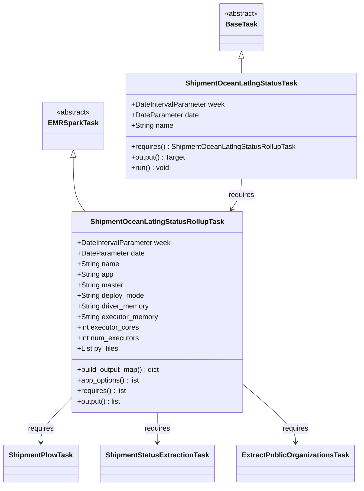
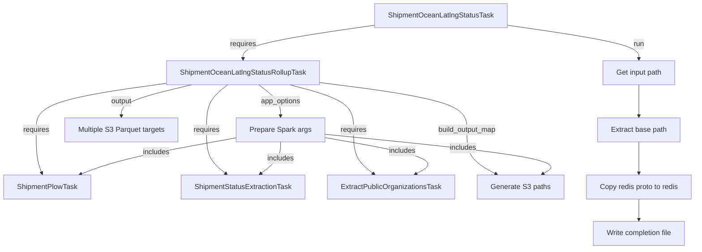
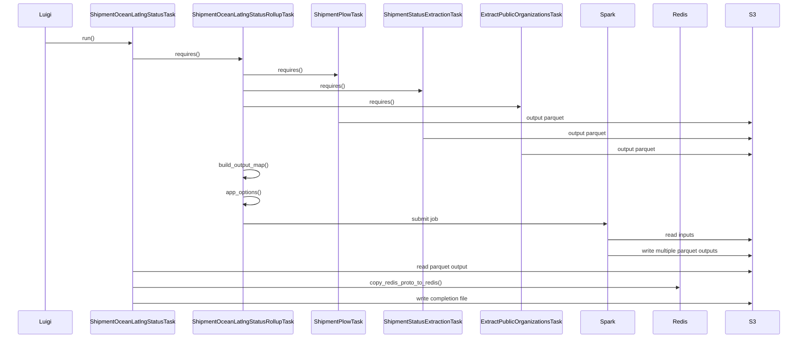

# Diagram: research/orchestrator/tasks/models/shipment_ocean_latlng_status_task.py

> Auto-generated by Obscura crawlers

## Diagram 1

### SVG

<svg id="container" width="799.279296875" xmlns="http://www.w3.org/2000/svg" class="classDiagram" height="1102" viewBox="0 0 799.279296875 1102" role="graphics-document document" aria-roledescription="class"><g><defs><marker id="container_class-aggregationStart" class="marker aggregation class" refX="18" refY="7" markerWidth="190" markerHeight="240" orient="auto"><path d="M 18,7 L9,13 L1,7 L9,1 Z"></path></marker></defs><defs><marker id="container_class-aggregationEnd" class="marker aggregation class" refX="1" refY="7" markerWidth="20" markerHeight="28" orient="auto"><path d="M 18,7 L9,13 L1,7 L9,1 Z"></path></marker></defs><defs><marker id="container_class-extensionStart" class="marker extension class" refX="18" refY="7" markerWidth="190" markerHeight="240" orient="auto"><path d="M 1,7 L18,13 V 1 Z"></path></marker></defs><defs><marker id="container_class-extensionEnd" class="marker extension class" refX="1" refY="7" markerWidth="20" markerHeight="28" orient="auto"><path d="M 1,1 V 13 L18,7 Z"></path></marker></defs><defs><marker id="container_class-compositionStart" class="marker composition class" refX="18" refY="7" markerWidth="190" markerHeight="240" orient="auto"><path d="M 18,7 L9,13 L1,7 L9,1 Z"></path></marker></defs><defs><marker id="container_class-compositionEnd" class="marker composition class" refX="1" refY="7" markerWidth="20" markerHeight="28" orient="auto"><path d="M 18,7 L9,13 L1,7 L9,1 Z"></path></marker></defs><defs><marker id="container_class-dependencyStart" class="marker dependency class" refX="6" refY="7" markerWidth="190" markerHeight="240" orient="auto"><path d="M 5,7 L9,13 L1,7 L9,1 Z"></path></marker></defs><defs><marker id="container_class-dependencyEnd" class="marker dependency class" refX="13" refY="7" markerWidth="20" markerHeight="28" orient="auto"><path d="M 18,7 L9,13 L14,7 L9,1 Z"></path></marker></defs><defs><marker id="container_class-lollipopStart" class="marker lollipop class" refX="13" refY="7" markerWidth="190" markerHeight="240" orient="auto"><circle stroke="black" fill="transparent" cx="7" cy="7" r="6"></circle></marker></defs><defs><marker id="container_class-lollipopEnd" class="marker lollipop class" refX="1" refY="7" markerWidth="190" markerHeight="240" orient="auto"><circle stroke="black" fill="transparent" cx="7" cy="7" r="6"></circle></marker></defs><g class="root"><g class="clusters"></g><g class="edgePaths"><path d="M157.764,357.25L157.764,371.542C157.764,385.833,157.764,414.417,162.119,434.875C166.475,455.333,175.185,467.667,179.541,473.833L183.896,480" id="id_EMRSparkTask_ShipmentOceanLatlngStatusRollupTask_1" class="edge-thickness-normal edge-pattern-solid relation" style=";;;" data-edge="true" data-et="edge" data-id="id_EMRSparkTask_ShipmentOceanLatlngStatusRollupTask_1" data-points="W3sieCI6MTU3Ljc2MzY3MTg3NSwieSI6MzQwfSx7IngiOjE1Ny43NjM2NzE4NzUsInkiOjQ0M30seyJ4IjoxODMuODk2Mjg1Mzc3MzU4NDgsInkiOjQ4MH1d" marker-start="url(#container_class-extensionStart)"></path><path d="M532.096,133.25L532.096,134.542C532.096,135.833,532.096,138.417,532.096,143.875C532.096,149.333,532.096,157.667,532.096,161.833L532.096,166" id="id_BaseTask_ShipmentOceanLatlngStatusTask_2" class="edge-thickness-normal edge-pattern-solid relation" style=";;;" data-edge="true" data-et="edge" data-id="id_BaseTask_ShipmentOceanLatlngStatusTask_2" data-points="W3sieCI6NTMyLjA5NTcwMzEyNSwieSI6MTE2fSx7IngiOjUzMi4wOTU3MDMxMjUsInkiOjE0MX0seyJ4Ijo1MzIuMDk1NzAzMTI1LCJ5IjoxNjZ9XQ==" marker-start="url(#container_class-extensionStart)"></path><path d="M532.096,406L532.096,412.167C532.096,418.333,532.096,430.667,528.317,442.183C524.539,453.7,516.982,464.399,513.203,469.749L509.425,475.099" id="id_ShipmentOceanLatlngStatusTask_ShipmentOceanLatlngStatusRollupTask_3" class="edge-thickness-normal edge-pattern-solid relation" style=";;;" data-edge="true" data-et="edge" data-id="id_ShipmentOceanLatlngStatusTask_ShipmentOceanLatlngStatusRollupTask_3" data-points="W3sieCI6NTMyLjA5NTcwMzEyNSwieSI6NDA2fSx7IngiOjUzMi4wOTU3MDMxMjUsInkiOjQ0M30seyJ4Ijo1MDUuOTYzMDg5NjIyNjQxNSwieSI6NDgwfV0=" marker-end="url(#container_class-dependencyEnd)"></path><path d="M154.848,905.077L143.929,916.398C133.01,927.718,111.173,950.359,100.255,966.846C89.336,983.333,89.336,993.667,89.336,998.833L89.336,1004" id="id_ShipmentOceanLatlngStatusRollupTask_ShipmentPlowTask_4" class="edge-thickness-normal edge-pattern-solid relation" style=";;;" data-edge="true" data-et="edge" data-id="id_ShipmentOceanLatlngStatusRollupTask_ShipmentPlowTask_4" data-points="W3sieCI6MTU0Ljg0NzY1NjI1LCJ5Ijo5MDUuMDc3MzQ3NDc1MjQxNX0seyJ4Ijo4OS4zMzU5Mzc1LCJ5Ijo5NzN9LHsieCI6ODkuMzM1OTM3NSwieSI6MTAxMH1d" marker-end="url(#container_class-dependencyEnd)"></path><path d="M344.93,936L344.93,942.167C344.93,948.333,344.93,960.667,344.93,972C344.93,983.333,344.93,993.667,344.93,998.833L344.93,1004" id="id_ShipmentOceanLatlngStatusRollupTask_ShipmentStatusExtractionTask_5" class="edge-thickness-normal edge-pattern-solid relation" style=";;;" data-edge="true" data-et="edge" data-id="id_ShipmentOceanLatlngStatusRollupTask_ShipmentStatusExtractionTask_5" data-points="W3sieCI6MzQ0LjkyOTY4NzUsInkiOjkzNn0seyJ4IjozNDQuOTI5Njg3NSwieSI6OTczfSx7IngiOjM0NC45Mjk2ODc1LCJ5IjoxMDEwfV0=" marker-end="url(#container_class-dependencyEnd)"></path><path d="M535.012,875.153L553.557,891.461C572.102,907.768,609.191,940.384,627.736,961.859C646.281,983.333,646.281,993.667,646.281,998.833L646.281,1004" id="id_ShipmentOceanLatlngStatusRollupTask_ExtractPublicOrganizationsTask_6" class="edge-thickness-normal edge-pattern-solid relation" style=";;;" data-edge="true" data-et="edge" data-id="id_ShipmentOceanLatlngStatusRollupTask_ExtractPublicOrganizationsTask_6" data-points="W3sieCI6NTM1LjAxMTcxODc1LCJ5Ijo4NzUuMTUyNzM2MzY5OTk5N30seyJ4Ijo2NDYuMjgxMjUsInkiOjk3M30seyJ4Ijo2NDYuMjgxMjUsInkiOjEwMTB9XQ==" marker-end="url(#container_class-dependencyEnd)"></path></g><g class="edgeLabels"><g class="edgeLabel"><g class="label" data-id="id_EMRSparkTask_ShipmentOceanLatlngStatusRollupTask_1" transform="translate(0, 0)"><foreignObject width="0" height="0">

</foreignObject></g></g><g class="edgeLabel"><g class="label" data-id="id_BaseTask_ShipmentOceanLatlngStatusTask_2" transform="translate(0, 0)"><foreignObject width="0" height="0">

</foreignObject></g></g><g class="edgeLabel" transform="translate(532.095703125, 443)"><g class="label" data-id="id_ShipmentOceanLatlngStatusTask_ShipmentOceanLatlngStatusRollupTask_3" transform="translate(-29.8515625, -12)"><foreignObject width="59.703125" height="24">

requires

</foreignObject></g></g><g class="edgeLabel" transform="translate(89.3359375, 973)"><g class="label" data-id="id_ShipmentOceanLatlngStatusRollupTask_ShipmentPlowTask_4" transform="translate(-29.8515625, -12)"><foreignObject width="59.703125" height="24">

requires

</foreignObject></g></g><g class="edgeLabel" transform="translate(344.9296875, 973)"><g class="label" data-id="id_ShipmentOceanLatlngStatusRollupTask_ShipmentStatusExtractionTask_5" transform="translate(-29.8515625, -12)"><foreignObject width="59.703125" height="24">

requires

</foreignObject></g></g><g class="edgeLabel" transform="translate(646.28125, 973)"><g class="label" data-id="id_ShipmentOceanLatlngStatusRollupTask_ExtractPublicOrganizationsTask_6" transform="translate(-29.8515625, -12)"><foreignObject width="59.703125" height="24">

requires

</foreignObject></g></g></g><g class="nodes"><g class="node default" id="classId-EMRSparkTask-0" transform="translate(157.763671875, 286)"><g class="basic label-container"><path d="M-65.1484375 -54 L65.1484375 -54 L65.1484375 54 L-65.1484375 54" stroke="none" stroke-width="0" fill="#ECECFF" style=""></path><path d="M-65.1484375 -54 C-17.231550798875567 -54, 30.685335902248866 -54, 65.1484375 -54 M-65.1484375 -54 C-23.360632738876888 -54, 18.427172022246225 -54, 65.1484375 -54 M65.1484375 -54 C65.1484375 -18.68810724164515, 65.1484375 16.623785516709702, 65.1484375 54 M65.1484375 -54 C65.1484375 -16.171932443698353, 65.1484375 21.656135112603295, 65.1484375 54 M65.1484375 54 C23.82244032191884 54, -17.50355685616232 54, -65.1484375 54 M65.1484375 54 C34.327628540697816 54, 3.5068195813956393 54, -65.1484375 54 M-65.1484375 54 C-65.1484375 11.324606252435231, -65.1484375 -31.350787495129538, -65.1484375 -54 M-65.1484375 54 C-65.1484375 28.34370732742955, -65.1484375 2.687414654859097, -65.1484375 -54" stroke="#9370DB" stroke-width="1.3" fill="none" stroke-dasharray="0 0" style=""></path></g><g class="annotation-group text" transform="translate(-38.609375, -30)"><g class="label" style="" transform="translate(0,-12)"><foreignObject width="77.21875" height="24">

«abstract»

</foreignObject></g></g><g class="label-group text" transform="translate(-53.1484375, -6)"><g class="label" style="font-weight: bolder" transform="translate(0,-12)"><foreignObject width="106.296875" height="24">

EMRSparkTask

</foreignObject></g></g><g class="members-group text" transform="translate(-53.1484375, 42)"></g><g class="methods-group text" transform="translate(-53.1484375, 72)"></g><g class="divider" style=""><path d="M-65.1484375 18 C-21.272990430991193 18, 22.602456638017614 18, 65.1484375 18 M-65.1484375 18 C-16.033747047224686 18, 33.08094340555063 18, 65.1484375 18" stroke="#9370DB" stroke-width="1.3" fill="none" stroke-dasharray="0 0" style=""></path></g><g class="divider" style=""><path d="M-65.1484375 36 C-28.31349262856395 36, 8.521452242872101 36, 65.1484375 36 M-65.1484375 36 C-16.425329106399417 36, 32.297779287201166 36, 65.1484375 36" stroke="#9370DB" stroke-width="1.3" fill="none" stroke-dasharray="0 0" style=""></path></g></g><g class="node default" id="classId-ShipmentOceanLatlngStatusRollupTask-1" transform="translate(344.9296875, 708)"><g class="basic label-container"><path d="M-190.08203125 -228 L190.08203125 -228 L190.08203125 228 L-190.08203125 228" stroke="none" stroke-width="0" fill="#ECECFF" style=""></path><path d="M-190.08203125 -228 C-105.15134244142381 -228, -20.220653632847615 -228, 190.08203125 -228 M-190.08203125 -228 C-96.8142698564456 -228, -3.546508462891211 -228, 190.08203125 -228 M190.08203125 -228 C190.08203125 -116.14282762214424, 190.08203125 -4.285655244288478, 190.08203125 228 M190.08203125 -228 C190.08203125 -57.840265313311704, 190.08203125 112.31946937337659, 190.08203125 228 M190.08203125 228 C49.798869656495896 228, -90.48429193700821 228, -190.08203125 228 M190.08203125 228 C61.01628947186305 228, -68.0494523062739 228, -190.08203125 228 M-190.08203125 228 C-190.08203125 48.72056467312967, -190.08203125 -130.55887065374066, -190.08203125 -228 M-190.08203125 228 C-190.08203125 94.22323202637327, -190.08203125 -39.553535947253465, -190.08203125 -228" stroke="#9370DB" stroke-width="1.3" fill="none" stroke-dasharray="0 0" style=""></path></g><g class="annotation-group text" transform="translate(0, -204)"></g><g class="label-group text" transform="translate(-144.0390625, -204)"><g class="label" style="font-weight: bolder" transform="translate(0,-12)"><foreignObject width="288.078125" height="24">

ShipmentOceanLatlngStatusRollupTask

</foreignObject></g></g><g class="members-group text" transform="translate(-178.08203125, -156)"><g class="label" style="" transform="translate(0,-12)"><foreignObject width="212.125" height="24">

+DateIntervalParameter week

</foreignObject></g><g class="label" style="" transform="translate(0,12)"><foreignObject width="152.171875" height="24">

+DateParameter date

</foreignObject></g><g class="label" style="" transform="translate(0,36)"><foreignObject width="94.984375" height="24">

+String name

</foreignObject></g><g class="label" style="" transform="translate(0,60)"><foreignObject width="82.1875" height="24">

+String app

</foreignObject></g><g class="label" style="" transform="translate(0,84)"><foreignObject width="104.625" height="24">

+String master

</foreignObject></g><g class="label" style="" transform="translate(0,108)"><foreignObject width="153.203125" height="24">

+String deploy_mode

</foreignObject></g><g class="label" style="" transform="translate(0,132)"><foreignObject width="164.015625" height="24">

+String driver_memory

</foreignObject></g><g class="label" style="" transform="translate(0,156)"><foreignObject width="183.8125" height="24">

+String executor_memory

</foreignObject></g><g class="label" style="" transform="translate(0,180)"><foreignObject width="139.9375" height="24">

+int executor_cores

</foreignObject></g><g class="label" style="" transform="translate(0,204)"><foreignObject width="142.296875" height="24">

+int num_executors

</foreignObject></g><g class="label" style="" transform="translate(0,228)"><foreignObject width="92.796875" height="24">

+List py_files

</foreignObject></g></g><g class="methods-group text" transform="translate(-178.08203125, 132)"><g class="label" style="" transform="translate(0,-12)"><foreignObject width="192.953125" height="24">

+build_output_map() : dict

</foreignObject></g><g class="label" style="" transform="translate(0,12)"><foreignObject width="143.609375" height="24">

+app_options() : list

</foreignObject></g><g class="label" style="" transform="translate(0,36)"><foreignObject width="112.828125" height="24">

+requires() : list

</foreignObject></g><g class="label" style="" transform="translate(0,60)"><foreignObject width="102.15625" height="24">

+output() : list

</foreignObject></g></g><g class="divider" style=""><path d="M-190.08203125 -180 C-72.759851035065 -180, 44.562329179870005 -180, 190.08203125 -180 M-190.08203125 -180 C-108.29426893339854 -180, -26.506506616797083 -180, 190.08203125 -180" stroke="#9370DB" stroke-width="1.3" fill="none" stroke-dasharray="0 0" style=""></path></g><g class="divider" style=""><path d="M-190.08203125 108 C-97.80126614381719 108, -5.520501037634375 108, 190.08203125 108 M-190.08203125 108 C-52.88582339316872 108, 84.31038446366256 108, 190.08203125 108" stroke="#9370DB" stroke-width="1.3" fill="none" stroke-dasharray="0 0" style=""></path></g></g><g class="node default" id="classId-BaseTask-2" transform="translate(532.095703125, 62)"><g class="basic label-container"><path d="M-50.609375 -54 L50.609375 -54 L50.609375 54 L-50.609375 54" stroke="none" stroke-width="0" fill="#ECECFF" style=""></path><path d="M-50.609375 -54 C-24.633128169220782 -54, 1.3431186615584352 -54, 50.609375 -54 M-50.609375 -54 C-24.352746153469273 -54, 1.9038826930614547 -54, 50.609375 -54 M50.609375 -54 C50.609375 -27.07004917837581, 50.609375 -0.14009835675162208, 50.609375 54 M50.609375 -54 C50.609375 -12.451748512957408, 50.609375 29.096502974085183, 50.609375 54 M50.609375 54 C28.586043369594847 54, 6.5627117391896945 54, -50.609375 54 M50.609375 54 C28.397679417199747 54, 6.185983834399494 54, -50.609375 54 M-50.609375 54 C-50.609375 18.576517460286325, -50.609375 -16.84696507942735, -50.609375 -54 M-50.609375 54 C-50.609375 18.878162338536207, -50.609375 -16.243675322927587, -50.609375 -54" stroke="#9370DB" stroke-width="1.3" fill="none" stroke-dasharray="0 0" style=""></path></g><g class="annotation-group text" transform="translate(-38.609375, -30)"><g class="label" style="" transform="translate(0,-12)"><foreignObject width="77.21875" height="24">

«abstract»

</foreignObject></g></g><g class="label-group text" transform="translate(-34.03125, -6)"><g class="label" style="font-weight: bolder" transform="translate(0,-12)"><foreignObject width="68.0625" height="24">

BaseTask

</foreignObject></g></g><g class="members-group text" transform="translate(-38.609375, 42)"></g><g class="methods-group text" transform="translate(-38.609375, 72)"></g><g class="divider" style=""><path d="M-50.609375 18 C-20.423069964540183 18, 9.763235070919634 18, 50.609375 18 M-50.609375 18 C-17.948240878691912 18, 14.712893242616175 18, 50.609375 18" stroke="#9370DB" stroke-width="1.3" fill="none" stroke-dasharray="0 0" style=""></path></g><g class="divider" style=""><path d="M-50.609375 36 C-13.12276105819545 36, 24.3638528836091 36, 50.609375 36 M-50.609375 36 C-29.084892173860762 36, -7.560409347721524 36, 50.609375 36" stroke="#9370DB" stroke-width="1.3" fill="none" stroke-dasharray="0 0" style=""></path></g></g><g class="node default" id="classId-ShipmentOceanLatlngStatusTask-3" transform="translate(532.095703125, 286)"><g class="basic label-container"><path d="M-259.18359375 -120 L259.18359375 -120 L259.18359375 120 L-259.18359375 120" stroke="none" stroke-width="0" fill="#ECECFF" style=""></path><path d="M-259.18359375 -120 C-130.90361340892605 -120, -2.623633067852097 -120, 259.18359375 -120 M-259.18359375 -120 C-80.88030949070867 -120, 97.42297476858266 -120, 259.18359375 -120 M259.18359375 -120 C259.18359375 -67.78031940239882, 259.18359375 -15.560638804797634, 259.18359375 120 M259.18359375 -120 C259.18359375 -34.002812662247436, 259.18359375 51.99437467550513, 259.18359375 120 M259.18359375 120 C146.47061939934187 120, 33.75764504868374 120, -259.18359375 120 M259.18359375 120 C135.31209800303554 120, 11.44060225607106 120, -259.18359375 120 M-259.18359375 120 C-259.18359375 38.71449519213034, -259.18359375 -42.571009615739314, -259.18359375 -120 M-259.18359375 120 C-259.18359375 48.03090098869271, -259.18359375 -23.938198022614586, -259.18359375 -120" stroke="#9370DB" stroke-width="1.3" fill="none" stroke-dasharray="0 0" style=""></path></g><g class="annotation-group text" transform="translate(0, -96)"></g><g class="label-group text" transform="translate(-120.4453125, -96)"><g class="label" style="font-weight: bolder" transform="translate(0,-12)"><foreignObject width="240.890625" height="24">

ShipmentOceanLatlngStatusTask

</foreignObject></g></g><g class="members-group text" transform="translate(-247.18359375, -48)"><g class="label" style="" transform="translate(0,-12)"><foreignObject width="212.125" height="24">

+DateIntervalParameter week

</foreignObject></g><g class="label" style="" transform="translate(0,12)"><foreignObject width="152.171875" height="24">

+DateParameter date

</foreignObject></g><g class="label" style="" transform="translate(0,36)"><foreignObject width="94.984375" height="24">

+String name

</foreignObject></g></g><g class="methods-group text" transform="translate(-247.18359375, 48)"><g class="label" style="" transform="translate(0,-12)"><foreignObject width="373.921875" height="24">

+requires() : ShipmentOceanLatlngStatusRollupTask

</foreignObject></g><g class="label" style="" transform="translate(0,12)"><foreignObject width="124.375" height="24">

+output() : Target

</foreignObject></g><g class="label" style="" transform="translate(0,36)"><foreignObject width="86.78125" height="24">

+run() : void

</foreignObject></g></g><g class="divider" style=""><path d="M-259.18359375 -72 C-144.12884462823834 -72, -29.07409550647668 -72, 259.18359375 -72 M-259.18359375 -72 C-63.78738908410594 -72, 131.60881558178812 -72, 259.18359375 -72" stroke="#9370DB" stroke-width="1.3" fill="none" stroke-dasharray="0 0" style=""></path></g><g class="divider" style=""><path d="M-259.18359375 24 C-120.94982301250613 24, 17.28394772498774 24, 259.18359375 24 M-259.18359375 24 C-79.58923915750205 24, 100.0051154349959 24, 259.18359375 24" stroke="#9370DB" stroke-width="1.3" fill="none" stroke-dasharray="0 0" style=""></path></g></g><g class="node default" id="classId-ShipmentPlowTask-4" transform="translate(89.3359375, 1052)"><g class="basic label-container"><path d="M-81.3359375 -42 L81.3359375 -42 L81.3359375 42 L-81.3359375 42" stroke="none" stroke-width="0" fill="#ECECFF" style=""></path><path d="M-81.3359375 -42 C-19.722515686463993 -42, 41.890906127072014 -42, 81.3359375 -42 M-81.3359375 -42 C-29.771866660915258 -42, 21.792204178169484 -42, 81.3359375 -42 M81.3359375 -42 C81.3359375 -9.0832317812703, 81.3359375 23.8335364374594, 81.3359375 42 M81.3359375 -42 C81.3359375 -24.517672774564645, 81.3359375 -7.035345549129289, 81.3359375 42 M81.3359375 42 C27.89953066165696 42, -25.53687617668608 42, -81.3359375 42 M81.3359375 42 C18.168876508838338 42, -44.998184482323325 42, -81.3359375 42 M-81.3359375 42 C-81.3359375 18.76949836242883, -81.3359375 -4.461003275142339, -81.3359375 -42 M-81.3359375 42 C-81.3359375 23.40359722016504, -81.3359375 4.807194440330079, -81.3359375 -42" stroke="#9370DB" stroke-width="1.3" fill="none" stroke-dasharray="0 0" style=""></path></g><g class="annotation-group text" transform="translate(0, -18)"></g><g class="label-group text" transform="translate(-69.3359375, -18)"><g class="label" style="font-weight: bolder" transform="translate(0,-12)"><foreignObject width="138.671875" height="24">

ShipmentPlowTask

</foreignObject></g></g><g class="members-group text" transform="translate(-69.3359375, 30)"></g><g class="methods-group text" transform="translate(-69.3359375, 60)"></g><g class="divider" style=""><path d="M-81.3359375 6 C-28.568859588319114 6, 24.198218323361772 6, 81.3359375 6 M-81.3359375 6 C-41.443775687725676 6, -1.551613875451352 6, 81.3359375 6" stroke="#9370DB" stroke-width="1.3" fill="none" stroke-dasharray="0 0" style=""></path></g><g class="divider" style=""><path d="M-81.3359375 24 C-20.0623163622126 24, 41.2113047755748 24, 81.3359375 24 M-81.3359375 24 C-32.77709659058524 24, 15.781744318829524 24, 81.3359375 24" stroke="#9370DB" stroke-width="1.3" fill="none" stroke-dasharray="0 0" style=""></path></g></g><g class="node default" id="classId-ShipmentStatusExtractionTask-5" transform="translate(344.9296875, 1052)"><g class="basic label-container"><path d="M-124.2578125 -42 L124.2578125 -42 L124.2578125 42 L-124.2578125 42" stroke="none" stroke-width="0" fill="#ECECFF" style=""></path><path d="M-124.2578125 -42 C-59.54287682683632 -42, 5.17205884632736 -42, 124.2578125 -42 M-124.2578125 -42 C-70.79049501993259 -42, -17.323177539865185 -42, 124.2578125 -42 M124.2578125 -42 C124.2578125 -9.627959846159996, 124.2578125 22.744080307680008, 124.2578125 42 M124.2578125 -42 C124.2578125 -14.369961593092455, 124.2578125 13.26007681381509, 124.2578125 42 M124.2578125 42 C44.97013194875497 42, -34.317548602490064 42, -124.2578125 42 M124.2578125 42 C60.57921370595868 42, -3.0993850880826415 42, -124.2578125 42 M-124.2578125 42 C-124.2578125 18.957667762824524, -124.2578125 -4.0846644743509515, -124.2578125 -42 M-124.2578125 42 C-124.2578125 15.345071852060748, -124.2578125 -11.309856295878504, -124.2578125 -42" stroke="#9370DB" stroke-width="1.3" fill="none" stroke-dasharray="0 0" style=""></path></g><g class="annotation-group text" transform="translate(0, -18)"></g><g class="label-group text" transform="translate(-112.2578125, -18)"><g class="label" style="font-weight: bolder" transform="translate(0,-12)"><foreignObject width="224.515625" height="24">

ShipmentStatusExtractionTask

</foreignObject></g></g><g class="members-group text" transform="translate(-112.2578125, 30)"></g><g class="methods-group text" transform="translate(-112.2578125, 60)"></g><g class="divider" style=""><path d="M-124.2578125 6 C-34.01955826348082 6, 56.218695973038365 6, 124.2578125 6 M-124.2578125 6 C-43.34346180185625 6, 37.5708888962875 6, 124.2578125 6" stroke="#9370DB" stroke-width="1.3" fill="none" stroke-dasharray="0 0" style=""></path></g><g class="divider" style=""><path d="M-124.2578125 24 C-62.1793597975378 24, -0.10090709507559836 24, 124.2578125 24 M-124.2578125 24 C-42.84286883089689 24, 38.57207483820622 24, 124.2578125 24" stroke="#9370DB" stroke-width="1.3" fill="none" stroke-dasharray="0 0" style=""></path></g></g><g class="node default" id="classId-ExtractPublicOrganizationsTask-6" transform="translate(646.28125, 1052)"><g class="basic label-container"><path d="M-127.09375 -42 L127.09375 -42 L127.09375 42 L-127.09375 42" stroke="none" stroke-width="0" fill="#ECECFF" style=""></path><path d="M-127.09375 -42 C-62.124320207823544 -42, 2.8451095843529117 -42, 127.09375 -42 M-127.09375 -42 C-47.051720711259634 -42, 32.99030857748073 -42, 127.09375 -42 M127.09375 -42 C127.09375 -18.561681549119108, 127.09375 4.876636901761785, 127.09375 42 M127.09375 -42 C127.09375 -22.97125762576286, 127.09375 -3.9425152515257196, 127.09375 42 M127.09375 42 C40.409561465820474 42, -46.27462706835905 42, -127.09375 42 M127.09375 42 C53.60664384058178 42, -19.880462318836436 42, -127.09375 42 M-127.09375 42 C-127.09375 20.46649952024175, -127.09375 -1.0670009595164984, -127.09375 -42 M-127.09375 42 C-127.09375 22.675913400136853, -127.09375 3.351826800273706, -127.09375 -42" stroke="#9370DB" stroke-width="1.3" fill="none" stroke-dasharray="0 0" style=""></path></g><g class="annotation-group text" transform="translate(0, -18)"></g><g class="label-group text" transform="translate(-115.09375, -18)"><g class="label" style="font-weight: bolder" transform="translate(0,-12)"><foreignObject width="230.1875" height="24">

ExtractPublicOrganizationsTask

</foreignObject></g></g><g class="members-group text" transform="translate(-115.09375, 30)"></g><g class="methods-group text" transform="translate(-115.09375, 60)"></g><g class="divider" style=""><path d="M-127.09375 6 C-43.43680014041385 6, 40.2201497191723 6, 127.09375 6 M-127.09375 6 C-27.688559895868607 6, 71.71663020826279 6, 127.09375 6" stroke="#9370DB" stroke-width="1.3" fill="none" stroke-dasharray="0 0" style=""></path></g><g class="divider" style=""><path d="M-127.09375 24 C-26.80144715535438 24, 73.49085568929124 24, 127.09375 24 M-127.09375 24 C-73.53187690697713 24, -19.970003813954264 24, 127.09375 24" stroke="#9370DB" stroke-width="1.3" fill="none" stroke-dasharray="0 0" style=""></path></g></g></g></g></g></svg>

## Diagram 2

### SVG

<svg id="container" width="1560.77734375" xmlns="http://www.w3.org/2000/svg" class="flowchart" height="558" viewBox="0 0 1560.77734375 558" role="graphics-document document" aria-roledescription="flowchart-v2"><g><marker id="container_flowchart-v2-pointEnd" class="marker flowchart-v2" viewBox="0 0 10 10" refX="5" refY="5" markerUnits="userSpaceOnUse" markerWidth="8" markerHeight="8" orient="auto"><path d="M 0 0 L 10 5 L 0 10 z" class="arrowMarkerPath" style="stroke-width: 1; stroke-dasharray: 1, 0;"></path></marker><marker id="container_flowchart-v2-pointStart" class="marker flowchart-v2" viewBox="0 0 10 10" refX="4.5" refY="5" markerUnits="userSpaceOnUse" markerWidth="8" markerHeight="8" orient="auto"><path d="M 0 5 L 10 10 L 10 0 z" class="arrowMarkerPath" style="stroke-width: 1; stroke-dasharray: 1, 0;"></path></marker><marker id="container_flowchart-v2-circleEnd" class="marker flowchart-v2" viewBox="0 0 10 10" refX="11" refY="5" markerUnits="userSpaceOnUse" markerWidth="11" markerHeight="11" orient="auto"><circle cx="5" cy="5" r="5" class="arrowMarkerPath" style="stroke-width: 1; stroke-dasharray: 1, 0;"></circle></marker><marker id="container_flowchart-v2-circleStart" class="marker flowchart-v2" viewBox="0 0 10 10" refX="-1" refY="5" markerUnits="userSpaceOnUse" markerWidth="11" markerHeight="11" orient="auto"><circle cx="5" cy="5" r="5" class="arrowMarkerPath" style="stroke-width: 1; stroke-dasharray: 1, 0;"></circle></marker><marker id="container_flowchart-v2-crossEnd" class="marker cross flowchart-v2" viewBox="0 0 11 11" refX="12" refY="5.2" markerUnits="userSpaceOnUse" markerWidth="11" markerHeight="11" orient="auto"><path d="M 1,1 l 9,9 M 10,1 l -9,9" class="arrowMarkerPath" style="stroke-width: 2; stroke-dasharray: 1, 0;"></path></marker><marker id="container_flowchart-v2-crossStart" class="marker cross flowchart-v2" viewBox="0 0 11 11" refX="-1" refY="5.2" markerUnits="userSpaceOnUse" markerWidth="11" markerHeight="11" orient="auto"><path d="M 1,1 l 9,9 M 10,1 l -9,9" class="arrowMarkerPath" style="stroke-width: 2; stroke-dasharray: 1, 0;"></path></marker><g class="root"><g class="clusters"></g><g class="edgePaths"><path d="M842.102,56.417L792.96,63.514C743.819,70.611,645.536,84.806,596.395,97.403C547.254,110,547.254,121,547.254,126.5L547.254,132" id="L_A_B_0" class="edge-thickness-normal edge-pattern-solid edge-thickness-normal edge-pattern-solid flowchart-link" style=";" data-edge="true" data-et="edge" data-id="L_A_B_0" data-points="W3sieCI6ODQyLjEwMTU2MjUsInkiOjU2LjQxNjY0MDk1NjI1MTE2fSx7IngiOjU0Ny4yNTM5MDYyNSwieSI6OTl9LHsieCI6NTQ3LjI1MzkwNjI1LCJ5IjoxMzZ9XQ==" marker-end="url(#container_flowchart-v2-pointEnd)"></path><path d="M375.473,186.561L326.335,193.301C277.197,200.041,178.921,213.52,129.783,230.927C80.645,248.333,80.645,269.667,80.645,291C80.645,312.333,80.645,333.667,82.839,349.88C85.034,366.094,89.424,377.187,91.619,382.734L93.813,388.281" id="L_B_C_0" class="edge-thickness-normal edge-pattern-solid edge-thickness-normal edge-pattern-solid flowchart-link" style=";" data-edge="true" data-et="edge" data-id="L_B_C_0" data-points="W3sieCI6Mzc1LjQ3MjY1NjI1LCJ5IjoxODYuNTYxNDY0MDE5MDIwMn0seyJ4Ijo4MC42NDQ1MzEyNSwieSI6MjI3fSx7IngiOjgwLjY0NDUzMTI1LCJ5IjoyOTF9LHsieCI6ODAuNjQ0NTMxMjUsInkiOjM1NX0seyJ4Ijo5NS4yODUwOTUyMTQ4NDM3NSwieSI6MzkyfV0=" marker-end="url(#container_flowchart-v2-pointEnd)"></path><path d="M512.924,190L505.083,196.167C497.242,202.333,481.561,214.667,473.72,231.5C465.879,248.333,465.879,269.667,465.879,291C465.879,312.333,465.879,333.667,473.196,350.088C480.513,366.509,495.146,378.018,502.463,383.773L509.78,389.527" id="L_B_D_0" class="edge-thickness-normal edge-pattern-solid edge-thickness-normal edge-pattern-solid flowchart-link" style=";" data-edge="true" data-et="edge" data-id="L_B_D_0" data-points="W3sieCI6NTEyLjkyMzgyODEyNSwieSI6MTkwfSx7IngiOjQ2NS44Nzg5MDYyNSwieSI6MjI3fSx7IngiOjQ2NS44Nzg5MDYyNSwieSI6MjkxfSx7IngiOjQ2NS44Nzg5MDYyNSwieSI6MzU1fSx7IngiOjUxMi45MjM4MjgxMjUsInkiOjM5Mn1d" marker-end="url(#container_flowchart-v2-pointEnd)"></path><path d="M651.797,190L675.674,196.167C699.551,202.333,747.305,214.667,771.182,231.5C795.059,248.333,795.059,269.667,795.059,291C795.059,312.333,795.059,333.667,802.721,350.099C810.384,366.532,825.709,378.063,833.372,383.829L841.035,389.595" id="L_B_E_0" class="edge-thickness-normal edge-pattern-solid edge-thickness-normal edge-pattern-solid flowchart-link" style=";" data-edge="true" data-et="edge" data-id="L_B_E_0" data-points="W3sieCI6NjUxLjc5NjUwODc4OTA2MjUsInkiOjE5MH0seyJ4Ijo3OTUuMDU4NTkzNzUsInkiOjIyN30seyJ4Ijo3OTUuMDU4NTkzNzUsInkiOjI5MX0seyJ4Ijo3OTUuMDU4NTkzNzUsInkiOjM1NX0seyJ4Ijo4NDQuMjMwODM0OTYwOTM3NSwieSI6MzkyfV0=" marker-end="url(#container_flowchart-v2-pointEnd)"></path><path d="M719.035,184.882L774.143,191.902C829.25,198.921,939.465,212.961,994.572,230.647C1049.68,248.333,1049.68,269.667,1049.68,291C1049.68,312.333,1049.68,333.667,1060.551,350.184C1071.422,366.701,1093.164,378.403,1104.036,384.254L1114.907,390.104" id="L_B_F_0" class="edge-thickness-normal edge-pattern-solid edge-thickness-normal edge-pattern-solid flowchart-link" style=";" data-edge="true" data-et="edge" data-id="L_B_F_0" data-points="W3sieCI6NzE5LjAzNTE1NjI1LCJ5IjoxODQuODgxODM4ODkxMDA1Mzd9LHsieCI6MTA0OS42Nzk2ODc1LCJ5IjoyMjd9LHsieCI6MTA0OS42Nzk2ODc1LCJ5IjoyOTF9LHsieCI6MTA0OS42Nzk2ODc1LCJ5IjozNTV9LHsieCI6MTExOC40MjkxMzgxODM1OTM4LCJ5IjozOTJ9XQ==" marker-end="url(#container_flowchart-v2-pointEnd)"></path><path d="M583.136,190L591.332,196.167C599.527,202.333,615.918,214.667,624.113,226.333C632.309,238,632.309,249,632.309,254.5L632.309,260" id="L_B_G_0" class="edge-thickness-normal edge-pattern-solid edge-thickness-normal edge-pattern-solid flowchart-link" style=";" data-edge="true" data-et="edge" data-id="L_B_G_0" data-points="W3sieCI6NTgzLjEzNjM1MjUzOTA2MjUsInkiOjE5MH0seyJ4Ijo2MzIuMzA4NTkzNzUsInkiOjIyN30seyJ4Ijo2MzIuMzA4NTkzNzUsInkiOjI2NH1d" marker-end="url(#container_flowchart-v2-pointEnd)"></path><path d="M534.41,308.45L490.885,316.209C447.361,323.967,360.311,339.483,301.29,353.17C242.268,366.857,211.275,378.714,195.778,384.642L180.281,390.571" id="L_G_C_0" class="edge-thickness-normal edge-pattern-solid edge-thickness-normal edge-pattern-solid flowchart-link" style=";" data-edge="true" data-et="edge" data-id="L_G_C_0" data-points="W3sieCI6NTM0LjQxMDE1NjI1LCJ5IjozMDguNDUwMzY3NzI3MDU1MTV9LHsieCI6MjczLjI2MTcxODc1LCJ5IjozNTV9LHsieCI6MTc2LjU0NTQ3MTE5MTQwNjI1LCJ5IjozOTJ9XQ==" marker-end="url(#container_flowchart-v2-pointEnd)"></path><path d="M632.309,318L632.309,324.167C632.309,330.333,632.309,342.667,624.646,354.599C616.983,366.532,601.658,378.063,593.995,383.829L586.333,389.595" id="L_G_D_0" class="edge-thickness-normal edge-pattern-solid edge-thickness-normal edge-pattern-solid flowchart-link" style=";" data-edge="true" data-et="edge" data-id="L_G_D_0" data-points="W3sieCI6NjMyLjMwODU5Mzc1LCJ5IjozMTh9LHsieCI6NjMyLjMwODU5Mzc1LCJ5IjozNTV9LHsieCI6NTgzLjEzNjM1MjUzOTA2MjUsInkiOjM5Mn1d" marker-end="url(#container_flowchart-v2-pointEnd)"></path><path d="M730.207,308.085L775.011,315.904C819.815,323.723,909.423,339.362,943.356,353.032C977.289,366.701,955.546,378.403,944.675,384.254L933.804,390.104" id="L_G_E_0" class="edge-thickness-normal edge-pattern-solid edge-thickness-normal edge-pattern-solid flowchart-link" style=";" data-edge="true" data-et="edge" data-id="L_G_E_0" data-points="W3sieCI6NzMwLjIwNzAzMTI1LCJ5IjozMDguMDg1MTE4Mzk0NTYzM30seyJ4Ijo5OTkuMDMxMjUsInkiOjM1NX0seyJ4Ijo5MzAuMjgxNzk5MzE2NDA2MiwieSI6MzkyfV0=" marker-end="url(#container_flowchart-v2-pointEnd)"></path><path d="M730.207,300.738L821.129,309.781C912.051,318.825,1093.895,336.913,1175.065,351.781C1256.236,366.65,1236.734,378.299,1226.983,384.124L1217.232,389.949" id="L_G_F_0" class="edge-thickness-normal edge-pattern-solid edge-thickness-normal edge-pattern-solid flowchart-link" style=";" data-edge="true" data-et="edge" data-id="L_G_F_0" data-points="W3sieCI6NzMwLjIwNzAzMTI1LCJ5IjozMDAuNzM3NjYwNzI5MjQ2MzN9LHsieCI6MTI3NS43MzgyODEyNSwieSI6MzU1fSx7IngiOjEyMTMuNzk3NjA3NDIxODc1LCJ5IjozOTJ9XQ==" marker-end="url(#container_flowchart-v2-pointEnd)"></path><path d="M431.663,190L405.263,196.167C378.863,202.333,326.062,214.667,299.662,226.333C273.262,238,273.262,249,273.262,254.5L273.262,260" id="L_B_H_0" class="edge-thickness-normal edge-pattern-solid edge-thickness-normal edge-pattern-solid flowchart-link" style=";" data-edge="true" data-et="edge" data-id="L_B_H_0" data-points="W3sieCI6NDMxLjY2MzQ1MjE0ODQzNzUsInkiOjE5MH0seyJ4IjoyNzMuMjYxNzE4NzUsInkiOjIyN30seyJ4IjoyNzMuMjYxNzE4NzUsInkiOjI2NH1d" marker-end="url(#container_flowchart-v2-pointEnd)"></path><path d="M1138.68,56.417L1187.821,63.514C1236.962,70.611,1335.245,84.806,1384.386,97.403C1433.527,110,1433.527,121,1433.527,126.5L1433.527,132" id="L_A_I_0" class="edge-thickness-normal edge-pattern-solid edge-thickness-normal edge-pattern-solid flowchart-link" style=";" data-edge="true" data-et="edge" data-id="L_A_I_0" data-points="W3sieCI6MTEzOC42Nzk2ODc1LCJ5Ijo1Ni40MTY2NDA5NTYyNTExNn0seyJ4IjoxNDMzLjUyNzM0Mzc1LCJ5Ijo5OX0seyJ4IjoxNDMzLjUyNzM0Mzc1LCJ5IjoxMzZ9XQ==" marker-end="url(#container_flowchart-v2-pointEnd)"></path><path d="M1433.527,190L1433.527,196.167C1433.527,202.333,1433.527,214.667,1433.527,226.333C1433.527,238,1433.527,249,1433.527,254.5L1433.527,260" id="L_I_J_0" class="edge-thickness-normal edge-pattern-solid edge-thickness-normal edge-pattern-solid flowchart-link" style=";" data-edge="true" data-et="edge" data-id="L_I_J_0" data-points="W3sieCI6MTQzMy41MjczNDM3NSwieSI6MTkwfSx7IngiOjE0MzMuNTI3MzQzNzUsInkiOjIyN30seyJ4IjoxNDMzLjUyNzM0Mzc1LCJ5IjoyNjR9XQ==" marker-end="url(#container_flowchart-v2-pointEnd)"></path><path d="M1433.527,318L1433.527,324.167C1433.527,330.333,1433.527,342.667,1433.527,354.333C1433.527,366,1433.527,377,1433.527,382.5L1433.527,388" id="L_J_K_0" class="edge-thickness-normal edge-pattern-solid edge-thickness-normal edge-pattern-solid flowchart-link" style=";" data-edge="true" data-et="edge" data-id="L_J_K_0" data-points="W3sieCI6MTQzMy41MjczNDM3NSwieSI6MzE4fSx7IngiOjE0MzMuNTI3MzQzNzUsInkiOjM1NX0seyJ4IjoxNDMzLjUyNzM0Mzc1LCJ5IjozOTJ9XQ==" marker-end="url(#container_flowchart-v2-pointEnd)"></path><path d="M1433.527,446L1433.527,450.167C1433.527,454.333,1433.527,462.667,1433.527,470.333C1433.527,478,1433.527,485,1433.527,488.5L1433.527,492" id="L_K_L_0" class="edge-thickness-normal edge-pattern-solid edge-thickness-normal edge-pattern-solid flowchart-link" style=";" data-edge="true" data-et="edge" data-id="L_K_L_0" data-points="W3sieCI6MTQzMy41MjczNDM3NSwieSI6NDQ2fSx7IngiOjE0MzMuNTI3MzQzNzUsInkiOjQ3MX0seyJ4IjoxNDMzLjUyNzM0Mzc1LCJ5Ijo0OTZ9XQ==" marker-end="url(#container_flowchart-v2-pointEnd)"></path></g><g class="edgeLabels"><g class="edgeLabel" transform="translate(547.25390625, 99)"><g class="label" data-id="L_A_B_0" transform="translate(-29.8515625, -12)"><foreignObject width="59.703125" height="24">

requires

</foreignObject></g></g><g class="edgeLabel" transform="translate(80.64453125, 291)"><g class="label" data-id="L_B_C_0" transform="translate(-29.8515625, -12)"><foreignObject width="59.703125" height="24">

requires

</foreignObject></g></g><g class="edgeLabel" transform="translate(465.87890625, 291)"><g class="label" data-id="L_B_D_0" transform="translate(-29.8515625, -12)"><foreignObject width="59.703125" height="24">

requires

</foreignObject></g></g><g class="edgeLabel" transform="translate(795.05859375, 291)"><g class="label" data-id="L_B_E_0" transform="translate(-29.8515625, -12)"><foreignObject width="59.703125" height="24">

requires

</foreignObject></g></g><g class="edgeLabel" transform="translate(1049.6796875, 291)"><g class="label" data-id="L_B_F_0" transform="translate(-67.390625, -12)"><foreignObject width="134.78125" height="24">

build_output_map

</foreignObject></g></g><g class="edgeLabel" transform="translate(632.30859375, 227)"><g class="label" data-id="L_B_G_0" transform="translate(-45.3671875, -12)"><foreignObject width="90.734375" height="24">

app_options

</foreignObject></g></g><g class="edgeLabel" transform="translate(352.86334, 340.81103)"><g class="label" data-id="L_G_C_0" transform="translate(-30.6484375, -12)"><foreignObject width="61.296875" height="24">

includes

</foreignObject></g></g><g class="edgeLabel" transform="translate(632.30859375, 355)"><g class="label" data-id="L_G_D_0" transform="translate(-30.6484375, -12)"><foreignObject width="61.296875" height="24">

includes

</foreignObject></g></g><g class="edgeLabel" transform="translate(903.07472, 338.25378)"><g class="label" data-id="L_G_E_0" transform="translate(-30.6484375, -12)"><foreignObject width="61.296875" height="24">

includes

</foreignObject></g></g><g class="edgeLabel" transform="translate(1038.8706, 331.43949)"><g class="label" data-id="L_G_F_0" transform="translate(-30.6484375, -12)"><foreignObject width="61.296875" height="24">

includes

</foreignObject></g></g><g class="edgeLabel" transform="translate(273.26171875, 227)"><g class="label" data-id="L_B_H_0" transform="translate(-24.515625, -12)"><foreignObject width="49.03125" height="24">

output

</foreignObject></g></g><g class="edgeLabel" transform="translate(1433.52734375, 99)"><g class="label" data-id="L_A_I_0" transform="translate(-12.4375, -12)"><foreignObject width="24.875" height="24">

run

</foreignObject></g></g><g class="edgeLabel"><g class="label" data-id="L_I_J_0" transform="translate(0, 0)"><foreignObject width="0" height="0">

</foreignObject></g></g><g class="edgeLabel"><g class="label" data-id="L_J_K_0" transform="translate(0, 0)"><foreignObject width="0" height="0">

</foreignObject></g></g><g class="edgeLabel"><g class="label" data-id="L_K_L_0" transform="translate(0, 0)"><foreignObject width="0" height="0">

</foreignObject></g></g></g><g class="nodes"><g class="node default" id="flowchart-A-0" transform="translate(990.390625, 35)"><rect class="basic label-container" style="" x="-148.2890625" y="-27" width="296.578125" height="54"></rect><g class="label" style="" transform="translate(-118.2890625, -12)"><rect></rect><foreignObject width="236.578125" height="24">

ShipmentOceanLatlngStatusTask

</foreignObject></g></g><g class="node default" id="flowchart-B-1" transform="translate(547.25390625, 163)"><rect class="basic label-container" style="" x="-171.78125" y="-27" width="343.5625" height="54"></rect><g class="label" style="" transform="translate(-141.78125, -12)"><rect></rect><foreignObject width="283.5625" height="24">

ShipmentOceanLatlngStatusRollupTask

</foreignObject></g></g><g class="node default" id="flowchart-C-3" transform="translate(105.96875, 419)"><rect class="basic label-container" style="" x="-97.96875" y="-27" width="195.9375" height="54"></rect><g class="label" style="" transform="translate(-67.96875, -12)"><rect></rect><foreignObject width="135.9375" height="24">

ShipmentPlowTask

</foreignObject></g></g><g class="node default" id="flowchart-D-5" transform="translate(547.25390625, 419)"><rect class="basic label-container" style="" x="-140.0546875" y="-27" width="280.109375" height="54"></rect><g class="label" style="" transform="translate(-110.0546875, -12)"><rect></rect><foreignObject width="220.109375" height="24">

ShipmentStatusExtractionTask

</foreignObject></g></g><g class="node default" id="flowchart-E-7" transform="translate(880.11328125, 419)"><rect class="basic label-container" style="" x="-142.8046875" y="-27" width="285.609375" height="54"></rect><g class="label" style="" transform="translate(-112.8046875, -12)"><rect></rect><foreignObject width="225.609375" height="24">

ExtractPublicOrganizationsTask

</foreignObject></g></g><g class="node default" id="flowchart-F-9" transform="translate(1168.59765625, 419)"><rect class="basic label-container" style="" x="-95.6796875" y="-27" width="191.359375" height="54"></rect><g class="label" style="" transform="translate(-65.6796875, -12)"><rect></rect><foreignObject width="131.359375" height="24">

Generate S3 paths

</foreignObject></g></g><g class="node default" id="flowchart-G-11" transform="translate(632.30859375, 291)"><rect class="basic label-container" style="" x="-97.8984375" y="-27" width="195.796875" height="54"></rect><g class="label" style="" transform="translate(-67.8984375, -12)"><rect></rect><foreignObject width="135.796875" height="24">

Prepare Spark args

</foreignObject></g></g><g class="node default" id="flowchart-H-21" transform="translate(273.26171875, 291)"><rect class="basic label-container" style="" x="-127.765625" y="-27" width="255.53125" height="54"></rect><g class="label" style="" transform="translate(-97.765625, -12)"><rect></rect><foreignObject width="195.53125" height="24">

Multiple S3 Parquet targets

</foreignObject></g></g><g class="node default" id="flowchart-I-23" transform="translate(1433.52734375, 163)"><rect class="basic label-container" style="" x="-82.3828125" y="-27" width="164.765625" height="54"></rect><g class="label" style="" transform="translate(-52.3828125, -12)"><rect></rect><foreignObject width="104.765625" height="24">

Get input path

</foreignObject></g></g><g class="node default" id="flowchart-J-25" transform="translate(1433.52734375, 291)"><rect class="basic label-container" style="" x="-92.8046875" y="-27" width="185.609375" height="54"></rect><g class="label" style="" transform="translate(-62.8046875, -12)"><rect></rect><foreignObject width="125.609375" height="24">

Extract base path

</foreignObject></g></g><g class="node default" id="flowchart-K-27" transform="translate(1433.52734375, 419)"><rect class="basic label-container" style="" x="-119.25" y="-27" width="238.5" height="54"></rect><g class="label" style="" transform="translate(-89.25, -12)"><rect></rect><foreignObject width="178.5" height="24">

Copy redis proto to redis

</foreignObject></g></g><g class="node default" id="flowchart-L-29" transform="translate(1433.52734375, 523)"><rect class="basic label-container" style="" x="-105.65625" y="-27" width="211.3125" height="54"></rect><g class="label" style="" transform="translate(-75.65625, -12)"><rect></rect><foreignObject width="151.3125" height="24">

Write completion file

</foreignObject></g></g></g></g></g></svg>

## Diagram 3

### SVG

<svg id="container" width="2305" xmlns="http://www.w3.org/2000/svg" height="999" viewBox="-50 -10 2305 999" role="graphics-document document" aria-roledescription="sequence"><g><rect x="2055" y="913" fill="#eaeaea" stroke="#666" width="150" height="65" name="S3" rx="3" ry="3" class="actor actor-bottom"></rect><text x="2130" y="945.5" dominant-baseline="central" alignment-baseline="central" class="actor actor-box" style="text-anchor: middle; font-size: 16px; font-weight: 400;"><tspan x="2130" dy="0">S3</tspan></text></g><g><rect x="1855" y="913" fill="#eaeaea" stroke="#666" width="150" height="65" name="Redis" rx="3" ry="3" class="actor actor-bottom"></rect><text x="1930" y="945.5" dominant-baseline="central" alignment-baseline="central" class="actor actor-box" style="text-anchor: middle; font-size: 16px; font-weight: 400;"><tspan x="1930" dy="0">Redis</tspan></text></g><g><rect x="1655" y="913" fill="#eaeaea" stroke="#666" width="150" height="65" name="Spark" rx="3" ry="3" class="actor actor-bottom"></rect><text x="1730" y="945.5" dominant-baseline="central" alignment-baseline="central" class="actor actor-box" style="text-anchor: middle; font-size: 16px; font-weight: 400;"><tspan x="1730" dy="0">Spark</tspan></text></g><g><rect x="1359" y="913" fill="#eaeaea" stroke="#666" width="246" height="65" name="EPO" rx="3" ry="3" class="actor actor-bottom"></rect><text x="1482" y="945.5" dominant-baseline="central" alignment-baseline="central" class="actor actor-box" style="text-anchor: middle; font-size: 16px; font-weight: 400;"><tspan x="1482" dy="0">ExtractPublicOrganizationsTask</tspan></text></g><g><rect x="1068" y="913" fill="#eaeaea" stroke="#666" width="241" height="65" name="SSE" rx="3" ry="3" class="actor actor-bottom"></rect><text x="1188.5" y="945.5" dominant-baseline="central" alignment-baseline="central" class="actor actor-box" style="text-anchor: middle; font-size: 16px; font-weight: 400;"><tspan x="1188.5" dy="0">ShipmentStatusExtractionTask</tspan></text></g><g><rect x="861" y="913" fill="#eaeaea" stroke="#666" width="157" height="65" name="SPT" rx="3" ry="3" class="actor actor-bottom"></rect><text x="939.5" y="945.5" dominant-baseline="central" alignment-baseline="central" class="actor actor-box" style="text-anchor: middle; font-size: 16px; font-weight: 400;"><tspan x="939.5" dy="0">ShipmentPlowTask</tspan></text></g><g><rect x="507" y="913" fill="#eaeaea" stroke="#666" width="304" height="65" name="Rollup" rx="3" ry="3" class="actor actor-bottom"></rect><text x="659" y="945.5" dominant-baseline="central" alignment-baseline="central" class="actor actor-box" style="text-anchor: middle; font-size: 16px; font-weight: 400;"><tspan x="659" dy="0">ShipmentOceanLatlngStatusRollupTask</tspan></text></g><g><rect x="200" y="913" fill="#eaeaea" stroke="#666" width="257" height="65" name="SOLTask" rx="3" ry="3" class="actor actor-bottom"></rect><text x="328.5" y="945.5" dominant-baseline="central" alignment-baseline="central" class="actor actor-box" style="text-anchor: middle; font-size: 16px; font-weight: 400;"><tspan x="328.5" dy="0">ShipmentOceanLatlngStatusTask</tspan></text></g><g><rect x="0" y="913" fill="#eaeaea" stroke="#666" width="150" height="65" name="Luigi" rx="3" ry="3" class="actor actor-bottom"></rect><text x="75" y="945.5" dominant-baseline="central" alignment-baseline="central" class="actor actor-box" style="text-anchor: middle; font-size: 16px; font-weight: 400;"><tspan x="75" dy="0">Luigi</tspan></text></g><g><line id="actor8" x1="2130" y1="65" x2="2130" y2="913" class="actor-line 200" stroke-width="0.5px" stroke="#999" name="S3"></line><g id="root-8"><rect x="2055" y="0" fill="#eaeaea" stroke="#666" width="150" height="65" name="S3" rx="3" ry="3" class="actor actor-top"></rect><text x="2130" y="32.5" dominant-baseline="central" alignment-baseline="central" class="actor actor-box" style="text-anchor: middle; font-size: 16px; font-weight: 400;"><tspan x="2130" dy="0">S3</tspan></text></g></g><g><line id="actor7" x1="1930" y1="65" x2="1930" y2="913" class="actor-line 200" stroke-width="0.5px" stroke="#999" name="Redis"></line><g id="root-7"><rect x="1855" y="0" fill="#eaeaea" stroke="#666" width="150" height="65" name="Redis" rx="3" ry="3" class="actor actor-top"></rect><text x="1930" y="32.5" dominant-baseline="central" alignment-baseline="central" class="actor actor-box" style="text-anchor: middle; font-size: 16px; font-weight: 400;"><tspan x="1930" dy="0">Redis</tspan></text></g></g><g><line id="actor6" x1="1730" y1="65" x2="1730" y2="913" class="actor-line 200" stroke-width="0.5px" stroke="#999" name="Spark"></line><g id="root-6"><rect x="1655" y="0" fill="#eaeaea" stroke="#666" width="150" height="65" name="Spark" rx="3" ry="3" class="actor actor-top"></rect><text x="1730" y="32.5" dominant-baseline="central" alignment-baseline="central" class="actor actor-box" style="text-anchor: middle; font-size: 16px; font-weight: 400;"><tspan x="1730" dy="0">Spark</tspan></text></g></g><g><line id="actor5" x1="1482" y1="65" x2="1482" y2="913" class="actor-line 200" stroke-width="0.5px" stroke="#999" name="EPO"></line><g id="root-5"><rect x="1359" y="0" fill="#eaeaea" stroke="#666" width="246" height="65" name="EPO" rx="3" ry="3" class="actor actor-top"></rect><text x="1482" y="32.5" dominant-baseline="central" alignment-baseline="central" class="actor actor-box" style="text-anchor: middle; font-size: 16px; font-weight: 400;"><tspan x="1482" dy="0">ExtractPublicOrganizationsTask</tspan></text></g></g><g><line id="actor4" x1="1188.5" y1="65" x2="1188.5" y2="913" class="actor-line 200" stroke-width="0.5px" stroke="#999" name="SSE"></line><g id="root-4"><rect x="1068" y="0" fill="#eaeaea" stroke="#666" width="241" height="65" name="SSE" rx="3" ry="3" class="actor actor-top"></rect><text x="1188.5" y="32.5" dominant-baseline="central" alignment-baseline="central" class="actor actor-box" style="text-anchor: middle; font-size: 16px; font-weight: 400;"><tspan x="1188.5" dy="0">ShipmentStatusExtractionTask</tspan></text></g></g><g><line id="actor3" x1="939.5" y1="65" x2="939.5" y2="913" class="actor-line 200" stroke-width="0.5px" stroke="#999" name="SPT"></line><g id="root-3"><rect x="861" y="0" fill="#eaeaea" stroke="#666" width="157" height="65" name="SPT" rx="3" ry="3" class="actor actor-top"></rect><text x="939.5" y="32.5" dominant-baseline="central" alignment-baseline="central" class="actor actor-box" style="text-anchor: middle; font-size: 16px; font-weight: 400;"><tspan x="939.5" dy="0">ShipmentPlowTask</tspan></text></g></g><g><line id="actor2" x1="659" y1="65" x2="659" y2="913" class="actor-line 200" stroke-width="0.5px" stroke="#999" name="Rollup"></line><g id="root-2"><rect x="507" y="0" fill="#eaeaea" stroke="#666" width="304" height="65" name="Rollup" rx="3" ry="3" class="actor actor-top"></rect><text x="659" y="32.5" dominant-baseline="central" alignment-baseline="central" class="actor actor-box" style="text-anchor: middle; font-size: 16px; font-weight: 400;"><tspan x="659" dy="0">ShipmentOceanLatlngStatusRollupTask</tspan></text></g></g><g><line id="actor1" x1="328.5" y1="65" x2="328.5" y2="913" class="actor-line 200" stroke-width="0.5px" stroke="#999" name="SOLTask"></line><g id="root-1"><rect x="200" y="0" fill="#eaeaea" stroke="#666" width="257" height="65" name="SOLTask" rx="3" ry="3" class="actor actor-top"></rect><text x="328.5" y="32.5" dominant-baseline="central" alignment-baseline="central" class="actor actor-box" style="text-anchor: middle; font-size: 16px; font-weight: 400;"><tspan x="328.5" dy="0">ShipmentOceanLatlngStatusTask</tspan></text></g></g><g><line id="actor0" x1="75" y1="65" x2="75" y2="913" class="actor-line 200" stroke-width="0.5px" stroke="#999" name="Luigi"></line><g id="root-0"><rect x="0" y="0" fill="#eaeaea" stroke="#666" width="150" height="65" name="Luigi" rx="3" ry="3" class="actor actor-top"></rect><text x="75" y="32.5" dominant-baseline="central" alignment-baseline="central" class="actor actor-box" style="text-anchor: middle; font-size: 16px; font-weight: 400;"><tspan x="75" dy="0">Luigi</tspan></text></g></g><g></g><defs><symbol id="computer" width="24" height="24"><path transform="scale(.5)" d="M2 2v13h20v-13h-20zm18 11h-16v-9h16v9zm-10.228 6l.466-1h3.524l.467 1h-4.457zm14.228 3h-24l2-6h2.104l-1.33 4h18.45l-1.297-4h2.073l2 6zm-5-10h-14v-7h14v7z"></path></symbol></defs><defs><symbol id="database" fill-rule="evenodd" clip-rule="evenodd"><path transform="scale(.5)" d="M12.258.001l.256.004.255.005.253.008.251.01.249.012.247.015.246.016.242.019.241.02.239.023.236.024.233.027.231.028.229.031.225.032.223.034.22.036.217.038.214.04.211.041.208.043.205.045.201.046.198.048.194.05.191.051.187.053.183.054.18.056.175.057.172.059.168.06.163.061.16.063.155.064.15.066.074.033.073.033.071.034.07.034.069.035.068.035.067.035.066.035.064.036.064.036.062.036.06.036.06.037.058.037.058.037.055.038.055.038.053.038.052.038.051.039.05.039.048.039.047.039.045.04.044.04.043.04.041.04.04.041.039.041.037.041.036.041.034.041.033.042.032.042.03.042.029.042.027.042.026.043.024.043.023.043.021.043.02.043.018.044.017.043.015.044.013.044.012.044.011.045.009.044.007.045.006.045.004.045.002.045.001.045v17l-.001.045-.002.045-.004.045-.006.045-.007.045-.009.044-.011.045-.012.044-.013.044-.015.044-.017.043-.018.044-.02.043-.021.043-.023.043-.024.043-.026.043-.027.042-.029.042-.03.042-.032.042-.033.042-.034.041-.036.041-.037.041-.039.041-.04.041-.041.04-.043.04-.044.04-.045.04-.047.039-.048.039-.05.039-.051.039-.052.038-.053.038-.055.038-.055.038-.058.037-.058.037-.06.037-.06.036-.062.036-.064.036-.064.036-.066.035-.067.035-.068.035-.069.035-.07.034-.071.034-.073.033-.074.033-.15.066-.155.064-.16.063-.163.061-.168.06-.172.059-.175.057-.18.056-.183.054-.187.053-.191.051-.194.05-.198.048-.201.046-.205.045-.208.043-.211.041-.214.04-.217.038-.22.036-.223.034-.225.032-.229.031-.231.028-.233.027-.236.024-.239.023-.241.02-.242.019-.246.016-.247.015-.249.012-.251.01-.253.008-.255.005-.256.004-.258.001-.258-.001-.256-.004-.255-.005-.253-.008-.251-.01-.249-.012-.247-.015-.245-.016-.243-.019-.241-.02-.238-.023-.236-.024-.234-.027-.231-.028-.228-.031-.226-.032-.223-.034-.22-.036-.217-.038-.214-.04-.211-.041-.208-.043-.204-.045-.201-.046-.198-.048-.195-.05-.19-.051-.187-.053-.184-.054-.179-.056-.176-.057-.172-.059-.167-.06-.164-.061-.159-.063-.155-.064-.151-.066-.074-.033-.072-.033-.072-.034-.07-.034-.069-.035-.068-.035-.067-.035-.066-.035-.064-.036-.063-.036-.062-.036-.061-.036-.06-.037-.058-.037-.057-.037-.056-.038-.055-.038-.053-.038-.052-.038-.051-.039-.049-.039-.049-.039-.046-.039-.046-.04-.044-.04-.043-.04-.041-.04-.04-.041-.039-.041-.037-.041-.036-.041-.034-.041-.033-.042-.032-.042-.03-.042-.029-.042-.027-.042-.026-.043-.024-.043-.023-.043-.021-.043-.02-.043-.018-.044-.017-.043-.015-.044-.013-.044-.012-.044-.011-.045-.009-.044-.007-.045-.006-.045-.004-.045-.002-.045-.001-.045v-17l.001-.045.002-.045.004-.045.006-.045.007-.045.009-.044.011-.045.012-.044.013-.044.015-.044.017-.043.018-.044.02-.043.021-.043.023-.043.024-.043.026-.043.027-.042.029-.042.03-.042.032-.042.033-.042.034-.041.036-.041.037-.041.039-.041.04-.041.041-.04.043-.04.044-.04.046-.04.046-.039.049-.039.049-.039.051-.039.052-.038.053-.038.055-.038.056-.038.057-.037.058-.037.06-.037.061-.036.062-.036.063-.036.064-.036.066-.035.067-.035.068-.035.069-.035.07-.034.072-.034.072-.033.074-.033.151-.066.155-.064.159-.063.164-.061.167-.06.172-.059.176-.057.179-.056.184-.054.187-.053.19-.051.195-.05.198-.048.201-.046.204-.045.208-.043.211-.041.214-.04.217-.038.22-.036.223-.034.226-.032.228-.031.231-.028.234-.027.236-.024.238-.023.241-.02.243-.019.245-.016.247-.015.249-.012.251-.01.253-.008.255-.005.256-.004.258-.001.258.001zm-9.258 20.499v.01l.001.021.003.021.004.022.005.021.006.022.007.022.009.023.01.022.011.023.012.023.013.023.015.023.016.024.017.023.018.024.019.024.021.024.022.025.023.024.024.025.052.049.056.05.061.051.066.051.07.051.075.051.079.052.084.052.088.052.092.052.097.052.102.051.105.052.11.052.114.051.119.051.123.051.127.05.131.05.135.05.139.048.144.049.147.047.152.047.155.047.16.045.163.045.167.043.171.043.176.041.178.041.183.039.187.039.19.037.194.035.197.035.202.033.204.031.209.03.212.029.216.027.219.025.222.024.226.021.23.02.233.018.236.016.24.015.243.012.246.01.249.008.253.005.256.004.259.001.26-.001.257-.004.254-.005.25-.008.247-.011.244-.012.241-.014.237-.016.233-.018.231-.021.226-.021.224-.024.22-.026.216-.027.212-.028.21-.031.205-.031.202-.034.198-.034.194-.036.191-.037.187-.039.183-.04.179-.04.175-.042.172-.043.168-.044.163-.045.16-.046.155-.046.152-.047.148-.048.143-.049.139-.049.136-.05.131-.05.126-.05.123-.051.118-.052.114-.051.11-.052.106-.052.101-.052.096-.052.092-.052.088-.053.083-.051.079-.052.074-.052.07-.051.065-.051.06-.051.056-.05.051-.05.023-.024.023-.025.021-.024.02-.024.019-.024.018-.024.017-.024.015-.023.014-.024.013-.023.012-.023.01-.023.01-.022.008-.022.006-.022.006-.022.004-.022.004-.021.001-.021.001-.021v-4.127l-.077.055-.08.053-.083.054-.085.053-.087.052-.09.052-.093.051-.095.05-.097.05-.1.049-.102.049-.105.048-.106.047-.109.047-.111.046-.114.045-.115.045-.118.044-.12.043-.122.042-.124.042-.126.041-.128.04-.13.04-.132.038-.134.038-.135.037-.138.037-.139.035-.142.035-.143.034-.144.033-.147.032-.148.031-.15.03-.151.03-.153.029-.154.027-.156.027-.158.026-.159.025-.161.024-.162.023-.163.022-.165.021-.166.02-.167.019-.169.018-.169.017-.171.016-.173.015-.173.014-.175.013-.175.012-.177.011-.178.01-.179.008-.179.008-.181.006-.182.005-.182.004-.184.003-.184.002h-.37l-.184-.002-.184-.003-.182-.004-.182-.005-.181-.006-.179-.008-.179-.008-.178-.01-.176-.011-.176-.012-.175-.013-.173-.014-.172-.015-.171-.016-.17-.017-.169-.018-.167-.019-.166-.02-.165-.021-.163-.022-.162-.023-.161-.024-.159-.025-.157-.026-.156-.027-.155-.027-.153-.029-.151-.03-.15-.03-.148-.031-.146-.032-.145-.033-.143-.034-.141-.035-.14-.035-.137-.037-.136-.037-.134-.038-.132-.038-.13-.04-.128-.04-.126-.041-.124-.042-.122-.042-.12-.044-.117-.043-.116-.045-.113-.045-.112-.046-.109-.047-.106-.047-.105-.048-.102-.049-.1-.049-.097-.05-.095-.05-.093-.052-.09-.051-.087-.052-.085-.053-.083-.054-.08-.054-.077-.054v4.127zm0-5.654v.011l.001.021.003.021.004.021.005.022.006.022.007.022.009.022.01.022.011.023.012.023.013.023.015.024.016.023.017.024.018.024.019.024.021.024.022.024.023.025.024.024.052.05.056.05.061.05.066.051.07.051.075.052.079.051.084.052.088.052.092.052.097.052.102.052.105.052.11.051.114.051.119.052.123.05.127.051.131.05.135.049.139.049.144.048.147.048.152.047.155.046.16.045.163.045.167.044.171.042.176.042.178.04.183.04.187.038.19.037.194.036.197.034.202.033.204.032.209.03.212.028.216.027.219.025.222.024.226.022.23.02.233.018.236.016.24.014.243.012.246.01.249.008.253.006.256.003.259.001.26-.001.257-.003.254-.006.25-.008.247-.01.244-.012.241-.015.237-.016.233-.018.231-.02.226-.022.224-.024.22-.025.216-.027.212-.029.21-.03.205-.032.202-.033.198-.035.194-.036.191-.037.187-.039.183-.039.179-.041.175-.042.172-.043.168-.044.163-.045.16-.045.155-.047.152-.047.148-.048.143-.048.139-.05.136-.049.131-.05.126-.051.123-.051.118-.051.114-.052.11-.052.106-.052.101-.052.096-.052.092-.052.088-.052.083-.052.079-.052.074-.051.07-.052.065-.051.06-.05.056-.051.051-.049.023-.025.023-.024.021-.025.02-.024.019-.024.018-.024.017-.024.015-.023.014-.023.013-.024.012-.022.01-.023.01-.023.008-.022.006-.022.006-.022.004-.021.004-.022.001-.021.001-.021v-4.139l-.077.054-.08.054-.083.054-.085.052-.087.053-.09.051-.093.051-.095.051-.097.05-.1.049-.102.049-.105.048-.106.047-.109.047-.111.046-.114.045-.115.044-.118.044-.12.044-.122.042-.124.042-.126.041-.128.04-.13.039-.132.039-.134.038-.135.037-.138.036-.139.036-.142.035-.143.033-.144.033-.147.033-.148.031-.15.03-.151.03-.153.028-.154.028-.156.027-.158.026-.159.025-.161.024-.162.023-.163.022-.165.021-.166.02-.167.019-.169.018-.169.017-.171.016-.173.015-.173.014-.175.013-.175.012-.177.011-.178.009-.179.009-.179.007-.181.007-.182.005-.182.004-.184.003-.184.002h-.37l-.184-.002-.184-.003-.182-.004-.182-.005-.181-.007-.179-.007-.179-.009-.178-.009-.176-.011-.176-.012-.175-.013-.173-.014-.172-.015-.171-.016-.17-.017-.169-.018-.167-.019-.166-.02-.165-.021-.163-.022-.162-.023-.161-.024-.159-.025-.157-.026-.156-.027-.155-.028-.153-.028-.151-.03-.15-.03-.148-.031-.146-.033-.145-.033-.143-.033-.141-.035-.14-.036-.137-.036-.136-.037-.134-.038-.132-.039-.13-.039-.128-.04-.126-.041-.124-.042-.122-.043-.12-.043-.117-.044-.116-.044-.113-.046-.112-.046-.109-.046-.106-.047-.105-.048-.102-.049-.1-.049-.097-.05-.095-.051-.093-.051-.09-.051-.087-.053-.085-.052-.083-.054-.08-.054-.077-.054v4.139zm0-5.666v.011l.001.02.003.022.004.021.005.022.006.021.007.022.009.023.01.022.011.023.012.023.013.023.015.023.016.024.017.024.018.023.019.024.021.025.022.024.023.024.024.025.052.05.056.05.061.05.066.051.07.051.075.052.079.051.084.052.088.052.092.052.097.052.102.052.105.051.11.052.114.051.119.051.123.051.127.05.131.05.135.05.139.049.144.048.147.048.152.047.155.046.16.045.163.045.167.043.171.043.176.042.178.04.183.04.187.038.19.037.194.036.197.034.202.033.204.032.209.03.212.028.216.027.219.025.222.024.226.021.23.02.233.018.236.017.24.014.243.012.246.01.249.008.253.006.256.003.259.001.26-.001.257-.003.254-.006.25-.008.247-.01.244-.013.241-.014.237-.016.233-.018.231-.02.226-.022.224-.024.22-.025.216-.027.212-.029.21-.03.205-.032.202-.033.198-.035.194-.036.191-.037.187-.039.183-.039.179-.041.175-.042.172-.043.168-.044.163-.045.16-.045.155-.047.152-.047.148-.048.143-.049.139-.049.136-.049.131-.051.126-.05.123-.051.118-.052.114-.051.11-.052.106-.052.101-.052.096-.052.092-.052.088-.052.083-.052.079-.052.074-.052.07-.051.065-.051.06-.051.056-.05.051-.049.023-.025.023-.025.021-.024.02-.024.019-.024.018-.024.017-.024.015-.023.014-.024.013-.023.012-.023.01-.022.01-.023.008-.022.006-.022.006-.022.004-.022.004-.021.001-.021.001-.021v-4.153l-.077.054-.08.054-.083.053-.085.053-.087.053-.09.051-.093.051-.095.051-.097.05-.1.049-.102.048-.105.048-.106.048-.109.046-.111.046-.114.046-.115.044-.118.044-.12.043-.122.043-.124.042-.126.041-.128.04-.13.039-.132.039-.134.038-.135.037-.138.036-.139.036-.142.034-.143.034-.144.033-.147.032-.148.032-.15.03-.151.03-.153.028-.154.028-.156.027-.158.026-.159.024-.161.024-.162.023-.163.023-.165.021-.166.02-.167.019-.169.018-.169.017-.171.016-.173.015-.173.014-.175.013-.175.012-.177.01-.178.01-.179.009-.179.007-.181.006-.182.006-.182.004-.184.003-.184.001-.185.001-.185-.001-.184-.001-.184-.003-.182-.004-.182-.006-.181-.006-.179-.007-.179-.009-.178-.01-.176-.01-.176-.012-.175-.013-.173-.014-.172-.015-.171-.016-.17-.017-.169-.018-.167-.019-.166-.02-.165-.021-.163-.023-.162-.023-.161-.024-.159-.024-.157-.026-.156-.027-.155-.028-.153-.028-.151-.03-.15-.03-.148-.032-.146-.032-.145-.033-.143-.034-.141-.034-.14-.036-.137-.036-.136-.037-.134-.038-.132-.039-.13-.039-.128-.041-.126-.041-.124-.041-.122-.043-.12-.043-.117-.044-.116-.044-.113-.046-.112-.046-.109-.046-.106-.048-.105-.048-.102-.048-.1-.05-.097-.049-.095-.051-.093-.051-.09-.052-.087-.052-.085-.053-.083-.053-.08-.054-.077-.054v4.153zm8.74-8.179l-.257.004-.254.005-.25.008-.247.011-.244.012-.241.014-.237.016-.233.018-.231.021-.226.022-.224.023-.22.026-.216.027-.212.028-.21.031-.205.032-.202.033-.198.034-.194.036-.191.038-.187.038-.183.04-.179.041-.175.042-.172.043-.168.043-.163.045-.16.046-.155.046-.152.048-.148.048-.143.048-.139.049-.136.05-.131.05-.126.051-.123.051-.118.051-.114.052-.11.052-.106.052-.101.052-.096.052-.092.052-.088.052-.083.052-.079.052-.074.051-.07.052-.065.051-.06.05-.056.05-.051.05-.023.025-.023.024-.021.024-.02.025-.019.024-.018.024-.017.023-.015.024-.014.023-.013.023-.012.023-.01.023-.01.022-.008.022-.006.023-.006.021-.004.022-.004.021-.001.021-.001.021.001.021.001.021.004.021.004.022.006.021.006.023.008.022.01.022.01.023.012.023.013.023.014.023.015.024.017.023.018.024.019.024.02.025.021.024.023.024.023.025.051.05.056.05.06.05.065.051.07.052.074.051.079.052.083.052.088.052.092.052.096.052.101.052.106.052.11.052.114.052.118.051.123.051.126.051.131.05.136.05.139.049.143.048.148.048.152.048.155.046.16.046.163.045.168.043.172.043.175.042.179.041.183.04.187.038.191.038.194.036.198.034.202.033.205.032.21.031.212.028.216.027.22.026.224.023.226.022.231.021.233.018.237.016.241.014.244.012.247.011.25.008.254.005.257.004.26.001.26-.001.257-.004.254-.005.25-.008.247-.011.244-.012.241-.014.237-.016.233-.018.231-.021.226-.022.224-.023.22-.026.216-.027.212-.028.21-.031.205-.032.202-.033.198-.034.194-.036.191-.038.187-.038.183-.04.179-.041.175-.042.172-.043.168-.043.163-.045.16-.046.155-.046.152-.048.148-.048.143-.048.139-.049.136-.05.131-.05.126-.051.123-.051.118-.051.114-.052.11-.052.106-.052.101-.052.096-.052.092-.052.088-.052.083-.052.079-.052.074-.051.07-.052.065-.051.06-.05.056-.05.051-.05.023-.025.023-.024.021-.024.02-.025.019-.024.018-.024.017-.023.015-.024.014-.023.013-.023.012-.023.01-.023.01-.022.008-.022.006-.023.006-.021.004-.022.004-.021.001-.021.001-.021-.001-.021-.001-.021-.004-.021-.004-.022-.006-.021-.006-.023-.008-.022-.01-.022-.01-.023-.012-.023-.013-.023-.014-.023-.015-.024-.017-.023-.018-.024-.019-.024-.02-.025-.021-.024-.023-.024-.023-.025-.051-.05-.056-.05-.06-.05-.065-.051-.07-.052-.074-.051-.079-.052-.083-.052-.088-.052-.092-.052-.096-.052-.101-.052-.106-.052-.11-.052-.114-.052-.118-.051-.123-.051-.126-.051-.131-.05-.136-.05-.139-.049-.143-.048-.148-.048-.152-.048-.155-.046-.16-.046-.163-.045-.168-.043-.172-.043-.175-.042-.179-.041-.183-.04-.187-.038-.191-.038-.194-.036-.198-.034-.202-.033-.205-.032-.21-.031-.212-.028-.216-.027-.22-.026-.224-.023-.226-.022-.231-.021-.233-.018-.237-.016-.241-.014-.244-.012-.247-.011-.25-.008-.254-.005-.257-.004-.26-.001-.26.001z"></path></symbol></defs><defs><symbol id="clock" width="24" height="24"><path transform="scale(.5)" d="M12 2c5.514 0 10 4.486 10 10s-4.486 10-10 10-10-4.486-10-10 4.486-10 10-10zm0-2c-6.627 0-12 5.373-12 12s5.373 12 12 12 12-5.373 12-12-5.373-12-12-12zm5.848 12.459c.202.038.202.333.001.372-1.907.361-6.045 1.111-6.547 1.111-.719 0-1.301-.582-1.301-1.301 0-.512.77-5.447 1.125-7.445.034-.192.312-.181.343.014l.985 6.238 5.394 1.011z"></path></symbol></defs><defs><marker id="arrowhead" refX="7.9" refY="5" markerUnits="userSpaceOnUse" markerWidth="12" markerHeight="12" orient="auto-start-reverse"><path d="M -1 0 L 10 5 L 0 10 z"></path></marker></defs><defs><marker id="crosshead" markerWidth="15" markerHeight="8" orient="auto" refX="4" refY="4.5"><path fill="none" stroke="#000000" stroke-width="1pt" d="M 1,2 L 6,7 M 6,2 L 1,7" style="stroke-dasharray: 0, 0;"></path></marker></defs><defs><marker id="filled-head" refX="15.5" refY="7" markerWidth="20" markerHeight="28" orient="auto"><path d="M 18,7 L9,13 L14,7 L9,1 Z"></path></marker></defs><defs><marker id="sequencenumber" refX="15" refY="15" markerWidth="60" markerHeight="40" orient="auto"><circle cx="15" cy="15" r="6"></circle></marker></defs><text x="200" y="80" text-anchor="middle" dominant-baseline="middle" alignment-baseline="middle" class="messageText" dy="1em" style="font-size: 16px; font-weight: 400;">run()</text><line x1="76" y1="113" x2="324.5" y2="113" class="messageLine0" stroke-width="2" stroke="none" marker-end="url(#arrowhead)" style="fill: none;"></line><text x="492" y="128" text-anchor="middle" dominant-baseline="middle" alignment-baseline="middle" class="messageText" dy="1em" style="font-size: 16px; font-weight: 400;">requires()</text><line x1="329.5" y1="161" x2="655" y2="161" class="messageLine0" stroke-width="2" stroke="none" marker-end="url(#arrowhead)" style="fill: none;"></line><text x="798" y="176" text-anchor="middle" dominant-baseline="middle" alignment-baseline="middle" class="messageText" dy="1em" style="font-size: 16px; font-weight: 400;">requires()</text><line x1="660" y1="209" x2="935.5" y2="209" class="messageLine0" stroke-width="2" stroke="none" marker-end="url(#arrowhead)" style="fill: none;"></line><text x="922" y="224" text-anchor="middle" dominant-baseline="middle" alignment-baseline="middle" class="messageText" dy="1em" style="font-size: 16px; font-weight: 400;">requires()</text><line x1="660" y1="257" x2="1184.5" y2="257" class="messageLine0" stroke-width="2" stroke="none" marker-end="url(#arrowhead)" style="fill: none;"></line><text x="1069" y="272" text-anchor="middle" dominant-baseline="middle" alignment-baseline="middle" class="messageText" dy="1em" style="font-size: 16px; font-weight: 400;">requires()</text><line x1="660" y1="305" x2="1478" y2="305" class="messageLine0" stroke-width="2" stroke="none" marker-end="url(#arrowhead)" style="fill: none;"></line><text x="1533" y="320" text-anchor="middle" dominant-baseline="middle" alignment-baseline="middle" class="messageText" dy="1em" style="font-size: 16px; font-weight: 400;">output parquet</text><line x1="940.5" y1="353" x2="2126" y2="353" class="messageLine0" stroke-width="2" stroke="none" marker-end="url(#arrowhead)" style="fill: none;"></line><text x="1658" y="368" text-anchor="middle" dominant-baseline="middle" alignment-baseline="middle" class="messageText" dy="1em" style="font-size: 16px; font-weight: 400;">output parquet</text><line x1="1189.5" y1="401" x2="2126" y2="401" class="messageLine0" stroke-width="2" stroke="none" marker-end="url(#arrowhead)" style="fill: none;"></line><text x="1805" y="416" text-anchor="middle" dominant-baseline="middle" alignment-baseline="middle" class="messageText" dy="1em" style="font-size: 16px; font-weight: 400;">output parquet</text><line x1="1483" y1="449" x2="2126" y2="449" class="messageLine0" stroke-width="2" stroke="none" marker-end="url(#arrowhead)" style="fill: none;"></line><text x="660" y="464" text-anchor="middle" dominant-baseline="middle" alignment-baseline="middle" class="messageText" dy="1em" style="font-size: 16px; font-weight: 400;">build_output_map()</text><path d="M 660,497 C 720,487 720,527 660,517" class="messageLine0" stroke-width="2" stroke="none" marker-end="url(#arrowhead)" style="fill: none;"></path><text x="660" y="542" text-anchor="middle" dominant-baseline="middle" alignment-baseline="middle" class="messageText" dy="1em" style="font-size: 16px; font-weight: 400;">app_options()</text><path d="M 660,575 C 720,565 720,605 660,595" class="messageLine0" stroke-width="2" stroke="none" marker-end="url(#arrowhead)" style="fill: none;"></path><text x="1193" y="620" text-anchor="middle" dominant-baseline="middle" alignment-baseline="middle" class="messageText" dy="1em" style="font-size: 16px; font-weight: 400;">submit job</text><line x1="660" y1="653" x2="1726" y2="653" class="messageLine0" stroke-width="2" stroke="none" marker-end="url(#arrowhead)" style="fill: none;"></line><text x="1929" y="668" text-anchor="middle" dominant-baseline="middle" alignment-baseline="middle" class="messageText" dy="1em" style="font-size: 16px; font-weight: 400;">read inputs</text><line x1="1731" y1="701" x2="2126" y2="701" class="messageLine0" stroke-width="2" stroke="none" marker-end="url(#arrowhead)" style="fill: none;"></line><text x="1929" y="716" text-anchor="middle" dominant-baseline="middle" alignment-baseline="middle" class="messageText" dy="1em" style="font-size: 16px; font-weight: 400;">write multiple parquet outputs</text><line x1="1731" y1="749" x2="2126" y2="749" class="messageLine0" stroke-width="2" stroke="none" marker-end="url(#arrowhead)" style="fill: none;"></line><text x="1228" y="764" text-anchor="middle" dominant-baseline="middle" alignment-baseline="middle" class="messageText" dy="1em" style="font-size: 16px; font-weight: 400;">read parquet output</text><line x1="329.5" y1="797" x2="2126" y2="797" class="messageLine0" stroke-width="2" stroke="none" marker-end="url(#arrowhead)" style="fill: none;"></line><text x="1128" y="812" text-anchor="middle" dominant-baseline="middle" alignment-baseline="middle" class="messageText" dy="1em" style="font-size: 16px; font-weight: 400;">copy_redis_proto_to_redis()</text><line x1="329.5" y1="845" x2="1926" y2="845" class="messageLine0" stroke-width="2" stroke="none" marker-end="url(#arrowhead)" style="fill: none;"></line><text x="1228" y="860" text-anchor="middle" dominant-baseline="middle" alignment-baseline="middle" class="messageText" dy="1em" style="font-size: 16px; font-weight: 400;">write completion file</text><line x1="329.5" y1="893" x2="2126" y2="893" class="messageLine0" stroke-width="2" stroke="none" marker-end="url(#arrowhead)" style="fill: none;"></line></svg>
