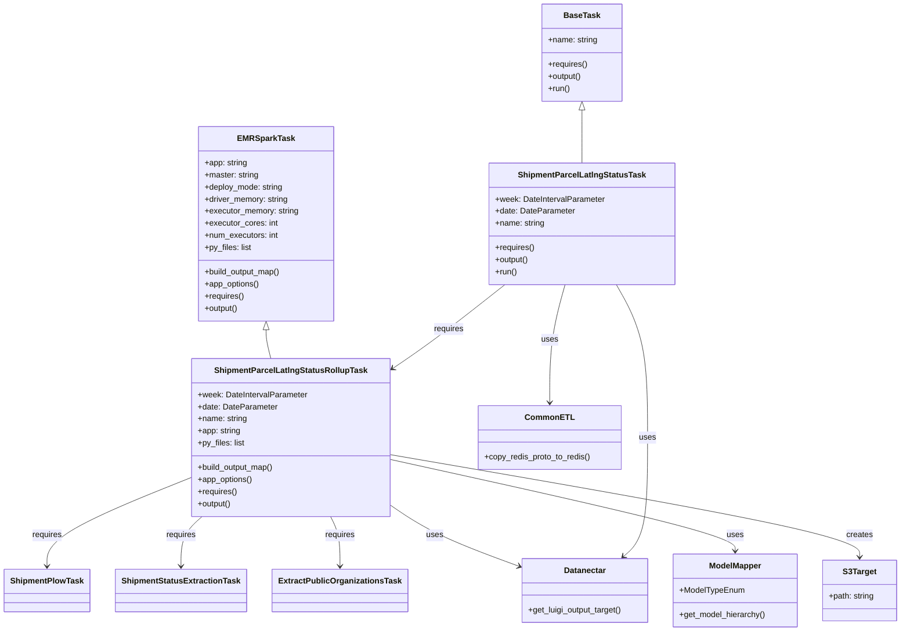
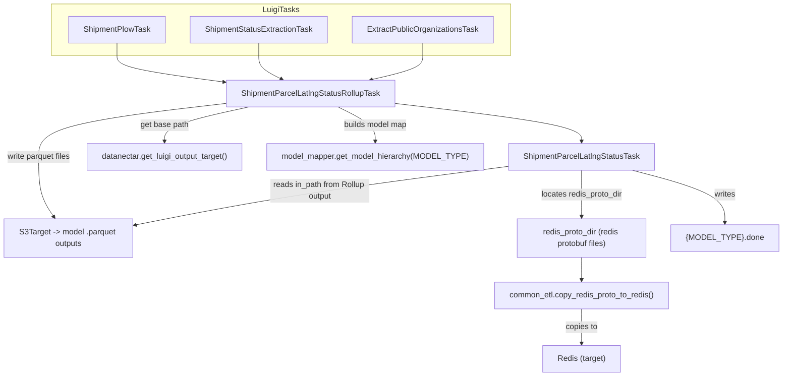

# Diagram: research/orchestrator/tasks/models/shipment_parcel_latlng_status_task.py

> Auto-generated by Obscura crawlers

## Diagram 1

### SVG

<svg id="container" width="1746.56640625" xmlns="http://www.w3.org/2000/svg" class="classDiagram" height="1246" viewBox="0 0 1746.56640625 1246" role="graphics-document document" aria-roledescription="class"><g><defs><marker id="container_class-aggregationStart" class="marker aggregation class" refX="18" refY="7" markerWidth="190" markerHeight="240" orient="auto"><path d="M 18,7 L9,13 L1,7 L9,1 Z"></path></marker></defs><defs><marker id="container_class-aggregationEnd" class="marker aggregation class" refX="1" refY="7" markerWidth="20" markerHeight="28" orient="auto"><path d="M 18,7 L9,13 L1,7 L9,1 Z"></path></marker></defs><defs><marker id="container_class-extensionStart" class="marker extension class" refX="18" refY="7" markerWidth="190" markerHeight="240" orient="auto"><path d="M 1,7 L18,13 V 1 Z"></path></marker></defs><defs><marker id="container_class-extensionEnd" class="marker extension class" refX="1" refY="7" markerWidth="20" markerHeight="28" orient="auto"><path d="M 1,1 V 13 L18,7 Z"></path></marker></defs><defs><marker id="container_class-compositionStart" class="marker composition class" refX="18" refY="7" markerWidth="190" markerHeight="240" orient="auto"><path d="M 18,7 L9,13 L1,7 L9,1 Z"></path></marker></defs><defs><marker id="container_class-compositionEnd" class="marker composition class" refX="1" refY="7" markerWidth="20" markerHeight="28" orient="auto"><path d="M 18,7 L9,13 L1,7 L9,1 Z"></path></marker></defs><defs><marker id="container_class-dependencyStart" class="marker dependency class" refX="6" refY="7" markerWidth="190" markerHeight="240" orient="auto"><path d="M 5,7 L9,13 L1,7 L9,1 Z"></path></marker></defs><defs><marker id="container_class-dependencyEnd" class="marker dependency class" refX="13" refY="7" markerWidth="20" markerHeight="28" orient="auto"><path d="M 18,7 L9,13 L14,7 L9,1 Z"></path></marker></defs><defs><marker id="container_class-lollipopStart" class="marker lollipop class" refX="13" refY="7" markerWidth="190" markerHeight="240" orient="auto"><circle stroke="black" fill="transparent" cx="7" cy="7" r="6"></circle></marker></defs><defs><marker id="container_class-lollipopEnd" class="marker lollipop class" refX="1" refY="7" markerWidth="190" markerHeight="240" orient="auto"><circle stroke="black" fill="transparent" cx="7" cy="7" r="6"></circle></marker></defs><g class="root"><g class="clusters"></g><g class="edgePaths"><path d="M498.332,651.25L498.332,654.542C498.332,657.833,498.332,664.417,499.925,673.875C501.518,683.333,504.703,695.667,506.296,701.833L507.889,708" id="id_EMRSparkTask_ShipmentParcelLatlngStatusRollupTask_1" class="edge-thickness-normal edge-pattern-solid relation" style=";;;" data-edge="true" data-et="edge" data-id="id_EMRSparkTask_ShipmentParcelLatlngStatusRollupTask_1" data-points="W3sieCI6NDk4LjMzMjAzMTI1LCJ5Ijo2MzR9LHsieCI6NDk4LjMzMjAzMTI1LCJ5Ijo2NzF9LHsieCI6NTA3Ljg4OTA2NjU0NzkyNzUsInkiOjcwOH1d" marker-start="url(#container_class-extensionStart)"></path><path d="M1119.861,217.25L1119.861,218.542C1119.861,219.833,1119.861,222.417,1119.861,239.875C1119.861,257.333,1119.861,289.667,1119.861,305.833L1119.861,322" id="id_BaseTask_ShipmentParcelLatlngStatusTask_2" class="edge-thickness-normal edge-pattern-solid relation" style=";;;" data-edge="true" data-et="edge" data-id="id_BaseTask_ShipmentParcelLatlngStatusTask_2" data-points="W3sieCI6MTExOS44NjEzMjgxMjUsInkiOjIwMH0seyJ4IjoxMTE5Ljg2MTMyODEyNSwieSI6MjI1fSx7IngiOjExMTkuODYxMzI4MTI1LCJ5IjozMjJ9XQ==" marker-start="url(#container_class-extensionStart)"></path><path d="M356.316,944.703L311.82,963.419C267.323,982.135,178.329,1019.568,133.833,1048.45C89.336,1077.333,89.336,1097.667,89.336,1107.833L89.336,1118" id="id_ShipmentParcelLatlngStatusRollupTask_ShipmentPlowTask_3" class="edge-thickness-normal edge-pattern-solid relation" style=";;;" data-edge="true" data-et="edge" data-id="id_ShipmentParcelLatlngStatusRollupTask_ShipmentPlowTask_3" data-points="W3sieCI6MzU2LjMxNjQwNjI1LCJ5Ijo5NDQuNzAyOTY2ODQxMTg2N30seyJ4Ijo4OS4zMzU5Mzc1LCJ5IjoxMDU3fSx7IngiOjg5LjMzNTkzNzUsInkiOjExMjR9XQ==" marker-end="url(#container_class-dependencyEnd)"></path><path d="M383.895,1020L377.401,1026.167C370.907,1032.333,357.918,1044.667,351.424,1061C344.93,1077.333,344.93,1097.667,344.93,1107.833L344.93,1118" id="id_ShipmentParcelLatlngStatusRollupTask_ShipmentStatusExtractionTask_4" class="edge-thickness-normal edge-pattern-solid relation" style=";;;" data-edge="true" data-et="edge" data-id="id_ShipmentParcelLatlngStatusRollupTask_ShipmentStatusExtractionTask_4" data-points="W3sieCI6MzgzLjg5NTQ2MjI3MzMxNjA3LCJ5IjoxMDIwfSx7IngiOjM0NC45Mjk2ODc1LCJ5IjoxMDU3fSx7IngiOjM0NC45Mjk2ODc1LCJ5IjoxMTI0fV0=" marker-end="url(#container_class-dependencyEnd)"></path><path d="M627.475,1020L630.609,1026.167C633.744,1032.333,640.012,1044.667,643.147,1061C646.281,1077.333,646.281,1097.667,646.281,1107.833L646.281,1118" id="id_ShipmentParcelLatlngStatusRollupTask_ExtractPublicOrganizationsTask_5" class="edge-thickness-normal edge-pattern-solid relation" style=";;;" data-edge="true" data-et="edge" data-id="id_ShipmentParcelLatlngStatusRollupTask_ExtractPublicOrganizationsTask_5" data-points="W3sieCI6NjI3LjQ3NDk2MzU2ODY1MjgsInkiOjEwMjB9LHsieCI6NjQ2LjI4MTI1LCJ5IjoxMDU3fSx7IngiOjY0Ni4yODEyNSwieSI6MTEyNH1d" marker-end="url(#container_class-dependencyEnd)"></path><path d="M740.051,994.858L755.236,1005.215C770.422,1015.572,800.793,1036.286,842.162,1056.517C883.531,1076.748,935.898,1096.496,962.081,1106.37L988.265,1116.244" id="id_ShipmentParcelLatlngStatusRollupTask_Datanectar_6" class="edge-thickness-normal edge-pattern-solid relation" style=";;;" data-edge="true" data-et="edge" data-id="id_ShipmentParcelLatlngStatusRollupTask_Datanectar_6" data-points="W3sieCI6NzQwLjA1MDc4MTI1LCJ5Ijo5OTQuODU4Mzg1MjEzMjAyMn0seyJ4Ijo4MzEuMTY0MDYyNSwieSI6MTA1N30seyJ4Ijo5OTMuODc4OTA2MjUsInkiOjExMTguMzYwODM1MTkxNTY3fV0=" marker-end="url(#container_class-dependencyEnd)"></path><path d="M740.051,906.512L853.249,931.593C966.447,956.675,1192.842,1006.837,1306.04,1037.085C1419.238,1067.333,1419.238,1077.667,1419.238,1082.833L1419.238,1088" id="id_ShipmentParcelLatlngStatusRollupTask_ModelMapper_7" class="edge-thickness-normal edge-pattern-solid relation" style=";;;" data-edge="true" data-et="edge" data-id="id_ShipmentParcelLatlngStatusRollupTask_ModelMapper_7" data-points="W3sieCI6NzQwLjA1MDc4MTI1LCJ5Ijo5MDYuNTEyMTAzNjgxNzc5NH0seyJ4IjoxNDE5LjIzODI4MTI1LCJ5IjoxMDU3fSx7IngiOjE0MTkuMjM4MjgxMjUsInkiOjEwOTR9XQ==" marker-end="url(#container_class-dependencyEnd)"></path><path d="M740.051,897.15L894.251,923.791C1048.452,950.433,1356.853,1003.717,1511.053,1037.525C1665.254,1071.333,1665.254,1085.667,1665.254,1092.833L1665.254,1100" id="id_ShipmentParcelLatlngStatusRollupTask_S3Target_8" class="edge-thickness-normal edge-pattern-solid relation" style=";;;" data-edge="true" data-et="edge" data-id="id_ShipmentParcelLatlngStatusRollupTask_S3Target_8" data-points="W3sieCI6NzQwLjA1MDc4MTI1LCJ5Ijo4OTcuMTQ5NTQwMTYxNTU1NH0seyJ4IjoxNjY1LjI1MzkwNjI1LCJ5IjoxMDU3fSx7IngiOjE2NjUuMjUzOTA2MjUsInkiOjExMDZ9XQ==" marker-end="url(#container_class-dependencyEnd)"></path><path d="M969.986,562L947.297,580.167C924.607,598.333,879.228,634.667,841.735,662.835C804.241,691.004,774.632,711.009,759.827,721.011L745.022,731.013" id="id_ShipmentParcelLatlngStatusTask_ShipmentParcelLatlngStatusRollupTask_9" class="edge-thickness-normal edge-pattern-solid relation" style=";;;" data-edge="true" data-et="edge" data-id="id_ShipmentParcelLatlngStatusTask_ShipmentParcelLatlngStatusRollupTask_9" data-points="W3sieCI6OTY5Ljk4NjE5MTY2MjExNzksInkiOjU2Mn0seyJ4Ijo4MzMuODQ5NjA5Mzc1LCJ5Ijo2NzF9LHsieCI6NzQwLjA1MDc4MTI1LCJ5Ijo3MzQuMzcxODE0NzY5NDg3NH1d" marker-end="url(#container_class-dependencyEnd)"></path><path d="M1087.246,562L1082.309,580.167C1077.371,598.333,1067.496,634.667,1062.559,673.5C1057.621,712.333,1057.621,753.667,1057.621,774.333L1057.621,795" id="id_ShipmentParcelLatlngStatusTask_CommonETL_10" class="edge-thickness-normal edge-pattern-solid relation" style=";;;" data-edge="true" data-et="edge" data-id="id_ShipmentParcelLatlngStatusTask_CommonETL_10" data-points="W3sieCI6MTA4Ny4yNDYzNTgxNDY4MzQyLCJ5Ijo1NjJ9LHsieCI6MTA1Ny42MjEwOTM3NSwieSI6NjcxfSx7IngiOjEwNTcuNjIxMDkzNzUsInkiOjgwMX1d" marker-end="url(#container_class-dependencyEnd)"></path><path d="M1187.242,562L1197.442,580.167C1207.643,598.333,1228.044,634.667,1238.245,685C1248.445,735.333,1248.445,799.667,1248.445,864C1248.445,928.333,1248.445,992.667,1240.187,1031.852C1231.93,1071.038,1215.414,1085.076,1207.156,1092.095L1198.898,1099.114" id="id_ShipmentParcelLatlngStatusTask_Datanectar_11" class="edge-thickness-normal edge-pattern-solid relation" style=";;;" data-edge="true" data-et="edge" data-id="id_ShipmentParcelLatlngStatusTask_Datanectar_11" data-points="W3sieCI6MTE4Ny4yNDE1ODE5NDU5NjA3LCJ5Ijo1NjJ9LHsieCI6MTI0OC40NDUzMTI1LCJ5Ijo2NzF9LHsieCI6MTI0OC40NDUzMTI1LCJ5Ijo4NjR9LHsieCI6MTI0OC40NDUzMTI1LCJ5IjoxMDU3fSx7IngiOjExOTQuMzI2NDA0ODE2NTEzOCwieSI6MTEwM31d" marker-end="url(#container_class-dependencyEnd)"></path></g><g class="edgeLabels"><g class="edgeLabel"><g class="label" data-id="id_EMRSparkTask_ShipmentParcelLatlngStatusRollupTask_1" transform="translate(0, 0)"><foreignObject width="0" height="0">

</foreignObject></g></g><g class="edgeLabel"><g class="label" data-id="id_BaseTask_ShipmentParcelLatlngStatusTask_2" transform="translate(0, 0)"><foreignObject width="0" height="0">

</foreignObject></g></g><g class="edgeLabel" transform="translate(89.3359375, 1057)"><g class="label" data-id="id_ShipmentParcelLatlngStatusRollupTask_ShipmentPlowTask_3" transform="translate(-29.8515625, -12)"><foreignObject width="59.703125" height="24">

requires

</foreignObject></g></g><g class="edgeLabel" transform="translate(344.9296875, 1057)"><g class="label" data-id="id_ShipmentParcelLatlngStatusRollupTask_ShipmentStatusExtractionTask_4" transform="translate(-29.8515625, -12)"><foreignObject width="59.703125" height="24">

requires

</foreignObject></g></g><g class="edgeLabel" transform="translate(646.28125, 1057)"><g class="label" data-id="id_ShipmentParcelLatlngStatusRollupTask_ExtractPublicOrganizationsTask_5" transform="translate(-29.8515625, -12)"><foreignObject width="59.703125" height="24">

requires

</foreignObject></g></g><g class="edgeLabel" transform="translate(831.1640625, 1057)"><g class="label" data-id="id_ShipmentParcelLatlngStatusRollupTask_Datanectar_6" transform="translate(-16.4921875, -12)"><foreignObject width="32.984375" height="24">

uses

</foreignObject></g></g><g class="edgeLabel" transform="translate(1419.23828125, 1057)"><g class="label" data-id="id_ShipmentParcelLatlngStatusRollupTask_ModelMapper_7" transform="translate(-16.4921875, -12)"><foreignObject width="32.984375" height="24">

uses

</foreignObject></g></g><g class="edgeLabel" transform="translate(1665.25390625, 1057)"><g class="label" data-id="id_ShipmentParcelLatlngStatusRollupTask_S3Target_8" transform="translate(-26.171875, -12)"><foreignObject width="52.34375" height="24">

creates

</foreignObject></g></g><g class="edgeLabel" transform="translate(857.73515, 651.87565)"><g class="label" data-id="id_ShipmentParcelLatlngStatusTask_ShipmentParcelLatlngStatusRollupTask_9" transform="translate(-29.8515625, -12)"><foreignObject width="59.703125" height="24">

requires

</foreignObject></g></g><g class="edgeLabel" transform="translate(1057.62109375, 671)"><g class="label" data-id="id_ShipmentParcelLatlngStatusTask_CommonETL_10" transform="translate(-16.4921875, -12)"><foreignObject width="32.984375" height="24">

uses

</foreignObject></g></g><g class="edgeLabel" transform="translate(1248.4453125, 864)"><g class="label" data-id="id_ShipmentParcelLatlngStatusTask_Datanectar_11" transform="translate(-16.4921875, -12)"><foreignObject width="32.984375" height="24">

uses

</foreignObject></g></g></g><g class="nodes"><g class="node default" id="classId-EMRSparkTask-0" transform="translate(498.33203125, 442)"><g class="basic label-container"><path d="M-132.12890625 -192 L132.12890625 -192 L132.12890625 192 L-132.12890625 192" stroke="none" stroke-width="0" fill="#ECECFF" style=""></path><path d="M-132.12890625 -192 C-75.50529902474653 -192, -18.88169179949307 -192, 132.12890625 -192 M-132.12890625 -192 C-72.11164432604426 -192, -12.094382402088527 -192, 132.12890625 -192 M132.12890625 -192 C132.12890625 -40.27099278709949, 132.12890625 111.45801442580103, 132.12890625 192 M132.12890625 -192 C132.12890625 -76.75197949997913, 132.12890625 38.49604100004174, 132.12890625 192 M132.12890625 192 C44.081883836348496 192, -43.96513857730301 192, -132.12890625 192 M132.12890625 192 C45.917713614197226 192, -40.29347902160555 192, -132.12890625 192 M-132.12890625 192 C-132.12890625 53.81298145689652, -132.12890625 -84.37403708620695, -132.12890625 -192 M-132.12890625 192 C-132.12890625 73.00327530161165, -132.12890625 -45.9934493967767, -132.12890625 -192" stroke="#9370DB" stroke-width="1.3" fill="none" stroke-dasharray="0 0" style=""></path></g><g class="annotation-group text" transform="translate(0, -168)"></g><g class="label-group text" transform="translate(-53.1484375, -168)"><g class="label" style="font-weight: bolder" transform="translate(0,-12)"><foreignObject width="106.296875" height="24">

EMRSparkTask

</foreignObject></g></g><g class="members-group text" transform="translate(-120.12890625, -120)"><g class="label" style="" transform="translate(0,-12)"><foreignObject width="85.171875" height="24">

+app: string

</foreignObject></g><g class="label" style="" transform="translate(0,12)"><foreignObject width="108.03125" height="24">

+master: string

</foreignObject></g><g class="label" style="" transform="translate(0,36)"><foreignObject width="156.4375" height="24">

+deploy_mode: string

</foreignObject></g><g class="label" style="" transform="translate(0,60)"><foreignObject width="167.296875" height="24">

+driver_memory: string

</foreignObject></g><g class="label" style="" transform="translate(0,84)"><foreignObject width="187.109375" height="24">

+executor_memory: string

</foreignObject></g><g class="label" style="" transform="translate(0,108)"><foreignObject width="143.78125" height="24">

+executor_cores: int

</foreignObject></g><g class="label" style="" transform="translate(0,132)"><foreignObject width="146.140625" height="24">

+num_executors: int

</foreignObject></g><g class="label" style="" transform="translate(0,156)"><foreignObject width="93.359375" height="24">

+py_files: list

</foreignObject></g></g><g class="methods-group text" transform="translate(-120.12890625, 96)"><g class="label" style="" transform="translate(0,-12)"><foreignObject width="153.125" height="24">

+build_output_map()

</foreignObject></g><g class="label" style="" transform="translate(0,12)"><foreignObject width="108.84375" height="24">

+app_options()

</foreignObject></g><g class="label" style="" transform="translate(0,36)"><foreignObject width="78.0625" height="24">

+requires()

</foreignObject></g><g class="label" style="" transform="translate(0,60)"><foreignObject width="67.390625" height="24">

+output()

</foreignObject></g></g><g class="divider" style=""><path d="M-132.12890625 -144 C-35.55147220737598 -144, 61.02596183524804 -144, 132.12890625 -144 M-132.12890625 -144 C-41.9692746877172 -144, 48.190356874565595 -144, 132.12890625 -144" stroke="#9370DB" stroke-width="1.3" fill="none" stroke-dasharray="0 0" style=""></path></g><g class="divider" style=""><path d="M-132.12890625 72 C-38.56863726986656 72, 54.99163171026689 72, 132.12890625 72 M-132.12890625 72 C-56.031390585133494 72, 20.066125079733013 72, 132.12890625 72" stroke="#9370DB" stroke-width="1.3" fill="none" stroke-dasharray="0 0" style=""></path></g></g><g class="node default" id="classId-BaseTask-1" transform="translate(1119.861328125, 104)"><g class="basic label-container"><path d="M-78.125 -96 L78.125 -96 L78.125 96 L-78.125 96" stroke="none" stroke-width="0" fill="#ECECFF" style=""></path><path d="M-78.125 -96 C-22.08815366396224 -96, 33.94869267207552 -96, 78.125 -96 M-78.125 -96 C-23.288046685282758 -96, 31.548906629434484 -96, 78.125 -96 M78.125 -96 C78.125 -50.35916265104796, 78.125 -4.71832530209592, 78.125 96 M78.125 -96 C78.125 -47.51374341200554, 78.125 0.9725131759889223, 78.125 96 M78.125 96 C33.237913524967546 96, -11.649172950064909 96, -78.125 96 M78.125 96 C24.550335482697513 96, -29.024329034604975 96, -78.125 96 M-78.125 96 C-78.125 46.33470602184195, -78.125 -3.3305879563160943, -78.125 -96 M-78.125 96 C-78.125 39.13740116619463, -78.125 -17.725197667610743, -78.125 -96" stroke="#9370DB" stroke-width="1.3" fill="none" stroke-dasharray="0 0" style=""></path></g><g class="annotation-group text" transform="translate(0, -72)"></g><g class="label-group text" transform="translate(-34.03125, -72)"><g class="label" style="font-weight: bolder" transform="translate(0,-12)"><foreignObject width="68.0625" height="24">

BaseTask

</foreignObject></g></g><g class="members-group text" transform="translate(-66.125, -24)"><g class="label" style="" transform="translate(0,-12)"><foreignObject width="98.21875" height="24">

+name: string

</foreignObject></g></g><g class="methods-group text" transform="translate(-66.125, 24)"><g class="label" style="" transform="translate(0,-12)"><foreignObject width="78.0625" height="24">

+requires()

</foreignObject></g><g class="label" style="" transform="translate(0,12)"><foreignObject width="67.390625" height="24">

+output()

</foreignObject></g><g class="label" style="" transform="translate(0,36)"><foreignObject width="43.21875" height="24">

+run()

</foreignObject></g></g><g class="divider" style=""><path d="M-78.125 -48 C-34.010236689677626 -48, 10.104526620644748 -48, 78.125 -48 M-78.125 -48 C-21.10918796044694 -48, 35.90662407910612 -48, 78.125 -48" stroke="#9370DB" stroke-width="1.3" fill="none" stroke-dasharray="0 0" style=""></path></g><g class="divider" style=""><path d="M-78.125 0 C-30.674450359048038 0, 16.776099281903925 0, 78.125 0 M-78.125 0 C-43.547689041213594 0, -8.970378082427189 0, 78.125 0" stroke="#9370DB" stroke-width="1.3" fill="none" stroke-dasharray="0 0" style=""></path></g></g><g class="node default" id="classId-ShipmentParcelLatlngStatusRollupTask-2" transform="translate(548.18359375, 864)"><g class="basic label-container"><path d="M-191.8671875 -156 L191.8671875 -156 L191.8671875 156 L-191.8671875 156" stroke="none" stroke-width="0" fill="#ECECFF" style=""></path><path d="M-191.8671875 -156 C-62.28433716386607 -156, 67.29851317226786 -156, 191.8671875 -156 M-191.8671875 -156 C-38.880090701693746 -156, 114.10700609661251 -156, 191.8671875 -156 M191.8671875 -156 C191.8671875 -59.22691943223343, 191.8671875 37.54616113553314, 191.8671875 156 M191.8671875 -156 C191.8671875 -84.41378232243511, 191.8671875 -12.827564644870222, 191.8671875 156 M191.8671875 156 C84.85466438199634 156, -22.157858736007313 156, -191.8671875 156 M191.8671875 156 C80.81416452853234 156, -30.23885844293531 156, -191.8671875 156 M-191.8671875 156 C-191.8671875 64.4186240626664, -191.8671875 -27.162751874667208, -191.8671875 -156 M-191.8671875 156 C-191.8671875 35.77247312904838, -191.8671875 -84.45505374190324, -191.8671875 -156" stroke="#9370DB" stroke-width="1.3" fill="none" stroke-dasharray="0 0" style=""></path></g><g class="annotation-group text" transform="translate(0, -132)"></g><g class="label-group text" transform="translate(-143.703125, -132)"><g class="label" style="font-weight: bolder" transform="translate(0,-12)"><foreignObject width="287.40625" height="24">

ShipmentParcelLatlngStatusRollupTask

</foreignObject></g></g><g class="members-group text" transform="translate(-179.8671875, -84)"><g class="label" style="" transform="translate(0,-12)"><foreignObject width="216.03125" height="24">

+week: DateIntervalParameter

</foreignObject></g><g class="label" style="" transform="translate(0,12)"><foreignObject width="156.015625" height="24">

+date: DateParameter

</foreignObject></g><g class="label" style="" transform="translate(0,36)"><foreignObject width="98.21875" height="24">

+name: string

</foreignObject></g><g class="label" style="" transform="translate(0,60)"><foreignObject width="85.171875" height="24">

+app: string

</foreignObject></g><g class="label" style="" transform="translate(0,84)"><foreignObject width="93.359375" height="24">

+py_files: list

</foreignObject></g></g><g class="methods-group text" transform="translate(-179.8671875, 60)"><g class="label" style="" transform="translate(0,-12)"><foreignObject width="153.125" height="24">

+build_output_map()

</foreignObject></g><g class="label" style="" transform="translate(0,12)"><foreignObject width="108.84375" height="24">

+app_options()

</foreignObject></g><g class="label" style="" transform="translate(0,36)"><foreignObject width="78.0625" height="24">

+requires()

</foreignObject></g><g class="label" style="" transform="translate(0,60)"><foreignObject width="67.390625" height="24">

+output()

</foreignObject></g></g><g class="divider" style=""><path d="M-191.8671875 -108 C-102.8708788109549 -108, -13.874570121909812 -108, 191.8671875 -108 M-191.8671875 -108 C-84.30472164799644 -108, 23.25774420400711 -108, 191.8671875 -108" stroke="#9370DB" stroke-width="1.3" fill="none" stroke-dasharray="0 0" style=""></path></g><g class="divider" style=""><path d="M-191.8671875 36 C-93.05698372315902 36, 5.753220053681957 36, 191.8671875 36 M-191.8671875 36 C-60.038442144469656 36, 71.79030321106069 36, 191.8671875 36" stroke="#9370DB" stroke-width="1.3" fill="none" stroke-dasharray="0 0" style=""></path></g></g><g class="node default" id="classId-ShipmentParcelLatlngStatusTask-3" transform="translate(1119.861328125, 442)"><g class="basic label-container"><path d="M-180.0703125 -120 L180.0703125 -120 L180.0703125 120 L-180.0703125 120" stroke="none" stroke-width="0" fill="#ECECFF" style=""></path><path d="M-180.0703125 -120 C-99.02184324375423 -120, -17.973373987508467 -120, 180.0703125 -120 M-180.0703125 -120 C-85.38239658360217 -120, 9.305519332795654 -120, 180.0703125 -120 M180.0703125 -120 C180.0703125 -30.568510978085456, 180.0703125 58.86297804382909, 180.0703125 120 M180.0703125 -120 C180.0703125 -43.580282337297646, 180.0703125 32.83943532540471, 180.0703125 120 M180.0703125 120 C99.74191970648995 120, 19.413526912979904 120, -180.0703125 120 M180.0703125 120 C98.34759820031803 120, 16.624883900636064 120, -180.0703125 120 M-180.0703125 120 C-180.0703125 36.64949753551561, -180.0703125 -46.701004928968786, -180.0703125 -120 M-180.0703125 120 C-180.0703125 69.57137808369917, -180.0703125 19.142756167398346, -180.0703125 -120" stroke="#9370DB" stroke-width="1.3" fill="none" stroke-dasharray="0 0" style=""></path></g><g class="annotation-group text" transform="translate(0, -96)"></g><g class="label-group text" transform="translate(-120.109375, -96)"><g class="label" style="font-weight: bolder" transform="translate(0,-12)"><foreignObject width="240.21875" height="24">

ShipmentParcelLatlngStatusTask

</foreignObject></g></g><g class="members-group text" transform="translate(-168.0703125, -48)"><g class="label" style="" transform="translate(0,-12)"><foreignObject width="216.03125" height="24">

+week: DateIntervalParameter

</foreignObject></g><g class="label" style="" transform="translate(0,12)"><foreignObject width="156.015625" height="24">

+date: DateParameter

</foreignObject></g><g class="label" style="" transform="translate(0,36)"><foreignObject width="98.21875" height="24">

+name: string

</foreignObject></g></g><g class="methods-group text" transform="translate(-168.0703125, 48)"><g class="label" style="" transform="translate(0,-12)"><foreignObject width="78.0625" height="24">

+requires()

</foreignObject></g><g class="label" style="" transform="translate(0,12)"><foreignObject width="67.390625" height="24">

+output()

</foreignObject></g><g class="label" style="" transform="translate(0,36)"><foreignObject width="43.21875" height="24">

+run()

</foreignObject></g></g><g class="divider" style=""><path d="M-180.0703125 -72 C-60.8641995296591 -72, 58.34191344068179 -72, 180.0703125 -72 M-180.0703125 -72 C-87.88480233850723 -72, 4.300707822985544 -72, 180.0703125 -72" stroke="#9370DB" stroke-width="1.3" fill="none" stroke-dasharray="0 0" style=""></path></g><g class="divider" style=""><path d="M-180.0703125 24 C-96.24969367056258 24, -12.429074841125157 24, 180.0703125 24 M-180.0703125 24 C-43.557763585961055 24, 92.95478532807789 24, 180.0703125 24" stroke="#9370DB" stroke-width="1.3" fill="none" stroke-dasharray="0 0" style=""></path></g></g><g class="node default" id="classId-ShipmentPlowTask-4" transform="translate(89.3359375, 1166)"><g class="basic label-container"><path d="M-81.3359375 -42 L81.3359375 -42 L81.3359375 42 L-81.3359375 42" stroke="none" stroke-width="0" fill="#ECECFF" style=""></path><path d="M-81.3359375 -42 C-48.76496551092639 -42, -16.193993521852775 -42, 81.3359375 -42 M-81.3359375 -42 C-35.05516820832607 -42, 11.225601083347854 -42, 81.3359375 -42 M81.3359375 -42 C81.3359375 -24.638847578418783, 81.3359375 -7.2776951568375665, 81.3359375 42 M81.3359375 -42 C81.3359375 -9.619962555597581, 81.3359375 22.760074888804837, 81.3359375 42 M81.3359375 42 C42.806501042168875 42, 4.277064584337751 42, -81.3359375 42 M81.3359375 42 C22.71471740263717 42, -35.90650269472566 42, -81.3359375 42 M-81.3359375 42 C-81.3359375 20.226033726082022, -81.3359375 -1.5479325478359556, -81.3359375 -42 M-81.3359375 42 C-81.3359375 19.478662010554075, -81.3359375 -3.0426759788918503, -81.3359375 -42" stroke="#9370DB" stroke-width="1.3" fill="none" stroke-dasharray="0 0" style=""></path></g><g class="annotation-group text" transform="translate(0, -18)"></g><g class="label-group text" transform="translate(-69.3359375, -18)"><g class="label" style="font-weight: bolder" transform="translate(0,-12)"><foreignObject width="138.671875" height="24">

ShipmentPlowTask

</foreignObject></g></g><g class="members-group text" transform="translate(-69.3359375, 30)"></g><g class="methods-group text" transform="translate(-69.3359375, 60)"></g><g class="divider" style=""><path d="M-81.3359375 6 C-30.971108795681268 6, 19.393719908637465 6, 81.3359375 6 M-81.3359375 6 C-44.73143061633269 6, -8.126923732665375 6, 81.3359375 6" stroke="#9370DB" stroke-width="1.3" fill="none" stroke-dasharray="0 0" style=""></path></g><g class="divider" style=""><path d="M-81.3359375 24 C-17.312653115781487 24, 46.71063126843703 24, 81.3359375 24 M-81.3359375 24 C-37.93923073798685 24, 5.457476024026306 24, 81.3359375 24" stroke="#9370DB" stroke-width="1.3" fill="none" stroke-dasharray="0 0" style=""></path></g></g><g class="node default" id="classId-ShipmentStatusExtractionTask-5" transform="translate(344.9296875, 1166)"><g class="basic label-container"><path d="M-124.2578125 -42 L124.2578125 -42 L124.2578125 42 L-124.2578125 42" stroke="none" stroke-width="0" fill="#ECECFF" style=""></path><path d="M-124.2578125 -42 C-53.29945144634729 -42, 17.658909607305418 -42, 124.2578125 -42 M-124.2578125 -42 C-65.98298558872963 -42, -7.708158677459252 -42, 124.2578125 -42 M124.2578125 -42 C124.2578125 -24.85070991139461, 124.2578125 -7.701419822789219, 124.2578125 42 M124.2578125 -42 C124.2578125 -11.083632064861696, 124.2578125 19.832735870276608, 124.2578125 42 M124.2578125 42 C42.249270297028744 42, -39.75927190594251 42, -124.2578125 42 M124.2578125 42 C48.677977229249365 42, -26.90185804150127 42, -124.2578125 42 M-124.2578125 42 C-124.2578125 20.331834100560478, -124.2578125 -1.3363317988790442, -124.2578125 -42 M-124.2578125 42 C-124.2578125 24.08626950632893, -124.2578125 6.172539012657857, -124.2578125 -42" stroke="#9370DB" stroke-width="1.3" fill="none" stroke-dasharray="0 0" style=""></path></g><g class="annotation-group text" transform="translate(0, -18)"></g><g class="label-group text" transform="translate(-112.2578125, -18)"><g class="label" style="font-weight: bolder" transform="translate(0,-12)"><foreignObject width="224.515625" height="24">

ShipmentStatusExtractionTask

</foreignObject></g></g><g class="members-group text" transform="translate(-112.2578125, 30)"></g><g class="methods-group text" transform="translate(-112.2578125, 60)"></g><g class="divider" style=""><path d="M-124.2578125 6 C-59.25579018048448 6, 5.7462321390310365 6, 124.2578125 6 M-124.2578125 6 C-37.34308931508616 6, 49.57163386982768 6, 124.2578125 6" stroke="#9370DB" stroke-width="1.3" fill="none" stroke-dasharray="0 0" style=""></path></g><g class="divider" style=""><path d="M-124.2578125 24 C-55.98959822172117 24, 12.278616056557667 24, 124.2578125 24 M-124.2578125 24 C-57.93150768087756 24, 8.394797138244883 24, 124.2578125 24" stroke="#9370DB" stroke-width="1.3" fill="none" stroke-dasharray="0 0" style=""></path></g></g><g class="node default" id="classId-ExtractPublicOrganizationsTask-6" transform="translate(646.28125, 1166)"><g class="basic label-container"><path d="M-127.09375 -42 L127.09375 -42 L127.09375 42 L-127.09375 42" stroke="none" stroke-width="0" fill="#ECECFF" style=""></path><path d="M-127.09375 -42 C-44.00375599688786 -42, 39.08623800622428 -42, 127.09375 -42 M-127.09375 -42 C-30.91775351158148 -42, 65.25824297683704 -42, 127.09375 -42 M127.09375 -42 C127.09375 -13.879519760196306, 127.09375 14.240960479607388, 127.09375 42 M127.09375 -42 C127.09375 -15.239440853120023, 127.09375 11.521118293759955, 127.09375 42 M127.09375 42 C40.173328984192295 42, -46.74709203161541 42, -127.09375 42 M127.09375 42 C28.39336694016599 42, -70.30701611966802 42, -127.09375 42 M-127.09375 42 C-127.09375 11.398665908098973, -127.09375 -19.202668183802054, -127.09375 -42 M-127.09375 42 C-127.09375 21.760860719897078, -127.09375 1.521721439794156, -127.09375 -42" stroke="#9370DB" stroke-width="1.3" fill="none" stroke-dasharray="0 0" style=""></path></g><g class="annotation-group text" transform="translate(0, -18)"></g><g class="label-group text" transform="translate(-115.09375, -18)"><g class="label" style="font-weight: bolder" transform="translate(0,-12)"><foreignObject width="230.1875" height="24">

ExtractPublicOrganizationsTask

</foreignObject></g></g><g class="members-group text" transform="translate(-115.09375, 30)"></g><g class="methods-group text" transform="translate(-115.09375, 60)"></g><g class="divider" style=""><path d="M-127.09375 6 C-31.985603890524757 6, 63.122542218950485 6, 127.09375 6 M-127.09375 6 C-51.72496397518131 6, 23.64382204963738 6, 127.09375 6" stroke="#9370DB" stroke-width="1.3" fill="none" stroke-dasharray="0 0" style=""></path></g><g class="divider" style=""><path d="M-127.09375 24 C-48.96403251212163 24, 29.165684975756733 24, 127.09375 24 M-127.09375 24 C-42.921280064298074 24, 41.25118987140385 24, 127.09375 24" stroke="#9370DB" stroke-width="1.3" fill="none" stroke-dasharray="0 0" style=""></path></g></g><g class="node default" id="classId-S3Target-7" transform="translate(1665.25390625, 1166)"><g class="basic label-container"><path d="M-73.3125 -60 L73.3125 -60 L73.3125 60 L-73.3125 60" stroke="none" stroke-width="0" fill="#ECECFF" style=""></path><path d="M-73.3125 -60 C-18.104867226926515 -60, 37.10276554614697 -60, 73.3125 -60 M-73.3125 -60 C-17.058291600234774 -60, 39.19591679953045 -60, 73.3125 -60 M73.3125 -60 C73.3125 -23.616426696708963, 73.3125 12.767146606582074, 73.3125 60 M73.3125 -60 C73.3125 -22.515436811180592, 73.3125 14.969126377638815, 73.3125 60 M73.3125 60 C35.69050082869181 60, -1.9314983426163792 60, -73.3125 60 M73.3125 60 C18.432155198217508 60, -36.448189603564984 60, -73.3125 60 M-73.3125 60 C-73.3125 35.30322099051985, -73.3125 10.606441981039694, -73.3125 -60 M-73.3125 60 C-73.3125 23.179905349147788, -73.3125 -13.640189301704424, -73.3125 -60" stroke="#9370DB" stroke-width="1.3" fill="none" stroke-dasharray="0 0" style=""></path></g><g class="annotation-group text" transform="translate(0, -36)"></g><g class="label-group text" transform="translate(-31.71875, -36)"><g class="label" style="font-weight: bolder" transform="translate(0,-12)"><foreignObject width="63.4375" height="24">

S3Target

</foreignObject></g></g><g class="members-group text" transform="translate(-61.3125, 12)"><g class="label" style="" transform="translate(0,-12)"><foreignObject width="90.90625" height="24">

+path: string

</foreignObject></g></g><g class="methods-group text" transform="translate(-61.3125, 60)"></g><g class="divider" style=""><path d="M-73.3125 -12 C-22.08101886921385 -12, 29.1504622615723 -12, 73.3125 -12 M-73.3125 -12 C-28.147999008695095 -12, 17.01650198260981 -12, 73.3125 -12" stroke="#9370DB" stroke-width="1.3" fill="none" stroke-dasharray="0 0" style=""></path></g><g class="divider" style=""><path d="M-73.3125 36 C-22.601269844612773 36, 28.109960310774454 36, 73.3125 36 M-73.3125 36 C-36.886975085946 36, -0.4614501718919968 36, 73.3125 36" stroke="#9370DB" stroke-width="1.3" fill="none" stroke-dasharray="0 0" style=""></path></g></g><g class="node default" id="classId-Datanectar-8" transform="translate(1120.20703125, 1166)"><g class="basic label-container"><path d="M-126.328125 -63 L126.328125 -63 L126.328125 63 L-126.328125 63" stroke="none" stroke-width="0" fill="#ECECFF" style=""></path><path d="M-126.328125 -63 C-65.07417148797232 -63, -3.8202179759446437 -63, 126.328125 -63 M-126.328125 -63 C-67.13435039718502 -63, -7.940575794370048 -63, 126.328125 -63 M126.328125 -63 C126.328125 -25.36994497473239, 126.328125 12.260110050535218, 126.328125 63 M126.328125 -63 C126.328125 -28.203396027521656, 126.328125 6.5932079449566885, 126.328125 63 M126.328125 63 C32.26594948730951 63, -61.796226025380975 63, -126.328125 63 M126.328125 63 C57.63487937622715 63, -11.058366247545706 63, -126.328125 63 M-126.328125 63 C-126.328125 14.529973818426022, -126.328125 -33.940052363147956, -126.328125 -63 M-126.328125 63 C-126.328125 28.498827096025472, -126.328125 -6.002345807949055, -126.328125 -63" stroke="#9370DB" stroke-width="1.3" fill="none" stroke-dasharray="0 0" style=""></path></g><g class="annotation-group text" transform="translate(0, -39)"></g><g class="label-group text" transform="translate(-40.34375, -39)"><g class="label" style="font-weight: bolder" transform="translate(0,-12)"><foreignObject width="80.6875" height="24">

Datanectar

</foreignObject></g></g><g class="members-group text" transform="translate(-114.328125, 9)"></g><g class="methods-group text" transform="translate(-114.328125, 39)"><g class="label" style="" transform="translate(0,-12)"><foreignObject width="188.3125" height="24">

+get_luigi_output_target()

</foreignObject></g></g><g class="divider" style=""><path d="M-126.328125 -15 C-73.36715000819245 -15, -20.40617501638492 -15, 126.328125 -15 M-126.328125 -15 C-68.95080107257289 -15, -11.573477145145773 -15, 126.328125 -15" stroke="#9370DB" stroke-width="1.3" fill="none" stroke-dasharray="0 0" style=""></path></g><g class="divider" style=""><path d="M-126.328125 9 C-71.01792729714515 9, -15.7077295942903 9, 126.328125 9 M-126.328125 9 C-65.15081667876484 9, -3.9735083575296954 9, 126.328125 9" stroke="#9370DB" stroke-width="1.3" fill="none" stroke-dasharray="0 0" style=""></path></g></g><g class="node default" id="classId-ModelMapper-9" transform="translate(1419.23828125, 1166)"><g class="basic label-container"><path d="M-122.703125 -72 L122.703125 -72 L122.703125 72 L-122.703125 72" stroke="none" stroke-width="0" fill="#ECECFF" style=""></path><path d="M-122.703125 -72 C-54.438367770375294 -72, 13.826389459249413 -72, 122.703125 -72 M-122.703125 -72 C-69.46695218108277 -72, -16.23077936216555 -72, 122.703125 -72 M122.703125 -72 C122.703125 -19.621512392471715, 122.703125 32.75697521505657, 122.703125 72 M122.703125 -72 C122.703125 -23.206387574686495, 122.703125 25.58722485062701, 122.703125 72 M122.703125 72 C27.310453162758236 72, -68.08221867448353 72, -122.703125 72 M122.703125 72 C37.856321639156945 72, -46.99048172168611 72, -122.703125 72 M-122.703125 72 C-122.703125 19.790945918971147, -122.703125 -32.418108162057706, -122.703125 -72 M-122.703125 72 C-122.703125 38.81189420869615, -122.703125 5.623788417392305, -122.703125 -72" stroke="#9370DB" stroke-width="1.3" fill="none" stroke-dasharray="0 0" style=""></path></g><g class="annotation-group text" transform="translate(0, -48)"></g><g class="label-group text" transform="translate(-50.40625, -48)"><g class="label" style="font-weight: bolder" transform="translate(0,-12)"><foreignObject width="100.8125" height="24">

ModelMapper

</foreignObject></g></g><g class="members-group text" transform="translate(-110.703125, 0)"><g class="label" style="" transform="translate(0,-12)"><foreignObject width="127.28125" height="24">

+ModelTypeEnum

</foreignObject></g></g><g class="methods-group text" transform="translate(-110.703125, 48)"><g class="label" style="" transform="translate(0,-12)"><foreignObject width="171" height="24">

+get_model_hierarchy()

</foreignObject></g></g><g class="divider" style=""><path d="M-122.703125 -24 C-66.92893083822955 -24, -11.15473667645908 -24, 122.703125 -24 M-122.703125 -24 C-34.20616707471876 -24, 54.29079085056247 -24, 122.703125 -24" stroke="#9370DB" stroke-width="1.3" fill="none" stroke-dasharray="0 0" style=""></path></g><g class="divider" style=""><path d="M-122.703125 24 C-47.54212123621744 24, 27.61888252756512 24, 122.703125 24 M-122.703125 24 C-72.86199034935842 24, -23.020855698716844 24, 122.703125 24" stroke="#9370DB" stroke-width="1.3" fill="none" stroke-dasharray="0 0" style=""></path></g></g><g class="node default" id="classId-CommonETL-10" transform="translate(1057.62109375, 864)"><g class="basic label-container"><path d="M-139.33203125 -63 L139.33203125 -63 L139.33203125 63 L-139.33203125 63" stroke="none" stroke-width="0" fill="#ECECFF" style=""></path><path d="M-139.33203125 -63 C-82.09682955368106 -63, -24.861627857362123 -63, 139.33203125 -63 M-139.33203125 -63 C-70.56766436918154 -63, -1.8032974883630857 -63, 139.33203125 -63 M139.33203125 -63 C139.33203125 -29.059546021343984, 139.33203125 4.880907957312033, 139.33203125 63 M139.33203125 -63 C139.33203125 -14.204410448268625, 139.33203125 34.59117910346275, 139.33203125 63 M139.33203125 63 C36.61034802125182 63, -66.11133520749635 63, -139.33203125 63 M139.33203125 63 C57.30390534446144 63, -24.724220561077118 63, -139.33203125 63 M-139.33203125 63 C-139.33203125 32.99265198833916, -139.33203125 2.985303976678317, -139.33203125 -63 M-139.33203125 63 C-139.33203125 12.952887128933945, -139.33203125 -37.09422574213211, -139.33203125 -63" stroke="#9370DB" stroke-width="1.3" fill="none" stroke-dasharray="0 0" style=""></path></g><g class="annotation-group text" transform="translate(0, -39)"></g><g class="label-group text" transform="translate(-44.5546875, -39)"><g class="label" style="font-weight: bolder" transform="translate(0,-12)"><foreignObject width="89.109375" height="24">

CommonETL

</foreignObject></g></g><g class="members-group text" transform="translate(-127.33203125, 9)"></g><g class="methods-group text" transform="translate(-127.33203125, 39)"><g class="label" style="" transform="translate(0,-12)"><foreignObject width="210.109375" height="24">

+copy_redis_proto_to_redis()

</foreignObject></g></g><g class="divider" style=""><path d="M-139.33203125 -15 C-48.16062805653624 -15, 43.01077513692752 -15, 139.33203125 -15 M-139.33203125 -15 C-61.97940671547897 -15, 15.373217819042054 -15, 139.33203125 -15" stroke="#9370DB" stroke-width="1.3" fill="none" stroke-dasharray="0 0" style=""></path></g><g class="divider" style=""><path d="M-139.33203125 9 C-30.272435285054854 9, 78.78716067989029 9, 139.33203125 9 M-139.33203125 9 C-80.18479603702951 9, -21.037560824059028 9, 139.33203125 9" stroke="#9370DB" stroke-width="1.3" fill="none" stroke-dasharray="0 0" style=""></path></g></g></g></g></g></svg>

## Diagram 2

### SVG

<svg id="container" width="1568.59375" xmlns="http://www.w3.org/2000/svg" class="flowchart" height="760" viewBox="0 0 1568.59375 760" role="graphics-document document" aria-roledescription="flowchart-v2"><g><marker id="container_flowchart-v2-pointEnd" class="marker flowchart-v2" viewBox="0 0 10 10" refX="5" refY="5" markerUnits="userSpaceOnUse" markerWidth="8" markerHeight="8" orient="auto"><path d="M 0 0 L 10 5 L 0 10 z" class="arrowMarkerPath" style="stroke-width: 1; stroke-dasharray: 1, 0;"></path></marker><marker id="container_flowchart-v2-pointStart" class="marker flowchart-v2" viewBox="0 0 10 10" refX="4.5" refY="5" markerUnits="userSpaceOnUse" markerWidth="8" markerHeight="8" orient="auto"><path d="M 0 5 L 10 10 L 10 0 z" class="arrowMarkerPath" style="stroke-width: 1; stroke-dasharray: 1, 0;"></path></marker><marker id="container_flowchart-v2-circleEnd" class="marker flowchart-v2" viewBox="0 0 10 10" refX="11" refY="5" markerUnits="userSpaceOnUse" markerWidth="11" markerHeight="11" orient="auto"><circle cx="5" cy="5" r="5" class="arrowMarkerPath" style="stroke-width: 1; stroke-dasharray: 1, 0;"></circle></marker><marker id="container_flowchart-v2-circleStart" class="marker flowchart-v2" viewBox="0 0 10 10" refX="-1" refY="5" markerUnits="userSpaceOnUse" markerWidth="11" markerHeight="11" orient="auto"><circle cx="5" cy="5" r="5" class="arrowMarkerPath" style="stroke-width: 1; stroke-dasharray: 1, 0;"></circle></marker><marker id="container_flowchart-v2-crossEnd" class="marker cross flowchart-v2" viewBox="0 0 11 11" refX="12" refY="5.2" markerUnits="userSpaceOnUse" markerWidth="11" markerHeight="11" orient="auto"><path d="M 1,1 l 9,9 M 10,1 l -9,9" class="arrowMarkerPath" style="stroke-width: 2; stroke-dasharray: 1, 0;"></path></marker><marker id="container_flowchart-v2-crossStart" class="marker cross flowchart-v2" viewBox="0 0 11 11" refX="-1" refY="5.2" markerUnits="userSpaceOnUse" markerWidth="11" markerHeight="11" orient="auto"><path d="M 1,1 l 9,9 M 10,1 l -9,9" class="arrowMarkerPath" style="stroke-width: 2; stroke-dasharray: 1, 0;"></path></marker><g class="root"><g class="clusters"><g class="cluster" id="LuigiTasks" data-look="classic"><rect style="" x="109.03125" y="8" width="931.65625" height="104"></rect><g class="cluster-label" transform="translate(538.125, 8)"><foreignObject width="73.46875" height="24">

LuigiTasks

</foreignObject></g></g></g><g class="edgePaths"><path d="M242,87L242,91.167C242,95.333,242,103.667,242,112C242,120.333,242,128.667,277.835,137.611C313.671,146.556,385.341,156.111,421.176,160.889L457.012,165.667" id="L_Plow_Rollup_0" class="edge-thickness-normal edge-pattern-solid edge-thickness-normal edge-pattern-solid flowchart-link" style=";" data-edge="true" data-et="edge" data-id="L_Plow_Rollup_0" data-points="W3sieCI6MjQyLCJ5Ijo4N30seyJ4IjoyNDIsInkiOjExMn0seyJ4IjoyNDIsInkiOjEzN30seyJ4Ijo0NjAuOTc2NTYyNSwieSI6MTY2LjE5NTcwNTMwMDI2ODQzfV0=" marker-end="url(#container_flowchart-v2-pointEnd)"></path><path d="M530.023,87L530.023,91.167C530.023,95.333,530.023,103.667,530.023,112C530.023,120.333,530.023,128.667,537.602,136.697C545.18,144.728,560.338,152.455,567.916,156.319L575.495,160.183" id="L_Status_Rollup_0" class="edge-thickness-normal edge-pattern-solid edge-thickness-normal edge-pattern-solid flowchart-link" style=";" data-edge="true" data-et="edge" data-id="L_Status_Rollup_0" data-points="W3sieCI6NTMwLjAyMzQzNzUsInkiOjg3fSx7IngiOjUzMC4wMjM0Mzc1LCJ5IjoxMTJ9LHsieCI6NTMwLjAyMzQzNzUsInkiOjEzN30seyJ4Ijo1NzkuMDU4MTQzMDI4ODQ2MiwieSI6MTYyfV0=" marker-end="url(#container_flowchart-v2-pointEnd)"></path><path d="M862.883,87L862.883,91.167C862.883,95.333,862.883,103.667,862.883,112C862.883,120.333,862.883,128.667,845.034,136.854C827.186,145.04,791.488,153.081,773.64,157.101L755.791,161.121" id="L_Org_Rollup_0" class="edge-thickness-normal edge-pattern-solid edge-thickness-normal edge-pattern-solid flowchart-link" style=";" data-edge="true" data-et="edge" data-id="L_Org_Rollup_0" data-points="W3sieCI6ODYyLjg4MjgxMjUsInkiOjg3fSx7IngiOjg2Mi44ODI4MTI1LCJ5IjoxMTJ9LHsieCI6ODYyLjg4MjgxMjUsInkiOjEzN30seyJ4Ijo3NTEuODg4OTcyMzU1NzY5MywieSI6MTYyfV0=" marker-end="url(#container_flowchart-v2-pointEnd)"></path><path d="M508.756,216L480.604,222.167C452.452,228.333,396.148,240.667,367.996,252.333C339.844,264,339.844,275,339.844,280.5L339.844,286" id="L_Rollup_Datanectar_0" class="edge-thickness-normal edge-pattern-solid edge-thickness-normal edge-pattern-solid flowchart-link" style=";" data-edge="true" data-et="edge" data-id="L_Rollup_Datanectar_0" data-points="W3sieCI6NTA4Ljc1NTYxNTIzNDM3NSwieSI6MjE2fSx7IngiOjMzOS44NDM3NSwieSI6MjUzfSx7IngiOjMzOS44NDM3NSwieSI6MjkwfV0=" marker-end="url(#container_flowchart-v2-pointEnd)"></path><path d="M688.135,216L700.952,222.167C713.77,228.333,739.404,240.667,752.222,252.333C765.039,264,765.039,275,765.039,280.5L765.039,286" id="L_Rollup_ModelMapper_0" class="edge-thickness-normal edge-pattern-solid edge-thickness-normal edge-pattern-solid flowchart-link" style=";" data-edge="true" data-et="edge" data-id="L_Rollup_ModelMapper_0" data-points="W3sieCI6Njg4LjEzNDg4NzY5NTMxMjUsInkiOjIxNn0seyJ4Ijo3NjUuMDM5MDYyNSwieSI6MjUzfSx7IngiOjc2NS4wMzkwNjI1LCJ5IjoyOTB9XQ==" marker-end="url(#container_flowchart-v2-pointEnd)"></path><path d="M460.977,208.758L397.147,216.132C333.318,223.506,205.659,238.253,141.829,256.293C78,274.333,78,295.667,78,319C78,342.333,78,367.667,83.193,387.949C88.385,408.232,98.77,423.463,103.963,431.079L109.156,438.695" id="L_Rollup_S3_0" class="edge-thickness-normal edge-pattern-solid edge-thickness-normal edge-pattern-solid flowchart-link" style=";" data-edge="true" data-et="edge" data-id="L_Rollup_S3_0" data-points="W3sieCI6NDYwLjk3NjU2MjUsInkiOjIwOC43NTg0NjgwMDM0OTcyfSx7IngiOjc4LCJ5IjoyNTN9LHsieCI6NzgsInkiOjMxN30seyJ4Ijo3OCwieSI6MzkzfSx7IngiOjExMS40MDkwOTA5MDkwOTA5LCJ5Ijo0NDJ9XQ==" marker-end="url(#container_flowchart-v2-pointEnd)"></path><path d="M803.055,209.088L865.371,216.406C927.688,223.725,1052.32,238.363,1114.637,251.181C1176.953,264,1176.953,275,1176.953,280.5L1176.953,286" id="L_Rollup_Final_0" class="edge-thickness-normal edge-pattern-solid edge-thickness-normal edge-pattern-solid flowchart-link" style=";" data-edge="true" data-et="edge" data-id="L_Rollup_Final_0" data-points="W3sieCI6ODAzLjA1NDY4NzUsInkiOjIwOS4wODc2MjQ3Mjc2MDYzN30seyJ4IjoxMTc2Ljk1MzEyNSwieSI6MjUzfSx7IngiOjExNzYuOTUzMTI1LCJ5IjoyOTB9XQ==" marker-end="url(#container_flowchart-v2-pointEnd)"></path><path d="M1029.406,335.963L955.441,345.469C881.475,354.975,733.544,373.988,607.297,393.772C481.05,413.557,376.488,434.114,324.206,444.392L271.925,454.671" id="L_Final_S3_0" class="edge-thickness-normal edge-pattern-solid edge-thickness-normal edge-pattern-solid flowchart-link" style=";" data-edge="true" data-et="edge" data-id="L_Final_S3_0" data-points="W3sieCI6MTAyOS40MDYyNSwieSI6MzM1Ljk2Mjk3NDcwNjUzOTA2fSx7IngiOjU4NS42MTMyODEyNSwieSI6MzkzfSx7IngiOjI2OCwieSI6NDU1LjQ0MjIyMzk0ODE5NzQ3fV0=" marker-end="url(#container_flowchart-v2-pointEnd)"></path><path d="M1176.953,344L1176.953,352.167C1176.953,360.333,1176.953,376.667,1176.953,392.333C1176.953,408,1176.953,423,1176.953,430.5L1176.953,438" id="L_Final_RedisProto_0" class="edge-thickness-normal edge-pattern-solid edge-thickness-normal edge-pattern-solid flowchart-link" style=";" data-edge="true" data-et="edge" data-id="L_Final_RedisProto_0" data-points="W3sieCI6MTE3Ni45NTMxMjUsInkiOjM0NH0seyJ4IjoxMTc2Ljk1MzEyNSwieSI6MzkzfSx7IngiOjExNzYuOTUzMTI1LCJ5Ijo0NDJ9XQ==" marker-end="url(#container_flowchart-v2-pointEnd)"></path><path d="M1176.953,520L1176.953,524.167C1176.953,528.333,1176.953,536.667,1176.953,544.333C1176.953,552,1176.953,559,1176.953,562.5L1176.953,566" id="L_RedisProto_CommonETL_0" class="edge-thickness-normal edge-pattern-solid edge-thickness-normal edge-pattern-solid flowchart-link" style=";" data-edge="true" data-et="edge" data-id="L_RedisProto_CommonETL_0" data-points="W3sieCI6MTE3Ni45NTMxMjUsInkiOjUyMH0seyJ4IjoxMTc2Ljk1MzEyNSwieSI6NTQ1fSx7IngiOjExNzYuOTUzMTI1LCJ5Ijo1NzB9XQ==" marker-end="url(#container_flowchart-v2-pointEnd)"></path><path d="M1176.953,624L1176.953,630.167C1176.953,636.333,1176.953,648.667,1176.953,660.333C1176.953,672,1176.953,683,1176.953,688.5L1176.953,694" id="L_CommonETL_Redis_0" class="edge-thickness-normal edge-pattern-solid edge-thickness-normal edge-pattern-solid flowchart-link" style=";" data-edge="true" data-et="edge" data-id="L_CommonETL_Redis_0" data-points="W3sieCI6MTE3Ni45NTMxMjUsInkiOjYyNH0seyJ4IjoxMTc2Ljk1MzEyNSwieSI6NjYxfSx7IngiOjExNzYuOTUzMTI1LCJ5Ijo2OTh9XQ==" marker-end="url(#container_flowchart-v2-pointEnd)"></path><path d="M1277.073,344L1307.357,352.167C1337.64,360.333,1398.207,376.667,1428.49,394.333C1458.773,412,1458.773,431,1458.773,440.5L1458.773,450" id="L_Final_DoneFile_0" class="edge-thickness-normal edge-pattern-solid edge-thickness-normal edge-pattern-solid flowchart-link" style=";" data-edge="true" data-et="edge" data-id="L_Final_DoneFile_0" data-points="W3sieCI6MTI3Ny4wNzM0OTkxNzc2MzE3LCJ5IjozNDR9LHsieCI6MTQ1OC43NzM0Mzc1LCJ5IjozOTN9LHsieCI6MTQ1OC43NzM0Mzc1LCJ5Ijo0NTR9XQ==" marker-end="url(#container_flowchart-v2-pointEnd)"></path></g><g class="edgeLabels"><g class="edgeLabel"><g class="label" data-id="L_Plow_Rollup_0" transform="translate(0, 0)"><foreignObject width="0" height="0">

</foreignObject></g></g><g class="edgeLabel"><g class="label" data-id="L_Status_Rollup_0" transform="translate(0, 0)"><foreignObject width="0" height="0">

</foreignObject></g></g><g class="edgeLabel"><g class="label" data-id="L_Org_Rollup_0" transform="translate(0, 0)"><foreignObject width="0" height="0">

</foreignObject></g></g><g class="edgeLabel" transform="translate(339.84375, 253)"><g class="label" data-id="L_Rollup_Datanectar_0" transform="translate(-49.1640625, -12)"><foreignObject width="98.328125" height="24">

get base path

</foreignObject></g></g><g class="edgeLabel" transform="translate(765.0390625, 253)"><g class="label" data-id="L_Rollup_ModelMapper_0" transform="translate(-65.7109375, -12)"><foreignObject width="131.421875" height="24">

builds model map

</foreignObject></g></g><g class="edgeLabel" transform="translate(78, 317)"><g class="label" data-id="L_Rollup_S3_0" transform="translate(-66.015625, -12)"><foreignObject width="132.03125" height="24">

write parquet files

</foreignObject></g></g><g class="edgeLabel"><g class="label" data-id="L_Rollup_Final_0" transform="translate(0, 0)"><foreignObject width="0" height="0">

</foreignObject></g></g><g class="edgeLabel" transform="translate(646.98355, 385.11259)"><g class="label" data-id="L_Final_S3_0" transform="translate(-100, -24)"><foreignObject width="200" height="48">

reads in_path from Rollup output

</foreignObject></g></g><g class="edgeLabel" transform="translate(1176.953125, 393)"><g class="label" data-id="L_Final_RedisProto_0" transform="translate(-83.7265625, -12)"><foreignObject width="167.453125" height="24">

locates redis_proto_dir

</foreignObject></g></g><g class="edgeLabel"><g class="label" data-id="L_RedisProto_CommonETL_0" transform="translate(0, 0)"><foreignObject width="0" height="0">

</foreignObject></g></g><g class="edgeLabel" transform="translate(1176.953125, 661)"><g class="label" data-id="L_CommonETL_Redis_0" transform="translate(-33.0078125, -12)"><foreignObject width="66.015625" height="24">

copies to

</foreignObject></g></g><g class="edgeLabel" transform="translate(1458.7734375, 393)"><g class="label" data-id="L_Final_DoneFile_0" transform="translate(-21.9453125, -12)"><foreignObject width="43.890625" height="24">

writes

</foreignObject></g></g></g><g class="nodes"><g class="node default" id="flowchart-Plow-0" transform="translate(242, 60)"><rect class="basic label-container" style="" x="-97.96875" y="-27" width="195.9375" height="54"></rect><g class="label" style="" transform="translate(-67.96875, -12)"><rect></rect><foreignObject width="135.9375" height="24">

ShipmentPlowTask

</foreignObject></g></g><g class="node default" id="flowchart-Status-1" transform="translate(530.0234375, 60)"><rect class="basic label-container" style="" x="-140.0546875" y="-27" width="280.109375" height="54"></rect><g class="label" style="" transform="translate(-110.0546875, -12)"><rect></rect><foreignObject width="220.109375" height="24">

ShipmentStatusExtractionTask

</foreignObject></g></g><g class="node default" id="flowchart-Org-2" transform="translate(862.8828125, 60)"><rect class="basic label-container" style="" x="-142.8046875" y="-27" width="285.609375" height="54"></rect><g class="label" style="" transform="translate(-112.8046875, -12)"><rect></rect><foreignObject width="225.609375" height="24">

ExtractPublicOrganizationsTask

</foreignObject></g></g><g class="node default" id="flowchart-Rollup-3" transform="translate(632.015625, 189)"><rect class="basic label-container" style="" x="-171.0390625" y="-27" width="342.078125" height="54"></rect><g class="label" style="" transform="translate(-141.0390625, -12)"><rect></rect><foreignObject width="282.078125" height="24">

ShipmentParcelLatlngStatusRollupTask

</foreignObject></g></g><g class="node default" id="flowchart-Final-4" transform="translate(1176.953125, 317)"><rect class="basic label-container" style="" x="-147.546875" y="-27" width="295.09375" height="54"></rect><g class="label" style="" transform="translate(-117.546875, -12)"><rect></rect><foreignObject width="235.09375" height="24">

ShipmentParcelLatlngStatusTask

</foreignObject></g></g><g class="node default" id="flowchart-Datanectar-5" transform="translate(339.84375, 317)"><rect class="basic label-container" style="" x="-160.828125" y="-27" width="321.65625" height="54"></rect><g class="label" style="" transform="translate(-130.828125, -12)"><rect></rect><foreignObject width="261.65625" height="24">

datanectar.get_luigi_output_target()

</foreignObject></g></g><g class="node default" id="flowchart-ModelMapper-6" transform="translate(765.0390625, 317)"><rect class="basic label-container" style="" x="-214.3671875" y="-27" width="428.734375" height="54"></rect><g class="label" style="" transform="translate(-184.3671875, -12)"><rect></rect><foreignObject width="368.734375" height="24">

model_mapper.get_model_hierarchy(MODEL_TYPE)

</foreignObject></g></g><g class="node default" id="flowchart-S3-7" transform="translate(138, 481)"><rect class="basic label-container" style="" x="-130" y="-39" width="260" height="78"></rect><g class="label" style="" transform="translate(-100, -24)"><rect></rect><foreignObject width="200" height="48">

S3Target -&gt; model .parquet outputs

</foreignObject></g></g><g class="node default" id="flowchart-RedisProto-8" transform="translate(1176.953125, 481)"><rect class="basic label-container" style="" x="-130" y="-39" width="260" height="78"></rect><g class="label" style="" transform="translate(-100, -24)"><rect></rect><foreignObject width="200" height="48">

redis_proto_dir (redis protobuf files)

</foreignObject></g></g><g class="node default" id="flowchart-CommonETL-9" transform="translate(1176.953125, 597)"><rect class="basic label-container" style="" x="-177.8515625" y="-27" width="355.703125" height="54"></rect><g class="label" style="" transform="translate(-147.8515625, -12)"><rect></rect><foreignObject width="295.703125" height="24">

common_etl.copy_redis_proto_to_redis()

</foreignObject></g></g><g class="node default" id="flowchart-Redis-10" transform="translate(1176.953125, 725)"><rect class="basic label-container" style="" x="-78.59375" y="-27" width="157.1875" height="54"></rect><g class="label" style="" transform="translate(-48.59375, -12)"><rect></rect><foreignObject width="97.1875" height="24">

Redis (target)

</foreignObject></g></g><g class="node default" id="flowchart-DoneFile-11" transform="translate(1458.7734375, 481)"><rect class="basic label-container" style="" x="-101.8203125" y="-27" width="203.640625" height="54"></rect><g class="label" style="" transform="translate(-71.8203125, -12)"><rect></rect><foreignObject width="143.640625" height="24">

{MODEL_TYPE}.done

</foreignObject></g></g></g></g></g></svg>
