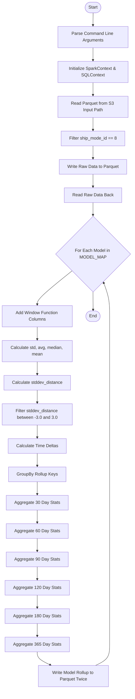
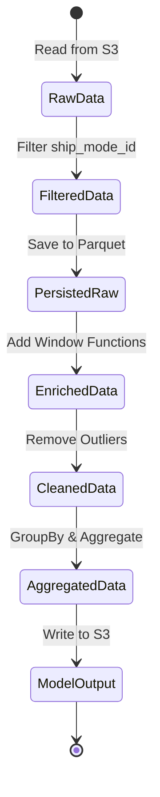
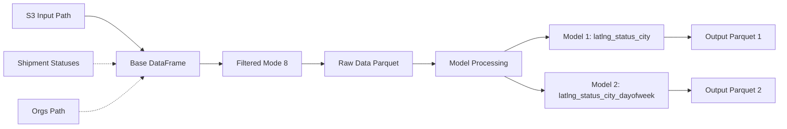

# Diagram: research/orchestrator/tasks/models/shipment_parcel_spark.py

> Auto-generated by Obscura crawlers

## Diagram 1

### SVG

<svg id="container" width="491.544677734375" xmlns="http://www.w3.org/2000/svg" class="flowchart" height="2527" viewBox="0 0 491.544677734375 2527" role="graphics-document document" aria-roledescription="flowchart-v2"><g><marker id="container_flowchart-v2-pointEnd" class="marker flowchart-v2" viewBox="0 0 10 10" refX="5" refY="5" markerUnits="userSpaceOnUse" markerWidth="8" markerHeight="8" orient="auto"><path d="M 0 0 L 10 5 L 0 10 z" class="arrowMarkerPath" style="stroke-width: 1; stroke-dasharray: 1, 0;"></path></marker><marker id="container_flowchart-v2-pointStart" class="marker flowchart-v2" viewBox="0 0 10 10" refX="4.5" refY="5" markerUnits="userSpaceOnUse" markerWidth="8" markerHeight="8" orient="auto"><path d="M 0 5 L 10 10 L 10 0 z" class="arrowMarkerPath" style="stroke-width: 1; stroke-dasharray: 1, 0;"></path></marker><marker id="container_flowchart-v2-circleEnd" class="marker flowchart-v2" viewBox="0 0 10 10" refX="11" refY="5" markerUnits="userSpaceOnUse" markerWidth="11" markerHeight="11" orient="auto"><circle cx="5" cy="5" r="5" class="arrowMarkerPath" style="stroke-width: 1; stroke-dasharray: 1, 0;"></circle></marker><marker id="container_flowchart-v2-circleStart" class="marker flowchart-v2" viewBox="0 0 10 10" refX="-1" refY="5" markerUnits="userSpaceOnUse" markerWidth="11" markerHeight="11" orient="auto"><circle cx="5" cy="5" r="5" class="arrowMarkerPath" style="stroke-width: 1; stroke-dasharray: 1, 0;"></circle></marker><marker id="container_flowchart-v2-crossEnd" class="marker cross flowchart-v2" viewBox="0 0 11 11" refX="12" refY="5.2" markerUnits="userSpaceOnUse" markerWidth="11" markerHeight="11" orient="auto"><path d="M 1,1 l 9,9 M 10,1 l -9,9" class="arrowMarkerPath" style="stroke-width: 2; stroke-dasharray: 1, 0;"></path></marker><marker id="container_flowchart-v2-crossStart" class="marker cross flowchart-v2" viewBox="0 0 11 11" refX="-1" refY="5.2" markerUnits="userSpaceOnUse" markerWidth="11" markerHeight="11" orient="auto"><path d="M 1,1 l 9,9 M 10,1 l -9,9" class="arrowMarkerPath" style="stroke-width: 2; stroke-dasharray: 1, 0;"></path></marker><g class="root"><g class="clusters"></g><g class="edgePaths"><path d="M344.545,47.5L344.461,51.583C344.378,55.667,344.211,63.833,344.128,71.417C344.045,79,344.045,86,344.045,89.5L344.045,93" id="L_Start_ParseArgs_0" class="edge-thickness-normal edge-pattern-solid edge-thickness-normal edge-pattern-solid flowchart-link" style=";" data-edge="true" data-et="edge" data-id="L_Start_ParseArgs_0" data-points="W3sieCI6MzQ0LjU0NDY2ODE5NzYzMTg0LCJ5Ijo0Ny40OTk5OTk5OTk5OTk5MTV9LHsieCI6MzQ0LjA0NDY2ODE5NzYzMTg0LCJ5Ijo3Mn0seyJ4IjozNDQuMDQ0NjY4MTk3NjMxODQsInkiOjk3fV0=" marker-end="url(#container_flowchart-v2-pointEnd)"></path><path d="M344.045,175L344.045,179.167C344.045,183.333,344.045,191.667,344.045,199.333C344.045,207,344.045,214,344.045,217.5L344.045,221" id="L_ParseArgs_InitSpark_0" class="edge-thickness-normal edge-pattern-solid edge-thickness-normal edge-pattern-solid flowchart-link" style=";" data-edge="true" data-et="edge" data-id="L_ParseArgs_InitSpark_0" data-points="W3sieCI6MzQ0LjA0NDY2ODE5NzYzMTg0LCJ5IjoxNzV9LHsieCI6MzQ0LjA0NDY2ODE5NzYzMTg0LCJ5IjoyMDB9LHsieCI6MzQ0LjA0NDY2ODE5NzYzMTg0LCJ5IjoyMjV9XQ==" marker-end="url(#container_flowchart-v2-pointEnd)"></path><path d="M344.045,303L344.045,307.167C344.045,311.333,344.045,319.667,344.045,327.333C344.045,335,344.045,342,344.045,345.5L344.045,349" id="L_InitSpark_ReadBase_0" class="edge-thickness-normal edge-pattern-solid edge-thickness-normal edge-pattern-solid flowchart-link" style=";" data-edge="true" data-et="edge" data-id="L_InitSpark_ReadBase_0" data-points="W3sieCI6MzQ0LjA0NDY2ODE5NzYzMTg0LCJ5IjozMDN9LHsieCI6MzQ0LjA0NDY2ODE5NzYzMTg0LCJ5IjozMjh9LHsieCI6MzQ0LjA0NDY2ODE5NzYzMTg0LCJ5IjozNTN9XQ==" marker-end="url(#container_flowchart-v2-pointEnd)"></path><path d="M344.045,431L344.045,435.167C344.045,439.333,344.045,447.667,344.045,455.333C344.045,463,344.045,470,344.045,473.5L344.045,477" id="L_ReadBase_FilterMode_0" class="edge-thickness-normal edge-pattern-solid edge-thickness-normal edge-pattern-solid flowchart-link" style=";" data-edge="true" data-et="edge" data-id="L_ReadBase_FilterMode_0" data-points="W3sieCI6MzQ0LjA0NDY2ODE5NzYzMTg0LCJ5Ijo0MzF9LHsieCI6MzQ0LjA0NDY2ODE5NzYzMTg0LCJ5Ijo0NTZ9LHsieCI6MzQ0LjA0NDY2ODE5NzYzMTg0LCJ5Ijo0ODF9XQ==" marker-end="url(#container_flowchart-v2-pointEnd)"></path><path d="M344.045,535L344.045,539.167C344.045,543.333,344.045,551.667,344.045,559.333C344.045,567,344.045,574,344.045,577.5L344.045,581" id="L_FilterMode_SaveRaw_0" class="edge-thickness-normal edge-pattern-solid edge-thickness-normal edge-pattern-solid flowchart-link" style=";" data-edge="true" data-et="edge" data-id="L_FilterMode_SaveRaw_0" data-points="W3sieCI6MzQ0LjA0NDY2ODE5NzYzMTg0LCJ5Ijo1MzV9LHsieCI6MzQ0LjA0NDY2ODE5NzYzMTg0LCJ5Ijo1NjB9LHsieCI6MzQ0LjA0NDY2ODE5NzYzMTg0LCJ5Ijo1ODV9XQ==" marker-end="url(#container_flowchart-v2-pointEnd)"></path><path d="M344.045,639L344.045,643.167C344.045,647.333,344.045,655.667,344.045,663.333C344.045,671,344.045,678,344.045,681.5L344.045,685" id="L_SaveRaw_ReadRaw_0" class="edge-thickness-normal edge-pattern-solid edge-thickness-normal edge-pattern-solid flowchart-link" style=";" data-edge="true" data-et="edge" data-id="L_SaveRaw_ReadRaw_0" data-points="W3sieCI6MzQ0LjA0NDY2ODE5NzYzMTg0LCJ5Ijo2Mzl9LHsieCI6MzQ0LjA0NDY2ODE5NzYzMTg0LCJ5Ijo2NjR9LHsieCI6MzQ0LjA0NDY2ODE5NzYzMTg0LCJ5Ijo2ODl9XQ==" marker-end="url(#container_flowchart-v2-pointEnd)"></path><path d="M344.045,743L344.045,747.167C344.045,751.333,344.045,759.667,344.045,767.333C344.045,775,344.045,782,344.045,785.5L344.045,789" id="L_ReadRaw_LoopModels_0" class="edge-thickness-normal edge-pattern-solid edge-thickness-normal edge-pattern-solid flowchart-link" style=";" data-edge="true" data-et="edge" data-id="L_ReadRaw_LoopModels_0" data-points="W3sieCI6MzQ0LjA0NDY2ODE5NzYzMTg0LCJ5Ijo3NDN9LHsieCI6MzQ0LjA0NDY2ODE5NzYzMTg0LCJ5Ijo3Njh9LHsieCI6MzQ0LjA0NDY2ODE5NzYzMTg0LCJ5Ijo3OTN9XQ==" marker-end="url(#container_flowchart-v2-pointEnd)"></path><path d="M266.648,993.603L245.207,1010.669C223.765,1027.736,180.883,1061.868,159.441,1082.434C138,1103,138,1110,138,1113.5L138,1117" id="L_LoopModels_AddWindowCols_0" class="edge-thickness-normal edge-pattern-solid edge-thickness-normal edge-pattern-solid flowchart-link" style=";" data-edge="true" data-et="edge" data-id="L_LoopModels_AddWindowCols_0" data-points="W3sieCI6MjY2LjY0ODA0MTk0OTg2NTQ0LCJ5Ijo5OTMuNjAzMzczNzUyMjMzN30seyJ4IjoxMzgsInkiOjEwOTZ9LHsieCI6MTM4LCJ5IjoxMTIxfV0=" marker-end="url(#container_flowchart-v2-pointEnd)"></path><path d="M138,1199L138,1203.167C138,1207.333,138,1215.667,138,1223.333C138,1231,138,1238,138,1241.5L138,1245" id="L_AddWindowCols_CalcStats_0" class="edge-thickness-normal edge-pattern-solid edge-thickness-normal edge-pattern-solid flowchart-link" style=";" data-edge="true" data-et="edge" data-id="L_AddWindowCols_CalcStats_0" data-points="W3sieCI6MTM4LCJ5IjoxMTk5fSx7IngiOjEzOCwieSI6MTIyNH0seyJ4IjoxMzgsInkiOjEyNDl9XQ==" marker-end="url(#container_flowchart-v2-pointEnd)"></path><path d="M138,1327L138,1331.167C138,1335.333,138,1343.667,138,1351.333C138,1359,138,1366,138,1369.5L138,1373" id="L_CalcStats_CalcStdDev_0" class="edge-thickness-normal edge-pattern-solid edge-thickness-normal edge-pattern-solid flowchart-link" style=";" data-edge="true" data-et="edge" data-id="L_CalcStats_CalcStdDev_0" data-points="W3sieCI6MTM4LCJ5IjoxMzI3fSx7IngiOjEzOCwieSI6MTM1Mn0seyJ4IjoxMzgsInkiOjEzNzd9XQ==" marker-end="url(#container_flowchart-v2-pointEnd)"></path><path d="M138,1431L138,1435.167C138,1439.333,138,1447.667,138,1455.333C138,1463,138,1470,138,1473.5L138,1477" id="L_CalcStdDev_FilterOutliers_0" class="edge-thickness-normal edge-pattern-solid edge-thickness-normal edge-pattern-solid flowchart-link" style=";" data-edge="true" data-et="edge" data-id="L_CalcStdDev_FilterOutliers_0" data-points="W3sieCI6MTM4LCJ5IjoxNDMxfSx7IngiOjEzOCwieSI6MTQ1Nn0seyJ4IjoxMzgsInkiOjE0ODF9XQ==" marker-end="url(#container_flowchart-v2-pointEnd)"></path><path d="M138,1559L138,1563.167C138,1567.333,138,1575.667,138,1583.333C138,1591,138,1598,138,1601.5L138,1605" id="L_FilterOutliers_CalcDeltas_0" class="edge-thickness-normal edge-pattern-solid edge-thickness-normal edge-pattern-solid flowchart-link" style=";" data-edge="true" data-et="edge" data-id="L_FilterOutliers_CalcDeltas_0" data-points="W3sieCI6MTM4LCJ5IjoxNTU5fSx7IngiOjEzOCwieSI6MTU4NH0seyJ4IjoxMzgsInkiOjE2MDl9XQ==" marker-end="url(#container_flowchart-v2-pointEnd)"></path><path d="M138,1663L138,1667.167C138,1671.333,138,1679.667,138,1687.333C138,1695,138,1702,138,1705.5L138,1709" id="L_CalcDeltas_GroupBy_0" class="edge-thickness-normal edge-pattern-solid edge-thickness-normal edge-pattern-solid flowchart-link" style=";" data-edge="true" data-et="edge" data-id="L_CalcDeltas_GroupBy_0" data-points="W3sieCI6MTM4LCJ5IjoxNjYzfSx7IngiOjEzOCwieSI6MTY4OH0seyJ4IjoxMzgsInkiOjE3MTN9XQ==" marker-end="url(#container_flowchart-v2-pointEnd)"></path><path d="M138,1767L138,1771.167C138,1775.333,138,1783.667,138,1791.333C138,1799,138,1806,138,1809.5L138,1813" id="L_GroupBy_Agg30_0" class="edge-thickness-normal edge-pattern-solid edge-thickness-normal edge-pattern-solid flowchart-link" style=";" data-edge="true" data-et="edge" data-id="L_GroupBy_Agg30_0" data-points="W3sieCI6MTM4LCJ5IjoxNzY3fSx7IngiOjEzOCwieSI6MTc5Mn0seyJ4IjoxMzgsInkiOjE4MTd9XQ==" marker-end="url(#container_flowchart-v2-pointEnd)"></path><path d="M138,1871L138,1875.167C138,1879.333,138,1887.667,138,1895.333C138,1903,138,1910,138,1913.5L138,1917" id="L_Agg30_Agg60_0" class="edge-thickness-normal edge-pattern-solid edge-thickness-normal edge-pattern-solid flowchart-link" style=";" data-edge="true" data-et="edge" data-id="L_Agg30_Agg60_0" data-points="W3sieCI6MTM4LCJ5IjoxODcxfSx7IngiOjEzOCwieSI6MTg5Nn0seyJ4IjoxMzgsInkiOjE5MjF9XQ==" marker-end="url(#container_flowchart-v2-pointEnd)"></path><path d="M138,1975L138,1979.167C138,1983.333,138,1991.667,138,1999.333C138,2007,138,2014,138,2017.5L138,2021" id="L_Agg60_Agg90_0" class="edge-thickness-normal edge-pattern-solid edge-thickness-normal edge-pattern-solid flowchart-link" style=";" data-edge="true" data-et="edge" data-id="L_Agg60_Agg90_0" data-points="W3sieCI6MTM4LCJ5IjoxOTc1fSx7IngiOjEzOCwieSI6MjAwMH0seyJ4IjoxMzgsInkiOjIwMjV9XQ==" marker-end="url(#container_flowchart-v2-pointEnd)"></path><path d="M138,2079L138,2083.167C138,2087.333,138,2095.667,138,2103.333C138,2111,138,2118,138,2121.5L138,2125" id="L_Agg90_Agg120_0" class="edge-thickness-normal edge-pattern-solid edge-thickness-normal edge-pattern-solid flowchart-link" style=";" data-edge="true" data-et="edge" data-id="L_Agg90_Agg120_0" data-points="W3sieCI6MTM4LCJ5IjoyMDc5fSx7IngiOjEzOCwieSI6MjEwNH0seyJ4IjoxMzgsInkiOjIxMjl9XQ==" marker-end="url(#container_flowchart-v2-pointEnd)"></path><path d="M138,2183L138,2187.167C138,2191.333,138,2199.667,138,2207.333C138,2215,138,2222,138,2225.5L138,2229" id="L_Agg120_Agg180_0" class="edge-thickness-normal edge-pattern-solid edge-thickness-normal edge-pattern-solid flowchart-link" style=";" data-edge="true" data-et="edge" data-id="L_Agg120_Agg180_0" data-points="W3sieCI6MTM4LCJ5IjoyMTgzfSx7IngiOjEzOCwieSI6MjIwOH0seyJ4IjoxMzgsInkiOjIyMzN9XQ==" marker-end="url(#container_flowchart-v2-pointEnd)"></path><path d="M138,2287L138,2291.167C138,2295.333,138,2303.667,138,2311.333C138,2319,138,2326,138,2329.5L138,2333" id="L_Agg180_Agg365_0" class="edge-thickness-normal edge-pattern-solid edge-thickness-normal edge-pattern-solid flowchart-link" style=";" data-edge="true" data-et="edge" data-id="L_Agg180_Agg365_0" data-points="W3sieCI6MTM4LCJ5IjoyMjg3fSx7IngiOjEzOCwieSI6MjMxMn0seyJ4IjoxMzgsInkiOjIzMzd9XQ==" marker-end="url(#container_flowchart-v2-pointEnd)"></path><path d="M138,2391L138,2395.167C138,2399.333,138,2407.667,146.093,2415.712C154.186,2423.757,170.372,2431.514,178.466,2435.393L186.559,2439.271" id="L_Agg365_WriteModel_0" class="edge-thickness-normal edge-pattern-solid edge-thickness-normal edge-pattern-solid flowchart-link" style=";" data-edge="true" data-et="edge" data-id="L_Agg365_WriteModel_0" data-points="W3sieCI6MTM4LCJ5IjoyMzkxfSx7IngiOjEzOCwieSI6MjQxNn0seyJ4IjoxOTAuMTY1ODg2MDE0Njk5OTQsInkiOjI0NDF9XQ==" marker-end="url(#container_flowchart-v2-pointEnd)"></path><path d="M352.923,2441L361.618,2436.833C370.312,2432.667,387.701,2424.333,396.395,2411.5C405.089,2398.667,405.089,2381.333,405.089,2364C405.089,2346.667,405.089,2329.333,405.089,2312C405.089,2294.667,405.089,2277.333,405.089,2260C405.089,2242.667,405.089,2225.333,405.089,2208C405.089,2190.667,405.089,2173.333,405.089,2156C405.089,2138.667,405.089,2121.333,405.089,2104C405.089,2086.667,405.089,2069.333,405.089,2052C405.089,2034.667,405.089,2017.333,405.089,2000C405.089,1982.667,405.089,1965.333,405.089,1948C405.089,1930.667,405.089,1913.333,405.089,1896C405.089,1878.667,405.089,1861.333,405.089,1844C405.089,1826.667,405.089,1809.333,405.089,1792C405.089,1774.667,405.089,1757.333,405.089,1740C405.089,1722.667,405.089,1705.333,405.089,1688C405.089,1670.667,405.089,1653.333,405.089,1636C405.089,1618.667,405.089,1601.333,405.089,1582C405.089,1562.667,405.089,1541.333,405.089,1520C405.089,1498.667,405.089,1477.333,405.089,1458C405.089,1438.667,405.089,1421.333,405.089,1404C405.089,1386.667,405.089,1369.333,405.089,1350C405.089,1330.667,405.089,1309.333,405.089,1288C405.089,1266.667,405.089,1245.333,405.089,1224C405.089,1202.667,405.089,1181.333,405.089,1160C405.089,1138.667,405.089,1117.333,401.432,1096.841C397.774,1076.348,390.46,1056.696,386.802,1046.87L383.145,1037.044" id="L_WriteModel_LoopModels_0" class="edge-thickness-normal edge-pattern-solid edge-thickness-normal edge-pattern-solid flowchart-link" style=";" data-edge="true" data-et="edge" data-id="L_WriteModel_LoopModels_0" data-points="W3sieCI6MzUyLjkyMzQ1MDM4MDU2Mzc0LCJ5IjoyNDQxfSx7IngiOjQwNS4wODkzMzYzOTUyNjM3LCJ5IjoyNDE2fSx7IngiOjQwNS4wODkzMzYzOTUyNjM3LCJ5IjoyMzY0fSx7IngiOjQwNS4wODkzMzYzOTUyNjM3LCJ5IjoyMzEyfSx7IngiOjQwNS4wODkzMzYzOTUyNjM3LCJ5IjoyMjYwfSx7IngiOjQwNS4wODkzMzYzOTUyNjM3LCJ5IjoyMjA4fSx7IngiOjQwNS4wODkzMzYzOTUyNjM3LCJ5IjoyMTU2fSx7IngiOjQwNS4wODkzMzYzOTUyNjM3LCJ5IjoyMTA0fSx7IngiOjQwNS4wODkzMzYzOTUyNjM3LCJ5IjoyMDUyfSx7IngiOjQwNS4wODkzMzYzOTUyNjM3LCJ5IjoyMDAwfSx7IngiOjQwNS4wODkzMzYzOTUyNjM3LCJ5IjoxOTQ4fSx7IngiOjQwNS4wODkzMzYzOTUyNjM3LCJ5IjoxODk2fSx7IngiOjQwNS4wODkzMzYzOTUyNjM3LCJ5IjoxODQ0fSx7IngiOjQwNS4wODkzMzYzOTUyNjM3LCJ5IjoxNzkyfSx7IngiOjQwNS4wODkzMzYzOTUyNjM3LCJ5IjoxNzQwfSx7IngiOjQwNS4wODkzMzYzOTUyNjM3LCJ5IjoxNjg4fSx7IngiOjQwNS4wODkzMzYzOTUyNjM3LCJ5IjoxNjM2fSx7IngiOjQwNS4wODkzMzYzOTUyNjM3LCJ5IjoxNTg0fSx7IngiOjQwNS4wODkzMzYzOTUyNjM3LCJ5IjoxNTIwfSx7IngiOjQwNS4wODkzMzYzOTUyNjM3LCJ5IjoxNDU2fSx7IngiOjQwNS4wODkzMzYzOTUyNjM3LCJ5IjoxNDA0fSx7IngiOjQwNS4wODkzMzYzOTUyNjM3LCJ5IjoxMzUyfSx7IngiOjQwNS4wODkzMzYzOTUyNjM3LCJ5IjoxMjg4fSx7IngiOjQwNS4wODkzMzYzOTUyNjM3LCJ5IjoxMjI0fSx7IngiOjQwNS4wODkzMzYzOTUyNjM3LCJ5IjoxMTYwfSx7IngiOjQwNS4wODkzMzYzOTUyNjM3LCJ5IjoxMDk2fSx7IngiOjM4MS43NDkyMjIzNTMxNjE1NCwieSI6MTAzMy4yOTU0NDU4NDQ0NzA0fV0=" marker-end="url(#container_flowchart-v2-pointEnd)"></path><path d="M344.045,1071L344.045,1075.167C344.045,1079.333,344.045,1087.667,344.121,1098.667C344.197,1109.667,344.348,1123.333,344.424,1130.167L344.5,1137" id="L_LoopModels_End_0" class="edge-thickness-normal edge-pattern-solid edge-thickness-normal edge-pattern-solid flowchart-link" style=";" data-edge="true" data-et="edge" data-id="L_LoopModels_End_0" data-points="W3sieCI6MzQ0LjA0NDY2ODE5NzYzMTg0LCJ5IjoxMDcxfSx7IngiOjM0NC4wNDQ2NjgxOTc2MzE4NCwieSI6MTA5Nn0seyJ4IjozNDQuNTQ0NjY4MTk3NjMxODQsInkiOjExNDF9XQ==" marker-end="url(#container_flowchart-v2-pointEnd)"></path></g><g class="edgeLabels"><g class="edgeLabel"><g class="label" data-id="L_Start_ParseArgs_0" transform="translate(0, 0)"><foreignObject width="0" height="0">

</foreignObject></g></g><g class="edgeLabel"><g class="label" data-id="L_ParseArgs_InitSpark_0" transform="translate(0, 0)"><foreignObject width="0" height="0">

</foreignObject></g></g><g class="edgeLabel"><g class="label" data-id="L_InitSpark_ReadBase_0" transform="translate(0, 0)"><foreignObject width="0" height="0">

</foreignObject></g></g><g class="edgeLabel"><g class="label" data-id="L_ReadBase_FilterMode_0" transform="translate(0, 0)"><foreignObject width="0" height="0">

</foreignObject></g></g><g class="edgeLabel"><g class="label" data-id="L_FilterMode_SaveRaw_0" transform="translate(0, 0)"><foreignObject width="0" height="0">

</foreignObject></g></g><g class="edgeLabel"><g class="label" data-id="L_SaveRaw_ReadRaw_0" transform="translate(0, 0)"><foreignObject width="0" height="0">

</foreignObject></g></g><g class="edgeLabel"><g class="label" data-id="L_ReadRaw_LoopModels_0" transform="translate(0, 0)"><foreignObject width="0" height="0">

</foreignObject></g></g><g class="edgeLabel"><g class="label" data-id="L_LoopModels_AddWindowCols_0" transform="translate(0, 0)"><foreignObject width="0" height="0">

</foreignObject></g></g><g class="edgeLabel"><g class="label" data-id="L_AddWindowCols_CalcStats_0" transform="translate(0, 0)"><foreignObject width="0" height="0">

</foreignObject></g></g><g class="edgeLabel"><g class="label" data-id="L_CalcStats_CalcStdDev_0" transform="translate(0, 0)"><foreignObject width="0" height="0">

</foreignObject></g></g><g class="edgeLabel"><g class="label" data-id="L_CalcStdDev_FilterOutliers_0" transform="translate(0, 0)"><foreignObject width="0" height="0">

</foreignObject></g></g><g class="edgeLabel"><g class="label" data-id="L_FilterOutliers_CalcDeltas_0" transform="translate(0, 0)"><foreignObject width="0" height="0">

</foreignObject></g></g><g class="edgeLabel"><g class="label" data-id="L_CalcDeltas_GroupBy_0" transform="translate(0, 0)"><foreignObject width="0" height="0">

</foreignObject></g></g><g class="edgeLabel"><g class="label" data-id="L_GroupBy_Agg30_0" transform="translate(0, 0)"><foreignObject width="0" height="0">

</foreignObject></g></g><g class="edgeLabel"><g class="label" data-id="L_Agg30_Agg60_0" transform="translate(0, 0)"><foreignObject width="0" height="0">

</foreignObject></g></g><g class="edgeLabel"><g class="label" data-id="L_Agg60_Agg90_0" transform="translate(0, 0)"><foreignObject width="0" height="0">

</foreignObject></g></g><g class="edgeLabel"><g class="label" data-id="L_Agg90_Agg120_0" transform="translate(0, 0)"><foreignObject width="0" height="0">

</foreignObject></g></g><g class="edgeLabel"><g class="label" data-id="L_Agg120_Agg180_0" transform="translate(0, 0)"><foreignObject width="0" height="0">

</foreignObject></g></g><g class="edgeLabel"><g class="label" data-id="L_Agg180_Agg365_0" transform="translate(0, 0)"><foreignObject width="0" height="0">

</foreignObject></g></g><g class="edgeLabel"><g class="label" data-id="L_Agg365_WriteModel_0" transform="translate(0, 0)"><foreignObject width="0" height="0">

</foreignObject></g></g><g class="edgeLabel"><g class="label" data-id="L_WriteModel_LoopModels_0" transform="translate(0, 0)"><foreignObject width="0" height="0">

</foreignObject></g></g><g class="edgeLabel"><g class="label" data-id="L_LoopModels_End_0" transform="translate(0, 0)"><foreignObject width="0" height="0">

</foreignObject></g></g></g><g class="nodes"><g class="node default" id="flowchart-Start-0" transform="translate(344.04466819763184, 27.5)"><g class="basic label-container outer-path"><path d="M-10.3984375 -19.5 C-2.314168247784332 -19.5, 5.770101004431336 -19.5, 10.3984375 -19.5 C10.3984375 -19.5, 10.398437499999998 -19.5, 10.398437499999998 -19.5 C10.809561862286202 -19.486816041906508, 11.220686224572406 -19.473632083813015, 11.6478067896239 -19.45993515863156 C11.929544124610368 -19.432756296764133, 12.211281459596837 -19.405577434896706, 12.892042152847864 -19.3399052695533 C13.203265276513502 -19.28958912849041, 13.514488400179141 -19.23927298742752, 14.126030759676757 -19.140403561325776 C14.565902973762038 -19.040005598895263, 15.005775187847316 -18.93960763646475, 15.34470188623539 -18.862249829261074 C15.679581999363315 -18.762859169506292, 16.01446211249124 -18.663468509751507, 16.543047751460602 -18.50658706670804 C16.932355460699487 -18.363318230987115, 17.321663169938372 -18.22004939526619, 17.716144095147794 -18.074876768247425 C18.091845407044012 -17.90856494225441, 18.46754671894023 -17.7422531162614, 18.85917041279238 -17.568892924097174 C19.09920488741544 -17.443667092435742, 19.339239362038498 -17.318441260774314, 19.967429764076783 -16.990714730406097 C20.20508694370134 -16.84664555148908, 20.442744123325895 -16.702576372572064, 21.036368073605697 -16.342718045390892 C21.246663679161525 -16.19602493450519, 21.45695928471735 -16.049331823619486, 22.061592844578712 -15.627565626425154 C22.346185658947647 -15.400610430298777, 22.630778473316585 -15.1736552341724, 23.03889120850187 -14.848196188198123 C23.37698644814297 -14.541147037065919, 23.71508168778407 -14.234097885933714, 23.964247236767985 -14.007812326905688 C24.259942697386638 -13.70248248676812, 24.555638158005287 -13.397152646630555, 24.833858442968648 -13.10986736009568 C25.12084886860657 -12.772752075923547, 25.40783929424449 -12.435636791751415, 25.644151408126582 -12.158051136245305 C25.936476227243585 -11.766362509967403, 26.228801046360584 -11.3746738836895, 26.391796464640635 -11.156274872382312 C26.568698067605332 -10.88450650549685, 26.745599670570034 -10.612738138611386, 27.073721378604247 -10.108655082055241 C27.23090345260848 -9.829562393249818, 27.388085526612713 -9.550469704444392, 27.6871239742735 -9.019496659696287 C27.8737445919705 -8.631974954006921, 28.060365209667502 -8.244453248317555, 28.22948364880834 -7.893275190886684 C28.407770930995103 -7.452902156935278, 28.58605821318186 -7.012529122983873, 28.698571729970325 -6.734618561215508 C28.829467655636194 -6.3403808885434465, 28.96036358130206 -5.946143215871385, 29.09246063421488 -5.548287939305138 C29.204055536650916 -5.122728210779879, 29.315650439086948 -4.697168482254622, 29.40953178754556 -4.339158212148133 C29.469058626888888 -4.033500473122105, 29.52858546623221 -3.727842734096077, 29.648482276581777 -3.1121979531509023 C29.708473867541468 -2.6469150203471226, 29.76846545850116 -2.1816320875433433, 29.808330202509367 -1.872449005199798 C29.84011539317241 -1.3773690040787687, 29.871900583835455 -0.8822890029577394, 29.888418715913414 -0.6250057626472757 C29.888418715913414 -0.2785975831407701, 29.888418715913414 0.0678105963657355, 29.888418715913414 0.625005762647271 C29.869897576109206 0.9134874650927841, 29.851376436305 1.201969167538297, 29.808330202509367 1.8724490051997846 C29.774356667461277 2.135941034199456, 29.740383132413186 2.399433063199127, 29.648482276581777 3.1121979531508885 C29.597803413163298 3.3724232058232015, 29.54712454974482 3.6326484584955145, 29.40953178754556 4.339158212148129 C29.304563909332032 4.739446225142512, 29.199596031118503 5.139734238136895, 29.092460634214884 5.548287939305125 C29.00937997473795 5.798513648544198, 28.926299315261016 6.048739357783271, 28.69857172997033 6.734618561215495 C28.554490028315097 7.090503149934117, 28.410408326659866 7.446387738652738, 28.229483648808344 7.893275190886679 C28.070078160847864 8.224284097367672, 27.910672672887383 8.555293003848664, 27.687123974273504 9.019496659696284 C27.480170348056415 9.386963779371808, 27.273216721839322 9.754430899047334, 27.07372137860425 10.108655082055236 C26.880745252066692 10.405118233762577, 26.68776912552913 10.701581385469916, 26.39179646464064 11.156274872382301 C26.11528946844024 11.526769056985277, 25.838782472239835 11.89726324158825, 25.644151408126582 12.158051136245302 C25.37573509115406 12.473348215482337, 25.107318774181536 12.788645294719371, 24.83385844296866 13.10986736009567 C24.57699431464082 13.3751006615313, 24.320130186312984 13.64033396296693, 23.96424723676799 14.007812326905684 C23.714701822215893 14.234442869792039, 23.4651564076638 14.461073412678394, 23.038891208501887 14.848196188198111 C22.73521365293541 15.090370957563234, 22.431536097368934 15.332545726928357, 22.061592844578715 15.627565626425152 C21.83171669269784 15.787917278799023, 21.60184054081696 15.948268931172894, 21.036368073605708 16.34271804539089 C20.66937772797992 16.565189749583897, 20.302387382354134 16.78766145377691, 19.967429764076787 16.990714730406093 C19.689558887555958 17.13567978870222, 19.411688011035125 17.280644846998346, 18.859170412792388 17.56889292409717 C18.46588697181953 17.742987837077084, 18.072603530846674 17.917082750057, 17.716144095147804 18.07487676824742 C17.25304944325642 18.245299880943485, 16.789954791365034 18.41572299363955, 16.543047751460616 18.506587066708033 C16.185509542101677 18.612702530489408, 15.827971332742738 18.718817994270786, 15.344701886235413 18.86224982926107 C15.084574023816575 18.92162231636523, 14.824446161397738 18.980994803469386, 14.126030759676766 19.140403561325773 C13.760160601842989 19.199554611078888, 13.394290444009211 19.258705660832003, 12.892042152847878 19.3399052695533 C12.55127802020888 19.372778375600152, 12.21051388756988 19.40565148164701, 11.6478067896239 19.45993515863156 C11.37447017956863 19.468700531698595, 11.101133569513362 19.477465904765634, 10.398437500000004 19.5 C10.398437500000002 19.5, 10.3984375 19.5, 10.3984375 19.5 C3.8124232990892564 19.5, -2.7735909018214873 19.5, -10.398437499999996 19.5 C-10.813358954008518 19.486694276565565, -11.228280408017037 19.473388553131127, -11.647806789623893 19.45993515863156 C-12.062125851494331 19.41996629702449, -12.476444913364771 19.379997435417426, -12.892042152847871 19.3399052695533 C-13.186641777035822 19.292276686968798, -13.481241401223773 19.244648104384297, -14.126030759676759 19.140403561325773 C-14.559126351301831 19.04155231875021, -14.992221942926905 18.942701076174647, -15.344701886235388 18.862249829261074 C-15.698002381383874 18.757392096813145, -16.05130287653236 18.65253436436522, -16.54304775146059 18.506587066708043 C-16.822457110415105 18.40376183978098, -17.101866469369618 18.30093661285392, -17.716144095147797 18.074876768247425 C-18.108076176931093 17.901380061894084, -18.500008258714384 17.727883355540744, -18.85917041279238 17.568892924097174 C-19.13879519217622 17.42301285580084, -19.418419971560063 17.277132787504513, -19.96742976407678 16.990714730406097 C-20.352601620150498 16.757221287733135, -20.737773476224213 16.523727845060176, -21.036368073605686 16.3427180453909 C-21.417215388460267 16.077055445162888, -21.798062703314844 15.811392844934879, -22.061592844578712 15.627565626425156 C-22.41730591189368 15.343893921163732, -22.77301897920865 15.060222215902307, -23.03889120850187 14.848196188198125 C-23.305352938127744 14.606202695542935, -23.571814667753618 14.364209202887743, -23.964247236767974 14.007812326905697 C-24.298914614288105 13.662240782913473, -24.63358199180823 13.316669238921252, -24.833858442968655 13.109867360095677 C-25.025778840109297 12.884426741034316, -25.21769923724994 12.658986121972953, -25.64415140812658 12.158051136245307 C-25.911861332539427 11.799344226407932, -26.179571256952272 11.440637316570559, -26.391796464640635 11.156274872382316 C-26.608977397306322 10.822626638561653, -26.82615832997201 10.488978404740992, -27.073721378604244 10.108655082055249 C-27.201809389084367 9.881221849130279, -27.329897399564487 9.65378861620531, -27.6871239742735 9.019496659696289 C-27.801349963200654 8.782303949644419, -27.91557595212781 8.545111239592549, -28.22948364880834 7.893275190886686 C-28.41444279083278 7.43642253414458, -28.59940193285722 6.979569877402475, -28.698571729970325 6.73461856121551 C-28.793721932758853 6.4480413105424965, -28.888872135547377 6.161464059869483, -29.09246063421488 5.5482879393051325 C-29.195068297895986 5.1570004472463316, -29.29767596157709 4.765712955187531, -29.409531787545557 4.339158212148136 C-29.48983780952134 3.9268037619862515, -29.570143831497123 3.5144493118243676, -29.648482276581777 3.112197953150904 C-29.6862984484015 2.818903192164899, -29.724114620221226 2.525608431178894, -29.808330202509364 1.872449005199809 C-29.83057820867872 1.5259183508447616, -29.852826214848072 1.179387696489714, -29.888418715913414 0.6250057626472781 C-29.888418715913414 0.2032571553068504, -29.888418715913414 -0.21849145203357734, -29.888418715913414 -0.6250057626472687 C-29.85882291625315 -1.0859842316553792, -29.82922711659289 -1.5469627006634896, -29.808330202509367 -1.8724490051997822 C-29.759608149068328 -2.250327630430787, -29.71088609562729 -2.6282062556617922, -29.648482276581777 -3.112197953150895 C-29.59476990602762 -3.38799962383297, -29.541057535473456 -3.6638012945150447, -29.40953178754556 -4.339158212148126 C-29.345477231865228 -4.58342599437727, -29.2814226761849 -4.827693776606416, -29.092460634214884 -5.548287939305123 C-28.952402326345677 -5.970121247346289, -28.81234401847647 -6.391954555387455, -28.698571729970332 -6.734618561215485 C-28.527492769330642 -7.157186901582214, -28.35641380869095 -7.579755241948943, -28.229483648808344 -7.893275190886676 C-28.02733934559151 -8.313032161711638, -27.825195042374677 -8.7327891325366, -27.687123974273504 -9.019496659696282 C-27.48549328566262 -9.377512364646106, -27.283862597051737 -9.735528069595933, -27.073721378604247 -10.108655082055243 C-26.934445572105457 -10.322620121628034, -26.79516976560667 -10.536585161200826, -26.39179646464064 -11.156274872382308 C-26.16890827915771 -11.454924735398016, -25.946020093674775 -11.753574598413724, -25.644151408126586 -12.158051136245302 C-25.389272090385806 -12.457446885907657, -25.134392772645022 -12.756842635570012, -24.833858442968662 -13.10986736009567 C-24.566547058090713 -13.385888311655004, -24.299235673212763 -13.661909263214335, -23.964247236767996 -14.007812326905677 C-23.62333611954145 -14.317418783556947, -23.282425002314902 -14.627025240208217, -23.038891208501887 -14.848196188198107 C-22.70217697298231 -15.116716830682854, -22.36546273746273 -15.3852374731676, -22.06159284457872 -15.627565626425149 C-21.849455960668966 -15.775543133382897, -21.637319076759212 -15.923520640340644, -21.03636807360571 -16.342718045390885 C-20.705605914527464 -16.54322800999832, -20.374843755449216 -16.743737974605757, -19.96742976407679 -16.99071473040609 C-19.53160567526803 -17.21808387837897, -19.095781586459264 -17.44545302635185, -18.859170412792388 -17.56889292409717 C-18.525933265294828 -17.716407124165578, -18.192696117797272 -17.863921324233985, -17.716144095147804 -18.07487676824742 C-17.31441984900569 -18.22271500432594, -16.912695602863575 -18.370553240404465, -16.54304775146062 -18.506587066708033 C-16.17661406301782 -18.615342661988176, -15.810180374575015 -18.724098257268317, -15.344701886235413 -18.862249829261067 C-15.011981857910612 -18.93819100452511, -14.679261829585812 -19.01413217978915, -14.126030759676768 -19.140403561325773 C-13.639443526084282 -19.219071211712652, -13.152856292491794 -19.297738862099532, -12.89204215284788 -19.3399052695533 C-12.64037336635015 -19.364183454710737, -12.388704579852423 -19.388461639868172, -11.647806789623903 -19.45993515863156 C-11.250778399803073 -19.472667086324233, -10.853750009982242 -19.485399014016906, -10.398437500000005 -19.5 C-10.398437500000004 -19.5, -10.398437500000002 -19.5, -10.3984375 -19.5" stroke="none" stroke-width="0" fill="#ECECFF" style=""></path><path d="M-10.3984375 -19.5 C-4.471066975931821 -19.5, 1.4563035481363578 -19.5, 10.3984375 -19.5 M-10.3984375 -19.5 C-3.8735470203763596 -19.5, 2.651343459247281 -19.5, 10.3984375 -19.5 M10.3984375 -19.5 C10.3984375 -19.5, 10.398437499999998 -19.5, 10.398437499999998 -19.5 M10.3984375 -19.5 C10.3984375 -19.5, 10.3984375 -19.5, 10.398437499999998 -19.5 M10.398437499999998 -19.5 C10.676063338357082 -19.4910970797298, 10.953689176714166 -19.482194159459603, 11.6478067896239 -19.45993515863156 M10.398437499999998 -19.5 C10.701444323793416 -19.490283160927948, 11.004451147586833 -19.480566321855896, 11.6478067896239 -19.45993515863156 M11.6478067896239 -19.45993515863156 C11.957710514792439 -19.43003911897831, 12.267614239960979 -19.40014307932506, 12.892042152847864 -19.3399052695533 M11.6478067896239 -19.45993515863156 C12.136030585529447 -19.412836796215572, 12.624254381434994 -19.365738433799585, 12.892042152847864 -19.3399052695533 M12.892042152847864 -19.3399052695533 C13.282181489545911 -19.276830567171704, 13.672320826243956 -19.213755864790105, 14.126030759676757 -19.140403561325776 M12.892042152847864 -19.3399052695533 C13.210577913181924 -19.288406878104205, 13.529113673515983 -19.23690848665511, 14.126030759676757 -19.140403561325776 M14.126030759676757 -19.140403561325776 C14.502632425735621 -19.05444668860338, 14.879234091794483 -18.968489815880986, 15.34470188623539 -18.862249829261074 M14.126030759676757 -19.140403561325776 C14.55340191172824 -19.042858884727423, 14.980773063779726 -18.945314208129073, 15.34470188623539 -18.862249829261074 M15.34470188623539 -18.862249829261074 C15.620302082337119 -18.78045313771303, 15.89590227843885 -18.69865644616499, 16.543047751460602 -18.50658706670804 M15.34470188623539 -18.862249829261074 C15.744310542058487 -18.743648077801417, 16.143919197881583 -18.62504632634176, 16.543047751460602 -18.50658706670804 M16.543047751460602 -18.50658706670804 C16.81362534020043 -18.407012012859973, 17.084202928940257 -18.307436959011902, 17.716144095147794 -18.074876768247425 M16.543047751460602 -18.50658706670804 C16.910682359418637 -18.371294132602422, 17.278316967376668 -18.2360011984968, 17.716144095147794 -18.074876768247425 M17.716144095147794 -18.074876768247425 C18.159067979092693 -17.87880750369521, 18.601991863037593 -17.682738239142996, 18.85917041279238 -17.568892924097174 M17.716144095147794 -18.074876768247425 C17.981824640992482 -17.957267871735358, 18.24750518683717 -17.83965897522329, 18.85917041279238 -17.568892924097174 M18.85917041279238 -17.568892924097174 C19.13495003506933 -17.425018871800567, 19.410729657346284 -17.28114481950396, 19.967429764076783 -16.990714730406097 M18.85917041279238 -17.568892924097174 C19.19898158292113 -17.39161365430045, 19.53879275304988 -17.214334384503722, 19.967429764076783 -16.990714730406097 M19.967429764076783 -16.990714730406097 C20.203718455896794 -16.847475136838323, 20.440007147716802 -16.70423554327055, 21.036368073605697 -16.342718045390892 M19.967429764076783 -16.990714730406097 C20.26120930443532 -16.81262384660054, 20.554988844793854 -16.634532962794985, 21.036368073605697 -16.342718045390892 M21.036368073605697 -16.342718045390892 C21.38641167462453 -16.09854278246342, 21.73645527564336 -15.854367519535943, 22.061592844578712 -15.627565626425154 M21.036368073605697 -16.342718045390892 C21.26428080756289 -16.18373598836559, 21.492193541520084 -16.024753931340292, 22.061592844578712 -15.627565626425154 M22.061592844578712 -15.627565626425154 C22.2963748860527 -15.440333196162163, 22.53115692752669 -15.253100765899172, 23.03889120850187 -14.848196188198123 M22.061592844578712 -15.627565626425154 C22.424054637847682 -15.338511991806554, 22.786516431116656 -15.049458357187953, 23.03889120850187 -14.848196188198123 M23.03889120850187 -14.848196188198123 C23.23020888487856 -14.674446536501142, 23.421526561255252 -14.50069688480416, 23.964247236767985 -14.007812326905688 M23.03889120850187 -14.848196188198123 C23.273985541940394 -14.634689734824459, 23.50907987537892 -14.421183281450794, 23.964247236767985 -14.007812326905688 M23.964247236767985 -14.007812326905688 C24.311145699971043 -13.649611182755029, 24.658044163174097 -13.291410038604372, 24.833858442968648 -13.10986736009568 M23.964247236767985 -14.007812326905688 C24.246658115533318 -13.716199908216126, 24.52906899429865 -13.424587489526564, 24.833858442968648 -13.10986736009568 M24.833858442968648 -13.10986736009568 C25.08961297571499 -12.809443533086652, 25.345367508461333 -12.509019706077622, 25.644151408126582 -12.158051136245305 M24.833858442968648 -13.10986736009568 C25.03142510593081 -12.877794315918733, 25.22899176889298 -12.645721271741785, 25.644151408126582 -12.158051136245305 M25.644151408126582 -12.158051136245305 C25.82431196173343 -11.91665240737621, 26.004472515340275 -11.675253678507117, 26.391796464640635 -11.156274872382312 M25.644151408126582 -12.158051136245305 C25.817472045791366 -11.925817271609413, 25.99079268345615 -11.69358340697352, 26.391796464640635 -11.156274872382312 M26.391796464640635 -11.156274872382312 C26.54656248172374 -10.91851270964806, 26.701328498806845 -10.680750546913806, 27.073721378604247 -10.108655082055241 M26.391796464640635 -11.156274872382312 C26.661755437317847 -10.741545396215813, 26.931714409995063 -10.326815920049315, 27.073721378604247 -10.108655082055241 M27.073721378604247 -10.108655082055241 C27.20884849531518 -9.86872320323067, 27.34397561202611 -9.6287913244061, 27.6871239742735 -9.019496659696287 M27.073721378604247 -10.108655082055241 C27.253883369622567 -9.788759223622382, 27.434045360640887 -9.46886336518952, 27.6871239742735 -9.019496659696287 M27.6871239742735 -9.019496659696287 C27.812189361238975 -8.759795707691882, 27.93725474820445 -8.500094755687478, 28.22948364880834 -7.893275190886684 M27.6871239742735 -9.019496659696287 C27.795773909108583 -8.793882745275047, 27.90442384394367 -8.568268830853807, 28.22948364880834 -7.893275190886684 M28.22948364880834 -7.893275190886684 C28.368495721541926 -7.549912683619138, 28.50750779427551 -7.206550176351592, 28.698571729970325 -6.734618561215508 M28.22948364880834 -7.893275190886684 C28.327257437314117 -7.651772042949811, 28.425031225819897 -7.410268895012938, 28.698571729970325 -6.734618561215508 M28.698571729970325 -6.734618561215508 C28.82191791609866 -6.36311950114286, 28.945264102226993 -5.991620441070211, 29.09246063421488 -5.548287939305138 M28.698571729970325 -6.734618561215508 C28.826623513869727 -6.348946990391595, 28.954675297769125 -5.963275419567683, 29.09246063421488 -5.548287939305138 M29.09246063421488 -5.548287939305138 C29.18964194668966 -5.177693476191541, 29.286823259164443 -4.807099013077943, 29.40953178754556 -4.339158212148133 M29.09246063421488 -5.548287939305138 C29.211933141389014 -5.092687489738014, 29.33140564856315 -4.637087040170892, 29.40953178754556 -4.339158212148133 M29.40953178754556 -4.339158212148133 C29.49949200447405 -3.877231511318931, 29.589452221402535 -3.4153048104897286, 29.648482276581777 -3.1121979531509023 M29.40953178754556 -4.339158212148133 C29.484582221036465 -3.953790098087078, 29.55963265452737 -3.568421984026023, 29.648482276581777 -3.1121979531509023 M29.648482276581777 -3.1121979531509023 C29.705230664382906 -2.672068663602028, 29.761979052184035 -2.231939374053154, 29.808330202509367 -1.872449005199798 M29.648482276581777 -3.1121979531509023 C29.69883950955748 -2.721637198351759, 29.749196742533183 -2.3310764435526155, 29.808330202509367 -1.872449005199798 M29.808330202509367 -1.872449005199798 C29.83778886260662 -1.4136065955826627, 29.867247522703867 -0.9547641859655275, 29.888418715913414 -0.6250057626472757 M29.808330202509367 -1.872449005199798 C29.82933453778805 -1.5452895288400237, 29.850338873066733 -1.2181300524802496, 29.888418715913414 -0.6250057626472757 M29.888418715913414 -0.6250057626472757 C29.888418715913414 -0.36008142692995226, 29.888418715913414 -0.09515709121262883, 29.888418715913414 0.625005762647271 M29.888418715913414 -0.6250057626472757 C29.888418715913414 -0.3169856529483982, 29.888418715913414 -0.008965543249520702, 29.888418715913414 0.625005762647271 M29.888418715913414 0.625005762647271 C29.864671100711796 0.9948940381424805, 29.840923485510174 1.3647823136376898, 29.808330202509367 1.8724490051997846 M29.888418715913414 0.625005762647271 C29.86439710123518 0.9991618011591079, 29.84037548655695 1.373317839670945, 29.808330202509367 1.8724490051997846 M29.808330202509367 1.8724490051997846 C29.750972805476074 2.317301650090844, 29.69361540844278 2.7621542949819027, 29.648482276581777 3.1121979531508885 M29.808330202509367 1.8724490051997846 C29.747050774358154 2.3477201489487762, 29.685771346206945 2.8229912926977674, 29.648482276581777 3.1121979531508885 M29.648482276581777 3.1121979531508885 C29.57760421025801 3.4761418436388216, 29.50672614393424 3.8400857341267547, 29.40953178754556 4.339158212148129 M29.648482276581777 3.1121979531508885 C29.570243383934052 3.51393813110115, 29.492004491286323 3.915678309051412, 29.40953178754556 4.339158212148129 M29.40953178754556 4.339158212148129 C29.314996308961206 4.699662963925867, 29.22046083037685 5.060167715703605, 29.092460634214884 5.548287939305125 M29.40953178754556 4.339158212148129 C29.287431868381784 4.804778122359315, 29.16533194921801 5.270398032570502, 29.092460634214884 5.548287939305125 M29.092460634214884 5.548287939305125 C28.969876677503176 5.917491285819667, 28.847292720791465 6.286694632334208, 28.69857172997033 6.734618561215495 M29.092460634214884 5.548287939305125 C28.996638400321093 5.836889240593579, 28.9008161664273 6.125490541882032, 28.69857172997033 6.734618561215495 M28.69857172997033 6.734618561215495 C28.513453280933742 7.1918647093576, 28.328334831897156 7.649110857499705, 28.229483648808344 7.893275190886679 M28.69857172997033 6.734618561215495 C28.558250436953426 7.081214867894886, 28.417929143936526 7.427811174574278, 28.229483648808344 7.893275190886679 M28.229483648808344 7.893275190886679 C28.116846052530466 8.127169569616171, 28.004208456252584 8.361063948345665, 27.687123974273504 9.019496659696284 M28.229483648808344 7.893275190886679 C28.10305221927099 8.155812759520225, 27.976620789733634 8.418350328153773, 27.687123974273504 9.019496659696284 M27.687123974273504 9.019496659696284 C27.547638228365226 9.267167726019808, 27.40815248245695 9.514838792343333, 27.07372137860425 10.108655082055236 M27.687123974273504 9.019496659696284 C27.45723297140068 9.427691414285313, 27.227341968527853 9.835886168874342, 27.07372137860425 10.108655082055236 M27.07372137860425 10.108655082055236 C26.86016199684911 10.436739641154709, 26.646602615093972 10.764824200254182, 26.39179646464064 11.156274872382301 M27.07372137860425 10.108655082055236 C26.827617354514587 10.486736951240646, 26.581513330424922 10.864818820426056, 26.39179646464064 11.156274872382301 M26.39179646464064 11.156274872382301 C26.195333684858316 11.419517099163182, 25.99887090507599 11.68275932594406, 25.644151408126582 12.158051136245302 M26.39179646464064 11.156274872382301 C26.175498140240382 11.446094921895924, 25.959199815840122 11.735914971409546, 25.644151408126582 12.158051136245302 M25.644151408126582 12.158051136245302 C25.392317346951295 12.45386975426582, 25.140483285776003 12.749688372286341, 24.83385844296866 13.10986736009567 M25.644151408126582 12.158051136245302 C25.397437475510973 12.447855359916055, 25.150723542895363 12.737659583586806, 24.83385844296866 13.10986736009567 M24.83385844296866 13.10986736009567 C24.533968041168567 13.419528821414149, 24.23407763936848 13.729190282732628, 23.96424723676799 14.007812326905684 M24.83385844296866 13.10986736009567 C24.596629976904595 13.3548252281261, 24.35940151084053 13.59978309615653, 23.96424723676799 14.007812326905684 M23.96424723676799 14.007812326905684 C23.776095886270916 14.17868640521519, 23.587944535773843 14.349560483524696, 23.038891208501887 14.848196188198111 M23.96424723676799 14.007812326905684 C23.600543978626547 14.338118002888859, 23.236840720485105 14.668423678872033, 23.038891208501887 14.848196188198111 M23.038891208501887 14.848196188198111 C22.736896702939443 15.08902876997286, 22.434902197377 15.329861351747608, 22.061592844578715 15.627565626425152 M23.038891208501887 14.848196188198111 C22.78760602417234 15.048589435721333, 22.536320839842798 15.248982683244554, 22.061592844578715 15.627565626425152 M22.061592844578715 15.627565626425152 C21.702164017831535 15.878287616540849, 21.34273519108436 16.129009606656545, 21.036368073605708 16.34271804539089 M22.061592844578715 15.627565626425152 C21.82084666295305 15.795499740992984, 21.58010048132738 15.963433855560817, 21.036368073605708 16.34271804539089 M21.036368073605708 16.34271804539089 C20.775067445001213 16.501120022023873, 20.513766816396718 16.659521998656857, 19.967429764076787 16.990714730406093 M21.036368073605708 16.34271804539089 C20.780320314123056 16.497935701892928, 20.524272554640405 16.653153358394963, 19.967429764076787 16.990714730406093 M19.967429764076787 16.990714730406093 C19.562972831115264 17.20171965326509, 19.15851589815374 17.412724576124088, 18.859170412792388 17.56889292409717 M19.967429764076787 16.990714730406093 C19.56552937066092 17.200385908221662, 19.16362897724505 17.410057086037234, 18.859170412792388 17.56889292409717 M18.859170412792388 17.56889292409717 C18.447869895734236 17.75096346220247, 18.03656937867608 17.93303400030777, 17.716144095147804 18.07487676824742 M18.859170412792388 17.56889292409717 C18.52893143880359 17.715079921690908, 18.19869246481479 17.861266919284645, 17.716144095147804 18.07487676824742 M17.716144095147804 18.07487676824742 C17.425947100262213 18.181671944916932, 17.135750105376623 18.288467121586443, 16.543047751460616 18.506587066708033 M17.716144095147804 18.07487676824742 C17.265459197639757 18.240732976615906, 16.814774300131713 18.406589184984387, 16.543047751460616 18.506587066708033 M16.543047751460616 18.506587066708033 C16.101739064514142 18.637565168517177, 15.66043037756767 18.768543270326326, 15.344701886235413 18.86224982926107 M16.543047751460616 18.506587066708033 C16.078374347568868 18.644499693862635, 15.613700943677117 18.782412321017237, 15.344701886235413 18.86224982926107 M15.344701886235413 18.86224982926107 C14.973188764263112 18.94704527500156, 14.601675642290811 19.03184072074205, 14.126030759676766 19.140403561325773 M15.344701886235413 18.86224982926107 C14.968082122204489 18.948210832727487, 14.591462358173564 19.034171836193902, 14.126030759676766 19.140403561325773 M14.126030759676766 19.140403561325773 C13.81728102948437 19.190319823313363, 13.508531299291974 19.24023608530095, 12.892042152847878 19.3399052695533 M14.126030759676766 19.140403561325773 C13.70723319232012 19.208111504192356, 13.288435624963473 19.275819447058936, 12.892042152847878 19.3399052695533 M12.892042152847878 19.3399052695533 C12.468903975948548 19.380724900580667, 12.045765799049217 19.42154453160803, 11.6478067896239 19.45993515863156 M12.892042152847878 19.3399052695533 C12.462781981206419 19.381315482050663, 12.03352180956496 19.422725694548028, 11.6478067896239 19.45993515863156 M11.6478067896239 19.45993515863156 C11.285883473614817 19.471541334934972, 10.923960157605734 19.483147511238386, 10.398437500000004 19.5 M11.6478067896239 19.45993515863156 C11.21406612625389 19.47384437748085, 10.78032546288388 19.48775359633014, 10.398437500000004 19.5 M10.398437500000004 19.5 C10.398437500000002 19.5, 10.398437500000002 19.5, 10.3984375 19.5 M10.398437500000004 19.5 C10.398437500000004 19.5, 10.398437500000002 19.5, 10.3984375 19.5 M10.3984375 19.5 C3.5270746784559597 19.5, -3.3442881430880806 19.5, -10.398437499999996 19.5 M10.3984375 19.5 C2.7742180823252225 19.5, -4.850001335349555 19.5, -10.398437499999996 19.5 M-10.398437499999996 19.5 C-10.897540755887373 19.483994730029245, -11.39664401177475 19.46798946005849, -11.647806789623893 19.45993515863156 M-10.398437499999996 19.5 C-10.783694708124026 19.487645551193125, -11.168951916248055 19.475291102386254, -11.647806789623893 19.45993515863156 M-11.647806789623893 19.45993515863156 C-11.935078220171029 19.43222242922112, -12.222349650718163 19.40450969981068, -12.892042152847871 19.3399052695533 M-11.647806789623893 19.45993515863156 C-11.95215077943037 19.430575459962128, -12.25649476923685 19.401215761292697, -12.892042152847871 19.3399052695533 M-12.892042152847871 19.3399052695533 C-13.313390890543582 19.27178487325092, -13.734739628239291 19.20366447694854, -14.126030759676759 19.140403561325773 M-12.892042152847871 19.3399052695533 C-13.327579773833916 19.26949092463697, -13.763117394819961 19.199076579720643, -14.126030759676759 19.140403561325773 M-14.126030759676759 19.140403561325773 C-14.545705562675002 19.044615526175452, -14.965380365673246 18.94882749102513, -15.344701886235388 18.862249829261074 M-14.126030759676759 19.140403561325773 C-14.406424690008679 19.076405476468906, -14.686818620340597 19.01240739161204, -15.344701886235388 18.862249829261074 M-15.344701886235388 18.862249829261074 C-15.678545019208412 18.763166939773047, -16.012388152181437 18.664084050285016, -16.54304775146059 18.506587066708043 M-15.344701886235388 18.862249829261074 C-15.711046087583838 18.75352079328081, -16.07739028893229 18.644791757300542, -16.54304775146059 18.506587066708043 M-16.54304775146059 18.506587066708043 C-16.949313441738884 18.35707753720676, -17.355579132017176 18.207568007705476, -17.716144095147797 18.074876768247425 M-16.54304775146059 18.506587066708043 C-16.99549313089644 18.34008298471641, -17.447938510332285 18.17357890272478, -17.716144095147797 18.074876768247425 M-17.716144095147797 18.074876768247425 C-18.01379986186645 17.943113389965678, -18.311455628585104 17.81135001168393, -18.85917041279238 17.568892924097174 M-17.716144095147797 18.074876768247425 C-17.973518162963632 17.960944903155813, -18.230892230779467 17.8470130380642, -18.85917041279238 17.568892924097174 M-18.85917041279238 17.568892924097174 C-19.219522823923466 17.38089730202682, -19.57987523505455 17.19290167995647, -19.96742976407678 16.990714730406097 M-18.85917041279238 17.568892924097174 C-19.1631693657543 17.410296865057564, -19.46716831871622 17.251700806017954, -19.96742976407678 16.990714730406097 M-19.96742976407678 16.990714730406097 C-20.235170965362578 16.8284084407647, -20.502912166648372 16.666102151123305, -21.036368073605686 16.3427180453909 M-19.96742976407678 16.990714730406097 C-20.286670898581246 16.79718887860034, -20.605912033085716 16.603663026794585, -21.036368073605686 16.3427180453909 M-21.036368073605686 16.3427180453909 C-21.35187170597703 16.12263636938077, -21.667375338348368 15.902554693370643, -22.061592844578712 15.627565626425156 M-21.036368073605686 16.3427180453909 C-21.339232884698376 16.131452663979005, -21.642097695791062 15.92018728256711, -22.061592844578712 15.627565626425156 M-22.061592844578712 15.627565626425156 C-22.39184773162834 15.364196142454713, -22.72210261867797 15.10082665848427, -23.03889120850187 14.848196188198125 M-22.061592844578712 15.627565626425156 C-22.400802110646467 15.357055263473791, -22.74001137671422 15.086544900522426, -23.03889120850187 14.848196188198125 M-23.03889120850187 14.848196188198125 C-23.302741096438854 14.608574701059238, -23.56659098437584 14.368953213920351, -23.964247236767974 14.007812326905697 M-23.03889120850187 14.848196188198125 C-23.238889697418056 14.666562852234488, -23.43888818633424 14.48492951627085, -23.964247236767974 14.007812326905697 M-23.964247236767974 14.007812326905697 C-24.27246153949455 13.689555754475649, -24.580675842221126 13.3712991820456, -24.833858442968655 13.109867360095677 M-23.964247236767974 14.007812326905697 C-24.144686340210708 13.821494138275176, -24.32512544365344 13.635175949644653, -24.833858442968655 13.109867360095677 M-24.833858442968655 13.109867360095677 C-25.11289638864248 12.782093511398298, -25.391934334316304 12.454319662700918, -25.64415140812658 12.158051136245307 M-24.833858442968655 13.109867360095677 C-25.01676161018467 12.8950188923987, -25.199664777400685 12.680170424701723, -25.64415140812658 12.158051136245307 M-25.64415140812658 12.158051136245307 C-25.858118861935367 11.87135424097758, -26.072086315744155 11.584657345709852, -26.391796464640635 11.156274872382316 M-25.64415140812658 12.158051136245307 C-25.93742358775927 11.7650931331827, -26.23069576739196 11.372135130120093, -26.391796464640635 11.156274872382316 M-26.391796464640635 11.156274872382316 C-26.597341369829337 10.840502701477185, -26.802886275018036 10.524730530572052, -27.073721378604244 10.108655082055249 M-26.391796464640635 11.156274872382316 C-26.6083767393854 10.823549410427429, -26.824957014130163 10.49082394847254, -27.073721378604244 10.108655082055249 M-27.073721378604244 10.108655082055249 C-27.204371586481244 9.8766724082015, -27.335021794358244 9.644689734347752, -27.6871239742735 9.019496659696289 M-27.073721378604244 10.108655082055249 C-27.209825913921964 9.86698769751996, -27.34593044923968 9.625320312984671, -27.6871239742735 9.019496659696289 M-27.6871239742735 9.019496659696289 C-27.893746693928705 8.590440161314293, -28.100369413583905 8.161383662932296, -28.22948364880834 7.893275190886686 M-27.6871239742735 9.019496659696289 C-27.9005959832196 8.576217465550432, -28.1140679921657 8.132938271404573, -28.22948364880834 7.893275190886686 M-28.22948364880834 7.893275190886686 C-28.365255079654677 7.557917131734197, -28.501026510501013 7.222559072581706, -28.698571729970325 6.73461856121551 M-28.22948364880834 7.893275190886686 C-28.32520767760044 7.656834989072012, -28.420931706392533 7.420394787257338, -28.698571729970325 6.73461856121551 M-28.698571729970325 6.73461856121551 C-28.84473148176393 6.294408676207125, -28.990891233557537 5.8541987911987405, -29.09246063421488 5.5482879393051325 M-28.698571729970325 6.73461856121551 C-28.790747457875987 6.456999954971472, -28.882923185781646 6.179381348727434, -29.09246063421488 5.5482879393051325 M-29.09246063421488 5.5482879393051325 C-29.20694310893592 5.111716646175405, -29.321425583656957 4.675145353045678, -29.409531787545557 4.339158212148136 M-29.09246063421488 5.5482879393051325 C-29.16110219163228 5.286527931433417, -29.229743749049682 5.024767923561701, -29.409531787545557 4.339158212148136 M-29.409531787545557 4.339158212148136 C-29.48840080334133 3.9341824850092264, -29.567269819137106 3.529206757870317, -29.648482276581777 3.112197953150904 M-29.409531787545557 4.339158212148136 C-29.49704108123698 3.8898164841384526, -29.584550374928405 3.440474756128769, -29.648482276581777 3.112197953150904 M-29.648482276581777 3.112197953150904 C-29.701265523717854 2.7028215115945837, -29.75404877085393 2.2934450700382634, -29.808330202509364 1.872449005199809 M-29.648482276581777 3.112197953150904 C-29.69989828805326 2.7134255214179657, -29.75131429952474 2.3146530896850273, -29.808330202509364 1.872449005199809 M-29.808330202509364 1.872449005199809 C-29.830323765130046 1.529881514498458, -29.85231732775073 1.1873140237971072, -29.888418715913414 0.6250057626472781 M-29.808330202509364 1.872449005199809 C-29.827853645132464 1.5683556273057782, -29.847377087755564 1.2642622494117473, -29.888418715913414 0.6250057626472781 M-29.888418715913414 0.6250057626472781 C-29.888418715913414 0.268429671877559, -29.888418715913414 -0.08814641889216013, -29.888418715913414 -0.6250057626472687 M-29.888418715913414 0.6250057626472781 C-29.888418715913414 0.2161161420618331, -29.888418715913414 -0.19277347852361193, -29.888418715913414 -0.6250057626472687 M-29.888418715913414 -0.6250057626472687 C-29.86591565708913 -0.9755090679776728, -29.84341259826484 -1.3260123733080769, -29.808330202509367 -1.8724490051997822 M-29.888418715913414 -0.6250057626472687 C-29.865853831611126 -0.9764720497021584, -29.843288947308842 -1.327938336757048, -29.808330202509367 -1.8724490051997822 M-29.808330202509367 -1.8724490051997822 C-29.75673930706734 -2.2725778024735512, -29.705148411625306 -2.67270659974732, -29.648482276581777 -3.112197953150895 M-29.808330202509367 -1.8724490051997822 C-29.75063295843842 -2.3199374366045133, -29.692935714367472 -2.7674258680092447, -29.648482276581777 -3.112197953150895 M-29.648482276581777 -3.112197953150895 C-29.581339509553043 -3.456961871214601, -29.514196742524312 -3.8017257892783074, -29.40953178754556 -4.339158212148126 M-29.648482276581777 -3.112197953150895 C-29.588886116835063 -3.418211637797455, -29.52928995708835 -3.724225322444015, -29.40953178754556 -4.339158212148126 M-29.40953178754556 -4.339158212148126 C-29.325618450193605 -4.6591561357416005, -29.241705112841647 -4.979154059335074, -29.092460634214884 -5.548287939305123 M-29.40953178754556 -4.339158212148126 C-29.306013507207833 -4.733918280182378, -29.20249522687011 -5.1286783482166305, -29.092460634214884 -5.548287939305123 M-29.092460634214884 -5.548287939305123 C-28.97998758961711 -5.8870388294875715, -28.867514545019333 -6.225789719670019, -28.698571729970332 -6.734618561215485 M-29.092460634214884 -5.548287939305123 C-28.97282281552287 -5.908617987507683, -28.853184996830862 -6.268948035710244, -28.698571729970332 -6.734618561215485 M-28.698571729970332 -6.734618561215485 C-28.571669866313666 -7.048068617928074, -28.444768002657003 -7.361518674640663, -28.229483648808344 -7.893275190886676 M-28.698571729970332 -6.734618561215485 C-28.53496547940734 -7.138729163217748, -28.371359228844348 -7.542839765220011, -28.229483648808344 -7.893275190886676 M-28.229483648808344 -7.893275190886676 C-28.04497717847247 -8.276406824345155, -27.8604707081366 -8.659538457803633, -27.687123974273504 -9.019496659696282 M-28.229483648808344 -7.893275190886676 C-28.109094733001626 -8.143265350469472, -27.98870581719491 -8.393255510052269, -27.687123974273504 -9.019496659696282 M-27.687123974273504 -9.019496659696282 C-27.53442092915994 -9.290636379155472, -27.38171788404637 -9.561776098614661, -27.073721378604247 -10.108655082055243 M-27.687123974273504 -9.019496659696282 C-27.445860255016925 -9.447884823837075, -27.20459653576035 -9.87627298797787, -27.073721378604247 -10.108655082055243 M-27.073721378604247 -10.108655082055243 C-26.88109425746002 -10.404582067757357, -26.68846713631579 -10.70050905345947, -26.39179646464064 -11.156274872382308 M-27.073721378604247 -10.108655082055243 C-26.803285109052435 -10.524117814393287, -26.53284883950062 -10.93958054673133, -26.39179646464064 -11.156274872382308 M-26.39179646464064 -11.156274872382308 C-26.24015945197542 -11.359454654937664, -26.088522439310196 -11.56263443749302, -25.644151408126586 -12.158051136245302 M-26.39179646464064 -11.156274872382308 C-26.144329826593424 -11.487857622691068, -25.896863188546202 -11.819440372999827, -25.644151408126586 -12.158051136245302 M-25.644151408126586 -12.158051136245302 C-25.445377478496475 -12.39154230454584, -25.246603548866364 -12.62503347284638, -24.833858442968662 -13.10986736009567 M-25.644151408126586 -12.158051136245302 C-25.477822236605363 -12.353430845512104, -25.31149306508414 -12.548810554778909, -24.833858442968662 -13.10986736009567 M-24.833858442968662 -13.10986736009567 C-24.5887424361993 -13.362969761483452, -24.343626429429943 -13.616072162871236, -23.964247236767996 -14.007812326905677 M-24.833858442968662 -13.10986736009567 C-24.631453910630718 -13.31886665745575, -24.429049378292774 -13.52786595481583, -23.964247236767996 -14.007812326905677 M-23.964247236767996 -14.007812326905677 C-23.64686524512606 -14.29605025424755, -23.329483253484128 -14.584288181589422, -23.038891208501887 -14.848196188198107 M-23.964247236767996 -14.007812326905677 C-23.722811485740987 -14.22707788794849, -23.481375734713975 -14.4463434489913, -23.038891208501887 -14.848196188198107 M-23.038891208501887 -14.848196188198107 C-22.819521382204854 -15.023137786993749, -22.600151555907818 -15.19807938578939, -22.06159284457872 -15.627565626425149 M-23.038891208501887 -14.848196188198107 C-22.797145708715323 -15.04098179115997, -22.55540020892876 -15.233767394121832, -22.06159284457872 -15.627565626425149 M-22.06159284457872 -15.627565626425149 C-21.689851524456202 -15.886876278920232, -21.31811020433369 -16.146186931415315, -21.03636807360571 -16.342718045390885 M-22.06159284457872 -15.627565626425149 C-21.846456401017257 -15.777635496347086, -21.63131995745579 -15.927705366269022, -21.03636807360571 -16.342718045390885 M-21.03636807360571 -16.342718045390885 C-20.66924777783717 -16.565268526124104, -20.302127482068634 -16.787819006857323, -19.96742976407679 -16.99071473040609 M-21.03636807360571 -16.342718045390885 C-20.718353455415187 -16.53550037579932, -20.40033883722466 -16.72828270620775, -19.96742976407679 -16.99071473040609 M-19.96742976407679 -16.99071473040609 C-19.590669035548878 -17.18727056115234, -19.21390830702097 -17.383826391898584, -18.859170412792388 -17.56889292409717 M-19.96742976407679 -16.99071473040609 C-19.688404067642068 -17.136282257511596, -19.409378371207346 -17.2818497846171, -18.859170412792388 -17.56889292409717 M-18.859170412792388 -17.56889292409717 C-18.623021343844865 -17.673429111807, -18.386872274897346 -17.77796529951683, -17.716144095147804 -18.07487676824742 M-18.859170412792388 -17.56889292409717 C-18.517474764720408 -17.72015145145737, -18.175779116648428 -17.87140997881757, -17.716144095147804 -18.07487676824742 M-17.716144095147804 -18.07487676824742 C-17.40661238502252 -18.18878729885329, -17.097080674897235 -18.302697829459156, -16.54304775146062 -18.506587066708033 M-17.716144095147804 -18.07487676824742 C-17.29397646457054 -18.230238358774653, -16.871808833993278 -18.38559994930188, -16.54304775146062 -18.506587066708033 M-16.54304775146062 -18.506587066708033 C-16.15891580671423 -18.620595411559037, -15.77478386196784 -18.734603756410042, -15.344701886235413 -18.862249829261067 M-16.54304775146062 -18.506587066708033 C-16.116825499163614 -18.633087593903525, -15.69060324686661 -18.75958812109902, -15.344701886235413 -18.862249829261067 M-15.344701886235413 -18.862249829261067 C-15.030685401510068 -18.933922042750563, -14.716668916784725 -19.005594256240055, -14.126030759676768 -19.140403561325773 M-15.344701886235413 -18.862249829261067 C-14.918224823767432 -18.959590435746463, -14.49174776129945 -19.056931042231863, -14.126030759676768 -19.140403561325773 M-14.126030759676768 -19.140403561325773 C-13.862169836922687 -19.183062549044635, -13.598308914168605 -19.225721536763498, -12.89204215284788 -19.3399052695533 M-14.126030759676768 -19.140403561325773 C-13.849340499550902 -19.18513669681791, -13.572650239425034 -19.229869832310044, -12.89204215284788 -19.3399052695533 M-12.89204215284788 -19.3399052695533 C-12.522361760133265 -19.37556789243276, -12.15268136741865 -19.411230515312216, -11.647806789623903 -19.45993515863156 M-12.89204215284788 -19.3399052695533 C-12.442451708155424 -19.383276719041163, -11.992861263462968 -19.426648168529024, -11.647806789623903 -19.45993515863156 M-11.647806789623903 -19.45993515863156 C-11.361456347896388 -19.469117859950437, -11.07510590616887 -19.478300561269318, -10.398437500000005 -19.5 M-11.647806789623903 -19.45993515863156 C-11.333662099678426 -19.470009167392565, -11.019517409732948 -19.48008317615357, -10.398437500000005 -19.5 M-10.398437500000005 -19.5 C-10.398437500000004 -19.5, -10.398437500000004 -19.5, -10.3984375 -19.5 M-10.398437500000005 -19.5 C-10.398437500000004 -19.5, -10.398437500000004 -19.5, -10.3984375 -19.5" stroke="#9370DB" stroke-width="1.3" fill="none" stroke-dasharray="0 0" style=""></path></g><g class="label" style="" transform="translate(-17.5234375, -12)"><rect></rect><foreignObject width="35.046875" height="24">

Start

</foreignObject></g></g><g class="node default" id="flowchart-ParseArgs-1" transform="translate(344.04466819763184, 136)"><rect class="basic label-container" style="" x="-130" y="-39" width="260" height="78"></rect><g class="label" style="" transform="translate(-100, -24)"><rect></rect><foreignObject width="200" height="48">

Parse Command Line Arguments

</foreignObject></g></g><g class="node default" id="flowchart-InitSpark-3" transform="translate(344.04466819763184, 264)"><rect class="basic label-container" style="" x="-130" y="-39" width="260" height="78"></rect><g class="label" style="" transform="translate(-100, -24)"><rect></rect><foreignObject width="200" height="48">

Initialize SparkContext &amp; SQLContext

</foreignObject></g></g><g class="node default" id="flowchart-ReadBase-5" transform="translate(344.04466819763184, 392)"><rect class="basic label-container" style="" x="-130" y="-39" width="260" height="78"></rect><g class="label" style="" transform="translate(-100, -24)"><rect></rect><foreignObject width="200" height="48">

Read Parquet from S3 Input Path

</foreignObject></g></g><g class="node default" id="flowchart-FilterMode-7" transform="translate(344.04466819763184, 508)"><rect class="basic label-container" style="" x="-118.3828125" y="-27" width="236.765625" height="54"></rect><g class="label" style="" transform="translate(-88.3828125, -12)"><rect></rect><foreignObject width="176.765625" height="24">

Filter ship_mode_id == 8

</foreignObject></g></g><g class="node default" id="flowchart-SaveRaw-9" transform="translate(344.04466819763184, 612)"><rect class="basic label-container" style="" x="-124.4765625" y="-27" width="248.953125" height="54"></rect><g class="label" style="" transform="translate(-94.4765625, -12)"><rect></rect><foreignObject width="188.953125" height="24">

Write Raw Data to Parquet

</foreignObject></g></g><g class="node default" id="flowchart-ReadRaw-11" transform="translate(344.04466819763184, 716)"><rect class="basic label-container" style="" x="-103.0546875" y="-27" width="206.109375" height="54"></rect><g class="label" style="" transform="translate(-73.0546875, -12)"><rect></rect><foreignObject width="146.109375" height="24">

Read Raw Data Back

</foreignObject></g></g><g class="node default" id="flowchart-LoopModels-13" transform="translate(344.04466819763184, 932)"><polygon points="139,0 278,-139 139,-278 0,-139" class="label-container" transform="translate(-138.5, 139)"></polygon><g class="label" style="" transform="translate(-100, -24)"><rect></rect><foreignObject width="200" height="48">

For Each Model in MODEL_MAP

</foreignObject></g></g><g class="node default" id="flowchart-AddWindowCols-15" transform="translate(138, 1160)"><rect class="basic label-container" style="" x="-130" y="-39" width="260" height="78"></rect><g class="label" style="" transform="translate(-100, -24)"><rect></rect><foreignObject width="200" height="48">

Add Window Function Columns

</foreignObject></g></g><g class="node default" id="flowchart-CalcStats-17" transform="translate(138, 1288)"><rect class="basic label-container" style="" x="-130" y="-39" width="260" height="78"></rect><g class="label" style="" transform="translate(-100, -24)"><rect></rect><foreignObject width="200" height="48">

Calculate std, avg, median, mean

</foreignObject></g></g><g class="node default" id="flowchart-CalcStdDev-19" transform="translate(138, 1404)"><rect class="basic label-container" style="" x="-124.0546875" y="-27" width="248.109375" height="54"></rect><g class="label" style="" transform="translate(-94.0546875, -12)"><rect></rect><foreignObject width="188.109375" height="24">

Calculate stddev_distance

</foreignObject></g></g><g class="node default" id="flowchart-FilterOutliers-21" transform="translate(138, 1520)"><rect class="basic label-container" style="" x="-130" y="-39" width="260" height="78"></rect><g class="label" style="" transform="translate(-100, -24)"><rect></rect><foreignObject width="200" height="48">

Filter stddev_distance between -3.0 and 3.0

</foreignObject></g></g><g class="node default" id="flowchart-CalcDeltas-23" transform="translate(138, 1636)"><rect class="basic label-container" style="" x="-107.7109375" y="-27" width="215.421875" height="54"></rect><g class="label" style="" transform="translate(-77.7109375, -12)"><rect></rect><foreignObject width="155.421875" height="24">

Calculate Time Deltas

</foreignObject></g></g><g class="node default" id="flowchart-GroupBy-25" transform="translate(138, 1740)"><rect class="basic label-container" style="" x="-105.0546875" y="-27" width="210.109375" height="54"></rect><g class="label" style="" transform="translate(-75.0546875, -12)"><rect></rect><foreignObject width="150.109375" height="24">

GroupBy Rollup Keys

</foreignObject></g></g><g class="node default" id="flowchart-Agg30-27" transform="translate(138, 1844)"><rect class="basic label-container" style="" x="-111.828125" y="-27" width="223.65625" height="54"></rect><g class="label" style="" transform="translate(-81.828125, -12)"><rect></rect><foreignObject width="163.65625" height="24">

Aggregate 30 Day Stats

</foreignObject></g></g><g class="node default" id="flowchart-Agg60-29" transform="translate(138, 1948)"><rect class="basic label-container" style="" x="-112.1015625" y="-27" width="224.203125" height="54"></rect><g class="label" style="" transform="translate(-82.1015625, -12)"><rect></rect><foreignObject width="164.203125" height="24">

Aggregate 60 Day Stats

</foreignObject></g></g><g class="node default" id="flowchart-Agg90-31" transform="translate(138, 2052)"><rect class="basic label-container" style="" x="-112.0390625" y="-27" width="224.078125" height="54"></rect><g class="label" style="" transform="translate(-82.0390625, -12)"><rect></rect><foreignObject width="164.078125" height="24">

Aggregate 90 Day Stats

</foreignObject></g></g><g class="node default" id="flowchart-Agg120-33" transform="translate(138, 2156)"><rect class="basic label-container" style="" x="-115.2578125" y="-27" width="230.515625" height="54"></rect><g class="label" style="" transform="translate(-85.2578125, -12)"><rect></rect><foreignObject width="170.515625" height="24">

Aggregate 120 Day Stats

</foreignObject></g></g><g class="node default" id="flowchart-Agg180-35" transform="translate(138, 2260)"><rect class="basic label-container" style="" x="-115.7109375" y="-27" width="231.421875" height="54"></rect><g class="label" style="" transform="translate(-85.7109375, -12)"><rect></rect><foreignObject width="171.421875" height="24">

Aggregate 180 Day Stats

</foreignObject></g></g><g class="node default" id="flowchart-Agg365-37" transform="translate(138, 2364)"><rect class="basic label-container" style="" x="-115.59375" y="-27" width="231.1875" height="54"></rect><g class="label" style="" transform="translate(-85.59375, -12)"><rect></rect><foreignObject width="171.1875" height="24">

Aggregate 365 Day Stats

</foreignObject></g></g><g class="node default" id="flowchart-WriteModel-39" transform="translate(271.54466819763184, 2480)"><rect class="basic label-container" style="" x="-130" y="-39" width="260" height="78"></rect><g class="label" style="" transform="translate(-100, -24)"><rect></rect><foreignObject width="200" height="48">

Write Model Rollup to Parquet Twice

</foreignObject></g></g><g class="node default" id="flowchart-End-43" transform="translate(344.04466819763184, 1160)"><g class="basic label-container outer-path"><path d="M-6.5546875 -19.5 C-3.7474240706189237 -19.5, -0.9401606412378474 -19.5, 6.5546875 -19.5 C6.5546875 -19.5, 6.554687499999999 -19.5, 6.554687499999999 -19.5 C6.984453459412249 -19.48621824217034, 7.414219418824498 -19.472436484340687, 7.8040567896239 -19.45993515863156 C8.289973341585203 -19.413059373264005, 8.775889893546506 -19.366183587896455, 9.048292152847864 -19.3399052695533 C9.329610215726841 -19.29442394680119, 9.610928278605817 -19.248942624049075, 10.282280759676757 -19.140403561325776 C10.681824991265655 -19.049210197735384, 11.081369222854555 -18.95801683414499, 11.50095188623539 -18.862249829261074 C11.81873833584826 -18.76793247911109, 12.136524785461127 -18.673615128961103, 12.699297751460602 -18.50658706670804 C13.01413645335155 -18.390723514075113, 13.3289751552425 -18.274859961442186, 13.872394095147794 -18.074876768247425 C14.136811382927217 -17.957827078607632, 14.401228670706638 -17.840777388967837, 15.015420412792382 -17.568892924097174 C15.336171990098359 -17.401557031667835, 15.656923567404338 -17.2342211392385, 16.123679764076783 -16.990714730406097 C16.53300798512516 -16.74257755732694, 16.94233620617354 -16.494440384247778, 17.192618073605697 -16.342718045390892 C17.508185591439243 -16.122591805647886, 17.823753109272793 -15.902465565904878, 18.217842844578712 -15.627565626425154 C18.476002954150033 -15.421689808971061, 18.73416306372135 -15.215813991516969, 19.19514120850187 -14.848196188198123 C19.46442611538029 -14.603638760659344, 19.733711022258717 -14.359081333120566, 20.120497236767985 -14.007812326905688 C20.382917280518974 -13.736842086646517, 20.64533732426996 -13.465871846387346, 20.990108442968648 -13.10986736009568 C21.20834259192851 -12.853517110852572, 21.42657674088837 -12.59716686160946, 21.800401408126582 -12.158051136245305 C22.059640984652077 -11.810693720912415, 22.318880561177572 -11.463336305579524, 22.548046464640635 -11.156274872382312 C22.77574277461774 -10.806472195237143, 23.00343908459484 -10.456669518091974, 23.229971378604247 -10.108655082055241 C23.439905980136395 -9.73589493885135, 23.649840581668542 -9.363134795647458, 23.8433739742735 -9.019496659696287 C23.989815746889693 -8.715407185506786, 24.136257519505882 -8.411317711317285, 24.38573364880834 -7.893275190886684 C24.50954323844067 -7.587463110799254, 24.633352828073 -7.281651030711823, 24.854821729970325 -6.734618561215508 C25.009595835370494 -6.2684636156550155, 25.164369940770662 -5.802308670094523, 25.24871063421488 -5.548287939305138 C25.339057185485096 -5.2037573828687895, 25.429403736755315 -4.85922682643244, 25.56578178754556 -4.339158212148133 C25.643483378435132 -3.9401769651672267, 25.721184969324707 -3.5411957181863203, 25.804732276581777 -3.1121979531509023 C25.8406365843997 -2.833731231822613, 25.876540892217623 -2.555264510494324, 25.964580202509367 -1.872449005199798 C25.995652132180727 -1.3884786197581487, 26.026724061852086 -0.9045082343164994, 26.044668715913414 -0.6250057626472757 C26.044668715913414 -0.15914436007261518, 26.044668715913414 0.30671704250204535, 26.044668715913414 0.625005762647271 C26.02327688102808 0.9582008581646303, 26.001885046142753 1.2913959536819895, 25.964580202509367 1.8724490051997846 C25.923966345608076 2.187442059213029, 25.88335248870678 2.502435113226274, 25.804732276581777 3.1121979531508885 C25.755245419574234 3.366302504833705, 25.705758562566686 3.620407056516522, 25.56578178754556 4.339158212148129 C25.46118879446635 4.738016625649115, 25.356595801387137 5.136875039150102, 25.248710634214884 5.548287939305125 C25.167456023011987 5.793013882084085, 25.086201411809085 6.037739824863045, 24.85482172997033 6.734618561215495 C24.709406049283487 7.0937981039329205, 24.563990368596645 7.452977646650346, 24.385733648808344 7.893275190886679 C24.222221927763247 8.232810778227192, 24.05871020671815 8.572346365567704, 23.843373974273504 9.019496659696284 C23.685927402930655 9.299058990309678, 23.528480831587807 9.578621320923073, 23.22997137860425 10.108655082055236 C22.99653090497209 10.46728233709849, 22.763090431339926 10.825909592141745, 22.54804646464064 11.156274872382301 C22.266714322546306 11.53323431290331, 21.98538218045197 11.91019375342432, 21.800401408126582 12.158051136245302 C21.546924596852183 12.455799422007363, 21.293447785577786 12.753547707769426, 20.99010844296866 13.10986736009567 C20.778606815009972 13.328260155569605, 20.56710518705129 13.546652951043543, 20.12049723676799 14.007812326905684 C19.811464390247217 14.288467781554791, 19.50243154372645 14.569123236203898, 19.195141208501887 14.848196188198111 C18.99039542746317 15.011475500062431, 18.785649646424456 15.17475481192675, 18.217842844578715 15.627565626425152 C17.899564954513018 15.849582504507184, 17.58128706444732 16.071599382589216, 17.192618073605708 16.34271804539089 C16.9180673784606 16.509152290226826, 16.643516683315493 16.675586535062763, 16.123679764076787 16.990714730406093 C15.782462755947604 17.168727424987164, 15.44124574781842 17.34674011956823, 15.015420412792386 17.56889292409717 C14.608471623103252 17.749037081585612, 14.201522833414119 17.929181239074055, 13.872394095147804 18.07487676824742 C13.493786100004534 18.214208010274085, 13.115178104861267 18.35353925230075, 12.699297751460616 18.506587066708033 C12.455527636486067 18.578936757257036, 12.211757521511519 18.651286447806037, 11.500951886235413 18.86224982926107 C11.174554010145453 18.936748014533407, 10.848156134055493 19.011246199805747, 10.282280759676766 19.140403561325773 C9.800137120714165 19.218352805793483, 9.317993481751563 19.296302050261193, 9.048292152847878 19.3399052695533 C8.578058362478211 19.385268157771385, 8.107824572108544 19.430631045989475, 7.804056789623901 19.45993515863156 C7.418406019750616 19.47230222819771, 7.032755249877332 19.48466929776386, 6.5546875000000036 19.5 C6.554687500000003 19.5, 6.554687500000002 19.5, 6.5546875 19.5 C1.5858183241730117 19.5, -3.3830508516539766 19.5, -6.5546874999999964 19.5 C-6.851886623005616 19.49046940258821, -7.149085746011235 19.480938805176418, -7.8040567896238935 19.45993515863156 C-8.279012544934321 19.41411674813463, -8.753968300244749 19.3682983376377, -9.048292152847871 19.3399052695533 C-9.354079650918566 19.290467918282694, -9.65986714898926 19.24103056701209, -10.282280759676759 19.140403561325773 C-10.617567825497664 19.06387647650473, -10.95285489131857 18.98734939168369, -11.500951886235388 18.862249829261074 C-11.871060558922284 18.75240351794767, -12.24116923160918 18.64255720663427, -12.699297751460593 18.506587066708043 C-13.107041373090684 18.35653364480745, -13.514784994720776 18.206480222906855, -13.872394095147797 18.074876768247425 C-14.281310200647773 17.89386173840787, -14.690226306147752 17.71284670856832, -15.01542041279238 17.568892924097174 C-15.440962084190485 17.346888106701233, -15.866503755588587 17.12488328930529, -16.12367976407678 16.990714730406097 C-16.533457704200167 16.742304934980826, -16.943235644323558 16.49389513955555, -17.192618073605686 16.3427180453909 C-17.4796290600043 16.14251160578458, -17.766640046402912 15.942305166178263, -18.217842844578712 15.627565626425156 C-18.60127093340555 15.321791929035712, -18.984699022232395 15.016018231646266, -19.19514120850187 14.848196188198125 C-19.464666351332582 14.60342058472377, -19.734191494163298 14.358644981249414, -20.120497236767974 14.007812326905697 C-20.398478843223796 13.720773495525728, -20.676460449679617 13.43373466414576, -20.990108442968655 13.109867360095677 C-21.297943929767456 12.748266280966389, -21.60577941656626 12.386665201837099, -21.80040140812658 12.158051136245307 C-22.009658296173335 11.87766596995733, -22.218915184220094 11.597280803669355, -22.548046464640635 11.156274872382316 C-22.70844485920145 10.909859865337173, -22.868843253762268 10.663444858292031, -23.229971378604244 10.108655082055249 C-23.47436814570248 9.674703874216094, -23.71876491280072 9.24075266637694, -23.8433739742735 9.019496659696289 C-24.04688647800149 8.596898591235114, -24.25039898172948 8.174300522773938, -24.38573364880834 7.893275190886686 C-24.48369960005205 7.65129739727191, -24.581665551295757 7.409319603657135, -24.854821729970325 6.73461856121551 C-24.94626235547714 6.459213966274142, -25.03770298098395 6.183809371332774, -25.24871063421488 5.5482879393051325 C-25.368196039471915 5.092638303757847, -25.48768144472895 4.636988668210563, -25.565781787545557 4.339158212148136 C-25.649681351068093 3.9083516856389493, -25.73358091459063 3.477545159129763, -25.804732276581777 3.112197953150904 C-25.85470093861873 2.7246508778207024, -25.90466960065568 2.3371038024905006, -25.964580202509364 1.872449005199809 C-25.986246292563056 1.5349821640604284, -26.007912382616748 1.1975153229210478, -26.044668715913414 0.6250057626472781 C-26.044668715913414 0.3412688912312441, -26.044668715913414 0.057532019815210056, -26.044668715913414 -0.6250057626472687 C-26.014381347930918 -1.0967559664980526, -25.984093979948423 -1.5685061703488368, -25.964580202509367 -1.8724490051997822 C-25.902912776205472 -2.350729386002092, -25.841245349901577 -2.829009766804402, -25.804732276581777 -3.112197953150895 C-25.728663383736176 -3.5027956407468617, -25.652594490890575 -3.8933933283428277, -25.56578178754556 -4.339158212148126 C-25.451786966587118 -4.773869870130597, -25.337792145628676 -5.208581528113068, -25.248710634214884 -5.548287939305123 C-25.152209312154657 -5.8389345459528785, -25.05570799009443 -6.129581152600634, -24.854821729970332 -6.734618561215485 C-24.72963667781115 -7.043828060336995, -24.604451625651972 -7.353037559458506, -24.385733648808344 -7.893275190886676 C-24.197129347991968 -8.284916057017451, -24.00852504717559 -8.676556923148226, -23.843373974273504 -9.019496659696282 C-23.691646483389007 -9.288904183836179, -23.539918992504514 -9.558311707976076, -23.229971378604247 -10.108655082055243 C-22.99084945957692 -10.476010562907177, -22.75172754054959 -10.843366043759112, -22.54804646464064 -11.156274872382308 C-22.37273969831573 -11.39116996848273, -22.197432931990818 -11.62606506458315, -21.800401408126586 -12.158051136245302 C-21.60113578227389 -12.392119878907197, -21.401870156421193 -12.626188621569092, -20.990108442968662 -13.10986736009567 C-20.71322377276516 -13.395773514734978, -20.436339102561657 -13.681679669374287, -20.120497236767996 -14.007812326905677 C-19.754638085934182 -14.340075927590267, -19.388778935100373 -14.672339528274858, -19.195141208501887 -14.848196188198107 C-18.95609250737863 -15.038831165990809, -18.717043806255376 -15.229466143783508, -18.21784284457872 -15.627565626425149 C-17.816427665335603 -15.907575478482105, -17.415012486092486 -16.18758533053906, -17.19261807360571 -16.342718045390885 C-16.78211541261197 -16.591567170866696, -16.371612751618226 -16.84041629634251, -16.12367976407679 -16.99071473040609 C-15.854229026197302 -17.131287007766385, -15.584778288317812 -17.27185928512668, -15.01542041279239 -17.56889292409717 C-14.569409551855388 -17.76632870179187, -14.123398690918387 -17.963764479486567, -13.872394095147806 -18.07487676824742 C-13.438659268767726 -18.23449519375607, -13.004924442387647 -18.394113619264726, -12.699297751460618 -18.506587066708033 C-12.323621040071036 -18.618085942681162, -11.947944328681453 -18.729584818654292, -11.500951886235413 -18.862249829261067 C-11.190991115995505 -18.93299635238527, -10.881030345755597 -19.003742875509474, -10.282280759676768 -19.140403561325773 C-9.982099807260719 -19.188934489774347, -9.681918854844671 -19.237465418222918, -9.04829215284788 -19.3399052695533 C-8.763281811439724 -19.36739987441386, -8.478271470031567 -19.394894479274416, -7.804056789623903 -19.45993515863156 C-7.316056565028912 -19.475584375999507, -6.82805634043392 -19.491233593367454, -6.554687500000006 -19.5 C-6.5546875000000036 -19.5, -6.554687500000002 -19.5, -6.5546875 -19.5" stroke="none" stroke-width="0" fill="#ECECFF" style=""></path><path d="M-6.5546875 -19.5 C-2.0316303970730525 -19.5, 2.491426705853895 -19.5, 6.5546875 -19.5 M-6.5546875 -19.5 C-3.530685604918915 -19.5, -0.5066837098378301 -19.5, 6.5546875 -19.5 M6.5546875 -19.5 C6.5546875 -19.5, 6.554687499999999 -19.5, 6.554687499999999 -19.5 M6.5546875 -19.5 C6.5546875 -19.5, 6.554687499999999 -19.5, 6.554687499999999 -19.5 M6.554687499999999 -19.5 C6.949045789608427 -19.4873536972241, 7.343404079216854 -19.474707394448206, 7.8040567896239 -19.45993515863156 M6.554687499999999 -19.5 C6.901463748266842 -19.488879560677102, 7.248239996533685 -19.477759121354204, 7.8040567896239 -19.45993515863156 M7.8040567896239 -19.45993515863156 C8.062128193375539 -19.43503932068791, 8.32019959712718 -19.410143482744264, 9.048292152847864 -19.3399052695533 M7.8040567896239 -19.45993515863156 C8.169119553892557 -19.42471799281477, 8.534182318161214 -19.38950082699798, 9.048292152847864 -19.3399052695533 M9.048292152847864 -19.3399052695533 C9.434583132695762 -19.27745273966278, 9.820874112543661 -19.215000209772263, 10.282280759676757 -19.140403561325776 M9.048292152847864 -19.3399052695533 C9.441156160079506 -19.276390063569966, 9.834020167311147 -19.212874857586634, 10.282280759676757 -19.140403561325776 M10.282280759676757 -19.140403561325776 C10.716904607960661 -19.04120350414064, 11.151528456244566 -18.942003446955503, 11.50095188623539 -18.862249829261074 M10.282280759676757 -19.140403561325776 C10.748575563306408 -19.03397481525527, 11.214870366936061 -18.927546069184768, 11.50095188623539 -18.862249829261074 M11.50095188623539 -18.862249829261074 C11.931003336096053 -18.734612816328553, 12.361054785956716 -18.606975803396036, 12.699297751460602 -18.50658706670804 M11.50095188623539 -18.862249829261074 C11.820490513707567 -18.767412441919817, 12.140029141179745 -18.672575054578555, 12.699297751460602 -18.50658706670804 M12.699297751460602 -18.50658706670804 C13.043307557020047 -18.379988278270382, 13.387317362579491 -18.25338948983272, 13.872394095147794 -18.074876768247425 M12.699297751460602 -18.50658706670804 C12.945264797307226 -18.416068920142035, 13.191231843153851 -18.32555077357603, 13.872394095147794 -18.074876768247425 M13.872394095147794 -18.074876768247425 C14.198740290596692 -17.93041298823813, 14.525086486045591 -17.785949208228836, 15.015420412792382 -17.568892924097174 M13.872394095147794 -18.074876768247425 C14.170989398503163 -17.94269748496697, 14.469584701858533 -17.810518201686513, 15.015420412792382 -17.568892924097174 M15.015420412792382 -17.568892924097174 C15.332587219727385 -17.40342720407422, 15.649754026662388 -17.237961484051265, 16.123679764076783 -16.990714730406097 M15.015420412792382 -17.568892924097174 C15.427306751438648 -17.35401208505121, 15.839193090084914 -17.139131246005242, 16.123679764076783 -16.990714730406097 M16.123679764076783 -16.990714730406097 C16.389766251817438 -16.829411537839942, 16.65585273955809 -16.668108345273787, 17.192618073605697 -16.342718045390892 M16.123679764076783 -16.990714730406097 C16.41019679003862 -16.81702642550709, 16.696713816000454 -16.64333812060809, 17.192618073605697 -16.342718045390892 M17.192618073605697 -16.342718045390892 C17.537266287094443 -16.102306371241845, 17.88191450058319 -15.861894697092795, 18.217842844578712 -15.627565626425154 M17.192618073605697 -16.342718045390892 C17.552451555786995 -16.091713785161605, 17.912285037968296 -15.84070952493232, 18.217842844578712 -15.627565626425154 M18.217842844578712 -15.627565626425154 C18.44946348325782 -15.44285433076262, 18.681084121936927 -15.258143035100083, 19.19514120850187 -14.848196188198123 M18.217842844578712 -15.627565626425154 C18.59007257074842 -15.330722325253829, 18.962302296918125 -15.033879024082502, 19.19514120850187 -14.848196188198123 M19.19514120850187 -14.848196188198123 C19.487713222605045 -14.582490026020917, 19.780285236708224 -14.316783863843709, 20.120497236767985 -14.007812326905688 M19.19514120850187 -14.848196188198123 C19.384454128508718 -14.676267203193285, 19.573767048515567 -14.504338218188446, 20.120497236767985 -14.007812326905688 M20.120497236767985 -14.007812326905688 C20.348739892182316 -13.772133046119883, 20.576982547596646 -13.536453765334077, 20.990108442968648 -13.10986736009568 M20.120497236767985 -14.007812326905688 C20.314962340905566 -13.807011141001661, 20.509427445043144 -13.606209955097636, 20.990108442968648 -13.10986736009568 M20.990108442968648 -13.10986736009568 C21.16022357426395 -12.910040447051031, 21.330338705559253 -12.710213534006382, 21.800401408126582 -12.158051136245305 M20.990108442968648 -13.10986736009568 C21.163055338851215 -12.906714095234861, 21.336002234733783 -12.703560830374041, 21.800401408126582 -12.158051136245305 M21.800401408126582 -12.158051136245305 C22.055263378094406 -11.816559314891531, 22.310125348062233 -11.475067493537756, 22.548046464640635 -11.156274872382312 M21.800401408126582 -12.158051136245305 C21.950335330878342 -11.957153339019309, 22.1002692536301 -11.75625554179331, 22.548046464640635 -11.156274872382312 M22.548046464640635 -11.156274872382312 C22.716375893502715 -10.897675666869524, 22.88470532236479 -10.639076461356737, 23.229971378604247 -10.108655082055241 M22.548046464640635 -11.156274872382312 C22.770434571238887 -10.814627021079247, 22.99282267783714 -10.472979169776181, 23.229971378604247 -10.108655082055241 M23.229971378604247 -10.108655082055241 C23.474928817206642 -9.67370834518631, 23.719886255809037 -9.238761608317375, 23.8433739742735 -9.019496659696287 M23.229971378604247 -10.108655082055241 C23.417596198429795 -9.775508215381784, 23.605221018255346 -9.442361348708324, 23.8433739742735 -9.019496659696287 M23.8433739742735 -9.019496659696287 C23.970807159412868 -8.754878924121032, 24.09824034455223 -8.490261188545775, 24.38573364880834 -7.893275190886684 M23.8433739742735 -9.019496659696287 C23.978882528239033 -8.73811024796828, 24.114391082204566 -8.456723836240274, 24.38573364880834 -7.893275190886684 M24.38573364880834 -7.893275190886684 C24.531320816584138 -7.533672071744061, 24.676907984359936 -7.174068952601437, 24.854821729970325 -6.734618561215508 M24.38573364880834 -7.893275190886684 C24.54829549956345 -7.491744276601991, 24.71085735031856 -7.0902133623172965, 24.854821729970325 -6.734618561215508 M24.854821729970325 -6.734618561215508 C24.9679468297964 -6.393903784576314, 25.081071929622475 -6.053189007937121, 25.24871063421488 -5.548287939305138 M24.854821729970325 -6.734618561215508 C24.977930393939626 -6.36383488004185, 25.101039057908924 -5.9930511988681925, 25.24871063421488 -5.548287939305138 M25.24871063421488 -5.548287939305138 C25.33767310208627 -5.209035492734057, 25.42663556995766 -4.869783046162976, 25.56578178754556 -4.339158212148133 M25.24871063421488 -5.548287939305138 C25.333289381789857 -5.225752518140671, 25.417868129364837 -4.903217096976204, 25.56578178754556 -4.339158212148133 M25.56578178754556 -4.339158212148133 C25.656715125652042 -3.8722347397391643, 25.747648463758523 -3.4053112673301955, 25.804732276581777 -3.1121979531509023 M25.56578178754556 -4.339158212148133 C25.657762504300628 -3.8668566717422364, 25.749743221055695 -3.39455513133634, 25.804732276581777 -3.1121979531509023 M25.804732276581777 -3.1121979531509023 C25.844960827270427 -2.800193258035601, 25.885189377959076 -2.4881885629203, 25.964580202509367 -1.872449005199798 M25.804732276581777 -3.1121979531509023 C25.85850656078785 -2.6951352237821213, 25.91228084499392 -2.2780724944133404, 25.964580202509367 -1.872449005199798 M25.964580202509367 -1.872449005199798 C25.983029601204468 -1.5850847284370047, 26.001478999899568 -1.2977204516742114, 26.044668715913414 -0.6250057626472757 M25.964580202509367 -1.872449005199798 C25.984530039008533 -1.5617141985071017, 26.0044798755077 -1.2509793918144057, 26.044668715913414 -0.6250057626472757 M26.044668715913414 -0.6250057626472757 C26.044668715913414 -0.22428067135810892, 26.044668715913414 0.17644441993105786, 26.044668715913414 0.625005762647271 M26.044668715913414 -0.6250057626472757 C26.044668715913414 -0.22787709085798608, 26.044668715913414 0.16925158093130355, 26.044668715913414 0.625005762647271 M26.044668715913414 0.625005762647271 C26.013766716307412 1.1063293501558669, 25.982864716701414 1.5876529376644626, 25.964580202509367 1.8724490051997846 M26.044668715913414 0.625005762647271 C26.02269701181633 0.9672327891996979, 26.000725307719247 1.309459815752125, 25.964580202509367 1.8724490051997846 M25.964580202509367 1.8724490051997846 C25.902235253696748 2.355984116787802, 25.83989030488413 2.8395192283758193, 25.804732276581777 3.1121979531508885 M25.964580202509367 1.8724490051997846 C25.905643625017404 2.329549461883838, 25.84670704752544 2.7866499185678917, 25.804732276581777 3.1121979531508885 M25.804732276581777 3.1121979531508885 C25.720701904547006 3.5436761537240247, 25.636671532512235 3.9751543542971612, 25.56578178754556 4.339158212148129 M25.804732276581777 3.1121979531508885 C25.748378178826446 3.401564334681736, 25.692024081071114 3.6909307162125837, 25.56578178754556 4.339158212148129 M25.56578178754556 4.339158212148129 C25.465437098634474 4.721816000629373, 25.365092409723392 5.104473789110617, 25.248710634214884 5.548287939305125 M25.56578178754556 4.339158212148129 C25.473139871551453 4.692441989094034, 25.38049795555735 5.045725766039939, 25.248710634214884 5.548287939305125 M25.248710634214884 5.548287939305125 C25.13491295767085 5.89102840985827, 25.02111528112681 6.233768880411415, 24.85482172997033 6.734618561215495 M25.248710634214884 5.548287939305125 C25.100201188379625 5.995574728394063, 24.951691742544366 6.442861517483, 24.85482172997033 6.734618561215495 M24.85482172997033 6.734618561215495 C24.73593643519187 7.028267537809102, 24.61705114041341 7.321916514402708, 24.385733648808344 7.893275190886679 M24.85482172997033 6.734618561215495 C24.716911204155895 7.075260226295772, 24.579000678341465 7.415901891376049, 24.385733648808344 7.893275190886679 M24.385733648808344 7.893275190886679 C24.174801619606747 8.331280062746217, 23.96386959040515 8.769284934605754, 23.843373974273504 9.019496659696284 M24.385733648808344 7.893275190886679 C24.254934866983806 8.164881659990927, 24.124136085159268 8.436488129095176, 23.843373974273504 9.019496659696284 M23.843373974273504 9.019496659696284 C23.631485639232558 9.395725854582015, 23.419597304191615 9.771955049467746, 23.22997137860425 10.108655082055236 M23.843373974273504 9.019496659696284 C23.64579035763046 9.370326378556733, 23.448206740987416 9.721156097417182, 23.22997137860425 10.108655082055236 M23.22997137860425 10.108655082055236 C23.028396275394257 10.418328571079982, 22.826821172184264 10.728002060104728, 22.54804646464064 11.156274872382301 M23.22997137860425 10.108655082055236 C23.027974731955457 10.418976175002244, 22.82597808530666 10.729297267949251, 22.54804646464064 11.156274872382301 M22.54804646464064 11.156274872382301 C22.378487672726127 11.383468206424032, 22.208928880811612 11.610661540465763, 21.800401408126582 12.158051136245302 M22.54804646464064 11.156274872382301 C22.37519040987703 11.387886238254998, 22.202334355113415 11.619497604127693, 21.800401408126582 12.158051136245302 M21.800401408126582 12.158051136245302 C21.548835049740863 12.453555295336475, 21.29726869135514 12.749059454427647, 20.99010844296866 13.10986736009567 M21.800401408126582 12.158051136245302 C21.554942741531207 12.446380853022026, 21.309484074935835 12.73471056979875, 20.99010844296866 13.10986736009567 M20.99010844296866 13.10986736009567 C20.74002853526232 13.368095396744733, 20.489948627555975 13.626323433393795, 20.12049723676799 14.007812326905684 M20.99010844296866 13.10986736009567 C20.689665852492528 13.420099001557695, 20.389223262016394 13.73033064301972, 20.12049723676799 14.007812326905684 M20.12049723676799 14.007812326905684 C19.75709701898865 14.337842789650008, 19.39369680120931 14.667873252394331, 19.195141208501887 14.848196188198111 M20.12049723676799 14.007812326905684 C19.765259296907903 14.33043002480578, 19.410021357047818 14.653047722705876, 19.195141208501887 14.848196188198111 M19.195141208501887 14.848196188198111 C18.944252772185425 15.048273039738806, 18.693364335868967 15.248349891279501, 18.217842844578715 15.627565626425152 M19.195141208501887 14.848196188198111 C18.91508887987198 15.07153046777501, 18.635036551242074 15.294864747351912, 18.217842844578715 15.627565626425152 M18.217842844578715 15.627565626425152 C17.83575108307855 15.8940962987619, 17.45365932157838 16.160626971098647, 17.192618073605708 16.34271804539089 M18.217842844578715 15.627565626425152 C17.993877019845428 15.783794490434804, 17.769911195112137 15.940023354444454, 17.192618073605708 16.34271804539089 M17.192618073605708 16.34271804539089 C16.94964458262389 16.490010003494792, 16.70667109164207 16.637301961598695, 16.123679764076787 16.990714730406093 M17.192618073605708 16.34271804539089 C16.9705126657526 16.477359648867697, 16.74840725789949 16.61200125234451, 16.123679764076787 16.990714730406093 M16.123679764076787 16.990714730406093 C15.8411314160749 17.138120022577823, 15.558583068073014 17.285525314749552, 15.015420412792386 17.56889292409717 M16.123679764076787 16.990714730406093 C15.890041611452988 17.11260360497755, 15.65640345882919 17.234492479549004, 15.015420412792386 17.56889292409717 M15.015420412792386 17.56889292409717 C14.71731678639752 17.700854556572292, 14.419213160002654 17.83281618904741, 13.872394095147804 18.07487676824742 M15.015420412792386 17.56889292409717 C14.637856852337327 17.736029112285543, 14.260293291882267 17.903165300473916, 13.872394095147804 18.07487676824742 M13.872394095147804 18.07487676824742 C13.54766957022865 18.194378395138273, 13.222945045309492 18.313880022029124, 12.699297751460616 18.506587066708033 M13.872394095147804 18.07487676824742 C13.588134064278428 18.17948708727827, 13.303874033409052 18.284097406309122, 12.699297751460616 18.506587066708033 M12.699297751460616 18.506587066708033 C12.408811672426834 18.592801810172716, 12.11832559339305 18.6790165536374, 11.500951886235413 18.86224982926107 M12.699297751460616 18.506587066708033 C12.433659510408077 18.585427102288847, 12.16802126935554 18.664267137869658, 11.500951886235413 18.86224982926107 M11.500951886235413 18.86224982926107 C11.221730941666305 18.925980187772023, 10.942509997097197 18.989710546282975, 10.282280759676766 19.140403561325773 M11.500951886235413 18.86224982926107 C11.03633232981595 18.968296211087857, 10.571712773396488 19.074342592914647, 10.282280759676766 19.140403561325773 M10.282280759676766 19.140403561325773 C9.96015445142119 19.192482444717704, 9.638028143165613 19.244561328109636, 9.048292152847878 19.3399052695533 M10.282280759676766 19.140403561325773 C9.853467448081933 19.20973077204753, 9.4246541364871 19.279057982769285, 9.048292152847878 19.3399052695533 M9.048292152847878 19.3399052695533 C8.691753890049196 19.37430008696549, 8.335215627250514 19.408694904377683, 7.804056789623901 19.45993515863156 M9.048292152847878 19.3399052695533 C8.761722785765322 19.367550271745664, 8.475153418682764 19.395195273938032, 7.804056789623901 19.45993515863156 M7.804056789623901 19.45993515863156 C7.379588284017648 19.473547037428528, 6.955119778411395 19.487158916225493, 6.5546875000000036 19.5 M7.804056789623901 19.45993515863156 C7.478697395266544 19.470368801134956, 7.153338000909188 19.480802443638353, 6.5546875000000036 19.5 M6.5546875000000036 19.5 C6.554687500000003 19.5, 6.554687500000002 19.5, 6.5546875 19.5 M6.5546875000000036 19.5 C6.554687500000003 19.5, 6.554687500000001 19.5, 6.5546875 19.5 M6.5546875 19.5 C2.682384755713674 19.5, -1.1899179885726516 19.5, -6.5546874999999964 19.5 M6.5546875 19.5 C3.847294001314854 19.5, 1.1399005026297084 19.5, -6.5546874999999964 19.5 M-6.5546874999999964 19.5 C-6.865055685468482 19.490047096387052, -7.175423870936968 19.4800941927741, -7.8040567896238935 19.45993515863156 M-6.5546874999999964 19.5 C-7.030544648226436 19.48474018745613, -7.5064017964528755 19.469480374912255, -7.8040567896238935 19.45993515863156 M-7.8040567896238935 19.45993515863156 C-8.267982167190938 19.415180835409565, -8.731907544757982 19.370426512187567, -9.048292152847871 19.3399052695533 M-7.8040567896238935 19.45993515863156 C-8.245138026695116 19.4173845821691, -8.68621926376634 19.374834005706635, -9.048292152847871 19.3399052695533 M-9.048292152847871 19.3399052695533 C-9.43448771124787 19.277468166662473, -9.820683269647871 19.215031063771644, -10.282280759676759 19.140403561325773 M-9.048292152847871 19.3399052695533 C-9.498558435405995 19.267109708856474, -9.94882471796412 19.19431414815965, -10.282280759676759 19.140403561325773 M-10.282280759676759 19.140403561325773 C-10.731247807155073 19.037929762522637, -11.180214854633386 18.935455963719498, -11.500951886235388 18.862249829261074 M-10.282280759676759 19.140403561325773 C-10.749293136841615 19.033811033778463, -11.216305514006473 18.927218506231153, -11.500951886235388 18.862249829261074 M-11.500951886235388 18.862249829261074 C-11.846920276092469 18.75956822717663, -12.19288866594955 18.656886625092188, -12.699297751460593 18.506587066708043 M-11.500951886235388 18.862249829261074 C-11.792499777559781 18.775719945482106, -12.084047668884173 18.689190061703137, -12.699297751460593 18.506587066708043 M-12.699297751460593 18.506587066708043 C-12.935218909463917 18.41976589973154, -13.17114006746724 18.332944732755042, -13.872394095147797 18.074876768247425 M-12.699297751460593 18.506587066708043 C-13.166051882282597 18.33481723193766, -13.6328060131046 18.163047397167272, -13.872394095147797 18.074876768247425 M-13.872394095147797 18.074876768247425 C-14.208760361269054 17.925977400186312, -14.545126627390312 17.777078032125196, -15.01542041279238 17.568892924097174 M-13.872394095147797 18.074876768247425 C-14.143032118255608 17.95507334360931, -14.413670141363419 17.835269918971196, -15.01542041279238 17.568892924097174 M-15.01542041279238 17.568892924097174 C-15.43774386333608 17.348567050459607, -15.860067313879778 17.12824117682204, -16.12367976407678 16.990714730406097 M-15.01542041279238 17.568892924097174 C-15.28179288847113 17.429926574155285, -15.548165364149881 17.290960224213393, -16.12367976407678 16.990714730406097 M-16.12367976407678 16.990714730406097 C-16.436522503323108 16.80106762340697, -16.74936524256944 16.61142051640784, -17.192618073605686 16.3427180453909 M-16.12367976407678 16.990714730406097 C-16.41528443899928 16.813942262808794, -16.706889113921775 16.637169795211495, -17.192618073605686 16.3427180453909 M-17.192618073605686 16.3427180453909 C-17.40484292805033 16.194679173996196, -17.617067782494974 16.046640302601492, -18.217842844578712 15.627565626425156 M-17.192618073605686 16.3427180453909 C-17.48242316372007 16.14056255998726, -17.772228253834456 15.938407074583619, -18.217842844578712 15.627565626425156 M-18.217842844578712 15.627565626425156 C-18.41574739943265 15.469742010390522, -18.61365195428659 15.311918394355887, -19.19514120850187 14.848196188198125 M-18.217842844578712 15.627565626425156 C-18.58763761112591 15.332664140755783, -18.957432377673108 15.037762655086413, -19.19514120850187 14.848196188198125 M-19.19514120850187 14.848196188198125 C-19.486073787542225 14.583978917567897, -19.77700636658258 14.319761646937671, -20.120497236767974 14.007812326905697 M-19.19514120850187 14.848196188198125 C-19.412139872428845 14.65112374308967, -19.62913853635582 14.454051297981216, -20.120497236767974 14.007812326905697 M-20.120497236767974 14.007812326905697 C-20.37921164123547 13.740668463445374, -20.63792604570297 13.473524599985051, -20.990108442968655 13.109867360095677 M-20.120497236767974 14.007812326905697 C-20.36602257233145 13.754287259931473, -20.611547907894924 13.50076219295725, -20.990108442968655 13.109867360095677 M-20.990108442968655 13.109867360095677 C-21.28082802329723 12.768371598628988, -21.571547603625802 12.426875837162298, -21.80040140812658 12.158051136245307 M-20.990108442968655 13.109867360095677 C-21.312166191916617 12.731560002576343, -21.63422394086458 12.353252645057008, -21.80040140812658 12.158051136245307 M-21.80040140812658 12.158051136245307 C-21.98384007714125 11.912260031372188, -22.16727874615592 11.666468926499068, -22.548046464640635 11.156274872382316 M-21.80040140812658 12.158051136245307 C-21.97271056189455 11.927172567883064, -22.145019715662524 11.69629399952082, -22.548046464640635 11.156274872382316 M-22.548046464640635 11.156274872382316 C-22.68777556527828 10.941613451285724, -22.827504665915924 10.726952030189132, -23.229971378604244 10.108655082055249 M-22.548046464640635 11.156274872382316 C-22.771266297256783 10.813349266566053, -22.994486129872932 10.470423660749791, -23.229971378604244 10.108655082055249 M-23.229971378604244 10.108655082055249 C-23.38450020382378 9.834273505137627, -23.539029029043313 9.559891928220008, -23.8433739742735 9.019496659696289 M-23.229971378604244 10.108655082055249 C-23.353864537204675 9.888670233417484, -23.477757695805106 9.66868538477972, -23.8433739742735 9.019496659696289 M-23.8433739742735 9.019496659696289 C-23.97000699055772 8.75654049186961, -24.096640006841945 8.493584324042931, -24.38573364880834 7.893275190886686 M-23.8433739742735 9.019496659696289 C-24.02310962822953 8.64627172852967, -24.20284528218556 8.273046797363053, -24.38573364880834 7.893275190886686 M-24.38573364880834 7.893275190886686 C-24.536635608406517 7.52054443318828, -24.687537568004693 7.147813675489873, -24.854821729970325 6.73461856121551 M-24.38573364880834 7.893275190886686 C-24.55237094175634 7.481677855592239, -24.71900823470434 7.070080520297792, -24.854821729970325 6.73461856121551 M-24.854821729970325 6.73461856121551 C-24.990110705486238 6.327149722332552, -25.125399681002147 5.919680883449596, -25.24871063421488 5.5482879393051325 M-24.854821729970325 6.73461856121551 C-24.973867419162207 6.37607191272431, -25.092913108354093 6.017525264233109, -25.24871063421488 5.5482879393051325 M-25.24871063421488 5.5482879393051325 C-25.352982176395397 5.1506553573985805, -25.45725371857591 4.7530227754920285, -25.565781787545557 4.339158212148136 M-25.24871063421488 5.5482879393051325 C-25.372581700070977 5.075913879136296, -25.49645276592707 4.603539818967461, -25.565781787545557 4.339158212148136 M-25.565781787545557 4.339158212148136 C-25.615875220132747 4.08193902306365, -25.665968652719936 3.824719833979163, -25.804732276581777 3.112197953150904 M-25.565781787545557 4.339158212148136 C-25.62586623755198 4.030637260218178, -25.685950687558396 3.722116308288221, -25.804732276581777 3.112197953150904 M-25.804732276581777 3.112197953150904 C-25.86157813074807 2.6713127337207094, -25.918423984914366 2.230427514290515, -25.964580202509364 1.872449005199809 M-25.804732276581777 3.112197953150904 C-25.866527249852936 2.6329283432574924, -25.928322223124095 2.1536587333640806, -25.964580202509364 1.872449005199809 M-25.964580202509364 1.872449005199809 C-25.99205889568174 1.4444461786381484, -26.019537588854117 1.0164433520764877, -26.044668715913414 0.6250057626472781 M-25.964580202509364 1.872449005199809 C-25.99463736034341 1.4042845102333987, -26.02469451817746 0.9361200152669883, -26.044668715913414 0.6250057626472781 M-26.044668715913414 0.6250057626472781 C-26.044668715913414 0.13502950673652486, -26.044668715913414 -0.3549467491742284, -26.044668715913414 -0.6250057626472687 M-26.044668715913414 0.6250057626472781 C-26.044668715913414 0.15021551760312507, -26.044668715913414 -0.324574727441028, -26.044668715913414 -0.6250057626472687 M-26.044668715913414 -0.6250057626472687 C-26.016775921289025 -1.0594585535807266, -25.988883126664636 -1.4939113445141845, -25.964580202509367 -1.8724490051997822 M-26.044668715913414 -0.6250057626472687 C-26.027139939210805 -0.8980306087643088, -26.009611162508193 -1.171055454881349, -25.964580202509367 -1.8724490051997822 M-25.964580202509367 -1.8724490051997822 C-25.921626967995284 -2.205585810015476, -25.8786737334812 -2.53872261483117, -25.804732276581777 -3.112197953150895 M-25.964580202509367 -1.8724490051997822 C-25.919432811269107 -2.222603256298433, -25.87428542002885 -2.572757507397084, -25.804732276581777 -3.112197953150895 M-25.804732276581777 -3.112197953150895 C-25.746240447122833 -3.412541135170031, -25.687748617663893 -3.712884317189167, -25.56578178754556 -4.339158212148126 M-25.804732276581777 -3.112197953150895 C-25.71804680517259 -3.557309527856192, -25.631361333763408 -4.002421102561489, -25.56578178754556 -4.339158212148126 M-25.56578178754556 -4.339158212148126 C-25.44646468918893 -4.794166020539511, -25.327147590832293 -5.249173828930896, -25.248710634214884 -5.548287939305123 M-25.56578178754556 -4.339158212148126 C-25.466683907099686 -4.717061379581323, -25.367586026653807 -5.094964547014519, -25.248710634214884 -5.548287939305123 M-25.248710634214884 -5.548287939305123 C-25.130967065750927 -5.902912807628578, -25.013223497286965 -6.257537675952033, -24.854821729970332 -6.734618561215485 M-25.248710634214884 -5.548287939305123 C-25.146786582155347 -5.855266944716108, -25.04486253009581 -6.162245950127094, -24.854821729970332 -6.734618561215485 M-24.854821729970332 -6.734618561215485 C-24.68170196751269 -7.162227721528767, -24.508582205055053 -7.589836881842048, -24.385733648808344 -7.893275190886676 M-24.854821729970332 -6.734618561215485 C-24.757251846810476 -6.975618059005694, -24.659681963650616 -7.216617556795904, -24.385733648808344 -7.893275190886676 M-24.385733648808344 -7.893275190886676 C-24.198412150311004 -8.282252290554394, -24.011090651813664 -8.671229390222114, -23.843373974273504 -9.019496659696282 M-24.385733648808344 -7.893275190886676 C-24.269590254926673 -8.134449433352493, -24.153446861045005 -8.37562367581831, -23.843373974273504 -9.019496659696282 M-23.843373974273504 -9.019496659696282 C-23.65559021928067 -9.352925731853189, -23.467806464287833 -9.686354804010096, -23.229971378604247 -10.108655082055243 M-23.843373974273504 -9.019496659696282 C-23.632827506201384 -9.393343233900104, -23.42228103812926 -9.767189808103925, -23.229971378604247 -10.108655082055243 M-23.229971378604247 -10.108655082055243 C-23.087062950889358 -10.328200803311342, -22.94415452317447 -10.547746524567438, -22.54804646464064 -11.156274872382308 M-23.229971378604247 -10.108655082055243 C-23.052137030622728 -10.381856395763654, -22.874302682641204 -10.655057709472064, -22.54804646464064 -11.156274872382308 M-22.54804646464064 -11.156274872382308 C-22.356066256428846 -11.413510861629346, -22.164086048217055 -11.670746850876384, -21.800401408126586 -12.158051136245302 M-22.54804646464064 -11.156274872382308 C-22.33189394710992 -11.44589955397403, -22.115741429579195 -11.735524235565752, -21.800401408126586 -12.158051136245302 M-21.800401408126586 -12.158051136245302 C-21.521530119670462 -12.485629219891702, -21.242658831214342 -12.813207303538105, -20.990108442968662 -13.10986736009567 M-21.800401408126586 -12.158051136245302 C-21.59776279754711 -12.396081978695543, -21.395124186967628 -12.634112821145784, -20.990108442968662 -13.10986736009567 M-20.990108442968662 -13.10986736009567 C-20.726775363020963 -13.381780385189613, -20.46344228307326 -13.653693410283553, -20.120497236767996 -14.007812326905677 M-20.990108442968662 -13.10986736009567 C-20.797148881485967 -13.309113949601176, -20.60418932000327 -13.50836053910668, -20.120497236767996 -14.007812326905677 M-20.120497236767996 -14.007812326905677 C-19.811917036021597 -14.288056700638851, -19.503336835275196 -14.568301074372025, -19.195141208501887 -14.848196188198107 M-20.120497236767996 -14.007812326905677 C-19.92842893729307 -14.182243674640075, -19.736360637818148 -14.356675022374475, -19.195141208501887 -14.848196188198107 M-19.195141208501887 -14.848196188198107 C-18.966162414990475 -15.03080068264186, -18.73718362147906 -15.213405177085614, -18.21784284457872 -15.627565626425149 M-19.195141208501887 -14.848196188198107 C-18.953999228691558 -15.040500500039263, -18.712857248881228 -15.23280481188042, -18.21784284457872 -15.627565626425149 M-18.21784284457872 -15.627565626425149 C-17.95107312187262 -15.813652636709753, -17.68430339916652 -15.999739646994357, -17.19261807360571 -16.342718045390885 M-18.21784284457872 -15.627565626425149 C-17.861218004750505 -15.876331676648814, -17.504593164922287 -16.12509772687248, -17.19261807360571 -16.342718045390885 M-17.19261807360571 -16.342718045390885 C-16.957222367447937 -16.485416305802445, -16.72182666129016 -16.62811456621401, -16.12367976407679 -16.99071473040609 M-17.19261807360571 -16.342718045390885 C-16.9218436157558 -16.506863112986842, -16.65106915790589 -16.6710081805828, -16.12367976407679 -16.99071473040609 M-16.12367976407679 -16.99071473040609 C-15.699428244335767 -17.212046476508917, -15.275176724594743 -17.43337822261174, -15.01542041279239 -17.56889292409717 M-16.12367976407679 -16.99071473040609 C-15.691749368678906 -17.216052541020545, -15.259818973281021 -17.441390351635, -15.01542041279239 -17.56889292409717 M-15.01542041279239 -17.56889292409717 C-14.654177381386651 -17.7288044982067, -14.292934349980913 -17.88871607231623, -13.872394095147806 -18.07487676824742 M-15.01542041279239 -17.56889292409717 C-14.633770632736685 -17.73783796048935, -14.252120852680978 -17.90678299688153, -13.872394095147806 -18.07487676824742 M-13.872394095147806 -18.07487676824742 C-13.46786080986073 -18.223748756697763, -13.063327524573655 -18.3726207451481, -12.699297751460618 -18.506587066708033 M-13.872394095147806 -18.07487676824742 C-13.609850047369441 -18.17149540476043, -13.347305999591075 -18.268114041273442, -12.699297751460618 -18.506587066708033 M-12.699297751460618 -18.506587066708033 C-12.288047940635023 -18.628643851866762, -11.876798129809428 -18.75070063702549, -11.500951886235413 -18.862249829261067 M-12.699297751460618 -18.506587066708033 C-12.274482954565027 -18.63266986852827, -11.849668157669438 -18.75875267034851, -11.500951886235413 -18.862249829261067 M-11.500951886235413 -18.862249829261067 C-11.218742694918861 -18.92666223559199, -10.93653350360231 -18.991074641922918, -10.282280759676768 -19.140403561325773 M-11.500951886235413 -18.862249829261067 C-11.152052014766987 -18.9418839481393, -10.80315214329856 -19.021518067017528, -10.282280759676768 -19.140403561325773 M-10.282280759676768 -19.140403561325773 C-9.895234757974407 -19.20297815729444, -9.508188756272045 -19.265552753263105, -9.04829215284788 -19.3399052695533 M-10.282280759676768 -19.140403561325773 C-9.805673378212893 -19.217457746615406, -9.32906599674902 -19.294511931905042, -9.04829215284788 -19.3399052695533 M-9.04829215284788 -19.3399052695533 C-8.631358446417286 -19.380126362776515, -8.214424739986692 -19.42034745599973, -7.804056789623903 -19.45993515863156 M-9.04829215284788 -19.3399052695533 C-8.590813551311571 -19.38403768004499, -8.133334949775263 -19.428170090536685, -7.804056789623903 -19.45993515863156 M-7.804056789623903 -19.45993515863156 C-7.411956636920321 -19.472509047352116, -7.019856484216738 -19.485082936072672, -6.554687500000006 -19.5 M-7.804056789623903 -19.45993515863156 C-7.483894200537291 -19.470202149704892, -7.163731611450679 -19.480469140778226, -6.554687500000006 -19.5 M-6.554687500000006 -19.5 C-6.5546875000000036 -19.5, -6.554687500000002 -19.5, -6.5546875 -19.5 M-6.554687500000006 -19.5 C-6.554687500000004 -19.5, -6.554687500000003 -19.5, -6.5546875 -19.5" stroke="#9370DB" stroke-width="1.3" fill="none" stroke-dasharray="0 0" style=""></path></g><g class="label" style="" transform="translate(-13.6796875, -12)"><rect></rect><foreignObject width="27.359375" height="24">

End

</foreignObject></g></g></g></g></g></svg>

## Diagram 2

### SVG

<svg id="container" width="180.359375" xmlns="http://www.w3.org/2000/svg" class="statediagram" height="892" viewBox="0 0 180.359375 892" role="graphics-document document" aria-roledescription="stateDiagram"><g><defs><marker id="container_stateDiagram-barbEnd" refX="19" refY="7" markerWidth="20" markerHeight="14" markerUnits="userSpaceOnUse" orient="auto"><path d="M 19,7 L9,13 L14,7 L9,1 Z"></path></marker></defs><g class="root"><g class="clusters"></g><g class="edgePaths"><path d="M90.18,22L90.18,28.167C90.18,34.333,90.18,46.667,90.263,59.083C90.346,71.5,90.513,84,90.596,90.25L90.68,96.5" id="edge0" class="edge-thickness-normal edge-pattern-solid transition" style="fill:none;;;fill:none" data-edge="true" data-et="edge" data-id="edge0" data-points="W3sieCI6OTAuMTc5Njg3NSwieSI6MjJ9LHsieCI6OTAuMTc5Njg3NSwieSI6NTl9LHsieCI6OTAuNjc5Njg3NSwieSI6OTYuNX1d" marker-end="url(#container_stateDiagram-barbEnd)"></path><path d="M90.68,136.5L90.596,142.583C90.513,148.667,90.346,160.833,90.346,173.167C90.346,185.5,90.513,198,90.596,204.25L90.68,210.5" id="edge1" class="edge-thickness-normal edge-pattern-solid transition" style="fill:none;;;fill:none" data-edge="true" data-et="edge" data-id="edge1" data-points="W3sieCI6OTAuNjc5Njg3NSwieSI6MTM2LjV9LHsieCI6OTAuMTc5Njg3NSwieSI6MTczfSx7IngiOjkwLjY3OTY4NzUsInkiOjIxMC41fV0=" marker-end="url(#container_stateDiagram-barbEnd)"></path><path d="M90.68,250.5L90.596,256.583C90.513,262.667,90.346,274.833,90.346,287.167C90.346,299.5,90.513,312,90.596,318.25L90.68,324.5" id="edge2" class="edge-thickness-normal edge-pattern-solid transition" style="fill:none;;;fill:none" data-edge="true" data-et="edge" data-id="edge2" data-points="W3sieCI6OTAuNjc5Njg3NSwieSI6MjUwLjV9LHsieCI6OTAuMTc5Njg3NSwieSI6Mjg3fSx7IngiOjkwLjY3OTY4NzUsInkiOjMyNC41fV0=" marker-end="url(#container_stateDiagram-barbEnd)"></path><path d="M90.68,364.5L90.596,370.583C90.513,376.667,90.346,388.833,90.346,401.167C90.346,413.5,90.513,426,90.596,432.25L90.68,438.5" id="edge3" class="edge-thickness-normal edge-pattern-solid transition" style="fill:none;;;fill:none" data-edge="true" data-et="edge" data-id="edge3" data-points="W3sieCI6OTAuNjc5Njg3NSwieSI6MzY0LjV9LHsieCI6OTAuMTc5Njg3NSwieSI6NDAxfSx7IngiOjkwLjY3OTY4NzUsInkiOjQzOC41fV0=" marker-end="url(#container_stateDiagram-barbEnd)"></path><path d="M90.68,478.5L90.596,484.583C90.513,490.667,90.346,502.833,90.346,515.167C90.346,527.5,90.513,540,90.596,546.25L90.68,552.5" id="edge4" class="edge-thickness-normal edge-pattern-solid transition" style="fill:none;;;fill:none" data-edge="true" data-et="edge" data-id="edge4" data-points="W3sieCI6OTAuNjc5Njg3NSwieSI6NDc4LjV9LHsieCI6OTAuMTc5Njg3NSwieSI6NTE1fSx7IngiOjkwLjY3OTY4NzUsInkiOjU1Mi41fV0=" marker-end="url(#container_stateDiagram-barbEnd)"></path><path d="M90.68,592.5L90.596,598.583C90.513,604.667,90.346,616.833,90.346,629.167C90.346,641.5,90.513,654,90.596,660.25L90.68,666.5" id="edge5" class="edge-thickness-normal edge-pattern-solid transition" style="fill:none;;;fill:none" data-edge="true" data-et="edge" data-id="edge5" data-points="W3sieCI6OTAuNjc5Njg3NSwieSI6NTkyLjV9LHsieCI6OTAuMTc5Njg3NSwieSI6NjI5fSx7IngiOjkwLjY3OTY4NzUsInkiOjY2Ni41fV0=" marker-end="url(#container_stateDiagram-barbEnd)"></path><path d="M90.68,706.5L90.596,712.583C90.513,718.667,90.346,730.833,90.346,743.167C90.346,755.5,90.513,768,90.596,774.25L90.68,780.5" id="edge6" class="edge-thickness-normal edge-pattern-solid transition" style="fill:none;;;fill:none" data-edge="true" data-et="edge" data-id="edge6" data-points="W3sieCI6OTAuNjc5Njg3NSwieSI6NzA2LjV9LHsieCI6OTAuMTc5Njg3NSwieSI6NzQzfSx7IngiOjkwLjY3OTY4NzUsInkiOjc4MC41fV0=" marker-end="url(#container_stateDiagram-barbEnd)"></path><path d="M90.68,820.5L90.596,824.583C90.513,828.667,90.346,836.833,90.263,845.083C90.18,853.333,90.18,861.667,90.18,865.833L90.18,870" id="edge7" class="edge-thickness-normal edge-pattern-solid transition" style="fill:none;;;fill:none" data-edge="true" data-et="edge" data-id="edge7" data-points="W3sieCI6OTAuNjc5Njg3NSwieSI6ODIwLjV9LHsieCI6OTAuMTc5Njg3NSwieSI6ODQ1fSx7IngiOjkwLjE3OTY4NzUsInkiOjg3MH1d" marker-end="url(#container_stateDiagram-barbEnd)"></path></g><g class="edgeLabels"><g class="edgeLabel" transform="translate(90.1796875, 59)"><g class="label" data-id="edge0" transform="translate(-47.7890625, -12)"><foreignObject width="95.578125" height="24">

Read from S3

</foreignObject></g></g><g class="edgeLabel" transform="translate(90.1796875, 173)"><g class="label" data-id="edge1" transform="translate(-71.734375, -12)"><foreignObject width="143.46875" height="24">

Filter ship_mode_id

</foreignObject></g></g><g class="edgeLabel" transform="translate(90.1796875, 287)"><g class="label" data-id="edge2" transform="translate(-56.6328125, -12)"><foreignObject width="113.265625" height="24">

Save to Parquet

</foreignObject></g></g><g class="edgeLabel" transform="translate(90.1796875, 401)"><g class="label" data-id="edge3" transform="translate(-82.1796875, -12)"><foreignObject width="164.359375" height="24">

Add Window Functions

</foreignObject></g></g><g class="edgeLabel" transform="translate(90.1796875, 515)"><g class="label" data-id="edge4" transform="translate(-59.625, -12)"><foreignObject width="119.25" height="24">

Remove Outliers

</foreignObject></g></g><g class="edgeLabel" transform="translate(90.1796875, 629)"><g class="label" data-id="edge5" transform="translate(-76.453125, -12)"><foreignObject width="152.90625" height="24">

GroupBy &amp; Aggregate

</foreignObject></g></g><g class="edgeLabel" transform="translate(90.1796875, 743)"><g class="label" data-id="edge6" transform="translate(-39.078125, -12)"><foreignObject width="78.15625" height="24">

Write to S3

</foreignObject></g></g><g class="edgeLabel"><g class="label" data-id="edge7" transform="translate(0, 0)"><foreignObject width="0" height="0">

</foreignObject></g></g></g><g class="nodes"><g class="node default" id="state-root_start-0" transform="translate(90.1796875, 15)"><circle class="state-start" r="7" width="14" height="14"></circle></g><g class="node  statediagram-state" id="state-RawData-1" transform="translate(90.1796875, 116)"><g class="basic label-container outer-path"><path d="M-34.421875 -20 C-17.308436138665748 -20, -0.1949972773314954 -20, 34.421875 -20 C34.421875 -20, 34.421875 -20, 34.421875 -20 C34.56528862967008 -19.99406836840041, 34.708702259340164 -19.988136736800822, 34.83477172736166 -19.982922465033347 C34.970316376458385 -19.966026842143318, 35.105861025555114 -19.949131219253285, 35.24484795140367 -19.931806517013612 C35.332404423693994 -19.913447855355457, 35.41996089598432 -19.895089193697302, 35.649302435703994 -19.847001329696653 C35.801505637567935 -19.801688473238183, 35.953708839431876 -19.756375616779717, 36.04537234602342 -19.729086208503173 C36.1662523313897 -19.681918691847127, 36.28713231675598 -19.63475117519108, 36.430352123264846 -19.578866633275286 C36.509687189409256 -19.540082082752278, 36.589022255553665 -19.501297532229266, 36.801611965185366 -19.397368756032446 C36.90028852519367 -19.338570288826865, 36.998965085201974 -19.27977182162128, 37.156615790612136 -19.185832391312644 C37.25265717652016 -19.11726015978365, 37.34869856242819 -19.04868792825466, 37.49293856344834 -18.94570254698197 C37.591763601901256 -18.862002009000122, 37.69058864035418 -18.778301471018274, 37.808282858128706 -18.678619553365657 C37.90796123156588 -18.578941179928485, 38.00763960500305 -18.479262806491317, 38.10049455336566 -18.386407858128706 C38.19865580038926 -18.270509092773125, 38.296817047412866 -18.154610327417544, 38.36757754698197 -18.07106356344834 C38.4495776528152 -17.95621526941989, 38.53157775864844 -17.841366975391438, 38.607707391312644 -17.734740790612136 C38.6901308088996 -17.596416448190553, 38.77255422648657 -17.45809210576897, 38.81924375603245 -17.37973696518537 C38.88219583001776 -17.250966439648682, 38.945147904003065 -17.12219591411199, 39.00074163327529 -17.008477123264846 C39.04545115958235 -16.893896427292628, 39.090160685889416 -16.779315731320406, 39.150961208503176 -16.623497346023417 C39.17799127991162 -16.53270493661645, 39.20502135132006 -16.441912527209485, 39.26887632969665 -16.227427435703994 C39.2871929636288 -16.140071402830035, 39.30550959756094 -16.052715369956076, 39.35368151701361 -15.82297295140367 C39.37289583637324 -15.668826626513209, 39.39211015573287 -15.514680301622747, 39.40479746503335 -15.412896727361662 C39.411074539006485 -15.261131071136912, 39.41735161297962 -15.109365414912162, 39.421875 -15 C39.421875 -15, 39.421875 -15, 39.421875 -15 C39.421875 -3.306184266179674, 39.421875 8.387631467640652, 39.421875 15 C39.421875 15, 39.421875 15, 39.421875 15 C39.41628621533984 15.135124354926917, 39.41069743067967 15.270248709853835, 39.40479746503335 15.412896727361662 C39.393089845428975 15.506820769189618, 39.3813822258246 15.600744811017574, 39.35368151701361 15.822972951403669 C39.325115774974435 15.95920922221021, 39.29655003293525 16.09544549301675, 39.26887632969665 16.227427435703994 C39.245207518454215 16.30692957123398, 39.221538707211785 16.386431706763965, 39.150961208503176 16.623497346023417 C39.107340814660745 16.735286834704677, 39.06372042081832 16.847076323385938, 39.00074163327529 17.008477123264846 C38.939153937100485 17.134456769382215, 38.87756624092568 17.26043641549958, 38.81924375603245 17.379736965185366 C38.76782082456587 17.466035779148037, 38.71639789309929 17.552334593110707, 38.607707391312644 17.734740790612133 C38.52855454189985 17.845601253902725, 38.449401692487065 17.956461717193317, 38.36757754698197 18.07106356344834 C38.310034604742874 18.13900438696737, 38.252491662503786 18.206945210486396, 38.10049455336566 18.386407858128706 C38.03453437301308 18.45236803848128, 37.96857419266051 18.51832821883385, 37.808282858128706 18.678619553365657 C37.744978795028324 18.732235359854446, 37.68167473192794 18.785851166343235, 37.49293856344834 18.94570254698197 C37.379984829080136 19.02634996321749, 37.267031094711925 19.106997379453013, 37.156615790612136 19.185832391312644 C37.05893659257877 19.244036559777264, 36.961257394545406 19.302240728241884, 36.801611965185366 19.397368756032446 C36.68957085060903 19.45214231935223, 36.577529736032695 19.506915882672015, 36.430352123264846 19.578866633275286 C36.34131097834034 19.613610595839265, 36.25226983341582 19.64835455840324, 36.04537234602342 19.729086208503173 C35.89834757304383 19.772857379886403, 35.75132280006424 19.816628551269634, 35.649302435703994 19.847001329696653 C35.50444508825429 19.877374721417013, 35.3595877408046 19.90774811313737, 35.24484795140367 19.931806517013612 C35.08876626325096 19.951262079152297, 34.93268457509824 19.97071764129098, 34.83477172736166 19.982922465033347 C34.67937435895041 19.989349747733616, 34.523976990539154 19.995777030433885, 34.421875 20 C34.421875 20, 34.421875 20, 34.421875 20 C9.968999368725761 20, -14.483876262548478 20, -34.421875 20 C-34.421875 20, -34.421875 20, -34.421875 20 C-34.58414489277072 19.993288467589622, -34.74641478554144 19.986576935179244, -34.83477172736166 19.982922465033347 C-34.95032912474884 19.968518250470705, -35.06588652213602 19.954114035908063, -35.24484795140367 19.931806517013612 C-35.371941063701954 19.90515789371105, -35.49903417600024 19.87850927040849, -35.649302435703994 19.847001329696653 C-35.80508770233699 19.800622046351513, -35.96087296896998 19.754242763006378, -36.04537234602342 19.729086208503173 C-36.160923995156146 19.683997815097214, -36.27647564428887 19.638909421691256, -36.430352123264846 19.578866633275286 C-36.572448160564626 19.50940011354313, -36.714544197864406 19.43993359381097, -36.801611965185366 19.397368756032446 C-36.87709774273955 19.352388995736444, -36.952583520293736 19.307409235440442, -37.156615790612136 19.185832391312644 C-37.2497399357795 19.119343029638177, -37.34286408094686 19.05285366796371, -37.49293856344834 18.94570254698197 C-37.584557716899624 18.86810508227704, -37.6761768703509 18.79050761757211, -37.808282858128706 18.67861955336566 C-37.88438380499368 18.602518606500684, -37.96048475185866 18.526417659635705, -38.10049455336566 18.386407858128706 C-38.20620139085889 18.261600030940418, -38.311908228352124 18.13679220375213, -38.36757754698197 18.07106356344834 C-38.445354699705256 17.962129883254978, -38.523131852428534 17.85319620306161, -38.607707391312644 17.734740790612133 C-38.65527652520756 17.65490948346406, -38.70284565910247 17.575078176315987, -38.81924375603244 17.37973696518537 C-38.87686663407114 17.261867484193974, -38.93448951210984 17.143998003202583, -39.00074163327528 17.00847712326485 C-39.03745265200596 16.914394845427214, -39.07416367073664 16.820312567589582, -39.150961208503176 16.623497346023417 C-39.17697977461103 16.53610252302979, -39.20299834071888 16.448707700036163, -39.26887632969665 16.227427435703994 C-39.29225798976806 16.11591518550492, -39.315639649839476 16.00440293530585, -39.35368151701361 15.82297295140367 C-39.372596723870465 15.671226247970948, -39.391511930727326 15.519479544538223, -39.40479746503335 15.412896727361664 C-39.40846483240987 15.324227959254559, -39.41213219978639 15.235559191147454, -39.421875 15 C-39.421875 15, -39.421875 15, -39.421875 15 C-39.421875 7.7530437367252265, -39.421875 0.506087473450453, -39.421875 -15 C-39.421875 -15, -39.421875 -15, -39.421875 -15 C-39.41584532358233 -15.145784134816143, -39.409815647164656 -15.291568269632284, -39.40479746503335 -15.41289672736166 C-39.388850865539915 -15.54082786353178, -39.37290426604648 -15.668758999701899, -39.35368151701361 -15.822972951403669 C-39.32575277436537 -15.956171232809877, -39.297824031717134 -16.089369514216084, -39.26887632969665 -16.227427435703994 C-39.23881680331623 -16.328395604987417, -39.208757276935806 -16.429363774270836, -39.150961208503176 -16.623497346023417 C-39.11488116336983 -16.71596257711746, -39.07880111823649 -16.8084278082115, -39.00074163327529 -17.008477123264846 C-38.956103739709526 -17.09978539397656, -38.91146584614376 -17.191093664688275, -38.81924375603245 -17.379736965185366 C-38.73630129500086 -17.518932374899094, -38.653358833969264 -17.658127784612823, -38.607707391312644 -17.734740790612133 C-38.539107454492516 -17.830820980194744, -38.47050751767239 -17.926901169777356, -38.36757754698197 -18.07106356344834 C-38.27228953821409 -18.183569902805804, -38.17700152944621 -18.296076242163263, -38.10049455336566 -18.386407858128706 C-38.0004937089182 -18.48640870257616, -37.90049286447075 -18.586409547023614, -37.808282858128706 -18.678619553365657 C-37.74143603732192 -18.735235922572226, -37.67458921651514 -18.791852291778795, -37.49293856344834 -18.945702546981966 C-37.35967103000523 -19.040853736983642, -37.22640349656212 -19.136004926985315, -37.156615790612136 -19.185832391312644 C-37.056733623254985 -19.245349244568146, -36.956851455897834 -19.304866097823645, -36.801611965185366 -19.397368756032446 C-36.68534926121523 -19.45420612864979, -36.569086557245086 -19.511043501267135, -36.430352123264846 -19.578866633275286 C-36.30110608294611 -19.62929859470372, -36.17186004262737 -19.679730556132156, -36.04537234602342 -19.729086208503173 C-35.94935865635255 -19.757670722395286, -35.85334496668168 -19.7862552362874, -35.649302435703994 -19.847001329696653 C-35.52722521507185 -19.872598231114996, -35.405147994439716 -19.898195132533342, -35.24484795140367 -19.931806517013612 C-35.11828824711433 -19.947582167701384, -34.99172854282499 -19.963357818389156, -34.83477172736166 -19.982922465033347 C-34.67994438476058 -19.98932617129171, -34.5251170421595 -19.995729877550076, -34.421875 -20 C-34.421875 -20, -34.421875 -20, -34.421875 -20" stroke="none" stroke-width="0" fill="#ECECFF" style=""></path><path d="M-34.421875 -20 C-19.33736183274792 -20, -4.25284866549584 -20, 34.421875 -20 M-34.421875 -20 C-15.235715548341258 -20, 3.9504439033174847 -20, 34.421875 -20 M34.421875 -20 C34.421875 -20, 34.421875 -20, 34.421875 -20 M34.421875 -20 C34.421875 -20, 34.421875 -20, 34.421875 -20 M34.421875 -20 C34.53148316877893 -19.995466572605423, 34.641091337557846 -19.990933145210846, 34.83477172736166 -19.982922465033347 M34.421875 -20 C34.55813502033842 -19.994364243870965, 34.694395040676845 -19.988728487741934, 34.83477172736166 -19.982922465033347 M34.83477172736166 -19.982922465033347 C34.96460416915126 -19.966738868041602, 35.09443661094086 -19.950555271049858, 35.24484795140367 -19.931806517013612 M34.83477172736166 -19.982922465033347 C34.97615800725998 -19.96529868362327, 35.11754428715831 -19.94767490221319, 35.24484795140367 -19.931806517013612 M35.24484795140367 -19.931806517013612 C35.33478940646663 -19.91294777705584, 35.42473086152959 -19.89408903709807, 35.649302435703994 -19.847001329696653 M35.24484795140367 -19.931806517013612 C35.36321202110855 -19.906988181471394, 35.481576090813434 -19.882169845929177, 35.649302435703994 -19.847001329696653 M35.649302435703994 -19.847001329696653 C35.734351673647275 -19.821681074513908, 35.81940091159055 -19.796360819331163, 36.04537234602342 -19.729086208503173 M35.649302435703994 -19.847001329696653 C35.751542005358544 -19.816563291026, 35.85378157501309 -19.786125252355344, 36.04537234602342 -19.729086208503173 M36.04537234602342 -19.729086208503173 C36.13383428418221 -19.694568253120504, 36.222296222340994 -19.66005029773784, 36.430352123264846 -19.578866633275286 M36.04537234602342 -19.729086208503173 C36.12485432761253 -19.69807224304727, 36.20433630920164 -19.667058277591366, 36.430352123264846 -19.578866633275286 M36.430352123264846 -19.578866633275286 C36.51829542122309 -19.535873774649406, 36.606238719181334 -19.492880916023523, 36.801611965185366 -19.397368756032446 M36.430352123264846 -19.578866633275286 C36.5394350699721 -19.525539230105732, 36.648518016679354 -19.472211826936178, 36.801611965185366 -19.397368756032446 M36.801611965185366 -19.397368756032446 C36.89501575350119 -19.341712178789553, 36.98841954181702 -19.286055601546657, 37.156615790612136 -19.185832391312644 M36.801611965185366 -19.397368756032446 C36.88562468607679 -19.347308040359238, 36.96963740696821 -19.29724732468603, 37.156615790612136 -19.185832391312644 M37.156615790612136 -19.185832391312644 C37.25243990812995 -19.117415286432614, 37.348264025647765 -19.048998181552587, 37.49293856344834 -18.94570254698197 M37.156615790612136 -19.185832391312644 C37.23003717413659 -19.133410531063365, 37.303458557661045 -19.080988670814087, 37.49293856344834 -18.94570254698197 M37.49293856344834 -18.94570254698197 C37.60788961015231 -18.848343976711515, 37.72284065685628 -18.750985406441064, 37.808282858128706 -18.678619553365657 M37.49293856344834 -18.94570254698197 C37.598190422693555 -18.85655876945021, 37.70344228193878 -18.767414991918454, 37.808282858128706 -18.678619553365657 M37.808282858128706 -18.678619553365657 C37.90925474294317 -18.577647668551197, 38.010226627757625 -18.476675783736738, 38.10049455336566 -18.386407858128706 M37.808282858128706 -18.678619553365657 C37.909253503760404 -18.57764890773396, 38.0102241493921 -18.47667826210226, 38.10049455336566 -18.386407858128706 M38.10049455336566 -18.386407858128706 C38.16377765894342 -18.31168963656245, 38.227060764521184 -18.236971414996194, 38.36757754698197 -18.07106356344834 M38.10049455336566 -18.386407858128706 C38.16024320475138 -18.315862758741357, 38.2199918561371 -18.245317659354008, 38.36757754698197 -18.07106356344834 M38.36757754698197 -18.07106356344834 C38.428241848253 -17.98609792299447, 38.488906149524034 -17.901132282540598, 38.607707391312644 -17.734740790612136 M38.36757754698197 -18.07106356344834 C38.443911143654226 -17.96415170930155, 38.520244740326476 -17.857239855154756, 38.607707391312644 -17.734740790612136 M38.607707391312644 -17.734740790612136 C38.679907151049285 -17.61357395986249, 38.75210691078592 -17.49240712911284, 38.81924375603245 -17.37973696518537 M38.607707391312644 -17.734740790612136 C38.67482757763487 -17.62209858396691, 38.7419477639571 -17.509456377321683, 38.81924375603245 -17.37973696518537 M38.81924375603245 -17.37973696518537 C38.86873239059926 -17.278506345162448, 38.91822102516607 -17.17727572513953, 39.00074163327529 -17.008477123264846 M38.81924375603245 -17.37973696518537 C38.87479921203432 -17.266096463564068, 38.930354668036195 -17.15245596194277, 39.00074163327529 -17.008477123264846 M39.00074163327529 -17.008477123264846 C39.0475483722901 -16.888521731752224, 39.09435511130492 -16.768566340239598, 39.150961208503176 -16.623497346023417 M39.00074163327529 -17.008477123264846 C39.038319154036735 -16.91217419103993, 39.07589667479818 -16.81587125881501, 39.150961208503176 -16.623497346023417 M39.150961208503176 -16.623497346023417 C39.186257768300685 -16.504938291577435, 39.221554328098186 -16.38637923713145, 39.26887632969665 -16.227427435703994 M39.150961208503176 -16.623497346023417 C39.178401002357155 -16.531328703181618, 39.205840796211135 -16.43916006033982, 39.26887632969665 -16.227427435703994 M39.26887632969665 -16.227427435703994 C39.2993041220151 -16.08231063990518, 39.32973191433355 -15.93719384410637, 39.35368151701361 -15.82297295140367 M39.26887632969665 -16.227427435703994 C39.296001855453696 -16.09805987130683, 39.32312738121074 -15.968692306909668, 39.35368151701361 -15.82297295140367 M39.35368151701361 -15.82297295140367 C39.36933219687242 -15.697415821998352, 39.38498287673122 -15.571858692593034, 39.40479746503335 -15.412896727361662 M39.35368151701361 -15.82297295140367 C39.36804359052078 -15.707753629423008, 39.38240566402794 -15.592534307442346, 39.40479746503335 -15.412896727361662 M39.40479746503335 -15.412896727361662 C39.40970101401581 -15.294339843638635, 39.41460456299828 -15.175782959915608, 39.421875 -15 M39.40479746503335 -15.412896727361662 C39.41092748595651 -15.264686486084008, 39.41705750687969 -15.116476244806353, 39.421875 -15 M39.421875 -15 C39.421875 -15, 39.421875 -15, 39.421875 -15 M39.421875 -15 C39.421875 -15, 39.421875 -15, 39.421875 -15 M39.421875 -15 C39.421875 -8.373449264511008, 39.421875 -1.7468985290220154, 39.421875 15 M39.421875 -15 C39.421875 -5.500874809239821, 39.421875 3.998250381520357, 39.421875 15 M39.421875 15 C39.421875 15, 39.421875 15, 39.421875 15 M39.421875 15 C39.421875 15, 39.421875 15, 39.421875 15 M39.421875 15 C39.41737495129551 15.108801146458207, 39.41287490259102 15.217602292916416, 39.40479746503335 15.412896727361662 M39.421875 15 C39.41636353548137 15.133254926261554, 39.41085207096275 15.266509852523106, 39.40479746503335 15.412896727361662 M39.40479746503335 15.412896727361662 C39.39410010793324 15.498715967281576, 39.38340275083314 15.58453520720149, 39.35368151701361 15.822972951403669 M39.40479746503335 15.412896727361662 C39.39117688443484 15.522167443791245, 39.37755630383634 15.63143816022083, 39.35368151701361 15.822972951403669 M39.35368151701361 15.822972951403669 C39.321029196533836 15.978699008484327, 39.28837687605406 16.134425065564987, 39.26887632969665 16.227427435703994 M39.35368151701361 15.822972951403669 C39.33518034393132 15.911209091841418, 39.316679170849035 15.999445232279166, 39.26887632969665 16.227427435703994 M39.26887632969665 16.227427435703994 C39.23939833640868 16.32644226976255, 39.20992034312069 16.425457103821103, 39.150961208503176 16.623497346023417 M39.26887632969665 16.227427435703994 C39.22605286039544 16.37126893350365, 39.18322939109423 16.51511043130331, 39.150961208503176 16.623497346023417 M39.150961208503176 16.623497346023417 C39.09150181320388 16.775878716577218, 39.03204241790458 16.928260087131015, 39.00074163327529 17.008477123264846 M39.150961208503176 16.623497346023417 C39.09898921537076 16.75669014934855, 39.04701722223833 16.889882952673684, 39.00074163327529 17.008477123264846 M39.00074163327529 17.008477123264846 C38.9350012112845 17.14295130581098, 38.86926078929371 17.27742548835711, 38.81924375603245 17.379736965185366 M39.00074163327529 17.008477123264846 C38.94049348085841 17.13171668882939, 38.880245328441525 17.254956254393935, 38.81924375603245 17.379736965185366 M38.81924375603245 17.379736965185366 C38.74722040170324 17.50060774946307, 38.67519704737403 17.621478533740778, 38.607707391312644 17.734740790612133 M38.81924375603245 17.379736965185366 C38.75062365549971 17.49489635266259, 38.68200355496697 17.610055740139817, 38.607707391312644 17.734740790612133 M38.607707391312644 17.734740790612133 C38.552789525495236 17.81165804744641, 38.49787165967783 17.888575304280693, 38.36757754698197 18.07106356344834 M38.607707391312644 17.734740790612133 C38.52816729262529 17.84614363025817, 38.44862719393793 17.9575464699042, 38.36757754698197 18.07106356344834 M38.36757754698197 18.07106356344834 C38.2787649125898 18.175924442727453, 38.18995227819763 18.280785322006565, 38.10049455336566 18.386407858128706 M38.36757754698197 18.07106356344834 C38.27064638639884 18.18550996848807, 38.17371522581571 18.2999563735278, 38.10049455336566 18.386407858128706 M38.10049455336566 18.386407858128706 C38.02995345448715 18.45694895700721, 37.95941235560865 18.527490055885714, 37.808282858128706 18.678619553365657 M38.10049455336566 18.386407858128706 C37.986553929239 18.50034848225536, 37.872613305112345 18.61428910638202, 37.808282858128706 18.678619553365657 M37.808282858128706 18.678619553365657 C37.71523258088398 18.757429118094073, 37.622182303639256 18.83623868282249, 37.49293856344834 18.94570254698197 M37.808282858128706 18.678619553365657 C37.725045964656786 18.74911760601106, 37.64180907118486 18.81961565865646, 37.49293856344834 18.94570254698197 M37.49293856344834 18.94570254698197 C37.358752550332085 19.041509518865652, 37.22456653721583 19.137316490749335, 37.156615790612136 19.185832391312644 M37.49293856344834 18.94570254698197 C37.38499941650654 19.022769616611967, 37.277060269564736 19.099836686241964, 37.156615790612136 19.185832391312644 M37.156615790612136 19.185832391312644 C37.02250701259163 19.265743877746257, 36.88839823457113 19.345655364179873, 36.801611965185366 19.397368756032446 M37.156615790612136 19.185832391312644 C37.04355701023362 19.25320080170139, 36.93049822985511 19.320569212090135, 36.801611965185366 19.397368756032446 M36.801611965185366 19.397368756032446 C36.68631536062155 19.453733831429208, 36.57101875605773 19.510098906825966, 36.430352123264846 19.578866633275286 M36.801611965185366 19.397368756032446 C36.724218431971934 19.43520414894189, 36.6468248987585 19.473039541851335, 36.430352123264846 19.578866633275286 M36.430352123264846 19.578866633275286 C36.29436916908546 19.63192734664946, 36.15838621490609 19.684988060023628, 36.04537234602342 19.729086208503173 M36.430352123264846 19.578866633275286 C36.33133676673946 19.61750254528308, 36.232321410214084 19.65613845729088, 36.04537234602342 19.729086208503173 M36.04537234602342 19.729086208503173 C35.92202948384128 19.765806969569894, 35.79868662165914 19.80252773063662, 35.649302435703994 19.847001329696653 M36.04537234602342 19.729086208503173 C35.905661673388494 19.770679877869483, 35.76595100075357 19.812273547235794, 35.649302435703994 19.847001329696653 M35.649302435703994 19.847001329696653 C35.51403827585318 19.87536324150303, 35.37877411600236 19.903725153309406, 35.24484795140367 19.931806517013612 M35.649302435703994 19.847001329696653 C35.55611802979873 19.866540044940436, 35.46293362389348 19.88607876018422, 35.24484795140367 19.931806517013612 M35.24484795140367 19.931806517013612 C35.105749238647256 19.94914515347682, 34.96665052589084 19.966483789940025, 34.83477172736166 19.982922465033347 M35.24484795140367 19.931806517013612 C35.15829282086684 19.942595602783452, 35.07173769033002 19.953384688553296, 34.83477172736166 19.982922465033347 M34.83477172736166 19.982922465033347 C34.71190143815987 19.988004417786073, 34.58903114895808 19.993086370538794, 34.421875 20 M34.83477172736166 19.982922465033347 C34.7406169050832 19.98681673728882, 34.64646208280474 19.990711009544288, 34.421875 20 M34.421875 20 C34.421875 20, 34.421875 20, 34.421875 20 M34.421875 20 C34.421875 20, 34.421875 20, 34.421875 20 M34.421875 20 C20.307333471231924 20, 6.192791942463849 20, -34.421875 20 M34.421875 20 C16.332372176744194 20, -1.7571306465116123 20, -34.421875 20 M-34.421875 20 C-34.421875 20, -34.421875 20, -34.421875 20 M-34.421875 20 C-34.421875 20, -34.421875 20, -34.421875 20 M-34.421875 20 C-34.583044580921104 19.993333976824356, -34.74421416184221 19.98666795364871, -34.83477172736166 19.982922465033347 M-34.421875 20 C-34.56557345566128 19.994056587910276, -34.70927191132257 19.988113175820548, -34.83477172736166 19.982922465033347 M-34.83477172736166 19.982922465033347 C-34.955895889569256 19.967824353959482, -35.07702005177685 19.952726242885618, -35.24484795140367 19.931806517013612 M-34.83477172736166 19.982922465033347 C-34.97792551328123 19.965078364227484, -35.1210792992008 19.947234263421624, -35.24484795140367 19.931806517013612 M-35.24484795140367 19.931806517013612 C-35.366811725095516 19.906233402917195, -35.48877549878737 19.880660288820774, -35.649302435703994 19.847001329696653 M-35.24484795140367 19.931806517013612 C-35.399986077781264 19.89927747263866, -35.55512420415885 19.86674842826371, -35.649302435703994 19.847001329696653 M-35.649302435703994 19.847001329696653 C-35.78639975898708 19.806185688141884, -35.92349708227017 19.76537004658712, -36.04537234602342 19.729086208503173 M-35.649302435703994 19.847001329696653 C-35.79175042549194 19.804592725705337, -35.93419841527988 19.762184121714018, -36.04537234602342 19.729086208503173 M-36.04537234602342 19.729086208503173 C-36.17655347715777 19.677899172295405, -36.307734608292115 19.626712136087637, -36.430352123264846 19.578866633275286 M-36.04537234602342 19.729086208503173 C-36.16623011464176 19.681927360849073, -36.28708788326011 19.634768513194974, -36.430352123264846 19.578866633275286 M-36.430352123264846 19.578866633275286 C-36.51109466011696 19.539394012250472, -36.591837196969074 19.499921391225662, -36.801611965185366 19.397368756032446 M-36.430352123264846 19.578866633275286 C-36.577211881661675 19.507071272205433, -36.724071640058504 19.435275911135577, -36.801611965185366 19.397368756032446 M-36.801611965185366 19.397368756032446 C-36.93291483959627 19.31912922524217, -37.06421771400718 19.24088969445189, -37.156615790612136 19.185832391312644 M-36.801611965185366 19.397368756032446 C-36.91277258363356 19.33113140465104, -37.02393320208176 19.264894053269632, -37.156615790612136 19.185832391312644 M-37.156615790612136 19.185832391312644 C-37.22634239015406 19.136048556122084, -37.29606898969598 19.086264720931528, -37.49293856344834 18.94570254698197 M-37.156615790612136 19.185832391312644 C-37.2491982529678 19.11972978373203, -37.34178071532346 19.053627176151416, -37.49293856344834 18.94570254698197 M-37.49293856344834 18.94570254698197 C-37.60859647036502 18.84774529665019, -37.7242543772817 18.749788046318407, -37.808282858128706 18.67861955336566 M-37.49293856344834 18.94570254698197 C-37.56270492707371 18.886613451142534, -37.63247129069908 18.827524355303098, -37.808282858128706 18.67861955336566 M-37.808282858128706 18.67861955336566 C-37.90782097963082 18.579081431863546, -38.00735910113293 18.479543310361432, -38.10049455336566 18.386407858128706 M-37.808282858128706 18.67861955336566 C-37.910016641717654 18.57688576977671, -38.01175042530661 18.475151986187758, -38.10049455336566 18.386407858128706 M-38.10049455336566 18.386407858128706 C-38.18924594425672 18.281619288914708, -38.27799733514779 18.176830719700714, -38.36757754698197 18.07106356344834 M-38.10049455336566 18.386407858128706 C-38.16134078567109 18.314566847398247, -38.22218701797651 18.242725836667788, -38.36757754698197 18.07106356344834 M-38.36757754698197 18.07106356344834 C-38.45557296938502 17.947818306108605, -38.54356839178806 17.824573048768865, -38.607707391312644 17.734740790612133 M-38.36757754698197 18.07106356344834 C-38.42533619254596 17.99016754702234, -38.483094838109956 17.909271530596346, -38.607707391312644 17.734740790612133 M-38.607707391312644 17.734740790612133 C-38.67432930727567 17.622934789523562, -38.740951223238696 17.51112878843499, -38.81924375603244 17.37973696518537 M-38.607707391312644 17.734740790612133 C-38.68029432440066 17.612924199141556, -38.75288125748868 17.49110760767098, -38.81924375603244 17.37973696518537 M-38.81924375603244 17.37973696518537 C-38.85797177340413 17.300517539450325, -38.89669979077581 17.22129811371528, -39.00074163327528 17.00847712326485 M-38.81924375603244 17.37973696518537 C-38.88275079819493 17.249831234097748, -38.946257840357404 17.119925503010126, -39.00074163327528 17.00847712326485 M-39.00074163327528 17.00847712326485 C-39.05453077425547 16.87062736912233, -39.10831991523565 16.73277761497981, -39.150961208503176 16.623497346023417 M-39.00074163327528 17.00847712326485 C-39.05427580219911 16.871280806500984, -39.10780997112293 16.734084489737114, -39.150961208503176 16.623497346023417 M-39.150961208503176 16.623497346023417 C-39.180900220159906 16.522933978561188, -39.210839231816635 16.42237061109896, -39.26887632969665 16.227427435703994 M-39.150961208503176 16.623497346023417 C-39.187742861731486 16.499949950675937, -39.224524514959796 16.376402555328458, -39.26887632969665 16.227427435703994 M-39.26887632969665 16.227427435703994 C-39.29624998895505 16.096876468374766, -39.323623648213434 15.966325501045535, -39.35368151701361 15.82297295140367 M-39.26887632969665 16.227427435703994 C-39.28810332774688 16.135729677263992, -39.30733032579712 16.04403191882399, -39.35368151701361 15.82297295140367 M-39.35368151701361 15.82297295140367 C-39.36636442834557 15.721224659718624, -39.379047339677534 15.619476368033578, -39.40479746503335 15.412896727361664 M-39.35368151701361 15.82297295140367 C-39.366234795716494 15.722264633760082, -39.378788074419376 15.621556316116493, -39.40479746503335 15.412896727361664 M-39.40479746503335 15.412896727361664 C-39.408696636618025 15.318623450224283, -39.4125958082027 15.224350173086902, -39.421875 15 M-39.40479746503335 15.412896727361664 C-39.40937623229332 15.302192341706158, -39.41395499955329 15.191487956050652, -39.421875 15 M-39.421875 15 C-39.421875 15, -39.421875 15, -39.421875 15 M-39.421875 15 C-39.421875 15, -39.421875 15, -39.421875 15 M-39.421875 15 C-39.421875 8.41638470514112, -39.421875 1.8327694102822392, -39.421875 -15 M-39.421875 15 C-39.421875 6.575967085839398, -39.421875 -1.8480658283212037, -39.421875 -15 M-39.421875 -15 C-39.421875 -15, -39.421875 -15, -39.421875 -15 M-39.421875 -15 C-39.421875 -15, -39.421875 -15, -39.421875 -15 M-39.421875 -15 C-39.4162132655427 -15.136888118406706, -39.4105515310854 -15.273776236813413, -39.40479746503335 -15.41289672736166 M-39.421875 -15 C-39.41579147754467 -15.147086011976594, -39.409707955089345 -15.294172023953188, -39.40479746503335 -15.41289672736166 M-39.40479746503335 -15.41289672736166 C-39.384407828284125 -15.576472002234418, -39.3640181915349 -15.740047277107175, -39.35368151701361 -15.822972951403669 M-39.40479746503335 -15.41289672736166 C-39.388556283078344 -15.54319114286414, -39.37231510112334 -15.673485558366622, -39.35368151701361 -15.822972951403669 M-39.35368151701361 -15.822972951403669 C-39.32081850134672 -15.979703859908446, -39.28795548567984 -16.136434768413224, -39.26887632969665 -16.227427435703994 M-39.35368151701361 -15.822972951403669 C-39.3270903810826 -15.949791893855151, -39.30049924515159 -16.076610836306635, -39.26887632969665 -16.227427435703994 M-39.26887632969665 -16.227427435703994 C-39.24275039561085 -16.315182901378297, -39.21662446152504 -16.402938367052595, -39.150961208503176 -16.623497346023417 M-39.26887632969665 -16.227427435703994 C-39.23396084065258 -16.34470649605246, -39.1990453516085 -16.461985556400926, -39.150961208503176 -16.623497346023417 M-39.150961208503176 -16.623497346023417 C-39.09151175337491 -16.775853242102098, -39.03206229824665 -16.92820913818078, -39.00074163327529 -17.008477123264846 M-39.150961208503176 -16.623497346023417 C-39.114968347926904 -16.715739142246804, -39.07897548735064 -16.807980938470187, -39.00074163327529 -17.008477123264846 M-39.00074163327529 -17.008477123264846 C-38.9546617501231 -17.102735030821016, -38.90858186697091 -17.19699293837719, -38.81924375603245 -17.379736965185366 M-39.00074163327529 -17.008477123264846 C-38.94970916924414 -17.11286569693214, -38.89867670521298 -17.217254270599433, -38.81924375603245 -17.379736965185366 M-38.81924375603245 -17.379736965185366 C-38.75064753632928 -17.49485627545949, -38.682051316626115 -17.60997558573362, -38.607707391312644 -17.734740790612133 M-38.81924375603245 -17.379736965185366 C-38.77538912704782 -17.45333452876662, -38.7315344980632 -17.526932092347877, -38.607707391312644 -17.734740790612133 M-38.607707391312644 -17.734740790612133 C-38.52402164605069 -17.8519499695537, -38.44033590078874 -17.96915914849527, -38.36757754698197 -18.07106356344834 M-38.607707391312644 -17.734740790612133 C-38.527705662590606 -17.846790183349984, -38.44770393386856 -17.958839576087836, -38.36757754698197 -18.07106356344834 M-38.36757754698197 -18.07106356344834 C-38.271778465864614 -18.184173324788585, -38.17597938474726 -18.29728308612883, -38.10049455336566 -18.386407858128706 M-38.36757754698197 -18.07106356344834 C-38.29572356187064 -18.155901403357596, -38.22386957675931 -18.240739243266855, -38.10049455336566 -18.386407858128706 M-38.10049455336566 -18.386407858128706 C-37.98607531845177 -18.50082709304259, -37.871656083537886 -18.61524632795648, -37.808282858128706 -18.678619553365657 M-38.10049455336566 -18.386407858128706 C-38.0341259998207 -18.452776411673657, -37.967757446275755 -18.51914496521861, -37.808282858128706 -18.678619553365657 M-37.808282858128706 -18.678619553365657 C-37.70220920049849 -18.76845935862494, -37.59613554286827 -18.858299163884222, -37.49293856344834 -18.945702546981966 M-37.808282858128706 -18.678619553365657 C-37.71900214307765 -18.754236461774322, -37.6297214280266 -18.829853370182988, -37.49293856344834 -18.945702546981966 M-37.49293856344834 -18.945702546981966 C-37.409611156868344 -19.005197171749106, -37.32628375028835 -19.064691796516243, -37.156615790612136 -19.185832391312644 M-37.49293856344834 -18.945702546981966 C-37.3792802845782 -19.02685299832316, -37.26562200570806 -19.108003449664352, -37.156615790612136 -19.185832391312644 M-37.156615790612136 -19.185832391312644 C-37.05321743900919 -19.24744443560488, -36.94981908740624 -19.30905647989712, -36.801611965185366 -19.397368756032446 M-37.156615790612136 -19.185832391312644 C-37.02761321054753 -19.262701244186374, -36.89861063048292 -19.339570097060108, -36.801611965185366 -19.397368756032446 M-36.801611965185366 -19.397368756032446 C-36.67244353180051 -19.460515355311433, -36.54327509841565 -19.523661954590416, -36.430352123264846 -19.578866633275286 M-36.801611965185366 -19.397368756032446 C-36.71599805824592 -19.439222844779543, -36.63038415130648 -19.48107693352664, -36.430352123264846 -19.578866633275286 M-36.430352123264846 -19.578866633275286 C-36.28254031989987 -19.6365429779245, -36.134728516534906 -19.694219322573712, -36.04537234602342 -19.729086208503173 M-36.430352123264846 -19.578866633275286 C-36.33432644110161 -19.61633597072696, -36.23830075893837 -19.653805308178633, -36.04537234602342 -19.729086208503173 M-36.04537234602342 -19.729086208503173 C-35.954082077505504 -19.756264498990813, -35.86279180898759 -19.783442789478457, -35.649302435703994 -19.847001329696653 M-36.04537234602342 -19.729086208503173 C-35.965442823520064 -19.75288225836043, -35.88551330101671 -19.776678308217686, -35.649302435703994 -19.847001329696653 M-35.649302435703994 -19.847001329696653 C-35.554844414112615 -19.866807094067156, -35.460386392521244 -19.886612858437662, -35.24484795140367 -19.931806517013612 M-35.649302435703994 -19.847001329696653 C-35.542825190949564 -19.869327260145944, -35.43634794619513 -19.89165319059524, -35.24484795140367 -19.931806517013612 M-35.24484795140367 -19.931806517013612 C-35.09291613054065 -19.950744798734092, -34.940984309677624 -19.96968308045457, -34.83477172736166 -19.982922465033347 M-35.24484795140367 -19.931806517013612 C-35.084378281865405 -19.951809040461598, -34.92390861232714 -19.971811563909586, -34.83477172736166 -19.982922465033347 M-34.83477172736166 -19.982922465033347 C-34.71614221444899 -19.987829017981316, -34.597512701536324 -19.992735570929284, -34.421875 -20 M-34.83477172736166 -19.982922465033347 C-34.742468973286975 -19.986740135181282, -34.650166219212295 -19.990557805329217, -34.421875 -20 M-34.421875 -20 C-34.421875 -20, -34.421875 -20, -34.421875 -20 M-34.421875 -20 C-34.421875 -20, -34.421875 -20, -34.421875 -20" stroke="#9370DB" stroke-width="1.3" fill="none" stroke-dasharray="0 0" style=""></path></g><g class="label" style="" transform="translate(-31.421875, -12)"><rect></rect><foreignObject width="62.84375" height="24">

RawData

</foreignObject></g></g><g class="node  statediagram-state" id="state-FilteredData-2" transform="translate(90.1796875, 230)"><g class="basic label-container outer-path"><path d="M-46.9765625 -20 C-20.336620376461223 -20, 6.303321747077554 -20, 46.9765625 -20 C46.9765625 -20, 46.9765625 -20, 46.9765625 -20 C47.11877405723348 -19.994118086484153, 47.26098561446697 -19.98823617296831, 47.38945922736166 -19.982922465033347 C47.4722497309758 -19.972602639520044, 47.55504023458994 -19.96228281400674, 47.79953545140367 -19.931806517013612 C47.89462879787128 -19.91186753902519, 47.98972214433888 -19.891928561036774, 48.203989935703994 -19.847001329696653 C48.316934208104264 -19.813376362939024, 48.429878480504534 -19.7797513961814, 48.60005984602342 -19.729086208503173 C48.72170406464094 -19.681620487107132, 48.84334828325845 -19.63415476571109, 48.985039623264846 -19.578866633275286 C49.123857900366914 -19.511002512862483, 49.262676177468975 -19.443138392449676, 49.356299465185366 -19.397368756032446 C49.46299474881496 -19.333792166668598, 49.569690032444555 -19.270215577304754, 49.711303290612136 -19.185832391312644 C49.83204753476186 -19.099622658004993, 49.95279177891159 -19.013412924697345, 50.04762606344834 -18.94570254698197 C50.11989121981508 -18.884497081647186, 50.19215637618183 -18.823291616312403, 50.362970358128706 -18.678619553365657 C50.4511736422547 -18.59041626923966, 50.5393769263807 -18.50221298511367, 50.65518205336566 -18.386407858128706 C50.71211685778574 -18.319185061575784, 50.76905166220582 -18.251962265022858, 50.92226504698197 -18.07106356344834 C50.97886118134341 -17.991795745267275, 51.03545731570486 -17.912527927086213, 51.162394891312644 -17.734740790612136 C51.20737767601826 -17.65924993744372, 51.25236046072388 -17.58375908427531, 51.37393125603245 -17.37973696518537 C51.428210990522096 -17.268705993626664, 51.48249072501175 -17.157675022067956, 51.55542913327529 -17.008477123264846 C51.587145338310094 -16.927195455874166, 51.6188615433449 -16.845913788483486, 51.705648708503176 -16.623497346023417 C51.732042059332436 -16.534843643341627, 51.758435410161695 -16.44618994065984, 51.82356382969665 -16.227427435703994 C51.842546468163924 -16.136895081553945, 51.861529106631195 -16.0463627274039, 51.90836901701361 -15.82297295140367 C51.92347925068925 -15.701751535971741, 51.93858948436488 -15.580530120539812, 51.95948496503335 -15.412896727361662 C51.965181104286636 -15.275176777680862, 51.970877243539924 -15.137456828000062, 51.9765625 -15 C51.9765625 -15, 51.9765625 -15, 51.9765625 -15 C51.9765625 -6.197887616614603, 51.9765625 2.6042247667707947, 51.9765625 15 C51.9765625 15, 51.9765625 15, 51.9765625 15 C51.97024896741209 15.152647144258843, 51.96393543482418 15.305294288517684, 51.95948496503335 15.412896727361662 C51.946960264735914 15.513375775568822, 51.93443556443848 15.613854823775979, 51.90836901701361 15.822972951403669 C51.885204550468025 15.933449358180193, 51.86204008392244 16.043925764956718, 51.82356382969665 16.227427435703994 C51.78093313025349 16.37062143096439, 51.73830243081033 16.513815426224788, 51.705648708503176 16.623497346023417 C51.65098487108404 16.76358875502158, 51.59632103366491 16.90368016401974, 51.55542913327529 17.008477123264846 C51.488995387207225 17.144369522879074, 51.422561641139154 17.280261922493306, 51.37393125603245 17.379736965185366 C51.30898809950899 17.488725644420995, 51.244044942985525 17.59771432365663, 51.162394891312644 17.734740790612133 C51.07172516011547 17.861731650467743, 50.9810554289183 17.988722510323356, 50.92226504698197 18.07106356344834 C50.8452782567213 18.16196169494574, 50.76829146646064 18.252859826443142, 50.65518205336566 18.386407858128706 C50.55930575473044 18.482284156763928, 50.46342945609521 18.57816045539915, 50.362970358128706 18.678619553365657 C50.26262526389776 18.763607512919762, 50.16228016966681 18.848595472473868, 50.04762606344834 18.94570254698197 C49.975219215274066 18.99740004291404, 49.9028123670998 19.049097538846112, 49.711303290612136 19.185832391312644 C49.62364561989761 19.23806502565247, 49.53598794918308 19.2902976599923, 49.356299465185366 19.397368756032446 C49.22540527433589 19.461359026727237, 49.09451108348642 19.525349297422025, 48.985039623264846 19.578866633275286 C48.88796258057578 19.616746212877167, 48.790885537886716 19.65462579247905, 48.60005984602342 19.729086208503173 C48.48036792308108 19.764720037864873, 48.360676000138746 19.800353867226573, 48.203989935703994 19.847001329696653 C48.05545283586169 19.87814628435684, 47.90691573601939 19.909291239017033, 47.79953545140367 19.931806517013612 C47.70220455821341 19.94393880019743, 47.60487366502315 19.956071083381246, 47.38945922736166 19.982922465033347 C47.22872490892175 19.989570485619605, 47.067990590481834 19.996218506205864, 46.9765625 20 C46.9765625 20, 46.9765625 20, 46.9765625 20 C12.076628781741306 20, -22.82330493651739 20, -46.9765625 20 C-46.9765625 20, -46.9765625 20, -46.9765625 20 C-47.079718098527394 19.995733452885148, -47.18287369705479 19.99146690577029, -47.38945922736166 19.982922465033347 C-47.50869960952116 19.9680591668976, -47.627939991680655 19.95319586876185, -47.79953545140367 19.931806517013612 C-47.91147363295228 19.9083355485298, -48.023411814500896 19.884864580045985, -48.203989935703994 19.847001329696653 C-48.34548742942231 19.804875700645677, -48.48698492314064 19.7627500715947, -48.60005984602342 19.729086208503173 C-48.73045335054871 19.678206505151948, -48.86084685507399 19.627326801800727, -48.985039623264846 19.578866633275286 C-49.1334545398818 19.506311001678274, -49.28186945649875 19.433755370081265, -49.356299465185366 19.397368756032446 C-49.45933629799869 19.335972130180963, -49.56237313081202 19.274575504329476, -49.711303290612136 19.185832391312644 C-49.83290976505674 19.099007037407137, -49.954516239501345 19.012181683501627, -50.04762606344834 18.94570254698197 C-50.14222070033779 18.865584976356217, -50.23681533722724 18.78546740573047, -50.362970358128706 18.67861955336566 C-50.4270231814624 18.61456673003196, -50.491076004796106 18.55051390669826, -50.65518205336566 18.386407858128706 C-50.76034847190803 18.262238102389983, -50.865514890450406 18.13806834665126, -50.92226504698197 18.07106356344834 C-50.97901081997013 17.991586163330467, -51.03575659295829 17.91210876321259, -51.162394891312644 17.734740790612133 C-51.22372671132405 17.631812716031313, -51.28505853133546 17.52888464145049, -51.37393125603244 17.37973696518537 C-51.43879886577217 17.24704814863512, -51.503666475511906 17.114359332084874, -51.55542913327528 17.00847712326485 C-51.58899313050441 16.922459970327232, -51.622557127733536 16.836442817389614, -51.705648708503176 16.623497346023417 C-51.730949199380134 16.538514495213022, -51.75624969025709 16.45353164440263, -51.82356382969665 16.227427435703994 C-51.847691707055375 16.112356312072006, -51.8718195844141 15.997285188440017, -51.90836901701361 15.82297295140367 C-51.926164340500556 15.680210480123385, -51.9439596639875 15.537448008843098, -51.95948496503335 15.412896727361664 C-51.96602004456965 15.254893071748695, -51.97255512410596 15.096889416135724, -51.9765625 15 C-51.9765625 15, -51.9765625 15, -51.9765625 15 C-51.9765625 7.330511753678671, -51.9765625 -0.33897649264265794, -51.9765625 -15 C-51.9765625 -15, -51.9765625 -15, -51.9765625 -15 C-51.971116576650644 -15.131670286888772, -51.96567065330129 -15.263340573777544, -51.95948496503335 -15.41289672736166 C-51.940302176445975 -15.566790097537782, -51.92111938785861 -15.720683467713904, -51.90836901701361 -15.822972951403669 C-51.87913692656851 -15.962387183481303, -51.84990483612341 -16.10180141555894, -51.82356382969665 -16.227427435703994 C-51.783572488646776 -16.361755982398083, -51.743581147596906 -16.496084529092176, -51.705648708503176 -16.623497346023417 C-51.67384553024895 -16.70500190667277, -51.642042351994725 -16.786506467322127, -51.55542913327529 -17.008477123264846 C-51.49669167841972 -17.128626507575902, -51.437954223564155 -17.24877589188696, -51.37393125603245 -17.379736965185366 C-51.31695878331322 -17.475349111050395, -51.259986310593995 -17.570961256915425, -51.162394891312644 -17.734740790612133 C-51.087462426929655 -17.839690236887684, -51.01252996254666 -17.94463968316323, -50.92226504698197 -18.07106356344834 C-50.85471815277074 -18.1508160307413, -50.7871712585595 -18.230568498034255, -50.65518205336566 -18.386407858128706 C-50.568571600027504 -18.473018311466856, -50.48196114668936 -18.559628764805005, -50.362970358128706 -18.678619553365657 C-50.254567998339624 -18.77043166874541, -50.14616563855054 -18.862243784125162, -50.04762606344834 -18.945702546981966 C-49.94431262855475 -19.019466921689794, -49.840999193661155 -19.093231296397626, -49.711303290612136 -19.185832391312644 C-49.62224402328706 -19.238900195953644, -49.53318475596199 -19.291968000594643, -49.356299465185366 -19.397368756032446 C-49.21841589310113 -19.46477592700599, -49.0805323210169 -19.532183097979537, -48.985039623264846 -19.578866633275286 C-48.83884030716266 -19.6359137834421, -48.692640991060486 -19.69296093360891, -48.60005984602342 -19.729086208503173 C-48.477244413371345 -19.765649946995502, -48.35442898071926 -19.80221368548783, -48.203989935703994 -19.847001329696653 C-48.09979752274877 -19.86884818129717, -47.99560510979356 -19.89069503289769, -47.79953545140367 -19.931806517013612 C-47.69164413235526 -19.945255155907866, -47.58375281330685 -19.958703794802116, -47.38945922736166 -19.982922465033347 C-47.299677089895596 -19.986635881707183, -47.20989495242952 -19.990349298381023, -46.9765625 -20 C-46.9765625 -20, -46.9765625 -20, -46.9765625 -20" stroke="none" stroke-width="0" fill="#ECECFF" style=""></path><path d="M-46.9765625 -20 C-15.122953164954748 -20, 16.730656170090505 -20, 46.9765625 -20 M-46.9765625 -20 C-17.559773869930954 -20, 11.857014760138092 -20, 46.9765625 -20 M46.9765625 -20 C46.9765625 -20, 46.9765625 -20, 46.9765625 -20 M46.9765625 -20 C46.9765625 -20, 46.9765625 -20, 46.9765625 -20 M46.9765625 -20 C47.11914588499093 -19.99410270757435, 47.261729269981856 -19.9882054151487, 47.38945922736166 -19.982922465033347 M46.9765625 -20 C47.11885473402685 -19.994114749667297, 47.261146968053694 -19.988229499334597, 47.38945922736166 -19.982922465033347 M47.38945922736166 -19.982922465033347 C47.48372221393852 -19.971172596010085, 47.57798520051538 -19.959422726986823, 47.79953545140367 -19.931806517013612 M47.38945922736166 -19.982922465033347 C47.52086909654014 -19.966542241922635, 47.65227896571861 -19.95016201881192, 47.79953545140367 -19.931806517013612 M47.79953545140367 -19.931806517013612 C47.93513455357136 -19.903374375188715, 48.07073365573905 -19.874942233363818, 48.203989935703994 -19.847001329696653 M47.79953545140367 -19.931806517013612 C47.922893719115464 -19.90594100826918, 48.04625198682726 -19.88007549952475, 48.203989935703994 -19.847001329696653 M48.203989935703994 -19.847001329696653 C48.34246002237375 -19.805776998774448, 48.4809301090435 -19.764552667852247, 48.60005984602342 -19.729086208503173 M48.203989935703994 -19.847001329696653 C48.28663595373533 -19.82239654408074, 48.36928197176666 -19.79779175846483, 48.60005984602342 -19.729086208503173 M48.60005984602342 -19.729086208503173 C48.71958799888282 -19.68244617852816, 48.83911615174223 -19.635806148553147, 48.985039623264846 -19.578866633275286 M48.60005984602342 -19.729086208503173 C48.70626097025914 -19.687646401234, 48.81246209449486 -19.646206593964827, 48.985039623264846 -19.578866633275286 M48.985039623264846 -19.578866633275286 C49.097893722363224 -19.5236956260407, 49.2107478214616 -19.46852461880611, 49.356299465185366 -19.397368756032446 M48.985039623264846 -19.578866633275286 C49.12072545314375 -19.51253387299731, 49.25641128302265 -19.446201112719333, 49.356299465185366 -19.397368756032446 M49.356299465185366 -19.397368756032446 C49.45853660025623 -19.336448646604726, 49.560773735327096 -19.275528537177006, 49.711303290612136 -19.185832391312644 M49.356299465185366 -19.397368756032446 C49.454634303195 -19.338773910940674, 49.55296914120463 -19.280179065848902, 49.711303290612136 -19.185832391312644 M49.711303290612136 -19.185832391312644 C49.81720114173212 -19.110222778886016, 49.923098992852104 -19.034613166459387, 50.04762606344834 -18.94570254698197 M49.711303290612136 -19.185832391312644 C49.81311712730703 -19.11313870913918, 49.91493096400192 -19.040445026965717, 50.04762606344834 -18.94570254698197 M50.04762606344834 -18.94570254698197 C50.13820481124845 -18.868986260914415, 50.22878355904856 -18.79226997484686, 50.362970358128706 -18.678619553365657 M50.04762606344834 -18.94570254698197 C50.170383396128265 -18.841732389748774, 50.29314072880819 -18.737762232515582, 50.362970358128706 -18.678619553365657 M50.362970358128706 -18.678619553365657 C50.469608838805925 -18.571981072688438, 50.576247319483144 -18.465342592011215, 50.65518205336566 -18.386407858128706 M50.362970358128706 -18.678619553365657 C50.461040765537525 -18.580549145956834, 50.55911117294635 -18.482478738548014, 50.65518205336566 -18.386407858128706 M50.65518205336566 -18.386407858128706 C50.75706916711361 -18.266109970244376, 50.85895628086156 -18.145812082360045, 50.92226504698197 -18.07106356344834 M50.65518205336566 -18.386407858128706 C50.75827893712687 -18.264681597488813, 50.86137582088807 -18.142955336848924, 50.92226504698197 -18.07106356344834 M50.92226504698197 -18.07106356344834 C51.011088416192884 -17.946658694453674, 51.09991178540379 -17.822253825459004, 51.162394891312644 -17.734740790612136 M50.92226504698197 -18.07106356344834 C50.983186237392005 -17.985738127368975, 51.04410742780203 -17.900412691289613, 51.162394891312644 -17.734740790612136 M51.162394891312644 -17.734740790612136 C51.21786297328328 -17.641653338179335, 51.27333105525393 -17.54856588574653, 51.37393125603245 -17.37973696518537 M51.162394891312644 -17.734740790612136 C51.24378948175079 -17.5981430429253, 51.32518407218893 -17.461545295238462, 51.37393125603245 -17.37973696518537 M51.37393125603245 -17.37973696518537 C51.42896287021128 -17.267167999139964, 51.4839944843901 -17.154599033094556, 51.55542913327529 -17.008477123264846 M51.37393125603245 -17.37973696518537 C51.43207118665742 -17.260809836223878, 51.490211117282385 -17.141882707262386, 51.55542913327529 -17.008477123264846 M51.55542913327529 -17.008477123264846 C51.60371098477813 -16.88474134243755, 51.65199283628097 -16.761005561610254, 51.705648708503176 -16.623497346023417 M51.55542913327529 -17.008477123264846 C51.607784190900944 -16.874302609779434, 51.6601392485266 -16.74012809629402, 51.705648708503176 -16.623497346023417 M51.705648708503176 -16.623497346023417 C51.74714939153504 -16.48409900898015, 51.78865007456691 -16.344700671936877, 51.82356382969665 -16.227427435703994 M51.705648708503176 -16.623497346023417 C51.7517849571198 -16.468528418653364, 51.797921205736436 -16.31355949128331, 51.82356382969665 -16.227427435703994 M51.82356382969665 -16.227427435703994 C51.842410175980625 -16.137545088781764, 51.86125652226459 -16.04766274185953, 51.90836901701361 -15.82297295140367 M51.82356382969665 -16.227427435703994 C51.85354442345867 -16.084443427618314, 51.88352501722069 -15.941459419532636, 51.90836901701361 -15.82297295140367 M51.90836901701361 -15.82297295140367 C51.92137485204534 -15.718634013617267, 51.934380687077066 -15.614295075830864, 51.95948496503335 -15.412896727361662 M51.90836901701361 -15.82297295140367 C51.92070293153712 -15.724024476585098, 51.93303684606063 -15.625076001766526, 51.95948496503335 -15.412896727361662 M51.95948496503335 -15.412896727361662 C51.96301045317486 -15.327658282889063, 51.96653594131638 -15.242419838416462, 51.9765625 -15 M51.95948496503335 -15.412896727361662 C51.966265547719026 -15.248957352856616, 51.973046130404704 -15.08501797835157, 51.9765625 -15 M51.9765625 -15 C51.9765625 -15, 51.9765625 -15, 51.9765625 -15 M51.9765625 -15 C51.9765625 -15, 51.9765625 -15, 51.9765625 -15 M51.9765625 -15 C51.9765625 -3.24879339914, 51.9765625 8.50241320172, 51.9765625 15 M51.9765625 -15 C51.9765625 -7.475297376686022, 51.9765625 0.049405246627955535, 51.9765625 15 M51.9765625 15 C51.9765625 15, 51.9765625 15, 51.9765625 15 M51.9765625 15 C51.9765625 15, 51.9765625 15, 51.9765625 15 M51.9765625 15 C51.97128272991669 15.127653071293807, 51.96600295983338 15.255306142587616, 51.95948496503335 15.412896727361662 M51.9765625 15 C51.97135529846459 15.125898525570816, 51.96614809692917 15.251797051141633, 51.95948496503335 15.412896727361662 M51.95948496503335 15.412896727361662 C51.94554705044543 15.524713246601927, 51.931609135857514 15.636529765842191, 51.90836901701361 15.822972951403669 M51.95948496503335 15.412896727361662 C51.93928889571122 15.574919113113197, 51.91909282638909 15.73694149886473, 51.90836901701361 15.822972951403669 M51.90836901701361 15.822972951403669 C51.874946232848494 15.982373518291883, 51.841523448683375 16.141774085180096, 51.82356382969665 16.227427435703994 M51.90836901701361 15.822972951403669 C51.87888819039324 15.963573460697097, 51.84940736377287 16.104173969990526, 51.82356382969665 16.227427435703994 M51.82356382969665 16.227427435703994 C51.788483777766906 16.345259253041643, 51.75340372583715 16.463091070379292, 51.705648708503176 16.623497346023417 M51.82356382969665 16.227427435703994 C51.78086168108882 16.370861424478, 51.73815953248099 16.514295413252007, 51.705648708503176 16.623497346023417 M51.705648708503176 16.623497346023417 C51.66151474460225 16.736603001964628, 51.617380780701325 16.84970865790584, 51.55542913327529 17.008477123264846 M51.705648708503176 16.623497346023417 C51.6458965339534 16.77662904549046, 51.586144359403626 16.929760744957502, 51.55542913327529 17.008477123264846 M51.55542913327529 17.008477123264846 C51.485294259495596 17.151940300620495, 51.41515938571591 17.295403477976144, 51.37393125603245 17.379736965185366 M51.55542913327529 17.008477123264846 C51.487222611410694 17.147995793731262, 51.419016089546105 17.287514464197677, 51.37393125603245 17.379736965185366 M51.37393125603245 17.379736965185366 C51.305487474643094 17.49460045096039, 51.23704369325374 17.609463936735416, 51.162394891312644 17.734740790612133 M51.37393125603245 17.379736965185366 C51.304001155420615 17.497094816458656, 51.23407105480879 17.614452667731943, 51.162394891312644 17.734740790612133 M51.162394891312644 17.734740790612133 C51.095126248385206 17.828956387083885, 51.027857605457775 17.92317198355564, 50.92226504698197 18.07106356344834 M51.162394891312644 17.734740790612133 C51.097850099043285 17.825141396870286, 51.03330530677392 17.915542003128436, 50.92226504698197 18.07106356344834 M50.92226504698197 18.07106356344834 C50.82046168185884 18.191262569518198, 50.7186583167357 18.311461575588055, 50.65518205336566 18.386407858128706 M50.92226504698197 18.07106356344834 C50.83993012565001 18.168276221369535, 50.75759520431805 18.265488879290725, 50.65518205336566 18.386407858128706 M50.65518205336566 18.386407858128706 C50.56241732062563 18.479172590868735, 50.4696525878856 18.571937323608765, 50.362970358128706 18.678619553365657 M50.65518205336566 18.386407858128706 C50.58768419846086 18.453905713033503, 50.52018634355606 18.5214035679383, 50.362970358128706 18.678619553365657 M50.362970358128706 18.678619553365657 C50.27564732748058 18.752578387663867, 50.18832429683245 18.826537221962077, 50.04762606344834 18.94570254698197 M50.362970358128706 18.678619553365657 C50.276945922085105 18.751478534137668, 50.1909214860415 18.82433751490968, 50.04762606344834 18.94570254698197 M50.04762606344834 18.94570254698197 C49.97235732609403 18.999443392513893, 49.89708858873971 19.053184238045812, 49.711303290612136 19.185832391312644 M50.04762606344834 18.94570254698197 C49.955065075639126 19.011789822031123, 49.86250408782992 19.077877097080272, 49.711303290612136 19.185832391312644 M49.711303290612136 19.185832391312644 C49.60321232738128 19.250240625205418, 49.49512136415043 19.31464885909819, 49.356299465185366 19.397368756032446 M49.711303290612136 19.185832391312644 C49.61061029200555 19.245832395122086, 49.50991729339897 19.30583239893153, 49.356299465185366 19.397368756032446 M49.356299465185366 19.397368756032446 C49.254502428306864 19.447134294926936, 49.15270539142837 19.49689983382143, 48.985039623264846 19.578866633275286 M49.356299465185366 19.397368756032446 C49.274217218504134 19.43749632128405, 49.1921349718229 19.47762388653566, 48.985039623264846 19.578866633275286 M48.985039623264846 19.578866633275286 C48.90402843889755 19.610477295506854, 48.82301725453025 19.642087957738426, 48.60005984602342 19.729086208503173 M48.985039623264846 19.578866633275286 C48.865175178772155 19.625637884652804, 48.74531073427946 19.672409136030318, 48.60005984602342 19.729086208503173 M48.60005984602342 19.729086208503173 C48.520459717951134 19.752784193389452, 48.44085958987885 19.776482178275735, 48.203989935703994 19.847001329696653 M48.60005984602342 19.729086208503173 C48.48773116265427 19.762527906465774, 48.37540247928512 19.79596960442838, 48.203989935703994 19.847001329696653 M48.203989935703994 19.847001329696653 C48.06412899472408 19.87632708514883, 47.92426805374417 19.905652840601007, 47.79953545140367 19.931806517013612 M48.203989935703994 19.847001329696653 C48.0919405133694 19.870495622920476, 47.979891091034816 19.8939899161443, 47.79953545140367 19.931806517013612 M47.79953545140367 19.931806517013612 C47.6462976494193 19.950907589111097, 47.49305984743494 19.970008661208585, 47.38945922736166 19.982922465033347 M47.79953545140367 19.931806517013612 C47.66199972576638 19.9489503273356, 47.524464000129086 19.966094137657585, 47.38945922736166 19.982922465033347 M47.38945922736166 19.982922465033347 C47.270615227922065 19.98783788920969, 47.15177122848247 19.992753313386036, 46.9765625 20 M47.38945922736166 19.982922465033347 C47.26537543045786 19.988054608835892, 47.141291633554054 19.993186752638433, 46.9765625 20 M46.9765625 20 C46.9765625 20, 46.9765625 20, 46.9765625 20 M46.9765625 20 C46.9765625 20, 46.9765625 20, 46.9765625 20 M46.9765625 20 C16.192278172601974 20, -14.592006154796053 20, -46.9765625 20 M46.9765625 20 C12.273836388927279 20, -22.428889722145442 20, -46.9765625 20 M-46.9765625 20 C-46.9765625 20, -46.9765625 20, -46.9765625 20 M-46.9765625 20 C-46.9765625 20, -46.9765625 20, -46.9765625 20 M-46.9765625 20 C-47.13380510329398 19.993496397820444, -47.29104770658795 19.98699279564089, -47.38945922736166 19.982922465033347 M-46.9765625 20 C-47.06631944139761 19.996287625443262, -47.15607638279522 19.992575250886524, -47.38945922736166 19.982922465033347 M-47.38945922736166 19.982922465033347 C-47.49646493482765 19.96958421750772, -47.60347064229364 19.956245969982096, -47.79953545140367 19.931806517013612 M-47.38945922736166 19.982922465033347 C-47.49951373903786 19.969204184459244, -47.609568250714055 19.955485903885137, -47.79953545140367 19.931806517013612 M-47.79953545140367 19.931806517013612 C-47.91833458010111 19.90689695919351, -48.03713370879856 19.881987401373408, -48.203989935703994 19.847001329696653 M-47.79953545140367 19.931806517013612 C-47.90077747521362 19.910578296962093, -48.00201949902357 19.889350076910574, -48.203989935703994 19.847001329696653 M-48.203989935703994 19.847001329696653 C-48.31284368816002 19.814594163489893, -48.42169744061605 19.782186997283134, -48.60005984602342 19.729086208503173 M-48.203989935703994 19.847001329696653 C-48.35463355117036 19.802152782225793, -48.505277166636716 19.757304234754933, -48.60005984602342 19.729086208503173 M-48.60005984602342 19.729086208503173 C-48.74102457219941 19.674081601663804, -48.8819892983754 19.619076994824436, -48.985039623264846 19.578866633275286 M-48.60005984602342 19.729086208503173 C-48.698162198293446 19.690806551861318, -48.796264550563464 19.652526895219463, -48.985039623264846 19.578866633275286 M-48.985039623264846 19.578866633275286 C-49.072866703462545 19.535930590050523, -49.16069378366024 19.492994546825756, -49.356299465185366 19.397368756032446 M-48.985039623264846 19.578866633275286 C-49.126409403471264 19.509755159001575, -49.26777918367769 19.440643684727863, -49.356299465185366 19.397368756032446 M-49.356299465185366 19.397368756032446 C-49.484224205160196 19.321142156447298, -49.61214894513503 19.244915556862153, -49.711303290612136 19.185832391312644 M-49.356299465185366 19.397368756032446 C-49.497921896503904 19.3129801040288, -49.63954432782244 19.228591452025153, -49.711303290612136 19.185832391312644 M-49.711303290612136 19.185832391312644 C-49.79603960263439 19.125331827394636, -49.88077591465664 19.064831263476627, -50.04762606344834 18.94570254698197 M-49.711303290612136 19.185832391312644 C-49.82740356918189 19.102938385698337, -49.94350384775165 19.02004438008403, -50.04762606344834 18.94570254698197 M-50.04762606344834 18.94570254698197 C-50.119754611122694 18.884612783307666, -50.191883158797054 18.823523019633363, -50.362970358128706 18.67861955336566 M-50.04762606344834 18.94570254698197 C-50.11102807430389 18.892003782976243, -50.174430085159436 18.838305018970516, -50.362970358128706 18.67861955336566 M-50.362970358128706 18.67861955336566 C-50.46581148351943 18.57577842797493, -50.56865260891016 18.4729373025842, -50.65518205336566 18.386407858128706 M-50.362970358128706 18.67861955336566 C-50.43695599708855 18.60463391440581, -50.5109416360484 18.530648275445962, -50.65518205336566 18.386407858128706 M-50.65518205336566 18.386407858128706 C-50.710398025870624 18.321214482583112, -50.7656139983756 18.256021107037515, -50.92226504698197 18.07106356344834 M-50.65518205336566 18.386407858128706 C-50.74079951098405 18.285319516937715, -50.82641696860244 18.184231175746724, -50.92226504698197 18.07106356344834 M-50.92226504698197 18.07106356344834 C-50.9729564348608 18.000065857278816, -51.023647822739626 17.92906815110929, -51.162394891312644 17.734740790612133 M-50.92226504698197 18.07106356344834 C-50.98075532874276 17.989142826771097, -51.03924561050355 17.907222090093857, -51.162394891312644 17.734740790612133 M-51.162394891312644 17.734740790612133 C-51.23661049310389 17.61019094039068, -51.310826094895134 17.48564109016923, -51.37393125603244 17.37973696518537 M-51.162394891312644 17.734740790612133 C-51.20757710020862 17.65891526046961, -51.25275930910459 17.583089730327085, -51.37393125603244 17.37973696518537 M-51.37393125603244 17.37973696518537 C-51.42200145680977 17.281407797854122, -51.47007165758709 17.18307863052287, -51.55542913327528 17.00847712326485 M-51.37393125603244 17.37973696518537 C-51.42363330510335 17.278069798816798, -51.47333535417425 17.176402632448227, -51.55542913327528 17.00847712326485 M-51.55542913327528 17.00847712326485 C-51.60175816157879 16.889745999381432, -51.648087189882304 16.77101487549801, -51.705648708503176 16.623497346023417 M-51.55542913327528 17.00847712326485 C-51.60554241845117 16.880047780187677, -51.65565570362706 16.751618437110505, -51.705648708503176 16.623497346023417 M-51.705648708503176 16.623497346023417 C-51.738044481060584 16.51468186416094, -51.77044025361799 16.40586638229847, -51.82356382969665 16.227427435703994 M-51.705648708503176 16.623497346023417 C-51.74729910581004 16.483596127595035, -51.7889495031169 16.34369490916665, -51.82356382969665 16.227427435703994 M-51.82356382969665 16.227427435703994 C-51.84120394160213 16.143297884323307, -51.85884405350761 16.05916833294262, -51.90836901701361 15.82297295140367 M-51.82356382969665 16.227427435703994 C-51.85742900848248 16.065916992122663, -51.89129418726831 15.904406548541333, -51.90836901701361 15.82297295140367 M-51.90836901701361 15.82297295140367 C-51.92711636591876 15.672572883564735, -51.9458637148239 15.522172815725797, -51.95948496503335 15.412896727361664 M-51.90836901701361 15.82297295140367 C-51.92321709283912 15.703854689790658, -51.93806516866462 15.584736428177646, -51.95948496503335 15.412896727361664 M-51.95948496503335 15.412896727361664 C-51.96465210836239 15.287966719925922, -51.96981925169142 15.163036712490182, -51.9765625 15 M-51.95948496503335 15.412896727361664 C-51.96489226472988 15.282160274300862, -51.97029956442641 15.15142382124006, -51.9765625 15 M-51.9765625 15 C-51.9765625 15, -51.9765625 15, -51.9765625 15 M-51.9765625 15 C-51.9765625 15, -51.9765625 15, -51.9765625 15 M-51.9765625 15 C-51.9765625 4.170252322167666, -51.9765625 -6.659495355664667, -51.9765625 -15 M-51.9765625 15 C-51.9765625 7.584040552949871, -51.9765625 0.16808110589974135, -51.9765625 -15 M-51.9765625 -15 C-51.9765625 -15, -51.9765625 -15, -51.9765625 -15 M-51.9765625 -15 C-51.9765625 -15, -51.9765625 -15, -51.9765625 -15 M-51.9765625 -15 C-51.97227124320386 -15.103753023539571, -51.96797998640773 -15.207506047079145, -51.95948496503335 -15.41289672736166 M-51.9765625 -15 C-51.971814592547 -15.114793818486584, -51.967066685094 -15.22958763697317, -51.95948496503335 -15.41289672736166 M-51.95948496503335 -15.41289672736166 C-51.94079396945239 -15.562844702276728, -51.92210297387144 -15.712792677191795, -51.90836901701361 -15.822972951403669 M-51.95948496503335 -15.41289672736166 C-51.94034726494229 -15.56642837637188, -51.921209564851225 -15.719960025382097, -51.90836901701361 -15.822972951403669 M-51.90836901701361 -15.822972951403669 C-51.8794856600286 -15.960723997345882, -51.85060230304358 -16.098475043288094, -51.82356382969665 -16.227427435703994 M-51.90836901701361 -15.822972951403669 C-51.88785752497024 -15.92079674260204, -51.86734603292687 -16.018620533800412, -51.82356382969665 -16.227427435703994 M-51.82356382969665 -16.227427435703994 C-51.79285782337279 -16.33056709283926, -51.76215181704894 -16.433706749974526, -51.705648708503176 -16.623497346023417 M-51.82356382969665 -16.227427435703994 C-51.79722761369325 -16.31588922588869, -51.77089139768985 -16.404351016073385, -51.705648708503176 -16.623497346023417 M-51.705648708503176 -16.623497346023417 C-51.65752107342214 -16.74683790403356, -51.6093934383411 -16.870178462043704, -51.55542913327529 -17.008477123264846 M-51.705648708503176 -16.623497346023417 C-51.66618866068562 -16.72462478161691, -51.62672861286806 -16.8257522172104, -51.55542913327529 -17.008477123264846 M-51.55542913327529 -17.008477123264846 C-51.51804444539522 -17.084948724605024, -51.48065975751515 -17.1614203259452, -51.37393125603245 -17.379736965185366 M-51.55542913327529 -17.008477123264846 C-51.516277533227665 -17.088563001212428, -51.47712593318005 -17.168648879160013, -51.37393125603245 -17.379736965185366 M-51.37393125603245 -17.379736965185366 C-51.30539312617279 -17.494758788123487, -51.236854996313134 -17.60978061106161, -51.162394891312644 -17.734740790612133 M-51.37393125603245 -17.379736965185366 C-51.32667970794026 -17.459035294587423, -51.27942815984807 -17.53833362398948, -51.162394891312644 -17.734740790612133 M-51.162394891312644 -17.734740790612133 C-51.082448371869695 -17.84671285794346, -51.002501852426754 -17.958684925274788, -50.92226504698197 -18.07106356344834 M-51.162394891312644 -17.734740790612133 C-51.08758047414594 -17.83952490147418, -51.01276605697923 -17.944309012336227, -50.92226504698197 -18.07106356344834 M-50.92226504698197 -18.07106356344834 C-50.850159697378366 -18.15619818885281, -50.77805434777477 -18.241332814257277, -50.65518205336566 -18.386407858128706 M-50.92226504698197 -18.07106356344834 C-50.84664320388841 -18.16035010487084, -50.77102136079485 -18.24963664629334, -50.65518205336566 -18.386407858128706 M-50.65518205336566 -18.386407858128706 C-50.56467987669331 -18.47691003480105, -50.47417770002097 -18.567412211473396, -50.362970358128706 -18.678619553365657 M-50.65518205336566 -18.386407858128706 C-50.558074082943946 -18.483515828550413, -50.46096611252224 -18.58062379897212, -50.362970358128706 -18.678619553365657 M-50.362970358128706 -18.678619553365657 C-50.28767238236543 -18.742393685700883, -50.21237440660215 -18.80616781803611, -50.04762606344834 -18.945702546981966 M-50.362970358128706 -18.678619553365657 C-50.24826537681358 -18.775769716882646, -50.13356039549845 -18.87291988039964, -50.04762606344834 -18.945702546981966 M-50.04762606344834 -18.945702546981966 C-49.92438437715476 -19.033695419707062, -49.801142690861184 -19.121688292432157, -49.711303290612136 -19.185832391312644 M-50.04762606344834 -18.945702546981966 C-49.91327982177553 -19.041623919856157, -49.778933580102716 -19.13754529273035, -49.711303290612136 -19.185832391312644 M-49.711303290612136 -19.185832391312644 C-49.62245810588872 -19.238772630411923, -49.5336129211653 -19.291712869511198, -49.356299465185366 -19.397368756032446 M-49.711303290612136 -19.185832391312644 C-49.62132465747603 -19.239448019068732, -49.531346024339925 -19.29306364682482, -49.356299465185366 -19.397368756032446 M-49.356299465185366 -19.397368756032446 C-49.27935830623796 -19.43498299663902, -49.20241714729056 -19.472597237245598, -48.985039623264846 -19.578866633275286 M-49.356299465185366 -19.397368756032446 C-49.25986308180875 -19.444513631118557, -49.16342669843213 -19.49165850620467, -48.985039623264846 -19.578866633275286 M-48.985039623264846 -19.578866633275286 C-48.885295254654565 -19.617787006681326, -48.785550886044284 -19.656707380087365, -48.60005984602342 -19.729086208503173 M-48.985039623264846 -19.578866633275286 C-48.84629780499833 -19.633003858756798, -48.70755598673181 -19.687141084238306, -48.60005984602342 -19.729086208503173 M-48.60005984602342 -19.729086208503173 C-48.49864599733812 -19.759278419390338, -48.397232148652826 -19.7894706302775, -48.203989935703994 -19.847001329696653 M-48.60005984602342 -19.729086208503173 C-48.486504864881 -19.762892991130848, -48.37294988373857 -19.796699773758526, -48.203989935703994 -19.847001329696653 M-48.203989935703994 -19.847001329696653 C-48.11435084327031 -19.865796670878026, -48.02471175083662 -19.8845920120594, -47.79953545140367 -19.931806517013612 M-48.203989935703994 -19.847001329696653 C-48.07324226990001 -19.874416232288088, -47.94249460409602 -19.901831134879522, -47.79953545140367 -19.931806517013612 M-47.79953545140367 -19.931806517013612 C-47.68464346656669 -19.94612778798837, -47.5697514817297 -19.96044905896313, -47.38945922736166 -19.982922465033347 M-47.79953545140367 -19.931806517013612 C-47.63648665304873 -19.952130528533328, -47.47343785469378 -19.972454540053047, -47.38945922736166 -19.982922465033347 M-47.38945922736166 -19.982922465033347 C-47.306439855087184 -19.986356171669836, -47.22342048281271 -19.98978987830633, -46.9765625 -20 M-47.38945922736166 -19.982922465033347 C-47.29934968682467 -19.986649423198365, -47.20924014628767 -19.990376381363383, -46.9765625 -20 M-46.9765625 -20 C-46.9765625 -20, -46.9765625 -20, -46.9765625 -20 M-46.9765625 -20 C-46.9765625 -20, -46.9765625 -20, -46.9765625 -20" stroke="#9370DB" stroke-width="1.3" fill="none" stroke-dasharray="0 0" style=""></path></g><g class="label" style="" transform="translate(-43.9765625, -12)"><rect></rect><foreignObject width="87.953125" height="24">

FilteredData

</foreignObject></g></g><g class="node  statediagram-state" id="state-PersistedRaw-3" transform="translate(90.1796875, 344)"><g class="basic label-container outer-path"><path d="M-51.1875 -20 C-28.069824008006456 -20, -4.952148016012913 -20, 51.1875 -20 C51.1875 -20, 51.1875 -20, 51.1875 -20 C51.34204372804267 -19.99360802412654, 51.49658745608533 -19.987216048253085, 51.60039672736166 -19.982922465033347 C51.71368251816494 -19.968801405936095, 51.82696830896821 -19.954680346838845, 52.01047295140367 -19.931806517013612 C52.13388701562802 -19.905929308970787, 52.25730107985237 -19.880052100927962, 52.414927435703994 -19.847001329696653 C52.56183795142241 -19.803264174173872, 52.708748467140836 -19.75952701865109, 52.81099734602342 -19.729086208503173 C52.95675482957378 -19.67221146193307, 53.102512313124144 -19.615336715362968, 53.195977123264846 -19.578866633275286 C53.322513188855574 -19.517006920195158, 53.4490492544463 -19.455147207115026, 53.567236965185366 -19.397368756032446 C53.701858366207965 -19.317151812590858, 53.836479767230564 -19.236934869149266, 53.922240790612136 -19.185832391312644 C54.00396017332421 -19.127485873519735, 54.085679556036276 -19.069139355726826, 54.25856356344834 -18.94570254698197 C54.38027393998834 -18.84261911636712, 54.501984316528336 -18.739535685752273, 54.573907858128706 -18.678619553365657 C54.67102016377399 -18.581507247720374, 54.76813246941927 -18.484394942075088, 54.86611955336566 -18.386407858128706 C54.94640191292575 -18.291618655312135, 55.026684272485845 -18.196829452495567, 55.13320254698197 -18.07106356344834 C55.22282110908905 -17.945544957506385, 55.31243967119612 -17.82002635156443, 55.373332391312644 -17.734740790612136 C55.443390829652 -17.6171675608422, 55.51344926799137 -17.499594331072267, 55.58486875603245 -17.37973696518537 C55.64922328442188 -17.248097673312202, 55.713577812811316 -17.11645838143903, 55.76636663327529 -17.008477123264846 C55.79685632543413 -16.930338738985277, 55.82734601759297 -16.852200354705705, 55.916586208503176 -16.623497346023417 C55.94782980098766 -16.51855196880514, 55.979073393472156 -16.41360659158687, 56.03450132969665 -16.227427435703994 C56.06238326649174 -16.094452381647397, 56.09026520328683 -15.961477327590798, 56.11930651701361 -15.82297295140367 C56.13265966152003 -15.715847733337402, 56.14601280602644 -15.608722515271134, 56.17042246503335 -15.412896727361662 C56.17581012540788 -15.282635109328147, 56.18119778578241 -15.152373491294632, 56.1875 -15 C56.1875 -15, 56.1875 -15, 56.1875 -15 C56.1875 -4.771574992252013, 56.1875 5.456850015495974, 56.1875 15 C56.1875 15, 56.1875 15, 56.1875 15 C56.18332257481813 15.101000828852646, 56.17914514963626 15.202001657705292, 56.17042246503335 15.412896727361662 C56.157175445164704 15.51917056357119, 56.14392842529605 15.62544439978072, 56.11930651701361 15.822972951403669 C56.08934559155835 15.965863157033162, 56.05938466610309 16.108753362662657, 56.03450132969665 16.227427435703994 C56.0086216733305 16.31435566910012, 55.98274201696435 16.40128390249625, 55.916586208503176 16.623497346023417 C55.865899327867865 16.753396688279203, 55.81521244723255 16.883296030534986, 55.76636663327529 17.008477123264846 C55.72556756621087 17.09193294885874, 55.68476849914645 17.17538877445264, 55.58486875603245 17.379736965185366 C55.517592159180296 17.492641662568452, 55.45031556232815 17.60554635995154, 55.373332391312644 17.734740790612133 C55.293500847473354 17.84655182459112, 55.213669303634056 17.95836285857011, 55.13320254698197 18.07106356344834 C55.05676291644629 18.161315664679208, 54.9803232859106 18.251567765910078, 54.86611955336566 18.386407858128706 C54.768938928681436 18.483588482812923, 54.67175830399722 18.580769107497144, 54.573907858128706 18.678619553365657 C54.49852267467203 18.742467546849515, 54.42313749121536 18.80631554033337, 54.25856356344834 18.94570254698197 C54.12911324099495 19.0381283007219, 53.999662918541546 19.130554054461832, 53.922240790612136 19.185832391312644 C53.83619834084032 19.237102562878924, 53.750155891068495 19.288372734445208, 53.567236965185366 19.397368756032446 C53.42069024107403 19.469011083965114, 53.27414351696269 19.540653411897782, 53.195977123264846 19.578866633275286 C53.08918065225794 19.620538745575445, 52.98238418125103 19.662210857875607, 52.81099734602342 19.729086208503173 C52.69418903639925 19.76386154898443, 52.57738072677509 19.798636889465687, 52.414927435703994 19.847001329696653 C52.32134696900979 19.866623090154913, 52.22776650231558 19.886244850613174, 52.01047295140367 19.931806517013612 C51.89933365380509 19.945660016011928, 51.7881943562065 19.959513515010244, 51.60039672736166 19.982922465033347 C51.51669180734729 19.9863845261341, 51.43298688733292 19.98984658723485, 51.1875 20 C51.1875 20, 51.1875 20, 51.1875 20 C26.07238697320835 20, 0.9572739464166986 20, -51.1875 20 C-51.1875 20, -51.1875 20, -51.1875 20 C-51.29929000795508 19.99537633106958, -51.41108001591016 19.990752662139155, -51.60039672736166 19.982922465033347 C-51.68315580203555 19.97260655713336, -51.76591487670944 19.962290649233374, -52.01047295140367 19.931806517013612 C-52.163477008125575 19.899724939990175, -52.31648106484747 19.86764336296674, -52.414927435703994 19.847001329696653 C-52.52666057385831 19.813736933226423, -52.63839371201262 19.780472536756193, -52.81099734602342 19.729086208503173 C-52.94478784016831 19.676880995689174, -53.07857833431321 19.624675782875173, -53.195977123264846 19.578866633275286 C-53.34235349462445 19.5073075857283, -53.48872986598405 19.43574853818131, -53.567236965185366 19.397368756032446 C-53.647999228813305 19.349244892482922, -53.72876149244125 19.301121028933398, -53.922240790612136 19.185832391312644 C-54.02721609033257 19.110881467924802, -54.132191390053 19.035930544536956, -54.25856356344834 18.94570254698197 C-54.33942358538781 18.87721760183538, -54.420283607327285 18.80873265668879, -54.573907858128706 18.67861955336566 C-54.667212292919544 18.585315118574822, -54.760516727710375 18.492010683783988, -54.86611955336566 18.386407858128706 C-54.9274769564846 18.313963309159192, -54.98883435960354 18.24151876018968, -55.13320254698197 18.07106356344834 C-55.20731199392514 17.967266824818214, -55.2814214408683 17.86347008618809, -55.373332391312644 17.734740790612133 C-55.419483309218506 17.657289556989767, -55.465634227124376 17.579838323367404, -55.58486875603244 17.37973696518537 C-55.6407874995128 17.265353347149258, -55.69670624299315 17.150969729113147, -55.76636663327528 17.00847712326485 C-55.81802504580881 16.876087958140175, -55.86968345834234 16.743698793015504, -55.916586208503176 16.623497346023417 C-55.95524713102924 16.49363759637657, -55.993908053555295 16.363777846729718, -56.03450132969665 16.227427435703994 C-56.05147163664838 16.146492330626927, -56.06844194360011 16.065557225549856, -56.11930651701361 15.82297295140367 C-56.13192104513384 15.721773262069563, -56.144535573254075 15.620573572735454, -56.17042246503335 15.412896727361664 C-56.175453159896676 15.291265739664755, -56.18048385476 15.169634751967845, -56.1875 15 C-56.1875 15, -56.1875 15, -56.1875 15 C-56.1875 7.949564866090463, -56.1875 0.899129732180926, -56.1875 -15 C-56.1875 -15, -56.1875 -15, -56.1875 -15 C-56.18367934436103 -15.092374936592854, -56.17985868872206 -15.184749873185709, -56.17042246503335 -15.41289672736166 C-56.153851149875926 -15.545839626993338, -56.137279834718505 -15.678782526625014, -56.11930651701361 -15.822972951403669 C-56.09598130346163 -15.93421599580735, -56.07265608990964 -16.045459040211032, -56.03450132969665 -16.227427435703994 C-56.006853751226956 -16.320294014767036, -55.97920617275726 -16.413160593830074, -55.916586208503176 -16.623497346023417 C-55.862624180496226 -16.76179017164282, -55.80866215248928 -16.900082997262217, -55.76636663327529 -17.008477123264846 C-55.71066828694406 -17.1224099117266, -55.65496994061284 -17.23634270018835, -55.58486875603245 -17.379736965185366 C-55.508838752561346 -17.507331774310522, -55.432808749090235 -17.63492658343568, -55.373332391312644 -17.734740790612133 C-55.30011589717865 -17.837286871017625, -55.226899403044655 -17.939832951423117, -55.13320254698197 -18.07106356344834 C-55.07768705600713 -18.136610579783067, -55.02217156503229 -18.20215759611779, -54.86611955336566 -18.386407858128706 C-54.759052344396586 -18.493475067097776, -54.651985135427516 -18.600542276066843, -54.573907858128706 -18.678619553365657 C-54.47323506944215 -18.763885055966117, -54.37256228075559 -18.849150558566574, -54.25856356344834 -18.945702546981966 C-54.15603485292327 -19.01890663925972, -54.05350614239819 -19.09211073153747, -53.922240790612136 -19.185832391312644 C-53.81200839180277 -19.251516643842727, -53.7017759929934 -19.317200896372807, -53.567236965185366 -19.397368756032446 C-53.481639462640345 -19.43921482515978, -53.39604196009533 -19.481060894287115, -53.195977123264846 -19.578866633275286 C-53.05873322485544 -19.632419368614816, -52.92148932644603 -19.68597210395434, -52.81099734602342 -19.729086208503173 C-52.65860964526135 -19.77445399266346, -52.50622194449927 -19.819821776823744, -52.414927435703994 -19.847001329696653 C-52.25989350025336 -19.879508527531584, -52.10485956480272 -19.91201572536652, -52.01047295140367 -19.931806517013612 C-51.91128191537362 -19.944170666760602, -51.812090879343565 -19.95653481650759, -51.60039672736166 -19.982922465033347 C-51.46656362801761 -19.988457842967552, -51.33273052867356 -19.99399322090176, -51.1875 -20 C-51.1875 -20, -51.1875 -20, -51.1875 -20" stroke="none" stroke-width="0" fill="#ECECFF" style=""></path><path d="M-51.1875 -20 C-25.337768777717418 -20, 0.5119624445651638 -20, 51.1875 -20 M-51.1875 -20 C-14.471509570727676 -20, 22.244480858544648 -20, 51.1875 -20 M51.1875 -20 C51.1875 -20, 51.1875 -20, 51.1875 -20 M51.1875 -20 C51.1875 -20, 51.1875 -20, 51.1875 -20 M51.1875 -20 C51.31050384236489 -19.994912523447592, 51.43350768472977 -19.98982504689518, 51.60039672736166 -19.982922465033347 M51.1875 -20 C51.30728681711681 -19.995045580596077, 51.42707363423362 -19.990091161192158, 51.60039672736166 -19.982922465033347 M51.60039672736166 -19.982922465033347 C51.709166053068465 -19.96936438272326, 51.817935378775275 -19.955806300413176, 52.01047295140367 -19.931806517013612 M51.60039672736166 -19.982922465033347 C51.761805699441744 -19.962802857645627, 51.923214671521826 -19.942683250257904, 52.01047295140367 -19.931806517013612 M52.01047295140367 -19.931806517013612 C52.13299896345619 -19.906115513930068, 52.2555249755087 -19.88042451084652, 52.414927435703994 -19.847001329696653 M52.01047295140367 -19.931806517013612 C52.12983677170346 -19.9067785558157, 52.24920059200325 -19.88175059461778, 52.414927435703994 -19.847001329696653 M52.414927435703994 -19.847001329696653 C52.50768008691634 -19.819387669017658, 52.60043273812868 -19.791774008338667, 52.81099734602342 -19.729086208503173 M52.414927435703994 -19.847001329696653 C52.51403004891181 -19.817497203423677, 52.61313266211963 -19.787993077150702, 52.81099734602342 -19.729086208503173 M52.81099734602342 -19.729086208503173 C52.92765450893 -19.683566442284057, 53.044311671836574 -19.638046676064945, 53.195977123264846 -19.578866633275286 M52.81099734602342 -19.729086208503173 C52.94537388339306 -19.676652320913274, 53.0797504207627 -19.62421843332337, 53.195977123264846 -19.578866633275286 M53.195977123264846 -19.578866633275286 C53.289806319641336 -19.532996334247954, 53.383635516017826 -19.487126035220623, 53.567236965185366 -19.397368756032446 M53.195977123264846 -19.578866633275286 C53.33027509206465 -19.513212356935835, 53.46457306086447 -19.447558080596384, 53.567236965185366 -19.397368756032446 M53.567236965185366 -19.397368756032446 C53.70507746532703 -19.31523364586547, 53.842917965468686 -19.23309853569849, 53.922240790612136 -19.185832391312644 M53.567236965185366 -19.397368756032446 C53.69718299162891 -19.319937731139674, 53.82712901807244 -19.242506706246903, 53.922240790612136 -19.185832391312644 M53.922240790612136 -19.185832391312644 C54.01041164334587 -19.122879612460032, 54.09858249607961 -19.05992683360742, 54.25856356344834 -18.94570254698197 M53.922240790612136 -19.185832391312644 C54.03155545395836 -19.10778322184658, 54.14087011730459 -19.02973405238052, 54.25856356344834 -18.94570254698197 M54.25856356344834 -18.94570254698197 C54.36210873159997 -18.85800426307145, 54.465653899751594 -18.77030597916093, 54.573907858128706 -18.678619553365657 M54.25856356344834 -18.94570254698197 C54.3306379229881 -18.88465867831655, 54.40271228252786 -18.82361480965113, 54.573907858128706 -18.678619553365657 M54.573907858128706 -18.678619553365657 C54.66492275706923 -18.58760465442513, 54.755937656009756 -18.496589755484607, 54.86611955336566 -18.386407858128706 M54.573907858128706 -18.678619553365657 C54.684523158472075 -18.568004253022284, 54.79513845881545 -18.457388952678915, 54.86611955336566 -18.386407858128706 M54.86611955336566 -18.386407858128706 C54.93219900834541 -18.308387993062393, 54.99827846332515 -18.230368127996083, 55.13320254698197 -18.07106356344834 M54.86611955336566 -18.386407858128706 C54.951100868114274 -18.286070609404778, 55.036082182862884 -18.185733360680846, 55.13320254698197 -18.07106356344834 M55.13320254698197 -18.07106356344834 C55.22741909132808 -17.939105082694518, 55.321635635674184 -17.807146601940694, 55.373332391312644 -17.734740790612136 M55.13320254698197 -18.07106356344834 C55.201192517032226 -17.975837685481824, 55.269182487082475 -17.880611807515308, 55.373332391312644 -17.734740790612136 M55.373332391312644 -17.734740790612136 C55.4543678350932 -17.598745768785236, 55.53540327887376 -17.46275074695833, 55.58486875603245 -17.37973696518537 M55.373332391312644 -17.734740790612136 C55.43444901633888 -17.63217385981409, 55.49556564136512 -17.52960692901604, 55.58486875603245 -17.37973696518537 M55.58486875603245 -17.37973696518537 C55.625976809794835 -17.295649097198545, 55.66708486355723 -17.211561229211725, 55.76636663327529 -17.008477123264846 M55.58486875603245 -17.37973696518537 C55.646073738270985 -17.25454017293736, 55.707278720509514 -17.129343380689352, 55.76636663327529 -17.008477123264846 M55.76636663327529 -17.008477123264846 C55.82525031667214 -16.857571175868276, 55.88413400006899 -16.706665228471703, 55.916586208503176 -16.623497346023417 M55.76636663327529 -17.008477123264846 C55.82452412851684 -16.859432236611116, 55.88268162375839 -16.71038734995739, 55.916586208503176 -16.623497346023417 M55.916586208503176 -16.623497346023417 C55.95597892415968 -16.491179546580966, 55.995371639816184 -16.358861747138516, 56.03450132969665 -16.227427435703994 M55.916586208503176 -16.623497346023417 C55.947222912952476 -16.520590469781414, 55.97785961740178 -16.417683593539408, 56.03450132969665 -16.227427435703994 M56.03450132969665 -16.227427435703994 C56.055337266844184 -16.128056294851227, 56.076173203991715 -16.028685153998463, 56.11930651701361 -15.82297295140367 M56.03450132969665 -16.227427435703994 C56.06723342816252 -16.071320899961083, 56.09996552662838 -15.915214364218173, 56.11930651701361 -15.82297295140367 M56.11930651701361 -15.82297295140367 C56.13629875859618 -15.686653181622647, 56.15329100017875 -15.550333411841626, 56.17042246503335 -15.412896727361662 M56.11930651701361 -15.82297295140367 C56.13947352632465 -15.66118369875599, 56.15964053563569 -15.499394446108308, 56.17042246503335 -15.412896727361662 M56.17042246503335 -15.412896727361662 C56.17393410365656 -15.327993133369024, 56.17744574227979 -15.243089539376387, 56.1875 -15 M56.17042246503335 -15.412896727361662 C56.17610055391339 -15.275613195469104, 56.18177864279345 -15.138329663576544, 56.1875 -15 M56.1875 -15 C56.1875 -15, 56.1875 -15, 56.1875 -15 M56.1875 -15 C56.1875 -15, 56.1875 -15, 56.1875 -15 M56.1875 -15 C56.1875 -7.261268593888422, 56.1875 0.47746281222315545, 56.1875 15 M56.1875 -15 C56.1875 -8.526009623749005, 56.1875 -2.0520192474980092, 56.1875 15 M56.1875 15 C56.1875 15, 56.1875 15, 56.1875 15 M56.1875 15 C56.1875 15, 56.1875 15, 56.1875 15 M56.1875 15 C56.181141910792135 15.15372442400664, 56.17478382158426 15.307448848013278, 56.17042246503335 15.412896727361662 M56.1875 15 C56.18277360428025 15.114273712729132, 56.1780472085605 15.228547425458261, 56.17042246503335 15.412896727361662 M56.17042246503335 15.412896727361662 C56.153180322836754 15.551221317637173, 56.13593818064016 15.689545907912684, 56.11930651701361 15.822972951403669 M56.17042246503335 15.412896727361662 C56.156637497718336 15.523486231500344, 56.14285253040333 15.634075735639026, 56.11930651701361 15.822972951403669 M56.11930651701361 15.822972951403669 C56.08999403985287 15.962770565307927, 56.06068156269212 16.102568179212188, 56.03450132969665 16.227427435703994 M56.11930651701361 15.822972951403669 C56.08747235107875 15.974797050537981, 56.0556381851439 16.126621149672292, 56.03450132969665 16.227427435703994 M56.03450132969665 16.227427435703994 C55.99113805122848 16.373082120533294, 55.94777477276031 16.518736805362597, 55.916586208503176 16.623497346023417 M56.03450132969665 16.227427435703994 C56.0105298574729 16.30794619154961, 55.98655838524916 16.388464947395224, 55.916586208503176 16.623497346023417 M55.916586208503176 16.623497346023417 C55.86623145016664 16.75254553177444, 55.81587669183009 16.881593717525462, 55.76636663327529 17.008477123264846 M55.916586208503176 16.623497346023417 C55.867468549918605 16.749375116825416, 55.81835089133403 16.87525288762741, 55.76636663327529 17.008477123264846 M55.76636663327529 17.008477123264846 C55.7023319007156 17.13946226231264, 55.63829716815591 17.270447401360435, 55.58486875603245 17.379736965185366 M55.76636663327529 17.008477123264846 C55.70026217915441 17.143695945435002, 55.634157725033525 17.27891476760516, 55.58486875603245 17.379736965185366 M55.58486875603245 17.379736965185366 C55.51286503170798 17.500574806064492, 55.440861307383514 17.62141264694362, 55.373332391312644 17.734740790612133 M55.58486875603245 17.379736965185366 C55.50731246670772 17.509893212470107, 55.42975617738298 17.64004945975485, 55.373332391312644 17.734740790612133 M55.373332391312644 17.734740790612133 C55.30281688870049 17.83350389701635, 55.23230138608834 17.932267003420566, 55.13320254698197 18.07106356344834 M55.373332391312644 17.734740790612133 C55.30280614639732 17.83351894254806, 55.232279901482 17.93229709448399, 55.13320254698197 18.07106356344834 M55.13320254698197 18.07106356344834 C55.05121386371085 18.16786741886358, 54.96922518043973 18.26467127427882, 54.86611955336566 18.386407858128706 M55.13320254698197 18.07106356344834 C55.079423757440445 18.134560060275465, 55.02564496789891 18.198056557102586, 54.86611955336566 18.386407858128706 M54.86611955336566 18.386407858128706 C54.76995933488578 18.482568076608576, 54.67379911640592 18.57872829508845, 54.573907858128706 18.678619553365657 M54.86611955336566 18.386407858128706 C54.757205981666786 18.495321429827577, 54.648292409967915 18.604235001526444, 54.573907858128706 18.678619553365657 M54.573907858128706 18.678619553365657 C54.48922566226166 18.750341714697605, 54.40454346639461 18.82206387602955, 54.25856356344834 18.94570254698197 M54.573907858128706 18.678619553365657 C54.50020794857829 18.74104019266065, 54.42650803902788 18.803460831955636, 54.25856356344834 18.94570254698197 M54.25856356344834 18.94570254698197 C54.149462636450984 19.023599111628123, 54.04036170945362 19.101495676274272, 53.922240790612136 19.185832391312644 M54.25856356344834 18.94570254698197 C54.165149418963814 19.01239896418913, 54.07173527447929 19.07909538139629, 53.922240790612136 19.185832391312644 M53.922240790612136 19.185832391312644 C53.80475934545424 19.255836137894402, 53.687277900296344 19.32583988447616, 53.567236965185366 19.397368756032446 M53.922240790612136 19.185832391312644 C53.807429833620354 19.254244872341115, 53.692618876628565 19.322657353369586, 53.567236965185366 19.397368756032446 M53.567236965185366 19.397368756032446 C53.47532992565292 19.44229936983792, 53.383422886120485 19.48722998364339, 53.195977123264846 19.578866633275286 M53.567236965185366 19.397368756032446 C53.490424619292455 19.434920023773895, 53.41361227339955 19.472471291515344, 53.195977123264846 19.578866633275286 M53.195977123264846 19.578866633275286 C53.0994842486676 19.616518269780403, 53.002991374070355 19.654169906285524, 52.81099734602342 19.729086208503173 M53.195977123264846 19.578866633275286 C53.06794615404088 19.628824472491285, 52.939915184816925 19.678782311707284, 52.81099734602342 19.729086208503173 M52.81099734602342 19.729086208503173 C52.674447160802934 19.769738959999188, 52.537896975582456 19.810391711495207, 52.414927435703994 19.847001329696653 M52.81099734602342 19.729086208503173 C52.66417823652515 19.772796151215168, 52.51735912702688 19.816506093927163, 52.414927435703994 19.847001329696653 M52.414927435703994 19.847001329696653 C52.31711195824769 19.867511078531628, 52.21929648079139 19.888020827366606, 52.01047295140367 19.931806517013612 M52.414927435703994 19.847001329696653 C52.25540355630575 19.88044996977614, 52.09587967690751 19.913898609855625, 52.01047295140367 19.931806517013612 M52.01047295140367 19.931806517013612 C51.88560024331257 19.94737188384457, 51.760727535221456 19.96293725067553, 51.60039672736166 19.982922465033347 M52.01047295140367 19.931806517013612 C51.902697033216704 19.945240771205487, 51.79492111502973 19.958675025397362, 51.60039672736166 19.982922465033347 M51.60039672736166 19.982922465033347 C51.485280853563026 19.987683692792586, 51.37016497976439 19.992444920551822, 51.1875 20 M51.60039672736166 19.982922465033347 C51.50732562457213 19.9867719143192, 51.4142545217826 19.99062136360505, 51.1875 20 M51.1875 20 C51.1875 20, 51.1875 20, 51.1875 20 M51.1875 20 C51.1875 20, 51.1875 20, 51.1875 20 M51.1875 20 C19.199222083026573 20, -12.789055833946854 20, -51.1875 20 M51.1875 20 C22.91707485426821 20, -5.3533502914635775 20, -51.1875 20 M-51.1875 20 C-51.1875 20, -51.1875 20, -51.1875 20 M-51.1875 20 C-51.1875 20, -51.1875 20, -51.1875 20 M-51.1875 20 C-51.31171349077604 19.994862492019223, -51.43592698155208 19.989724984038443, -51.60039672736166 19.982922465033347 M-51.1875 20 C-51.30627347851836 19.995087492590535, -51.42504695703671 19.99017498518107, -51.60039672736166 19.982922465033347 M-51.60039672736166 19.982922465033347 C-51.69996728016876 19.97051100856943, -51.79953783297585 19.95809955210552, -52.01047295140367 19.931806517013612 M-51.60039672736166 19.982922465033347 C-51.72640003112765 19.967216169598483, -51.85240333489365 19.95150987416362, -52.01047295140367 19.931806517013612 M-52.01047295140367 19.931806517013612 C-52.13528594270306 19.905635984808868, -52.26009893400244 19.879465452604126, -52.414927435703994 19.847001329696653 M-52.01047295140367 19.931806517013612 C-52.13701221449565 19.905274023677485, -52.263551477587626 19.878741530341358, -52.414927435703994 19.847001329696653 M-52.414927435703994 19.847001329696653 C-52.5676400763441 19.80153680674329, -52.7203527169842 19.756072283789926, -52.81099734602342 19.729086208503173 M-52.414927435703994 19.847001329696653 C-52.53211447562986 19.81211323631935, -52.64930151555572 19.77722514294205, -52.81099734602342 19.729086208503173 M-52.81099734602342 19.729086208503173 C-52.91031413432872 19.690332677449867, -53.00963092263402 19.651579146396564, -53.195977123264846 19.578866633275286 M-52.81099734602342 19.729086208503173 C-52.95134265315908 19.674323299723355, -53.09168796029474 19.61956039094354, -53.195977123264846 19.578866633275286 M-53.195977123264846 19.578866633275286 C-53.33906384284746 19.50891579848652, -53.482150562430064 19.438964963697757, -53.567236965185366 19.397368756032446 M-53.195977123264846 19.578866633275286 C-53.32230310838334 19.51710962227994, -53.44862909350183 19.45535261128459, -53.567236965185366 19.397368756032446 M-53.567236965185366 19.397368756032446 C-53.66370153904112 19.339888346481477, -53.760166112896876 19.28240793693051, -53.922240790612136 19.185832391312644 M-53.567236965185366 19.397368756032446 C-53.690372808081285 19.32399571972334, -53.8135086509772 19.250622683414228, -53.922240790612136 19.185832391312644 M-53.922240790612136 19.185832391312644 C-53.997794035020235 19.131888411648713, -54.073347279428326 19.07794443198478, -54.25856356344834 18.94570254698197 M-53.922240790612136 19.185832391312644 C-54.05568727317333 19.09055343409644, -54.18913375573453 18.995274476880233, -54.25856356344834 18.94570254698197 M-54.25856356344834 18.94570254698197 C-54.33971920953492 18.87696722095478, -54.420874855621506 18.808231894927584, -54.573907858128706 18.67861955336566 M-54.25856356344834 18.94570254698197 C-54.383634394416 18.839772956650293, -54.508705225383665 18.733843366318617, -54.573907858128706 18.67861955336566 M-54.573907858128706 18.67861955336566 C-54.63895563786832 18.61357177362604, -54.70400341760794 18.548523993886423, -54.86611955336566 18.386407858128706 M-54.573907858128706 18.67861955336566 C-54.66742143699219 18.585105974502177, -54.76093501585567 18.49159239563869, -54.86611955336566 18.386407858128706 M-54.86611955336566 18.386407858128706 C-54.9588029639568 18.27697676202746, -55.05148637454795 18.167545665926212, -55.13320254698197 18.07106356344834 M-54.86611955336566 18.386407858128706 C-54.96338128956509 18.271571143196347, -55.06064302576452 18.156734428263988, -55.13320254698197 18.07106356344834 M-55.13320254698197 18.07106356344834 C-55.18995106459125 17.991582319249414, -55.24669958220053 17.912101075050487, -55.373332391312644 17.734740790612133 M-55.13320254698197 18.07106356344834 C-55.20948316521728 17.964225910219234, -55.285763783452595 17.857388256990124, -55.373332391312644 17.734740790612133 M-55.373332391312644 17.734740790612133 C-55.42757300527173 17.643713295294823, -55.48181361923082 17.55268579997751, -55.58486875603244 17.37973696518537 M-55.373332391312644 17.734740790612133 C-55.443034070051056 17.617766280704203, -55.51273574878947 17.500791770796276, -55.58486875603244 17.37973696518537 M-55.58486875603244 17.37973696518537 C-55.64850177294082 17.249573548636313, -55.712134789849195 17.119410132087253, -55.76636663327528 17.00847712326485 M-55.58486875603244 17.37973696518537 C-55.622420566170575 17.302923509802305, -55.659972376308716 17.226110054419244, -55.76636663327528 17.00847712326485 M-55.76636663327528 17.00847712326485 C-55.82342451030153 16.86225031657798, -55.880482387327774 16.71602350989111, -55.916586208503176 16.623497346023417 M-55.76636663327528 17.00847712326485 C-55.82132374475098 16.867634117274136, -55.876280856226664 16.726791111283422, -55.916586208503176 16.623497346023417 M-55.916586208503176 16.623497346023417 C-55.94699311953534 16.521362332263486, -55.9774000305675 16.419227318503555, -56.03450132969665 16.227427435703994 M-55.916586208503176 16.623497346023417 C-55.9480904231319 16.517676554454123, -55.97959463776063 16.41185576288483, -56.03450132969665 16.227427435703994 M-56.03450132969665 16.227427435703994 C-56.057518902755845 16.117651596088123, -56.08053647581504 16.007875756472252, -56.11930651701361 15.82297295140367 M-56.03450132969665 16.227427435703994 C-56.05152491660382 16.14623822686769, -56.06854850351098 16.065049018031388, -56.11930651701361 15.82297295140367 M-56.11930651701361 15.82297295140367 C-56.131197104023016 15.72758105882688, -56.14308769103242 15.632189166250088, -56.17042246503335 15.412896727361664 M-56.11930651701361 15.82297295140367 C-56.13318581111606 15.711626713323493, -56.1470651052185 15.600280475243318, -56.17042246503335 15.412896727361664 M-56.17042246503335 15.412896727361664 C-56.17426333564184 15.320033037867729, -56.178104206250325 15.227169348373794, -56.1875 15 M-56.17042246503335 15.412896727361664 C-56.17544322638437 15.29150590984916, -56.180463987735386 15.170115092336655, -56.1875 15 M-56.1875 15 C-56.1875 15, -56.1875 15, -56.1875 15 M-56.1875 15 C-56.1875 15, -56.1875 15, -56.1875 15 M-56.1875 15 C-56.1875 4.816565978325082, -56.1875 -5.366868043349836, -56.1875 -15 M-56.1875 15 C-56.1875 3.2059384930812627, -56.1875 -8.588123013837475, -56.1875 -15 M-56.1875 -15 C-56.1875 -15, -56.1875 -15, -56.1875 -15 M-56.1875 -15 C-56.1875 -15, -56.1875 -15, -56.1875 -15 M-56.1875 -15 C-56.18240606244576 -15.12316005498679, -56.177312124891515 -15.246320109973581, -56.17042246503335 -15.41289672736166 M-56.1875 -15 C-56.182794775363895 -15.113761843119722, -56.1780895507278 -15.227523686239444, -56.17042246503335 -15.41289672736166 M-56.17042246503335 -15.41289672736166 C-56.15505046769759 -15.53621813423446, -56.13967847036184 -15.65953954110726, -56.11930651701361 -15.822972951403669 M-56.17042246503335 -15.41289672736166 C-56.153777461942354 -15.546430786322805, -56.13713245885136 -15.679964845283951, -56.11930651701361 -15.822972951403669 M-56.11930651701361 -15.822972951403669 C-56.08780978945053 -15.973187733148828, -56.056313061887444 -16.12340251489399, -56.03450132969665 -16.227427435703994 M-56.11930651701361 -15.822972951403669 C-56.0870924239584 -15.976609006060935, -56.05487833090319 -16.1302450607182, -56.03450132969665 -16.227427435703994 M-56.03450132969665 -16.227427435703994 C-55.99324454576718 -16.3660065301036, -55.95198776183772 -16.504585624503207, -55.916586208503176 -16.623497346023417 M-56.03450132969665 -16.227427435703994 C-55.99906798820321 -16.34644593176777, -55.963634646709764 -16.465464427831552, -55.916586208503176 -16.623497346023417 M-55.916586208503176 -16.623497346023417 C-55.87552441661872 -16.72872969985501, -55.834462624734265 -16.833962053686598, -55.76636663327529 -17.008477123264846 M-55.916586208503176 -16.623497346023417 C-55.866477043242156 -16.751916130663673, -55.81636787798114 -16.88033491530393, -55.76636663327529 -17.008477123264846 M-55.76636663327529 -17.008477123264846 C-55.7029585632306 -17.138180403649653, -55.63955049318592 -17.267883684034455, -55.58486875603245 -17.379736965185366 M-55.76636663327529 -17.008477123264846 C-55.69734639169343 -17.14966028401726, -55.62832615011157 -17.29084344476967, -55.58486875603245 -17.379736965185366 M-55.58486875603245 -17.379736965185366 C-55.53680367213106 -17.460400583835774, -55.488738588229666 -17.541064202486186, -55.373332391312644 -17.734740790612133 M-55.58486875603245 -17.379736965185366 C-55.50321202209562 -17.516774646426732, -55.421555288158785 -17.653812327668103, -55.373332391312644 -17.734740790612133 M-55.373332391312644 -17.734740790612133 C-55.31632781246339 -17.814580670891818, -55.25932323361414 -17.894420551171503, -55.13320254698197 -18.07106356344834 M-55.373332391312644 -17.734740790612133 C-55.31377851661764 -17.81815118187938, -55.25422464192263 -17.901561573146626, -55.13320254698197 -18.07106356344834 M-55.13320254698197 -18.07106356344834 C-55.0796979400109 -18.134236333526246, -55.026193333039835 -18.197409103604148, -54.86611955336566 -18.386407858128706 M-55.13320254698197 -18.07106356344834 C-55.07541487006953 -18.13929334465017, -55.01762719315709 -18.207523125852003, -54.86611955336566 -18.386407858128706 M-54.86611955336566 -18.386407858128706 C-54.80381581978243 -18.44871159171193, -54.74151208619921 -18.51101532529516, -54.573907858128706 -18.678619553365657 M-54.86611955336566 -18.386407858128706 C-54.74929966689237 -18.50322774460199, -54.63247978041909 -18.620047631075277, -54.573907858128706 -18.678619553365657 M-54.573907858128706 -18.678619553365657 C-54.46991268707687 -18.766698970290946, -54.36591751602504 -18.85477838721624, -54.25856356344834 -18.945702546981966 M-54.573907858128706 -18.678619553365657 C-54.46552786079403 -18.77041272871266, -54.35714786345937 -18.86220590405966, -54.25856356344834 -18.945702546981966 M-54.25856356344834 -18.945702546981966 C-54.1753372113374 -19.005125020245003, -54.09211085922646 -19.06454749350804, -53.922240790612136 -19.185832391312644 M-54.25856356344834 -18.945702546981966 C-54.16642122134972 -19.011490914738978, -54.074278879251096 -19.07727928249599, -53.922240790612136 -19.185832391312644 M-53.922240790612136 -19.185832391312644 C-53.836718605264714 -19.23679255257158, -53.75119641991729 -19.287752713830514, -53.567236965185366 -19.397368756032446 M-53.922240790612136 -19.185832391312644 C-53.817998404016876 -19.247947371295098, -53.71375601742161 -19.31006235127755, -53.567236965185366 -19.397368756032446 M-53.567236965185366 -19.397368756032446 C-53.436056267904846 -19.461499091186624, -53.304875570624326 -19.525629426340803, -53.195977123264846 -19.578866633275286 M-53.567236965185366 -19.397368756032446 C-53.47486744612203 -19.442525462303756, -53.382497927058694 -19.487682168575063, -53.195977123264846 -19.578866633275286 M-53.195977123264846 -19.578866633275286 C-53.08058702433144 -19.62389198959786, -52.96519692539805 -19.668917345920427, -52.81099734602342 -19.729086208503173 M-53.195977123264846 -19.578866633275286 C-53.093912770401566 -19.618692267345974, -52.99184841753828 -19.65851790141666, -52.81099734602342 -19.729086208503173 M-52.81099734602342 -19.729086208503173 C-52.70148027990757 -19.761690851742518, -52.59196321379172 -19.794295494981863, -52.414927435703994 -19.847001329696653 M-52.81099734602342 -19.729086208503173 C-52.72014053441093 -19.756135453278922, -52.62928372279844 -19.783184698054676, -52.414927435703994 -19.847001329696653 M-52.414927435703994 -19.847001329696653 C-52.28611780329227 -19.8740098694185, -52.15730817088054 -19.90101840914035, -52.01047295140367 -19.931806517013612 M-52.414927435703994 -19.847001329696653 C-52.27605437463716 -19.876119948513367, -52.13718131357033 -19.905238567330084, -52.01047295140367 -19.931806517013612 M-52.01047295140367 -19.931806517013612 C-51.92643281839621 -19.94228210866835, -51.84239268538875 -19.952757700323087, -51.60039672736166 -19.982922465033347 M-52.01047295140367 -19.931806517013612 C-51.91189656093805 -19.944094051270895, -51.81332017047242 -19.95638158552818, -51.60039672736166 -19.982922465033347 M-51.60039672736166 -19.982922465033347 C-51.461971627869225 -19.98864776949858, -51.32354652837678 -19.994373073963818, -51.1875 -20 M-51.60039672736166 -19.982922465033347 C-51.467251884810786 -19.98842937645602, -51.334107042259916 -19.993936287878693, -51.1875 -20 M-51.1875 -20 C-51.1875 -20, -51.1875 -20, -51.1875 -20 M-51.1875 -20 C-51.1875 -20, -51.1875 -20, -51.1875 -20" stroke="#9370DB" stroke-width="1.3" fill="none" stroke-dasharray="0 0" style=""></path></g><g class="label" style="" transform="translate(-48.1875, -12)"><rect></rect><foreignObject width="96.375" height="24">

PersistedRaw

</foreignObject></g></g><g class="node  statediagram-state" id="state-EnrichedData-4" transform="translate(90.1796875, 458)"><g class="basic label-container outer-path"><path d="M-51.5 -20 C-11.059867433584444 -20, 29.380265132831113 -20, 51.5 -20 C51.5 -20, 51.5 -20, 51.5 -20 C51.59386136219133 -19.996117865343514, 51.687722724382674 -19.992235730687028, 51.91289672736166 -19.982922465033347 C52.032149617335634 -19.96805760780015, 52.151402507309605 -19.953192750566956, 52.32297295140367 -19.931806517013612 C52.433826840629706 -19.908562900721684, 52.544680729855735 -19.88531928442975, 52.727427435703994 -19.847001329696653 C52.881246535500715 -19.801207399580186, 53.035065635297435 -19.755413469463722, 53.12349734602342 -19.729086208503173 C53.24677691161981 -19.680982372735834, 53.37005647721621 -19.63287853696849, 53.508477123264846 -19.578866633275286 C53.59118216798934 -19.538434600612884, 53.67388721271382 -19.49800256795048, 53.879736965185366 -19.397368756032446 C53.98583915407764 -19.334145574422777, 54.0919413429699 -19.270922392813105, 54.234740790612136 -19.185832391312644 C54.31324933455267 -19.129778368339153, 54.39175787849321 -19.07372434536566, 54.57106356344834 -18.94570254698197 C54.66471276280131 -18.866385721103406, 54.758361962154275 -18.78706889522484, 54.886407858128706 -18.678619553365657 C54.979801239722605 -18.58522617177176, 55.073194621316496 -18.491832790177867, 55.17861955336566 -18.386407858128706 C55.27093267653708 -18.277413959557787, 55.3632457997085 -18.16842006098687, 55.44570254698197 -18.07106356344834 C55.529634347266835 -17.953509763004995, 55.6135661475517 -17.83595596256165, 55.685832391312644 -17.734740790612136 C55.73737818076508 -17.64823579434592, 55.7889239702175 -17.561730798079704, 55.89736875603245 -17.37973696518537 C55.95495788235338 -17.261936524436166, 56.01254700867432 -17.144136083686963, 56.07886663327529 -17.008477123264846 C56.12013386224133 -16.90271827931514, 56.16140109120737 -16.796959435365434, 56.229086208503176 -16.623497346023417 C56.267840416046916 -16.493324257525597, 56.306594623590655 -16.363151169027773, 56.34700132969665 -16.227427435703994 C56.37651192620153 -16.086684947320997, 56.40602252270641 -15.945942458938001, 56.43180651701361 -15.82297295140367 C56.44476597892284 -15.71900604065987, 56.45772544083207 -15.615039129916072, 56.48292246503335 -15.412896727361662 C56.486878270727324 -15.317254163706501, 56.4908340764213 -15.22161160005134, 56.5 -15 C56.5 -15, 56.5 -15, 56.5 -15 C56.5 -7.101426373665242, 56.5 0.7971472526695162, 56.5 15 C56.5 15, 56.5 15, 56.5 15 C56.49332487902817 15.161389545352561, 56.486649758056345 15.32277909070512, 56.48292246503335 15.412896727361662 C56.47000991344718 15.516487301386784, 56.45709736186102 15.620077875411905, 56.43180651701361 15.822972951403669 C56.408448181283894 15.93437396271642, 56.38508984555418 16.045774974029168, 56.34700132969665 16.227427435703994 C56.30187335632736 16.379009626218338, 56.25674538295807 16.53059181673268, 56.229086208503176 16.623497346023417 C56.174187358259715 16.76419104127235, 56.11928850801626 16.90488473652129, 56.07886663327529 17.008477123264846 C56.02312707352439 17.122494215123996, 55.967387513773495 17.23651130698315, 55.89736875603245 17.379736965185366 C55.84447231016853 17.468508655377004, 55.791575864304605 17.55728034556864, 55.685832391312644 17.734740790612133 C55.61609512679586 17.832413906745078, 55.54635786227908 17.93008702287802, 55.44570254698197 18.07106356344834 C55.37561599171843 18.153814602879578, 55.3055294364549 18.23656564231082, 55.17861955336566 18.386407858128706 C55.06344303030058 18.501584381193783, 54.9482665072355 18.61676090425886, 54.886407858128706 18.678619553365657 C54.810800470609045 18.742655744090868, 54.73519308308939 18.80669193481608, 54.57106356344834 18.94570254698197 C54.438093260852966 19.04064151823736, 54.3051229582576 19.13558048949275, 54.234740790612136 19.185832391312644 C54.14902367219912 19.236908707466554, 54.063306553786106 19.287985023620468, 53.879736965185366 19.397368756032446 C53.79234309792191 19.440093014358656, 53.70494923065845 19.482817272684866, 53.508477123264846 19.578866633275286 C53.410390240902785 19.617140253540324, 53.31230335854072 19.65541387380536, 53.12349734602342 19.729086208503173 C53.04250380603842 19.75319903008944, 52.96151026605341 19.777311851675705, 52.727427435703994 19.847001329696653 C52.56758300276272 19.88051718278605, 52.40773856982143 19.914033035875452, 52.32297295140367 19.931806517013612 C52.23207449024479 19.94313699838089, 52.14117602908592 19.954467479748164, 51.91289672736166 19.982922465033347 C51.79254746243992 19.987900147450556, 51.67219819751817 19.99287782986777, 51.5 20 C51.5 20, 51.5 20, 51.5 20 C22.30703765575592 20, -6.88592468848816 20, -51.5 20 C-51.5 20, -51.5 20, -51.5 20 C-51.65775470354938 19.993475217197208, -51.81550940709876 19.986950434394416, -51.91289672736166 19.982922465033347 C-52.028065432543436 19.968566700903583, -52.14323413772521 19.95421093677382, -52.32297295140367 19.931806517013612 C-52.458853404523715 19.90331538209767, -52.59473385764375 19.874824247181728, -52.727427435703994 19.847001329696653 C-52.85316584284271 19.809567383996313, -52.97890424998141 19.772133438295974, -53.12349734602342 19.729086208503173 C-53.231279584765446 19.687029448439166, -53.33906182350747 19.644972688375155, -53.508477123264846 19.578866633275286 C-53.59199267215487 19.538038369270488, -53.67550822104491 19.497210105265687, -53.879736965185366 19.397368756032446 C-53.97990088056826 19.33768401739413, -54.08006479595115 19.277999278755814, -54.234740790612136 19.185832391312644 C-54.36074895193324 19.095864293383194, -54.48675711325435 19.005896195453744, -54.57106356344834 18.94570254698197 C-54.67030053146654 18.861653122455134, -54.76953749948473 18.7776036979283, -54.886407858128706 18.67861955336566 C-54.97022746409216 18.5947999474022, -55.054047070055624 18.510980341438742, -55.17861955336566 18.386407858128706 C-55.271903320148105 18.276267922811826, -55.365187086930554 18.16612798749495, -55.44570254698197 18.07106356344834 C-55.50193538290384 17.99230457639115, -55.5581682188257 17.913545589333957, -55.685832391312644 17.734740790612133 C-55.729074785922734 17.66217068888268, -55.772317180532816 17.58960058715322, -55.89736875603244 17.37973696518537 C-55.9405556407259 17.291396780562277, -55.98374252541935 17.203056595939184, -56.07886663327528 17.00847712326485 C-56.127325874816485 16.884286730730995, -56.17578511635769 16.76009633819714, -56.229086208503176 16.623497346023417 C-56.268496115163494 16.49112180301704, -56.30790602182381 16.358746260010665, -56.34700132969665 16.227427435703994 C-56.37045191995259 16.115586442380618, -56.39390251020853 16.003745449057245, -56.43180651701361 15.82297295140367 C-56.447483932198935 15.69720133860966, -56.463161347384265 15.57142972581565, -56.48292246503335 15.412896727361664 C-56.48758186852926 15.300242737270233, -56.49224127202517 15.187588747178804, -56.5 15 C-56.5 15, -56.5 15, -56.5 15 C-56.5 8.365206192717114, -56.5 1.730412385434228, -56.5 -15 C-56.5 -15, -56.5 -15, -56.5 -15 C-56.494417399769006 -15.134974829215505, -56.48883479953801 -15.26994965843101, -56.48292246503335 -15.41289672736166 C-56.46465446052224 -15.559451268574634, -56.446386456011126 -15.706005809787607, -56.43180651701361 -15.822972951403669 C-56.40869167720455 -15.933212677420848, -56.3855768373955 -16.043452403438025, -56.34700132969665 -16.227427435703994 C-56.304737717173325 -16.369388407735936, -56.262474104649996 -16.51134937976788, -56.229086208503176 -16.623497346023417 C-56.18669787541671 -16.73212933359565, -56.14430954233025 -16.84076132116789, -56.07886663327529 -17.008477123264846 C-56.01447500543317 -17.140192303281435, -55.950083377591056 -17.271907483298023, -55.89736875603245 -17.379736965185366 C-55.81965501736651 -17.51015744655824, -55.74194127870057 -17.64057792793111, -55.685832391312644 -17.734740790612133 C-55.620180058999985 -17.82669260321628, -55.554527726687326 -17.918644415820427, -55.44570254698197 -18.07106356344834 C-55.36113355397921 -18.170913984806866, -55.276564560976446 -18.270764406165387, -55.17861955336566 -18.386407858128706 C-55.08511639522049 -18.47991101627387, -54.99161323707533 -18.573414174419035, -54.886407858128706 -18.678619553365657 C-54.7711794390834 -18.776213046025767, -54.65595102003809 -18.873806538685873, -54.57106356344834 -18.945702546981966 C-54.48260780868776 -19.008858741971935, -54.394152053927186 -19.072014936961903, -54.234740790612136 -19.185832391312644 C-54.15766819095697 -19.231757692345557, -54.080595591301794 -19.277682993378466, -53.879736965185366 -19.397368756032446 C-53.733624057837496 -19.468799003872437, -53.587511150489625 -19.540229251712425, -53.508477123264846 -19.578866633275286 C-53.358395065947086 -19.63742883376579, -53.20831300862932 -19.695991034256295, -53.12349734602342 -19.729086208503173 C-53.00767099150956 -19.76356920828189, -52.8918446369957 -19.798052208060604, -52.727427435703994 -19.847001329696653 C-52.56637985156969 -19.880769457062282, -52.405332267435384 -19.91453758442791, -52.32297295140367 -19.931806517013612 C-52.229697022758856 -19.943433349393956, -52.136421094114034 -19.9550601817743, -51.91289672736166 -19.982922465033347 C-51.764131795951045 -19.98907542811012, -51.615366864540434 -19.99522839118689, -51.5 -20 C-51.5 -20, -51.5 -20, -51.5 -20" stroke="none" stroke-width="0" fill="#ECECFF" style=""></path><path d="M-51.5 -20 C-15.367253342704721 -20, 20.765493314590557 -20, 51.5 -20 M-51.5 -20 C-30.067066301957446 -20, -8.634132603914892 -20, 51.5 -20 M51.5 -20 C51.5 -20, 51.5 -20, 51.5 -20 M51.5 -20 C51.5 -20, 51.5 -20, 51.5 -20 M51.5 -20 C51.60869826812282 -19.995504206374935, 51.71739653624564 -19.991008412749874, 51.91289672736166 -19.982922465033347 M51.5 -20 C51.60841377889707 -19.995515972936353, 51.71682755779413 -19.991031945872702, 51.91289672736166 -19.982922465033347 M51.91289672736166 -19.982922465033347 C52.074975165669834 -19.96271940876732, 52.23705360397801 -19.942516352501293, 52.32297295140367 -19.931806517013612 M51.91289672736166 -19.982922465033347 C52.050797003849745 -19.9657332134952, 52.188697280337834 -19.94854396195705, 52.32297295140367 -19.931806517013612 M52.32297295140367 -19.931806517013612 C52.46718824084117 -19.901567750701318, 52.611403530278665 -19.871328984389027, 52.727427435703994 -19.847001329696653 M52.32297295140367 -19.931806517013612 C52.48329795634558 -19.898189898572078, 52.64362296128749 -19.864573280130546, 52.727427435703994 -19.847001329696653 M52.727427435703994 -19.847001329696653 C52.80822596148548 -19.822946566354254, 52.88902448726698 -19.798891803011852, 53.12349734602342 -19.729086208503173 M52.727427435703994 -19.847001329696653 C52.86986313499747 -19.804596384744073, 53.01229883429096 -19.76219143979149, 53.12349734602342 -19.729086208503173 M53.12349734602342 -19.729086208503173 C53.26948354941284 -19.672122215174927, 53.41546975280226 -19.61515822184668, 53.508477123264846 -19.578866633275286 M53.12349734602342 -19.729086208503173 C53.23035227597277 -19.687391285452886, 53.33720720592213 -19.6456963624026, 53.508477123264846 -19.578866633275286 M53.508477123264846 -19.578866633275286 C53.62901728841847 -19.519938137306774, 53.74955745357209 -19.46100964133826, 53.879736965185366 -19.397368756032446 M53.508477123264846 -19.578866633275286 C53.58477172108073 -19.54156847714548, 53.66106631889661 -19.50427032101567, 53.879736965185366 -19.397368756032446 M53.879736965185366 -19.397368756032446 C53.990882849308406 -19.331140184403136, 54.102028733431446 -19.264911612773826, 54.234740790612136 -19.185832391312644 M53.879736965185366 -19.397368756032446 C53.96751063864604 -19.345066999059398, 54.05528431210671 -19.29276524208635, 54.234740790612136 -19.185832391312644 M54.234740790612136 -19.185832391312644 C54.334444452322934 -19.11464534511916, 54.434148114033725 -19.043458298925675, 54.57106356344834 -18.94570254698197 M54.234740790612136 -19.185832391312644 C54.34457224805629 -19.107414237952806, 54.45440370550045 -19.02899608459297, 54.57106356344834 -18.94570254698197 M54.57106356344834 -18.94570254698197 C54.67995697683072 -18.853474530423934, 54.788850390213085 -18.7612465138659, 54.886407858128706 -18.678619553365657 M54.57106356344834 -18.94570254698197 C54.65906041229517 -18.871173017780762, 54.747057261142004 -18.79664348857956, 54.886407858128706 -18.678619553365657 M54.886407858128706 -18.678619553365657 C55.00064919214692 -18.564378219347443, 55.114890526165134 -18.450136885329226, 55.17861955336566 -18.386407858128706 M54.886407858128706 -18.678619553365657 C54.951708733982336 -18.613318677512027, 55.017009609835966 -18.548017801658396, 55.17861955336566 -18.386407858128706 M55.17861955336566 -18.386407858128706 C55.235735548576194 -18.31897113001374, 55.29285154378673 -18.251534401898773, 55.44570254698197 -18.07106356344834 M55.17861955336566 -18.386407858128706 C55.23653356619329 -18.31802891239368, 55.29444757902092 -18.249649966658648, 55.44570254698197 -18.07106356344834 M55.44570254698197 -18.07106356344834 C55.53106467361855 -17.951506466305194, 55.61642680025514 -17.831949369162043, 55.685832391312644 -17.734740790612136 M55.44570254698197 -18.07106356344834 C55.49788109466515 -17.997982960375914, 55.55005964234834 -17.924902357303484, 55.685832391312644 -17.734740790612136 M55.685832391312644 -17.734740790612136 C55.7595764409777 -17.610982306966854, 55.83332049064277 -17.48722382332157, 55.89736875603245 -17.37973696518537 M55.685832391312644 -17.734740790612136 C55.75082254143702 -17.625673245938323, 55.8158126915614 -17.516605701264513, 55.89736875603245 -17.37973696518537 M55.89736875603245 -17.37973696518537 C55.96397934001744 -17.24348283783041, 56.03058992400243 -17.10722871047545, 56.07886663327529 -17.008477123264846 M55.89736875603245 -17.37973696518537 C55.967539704661434 -17.23619999554603, 56.03771065329042 -17.092663025906695, 56.07886663327529 -17.008477123264846 M56.07886663327529 -17.008477123264846 C56.11956407880607 -16.90417850911308, 56.16026152433685 -16.799879894961315, 56.229086208503176 -16.623497346023417 M56.07886663327529 -17.008477123264846 C56.13506122479598 -16.864462727717584, 56.19125581631668 -16.72044833217032, 56.229086208503176 -16.623497346023417 M56.229086208503176 -16.623497346023417 C56.26615327814518 -16.498991253841876, 56.30322034778718 -16.37448516166034, 56.34700132969665 -16.227427435703994 M56.229086208503176 -16.623497346023417 C56.260769719329915 -16.517074309141137, 56.29245323015666 -16.410651272258853, 56.34700132969665 -16.227427435703994 M56.34700132969665 -16.227427435703994 C56.36543038481048 -16.139535241629265, 56.38385943992431 -16.05164304755454, 56.43180651701361 -15.82297295140367 M56.34700132969665 -16.227427435703994 C56.37710626474466 -16.08385041683334, 56.40721119979267 -15.940273397962684, 56.43180651701361 -15.82297295140367 M56.43180651701361 -15.82297295140367 C56.44290750602529 -15.733915586072495, 56.45400849503698 -15.64485822074132, 56.48292246503335 -15.412896727361662 M56.43180651701361 -15.82297295140367 C56.44219764564413 -15.739610420580757, 56.452588774274645 -15.656247889757843, 56.48292246503335 -15.412896727361662 M56.48292246503335 -15.412896727361662 C56.48922808259407 -15.260440950816594, 56.495533700154795 -15.107985174271526, 56.5 -15 M56.48292246503335 -15.412896727361662 C56.48974021628996 -15.248058699665238, 56.496557967546565 -15.083220671968816, 56.5 -15 M56.5 -15 C56.5 -15, 56.5 -15, 56.5 -15 M56.5 -15 C56.5 -15, 56.5 -15, 56.5 -15 M56.5 -15 C56.5 -8.618320482652198, 56.5 -2.2366409653043977, 56.5 15 M56.5 -15 C56.5 -8.967992882619967, 56.5 -2.9359857652399324, 56.5 15 M56.5 15 C56.5 15, 56.5 15, 56.5 15 M56.5 15 C56.5 15, 56.5 15, 56.5 15 M56.5 15 C56.495511797458825 15.108514732635998, 56.49102359491765 15.217029465271997, 56.48292246503335 15.412896727361662 M56.5 15 C56.49458449017742 15.130934955607193, 56.48916898035483 15.261869911214388, 56.48292246503335 15.412896727361662 M56.48292246503335 15.412896727361662 C56.46751893687422 15.536471089358834, 56.452115408715095 15.660045451356005, 56.43180651701361 15.822972951403669 M56.48292246503335 15.412896727361662 C56.47165306659288 15.503305152495576, 56.46038366815242 15.593713577629492, 56.43180651701361 15.822972951403669 M56.43180651701361 15.822972951403669 C56.41365427376969 15.90954496913503, 56.39550203052576 15.996116986866392, 56.34700132969665 16.227427435703994 M56.43180651701361 15.822972951403669 C56.40285504476198 15.961048853948483, 56.373903572510336 16.099124756493296, 56.34700132969665 16.227427435703994 M56.34700132969665 16.227427435703994 C56.30393860457711 16.37207257963106, 56.260875879457565 16.516717723558124, 56.229086208503176 16.623497346023417 M56.34700132969665 16.227427435703994 C56.31444545845776 16.336780679558117, 56.28188958721887 16.44613392341224, 56.229086208503176 16.623497346023417 M56.229086208503176 16.623497346023417 C56.19722310205487 16.70515548947163, 56.165359995606565 16.786813632919838, 56.07886663327529 17.008477123264846 M56.229086208503176 16.623497346023417 C56.192931092132945 16.71615496820903, 56.15677597576272 16.80881259039464, 56.07886663327529 17.008477123264846 M56.07886663327529 17.008477123264846 C56.009979253356384 17.14938851114181, 55.94109187343748 17.290299899018777, 55.89736875603245 17.379736965185366 M56.07886663327529 17.008477123264846 C56.02899569990256 17.110489747994425, 55.97912476652983 17.212502372724003, 55.89736875603245 17.379736965185366 M55.89736875603245 17.379736965185366 C55.83774737863426 17.479794546687277, 55.77812600123607 17.57985212818919, 55.685832391312644 17.734740790612133 M55.89736875603245 17.379736965185366 C55.84730854747316 17.463748835029822, 55.79724833891387 17.54776070487428, 55.685832391312644 17.734740790612133 M55.685832391312644 17.734740790612133 C55.59183458829156 17.866392905078285, 55.497836785270486 17.998045019544435, 55.44570254698197 18.07106356344834 M55.685832391312644 17.734740790612133 C55.625230616183885 17.819618857754982, 55.564628841055125 17.90449692489783, 55.44570254698197 18.07106356344834 M55.44570254698197 18.07106356344834 C55.34777654040087 18.186684580938298, 55.249850533819775 18.30230559842825, 55.17861955336566 18.386407858128706 M55.44570254698197 18.07106356344834 C55.34523803897547 18.189681783907684, 55.24477353096896 18.308300004367023, 55.17861955336566 18.386407858128706 M55.17861955336566 18.386407858128706 C55.103723748685255 18.461303662809108, 55.02882794400485 18.536199467489514, 54.886407858128706 18.678619553365657 M55.17861955336566 18.386407858128706 C55.08308963743338 18.481937774060977, 54.987559721501114 18.577467689993252, 54.886407858128706 18.678619553365657 M54.886407858128706 18.678619553365657 C54.76428127000303 18.782055497211775, 54.64215468187735 18.885491441057894, 54.57106356344834 18.94570254698197 M54.886407858128706 18.678619553365657 C54.78694460952665 18.76286062777091, 54.68748136092459 18.847101702176165, 54.57106356344834 18.94570254698197 M54.57106356344834 18.94570254698197 C54.48663306236484 19.00598476608646, 54.402202561281335 19.066266985190953, 54.234740790612136 19.185832391312644 M54.57106356344834 18.94570254698197 C54.45368620602532 19.02950836937171, 54.33630884860229 19.113314191761454, 54.234740790612136 19.185832391312644 M54.234740790612136 19.185832391312644 C54.116043124777164 19.25656084811525, 53.997345458942185 19.32728930491785, 53.879736965185366 19.397368756032446 M54.234740790612136 19.185832391312644 C54.102043580663256 19.264902765743965, 53.969346370714376 19.34397314017529, 53.879736965185366 19.397368756032446 M53.879736965185366 19.397368756032446 C53.73740087745057 19.46695262927141, 53.59506478971578 19.536536502510376, 53.508477123264846 19.578866633275286 M53.879736965185366 19.397368756032446 C53.74135502642845 19.465019563626406, 53.602973087671536 19.532670371220362, 53.508477123264846 19.578866633275286 M53.508477123264846 19.578866633275286 C53.38331661807397 19.627704413949907, 53.2581561128831 19.676542194624528, 53.12349734602342 19.729086208503173 M53.508477123264846 19.578866633275286 C53.4046881033168 19.61936523453074, 53.300899083368755 19.659863835786197, 53.12349734602342 19.729086208503173 M53.12349734602342 19.729086208503173 C53.04181785870101 19.753403245459797, 52.96013837137859 19.777720282416418, 52.727427435703994 19.847001329696653 M53.12349734602342 19.729086208503173 C52.97021343913999 19.774720804785918, 52.81692953225656 19.82035540106866, 52.727427435703994 19.847001329696653 M52.727427435703994 19.847001329696653 C52.591454761214806 19.875511801400265, 52.45548208672562 19.904022273103877, 52.32297295140367 19.931806517013612 M52.727427435703994 19.847001329696653 C52.58984119326795 19.875850131020268, 52.45225495083191 19.904698932343884, 52.32297295140367 19.931806517013612 M52.32297295140367 19.931806517013612 C52.211159725133186 19.945744021133276, 52.099346498862694 19.959681525252936, 51.91289672736166 19.982922465033347 M52.32297295140367 19.931806517013612 C52.183619788314395 19.949176870677732, 52.04426662522512 19.966547224341856, 51.91289672736166 19.982922465033347 M51.91289672736166 19.982922465033347 C51.77039603273804 19.98881633736011, 51.62789533811442 19.99471020968687, 51.5 20 M51.91289672736166 19.982922465033347 C51.79581962784696 19.987764809688226, 51.67874252833226 19.992607154343105, 51.5 20 M51.5 20 C51.5 20, 51.5 20, 51.5 20 M51.5 20 C51.5 20, 51.5 20, 51.5 20 M51.5 20 C18.217413759855482 20, -15.065172480289036 20, -51.5 20 M51.5 20 C25.929048136748335 20, 0.3580962734966704 20, -51.5 20 M-51.5 20 C-51.5 20, -51.5 20, -51.5 20 M-51.5 20 C-51.5 20, -51.5 20, -51.5 20 M-51.5 20 C-51.598362938098106 19.995931678786782, -51.69672587619621 19.991863357573568, -51.91289672736166 19.982922465033347 M-51.5 20 C-51.58785373558161 19.996366342618085, -51.675707471163214 19.99273268523617, -51.91289672736166 19.982922465033347 M-51.91289672736166 19.982922465033347 C-52.01519620537711 19.970170848396954, -52.117495683392555 19.95741923176056, -52.32297295140367 19.931806517013612 M-51.91289672736166 19.982922465033347 C-52.002990094155365 19.971692338574034, -52.09308346094907 19.96046221211472, -52.32297295140367 19.931806517013612 M-52.32297295140367 19.931806517013612 C-52.40507937848353 19.914590609665026, -52.48718580556339 19.897374702316444, -52.727427435703994 19.847001329696653 M-52.32297295140367 19.931806517013612 C-52.47406010220655 19.900126872894475, -52.62514725300943 19.868447228775334, -52.727427435703994 19.847001329696653 M-52.727427435703994 19.847001329696653 C-52.848601090877814 19.81092636953683, -52.969774746051634 19.774851409377007, -53.12349734602342 19.729086208503173 M-52.727427435703994 19.847001329696653 C-52.860614846821726 19.807349719427325, -52.993802257939464 19.767698109157998, -53.12349734602342 19.729086208503173 M-53.12349734602342 19.729086208503173 C-53.2171365496556 19.692548077863957, -53.31077575328778 19.65600994722474, -53.508477123264846 19.578866633275286 M-53.12349734602342 19.729086208503173 C-53.251532688148394 19.679126662975904, -53.379568030273376 19.629167117448635, -53.508477123264846 19.578866633275286 M-53.508477123264846 19.578866633275286 C-53.59353354034233 19.537285084714615, -53.67858995741982 19.495703536153947, -53.879736965185366 19.397368756032446 M-53.508477123264846 19.578866633275286 C-53.596805283198336 19.535685627094374, -53.685133443131825 19.49250462091346, -53.879736965185366 19.397368756032446 M-53.879736965185366 19.397368756032446 C-54.01876595696912 19.314525458563075, -54.157794948752866 19.23168216109371, -54.234740790612136 19.185832391312644 M-53.879736965185366 19.397368756032446 C-53.98467000299017 19.334842237256066, -54.08960304079498 19.272315718479682, -54.234740790612136 19.185832391312644 M-54.234740790612136 19.185832391312644 C-54.33622618336144 19.11337321360898, -54.437711576110736 19.04091403590532, -54.57106356344834 18.94570254698197 M-54.234740790612136 19.185832391312644 C-54.31731820102197 19.126873253518546, -54.3998956114318 19.067914115724445, -54.57106356344834 18.94570254698197 M-54.57106356344834 18.94570254698197 C-54.67069347697926 18.861320314582482, -54.77032339051018 18.77693808218299, -54.886407858128706 18.67861955336566 M-54.57106356344834 18.94570254698197 C-54.67782510646547 18.85528013251903, -54.7845866494826 18.764857718056092, -54.886407858128706 18.67861955336566 M-54.886407858128706 18.67861955336566 C-54.984796130800085 18.580231280694278, -55.08318440347147 18.481843008022896, -55.17861955336566 18.386407858128706 M-54.886407858128706 18.67861955336566 C-54.96986597212241 18.595161439371953, -55.05332408611612 18.511703325378246, -55.17861955336566 18.386407858128706 M-55.17861955336566 18.386407858128706 C-55.24510219834119 18.307911947533913, -55.31158484331673 18.22941603693912, -55.44570254698197 18.07106356344834 M-55.17861955336566 18.386407858128706 C-55.26290255030184 18.28689511168791, -55.34718554723802 18.18738236524712, -55.44570254698197 18.07106356344834 M-55.44570254698197 18.07106356344834 C-55.53407810641285 17.947285891074497, -55.62245366584373 17.82350821870065, -55.685832391312644 17.734740790612133 M-55.44570254698197 18.07106356344834 C-55.499097092849354 17.99627984895211, -55.552491638716745 17.92149613445588, -55.685832391312644 17.734740790612133 M-55.685832391312644 17.734740790612133 C-55.75787437520094 17.61383874190029, -55.82991635908924 17.49293669318845, -55.89736875603244 17.37973696518537 M-55.685832391312644 17.734740790612133 C-55.72898407033058 17.662322929289573, -55.77213574934852 17.589905067967017, -55.89736875603244 17.37973696518537 M-55.89736875603244 17.37973696518537 C-55.94321324565108 17.28596056279819, -55.989057735269725 17.19218416041101, -56.07886663327528 17.00847712326485 M-55.89736875603244 17.37973696518537 C-55.96954801084001 17.232091939596753, -56.04172726564758 17.084446914008137, -56.07886663327528 17.00847712326485 M-56.07886663327528 17.00847712326485 C-56.119272559212604 16.904925609802078, -56.15967848514992 16.80137409633931, -56.229086208503176 16.623497346023417 M-56.07886663327528 17.00847712326485 C-56.120256522183304 16.902403928824757, -56.16164641109132 16.796330734384664, -56.229086208503176 16.623497346023417 M-56.229086208503176 16.623497346023417 C-56.26000792678263 16.51963312520164, -56.290929645062086 16.415768904379863, -56.34700132969665 16.227427435703994 M-56.229086208503176 16.623497346023417 C-56.27206789498243 16.479124406090783, -56.31504958146168 16.334751466158153, -56.34700132969665 16.227427435703994 M-56.34700132969665 16.227427435703994 C-56.36715066786399 16.131330835539607, -56.38730000603133 16.035234235375217, -56.43180651701361 15.82297295140367 M-56.34700132969665 16.227427435703994 C-56.37893460282791 16.075130672676362, -56.41086787595917 15.922833909648734, -56.43180651701361 15.82297295140367 M-56.43180651701361 15.82297295140367 C-56.44430111257894 15.72273541754471, -56.45679570814426 15.62249788368575, -56.48292246503335 15.412896727361664 M-56.43180651701361 15.82297295140367 C-56.45185287060487 15.662151655800633, -56.471899224196115 15.501330360197594, -56.48292246503335 15.412896727361664 M-56.48292246503335 15.412896727361664 C-56.48868248278616 15.273632337956172, -56.49444250053897 15.134367948550683, -56.5 15 M-56.48292246503335 15.412896727361664 C-56.48920280846135 15.261052023006284, -56.49548315188935 15.109207318650904, -56.5 15 M-56.5 15 C-56.5 15, -56.5 15, -56.5 15 M-56.5 15 C-56.5 15, -56.5 15, -56.5 15 M-56.5 15 C-56.5 8.90628170704474, -56.5 2.81256341408948, -56.5 -15 M-56.5 15 C-56.5 6.570229320055631, -56.5 -1.8595413598887376, -56.5 -15 M-56.5 -15 C-56.5 -15, -56.5 -15, -56.5 -15 M-56.5 -15 C-56.5 -15, -56.5 -15, -56.5 -15 M-56.5 -15 C-56.49645324934255 -15.085752524710784, -56.49290649868511 -15.171505049421569, -56.48292246503335 -15.41289672736166 M-56.5 -15 C-56.495418485065734 -15.110770818295018, -56.49083697013146 -15.221541636590034, -56.48292246503335 -15.41289672736166 M-56.48292246503335 -15.41289672736166 C-56.467638647915535 -15.535510710970074, -56.452354830797724 -15.65812469457849, -56.43180651701361 -15.822972951403669 M-56.48292246503335 -15.41289672736166 C-56.47180676728928 -15.502072093075704, -56.46069106954521 -15.591247458789747, -56.43180651701361 -15.822972951403669 M-56.43180651701361 -15.822972951403669 C-56.412408503270086 -15.915486321084307, -56.39301048952655 -16.007999690764947, -56.34700132969665 -16.227427435703994 M-56.43180651701361 -15.822972951403669 C-56.41049708975963 -15.924602270121312, -56.38918766250565 -16.026231588838954, -56.34700132969665 -16.227427435703994 M-56.34700132969665 -16.227427435703994 C-56.31536806201748 -16.333681708828514, -56.283734794338294 -16.439935981953035, -56.229086208503176 -16.623497346023417 M-56.34700132969665 -16.227427435703994 C-56.30624369802251 -16.364329907232825, -56.26548606634837 -16.50123237876166, -56.229086208503176 -16.623497346023417 M-56.229086208503176 -16.623497346023417 C-56.1770903863053 -16.756751218009516, -56.12509456410743 -16.89000508999561, -56.07886663327529 -17.008477123264846 M-56.229086208503176 -16.623497346023417 C-56.182473337348334 -16.742955896791866, -56.13586046619349 -16.86241444756031, -56.07886663327529 -17.008477123264846 M-56.07886663327529 -17.008477123264846 C-56.01515250361082 -17.138806458608457, -55.951438373946345 -17.269135793952064, -55.89736875603245 -17.379736965185366 M-56.07886663327529 -17.008477123264846 C-56.04251305600775 -17.08283955413523, -56.00615947874021 -17.157201985005617, -55.89736875603245 -17.379736965185366 M-55.89736875603245 -17.379736965185366 C-55.84689043640556 -17.46445051593773, -55.79641211677867 -17.549164066690093, -55.685832391312644 -17.734740790612133 M-55.89736875603245 -17.379736965185366 C-55.82212779520358 -17.506007589900005, -55.74688683437471 -17.632278214614644, -55.685832391312644 -17.734740790612133 M-55.685832391312644 -17.734740790612133 C-55.5985446012789 -17.856994947152817, -55.51125681124516 -17.979249103693505, -55.44570254698197 -18.07106356344834 M-55.685832391312644 -17.734740790612133 C-55.59753159570869 -17.85841374973116, -55.50923080010473 -17.982086708850186, -55.44570254698197 -18.07106356344834 M-55.44570254698197 -18.07106356344834 C-55.388735919840215 -18.13832393301774, -55.33176929269847 -18.20558430258714, -55.17861955336566 -18.386407858128706 M-55.44570254698197 -18.07106356344834 C-55.36330390844543 -18.16835145213082, -55.28090526990889 -18.2656393408133, -55.17861955336566 -18.386407858128706 M-55.17861955336566 -18.386407858128706 C-55.08119683241191 -18.48383057908245, -54.98377411145817 -18.581253300036195, -54.886407858128706 -18.678619553365657 M-55.17861955336566 -18.386407858128706 C-55.06227245184324 -18.502754959651124, -54.94592535032082 -18.61910206117354, -54.886407858128706 -18.678619553365657 M-54.886407858128706 -18.678619553365657 C-54.77775529794199 -18.770643577672672, -54.669102737755274 -18.862667601979688, -54.57106356344834 -18.945702546981966 M-54.886407858128706 -18.678619553365657 C-54.79248456792847 -18.758168522350175, -54.698561277728224 -18.837717491334693, -54.57106356344834 -18.945702546981966 M-54.57106356344834 -18.945702546981966 C-54.467466934624085 -19.01966911826992, -54.36387030579983 -19.09363568955787, -54.234740790612136 -19.185832391312644 M-54.57106356344834 -18.945702546981966 C-54.451229228582534 -19.0312626175479, -54.331394893716734 -19.11682268811383, -54.234740790612136 -19.185832391312644 M-54.234740790612136 -19.185832391312644 C-54.11286725082472 -19.258453258231956, -53.9909937110373 -19.33107412515127, -53.879736965185366 -19.397368756032446 M-54.234740790612136 -19.185832391312644 C-54.13991295671462 -19.242337515540022, -54.045085122817106 -19.298842639767397, -53.879736965185366 -19.397368756032446 M-53.879736965185366 -19.397368756032446 C-53.77234601730241 -19.449868991379812, -53.66495506941945 -19.50236922672718, -53.508477123264846 -19.578866633275286 M-53.879736965185366 -19.397368756032446 C-53.77321224071696 -19.4494455205564, -53.66668751624855 -19.50152228508035, -53.508477123264846 -19.578866633275286 M-53.508477123264846 -19.578866633275286 C-53.427359238823875 -19.610518930004798, -53.346241354382904 -19.642171226734312, -53.12349734602342 -19.729086208503173 M-53.508477123264846 -19.578866633275286 C-53.429528877911636 -19.609672334205673, -53.350580632558426 -19.64047803513606, -53.12349734602342 -19.729086208503173 M-53.12349734602342 -19.729086208503173 C-53.03936988892476 -19.754132037638456, -52.9552424318261 -19.779177866773743, -52.727427435703994 -19.847001329696653 M-53.12349734602342 -19.729086208503173 C-52.98443369267215 -19.77048725188286, -52.84537003932088 -19.811888295262545, -52.727427435703994 -19.847001329696653 M-52.727427435703994 -19.847001329696653 C-52.62522795462512 -19.86843030742596, -52.52302847354624 -19.889859285155268, -52.32297295140367 -19.931806517013612 M-52.727427435703994 -19.847001329696653 C-52.6297520863676 -19.867481696754645, -52.53207673703121 -19.88796206381264, -52.32297295140367 -19.931806517013612 M-52.32297295140367 -19.931806517013612 C-52.231450805497715 -19.943214740603537, -52.13992865959175 -19.95462296419346, -51.91289672736166 -19.982922465033347 M-52.32297295140367 -19.931806517013612 C-52.184690635199885 -19.94904338975266, -52.04640831899611 -19.966280262491708, -51.91289672736166 -19.982922465033347 M-51.91289672736166 -19.982922465033347 C-51.77247959161794 -19.988730160727386, -51.63206245587421 -19.994537856421424, -51.5 -20 M-51.91289672736166 -19.982922465033347 C-51.77105843570613 -19.98878894017069, -51.6292201440506 -19.994655415308035, -51.5 -20 M-51.5 -20 C-51.5 -20, -51.5 -20, -51.5 -20 M-51.5 -20 C-51.5 -20, -51.5 -20, -51.5 -20" stroke="#9370DB" stroke-width="1.3" fill="none" stroke-dasharray="0 0" style=""></path></g><g class="label" style="" transform="translate(-48.5, -12)"><rect></rect><foreignObject width="97" height="24">

EnrichedData

</foreignObject></g></g><g class="node  statediagram-state" id="state-CleanedData-5" transform="translate(90.1796875, 572)"><g class="basic label-container outer-path"><path d="M-48.78125 -20 C-27.988949834217426 -20, -7.196649668434851 -20, 48.78125 -20 C48.78125 -20, 48.78125 -20, 48.78125 -20 C48.89148653188721 -19.99544058331502, 49.00172306377442 -19.99088116663004, 49.19414672736166 -19.982922465033347 C49.290600850202566 -19.970899471159605, 49.38705497304347 -19.958876477285862, 49.60422295140367 -19.931806517013612 C49.744377653634814 -19.902419166304355, 49.88453235586596 -19.873031815595102, 50.008677435703994 -19.847001329696653 C50.163263259968375 -19.800979135816213, 50.31784908423276 -19.754956941935774, 50.40474734602342 -19.729086208503173 C50.55160859436935 -19.671780771573356, 50.69846984271528 -19.614475334643544, 50.789727123264846 -19.578866633275286 C50.904096993920746 -19.522954610479598, 51.01846686457664 -19.46704258768391, 51.160986965185366 -19.397368756032446 C51.28425939095195 -19.323914333997678, 51.40753181671854 -19.250459911962906, 51.515990790612136 -19.185832391312644 C51.588812388717066 -19.13383876962184, 51.661633986822 -19.081845147931034, 51.85231356344834 -18.94570254698197 C51.92610986593829 -18.88320026703171, 51.99990616842823 -18.82069798708145, 52.167657858128706 -18.678619553365657 C52.23270766967981 -18.613569741814548, 52.297757481230924 -18.548519930263442, 52.45986955336566 -18.386407858128706 C52.54391078280796 -18.287180566028532, 52.62795201225027 -18.187953273928358, 52.72695254698197 -18.07106356344834 C52.79701253209813 -17.972938448992835, 52.86707251721429 -17.87481333453733, 52.967082391312644 -17.734740790612136 C53.017860009957204 -17.64952495129885, 53.068637628601756 -17.564309111985565, 53.17861875603245 -17.37973696518537 C53.22926968828475 -17.276128827245795, 53.27992062053705 -17.172520689306225, 53.36011663327529 -17.008477123264846 C53.40474038786944 -16.894116241354013, 53.44936414246359 -16.779755359443175, 53.510336208503176 -16.623497346023417 C53.53528550179736 -16.539694147099098, 53.56023479509155 -16.455890948174783, 53.62825132969665 -16.227427435703994 C53.65385268011875 -16.1053289968, 53.679454030540846 -15.983230557896011, 53.71305651701361 -15.82297295140367 C53.7303981973077 -15.683849819601512, 53.74773987760178 -15.544726687799354, 53.76417246503335 -15.412896727361662 C53.7685403638827 -15.307290669820883, 53.772908262732045 -15.201684612280104, 53.78125 -15 C53.78125 -15, 53.78125 -15, 53.78125 -15 C53.78125 -8.913705450451978, 53.78125 -2.8274109009039563, 53.78125 15 C53.78125 15, 53.78125 15, 53.78125 15 C53.776477254217575 15.115394353923985, 53.77170450843516 15.230788707847971, 53.76417246503335 15.412896727361662 C53.74436524624241 15.571799570901335, 53.72455802745147 15.730702414441009, 53.71305651701361 15.822972951403669 C53.69153155374624 15.9256302085046, 53.67000659047886 16.028287465605533, 53.62825132969665 16.227427435703994 C53.599491858158814 16.324028797747598, 53.57073238662097 16.420630159791205, 53.510336208503176 16.623497346023417 C53.47587188372317 16.711821840726945, 53.44140755894317 16.800146335430473, 53.36011663327529 17.008477123264846 C53.31258870464045 17.10569705519922, 53.2650607760056 17.202916987133595, 53.17861875603245 17.379736965185366 C53.10053611812473 17.510776539366237, 53.02245348021702 17.641816113547108, 52.967082391312644 17.734740790612133 C52.89000082328179 17.842700243827792, 52.812919255250925 17.950659697043452, 52.72695254698197 18.07106356344834 C52.65684684691066 18.153837207111405, 52.586741146839344 18.23661085077447, 52.45986955336566 18.386407858128706 C52.349424271053785 18.496853140440578, 52.23897898874191 18.607298422752454, 52.167657858128706 18.678619553365657 C52.08105702119645 18.751966720787824, 51.99445618426419 18.82531388820999, 51.85231356344834 18.94570254698197 C51.78246383321101 18.995574295799283, 51.71261410297369 19.045446044616593, 51.515990790612136 19.185832391312644 C51.427657411351994 19.238467660551343, 51.339324032091845 19.291102929790043, 51.160986965185366 19.397368756032446 C51.075113001882876 19.43934997858861, 50.989239038580386 19.481331201144773, 50.789727123264846 19.578866633275286 C50.664642222704884 19.62767491293138, 50.53955732214493 19.67648319258747, 50.40474734602342 19.729086208503173 C50.24751782165718 19.775895466004926, 50.09028829729095 19.82270472350668, 50.008677435703994 19.847001329696653 C49.85009392612682 19.880252794959397, 49.69151041654964 19.91350426022214, 49.60422295140367 19.931806517013612 C49.48655870557327 19.946473349960826, 49.36889445974288 19.961140182908036, 49.19414672736166 19.982922465033347 C49.04850985725693 19.9889460505375, 48.9028729871522 19.99496963604165, 48.78125 20 C48.78125 20, 48.78125 20, 48.78125 20 C10.378480584244727 20, -28.024288831510546 20, -48.78125 20 C-48.78125 20, -48.78125 20, -48.78125 20 C-48.86644959349073 19.99647611874698, -48.95164918698146 19.992952237493963, -49.19414672736166 19.982922465033347 C-49.33671251424293 19.96515165823117, -49.479278301124204 19.947380851429, -49.60422295140367 19.931806517013612 C-49.71163940420527 19.909283655345945, -49.81905585700688 19.88676079367828, -50.008677435703994 19.847001329696653 C-50.110654210700304 19.816641528385535, -50.21263098569662 19.786281727074414, -50.40474734602342 19.729086208503173 C-50.53234775215827 19.679296375525887, -50.65994815829312 19.6295065425486, -50.789727123264846 19.578866633275286 C-50.88561924105016 19.531987833423617, -50.98151135883547 19.48510903357195, -51.160986965185366 19.397368756032446 C-51.236766752662696 19.3522138038487, -51.31254654014002 19.30705885166495, -51.515990790612136 19.185832391312644 C-51.62336536476228 19.109168418908066, -51.73073993891242 19.032504446503488, -51.85231356344834 18.94570254698197 C-51.94879694961009 18.863985287323164, -52.04528033577184 18.782268027664358, -52.167657858128706 18.67861955336566 C-52.25232121705065 18.59395619444372, -52.336984575972586 18.509292835521777, -52.45986955336566 18.386407858128706 C-52.560146848131126 18.26801067992537, -52.66042414289659 18.149613501722033, -52.72695254698197 18.07106356344834 C-52.81041857499639 17.95416211765896, -52.89388460301081 17.83726067186958, -52.967082391312644 17.734740790612133 C-53.044035634404 17.605596585488755, -53.12098887749536 17.47645238036538, -53.17861875603244 17.37973696518537 C-53.215558713367066 17.304175074716238, -53.25249867070169 17.228613184247106, -53.36011663327528 17.00847712326485 C-53.39501481495808 16.919040748611334, -53.42991299664087 16.829604373957817, -53.510336208503176 16.623497346023417 C-53.538313367660464 16.52952372494526, -53.56629052681776 16.435550103867104, -53.62825132969665 16.227427435703994 C-53.6543944539878 16.10274515873837, -53.680537578278944 15.978062881772741, -53.71305651701361 15.82297295140367 C-53.73285687246126 15.664125168838295, -53.75265722790891 15.50527738627292, -53.76417246503335 15.412896727361664 C-53.770835536183746 15.251798519830594, -53.777498607334145 15.090700312299521, -53.78125 15 C-53.78125 15, -53.78125 15, -53.78125 15 C-53.78125 6.511717748336496, -53.78125 -1.9765645033270083, -53.78125 -15 C-53.78125 -15, -53.78125 -15, -53.78125 -15 C-53.7758920188185 -15.129544041304836, -53.770534037637006 -15.259088082609672, -53.76417246503335 -15.41289672736166 C-53.753089846857414 -15.501806713190991, -53.74200722868147 -15.590716699020323, -53.71305651701361 -15.822972951403669 C-53.68658220214799 -15.94923474864682, -53.66010788728236 -16.075496545889973, -53.62825132969665 -16.227427435703994 C-53.587308496027305 -16.364951989768894, -53.54636566235796 -16.502476543833794, -53.510336208503176 -16.623497346023417 C-53.46210757555013 -16.74709673939646, -53.41387894259708 -16.870696132769506, -53.36011663327529 -17.008477123264846 C-53.31062653532332 -17.109710736689944, -53.26113643737136 -17.210944350115042, -53.17861875603245 -17.379736965185366 C-53.10501043803252 -17.503267661705635, -53.031402120032595 -17.626798358225905, -52.967082391312644 -17.734740790612133 C-52.87630702918204 -17.861879595795116, -52.78553166705142 -17.9890184009781, -52.72695254698197 -18.07106356344834 C-52.66359604571286 -18.145868443143623, -52.600239544443745 -18.220673322838906, -52.45986955336566 -18.386407858128706 C-52.39244688173434 -18.453830529760022, -52.325024210103024 -18.52125320139134, -52.167657858128706 -18.678619553365657 C-52.095038272108 -18.740125205304746, -52.022418686087285 -18.801630857243836, -51.85231356344834 -18.945702546981966 C-51.745649912972546 -19.021858929639315, -51.63898626249675 -19.09801531229666, -51.515990790612136 -19.185832391312644 C-51.37509057057411 -19.269790698801962, -51.23419035053608 -19.353749006291277, -51.160986965185366 -19.397368756032446 C-51.05321589450179 -19.45005482209354, -50.94544482381822 -19.502740888154637, -50.789727123264846 -19.578866633275286 C-50.679273143989484 -19.62196590973045, -50.56881916471413 -19.665065186185608, -50.40474734602342 -19.729086208503173 C-50.25853386894329 -19.772615846632256, -50.112320391863165 -19.816145484761343, -50.008677435703994 -19.847001329696653 C-49.88017072628622 -19.873946353145985, -49.751664016868446 -19.90089137659532, -49.60422295140367 -19.931806517013612 C-49.45281391611369 -19.95067963358037, -49.3014048808237 -19.96955275014713, -49.19414672736166 -19.982922465033347 C-49.06469151572183 -19.98827677219272, -48.93523630408201 -19.993631079352095, -48.78125 -20 C-48.78125 -20, -48.78125 -20, -48.78125 -20" stroke="none" stroke-width="0" fill="#ECECFF" style=""></path><path d="M-48.78125 -20 C-12.070302265661844 -20, 24.64064546867631 -20, 48.78125 -20 M-48.78125 -20 C-10.065948209132685 -20, 28.64935358173463 -20, 48.78125 -20 M48.78125 -20 C48.78125 -20, 48.78125 -20, 48.78125 -20 M48.78125 -20 C48.78125 -20, 48.78125 -20, 48.78125 -20 M48.78125 -20 C48.941640227799205 -19.993366211107915, 49.1020304555984 -19.98673242221583, 49.19414672736166 -19.982922465033347 M48.78125 -20 C48.8869135816798 -19.995629721934662, 48.9925771633596 -19.991259443869325, 49.19414672736166 -19.982922465033347 M49.19414672736166 -19.982922465033347 C49.28684148567588 -19.971368075459164, 49.3795362439901 -19.95981368588498, 49.60422295140367 -19.931806517013612 M49.19414672736166 -19.982922465033347 C49.335788867270466 -19.965266790706224, 49.47743100717927 -19.9476111163791, 49.60422295140367 -19.931806517013612 M49.60422295140367 -19.931806517013612 C49.71327548470262 -19.908940605340497, 49.82232801800157 -19.886074693667382, 50.008677435703994 -19.847001329696653 M49.60422295140367 -19.931806517013612 C49.747431691558035 -19.90177880189203, 49.8906404317124 -19.87175108677045, 50.008677435703994 -19.847001329696653 M50.008677435703994 -19.847001329696653 C50.15529845881891 -19.80335035985609, 50.30191948193383 -19.759699390015527, 50.40474734602342 -19.729086208503173 M50.008677435703994 -19.847001329696653 C50.165416286528725 -19.800338152037387, 50.322155137353455 -19.75367497437812, 50.40474734602342 -19.729086208503173 M50.40474734602342 -19.729086208503173 C50.48582896139961 -19.69744806400665, 50.566910576775804 -19.66580991951013, 50.789727123264846 -19.578866633275286 M50.40474734602342 -19.729086208503173 C50.51118929127465 -19.687552432582155, 50.61763123652587 -19.646018656661138, 50.789727123264846 -19.578866633275286 M50.789727123264846 -19.578866633275286 C50.90526348070928 -19.5223843498372, 51.02079983815371 -19.465902066399114, 51.160986965185366 -19.397368756032446 M50.789727123264846 -19.578866633275286 C50.89064539823103 -19.529530694902256, 50.99156367319721 -19.480194756529226, 51.160986965185366 -19.397368756032446 M51.160986965185366 -19.397368756032446 C51.2912010414643 -19.31977800810662, 51.42141511774322 -19.2421872601808, 51.515990790612136 -19.185832391312644 M51.160986965185366 -19.397368756032446 C51.295337477621345 -19.317313227152482, 51.42968799005733 -19.23725769827252, 51.515990790612136 -19.185832391312644 M51.515990790612136 -19.185832391312644 C51.60906683223019 -19.11937737491224, 51.702142873848246 -19.052922358511836, 51.85231356344834 -18.94570254698197 M51.515990790612136 -19.185832391312644 C51.602921514162105 -19.123765047678518, 51.689852237712074 -19.061697704044395, 51.85231356344834 -18.94570254698197 M51.85231356344834 -18.94570254698197 C51.950952317771325 -18.862159783610053, 52.0495910720943 -18.778617020238137, 52.167657858128706 -18.678619553365657 M51.85231356344834 -18.94570254698197 C51.91643506921884 -18.891394401867974, 51.98055657498935 -18.837086256753977, 52.167657858128706 -18.678619553365657 M52.167657858128706 -18.678619553365657 C52.24607966747944 -18.60019774401492, 52.32450147683018 -18.521775934664188, 52.45986955336566 -18.386407858128706 M52.167657858128706 -18.678619553365657 C52.28451911288111 -18.561758298613253, 52.401380367633514 -18.44489704386085, 52.45986955336566 -18.386407858128706 M52.45986955336566 -18.386407858128706 C52.545988064830446 -18.284727923779162, 52.63210657629523 -18.18304798942962, 52.72695254698197 -18.07106356344834 M52.45986955336566 -18.386407858128706 C52.53548471264193 -18.297129208274367, 52.6110998719182 -18.207850558420027, 52.72695254698197 -18.07106356344834 M52.72695254698197 -18.07106356344834 C52.79160904537721 -17.98050650302639, 52.85626554377245 -17.88994944260444, 52.967082391312644 -17.734740790612136 M52.72695254698197 -18.07106356344834 C52.800963322299545 -17.967405023028487, 52.87497409761713 -17.86374648260863, 52.967082391312644 -17.734740790612136 M52.967082391312644 -17.734740790612136 C53.04606437121578 -17.602191925822243, 53.125046351118904 -17.469643061032347, 53.17861875603245 -17.37973696518537 M52.967082391312644 -17.734740790612136 C53.03620455972417 -17.61873882451809, 53.105326728135694 -17.50273685842404, 53.17861875603245 -17.37973696518537 M53.17861875603245 -17.37973696518537 C53.241501402021846 -17.251108456884243, 53.304384048011244 -17.12247994858312, 53.36011663327529 -17.008477123264846 M53.17861875603245 -17.37973696518537 C53.244967397764 -17.244018649273947, 53.31131603949555 -17.10830033336252, 53.36011663327529 -17.008477123264846 M53.36011663327529 -17.008477123264846 C53.40721008034063 -16.88778696199096, 53.45430352740598 -16.767096800717074, 53.510336208503176 -16.623497346023417 M53.36011663327529 -17.008477123264846 C53.41111407944748 -16.877781869750336, 53.46211152561966 -16.747086616235826, 53.510336208503176 -16.623497346023417 M53.510336208503176 -16.623497346023417 C53.544034819991765 -16.510305705332364, 53.577733431480354 -16.397114064641308, 53.62825132969665 -16.227427435703994 M53.510336208503176 -16.623497346023417 C53.55381878853945 -16.477441934290717, 53.59730136857573 -16.331386522558017, 53.62825132969665 -16.227427435703994 M53.62825132969665 -16.227427435703994 C53.648781741913886 -16.129513410058863, 53.66931215413111 -16.031599384413735, 53.71305651701361 -15.82297295140367 M53.62825132969665 -16.227427435703994 C53.649876111910125 -16.124294120219783, 53.671500894123604 -16.02116080473557, 53.71305651701361 -15.82297295140367 M53.71305651701361 -15.82297295140367 C53.730325357829685 -15.68443417222063, 53.74759419864576 -15.54589539303759, 53.76417246503335 -15.412896727361662 M53.71305651701361 -15.82297295140367 C53.73064253074477 -15.68188966162417, 53.74822854447592 -15.540806371844669, 53.76417246503335 -15.412896727361662 M53.76417246503335 -15.412896727361662 C53.76972558213336 -15.278634734531362, 53.775278699233375 -15.144372741701064, 53.78125 -15 M53.76417246503335 -15.412896727361662 C53.76938343759886 -15.286907026689223, 53.774594410164376 -15.160917326016785, 53.78125 -15 M53.78125 -15 C53.78125 -15, 53.78125 -15, 53.78125 -15 M53.78125 -15 C53.78125 -15, 53.78125 -15, 53.78125 -15 M53.78125 -15 C53.78125 -6.061359877050554, 53.78125 2.8772802458988913, 53.78125 15 M53.78125 -15 C53.78125 -3.6577317544380836, 53.78125 7.684536491123833, 53.78125 15 M53.78125 15 C53.78125 15, 53.78125 15, 53.78125 15 M53.78125 15 C53.78125 15, 53.78125 15, 53.78125 15 M53.78125 15 C53.77711774301643 15.09990876250378, 53.77298548603286 15.199817525007562, 53.76417246503335 15.412896727361662 M53.78125 15 C53.77627792942203 15.120213583158488, 53.77130585884406 15.240427166316977, 53.76417246503335 15.412896727361662 M53.76417246503335 15.412896727361662 C53.7473954093897 15.547490174131589, 53.73061835374606 15.682083620901516, 53.71305651701361 15.822972951403669 M53.76417246503335 15.412896727361662 C53.74519685818732 15.56512798797175, 53.72622125134129 15.717359248581838, 53.71305651701361 15.822972951403669 M53.71305651701361 15.822972951403669 C53.692717479586136 15.919974268824838, 53.67237844215867 16.016975586246005, 53.62825132969665 16.227427435703994 M53.71305651701361 15.822972951403669 C53.68769130942781 15.943945173479456, 53.66232610184201 16.064917395555245, 53.62825132969665 16.227427435703994 M53.62825132969665 16.227427435703994 C53.602643988841194 16.313440977423543, 53.577036647985736 16.399454519143088, 53.510336208503176 16.623497346023417 M53.62825132969665 16.227427435703994 C53.601826673366354 16.316186291710178, 53.575402017036055 16.404945147716358, 53.510336208503176 16.623497346023417 M53.510336208503176 16.623497346023417 C53.4718005243192 16.722255840650277, 53.43326484013523 16.82101433527714, 53.36011663327529 17.008477123264846 M53.510336208503176 16.623497346023417 C53.460740111209304 16.75060125015358, 53.41114401391543 16.877705154283742, 53.36011663327529 17.008477123264846 M53.36011663327529 17.008477123264846 C53.29557464226399 17.140499876060073, 53.2310326512527 17.272522628855302, 53.17861875603245 17.379736965185366 M53.36011663327529 17.008477123264846 C53.32153127094454 17.087404743449593, 53.28294590861379 17.16633236363434, 53.17861875603245 17.379736965185366 M53.17861875603245 17.379736965185366 C53.09665140839355 17.517295923478134, 53.01468406075465 17.654854881770902, 52.967082391312644 17.734740790612133 M53.17861875603245 17.379736965185366 C53.13021428456421 17.46097014966287, 53.08180981309598 17.542203334140375, 52.967082391312644 17.734740790612133 M52.967082391312644 17.734740790612133 C52.90580898539708 17.820559535200424, 52.84453557948152 17.906378279788715, 52.72695254698197 18.07106356344834 M52.967082391312644 17.734740790612133 C52.88535121803081 17.84921242116651, 52.80362004474899 17.963684051720886, 52.72695254698197 18.07106356344834 M52.72695254698197 18.07106356344834 C52.63222123929726 18.182912607078947, 52.53748993161255 18.29476165070955, 52.45986955336566 18.386407858128706 M52.72695254698197 18.07106356344834 C52.6580421278151 18.152425941614293, 52.589131708648225 18.233788319780246, 52.45986955336566 18.386407858128706 M52.45986955336566 18.386407858128706 C52.36476253870522 18.48151487278914, 52.269655524044786 18.576621887449573, 52.167657858128706 18.678619553365657 M52.45986955336566 18.386407858128706 C52.39175008743663 18.454527324057732, 52.323630621507604 18.52264678998676, 52.167657858128706 18.678619553365657 M52.167657858128706 18.678619553365657 C52.102590311555794 18.733728954167017, 52.03752276498288 18.78883835496838, 51.85231356344834 18.94570254698197 M52.167657858128706 18.678619553365657 C52.08176929516475 18.751363455509402, 51.99588073220079 18.82410735765315, 51.85231356344834 18.94570254698197 M51.85231356344834 18.94570254698197 C51.77401267610571 19.001608305994296, 51.695711788763084 19.057514065006625, 51.515990790612136 19.185832391312644 M51.85231356344834 18.94570254698197 C51.7705327475685 19.0040929272136, 51.68875193168866 19.06248330744523, 51.515990790612136 19.185832391312644 M51.515990790612136 19.185832391312644 C51.43132906696176 19.236279828689927, 51.34666734331139 19.28672726606721, 51.160986965185366 19.397368756032446 M51.515990790612136 19.185832391312644 C51.41820647900566 19.24409919387173, 51.32042216739919 19.302365996430815, 51.160986965185366 19.397368756032446 M51.160986965185366 19.397368756032446 C51.01286126611822 19.46978299778487, 50.86473556705107 19.54219723953729, 50.789727123264846 19.578866633275286 M51.160986965185366 19.397368756032446 C51.07266376674747 19.44054733668596, 50.98434056830957 19.483725917339477, 50.789727123264846 19.578866633275286 M50.789727123264846 19.578866633275286 C50.64389543487898 19.635770334662055, 50.49806374649311 19.692674036048825, 50.40474734602342 19.729086208503173 M50.789727123264846 19.578866633275286 C50.70238760968197 19.61294661722936, 50.61504809609909 19.64702660118343, 50.40474734602342 19.729086208503173 M50.40474734602342 19.729086208503173 C50.314075295804685 19.756080447428772, 50.22340324558594 19.783074686354375, 50.008677435703994 19.847001329696653 M50.40474734602342 19.729086208503173 C50.28695081995244 19.764155753767614, 50.16915429388146 19.799225299032056, 50.008677435703994 19.847001329696653 M50.008677435703994 19.847001329696653 C49.877338633023264 19.874540180656837, 49.74599983034253 19.90207903161702, 49.60422295140367 19.931806517013612 M50.008677435703994 19.847001329696653 C49.85984223508954 19.878208789515774, 49.71100703447508 19.909416249334896, 49.60422295140367 19.931806517013612 M49.60422295140367 19.931806517013612 C49.51546909737402 19.942869673381015, 49.42671524334438 19.953932829748418, 49.19414672736166 19.982922465033347 M49.60422295140367 19.931806517013612 C49.46305243653051 19.94940340334135, 49.32188192165736 19.96700028966909, 49.19414672736166 19.982922465033347 M49.19414672736166 19.982922465033347 C49.03282189979769 19.989594909257637, 48.87149707223372 19.99626735348193, 48.78125 20 M49.19414672736166 19.982922465033347 C49.05839120978323 19.98853735477388, 48.92263569220479 19.99415224451441, 48.78125 20 M48.78125 20 C48.78125 20, 48.78125 20, 48.78125 20 M48.78125 20 C48.78125 20, 48.78125 20, 48.78125 20 M48.78125 20 C20.161594584116404 20, -8.458060831767192 20, -48.78125 20 M48.78125 20 C19.475603704933857 20, -9.830042590132287 20, -48.78125 20 M-48.78125 20 C-48.78125 20, -48.78125 20, -48.78125 20 M-48.78125 20 C-48.78125 20, -48.78125 20, -48.78125 20 M-48.78125 20 C-48.877968643089524 19.9959996873314, -48.97468728617905 19.9919993746628, -49.19414672736166 19.982922465033347 M-48.78125 20 C-48.916318456955636 19.99441352729703, -49.05138691391128 19.988827054594058, -49.19414672736166 19.982922465033347 M-49.19414672736166 19.982922465033347 C-49.33237350580638 19.96569251506875, -49.470600284251105 19.948462565104148, -49.60422295140367 19.931806517013612 M-49.19414672736166 19.982922465033347 C-49.29895639823114 19.969857953184007, -49.40376606910062 19.956793441334664, -49.60422295140367 19.931806517013612 M-49.60422295140367 19.931806517013612 C-49.732135874685056 19.904985997424358, -49.86004879796644 19.878165477835108, -50.008677435703994 19.847001329696653 M-49.60422295140367 19.931806517013612 C-49.755707424193844 19.90004356323451, -49.90719189698402 19.868280609455407, -50.008677435703994 19.847001329696653 M-50.008677435703994 19.847001329696653 C-50.09511626946123 19.821267373915745, -50.181555103218464 19.79553341813484, -50.40474734602342 19.729086208503173 M-50.008677435703994 19.847001329696653 C-50.097541070948836 19.82054547923546, -50.186404706193684 19.794089628774266, -50.40474734602342 19.729086208503173 M-50.40474734602342 19.729086208503173 C-50.555905326269595 19.670104181583234, -50.70706330651578 19.611122154663295, -50.789727123264846 19.578866633275286 M-50.40474734602342 19.729086208503173 C-50.51098213819071 19.687633263966333, -50.61721693035801 19.646180319429494, -50.789727123264846 19.578866633275286 M-50.789727123264846 19.578866633275286 C-50.9173521282514 19.516474570162988, -51.04497713323796 19.454082507050693, -51.160986965185366 19.397368756032446 M-50.789727123264846 19.578866633275286 C-50.87762314757004 19.535896885330143, -50.965519171875236 19.492927137385, -51.160986965185366 19.397368756032446 M-51.160986965185366 19.397368756032446 C-51.259777981453695 19.338502087699354, -51.358568997722024 19.27963541936626, -51.515990790612136 19.185832391312644 M-51.160986965185366 19.397368756032446 C-51.27332229292342 19.33043142984801, -51.38565762066147 19.26349410366357, -51.515990790612136 19.185832391312644 M-51.515990790612136 19.185832391312644 C-51.6504392710146 19.08983802138854, -51.78488775141706 18.993843651464438, -51.85231356344834 18.94570254698197 M-51.515990790612136 19.185832391312644 C-51.60736199313513 19.120594606630014, -51.69873319565813 19.055356821947385, -51.85231356344834 18.94570254698197 M-51.85231356344834 18.94570254698197 C-51.94018024249702 18.871283265976007, -52.028046921545695 18.79686398497005, -52.167657858128706 18.67861955336566 M-51.85231356344834 18.94570254698197 C-51.929483438937744 18.88034299645134, -52.00665331442715 18.814983445920706, -52.167657858128706 18.67861955336566 M-52.167657858128706 18.67861955336566 C-52.26079110643104 18.585486305063323, -52.35392435473338 18.492353056760983, -52.45986955336566 18.386407858128706 M-52.167657858128706 18.67861955336566 C-52.27538610583756 18.570891305656804, -52.38311435354641 18.46316305794795, -52.45986955336566 18.386407858128706 M-52.45986955336566 18.386407858128706 C-52.54790396290733 18.282465827194297, -52.635938372449004 18.178523796259892, -52.72695254698197 18.07106356344834 M-52.45986955336566 18.386407858128706 C-52.53824194142718 18.293873754399208, -52.6166143294887 18.201339650669713, -52.72695254698197 18.07106356344834 M-52.72695254698197 18.07106356344834 C-52.808677029746356 17.95660130354668, -52.89040151251074 17.84213904364502, -52.967082391312644 17.734740790612133 M-52.72695254698197 18.07106356344834 C-52.79607915109261 17.97424573042952, -52.86520575520326 17.877427897410698, -52.967082391312644 17.734740790612133 M-52.967082391312644 17.734740790612133 C-53.027494546748066 17.63335611233112, -53.08790670218349 17.53197143405011, -53.17861875603244 17.37973696518537 M-52.967082391312644 17.734740790612133 C-53.05140062298306 17.593236539861362, -53.13571885465347 17.45173228911059, -53.17861875603244 17.37973696518537 M-53.17861875603244 17.37973696518537 C-53.21746357557246 17.300278616796184, -53.256308395112484 17.220820268407003, -53.36011663327528 17.00847712326485 M-53.17861875603244 17.37973696518537 C-53.231567674140145 17.271428222046584, -53.284516592247854 17.163119478907802, -53.36011663327528 17.00847712326485 M-53.36011663327528 17.00847712326485 C-53.39753014781905 16.91259450295371, -53.43494366236281 16.816711882642565, -53.510336208503176 16.623497346023417 M-53.36011663327528 17.00847712326485 C-53.41071205473364 16.878812170791615, -53.46130747619199 16.749147218318384, -53.510336208503176 16.623497346023417 M-53.510336208503176 16.623497346023417 C-53.53596017906871 16.53742794609239, -53.561584149634236 16.451358546161362, -53.62825132969665 16.227427435703994 M-53.510336208503176 16.623497346023417 C-53.55286756892632 16.480637024649408, -53.59539892934945 16.3377767032754, -53.62825132969665 16.227427435703994 M-53.62825132969665 16.227427435703994 C-53.64943770353675 16.12638498562765, -53.67062407737684 16.025342535551303, -53.71305651701361 15.82297295140367 M-53.62825132969665 16.227427435703994 C-53.657659910156745 16.0871714841484, -53.68706849061683 15.946915532592806, -53.71305651701361 15.82297295140367 M-53.71305651701361 15.82297295140367 C-53.72842148834764 15.699707910427819, -53.74378645968167 15.576442869451965, -53.76417246503335 15.412896727361664 M-53.71305651701361 15.82297295140367 C-53.72835330427904 15.700254915158757, -53.74365009154446 15.577536878913843, -53.76417246503335 15.412896727361664 M-53.76417246503335 15.412896727361664 C-53.76886962533787 15.29932986180294, -53.7735667856424 15.185762996244218, -53.78125 15 M-53.76417246503335 15.412896727361664 C-53.77068191029722 15.25551285131389, -53.777191355561094 15.098128975266116, -53.78125 15 M-53.78125 15 C-53.78125 15, -53.78125 15, -53.78125 15 M-53.78125 15 C-53.78125 15, -53.78125 15, -53.78125 15 M-53.78125 15 C-53.78125 7.369073689576778, -53.78125 -0.2618526208464438, -53.78125 -15 M-53.78125 15 C-53.78125 3.081947206566811, -53.78125 -8.836105586866378, -53.78125 -15 M-53.78125 -15 C-53.78125 -15, -53.78125 -15, -53.78125 -15 M-53.78125 -15 C-53.78125 -15, -53.78125 -15, -53.78125 -15 M-53.78125 -15 C-53.774862453909286 -15.154436625770453, -53.76847490781858 -15.308873251540906, -53.76417246503335 -15.41289672736166 M-53.78125 -15 C-53.775218311866944 -15.145832773609818, -53.76918662373389 -15.291665547219637, -53.76417246503335 -15.41289672736166 M-53.76417246503335 -15.41289672736166 C-53.746801787234894 -15.552252490809325, -53.72943110943643 -15.69160825425699, -53.71305651701361 -15.822972951403669 M-53.76417246503335 -15.41289672736166 C-53.7514946708938 -15.514603966517639, -53.73881687675425 -15.616311205673615, -53.71305651701361 -15.822972951403669 M-53.71305651701361 -15.822972951403669 C-53.68151077265487 -15.973421504966796, -53.64996502829612 -16.12387005852992, -53.62825132969665 -16.227427435703994 M-53.71305651701361 -15.822972951403669 C-53.69599943908457 -15.904321886247457, -53.67894236115552 -15.985670821091244, -53.62825132969665 -16.227427435703994 M-53.62825132969665 -16.227427435703994 C-53.59913716737684 -16.32522018308295, -53.57002300505703 -16.423012930461912, -53.510336208503176 -16.623497346023417 M-53.62825132969665 -16.227427435703994 C-53.60157791395192 -16.317021859854172, -53.57490449820719 -16.406616284004354, -53.510336208503176 -16.623497346023417 M-53.510336208503176 -16.623497346023417 C-53.472322728436644 -16.720917546193625, -53.43430924837011 -16.81833774636383, -53.36011663327529 -17.008477123264846 M-53.510336208503176 -16.623497346023417 C-53.47273665670148 -16.719856738965614, -53.43513710489979 -16.81621613190781, -53.36011663327529 -17.008477123264846 M-53.36011663327529 -17.008477123264846 C-53.29615952227406 -17.139303484876994, -53.23220241127283 -17.27012984648914, -53.17861875603245 -17.379736965185366 M-53.36011663327529 -17.008477123264846 C-53.32003406146492 -17.09046733439098, -53.27995148965455 -17.172457545517112, -53.17861875603245 -17.379736965185366 M-53.17861875603245 -17.379736965185366 C-53.126450597659044 -17.467286431266803, -53.074282439285646 -17.55483589734824, -52.967082391312644 -17.734740790612133 M-53.17861875603245 -17.379736965185366 C-53.134068031300004 -17.45450272816187, -53.089517306567565 -17.529268491138374, -52.967082391312644 -17.734740790612133 M-52.967082391312644 -17.734740790612133 C-52.89290681976502 -17.838630142513164, -52.81873124821738 -17.942519494414196, -52.72695254698197 -18.07106356344834 M-52.967082391312644 -17.734740790612133 C-52.90894766601342 -17.816163539480375, -52.85081294071419 -17.897586288348617, -52.72695254698197 -18.07106356344834 M-52.72695254698197 -18.07106356344834 C-52.662938763450676 -18.146644494844136, -52.59892497991938 -18.22222542623993, -52.45986955336566 -18.386407858128706 M-52.72695254698197 -18.07106356344834 C-52.66875940537521 -18.139772075910127, -52.610566263768455 -18.208480588371916, -52.45986955336566 -18.386407858128706 M-52.45986955336566 -18.386407858128706 C-52.393238558963084 -18.45303885253128, -52.32660756456051 -18.51966984693385, -52.167657858128706 -18.678619553365657 M-52.45986955336566 -18.386407858128706 C-52.35362875898676 -18.492648652507604, -52.24738796460786 -18.598889446886506, -52.167657858128706 -18.678619553365657 M-52.167657858128706 -18.678619553365657 C-52.058714718474654 -18.770889685927454, -51.9497715788206 -18.863159818489255, -51.85231356344834 -18.945702546981966 M-52.167657858128706 -18.678619553365657 C-52.075863769662945 -18.75636518047004, -51.98406968119719 -18.834110807574426, -51.85231356344834 -18.945702546981966 M-51.85231356344834 -18.945702546981966 C-51.73121804382294 -19.032163086158572, -51.61012252419754 -19.118623625335175, -51.515990790612136 -19.185832391312644 M-51.85231356344834 -18.945702546981966 C-51.773325208483655 -19.002099148442085, -51.694336853518976 -19.058495749902203, -51.515990790612136 -19.185832391312644 M-51.515990790612136 -19.185832391312644 C-51.41117209935678 -19.248290774334826, -51.30635340810142 -19.31074915735701, -51.160986965185366 -19.397368756032446 M-51.515990790612136 -19.185832391312644 C-51.41852814029394 -19.243907525346717, -51.32106548997574 -19.301982659380794, -51.160986965185366 -19.397368756032446 M-51.160986965185366 -19.397368756032446 C-51.0774858093714 -19.43818998369111, -50.99398465355745 -19.479011211349775, -50.789727123264846 -19.578866633275286 M-51.160986965185366 -19.397368756032446 C-51.0621485909588 -19.44568789289211, -50.96331021673223 -19.494007029751774, -50.789727123264846 -19.578866633275286 M-50.789727123264846 -19.578866633275286 C-50.670173112792845 -19.625516752922042, -50.550619102320844 -19.672166872568802, -50.40474734602342 -19.729086208503173 M-50.789727123264846 -19.578866633275286 C-50.657681029585525 -19.63039117891543, -50.525634935906204 -19.68191572455558, -50.40474734602342 -19.729086208503173 M-50.40474734602342 -19.729086208503173 C-50.26727391588055 -19.770013821921488, -50.12980048573768 -19.810941435339803, -50.008677435703994 -19.847001329696653 M-50.40474734602342 -19.729086208503173 C-50.30625935146809 -19.75840735487536, -50.207771356912765 -19.787728501247543, -50.008677435703994 -19.847001329696653 M-50.008677435703994 -19.847001329696653 C-49.877103333636214 -19.874589517750053, -49.74552923156843 -19.902177705803457, -49.60422295140367 -19.931806517013612 M-50.008677435703994 -19.847001329696653 C-49.90042662701683 -19.869699137396346, -49.79217581832967 -19.89239694509604, -49.60422295140367 -19.931806517013612 M-49.60422295140367 -19.931806517013612 C-49.49634680340172 -19.945253264838897, -49.388470655399765 -19.958700012664178, -49.19414672736166 -19.982922465033347 M-49.60422295140367 -19.931806517013612 C-49.51587773890346 -19.94281873626749, -49.427532526403255 -19.95383095552137, -49.19414672736166 -19.982922465033347 M-49.19414672736166 -19.982922465033347 C-49.08601190693304 -19.987394954289396, -48.977877086504414 -19.991867443545445, -48.78125 -20 M-49.19414672736166 -19.982922465033347 C-49.06855289803389 -19.98811706423893, -48.942959068706124 -19.993311663444512, -48.78125 -20 M-48.78125 -20 C-48.78125 -20, -48.78125 -20, -48.78125 -20 M-48.78125 -20 C-48.78125 -20, -48.78125 -20, -48.78125 -20" stroke="#9370DB" stroke-width="1.3" fill="none" stroke-dasharray="0 0" style=""></path></g><g class="label" style="" transform="translate(-45.78125, -12)"><rect></rect><foreignObject width="91.5625" height="24">

CleanedData

</foreignObject></g></g><g class="node  statediagram-state" id="state-AggregatedData-6" transform="translate(90.1796875, 686)"><g class="basic label-container outer-path"><path d="M-59.9921875 -20 C-21.201039909258235 -20, 17.59010768148353 -20, 59.9921875 -20 C59.9921875 -20, 59.9921875 -20, 59.9921875 -20 C60.09403208205194 -19.995787676927666, 60.19587666410388 -19.991575353855335, 60.40508422736166 -19.982922465033347 C60.53774653639125 -19.966386125458, 60.670408845420845 -19.949849785882655, 60.81516045140367 -19.931806517013612 C60.90223679788415 -19.91354852715122, 60.98931314436463 -19.895290537288833, 61.219614935703994 -19.847001329696653 C61.37468089873323 -19.800836192312623, 61.52974686176247 -19.754671054928597, 61.61568484602342 -19.729086208503173 C61.69505725359999 -19.69811499895964, 61.774429661176555 -19.667143789416105, 62.000664623264846 -19.578866633275286 C62.12147777002666 -19.51980468473039, 62.24229091678848 -19.460742736185487, 62.371924465185366 -19.397368756032446 C62.49368263972998 -19.324816631876814, 62.6154408142746 -19.252264507721183, 62.726928290612136 -19.185832391312644 C62.82719725120043 -19.11424172947842, 62.927466211788726 -19.04265106764419, 63.06325106344834 -18.94570254698197 C63.15923253104515 -18.86441039066303, 63.25521399864196 -18.783118234344084, 63.378595358128706 -18.678619553365657 C63.4463943428647 -18.61082056862966, 63.5141933276007 -18.543021583893665, 63.67080705336566 -18.386407858128706 C63.77598957144994 -18.262219093696764, 63.88117208953423 -18.138030329264822, 63.93789004698197 -18.07106356344834 C64.01301202921013 -17.9658486809153, 64.0881340114383 -17.86063379838226, 64.17801989131264 -17.734740790612136 C64.24731501435981 -17.618448569188427, 64.31661013740697 -17.502156347764718, 64.38955625603245 -17.37973696518537 C64.43754514029236 -17.281574133449112, 64.48553402455227 -17.183411301712855, 64.57105413327528 -17.008477123264846 C64.618896144623 -16.885868556149138, 64.66673815597069 -16.763259989033433, 64.72127370850318 -16.623497346023417 C64.74785955255025 -16.534197070020536, 64.77444539659733 -16.444896794017655, 64.83918882969665 -16.227427435703994 C64.87221075624598 -16.06993864644877, 64.9052326827953 -15.912449857193547, 64.92399401701361 -15.82297295140367 C64.94129119740879 -15.684206818761739, 64.95858837780396 -15.545440686119807, 64.97510996503335 -15.412896727361662 C64.9790900048486 -15.31666823667537, 64.98307004466383 -15.220439745989081, 64.9921875 -15 C64.9921875 -15, 64.9921875 -15, 64.9921875 -15 C64.9921875 -4.437917764775877, 64.9921875 6.124164470448246, 64.9921875 15 C64.9921875 15, 64.9921875 15, 64.9921875 15 C64.98552019483091 15.161200576664752, 64.97885288966184 15.322401153329503, 64.97510996503335 15.412896727361662 C64.95938018835763 15.539088408707675, 64.9436504116819 15.66528009005369, 64.92399401701361 15.822972951403669 C64.89792543676614 15.947299711522987, 64.87185685651869 16.071626471642304, 64.83918882969665 16.227427435703994 C64.81476430076029 16.309467982221733, 64.79033977182394 16.39150852873947, 64.72127370850318 16.623497346023417 C64.6656040749293 16.766166389654174, 64.60993444135543 16.908835433284928, 64.57105413327528 17.008477123264846 C64.50682678039901 17.13985627346787, 64.44259942752275 17.2712354236709, 64.38955625603245 17.379736965185366 C64.32544780659553 17.487324825184885, 64.26133935715863 17.594912685184404, 64.17801989131264 17.734740790612133 C64.10643467804611 17.835002120006568, 64.03484946477957 17.935263449401006, 63.93789004698197 18.07106356344834 C63.85627236922955 18.16742937347539, 63.77465469147714 18.263795183502438, 63.67080705336566 18.386407858128706 C63.59135004589635 18.465864865598014, 63.51189303842704 18.545321873067323, 63.378595358128706 18.678619553365657 C63.28384164935662 18.75887185100354, 63.18908794058453 18.839124148641424, 63.06325106344834 18.94570254698197 C62.98135232874883 19.004177119632605, 62.89945359404931 19.06265169228324, 62.726928290612136 19.185832391312644 C62.6159517100672 19.25196007990667, 62.50497512952227 19.318087768500696, 62.371924465185366 19.397368756032446 C62.27288999817879 19.445783756810844, 62.173855531172215 19.49419875758924, 62.000664623264846 19.578866633275286 C61.85421064881168 19.636013151439002, 61.70775667435852 19.693159669602714, 61.61568484602342 19.729086208503173 C61.4577262825305 19.77611251035679, 61.29976771903758 19.823138812210402, 61.219614935703994 19.847001329696653 C61.09625963743563 19.87286621581427, 60.97290433916727 19.89873110193189, 60.81516045140367 19.931806517013612 C60.65285748852269 19.952037560238452, 60.490554525641706 19.97226860346329, 60.40508422736166 19.982922465033347 C60.25137996556784 19.989279720325925, 60.09767570377402 19.9956369756185, 59.9921875 20 C59.9921875 20, 59.9921875 20, 59.9921875 20 C25.43119513162309 20, -9.129797236753816 20, -59.9921875 20 C-59.9921875 20, -59.9921875 20, -59.9921875 20 C-60.12245078639071 19.994612270621705, -60.252714072781416 19.98922454124341, -60.40508422736166 19.982922465033347 C-60.504715244365045 19.970503471715226, -60.604346261368434 19.958084478397105, -60.81516045140367 19.931806517013612 C-60.90568989130882 19.912824489599238, -60.996219331213965 19.893842462184864, -61.219614935703994 19.847001329696653 C-61.32341445118051 19.816098875033113, -61.42721396665703 19.785196420369573, -61.61568484602342 19.729086208503173 C-61.72160817737354 19.687754796354323, -61.827531508723666 19.64642338420547, -62.000664623264846 19.578866633275286 C-62.116439072212984 19.522267953993552, -62.23221352116113 19.465669274711818, -62.371924465185366 19.397368756032446 C-62.44736335130036 19.35241693696939, -62.522802237415355 19.307465117906336, -62.726928290612136 19.185832391312644 C-62.80313206364247 19.13142394313986, -62.87933583667281 19.077015494967082, -63.06325106344834 18.94570254698197 C-63.18001012531663 18.84681266597993, -63.296769187184914 18.747922784977888, -63.378595358128706 18.67861955336566 C-63.45563144634379 18.601583465150583, -63.53266753455886 18.5245473769355, -63.67080705336566 18.386407858128706 C-63.777636023805584 18.260275131073815, -63.88446499424552 18.134142404018924, -63.93789004698197 18.07106356344834 C-64.01740054483477 17.959702182350632, -64.09691104268758 17.84834080125292, -64.17801989131264 17.734740790612133 C-64.24833846721823 17.616730993676683, -64.31865704312382 17.498721196741236, -64.38955625603245 17.37973696518537 C-64.45620777451934 17.243399104968425, -64.52285929300623 17.107061244751478, -64.57105413327528 17.00847712326485 C-64.60511482050491 16.921187062948402, -64.63917550773455 16.833897002631957, -64.72127370850318 16.623497346023417 C-64.76550047143677 16.474942268001797, -64.80972723437036 16.326387189980178, -64.83918882969665 16.227427435703994 C-64.86088386039864 16.123959089815436, -64.88257889110064 16.02049074392688, -64.92399401701361 15.82297295140367 C-64.93699251396107 15.718692883187382, -64.94999101090855 15.614412814971093, -64.97510996503335 15.412896727361664 C-64.98090077748209 15.272887790854126, -64.98669158993084 15.132878854346586, -64.9921875 15 C-64.9921875 15, -64.9921875 15, -64.9921875 15 C-64.9921875 3.804433424177427, -64.9921875 -7.391133151645146, -64.9921875 -15 C-64.9921875 -15, -64.9921875 -15, -64.9921875 -15 C-64.98781654644964 -15.105679913402025, -64.98344559289927 -15.211359826804049, -64.97510996503335 -15.41289672736166 C-64.96105604831735 -15.525643870340872, -64.94700213160135 -15.638391013320085, -64.92399401701361 -15.822972951403669 C-64.89895719951244 -15.942379009350502, -64.87392038201125 -16.061785067297333, -64.83918882969665 -16.227427435703994 C-64.79271789996683 -16.383520537116762, -64.746246970237 -16.53961363852953, -64.72127370850318 -16.623497346023417 C-64.69021653731203 -16.703090054422304, -64.65915936612087 -16.782682762821196, -64.57105413327528 -17.008477123264846 C-64.50239383086684 -17.14892401666993, -64.4337335284584 -17.289370910075014, -64.38955625603245 -17.379736965185366 C-64.33027973675293 -17.479215800089648, -64.2710032174734 -17.57869463499393, -64.17801989131264 -17.734740790612133 C-64.08353185117973 -17.86707952487458, -63.98904381104682 -17.999418259137027, -63.93789004698197 -18.07106356344834 C-63.87730786882434 -18.14259280603562, -63.81672569066671 -18.2141220486229, -63.67080705336566 -18.386407858128706 C-63.57970044667989 -18.47751446481448, -63.48859383999411 -18.56862107150025, -63.378595358128706 -18.678619553365657 C-63.25669365077981 -18.781865032909483, -63.134791943430905 -18.885110512453306, -63.06325106344834 -18.945702546981966 C-62.9350419171299 -19.03724211799463, -62.80683277081146 -19.128781689007294, -62.726928290612136 -19.185832391312644 C-62.63025544402394 -19.243436904474716, -62.533582597435746 -19.301041417636785, -62.371924465185366 -19.397368756032446 C-62.240116877568376 -19.461805559197664, -62.10830928995139 -19.526242362362883, -62.000664623264846 -19.578866633275286 C-61.86849208184303 -19.63044051897766, -61.73631954042122 -19.682014404680036, -61.61568484602342 -19.729086208503173 C-61.50078704916204 -19.76329276469131, -61.385889252300665 -19.797499320879453, -61.219614935703994 -19.847001329696653 C-61.11895558779097 -19.86810737546033, -61.01829623987794 -19.889213421224007, -60.81516045140367 -19.931806517013612 C-60.72763757952671 -19.9427162316157, -60.640114707649744 -19.95362594621779, -60.40508422736166 -19.982922465033347 C-60.25960021822312 -19.98893972816117, -60.114116209084585 -19.994956991288994, -59.9921875 -20 C-59.9921875 -20, -59.9921875 -20, -59.9921875 -20" stroke="none" stroke-width="0" fill="#ECECFF" style=""></path><path d="M-59.9921875 -20 C-22.98525516849883 -20, 14.021677163002337 -20, 59.9921875 -20 M-59.9921875 -20 C-25.933059710008934 -20, 8.126068079982133 -20, 59.9921875 -20 M59.9921875 -20 C59.9921875 -20, 59.9921875 -20, 59.9921875 -20 M59.9921875 -20 C59.9921875 -20, 59.9921875 -20, 59.9921875 -20 M59.9921875 -20 C60.15676021472708 -19.993193222168973, 60.32133292945415 -19.98638644433795, 60.40508422736166 -19.982922465033347 M59.9921875 -20 C60.09619436099186 -19.995698244409176, 60.200201221983725 -19.991396488818356, 60.40508422736166 -19.982922465033347 M60.40508422736166 -19.982922465033347 C60.54842801041192 -19.965054681109844, 60.691771793462166 -19.94718689718634, 60.81516045140367 -19.931806517013612 M60.40508422736166 -19.982922465033347 C60.56649628173607 -19.96280247343804, 60.727908336110474 -19.94268248184273, 60.81516045140367 -19.931806517013612 M60.81516045140367 -19.931806517013612 C60.91427251344646 -19.91102490297996, 61.01338457548926 -19.89024328894631, 61.219614935703994 -19.847001329696653 M60.81516045140367 -19.931806517013612 C60.95848546678944 -19.90175442153982, 61.1018104821752 -19.871702326066032, 61.219614935703994 -19.847001329696653 M61.219614935703994 -19.847001329696653 C61.3530637043562 -19.80727190991807, 61.48651247300842 -19.767542490139487, 61.61568484602342 -19.729086208503173 M61.219614935703994 -19.847001329696653 C61.343711914073545 -19.810056058513624, 61.46780889244309 -19.77311078733059, 61.61568484602342 -19.729086208503173 M61.61568484602342 -19.729086208503173 C61.72049510622775 -19.68818911806316, 61.82530536643208 -19.647292027623145, 62.000664623264846 -19.578866633275286 M61.61568484602342 -19.729086208503173 C61.76580133733499 -19.670510571826593, 61.915917828646556 -19.61193493515001, 62.000664623264846 -19.578866633275286 M62.000664623264846 -19.578866633275286 C62.13866811399448 -19.511400837648267, 62.2766716047241 -19.443935042021245, 62.371924465185366 -19.397368756032446 M62.000664623264846 -19.578866633275286 C62.1114079418275 -19.524727523766497, 62.22215126039016 -19.470588414257712, 62.371924465185366 -19.397368756032446 M62.371924465185366 -19.397368756032446 C62.46656581588808 -19.34097475166994, 62.5612071665908 -19.28458074730743, 62.726928290612136 -19.185832391312644 M62.371924465185366 -19.397368756032446 C62.490540564815014 -19.326688902138663, 62.60915666444466 -19.256009048244884, 62.726928290612136 -19.185832391312644 M62.726928290612136 -19.185832391312644 C62.81064705262658 -19.126058344136016, 62.89436581464103 -19.066284296959388, 63.06325106344834 -18.94570254698197 M62.726928290612136 -19.185832391312644 C62.82476537022819 -19.115978059119048, 62.92260244984425 -19.046123726925455, 63.06325106344834 -18.94570254698197 M63.06325106344834 -18.94570254698197 C63.180909264854726 -18.846051133637133, 63.29856746626112 -18.746399720292295, 63.378595358128706 -18.678619553365657 M63.06325106344834 -18.94570254698197 C63.18716302283405 -18.840754470812897, 63.31107498221976 -18.735806394643824, 63.378595358128706 -18.678619553365657 M63.378595358128706 -18.678619553365657 C63.45072825883072 -18.606486652663644, 63.52286115953273 -18.534353751961632, 63.67080705336566 -18.386407858128706 M63.378595358128706 -18.678619553365657 C63.44077253783891 -18.61644237365545, 63.50294971754912 -18.55426519394524, 63.67080705336566 -18.386407858128706 M63.67080705336566 -18.386407858128706 C63.7608645249469 -18.28007720235778, 63.85092199652815 -18.17374654658685, 63.93789004698197 -18.07106356344834 M63.67080705336566 -18.386407858128706 C63.748343372614265 -18.294860898981284, 63.82587969186287 -18.20331393983386, 63.93789004698197 -18.07106356344834 M63.93789004698197 -18.07106356344834 C64.01808851658893 -17.95873861795638, 64.0982869861959 -17.846413672464422, 64.17801989131264 -17.734740790612136 M63.93789004698197 -18.07106356344834 C63.99988062042389 -17.984240363242616, 64.0618711938658 -17.89741716303689, 64.17801989131264 -17.734740790612136 M64.17801989131264 -17.734740790612136 C64.22040452385417 -17.663610199370858, 64.2627891563957 -17.59247960812958, 64.38955625603245 -17.37973696518537 M64.17801989131264 -17.734740790612136 C64.25471440701278 -17.60603078607525, 64.33140892271292 -17.477320781538367, 64.38955625603245 -17.37973696518537 M64.38955625603245 -17.37973696518537 C64.42896329106506 -17.299128586624626, 64.46837032609766 -17.218520208063882, 64.57105413327528 -17.008477123264846 M64.38955625603245 -17.37973696518537 C64.45882145987366 -17.238052726122483, 64.52808666371487 -17.096368487059596, 64.57105413327528 -17.008477123264846 M64.57105413327528 -17.008477123264846 C64.62751226351754 -16.86378733585757, 64.68397039375982 -16.719097548450293, 64.72127370850318 -16.623497346023417 M64.57105413327528 -17.008477123264846 C64.63037689136276 -16.856445923874123, 64.68969964945022 -16.704414724483403, 64.72127370850318 -16.623497346023417 M64.72127370850318 -16.623497346023417 C64.74785273437911 -16.534219971853677, 64.77443176025506 -16.444942597683937, 64.83918882969665 -16.227427435703994 M64.72127370850318 -16.623497346023417 C64.74711885548307 -16.53668502761243, 64.77296400246296 -16.449872709201447, 64.83918882969665 -16.227427435703994 M64.83918882969665 -16.227427435703994 C64.86005253073974 -16.127923882761703, 64.8809162317828 -16.02842032981941, 64.92399401701361 -15.82297295140367 M64.83918882969665 -16.227427435703994 C64.85822352284707 -16.136646821386215, 64.87725821599749 -16.045866207068435, 64.92399401701361 -15.82297295140367 M64.92399401701361 -15.82297295140367 C64.94122450945832 -15.684741820927876, 64.95845500190303 -15.546510690452081, 64.97510996503335 -15.412896727361662 M64.92399401701361 -15.82297295140367 C64.94153321515681 -15.682265238333228, 64.9590724133 -15.541557525262784, 64.97510996503335 -15.412896727361662 M64.97510996503335 -15.412896727361662 C64.98134424506375 -15.262165733278877, 64.98757852509414 -15.111434739196092, 64.9921875 -15 M64.97510996503335 -15.412896727361662 C64.98121822606035 -15.265212591867634, 64.98732648708734 -15.117528456373606, 64.9921875 -15 M64.9921875 -15 C64.9921875 -15, 64.9921875 -15, 64.9921875 -15 M64.9921875 -15 C64.9921875 -15, 64.9921875 -15, 64.9921875 -15 M64.9921875 -15 C64.9921875 -8.50640729435373, 64.9921875 -2.01281458870746, 64.9921875 15 M64.9921875 -15 C64.9921875 -3.1788103684285183, 64.9921875 8.642379263142963, 64.9921875 15 M64.9921875 15 C64.9921875 15, 64.9921875 15, 64.9921875 15 M64.9921875 15 C64.9921875 15, 64.9921875 15, 64.9921875 15 M64.9921875 15 C64.98747378731758 15.113967065158558, 64.98276007463518 15.227934130317117, 64.97510996503335 15.412896727361662 M64.9921875 15 C64.98646629386005 15.138326011122818, 64.9807450877201 15.276652022245635, 64.97510996503335 15.412896727361662 M64.97510996503335 15.412896727361662 C64.95468385740836 15.576764588787267, 64.93425774978334 15.740632450212871, 64.92399401701361 15.822972951403669 M64.97510996503335 15.412896727361662 C64.96369823847988 15.504446975692048, 64.9522865119264 15.595997224022433, 64.92399401701361 15.822972951403669 M64.92399401701361 15.822972951403669 C64.89157621822056 15.977580523272952, 64.85915841942752 16.132188095142233, 64.83918882969665 16.227427435703994 M64.92399401701361 15.822972951403669 C64.90449069436856 15.915988562265573, 64.88498737172353 16.00900417312748, 64.83918882969665 16.227427435703994 M64.83918882969665 16.227427435703994 C64.80337747780852 16.347715646301463, 64.7675661259204 16.46800385689893, 64.72127370850318 16.623497346023417 M64.83918882969665 16.227427435703994 C64.80187605443675 16.352758838507807, 64.76456327917684 16.478090241311623, 64.72127370850318 16.623497346023417 M64.72127370850318 16.623497346023417 C64.68754526347753 16.709935942544373, 64.65381681845189 16.796374539065326, 64.57105413327528 17.008477123264846 M64.72127370850318 16.623497346023417 C64.68308306306855 16.721371582119637, 64.64489241763393 16.81924581821586, 64.57105413327528 17.008477123264846 M64.57105413327528 17.008477123264846 C64.52536965574679 17.10192621569009, 64.47968517821829 17.19537530811533, 64.38955625603245 17.379736965185366 M64.57105413327528 17.008477123264846 C64.50322951230591 17.147214602963945, 64.43540489133655 17.285952082663044, 64.38955625603245 17.379736965185366 M64.38955625603245 17.379736965185366 C64.32144299465492 17.49404576681078, 64.25332973327738 17.608354568436187, 64.17801989131264 17.734740790612133 M64.38955625603245 17.379736965185366 C64.30796878472542 17.516658408736017, 64.22638131341839 17.65357985228667, 64.17801989131264 17.734740790612133 M64.17801989131264 17.734740790612133 C64.08782878836871 17.86106128988955, 63.99763768542478 17.98738178916697, 63.93789004698197 18.07106356344834 M64.17801989131264 17.734740790612133 C64.1132500378317 17.825456614709804, 64.04848018435078 17.91617243880748, 63.93789004698197 18.07106356344834 M63.93789004698197 18.07106356344834 C63.86339599335198 18.15901852636739, 63.78890193972198 18.246973489286443, 63.67080705336566 18.386407858128706 M63.93789004698197 18.07106356344834 C63.833873272949866 18.193875936478737, 63.729856498917755 18.316688309509132, 63.67080705336566 18.386407858128706 M63.67080705336566 18.386407858128706 C63.607639976337204 18.449574935157155, 63.54447289930876 18.51274201218561, 63.378595358128706 18.678619553365657 M63.67080705336566 18.386407858128706 C63.580522892676555 18.476692018817804, 63.49023873198746 18.566976179506902, 63.378595358128706 18.678619553365657 M63.378595358128706 18.678619553365657 C63.297432946418574 18.7473606095837, 63.21627053470844 18.816101665801742, 63.06325106344834 18.94570254698197 M63.378595358128706 18.678619553365657 C63.261446530816094 18.777839548859813, 63.144297703503476 18.87705954435397, 63.06325106344834 18.94570254698197 M63.06325106344834 18.94570254698197 C62.93228847527344 19.039208037693705, 62.80132588709854 19.132713528405443, 62.726928290612136 19.185832391312644 M63.06325106344834 18.94570254698197 C62.956315548861085 19.022053036884014, 62.84938003427383 19.098403526786058, 62.726928290612136 19.185832391312644 M62.726928290612136 19.185832391312644 C62.613402365626115 19.253479159468245, 62.49987644064009 19.321125927623847, 62.371924465185366 19.397368756032446 M62.726928290612136 19.185832391312644 C62.64418659716481 19.23513573902042, 62.561444903717494 19.2844390867282, 62.371924465185366 19.397368756032446 M62.371924465185366 19.397368756032446 C62.2838220762289 19.440439389508192, 62.19571968727243 19.483510022983936, 62.000664623264846 19.578866633275286 M62.371924465185366 19.397368756032446 C62.22514643711461 19.469124161580552, 62.078368409043854 19.540879567128655, 62.000664623264846 19.578866633275286 M62.000664623264846 19.578866633275286 C61.895848129257466 19.619766156152796, 61.791031635250086 19.66066567903031, 61.61568484602342 19.729086208503173 M62.000664623264846 19.578866633275286 C61.87289876521388 19.628721025790576, 61.74513290716291 19.678575418305865, 61.61568484602342 19.729086208503173 M61.61568484602342 19.729086208503173 C61.479513048976074 19.769626308959232, 61.343341251928734 19.810166409415288, 61.219614935703994 19.847001329696653 M61.61568484602342 19.729086208503173 C61.505667765925956 19.761839712354508, 61.39565068582849 19.794593216205843, 61.219614935703994 19.847001329696653 M61.219614935703994 19.847001329696653 C61.119660171495774 19.867959639793188, 61.01970540728755 19.888917949889724, 60.81516045140367 19.931806517013612 M61.219614935703994 19.847001329696653 C61.10744738598042 19.870520391629288, 60.99527983625685 19.894039453561927, 60.81516045140367 19.931806517013612 M60.81516045140367 19.931806517013612 C60.668182921220215 19.950127247044907, 60.52120539103676 19.968447977076202, 60.40508422736166 19.982922465033347 M60.81516045140367 19.931806517013612 C60.71907641638346 19.943783379488615, 60.622992381363254 19.955760241963617, 60.40508422736166 19.982922465033347 M60.40508422736166 19.982922465033347 C60.32081612243454 19.986407819634394, 60.236548017507424 19.989893174235437, 59.9921875 20 M60.40508422736166 19.982922465033347 C60.26454976539589 19.988735013375823, 60.12401530343012 19.9945475617183, 59.9921875 20 M59.9921875 20 C59.9921875 20, 59.9921875 20, 59.9921875 20 M59.9921875 20 C59.9921875 20, 59.9921875 20, 59.9921875 20 M59.9921875 20 C20.493811584173386 20, -19.004564331653228 20, -59.9921875 20 M59.9921875 20 C28.190463379109097 20, -3.6112607417818055 20, -59.9921875 20 M-59.9921875 20 C-59.9921875 20, -59.9921875 20, -59.9921875 20 M-59.9921875 20 C-59.9921875 20, -59.9921875 20, -59.9921875 20 M-59.9921875 20 C-60.131161475647716 19.99425199384906, -60.27013545129544 19.988503987698117, -60.40508422736166 19.982922465033347 M-59.9921875 20 C-60.11565060848228 19.994893528060466, -60.23911371696455 19.98978705612093, -60.40508422736166 19.982922465033347 M-60.40508422736166 19.982922465033347 C-60.48711025050776 19.972697931911007, -60.569136273653854 19.962473398788667, -60.81516045140367 19.931806517013612 M-60.40508422736166 19.982922465033347 C-60.55664554690918 19.964030366253684, -60.7082068664567 19.945138267474018, -60.81516045140367 19.931806517013612 M-60.81516045140367 19.931806517013612 C-60.920405629819 19.909738923709117, -61.025650808234325 19.887671330404622, -61.219614935703994 19.847001329696653 M-60.81516045140367 19.931806517013612 C-60.91510691042133 19.910849948332412, -61.01505336943898 19.889893379651213, -61.219614935703994 19.847001329696653 M-61.219614935703994 19.847001329696653 C-61.34682147087354 19.8091303033442, -61.47402800604309 19.77125927699175, -61.61568484602342 19.729086208503173 M-61.219614935703994 19.847001329696653 C-61.349879914208486 19.80821976531264, -61.480144892712985 19.769438200928626, -61.61568484602342 19.729086208503173 M-61.61568484602342 19.729086208503173 C-61.73117489651093 19.684021850963163, -61.84666494699844 19.638957493423156, -62.000664623264846 19.578866633275286 M-61.61568484602342 19.729086208503173 C-61.760001415762936 19.672773708246776, -61.90431798550245 19.616461207990376, -62.000664623264846 19.578866633275286 M-62.000664623264846 19.578866633275286 C-62.139184758003054 19.511148265782797, -62.27770489274126 19.443429898290308, -62.371924465185366 19.397368756032446 M-62.000664623264846 19.578866633275286 C-62.11896116492972 19.521034977995043, -62.237257706594605 19.4632033227148, -62.371924465185366 19.397368756032446 M-62.371924465185366 19.397368756032446 C-62.447824122487106 19.352142376936985, -62.52372377978885 19.30691599784153, -62.726928290612136 19.185832391312644 M-62.371924465185366 19.397368756032446 C-62.51210258407792 19.31384072743122, -62.65228070297049 19.230312698829994, -62.726928290612136 19.185832391312644 M-62.726928290612136 19.185832391312644 C-62.858781004036565 19.091691363388243, -62.990633717460994 18.997550335463842, -63.06325106344834 18.94570254698197 M-62.726928290612136 19.185832391312644 C-62.82455395520799 19.116129006542153, -62.92217961980384 19.04642562177166, -63.06325106344834 18.94570254698197 M-63.06325106344834 18.94570254698197 C-63.16261299211328 18.86154728618608, -63.261974920778215 18.777392025390192, -63.378595358128706 18.67861955336566 M-63.06325106344834 18.94570254698197 C-63.16322039579978 18.86103284150558, -63.26318972815122 18.77636313602919, -63.378595358128706 18.67861955336566 M-63.378595358128706 18.67861955336566 C-63.45535018545587 18.601864726038496, -63.532105012783035 18.52510989871133, -63.67080705336566 18.386407858128706 M-63.378595358128706 18.67861955336566 C-63.46279633606242 18.594418575431945, -63.54699731399613 18.510217597498233, -63.67080705336566 18.386407858128706 M-63.67080705336566 18.386407858128706 C-63.74579447387639 18.29787037803431, -63.82078189438711 18.20933289793992, -63.93789004698197 18.07106356344834 M-63.67080705336566 18.386407858128706 C-63.77069699639928 18.268468025250943, -63.87058693943291 18.150528192373176, -63.93789004698197 18.07106356344834 M-63.93789004698197 18.07106356344834 C-63.98645325039909 18.00304656507573, -64.03501645381621 17.935029566703122, -64.17801989131264 17.734740790612133 M-63.93789004698197 18.07106356344834 C-64.0136417610704 17.964966686567703, -64.08939347515884 17.858869809687064, -64.17801989131264 17.734740790612133 M-64.17801989131264 17.734740790612133 C-64.2383020368195 17.633574297143188, -64.29858418232638 17.532407803674243, -64.38955625603245 17.37973696518537 M-64.17801989131264 17.734740790612133 C-64.25413946840776 17.606995657549895, -64.33025904550287 17.479250524487657, -64.38955625603245 17.37973696518537 M-64.38955625603245 17.37973696518537 C-64.43963040455827 17.277308657216064, -64.48970455308411 17.174880349246756, -64.57105413327528 17.00847712326485 M-64.38955625603245 17.37973696518537 C-64.44534168076815 17.265626055000254, -64.50112710550385 17.15151514481514, -64.57105413327528 17.00847712326485 M-64.57105413327528 17.00847712326485 C-64.62347453308757 16.874135152106774, -64.67589493289988 16.739793180948695, -64.72127370850318 16.623497346023417 M-64.57105413327528 17.00847712326485 C-64.6288407974639 16.86038259515087, -64.6866274616525 16.71228806703689, -64.72127370850318 16.623497346023417 M-64.72127370850318 16.623497346023417 C-64.74752793552646 16.535310951968356, -64.77378216254975 16.44712455791329, -64.83918882969665 16.227427435703994 M-64.72127370850318 16.623497346023417 C-64.74726808541035 16.536183773122584, -64.77326246231755 16.44887020022175, -64.83918882969665 16.227427435703994 M-64.83918882969665 16.227427435703994 C-64.85963949100173 16.129893759599582, -64.8800901523068 16.032360083495174, -64.92399401701361 15.82297295140367 M-64.83918882969665 16.227427435703994 C-64.87022391879678 16.079414308744017, -64.90125900789693 15.93140118178404, -64.92399401701361 15.82297295140367 M-64.92399401701361 15.82297295140367 C-64.93700141194464 15.718621499370043, -64.95000880687564 15.614270047336415, -64.97510996503335 15.412896727361664 M-64.92399401701361 15.82297295140367 C-64.93881123595267 15.70410223827541, -64.95362845489173 15.58523152514715, -64.97510996503335 15.412896727361664 M-64.97510996503335 15.412896727361664 C-64.97903702309866 15.317949217285424, -64.98296408116396 15.223001707209185, -64.9921875 15 M-64.97510996503335 15.412896727361664 C-64.98005448965641 15.29334914398944, -64.98499901427945 15.173801560617216, -64.9921875 15 M-64.9921875 15 C-64.9921875 15, -64.9921875 15, -64.9921875 15 M-64.9921875 15 C-64.9921875 15, -64.9921875 15, -64.9921875 15 M-64.9921875 15 C-64.9921875 7.099406376967786, -64.9921875 -0.801187246064428, -64.9921875 -15 M-64.9921875 15 C-64.9921875 8.351561027523367, -64.9921875 1.7031220550467356, -64.9921875 -15 M-64.9921875 -15 C-64.9921875 -15, -64.9921875 -15, -64.9921875 -15 M-64.9921875 -15 C-64.9921875 -15, -64.9921875 -15, -64.9921875 -15 M-64.9921875 -15 C-64.98844323075825 -15.090528083783717, -64.9846989615165 -15.181056167567432, -64.97510996503335 -15.41289672736166 M-64.9921875 -15 C-64.98642922275027 -15.139222307920628, -64.98067094550055 -15.278444615841257, -64.97510996503335 -15.41289672736166 M-64.97510996503335 -15.41289672736166 C-64.95763668983166 -15.553075575528343, -64.94016341462998 -15.693254423695025, -64.92399401701361 -15.822972951403669 M-64.97510996503335 -15.41289672736166 C-64.95503456474154 -15.573951049285204, -64.93495916444972 -15.735005371208748, -64.92399401701361 -15.822972951403669 M-64.92399401701361 -15.822972951403669 C-64.89728115700174 -15.950372422616534, -64.87056829698987 -16.0777718938294, -64.83918882969665 -16.227427435703994 M-64.92399401701361 -15.822972951403669 C-64.8942106006363 -15.965016577421064, -64.864427184259 -16.10706020343846, -64.83918882969665 -16.227427435703994 M-64.83918882969665 -16.227427435703994 C-64.79947146048858 -16.360835727203387, -64.7597540912805 -16.49424401870278, -64.72127370850318 -16.623497346023417 M-64.83918882969665 -16.227427435703994 C-64.81131746447669 -16.32104570121073, -64.78344609925674 -16.414663966717463, -64.72127370850318 -16.623497346023417 M-64.72127370850318 -16.623497346023417 C-64.67585277930692 -16.739901211348844, -64.63043185011068 -16.85630507667427, -64.57105413327528 -17.008477123264846 M-64.72127370850318 -16.623497346023417 C-64.6682036653118 -16.759504210475118, -64.61513362212041 -16.89551107492682, -64.57105413327528 -17.008477123264846 M-64.57105413327528 -17.008477123264846 C-64.51479067543423 -17.123565865796127, -64.45852721759316 -17.23865460832741, -64.38955625603245 -17.379736965185366 M-64.57105413327528 -17.008477123264846 C-64.51888210195285 -17.11519671908425, -64.46671007063044 -17.22191631490365, -64.38955625603245 -17.379736965185366 M-64.38955625603245 -17.379736965185366 C-64.31914802844712 -17.497897217052312, -64.24873980086178 -17.616057468919255, -64.17801989131264 -17.734740790612133 M-64.38955625603245 -17.379736965185366 C-64.31850017039498 -17.498984463148968, -64.24744408475752 -17.618231961112567, -64.17801989131264 -17.734740790612133 M-64.17801989131264 -17.734740790612133 C-64.12818587515277 -17.804537672974558, -64.07835185899289 -17.87433455533698, -63.93789004698197 -18.07106356344834 M-64.17801989131264 -17.734740790612133 C-64.09463213084827 -17.851532615877137, -64.01124437038389 -17.96832444114214, -63.93789004698197 -18.07106356344834 M-63.93789004698197 -18.07106356344834 C-63.856946639283244 -18.166633264327345, -63.77600323158452 -18.262202965206345, -63.67080705336566 -18.386407858128706 M-63.93789004698197 -18.07106356344834 C-63.84226199775887 -18.183971387812623, -63.746633948535774 -18.296879212176904, -63.67080705336566 -18.386407858128706 M-63.67080705336566 -18.386407858128706 C-63.56107455449239 -18.49614035700197, -63.45134205561913 -18.605872855875237, -63.378595358128706 -18.678619553365657 M-63.67080705336566 -18.386407858128706 C-63.58920264107909 -18.468012270415276, -63.50759822879252 -18.549616682701846, -63.378595358128706 -18.678619553365657 M-63.378595358128706 -18.678619553365657 C-63.303799761240285 -18.741968192498405, -63.22900416435187 -18.805316831631153, -63.06325106344834 -18.945702546981966 M-63.378595358128706 -18.678619553365657 C-63.25476063955667 -18.783502209902622, -63.13092592098463 -18.88838486643959, -63.06325106344834 -18.945702546981966 M-63.06325106344834 -18.945702546981966 C-62.96133234039772 -19.01847111657403, -62.859413617347094 -19.091239686166094, -62.726928290612136 -19.185832391312644 M-63.06325106344834 -18.945702546981966 C-62.95767555121182 -19.02108201386937, -62.8521000389753 -19.09646148075678, -62.726928290612136 -19.185832391312644 M-62.726928290612136 -19.185832391312644 C-62.62203994596019 -19.248332278750414, -62.51715160130824 -19.31083216618818, -62.371924465185366 -19.397368756032446 M-62.726928290612136 -19.185832391312644 C-62.59678840837767 -19.263378929184025, -62.466648526143196 -19.34092546705541, -62.371924465185366 -19.397368756032446 M-62.371924465185366 -19.397368756032446 C-62.229070388343914 -19.46720585871526, -62.08621631150247 -19.537042961398075, -62.000664623264846 -19.578866633275286 M-62.371924465185366 -19.397368756032446 C-62.23778418980617 -19.462945940756093, -62.10364391442697 -19.528523125479744, -62.000664623264846 -19.578866633275286 M-62.000664623264846 -19.578866633275286 C-61.91269469892078 -19.6131926042717, -61.824724774576715 -19.647518575268112, -61.61568484602342 -19.729086208503173 M-62.000664623264846 -19.578866633275286 C-61.86278415793219 -19.632667757799044, -61.72490369259953 -19.686468882322806, -61.61568484602342 -19.729086208503173 M-61.61568484602342 -19.729086208503173 C-61.466459889270354 -19.773512402975857, -61.31723493251729 -19.817938597448542, -61.219614935703994 -19.847001329696653 M-61.61568484602342 -19.729086208503173 C-61.47598616724374 -19.77067630714407, -61.33628748846405 -19.812266405784964, -61.219614935703994 -19.847001329696653 M-61.219614935703994 -19.847001329696653 C-61.12146287997478 -19.867581651574056, -61.02331082424557 -19.888161973451464, -60.81516045140367 -19.931806517013612 M-61.219614935703994 -19.847001329696653 C-61.059838834795606 -19.880502855065448, -60.90006273388721 -19.91400438043424, -60.81516045140367 -19.931806517013612 M-60.81516045140367 -19.931806517013612 C-60.71195923079026 -19.944670535747623, -60.60875801017685 -19.957534554481633, -60.40508422736166 -19.982922465033347 M-60.81516045140367 -19.931806517013612 C-60.69383964262107 -19.946929140057488, -60.57251883383847 -19.962051763101364, -60.40508422736166 -19.982922465033347 M-60.40508422736166 -19.982922465033347 C-60.31221698620382 -19.986763482539743, -60.21934974504598 -19.99060450004614, -59.9921875 -20 M-60.40508422736166 -19.982922465033347 C-60.272467586609146 -19.98840752986804, -60.13985094585662 -19.993892594702732, -59.9921875 -20 M-59.9921875 -20 C-59.9921875 -20, -59.9921875 -20, -59.9921875 -20 M-59.9921875 -20 C-59.9921875 -20, -59.9921875 -20, -59.9921875 -20" stroke="#9370DB" stroke-width="1.3" fill="none" stroke-dasharray="0 0" style=""></path></g><g class="label" style="" transform="translate(-56.9921875, -12)"><rect></rect><foreignObject width="113.984375" height="24">

AggregatedData

</foreignObject></g></g><g class="node  statediagram-state" id="state-ModelOutput-7" transform="translate(90.1796875, 800)"><g class="basic label-container outer-path"><path d="M-50.765625 -20 C-24.77599975675016 -20, 1.21362548649968 -20, 50.765625 -20 C50.765625 -20, 50.765625 -20, 50.765625 -20 C50.867297403392136 -19.995794798289715, 50.968969806784266 -19.991589596579427, 51.17852172736166 -19.982922465033347 C51.32060387972105 -19.965211943211457, 51.462686032080434 -19.947501421389568, 51.58859795140367 -19.931806517013612 C51.68250943161026 -19.912115350320505, 51.77642091181684 -19.892424183627398, 51.993052435703994 -19.847001329696653 C52.129443965287734 -19.806395812030186, 52.26583549487148 -19.765790294363722, 52.38912234602342 -19.729086208503173 C52.52321795515909 -19.676761939450326, 52.65731356429477 -19.62443767039748, 52.774102123264846 -19.578866633275286 C52.874696804379866 -19.529688890296544, 52.97529148549488 -19.4805111473178, 53.145361965185366 -19.397368756032446 C53.23915196490793 -19.341482046742676, 53.33294196463049 -19.285595337452904, 53.500365790612136 -19.185832391312644 C53.57115650572321 -19.13528879220894, 53.64194722083429 -19.08474519310523, 53.83668856344834 -18.94570254698197 C53.95512154746768 -18.84539492623729, 54.07355453148701 -18.745087305492607, 54.152032858128706 -18.678619553365657 C54.23210131684537 -18.598551094648986, 54.31216977556205 -18.518482635932315, 54.44424455336566 -18.386407858128706 C54.54186643728658 -18.2711459175851, 54.63948832120751 -18.155883977041487, 54.71132754698197 -18.07106356344834 C54.79744813090853 -17.95044418077566, 54.883568714835086 -17.82982479810298, 54.951457391312644 -17.734740790612136 C55.01042881343761 -17.635773974797985, 55.069400235562576 -17.536807158983837, 55.16299375603245 -17.37973696518537 C55.21285323009931 -17.277747780840606, 55.26271270416617 -17.175758596495847, 55.34449163327529 -17.008477123264846 C55.38397895985756 -16.907279778188883, 55.423466286439826 -16.80608243311292, 55.494711208503176 -16.623497346023417 C55.534004421296686 -16.491513770806193, 55.573297634090196 -16.359530195588974, 55.61262632969665 -16.227427435703994 C55.62997855986673 -16.144670855276097, 55.647330790036804 -16.061914274848203, 55.69743151701361 -15.82297295140367 C55.7105911724174 -15.71739999410283, 55.723750827821185 -15.611827036801992, 55.74854746503335 -15.412896727361662 C55.75256635543713 -15.315728916047599, 55.756585245840924 -15.218561104733533, 55.765625 -15 C55.765625 -15, 55.765625 -15, 55.765625 -15 C55.765625 -4.515535203011368, 55.765625 5.968929593977265, 55.765625 15 C55.765625 15, 55.765625 15, 55.765625 15 C55.761372853176 15.102807431594751, 55.757120706352 15.205614863189501, 55.74854746503335 15.412896727361662 C55.734934094014555 15.522109605145216, 55.72132072299576 15.63132248292877, 55.69743151701361 15.822972951403669 C55.67373998798913 15.935963034404967, 55.65004845896465 16.048953117406263, 55.61262632969665 16.227427435703994 C55.57355811862512 16.358655243459477, 55.53448990755359 16.48988305121496, 55.494711208503176 16.623497346023417 C55.46203052169572 16.70725076835965, 55.429349834888264 16.791004190695883, 55.34449163327529 17.008477123264846 C55.28011489510916 17.14016184596239, 55.215738156943026 17.271846568659935, 55.16299375603245 17.379736965185366 C55.11642735716819 17.45788546582287, 55.06986095830393 17.536033966460373, 54.951457391312644 17.734740790612133 C54.89406438575148 17.815124696350875, 54.83667138019031 17.895508602089617, 54.71132754698197 18.07106356344834 C54.61148592112475 18.18894634834372, 54.51164429526754 18.306829133239095, 54.44424455336566 18.386407858128706 C54.34533961665872 18.485312794835643, 54.24643467995178 18.584217731542584, 54.152032858128706 18.678619553365657 C54.080255716456456 18.73941169133815, 54.0084785747842 18.800203829310643, 53.83668856344834 18.94570254698197 C53.731696327352935 19.02066556270912, 53.62670409125753 19.09562857843627, 53.500365790612136 19.185832391312644 C53.394559337877844 19.248879352421874, 53.28875288514355 19.311926313531103, 53.145361965185366 19.397368756032446 C53.06159096376037 19.438321903171904, 52.97781996233539 19.47927505031136, 52.774102123264846 19.578866633275286 C52.68526379967207 19.61353145471004, 52.5964254760793 19.648196276144787, 52.38912234602342 19.729086208503173 C52.2804299563 19.761445334943023, 52.17173756657658 19.79380446138287, 51.993052435703994 19.847001329696653 C51.894463829058566 19.867673186675436, 51.79587522241314 19.88834504365422, 51.58859795140367 19.931806517013612 C51.4269928379231 19.951950573401408, 51.26538772444253 19.9720946297892, 51.17852172736166 19.982922465033347 C51.02231151410062 19.98938336724529, 50.86610130083959 19.995844269457226, 50.765625 20 C50.765625 20, 50.765625 20, 50.765625 20 C29.632084604408657 20, 8.498544208817314 20, -50.765625 20 C-50.765625 20, -50.765625 20, -50.765625 20 C-50.850127874367814 19.99650493526306, -50.93463074873563 19.993009870526123, -51.17852172736166 19.982922465033347 C-51.33686582321769 19.96318489406854, -51.49520991907373 19.943447323103733, -51.58859795140367 19.931806517013612 C-51.68250733607898 19.912115789707208, -51.77641672075428 19.892425062400807, -51.993052435703994 19.847001329696653 C-52.10258603191922 19.8143917652335, -52.21211962813446 19.781782200770344, -52.38912234602342 19.729086208503173 C-52.5326585637393 19.673078202551277, -52.67619478145517 19.617070196599386, -52.774102123264846 19.578866633275286 C-52.88251074713632 19.525868886452717, -52.990919371007806 19.472871139630147, -53.145361965185366 19.397368756032446 C-53.23956700196454 19.341234738336706, -53.33377203874372 19.285100720640965, -53.500365790612136 19.185832391312644 C-53.57028815916701 19.135908779733445, -53.640210527721884 19.085985168154245, -53.83668856344834 18.94570254698197 C-53.941250963189844 18.857142711862796, -54.04581336293134 18.768582876743622, -54.152032858128706 18.67861955336566 C-54.23237304827362 18.59827936322074, -54.312713238418546 18.51793917307582, -54.44424455336566 18.386407858128706 C-54.507381441409706 18.311862275278283, -54.570518329453755 18.23731669242786, -54.71132754698197 18.07106356344834 C-54.78555257302914 17.96710494621104, -54.85977759907632 17.863146328973738, -54.951457391312644 17.734740790612133 C-55.00175273383116 17.650334315068918, -55.05204807634967 17.565927839525703, -55.16299375603244 17.37973696518537 C-55.210407635934246 17.282750323663226, -55.25782151583604 17.185763682141083, -55.34449163327528 17.00847712326485 C-55.39314609004224 16.883786436984252, -55.4418005468092 16.759095750703654, -55.494711208503176 16.623497346023417 C-55.53123380037065 16.500820122447934, -55.56775639223812 16.37814289887245, -55.61262632969665 16.227427435703994 C-55.638186237044 16.105526647886624, -55.663746144391354 15.983625860069253, -55.69743151701361 15.82297295140367 C-55.715986085252695 15.674119460918153, -55.734540653491784 15.525265970432635, -55.74854746503335 15.412896727361664 C-55.75402623087333 15.280432382259871, -55.75950499671332 15.14796803715808, -55.765625 15 C-55.765625 15, -55.765625 15, -55.765625 15 C-55.765625 3.259185153910572, -55.765625 -8.481629692178856, -55.765625 -15 C-55.765625 -15, -55.765625 -15, -55.765625 -15 C-55.760355693507684 -15.127400084988281, -55.755086387015375 -15.254800169976562, -55.74854746503335 -15.41289672736166 C-55.73620677152677 -15.511899586377094, -55.72386607802019 -15.610902445392526, -55.69743151701361 -15.822972951403669 C-55.670399598355544 -15.951894083074956, -55.64336767969748 -16.08081521474624, -55.61262632969665 -16.227427435703994 C-55.58834305749215 -16.308993509223246, -55.564059785287654 -16.3905595827425, -55.494711208503176 -16.623497346023417 C-55.435832044854735 -16.774391710297518, -55.3769528812063 -16.92528607457162, -55.34449163327529 -17.008477123264846 C-55.283400048152316 -17.133441958005488, -55.22230846302934 -17.25840679274613, -55.16299375603245 -17.379736965185366 C-55.10494052835698 -17.4771628518903, -55.0468873006815 -17.57458873859523, -54.951457391312644 -17.734740790612133 C-54.86038409160354 -17.862296883337237, -54.76931079189443 -17.989852976062345, -54.71132754698197 -18.07106356344834 C-54.63374888640166 -18.16266051491164, -54.55617022582135 -18.254257466374938, -54.44424455336566 -18.386407858128706 C-54.38501153022981 -18.44564088126455, -54.32577850709397 -18.504873904400394, -54.152032858128706 -18.678619553365657 C-54.057534718760685 -18.75865539475979, -53.96303657939267 -18.838691236153917, -53.83668856344834 -18.945702546981966 C-53.74437468837105 -19.011613386931735, -53.65206081329377 -19.077524226881508, -53.500365790612136 -19.185832391312644 C-53.40085539229548 -19.24512771830361, -53.30134499397883 -19.304423045294577, -53.145361965185366 -19.397368756032446 C-53.01070411848345 -19.463198965957822, -52.87604627178153 -19.529029175883196, -52.774102123264846 -19.578866633275286 C-52.65762471484998 -19.62431625907408, -52.54114730643512 -19.669765884872874, -52.38912234602342 -19.729086208503173 C-52.275990269199035 -19.76276708706034, -52.16285819237466 -19.79644796561751, -51.993052435703994 -19.847001329696653 C-51.89171841921037 -19.86824883858554, -51.79038440271674 -19.88949634747443, -51.58859795140367 -19.931806517013612 C-51.478977771685194 -19.945470658165647, -51.36935759196671 -19.959134799317685, -51.17852172736166 -19.982922465033347 C-51.024241431449646 -19.989303545273287, -50.86996113553762 -19.995684625513224, -50.765625 -20 C-50.765625 -20, -50.765625 -20, -50.765625 -20" stroke="none" stroke-width="0" fill="#ECECFF" style=""></path><path d="M-50.765625 -20 C-15.443812470692713 -20, 19.878000058614575 -20, 50.765625 -20 M-50.765625 -20 C-28.563762943673982 -20, -6.361900887347964 -20, 50.765625 -20 M50.765625 -20 C50.765625 -20, 50.765625 -20, 50.765625 -20 M50.765625 -20 C50.765625 -20, 50.765625 -20, 50.765625 -20 M50.765625 -20 C50.882596651677815 -19.995162016699915, 50.99956830335562 -19.990324033399833, 51.17852172736166 -19.982922465033347 M50.765625 -20 C50.88878858770043 -19.99490591633164, 51.011952175400864 -19.98981183266328, 51.17852172736166 -19.982922465033347 M51.17852172736166 -19.982922465033347 C51.278445644777854 -19.970466961716845, 51.378369562194045 -19.958011458400343, 51.58859795140367 -19.931806517013612 M51.17852172736166 -19.982922465033347 C51.30143167526118 -19.967601756005124, 51.4243416231607 -19.9522810469769, 51.58859795140367 -19.931806517013612 M51.58859795140367 -19.931806517013612 C51.68559805867858 -19.911467733327125, 51.78259816595349 -19.89112894964064, 51.993052435703994 -19.847001329696653 M51.58859795140367 -19.931806517013612 C51.71415053882989 -19.905480907808837, 51.83970312625611 -19.87915529860406, 51.993052435703994 -19.847001329696653 M51.993052435703994 -19.847001329696653 C52.1513767757303 -19.79986613145091, 52.3097011157566 -19.752730933205168, 52.38912234602342 -19.729086208503173 M51.993052435703994 -19.847001329696653 C52.126383542734565 -19.807306939300545, 52.25971464976514 -19.767612548904435, 52.38912234602342 -19.729086208503173 M52.38912234602342 -19.729086208503173 C52.53147370416092 -19.673540536193435, 52.67382506229842 -19.6179948638837, 52.774102123264846 -19.578866633275286 M52.38912234602342 -19.729086208503173 C52.53240362904608 -19.673177678377257, 52.67568491206873 -19.617269148251342, 52.774102123264846 -19.578866633275286 M52.774102123264846 -19.578866633275286 C52.85738635986207 -19.538151450959873, 52.940670596459285 -19.497436268644456, 53.145361965185366 -19.397368756032446 M52.774102123264846 -19.578866633275286 C52.858261856086486 -19.537723446935942, 52.94242158890812 -19.496580260596595, 53.145361965185366 -19.397368756032446 M53.145361965185366 -19.397368756032446 C53.260869842841196 -19.32854100042604, 53.37637772049702 -19.259713244819633, 53.500365790612136 -19.185832391312644 M53.145361965185366 -19.397368756032446 C53.275938013344344 -19.31956231968258, 53.406514061503316 -19.241755883332708, 53.500365790612136 -19.185832391312644 M53.500365790612136 -19.185832391312644 C53.62667963962969 -19.09564603656299, 53.75299348864725 -19.00545968181333, 53.83668856344834 -18.94570254698197 M53.500365790612136 -19.185832391312644 C53.60251207354048 -19.112901347090773, 53.70465835646882 -19.039970302868902, 53.83668856344834 -18.94570254698197 M53.83668856344834 -18.94570254698197 C53.94367545004748 -18.8550892762407, 54.05066233664661 -18.764476005499432, 54.152032858128706 -18.678619553365657 M53.83668856344834 -18.94570254698197 C53.95236880103151 -18.84772638354043, 54.06804903861469 -18.749750220098893, 54.152032858128706 -18.678619553365657 M54.152032858128706 -18.678619553365657 C54.264927999764026 -18.565724411730336, 54.37782314139935 -18.452829270095013, 54.44424455336566 -18.386407858128706 M54.152032858128706 -18.678619553365657 C54.26040240986404 -18.570250001630317, 54.368771961599386 -18.46188044989498, 54.44424455336566 -18.386407858128706 M54.44424455336566 -18.386407858128706 C54.51825101765847 -18.29902859085221, 54.59225748195129 -18.211649323575717, 54.71132754698197 -18.07106356344834 M54.44424455336566 -18.386407858128706 C54.53975007599809 -18.27364470063665, 54.635255598630536 -18.160881543144594, 54.71132754698197 -18.07106356344834 M54.71132754698197 -18.07106356344834 C54.77926161453507 -17.975915981800647, 54.84719568208817 -17.880768400152952, 54.951457391312644 -17.734740790612136 M54.71132754698197 -18.07106356344834 C54.78539843394782 -17.96732083142672, 54.85946932091367 -17.863578099405096, 54.951457391312644 -17.734740790612136 M54.951457391312644 -17.734740790612136 C55.00103818539038 -17.651533482078655, 55.050618979468105 -17.568326173545177, 55.16299375603245 -17.37973696518537 M54.951457391312644 -17.734740790612136 C55.01648474603019 -17.625610808574823, 55.08151210074773 -17.516480826537506, 55.16299375603245 -17.37973696518537 M55.16299375603245 -17.37973696518537 C55.210685076694695 -17.28218280951689, 55.25837639735695 -17.184628653848407, 55.34449163327529 -17.008477123264846 M55.16299375603245 -17.37973696518537 C55.22113621442289 -17.260804665596957, 55.279278672813334 -17.141872366008545, 55.34449163327529 -17.008477123264846 M55.34449163327529 -17.008477123264846 C55.39248988603533 -16.885468143726033, 55.44048813879536 -16.762459164187216, 55.494711208503176 -16.623497346023417 M55.34449163327529 -17.008477123264846 C55.383845908642215 -16.90762075923057, 55.42320018400915 -16.806764395196296, 55.494711208503176 -16.623497346023417 M55.494711208503176 -16.623497346023417 C55.52931678752699 -16.507259255083213, 55.5639223665508 -16.391021164143012, 55.61262632969665 -16.227427435703994 M55.494711208503176 -16.623497346023417 C55.53895692867907 -16.47487859174737, 55.58320264885496 -16.326259837471323, 55.61262632969665 -16.227427435703994 M55.61262632969665 -16.227427435703994 C55.63388057207412 -16.1260613057308, 55.655134814451586 -16.024695175757607, 55.69743151701361 -15.82297295140367 M55.61262632969665 -16.227427435703994 C55.643646955191684 -16.079483288839782, 55.67466758068672 -15.931539141975568, 55.69743151701361 -15.82297295140367 M55.69743151701361 -15.82297295140367 C55.708431498157346 -15.734725918790392, 55.719431479301086 -15.646478886177114, 55.74854746503335 -15.412896727361662 M55.69743151701361 -15.82297295140367 C55.71328583787874 -15.69578211787725, 55.729140158743874 -15.568591284350832, 55.74854746503335 -15.412896727361662 M55.74854746503335 -15.412896727361662 C55.753837876522184 -15.284986370603287, 55.75912828801103 -15.15707601384491, 55.765625 -15 M55.74854746503335 -15.412896727361662 C55.75365316202873 -15.28945235530147, 55.75875885902411 -15.166007983241279, 55.765625 -15 M55.765625 -15 C55.765625 -15, 55.765625 -15, 55.765625 -15 M55.765625 -15 C55.765625 -15, 55.765625 -15, 55.765625 -15 M55.765625 -15 C55.765625 -8.120527525240721, 55.765625 -1.2410550504814442, 55.765625 15 M55.765625 -15 C55.765625 -3.8502683860768876, 55.765625 7.299463227846225, 55.765625 15 M55.765625 15 C55.765625 15, 55.765625 15, 55.765625 15 M55.765625 15 C55.765625 15, 55.765625 15, 55.765625 15 M55.765625 15 C55.761741921305735 15.093884186920418, 55.757858842611476 15.187768373840836, 55.74854746503335 15.412896727361662 M55.765625 15 C55.76131088459509 15.104305693744843, 55.756996769190174 15.208611387489686, 55.74854746503335 15.412896727361662 M55.74854746503335 15.412896727361662 C55.72841820671169 15.574383123781919, 55.70828894839003 15.735869520202177, 55.69743151701361 15.822972951403669 M55.74854746503335 15.412896727361662 C55.729589465953 15.564986730177612, 55.71063146687265 15.717076732993561, 55.69743151701361 15.822972951403669 M55.69743151701361 15.822972951403669 C55.6767766110252 15.921480715069029, 55.65612170503678 16.01998847873439, 55.61262632969665 16.227427435703994 M55.69743151701361 15.822972951403669 C55.663912337647794 15.982833248084598, 55.63039315828198 16.142693544765525, 55.61262632969665 16.227427435703994 M55.61262632969665 16.227427435703994 C55.566279483492174 16.383103747902116, 55.5199326372877 16.538780060100237, 55.494711208503176 16.623497346023417 M55.61262632969665 16.227427435703994 C55.587243869356186 16.312685617088892, 55.56186140901572 16.39794379847379, 55.494711208503176 16.623497346023417 M55.494711208503176 16.623497346023417 C55.44378324533057 16.75401452987117, 55.39285528215797 16.884531713718925, 55.34449163327529 17.008477123264846 M55.494711208503176 16.623497346023417 C55.43730759618257 16.770610196332807, 55.379903983861965 16.917723046642198, 55.34449163327529 17.008477123264846 M55.34449163327529 17.008477123264846 C55.27295827050945 17.15480095556486, 55.20142490774361 17.301124787864875, 55.16299375603245 17.379736965185366 M55.34449163327529 17.008477123264846 C55.29620861369895 17.10724161840753, 55.247925594122606 17.206006113550213, 55.16299375603245 17.379736965185366 M55.16299375603245 17.379736965185366 C55.08395273137694 17.51238491985512, 55.00491170672143 17.645032874524873, 54.951457391312644 17.734740790612133 M55.16299375603245 17.379736965185366 C55.11618624111939 17.458290110763283, 55.06937872620632 17.536843256341204, 54.951457391312644 17.734740790612133 M54.951457391312644 17.734740790612133 C54.88225710533846 17.83166182150177, 54.81305681936427 17.928582852391404, 54.71132754698197 18.07106356344834 M54.951457391312644 17.734740790612133 C54.86298438774251 17.85865494199467, 54.77451138417237 17.982569093377208, 54.71132754698197 18.07106356344834 M54.71132754698197 18.07106356344834 C54.631596815153124 18.16520146063335, 54.55186608332427 18.259339357818366, 54.44424455336566 18.386407858128706 M54.71132754698197 18.07106356344834 C54.60674077373669 18.194548933278018, 54.502154000491416 18.31803430310769, 54.44424455336566 18.386407858128706 M54.44424455336566 18.386407858128706 C54.35904696331218 18.471605448182185, 54.2738493732587 18.556803038235664, 54.152032858128706 18.678619553365657 M54.44424455336566 18.386407858128706 C54.380209869128386 18.450442542365977, 54.316175184891115 18.514477226603248, 54.152032858128706 18.678619553365657 M54.152032858128706 18.678619553365657 C54.03559413906251 18.777238117854257, 53.919155419996315 18.87585668234286, 53.83668856344834 18.94570254698197 M54.152032858128706 18.678619553365657 C54.04348456690959 18.7705552663619, 53.934936275690475 18.86249097935814, 53.83668856344834 18.94570254698197 M53.83668856344834 18.94570254698197 C53.75870292551971 19.00138322223898, 53.68071728759108 19.057063897495997, 53.500365790612136 19.185832391312644 M53.83668856344834 18.94570254698197 C53.7504515120208 19.007274618240185, 53.664214460593264 19.068846689498397, 53.500365790612136 19.185832391312644 M53.500365790612136 19.185832391312644 C53.42815044972675 19.228863394343474, 53.355935108841365 19.271894397374304, 53.145361965185366 19.397368756032446 M53.500365790612136 19.185832391312644 C53.359001105434 19.270067459952802, 53.217636420255864 19.35430252859296, 53.145361965185366 19.397368756032446 M53.145361965185366 19.397368756032446 C53.05082468537971 19.443585215955174, 52.95628740557406 19.489801675877903, 52.774102123264846 19.578866633275286 M53.145361965185366 19.397368756032446 C53.00960596838784 19.463735818826734, 52.87384997159031 19.530102881621023, 52.774102123264846 19.578866633275286 M52.774102123264846 19.578866633275286 C52.63774156574444 19.63207468793034, 52.50138100822404 19.685282742585397, 52.38912234602342 19.729086208503173 M52.774102123264846 19.578866633275286 C52.67572661104568 19.61725287726005, 52.57735109882651 19.65563912124481, 52.38912234602342 19.729086208503173 M52.38912234602342 19.729086208503173 C52.28784573819828 19.759237561016004, 52.18656913037313 19.789388913528835, 51.993052435703994 19.847001329696653 M52.38912234602342 19.729086208503173 C52.24174449052692 19.772962497106086, 52.09436663503041 19.816838785709, 51.993052435703994 19.847001329696653 M51.993052435703994 19.847001329696653 C51.906230611552175 19.865205951838824, 51.81940878740036 19.883410573981, 51.58859795140367 19.931806517013612 M51.993052435703994 19.847001329696653 C51.83127749515853 19.88092196766382, 51.66950255461306 19.914842605630984, 51.58859795140367 19.931806517013612 M51.58859795140367 19.931806517013612 C51.49637463895057 19.94330214092249, 51.40415132649748 19.954797764831373, 51.17852172736166 19.982922465033347 M51.58859795140367 19.931806517013612 C51.44119531547205 19.950180236421154, 51.29379267954043 19.9685539558287, 51.17852172736166 19.982922465033347 M51.17852172736166 19.982922465033347 C51.028878012286384 19.989111774871347, 50.87923429721111 19.99530108470935, 50.765625 20 M51.17852172736166 19.982922465033347 C51.06203095531777 19.98774055900465, 50.94554018327389 19.99255865297595, 50.765625 20 M50.765625 20 C50.765625 20, 50.765625 20, 50.765625 20 M50.765625 20 C50.765625 20, 50.765625 20, 50.765625 20 M50.765625 20 C18.59051901271343 20, -13.584586974573142 20, -50.765625 20 M50.765625 20 C18.288668288368378 20, -14.188288423263245 20, -50.765625 20 M-50.765625 20 C-50.765625 20, -50.765625 20, -50.765625 20 M-50.765625 20 C-50.765625 20, -50.765625 20, -50.765625 20 M-50.765625 20 C-50.86707439456029 19.995804022003227, -50.96852378912058 19.991608044006455, -51.17852172736166 19.982922465033347 M-50.765625 20 C-50.8884873412212 19.994918375978184, -51.01134968244241 19.989836751956368, -51.17852172736166 19.982922465033347 M-51.17852172736166 19.982922465033347 C-51.33312394985715 19.963651318096513, -51.48772617235265 19.944380171159683, -51.58859795140367 19.931806517013612 M-51.17852172736166 19.982922465033347 C-51.300651388041786 19.967699018705588, -51.42278104872191 19.952475572377832, -51.58859795140367 19.931806517013612 M-51.58859795140367 19.931806517013612 C-51.7352835589624 19.90104977946071, -51.88196916652114 19.870293041907804, -51.993052435703994 19.847001329696653 M-51.58859795140367 19.931806517013612 C-51.671843130847535 19.914351838403277, -51.7550883102914 19.896897159792942, -51.993052435703994 19.847001329696653 M-51.993052435703994 19.847001329696653 C-52.07966764205829 19.821214865518577, -52.166282848412585 19.7954284013405, -52.38912234602342 19.729086208503173 M-51.993052435703994 19.847001329696653 C-52.116931307655385 19.810120991607654, -52.24081017960677 19.773240653518656, -52.38912234602342 19.729086208503173 M-52.38912234602342 19.729086208503173 C-52.502528827795004 19.684834861998983, -52.61593530956658 19.640583515494793, -52.774102123264846 19.578866633275286 M-52.38912234602342 19.729086208503173 C-52.487031917461884 19.690881775175217, -52.584941488900355 19.652677341847266, -52.774102123264846 19.578866633275286 M-52.774102123264846 19.578866633275286 C-52.870203519294904 19.531885523523957, -52.96630491532496 19.484904413772625, -53.145361965185366 19.397368756032446 M-52.774102123264846 19.578866633275286 C-52.88092254934328 19.52664530904286, -52.98774297542172 19.47442398481043, -53.145361965185366 19.397368756032446 M-53.145361965185366 19.397368756032446 C-53.26555664023312 19.325748275358148, -53.38575131528088 19.254127794683846, -53.500365790612136 19.185832391312644 M-53.145361965185366 19.397368756032446 C-53.22914349094234 19.347445802757214, -53.31292501669931 19.297522849481986, -53.500365790612136 19.185832391312644 M-53.500365790612136 19.185832391312644 C-53.598154929623185 19.11601228805312, -53.695944068634226 19.046192184793597, -53.83668856344834 18.94570254698197 M-53.500365790612136 19.185832391312644 C-53.60753664304466 19.1093138734187, -53.71470749547719 19.032795355524755, -53.83668856344834 18.94570254698197 M-53.83668856344834 18.94570254698197 C-53.94614243435881 18.852999847111363, -54.05559630526929 18.760297147240752, -54.152032858128706 18.67861955336566 M-53.83668856344834 18.94570254698197 C-53.921336215467434 18.874009642796825, -54.005983867486535 18.802316738611676, -54.152032858128706 18.67861955336566 M-54.152032858128706 18.67861955336566 C-54.24201945431944 18.588632957174923, -54.33200605051018 18.498646360984186, -54.44424455336566 18.386407858128706 M-54.152032858128706 18.67861955336566 C-54.236501436800516 18.594150974693846, -54.32097001547233 18.509682396022033, -54.44424455336566 18.386407858128706 M-54.44424455336566 18.386407858128706 C-54.50273541762041 18.317347825200677, -54.56122628187516 18.24828779227265, -54.71132754698197 18.07106356344834 M-54.44424455336566 18.386407858128706 C-54.544882034215654 18.267585409018967, -54.64551951506565 18.148762959909224, -54.71132754698197 18.07106356344834 M-54.71132754698197 18.07106356344834 C-54.77254947659758 17.985316915903976, -54.83377140621319 17.89957026835961, -54.951457391312644 17.734740790612133 M-54.71132754698197 18.07106356344834 C-54.796183625194836 17.952215231221647, -54.881039703407694 17.833366898994953, -54.951457391312644 17.734740790612133 M-54.951457391312644 17.734740790612133 C-55.00471728957844 17.645359148589296, -55.05797718784423 17.555977506566464, -55.16299375603244 17.37973696518537 M-54.951457391312644 17.734740790612133 C-55.00838033229221 17.639211769731702, -55.06530327327178 17.54368274885127, -55.16299375603244 17.37973696518537 M-55.16299375603244 17.37973696518537 C-55.23078969760245 17.241058150135334, -55.29858563917246 17.1023793350853, -55.34449163327528 17.00847712326485 M-55.16299375603244 17.37973696518537 C-55.199953024792556 17.304135572564018, -55.23691229355267 17.22853417994267, -55.34449163327528 17.00847712326485 M-55.34449163327528 17.00847712326485 C-55.381139517749396 16.914556644660042, -55.41778740222351 16.820636166055234, -55.494711208503176 16.623497346023417 M-55.34449163327528 17.00847712326485 C-55.39594510010903 16.876613188954664, -55.44739856694277 16.74474925464448, -55.494711208503176 16.623497346023417 M-55.494711208503176 16.623497346023417 C-55.518920761899345 16.54217888961645, -55.543130315295514 16.460860433209486, -55.61262632969665 16.227427435703994 M-55.494711208503176 16.623497346023417 C-55.51984270429614 16.539082139693946, -55.5449742000891 16.454666933364475, -55.61262632969665 16.227427435703994 M-55.61262632969665 16.227427435703994 C-55.629718646471524 16.145910439098095, -55.6468109632464 16.064393442492197, -55.69743151701361 15.82297295140367 M-55.61262632969665 16.227427435703994 C-55.64432772223683 16.076236561925036, -55.67602911477701 15.925045688146074, -55.69743151701361 15.82297295140367 M-55.69743151701361 15.82297295140367 C-55.71080327047453 15.715698443534693, -55.724175023935445 15.608423935665718, -55.74854746503335 15.412896727361664 M-55.69743151701361 15.82297295140367 C-55.71631054352576 15.67151650374666, -55.7351895700379 15.520060056089653, -55.74854746503335 15.412896727361664 M-55.74854746503335 15.412896727361664 C-55.752831117071516 15.309327569917693, -55.757114769109684 15.205758412473722, -55.765625 15 M-55.74854746503335 15.412896727361664 C-55.75496881401807 15.257642822965224, -55.761390163002794 15.102388918568783, -55.765625 15 M-55.765625 15 C-55.765625 15, -55.765625 15, -55.765625 15 M-55.765625 15 C-55.765625 15, -55.765625 15, -55.765625 15 M-55.765625 15 C-55.765625 5.4345979947644505, -55.765625 -4.130804010471099, -55.765625 -15 M-55.765625 15 C-55.765625 4.142024365735686, -55.765625 -6.715951268528627, -55.765625 -15 M-55.765625 -15 C-55.765625 -15, -55.765625 -15, -55.765625 -15 M-55.765625 -15 C-55.765625 -15, -55.765625 -15, -55.765625 -15 M-55.765625 -15 C-55.76142029075043 -15.101660496789773, -55.75721558150086 -15.203320993579547, -55.74854746503335 -15.41289672736166 M-55.765625 -15 C-55.76093843969249 -15.113310581259727, -55.756251879384976 -15.226621162519454, -55.74854746503335 -15.41289672736166 M-55.74854746503335 -15.41289672736166 C-55.73674022099207 -15.50762000337174, -55.72493297695079 -15.60234327938182, -55.69743151701361 -15.822972951403669 M-55.74854746503335 -15.41289672736166 C-55.72952710685125 -15.56548700427932, -55.71050674866916 -15.718077281196978, -55.69743151701361 -15.822972951403669 M-55.69743151701361 -15.822972951403669 C-55.669598645754995 -15.955714001186719, -55.64176577449638 -16.088455050969767, -55.61262632969665 -16.227427435703994 M-55.69743151701361 -15.822972951403669 C-55.66787908635277 -15.963914956025146, -55.63832665569193 -16.104856960646625, -55.61262632969665 -16.227427435703994 M-55.61262632969665 -16.227427435703994 C-55.581014955710216 -16.333608169210933, -55.54940358172377 -16.439788902717872, -55.494711208503176 -16.623497346023417 M-55.61262632969665 -16.227427435703994 C-55.588264804303904 -16.309256357049197, -55.56390327891115 -16.3910852783944, -55.494711208503176 -16.623497346023417 M-55.494711208503176 -16.623497346023417 C-55.4542609597124 -16.727162449224572, -55.41381071092163 -16.830827552425728, -55.34449163327529 -17.008477123264846 M-55.494711208503176 -16.623497346023417 C-55.45065067377185 -16.736414819130847, -55.406590139040524 -16.849332292238273, -55.34449163327529 -17.008477123264846 M-55.34449163327529 -17.008477123264846 C-55.279428573883784 -17.14156573846796, -55.214365514492286 -17.274654353671075, -55.16299375603245 -17.379736965185366 M-55.34449163327529 -17.008477123264846 C-55.3062981489881 -17.086603144099158, -55.2681046647009 -17.16472916493347, -55.16299375603245 -17.379736965185366 M-55.16299375603245 -17.379736965185366 C-55.081074283167275 -17.517215579241167, -54.999154810302095 -17.654694193296972, -54.951457391312644 -17.734740790612133 M-55.16299375603245 -17.379736965185366 C-55.084034622927526 -17.512247488100698, -55.0050754898226 -17.644758011016027, -54.951457391312644 -17.734740790612133 M-54.951457391312644 -17.734740790612133 C-54.88031789393447 -17.834377856063497, -54.8091783965563 -17.934014921514866, -54.71132754698197 -18.07106356344834 M-54.951457391312644 -17.734740790612133 C-54.902044373919644 -17.803948027514068, -54.85263135652664 -17.873155264416006, -54.71132754698197 -18.07106356344834 M-54.71132754698197 -18.07106356344834 C-54.61437063591773 -18.185540372023667, -54.51741372485349 -18.300017180598992, -54.44424455336566 -18.386407858128706 M-54.71132754698197 -18.07106356344834 C-54.65638944705748 -18.135928855458122, -54.601451347132986 -18.200794147467903, -54.44424455336566 -18.386407858128706 M-54.44424455336566 -18.386407858128706 C-54.37089171951324 -18.459760691981124, -54.29753888566082 -18.533113525833542, -54.152032858128706 -18.678619553365657 M-54.44424455336566 -18.386407858128706 C-54.35404510526031 -18.47660730623405, -54.26384565715497 -18.5668067543394, -54.152032858128706 -18.678619553365657 M-54.152032858128706 -18.678619553365657 C-54.08421468221353 -18.736058618383097, -54.01639650629834 -18.793497683400535, -53.83668856344834 -18.945702546981966 M-54.152032858128706 -18.678619553365657 C-54.079634846137964 -18.739937541674138, -54.00723683414723 -18.801255529982615, -53.83668856344834 -18.945702546981966 M-53.83668856344834 -18.945702546981966 C-53.75063602096817 -19.00714288138384, -53.664583478488005 -19.068583215785715, -53.500365790612136 -19.185832391312644 M-53.83668856344834 -18.945702546981966 C-53.74274959777472 -19.01277367931584, -53.648810632101096 -19.07984481164971, -53.500365790612136 -19.185832391312644 M-53.500365790612136 -19.185832391312644 C-53.41279795894245 -19.238011493201288, -53.325230127272754 -19.290190595089932, -53.145361965185366 -19.397368756032446 M-53.500365790612136 -19.185832391312644 C-53.41182834629753 -19.23858925693058, -53.32329090198293 -19.291346122548514, -53.145361965185366 -19.397368756032446 M-53.145361965185366 -19.397368756032446 C-53.026761995637095 -19.455348748166056, -52.908162026088824 -19.513328740299663, -52.774102123264846 -19.578866633275286 M-53.145361965185366 -19.397368756032446 C-53.019940326169284 -19.458683659157924, -52.8945186871532 -19.519998562283398, -52.774102123264846 -19.578866633275286 M-52.774102123264846 -19.578866633275286 C-52.65982786410504 -19.623456587567098, -52.54555360494523 -19.66804654185891, -52.38912234602342 -19.729086208503173 M-52.774102123264846 -19.578866633275286 C-52.6295444082717 -19.63527322870164, -52.48498669327855 -19.69167982412799, -52.38912234602342 -19.729086208503173 M-52.38912234602342 -19.729086208503173 C-52.25525160262492 -19.768941255606762, -52.12138085922641 -19.808796302710356, -51.993052435703994 -19.847001329696653 M-52.38912234602342 -19.729086208503173 C-52.294179091689344 -19.757352039988017, -52.19923583735527 -19.78561787147286, -51.993052435703994 -19.847001329696653 M-51.993052435703994 -19.847001329696653 C-51.88161955322346 -19.87036634810751, -51.770186670742916 -19.893731366518367, -51.58859795140367 -19.931806517013612 M-51.993052435703994 -19.847001329696653 C-51.90931419832195 -19.864559391684917, -51.825575960939915 -19.882117453673178, -51.58859795140367 -19.931806517013612 M-51.58859795140367 -19.931806517013612 C-51.47942116996045 -19.945415388628277, -51.370244388517236 -19.959024260242938, -51.17852172736166 -19.982922465033347 M-51.58859795140367 -19.931806517013612 C-51.5048556332136 -19.942244986090078, -51.42111331502353 -19.95268345516654, -51.17852172736166 -19.982922465033347 M-51.17852172736166 -19.982922465033347 C-51.029342121759385 -19.989092579161554, -50.88016251615711 -19.99526269328976, -50.765625 -20 M-51.17852172736166 -19.982922465033347 C-51.015751326912735 -19.989654698594425, -50.85298092646381 -19.9963869321555, -50.765625 -20 M-50.765625 -20 C-50.765625 -20, -50.765625 -20, -50.765625 -20 M-50.765625 -20 C-50.765625 -20, -50.765625 -20, -50.765625 -20" stroke="#9370DB" stroke-width="1.3" fill="none" stroke-dasharray="0 0" style=""></path></g><g class="label" style="" transform="translate(-47.765625, -12)"><rect></rect><foreignObject width="95.53125" height="24">

ModelOutput

</foreignObject></g></g><g class="node default" id="state-root_end-7" transform="translate(90.1796875, 877)"><g><path d="M7 0 C7 0.40517908122283747, 6.964012880168563 0.816513743121899, 6.893654271085456 1.2155372436685123 C6.823295662002349 1.6145607442151257, 6.716427752933756 2.013397210557766, 6.5778483455013586 2.394141003279681 C6.439268938068961 2.7748847960015954, 6.26476736710249 3.149104622578984, 6.062177826491071 3.4999999999999996 C5.859588285879653 3.8508953774210153, 5.622755194947063 4.189128084166967, 5.362311101832846 4.499513267805774 C5.10186700871863 4.809898451444582, 4.809898451444583 5.10186700871863, 4.499513267805775 5.362311101832846 C4.189128084166968 5.622755194947063, 3.8508953774210166 5.859588285879652, 3.500000000000001 6.06217782649107 C3.149104622578985 6.264767367102489, 2.7748847960015963 6.439268938068961, 2.3941410032796817 6.5778483455013586 C2.013397210557767 6.716427752933756, 1.6145607442151264 6.823295662002349, 1.2155372436685128 6.893654271085456 C0.8165137431218992 6.964012880168563, 0.4051790812228379 7, 4.286263797015736e-16 7 C-0.405179081222837 7, -0.8165137431218985 6.964012880168563, -1.2155372436685121 6.893654271085456 C-1.6145607442151257 6.823295662002349, -2.0133972105577667 6.716427752933756, -2.394141003279681 6.5778483455013586 C-2.774884796001595 6.439268938068961, -3.149104622578983 6.26476736710249, -3.4999999999999982 6.062177826491071 C-3.8508953774210135 5.859588285879653, -4.189128084166966 5.6227551949470636, -4.499513267805773 5.362311101832848 C-4.809898451444581 5.101867008718632, -5.101867008718628 4.809898451444586, -5.3623111018328435 4.499513267805779 C-5.622755194947059 4.189128084166971, -5.859588285879649 3.8508953774210206, -6.062177826491068 3.5000000000000053 C-6.264767367102486 3.14910462257899, -6.439268938068958 2.774884796001602, -6.577848345501356 2.394141003279688 C-6.716427752933754 2.0133972105577738, -6.823295662002347 1.614560744215134, -6.893654271085454 1.215537243668521 C-6.9640128801685615 0.816513743121908, -6.999999999999999 0.4051790812228472, -7 1.0183126166254463e-14 C-7.000000000000001 -0.40517908122282686, -6.964012880168565 -0.8165137431218878, -6.893654271085459 -1.215537243668501 C-6.823295662002352 -1.6145607442151142, -6.716427752933759 -2.0133972105577542, -6.577848345501363 -2.394141003279669 C-6.439268938068967 -2.7748847960015834, -6.264767367102496 -3.149104622578972, -6.062177826491078 -3.4999999999999876 C-5.859588285879661 -3.8508953774210033, -5.6227551949470715 -4.1891280841669545, -5.362311101832856 -4.499513267805763 C-5.10186700871864 -4.809898451444571, -4.809898451444594 -5.10186700871862, -4.499513267805787 -5.362311101832836 C-4.189128084166979 -5.622755194947053, -3.850895377421028 -5.859588285879643, -3.5000000000000133 -6.062177826491062 C-3.1491046225789985 -6.264767367102482, -2.774884796001611 -6.439268938068954, -2.3941410032796973 -6.577848345501353 C-2.0133972105577835 -6.716427752933752, -1.6145607442151435 -6.823295662002345, -1.2155372436685306 -6.893654271085453 C-0.8165137431219176 -6.9640128801685615, -0.40517908122285695 -6.999999999999999, -1.9937625952807352e-14 -7 C0.4051790812228171 -7.000000000000001, 0.8165137431218781 -6.964012880168565, 1.2155372436684913 -6.89365427108546 C1.6145607442151044 -6.823295662002354, 2.013397210557745 -6.716427752933763, 2.3941410032796595 -6.5778483455013665 C2.774884796001574 -6.43926893806897, 3.149104622578963 -6.2647673671025, 3.499999999999979 -6.062177826491083 C3.8508953774209953 -5.859588285879665, 4.189128084166947 -5.622755194947077, 4.499513267805756 -5.362311101832862 C4.809898451444564 -5.1018670087186475, 5.101867008718613 -4.809898451444602, 5.362311101832829 -4.499513267805796 C5.622755194947046 -4.189128084166989, 5.859588285879637 -3.8508953774210393, 6.062177826491056 -3.500000000000025 C6.2647673671024755 -3.1491046225790105, 6.439268938068949 -2.774884796001623, 6.577848345501348 -2.3941410032797092 C6.716427752933747 -2.0133972105577955, 6.823295662002342 -1.6145607442151562, 6.893654271085451 -1.2155372436685434 C6.96401288016856 -0.8165137431219307, 6.982275711847575 -0.2025895406114567, 7 -3.2800750208310675e-14 C7.017724288152425 0.2025895406113911, 7.017724288152424 -0.2025895406114242, 7 0" stroke="none" stroke-width="0" fill="#ECECFF" style=""></path><path d="M7 0 C7 0.40517908122283747, 6.964012880168563 0.816513743121899, 6.893654271085456 1.2155372436685123 C6.823295662002349 1.6145607442151257, 6.716427752933756 2.013397210557766, 6.5778483455013586 2.394141003279681 C6.439268938068961 2.7748847960015954, 6.26476736710249 3.149104622578984, 6.062177826491071 3.4999999999999996 C5.859588285879653 3.8508953774210153, 5.622755194947063 4.189128084166967, 5.362311101832846 4.499513267805774 C5.10186700871863 4.809898451444582, 4.809898451444583 5.10186700871863, 4.499513267805775 5.362311101832846 C4.189128084166968 5.622755194947063, 3.8508953774210166 5.859588285879652, 3.500000000000001 6.06217782649107 C3.149104622578985 6.264767367102489, 2.7748847960015963 6.439268938068961, 2.3941410032796817 6.5778483455013586 C2.013397210557767 6.716427752933756, 1.6145607442151264 6.823295662002349, 1.2155372436685128 6.893654271085456 C0.8165137431218992 6.964012880168563, 0.4051790812228379 7, 4.286263797015736e-16 7 C-0.405179081222837 7, -0.8165137431218985 6.964012880168563, -1.2155372436685121 6.893654271085456 C-1.6145607442151257 6.823295662002349, -2.0133972105577667 6.716427752933756, -2.394141003279681 6.5778483455013586 C-2.774884796001595 6.439268938068961, -3.149104622578983 6.26476736710249, -3.4999999999999982 6.062177826491071 C-3.8508953774210135 5.859588285879653, -4.189128084166966 5.6227551949470636, -4.499513267805773 5.362311101832848 C-4.809898451444581 5.101867008718632, -5.101867008718628 4.809898451444586, -5.3623111018328435 4.499513267805779 C-5.622755194947059 4.189128084166971, -5.859588285879649 3.8508953774210206, -6.062177826491068 3.5000000000000053 C-6.264767367102486 3.14910462257899, -6.439268938068958 2.774884796001602, -6.577848345501356 2.394141003279688 C-6.716427752933754 2.0133972105577738, -6.823295662002347 1.614560744215134, -6.893654271085454 1.215537243668521 C-6.9640128801685615 0.816513743121908, -6.999999999999999 0.4051790812228472, -7 1.0183126166254463e-14 C-7.000000000000001 -0.40517908122282686, -6.964012880168565 -0.8165137431218878, -6.893654271085459 -1.215537243668501 C-6.823295662002352 -1.6145607442151142, -6.716427752933759 -2.0133972105577542, -6.577848345501363 -2.394141003279669 C-6.439268938068967 -2.7748847960015834, -6.264767367102496 -3.149104622578972, -6.062177826491078 -3.4999999999999876 C-5.859588285879661 -3.8508953774210033, -5.6227551949470715 -4.1891280841669545, -5.362311101832856 -4.499513267805763 C-5.10186700871864 -4.809898451444571, -4.809898451444594 -5.10186700871862, -4.499513267805787 -5.362311101832836 C-4.189128084166979 -5.622755194947053, -3.850895377421028 -5.859588285879643, -3.5000000000000133 -6.062177826491062 C-3.1491046225789985 -6.264767367102482, -2.774884796001611 -6.439268938068954, -2.3941410032796973 -6.577848345501353 C-2.0133972105577835 -6.716427752933752, -1.6145607442151435 -6.823295662002345, -1.2155372436685306 -6.893654271085453 C-0.8165137431219176 -6.9640128801685615, -0.40517908122285695 -6.999999999999999, -1.9937625952807352e-14 -7 C0.4051790812228171 -7.000000000000001, 0.8165137431218781 -6.964012880168565, 1.2155372436684913 -6.89365427108546 C1.6145607442151044 -6.823295662002354, 2.013397210557745 -6.716427752933763, 2.3941410032796595 -6.5778483455013665 C2.774884796001574 -6.43926893806897, 3.149104622578963 -6.2647673671025, 3.499999999999979 -6.062177826491083 C3.8508953774209953 -5.859588285879665, 4.189128084166947 -5.622755194947077, 4.499513267805756 -5.362311101832862 C4.809898451444564 -5.1018670087186475, 5.101867008718613 -4.809898451444602, 5.362311101832829 -4.499513267805796 C5.622755194947046 -4.189128084166989, 5.859588285879637 -3.8508953774210393, 6.062177826491056 -3.500000000000025 C6.2647673671024755 -3.1491046225790105, 6.439268938068949 -2.774884796001623, 6.577848345501348 -2.3941410032797092 C6.716427752933747 -2.0133972105577955, 6.823295662002342 -1.6145607442151562, 6.893654271085451 -1.2155372436685434 C6.96401288016856 -0.8165137431219307, 6.982275711847575 -0.2025895406114567, 7 -3.2800750208310675e-14 C7.017724288152425 0.2025895406113911, 7.017724288152424 -0.2025895406114242, 7 0" stroke="#333333" stroke-width="2" fill="none" stroke-dasharray="0 0" style=""></path><g><path d="M2.5 0 C2.5 0.14470681472244193, 2.487147457203058 0.29161205111496386, 2.46201938253052 0.4341204441673258 C2.436891307857982 0.5766288372196877, 2.3987241974763416 0.7190704323420595, 2.3492315519647713 0.8550503583141718 C2.299738906453201 0.991030284286284, 2.2374169168223177 1.124680222349637, 2.165063509461097 1.2499999999999998 C2.092710102099876 1.3753197776503625, 2.0081268553382365 1.496117172916774, 1.915111107797445 1.6069690242163481 C1.8220953602566536 1.7178208755159223, 1.7178208755159226 1.8220953602566536, 1.6069690242163484 1.915111107797445 C1.4961171729167742 2.0081268553382365, 1.375319777650363 2.0927101020998755, 1.2500000000000002 2.1650635094610964 C1.1246802223496375 2.2374169168223172, 0.9910302842862845 2.2997389064532, 0.8550503583141721 2.349231551964771 C0.7190704323420597 2.3987241974763416, 0.576628837219688 2.436891307857982, 0.43412044416732604 2.46201938253052 C0.291612051114964 2.487147457203058, 0.14470681472244212 2.5, 1.5308084989341916e-16 2.5 C-0.1447068147224418 2.5, -0.2916120511149638 2.487147457203058, -0.43412044416732576 2.46201938253052 C-0.5766288372196877 2.436891307857982, -0.7190704323420595 2.3987241974763416, -0.8550503583141718 2.3492315519647713 C-0.991030284286284 2.299738906453201, -1.124680222349637 2.2374169168223177, -1.2499999999999996 2.165063509461097 C-1.375319777650362 2.092710102099876, -1.4961171729167733 2.008126855338237, -1.6069690242163475 1.9151111077974459 C-1.7178208755159217 1.8220953602566548, -1.822095360256653 1.7178208755159234, -1.9151111077974443 1.6069690242163495 C-2.0081268553382357 1.4961171729167755, -2.0927101020998746 1.3753197776503645, -2.1650635094610955 1.250000000000002 C-2.2374169168223164 1.1246802223496395, -2.2997389064531992 0.9910302842862865, -2.34923155196477 0.8550503583141743 C-2.3987241974763407 0.7190704323420621, -2.436891307857981 0.5766288372196907, -2.4620193825305194 0.434120444167329 C-2.487147457203058 0.29161205111496724, -2.5 0.14470681472244545, -2.5 3.636830773662308e-15 C-2.5 -0.14470681472243818, -2.4871474572030587 -0.2916120511149599, -2.4620193825305208 -0.4341204441673218 C-2.436891307857983 -0.5766288372196837, -2.398724197476343 -0.7190704323420553, -2.3492315519647726 -0.8550503583141675 C-2.2997389064532023 -0.9910302842862798, -2.23741691682232 -1.1246802223496328, -2.165063509461099 -1.2499999999999956 C-2.092710102099878 -1.3753197776503583, -2.00812685533824 -1.4961171729167695, -1.9151111077974488 -1.606969024216344 C-1.8220953602566576 -1.7178208755159183, -1.7178208755159263 -1.82209536025665, -1.6069690242163523 -1.9151111077974416 C-1.4961171729167784 -2.0081268553382334, -1.3753197776503672 -2.0927101020998724, -1.2500000000000047 -2.1650635094610937 C-1.1246802223496422 -2.237416916822315, -0.9910302842862897 -2.299738906453198, -0.8550503583141776 -2.3492315519647686 C-0.7190704323420656 -2.3987241974763394, -0.5766288372196942 -2.4368913078579806, -0.43412044416733236 -2.462019382530519 C-0.29161205111497057 -2.4871474572030574, -0.1447068147224489 -2.4999999999999996, -7.120580697431198e-15 -2.5 C0.14470681472243463 -2.5000000000000004, 0.29161205111495647 -2.487147457203059, 0.4341204441673183 -2.4620193825305217 C0.5766288372196802 -2.436891307857984, 0.7190704323420518 -2.3987241974763442, 0.8550503583141642 -2.349231551964774 C0.9910302842862766 -2.2997389064532037, 1.1246802223496295 -2.2374169168223212, 1.2499999999999925 -2.165063509461101 C1.3753197776503554 -2.0927101020998804, 1.4961171729167668 -2.008126855338242, 1.6069690242163412 -1.915111107797451 C1.7178208755159157 -1.82209536025666, 1.8220953602566472 -1.7178208755159294, 1.915111107797439 -1.6069690242163557 C2.0081268553382308 -1.496117172916782, 2.09271010209987 -1.3753197776503712, 2.1650635094610915 -1.2500000000000089 C2.237416916822313 -1.1246802223496466, 2.299738906453196 -0.9910302842862939, 2.3492315519647673 -0.855050358314182 C2.3987241974763385 -0.71907043234207, 2.4368913078579792 -0.5766288372196986, 2.462019382530518 -0.4341204441673369 C2.487147457203057 -0.29161205111497523, 2.4936698970884197 -0.07235340736123454, 2.5 -1.1714553645825241e-14 C2.5063301029115803 0.07235340736121111, 2.50633010291158 -0.07235340736122292, 2.5 0" stroke="none" stroke-width="0" fill="#9370DB" style=""></path><path d="M2.5 0 C2.5 0.14470681472244193, 2.487147457203058 0.29161205111496386, 2.46201938253052 0.4341204441673258 C2.436891307857982 0.5766288372196877, 2.3987241974763416 0.7190704323420595, 2.3492315519647713 0.8550503583141718 C2.299738906453201 0.991030284286284, 2.2374169168223177 1.124680222349637, 2.165063509461097 1.2499999999999998 C2.092710102099876 1.3753197776503625, 2.0081268553382365 1.496117172916774, 1.915111107797445 1.6069690242163481 C1.8220953602566536 1.7178208755159223, 1.7178208755159226 1.8220953602566536, 1.6069690242163484 1.915111107797445 C1.4961171729167742 2.0081268553382365, 1.375319777650363 2.0927101020998755, 1.2500000000000002 2.1650635094610964 C1.1246802223496375 2.2374169168223172, 0.9910302842862845 2.2997389064532, 0.8550503583141721 2.349231551964771 C0.7190704323420597 2.3987241974763416, 0.576628837219688 2.436891307857982, 0.43412044416732604 2.46201938253052 C0.291612051114964 2.487147457203058, 0.14470681472244212 2.5, 1.5308084989341916e-16 2.5 C-0.1447068147224418 2.5, -0.2916120511149638 2.487147457203058, -0.43412044416732576 2.46201938253052 C-0.5766288372196877 2.436891307857982, -0.7190704323420595 2.3987241974763416, -0.8550503583141718 2.3492315519647713 C-0.991030284286284 2.299738906453201, -1.124680222349637 2.2374169168223177, -1.2499999999999996 2.165063509461097 C-1.375319777650362 2.092710102099876, -1.4961171729167733 2.008126855338237, -1.6069690242163475 1.9151111077974459 C-1.7178208755159217 1.8220953602566548, -1.822095360256653 1.7178208755159234, -1.9151111077974443 1.6069690242163495 C-2.0081268553382357 1.4961171729167755, -2.0927101020998746 1.3753197776503645, -2.1650635094610955 1.250000000000002 C-2.2374169168223164 1.1246802223496395, -2.2997389064531992 0.9910302842862865, -2.34923155196477 0.8550503583141743 C-2.3987241974763407 0.7190704323420621, -2.436891307857981 0.5766288372196907, -2.4620193825305194 0.434120444167329 C-2.487147457203058 0.29161205111496724, -2.5 0.14470681472244545, -2.5 3.636830773662308e-15 C-2.5 -0.14470681472243818, -2.4871474572030587 -0.2916120511149599, -2.4620193825305208 -0.4341204441673218 C-2.436891307857983 -0.5766288372196837, -2.398724197476343 -0.7190704323420553, -2.3492315519647726 -0.8550503583141675 C-2.2997389064532023 -0.9910302842862798, -2.23741691682232 -1.1246802223496328, -2.165063509461099 -1.2499999999999956 C-2.092710102099878 -1.3753197776503583, -2.00812685533824 -1.4961171729167695, -1.9151111077974488 -1.606969024216344 C-1.8220953602566576 -1.7178208755159183, -1.7178208755159263 -1.82209536025665, -1.6069690242163523 -1.9151111077974416 C-1.4961171729167784 -2.0081268553382334, -1.3753197776503672 -2.0927101020998724, -1.2500000000000047 -2.1650635094610937 C-1.1246802223496422 -2.237416916822315, -0.9910302842862897 -2.299738906453198, -0.8550503583141776 -2.3492315519647686 C-0.7190704323420656 -2.3987241974763394, -0.5766288372196942 -2.4368913078579806, -0.43412044416733236 -2.462019382530519 C-0.29161205111497057 -2.4871474572030574, -0.1447068147224489 -2.4999999999999996, -7.120580697431198e-15 -2.5 C0.14470681472243463 -2.5000000000000004, 0.29161205111495647 -2.487147457203059, 0.4341204441673183 -2.4620193825305217 C0.5766288372196802 -2.436891307857984, 0.7190704323420518 -2.3987241974763442, 0.8550503583141642 -2.349231551964774 C0.9910302842862766 -2.2997389064532037, 1.1246802223496295 -2.2374169168223212, 1.2499999999999925 -2.165063509461101 C1.3753197776503554 -2.0927101020998804, 1.4961171729167668 -2.008126855338242, 1.6069690242163412 -1.915111107797451 C1.7178208755159157 -1.82209536025666, 1.8220953602566472 -1.7178208755159294, 1.915111107797439 -1.6069690242163557 C2.0081268553382308 -1.496117172916782, 2.09271010209987 -1.3753197776503712, 2.1650635094610915 -1.2500000000000089 C2.237416916822313 -1.1246802223496466, 2.299738906453196 -0.9910302842862939, 2.3492315519647673 -0.855050358314182 C2.3987241974763385 -0.71907043234207, 2.4368913078579792 -0.5766288372196986, 2.462019382530518 -0.4341204441673369 C2.487147457203057 -0.29161205111497523, 2.4936698970884197 -0.07235340736123454, 2.5 -1.1714553645825241e-14 C2.5063301029115803 0.07235340736121111, 2.50633010291158 -0.07235340736122292, 2.5 0" stroke="#9370DB" stroke-width="2" fill="none" stroke-dasharray="0 0" style=""></path></g></g></g></g></g></g></svg>

## Diagram 3

### SVG

<svg id="container" width="1689.5" xmlns="http://www.w3.org/2000/svg" class="flowchart" height="278" viewBox="0 0 1689.5 278" role="graphics-document document" aria-roledescription="flowchart-v2"><g><marker id="container_flowchart-v2-pointEnd" class="marker flowchart-v2" viewBox="0 0 10 10" refX="5" refY="5" markerUnits="userSpaceOnUse" markerWidth="8" markerHeight="8" orient="auto"><path d="M 0 0 L 10 5 L 0 10 z" class="arrowMarkerPath" style="stroke-width: 1; stroke-dasharray: 1, 0;"></path></marker><marker id="container_flowchart-v2-pointStart" class="marker flowchart-v2" viewBox="0 0 10 10" refX="4.5" refY="5" markerUnits="userSpaceOnUse" markerWidth="8" markerHeight="8" orient="auto"><path d="M 0 5 L 10 10 L 10 0 z" class="arrowMarkerPath" style="stroke-width: 1; stroke-dasharray: 1, 0;"></path></marker><marker id="container_flowchart-v2-circleEnd" class="marker flowchart-v2" viewBox="0 0 10 10" refX="11" refY="5" markerUnits="userSpaceOnUse" markerWidth="11" markerHeight="11" orient="auto"><circle cx="5" cy="5" r="5" class="arrowMarkerPath" style="stroke-width: 1; stroke-dasharray: 1, 0;"></circle></marker><marker id="container_flowchart-v2-circleStart" class="marker flowchart-v2" viewBox="0 0 10 10" refX="-1" refY="5" markerUnits="userSpaceOnUse" markerWidth="11" markerHeight="11" orient="auto"><circle cx="5" cy="5" r="5" class="arrowMarkerPath" style="stroke-width: 1; stroke-dasharray: 1, 0;"></circle></marker><marker id="container_flowchart-v2-crossEnd" class="marker cross flowchart-v2" viewBox="0 0 11 11" refX="12" refY="5.2" markerUnits="userSpaceOnUse" markerWidth="11" markerHeight="11" orient="auto"><path d="M 1,1 l 9,9 M 10,1 l -9,9" class="arrowMarkerPath" style="stroke-width: 2; stroke-dasharray: 1, 0;"></path></marker><marker id="container_flowchart-v2-crossStart" class="marker cross flowchart-v2" viewBox="0 0 11 11" refX="-1" refY="5.2" markerUnits="userSpaceOnUse" markerWidth="11" markerHeight="11" orient="auto"><path d="M 1,1 l 9,9 M 10,1 l -9,9" class="arrowMarkerPath" style="stroke-width: 2; stroke-dasharray: 1, 0;"></path></marker><g class="root"><g class="clusters"></g><g class="edgePaths"><path d="M183.969,35L191.438,35C198.906,35,213.844,35,234.764,47.382C255.684,59.764,282.587,84.527,296.039,96.909L309.49,109.291" id="L_A_B_0" class="edge-thickness-normal edge-pattern-solid edge-thickness-normal edge-pattern-solid flowchart-link" style=";" data-edge="true" data-et="edge" data-id="L_A_B_0" data-points="W3sieCI6MTgzLjk2ODc1LCJ5IjozNX0seyJ4IjoyMjguNzgxMjUsInkiOjM1fSx7IngiOjMxMi40MzMxNDMwMjg4NDYxMywieSI6MTEyfV0=" marker-end="url(#container_flowchart-v2-pointEnd)"></path><path d="M203.781,139L207.948,139C212.115,139,220.448,139,228.115,139C235.781,139,242.781,139,246.281,139L249.781,139" id="L_C_B_0" class="edge-thickness-normal edge-pattern-dotted edge-thickness-normal edge-pattern-solid flowchart-link" style=";" data-edge="true" data-et="edge" data-id="L_C_B_0" data-points="W3sieCI6MjAzLjc4MTI1LCJ5IjoxMzl9LHsieCI6MjI4Ljc4MTI1LCJ5IjoxMzl9LHsieCI6MjUzLjc4MTI1LCJ5IjoxMzl9XQ==" marker-end="url(#container_flowchart-v2-pointEnd)"></path><path d="M170.492,243L180.207,243C189.922,243,209.352,243,232.518,230.618C255.684,218.236,282.587,193.473,296.039,181.091L309.49,168.709" id="L_D_B_0" class="edge-thickness-normal edge-pattern-dotted edge-thickness-normal edge-pattern-solid flowchart-link" style=";" data-edge="true" data-et="edge" data-id="L_D_B_0" data-points="W3sieCI6MTcwLjQ5MjE4NzUsInkiOjI0M30seyJ4IjoyMjguNzgxMjUsInkiOjI0M30seyJ4IjozMTIuNDMzMTQzMDI4ODQ2MTMsInkiOjE2Nn1d" marker-end="url(#container_flowchart-v2-pointEnd)"></path><path d="M429.75,139L433.917,139C438.083,139,446.417,139,454.083,139C461.75,139,468.75,139,472.25,139L475.75,139" id="L_B_E_0" class="edge-thickness-normal edge-pattern-solid edge-thickness-normal edge-pattern-solid flowchart-link" style=";" data-edge="true" data-et="edge" data-id="L_B_E_0" data-points="W3sieCI6NDI5Ljc1LCJ5IjoxMzl9LHsieCI6NDU0Ljc1LCJ5IjoxMzl9LHsieCI6NDc5Ljc1LCJ5IjoxMzl9XQ==" marker-end="url(#container_flowchart-v2-pointEnd)"></path><path d="M651.875,139L656.042,139C660.208,139,668.542,139,676.208,139C683.875,139,690.875,139,694.375,139L697.875,139" id="L_E_F_0" class="edge-thickness-normal edge-pattern-solid edge-thickness-normal edge-pattern-solid flowchart-link" style=";" data-edge="true" data-et="edge" data-id="L_E_F_0" data-points="W3sieCI6NjUxLjg3NSwieSI6MTM5fSx7IngiOjY3Ni44NzUsInkiOjEzOX0seyJ4Ijo3MDEuODc1LCJ5IjoxMzl9XQ==" marker-end="url(#container_flowchart-v2-pointEnd)"></path><path d="M889.391,139L893.557,139C897.724,139,906.057,139,913.724,139C921.391,139,928.391,139,931.891,139L935.391,139" id="L_F_G_0" class="edge-thickness-normal edge-pattern-solid edge-thickness-normal edge-pattern-solid flowchart-link" style=";" data-edge="true" data-et="edge" data-id="L_F_G_0" data-points="W3sieCI6ODg5LjM5MDYyNSwieSI6MTM5fSx7IngiOjkxNC4zOTA2MjUsInkiOjEzOX0seyJ4Ijo5MzkuMzkwNjI1LCJ5IjoxMzl9XQ==" marker-end="url(#container_flowchart-v2-pointEnd)"></path><path d="M1087.379,112L1097.894,106.833C1108.409,101.667,1129.439,91.333,1145.215,86.167C1160.992,81,1171.516,81,1176.777,81L1182.039,81" id="L_G_H_0" class="edge-thickness-normal edge-pattern-solid edge-thickness-normal edge-pattern-solid flowchart-link" style=";" data-edge="true" data-et="edge" data-id="L_G_H_0" data-points="W3sieCI6MTA4Ny4zNzg5MDYyNSwieSI6MTEyfSx7IngiOjExNTAuNDY4NzUsInkiOjgxfSx7IngiOjExODYuMDM5MDYyNSwieSI6ODF9XQ==" marker-end="url(#container_flowchart-v2-pointEnd)"></path><path d="M1087.379,166L1097.894,171.167C1108.409,176.333,1129.439,186.667,1143.454,191.833C1157.469,197,1164.469,197,1167.969,197L1171.469,197" id="L_G_I_0" class="edge-thickness-normal edge-pattern-solid edge-thickness-normal edge-pattern-solid flowchart-link" style=";" data-edge="true" data-et="edge" data-id="L_G_I_0" data-points="W3sieCI6MTA4Ny4zNzg5MDYyNSwieSI6MTY2fSx7IngiOjExNTAuNDY4NzUsInkiOjE5N30seyJ4IjoxMTc1LjQ2ODc1LCJ5IjoxOTd9XQ==" marker-end="url(#container_flowchart-v2-pointEnd)"></path><path d="M1437.57,81L1443.499,81C1449.427,81,1461.284,81,1470.796,81C1480.307,81,1487.474,81,1491.057,81L1494.641,81" id="L_H_J_0" class="edge-thickness-normal edge-pattern-solid edge-thickness-normal edge-pattern-solid flowchart-link" style=";" data-edge="true" data-et="edge" data-id="L_H_J_0" data-points="W3sieCI6MTQzNy41NzAzMTI1LCJ5Ijo4MX0seyJ4IjoxNDczLjE0MDYyNSwieSI6ODF9LHsieCI6MTQ5OC42NDA2MjUsInkiOjgxfV0=" marker-end="url(#container_flowchart-v2-pointEnd)"></path><path d="M1448.141,197L1452.307,197C1456.474,197,1464.807,197,1472.474,197C1480.141,197,1487.141,197,1490.641,197L1494.141,197" id="L_I_K_0" class="edge-thickness-normal edge-pattern-solid edge-thickness-normal edge-pattern-solid flowchart-link" style=";" data-edge="true" data-et="edge" data-id="L_I_K_0" data-points="W3sieCI6MTQ0OC4xNDA2MjUsInkiOjE5N30seyJ4IjoxNDczLjE0MDYyNSwieSI6MTk3fSx7IngiOjE0OTguMTQwNjI1LCJ5IjoxOTd9XQ==" marker-end="url(#container_flowchart-v2-pointEnd)"></path></g><g class="edgeLabels"><g class="edgeLabel"><g class="label" data-id="L_A_B_0" transform="translate(0, 0)"><foreignObject width="0" height="0">

</foreignObject></g></g><g class="edgeLabel"><g class="label" data-id="L_C_B_0" transform="translate(0, 0)"><foreignObject width="0" height="0">

</foreignObject></g></g><g class="edgeLabel"><g class="label" data-id="L_D_B_0" transform="translate(0, 0)"><foreignObject width="0" height="0">

</foreignObject></g></g><g class="edgeLabel"><g class="label" data-id="L_B_E_0" transform="translate(0, 0)"><foreignObject width="0" height="0">

</foreignObject></g></g><g class="edgeLabel"><g class="label" data-id="L_E_F_0" transform="translate(0, 0)"><foreignObject width="0" height="0">

</foreignObject></g></g><g class="edgeLabel"><g class="label" data-id="L_F_G_0" transform="translate(0, 0)"><foreignObject width="0" height="0">

</foreignObject></g></g><g class="edgeLabel"><g class="label" data-id="L_G_H_0" transform="translate(0, 0)"><foreignObject width="0" height="0">

</foreignObject></g></g><g class="edgeLabel"><g class="label" data-id="L_G_I_0" transform="translate(0, 0)"><foreignObject width="0" height="0">

</foreignObject></g></g><g class="edgeLabel"><g class="label" data-id="L_H_J_0" transform="translate(0, 0)"><foreignObject width="0" height="0">

</foreignObject></g></g><g class="edgeLabel"><g class="label" data-id="L_I_K_0" transform="translate(0, 0)"><foreignObject width="0" height="0">

</foreignObject></g></g></g><g class="nodes"><g class="node default" id="flowchart-A-0" transform="translate(105.890625, 35)"><rect class="basic label-container" style="" x="-78.078125" y="-27" width="156.15625" height="54"></rect><g class="label" style="" transform="translate(-48.078125, -12)"><rect></rect><foreignObject width="96.15625" height="24">

S3 Input Path

</foreignObject></g></g><g class="node default" id="flowchart-B-1" transform="translate(341.765625, 139)"><rect class="basic label-container" style="" x="-87.984375" y="-27" width="175.96875" height="54"></rect><g class="label" style="" transform="translate(-57.984375, -12)"><rect></rect><foreignObject width="115.96875" height="24">

Base DataFrame

</foreignObject></g></g><g class="node default" id="flowchart-C-2" transform="translate(105.890625, 139)"><rect class="basic label-container" style="" x="-97.890625" y="-27" width="195.78125" height="54"></rect><g class="label" style="" transform="translate(-67.890625, -12)"><rect></rect><foreignObject width="135.78125" height="24">

Shipment Statuses

</foreignObject></g></g><g class="node default" id="flowchart-D-4" transform="translate(105.890625, 243)"><rect class="basic label-container" style="" x="-64.6015625" y="-27" width="129.203125" height="54"></rect><g class="label" style="" transform="translate(-34.6015625, -12)"><rect></rect><foreignObject width="69.203125" height="24">

Orgs Path

</foreignObject></g></g><g class="node default" id="flowchart-E-7" transform="translate(565.8125, 139)"><rect class="basic label-container" style="" x="-86.0625" y="-27" width="172.125" height="54"></rect><g class="label" style="" transform="translate(-56.0625, -12)"><rect></rect><foreignObject width="112.125" height="24">

Filtered Mode 8

</foreignObject></g></g><g class="node default" id="flowchart-F-9" transform="translate(795.6328125, 139)"><rect class="basic label-container" style="" x="-93.7578125" y="-27" width="187.515625" height="54"></rect><g class="label" style="" transform="translate(-63.7578125, -12)"><rect></rect><foreignObject width="127.515625" height="24">

Raw Data Parquet

</foreignObject></g></g><g class="node default" id="flowchart-G-11" transform="translate(1032.4296875, 139)"><rect class="basic label-container" style="" x="-93.0390625" y="-27" width="186.078125" height="54"></rect><g class="label" style="" transform="translate(-63.0390625, -12)"><rect></rect><foreignObject width="126.078125" height="24">

Model Processing

</foreignObject></g></g><g class="node default" id="flowchart-H-13" transform="translate(1311.8046875, 81)"><rect class="basic label-container" style="" x="-125.765625" y="-27" width="251.53125" height="54"></rect><g class="label" style="" transform="translate(-95.765625, -12)"><rect></rect><foreignObject width="191.53125" height="24">

Model 1: latlng_status_city

</foreignObject></g></g><g class="node default" id="flowchart-I-15" transform="translate(1311.8046875, 197)"><rect class="basic label-container" style="" x="-136.3359375" y="-39" width="272.671875" height="78"></rect><g class="label" style="" transform="translate(-106.3359375, -24)"><rect></rect><foreignObject width="212.671875" height="48">

Model 2: latlng_status_city_dayofweek

</foreignObject></g></g><g class="node default" id="flowchart-J-17" transform="translate(1589.8203125, 81)"><rect class="basic label-container" style="" x="-91.1796875" y="-27" width="182.359375" height="54"></rect><g class="label" style="" transform="translate(-61.1796875, -12)"><rect></rect><foreignObject width="122.359375" height="24">

Output Parquet 1

</foreignObject></g></g><g class="node default" id="flowchart-K-19" transform="translate(1589.8203125, 197)"><rect class="basic label-container" style="" x="-91.6796875" y="-27" width="183.359375" height="54"></rect><g class="label" style="" transform="translate(-61.6796875, -12)"><rect></rect><foreignObject width="123.359375" height="24">

Output Parquet 2

</foreignObject></g></g></g></g></g></svg>
