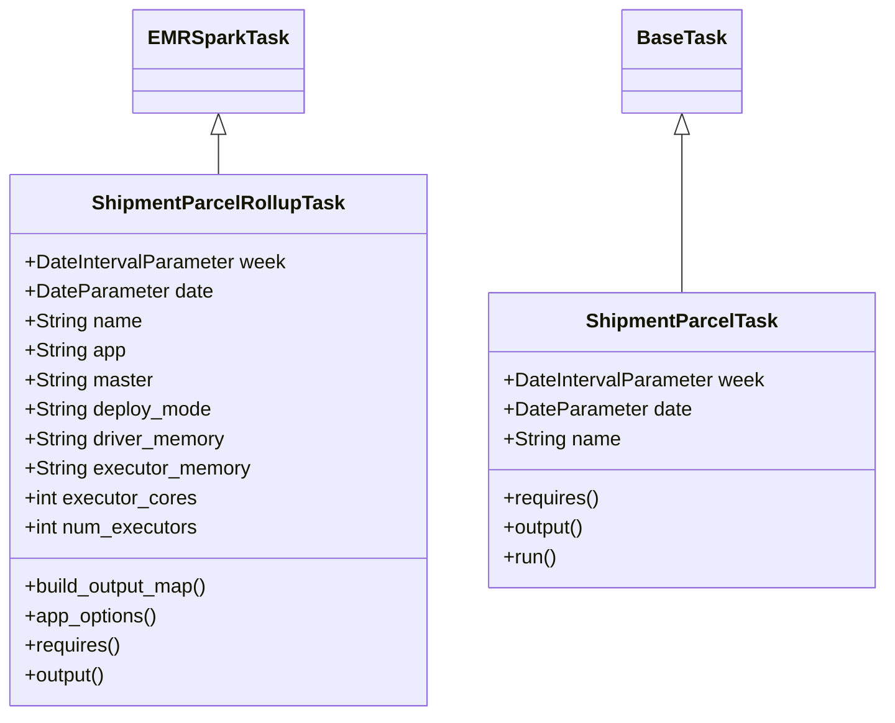
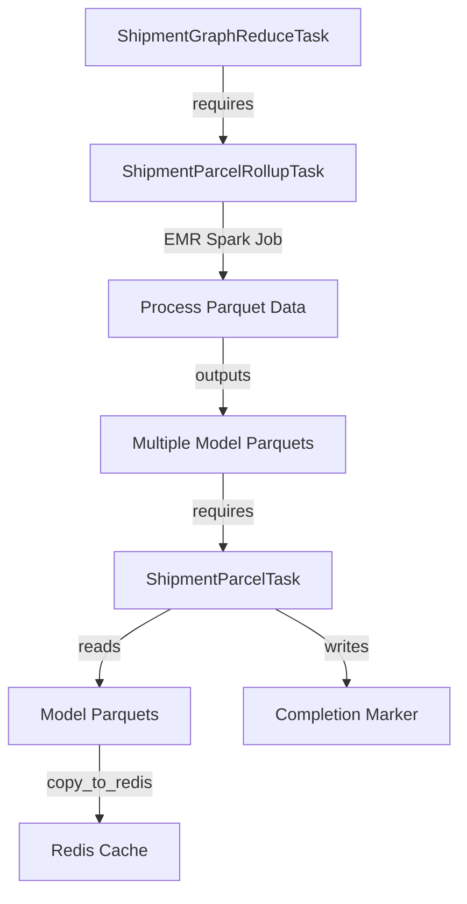
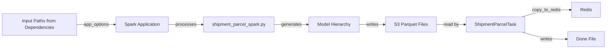

# Diagram: research/orchestrator/tasks/models/shipment_parcel_task.py

> Auto-generated by Obscura crawlers

## Diagram 1

### SVG

<svg id="container" width="709.46875" xmlns="http://www.w3.org/2000/svg" class="classDiagram" height="582" viewBox="0 0 709.46875 582" role="graphics-document document" aria-roledescription="class"><g><defs><marker id="container_class-aggregationStart" class="marker aggregation class" refX="18" refY="7" markerWidth="190" markerHeight="240" orient="auto"><path d="M 18,7 L9,13 L1,7 L9,1 Z"></path></marker></defs><defs><marker id="container_class-aggregationEnd" class="marker aggregation class" refX="1" refY="7" markerWidth="20" markerHeight="28" orient="auto"><path d="M 18,7 L9,13 L1,7 L9,1 Z"></path></marker></defs><defs><marker id="container_class-extensionStart" class="marker extension class" refX="18" refY="7" markerWidth="190" markerHeight="240" orient="auto"><path d="M 1,7 L18,13 V 1 Z"></path></marker></defs><defs><marker id="container_class-extensionEnd" class="marker extension class" refX="1" refY="7" markerWidth="20" markerHeight="28" orient="auto"><path d="M 1,1 V 13 L18,7 Z"></path></marker></defs><defs><marker id="container_class-compositionStart" class="marker composition class" refX="18" refY="7" markerWidth="190" markerHeight="240" orient="auto"><path d="M 18,7 L9,13 L1,7 L9,1 Z"></path></marker></defs><defs><marker id="container_class-compositionEnd" class="marker composition class" refX="1" refY="7" markerWidth="20" markerHeight="28" orient="auto"><path d="M 18,7 L9,13 L1,7 L9,1 Z"></path></marker></defs><defs><marker id="container_class-dependencyStart" class="marker dependency class" refX="6" refY="7" markerWidth="190" markerHeight="240" orient="auto"><path d="M 5,7 L9,13 L1,7 L9,1 Z"></path></marker></defs><defs><marker id="container_class-dependencyEnd" class="marker dependency class" refX="13" refY="7" markerWidth="20" markerHeight="28" orient="auto"><path d="M 18,7 L9,13 L14,7 L9,1 Z"></path></marker></defs><defs><marker id="container_class-lollipopStart" class="marker lollipop class" refX="13" refY="7" markerWidth="190" markerHeight="240" orient="auto"><circle stroke="black" fill="transparent" cx="7" cy="7" r="6"></circle></marker></defs><defs><marker id="container_class-lollipopEnd" class="marker lollipop class" refX="1" refY="7" markerWidth="190" markerHeight="240" orient="auto"><circle stroke="black" fill="transparent" cx="7" cy="7" r="6"></circle></marker></defs><g class="root"><g class="clusters"></g><g class="edgePaths"><path d="M174.766,109.25L174.766,110.542C174.766,111.833,174.766,114.417,174.766,119.875C174.766,125.333,174.766,133.667,174.766,137.833L174.766,142" id="id_EMRSparkTask_ShipmentParcelRollupTask_1" class="edge-thickness-normal edge-pattern-solid relation" style=";;;" data-edge="true" data-et="edge" data-id="id_EMRSparkTask_ShipmentParcelRollupTask_1" data-points="W3sieCI6MTc0Ljc2NTYyNSwieSI6OTJ9LHsieCI6MTc0Ljc2NTYyNSwieSI6MTE3fSx7IngiOjE3NC43NjU2MjUsInkiOjE0Mn1d" marker-start="url(#container_class-extensionStart)"></path><path d="M546.5,109.25L546.5,110.542C546.5,111.833,546.5,114.417,546.5,135.875C546.5,157.333,546.5,197.667,546.5,217.833L546.5,238" id="id_BaseTask_ShipmentParcelTask_2" class="edge-thickness-normal edge-pattern-solid relation" style=";;;" data-edge="true" data-et="edge" data-id="id_BaseTask_ShipmentParcelTask_2" data-points="W3sieCI6NTQ2LjUsInkiOjkyfSx7IngiOjU0Ni41LCJ5IjoxMTd9LHsieCI6NTQ2LjUsInkiOjIzOH1d" marker-start="url(#container_class-extensionStart)"></path></g><g class="edgeLabels"><g class="edgeLabel"><g class="label" data-id="id_EMRSparkTask_ShipmentParcelRollupTask_1" transform="translate(0, 0)"><foreignObject width="0" height="0">

</foreignObject></g></g><g class="edgeLabel"><g class="label" data-id="id_BaseTask_ShipmentParcelTask_2" transform="translate(0, 0)"><foreignObject width="0" height="0">

</foreignObject></g></g></g><g class="nodes"><g class="node default" id="classId-EMRSparkTask-0" transform="translate(174.765625, 50)"><g class="basic label-container"><path d="M-65.1484375 -42 L65.1484375 -42 L65.1484375 42 L-65.1484375 42" stroke="none" stroke-width="0" fill="#ECECFF" style=""></path><path d="M-65.1484375 -42 C-36.59402616487469 -42, -8.039614829749375 -42, 65.1484375 -42 M-65.1484375 -42 C-39.01640162967631 -42, -12.884365759352612 -42, 65.1484375 -42 M65.1484375 -42 C65.1484375 -17.63967861656663, 65.1484375 6.720642766866739, 65.1484375 42 M65.1484375 -42 C65.1484375 -21.038286171977035, 65.1484375 -0.07657234395406931, 65.1484375 42 M65.1484375 42 C20.008961784800547 42, -25.130513930398905 42, -65.1484375 42 M65.1484375 42 C20.254599993451812 42, -24.639237513096376 42, -65.1484375 42 M-65.1484375 42 C-65.1484375 21.15461211454011, -65.1484375 0.30922422908022185, -65.1484375 -42 M-65.1484375 42 C-65.1484375 16.736797540275404, -65.1484375 -8.526404919449192, -65.1484375 -42" stroke="#9370DB" stroke-width="1.3" fill="none" stroke-dasharray="0 0" style=""></path></g><g class="annotation-group text" transform="translate(0, -18)"></g><g class="label-group text" transform="translate(-53.1484375, -18)"><g class="label" style="font-weight: bolder" transform="translate(0,-12)"><foreignObject width="106.296875" height="24">

EMRSparkTask

</foreignObject></g></g><g class="members-group text" transform="translate(-53.1484375, 30)"></g><g class="methods-group text" transform="translate(-53.1484375, 60)"></g><g class="divider" style=""><path d="M-65.1484375 6 C-25.107217046126628 6, 14.934003407746744 6, 65.1484375 6 M-65.1484375 6 C-19.10975748208837 6, 26.92892253582326 6, 65.1484375 6" stroke="#9370DB" stroke-width="1.3" fill="none" stroke-dasharray="0 0" style=""></path></g><g class="divider" style=""><path d="M-65.1484375 24 C-23.621426980630133 24, 17.905583538739734 24, 65.1484375 24 M-65.1484375 24 C-19.028171740040996 24, 27.092094019918008 24, 65.1484375 24" stroke="#9370DB" stroke-width="1.3" fill="none" stroke-dasharray="0 0" style=""></path></g></g><g class="node default" id="classId-ShipmentParcelRollupTask-1" transform="translate(174.765625, 358)"><g class="basic label-container"><path d="M-166.765625 -216 L166.765625 -216 L166.765625 216 L-166.765625 216" stroke="none" stroke-width="0" fill="#ECECFF" style=""></path><path d="M-166.765625 -216 C-34.8501967064866 -216, 97.0652315870268 -216, 166.765625 -216 M-166.765625 -216 C-63.91497654436523 -216, 38.93567191126954 -216, 166.765625 -216 M166.765625 -216 C166.765625 -63.74569916877252, 166.765625 88.50860166245496, 166.765625 216 M166.765625 -216 C166.765625 -119.67924170526562, 166.765625 -23.35848341053125, 166.765625 216 M166.765625 216 C46.44401569271834 216, -73.87759361456332 216, -166.765625 216 M166.765625 216 C44.739082404417715 216, -77.28746019116457 216, -166.765625 216 M-166.765625 216 C-166.765625 87.7523351335837, -166.765625 -40.4953297328326, -166.765625 -216 M-166.765625 216 C-166.765625 49.98275011761393, -166.765625 -116.03449976477214, -166.765625 -216" stroke="#9370DB" stroke-width="1.3" fill="none" stroke-dasharray="0 0" style=""></path></g><g class="annotation-group text" transform="translate(0, -192)"></g><g class="label-group text" transform="translate(-97.40625, -192)"><g class="label" style="font-weight: bolder" transform="translate(0,-12)"><foreignObject width="194.8125" height="24">

ShipmentParcelRollupTask

</foreignObject></g></g><g class="members-group text" transform="translate(-154.765625, -144)"><g class="label" style="" transform="translate(0,-12)"><foreignObject width="212.125" height="24">

+DateIntervalParameter week

</foreignObject></g><g class="label" style="" transform="translate(0,12)"><foreignObject width="152.171875" height="24">

+DateParameter date

</foreignObject></g><g class="label" style="" transform="translate(0,36)"><foreignObject width="94.984375" height="24">

+String name

</foreignObject></g><g class="label" style="" transform="translate(0,60)"><foreignObject width="82.1875" height="24">

+String app

</foreignObject></g><g class="label" style="" transform="translate(0,84)"><foreignObject width="104.625" height="24">

+String master

</foreignObject></g><g class="label" style="" transform="translate(0,108)"><foreignObject width="153.203125" height="24">

+String deploy_mode

</foreignObject></g><g class="label" style="" transform="translate(0,132)"><foreignObject width="164.015625" height="24">

+String driver_memory

</foreignObject></g><g class="label" style="" transform="translate(0,156)"><foreignObject width="183.8125" height="24">

+String executor_memory

</foreignObject></g><g class="label" style="" transform="translate(0,180)"><foreignObject width="139.9375" height="24">

+int executor_cores

</foreignObject></g><g class="label" style="" transform="translate(0,204)"><foreignObject width="142.296875" height="24">

+int num_executors

</foreignObject></g></g><g class="methods-group text" transform="translate(-154.765625, 120)"><g class="label" style="" transform="translate(0,-12)"><foreignObject width="153.125" height="24">

+build_output_map()

</foreignObject></g><g class="label" style="" transform="translate(0,12)"><foreignObject width="108.84375" height="24">

+app_options()

</foreignObject></g><g class="label" style="" transform="translate(0,36)"><foreignObject width="78.0625" height="24">

+requires()

</foreignObject></g><g class="label" style="" transform="translate(0,60)"><foreignObject width="67.390625" height="24">

+output()

</foreignObject></g></g><g class="divider" style=""><path d="M-166.765625 -168 C-52.8902831113713 -168, 60.98505877725739 -168, 166.765625 -168 M-166.765625 -168 C-90.90166657247678 -168, -15.03770814495357 -168, 166.765625 -168" stroke="#9370DB" stroke-width="1.3" fill="none" stroke-dasharray="0 0" style=""></path></g><g class="divider" style=""><path d="M-166.765625 96 C-80.06487589412191 96, 6.635873211756177 96, 166.765625 96 M-166.765625 96 C-58.39153541769548 96, 49.98255416460904 96, 166.765625 96" stroke="#9370DB" stroke-width="1.3" fill="none" stroke-dasharray="0 0" style=""></path></g></g><g class="node default" id="classId-BaseTask-2" transform="translate(546.5, 50)"><g class="basic label-container"><path d="M-46.03125 -42 L46.03125 -42 L46.03125 42 L-46.03125 42" stroke="none" stroke-width="0" fill="#ECECFF" style=""></path><path d="M-46.03125 -42 C-26.257938205967857 -42, -6.484626411935714 -42, 46.03125 -42 M-46.03125 -42 C-22.916159276323143 -42, 0.19893144735371493 -42, 46.03125 -42 M46.03125 -42 C46.03125 -15.668242093543686, 46.03125 10.663515812912628, 46.03125 42 M46.03125 -42 C46.03125 -12.963641010816769, 46.03125 16.072717978366462, 46.03125 42 M46.03125 42 C10.52196212755451 42, -24.98732574489098 42, -46.03125 42 M46.03125 42 C16.934146017438334 42, -12.162957965123333 42, -46.03125 42 M-46.03125 42 C-46.03125 12.186434536451731, -46.03125 -17.627130927096538, -46.03125 -42 M-46.03125 42 C-46.03125 15.366612615486556, -46.03125 -11.266774769026888, -46.03125 -42" stroke="#9370DB" stroke-width="1.3" fill="none" stroke-dasharray="0 0" style=""></path></g><g class="annotation-group text" transform="translate(0, -18)"></g><g class="label-group text" transform="translate(-34.03125, -18)"><g class="label" style="font-weight: bolder" transform="translate(0,-12)"><foreignObject width="68.0625" height="24">

BaseTask

</foreignObject></g></g><g class="members-group text" transform="translate(-34.03125, 30)"></g><g class="methods-group text" transform="translate(-34.03125, 60)"></g><g class="divider" style=""><path d="M-46.03125 6 C-16.71946081169257 6, 12.592328376614859 6, 46.03125 6 M-46.03125 6 C-20.50538273434198 6, 5.020484531316043 6, 46.03125 6" stroke="#9370DB" stroke-width="1.3" fill="none" stroke-dasharray="0 0" style=""></path></g><g class="divider" style=""><path d="M-46.03125 24 C-26.522426100866078 24, -7.013602201732155 24, 46.03125 24 M-46.03125 24 C-25.120713513171033 24, -4.210177026342066 24, 46.03125 24" stroke="#9370DB" stroke-width="1.3" fill="none" stroke-dasharray="0 0" style=""></path></g></g><g class="node default" id="classId-ShipmentParcelTask-3" transform="translate(546.5, 358)"><g class="basic label-container"><path d="M-154.96875 -120 L154.96875 -120 L154.96875 120 L-154.96875 120" stroke="none" stroke-width="0" fill="#ECECFF" style=""></path><path d="M-154.96875 -120 C-77.4524509225388 -120, 0.06384815492239682 -120, 154.96875 -120 M-154.96875 -120 C-49.888242784922696 -120, 55.19226443015461 -120, 154.96875 -120 M154.96875 -120 C154.96875 -42.9207682666956, 154.96875 34.158463466608794, 154.96875 120 M154.96875 -120 C154.96875 -50.922955249774645, 154.96875 18.15408950045071, 154.96875 120 M154.96875 120 C70.08580806817274 120, -14.797133863654523 120, -154.96875 120 M154.96875 120 C64.17619679641908 120, -26.616356407161845 120, -154.96875 120 M-154.96875 120 C-154.96875 48.11728105398595, -154.96875 -23.765437892028103, -154.96875 -120 M-154.96875 120 C-154.96875 68.09957373252769, -154.96875 16.19914746505536, -154.96875 -120" stroke="#9370DB" stroke-width="1.3" fill="none" stroke-dasharray="0 0" style=""></path></g><g class="annotation-group text" transform="translate(0, -96)"></g><g class="label-group text" transform="translate(-73.8125, -96)"><g class="label" style="font-weight: bolder" transform="translate(0,-12)"><foreignObject width="147.625" height="24">

ShipmentParcelTask

</foreignObject></g></g><g class="members-group text" transform="translate(-142.96875, -48)"><g class="label" style="" transform="translate(0,-12)"><foreignObject width="212.125" height="24">

+DateIntervalParameter week

</foreignObject></g><g class="label" style="" transform="translate(0,12)"><foreignObject width="152.171875" height="24">

+DateParameter date

</foreignObject></g><g class="label" style="" transform="translate(0,36)"><foreignObject width="94.984375" height="24">

+String name

</foreignObject></g></g><g class="methods-group text" transform="translate(-142.96875, 48)"><g class="label" style="" transform="translate(0,-12)"><foreignObject width="78.0625" height="24">

+requires()

</foreignObject></g><g class="label" style="" transform="translate(0,12)"><foreignObject width="67.390625" height="24">

+output()

</foreignObject></g><g class="label" style="" transform="translate(0,36)"><foreignObject width="43.21875" height="24">

+run()

</foreignObject></g></g><g class="divider" style=""><path d="M-154.96875 -72 C-82.74662891529883 -72, -10.524507830597656 -72, 154.96875 -72 M-154.96875 -72 C-91.34738398912035 -72, -27.726017978240705 -72, 154.96875 -72" stroke="#9370DB" stroke-width="1.3" fill="none" stroke-dasharray="0 0" style=""></path></g><g class="divider" style=""><path d="M-154.96875 24 C-91.22099629918905 24, -27.473242598378107 24, 154.96875 24 M-154.96875 24 C-88.23969810104508 24, -21.510646202090157 24, 154.96875 24" stroke="#9370DB" stroke-width="1.3" fill="none" stroke-dasharray="0 0" style=""></path></g></g></g></g></g></svg>

## Diagram 2

### SVG

<svg id="container" width="436.75" xmlns="http://www.w3.org/2000/svg" class="flowchart" height="838" viewBox="0 0 436.75 838" role="graphics-document document" aria-roledescription="flowchart-v2"><g><marker id="container_flowchart-v2-pointEnd" class="marker flowchart-v2" viewBox="0 0 10 10" refX="5" refY="5" markerUnits="userSpaceOnUse" markerWidth="8" markerHeight="8" orient="auto"><path d="M 0 0 L 10 5 L 0 10 z" class="arrowMarkerPath" style="stroke-width: 1; stroke-dasharray: 1, 0;"></path></marker><marker id="container_flowchart-v2-pointStart" class="marker flowchart-v2" viewBox="0 0 10 10" refX="4.5" refY="5" markerUnits="userSpaceOnUse" markerWidth="8" markerHeight="8" orient="auto"><path d="M 0 5 L 10 10 L 10 0 z" class="arrowMarkerPath" style="stroke-width: 1; stroke-dasharray: 1, 0;"></path></marker><marker id="container_flowchart-v2-circleEnd" class="marker flowchart-v2" viewBox="0 0 10 10" refX="11" refY="5" markerUnits="userSpaceOnUse" markerWidth="11" markerHeight="11" orient="auto"><circle cx="5" cy="5" r="5" class="arrowMarkerPath" style="stroke-width: 1; stroke-dasharray: 1, 0;"></circle></marker><marker id="container_flowchart-v2-circleStart" class="marker flowchart-v2" viewBox="0 0 10 10" refX="-1" refY="5" markerUnits="userSpaceOnUse" markerWidth="11" markerHeight="11" orient="auto"><circle cx="5" cy="5" r="5" class="arrowMarkerPath" style="stroke-width: 1; stroke-dasharray: 1, 0;"></circle></marker><marker id="container_flowchart-v2-crossEnd" class="marker cross flowchart-v2" viewBox="0 0 11 11" refX="12" refY="5.2" markerUnits="userSpaceOnUse" markerWidth="11" markerHeight="11" orient="auto"><path d="M 1,1 l 9,9 M 10,1 l -9,9" class="arrowMarkerPath" style="stroke-width: 2; stroke-dasharray: 1, 0;"></path></marker><marker id="container_flowchart-v2-crossStart" class="marker cross flowchart-v2" viewBox="0 0 11 11" refX="-1" refY="5.2" markerUnits="userSpaceOnUse" markerWidth="11" markerHeight="11" orient="auto"><path d="M 1,1 l 9,9 M 10,1 l -9,9" class="arrowMarkerPath" style="stroke-width: 2; stroke-dasharray: 1, 0;"></path></marker><g class="root"><g class="clusters"></g><g class="edgePaths"><path d="M212.031,62L212.031,68.167C212.031,74.333,212.031,86.667,212.031,98.333C212.031,110,212.031,121,212.031,126.5L212.031,132" id="L_A_B_0" class="edge-thickness-normal edge-pattern-solid edge-thickness-normal edge-pattern-solid flowchart-link" style=";" data-edge="true" data-et="edge" data-id="L_A_B_0" data-points="W3sieCI6MjEyLjAzMTI1LCJ5Ijo2Mn0seyJ4IjoyMTIuMDMxMjUsInkiOjk5fSx7IngiOjIxMi4wMzEyNSwieSI6MTM2fV0=" marker-end="url(#container_flowchart-v2-pointEnd)"></path><path d="M212.031,190L212.031,196.167C212.031,202.333,212.031,214.667,212.031,226.333C212.031,238,212.031,249,212.031,254.5L212.031,260" id="L_B_C_0" class="edge-thickness-normal edge-pattern-solid edge-thickness-normal edge-pattern-solid flowchart-link" style=";" data-edge="true" data-et="edge" data-id="L_B_C_0" data-points="W3sieCI6MjEyLjAzMTI1LCJ5IjoxOTB9LHsieCI6MjEyLjAzMTI1LCJ5IjoyMjd9LHsieCI6MjEyLjAzMTI1LCJ5IjoyNjR9XQ==" marker-end="url(#container_flowchart-v2-pointEnd)"></path><path d="M212.031,318L212.031,324.167C212.031,330.333,212.031,342.667,212.031,354.333C212.031,366,212.031,377,212.031,382.5L212.031,388" id="L_C_D_0" class="edge-thickness-normal edge-pattern-solid edge-thickness-normal edge-pattern-solid flowchart-link" style=";" data-edge="true" data-et="edge" data-id="L_C_D_0" data-points="W3sieCI6MjEyLjAzMTI1LCJ5IjozMTh9LHsieCI6MjEyLjAzMTI1LCJ5IjozNTV9LHsieCI6MjEyLjAzMTI1LCJ5IjozOTJ9XQ==" marker-end="url(#container_flowchart-v2-pointEnd)"></path><path d="M212.031,446L212.031,452.167C212.031,458.333,212.031,470.667,212.031,482.333C212.031,494,212.031,505,212.031,510.5L212.031,516" id="L_D_E_0" class="edge-thickness-normal edge-pattern-solid edge-thickness-normal edge-pattern-solid flowchart-link" style=";" data-edge="true" data-et="edge" data-id="L_D_E_0" data-points="W3sieCI6MjEyLjAzMTI1LCJ5Ijo0NDZ9LHsieCI6MjEyLjAzMTI1LCJ5Ijo0ODN9LHsieCI6MjEyLjAzMTI1LCJ5Ijo1MjB9XQ==" marker-end="url(#container_flowchart-v2-pointEnd)"></path><path d="M162.382,574L151.042,580.167C139.702,586.333,117.023,598.667,105.683,610.333C94.344,622,94.344,633,94.344,638.5L94.344,644" id="L_E_F_0" class="edge-thickness-normal edge-pattern-solid edge-thickness-normal edge-pattern-solid flowchart-link" style=";" data-edge="true" data-et="edge" data-id="L_E_F_0" data-points="W3sieCI6MTYyLjM4MTgzNTkzNzUsInkiOjU3NH0seyJ4Ijo5NC4zNDM3NSwieSI6NjExfSx7IngiOjk0LjM0Mzc1LCJ5Ijo2NDh9XQ==" marker-end="url(#container_flowchart-v2-pointEnd)"></path><path d="M94.344,702L94.344,708.167C94.344,714.333,94.344,726.667,94.344,738.333C94.344,750,94.344,761,94.344,766.5L94.344,772" id="L_F_G_0" class="edge-thickness-normal edge-pattern-solid edge-thickness-normal edge-pattern-solid flowchart-link" style=";" data-edge="true" data-et="edge" data-id="L_F_G_0" data-points="W3sieCI6OTQuMzQzNzUsInkiOjcwMn0seyJ4Ijo5NC4zNDM3NSwieSI6NzM5fSx7IngiOjk0LjM0Mzc1LCJ5Ijo3NzZ9XQ==" marker-end="url(#container_flowchart-v2-pointEnd)"></path><path d="M261.681,574L273.02,580.167C284.36,586.333,307.039,598.667,318.379,610.333C329.719,622,329.719,633,329.719,638.5L329.719,644" id="L_E_H_0" class="edge-thickness-normal edge-pattern-solid edge-thickness-normal edge-pattern-solid flowchart-link" style=";" data-edge="true" data-et="edge" data-id="L_E_H_0" data-points="W3sieCI6MjYxLjY4MDY2NDA2MjUsInkiOjU3NH0seyJ4IjozMjkuNzE4NzUsInkiOjYxMX0seyJ4IjozMjkuNzE4NzUsInkiOjY0OH1d" marker-end="url(#container_flowchart-v2-pointEnd)"></path></g><g class="edgeLabels"><g class="edgeLabel" transform="translate(212.03125, 99)"><g class="label" data-id="L_A_B_0" transform="translate(-29.8515625, -12)"><foreignObject width="59.703125" height="24">

requires

</foreignObject></g></g><g class="edgeLabel" transform="translate(212.03125, 227)"><g class="label" data-id="L_B_C_0" transform="translate(-52.0234375, -12)"><foreignObject width="104.046875" height="24">

EMR Spark Job

</foreignObject></g></g><g class="edgeLabel" transform="translate(212.03125, 355)"><g class="label" data-id="L_C_D_0" transform="translate(-28.25, -12)"><foreignObject width="56.5" height="24">

outputs

</foreignObject></g></g><g class="edgeLabel" transform="translate(212.03125, 483)"><g class="label" data-id="L_D_E_0" transform="translate(-29.8515625, -12)"><foreignObject width="59.703125" height="24">

requires

</foreignObject></g></g><g class="edgeLabel" transform="translate(94.34375, 611)"><g class="label" data-id="L_E_F_0" transform="translate(-20.0078125, -12)"><foreignObject width="40.015625" height="24">

reads

</foreignObject></g></g><g class="edgeLabel" transform="translate(94.34375, 739)"><g class="label" data-id="L_F_G_0" transform="translate(-50.1796875, -12)"><foreignObject width="100.359375" height="24">

copy_to_redis

</foreignObject></g></g><g class="edgeLabel" transform="translate(329.71875, 611)"><g class="label" data-id="L_E_H_0" transform="translate(-21.9453125, -12)"><foreignObject width="43.890625" height="24">

writes

</foreignObject></g></g></g><g class="nodes"><g class="node default" id="flowchart-A-0" transform="translate(212.03125, 35)"><rect class="basic label-container" style="" x="-128.8828125" y="-27" width="257.765625" height="54"></rect><g class="label" style="" transform="translate(-98.8828125, -12)"><rect></rect><foreignObject width="197.765625" height="24">

ShipmentGraphReduceTask

</foreignObject></g></g><g class="node default" id="flowchart-B-1" transform="translate(212.03125, 163)"><rect class="basic label-container" style="" x="-125.953125" y="-27" width="251.90625" height="54"></rect><g class="label" style="" transform="translate(-95.953125, -12)"><rect></rect><foreignObject width="191.90625" height="24">

ShipmentParcelRollupTask

</foreignObject></g></g><g class="node default" id="flowchart-C-3" transform="translate(212.03125, 291)"><rect class="basic label-container" style="" x="-106.375" y="-27" width="212.75" height="54"></rect><g class="label" style="" transform="translate(-76.375, -12)"><rect></rect><foreignObject width="152.75" height="24">

Process Parquet Data

</foreignObject></g></g><g class="node default" id="flowchart-D-5" transform="translate(212.03125, 419)"><rect class="basic label-container" style="" x="-118.2421875" y="-27" width="236.484375" height="54"></rect><g class="label" style="" transform="translate(-88.2421875, -12)"><rect></rect><foreignObject width="176.484375" height="24">

Multiple Model Parquets

</foreignObject></g></g><g class="node default" id="flowchart-E-7" transform="translate(212.03125, 547)"><rect class="basic label-container" style="" x="-102.46875" y="-27" width="204.9375" height="54"></rect><g class="label" style="" transform="translate(-72.46875, -12)"><rect></rect><foreignObject width="144.9375" height="24">

ShipmentParcelTask

</foreignObject></g></g><g class="node default" id="flowchart-F-9" transform="translate(94.34375, 675)"><rect class="basic label-container" style="" x="-86.34375" y="-27" width="172.6875" height="54"></rect><g class="label" style="" transform="translate(-56.34375, -12)"><rect></rect><foreignObject width="112.6875" height="24">

Model Parquets

</foreignObject></g></g><g class="node default" id="flowchart-G-11" transform="translate(94.34375, 803)"><rect class="basic label-container" style="" x="-73.6015625" y="-27" width="147.203125" height="54"></rect><g class="label" style="" transform="translate(-43.6015625, -12)"><rect></rect><foreignObject width="87.203125" height="24">

Redis Cache

</foreignObject></g></g><g class="node default" id="flowchart-H-13" transform="translate(329.71875, 675)"><rect class="basic label-container" style="" x="-99.03125" y="-27" width="198.0625" height="54"></rect><g class="label" style="" transform="translate(-69.03125, -12)"><rect></rect><foreignObject width="138.0625" height="24">

Completion Marker

</foreignObject></g></g></g></g></g></svg>

## Diagram 3

### SVG

<svg id="container" width="2130.203125" xmlns="http://www.w3.org/2000/svg" class="flowchart" height="174" viewBox="0 0 2130.203125 174" role="graphics-document document" aria-roledescription="flowchart-v2"><g><marker id="container_flowchart-v2-pointEnd" class="marker flowchart-v2" viewBox="0 0 10 10" refX="5" refY="5" markerUnits="userSpaceOnUse" markerWidth="8" markerHeight="8" orient="auto"><path d="M 0 0 L 10 5 L 0 10 z" class="arrowMarkerPath" style="stroke-width: 1; stroke-dasharray: 1, 0;"></path></marker><marker id="container_flowchart-v2-pointStart" class="marker flowchart-v2" viewBox="0 0 10 10" refX="4.5" refY="5" markerUnits="userSpaceOnUse" markerWidth="8" markerHeight="8" orient="auto"><path d="M 0 5 L 10 10 L 10 0 z" class="arrowMarkerPath" style="stroke-width: 1; stroke-dasharray: 1, 0;"></path></marker><marker id="container_flowchart-v2-circleEnd" class="marker flowchart-v2" viewBox="0 0 10 10" refX="11" refY="5" markerUnits="userSpaceOnUse" markerWidth="11" markerHeight="11" orient="auto"><circle cx="5" cy="5" r="5" class="arrowMarkerPath" style="stroke-width: 1; stroke-dasharray: 1, 0;"></circle></marker><marker id="container_flowchart-v2-circleStart" class="marker flowchart-v2" viewBox="0 0 10 10" refX="-1" refY="5" markerUnits="userSpaceOnUse" markerWidth="11" markerHeight="11" orient="auto"><circle cx="5" cy="5" r="5" class="arrowMarkerPath" style="stroke-width: 1; stroke-dasharray: 1, 0;"></circle></marker><marker id="container_flowchart-v2-crossEnd" class="marker cross flowchart-v2" viewBox="0 0 11 11" refX="12" refY="5.2" markerUnits="userSpaceOnUse" markerWidth="11" markerHeight="11" orient="auto"><path d="M 1,1 l 9,9 M 10,1 l -9,9" class="arrowMarkerPath" style="stroke-width: 2; stroke-dasharray: 1, 0;"></path></marker><marker id="container_flowchart-v2-crossStart" class="marker cross flowchart-v2" viewBox="0 0 11 11" refX="-1" refY="5.2" markerUnits="userSpaceOnUse" markerWidth="11" markerHeight="11" orient="auto"><path d="M 1,1 l 9,9 M 10,1 l -9,9" class="arrowMarkerPath" style="stroke-width: 2; stroke-dasharray: 1, 0;"></path></marker><g class="root"><g class="clusters"></g><g class="edgePaths"><path d="M268,87L279.728,87C291.456,87,314.911,87,337.701,87C360.49,87,382.612,87,393.673,87L404.734,87" id="L_A_B_0" class="edge-thickness-normal edge-pattern-solid edge-thickness-normal edge-pattern-solid flowchart-link" style=";" data-edge="true" data-et="edge" data-id="L_A_B_0" data-points="W3sieCI6MjY4LCJ5Ijo4N30seyJ4IjozMzguMzY3MTg3NSwieSI6ODd9LHsieCI6NDA4LjczNDM3NSwieSI6ODd9XQ==" marker-end="url(#container_flowchart-v2-pointEnd)"></path><path d="M596.688,87L606.819,87C616.951,87,637.214,87,656.81,87C676.406,87,695.336,87,704.801,87L714.266,87" id="L_B_C_0" class="edge-thickness-normal edge-pattern-solid edge-thickness-normal edge-pattern-solid flowchart-link" style=";" data-edge="true" data-et="edge" data-id="L_B_C_0" data-points="W3sieCI6NTk2LjY4NzUsInkiOjg3fSx7IngiOjY1Ny40NzY1NjI1LCJ5Ijo4N30seyJ4Ijo3MTguMjY1NjI1LCJ5Ijo4N31d" marker-end="url(#container_flowchart-v2-pointEnd)"></path><path d="M968.953,87L979.031,87C989.109,87,1009.266,87,1028.755,87C1048.245,87,1067.068,87,1076.479,87L1085.891,87" id="L_C_D_0" class="edge-thickness-normal edge-pattern-solid edge-thickness-normal edge-pattern-solid flowchart-link" style=";" data-edge="true" data-et="edge" data-id="L_C_D_0" data-points="W3sieCI6OTY4Ljk1MzEyNSwieSI6ODd9LHsieCI6MTAyOS40MjE4NzUsInkiOjg3fSx7IngiOjEwODkuODkwNjI1LCJ5Ijo4N31d" marker-end="url(#container_flowchart-v2-pointEnd)"></path><path d="M1267.813,87L1275.637,87C1283.461,87,1299.109,87,1314.091,87C1329.073,87,1343.388,87,1350.546,87L1357.703,87" id="L_D_E_0" class="edge-thickness-normal edge-pattern-solid edge-thickness-normal edge-pattern-solid flowchart-link" style=";" data-edge="true" data-et="edge" data-id="L_D_E_0" data-points="W3sieCI6MTI2Ny44MTI1LCJ5Ijo4N30seyJ4IjoxMzE0Ljc1NzgxMjUsInkiOjg3fSx7IngiOjEzNjEuNzAzMTI1LCJ5Ijo4N31d" marker-end="url(#container_flowchart-v2-pointEnd)"></path><path d="M1535.688,87L1544.362,87C1553.036,87,1570.385,87,1587.068,87C1603.75,87,1619.766,87,1627.773,87L1635.781,87" id="L_E_F_0" class="edge-thickness-normal edge-pattern-solid edge-thickness-normal edge-pattern-solid flowchart-link" style=";" data-edge="true" data-et="edge" data-id="L_E_F_0" data-points="W3sieCI6MTUzNS42ODc1LCJ5Ijo4N30seyJ4IjoxNTg3LjczNDM3NSwieSI6ODd9LHsieCI6MTYzOS43ODEyNSwieSI6ODd9XQ==" marker-end="url(#container_flowchart-v2-pointEnd)"></path><path d="M1834.491,60L1848.725,55.833C1862.96,51.667,1891.429,43.333,1919.811,39.167C1948.193,35,1976.487,35,1990.634,35L2004.781,35" id="L_F_G_0" class="edge-thickness-normal edge-pattern-solid edge-thickness-normal edge-pattern-solid flowchart-link" style=";" data-edge="true" data-et="edge" data-id="L_F_G_0" data-points="W3sieCI6MTgzNC40OTA1MzQ4NTU3NjkzLCJ5Ijo2MH0seyJ4IjoxOTE5Ljg5ODQzNzUsInkiOjM1fSx7IngiOjIwMDguNzgxMjUsInkiOjM1fV0=" marker-end="url(#container_flowchart-v2-pointEnd)"></path><path d="M1834.491,114L1848.725,118.167C1862.96,122.333,1891.429,130.667,1917.527,134.833C1943.625,139,1967.352,139,1979.215,139L1991.078,139" id="L_F_H_0" class="edge-thickness-normal edge-pattern-solid edge-thickness-normal edge-pattern-solid flowchart-link" style=";" data-edge="true" data-et="edge" data-id="L_F_H_0" data-points="W3sieCI6MTgzNC40OTA1MzQ4NTU3NjkzLCJ5IjoxMTR9LHsieCI6MTkxOS44OTg0Mzc1LCJ5IjoxMzl9LHsieCI6MTk5NS4wNzgxMjUsInkiOjEzOX1d" marker-end="url(#container_flowchart-v2-pointEnd)"></path></g><g class="edgeLabels"><g class="edgeLabel" transform="translate(338.3671875, 87)"><g class="label" data-id="L_A_B_0" transform="translate(-45.3671875, -12)"><foreignObject width="90.734375" height="24">

app_options

</foreignObject></g></g><g class="edgeLabel" transform="translate(657.4765625, 87)"><g class="label" data-id="L_B_C_0" transform="translate(-35.7890625, -12)"><foreignObject width="71.578125" height="24">

processes

</foreignObject></g></g><g class="edgeLabel" transform="translate(1029.421875, 87)"><g class="label" data-id="L_C_D_0" transform="translate(-35.46875, -12)"><foreignObject width="70.9375" height="24">

generates

</foreignObject></g></g><g class="edgeLabel" transform="translate(1314.7578125, 87)"><g class="label" data-id="L_D_E_0" transform="translate(-21.9453125, -12)"><foreignObject width="43.890625" height="24">

writes

</foreignObject></g></g><g class="edgeLabel" transform="translate(1587.734375, 87)"><g class="label" data-id="L_E_F_0" transform="translate(-27.046875, -12)"><foreignObject width="54.09375" height="24">

read by

</foreignObject></g></g><g class="edgeLabel" transform="translate(1919.8984375, 35)"><g class="label" data-id="L_F_G_0" transform="translate(-50.1796875, -12)"><foreignObject width="100.359375" height="24">

copy_to_redis

</foreignObject></g></g><g class="edgeLabel" transform="translate(1919.8984375, 139)"><g class="label" data-id="L_F_H_0" transform="translate(-21.9453125, -12)"><foreignObject width="43.890625" height="24">

writes

</foreignObject></g></g></g><g class="nodes"><g class="node default" id="flowchart-A-0" transform="translate(138, 87)"><rect class="basic label-container" style="" x="-130" y="-39" width="260" height="78"></rect><g class="label" style="" transform="translate(-100, -24)"><rect></rect><foreignObject width="200" height="48">

Input Paths from Dependencies

</foreignObject></g></g><g class="node default" id="flowchart-B-1" transform="translate(502.7109375, 87)"><rect class="basic label-container" style="" x="-93.9765625" y="-27" width="187.953125" height="54"></rect><g class="label" style="" transform="translate(-63.9765625, -12)"><rect></rect><foreignObject width="127.953125" height="24">

Spark Application

</foreignObject></g></g><g class="node default" id="flowchart-C-3" transform="translate(843.609375, 87)"><rect class="basic label-container" style="" x="-125.34375" y="-27" width="250.6875" height="54"></rect><g class="label" style="" transform="translate(-95.34375, -12)"><rect></rect><foreignObject width="190.6875" height="24">

shipment_parcel_spark.py

</foreignObject></g></g><g class="node default" id="flowchart-D-5" transform="translate(1178.8515625, 87)"><rect class="basic label-container" style="" x="-88.9609375" y="-27" width="177.921875" height="54"></rect><g class="label" style="" transform="translate(-58.9609375, -12)"><rect></rect><foreignObject width="117.921875" height="24">

Model Hierarchy

</foreignObject></g></g><g class="node default" id="flowchart-E-7" transform="translate(1448.6953125, 87)"><rect class="basic label-container" style="" x="-86.9921875" y="-27" width="173.984375" height="54"></rect><g class="label" style="" transform="translate(-56.9921875, -12)"><rect></rect><foreignObject width="113.984375" height="24">

S3 Parquet Files

</foreignObject></g></g><g class="node default" id="flowchart-F-9" transform="translate(1742.25, 87)"><rect class="basic label-container" style="" x="-102.46875" y="-27" width="204.9375" height="54"></rect><g class="label" style="" transform="translate(-72.46875, -12)"><rect></rect><foreignObject width="144.9375" height="24">

ShipmentParcelTask

</foreignObject></g></g><g class="node default" id="flowchart-G-11" transform="translate(2058.640625, 35)"><rect class="basic label-container" style="" x="-49.859375" y="-27" width="99.71875" height="54"></rect><g class="label" style="" transform="translate(-19.859375, -12)"><rect></rect><foreignObject width="39.71875" height="24">

Redis

</foreignObject></g></g><g class="node default" id="flowchart-H-13" transform="translate(2058.640625, 139)"><rect class="basic label-container" style="" x="-63.5625" y="-27" width="127.125" height="54"></rect><g class="label" style="" transform="translate(-33.5625, -12)"><rect></rect><foreignObject width="67.125" height="24">

Done File

</foreignObject></g></g></g></g></g></svg>
