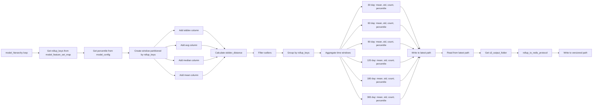
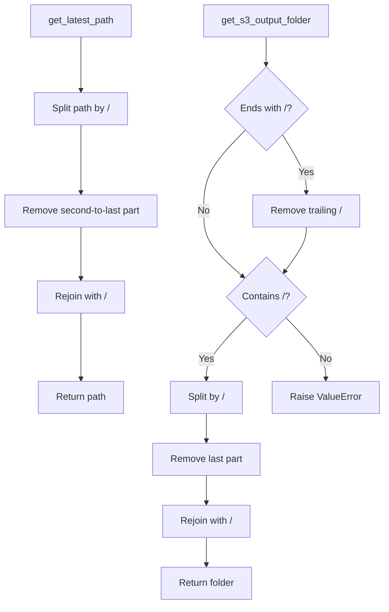

# Diagram: research/orchestrator/tasks/models/shipment_rail_splc_spark.py

> Auto-generated by Obscura crawlers

## Diagram 1

```mermaid
flowchart TD
    A[Start main] --> B[Initialize SparkContext & SQLContext]
    B --> C[Read base parquet data]
    C --> D[Filter: sstop_final_stop_arrived_at not null]
    D --> E[Read & join orgs data]
    E --> F[Filter: ship_mode_id == 2 Rail]
    F --> G[Read shipment_exceptions]
    G --> H[Filter: exception types 38, 39]
    H --> I[Aggregate exceptions by shipment_id]
    I --> J[Left join exceptions to base]
    J --> K[Read shipment_statuses]
    K --> L[Join statuses to base]
    L --> M[Calculate shipment_status_to_arrival_seconds]
    M --> N[Filter: seconds > 0]
    N --> O[Filter: statuses after exception resolved]
    O --> P[Filter: exclude Sep 9-19 2022]
    P --> Q[Add day_of_week column]
    Q --> R[Read & join location data]
    R --> S[Filter: window >= 365 days]
    S --> T[Filter: transit time 5min-30days]
    T --> U[Save raw data to parquet]
    U --> V[Add ford_60th_override column]
    V --> W[Filter: exclude specific OD pairs & dates]
    W --> X[Loop through model_hierarchy]
    X --> Y[For each model: partition by rollup_keys]
    Y --> Z[Calculate window statistics]
    Z --> AA[Calculate stddev_distance]
    AA --> AB[Filter: stddev_distance between -3 and 3]
    AB --> AC[Group by rollup_keys]
    AC --> AD[Aggregate 30/60/90/120/180/365 day stats]
    AD --> AE[Write model to parquet]
    AE --> AF[Write to Redis protocol]
    AF --> AG{More models?}
    AG -->|Yes| Y
    AG -->|No| AH[End]
```

### SVG

<svg id="container" width="391.21875" xmlns="http://www.w3.org/2000/svg" class="flowchart" height="4034.828125" viewBox="0 0 391.21875 4034.828125" role="graphics-document document" aria-roledescription="flowchart-v2"><g><marker id="container_flowchart-v2-pointEnd" class="marker flowchart-v2" viewBox="0 0 10 10" refX="5" refY="5" markerUnits="userSpaceOnUse" markerWidth="8" markerHeight="8" orient="auto"><path d="M 0 0 L 10 5 L 0 10 z" class="arrowMarkerPath" style="stroke-width: 1; stroke-dasharray: 1, 0;"></path></marker><marker id="container_flowchart-v2-pointStart" class="marker flowchart-v2" viewBox="0 0 10 10" refX="4.5" refY="5" markerUnits="userSpaceOnUse" markerWidth="8" markerHeight="8" orient="auto"><path d="M 0 5 L 10 10 L 10 0 z" class="arrowMarkerPath" style="stroke-width: 1; stroke-dasharray: 1, 0;"></path></marker><marker id="container_flowchart-v2-circleEnd" class="marker flowchart-v2" viewBox="0 0 10 10" refX="11" refY="5" markerUnits="userSpaceOnUse" markerWidth="11" markerHeight="11" orient="auto"><circle cx="5" cy="5" r="5" class="arrowMarkerPath" style="stroke-width: 1; stroke-dasharray: 1, 0;"></circle></marker><marker id="container_flowchart-v2-circleStart" class="marker flowchart-v2" viewBox="0 0 10 10" refX="-1" refY="5" markerUnits="userSpaceOnUse" markerWidth="11" markerHeight="11" orient="auto"><circle cx="5" cy="5" r="5" class="arrowMarkerPath" style="stroke-width: 1; stroke-dasharray: 1, 0;"></circle></marker><marker id="container_flowchart-v2-crossEnd" class="marker cross flowchart-v2" viewBox="0 0 11 11" refX="12" refY="5.2" markerUnits="userSpaceOnUse" markerWidth="11" markerHeight="11" orient="auto"><path d="M 1,1 l 9,9 M 10,1 l -9,9" class="arrowMarkerPath" style="stroke-width: 2; stroke-dasharray: 1, 0;"></path></marker><marker id="container_flowchart-v2-crossStart" class="marker cross flowchart-v2" viewBox="0 0 11 11" refX="-1" refY="5.2" markerUnits="userSpaceOnUse" markerWidth="11" markerHeight="11" orient="auto"><path d="M 1,1 l 9,9 M 10,1 l -9,9" class="arrowMarkerPath" style="stroke-width: 2; stroke-dasharray: 1, 0;"></path></marker><g class="root"><g class="clusters"></g><g class="edgePaths"><path d="M220.5,62L220.5,66.167C220.5,70.333,220.5,78.667,220.5,86.333C220.5,94,220.5,101,220.5,104.5L220.5,108" id="L_A_B_0" class="edge-thickness-normal edge-pattern-solid edge-thickness-normal edge-pattern-solid flowchart-link" style=";" data-edge="true" data-et="edge" data-id="L_A_B_0" data-points="W3sieCI6MjIwLjUsInkiOjYyfSx7IngiOjIyMC41LCJ5Ijo4N30seyJ4IjoyMjAuNSwieSI6MTEyfV0=" marker-end="url(#container_flowchart-v2-pointEnd)"></path><path d="M220.5,190L220.5,194.167C220.5,198.333,220.5,206.667,220.5,214.333C220.5,222,220.5,229,220.5,232.5L220.5,236" id="L_B_C_0" class="edge-thickness-normal edge-pattern-solid edge-thickness-normal edge-pattern-solid flowchart-link" style=";" data-edge="true" data-et="edge" data-id="L_B_C_0" data-points="W3sieCI6MjIwLjUsInkiOjE5MH0seyJ4IjoyMjAuNSwieSI6MjE1fSx7IngiOjIyMC41LCJ5IjoyNDB9XQ==" marker-end="url(#container_flowchart-v2-pointEnd)"></path><path d="M220.5,294L220.5,298.167C220.5,302.333,220.5,310.667,220.5,318.333C220.5,326,220.5,333,220.5,336.5L220.5,340" id="L_C_D_0" class="edge-thickness-normal edge-pattern-solid edge-thickness-normal edge-pattern-solid flowchart-link" style=";" data-edge="true" data-et="edge" data-id="L_C_D_0" data-points="W3sieCI6MjIwLjUsInkiOjI5NH0seyJ4IjoyMjAuNSwieSI6MzE5fSx7IngiOjIyMC41LCJ5IjozNDR9XQ==" marker-end="url(#container_flowchart-v2-pointEnd)"></path><path d="M220.5,446L220.5,450.167C220.5,454.333,220.5,462.667,220.5,470.333C220.5,478,220.5,485,220.5,488.5L220.5,492" id="L_D_E_0" class="edge-thickness-normal edge-pattern-solid edge-thickness-normal edge-pattern-solid flowchart-link" style=";" data-edge="true" data-et="edge" data-id="L_D_E_0" data-points="W3sieCI6MjIwLjUsInkiOjQ0Nn0seyJ4IjoyMjAuNSwieSI6NDcxfSx7IngiOjIyMC41LCJ5Ijo0OTZ9XQ==" marker-end="url(#container_flowchart-v2-pointEnd)"></path><path d="M220.5,550L220.5,554.167C220.5,558.333,220.5,566.667,220.5,574.333C220.5,582,220.5,589,220.5,592.5L220.5,596" id="L_E_F_0" class="edge-thickness-normal edge-pattern-solid edge-thickness-normal edge-pattern-solid flowchart-link" style=";" data-edge="true" data-et="edge" data-id="L_E_F_0" data-points="W3sieCI6MjIwLjUsInkiOjU1MH0seyJ4IjoyMjAuNSwieSI6NTc1fSx7IngiOjIyMC41LCJ5Ijo2MDB9XQ==" marker-end="url(#container_flowchart-v2-pointEnd)"></path><path d="M220.5,678L220.5,682.167C220.5,686.333,220.5,694.667,220.5,702.333C220.5,710,220.5,717,220.5,720.5L220.5,724" id="L_F_G_0" class="edge-thickness-normal edge-pattern-solid edge-thickness-normal edge-pattern-solid flowchart-link" style=";" data-edge="true" data-et="edge" data-id="L_F_G_0" data-points="W3sieCI6MjIwLjUsInkiOjY3OH0seyJ4IjoyMjAuNSwieSI6NzAzfSx7IngiOjIyMC41LCJ5Ijo3Mjh9XQ==" marker-end="url(#container_flowchart-v2-pointEnd)"></path><path d="M220.5,782L220.5,786.167C220.5,790.333,220.5,798.667,220.5,806.333C220.5,814,220.5,821,220.5,824.5L220.5,828" id="L_G_H_0" class="edge-thickness-normal edge-pattern-solid edge-thickness-normal edge-pattern-solid flowchart-link" style=";" data-edge="true" data-et="edge" data-id="L_G_H_0" data-points="W3sieCI6MjIwLjUsInkiOjc4Mn0seyJ4IjoyMjAuNSwieSI6ODA3fSx7IngiOjIyMC41LCJ5Ijo4MzJ9XQ==" marker-end="url(#container_flowchart-v2-pointEnd)"></path><path d="M220.5,910L220.5,914.167C220.5,918.333,220.5,926.667,220.5,934.333C220.5,942,220.5,949,220.5,952.5L220.5,956" id="L_H_I_0" class="edge-thickness-normal edge-pattern-solid edge-thickness-normal edge-pattern-solid flowchart-link" style=";" data-edge="true" data-et="edge" data-id="L_H_I_0" data-points="W3sieCI6MjIwLjUsInkiOjkxMH0seyJ4IjoyMjAuNSwieSI6OTM1fSx7IngiOjIyMC41LCJ5Ijo5NjB9XQ==" marker-end="url(#container_flowchart-v2-pointEnd)"></path><path d="M220.5,1038L220.5,1042.167C220.5,1046.333,220.5,1054.667,220.5,1062.333C220.5,1070,220.5,1077,220.5,1080.5L220.5,1084" id="L_I_J_0" class="edge-thickness-normal edge-pattern-solid edge-thickness-normal edge-pattern-solid flowchart-link" style=";" data-edge="true" data-et="edge" data-id="L_I_J_0" data-points="W3sieCI6MjIwLjUsInkiOjEwMzh9LHsieCI6MjIwLjUsInkiOjEwNjN9LHsieCI6MjIwLjUsInkiOjEwODh9XQ==" marker-end="url(#container_flowchart-v2-pointEnd)"></path><path d="M220.5,1142L220.5,1146.167C220.5,1150.333,220.5,1158.667,220.5,1166.333C220.5,1174,220.5,1181,220.5,1184.5L220.5,1188" id="L_J_K_0" class="edge-thickness-normal edge-pattern-solid edge-thickness-normal edge-pattern-solid flowchart-link" style=";" data-edge="true" data-et="edge" data-id="L_J_K_0" data-points="W3sieCI6MjIwLjUsInkiOjExNDJ9LHsieCI6MjIwLjUsInkiOjExNjd9LHsieCI6MjIwLjUsInkiOjExOTJ9XQ==" marker-end="url(#container_flowchart-v2-pointEnd)"></path><path d="M220.5,1246L220.5,1250.167C220.5,1254.333,220.5,1262.667,220.5,1270.333C220.5,1278,220.5,1285,220.5,1288.5L220.5,1292" id="L_K_L_0" class="edge-thickness-normal edge-pattern-solid edge-thickness-normal edge-pattern-solid flowchart-link" style=";" data-edge="true" data-et="edge" data-id="L_K_L_0" data-points="W3sieCI6MjIwLjUsInkiOjEyNDZ9LHsieCI6MjIwLjUsInkiOjEyNzF9LHsieCI6MjIwLjUsInkiOjEyOTZ9XQ==" marker-end="url(#container_flowchart-v2-pointEnd)"></path><path d="M220.5,1350L220.5,1354.167C220.5,1358.333,220.5,1366.667,220.5,1374.333C220.5,1382,220.5,1389,220.5,1392.5L220.5,1396" id="L_L_M_0" class="edge-thickness-normal edge-pattern-solid edge-thickness-normal edge-pattern-solid flowchart-link" style=";" data-edge="true" data-et="edge" data-id="L_L_M_0" data-points="W3sieCI6MjIwLjUsInkiOjEzNTB9LHsieCI6MjIwLjUsInkiOjEzNzV9LHsieCI6MjIwLjUsInkiOjE0MDB9XQ==" marker-end="url(#container_flowchart-v2-pointEnd)"></path><path d="M220.5,1478L220.5,1482.167C220.5,1486.333,220.5,1494.667,220.5,1502.333C220.5,1510,220.5,1517,220.5,1520.5L220.5,1524" id="L_M_N_0" class="edge-thickness-normal edge-pattern-solid edge-thickness-normal edge-pattern-solid flowchart-link" style=";" data-edge="true" data-et="edge" data-id="L_M_N_0" data-points="W3sieCI6MjIwLjUsInkiOjE0Nzh9LHsieCI6MjIwLjUsInkiOjE1MDN9LHsieCI6MjIwLjUsInkiOjE1Mjh9XQ==" marker-end="url(#container_flowchart-v2-pointEnd)"></path><path d="M220.5,1582L220.5,1586.167C220.5,1590.333,220.5,1598.667,220.5,1606.333C220.5,1614,220.5,1621,220.5,1624.5L220.5,1628" id="L_N_O_0" class="edge-thickness-normal edge-pattern-solid edge-thickness-normal edge-pattern-solid flowchart-link" style=";" data-edge="true" data-et="edge" data-id="L_N_O_0" data-points="W3sieCI6MjIwLjUsInkiOjE1ODJ9LHsieCI6MjIwLjUsInkiOjE2MDd9LHsieCI6MjIwLjUsInkiOjE2MzJ9XQ==" marker-end="url(#container_flowchart-v2-pointEnd)"></path><path d="M220.5,1710L220.5,1714.167C220.5,1718.333,220.5,1726.667,220.5,1734.333C220.5,1742,220.5,1749,220.5,1752.5L220.5,1756" id="L_O_P_0" class="edge-thickness-normal edge-pattern-solid edge-thickness-normal edge-pattern-solid flowchart-link" style=";" data-edge="true" data-et="edge" data-id="L_O_P_0" data-points="W3sieCI6MjIwLjUsInkiOjE3MTB9LHsieCI6MjIwLjUsInkiOjE3MzV9LHsieCI6MjIwLjUsInkiOjE3NjB9XQ==" marker-end="url(#container_flowchart-v2-pointEnd)"></path><path d="M220.5,1838L220.5,1842.167C220.5,1846.333,220.5,1854.667,220.5,1862.333C220.5,1870,220.5,1877,220.5,1880.5L220.5,1884" id="L_P_Q_0" class="edge-thickness-normal edge-pattern-solid edge-thickness-normal edge-pattern-solid flowchart-link" style=";" data-edge="true" data-et="edge" data-id="L_P_Q_0" data-points="W3sieCI6MjIwLjUsInkiOjE4Mzh9LHsieCI6MjIwLjUsInkiOjE4NjN9LHsieCI6MjIwLjUsInkiOjE4ODh9XQ==" marker-end="url(#container_flowchart-v2-pointEnd)"></path><path d="M220.5,1942L220.5,1946.167C220.5,1950.333,220.5,1958.667,220.5,1966.333C220.5,1974,220.5,1981,220.5,1984.5L220.5,1988" id="L_Q_R_0" class="edge-thickness-normal edge-pattern-solid edge-thickness-normal edge-pattern-solid flowchart-link" style=";" data-edge="true" data-et="edge" data-id="L_Q_R_0" data-points="W3sieCI6MjIwLjUsInkiOjE5NDJ9LHsieCI6MjIwLjUsInkiOjE5Njd9LHsieCI6MjIwLjUsInkiOjE5OTJ9XQ==" marker-end="url(#container_flowchart-v2-pointEnd)"></path><path d="M220.5,2046L220.5,2050.167C220.5,2054.333,220.5,2062.667,220.5,2070.333C220.5,2078,220.5,2085,220.5,2088.5L220.5,2092" id="L_R_S_0" class="edge-thickness-normal edge-pattern-solid edge-thickness-normal edge-pattern-solid flowchart-link" style=";" data-edge="true" data-et="edge" data-id="L_R_S_0" data-points="W3sieCI6MjIwLjUsInkiOjIwNDZ9LHsieCI6MjIwLjUsInkiOjIwNzF9LHsieCI6MjIwLjUsInkiOjIwOTZ9XQ==" marker-end="url(#container_flowchart-v2-pointEnd)"></path><path d="M220.5,2150L220.5,2154.167C220.5,2158.333,220.5,2166.667,220.5,2174.333C220.5,2182,220.5,2189,220.5,2192.5L220.5,2196" id="L_S_T_0" class="edge-thickness-normal edge-pattern-solid edge-thickness-normal edge-pattern-solid flowchart-link" style=";" data-edge="true" data-et="edge" data-id="L_S_T_0" data-points="W3sieCI6MjIwLjUsInkiOjIxNTB9LHsieCI6MjIwLjUsInkiOjIxNzV9LHsieCI6MjIwLjUsInkiOjIyMDB9XQ==" marker-end="url(#container_flowchart-v2-pointEnd)"></path><path d="M220.5,2278L220.5,2282.167C220.5,2286.333,220.5,2294.667,220.5,2302.333C220.5,2310,220.5,2317,220.5,2320.5L220.5,2324" id="L_T_U_0" class="edge-thickness-normal edge-pattern-solid edge-thickness-normal edge-pattern-solid flowchart-link" style=";" data-edge="true" data-et="edge" data-id="L_T_U_0" data-points="W3sieCI6MjIwLjUsInkiOjIyNzh9LHsieCI6MjIwLjUsInkiOjIzMDN9LHsieCI6MjIwLjUsInkiOjIzMjh9XQ==" marker-end="url(#container_flowchart-v2-pointEnd)"></path><path d="M220.5,2382L220.5,2386.167C220.5,2390.333,220.5,2398.667,220.5,2406.333C220.5,2414,220.5,2421,220.5,2424.5L220.5,2428" id="L_U_V_0" class="edge-thickness-normal edge-pattern-solid edge-thickness-normal edge-pattern-solid flowchart-link" style=";" data-edge="true" data-et="edge" data-id="L_U_V_0" data-points="W3sieCI6MjIwLjUsInkiOjIzODJ9LHsieCI6MjIwLjUsInkiOjI0MDd9LHsieCI6MjIwLjUsInkiOjI0MzJ9XQ==" marker-end="url(#container_flowchart-v2-pointEnd)"></path><path d="M220.5,2510L220.5,2514.167C220.5,2518.333,220.5,2526.667,220.5,2534.333C220.5,2542,220.5,2549,220.5,2552.5L220.5,2556" id="L_V_W_0" class="edge-thickness-normal edge-pattern-solid edge-thickness-normal edge-pattern-solid flowchart-link" style=";" data-edge="true" data-et="edge" data-id="L_V_W_0" data-points="W3sieCI6MjIwLjUsInkiOjI1MTB9LHsieCI6MjIwLjUsInkiOjI1MzV9LHsieCI6MjIwLjUsInkiOjI1NjB9XQ==" marker-end="url(#container_flowchart-v2-pointEnd)"></path><path d="M220.5,2638L220.5,2642.167C220.5,2646.333,220.5,2654.667,220.5,2662.333C220.5,2670,220.5,2677,220.5,2680.5L220.5,2684" id="L_W_X_0" class="edge-thickness-normal edge-pattern-solid edge-thickness-normal edge-pattern-solid flowchart-link" style=";" data-edge="true" data-et="edge" data-id="L_W_X_0" data-points="W3sieCI6MjIwLjUsInkiOjI2Mzh9LHsieCI6MjIwLjUsInkiOjI2NjN9LHsieCI6MjIwLjUsInkiOjI2ODh9XQ==" marker-end="url(#container_flowchart-v2-pointEnd)"></path><path d="M220.5,2766L220.5,2770.167C220.5,2774.333,220.5,2782.667,220.5,2790.333C220.5,2798,220.5,2805,220.5,2808.5L220.5,2812" id="L_X_Y_0" class="edge-thickness-normal edge-pattern-solid edge-thickness-normal edge-pattern-solid flowchart-link" style=";" data-edge="true" data-et="edge" data-id="L_X_Y_0" data-points="W3sieCI6MjIwLjUsInkiOjI3NjZ9LHsieCI6MjIwLjUsInkiOjI3OTF9LHsieCI6MjIwLjUsInkiOjI4MTZ9XQ==" marker-end="url(#container_flowchart-v2-pointEnd)"></path><path d="M170.227,2894L164.855,2898.167C159.484,2902.333,148.742,2910.667,143.371,2918.333C138,2926,138,2933,138,2936.5L138,2940" id="L_Y_Z_0" class="edge-thickness-normal edge-pattern-solid edge-thickness-normal edge-pattern-solid flowchart-link" style=";" data-edge="true" data-et="edge" data-id="L_Y_Z_0" data-points="W3sieCI6MTcwLjIyNjU2MjUsInkiOjI4OTR9LHsieCI6MTM4LCJ5IjoyOTE5fSx7IngiOjEzOCwieSI6Mjk0NH1d" marker-end="url(#container_flowchart-v2-pointEnd)"></path><path d="M138,2998L138,3002.167C138,3006.333,138,3014.667,138,3022.333C138,3030,138,3037,138,3040.5L138,3044" id="L_Z_AA_0" class="edge-thickness-normal edge-pattern-solid edge-thickness-normal edge-pattern-solid flowchart-link" style=";" data-edge="true" data-et="edge" data-id="L_Z_AA_0" data-points="W3sieCI6MTM4LCJ5IjoyOTk4fSx7IngiOjEzOCwieSI6MzAyM30seyJ4IjoxMzgsInkiOjMwNDh9XQ==" marker-end="url(#container_flowchart-v2-pointEnd)"></path><path d="M138,3102L138,3106.167C138,3110.333,138,3118.667,138,3126.333C138,3134,138,3141,138,3144.5L138,3148" id="L_AA_AB_0" class="edge-thickness-normal edge-pattern-solid edge-thickness-normal edge-pattern-solid flowchart-link" style=";" data-edge="true" data-et="edge" data-id="L_AA_AB_0" data-points="W3sieCI6MTM4LCJ5IjozMTAyfSx7IngiOjEzOCwieSI6MzEyN30seyJ4IjoxMzgsInkiOjMxNTJ9XQ==" marker-end="url(#container_flowchart-v2-pointEnd)"></path><path d="M138,3230L138,3234.167C138,3238.333,138,3246.667,138,3254.333C138,3262,138,3269,138,3272.5L138,3276" id="L_AB_AC_0" class="edge-thickness-normal edge-pattern-solid edge-thickness-normal edge-pattern-solid flowchart-link" style=";" data-edge="true" data-et="edge" data-id="L_AB_AC_0" data-points="W3sieCI6MTM4LCJ5IjozMjMwfSx7IngiOjEzOCwieSI6MzI1NX0seyJ4IjoxMzgsInkiOjMyODB9XQ==" marker-end="url(#container_flowchart-v2-pointEnd)"></path><path d="M138,3334L138,3338.167C138,3342.333,138,3350.667,138,3358.333C138,3366,138,3373,138,3376.5L138,3380" id="L_AC_AD_0" class="edge-thickness-normal edge-pattern-solid edge-thickness-normal edge-pattern-solid flowchart-link" style=";" data-edge="true" data-et="edge" data-id="L_AC_AD_0" data-points="W3sieCI6MTM4LCJ5IjozMzM0fSx7IngiOjEzOCwieSI6MzM1OX0seyJ4IjoxMzgsInkiOjMzODR9XQ==" marker-end="url(#container_flowchart-v2-pointEnd)"></path><path d="M138,3486L138,3490.167C138,3494.333,138,3502.667,138,3510.333C138,3518,138,3525,138,3528.5L138,3532" id="L_AD_AE_0" class="edge-thickness-normal edge-pattern-solid edge-thickness-normal edge-pattern-solid flowchart-link" style=";" data-edge="true" data-et="edge" data-id="L_AD_AE_0" data-points="W3sieCI6MTM4LCJ5IjozNDg2fSx7IngiOjEzOCwieSI6MzUxMX0seyJ4IjoxMzgsInkiOjM1MzZ9XQ==" marker-end="url(#container_flowchart-v2-pointEnd)"></path><path d="M138,3590L138,3594.167C138,3598.333,138,3606.667,138,3614.333C138,3622,138,3629,138,3632.5L138,3636" id="L_AE_AF_0" class="edge-thickness-normal edge-pattern-solid edge-thickness-normal edge-pattern-solid flowchart-link" style=";" data-edge="true" data-et="edge" data-id="L_AE_AF_0" data-points="W3sieCI6MTM4LCJ5IjozNTkwfSx7IngiOjEzOCwieSI6MzYxNX0seyJ4IjoxMzgsInkiOjM2NDB9XQ==" marker-end="url(#container_flowchart-v2-pointEnd)"></path><path d="M138,3694L138,3698.167C138,3702.333,138,3710.667,145.575,3724.237C153.151,3737.808,168.301,3756.616,175.877,3766.02L183.452,3775.424" id="L_AF_AG_0" class="edge-thickness-normal edge-pattern-solid edge-thickness-normal edge-pattern-solid flowchart-link" style=";" data-edge="true" data-et="edge" data-id="L_AF_AG_0" data-points="W3sieCI6MTM4LCJ5IjozNjk0fSx7IngiOjEzOCwieSI6MzcxOX0seyJ4IjoxODUuOTYxNDY4NTg3NjA0MDMsInkiOjM3NzguNTM4NTMxNDEyMzk2fV0=" marker-end="url(#container_flowchart-v2-pointEnd)"></path><path d="M255.039,3778.539L263.032,3768.615C271.026,3758.692,287.013,3738.846,295.006,3720.256C303,3701.667,303,3684.333,303,3667C303,3649.667,303,3632.333,303,3615C303,3597.667,303,3580.333,303,3563C303,3545.667,303,3528.333,303,3507C303,3485.667,303,3460.333,303,3435C303,3409.667,303,3384.333,303,3363C303,3341.667,303,3324.333,303,3307C303,3289.667,303,3272.333,303,3253C303,3233.667,303,3212.333,303,3191C303,3169.667,303,3148.333,303,3129C303,3109.667,303,3092.333,303,3075C303,3057.667,303,3040.333,303,3023C303,3005.667,303,2988.333,303,2971C303,2953.667,303,2936.333,298.156,2923.909C293.311,2911.484,283.623,2903.968,278.778,2900.21L273.934,2896.452" id="L_AG_Y_0" class="edge-thickness-normal edge-pattern-solid edge-thickness-normal edge-pattern-solid flowchart-link" style=";" data-edge="true" data-et="edge" data-id="L_AG_Y_0" data-points="W3sieCI6MjU1LjAzODUzMTQxMjM5NTk3LCJ5IjozNzc4LjUzODUzMTQxMjM5Nn0seyJ4IjozMDMsInkiOjM3MTl9LHsieCI6MzAzLCJ5IjozNjY3fSx7IngiOjMwMywieSI6MzYxNX0seyJ4IjozMDMsInkiOjM1NjN9LHsieCI6MzAzLCJ5IjozNTExfSx7IngiOjMwMywieSI6MzQzNX0seyJ4IjozMDMsInkiOjMzNTl9LHsieCI6MzAzLCJ5IjozMzA3fSx7IngiOjMwMywieSI6MzI1NX0seyJ4IjozMDMsInkiOjMxOTF9LHsieCI6MzAzLCJ5IjozMTI3fSx7IngiOjMwMywieSI6MzA3NX0seyJ4IjozMDMsInkiOjMwMjN9LHsieCI6MzAzLCJ5IjoyOTcxfSx7IngiOjMwMywieSI6MjkxOX0seyJ4IjoyNzAuNzczNDM3NSwieSI6Mjg5NH1d" marker-end="url(#container_flowchart-v2-pointEnd)"></path><path d="M220.5,3898.828L220.5,3904.995C220.5,3911.161,220.5,3923.495,220.5,3935.161C220.5,3946.828,220.5,3957.828,220.5,3963.328L220.5,3968.828" id="L_AG_AH_0" class="edge-thickness-normal edge-pattern-solid edge-thickness-normal edge-pattern-solid flowchart-link" style=";" data-edge="true" data-et="edge" data-id="L_AG_AH_0" data-points="W3sieCI6MjIwLjUsInkiOjM4OTguODI4MTI1fSx7IngiOjIyMC41LCJ5IjozOTM1LjgyODEyNX0seyJ4IjoyMjAuNSwieSI6Mzk3Mi44MjgxMjV9XQ==" marker-end="url(#container_flowchart-v2-pointEnd)"></path></g><g class="edgeLabels"><g class="edgeLabel"><g class="label" data-id="L_A_B_0" transform="translate(0, 0)"><foreignObject width="0" height="0">

</foreignObject></g></g><g class="edgeLabel"><g class="label" data-id="L_B_C_0" transform="translate(0, 0)"><foreignObject width="0" height="0">

</foreignObject></g></g><g class="edgeLabel"><g class="label" data-id="L_C_D_0" transform="translate(0, 0)"><foreignObject width="0" height="0">

</foreignObject></g></g><g class="edgeLabel"><g class="label" data-id="L_D_E_0" transform="translate(0, 0)"><foreignObject width="0" height="0">

</foreignObject></g></g><g class="edgeLabel"><g class="label" data-id="L_E_F_0" transform="translate(0, 0)"><foreignObject width="0" height="0">

</foreignObject></g></g><g class="edgeLabel"><g class="label" data-id="L_F_G_0" transform="translate(0, 0)"><foreignObject width="0" height="0">

</foreignObject></g></g><g class="edgeLabel"><g class="label" data-id="L_G_H_0" transform="translate(0, 0)"><foreignObject width="0" height="0">

</foreignObject></g></g><g class="edgeLabel"><g class="label" data-id="L_H_I_0" transform="translate(0, 0)"><foreignObject width="0" height="0">

</foreignObject></g></g><g class="edgeLabel"><g class="label" data-id="L_I_J_0" transform="translate(0, 0)"><foreignObject width="0" height="0">

</foreignObject></g></g><g class="edgeLabel"><g class="label" data-id="L_J_K_0" transform="translate(0, 0)"><foreignObject width="0" height="0">

</foreignObject></g></g><g class="edgeLabel"><g class="label" data-id="L_K_L_0" transform="translate(0, 0)"><foreignObject width="0" height="0">

</foreignObject></g></g><g class="edgeLabel"><g class="label" data-id="L_L_M_0" transform="translate(0, 0)"><foreignObject width="0" height="0">

</foreignObject></g></g><g class="edgeLabel"><g class="label" data-id="L_M_N_0" transform="translate(0, 0)"><foreignObject width="0" height="0">

</foreignObject></g></g><g class="edgeLabel"><g class="label" data-id="L_N_O_0" transform="translate(0, 0)"><foreignObject width="0" height="0">

</foreignObject></g></g><g class="edgeLabel"><g class="label" data-id="L_O_P_0" transform="translate(0, 0)"><foreignObject width="0" height="0">

</foreignObject></g></g><g class="edgeLabel"><g class="label" data-id="L_P_Q_0" transform="translate(0, 0)"><foreignObject width="0" height="0">

</foreignObject></g></g><g class="edgeLabel"><g class="label" data-id="L_Q_R_0" transform="translate(0, 0)"><foreignObject width="0" height="0">

</foreignObject></g></g><g class="edgeLabel"><g class="label" data-id="L_R_S_0" transform="translate(0, 0)"><foreignObject width="0" height="0">

</foreignObject></g></g><g class="edgeLabel"><g class="label" data-id="L_S_T_0" transform="translate(0, 0)"><foreignObject width="0" height="0">

</foreignObject></g></g><g class="edgeLabel"><g class="label" data-id="L_T_U_0" transform="translate(0, 0)"><foreignObject width="0" height="0">

</foreignObject></g></g><g class="edgeLabel"><g class="label" data-id="L_U_V_0" transform="translate(0, 0)"><foreignObject width="0" height="0">

</foreignObject></g></g><g class="edgeLabel"><g class="label" data-id="L_V_W_0" transform="translate(0, 0)"><foreignObject width="0" height="0">

</foreignObject></g></g><g class="edgeLabel"><g class="label" data-id="L_W_X_0" transform="translate(0, 0)"><foreignObject width="0" height="0">

</foreignObject></g></g><g class="edgeLabel"><g class="label" data-id="L_X_Y_0" transform="translate(0, 0)"><foreignObject width="0" height="0">

</foreignObject></g></g><g class="edgeLabel"><g class="label" data-id="L_Y_Z_0" transform="translate(0, 0)"><foreignObject width="0" height="0">

</foreignObject></g></g><g class="edgeLabel"><g class="label" data-id="L_Z_AA_0" transform="translate(0, 0)"><foreignObject width="0" height="0">

</foreignObject></g></g><g class="edgeLabel"><g class="label" data-id="L_AA_AB_0" transform="translate(0, 0)"><foreignObject width="0" height="0">

</foreignObject></g></g><g class="edgeLabel"><g class="label" data-id="L_AB_AC_0" transform="translate(0, 0)"><foreignObject width="0" height="0">

</foreignObject></g></g><g class="edgeLabel"><g class="label" data-id="L_AC_AD_0" transform="translate(0, 0)"><foreignObject width="0" height="0">

</foreignObject></g></g><g class="edgeLabel"><g class="label" data-id="L_AD_AE_0" transform="translate(0, 0)"><foreignObject width="0" height="0">

</foreignObject></g></g><g class="edgeLabel"><g class="label" data-id="L_AE_AF_0" transform="translate(0, 0)"><foreignObject width="0" height="0">

</foreignObject></g></g><g class="edgeLabel"><g class="label" data-id="L_AF_AG_0" transform="translate(0, 0)"><foreignObject width="0" height="0">

</foreignObject></g></g><g class="edgeLabel" transform="translate(303, 3307)"><g class="label" data-id="L_AG_Y_0" transform="translate(-12.03125, -12)"><foreignObject width="24.0625" height="24">

Yes

</foreignObject></g></g><g class="edgeLabel" transform="translate(220.5, 3935.828125)"><g class="label" data-id="L_AG_AH_0" transform="translate(-10.140625, -12)"><foreignObject width="20.28125" height="24">

No

</foreignObject></g></g></g><g class="nodes"><g class="node default" id="flowchart-A-0" transform="translate(220.5, 35)"><rect class="basic label-container" style="" x="-67.796875" y="-27" width="135.59375" height="54"></rect><g class="label" style="" transform="translate(-37.796875, -12)"><rect></rect><foreignObject width="75.59375" height="24">

Start main

</foreignObject></g></g><g class="node default" id="flowchart-B-1" transform="translate(220.5, 151)"><rect class="basic label-container" style="" x="-130" y="-39" width="260" height="78"></rect><g class="label" style="" transform="translate(-100, -24)"><rect></rect><foreignObject width="200" height="48">

Initialize SparkContext &amp; SQLContext

</foreignObject></g></g><g class="node default" id="flowchart-C-3" transform="translate(220.5, 267)"><rect class="basic label-container" style="" x="-116.421875" y="-27" width="232.84375" height="54"></rect><g class="label" style="" transform="translate(-86.421875, -12)"><rect></rect><foreignObject width="172.84375" height="24">

Read base parquet data

</foreignObject></g></g><g class="node default" id="flowchart-D-5" transform="translate(220.5, 395)"><rect class="basic label-container" style="" x="-132.453125" y="-51" width="264.90625" height="102"></rect><g class="label" style="" transform="translate(-102.453125, -36)"><rect></rect><foreignObject width="204.90625" height="72">

Filter: sstop_final_stop_arrived_at not null

</foreignObject></g></g><g class="node default" id="flowchart-E-7" transform="translate(220.5, 523)"><rect class="basic label-container" style="" x="-108.109375" y="-27" width="216.21875" height="54"></rect><g class="label" style="" transform="translate(-78.109375, -12)"><rect></rect><foreignObject width="156.21875" height="24">

Read &amp; join orgs data

</foreignObject></g></g><g class="node default" id="flowchart-F-9" transform="translate(220.5, 639)"><rect class="basic label-container" style="" x="-130" y="-39" width="260" height="78"></rect><g class="label" style="" transform="translate(-100, -24)"><rect></rect><foreignObject width="200" height="48">

Filter: ship_mode_id == 2 Rail

</foreignObject></g></g><g class="node default" id="flowchart-G-11" transform="translate(220.5, 755)"><rect class="basic label-container" style="" x="-127.59375" y="-27" width="255.1875" height="54"></rect><g class="label" style="" transform="translate(-97.59375, -12)"><rect></rect><foreignObject width="195.1875" height="24">

Read shipment_exceptions

</foreignObject></g></g><g class="node default" id="flowchart-H-13" transform="translate(220.5, 871)"><rect class="basic label-container" style="" x="-130" y="-39" width="260" height="78"></rect><g class="label" style="" transform="translate(-100, -24)"><rect></rect><foreignObject width="200" height="48">

Filter: exception types 38, 39

</foreignObject></g></g><g class="node default" id="flowchart-I-15" transform="translate(220.5, 999)"><rect class="basic label-container" style="" x="-130" y="-39" width="260" height="78"></rect><g class="label" style="" transform="translate(-100, -24)"><rect></rect><foreignObject width="200" height="48">

Aggregate exceptions by shipment_id

</foreignObject></g></g><g class="node default" id="flowchart-J-17" transform="translate(220.5, 1115)"><rect class="basic label-container" style="" x="-129.640625" y="-27" width="259.28125" height="54"></rect><g class="label" style="" transform="translate(-99.640625, -12)"><rect></rect><foreignObject width="199.28125" height="24">

Left join exceptions to base

</foreignObject></g></g><g class="node default" id="flowchart-K-19" transform="translate(220.5, 1219)"><rect class="basic label-container" style="" x="-118.9375" y="-27" width="237.875" height="54"></rect><g class="label" style="" transform="translate(-88.9375, -12)"><rect></rect><foreignObject width="177.875" height="24">

Read shipment_statuses

</foreignObject></g></g><g class="node default" id="flowchart-L-21" transform="translate(220.5, 1323)"><rect class="basic label-container" style="" x="-105.1953125" y="-27" width="210.390625" height="54"></rect><g class="label" style="" transform="translate(-75.1953125, -12)"><rect></rect><foreignObject width="150.390625" height="24">

Join statuses to base

</foreignObject></g></g><g class="node default" id="flowchart-M-23" transform="translate(220.5, 1439)"><rect class="basic label-container" style="" x="-162.71875" y="-39" width="325.4375" height="78"></rect><g class="label" style="" transform="translate(-132.71875, -24)"><rect></rect><foreignObject width="265.4375" height="48">

Calculate shipment_status_to_arrival_seconds

</foreignObject></g></g><g class="node default" id="flowchart-N-25" transform="translate(220.5, 1555)"><rect class="basic label-container" style="" x="-94.9296875" y="-27" width="189.859375" height="54"></rect><g class="label" style="" transform="translate(-64.9296875, -12)"><rect></rect><foreignObject width="129.859375" height="24">

Filter: seconds &gt; 0

</foreignObject></g></g><g class="node default" id="flowchart-O-27" transform="translate(220.5, 1671)"><rect class="basic label-container" style="" x="-130" y="-39" width="260" height="78"></rect><g class="label" style="" transform="translate(-100, -24)"><rect></rect><foreignObject width="200" height="48">

Filter: statuses after exception resolved

</foreignObject></g></g><g class="node default" id="flowchart-P-29" transform="translate(220.5, 1799)"><rect class="basic label-container" style="" x="-130" y="-39" width="260" height="78"></rect><g class="label" style="" transform="translate(-100, -24)"><rect></rect><foreignObject width="200" height="48">

Filter: exclude Sep 9-19 2022

</foreignObject></g></g><g class="node default" id="flowchart-Q-31" transform="translate(220.5, 1915)"><rect class="basic label-container" style="" x="-121.6484375" y="-27" width="243.296875" height="54"></rect><g class="label" style="" transform="translate(-91.6484375, -12)"><rect></rect><foreignObject width="183.296875" height="24">

Add day_of_week column

</foreignObject></g></g><g class="node default" id="flowchart-R-33" transform="translate(220.5, 2019)"><rect class="basic label-container" style="" x="-122.203125" y="-27" width="244.40625" height="54"></rect><g class="label" style="" transform="translate(-92.203125, -12)"><rect></rect><foreignObject width="184.40625" height="24">

Read &amp; join location data

</foreignObject></g></g><g class="node default" id="flowchart-S-35" transform="translate(220.5, 2123)"><rect class="basic label-container" style="" x="-123.6796875" y="-27" width="247.359375" height="54"></rect><g class="label" style="" transform="translate(-93.6796875, -12)"><rect></rect><foreignObject width="187.359375" height="24">

Filter: window &gt;= 365 days

</foreignObject></g></g><g class="node default" id="flowchart-T-37" transform="translate(220.5, 2239)"><rect class="basic label-container" style="" x="-130" y="-39" width="260" height="78"></rect><g class="label" style="" transform="translate(-100, -24)"><rect></rect><foreignObject width="200" height="48">

Filter: transit time 5min-30days

</foreignObject></g></g><g class="node default" id="flowchart-U-39" transform="translate(220.5, 2355)"><rect class="basic label-container" style="" x="-120.515625" y="-27" width="241.03125" height="54"></rect><g class="label" style="" transform="translate(-90.515625, -12)"><rect></rect><foreignObject width="181.03125" height="24">

Save raw data to parquet

</foreignObject></g></g><g class="node default" id="flowchart-V-41" transform="translate(220.5, 2471)"><rect class="basic label-container" style="" x="-130" y="-39" width="260" height="78"></rect><g class="label" style="" transform="translate(-100, -24)"><rect></rect><foreignObject width="200" height="48">

Add ford_60th_override column

</foreignObject></g></g><g class="node default" id="flowchart-W-43" transform="translate(220.5, 2599)"><rect class="basic label-container" style="" x="-130" y="-39" width="260" height="78"></rect><g class="label" style="" transform="translate(-100, -24)"><rect></rect><foreignObject width="200" height="48">

Filter: exclude specific OD pairs &amp; dates

</foreignObject></g></g><g class="node default" id="flowchart-X-45" transform="translate(220.5, 2727)"><rect class="basic label-container" style="" x="-130" y="-39" width="260" height="78"></rect><g class="label" style="" transform="translate(-100, -24)"><rect></rect><foreignObject width="200" height="48">

Loop through model_hierarchy

</foreignObject></g></g><g class="node default" id="flowchart-Y-47" transform="translate(220.5, 2855)"><rect class="basic label-container" style="" x="-130" y="-39" width="260" height="78"></rect><g class="label" style="" transform="translate(-100, -24)"><rect></rect><foreignObject width="200" height="48">

For each model: partition by rollup_keys

</foreignObject></g></g><g class="node default" id="flowchart-Z-49" transform="translate(138, 2971)"><rect class="basic label-container" style="" x="-127.78125" y="-27" width="255.5625" height="54"></rect><g class="label" style="" transform="translate(-97.78125, -12)"><rect></rect><foreignObject width="195.5625" height="24">

Calculate window statistics

</foreignObject></g></g><g class="node default" id="flowchart-AA-51" transform="translate(138, 3075)"><rect class="basic label-container" style="" x="-124.0546875" y="-27" width="248.109375" height="54"></rect><g class="label" style="" transform="translate(-94.0546875, -12)"><rect></rect><foreignObject width="188.109375" height="24">

Calculate stddev_distance

</foreignObject></g></g><g class="node default" id="flowchart-AB-53" transform="translate(138, 3191)"><rect class="basic label-container" style="" x="-130" y="-39" width="260" height="78"></rect><g class="label" style="" transform="translate(-100, -24)"><rect></rect><foreignObject width="200" height="48">

Filter: stddev_distance between -3 and 3

</foreignObject></g></g><g class="node default" id="flowchart-AC-55" transform="translate(138, 3307)"><rect class="basic label-container" style="" x="-106.4609375" y="-27" width="212.921875" height="54"></rect><g class="label" style="" transform="translate(-76.4609375, -12)"><rect></rect><foreignObject width="152.921875" height="24">

Group by rollup_keys

</foreignObject></g></g><g class="node default" id="flowchart-AD-57" transform="translate(138, 3435)"><rect class="basic label-container" style="" x="-130" y="-51" width="260" height="102"></rect><g class="label" style="" transform="translate(-100, -36)"><rect></rect><foreignObject width="200" height="72">

Aggregate 30/60/90/120/180/365 day stats

</foreignObject></g></g><g class="node default" id="flowchart-AE-59" transform="translate(138, 3563)"><rect class="basic label-container" style="" x="-114.421875" y="-27" width="228.84375" height="54"></rect><g class="label" style="" transform="translate(-84.421875, -12)"><rect></rect><foreignObject width="168.84375" height="24">

Write model to parquet

</foreignObject></g></g><g class="node default" id="flowchart-AF-61" transform="translate(138, 3667)"><rect class="basic label-container" style="" x="-113.09375" y="-27" width="226.1875" height="54"></rect><g class="label" style="" transform="translate(-83.09375, -12)"><rect></rect><foreignObject width="166.1875" height="24">

Write to Redis protocol

</foreignObject></g></g><g class="node default" id="flowchart-AG-63" transform="translate(220.5, 3821.4140625)"><polygon points="77.4140625,0 154.828125,-77.4140625 77.4140625,-154.828125 0,-77.4140625" class="label-container" transform="translate(-76.9140625, 77.4140625)"></polygon><g class="label" style="" transform="translate(-50.4140625, -12)"><rect></rect><foreignObject width="100.828125" height="24">

More models?

</foreignObject></g></g><g class="node default" id="flowchart-AH-67" transform="translate(220.5, 3999.828125)"><rect class="basic label-container" style="" x="-43.6796875" y="-27" width="87.359375" height="54"></rect><g class="label" style="" transform="translate(-13.6796875, -12)"><rect></rect><foreignObject width="27.359375" height="24">

End

</foreignObject></g></g></g></g></g></svg>

## Diagram 2

### SVG

<svg id="container" width="4131.71875" xmlns="http://www.w3.org/2000/svg" class="flowchart" height="734" viewBox="0 0 4131.71875 734" role="graphics-document document" aria-roledescription="flowchart-v2"><g><marker id="container_flowchart-v2-pointEnd" class="marker flowchart-v2" viewBox="0 0 10 10" refX="5" refY="5" markerUnits="userSpaceOnUse" markerWidth="8" markerHeight="8" orient="auto"><path d="M 0 0 L 10 5 L 0 10 z" class="arrowMarkerPath" style="stroke-width: 1; stroke-dasharray: 1, 0;"></path></marker><marker id="container_flowchart-v2-pointStart" class="marker flowchart-v2" viewBox="0 0 10 10" refX="4.5" refY="5" markerUnits="userSpaceOnUse" markerWidth="8" markerHeight="8" orient="auto"><path d="M 0 5 L 10 10 L 10 0 z" class="arrowMarkerPath" style="stroke-width: 1; stroke-dasharray: 1, 0;"></path></marker><marker id="container_flowchart-v2-circleEnd" class="marker flowchart-v2" viewBox="0 0 10 10" refX="11" refY="5" markerUnits="userSpaceOnUse" markerWidth="11" markerHeight="11" orient="auto"><circle cx="5" cy="5" r="5" class="arrowMarkerPath" style="stroke-width: 1; stroke-dasharray: 1, 0;"></circle></marker><marker id="container_flowchart-v2-circleStart" class="marker flowchart-v2" viewBox="0 0 10 10" refX="-1" refY="5" markerUnits="userSpaceOnUse" markerWidth="11" markerHeight="11" orient="auto"><circle cx="5" cy="5" r="5" class="arrowMarkerPath" style="stroke-width: 1; stroke-dasharray: 1, 0;"></circle></marker><marker id="container_flowchart-v2-crossEnd" class="marker cross flowchart-v2" viewBox="0 0 11 11" refX="12" refY="5.2" markerUnits="userSpaceOnUse" markerWidth="11" markerHeight="11" orient="auto"><path d="M 1,1 l 9,9 M 10,1 l -9,9" class="arrowMarkerPath" style="stroke-width: 2; stroke-dasharray: 1, 0;"></path></marker><marker id="container_flowchart-v2-crossStart" class="marker cross flowchart-v2" viewBox="0 0 11 11" refX="-1" refY="5.2" markerUnits="userSpaceOnUse" markerWidth="11" markerHeight="11" orient="auto"><path d="M 1,1 l 9,9 M 10,1 l -9,9" class="arrowMarkerPath" style="stroke-width: 2; stroke-dasharray: 1, 0;"></path></marker><g class="root"><g class="clusters"></g><g class="edgePaths"><path d="M226.813,367L230.979,367C235.146,367,243.479,367,251.146,367C258.813,367,265.813,367,269.313,367L272.813,367" id="L_A_B_0" class="edge-thickness-normal edge-pattern-solid edge-thickness-normal edge-pattern-solid flowchart-link" style=";" data-edge="true" data-et="edge" data-id="L_A_B_0" data-points="W3sieCI6MjI2LjgxMjUsInkiOjM2N30seyJ4IjoyNTEuODEyNSwieSI6MzY3fSx7IngiOjI3Ni44MTI1LCJ5IjozNjd9XQ==" marker-end="url(#container_flowchart-v2-pointEnd)"></path><path d="M536.813,367L540.979,367C545.146,367,553.479,367,561.146,367C568.813,367,575.813,367,579.313,367L582.813,367" id="L_B_C_0" class="edge-thickness-normal edge-pattern-solid edge-thickness-normal edge-pattern-solid flowchart-link" style=";" data-edge="true" data-et="edge" data-id="L_B_C_0" data-points="W3sieCI6NTM2LjgxMjUsInkiOjM2N30seyJ4Ijo1NjEuODEyNSwieSI6MzY3fSx7IngiOjU4Ni44MTI1LCJ5IjozNjd9XQ==" marker-end="url(#container_flowchart-v2-pointEnd)"></path><path d="M846.813,367L850.979,367C855.146,367,863.479,367,871.146,367C878.813,367,885.813,367,889.313,367L892.813,367" id="L_C_D_0" class="edge-thickness-normal edge-pattern-solid edge-thickness-normal edge-pattern-solid flowchart-link" style=";" data-edge="true" data-et="edge" data-id="L_C_D_0" data-points="W3sieCI6ODQ2LjgxMjUsInkiOjM2N30seyJ4Ijo4NzEuODEyNSwieSI6MzY3fSx7IngiOjg5Ni44MTI1LCJ5IjozNjd9XQ==" marker-end="url(#container_flowchart-v2-pointEnd)"></path><path d="M1065.563,328L1084.938,308.5C1104.313,289,1143.063,250,1166.431,230.5C1189.799,211,1197.786,211,1201.78,211L1205.773,211" id="L_D_E_0" class="edge-thickness-normal edge-pattern-solid edge-thickness-normal edge-pattern-solid flowchart-link" style=";" data-edge="true" data-et="edge" data-id="L_D_E_0" data-points="W3sieCI6MTA2NS41NjI1LCJ5IjozMjh9LHsieCI6MTE4MS44MTI1LCJ5IjoyMTF9LHsieCI6MTIwOS43NzM0Mzc1LCJ5IjoyMTF9XQ==" marker-end="url(#container_flowchart-v2-pointEnd)"></path><path d="M1143.063,328L1149.521,325.833C1155.979,323.667,1168.896,319.333,1181.352,317.167C1193.807,315,1205.802,315,1211.799,315L1217.797,315" id="L_D_F_0" class="edge-thickness-normal edge-pattern-solid edge-thickness-normal edge-pattern-solid flowchart-link" style=";" data-edge="true" data-et="edge" data-id="L_D_F_0" data-points="W3sieCI6MTE0My4wNjI1LCJ5IjozMjh9LHsieCI6MTE4MS44MTI1LCJ5IjozMTV9LHsieCI6MTIyMS43OTY4NzUsInkiOjMxNX1d" marker-end="url(#container_flowchart-v2-pointEnd)"></path><path d="M1143.063,406L1149.521,408.167C1155.979,410.333,1168.896,414.667,1178.854,416.833C1188.813,419,1195.813,419,1199.313,419L1202.813,419" id="L_D_G_0" class="edge-thickness-normal edge-pattern-solid edge-thickness-normal edge-pattern-solid flowchart-link" style=";" data-edge="true" data-et="edge" data-id="L_D_G_0" data-points="W3sieCI6MTE0My4wNjI1LCJ5Ijo0MDZ9LHsieCI6MTE4MS44MTI1LCJ5Ijo0MTl9LHsieCI6MTIwNi44MTI1LCJ5Ijo0MTl9XQ==" marker-end="url(#container_flowchart-v2-pointEnd)"></path><path d="M1065.563,406L1084.938,425.5C1104.313,445,1143.063,484,1167.124,503.5C1191.185,523,1200.557,523,1205.243,523L1209.93,523" id="L_D_H_0" class="edge-thickness-normal edge-pattern-solid edge-thickness-normal edge-pattern-solid flowchart-link" style=";" data-edge="true" data-et="edge" data-id="L_D_H_0" data-points="W3sieCI6MTA2NS41NjI1LCJ5Ijo0MDZ9LHsieCI6MTE4MS44MTI1LCJ5Ijo1MjN9LHsieCI6MTIxMy45Mjk2ODc1LCJ5Ijo1MjN9XQ==" marker-end="url(#container_flowchart-v2-pointEnd)"></path><path d="M1408.992,211L1413.652,211C1418.313,211,1427.633,211,1452.375,232.018C1477.118,253.036,1517.282,295.072,1537.364,316.09L1557.447,337.108" id="L_E_I_0" class="edge-thickness-normal edge-pattern-solid edge-thickness-normal edge-pattern-solid flowchart-link" style=";" data-edge="true" data-et="edge" data-id="L_E_I_0" data-points="W3sieCI6MTQwOC45OTIxODc1LCJ5IjoyMTF9LHsieCI6MTQzNi45NTMxMjUsInkiOjIxMX0seyJ4IjoxNTYwLjIwOTg4NTgxNzMwNzYsInkiOjM0MH1d" marker-end="url(#container_flowchart-v2-pointEnd)"></path><path d="M1396.969,315L1403.633,315C1410.297,315,1423.625,315,1441.603,318.947C1459.581,322.894,1482.209,330.788,1493.523,334.735L1504.837,338.682" id="L_F_I_0" class="edge-thickness-normal edge-pattern-solid edge-thickness-normal edge-pattern-solid flowchart-link" style=";" data-edge="true" data-et="edge" data-id="L_F_I_0" data-points="W3sieCI6MTM5Ni45Njg3NSwieSI6MzE1fSx7IngiOjE0MzYuOTUzMTI1LCJ5IjozMTV9LHsieCI6MTUwOC42MTQwMzI0NTE5MjMsInkiOjM0MH1d" marker-end="url(#container_flowchart-v2-pointEnd)"></path><path d="M1411.953,419L1416.12,419C1420.286,419,1428.62,419,1444.1,415.053C1459.581,411.106,1482.209,403.212,1493.523,399.265L1504.837,395.318" id="L_G_I_0" class="edge-thickness-normal edge-pattern-solid edge-thickness-normal edge-pattern-solid flowchart-link" style=";" data-edge="true" data-et="edge" data-id="L_G_I_0" data-points="W3sieCI6MTQxMS45NTMxMjUsInkiOjQxOX0seyJ4IjoxNDM2Ljk1MzEyNSwieSI6NDE5fSx7IngiOjE1MDguNjE0MDMyNDUxOTIzLCJ5IjozOTR9XQ==" marker-end="url(#container_flowchart-v2-pointEnd)"></path><path d="M1404.836,523L1410.189,523C1415.542,523,1426.247,523,1451.683,501.982C1477.118,480.964,1517.282,438.928,1537.364,417.91L1557.447,396.892" id="L_H_I_0" class="edge-thickness-normal edge-pattern-solid edge-thickness-normal edge-pattern-solid flowchart-link" style=";" data-edge="true" data-et="edge" data-id="L_H_I_0" data-points="W3sieCI6MTQwNC44MzU5Mzc1LCJ5Ijo1MjN9LHsieCI6MTQzNi45NTMxMjUsInkiOjUyM30seyJ4IjoxNTYwLjIwOTg4NTgxNzMwNzYsInkiOjM5NH1d" marker-end="url(#container_flowchart-v2-pointEnd)"></path><path d="M1710.063,367L1714.229,367C1718.396,367,1726.729,367,1734.396,367C1742.063,367,1749.063,367,1752.563,367L1756.063,367" id="L_I_J_0" class="edge-thickness-normal edge-pattern-solid edge-thickness-normal edge-pattern-solid flowchart-link" style=";" data-edge="true" data-et="edge" data-id="L_I_J_0" data-points="W3sieCI6MTcxMC4wNjI1LCJ5IjozNjd9LHsieCI6MTczNS4wNjI1LCJ5IjozNjd9LHsieCI6MTc2MC4wNjI1LCJ5IjozNjd9XQ==" marker-end="url(#container_flowchart-v2-pointEnd)"></path><path d="M1916.844,367L1921.01,367C1925.177,367,1933.51,367,1941.177,367C1948.844,367,1955.844,367,1959.344,367L1962.844,367" id="L_J_K_0" class="edge-thickness-normal edge-pattern-solid edge-thickness-normal edge-pattern-solid flowchart-link" style=";" data-edge="true" data-et="edge" data-id="L_J_K_0" data-points="W3sieCI6MTkxNi44NDM3NSwieSI6MzY3fSx7IngiOjE5NDEuODQzNzUsInkiOjM2N30seyJ4IjoxOTY2Ljg0Mzc1LCJ5IjozNjd9XQ==" marker-end="url(#container_flowchart-v2-pointEnd)"></path><path d="M2179.766,367L2183.932,367C2188.099,367,2196.432,367,2204.099,367C2211.766,367,2218.766,367,2222.266,367L2225.766,367" id="L_K_L_0" class="edge-thickness-normal edge-pattern-solid edge-thickness-normal edge-pattern-solid flowchart-link" style=";" data-edge="true" data-et="edge" data-id="L_K_L_0" data-points="W3sieCI6MjE3OS43NjU2MjUsInkiOjM2N30seyJ4IjoyMjA0Ljc2NTYyNSwieSI6MzY3fSx7IngiOjIyMjkuNzY1NjI1LCJ5IjozNjd9XQ==" marker-end="url(#container_flowchart-v2-pointEnd)"></path><path d="M2359.628,340L2381.422,291.167C2403.215,242.333,2446.803,144.667,2472.097,95.833C2497.391,47,2504.391,47,2507.891,47L2511.391,47" id="L_L_M_0" class="edge-thickness-normal edge-pattern-solid edge-thickness-normal edge-pattern-solid flowchart-link" style=";" data-edge="true" data-et="edge" data-id="L_L_M_0" data-points="W3sieCI6MjM1OS42Mjc5Mjk2ODc1LCJ5IjozNDB9LHsieCI6MjQ5MC4zOTA2MjUsInkiOjQ3fSx7IngiOjI1MTUuMzkwNjI1LCJ5Ijo0N31d" marker-end="url(#container_flowchart-v2-pointEnd)"></path><path d="M2367.661,340L2388.116,312.5C2408.571,285,2449.481,230,2473.436,202.5C2497.391,175,2504.391,175,2507.891,175L2511.391,175" id="L_L_N_0" class="edge-thickness-normal edge-pattern-solid edge-thickness-normal edge-pattern-solid flowchart-link" style=";" data-edge="true" data-et="edge" data-id="L_L_N_0" data-points="W3sieCI6MjM2Ny42NjExMzI4MTI1LCJ5IjozNDB9LHsieCI6MjQ5MC4zOTA2MjUsInkiOjE3NX0seyJ4IjoyNTE1LjM5MDYyNSwieSI6MTc1fV0=" marker-end="url(#container_flowchart-v2-pointEnd)"></path><path d="M2407.827,340L2421.588,333.833C2435.348,327.667,2462.869,315.333,2480.13,309.167C2497.391,303,2504.391,303,2507.891,303L2511.391,303" id="L_L_O_0" class="edge-thickness-normal edge-pattern-solid edge-thickness-normal edge-pattern-solid flowchart-link" style=";" data-edge="true" data-et="edge" data-id="L_L_O_0" data-points="W3sieCI6MjQwNy44MjcxNDg0Mzc1LCJ5IjozNDB9LHsieCI6MjQ5MC4zOTA2MjUsInkiOjMwM30seyJ4IjoyNTE1LjM5MDYyNSwieSI6MzAzfV0=" marker-end="url(#container_flowchart-v2-pointEnd)"></path><path d="M2407.827,394L2421.588,400.167C2435.348,406.333,2462.869,418.667,2480.13,424.833C2497.391,431,2504.391,431,2507.891,431L2511.391,431" id="L_L_P_0" class="edge-thickness-normal edge-pattern-solid edge-thickness-normal edge-pattern-solid flowchart-link" style=";" data-edge="true" data-et="edge" data-id="L_L_P_0" data-points="W3sieCI6MjQwNy44MjcxNDg0Mzc1LCJ5IjozOTR9LHsieCI6MjQ5MC4zOTA2MjUsInkiOjQzMX0seyJ4IjoyNTE1LjM5MDYyNSwieSI6NDMxfV0=" marker-end="url(#container_flowchart-v2-pointEnd)"></path><path d="M2367.661,394L2388.116,421.5C2408.571,449,2449.481,504,2473.436,531.5C2497.391,559,2504.391,559,2507.891,559L2511.391,559" id="L_L_Q_0" class="edge-thickness-normal edge-pattern-solid edge-thickness-normal edge-pattern-solid flowchart-link" style=";" data-edge="true" data-et="edge" data-id="L_L_Q_0" data-points="W3sieCI6MjM2Ny42NjExMzI4MTI1LCJ5IjozOTR9LHsieCI6MjQ5MC4zOTA2MjUsInkiOjU1OX0seyJ4IjoyNTE1LjM5MDYyNSwieSI6NTU5fV0=" marker-end="url(#container_flowchart-v2-pointEnd)"></path><path d="M2359.628,394L2381.422,442.833C2403.215,491.667,2446.803,589.333,2472.097,638.167C2497.391,687,2504.391,687,2507.891,687L2511.391,687" id="L_L_R_0" class="edge-thickness-normal edge-pattern-solid edge-thickness-normal edge-pattern-solid flowchart-link" style=";" data-edge="true" data-et="edge" data-id="L_L_R_0" data-points="W3sieCI6MjM1OS42Mjc5Mjk2ODc1LCJ5IjozOTR9LHsieCI6MjQ5MC4zOTA2MjUsInkiOjY4N30seyJ4IjoyNTE1LjM5MDYyNSwieSI6Njg3fV0=" marker-end="url(#container_flowchart-v2-pointEnd)"></path><path d="M2775.391,47L2779.557,47C2783.724,47,2792.057,47,2815.035,95.212C2838.012,143.425,2875.633,239.849,2894.443,288.061L2913.254,336.274" id="L_M_S_0" class="edge-thickness-normal edge-pattern-solid edge-thickness-normal edge-pattern-solid flowchart-link" style=";" data-edge="true" data-et="edge" data-id="L_M_S_0" data-points="W3sieCI6Mjc3NS4zOTA2MjUsInkiOjQ3fSx7IngiOjI4MDAuMzkwNjI1LCJ5Ijo0N30seyJ4IjoyOTE0LjcwNzgzNjkxNDA2MjcsInkiOjM0MH1d" marker-end="url(#container_flowchart-v2-pointEnd)"></path><path d="M2775.391,175L2779.557,175C2783.724,175,2792.057,175,2813.743,201.941C2835.429,228.882,2870.466,282.764,2887.985,309.706L2905.504,336.647" id="L_N_S_0" class="edge-thickness-normal edge-pattern-solid edge-thickness-normal edge-pattern-solid flowchart-link" style=";" data-edge="true" data-et="edge" data-id="L_N_S_0" data-points="W3sieCI6Mjc3NS4zOTA2MjUsInkiOjE3NX0seyJ4IjoyODAwLjM5MDYyNSwieSI6MTc1fSx7IngiOjI5MDcuNjg0OTM2NTIzNDM3NSwieSI6MzQwfV0=" marker-end="url(#container_flowchart-v2-pointEnd)"></path><path d="M2775.391,303L2779.557,303C2783.724,303,2792.057,303,2807.661,308.863C2823.264,314.725,2846.137,326.45,2857.574,332.313L2869.011,338.175" id="L_O_S_0" class="edge-thickness-normal edge-pattern-solid edge-thickness-normal edge-pattern-solid flowchart-link" style=";" data-edge="true" data-et="edge" data-id="L_O_S_0" data-points="W3sieCI6Mjc3NS4zOTA2MjUsInkiOjMwM30seyJ4IjoyODAwLjM5MDYyNSwieSI6MzAzfSx7IngiOjI4NzIuNTcwNDM0NTcwMzEyNSwieSI6MzQwfV0=" marker-end="url(#container_flowchart-v2-pointEnd)"></path><path d="M2775.391,431L2779.557,431C2783.724,431,2792.057,431,2807.661,425.137C2823.264,419.275,2846.137,407.55,2857.574,401.687L2869.011,395.825" id="L_P_S_0" class="edge-thickness-normal edge-pattern-solid edge-thickness-normal edge-pattern-solid flowchart-link" style=";" data-edge="true" data-et="edge" data-id="L_P_S_0" data-points="W3sieCI6Mjc3NS4zOTA2MjUsInkiOjQzMX0seyJ4IjoyODAwLjM5MDYyNSwieSI6NDMxfSx7IngiOjI4NzIuNTcwNDM0NTcwMzEyNSwieSI6Mzk0fV0=" marker-end="url(#container_flowchart-v2-pointEnd)"></path><path d="M2775.391,559L2779.557,559C2783.724,559,2792.057,559,2813.743,532.059C2835.429,505.118,2870.466,451.236,2887.985,424.294L2905.504,397.353" id="L_Q_S_0" class="edge-thickness-normal edge-pattern-solid edge-thickness-normal edge-pattern-solid flowchart-link" style=";" data-edge="true" data-et="edge" data-id="L_Q_S_0" data-points="W3sieCI6Mjc3NS4zOTA2MjUsInkiOjU1OX0seyJ4IjoyODAwLjM5MDYyNSwieSI6NTU5fSx7IngiOjI5MDcuNjg0OTM2NTIzNDM3NSwieSI6Mzk0fV0=" marker-end="url(#container_flowchart-v2-pointEnd)"></path><path d="M2775.391,687L2779.557,687C2783.724,687,2792.057,687,2815.035,638.788C2838.012,590.575,2875.633,494.151,2894.443,445.939L2913.254,397.726" id="L_R_S_0" class="edge-thickness-normal edge-pattern-solid edge-thickness-normal edge-pattern-solid flowchart-link" style=";" data-edge="true" data-et="edge" data-id="L_R_S_0" data-points="W3sieCI6Mjc3NS4zOTA2MjUsInkiOjY4N30seyJ4IjoyODAwLjM5MDYyNSwieSI6Njg3fSx7IngiOjI5MTQuNzA3ODM2OTE0MDYyNywieSI6Mzk0fV0=" marker-end="url(#container_flowchart-v2-pointEnd)"></path><path d="M3025.094,367L3029.26,367C3033.427,367,3041.76,367,3049.427,367C3057.094,367,3064.094,367,3067.594,367L3071.094,367" id="L_S_T_0" class="edge-thickness-normal edge-pattern-solid edge-thickness-normal edge-pattern-solid flowchart-link" style=";" data-edge="true" data-et="edge" data-id="L_S_T_0" data-points="W3sieCI6MzAyNS4wOTM3NSwieSI6MzY3fSx7IngiOjMwNTAuMDkzNzUsInkiOjM2N30seyJ4IjozMDc1LjA5Mzc1LCJ5IjozNjd9XQ==" marker-end="url(#container_flowchart-v2-pointEnd)"></path><path d="M3292.219,367L3296.385,367C3300.552,367,3308.885,367,3316.552,367C3324.219,367,3331.219,367,3334.719,367L3338.219,367" id="L_T_U_0" class="edge-thickness-normal edge-pattern-solid edge-thickness-normal edge-pattern-solid flowchart-link" style=";" data-edge="true" data-et="edge" data-id="L_T_U_0" data-points="W3sieCI6MzI5Mi4yMTg3NSwieSI6MzY3fSx7IngiOjMzMTcuMjE4NzUsInkiOjM2N30seyJ4IjozMzQyLjIxODc1LCJ5IjozNjd9XQ==" marker-end="url(#container_flowchart-v2-pointEnd)"></path><path d="M3554.828,367L3558.995,367C3563.161,367,3571.495,367,3579.161,367C3586.828,367,3593.828,367,3597.328,367L3600.828,367" id="L_U_V_0" class="edge-thickness-normal edge-pattern-solid edge-thickness-normal edge-pattern-solid flowchart-link" style=";" data-edge="true" data-et="edge" data-id="L_U_V_0" data-points="W3sieCI6MzU1NC44MjgxMjUsInkiOjM2N30seyJ4IjozNTc5LjgyODEyNSwieSI6MzY3fSx7IngiOjM2MDQuODI4MTI1LCJ5IjozNjd9XQ==" marker-end="url(#container_flowchart-v2-pointEnd)"></path><path d="M3843.375,367L3847.542,367C3851.708,367,3860.042,367,3867.708,367C3875.375,367,3882.375,367,3885.875,367L3889.375,367" id="L_V_W_0" class="edge-thickness-normal edge-pattern-solid edge-thickness-normal edge-pattern-solid flowchart-link" style=";" data-edge="true" data-et="edge" data-id="L_V_W_0" data-points="W3sieCI6Mzg0My4zNzUsInkiOjM2N30seyJ4IjozODY4LjM3NSwieSI6MzY3fSx7IngiOjM4OTMuMzc1LCJ5IjozNjd9XQ==" marker-end="url(#container_flowchart-v2-pointEnd)"></path></g><g class="edgeLabels"><g class="edgeLabel"><g class="label" data-id="L_A_B_0" transform="translate(0, 0)"><foreignObject width="0" height="0">

</foreignObject></g></g><g class="edgeLabel"><g class="label" data-id="L_B_C_0" transform="translate(0, 0)"><foreignObject width="0" height="0">

</foreignObject></g></g><g class="edgeLabel"><g class="label" data-id="L_C_D_0" transform="translate(0, 0)"><foreignObject width="0" height="0">

</foreignObject></g></g><g class="edgeLabel"><g class="label" data-id="L_D_E_0" transform="translate(0, 0)"><foreignObject width="0" height="0">

</foreignObject></g></g><g class="edgeLabel"><g class="label" data-id="L_D_F_0" transform="translate(0, 0)"><foreignObject width="0" height="0">

</foreignObject></g></g><g class="edgeLabel"><g class="label" data-id="L_D_G_0" transform="translate(0, 0)"><foreignObject width="0" height="0">

</foreignObject></g></g><g class="edgeLabel"><g class="label" data-id="L_D_H_0" transform="translate(0, 0)"><foreignObject width="0" height="0">

</foreignObject></g></g><g class="edgeLabel"><g class="label" data-id="L_E_I_0" transform="translate(0, 0)"><foreignObject width="0" height="0">

</foreignObject></g></g><g class="edgeLabel"><g class="label" data-id="L_F_I_0" transform="translate(0, 0)"><foreignObject width="0" height="0">

</foreignObject></g></g><g class="edgeLabel"><g class="label" data-id="L_G_I_0" transform="translate(0, 0)"><foreignObject width="0" height="0">

</foreignObject></g></g><g class="edgeLabel"><g class="label" data-id="L_H_I_0" transform="translate(0, 0)"><foreignObject width="0" height="0">

</foreignObject></g></g><g class="edgeLabel"><g class="label" data-id="L_I_J_0" transform="translate(0, 0)"><foreignObject width="0" height="0">

</foreignObject></g></g><g class="edgeLabel"><g class="label" data-id="L_J_K_0" transform="translate(0, 0)"><foreignObject width="0" height="0">

</foreignObject></g></g><g class="edgeLabel"><g class="label" data-id="L_K_L_0" transform="translate(0, 0)"><foreignObject width="0" height="0">

</foreignObject></g></g><g class="edgeLabel"><g class="label" data-id="L_L_M_0" transform="translate(0, 0)"><foreignObject width="0" height="0">

</foreignObject></g></g><g class="edgeLabel"><g class="label" data-id="L_L_N_0" transform="translate(0, 0)"><foreignObject width="0" height="0">

</foreignObject></g></g><g class="edgeLabel"><g class="label" data-id="L_L_O_0" transform="translate(0, 0)"><foreignObject width="0" height="0">

</foreignObject></g></g><g class="edgeLabel"><g class="label" data-id="L_L_P_0" transform="translate(0, 0)"><foreignObject width="0" height="0">

</foreignObject></g></g><g class="edgeLabel"><g class="label" data-id="L_L_Q_0" transform="translate(0, 0)"><foreignObject width="0" height="0">

</foreignObject></g></g><g class="edgeLabel"><g class="label" data-id="L_L_R_0" transform="translate(0, 0)"><foreignObject width="0" height="0">

</foreignObject></g></g><g class="edgeLabel"><g class="label" data-id="L_M_S_0" transform="translate(0, 0)"><foreignObject width="0" height="0">

</foreignObject></g></g><g class="edgeLabel"><g class="label" data-id="L_N_S_0" transform="translate(0, 0)"><foreignObject width="0" height="0">

</foreignObject></g></g><g class="edgeLabel"><g class="label" data-id="L_O_S_0" transform="translate(0, 0)"><foreignObject width="0" height="0">

</foreignObject></g></g><g class="edgeLabel"><g class="label" data-id="L_P_S_0" transform="translate(0, 0)"><foreignObject width="0" height="0">

</foreignObject></g></g><g class="edgeLabel"><g class="label" data-id="L_Q_S_0" transform="translate(0, 0)"><foreignObject width="0" height="0">

</foreignObject></g></g><g class="edgeLabel"><g class="label" data-id="L_R_S_0" transform="translate(0, 0)"><foreignObject width="0" height="0">

</foreignObject></g></g><g class="edgeLabel"><g class="label" data-id="L_S_T_0" transform="translate(0, 0)"><foreignObject width="0" height="0">

</foreignObject></g></g><g class="edgeLabel"><g class="label" data-id="L_T_U_0" transform="translate(0, 0)"><foreignObject width="0" height="0">

</foreignObject></g></g><g class="edgeLabel"><g class="label" data-id="L_U_V_0" transform="translate(0, 0)"><foreignObject width="0" height="0">

</foreignObject></g></g><g class="edgeLabel"><g class="label" data-id="L_V_W_0" transform="translate(0, 0)"><foreignObject width="0" height="0">

</foreignObject></g></g></g><g class="nodes"><g class="node default" id="flowchart-A-0" transform="translate(117.40625, 367)"><rect class="basic label-container" style="" x="-109.40625" y="-27" width="218.8125" height="54"></rect><g class="label" style="" transform="translate(-79.40625, -12)"><rect></rect><foreignObject width="158.8125" height="24">

model_hierarchy loop

</foreignObject></g></g><g class="node default" id="flowchart-B-1" transform="translate(406.8125, 367)"><rect class="basic label-container" style="" x="-130" y="-39" width="260" height="78"></rect><g class="label" style="" transform="translate(-100, -24)"><rect></rect><foreignObject width="200" height="48">

Get rollup_keys from model_feature_set_map

</foreignObject></g></g><g class="node default" id="flowchart-C-3" transform="translate(716.8125, 367)"><rect class="basic label-container" style="" x="-130" y="-39" width="260" height="78"></rect><g class="label" style="" transform="translate(-100, -24)"><rect></rect><foreignObject width="200" height="48">

Get percentile from model_config

</foreignObject></g></g><g class="node default" id="flowchart-D-5" transform="translate(1026.8125, 367)"><rect class="basic label-container" style="" x="-130" y="-39" width="260" height="78"></rect><g class="label" style="" transform="translate(-100, -24)"><rect></rect><foreignObject width="200" height="48">

Create window partitioned by rollup_keys

</foreignObject></g></g><g class="node default" id="flowchart-E-7" transform="translate(1309.3828125, 211)"><rect class="basic label-container" style="" x="-99.609375" y="-27" width="199.21875" height="54"></rect><g class="label" style="" transform="translate(-69.609375, -12)"><rect></rect><foreignObject width="139.21875" height="24">

Add stddev column

</foreignObject></g></g><g class="node default" id="flowchart-F-9" transform="translate(1309.3828125, 315)"><rect class="basic label-container" style="" x="-87.5859375" y="-27" width="175.171875" height="54"></rect><g class="label" style="" transform="translate(-57.5859375, -12)"><rect></rect><foreignObject width="115.171875" height="24">

Add avg column

</foreignObject></g></g><g class="node default" id="flowchart-G-11" transform="translate(1309.3828125, 419)"><rect class="basic label-container" style="" x="-102.5703125" y="-27" width="205.140625" height="54"></rect><g class="label" style="" transform="translate(-72.5703125, -12)"><rect></rect><foreignObject width="145.140625" height="24">

Add median column

</foreignObject></g></g><g class="node default" id="flowchart-H-13" transform="translate(1309.3828125, 523)"><rect class="basic label-container" style="" x="-95.453125" y="-27" width="190.90625" height="54"></rect><g class="label" style="" transform="translate(-65.453125, -12)"><rect></rect><foreignObject width="130.90625" height="24">

Add mean column

</foreignObject></g></g><g class="node default" id="flowchart-I-18" transform="translate(1586.0078125, 367)"><rect class="basic label-container" style="" x="-124.0546875" y="-27" width="248.109375" height="54"></rect><g class="label" style="" transform="translate(-94.0546875, -12)"><rect></rect><foreignObject width="188.109375" height="24">

Calculate stddev_distance

</foreignObject></g></g><g class="node default" id="flowchart-J-20" transform="translate(1838.453125, 367)"><rect class="basic label-container" style="" x="-78.390625" y="-27" width="156.78125" height="54"></rect><g class="label" style="" transform="translate(-48.390625, -12)"><rect></rect><foreignObject width="96.78125" height="24">

Filter outliers

</foreignObject></g></g><g class="node default" id="flowchart-K-22" transform="translate(2073.3046875, 367)"><rect class="basic label-container" style="" x="-106.4609375" y="-27" width="212.921875" height="54"></rect><g class="label" style="" transform="translate(-76.4609375, -12)"><rect></rect><foreignObject width="152.921875" height="24">

Group by rollup_keys

</foreignObject></g></g><g class="node default" id="flowchart-L-24" transform="translate(2347.578125, 367)"><rect class="basic label-container" style="" x="-117.8125" y="-27" width="235.625" height="54"></rect><g class="label" style="" transform="translate(-87.8125, -12)"><rect></rect><foreignObject width="175.625" height="24">

Aggregate time windows

</foreignObject></g></g><g class="node default" id="flowchart-M-26" transform="translate(2645.390625, 47)"><rect class="basic label-container" style="" x="-130" y="-39" width="260" height="78"></rect><g class="label" style="" transform="translate(-100, -24)"><rect></rect><foreignObject width="200" height="48">

30 day: mean, std, count, percentile

</foreignObject></g></g><g class="node default" id="flowchart-N-28" transform="translate(2645.390625, 175)"><rect class="basic label-container" style="" x="-130" y="-39" width="260" height="78"></rect><g class="label" style="" transform="translate(-100, -24)"><rect></rect><foreignObject width="200" height="48">

60 day: mean, std, count, percentile

</foreignObject></g></g><g class="node default" id="flowchart-O-30" transform="translate(2645.390625, 303)"><rect class="basic label-container" style="" x="-130" y="-39" width="260" height="78"></rect><g class="label" style="" transform="translate(-100, -24)"><rect></rect><foreignObject width="200" height="48">

90 day: mean, std, count, percentile

</foreignObject></g></g><g class="node default" id="flowchart-P-32" transform="translate(2645.390625, 431)"><rect class="basic label-container" style="" x="-130" y="-39" width="260" height="78"></rect><g class="label" style="" transform="translate(-100, -24)"><rect></rect><foreignObject width="200" height="48">

120 day: mean, std, count, percentile

</foreignObject></g></g><g class="node default" id="flowchart-Q-34" transform="translate(2645.390625, 559)"><rect class="basic label-container" style="" x="-130" y="-39" width="260" height="78"></rect><g class="label" style="" transform="translate(-100, -24)"><rect></rect><foreignObject width="200" height="48">

180 day: mean, std, count, percentile

</foreignObject></g></g><g class="node default" id="flowchart-R-36" transform="translate(2645.390625, 687)"><rect class="basic label-container" style="" x="-130" y="-39" width="260" height="78"></rect><g class="label" style="" transform="translate(-100, -24)"><rect></rect><foreignObject width="200" height="48">

365 day: mean, std, count, percentile

</foreignObject></g></g><g class="node default" id="flowchart-S-43" transform="translate(2925.2421875, 367)"><rect class="basic label-container" style="" x="-99.8515625" y="-27" width="199.703125" height="54"></rect><g class="label" style="" transform="translate(-69.8515625, -12)"><rect></rect><foreignObject width="139.703125" height="24">

Write to latest path

</foreignObject></g></g><g class="node default" id="flowchart-T-45" transform="translate(3183.65625, 367)"><rect class="basic label-container" style="" x="-108.5625" y="-27" width="217.125" height="54"></rect><g class="label" style="" transform="translate(-78.5625, -12)"><rect></rect><foreignObject width="157.125" height="24">

Read from latest path

</foreignObject></g></g><g class="node default" id="flowchart-U-47" transform="translate(3448.5234375, 367)"><rect class="basic label-container" style="" x="-106.3046875" y="-27" width="212.609375" height="54"></rect><g class="label" style="" transform="translate(-76.3046875, -12)"><rect></rect><foreignObject width="152.609375" height="24">

Get s3_output_folder

</foreignObject></g></g><g class="node default" id="flowchart-V-49" transform="translate(3724.1015625, 367)"><rect class="basic label-container" style="" x="-119.2734375" y="-27" width="238.546875" height="54"></rect><g class="label" style="" transform="translate(-89.2734375, -12)"><rect></rect><foreignObject width="178.546875" height="24">

rollup_to_redis_protocol

</foreignObject></g></g><g class="node default" id="flowchart-W-51" transform="translate(4008.546875, 367)"><rect class="basic label-container" style="" x="-115.171875" y="-27" width="230.34375" height="54"></rect><g class="label" style="" transform="translate(-85.171875, -12)"><rect></rect><foreignObject width="170.34375" height="24">

Write to versioned path

</foreignObject></g></g></g></g></g></svg>

## Diagram 3

### SVG

<svg id="container" width="653.46484375" xmlns="http://www.w3.org/2000/svg" class="flowchart" height="1041.1875" viewBox="0 0 653.46484375 1041.1875" role="graphics-document document" aria-roledescription="flowchart-v2"><g><marker id="container_flowchart-v2-pointEnd" class="marker flowchart-v2" viewBox="0 0 10 10" refX="5" refY="5" markerUnits="userSpaceOnUse" markerWidth="8" markerHeight="8" orient="auto"><path d="M 0 0 L 10 5 L 0 10 z" class="arrowMarkerPath" style="stroke-width: 1; stroke-dasharray: 1, 0;"></path></marker><marker id="container_flowchart-v2-pointStart" class="marker flowchart-v2" viewBox="0 0 10 10" refX="4.5" refY="5" markerUnits="userSpaceOnUse" markerWidth="8" markerHeight="8" orient="auto"><path d="M 0 5 L 10 10 L 10 0 z" class="arrowMarkerPath" style="stroke-width: 1; stroke-dasharray: 1, 0;"></path></marker><marker id="container_flowchart-v2-circleEnd" class="marker flowchart-v2" viewBox="0 0 10 10" refX="11" refY="5" markerUnits="userSpaceOnUse" markerWidth="11" markerHeight="11" orient="auto"><circle cx="5" cy="5" r="5" class="arrowMarkerPath" style="stroke-width: 1; stroke-dasharray: 1, 0;"></circle></marker><marker id="container_flowchart-v2-circleStart" class="marker flowchart-v2" viewBox="0 0 10 10" refX="-1" refY="5" markerUnits="userSpaceOnUse" markerWidth="11" markerHeight="11" orient="auto"><circle cx="5" cy="5" r="5" class="arrowMarkerPath" style="stroke-width: 1; stroke-dasharray: 1, 0;"></circle></marker><marker id="container_flowchart-v2-crossEnd" class="marker cross flowchart-v2" viewBox="0 0 11 11" refX="12" refY="5.2" markerUnits="userSpaceOnUse" markerWidth="11" markerHeight="11" orient="auto"><path d="M 1,1 l 9,9 M 10,1 l -9,9" class="arrowMarkerPath" style="stroke-width: 2; stroke-dasharray: 1, 0;"></path></marker><marker id="container_flowchart-v2-crossStart" class="marker cross flowchart-v2" viewBox="0 0 11 11" refX="-1" refY="5.2" markerUnits="userSpaceOnUse" markerWidth="11" markerHeight="11" orient="auto"><path d="M 1,1 l 9,9 M 10,1 l -9,9" class="arrowMarkerPath" style="stroke-width: 2; stroke-dasharray: 1, 0;"></path></marker><g class="root"><g class="clusters"></g><g class="edgePaths"><path d="M138,62L138,66.167C138,70.333,138,78.667,138,93.762C138,108.857,138,130.714,138,141.642L138,152.57" id="L_A_B_0" class="edge-thickness-normal edge-pattern-solid edge-thickness-normal edge-pattern-solid flowchart-link" style=";" data-edge="true" data-et="edge" data-id="L_A_B_0" data-points="W3sieCI6MTM4LCJ5Ijo2Mn0seyJ4IjoxMzgsInkiOjg3fSx7IngiOjEzOCwieSI6MTU2LjU3MDMxMjV9XQ==" marker-end="url(#container_flowchart-v2-pointEnd)"></path><path d="M138,210.57L138,224.165C138,237.76,138,264.951,138,284.046C138,303.141,138,314.141,138,319.641L138,325.141" id="L_B_C_0" class="edge-thickness-normal edge-pattern-solid edge-thickness-normal edge-pattern-solid flowchart-link" style=";" data-edge="true" data-et="edge" data-id="L_B_C_0" data-points="W3sieCI6MTM4LCJ5IjoyMTAuNTcwMzEyNX0seyJ4IjoxMzgsInkiOjI5Mi4xNDA2MjV9LHsieCI6MTM4LCJ5IjozMjkuMTQwNjI1fV0=" marker-end="url(#container_flowchart-v2-pointEnd)"></path><path d="M138,407.141L138,411.307C138,415.474,138,423.807,138,438.311C138,452.815,138,473.49,138,483.827L138,494.164" id="L_C_D_0" class="edge-thickness-normal edge-pattern-solid edge-thickness-normal edge-pattern-solid flowchart-link" style=";" data-edge="true" data-et="edge" data-id="L_C_D_0" data-points="W3sieCI6MTM4LCJ5Ijo0MDcuMTQwNjI1fSx7IngiOjEzOCwieSI6NDMyLjE0MDYyNX0seyJ4IjoxMzgsInkiOjQ5OC4xNjQwNjI1fV0=" marker-end="url(#container_flowchart-v2-pointEnd)"></path><path d="M138,552.164L138,565.168C138,578.172,138,604.18,138,622.684C138,641.188,138,652.188,138,657.688L138,663.188" id="L_D_E_0" class="edge-thickness-normal edge-pattern-solid edge-thickness-normal edge-pattern-solid flowchart-link" style=";" data-edge="true" data-et="edge" data-id="L_D_E_0" data-points="W3sieCI6MTM4LCJ5Ijo1NTIuMTY0MDYyNX0seyJ4IjoxMzgsInkiOjYzMC4xODc1fSx7IngiOjEzOCwieSI6NjY3LjE4NzV9XQ==" marker-end="url(#container_flowchart-v2-pointEnd)"></path><path d="M454.773,62L454.773,66.167C454.773,70.333,454.773,78.667,454.773,86.333C454.773,94,454.773,101,454.773,104.5L454.773,108" id="L_F_G_0" class="edge-thickness-normal edge-pattern-solid edge-thickness-normal edge-pattern-solid flowchart-link" style=";" data-edge="true" data-et="edge" data-id="L_F_G_0" data-points="W3sieCI6NDU0Ljc3MzQzNzUsInkiOjYyfSx7IngiOjQ1NC43NzM0Mzc1LCJ5Ijo4N30seyJ4Ijo0NTQuNzczNDM3NSwieSI6MTEyfV0=" marker-end="url(#container_flowchart-v2-pointEnd)"></path><path d="M482.6,227.314L489.474,238.118C496.347,248.923,510.093,270.532,516.967,288.836C523.84,307.141,523.84,322.141,523.84,329.641L523.84,337.141" id="L_G_H_0" class="edge-thickness-normal edge-pattern-solid edge-thickness-normal edge-pattern-solid flowchart-link" style=";" data-edge="true" data-et="edge" data-id="L_G_H_0" data-points="W3sieCI6NDgyLjYwMDQ3ODYyODM2NzIsInkiOjIyNy4zMTM1ODM4NzE2MzI3N30seyJ4Ijo1MjMuODM5ODQzNzUsInkiOjI5Mi4xNDA2MjV9LHsieCI6NTIzLjgzOTg0Mzc1LCJ5IjozNDEuMTQwNjI1fV0=" marker-end="url(#container_flowchart-v2-pointEnd)"></path><path d="M419.204,219.571L407.254,231.666C395.304,243.761,371.404,267.951,359.454,292.712C347.504,317.474,347.504,342.807,347.504,366.141C347.504,389.474,347.504,410.807,358.807,431.276C370.109,451.744,392.715,471.347,404.018,481.149L415.321,490.951" id="L_G_I_0" class="edge-thickness-normal edge-pattern-solid edge-thickness-normal edge-pattern-solid flowchart-link" style=";" data-edge="true" data-et="edge" data-id="L_G_I_0" data-points="W3sieCI6NDE5LjIwMzk0NDIxMzE5MzQsInkiOjIxOS41NzExMzE3MTMxOTMzOH0seyJ4IjozNDcuNTAzOTA2MjUsInkiOjI5Mi4xNDA2MjV9LHsieCI6MzQ3LjUwMzkwNjI1LCJ5IjozNjguMTQwNjI1fSx7IngiOjM0Ny41MDM5MDYyNSwieSI6NDMyLjE0MDYyNX0seyJ4Ijo0MTguMzQyNTkxNzIzNTQ5NSwieSI6NDkzLjU3MTQ3MDc3NjQ1MDV9XQ==" marker-end="url(#container_flowchart-v2-pointEnd)"></path><path d="M523.84,395.141L523.84,401.307C523.84,407.474,523.84,419.807,517.557,434.436C511.274,449.065,498.708,465.989,492.426,474.452L486.143,482.914" id="L_H_I_0" class="edge-thickness-normal edge-pattern-solid edge-thickness-normal edge-pattern-solid flowchart-link" style=";" data-edge="true" data-et="edge" data-id="L_H_I_0" data-points="W3sieCI6NTIzLjgzOTg0Mzc1LCJ5IjozOTUuMTQwNjI1fSx7IngiOjUyMy44Mzk4NDM3NSwieSI6NDMyLjE0MDYyNX0seyJ4Ijo0ODMuNzU4MTkyMjUyMDc4NiwieSI6NDg2LjEyNTM3OTc1MjA3ODZ9XQ==" marker-end="url(#container_flowchart-v2-pointEnd)"></path><path d="M421.35,559.765L410.013,571.502C398.675,583.239,376,606.713,364.662,623.95C353.324,641.188,353.324,652.188,353.324,657.688L353.324,663.188" id="L_I_J_0" class="edge-thickness-normal edge-pattern-solid edge-thickness-normal edge-pattern-solid flowchart-link" style=";" data-edge="true" data-et="edge" data-id="L_I_J_0" data-points="W3sieCI6NDIxLjM1MDQ5MDc2OTkwNzUsInkiOjU1OS43NjQ1NTMyNjk5MDc1fSx7IngiOjM1My4zMjQyMTg3NSwieSI6NjMwLjE4NzV9LHsieCI6MzUzLjMyNDIxODc1LCJ5Ijo2NjcuMTg3NX1d" marker-end="url(#container_flowchart-v2-pointEnd)"></path><path d="M488.196,559.765L499.534,571.502C510.872,583.239,533.547,606.713,544.885,623.95C556.223,641.188,556.223,652.188,556.223,657.688L556.223,663.188" id="L_I_K_0" class="edge-thickness-normal edge-pattern-solid edge-thickness-normal edge-pattern-solid flowchart-link" style=";" data-edge="true" data-et="edge" data-id="L_I_K_0" data-points="W3sieCI6NDg4LjE5NjM4NDIzMDA5MjUsInkiOjU1OS43NjQ1NTMyNjk5MDc1fSx7IngiOjU1Ni4yMjI2NTYyNSwieSI6NjMwLjE4NzV9LHsieCI6NTU2LjIyMjY1NjI1LCJ5Ijo2NjcuMTg3NX1d" marker-end="url(#container_flowchart-v2-pointEnd)"></path><path d="M353.324,721.188L353.324,725.354C353.324,729.521,353.324,737.854,353.324,745.521C353.324,753.188,353.324,760.188,353.324,763.688L353.324,767.188" id="L_J_L_0" class="edge-thickness-normal edge-pattern-solid edge-thickness-normal edge-pattern-solid flowchart-link" style=";" data-edge="true" data-et="edge" data-id="L_J_L_0" data-points="W3sieCI6MzUzLjMyNDIxODc1LCJ5Ijo3MjEuMTg3NX0seyJ4IjozNTMuMzI0MjE4NzUsInkiOjc0Ni4xODc1fSx7IngiOjM1My4zMjQyMTg3NSwieSI6NzcxLjE4NzV9XQ==" marker-end="url(#container_flowchart-v2-pointEnd)"></path><path d="M353.324,825.188L353.324,829.354C353.324,833.521,353.324,841.854,353.324,849.521C353.324,857.188,353.324,864.188,353.324,867.688L353.324,871.188" id="L_L_M_0" class="edge-thickness-normal edge-pattern-solid edge-thickness-normal edge-pattern-solid flowchart-link" style=";" data-edge="true" data-et="edge" data-id="L_L_M_0" data-points="W3sieCI6MzUzLjMyNDIxODc1LCJ5Ijo4MjUuMTg3NX0seyJ4IjozNTMuMzI0MjE4NzUsInkiOjg1MC4xODc1fSx7IngiOjM1My4zMjQyMTg3NSwieSI6ODc1LjE4NzV9XQ==" marker-end="url(#container_flowchart-v2-pointEnd)"></path><path d="M353.324,929.188L353.324,933.354C353.324,937.521,353.324,945.854,353.324,953.521C353.324,961.188,353.324,968.188,353.324,971.688L353.324,975.188" id="L_M_N_0" class="edge-thickness-normal edge-pattern-solid edge-thickness-normal edge-pattern-solid flowchart-link" style=";" data-edge="true" data-et="edge" data-id="L_M_N_0" data-points="W3sieCI6MzUzLjMyNDIxODc1LCJ5Ijo5MjkuMTg3NX0seyJ4IjozNTMuMzI0MjE4NzUsInkiOjk1NC4xODc1fSx7IngiOjM1My4zMjQyMTg3NSwieSI6OTc5LjE4NzV9XQ==" marker-end="url(#container_flowchart-v2-pointEnd)"></path></g><g class="edgeLabels"><g class="edgeLabel"><g class="label" data-id="L_A_B_0" transform="translate(0, 0)"><foreignObject width="0" height="0">

</foreignObject></g></g><g class="edgeLabel"><g class="label" data-id="L_B_C_0" transform="translate(0, 0)"><foreignObject width="0" height="0">

</foreignObject></g></g><g class="edgeLabel"><g class="label" data-id="L_C_D_0" transform="translate(0, 0)"><foreignObject width="0" height="0">

</foreignObject></g></g><g class="edgeLabel"><g class="label" data-id="L_D_E_0" transform="translate(0, 0)"><foreignObject width="0" height="0">

</foreignObject></g></g><g class="edgeLabel"><g class="label" data-id="L_F_G_0" transform="translate(0, 0)"><foreignObject width="0" height="0">

</foreignObject></g></g><g class="edgeLabel" transform="translate(523.83984375, 292.140625)"><g class="label" data-id="L_G_H_0" transform="translate(-12.03125, -12)"><foreignObject width="24.0625" height="24">

Yes

</foreignObject></g></g><g class="edgeLabel" transform="translate(347.50390625, 368.140625)"><g class="label" data-id="L_G_I_0" transform="translate(-10.140625, -12)"><foreignObject width="20.28125" height="24">

No

</foreignObject></g></g><g class="edgeLabel"><g class="label" data-id="L_H_I_0" transform="translate(0, 0)"><foreignObject width="0" height="0">

</foreignObject></g></g><g class="edgeLabel" transform="translate(353.32421875, 630.1875)"><g class="label" data-id="L_I_J_0" transform="translate(-12.03125, -12)"><foreignObject width="24.0625" height="24">

Yes

</foreignObject></g></g><g class="edgeLabel" transform="translate(556.22265625, 630.1875)"><g class="label" data-id="L_I_K_0" transform="translate(-10.140625, -12)"><foreignObject width="20.28125" height="24">

No

</foreignObject></g></g><g class="edgeLabel"><g class="label" data-id="L_J_L_0" transform="translate(0, 0)"><foreignObject width="0" height="0">

</foreignObject></g></g><g class="edgeLabel"><g class="label" data-id="L_L_M_0" transform="translate(0, 0)"><foreignObject width="0" height="0">

</foreignObject></g></g><g class="edgeLabel"><g class="label" data-id="L_M_N_0" transform="translate(0, 0)"><foreignObject width="0" height="0">

</foreignObject></g></g></g><g class="nodes"><g class="node default" id="flowchart-A-0" transform="translate(138, 35)"><rect class="basic label-container" style="" x="-86.53125" y="-27" width="173.0625" height="54"></rect><g class="label" style="" transform="translate(-56.53125, -12)"><rect></rect><foreignObject width="113.0625" height="24">

get_latest_path

</foreignObject></g></g><g class="node default" id="flowchart-B-1" transform="translate(138, 183.5703125)"><rect class="basic label-container" style="" x="-82.3828125" y="-27" width="164.765625" height="54"></rect><g class="label" style="" transform="translate(-52.3828125, -12)"><rect></rect><foreignObject width="104.765625" height="24">

Split path by /

</foreignObject></g></g><g class="node default" id="flowchart-C-3" transform="translate(138, 368.140625)"><rect class="basic label-container" style="" x="-130" y="-39" width="260" height="78"></rect><g class="label" style="" transform="translate(-100, -24)"><rect></rect><foreignObject width="200" height="48">

Remove second-to-last part

</foreignObject></g></g><g class="node default" id="flowchart-D-5" transform="translate(138, 525.1640625)"><rect class="basic label-container" style="" x="-76.90625" y="-27" width="153.8125" height="54"></rect><g class="label" style="" transform="translate(-46.90625, -12)"><rect></rect><foreignObject width="93.8125" height="24">

Rejoin with /

</foreignObject></g></g><g class="node default" id="flowchart-E-7" transform="translate(138, 694.1875)"><rect class="basic label-container" style="" x="-73.125" y="-27" width="146.25" height="54"></rect><g class="label" style="" transform="translate(-43.125, -12)"><rect></rect><foreignObject width="86.25" height="24">

Return path

</foreignObject></g></g><g class="node default" id="flowchart-F-8" transform="translate(454.7734375, 35)"><rect class="basic label-container" style="" x="-107.3359375" y="-27" width="214.671875" height="54"></rect><g class="label" style="" transform="translate(-77.3359375, -12)"><rect></rect><foreignObject width="154.671875" height="24">

get_s3_output_folder

</foreignObject></g></g><g class="node default" id="flowchart-G-9" transform="translate(454.7734375, 183.5703125)"><polygon points="71.5703125,0 143.140625,-71.5703125 71.5703125,-143.140625 0,-71.5703125" class="label-container" transform="translate(-71.0703125, 71.5703125)"></polygon><g class="label" style="" transform="translate(-44.5703125, -12)"><rect></rect><foreignObject width="89.140625" height="24">

Ends with /?

</foreignObject></g></g><g class="node default" id="flowchart-H-11" transform="translate(523.83984375, 368.140625)"><rect class="basic label-container" style="" x="-92.9921875" y="-27" width="185.984375" height="54"></rect><g class="label" style="" transform="translate(-62.9921875, -12)"><rect></rect><foreignObject width="125.984375" height="24">

Remove trailing /

</foreignObject></g></g><g class="node default" id="flowchart-I-13" transform="translate(454.7734375, 525.1640625)"><polygon points="68.0234375,0 136.046875,-68.0234375 68.0234375,-136.046875 0,-68.0234375" class="label-container" transform="translate(-67.5234375, 68.0234375)"></polygon><g class="label" style="" transform="translate(-41.0234375, -12)"><rect></rect><foreignObject width="82.046875" height="24">

Contains /?

</foreignObject></g></g><g class="node default" id="flowchart-J-17" transform="translate(353.32421875, 694.1875)"><rect class="basic label-container" style="" x="-63.65625" y="-27" width="127.3125" height="54"></rect><g class="label" style="" transform="translate(-33.65625, -12)"><rect></rect><foreignObject width="67.3125" height="24">

Split by /

</foreignObject></g></g><g class="node default" id="flowchart-K-19" transform="translate(556.22265625, 694.1875)"><rect class="basic label-container" style="" x="-89.2421875" y="-27" width="178.484375" height="54"></rect><g class="label" style="" transform="translate(-59.2421875, -12)"><rect></rect><foreignObject width="118.484375" height="24">

Raise ValueError

</foreignObject></g></g><g class="node default" id="flowchart-L-21" transform="translate(353.32421875, 798.1875)"><rect class="basic label-container" style="" x="-91.28125" y="-27" width="182.5625" height="54"></rect><g class="label" style="" transform="translate(-61.28125, -12)"><rect></rect><foreignObject width="122.5625" height="24">

Remove last part

</foreignObject></g></g><g class="node default" id="flowchart-M-23" transform="translate(353.32421875, 902.1875)"><rect class="basic label-container" style="" x="-76.90625" y="-27" width="153.8125" height="54"></rect><g class="label" style="" transform="translate(-46.90625, -12)"><rect></rect><foreignObject width="93.8125" height="24">

Rejoin with /

</foreignObject></g></g><g class="node default" id="flowchart-N-25" transform="translate(353.32421875, 1006.1875)"><rect class="basic label-container" style="" x="-78.328125" y="-27" width="156.65625" height="54"></rect><g class="label" style="" transform="translate(-48.328125, -12)"><rect></rect><foreignObject width="96.65625" height="24">

Return folder

</foreignObject></g></g></g></g></g></svg>
