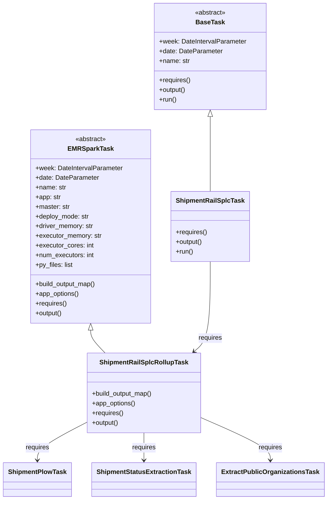

# Diagram: research/orchestrator/tasks/models/shipment_rail_splc_task.py


> Auto-generated by Obscura crawlers

## Diagram 1



### SVG

<svg id="container" width="781.375" xmlns="http://www.w3.org/2000/svg" class="classDiagram" height="1240" viewBox="0 0 781.375 1240" role="graphics-document document" aria-roledescription="class"><style>#container{font-family:"trebuchet ms",verdana,arial,sans-serif;font-size:16px;fill:#333;}@keyframes edge-animation-frame{from{stroke-dashoffset:0;}}@keyframes dash{to{stroke-dashoffset:0;}}#container .edge-animation-slow{stroke-dasharray:9,5!important;stroke-dashoffset:900;animation:dash 50s linear infinite;stroke-linecap:round;}#container .edge-animation-fast{stroke-dasharray:9,5!important;stroke-dashoffset:900;animation:dash 20s linear infinite;stroke-linecap:round;}#container .error-icon{fill:#552222;}#container .error-text{fill:#552222;stroke:#552222;}#container .edge-thickness-normal{stroke-width:1px;}#container .edge-thickness-thick{stroke-width:3.5px;}#container .edge-pattern-solid{stroke-dasharray:0;}#container .edge-thickness-invisible{stroke-width:0;fill:none;}#container .edge-pattern-dashed{stroke-dasharray:3;}#container .edge-pattern-dotted{stroke-dasharray:2;}#container .marker{fill:#333333;stroke:#333333;}#container .marker.cross{stroke:#333333;}#container svg{font-family:"trebuchet ms",verdana,arial,sans-serif;font-size:16px;}#container p{margin:0;}#container g.classGroup text{fill:#9370DB;stroke:none;font-family:"trebuchet ms",verdana,arial,sans-serif;font-size:10px;}#container g.classGroup text .title{font-weight:bolder;}#container .nodeLabel,#container .edgeLabel{color:#131300;}#container .edgeLabel .label rect{fill:#ECECFF;}#container .label text{fill:#131300;}#container .labelBkg{background:#ECECFF;}#container .edgeLabel .label span{background:#ECECFF;}#container .classTitle{font-weight:bolder;}#container .node rect,#container .node circle,#container .node ellipse,#container .node polygon,#container .node path{fill:#ECECFF;stroke:#9370DB;stroke-width:1px;}#container .divider{stroke:#9370DB;stroke-width:1;}#container g.clickable{cursor:pointer;}#container g.classGroup rect{fill:#ECECFF;stroke:#9370DB;}#container g.classGroup line{stroke:#9370DB;stroke-width:1;}#container .classLabel .box{stroke:none;stroke-width:0;fill:#ECECFF;opacity:0.5;}#container .classLabel .label{fill:#9370DB;font-size:10px;}#container .relation{stroke:#333333;stroke-width:1;fill:none;}#container .dashed-line{stroke-dasharray:3;}#container .dotted-line{stroke-dasharray:1 2;}#container #compositionStart,#container .composition{fill:#333333!important;stroke:#333333!important;stroke-width:1;}#container #compositionEnd,#container .composition{fill:#333333!important;stroke:#333333!important;stroke-width:1;}#container #dependencyStart,#container .dependency{fill:#333333!important;stroke:#333333!important;stroke-width:1;}#container #dependencyStart,#container .dependency{fill:#333333!important;stroke:#333333!important;stroke-width:1;}#container #extensionStart,#container .extension{fill:transparent!important;stroke:#333333!important;stroke-width:1;}#container #extensionEnd,#container .extension{fill:transparent!important;stroke:#333333!important;stroke-width:1;}#container #aggregationStart,#container .aggregation{fill:transparent!important;stroke:#333333!important;stroke-width:1;}#container #aggregationEnd,#container .aggregation{fill:transparent!important;stroke:#333333!important;stroke-width:1;}#container #lollipopStart,#container .lollipop{fill:#ECECFF!important;stroke:#333333!important;stroke-width:1;}#container #lollipopEnd,#container .lollipop{fill:#ECECFF!important;stroke:#333333!important;stroke-width:1;}#container .edgeTerminals{font-size:11px;line-height:initial;}#container .classTitleText{text-anchor:middle;font-size:18px;fill:#333;}#container .label-icon{display:inline-block;height:1em;overflow:visible;vertical-align:-0.125em;}#container .node .label-icon path{fill:currentColor;stroke:revert;stroke-width:revert;}#container :root{--mermaid-font-family:"trebuchet ms",verdana,arial,sans-serif;}</style><g><defs><marker id="container_class-aggregationStart" class="marker aggregation class" refX="18" refY="7" markerWidth="190" markerHeight="240" orient="auto"><path d="M 18,7 L9,13 L1,7 L9,1 Z"></path></marker></defs><defs><marker id="container_class-aggregationEnd" class="marker aggregation class" refX="1" refY="7" markerWidth="20" markerHeight="28" orient="auto"><path d="M 18,7 L9,13 L1,7 L9,1 Z"></path></marker></defs><defs><marker id="container_class-extensionStart" class="marker extension class" refX="18" refY="7" markerWidth="190" markerHeight="240" orient="auto"><path d="M 1,7 L18,13 V 1 Z"></path></marker></defs><defs><marker id="container_class-extensionEnd" class="marker extension class" refX="1" refY="7" markerWidth="20" markerHeight="28" orient="auto"><path d="M 1,1 V 13 L18,7 Z"></path></marker></defs><defs><marker id="container_class-compositionStart" class="marker composition class" refX="18" refY="7" markerWidth="190" markerHeight="240" orient="auto"><path d="M 18,7 L9,13 L1,7 L9,1 Z"></path></marker></defs><defs><marker id="container_class-compositionEnd" class="marker composition class" refX="1" refY="7" markerWidth="20" markerHeight="28" orient="auto"><path d="M 18,7 L9,13 L1,7 L9,1 Z"></path></marker></defs><defs><marker id="container_class-dependencyStart" class="marker dependency class" refX="6" refY="7" markerWidth="190" markerHeight="240" orient="auto"><path d="M 5,7 L9,13 L1,7 L9,1 Z"></path></marker></defs><defs><marker id="container_class-dependencyEnd" class="marker dependency class" refX="13" refY="7" markerWidth="20" markerHeight="28" orient="auto"><path d="M 18,7 L9,13 L14,7 L9,1 Z"></path></marker></defs><defs><marker id="container_class-lollipopStart" class="marker lollipop class" refX="13" refY="7" markerWidth="190" markerHeight="240" orient="auto"><circle stroke="black" fill="transparent" cx="7" cy="7" r="6"></circle></marker></defs><defs><marker id="container_class-lollipopEnd" class="marker lollipop class" refX="1" refY="7" markerWidth="190" markerHeight="240" orient="auto"><circle stroke="black" fill="transparent" cx="7" cy="7" r="6"></circle></marker></defs><g class="root"><g class="clusters"></g><g class="edgePaths"><path d="M217.133,819.25L217.133,822.542C217.133,825.833,217.133,832.417,222.928,841.875C228.722,851.333,240.312,863.667,246.106,869.833L251.901,876" id="id_EMRSparkTask_ShipmentRailSplcRollupTask_1" class="edge-thickness-normal edge-pattern-solid relation" style=";;;" data-edge="true" data-et="edge" data-id="id_EMRSparkTask_ShipmentRailSplcRollupTask_1" data-points="W3sieCI6MjE3LjEzMjgxMjUsInkiOjgwMn0seyJ4IjoyMTcuMTMyODEyNSwieSI6ODM5fSx7IngiOjI1MS45MDEwNzk5NjMyMzUzLCJ5Ijo4NzZ9XQ==" marker-start="url(#container_class-extensionStart)"></path><path d="M506.73,289.25L506.73,290.542C506.73,291.833,506.73,294.417,506.73,325.375C506.73,356.333,506.73,415.667,506.73,445.333L506.73,475" id="id_BaseTask_ShipmentRailSplcTask_2" class="edge-thickness-normal edge-pattern-solid relation" style=";;;" data-edge="true" data-et="edge" data-id="id_BaseTask_ShipmentRailSplcTask_2" data-points="W3sieCI6NTA2LjczMDQ2ODc1LCJ5IjoyNzJ9LHsieCI6NTA2LjczMDQ2ODc1LCJ5IjoyOTd9LHsieCI6NTA2LjczMDQ2ODc1LCJ5Ijo0NzV9XQ==" marker-start="url(#container_class-extensionStart)"></path><path d="M204.07,1049.95L184.948,1060.125C165.826,1070.3,127.581,1090.65,108.458,1105.992C89.336,1121.333,89.336,1131.667,89.336,1136.833L89.336,1142" id="id_ShipmentRailSplcRollupTask_ShipmentPlowTask_3" class="edge-thickness-normal edge-pattern-solid relation" style=";;;" data-edge="true" data-et="edge" data-id="id_ShipmentRailSplcRollupTask_ShipmentPlowTask_3" data-points="W3sieCI6MjA0LjA3MDMxMjUsInkiOjEwNDkuOTUwNDgyOTQ0MTI1M30seyJ4Ijo4OS4zMzU5Mzc1LCJ5IjoxMTExfSx7IngiOjg5LjMzNTkzNzUsInkiOjExNDh9XQ==" marker-end="url(#container_class-dependencyEnd)"></path><path d="M344.93,1074L344.93,1080.167C344.93,1086.333,344.93,1098.667,344.93,1110C344.93,1121.333,344.93,1131.667,344.93,1136.833L344.93,1142" id="id_ShipmentRailSplcRollupTask_ShipmentStatusExtractionTask_4" class="edge-thickness-normal edge-pattern-solid relation" style=";;;" data-edge="true" data-et="edge" data-id="id_ShipmentRailSplcRollupTask_ShipmentStatusExtractionTask_4" data-points="W3sieCI6MzQ0LjkyOTY4NzUsInkiOjEwNzR9LHsieCI6MzQ0LjkyOTY4NzUsInkiOjExMTF9LHsieCI6MzQ0LjkyOTY4NzUsInkiOjExNDh9XQ==" marker-end="url(#container_class-dependencyEnd)"></path><path d="M485.789,1038.57L512.538,1050.642C539.286,1062.713,592.784,1086.857,619.533,1104.095C646.281,1121.333,646.281,1131.667,646.281,1136.833L646.281,1142" id="id_ShipmentRailSplcRollupTask_ExtractPublicOrganizationsTask_5" class="edge-thickness-normal edge-pattern-solid relation" style=";;;" data-edge="true" data-et="edge" data-id="id_ShipmentRailSplcRollupTask_ExtractPublicOrganizationsTask_5" data-points="W3sieCI6NDg1Ljc4OTA2MjUsInkiOjEwMzguNTY5ODU0NTYxNDgwN30seyJ4Ijo2NDYuMjgxMjUsInkiOjExMTF9LHsieCI6NjQ2LjI4MTI1LCJ5IjoxMTQ4fV0=" marker-end="url(#container_class-dependencyEnd)"></path><path d="M506.73,649L506.73,680.667C506.73,712.333,506.73,775.667,500.159,812.857C493.588,850.046,480.446,861.093,473.875,866.616L467.304,872.139" id="id_ShipmentRailSplcTask_ShipmentRailSplcRollupTask_6" class="edge-thickness-normal edge-pattern-solid relation" style=";;;" data-edge="true" data-et="edge" data-id="id_ShipmentRailSplcTask_ShipmentRailSplcRollupTask_6" data-points="W3sieCI6NTA2LjczMDQ2ODc1LCJ5Ijo2NDl9LHsieCI6NTA2LjczMDQ2ODc1LCJ5Ijo4Mzl9LHsieCI6NDYyLjcxMTEzODU1Njk4NTMsInkiOjg3Nn1d" marker-end="url(#container_class-dependencyEnd)"></path></g><g class="edgeLabels"><g class="edgeLabel"><g class="label" data-id="id_EMRSparkTask_ShipmentRailSplcRollupTask_1" transform="translate(0, 0)"><foreignObject width="0" height="0"><div xmlns="http://www.w3.org/1999/xhtml" class="labelBkg" style="display: table-cell; white-space: nowrap; line-height: 1.5; max-width: 200px; text-align: center;"><span class="edgeLabel"></span></div></foreignObject></g></g><g class="edgeLabel"><g class="label" data-id="id_BaseTask_ShipmentRailSplcTask_2" transform="translate(0, 0)"><foreignObject width="0" height="0"><div xmlns="http://www.w3.org/1999/xhtml" class="labelBkg" style="display: table-cell; white-space: nowrap; line-height: 1.5; max-width: 200px; text-align: center;"><span class="edgeLabel"></span></div></foreignObject></g></g><g class="edgeLabel" transform="translate(89.3359375, 1111)"><g class="label" data-id="id_ShipmentRailSplcRollupTask_ShipmentPlowTask_3" transform="translate(-29.8515625, -12)"><foreignObject width="59.703125" height="24"><div xmlns="http://www.w3.org/1999/xhtml" class="labelBkg" style="display: table-cell; white-space: nowrap; line-height: 1.5; max-width: 200px; text-align: center;"><span class="edgeLabel"><p>requires</p></span></div></foreignObject></g></g><g class="edgeLabel" transform="translate(344.9296875, 1111)"><g class="label" data-id="id_ShipmentRailSplcRollupTask_ShipmentStatusExtractionTask_4" transform="translate(-29.8515625, -12)"><foreignObject width="59.703125" height="24"><div xmlns="http://www.w3.org/1999/xhtml" class="labelBkg" style="display: table-cell; white-space: nowrap; line-height: 1.5; max-width: 200px; text-align: center;"><span class="edgeLabel"><p>requires</p></span></div></foreignObject></g></g><g class="edgeLabel" transform="translate(646.28125, 1111)"><g class="label" data-id="id_ShipmentRailSplcRollupTask_ExtractPublicOrganizationsTask_5" transform="translate(-29.8515625, -12)"><foreignObject width="59.703125" height="24"><div xmlns="http://www.w3.org/1999/xhtml" class="labelBkg" style="display: table-cell; white-space: nowrap; line-height: 1.5; max-width: 200px; text-align: center;"><span class="edgeLabel"><p>requires</p></span></div></foreignObject></g></g><g class="edgeLabel" transform="translate(506.73046875, 839)"><g class="label" data-id="id_ShipmentRailSplcTask_ShipmentRailSplcRollupTask_6" transform="translate(-29.8515625, -12)"><foreignObject width="59.703125" height="24"><div xmlns="http://www.w3.org/1999/xhtml" class="labelBkg" style="display: table-cell; white-space: nowrap; line-height: 1.5; max-width: 200px; text-align: center;"><span class="edgeLabel"><p>requires</p></span></div></foreignObject></g></g></g><g class="nodes"><g class="node default" id="classId-EMRSparkTask-0" transform="translate(217.1328125, 562)"><g class="basic label-container"><path d="M-146.58984375 -240 L146.58984375 -240 L146.58984375 240 L-146.58984375 240" stroke="none" stroke-width="0" fill="#ECECFF" style=""></path><path d="M-146.58984375 -240 C-40.63578555375743 -240, 65.31827264248514 -240, 146.58984375 -240 M-146.58984375 -240 C-47.0764551545746 -240, 52.436933440850794 -240, 146.58984375 -240 M146.58984375 -240 C146.58984375 -115.636849012405, 146.58984375 8.726301975190012, 146.58984375 240 M146.58984375 -240 C146.58984375 -50.0266217740234, 146.58984375 139.9467564519532, 146.58984375 240 M146.58984375 240 C72.89434569180168 240, -0.80115236639665 240, -146.58984375 240 M146.58984375 240 C87.92204644739647 240, 29.254249144792936 240, -146.58984375 240 M-146.58984375 240 C-146.58984375 103.98021127469315, -146.58984375 -32.039577450613706, -146.58984375 -240 M-146.58984375 240 C-146.58984375 92.13168318057453, -146.58984375 -55.73663363885095, -146.58984375 -240" stroke="#9370DB" stroke-width="1.3" fill="none" stroke-dasharray="0 0" style=""></path></g><g class="annotation-group text" transform="translate(-38.609375, -216)"><g class="label" style="" transform="translate(0,-12)"><foreignObject width="77.21875" height="24"><div xmlns="http://www.w3.org/1999/xhtml" style="display: table-cell; white-space: nowrap; line-height: 1.5; max-width: 127px; text-align: center;"><span class="nodeLabel markdown-node-label" style=""><p>«abstract»</p></span></div></foreignObject></g></g><g class="label-group text" transform="translate(-53.1484375, -192)"><g class="label" style="font-weight: bolder" transform="translate(0,-12)"><foreignObject width="106.296875" height="24"><div xmlns="http://www.w3.org/1999/xhtml" style="display: table-cell; white-space: nowrap; line-height: 1.5; max-width: 154px; text-align: center;"><span class="nodeLabel markdown-node-label" style=""><p>EMRSparkTask</p></span></div></foreignObject></g></g><g class="members-group text" transform="translate(-134.58984375, -144)"><g class="label" style="" transform="translate(0,-12)"><foreignObject width="216.03125" height="24"><div xmlns="http://www.w3.org/1999/xhtml" style="display: table-cell; white-space: nowrap; line-height: 1.5; max-width: 274px; text-align: center;"><span class="nodeLabel markdown-node-label" style=""><p>+week: DateIntervalParameter</p></span></div></foreignObject></g><g class="label" style="" transform="translate(0,12)"><foreignObject width="156.015625" height="24"><div xmlns="http://www.w3.org/1999/xhtml" style="display: table-cell; white-space: nowrap; line-height: 1.5; max-width: 214px; text-align: center;"><span class="nodeLabel markdown-node-label" style=""><p>+date: DateParameter</p></span></div></foreignObject></g><g class="label" style="" transform="translate(0,36)"><foreignObject width="76.015625" height="24"><div xmlns="http://www.w3.org/1999/xhtml" style="display: table-cell; white-space: nowrap; line-height: 1.5; max-width: 134px; text-align: center;"><span class="nodeLabel markdown-node-label" style=""><p>+name: str</p></span></div></foreignObject></g><g class="label" style="" transform="translate(0,60)"><foreignObject width="62.96875" height="24"><div xmlns="http://www.w3.org/1999/xhtml" style="display: table-cell; white-space: nowrap; line-height: 1.5; max-width: 121px; text-align: center;"><span class="nodeLabel markdown-node-label" style=""><p>+app: str</p></span></div></foreignObject></g><g class="label" style="" transform="translate(0,84)"><foreignObject width="85.8125" height="24"><div xmlns="http://www.w3.org/1999/xhtml" style="display: table-cell; white-space: nowrap; line-height: 1.5; max-width: 144px; text-align: center;"><span class="nodeLabel markdown-node-label" style=""><p>+master: str</p></span></div></foreignObject></g><g class="label" style="" transform="translate(0,108)"><foreignObject width="134.234375" height="24"><div xmlns="http://www.w3.org/1999/xhtml" style="display: table-cell; white-space: nowrap; line-height: 1.5; max-width: 192px; text-align: center;"><span class="nodeLabel markdown-node-label" style=""><p>+deploy_mode: str</p></span></div></foreignObject></g><g class="label" style="" transform="translate(0,132)"><foreignObject width="145.09375" height="24"><div xmlns="http://www.w3.org/1999/xhtml" style="display: table-cell; white-space: nowrap; line-height: 1.5; max-width: 203px; text-align: center;"><span class="nodeLabel markdown-node-label" style=""><p>+driver_memory: str</p></span></div></foreignObject></g><g class="label" style="" transform="translate(0,156)"><foreignObject width="164.90625" height="24"><div xmlns="http://www.w3.org/1999/xhtml" style="display: table-cell; white-space: nowrap; line-height: 1.5; max-width: 223px; text-align: center;"><span class="nodeLabel markdown-node-label" style=""><p>+executor_memory: str</p></span></div></foreignObject></g><g class="label" style="" transform="translate(0,180)"><foreignObject width="143.78125" height="24"><div xmlns="http://www.w3.org/1999/xhtml" style="display: table-cell; white-space: nowrap; line-height: 1.5; max-width: 201px; text-align: center;"><span class="nodeLabel markdown-node-label" style=""><p>+executor_cores: int</p></span></div></foreignObject></g><g class="label" style="" transform="translate(0,204)"><foreignObject width="146.140625" height="24"><div xmlns="http://www.w3.org/1999/xhtml" style="display: table-cell; white-space: nowrap; line-height: 1.5; max-width: 204px; text-align: center;"><span class="nodeLabel markdown-node-label" style=""><p>+num_executors: int</p></span></div></foreignObject></g><g class="label" style="" transform="translate(0,228)"><foreignObject width="93.359375" height="24"><div xmlns="http://www.w3.org/1999/xhtml" style="display: table-cell; white-space: nowrap; line-height: 1.5; max-width: 151px; text-align: center;"><span class="nodeLabel markdown-node-label" style=""><p>+py_files: list</p></span></div></foreignObject></g></g><g class="methods-group text" transform="translate(-134.58984375, 144)"><g class="label" style="" transform="translate(0,-12)"><foreignObject width="153.125" height="24"><div xmlns="http://www.w3.org/1999/xhtml" style="display: table-cell; white-space: nowrap; line-height: 1.5; max-width: 210px; text-align: center;"><span class="nodeLabel markdown-node-label" style=""><p>+build_output_map()</p></span></div></foreignObject></g><g class="label" style="" transform="translate(0,12)"><foreignObject width="108.84375" height="24"><div xmlns="http://www.w3.org/1999/xhtml" style="display: table-cell; white-space: nowrap; line-height: 1.5; max-width: 166px; text-align: center;"><span class="nodeLabel markdown-node-label" style=""><p>+app_options()</p></span></div></foreignObject></g><g class="label" style="" transform="translate(0,36)"><foreignObject width="78.0625" height="24"><div xmlns="http://www.w3.org/1999/xhtml" style="display: table-cell; white-space: nowrap; line-height: 1.5; max-width: 135px; text-align: center;"><span class="nodeLabel markdown-node-label" style=""><p>+requires()</p></span></div></foreignObject></g><g class="label" style="" transform="translate(0,60)"><foreignObject width="67.390625" height="24"><div xmlns="http://www.w3.org/1999/xhtml" style="display: table-cell; white-space: nowrap; line-height: 1.5; max-width: 125px; text-align: center;"><span class="nodeLabel markdown-node-label" style=""><p>+output()</p></span></div></foreignObject></g></g><g class="divider" style=""><path d="M-146.58984375 -168 C-69.06563735936902 -168, 8.458569031261959 -168, 146.58984375 -168 M-146.58984375 -168 C-35.40922626639173 -168, 75.77139121721655 -168, 146.58984375 -168" stroke="#9370DB" stroke-width="1.3" fill="none" stroke-dasharray="0 0" style=""></path></g><g class="divider" style=""><path d="M-146.58984375 120 C-56.084297238537744 120, 34.42124927292451 120, 146.58984375 120 M-146.58984375 120 C-38.004488610930395 120, 70.58086652813921 120, 146.58984375 120" stroke="#9370DB" stroke-width="1.3" fill="none" stroke-dasharray="0 0" style=""></path></g></g><g class="node default" id="classId-BaseTask-1" transform="translate(506.73046875, 140)"><g class="basic label-container"><path d="M-139.3203125 -132 L139.3203125 -132 L139.3203125 132 L-139.3203125 132" stroke="none" stroke-width="0" fill="#ECECFF" style=""></path><path d="M-139.3203125 -132 C-34.28926661704487 -132, 70.74177926591025 -132, 139.3203125 -132 M-139.3203125 -132 C-40.05266128858598 -132, 59.21498992282804 -132, 139.3203125 -132 M139.3203125 -132 C139.3203125 -37.68858871688943, 139.3203125 56.622822566221146, 139.3203125 132 M139.3203125 -132 C139.3203125 -70.01922550922401, 139.3203125 -8.038451018448015, 139.3203125 132 M139.3203125 132 C62.90344761270545 132, -13.513417274589102 132, -139.3203125 132 M139.3203125 132 C29.06168575421276 132, -81.19694099157448 132, -139.3203125 132 M-139.3203125 132 C-139.3203125 56.86112205773816, -139.3203125 -18.277755884523685, -139.3203125 -132 M-139.3203125 132 C-139.3203125 30.822859609142938, -139.3203125 -70.35428078171412, -139.3203125 -132" stroke="#9370DB" stroke-width="1.3" fill="none" stroke-dasharray="0 0" style=""></path></g><g class="annotation-group text" transform="translate(-38.609375, -108)"><g class="label" style="" transform="translate(0,-12)"><foreignObject width="77.21875" height="24"><div xmlns="http://www.w3.org/1999/xhtml" style="display: table-cell; white-space: nowrap; line-height: 1.5; max-width: 127px; text-align: center;"><span class="nodeLabel markdown-node-label" style=""><p>«abstract»</p></span></div></foreignObject></g></g><g class="label-group text" transform="translate(-34.03125, -84)"><g class="label" style="font-weight: bolder" transform="translate(0,-12)"><foreignObject width="68.0625" height="24"><div xmlns="http://www.w3.org/1999/xhtml" style="display: table-cell; white-space: nowrap; line-height: 1.5; max-width: 117px; text-align: center;"><span class="nodeLabel markdown-node-label" style=""><p>BaseTask</p></span></div></foreignObject></g></g><g class="members-group text" transform="translate(-127.3203125, -36)"><g class="label" style="" transform="translate(0,-12)"><foreignObject width="216.03125" height="24"><div xmlns="http://www.w3.org/1999/xhtml" style="display: table-cell; white-space: nowrap; line-height: 1.5; max-width: 274px; text-align: center;"><span class="nodeLabel markdown-node-label" style=""><p>+week: DateIntervalParameter</p></span></div></foreignObject></g><g class="label" style="" transform="translate(0,12)"><foreignObject width="156.015625" height="24"><div xmlns="http://www.w3.org/1999/xhtml" style="display: table-cell; white-space: nowrap; line-height: 1.5; max-width: 214px; text-align: center;"><span class="nodeLabel markdown-node-label" style=""><p>+date: DateParameter</p></span></div></foreignObject></g><g class="label" style="" transform="translate(0,36)"><foreignObject width="76.015625" height="24"><div xmlns="http://www.w3.org/1999/xhtml" style="display: table-cell; white-space: nowrap; line-height: 1.5; max-width: 134px; text-align: center;"><span class="nodeLabel markdown-node-label" style=""><p>+name: str</p></span></div></foreignObject></g></g><g class="methods-group text" transform="translate(-127.3203125, 60)"><g class="label" style="" transform="translate(0,-12)"><foreignObject width="78.0625" height="24"><div xmlns="http://www.w3.org/1999/xhtml" style="display: table-cell; white-space: nowrap; line-height: 1.5; max-width: 135px; text-align: center;"><span class="nodeLabel markdown-node-label" style=""><p>+requires()</p></span></div></foreignObject></g><g class="label" style="" transform="translate(0,12)"><foreignObject width="67.390625" height="24"><div xmlns="http://www.w3.org/1999/xhtml" style="display: table-cell; white-space: nowrap; line-height: 1.5; max-width: 125px; text-align: center;"><span class="nodeLabel markdown-node-label" style=""><p>+output()</p></span></div></foreignObject></g><g class="label" style="" transform="translate(0,36)"><foreignObject width="43.21875" height="24"><div xmlns="http://www.w3.org/1999/xhtml" style="display: table-cell; white-space: nowrap; line-height: 1.5; max-width: 101px; text-align: center;"><span class="nodeLabel markdown-node-label" style=""><p>+run()</p></span></div></foreignObject></g></g><g class="divider" style=""><path d="M-139.3203125 -60 C-31.773988509089918 -60, 75.77233548182016 -60, 139.3203125 -60 M-139.3203125 -60 C-73.50163497642795 -60, -7.682957452855902 -60, 139.3203125 -60" stroke="#9370DB" stroke-width="1.3" fill="none" stroke-dasharray="0 0" style=""></path></g><g class="divider" style=""><path d="M-139.3203125 36 C-41.74178034287945 36, 55.8367518142411 36, 139.3203125 36 M-139.3203125 36 C-37.589130916999466 36, 64.14205066600107 36, 139.3203125 36" stroke="#9370DB" stroke-width="1.3" fill="none" stroke-dasharray="0 0" style=""></path></g></g><g class="node default" id="classId-ShipmentRailSplcRollupTask-2" transform="translate(344.9296875, 975)"><g class="basic label-container"><path d="M-140.859375 -99 L140.859375 -99 L140.859375 99 L-140.859375 99" stroke="none" stroke-width="0" fill="#ECECFF" style=""></path><path d="M-140.859375 -99 C-64.34007939767403 -99, 12.179216204651937 -99, 140.859375 -99 M-140.859375 -99 C-53.94208974690359 -99, 32.97519550619282 -99, 140.859375 -99 M140.859375 -99 C140.859375 -32.9132755395497, 140.859375 33.1734489209006, 140.859375 99 M140.859375 -99 C140.859375 -30.62981863003651, 140.859375 37.74036273992698, 140.859375 99 M140.859375 99 C60.76554458306191 99, -19.32828583387618 99, -140.859375 99 M140.859375 99 C29.2517473612899 99, -82.3558802774202 99, -140.859375 99 M-140.859375 99 C-140.859375 57.88658846999961, -140.859375 16.773176939999217, -140.859375 -99 M-140.859375 99 C-140.859375 57.62734075999352, -140.859375 16.254681519987045, -140.859375 -99" stroke="#9370DB" stroke-width="1.3" fill="none" stroke-dasharray="0 0" style=""></path></g><g class="annotation-group text" transform="translate(0, -75)"></g><g class="label-group text" transform="translate(-104.59375, -75)"><g class="label" style="font-weight: bolder" transform="translate(0,-12)"><foreignObject width="209.1875" height="24"><div xmlns="http://www.w3.org/1999/xhtml" style="display: table-cell; white-space: nowrap; line-height: 1.5; max-width: 257px; text-align: center;"><span class="nodeLabel markdown-node-label" style=""><p>ShipmentRailSplcRollupTask</p></span></div></foreignObject></g></g><g class="members-group text" transform="translate(-128.859375, -27)"></g><g class="methods-group text" transform="translate(-128.859375, 3)"><g class="label" style="" transform="translate(0,-12)"><foreignObject width="153.125" height="24"><div xmlns="http://www.w3.org/1999/xhtml" style="display: table-cell; white-space: nowrap; line-height: 1.5; max-width: 210px; text-align: center;"><span class="nodeLabel markdown-node-label" style=""><p>+build_output_map()</p></span></div></foreignObject></g><g class="label" style="" transform="translate(0,12)"><foreignObject width="108.84375" height="24"><div xmlns="http://www.w3.org/1999/xhtml" style="display: table-cell; white-space: nowrap; line-height: 1.5; max-width: 166px; text-align: center;"><span class="nodeLabel markdown-node-label" style=""><p>+app_options()</p></span></div></foreignObject></g><g class="label" style="" transform="translate(0,36)"><foreignObject width="78.0625" height="24"><div xmlns="http://www.w3.org/1999/xhtml" style="display: table-cell; white-space: nowrap; line-height: 1.5; max-width: 135px; text-align: center;"><span class="nodeLabel markdown-node-label" style=""><p>+requires()</p></span></div></foreignObject></g><g class="label" style="" transform="translate(0,60)"><foreignObject width="67.390625" height="24"><div xmlns="http://www.w3.org/1999/xhtml" style="display: table-cell; white-space: nowrap; line-height: 1.5; max-width: 125px; text-align: center;"><span class="nodeLabel markdown-node-label" style=""><p>+output()</p></span></div></foreignObject></g></g><g class="divider" style=""><path d="M-140.859375 -51 C-51.906658202731265 -51, 37.04605859453747 -51, 140.859375 -51 M-140.859375 -51 C-35.687310065648475 -51, 69.48475486870305 -51, 140.859375 -51" stroke="#9370DB" stroke-width="1.3" fill="none" stroke-dasharray="0 0" style=""></path></g><g class="divider" style=""><path d="M-140.859375 -27 C-53.22713571623382 -27, 34.405103567532365 -27, 140.859375 -27 M-140.859375 -27 C-80.68147595271559 -27, -20.503576905431174 -27, 140.859375 -27" stroke="#9370DB" stroke-width="1.3" fill="none" stroke-dasharray="0 0" style=""></path></g></g><g class="node default" id="classId-ShipmentRailSplcTask-3" transform="translate(506.73046875, 562)"><g class="basic label-container"><path d="M-93.0078125 -87 L93.0078125 -87 L93.0078125 87 L-93.0078125 87" stroke="none" stroke-width="0" fill="#ECECFF" style=""></path><path d="M-93.0078125 -87 C-33.77117842176402 -87, 25.46545565647196 -87, 93.0078125 -87 M-93.0078125 -87 C-24.460004281309153 -87, 44.08780393738169 -87, 93.0078125 -87 M93.0078125 -87 C93.0078125 -26.056235016077885, 93.0078125 34.88752996784423, 93.0078125 87 M93.0078125 -87 C93.0078125 -50.29503226964322, 93.0078125 -13.590064539286445, 93.0078125 87 M93.0078125 87 C30.089172314544527 87, -32.829467870910946 87, -93.0078125 87 M93.0078125 87 C43.65865465864689 87, -5.690503182706223 87, -93.0078125 87 M-93.0078125 87 C-93.0078125 20.619897682338774, -93.0078125 -45.76020463532245, -93.0078125 -87 M-93.0078125 87 C-93.0078125 39.67162157499659, -93.0078125 -7.656756850006815, -93.0078125 -87" stroke="#9370DB" stroke-width="1.3" fill="none" stroke-dasharray="0 0" style=""></path></g><g class="annotation-group text" transform="translate(0, -63)"></g><g class="label-group text" transform="translate(-81.0078125, -63)"><g class="label" style="font-weight: bolder" transform="translate(0,-12)"><foreignObject width="162.015625" height="24"><div xmlns="http://www.w3.org/1999/xhtml" style="display: table-cell; white-space: nowrap; line-height: 1.5; max-width: 210px; text-align: center;"><span class="nodeLabel markdown-node-label" style=""><p>ShipmentRailSplcTask</p></span></div></foreignObject></g></g><g class="members-group text" transform="translate(-81.0078125, -15)"></g><g class="methods-group text" transform="translate(-81.0078125, 15)"><g class="label" style="" transform="translate(0,-12)"><foreignObject width="78.0625" height="24"><div xmlns="http://www.w3.org/1999/xhtml" style="display: table-cell; white-space: nowrap; line-height: 1.5; max-width: 135px; text-align: center;"><span class="nodeLabel markdown-node-label" style=""><p>+requires()</p></span></div></foreignObject></g><g class="label" style="" transform="translate(0,12)"><foreignObject width="67.390625" height="24"><div xmlns="http://www.w3.org/1999/xhtml" style="display: table-cell; white-space: nowrap; line-height: 1.5; max-width: 125px; text-align: center;"><span class="nodeLabel markdown-node-label" style=""><p>+output()</p></span></div></foreignObject></g><g class="label" style="" transform="translate(0,36)"><foreignObject width="43.21875" height="24"><div xmlns="http://www.w3.org/1999/xhtml" style="display: table-cell; white-space: nowrap; line-height: 1.5; max-width: 101px; text-align: center;"><span class="nodeLabel markdown-node-label" style=""><p>+run()</p></span></div></foreignObject></g></g><g class="divider" style=""><path d="M-93.0078125 -39 C-29.257641769330398 -39, 34.492528961339204 -39, 93.0078125 -39 M-93.0078125 -39 C-26.589000811002578 -39, 39.829810877994845 -39, 93.0078125 -39" stroke="#9370DB" stroke-width="1.3" fill="none" stroke-dasharray="0 0" style=""></path></g><g class="divider" style=""><path d="M-93.0078125 -15 C-32.79968622859855 -15, 27.408440042802894 -15, 93.0078125 -15 M-93.0078125 -15 C-48.16343016843694 -15, -3.319047836873878 -15, 93.0078125 -15" stroke="#9370DB" stroke-width="1.3" fill="none" stroke-dasharray="0 0" style=""></path></g></g><g class="node default" id="classId-ShipmentPlowTask-4" transform="translate(89.3359375, 1190)"><g class="basic label-container"><path d="M-81.3359375 -42 L81.3359375 -42 L81.3359375 42 L-81.3359375 42" stroke="none" stroke-width="0" fill="#ECECFF" style=""></path><path d="M-81.3359375 -42 C-21.91121114065087 -42, 37.51351521869826 -42, 81.3359375 -42 M-81.3359375 -42 C-47.456893646422024 -42, -13.577849792844049 -42, 81.3359375 -42 M81.3359375 -42 C81.3359375 -20.86357914362612, 81.3359375 0.2728417127477627, 81.3359375 42 M81.3359375 -42 C81.3359375 -12.774280789648202, 81.3359375 16.451438420703596, 81.3359375 42 M81.3359375 42 C34.118268744957334 42, -13.099400010085333 42, -81.3359375 42 M81.3359375 42 C19.296706333887542 42, -42.742524832224916 42, -81.3359375 42 M-81.3359375 42 C-81.3359375 16.605599959851972, -81.3359375 -8.788800080296056, -81.3359375 -42 M-81.3359375 42 C-81.3359375 23.53924527113572, -81.3359375 5.078490542271439, -81.3359375 -42" stroke="#9370DB" stroke-width="1.3" fill="none" stroke-dasharray="0 0" style=""></path></g><g class="annotation-group text" transform="translate(0, -18)"></g><g class="label-group text" transform="translate(-69.3359375, -18)"><g class="label" style="font-weight: bolder" transform="translate(0,-12)"><foreignObject width="138.671875" height="24"><div xmlns="http://www.w3.org/1999/xhtml" style="display: table-cell; white-space: nowrap; line-height: 1.5; max-width: 187px; text-align: center;"><span class="nodeLabel markdown-node-label" style=""><p>ShipmentPlowTask</p></span></div></foreignObject></g></g><g class="members-group text" transform="translate(-69.3359375, 30)"></g><g class="methods-group text" transform="translate(-69.3359375, 60)"></g><g class="divider" style=""><path d="M-81.3359375 6 C-44.09182866908959 6, -6.847719838179174 6, 81.3359375 6 M-81.3359375 6 C-39.27805735819648 6, 2.7798227836070453 6, 81.3359375 6" stroke="#9370DB" stroke-width="1.3" fill="none" stroke-dasharray="0 0" style=""></path></g><g class="divider" style=""><path d="M-81.3359375 24 C-24.30523434795593 24, 32.72546880408814 24, 81.3359375 24 M-81.3359375 24 C-18.25841519136784 24, 44.81910711726432 24, 81.3359375 24" stroke="#9370DB" stroke-width="1.3" fill="none" stroke-dasharray="0 0" style=""></path></g></g><g class="node default" id="classId-ShipmentStatusExtractionTask-5" transform="translate(344.9296875, 1190)"><g class="basic label-container"><path d="M-124.2578125 -42 L124.2578125 -42 L124.2578125 42 L-124.2578125 42" stroke="none" stroke-width="0" fill="#ECECFF" style=""></path><path d="M-124.2578125 -42 C-74.21322160570608 -42, -24.16863071141215 -42, 124.2578125 -42 M-124.2578125 -42 C-63.051696485731135 -42, -1.8455804714622701 -42, 124.2578125 -42 M124.2578125 -42 C124.2578125 -16.979606746370553, 124.2578125 8.040786507258893, 124.2578125 42 M124.2578125 -42 C124.2578125 -16.877539577782873, 124.2578125 8.244920844434255, 124.2578125 42 M124.2578125 42 C52.765930540060566 42, -18.725951419878868 42, -124.2578125 42 M124.2578125 42 C53.22963209681558 42, -17.798548306368843 42, -124.2578125 42 M-124.2578125 42 C-124.2578125 21.462539464860463, -124.2578125 0.9250789297209252, -124.2578125 -42 M-124.2578125 42 C-124.2578125 13.561984024362317, -124.2578125 -14.876031951275365, -124.2578125 -42" stroke="#9370DB" stroke-width="1.3" fill="none" stroke-dasharray="0 0" style=""></path></g><g class="annotation-group text" transform="translate(0, -18)"></g><g class="label-group text" transform="translate(-112.2578125, -18)"><g class="label" style="font-weight: bolder" transform="translate(0,-12)"><foreignObject width="224.515625" height="24"><div xmlns="http://www.w3.org/1999/xhtml" style="display: table-cell; white-space: nowrap; line-height: 1.5; max-width: 271px; text-align: center;"><span class="nodeLabel markdown-node-label" style=""><p>ShipmentStatusExtractionTask</p></span></div></foreignObject></g></g><g class="members-group text" transform="translate(-112.2578125, 30)"></g><g class="methods-group text" transform="translate(-112.2578125, 60)"></g><g class="divider" style=""><path d="M-124.2578125 6 C-54.260007861359 6, 15.737796777282 6, 124.2578125 6 M-124.2578125 6 C-33.01352460450367 6, 58.230763290992655 6, 124.2578125 6" stroke="#9370DB" stroke-width="1.3" fill="none" stroke-dasharray="0 0" style=""></path></g><g class="divider" style=""><path d="M-124.2578125 24 C-44.04972275305461 24, 36.15836699389078 24, 124.2578125 24 M-124.2578125 24 C-64.83636901827066 24, -5.4149255365413325 24, 124.2578125 24" stroke="#9370DB" stroke-width="1.3" fill="none" stroke-dasharray="0 0" style=""></path></g></g><g class="node default" id="classId-ExtractPublicOrganizationsTask-6" transform="translate(646.28125, 1190)"><g class="basic label-container"><path d="M-127.09375 -42 L127.09375 -42 L127.09375 42 L-127.09375 42" stroke="none" stroke-width="0" fill="#ECECFF" style=""></path><path d="M-127.09375 -42 C-71.49452487731779 -42, -15.895299754635559 -42, 127.09375 -42 M-127.09375 -42 C-72.22518751886108 -42, -17.35662503772214 -42, 127.09375 -42 M127.09375 -42 C127.09375 -20.481476406387987, 127.09375 1.037047187224026, 127.09375 42 M127.09375 -42 C127.09375 -22.901567371969932, 127.09375 -3.8031347439398644, 127.09375 42 M127.09375 42 C69.30044286784712 42, 11.507135735694263 42, -127.09375 42 M127.09375 42 C33.73960654801765 42, -59.614536903964705 42, -127.09375 42 M-127.09375 42 C-127.09375 20.33191649719421, -127.09375 -1.3361670056115784, -127.09375 -42 M-127.09375 42 C-127.09375 18.825172237069243, -127.09375 -4.349655525861515, -127.09375 -42" stroke="#9370DB" stroke-width="1.3" fill="none" stroke-dasharray="0 0" style=""></path></g><g class="annotation-group text" transform="translate(0, -18)"></g><g class="label-group text" transform="translate(-115.09375, -18)"><g class="label" style="font-weight: bolder" transform="translate(0,-12)"><foreignObject width="230.1875" height="24"><div xmlns="http://www.w3.org/1999/xhtml" style="display: table-cell; white-space: nowrap; line-height: 1.5; max-width: 276px; text-align: center;"><span class="nodeLabel markdown-node-label" style=""><p>ExtractPublicOrganizationsTask</p></span></div></foreignObject></g></g><g class="members-group text" transform="translate(-115.09375, 30)"></g><g class="methods-group text" transform="translate(-115.09375, 60)"></g><g class="divider" style=""><path d="M-127.09375 6 C-28.793011441597343 6, 69.50772711680531 6, 127.09375 6 M-127.09375 6 C-68.52271279174371 6, -9.951675583487429 6, 127.09375 6" stroke="#9370DB" stroke-width="1.3" fill="none" stroke-dasharray="0 0" style=""></path></g><g class="divider" style=""><path d="M-127.09375 24 C-50.607586337200516 24, 25.878577325598968 24, 127.09375 24 M-127.09375 24 C-35.937623219111245 24, 55.21850356177751 24, 127.09375 24" stroke="#9370DB" stroke-width="1.3" fill="none" stroke-dasharray="0 0" style=""></path></g></g></g></g></g></svg>

## Diagram 2

```mermaid
flowchart LR
    subgraph Inputs
        SP[ShipmentPlowTask]
        SSEX[ShipmentStatusExtractionTask]
        EPO[ExtractPublicOrganizationsTask]
    end
    SP --> Rollup[ShipmentRailSplcRollupTask]
    SSEX --> Rollup
    EPO --> Rollup
    Rollup --> Spark[EMR Spark job]
    Spark --> S3[Model outputs (.parquet files)]
    S3 --> Splc[ShipmentRailSplcTask]
    Splc --> Redis[copy_redis_proto_to_redis]
    Splc --> Done[shipment_rail_splc.done]
```

> SVG rendering failed for this diagram.
