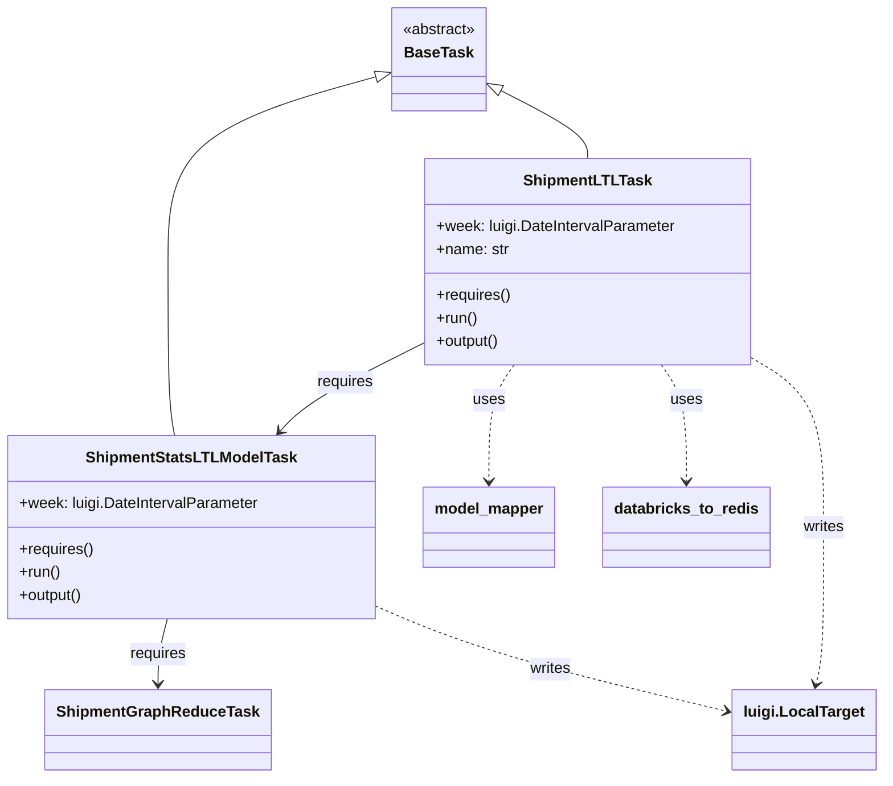

# Diagram: research/orchestrator/tasks/models/shipment_stats_ltl_model.py


> Auto-generated by Obscura crawlers

## Diagram 1



### SVG

<svg id="container" width="908.17578125" xmlns="http://www.w3.org/2000/svg" class="classDiagram" height="814" viewBox="0 0 908.17578125 814" role="graphics-document document" aria-roledescription="class"><style>#container{font-family:"trebuchet ms",verdana,arial,sans-serif;font-size:16px;fill:#333;}@keyframes edge-animation-frame{from{stroke-dashoffset:0;}}@keyframes dash{to{stroke-dashoffset:0;}}#container .edge-animation-slow{stroke-dasharray:9,5!important;stroke-dashoffset:900;animation:dash 50s linear infinite;stroke-linecap:round;}#container .edge-animation-fast{stroke-dasharray:9,5!important;stroke-dashoffset:900;animation:dash 20s linear infinite;stroke-linecap:round;}#container .error-icon{fill:#552222;}#container .error-text{fill:#552222;stroke:#552222;}#container .edge-thickness-normal{stroke-width:1px;}#container .edge-thickness-thick{stroke-width:3.5px;}#container .edge-pattern-solid{stroke-dasharray:0;}#container .edge-thickness-invisible{stroke-width:0;fill:none;}#container .edge-pattern-dashed{stroke-dasharray:3;}#container .edge-pattern-dotted{stroke-dasharray:2;}#container .marker{fill:#333333;stroke:#333333;}#container .marker.cross{stroke:#333333;}#container svg{font-family:"trebuchet ms",verdana,arial,sans-serif;font-size:16px;}#container p{margin:0;}#container g.classGroup text{fill:#9370DB;stroke:none;font-family:"trebuchet ms",verdana,arial,sans-serif;font-size:10px;}#container g.classGroup text .title{font-weight:bolder;}#container .nodeLabel,#container .edgeLabel{color:#131300;}#container .edgeLabel .label rect{fill:#ECECFF;}#container .label text{fill:#131300;}#container .labelBkg{background:#ECECFF;}#container .edgeLabel .label span{background:#ECECFF;}#container .classTitle{font-weight:bolder;}#container .node rect,#container .node circle,#container .node ellipse,#container .node polygon,#container .node path{fill:#ECECFF;stroke:#9370DB;stroke-width:1px;}#container .divider{stroke:#9370DB;stroke-width:1;}#container g.clickable{cursor:pointer;}#container g.classGroup rect{fill:#ECECFF;stroke:#9370DB;}#container g.classGroup line{stroke:#9370DB;stroke-width:1;}#container .classLabel .box{stroke:none;stroke-width:0;fill:#ECECFF;opacity:0.5;}#container .classLabel .label{fill:#9370DB;font-size:10px;}#container .relation{stroke:#333333;stroke-width:1;fill:none;}#container .dashed-line{stroke-dasharray:3;}#container .dotted-line{stroke-dasharray:1 2;}#container #compositionStart,#container .composition{fill:#333333!important;stroke:#333333!important;stroke-width:1;}#container #compositionEnd,#container .composition{fill:#333333!important;stroke:#333333!important;stroke-width:1;}#container #dependencyStart,#container .dependency{fill:#333333!important;stroke:#333333!important;stroke-width:1;}#container #dependencyStart,#container .dependency{fill:#333333!important;stroke:#333333!important;stroke-width:1;}#container #extensionStart,#container .extension{fill:transparent!important;stroke:#333333!important;stroke-width:1;}#container #extensionEnd,#container .extension{fill:transparent!important;stroke:#333333!important;stroke-width:1;}#container #aggregationStart,#container .aggregation{fill:transparent!important;stroke:#333333!important;stroke-width:1;}#container #aggregationEnd,#container .aggregation{fill:transparent!important;stroke:#333333!important;stroke-width:1;}#container #lollipopStart,#container .lollipop{fill:#ECECFF!important;stroke:#333333!important;stroke-width:1;}#container #lollipopEnd,#container .lollipop{fill:#ECECFF!important;stroke:#333333!important;stroke-width:1;}#container .edgeTerminals{font-size:11px;line-height:initial;}#container .classTitleText{text-anchor:middle;font-size:18px;fill:#333;}#container .label-icon{display:inline-block;height:1em;overflow:visible;vertical-align:-0.125em;}#container .node .label-icon path{fill:currentColor;stroke:revert;stroke-width:revert;}#container :root{--mermaid-font-family:"trebuchet ms",verdana,arial,sans-serif;}</style><g><defs><marker id="container_class-aggregationStart" class="marker aggregation class" refX="18" refY="7" markerWidth="190" markerHeight="240" orient="auto"><path d="M 18,7 L9,13 L1,7 L9,1 Z"></path></marker></defs><defs><marker id="container_class-aggregationEnd" class="marker aggregation class" refX="1" refY="7" markerWidth="20" markerHeight="28" orient="auto"><path d="M 18,7 L9,13 L1,7 L9,1 Z"></path></marker></defs><defs><marker id="container_class-extensionStart" class="marker extension class" refX="18" refY="7" markerWidth="190" markerHeight="240" orient="auto"><path d="M 1,7 L18,13 V 1 Z"></path></marker></defs><defs><marker id="container_class-extensionEnd" class="marker extension class" refX="1" refY="7" markerWidth="20" markerHeight="28" orient="auto"><path d="M 1,1 V 13 L18,7 Z"></path></marker></defs><defs><marker id="container_class-compositionStart" class="marker composition class" refX="18" refY="7" markerWidth="190" markerHeight="240" orient="auto"><path d="M 18,7 L9,13 L1,7 L9,1 Z"></path></marker></defs><defs><marker id="container_class-compositionEnd" class="marker composition class" refX="1" refY="7" markerWidth="20" markerHeight="28" orient="auto"><path d="M 18,7 L9,13 L1,7 L9,1 Z"></path></marker></defs><defs><marker id="container_class-dependencyStart" class="marker dependency class" refX="6" refY="7" markerWidth="190" markerHeight="240" orient="auto"><path d="M 5,7 L9,13 L1,7 L9,1 Z"></path></marker></defs><defs><marker id="container_class-dependencyEnd" class="marker dependency class" refX="13" refY="7" markerWidth="20" markerHeight="28" orient="auto"><path d="M 18,7 L9,13 L14,7 L9,1 Z"></path></marker></defs><defs><marker id="container_class-lollipopStart" class="marker lollipop class" refX="13" refY="7" markerWidth="190" markerHeight="240" orient="auto"><circle stroke="black" fill="transparent" cx="7" cy="7" r="6"></circle></marker></defs><defs><marker id="container_class-lollipopEnd" class="marker lollipop class" refX="1" refY="7" markerWidth="190" markerHeight="240" orient="auto"><circle stroke="black" fill="transparent" cx="7" cy="7" r="6"></circle></marker></defs><g class="root"><g class="clusters"></g><g class="edgePaths"><path d="M385.591,80.98L350.169,90.984C314.747,100.987,243.903,120.993,208.481,153.163C173.059,185.333,173.059,229.667,173.059,276C173.059,322.333,173.059,370.667,174.214,401C175.37,431.333,177.681,443.667,178.837,449.833L179.993,456" id="id_BaseTask_ShipmentStatsLTLModelTask_1" class="edge-thickness-normal edge-pattern-solid relation" style=";;;" data-edge="true" data-et="edge" data-id="id_BaseTask_ShipmentStatsLTLModelTask_1" data-points="W3sieCI6NDAyLjE5MTQwNjI1LCJ5Ijo3Ni4yOTIyMzMzNjIxOTE3NX0seyJ4IjoxNzMuMDU4NTkzNzUsInkiOjE0MX0seyJ4IjoxNzMuMDU4NTkzNzUsInkiOjI3NH0seyJ4IjoxNzMuMDU4NTkzNzUsInkiOjQxOX0seyJ4IjoxNzkuOTkyODMzNjQ2NjE2NTMsInkiOjQ1Nn1d" marker-start="url(#container_class-extensionStart)"></path><path d="M518.753,95.889L533.385,103.407C548.018,110.926,577.282,125.963,591.915,137.648C606.547,149.333,606.547,157.667,606.547,161.833L606.547,166" id="id_BaseTask_ShipmentLTLTask_2" class="edge-thickness-normal edge-pattern-solid relation" style=";;;" data-edge="true" data-et="edge" data-id="id_BaseTask_ShipmentLTLTask_2" data-points="W3sieCI6NTAzLjQxMDE1NjI1LCJ5Ijo4OC4wMDQ4MjczNTg0MTg2NX0seyJ4Ijo2MDYuNTQ2ODc1LCJ5IjoxNDF9LHsieCI6NjA2LjU0Njg3NSwieSI6MTY2fV0=" marker-start="url(#container_class-extensionStart)"></path><path d="M172.073,648L170.408,654.167C168.744,660.333,165.415,672.667,163.75,684C162.086,695.333,162.086,705.667,162.086,710.833L162.086,716" id="id_ShipmentStatsLTLModelTask_ShipmentGraphReduceTask_3" class="edge-thickness-normal edge-pattern-solid relation" style=";;;" data-edge="true" data-et="edge" data-id="id_ShipmentStatsLTLModelTask_ShipmentGraphReduceTask_3" data-points="W3sieCI6MTcyLjA3MjcyMDg2NDY2MTY1LCJ5Ijo2NDh9LHsieCI6MTYyLjA4NTkzNzUsInkiOjY4NX0seyJ4IjoxNjIuMDg1OTM3NSwieSI6NzIyfV0=" marker-end="url(#container_class-dependencyEnd)"></path><path d="M437.629,359.049L417.784,369.041C397.939,379.033,358.249,399.016,333.485,414.434C308.721,429.852,298.883,440.703,293.964,446.129L289.045,451.555" id="id_ShipmentLTLTask_ShipmentStatsLTLModelTask_4" class="edge-thickness-normal edge-pattern-solid relation" style=";;;" data-edge="true" data-et="edge" data-id="id_ShipmentLTLTask_ShipmentStatsLTLModelTask_4" data-points="W3sieCI6NDM3LjYyODkwNjI1LCJ5IjozNTkuMDQ4OTY1NzUxMTAyMDZ9LHsieCI6MzE4LjU1ODU5Mzc1LCJ5Ijo0MTl9LHsieCI6Mjg1LjAxNTM5MDAzNzU5NCwieSI6NDU2fV0=" marker-end="url(#container_class-dependencyEnd)"></path><path d="M531.267,382L526.969,388.167C522.67,394.333,514.073,406.667,509.775,427C505.477,447.333,505.477,475.667,505.477,489.833L505.477,504" id="id_ShipmentLTLTask_model_mapper_5" class="edge-thickness-normal edge-pattern-dashed relation" style=";;;" data-edge="true" data-et="edge" data-id="id_ShipmentLTLTask_model_mapper_5" data-points="W3sieCI6NTMxLjI2NjkxODEwMzQ0ODIsInkiOjM4Mn0seyJ4Ijo1MDUuNDc2NTYyNSwieSI6NDE5fSx7IngiOjUwNS40NzY1NjI1LCJ5Ijo1MTB9XQ==" marker-end="url(#container_class-dependencyEnd)"></path><path d="M681.827,382L686.125,388.167C690.424,394.333,699.02,406.667,703.319,427C707.617,447.333,707.617,475.667,707.617,489.833L707.617,504" id="id_ShipmentLTLTask_databricks_to_redis_6" class="edge-thickness-normal edge-pattern-dashed relation" style=";;;" data-edge="true" data-et="edge" data-id="id_ShipmentLTLTask_databricks_to_redis_6" data-points="W3sieCI6NjgxLjgyNjgzMTg5NjU1MTgsInkiOjM4Mn0seyJ4Ijo3MDcuNjE3MTg3NSwieSI6NDE5fSx7IngiOjcwNy42MTcxODc1LCJ5Ijo1MTB9XQ==" marker-end="url(#container_class-dependencyEnd)"></path><path d="M387.969,634.946L407.077,643.288C426.185,651.63,464.401,668.315,524.813,686.679C585.224,705.043,667.832,725.085,709.135,735.106L750.439,745.128" id="id_ShipmentStatsLTLModelTask_luigi.LocalTarget_7" class="edge-thickness-normal edge-pattern-dashed relation" style=";;;" data-edge="true" data-et="edge" data-id="id_ShipmentStatsLTLModelTask_luigi.LocalTarget_7" data-points="W3sieCI6Mzg3Ljk2ODc1LCJ5Ijo2MzQuOTQ1NTAzMDM5MDA3fSx7IngiOjUwMi42MTcxODc1LCJ5Ijo2ODV9LHsieCI6NzU2LjI2OTUzMTI1LCJ5Ijo3NDYuNTQyMzc4OTgxNDY0OH1d" marker-end="url(#container_class-dependencyEnd)"></path><path d="M775.465,374.941L787.753,382.284C800.042,389.627,824.618,404.314,836.907,433.823C849.195,463.333,849.195,507.667,849.195,552C849.195,596.333,849.195,640.667,847.815,668.033C846.434,695.4,843.673,705.801,842.293,711.001L840.912,716.201" id="id_ShipmentLTLTask_luigi.LocalTarget_8" class="edge-thickness-normal edge-pattern-dashed relation" style=";;;" data-edge="true" data-et="edge" data-id="id_ShipmentLTLTask_luigi.LocalTarget_8" data-points="W3sieCI6Nzc1LjQ2NDg0Mzc1LCJ5IjozNzQuOTQwNzA5NjE3MTgwMjN9LHsieCI6ODQ5LjE5NTMxMjUsInkiOjQxOX0seyJ4Ijo4NDkuMTk1MzEyNSwieSI6NTUyfSx7IngiOjg0OS4xOTUzMTI1LCJ5Ijo2ODV9LHsieCI6ODM5LjM3MjY3NjAyODQ4MSwieSI6NzIyfV0=" marker-end="url(#container_class-dependencyEnd)"></path></g><g class="edgeLabels"><g class="edgeLabel"><g class="label" data-id="id_BaseTask_ShipmentStatsLTLModelTask_1" transform="translate(0, 0)"><foreignObject width="0" height="0"><div xmlns="http://www.w3.org/1999/xhtml" class="labelBkg" style="display: table-cell; white-space: nowrap; line-height: 1.5; max-width: 200px; text-align: center;"><span class="edgeLabel"></span></div></foreignObject></g></g><g class="edgeLabel"><g class="label" data-id="id_BaseTask_ShipmentLTLTask_2" transform="translate(0, 0)"><foreignObject width="0" height="0"><div xmlns="http://www.w3.org/1999/xhtml" class="labelBkg" style="display: table-cell; white-space: nowrap; line-height: 1.5; max-width: 200px; text-align: center;"><span class="edgeLabel"></span></div></foreignObject></g></g><g class="edgeLabel" transform="translate(162.0859375, 685)"><g class="label" data-id="id_ShipmentStatsLTLModelTask_ShipmentGraphReduceTask_3" transform="translate(-29.8515625, -12)"><foreignObject width="59.703125" height="24"><div xmlns="http://www.w3.org/1999/xhtml" class="labelBkg" style="display: table-cell; white-space: nowrap; line-height: 1.5; max-width: 200px; text-align: center;"><span class="edgeLabel"><p>requires</p></span></div></foreignObject></g></g><g class="edgeLabel" transform="translate(355.79051, 400.254)"><g class="label" data-id="id_ShipmentLTLTask_ShipmentStatsLTLModelTask_4" transform="translate(-29.8515625, -12)"><foreignObject width="59.703125" height="24"><div xmlns="http://www.w3.org/1999/xhtml" class="labelBkg" style="display: table-cell; white-space: nowrap; line-height: 1.5; max-width: 200px; text-align: center;"><span class="edgeLabel"><p>requires</p></span></div></foreignObject></g></g><g class="edgeLabel" transform="translate(505.4765625, 419)"><g class="label" data-id="id_ShipmentLTLTask_model_mapper_5" transform="translate(-16.4921875, -12)"><foreignObject width="32.984375" height="24"><div xmlns="http://www.w3.org/1999/xhtml" class="labelBkg" style="display: table-cell; white-space: nowrap; line-height: 1.5; max-width: 200px; text-align: center;"><span class="edgeLabel"><p>uses</p></span></div></foreignObject></g></g><g class="edgeLabel" transform="translate(707.6171875, 419)"><g class="label" data-id="id_ShipmentLTLTask_databricks_to_redis_6" transform="translate(-16.4921875, -12)"><foreignObject width="32.984375" height="24"><div xmlns="http://www.w3.org/1999/xhtml" class="labelBkg" style="display: table-cell; white-space: nowrap; line-height: 1.5; max-width: 200px; text-align: center;"><span class="edgeLabel"><p>uses</p></span></div></foreignObject></g></g><g class="edgeLabel" transform="translate(568.6575, 701.02303)"><g class="label" data-id="id_ShipmentStatsLTLModelTask_luigi.LocalTarget_7" transform="translate(-21.9453125, -12)"><foreignObject width="43.890625" height="24"><div xmlns="http://www.w3.org/1999/xhtml" class="labelBkg" style="display: table-cell; white-space: nowrap; line-height: 1.5; max-width: 200px; text-align: center;"><span class="edgeLabel"><p>writes</p></span></div></foreignObject></g></g><g class="edgeLabel" transform="translate(849.1953125, 552)"><g class="label" data-id="id_ShipmentLTLTask_luigi.LocalTarget_8" transform="translate(-21.9453125, -12)"><foreignObject width="43.890625" height="24"><div xmlns="http://www.w3.org/1999/xhtml" class="labelBkg" style="display: table-cell; white-space: nowrap; line-height: 1.5; max-width: 200px; text-align: center;"><span class="edgeLabel"><p>writes</p></span></div></foreignObject></g></g></g><g class="nodes"><g class="node default" id="classId-BaseTask-0" transform="translate(452.80078125, 62)"><g class="basic label-container"><path d="M-50.609375 -54 L50.609375 -54 L50.609375 54 L-50.609375 54" stroke="none" stroke-width="0" fill="#ECECFF" style=""></path><path d="M-50.609375 -54 C-10.496588121194037 -54, 29.616198757611926 -54, 50.609375 -54 M-50.609375 -54 C-29.94667796552657 -54, -9.283980931053136 -54, 50.609375 -54 M50.609375 -54 C50.609375 -16.059611353211494, 50.609375 21.88077729357701, 50.609375 54 M50.609375 -54 C50.609375 -22.752658939069786, 50.609375 8.494682121860428, 50.609375 54 M50.609375 54 C11.17400926037282 54, -28.26135647925436 54, -50.609375 54 M50.609375 54 C11.19304524798023 54, -28.22328450403954 54, -50.609375 54 M-50.609375 54 C-50.609375 29.40140580741915, -50.609375 4.802811614838298, -50.609375 -54 M-50.609375 54 C-50.609375 26.810404923247905, -50.609375 -0.37919015350419016, -50.609375 -54" stroke="#9370DB" stroke-width="1.3" fill="none" stroke-dasharray="0 0" style=""></path></g><g class="annotation-group text" transform="translate(-38.609375, -30)"><g class="label" style="" transform="translate(0,-12)"><foreignObject width="77.21875" height="24"><div xmlns="http://www.w3.org/1999/xhtml" style="display: table-cell; white-space: nowrap; line-height: 1.5; max-width: 127px; text-align: center;"><span class="nodeLabel markdown-node-label" style=""><p>«abstract»</p></span></div></foreignObject></g></g><g class="label-group text" transform="translate(-34.03125, -6)"><g class="label" style="font-weight: bolder" transform="translate(0,-12)"><foreignObject width="68.0625" height="24"><div xmlns="http://www.w3.org/1999/xhtml" style="display: table-cell; white-space: nowrap; line-height: 1.5; max-width: 117px; text-align: center;"><span class="nodeLabel markdown-node-label" style=""><p>BaseTask</p></span></div></foreignObject></g></g><g class="members-group text" transform="translate(-38.609375, 42)"></g><g class="methods-group text" transform="translate(-38.609375, 72)"></g><g class="divider" style=""><path d="M-50.609375 18 C-15.388779380098704 18, 19.831816239802592 18, 50.609375 18 M-50.609375 18 C-18.54481060842037 18, 13.51975378315926 18, 50.609375 18" stroke="#9370DB" stroke-width="1.3" fill="none" stroke-dasharray="0 0" style=""></path></g><g class="divider" style=""><path d="M-50.609375 36 C-13.028622745477264 36, 24.55212950904547 36, 50.609375 36 M-50.609375 36 C-22.851052631828036 36, 4.9072697363439275 36, 50.609375 36" stroke="#9370DB" stroke-width="1.3" fill="none" stroke-dasharray="0 0" style=""></path></g></g><g class="node default" id="classId-ShipmentGraphReduceTask-1" transform="translate(162.0859375, 764)"><g class="basic label-container"><path d="M-112.171875 -42 L112.171875 -42 L112.171875 42 L-112.171875 42" stroke="none" stroke-width="0" fill="#ECECFF" style=""></path><path d="M-112.171875 -42 C-46.580104373080516 -42, 19.011666253838968 -42, 112.171875 -42 M-112.171875 -42 C-28.647280070664706 -42, 54.87731485867059 -42, 112.171875 -42 M112.171875 -42 C112.171875 -18.14369271361196, 112.171875 5.712614572776083, 112.171875 42 M112.171875 -42 C112.171875 -19.345339263450114, 112.171875 3.3093214730997715, 112.171875 42 M112.171875 42 C53.572962899646136 42, -5.025949200707728 42, -112.171875 42 M112.171875 42 C36.0771750474582 42, -40.017524905083604 42, -112.171875 42 M-112.171875 42 C-112.171875 18.160075090967805, -112.171875 -5.67984981806439, -112.171875 -42 M-112.171875 42 C-112.171875 12.726376329954284, -112.171875 -16.54724734009143, -112.171875 -42" stroke="#9370DB" stroke-width="1.3" fill="none" stroke-dasharray="0 0" style=""></path></g><g class="annotation-group text" transform="translate(0, -18)"></g><g class="label-group text" transform="translate(-100.171875, -18)"><g class="label" style="font-weight: bolder" transform="translate(0,-12)"><foreignObject width="200.34375" height="24"><div xmlns="http://www.w3.org/1999/xhtml" style="display: table-cell; white-space: nowrap; line-height: 1.5; max-width: 249px; text-align: center;"><span class="nodeLabel markdown-node-label" style=""><p>ShipmentGraphReduceTask</p></span></div></foreignObject></g></g><g class="members-group text" transform="translate(-100.171875, 30)"></g><g class="methods-group text" transform="translate(-100.171875, 60)"></g><g class="divider" style=""><path d="M-112.171875 6 C-58.26448154620195 6, -4.357088092403899 6, 112.171875 6 M-112.171875 6 C-25.55092395406095 6, 61.0700270918781 6, 112.171875 6" stroke="#9370DB" stroke-width="1.3" fill="none" stroke-dasharray="0 0" style=""></path></g><g class="divider" style=""><path d="M-112.171875 24 C-24.0169505692959 24, 64.1379738614082 24, 112.171875 24 M-112.171875 24 C-25.667228404263696 24, 60.83741819147261 24, 112.171875 24" stroke="#9370DB" stroke-width="1.3" fill="none" stroke-dasharray="0 0" style=""></path></g></g><g class="node default" id="classId-ShipmentStatsLTLModelTask-2" transform="translate(197.984375, 552)"><g class="basic label-container"><path d="M-189.984375 -96 L189.984375 -96 L189.984375 96 L-189.984375 96" stroke="none" stroke-width="0" fill="#ECECFF" style=""></path><path d="M-189.984375 -96 C-85.62731135847856 -96, 18.72975228304287 -96, 189.984375 -96 M-189.984375 -96 C-107.71051019235148 -96, -25.436645384702956 -96, 189.984375 -96 M189.984375 -96 C189.984375 -52.97264967054892, 189.984375 -9.945299341097837, 189.984375 96 M189.984375 -96 C189.984375 -41.98426180679137, 189.984375 12.031476386417253, 189.984375 96 M189.984375 96 C101.61187394156529 96, 13.239372883130585 96, -189.984375 96 M189.984375 96 C98.60886754923283 96, 7.233360098465653 96, -189.984375 96 M-189.984375 96 C-189.984375 38.234629624479496, -189.984375 -19.53074075104101, -189.984375 -96 M-189.984375 96 C-189.984375 40.4104617074598, -189.984375 -15.179076585080395, -189.984375 -96" stroke="#9370DB" stroke-width="1.3" fill="none" stroke-dasharray="0 0" style=""></path></g><g class="annotation-group text" transform="translate(0, -72)"></g><g class="label-group text" transform="translate(-104.765625, -72)"><g class="label" style="font-weight: bolder" transform="translate(0,-12)"><foreignObject width="209.53125" height="24"><div xmlns="http://www.w3.org/1999/xhtml" style="display: table-cell; white-space: nowrap; line-height: 1.5; max-width: 256px; text-align: center;"><span class="nodeLabel markdown-node-label" style=""><p>ShipmentStatsLTLModelTask</p></span></div></foreignObject></g></g><g class="members-group text" transform="translate(-177.984375, -24)"><g class="label" style="" transform="translate(0,-12)"><foreignObject width="251.203125" height="24"><div xmlns="http://www.w3.org/1999/xhtml" style="display: table-cell; white-space: nowrap; line-height: 1.5; max-width: 309px; text-align: center;"><span class="nodeLabel markdown-node-label" style=""><p>+week: luigi.DateIntervalParameter</p></span></div></foreignObject></g></g><g class="methods-group text" transform="translate(-177.984375, 24)"><g class="label" style="" transform="translate(0,-12)"><foreignObject width="78.0625" height="24"><div xmlns="http://www.w3.org/1999/xhtml" style="display: table-cell; white-space: nowrap; line-height: 1.5; max-width: 135px; text-align: center;"><span class="nodeLabel markdown-node-label" style=""><p>+requires()</p></span></div></foreignObject></g><g class="label" style="" transform="translate(0,12)"><foreignObject width="43.21875" height="24"><div xmlns="http://www.w3.org/1999/xhtml" style="display: table-cell; white-space: nowrap; line-height: 1.5; max-width: 101px; text-align: center;"><span class="nodeLabel markdown-node-label" style=""><p>+run()</p></span></div></foreignObject></g><g class="label" style="" transform="translate(0,36)"><foreignObject width="67.390625" height="24"><div xmlns="http://www.w3.org/1999/xhtml" style="display: table-cell; white-space: nowrap; line-height: 1.5; max-width: 125px; text-align: center;"><span class="nodeLabel markdown-node-label" style=""><p>+output()</p></span></div></foreignObject></g></g><g class="divider" style=""><path d="M-189.984375 -48 C-77.79095125794929 -48, 34.40247248410142 -48, 189.984375 -48 M-189.984375 -48 C-97.6455618008253 -48, -5.306748601650611 -48, 189.984375 -48" stroke="#9370DB" stroke-width="1.3" fill="none" stroke-dasharray="0 0" style=""></path></g><g class="divider" style=""><path d="M-189.984375 0 C-107.83624280684141 0, -25.688110613682824 0, 189.984375 0 M-189.984375 0 C-44.94131500616473 0, 100.10174498767054 0, 189.984375 0" stroke="#9370DB" stroke-width="1.3" fill="none" stroke-dasharray="0 0" style=""></path></g></g><g class="node default" id="classId-ShipmentLTLTask-3" transform="translate(606.546875, 274)"><g class="basic label-container"><path d="M-168.91796875 -108 L168.91796875 -108 L168.91796875 108 L-168.91796875 108" stroke="none" stroke-width="0" fill="#ECECFF" style=""></path><path d="M-168.91796875 -108 C-55.794181578986155 -108, 57.32960559202769 -108, 168.91796875 -108 M-168.91796875 -108 C-95.54649119770542 -108, -22.175013645410843 -108, 168.91796875 -108 M168.91796875 -108 C168.91796875 -64.66629238911607, 168.91796875 -21.332584778232132, 168.91796875 108 M168.91796875 -108 C168.91796875 -58.12625860545423, 168.91796875 -8.252517210908465, 168.91796875 108 M168.91796875 108 C80.29104665372736 108, -8.335875442545273 108, -168.91796875 108 M168.91796875 108 C76.85779689435498 108, -15.202374961290047 108, -168.91796875 108 M-168.91796875 108 C-168.91796875 45.86299182069208, -168.91796875 -16.27401635861584, -168.91796875 -108 M-168.91796875 108 C-168.91796875 37.01881974086321, -168.91796875 -33.962360518273584, -168.91796875 -108" stroke="#9370DB" stroke-width="1.3" fill="none" stroke-dasharray="0 0" style=""></path></g><g class="annotation-group text" transform="translate(0, -84)"></g><g class="label-group text" transform="translate(-62.6328125, -84)"><g class="label" style="font-weight: bolder" transform="translate(0,-12)"><foreignObject width="125.265625" height="24"><div xmlns="http://www.w3.org/1999/xhtml" style="display: table-cell; white-space: nowrap; line-height: 1.5; max-width: 174px; text-align: center;"><span class="nodeLabel markdown-node-label" style=""><p>ShipmentLTLTask</p></span></div></foreignObject></g></g><g class="members-group text" transform="translate(-156.91796875, -36)"><g class="label" style="" transform="translate(0,-12)"><foreignObject width="251.203125" height="24"><div xmlns="http://www.w3.org/1999/xhtml" style="display: table-cell; white-space: nowrap; line-height: 1.5; max-width: 309px; text-align: center;"><span class="nodeLabel markdown-node-label" style=""><p>+week: luigi.DateIntervalParameter</p></span></div></foreignObject></g><g class="label" style="" transform="translate(0,12)"><foreignObject width="76.015625" height="24"><div xmlns="http://www.w3.org/1999/xhtml" style="display: table-cell; white-space: nowrap; line-height: 1.5; max-width: 134px; text-align: center;"><span class="nodeLabel markdown-node-label" style=""><p>+name: str</p></span></div></foreignObject></g></g><g class="methods-group text" transform="translate(-156.91796875, 36)"><g class="label" style="" transform="translate(0,-12)"><foreignObject width="78.0625" height="24"><div xmlns="http://www.w3.org/1999/xhtml" style="display: table-cell; white-space: nowrap; line-height: 1.5; max-width: 135px; text-align: center;"><span class="nodeLabel markdown-node-label" style=""><p>+requires()</p></span></div></foreignObject></g><g class="label" style="" transform="translate(0,12)"><foreignObject width="43.21875" height="24"><div xmlns="http://www.w3.org/1999/xhtml" style="display: table-cell; white-space: nowrap; line-height: 1.5; max-width: 101px; text-align: center;"><span class="nodeLabel markdown-node-label" style=""><p>+run()</p></span></div></foreignObject></g><g class="label" style="" transform="translate(0,36)"><foreignObject width="67.390625" height="24"><div xmlns="http://www.w3.org/1999/xhtml" style="display: table-cell; white-space: nowrap; line-height: 1.5; max-width: 125px; text-align: center;"><span class="nodeLabel markdown-node-label" style=""><p>+output()</p></span></div></foreignObject></g></g><g class="divider" style=""><path d="M-168.91796875 -60 C-79.59250887030603 -60, 9.732951009387932 -60, 168.91796875 -60 M-168.91796875 -60 C-62.23967691733466 -60, 44.438614915330675 -60, 168.91796875 -60" stroke="#9370DB" stroke-width="1.3" fill="none" stroke-dasharray="0 0" style=""></path></g><g class="divider" style=""><path d="M-168.91796875 12 C-79.79806762910215 12, 9.3218334917957 12, 168.91796875 12 M-168.91796875 12 C-53.408819345198566 12, 62.10033005960287 12, 168.91796875 12" stroke="#9370DB" stroke-width="1.3" fill="none" stroke-dasharray="0 0" style=""></path></g></g><g class="node default" id="classId-model_mapper-4" transform="translate(505.4765625, 552)"><g class="basic label-container"><path d="M-67.5078125 -42 L67.5078125 -42 L67.5078125 42 L-67.5078125 42" stroke="none" stroke-width="0" fill="#ECECFF" style=""></path><path d="M-67.5078125 -42 C-32.02236992021874 -42, 3.4630726595625134 -42, 67.5078125 -42 M-67.5078125 -42 C-21.20464606412186 -42, 25.09852037175628 -42, 67.5078125 -42 M67.5078125 -42 C67.5078125 -24.109295132761243, 67.5078125 -6.2185902655224865, 67.5078125 42 M67.5078125 -42 C67.5078125 -24.858979216012642, 67.5078125 -7.717958432025284, 67.5078125 42 M67.5078125 42 C28.345093542955787 42, -10.817625414088425 42, -67.5078125 42 M67.5078125 42 C22.91833133496621 42, -21.671149830067577 42, -67.5078125 42 M-67.5078125 42 C-67.5078125 11.12669961570986, -67.5078125 -19.74660076858028, -67.5078125 -42 M-67.5078125 42 C-67.5078125 9.65421941705695, -67.5078125 -22.6915611658861, -67.5078125 -42" stroke="#9370DB" stroke-width="1.3" fill="none" stroke-dasharray="0 0" style=""></path></g><g class="annotation-group text" transform="translate(0, -18)"></g><g class="label-group text" transform="translate(-55.5078125, -18)"><g class="label" style="font-weight: bolder" transform="translate(0,-12)"><foreignObject width="111.015625" height="24"><div xmlns="http://www.w3.org/1999/xhtml" style="display: table-cell; white-space: nowrap; line-height: 1.5; max-width: 161px; text-align: center;"><span class="nodeLabel markdown-node-label" style=""><p>model_mapper</p></span></div></foreignObject></g></g><g class="members-group text" transform="translate(-55.5078125, 30)"></g><g class="methods-group text" transform="translate(-55.5078125, 60)"></g><g class="divider" style=""><path d="M-67.5078125 6 C-31.254899568465326 6, 4.998013363069347 6, 67.5078125 6 M-67.5078125 6 C-14.86219282455692 6, 37.78342685088616 6, 67.5078125 6" stroke="#9370DB" stroke-width="1.3" fill="none" stroke-dasharray="0 0" style=""></path></g><g class="divider" style=""><path d="M-67.5078125 24 C-29.49708104517473 24, 8.513650409650538 24, 67.5078125 24 M-67.5078125 24 C-37.23724024904248 24, -6.966667998084958 24, 67.5078125 24" stroke="#9370DB" stroke-width="1.3" fill="none" stroke-dasharray="0 0" style=""></path></g></g><g class="node default" id="classId-databricks_to_redis-5" transform="translate(707.6171875, 552)"><g class="basic label-container"><path d="M-84.6328125 -42 L84.6328125 -42 L84.6328125 42 L-84.6328125 42" stroke="none" stroke-width="0" fill="#ECECFF" style=""></path><path d="M-84.6328125 -42 C-34.42201834264365 -42, 15.788775814712693 -42, 84.6328125 -42 M-84.6328125 -42 C-36.29163024823545 -42, 12.0495520035291 -42, 84.6328125 -42 M84.6328125 -42 C84.6328125 -13.957819606655022, 84.6328125 14.084360786689956, 84.6328125 42 M84.6328125 -42 C84.6328125 -16.02545761823185, 84.6328125 9.949084763536298, 84.6328125 42 M84.6328125 42 C37.64738309094531 42, -9.338046318109377 42, -84.6328125 42 M84.6328125 42 C41.25843816175258 42, -2.1159361764948414 42, -84.6328125 42 M-84.6328125 42 C-84.6328125 19.57425432250363, -84.6328125 -2.8514913549927385, -84.6328125 -42 M-84.6328125 42 C-84.6328125 24.69462891152164, -84.6328125 7.38925782304328, -84.6328125 -42" stroke="#9370DB" stroke-width="1.3" fill="none" stroke-dasharray="0 0" style=""></path></g><g class="annotation-group text" transform="translate(0, -18)"></g><g class="label-group text" transform="translate(-72.6328125, -18)"><g class="label" style="font-weight: bolder" transform="translate(0,-12)"><foreignObject width="145.265625" height="24"><div xmlns="http://www.w3.org/1999/xhtml" style="display: table-cell; white-space: nowrap; line-height: 1.5; max-width: 193px; text-align: center;"><span class="nodeLabel markdown-node-label" style=""><p>databricks_to_redis</p></span></div></foreignObject></g></g><g class="members-group text" transform="translate(-72.6328125, 30)"></g><g class="methods-group text" transform="translate(-72.6328125, 60)"></g><g class="divider" style=""><path d="M-84.6328125 6 C-19.93323346890935 6, 44.7663455621813 6, 84.6328125 6 M-84.6328125 6 C-40.12779289124349 6, 4.377226717513025 6, 84.6328125 6" stroke="#9370DB" stroke-width="1.3" fill="none" stroke-dasharray="0 0" style=""></path></g><g class="divider" style=""><path d="M-84.6328125 24 C-45.74052111050822 24, -6.848229721016438 24, 84.6328125 24 M-84.6328125 24 C-40.091730678346934 24, 4.4493511433061315 24, 84.6328125 24" stroke="#9370DB" stroke-width="1.3" fill="none" stroke-dasharray="0 0" style=""></path></g></g><g class="node default" id="classId-luigi.LocalTarget-6" transform="translate(828.22265625, 764)"><g class="basic label-container"><path d="M-71.953125 -42 L71.953125 -42 L71.953125 42 L-71.953125 42" stroke="none" stroke-width="0" fill="#ECECFF" style=""></path><path d="M-71.953125 -42 C-23.031149766428804 -42, 25.890825467142392 -42, 71.953125 -42 M-71.953125 -42 C-21.4675375342772 -42, 29.018049931445603 -42, 71.953125 -42 M71.953125 -42 C71.953125 -11.982438355185735, 71.953125 18.03512328962853, 71.953125 42 M71.953125 -42 C71.953125 -16.499365805538982, 71.953125 9.001268388922036, 71.953125 42 M71.953125 42 C42.4705869366767 42, 12.988048873353407 42, -71.953125 42 M71.953125 42 C35.63569038838484 42, -0.681744223230325 42, -71.953125 42 M-71.953125 42 C-71.953125 23.85632174526122, -71.953125 5.712643490522439, -71.953125 -42 M-71.953125 42 C-71.953125 12.660038966063045, -71.953125 -16.67992206787391, -71.953125 -42" stroke="#9370DB" stroke-width="1.3" fill="none" stroke-dasharray="0 0" style=""></path></g><g class="annotation-group text" transform="translate(0, -18)"></g><g class="label-group text" transform="translate(-59.953125, -18)"><g class="label" style="font-weight: bolder" transform="translate(0,-12)"><foreignObject width="119.90625" height="24"><div xmlns="http://www.w3.org/1999/xhtml" style="display: table-cell; white-space: nowrap; line-height: 1.5; max-width: 168px; text-align: center;"><span class="nodeLabel markdown-node-label" style=""><p>luigi.LocalTarget</p></span></div></foreignObject></g></g><g class="members-group text" transform="translate(-59.953125, 30)"></g><g class="methods-group text" transform="translate(-59.953125, 60)"></g><g class="divider" style=""><path d="M-71.953125 6 C-22.47153780136663 6, 27.01004939726674 6, 71.953125 6 M-71.953125 6 C-23.57532353474935 6, 24.802477930501297 6, 71.953125 6" stroke="#9370DB" stroke-width="1.3" fill="none" stroke-dasharray="0 0" style=""></path></g><g class="divider" style=""><path d="M-71.953125 24 C-16.78048321822272 24, 38.39215856355456 24, 71.953125 24 M-71.953125 24 C-36.48101813863227 24, -1.008911277264545 24, 71.953125 24" stroke="#9370DB" stroke-width="1.3" fill="none" stroke-dasharray="0 0" style=""></path></g></g></g></g></g></svg>

## Diagram 2

```mermaid
flowchart TD
    subgraph Luigi_Tasks
        SGR[ShipmentGraphReduceTask]
        SStats[ShipmentStatsLTLModelTask]
        SLTL[ShipmentLTLTask]
    end
    SGR --> SStats --> SLTL

    SLTL --> |"iterates MODEL_HIERARCHY"| CopyDatabricks[Copy Databricks tables to Redis]
    CopyDatabricks --> REDIS[Redis DB 1]

    SLTL --> SparkMain[Run spark_main(output_path)]
    SparkMain --> ReadInput[Read table: fv_prod.eta.shipment_graph_reduce]
    ReadInput --> FilterArrived[Filter: sstop_final_stop_arrived_at IS NOT NULL]
    FilterArrived --> FilterLocation[Filter: sstop_final_stop_location_id == ship_destination_newloc_id]
    FilterLocation --> FilterLTL[Filter: ship_mode_id == 3 (LTL)]
    FilterLTL --> JoinOrgs[Join ORGS table -> org_* columns]
    JoinOrgs --> JoinLoc[Join LOC table -> dest_shipper_location_id_city / state]
    JoinLoc --> FilterDate[Filter: sstop_final_stop_arrived_at >= window_start_date (365d)]
    FilterDate --> AddCols[Add columns: day_of_week, sun_thru_thurs, sstat2_*]
    AddCols --> SaveRaw[Write raw data to fv_prod.eta.shipment_stats_ltl_model_raw_data]
    SaveRaw --> ReadRaw[Read raw data back]
    ReadRaw --> ForEachModel[For each model in MODEL_MAP: compute std/avg/median, filter stddev_distance, groupBy rollup & agg]
    ForEachModel --> WriteModel[Write model delta table: fv_prod.eta.<model>]
    WriteModel --> WriteDone[Write Done file to output_path]
```

> SVG rendering failed for this diagram.
