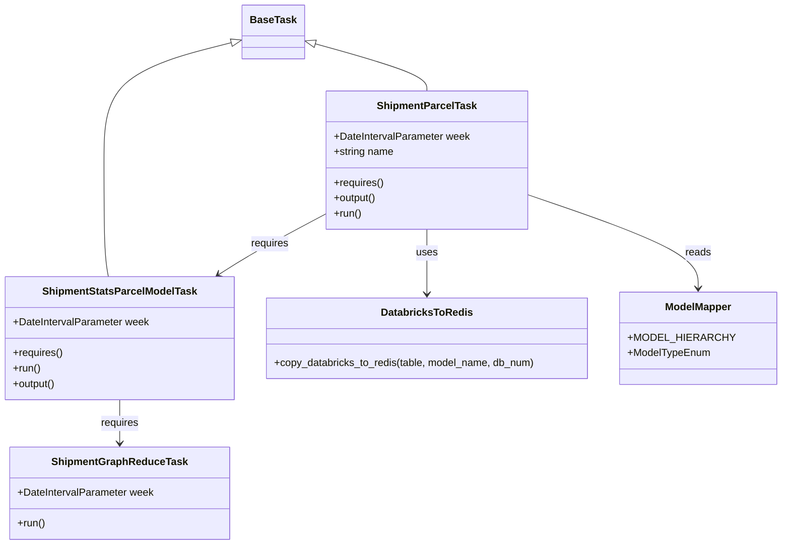

# Diagram: research/orchestrator/tasks/models/shipment_stats_parcel_model.py


> Auto-generated by Obscura crawlers

## Diagram 1



### SVG

<svg id="container" width="1191.21875" xmlns="http://www.w3.org/2000/svg" class="classDiagram" height="850" viewBox="0 0 1191.21875 850" role="graphics-document document" aria-roledescription="class"><style>#container{font-family:"trebuchet ms",verdana,arial,sans-serif;font-size:16px;fill:#333;}@keyframes edge-animation-frame{from{stroke-dashoffset:0;}}@keyframes dash{to{stroke-dashoffset:0;}}#container .edge-animation-slow{stroke-dasharray:9,5!important;stroke-dashoffset:900;animation:dash 50s linear infinite;stroke-linecap:round;}#container .edge-animation-fast{stroke-dasharray:9,5!important;stroke-dashoffset:900;animation:dash 20s linear infinite;stroke-linecap:round;}#container .error-icon{fill:#552222;}#container .error-text{fill:#552222;stroke:#552222;}#container .edge-thickness-normal{stroke-width:1px;}#container .edge-thickness-thick{stroke-width:3.5px;}#container .edge-pattern-solid{stroke-dasharray:0;}#container .edge-thickness-invisible{stroke-width:0;fill:none;}#container .edge-pattern-dashed{stroke-dasharray:3;}#container .edge-pattern-dotted{stroke-dasharray:2;}#container .marker{fill:#333333;stroke:#333333;}#container .marker.cross{stroke:#333333;}#container svg{font-family:"trebuchet ms",verdana,arial,sans-serif;font-size:16px;}#container p{margin:0;}#container g.classGroup text{fill:#9370DB;stroke:none;font-family:"trebuchet ms",verdana,arial,sans-serif;font-size:10px;}#container g.classGroup text .title{font-weight:bolder;}#container .nodeLabel,#container .edgeLabel{color:#131300;}#container .edgeLabel .label rect{fill:#ECECFF;}#container .label text{fill:#131300;}#container .labelBkg{background:#ECECFF;}#container .edgeLabel .label span{background:#ECECFF;}#container .classTitle{font-weight:bolder;}#container .node rect,#container .node circle,#container .node ellipse,#container .node polygon,#container .node path{fill:#ECECFF;stroke:#9370DB;stroke-width:1px;}#container .divider{stroke:#9370DB;stroke-width:1;}#container g.clickable{cursor:pointer;}#container g.classGroup rect{fill:#ECECFF;stroke:#9370DB;}#container g.classGroup line{stroke:#9370DB;stroke-width:1;}#container .classLabel .box{stroke:none;stroke-width:0;fill:#ECECFF;opacity:0.5;}#container .classLabel .label{fill:#9370DB;font-size:10px;}#container .relation{stroke:#333333;stroke-width:1;fill:none;}#container .dashed-line{stroke-dasharray:3;}#container .dotted-line{stroke-dasharray:1 2;}#container #compositionStart,#container .composition{fill:#333333!important;stroke:#333333!important;stroke-width:1;}#container #compositionEnd,#container .composition{fill:#333333!important;stroke:#333333!important;stroke-width:1;}#container #dependencyStart,#container .dependency{fill:#333333!important;stroke:#333333!important;stroke-width:1;}#container #dependencyStart,#container .dependency{fill:#333333!important;stroke:#333333!important;stroke-width:1;}#container #extensionStart,#container .extension{fill:transparent!important;stroke:#333333!important;stroke-width:1;}#container #extensionEnd,#container .extension{fill:transparent!important;stroke:#333333!important;stroke-width:1;}#container #aggregationStart,#container .aggregation{fill:transparent!important;stroke:#333333!important;stroke-width:1;}#container #aggregationEnd,#container .aggregation{fill:transparent!important;stroke:#333333!important;stroke-width:1;}#container #lollipopStart,#container .lollipop{fill:#ECECFF!important;stroke:#333333!important;stroke-width:1;}#container #lollipopEnd,#container .lollipop{fill:#ECECFF!important;stroke:#333333!important;stroke-width:1;}#container .edgeTerminals{font-size:11px;line-height:initial;}#container .classTitleText{text-anchor:middle;font-size:18px;fill:#333;}#container .label-icon{display:inline-block;height:1em;overflow:visible;vertical-align:-0.125em;}#container .node .label-icon path{fill:currentColor;stroke:revert;stroke-width:revert;}#container :root{--mermaid-font-family:"trebuchet ms",verdana,arial,sans-serif;}</style><g><defs><marker id="container_class-aggregationStart" class="marker aggregation class" refX="18" refY="7" markerWidth="190" markerHeight="240" orient="auto"><path d="M 18,7 L9,13 L1,7 L9,1 Z"></path></marker></defs><defs><marker id="container_class-aggregationEnd" class="marker aggregation class" refX="1" refY="7" markerWidth="20" markerHeight="28" orient="auto"><path d="M 18,7 L9,13 L1,7 L9,1 Z"></path></marker></defs><defs><marker id="container_class-extensionStart" class="marker extension class" refX="18" refY="7" markerWidth="190" markerHeight="240" orient="auto"><path d="M 1,7 L18,13 V 1 Z"></path></marker></defs><defs><marker id="container_class-extensionEnd" class="marker extension class" refX="1" refY="7" markerWidth="20" markerHeight="28" orient="auto"><path d="M 1,1 V 13 L18,7 Z"></path></marker></defs><defs><marker id="container_class-compositionStart" class="marker composition class" refX="18" refY="7" markerWidth="190" markerHeight="240" orient="auto"><path d="M 18,7 L9,13 L1,7 L9,1 Z"></path></marker></defs><defs><marker id="container_class-compositionEnd" class="marker composition class" refX="1" refY="7" markerWidth="20" markerHeight="28" orient="auto"><path d="M 18,7 L9,13 L1,7 L9,1 Z"></path></marker></defs><defs><marker id="container_class-dependencyStart" class="marker dependency class" refX="6" refY="7" markerWidth="190" markerHeight="240" orient="auto"><path d="M 5,7 L9,13 L1,7 L9,1 Z"></path></marker></defs><defs><marker id="container_class-dependencyEnd" class="marker dependency class" refX="13" refY="7" markerWidth="20" markerHeight="28" orient="auto"><path d="M 18,7 L9,13 L14,7 L9,1 Z"></path></marker></defs><defs><marker id="container_class-lollipopStart" class="marker lollipop class" refX="13" refY="7" markerWidth="190" markerHeight="240" orient="auto"><circle stroke="black" fill="transparent" cx="7" cy="7" r="6"></circle></marker></defs><defs><marker id="container_class-lollipopEnd" class="marker lollipop class" refX="1" refY="7" markerWidth="190" markerHeight="240" orient="auto"><circle stroke="black" fill="transparent" cx="7" cy="7" r="6"></circle></marker></defs><g class="root"><g class="clusters"></g><g class="edgePaths"><path d="M359.228,65.973L325.819,74.477C292.409,82.982,225.589,99.991,192.179,130.662C158.77,161.333,158.77,205.667,158.77,252C158.77,298.333,158.77,346.667,159.925,377C161.081,407.333,163.392,419.667,164.548,425.833L165.704,432" id="id_BaseTask_ShipmentStatsParcelModelTask_1" class="edge-thickness-normal edge-pattern-solid relation" style=";;;" data-edge="true" data-et="edge" data-id="id_BaseTask_ShipmentStatsParcelModelTask_1" data-points="W3sieCI6Mzc1Ljk0NTMxMjUsInkiOjYxLjcxNzM2ODM5NzYxOTUxfSx7IngiOjE1OC43Njk1MzEyNSwieSI6MTE3fSx7IngiOjE1OC43Njk1MzEyNSwieSI6MjUwfSx7IngiOjE1OC43Njk1MzEyNSwieSI6Mzk1fSx7IngiOjE2NS43MDM3NzExNDY2MTY1MywieSI6NDMyfV0=" marker-start="url(#container_class-extensionStart)"></path><path d="M484.614,67.612L513.888,75.844C543.162,84.075,601.71,100.537,630.984,112.935C660.258,125.333,660.258,133.667,660.258,137.833L660.258,142" id="id_BaseTask_ShipmentParcelTask_2" class="edge-thickness-normal edge-pattern-solid relation" style=";;;" data-edge="true" data-et="edge" data-id="id_BaseTask_ShipmentParcelTask_2" data-points="W3sieCI6NDY4LjAwNzgxMjUsInkiOjYyLjk0MzA4MTk2NzIxMzEyfSx7IngiOjY2MC4yNTc4MTI1LCJ5IjoxMTd9LHsieCI6NjYwLjI1NzgxMjUsInkiOjE0Mn1d" marker-start="url(#container_class-extensionStart)"></path><path d="M183.695,624L183.695,630.167C183.695,636.333,183.695,648.667,183.695,660C183.695,671.333,183.695,681.667,183.695,686.833L183.695,692" id="id_ShipmentStatsParcelModelTask_ShipmentGraphReduceTask_3" class="edge-thickness-normal edge-pattern-solid relation" style=";;;" data-edge="true" data-et="edge" data-id="id_ShipmentStatsParcelModelTask_ShipmentGraphReduceTask_3" data-points="W3sieCI6MTgzLjY5NTMxMjUsInkiOjYyNH0seyJ4IjoxODMuNjk1MzEyNSwieSI6NjYxfSx7IngiOjE4My42OTUzMTI1LCJ5Ijo2OTh9XQ==" marker-end="url(#container_class-dependencyEnd)"></path><path d="M505.289,332.778L485.875,343.149C466.461,353.519,427.633,374.259,399.548,390.252C371.463,406.245,354.121,417.49,345.449,423.113L336.778,428.736" id="id_ShipmentParcelTask_ShipmentStatsParcelModelTask_4" class="edge-thickness-normal edge-pattern-solid relation" style=";;;" data-edge="true" data-et="edge" data-id="id_ShipmentParcelTask_ShipmentStatsParcelModelTask_4" data-points="W3sieCI6NTA1LjI4OTA2MjUsInkiOjMzMi43Nzg0NDkzMTc5MDcxfSx7IngiOjM4OC44MDQ2ODc1LCJ5IjozOTV9LHsieCI6MzMxLjc0NDE4NDY4MDQ1MTEsInkiOjQzMn1d" marker-end="url(#container_class-dependencyEnd)"></path><path d="M660.258,358L660.258,364.167C660.258,370.333,660.258,382.667,660.258,399.5C660.258,416.333,660.258,437.667,660.258,448.333L660.258,459" id="id_ShipmentParcelTask_DatabricksToRedis_5" class="edge-thickness-normal edge-pattern-solid relation" style=";;;" data-edge="true" data-et="edge" data-id="id_ShipmentParcelTask_DatabricksToRedis_5" data-points="W3sieCI6NjYwLjI1NzgxMjUsInkiOjM1OH0seyJ4Ijo2NjAuMjU3ODEyNSwieSI6Mzk1fSx7IngiOjY2MC4yNTc4MTI1LCJ5Ijo0NjV9XQ==" marker-end="url(#container_class-dependencyEnd)"></path><path d="M815.227,304.551L858.051,319.626C900.875,334.701,986.523,364.85,1029.348,389.092C1072.172,413.333,1072.172,431.667,1072.172,440.833L1072.172,450" id="id_ShipmentParcelTask_ModelMapper_6" class="edge-thickness-normal edge-pattern-solid relation" style=";;;" data-edge="true" data-et="edge" data-id="id_ShipmentParcelTask_ModelMapper_6" data-points="W3sieCI6ODE1LjIyNjU2MjUsInkiOjMwNC41NTEzNTEzNTEzNTEzNH0seyJ4IjoxMDcyLjE3MTg3NSwieSI6Mzk1fSx7IngiOjEwNzIuMTcxODc1LCJ5Ijo0NTZ9XQ==" marker-end="url(#container_class-dependencyEnd)"></path></g><g class="edgeLabels"><g class="edgeLabel"><g class="label" data-id="id_BaseTask_ShipmentStatsParcelModelTask_1" transform="translate(0, 0)"><foreignObject width="0" height="0"><div xmlns="http://www.w3.org/1999/xhtml" class="labelBkg" style="display: table-cell; white-space: nowrap; line-height: 1.5; max-width: 200px; text-align: center;"><span class="edgeLabel"></span></div></foreignObject></g></g><g class="edgeLabel"><g class="label" data-id="id_BaseTask_ShipmentParcelTask_2" transform="translate(0, 0)"><foreignObject width="0" height="0"><div xmlns="http://www.w3.org/1999/xhtml" class="labelBkg" style="display: table-cell; white-space: nowrap; line-height: 1.5; max-width: 200px; text-align: center;"><span class="edgeLabel"></span></div></foreignObject></g></g><g class="edgeLabel" transform="translate(183.6953125, 661)"><g class="label" data-id="id_ShipmentStatsParcelModelTask_ShipmentGraphReduceTask_3" transform="translate(-29.8515625, -12)"><foreignObject width="59.703125" height="24"><div xmlns="http://www.w3.org/1999/xhtml" class="labelBkg" style="display: table-cell; white-space: nowrap; line-height: 1.5; max-width: 200px; text-align: center;"><span class="edgeLabel"><p>requires</p></span></div></foreignObject></g></g><g class="edgeLabel" transform="translate(417.05428, 379.91013)"><g class="label" data-id="id_ShipmentParcelTask_ShipmentStatsParcelModelTask_4" transform="translate(-29.8515625, -12)"><foreignObject width="59.703125" height="24"><div xmlns="http://www.w3.org/1999/xhtml" class="labelBkg" style="display: table-cell; white-space: nowrap; line-height: 1.5; max-width: 200px; text-align: center;"><span class="edgeLabel"><p>requires</p></span></div></foreignObject></g></g><g class="edgeLabel" transform="translate(660.2578125, 395)"><g class="label" data-id="id_ShipmentParcelTask_DatabricksToRedis_5" transform="translate(-16.4921875, -12)"><foreignObject width="32.984375" height="24"><div xmlns="http://www.w3.org/1999/xhtml" class="labelBkg" style="display: table-cell; white-space: nowrap; line-height: 1.5; max-width: 200px; text-align: center;"><span class="edgeLabel"><p>uses</p></span></div></foreignObject></g></g><g class="edgeLabel" transform="translate(1072.171875, 395)"><g class="label" data-id="id_ShipmentParcelTask_ModelMapper_6" transform="translate(-20.0078125, -12)"><foreignObject width="40.015625" height="24"><div xmlns="http://www.w3.org/1999/xhtml" class="labelBkg" style="display: table-cell; white-space: nowrap; line-height: 1.5; max-width: 200px; text-align: center;"><span class="edgeLabel"><p>reads</p></span></div></foreignObject></g></g></g><g class="nodes"><g class="node default" id="classId-BaseTask-0" transform="translate(421.9765625, 50)"><g class="basic label-container"><path d="M-46.03125 -42 L46.03125 -42 L46.03125 42 L-46.03125 42" stroke="none" stroke-width="0" fill="#ECECFF" style=""></path><path d="M-46.03125 -42 C-20.38733911352773 -42, 5.25657177294454 -42, 46.03125 -42 M-46.03125 -42 C-12.3997399404317 -42, 21.2317701191366 -42, 46.03125 -42 M46.03125 -42 C46.03125 -13.450351518979591, 46.03125 15.099296962040818, 46.03125 42 M46.03125 -42 C46.03125 -23.74371910724159, 46.03125 -5.487438214483177, 46.03125 42 M46.03125 42 C17.98192721489762 42, -10.06739557020476 42, -46.03125 42 M46.03125 42 C16.97756447693231 42, -12.076121046135377 42, -46.03125 42 M-46.03125 42 C-46.03125 21.39965987133015, -46.03125 0.7993197426603018, -46.03125 -42 M-46.03125 42 C-46.03125 14.284690154257554, -46.03125 -13.430619691484893, -46.03125 -42" stroke="#9370DB" stroke-width="1.3" fill="none" stroke-dasharray="0 0" style=""></path></g><g class="annotation-group text" transform="translate(0, -18)"></g><g class="label-group text" transform="translate(-34.03125, -18)"><g class="label" style="font-weight: bolder" transform="translate(0,-12)"><foreignObject width="68.0625" height="24"><div xmlns="http://www.w3.org/1999/xhtml" style="display: table-cell; white-space: nowrap; line-height: 1.5; max-width: 117px; text-align: center;"><span class="nodeLabel markdown-node-label" style=""><p>BaseTask</p></span></div></foreignObject></g></g><g class="members-group text" transform="translate(-34.03125, 30)"></g><g class="methods-group text" transform="translate(-34.03125, 60)"></g><g class="divider" style=""><path d="M-46.03125 6 C-11.484076012116162 6, 23.063097975767676 6, 46.03125 6 M-46.03125 6 C-9.695950782432647 6, 26.639348435134707 6, 46.03125 6" stroke="#9370DB" stroke-width="1.3" fill="none" stroke-dasharray="0 0" style=""></path></g><g class="divider" style=""><path d="M-46.03125 24 C-27.407903149838894 24, -8.784556299677789 24, 46.03125 24 M-46.03125 24 C-26.877706711821844 24, -7.724163423643688 24, 46.03125 24" stroke="#9370DB" stroke-width="1.3" fill="none" stroke-dasharray="0 0" style=""></path></g></g><g class="node default" id="classId-ShipmentGraphReduceTask-1" transform="translate(183.6953125, 770)"><g class="basic label-container"><path d="M-168.1484375 -72 L168.1484375 -72 L168.1484375 72 L-168.1484375 72" stroke="none" stroke-width="0" fill="#ECECFF" style=""></path><path d="M-168.1484375 -72 C-91.75520693702627 -72, -15.361976374052546 -72, 168.1484375 -72 M-168.1484375 -72 C-84.65366279978302 -72, -1.1588880995660418 -72, 168.1484375 -72 M168.1484375 -72 C168.1484375 -26.52945655003363, 168.1484375 18.941086899932742, 168.1484375 72 M168.1484375 -72 C168.1484375 -24.7472803878808, 168.1484375 22.5054392242384, 168.1484375 72 M168.1484375 72 C37.22741894378683 72, -93.69359961242634 72, -168.1484375 72 M168.1484375 72 C39.146000705852316 72, -89.85643608829537 72, -168.1484375 72 M-168.1484375 72 C-168.1484375 30.590340611097936, -168.1484375 -10.819318777804128, -168.1484375 -72 M-168.1484375 72 C-168.1484375 40.19868797041319, -168.1484375 8.397375940826372, -168.1484375 -72" stroke="#9370DB" stroke-width="1.3" fill="none" stroke-dasharray="0 0" style=""></path></g><g class="annotation-group text" transform="translate(0, -48)"></g><g class="label-group text" transform="translate(-100.171875, -48)"><g class="label" style="font-weight: bolder" transform="translate(0,-12)"><foreignObject width="200.34375" height="24"><div xmlns="http://www.w3.org/1999/xhtml" style="display: table-cell; white-space: nowrap; line-height: 1.5; max-width: 249px; text-align: center;"><span class="nodeLabel markdown-node-label" style=""><p>ShipmentGraphReduceTask</p></span></div></foreignObject></g></g><g class="members-group text" transform="translate(-156.1484375, 0)"><g class="label" style="" transform="translate(0,-12)"><foreignObject width="212.125" height="24"><div xmlns="http://www.w3.org/1999/xhtml" style="display: table-cell; white-space: nowrap; line-height: 1.5; max-width: 270px; text-align: center;"><span class="nodeLabel markdown-node-label" style=""><p>+DateIntervalParameter week</p></span></div></foreignObject></g></g><g class="methods-group text" transform="translate(-156.1484375, 48)"><g class="label" style="" transform="translate(0,-12)"><foreignObject width="43.21875" height="24"><div xmlns="http://www.w3.org/1999/xhtml" style="display: table-cell; white-space: nowrap; line-height: 1.5; max-width: 101px; text-align: center;"><span class="nodeLabel markdown-node-label" style=""><p>+run()</p></span></div></foreignObject></g></g><g class="divider" style=""><path d="M-168.1484375 -24 C-81.43178679028537 -24, 5.284863919429256 -24, 168.1484375 -24 M-168.1484375 -24 C-96.42708507576765 -24, -24.7057326515353 -24, 168.1484375 -24" stroke="#9370DB" stroke-width="1.3" fill="none" stroke-dasharray="0 0" style=""></path></g><g class="divider" style=""><path d="M-168.1484375 24 C-80.56938252451451 24, 7.009672450970982 24, 168.1484375 24 M-168.1484375 24 C-97.55762552533453 24, -26.96681355066906 24, 168.1484375 24" stroke="#9370DB" stroke-width="1.3" fill="none" stroke-dasharray="0 0" style=""></path></g></g><g class="node default" id="classId-ShipmentStatsParcelModelTask-2" transform="translate(183.6953125, 528)"><g class="basic label-container"><path d="M-175.6953125 -96 L175.6953125 -96 L175.6953125 96 L-175.6953125 96" stroke="none" stroke-width="0" fill="#ECECFF" style=""></path><path d="M-175.6953125 -96 C-100.15504977232477 -96, -24.614787044649546 -96, 175.6953125 -96 M-175.6953125 -96 C-48.260323662723536 -96, 79.17466517455293 -96, 175.6953125 -96 M175.6953125 -96 C175.6953125 -33.3151844211834, 175.6953125 29.369631157633194, 175.6953125 96 M175.6953125 -96 C175.6953125 -53.31378852085154, 175.6953125 -10.627577041703077, 175.6953125 96 M175.6953125 96 C42.99487567515726 96, -89.70556114968548 96, -175.6953125 96 M175.6953125 96 C69.7661901061347 96, -36.1629322877306 96, -175.6953125 96 M-175.6953125 96 C-175.6953125 21.024898311908515, -175.6953125 -53.95020337618297, -175.6953125 -96 M-175.6953125 96 C-175.6953125 47.82367037570118, -175.6953125 -0.3526592485976465, -175.6953125 -96" stroke="#9370DB" stroke-width="1.3" fill="none" stroke-dasharray="0 0" style=""></path></g><g class="annotation-group text" transform="translate(0, -72)"></g><g class="label-group text" transform="translate(-115.265625, -72)"><g class="label" style="font-weight: bolder" transform="translate(0,-12)"><foreignObject width="230.53125" height="24"><div xmlns="http://www.w3.org/1999/xhtml" style="display: table-cell; white-space: nowrap; line-height: 1.5; max-width: 277px; text-align: center;"><span class="nodeLabel markdown-node-label" style=""><p>ShipmentStatsParcelModelTask</p></span></div></foreignObject></g></g><g class="members-group text" transform="translate(-163.6953125, -24)"><g class="label" style="" transform="translate(0,-12)"><foreignObject width="212.125" height="24"><div xmlns="http://www.w3.org/1999/xhtml" style="display: table-cell; white-space: nowrap; line-height: 1.5; max-width: 270px; text-align: center;"><span class="nodeLabel markdown-node-label" style=""><p>+DateIntervalParameter week</p></span></div></foreignObject></g></g><g class="methods-group text" transform="translate(-163.6953125, 24)"><g class="label" style="" transform="translate(0,-12)"><foreignObject width="78.0625" height="24"><div xmlns="http://www.w3.org/1999/xhtml" style="display: table-cell; white-space: nowrap; line-height: 1.5; max-width: 135px; text-align: center;"><span class="nodeLabel markdown-node-label" style=""><p>+requires()</p></span></div></foreignObject></g><g class="label" style="" transform="translate(0,12)"><foreignObject width="43.21875" height="24"><div xmlns="http://www.w3.org/1999/xhtml" style="display: table-cell; white-space: nowrap; line-height: 1.5; max-width: 101px; text-align: center;"><span class="nodeLabel markdown-node-label" style=""><p>+run()</p></span></div></foreignObject></g><g class="label" style="" transform="translate(0,36)"><foreignObject width="67.390625" height="24"><div xmlns="http://www.w3.org/1999/xhtml" style="display: table-cell; white-space: nowrap; line-height: 1.5; max-width: 125px; text-align: center;"><span class="nodeLabel markdown-node-label" style=""><p>+output()</p></span></div></foreignObject></g></g><g class="divider" style=""><path d="M-175.6953125 -48 C-76.81106335141176 -48, 22.073185797176478 -48, 175.6953125 -48 M-175.6953125 -48 C-80.63464703289326 -48, 14.42601843421349 -48, 175.6953125 -48" stroke="#9370DB" stroke-width="1.3" fill="none" stroke-dasharray="0 0" style=""></path></g><g class="divider" style=""><path d="M-175.6953125 0 C-80.50147627444518 0, 14.692359951109637 0, 175.6953125 0 M-175.6953125 0 C-95.92782485450127 0, -16.160337209002535 0, 175.6953125 0" stroke="#9370DB" stroke-width="1.3" fill="none" stroke-dasharray="0 0" style=""></path></g></g><g class="node default" id="classId-ShipmentParcelTask-3" transform="translate(660.2578125, 250)"><g class="basic label-container"><path d="M-154.96875 -108 L154.96875 -108 L154.96875 108 L-154.96875 108" stroke="none" stroke-width="0" fill="#ECECFF" style=""></path><path d="M-154.96875 -108 C-66.30088742817709 -108, 22.366975143645817 -108, 154.96875 -108 M-154.96875 -108 C-82.58446946613266 -108, -10.20018893226532 -108, 154.96875 -108 M154.96875 -108 C154.96875 -27.191647008746855, 154.96875 53.61670598250629, 154.96875 108 M154.96875 -108 C154.96875 -41.86718341945084, 154.96875 24.26563316109832, 154.96875 108 M154.96875 108 C86.69012842761767 108, 18.41150685523533 108, -154.96875 108 M154.96875 108 C72.08661244830805 108, -10.795525103383909 108, -154.96875 108 M-154.96875 108 C-154.96875 56.17454412531123, -154.96875 4.349088250622458, -154.96875 -108 M-154.96875 108 C-154.96875 52.5093345996871, -154.96875 -2.9813308006257984, -154.96875 -108" stroke="#9370DB" stroke-width="1.3" fill="none" stroke-dasharray="0 0" style=""></path></g><g class="annotation-group text" transform="translate(0, -84)"></g><g class="label-group text" transform="translate(-73.8125, -84)"><g class="label" style="font-weight: bolder" transform="translate(0,-12)"><foreignObject width="147.625" height="24"><div xmlns="http://www.w3.org/1999/xhtml" style="display: table-cell; white-space: nowrap; line-height: 1.5; max-width: 196px; text-align: center;"><span class="nodeLabel markdown-node-label" style=""><p>ShipmentParcelTask</p></span></div></foreignObject></g></g><g class="members-group text" transform="translate(-142.96875, -36)"><g class="label" style="" transform="translate(0,-12)"><foreignObject width="212.125" height="24"><div xmlns="http://www.w3.org/1999/xhtml" style="display: table-cell; white-space: nowrap; line-height: 1.5; max-width: 270px; text-align: center;"><span class="nodeLabel markdown-node-label" style=""><p>+DateIntervalParameter week</p></span></div></foreignObject></g><g class="label" style="" transform="translate(0,12)"><foreignObject width="94.375" height="24"><div xmlns="http://www.w3.org/1999/xhtml" style="display: table-cell; white-space: nowrap; line-height: 1.5; max-width: 152px; text-align: center;"><span class="nodeLabel markdown-node-label" style=""><p>+string name</p></span></div></foreignObject></g></g><g class="methods-group text" transform="translate(-142.96875, 36)"><g class="label" style="" transform="translate(0,-12)"><foreignObject width="78.0625" height="24"><div xmlns="http://www.w3.org/1999/xhtml" style="display: table-cell; white-space: nowrap; line-height: 1.5; max-width: 135px; text-align: center;"><span class="nodeLabel markdown-node-label" style=""><p>+requires()</p></span></div></foreignObject></g><g class="label" style="" transform="translate(0,12)"><foreignObject width="67.390625" height="24"><div xmlns="http://www.w3.org/1999/xhtml" style="display: table-cell; white-space: nowrap; line-height: 1.5; max-width: 125px; text-align: center;"><span class="nodeLabel markdown-node-label" style=""><p>+output()</p></span></div></foreignObject></g><g class="label" style="" transform="translate(0,36)"><foreignObject width="43.21875" height="24"><div xmlns="http://www.w3.org/1999/xhtml" style="display: table-cell; white-space: nowrap; line-height: 1.5; max-width: 101px; text-align: center;"><span class="nodeLabel markdown-node-label" style=""><p>+run()</p></span></div></foreignObject></g></g><g class="divider" style=""><path d="M-154.96875 -60 C-55.802957647543224 -60, 43.36283470491355 -60, 154.96875 -60 M-154.96875 -60 C-31.75974894626094 -60, 91.44925210747812 -60, 154.96875 -60" stroke="#9370DB" stroke-width="1.3" fill="none" stroke-dasharray="0 0" style=""></path></g><g class="divider" style=""><path d="M-154.96875 12 C-89.47143383792404 12, -23.974117675848078 12, 154.96875 12 M-154.96875 12 C-60.976196645254674 12, 33.01635670949065 12, 154.96875 12" stroke="#9370DB" stroke-width="1.3" fill="none" stroke-dasharray="0 0" style=""></path></g></g><g class="node default" id="classId-DatabricksToRedis-4" transform="translate(660.2578125, 528)"><g class="basic label-container"><path d="M-250.8671875 -63 L250.8671875 -63 L250.8671875 63 L-250.8671875 63" stroke="none" stroke-width="0" fill="#ECECFF" style=""></path><path d="M-250.8671875 -63 C-86.09237453623123 -63, 78.68243842753753 -63, 250.8671875 -63 M-250.8671875 -63 C-121.02930061382412 -63, 8.80858627235176 -63, 250.8671875 -63 M250.8671875 -63 C250.8671875 -26.554429683630993, 250.8671875 9.891140632738015, 250.8671875 63 M250.8671875 -63 C250.8671875 -19.855362453703762, 250.8671875 23.289275092592476, 250.8671875 63 M250.8671875 63 C110.29296256126631 63, -30.281262377467385 63, -250.8671875 63 M250.8671875 63 C100.72225978715304 63, -49.42266792569393 63, -250.8671875 63 M-250.8671875 63 C-250.8671875 32.06040653508914, -250.8671875 1.1208130701782935, -250.8671875 -63 M-250.8671875 63 C-250.8671875 32.36746038806305, -250.8671875 1.7349207761261098, -250.8671875 -63" stroke="#9370DB" stroke-width="1.3" fill="none" stroke-dasharray="0 0" style=""></path></g><g class="annotation-group text" transform="translate(0, -39)"></g><g class="label-group text" transform="translate(-67.90625, -39)"><g class="label" style="font-weight: bolder" transform="translate(0,-12)"><foreignObject width="135.8125" height="24"><div xmlns="http://www.w3.org/1999/xhtml" style="display: table-cell; white-space: nowrap; line-height: 1.5; max-width: 183px; text-align: center;"><span class="nodeLabel markdown-node-label" style=""><p>DatabricksToRedis</p></span></div></foreignObject></g></g><g class="members-group text" transform="translate(-238.8671875, 9)"></g><g class="methods-group text" transform="translate(-238.8671875, 39)"><g class="label" style="" transform="translate(0,-12)"><foreignObject width="409.828125" height="24"><div xmlns="http://www.w3.org/1999/xhtml" style="display: table-cell; white-space: nowrap; line-height: 1.5; max-width: 467px; text-align: center;"><span class="nodeLabel markdown-node-label" style=""><p>+copy_databricks_to_redis(table, model_name, db_num)</p></span></div></foreignObject></g></g><g class="divider" style=""><path d="M-250.8671875 -15 C-64.18649988846721 -15, 122.49418772306558 -15, 250.8671875 -15 M-250.8671875 -15 C-122.61135050083158 -15, 5.644486498336846 -15, 250.8671875 -15" stroke="#9370DB" stroke-width="1.3" fill="none" stroke-dasharray="0 0" style=""></path></g><g class="divider" style=""><path d="M-250.8671875 9 C-69.75425989247444 9, 111.35866771505113 9, 250.8671875 9 M-250.8671875 9 C-82.61267522664477 9, 85.64183704671046 9, 250.8671875 9" stroke="#9370DB" stroke-width="1.3" fill="none" stroke-dasharray="0 0" style=""></path></g></g><g class="node default" id="classId-ModelMapper-5" transform="translate(1072.171875, 528)"><g class="basic label-container"><path d="M-111.046875 -72 L111.046875 -72 L111.046875 72 L-111.046875 72" stroke="none" stroke-width="0" fill="#ECECFF" style=""></path><path d="M-111.046875 -72 C-58.96545078571135 -72, -6.8840265714226945 -72, 111.046875 -72 M-111.046875 -72 C-60.74725657214955 -72, -10.447638144299106 -72, 111.046875 -72 M111.046875 -72 C111.046875 -15.994416928162153, 111.046875 40.011166143675695, 111.046875 72 M111.046875 -72 C111.046875 -34.58783722342482, 111.046875 2.8243255531503593, 111.046875 72 M111.046875 72 C29.23263359195309 72, -52.58160781609382 72, -111.046875 72 M111.046875 72 C34.470611819908044 72, -42.10565136018391 72, -111.046875 72 M-111.046875 72 C-111.046875 37.29685722221091, -111.046875 2.5937144444218205, -111.046875 -72 M-111.046875 72 C-111.046875 32.20921319730471, -111.046875 -7.581573605390574, -111.046875 -72" stroke="#9370DB" stroke-width="1.3" fill="none" stroke-dasharray="0 0" style=""></path></g><g class="annotation-group text" transform="translate(0, -48)"></g><g class="label-group text" transform="translate(-50.40625, -48)"><g class="label" style="font-weight: bolder" transform="translate(0,-12)"><foreignObject width="100.8125" height="24"><div xmlns="http://www.w3.org/1999/xhtml" style="display: table-cell; white-space: nowrap; line-height: 1.5; max-width: 151px; text-align: center;"><span class="nodeLabel markdown-node-label" style=""><p>ModelMapper</p></span></div></foreignObject></g></g><g class="members-group text" transform="translate(-99.046875, 0)"><g class="label" style="" transform="translate(0,-12)"><foreignObject width="147.6875" height="24"><div xmlns="http://www.w3.org/1999/xhtml" style="display: table-cell; white-space: nowrap; line-height: 1.5; max-width: 205px; text-align: center;"><span class="nodeLabel markdown-node-label" style=""><p>+MODEL_HIERARCHY</p></span></div></foreignObject></g><g class="label" style="" transform="translate(0,12)"><foreignObject width="127.28125" height="24"><div xmlns="http://www.w3.org/1999/xhtml" style="display: table-cell; white-space: nowrap; line-height: 1.5; max-width: 185px; text-align: center;"><span class="nodeLabel markdown-node-label" style=""><p>+ModelTypeEnum</p></span></div></foreignObject></g></g><g class="methods-group text" transform="translate(-99.046875, 72)"></g><g class="divider" style=""><path d="M-111.046875 -24 C-29.453675685450136 -24, 52.13952362909973 -24, 111.046875 -24 M-111.046875 -24 C-60.39749979990614 -24, -9.748124599812286 -24, 111.046875 -24" stroke="#9370DB" stroke-width="1.3" fill="none" stroke-dasharray="0 0" style=""></path></g><g class="divider" style=""><path d="M-111.046875 48 C-66.33956277573986 48, -21.632250551479714 48, 111.046875 48 M-111.046875 48 C-31.2921836241744 48, 48.4625077516512 48, 111.046875 48" stroke="#9370DB" stroke-width="1.3" fill="none" stroke-dasharray="0 0" style=""></path></g></g></g></g></g></svg>

## Diagram 2

```mermaid
flowchart LR
    subgraph Luigi
        GRT[ShipmentGraphReduceTask] --> SSM[ShipmentStatsParcelModelTask]
        SSM --> SPK[ShipmentParcelTask]
    end
    subgraph Spark
        DB[DatabricksSession<br/>profile=adb-3670867781558309] --> INP[Read INPUT_TABLE<br/>fv_prod.eta.shipment_graph_reduce]
        INP --> F1[Filter: sstop_final_stop_arrived_at IS NOT NULL<br/>AND sstop_final_stop_location_id == ship_destination_newloc_id]
        F1 --> J1[Join ORGS_TABLE<br/>fv_prod.bronze.public_organizations (rename columns org_* )]
        J1 --> F2[Filter: ship_mode_id == 8 (Parcel)]
        F2 --> F3[Filter: sstat_actual_created_at < sstop_final_stop_arrived_at<br/>AND ship_status_to_arrival_seconds > 0]
        F3 --> LOC[Read LOC_TABLE<br/>fv_prod.bronze.location_location]
        LOC --> T1[Transform LOC: create dest_shipper_location_id_city<br/>rename id->dupe_dest_loc_id,state->dest_shipper_location_id_state]
        T1 --> J2[Join base with loc on true_destination_location_id == dupe_dest_loc_id]
        J2 --> W[Filter: sstop_final_stop_arrived_at >= window_start_date (last 365 days)]
        W --> D1[Derive: day_of_week, sun_thru_thurs, sstat2_* fields]
        D1 --> RAW[Write raw_data to<br/>fv_prod.eta.shipment_stats_ltl_model_raw_data]
        RAW --> LOOP[For each model in MODEL_MAP]
        LOOP --> STATS[Window stats over partitionBy(rollup_keys): stddev, avg, median, mean]
        STATS --> Z[Compute stddev_distance and filter outliers (|z| <= 1.5)]
        Z --> AGG[Aggregate 30/60/90/120/180/365 day statistics & percentiles]
        AGG --> TS[Add modelTs]
        TS --> WRITE[Write delta table: OUTPUT_TABLE]
        WRITE --> DONE[Write Done file to ARTIFACT_ROOT]
    end
    SSM --> DB
    SPK --> MH[Read model_hierarchy from model_mapper.MODEL_HIERARCHY]
    MH --> COPY[Loop models: copy fv_prod.eta.&lt;model&gt; -> databricks_to_redis.copy_databricks_to_redis(...)]
    COPY --> REDIS[Redis DB 1]
    SPK --> MH
```

> SVG rendering failed for this diagram.
