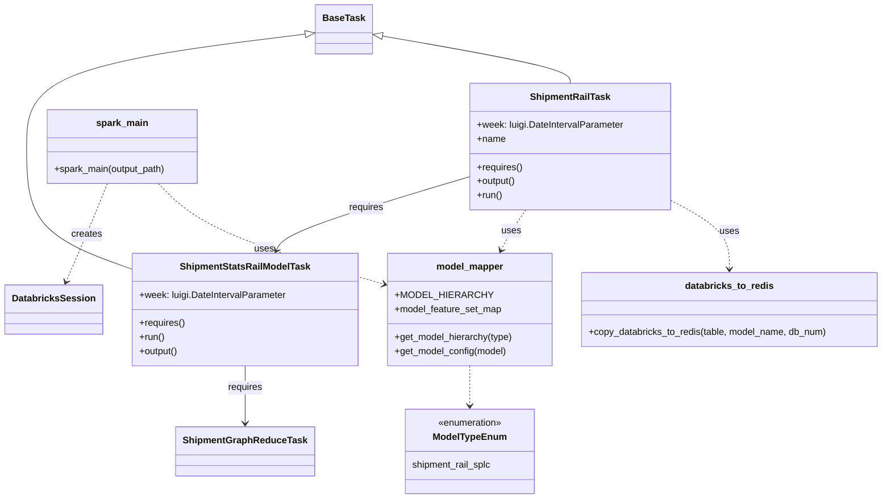

# Diagram: research/orchestrator/tasks/models/shipment_stats_rail_model.py


> Auto-generated by Obscura crawlers

## Diagram 1



### SVG

<svg id="container" width="1495.734375" xmlns="http://www.w3.org/2000/svg" class="classDiagram" height="850" viewBox="0 0 1495.734375 850" role="graphics-document document" aria-roledescription="class"><style>#container{font-family:"trebuchet ms",verdana,arial,sans-serif;font-size:16px;fill:#333;}@keyframes edge-animation-frame{from{stroke-dashoffset:0;}}@keyframes dash{to{stroke-dashoffset:0;}}#container .edge-animation-slow{stroke-dasharray:9,5!important;stroke-dashoffset:900;animation:dash 50s linear infinite;stroke-linecap:round;}#container .edge-animation-fast{stroke-dasharray:9,5!important;stroke-dashoffset:900;animation:dash 20s linear infinite;stroke-linecap:round;}#container .error-icon{fill:#552222;}#container .error-text{fill:#552222;stroke:#552222;}#container .edge-thickness-normal{stroke-width:1px;}#container .edge-thickness-thick{stroke-width:3.5px;}#container .edge-pattern-solid{stroke-dasharray:0;}#container .edge-thickness-invisible{stroke-width:0;fill:none;}#container .edge-pattern-dashed{stroke-dasharray:3;}#container .edge-pattern-dotted{stroke-dasharray:2;}#container .marker{fill:#333333;stroke:#333333;}#container .marker.cross{stroke:#333333;}#container svg{font-family:"trebuchet ms",verdana,arial,sans-serif;font-size:16px;}#container p{margin:0;}#container g.classGroup text{fill:#9370DB;stroke:none;font-family:"trebuchet ms",verdana,arial,sans-serif;font-size:10px;}#container g.classGroup text .title{font-weight:bolder;}#container .nodeLabel,#container .edgeLabel{color:#131300;}#container .edgeLabel .label rect{fill:#ECECFF;}#container .label text{fill:#131300;}#container .labelBkg{background:#ECECFF;}#container .edgeLabel .label span{background:#ECECFF;}#container .classTitle{font-weight:bolder;}#container .node rect,#container .node circle,#container .node ellipse,#container .node polygon,#container .node path{fill:#ECECFF;stroke:#9370DB;stroke-width:1px;}#container .divider{stroke:#9370DB;stroke-width:1;}#container g.clickable{cursor:pointer;}#container g.classGroup rect{fill:#ECECFF;stroke:#9370DB;}#container g.classGroup line{stroke:#9370DB;stroke-width:1;}#container .classLabel .box{stroke:none;stroke-width:0;fill:#ECECFF;opacity:0.5;}#container .classLabel .label{fill:#9370DB;font-size:10px;}#container .relation{stroke:#333333;stroke-width:1;fill:none;}#container .dashed-line{stroke-dasharray:3;}#container .dotted-line{stroke-dasharray:1 2;}#container #compositionStart,#container .composition{fill:#333333!important;stroke:#333333!important;stroke-width:1;}#container #compositionEnd,#container .composition{fill:#333333!important;stroke:#333333!important;stroke-width:1;}#container #dependencyStart,#container .dependency{fill:#333333!important;stroke:#333333!important;stroke-width:1;}#container #dependencyStart,#container .dependency{fill:#333333!important;stroke:#333333!important;stroke-width:1;}#container #extensionStart,#container .extension{fill:transparent!important;stroke:#333333!important;stroke-width:1;}#container #extensionEnd,#container .extension{fill:transparent!important;stroke:#333333!important;stroke-width:1;}#container #aggregationStart,#container .aggregation{fill:transparent!important;stroke:#333333!important;stroke-width:1;}#container #aggregationEnd,#container .aggregation{fill:transparent!important;stroke:#333333!important;stroke-width:1;}#container #lollipopStart,#container .lollipop{fill:#ECECFF!important;stroke:#333333!important;stroke-width:1;}#container #lollipopEnd,#container .lollipop{fill:#ECECFF!important;stroke:#333333!important;stroke-width:1;}#container .edgeTerminals{font-size:11px;line-height:initial;}#container .classTitleText{text-anchor:middle;font-size:18px;fill:#333;}#container .label-icon{display:inline-block;height:1em;overflow:visible;vertical-align:-0.125em;}#container .node .label-icon path{fill:currentColor;stroke:revert;stroke-width:revert;}#container :root{--mermaid-font-family:"trebuchet ms",verdana,arial,sans-serif;}</style><g><defs><marker id="container_class-aggregationStart" class="marker aggregation class" refX="18" refY="7" markerWidth="190" markerHeight="240" orient="auto"><path d="M 18,7 L9,13 L1,7 L9,1 Z"></path></marker></defs><defs><marker id="container_class-aggregationEnd" class="marker aggregation class" refX="1" refY="7" markerWidth="20" markerHeight="28" orient="auto"><path d="M 18,7 L9,13 L1,7 L9,1 Z"></path></marker></defs><defs><marker id="container_class-extensionStart" class="marker extension class" refX="18" refY="7" markerWidth="190" markerHeight="240" orient="auto"><path d="M 1,7 L18,13 V 1 Z"></path></marker></defs><defs><marker id="container_class-extensionEnd" class="marker extension class" refX="1" refY="7" markerWidth="20" markerHeight="28" orient="auto"><path d="M 1,1 V 13 L18,7 Z"></path></marker></defs><defs><marker id="container_class-compositionStart" class="marker composition class" refX="18" refY="7" markerWidth="190" markerHeight="240" orient="auto"><path d="M 18,7 L9,13 L1,7 L9,1 Z"></path></marker></defs><defs><marker id="container_class-compositionEnd" class="marker composition class" refX="1" refY="7" markerWidth="20" markerHeight="28" orient="auto"><path d="M 18,7 L9,13 L1,7 L9,1 Z"></path></marker></defs><defs><marker id="container_class-dependencyStart" class="marker dependency class" refX="6" refY="7" markerWidth="190" markerHeight="240" orient="auto"><path d="M 5,7 L9,13 L1,7 L9,1 Z"></path></marker></defs><defs><marker id="container_class-dependencyEnd" class="marker dependency class" refX="13" refY="7" markerWidth="20" markerHeight="28" orient="auto"><path d="M 18,7 L9,13 L14,7 L9,1 Z"></path></marker></defs><defs><marker id="container_class-lollipopStart" class="marker lollipop class" refX="13" refY="7" markerWidth="190" markerHeight="240" orient="auto"><circle stroke="black" fill="transparent" cx="7" cy="7" r="6"></circle></marker></defs><defs><marker id="container_class-lollipopEnd" class="marker lollipop class" refX="1" refY="7" markerWidth="190" markerHeight="240" orient="auto"><circle stroke="black" fill="transparent" cx="7" cy="7" r="6"></circle></marker></defs><g class="root"><g class="clusters"></g><g class="edgePaths"><path d="M512.776,57.913L434.187,67.761C355.598,77.609,198.42,97.304,119.831,129.319C41.242,161.333,41.242,205.667,41.242,252C41.242,298.333,41.242,346.667,70.507,381.449C99.771,416.231,158.299,437.461,187.564,448.076L216.828,458.692" id="id_BaseTask_ShipmentStatsRailModelTask_1" class="edge-thickness-normal edge-pattern-solid relation" style=";;;" data-edge="true" data-et="edge" data-id="id_BaseTask_ShipmentStatsRailModelTask_1" data-points="W3sieCI6NTI5Ljg5MjU3ODEyNSwieSI6NTUuNzY4MDkzNjAxMjU5NTF9LHsieCI6NDEuMjQyMTg3NSwieSI6MTE3fSx7IngiOjQxLjI0MjE4NzUsInkiOjI1MH0seyJ4Ijo0MS4yNDIxODc1LCJ5IjozOTV9LHsieCI6MjE2LjgyODEyNSwieSI6NDU4LjY5MTYxNzY1OTU5MjZ9XQ==" marker-start="url(#container_class-extensionStart)"></path><path d="M638.952,60.917L692.916,70.264C746.879,79.611,854.807,98.306,908.771,111.82C962.734,125.333,962.734,133.667,962.734,137.833L962.734,142" id="id_BaseTask_ShipmentRailTask_2" class="edge-thickness-normal edge-pattern-solid relation" style=";;;" data-edge="true" data-et="edge" data-id="id_BaseTask_ShipmentRailTask_2" data-points="W3sieCI6NjIxLjk1NTA3ODEyNSwieSI6NTcuOTczMTM3Njg5NTM4MzR9LHsieCI6OTYyLjczNDM3NSwieSI6MTE3fSx7IngiOjk2Mi43MzQzNzUsInkiOjE0Mn1d" marker-start="url(#container_class-extensionStart)"></path><path d="M407.898,624L407.898,630.167C407.898,636.333,407.898,648.667,407.898,665C407.898,681.333,407.898,701.667,407.898,711.833L407.898,722" id="id_ShipmentStatsRailModelTask_ShipmentGraphReduceTask_3" class="edge-thickness-normal edge-pattern-solid relation" style=";;;" data-edge="true" data-et="edge" data-id="id_ShipmentStatsRailModelTask_ShipmentGraphReduceTask_3" data-points="W3sieCI6NDA3Ljg5ODQzNzUsInkiOjYyNH0seyJ4Ijo0MDcuODk4NDM3NSwieSI6NjYxfSx7IngiOjQwNy44OTg0Mzc1LCJ5Ijo3Mjh9XQ==" marker-end="url(#container_class-dependencyEnd)"></path><path d="M792.391,301.414L740.714,317.012C689.036,332.61,585.682,363.805,531.043,384.696C476.403,405.588,470.478,416.176,467.515,421.47L464.552,426.764" id="id_ShipmentRailTask_ShipmentStatsRailModelTask_4" class="edge-thickness-normal edge-pattern-solid relation" style=";;;" data-edge="true" data-et="edge" data-id="id_ShipmentRailTask_ShipmentStatsRailModelTask_4" data-points="W3sieCI6NzkyLjM5MDYyNSwieSI6MzAxLjQxNDQ5Mjk0MjE3MTM2fSx7IngiOjQ4Mi4zMjgxMjUsInkiOjM5NX0seyJ4Ijo0NjEuNjIyMTIxNzEwNTI2MywieSI6NDMyfV0=" marker-end="url(#container_class-dependencyEnd)"></path><path d="M889.605,358L885.429,364.167C881.253,370.333,872.902,382.667,865.764,394.127C858.625,405.588,852.7,416.176,849.738,421.47L846.775,426.764" id="id_ShipmentRailTask_model_mapper_5" class="edge-thickness-normal edge-pattern-dashed relation" style=";;;" data-edge="true" data-et="edge" data-id="id_ShipmentRailTask_model_mapper_5" data-points="W3sieCI6ODg5LjYwNDUyNTg2MjA2OSwieSI6MzU4fSx7IngiOjg2NC41NTA3ODEyNSwieSI6Mzk1fSx7IngiOjg0My44NDQ3Nzc5NjA1MjY0LCJ5Ijo0MzJ9XQ==" marker-end="url(#container_class-dependencyEnd)"></path><path d="M1133.078,340.885L1149.982,349.904C1166.887,358.924,1200.695,376.962,1217.6,396.648C1234.504,416.333,1234.504,437.667,1234.504,448.333L1234.504,459" id="id_ShipmentRailTask_databricks_to_redis_6" class="edge-thickness-normal edge-pattern-dashed relation" style=";;;" data-edge="true" data-et="edge" data-id="id_ShipmentRailTask_databricks_to_redis_6" data-points="W3sieCI6MTEzMy4wNzgxMjUsInkiOjM0MC44ODUyNTcyMTE4NDk0fSx7IngiOjEyMzQuNTAzOTA2MjUsInkiOjM5NX0seyJ4IjoxMjM0LjUwMzkwNjI1LCJ5Ijo0NjV9XQ==" marker-end="url(#container_class-dependencyEnd)"></path><path d="M180.495,313L174.891,326.667C169.287,340.333,158.079,367.667,146.103,395.587C134.127,423.507,121.383,452.015,115.011,466.269L108.639,480.522" id="id_spark_main_DatabricksSession_7" class="edge-thickness-normal edge-pattern-dashed relation" style=";;;" data-edge="true" data-et="edge" data-id="id_spark_main_DatabricksSession_7" data-points="W3sieCI6MTgwLjQ5NTA3MDA0MzEwMzQ1LCJ5IjozMTN9LHsieCI6MTQ2Ljg3MTA5Mzc1LCJ5IjozOTV9LHsieCI6MTA2LjE4OTk2NzEwNTI2MzE1LCJ5Ijo0ODZ9XQ==" marker-end="url(#container_class-dependencyEnd)"></path><path d="M268.043,313L281.431,326.667C294.819,340.333,321.595,367.667,384.125,396.129C446.655,424.591,544.939,454.182,594.081,468.977L643.223,483.773" id="id_spark_main_model_mapper_8" class="edge-thickness-normal edge-pattern-dashed relation" style=";;;" data-edge="true" data-et="edge" data-id="id_spark_main_model_mapper_8" data-points="W3sieCI6MjY4LjA0MzM0NTkwNTE3MjQzLCJ5IjozMTN9LHsieCI6MzQ4LjM3MTA5Mzc1LCJ5IjozOTV9LHsieCI6NjQ4Ljk2ODc1LCJ5Ijo0ODUuNTAyNTIwMTYxMjkwM31d" marker-end="url(#container_class-dependencyEnd)"></path><path d="M790.121,624L790.121,630.167C790.121,636.333,790.121,648.667,790.121,660C790.121,671.333,790.121,681.667,790.121,686.833L790.121,692" id="id_model_mapper_ModelTypeEnum_9" class="edge-thickness-normal edge-pattern-dashed relation" style=";;;" data-edge="true" data-et="edge" data-id="id_model_mapper_ModelTypeEnum_9" data-points="W3sieCI6NzkwLjEyMTA5Mzc1LCJ5Ijo2MjR9LHsieCI6NzkwLjEyMTA5Mzc1LCJ5Ijo2NjF9LHsieCI6NzkwLjEyMTA5Mzc1LCJ5Ijo2OTh9XQ==" marker-end="url(#container_class-dependencyEnd)"></path></g><g class="edgeLabels"><g class="edgeLabel"><g class="label" data-id="id_BaseTask_ShipmentStatsRailModelTask_1" transform="translate(0, 0)"><foreignObject width="0" height="0"><div xmlns="http://www.w3.org/1999/xhtml" class="labelBkg" style="display: table-cell; white-space: nowrap; line-height: 1.5; max-width: 200px; text-align: center;"><span class="edgeLabel"></span></div></foreignObject></g></g><g class="edgeLabel"><g class="label" data-id="id_BaseTask_ShipmentRailTask_2" transform="translate(0, 0)"><foreignObject width="0" height="0"><div xmlns="http://www.w3.org/1999/xhtml" class="labelBkg" style="display: table-cell; white-space: nowrap; line-height: 1.5; max-width: 200px; text-align: center;"><span class="edgeLabel"></span></div></foreignObject></g></g><g class="edgeLabel" transform="translate(407.8984375, 661)"><g class="label" data-id="id_ShipmentStatsRailModelTask_ShipmentGraphReduceTask_3" transform="translate(-29.8515625, -12)"><foreignObject width="59.703125" height="24"><div xmlns="http://www.w3.org/1999/xhtml" class="labelBkg" style="display: table-cell; white-space: nowrap; line-height: 1.5; max-width: 200px; text-align: center;"><span class="edgeLabel"><p>requires</p></span></div></foreignObject></g></g><g class="edgeLabel" transform="translate(617.06382, 354.33301)"><g class="label" data-id="id_ShipmentRailTask_ShipmentStatsRailModelTask_4" transform="translate(-29.8515625, -12)"><foreignObject width="59.703125" height="24"><div xmlns="http://www.w3.org/1999/xhtml" class="labelBkg" style="display: table-cell; white-space: nowrap; line-height: 1.5; max-width: 200px; text-align: center;"><span class="edgeLabel"><p>requires</p></span></div></foreignObject></g></g><g class="edgeLabel" transform="translate(865.19125, 394.05414)"><g class="label" data-id="id_ShipmentRailTask_model_mapper_5" transform="translate(-16.4921875, -12)"><foreignObject width="32.984375" height="24"><div xmlns="http://www.w3.org/1999/xhtml" class="labelBkg" style="display: table-cell; white-space: nowrap; line-height: 1.5; max-width: 200px; text-align: center;"><span class="edgeLabel"><p>uses</p></span></div></foreignObject></g></g><g class="edgeLabel" transform="translate(1234.50390625, 395)"><g class="label" data-id="id_ShipmentRailTask_databricks_to_redis_6" transform="translate(-16.4921875, -12)"><foreignObject width="32.984375" height="24"><div xmlns="http://www.w3.org/1999/xhtml" class="labelBkg" style="display: table-cell; white-space: nowrap; line-height: 1.5; max-width: 200px; text-align: center;"><span class="edgeLabel"><p>uses</p></span></div></foreignObject></g></g><g class="edgeLabel" transform="translate(144.61557, 400.0454)"><g class="label" data-id="id_spark_main_DatabricksSession_7" transform="translate(-26.171875, -12)"><foreignObject width="52.34375" height="24"><div xmlns="http://www.w3.org/1999/xhtml" class="labelBkg" style="display: table-cell; white-space: nowrap; line-height: 1.5; max-width: 200px; text-align: center;"><span class="edgeLabel"><p>creates</p></span></div></foreignObject></g></g><g class="edgeLabel" transform="translate(443.71218, 423.70484)"><g class="label" data-id="id_spark_main_model_mapper_8" transform="translate(-16.4921875, -12)"><foreignObject width="32.984375" height="24"><div xmlns="http://www.w3.org/1999/xhtml" class="labelBkg" style="display: table-cell; white-space: nowrap; line-height: 1.5; max-width: 200px; text-align: center;"><span class="edgeLabel"><p>uses</p></span></div></foreignObject></g></g><g class="edgeLabel"><g class="label" data-id="id_model_mapper_ModelTypeEnum_9" transform="translate(0, 0)"><foreignObject width="0" height="0"><div xmlns="http://www.w3.org/1999/xhtml" class="labelBkg" style="display: table-cell; white-space: nowrap; line-height: 1.5; max-width: 200px; text-align: center;"><span class="edgeLabel"></span></div></foreignObject></g></g></g><g class="nodes"><g class="node default" id="classId-BaseTask-0" transform="translate(575.923828125, 50)"><g class="basic label-container"><path d="M-46.03125 -42 L46.03125 -42 L46.03125 42 L-46.03125 42" stroke="none" stroke-width="0" fill="#ECECFF" style=""></path><path d="M-46.03125 -42 C-24.50289019393355 -42, -2.974530387867098 -42, 46.03125 -42 M-46.03125 -42 C-10.10179242013026 -42, 25.82766515973948 -42, 46.03125 -42 M46.03125 -42 C46.03125 -20.265984143397517, 46.03125 1.4680317132049652, 46.03125 42 M46.03125 -42 C46.03125 -24.625272900567154, 46.03125 -7.250545801134308, 46.03125 42 M46.03125 42 C18.842291118174845 42, -8.34666776365031 42, -46.03125 42 M46.03125 42 C26.661372756878905 42, 7.291495513757809 42, -46.03125 42 M-46.03125 42 C-46.03125 11.414807196053395, -46.03125 -19.17038560789321, -46.03125 -42 M-46.03125 42 C-46.03125 22.932580948615396, -46.03125 3.8651618972307915, -46.03125 -42" stroke="#9370DB" stroke-width="1.3" fill="none" stroke-dasharray="0 0" style=""></path></g><g class="annotation-group text" transform="translate(0, -18)"></g><g class="label-group text" transform="translate(-34.03125, -18)"><g class="label" style="font-weight: bolder" transform="translate(0,-12)"><foreignObject width="68.0625" height="24"><div xmlns="http://www.w3.org/1999/xhtml" style="display: table-cell; white-space: nowrap; line-height: 1.5; max-width: 117px; text-align: center;"><span class="nodeLabel markdown-node-label" style=""><p>BaseTask</p></span></div></foreignObject></g></g><g class="members-group text" transform="translate(-34.03125, 30)"></g><g class="methods-group text" transform="translate(-34.03125, 60)"></g><g class="divider" style=""><path d="M-46.03125 6 C-13.258031453144767 6, 19.515187093710466 6, 46.03125 6 M-46.03125 6 C-24.91709297228479 6, -3.802935944569583 6, 46.03125 6" stroke="#9370DB" stroke-width="1.3" fill="none" stroke-dasharray="0 0" style=""></path></g><g class="divider" style=""><path d="M-46.03125 24 C-12.467106198942403 24, 21.097037602115194 24, 46.03125 24 M-46.03125 24 C-10.471618549265273 24, 25.088012901469455 24, 46.03125 24" stroke="#9370DB" stroke-width="1.3" fill="none" stroke-dasharray="0 0" style=""></path></g></g><g class="node default" id="classId-ShipmentStatsRailModelTask-1" transform="translate(407.8984375, 528)"><g class="basic label-container"><path d="M-191.0703125 -96 L191.0703125 -96 L191.0703125 96 L-191.0703125 96" stroke="none" stroke-width="0" fill="#ECECFF" style=""></path><path d="M-191.0703125 -96 C-98.12782252671325 -96, -5.185332553426491 -96, 191.0703125 -96 M-191.0703125 -96 C-95.10441758852458 -96, 0.861477322950833 -96, 191.0703125 -96 M191.0703125 -96 C191.0703125 -48.807740312674504, 191.0703125 -1.615480625349008, 191.0703125 96 M191.0703125 -96 C191.0703125 -38.15242839193706, 191.0703125 19.695143216125885, 191.0703125 96 M191.0703125 96 C56.51910087032118 96, -78.03211075935764 96, -191.0703125 96 M191.0703125 96 C43.80823901781932 96, -103.45383446436136 96, -191.0703125 96 M-191.0703125 96 C-191.0703125 50.25166250487443, -191.0703125 4.503325009748863, -191.0703125 -96 M-191.0703125 96 C-191.0703125 50.27171975564196, -191.0703125 4.543439511283921, -191.0703125 -96" stroke="#9370DB" stroke-width="1.3" fill="none" stroke-dasharray="0 0" style=""></path></g><g class="annotation-group text" transform="translate(0, -72)"></g><g class="label-group text" transform="translate(-106.9375, -72)"><g class="label" style="font-weight: bolder" transform="translate(0,-12)"><foreignObject width="213.875" height="24"><div xmlns="http://www.w3.org/1999/xhtml" style="display: table-cell; white-space: nowrap; line-height: 1.5; max-width: 261px; text-align: center;"><span class="nodeLabel markdown-node-label" style=""><p>ShipmentStatsRailModelTask</p></span></div></foreignObject></g></g><g class="members-group text" transform="translate(-179.0703125, -24)"><g class="label" style="" transform="translate(0,-12)"><foreignObject width="251.203125" height="24"><div xmlns="http://www.w3.org/1999/xhtml" style="display: table-cell; white-space: nowrap; line-height: 1.5; max-width: 309px; text-align: center;"><span class="nodeLabel markdown-node-label" style=""><p>+week: luigi.DateIntervalParameter</p></span></div></foreignObject></g></g><g class="methods-group text" transform="translate(-179.0703125, 24)"><g class="label" style="" transform="translate(0,-12)"><foreignObject width="78.0625" height="24"><div xmlns="http://www.w3.org/1999/xhtml" style="display: table-cell; white-space: nowrap; line-height: 1.5; max-width: 135px; text-align: center;"><span class="nodeLabel markdown-node-label" style=""><p>+requires()</p></span></div></foreignObject></g><g class="label" style="" transform="translate(0,12)"><foreignObject width="43.21875" height="24"><div xmlns="http://www.w3.org/1999/xhtml" style="display: table-cell; white-space: nowrap; line-height: 1.5; max-width: 101px; text-align: center;"><span class="nodeLabel markdown-node-label" style=""><p>+run()</p></span></div></foreignObject></g><g class="label" style="" transform="translate(0,36)"><foreignObject width="67.390625" height="24"><div xmlns="http://www.w3.org/1999/xhtml" style="display: table-cell; white-space: nowrap; line-height: 1.5; max-width: 125px; text-align: center;"><span class="nodeLabel markdown-node-label" style=""><p>+output()</p></span></div></foreignObject></g></g><g class="divider" style=""><path d="M-191.0703125 -48 C-73.39103598257451 -48, 44.288240534850985 -48, 191.0703125 -48 M-191.0703125 -48 C-101.92387313872256 -48, -12.777433777445111 -48, 191.0703125 -48" stroke="#9370DB" stroke-width="1.3" fill="none" stroke-dasharray="0 0" style=""></path></g><g class="divider" style=""><path d="M-191.0703125 0 C-82.21139761407683 0, 26.64751727184634 0, 191.0703125 0 M-191.0703125 0 C-41.49389550296013 0, 108.08252149407974 0, 191.0703125 0" stroke="#9370DB" stroke-width="1.3" fill="none" stroke-dasharray="0 0" style=""></path></g></g><g class="node default" id="classId-ShipmentRailTask-2" transform="translate(962.734375, 250)"><g class="basic label-container"><path d="M-170.34375 -108 L170.34375 -108 L170.34375 108 L-170.34375 108" stroke="none" stroke-width="0" fill="#ECECFF" style=""></path><path d="M-170.34375 -108 C-47.02889614898186 -108, 76.28595770203628 -108, 170.34375 -108 M-170.34375 -108 C-77.6221719095491 -108, 15.09940618090181 -108, 170.34375 -108 M170.34375 -108 C170.34375 -57.98628983011998, 170.34375 -7.972579660239958, 170.34375 108 M170.34375 -108 C170.34375 -47.77692103285294, 170.34375 12.44615793429412, 170.34375 108 M170.34375 108 C39.057068283752784 108, -92.22961343249443 108, -170.34375 108 M170.34375 108 C79.19289096818827 108, -11.957968063623468 108, -170.34375 108 M-170.34375 108 C-170.34375 36.86956860745467, -170.34375 -34.260862785090666, -170.34375 -108 M-170.34375 108 C-170.34375 27.52384123940473, -170.34375 -52.95231752119054, -170.34375 -108" stroke="#9370DB" stroke-width="1.3" fill="none" stroke-dasharray="0 0" style=""></path></g><g class="annotation-group text" transform="translate(0, -84)"></g><g class="label-group text" transform="translate(-65.484375, -84)"><g class="label" style="font-weight: bolder" transform="translate(0,-12)"><foreignObject width="130.96875" height="24"><div xmlns="http://www.w3.org/1999/xhtml" style="display: table-cell; white-space: nowrap; line-height: 1.5; max-width: 180px; text-align: center;"><span class="nodeLabel markdown-node-label" style=""><p>ShipmentRailTask</p></span></div></foreignObject></g></g><g class="members-group text" transform="translate(-158.34375, -36)"><g class="label" style="" transform="translate(0,-12)"><foreignObject width="251.203125" height="24"><div xmlns="http://www.w3.org/1999/xhtml" style="display: table-cell; white-space: nowrap; line-height: 1.5; max-width: 309px; text-align: center;"><span class="nodeLabel markdown-node-label" style=""><p>+week: luigi.DateIntervalParameter</p></span></div></foreignObject></g><g class="label" style="" transform="translate(0,12)"><foreignObject width="48.5" height="24"><div xmlns="http://www.w3.org/1999/xhtml" style="display: table-cell; white-space: nowrap; line-height: 1.5; max-width: 106px; text-align: center;"><span class="nodeLabel markdown-node-label" style=""><p>+name</p></span></div></foreignObject></g></g><g class="methods-group text" transform="translate(-158.34375, 36)"><g class="label" style="" transform="translate(0,-12)"><foreignObject width="78.0625" height="24"><div xmlns="http://www.w3.org/1999/xhtml" style="display: table-cell; white-space: nowrap; line-height: 1.5; max-width: 135px; text-align: center;"><span class="nodeLabel markdown-node-label" style=""><p>+requires()</p></span></div></foreignObject></g><g class="label" style="" transform="translate(0,12)"><foreignObject width="67.390625" height="24"><div xmlns="http://www.w3.org/1999/xhtml" style="display: table-cell; white-space: nowrap; line-height: 1.5; max-width: 125px; text-align: center;"><span class="nodeLabel markdown-node-label" style=""><p>+output()</p></span></div></foreignObject></g><g class="label" style="" transform="translate(0,36)"><foreignObject width="43.21875" height="24"><div xmlns="http://www.w3.org/1999/xhtml" style="display: table-cell; white-space: nowrap; line-height: 1.5; max-width: 101px; text-align: center;"><span class="nodeLabel markdown-node-label" style=""><p>+run()</p></span></div></foreignObject></g></g><g class="divider" style=""><path d="M-170.34375 -60 C-79.87152898784278 -60, 10.60069202431444 -60, 170.34375 -60 M-170.34375 -60 C-45.78379175536334 -60, 78.77616648927332 -60, 170.34375 -60" stroke="#9370DB" stroke-width="1.3" fill="none" stroke-dasharray="0 0" style=""></path></g><g class="divider" style=""><path d="M-170.34375 12 C-86.72373808213534 12, -3.1037261642706824 12, 170.34375 12 M-170.34375 12 C-82.60116306011066 12, 5.141423879778671 12, 170.34375 12" stroke="#9370DB" stroke-width="1.3" fill="none" stroke-dasharray="0 0" style=""></path></g></g><g class="node default" id="classId-ShipmentGraphReduceTask-3" transform="translate(407.8984375, 770)"><g class="basic label-container"><path d="M-112.171875 -42 L112.171875 -42 L112.171875 42 L-112.171875 42" stroke="none" stroke-width="0" fill="#ECECFF" style=""></path><path d="M-112.171875 -42 C-35.22906612876723 -42, 41.71374274246554 -42, 112.171875 -42 M-112.171875 -42 C-33.380182959432716 -42, 45.41150908113457 -42, 112.171875 -42 M112.171875 -42 C112.171875 -11.89534565832448, 112.171875 18.20930868335104, 112.171875 42 M112.171875 -42 C112.171875 -17.224956327424888, 112.171875 7.550087345150224, 112.171875 42 M112.171875 42 C51.760490812571554 42, -8.650893374856892 42, -112.171875 42 M112.171875 42 C51.74171218833529 42, -8.688450623329416 42, -112.171875 42 M-112.171875 42 C-112.171875 15.96707375945483, -112.171875 -10.065852481090339, -112.171875 -42 M-112.171875 42 C-112.171875 11.802560792348377, -112.171875 -18.394878415303246, -112.171875 -42" stroke="#9370DB" stroke-width="1.3" fill="none" stroke-dasharray="0 0" style=""></path></g><g class="annotation-group text" transform="translate(0, -18)"></g><g class="label-group text" transform="translate(-100.171875, -18)"><g class="label" style="font-weight: bolder" transform="translate(0,-12)"><foreignObject width="200.34375" height="24"><div xmlns="http://www.w3.org/1999/xhtml" style="display: table-cell; white-space: nowrap; line-height: 1.5; max-width: 249px; text-align: center;"><span class="nodeLabel markdown-node-label" style=""><p>ShipmentGraphReduceTask</p></span></div></foreignObject></g></g><g class="members-group text" transform="translate(-100.171875, 30)"></g><g class="methods-group text" transform="translate(-100.171875, 60)"></g><g class="divider" style=""><path d="M-112.171875 6 C-22.890388063712166 6, 66.39109887257567 6, 112.171875 6 M-112.171875 6 C-60.43299472308447 6, -8.694114446168939 6, 112.171875 6" stroke="#9370DB" stroke-width="1.3" fill="none" stroke-dasharray="0 0" style=""></path></g><g class="divider" style=""><path d="M-112.171875 24 C-40.317096282665645 24, 31.53768243466871 24, 112.171875 24 M-112.171875 24 C-45.6047288695153 24, 20.962417260969403 24, 112.171875 24" stroke="#9370DB" stroke-width="1.3" fill="none" stroke-dasharray="0 0" style=""></path></g></g><g class="node default" id="classId-DatabricksSession-4" transform="translate(87.4140625, 528)"><g class="basic label-container"><path d="M-79.4140625 -42 L79.4140625 -42 L79.4140625 42 L-79.4140625 42" stroke="none" stroke-width="0" fill="#ECECFF" style=""></path><path d="M-79.4140625 -42 C-38.02398938139706 -42, 3.3660837372058836 -42, 79.4140625 -42 M-79.4140625 -42 C-22.27348772648302 -42, 34.86708704703396 -42, 79.4140625 -42 M79.4140625 -42 C79.4140625 -15.483830993462846, 79.4140625 11.032338013074309, 79.4140625 42 M79.4140625 -42 C79.4140625 -8.953282884433506, 79.4140625 24.09343423113299, 79.4140625 42 M79.4140625 42 C32.53670670403677 42, -14.340649091926466 42, -79.4140625 42 M79.4140625 42 C41.40659118641493 42, 3.399119872829857 42, -79.4140625 42 M-79.4140625 42 C-79.4140625 17.532228693004864, -79.4140625 -6.935542613990272, -79.4140625 -42 M-79.4140625 42 C-79.4140625 22.023407679068825, -79.4140625 2.04681535813765, -79.4140625 -42" stroke="#9370DB" stroke-width="1.3" fill="none" stroke-dasharray="0 0" style=""></path></g><g class="annotation-group text" transform="translate(0, -18)"></g><g class="label-group text" transform="translate(-67.4140625, -18)"><g class="label" style="font-weight: bolder" transform="translate(0,-12)"><foreignObject width="134.828125" height="24"><div xmlns="http://www.w3.org/1999/xhtml" style="display: table-cell; white-space: nowrap; line-height: 1.5; max-width: 182px; text-align: center;"><span class="nodeLabel markdown-node-label" style=""><p>DatabricksSession</p></span></div></foreignObject></g></g><g class="members-group text" transform="translate(-67.4140625, 30)"></g><g class="methods-group text" transform="translate(-67.4140625, 60)"></g><g class="divider" style=""><path d="M-79.4140625 6 C-38.18851038955373 6, 3.037041720892546 6, 79.4140625 6 M-79.4140625 6 C-44.20884378269466 6, -9.003625065389315 6, 79.4140625 6" stroke="#9370DB" stroke-width="1.3" fill="none" stroke-dasharray="0 0" style=""></path></g><g class="divider" style=""><path d="M-79.4140625 24 C-26.462225931437054 24, 26.489610637125892 24, 79.4140625 24 M-79.4140625 24 C-18.356991988212073 24, 42.700078523575854 24, 79.4140625 24" stroke="#9370DB" stroke-width="1.3" fill="none" stroke-dasharray="0 0" style=""></path></g></g><g class="node default" id="classId-model_mapper-5" transform="translate(790.12109375, 528)"><g class="basic label-container"><path d="M-141.15234375 -96 L141.15234375 -96 L141.15234375 96 L-141.15234375 96" stroke="none" stroke-width="0" fill="#ECECFF" style=""></path><path d="M-141.15234375 -96 C-56.07475348088771 -96, 29.002836788224585 -96, 141.15234375 -96 M-141.15234375 -96 C-57.029313755089404 -96, 27.09371623982119 -96, 141.15234375 -96 M141.15234375 -96 C141.15234375 -38.35423005578394, 141.15234375 19.291539888432126, 141.15234375 96 M141.15234375 -96 C141.15234375 -31.4983701852843, 141.15234375 33.0032596294314, 141.15234375 96 M141.15234375 96 C51.16738236078663 96, -38.817579028426735 96, -141.15234375 96 M141.15234375 96 C58.503817099717836 96, -24.14470955056433 96, -141.15234375 96 M-141.15234375 96 C-141.15234375 57.00244047740554, -141.15234375 18.004880954811085, -141.15234375 -96 M-141.15234375 96 C-141.15234375 32.65978028172928, -141.15234375 -30.680439436541434, -141.15234375 -96" stroke="#9370DB" stroke-width="1.3" fill="none" stroke-dasharray="0 0" style=""></path></g><g class="annotation-group text" transform="translate(0, -72)"></g><g class="label-group text" transform="translate(-55.5078125, -72)"><g class="label" style="font-weight: bolder" transform="translate(0,-12)"><foreignObject width="111.015625" height="24"><div xmlns="http://www.w3.org/1999/xhtml" style="display: table-cell; white-space: nowrap; line-height: 1.5; max-width: 161px; text-align: center;"><span class="nodeLabel markdown-node-label" style=""><p>model_mapper</p></span></div></foreignObject></g></g><g class="members-group text" transform="translate(-129.15234375, -24)"><g class="label" style="" transform="translate(0,-12)"><foreignObject width="147.6875" height="24"><div xmlns="http://www.w3.org/1999/xhtml" style="display: table-cell; white-space: nowrap; line-height: 1.5; max-width: 205px; text-align: center;"><span class="nodeLabel markdown-node-label" style=""><p>+MODEL_HIERARCHY</p></span></div></foreignObject></g><g class="label" style="" transform="translate(0,12)"><foreignObject width="184.203125" height="24"><div xmlns="http://www.w3.org/1999/xhtml" style="display: table-cell; white-space: nowrap; line-height: 1.5; max-width: 242px; text-align: center;"><span class="nodeLabel markdown-node-label" style=""><p>+model_feature_set_map</p></span></div></foreignObject></g></g><g class="methods-group text" transform="translate(-129.15234375, 48)"><g class="label" style="" transform="translate(0,-12)"><foreignObject width="202.796875" height="24"><div xmlns="http://www.w3.org/1999/xhtml" style="display: table-cell; white-space: nowrap; line-height: 1.5; max-width: 260px; text-align: center;"><span class="nodeLabel markdown-node-label" style=""><p>+get_model_hierarchy(type)</p></span></div></foreignObject></g><g class="label" style="" transform="translate(0,12)"><foreignObject width="192.875" height="24"><div xmlns="http://www.w3.org/1999/xhtml" style="display: table-cell; white-space: nowrap; line-height: 1.5; max-width: 250px; text-align: center;"><span class="nodeLabel markdown-node-label" style=""><p>+get_model_config(model)</p></span></div></foreignObject></g></g><g class="divider" style=""><path d="M-141.15234375 -48 C-82.96860699726469 -48, -24.78487024452936 -48, 141.15234375 -48 M-141.15234375 -48 C-39.31828743391877 -48, 62.51576888216246 -48, 141.15234375 -48" stroke="#9370DB" stroke-width="1.3" fill="none" stroke-dasharray="0 0" style=""></path></g><g class="divider" style=""><path d="M-141.15234375 24 C-80.00376386997613 24, -18.855183989952238 24, 141.15234375 24 M-141.15234375 24 C-61.833334509764995 24, 17.48567473047001 24, 141.15234375 24" stroke="#9370DB" stroke-width="1.3" fill="none" stroke-dasharray="0 0" style=""></path></g></g><g class="node default" id="classId-databricks_to_redis-6" transform="translate(1234.50390625, 528)"><g class="basic label-container"><path d="M-253.23046875 -63 L253.23046875 -63 L253.23046875 63 L-253.23046875 63" stroke="none" stroke-width="0" fill="#ECECFF" style=""></path><path d="M-253.23046875 -63 C-135.46172083018146 -63, -17.692972910362926 -63, 253.23046875 -63 M-253.23046875 -63 C-111.03304008380442 -63, 31.164388582391155 -63, 253.23046875 -63 M253.23046875 -63 C253.23046875 -26.70940337366048, 253.23046875 9.581193252679043, 253.23046875 63 M253.23046875 -63 C253.23046875 -23.37396478164731, 253.23046875 16.25207043670538, 253.23046875 63 M253.23046875 63 C114.8596832613818 63, -23.511102227236393 63, -253.23046875 63 M253.23046875 63 C71.42390500661722 63, -110.38265873676556 63, -253.23046875 63 M-253.23046875 63 C-253.23046875 28.13687248263941, -253.23046875 -6.726255034721177, -253.23046875 -63 M-253.23046875 63 C-253.23046875 16.673918522094468, -253.23046875 -29.652162955811065, -253.23046875 -63" stroke="#9370DB" stroke-width="1.3" fill="none" stroke-dasharray="0 0" style=""></path></g><g class="annotation-group text" transform="translate(0, -39)"></g><g class="label-group text" transform="translate(-72.6328125, -39)"><g class="label" style="font-weight: bolder" transform="translate(0,-12)"><foreignObject width="145.265625" height="24"><div xmlns="http://www.w3.org/1999/xhtml" style="display: table-cell; white-space: nowrap; line-height: 1.5; max-width: 193px; text-align: center;"><span class="nodeLabel markdown-node-label" style=""><p>databricks_to_redis</p></span></div></foreignObject></g></g><g class="members-group text" transform="translate(-241.23046875, 9)"></g><g class="methods-group text" transform="translate(-241.23046875, 39)"><g class="label" style="" transform="translate(0,-12)"><foreignObject width="409.828125" height="24"><div xmlns="http://www.w3.org/1999/xhtml" style="display: table-cell; white-space: nowrap; line-height: 1.5; max-width: 467px; text-align: center;"><span class="nodeLabel markdown-node-label" style=""><p>+copy_databricks_to_redis(table, model_name, db_num)</p></span></div></foreignObject></g></g><g class="divider" style=""><path d="M-253.23046875 -15 C-136.6328167571622 -15, -20.035164764324406 -15, 253.23046875 -15 M-253.23046875 -15 C-64.1682270864568 -15, 124.89401457708641 -15, 253.23046875 -15" stroke="#9370DB" stroke-width="1.3" fill="none" stroke-dasharray="0 0" style=""></path></g><g class="divider" style=""><path d="M-253.23046875 9 C-62.69575400151817 9, 127.83896074696366 9, 253.23046875 9 M-253.23046875 9 C-61.063922372698414 9, 131.10262400460317 9, 253.23046875 9" stroke="#9370DB" stroke-width="1.3" fill="none" stroke-dasharray="0 0" style=""></path></g></g><g class="node default" id="classId-spark_main-7" transform="translate(206.328125, 250)"><g class="basic label-container"><path d="M-130.0859375 -63 L130.0859375 -63 L130.0859375 63 L-130.0859375 63" stroke="none" stroke-width="0" fill="#ECECFF" style=""></path><path d="M-130.0859375 -63 C-52.796250657803725 -63, 24.49343618439255 -63, 130.0859375 -63 M-130.0859375 -63 C-50.16751811731616 -63, 29.750901265367673 -63, 130.0859375 -63 M130.0859375 -63 C130.0859375 -28.793846033642218, 130.0859375 5.412307932715564, 130.0859375 63 M130.0859375 -63 C130.0859375 -23.261948251980158, 130.0859375 16.476103496039684, 130.0859375 63 M130.0859375 63 C71.13067729843746 63, 12.17541709687491 63, -130.0859375 63 M130.0859375 63 C49.078574797252244 63, -31.92878790549551 63, -130.0859375 63 M-130.0859375 63 C-130.0859375 18.25670053930631, -130.0859375 -26.486598921387383, -130.0859375 -63 M-130.0859375 63 C-130.0859375 33.48382970094183, -130.0859375 3.9676594018836653, -130.0859375 -63" stroke="#9370DB" stroke-width="1.3" fill="none" stroke-dasharray="0 0" style=""></path></g><g class="annotation-group text" transform="translate(0, -39)"></g><g class="label-group text" transform="translate(-42.75, -39)"><g class="label" style="font-weight: bolder" transform="translate(0,-12)"><foreignObject width="85.5" height="24"><div xmlns="http://www.w3.org/1999/xhtml" style="display: table-cell; white-space: nowrap; line-height: 1.5; max-width: 135px; text-align: center;"><span class="nodeLabel markdown-node-label" style=""><p>spark_main</p></span></div></foreignObject></g></g><g class="members-group text" transform="translate(-118.0859375, 9)"></g><g class="methods-group text" transform="translate(-118.0859375, 39)"><g class="label" style="" transform="translate(0,-12)"><foreignObject width="193.421875" height="24"><div xmlns="http://www.w3.org/1999/xhtml" style="display: table-cell; white-space: nowrap; line-height: 1.5; max-width: 251px; text-align: center;"><span class="nodeLabel markdown-node-label" style=""><p>+spark_main(output_path)</p></span></div></foreignObject></g></g><g class="divider" style=""><path d="M-130.0859375 -15 C-43.350891895393346 -15, 43.38415370921331 -15, 130.0859375 -15 M-130.0859375 -15 C-71.33901470656082 -15, -12.592091913121621 -15, 130.0859375 -15" stroke="#9370DB" stroke-width="1.3" fill="none" stroke-dasharray="0 0" style=""></path></g><g class="divider" style=""><path d="M-130.0859375 9 C-27.44764336030967 9, 75.19065077938066 9, 130.0859375 9 M-130.0859375 9 C-76.08005676662955 9, -22.074176033259093 9, 130.0859375 9" stroke="#9370DB" stroke-width="1.3" fill="none" stroke-dasharray="0 0" style=""></path></g></g><g class="node default" id="classId-ModelTypeEnum-8" transform="translate(790.12109375, 770)"><g class="basic label-container"><path d="M-110.90625 -72 L110.90625 -72 L110.90625 72 L-110.90625 72" stroke="none" stroke-width="0" fill="#ECECFF" style=""></path><path d="M-110.90625 -72 C-26.14827527566534 -72, 58.60969944866932 -72, 110.90625 -72 M-110.90625 -72 C-24.757872166643878 -72, 61.390505666712244 -72, 110.90625 -72 M110.90625 -72 C110.90625 -23.112893982948215, 110.90625 25.77421203410357, 110.90625 72 M110.90625 -72 C110.90625 -36.07015202726241, 110.90625 -0.14030405452481887, 110.90625 72 M110.90625 72 C34.621775526653636 72, -41.66269894669273 72, -110.90625 72 M110.90625 72 C48.83154211627553 72, -13.243165767448943 72, -110.90625 72 M-110.90625 72 C-110.90625 15.915847817202554, -110.90625 -40.16830436559489, -110.90625 -72 M-110.90625 72 C-110.90625 39.409332364930854, -110.90625 6.818664729861709, -110.90625 -72" stroke="#9370DB" stroke-width="1.3" fill="none" stroke-dasharray="0 0" style=""></path></g><g class="annotation-group text" transform="translate(-55.5546875, -48)"><g class="label" style="" transform="translate(0,-12)"><foreignObject width="111.109375" height="24"><div xmlns="http://www.w3.org/1999/xhtml" style="display: table-cell; white-space: nowrap; line-height: 1.5; max-width: 161px; text-align: center;"><span class="nodeLabel markdown-node-label" style=""><p>«enumeration»</p></span></div></foreignObject></g></g><g class="label-group text" transform="translate(-59.96875, -24)"><g class="label" style="font-weight: bolder" transform="translate(0,-12)"><foreignObject width="119.9375" height="24"><div xmlns="http://www.w3.org/1999/xhtml" style="display: table-cell; white-space: nowrap; line-height: 1.5; max-width: 169px; text-align: center;"><span class="nodeLabel markdown-node-label" style=""><p>ModelTypeEnum</p></span></div></foreignObject></g></g><g class="members-group text" transform="translate(-98.90625, 24)"><g class="label" style="" transform="translate(0,-12)"><foreignObject width="137.84375" height="24"><div xmlns="http://www.w3.org/1999/xhtml" style="display: table-cell; white-space: nowrap; line-height: 1.5; max-width: 188px; text-align: center;"><span class="nodeLabel markdown-node-label" style=""><p>shipment_rail_splc</p></span></div></foreignObject></g></g><g class="methods-group text" transform="translate(-98.90625, 72)"></g><g class="divider" style=""><path d="M-110.90625 0 C-55.58236098379406 0, -0.25847196758812174 0, 110.90625 0 M-110.90625 0 C-29.457506602849747 0, 51.991236794300505 0, 110.90625 0" stroke="#9370DB" stroke-width="1.3" fill="none" stroke-dasharray="0 0" style=""></path></g><g class="divider" style=""><path d="M-110.90625 48 C-29.76909722704187 48, 51.36805554591626 48, 110.90625 48 M-110.90625 48 C-63.501136804250166 48, -16.09602360850033 48, 110.90625 48" stroke="#9370DB" stroke-width="1.3" fill="none" stroke-dasharray="0 0" style=""></path></g></g></g></g></g></svg>

## Diagram 2

```mermaid
flowchart TD
    Start((Start))
    InitSpark[Init DatabricksSession]
    ReadInput[Read INPUT_TABLE (base)]
    FilterDelivered[Filter: delivered and arrived_not_null]
    ReadOrgs[Read ORGS_TABLE and rename to org_*]
    JoinOrgs[Join base with orgs on ship_created_by_org_id]
    FilterRail[Filter: ship_mode_id == 2 (Rail)]
    ReadLoc[Read LOC_TABLE and transform location columns]
    JoinLoc[Join base with loc on true_destination_location_id]
    FilterWindow[Filter: arrived_at within last 365 days]
    BuildModelMap[Build model_path_map from model_mapper.get_model_hierarchy]
    SaveRaw1[Save raw_data_output_path (saveAsTable)]
    LoadRaw1[Read raw_data_output_path]
    ReadExceptions[Read SHIPMENT_EXCEPTIONS_TABLE]
    ProcessExceptions[Filter types 38/39, rename to exc_*, aggregate max resolved_at]
    JoinExceptions[Left join exceptions on ship_id]
    SaveRaw2[Save raw_data_output_path_deduped (saveAsTable)]
    LoadRaw2[Read raw_data_output_path_deduped]
    RenameForModel[Add model-expected aliases (day_of_week, sstat2_*)]
    ModelsLoop{More models to process?}
    ComputeWindow[Compute WindowSpec partitionBy(rollup_keys)]
    ComputeMetrics[Compute stddev/avg/median/mean and stddev_distance]
    FilterOutliers[Filter stddev_distance between -3 and 3]
    ComputeDeltas[Compute date deltas for 30/60/90/120/180/365 days]
    AggregateRollup[GroupBy rollup_keys and aggregate stats & percentiles]
    AddModelTs[Add modelTs (current_timestamp)]
    WriteModelTable[Write model_rollup to output_table (saveAsTable)]
    WriteCompletion[Write completion file to ARTIFACT_ROOT]
    End((End))

    Start --> InitSpark --> ReadInput --> FilterDelivered --> ReadOrgs --> JoinOrgs --> FilterRail --> ReadLoc --> JoinLoc --> FilterWindow --> BuildModelMap --> SaveRaw1 --> LoadRaw1 --> ReadExceptions --> ProcessExceptions --> JoinExceptions --> SaveRaw2 --> LoadRaw2 --> RenameForModel --> ModelsLoop
    ModelsLoop -- yes --> ComputeWindow
    ModelsLoop -- no --> End
    ComputeWindow --> ComputeMetrics --> FilterOutliers --> ComputeDeltas --> AggregateRollup --> AddModelTs --> WriteModelTable --> WriteCompletion --> ModelsLoop
```

> SVG rendering failed for this diagram.
