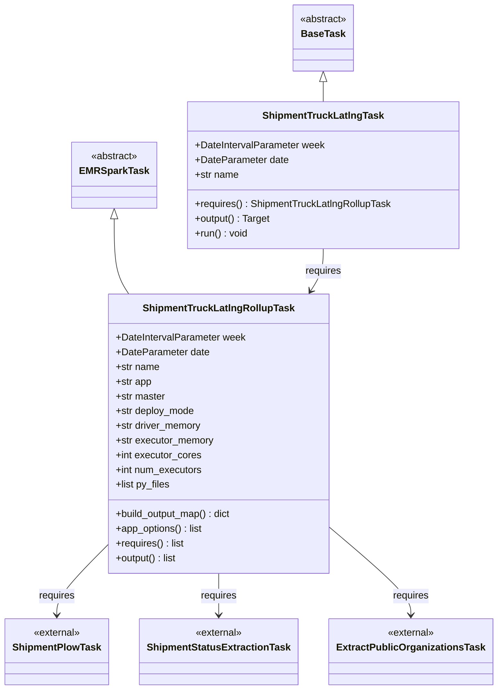
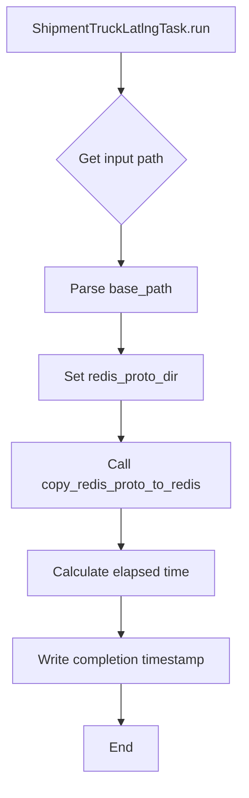
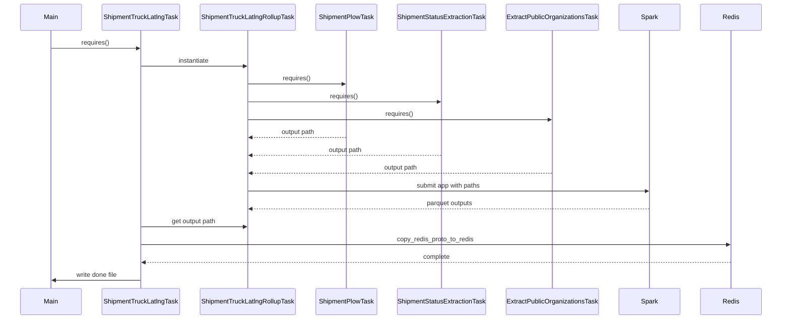

# Diagram: research/orchestrator/tasks/models/shipment_truck_latlng_task.py

> Auto-generated by Obscura crawlers

## Diagram 1

### SVG

<svg id="container" width="781.375" xmlns="http://www.w3.org/2000/svg" class="classDiagram" height="1126" viewBox="0 0 781.375 1126" role="graphics-document document" aria-roledescription="class"><g><defs><marker id="container_class-aggregationStart" class="marker aggregation class" refX="18" refY="7" markerWidth="190" markerHeight="240" orient="auto"><path d="M 18,7 L9,13 L1,7 L9,1 Z"></path></marker></defs><defs><marker id="container_class-aggregationEnd" class="marker aggregation class" refX="1" refY="7" markerWidth="20" markerHeight="28" orient="auto"><path d="M 18,7 L9,13 L1,7 L9,1 Z"></path></marker></defs><defs><marker id="container_class-extensionStart" class="marker extension class" refX="18" refY="7" markerWidth="190" markerHeight="240" orient="auto"><path d="M 1,7 L18,13 V 1 Z"></path></marker></defs><defs><marker id="container_class-extensionEnd" class="marker extension class" refX="1" refY="7" markerWidth="20" markerHeight="28" orient="auto"><path d="M 1,1 V 13 L18,7 Z"></path></marker></defs><defs><marker id="container_class-compositionStart" class="marker composition class" refX="18" refY="7" markerWidth="190" markerHeight="240" orient="auto"><path d="M 18,7 L9,13 L1,7 L9,1 Z"></path></marker></defs><defs><marker id="container_class-compositionEnd" class="marker composition class" refX="1" refY="7" markerWidth="20" markerHeight="28" orient="auto"><path d="M 18,7 L9,13 L1,7 L9,1 Z"></path></marker></defs><defs><marker id="container_class-dependencyStart" class="marker dependency class" refX="6" refY="7" markerWidth="190" markerHeight="240" orient="auto"><path d="M 5,7 L9,13 L1,7 L9,1 Z"></path></marker></defs><defs><marker id="container_class-dependencyEnd" class="marker dependency class" refX="13" refY="7" markerWidth="20" markerHeight="28" orient="auto"><path d="M 18,7 L9,13 L14,7 L9,1 Z"></path></marker></defs><defs><marker id="container_class-lollipopStart" class="marker lollipop class" refX="13" refY="7" markerWidth="190" markerHeight="240" orient="auto"><circle stroke="black" fill="transparent" cx="7" cy="7" r="6"></circle></marker></defs><defs><marker id="container_class-lollipopEnd" class="marker lollipop class" refX="1" refY="7" markerWidth="190" markerHeight="240" orient="auto"><circle stroke="black" fill="transparent" cx="7" cy="7" r="6"></circle></marker></defs><g class="root"><g class="clusters"></g><g class="edgePaths"><path d="M177.131,357.25L177.131,371.542C177.131,385.833,177.131,414.417,181.036,434.875C184.94,455.333,192.75,467.667,196.655,473.833L200.559,480" id="id_EMRSparkTask_ShipmentTruckLatlngRollupTask_1" class="edge-thickness-normal edge-pattern-solid relation" style=";;;" data-edge="true" data-et="edge" data-id="id_EMRSparkTask_ShipmentTruckLatlngRollupTask_1" data-points="W3sieCI6MTc3LjEzMDg1OTM3NSwieSI6MzQwfSx7IngiOjE3Ny4xMzA4NTkzNzUsInkiOjQ0M30seyJ4IjoyMDAuNTU5Mzc1LCJ5Ijo0ODB9XQ==" marker-start="url(#container_class-extensionStart)"></path><path d="M512.729,133.25L512.729,134.542C512.729,135.833,512.729,138.417,512.729,143.875C512.729,149.333,512.729,157.667,512.729,161.833L512.729,166" id="id_BaseTask_ShipmentTruckLatlngTask_2" class="edge-thickness-normal edge-pattern-solid relation" style=";;;" data-edge="true" data-et="edge" data-id="id_BaseTask_ShipmentTruckLatlngTask_2" data-points="W3sieCI6NTEyLjcyODUxNTYyNSwieSI6MTE2fSx7IngiOjUxMi43Mjg1MTU2MjUsInkiOjE0MX0seyJ4Ijo1MTIuNzI4NTE1NjI1LCJ5IjoxNjZ9XQ==" marker-start="url(#container_class-extensionStart)"></path><path d="M167.801,891.648L154.723,905.206C141.646,918.765,115.491,945.883,102.413,964.608C89.336,983.333,89.336,993.667,89.336,998.833L89.336,1004" id="id_ShipmentTruckLatlngRollupTask_ShipmentPlowTask_3" class="edge-thickness-normal edge-pattern-solid relation" style=";;;" data-edge="true" data-et="edge" data-id="id_ShipmentTruckLatlngRollupTask_ShipmentPlowTask_3" data-points="W3sieCI6MTY3LjgwMDc4MTI1LCJ5Ijo4OTEuNjQ3NTI3MjAzODE0N30seyJ4Ijo4OS4zMzU5Mzc1LCJ5Ijo5NzN9LHsieCI6ODkuMzM1OTM3NSwieSI6MTAxMH1d" marker-end="url(#container_class-dependencyEnd)"></path><path d="M344.93,936L344.93,942.167C344.93,948.333,344.93,960.667,344.93,972C344.93,983.333,344.93,993.667,344.93,998.833L344.93,1004" id="id_ShipmentTruckLatlngRollupTask_ShipmentStatusExtractionTask_4" class="edge-thickness-normal edge-pattern-solid relation" style=";;;" data-edge="true" data-et="edge" data-id="id_ShipmentTruckLatlngRollupTask_ShipmentStatusExtractionTask_4" data-points="W3sieCI6MzQ0LjkyOTY4NzUsInkiOjkzNn0seyJ4IjozNDQuOTI5Njg3NSwieSI6OTczfSx7IngiOjM0NC45Mjk2ODc1LCJ5IjoxMDEwfV0=" marker-end="url(#container_class-dependencyEnd)"></path><path d="M522.059,863.762L542.762,881.968C563.466,900.175,604.874,936.587,625.577,959.96C646.281,983.333,646.281,993.667,646.281,998.833L646.281,1004" id="id_ShipmentTruckLatlngRollupTask_ExtractPublicOrganizationsTask_5" class="edge-thickness-normal edge-pattern-solid relation" style=";;;" data-edge="true" data-et="edge" data-id="id_ShipmentTruckLatlngRollupTask_ExtractPublicOrganizationsTask_5" data-points="W3sieCI6NTIyLjA1ODU5Mzc1LCJ5Ijo4NjMuNzYyMTI2MzU3ODE1MX0seyJ4Ijo2NDYuMjgxMjUsInkiOjk3M30seyJ4Ijo2NDYuMjgxMjUsInkiOjEwMTB9XQ==" marker-end="url(#container_class-dependencyEnd)"></path><path d="M512.729,406L512.729,412.167C512.729,418.333,512.729,430.667,509.359,442.155C505.989,453.644,499.249,464.287,495.88,469.609L492.51,474.931" id="id_ShipmentTruckLatlngTask_ShipmentTruckLatlngRollupTask_6" class="edge-thickness-normal edge-pattern-solid relation" style=";;;" data-edge="true" data-et="edge" data-id="id_ShipmentTruckLatlngTask_ShipmentTruckLatlngRollupTask_6" data-points="W3sieCI6NTEyLjcyODUxNTYyNSwieSI6NDA2fSx7IngiOjUxMi43Mjg1MTU2MjUsInkiOjQ0M30seyJ4Ijo0ODkuMywieSI6NDgwfV0=" marker-end="url(#container_class-dependencyEnd)"></path></g><g class="edgeLabels"><g class="edgeLabel"><g class="label" data-id="id_EMRSparkTask_ShipmentTruckLatlngRollupTask_1" transform="translate(0, 0)"><foreignObject width="0" height="0">

</foreignObject></g></g><g class="edgeLabel"><g class="label" data-id="id_BaseTask_ShipmentTruckLatlngTask_2" transform="translate(0, 0)"><foreignObject width="0" height="0">

</foreignObject></g></g><g class="edgeLabel" transform="translate(89.3359375, 973)"><g class="label" data-id="id_ShipmentTruckLatlngRollupTask_ShipmentPlowTask_3" transform="translate(-29.8515625, -12)"><foreignObject width="59.703125" height="24">

requires

</foreignObject></g></g><g class="edgeLabel" transform="translate(344.9296875, 973)"><g class="label" data-id="id_ShipmentTruckLatlngRollupTask_ShipmentStatusExtractionTask_4" transform="translate(-29.8515625, -12)"><foreignObject width="59.703125" height="24">

requires

</foreignObject></g></g><g class="edgeLabel" transform="translate(646.28125, 973)"><g class="label" data-id="id_ShipmentTruckLatlngRollupTask_ExtractPublicOrganizationsTask_5" transform="translate(-29.8515625, -12)"><foreignObject width="59.703125" height="24">

requires

</foreignObject></g></g><g class="edgeLabel" transform="translate(512.728515625, 443)"><g class="label" data-id="id_ShipmentTruckLatlngTask_ShipmentTruckLatlngRollupTask_6" transform="translate(-29.8515625, -12)"><foreignObject width="59.703125" height="24">

requires

</foreignObject></g></g></g><g class="nodes"><g class="node default" id="classId-EMRSparkTask-0" transform="translate(177.130859375, 286)"><g class="basic label-container"><path d="M-65.1484375 -54 L65.1484375 -54 L65.1484375 54 L-65.1484375 54" stroke="none" stroke-width="0" fill="#ECECFF" style=""></path><path d="M-65.1484375 -54 C-37.94150385565304 -54, -10.734570211306071 -54, 65.1484375 -54 M-65.1484375 -54 C-24.445087832817435 -54, 16.25826183436513 -54, 65.1484375 -54 M65.1484375 -54 C65.1484375 -11.458733820507042, 65.1484375 31.082532358985915, 65.1484375 54 M65.1484375 -54 C65.1484375 -23.96301386615234, 65.1484375 6.073972267695318, 65.1484375 54 M65.1484375 54 C25.210622004459722 54, -14.727193491080556 54, -65.1484375 54 M65.1484375 54 C28.98077056835772 54, -7.186896363284561 54, -65.1484375 54 M-65.1484375 54 C-65.1484375 26.61754756931754, -65.1484375 -0.7649048613649185, -65.1484375 -54 M-65.1484375 54 C-65.1484375 29.69860613086695, -65.1484375 5.397212261733898, -65.1484375 -54" stroke="#9370DB" stroke-width="1.3" fill="none" stroke-dasharray="0 0" style=""></path></g><g class="annotation-group text" transform="translate(-38.609375, -30)"><g class="label" style="" transform="translate(0,-12)"><foreignObject width="77.21875" height="24">

«abstract»

</foreignObject></g></g><g class="label-group text" transform="translate(-53.1484375, -6)"><g class="label" style="font-weight: bolder" transform="translate(0,-12)"><foreignObject width="106.296875" height="24">

EMRSparkTask

</foreignObject></g></g><g class="members-group text" transform="translate(-53.1484375, 42)"></g><g class="methods-group text" transform="translate(-53.1484375, 72)"></g><g class="divider" style=""><path d="M-65.1484375 18 C-32.52291615023905 18, 0.1026051995219035 18, 65.1484375 18 M-65.1484375 18 C-27.324461528631858 18, 10.499514442736285 18, 65.1484375 18" stroke="#9370DB" stroke-width="1.3" fill="none" stroke-dasharray="0 0" style=""></path></g><g class="divider" style=""><path d="M-65.1484375 36 C-37.13490965154077 36, -9.121381803081526 36, 65.1484375 36 M-65.1484375 36 C-35.3835849960204 36, -5.618732492040813 36, 65.1484375 36" stroke="#9370DB" stroke-width="1.3" fill="none" stroke-dasharray="0 0" style=""></path></g></g><g class="node default" id="classId-BaseTask-1" transform="translate(512.728515625, 62)"><g class="basic label-container"><path d="M-50.609375 -54 L50.609375 -54 L50.609375 54 L-50.609375 54" stroke="none" stroke-width="0" fill="#ECECFF" style=""></path><path d="M-50.609375 -54 C-27.710681594738592 -54, -4.811988189477184 -54, 50.609375 -54 M-50.609375 -54 C-25.32340643717904 -54, -0.037437874358083434 -54, 50.609375 -54 M50.609375 -54 C50.609375 -17.69506809891282, 50.609375 18.60986380217436, 50.609375 54 M50.609375 -54 C50.609375 -27.716888774228224, 50.609375 -1.4337775484564474, 50.609375 54 M50.609375 54 C28.592106854730456 54, 6.574838709460913 54, -50.609375 54 M50.609375 54 C22.349218899283475 54, -5.91093720143305 54, -50.609375 54 M-50.609375 54 C-50.609375 20.837859328844303, -50.609375 -12.324281342311394, -50.609375 -54 M-50.609375 54 C-50.609375 21.868667359023767, -50.609375 -10.262665281952465, -50.609375 -54" stroke="#9370DB" stroke-width="1.3" fill="none" stroke-dasharray="0 0" style=""></path></g><g class="annotation-group text" transform="translate(-38.609375, -30)"><g class="label" style="" transform="translate(0,-12)"><foreignObject width="77.21875" height="24">

«abstract»

</foreignObject></g></g><g class="label-group text" transform="translate(-34.03125, -6)"><g class="label" style="font-weight: bolder" transform="translate(0,-12)"><foreignObject width="68.0625" height="24">

BaseTask

</foreignObject></g></g><g class="members-group text" transform="translate(-38.609375, 42)"></g><g class="methods-group text" transform="translate(-38.609375, 72)"></g><g class="divider" style=""><path d="M-50.609375 18 C-18.888691946987024 18, 12.831991106025953 18, 50.609375 18 M-50.609375 18 C-14.219698986758736 18, 22.169977026482528 18, 50.609375 18" stroke="#9370DB" stroke-width="1.3" fill="none" stroke-dasharray="0 0" style=""></path></g><g class="divider" style=""><path d="M-50.609375 36 C-20.748012153787332 36, 9.113350692425335 36, 50.609375 36 M-50.609375 36 C-26.706679313321665 36, -2.80398362664333 36, 50.609375 36" stroke="#9370DB" stroke-width="1.3" fill="none" stroke-dasharray="0 0" style=""></path></g></g><g class="node default" id="classId-ShipmentTruckLatlngRollupTask-2" transform="translate(344.9296875, 708)"><g class="basic label-container"><path d="M-177.12890625 -228 L177.12890625 -228 L177.12890625 228 L-177.12890625 228" stroke="none" stroke-width="0" fill="#ECECFF" style=""></path><path d="M-177.12890625 -228 C-51.97546323073709 -228, 73.17797978852582 -228, 177.12890625 -228 M-177.12890625 -228 C-82.35256244010213 -228, 12.423781369795734 -228, 177.12890625 -228 M177.12890625 -228 C177.12890625 -104.61610186917, 177.12890625 18.76779626166001, 177.12890625 228 M177.12890625 -228 C177.12890625 -100.67165738308071, 177.12890625 26.656685233838573, 177.12890625 228 M177.12890625 228 C57.66005041486166 228, -61.808805420276684 228, -177.12890625 228 M177.12890625 228 C81.63288402976794 228, -13.863138190464127 228, -177.12890625 228 M-177.12890625 228 C-177.12890625 53.947680134399036, -177.12890625 -120.10463973120193, -177.12890625 -228 M-177.12890625 228 C-177.12890625 48.027332564849644, -177.12890625 -131.9453348703007, -177.12890625 -228" stroke="#9370DB" stroke-width="1.3" fill="none" stroke-dasharray="0 0" style=""></path></g><g class="annotation-group text" transform="translate(0, -204)"></g><g class="label-group text" transform="translate(-118.1328125, -204)"><g class="label" style="font-weight: bolder" transform="translate(0,-12)"><foreignObject width="236.265625" height="24">

ShipmentTruckLatlngRollupTask

</foreignObject></g></g><g class="members-group text" transform="translate(-165.12890625, -156)"><g class="label" style="" transform="translate(0,-12)"><foreignObject width="212.125" height="24">

+DateIntervalParameter week

</foreignObject></g><g class="label" style="" transform="translate(0,12)"><foreignObject width="152.171875" height="24">

+DateParameter date

</foreignObject></g><g class="label" style="" transform="translate(0,36)"><foreignObject width="72.171875" height="24">

+str name

</foreignObject></g><g class="label" style="" transform="translate(0,60)"><foreignObject width="59.375" height="24">

+str app

</foreignObject></g><g class="label" style="" transform="translate(0,84)"><foreignObject width="81.8125" height="24">

+str master

</foreignObject></g><g class="label" style="" transform="translate(0,108)"><foreignObject width="130.390625" height="24">

+str deploy_mode

</foreignObject></g><g class="label" style="" transform="translate(0,132)"><foreignObject width="141.1875" height="24">

+str driver_memory

</foreignObject></g><g class="label" style="" transform="translate(0,156)"><foreignObject width="161" height="24">

+str executor_memory

</foreignObject></g><g class="label" style="" transform="translate(0,180)"><foreignObject width="139.9375" height="24">

+int executor_cores

</foreignObject></g><g class="label" style="" transform="translate(0,204)"><foreignObject width="142.296875" height="24">

+int num_executors

</foreignObject></g><g class="label" style="" transform="translate(0,228)"><foreignObject width="89.515625" height="24">

+list py_files

</foreignObject></g></g><g class="methods-group text" transform="translate(-165.12890625, 132)"><g class="label" style="" transform="translate(0,-12)"><foreignObject width="192.953125" height="24">

+build_output_map() : dict

</foreignObject></g><g class="label" style="" transform="translate(0,12)"><foreignObject width="143.609375" height="24">

+app_options() : list

</foreignObject></g><g class="label" style="" transform="translate(0,36)"><foreignObject width="112.828125" height="24">

+requires() : list

</foreignObject></g><g class="label" style="" transform="translate(0,60)"><foreignObject width="102.15625" height="24">

+output() : list

</foreignObject></g></g><g class="divider" style=""><path d="M-177.12890625 -180 C-70.61074334640342 -180, 35.90741955719315 -180, 177.12890625 -180 M-177.12890625 -180 C-89.08254182042282 -180, -1.036177390845637 -180, 177.12890625 -180" stroke="#9370DB" stroke-width="1.3" fill="none" stroke-dasharray="0 0" style=""></path></g><g class="divider" style=""><path d="M-177.12890625 108 C-83.50251275896989 108, 10.123880732060229 108, 177.12890625 108 M-177.12890625 108 C-36.05923386674456 108, 105.01043851651087 108, 177.12890625 108" stroke="#9370DB" stroke-width="1.3" fill="none" stroke-dasharray="0 0" style=""></path></g></g><g class="node default" id="classId-ShipmentTruckLatlngTask-3" transform="translate(512.728515625, 286)"><g class="basic label-container"><path d="M-220.44921875 -120 L220.44921875 -120 L220.44921875 120 L-220.44921875 120" stroke="none" stroke-width="0" fill="#ECECFF" style=""></path><path d="M-220.44921875 -120 C-60.51866209072446 -120, 99.41189456855108 -120, 220.44921875 -120 M-220.44921875 -120 C-54.974431381429014 -120, 110.50035598714197 -120, 220.44921875 -120 M220.44921875 -120 C220.44921875 -65.9151673401164, 220.44921875 -11.830334680232781, 220.44921875 120 M220.44921875 -120 C220.44921875 -71.42227762747157, 220.44921875 -22.84455525494313, 220.44921875 120 M220.44921875 120 C55.20363838148896 120, -110.04194198702208 120, -220.44921875 120 M220.44921875 120 C102.3574707517286 120, -15.734277246542803 120, -220.44921875 120 M-220.44921875 120 C-220.44921875 56.2554767112411, -220.44921875 -7.489046577517797, -220.44921875 -120 M-220.44921875 120 C-220.44921875 29.77037262260704, -220.44921875 -60.45925475478592, -220.44921875 -120" stroke="#9370DB" stroke-width="1.3" fill="none" stroke-dasharray="0 0" style=""></path></g><g class="annotation-group text" transform="translate(0, -96)"></g><g class="label-group text" transform="translate(-94.5390625, -96)"><g class="label" style="font-weight: bolder" transform="translate(0,-12)"><foreignObject width="189.078125" height="24">

ShipmentTruckLatlngTask

</foreignObject></g></g><g class="members-group text" transform="translate(-208.44921875, -48)"><g class="label" style="" transform="translate(0,-12)"><foreignObject width="212.125" height="24">

+DateIntervalParameter week

</foreignObject></g><g class="label" style="" transform="translate(0,12)"><foreignObject width="152.171875" height="24">

+DateParameter date

</foreignObject></g><g class="label" style="" transform="translate(0,36)"><foreignObject width="72.171875" height="24">

+str name

</foreignObject></g></g><g class="methods-group text" transform="translate(-208.44921875, 48)"><g class="label" style="" transform="translate(0,-12)"><foreignObject width="322.359375" height="24">

+requires() : ShipmentTruckLatlngRollupTask

</foreignObject></g><g class="label" style="" transform="translate(0,12)"><foreignObject width="124.375" height="24">

+output() : Target

</foreignObject></g><g class="label" style="" transform="translate(0,36)"><foreignObject width="86.78125" height="24">

+run() : void

</foreignObject></g></g><g class="divider" style=""><path d="M-220.44921875 -72 C-94.48789741103825 -72, 31.473423927923506 -72, 220.44921875 -72 M-220.44921875 -72 C-96.08652072417223 -72, 28.276177301655537 -72, 220.44921875 -72" stroke="#9370DB" stroke-width="1.3" fill="none" stroke-dasharray="0 0" style=""></path></g><g class="divider" style=""><path d="M-220.44921875 24 C-80.56437040688417 24, 59.32047793623167 24, 220.44921875 24 M-220.44921875 24 C-79.32464089705527 24, 61.79993695588945 24, 220.44921875 24" stroke="#9370DB" stroke-width="1.3" fill="none" stroke-dasharray="0 0" style=""></path></g></g><g class="node default" id="classId-ShipmentPlowTask-4" transform="translate(89.3359375, 1064)"><g class="basic label-container"><path d="M-81.3359375 -54 L81.3359375 -54 L81.3359375 54 L-81.3359375 54" stroke="none" stroke-width="0" fill="#ECECFF" style=""></path><path d="M-81.3359375 -54 C-30.611488796627185 -54, 20.11295990674563 -54, 81.3359375 -54 M-81.3359375 -54 C-40.63799377909681 -54, 0.059949941806380025 -54, 81.3359375 -54 M81.3359375 -54 C81.3359375 -31.92714741736155, 81.3359375 -9.854294834723099, 81.3359375 54 M81.3359375 -54 C81.3359375 -17.95287542805734, 81.3359375 18.09424914388532, 81.3359375 54 M81.3359375 54 C33.63033832312041 54, -14.075260853759175 54, -81.3359375 54 M81.3359375 54 C18.996812546204062 54, -43.342312407591876 54, -81.3359375 54 M-81.3359375 54 C-81.3359375 19.032412908005135, -81.3359375 -15.93517418398973, -81.3359375 -54 M-81.3359375 54 C-81.3359375 31.84664786359512, -81.3359375 9.69329572719024, -81.3359375 -54" stroke="#9370DB" stroke-width="1.3" fill="none" stroke-dasharray="0 0" style=""></path></g><g class="annotation-group text" transform="translate(-38.65625, -30)"><g class="label" style="" transform="translate(0,-12)"><foreignObject width="77.3125" height="24">

«external»

</foreignObject></g></g><g class="label-group text" transform="translate(-69.3359375, -6)"><g class="label" style="font-weight: bolder" transform="translate(0,-12)"><foreignObject width="138.671875" height="24">

ShipmentPlowTask

</foreignObject></g></g><g class="members-group text" transform="translate(-69.3359375, 42)"></g><g class="methods-group text" transform="translate(-69.3359375, 72)"></g><g class="divider" style=""><path d="M-81.3359375 18 C-23.569019692817065 18, 34.19789811436587 18, 81.3359375 18 M-81.3359375 18 C-29.95737669569902 18, 21.421184108601963 18, 81.3359375 18" stroke="#9370DB" stroke-width="1.3" fill="none" stroke-dasharray="0 0" style=""></path></g><g class="divider" style=""><path d="M-81.3359375 36 C-38.45581376052562 36, 4.424309978948756 36, 81.3359375 36 M-81.3359375 36 C-40.66113597239917 36, 0.013665555201654911 36, 81.3359375 36" stroke="#9370DB" stroke-width="1.3" fill="none" stroke-dasharray="0 0" style=""></path></g></g><g class="node default" id="classId-ShipmentStatusExtractionTask-5" transform="translate(344.9296875, 1064)"><g class="basic label-container"><path d="M-124.2578125 -54 L124.2578125 -54 L124.2578125 54 L-124.2578125 54" stroke="none" stroke-width="0" fill="#ECECFF" style=""></path><path d="M-124.2578125 -54 C-58.43009554737104 -54, 7.397621405257922 -54, 124.2578125 -54 M-124.2578125 -54 C-43.66581725075065 -54, 36.9261779984987 -54, 124.2578125 -54 M124.2578125 -54 C124.2578125 -13.628201026245314, 124.2578125 26.74359794750937, 124.2578125 54 M124.2578125 -54 C124.2578125 -29.879137208971017, 124.2578125 -5.758274417942033, 124.2578125 54 M124.2578125 54 C66.30485959188985 54, 8.351906683779717 54, -124.2578125 54 M124.2578125 54 C41.8234253509642 54, -40.6109617980716 54, -124.2578125 54 M-124.2578125 54 C-124.2578125 28.18967317749922, -124.2578125 2.3793463549984395, -124.2578125 -54 M-124.2578125 54 C-124.2578125 13.496398816294374, -124.2578125 -27.007202367411253, -124.2578125 -54" stroke="#9370DB" stroke-width="1.3" fill="none" stroke-dasharray="0 0" style=""></path></g><g class="annotation-group text" transform="translate(-38.65625, -30)"><g class="label" style="" transform="translate(0,-12)"><foreignObject width="77.3125" height="24">

«external»

</foreignObject></g></g><g class="label-group text" transform="translate(-112.2578125, -6)"><g class="label" style="font-weight: bolder" transform="translate(0,-12)"><foreignObject width="224.515625" height="24">

ShipmentStatusExtractionTask

</foreignObject></g></g><g class="members-group text" transform="translate(-112.2578125, 42)"></g><g class="methods-group text" transform="translate(-112.2578125, 72)"></g><g class="divider" style=""><path d="M-124.2578125 18 C-46.41661780971896 18, 31.424576880562086 18, 124.2578125 18 M-124.2578125 18 C-43.02171734578518 18, 38.214377808429646 18, 124.2578125 18" stroke="#9370DB" stroke-width="1.3" fill="none" stroke-dasharray="0 0" style=""></path></g><g class="divider" style=""><path d="M-124.2578125 36 C-65.03663206196593 36, -5.815451623931864 36, 124.2578125 36 M-124.2578125 36 C-35.55360970482312 36, 53.150593090353766 36, 124.2578125 36" stroke="#9370DB" stroke-width="1.3" fill="none" stroke-dasharray="0 0" style=""></path></g></g><g class="node default" id="classId-ExtractPublicOrganizationsTask-6" transform="translate(646.28125, 1064)"><g class="basic label-container"><path d="M-127.09375 -54 L127.09375 -54 L127.09375 54 L-127.09375 54" stroke="none" stroke-width="0" fill="#ECECFF" style=""></path><path d="M-127.09375 -54 C-72.29961492023233 -54, -17.505479840464673 -54, 127.09375 -54 M-127.09375 -54 C-70.66277583293316 -54, -14.231801665866342 -54, 127.09375 -54 M127.09375 -54 C127.09375 -26.819903244804046, 127.09375 0.36019351039190894, 127.09375 54 M127.09375 -54 C127.09375 -31.284947669741175, 127.09375 -8.56989533948235, 127.09375 54 M127.09375 54 C60.97469348482831 54, -5.144363030343385 54, -127.09375 54 M127.09375 54 C32.88707092651424 54, -61.31960814697152 54, -127.09375 54 M-127.09375 54 C-127.09375 31.17249947449486, -127.09375 8.34499894898972, -127.09375 -54 M-127.09375 54 C-127.09375 15.850772045088526, -127.09375 -22.29845590982295, -127.09375 -54" stroke="#9370DB" stroke-width="1.3" fill="none" stroke-dasharray="0 0" style=""></path></g><g class="annotation-group text" transform="translate(-38.65625, -30)"><g class="label" style="" transform="translate(0,-12)"><foreignObject width="77.3125" height="24">

«external»

</foreignObject></g></g><g class="label-group text" transform="translate(-115.09375, -6)"><g class="label" style="font-weight: bolder" transform="translate(0,-12)"><foreignObject width="230.1875" height="24">

ExtractPublicOrganizationsTask

</foreignObject></g></g><g class="members-group text" transform="translate(-115.09375, 42)"></g><g class="methods-group text" transform="translate(-115.09375, 72)"></g><g class="divider" style=""><path d="M-127.09375 18 C-26.053989119791453 18, 74.9857717604171 18, 127.09375 18 M-127.09375 18 C-70.32661882197232 18, -13.55948764394465 18, 127.09375 18" stroke="#9370DB" stroke-width="1.3" fill="none" stroke-dasharray="0 0" style=""></path></g><g class="divider" style=""><path d="M-127.09375 36 C-73.94532983614116 36, -20.796909672282325 36, 127.09375 36 M-127.09375 36 C-68.98020253773191 36, -10.86665507546384 36, 127.09375 36" stroke="#9370DB" stroke-width="1.3" fill="none" stroke-dasharray="0 0" style=""></path></g></g></g></g></g></svg>

## Diagram 2

### SVG

<svg id="container" width="289.78125" xmlns="http://www.w3.org/2000/svg" class="flowchart" height="950.765625" viewBox="0 0 289.78125 950.765625" role="graphics-document document" aria-roledescription="flowchart-v2"><g><marker id="container_flowchart-v2-pointEnd" class="marker flowchart-v2" viewBox="0 0 10 10" refX="5" refY="5" markerUnits="userSpaceOnUse" markerWidth="8" markerHeight="8" orient="auto"><path d="M 0 0 L 10 5 L 0 10 z" class="arrowMarkerPath" style="stroke-width: 1; stroke-dasharray: 1, 0;"></path></marker><marker id="container_flowchart-v2-pointStart" class="marker flowchart-v2" viewBox="0 0 10 10" refX="4.5" refY="5" markerUnits="userSpaceOnUse" markerWidth="8" markerHeight="8" orient="auto"><path d="M 0 5 L 10 10 L 10 0 z" class="arrowMarkerPath" style="stroke-width: 1; stroke-dasharray: 1, 0;"></path></marker><marker id="container_flowchart-v2-circleEnd" class="marker flowchart-v2" viewBox="0 0 10 10" refX="11" refY="5" markerUnits="userSpaceOnUse" markerWidth="11" markerHeight="11" orient="auto"><circle cx="5" cy="5" r="5" class="arrowMarkerPath" style="stroke-width: 1; stroke-dasharray: 1, 0;"></circle></marker><marker id="container_flowchart-v2-circleStart" class="marker flowchart-v2" viewBox="0 0 10 10" refX="-1" refY="5" markerUnits="userSpaceOnUse" markerWidth="11" markerHeight="11" orient="auto"><circle cx="5" cy="5" r="5" class="arrowMarkerPath" style="stroke-width: 1; stroke-dasharray: 1, 0;"></circle></marker><marker id="container_flowchart-v2-crossEnd" class="marker cross flowchart-v2" viewBox="0 0 11 11" refX="12" refY="5.2" markerUnits="userSpaceOnUse" markerWidth="11" markerHeight="11" orient="auto"><path d="M 1,1 l 9,9 M 10,1 l -9,9" class="arrowMarkerPath" style="stroke-width: 2; stroke-dasharray: 1, 0;"></path></marker><marker id="container_flowchart-v2-crossStart" class="marker cross flowchart-v2" viewBox="0 0 11 11" refX="-1" refY="5.2" markerUnits="userSpaceOnUse" markerWidth="11" markerHeight="11" orient="auto"><path d="M 1,1 l 9,9 M 10,1 l -9,9" class="arrowMarkerPath" style="stroke-width: 2; stroke-dasharray: 1, 0;"></path></marker><g class="root"><g class="clusters"></g><g class="edgePaths"><path d="M144.891,62L144.891,66.167C144.891,70.333,144.891,78.667,144.891,86.333C144.891,94,144.891,101,144.891,104.5L144.891,108" id="L_A_B_0" class="edge-thickness-normal edge-pattern-solid edge-thickness-normal edge-pattern-solid flowchart-link" style=";" data-edge="true" data-et="edge" data-id="L_A_B_0" data-points="W3sieCI6MTQ0Ljg5MDYyNSwieSI6NjJ9LHsieCI6MTQ0Ljg5MDYyNSwieSI6ODd9LHsieCI6MTQ0Ljg5MDYyNSwieSI6MTEyfV0=" marker-end="url(#container_flowchart-v2-pointEnd)"></path><path d="M144.891,270.766L144.891,274.932C144.891,279.099,144.891,287.432,144.891,295.099C144.891,302.766,144.891,309.766,144.891,313.266L144.891,316.766" id="L_B_C_0" class="edge-thickness-normal edge-pattern-solid edge-thickness-normal edge-pattern-solid flowchart-link" style=";" data-edge="true" data-et="edge" data-id="L_B_C_0" data-points="W3sieCI6MTQ0Ljg5MDYyNSwieSI6MjcwLjc2NTYyNX0seyJ4IjoxNDQuODkwNjI1LCJ5IjoyOTUuNzY1NjI1fSx7IngiOjE0NC44OTA2MjUsInkiOjMyMC43NjU2MjV9XQ==" marker-end="url(#container_flowchart-v2-pointEnd)"></path><path d="M144.891,374.766L144.891,378.932C144.891,383.099,144.891,391.432,144.891,399.099C144.891,406.766,144.891,413.766,144.891,417.266L144.891,420.766" id="L_C_D_0" class="edge-thickness-normal edge-pattern-solid edge-thickness-normal edge-pattern-solid flowchart-link" style=";" data-edge="true" data-et="edge" data-id="L_C_D_0" data-points="W3sieCI6MTQ0Ljg5MDYyNSwieSI6Mzc0Ljc2NTYyNX0seyJ4IjoxNDQuODkwNjI1LCJ5IjozOTkuNzY1NjI1fSx7IngiOjE0NC44OTA2MjUsInkiOjQyNC43NjU2MjV9XQ==" marker-end="url(#container_flowchart-v2-pointEnd)"></path><path d="M144.891,478.766L144.891,482.932C144.891,487.099,144.891,495.432,144.891,503.099C144.891,510.766,144.891,517.766,144.891,521.266L144.891,524.766" id="L_D_E_0" class="edge-thickness-normal edge-pattern-solid edge-thickness-normal edge-pattern-solid flowchart-link" style=";" data-edge="true" data-et="edge" data-id="L_D_E_0" data-points="W3sieCI6MTQ0Ljg5MDYyNSwieSI6NDc4Ljc2NTYyNX0seyJ4IjoxNDQuODkwNjI1LCJ5Ijo1MDMuNzY1NjI1fSx7IngiOjE0NC44OTA2MjUsInkiOjUyOC43NjU2MjV9XQ==" marker-end="url(#container_flowchart-v2-pointEnd)"></path><path d="M144.891,606.766L144.891,610.932C144.891,615.099,144.891,623.432,144.891,631.099C144.891,638.766,144.891,645.766,144.891,649.266L144.891,652.766" id="L_E_F_0" class="edge-thickness-normal edge-pattern-solid edge-thickness-normal edge-pattern-solid flowchart-link" style=";" data-edge="true" data-et="edge" data-id="L_E_F_0" data-points="W3sieCI6MTQ0Ljg5MDYyNSwieSI6NjA2Ljc2NTYyNX0seyJ4IjoxNDQuODkwNjI1LCJ5Ijo2MzEuNzY1NjI1fSx7IngiOjE0NC44OTA2MjUsInkiOjY1Ni43NjU2MjV9XQ==" marker-end="url(#container_flowchart-v2-pointEnd)"></path><path d="M144.891,710.766L144.891,714.932C144.891,719.099,144.891,727.432,144.891,735.099C144.891,742.766,144.891,749.766,144.891,753.266L144.891,756.766" id="L_F_G_0" class="edge-thickness-normal edge-pattern-solid edge-thickness-normal edge-pattern-solid flowchart-link" style=";" data-edge="true" data-et="edge" data-id="L_F_G_0" data-points="W3sieCI6MTQ0Ljg5MDYyNSwieSI6NzEwLjc2NTYyNX0seyJ4IjoxNDQuODkwNjI1LCJ5Ijo3MzUuNzY1NjI1fSx7IngiOjE0NC44OTA2MjUsInkiOjc2MC43NjU2MjV9XQ==" marker-end="url(#container_flowchart-v2-pointEnd)"></path><path d="M144.891,838.766L144.891,842.932C144.891,847.099,144.891,855.432,144.891,863.099C144.891,870.766,144.891,877.766,144.891,881.266L144.891,884.766" id="L_G_H_0" class="edge-thickness-normal edge-pattern-solid edge-thickness-normal edge-pattern-solid flowchart-link" style=";" data-edge="true" data-et="edge" data-id="L_G_H_0" data-points="W3sieCI6MTQ0Ljg5MDYyNSwieSI6ODM4Ljc2NTYyNX0seyJ4IjoxNDQuODkwNjI1LCJ5Ijo4NjMuNzY1NjI1fSx7IngiOjE0NC44OTA2MjUsInkiOjg4OC43NjU2MjV9XQ==" marker-end="url(#container_flowchart-v2-pointEnd)"></path></g><g class="edgeLabels"><g class="edgeLabel"><g class="label" data-id="L_A_B_0" transform="translate(0, 0)"><foreignObject width="0" height="0">

</foreignObject></g></g><g class="edgeLabel"><g class="label" data-id="L_B_C_0" transform="translate(0, 0)"><foreignObject width="0" height="0">

</foreignObject></g></g><g class="edgeLabel"><g class="label" data-id="L_C_D_0" transform="translate(0, 0)"><foreignObject width="0" height="0">

</foreignObject></g></g><g class="edgeLabel"><g class="label" data-id="L_D_E_0" transform="translate(0, 0)"><foreignObject width="0" height="0">

</foreignObject></g></g><g class="edgeLabel"><g class="label" data-id="L_E_F_0" transform="translate(0, 0)"><foreignObject width="0" height="0">

</foreignObject></g></g><g class="edgeLabel"><g class="label" data-id="L_F_G_0" transform="translate(0, 0)"><foreignObject width="0" height="0">

</foreignObject></g></g><g class="edgeLabel"><g class="label" data-id="L_G_H_0" transform="translate(0, 0)"><foreignObject width="0" height="0">

</foreignObject></g></g></g><g class="nodes"><g class="node default" id="flowchart-A-0" transform="translate(144.890625, 35)"><rect class="basic label-container" style="" x="-136.890625" y="-27" width="273.78125" height="54"></rect><g class="label" style="" transform="translate(-106.890625, -12)"><rect></rect><foreignObject width="213.78125" height="24">

ShipmentTruckLatlngTask.run

</foreignObject></g></g><g class="node default" id="flowchart-B-1" transform="translate(144.890625, 191.3828125)"><polygon points="79.3828125,0 158.765625,-79.3828125 79.3828125,-158.765625 0,-79.3828125" class="label-container" transform="translate(-78.8828125, 79.3828125)"></polygon><g class="label" style="" transform="translate(-52.3828125, -12)"><rect></rect><foreignObject width="104.765625" height="24">

Get input path

</foreignObject></g></g><g class="node default" id="flowchart-C-3" transform="translate(144.890625, 347.765625)"><rect class="basic label-container" style="" x="-89.390625" y="-27" width="178.78125" height="54"></rect><g class="label" style="" transform="translate(-59.390625, -12)"><rect></rect><foreignObject width="118.78125" height="24">

Parse base_path

</foreignObject></g></g><g class="node default" id="flowchart-D-5" transform="translate(144.890625, 451.765625)"><rect class="basic label-container" style="" x="-99.3984375" y="-27" width="198.796875" height="54"></rect><g class="label" style="" transform="translate(-69.3984375, -12)"><rect></rect><foreignObject width="138.796875" height="24">

Set redis_proto_dir

</foreignObject></g></g><g class="node default" id="flowchart-E-7" transform="translate(144.890625, 567.765625)"><rect class="basic label-container" style="" x="-130" y="-39" width="260" height="78"></rect><g class="label" style="" transform="translate(-100, -24)"><rect></rect><foreignObject width="200" height="48">

Call copy_redis_proto_to_redis

</foreignObject></g></g><g class="node default" id="flowchart-F-9" transform="translate(144.890625, 683.765625)"><rect class="basic label-container" style="" x="-112.4140625" y="-27" width="224.828125" height="54"></rect><g class="label" style="" transform="translate(-82.4140625, -12)"><rect></rect><foreignObject width="164.828125" height="24">

Calculate elapsed time

</foreignObject></g></g><g class="node default" id="flowchart-G-11" transform="translate(144.890625, 799.765625)"><rect class="basic label-container" style="" x="-130" y="-39" width="260" height="78"></rect><g class="label" style="" transform="translate(-100, -24)"><rect></rect><foreignObject width="200" height="48">

Write completion timestamp

</foreignObject></g></g><g class="node default" id="flowchart-H-13" transform="translate(144.890625, 915.765625)"><rect class="basic label-container" style="" x="-43.6796875" y="-27" width="87.359375" height="54"></rect><g class="label" style="" transform="translate(-13.6796875, -12)"><rect></rect><foreignObject width="27.359375" height="24">

End

</foreignObject></g></g></g></g></g></svg>

## Diagram 3

### SVG

<svg id="container" width="2003" xmlns="http://www.w3.org/2000/svg" height="843" viewBox="-50 -10 2003 843" role="graphics-document document" aria-roledescription="sequence"><g><rect x="1753" y="757" fill="#eaeaea" stroke="#666" width="150" height="65" name="Redis" rx="3" ry="3" class="actor actor-bottom"></rect><text x="1828" y="789.5" dominant-baseline="central" alignment-baseline="central" class="actor actor-box" style="text-anchor: middle; font-size: 16px; font-weight: 400;"><tspan x="1828" dy="0">Redis</tspan></text></g><g><rect x="1553" y="757" fill="#eaeaea" stroke="#666" width="150" height="65" name="Spark" rx="3" ry="3" class="actor actor-bottom"></rect><text x="1628" y="789.5" dominant-baseline="central" alignment-baseline="central" class="actor actor-box" style="text-anchor: middle; font-size: 16px; font-weight: 400;"><tspan x="1628" dy="0">Spark</tspan></text></g><g><rect x="1257" y="757" fill="#eaeaea" stroke="#666" width="246" height="65" name="EPO" rx="3" ry="3" class="actor actor-bottom"></rect><text x="1380" y="789.5" dominant-baseline="central" alignment-baseline="central" class="actor actor-box" style="text-anchor: middle; font-size: 16px; font-weight: 400;"><tspan x="1380" dy="0">ExtractPublicOrganizationsTask</tspan></text></g><g><rect x="966" y="757" fill="#eaeaea" stroke="#666" width="241" height="65" name="SSE" rx="3" ry="3" class="actor actor-bottom"></rect><text x="1086.5" y="789.5" dominant-baseline="central" alignment-baseline="central" class="actor actor-box" style="text-anchor: middle; font-size: 16px; font-weight: 400;"><tspan x="1086.5" dy="0">ShipmentStatusExtractionTask</tspan></text></g><g><rect x="759" y="757" fill="#eaeaea" stroke="#666" width="157" height="65" name="SPT" rx="3" ry="3" class="actor actor-bottom"></rect><text x="837.5" y="789.5" dominant-baseline="central" alignment-baseline="central" class="actor actor-box" style="text-anchor: middle; font-size: 16px; font-weight: 400;"><tspan x="837.5" dy="0">ShipmentPlowTask</tspan></text></g><g><rect x="456" y="757" fill="#eaeaea" stroke="#666" width="253" height="65" name="STLRollup" rx="3" ry="3" class="actor actor-bottom"></rect><text x="582.5" y="789.5" dominant-baseline="central" alignment-baseline="central" class="actor actor-box" style="text-anchor: middle; font-size: 16px; font-weight: 400;"><tspan x="582.5" dy="0">ShipmentTruckLatlngRollupTask</tspan></text></g><g><rect x="200" y="757" fill="#eaeaea" stroke="#666" width="206" height="65" name="STLTask" rx="3" ry="3" class="actor actor-bottom"></rect><text x="303" y="789.5" dominant-baseline="central" alignment-baseline="central" class="actor actor-box" style="text-anchor: middle; font-size: 16px; font-weight: 400;"><tspan x="303" dy="0">ShipmentTruckLatlngTask</tspan></text></g><g><rect x="0" y="757" fill="#eaeaea" stroke="#666" width="150" height="65" name="Main" rx="3" ry="3" class="actor actor-bottom"></rect><text x="75" y="789.5" dominant-baseline="central" alignment-baseline="central" class="actor actor-box" style="text-anchor: middle; font-size: 16px; font-weight: 400;"><tspan x="75" dy="0">Main</tspan></text></g><g><line id="actor7" x1="1828" y1="65" x2="1828" y2="757" class="actor-line 200" stroke-width="0.5px" stroke="#999" name="Redis"></line><g id="root-7"><rect x="1753" y="0" fill="#eaeaea" stroke="#666" width="150" height="65" name="Redis" rx="3" ry="3" class="actor actor-top"></rect><text x="1828" y="32.5" dominant-baseline="central" alignment-baseline="central" class="actor actor-box" style="text-anchor: middle; font-size: 16px; font-weight: 400;"><tspan x="1828" dy="0">Redis</tspan></text></g></g><g><line id="actor6" x1="1628" y1="65" x2="1628" y2="757" class="actor-line 200" stroke-width="0.5px" stroke="#999" name="Spark"></line><g id="root-6"><rect x="1553" y="0" fill="#eaeaea" stroke="#666" width="150" height="65" name="Spark" rx="3" ry="3" class="actor actor-top"></rect><text x="1628" y="32.5" dominant-baseline="central" alignment-baseline="central" class="actor actor-box" style="text-anchor: middle; font-size: 16px; font-weight: 400;"><tspan x="1628" dy="0">Spark</tspan></text></g></g><g><line id="actor5" x1="1380" y1="65" x2="1380" y2="757" class="actor-line 200" stroke-width="0.5px" stroke="#999" name="EPO"></line><g id="root-5"><rect x="1257" y="0" fill="#eaeaea" stroke="#666" width="246" height="65" name="EPO" rx="3" ry="3" class="actor actor-top"></rect><text x="1380" y="32.5" dominant-baseline="central" alignment-baseline="central" class="actor actor-box" style="text-anchor: middle; font-size: 16px; font-weight: 400;"><tspan x="1380" dy="0">ExtractPublicOrganizationsTask</tspan></text></g></g><g><line id="actor4" x1="1086.5" y1="65" x2="1086.5" y2="757" class="actor-line 200" stroke-width="0.5px" stroke="#999" name="SSE"></line><g id="root-4"><rect x="966" y="0" fill="#eaeaea" stroke="#666" width="241" height="65" name="SSE" rx="3" ry="3" class="actor actor-top"></rect><text x="1086.5" y="32.5" dominant-baseline="central" alignment-baseline="central" class="actor actor-box" style="text-anchor: middle; font-size: 16px; font-weight: 400;"><tspan x="1086.5" dy="0">ShipmentStatusExtractionTask</tspan></text></g></g><g><line id="actor3" x1="837.5" y1="65" x2="837.5" y2="757" class="actor-line 200" stroke-width="0.5px" stroke="#999" name="SPT"></line><g id="root-3"><rect x="759" y="0" fill="#eaeaea" stroke="#666" width="157" height="65" name="SPT" rx="3" ry="3" class="actor actor-top"></rect><text x="837.5" y="32.5" dominant-baseline="central" alignment-baseline="central" class="actor actor-box" style="text-anchor: middle; font-size: 16px; font-weight: 400;"><tspan x="837.5" dy="0">ShipmentPlowTask</tspan></text></g></g><g><line id="actor2" x1="582.5" y1="65" x2="582.5" y2="757" class="actor-line 200" stroke-width="0.5px" stroke="#999" name="STLRollup"></line><g id="root-2"><rect x="456" y="0" fill="#eaeaea" stroke="#666" width="253" height="65" name="STLRollup" rx="3" ry="3" class="actor actor-top"></rect><text x="582.5" y="32.5" dominant-baseline="central" alignment-baseline="central" class="actor actor-box" style="text-anchor: middle; font-size: 16px; font-weight: 400;"><tspan x="582.5" dy="0">ShipmentTruckLatlngRollupTask</tspan></text></g></g><g><line id="actor1" x1="303" y1="65" x2="303" y2="757" class="actor-line 200" stroke-width="0.5px" stroke="#999" name="STLTask"></line><g id="root-1"><rect x="200" y="0" fill="#eaeaea" stroke="#666" width="206" height="65" name="STLTask" rx="3" ry="3" class="actor actor-top"></rect><text x="303" y="32.5" dominant-baseline="central" alignment-baseline="central" class="actor actor-box" style="text-anchor: middle; font-size: 16px; font-weight: 400;"><tspan x="303" dy="0">ShipmentTruckLatlngTask</tspan></text></g></g><g><line id="actor0" x1="75" y1="65" x2="75" y2="757" class="actor-line 200" stroke-width="0.5px" stroke="#999" name="Main"></line><g id="root-0"><rect x="0" y="0" fill="#eaeaea" stroke="#666" width="150" height="65" name="Main" rx="3" ry="3" class="actor actor-top"></rect><text x="75" y="32.5" dominant-baseline="central" alignment-baseline="central" class="actor actor-box" style="text-anchor: middle; font-size: 16px; font-weight: 400;"><tspan x="75" dy="0">Main</tspan></text></g></g><g></g><defs><symbol id="computer" width="24" height="24"><path transform="scale(.5)" d="M2 2v13h20v-13h-20zm18 11h-16v-9h16v9zm-10.228 6l.466-1h3.524l.467 1h-4.457zm14.228 3h-24l2-6h2.104l-1.33 4h18.45l-1.297-4h2.073l2 6zm-5-10h-14v-7h14v7z"></path></symbol></defs><defs><symbol id="database" fill-rule="evenodd" clip-rule="evenodd"><path transform="scale(.5)" d="M12.258.001l.256.004.255.005.253.008.251.01.249.012.247.015.246.016.242.019.241.02.239.023.236.024.233.027.231.028.229.031.225.032.223.034.22.036.217.038.214.04.211.041.208.043.205.045.201.046.198.048.194.05.191.051.187.053.183.054.18.056.175.057.172.059.168.06.163.061.16.063.155.064.15.066.074.033.073.033.071.034.07.034.069.035.068.035.067.035.066.035.064.036.064.036.062.036.06.036.06.037.058.037.058.037.055.038.055.038.053.038.052.038.051.039.05.039.048.039.047.039.045.04.044.04.043.04.041.04.04.041.039.041.037.041.036.041.034.041.033.042.032.042.03.042.029.042.027.042.026.043.024.043.023.043.021.043.02.043.018.044.017.043.015.044.013.044.012.044.011.045.009.044.007.045.006.045.004.045.002.045.001.045v17l-.001.045-.002.045-.004.045-.006.045-.007.045-.009.044-.011.045-.012.044-.013.044-.015.044-.017.043-.018.044-.02.043-.021.043-.023.043-.024.043-.026.043-.027.042-.029.042-.03.042-.032.042-.033.042-.034.041-.036.041-.037.041-.039.041-.04.041-.041.04-.043.04-.044.04-.045.04-.047.039-.048.039-.05.039-.051.039-.052.038-.053.038-.055.038-.055.038-.058.037-.058.037-.06.037-.06.036-.062.036-.064.036-.064.036-.066.035-.067.035-.068.035-.069.035-.07.034-.071.034-.073.033-.074.033-.15.066-.155.064-.16.063-.163.061-.168.06-.172.059-.175.057-.18.056-.183.054-.187.053-.191.051-.194.05-.198.048-.201.046-.205.045-.208.043-.211.041-.214.04-.217.038-.22.036-.223.034-.225.032-.229.031-.231.028-.233.027-.236.024-.239.023-.241.02-.242.019-.246.016-.247.015-.249.012-.251.01-.253.008-.255.005-.256.004-.258.001-.258-.001-.256-.004-.255-.005-.253-.008-.251-.01-.249-.012-.247-.015-.245-.016-.243-.019-.241-.02-.238-.023-.236-.024-.234-.027-.231-.028-.228-.031-.226-.032-.223-.034-.22-.036-.217-.038-.214-.04-.211-.041-.208-.043-.204-.045-.201-.046-.198-.048-.195-.05-.19-.051-.187-.053-.184-.054-.179-.056-.176-.057-.172-.059-.167-.06-.164-.061-.159-.063-.155-.064-.151-.066-.074-.033-.072-.033-.072-.034-.07-.034-.069-.035-.068-.035-.067-.035-.066-.035-.064-.036-.063-.036-.062-.036-.061-.036-.06-.037-.058-.037-.057-.037-.056-.038-.055-.038-.053-.038-.052-.038-.051-.039-.049-.039-.049-.039-.046-.039-.046-.04-.044-.04-.043-.04-.041-.04-.04-.041-.039-.041-.037-.041-.036-.041-.034-.041-.033-.042-.032-.042-.03-.042-.029-.042-.027-.042-.026-.043-.024-.043-.023-.043-.021-.043-.02-.043-.018-.044-.017-.043-.015-.044-.013-.044-.012-.044-.011-.045-.009-.044-.007-.045-.006-.045-.004-.045-.002-.045-.001-.045v-17l.001-.045.002-.045.004-.045.006-.045.007-.045.009-.044.011-.045.012-.044.013-.044.015-.044.017-.043.018-.044.02-.043.021-.043.023-.043.024-.043.026-.043.027-.042.029-.042.03-.042.032-.042.033-.042.034-.041.036-.041.037-.041.039-.041.04-.041.041-.04.043-.04.044-.04.046-.04.046-.039.049-.039.049-.039.051-.039.052-.038.053-.038.055-.038.056-.038.057-.037.058-.037.06-.037.061-.036.062-.036.063-.036.064-.036.066-.035.067-.035.068-.035.069-.035.07-.034.072-.034.072-.033.074-.033.151-.066.155-.064.159-.063.164-.061.167-.06.172-.059.176-.057.179-.056.184-.054.187-.053.19-.051.195-.05.198-.048.201-.046.204-.045.208-.043.211-.041.214-.04.217-.038.22-.036.223-.034.226-.032.228-.031.231-.028.234-.027.236-.024.238-.023.241-.02.243-.019.245-.016.247-.015.249-.012.251-.01.253-.008.255-.005.256-.004.258-.001.258.001zm-9.258 20.499v.01l.001.021.003.021.004.022.005.021.006.022.007.022.009.023.01.022.011.023.012.023.013.023.015.023.016.024.017.023.018.024.019.024.021.024.022.025.023.024.024.025.052.049.056.05.061.051.066.051.07.051.075.051.079.052.084.052.088.052.092.052.097.052.102.051.105.052.11.052.114.051.119.051.123.051.127.05.131.05.135.05.139.048.144.049.147.047.152.047.155.047.16.045.163.045.167.043.171.043.176.041.178.041.183.039.187.039.19.037.194.035.197.035.202.033.204.031.209.03.212.029.216.027.219.025.222.024.226.021.23.02.233.018.236.016.24.015.243.012.246.01.249.008.253.005.256.004.259.001.26-.001.257-.004.254-.005.25-.008.247-.011.244-.012.241-.014.237-.016.233-.018.231-.021.226-.021.224-.024.22-.026.216-.027.212-.028.21-.031.205-.031.202-.034.198-.034.194-.036.191-.037.187-.039.183-.04.179-.04.175-.042.172-.043.168-.044.163-.045.16-.046.155-.046.152-.047.148-.048.143-.049.139-.049.136-.05.131-.05.126-.05.123-.051.118-.052.114-.051.11-.052.106-.052.101-.052.096-.052.092-.052.088-.053.083-.051.079-.052.074-.052.07-.051.065-.051.06-.051.056-.05.051-.05.023-.024.023-.025.021-.024.02-.024.019-.024.018-.024.017-.024.015-.023.014-.024.013-.023.012-.023.01-.023.01-.022.008-.022.006-.022.006-.022.004-.022.004-.021.001-.021.001-.021v-4.127l-.077.055-.08.053-.083.054-.085.053-.087.052-.09.052-.093.051-.095.05-.097.05-.1.049-.102.049-.105.048-.106.047-.109.047-.111.046-.114.045-.115.045-.118.044-.12.043-.122.042-.124.042-.126.041-.128.04-.13.04-.132.038-.134.038-.135.037-.138.037-.139.035-.142.035-.143.034-.144.033-.147.032-.148.031-.15.03-.151.03-.153.029-.154.027-.156.027-.158.026-.159.025-.161.024-.162.023-.163.022-.165.021-.166.02-.167.019-.169.018-.169.017-.171.016-.173.015-.173.014-.175.013-.175.012-.177.011-.178.01-.179.008-.179.008-.181.006-.182.005-.182.004-.184.003-.184.002h-.37l-.184-.002-.184-.003-.182-.004-.182-.005-.181-.006-.179-.008-.179-.008-.178-.01-.176-.011-.176-.012-.175-.013-.173-.014-.172-.015-.171-.016-.17-.017-.169-.018-.167-.019-.166-.02-.165-.021-.163-.022-.162-.023-.161-.024-.159-.025-.157-.026-.156-.027-.155-.027-.153-.029-.151-.03-.15-.03-.148-.031-.146-.032-.145-.033-.143-.034-.141-.035-.14-.035-.137-.037-.136-.037-.134-.038-.132-.038-.13-.04-.128-.04-.126-.041-.124-.042-.122-.042-.12-.044-.117-.043-.116-.045-.113-.045-.112-.046-.109-.047-.106-.047-.105-.048-.102-.049-.1-.049-.097-.05-.095-.05-.093-.052-.09-.051-.087-.052-.085-.053-.083-.054-.08-.054-.077-.054v4.127zm0-5.654v.011l.001.021.003.021.004.021.005.022.006.022.007.022.009.022.01.022.011.023.012.023.013.023.015.024.016.023.017.024.018.024.019.024.021.024.022.024.023.025.024.024.052.05.056.05.061.05.066.051.07.051.075.052.079.051.084.052.088.052.092.052.097.052.102.052.105.052.11.051.114.051.119.052.123.05.127.051.131.05.135.049.139.049.144.048.147.048.152.047.155.046.16.045.163.045.167.044.171.042.176.042.178.04.183.04.187.038.19.037.194.036.197.034.202.033.204.032.209.03.212.028.216.027.219.025.222.024.226.022.23.02.233.018.236.016.24.014.243.012.246.01.249.008.253.006.256.003.259.001.26-.001.257-.003.254-.006.25-.008.247-.01.244-.012.241-.015.237-.016.233-.018.231-.02.226-.022.224-.024.22-.025.216-.027.212-.029.21-.03.205-.032.202-.033.198-.035.194-.036.191-.037.187-.039.183-.039.179-.041.175-.042.172-.043.168-.044.163-.045.16-.045.155-.047.152-.047.148-.048.143-.048.139-.05.136-.049.131-.05.126-.051.123-.051.118-.051.114-.052.11-.052.106-.052.101-.052.096-.052.092-.052.088-.052.083-.052.079-.052.074-.051.07-.052.065-.051.06-.05.056-.051.051-.049.023-.025.023-.024.021-.025.02-.024.019-.024.018-.024.017-.024.015-.023.014-.023.013-.024.012-.022.01-.023.01-.023.008-.022.006-.022.006-.022.004-.021.004-.022.001-.021.001-.021v-4.139l-.077.054-.08.054-.083.054-.085.052-.087.053-.09.051-.093.051-.095.051-.097.05-.1.049-.102.049-.105.048-.106.047-.109.047-.111.046-.114.045-.115.044-.118.044-.12.044-.122.042-.124.042-.126.041-.128.04-.13.039-.132.039-.134.038-.135.037-.138.036-.139.036-.142.035-.143.033-.144.033-.147.033-.148.031-.15.03-.151.03-.153.028-.154.028-.156.027-.158.026-.159.025-.161.024-.162.023-.163.022-.165.021-.166.02-.167.019-.169.018-.169.017-.171.016-.173.015-.173.014-.175.013-.175.012-.177.011-.178.009-.179.009-.179.007-.181.007-.182.005-.182.004-.184.003-.184.002h-.37l-.184-.002-.184-.003-.182-.004-.182-.005-.181-.007-.179-.007-.179-.009-.178-.009-.176-.011-.176-.012-.175-.013-.173-.014-.172-.015-.171-.016-.17-.017-.169-.018-.167-.019-.166-.02-.165-.021-.163-.022-.162-.023-.161-.024-.159-.025-.157-.026-.156-.027-.155-.028-.153-.028-.151-.03-.15-.03-.148-.031-.146-.033-.145-.033-.143-.033-.141-.035-.14-.036-.137-.036-.136-.037-.134-.038-.132-.039-.13-.039-.128-.04-.126-.041-.124-.042-.122-.043-.12-.043-.117-.044-.116-.044-.113-.046-.112-.046-.109-.046-.106-.047-.105-.048-.102-.049-.1-.049-.097-.05-.095-.051-.093-.051-.09-.051-.087-.053-.085-.052-.083-.054-.08-.054-.077-.054v4.139zm0-5.666v.011l.001.02.003.022.004.021.005.022.006.021.007.022.009.023.01.022.011.023.012.023.013.023.015.023.016.024.017.024.018.023.019.024.021.025.022.024.023.024.024.025.052.05.056.05.061.05.066.051.07.051.075.052.079.051.084.052.088.052.092.052.097.052.102.052.105.051.11.052.114.051.119.051.123.051.127.05.131.05.135.05.139.049.144.048.147.048.152.047.155.046.16.045.163.045.167.043.171.043.176.042.178.04.183.04.187.038.19.037.194.036.197.034.202.033.204.032.209.03.212.028.216.027.219.025.222.024.226.021.23.02.233.018.236.017.24.014.243.012.246.01.249.008.253.006.256.003.259.001.26-.001.257-.003.254-.006.25-.008.247-.01.244-.013.241-.014.237-.016.233-.018.231-.02.226-.022.224-.024.22-.025.216-.027.212-.029.21-.03.205-.032.202-.033.198-.035.194-.036.191-.037.187-.039.183-.039.179-.041.175-.042.172-.043.168-.044.163-.045.16-.045.155-.047.152-.047.148-.048.143-.049.139-.049.136-.049.131-.051.126-.05.123-.051.118-.052.114-.051.11-.052.106-.052.101-.052.096-.052.092-.052.088-.052.083-.052.079-.052.074-.052.07-.051.065-.051.06-.051.056-.05.051-.049.023-.025.023-.025.021-.024.02-.024.019-.024.018-.024.017-.024.015-.023.014-.024.013-.023.012-.023.01-.022.01-.023.008-.022.006-.022.006-.022.004-.022.004-.021.001-.021.001-.021v-4.153l-.077.054-.08.054-.083.053-.085.053-.087.053-.09.051-.093.051-.095.051-.097.05-.1.049-.102.048-.105.048-.106.048-.109.046-.111.046-.114.046-.115.044-.118.044-.12.043-.122.043-.124.042-.126.041-.128.04-.13.039-.132.039-.134.038-.135.037-.138.036-.139.036-.142.034-.143.034-.144.033-.147.032-.148.032-.15.03-.151.03-.153.028-.154.028-.156.027-.158.026-.159.024-.161.024-.162.023-.163.023-.165.021-.166.02-.167.019-.169.018-.169.017-.171.016-.173.015-.173.014-.175.013-.175.012-.177.01-.178.01-.179.009-.179.007-.181.006-.182.006-.182.004-.184.003-.184.001-.185.001-.185-.001-.184-.001-.184-.003-.182-.004-.182-.006-.181-.006-.179-.007-.179-.009-.178-.01-.176-.01-.176-.012-.175-.013-.173-.014-.172-.015-.171-.016-.17-.017-.169-.018-.167-.019-.166-.02-.165-.021-.163-.023-.162-.023-.161-.024-.159-.024-.157-.026-.156-.027-.155-.028-.153-.028-.151-.03-.15-.03-.148-.032-.146-.032-.145-.033-.143-.034-.141-.034-.14-.036-.137-.036-.136-.037-.134-.038-.132-.039-.13-.039-.128-.041-.126-.041-.124-.041-.122-.043-.12-.043-.117-.044-.116-.044-.113-.046-.112-.046-.109-.046-.106-.048-.105-.048-.102-.048-.1-.05-.097-.049-.095-.051-.093-.051-.09-.052-.087-.052-.085-.053-.083-.053-.08-.054-.077-.054v4.153zm8.74-8.179l-.257.004-.254.005-.25.008-.247.011-.244.012-.241.014-.237.016-.233.018-.231.021-.226.022-.224.023-.22.026-.216.027-.212.028-.21.031-.205.032-.202.033-.198.034-.194.036-.191.038-.187.038-.183.04-.179.041-.175.042-.172.043-.168.043-.163.045-.16.046-.155.046-.152.048-.148.048-.143.048-.139.049-.136.05-.131.05-.126.051-.123.051-.118.051-.114.052-.11.052-.106.052-.101.052-.096.052-.092.052-.088.052-.083.052-.079.052-.074.051-.07.052-.065.051-.06.05-.056.05-.051.05-.023.025-.023.024-.021.024-.02.025-.019.024-.018.024-.017.023-.015.024-.014.023-.013.023-.012.023-.01.023-.01.022-.008.022-.006.023-.006.021-.004.022-.004.021-.001.021-.001.021.001.021.001.021.004.021.004.022.006.021.006.023.008.022.01.022.01.023.012.023.013.023.014.023.015.024.017.023.018.024.019.024.02.025.021.024.023.024.023.025.051.05.056.05.06.05.065.051.07.052.074.051.079.052.083.052.088.052.092.052.096.052.101.052.106.052.11.052.114.052.118.051.123.051.126.051.131.05.136.05.139.049.143.048.148.048.152.048.155.046.16.046.163.045.168.043.172.043.175.042.179.041.183.04.187.038.191.038.194.036.198.034.202.033.205.032.21.031.212.028.216.027.22.026.224.023.226.022.231.021.233.018.237.016.241.014.244.012.247.011.25.008.254.005.257.004.26.001.26-.001.257-.004.254-.005.25-.008.247-.011.244-.012.241-.014.237-.016.233-.018.231-.021.226-.022.224-.023.22-.026.216-.027.212-.028.21-.031.205-.032.202-.033.198-.034.194-.036.191-.038.187-.038.183-.04.179-.041.175-.042.172-.043.168-.043.163-.045.16-.046.155-.046.152-.048.148-.048.143-.048.139-.049.136-.05.131-.05.126-.051.123-.051.118-.051.114-.052.11-.052.106-.052.101-.052.096-.052.092-.052.088-.052.083-.052.079-.052.074-.051.07-.052.065-.051.06-.05.056-.05.051-.05.023-.025.023-.024.021-.024.02-.025.019-.024.018-.024.017-.023.015-.024.014-.023.013-.023.012-.023.01-.023.01-.022.008-.022.006-.023.006-.021.004-.022.004-.021.001-.021.001-.021-.001-.021-.001-.021-.004-.021-.004-.022-.006-.021-.006-.023-.008-.022-.01-.022-.01-.023-.012-.023-.013-.023-.014-.023-.015-.024-.017-.023-.018-.024-.019-.024-.02-.025-.021-.024-.023-.024-.023-.025-.051-.05-.056-.05-.06-.05-.065-.051-.07-.052-.074-.051-.079-.052-.083-.052-.088-.052-.092-.052-.096-.052-.101-.052-.106-.052-.11-.052-.114-.052-.118-.051-.123-.051-.126-.051-.131-.05-.136-.05-.139-.049-.143-.048-.148-.048-.152-.048-.155-.046-.16-.046-.163-.045-.168-.043-.172-.043-.175-.042-.179-.041-.183-.04-.187-.038-.191-.038-.194-.036-.198-.034-.202-.033-.205-.032-.21-.031-.212-.028-.216-.027-.22-.026-.224-.023-.226-.022-.231-.021-.233-.018-.237-.016-.241-.014-.244-.012-.247-.011-.25-.008-.254-.005-.257-.004-.26-.001-.26.001z"></path></symbol></defs><defs><symbol id="clock" width="24" height="24"><path transform="scale(.5)" d="M12 2c5.514 0 10 4.486 10 10s-4.486 10-10 10-10-4.486-10-10 4.486-10 10-10zm0-2c-6.627 0-12 5.373-12 12s5.373 12 12 12 12-5.373 12-12-5.373-12-12-12zm5.848 12.459c.202.038.202.333.001.372-1.907.361-6.045 1.111-6.547 1.111-.719 0-1.301-.582-1.301-1.301 0-.512.77-5.447 1.125-7.445.034-.192.312-.181.343.014l.985 6.238 5.394 1.011z"></path></symbol></defs><defs><marker id="arrowhead" refX="7.9" refY="5" markerUnits="userSpaceOnUse" markerWidth="12" markerHeight="12" orient="auto-start-reverse"><path d="M -1 0 L 10 5 L 0 10 z"></path></marker></defs><defs><marker id="crosshead" markerWidth="15" markerHeight="8" orient="auto" refX="4" refY="4.5"><path fill="none" stroke="#000000" stroke-width="1pt" d="M 1,2 L 6,7 M 6,2 L 1,7" style="stroke-dasharray: 0, 0;"></path></marker></defs><defs><marker id="filled-head" refX="15.5" refY="7" markerWidth="20" markerHeight="28" orient="auto"><path d="M 18,7 L9,13 L14,7 L9,1 Z"></path></marker></defs><defs><marker id="sequencenumber" refX="15" refY="15" markerWidth="60" markerHeight="40" orient="auto"><circle cx="15" cy="15" r="6"></circle></marker></defs><text x="188" y="80" text-anchor="middle" dominant-baseline="middle" alignment-baseline="middle" class="messageText" dy="1em" style="font-size: 16px; font-weight: 400;">requires()</text><line x1="76" y1="113" x2="299" y2="113" class="messageLine0" stroke-width="2" stroke="none" marker-end="url(#arrowhead)" style="fill: none;"></line><text x="441" y="128" text-anchor="middle" dominant-baseline="middle" alignment-baseline="middle" class="messageText" dy="1em" style="font-size: 16px; font-weight: 400;">instantiate</text><line x1="304" y1="161" x2="578.5" y2="161" class="messageLine0" stroke-width="2" stroke="none" marker-end="url(#arrowhead)" style="fill: none;"></line><text x="709" y="176" text-anchor="middle" dominant-baseline="middle" alignment-baseline="middle" class="messageText" dy="1em" style="font-size: 16px; font-weight: 400;">requires()</text><line x1="583.5" y1="209" x2="833.5" y2="209" class="messageLine0" stroke-width="2" stroke="none" marker-end="url(#arrowhead)" style="fill: none;"></line><text x="833" y="224" text-anchor="middle" dominant-baseline="middle" alignment-baseline="middle" class="messageText" dy="1em" style="font-size: 16px; font-weight: 400;">requires()</text><line x1="583.5" y1="257" x2="1082.5" y2="257" class="messageLine0" stroke-width="2" stroke="none" marker-end="url(#arrowhead)" style="fill: none;"></line><text x="980" y="272" text-anchor="middle" dominant-baseline="middle" alignment-baseline="middle" class="messageText" dy="1em" style="font-size: 16px; font-weight: 400;">requires()</text><line x1="583.5" y1="305" x2="1376" y2="305" class="messageLine0" stroke-width="2" stroke="none" marker-end="url(#arrowhead)" style="fill: none;"></line><text x="712" y="320" text-anchor="middle" dominant-baseline="middle" alignment-baseline="middle" class="messageText" dy="1em" style="font-size: 16px; font-weight: 400;">output path</text><line x1="836.5" y1="353" x2="586.5" y2="353" class="messageLine1" stroke-width="2" stroke="none" marker-end="url(#arrowhead)" style="stroke-dasharray: 3, 3; fill: none;"></line><text x="836" y="368" text-anchor="middle" dominant-baseline="middle" alignment-baseline="middle" class="messageText" dy="1em" style="font-size: 16px; font-weight: 400;">output path</text><line x1="1085.5" y1="401" x2="586.5" y2="401" class="messageLine1" stroke-width="2" stroke="none" marker-end="url(#arrowhead)" style="stroke-dasharray: 3, 3; fill: none;"></line><text x="983" y="416" text-anchor="middle" dominant-baseline="middle" alignment-baseline="middle" class="messageText" dy="1em" style="font-size: 16px; font-weight: 400;">output path</text><line x1="1379" y1="449" x2="586.5" y2="449" class="messageLine1" stroke-width="2" stroke="none" marker-end="url(#arrowhead)" style="stroke-dasharray: 3, 3; fill: none;"></line><text x="1104" y="464" text-anchor="middle" dominant-baseline="middle" alignment-baseline="middle" class="messageText" dy="1em" style="font-size: 16px; font-weight: 400;">submit app with paths</text><line x1="583.5" y1="497" x2="1624" y2="497" class="messageLine0" stroke-width="2" stroke="none" marker-end="url(#arrowhead)" style="fill: none;"></line><text x="1107" y="512" text-anchor="middle" dominant-baseline="middle" alignment-baseline="middle" class="messageText" dy="1em" style="font-size: 16px; font-weight: 400;">parquet outputs</text><line x1="1627" y1="545" x2="586.5" y2="545" class="messageLine1" stroke-width="2" stroke="none" marker-end="url(#arrowhead)" style="stroke-dasharray: 3, 3; fill: none;"></line><text x="441" y="560" text-anchor="middle" dominant-baseline="middle" alignment-baseline="middle" class="messageText" dy="1em" style="font-size: 16px; font-weight: 400;">get output path</text><line x1="304" y1="593" x2="578.5" y2="593" class="messageLine0" stroke-width="2" stroke="none" marker-end="url(#arrowhead)" style="fill: none;"></line><text x="1064" y="608" text-anchor="middle" dominant-baseline="middle" alignment-baseline="middle" class="messageText" dy="1em" style="font-size: 16px; font-weight: 400;">copy_redis_proto_to_redis</text><line x1="304" y1="641" x2="1824" y2="641" class="messageLine0" stroke-width="2" stroke="none" marker-end="url(#arrowhead)" style="fill: none;"></line><text x="1067" y="656" text-anchor="middle" dominant-baseline="middle" alignment-baseline="middle" class="messageText" dy="1em" style="font-size: 16px; font-weight: 400;">complete</text><line x1="1827" y1="689" x2="307" y2="689" class="messageLine1" stroke-width="2" stroke="none" marker-end="url(#arrowhead)" style="stroke-dasharray: 3, 3; fill: none;"></line><text x="191" y="704" text-anchor="middle" dominant-baseline="middle" alignment-baseline="middle" class="messageText" dy="1em" style="font-size: 16px; font-weight: 400;">write done file</text><line x1="302" y1="737" x2="79" y2="737" class="messageLine0" stroke-width="2" stroke="none" marker-end="url(#arrowhead)" style="fill: none;"></line></svg>
