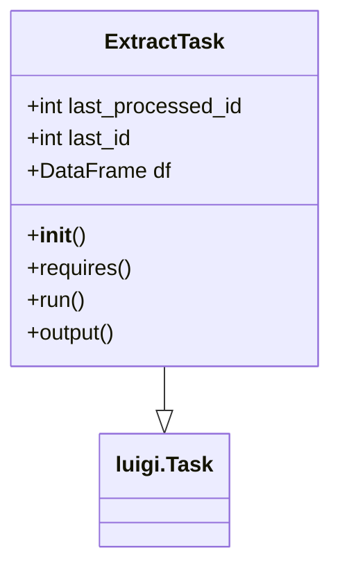
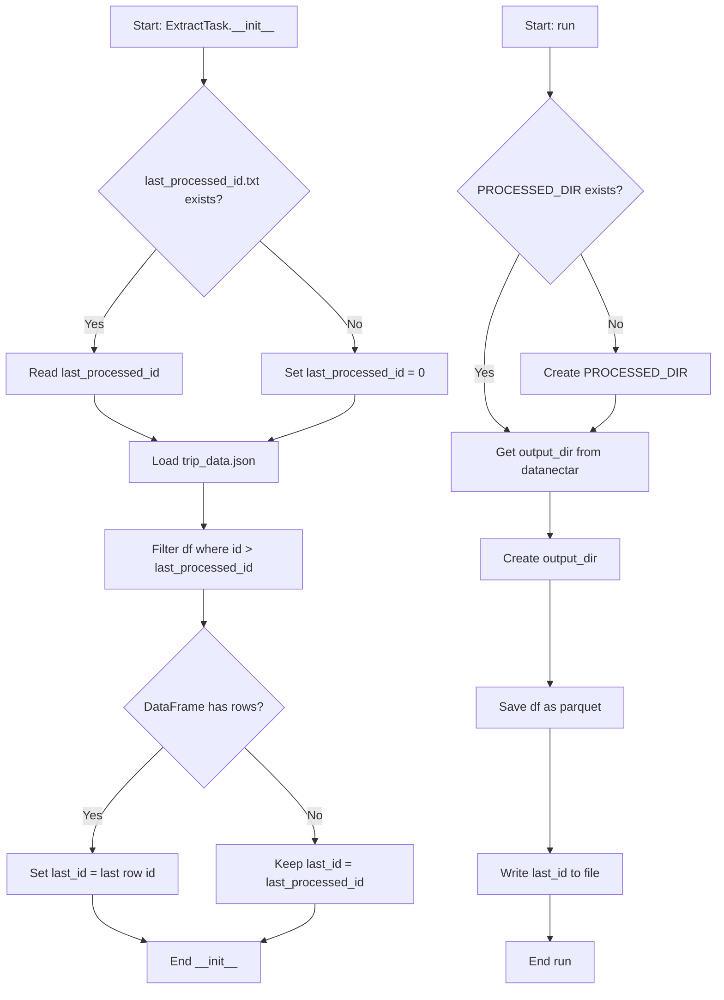
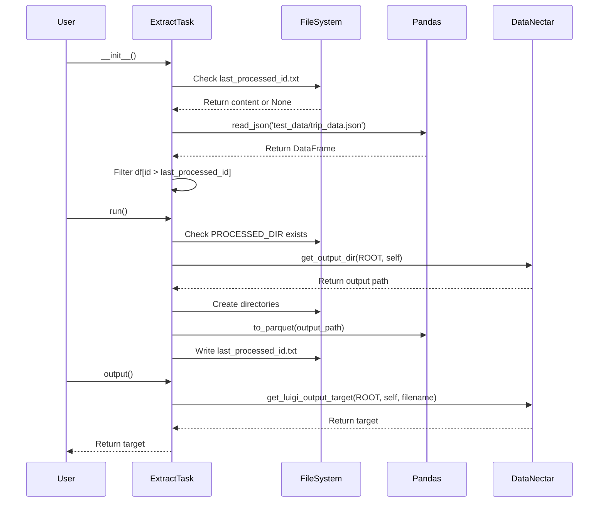

# Diagram: research/orchestrator/tasks/test/extract_task.py

> Auto-generated by Obscura crawlers

## Diagram 1

### SVG

<svg id="container" width="244.8203125" xmlns="http://www.w3.org/2000/svg" class="classDiagram" height="414" viewBox="0 0 244.8203125 414" role="graphics-document document" aria-roledescription="class"><g><defs><marker id="container_class-aggregationStart" class="marker aggregation class" refX="18" refY="7" markerWidth="190" markerHeight="240" orient="auto"><path d="M 18,7 L9,13 L1,7 L9,1 Z"></path></marker></defs><defs><marker id="container_class-aggregationEnd" class="marker aggregation class" refX="1" refY="7" markerWidth="20" markerHeight="28" orient="auto"><path d="M 18,7 L9,13 L1,7 L9,1 Z"></path></marker></defs><defs><marker id="container_class-extensionStart" class="marker extension class" refX="18" refY="7" markerWidth="190" markerHeight="240" orient="auto"><path d="M 1,7 L18,13 V 1 Z"></path></marker></defs><defs><marker id="container_class-extensionEnd" class="marker extension class" refX="1" refY="7" markerWidth="20" markerHeight="28" orient="auto"><path d="M 1,1 V 13 L18,7 Z"></path></marker></defs><defs><marker id="container_class-compositionStart" class="marker composition class" refX="18" refY="7" markerWidth="190" markerHeight="240" orient="auto"><path d="M 18,7 L9,13 L1,7 L9,1 Z"></path></marker></defs><defs><marker id="container_class-compositionEnd" class="marker composition class" refX="1" refY="7" markerWidth="20" markerHeight="28" orient="auto"><path d="M 18,7 L9,13 L1,7 L9,1 Z"></path></marker></defs><defs><marker id="container_class-dependencyStart" class="marker dependency class" refX="6" refY="7" markerWidth="190" markerHeight="240" orient="auto"><path d="M 5,7 L9,13 L1,7 L9,1 Z"></path></marker></defs><defs><marker id="container_class-dependencyEnd" class="marker dependency class" refX="13" refY="7" markerWidth="20" markerHeight="28" orient="auto"><path d="M 18,7 L9,13 L14,7 L9,1 Z"></path></marker></defs><defs><marker id="container_class-lollipopStart" class="marker lollipop class" refX="13" refY="7" markerWidth="190" markerHeight="240" orient="auto"><circle stroke="black" fill="transparent" cx="7" cy="7" r="6"></circle></marker></defs><defs><marker id="container_class-lollipopEnd" class="marker lollipop class" refX="1" refY="7" markerWidth="190" markerHeight="240" orient="auto"><circle stroke="black" fill="transparent" cx="7" cy="7" r="6"></circle></marker></defs><g class="root"><g class="clusters"></g><g class="edgePaths"><path d="M122.41,272L122.41,276.167C122.41,280.333,122.41,288.667,122.41,294.125C122.41,299.583,122.41,302.167,122.41,303.458L122.41,304.75" id="id_ExtractTask_luigi.Task_1" class="edge-thickness-normal edge-pattern-solid relation" style=";;;" data-edge="true" data-et="edge" data-id="id_ExtractTask_luigi.Task_1" data-points="W3sieCI6MTIyLjQxMDE1NjI1LCJ5IjoyNzJ9LHsieCI6MTIyLjQxMDE1NjI1LCJ5IjoyOTd9LHsieCI6MTIyLjQxMDE1NjI1LCJ5IjozMjJ9XQ==" marker-end="url(#container_class-extensionEnd)"></path></g><g class="edgeLabels"><g class="edgeLabel"><g class="label" data-id="id_ExtractTask_luigi.Task_1" transform="translate(0, 0)"><foreignObject width="0" height="0">

</foreignObject></g></g></g><g class="nodes"><g class="node default" id="classId-ExtractTask-0" transform="translate(122.41015625, 140)"><g class="basic label-container"><path d="M-114.41015625 -132 L114.41015625 -132 L114.41015625 132 L-114.41015625 132" stroke="none" stroke-width="0" fill="#ECECFF" style=""></path><path d="M-114.41015625 -132 C-55.971897764337484 -132, 2.4663607213250316 -132, 114.41015625 -132 M-114.41015625 -132 C-67.28437355151723 -132, -20.158590853034482 -132, 114.41015625 -132 M114.41015625 -132 C114.41015625 -28.992795706731542, 114.41015625 74.01440858653692, 114.41015625 132 M114.41015625 -132 C114.41015625 -39.22929985306723, 114.41015625 53.541400293865536, 114.41015625 132 M114.41015625 132 C50.467496952941254 132, -13.475162344117493 132, -114.41015625 132 M114.41015625 132 C48.97417203879165 132, -16.4618121724167 132, -114.41015625 132 M-114.41015625 132 C-114.41015625 70.68522709358786, -114.41015625 9.370454187175724, -114.41015625 -132 M-114.41015625 132 C-114.41015625 71.80401229368465, -114.41015625 11.608024587369286, -114.41015625 -132" stroke="#9370DB" stroke-width="1.3" fill="none" stroke-dasharray="0 0" style=""></path></g><g class="annotation-group text" transform="translate(0, -108)"></g><g class="label-group text" transform="translate(-42.1328125, -108)"><g class="label" style="font-weight: bolder" transform="translate(0,-12)"><foreignObject width="84.265625" height="24">

ExtractTask

</foreignObject></g></g><g class="members-group text" transform="translate(-102.41015625, -60)"><g class="label" style="" transform="translate(0,-12)"><foreignObject width="162.6875" height="24">

+int last_processed_id

</foreignObject></g><g class="label" style="" transform="translate(0,12)"><foreignObject width="80.703125" height="24">

+int last_id

</foreignObject></g><g class="label" style="" transform="translate(0,36)"><foreignObject width="104.421875" height="24">

+DataFrame df

</foreignObject></g></g><g class="methods-group text" transform="translate(-102.41015625, 36)"><g class="label" style="" transform="translate(0,-12)"><foreignObject width="42.796875" height="24">

+<strong>init</strong>()

</foreignObject></g><g class="label" style="" transform="translate(0,12)"><foreignObject width="78.0625" height="24">

+requires()

</foreignObject></g><g class="label" style="" transform="translate(0,36)"><foreignObject width="43.21875" height="24">

+run()

</foreignObject></g><g class="label" style="" transform="translate(0,60)"><foreignObject width="67.390625" height="24">

+output()

</foreignObject></g></g><g class="divider" style=""><path d="M-114.41015625 -84 C-37.227268020036306 -84, 39.95562020992739 -84, 114.41015625 -84 M-114.41015625 -84 C-58.289307502630564 -84, -2.1684587552611276 -84, 114.41015625 -84" stroke="#9370DB" stroke-width="1.3" fill="none" stroke-dasharray="0 0" style=""></path></g><g class="divider" style=""><path d="M-114.41015625 12 C-37.224426086475745 12, 39.96130407704851 12, 114.41015625 12 M-114.41015625 12 C-67.47164446355578 12, -20.53313267711154 12, 114.41015625 12" stroke="#9370DB" stroke-width="1.3" fill="none" stroke-dasharray="0 0" style=""></path></g></g><g class="node default" id="classId-luigi.Task-1" transform="translate(122.41015625, 364)"><g class="basic label-container"><path d="M-45.8203125 -42 L45.8203125 -42 L45.8203125 42 L-45.8203125 42" stroke="none" stroke-width="0" fill="#ECECFF" style=""></path><path d="M-45.8203125 -42 C-22.64319637542593 -42, 0.53391974914814 -42, 45.8203125 -42 M-45.8203125 -42 C-24.593197406005775 -42, -3.3660823120115495 -42, 45.8203125 -42 M45.8203125 -42 C45.8203125 -20.104975491517948, 45.8203125 1.7900490169641046, 45.8203125 42 M45.8203125 -42 C45.8203125 -10.015682541255583, 45.8203125 21.968634917488835, 45.8203125 42 M45.8203125 42 C19.950534001950984 42, -5.919244496098031 42, -45.8203125 42 M45.8203125 42 C11.910301602088055 42, -21.99970929582389 42, -45.8203125 42 M-45.8203125 42 C-45.8203125 24.54916234593635, -45.8203125 7.098324691872698, -45.8203125 -42 M-45.8203125 42 C-45.8203125 23.397702044745966, -45.8203125 4.795404089491932, -45.8203125 -42" stroke="#9370DB" stroke-width="1.3" fill="none" stroke-dasharray="0 0" style=""></path></g><g class="annotation-group text" transform="translate(0, -18)"></g><g class="label-group text" transform="translate(-33.8203125, -18)"><g class="label" style="font-weight: bolder" transform="translate(0,-12)"><foreignObject width="67.640625" height="24">

luigi.Task

</foreignObject></g></g><g class="members-group text" transform="translate(-33.8203125, 30)"></g><g class="methods-group text" transform="translate(-33.8203125, 60)"></g><g class="divider" style=""><path d="M-45.8203125 6 C-12.217137083370496 6, 21.38603833325901 6, 45.8203125 6 M-45.8203125 6 C-22.239167412248264 6, 1.3419776755034718 6, 45.8203125 6" stroke="#9370DB" stroke-width="1.3" fill="none" stroke-dasharray="0 0" style=""></path></g><g class="divider" style=""><path d="M-45.8203125 24 C-23.02720244667953 24, -0.23409239335906307 24, 45.8203125 24 M-45.8203125 24 C-11.232738795551512 24, 23.354834908896976 24, 45.8203125 24" stroke="#9370DB" stroke-width="1.3" fill="none" stroke-dasharray="0 0" style=""></path></g></g></g></g></g></svg>

## Diagram 2

### SVG

<svg id="container" width="920.87109375" xmlns="http://www.w3.org/2000/svg" class="flowchart" height="1293.984375" viewBox="0 0 920.87109375 1293.984375" role="graphics-document document" aria-roledescription="flowchart-v2"><g><marker id="container_flowchart-v2-pointEnd" class="marker flowchart-v2" viewBox="0 0 10 10" refX="5" refY="5" markerUnits="userSpaceOnUse" markerWidth="8" markerHeight="8" orient="auto"><path d="M 0 0 L 10 5 L 0 10 z" class="arrowMarkerPath" style="stroke-width: 1; stroke-dasharray: 1, 0;"></path></marker><marker id="container_flowchart-v2-pointStart" class="marker flowchart-v2" viewBox="0 0 10 10" refX="4.5" refY="5" markerUnits="userSpaceOnUse" markerWidth="8" markerHeight="8" orient="auto"><path d="M 0 5 L 10 10 L 10 0 z" class="arrowMarkerPath" style="stroke-width: 1; stroke-dasharray: 1, 0;"></path></marker><marker id="container_flowchart-v2-circleEnd" class="marker flowchart-v2" viewBox="0 0 10 10" refX="11" refY="5" markerUnits="userSpaceOnUse" markerWidth="11" markerHeight="11" orient="auto"><circle cx="5" cy="5" r="5" class="arrowMarkerPath" style="stroke-width: 1; stroke-dasharray: 1, 0;"></circle></marker><marker id="container_flowchart-v2-circleStart" class="marker flowchart-v2" viewBox="0 0 10 10" refX="-1" refY="5" markerUnits="userSpaceOnUse" markerWidth="11" markerHeight="11" orient="auto"><circle cx="5" cy="5" r="5" class="arrowMarkerPath" style="stroke-width: 1; stroke-dasharray: 1, 0;"></circle></marker><marker id="container_flowchart-v2-crossEnd" class="marker cross flowchart-v2" viewBox="0 0 11 11" refX="12" refY="5.2" markerUnits="userSpaceOnUse" markerWidth="11" markerHeight="11" orient="auto"><path d="M 1,1 l 9,9 M 10,1 l -9,9" class="arrowMarkerPath" style="stroke-width: 2; stroke-dasharray: 1, 0;"></path></marker><marker id="container_flowchart-v2-crossStart" class="marker cross flowchart-v2" viewBox="0 0 11 11" refX="-1" refY="5.2" markerUnits="userSpaceOnUse" markerWidth="11" markerHeight="11" orient="auto"><path d="M 1,1 l 9,9 M 10,1 l -9,9" class="arrowMarkerPath" style="stroke-width: 2; stroke-dasharray: 1, 0;"></path></marker><g class="root"><g class="clusters"></g><g class="edgePaths"><path d="M269.164,62L269.164,66.167C269.164,70.333,269.164,78.667,269.164,86.333C269.164,94,269.164,101,269.164,104.5L269.164,108" id="L_A_B_0" class="edge-thickness-normal edge-pattern-solid edge-thickness-normal edge-pattern-solid flowchart-link" style=";" data-edge="true" data-et="edge" data-id="L_A_B_0" data-points="W3sieCI6MjY5LjE2NDA2MjUsInkiOjYyfSx7IngiOjI2OS4xNjQwNjI1LCJ5Ijo4N30seyJ4IjoyNjkuMTY0MDYyNSwieSI6MTEyfV0=" marker-end="url(#container_flowchart-v2-pointEnd)"></path><path d="M206.677,327.513L193.135,344.094C179.593,360.675,152.509,393.838,138.968,415.919C125.426,438,125.426,449,125.426,454.5L125.426,460" id="L_B_C_0" class="edge-thickness-normal edge-pattern-solid edge-thickness-normal edge-pattern-solid flowchart-link" style=";" data-edge="true" data-et="edge" data-id="L_B_C_0" data-points="W3sieCI6MjA2LjY3NjYzOTkyNTM4NDUzLCJ5IjozMjcuNTEyNTc3NDI1Mzg0NX0seyJ4IjoxMjUuNDI1NzgxMjUsInkiOjQyN30seyJ4IjoxMjUuNDI1NzgxMjUsInkiOjQ2NH1d" marker-end="url(#container_flowchart-v2-pointEnd)"></path><path d="M343.424,315.74L364.694,334.284C385.963,352.827,428.503,389.913,449.773,413.957C471.043,438,471.043,449,471.043,454.5L471.043,460" id="L_B_D_0" class="edge-thickness-normal edge-pattern-solid edge-thickness-normal edge-pattern-solid flowchart-link" style=";" data-edge="true" data-et="edge" data-id="L_B_D_0" data-points="W3sieCI6MzQzLjQyMzc0NTk3MTY4MDk0LCJ5IjozMTUuNzQwMzE2NTI4MzE5MDZ9LHsieCI6NDcxLjA0Mjk2ODc1LCJ5Ijo0Mjd9LHsieCI6NDcxLjA0Mjk2ODc1LCJ5Ijo0NjR9XQ==" marker-end="url(#container_flowchart-v2-pointEnd)"></path><path d="M125.426,518L125.426,522.167C125.426,526.333,125.426,534.667,138.667,544.729C151.907,554.791,178.389,566.582,191.63,572.477L204.87,578.373" id="L_C_E_0" class="edge-thickness-normal edge-pattern-solid edge-thickness-normal edge-pattern-solid flowchart-link" style=";" data-edge="true" data-et="edge" data-id="L_C_E_0" data-points="W3sieCI6MTI1LjQyNTc4MTI1LCJ5Ijo1MTh9LHsieCI6MTI1LjQyNTc4MTI1LCJ5Ijo1NDN9LHsieCI6MjA4LjUyNDQ3NTA5NzY1NjI1LCJ5Ijo1ODB9XQ==" marker-end="url(#container_flowchart-v2-pointEnd)"></path><path d="M471.043,518L471.043,522.167C471.043,526.333,471.043,534.667,452.227,544.799C433.41,554.93,395.777,566.861,376.961,572.826L358.145,578.791" id="L_D_E_0" class="edge-thickness-normal edge-pattern-solid edge-thickness-normal edge-pattern-solid flowchart-link" style=";" data-edge="true" data-et="edge" data-id="L_D_E_0" data-points="W3sieCI6NDcxLjA0Mjk2ODc1LCJ5Ijo1MTh9LHsieCI6NDcxLjA0Mjk2ODc1LCJ5Ijo1NDN9LHsieCI6MzU0LjMzMTcyNjA3NDIxODc1LCJ5Ijo1ODB9XQ==" marker-end="url(#container_flowchart-v2-pointEnd)"></path><path d="M269.164,634L269.164,640.167C269.164,646.333,269.164,658.667,269.164,668.333C269.164,678,269.164,685,269.164,688.5L269.164,692" id="L_E_F_0" class="edge-thickness-normal edge-pattern-solid edge-thickness-normal edge-pattern-solid flowchart-link" style=";" data-edge="true" data-et="edge" data-id="L_E_F_0" data-points="W3sieCI6MjY5LjE2NDA2MjUsInkiOjYzNH0seyJ4IjoyNjkuMTY0MDYyNSwieSI6NjcxfSx7IngiOjI2OS4xNjQwNjI1LCJ5Ijo2OTZ9XQ==" marker-end="url(#container_flowchart-v2-pointEnd)"></path><path d="M269.164,774L269.164,778.167C269.164,782.333,269.164,790.667,269.164,798.333C269.164,806,269.164,813,269.164,816.5L269.164,820" id="L_F_G_0" class="edge-thickness-normal edge-pattern-solid edge-thickness-normal edge-pattern-solid flowchart-link" style=";" data-edge="true" data-et="edge" data-id="L_F_G_0" data-points="W3sieCI6MjY5LjE2NDA2MjUsInkiOjc3NH0seyJ4IjoyNjkuMTY0MDYyNSwieSI6Nzk5fSx7IngiOjI2OS4xNjQwNjI1LCJ5Ijo4MjR9XQ==" marker-end="url(#container_flowchart-v2-pointEnd)"></path><path d="M216.401,977.221L200.686,992.182C184.97,1007.142,153.54,1037.063,137.825,1059.524C122.109,1081.984,122.109,1096.984,122.109,1104.484L122.109,1111.984" id="L_G_H_0" class="edge-thickness-normal edge-pattern-solid edge-thickness-normal edge-pattern-solid flowchart-link" style=";" data-edge="true" data-et="edge" data-id="L_G_H_0" data-points="W3sieCI6MjE2LjQwMDk1OTA5NDgzNjk2LCJ5Ijo5NzcuMjIxMjcxNTk0ODM2OX0seyJ4IjoxMjIuMTA5Mzc1LCJ5IjoxMDY2Ljk4NDM3NX0seyJ4IjoxMjIuMTA5Mzc1LCJ5IjoxMTE1Ljk4NDM3NX1d" marker-end="url(#container_flowchart-v2-pointEnd)"></path><path d="M321.927,977.221L337.642,992.182C353.358,1007.142,384.788,1037.063,400.503,1057.524C416.219,1077.984,416.219,1088.984,416.219,1094.484L416.219,1099.984" id="L_G_I_0" class="edge-thickness-normal edge-pattern-solid edge-thickness-normal edge-pattern-solid flowchart-link" style=";" data-edge="true" data-et="edge" data-id="L_G_I_0" data-points="W3sieCI6MzIxLjkyNzE2NTkwNTE2MywieSI6OTc3LjIyMTI3MTU5NDgzNjl9LHsieCI6NDE2LjIxODc1LCJ5IjoxMDY2Ljk4NDM3NX0seyJ4Ijo0MTYuMjE4NzUsInkiOjExMDMuOTg0Mzc1fV0=" marker-end="url(#container_flowchart-v2-pointEnd)"></path><path d="M122.109,1169.984L122.109,1176.151C122.109,1182.318,122.109,1194.651,136.321,1205.843C150.532,1217.035,178.955,1227.085,193.166,1232.111L207.377,1237.136" id="L_H_J_0" class="edge-thickness-normal edge-pattern-solid edge-thickness-normal edge-pattern-solid flowchart-link" style=";" data-edge="true" data-et="edge" data-id="L_H_J_0" data-points="W3sieCI6MTIyLjEwOTM3NSwieSI6MTE2OS45ODQzNzV9LHsieCI6MTIyLjEwOTM3NSwieSI6MTIwNi45ODQzNzV9LHsieCI6MjExLjE0ODQzNzUsInkiOjEyMzguNDY5NDczMDE4MzgxN31d" marker-end="url(#container_flowchart-v2-pointEnd)"></path><path d="M416.219,1181.984L416.219,1186.151C416.219,1190.318,416.219,1198.651,402.007,1207.843C387.796,1217.035,359.373,1227.085,345.162,1232.111L330.951,1237.136" id="L_I_J_0" class="edge-thickness-normal edge-pattern-solid edge-thickness-normal edge-pattern-solid flowchart-link" style=";" data-edge="true" data-et="edge" data-id="L_I_J_0" data-points="W3sieCI6NDE2LjIxODc1LCJ5IjoxMTgxLjk4NDM3NX0seyJ4Ijo0MTYuMjE4NzUsInkiOjEyMDYuOTg0Mzc1fSx7IngiOjMyNy4xNzk2ODc1LCJ5IjoxMjM4LjQ2OTQ3MzAxODM4MTd9XQ==" marker-end="url(#container_flowchart-v2-pointEnd)"></path><path d="M719.902,62L719.902,66.167C719.902,70.333,719.902,78.667,719.902,90.964C719.902,103.26,719.902,119.521,719.902,127.651L719.902,135.781" id="L_K_L_0" class="edge-thickness-normal edge-pattern-solid edge-thickness-normal edge-pattern-solid flowchart-link" style=";" data-edge="true" data-et="edge" data-id="L_K_L_0" data-points="W3sieCI6NzE5LjkwMjM0Mzc1LCJ5Ijo2Mn0seyJ4Ijo3MTkuOTAyMzQzNzUsInkiOjg3fSx7IngiOjcxOS45MDIzNDM3NSwieSI6MTM5Ljc4MTI1fV0=" marker-end="url(#container_flowchart-v2-pointEnd)"></path><path d="M754.658,327.463L762.199,344.052C769.74,360.642,784.821,393.821,792.362,415.91C799.902,438,799.902,449,799.902,454.5L799.902,460" id="L_L_M_0" class="edge-thickness-normal edge-pattern-solid edge-thickness-normal edge-pattern-solid flowchart-link" style=";" data-edge="true" data-et="edge" data-id="L_L_M_0" data-points="W3sieCI6NzU0LjY1ODIwMzEyNSwieSI6MzI3LjQ2Mjg5MDYyNX0seyJ4Ijo3OTkuOTAyMzQzNzUsInkiOjQyN30seyJ4Ijo3OTkuOTAyMzQzNzUsInkiOjQ2NH1d" marker-end="url(#container_flowchart-v2-pointEnd)"></path><path d="M685.146,327.463L677.606,344.052C670.065,360.642,654.984,393.821,647.443,421.077C639.902,448.333,639.902,469.667,639.902,489C639.902,508.333,639.902,525.667,644.59,538.084C649.278,550.5,658.653,558.001,663.341,561.751L668.029,565.501" id="L_L_N_0" class="edge-thickness-normal edge-pattern-solid edge-thickness-normal edge-pattern-solid flowchart-link" style=";" data-edge="true" data-et="edge" data-id="L_L_N_0" data-points="W3sieCI6Njg1LjE0NjQ4NDM3NSwieSI6MzI3LjQ2Mjg5MDYyNX0seyJ4Ijo2MzkuOTAyMzQzNzUsInkiOjQyN30seyJ4Ijo2MzkuOTAyMzQzNzUsInkiOjQ5MX0seyJ4Ijo2MzkuOTAyMzQzNzUsInkiOjU0M30seyJ4Ijo2NzEuMTUyMzQzNzUsInkiOjU2OH1d" marker-end="url(#container_flowchart-v2-pointEnd)"></path><path d="M799.902,518L799.902,522.167C799.902,526.333,799.902,534.667,795.215,542.584C790.527,550.5,781.151,558.001,776.464,561.751L771.776,565.501" id="L_M_N_0" class="edge-thickness-normal edge-pattern-solid edge-thickness-normal edge-pattern-solid flowchart-link" style=";" data-edge="true" data-et="edge" data-id="L_M_N_0" data-points="W3sieCI6Nzk5LjkwMjM0Mzc1LCJ5Ijo1MTh9LHsieCI6Nzk5LjkwMjM0Mzc1LCJ5Ijo1NDN9LHsieCI6NzY4LjY1MjM0Mzc1LCJ5Ijo1Njh9XQ==" marker-end="url(#container_flowchart-v2-pointEnd)"></path><path d="M719.902,646L719.902,650.167C719.902,654.333,719.902,662.667,719.902,672.333C719.902,682,719.902,693,719.902,698.5L719.902,704" id="L_N_O_0" class="edge-thickness-normal edge-pattern-solid edge-thickness-normal edge-pattern-solid flowchart-link" style=";" data-edge="true" data-et="edge" data-id="L_N_O_0" data-points="W3sieCI6NzE5LjkwMjM0Mzc1LCJ5Ijo2NDZ9LHsieCI6NzE5LjkwMjM0Mzc1LCJ5Ijo2NzF9LHsieCI6NzE5LjkwMjM0Mzc1LCJ5Ijo3MDh9XQ==" marker-end="url(#container_flowchart-v2-pointEnd)"></path><path d="M719.902,762L719.902,768.167C719.902,774.333,719.902,786.667,719.902,808.999C719.902,831.331,719.902,863.661,719.902,879.827L719.902,895.992" id="L_O_P_0" class="edge-thickness-normal edge-pattern-solid edge-thickness-normal edge-pattern-solid flowchart-link" style=";" data-edge="true" data-et="edge" data-id="L_O_P_0" data-points="W3sieCI6NzE5LjkwMjM0Mzc1LCJ5Ijo3NjJ9LHsieCI6NzE5LjkwMjM0Mzc1LCJ5Ijo3OTl9LHsieCI6NzE5LjkwMjM0Mzc1LCJ5Ijo4OTkuOTkyMTg3NX1d" marker-end="url(#container_flowchart-v2-pointEnd)"></path><path d="M719.902,953.992L719.902,972.824C719.902,991.656,719.902,1029.32,719.902,1055.652C719.902,1081.984,719.902,1096.984,719.902,1104.484L719.902,1111.984" id="L_P_Q_0" class="edge-thickness-normal edge-pattern-solid edge-thickness-normal edge-pattern-solid flowchart-link" style=";" data-edge="true" data-et="edge" data-id="L_P_Q_0" data-points="W3sieCI6NzE5LjkwMjM0Mzc1LCJ5Ijo5NTMuOTkyMTg3NX0seyJ4Ijo3MTkuOTAyMzQzNzUsInkiOjEwNjYuOTg0Mzc1fSx7IngiOjcxOS45MDIzNDM3NSwieSI6MTExNS45ODQzNzV9XQ==" marker-end="url(#container_flowchart-v2-pointEnd)"></path><path d="M719.902,1169.984L719.902,1176.151C719.902,1182.318,719.902,1194.651,719.902,1204.318C719.902,1213.984,719.902,1220.984,719.902,1224.484L719.902,1227.984" id="L_Q_R_0" class="edge-thickness-normal edge-pattern-solid edge-thickness-normal edge-pattern-solid flowchart-link" style=";" data-edge="true" data-et="edge" data-id="L_Q_R_0" data-points="W3sieCI6NzE5LjkwMjM0Mzc1LCJ5IjoxMTY5Ljk4NDM3NX0seyJ4Ijo3MTkuOTAyMzQzNzUsInkiOjEyMDYuOTg0Mzc1fSx7IngiOjcxOS45MDIzNDM3NSwieSI6MTIzMS45ODQzNzV9XQ==" marker-end="url(#container_flowchart-v2-pointEnd)"></path></g><g class="edgeLabels"><g class="edgeLabel"><g class="label" data-id="L_A_B_0" transform="translate(0, 0)"><foreignObject width="0" height="0">

</foreignObject></g></g><g class="edgeLabel" transform="translate(125.42578125, 427)"><g class="label" data-id="L_B_C_0" transform="translate(-12.03125, -12)"><foreignObject width="24.0625" height="24">

Yes

</foreignObject></g></g><g class="edgeLabel" transform="translate(471.04296875, 427)"><g class="label" data-id="L_B_D_0" transform="translate(-10.140625, -12)"><foreignObject width="20.28125" height="24">

No

</foreignObject></g></g><g class="edgeLabel"><g class="label" data-id="L_C_E_0" transform="translate(0, 0)"><foreignObject width="0" height="0">

</foreignObject></g></g><g class="edgeLabel"><g class="label" data-id="L_D_E_0" transform="translate(0, 0)"><foreignObject width="0" height="0">

</foreignObject></g></g><g class="edgeLabel"><g class="label" data-id="L_E_F_0" transform="translate(0, 0)"><foreignObject width="0" height="0">

</foreignObject></g></g><g class="edgeLabel"><g class="label" data-id="L_F_G_0" transform="translate(0, 0)"><foreignObject width="0" height="0">

</foreignObject></g></g><g class="edgeLabel" transform="translate(122.109375, 1066.984375)"><g class="label" data-id="L_G_H_0" transform="translate(-12.03125, -12)"><foreignObject width="24.0625" height="24">

Yes

</foreignObject></g></g><g class="edgeLabel" transform="translate(416.21875, 1066.984375)"><g class="label" data-id="L_G_I_0" transform="translate(-10.140625, -12)"><foreignObject width="20.28125" height="24">

No

</foreignObject></g></g><g class="edgeLabel"><g class="label" data-id="L_H_J_0" transform="translate(0, 0)"><foreignObject width="0" height="0">

</foreignObject></g></g><g class="edgeLabel"><g class="label" data-id="L_I_J_0" transform="translate(0, 0)"><foreignObject width="0" height="0">

</foreignObject></g></g><g class="edgeLabel"><g class="label" data-id="L_K_L_0" transform="translate(0, 0)"><foreignObject width="0" height="0">

</foreignObject></g></g><g class="edgeLabel" transform="translate(799.90234375, 427)"><g class="label" data-id="L_L_M_0" transform="translate(-10.140625, -12)"><foreignObject width="20.28125" height="24">

No

</foreignObject></g></g><g class="edgeLabel" transform="translate(639.90234375, 491)"><g class="label" data-id="L_L_N_0" transform="translate(-12.03125, -12)"><foreignObject width="24.0625" height="24">

Yes

</foreignObject></g></g><g class="edgeLabel"><g class="label" data-id="L_M_N_0" transform="translate(0, 0)"><foreignObject width="0" height="0">

</foreignObject></g></g><g class="edgeLabel"><g class="label" data-id="L_N_O_0" transform="translate(0, 0)"><foreignObject width="0" height="0">

</foreignObject></g></g><g class="edgeLabel"><g class="label" data-id="L_O_P_0" transform="translate(0, 0)"><foreignObject width="0" height="0">

</foreignObject></g></g><g class="edgeLabel"><g class="label" data-id="L_P_Q_0" transform="translate(0, 0)"><foreignObject width="0" height="0">

</foreignObject></g></g><g class="edgeLabel"><g class="label" data-id="L_Q_R_0" transform="translate(0, 0)"><foreignObject width="0" height="0">

</foreignObject></g></g></g><g class="nodes"><g class="node default" id="flowchart-A-0" transform="translate(269.1640625, 35)"><rect class="basic label-container" style="" x="-106.5234375" y="-27" width="213.046875" height="54"></rect><g class="label" style="" transform="translate(-76.5234375, -12)"><rect></rect><foreignObject width="153.046875" height="24">

Start: ExtractTask.<strong>init</strong>

</foreignObject></g></g><g class="node default" id="flowchart-B-1" transform="translate(269.1640625, 251)"><polygon points="139,0 278,-139 139,-278 0,-139" class="label-container" transform="translate(-138.5, 139)"></polygon><g class="label" style="" transform="translate(-100, -24)"><rect></rect><foreignObject width="200" height="48">

last_processed_id.txt exists?

</foreignObject></g></g><g class="node default" id="flowchart-C-3" transform="translate(125.42578125, 491)"><rect class="basic label-container" style="" x="-115.6484375" y="-27" width="231.296875" height="54"></rect><g class="label" style="" transform="translate(-85.6484375, -12)"><rect></rect><foreignObject width="171.296875" height="24">

Read last_processed_id

</foreignObject></g></g><g class="node default" id="flowchart-D-5" transform="translate(471.04296875, 491)"><rect class="basic label-container" style="" x="-121.828125" y="-27" width="243.65625" height="54"></rect><g class="label" style="" transform="translate(-91.828125, -12)"><rect></rect><foreignObject width="183.65625" height="24">

Set last_processed_id = 0

</foreignObject></g></g><g class="node default" id="flowchart-E-7" transform="translate(269.1640625, 607)"><rect class="basic label-container" style="" x="-100.0390625" y="-27" width="200.078125" height="54"></rect><g class="label" style="" transform="translate(-70.0390625, -12)"><rect></rect><foreignObject width="140.078125" height="24">

Load trip_data.json

</foreignObject></g></g><g class="node default" id="flowchart-F-11" transform="translate(269.1640625, 735)"><rect class="basic label-container" style="" x="-130" y="-39" width="260" height="78"></rect><g class="label" style="" transform="translate(-100, -24)"><rect></rect><foreignObject width="200" height="48">

Filter df where id &gt; last_processed_id

</foreignObject></g></g><g class="node default" id="flowchart-G-13" transform="translate(269.1640625, 926.9921875)"><polygon points="102.9921875,0 205.984375,-102.9921875 102.9921875,-205.984375 0,-102.9921875" class="label-container" transform="translate(-102.4921875, 102.9921875)"></polygon><g class="label" style="" transform="translate(-75.9921875, -12)"><rect></rect><foreignObject width="151.984375" height="24">

DataFrame has rows?

</foreignObject></g></g><g class="node default" id="flowchart-H-15" transform="translate(122.109375, 1142.984375)"><rect class="basic label-container" style="" x="-114.109375" y="-27" width="228.21875" height="54"></rect><g class="label" style="" transform="translate(-84.109375, -12)"><rect></rect><foreignObject width="168.21875" height="24">

Set last_id = last row id

</foreignObject></g></g><g class="node default" id="flowchart-I-17" transform="translate(416.21875, 1142.984375)"><rect class="basic label-container" style="" x="-130" y="-39" width="260" height="78"></rect><g class="label" style="" transform="translate(-100, -24)"><rect></rect><foreignObject width="200" height="48">

Keep last_id = last_processed_id

</foreignObject></g></g><g class="node default" id="flowchart-J-19" transform="translate(269.1640625, 1258.984375)"><rect class="basic label-container" style="" x="-58.015625" y="-27" width="116.03125" height="54"></rect><g class="label" style="" transform="translate(-28.015625, -12)"><rect></rect><foreignObject width="56.03125" height="24">

End <strong>init</strong>

</foreignObject></g></g><g class="node default" id="flowchart-K-22" transform="translate(719.90234375, 35)"><rect class="basic label-container" style="" x="-64.03125" y="-27" width="128.0625" height="54"></rect><g class="label" style="" transform="translate(-34.03125, -12)"><rect></rect><foreignObject width="68.0625" height="24">

Start: run

</foreignObject></g></g><g class="node default" id="flowchart-L-23" transform="translate(719.90234375, 251)"><polygon points="111.21875,0 222.4375,-111.21875 111.21875,-222.4375 0,-111.21875" class="label-container" transform="translate(-110.71875, 111.21875)"></polygon><g class="label" style="" transform="translate(-84.21875, -12)"><rect></rect><foreignObject width="168.4375" height="24">

PROCESSED_DIR exists?

</foreignObject></g></g><g class="node default" id="flowchart-M-25" transform="translate(799.90234375, 491)"><rect class="basic label-container" style="" x="-112.96875" y="-27" width="225.9375" height="54"></rect><g class="label" style="" transform="translate(-82.96875, -12)"><rect></rect><foreignObject width="165.9375" height="24">

Create PROCESSED_DIR

</foreignObject></g></g><g class="node default" id="flowchart-N-27" transform="translate(719.90234375, 607)"><rect class="basic label-container" style="" x="-130" y="-39" width="260" height="78"></rect><g class="label" style="" transform="translate(-100, -24)"><rect></rect><foreignObject width="200" height="48">

Get output_dir from datanectar

</foreignObject></g></g><g class="node default" id="flowchart-O-31" transform="translate(719.90234375, 735)"><rect class="basic label-container" style="" x="-93.734375" y="-27" width="187.46875" height="54"></rect><g class="label" style="" transform="translate(-63.734375, -12)"><rect></rect><foreignObject width="127.46875" height="24">

Create output_dir

</foreignObject></g></g><g class="node default" id="flowchart-P-33" transform="translate(719.90234375, 926.9921875)"><rect class="basic label-container" style="" x="-97.25" y="-27" width="194.5" height="54"></rect><g class="label" style="" transform="translate(-67.25, -12)"><rect></rect><foreignObject width="134.5" height="24">

Save df as parquet

</foreignObject></g></g><g class="node default" id="flowchart-Q-35" transform="translate(719.90234375, 1142.984375)"><rect class="basic label-container" style="" x="-98.5078125" y="-27" width="197.015625" height="54"></rect><g class="label" style="" transform="translate(-68.5078125, -12)"><rect></rect><foreignObject width="137.015625" height="24">

Write last_id to file

</foreignObject></g></g><g class="node default" id="flowchart-R-37" transform="translate(719.90234375, 1258.984375)"><rect class="basic label-container" style="" x="-58.2265625" y="-27" width="116.453125" height="54"></rect><g class="label" style="" transform="translate(-28.2265625, -12)"><rect></rect><foreignObject width="56.453125" height="24">

End run

</foreignObject></g></g></g></g></g></svg>

## Diagram 3

### SVG

<svg id="container" width="1129" xmlns="http://www.w3.org/2000/svg" height="1017" viewBox="-50 -10 1129 1017" role="graphics-document document" aria-roledescription="sequence"><g><rect x="879" y="931" fill="#eaeaea" stroke="#666" width="150" height="65" name="DataNectar" rx="3" ry="3" class="actor actor-bottom"></rect><text x="954" y="963.5" dominant-baseline="central" alignment-baseline="central" class="actor actor-box" style="text-anchor: middle; font-size: 16px; font-weight: 400;"><tspan x="954" dy="0">DataNectar</tspan></text></g><g><rect x="679" y="931" fill="#eaeaea" stroke="#666" width="150" height="65" name="Pandas" rx="3" ry="3" class="actor actor-bottom"></rect><text x="754" y="963.5" dominant-baseline="central" alignment-baseline="central" class="actor actor-box" style="text-anchor: middle; font-size: 16px; font-weight: 400;"><tspan x="754" dy="0">Pandas</tspan></text></g><g><rect x="479" y="931" fill="#eaeaea" stroke="#666" width="150" height="65" name="FileSystem" rx="3" ry="3" class="actor actor-bottom"></rect><text x="554" y="963.5" dominant-baseline="central" alignment-baseline="central" class="actor actor-box" style="text-anchor: middle; font-size: 16px; font-weight: 400;"><tspan x="554" dy="0">FileSystem</tspan></text></g><g><rect x="200" y="931" fill="#eaeaea" stroke="#666" width="150" height="65" name="ExtractTask" rx="3" ry="3" class="actor actor-bottom"></rect><text x="275" y="963.5" dominant-baseline="central" alignment-baseline="central" class="actor actor-box" style="text-anchor: middle; font-size: 16px; font-weight: 400;"><tspan x="275" dy="0">ExtractTask</tspan></text></g><g><rect x="0" y="931" fill="#eaeaea" stroke="#666" width="150" height="65" name="User" rx="3" ry="3" class="actor actor-bottom"></rect><text x="75" y="963.5" dominant-baseline="central" alignment-baseline="central" class="actor actor-box" style="text-anchor: middle; font-size: 16px; font-weight: 400;"><tspan x="75" dy="0">User</tspan></text></g><g><line id="actor4" x1="954" y1="65" x2="954" y2="931" class="actor-line 200" stroke-width="0.5px" stroke="#999" name="DataNectar"></line><g id="root-4"><rect x="879" y="0" fill="#eaeaea" stroke="#666" width="150" height="65" name="DataNectar" rx="3" ry="3" class="actor actor-top"></rect><text x="954" y="32.5" dominant-baseline="central" alignment-baseline="central" class="actor actor-box" style="text-anchor: middle; font-size: 16px; font-weight: 400;"><tspan x="954" dy="0">DataNectar</tspan></text></g></g><g><line id="actor3" x1="754" y1="65" x2="754" y2="931" class="actor-line 200" stroke-width="0.5px" stroke="#999" name="Pandas"></line><g id="root-3"><rect x="679" y="0" fill="#eaeaea" stroke="#666" width="150" height="65" name="Pandas" rx="3" ry="3" class="actor actor-top"></rect><text x="754" y="32.5" dominant-baseline="central" alignment-baseline="central" class="actor actor-box" style="text-anchor: middle; font-size: 16px; font-weight: 400;"><tspan x="754" dy="0">Pandas</tspan></text></g></g><g><line id="actor2" x1="554" y1="65" x2="554" y2="931" class="actor-line 200" stroke-width="0.5px" stroke="#999" name="FileSystem"></line><g id="root-2"><rect x="479" y="0" fill="#eaeaea" stroke="#666" width="150" height="65" name="FileSystem" rx="3" ry="3" class="actor actor-top"></rect><text x="554" y="32.5" dominant-baseline="central" alignment-baseline="central" class="actor actor-box" style="text-anchor: middle; font-size: 16px; font-weight: 400;"><tspan x="554" dy="0">FileSystem</tspan></text></g></g><g><line id="actor1" x1="275" y1="65" x2="275" y2="931" class="actor-line 200" stroke-width="0.5px" stroke="#999" name="ExtractTask"></line><g id="root-1"><rect x="200" y="0" fill="#eaeaea" stroke="#666" width="150" height="65" name="ExtractTask" rx="3" ry="3" class="actor actor-top"></rect><text x="275" y="32.5" dominant-baseline="central" alignment-baseline="central" class="actor actor-box" style="text-anchor: middle; font-size: 16px; font-weight: 400;"><tspan x="275" dy="0">ExtractTask</tspan></text></g></g><g><line id="actor0" x1="75" y1="65" x2="75" y2="931" class="actor-line 200" stroke-width="0.5px" stroke="#999" name="User"></line><g id="root-0"><rect x="0" y="0" fill="#eaeaea" stroke="#666" width="150" height="65" name="User" rx="3" ry="3" class="actor actor-top"></rect><text x="75" y="32.5" dominant-baseline="central" alignment-baseline="central" class="actor actor-box" style="text-anchor: middle; font-size: 16px; font-weight: 400;"><tspan x="75" dy="0">User</tspan></text></g></g><g></g><defs><symbol id="computer" width="24" height="24"><path transform="scale(.5)" d="M2 2v13h20v-13h-20zm18 11h-16v-9h16v9zm-10.228 6l.466-1h3.524l.467 1h-4.457zm14.228 3h-24l2-6h2.104l-1.33 4h18.45l-1.297-4h2.073l2 6zm-5-10h-14v-7h14v7z"></path></symbol></defs><defs><symbol id="database" fill-rule="evenodd" clip-rule="evenodd"><path transform="scale(.5)" d="M12.258.001l.256.004.255.005.253.008.251.01.249.012.247.015.246.016.242.019.241.02.239.023.236.024.233.027.231.028.229.031.225.032.223.034.22.036.217.038.214.04.211.041.208.043.205.045.201.046.198.048.194.05.191.051.187.053.183.054.18.056.175.057.172.059.168.06.163.061.16.063.155.064.15.066.074.033.073.033.071.034.07.034.069.035.068.035.067.035.066.035.064.036.064.036.062.036.06.036.06.037.058.037.058.037.055.038.055.038.053.038.052.038.051.039.05.039.048.039.047.039.045.04.044.04.043.04.041.04.04.041.039.041.037.041.036.041.034.041.033.042.032.042.03.042.029.042.027.042.026.043.024.043.023.043.021.043.02.043.018.044.017.043.015.044.013.044.012.044.011.045.009.044.007.045.006.045.004.045.002.045.001.045v17l-.001.045-.002.045-.004.045-.006.045-.007.045-.009.044-.011.045-.012.044-.013.044-.015.044-.017.043-.018.044-.02.043-.021.043-.023.043-.024.043-.026.043-.027.042-.029.042-.03.042-.032.042-.033.042-.034.041-.036.041-.037.041-.039.041-.04.041-.041.04-.043.04-.044.04-.045.04-.047.039-.048.039-.05.039-.051.039-.052.038-.053.038-.055.038-.055.038-.058.037-.058.037-.06.037-.06.036-.062.036-.064.036-.064.036-.066.035-.067.035-.068.035-.069.035-.07.034-.071.034-.073.033-.074.033-.15.066-.155.064-.16.063-.163.061-.168.06-.172.059-.175.057-.18.056-.183.054-.187.053-.191.051-.194.05-.198.048-.201.046-.205.045-.208.043-.211.041-.214.04-.217.038-.22.036-.223.034-.225.032-.229.031-.231.028-.233.027-.236.024-.239.023-.241.02-.242.019-.246.016-.247.015-.249.012-.251.01-.253.008-.255.005-.256.004-.258.001-.258-.001-.256-.004-.255-.005-.253-.008-.251-.01-.249-.012-.247-.015-.245-.016-.243-.019-.241-.02-.238-.023-.236-.024-.234-.027-.231-.028-.228-.031-.226-.032-.223-.034-.22-.036-.217-.038-.214-.04-.211-.041-.208-.043-.204-.045-.201-.046-.198-.048-.195-.05-.19-.051-.187-.053-.184-.054-.179-.056-.176-.057-.172-.059-.167-.06-.164-.061-.159-.063-.155-.064-.151-.066-.074-.033-.072-.033-.072-.034-.07-.034-.069-.035-.068-.035-.067-.035-.066-.035-.064-.036-.063-.036-.062-.036-.061-.036-.06-.037-.058-.037-.057-.037-.056-.038-.055-.038-.053-.038-.052-.038-.051-.039-.049-.039-.049-.039-.046-.039-.046-.04-.044-.04-.043-.04-.041-.04-.04-.041-.039-.041-.037-.041-.036-.041-.034-.041-.033-.042-.032-.042-.03-.042-.029-.042-.027-.042-.026-.043-.024-.043-.023-.043-.021-.043-.02-.043-.018-.044-.017-.043-.015-.044-.013-.044-.012-.044-.011-.045-.009-.044-.007-.045-.006-.045-.004-.045-.002-.045-.001-.045v-17l.001-.045.002-.045.004-.045.006-.045.007-.045.009-.044.011-.045.012-.044.013-.044.015-.044.017-.043.018-.044.02-.043.021-.043.023-.043.024-.043.026-.043.027-.042.029-.042.03-.042.032-.042.033-.042.034-.041.036-.041.037-.041.039-.041.04-.041.041-.04.043-.04.044-.04.046-.04.046-.039.049-.039.049-.039.051-.039.052-.038.053-.038.055-.038.056-.038.057-.037.058-.037.06-.037.061-.036.062-.036.063-.036.064-.036.066-.035.067-.035.068-.035.069-.035.07-.034.072-.034.072-.033.074-.033.151-.066.155-.064.159-.063.164-.061.167-.06.172-.059.176-.057.179-.056.184-.054.187-.053.19-.051.195-.05.198-.048.201-.046.204-.045.208-.043.211-.041.214-.04.217-.038.22-.036.223-.034.226-.032.228-.031.231-.028.234-.027.236-.024.238-.023.241-.02.243-.019.245-.016.247-.015.249-.012.251-.01.253-.008.255-.005.256-.004.258-.001.258.001zm-9.258 20.499v.01l.001.021.003.021.004.022.005.021.006.022.007.022.009.023.01.022.011.023.012.023.013.023.015.023.016.024.017.023.018.024.019.024.021.024.022.025.023.024.024.025.052.049.056.05.061.051.066.051.07.051.075.051.079.052.084.052.088.052.092.052.097.052.102.051.105.052.11.052.114.051.119.051.123.051.127.05.131.05.135.05.139.048.144.049.147.047.152.047.155.047.16.045.163.045.167.043.171.043.176.041.178.041.183.039.187.039.19.037.194.035.197.035.202.033.204.031.209.03.212.029.216.027.219.025.222.024.226.021.23.02.233.018.236.016.24.015.243.012.246.01.249.008.253.005.256.004.259.001.26-.001.257-.004.254-.005.25-.008.247-.011.244-.012.241-.014.237-.016.233-.018.231-.021.226-.021.224-.024.22-.026.216-.027.212-.028.21-.031.205-.031.202-.034.198-.034.194-.036.191-.037.187-.039.183-.04.179-.04.175-.042.172-.043.168-.044.163-.045.16-.046.155-.046.152-.047.148-.048.143-.049.139-.049.136-.05.131-.05.126-.05.123-.051.118-.052.114-.051.11-.052.106-.052.101-.052.096-.052.092-.052.088-.053.083-.051.079-.052.074-.052.07-.051.065-.051.06-.051.056-.05.051-.05.023-.024.023-.025.021-.024.02-.024.019-.024.018-.024.017-.024.015-.023.014-.024.013-.023.012-.023.01-.023.01-.022.008-.022.006-.022.006-.022.004-.022.004-.021.001-.021.001-.021v-4.127l-.077.055-.08.053-.083.054-.085.053-.087.052-.09.052-.093.051-.095.05-.097.05-.1.049-.102.049-.105.048-.106.047-.109.047-.111.046-.114.045-.115.045-.118.044-.12.043-.122.042-.124.042-.126.041-.128.04-.13.04-.132.038-.134.038-.135.037-.138.037-.139.035-.142.035-.143.034-.144.033-.147.032-.148.031-.15.03-.151.03-.153.029-.154.027-.156.027-.158.026-.159.025-.161.024-.162.023-.163.022-.165.021-.166.02-.167.019-.169.018-.169.017-.171.016-.173.015-.173.014-.175.013-.175.012-.177.011-.178.01-.179.008-.179.008-.181.006-.182.005-.182.004-.184.003-.184.002h-.37l-.184-.002-.184-.003-.182-.004-.182-.005-.181-.006-.179-.008-.179-.008-.178-.01-.176-.011-.176-.012-.175-.013-.173-.014-.172-.015-.171-.016-.17-.017-.169-.018-.167-.019-.166-.02-.165-.021-.163-.022-.162-.023-.161-.024-.159-.025-.157-.026-.156-.027-.155-.027-.153-.029-.151-.03-.15-.03-.148-.031-.146-.032-.145-.033-.143-.034-.141-.035-.14-.035-.137-.037-.136-.037-.134-.038-.132-.038-.13-.04-.128-.04-.126-.041-.124-.042-.122-.042-.12-.044-.117-.043-.116-.045-.113-.045-.112-.046-.109-.047-.106-.047-.105-.048-.102-.049-.1-.049-.097-.05-.095-.05-.093-.052-.09-.051-.087-.052-.085-.053-.083-.054-.08-.054-.077-.054v4.127zm0-5.654v.011l.001.021.003.021.004.021.005.022.006.022.007.022.009.022.01.022.011.023.012.023.013.023.015.024.016.023.017.024.018.024.019.024.021.024.022.024.023.025.024.024.052.05.056.05.061.05.066.051.07.051.075.052.079.051.084.052.088.052.092.052.097.052.102.052.105.052.11.051.114.051.119.052.123.05.127.051.131.05.135.049.139.049.144.048.147.048.152.047.155.046.16.045.163.045.167.044.171.042.176.042.178.04.183.04.187.038.19.037.194.036.197.034.202.033.204.032.209.03.212.028.216.027.219.025.222.024.226.022.23.02.233.018.236.016.24.014.243.012.246.01.249.008.253.006.256.003.259.001.26-.001.257-.003.254-.006.25-.008.247-.01.244-.012.241-.015.237-.016.233-.018.231-.02.226-.022.224-.024.22-.025.216-.027.212-.029.21-.03.205-.032.202-.033.198-.035.194-.036.191-.037.187-.039.183-.039.179-.041.175-.042.172-.043.168-.044.163-.045.16-.045.155-.047.152-.047.148-.048.143-.048.139-.05.136-.049.131-.05.126-.051.123-.051.118-.051.114-.052.11-.052.106-.052.101-.052.096-.052.092-.052.088-.052.083-.052.079-.052.074-.051.07-.052.065-.051.06-.05.056-.051.051-.049.023-.025.023-.024.021-.025.02-.024.019-.024.018-.024.017-.024.015-.023.014-.023.013-.024.012-.022.01-.023.01-.023.008-.022.006-.022.006-.022.004-.021.004-.022.001-.021.001-.021v-4.139l-.077.054-.08.054-.083.054-.085.052-.087.053-.09.051-.093.051-.095.051-.097.05-.1.049-.102.049-.105.048-.106.047-.109.047-.111.046-.114.045-.115.044-.118.044-.12.044-.122.042-.124.042-.126.041-.128.04-.13.039-.132.039-.134.038-.135.037-.138.036-.139.036-.142.035-.143.033-.144.033-.147.033-.148.031-.15.03-.151.03-.153.028-.154.028-.156.027-.158.026-.159.025-.161.024-.162.023-.163.022-.165.021-.166.02-.167.019-.169.018-.169.017-.171.016-.173.015-.173.014-.175.013-.175.012-.177.011-.178.009-.179.009-.179.007-.181.007-.182.005-.182.004-.184.003-.184.002h-.37l-.184-.002-.184-.003-.182-.004-.182-.005-.181-.007-.179-.007-.179-.009-.178-.009-.176-.011-.176-.012-.175-.013-.173-.014-.172-.015-.171-.016-.17-.017-.169-.018-.167-.019-.166-.02-.165-.021-.163-.022-.162-.023-.161-.024-.159-.025-.157-.026-.156-.027-.155-.028-.153-.028-.151-.03-.15-.03-.148-.031-.146-.033-.145-.033-.143-.033-.141-.035-.14-.036-.137-.036-.136-.037-.134-.038-.132-.039-.13-.039-.128-.04-.126-.041-.124-.042-.122-.043-.12-.043-.117-.044-.116-.044-.113-.046-.112-.046-.109-.046-.106-.047-.105-.048-.102-.049-.1-.049-.097-.05-.095-.051-.093-.051-.09-.051-.087-.053-.085-.052-.083-.054-.08-.054-.077-.054v4.139zm0-5.666v.011l.001.02.003.022.004.021.005.022.006.021.007.022.009.023.01.022.011.023.012.023.013.023.015.023.016.024.017.024.018.023.019.024.021.025.022.024.023.024.024.025.052.05.056.05.061.05.066.051.07.051.075.052.079.051.084.052.088.052.092.052.097.052.102.052.105.051.11.052.114.051.119.051.123.051.127.05.131.05.135.05.139.049.144.048.147.048.152.047.155.046.16.045.163.045.167.043.171.043.176.042.178.04.183.04.187.038.19.037.194.036.197.034.202.033.204.032.209.03.212.028.216.027.219.025.222.024.226.021.23.02.233.018.236.017.24.014.243.012.246.01.249.008.253.006.256.003.259.001.26-.001.257-.003.254-.006.25-.008.247-.01.244-.013.241-.014.237-.016.233-.018.231-.02.226-.022.224-.024.22-.025.216-.027.212-.029.21-.03.205-.032.202-.033.198-.035.194-.036.191-.037.187-.039.183-.039.179-.041.175-.042.172-.043.168-.044.163-.045.16-.045.155-.047.152-.047.148-.048.143-.049.139-.049.136-.049.131-.051.126-.05.123-.051.118-.052.114-.051.11-.052.106-.052.101-.052.096-.052.092-.052.088-.052.083-.052.079-.052.074-.052.07-.051.065-.051.06-.051.056-.05.051-.049.023-.025.023-.025.021-.024.02-.024.019-.024.018-.024.017-.024.015-.023.014-.024.013-.023.012-.023.01-.022.01-.023.008-.022.006-.022.006-.022.004-.022.004-.021.001-.021.001-.021v-4.153l-.077.054-.08.054-.083.053-.085.053-.087.053-.09.051-.093.051-.095.051-.097.05-.1.049-.102.048-.105.048-.106.048-.109.046-.111.046-.114.046-.115.044-.118.044-.12.043-.122.043-.124.042-.126.041-.128.04-.13.039-.132.039-.134.038-.135.037-.138.036-.139.036-.142.034-.143.034-.144.033-.147.032-.148.032-.15.03-.151.03-.153.028-.154.028-.156.027-.158.026-.159.024-.161.024-.162.023-.163.023-.165.021-.166.02-.167.019-.169.018-.169.017-.171.016-.173.015-.173.014-.175.013-.175.012-.177.01-.178.01-.179.009-.179.007-.181.006-.182.006-.182.004-.184.003-.184.001-.185.001-.185-.001-.184-.001-.184-.003-.182-.004-.182-.006-.181-.006-.179-.007-.179-.009-.178-.01-.176-.01-.176-.012-.175-.013-.173-.014-.172-.015-.171-.016-.17-.017-.169-.018-.167-.019-.166-.02-.165-.021-.163-.023-.162-.023-.161-.024-.159-.024-.157-.026-.156-.027-.155-.028-.153-.028-.151-.03-.15-.03-.148-.032-.146-.032-.145-.033-.143-.034-.141-.034-.14-.036-.137-.036-.136-.037-.134-.038-.132-.039-.13-.039-.128-.041-.126-.041-.124-.041-.122-.043-.12-.043-.117-.044-.116-.044-.113-.046-.112-.046-.109-.046-.106-.048-.105-.048-.102-.048-.1-.05-.097-.049-.095-.051-.093-.051-.09-.052-.087-.052-.085-.053-.083-.053-.08-.054-.077-.054v4.153zm8.74-8.179l-.257.004-.254.005-.25.008-.247.011-.244.012-.241.014-.237.016-.233.018-.231.021-.226.022-.224.023-.22.026-.216.027-.212.028-.21.031-.205.032-.202.033-.198.034-.194.036-.191.038-.187.038-.183.04-.179.041-.175.042-.172.043-.168.043-.163.045-.16.046-.155.046-.152.048-.148.048-.143.048-.139.049-.136.05-.131.05-.126.051-.123.051-.118.051-.114.052-.11.052-.106.052-.101.052-.096.052-.092.052-.088.052-.083.052-.079.052-.074.051-.07.052-.065.051-.06.05-.056.05-.051.05-.023.025-.023.024-.021.024-.02.025-.019.024-.018.024-.017.023-.015.024-.014.023-.013.023-.012.023-.01.023-.01.022-.008.022-.006.023-.006.021-.004.022-.004.021-.001.021-.001.021.001.021.001.021.004.021.004.022.006.021.006.023.008.022.01.022.01.023.012.023.013.023.014.023.015.024.017.023.018.024.019.024.02.025.021.024.023.024.023.025.051.05.056.05.06.05.065.051.07.052.074.051.079.052.083.052.088.052.092.052.096.052.101.052.106.052.11.052.114.052.118.051.123.051.126.051.131.05.136.05.139.049.143.048.148.048.152.048.155.046.16.046.163.045.168.043.172.043.175.042.179.041.183.04.187.038.191.038.194.036.198.034.202.033.205.032.21.031.212.028.216.027.22.026.224.023.226.022.231.021.233.018.237.016.241.014.244.012.247.011.25.008.254.005.257.004.26.001.26-.001.257-.004.254-.005.25-.008.247-.011.244-.012.241-.014.237-.016.233-.018.231-.021.226-.022.224-.023.22-.026.216-.027.212-.028.21-.031.205-.032.202-.033.198-.034.194-.036.191-.038.187-.038.183-.04.179-.041.175-.042.172-.043.168-.043.163-.045.16-.046.155-.046.152-.048.148-.048.143-.048.139-.049.136-.05.131-.05.126-.051.123-.051.118-.051.114-.052.11-.052.106-.052.101-.052.096-.052.092-.052.088-.052.083-.052.079-.052.074-.051.07-.052.065-.051.06-.05.056-.05.051-.05.023-.025.023-.024.021-.024.02-.025.019-.024.018-.024.017-.023.015-.024.014-.023.013-.023.012-.023.01-.023.01-.022.008-.022.006-.023.006-.021.004-.022.004-.021.001-.021.001-.021-.001-.021-.001-.021-.004-.021-.004-.022-.006-.021-.006-.023-.008-.022-.01-.022-.01-.023-.012-.023-.013-.023-.014-.023-.015-.024-.017-.023-.018-.024-.019-.024-.02-.025-.021-.024-.023-.024-.023-.025-.051-.05-.056-.05-.06-.05-.065-.051-.07-.052-.074-.051-.079-.052-.083-.052-.088-.052-.092-.052-.096-.052-.101-.052-.106-.052-.11-.052-.114-.052-.118-.051-.123-.051-.126-.051-.131-.05-.136-.05-.139-.049-.143-.048-.148-.048-.152-.048-.155-.046-.16-.046-.163-.045-.168-.043-.172-.043-.175-.042-.179-.041-.183-.04-.187-.038-.191-.038-.194-.036-.198-.034-.202-.033-.205-.032-.21-.031-.212-.028-.216-.027-.22-.026-.224-.023-.226-.022-.231-.021-.233-.018-.237-.016-.241-.014-.244-.012-.247-.011-.25-.008-.254-.005-.257-.004-.26-.001-.26.001z"></path></symbol></defs><defs><symbol id="clock" width="24" height="24"><path transform="scale(.5)" d="M12 2c5.514 0 10 4.486 10 10s-4.486 10-10 10-10-4.486-10-10 4.486-10 10-10zm0-2c-6.627 0-12 5.373-12 12s5.373 12 12 12 12-5.373 12-12-5.373-12-12-12zm5.848 12.459c.202.038.202.333.001.372-1.907.361-6.045 1.111-6.547 1.111-.719 0-1.301-.582-1.301-1.301 0-.512.77-5.447 1.125-7.445.034-.192.312-.181.343.014l.985 6.238 5.394 1.011z"></path></symbol></defs><defs><marker id="arrowhead" refX="7.9" refY="5" markerUnits="userSpaceOnUse" markerWidth="12" markerHeight="12" orient="auto-start-reverse"><path d="M -1 0 L 10 5 L 0 10 z"></path></marker></defs><defs><marker id="crosshead" markerWidth="15" markerHeight="8" orient="auto" refX="4" refY="4.5"><path fill="none" stroke="#000000" stroke-width="1pt" d="M 1,2 L 6,7 M 6,2 L 1,7" style="stroke-dasharray: 0, 0;"></path></marker></defs><defs><marker id="filled-head" refX="15.5" refY="7" markerWidth="20" markerHeight="28" orient="auto"><path d="M 18,7 L9,13 L14,7 L9,1 Z"></path></marker></defs><defs><marker id="sequencenumber" refX="15" refY="15" markerWidth="60" markerHeight="40" orient="auto"><circle cx="15" cy="15" r="6"></circle></marker></defs><text x="174" y="80" text-anchor="middle" dominant-baseline="middle" alignment-baseline="middle" class="messageText" dy="1em" style="font-size: 16px; font-weight: 400;">__init__()</text><line x1="76" y1="113" x2="271" y2="113" class="messageLine0" stroke-width="2" stroke="none" marker-end="url(#arrowhead)" style="fill: none;"></line><text x="413" y="128" text-anchor="middle" dominant-baseline="middle" alignment-baseline="middle" class="messageText" dy="1em" style="font-size: 16px; font-weight: 400;">Check last_processed_id.txt</text><line x1="276" y1="161" x2="550" y2="161" class="messageLine0" stroke-width="2" stroke="none" marker-end="url(#arrowhead)" style="fill: none;"></line><text x="416" y="176" text-anchor="middle" dominant-baseline="middle" alignment-baseline="middle" class="messageText" dy="1em" style="font-size: 16px; font-weight: 400;">Return content or None</text><line x1="553" y1="209" x2="279" y2="209" class="messageLine1" stroke-width="2" stroke="none" marker-end="url(#arrowhead)" style="stroke-dasharray: 3, 3; fill: none;"></line><text x="513" y="224" text-anchor="middle" dominant-baseline="middle" alignment-baseline="middle" class="messageText" dy="1em" style="font-size: 16px; font-weight: 400;">read_json('test_data/trip_data.json')</text><line x1="276" y1="257" x2="750" y2="257" class="messageLine0" stroke-width="2" stroke="none" marker-end="url(#arrowhead)" style="fill: none;"></line><text x="516" y="272" text-anchor="middle" dominant-baseline="middle" alignment-baseline="middle" class="messageText" dy="1em" style="font-size: 16px; font-weight: 400;">Return DataFrame</text><line x1="753" y1="305" x2="279" y2="305" class="messageLine1" stroke-width="2" stroke="none" marker-end="url(#arrowhead)" style="stroke-dasharray: 3, 3; fill: none;"></line><text x="276" y="320" text-anchor="middle" dominant-baseline="middle" alignment-baseline="middle" class="messageText" dy="1em" style="font-size: 16px; font-weight: 400;">Filter df[id &gt; last_processed_id]</text><path d="M 276,353 C 336,343 336,383 276,373" class="messageLine0" stroke-width="2" stroke="none" marker-end="url(#arrowhead)" style="fill: none;"></path><text x="174" y="398" text-anchor="middle" dominant-baseline="middle" alignment-baseline="middle" class="messageText" dy="1em" style="font-size: 16px; font-weight: 400;">run()</text><line x1="76" y1="431" x2="271" y2="431" class="messageLine0" stroke-width="2" stroke="none" marker-end="url(#arrowhead)" style="fill: none;"></line><text x="413" y="446" text-anchor="middle" dominant-baseline="middle" alignment-baseline="middle" class="messageText" dy="1em" style="font-size: 16px; font-weight: 400;">Check PROCESSED_DIR exists</text><line x1="276" y1="479" x2="550" y2="479" class="messageLine0" stroke-width="2" stroke="none" marker-end="url(#arrowhead)" style="fill: none;"></line><text x="613" y="494" text-anchor="middle" dominant-baseline="middle" alignment-baseline="middle" class="messageText" dy="1em" style="font-size: 16px; font-weight: 400;">get_output_dir(ROOT, self)</text><line x1="276" y1="527" x2="950" y2="527" class="messageLine0" stroke-width="2" stroke="none" marker-end="url(#arrowhead)" style="fill: none;"></line><text x="616" y="542" text-anchor="middle" dominant-baseline="middle" alignment-baseline="middle" class="messageText" dy="1em" style="font-size: 16px; font-weight: 400;">Return output path</text><line x1="953" y1="575" x2="279" y2="575" class="messageLine1" stroke-width="2" stroke="none" marker-end="url(#arrowhead)" style="stroke-dasharray: 3, 3; fill: none;"></line><text x="413" y="590" text-anchor="middle" dominant-baseline="middle" alignment-baseline="middle" class="messageText" dy="1em" style="font-size: 16px; font-weight: 400;">Create directories</text><line x1="276" y1="623" x2="550" y2="623" class="messageLine0" stroke-width="2" stroke="none" marker-end="url(#arrowhead)" style="fill: none;"></line><text x="513" y="638" text-anchor="middle" dominant-baseline="middle" alignment-baseline="middle" class="messageText" dy="1em" style="font-size: 16px; font-weight: 400;">to_parquet(output_path)</text><line x1="276" y1="671" x2="750" y2="671" class="messageLine0" stroke-width="2" stroke="none" marker-end="url(#arrowhead)" style="fill: none;"></line><text x="413" y="686" text-anchor="middle" dominant-baseline="middle" alignment-baseline="middle" class="messageText" dy="1em" style="font-size: 16px; font-weight: 400;">Write last_processed_id.txt</text><line x1="276" y1="719" x2="550" y2="719" class="messageLine0" stroke-width="2" stroke="none" marker-end="url(#arrowhead)" style="fill: none;"></line><text x="174" y="734" text-anchor="middle" dominant-baseline="middle" alignment-baseline="middle" class="messageText" dy="1em" style="font-size: 16px; font-weight: 400;">output()</text><line x1="76" y1="767" x2="271" y2="767" class="messageLine0" stroke-width="2" stroke="none" marker-end="url(#arrowhead)" style="fill: none;"></line><text x="613" y="782" text-anchor="middle" dominant-baseline="middle" alignment-baseline="middle" class="messageText" dy="1em" style="font-size: 16px; font-weight: 400;">get_luigi_output_target(ROOT, self, filename)</text><line x1="276" y1="815" x2="950" y2="815" class="messageLine0" stroke-width="2" stroke="none" marker-end="url(#arrowhead)" style="fill: none;"></line><text x="616" y="830" text-anchor="middle" dominant-baseline="middle" alignment-baseline="middle" class="messageText" dy="1em" style="font-size: 16px; font-weight: 400;">Return target</text><line x1="953" y1="863" x2="279" y2="863" class="messageLine1" stroke-width="2" stroke="none" marker-end="url(#arrowhead)" style="stroke-dasharray: 3, 3; fill: none;"></line><text x="177" y="878" text-anchor="middle" dominant-baseline="middle" alignment-baseline="middle" class="messageText" dy="1em" style="font-size: 16px; font-weight: 400;">Return target</text><line x1="274" y1="911" x2="79" y2="911" class="messageLine1" stroke-width="2" stroke="none" marker-end="url(#arrowhead)" style="stroke-dasharray: 3, 3; fill: none;"></line></svg>
