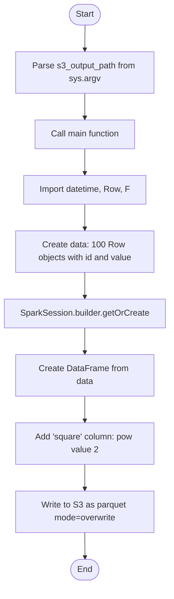
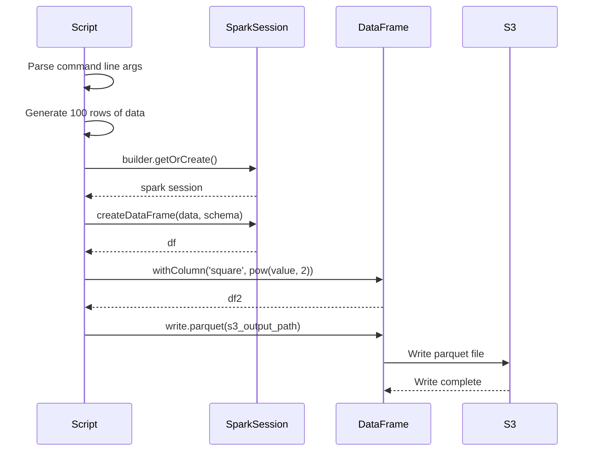

# Diagram: research/orchestrator/tasks/test/spark_test_spark.py


> Auto-generated by Obscura crawlers

## Diagram 1

```mermaid
flowchart TD
      Start([Start]) --> ParseArgs[Parse s3_output_path from sys.argv]
      ParseArgs --> Main[Call main function]
      Main --> ImportModules[Import datetime, Row, F]...
  └ 27 lines...

✗ read_bash
  Invalid shell ID: 0. Please supply a valid shell ID to read output from.

  <no active shell sessions>
```

> SVG rendering failed for this diagram.

## Diagram 2



### SVG

<svg id="container" width="316.984375" xmlns="http://www.w3.org/2000/svg" class="flowchart" height="1096" viewBox="0 0 316.984375 1096" role="graphics-document document" aria-roledescription="flowchart-v2"><style>#container{font-family:"trebuchet ms",verdana,arial,sans-serif;font-size:16px;fill:#333;}@keyframes edge-animation-frame{from{stroke-dashoffset:0;}}@keyframes dash{to{stroke-dashoffset:0;}}#container .edge-animation-slow{stroke-dasharray:9,5!important;stroke-dashoffset:900;animation:dash 50s linear infinite;stroke-linecap:round;}#container .edge-animation-fast{stroke-dasharray:9,5!important;stroke-dashoffset:900;animation:dash 20s linear infinite;stroke-linecap:round;}#container .error-icon{fill:#552222;}#container .error-text{fill:#552222;stroke:#552222;}#container .edge-thickness-normal{stroke-width:1px;}#container .edge-thickness-thick{stroke-width:3.5px;}#container .edge-pattern-solid{stroke-dasharray:0;}#container .edge-thickness-invisible{stroke-width:0;fill:none;}#container .edge-pattern-dashed{stroke-dasharray:3;}#container .edge-pattern-dotted{stroke-dasharray:2;}#container .marker{fill:#333333;stroke:#333333;}#container .marker.cross{stroke:#333333;}#container svg{font-family:"trebuchet ms",verdana,arial,sans-serif;font-size:16px;}#container p{margin:0;}#container .label{font-family:"trebuchet ms",verdana,arial,sans-serif;color:#333;}#container .cluster-label text{fill:#333;}#container .cluster-label span{color:#333;}#container .cluster-label span p{background-color:transparent;}#container .label text,#container span{fill:#333;color:#333;}#container .node rect,#container .node circle,#container .node ellipse,#container .node polygon,#container .node path{fill:#ECECFF;stroke:#9370DB;stroke-width:1px;}#container .rough-node .label text,#container .node .label text,#container .image-shape .label,#container .icon-shape .label{text-anchor:middle;}#container .node .katex path{fill:#000;stroke:#000;stroke-width:1px;}#container .rough-node .label,#container .node .label,#container .image-shape .label,#container .icon-shape .label{text-align:center;}#container .node.clickable{cursor:pointer;}#container .root .anchor path{fill:#333333!important;stroke-width:0;stroke:#333333;}#container .arrowheadPath{fill:#333333;}#container .edgePath .path{stroke:#333333;stroke-width:2.0px;}#container .flowchart-link{stroke:#333333;fill:none;}#container .edgeLabel{background-color:rgba(232,232,232, 0.8);text-align:center;}#container .edgeLabel p{background-color:rgba(232,232,232, 0.8);}#container .edgeLabel rect{opacity:0.5;background-color:rgba(232,232,232, 0.8);fill:rgba(232,232,232, 0.8);}#container .labelBkg{background-color:rgba(232, 232, 232, 0.5);}#container .cluster rect{fill:#ffffde;stroke:#aaaa33;stroke-width:1px;}#container .cluster text{fill:#333;}#container .cluster span{color:#333;}#container div.mermaidTooltip{position:absolute;text-align:center;max-width:200px;padding:2px;font-family:"trebuchet ms",verdana,arial,sans-serif;font-size:12px;background:hsl(80, 100%, 96.2745098039%);border:1px solid #aaaa33;border-radius:2px;pointer-events:none;z-index:100;}#container .flowchartTitleText{text-anchor:middle;font-size:18px;fill:#333;}#container rect.text{fill:none;stroke-width:0;}#container .icon-shape,#container .image-shape{background-color:rgba(232,232,232, 0.8);text-align:center;}#container .icon-shape p,#container .image-shape p{background-color:rgba(232,232,232, 0.8);padding:2px;}#container .icon-shape rect,#container .image-shape rect{opacity:0.5;background-color:rgba(232,232,232, 0.8);fill:rgba(232,232,232, 0.8);}#container .label-icon{display:inline-block;height:1em;overflow:visible;vertical-align:-0.125em;}#container .node .label-icon path{fill:currentColor;stroke:revert;stroke-width:revert;}#container :root{--mermaid-font-family:"trebuchet ms",verdana,arial,sans-serif;}</style><g><marker id="container_flowchart-v2-pointEnd" class="marker flowchart-v2" viewBox="0 0 10 10" refX="5" refY="5" markerUnits="userSpaceOnUse" markerWidth="8" markerHeight="8" orient="auto"><path d="M 0 0 L 10 5 L 0 10 z" class="arrowMarkerPath" style="stroke-width: 1; stroke-dasharray: 1, 0;"></path></marker><marker id="container_flowchart-v2-pointStart" class="marker flowchart-v2" viewBox="0 0 10 10" refX="4.5" refY="5" markerUnits="userSpaceOnUse" markerWidth="8" markerHeight="8" orient="auto"><path d="M 0 5 L 10 10 L 10 0 z" class="arrowMarkerPath" style="stroke-width: 1; stroke-dasharray: 1, 0;"></path></marker><marker id="container_flowchart-v2-circleEnd" class="marker flowchart-v2" viewBox="0 0 10 10" refX="11" refY="5" markerUnits="userSpaceOnUse" markerWidth="11" markerHeight="11" orient="auto"><circle cx="5" cy="5" r="5" class="arrowMarkerPath" style="stroke-width: 1; stroke-dasharray: 1, 0;"></circle></marker><marker id="container_flowchart-v2-circleStart" class="marker flowchart-v2" viewBox="0 0 10 10" refX="-1" refY="5" markerUnits="userSpaceOnUse" markerWidth="11" markerHeight="11" orient="auto"><circle cx="5" cy="5" r="5" class="arrowMarkerPath" style="stroke-width: 1; stroke-dasharray: 1, 0;"></circle></marker><marker id="container_flowchart-v2-crossEnd" class="marker cross flowchart-v2" viewBox="0 0 11 11" refX="12" refY="5.2" markerUnits="userSpaceOnUse" markerWidth="11" markerHeight="11" orient="auto"><path d="M 1,1 l 9,9 M 10,1 l -9,9" class="arrowMarkerPath" style="stroke-width: 2; stroke-dasharray: 1, 0;"></path></marker><marker id="container_flowchart-v2-crossStart" class="marker cross flowchart-v2" viewBox="0 0 11 11" refX="-1" refY="5.2" markerUnits="userSpaceOnUse" markerWidth="11" markerHeight="11" orient="auto"><path d="M 1,1 l 9,9 M 10,1 l -9,9" class="arrowMarkerPath" style="stroke-width: 2; stroke-dasharray: 1, 0;"></path></marker><g class="root"><g class="clusters"></g><g class="edgePaths"><path d="M158.992,47.5L158.909,51.583C158.826,55.667,158.659,63.833,158.576,71.417C158.492,79,158.492,86,158.492,89.5L158.492,93" id="L_Start_ParseArgs_0" class="edge-thickness-normal edge-pattern-solid edge-thickness-normal edge-pattern-solid flowchart-link" style=";" data-edge="true" data-et="edge" data-id="L_Start_ParseArgs_0" data-points="W3sieCI6MTU4Ljk5MjE4NzUsInkiOjQ3LjV9LHsieCI6MTU4LjQ5MjE4NzUsInkiOjcyfSx7IngiOjE1OC40OTIxODc1LCJ5Ijo5N31d" marker-end="url(#container_flowchart-v2-pointEnd)"></path><path d="M158.492,175L158.492,179.167C158.492,183.333,158.492,191.667,158.492,199.333C158.492,207,158.492,214,158.492,217.5L158.492,221" id="L_ParseArgs_Main_0" class="edge-thickness-normal edge-pattern-solid edge-thickness-normal edge-pattern-solid flowchart-link" style=";" data-edge="true" data-et="edge" data-id="L_ParseArgs_Main_0" data-points="W3sieCI6MTU4LjQ5MjE4NzUsInkiOjE3NX0seyJ4IjoxNTguNDkyMTg3NSwieSI6MjAwfSx7IngiOjE1OC40OTIxODc1LCJ5IjoyMjV9XQ==" marker-end="url(#container_flowchart-v2-pointEnd)"></path><path d="M158.492,279L158.492,283.167C158.492,287.333,158.492,295.667,158.492,303.333C158.492,311,158.492,318,158.492,321.5L158.492,325" id="L_Main_ImportModules_0" class="edge-thickness-normal edge-pattern-solid edge-thickness-normal edge-pattern-solid flowchart-link" style=";" data-edge="true" data-et="edge" data-id="L_Main_ImportModules_0" data-points="W3sieCI6MTU4LjQ5MjE4NzUsInkiOjI3OX0seyJ4IjoxNTguNDkyMTg3NSwieSI6MzA0fSx7IngiOjE1OC40OTIxODc1LCJ5IjozMjl9XQ==" marker-end="url(#container_flowchart-v2-pointEnd)"></path><path d="M158.492,383L158.492,387.167C158.492,391.333,158.492,399.667,158.492,407.333C158.492,415,158.492,422,158.492,425.5L158.492,429" id="L_ImportModules_CreateData_0" class="edge-thickness-normal edge-pattern-solid edge-thickness-normal edge-pattern-solid flowchart-link" style=";" data-edge="true" data-et="edge" data-id="L_ImportModules_CreateData_0" data-points="W3sieCI6MTU4LjQ5MjE4NzUsInkiOjM4M30seyJ4IjoxNTguNDkyMTg3NSwieSI6NDA4fSx7IngiOjE1OC40OTIxODc1LCJ5Ijo0MzN9XQ==" marker-end="url(#container_flowchart-v2-pointEnd)"></path><path d="M158.492,511L158.492,515.167C158.492,519.333,158.492,527.667,158.492,535.333C158.492,543,158.492,550,158.492,553.5L158.492,557" id="L_CreateData_CreateSession_0" class="edge-thickness-normal edge-pattern-solid edge-thickness-normal edge-pattern-solid flowchart-link" style=";" data-edge="true" data-et="edge" data-id="L_CreateData_CreateSession_0" data-points="W3sieCI6MTU4LjQ5MjE4NzUsInkiOjUxMX0seyJ4IjoxNTguNDkyMTg3NSwieSI6NTM2fSx7IngiOjE1OC40OTIxODc1LCJ5Ijo1NjF9XQ==" marker-end="url(#container_flowchart-v2-pointEnd)"></path><path d="M158.492,615L158.492,619.167C158.492,623.333,158.492,631.667,158.492,639.333C158.492,647,158.492,654,158.492,657.5L158.492,661" id="L_CreateSession_CreateDF_0" class="edge-thickness-normal edge-pattern-solid edge-thickness-normal edge-pattern-solid flowchart-link" style=";" data-edge="true" data-et="edge" data-id="L_CreateSession_CreateDF_0" data-points="W3sieCI6MTU4LjQ5MjE4NzUsInkiOjYxNX0seyJ4IjoxNTguNDkyMTg3NSwieSI6NjQwfSx7IngiOjE1OC40OTIxODc1LCJ5Ijo2NjV9XQ==" marker-end="url(#container_flowchart-v2-pointEnd)"></path><path d="M158.492,743L158.492,747.167C158.492,751.333,158.492,759.667,158.492,767.333C158.492,775,158.492,782,158.492,785.5L158.492,789" id="L_CreateDF_AddColumn_0" class="edge-thickness-normal edge-pattern-solid edge-thickness-normal edge-pattern-solid flowchart-link" style=";" data-edge="true" data-et="edge" data-id="L_CreateDF_AddColumn_0" data-points="W3sieCI6MTU4LjQ5MjE4NzUsInkiOjc0M30seyJ4IjoxNTguNDkyMTg3NSwieSI6NzY4fSx7IngiOjE1OC40OTIxODc1LCJ5Ijo3OTN9XQ==" marker-end="url(#container_flowchart-v2-pointEnd)"></path><path d="M158.492,871L158.492,875.167C158.492,879.333,158.492,887.667,158.492,895.333C158.492,903,158.492,910,158.492,913.5L158.492,917" id="L_AddColumn_WriteParquet_0" class="edge-thickness-normal edge-pattern-solid edge-thickness-normal edge-pattern-solid flowchart-link" style=";" data-edge="true" data-et="edge" data-id="L_AddColumn_WriteParquet_0" data-points="W3sieCI6MTU4LjQ5MjE4NzUsInkiOjg3MX0seyJ4IjoxNTguNDkyMTg3NSwieSI6ODk2fSx7IngiOjE1OC40OTIxODc1LCJ5Ijo5MjF9XQ==" marker-end="url(#container_flowchart-v2-pointEnd)"></path><path d="M158.492,999L158.492,1003.167C158.492,1007.333,158.492,1015.667,158.562,1023.417C158.633,1031.167,158.773,1038.334,158.844,1041.917L158.914,1045.501" id="L_WriteParquet_End_0" class="edge-thickness-normal edge-pattern-solid edge-thickness-normal edge-pattern-solid flowchart-link" style=";" data-edge="true" data-et="edge" data-id="L_WriteParquet_End_0" data-points="W3sieCI6MTU4LjQ5MjE4NzUsInkiOjk5OX0seyJ4IjoxNTguNDkyMTg3NSwieSI6MTAyNH0seyJ4IjoxNTguOTkyMTg3NSwieSI6MTA0OS41fV0=" marker-end="url(#container_flowchart-v2-pointEnd)"></path></g><g class="edgeLabels"><g class="edgeLabel"><g class="label" data-id="L_Start_ParseArgs_0" transform="translate(0, 0)"><foreignObject width="0" height="0"><div xmlns="http://www.w3.org/1999/xhtml" class="labelBkg" style="display: table-cell; white-space: nowrap; line-height: 1.5; max-width: 200px; text-align: center;"><span class="edgeLabel"></span></div></foreignObject></g></g><g class="edgeLabel"><g class="label" data-id="L_ParseArgs_Main_0" transform="translate(0, 0)"><foreignObject width="0" height="0"><div xmlns="http://www.w3.org/1999/xhtml" class="labelBkg" style="display: table-cell; white-space: nowrap; line-height: 1.5; max-width: 200px; text-align: center;"><span class="edgeLabel"></span></div></foreignObject></g></g><g class="edgeLabel"><g class="label" data-id="L_Main_ImportModules_0" transform="translate(0, 0)"><foreignObject width="0" height="0"><div xmlns="http://www.w3.org/1999/xhtml" class="labelBkg" style="display: table-cell; white-space: nowrap; line-height: 1.5; max-width: 200px; text-align: center;"><span class="edgeLabel"></span></div></foreignObject></g></g><g class="edgeLabel"><g class="label" data-id="L_ImportModules_CreateData_0" transform="translate(0, 0)"><foreignObject width="0" height="0"><div xmlns="http://www.w3.org/1999/xhtml" class="labelBkg" style="display: table-cell; white-space: nowrap; line-height: 1.5; max-width: 200px; text-align: center;"><span class="edgeLabel"></span></div></foreignObject></g></g><g class="edgeLabel"><g class="label" data-id="L_CreateData_CreateSession_0" transform="translate(0, 0)"><foreignObject width="0" height="0"><div xmlns="http://www.w3.org/1999/xhtml" class="labelBkg" style="display: table-cell; white-space: nowrap; line-height: 1.5; max-width: 200px; text-align: center;"><span class="edgeLabel"></span></div></foreignObject></g></g><g class="edgeLabel"><g class="label" data-id="L_CreateSession_CreateDF_0" transform="translate(0, 0)"><foreignObject width="0" height="0"><div xmlns="http://www.w3.org/1999/xhtml" class="labelBkg" style="display: table-cell; white-space: nowrap; line-height: 1.5; max-width: 200px; text-align: center;"><span class="edgeLabel"></span></div></foreignObject></g></g><g class="edgeLabel"><g class="label" data-id="L_CreateDF_AddColumn_0" transform="translate(0, 0)"><foreignObject width="0" height="0"><div xmlns="http://www.w3.org/1999/xhtml" class="labelBkg" style="display: table-cell; white-space: nowrap; line-height: 1.5; max-width: 200px; text-align: center;"><span class="edgeLabel"></span></div></foreignObject></g></g><g class="edgeLabel"><g class="label" data-id="L_AddColumn_WriteParquet_0" transform="translate(0, 0)"><foreignObject width="0" height="0"><div xmlns="http://www.w3.org/1999/xhtml" class="labelBkg" style="display: table-cell; white-space: nowrap; line-height: 1.5; max-width: 200px; text-align: center;"><span class="edgeLabel"></span></div></foreignObject></g></g><g class="edgeLabel"><g class="label" data-id="L_WriteParquet_End_0" transform="translate(0, 0)"><foreignObject width="0" height="0"><div xmlns="http://www.w3.org/1999/xhtml" class="labelBkg" style="display: table-cell; white-space: nowrap; line-height: 1.5; max-width: 200px; text-align: center;"><span class="edgeLabel"></span></div></foreignObject></g></g></g><g class="nodes"><g class="node default" id="flowchart-Start-0" transform="translate(158.4921875, 27.5)"><g class="basic label-container outer-path"><path d="M-10.3984375 -19.5 C-3.360710146035019 -19.5, 3.6770172079299623 -19.5, 10.3984375 -19.5 C10.3984375 -19.5, 10.3984375 -19.5, 10.398437499999998 -19.5 C10.652416891836708 -19.491855375244693, 10.906396283673418 -19.483710750489386, 11.6478067896239 -19.45993515863156 C11.945626463169345 -19.43120485290519, 12.24344613671479 -19.402474547178823, 12.892042152847864 -19.3399052695533 C13.234887144633277 -19.284476750084053, 13.577732136418689 -19.22904823061481, 14.126030759676757 -19.140403561325776 C14.474206268835418 -19.060934773417845, 14.822381777994078 -18.98146598550991, 15.34470188623539 -18.862249829261074 C15.756127100937796 -18.740140985152422, 16.1675523156402 -18.61803214104377, 16.543047751460602 -18.50658706670804 C16.819820409473646 -18.404732170100836, 17.09659306748669 -18.30287727349363, 17.716144095147794 -18.074876768247425 C18.040802262950816 -17.931160228003396, 18.365460430753842 -17.787443687759367, 18.85917041279238 -17.568892924097174 C19.2648937308271 -17.35722732895665, 19.67061704886182 -17.145561733816127, 19.967429764076783 -16.990714730406097 C20.20698397913174 -16.845495557462954, 20.446538194186697 -16.70027638451981, 21.036368073605697 -16.342718045390892 C21.28303213031067 -16.17065587734842, 21.52969618701564 -15.998593709305949, 22.061592844578712 -15.627565626425154 C22.341497019867063 -15.404349495195618, 22.621401195155414 -15.181133363966081, 23.03889120850187 -14.848196188198123 C23.268707234586287 -14.6394833539071, 23.498523260670705 -14.430770519616075, 23.964247236767985 -14.007812326905688 C24.241399739830022 -13.721629612850453, 24.51855224289206 -13.43544689879522, 24.833858442968648 -13.10986736009568 C25.09465856482201 -12.803516697019392, 25.355458686675373 -12.497166033943104, 25.644151408126582 -12.158051136245305 C25.819422172771972 -11.923204279115625, 25.99469293741736 -11.688357421985943, 26.391796464640635 -11.156274872382312 C26.594681882252274 -10.844588388567956, 26.79756729986391 -10.532901904753603, 27.073721378604247 -10.108655082055241 C27.247020357712177 -9.800945196224593, 27.420319336820107 -9.493235310393942, 27.6871239742735 -9.019496659696287 C27.873525802451294 -8.632429275124895, 28.05992763062909 -8.245361890553506, 28.22948364880834 -7.893275190886684 C28.40620019172595 -7.456781913298257, 28.58291673464356 -7.02028863570983, 28.698571729970325 -6.734618561215508 C28.835734990889538 -6.321504673324633, 28.97289825180875 -5.908390785433758, 29.09246063421488 -5.548287939305138 C29.176315333090177 -5.228513629637251, 29.260170031965473 -4.9087393199693645, 29.40953178754556 -4.339158212148133 C29.49133425692087 -3.9191198208639424, 29.57313672629618 -3.499081429579751, 29.648482276581777 -3.1121979531509023 C29.685103701049076 -2.8281694167007654, 29.72172512551637 -2.544140880250629, 29.808330202509367 -1.872449005199798 C29.83576682319314 -1.4451014916083949, 29.863203443876916 -1.0177539780169917, 29.888418715913414 -0.6250057626472757 C29.888418715913414 -0.2782368611572355, 29.888418715913414 0.06853204033280469, 29.888418715913414 0.625005762647271 C29.85761811686214 1.1047499546669188, 29.82681751781087 1.5844941466865667, 29.808330202509367 1.8724490051997846 C29.745871864752594 2.3568635390474775, 29.68341352699582 2.8412780728951708, 29.648482276581777 3.1121979531508885 C29.55737061726882 3.5800370672669164, 29.466258957955862 4.047876181382945, 29.40953178754556 4.339158212148129 C29.31306800385908 4.707016427012994, 29.2166042201726 5.0748746418778605, 29.092460634214884 5.548287939305125 C28.968215397191933 5.922494797428051, 28.843970160168986 6.296701655550976, 28.69857172997033 6.734618561215495 C28.578489216725885 7.0312246905667255, 28.45840670348144 7.327830819917956, 28.229483648808344 7.893275190886679 C28.04575510649805 8.274791440155056, 27.86202656418775 8.656307689423432, 27.687123974273504 9.019496659696284 C27.504295671528094 9.34412682459393, 27.321467368782688 9.668756989491577, 27.07372137860425 10.108655082055236 C26.924091192303692 10.338527229543836, 26.77446100600313 10.568399377032435, 26.39179646464064 11.156274872382301 C26.227664528084183 11.376196714640926, 26.06353259152773 11.596118556899553, 25.644151408126582 12.158051136245302 C25.437694665460608 12.40056697390221, 25.231237922794637 12.643082811559118, 24.83385844296866 13.10986736009567 C24.642225746617726 13.307743852414978, 24.450593050266797 13.505620344734286, 23.96424723676799 14.007812326905684 C23.623390720804775 14.317369196134267, 23.282534204841557 14.62692606536285, 23.038891208501887 14.848196188198111 C22.74983151517318 15.078713601426264, 22.46077182184447 15.309231014654417, 22.061592844578715 15.627565626425152 C21.797925388047172 15.811488630121325, 21.534257931515633 15.995411633817497, 21.036368073605708 16.34271804539089 C20.77145480837977 16.503310023574002, 20.50654154315383 16.663902001757116, 19.967429764076787 16.990714730406093 C19.61708536070244 17.17348918124019, 19.26674095732809 17.35626363207429, 18.859170412792388 17.56889292409717 C18.42642223773758 17.76045770417542, 17.993674062682775 17.95202248425367, 17.716144095147804 18.07487676824742 C17.462881024635237 18.168079919334204, 17.20961795412267 18.26128307042099, 16.543047751460616 18.506587066708033 C16.243437146503197 18.59550992157124, 15.943826541545777 18.68443277643444, 15.344701886235413 18.86224982926107 C14.927870056021076 18.957388974425594, 14.51103822580674 19.05252811959012, 14.126030759676766 19.140403561325773 C13.815349207191554 19.19063214536016, 13.504667654706342 19.240860729394544, 12.892042152847878 19.3399052695533 C12.635258943132767 19.364676836967522, 12.378475733417655 19.389448404381746, 11.6478067896239 19.45993515863156 C11.155033043380357 19.47573745354768, 10.662259297136814 19.491539748463797, 10.398437500000004 19.5 C10.398437500000002 19.5, 10.398437500000002 19.5, 10.3984375 19.5 C5.79861017218696 19.5, 1.1987828443739197 19.5, -10.398437499999996 19.5 C-10.853611554506292 19.485403454014534, -11.308785609012586 19.47080690802907, -11.647806789623893 19.45993515863156 C-12.074384788171027 19.41878369214682, -12.500962786718162 19.37763222566208, -12.892042152847871 19.3399052695533 C-13.267357925599713 19.27922712603207, -13.642673698351555 19.21854898251084, -14.126030759676759 19.140403561325773 C-14.601618811799728 19.031853691930785, -15.077206863922697 18.923303822535793, -15.344701886235388 18.862249829261074 C-15.819412575931533 18.72135818836652, -16.29412326562768 18.58046654747196, -16.54304775146059 18.506587066708043 C-16.88197939798307 18.381857087737977, -17.22091104450555 18.257127108767907, -17.716144095147797 18.074876768247425 C-18.045602159288002 17.929035456278793, -18.375060223428207 17.78319414431016, -18.85917041279238 17.568892924097174 C-19.297883419805114 17.340016629347723, -19.736596426817844 17.111140334598275, -19.96742976407678 16.990714730406097 C-20.362645951828203 16.751132354843065, -20.75786213957963 16.511549979280034, -21.036368073605686 16.3427180453909 C-21.34457633186462 16.12772530654993, -21.652784590123552 15.912732567708964, -22.061592844578712 15.627565626425156 C-22.418135055934115 15.343232700855934, -22.774677267289523 15.058899775286713, -23.03889120850187 14.848196188198125 C-23.2382693306218 14.667126252944838, -23.437647452741736 14.48605631769155, -23.964247236767974 14.007812326905697 C-24.236665786008917 13.726517808835581, -24.509084335249863 13.445223290765464, -24.833858442968655 13.109867360095677 C-25.03123187941126 12.878021290783504, -25.228605315853862 12.646175221471333, -25.64415140812658 12.158051136245307 C-25.830585146925113 11.90824691071828, -26.017018885723648 11.65844268519125, -26.391796464640635 11.156274872382316 C-26.594114675968967 10.84545976973533, -26.796432887297303 10.534644667088342, -27.073721378604244 10.108655082055249 C-27.300743421385626 9.705554456622286, -27.52776546416701 9.302453831189325, -27.6871239742735 9.019496659696289 C-27.864474423676864 8.65122465681849, -28.041824873080223 8.28295265394069, -28.22948364880834 7.893275190886686 C-28.370561496660713 7.544810179136693, -28.511639344513085 7.1963451673867, -28.698571729970325 6.73461856121551 C-28.792353701444174 6.452162205264253, -28.88613567291802 6.169705849312997, -29.09246063421488 5.5482879393051325 C-29.194481489152174 5.159238203311002, -29.29650234408947 4.770188467316872, -29.409531787545557 4.339158212148136 C-29.46877101191468 4.034977315227199, -29.5280102362838 3.730796418306262, -29.648482276581777 3.112197953150904 C-29.697458247863853 2.7323499912865654, -29.74643421914593 2.3525020294222267, -29.808330202509364 1.872449005199809 C-29.84002631982886 1.3787563933032714, -29.871722437148353 0.8850637814067337, -29.888418715913414 0.6250057626472781 C-29.888418715913414 0.3062872978021925, -29.888418715913414 -0.012431167042893154, -29.888418715913414 -0.6250057626472687 C-29.86688720412939 -0.9603764386069447, -29.845355692345365 -1.2957471145666206, -29.808330202509367 -1.8724490051997822 C-29.7569173855908 -2.2711966606111433, -29.705504568672236 -2.6699443160225043, -29.648482276581777 -3.112197953150895 C-29.58152935392728 -3.4559870604765193, -29.514576431272786 -3.799776167802144, -29.40953178754556 -4.339158212148126 C-29.303657592950668 -4.742902402304647, -29.197783398355778 -5.146646592461168, -29.092460634214884 -5.548287939305123 C-28.993684570857134 -5.845785704310211, -28.894908507499384 -6.1432834693153, -28.698571729970332 -6.734618561215485 C-28.52569580468755 -7.161625438992592, -28.35281987940477 -7.588632316769701, -28.229483648808344 -7.893275190886676 C-28.11623220974396 -8.128444227296477, -28.002980770679578 -8.363613263706279, -27.687123974273504 -9.019496659696282 C-27.556032543190803 -9.25226277003045, -27.424941112108097 -9.485028880364618, -27.073721378604247 -10.108655082055243 C-26.888203071971745 -10.39366101968337, -26.70268476533924 -10.678666957311494, -26.39179646464064 -11.156274872382308 C-26.22386577678733 -11.381286695305358, -26.055935088934017 -11.606298518228407, -25.644151408126586 -12.158051136245302 C-25.433755071921134 -12.405194644642902, -25.223358735715685 -12.652338153040505, -24.833858442968662 -13.10986736009567 C-24.560418884993723 -13.392216153510013, -24.286979327018784 -13.674564946924356, -23.964247236767996 -14.007812326905677 C-23.760426109434714 -14.19291728193825, -23.556604982101437 -14.378022236970821, -23.038891208501887 -14.848196188198107 C-22.700337029433875 -15.118184136699776, -22.361782850365863 -15.388172085201447, -22.06159284457872 -15.627565626425149 C-21.799777893026544 -15.810196402841363, -21.537962941474365 -15.992827179257578, -21.03636807360571 -16.342718045390885 C-20.640303258188663 -16.582814864031906, -20.244238442771614 -16.82291168267293, -19.96742976407679 -16.99071473040609 C-19.535129226714236 -17.216245643846424, -19.102828689351686 -17.441776557286758, -18.859170412792388 -17.56889292409717 C-18.596620980297715 -17.685115769610363, -18.334071547803042 -17.80133861512356, -17.716144095147804 -18.07487676824742 C-17.425811185909595 -18.181721962655075, -17.13547827667139 -18.288567157062726, -16.54304775146062 -18.506587066708033 C-16.27409439592264 -18.586411010866733, -16.005141040384657 -18.666234955025434, -15.344701886235413 -18.862249829261067 C-15.05677142311771 -18.927968078545817, -14.768840960000006 -18.993686327830567, -14.126030759676768 -19.140403561325773 C-13.649521432153566 -19.217441894014698, -13.173012104630365 -19.294480226703627, -12.89204215284788 -19.3399052695533 C-12.466217926283932 -19.380984020561364, -12.040393699719983 -19.42206277156943, -11.647806789623903 -19.45993515863156 C-11.295010780981649 -19.471248639952943, -10.942214772339394 -19.482562121274327, -10.398437500000005 -19.5 C-10.398437500000004 -19.5, -10.398437500000002 -19.5, -10.3984375 -19.5" stroke="none" stroke-width="0" fill="#ECECFF" style=""></path><path d="M-10.3984375 -19.5 C-3.3448288069822683 -19.5, 3.7087798860354635 -19.5, 10.3984375 -19.5 M-10.3984375 -19.5 C-4.4756139038307206 -19.5, 1.447209692338559 -19.5, 10.3984375 -19.5 M10.3984375 -19.5 C10.3984375 -19.5, 10.398437499999998 -19.5, 10.398437499999998 -19.5 M10.3984375 -19.5 C10.3984375 -19.5, 10.398437499999998 -19.5, 10.398437499999998 -19.5 M10.398437499999998 -19.5 C10.72204893521822 -19.489622411143998, 11.045660370436442 -19.479244822287995, 11.6478067896239 -19.45993515863156 M10.398437499999998 -19.5 C10.826508415417766 -19.486272598932043, 11.254579330835536 -19.472545197864086, 11.6478067896239 -19.45993515863156 M11.6478067896239 -19.45993515863156 C11.997961881659311 -19.426156118026014, 12.348116973694722 -19.392377077420466, 12.892042152847864 -19.3399052695533 M11.6478067896239 -19.45993515863156 C12.142371304416043 -19.41222511469041, 12.636935819208189 -19.364515070749263, 12.892042152847864 -19.3399052695533 M12.892042152847864 -19.3399052695533 C13.159779360546729 -19.296619594145604, 13.427516568245595 -19.253333918737905, 14.126030759676757 -19.140403561325776 M12.892042152847864 -19.3399052695533 C13.256762396172858 -19.280940129060244, 13.621482639497854 -19.22197498856719, 14.126030759676757 -19.140403561325776 M14.126030759676757 -19.140403561325776 C14.470522077465105 -19.061775666056523, 14.815013395253454 -18.98314777078727, 15.34470188623539 -18.862249829261074 M14.126030759676757 -19.140403561325776 C14.514422571786254 -19.05175566470522, 14.90281438389575 -18.96310776808466, 15.34470188623539 -18.862249829261074 M15.34470188623539 -18.862249829261074 C15.790833911768866 -18.729840185877528, 16.236965937302344 -18.59743054249398, 16.543047751460602 -18.50658706670804 M15.34470188623539 -18.862249829261074 C15.773293335640435 -18.735046136800083, 16.201884785045483 -18.60784244433909, 16.543047751460602 -18.50658706670804 M16.543047751460602 -18.50658706670804 C16.930542075505542 -18.363985573501235, 17.31803639955048 -18.221384080294435, 17.716144095147794 -18.074876768247425 M16.543047751460602 -18.50658706670804 C16.792871937930112 -18.414649456737795, 17.042696124399622 -18.32271184676755, 17.716144095147794 -18.074876768247425 M17.716144095147794 -18.074876768247425 C17.96223236217797 -17.965940792382238, 18.208320629208146 -17.857004816517055, 18.85917041279238 -17.568892924097174 M17.716144095147794 -18.074876768247425 C18.018458280969814 -17.94105124601571, 18.320772466791837 -17.807225723783997, 18.85917041279238 -17.568892924097174 M18.85917041279238 -17.568892924097174 C19.242921831895686 -17.368690054555497, 19.626673250998987 -17.168487185013817, 19.967429764076783 -16.990714730406097 M18.85917041279238 -17.568892924097174 C19.198010321714374 -17.39212036064989, 19.536850230636365 -17.215347797202607, 19.967429764076783 -16.990714730406097 M19.967429764076783 -16.990714730406097 C20.27832501802843 -16.8022482004373, 20.58922027198007 -16.613781670468505, 21.036368073605697 -16.342718045390892 M19.967429764076783 -16.990714730406097 C20.212555189379966 -16.842118257070414, 20.45768061468315 -16.693521783734727, 21.036368073605697 -16.342718045390892 M21.036368073605697 -16.342718045390892 C21.425280062783166 -16.07142987746936, 21.81419205196063 -15.800141709547825, 22.061592844578712 -15.627565626425154 M21.036368073605697 -16.342718045390892 C21.335631389976346 -16.133964910790898, 21.634894706346998 -15.925211776190903, 22.061592844578712 -15.627565626425154 M22.061592844578712 -15.627565626425154 C22.27114446931392 -15.460453782101753, 22.48069609404913 -15.29334193777835, 23.03889120850187 -14.848196188198123 M22.061592844578712 -15.627565626425154 C22.401007892771016 -15.356891157705553, 22.74042294096332 -15.08621668898595, 23.03889120850187 -14.848196188198123 M23.03889120850187 -14.848196188198123 C23.405770232214774 -14.515006365949102, 23.772649255927675 -14.181816543700078, 23.964247236767985 -14.007812326905688 M23.03889120850187 -14.848196188198123 C23.274442202739763 -14.634275007569055, 23.509993196977653 -14.420353826939989, 23.964247236767985 -14.007812326905688 M23.964247236767985 -14.007812326905688 C24.253677234700497 -13.708952091395611, 24.543107232633012 -13.410091855885536, 24.833858442968648 -13.10986736009568 M23.964247236767985 -14.007812326905688 C24.27245239069968 -13.689565201357482, 24.580657544631375 -13.371318075809274, 24.833858442968648 -13.10986736009568 M24.833858442968648 -13.10986736009568 C25.0435094683821 -12.863599336163746, 25.253160493795555 -12.61733131223181, 25.644151408126582 -12.158051136245305 M24.833858442968648 -13.10986736009568 C25.150306892343096 -12.738149005033586, 25.466755341717544 -12.366430649971493, 25.644151408126582 -12.158051136245305 M25.644151408126582 -12.158051136245305 C25.897122841988075 -11.819092461042633, 26.15009427584957 -11.480133785839959, 26.391796464640635 -11.156274872382312 M25.644151408126582 -12.158051136245305 C25.86193815565172 -11.866236735342483, 26.079724903176857 -11.57442233443966, 26.391796464640635 -11.156274872382312 M26.391796464640635 -11.156274872382312 C26.573693062870756 -10.876832851425126, 26.755589661100878 -10.59739083046794, 27.073721378604247 -10.108655082055241 M26.391796464640635 -11.156274872382312 C26.60330343403758 -10.831343369814908, 26.81481040343453 -10.506411867247504, 27.073721378604247 -10.108655082055241 M27.073721378604247 -10.108655082055241 C27.30424828337996 -9.699331219245586, 27.534775188155674 -9.290007356435929, 27.6871239742735 -9.019496659696287 M27.073721378604247 -10.108655082055241 C27.222062970112376 -9.845259565117573, 27.370404561620507 -9.581864048179906, 27.6871239742735 -9.019496659696287 M27.6871239742735 -9.019496659696287 C27.795799004710545 -8.79383063372061, 27.904474035147594 -8.568164607744935, 28.22948364880834 -7.893275190886684 M27.6871239742735 -9.019496659696287 C27.856512580446637 -8.667757594642206, 28.025901186619773 -8.316018529588124, 28.22948364880834 -7.893275190886684 M28.22948364880834 -7.893275190886684 C28.378320281255007 -7.525645831182891, 28.52715691370167 -7.158016471479099, 28.698571729970325 -6.734618561215508 M28.22948364880834 -7.893275190886684 C28.398797283687028 -7.475067239279893, 28.56811091856571 -7.056859287673101, 28.698571729970325 -6.734618561215508 M28.698571729970325 -6.734618561215508 C28.788770401326865 -6.462954534296246, 28.878969072683404 -6.1912905073769835, 29.09246063421488 -5.548287939305138 M28.698571729970325 -6.734618561215508 C28.83321072319548 -6.329107365431696, 28.967849716420638 -5.923596169647884, 29.09246063421488 -5.548287939305138 M29.09246063421488 -5.548287939305138 C29.17770092681801 -5.223229760232907, 29.262941219421137 -4.898171581160675, 29.40953178754556 -4.339158212148133 M29.09246063421488 -5.548287939305138 C29.158177391255915 -5.297681462885002, 29.223894148296953 -5.047074986464866, 29.40953178754556 -4.339158212148133 M29.40953178754556 -4.339158212148133 C29.50016997587536 -3.873750271462504, 29.590808164205157 -3.408342330776875, 29.648482276581777 -3.1121979531509023 M29.40953178754556 -4.339158212148133 C29.484458328696004 -3.9544262590706802, 29.55938486984645 -3.569694305993227, 29.648482276581777 -3.1121979531509023 M29.648482276581777 -3.1121979531509023 C29.701117616524105 -2.7039686505817313, 29.753752956466432 -2.2957393480125603, 29.808330202509367 -1.872449005199798 M29.648482276581777 -3.1121979531509023 C29.711875430543582 -2.6205331694173357, 29.775268584505383 -2.1288683856837696, 29.808330202509367 -1.872449005199798 M29.808330202509367 -1.872449005199798 C29.834949176462395 -1.4578369994323104, 29.861568150415426 -1.0432249936648228, 29.888418715913414 -0.6250057626472757 M29.808330202509367 -1.872449005199798 C29.824389645781377 -1.6223102132889584, 29.840449089053386 -1.3721714213781189, 29.888418715913414 -0.6250057626472757 M29.888418715913414 -0.6250057626472757 C29.888418715913414 -0.31625965366045417, 29.888418715913414 -0.007513544673632633, 29.888418715913414 0.625005762647271 M29.888418715913414 -0.6250057626472757 C29.888418715913414 -0.2323635392103835, 29.888418715913414 0.1602786842265087, 29.888418715913414 0.625005762647271 M29.888418715913414 0.625005762647271 C29.861833874476574 1.0390861269238598, 29.83524903303973 1.4531664912004487, 29.808330202509367 1.8724490051997846 M29.888418715913414 0.625005762647271 C29.870349931230088 0.9064416689505413, 29.852281146546765 1.1878775752538115, 29.808330202509367 1.8724490051997846 M29.808330202509367 1.8724490051997846 C29.759641334440396 2.2500702512382174, 29.710952466371428 2.62769149727665, 29.648482276581777 3.1121979531508885 M29.808330202509367 1.8724490051997846 C29.772257858321144 2.1522189834335927, 29.73618551413292 2.4319889616674004, 29.648482276581777 3.1121979531508885 M29.648482276581777 3.1121979531508885 C29.577201036588168 3.478212055222661, 29.50591979659456 3.8442261572944334, 29.40953178754556 4.339158212148129 M29.648482276581777 3.1121979531508885 C29.5969191370498 3.376963776774199, 29.54535599751782 3.6417296003975097, 29.40953178754556 4.339158212148129 M29.40953178754556 4.339158212148129 C29.321702293513503 4.674090138435868, 29.233872799481446 5.009022064723607, 29.092460634214884 5.548287939305125 M29.40953178754556 4.339158212148129 C29.297397311948558 4.766775566988643, 29.18526283635156 5.194392921829158, 29.092460634214884 5.548287939305125 M29.092460634214884 5.548287939305125 C29.00246265506731 5.819347513266953, 28.912464675919733 6.090407087228781, 28.69857172997033 6.734618561215495 M29.092460634214884 5.548287939305125 C28.94775441633738 5.984120011747397, 28.80304819845987 6.419952084189669, 28.69857172997033 6.734618561215495 M28.69857172997033 6.734618561215495 C28.535329868894813 7.1378291141387, 28.372088007819297 7.541039667061905, 28.229483648808344 7.893275190886679 M28.69857172997033 6.734618561215495 C28.543848690515457 7.1167874600354954, 28.389125651060585 7.498956358855497, 28.229483648808344 7.893275190886679 M28.229483648808344 7.893275190886679 C28.055774961325223 8.253984997215877, 27.882066273842103 8.614694803545076, 27.687123974273504 9.019496659696284 M28.229483648808344 7.893275190886679 C28.100089036395143 8.161965872163872, 27.970694423981946 8.430656553441064, 27.687123974273504 9.019496659696284 M27.687123974273504 9.019496659696284 C27.44253488688534 9.45378935168474, 27.19794579949718 9.888082043673197, 27.07372137860425 10.108655082055236 M27.687123974273504 9.019496659696284 C27.487054751620295 9.374739823722681, 27.286985528967087 9.72998298774908, 27.07372137860425 10.108655082055236 M27.07372137860425 10.108655082055236 C26.928343210623307 10.331994987578113, 26.782965042642363 10.55533489310099, 26.39179646464064 11.156274872382301 M27.07372137860425 10.108655082055236 C26.84086923148032 10.466378509594062, 26.608017084356383 10.82410193713289, 26.39179646464064 11.156274872382301 M26.39179646464064 11.156274872382301 C26.217603477038693 11.389677606461278, 26.043410489436745 11.623080340540257, 25.644151408126582 12.158051136245302 M26.39179646464064 11.156274872382301 C26.125336208040267 11.513307341198045, 25.858875951439888 11.87033981001379, 25.644151408126582 12.158051136245302 M25.644151408126582 12.158051136245302 C25.46213154351627 12.371862026440276, 25.280111678905964 12.585672916635248, 24.83385844296866 13.10986736009567 M25.644151408126582 12.158051136245302 C25.400115081676528 12.444710091353885, 25.156078755226474 12.731369046462468, 24.83385844296866 13.10986736009567 M24.83385844296866 13.10986736009567 C24.637795923591796 13.312318008384485, 24.441733404214933 13.5147686566733, 23.96424723676799 14.007812326905684 M24.83385844296866 13.10986736009567 C24.544937121971184 13.408202344907167, 24.256015800973707 13.706537329718662, 23.96424723676799 14.007812326905684 M23.96424723676799 14.007812326905684 C23.65033727537518 14.292897048240187, 23.336427313982373 14.577981769574691, 23.038891208501887 14.848196188198111 M23.96424723676799 14.007812326905684 C23.717811535781752 14.23161871021004, 23.471375834795516 14.455425093514394, 23.038891208501887 14.848196188198111 M23.038891208501887 14.848196188198111 C22.7260383907088 15.097687985024972, 22.413185572915715 15.347179781851834, 22.061592844578715 15.627565626425152 M23.038891208501887 14.848196188198111 C22.71349719186346 15.107689257368815, 22.388103175225037 15.367182326539517, 22.061592844578715 15.627565626425152 M22.061592844578715 15.627565626425152 C21.747506200114223 15.846658873011883, 21.43341955564973 16.065752119598613, 21.036368073605708 16.34271804539089 M22.061592844578715 15.627565626425152 C21.719033746090485 15.86652002438617, 21.376474647602258 16.10547442234719, 21.036368073605708 16.34271804539089 M21.036368073605708 16.34271804539089 C20.816802182345967 16.475820178984943, 20.59723629108623 16.608922312578997, 19.967429764076787 16.990714730406093 M21.036368073605708 16.34271804539089 C20.63274309371253 16.5873978801658, 20.229118113819357 16.832077714940706, 19.967429764076787 16.990714730406093 M19.967429764076787 16.990714730406093 C19.693905252824763 17.133412292725463, 19.420380741572735 17.276109855044833, 18.859170412792388 17.56889292409717 M19.967429764076787 16.990714730406093 C19.71134523547335 17.124313864948537, 19.455260706869915 17.25791299949098, 18.859170412792388 17.56889292409717 M18.859170412792388 17.56889292409717 C18.556879165667045 17.702708292048317, 18.2545879185417 17.836523659999465, 17.716144095147804 18.07487676824742 M18.859170412792388 17.56889292409717 C18.604627940658094 17.681571325776865, 18.350085468523798 17.79424972745656, 17.716144095147804 18.07487676824742 M17.716144095147804 18.07487676824742 C17.394872795939342 18.19310757615547, 17.073601496730877 18.311338384063518, 16.543047751460616 18.506587066708033 M17.716144095147804 18.07487676824742 C17.318905262046112 18.221064330864362, 16.92166642894442 18.367251893481306, 16.543047751460616 18.506587066708033 M16.543047751460616 18.506587066708033 C16.130698924564804 18.62897003406755, 15.718350097668994 18.751353001427066, 15.344701886235413 18.86224982926107 M16.543047751460616 18.506587066708033 C16.257599485885795 18.59130661358212, 15.972151220310975 18.676026160456203, 15.344701886235413 18.86224982926107 M15.344701886235413 18.86224982926107 C14.948182906719829 18.952752698807345, 14.551663927204247 19.043255568353615, 14.126030759676766 19.140403561325773 M15.344701886235413 18.86224982926107 C14.858599500099427 18.97319952678209, 14.372497113963439 19.084149224303108, 14.126030759676766 19.140403561325773 M14.126030759676766 19.140403561325773 C13.676107628792774 19.213143643921107, 13.226184497908784 19.28588372651644, 12.892042152847878 19.3399052695533 M14.126030759676766 19.140403561325773 C13.684575879173613 19.211774562871796, 13.24312099867046 19.283145564417815, 12.892042152847878 19.3399052695533 M12.892042152847878 19.3399052695533 C12.576992948056256 19.370297687437443, 12.261943743264636 19.400690105321587, 11.6478067896239 19.45993515863156 M12.892042152847878 19.3399052695533 C12.496467004575194 19.378065928358446, 12.10089185630251 19.41622658716359, 11.6478067896239 19.45993515863156 M11.6478067896239 19.45993515863156 C11.218602887038118 19.47369889239277, 10.789398984452337 19.487462626153977, 10.398437500000004 19.5 M11.6478067896239 19.45993515863156 C11.264288490824477 19.472233844000975, 10.880770192025055 19.484532529370387, 10.398437500000004 19.5 M10.398437500000004 19.5 C10.398437500000004 19.5, 10.398437500000002 19.5, 10.3984375 19.5 M10.398437500000004 19.5 C10.398437500000002 19.5, 10.398437500000002 19.5, 10.3984375 19.5 M10.3984375 19.5 C3.3340492971497184 19.5, -3.730338905700563 19.5, -10.398437499999996 19.5 M10.3984375 19.5 C6.069979296326545 19.5, 1.7415210926530893 19.5, -10.398437499999996 19.5 M-10.398437499999996 19.5 C-10.77729827387457 19.4878506723896, -11.156159047749144 19.475701344779207, -11.647806789623893 19.45993515863156 M-10.398437499999996 19.5 C-10.694304206624674 19.490512130588154, -10.99017091324935 19.481024261176312, -11.647806789623893 19.45993515863156 M-11.647806789623893 19.45993515863156 C-12.143396191036306 19.412126245110763, -12.63898559244872 19.364317331589962, -12.892042152847871 19.3399052695533 M-11.647806789623893 19.45993515863156 C-12.100342092398055 19.416279622226263, -12.552877395172217 19.37262408582097, -12.892042152847871 19.3399052695533 M-12.892042152847871 19.3399052695533 C-13.260429791911346 19.280347212958326, -13.62881743097482 19.22078915636335, -14.126030759676759 19.140403561325773 M-12.892042152847871 19.3399052695533 C-13.350859865851586 19.265727179899365, -13.8096775788553 19.191549090245427, -14.126030759676759 19.140403561325773 M-14.126030759676759 19.140403561325773 C-14.389487342015325 19.080271315621864, -14.652943924353893 19.020139069917956, -15.344701886235388 18.862249829261074 M-14.126030759676759 19.140403561325773 C-14.48141883336074 19.05928855263132, -14.836806907044723 18.978173543936865, -15.344701886235388 18.862249829261074 M-15.344701886235388 18.862249829261074 C-15.682971907839818 18.761853062464457, -16.021241929444248 18.66145629566784, -16.54304775146059 18.506587066708043 M-15.344701886235388 18.862249829261074 C-15.678611283862349 18.763147272771587, -16.01252068148931 18.6640447162821, -16.54304775146059 18.506587066708043 M-16.54304775146059 18.506587066708043 C-16.86428489569915 18.388368828144646, -17.185522039937705 18.270150589581245, -17.716144095147797 18.074876768247425 M-16.54304775146059 18.506587066708043 C-16.863427553498717 18.38868433799959, -17.183807355536842 18.270781609291134, -17.716144095147797 18.074876768247425 M-17.716144095147797 18.074876768247425 C-17.967967837111445 17.96340186776601, -18.219791579075096 17.851926967284594, -18.85917041279238 17.568892924097174 M-17.716144095147797 18.074876768247425 C-18.16380707223532 17.876709647741173, -18.611470049322843 17.678542527234924, -18.85917041279238 17.568892924097174 M-18.85917041279238 17.568892924097174 C-19.20167278158329 17.390209657682192, -19.5441751503742 17.211526391267213, -19.96742976407678 16.990714730406097 M-18.85917041279238 17.568892924097174 C-19.141555045917006 17.421573041872048, -19.423939679041634 17.274253159646918, -19.96742976407678 16.990714730406097 M-19.96742976407678 16.990714730406097 C-20.322188718170292 16.775657767639586, -20.676947672263804 16.560600804873076, -21.036368073605686 16.3427180453909 M-19.96742976407678 16.990714730406097 C-20.28495794496816 16.798227281147028, -20.602486125859542 16.60573983188796, -21.036368073605686 16.3427180453909 M-21.036368073605686 16.3427180453909 C-21.360795602886032 16.11641144520632, -21.685223132166378 15.890104845021742, -22.061592844578712 15.627565626425156 M-21.036368073605686 16.3427180453909 C-21.419868645227766 16.075204648099515, -21.803369216849845 15.80769125080813, -22.061592844578712 15.627565626425156 M-22.061592844578712 15.627565626425156 C-22.40242702937817 15.35575943402616, -22.74326121417763 15.083953241627164, -23.03889120850187 14.848196188198125 M-22.061592844578712 15.627565626425156 C-22.409225213888075 15.3503380627868, -22.756857583197434 15.073110499148443, -23.03889120850187 14.848196188198125 M-23.03889120850187 14.848196188198125 C-23.372765000363295 14.544980844246032, -23.70663879222472 14.24176550029394, -23.964247236767974 14.007812326905697 M-23.03889120850187 14.848196188198125 C-23.39354286383476 14.52611093839339, -23.74819451916765 14.204025688588654, -23.964247236767974 14.007812326905697 M-23.964247236767974 14.007812326905697 C-24.271413480578904 13.690637961353293, -24.57857972438983 13.373463595800887, -24.833858442968655 13.109867360095677 M-23.964247236767974 14.007812326905697 C-24.279320932975075 13.68247286754033, -24.594394629182172 13.357133408174963, -24.833858442968655 13.109867360095677 M-24.833858442968655 13.109867360095677 C-25.09902659956015 12.798385754867757, -25.364194756151644 12.48690414963984, -25.64415140812658 12.158051136245307 M-24.833858442968655 13.109867360095677 C-25.06769667083605 12.835187671870532, -25.301534898703448 12.560507983645387, -25.64415140812658 12.158051136245307 M-25.64415140812658 12.158051136245307 C-25.81154178846062 11.933763276175052, -25.978932168794664 11.709475416104798, -26.391796464640635 11.156274872382316 M-25.64415140812658 12.158051136245307 C-25.90269594564654 11.811625009860478, -26.1612404831665 11.465198883475647, -26.391796464640635 11.156274872382316 M-26.391796464640635 11.156274872382316 C-26.538171951229565 10.931402817660029, -26.68454743781849 10.706530762937742, -27.073721378604244 10.108655082055249 M-26.391796464640635 11.156274872382316 C-26.64238063788118 10.771310291012657, -26.892964811121725 10.386345709642999, -27.073721378604244 10.108655082055249 M-27.073721378604244 10.108655082055249 C-27.28828506352926 9.727675532541799, -27.502848748454273 9.34669598302835, -27.6871239742735 9.019496659696289 M-27.073721378604244 10.108655082055249 C-27.201941693239778 9.880986929705095, -27.330162007875312 9.653318777354944, -27.6871239742735 9.019496659696289 M-27.6871239742735 9.019496659696289 C-27.822638328361847 8.738098203889157, -27.958152682450194 8.456699748082023, -28.22948364880834 7.893275190886686 M-27.6871239742735 9.019496659696289 C-27.81421816047026 8.755582862678766, -27.941312346667022 8.491669065661242, -28.22948364880834 7.893275190886686 M-28.22948364880834 7.893275190886686 C-28.36625676243906 7.555442955890545, -28.503029876069782 7.217610720894404, -28.698571729970325 6.73461856121551 M-28.22948364880834 7.893275190886686 C-28.386990785046233 7.504229519185773, -28.54449792128413 7.11518384748486, -28.698571729970325 6.73461856121551 M-28.698571729970325 6.73461856121551 C-28.834696203580606 6.3246333351908595, -28.970820677190886 5.91464810916621, -29.09246063421488 5.5482879393051325 M-28.698571729970325 6.73461856121551 C-28.797078140718373 6.437932946907531, -28.895584551466424 6.141247332599553, -29.09246063421488 5.5482879393051325 M-29.09246063421488 5.5482879393051325 C-29.17454141056772 5.235278365038252, -29.25662218692056 4.922268790771372, -29.409531787545557 4.339158212148136 M-29.09246063421488 5.5482879393051325 C-29.1933907182485 5.163397785509807, -29.294320802282122 4.778507631714483, -29.409531787545557 4.339158212148136 M-29.409531787545557 4.339158212148136 C-29.493684568653364 3.9070514668561334, -29.57783734976117 3.4749447215641314, -29.648482276581777 3.112197953150904 M-29.409531787545557 4.339158212148136 C-29.464661996660737 4.056076240115508, -29.519792205775918 3.7729942680828796, -29.648482276581777 3.112197953150904 M-29.648482276581777 3.112197953150904 C-29.707916926249954 2.6512345470235985, -29.767351575918134 2.1902711408962925, -29.808330202509364 1.872449005199809 M-29.648482276581777 3.112197953150904 C-29.703033186576313 2.6891118675288945, -29.75758409657085 2.266025781906885, -29.808330202509364 1.872449005199809 M-29.808330202509364 1.872449005199809 C-29.827498119871446 1.5738932202209712, -29.84666603723353 1.2753374352421334, -29.888418715913414 0.6250057626472781 M-29.808330202509364 1.872449005199809 C-29.834113898173477 1.4708471330066784, -29.859897593837594 1.0692452608135476, -29.888418715913414 0.6250057626472781 M-29.888418715913414 0.6250057626472781 C-29.888418715913414 0.19823056370524456, -29.888418715913414 -0.22854463523678903, -29.888418715913414 -0.6250057626472687 M-29.888418715913414 0.6250057626472781 C-29.888418715913414 0.24416959553330075, -29.888418715913414 -0.13666657158067663, -29.888418715913414 -0.6250057626472687 M-29.888418715913414 -0.6250057626472687 C-29.86245967830877 -1.0293387270975978, -29.836500640704127 -1.4336716915479268, -29.808330202509367 -1.8724490051997822 M-29.888418715913414 -0.6250057626472687 C-29.864034088084544 -1.0048160239992072, -29.83964946025568 -1.3846262853511457, -29.808330202509367 -1.8724490051997822 M-29.808330202509367 -1.8724490051997822 C-29.768700160267706 -2.1798117869891183, -29.72907011802604 -2.487174568778455, -29.648482276581777 -3.112197953150895 M-29.808330202509367 -1.8724490051997822 C-29.750500707389207 -2.3209631496262655, -29.69267121226905 -2.7694772940527486, -29.648482276581777 -3.112197953150895 M-29.648482276581777 -3.112197953150895 C-29.57286628053703 -3.5004701113942374, -29.49725028449229 -3.8887422696375795, -29.40953178754556 -4.339158212148126 M-29.648482276581777 -3.112197953150895 C-29.59239343569006 -3.4002022967491543, -29.536304594798338 -3.6882066403474134, -29.40953178754556 -4.339158212148126 M-29.40953178754556 -4.339158212148126 C-29.293677474206152 -4.780960920488309, -29.177823160866748 -5.222763628828492, -29.092460634214884 -5.548287939305123 M-29.40953178754556 -4.339158212148126 C-29.319348813485124 -4.68306497778877, -29.229165839424688 -5.026971743429414, -29.092460634214884 -5.548287939305123 M-29.092460634214884 -5.548287939305123 C-28.972723571205695 -5.908916895578585, -28.85298650819651 -6.269545851852048, -28.698571729970332 -6.734618561215485 M-29.092460634214884 -5.548287939305123 C-28.981823687005985 -5.881508796694662, -28.87118673979709 -6.214729654084203, -28.698571729970332 -6.734618561215485 M-28.698571729970332 -6.734618561215485 C-28.529896459695962 -7.151249739907684, -28.361221189421588 -7.567880918599883, -28.229483648808344 -7.893275190886676 M-28.698571729970332 -6.734618561215485 C-28.589088691771874 -7.005043782276221, -28.47960565357342 -7.275469003336958, -28.229483648808344 -7.893275190886676 M-28.229483648808344 -7.893275190886676 C-28.071337865660883 -8.221668293370065, -27.913192082513426 -8.550061395853453, -27.687123974273504 -9.019496659696282 M-28.229483648808344 -7.893275190886676 C-28.04969041243454 -8.266619693175867, -27.869897176060736 -8.639964195465058, -27.687123974273504 -9.019496659696282 M-27.687123974273504 -9.019496659696282 C-27.532031013626025 -9.294879916191126, -27.376938052978545 -9.57026317268597, -27.073721378604247 -10.108655082055243 M-27.687123974273504 -9.019496659696282 C-27.523303127962873 -9.310377160980313, -27.359482281652237 -9.601257662264343, -27.073721378604247 -10.108655082055243 M-27.073721378604247 -10.108655082055243 C-26.923387556805846 -10.339608202621111, -26.773053735007448 -10.57056132318698, -26.39179646464064 -11.156274872382308 M-27.073721378604247 -10.108655082055243 C-26.87300258654089 -10.41701304720702, -26.67228379447753 -10.725371012358796, -26.39179646464064 -11.156274872382308 M-26.39179646464064 -11.156274872382308 C-26.15895656953595 -11.468259119671778, -25.926116674431256 -11.780243366961246, -25.644151408126586 -12.158051136245302 M-26.39179646464064 -11.156274872382308 C-26.16539170132732 -11.459636629323908, -25.938986938013997 -11.76299838626551, -25.644151408126586 -12.158051136245302 M-25.644151408126586 -12.158051136245302 C-25.35789357957246 -12.494305870196857, -25.071635751018334 -12.830560604148411, -24.833858442968662 -13.10986736009567 M-25.644151408126586 -12.158051136245302 C-25.37095644528756 -12.478961484829783, -25.097761482448533 -12.799871833414267, -24.833858442968662 -13.10986736009567 M-24.833858442968662 -13.10986736009567 C-24.615508455191932 -13.335331649342534, -24.397158467415203 -13.560795938589397, -23.964247236767996 -14.007812326905677 M-24.833858442968662 -13.10986736009567 C-24.65449454884587 -13.295075306827027, -24.47513065472308 -13.480283253558381, -23.964247236767996 -14.007812326905677 M-23.964247236767996 -14.007812326905677 C-23.771056797141302 -14.183262772635711, -23.57786635751461 -14.358713218365745, -23.038891208501887 -14.848196188198107 M-23.964247236767996 -14.007812326905677 C-23.642450866730155 -14.30005927590866, -23.320654496692313 -14.592306224911644, -23.038891208501887 -14.848196188198107 M-23.038891208501887 -14.848196188198107 C-22.653361820212087 -15.155645615991334, -22.26783243192229 -15.463095043784563, -22.06159284457872 -15.627565626425149 M-23.038891208501887 -14.848196188198107 C-22.79391093317877 -15.04356143856938, -22.54893065785565 -15.238926688940651, -22.06159284457872 -15.627565626425149 M-22.06159284457872 -15.627565626425149 C-21.76957910660195 -15.831261768966765, -21.47756536862518 -16.034957911508382, -21.03636807360571 -16.342718045390885 M-22.06159284457872 -15.627565626425149 C-21.789996600690532 -15.817019408949642, -21.518400356802346 -16.006473191474136, -21.03636807360571 -16.342718045390885 M-21.03636807360571 -16.342718045390885 C-20.670267605770228 -16.56465030043791, -20.30416713793474 -16.786582555484937, -19.96742976407679 -16.99071473040609 M-21.03636807360571 -16.342718045390885 C-20.72769836718758 -16.5298354353661, -20.419028660769442 -16.71695282534131, -19.96742976407679 -16.99071473040609 M-19.96742976407679 -16.99071473040609 C-19.662867879891916 -17.14960447030414, -19.358305995707042 -17.308494210202195, -18.859170412792388 -17.56889292409717 M-19.96742976407679 -16.99071473040609 C-19.646780659771977 -17.157997162736358, -19.326131555467168 -17.325279595066625, -18.859170412792388 -17.56889292409717 M-18.859170412792388 -17.56889292409717 C-18.497157674697004 -17.72914522452567, -18.135144936601616 -17.88939752495417, -17.716144095147804 -18.07487676824742 M-18.859170412792388 -17.56889292409717 C-18.468538902570153 -17.741813906000512, -18.077907392347917 -17.914734887903858, -17.716144095147804 -18.07487676824742 M-17.716144095147804 -18.07487676824742 C-17.275338429024735 -18.23709732814362, -16.834532762901667 -18.399317888039818, -16.54304775146062 -18.506587066708033 M-17.716144095147804 -18.07487676824742 C-17.253074303502977 -18.245290732142948, -16.790004511858147 -18.415704696038475, -16.54304775146062 -18.506587066708033 M-16.54304775146062 -18.506587066708033 C-16.26674666142327 -18.5885917798971, -15.99044557138592 -18.67059649308617, -15.344701886235413 -18.862249829261067 M-16.54304775146062 -18.506587066708033 C-16.158860790390346 -18.62061174011518, -15.774673829320074 -18.734636413522324, -15.344701886235413 -18.862249829261067 M-15.344701886235413 -18.862249829261067 C-15.073004538701008 -18.924262975844908, -14.801307191166604 -18.986276122428748, -14.126030759676768 -19.140403561325773 M-15.344701886235413 -18.862249829261067 C-14.946037163935088 -18.953242450595678, -14.547372441634765 -19.044235071930288, -14.126030759676768 -19.140403561325773 M-14.126030759676768 -19.140403561325773 C-13.732773129075964 -19.203982405282837, -13.339515498475158 -19.267561249239904, -12.89204215284788 -19.3399052695533 M-14.126030759676768 -19.140403561325773 C-13.639497805877483 -19.219062436176632, -13.152964852078197 -19.297721311027495, -12.89204215284788 -19.3399052695533 M-12.89204215284788 -19.3399052695533 C-12.491792230892116 -19.378516898153414, -12.091542308936353 -19.417128526753526, -11.647806789623903 -19.45993515863156 M-12.89204215284788 -19.3399052695533 C-12.41275281902782 -19.38614173515716, -11.933463485207758 -19.432378200761026, -11.647806789623903 -19.45993515863156 M-11.647806789623903 -19.45993515863156 C-11.328410720909847 -19.470177568888484, -11.009014652195793 -19.48041997914541, -10.398437500000005 -19.5 M-11.647806789623903 -19.45993515863156 C-11.179963350658857 -19.47493798711716, -10.71211991169381 -19.489940815602754, -10.398437500000005 -19.5 M-10.398437500000005 -19.5 C-10.398437500000004 -19.5, -10.398437500000004 -19.5, -10.3984375 -19.5 M-10.398437500000005 -19.5 C-10.398437500000004 -19.5, -10.398437500000004 -19.5, -10.3984375 -19.5" stroke="#9370DB" stroke-width="1.3" fill="none" stroke-dasharray="0 0" style=""></path></g><g class="label" style="" transform="translate(-17.5234375, -12)"><rect></rect><foreignObject width="35.046875" height="24"><div xmlns="http://www.w3.org/1999/xhtml" style="display: table-cell; white-space: nowrap; line-height: 1.5; max-width: 200px; text-align: center;"><span class="nodeLabel"><p>Start</p></span></div></foreignObject></g></g><g class="node default" id="flowchart-ParseArgs-1" transform="translate(158.4921875, 136)"><rect class="basic label-container" style="" x="-130" y="-39" width="260" height="78"></rect><g class="label" style="" transform="translate(-100, -24)"><rect></rect><foreignObject width="200" height="48"><div xmlns="http://www.w3.org/1999/xhtml" style="display: table; white-space: break-spaces; line-height: 1.5; max-width: 200px; text-align: center; width: 200px;"><span class="nodeLabel"><p>Parse s3_output_path from sys.argv</p></span></div></foreignObject></g></g><g class="node default" id="flowchart-Main-3" transform="translate(158.4921875, 252)"><rect class="basic label-container" style="" x="-96.109375" y="-27" width="192.21875" height="54"></rect><g class="label" style="" transform="translate(-66.109375, -12)"><rect></rect><foreignObject width="132.21875" height="24"><div xmlns="http://www.w3.org/1999/xhtml" style="display: table-cell; white-space: nowrap; line-height: 1.5; max-width: 200px; text-align: center;"><span class="nodeLabel"><p>Call main function</p></span></div></foreignObject></g></g><g class="node default" id="flowchart-ImportModules-5" transform="translate(158.4921875, 356)"><rect class="basic label-container" style="" x="-116.2578125" y="-27" width="232.515625" height="54"></rect><g class="label" style="" transform="translate(-86.2578125, -12)"><rect></rect><foreignObject width="172.515625" height="24"><div xmlns="http://www.w3.org/1999/xhtml" style="display: table-cell; white-space: nowrap; line-height: 1.5; max-width: 200px; text-align: center;"><span class="nodeLabel"><p>Import datetime, Row, F</p></span></div></foreignObject></g></g><g class="node default" id="flowchart-CreateData-7" transform="translate(158.4921875, 472)"><rect class="basic label-container" style="" x="-130" y="-39" width="260" height="78"></rect><g class="label" style="" transform="translate(-100, -24)"><rect></rect><foreignObject width="200" height="48"><div xmlns="http://www.w3.org/1999/xhtml" style="display: table; white-space: break-spaces; line-height: 1.5; max-width: 200px; text-align: center; width: 200px;"><span class="nodeLabel"><p>Create data: 100 Row objects with id and value</p></span></div></foreignObject></g></g><g class="node default" id="flowchart-CreateSession-9" transform="translate(158.4921875, 588)"><rect class="basic label-container" style="" x="-150.4921875" y="-27" width="300.984375" height="54"></rect><g class="label" style="" transform="translate(-120.4921875, -12)"><rect></rect><foreignObject width="240.984375" height="24"><div xmlns="http://www.w3.org/1999/xhtml" style="display: table; white-space: break-spaces; line-height: 1.5; max-width: 200px; text-align: center; width: 200px;"><span class="nodeLabel"><p>SparkSession.builder.getOrCreate</p></span></div></foreignObject></g></g><g class="node default" id="flowchart-CreateDF-11" transform="translate(158.4921875, 704)"><rect class="basic label-container" style="" x="-130" y="-39" width="260" height="78"></rect><g class="label" style="" transform="translate(-100, -24)"><rect></rect><foreignObject width="200" height="48"><div xmlns="http://www.w3.org/1999/xhtml" style="display: table; white-space: break-spaces; line-height: 1.5; max-width: 200px; text-align: center; width: 200px;"><span class="nodeLabel"><p>Create DataFrame from data</p></span></div></foreignObject></g></g><g class="node default" id="flowchart-AddColumn-13" transform="translate(158.4921875, 832)"><rect class="basic label-container" style="" x="-130" y="-39" width="260" height="78"></rect><g class="label" style="" transform="translate(-100, -24)"><rect></rect><foreignObject width="200" height="48"><div xmlns="http://www.w3.org/1999/xhtml" style="display: table; white-space: break-spaces; line-height: 1.5; max-width: 200px; text-align: center; width: 200px;"><span class="nodeLabel"><p>Add 'square' column: pow value 2</p></span></div></foreignObject></g></g><g class="node default" id="flowchart-WriteParquet-15" transform="translate(158.4921875, 960)"><rect class="basic label-container" style="" x="-130" y="-39" width="260" height="78"></rect><g class="label" style="" transform="translate(-100, -24)"><rect></rect><foreignObject width="200" height="48"><div xmlns="http://www.w3.org/1999/xhtml" style="display: table; white-space: break-spaces; line-height: 1.5; max-width: 200px; text-align: center; width: 200px;"><span class="nodeLabel"><p>Write to S3 as parquet mode=overwrite</p></span></div></foreignObject></g></g><g class="node default" id="flowchart-End-17" transform="translate(158.4921875, 1068.5)"><g class="basic label-container outer-path"><path d="M-6.5546875 -19.5 C-3.2569388900957037 -19.5, 0.040809719808592604 -19.5, 6.5546875 -19.5 C6.5546875 -19.5, 6.554687499999999 -19.5, 6.554687499999999 -19.5 C7.017377397522445 -19.485162435557708, 7.480067295044892 -19.470324871115412, 7.8040567896239 -19.45993515863156 C8.150838121196013 -19.426481580640367, 8.497619452768125 -19.393028002649174, 9.048292152847864 -19.3399052695533 C9.476368218790935 -19.270697250991095, 9.904444284734005 -19.201489232428894, 10.282280759676757 -19.140403561325776 C10.639956236119337 -19.058766467878367, 10.997631712561919 -18.977129374430962, 11.50095188623539 -18.862249829261074 C11.851651256872676 -18.758164096914488, 12.202350627509963 -18.654078364567905, 12.699297751460602 -18.50658706670804 C12.995644512387079 -18.397528719287667, 13.291991273313556 -18.288470371867295, 13.872394095147794 -18.074876768247425 C14.238521535277764 -17.912803011286513, 14.604648975407732 -17.750729254325606, 15.015420412792382 -17.568892924097174 C15.431601927399198 -17.35177129450378, 15.847783442006016 -17.134649664910388, 16.123679764076783 -16.990714730406097 C16.45216528576942 -16.791584876760822, 16.78065080746206 -16.592455023115548, 17.192618073605697 -16.342718045390892 C17.429175108613066 -16.17770609815875, 17.66573214362043 -16.012694150926613, 18.217842844578712 -15.627565626425154 C18.546475975693692 -15.365489449655856, 18.875109106808672 -15.103413272886558, 19.19514120850187 -14.848196188198123 C19.521681302060458 -14.551641115005646, 19.848221395619042 -14.255086041813168, 20.120497236767985 -14.007812326905688 C20.462039451139848 -13.655141949429446, 20.803581665511707 -13.302471571953205, 20.990108442968648 -13.10986736009568 C21.304939337386926 -12.740049077126589, 21.619770231805205 -12.370230794157496, 21.800401408126582 -12.158051136245305 C22.052908775205896 -11.8197142682534, 22.30541614228521 -11.481377400261493, 22.548046464640635 -11.156274872382312 C22.801413739720722 -10.767034699219632, 23.05478101480081 -10.377794526056952, 23.229971378604247 -10.108655082055241 C23.376397344412386 -9.848660952526043, 23.522823310220527 -9.588666822996842, 23.8433739742735 -9.019496659696287 C23.956337838644835 -8.784924778289716, 24.06930170301617 -8.550352896883144, 24.38573364880834 -7.893275190886684 C24.53067651063372 -7.535263519898395, 24.675619372459106 -7.177251848910105, 24.854821729970325 -6.734618561215508 C24.95982938799237 -6.418352225951336, 25.064837046014418 -6.102085890687166, 25.24871063421488 -5.548287939305138 C25.326675998654995 -5.25097221429229, 25.40464136309511 -4.9536564892794415, 25.56578178754556 -4.339158212148133 C25.625072849975254 -4.0347111377421445, 25.684363912404947 -3.7302640633361555, 25.804732276581777 -3.1121979531509023 C25.857987252926097 -2.6991628730089317, 25.911242229270414 -2.286127792866961, 25.964580202509367 -1.872449005199798 C25.99375920823023 -1.4179624382278442, 26.022938213951093 -0.9634758712558904, 26.044668715913414 -0.6250057626472757 C26.044668715913414 -0.21539429504767454, 26.044668715913414 0.1942171725519266, 26.044668715913414 0.625005762647271 C26.020785536653158 0.997005557781091, 25.9969023573929 1.3690053529149109, 25.964580202509367 1.8724490051997846 C25.903271518264877 2.347947053430977, 25.841962834020386 2.8234451016621693, 25.804732276581777 3.1121979531508885 C25.745580242434418 3.415931146710732, 25.68642820828706 3.719664340270575, 25.56578178754556 4.339158212148129 C25.484997921269816 4.647222106206666, 25.404214054994068 4.955286000265203, 25.248710634214884 5.548287939305125 C25.10344805136495 5.9857956943996244, 24.95818546851502 6.423303449494123, 24.85482172997033 6.734618561215495 C24.677843593257776 7.171757980535003, 24.500865456545224 7.608897399854511, 24.385733648808344 7.893275190886679 C24.19762521517421 8.283886378203668, 24.009516781540075 8.674497565520658, 23.843373974273504 9.019496659696284 C23.636917107792378 9.386081732158228, 23.43046024131125 9.752666804620171, 23.22997137860425 10.108655082055236 C22.961662324578953 10.520849840107198, 22.693353270553658 10.933044598159158, 22.54804646464064 11.156274872382301 C22.35743354108655 11.411678824750213, 22.16682061753246 11.667082777118125, 21.800401408126582 12.158051136245302 C21.535425035105934 12.46930746157811, 21.270448662085283 12.78056378691092, 20.99010844296866 13.10986736009567 C20.671411232055508 13.438948395891128, 20.352714021142354 13.768029431686587, 20.12049723676799 14.007812326905684 C19.895382747644348 14.212255349724781, 19.67026825852071 14.41669837254388, 19.195141208501887 14.848196188198111 C18.92247967674128 15.065636503949111, 18.64981814498067 15.283076819700112, 18.217842844578715 15.627565626425152 C18.00112707419379 15.778737166371181, 17.78441130380886 15.92990870631721, 17.192618073605708 16.34271804539089 C16.828679407121594 16.56333980375456, 16.464740740637478 16.783961562118233, 16.123679764076787 16.990714730406093 C15.723861646878797 17.199299586052557, 15.324043529680809 17.40788444169902, 15.015420412792386 17.56889292409717 C14.623623099262117 17.742329972542656, 14.231825785731848 17.915767020988138, 13.872394095147804 18.07487676824742 C13.621768038985334 18.167109473677076, 13.371141982822863 18.25934217910673, 12.699297751460616 18.506587066708033 C12.286130955497754 18.62921280299304, 11.872964159534893 18.751838539278054, 11.500951886235413 18.86224982926107 C11.142576846584264 18.944046593445755, 10.784201806933115 19.025843357630443, 10.282280759676766 19.140403561325773 C9.95425555564528 19.193436132440134, 9.626230351613797 19.246468703554495, 9.048292152847878 19.3399052695533 C8.735853643447635 19.37004583679286, 8.42341513404739 19.400186404032414, 7.804056789623901 19.45993515863156 C7.434007734438372 19.47180191157457, 7.063958679252843 19.483668664517577, 6.5546875000000036 19.5 C6.554687500000003 19.5, 6.554687500000002 19.5, 6.5546875 19.5 C2.9997391548735393 19.5, -0.5552091902529215 19.5, -6.5546874999999964 19.5 C-7.014050860340739 19.48526911113041, -7.473414220681482 19.470538222260824, -7.8040567896238935 19.45993515863156 C-8.227859061397805 19.419051463170334, -8.651661333171715 19.378167767709108, -9.048292152847871 19.3399052695533 C-9.432945048286792 19.27771757244649, -9.81759794372571 19.21552987533968, -10.282280759676759 19.140403561325773 C-10.57051327350193 19.07461637093811, -10.858745787327102 19.008829180550446, -11.500951886235388 18.862249829261074 C-11.847898516044712 18.759277890693692, -12.194845145854035 18.656305952126306, -12.699297751460593 18.506587066708043 C-13.011339460471099 18.39175283331024, -13.323381169481603 18.276918599912435, -13.872394095147797 18.074876768247425 C-14.1390454375832 17.956838128882303, -14.4056967800186 17.838799489517186, -15.01542041279238 17.568892924097174 C-15.395635714769844 17.370534844595056, -15.775851016747307 17.17217676509294, -16.12367976407678 16.990714730406097 C-16.492691404011186 16.767017705724758, -16.861703043945596 16.54332068104342, -17.192618073605686 16.3427180453909 C-17.565462665863333 16.082637798014233, -17.93830725812098 15.822557550637564, -18.217842844578712 15.627565626425156 C-18.453299206860656 15.43979544326225, -18.6887555691426 15.252025260099346, -19.19514120850187 14.848196188198125 C-19.420085282487285 14.643907931898626, -19.645029356472698 14.439619675599127, -20.120497236767974 14.007812326905697 C-20.296922889621513 13.825638355518938, -20.47334854247505 13.64346438413218, -20.990108442968655 13.109867360095677 C-21.17899278303087 12.887993066435174, -21.36787712309309 12.66611877277467, -21.80040140812658 12.158051136245307 C-22.03372871225096 11.845413805273331, -22.267056016375342 11.532776474301356, -22.548046464640635 11.156274872382316 C-22.784543299373908 10.792952225939885, -23.021040134107178 10.429629579497453, -23.229971378604244 10.108655082055249 C-23.45178910381065 9.71479524947096, -23.673606829017054 9.320935416886671, -23.8433739742735 9.019496659696289 C-23.960598614901045 8.776077185227692, -24.07782325552859 8.532657710759096, -24.38573364880834 7.893275190886686 C-24.510701740472097 7.584601588383523, -24.63566983213585 7.275927985880362, -24.854821729970325 6.73461856121551 C-24.967761067572674 6.394463270796982, -25.080700405175026 6.054307980378455, -25.24871063421488 5.5482879393051325 C-25.366261217381766 5.100016618944785, -25.483811800548647 4.651745298584439, -25.565781787545557 4.339158212148136 C-25.62312521025121 4.044711856091298, -25.68046863295686 3.75026550003446, -25.804732276581777 3.112197953150904 C-25.853320400498394 2.735358058863948, -25.901908524415006 2.3585181645769917, -25.964580202509364 1.872449005199809 C-25.994468004125025 1.4069223700366325, -26.024355805740687 0.941395734873456, -26.044668715913414 0.6250057626472781 C-26.044668715913414 0.31280975654993276, -26.044668715913414 0.0006137504525873805, -26.044668715913414 -0.6250057626472687 C-26.01329218051168 -1.1137206282128185, -25.981915645109943 -1.6024354937783685, -25.964580202509367 -1.8724490051997822 C-25.901654824500707 -2.3604858110135956, -25.838729446492046 -2.848522616827409, -25.804732276581777 -3.112197953150895 C-25.71844105366245 -3.5552851451852323, -25.632149830743117 -3.9983723372195694, -25.56578178754556 -4.339158212148126 C-25.47189733560446 -4.6971803171784, -25.378012883663363 -5.055202422208675, -25.248710634214884 -5.548287939305123 C-25.10383052672633 -5.984643739550325, -24.958950419237773 -6.420999539795528, -24.854821729970332 -6.734618561215485 C-24.703367244422346 -7.108714068692288, -24.55191275887436 -7.482809576169092, -24.385733648808344 -7.893275190886676 C-24.181515669362465 -8.317338194770816, -23.977297689916583 -8.741401198654957, -23.843373974273504 -9.019496659696282 C-23.63244258467919 -9.39402670104029, -23.42151119508487 -9.768556742384296, -23.229971378604247 -10.108655082055243 C-23.019697142875515 -10.431692774672932, -22.809422907146782 -10.754730467290623, -22.54804646464064 -11.156274872382308 C-22.307623156380814 -11.478420202436507, -22.06719984812099 -11.800565532490705, -21.800401408126586 -12.158051136245302 C-21.484522181054476 -12.529100850401402, -21.16864295398237 -12.900150564557503, -20.990108442968662 -13.10986736009567 C-20.78138473327921 -13.32539172688529, -20.57266102358976 -13.540916093674909, -20.120497236767996 -14.007812326905677 C-19.76086311635187 -14.334422519670204, -19.401228995935746 -14.661032712434729, -19.195141208501887 -14.848196188198107 C-18.90191451060555 -15.082036676680296, -18.608687812709217 -15.315877165162485, -18.21784284457872 -15.627565626425149 C-17.947078810954853 -15.816438895095054, -17.67631477733099 -16.00531216376496, -17.19261807360571 -16.342718045390885 C-16.88268057367448 -16.53060397924412, -16.57274307374325 -16.71848991309735, -16.12367976407679 -16.99071473040609 C-15.76601463621839 -17.17730839851437, -15.40834950835999 -17.36390206662265, -15.01542041279239 -17.56889292409717 C-14.69193889689005 -17.712088595448904, -14.368457380987712 -17.855284266800638, -13.872394095147806 -18.07487676824742 C-13.561612513213204 -18.189247263232804, -13.250830931278601 -18.303617758218188, -12.699297751460618 -18.506587066708033 C-12.276076978244394 -18.632196770667438, -11.852856205028168 -18.75780647462684, -11.500951886235413 -18.862249829261067 C-11.023008400940338 -18.971337310906954, -10.545064915645264 -19.08042479255284, -10.282280759676768 -19.140403561325773 C-9.79060758799006 -19.219893466741688, -9.298934416303352 -19.2993833721576, -9.04829215284788 -19.3399052695533 C-8.583058905725498 -19.384785761378353, -8.117825658603115 -19.42966625320341, -7.804056789623903 -19.45993515863156 C-7.5206608522827345 -19.46902311474536, -7.237264914941566 -19.478111070859164, -6.554687500000006 -19.5 C-6.554687500000004 -19.5, -6.554687500000002 -19.5, -6.5546875 -19.5" stroke="none" stroke-width="0" fill="#ECECFF" style=""></path><path d="M-6.5546875 -19.5 C-2.257007404328758 -19.5, 2.0406726913424844 -19.5, 6.5546875 -19.5 M-6.5546875 -19.5 C-2.854276902478763 -19.5, 0.8461336950424743 -19.5, 6.5546875 -19.5 M6.5546875 -19.5 C6.5546875 -19.5, 6.554687499999999 -19.5, 6.554687499999999 -19.5 M6.5546875 -19.5 C6.5546875 -19.5, 6.5546875 -19.5, 6.554687499999999 -19.5 M6.554687499999999 -19.5 C7.049153247252547 -19.484143445904802, 7.543618994505094 -19.468286891809605, 7.8040567896239 -19.45993515863156 M6.554687499999999 -19.5 C6.833678060500939 -19.491053315746917, 7.11266862100188 -19.482106631493835, 7.8040567896239 -19.45993515863156 M7.8040567896239 -19.45993515863156 C8.255027129981038 -19.41643059226849, 8.705997470338176 -19.372926025905425, 9.048292152847864 -19.3399052695533 M7.8040567896239 -19.45993515863156 C8.271978902392785 -19.414795275171418, 8.739901015161669 -19.36965539171128, 9.048292152847864 -19.3399052695533 M9.048292152847864 -19.3399052695533 C9.461255902992182 -19.27314049301168, 9.8742196531365 -19.20637571647006, 10.282280759676757 -19.140403561325776 M9.048292152847864 -19.3399052695533 C9.344545623247525 -19.292009305939057, 9.640799093647184 -19.244113342324816, 10.282280759676757 -19.140403561325776 M10.282280759676757 -19.140403561325776 C10.58175818666806 -19.07204979288786, 10.881235613659362 -19.00369602444994, 11.50095188623539 -18.862249829261074 M10.282280759676757 -19.140403561325776 C10.72126981565573 -19.040207173969883, 11.160258871634701 -18.94001078661399, 11.50095188623539 -18.862249829261074 M11.50095188623539 -18.862249829261074 C11.876686291426912 -18.75073383007037, 12.252420696618433 -18.639217830879666, 12.699297751460602 -18.50658706670804 M11.50095188623539 -18.862249829261074 C11.866646829591758 -18.753713489644834, 12.232341772948125 -18.645177150028594, 12.699297751460602 -18.50658706670804 M12.699297751460602 -18.50658706670804 C12.97721102528166 -18.40431241293975, 13.255124299102718 -18.30203775917146, 13.872394095147794 -18.074876768247425 M12.699297751460602 -18.50658706670804 C13.022358370820415 -18.387697772444, 13.34541899018023 -18.26880847817996, 13.872394095147794 -18.074876768247425 M13.872394095147794 -18.074876768247425 C14.221364548862082 -17.920397900228817, 14.570335002576373 -17.76591903221021, 15.015420412792382 -17.568892924097174 M13.872394095147794 -18.074876768247425 C14.313990779491455 -17.879395015588702, 14.755587463835116 -17.683913262929977, 15.015420412792382 -17.568892924097174 M15.015420412792382 -17.568892924097174 C15.436165995220477 -17.349390223244843, 15.856911577648575 -17.129887522392515, 16.123679764076783 -16.990714730406097 M15.015420412792382 -17.568892924097174 C15.29820125057059 -17.421366342158056, 15.580982088348797 -17.273839760218934, 16.123679764076783 -16.990714730406097 M16.123679764076783 -16.990714730406097 C16.544947084821274 -16.735340004929217, 16.966214405565765 -16.479965279452337, 17.192618073605697 -16.342718045390892 M16.123679764076783 -16.990714730406097 C16.502246095801432 -16.76122559541191, 16.88081242752608 -16.531736460417722, 17.192618073605697 -16.342718045390892 M17.192618073605697 -16.342718045390892 C17.482501352071225 -16.140508019178213, 17.77238463053675 -15.938297992965538, 18.217842844578712 -15.627565626425154 M17.192618073605697 -16.342718045390892 C17.44798252298585 -16.164586860052143, 17.703346972366006 -15.986455674713394, 18.217842844578712 -15.627565626425154 M18.217842844578712 -15.627565626425154 C18.575134618571415 -15.342634944599386, 18.932426392564118 -15.057704262773619, 19.19514120850187 -14.848196188198123 M18.217842844578712 -15.627565626425154 C18.513832120123222 -15.391522055783826, 18.809821395667733 -15.155478485142497, 19.19514120850187 -14.848196188198123 M19.19514120850187 -14.848196188198123 C19.506326474182266 -14.565585963418135, 19.817511739862663 -14.282975738638147, 20.120497236767985 -14.007812326905688 M19.19514120850187 -14.848196188198123 C19.545686355774524 -14.529840360361446, 19.89623150304718 -14.21148453252477, 20.120497236767985 -14.007812326905688 M20.120497236767985 -14.007812326905688 C20.345295980446483 -13.775689167737541, 20.57009472412498 -13.543566008569396, 20.990108442968648 -13.10986736009568 M20.120497236767985 -14.007812326905688 C20.338389194280968 -13.782820991511127, 20.55628115179395 -13.557829656116565, 20.990108442968648 -13.10986736009568 M20.990108442968648 -13.10986736009568 C21.166981950018723 -12.902101674327003, 21.343855457068795 -12.694335988558324, 21.800401408126582 -12.158051136245305 M20.990108442968648 -13.10986736009568 C21.268595952346004 -12.782740085192849, 21.547083461723357 -12.455612810290017, 21.800401408126582 -12.158051136245305 M21.800401408126582 -12.158051136245305 C21.9529963053874 -11.953587875596934, 22.105591202648217 -11.749124614948562, 22.548046464640635 -11.156274872382312 M21.800401408126582 -12.158051136245305 C22.026464435393063 -11.85514727447368, 22.25252746265954 -11.552243412702055, 22.548046464640635 -11.156274872382312 M22.548046464640635 -11.156274872382312 C22.729954675529708 -10.87681501126254, 22.91186288641878 -10.597355150142768, 23.229971378604247 -10.108655082055241 M22.548046464640635 -11.156274872382312 C22.697086623725497 -10.927309165141516, 22.846126782810362 -10.69834345790072, 23.229971378604247 -10.108655082055241 M23.229971378604247 -10.108655082055241 C23.456872526235653 -9.705769118203028, 23.683773673867055 -9.302883154350814, 23.8433739742735 -9.019496659696287 M23.229971378604247 -10.108655082055241 C23.429085798090654 -9.755107267735807, 23.628200217577056 -9.401559453416374, 23.8433739742735 -9.019496659696287 M23.8433739742735 -9.019496659696287 C24.011154477650354 -8.671096854506576, 24.178934981027204 -8.322697049316865, 24.38573364880834 -7.893275190886684 M23.8433739742735 -9.019496659696287 C23.955509763175506 -8.786644294719752, 24.067645552077515 -8.553791929743218, 24.38573364880834 -7.893275190886684 M24.38573364880834 -7.893275190886684 C24.563774402789587 -7.453511086369196, 24.741815156770834 -7.013746981851708, 24.854821729970325 -6.734618561215508 M24.38573364880834 -7.893275190886684 C24.49451069819044 -7.624593775851722, 24.603287747572537 -7.3559123608167605, 24.854821729970325 -6.734618561215508 M24.854821729970325 -6.734618561215508 C25.01104447241778 -6.264100551677554, 25.167267214865237 -5.7935825421396006, 25.24871063421488 -5.548287939305138 M24.854821729970325 -6.734618561215508 C25.000486646082244 -6.295899042439004, 25.146151562194166 -5.8571795236624995, 25.24871063421488 -5.548287939305138 M25.24871063421488 -5.548287939305138 C25.320377516844367 -5.274991055215491, 25.392044399473857 -5.001694171125843, 25.56578178754556 -4.339158212148133 M25.24871063421488 -5.548287939305138 C25.369857135887976 -5.086303823199665, 25.491003637561075 -4.624319707094193, 25.56578178754556 -4.339158212148133 M25.56578178754556 -4.339158212148133 C25.653482592439826 -3.888833114587756, 25.741183397334094 -3.438508017027379, 25.804732276581777 -3.1121979531509023 M25.56578178754556 -4.339158212148133 C25.617131005431993 -4.075490830962345, 25.668480223318426 -3.8118234497765577, 25.804732276581777 -3.1121979531509023 M25.804732276581777 -3.1121979531509023 C25.855852995869036 -2.71571574928677, 25.906973715156294 -2.319233545422638, 25.964580202509367 -1.872449005199798 M25.804732276581777 -3.1121979531509023 C25.864006486276363 -2.6524788877763403, 25.923280695970945 -2.1927598224017784, 25.964580202509367 -1.872449005199798 M25.964580202509367 -1.872449005199798 C25.996446180327947 -1.3761106789210527, 26.02831215814653 -0.8797723526423075, 26.044668715913414 -0.6250057626472757 M25.964580202509367 -1.872449005199798 C25.991446810676504 -1.453979896660867, 26.01831341884364 -1.035510788121936, 26.044668715913414 -0.6250057626472757 M26.044668715913414 -0.6250057626472757 C26.044668715913414 -0.17729404712700253, 26.044668715913414 0.27041766839327064, 26.044668715913414 0.625005762647271 M26.044668715913414 -0.6250057626472757 C26.044668715913414 -0.16426792315367333, 26.044668715913414 0.29646991633992903, 26.044668715913414 0.625005762647271 M26.044668715913414 0.625005762647271 C26.022134766705413 0.9759902106382902, 25.999600817497413 1.3269746586293092, 25.964580202509367 1.8724490051997846 M26.044668715913414 0.625005762647271 C26.02399413295521 0.947029080444321, 26.003319549997002 1.2690523982413708, 25.964580202509367 1.8724490051997846 M25.964580202509367 1.8724490051997846 C25.906833200460124 2.3203233496583318, 25.849086198410884 2.768197694116879, 25.804732276581777 3.1121979531508885 M25.964580202509367 1.8724490051997846 C25.91536090760893 2.254184136998449, 25.866141612708493 2.635919268797113, 25.804732276581777 3.1121979531508885 M25.804732276581777 3.1121979531508885 C25.754927007718518 3.3679374824164294, 25.705121738855258 3.6236770116819703, 25.56578178754556 4.339158212148129 M25.804732276581777 3.1121979531508885 C25.73608258251924 3.464699623044042, 25.667432888456702 3.8172012929371952, 25.56578178754556 4.339158212148129 M25.56578178754556 4.339158212148129 C25.45632495394261 4.756564557567949, 25.346868120339657 5.173970902987769, 25.248710634214884 5.548287939305125 M25.56578178754556 4.339158212148129 C25.479280552724216 4.669024910394241, 25.392779317902868 4.998891608640353, 25.248710634214884 5.548287939305125 M25.248710634214884 5.548287939305125 C25.111042090079255 5.9629236597378945, 24.973373545943627 6.377559380170663, 24.85482172997033 6.734618561215495 M25.248710634214884 5.548287939305125 C25.09511230874442 6.010901623052446, 24.941513983273953 6.473515306799766, 24.85482172997033 6.734618561215495 M24.85482172997033 6.734618561215495 C24.72789280406596 7.048135462203126, 24.60096387816159 7.361652363190757, 24.385733648808344 7.893275190886679 M24.85482172997033 6.734618561215495 C24.732776647648937 7.03607227413048, 24.610731565327544 7.337525987045465, 24.385733648808344 7.893275190886679 M24.385733648808344 7.893275190886679 C24.26470081789555 8.144602453964811, 24.143667986982763 8.395929717042945, 23.843373974273504 9.019496659696284 M24.385733648808344 7.893275190886679 C24.21207834005256 8.25387415514644, 24.038423031296777 8.614473119406199, 23.843373974273504 9.019496659696284 M23.843373974273504 9.019496659696284 C23.63657684742337 9.386685898898495, 23.42977972057324 9.753875138100707, 23.22997137860425 10.108655082055236 M23.843373974273504 9.019496659696284 C23.66055212028568 9.34411537417183, 23.477730266297858 9.668734088647376, 23.22997137860425 10.108655082055236 M23.22997137860425 10.108655082055236 C22.974160098260906 10.501649903609586, 22.71834881791756 10.894644725163936, 22.54804646464064 11.156274872382301 M23.22997137860425 10.108655082055236 C23.039287291090776 10.401597046322925, 22.8486032035773 10.694539010590615, 22.54804646464064 11.156274872382301 M22.54804646464064 11.156274872382301 C22.284932915183493 11.508823058517413, 22.021819365726344 11.861371244652524, 21.800401408126582 12.158051136245302 M22.54804646464064 11.156274872382301 C22.347182965742626 11.425413661864448, 22.146319466844606 11.694552451346597, 21.800401408126582 12.158051136245302 M21.800401408126582 12.158051136245302 C21.5000719465363 12.51083521105973, 21.199742484946015 12.863619285874156, 20.99010844296866 13.10986736009567 M21.800401408126582 12.158051136245302 C21.594536840941235 12.399871370886927, 21.388672273755887 12.641691605528553, 20.99010844296866 13.10986736009567 M20.99010844296866 13.10986736009567 C20.756623518337236 13.350959714246429, 20.523138593705816 13.592052068397187, 20.12049723676799 14.007812326905684 M20.99010844296866 13.10986736009567 C20.70926204304232 13.39986432593787, 20.428415643115976 13.68986129178007, 20.12049723676799 14.007812326905684 M20.12049723676799 14.007812326905684 C19.822811544554135 14.278162596242503, 19.525125852340278 14.548512865579319, 19.195141208501887 14.848196188198111 M20.12049723676799 14.007812326905684 C19.844955859843758 14.25805171500294, 19.569414482919527 14.508291103100198, 19.195141208501887 14.848196188198111 M19.195141208501887 14.848196188198111 C18.938490278464734 15.052868475134659, 18.681839348427584 15.257540762071208, 18.217842844578715 15.627565626425152 M19.195141208501887 14.848196188198111 C18.90225733264539 15.081763285226405, 18.609373456788894 15.3153303822547, 18.217842844578715 15.627565626425152 M18.217842844578715 15.627565626425152 C17.984771769543823 15.790145918885269, 17.751700694508934 15.952726211345386, 17.192618073605708 16.34271804539089 M18.217842844578715 15.627565626425152 C17.989539490560677 15.786820163095229, 17.761236136542635 15.946074699765306, 17.192618073605708 16.34271804539089 M17.192618073605708 16.34271804539089 C16.871679893459625 16.537272656237537, 16.550741713313545 16.731827267084185, 16.123679764076787 16.990714730406093 M17.192618073605708 16.34271804539089 C16.9384189599356 16.496815041937513, 16.68421984626549 16.65091203848414, 16.123679764076787 16.990714730406093 M16.123679764076787 16.990714730406093 C15.886356887597065 17.11452592305301, 15.649034011117342 17.23833711569992, 15.015420412792386 17.56889292409717 M16.123679764076787 16.990714730406093 C15.857527203253987 17.129566350908497, 15.591374642431187 17.268417971410898, 15.015420412792386 17.56889292409717 M15.015420412792386 17.56889292409717 C14.719364877123544 17.69994792756233, 14.423309341454704 17.831002931027495, 13.872394095147804 18.07487676824742 M15.015420412792386 17.56889292409717 C14.561666511009822 17.769756316285054, 14.10791260922726 17.970619708472938, 13.872394095147804 18.07487676824742 M13.872394095147804 18.07487676824742 C13.494532673235737 18.213933264423755, 13.11667125132367 18.35298976060009, 12.699297751460616 18.506587066708033 M13.872394095147804 18.07487676824742 C13.589502007464192 18.17898367154078, 13.306609919780582 18.283090574834144, 12.699297751460616 18.506587066708033 M12.699297751460616 18.506587066708033 C12.315546551037606 18.620482408642427, 11.931795350614598 18.734377750576822, 11.500951886235413 18.86224982926107 M12.699297751460616 18.506587066708033 C12.432785228076066 18.585686584695786, 12.166272704691515 18.66478610268354, 11.500951886235413 18.86224982926107 M11.500951886235413 18.86224982926107 C11.125391342278819 18.94796907265758, 10.749830798322225 19.033688316054086, 10.282280759676766 19.140403561325773 M11.500951886235413 18.86224982926107 C11.10961776586305 18.95156928854227, 10.718283645490684 19.040888747823473, 10.282280759676766 19.140403561325773 M10.282280759676766 19.140403561325773 C9.807503880761844 19.21716180515905, 9.332727001846923 19.29392004899233, 9.048292152847878 19.3399052695533 M10.282280759676766 19.140403561325773 C9.81201453094302 19.216432558218372, 9.341748302209275 19.292461555110975, 9.048292152847878 19.3399052695533 M9.048292152847878 19.3399052695533 C8.710801029962543 19.372462632285586, 8.373309907077207 19.405019995017877, 7.804056789623901 19.45993515863156 M9.048292152847878 19.3399052695533 C8.57445178628528 19.385616079839178, 8.100611419722684 19.431326890125053, 7.804056789623901 19.45993515863156 M7.804056789623901 19.45993515863156 C7.498282728063582 19.469740737632694, 7.192508666503265 19.479546316633826, 6.5546875000000036 19.5 M7.804056789623901 19.45993515863156 C7.381049588034195 19.473500176252973, 6.958042386444489 19.487065193874383, 6.5546875000000036 19.5 M6.5546875000000036 19.5 C6.554687500000003 19.5, 6.554687500000002 19.5, 6.5546875 19.5 M6.5546875000000036 19.5 C6.554687500000003 19.5, 6.554687500000001 19.5, 6.5546875 19.5 M6.5546875 19.5 C2.1050163457594193 19.5, -2.3446548084811614 19.5, -6.5546874999999964 19.5 M6.5546875 19.5 C2.8597312659900798 19.5, -0.8352249680198405 19.5, -6.5546874999999964 19.5 M-6.5546874999999964 19.5 C-6.9913347497395 19.485997572583166, -7.4279819994790035 19.471995145166332, -7.8040567896238935 19.45993515863156 M-6.5546874999999964 19.5 C-6.896764398134447 19.48903025968912, -7.238841296268898 19.478060519378236, -7.8040567896238935 19.45993515863156 M-7.8040567896238935 19.45993515863156 C-8.117831944911542 19.429665646770793, -8.43160710019919 19.39939613491003, -9.048292152847871 19.3399052695533 M-7.8040567896238935 19.45993515863156 C-8.095817843746214 19.431789320634383, -8.387578897868536 19.403643482637207, -9.048292152847871 19.3399052695533 M-9.048292152847871 19.3399052695533 C-9.296060678262595 19.299847975837856, -9.54382920367732 19.259790682122418, -10.282280759676759 19.140403561325773 M-9.048292152847871 19.3399052695533 C-9.355139272261658 19.290296606921427, -9.661986391675446 19.240687944289558, -10.282280759676759 19.140403561325773 M-10.282280759676759 19.140403561325773 C-10.700369616347865 19.044977508075355, -11.11845847301897 18.949551454824935, -11.500951886235388 18.862249829261074 M-10.282280759676759 19.140403561325773 C-10.645642035724235 19.05746872122186, -11.00900331177171 18.974533881117946, -11.500951886235388 18.862249829261074 M-11.500951886235388 18.862249829261074 C-11.795061981322666 18.774959496854564, -12.089172076409943 18.687669164448053, -12.699297751460593 18.506587066708043 M-11.500951886235388 18.862249829261074 C-11.908699813600876 18.741232384731546, -12.316447740966364 18.620214940202015, -12.699297751460593 18.506587066708043 M-12.699297751460593 18.506587066708043 C-13.026164128959069 18.386297218268933, -13.353030506457545 18.266007369829822, -13.872394095147797 18.074876768247425 M-12.699297751460593 18.506587066708043 C-13.092102838821024 18.36203116350898, -13.484907926181453 18.21747526030992, -13.872394095147797 18.074876768247425 M-13.872394095147797 18.074876768247425 C-14.128751736636119 17.96139484493979, -14.385109378124438 17.84791292163215, -15.01542041279238 17.568892924097174 M-13.872394095147797 18.074876768247425 C-14.30818293540847 17.881965975880668, -14.743971775669142 17.689055183513908, -15.01542041279238 17.568892924097174 M-15.01542041279238 17.568892924097174 C-15.244735160618687 17.449259567039295, -15.474049908444995 17.329626209981416, -16.12367976407678 16.990714730406097 M-15.01542041279238 17.568892924097174 C-15.359651871302251 17.38930759268335, -15.703883329812122 17.20972226126952, -16.12367976407678 16.990714730406097 M-16.12367976407678 16.990714730406097 C-16.37051735857691 16.8410803300414, -16.617354953077044 16.691445929676703, -17.192618073605686 16.3427180453909 M-16.12367976407678 16.990714730406097 C-16.46544659960557 16.783533666263683, -16.807213435134365 16.576352602121272, -17.192618073605686 16.3427180453909 M-17.192618073605686 16.3427180453909 C-17.42666561366378 16.17945661320109, -17.66071315372187 16.01619518101128, -18.217842844578712 15.627565626425156 M-17.192618073605686 16.3427180453909 C-17.517494910681403 16.11609802753849, -17.84237174775712 15.889478009686082, -18.217842844578712 15.627565626425156 M-18.217842844578712 15.627565626425156 C-18.505375015807303 15.398266371422777, -18.79290718703589 15.168967116420397, -19.19514120850187 14.848196188198125 M-18.217842844578712 15.627565626425156 C-18.555096441823828 15.358614857317313, -18.89235003906894 15.089664088209469, -19.19514120850187 14.848196188198125 M-19.19514120850187 14.848196188198125 C-19.53397345904572 14.540477703264283, -19.872805709589567 14.23275921833044, -20.120497236767974 14.007812326905697 M-19.19514120850187 14.848196188198125 C-19.466502566781223 14.601752982436913, -19.737863925060577 14.355309776675703, -20.120497236767974 14.007812326905697 M-20.120497236767974 14.007812326905697 C-20.43317036654537 13.68495164946917, -20.745843496322763 13.362090972032643, -20.990108442968655 13.109867360095677 M-20.120497236767974 14.007812326905697 C-20.3926099419848 13.726833617900741, -20.66472264720163 13.445854908895788, -20.990108442968655 13.109867360095677 M-20.990108442968655 13.109867360095677 C-21.245027203959744 12.810425278147125, -21.499945964950832 12.510983196198573, -21.80040140812658 12.158051136245307 M-20.990108442968655 13.109867360095677 C-21.284157113437132 12.764461059920059, -21.578205783905613 12.419054759744443, -21.80040140812658 12.158051136245307 M-21.80040140812658 12.158051136245307 C-22.004746144950378 11.884247805089911, -22.209090881774177 11.610444473934516, -22.548046464640635 11.156274872382316 M-21.80040140812658 12.158051136245307 C-21.99797934416313 11.893314701676587, -22.195557280199687 11.628578267107867, -22.548046464640635 11.156274872382316 M-22.548046464640635 11.156274872382316 C-22.696668152357542 10.927952049537996, -22.845289840074447 10.699629226693679, -23.229971378604244 10.108655082055249 M-22.548046464640635 11.156274872382316 C-22.796677973812564 10.774310107385773, -23.045309482984493 10.39234534238923, -23.229971378604244 10.108655082055249 M-23.229971378604244 10.108655082055249 C-23.433036242520227 9.748092853625222, -23.63610110643621 9.387530625195195, -23.8433739742735 9.019496659696289 M-23.229971378604244 10.108655082055249 C-23.448165503382118 9.721229318961148, -23.66635962815999 9.333803555867048, -23.8433739742735 9.019496659696289 M-23.8433739742735 9.019496659696289 C-23.96654088438404 8.763737935502046, -24.089707794494583 8.507979211307806, -24.38573364880834 7.893275190886686 M-23.8433739742735 9.019496659696289 C-24.03975797746734 8.611701075119752, -24.236141980661177 8.203905490543216, -24.38573364880834 7.893275190886686 M-24.38573364880834 7.893275190886686 C-24.560942384159176 7.460506227139674, -24.73615111951001 7.027737263392662, -24.854821729970325 6.73461856121551 M-24.38573364880834 7.893275190886686 C-24.532085851118477 7.531782421653304, -24.678438053428618 7.170289652419923, -24.854821729970325 6.73461856121551 M-24.854821729970325 6.73461856121551 C-24.98798672477394 6.333546813827624, -25.121151719577554 5.932475066439738, -25.24871063421488 5.5482879393051325 M-24.854821729970325 6.73461856121551 C-24.978064379133823 6.363431337984573, -25.101307028297317 5.992244114753637, -25.24871063421488 5.5482879393051325 M-25.24871063421488 5.5482879393051325 C-25.338479645085602 5.205959794719652, -25.428248655956324 4.863631650134172, -25.565781787545557 4.339158212148136 M-25.24871063421488 5.5482879393051325 C-25.346699187760727 5.174615116127064, -25.444687741306577 4.800942292948995, -25.565781787545557 4.339158212148136 M-25.565781787545557 4.339158212148136 C-25.614059651493157 4.091261584307363, -25.66233751544076 3.84336495646659, -25.804732276581777 3.112197953150904 M-25.565781787545557 4.339158212148136 C-25.656918533002376 3.87119028598535, -25.748055278459194 3.403222359822564, -25.804732276581777 3.112197953150904 M-25.804732276581777 3.112197953150904 C-25.85672645619831 2.7089413634571677, -25.90872063581484 2.305684773763432, -25.964580202509364 1.872449005199809 M-25.804732276581777 3.112197953150904 C-25.84703868251003 2.7840778231161654, -25.889345088438283 2.455957693081426, -25.964580202509364 1.872449005199809 M-25.964580202509364 1.872449005199809 C-25.99245734230947 1.4382400507908972, -26.02033448210958 1.0040310963819852, -26.044668715913414 0.6250057626472781 M-25.964580202509364 1.872449005199809 C-25.987521692077074 1.5151167871456632, -26.01046318164478 1.1577845690915176, -26.044668715913414 0.6250057626472781 M-26.044668715913414 0.6250057626472781 C-26.044668715913414 0.2913725631008638, -26.044668715913414 -0.04226063644555056, -26.044668715913414 -0.6250057626472687 M-26.044668715913414 0.6250057626472781 C-26.044668715913414 0.34224474953314454, -26.044668715913414 0.059483736419010946, -26.044668715913414 -0.6250057626472687 M-26.044668715913414 -0.6250057626472687 C-26.01528423726537 -1.0826927363148455, -25.98589975861732 -1.5403797099824224, -25.964580202509367 -1.8724490051997822 M-26.044668715913414 -0.6250057626472687 C-26.023701741579835 -0.9515833121298114, -26.00273476724626 -1.278160861612354, -25.964580202509367 -1.8724490051997822 M-25.964580202509367 -1.8724490051997822 C-25.90719541187745 -2.317514109432308, -25.84981062124553 -2.762579213664834, -25.804732276581777 -3.112197953150895 M-25.964580202509367 -1.8724490051997822 C-25.918684189273677 -2.2284094206628793, -25.872788176037982 -2.5843698361259766, -25.804732276581777 -3.112197953150895 M-25.804732276581777 -3.112197953150895 C-25.725593848853478 -3.518557053623088, -25.64645542112518 -3.924916154095281, -25.56578178754556 -4.339158212148126 M-25.804732276581777 -3.112197953150895 C-25.7419578675668 -3.4345312760667546, -25.679183458551826 -3.756864598982614, -25.56578178754556 -4.339158212148126 M-25.56578178754556 -4.339158212148126 C-25.462812235732667 -4.73182574049675, -25.35984268391977 -5.124493268845374, -25.248710634214884 -5.548287939305123 M-25.56578178754556 -4.339158212148126 C-25.469633626931873 -4.705812819444528, -25.373485466318183 -5.072467426740931, -25.248710634214884 -5.548287939305123 M-25.248710634214884 -5.548287939305123 C-25.151176180930978 -5.842046172591495, -25.05364172764707 -6.135804405877868, -24.854821729970332 -6.734618561215485 M-25.248710634214884 -5.548287939305123 C-25.107575018640503 -5.973365926508595, -24.966439403066126 -6.398443913712068, -24.854821729970332 -6.734618561215485 M-24.854821729970332 -6.734618561215485 C-24.74611370302949 -7.003129489486086, -24.63740567608865 -7.271640417756686, -24.385733648808344 -7.893275190886676 M-24.854821729970332 -6.734618561215485 C-24.760021393671472 -6.968777224713486, -24.665221057372612 -7.202935888211488, -24.385733648808344 -7.893275190886676 M-24.385733648808344 -7.893275190886676 C-24.233816619597775 -8.208734152546127, -24.081899590387206 -8.524193114205579, -23.843373974273504 -9.019496659696282 M-24.385733648808344 -7.893275190886676 C-24.202759801826026 -8.27322429915861, -24.019785954843712 -8.653173407430543, -23.843373974273504 -9.019496659696282 M-23.843373974273504 -9.019496659696282 C-23.651161764333768 -9.360788902041097, -23.458949554394035 -9.702081144385915, -23.229971378604247 -10.108655082055243 M-23.843373974273504 -9.019496659696282 C-23.6283498046665 -9.401293846391738, -23.413325635059493 -9.783091033087192, -23.229971378604247 -10.108655082055243 M-23.229971378604247 -10.108655082055243 C-23.01667692903327 -10.436332634175594, -22.803382479462293 -10.764010186295943, -22.54804646464064 -11.156274872382308 M-23.229971378604247 -10.108655082055243 C-23.035983172606258 -10.406673059595194, -22.841994966608265 -10.704691037135143, -22.54804646464064 -11.156274872382308 M-22.54804646464064 -11.156274872382308 C-22.323565577023178 -11.457058811160138, -22.099084689405718 -11.757842749937966, -21.800401408126586 -12.158051136245302 M-22.54804646464064 -11.156274872382308 C-22.37812015118616 -11.38396065180569, -22.20819383773168 -11.611646431229074, -21.800401408126586 -12.158051136245302 M-21.800401408126586 -12.158051136245302 C-21.477166140765355 -12.537741673895557, -21.153930873404125 -12.91743221154581, -20.990108442968662 -13.10986736009567 M-21.800401408126586 -12.158051136245302 C-21.558266691284988 -12.442476352503142, -21.316131974443387 -12.726901568760983, -20.990108442968662 -13.10986736009567 M-20.990108442968662 -13.10986736009567 C-20.758396432511784 -13.349129034802253, -20.526684422054903 -13.588390709508834, -20.120497236767996 -14.007812326905677 M-20.990108442968662 -13.10986736009567 C-20.814865849515787 -13.29081972552026, -20.639623256062915 -13.471772090944848, -20.120497236767996 -14.007812326905677 M-20.120497236767996 -14.007812326905677 C-19.88815568378754 -14.218818777901904, -19.655814130807084 -14.429825228898128, -19.195141208501887 -14.848196188198107 M-20.120497236767996 -14.007812326905677 C-19.82026920058134 -14.280471485771855, -19.520041164394684 -14.553130644638035, -19.195141208501887 -14.848196188198107 M-19.195141208501887 -14.848196188198107 C-18.958780826419684 -15.036687303094745, -18.722420444337477 -15.22517841799138, -18.21784284457872 -15.627565626425149 M-19.195141208501887 -14.848196188198107 C-18.956620173327305 -15.038410366438521, -18.718099138152724 -15.228624544678937, -18.21784284457872 -15.627565626425149 M-18.21784284457872 -15.627565626425149 C-17.909999526583672 -15.842303798736042, -17.60215620858862 -16.057041971046935, -17.19261807360571 -16.342718045390885 M-18.21784284457872 -15.627565626425149 C-17.82091708604716 -15.904443852937613, -17.4239913275156 -16.181322079450077, -17.19261807360571 -16.342718045390885 M-17.19261807360571 -16.342718045390885 C-16.857051643652404 -16.546140387235813, -16.521485213699098 -16.749562729080736, -16.12367976407679 -16.99071473040609 M-17.19261807360571 -16.342718045390885 C-16.948070716653223 -16.49096409029527, -16.703523359700736 -16.639210135199654, -16.12367976407679 -16.99071473040609 M-16.12367976407679 -16.99071473040609 C-15.71119100523449 -17.20590985168246, -15.298702246392189 -17.42110497295883, -15.01542041279239 -17.56889292409717 M-16.12367976407679 -16.99071473040609 C-15.828523899346992 -17.14469735597927, -15.533368034617194 -17.298679981552453, -15.01542041279239 -17.56889292409717 M-15.01542041279239 -17.56889292409717 C-14.74511873278581 -17.688547459621635, -14.474817052779231 -17.808201995146096, -13.872394095147806 -18.07487676824742 M-15.01542041279239 -17.56889292409717 C-14.758245560931368 -17.682736602195117, -14.501070709070346 -17.796580280293064, -13.872394095147806 -18.07487676824742 M-13.872394095147806 -18.07487676824742 C-13.452993694053621 -18.229219992744888, -13.033593292959436 -18.383563217242358, -12.699297751460618 -18.506587066708033 M-13.872394095147806 -18.07487676824742 C-13.634507528160123 -18.162421223898207, -13.39662096117244 -18.249965679548993, -12.699297751460618 -18.506587066708033 M-12.699297751460618 -18.506587066708033 C-12.356855419456991 -18.608222153330228, -12.014413087453365 -18.709857239952424, -11.500951886235413 -18.862249829261067 M-12.699297751460618 -18.506587066708033 C-12.375808027699206 -18.60259711868821, -12.052318303937795 -18.698607170668385, -11.500951886235413 -18.862249829261067 M-11.500951886235413 -18.862249829261067 C-11.16137628695889 -18.939755743858058, -10.821800687682366 -19.017261658455052, -10.282280759676768 -19.140403561325773 M-11.500951886235413 -18.862249829261067 C-11.228213608926845 -18.92450056127316, -10.95547533161828 -18.986751293285252, -10.282280759676768 -19.140403561325773 M-10.282280759676768 -19.140403561325773 C-9.877198091634334 -19.205894185631866, -9.472115423591898 -19.27138480993796, -9.04829215284788 -19.3399052695533 M-10.282280759676768 -19.140403561325773 C-9.976249045836372 -19.1898803955081, -9.670217331995978 -19.23935722969043, -9.04829215284788 -19.3399052695533 M-9.04829215284788 -19.3399052695533 C-8.568659293382499 -19.386174874663016, -8.089026433917118 -19.432444479772734, -7.804056789623903 -19.45993515863156 M-9.04829215284788 -19.3399052695533 C-8.688750633615841 -19.37458980750167, -8.3292091143838 -19.409274345450047, -7.804056789623903 -19.45993515863156 M-7.804056789623903 -19.45993515863156 C-7.429120973281577 -19.471958620493364, -7.054185156939252 -19.48398208235517, -6.554687500000006 -19.5 M-7.804056789623903 -19.45993515863156 C-7.350547795227827 -19.474478309380135, -6.8970388008317505 -19.489021460128708, -6.554687500000006 -19.5 M-6.554687500000006 -19.5 C-6.554687500000004 -19.5, -6.554687500000002 -19.5, -6.5546875 -19.5 M-6.554687500000006 -19.5 C-6.554687500000004 -19.5, -6.554687500000003 -19.5, -6.5546875 -19.5" stroke="#9370DB" stroke-width="1.3" fill="none" stroke-dasharray="0 0" style=""></path></g><g class="label" style="" transform="translate(-13.6796875, -12)"><rect></rect><foreignObject width="27.359375" height="24"><div xmlns="http://www.w3.org/1999/xhtml" style="display: table-cell; white-space: nowrap; line-height: 1.5; max-width: 200px; text-align: center;"><span class="nodeLabel"><p>End</p></span></div></foreignObject></g></g></g></g></g></svg>

## Diagram 3



### SVG

<svg id="container" width="967.5" xmlns="http://www.w3.org/2000/svg" height="759" viewBox="-68.5 -10 967.5 759" role="graphics-document document" aria-roledescription="sequence"><g><rect x="699" y="673" fill="#eaeaea" stroke="#666" width="150" height="65" name="S3" rx="3" ry="3" class="actor actor-bottom"></rect><text x="774" y="705.5" dominant-baseline="central" alignment-baseline="central" class="actor actor-box" style="text-anchor: middle; font-size: 16px; font-weight: 400;"><tspan x="774" dy="0">S3</tspan></text></g><g><rect x="499" y="673" fill="#eaeaea" stroke="#666" width="150" height="65" name="DataFrame" rx="3" ry="3" class="actor actor-bottom"></rect><text x="574" y="705.5" dominant-baseline="central" alignment-baseline="central" class="actor actor-box" style="text-anchor: middle; font-size: 16px; font-weight: 400;"><tspan x="574" dy="0">DataFrame</tspan></text></g><g><rect x="299" y="673" fill="#eaeaea" stroke="#666" width="150" height="65" name="SparkSession" rx="3" ry="3" class="actor actor-bottom"></rect><text x="374" y="705.5" dominant-baseline="central" alignment-baseline="central" class="actor actor-box" style="text-anchor: middle; font-size: 16px; font-weight: 400;"><tspan x="374" dy="0">SparkSession</tspan></text></g><g><rect x="0" y="673" fill="#eaeaea" stroke="#666" width="150" height="65" name="Script" rx="3" ry="3" class="actor actor-bottom"></rect><text x="75" y="705.5" dominant-baseline="central" alignment-baseline="central" class="actor actor-box" style="text-anchor: middle; font-size: 16px; font-weight: 400;"><tspan x="75" dy="0">Script</tspan></text></g><g><line id="actor3" x1="774" y1="65" x2="774" y2="673" class="actor-line 200" stroke-width="0.5px" stroke="#999" name="S3"></line><g id="root-3"><rect x="699" y="0" fill="#eaeaea" stroke="#666" width="150" height="65" name="S3" rx="3" ry="3" class="actor actor-top"></rect><text x="774" y="32.5" dominant-baseline="central" alignment-baseline="central" class="actor actor-box" style="text-anchor: middle; font-size: 16px; font-weight: 400;"><tspan x="774" dy="0">S3</tspan></text></g></g><g><line id="actor2" x1="574" y1="65" x2="574" y2="673" class="actor-line 200" stroke-width="0.5px" stroke="#999" name="DataFrame"></line><g id="root-2"><rect x="499" y="0" fill="#eaeaea" stroke="#666" width="150" height="65" name="DataFrame" rx="3" ry="3" class="actor actor-top"></rect><text x="574" y="32.5" dominant-baseline="central" alignment-baseline="central" class="actor actor-box" style="text-anchor: middle; font-size: 16px; font-weight: 400;"><tspan x="574" dy="0">DataFrame</tspan></text></g></g><g><line id="actor1" x1="374" y1="65" x2="374" y2="673" class="actor-line 200" stroke-width="0.5px" stroke="#999" name="SparkSession"></line><g id="root-1"><rect x="299" y="0" fill="#eaeaea" stroke="#666" width="150" height="65" name="SparkSession" rx="3" ry="3" class="actor actor-top"></rect><text x="374" y="32.5" dominant-baseline="central" alignment-baseline="central" class="actor actor-box" style="text-anchor: middle; font-size: 16px; font-weight: 400;"><tspan x="374" dy="0">SparkSession</tspan></text></g></g><g><line id="actor0" x1="75" y1="65" x2="75" y2="673" class="actor-line 200" stroke-width="0.5px" stroke="#999" name="Script"></line><g id="root-0"><rect x="0" y="0" fill="#eaeaea" stroke="#666" width="150" height="65" name="Script" rx="3" ry="3" class="actor actor-top"></rect><text x="75" y="32.5" dominant-baseline="central" alignment-baseline="central" class="actor actor-box" style="text-anchor: middle; font-size: 16px; font-weight: 400;"><tspan x="75" dy="0">Script</tspan></text></g></g><style>#container{font-family:"trebuchet ms",verdana,arial,sans-serif;font-size:16px;fill:#333;}@keyframes edge-animation-frame{from{stroke-dashoffset:0;}}@keyframes dash{to{stroke-dashoffset:0;}}#container .edge-animation-slow{stroke-dasharray:9,5!important;stroke-dashoffset:900;animation:dash 50s linear infinite;stroke-linecap:round;}#container .edge-animation-fast{stroke-dasharray:9,5!important;stroke-dashoffset:900;animation:dash 20s linear infinite;stroke-linecap:round;}#container .error-icon{fill:#552222;}#container .error-text{fill:#552222;stroke:#552222;}#container .edge-thickness-normal{stroke-width:1px;}#container .edge-thickness-thick{stroke-width:3.5px;}#container .edge-pattern-solid{stroke-dasharray:0;}#container .edge-thickness-invisible{stroke-width:0;fill:none;}#container .edge-pattern-dashed{stroke-dasharray:3;}#container .edge-pattern-dotted{stroke-dasharray:2;}#container .marker{fill:#333333;stroke:#333333;}#container .marker.cross{stroke:#333333;}#container svg{font-family:"trebuchet ms",verdana,arial,sans-serif;font-size:16px;}#container p{margin:0;}#container .actor{stroke:hsl(259.6261682243, 59.7765363128%, 87.9019607843%);fill:#ECECFF;}#container text.actor&gt;tspan{fill:black;stroke:none;}#container .actor-line{stroke:hsl(259.6261682243, 59.7765363128%, 87.9019607843%);}#container .innerArc{stroke-width:1.5;stroke-dasharray:none;}#container .messageLine0{stroke-width:1.5;stroke-dasharray:none;stroke:#333;}#container .messageLine1{stroke-width:1.5;stroke-dasharray:2,2;stroke:#333;}#container #arrowhead path{fill:#333;stroke:#333;}#container .sequenceNumber{fill:white;}#container #sequencenumber{fill:#333;}#container #crosshead path{fill:#333;stroke:#333;}#container .messageText{fill:#333;stroke:none;}#container .labelBox{stroke:hsl(259.6261682243, 59.7765363128%, 87.9019607843%);fill:#ECECFF;}#container .labelText,#container .labelText&gt;tspan{fill:black;stroke:none;}#container .loopText,#container .loopText&gt;tspan{fill:black;stroke:none;}#container .loopLine{stroke-width:2px;stroke-dasharray:2,2;stroke:hsl(259.6261682243, 59.7765363128%, 87.9019607843%);fill:hsl(259.6261682243, 59.7765363128%, 87.9019607843%);}#container .note{stroke:#aaaa33;fill:#fff5ad;}#container .noteText,#container .noteText&gt;tspan{fill:black;stroke:none;}#container .activation0{fill:#f4f4f4;stroke:#666;}#container .activation1{fill:#f4f4f4;stroke:#666;}#container .activation2{fill:#f4f4f4;stroke:#666;}#container .actorPopupMenu{position:absolute;}#container .actorPopupMenuPanel{position:absolute;fill:#ECECFF;box-shadow:0px 8px 16px 0px rgba(0,0,0,0.2);filter:drop-shadow(3px 5px 2px rgb(0 0 0 / 0.4));}#container .actor-man line{stroke:hsl(259.6261682243, 59.7765363128%, 87.9019607843%);fill:#ECECFF;}#container .actor-man circle,#container line{stroke:hsl(259.6261682243, 59.7765363128%, 87.9019607843%);fill:#ECECFF;stroke-width:2px;}#container :root{--mermaid-font-family:"trebuchet ms",verdana,arial,sans-serif;}</style><g></g><defs><symbol id="computer" width="24" height="24"><path transform="scale(.5)" d="M2 2v13h20v-13h-20zm18 11h-16v-9h16v9zm-10.228 6l.466-1h3.524l.467 1h-4.457zm14.228 3h-24l2-6h2.104l-1.33 4h18.45l-1.297-4h2.073l2 6zm-5-10h-14v-7h14v7z"></path></symbol></defs><defs><symbol id="database" fill-rule="evenodd" clip-rule="evenodd"><path transform="scale(.5)" d="M12.258.001l.256.004.255.005.253.008.251.01.249.012.247.015.246.016.242.019.241.02.239.023.236.024.233.027.231.028.229.031.225.032.223.034.22.036.217.038.214.04.211.041.208.043.205.045.201.046.198.048.194.05.191.051.187.053.183.054.18.056.175.057.172.059.168.06.163.061.16.063.155.064.15.066.074.033.073.033.071.034.07.034.069.035.068.035.067.035.066.035.064.036.064.036.062.036.06.036.06.037.058.037.058.037.055.038.055.038.053.038.052.038.051.039.05.039.048.039.047.039.045.04.044.04.043.04.041.04.04.041.039.041.037.041.036.041.034.041.033.042.032.042.03.042.029.042.027.042.026.043.024.043.023.043.021.043.02.043.018.044.017.043.015.044.013.044.012.044.011.045.009.044.007.045.006.045.004.045.002.045.001.045v17l-.001.045-.002.045-.004.045-.006.045-.007.045-.009.044-.011.045-.012.044-.013.044-.015.044-.017.043-.018.044-.02.043-.021.043-.023.043-.024.043-.026.043-.027.042-.029.042-.03.042-.032.042-.033.042-.034.041-.036.041-.037.041-.039.041-.04.041-.041.04-.043.04-.044.04-.045.04-.047.039-.048.039-.05.039-.051.039-.052.038-.053.038-.055.038-.055.038-.058.037-.058.037-.06.037-.06.036-.062.036-.064.036-.064.036-.066.035-.067.035-.068.035-.069.035-.07.034-.071.034-.073.033-.074.033-.15.066-.155.064-.16.063-.163.061-.168.06-.172.059-.175.057-.18.056-.183.054-.187.053-.191.051-.194.05-.198.048-.201.046-.205.045-.208.043-.211.041-.214.04-.217.038-.22.036-.223.034-.225.032-.229.031-.231.028-.233.027-.236.024-.239.023-.241.02-.242.019-.246.016-.247.015-.249.012-.251.01-.253.008-.255.005-.256.004-.258.001-.258-.001-.256-.004-.255-.005-.253-.008-.251-.01-.249-.012-.247-.015-.245-.016-.243-.019-.241-.02-.238-.023-.236-.024-.234-.027-.231-.028-.228-.031-.226-.032-.223-.034-.22-.036-.217-.038-.214-.04-.211-.041-.208-.043-.204-.045-.201-.046-.198-.048-.195-.05-.19-.051-.187-.053-.184-.054-.179-.056-.176-.057-.172-.059-.167-.06-.164-.061-.159-.063-.155-.064-.151-.066-.074-.033-.072-.033-.072-.034-.07-.034-.069-.035-.068-.035-.067-.035-.066-.035-.064-.036-.063-.036-.062-.036-.061-.036-.06-.037-.058-.037-.057-.037-.056-.038-.055-.038-.053-.038-.052-.038-.051-.039-.049-.039-.049-.039-.046-.039-.046-.04-.044-.04-.043-.04-.041-.04-.04-.041-.039-.041-.037-.041-.036-.041-.034-.041-.033-.042-.032-.042-.03-.042-.029-.042-.027-.042-.026-.043-.024-.043-.023-.043-.021-.043-.02-.043-.018-.044-.017-.043-.015-.044-.013-.044-.012-.044-.011-.045-.009-.044-.007-.045-.006-.045-.004-.045-.002-.045-.001-.045v-17l.001-.045.002-.045.004-.045.006-.045.007-.045.009-.044.011-.045.012-.044.013-.044.015-.044.017-.043.018-.044.02-.043.021-.043.023-.043.024-.043.026-.043.027-.042.029-.042.03-.042.032-.042.033-.042.034-.041.036-.041.037-.041.039-.041.04-.041.041-.04.043-.04.044-.04.046-.04.046-.039.049-.039.049-.039.051-.039.052-.038.053-.038.055-.038.056-.038.057-.037.058-.037.06-.037.061-.036.062-.036.063-.036.064-.036.066-.035.067-.035.068-.035.069-.035.07-.034.072-.034.072-.033.074-.033.151-.066.155-.064.159-.063.164-.061.167-.06.172-.059.176-.057.179-.056.184-.054.187-.053.19-.051.195-.05.198-.048.201-.046.204-.045.208-.043.211-.041.214-.04.217-.038.22-.036.223-.034.226-.032.228-.031.231-.028.234-.027.236-.024.238-.023.241-.02.243-.019.245-.016.247-.015.249-.012.251-.01.253-.008.255-.005.256-.004.258-.001.258.001zm-9.258 20.499v.01l.001.021.003.021.004.022.005.021.006.022.007.022.009.023.01.022.011.023.012.023.013.023.015.023.016.024.017.023.018.024.019.024.021.024.022.025.023.024.024.025.052.049.056.05.061.051.066.051.07.051.075.051.079.052.084.052.088.052.092.052.097.052.102.051.105.052.11.052.114.051.119.051.123.051.127.05.131.05.135.05.139.048.144.049.147.047.152.047.155.047.16.045.163.045.167.043.171.043.176.041.178.041.183.039.187.039.19.037.194.035.197.035.202.033.204.031.209.03.212.029.216.027.219.025.222.024.226.021.23.02.233.018.236.016.24.015.243.012.246.01.249.008.253.005.256.004.259.001.26-.001.257-.004.254-.005.25-.008.247-.011.244-.012.241-.014.237-.016.233-.018.231-.021.226-.021.224-.024.22-.026.216-.027.212-.028.21-.031.205-.031.202-.034.198-.034.194-.036.191-.037.187-.039.183-.04.179-.04.175-.042.172-.043.168-.044.163-.045.16-.046.155-.046.152-.047.148-.048.143-.049.139-.049.136-.05.131-.05.126-.05.123-.051.118-.052.114-.051.11-.052.106-.052.101-.052.096-.052.092-.052.088-.053.083-.051.079-.052.074-.052.07-.051.065-.051.06-.051.056-.05.051-.05.023-.024.023-.025.021-.024.02-.024.019-.024.018-.024.017-.024.015-.023.014-.024.013-.023.012-.023.01-.023.01-.022.008-.022.006-.022.006-.022.004-.022.004-.021.001-.021.001-.021v-4.127l-.077.055-.08.053-.083.054-.085.053-.087.052-.09.052-.093.051-.095.05-.097.05-.1.049-.102.049-.105.048-.106.047-.109.047-.111.046-.114.045-.115.045-.118.044-.12.043-.122.042-.124.042-.126.041-.128.04-.13.04-.132.038-.134.038-.135.037-.138.037-.139.035-.142.035-.143.034-.144.033-.147.032-.148.031-.15.03-.151.03-.153.029-.154.027-.156.027-.158.026-.159.025-.161.024-.162.023-.163.022-.165.021-.166.02-.167.019-.169.018-.169.017-.171.016-.173.015-.173.014-.175.013-.175.012-.177.011-.178.01-.179.008-.179.008-.181.006-.182.005-.182.004-.184.003-.184.002h-.37l-.184-.002-.184-.003-.182-.004-.182-.005-.181-.006-.179-.008-.179-.008-.178-.01-.176-.011-.176-.012-.175-.013-.173-.014-.172-.015-.171-.016-.17-.017-.169-.018-.167-.019-.166-.02-.165-.021-.163-.022-.162-.023-.161-.024-.159-.025-.157-.026-.156-.027-.155-.027-.153-.029-.151-.03-.15-.03-.148-.031-.146-.032-.145-.033-.143-.034-.141-.035-.14-.035-.137-.037-.136-.037-.134-.038-.132-.038-.13-.04-.128-.04-.126-.041-.124-.042-.122-.042-.12-.044-.117-.043-.116-.045-.113-.045-.112-.046-.109-.047-.106-.047-.105-.048-.102-.049-.1-.049-.097-.05-.095-.05-.093-.052-.09-.051-.087-.052-.085-.053-.083-.054-.08-.054-.077-.054v4.127zm0-5.654v.011l.001.021.003.021.004.021.005.022.006.022.007.022.009.022.01.022.011.023.012.023.013.023.015.024.016.023.017.024.018.024.019.024.021.024.022.024.023.025.024.024.052.05.056.05.061.05.066.051.07.051.075.052.079.051.084.052.088.052.092.052.097.052.102.052.105.052.11.051.114.051.119.052.123.05.127.051.131.05.135.049.139.049.144.048.147.048.152.047.155.046.16.045.163.045.167.044.171.042.176.042.178.04.183.04.187.038.19.037.194.036.197.034.202.033.204.032.209.03.212.028.216.027.219.025.222.024.226.022.23.02.233.018.236.016.24.014.243.012.246.01.249.008.253.006.256.003.259.001.26-.001.257-.003.254-.006.25-.008.247-.01.244-.012.241-.015.237-.016.233-.018.231-.02.226-.022.224-.024.22-.025.216-.027.212-.029.21-.03.205-.032.202-.033.198-.035.194-.036.191-.037.187-.039.183-.039.179-.041.175-.042.172-.043.168-.044.163-.045.16-.045.155-.047.152-.047.148-.048.143-.048.139-.05.136-.049.131-.05.126-.051.123-.051.118-.051.114-.052.11-.052.106-.052.101-.052.096-.052.092-.052.088-.052.083-.052.079-.052.074-.051.07-.052.065-.051.06-.05.056-.051.051-.049.023-.025.023-.024.021-.025.02-.024.019-.024.018-.024.017-.024.015-.023.014-.023.013-.024.012-.022.01-.023.01-.023.008-.022.006-.022.006-.022.004-.021.004-.022.001-.021.001-.021v-4.139l-.077.054-.08.054-.083.054-.085.052-.087.053-.09.051-.093.051-.095.051-.097.05-.1.049-.102.049-.105.048-.106.047-.109.047-.111.046-.114.045-.115.044-.118.044-.12.044-.122.042-.124.042-.126.041-.128.04-.13.039-.132.039-.134.038-.135.037-.138.036-.139.036-.142.035-.143.033-.144.033-.147.033-.148.031-.15.03-.151.03-.153.028-.154.028-.156.027-.158.026-.159.025-.161.024-.162.023-.163.022-.165.021-.166.02-.167.019-.169.018-.169.017-.171.016-.173.015-.173.014-.175.013-.175.012-.177.011-.178.009-.179.009-.179.007-.181.007-.182.005-.182.004-.184.003-.184.002h-.37l-.184-.002-.184-.003-.182-.004-.182-.005-.181-.007-.179-.007-.179-.009-.178-.009-.176-.011-.176-.012-.175-.013-.173-.014-.172-.015-.171-.016-.17-.017-.169-.018-.167-.019-.166-.02-.165-.021-.163-.022-.162-.023-.161-.024-.159-.025-.157-.026-.156-.027-.155-.028-.153-.028-.151-.03-.15-.03-.148-.031-.146-.033-.145-.033-.143-.033-.141-.035-.14-.036-.137-.036-.136-.037-.134-.038-.132-.039-.13-.039-.128-.04-.126-.041-.124-.042-.122-.043-.12-.043-.117-.044-.116-.044-.113-.046-.112-.046-.109-.046-.106-.047-.105-.048-.102-.049-.1-.049-.097-.05-.095-.051-.093-.051-.09-.051-.087-.053-.085-.052-.083-.054-.08-.054-.077-.054v4.139zm0-5.666v.011l.001.02.003.022.004.021.005.022.006.021.007.022.009.023.01.022.011.023.012.023.013.023.015.023.016.024.017.024.018.023.019.024.021.025.022.024.023.024.024.025.052.05.056.05.061.05.066.051.07.051.075.052.079.051.084.052.088.052.092.052.097.052.102.052.105.051.11.052.114.051.119.051.123.051.127.05.131.05.135.05.139.049.144.048.147.048.152.047.155.046.16.045.163.045.167.043.171.043.176.042.178.04.183.04.187.038.19.037.194.036.197.034.202.033.204.032.209.03.212.028.216.027.219.025.222.024.226.021.23.02.233.018.236.017.24.014.243.012.246.01.249.008.253.006.256.003.259.001.26-.001.257-.003.254-.006.25-.008.247-.01.244-.013.241-.014.237-.016.233-.018.231-.02.226-.022.224-.024.22-.025.216-.027.212-.029.21-.03.205-.032.202-.033.198-.035.194-.036.191-.037.187-.039.183-.039.179-.041.175-.042.172-.043.168-.044.163-.045.16-.045.155-.047.152-.047.148-.048.143-.049.139-.049.136-.049.131-.051.126-.05.123-.051.118-.052.114-.051.11-.052.106-.052.101-.052.096-.052.092-.052.088-.052.083-.052.079-.052.074-.052.07-.051.065-.051.06-.051.056-.05.051-.049.023-.025.023-.025.021-.024.02-.024.019-.024.018-.024.017-.024.015-.023.014-.024.013-.023.012-.023.01-.022.01-.023.008-.022.006-.022.006-.022.004-.022.004-.021.001-.021.001-.021v-4.153l-.077.054-.08.054-.083.053-.085.053-.087.053-.09.051-.093.051-.095.051-.097.05-.1.049-.102.048-.105.048-.106.048-.109.046-.111.046-.114.046-.115.044-.118.044-.12.043-.122.043-.124.042-.126.041-.128.04-.13.039-.132.039-.134.038-.135.037-.138.036-.139.036-.142.034-.143.034-.144.033-.147.032-.148.032-.15.03-.151.03-.153.028-.154.028-.156.027-.158.026-.159.024-.161.024-.162.023-.163.023-.165.021-.166.02-.167.019-.169.018-.169.017-.171.016-.173.015-.173.014-.175.013-.175.012-.177.01-.178.01-.179.009-.179.007-.181.006-.182.006-.182.004-.184.003-.184.001-.185.001-.185-.001-.184-.001-.184-.003-.182-.004-.182-.006-.181-.006-.179-.007-.179-.009-.178-.01-.176-.01-.176-.012-.175-.013-.173-.014-.172-.015-.171-.016-.17-.017-.169-.018-.167-.019-.166-.02-.165-.021-.163-.023-.162-.023-.161-.024-.159-.024-.157-.026-.156-.027-.155-.028-.153-.028-.151-.03-.15-.03-.148-.032-.146-.032-.145-.033-.143-.034-.141-.034-.14-.036-.137-.036-.136-.037-.134-.038-.132-.039-.13-.039-.128-.041-.126-.041-.124-.041-.122-.043-.12-.043-.117-.044-.116-.044-.113-.046-.112-.046-.109-.046-.106-.048-.105-.048-.102-.048-.1-.05-.097-.049-.095-.051-.093-.051-.09-.052-.087-.052-.085-.053-.083-.053-.08-.054-.077-.054v4.153zm8.74-8.179l-.257.004-.254.005-.25.008-.247.011-.244.012-.241.014-.237.016-.233.018-.231.021-.226.022-.224.023-.22.026-.216.027-.212.028-.21.031-.205.032-.202.033-.198.034-.194.036-.191.038-.187.038-.183.04-.179.041-.175.042-.172.043-.168.043-.163.045-.16.046-.155.046-.152.048-.148.048-.143.048-.139.049-.136.05-.131.05-.126.051-.123.051-.118.051-.114.052-.11.052-.106.052-.101.052-.096.052-.092.052-.088.052-.083.052-.079.052-.074.051-.07.052-.065.051-.06.05-.056.05-.051.05-.023.025-.023.024-.021.024-.02.025-.019.024-.018.024-.017.023-.015.024-.014.023-.013.023-.012.023-.01.023-.01.022-.008.022-.006.023-.006.021-.004.022-.004.021-.001.021-.001.021.001.021.001.021.004.021.004.022.006.021.006.023.008.022.01.022.01.023.012.023.013.023.014.023.015.024.017.023.018.024.019.024.02.025.021.024.023.024.023.025.051.05.056.05.06.05.065.051.07.052.074.051.079.052.083.052.088.052.092.052.096.052.101.052.106.052.11.052.114.052.118.051.123.051.126.051.131.05.136.05.139.049.143.048.148.048.152.048.155.046.16.046.163.045.168.043.172.043.175.042.179.041.183.04.187.038.191.038.194.036.198.034.202.033.205.032.21.031.212.028.216.027.22.026.224.023.226.022.231.021.233.018.237.016.241.014.244.012.247.011.25.008.254.005.257.004.26.001.26-.001.257-.004.254-.005.25-.008.247-.011.244-.012.241-.014.237-.016.233-.018.231-.021.226-.022.224-.023.22-.026.216-.027.212-.028.21-.031.205-.032.202-.033.198-.034.194-.036.191-.038.187-.038.183-.04.179-.041.175-.042.172-.043.168-.043.163-.045.16-.046.155-.046.152-.048.148-.048.143-.048.139-.049.136-.05.131-.05.126-.051.123-.051.118-.051.114-.052.11-.052.106-.052.101-.052.096-.052.092-.052.088-.052.083-.052.079-.052.074-.051.07-.052.065-.051.06-.05.056-.05.051-.05.023-.025.023-.024.021-.024.02-.025.019-.024.018-.024.017-.023.015-.024.014-.023.013-.023.012-.023.01-.023.01-.022.008-.022.006-.023.006-.021.004-.022.004-.021.001-.021.001-.021-.001-.021-.001-.021-.004-.021-.004-.022-.006-.021-.006-.023-.008-.022-.01-.022-.01-.023-.012-.023-.013-.023-.014-.023-.015-.024-.017-.023-.018-.024-.019-.024-.02-.025-.021-.024-.023-.024-.023-.025-.051-.05-.056-.05-.06-.05-.065-.051-.07-.052-.074-.051-.079-.052-.083-.052-.088-.052-.092-.052-.096-.052-.101-.052-.106-.052-.11-.052-.114-.052-.118-.051-.123-.051-.126-.051-.131-.05-.136-.05-.139-.049-.143-.048-.148-.048-.152-.048-.155-.046-.16-.046-.163-.045-.168-.043-.172-.043-.175-.042-.179-.041-.183-.04-.187-.038-.191-.038-.194-.036-.198-.034-.202-.033-.205-.032-.21-.031-.212-.028-.216-.027-.22-.026-.224-.023-.226-.022-.231-.021-.233-.018-.237-.016-.241-.014-.244-.012-.247-.011-.25-.008-.254-.005-.257-.004-.26-.001-.26.001z"></path></symbol></defs><defs><symbol id="clock" width="24" height="24"><path transform="scale(.5)" d="M12 2c5.514 0 10 4.486 10 10s-4.486 10-10 10-10-4.486-10-10 4.486-10 10-10zm0-2c-6.627 0-12 5.373-12 12s5.373 12 12 12 12-5.373 12-12-5.373-12-12-12zm5.848 12.459c.202.038.202.333.001.372-1.907.361-6.045 1.111-6.547 1.111-.719 0-1.301-.582-1.301-1.301 0-.512.77-5.447 1.125-7.445.034-.192.312-.181.343.014l.985 6.238 5.394 1.011z"></path></symbol></defs><defs><marker id="arrowhead" refX="7.9" refY="5" markerUnits="userSpaceOnUse" markerWidth="12" markerHeight="12" orient="auto-start-reverse"><path d="M -1 0 L 10 5 L 0 10 z"></path></marker></defs><defs><marker id="crosshead" markerWidth="15" markerHeight="8" orient="auto" refX="4" refY="4.5"><path fill="none" stroke="#000000" stroke-width="1pt" d="M 1,2 L 6,7 M 6,2 L 1,7" style="stroke-dasharray: 0, 0;"></path></marker></defs><defs><marker id="filled-head" refX="15.5" refY="7" markerWidth="20" markerHeight="28" orient="auto"><path d="M 18,7 L9,13 L14,7 L9,1 Z"></path></marker></defs><defs><marker id="sequencenumber" refX="15" refY="15" markerWidth="60" markerHeight="40" orient="auto"><circle cx="15" cy="15" r="6"></circle></marker></defs><text x="76" y="80" text-anchor="middle" dominant-baseline="middle" alignment-baseline="middle" class="messageText" dy="1em" style="font-size: 16px; font-weight: 400;">Parse command line args</text><path d="M 76,113 C 136,103 136,143 76,133" class="messageLine0" stroke-width="2" stroke="none" marker-end="url(#arrowhead)" style="fill: none;"></path><text x="76" y="158" text-anchor="middle" dominant-baseline="middle" alignment-baseline="middle" class="messageText" dy="1em" style="font-size: 16px; font-weight: 400;">Generate 100 rows of data</text><path d="M 76,191 C 136,181 136,221 76,211" class="messageLine0" stroke-width="2" stroke="none" marker-end="url(#arrowhead)" style="fill: none;"></path><text x="223" y="236" text-anchor="middle" dominant-baseline="middle" alignment-baseline="middle" class="messageText" dy="1em" style="font-size: 16px; font-weight: 400;">builder.getOrCreate()</text><line x1="76" y1="269" x2="370" y2="269" class="messageLine0" stroke-width="2" stroke="none" marker-end="url(#arrowhead)" style="fill: none;"></line><text x="226" y="284" text-anchor="middle" dominant-baseline="middle" alignment-baseline="middle" class="messageText" dy="1em" style="font-size: 16px; font-weight: 400;">spark session</text><line x1="373" y1="317" x2="79" y2="317" class="messageLine1" stroke-width="2" stroke="none" marker-end="url(#arrowhead)" style="stroke-dasharray: 3, 3; fill: none;"></line><text x="223" y="332" text-anchor="middle" dominant-baseline="middle" alignment-baseline="middle" class="messageText" dy="1em" style="font-size: 16px; font-weight: 400;">createDataFrame(data, schema)</text><line x1="76" y1="365" x2="370" y2="365" class="messageLine0" stroke-width="2" stroke="none" marker-end="url(#arrowhead)" style="fill: none;"></line><text x="226" y="380" text-anchor="middle" dominant-baseline="middle" alignment-baseline="middle" class="messageText" dy="1em" style="font-size: 16px; font-weight: 400;">df</text><line x1="373" y1="413" x2="79" y2="413" class="messageLine1" stroke-width="2" stroke="none" marker-end="url(#arrowhead)" style="stroke-dasharray: 3, 3; fill: none;"></line><text x="323" y="428" text-anchor="middle" dominant-baseline="middle" alignment-baseline="middle" class="messageText" dy="1em" style="font-size: 16px; font-weight: 400;">withColumn('square', pow(value, 2))</text><line x1="76" y1="461" x2="570" y2="461" class="messageLine0" stroke-width="2" stroke="none" marker-end="url(#arrowhead)" style="fill: none;"></line><text x="326" y="476" text-anchor="middle" dominant-baseline="middle" alignment-baseline="middle" class="messageText" dy="1em" style="font-size: 16px; font-weight: 400;">df2</text><line x1="573" y1="509" x2="79" y2="509" class="messageLine1" stroke-width="2" stroke="none" marker-end="url(#arrowhead)" style="stroke-dasharray: 3, 3; fill: none;"></line><text x="323" y="524" text-anchor="middle" dominant-baseline="middle" alignment-baseline="middle" class="messageText" dy="1em" style="font-size: 16px; font-weight: 400;">write.parquet(s3_output_path)</text><line x1="76" y1="557" x2="570" y2="557" class="messageLine0" stroke-width="2" stroke="none" marker-end="url(#arrowhead)" style="fill: none;"></line><text x="673" y="572" text-anchor="middle" dominant-baseline="middle" alignment-baseline="middle" class="messageText" dy="1em" style="font-size: 16px; font-weight: 400;">Write parquet file</text><line x1="575" y1="605" x2="770" y2="605" class="messageLine0" stroke-width="2" stroke="none" marker-end="url(#arrowhead)" style="fill: none;"></line><text x="676" y="620" text-anchor="middle" dominant-baseline="middle" alignment-baseline="middle" class="messageText" dy="1em" style="font-size: 16px; font-weight: 400;">Write complete</text><line x1="773" y1="653" x2="578" y2="653" class="messageLine1" stroke-width="2" stroke="none" marker-end="url(#arrowhead)" style="stroke-dasharray: 3, 3; fill: none;"></line></svg>
