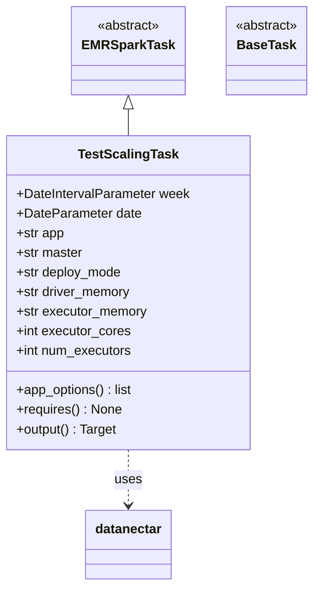
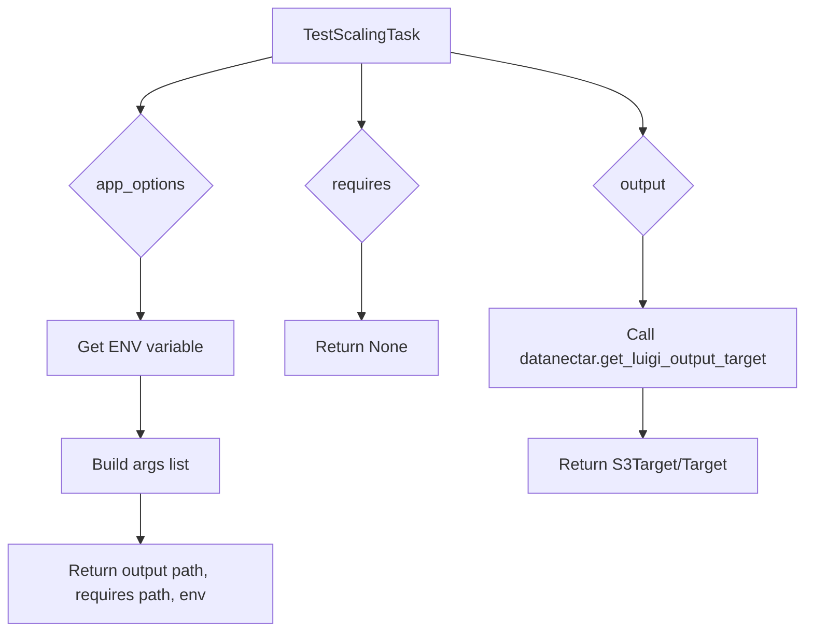

# Diagram: research/orchestrator/tasks/test/test_scaling_task.py

> Auto-generated by Obscura crawlers

## Diagram 1

### SVG

<svg id="container" width="379.453125" xmlns="http://www.w3.org/2000/svg" class="classDiagram" height="716" viewBox="0 0 379.453125 716" role="graphics-document document" aria-roledescription="class"><g><defs><marker id="container_class-aggregationStart" class="marker aggregation class" refX="18" refY="7" markerWidth="190" markerHeight="240" orient="auto"><path d="M 18,7 L9,13 L1,7 L9,1 Z"></path></marker></defs><defs><marker id="container_class-aggregationEnd" class="marker aggregation class" refX="1" refY="7" markerWidth="20" markerHeight="28" orient="auto"><path d="M 18,7 L9,13 L1,7 L9,1 Z"></path></marker></defs><defs><marker id="container_class-extensionStart" class="marker extension class" refX="18" refY="7" markerWidth="190" markerHeight="240" orient="auto"><path d="M 1,7 L18,13 V 1 Z"></path></marker></defs><defs><marker id="container_class-extensionEnd" class="marker extension class" refX="1" refY="7" markerWidth="20" markerHeight="28" orient="auto"><path d="M 1,1 V 13 L18,7 Z"></path></marker></defs><defs><marker id="container_class-compositionStart" class="marker composition class" refX="18" refY="7" markerWidth="190" markerHeight="240" orient="auto"><path d="M 18,7 L9,13 L1,7 L9,1 Z"></path></marker></defs><defs><marker id="container_class-compositionEnd" class="marker composition class" refX="1" refY="7" markerWidth="20" markerHeight="28" orient="auto"><path d="M 18,7 L9,13 L1,7 L9,1 Z"></path></marker></defs><defs><marker id="container_class-dependencyStart" class="marker dependency class" refX="6" refY="7" markerWidth="190" markerHeight="240" orient="auto"><path d="M 5,7 L9,13 L1,7 L9,1 Z"></path></marker></defs><defs><marker id="container_class-dependencyEnd" class="marker dependency class" refX="13" refY="7" markerWidth="20" markerHeight="28" orient="auto"><path d="M 18,7 L9,13 L14,7 L9,1 Z"></path></marker></defs><defs><marker id="container_class-lollipopStart" class="marker lollipop class" refX="13" refY="7" markerWidth="190" markerHeight="240" orient="auto"><circle stroke="black" fill="transparent" cx="7" cy="7" r="6"></circle></marker></defs><defs><marker id="container_class-lollipopEnd" class="marker lollipop class" refX="1" refY="7" markerWidth="190" markerHeight="240" orient="auto"><circle stroke="black" fill="transparent" cx="7" cy="7" r="6"></circle></marker></defs><g class="root"><g class="clusters"></g><g class="edgePaths"><path d="M155.086,133.25L155.086,134.542C155.086,135.833,155.086,138.417,155.086,143.875C155.086,149.333,155.086,157.667,155.086,161.833L155.086,166" id="id_EMRSparkTask_TestScalingTask_1" class="edge-thickness-normal edge-pattern-solid relation" style=";;;" data-edge="true" data-et="edge" data-id="id_EMRSparkTask_TestScalingTask_1" data-points="W3sieCI6MTU1LjA4NTkzNzUsInkiOjExNn0seyJ4IjoxNTUuMDg1OTM3NSwieSI6MTQxfSx7IngiOjE1NS4wODU5Mzc1LCJ5IjoxNjZ9XQ==" marker-start="url(#container_class-extensionStart)"></path><path d="M155.086,550L155.086,556.167C155.086,562.333,155.086,574.667,155.086,586C155.086,597.333,155.086,607.667,155.086,612.833L155.086,618" id="id_TestScalingTask_datanectar_2" class="edge-thickness-normal edge-pattern-dashed relation" style=";;;" data-edge="true" data-et="edge" data-id="id_TestScalingTask_datanectar_2" data-points="W3sieCI6MTU1LjA4NTkzNzUsInkiOjU1MH0seyJ4IjoxNTUuMDg1OTM3NSwieSI6NTg3fSx7IngiOjE1NS4wODU5Mzc1LCJ5Ijo2MjR9XQ==" marker-end="url(#container_class-dependencyEnd)"></path></g><g class="edgeLabels"><g class="edgeLabel"><g class="label" data-id="id_EMRSparkTask_TestScalingTask_1" transform="translate(0, 0)"><foreignObject width="0" height="0">

</foreignObject></g></g><g class="edgeLabel" transform="translate(155.0859375, 587)"><g class="label" data-id="id_TestScalingTask_datanectar_2" transform="translate(-16.4921875, -12)"><foreignObject width="32.984375" height="24">

uses

</foreignObject></g></g></g><g class="nodes"><g class="node default" id="classId-TestScalingTask-0" transform="translate(155.0859375, 358)"><g class="basic label-container"><path d="M-147.0859375 -192 L147.0859375 -192 L147.0859375 192 L-147.0859375 192" stroke="none" stroke-width="0" fill="#ECECFF" style=""></path><path d="M-147.0859375 -192 C-65.9924139134645 -192, 15.101109673070994 -192, 147.0859375 -192 M-147.0859375 -192 C-74.30303090850393 -192, -1.5201243170078556 -192, 147.0859375 -192 M147.0859375 -192 C147.0859375 -110.52220349367155, 147.0859375 -29.04440698734311, 147.0859375 192 M147.0859375 -192 C147.0859375 -93.92872453182173, 147.0859375 4.1425509363565425, 147.0859375 192 M147.0859375 192 C59.42388084266324 192, -28.238175814673525 192, -147.0859375 192 M147.0859375 192 C46.819073013392014 192, -53.44779147321597 192, -147.0859375 192 M-147.0859375 192 C-147.0859375 113.83005764375733, -147.0859375 35.66011528751466, -147.0859375 -192 M-147.0859375 192 C-147.0859375 106.636475643686, -147.0859375 21.272951287371995, -147.0859375 -192" stroke="#9370DB" stroke-width="1.3" fill="none" stroke-dasharray="0 0" style=""></path></g><g class="annotation-group text" transform="translate(0, -168)"></g><g class="label-group text" transform="translate(-58.046875, -168)"><g class="label" style="font-weight: bolder" transform="translate(0,-12)"><foreignObject width="116.09375" height="24">

TestScalingTask

</foreignObject></g></g><g class="members-group text" transform="translate(-135.0859375, -120)"><g class="label" style="" transform="translate(0,-12)"><foreignObject width="212.125" height="24">

+DateIntervalParameter week

</foreignObject></g><g class="label" style="" transform="translate(0,12)"><foreignObject width="152.171875" height="24">

+DateParameter date

</foreignObject></g><g class="label" style="" transform="translate(0,36)"><foreignObject width="59.375" height="24">

+str app

</foreignObject></g><g class="label" style="" transform="translate(0,60)"><foreignObject width="81.8125" height="24">

+str master

</foreignObject></g><g class="label" style="" transform="translate(0,84)"><foreignObject width="130.390625" height="24">

+str deploy_mode

</foreignObject></g><g class="label" style="" transform="translate(0,108)"><foreignObject width="141.1875" height="24">

+str driver_memory

</foreignObject></g><g class="label" style="" transform="translate(0,132)"><foreignObject width="161" height="24">

+str executor_memory

</foreignObject></g><g class="label" style="" transform="translate(0,156)"><foreignObject width="139.9375" height="24">

+int executor_cores

</foreignObject></g><g class="label" style="" transform="translate(0,180)"><foreignObject width="142.296875" height="24">

+int num_executors

</foreignObject></g></g><g class="methods-group text" transform="translate(-135.0859375, 120)"><g class="label" style="" transform="translate(0,-12)"><foreignObject width="143.609375" height="24">

+app_options() : list

</foreignObject></g><g class="label" style="" transform="translate(0,12)"><foreignObject width="128.75" height="24">

+requires() : None

</foreignObject></g><g class="label" style="" transform="translate(0,36)"><foreignObject width="124.375" height="24">

+output() : Target

</foreignObject></g></g><g class="divider" style=""><path d="M-147.0859375 -144 C-57.53878179259496 -144, 32.00837391481008 -144, 147.0859375 -144 M-147.0859375 -144 C-61.66954547472807 -144, 23.746846550543864 -144, 147.0859375 -144" stroke="#9370DB" stroke-width="1.3" fill="none" stroke-dasharray="0 0" style=""></path></g><g class="divider" style=""><path d="M-147.0859375 96 C-32.533241507968725 96, 82.01945448406255 96, 147.0859375 96 M-147.0859375 96 C-62.16891939446481 96, 22.748098711070384 96, 147.0859375 96" stroke="#9370DB" stroke-width="1.3" fill="none" stroke-dasharray="0 0" style=""></path></g></g><g class="node default" id="classId-EMRSparkTask-1" transform="translate(155.0859375, 62)"><g class="basic label-container"><path d="M-65.1484375 -54 L65.1484375 -54 L65.1484375 54 L-65.1484375 54" stroke="none" stroke-width="0" fill="#ECECFF" style=""></path><path d="M-65.1484375 -54 C-15.819965521927053 -54, 33.508506456145895 -54, 65.1484375 -54 M-65.1484375 -54 C-34.109725327758014 -54, -3.0710131555160203 -54, 65.1484375 -54 M65.1484375 -54 C65.1484375 -26.727996157706364, 65.1484375 0.544007684587271, 65.1484375 54 M65.1484375 -54 C65.1484375 -19.768563165658023, 65.1484375 14.462873668683955, 65.1484375 54 M65.1484375 54 C15.88440346374336 54, -33.37963057251328 54, -65.1484375 54 M65.1484375 54 C22.781541555443 54, -19.585354389114002 54, -65.1484375 54 M-65.1484375 54 C-65.1484375 17.433529273129857, -65.1484375 -19.132941453740287, -65.1484375 -54 M-65.1484375 54 C-65.1484375 21.033314946425556, -65.1484375 -11.933370107148889, -65.1484375 -54" stroke="#9370DB" stroke-width="1.3" fill="none" stroke-dasharray="0 0" style=""></path></g><g class="annotation-group text" transform="translate(-38.609375, -30)"><g class="label" style="" transform="translate(0,-12)"><foreignObject width="77.21875" height="24">

«abstract»

</foreignObject></g></g><g class="label-group text" transform="translate(-53.1484375, -6)"><g class="label" style="font-weight: bolder" transform="translate(0,-12)"><foreignObject width="106.296875" height="24">

EMRSparkTask

</foreignObject></g></g><g class="members-group text" transform="translate(-53.1484375, 42)"></g><g class="methods-group text" transform="translate(-53.1484375, 72)"></g><g class="divider" style=""><path d="M-65.1484375 18 C-26.03237840326429 18, 13.083680693471422 18, 65.1484375 18 M-65.1484375 18 C-20.761925568817013 18, 23.624586362365974 18, 65.1484375 18" stroke="#9370DB" stroke-width="1.3" fill="none" stroke-dasharray="0 0" style=""></path></g><g class="divider" style=""><path d="M-65.1484375 36 C-30.145612391024663 36, 4.857212717950674 36, 65.1484375 36 M-65.1484375 36 C-21.777439319489666 36, 21.593558861020668 36, 65.1484375 36" stroke="#9370DB" stroke-width="1.3" fill="none" stroke-dasharray="0 0" style=""></path></g></g><g class="node default" id="classId-BaseTask-2" transform="translate(320.84375, 62)"><g class="basic label-container"><path d="M-50.609375 -54 L50.609375 -54 L50.609375 54 L-50.609375 54" stroke="none" stroke-width="0" fill="#ECECFF" style=""></path><path d="M-50.609375 -54 C-22.785469061911325 -54, 5.03843687617735 -54, 50.609375 -54 M-50.609375 -54 C-12.929251733969451 -54, 24.750871532061097 -54, 50.609375 -54 M50.609375 -54 C50.609375 -29.676822603841174, 50.609375 -5.353645207682348, 50.609375 54 M50.609375 -54 C50.609375 -19.306587026406724, 50.609375 15.386825947186551, 50.609375 54 M50.609375 54 C21.202392833043465 54, -8.20458933391307 54, -50.609375 54 M50.609375 54 C23.415759298094585 54, -3.77785640381083 54, -50.609375 54 M-50.609375 54 C-50.609375 22.06501454866831, -50.609375 -9.869970902663383, -50.609375 -54 M-50.609375 54 C-50.609375 31.94020647689485, -50.609375 9.880412953789701, -50.609375 -54" stroke="#9370DB" stroke-width="1.3" fill="none" stroke-dasharray="0 0" style=""></path></g><g class="annotation-group text" transform="translate(-38.609375, -30)"><g class="label" style="" transform="translate(0,-12)"><foreignObject width="77.21875" height="24">

«abstract»

</foreignObject></g></g><g class="label-group text" transform="translate(-34.03125, -6)"><g class="label" style="font-weight: bolder" transform="translate(0,-12)"><foreignObject width="68.0625" height="24">

BaseTask

</foreignObject></g></g><g class="members-group text" transform="translate(-38.609375, 42)"></g><g class="methods-group text" transform="translate(-38.609375, 72)"></g><g class="divider" style=""><path d="M-50.609375 18 C-22.742610461121334 18, 5.124154077757332 18, 50.609375 18 M-50.609375 18 C-18.752291718906395 18, 13.10479156218721 18, 50.609375 18" stroke="#9370DB" stroke-width="1.3" fill="none" stroke-dasharray="0 0" style=""></path></g><g class="divider" style=""><path d="M-50.609375 36 C-30.16682149292085 36, -9.7242679858417 36, 50.609375 36 M-50.609375 36 C-13.848643981784406 36, 22.91208703643119 36, 50.609375 36" stroke="#9370DB" stroke-width="1.3" fill="none" stroke-dasharray="0 0" style=""></path></g></g><g class="node default" id="classId-datanectar-3" transform="translate(155.0859375, 666)"><g class="basic label-container"><path d="M-52.015625 -42 L52.015625 -42 L52.015625 42 L-52.015625 42" stroke="none" stroke-width="0" fill="#ECECFF" style=""></path><path d="M-52.015625 -42 C-15.360916294267092 -42, 21.293792411465816 -42, 52.015625 -42 M-52.015625 -42 C-17.65470689441721 -42, 16.70621121116558 -42, 52.015625 -42 M52.015625 -42 C52.015625 -23.632628079208757, 52.015625 -5.265256158417515, 52.015625 42 M52.015625 -42 C52.015625 -20.828115410413936, 52.015625 0.3437691791721278, 52.015625 42 M52.015625 42 C30.558259911065377 42, 9.100894822130755 42, -52.015625 42 M52.015625 42 C11.170235579813479 42, -29.675153840373042 42, -52.015625 42 M-52.015625 42 C-52.015625 23.69846478619649, -52.015625 5.3969295723929775, -52.015625 -42 M-52.015625 42 C-52.015625 20.61837493433026, -52.015625 -0.7632501313394826, -52.015625 -42" stroke="#9370DB" stroke-width="1.3" fill="none" stroke-dasharray="0 0" style=""></path></g><g class="annotation-group text" transform="translate(0, -18)"></g><g class="label-group text" transform="translate(-40.015625, -18)"><g class="label" style="font-weight: bolder" transform="translate(0,-12)"><foreignObject width="80.03125" height="24">

datanectar

</foreignObject></g></g><g class="members-group text" transform="translate(-40.015625, 30)"></g><g class="methods-group text" transform="translate(-40.015625, 60)"></g><g class="divider" style=""><path d="M-52.015625 6 C-14.495775042440037 6, 23.024074915119925 6, 52.015625 6 M-52.015625 6 C-12.21257420722442 6, 27.59047658555116 6, 52.015625 6" stroke="#9370DB" stroke-width="1.3" fill="none" stroke-dasharray="0 0" style=""></path></g><g class="divider" style=""><path d="M-52.015625 24 C-21.0395969269628 24, 9.936431146074398 24, 52.015625 24 M-52.015625 24 C-16.773070383402988 24, 18.469484233194024 24, 52.015625 24" stroke="#9370DB" stroke-width="1.3" fill="none" stroke-dasharray="0 0" style=""></path></g></g></g></g></g></svg>

## Diagram 2

### SVG

<svg id="container" width="798.7109375" xmlns="http://www.w3.org/2000/svg" class="flowchart" height="624.734375" viewBox="0 0 798.7109375 624.734375" role="graphics-document document" aria-roledescription="flowchart-v2"><g><marker id="container_flowchart-v2-pointEnd" class="marker flowchart-v2" viewBox="0 0 10 10" refX="5" refY="5" markerUnits="userSpaceOnUse" markerWidth="8" markerHeight="8" orient="auto"><path d="M 0 0 L 10 5 L 0 10 z" class="arrowMarkerPath" style="stroke-width: 1; stroke-dasharray: 1, 0;"></path></marker><marker id="container_flowchart-v2-pointStart" class="marker flowchart-v2" viewBox="0 0 10 10" refX="4.5" refY="5" markerUnits="userSpaceOnUse" markerWidth="8" markerHeight="8" orient="auto"><path d="M 0 5 L 10 10 L 10 0 z" class="arrowMarkerPath" style="stroke-width: 1; stroke-dasharray: 1, 0;"></path></marker><marker id="container_flowchart-v2-circleEnd" class="marker flowchart-v2" viewBox="0 0 10 10" refX="11" refY="5" markerUnits="userSpaceOnUse" markerWidth="11" markerHeight="11" orient="auto"><circle cx="5" cy="5" r="5" class="arrowMarkerPath" style="stroke-width: 1; stroke-dasharray: 1, 0;"></circle></marker><marker id="container_flowchart-v2-circleStart" class="marker flowchart-v2" viewBox="0 0 10 10" refX="-1" refY="5" markerUnits="userSpaceOnUse" markerWidth="11" markerHeight="11" orient="auto"><circle cx="5" cy="5" r="5" class="arrowMarkerPath" style="stroke-width: 1; stroke-dasharray: 1, 0;"></circle></marker><marker id="container_flowchart-v2-crossEnd" class="marker cross flowchart-v2" viewBox="0 0 11 11" refX="12" refY="5.2" markerUnits="userSpaceOnUse" markerWidth="11" markerHeight="11" orient="auto"><path d="M 1,1 l 9,9 M 10,1 l -9,9" class="arrowMarkerPath" style="stroke-width: 2; stroke-dasharray: 1, 0;"></path></marker><marker id="container_flowchart-v2-crossStart" class="marker cross flowchart-v2" viewBox="0 0 11 11" refX="-1" refY="5.2" markerUnits="userSpaceOnUse" markerWidth="11" markerHeight="11" orient="auto"><path d="M 1,1 l 9,9 M 10,1 l -9,9" class="arrowMarkerPath" style="stroke-width: 2; stroke-dasharray: 1, 0;"></path></marker><g class="root"><g class="clusters"></g><g class="edgePaths"><path d="M267.367,55.815L245.806,61.013C224.245,66.21,181.122,76.605,159.561,85.303C138,94,138,101,138,104.5L138,108" id="L_A_B_0" class="edge-thickness-normal edge-pattern-solid edge-thickness-normal edge-pattern-solid flowchart-link" style=";" data-edge="true" data-et="edge" data-id="L_A_B_0" data-points="W3sieCI6MjY3LjM2NzE4NzUsInkiOjU1LjgxNTQ0MjU2MTIwNTI3fSx7IngiOjEzOCwieSI6ODd9LHsieCI6MTM4LCJ5IjoxMTJ9XQ==" marker-end="url(#container_flowchart-v2-pointEnd)"></path><path d="M138,256.734L138,260.901C138,265.068,138,273.401,138,283.068C138,292.734,138,303.734,138,309.234L138,314.734" id="L_B_C_0" class="edge-thickness-normal edge-pattern-solid edge-thickness-normal edge-pattern-solid flowchart-link" style=";" data-edge="true" data-et="edge" data-id="L_B_C_0" data-points="W3sieCI6MTM4LCJ5IjoyNTYuNzM0Mzc1fSx7IngiOjEzOCwieSI6MjgxLjczNDM3NX0seyJ4IjoxMzgsInkiOjMxOC43MzQzNzV9XQ==" marker-end="url(#container_flowchart-v2-pointEnd)"></path><path d="M138,372.734L138,378.901C138,385.068,138,397.401,138,407.068C138,416.734,138,423.734,138,427.234L138,430.734" id="L_C_D_0" class="edge-thickness-normal edge-pattern-solid edge-thickness-normal edge-pattern-solid flowchart-link" style=";" data-edge="true" data-et="edge" data-id="L_C_D_0" data-points="W3sieCI6MTM4LCJ5IjozNzIuNzM0Mzc1fSx7IngiOjEzOCwieSI6NDA5LjczNDM3NX0seyJ4IjoxMzgsInkiOjQzNC43MzQzNzV9XQ==" marker-end="url(#container_flowchart-v2-pointEnd)"></path><path d="M138,488.734L138,492.901C138,497.068,138,505.401,138,513.068C138,520.734,138,527.734,138,531.234L138,534.734" id="L_D_E_0" class="edge-thickness-normal edge-pattern-solid edge-thickness-normal edge-pattern-solid flowchart-link" style=";" data-edge="true" data-et="edge" data-id="L_D_E_0" data-points="W3sieCI6MTM4LCJ5Ijo0ODguNzM0Mzc1fSx7IngiOjEzOCwieSI6NTEzLjczNDM3NX0seyJ4IjoxMzgsInkiOjUzOC43MzQzNzV9XQ==" marker-end="url(#container_flowchart-v2-pointEnd)"></path><path d="M353.719,62L353.719,66.167C353.719,70.333,353.719,78.667,353.719,88.919C353.719,99.172,353.719,111.344,353.719,117.43L353.719,123.516" id="L_A_F_0" class="edge-thickness-normal edge-pattern-solid edge-thickness-normal edge-pattern-solid flowchart-link" style=";" data-edge="true" data-et="edge" data-id="L_A_F_0" data-points="W3sieCI6MzUzLjcxODc1LCJ5Ijo2Mn0seyJ4IjozNTMuNzE4NzUsInkiOjg3fSx7IngiOjM1My43MTg3NSwieSI6MTI3LjUxNTYyNX1d" marker-end="url(#container_flowchart-v2-pointEnd)"></path><path d="M353.719,241.219L353.719,247.971C353.719,254.724,353.719,268.229,353.719,280.482C353.719,292.734,353.719,303.734,353.719,309.234L353.719,314.734" id="L_F_G_0" class="edge-thickness-normal edge-pattern-solid edge-thickness-normal edge-pattern-solid flowchart-link" style=";" data-edge="true" data-et="edge" data-id="L_F_G_0" data-points="W3sieCI6MzUzLjcxODc1LCJ5IjoyNDEuMjE4NzV9LHsieCI6MzUzLjcxODc1LCJ5IjoyODEuNzM0Mzc1fSx7IngiOjM1My43MTg3NSwieSI6MzE4LjczNDM3NX1d" marker-end="url(#container_flowchart-v2-pointEnd)"></path><path d="M440.07,50.96L472.57,56.966C505.07,62.973,570.07,74.987,602.57,87.969C635.07,100.951,635.07,114.901,635.07,121.876L635.07,128.852" id="L_A_H_0" class="edge-thickness-normal edge-pattern-solid edge-thickness-normal edge-pattern-solid flowchart-link" style=";" data-edge="true" data-et="edge" data-id="L_A_H_0" data-points="W3sieCI6NDQwLjA3MDMxMjUsInkiOjUwLjk1OTY4MTIyNjIyMzg2NH0seyJ4Ijo2MzUuMDcwMzEyNSwieSI6ODd9LHsieCI6NjM1LjA3MDMxMjUsInkiOjEzMi44NTE1NjI1fV0=" marker-end="url(#container_flowchart-v2-pointEnd)"></path><path d="M635.07,235.883L635.07,243.525C635.07,251.167,635.07,266.451,635.07,277.592C635.07,288.734,635.07,295.734,635.07,299.234L635.07,302.734" id="L_H_I_0" class="edge-thickness-normal edge-pattern-solid edge-thickness-normal edge-pattern-solid flowchart-link" style=";" data-edge="true" data-et="edge" data-id="L_H_I_0" data-points="W3sieCI6NjM1LjA3MDMxMjUsInkiOjIzNS44ODI4MTI1fSx7IngiOjYzNS4wNzAzMTI1LCJ5IjoyODEuNzM0Mzc1fSx7IngiOjYzNS4wNzAzMTI1LCJ5IjozMDYuNzM0Mzc1fV0=" marker-end="url(#container_flowchart-v2-pointEnd)"></path><path d="M635.07,384.734L635.07,388.901C635.07,393.068,635.07,401.401,635.07,409.068C635.07,416.734,635.07,423.734,635.07,427.234L635.07,430.734" id="L_I_J_0" class="edge-thickness-normal edge-pattern-solid edge-thickness-normal edge-pattern-solid flowchart-link" style=";" data-edge="true" data-et="edge" data-id="L_I_J_0" data-points="W3sieCI6NjM1LjA3MDMxMjUsInkiOjM4NC43MzQzNzV9LHsieCI6NjM1LjA3MDMxMjUsInkiOjQwOS43MzQzNzV9LHsieCI6NjM1LjA3MDMxMjUsInkiOjQzNC43MzQzNzV9XQ==" marker-end="url(#container_flowchart-v2-pointEnd)"></path></g><g class="edgeLabels"><g class="edgeLabel"><g class="label" data-id="L_A_B_0" transform="translate(0, 0)"><foreignObject width="0" height="0">

</foreignObject></g></g><g class="edgeLabel"><g class="label" data-id="L_B_C_0" transform="translate(0, 0)"><foreignObject width="0" height="0">

</foreignObject></g></g><g class="edgeLabel"><g class="label" data-id="L_C_D_0" transform="translate(0, 0)"><foreignObject width="0" height="0">

</foreignObject></g></g><g class="edgeLabel"><g class="label" data-id="L_D_E_0" transform="translate(0, 0)"><foreignObject width="0" height="0">

</foreignObject></g></g><g class="edgeLabel"><g class="label" data-id="L_A_F_0" transform="translate(0, 0)"><foreignObject width="0" height="0">

</foreignObject></g></g><g class="edgeLabel"><g class="label" data-id="L_F_G_0" transform="translate(0, 0)"><foreignObject width="0" height="0">

</foreignObject></g></g><g class="edgeLabel"><g class="label" data-id="L_A_H_0" transform="translate(0, 0)"><foreignObject width="0" height="0">

</foreignObject></g></g><g class="edgeLabel"><g class="label" data-id="L_H_I_0" transform="translate(0, 0)"><foreignObject width="0" height="0">

</foreignObject></g></g><g class="edgeLabel"><g class="label" data-id="L_I_J_0" transform="translate(0, 0)"><foreignObject width="0" height="0">

</foreignObject></g></g></g><g class="nodes"><g class="node default" id="flowchart-A-0" transform="translate(353.71875, 35)"><rect class="basic label-container" style="" x="-86.3515625" y="-27" width="172.703125" height="54"></rect><g class="label" style="" transform="translate(-56.3515625, -12)"><rect></rect><foreignObject width="112.703125" height="24">

TestScalingTask

</foreignObject></g></g><g class="node default" id="flowchart-B-1" transform="translate(138, 184.3671875)"><polygon points="72.3671875,0 144.734375,-72.3671875 72.3671875,-144.734375 0,-72.3671875" class="label-container" transform="translate(-71.8671875, 72.3671875)"></polygon><g class="label" style="" transform="translate(-45.3671875, -12)"><rect></rect><foreignObject width="90.734375" height="24">

app_options

</foreignObject></g></g><g class="node default" id="flowchart-C-3" transform="translate(138, 345.734375)"><rect class="basic label-container" style="" x="-90.0078125" y="-27" width="180.015625" height="54"></rect><g class="label" style="" transform="translate(-60.0078125, -12)"><rect></rect><foreignObject width="120.015625" height="24">

Get ENV variable

</foreignObject></g></g><g class="node default" id="flowchart-D-5" transform="translate(138, 461.734375)"><rect class="basic label-container" style="" x="-79.4921875" y="-27" width="158.984375" height="54"></rect><g class="label" style="" transform="translate(-49.4921875, -12)"><rect></rect><foreignObject width="98.984375" height="24">

Build args list

</foreignObject></g></g><g class="node default" id="flowchart-E-7" transform="translate(138, 577.734375)"><rect class="basic label-container" style="" x="-130" y="-39" width="260" height="78"></rect><g class="label" style="" transform="translate(-100, -24)"><rect></rect><foreignObject width="200" height="48">

Return output path, requires path, env

</foreignObject></g></g><g class="node default" id="flowchart-F-9" transform="translate(353.71875, 184.3671875)"><polygon points="56.8515625,0 113.703125,-56.8515625 56.8515625,-113.703125 0,-56.8515625" class="label-container" transform="translate(-56.3515625, 56.8515625)"></polygon><g class="label" style="" transform="translate(-29.8515625, -12)"><rect></rect><foreignObject width="59.703125" height="24">

requires

</foreignObject></g></g><g class="node default" id="flowchart-G-11" transform="translate(353.71875, 345.734375)"><rect class="basic label-container" style="" x="-75.7109375" y="-27" width="151.421875" height="54"></rect><g class="label" style="" transform="translate(-45.7109375, -12)"><rect></rect><foreignObject width="91.421875" height="24">

Return None

</foreignObject></g></g><g class="node default" id="flowchart-H-13" transform="translate(635.0703125, 184.3671875)"><polygon points="51.515625,0 103.03125,-51.515625 51.515625,-103.03125 0,-51.515625" class="label-container" transform="translate(-51.015625, 51.515625)"></polygon><g class="label" style="" transform="translate(-24.515625, -12)"><rect></rect><foreignObject width="49.03125" height="24">

output

</foreignObject></g></g><g class="node default" id="flowchart-I-15" transform="translate(635.0703125, 345.734375)"><rect class="basic label-container" style="" x="-155.640625" y="-39" width="311.28125" height="78"></rect><g class="label" style="" transform="translate(-125.640625, -24)"><rect></rect><foreignObject width="251.28125" height="48">

Call datanectar.get_luigi_output_target

</foreignObject></g></g><g class="node default" id="flowchart-J-17" transform="translate(635.0703125, 461.734375)"><rect class="basic label-container" style="" x="-113.5078125" y="-27" width="227.015625" height="54"></rect><g class="label" style="" transform="translate(-83.5078125, -12)"><rect></rect><foreignObject width="167.015625" height="24">

Return S3Target/Target

</foreignObject></g></g></g></g></g></svg>
