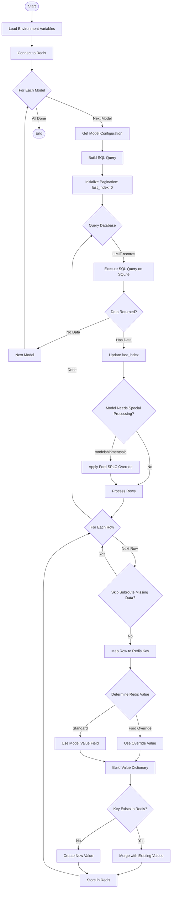
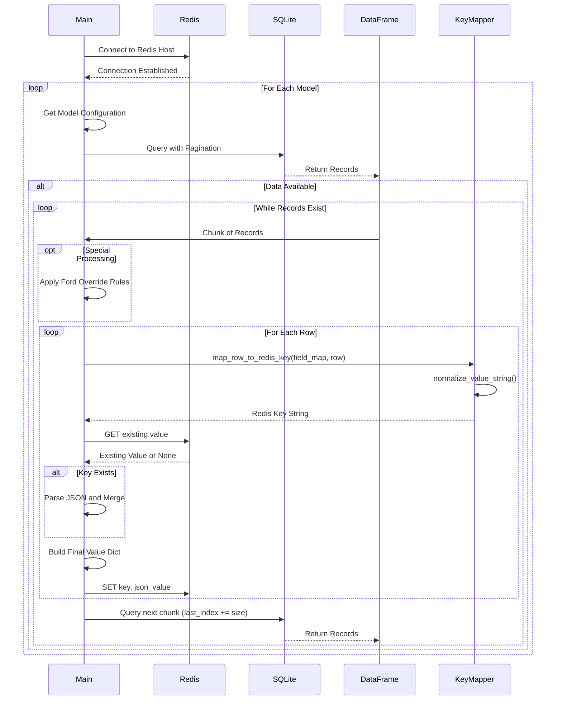
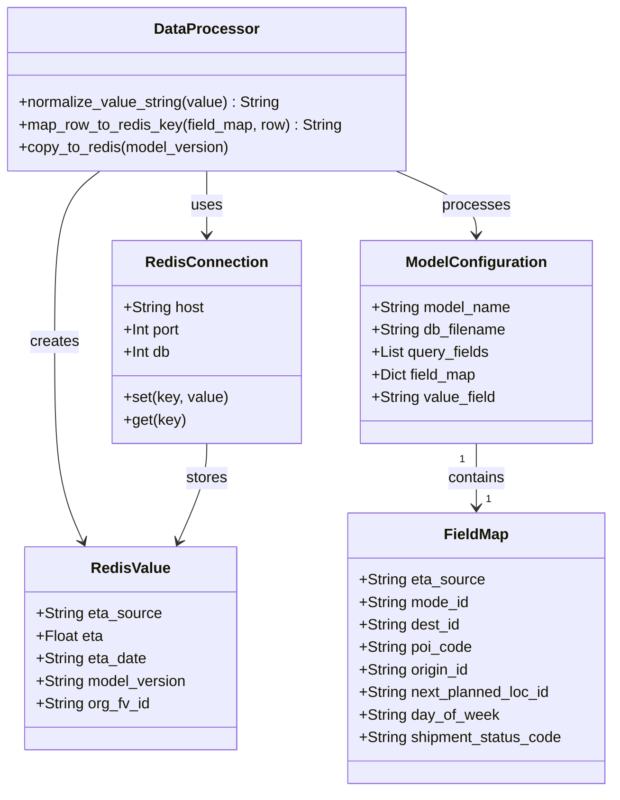
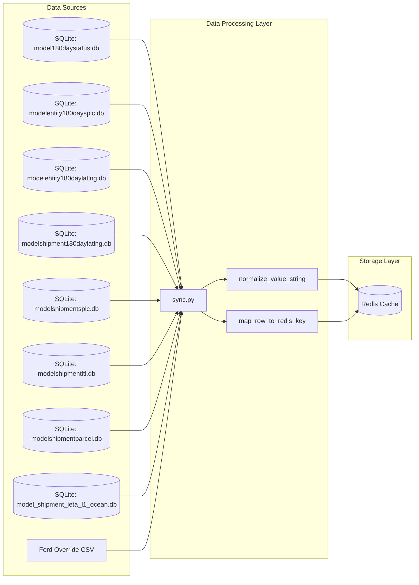
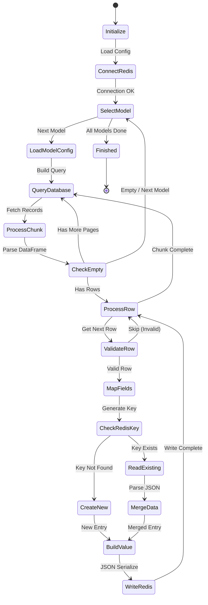

# Diagram: research/orchestrator/tasks/transforms/copy_to_redis.py

> Auto-generated by Obscura crawlers

## Diagram 1

### SVG

<svg id="container" width="740.9754638671875" xmlns="http://www.w3.org/2000/svg" class="flowchart" height="3815.375" viewBox="0 0 740.9754638671875 3815.375" role="graphics-document document" aria-roledescription="flowchart-v2"><g><marker id="container_flowchart-v2-pointEnd" class="marker flowchart-v2" viewBox="0 0 10 10" refX="5" refY="5" markerUnits="userSpaceOnUse" markerWidth="8" markerHeight="8" orient="auto"><path d="M 0 0 L 10 5 L 0 10 z" class="arrowMarkerPath" style="stroke-width: 1; stroke-dasharray: 1, 0;"></path></marker><marker id="container_flowchart-v2-pointStart" class="marker flowchart-v2" viewBox="0 0 10 10" refX="4.5" refY="5" markerUnits="userSpaceOnUse" markerWidth="8" markerHeight="8" orient="auto"><path d="M 0 5 L 10 10 L 10 0 z" class="arrowMarkerPath" style="stroke-width: 1; stroke-dasharray: 1, 0;"></path></marker><marker id="container_flowchart-v2-circleEnd" class="marker flowchart-v2" viewBox="0 0 10 10" refX="11" refY="5" markerUnits="userSpaceOnUse" markerWidth="11" markerHeight="11" orient="auto"><circle cx="5" cy="5" r="5" class="arrowMarkerPath" style="stroke-width: 1; stroke-dasharray: 1, 0;"></circle></marker><marker id="container_flowchart-v2-circleStart" class="marker flowchart-v2" viewBox="0 0 10 10" refX="-1" refY="5" markerUnits="userSpaceOnUse" markerWidth="11" markerHeight="11" orient="auto"><circle cx="5" cy="5" r="5" class="arrowMarkerPath" style="stroke-width: 1; stroke-dasharray: 1, 0;"></circle></marker><marker id="container_flowchart-v2-crossEnd" class="marker cross flowchart-v2" viewBox="0 0 11 11" refX="12" refY="5.2" markerUnits="userSpaceOnUse" markerWidth="11" markerHeight="11" orient="auto"><path d="M 1,1 l 9,9 M 10,1 l -9,9" class="arrowMarkerPath" style="stroke-width: 2; stroke-dasharray: 1, 0;"></path></marker><marker id="container_flowchart-v2-crossStart" class="marker cross flowchart-v2" viewBox="0 0 11 11" refX="-1" refY="5.2" markerUnits="userSpaceOnUse" markerWidth="11" markerHeight="11" orient="auto"><path d="M 1,1 l 9,9 M 10,1 l -9,9" class="arrowMarkerPath" style="stroke-width: 2; stroke-dasharray: 1, 0;"></path></marker><g class="root"><g class="clusters"></g><g class="edgePaths"><path d="M138.5,47.5L138.417,51.583C138.333,55.667,138.167,63.833,138.083,71.417C138,79,138,86,138,89.5L138,93" id="L_Start_LoadEnv_0" class="edge-thickness-normal edge-pattern-solid edge-thickness-normal edge-pattern-solid flowchart-link" style=";" data-edge="true" data-et="edge" data-id="L_Start_LoadEnv_0" data-points="W3sieCI6MTM4LjUsInkiOjQ3LjV9LHsieCI6MTM4LCJ5Ijo3Mn0seyJ4IjoxMzgsInkiOjk3fV0=" marker-end="url(#container_flowchart-v2-pointEnd)"></path><path d="M138,175L138,179.167C138,183.333,138,191.667,138,199.333C138,207,138,214,138,217.5L138,221" id="L_LoadEnv_ConnectRedis_0" class="edge-thickness-normal edge-pattern-solid edge-thickness-normal edge-pattern-solid flowchart-link" style=";" data-edge="true" data-et="edge" data-id="L_LoadEnv_ConnectRedis_0" data-points="W3sieCI6MTM4LCJ5IjoxNzV9LHsieCI6MTM4LCJ5IjoyMDB9LHsieCI6MTM4LCJ5IjoyMjV9XQ==" marker-end="url(#container_flowchart-v2-pointEnd)"></path><path d="M138,279L138,283.167C138,287.333,138,295.667,138,303.333C138,311,138,318,138,321.5L138,325" id="L_ConnectRedis_LoopModels_0" class="edge-thickness-normal edge-pattern-solid edge-thickness-normal edge-pattern-solid flowchart-link" style=";" data-edge="true" data-et="edge" data-id="L_ConnectRedis_LoopModels_0" data-points="W3sieCI6MTM4LCJ5IjoyNzl9LHsieCI6MTM4LCJ5IjozMDR9LHsieCI6MTM4LCJ5IjozMjl9XQ==" marker-end="url(#container_flowchart-v2-pointEnd)"></path><path d="M196.901,434.271L237.506,450.254C278.112,466.238,359.323,498.205,399.929,519.688C440.534,541.172,440.534,552.172,440.534,557.672L440.534,563.172" id="L_LoopModels_GetModelConfig_0" class="edge-thickness-normal edge-pattern-solid edge-thickness-normal edge-pattern-solid flowchart-link" style=";" data-edge="true" data-et="edge" data-id="L_LoopModels_GetModelConfig_0" data-points="W3sieCI6MTk2LjkwMDg4Njg3MDI0NTQ3LCJ5Ijo0MzQuMjcwOTg4MTI5NzU0NX0seyJ4Ijo0NDAuNTM0MDUyODQ4ODE1OSwieSI6NTMwLjE3MTg3NX0seyJ4Ijo0NDAuNTM0MDUyODQ4ODE1OSwieSI6NTY3LjE3MTg3NX1d" marker-end="url(#container_flowchart-v2-pointEnd)"></path><path d="M440.534,621.172L440.534,625.339C440.534,629.505,440.534,637.839,440.534,645.505C440.534,653.172,440.534,660.172,440.534,663.672L440.534,667.172" id="L_GetModelConfig_BuildQuery_0" class="edge-thickness-normal edge-pattern-solid edge-thickness-normal edge-pattern-solid flowchart-link" style=";" data-edge="true" data-et="edge" data-id="L_GetModelConfig_BuildQuery_0" data-points="W3sieCI6NDQwLjUzNDA1Mjg0ODgxNTksInkiOjYyMS4xNzE4NzV9LHsieCI6NDQwLjUzNDA1Mjg0ODgxNTksInkiOjY0Ni4xNzE4NzV9LHsieCI6NDQwLjUzNDA1Mjg0ODgxNTksInkiOjY3MS4xNzE4NzV9XQ==" marker-end="url(#container_flowchart-v2-pointEnd)"></path><path d="M440.534,725.172L440.534,729.339C440.534,733.505,440.534,741.839,440.534,749.505C440.534,757.172,440.534,764.172,440.534,767.672L440.534,771.172" id="L_BuildQuery_InitPagination_0" class="edge-thickness-normal edge-pattern-solid edge-thickness-normal edge-pattern-solid flowchart-link" style=";" data-edge="true" data-et="edge" data-id="L_BuildQuery_InitPagination_0" data-points="W3sieCI6NDQwLjUzNDA1Mjg0ODgxNTksInkiOjcyNS4xNzE4NzV9LHsieCI6NDQwLjUzNDA1Mjg0ODgxNTksInkiOjc1MC4xNzE4NzV9LHsieCI6NDQwLjUzNDA1Mjg0ODgxNTksInkiOjc3NS4xNzE4NzV9XQ==" marker-end="url(#container_flowchart-v2-pointEnd)"></path><path d="M440.534,853.172L440.534,857.339C440.534,861.505,440.534,869.839,440.534,877.505C440.534,885.172,440.534,892.172,440.534,895.672L440.534,899.172" id="L_InitPagination_QueryLoop_0" class="edge-thickness-normal edge-pattern-solid edge-thickness-normal edge-pattern-solid flowchart-link" style=";" data-edge="true" data-et="edge" data-id="L_InitPagination_QueryLoop_0" data-points="W3sieCI6NDQwLjUzNDA1Mjg0ODgxNTksInkiOjg1My4xNzE4NzV9LHsieCI6NDQwLjUzNDA1Mjg0ODgxNTksInkiOjg3OC4xNzE4NzV9LHsieCI6NDQwLjUzNDA1Mjg0ODgxNTksInkiOjkwMy4xNzE4NzV9XQ==" marker-end="url(#container_flowchart-v2-pointEnd)"></path><path d="M477.709,1034.684L487.452,1047.047C497.196,1059.409,516.682,1084.134,526.425,1101.997C536.169,1119.859,536.169,1130.859,536.169,1136.359L536.169,1141.859" id="L_QueryLoop_ExecuteQuery_0" class="edge-thickness-normal edge-pattern-solid edge-thickness-normal edge-pattern-solid flowchart-link" style=";" data-edge="true" data-et="edge" data-id="L_QueryLoop_ExecuteQuery_0" data-points="W3sieCI6NDc3LjcwOTA4MjcwOTc3ODk1LCJ5IjoxMDM0LjY4NDM0NTEzOTAzNjl9LHsieCI6NTM2LjE2ODU2NDc5NjQ0NzgsInkiOjExMDguODU5Mzc1fSx7IngiOjUzNi4xNjg1NjQ3OTY0NDc4LCJ5IjoxMTQ1Ljg1OTM3NX1d" marker-end="url(#container_flowchart-v2-pointEnd)"></path><path d="M536.169,1223.859L536.169,1228.026C536.169,1232.193,536.169,1240.526,536.169,1248.193C536.169,1255.859,536.169,1262.859,536.169,1266.359L536.169,1269.859" id="L_ExecuteQuery_CheckData_0" class="edge-thickness-normal edge-pattern-solid edge-thickness-normal edge-pattern-solid flowchart-link" style=";" data-edge="true" data-et="edge" data-id="L_ExecuteQuery_CheckData_0" data-points="W3sieCI6NTM2LjE2ODU2NDc5NjQ0NzgsInkiOjEyMjMuODU5Mzc1fSx7IngiOjUzNi4xNjg1NjQ3OTY0NDc4LCJ5IjoxMjQ4Ljg1OTM3NX0seyJ4Ijo1MzYuMTY4NTY0Nzk2NDQ3OCwieSI6MTI3My44NTkzNzV9XQ==" marker-end="url(#container_flowchart-v2-pointEnd)"></path><path d="M476.839,1380.42L436.503,1396.475C396.167,1412.53,315.495,1444.64,263.484,1466.562C211.474,1488.485,188.125,1500.219,176.45,1506.087L164.776,1511.954" id="L_CheckData_NextModel_0" class="edge-thickness-normal edge-pattern-solid edge-thickness-normal edge-pattern-solid flowchart-link" style=";" data-edge="true" data-et="edge" data-id="L_CheckData_NextModel_0" data-points="W3sieCI6NDc2LjgzODUzNzMzNjcxMDIsInkiOjEzODAuNDE5OTcyNTQwMjYyNX0seyJ4IjoyMzQuODIzMTE1MzQ4ODE1OTIsInkiOjE0NzYuNzV9LHsieCI6MTYxLjIwMTUyNzM4NjkwMzc2LCJ5IjoxNTEzLjc1fV0=" marker-end="url(#container_flowchart-v2-pointEnd)"></path><path d="M536.169,1439.75L536.169,1445.917C536.169,1452.083,536.169,1464.417,536.169,1476.083C536.169,1487.75,536.169,1498.75,536.169,1504.25L536.169,1509.75" id="L_CheckData_UpdateIndex_0" class="edge-thickness-normal edge-pattern-solid edge-thickness-normal edge-pattern-solid flowchart-link" style=";" data-edge="true" data-et="edge" data-id="L_CheckData_UpdateIndex_0" data-points="W3sieCI6NTM2LjE2ODU2NDc5NjQ0NzgsInkiOjE0MzkuNzUwMDAwMDAwMDAwMn0seyJ4Ijo1MzYuMTY4NTY0Nzk2NDQ3OCwieSI6MTQ3Ni43NX0seyJ4Ijo1MzYuMTY4NTY0Nzk2NDQ3OCwieSI6MTUxMy43NX1d" marker-end="url(#container_flowchart-v2-pointEnd)"></path><path d="M536.169,1567.75L536.169,1573.917C536.169,1580.083,536.169,1592.417,536.169,1604.083C536.169,1615.75,536.169,1626.75,536.169,1632.25L536.169,1637.75" id="L_UpdateIndex_SpecialProcessing_0" class="edge-thickness-normal edge-pattern-solid edge-thickness-normal edge-pattern-solid flowchart-link" style=";" data-edge="true" data-et="edge" data-id="L_UpdateIndex_SpecialProcessing_0" data-points="W3sieCI6NTM2LjE2ODU2NDc5NjQ0NzgsInkiOjE1NjcuNzV9LHsieCI6NTM2LjE2ODU2NDc5NjQ0NzgsInkiOjE2MDQuNzV9LHsieCI6NTM2LjE2ODU2NDc5NjQ0NzgsInkiOjE2NDEuNzV9XQ==" marker-end="url(#container_flowchart-v2-pointEnd)"></path><path d="M501.337,1884.919L497.334,1896.891C493.331,1908.863,485.325,1932.806,481.322,1950.278C477.319,1967.75,477.319,1978.75,477.319,1984.25L477.319,1989.75" id="L_SpecialProcessing_ApplyFordOverride_0" class="edge-thickness-normal edge-pattern-solid edge-thickness-normal edge-pattern-solid flowchart-link" style=";" data-edge="true" data-et="edge" data-id="L_SpecialProcessing_ApplyFordOverride_0" data-points="W3sieCI6NTAxLjMzNzQ2ODg0Njk5NzMsInkiOjE4ODQuOTE4OTA0MDUwNTQ5Nn0seyJ4Ijo0NzcuMzE5MjA5MDk4ODE1OSwieSI6MTk1Ni43NX0seyJ4Ijo0NzcuMzE5MjA5MDk4ODE1OSwieSI6MTk5My43NX1d" marker-end="url(#container_flowchart-v2-pointEnd)"></path><path d="M588.841,1867.078L597.96,1882.023C607.078,1896.969,625.316,1926.859,634.435,1952.471C643.554,1978.083,643.554,1999.417,643.554,2018.75C643.554,2038.083,643.554,2055.417,635.549,2067.959C627.544,2080.502,611.535,2088.254,603.531,2092.131L595.526,2096.007" id="L_SpecialProcessing_ProcessRows_0" class="edge-thickness-normal edge-pattern-solid edge-thickness-normal edge-pattern-solid flowchart-link" style=";" data-edge="true" data-et="edge" data-id="L_SpecialProcessing_ProcessRows_0" data-points="W3sieCI6NTg4Ljg0MDc4MzM5MDY5NDYsInkiOjE4NjcuMDc3NzgxNDA1NzUzM30seyJ4Ijo2NDMuNTUzNTg0MDk4ODE1OSwieSI6MTk1Ni43NX0seyJ4Ijo2NDMuNTUzNTg0MDk4ODE1OSwieSI6MjAyMC43NX0seyJ4Ijo2NDMuNTUzNTg0MDk4ODE1OSwieSI6MjA3Mi43NX0seyJ4Ijo1OTEuOTI2MTcwOTcyNjc3NCwieSI6MjA5Ny43NX1d" marker-end="url(#container_flowchart-v2-pointEnd)"></path><path d="M477.319,2047.75L477.319,2051.917C477.319,2056.083,477.319,2064.417,481.535,2072.309C485.751,2080.2,494.183,2087.651,498.399,2091.376L502.615,2095.101" id="L_ApplyFordOverride_ProcessRows_0" class="edge-thickness-normal edge-pattern-solid edge-thickness-normal edge-pattern-solid flowchart-link" style=";" data-edge="true" data-et="edge" data-id="L_ApplyFordOverride_ProcessRows_0" data-points="W3sieCI6NDc3LjMxOTIwOTA5ODgxNTksInkiOjIwNDcuNzV9LHsieCI6NDc3LjMxOTIwOTA5ODgxNTksInkiOjIwNzIuNzV9LHsieCI6NTA1LjYxMjE2ODU2ODgzMTI0LCJ5IjoyMDk3Ljc1fV0=" marker-end="url(#container_flowchart-v2-pointEnd)"></path><path d="M536.169,2151.75L536.169,2155.917C536.169,2160.083,536.169,2168.417,526.793,2182.37C517.417,2196.324,498.665,2215.899,489.289,2225.686L479.913,2235.473" id="L_ProcessRows_RowLoop_0" class="edge-thickness-normal edge-pattern-solid edge-thickness-normal edge-pattern-solid flowchart-link" style=";" data-edge="true" data-et="edge" data-id="L_ProcessRows_RowLoop_0" data-points="W3sieCI6NTM2LjE2ODU2NDc5NjQ0NzgsInkiOjIxNTEuNzV9LHsieCI6NTM2LjE2ODU2NDc5NjQ0NzgsInkiOjIxNzYuNzV9LHsieCI6NDc3LjE0NTQwMzg3Nzc1Mjg3LCJ5IjoyMjM4LjM2MTM1MTAyODkzN31d" marker-end="url(#container_flowchart-v2-pointEnd)"></path><path d="M482.675,2309.265L499.68,2322.456C516.685,2335.646,550.694,2362.026,566.553,2383.53C582.412,2405.033,580.119,2421.66,578.973,2429.974L577.826,2438.287" id="L_RowLoop_SkipSubroute_0" class="edge-thickness-normal edge-pattern-solid edge-thickness-normal edge-pattern-solid flowchart-link" style=";" data-edge="true" data-et="edge" data-id="L_RowLoop_SkipSubroute_0" data-points="W3sieCI6NDgyLjY3NDg5NDc3NzE2OTc1LCJ5IjoyMzA5LjI2NTQwODA3MTY0Nn0seyJ4Ijo1ODQuNzA0MjI4NDAxMTg0MSwieSI6MjM4OC40MDYyNX0seyJ4Ijo1NzcuMjc5OTgzNDYwMzI0NSwieSI6MjQ0Mi4yNDk4MzY4NjE1MDg0fV0=" marker-end="url(#container_flowchart-v2-pointEnd)"></path><path d="M504.112,2481.73L493.516,2466.176C482.92,2450.622,461.727,2419.514,451.13,2398.46C440.534,2377.406,440.534,2366.406,440.534,2360.906L440.534,2355.406" id="L_SkipSubroute_RowLoop_0" class="edge-thickness-normal edge-pattern-solid edge-thickness-normal edge-pattern-solid flowchart-link" style=";" data-edge="true" data-et="edge" data-id="L_SkipSubroute_RowLoop_0" data-points="W3sieCI6NTA0LjExMjMyMTY2OTExMjEzLCJ5IjoyNDgxLjczMDMyNDkyOTcwNH0seyJ4Ijo0NDAuNTM0MDUyODQ4ODE1OSwieSI6MjM4OC40MDYyNX0seyJ4Ijo0NDAuNTM0MDUyODQ4ODE1OSwieSI6MjM1MS40MDYyNX1d" marker-end="url(#container_flowchart-v2-pointEnd)"></path><path d="M560.436,2703.406L560.436,2709.573C560.436,2715.74,560.436,2728.073,560.436,2739.74C560.436,2751.406,560.436,2762.406,560.436,2767.906L560.436,2773.406" id="L_SkipSubroute_MapKey_0" class="edge-thickness-normal edge-pattern-solid edge-thickness-normal edge-pattern-solid flowchart-link" style=";" data-edge="true" data-et="edge" data-id="L_SkipSubroute_MapKey_0" data-points="W3sieCI6NTYwLjQzNjM5NjU5ODgxNTksInkiOjI3MDMuNDA2MjV9LHsieCI6NTYwLjQzNjM5NjU5ODgxNTksInkiOjI3NDAuNDA2MjV9LHsieCI6NTYwLjQzNjM5NjU5ODgxNTksInkiOjI3NzcuNDA2MjV9XQ==" marker-end="url(#container_flowchart-v2-pointEnd)"></path><path d="M560.436,2831.406L560.436,2835.573C560.436,2839.74,560.436,2848.073,560.436,2855.74C560.436,2863.406,560.436,2870.406,560.436,2873.906L560.436,2877.406" id="L_MapKey_DetermineValue_0" class="edge-thickness-normal edge-pattern-solid edge-thickness-normal edge-pattern-solid flowchart-link" style=";" data-edge="true" data-et="edge" data-id="L_MapKey_DetermineValue_0" data-points="W3sieCI6NTYwLjQzNjM5NjU5ODgxNTksInkiOjI4MzEuNDA2MjV9LHsieCI6NTYwLjQzNjM5NjU5ODgxNTksInkiOjI4NTYuNDA2MjV9LHsieCI6NTYwLjQzNjM5NjU5ODgxNTksInkiOjI4ODEuNDA2MjV9XQ==" marker-end="url(#container_flowchart-v2-pointEnd)"></path><path d="M584.752,3074.591L587.695,3084.81C590.637,3095.029,596.523,3115.468,599.466,3131.187C602.409,3146.906,602.409,3157.906,602.409,3163.406L602.409,3168.906" id="L_DetermineValue_UseFordValue_0" class="edge-thickness-normal edge-pattern-solid edge-thickness-normal edge-pattern-solid flowchart-link" style=";" data-edge="true" data-et="edge" data-id="L_DetermineValue_UseFordValue_0" data-points="W3sieCI6NTg0Ljc1MTY2Mjg0NTE0ODMsInkiOjMwNzQuNTkwOTgzNzUzNjY3NH0seyJ4Ijo2MDIuNDA5MDUyODQ4ODE1OSwieSI6MzEzNS45MDYyNX0seyJ4Ijo2MDIuNDA5MDUyODQ4ODE1OSwieSI6MzE3Mi45MDYyNX1d" marker-end="url(#container_flowchart-v2-pointEnd)"></path><path d="M495.505,3033.975L470.332,3050.964C445.158,3067.952,394.811,3101.929,369.637,3124.418C344.464,3146.906,344.464,3157.906,344.464,3163.406L344.464,3168.906" id="L_DetermineValue_UseModelValue_0" class="edge-thickness-normal edge-pattern-solid edge-thickness-normal edge-pattern-solid flowchart-link" style=";" data-edge="true" data-et="edge" data-id="L_DetermineValue_UseModelValue_0" data-points="W3sieCI6NDk1LjUwNTM2MTgzNjc3MjMsInkiOjMwMzMuOTc1MjE1MjM3OTU2NX0seyJ4IjozNDQuNDYzNzQwMzQ4ODE1OSwieSI6MzEzNS45MDYyNX0seyJ4IjozNDQuNDYzNzQwMzQ4ODE1OSwieSI6MzE3Mi45MDYyNX1d" marker-end="url(#container_flowchart-v2-pointEnd)"></path><path d="M602.409,3226.906L602.409,3231.073C602.409,3235.24,602.409,3243.573,599.465,3251.387C596.52,3259.202,590.631,3266.498,587.687,3270.146L584.742,3273.794" id="L_UseFordValue_BuildDict_0" class="edge-thickness-normal edge-pattern-solid edge-thickness-normal edge-pattern-solid flowchart-link" style=";" data-edge="true" data-et="edge" data-id="L_UseFordValue_BuildDict_0" data-points="W3sieCI6NjAyLjQwOTA1Mjg0ODgxNTksInkiOjMyMjYuOTA2MjV9LHsieCI6NjAyLjQwOTA1Mjg0ODgxNTksInkiOjMyNTEuOTA2MjV9LHsieCI6NTgyLjIyOTg5MTE5MDE2MjEsInkiOjMyNzYuOTA2MjV9XQ==" marker-end="url(#container_flowchart-v2-pointEnd)"></path><path d="M344.464,3226.906L344.464,3231.073C344.464,3235.24,344.464,3243.573,361.482,3251.837C378.499,3260.101,412.535,3268.296,429.553,3272.393L446.571,3276.491" id="L_UseModelValue_BuildDict_0" class="edge-thickness-normal edge-pattern-solid edge-thickness-normal edge-pattern-solid flowchart-link" style=";" data-edge="true" data-et="edge" data-id="L_UseModelValue_BuildDict_0" data-points="W3sieCI6MzQ0LjQ2Mzc0MDM0ODgxNTksInkiOjMyMjYuOTA2MjV9LHsieCI6MzQ0LjQ2Mzc0MDM0ODgxNTksInkiOjMyNTEuOTA2MjV9LHsieCI6NDUwLjQ1OTgzNDA5ODgxNTksInkiOjMyNzcuNDI3MDU4ODQwODE4fV0=" marker-end="url(#container_flowchart-v2-pointEnd)"></path><path d="M560.436,3330.906L560.436,3335.073C560.436,3339.24,560.436,3347.573,560.436,3355.24C560.436,3362.906,560.436,3369.906,560.436,3373.406L560.436,3376.906" id="L_BuildDict_CheckExists_0" class="edge-thickness-normal edge-pattern-solid edge-thickness-normal edge-pattern-solid flowchart-link" style=";" data-edge="true" data-et="edge" data-id="L_BuildDict_CheckExists_0" data-points="W3sieCI6NTYwLjQzNjM5NjU5ODgxNTksInkiOjMzMzAuOTA2MjV9LHsieCI6NTYwLjQzNjM5NjU5ODgxNTksInkiOjMzNTUuOTA2MjV9LHsieCI6NTYwLjQzNjM5NjU5ODgxNTksInkiOjMzODAuOTA2MjV9XQ==" marker-end="url(#container_flowchart-v2-pointEnd)"></path><path d="M585.662,3550.15L589.295,3560.521C592.928,3570.891,600.194,3591.633,603.827,3607.504C607.46,3623.375,607.46,3634.375,607.46,3639.875L607.46,3645.375" id="L_CheckExists_MergeValues_0" class="edge-thickness-normal edge-pattern-solid edge-thickness-normal edge-pattern-solid flowchart-link" style=";" data-edge="true" data-et="edge" data-id="L_CheckExists_MergeValues_0" data-points="W3sieCI6NTg1LjY2MTc2MjAxOTQ4NzQsInkiOjM1NTAuMTQ5NjM0NTc5MzI4NH0seyJ4Ijo2MDcuNDU5ODM0MDk4ODE1OSwieSI6MzYxMi4zNzV9LHsieCI6NjA3LjQ1OTgzNDA5ODgxNTksInkiOjM2NDkuMzc1fV0=" marker-end="url(#container_flowchart-v2-pointEnd)"></path><path d="M499.605,3514.544L472.358,3530.849C445.111,3547.154,390.618,3579.765,363.371,3601.57C336.124,3623.375,336.124,3634.375,336.124,3639.875L336.124,3645.375" id="L_CheckExists_SetNew_0" class="edge-thickness-normal edge-pattern-solid edge-thickness-normal edge-pattern-solid flowchart-link" style=";" data-edge="true" data-et="edge" data-id="L_CheckExists_SetNew_0" data-points="W3sieCI6NDk5LjYwNTA1OTcxMzgxOTg2LCJ5IjozNTE0LjU0MzY2MzExNTAwNH0seyJ4IjozMzYuMTIzODk2NTk4ODE1OSwieSI6MzYxMi4zNzV9LHsieCI6MzM2LjEyMzg5NjU5ODgxNTksInkiOjM2NDkuMzc1fV0=" marker-end="url(#container_flowchart-v2-pointEnd)"></path><path d="M607.46,3703.375L607.46,3707.542C607.46,3711.708,607.46,3720.042,590.721,3728.93C573.983,3737.819,540.506,3747.262,523.767,3751.984L507.028,3756.706" id="L_MergeValues_StoreRedis_0" class="edge-thickness-normal edge-pattern-solid edge-thickness-normal edge-pattern-solid flowchart-link" style=";" data-edge="true" data-et="edge" data-id="L_MergeValues_StoreRedis_0" data-points="W3sieCI6NjA3LjQ1OTgzNDA5ODgxNTksInkiOjM3MDMuMzc1fSx7IngiOjYwNy40NTk4MzQwOTg4MTU5LCJ5IjozNzI4LjM3NX0seyJ4Ijo1MDMuMTc4NTg0MDk4ODE1OSwieSI6Mzc1Ny43OTIwNzk4ODk4MDd9XQ==" marker-end="url(#container_flowchart-v2-pointEnd)"></path><path d="M336.124,3703.375L336.124,3707.542C336.124,3711.708,336.124,3720.042,342.523,3728.033C348.922,3736.024,361.72,3743.674,368.118,3747.498L374.517,3751.323" id="L_SetNew_StoreRedis_0" class="edge-thickness-normal edge-pattern-solid edge-thickness-normal edge-pattern-solid flowchart-link" style=";" data-edge="true" data-et="edge" data-id="L_SetNew_StoreRedis_0" data-points="W3sieCI6MzM2LjEyMzg5NjU5ODgxNTksInkiOjM3MDMuMzc1fSx7IngiOjMzNi4xMjM4OTY1OTg4MTU5LCJ5IjozNzI4LjM3NX0seyJ4IjozNzcuOTUwODE5Njc1NzM5LCJ5IjozNzUzLjM3NX1d" marker-end="url(#container_flowchart-v2-pointEnd)"></path><path d="M343.069,3762.867L316.784,3757.118C290.499,3751.37,237.929,3739.872,211.643,3725.457C185.358,3711.042,185.358,3693.708,185.358,3674.375C185.358,3655.042,185.358,3633.708,185.358,3600.669C185.358,3567.63,185.358,3522.885,185.358,3480.141C185.358,3437.396,185.358,3396.651,185.358,3367.612C185.358,3338.573,185.358,3321.24,185.358,3303.906C185.358,3286.573,185.358,3269.24,185.358,3251.906C185.358,3234.573,185.358,3217.24,185.358,3197.906C185.358,3178.573,185.358,3157.24,185.358,3122.281C185.358,3087.323,185.358,3038.74,185.358,2992.156C185.358,2945.573,185.358,2900.99,185.358,2870.031C185.358,2839.073,185.358,2821.74,185.358,2802.406C185.358,2783.073,185.358,2761.74,185.358,2721.74C185.358,2681.74,185.358,2623.073,185.358,2564.406C185.358,2505.74,185.358,2447.073,218.606,2403.169C251.853,2359.266,318.348,2330.125,351.595,2315.555L384.843,2300.984" id="L_StoreRedis_RowLoop_0" class="edge-thickness-normal edge-pattern-solid edge-thickness-normal edge-pattern-solid flowchart-link" style=";" data-edge="true" data-et="edge" data-id="L_StoreRedis_RowLoop_0" data-points="W3sieCI6MzQzLjA2OTIwOTA5ODgxNTksInkiOjM3NjIuODY2ODE4MzYxMDQzNH0seyJ4IjoxODUuMzU4MjcxNTk4ODE1OTIsInkiOjM3MjguMzc1fSx7IngiOjE4NS4zNTgyNzE1OTg4MTU5MiwieSI6MzY3Ni4zNzV9LHsieCI6MTg1LjM1ODI3MTU5ODgxNTkyLCJ5IjozNjEyLjM3NX0seyJ4IjoxODUuMzU4MjcxNTk4ODE1OTIsInkiOjM0NzguMTQwNjI1fSx7IngiOjE4NS4zNTgyNzE1OTg4MTU5MiwieSI6MzM1NS45MDYyNX0seyJ4IjoxODUuMzU4MjcxNTk4ODE1OTIsInkiOjMzMDMuOTA2MjV9LHsieCI6MTg1LjM1ODI3MTU5ODgxNTkyLCJ5IjozMjUxLjkwNjI1fSx7IngiOjE4NS4zNTgyNzE1OTg4MTU5MiwieSI6MzE5OS45MDYyNX0seyJ4IjoxODUuMzU4MjcxNTk4ODE1OTIsInkiOjMxMzUuOTA2MjV9LHsieCI6MTg1LjM1ODI3MTU5ODgxNTkyLCJ5IjoyOTkwLjE1NjI1fSx7IngiOjE4NS4zNTgyNzE1OTg4MTU5MiwieSI6Mjg1Ni40MDYyNX0seyJ4IjoxODUuMzU4MjcxNTk4ODE1OTIsInkiOjI4MDQuNDA2MjV9LHsieCI6MTg1LjM1ODI3MTU5ODgxNTkyLCJ5IjoyNzQwLjQwNjI1fSx7IngiOjE4NS4zNTgyNzE1OTg4MTU5MiwieSI6MjU2NC40MDYyNX0seyJ4IjoxODUuMzU4MjcxNTk4ODE1OTIsInkiOjIzODguNDA2MjV9LHsieCI6Mzg4LjUwNjQ3MjQwMzAwNzkzLCJ5IjoyMjk5LjM3ODY2OTU1NDE5Mn1d" marker-end="url(#container_flowchart-v2-pointEnd)"></path><path d="M398.456,2243.828L384.092,2232.648C369.728,2221.469,341,2199.109,326.636,2179.263C312.272,2159.417,312.272,2142.083,312.272,2124.75C312.272,2107.417,312.272,2090.083,312.272,2072.75C312.272,2055.417,312.272,2038.083,312.272,2018.75C312.272,1999.417,312.272,1978.083,312.272,1938.083C312.272,1898.083,312.272,1839.417,312.272,1780.75C312.272,1722.083,312.272,1663.417,312.272,1623.417C312.272,1583.417,312.272,1562.083,312.272,1540.75C312.272,1519.417,312.272,1498.083,312.272,1467.426C312.272,1436.768,312.272,1396.786,312.272,1358.805C312.272,1320.823,312.272,1284.841,312.272,1256.184C312.272,1227.526,312.272,1206.193,312.272,1182.859C312.272,1159.526,312.272,1134.193,325.942,1108.594C339.611,1082.995,366.949,1057.132,380.618,1044.2L394.288,1031.268" id="L_RowLoop_QueryLoop_0" class="edge-thickness-normal edge-pattern-solid edge-thickness-normal edge-pattern-solid flowchart-link" style=";" data-edge="true" data-et="edge" data-id="L_RowLoop_QueryLoop_0" data-points="W3sieCI6Mzk4LjQ1NTk2NzQ1MjUyMjAzLCJ5IjoyMjQzLjgyODA4NTM5NjI5NH0seyJ4IjozMTIuMjcyMzM0MDk4ODE1OSwieSI6MjE3Ni43NX0seyJ4IjozMTIuMjcyMzM0MDk4ODE1OSwieSI6MjEyNC43NX0seyJ4IjozMTIuMjcyMzM0MDk4ODE1OSwieSI6MjA3Mi43NX0seyJ4IjozMTIuMjcyMzM0MDk4ODE1OSwieSI6MjAyMC43NX0seyJ4IjozMTIuMjcyMzM0MDk4ODE1OSwieSI6MTk1Ni43NX0seyJ4IjozMTIuMjcyMzM0MDk4ODE1OSwieSI6MTc4MC43NX0seyJ4IjozMTIuMjcyMzM0MDk4ODE1OSwieSI6MTYwNC43NX0seyJ4IjozMTIuMjcyMzM0MDk4ODE1OSwieSI6MTU0MC43NX0seyJ4IjozMTIuMjcyMzM0MDk4ODE1OSwieSI6MTQ3Ni43NX0seyJ4IjozMTIuMjcyMzM0MDk4ODE1OSwieSI6MTM1Ni44MDQ2ODc1fSx7IngiOjMxMi4yNzIzMzQwOTg4MTU5LCJ5IjoxMjQ4Ljg1OTM3NX0seyJ4IjozMTIuMjcyMzM0MDk4ODE1OSwieSI6MTE4NC44NTkzNzV9LHsieCI6MzEyLjI3MjMzNDA5ODgxNTksInkiOjExMDguODU5Mzc1fSx7IngiOjM5Ny4xOTMzNTg0NTIxOSwieSI6MTAyOC41MTg2ODA2MDMzNzQyfV0=" marker-end="url(#container_flowchart-v2-pointEnd)"></path><path d="M107.478,1513.75L107.478,1507.583C107.478,1501.417,107.478,1489.083,107.478,1462.926C107.478,1436.768,107.478,1396.786,107.478,1358.805C107.478,1320.823,107.478,1284.841,107.478,1256.184C107.478,1227.526,107.478,1206.193,107.478,1182.859C107.478,1159.526,107.478,1134.193,107.478,1101.302C107.478,1068.411,107.478,1027.964,107.478,989.516C107.478,951.068,107.478,914.62,107.478,885.729C107.478,856.839,107.478,835.505,107.478,814.172C107.478,792.839,107.478,771.505,107.478,752.172C107.478,732.839,107.478,715.505,107.478,698.172C107.478,680.839,107.478,663.505,107.478,646.172C107.478,628.839,107.478,611.505,107.478,592.172C107.478,572.839,107.478,551.505,109.608,532.527C111.738,513.548,115.999,496.924,118.13,488.612L120.26,480.3" id="L_NextModel_LoopModels_0" class="edge-thickness-normal edge-pattern-solid edge-thickness-normal edge-pattern-solid flowchart-link" style=";" data-edge="true" data-et="edge" data-id="L_NextModel_LoopModels_0" data-points="W3sieCI6MTA3LjQ3NzY2NTkwMTE4NDA4LCJ5IjoxNTEzLjc1fSx7IngiOjEwNy40Nzc2NjU5MDExODQwOCwieSI6MTQ3Ni43NX0seyJ4IjoxMDcuNDc3NjY1OTAxMTg0MDgsInkiOjEzNTYuODA0Njg3NX0seyJ4IjoxMDcuNDc3NjY1OTAxMTg0MDgsInkiOjEyNDguODU5Mzc1fSx7IngiOjEwNy40Nzc2NjU5MDExODQwOCwieSI6MTE4NC44NTkzNzV9LHsieCI6MTA3LjQ3NzY2NTkwMTE4NDA4LCJ5IjoxMTA4Ljg1OTM3NX0seyJ4IjoxMDcuNDc3NjY1OTAxMTg0MDgsInkiOjk4Ny41MTU2MjV9LHsieCI6MTA3LjQ3NzY2NTkwMTE4NDA4LCJ5Ijo4NzguMTcxODc1fSx7IngiOjEwNy40Nzc2NjU5MDExODQwOCwieSI6ODE0LjE3MTg3NX0seyJ4IjoxMDcuNDc3NjY1OTAxMTg0MDgsInkiOjc1MC4xNzE4NzV9LHsieCI6MTA3LjQ3NzY2NTkwMTE4NDA4LCJ5Ijo2OTguMTcxODc1fSx7IngiOjEwNy40Nzc2NjU5MDExODQwOCwieSI6NjQ2LjE3MTg3NX0seyJ4IjoxMDcuNDc3NjY1OTAxMTg0MDgsInkiOjU5NC4xNzE4NzV9LHsieCI6MTA3LjQ3NzY2NTkwMTE4NDA4LCJ5Ijo1MzAuMTcxODc1fSx7IngiOjEyMS4yNTMyMzYwNTE2MjY0NywieSI6NDc2LjQyNTExMTA1MTYyNjQ2fV0=" marker-end="url(#container_flowchart-v2-pointEnd)"></path><path d="M154.747,476.425L157.043,485.383C159.339,494.341,163.93,512.256,166.302,528.047C168.674,543.839,168.826,557.505,168.902,564.339L168.978,571.172" id="L_LoopModels_End_0" class="edge-thickness-normal edge-pattern-solid edge-thickness-normal edge-pattern-solid flowchart-link" style=";" data-edge="true" data-et="edge" data-id="L_LoopModels_End_0" data-points="W3sieCI6MTU0Ljc0Njc2Mzk0ODM3MzUsInkiOjQ3Ni40MjUxMTEwNTE2MjY0Nn0seyJ4IjoxNjguNTIyMzM0MDk4ODE1OTIsInkiOjUzMC4xNzE4NzV9LHsieCI6MTY5LjAyMjMzNDA5ODgxNTkyLCJ5Ijo1NzUuMTcxODc1fV0=" marker-end="url(#container_flowchart-v2-pointEnd)"></path></g><g class="edgeLabels"><g class="edgeLabel"><g class="label" data-id="L_Start_LoadEnv_0" transform="translate(0, 0)"><foreignObject width="0" height="0">

</foreignObject></g></g><g class="edgeLabel"><g class="label" data-id="L_LoadEnv_ConnectRedis_0" transform="translate(0, 0)"><foreignObject width="0" height="0">

</foreignObject></g></g><g class="edgeLabel"><g class="label" data-id="L_ConnectRedis_LoopModels_0" transform="translate(0, 0)"><foreignObject width="0" height="0">

</foreignObject></g></g><g class="edgeLabel" transform="translate(440.5340528488159, 530.171875)"><g class="label" data-id="L_LoopModels_GetModelConfig_0" transform="translate(-41.03125, -12)"><foreignObject width="82.0625" height="24">

Next Model

</foreignObject></g></g><g class="edgeLabel"><g class="label" data-id="L_GetModelConfig_BuildQuery_0" transform="translate(0, 0)"><foreignObject width="0" height="0">

</foreignObject></g></g><g class="edgeLabel"><g class="label" data-id="L_BuildQuery_InitPagination_0" transform="translate(0, 0)"><foreignObject width="0" height="0">

</foreignObject></g></g><g class="edgeLabel"><g class="label" data-id="L_InitPagination_QueryLoop_0" transform="translate(0, 0)"><foreignObject width="0" height="0">

</foreignObject></g></g><g class="edgeLabel" transform="translate(536.1685647964478, 1108.859375)"><g class="label" data-id="L_QueryLoop_ExecuteQuery_0" transform="translate(-48.1015625, -12)"><foreignObject width="96.203125" height="24">

LIMIT records

</foreignObject></g></g><g class="edgeLabel"><g class="label" data-id="L_ExecuteQuery_CheckData_0" transform="translate(0, 0)"><foreignObject width="0" height="0">

</foreignObject></g></g><g class="edgeLabel" transform="translate(317.55343, 1443.82064)"><g class="label" data-id="L_CheckData_NextModel_0" transform="translate(-28.8671875, -12)"><foreignObject width="57.734375" height="24">

No Data

</foreignObject></g></g><g class="edgeLabel" transform="translate(536.1685647964478, 1476.75)"><g class="label" data-id="L_CheckData_UpdateIndex_0" transform="translate(-32.1796875, -12)"><foreignObject width="64.359375" height="24">

Has Data

</foreignObject></g></g><g class="edgeLabel"><g class="label" data-id="L_UpdateIndex_SpecialProcessing_0" transform="translate(0, 0)"><foreignObject width="0" height="0">

</foreignObject></g></g><g class="edgeLabel" transform="translate(477.3192090988159, 1956.75)"><g class="label" data-id="L_SpecialProcessing_ApplyFordOverride_0" transform="translate(-71.859375, -12)"><foreignObject width="143.71875" height="24">

modelshipmentsplc

</foreignObject></g></g><g class="edgeLabel" transform="translate(643.5535840988159, 2020.75)"><g class="label" data-id="L_SpecialProcessing_ProcessRows_0" transform="translate(-10.140625, -12)"><foreignObject width="20.28125" height="24">

No

</foreignObject></g></g><g class="edgeLabel"><g class="label" data-id="L_ApplyFordOverride_ProcessRows_0" transform="translate(0, 0)"><foreignObject width="0" height="0">

</foreignObject></g></g><g class="edgeLabel"><g class="label" data-id="L_ProcessRows_RowLoop_0" transform="translate(0, 0)"><foreignObject width="0" height="0">

</foreignObject></g></g><g class="edgeLabel" transform="translate(555.16334, 2365.49234)"><g class="label" data-id="L_RowLoop_SkipSubroute_0" transform="translate(-33.7734375, -12)"><foreignObject width="67.546875" height="24">

Next Row

</foreignObject></g></g><g class="edgeLabel" transform="translate(440.5340528488159, 2388.40625)"><g class="label" data-id="L_SkipSubroute_RowLoop_0" transform="translate(-12.03125, -12)"><foreignObject width="24.0625" height="24">

Yes

</foreignObject></g></g><g class="edgeLabel" transform="translate(560.4363965988159, 2740.40625)"><g class="label" data-id="L_SkipSubroute_MapKey_0" transform="translate(-10.140625, -12)"><foreignObject width="20.28125" height="24">

No

</foreignObject></g></g><g class="edgeLabel"><g class="label" data-id="L_MapKey_DetermineValue_0" transform="translate(0, 0)"><foreignObject width="0" height="0">

</foreignObject></g></g><g class="edgeLabel" transform="translate(602.4090528488159, 3135.90625)"><g class="label" data-id="L_DetermineValue_UseFordValue_0" transform="translate(-49.453125, -12)"><foreignObject width="98.90625" height="24">

Ford Override

</foreignObject></g></g><g class="edgeLabel" transform="translate(344.4637403488159, 3135.90625)"><g class="label" data-id="L_DetermineValue_UseModelValue_0" transform="translate(-33.0078125, -12)"><foreignObject width="66.015625" height="24">

Standard

</foreignObject></g></g><g class="edgeLabel"><g class="label" data-id="L_UseFordValue_BuildDict_0" transform="translate(0, 0)"><foreignObject width="0" height="0">

</foreignObject></g></g><g class="edgeLabel"><g class="label" data-id="L_UseModelValue_BuildDict_0" transform="translate(0, 0)"><foreignObject width="0" height="0">

</foreignObject></g></g><g class="edgeLabel"><g class="label" data-id="L_BuildDict_CheckExists_0" transform="translate(0, 0)"><foreignObject width="0" height="0">

</foreignObject></g></g><g class="edgeLabel" transform="translate(607.4598340988159, 3612.375)"><g class="label" data-id="L_CheckExists_MergeValues_0" transform="translate(-12.03125, -12)"><foreignObject width="24.0625" height="24">

Yes

</foreignObject></g></g><g class="edgeLabel" transform="translate(336.1238965988159, 3612.375)"><g class="label" data-id="L_CheckExists_SetNew_0" transform="translate(-10.140625, -12)"><foreignObject width="20.28125" height="24">

No

</foreignObject></g></g><g class="edgeLabel"><g class="label" data-id="L_MergeValues_StoreRedis_0" transform="translate(0, 0)"><foreignObject width="0" height="0">

</foreignObject></g></g><g class="edgeLabel"><g class="label" data-id="L_SetNew_StoreRedis_0" transform="translate(0, 0)"><foreignObject width="0" height="0">

</foreignObject></g></g><g class="edgeLabel"><g class="label" data-id="L_StoreRedis_RowLoop_0" transform="translate(0, 0)"><foreignObject width="0" height="0">

</foreignObject></g></g><g class="edgeLabel" transform="translate(312.2723340988159, 1604.75)"><g class="label" data-id="L_RowLoop_QueryLoop_0" transform="translate(-18.875, -12)"><foreignObject width="37.75" height="24">

Done

</foreignObject></g></g><g class="edgeLabel"><g class="label" data-id="L_NextModel_LoopModels_0" transform="translate(0, 0)"><foreignObject width="0" height="0">

</foreignObject></g></g><g class="edgeLabel" transform="translate(168.52233409881592, 530.171875)"><g class="label" data-id="L_LoopModels_End_0" transform="translate(-30.265625, -12)"><foreignObject width="60.53125" height="24">

All Done

</foreignObject></g></g></g><g class="nodes"><g class="node default" id="flowchart-Start-0" transform="translate(138, 27.5)"><g class="basic label-container outer-path"><path d="M-10.3984375 -19.5 C-4.184967355606528 -19.5, 2.0285027887869447 -19.5, 10.3984375 -19.5 C10.3984375 -19.5, 10.398437499999998 -19.5, 10.398437499999998 -19.5 C10.749457981979885 -19.488743456362826, 11.100478463959771 -19.47748691272565, 11.6478067896239 -19.45993515863156 C11.914342078597068 -19.4342228198599, 12.180877367570238 -19.408510481088243, 12.892042152847864 -19.3399052695533 C13.179141252969707 -19.293489313532373, 13.466240353091552 -19.24707335751145, 14.126030759676757 -19.140403561325776 C14.431584463017321 -19.07066292246255, 14.737138166357887 -19.00092228359932, 15.34470188623539 -18.862249829261074 C15.724356552014743 -18.74957031730577, 16.1040112177941 -18.636890805350465, 16.543047751460602 -18.50658706670804 C17.001272466789974 -18.337956135683996, 17.459497182119346 -18.169325204659952, 17.716144095147794 -18.074876768247425 C18.05378439743184 -17.925413422169985, 18.391424699715888 -17.775950076092546, 18.85917041279238 -17.568892924097174 C19.295610085905945 -17.34120262618678, 19.73204975901951 -17.113512328276386, 19.967429764076783 -16.990714730406097 C20.244863725757188 -16.822532632452507, 20.52229768743759 -16.654350534498917, 21.036368073605697 -16.342718045390892 C21.323221826132702 -16.14262128532686, 21.61007557865971 -15.942524525262831, 22.061592844578712 -15.627565626425154 C22.28940842815994 -15.445888760946408, 22.51722401174117 -15.264211895467664, 23.03889120850187 -14.848196188198123 C23.31104957795357 -14.60102915797795, 23.583207947405263 -14.353862127757777, 23.964247236767985 -14.007812326905688 C24.230915568866877 -13.732455380136347, 24.497583900965765 -13.457098433367007, 24.833858442968648 -13.10986736009568 C25.055225581174753 -12.849836923411795, 25.276592719380858 -12.589806486727909, 25.644151408126582 -12.158051136245305 C25.909076768326457 -11.803075288774291, 26.174002128526332 -11.44809944130328, 26.391796464640635 -11.156274872382312 C26.62561541690489 -10.797066172524419, 26.859434369169147 -10.437857472666526, 27.073721378604247 -10.108655082055241 C27.22218662345287 -9.84504000609027, 27.37065186830149 -9.5814249301253, 27.6871239742735 -9.019496659696287 C27.89514086693265 -8.587545131241074, 28.1031577595918 -8.155593602785858, 28.22948364880834 -7.893275190886684 C28.39167891008888 -7.492649759691705, 28.55387417136942 -7.092024328496726, 28.698571729970325 -6.734618561215508 C28.803688261299264 -6.418024316897582, 28.908804792628203 -6.101430072579655, 29.09246063421488 -5.548287939305138 C29.171925714093955 -5.245253149342745, 29.25139079397303 -4.942218359380353, 29.40953178754556 -4.339158212148133 C29.483524811004408 -3.9592196751179958, 29.557517834463255 -3.5792811380878584, 29.648482276581777 -3.1121979531509023 C29.696387821332813 -2.740652008081676, 29.744293366083852 -2.36910606301245, 29.808330202509367 -1.872449005199798 C29.825907488000944 -1.5986685955389826, 29.843484773492523 -1.3248881858781674, 29.888418715913414 -0.6250057626472757 C29.888418715913414 -0.2829525250739836, 29.888418715913414 0.05910071249930848, 29.888418715913414 0.625005762647271 C29.8566205400652 1.120288018508761, 29.82482236421699 1.6155702743702507, 29.808330202509367 1.8724490051997846 C29.748531538466736 2.3362356349325655, 29.688732874424108 2.8000222646653463, 29.648482276581777 3.1121979531508885 C29.564931309358567 3.541214511338897, 29.48138034213536 3.970231069526906, 29.40953178754556 4.339158212148129 C29.296227411840047 4.77123690314032, 29.182923036134532 5.20331559413251, 29.092460634214884 5.548287939305125 C28.984689757196392 5.872876649927438, 28.876918880177897 6.197465360549749, 28.69857172997033 6.734618561215495 C28.522933033776123 7.168449536558362, 28.34729433758192 7.60228051190123, 28.229483648808344 7.893275190886679 C28.089913789527607 8.183094989999717, 27.950343930246873 8.472914789112753, 27.687123974273504 9.019496659696284 C27.447895894989966 9.444270338934043, 27.20866781570643 9.8690440181718, 27.07372137860425 10.108655082055236 C26.89573537945974 10.382089372674038, 26.717749380315226 10.65552366329284, 26.39179646464064 11.156274872382301 C26.22212936619656 11.383613327306719, 26.052462267752485 11.610951782231137, 25.644151408126582 12.158051136245302 C25.339602949246366 12.515791085344231, 25.03505449036615 12.873531034443161, 24.83385844296866 13.10986736009567 C24.53120900041432 13.422377757514367, 24.228559557859985 13.734888154933063, 23.96424723676799 14.007812326905684 C23.66299770169792 14.281399184030402, 23.361748166627848 14.554986041155118, 23.038891208501887 14.848196188198111 C22.655284905310435 15.154112006800851, 22.271678602118982 15.46002782540359, 22.061592844578715 15.627565626425152 C21.774480294473783 15.827842912476378, 21.48736774436885 16.028120198527603, 21.036368073605708 16.34271804539089 C20.715018469948852 16.537522063587563, 20.393668866291993 16.732326081784237, 19.967429764076787 16.990714730406093 C19.653730628738437 17.154371368378225, 19.340031493400083 17.318028006350357, 18.859170412792388 17.56889292409717 C18.544559039517708 17.70816204643107, 18.229947666243028 17.847431168764974, 17.716144095147804 18.07487676824742 C17.39593236085535 18.192717646471866, 17.075720626562894 18.310558524696315, 16.543047751460616 18.506587066708033 C16.141491396831384 18.625766884949673, 15.739935042202156 18.74494670319131, 15.344701886235413 18.86224982926107 C14.942930685329479 18.953951484065744, 14.541159484423543 19.045653138870417, 14.126030759676766 19.140403561325773 C13.803444654077587 19.192556781186436, 13.48085854847841 19.2447100010471, 12.892042152847878 19.3399052695533 C12.484672377487493 19.37920374184848, 12.077302602127109 19.41850221414366, 11.6478067896239 19.45993515863156 C11.194578912609797 19.474469294492856, 10.741351035595695 19.489003430354153, 10.398437500000004 19.5 C10.398437500000002 19.5, 10.398437500000002 19.5, 10.3984375 19.5 C2.367377976485896 19.5, -5.663681547028208 19.5, -10.398437499999996 19.5 C-10.744395150297189 19.488905811520684, -11.090352800594381 19.47781162304137, -11.647806789623893 19.45993515863156 C-11.989361350550165 19.42698580091846, -12.330915911476438 19.394036443205362, -12.892042152847871 19.3399052695533 C-13.249548990005598 19.282106336628566, -13.607055827163325 19.224307403703836, -14.126030759676759 19.140403561325773 C-14.406413559102914 19.07640801702551, -14.686796358529069 19.01241247272525, -15.344701886235388 18.862249829261074 C-15.756240601106272 18.74010729889819, -16.167779315977157 18.617964768535312, -16.54304775146059 18.506587066708043 C-16.875399738159206 18.384278463374866, -17.207751724857825 18.261969860041688, -17.716144095147797 18.074876768247425 C-18.00750661498049 17.945899223679557, -18.298869134813177 17.81692167911169, -18.85917041279238 17.568892924097174 C-19.286122774696228 17.346152150367978, -19.713075136600075 17.12341137663878, -19.96742976407678 16.990714730406097 C-20.34335857787512 16.762824474278617, -20.719287391673458 16.534934218151136, -21.036368073605686 16.3427180453909 C-21.4457539406746 16.057148186552183, -21.855139807743516 15.771578327713467, -22.061592844578712 15.627565626425156 C-22.408982875456452 15.35053132123712, -22.756372906334196 15.073497016049084, -23.03889120850187 14.848196188198125 C-23.360570828790536 14.556055268228313, -23.682250449079202 14.263914348258501, -23.964247236767974 14.007812326905697 C-24.291684803088526 13.669706156555579, -24.619122369409073 13.33159998620546, -24.833858442968655 13.109867360095677 C-25.13567855455702 12.755332282973114, -25.437498666145384 12.400797205850552, -25.64415140812658 12.158051136245307 C-25.849716167778787 11.882613085646208, -26.055280927431 11.60717503504711, -26.391796464640635 11.156274872382316 C-26.57849601395034 10.86945422879394, -26.765195563260043 10.582633585205562, -27.073721378604244 10.108655082055249 C-27.27543946331932 9.750484196472614, -27.4771575480344 9.392313310889982, -27.6871239742735 9.019496659696289 C-27.877367274893157 8.624452375405031, -28.067610575512813 8.229408091113774, -28.22948364880834 7.893275190886686 C-28.408135219552772 7.452002357154791, -28.586786790297207 7.010729523422896, -28.698571729970325 6.73461856121551 C-28.840977685089342 6.305714513704706, -28.98338364020836 5.876810466193903, -29.09246063421488 5.5482879393051325 C-29.16554689495082 5.269578351333224, -29.23863315568676 4.990868763361315, -29.409531787545557 4.339158212148136 C-29.497012971019984 3.889960824161626, -29.584494154494415 3.440763436175116, -29.648482276581777 3.112197953150904 C-29.681255663469436 2.8580140362874658, -29.714029050357098 2.6038301194240274, -29.808330202509364 1.872449005199809 C-29.833893588521935 1.4742786336601945, -29.85945697453451 1.0761082621205798, -29.888418715913414 0.6250057626472781 C-29.888418715913414 0.3095971604796183, -29.888418715913414 -0.005811441688041485, -29.888418715913414 -0.6250057626472687 C-29.85696479070303 -1.114926036950433, -29.82551086549265 -1.6048463112535973, -29.808330202509367 -1.8724490051997822 C-29.748610993626215 -2.3356193964058543, -29.688891784743063 -2.798789787611926, -29.648482276581777 -3.112197953150895 C-29.556522697693527 -3.5843909550781765, -29.464563118805277 -4.056583957005458, -29.40953178754556 -4.339158212148126 C-29.32589827541476 -4.65808904089631, -29.242264763283963 -4.977019869644493, -29.092460634214884 -5.548287939305123 C-28.942919187445202 -5.998682950781526, -28.79337774067552 -6.449077962257928, -28.698571729970332 -6.734618561215485 C-28.581845043076477 -7.0229357346002725, -28.46511835618262 -7.31125290798506, -28.229483648808344 -7.893275190886676 C-28.03136658541873 -8.304669512041285, -27.83324952202912 -8.716063833195893, -27.687123974273504 -9.019496659696282 C-27.561523295561777 -9.242513383196817, -27.435922616850046 -9.465530106697353, -27.073721378604247 -10.108655082055243 C-26.82766081616411 -10.4866701824759, -26.581600253723966 -10.864685282896554, -26.39179646464064 -11.156274872382308 C-26.185795074190082 -11.432297968473312, -25.979793683739523 -11.708321064564315, -25.644151408126586 -12.158051136245302 C-25.38981410140566 -12.456810208922434, -25.135476794684735 -12.755569281599564, -24.833858442968662 -13.10986736009567 C-24.49022110280287 -13.464701126967169, -24.14658376263708 -13.819534893838668, -23.964247236767996 -14.007812326905677 C-23.713599618855696 -14.23544386172107, -23.462952000943393 -14.463075396536462, -23.038891208501887 -14.848196188198107 C-22.82914779736416 -15.015460977073865, -22.61940438622644 -15.182725765949623, -22.06159284457872 -15.627565626425149 C-21.832149863590306 -15.787615117536102, -21.602706882601893 -15.947664608647056, -21.03636807360571 -16.342718045390885 C-20.638266770047878 -16.584049395110586, -20.24016546649004 -16.825380744830284, -19.96742976407679 -16.99071473040609 C-19.74165217559507 -17.108502753699558, -19.51587458711335 -17.22629077699302, -18.859170412792388 -17.56889292409717 C-18.417257864878835 -17.764514500188525, -17.975345316965278 -17.96013607627988, -17.716144095147804 -18.07487676824742 C-17.356025156967178 -18.207403866400863, -16.995906218786548 -18.33993096455431, -16.54304775146062 -18.506587066708033 C-16.21841858555254 -18.602935299136284, -15.893789419644465 -18.69928353156454, -15.344701886235413 -18.862249829261067 C-14.880846453992753 -18.968121804730877, -14.416991021750093 -19.073993780200688, -14.126030759676768 -19.140403561325773 C-13.711213382401455 -19.20746801792684, -13.296396005126145 -19.274532474527906, -12.89204215284788 -19.3399052695533 C-12.547123927435504 -19.373179115933972, -12.202205702023125 -19.40645296231465, -11.647806789623903 -19.45993515863156 C-11.32532116564939 -19.470276644912232, -11.002835541674877 -19.48061813119291, -10.398437500000005 -19.5 C-10.398437500000004 -19.5, -10.398437500000002 -19.5, -10.3984375 -19.5" stroke="none" stroke-width="0" fill="#ECECFF" style=""></path><path d="M-10.3984375 -19.5 C-3.560453059328024 -19.5, 3.2775313813439517 -19.5, 10.3984375 -19.5 M-10.3984375 -19.5 C-2.77022108528098 -19.5, 4.85799532943804 -19.5, 10.3984375 -19.5 M10.3984375 -19.5 C10.3984375 -19.5, 10.398437499999998 -19.5, 10.398437499999998 -19.5 M10.3984375 -19.5 C10.3984375 -19.5, 10.3984375 -19.5, 10.398437499999998 -19.5 M10.398437499999998 -19.5 C10.654129387986153 -19.49180045882635, 10.909821275972309 -19.483600917652705, 11.6478067896239 -19.45993515863156 M10.398437499999998 -19.5 C10.865671503213889 -19.485016714932748, 11.33290550642778 -19.470033429865495, 11.6478067896239 -19.45993515863156 M11.6478067896239 -19.45993515863156 C12.1224997642416 -19.414142098272016, 12.597192738859297 -19.368349037912473, 12.892042152847864 -19.3399052695533 M11.6478067896239 -19.45993515863156 C11.901321146640804 -19.43547893350576, 12.154835503657706 -19.41102270837996, 12.892042152847864 -19.3399052695533 M12.892042152847864 -19.3399052695533 C13.148360965200345 -19.298465631754226, 13.404679777552827 -19.257025993955157, 14.126030759676757 -19.140403561325776 M12.892042152847864 -19.3399052695533 C13.334276550317266 -19.26840824174942, 13.77651094778667 -19.19691121394554, 14.126030759676757 -19.140403561325776 M14.126030759676757 -19.140403561325776 C14.542705320914438 -19.045300311778895, 14.959379882152117 -18.950197062232018, 15.34470188623539 -18.862249829261074 M14.126030759676757 -19.140403561325776 C14.419322355104795 -19.07346166857585, 14.712613950532832 -19.006519775825925, 15.34470188623539 -18.862249829261074 M15.34470188623539 -18.862249829261074 C15.693776194094697 -18.758646407016865, 16.042850501954007 -18.655042984772656, 16.543047751460602 -18.50658706670804 M15.34470188623539 -18.862249829261074 C15.690578912621557 -18.75959534337522, 16.036455939007723 -18.656940857489367, 16.543047751460602 -18.50658706670804 M16.543047751460602 -18.50658706670804 C16.879868121599905 -18.382634056963404, 17.216688491739205 -18.258681047218772, 17.716144095147794 -18.074876768247425 M16.543047751460602 -18.50658706670804 C16.971120899562667 -18.349052191141677, 17.39919404766473 -18.191517315575314, 17.716144095147794 -18.074876768247425 M17.716144095147794 -18.074876768247425 C18.03345552111171 -17.934412412682217, 18.350766947075627 -17.793948057117007, 18.85917041279238 -17.568892924097174 M17.716144095147794 -18.074876768247425 C18.15661926934023 -17.87989147486423, 18.597094443532665 -17.68490618148104, 18.85917041279238 -17.568892924097174 M18.85917041279238 -17.568892924097174 C19.24569553899102 -17.367243013340506, 19.632220665189653 -17.165593102583838, 19.967429764076783 -16.990714730406097 M18.85917041279238 -17.568892924097174 C19.13663564400889 -17.424139490696483, 19.414100875225405 -17.279386057295792, 19.967429764076783 -16.990714730406097 M19.967429764076783 -16.990714730406097 C20.26447856674804 -16.81064200057425, 20.56152736941929 -16.63056927074241, 21.036368073605697 -16.342718045390892 M19.967429764076783 -16.990714730406097 C20.334106863485122 -16.768432917910943, 20.700783962893457 -16.546151105415788, 21.036368073605697 -16.342718045390892 M21.036368073605697 -16.342718045390892 C21.36286989047904 -16.1149645119759, 21.689371707352386 -15.887210978560908, 22.061592844578712 -15.627565626425154 M21.036368073605697 -16.342718045390892 C21.426033441882097 -16.0709043528232, 21.815698810158498 -15.799090660255505, 22.061592844578712 -15.627565626425154 M22.061592844578712 -15.627565626425154 C22.379865879538094 -15.373751350646208, 22.698138914497473 -15.119937074867263, 23.03889120850187 -14.848196188198123 M22.061592844578712 -15.627565626425154 C22.270125049277496 -15.461266742452896, 22.478657253976277 -15.29496785848064, 23.03889120850187 -14.848196188198123 M23.03889120850187 -14.848196188198123 C23.34518379117983 -14.570029368667647, 23.651476373857797 -14.29186254913717, 23.964247236767985 -14.007812326905688 M23.03889120850187 -14.848196188198123 C23.25245367339907 -14.654244408131666, 23.466016138296272 -14.46029262806521, 23.964247236767985 -14.007812326905688 M23.964247236767985 -14.007812326905688 C24.159534219810297 -13.806162483555013, 24.35482120285261 -13.604512640204339, 24.833858442968648 -13.10986736009568 M23.964247236767985 -14.007812326905688 C24.268662341002916 -13.693478738838259, 24.573077445237846 -13.37914515077083, 24.833858442968648 -13.10986736009568 M24.833858442968648 -13.10986736009568 C25.091644378523366 -12.807057331757838, 25.349430314078088 -12.504247303419994, 25.644151408126582 -12.158051136245305 M24.833858442968648 -13.10986736009568 C25.152049676793055 -12.736101831251421, 25.470240910617463 -12.36233630240716, 25.644151408126582 -12.158051136245305 M25.644151408126582 -12.158051136245305 C25.863325640995296 -11.864377631384606, 26.08249987386401 -11.570704126523905, 26.391796464640635 -11.156274872382312 M25.644151408126582 -12.158051136245305 C25.848995481544506 -11.88357873954428, 26.05383955496243 -11.609106342843257, 26.391796464640635 -11.156274872382312 M26.391796464640635 -11.156274872382312 C26.576836036074315 -10.872004400577984, 26.761875607507992 -10.587733928773655, 27.073721378604247 -10.108655082055241 M26.391796464640635 -11.156274872382312 C26.639833296107586 -10.775223692033938, 26.887870127574537 -10.394172511685566, 27.073721378604247 -10.108655082055241 M27.073721378604247 -10.108655082055241 C27.19684675055724 -9.890033516356834, 27.31997212251023 -9.671411950658426, 27.6871239742735 -9.019496659696287 M27.073721378604247 -10.108655082055241 C27.310908947801366 -9.687504535099974, 27.54809651699848 -9.266353988144706, 27.6871239742735 -9.019496659696287 M27.6871239742735 -9.019496659696287 C27.817045256924107 -8.749712336402181, 27.946966539574714 -8.479928013108076, 28.22948364880834 -7.893275190886684 M27.6871239742735 -9.019496659696287 C27.887421902604032 -8.603573725828829, 28.08771983093456 -8.187650791961369, 28.22948364880834 -7.893275190886684 M28.22948364880834 -7.893275190886684 C28.365649989387208 -7.556941697059779, 28.501816329966076 -7.2206082032328744, 28.698571729970325 -6.734618561215508 M28.22948364880834 -7.893275190886684 C28.394561563312198 -7.485529550497803, 28.559639477816052 -7.0777839101089235, 28.698571729970325 -6.734618561215508 M28.698571729970325 -6.734618561215508 C28.823553033333948 -6.358194788550721, 28.94853433669757 -5.9817710158859345, 29.09246063421488 -5.548287939305138 M28.698571729970325 -6.734618561215508 C28.81547754509358 -6.382516872476393, 28.932383360216832 -6.0304151837372775, 29.09246063421488 -5.548287939305138 M29.09246063421488 -5.548287939305138 C29.206185981501765 -5.114603901222947, 29.31991132878865 -4.680919863140756, 29.40953178754556 -4.339158212148133 M29.09246063421488 -5.548287939305138 C29.209645388558094 -5.101411682800667, 29.326830142901304 -4.6545354262961975, 29.40953178754556 -4.339158212148133 M29.40953178754556 -4.339158212148133 C29.480643003001024 -3.9740171501450385, 29.551754218456487 -3.6088760881419435, 29.648482276581777 -3.1121979531509023 M29.40953178754556 -4.339158212148133 C29.479003859803516 -3.982433804031208, 29.54847593206147 -3.625709395914283, 29.648482276581777 -3.1121979531509023 M29.648482276581777 -3.1121979531509023 C29.69791617246596 -2.72879841850006, 29.747350068350144 -2.3453988838492177, 29.808330202509367 -1.872449005199798 M29.648482276581777 -3.1121979531509023 C29.702334232541812 -2.6945328169964, 29.756186188501847 -2.2768676808418973, 29.808330202509367 -1.872449005199798 M29.808330202509367 -1.872449005199798 C29.827378102787822 -1.575762583174492, 29.846426003066277 -1.2790761611491859, 29.888418715913414 -0.6250057626472757 M29.808330202509367 -1.872449005199798 C29.838943778237184 -1.3956178524054967, 29.869557353964996 -0.9187866996111955, 29.888418715913414 -0.6250057626472757 M29.888418715913414 -0.6250057626472757 C29.888418715913414 -0.16816377149871659, 29.888418715913414 0.2886782196498425, 29.888418715913414 0.625005762647271 M29.888418715913414 -0.6250057626472757 C29.888418715913414 -0.36233303924359817, 29.888418715913414 -0.09966031583992063, 29.888418715913414 0.625005762647271 M29.888418715913414 0.625005762647271 C29.869970582314966 0.9123503345084885, 29.851522448716523 1.199694906369706, 29.808330202509367 1.8724490051997846 M29.888418715913414 0.625005762647271 C29.863526211878423 1.012726605859866, 29.83863370784343 1.400447449072461, 29.808330202509367 1.8724490051997846 M29.808330202509367 1.8724490051997846 C29.767058481952855 2.1925443198130496, 29.72578676139634 2.512639634426315, 29.648482276581777 3.1121979531508885 M29.808330202509367 1.8724490051997846 C29.769520266223097 2.1734512071473264, 29.730710329936826 2.474453409094868, 29.648482276581777 3.1121979531508885 M29.648482276581777 3.1121979531508885 C29.55725942805719 3.5806080003687795, 29.466036579532606 4.049018047586671, 29.40953178754556 4.339158212148129 M29.648482276581777 3.1121979531508885 C29.56276010232495 3.552363200571743, 29.47703792806813 3.9925284479925978, 29.40953178754556 4.339158212148129 M29.40953178754556 4.339158212148129 C29.33891049848013 4.608467794814917, 29.268289209414696 4.8777773774817055, 29.092460634214884 5.548287939305125 M29.40953178754556 4.339158212148129 C29.286633553480595 4.807822443069421, 29.16373531941563 5.276486673990712, 29.092460634214884 5.548287939305125 M29.092460634214884 5.548287939305125 C29.000160519816333 5.826281177847449, 28.907860405417782 6.104274416389772, 28.69857172997033 6.734618561215495 M29.092460634214884 5.548287939305125 C29.01181757147891 5.791171995538718, 28.93117450874294 6.0340560517723105, 28.69857172997033 6.734618561215495 M28.69857172997033 6.734618561215495 C28.580915102108538 7.025232706770275, 28.463258474246743 7.315846852325055, 28.229483648808344 7.893275190886679 M28.69857172997033 6.734618561215495 C28.590096540779516 7.0025543757419175, 28.4816213515887 7.27049019026834, 28.229483648808344 7.893275190886679 M28.229483648808344 7.893275190886679 C28.055740220303846 8.254057137690108, 27.881996791799345 8.614839084493537, 27.687123974273504 9.019496659696284 M28.229483648808344 7.893275190886679 C28.012553987398583 8.343734274355239, 27.795624325988825 8.794193357823797, 27.687123974273504 9.019496659696284 M27.687123974273504 9.019496659696284 C27.47673866822827 9.393057074401947, 27.26635336218303 9.76661748910761, 27.07372137860425 10.108655082055236 M27.687123974273504 9.019496659696284 C27.559238892766196 9.246569571681238, 27.431353811258884 9.473642483666193, 27.07372137860425 10.108655082055236 M27.07372137860425 10.108655082055236 C26.933066679660865 10.324738470707395, 26.792411980717475 10.540821859359554, 26.39179646464064 11.156274872382301 M27.07372137860425 10.108655082055236 C26.863261719525113 10.431977634732288, 26.65280206044597 10.75530018740934, 26.39179646464064 11.156274872382301 M26.39179646464064 11.156274872382301 C26.205299879381023 11.406163306441753, 26.018803294121405 11.656051740501205, 25.644151408126582 12.158051136245302 M26.39179646464064 11.156274872382301 C26.214263539660443 11.394152818273579, 26.036730614680245 11.632030764164856, 25.644151408126582 12.158051136245302 M25.644151408126582 12.158051136245302 C25.421823280228082 12.41921040610374, 25.19949515232958 12.68036967596218, 24.83385844296866 13.10986736009567 M25.644151408126582 12.158051136245302 C25.42147275284514 12.419622155513315, 25.198794097563702 12.681193174781328, 24.83385844296866 13.10986736009567 M24.83385844296866 13.10986736009567 C24.600012267951413 13.351332734929, 24.36616609293417 13.59279810976233, 23.96424723676799 14.007812326905684 M24.83385844296866 13.10986736009567 C24.64284064603498 13.307108918282482, 24.451822849101305 13.504350476469293, 23.96424723676799 14.007812326905684 M23.96424723676799 14.007812326905684 C23.72399555417012 14.226002548329886, 23.48374387157225 14.444192769754086, 23.038891208501887 14.848196188198111 M23.96424723676799 14.007812326905684 C23.64828908142024 14.294757163797822, 23.33233092607249 14.58170200068996, 23.038891208501887 14.848196188198111 M23.038891208501887 14.848196188198111 C22.777727325730314 15.056467434845645, 22.51656344295874 15.264738681493178, 22.061592844578715 15.627565626425152 M23.038891208501887 14.848196188198111 C22.7175228584543 15.104478895390107, 22.39615450840671 15.360761602582105, 22.061592844578715 15.627565626425152 M22.061592844578715 15.627565626425152 C21.695197724716746 15.883147001051757, 21.32880260485478 16.13872837567836, 21.036368073605708 16.34271804539089 M22.061592844578715 15.627565626425152 C21.668402056598485 15.90183849916528, 21.275211268618254 16.176111371905407, 21.036368073605708 16.34271804539089 M21.036368073605708 16.34271804539089 C20.61139818090535 16.600337291746143, 20.186428288204993 16.857956538101394, 19.967429764076787 16.990714730406093 M21.036368073605708 16.34271804539089 C20.775028445453202 16.501143663779064, 20.513688817300697 16.65956928216724, 19.967429764076787 16.990714730406093 M19.967429764076787 16.990714730406093 C19.669962291050492 17.145903320546903, 19.372494818024197 17.30109191068771, 18.859170412792388 17.56889292409717 M19.967429764076787 16.990714730406093 C19.536033373194318 17.215773951206902, 19.10463698231185 17.440833172007707, 18.859170412792388 17.56889292409717 M18.859170412792388 17.56889292409717 C18.598684085781105 17.684202494012716, 18.338197758769823 17.799512063928265, 17.716144095147804 18.07487676824742 M18.859170412792388 17.56889292409717 C18.421681194940785 17.762556423183526, 17.984191977089182 17.956219922269877, 17.716144095147804 18.07487676824742 M17.716144095147804 18.07487676824742 C17.28309770816992 18.2342418416922, 16.850051321192037 18.39360691513698, 16.543047751460616 18.506587066708033 M17.716144095147804 18.07487676824742 C17.457862687415947 18.169926713819905, 17.19958127968409 18.26497665939239, 16.543047751460616 18.506587066708033 M16.543047751460616 18.506587066708033 C16.175009265571028 18.615818957446628, 15.806970779681437 18.725050848185226, 15.344701886235413 18.86224982926107 M16.543047751460616 18.506587066708033 C16.110074240890683 18.635091331920854, 15.677100730320745 18.76359559713368, 15.344701886235413 18.86224982926107 M15.344701886235413 18.86224982926107 C15.034640474110146 18.933019323238856, 14.724579061984878 19.003788817216645, 14.126030759676766 19.140403561325773 M15.344701886235413 18.86224982926107 C15.01546010045583 18.93739711836182, 14.686218314676246 19.01254440746257, 14.126030759676766 19.140403561325773 M14.126030759676766 19.140403561325773 C13.676604293113527 19.213063347085416, 13.227177826550289 19.28572313284506, 12.892042152847878 19.3399052695533 M14.126030759676766 19.140403561325773 C13.65681076202918 19.216263411690008, 13.187590764381591 19.29212326205424, 12.892042152847878 19.3399052695533 M12.892042152847878 19.3399052695533 C12.569170505705635 19.371052309043144, 12.246298858563394 19.40219934853299, 11.6478067896239 19.45993515863156 M12.892042152847878 19.3399052695533 C12.417707167901222 19.38566379507982, 11.943372182954565 19.43142232060634, 11.6478067896239 19.45993515863156 M11.6478067896239 19.45993515863156 C11.236078957243995 19.473138468836375, 10.82435112486409 19.486341779041187, 10.398437500000004 19.5 M11.6478067896239 19.45993515863156 C11.253184486428719 19.472589927809313, 10.858562183233538 19.485244696987067, 10.398437500000004 19.5 M10.398437500000004 19.5 C10.398437500000002 19.5, 10.398437500000002 19.5, 10.3984375 19.5 M10.398437500000004 19.5 C10.398437500000002 19.5, 10.3984375 19.5, 10.3984375 19.5 M10.3984375 19.5 C2.674523066795752 19.5, -5.049391366408496 19.5, -10.398437499999996 19.5 M10.3984375 19.5 C3.0330373348960444 19.5, -4.332362830207911 19.5, -10.398437499999996 19.5 M-10.398437499999996 19.5 C-10.691781054321735 19.490593043171494, -10.985124608643474 19.481186086342984, -11.647806789623893 19.45993515863156 M-10.398437499999996 19.5 C-10.778715867542479 19.487805212919852, -11.158994235084963 19.475610425839704, -11.647806789623893 19.45993515863156 M-11.647806789623893 19.45993515863156 C-12.114484779761753 19.41491529418536, -12.581162769899615 19.369895429739156, -12.892042152847871 19.3399052695533 M-11.647806789623893 19.45993515863156 C-12.138493962789358 19.412599157173954, -12.629181135954823 19.365263155716345, -12.892042152847871 19.3399052695533 M-12.892042152847871 19.3399052695533 C-13.329686493474602 19.26915032654332, -13.767330834101333 19.198395383533338, -14.126030759676759 19.140403561325773 M-12.892042152847871 19.3399052695533 C-13.254281141517996 19.281341279070425, -13.616520130188121 19.22277728858755, -14.126030759676759 19.140403561325773 M-14.126030759676759 19.140403561325773 C-14.599316163778507 19.032379256315444, -15.072601567880257 18.924354951305116, -15.344701886235388 18.862249829261074 M-14.126030759676759 19.140403561325773 C-14.604627566707872 19.03116696325696, -15.083224373738986 18.921930365188146, -15.344701886235388 18.862249829261074 M-15.344701886235388 18.862249829261074 C-15.655111105353932 18.770122002397933, -15.965520324472477 18.67799417553479, -16.54304775146059 18.506587066708043 M-15.344701886235388 18.862249829261074 C-15.638570957081733 18.77503103158411, -15.932440027928077 18.687812233907145, -16.54304775146059 18.506587066708043 M-16.54304775146059 18.506587066708043 C-16.841590181675784 18.39672069269288, -17.140132611890973 18.28685431867772, -17.716144095147797 18.074876768247425 M-16.54304775146059 18.506587066708043 C-16.81907237104077 18.405007455158923, -17.09509699062095 18.303427843609807, -17.716144095147797 18.074876768247425 M-17.716144095147797 18.074876768247425 C-17.95946338919729 17.967166534582123, -18.20278268324678 17.859456300916822, -18.85917041279238 17.568892924097174 M-17.716144095147797 18.074876768247425 C-18.10106873219515 17.904482049810223, -18.4859933692425 17.734087331373022, -18.85917041279238 17.568892924097174 M-18.85917041279238 17.568892924097174 C-19.194232809882827 17.394091086152798, -19.529295206973273 17.21928924820842, -19.96742976407678 16.990714730406097 M-18.85917041279238 17.568892924097174 C-19.114035516492972 17.435929962745465, -19.368900620193564 17.302967001393757, -19.96742976407678 16.990714730406097 M-19.96742976407678 16.990714730406097 C-20.25800929761455 16.814563709540618, -20.548588831152323 16.638412688675135, -21.036368073605686 16.3427180453909 M-19.96742976407678 16.990714730406097 C-20.183459073642467 16.85975649341824, -20.39948838320815 16.72879825643038, -21.036368073605686 16.3427180453909 M-21.036368073605686 16.3427180453909 C-21.413394217003848 16.07972092895504, -21.790420360402006 15.816723812519182, -22.061592844578712 15.627565626425156 M-21.036368073605686 16.3427180453909 C-21.315278814377507 16.14816198647985, -21.59418955514933 15.9536059275688, -22.061592844578712 15.627565626425156 M-22.061592844578712 15.627565626425156 C-22.43974824347006 15.325996758947095, -22.817903642361408 15.024427891469033, -23.03889120850187 14.848196188198125 M-22.061592844578712 15.627565626425156 C-22.349168296093378 15.398231856546365, -22.636743747608048 15.168898086667577, -23.03889120850187 14.848196188198125 M-23.03889120850187 14.848196188198125 C-23.257178116020416 14.649953794344864, -23.475465023538963 14.451711400491602, -23.964247236767974 14.007812326905697 M-23.03889120850187 14.848196188198125 C-23.235114334734597 14.669991536732981, -23.431337460967328 14.491786885267835, -23.964247236767974 14.007812326905697 M-23.964247236767974 14.007812326905697 C-24.250842380313106 13.71187931129647, -24.537437523858237 13.415946295687242, -24.833858442968655 13.109867360095677 M-23.964247236767974 14.007812326905697 C-24.14675272864374 13.819360422564424, -24.329258220519502 13.630908518223151, -24.833858442968655 13.109867360095677 M-24.833858442968655 13.109867360095677 C-25.090246410500846 12.808699464543729, -25.346634378033034 12.50753156899178, -25.64415140812658 12.158051136245307 M-24.833858442968655 13.109867360095677 C-25.121344019442976 12.772170443576226, -25.408829595917293 12.434473527056776, -25.64415140812658 12.158051136245307 M-25.64415140812658 12.158051136245307 C-25.86576909720179 11.86110362267134, -26.087386786277005 11.564156109097372, -26.391796464640635 11.156274872382316 M-25.64415140812658 12.158051136245307 C-25.816299222063694 11.927388748558052, -25.98844703600081 11.696726360870795, -26.391796464640635 11.156274872382316 M-26.391796464640635 11.156274872382316 C-26.531428519126123 10.941762540235976, -26.671060573611612 10.727250208089636, -27.073721378604244 10.108655082055249 M-26.391796464640635 11.156274872382316 C-26.59880158655909 10.838259416457182, -26.80580670847755 10.520243960532051, -27.073721378604244 10.108655082055249 M-27.073721378604244 10.108655082055249 C-27.302683196409074 9.702110189644635, -27.531645014213908 9.29556529723402, -27.6871239742735 9.019496659696289 M-27.073721378604244 10.108655082055249 C-27.242971036296268 9.808135176436794, -27.412220693988292 9.50761527081834, -27.6871239742735 9.019496659696289 M-27.6871239742735 9.019496659696289 C-27.889298989833684 8.599675914033224, -28.091474005393867 8.17985516837016, -28.22948364880834 7.893275190886686 M-27.6871239742735 9.019496659696289 C-27.897340975189916 8.582976559370088, -28.107557976106328 8.146456459043886, -28.22948364880834 7.893275190886686 M-28.22948364880834 7.893275190886686 C-28.346239140797312 7.604886868360056, -28.46299463278628 7.3164985458334275, -28.698571729970325 6.73461856121551 M-28.22948364880834 7.893275190886686 C-28.359203096448823 7.5728656472597855, -28.48892254408931 7.252456103632885, -28.698571729970325 6.73461856121551 M-28.698571729970325 6.73461856121551 C-28.83519258383647 6.3231383169476505, -28.97181343770261 5.911658072679791, -29.09246063421488 5.5482879393051325 M-28.698571729970325 6.73461856121551 C-28.833086733996243 6.329480801144803, -28.96760173802216 5.9243430410740965, -29.09246063421488 5.5482879393051325 M-29.09246063421488 5.5482879393051325 C-29.217033021019404 5.073239438405515, -29.34160540782393 4.598190937505896, -29.409531787545557 4.339158212148136 M-29.09246063421488 5.5482879393051325 C-29.168427971210235 5.258591558889726, -29.244395308205586 4.968895178474318, -29.409531787545557 4.339158212148136 M-29.409531787545557 4.339158212148136 C-29.479700373571536 3.978857353040658, -29.54986895959751 3.61855649393318, -29.648482276581777 3.112197953150904 M-29.409531787545557 4.339158212148136 C-29.470185967119903 4.0277118192992605, -29.530840146694253 3.716265426450385, -29.648482276581777 3.112197953150904 M-29.648482276581777 3.112197953150904 C-29.711461312519127 2.623744987038143, -29.774440348456476 2.135292020925382, -29.808330202509364 1.872449005199809 M-29.648482276581777 3.112197953150904 C-29.70085198148968 2.7060288634531324, -29.753221686397588 2.299859773755361, -29.808330202509364 1.872449005199809 M-29.808330202509364 1.872449005199809 C-29.830638793379073 1.5249746952336551, -29.852947384248782 1.1775003852675012, -29.888418715913414 0.6250057626472781 M-29.808330202509364 1.872449005199809 C-29.82512091214422 1.6109201494200134, -29.84191162177908 1.349391293640218, -29.888418715913414 0.6250057626472781 M-29.888418715913414 0.6250057626472781 C-29.888418715913414 0.1606048362207942, -29.888418715913414 -0.30379609020568976, -29.888418715913414 -0.6250057626472687 M-29.888418715913414 0.6250057626472781 C-29.888418715913414 0.2002959079385649, -29.888418715913414 -0.22441394677014836, -29.888418715913414 -0.6250057626472687 M-29.888418715913414 -0.6250057626472687 C-29.861684252579778 -1.0414166087390557, -29.834949789246142 -1.4578274548308428, -29.808330202509367 -1.8724490051997822 M-29.888418715913414 -0.6250057626472687 C-29.86742657099842 -0.9519753642527047, -29.846434426083427 -1.2789449658581407, -29.808330202509367 -1.8724490051997822 M-29.808330202509367 -1.8724490051997822 C-29.766089235902495 -2.2000616007803515, -29.723848269295623 -2.527674196360921, -29.648482276581777 -3.112197953150895 M-29.808330202509367 -1.8724490051997822 C-29.757708050942803 -2.2650644162755658, -29.707085899376235 -2.65767982735135, -29.648482276581777 -3.112197953150895 M-29.648482276581777 -3.112197953150895 C-29.590157767049 -3.4116819827122558, -29.531833257516222 -3.7111660122736163, -29.40953178754556 -4.339158212148126 M-29.648482276581777 -3.112197953150895 C-29.586324895696745 -3.4313629670284405, -29.52416751481171 -3.7505279809059857, -29.40953178754556 -4.339158212148126 M-29.40953178754556 -4.339158212148126 C-29.314993446412057 -4.6996738800664035, -29.220455105278557 -5.06018954798468, -29.092460634214884 -5.548287939305123 M-29.40953178754556 -4.339158212148126 C-29.306229701904538 -4.7330938361044765, -29.202927616263512 -5.127029460060826, -29.092460634214884 -5.548287939305123 M-29.092460634214884 -5.548287939305123 C-29.001192683692672 -5.823172464704897, -28.90992473317046 -6.098056990104671, -28.698571729970332 -6.734618561215485 M-29.092460634214884 -5.548287939305123 C-28.945995334008746 -5.98941808744953, -28.799530033802604 -6.430548235593937, -28.698571729970332 -6.734618561215485 M-28.698571729970332 -6.734618561215485 C-28.603812801045933 -6.968674947698014, -28.50905387212153 -7.202731334180544, -28.229483648808344 -7.893275190886676 M-28.698571729970332 -6.734618561215485 C-28.519114920409926 -7.1778803503910735, -28.339658110849516 -7.621142139566662, -28.229483648808344 -7.893275190886676 M-28.229483648808344 -7.893275190886676 C-28.05353774240329 -8.258630630176086, -27.877591835998235 -8.623986069465495, -27.687123974273504 -9.019496659696282 M-28.229483648808344 -7.893275190886676 C-28.097944985603856 -8.166418039507315, -27.966406322399372 -8.439560888127955, -27.687123974273504 -9.019496659696282 M-27.687123974273504 -9.019496659696282 C-27.496394531879304 -9.358156098117508, -27.305665089485103 -9.696815536538733, -27.073721378604247 -10.108655082055243 M-27.687123974273504 -9.019496659696282 C-27.55844517431422 -9.247978899165432, -27.42976637435493 -9.47646113863458, -27.073721378604247 -10.108655082055243 M-27.073721378604247 -10.108655082055243 C-26.82078075835139 -10.497239798830439, -26.567840138098532 -10.885824515605634, -26.39179646464064 -11.156274872382308 M-27.073721378604247 -10.108655082055243 C-26.936029324204043 -10.32018705310762, -26.798337269803838 -10.531719024159997, -26.39179646464064 -11.156274872382308 M-26.39179646464064 -11.156274872382308 C-26.231905617264847 -11.370514041510022, -26.072014769889048 -11.584753210637734, -25.644151408126586 -12.158051136245302 M-26.39179646464064 -11.156274872382308 C-26.18451597105884 -11.434011850140482, -25.97723547747704 -11.711748827898656, -25.644151408126586 -12.158051136245302 M-25.644151408126586 -12.158051136245302 C-25.43759111988353 -12.400688604428963, -25.231030831640474 -12.643326072612622, -24.833858442968662 -13.10986736009567 M-25.644151408126586 -12.158051136245302 C-25.381850612871343 -12.466164575690177, -25.1195498176161 -12.774278015135051, -24.833858442968662 -13.10986736009567 M-24.833858442968662 -13.10986736009567 C-24.486349230057968 -13.468699153462946, -24.138840017147274 -13.82753094683022, -23.964247236767996 -14.007812326905677 M-24.833858442968662 -13.10986736009567 C-24.59880787022117 -13.352576374468374, -24.363757297473672 -13.595285388841079, -23.964247236767996 -14.007812326905677 M-23.964247236767996 -14.007812326905677 C-23.713143189504816 -14.235858378781078, -23.462039142241636 -14.46390443065648, -23.038891208501887 -14.848196188198107 M-23.964247236767996 -14.007812326905677 C-23.773148661767422 -14.181362996529975, -23.58205008676685 -14.354913666154273, -23.038891208501887 -14.848196188198107 M-23.038891208501887 -14.848196188198107 C-22.75750242880462 -15.072596251936773, -22.47611364910735 -15.296996315675438, -22.06159284457872 -15.627565626425149 M-23.038891208501887 -14.848196188198107 C-22.64798312430788 -15.159934982841833, -22.25707504011387 -15.471673777485556, -22.06159284457872 -15.627565626425149 M-22.06159284457872 -15.627565626425149 C-21.690071188573928 -15.886723050740814, -21.318549532569136 -16.14588047505648, -21.03636807360571 -16.342718045390885 M-22.06159284457872 -15.627565626425149 C-21.8041111031645 -15.807173743030766, -21.546629361750284 -15.986781859636384, -21.03636807360571 -16.342718045390885 M-21.03636807360571 -16.342718045390885 C-20.792611912222412 -16.490484462891647, -20.548855750839113 -16.63825088039241, -19.96742976407679 -16.99071473040609 M-21.03636807360571 -16.342718045390885 C-20.761238391206827 -16.509503275702567, -20.486108708807947 -16.676288506014252, -19.96742976407679 -16.99071473040609 M-19.96742976407679 -16.99071473040609 C-19.552315030219066 -17.20727982116599, -19.13720029636134 -17.423844911925887, -18.859170412792388 -17.56889292409717 M-19.96742976407679 -16.99071473040609 C-19.649381732983265 -17.156640184508095, -19.331333701889744 -17.3225656386101, -18.859170412792388 -17.56889292409717 M-18.859170412792388 -17.56889292409717 C-18.4039024001943 -17.770426568228583, -17.948634387596215 -17.97196021236, -17.716144095147804 -18.07487676824742 M-18.859170412792388 -17.56889292409717 C-18.4496965173994 -17.750154870976107, -18.04022262200641 -17.931416817855048, -17.716144095147804 -18.07487676824742 M-17.716144095147804 -18.07487676824742 C-17.340324425639984 -18.21318188066524, -16.96450475613217 -18.35148699308306, -16.54304775146062 -18.506587066708033 M-17.716144095147804 -18.07487676824742 C-17.431032995412327 -18.17980028848819, -17.145921895676846 -18.284723808728963, -16.54304775146062 -18.506587066708033 M-16.54304775146062 -18.506587066708033 C-16.231368335320788 -18.599091881379692, -15.919688919180956 -18.691596696051356, -15.344701886235413 -18.862249829261067 M-16.54304775146062 -18.506587066708033 C-16.069922844420844 -18.64700805563412, -15.596797937381067 -18.787429044560213, -15.344701886235413 -18.862249829261067 M-15.344701886235413 -18.862249829261067 C-14.912100137211512 -18.96098835548554, -14.47949838818761 -19.05972688171001, -14.126030759676768 -19.140403561325773 M-15.344701886235413 -18.862249829261067 C-14.97877229127126 -18.945770871397865, -14.612842696307107 -19.029291913534667, -14.126030759676768 -19.140403561325773 M-14.126030759676768 -19.140403561325773 C-13.841313404509009 -19.18643445529323, -13.556596049341252 -19.232465349260686, -12.89204215284788 -19.3399052695533 M-14.126030759676768 -19.140403561325773 C-13.65064629721661 -19.217260034554766, -13.175261834756455 -19.294116507783755, -12.89204215284788 -19.3399052695533 M-12.89204215284788 -19.3399052695533 C-12.479242712810418 -19.37972753506975, -12.066443272772954 -19.419549800586204, -11.647806789623903 -19.45993515863156 M-12.89204215284788 -19.3399052695533 C-12.500279464417213 -19.377698144942638, -12.108516775986548 -19.415491020331977, -11.647806789623903 -19.45993515863156 M-11.647806789623903 -19.45993515863156 C-11.261187656532748 -19.4723332817213, -10.874568523441594 -19.484731404811043, -10.398437500000005 -19.5 M-11.647806789623903 -19.45993515863156 C-11.225536473999217 -19.473476545754334, -10.803266158374528 -19.487017932877112, -10.398437500000005 -19.5 M-10.398437500000005 -19.5 C-10.398437500000004 -19.5, -10.398437500000002 -19.5, -10.3984375 -19.5 M-10.398437500000005 -19.5 C-10.398437500000004 -19.5, -10.398437500000002 -19.5, -10.3984375 -19.5" stroke="#9370DB" stroke-width="1.3" fill="none" stroke-dasharray="0 0" style=""></path></g><g class="label" style="" transform="translate(-17.5234375, -12)"><rect></rect><foreignObject width="35.046875" height="24">

Start

</foreignObject></g></g><g class="node default" id="flowchart-LoadEnv-1" transform="translate(138, 136)"><rect class="basic label-container" style="" x="-130" y="-39" width="260" height="78"></rect><g class="label" style="" transform="translate(-100, -24)"><rect></rect><foreignObject width="200" height="48">

Load Environment Variables

</foreignObject></g></g><g class="node default" id="flowchart-ConnectRedis-3" transform="translate(138, 252)"><rect class="basic label-container" style="" x="-90.9765625" y="-27" width="181.953125" height="54"></rect><g class="label" style="" transform="translate(-60.9765625, -12)"><rect></rect><foreignObject width="121.953125" height="24">

Connect to Redis

</foreignObject></g></g><g class="node default" id="flowchart-LoopModels-5" transform="translate(138, 411.0859375)"><polygon points="82.0859375,0 164.171875,-82.0859375 82.0859375,-164.171875 0,-82.0859375" class="label-container" transform="translate(-81.5859375, 82.0859375)"></polygon><g class="label" style="" transform="translate(-55.0859375, -12)"><rect></rect><foreignObject width="110.171875" height="24">

For Each Model

</foreignObject></g></g><g class="node default" id="flowchart-GetModelConfig-7" transform="translate(440.5340528488159, 594.171875)"><rect class="basic label-container" style="" x="-117.6015625" y="-27" width="235.203125" height="54"></rect><g class="label" style="" transform="translate(-87.6015625, -12)"><rect></rect><foreignObject width="175.203125" height="24">

Get Model Configuration

</foreignObject></g></g><g class="node default" id="flowchart-BuildQuery-9" transform="translate(440.5340528488159, 698.171875)"><rect class="basic label-container" style="" x="-88.546875" y="-27" width="177.09375" height="54"></rect><g class="label" style="" transform="translate(-58.546875, -12)"><rect></rect><foreignObject width="117.09375" height="24">

Build SQL Query

</foreignObject></g></g><g class="node default" id="flowchart-InitPagination-11" transform="translate(440.5340528488159, 814.171875)"><rect class="basic label-container" style="" x="-130" y="-39" width="260" height="78"></rect><g class="label" style="" transform="translate(-100, -24)"><rect></rect><foreignObject width="200" height="48">

Initialize Pagination: last_index=0

</foreignObject></g></g><g class="node default" id="flowchart-QueryLoop-13" transform="translate(440.5340528488159, 987.515625)"><polygon points="84.34375,0 168.6875,-84.34375 84.34375,-168.6875 0,-84.34375" class="label-container" transform="translate(-83.84375, 84.34375)"></polygon><g class="label" style="" transform="translate(-57.34375, -12)"><rect></rect><foreignObject width="114.6875" height="24">

Query Database

</foreignObject></g></g><g class="node default" id="flowchart-ExecuteQuery-15" transform="translate(536.1685647964478, 1184.859375)"><rect class="basic label-container" style="" x="-130" y="-39" width="260" height="78"></rect><g class="label" style="" transform="translate(-100, -24)"><rect></rect><foreignObject width="200" height="48">

Execute SQL Query on SQLite

</foreignObject></g></g><g class="node default" id="flowchart-CheckData-17" transform="translate(536.1685647964478, 1356.8046875)"><polygon points="82.9453125,0 165.890625,-82.9453125 82.9453125,-165.890625 0,-82.9453125" class="label-container" transform="translate(-82.4453125, 82.9453125)"></polygon><g class="label" style="" transform="translate(-55.9453125, -12)"><rect></rect><foreignObject width="111.890625" height="24">

Data Returned?

</foreignObject></g></g><g class="node default" id="flowchart-NextModel-19" transform="translate(107.47766590118408, 1540.75)"><rect class="basic label-container" style="" x="-71.03125" y="-27" width="142.0625" height="54"></rect><g class="label" style="" transform="translate(-41.03125, -12)"><rect></rect><foreignObject width="82.0625" height="24">

Next Model

</foreignObject></g></g><g class="node default" id="flowchart-UpdateIndex-21" transform="translate(536.1685647964478, 1540.75)"><rect class="basic label-container" style="" x="-95.6953125" y="-27" width="191.390625" height="54"></rect><g class="label" style="" transform="translate(-65.6953125, -12)"><rect></rect><foreignObject width="131.390625" height="24">

Update last_index

</foreignObject></g></g><g class="node default" id="flowchart-SpecialProcessing-23" transform="translate(536.1685647964478, 1780.75)"><polygon points="139,0 278,-139 139,-278 0,-139" class="label-container" transform="translate(-138.5, 139)"></polygon><g class="label" style="" transform="translate(-100, -24)"><rect></rect><foreignObject width="200" height="48">

Model Needs Special Processing?

</foreignObject></g></g><g class="node default" id="flowchart-ApplyFordOverride-25" transform="translate(477.3192090988159, 2020.75)"><rect class="basic label-container" style="" x="-121.09375" y="-27" width="242.1875" height="54"></rect><g class="label" style="" transform="translate(-91.09375, -12)"><rect></rect><foreignObject width="182.1875" height="24">

Apply Ford SPLC Override

</foreignObject></g></g><g class="node default" id="flowchart-ProcessRows-27" transform="translate(536.1685647964478, 2124.75)"><rect class="basic label-container" style="" x="-78.4140625" y="-27" width="156.828125" height="54"></rect><g class="label" style="" transform="translate(-48.4140625, -12)"><rect></rect><foreignObject width="96.828125" height="24">

Process Rows

</foreignObject></g></g><g class="node default" id="flowchart-RowLoop-31" transform="translate(440.5340528488159, 2276.578125)"><polygon points="74.828125,0 149.65625,-74.828125 74.828125,-149.65625 0,-74.828125" class="label-container" transform="translate(-74.328125, 74.828125)"></polygon><g class="label" style="" transform="translate(-47.828125, -12)"><rect></rect><foreignObject width="95.65625" height="24">

For Each Row

</foreignObject></g></g><g class="node default" id="flowchart-SkipSubroute-33" transform="translate(560.4363965988159, 2564.40625)"><polygon points="139,0 278,-139 139,-278 0,-139" class="label-container" transform="translate(-138.5, 139)"></polygon><g class="label" style="" transform="translate(-100, -24)"><rect></rect><foreignObject width="200" height="48">

Skip Subroute Missing Data?

</foreignObject></g></g><g class="node default" id="flowchart-MapKey-37" transform="translate(560.4363965988159, 2804.40625)"><rect class="basic label-container" style="" x="-109.1015625" y="-27" width="218.203125" height="54"></rect><g class="label" style="" transform="translate(-79.1015625, -12)"><rect></rect><foreignObject width="158.203125" height="24">

Map Row to Redis Key

</foreignObject></g></g><g class="node default" id="flowchart-DetermineValue-39" transform="translate(560.4363965988159, 2990.15625)"><polygon points="108.75,0 217.5,-108.75 108.75,-217.5 0,-108.75" class="label-container" transform="translate(-108.25, 108.75)"></polygon><g class="label" style="" transform="translate(-81.75, -12)"><rect></rect><foreignObject width="163.5" height="24">

Determine Redis Value

</foreignObject></g></g><g class="node default" id="flowchart-UseFordValue-41" transform="translate(602.4090528488159, 3199.90625)"><rect class="basic label-container" style="" x="-98.734375" y="-27" width="197.46875" height="54"></rect><g class="label" style="" transform="translate(-68.734375, -12)"><rect></rect><foreignObject width="137.46875" height="24">

Use Override Value

</foreignObject></g></g><g class="node default" id="flowchart-UseModelValue-43" transform="translate(344.4637403488159, 3199.90625)"><rect class="basic label-container" style="" x="-109.2109375" y="-27" width="218.421875" height="54"></rect><g class="label" style="" transform="translate(-79.2109375, -12)"><rect></rect><foreignObject width="158.421875" height="24">

Use Model Value Field

</foreignObject></g></g><g class="node default" id="flowchart-BuildDict-45" transform="translate(560.4363965988159, 3303.90625)"><rect class="basic label-container" style="" x="-109.9765625" y="-27" width="219.953125" height="54"></rect><g class="label" style="" transform="translate(-79.9765625, -12)"><rect></rect><foreignObject width="159.953125" height="24">

Build Value Dictionary

</foreignObject></g></g><g class="node default" id="flowchart-CheckExists-49" transform="translate(560.4363965988159, 3478.140625)"><polygon points="97.234375,0 194.46875,-97.234375 97.234375,-194.46875 0,-97.234375" class="label-container" transform="translate(-96.734375, 97.234375)"></polygon><g class="label" style="" transform="translate(-70.234375, -12)"><rect></rect><foreignObject width="140.46875" height="24">

Key Exists in Redis?

</foreignObject></g></g><g class="node default" id="flowchart-MergeValues-51" transform="translate(607.4598340988159, 3676.375)"><rect class="basic label-container" style="" x="-125.515625" y="-27" width="251.03125" height="54"></rect><g class="label" style="" transform="translate(-95.515625, -12)"><rect></rect><foreignObject width="191.03125" height="24">

Merge with Existing Values

</foreignObject></g></g><g class="node default" id="flowchart-SetNew-53" transform="translate(336.1238965988159, 3676.375)"><rect class="basic label-container" style="" x="-92.53125" y="-27" width="185.0625" height="54"></rect><g class="label" style="" transform="translate(-62.53125, -12)"><rect></rect><foreignObject width="125.0625" height="24">

Create New Value

</foreignObject></g></g><g class="node default" id="flowchart-StoreRedis-55" transform="translate(423.1238965988159, 3780.375)"><rect class="basic label-container" style="" x="-80.0546875" y="-27" width="160.109375" height="54"></rect><g class="label" style="" transform="translate(-50.0546875, -12)"><rect></rect><foreignObject width="100.109375" height="24">

Store in Redis

</foreignObject></g></g><g class="node default" id="flowchart-End-65" transform="translate(168.52233409881592, 594.171875)"><g class="basic label-container outer-path"><path d="M-6.5546875 -19.5 C-3.6649959514809978 -19.5, -0.7753044029619955 -19.5, 6.5546875 -19.5 C6.5546875 -19.5, 6.5546875 -19.5, 6.554687499999999 -19.5 C7.046300483877001 -19.48423492847369, 7.537913467754004 -19.468469856947376, 7.8040567896239 -19.45993515863156 C8.158612657787307 -19.425731580445653, 8.513168525950714 -19.391528002259747, 9.048292152847864 -19.3399052695533 C9.529061715934377 -19.26217817501712, 10.00983127902089 -19.184451080480937, 10.282280759676757 -19.140403561325776 C10.611249408334961 -19.065318613990595, 10.940218056993164 -18.990233666655413, 11.50095188623539 -18.862249829261074 C11.861105604602342 -18.755358096135208, 12.221259322969296 -18.648466363009344, 12.699297751460602 -18.50658706670804 C12.968077646162644 -18.40767358088358, 13.236857540864687 -18.308760095059114, 13.872394095147794 -18.074876768247425 C14.309545107542789 -17.8813629826842, 14.746696119937784 -17.687849197120983, 15.015420412792382 -17.568892924097174 C15.447594117491471 -17.34342817917613, 15.879767822190562 -17.117963434255085, 16.123679764076783 -16.990714730406097 C16.508972333933162 -16.757148110328693, 16.894264903789544 -16.52358149025129, 17.192618073605697 -16.342718045390892 C17.417811147554087 -16.18563310545555, 17.643004221502476 -16.028548165520206, 18.217842844578712 -15.627565626425154 C18.547064256042958 -15.365020311732113, 18.876285667507204 -15.102474997039073, 19.19514120850187 -14.848196188198123 C19.459766694530057 -14.607870323394009, 19.724392180558244 -14.367544458589894, 20.120497236767985 -14.007812326905688 C20.313713655282235 -13.808300511426747, 20.506930073796486 -13.608788695947805, 20.990108442968648 -13.10986736009568 C21.2080079936909 -12.853910148981647, 21.42590754441315 -12.597952937867612, 21.800401408126582 -12.158051136245305 C21.980783147893632 -11.916356038072012, 22.161164887660682 -11.674660939898718, 22.548046464640635 -11.156274872382312 C22.754980919092823 -10.838367980662245, 22.961915373545008 -10.520461088942177, 23.229971378604247 -10.108655082055241 C23.436467242346787 -9.742000766006758, 23.64296310608933 -9.375346449958274, 23.8433739742735 -9.019496659696287 C23.96755851783422 -8.761624797868885, 24.091743061394936 -8.503752936041485, 24.38573364880834 -7.893275190886684 C24.495789574816186 -7.621434925860729, 24.60584550082403 -7.349594660834773, 24.854821729970325 -6.734618561215508 C25.006761187726845 -6.277001122717921, 25.15870064548336 -5.819383684220334, 25.24871063421488 -5.548287939305138 C25.353204444470308 -5.149807752897358, 25.457698254725734 -4.751327566489579, 25.56578178754556 -4.339158212148133 C25.64447364268716 -3.935092167525488, 25.723165497828763 -3.531026122902843, 25.804732276581777 -3.1121979531509023 C25.846142585222175 -2.7910277767263407, 25.887552893862573 -2.4698576003017796, 25.964580202509367 -1.872449005199798 C25.99173159115871 -1.4495442107797933, 26.018882979808055 -1.0266394163597887, 26.044668715913414 -0.6250057626472757 C26.044668715913414 -0.206573636669325, 26.044668715913414 0.21185848930862572, 26.044668715913414 0.625005762647271 C26.01404425049983 1.102006531087423, 25.983419785086245 1.579007299527575, 25.964580202509367 1.8724490051997846 C25.917361330620746 2.238669251147009, 25.870142458732126 2.6048894970942333, 25.804732276581777 3.1121979531508885 C25.73940235155797 3.447653310663592, 25.674072426534167 3.7831086681762955, 25.56578178754556 4.339158212148129 C25.49042462321146 4.626527739755672, 25.41506745887736 4.9138972673632155, 25.248710634214884 5.548287939305125 C25.138645639132545 5.879786168017661, 25.02858064405021 6.211284396730197, 24.85482172997033 6.734618561215495 C24.73497993198461 7.030630119223756, 24.615138133998897 7.326641677232016, 24.385733648808344 7.893275190886679 C24.255040543372406 8.164662220708886, 24.12434743793647 8.436049250531093, 23.843373974273504 9.019496659696284 C23.718965994915468 9.240395624720433, 23.594558015557432 9.46129458974458, 23.22997137860425 10.108655082055236 C23.042148014987003 10.397202206206396, 22.854324651369755 10.685749330357554, 22.54804646464064 11.156274872382301 C22.385505694565502 11.374064696514209, 22.222964924490366 11.591854520646116, 21.800401408126582 12.158051136245302 C21.59603818714084 12.398107804211852, 21.391674966155097 12.638164472178403, 20.99010844296866 13.10986736009567 C20.77187236047563 13.335214032785316, 20.5536362779826 13.56056070547496, 20.12049723676799 14.007812326905684 C19.784926657062183 14.312568648683499, 19.449356077356377 14.617324970461311, 19.195141208501887 14.848196188198111 C18.917257144064603 15.069801334781328, 18.63937307962732 15.291406481364545, 18.217842844578715 15.627565626425152 C17.86479897847627 15.873833744395574, 17.511755112373823 16.120101862365996, 17.192618073605708 16.34271804539089 C16.910132168283845 16.513962661268447, 16.627646262961985 16.685207277146002, 16.123679764076787 16.990714730406093 C15.73012965754008 17.19602956890542, 15.336579551003375 17.401344407404743, 15.015420412792386 17.56889292409717 C14.607974324278002 17.749257221023704, 14.200528235763619 17.929621517950242, 13.872394095147804 18.07487676824742 C13.552707787451261 18.19252428462758, 13.233021479754719 18.310171801007744, 12.699297751460616 18.506587066708033 C12.249850960475799 18.63998051507798, 11.800404169490983 18.773373963447927, 11.500951886235413 18.86224982926107 C11.113148564245078 18.950763406852186, 10.725345242254745 19.0392769844433, 10.282280759676766 19.140403561325773 C9.93900198127141 19.195902212051664, 9.595723202866054 19.251400862777558, 9.048292152847878 19.3399052695533 C8.65137081735549 19.378195793420502, 8.254449481863102 19.416486317287706, 7.804056789623901 19.45993515863156 C7.534683022736407 19.46857345103141, 7.265309255848913 19.477211743431262, 6.5546875000000036 19.5 C6.554687500000003 19.5, 6.554687500000002 19.5, 6.5546875 19.5 C2.203106005060441 19.5, -2.148475489879118 19.5, -6.5546874999999964 19.5 C-6.870737150030747 19.48986490287684, -7.186786800061498 19.479729805753678, -7.8040567896238935 19.45993515863156 C-8.123638605472749 19.429105485209988, -8.443220421321604 19.398275811788412, -9.048292152847871 19.3399052695533 C-9.456155184366866 19.273965137642357, -9.864018215885862 19.208025005731415, -10.282280759676759 19.140403561325773 C-10.542818409946683 19.08093754281872, -10.803356060216608 19.021471524311668, -11.500951886235388 18.862249829261074 C-11.805810169508975 18.77176949101926, -12.110668452782562 18.681289152777442, -12.699297751460593 18.506587066708043 C-13.091953270263822 18.36208620612063, -13.484608789067053 18.217585345533212, -13.872394095147797 18.074876768247425 C-14.132887875047103 17.95956389915943, -14.393381654946408 17.84425103007144, -15.01542041279238 17.568892924097174 C-15.383385094024543 17.376925985590983, -15.751349775256706 17.18495904708479, -16.12367976407678 16.990714730406097 C-16.54812725827704 16.733412165091554, -16.972574752477307 16.47610959977701, -17.192618073605686 16.3427180453909 C-17.52851291070604 16.108412347682837, -17.864407747806396 15.874106649974774, -18.217842844578712 15.627565626425156 C-18.597483955730066 15.324811942956204, -18.97712506688142 15.02205825948725, -19.19514120850187 14.848196188198125 C-19.530275436883677 14.543836149147547, -19.86540966526548 14.239476110096966, -20.120497236767974 14.007812326905697 C-20.4174923103333 13.701140529700481, -20.714487383898632 13.394468732495266, -20.990108442968655 13.109867360095677 C-21.295795432630182 12.75079002795678, -21.60148242229171 12.391712695817885, -21.80040140812658 12.158051136245307 C-22.032362702057487 11.847244134486495, -22.2643239959884 11.536437132727682, -22.548046464640635 11.156274872382316 C-22.81125908176857 10.75190960998963, -23.074471698896502 10.347544347596944, -23.229971378604244 10.108655082055249 C-23.416394055326837 9.77764274219128, -23.60281673204943 9.44663040232731, -23.8433739742735 9.019496659696289 C-23.988979639429015 8.717143380538717, -24.13458530458453 8.414790101381147, -24.38573364880834 7.893275190886686 C-24.5152160932099 7.573451049842073, -24.64469853761146 7.253626908797459, -24.854821729970325 6.73461856121551 C-24.957116902175866 6.426521801054725, -25.05941207438141 6.118425040893941, -25.24871063421488 5.5482879393051325 C-25.317453147933055 5.286142941303824, -25.38619566165123 5.023997943302516, -25.565781787545557 4.339158212148136 C-25.61901460610445 4.0658189396084055, -25.672247424663347 3.792479667068675, -25.804732276581777 3.112197953150904 C-25.853694955027713 2.732453087898702, -25.90265763347365 2.3527082226465, -25.964580202509364 1.872449005199809 C-25.985427363434507 1.5477376462652668, -26.006274524359654 1.2230262873307245, -26.044668715913414 0.6250057626472781 C-26.044668715913414 0.14096661396972138, -26.044668715913414 -0.3430725347078354, -26.044668715913414 -0.6250057626472687 C-26.019545994604343 -1.0163124257317147, -25.994423273295272 -1.4076190888161606, -25.964580202509367 -1.8724490051997822 C-25.921443132936325 -2.2070115984304186, -25.878306063363283 -2.5415741916610552, -25.804732276581777 -3.112197953150895 C-25.746998253326833 -3.4086499604748965, -25.68926423007189 -3.7051019677988983, -25.56578178754556 -4.339158212148126 C-25.470948536095737 -4.7007985009174735, -25.376115284645913 -5.062438789686822, -25.248710634214884 -5.548287939305123 C-25.097010596427275 -6.00518428300275, -24.945310558639665 -6.462080626700377, -24.854821729970332 -6.734618561215485 C-24.679187826686963 -7.168437697975927, -24.50355392340359 -7.6022568347363695, -24.385733648808344 -7.893275190886676 C-24.21496829020951 -8.247873111810506, -24.044202931610673 -8.602471032734336, -23.843373974273504 -9.019496659696282 C-23.696628434784962 -9.280058224655379, -23.549882895296424 -9.540619789614475, -23.229971378604247 -10.108655082055243 C-23.056525952498998 -10.375113833171158, -22.883080526393748 -10.641572584287072, -22.54804646464064 -11.156274872382308 C-22.284221307500278 -11.509776547984137, -22.02039615035991 -11.863278223585963, -21.800401408126586 -12.158051136245302 C-21.63794268701768 -12.348884394222926, -21.47548396590878 -12.539717652200553, -20.990108442968662 -13.10986736009567 C-20.656832420353513 -13.45400221591614, -20.32355639773837 -13.798137071736607, -20.120497236767996 -14.007812326905677 C-19.784681305524526 -14.31279147045835, -19.448865374281052 -14.617770614011025, -19.195141208501887 -14.848196188198107 C-18.856165877955558 -15.118519993796422, -18.51719054740923 -15.388843799394738, -18.21784284457872 -15.627565626425149 C-17.811355039111863 -15.911113922945336, -17.404867233645007 -16.194662219465524, -17.19261807360571 -16.342718045390885 C-16.89415465204004 -16.523648325509747, -16.595691230474372 -16.70457860562861, -16.12367976407679 -16.99071473040609 C-15.728124339387335 -17.197075742101237, -15.33256891469788 -17.403436753796385, -15.01542041279239 -17.56889292409717 C-14.764682166611259 -17.679887307795752, -14.51394392043013 -17.790881691494334, -13.872394095147806 -18.07487676824742 C-13.45477266352274 -18.22856531553564, -13.037151231897674 -18.38225386282386, -12.699297751460618 -18.506587066708033 C-12.35278602745115 -18.609429927516885, -12.006274303441684 -18.71227278832574, -11.500951886235413 -18.862249829261067 C-11.198025344124025 -18.931390835717565, -10.895098802012637 -19.000531842174063, -10.282280759676768 -19.140403561325773 C-9.91366341750127 -19.199998754538523, -9.545046075325775 -19.259593947751277, -9.04829215284788 -19.3399052695533 C-8.708881238521704 -19.372647832256998, -8.369470324195525 -19.405390394960698, -7.804056789623903 -19.45993515863156 C-7.376184804165966 -19.473656180402898, -6.948312818708029 -19.487377202174237, -6.554687500000006 -19.5 C-6.554687500000004 -19.5, -6.554687500000002 -19.5, -6.5546875 -19.5" stroke="none" stroke-width="0" fill="#ECECFF" style=""></path><path d="M-6.5546875 -19.5 C-3.644350317407294 -19.5, -0.734013134814588 -19.5, 6.5546875 -19.5 M-6.5546875 -19.5 C-3.0071845855189197 -19.5, 0.5403183289621607 -19.5, 6.5546875 -19.5 M6.5546875 -19.5 C6.5546875 -19.5, 6.554687499999999 -19.5, 6.554687499999999 -19.5 M6.5546875 -19.5 C6.5546875 -19.5, 6.554687499999999 -19.5, 6.554687499999999 -19.5 M6.554687499999999 -19.5 C6.984068431734407 -19.48623058925856, 7.413449363468816 -19.472461178517122, 7.8040567896239 -19.45993515863156 M6.554687499999999 -19.5 C6.924031770478511 -19.488155848130766, 7.293376040957022 -19.47631169626153, 7.8040567896239 -19.45993515863156 M7.8040567896239 -19.45993515863156 C8.177431912420776 -19.423916109584628, 8.55080703521765 -19.387897060537696, 9.048292152847864 -19.3399052695533 M7.8040567896239 -19.45993515863156 C8.056211204695439 -19.435610125469662, 8.308365619766976 -19.41128509230776, 9.048292152847864 -19.3399052695533 M9.048292152847864 -19.3399052695533 C9.389355888158732 -19.28476472981701, 9.730419623469603 -19.229624190080717, 10.282280759676757 -19.140403561325776 M9.048292152847864 -19.3399052695533 C9.441771762621194 -19.276290537725096, 9.835251372394524 -19.212675805896893, 10.282280759676757 -19.140403561325776 M10.282280759676757 -19.140403561325776 C10.539602702591676 -19.081671507038052, 10.796924645506595 -19.022939452750325, 11.50095188623539 -18.862249829261074 M10.282280759676757 -19.140403561325776 C10.751381900880721 -19.033334287017, 11.220483042084684 -18.92626501270822, 11.50095188623539 -18.862249829261074 M11.50095188623539 -18.862249829261074 C11.801916253785741 -18.772925184766333, 12.102880621336093 -18.68360054027159, 12.699297751460602 -18.50658706670804 M11.50095188623539 -18.862249829261074 C11.906431390371303 -18.741905640838887, 12.311910894507218 -18.621561452416696, 12.699297751460602 -18.50658706670804 M12.699297751460602 -18.50658706670804 C13.12151846093397 -18.351205942656385, 13.543739170407337 -18.195824818604734, 13.872394095147794 -18.074876768247425 M12.699297751460602 -18.50658706670804 C13.045879286472477 -18.37904185805908, 13.392460821484354 -18.251496649410118, 13.872394095147794 -18.074876768247425 M13.872394095147794 -18.074876768247425 C14.274201130312456 -17.89700871296224, 14.676008165477118 -17.719140657677052, 15.015420412792382 -17.568892924097174 M13.872394095147794 -18.074876768247425 C14.18852351309102 -17.934935652569955, 14.504652931034247 -17.79499453689248, 15.015420412792382 -17.568892924097174 M15.015420412792382 -17.568892924097174 C15.277397160952033 -17.4322198223864, 15.539373909111685 -17.295546720675627, 16.123679764076783 -16.990714730406097 M15.015420412792382 -17.568892924097174 C15.26101960233475 -17.44076398422671, 15.506618791877118 -17.312635044356245, 16.123679764076783 -16.990714730406097 M16.123679764076783 -16.990714730406097 C16.543164864478754 -16.73642039737434, 16.96264996488073 -16.482126064342584, 17.192618073605697 -16.342718045390892 M16.123679764076783 -16.990714730406097 C16.52298289491627 -16.748654825925534, 16.922286025755763 -16.506594921444975, 17.192618073605697 -16.342718045390892 M17.192618073605697 -16.342718045390892 C17.406921213789165 -16.193229451832327, 17.621224353972632 -16.043740858273758, 18.217842844578712 -15.627565626425154 M17.192618073605697 -16.342718045390892 C17.492784624080652 -16.13333485378011, 17.792951174555608 -15.923951662169323, 18.217842844578712 -15.627565626425154 M18.217842844578712 -15.627565626425154 C18.427977076556036 -15.459989168329997, 18.638111308533357 -15.292412710234839, 19.19514120850187 -14.848196188198123 M18.217842844578712 -15.627565626425154 C18.425906840146272 -15.46164012677548, 18.63397083571383 -15.295714627125804, 19.19514120850187 -14.848196188198123 M19.19514120850187 -14.848196188198123 C19.399934114364815 -14.66220868961676, 19.604727020227763 -14.476221191035394, 20.120497236767985 -14.007812326905688 M19.19514120850187 -14.848196188198123 C19.44201896261835 -14.623988343936968, 19.688896716734824 -14.399780499675813, 20.120497236767985 -14.007812326905688 M20.120497236767985 -14.007812326905688 C20.41130174565299 -13.707532795987717, 20.702106254537995 -13.407253265069745, 20.990108442968648 -13.10986736009568 M20.120497236767985 -14.007812326905688 C20.335917314726665 -13.78537341009603, 20.551337392685344 -13.562934493286372, 20.990108442968648 -13.10986736009568 M20.990108442968648 -13.10986736009568 C21.222434095843806 -12.836964428524377, 21.45475974871896 -12.564061496953073, 21.800401408126582 -12.158051136245305 M20.990108442968648 -13.10986736009568 C21.300218481778924 -12.74559446274804, 21.610328520589203 -12.3813215654004, 21.800401408126582 -12.158051136245305 M21.800401408126582 -12.158051136245305 C22.08724320446621 -11.773709260975432, 22.374085000805838 -11.389367385705558, 22.548046464640635 -11.156274872382312 M21.800401408126582 -12.158051136245305 C21.991793796706535 -11.901602771753463, 22.183186185286488 -11.64515440726162, 22.548046464640635 -11.156274872382312 M22.548046464640635 -11.156274872382312 C22.783845049713268 -10.79402492492491, 23.0196436347859 -10.431774977467509, 23.229971378604247 -10.108655082055241 M22.548046464640635 -11.156274872382312 C22.732369557978938 -10.87310510333379, 22.916692651317238 -10.589935334285268, 23.229971378604247 -10.108655082055241 M23.229971378604247 -10.108655082055241 C23.35562968863953 -9.885536028303926, 23.48128799867482 -9.662416974552611, 23.8433739742735 -9.019496659696287 M23.229971378604247 -10.108655082055241 C23.464247198140903 -9.692674641468745, 23.698523017677562 -9.276694200882247, 23.8433739742735 -9.019496659696287 M23.8433739742735 -9.019496659696287 C23.951963342513107 -8.79400851310647, 24.060552710752717 -8.568520366516653, 24.38573364880834 -7.893275190886684 M23.8433739742735 -9.019496659696287 C24.03471056075666 -8.622182143916895, 24.226047147239818 -8.224867628137503, 24.38573364880834 -7.893275190886684 M24.38573364880834 -7.893275190886684 C24.522883465663593 -7.554512491642894, 24.660033282518842 -7.215749792399103, 24.854821729970325 -6.734618561215508 M24.38573364880834 -7.893275190886684 C24.550633352831145 -7.485969733831467, 24.71553305685395 -7.078664276776249, 24.854821729970325 -6.734618561215508 M24.854821729970325 -6.734618561215508 C24.951297932536864 -6.444047610480498, 25.047774135103403 -6.153476659745486, 25.24871063421488 -5.548287939305138 M24.854821729970325 -6.734618561215508 C24.983329615691147 -6.347573284375432, 25.111837501411966 -5.960528007535357, 25.24871063421488 -5.548287939305138 M25.24871063421488 -5.548287939305138 C25.333418715180617 -5.225259313868256, 25.418126796146357 -4.902230688431374, 25.56578178754556 -4.339158212148133 M25.24871063421488 -5.548287939305138 C25.356365540760095 -5.1377531227166, 25.46402044730531 -4.727218306128062, 25.56578178754556 -4.339158212148133 M25.56578178754556 -4.339158212148133 C25.646326633741133 -3.925577450093134, 25.726871479936708 -3.511996688038135, 25.804732276581777 -3.1121979531509023 M25.56578178754556 -4.339158212148133 C25.6181105835774 -4.070460904219584, 25.670439379609245 -3.8017635962910346, 25.804732276581777 -3.1121979531509023 M25.804732276581777 -3.1121979531509023 C25.844277782776043 -2.8054908162516474, 25.88382328897031 -2.498783679352393, 25.964580202509367 -1.872449005199798 M25.804732276581777 -3.1121979531509023 C25.857358035005436 -2.7040429629484453, 25.90998379342909 -2.2958879727459887, 25.964580202509367 -1.872449005199798 M25.964580202509367 -1.872449005199798 C25.994735523045428 -1.402755546914035, 26.024890843581485 -0.9330620886282718, 26.044668715913414 -0.6250057626472757 M25.964580202509367 -1.872449005199798 C25.984370901938725 -1.5641928868224944, 26.004161601368082 -1.255936768445191, 26.044668715913414 -0.6250057626472757 M26.044668715913414 -0.6250057626472757 C26.044668715913414 -0.2765311407217768, 26.044668715913414 0.07194348120372207, 26.044668715913414 0.625005762647271 M26.044668715913414 -0.6250057626472757 C26.044668715913414 -0.25798415674656866, 26.044668715913414 0.10903744915413838, 26.044668715913414 0.625005762647271 M26.044668715913414 0.625005762647271 C26.019267807933755 1.0206454076743667, 25.993866899954096 1.4162850527014625, 25.964580202509367 1.8724490051997846 M26.044668715913414 0.625005762647271 C26.018538197104903 1.0320096852650147, 25.992407678296388 1.4390136078827582, 25.964580202509367 1.8724490051997846 M25.964580202509367 1.8724490051997846 C25.92866153235895 2.1510271179427285, 25.892742862208532 2.429605230685672, 25.804732276581777 3.1121979531508885 M25.964580202509367 1.8724490051997846 C25.919532277132646 2.2218318187025963, 25.874484351755925 2.5712146322054075, 25.804732276581777 3.1121979531508885 M25.804732276581777 3.1121979531508885 C25.73135739867535 3.488962443414453, 25.657982520768925 3.8657269336780176, 25.56578178754556 4.339158212148129 M25.804732276581777 3.1121979531508885 C25.743973611854727 3.424180855175958, 25.683214947127677 3.7361637572010276, 25.56578178754556 4.339158212148129 M25.56578178754556 4.339158212148129 C25.469850993908963 4.704983904953435, 25.373920200272366 5.070809597758741, 25.248710634214884 5.548287939305125 M25.56578178754556 4.339158212148129 C25.46146942473236 4.736946460818886, 25.35715706191916 5.134734709489643, 25.248710634214884 5.548287939305125 M25.248710634214884 5.548287939305125 C25.161170958971258 5.811943493585791, 25.073631283727632 6.075599047866458, 24.85482172997033 6.734618561215495 M25.248710634214884 5.548287939305125 C25.10517150443611 5.980604928344244, 24.96163237465734 6.412921917383363, 24.85482172997033 6.734618561215495 M24.85482172997033 6.734618561215495 C24.748942353469662 6.996142668210625, 24.643062976969 7.257666775205755, 24.385733648808344 7.893275190886679 M24.85482172997033 6.734618561215495 C24.737561391957836 7.024253863180764, 24.62030105394534 7.313889165146033, 24.385733648808344 7.893275190886679 M24.385733648808344 7.893275190886679 C24.243269294207234 8.189105471464755, 24.10080493960612 8.484935752042832, 23.843373974273504 9.019496659696284 M24.385733648808344 7.893275190886679 C24.180149367434932 8.320175349957514, 23.97456508606152 8.74707550902835, 23.843373974273504 9.019496659696284 M23.843373974273504 9.019496659696284 C23.68583182727067 9.299228694572072, 23.528289680267832 9.578960729447859, 23.22997137860425 10.108655082055236 M23.843373974273504 9.019496659696284 C23.682503295940798 9.3051388389986, 23.521632617608095 9.590781018300918, 23.22997137860425 10.108655082055236 M23.22997137860425 10.108655082055236 C23.035665185034215 10.407161573897465, 22.84135899146418 10.705668065739696, 22.54804646464064 11.156274872382301 M23.22997137860425 10.108655082055236 C23.033715044238246 10.4101575138462, 22.837458709872244 10.711659945637162, 22.54804646464064 11.156274872382301 M22.54804646464064 11.156274872382301 C22.313567374203135 11.470455492083977, 22.079088283765625 11.784636111785652, 21.800401408126582 12.158051136245302 M22.54804646464064 11.156274872382301 C22.334656200393738 11.442198386220158, 22.121265936146834 11.728121900058012, 21.800401408126582 12.158051136245302 M21.800401408126582 12.158051136245302 C21.513793552008092 12.49471703249109, 21.227185695889606 12.831382928736877, 20.99010844296866 13.10986736009567 M21.800401408126582 12.158051136245302 C21.563961794902557 12.435786559733362, 21.327522181678532 12.713521983221424, 20.99010844296866 13.10986736009567 M20.99010844296866 13.10986736009567 C20.794925591259574 13.311409679295446, 20.599742739550493 13.51295199849522, 20.12049723676799 14.007812326905684 M20.99010844296866 13.10986736009567 C20.72176408833197 13.386954937739297, 20.45341973369528 13.664042515382924, 20.12049723676799 14.007812326905684 M20.12049723676799 14.007812326905684 C19.85269357832374 14.251024523808232, 19.584889919879494 14.494236720710779, 19.195141208501887 14.848196188198111 M20.12049723676799 14.007812326905684 C19.935353978961775 14.175954535023122, 19.750210721155565 14.34409674314056, 19.195141208501887 14.848196188198111 M19.195141208501887 14.848196188198111 C18.978286478423847 15.021132064688626, 18.761431748345807 15.194067941179139, 18.217842844578715 15.627565626425152 M19.195141208501887 14.848196188198111 C18.99129578653642 15.010757487661078, 18.78745036457095 15.173318787124042, 18.217842844578715 15.627565626425152 M18.217842844578715 15.627565626425152 C17.844038627168423 15.888315266766803, 17.470234409758135 16.149064907108453, 17.192618073605708 16.34271804539089 M18.217842844578715 15.627565626425152 C17.89582263613857 15.85219298380285, 17.573802427698425 16.076820341180547, 17.192618073605708 16.34271804539089 M17.192618073605708 16.34271804539089 C16.89073948549798 16.52571861953729, 16.588860897390255 16.708719193683695, 16.123679764076787 16.990714730406093 M17.192618073605708 16.34271804539089 C16.88804542266403 16.5273517762593, 16.583472771722356 16.711985507127714, 16.123679764076787 16.990714730406093 M16.123679764076787 16.990714730406093 C15.897759394460856 17.108577242525822, 15.671839024844925 17.22643975464555, 15.015420412792386 17.56889292409717 M16.123679764076787 16.990714730406093 C15.83320309070302 17.142256224845998, 15.54272641732925 17.293797719285905, 15.015420412792386 17.56889292409717 M15.015420412792386 17.56889292409717 C14.724439934682321 17.697701350127296, 14.433459456572256 17.82650977615742, 13.872394095147804 18.07487676824742 M15.015420412792386 17.56889292409717 C14.672051116323525 17.720892325955653, 14.328681819854664 17.87289172781414, 13.872394095147804 18.07487676824742 M13.872394095147804 18.07487676824742 C13.552656469807877 18.19254316999472, 13.232918844467948 18.310209571742025, 12.699297751460616 18.506587066708033 M13.872394095147804 18.07487676824742 C13.469570987049753 18.223119395683494, 13.066747878951704 18.37136202311957, 12.699297751460616 18.506587066708033 M12.699297751460616 18.506587066708033 C12.411427897984325 18.5920253281601, 12.123558044508034 18.67746358961217, 11.500951886235413 18.86224982926107 M12.699297751460616 18.506587066708033 C12.393915028622011 18.59722305585991, 12.088532305783406 18.687859045011784, 11.500951886235413 18.86224982926107 M11.500951886235413 18.86224982926107 C11.12274264658816 18.948573620164616, 10.744533406940908 19.03489741106816, 10.282280759676766 19.140403561325773 M11.500951886235413 18.86224982926107 C11.06504504031607 18.961742722284153, 10.629138194396727 19.061235615307233, 10.282280759676766 19.140403561325773 M10.282280759676766 19.140403561325773 C9.912585590944259 19.200173009177593, 9.542890422211752 19.25994245702941, 9.048292152847878 19.3399052695533 M10.282280759676766 19.140403561325773 C10.029179576854418 19.181322997735503, 9.77607839403207 19.222242434145233, 9.048292152847878 19.3399052695533 M9.048292152847878 19.3399052695533 C8.650217467560703 19.3783070556881, 8.252142782273529 19.4167088418229, 7.804056789623901 19.45993515863156 M9.048292152847878 19.3399052695533 C8.577406069536584 19.385331083686967, 8.106519986225289 19.430756897820636, 7.804056789623901 19.45993515863156 M7.804056789623901 19.45993515863156 C7.456620739140076 19.471076756527328, 7.109184688656253 19.482218354423097, 6.5546875000000036 19.5 M7.804056789623901 19.45993515863156 C7.323296518190322 19.475352204793335, 6.842536246756744 19.490769250955108, 6.5546875000000036 19.5 M6.5546875000000036 19.5 C6.554687500000002 19.5, 6.554687500000001 19.5, 6.5546875 19.5 M6.5546875000000036 19.5 C6.554687500000003 19.5, 6.554687500000002 19.5, 6.5546875 19.5 M6.5546875 19.5 C3.332984056753335 19.5, 0.11128061350667018 19.5, -6.5546874999999964 19.5 M6.5546875 19.5 C3.109201153927275 19.5, -0.33628519214544994 19.5, -6.5546874999999964 19.5 M-6.5546874999999964 19.5 C-6.944962240196981 19.487484648705582, -7.335236980393965 19.474969297411164, -7.8040567896238935 19.45993515863156 M-6.5546874999999964 19.5 C-7.037514160712565 19.48451668875603, -7.520340821425132 19.469033377512062, -7.8040567896238935 19.45993515863156 M-7.8040567896238935 19.45993515863156 C-8.228963039298392 19.41894496374999, -8.653869288972892 19.377954768868424, -9.048292152847871 19.3399052695533 M-7.8040567896238935 19.45993515863156 C-8.083547887862842 19.432972988521673, -8.363038986101792 19.406010818411783, -9.048292152847871 19.3399052695533 M-9.048292152847871 19.3399052695533 C-9.341895233383578 19.29243780041818, -9.635498313919285 19.244970331283064, -10.282280759676759 19.140403561325773 M-9.048292152847871 19.3399052695533 C-9.337762640079193 19.293105926054896, -9.627233127310515 19.24630658255649, -10.282280759676759 19.140403561325773 M-10.282280759676759 19.140403561325773 C-10.643331561043034 19.057996071990587, -11.00438236240931 18.9755885826554, -11.500951886235388 18.862249829261074 M-10.282280759676759 19.140403561325773 C-10.697520386655745 19.04562782615962, -11.112760013634732 18.950852090993465, -11.500951886235388 18.862249829261074 M-11.500951886235388 18.862249829261074 C-11.891640274536005 18.74629556637865, -12.282328662836623 18.630341303496227, -12.699297751460593 18.506587066708043 M-11.500951886235388 18.862249829261074 C-11.854282250774139 18.757383231734906, -12.20761261531289 18.652516634208734, -12.699297751460593 18.506587066708043 M-12.699297751460593 18.506587066708043 C-13.015756770319983 18.390127222452683, -13.332215789179374 18.273667378197327, -13.872394095147797 18.074876768247425 M-12.699297751460593 18.506587066708043 C-13.152738802403796 18.33971656839782, -13.606179853347 18.172846070087594, -13.872394095147797 18.074876768247425 M-13.872394095147797 18.074876768247425 C-14.297044649651749 17.886896564579658, -14.7216952041557 17.698916360911895, -15.01542041279238 17.568892924097174 M-13.872394095147797 18.074876768247425 C-14.258698898173016 17.903871091272993, -14.645003701198233 17.73286541429856, -15.01542041279238 17.568892924097174 M-15.01542041279238 17.568892924097174 C-15.243364591499944 17.449974592070653, -15.471308770207509 17.331056260044132, -16.12367976407678 16.990714730406097 M-15.01542041279238 17.568892924097174 C-15.405484299945517 17.365396844017226, -15.795548187098655 17.16190076393728, -16.12367976407678 16.990714730406097 M-16.12367976407678 16.990714730406097 C-16.395829898901447 16.82573571934367, -16.667980033726117 16.660756708281237, -17.192618073605686 16.3427180453909 M-16.12367976407678 16.990714730406097 C-16.461629444506347 16.785847648116928, -16.79957912493591 16.58098056582776, -17.192618073605686 16.3427180453909 M-17.192618073605686 16.3427180453909 C-17.504389828939548 16.125239565251764, -17.81616158427341 15.907761085112629, -18.217842844578712 15.627565626425156 M-17.192618073605686 16.3427180453909 C-17.59926196899805 16.059060867295702, -18.005905864390414 15.775403689200509, -18.217842844578712 15.627565626425156 M-18.217842844578712 15.627565626425156 C-18.602819430190266 15.320557044057134, -18.987796015801816 15.013548461689112, -19.19514120850187 14.848196188198125 M-18.217842844578712 15.627565626425156 C-18.598209425148685 15.32423340040041, -18.978576005718654 15.02090117437566, -19.19514120850187 14.848196188198125 M-19.19514120850187 14.848196188198125 C-19.408926637665147 14.654041917884529, -19.622712066828424 14.459887647570932, -20.120497236767974 14.007812326905697 M-19.19514120850187 14.848196188198125 C-19.561763114603494 14.515239873360708, -19.928385020705115 14.18228355852329, -20.120497236767974 14.007812326905697 M-20.120497236767974 14.007812326905697 C-20.41504124024268 13.703671460805644, -20.709585243717388 13.399530594705594, -20.990108442968655 13.109867360095677 M-20.120497236767974 14.007812326905697 C-20.306287469935423 13.815968657498484, -20.492077703102872 13.624124988091273, -20.990108442968655 13.109867360095677 M-20.990108442968655 13.109867360095677 C-21.22569427433015 12.833134837364907, -21.461280105691642 12.556402314634138, -21.80040140812658 12.158051136245307 M-20.990108442968655 13.109867360095677 C-21.304708158330325 12.740320633200934, -21.619307873691998 12.37077390630619, -21.80040140812658 12.158051136245307 M-21.80040140812658 12.158051136245307 C-22.03631184705046 11.841952639970424, -22.27222228597434 11.52585414369554, -22.548046464640635 11.156274872382316 M-21.80040140812658 12.158051136245307 C-22.002532351193658 11.887214087043157, -22.204663294260737 11.616377037841007, -22.548046464640635 11.156274872382316 M-22.548046464640635 11.156274872382316 C-22.793705818053965 10.778876136766547, -23.0393651714673 10.40147740115078, -23.229971378604244 10.108655082055249 M-22.548046464640635 11.156274872382316 C-22.730012483371844 10.876726202893444, -22.91197850210305 10.597177533404574, -23.229971378604244 10.108655082055249 M-23.229971378604244 10.108655082055249 C-23.459446879098614 9.701198094013348, -23.68892237959298 9.293741105971446, -23.8433739742735 9.019496659696289 M-23.229971378604244 10.108655082055249 C-23.458564622665712 9.702764629648117, -23.687157866727176 9.296874177240985, -23.8433739742735 9.019496659696289 M-23.8433739742735 9.019496659696289 C-24.028292448654057 8.63550949102355, -24.213210923034616 8.251522322350809, -24.38573364880834 7.893275190886686 M-23.8433739742735 9.019496659696289 C-24.022813589612067 8.64688645905305, -24.20225320495063 8.274276258409811, -24.38573364880834 7.893275190886686 M-24.38573364880834 7.893275190886686 C-24.542003804552692 7.5072848849202085, -24.698273960297048 7.121294578953731, -24.854821729970325 6.73461856121551 M-24.38573364880834 7.893275190886686 C-24.50292930236522 7.60379966077737, -24.620124955922105 7.314324130668053, -24.854821729970325 6.73461856121551 M-24.854821729970325 6.73461856121551 C-24.996415700276817 6.308160082587826, -25.138009670583305 5.881701603960143, -25.24871063421488 5.5482879393051325 M-24.854821729970325 6.73461856121551 C-24.939019713915286 6.4810276487002225, -25.023217697860243 6.227436736184936, -25.24871063421488 5.5482879393051325 M-25.24871063421488 5.5482879393051325 C-25.362458022623002 5.114519848874983, -25.476205411031124 4.680751758444834, -25.565781787545557 4.339158212148136 M-25.24871063421488 5.5482879393051325 C-25.339368650287728 5.202569632586651, -25.430026666360575 4.8568513258681705, -25.565781787545557 4.339158212148136 M-25.565781787545557 4.339158212148136 C-25.647675870500976 3.918649404492633, -25.729569953456394 3.4981405968371306, -25.804732276581777 3.112197953150904 M-25.565781787545557 4.339158212148136 C-25.621183018743974 4.0546845989986355, -25.676584249942387 3.7702109858491353, -25.804732276581777 3.112197953150904 M-25.804732276581777 3.112197953150904 C-25.84898358146102 2.7689935709160185, -25.893234886340263 2.4257891886811325, -25.964580202509364 1.872449005199809 M-25.804732276581777 3.112197953150904 C-25.86177932398887 2.669752318675186, -25.918826371395962 2.227306684199468, -25.964580202509364 1.872449005199809 M-25.964580202509364 1.872449005199809 C-25.98883414678077 1.4946742457412088, -26.013088091052175 1.1168994862826085, -26.044668715913414 0.6250057626472781 M-25.964580202509364 1.872449005199809 C-25.986579064533807 1.5297989720072998, -26.00857792655825 1.1871489388147904, -26.044668715913414 0.6250057626472781 M-26.044668715913414 0.6250057626472781 C-26.044668715913414 0.3521831618992681, -26.044668715913414 0.07936056115125811, -26.044668715913414 -0.6250057626472687 M-26.044668715913414 0.6250057626472781 C-26.044668715913414 0.1278411176108486, -26.044668715913414 -0.36932352742558094, -26.044668715913414 -0.6250057626472687 M-26.044668715913414 -0.6250057626472687 C-26.01894031962097 -1.0257463024897897, -25.993211923328527 -1.4264868423323107, -25.964580202509367 -1.8724490051997822 M-26.044668715913414 -0.6250057626472687 C-26.02125521764099 -0.9896898972759076, -25.99784171936857 -1.3543740319045465, -25.964580202509367 -1.8724490051997822 M-25.964580202509367 -1.8724490051997822 C-25.92907058508006 -2.147854585814413, -25.89356096765075 -2.423260166429044, -25.804732276581777 -3.112197953150895 M-25.964580202509367 -1.8724490051997822 C-25.90561878326131 -2.329742129638544, -25.846657364013254 -2.7870352540773053, -25.804732276581777 -3.112197953150895 M-25.804732276581777 -3.112197953150895 C-25.709542487057874 -3.600977403987008, -25.614352697533967 -4.089756854823121, -25.56578178754556 -4.339158212148126 M-25.804732276581777 -3.112197953150895 C-25.75019986862684 -3.3922103425709946, -25.695667460671903 -3.672222731991094, -25.56578178754556 -4.339158212148126 M-25.56578178754556 -4.339158212148126 C-25.47494244742316 -4.685567986053888, -25.38410310730076 -5.031977759959651, -25.248710634214884 -5.548287939305123 M-25.56578178754556 -4.339158212148126 C-25.458821310551055 -4.747044867892139, -25.351860833556554 -5.154931523636153, -25.248710634214884 -5.548287939305123 M-25.248710634214884 -5.548287939305123 C-25.13364496614176 -5.894847398316871, -25.018579298068634 -6.24140685732862, -24.854821729970332 -6.734618561215485 M-25.248710634214884 -5.548287939305123 C-25.127021880259434 -5.914795077748999, -25.005333126303988 -6.281302216192875, -24.854821729970332 -6.734618561215485 M-24.854821729970332 -6.734618561215485 C-24.743375967059443 -7.009891750262631, -24.631930204148553 -7.285164939309777, -24.385733648808344 -7.893275190886676 M-24.854821729970332 -6.734618561215485 C-24.674396763772343 -7.180271716003932, -24.493971797574357 -7.625924870792379, -24.385733648808344 -7.893275190886676 M-24.385733648808344 -7.893275190886676 C-24.25996919502076 -8.154427770104832, -24.134204741233173 -8.415580349322987, -23.843373974273504 -9.019496659696282 M-24.385733648808344 -7.893275190886676 C-24.205910560387437 -8.266681681590407, -24.02608747196653 -8.640088172294139, -23.843373974273504 -9.019496659696282 M-23.843373974273504 -9.019496659696282 C-23.70653358193732 -9.262470632881456, -23.56969318960114 -9.50544460606663, -23.229971378604247 -10.108655082055243 M-23.843373974273504 -9.019496659696282 C-23.71854520707855 -9.241142776134271, -23.593716439883593 -9.46278889257226, -23.229971378604247 -10.108655082055243 M-23.229971378604247 -10.108655082055243 C-23.030247226358917 -10.41548501334834, -22.830523074113586 -10.722314944641436, -22.54804646464064 -11.156274872382308 M-23.229971378604247 -10.108655082055243 C-22.984830367958974 -10.485257503984752, -22.7396893573137 -10.86185992591426, -22.54804646464064 -11.156274872382308 M-22.54804646464064 -11.156274872382308 C-22.364887220733223 -11.401691573067863, -22.181727976825805 -11.647108273753418, -21.800401408126586 -12.158051136245302 M-22.54804646464064 -11.156274872382308 C-22.335265032921722 -11.44138260609845, -22.122483601202802 -11.72649033981459, -21.800401408126586 -12.158051136245302 M-21.800401408126586 -12.158051136245302 C-21.53832071909574 -12.4659060263946, -21.276240030064894 -12.7737609165439, -20.990108442968662 -13.10986736009567 M-21.800401408126586 -12.158051136245302 C-21.587889564395553 -12.407679640158241, -21.375377720664517 -12.657308144071182, -20.990108442968662 -13.10986736009567 M-20.990108442968662 -13.10986736009567 C-20.706925965507764 -13.40227651778783, -20.42374348804687 -13.69468567547999, -20.120497236767996 -14.007812326905677 M-20.990108442968662 -13.10986736009567 C-20.781019010605338 -13.325769365572453, -20.571929578242013 -13.541671371049238, -20.120497236767996 -14.007812326905677 M-20.120497236767996 -14.007812326905677 C-19.767675299644534 -14.328235875044298, -19.414853362521075 -14.64865942318292, -19.195141208501887 -14.848196188198107 M-20.120497236767996 -14.007812326905677 C-19.78522362564731 -14.312298949671844, -19.44995001452662 -14.616785572438008, -19.195141208501887 -14.848196188198107 M-19.195141208501887 -14.848196188198107 C-18.84868775362381 -15.124483598949745, -18.502234298745734 -15.400771009701383, -18.21784284457872 -15.627565626425149 M-19.195141208501887 -14.848196188198107 C-18.978198134693166 -15.021202516462916, -18.761255060884444 -15.194208844727722, -18.21784284457872 -15.627565626425149 M-18.21784284457872 -15.627565626425149 C-18.004972676507755 -15.776054640670397, -17.792102508436795 -15.924543654915645, -17.19261807360571 -16.342718045390885 M-18.21784284457872 -15.627565626425149 C-17.964624444360908 -15.80419982076922, -17.711406044143096 -15.98083401511329, -17.19261807360571 -16.342718045390885 M-17.19261807360571 -16.342718045390885 C-16.968770423988737 -16.4784158060635, -16.744922774371762 -16.614113566736112, -16.12367976407679 -16.99071473040609 M-17.19261807360571 -16.342718045390885 C-16.778759166190948 -16.593601747170617, -16.36490025877618 -16.844485448950344, -16.12367976407679 -16.99071473040609 M-16.12367976407679 -16.99071473040609 C-15.823476778727828 -17.147330435573455, -15.523273793378866 -17.30394614074082, -15.01542041279239 -17.56889292409717 M-16.12367976407679 -16.99071473040609 C-15.808572204109566 -17.155106142604968, -15.49346464414234 -17.319497554803842, -15.01542041279239 -17.56889292409717 M-15.01542041279239 -17.56889292409717 C-14.762663683384881 -17.680780830443894, -14.509906953977373 -17.792668736790613, -13.872394095147806 -18.07487676824742 M-15.01542041279239 -17.56889292409717 C-14.69985214999002 -17.70858563303986, -14.384283887187651 -17.84827834198255, -13.872394095147806 -18.07487676824742 M-13.872394095147806 -18.07487676824742 C-13.609846271151593 -18.171496794443506, -13.34729844715538 -18.268116820639595, -12.699297751460618 -18.506587066708033 M-13.872394095147806 -18.07487676824742 C-13.437214120690001 -18.23502702160748, -13.002034146232198 -18.395177274967537, -12.699297751460618 -18.506587066708033 M-12.699297751460618 -18.506587066708033 C-12.396315803164137 -18.596510518577727, -12.093333854867657 -18.686433970447425, -11.500951886235413 -18.862249829261067 M-12.699297751460618 -18.506587066708033 C-12.234951089820312 -18.64440271847751, -11.770604428180004 -18.782218370246987, -11.500951886235413 -18.862249829261067 M-11.500951886235413 -18.862249829261067 C-11.10159972445454 -18.95339935417115, -10.702247562673664 -19.044548879081237, -10.282280759676768 -19.140403561325773 M-11.500951886235413 -18.862249829261067 C-11.168603720100142 -18.938106129406975, -10.836255553964873 -19.013962429552887, -10.282280759676768 -19.140403561325773 M-10.282280759676768 -19.140403561325773 C-10.01317943678158 -19.18390977629954, -9.744078113886394 -19.227415991273308, -9.04829215284788 -19.3399052695533 M-10.282280759676768 -19.140403561325773 C-10.012570764553114 -19.184008181705114, -9.742860769429463 -19.227612802084455, -9.04829215284788 -19.3399052695533 M-9.04829215284788 -19.3399052695533 C-8.755911075776398 -19.368110920418694, -8.463529998704914 -19.396316571284085, -7.804056789623903 -19.45993515863156 M-9.04829215284788 -19.3399052695533 C-8.74803852126531 -19.368870376284246, -8.447784889682739 -19.397835483015193, -7.804056789623903 -19.45993515863156 M-7.804056789623903 -19.45993515863156 C-7.4554738923259345 -19.471113533672455, -7.106890995027965 -19.482291908713353, -6.554687500000006 -19.5 M-7.804056789623903 -19.45993515863156 C-7.348208015010441 -19.4745533415776, -6.89235924039698 -19.48917152452364, -6.554687500000006 -19.5 M-6.554687500000006 -19.5 C-6.554687500000005 -19.5, -6.5546875000000036 -19.5, -6.5546875 -19.5 M-6.554687500000006 -19.5 C-6.554687500000004 -19.5, -6.554687500000002 -19.5, -6.5546875 -19.5" stroke="#9370DB" stroke-width="1.3" fill="none" stroke-dasharray="0 0" style=""></path></g><g class="label" style="" transform="translate(-13.6796875, -12)"><rect></rect><foreignObject width="27.359375" height="24">

End

</foreignObject></g></g></g></g></g></svg>

## Diagram 2

### SVG

<svg id="container" width="1204" xmlns="http://www.w3.org/2000/svg" height="1545" viewBox="-108 -10 1204 1545" role="graphics-document document" aria-roledescription="sequence"><g><rect x="841" y="1459" fill="#eaeaea" stroke="#666" width="150" height="65" name="KeyMapper" rx="3" ry="3" class="actor actor-bottom"></rect><text x="916" y="1491.5" dominant-baseline="central" alignment-baseline="central" class="actor actor-box" style="text-anchor: middle; font-size: 16px; font-weight: 400;"><tspan x="916" dy="0">KeyMapper</tspan></text></g><g><rect x="641" y="1459" fill="#eaeaea" stroke="#666" width="150" height="65" name="DataFrame" rx="3" ry="3" class="actor actor-bottom"></rect><text x="716" y="1491.5" dominant-baseline="central" alignment-baseline="central" class="actor actor-box" style="text-anchor: middle; font-size: 16px; font-weight: 400;"><tspan x="716" dy="0">DataFrame</tspan></text></g><g><rect x="441" y="1459" fill="#eaeaea" stroke="#666" width="150" height="65" name="SQLite" rx="3" ry="3" class="actor actor-bottom"></rect><text x="516" y="1491.5" dominant-baseline="central" alignment-baseline="central" class="actor actor-box" style="text-anchor: middle; font-size: 16px; font-weight: 400;"><tspan x="516" dy="0">SQLite</tspan></text></g><g><rect x="241" y="1459" fill="#eaeaea" stroke="#666" width="150" height="65" name="Redis" rx="3" ry="3" class="actor actor-bottom"></rect><text x="316" y="1491.5" dominant-baseline="central" alignment-baseline="central" class="actor actor-box" style="text-anchor: middle; font-size: 16px; font-weight: 400;"><tspan x="316" dy="0">Redis</tspan></text></g><g><rect x="0" y="1459" fill="#eaeaea" stroke="#666" width="150" height="65" name="Main" rx="3" ry="3" class="actor actor-bottom"></rect><text x="75" y="1491.5" dominant-baseline="central" alignment-baseline="central" class="actor actor-box" style="text-anchor: middle; font-size: 16px; font-weight: 400;"><tspan x="75" dy="0">Main</tspan></text></g><g><line id="actor4" x1="916" y1="65" x2="916" y2="1459" class="actor-line 200" stroke-width="0.5px" stroke="#999" name="KeyMapper"></line><g id="root-4"><rect x="841" y="0" fill="#eaeaea" stroke="#666" width="150" height="65" name="KeyMapper" rx="3" ry="3" class="actor actor-top"></rect><text x="916" y="32.5" dominant-baseline="central" alignment-baseline="central" class="actor actor-box" style="text-anchor: middle; font-size: 16px; font-weight: 400;"><tspan x="916" dy="0">KeyMapper</tspan></text></g></g><g><line id="actor3" x1="716" y1="65" x2="716" y2="1459" class="actor-line 200" stroke-width="0.5px" stroke="#999" name="DataFrame"></line><g id="root-3"><rect x="641" y="0" fill="#eaeaea" stroke="#666" width="150" height="65" name="DataFrame" rx="3" ry="3" class="actor actor-top"></rect><text x="716" y="32.5" dominant-baseline="central" alignment-baseline="central" class="actor actor-box" style="text-anchor: middle; font-size: 16px; font-weight: 400;"><tspan x="716" dy="0">DataFrame</tspan></text></g></g><g><line id="actor2" x1="516" y1="65" x2="516" y2="1459" class="actor-line 200" stroke-width="0.5px" stroke="#999" name="SQLite"></line><g id="root-2"><rect x="441" y="0" fill="#eaeaea" stroke="#666" width="150" height="65" name="SQLite" rx="3" ry="3" class="actor actor-top"></rect><text x="516" y="32.5" dominant-baseline="central" alignment-baseline="central" class="actor actor-box" style="text-anchor: middle; font-size: 16px; font-weight: 400;"><tspan x="516" dy="0">SQLite</tspan></text></g></g><g><line id="actor1" x1="316" y1="65" x2="316" y2="1459" class="actor-line 200" stroke-width="0.5px" stroke="#999" name="Redis"></line><g id="root-1"><rect x="241" y="0" fill="#eaeaea" stroke="#666" width="150" height="65" name="Redis" rx="3" ry="3" class="actor actor-top"></rect><text x="316" y="32.5" dominant-baseline="central" alignment-baseline="central" class="actor actor-box" style="text-anchor: middle; font-size: 16px; font-weight: 400;"><tspan x="316" dy="0">Redis</tspan></text></g></g><g><line id="actor0" x1="75" y1="65" x2="75" y2="1459" class="actor-line 200" stroke-width="0.5px" stroke="#999" name="Main"></line><g id="root-0"><rect x="0" y="0" fill="#eaeaea" stroke="#666" width="150" height="65" name="Main" rx="3" ry="3" class="actor actor-top"></rect><text x="75" y="32.5" dominant-baseline="central" alignment-baseline="central" class="actor actor-box" style="text-anchor: middle; font-size: 16px; font-weight: 400;"><tspan x="75" dy="0">Main</tspan></text></g></g><g></g><defs><symbol id="computer" width="24" height="24"><path transform="scale(.5)" d="M2 2v13h20v-13h-20zm18 11h-16v-9h16v9zm-10.228 6l.466-1h3.524l.467 1h-4.457zm14.228 3h-24l2-6h2.104l-1.33 4h18.45l-1.297-4h2.073l2 6zm-5-10h-14v-7h14v7z"></path></symbol></defs><defs><symbol id="database" fill-rule="evenodd" clip-rule="evenodd"><path transform="scale(.5)" d="M12.258.001l.256.004.255.005.253.008.251.01.249.012.247.015.246.016.242.019.241.02.239.023.236.024.233.027.231.028.229.031.225.032.223.034.22.036.217.038.214.04.211.041.208.043.205.045.201.046.198.048.194.05.191.051.187.053.183.054.18.056.175.057.172.059.168.06.163.061.16.063.155.064.15.066.074.033.073.033.071.034.07.034.069.035.068.035.067.035.066.035.064.036.064.036.062.036.06.036.06.037.058.037.058.037.055.038.055.038.053.038.052.038.051.039.05.039.048.039.047.039.045.04.044.04.043.04.041.04.04.041.039.041.037.041.036.041.034.041.033.042.032.042.03.042.029.042.027.042.026.043.024.043.023.043.021.043.02.043.018.044.017.043.015.044.013.044.012.044.011.045.009.044.007.045.006.045.004.045.002.045.001.045v17l-.001.045-.002.045-.004.045-.006.045-.007.045-.009.044-.011.045-.012.044-.013.044-.015.044-.017.043-.018.044-.02.043-.021.043-.023.043-.024.043-.026.043-.027.042-.029.042-.03.042-.032.042-.033.042-.034.041-.036.041-.037.041-.039.041-.04.041-.041.04-.043.04-.044.04-.045.04-.047.039-.048.039-.05.039-.051.039-.052.038-.053.038-.055.038-.055.038-.058.037-.058.037-.06.037-.06.036-.062.036-.064.036-.064.036-.066.035-.067.035-.068.035-.069.035-.07.034-.071.034-.073.033-.074.033-.15.066-.155.064-.16.063-.163.061-.168.06-.172.059-.175.057-.18.056-.183.054-.187.053-.191.051-.194.05-.198.048-.201.046-.205.045-.208.043-.211.041-.214.04-.217.038-.22.036-.223.034-.225.032-.229.031-.231.028-.233.027-.236.024-.239.023-.241.02-.242.019-.246.016-.247.015-.249.012-.251.01-.253.008-.255.005-.256.004-.258.001-.258-.001-.256-.004-.255-.005-.253-.008-.251-.01-.249-.012-.247-.015-.245-.016-.243-.019-.241-.02-.238-.023-.236-.024-.234-.027-.231-.028-.228-.031-.226-.032-.223-.034-.22-.036-.217-.038-.214-.04-.211-.041-.208-.043-.204-.045-.201-.046-.198-.048-.195-.05-.19-.051-.187-.053-.184-.054-.179-.056-.176-.057-.172-.059-.167-.06-.164-.061-.159-.063-.155-.064-.151-.066-.074-.033-.072-.033-.072-.034-.07-.034-.069-.035-.068-.035-.067-.035-.066-.035-.064-.036-.063-.036-.062-.036-.061-.036-.06-.037-.058-.037-.057-.037-.056-.038-.055-.038-.053-.038-.052-.038-.051-.039-.049-.039-.049-.039-.046-.039-.046-.04-.044-.04-.043-.04-.041-.04-.04-.041-.039-.041-.037-.041-.036-.041-.034-.041-.033-.042-.032-.042-.03-.042-.029-.042-.027-.042-.026-.043-.024-.043-.023-.043-.021-.043-.02-.043-.018-.044-.017-.043-.015-.044-.013-.044-.012-.044-.011-.045-.009-.044-.007-.045-.006-.045-.004-.045-.002-.045-.001-.045v-17l.001-.045.002-.045.004-.045.006-.045.007-.045.009-.044.011-.045.012-.044.013-.044.015-.044.017-.043.018-.044.02-.043.021-.043.023-.043.024-.043.026-.043.027-.042.029-.042.03-.042.032-.042.033-.042.034-.041.036-.041.037-.041.039-.041.04-.041.041-.04.043-.04.044-.04.046-.04.046-.039.049-.039.049-.039.051-.039.052-.038.053-.038.055-.038.056-.038.057-.037.058-.037.06-.037.061-.036.062-.036.063-.036.064-.036.066-.035.067-.035.068-.035.069-.035.07-.034.072-.034.072-.033.074-.033.151-.066.155-.064.159-.063.164-.061.167-.06.172-.059.176-.057.179-.056.184-.054.187-.053.19-.051.195-.05.198-.048.201-.046.204-.045.208-.043.211-.041.214-.04.217-.038.22-.036.223-.034.226-.032.228-.031.231-.028.234-.027.236-.024.238-.023.241-.02.243-.019.245-.016.247-.015.249-.012.251-.01.253-.008.255-.005.256-.004.258-.001.258.001zm-9.258 20.499v.01l.001.021.003.021.004.022.005.021.006.022.007.022.009.023.01.022.011.023.012.023.013.023.015.023.016.024.017.023.018.024.019.024.021.024.022.025.023.024.024.025.052.049.056.05.061.051.066.051.07.051.075.051.079.052.084.052.088.052.092.052.097.052.102.051.105.052.11.052.114.051.119.051.123.051.127.05.131.05.135.05.139.048.144.049.147.047.152.047.155.047.16.045.163.045.167.043.171.043.176.041.178.041.183.039.187.039.19.037.194.035.197.035.202.033.204.031.209.03.212.029.216.027.219.025.222.024.226.021.23.02.233.018.236.016.24.015.243.012.246.01.249.008.253.005.256.004.259.001.26-.001.257-.004.254-.005.25-.008.247-.011.244-.012.241-.014.237-.016.233-.018.231-.021.226-.021.224-.024.22-.026.216-.027.212-.028.21-.031.205-.031.202-.034.198-.034.194-.036.191-.037.187-.039.183-.04.179-.04.175-.042.172-.043.168-.044.163-.045.16-.046.155-.046.152-.047.148-.048.143-.049.139-.049.136-.05.131-.05.126-.05.123-.051.118-.052.114-.051.11-.052.106-.052.101-.052.096-.052.092-.052.088-.053.083-.051.079-.052.074-.052.07-.051.065-.051.06-.051.056-.05.051-.05.023-.024.023-.025.021-.024.02-.024.019-.024.018-.024.017-.024.015-.023.014-.024.013-.023.012-.023.01-.023.01-.022.008-.022.006-.022.006-.022.004-.022.004-.021.001-.021.001-.021v-4.127l-.077.055-.08.053-.083.054-.085.053-.087.052-.09.052-.093.051-.095.05-.097.05-.1.049-.102.049-.105.048-.106.047-.109.047-.111.046-.114.045-.115.045-.118.044-.12.043-.122.042-.124.042-.126.041-.128.04-.13.04-.132.038-.134.038-.135.037-.138.037-.139.035-.142.035-.143.034-.144.033-.147.032-.148.031-.15.03-.151.03-.153.029-.154.027-.156.027-.158.026-.159.025-.161.024-.162.023-.163.022-.165.021-.166.02-.167.019-.169.018-.169.017-.171.016-.173.015-.173.014-.175.013-.175.012-.177.011-.178.01-.179.008-.179.008-.181.006-.182.005-.182.004-.184.003-.184.002h-.37l-.184-.002-.184-.003-.182-.004-.182-.005-.181-.006-.179-.008-.179-.008-.178-.01-.176-.011-.176-.012-.175-.013-.173-.014-.172-.015-.171-.016-.17-.017-.169-.018-.167-.019-.166-.02-.165-.021-.163-.022-.162-.023-.161-.024-.159-.025-.157-.026-.156-.027-.155-.027-.153-.029-.151-.03-.15-.03-.148-.031-.146-.032-.145-.033-.143-.034-.141-.035-.14-.035-.137-.037-.136-.037-.134-.038-.132-.038-.13-.04-.128-.04-.126-.041-.124-.042-.122-.042-.12-.044-.117-.043-.116-.045-.113-.045-.112-.046-.109-.047-.106-.047-.105-.048-.102-.049-.1-.049-.097-.05-.095-.05-.093-.052-.09-.051-.087-.052-.085-.053-.083-.054-.08-.054-.077-.054v4.127zm0-5.654v.011l.001.021.003.021.004.021.005.022.006.022.007.022.009.022.01.022.011.023.012.023.013.023.015.024.016.023.017.024.018.024.019.024.021.024.022.024.023.025.024.024.052.05.056.05.061.05.066.051.07.051.075.052.079.051.084.052.088.052.092.052.097.052.102.052.105.052.11.051.114.051.119.052.123.05.127.051.131.05.135.049.139.049.144.048.147.048.152.047.155.046.16.045.163.045.167.044.171.042.176.042.178.04.183.04.187.038.19.037.194.036.197.034.202.033.204.032.209.03.212.028.216.027.219.025.222.024.226.022.23.02.233.018.236.016.24.014.243.012.246.01.249.008.253.006.256.003.259.001.26-.001.257-.003.254-.006.25-.008.247-.01.244-.012.241-.015.237-.016.233-.018.231-.02.226-.022.224-.024.22-.025.216-.027.212-.029.21-.03.205-.032.202-.033.198-.035.194-.036.191-.037.187-.039.183-.039.179-.041.175-.042.172-.043.168-.044.163-.045.16-.045.155-.047.152-.047.148-.048.143-.048.139-.05.136-.049.131-.05.126-.051.123-.051.118-.051.114-.052.11-.052.106-.052.101-.052.096-.052.092-.052.088-.052.083-.052.079-.052.074-.051.07-.052.065-.051.06-.05.056-.051.051-.049.023-.025.023-.024.021-.025.02-.024.019-.024.018-.024.017-.024.015-.023.014-.023.013-.024.012-.022.01-.023.01-.023.008-.022.006-.022.006-.022.004-.021.004-.022.001-.021.001-.021v-4.139l-.077.054-.08.054-.083.054-.085.052-.087.053-.09.051-.093.051-.095.051-.097.05-.1.049-.102.049-.105.048-.106.047-.109.047-.111.046-.114.045-.115.044-.118.044-.12.044-.122.042-.124.042-.126.041-.128.04-.13.039-.132.039-.134.038-.135.037-.138.036-.139.036-.142.035-.143.033-.144.033-.147.033-.148.031-.15.03-.151.03-.153.028-.154.028-.156.027-.158.026-.159.025-.161.024-.162.023-.163.022-.165.021-.166.02-.167.019-.169.018-.169.017-.171.016-.173.015-.173.014-.175.013-.175.012-.177.011-.178.009-.179.009-.179.007-.181.007-.182.005-.182.004-.184.003-.184.002h-.37l-.184-.002-.184-.003-.182-.004-.182-.005-.181-.007-.179-.007-.179-.009-.178-.009-.176-.011-.176-.012-.175-.013-.173-.014-.172-.015-.171-.016-.17-.017-.169-.018-.167-.019-.166-.02-.165-.021-.163-.022-.162-.023-.161-.024-.159-.025-.157-.026-.156-.027-.155-.028-.153-.028-.151-.03-.15-.03-.148-.031-.146-.033-.145-.033-.143-.033-.141-.035-.14-.036-.137-.036-.136-.037-.134-.038-.132-.039-.13-.039-.128-.04-.126-.041-.124-.042-.122-.043-.12-.043-.117-.044-.116-.044-.113-.046-.112-.046-.109-.046-.106-.047-.105-.048-.102-.049-.1-.049-.097-.05-.095-.051-.093-.051-.09-.051-.087-.053-.085-.052-.083-.054-.08-.054-.077-.054v4.139zm0-5.666v.011l.001.02.003.022.004.021.005.022.006.021.007.022.009.023.01.022.011.023.012.023.013.023.015.023.016.024.017.024.018.023.019.024.021.025.022.024.023.024.024.025.052.05.056.05.061.05.066.051.07.051.075.052.079.051.084.052.088.052.092.052.097.052.102.052.105.051.11.052.114.051.119.051.123.051.127.05.131.05.135.05.139.049.144.048.147.048.152.047.155.046.16.045.163.045.167.043.171.043.176.042.178.04.183.04.187.038.19.037.194.036.197.034.202.033.204.032.209.03.212.028.216.027.219.025.222.024.226.021.23.02.233.018.236.017.24.014.243.012.246.01.249.008.253.006.256.003.259.001.26-.001.257-.003.254-.006.25-.008.247-.01.244-.013.241-.014.237-.016.233-.018.231-.02.226-.022.224-.024.22-.025.216-.027.212-.029.21-.03.205-.032.202-.033.198-.035.194-.036.191-.037.187-.039.183-.039.179-.041.175-.042.172-.043.168-.044.163-.045.16-.045.155-.047.152-.047.148-.048.143-.049.139-.049.136-.049.131-.051.126-.05.123-.051.118-.052.114-.051.11-.052.106-.052.101-.052.096-.052.092-.052.088-.052.083-.052.079-.052.074-.052.07-.051.065-.051.06-.051.056-.05.051-.049.023-.025.023-.025.021-.024.02-.024.019-.024.018-.024.017-.024.015-.023.014-.024.013-.023.012-.023.01-.022.01-.023.008-.022.006-.022.006-.022.004-.022.004-.021.001-.021.001-.021v-4.153l-.077.054-.08.054-.083.053-.085.053-.087.053-.09.051-.093.051-.095.051-.097.05-.1.049-.102.048-.105.048-.106.048-.109.046-.111.046-.114.046-.115.044-.118.044-.12.043-.122.043-.124.042-.126.041-.128.04-.13.039-.132.039-.134.038-.135.037-.138.036-.139.036-.142.034-.143.034-.144.033-.147.032-.148.032-.15.03-.151.03-.153.028-.154.028-.156.027-.158.026-.159.024-.161.024-.162.023-.163.023-.165.021-.166.02-.167.019-.169.018-.169.017-.171.016-.173.015-.173.014-.175.013-.175.012-.177.01-.178.01-.179.009-.179.007-.181.006-.182.006-.182.004-.184.003-.184.001-.185.001-.185-.001-.184-.001-.184-.003-.182-.004-.182-.006-.181-.006-.179-.007-.179-.009-.178-.01-.176-.01-.176-.012-.175-.013-.173-.014-.172-.015-.171-.016-.17-.017-.169-.018-.167-.019-.166-.02-.165-.021-.163-.023-.162-.023-.161-.024-.159-.024-.157-.026-.156-.027-.155-.028-.153-.028-.151-.03-.15-.03-.148-.032-.146-.032-.145-.033-.143-.034-.141-.034-.14-.036-.137-.036-.136-.037-.134-.038-.132-.039-.13-.039-.128-.041-.126-.041-.124-.041-.122-.043-.12-.043-.117-.044-.116-.044-.113-.046-.112-.046-.109-.046-.106-.048-.105-.048-.102-.048-.1-.05-.097-.049-.095-.051-.093-.051-.09-.052-.087-.052-.085-.053-.083-.053-.08-.054-.077-.054v4.153zm8.74-8.179l-.257.004-.254.005-.25.008-.247.011-.244.012-.241.014-.237.016-.233.018-.231.021-.226.022-.224.023-.22.026-.216.027-.212.028-.21.031-.205.032-.202.033-.198.034-.194.036-.191.038-.187.038-.183.04-.179.041-.175.042-.172.043-.168.043-.163.045-.16.046-.155.046-.152.048-.148.048-.143.048-.139.049-.136.05-.131.05-.126.051-.123.051-.118.051-.114.052-.11.052-.106.052-.101.052-.096.052-.092.052-.088.052-.083.052-.079.052-.074.051-.07.052-.065.051-.06.05-.056.05-.051.05-.023.025-.023.024-.021.024-.02.025-.019.024-.018.024-.017.023-.015.024-.014.023-.013.023-.012.023-.01.023-.01.022-.008.022-.006.023-.006.021-.004.022-.004.021-.001.021-.001.021.001.021.001.021.004.021.004.022.006.021.006.023.008.022.01.022.01.023.012.023.013.023.014.023.015.024.017.023.018.024.019.024.02.025.021.024.023.024.023.025.051.05.056.05.06.05.065.051.07.052.074.051.079.052.083.052.088.052.092.052.096.052.101.052.106.052.11.052.114.052.118.051.123.051.126.051.131.05.136.05.139.049.143.048.148.048.152.048.155.046.16.046.163.045.168.043.172.043.175.042.179.041.183.04.187.038.191.038.194.036.198.034.202.033.205.032.21.031.212.028.216.027.22.026.224.023.226.022.231.021.233.018.237.016.241.014.244.012.247.011.25.008.254.005.257.004.26.001.26-.001.257-.004.254-.005.25-.008.247-.011.244-.012.241-.014.237-.016.233-.018.231-.021.226-.022.224-.023.22-.026.216-.027.212-.028.21-.031.205-.032.202-.033.198-.034.194-.036.191-.038.187-.038.183-.04.179-.041.175-.042.172-.043.168-.043.163-.045.16-.046.155-.046.152-.048.148-.048.143-.048.139-.049.136-.05.131-.05.126-.051.123-.051.118-.051.114-.052.11-.052.106-.052.101-.052.096-.052.092-.052.088-.052.083-.052.079-.052.074-.051.07-.052.065-.051.06-.05.056-.05.051-.05.023-.025.023-.024.021-.024.02-.025.019-.024.018-.024.017-.023.015-.024.014-.023.013-.023.012-.023.01-.023.01-.022.008-.022.006-.023.006-.021.004-.022.004-.021.001-.021.001-.021-.001-.021-.001-.021-.004-.021-.004-.022-.006-.021-.006-.023-.008-.022-.01-.022-.01-.023-.012-.023-.013-.023-.014-.023-.015-.024-.017-.023-.018-.024-.019-.024-.02-.025-.021-.024-.023-.024-.023-.025-.051-.05-.056-.05-.06-.05-.065-.051-.07-.052-.074-.051-.079-.052-.083-.052-.088-.052-.092-.052-.096-.052-.101-.052-.106-.052-.11-.052-.114-.052-.118-.051-.123-.051-.126-.051-.131-.05-.136-.05-.139-.049-.143-.048-.148-.048-.152-.048-.155-.046-.16-.046-.163-.045-.168-.043-.172-.043-.175-.042-.179-.041-.183-.04-.187-.038-.191-.038-.194-.036-.198-.034-.202-.033-.205-.032-.21-.031-.212-.028-.216-.027-.22-.026-.224-.023-.226-.022-.231-.021-.233-.018-.237-.016-.241-.014-.244-.012-.247-.011-.25-.008-.254-.005-.257-.004-.26-.001-.26.001z"></path></symbol></defs><defs><symbol id="clock" width="24" height="24"><path transform="scale(.5)" d="M12 2c5.514 0 10 4.486 10 10s-4.486 10-10 10-10-4.486-10-10 4.486-10 10-10zm0-2c-6.627 0-12 5.373-12 12s5.373 12 12 12 12-5.373 12-12-5.373-12-12-12zm5.848 12.459c.202.038.202.333.001.372-1.907.361-6.045 1.111-6.547 1.111-.719 0-1.301-.582-1.301-1.301 0-.512.77-5.447 1.125-7.445.034-.192.312-.181.343.014l.985 6.238 5.394 1.011z"></path></symbol></defs><defs><marker id="arrowhead" refX="7.9" refY="5" markerUnits="userSpaceOnUse" markerWidth="12" markerHeight="12" orient="auto-start-reverse"><path d="M -1 0 L 10 5 L 0 10 z"></path></marker></defs><defs><marker id="crosshead" markerWidth="15" markerHeight="8" orient="auto" refX="4" refY="4.5"><path fill="none" stroke="#000000" stroke-width="1pt" d="M 1,2 L 6,7 M 6,2 L 1,7" style="stroke-dasharray: 0, 0;"></path></marker></defs><defs><marker id="filled-head" refX="15.5" refY="7" markerWidth="20" markerHeight="28" orient="auto"><path d="M 18,7 L9,13 L14,7 L9,1 Z"></path></marker></defs><defs><marker id="sequencenumber" refX="15" refY="15" markerWidth="60" markerHeight="40" orient="auto"><circle cx="15" cy="15" r="6"></circle></marker></defs><g><line x1="-28" y1="528" x2="180" y2="528" class="loopLine"></line><line x1="180" y1="528" x2="180" y2="699" class="loopLine"></line><line x1="-28" y1="699" x2="180" y2="699" class="loopLine"></line><line x1="-28" y1="528" x2="-28" y2="699" class="loopLine"></line><polygon points="-28,528 22,528 22,541 13.6,548 -28,548" class="labelBox"></polygon><text x="-3" y="541" text-anchor="middle" dominant-baseline="middle" alignment-baseline="middle" class="labelText" style="font-size: 16px; font-weight: 400;">opt</text><text x="101" y="546" text-anchor="middle" class="loopText" style="font-size: 16px; font-weight: 400;"><tspan x="101">[Special</tspan></text><text x="101" y="565" text-anchor="middle" class="loopText" style="font-size: 16px; font-weight: 400;"><tspan x="101">Processing]</tspan></text></g><g><line x1="-13.5" y1="1024" x2="165.5" y2="1024" class="loopLine"></line><line x1="165.5" y1="1024" x2="165.5" y2="1177" class="loopLine"></line><line x1="-13.5" y1="1177" x2="165.5" y2="1177" class="loopLine"></line><line x1="-13.5" y1="1024" x2="-13.5" y2="1177" class="loopLine"></line><polygon points="-13.5,1024 36.5,1024 36.5,1037 28.1,1044 -13.5,1044" class="labelBox"></polygon><text x="12" y="1037" text-anchor="middle" dominant-baseline="middle" alignment-baseline="middle" class="labelText" style="font-size: 16px; font-weight: 400;">alt</text><text x="101" y="1042" text-anchor="middle" class="loopText" style="font-size: 16px; font-weight: 400;"><tspan x="101">[Key Exists]</tspan></text></g><g><line x1="-23.5" y1="709" x2="1016" y2="709" class="loopLine"></line><line x1="1016" y1="709" x2="1016" y2="1313" class="loopLine"></line><line x1="-23.5" y1="1313" x2="1016" y2="1313" class="loopLine"></line><line x1="-23.5" y1="709" x2="-23.5" y2="1313" class="loopLine"></line><polygon points="-23.5,709 26.5,709 26.5,722 18.1,729 -23.5,729" class="labelBox"></polygon><text x="2" y="722" text-anchor="middle" dominant-baseline="middle" alignment-baseline="middle" class="labelText" style="font-size: 16px; font-weight: 400;">loop</text><text x="521.25" y="727" text-anchor="middle" class="loopText" style="font-size: 16px; font-weight: 400;"><tspan x="521.25">[For Each Row]</tspan></text></g><g><line x1="-38" y1="435" x2="1026" y2="435" class="loopLine"></line><line x1="1026" y1="435" x2="1026" y2="1419" class="loopLine"></line><line x1="-38" y1="1419" x2="1026" y2="1419" class="loopLine"></line><line x1="-38" y1="435" x2="-38" y2="1419" class="loopLine"></line><polygon points="-38,435 12,435 12,448 3.5999999999999996,455 -38,455" class="labelBox"></polygon><text x="-13" y="448" text-anchor="middle" dominant-baseline="middle" alignment-baseline="middle" class="labelText" style="font-size: 16px; font-weight: 400;">loop</text><text x="519" y="453" text-anchor="middle" class="loopText" style="font-size: 16px; font-weight: 400;"><tspan x="519">[While Records Exist]</tspan></text></g><g><line x1="-48" y1="390" x2="1036" y2="390" class="loopLine"></line><line x1="1036" y1="390" x2="1036" y2="1429" class="loopLine"></line><line x1="-48" y1="1429" x2="1036" y2="1429" class="loopLine"></line><line x1="-48" y1="390" x2="-48" y2="1429" class="loopLine"></line><polygon points="-48,390 2,390 2,403 -6.4,410 -48,410" class="labelBox"></polygon><text x="-23" y="403" text-anchor="middle" dominant-baseline="middle" alignment-baseline="middle" class="labelText" style="font-size: 16px; font-weight: 400;">alt</text><text x="519" y="408" text-anchor="middle" class="loopText" style="font-size: 16px; font-weight: 400;"><tspan x="519">[Data Available]</tspan></text></g><g><line x1="-58" y1="171" x2="1046" y2="171" class="loopLine"></line><line x1="1046" y1="171" x2="1046" y2="1439" class="loopLine"></line><line x1="-58" y1="1439" x2="1046" y2="1439" class="loopLine"></line><line x1="-58" y1="171" x2="-58" y2="1439" class="loopLine"></line><polygon points="-58,171 -8,171 -8,184 -16.4,191 -58,191" class="labelBox"></polygon><text x="-33" y="184" text-anchor="middle" dominant-baseline="middle" alignment-baseline="middle" class="labelText" style="font-size: 16px; font-weight: 400;">loop</text><text x="519" y="189" text-anchor="middle" class="loopText" style="font-size: 16px; font-weight: 400;"><tspan x="519">[For Each Model]</tspan></text></g><text x="194" y="80" text-anchor="middle" dominant-baseline="middle" alignment-baseline="middle" class="messageText" dy="1em" style="font-size: 16px; font-weight: 400;">Connect to Redis Host</text><line x1="76" y1="113" x2="312" y2="113" class="messageLine0" stroke-width="2" stroke="none" marker-end="url(#arrowhead)" style="fill: none;"></line><text x="197" y="128" text-anchor="middle" dominant-baseline="middle" alignment-baseline="middle" class="messageText" dy="1em" style="font-size: 16px; font-weight: 400;">Connection Established</text><line x1="315" y1="161" x2="79" y2="161" class="messageLine1" stroke-width="2" stroke="none" marker-end="url(#arrowhead)" style="stroke-dasharray: 3, 3; fill: none;"></line><text x="76" y="221" text-anchor="middle" dominant-baseline="middle" alignment-baseline="middle" class="messageText" dy="1em" style="font-size: 16px; font-weight: 400;">Get Model Configuration</text><path d="M 76,254 C 136,244 136,284 76,274" class="messageLine0" stroke-width="2" stroke="none" marker-end="url(#arrowhead)" style="fill: none;"></path><text x="294" y="299" text-anchor="middle" dominant-baseline="middle" alignment-baseline="middle" class="messageText" dy="1em" style="font-size: 16px; font-weight: 400;">Query with Pagination</text><line x1="76" y1="332" x2="512" y2="332" class="messageLine0" stroke-width="2" stroke="none" marker-end="url(#arrowhead)" style="fill: none;"></line><text x="615" y="347" text-anchor="middle" dominant-baseline="middle" alignment-baseline="middle" class="messageText" dy="1em" style="font-size: 16px; font-weight: 400;">Return Records</text><line x1="517" y1="380" x2="712" y2="380" class="messageLine1" stroke-width="2" stroke="none" marker-end="url(#arrowhead)" style="stroke-dasharray: 3, 3; fill: none;"></line><text x="397" y="485" text-anchor="middle" dominant-baseline="middle" alignment-baseline="middle" class="messageText" dy="1em" style="font-size: 16px; font-weight: 400;">Chunk of Records</text><line x1="715" y1="518" x2="79" y2="518" class="messageLine0" stroke-width="2" stroke="none" marker-end="url(#arrowhead)" style="fill: none;"></line><text x="76" y="596" text-anchor="middle" dominant-baseline="middle" alignment-baseline="middle" class="messageText" dy="1em" style="font-size: 16px; font-weight: 400;">Apply Ford Override Rules</text><path d="M 76,629 C 136,619 136,659 76,649" class="messageLine0" stroke-width="2" stroke="none" marker-end="url(#arrowhead)" style="fill: none;"></path><text x="494" y="759" text-anchor="middle" dominant-baseline="middle" alignment-baseline="middle" class="messageText" dy="1em" style="font-size: 16px; font-weight: 400;">map_row_to_redis_key(field_map, row)</text><line x1="76" y1="792" x2="912" y2="792" class="messageLine0" stroke-width="2" stroke="none" marker-end="url(#arrowhead)" style="fill: none;"></line><text x="917" y="807" text-anchor="middle" dominant-baseline="middle" alignment-baseline="middle" class="messageText" dy="1em" style="font-size: 16px; font-weight: 400;">normalize_value_string()</text><path d="M 917,840 C 977,830 977,870 917,860" class="messageLine0" stroke-width="2" stroke="none" marker-end="url(#arrowhead)" style="fill: none;"></path><text x="497" y="885" text-anchor="middle" dominant-baseline="middle" alignment-baseline="middle" class="messageText" dy="1em" style="font-size: 16px; font-weight: 400;">Redis Key String</text><line x1="915" y1="918" x2="79" y2="918" class="messageLine1" stroke-width="2" stroke="none" marker-end="url(#arrowhead)" style="stroke-dasharray: 3, 3; fill: none;"></line><text x="194" y="933" text-anchor="middle" dominant-baseline="middle" alignment-baseline="middle" class="messageText" dy="1em" style="font-size: 16px; font-weight: 400;">GET existing value</text><line x1="76" y1="966" x2="312" y2="966" class="messageLine0" stroke-width="2" stroke="none" marker-end="url(#arrowhead)" style="fill: none;"></line><text x="197" y="981" text-anchor="middle" dominant-baseline="middle" alignment-baseline="middle" class="messageText" dy="1em" style="font-size: 16px; font-weight: 400;">Existing Value or None</text><line x1="315" y1="1014" x2="79" y2="1014" class="messageLine1" stroke-width="2" stroke="none" marker-end="url(#arrowhead)" style="stroke-dasharray: 3, 3; fill: none;"></line><text x="76" y="1074" text-anchor="middle" dominant-baseline="middle" alignment-baseline="middle" class="messageText" dy="1em" style="font-size: 16px; font-weight: 400;">Parse JSON and Merge</text><path d="M 76,1107 C 136,1097 136,1137 76,1127" class="messageLine0" stroke-width="2" stroke="none" marker-end="url(#arrowhead)" style="fill: none;"></path><text x="76" y="1192" text-anchor="middle" dominant-baseline="middle" alignment-baseline="middle" class="messageText" dy="1em" style="font-size: 16px; font-weight: 400;">Build Final Value Dict</text><path d="M 76,1225 C 136,1215 136,1255 76,1245" class="messageLine0" stroke-width="2" stroke="none" marker-end="url(#arrowhead)" style="fill: none;"></path><text x="194" y="1270" text-anchor="middle" dominant-baseline="middle" alignment-baseline="middle" class="messageText" dy="1em" style="font-size: 16px; font-weight: 400;">SET key, json_value</text><line x1="76" y1="1303" x2="312" y2="1303" class="messageLine0" stroke-width="2" stroke="none" marker-end="url(#arrowhead)" style="fill: none;"></line><text x="294" y="1328" text-anchor="middle" dominant-baseline="middle" alignment-baseline="middle" class="messageText" dy="1em" style="font-size: 16px; font-weight: 400;">Query next chunk (last_index += size)</text><line x1="76" y1="1361" x2="512" y2="1361" class="messageLine0" stroke-width="2" stroke="none" marker-end="url(#arrowhead)" style="fill: none;"></line><text x="615" y="1376" text-anchor="middle" dominant-baseline="middle" alignment-baseline="middle" class="messageText" dy="1em" style="font-size: 16px; font-weight: 400;">Return Records</text><line x1="517" y1="1409" x2="712" y2="1409" class="messageLine1" stroke-width="2" stroke="none" marker-end="url(#arrowhead)" style="stroke-dasharray: 3, 3; fill: none;"></line></svg>

## Diagram 3

### SVG

<svg id="container" width="650.6015625" xmlns="http://www.w3.org/2000/svg" class="classDiagram" height="842" viewBox="0 0 650.6015625 842" role="graphics-document document" aria-roledescription="class"><g><defs><marker id="container_class-aggregationStart" class="marker aggregation class" refX="18" refY="7" markerWidth="190" markerHeight="240" orient="auto"><path d="M 18,7 L9,13 L1,7 L9,1 Z"></path></marker></defs><defs><marker id="container_class-aggregationEnd" class="marker aggregation class" refX="1" refY="7" markerWidth="20" markerHeight="28" orient="auto"><path d="M 18,7 L9,13 L1,7 L9,1 Z"></path></marker></defs><defs><marker id="container_class-extensionStart" class="marker extension class" refX="18" refY="7" markerWidth="190" markerHeight="240" orient="auto"><path d="M 1,7 L18,13 V 1 Z"></path></marker></defs><defs><marker id="container_class-extensionEnd" class="marker extension class" refX="1" refY="7" markerWidth="20" markerHeight="28" orient="auto"><path d="M 1,1 V 13 L18,7 Z"></path></marker></defs><defs><marker id="container_class-compositionStart" class="marker composition class" refX="18" refY="7" markerWidth="190" markerHeight="240" orient="auto"><path d="M 18,7 L9,13 L1,7 L9,1 Z"></path></marker></defs><defs><marker id="container_class-compositionEnd" class="marker composition class" refX="1" refY="7" markerWidth="20" markerHeight="28" orient="auto"><path d="M 18,7 L9,13 L1,7 L9,1 Z"></path></marker></defs><defs><marker id="container_class-dependencyStart" class="marker dependency class" refX="6" refY="7" markerWidth="190" markerHeight="240" orient="auto"><path d="M 5,7 L9,13 L1,7 L9,1 Z"></path></marker></defs><defs><marker id="container_class-dependencyEnd" class="marker dependency class" refX="13" refY="7" markerWidth="20" markerHeight="28" orient="auto"><path d="M 18,7 L9,13 L14,7 L9,1 Z"></path></marker></defs><defs><marker id="container_class-lollipopStart" class="marker lollipop class" refX="13" refY="7" markerWidth="190" markerHeight="240" orient="auto"><circle stroke="black" fill="transparent" cx="7" cy="7" r="6"></circle></marker></defs><defs><marker id="container_class-lollipopEnd" class="marker lollipop class" refX="1" refY="7" markerWidth="190" markerHeight="240" orient="auto"><circle stroke="black" fill="transparent" cx="7" cy="7" r="6"></circle></marker></defs><g class="root"><g class="clusters"></g><g class="edgePaths"><path d="M505,472L505,478.167C505,484.333,505,496.667,505,508C505,519.333,505,529.667,505,534.833L505,540" id="id_ModelConfiguration_FieldMap_1" class="edge-thickness-normal edge-pattern-solid relation" style=";;;" data-edge="true" data-et="edge" data-id="id_ModelConfiguration_FieldMap_1" data-points="W3sieCI6NTA1LCJ5Ijo0NzJ9LHsieCI6NTA1LCJ5Ijo1MDl9LHsieCI6NTA1LCJ5Ijo1NDZ9XQ==" marker-end="url(#container_class-dependencyEnd)"></path><path d="M219.336,182L219.336,188.167C219.336,194.333,219.336,206.667,219.336,218C219.336,229.333,219.336,239.667,219.336,244.833L219.336,250" id="id_DataProcessor_RedisConnection_2" class="edge-thickness-normal edge-pattern-solid relation" style=";;;" data-edge="true" data-et="edge" data-id="id_DataProcessor_RedisConnection_2" data-points="W3sieCI6MjE5LjMzNTkzNzUsInkiOjE4Mn0seyJ4IjoyMTkuMzM1OTM3NSwieSI6MjE5fSx7IngiOjIxOS4zMzU5Mzc1LCJ5IjoyNTZ9XQ==" marker-end="url(#container_class-dependencyEnd)"></path><path d="M419.762,182L433.968,188.167C448.174,194.333,476.587,206.667,490.794,218C505,229.333,505,239.667,505,244.833L505,250" id="id_DataProcessor_ModelConfiguration_3" class="edge-thickness-normal edge-pattern-solid relation" style=";;;" data-edge="true" data-et="edge" data-id="id_DataProcessor_ModelConfiguration_3" data-points="W3sieCI6NDE5Ljc2MTUyOTczNzkwMzIzLCJ5IjoxODJ9LHsieCI6NTA1LCJ5IjoyMTl9LHsieCI6NTA1LCJ5IjoyNTZ9XQ==" marker-end="url(#container_class-dependencyEnd)"></path><path d="M107.448,182L99.517,188.167C91.586,194.333,75.725,206.667,67.794,237C59.863,267.333,59.863,315.667,59.863,364C59.863,412.333,59.863,460.667,64.82,496.085C69.777,531.503,79.69,554.006,84.647,565.258L89.603,576.509" id="id_DataProcessor_RedisValue_4" class="edge-thickness-normal edge-pattern-solid relation" style=";;;" data-edge="true" data-et="edge" data-id="id_DataProcessor_RedisValue_4" data-points="W3sieCI6MTA3LjQ0Nzg2NDE2MzMwNjQ1LCJ5IjoxODJ9LHsieCI6NTkuODYzMjgxMjUsInkiOjIxOX0seyJ4Ijo1OS44NjMyODEyNSwieSI6MzY0fSx7IngiOjU5Ljg2MzI4MTI1LCJ5Ijo1MDl9LHsieCI6OTIuMDIyMTMxODE5NzUxMzgsInkiOjU4Mn1d" marker-end="url(#container_class-dependencyEnd)"></path><path d="M219.336,472L219.336,478.167C219.336,484.333,219.336,496.667,214.379,514.085C209.423,531.503,199.509,554.006,194.553,565.258L189.596,576.509" id="id_RedisConnection_RedisValue_5" class="edge-thickness-normal edge-pattern-solid relation" style=";;;" data-edge="true" data-et="edge" data-id="id_RedisConnection_RedisValue_5" data-points="W3sieCI6MjE5LjMzNTkzNzUsInkiOjQ3Mn0seyJ4IjoyMTkuMzM1OTM3NSwieSI6NTA5fSx7IngiOjE4Ny4xNzcwODY5MzAyNDg2LCJ5Ijo1ODJ9XQ==" marker-end="url(#container_class-dependencyEnd)"></path></g><g class="edgeLabels"><g class="edgeLabel" transform="translate(505, 509)"><g class="label" data-id="id_ModelConfiguration_FieldMap_1" transform="translate(-30.890625, -12)"><foreignObject width="61.78125" height="24">

contains

</foreignObject></g></g><g class="edgeLabel" transform="translate(219.3359375, 219)"><g class="label" data-id="id_DataProcessor_RedisConnection_2" transform="translate(-16.4921875, -12)"><foreignObject width="32.984375" height="24">

uses

</foreignObject></g></g><g class="edgeLabel" transform="translate(505, 219)"><g class="label" data-id="id_DataProcessor_ModelConfiguration_3" transform="translate(-35.7890625, -12)"><foreignObject width="71.578125" height="24">

processes

</foreignObject></g></g><g class="edgeLabel" transform="translate(59.86328125, 364)"><g class="label" data-id="id_DataProcessor_RedisValue_4" transform="translate(-26.171875, -12)"><foreignObject width="52.34375" height="24">

creates

</foreignObject></g></g><g class="edgeLabel" transform="translate(219.3359375, 509)"><g class="label" data-id="id_RedisConnection_RedisValue_5" transform="translate(-22.125, -12)"><foreignObject width="44.25" height="24">

stores

</foreignObject></g></g><g class="edgeTerminals" transform="translate(490, 489.5)"><g class="inner" transform="translate(0, 0)"><foreignObject style="width: 9px; height: 12px;">
1
</foreignObject></g></g><g class="edgeTerminals" transform="translate(515, 523.5)"><g class="inner" transform="translate(0, 0)"></g><foreignObject style="width: 9px; height: 12px;">
1
</foreignObject></g></g><g class="nodes"><g class="node default" id="classId-ModelConfiguration-0" transform="translate(505, 364)"><g class="basic label-container"><path d="M-122.6328125 -108 L122.6328125 -108 L122.6328125 108 L-122.6328125 108" stroke="none" stroke-width="0" fill="#ECECFF" style=""></path><path d="M-122.6328125 -108 C-61.45573333278391 -108, -0.27865416556781497 -108, 122.6328125 -108 M-122.6328125 -108 C-52.53937492156686 -108, 17.55406265686628 -108, 122.6328125 -108 M122.6328125 -108 C122.6328125 -28.04534404669144, 122.6328125 51.90931190661712, 122.6328125 108 M122.6328125 -108 C122.6328125 -44.50928332737805, 122.6328125 18.9814333452439, 122.6328125 108 M122.6328125 108 C26.151149132671534 108, -70.33051423465693 108, -122.6328125 108 M122.6328125 108 C60.241737838186225 108, -2.14933682362755 108, -122.6328125 108 M-122.6328125 108 C-122.6328125 56.9560918011085, -122.6328125 5.912183602216999, -122.6328125 -108 M-122.6328125 108 C-122.6328125 37.55014453580374, -122.6328125 -32.89971092839252, -122.6328125 -108" stroke="#9370DB" stroke-width="1.3" fill="none" stroke-dasharray="0 0" style=""></path></g><g class="annotation-group text" transform="translate(0, -84)"></g><g class="label-group text" transform="translate(-71.921875, -84)"><g class="label" style="font-weight: bolder" transform="translate(0,-12)"><foreignObject width="143.84375" height="24">

ModelConfiguration

</foreignObject></g></g><g class="members-group text" transform="translate(-110.6328125, -36)"><g class="label" style="" transform="translate(0,-12)"><foreignObject width="149.34375" height="24">

+String model_name

</foreignObject></g><g class="label" style="" transform="translate(0,12)"><foreignObject width="144.265625" height="24">

+String db_filename

</foreignObject></g><g class="label" style="" transform="translate(0,36)"><foreignObject width="126.703125" height="24">

+List query_fields

</foreignObject></g><g class="label" style="" transform="translate(0,60)"><foreignObject width="112.8125" height="24">

+Dict field_map

</foreignObject></g><g class="label" style="" transform="translate(0,84)"><foreignObject width="133.125" height="24">

+String value_field

</foreignObject></g></g><g class="methods-group text" transform="translate(-110.6328125, 108)"></g><g class="divider" style=""><path d="M-122.6328125 -60 C-50.038772634250904 -60, 22.555267231498192 -60, 122.6328125 -60 M-122.6328125 -60 C-49.328024765724635 -60, 23.97676296855073 -60, 122.6328125 -60" stroke="#9370DB" stroke-width="1.3" fill="none" stroke-dasharray="0 0" style=""></path></g><g class="divider" style=""><path d="M-122.6328125 84 C-38.666913673000735 84, 45.29898515399853 84, 122.6328125 84 M-122.6328125 84 C-45.333164502117015 84, 31.96648349576597 84, 122.6328125 84" stroke="#9370DB" stroke-width="1.3" fill="none" stroke-dasharray="0 0" style=""></path></g></g><g class="node default" id="classId-RedisConnection-1" transform="translate(219.3359375, 364)"><g class="basic label-container"><path d="M-98.30078125 -108 L98.30078125 -108 L98.30078125 108 L-98.30078125 108" stroke="none" stroke-width="0" fill="#ECECFF" style=""></path><path d="M-98.30078125 -108 C-50.941685955964935 -108, -3.5825906619298706 -108, 98.30078125 -108 M-98.30078125 -108 C-34.216330608431264 -108, 29.868120033137473 -108, 98.30078125 -108 M98.30078125 -108 C98.30078125 -24.088215721747048, 98.30078125 59.823568556505904, 98.30078125 108 M98.30078125 -108 C98.30078125 -63.836941375985376, 98.30078125 -19.67388275197075, 98.30078125 108 M98.30078125 108 C58.888548619967 108, 19.476315989933994 108, -98.30078125 108 M98.30078125 108 C33.987373435039956 108, -30.326034379920088 108, -98.30078125 108 M-98.30078125 108 C-98.30078125 47.10896191584307, -98.30078125 -13.782076168313864, -98.30078125 -108 M-98.30078125 108 C-98.30078125 57.341861532734384, -98.30078125 6.683723065468769, -98.30078125 -108" stroke="#9370DB" stroke-width="1.3" fill="none" stroke-dasharray="0 0" style=""></path></g><g class="annotation-group text" transform="translate(0, -84)"></g><g class="label-group text" transform="translate(-61.3828125, -84)"><g class="label" style="font-weight: bolder" transform="translate(0,-12)"><foreignObject width="122.765625" height="24">

RedisConnection

</foreignObject></g></g><g class="members-group text" transform="translate(-86.30078125, -36)"><g class="label" style="" transform="translate(0,-12)"><foreignObject width="86.4375" height="24">

+String host

</foreignObject></g><g class="label" style="" transform="translate(0,12)"><foreignObject width="62.90625" height="24">

+Int port

</foreignObject></g><g class="label" style="" transform="translate(0,36)"><foreignObject width="51.171875" height="24">

+Int db

</foreignObject></g></g><g class="methods-group text" transform="translate(-86.30078125, 60)"><g class="label" style="" transform="translate(0,-12)"><foreignObject width="111.21875" height="24">

+set(key, value)

</foreignObject></g><g class="label" style="" transform="translate(0,12)"><foreignObject width="65.5" height="24">

+get(key)

</foreignObject></g></g><g class="divider" style=""><path d="M-98.30078125 -60 C-29.09232956170075 -60, 40.1161221265985 -60, 98.30078125 -60 M-98.30078125 -60 C-29.108294577986513 -60, 40.084192094026974 -60, 98.30078125 -60" stroke="#9370DB" stroke-width="1.3" fill="none" stroke-dasharray="0 0" style=""></path></g><g class="divider" style=""><path d="M-98.30078125 36 C-30.160151549407146 36, 37.98047815118571 36, 98.30078125 36 M-98.30078125 36 C-40.1389161937577 36, 18.022948862484597 36, 98.30078125 36" stroke="#9370DB" stroke-width="1.3" fill="none" stroke-dasharray="0 0" style=""></path></g></g><g class="node default" id="classId-DataProcessor-2" transform="translate(219.3359375, 95)"><g class="basic label-container"><path d="M-211.3359375 -87 L211.3359375 -87 L211.3359375 87 L-211.3359375 87" stroke="none" stroke-width="0" fill="#ECECFF" style=""></path><path d="M-211.3359375 -87 C-87.38072424521373 -87, 36.574489009572545 -87, 211.3359375 -87 M-211.3359375 -87 C-102.97493808862305 -87, 5.386061322753903 -87, 211.3359375 -87 M211.3359375 -87 C211.3359375 -19.323183140170485, 211.3359375 48.35363371965903, 211.3359375 87 M211.3359375 -87 C211.3359375 -51.16269213575121, 211.3359375 -15.325384271502415, 211.3359375 87 M211.3359375 87 C65.30826482128822 87, -80.71940785742356 87, -211.3359375 87 M211.3359375 87 C98.28116395707872 87, -14.773609585842564 87, -211.3359375 87 M-211.3359375 87 C-211.3359375 24.368907732445187, -211.3359375 -38.262184535109625, -211.3359375 -87 M-211.3359375 87 C-211.3359375 40.54035300632597, -211.3359375 -5.9192939873480555, -211.3359375 -87" stroke="#9370DB" stroke-width="1.3" fill="none" stroke-dasharray="0 0" style=""></path></g><g class="annotation-group text" transform="translate(0, -63)"></g><g class="label-group text" transform="translate(-52.8125, -63)"><g class="label" style="font-weight: bolder" transform="translate(0,-12)"><foreignObject width="105.625" height="24">

DataProcessor

</foreignObject></g></g><g class="members-group text" transform="translate(-199.3359375, -15)"></g><g class="methods-group text" transform="translate(-199.3359375, 15)"><g class="label" style="" transform="translate(0,-12)"><foreignObject width="280.421875" height="24">

+normalize_value_string(value) : String

</foreignObject></g><g class="label" style="" transform="translate(0,12)"><foreignObject width="345.859375" height="24">

+map_row_to_redis_key(field_map, row) : String

</foreignObject></g><g class="label" style="" transform="translate(0,36)"><foreignObject width="225.75" height="24">

+copy_to_redis(model_version)

</foreignObject></g></g><g class="divider" style=""><path d="M-211.3359375 -39 C-92.17277130328495 -39, 26.990394893430107 -39, 211.3359375 -39 M-211.3359375 -39 C-90.02243301362256 -39, 31.29107147275488 -39, 211.3359375 -39" stroke="#9370DB" stroke-width="1.3" fill="none" stroke-dasharray="0 0" style=""></path></g><g class="divider" style=""><path d="M-211.3359375 -15 C-115.69628100309207 -15, -20.056624506184136 -15, 211.3359375 -15 M-211.3359375 -15 C-71.64991331054719 -15, 68.03611087890562 -15, 211.3359375 -15" stroke="#9370DB" stroke-width="1.3" fill="none" stroke-dasharray="0 0" style=""></path></g></g><g class="node default" id="classId-FieldMap-3" transform="translate(505, 690)"><g class="basic label-container"><path d="M-137.6015625 -144 L137.6015625 -144 L137.6015625 144 L-137.6015625 144" stroke="none" stroke-width="0" fill="#ECECFF" style=""></path><path d="M-137.6015625 -144 C-63.49093281942855 -144, 10.619696861142899 -144, 137.6015625 -144 M-137.6015625 -144 C-60.13964017925255 -144, 17.322282141494895 -144, 137.6015625 -144 M137.6015625 -144 C137.6015625 -82.1080904934785, 137.6015625 -20.216180986957, 137.6015625 144 M137.6015625 -144 C137.6015625 -66.40342601534553, 137.6015625 11.193147969308939, 137.6015625 144 M137.6015625 144 C54.65237822928523 144, -28.296806041429534 144, -137.6015625 144 M137.6015625 144 C29.1523458088205 144, -79.296870882359 144, -137.6015625 144 M-137.6015625 144 C-137.6015625 80.7448394205955, -137.6015625 17.489678841190994, -137.6015625 -144 M-137.6015625 144 C-137.6015625 79.99405386285312, -137.6015625 15.988107725706243, -137.6015625 -144" stroke="#9370DB" stroke-width="1.3" fill="none" stroke-dasharray="0 0" style=""></path></g><g class="annotation-group text" transform="translate(0, -120)"></g><g class="label-group text" transform="translate(-32.921875, -120)"><g class="label" style="font-weight: bolder" transform="translate(0,-12)"><foreignObject width="65.84375" height="24">

FieldMap

</foreignObject></g></g><g class="members-group text" transform="translate(-125.6015625, -72)"><g class="label" style="" transform="translate(0,-12)"><foreignObject width="133.75" height="24">

+String eta_source

</foreignObject></g><g class="label" style="" transform="translate(0,12)"><foreignObject width="117.890625" height="24">

+String mode_id

</foreignObject></g><g class="label" style="" transform="translate(0,36)"><foreignObject width="108.40625" height="24">

+String dest_id

</foreignObject></g><g class="label" style="" transform="translate(0,60)"><foreignObject width="120.796875" height="24">

+String poi_code

</foreignObject></g><g class="label" style="" transform="translate(0,84)"><foreignObject width="119.109375" height="24">

+String origin_id

</foreignObject></g><g class="label" style="" transform="translate(0,108)"><foreignObject width="206.296875" height="24">

+String next_planned_loc_id

</foreignObject></g><g class="label" style="" transform="translate(0,132)"><foreignObject width="147.21875" height="24">

+String day_of_week

</foreignObject></g><g class="label" style="" transform="translate(0,156)"><foreignObject width="218.28125" height="24">

+String shipment_status_code

</foreignObject></g></g><g class="methods-group text" transform="translate(-125.6015625, 144)"></g><g class="divider" style=""><path d="M-137.6015625 -96 C-73.46704432640281 -96, -9.332526152805627 -96, 137.6015625 -96 M-137.6015625 -96 C-42.717392189500714 -96, 52.16677812099857 -96, 137.6015625 -96" stroke="#9370DB" stroke-width="1.3" fill="none" stroke-dasharray="0 0" style=""></path></g><g class="divider" style=""><path d="M-137.6015625 120 C-55.07053631243785 120, 27.460489875124296 120, 137.6015625 120 M-137.6015625 120 C-37.187297716424865 120, 63.22696706715027 120, 137.6015625 120" stroke="#9370DB" stroke-width="1.3" fill="none" stroke-dasharray="0 0" style=""></path></g></g><g class="node default" id="classId-RedisValue-4" transform="translate(139.599609375, 690)"><g class="basic label-container"><path d="M-112.79296875 -108 L112.79296875 -108 L112.79296875 108 L-112.79296875 108" stroke="none" stroke-width="0" fill="#ECECFF" style=""></path><path d="M-112.79296875 -108 C-55.62306895092827 -108, 1.5468308481434576 -108, 112.79296875 -108 M-112.79296875 -108 C-30.641723869376264 -108, 51.50952101124747 -108, 112.79296875 -108 M112.79296875 -108 C112.79296875 -38.58406638140879, 112.79296875 30.831867237182422, 112.79296875 108 M112.79296875 -108 C112.79296875 -51.883553086053965, 112.79296875 4.23289382789207, 112.79296875 108 M112.79296875 108 C63.97896788281426 108, 15.16496701562852 108, -112.79296875 108 M112.79296875 108 C54.95442227697113 108, -2.8841241960577406 108, -112.79296875 108 M-112.79296875 108 C-112.79296875 32.61021944112032, -112.79296875 -42.77956111775936, -112.79296875 -108 M-112.79296875 108 C-112.79296875 22.71275895938507, -112.79296875 -62.57448208122986, -112.79296875 -108" stroke="#9370DB" stroke-width="1.3" fill="none" stroke-dasharray="0 0" style=""></path></g><g class="annotation-group text" transform="translate(0, -84)"></g><g class="label-group text" transform="translate(-40.0703125, -84)"><g class="label" style="font-weight: bolder" transform="translate(0,-12)"><foreignObject width="80.140625" height="24">

RedisValue

</foreignObject></g></g><g class="members-group text" transform="translate(-100.79296875, -36)"><g class="label" style="" transform="translate(0,-12)"><foreignObject width="133.75" height="24">

+String eta_source

</foreignObject></g><g class="label" style="" transform="translate(0,12)"><foreignObject width="71.28125" height="24">

+Float eta

</foreignObject></g><g class="label" style="" transform="translate(0,36)"><foreignObject width="118.09375" height="24">

+String eta_date

</foreignObject></g><g class="label" style="" transform="translate(0,60)"><foreignObject width="161.515625" height="24">

+String model_version

</foreignObject></g><g class="label" style="" transform="translate(0,84)"><foreignObject width="121.28125" height="24">

+String org_fv_id

</foreignObject></g></g><g class="methods-group text" transform="translate(-100.79296875, 108)"></g><g class="divider" style=""><path d="M-112.79296875 -60 C-48.1728130585209 -60, 16.447342632958197 -60, 112.79296875 -60 M-112.79296875 -60 C-47.75789815893741 -60, 17.277172432125184 -60, 112.79296875 -60" stroke="#9370DB" stroke-width="1.3" fill="none" stroke-dasharray="0 0" style=""></path></g><g class="divider" style=""><path d="M-112.79296875 84 C-34.56345382494426 84, 43.66606110011148 84, 112.79296875 84 M-112.79296875 84 C-47.69545741807784 84, 17.402053913844327 84, 112.79296875 84" stroke="#9370DB" stroke-width="1.3" fill="none" stroke-dasharray="0 0" style=""></path></g></g></g></g></g></svg>

## Diagram 4

### SVG

<svg id="container" width="1026.796875" xmlns="http://www.w3.org/2000/svg" class="flowchart" height="1429.4400634765625" viewBox="0 0 1026.796875 1429.4400634765625" role="graphics-document document" aria-roledescription="flowchart-v2"><g><marker id="container_flowchart-v2-pointEnd" class="marker flowchart-v2" viewBox="0 0 10 10" refX="5" refY="5" markerUnits="userSpaceOnUse" markerWidth="8" markerHeight="8" orient="auto"><path d="M 0 0 L 10 5 L 0 10 z" class="arrowMarkerPath" style="stroke-width: 1; stroke-dasharray: 1, 0;"></path></marker><marker id="container_flowchart-v2-pointStart" class="marker flowchart-v2" viewBox="0 0 10 10" refX="4.5" refY="5" markerUnits="userSpaceOnUse" markerWidth="8" markerHeight="8" orient="auto"><path d="M 0 5 L 10 10 L 10 0 z" class="arrowMarkerPath" style="stroke-width: 1; stroke-dasharray: 1, 0;"></path></marker><marker id="container_flowchart-v2-circleEnd" class="marker flowchart-v2" viewBox="0 0 10 10" refX="11" refY="5" markerUnits="userSpaceOnUse" markerWidth="11" markerHeight="11" orient="auto"><circle cx="5" cy="5" r="5" class="arrowMarkerPath" style="stroke-width: 1; stroke-dasharray: 1, 0;"></circle></marker><marker id="container_flowchart-v2-circleStart" class="marker flowchart-v2" viewBox="0 0 10 10" refX="-1" refY="5" markerUnits="userSpaceOnUse" markerWidth="11" markerHeight="11" orient="auto"><circle cx="5" cy="5" r="5" class="arrowMarkerPath" style="stroke-width: 1; stroke-dasharray: 1, 0;"></circle></marker><marker id="container_flowchart-v2-crossEnd" class="marker cross flowchart-v2" viewBox="0 0 11 11" refX="12" refY="5.2" markerUnits="userSpaceOnUse" markerWidth="11" markerHeight="11" orient="auto"><path d="M 1,1 l 9,9 M 10,1 l -9,9" class="arrowMarkerPath" style="stroke-width: 2; stroke-dasharray: 1, 0;"></path></marker><marker id="container_flowchart-v2-crossStart" class="marker cross flowchart-v2" viewBox="0 0 11 11" refX="-1" refY="5.2" markerUnits="userSpaceOnUse" markerWidth="11" markerHeight="11" orient="auto"><path d="M 1,1 l 9,9 M 10,1 l -9,9" class="arrowMarkerPath" style="stroke-width: 2; stroke-dasharray: 1, 0;"></path></marker><g class="root"><g class="clusters"><g class="cluster" id="Output" data-look="classic"><rect style="" x="866.59375" y="634.5939140319824" width="152.203125" height="205.36868286132812"></rect><g class="cluster-label" transform="translate(893.8125, 634.5939140319824)"><foreignObject width="97.765625" height="24">

Storage Layer

</foreignObject></g></g><g class="cluster" id="Processing" data-look="classic"><rect style="" x="375.1875" y="47.21323776245117" width="441.40625" height="1332.2268257141113"></rect><g class="cluster-label" transform="translate(517.0234375, 47.21323776245117)"><foreignObject width="157.734375" height="24">

Data Processing Layer

</foreignObject></g></g><g class="cluster" id="Input" data-look="classic"><rect style="" x="8" y="8" width="317.1875" height="1413.4400634765625"></rect><g class="cluster-label" transform="translate(119.5625, 8)"><foreignObject width="94.0625" height="24">

Data Sources

</foreignObject></g></g></g><g class="edgePaths"><path d="M274.094,98.213L282.609,98.213C291.125,98.213,308.156,98.213,320.839,98.213C333.521,98.213,341.854,98.213,350.188,98.213C358.521,98.213,366.854,98.213,383.985,200.396C401.115,302.579,427.042,506.944,440.006,609.127L452.97,711.31" id="L_DB1_Script_0" class="edge-thickness-normal edge-pattern-solid edge-thickness-normal edge-pattern-solid flowchart-link" style=";" data-edge="true" data-et="edge" data-id="L_DB1_Script_0" data-points="W3sieCI6Mjc0LjA5Mzc1LCJ5Ijo5OC4yMTMyMzc3NjI0NTExN30seyJ4IjozMjUuMTg3NSwieSI6OTguMjEzMjM3NzYyNDUxMTd9LHsieCI6MzUwLjE4NzUsInkiOjk4LjIxMzIzNzc2MjQ1MTE3fSx7IngiOjM3NS4xODc1LCJ5Ijo5OC4yMTMyMzc3NjI0NTExN30seyJ4Ijo0NTMuNDczMDE0MjA5MDc1NCwieSI6NzE1LjI3ODI1NTQ2MjY0NjV9XQ==" marker-end="url(#container_flowchart-v2-pointEnd)"></path><path d="M274.094,258.64L282.609,258.64C291.125,258.64,308.156,258.64,320.839,258.64C333.521,258.64,341.854,258.64,350.188,258.64C358.521,258.64,366.854,258.64,383.768,334.089C400.682,409.538,426.176,560.436,438.923,635.885L451.67,711.334" id="L_DB2_Script_0" class="edge-thickness-normal edge-pattern-solid edge-thickness-normal edge-pattern-solid flowchart-link" style=";" data-edge="true" data-et="edge" data-id="L_DB2_Script_0" data-points="W3sieCI6Mjc0LjA5Mzc1LCJ5IjoyNTguNjM5NzEzMjg3MzUzNX0seyJ4IjozMjUuMTg3NSwieSI6MjU4LjYzOTcxMzI4NzM1MzV9LHsieCI6MzUwLjE4NzUsInkiOjI1OC42Mzk3MTMyODczNTM1fSx7IngiOjM3NS4xODc1LCJ5IjoyNTguNjM5NzEzMjg3MzUzNX0seyJ4Ijo0NTIuMzM2Nzc2MDEwODcwMDQsInkiOjcxNS4yNzgyNTU0NjI2NDY1fV0=" marker-end="url(#container_flowchart-v2-pointEnd)"></path><path d="M275.367,419.169L283.671,419.169C291.974,419.169,308.581,419.169,321.051,419.169C333.521,419.169,341.854,419.169,350.188,419.169C358.521,419.169,366.854,419.169,383.338,467.874C399.822,516.579,424.456,613.99,436.773,662.695L449.09,711.4" id="L_DB3_Script_0" class="edge-thickness-normal edge-pattern-solid edge-thickness-normal edge-pattern-solid flowchart-link" style=";" data-edge="true" data-et="edge" data-id="L_DB3_Script_0" data-points="W3sieCI6Mjc1LjM2NzE4NzUsInkiOjQxOS4xNjg2ODk3Mjc3ODMyfSx7IngiOjMyNS4xODc1LCJ5Ijo0MTkuMTY4Njg5NzI3NzgzMn0seyJ4IjozNTAuMTg3NSwieSI6NDE5LjE2ODY4OTcyNzc4MzJ9LHsieCI6Mzc1LjE4NzUsInkiOjQxOS4xNjg2ODk3Mjc3ODMyfSx7IngiOjQ1MC4wNzA0Mjc2MDM0NzM2LCJ5Ijo3MTUuMjc4MjU1NDYyNjQ2NX1d" marker-end="url(#container_flowchart-v2-pointEnd)"></path><path d="M288.5,580.775L294.615,580.775C300.729,580.775,312.958,580.775,323.24,580.775C333.521,580.775,341.854,580.775,350.188,580.775C358.521,580.775,366.854,580.775,382.062,602.597C397.269,624.42,419.351,668.064,430.391,689.887L441.432,711.709" id="L_DB4_Script_0" class="edge-thickness-normal edge-pattern-solid edge-thickness-normal edge-pattern-solid flowchart-link" style=";" data-edge="true" data-et="edge" data-id="L_DB4_Script_0" data-points="W3sieCI6Mjg4LjUsInkiOjU4MC43NzQ3MjMwNTI5Nzg1fSx7IngiOjMyNS4xODc1LCJ5Ijo1ODAuNzc0NzIzMDUyOTc4NX0seyJ4IjozNTAuMTg3NSwieSI6NTgwLjc3NDcyMzA1Mjk3ODV9LHsieCI6Mzc1LjE4NzUsInkiOjU4MC43NzQ3MjMwNTI5Nzg1fSx7IngiOjQ0My4yMzgwODQxOTYzNzIsInkiOjcxNS4yNzgyNTU0NjI2NDY1fV0=" marker-end="url(#container_flowchart-v2-pointEnd)"></path><path d="M274.094,742.278L282.609,742.278C291.125,742.278,308.156,742.278,320.839,742.278C333.521,742.278,341.854,742.278,350.188,742.278C358.521,742.278,366.854,742.278,374.521,742.278C382.188,742.278,389.188,742.278,392.688,742.278L396.188,742.278" id="L_DB5_Script_0" class="edge-thickness-normal edge-pattern-solid edge-thickness-normal edge-pattern-solid flowchart-link" style=";" data-edge="true" data-et="edge" data-id="L_DB5_Script_0" data-points="W3sieCI6Mjc0LjA5Mzc1LCJ5Ijo3NDIuMjc4MjU1NDYyNjQ2NX0seyJ4IjozMjUuMTg3NSwieSI6NzQyLjI3ODI1NTQ2MjY0NjV9LHsieCI6MzUwLjE4NzUsInkiOjc0Mi4yNzgyNTU0NjI2NDY1fSx7IngiOjM3NS4xODc1LCJ5Ijo3NDIuMjc4MjU1NDYyNjQ2NX0seyJ4Ijo0MDAuMTg3NSwieSI6NzQyLjI3ODI1NTQ2MjY0NjV9XQ==" marker-end="url(#container_flowchart-v2-pointEnd)"></path><path d="M274.094,902.705L282.609,902.705C291.125,902.705,308.156,902.705,320.839,902.705C333.521,902.705,341.854,902.705,350.188,902.705C358.521,902.705,366.854,902.705,382.045,881.061C397.235,859.417,419.283,816.13,430.307,794.486L441.331,772.843" id="L_DB6_Script_0" class="edge-thickness-normal edge-pattern-solid edge-thickness-normal edge-pattern-solid flowchart-link" style=";" data-edge="true" data-et="edge" data-id="L_DB6_Script_0" data-points="W3sieCI6Mjc0LjA5Mzc1LCJ5Ijo5MDIuNzA0NzMwOTg3NTQ4OH0seyJ4IjozMjUuMTg3NSwieSI6OTAyLjcwNDczMDk4NzU0ODh9LHsieCI6MzUwLjE4NzUsInkiOjkwMi43MDQ3MzA5ODc1NDg4fSx7IngiOjM3NS4xODc1LCJ5Ijo5MDIuNzA0NzMwOTg3NTQ4OH0seyJ4Ijo0NDMuMTQ2MzcyNTQxMzg1NzQsInkiOjc2OS4yNzgyNTU0NjI2NDY1fV0=" marker-end="url(#container_flowchart-v2-pointEnd)"></path><path d="M274.094,1063.131L282.609,1063.131C291.125,1063.131,308.156,1063.131,320.839,1063.131C333.521,1063.131,341.854,1063.131,350.188,1063.131C358.521,1063.131,366.854,1063.131,383.329,1014.802C399.803,966.472,424.419,869.813,436.727,821.484L449.035,773.155" id="L_DB7_Script_0" class="edge-thickness-normal edge-pattern-solid edge-thickness-normal edge-pattern-solid flowchart-link" style=";" data-edge="true" data-et="edge" data-id="L_DB7_Script_0" data-points="W3sieCI6Mjc0LjA5Mzc1LCJ5IjoxMDYzLjEzMTIwNjUxMjQ1MTJ9LHsieCI6MzI1LjE4NzUsInkiOjEwNjMuMTMxMjA2NTEyNDUxMn0seyJ4IjozNTAuMTg3NSwieSI6MTA2My4xMzEyMDY1MTI0NTEyfSx7IngiOjM3NS4xODc1LCJ5IjoxMDYzLjEzMTIwNjUxMjQ1MTJ9LHsieCI6NDUwLjAyMjQwNTAyMDY5MjksInkiOjc2OS4yNzgyNTU0NjI2NDY1fV0=" marker-end="url(#container_flowchart-v2-pointEnd)"></path><path d="M300.188,1225.392L304.354,1225.392C308.521,1225.392,316.854,1225.392,325.188,1225.392C333.521,1225.392,341.854,1225.392,350.188,1225.392C358.521,1225.392,366.854,1225.392,383.767,1150.031C400.68,1074.669,426.172,923.946,438.919,848.584L451.665,773.222" id="L_DB8_Script_0" class="edge-thickness-normal edge-pattern-solid edge-thickness-normal edge-pattern-solid flowchart-link" style=";" data-edge="true" data-et="edge" data-id="L_DB8_Script_0" data-points="W3sieCI6MzAwLjE4NzUsInkiOjEyMjUuMzkyMjUzODc1NzMyNH0seyJ4IjozMjUuMTg3NSwieSI6MTIyNS4zOTIyNTM4NzU3MzI0fSx7IngiOjM1MC4xODc1LCJ5IjoxMjI1LjM5MjI1Mzg3NTczMjR9LHsieCI6Mzc1LjE4NzUsInkiOjEyMjUuMzkyMjUzODc1NzMyNH0seyJ4Ijo0NTIuMzMxODIzMTYxMDUxNCwieSI6NzY5LjI3ODI1NTQ2MjY0NjV9XQ==" marker-end="url(#container_flowchart-v2-pointEnd)"></path><path d="M261.211,1359.44L271.874,1359.44C282.536,1359.44,303.862,1359.44,318.691,1359.44C333.521,1359.44,341.854,1359.44,350.188,1359.44C358.521,1359.44,366.854,1359.44,383.956,1261.741C401.058,1164.041,426.928,968.642,439.863,870.943L452.799,773.244" id="L_Override_Script_0" class="edge-thickness-normal edge-pattern-solid edge-thickness-normal edge-pattern-solid flowchart-link" style=";" data-edge="true" data-et="edge" data-id="L_Override_Script_0" data-points="W3sieCI6MjYxLjIxMDkzNzUsInkiOjEzNTkuNDQwMDYzNDc2NTYyNX0seyJ4IjozMjUuMTg3NSwieSI6MTM1OS40NDAwNjM0NzY1NjI1fSx7IngiOjM1MC4xODc1LCJ5IjoxMzU5LjQ0MDA2MzQ3NjU2MjV9LHsieCI6Mzc1LjE4NzUsInkiOjEzNTkuNDQwMDYzNDc2NTYyNX0seyJ4Ijo0NTMuMzIzNjkzNzU1NTY4MiwieSI6NzY5LjI3ODI1NTQ2MjY0NjV9XQ==" marker-end="url(#container_flowchart-v2-pointEnd)"></path><path d="M499.325,715.278L505.873,711.112C512.42,706.945,525.515,698.612,535.562,694.445C545.609,690.278,552.609,690.278,556.109,690.278L559.609,690.278" id="L_Script_Norm_0" class="edge-thickness-normal edge-pattern-solid edge-thickness-normal edge-pattern-solid flowchart-link" style=";" data-edge="true" data-et="edge" data-id="L_Script_Norm_0" data-points="W3sieCI6NDk5LjMyNTI3MDQzMjY5MjMsInkiOjcxNS4yNzgyNTU0NjI2NDY1fSx7IngiOjUzOC42MDkzNzUsInkiOjY5MC4yNzgyNTU0NjI2NDY1fSx7IngiOjU2My42MDkzNzUsInkiOjY5MC4yNzgyNTU0NjI2NDY1fV0=" marker-end="url(#container_flowchart-v2-pointEnd)"></path><path d="M499.325,769.278L505.873,773.445C512.42,777.612,525.515,785.945,535.765,790.112C546.016,794.278,553.422,794.278,557.125,794.278L560.828,794.278" id="L_Script_Mapper_0" class="edge-thickness-normal edge-pattern-solid edge-thickness-normal edge-pattern-solid flowchart-link" style=";" data-edge="true" data-et="edge" data-id="L_Script_Mapper_0" data-points="W3sieCI6NDk5LjMyNTI3MDQzMjY5MjMsInkiOjc2OS4yNzgyNTU0NjI2NDY1fSx7IngiOjUzOC42MDkzNzUsInkiOjc5NC4yNzgyNTU0NjI2NDY1fSx7IngiOjU2NC44MjgxMjUsInkiOjc5NC4yNzgyNTU0NjI2NDY1fV0=" marker-end="url(#container_flowchart-v2-pointEnd)"></path><path d="M791.594,690.278L795.76,690.278C799.927,690.278,808.26,690.278,816.594,690.278C824.927,690.278,833.26,690.278,841.594,690.278C849.927,690.278,858.26,690.278,866.153,694.5C874.045,698.721,881.496,707.164,885.221,711.386L888.947,715.607" id="L_Norm_Redis_0" class="edge-thickness-normal edge-pattern-solid edge-thickness-normal edge-pattern-solid flowchart-link" style=";" data-edge="true" data-et="edge" data-id="L_Norm_Redis_0" data-points="W3sieCI6NzkxLjU5Mzc1LCJ5Ijo2OTAuMjc4MjU1NDYyNjQ2NX0seyJ4Ijo4MTYuNTkzNzUsInkiOjY5MC4yNzgyNTU0NjI2NDY1fSx7IngiOjg0MS41OTM3NSwieSI6NjkwLjI3ODI1NTQ2MjY0NjV9LHsieCI6ODY2LjU5Mzc1LCJ5Ijo2OTAuMjc4MjU1NDYyNjQ2NX0seyJ4Ijo4OTEuNTkzNzUsInkiOjcxOC42MDY0NzgzMDM0Mn1d" marker-end="url(#container_flowchart-v2-pointEnd)"></path><path d="M790.375,794.278L794.745,794.278C799.115,794.278,807.854,794.278,816.391,794.278C824.927,794.278,833.26,794.278,841.594,794.278C849.927,794.278,858.26,794.278,866.153,790.057C874.045,785.835,881.496,777.392,885.221,773.171L888.947,768.949" id="L_Mapper_Redis_0" class="edge-thickness-normal edge-pattern-solid edge-thickness-normal edge-pattern-solid flowchart-link" style=";" data-edge="true" data-et="edge" data-id="L_Mapper_Redis_0" data-points="W3sieCI6NzkwLjM3NSwieSI6Nzk0LjI3ODI1NTQ2MjY0NjV9LHsieCI6ODE2LjU5Mzc1LCJ5Ijo3OTQuMjc4MjU1NDYyNjQ2NX0seyJ4Ijo4NDEuNTkzNzUsInkiOjc5NC4yNzgyNTU0NjI2NDY1fSx7IngiOjg2Ni41OTM3NSwieSI6Nzk0LjI3ODI1NTQ2MjY0NjV9LHsieCI6ODkxLjU5Mzc1LCJ5Ijo3NjUuOTUwMDMyNjIxODczfV0=" marker-end="url(#container_flowchart-v2-pointEnd)"></path></g><g class="edgeLabels"><g class="edgeLabel"><g class="label" data-id="L_DB1_Script_0" transform="translate(0, 0)"><foreignObject width="0" height="0">

</foreignObject></g></g><g class="edgeLabel"><g class="label" data-id="L_DB2_Script_0" transform="translate(0, 0)"><foreignObject width="0" height="0">

</foreignObject></g></g><g class="edgeLabel"><g class="label" data-id="L_DB3_Script_0" transform="translate(0, 0)"><foreignObject width="0" height="0">

</foreignObject></g></g><g class="edgeLabel"><g class="label" data-id="L_DB4_Script_0" transform="translate(0, 0)"><foreignObject width="0" height="0">

</foreignObject></g></g><g class="edgeLabel"><g class="label" data-id="L_DB5_Script_0" transform="translate(0, 0)"><foreignObject width="0" height="0">

</foreignObject></g></g><g class="edgeLabel"><g class="label" data-id="L_DB6_Script_0" transform="translate(0, 0)"><foreignObject width="0" height="0">

</foreignObject></g></g><g class="edgeLabel"><g class="label" data-id="L_DB7_Script_0" transform="translate(0, 0)"><foreignObject width="0" height="0">

</foreignObject></g></g><g class="edgeLabel"><g class="label" data-id="L_DB8_Script_0" transform="translate(0, 0)"><foreignObject width="0" height="0">

</foreignObject></g></g><g class="edgeLabel"><g class="label" data-id="L_Override_Script_0" transform="translate(0, 0)"><foreignObject width="0" height="0">

</foreignObject></g></g><g class="edgeLabel"><g class="label" data-id="L_Script_Norm_0" transform="translate(0, 0)"><foreignObject width="0" height="0">

</foreignObject></g></g><g class="edgeLabel"><g class="label" data-id="L_Script_Mapper_0" transform="translate(0, 0)"><foreignObject width="0" height="0">

</foreignObject></g></g><g class="edgeLabel"><g class="label" data-id="L_Norm_Redis_0" transform="translate(0, 0)"><foreignObject width="0" height="0">

</foreignObject></g></g><g class="edgeLabel"><g class="label" data-id="L_Mapper_Redis_0" transform="translate(0, 0)"><foreignObject width="0" height="0">

</foreignObject></g></g></g><g class="nodes"><g class="node default" id="flowchart-DB1-0" transform="translate(166.59375, 98.21323776245117)"><path d="M0,15.808823529411764 a107.5,15.808823529411764 0,0,0 215,0 a107.5,15.808823529411764 0,0,0 -215,0 l0,78.80882352941177 a107.5,15.808823529411764 0,0,0 215,0 l0,-78.80882352941177" class="basic label-container" style="" transform="translate(-107.5, -55.21323529411765)"></path><g class="label" style="" transform="translate(-100, -14)"><rect></rect><foreignObject width="200" height="48">

SQLite: model180daystatus.db

</foreignObject></g></g><g class="node default" id="flowchart-DB2-1" transform="translate(166.59375, 258.6397132873535)"><path d="M0,15.808823529411764 a107.5,15.808823529411764 0,0,0 215,0 a107.5,15.808823529411764 0,0,0 -215,0 l0,78.80882352941177 a107.5,15.808823529411764 0,0,0 215,0 l0,-78.80882352941177" class="basic label-container" style="" transform="translate(-107.5, -55.21323529411765)"></path><g class="label" style="" transform="translate(-100, -14)"><rect></rect><foreignObject width="200" height="48">

SQLite: modelentity180daysplc.db

</foreignObject></g></g><g class="node default" id="flowchart-DB3-2" transform="translate(166.59375, 419.1686897277832)"><path d="M0,15.877160972494641 a108.7734375,15.877160972494641 0,0,0 217.546875,0 a108.7734375,15.877160972494641 0,0,0 -217.546875,0 l0,78.87716097249464 a108.7734375,15.877160972494641 0,0,0 217.546875,0 l0,-78.87716097249464" class="basic label-container" style="" transform="translate(-108.7734375, -55.31574145874196)"></path><g class="label" style="" transform="translate(-101.2734375, -14)"><rect></rect><foreignObject width="202.546875" height="48">

SQLite: modelentity180daylatlng.db

</foreignObject></g></g><g class="node default" id="flowchart-DB4-3" transform="translate(166.59375, 580.7747230529785)"><path d="M0,16.52685985426199 a121.90625,16.52685985426199 0,0,0 243.8125,0 a121.90625,16.52685985426199 0,0,0 -243.8125,0 l0,79.52685985426199 a121.90625,16.52685985426199 0,0,0 243.8125,0 l0,-79.52685985426199" class="basic label-container" style="" transform="translate(-121.90625, -56.290289781392985)"></path><g class="label" style="" transform="translate(-114.40625, -14)"><rect></rect><foreignObject width="228.8125" height="48">

SQLite: modelshipment180daylatlng.db

</foreignObject></g></g><g class="node default" id="flowchart-DB5-4" transform="translate(166.59375, 742.2782554626465)"><path d="M0,15.808823529411764 a107.5,15.808823529411764 0,0,0 215,0 a107.5,15.808823529411764 0,0,0 -215,0 l0,78.80882352941177 a107.5,15.808823529411764 0,0,0 215,0 l0,-78.80882352941177" class="basic label-container" style="" transform="translate(-107.5, -55.21323529411765)"></path><g class="label" style="" transform="translate(-100, -14)"><rect></rect><foreignObject width="200" height="48">

SQLite: modelshipmentsplc.db

</foreignObject></g></g><g class="node default" id="flowchart-DB6-5" transform="translate(166.59375, 902.7047309875488)"><path d="M0,15.808823529411764 a107.5,15.808823529411764 0,0,0 215,0 a107.5,15.808823529411764 0,0,0 -215,0 l0,78.80882352941177 a107.5,15.808823529411764 0,0,0 215,0 l0,-78.80882352941177" class="basic label-container" style="" transform="translate(-107.5, -55.21323529411765)"></path><g class="label" style="" transform="translate(-100, -14)"><rect></rect><foreignObject width="200" height="48">

SQLite: modelshipmentltl.db

</foreignObject></g></g><g class="node default" id="flowchart-DB7-6" transform="translate(166.59375, 1063.1312065124512)"><path d="M0,15.808823529411764 a107.5,15.808823529411764 0,0,0 215,0 a107.5,15.808823529411764 0,0,0 -215,0 l0,78.80882352941177 a107.5,15.808823529411764 0,0,0 215,0 l0,-78.80882352941177" class="basic label-container" style="" transform="translate(-107.5, -55.21323529411765)"></path><g class="label" style="" transform="translate(-100, -14)"><rect></rect><foreignObject width="200" height="48">

SQLite: modelshipmentparcel.db

</foreignObject></g></g><g class="node default" id="flowchart-DB8-7" transform="translate(166.59375, 1225.3922538757324)"><path d="M0,17.03187250996016 a133.59375,17.03187250996016 0,0,0 267.1875,0 a133.59375,17.03187250996016 0,0,0 -267.1875,0 l0,80.03187250996015 a133.59375,17.03187250996016 0,0,0 267.1875,0 l0,-80.03187250996015" class="basic label-container" style="" transform="translate(-133.59375, -57.047808764940235)"></path><g class="label" style="" transform="translate(-126.09375, -14)"><rect></rect><foreignObject width="252.1875" height="48">

SQLite: model_shipment_ieta_l1_ocean.db

</foreignObject></g></g><g class="node default" id="flowchart-Override-8" transform="translate(166.59375, 1359.4400634765625)"><rect class="basic label-container" style="" x="-94.6171875" y="-27" width="189.234375" height="54"></rect><g class="label" style="" transform="translate(-64.6171875, -12)"><rect></rect><foreignObject width="129.234375" height="24">

Ford Override CSV

</foreignObject></g></g><g class="node default" id="flowchart-Script-9" transform="translate(456.8984375, 742.2782554626465)"><rect class="basic label-container" style="" x="-56.7109375" y="-27" width="113.421875" height="54"></rect><g class="label" style="" transform="translate(-26.7109375, -12)"><rect></rect><foreignObject width="53.421875" height="24">

sync.py

</foreignObject></g></g><g class="node default" id="flowchart-Norm-10" transform="translate(677.6015625, 690.2782554626465)"><rect class="basic label-container" style="" x="-113.9921875" y="-27" width="227.984375" height="54"></rect><g class="label" style="" transform="translate(-83.9921875, -12)"><rect></rect><foreignObject width="167.984375" height="24">

normalize_value_string

</foreignObject></g></g><g class="node default" id="flowchart-Mapper-11" transform="translate(677.6015625, 794.2782554626465)"><rect class="basic label-container" style="" x="-112.7734375" y="-27" width="225.546875" height="54"></rect><g class="label" style="" transform="translate(-82.7734375, -12)"><rect></rect><foreignObject width="165.546875" height="24">

map_row_to_redis_key

</foreignObject></g></g><g class="node default" id="flowchart-Redis-12" transform="translate(942.6953125, 742.2782554626465)"><path d="M0,11.24578777250533 a51.1015625,11.24578777250533 0,0,0 102.203125,0 a51.1015625,11.24578777250533 0,0,0 -102.203125,0 l0,50.24578777250533 a51.1015625,11.24578777250533 0,0,0 102.203125,0 l0,-50.24578777250533" class="basic label-container" style="" transform="translate(-51.1015625, -36.36868165875799)"></path><g class="label" style="" transform="translate(-43.6015625, -2)"><rect></rect><foreignObject width="87.203125" height="24">

Redis Cache

</foreignObject></g></g></g></g></g></svg>

## Diagram 5

### SVG

<svg id="container" width="584.4212646484375" xmlns="http://www.w3.org/2000/svg" class="statediagram" height="1716" viewBox="0 0 584.4212646484375 1716" role="graphics-document document" aria-roledescription="stateDiagram"><g><defs><marker id="container_stateDiagram-barbEnd" refX="19" refY="7" markerWidth="20" markerHeight="14" markerUnits="userSpaceOnUse" orient="auto"><path d="M 19,7 L9,13 L14,7 L9,1 Z"></path></marker></defs><g class="root"><g class="clusters"></g><g class="edgePaths"><path d="M325.188,22L325.188,26.167C325.188,30.333,325.188,38.667,325.271,47.083C325.354,55.5,325.521,64,325.604,68.25L325.688,72.5" id="edge0" class="edge-thickness-normal edge-pattern-solid transition" style="fill:none;;;fill:none" data-edge="true" data-et="edge" data-id="edge0" data-points="W3sieCI6MzI1LjE4NzUsInkiOjIyfSx7IngiOjMyNS4xODc1LCJ5Ijo0N30seyJ4IjozMjUuNjg3NSwieSI6NzIuNX1d" marker-end="url(#container_stateDiagram-barbEnd)"></path><path d="M325.688,112.5L325.604,118.583C325.521,124.667,325.354,136.833,325.354,149.167C325.354,161.5,325.521,174,325.604,180.25L325.688,186.5" id="edge1" class="edge-thickness-normal edge-pattern-solid transition" style="fill:none;;;fill:none" data-edge="true" data-et="edge" data-id="edge1" data-points="W3sieCI6MzI1LjY4NzUsInkiOjExMi41fSx7IngiOjMyNS4xODc1LCJ5IjoxNDl9LHsieCI6MzI1LjY4NzUsInkiOjE4Ni41fV0=" marker-end="url(#container_stateDiagram-barbEnd)"></path><path d="M325.688,226.5L325.604,232.583C325.521,238.667,325.354,250.833,325.354,263.167C325.354,275.5,325.521,288,325.604,294.25L325.688,300.5" id="edge2" class="edge-thickness-normal edge-pattern-solid transition" style="fill:none;;;fill:none" data-edge="true" data-et="edge" data-id="edge2" data-points="W3sieCI6MzI1LjY4NzUsInkiOjIyNi41fSx7IngiOjMyNS4xODc1LCJ5IjoyNjN9LHsieCI6MzI1LjY4NzUsInkiOjMwMC41fV0=" marker-end="url(#container_stateDiagram-barbEnd)"></path><path d="M273.397,336.865L251.675,343.554C229.952,350.244,186.507,363.622,164.868,376.561C143.229,389.5,143.396,402,143.479,408.25L143.563,414.5" id="edge3" class="edge-thickness-normal edge-pattern-solid transition" style="fill:none;;;fill:none" data-edge="true" data-et="edge" data-id="edge3" data-points="W3sieCI6MjczLjM5NzE5NzgzNjMwNzYsInkiOjMzNi44NjUzOTMxMjc0MTV9LHsieCI6MTQzLjA2MjUsInkiOjM3N30seyJ4IjoxNDMuNTYyNSwieSI6NDE0LjV9XQ==" marker-end="url(#container_stateDiagram-barbEnd)"></path><path d="M143.563,454.5L143.479,460.583C143.396,466.667,143.229,478.833,143.229,491.167C143.229,503.5,143.396,516,143.479,522.25L143.563,528.5" id="edge4" class="edge-thickness-normal edge-pattern-solid transition" style="fill:none;;;fill:none" data-edge="true" data-et="edge" data-id="edge4" data-points="W3sieCI6MTQzLjU2MjUsInkiOjQ1NC41fSx7IngiOjE0My4wNjI1LCJ5Ijo0OTF9LHsieCI6MTQzLjU2MjUsInkiOjUyOC41fV0=" marker-end="url(#container_stateDiagram-barbEnd)"></path><path d="M117.359,568.5L109.196,574.583C101.034,580.667,84.708,592.833,76.629,605.167C68.549,617.5,68.716,630,68.799,636.25L68.883,642.5" id="edge5" class="edge-thickness-normal edge-pattern-solid transition" style="fill:none;;;fill:none" data-edge="true" data-et="edge" data-id="edge5" data-points="W3sieCI6MTE3LjM1OTEwMDg3NzE5Mjk5LCJ5Ijo1NjguNX0seyJ4Ijo2OC4zODI4MTI1LCJ5Ijo2MDV9LHsieCI6NjguODgyODEyNSwieSI6NjQyLjV9XQ==" marker-end="url(#container_stateDiagram-barbEnd)"></path><path d="M68.883,682.5L68.799,688.583C68.716,694.667,68.549,706.833,90.103,719.783C111.656,732.734,154.928,746.467,176.565,753.334L198.201,760.201" id="edge6" class="edge-thickness-normal edge-pattern-solid transition" style="fill:none;;;fill:none" data-edge="true" data-et="edge" data-id="edge6" data-points="W3sieCI6NjguODgyODEyNSwieSI6NjgyLjV9LHsieCI6NjguMzgyODEyNSwieSI6NzE5fSx7IngiOjE5OC4yMDEwODE3MTk2NDAxLCJ5Ijo3NjAuMjAwOTUyNDQ2ODg4MX1d" marker-end="url(#container_stateDiagram-barbEnd)"></path><path d="M238.849,756.5L235.331,750.25C231.813,744,224.778,731.5,221.26,715.75C217.742,700,217.742,681,217.742,662C217.742,643,217.742,624,209.746,608.417C201.75,592.833,185.758,580.667,177.762,574.583L169.766,568.5" id="edge7" class="edge-thickness-normal edge-pattern-solid transition" style="fill:none;;;fill:none" data-edge="true" data-et="edge" data-id="edge7" data-points="W3sieCI6MjM4Ljg0ODkyMjU5MTQ2MDM3LCJ5Ijo3NTYuNX0seyJ4IjoyMTcuNzQyMTg3NSwieSI6NzE5fSx7IngiOjIxNy43NDIxODc1LCJ5Ijo2NjJ9LHsieCI6MjE3Ljc0MjE4NzUsInkiOjYwNX0seyJ4IjoxNjkuNzY1ODk5MTIyODA3LCJ5Ijo1NjguNX1d" marker-end="url(#container_stateDiagram-barbEnd)"></path><path d="M301.239,758.941L320.342,752.284C339.445,745.627,377.652,732.314,396.755,716.157C415.858,700,415.858,681,415.858,662C415.858,643,415.858,624,415.858,605C415.858,586,415.858,567,415.858,548C415.858,529,415.858,510,415.858,491C415.858,472,415.858,453,415.858,434C415.858,415,415.858,396,406.132,380.417C396.406,364.833,376.954,352.667,367.228,346.583L357.502,340.5" id="edge8" class="edge-thickness-normal edge-pattern-solid transition" style="fill:none;;;fill:none" data-edge="true" data-et="edge" data-id="edge8" data-points="W3sieCI6MzAxLjIzOTA4MjcyMjk5ODE1LCJ5Ijo3NTguOTQwODI1MDE4NjQxOH0seyJ4Ijo0MTUuODU4MjA5MTMzMTQ4MiwieSI6NzE5fSx7IngiOjQxNS44NTgyMDkxMzMxNDgyLCJ5Ijo2NjJ9LHsieCI6NDE1Ljg1ODIwOTEzMzE0ODIsInkiOjYwNX0seyJ4Ijo0MTUuODU4MjA5MTMzMTQ4MiwieSI6NTQ4fSx7IngiOjQxNS44NTgyMDkxMzMxNDgyLCJ5Ijo0OTF9LHsieCI6NDE1Ljg1ODIwOTEzMzE0ODIsInkiOjQzNH0seyJ4Ijo0MTUuODU4MjA5MTMzMTQ4MiwieSI6Mzc3fSx7IngiOjM1Ny41MDE3ODM5MDYzNjc4LCJ5IjozNDAuNX1d" marker-end="url(#container_stateDiagram-barbEnd)"></path><path d="M249.988,796.5L249.904,802.583C249.821,808.667,249.654,820.833,259.231,833.167C268.807,845.5,288.126,858,297.786,864.25L307.445,870.5" id="edge9" class="edge-thickness-normal edge-pattern-solid transition" style="fill:none;;;fill:none" data-edge="true" data-et="edge" data-id="edge9" data-points="W3sieCI6MjQ5Ljk4NzY5ODMxNjU3NDEsInkiOjc5Ni41fSx7IngiOjI0OS40ODc2OTgzMTY1NzQxLCJ5Ijo4MzN9LHsieCI6MzA3LjQ0NTIwOTI4MTQ4NjM3LCJ5Ijo4NzAuNX1d" marker-end="url(#container_stateDiagram-barbEnd)"></path><path d="M318.255,910.5L311.929,916.583C305.602,922.667,292.949,934.833,292.949,947.167C292.949,959.5,305.602,972,311.929,978.25L318.255,984.5" id="edge10" class="edge-thickness-normal edge-pattern-solid transition" style="fill:none;;;fill:none" data-edge="true" data-et="edge" data-id="edge10" data-points="W3sieCI6MzE4LjI1NTI0MjE3NjIyMzIsInkiOjkxMC41fSx7IngiOjI4MC4yOTYyOTIwNjY1NzQxLCJ5Ijo5NDd9LHsieCI6MzE4LjI1NTI0MjE3NjIyMzIsInkiOjk4NC41fV0=" marker-end="url(#container_stateDiagram-barbEnd)"></path><path d="M363.606,984.5L371.263,978.25C378.92,972,394.233,959.5,394.233,947.167C394.233,934.833,378.92,922.667,371.263,916.583L363.606,910.5" id="edge11" class="edge-thickness-normal edge-pattern-solid transition" style="fill:none;;;fill:none" data-edge="true" data-et="edge" data-id="edge11" data-points="W3sieCI6MzYzLjYwNjExOTM2OTIwNTY2LCJ5Ijo5ODQuNX0seyJ4Ijo0MDkuNTQ2MjkyMDY2NTc0MSwieSI6OTQ3fSx7IngiOjM2My42MDYxMTkzNjkyMDU2NiwieSI6OTEwLjV9XQ==" marker-end="url(#container_stateDiagram-barbEnd)"></path><path d="M338.503,1024.5L338.42,1030.583C338.337,1036.667,338.17,1048.833,338.17,1061.167C338.17,1073.5,338.337,1086,338.42,1092.25L338.503,1098.5" id="edge12" class="edge-thickness-normal edge-pattern-solid transition" style="fill:none;;;fill:none" data-edge="true" data-et="edge" data-id="edge12" data-points="W3sieCI6MzM4LjUwMzMyMzMxNjU3NDEsInkiOjEwMjQuNX0seyJ4IjozMzguMDAzMzIzMzE2NTc0MSwieSI6MTA2MX0seyJ4IjozMzguNTAzMzIzMzE2NTc0MSwieSI6MTA5OC41fV0=" marker-end="url(#container_stateDiagram-barbEnd)"></path><path d="M338.503,1138.5L338.42,1144.583C338.337,1150.667,338.17,1162.833,338.17,1175.167C338.17,1187.5,338.337,1200,338.42,1206.25L338.503,1212.5" id="edge13" class="edge-thickness-normal edge-pattern-solid transition" style="fill:none;;;fill:none" data-edge="true" data-et="edge" data-id="edge13" data-points="W3sieCI6MzM4LjUwMzMyMzMxNjU3NDEsInkiOjExMzguNX0seyJ4IjozMzguMDAzMzIzMzE2NTc0MSwieSI6MTE3NX0seyJ4IjozMzguNTAzMzIzMzE2NTc0MSwieSI6MTIxMi41fV0=" marker-end="url(#container_stateDiagram-barbEnd)"></path><path d="M363.606,1252.5L371.263,1258.583C378.92,1264.667,394.233,1276.833,401.973,1289.167C409.713,1301.5,409.88,1314,409.963,1320.25L410.046,1326.5" id="edge14" class="edge-thickness-normal edge-pattern-solid transition" style="fill:none;;;fill:none" data-edge="true" data-et="edge" data-id="edge14" data-points="W3sieCI6MzYzLjYwNjExOTM2OTIwNTY2LCJ5IjoxMjUyLjV9LHsieCI6NDA5LjU0NjI5MjA2NjU3NDEsInkiOjEyODl9LHsieCI6NDEwLjA0NjI5MjA2NjU3NDEsInkiOjEzMjYuNX1d" marker-end="url(#container_stateDiagram-barbEnd)"></path><path d="M313.401,1252.5L305.577,1258.583C297.754,1264.667,282.107,1276.833,274.284,1292.417C266.46,1308,266.46,1327,266.46,1346C266.46,1365,266.46,1384,266.544,1399.75C266.627,1415.5,266.794,1428,266.877,1434.25L266.96,1440.5" id="edge15" class="edge-thickness-normal edge-pattern-solid transition" style="fill:none;;;fill:none" data-edge="true" data-et="edge" data-id="edge15" data-points="W3sieCI6MzEzLjQwMDUyNzI2Mzk0MjU0LCJ5IjoxMjUyLjV9LHsieCI6MjY2LjQ2MDM1NDU2NjU3NDEsInkiOjEyODl9LHsieCI6MjY2LjQ2MDM1NDU2NjU3NDEsInkiOjEzNDZ9LHsieCI6MjY2LjQ2MDM1NDU2NjU3NDEsInkiOjE0MDN9LHsieCI6MjY2Ljk2MDM1NDU2NjU3NDEsInkiOjE0NDAuNX1d" marker-end="url(#container_stateDiagram-barbEnd)"></path><path d="M410.046,1366.5L409.963,1372.583C409.88,1378.667,409.713,1390.833,409.713,1403.167C409.713,1415.5,409.88,1428,409.963,1434.25L410.046,1440.5" id="edge16" class="edge-thickness-normal edge-pattern-solid transition" style="fill:none;;;fill:none" data-edge="true" data-et="edge" data-id="edge16" data-points="W3sieCI6NDEwLjA0NjI5MjA2NjU3NDEsInkiOjEzNjYuNX0seyJ4Ijo0MDkuNTQ2MjkyMDY2NTc0MSwieSI6MTQwM30seyJ4Ijo0MTAuMDQ2MjkyMDY2NTc0MSwieSI6MTQ0MC41fV0=" marker-end="url(#container_stateDiagram-barbEnd)"></path><path d="M266.96,1480.5L266.877,1486.583C266.794,1492.667,266.627,1504.833,274.367,1517.167C282.107,1529.5,297.754,1542,305.577,1548.25L313.401,1554.5" id="edge17" class="edge-thickness-normal edge-pattern-solid transition" style="fill:none;;;fill:none" data-edge="true" data-et="edge" data-id="edge17" data-points="W3sieCI6MjY2Ljk2MDM1NDU2NjU3NDEsInkiOjE0ODAuNX0seyJ4IjoyNjYuNDYwMzU0NTY2NTc0MSwieSI6MTUxN30seyJ4IjozMTMuNDAwNTI3MjYzOTQyNTQsInkiOjE1NTQuNX1d" marker-end="url(#container_stateDiagram-barbEnd)"></path><path d="M410.046,1480.5L409.963,1486.583C409.88,1492.667,409.713,1504.833,401.973,1517.167C394.233,1529.5,378.92,1542,371.263,1548.25L363.606,1554.5" id="edge18" class="edge-thickness-normal edge-pattern-solid transition" style="fill:none;;;fill:none" data-edge="true" data-et="edge" data-id="edge18" data-points="W3sieCI6NDEwLjA0NjI5MjA2NjU3NDEsInkiOjE0ODAuNX0seyJ4Ijo0MDkuNTQ2MjkyMDY2NTc0MSwieSI6MTUxN30seyJ4IjozNjMuNjA2MTE5MzY5MjA1NjYsInkiOjE1NTQuNX1d" marker-end="url(#container_stateDiagram-barbEnd)"></path><path d="M338.503,1594.5L338.42,1600.583C338.337,1606.667,338.17,1618.833,344.192,1631.167C350.213,1643.5,362.424,1656,368.529,1662.25L374.634,1668.5" id="edge19" class="edge-thickness-normal edge-pattern-solid transition" style="fill:none;;;fill:none" data-edge="true" data-et="edge" data-id="edge19" data-points="W3sieCI6MzM4LjUwMzMyMzMxNjU3NDEsInkiOjE1OTQuNX0seyJ4IjozMzguMDAzMzIzMzE2NTc0MSwieSI6MTYzMX0seyJ4IjozNzQuNjMzNjAwMTgwNjA5MTYsInkiOjE2NjguNX1d" marker-end="url(#container_stateDiagram-barbEnd)"></path><path d="M437.956,1668.876L451.774,1662.564C465.593,1656.251,493.23,1643.625,507.048,1627.813C520.867,1612,520.867,1593,520.867,1574C520.867,1555,520.867,1536,520.867,1517C520.867,1498,520.867,1479,520.867,1460C520.867,1441,520.867,1422,520.867,1403C520.867,1384,520.867,1365,520.867,1346C520.867,1327,520.867,1308,520.867,1289C520.867,1270,520.867,1251,520.867,1232C520.867,1213,520.867,1194,520.867,1175C520.867,1156,520.867,1137,520.867,1118C520.867,1099,520.867,1080,520.867,1061C520.867,1042,520.867,1023,520.867,1004C520.867,985,520.867,966,498.889,949.707C476.911,933.413,432.956,919.827,410.978,913.034L389,906.24" id="edge20" class="edge-thickness-normal edge-pattern-solid transition" style="fill:none;;;fill:none" data-edge="true" data-et="edge" data-id="edge20" data-points="W3sieCI6NDM3Ljk1NTk3NDU3OTUyOTUsInkiOjE2NjguODc2NDg2Njk2MDc0Mn0seyJ4Ijo1MjAuODY2NjA0NTY2NTc0MSwieSI6MTYzMX0seyJ4Ijo1MjAuODY2NjA0NTY2NTc0MSwieSI6MTU3NH0seyJ4Ijo1MjAuODY2NjA0NTY2NTc0MSwieSI6MTUxN30seyJ4Ijo1MjAuODY2NjA0NTY2NTc0MSwieSI6MTQ2MH0seyJ4Ijo1MjAuODY2NjA0NTY2NTc0MSwieSI6MTQwM30seyJ4Ijo1MjAuODY2NjA0NTY2NTc0MSwieSI6MTM0Nn0seyJ4Ijo1MjAuODY2NjA0NTY2NTc0MSwieSI6MTI4OX0seyJ4Ijo1MjAuODY2NjA0NTY2NTc0MSwieSI6MTIzMn0seyJ4Ijo1MjAuODY2NjA0NTY2NTc0MSwieSI6MTE3NX0seyJ4Ijo1MjAuODY2NjA0NTY2NTc0MSwieSI6MTExOH0seyJ4Ijo1MjAuODY2NjA0NTY2NTc0MSwieSI6MTA2MX0seyJ4Ijo1MjAuODY2NjA0NTY2NTc0MSwieSI6MTAwNH0seyJ4Ijo1MjAuODY2NjA0NTY2NTc0MSwieSI6OTQ3fSx7IngiOjM4OS4wMDAxMjYwMTgxMDE3LCJ5Ijo5MDYuMjQwMjcxODI2NjQ0Mn1d" marker-end="url(#container_stateDiagram-barbEnd)"></path><path d="M388.054,872.499L405.862,865.916C423.671,859.333,459.288,846.166,477.097,830.083C494.905,814,494.905,795,494.905,776C494.905,757,494.905,738,494.905,719C494.905,700,494.905,681,494.905,662C494.905,643,494.905,624,446.884,606.79C398.864,589.581,302.823,574.161,254.802,566.451L206.781,558.742" id="edge21" class="edge-thickness-normal edge-pattern-solid transition" style="fill:none;;;fill:none" data-edge="true" data-et="edge" data-id="edge21" data-points="W3sieCI6Mzg4LjA1Mzc5MTg4MzYyMDIsInkiOjg3Mi40OTkwNzU3NjgwMzEzfSx7IngiOjQ5NC45MDUwODQxMzMxNDgyLCJ5Ijo4MzN9LHsieCI6NDk0LjkwNTA4NDEzMzE0ODIsInkiOjc3Nn0seyJ4Ijo0OTQuOTA1MDg0MTMzMTQ4MiwieSI6NzE5fSx7IngiOjQ5NC45MDUwODQxMzMxNDgyLCJ5Ijo2NjJ9LHsieCI6NDk0LjkwNTA4NDEzMzE0ODIsInkiOjYwNX0seyJ4IjoyMDYuNzgxMjUsInkiOjU1OC43NDE3MDcyNjQ4NDk5fV0=" marker-end="url(#container_stateDiagram-barbEnd)"></path><path d="M317.491,340.5L314.881,346.583C312.27,352.667,307.049,364.833,304.522,377.167C301.995,389.5,302.161,402,302.245,408.25L302.328,414.5" id="edge22" class="edge-thickness-normal edge-pattern-solid transition" style="fill:none;;;fill:none" data-edge="true" data-et="edge" data-id="edge22" data-points="W3sieCI6MzE3LjQ5MTIyODA3MDE3NTQ1LCJ5IjozNDAuNX0seyJ4IjozMDEuODI4MTI1LCJ5IjozNzd9LHsieCI6MzAyLjMyODEyNSwieSI6NDE0LjV9XQ==" marker-end="url(#container_stateDiagram-barbEnd)"></path><path d="M302.328,454.5L302.245,460.583C302.161,466.667,301.995,478.833,301.911,493.25C301.828,507.667,301.828,524.333,301.828,532.667L301.828,541" id="edge23" class="edge-thickness-normal edge-pattern-solid transition" style="fill:none;;;fill:none" data-edge="true" data-et="edge" data-id="edge23" data-points="W3sieCI6MzAyLjMyODEyNSwieSI6NDU0LjV9LHsieCI6MzAxLjgyODEyNSwieSI6NDkxfSx7IngiOjMwMS44MjgxMjUsInkiOjU0MX1d" marker-end="url(#container_stateDiagram-barbEnd)"></path></g><g class="edgeLabels"><g class="edgeLabel"><g class="label" data-id="edge0" transform="translate(0, 0)"><foreignObject width="0" height="0">

</foreignObject></g></g><g class="edgeLabel" transform="translate(325.1875, 149)"><g class="label" data-id="edge1" transform="translate(-42.078125, -12)"><foreignObject width="84.15625" height="24">

Load Config

</foreignObject></g></g><g class="edgeLabel" transform="translate(325.1875, 263)"><g class="label" data-id="edge2" transform="translate(-53.4296875, -12)"><foreignObject width="106.859375" height="24">

Connection OK

</foreignObject></g></g><g class="edgeLabel" transform="translate(143.0625, 377)"><g class="label" data-id="edge3" transform="translate(-41.03125, -12)"><foreignObject width="82.0625" height="24">

Next Model

</foreignObject></g></g><g class="edgeLabel" transform="translate(143.0625, 491)"><g class="label" data-id="edge4" transform="translate(-42.5546875, -12)"><foreignObject width="85.109375" height="24">

Build Query

</foreignObject></g></g><g class="edgeLabel" transform="translate(68.3828125, 605)"><g class="label" data-id="edge5" transform="translate(-50.1953125, -12)"><foreignObject width="100.390625" height="24">

Fetch Records

</foreignObject></g></g><g class="edgeLabel" transform="translate(68.3828125, 719)"><g class="label" data-id="edge6" transform="translate(-60.3828125, -12)"><foreignObject width="120.765625" height="24">

Parse DataFrame

</foreignObject></g></g><g class="edgeLabel" transform="translate(217.7421875, 662)"><g class="label" data-id="edge7" transform="translate(-56.40625, -12)"><foreignObject width="112.8125" height="24">

Has More Pages

</foreignObject></g></g><g class="edgeLabel" transform="translate(415.8582091331482, 548)"><g class="label" data-id="edge8" transform="translate(-72.0234375, -12)"><foreignObject width="144.046875" height="24">

Empty / Next Model

</foreignObject></g></g><g class="edgeLabel" transform="translate(249.4876983165741, 833)"><g class="label" data-id="edge9" transform="translate(-34.4375, -12)"><foreignObject width="68.875" height="24">

Has Rows

</foreignObject></g></g><g class="edgeLabel" transform="translate(280.2962920665741, 947)"><g class="label" data-id="edge10" transform="translate(-48.1875, -12)"><foreignObject width="96.375" height="24">

Get Next Row

</foreignObject></g></g><g class="edgeLabel" transform="translate(409.5462920665741, 947)"><g class="label" data-id="edge11" transform="translate(-47.2265625, -12)"><foreignObject width="94.453125" height="24">

Skip (Invalid)

</foreignObject></g></g><g class="edgeLabel" transform="translate(338.0033233165741, 1061)"><g class="label" data-id="edge12" transform="translate(-35.0390625, -12)"><foreignObject width="70.078125" height="24">

Valid Row

</foreignObject></g></g><g class="edgeLabel" transform="translate(338.0033233165741, 1175)"><g class="label" data-id="edge13" transform="translate(-47.734375, -12)"><foreignObject width="95.46875" height="24">

Generate Key

</foreignObject></g></g><g class="edgeLabel" transform="translate(409.5462920665741, 1289)"><g class="label" data-id="edge14" transform="translate(-35.765625, -12)"><foreignObject width="71.53125" height="24">

Key Exists

</foreignObject></g></g><g class="edgeLabel" transform="translate(266.4603545665741, 1346)"><g class="label" data-id="edge15" transform="translate(-52.578125, -12)"><foreignObject width="105.15625" height="24">

Key Not Found

</foreignObject></g></g><g class="edgeLabel" transform="translate(409.5462920665741, 1403)"><g class="label" data-id="edge16" transform="translate(-39.546875, -12)"><foreignObject width="79.09375" height="24">

Parse JSON

</foreignObject></g></g><g class="edgeLabel" transform="translate(266.4603545665741, 1517)"><g class="label" data-id="edge17" transform="translate(-36.484375, -12)"><foreignObject width="72.96875" height="24">

New Entry

</foreignObject></g></g><g class="edgeLabel" transform="translate(409.5462920665741, 1517)"><g class="label" data-id="edge18" transform="translate(-47.6484375, -12)"><foreignObject width="95.296875" height="24">

Merged Entry

</foreignObject></g></g><g class="edgeLabel" transform="translate(338.0033233165741, 1631)"><g class="label" data-id="edge19" transform="translate(-50.65625, -12)"><foreignObject width="101.3125" height="24">

JSON Serialize

</foreignObject></g></g><g class="edgeLabel" transform="translate(520.8666045665741, 1289)"><g class="label" data-id="edge20" transform="translate(-55.5546875, -12)"><foreignObject width="111.109375" height="24">

Write Complete

</foreignObject></g></g><g class="edgeLabel" transform="translate(494.9050841331482, 719)"><g class="label" data-id="edge21" transform="translate(-59.046875, -12)"><foreignObject width="118.09375" height="24">

Chunk Complete

</foreignObject></g></g><g class="edgeLabel" transform="translate(301.828125, 377)"><g class="label" data-id="edge22" transform="translate(-58.5078125, -12)"><foreignObject width="117.015625" height="24">

All Models Done

</foreignObject></g></g><g class="edgeLabel"><g class="label" data-id="edge23" transform="translate(0, 0)"><foreignObject width="0" height="0">

</foreignObject></g></g></g><g class="nodes"><g class="node default" id="state-root_start-0" transform="translate(325.1875, 15)"><circle class="state-start" r="7" width="14" height="14"></circle></g><g class="node  statediagram-state" id="state-Initialize-1" transform="translate(325.1875, 92)"><g class="basic label-container outer-path"><path d="M-34.125 -20 C-10.708002540003115 -20, 12.70899491999377 -20, 34.125 -20 C34.125 -20, 34.125 -20, 34.125 -20 C34.27972906948803 -19.993600358347656, 34.43445813897606 -19.987200716695316, 34.53789672736166 -19.982922465033347 C34.688382399241036 -19.96416444559569, 34.83886807112041 -19.945406426158033, 34.94797295140367 -19.931806517013612 C35.10055482045846 -19.899813463434917, 35.253136689513255 -19.867820409856222, 35.352427435703994 -19.847001329696653 C35.49327898030544 -19.805068008029846, 35.634130524906894 -19.763134686363035, 35.74849734602342 -19.729086208503173 C35.841595998619624 -19.692759001532714, 35.934694651215835 -19.656431794562252, 36.133477123264846 -19.578866633275286 C36.222705867229834 -19.535245358388902, 36.311934611194815 -19.491624083502522, 36.504736965185366 -19.397368756032446 C36.62915073771903 -19.3232342389432, 36.753564510252694 -19.24909972185396, 36.859740790612136 -19.185832391312644 C36.961117144976505 -19.113451065519452, 37.062493499340874 -19.041069739726257, 37.19606356344834 -18.94570254698197 C37.30323470091763 -18.854933223713964, 37.41040583838692 -18.764163900445958, 37.511407858128706 -18.678619553365657 C37.62108436781697 -18.568943043677393, 37.73076087750523 -18.45926653398913, 37.80361955336566 -18.386407858128706 C37.90021814014886 -18.272354122232557, 37.99681672693205 -18.158300386336407, 38.07070254698197 -18.07106356344834 C38.12395984660779 -17.9964720742736, 38.1772171462336 -17.92188058509886, 38.310832391312644 -17.734740790612136 C38.39320137278512 -17.59650780377808, 38.4755703542576 -17.458274816944026, 38.52236875603245 -17.37973696518537 C38.586472031515704 -17.248611619346423, 38.65057530699896 -17.11748627350748, 38.70386663327529 -17.008477123264846 C38.73903961026014 -16.9183365086079, 38.774212587244996 -16.828195893950955, 38.854086208503176 -16.623497346023417 C38.8945555335012 -16.48756327954899, 38.93502485849922 -16.35162921307456, 38.97200132969665 -16.227427435703994 C39.00455558677764 -16.072169064417576, 39.03710984385863 -15.916910693131156, 39.05680651701361 -15.82297295140367 C39.07143564790989 -15.705611169193462, 39.08606477880616 -15.588249386983255, 39.10792246503335 -15.412896727361662 C39.11281606021162 -15.294580504435679, 39.11770965538989 -15.176264281509694, 39.125 -15 C39.125 -15, 39.125 -15, 39.125 -15 C39.125 -8.334130280977853, 39.125 -1.6682605619557052, 39.125 15 C39.125 15, 39.125 15, 39.125 15 C39.11991150824677 15.123028387657701, 39.11482301649354 15.2460567753154, 39.10792246503335 15.412896727361662 C39.08975496756469 15.558644953714893, 39.07158747009603 15.704393180068122, 39.05680651701361 15.822972951403669 C39.02791887387023 15.960744438972492, 38.999031230726835 16.098515926541317, 38.97200132969665 16.227427435703994 C38.931000846925734 16.365145629687667, 38.890000364154815 16.50286382367134, 38.854086208503176 16.623497346023417 C38.813290540552494 16.728047682663927, 38.772494872601804 16.832598019304438, 38.70386663327529 17.008477123264846 C38.643961195067234 17.131015655710296, 38.58405575685918 17.253554188155746, 38.52236875603245 17.379736965185366 C38.45818775938848 17.487446575107473, 38.39400676274452 17.59515618502958, 38.310832391312644 17.734740790612133 C38.25270189749953 17.816157612915333, 38.19457140368641 17.897574435218534, 38.07070254698197 18.07106356344834 C37.97880757886708 18.17956374727695, 37.886912610752184 18.288063931105558, 37.80361955336566 18.386407858128706 C37.70647841206025 18.48354899943411, 37.60933727075485 18.580690140739513, 37.511407858128706 18.678619553365657 C37.43397517823585 18.744201687871946, 37.35654249834299 18.809783822378233, 37.19606356344834 18.94570254698197 C37.09813241306802 19.015624044410284, 37.0002012626877 19.085545541838595, 36.859740790612136 19.185832391312644 C36.773294627768706 19.237343123654448, 36.68684846492528 19.28885385599625, 36.504736965185366 19.397368756032446 C36.38322604514986 19.45677182514486, 36.26171512511436 19.516174894257272, 36.133477123264846 19.578866633275286 C36.03119361704202 19.618777781252227, 35.928910110819196 19.658688929229164, 35.74849734602342 19.729086208503173 C35.6100408985345 19.77030647886531, 35.47158445104559 19.811526749227447, 35.352427435703994 19.847001329696653 C35.23279929504118 19.872084713046547, 35.11317115437838 19.89716809639644, 34.94797295140367 19.931806517013612 C34.80635001881403 19.9494597971509, 34.664727086224396 19.967113077288186, 34.53789672736166 19.982922465033347 C34.39563716669336 19.988806363985944, 34.25337760602506 19.99469026293854, 34.125 20 C34.125 20, 34.125 20, 34.125 20 C17.668919845397326 20, 1.2128396907946524 20, -34.125 20 C-34.125 20, -34.125 20, -34.125 20 C-34.26218641692803 19.994325927824594, -34.39937283385607 19.98865185564919, -34.53789672736166 19.982922465033347 C-34.66766500677116 19.96674686587394, -34.79743328618065 19.950571266714537, -34.94797295140367 19.931806517013612 C-35.05700857779072 19.908944150347132, -35.16604420417777 19.886081783680655, -35.352427435703994 19.847001329696653 C-35.4461264315645 19.819105930009034, -35.53982542742501 19.79121053032142, -35.74849734602342 19.729086208503173 C-35.8324687941869 19.69632044775393, -35.91644024235038 19.66355468700469, -36.133477123264846 19.578866633275286 C-36.224669390556876 19.534285450325775, -36.315861657848906 19.489704267376265, -36.504736965185366 19.397368756032446 C-36.617967447062036 19.329898033758205, -36.731197928938705 19.262427311483965, -36.859740790612136 19.185832391312644 C-36.93207718777957 19.13418519643263, -37.00441358494701 19.082538001552617, -37.19606356344834 18.94570254698197 C-37.31887777192014 18.841684218410293, -37.44169198039194 18.737665889838617, -37.511407858128706 18.67861955336566 C-37.627762668284085 18.562264743210278, -37.74411747843946 18.4459099330549, -37.80361955336566 18.386407858128706 C-37.873888392616024 18.303441596400905, -37.94415723186639 18.220475334673107, -38.07070254698197 18.07106356344834 C-38.119039195189835 18.003363875389194, -38.16737584339771 17.935664187330044, -38.310832391312644 17.734740790612133 C-38.391726445860904 17.598983050533008, -38.472620500409164 17.46322531045388, -38.52236875603244 17.37973696518537 C-38.565553666797165 17.291400818298033, -38.608738577561894 17.203064671410697, -38.70386663327528 17.00847712326485 C-38.74551777500371 16.90173439522733, -38.78716891673215 16.794991667189805, -38.854086208503176 16.623497346023417 C-38.900005178236356 16.469258245557754, -38.94592414796954 16.31501914509209, -38.97200132969665 16.227427435703994 C-39.00477307850159 16.071131798822925, -39.03754482730653 15.914836161941857, -39.05680651701361 15.82297295140367 C-39.07100538653115 15.70906292873975, -39.085204256048684 15.59515290607583, -39.10792246503335 15.412896727361664 C-39.1142451231688 15.260028947705372, -39.12056778130425 15.107161168049078, -39.125 15 C-39.125 15, -39.125 15, -39.125 15 C-39.125 8.068580334810115, -39.125 1.137160669620231, -39.125 -15 C-39.125 -15, -39.125 -15, -39.125 -15 C-39.118469806509914 -15.157885521907062, -39.11193961301982 -15.315771043814125, -39.10792246503335 -15.41289672736166 C-39.089034419241614 -15.56442553192995, -39.07014637344989 -15.715954336498243, -39.05680651701361 -15.822972951403669 C-39.03573795272638 -15.923453541958743, -39.014669388439145 -16.02393413251382, -38.97200132969665 -16.227427435703994 C-38.929675036819404 -16.369598947333447, -38.88734874394215 -16.5117704589629, -38.854086208503176 -16.623497346023417 C-38.8174063539143 -16.717499757010472, -38.780726499325425 -16.81150216799753, -38.70386663327529 -17.008477123264846 C-38.66573684373843 -17.086472854404864, -38.627607054201576 -17.16446858554488, -38.52236875603245 -17.379736965185366 C-38.45455653975776 -17.493540547940842, -38.386744323483065 -17.607344130696315, -38.310832391312644 -17.734740790612133 C-38.24159193180401 -17.831718088037636, -38.17235147229538 -17.928695385463143, -38.07070254698197 -18.07106356344834 C-37.987804566555944 -18.168941023985667, -37.90490658612992 -18.266818484522993, -37.80361955336566 -18.386407858128706 C-37.704531604763375 -18.485495806730984, -37.6054436561611 -18.584583755333263, -37.511407858128706 -18.678619553365657 C-37.396646673829615 -18.775817318381897, -37.281885489530524 -18.873015083398137, -37.19606356344834 -18.945702546981966 C-37.08287060496309 -19.026520765954103, -36.969677646477834 -19.10733898492624, -36.859740790612136 -19.185832391312644 C-36.73640089611925 -19.259327015982066, -36.61306100162636 -19.33282164065149, -36.504736965185366 -19.397368756032446 C-36.42106957395327 -19.438271251235044, -36.33740218272118 -19.47917374643764, -36.133477123264846 -19.578866633275286 C-36.02460785338556 -19.621347554205272, -35.915738583506275 -19.663828475135254, -35.74849734602342 -19.729086208503173 C-35.66015535283886 -19.755386759394376, -35.5718133596543 -19.781687310285584, -35.352427435703994 -19.847001329696653 C-35.26172951364809 -19.866018684103086, -35.17103159159218 -19.88503603850952, -34.94797295140367 -19.931806517013612 C-34.8406274712559 -19.945187117159854, -34.73328199110813 -19.958567717306096, -34.53789672736166 -19.982922465033347 C-34.40296802343929 -19.988503157508106, -34.26803931951692 -19.994083849982864, -34.125 -20 C-34.125 -20, -34.125 -20, -34.125 -20" stroke="none" stroke-width="0" fill="#ECECFF" style=""></path><path d="M-34.125 -20 C-13.427788949920362 -20, 7.269422100159275 -20, 34.125 -20 M-34.125 -20 C-9.266201451999848 -20, 15.592597096000304 -20, 34.125 -20 M34.125 -20 C34.125 -20, 34.125 -20, 34.125 -20 M34.125 -20 C34.125 -20, 34.125 -20, 34.125 -20 M34.125 -20 C34.238975118128025 -19.995285954244306, 34.35295023625604 -19.990571908488608, 34.53789672736166 -19.982922465033347 M34.125 -20 C34.22867783608703 -19.995711852979905, 34.33235567217407 -19.991423705959807, 34.53789672736166 -19.982922465033347 M34.53789672736166 -19.982922465033347 C34.64881530020409 -19.969096479347193, 34.759733873046514 -19.95527049366104, 34.94797295140367 -19.931806517013612 M34.53789672736166 -19.982922465033347 C34.65025544864094 -19.96891696503175, 34.76261416992021 -19.954911465030154, 34.94797295140367 -19.931806517013612 M34.94797295140367 -19.931806517013612 C35.03887369244141 -19.912746635938756, 35.12977443347916 -19.8936867548639, 35.352427435703994 -19.847001329696653 M34.94797295140367 -19.931806517013612 C35.07171591776467 -19.905860345444875, 35.19545888412567 -19.87991417387614, 35.352427435703994 -19.847001329696653 M35.352427435703994 -19.847001329696653 C35.50134811373976 -19.80266572292299, 35.65026879177552 -19.758330116149327, 35.74849734602342 -19.729086208503173 M35.352427435703994 -19.847001329696653 C35.509101148466186 -19.800357544478818, 35.66577486122837 -19.753713759260986, 35.74849734602342 -19.729086208503173 M35.74849734602342 -19.729086208503173 C35.85976484678209 -19.685669494980182, 35.97103234754076 -19.64225278145719, 36.133477123264846 -19.578866633275286 M35.74849734602342 -19.729086208503173 C35.855857837956286 -19.687194014554766, 35.96321832988915 -19.64530182060636, 36.133477123264846 -19.578866633275286 M36.133477123264846 -19.578866633275286 C36.24453786648501 -19.524572344307217, 36.355598609705176 -19.470278055339147, 36.504736965185366 -19.397368756032446 M36.133477123264846 -19.578866633275286 C36.24360417922953 -19.52502879619278, 36.3537312351942 -19.47119095911028, 36.504736965185366 -19.397368756032446 M36.504736965185366 -19.397368756032446 C36.63961275970238 -19.317000226970748, 36.774488554219396 -19.236631697909054, 36.859740790612136 -19.185832391312644 M36.504736965185366 -19.397368756032446 C36.57967432952655 -19.352715779081112, 36.65461169386773 -19.30806280212978, 36.859740790612136 -19.185832391312644 M36.859740790612136 -19.185832391312644 C36.972822320064544 -19.10509373114078, 37.085903849516946 -19.02435507096892, 37.19606356344834 -18.94570254698197 M36.859740790612136 -19.185832391312644 C36.9615831738216 -19.113118327319526, 37.063425557031074 -19.04040426332641, 37.19606356344834 -18.94570254698197 M37.19606356344834 -18.94570254698197 C37.302110705740866 -18.855885199068155, 37.40815784803339 -18.76606785115434, 37.511407858128706 -18.678619553365657 M37.19606356344834 -18.94570254698197 C37.26977215349203 -18.883274555684206, 37.343480743535714 -18.820846564386443, 37.511407858128706 -18.678619553365657 M37.511407858128706 -18.678619553365657 C37.58438946825118 -18.605637943243185, 37.65737107837365 -18.532656333120713, 37.80361955336566 -18.386407858128706 M37.511407858128706 -18.678619553365657 C37.62543790411368 -18.564589507380678, 37.739467950098664 -18.4505594613957, 37.80361955336566 -18.386407858128706 M37.80361955336566 -18.386407858128706 C37.88729336997284 -18.287614369543235, 37.970967186580026 -18.188820880957767, 38.07070254698197 -18.07106356344834 M37.80361955336566 -18.386407858128706 C37.88119190035253 -18.29481836111109, 37.95876424733941 -18.203228864093475, 38.07070254698197 -18.07106356344834 M38.07070254698197 -18.07106356344834 C38.14227293128203 -17.970823003313715, 38.21384331558208 -17.870582443179085, 38.310832391312644 -17.734740790612136 M38.07070254698197 -18.07106356344834 C38.15006772606469 -17.959905713951773, 38.22943290514742 -17.848747864455206, 38.310832391312644 -17.734740790612136 M38.310832391312644 -17.734740790612136 C38.357994459150866 -17.65559262845202, 38.40515652698908 -17.576444466291903, 38.52236875603245 -17.37973696518537 M38.310832391312644 -17.734740790612136 C38.3716820016822 -17.63262196822652, 38.43253161205176 -17.5305031458409, 38.52236875603245 -17.37973696518537 M38.52236875603245 -17.37973696518537 C38.574328689267716 -17.27345122293773, 38.62628862250298 -17.167165480690095, 38.70386663327529 -17.008477123264846 M38.52236875603245 -17.37973696518537 C38.58776978267613 -17.245957026918177, 38.65317080931982 -17.11217708865098, 38.70386663327529 -17.008477123264846 M38.70386663327529 -17.008477123264846 C38.739766419950094 -16.91647385500826, 38.775666206624905 -16.824470586751673, 38.854086208503176 -16.623497346023417 M38.70386663327529 -17.008477123264846 C38.762901141623765 -16.857184644644292, 38.82193564997225 -16.705892166023734, 38.854086208503176 -16.623497346023417 M38.854086208503176 -16.623497346023417 C38.895934017804706 -16.48293303239374, 38.937781827106235 -16.34236871876406, 38.97200132969665 -16.227427435703994 M38.854086208503176 -16.623497346023417 C38.8965828071101 -16.480753787531807, 38.93907940571703 -16.338010229040197, 38.97200132969665 -16.227427435703994 M38.97200132969665 -16.227427435703994 C38.997784882870654 -16.104460032030374, 39.02356843604466 -15.981492628356756, 39.05680651701361 -15.82297295140367 M38.97200132969665 -16.227427435703994 C39.0007664558503 -16.09024025845241, 39.02953158200394 -15.953053081200828, 39.05680651701361 -15.82297295140367 M39.05680651701361 -15.82297295140367 C39.07665984494615 -15.663700198600596, 39.09651317287869 -15.504427445797523, 39.10792246503335 -15.412896727361662 M39.05680651701361 -15.82297295140367 C39.07435103726817 -15.68222254184769, 39.09189555752274 -15.541472132291709, 39.10792246503335 -15.412896727361662 M39.10792246503335 -15.412896727361662 C39.112827256085126 -15.294309813171427, 39.1177320471369 -15.175722898981192, 39.125 -15 M39.10792246503335 -15.412896727361662 C39.11225185506059 -15.308221727297962, 39.11658124508784 -15.203546727234261, 39.125 -15 M39.125 -15 C39.125 -15, 39.125 -15, 39.125 -15 M39.125 -15 C39.125 -15, 39.125 -15, 39.125 -15 M39.125 -15 C39.125 -7.811224540025787, 39.125 -0.6224490800515738, 39.125 15 M39.125 -15 C39.125 -6.35085837353928, 39.125 2.29828325292144, 39.125 15 M39.125 15 C39.125 15, 39.125 15, 39.125 15 M39.125 15 C39.125 15, 39.125 15, 39.125 15 M39.125 15 C39.11940950912878 15.13516560730686, 39.11381901825756 15.27033121461372, 39.10792246503335 15.412896727361662 M39.125 15 C39.12038831455569 15.111500273973675, 39.11577662911138 15.22300054794735, 39.10792246503335 15.412896727361662 M39.10792246503335 15.412896727361662 C39.08843087010473 15.569267487536136, 39.068939275176106 15.72563824771061, 39.05680651701361 15.822972951403669 M39.10792246503335 15.412896727361662 C39.08800127162683 15.572713928979493, 39.068080078220305 15.732531130597321, 39.05680651701361 15.822972951403669 M39.05680651701361 15.822972951403669 C39.03697093924236 15.917573159623101, 39.0171353614711 16.012173367842536, 38.97200132969665 16.227427435703994 M39.05680651701361 15.822972951403669 C39.039231361489534 15.9067927115962, 39.02165620596545 15.990612471788731, 38.97200132969665 16.227427435703994 M38.97200132969665 16.227427435703994 C38.94409346900262 16.321168287347245, 38.91618560830858 16.41490913899049, 38.854086208503176 16.623497346023417 M38.97200132969665 16.227427435703994 C38.925746213873566 16.382795630982404, 38.87949109805047 16.538163826260813, 38.854086208503176 16.623497346023417 M38.854086208503176 16.623497346023417 C38.80517123975528 16.74885566729258, 38.756256271007395 16.874213988561745, 38.70386663327529 17.008477123264846 M38.854086208503176 16.623497346023417 C38.82112799639011 16.707962004762575, 38.78816978427704 16.792426663501733, 38.70386663327529 17.008477123264846 M38.70386663327529 17.008477123264846 C38.66446508080713 17.08907428706075, 38.62506352833898 17.169671450856654, 38.52236875603245 17.379736965185366 M38.70386663327529 17.008477123264846 C38.65163270956125 17.11532332199486, 38.5993987858472 17.222169520724876, 38.52236875603245 17.379736965185366 M38.52236875603245 17.379736965185366 C38.47605863633854 17.457455373881125, 38.42974851664463 17.535173782576884, 38.310832391312644 17.734740790612133 M38.52236875603245 17.379736965185366 C38.4475475910009 17.505303081650833, 38.37272642596934 17.6308691981163, 38.310832391312644 17.734740790612133 M38.310832391312644 17.734740790612133 C38.23173061708802 17.845529718650813, 38.152628842863386 17.956318646689493, 38.07070254698197 18.07106356344834 M38.310832391312644 17.734740790612133 C38.21574764865841 17.867915258754675, 38.12066290600418 18.001089726897217, 38.07070254698197 18.07106356344834 M38.07070254698197 18.07106356344834 C38.006883783059656 18.14641423562691, 37.94306501913735 18.22176490780548, 37.80361955336566 18.386407858128706 M38.07070254698197 18.07106356344834 C38.00900446194339 18.143910354800283, 37.94730637690481 18.216757146152222, 37.80361955336566 18.386407858128706 M37.80361955336566 18.386407858128706 C37.73581953836089 18.45420787313347, 37.66801952335613 18.522007888138237, 37.511407858128706 18.678619553365657 M37.80361955336566 18.386407858128706 C37.72140289642949 18.46862451506487, 37.63918623949333 18.550841172001036, 37.511407858128706 18.678619553365657 M37.511407858128706 18.678619553365657 C37.44252890968566 18.73695704688511, 37.37364996124261 18.795294540404562, 37.19606356344834 18.94570254698197 M37.511407858128706 18.678619553365657 C37.4008672678852 18.772242657561264, 37.290326677641694 18.86586576175687, 37.19606356344834 18.94570254698197 M37.19606356344834 18.94570254698197 C37.10799099091045 19.00858515512348, 37.01991841837256 19.07146776326499, 36.859740790612136 19.185832391312644 M37.19606356344834 18.94570254698197 C37.076318097053694 19.03119916667907, 36.956572630659046 19.11669578637617, 36.859740790612136 19.185832391312644 M36.859740790612136 19.185832391312644 C36.78217473576757 19.232051727816277, 36.704608680923 19.27827106431991, 36.504736965185366 19.397368756032446 M36.859740790612136 19.185832391312644 C36.73785333740622 19.258461548829857, 36.61596588420031 19.33109070634707, 36.504736965185366 19.397368756032446 M36.504736965185366 19.397368756032446 C36.42017341992822 19.43870935424233, 36.33560987467107 19.480049952452216, 36.133477123264846 19.578866633275286 M36.504736965185366 19.397368756032446 C36.40219881891071 19.447496601233787, 36.29966067263605 19.497624446435125, 36.133477123264846 19.578866633275286 M36.133477123264846 19.578866633275286 C36.046904656578874 19.612647314601418, 35.9603321898929 19.646427995927546, 35.74849734602342 19.729086208503173 M36.133477123264846 19.578866633275286 C36.051880924346875 19.610705568892886, 35.970284725428904 19.642544504510486, 35.74849734602342 19.729086208503173 M35.74849734602342 19.729086208503173 C35.6216025337554 19.766864430926937, 35.49470772148739 19.804642653350697, 35.352427435703994 19.847001329696653 M35.74849734602342 19.729086208503173 C35.61585039273809 19.768576917504447, 35.483203439452765 19.80806762650572, 35.352427435703994 19.847001329696653 M35.352427435703994 19.847001329696653 C35.19675623110323 19.879642148820867, 35.041085026502465 19.91228296794508, 34.94797295140367 19.931806517013612 M35.352427435703994 19.847001329696653 C35.22728917622078 19.873240063467527, 35.10215091673756 19.8994787972384, 34.94797295140367 19.931806517013612 M34.94797295140367 19.931806517013612 C34.86393145287008 19.942282278881006, 34.779889954336475 19.9527580407484, 34.53789672736166 19.982922465033347 M34.94797295140367 19.931806517013612 C34.85608234028867 19.943260669743946, 34.76419172917367 19.95471482247428, 34.53789672736166 19.982922465033347 M34.53789672736166 19.982922465033347 C34.45270724256959 19.986445928187496, 34.36751775777751 19.989969391341646, 34.125 20 M34.53789672736166 19.982922465033347 C34.45180352834835 19.98648330608417, 34.36571032933504 19.990044147135, 34.125 20 M34.125 20 C34.125 20, 34.125 20, 34.125 20 M34.125 20 C34.125 20, 34.125 20, 34.125 20 M34.125 20 C12.577274032402503 20, -8.970451935194994 20, -34.125 20 M34.125 20 C20.36196909801597 20, 6.598938196031938 20, -34.125 20 M-34.125 20 C-34.125 20, -34.125 20, -34.125 20 M-34.125 20 C-34.125 20, -34.125 20, -34.125 20 M-34.125 20 C-34.22084150068708 19.99603596620952, -34.316683001374166 19.99207193241904, -34.53789672736166 19.982922465033347 M-34.125 20 C-34.24551119619774 19.99501562005567, -34.36602239239547 19.990031240111346, -34.53789672736166 19.982922465033347 M-34.53789672736166 19.982922465033347 C-34.63481544133458 19.97084155993539, -34.7317341553075 19.958760654837437, -34.94797295140367 19.931806517013612 M-34.53789672736166 19.982922465033347 C-34.646053260735464 19.969440767207914, -34.75420979410926 19.955959069382477, -34.94797295140367 19.931806517013612 M-34.94797295140367 19.931806517013612 C-35.082986030863246 19.90349725122907, -35.217999110322815 19.875187985444523, -35.352427435703994 19.847001329696653 M-34.94797295140367 19.931806517013612 C-35.06707723798116 19.90683297431466, -35.18618152455865 19.88185943161571, -35.352427435703994 19.847001329696653 M-35.352427435703994 19.847001329696653 C-35.508643806605804 19.80049370104989, -35.664860177507606 19.75398607240313, -35.74849734602342 19.729086208503173 M-35.352427435703994 19.847001329696653 C-35.45154301856546 19.81749334219049, -35.55065860142693 19.787985354684327, -35.74849734602342 19.729086208503173 M-35.74849734602342 19.729086208503173 C-35.83339258475407 19.69595998355606, -35.91828782348472 19.66283375860895, -36.133477123264846 19.578866633275286 M-35.74849734602342 19.729086208503173 C-35.85224636476744 19.688603215765966, -35.95599538351145 19.64812022302876, -36.133477123264846 19.578866633275286 M-36.133477123264846 19.578866633275286 C-36.21211399035681 19.54042341147034, -36.290750857448785 19.501980189665392, -36.504736965185366 19.397368756032446 M-36.133477123264846 19.578866633275286 C-36.27553423216202 19.509419144479523, -36.41759134105919 19.43997165568376, -36.504736965185366 19.397368756032446 M-36.504736965185366 19.397368756032446 C-36.61544724603522 19.331399747614206, -36.726157526885075 19.265430739195963, -36.859740790612136 19.185832391312644 M-36.504736965185366 19.397368756032446 C-36.60020669420941 19.340481145330635, -36.69567642323346 19.283593534628828, -36.859740790612136 19.185832391312644 M-36.859740790612136 19.185832391312644 C-36.97335339312332 19.104714552264916, -37.0869659956345 19.023596713217188, -37.19606356344834 18.94570254698197 M-36.859740790612136 19.185832391312644 C-36.93840311435863 19.129668571668073, -37.01706543810512 19.073504752023506, -37.19606356344834 18.94570254698197 M-37.19606356344834 18.94570254698197 C-37.28970265962251 18.866394278059353, -37.383341755796685 18.787086009136736, -37.511407858128706 18.67861955336566 M-37.19606356344834 18.94570254698197 C-37.29104176592722 18.865260112873347, -37.3860199684061 18.784817678764725, -37.511407858128706 18.67861955336566 M-37.511407858128706 18.67861955336566 C-37.582462403661225 18.607565007833138, -37.65351694919375 18.536510462300615, -37.80361955336566 18.386407858128706 M-37.511407858128706 18.67861955336566 C-37.59477157926528 18.59525583222909, -37.67813530040185 18.511892111092518, -37.80361955336566 18.386407858128706 M-37.80361955336566 18.386407858128706 C-37.86948772042958 18.308637460233207, -37.93535588749351 18.23086706233771, -38.07070254698197 18.07106356344834 M-37.80361955336566 18.386407858128706 C-37.89775875317858 18.27525791494128, -37.99189795299151 18.164107971753857, -38.07070254698197 18.07106356344834 M-38.07070254698197 18.07106356344834 C-38.15373281104131 17.954772443052228, -38.23676307510064 17.838481322656115, -38.310832391312644 17.734740790612133 M-38.07070254698197 18.07106356344834 C-38.16077563815311 17.944908349942718, -38.25084872932426 17.818753136437095, -38.310832391312644 17.734740790612133 M-38.310832391312644 17.734740790612133 C-38.38131909308544 17.61644884206606, -38.45180579485824 17.498156893519987, -38.52236875603244 17.37973696518537 M-38.310832391312644 17.734740790612133 C-38.391958854993106 17.598593017684017, -38.473085318673576 17.4624452447559, -38.52236875603244 17.37973696518537 M-38.52236875603244 17.37973696518537 C-38.55873840650421 17.305341656050228, -38.595108056975974 17.230946346915086, -38.70386663327528 17.00847712326485 M-38.52236875603244 17.37973696518537 C-38.592207340489125 17.236879857327025, -38.66204592494581 17.094022749468685, -38.70386663327528 17.00847712326485 M-38.70386663327528 17.00847712326485 C-38.747526481759515 16.896586521002437, -38.79118633024374 16.78469591874002, -38.854086208503176 16.623497346023417 M-38.70386663327528 17.00847712326485 C-38.73876335160575 16.919044498861957, -38.773660069936206 16.829611874459065, -38.854086208503176 16.623497346023417 M-38.854086208503176 16.623497346023417 C-38.8905059786995 16.501165494353234, -38.926925748895826 16.37883364268305, -38.97200132969665 16.227427435703994 M-38.854086208503176 16.623497346023417 C-38.8972988855447 16.4783485224691, -38.94051156258622 16.33319969891479, -38.97200132969665 16.227427435703994 M-38.97200132969665 16.227427435703994 C-38.99461248119521 16.119589909390807, -39.01722363269378 16.01175238307762, -39.05680651701361 15.82297295140367 M-38.97200132969665 16.227427435703994 C-38.99515829801585 16.116986789608884, -39.01831526633506 16.00654614351377, -39.05680651701361 15.82297295140367 M-39.05680651701361 15.82297295140367 C-39.07147505163043 15.705295053977752, -39.08614358624725 15.587617156551833, -39.10792246503335 15.412896727361664 M-39.05680651701361 15.82297295140367 C-39.07350109444353 15.689041183733176, -39.09019567187344 15.55510941606268, -39.10792246503335 15.412896727361664 M-39.10792246503335 15.412896727361664 C-39.113627484053005 15.274962084724258, -39.11933250307266 15.137027442086852, -39.125 15 M-39.10792246503335 15.412896727361664 C-39.11157367946748 15.324618501394392, -39.11522489390162 15.236340275427121, -39.125 15 M-39.125 15 C-39.125 15, -39.125 15, -39.125 15 M-39.125 15 C-39.125 15, -39.125 15, -39.125 15 M-39.125 15 C-39.125 4.684639147223038, -39.125 -5.630721705553924, -39.125 -15 M-39.125 15 C-39.125 8.83091921088738, -39.125 2.661838421774762, -39.125 -15 M-39.125 -15 C-39.125 -15, -39.125 -15, -39.125 -15 M-39.125 -15 C-39.125 -15, -39.125 -15, -39.125 -15 M-39.125 -15 C-39.12087022511865 -15.099848750805037, -39.1167404502373 -15.199697501610073, -39.10792246503335 -15.41289672736166 M-39.125 -15 C-39.120888621262395 -15.099403973056772, -39.11677724252479 -15.198807946113545, -39.10792246503335 -15.41289672736166 M-39.10792246503335 -15.41289672736166 C-39.09352415671752 -15.528406742053498, -39.079125848401695 -15.643916756745337, -39.05680651701361 -15.822972951403669 M-39.10792246503335 -15.41289672736166 C-39.08958464409686 -15.560011368840865, -39.07124682316037 -15.707126010320069, -39.05680651701361 -15.822972951403669 M-39.05680651701361 -15.822972951403669 C-39.023833683122604 -15.980227607035339, -38.990860849231595 -16.13748226266701, -38.97200132969665 -16.227427435703994 M-39.05680651701361 -15.822972951403669 C-39.02763287441663 -15.962108432911691, -38.99845923181965 -16.10124391441971, -38.97200132969665 -16.227427435703994 M-38.97200132969665 -16.227427435703994 C-38.93919110115908 -16.337635050663856, -38.90638087262151 -16.447842665623718, -38.854086208503176 -16.623497346023417 M-38.97200132969665 -16.227427435703994 C-38.92897638942393 -16.37194566256782, -38.885951449151214 -16.51646388943165, -38.854086208503176 -16.623497346023417 M-38.854086208503176 -16.623497346023417 C-38.81982157355243 -16.711310079554213, -38.785556938601694 -16.79912281308501, -38.70386663327529 -17.008477123264846 M-38.854086208503176 -16.623497346023417 C-38.81004013360194 -16.736377761762274, -38.7659940587007 -16.849258177501135, -38.70386663327529 -17.008477123264846 M-38.70386663327529 -17.008477123264846 C-38.63987791204577 -17.139368144632453, -38.57588919081625 -17.270259166000056, -38.52236875603245 -17.379736965185366 M-38.70386663327529 -17.008477123264846 C-38.640655218950265 -17.137778137945478, -38.57744380462525 -17.26707915262611, -38.52236875603245 -17.379736965185366 M-38.52236875603245 -17.379736965185366 C-38.445402057384676 -17.508903751646034, -38.3684353587369 -17.638070538106703, -38.310832391312644 -17.734740790612133 M-38.52236875603245 -17.379736965185366 C-38.47964497667325 -17.451436718224492, -38.43692119731405 -17.523136471263623, -38.310832391312644 -17.734740790612133 M-38.310832391312644 -17.734740790612133 C-38.24119123668798 -17.832279296465778, -38.17155008206331 -17.929817802319423, -38.07070254698197 -18.07106356344834 M-38.310832391312644 -17.734740790612133 C-38.25138353024177 -17.818004101147483, -38.1919346691709 -17.901267411682838, -38.07070254698197 -18.07106356344834 M-38.07070254698197 -18.07106356344834 C-38.00366893442042 -18.150210000242694, -37.93663532185886 -18.22935643703705, -37.80361955336566 -18.386407858128706 M-38.07070254698197 -18.07106356344834 C-37.97341133958921 -18.185935074952912, -37.87612013219645 -18.30080658645748, -37.80361955336566 -18.386407858128706 M-37.80361955336566 -18.386407858128706 C-37.737816002550446 -18.452211408943917, -37.672012451735235 -18.518014959759128, -37.511407858128706 -18.678619553365657 M-37.80361955336566 -18.386407858128706 C-37.728661073233745 -18.461366338260618, -37.65370259310183 -18.53632481839253, -37.511407858128706 -18.678619553365657 M-37.511407858128706 -18.678619553365657 C-37.390321374674905 -18.781174573490862, -37.2692348912211 -18.883729593616067, -37.19606356344834 -18.945702546981966 M-37.511407858128706 -18.678619553365657 C-37.393065281713994 -18.778850602775144, -37.27472270529929 -18.879081652184627, -37.19606356344834 -18.945702546981966 M-37.19606356344834 -18.945702546981966 C-37.11241801463785 -19.0054243209357, -37.028772465827366 -19.065146094889432, -36.859740790612136 -19.185832391312644 M-37.19606356344834 -18.945702546981966 C-37.084017435860474 -19.02570194443173, -36.97197130827261 -19.105701341881492, -36.859740790612136 -19.185832391312644 M-36.859740790612136 -19.185832391312644 C-36.767243092744785 -19.240949055839533, -36.674745394877434 -19.296065720366425, -36.504736965185366 -19.397368756032446 M-36.859740790612136 -19.185832391312644 C-36.75848361934143 -19.246168569061336, -36.65722644807072 -19.30650474681003, -36.504736965185366 -19.397368756032446 M-36.504736965185366 -19.397368756032446 C-36.37032407986321 -19.46307921163642, -36.23591119454105 -19.528789667240392, -36.133477123264846 -19.578866633275286 M-36.504736965185366 -19.397368756032446 C-36.38784590541355 -19.45451331308312, -36.270954845641725 -19.511657870133792, -36.133477123264846 -19.578866633275286 M-36.133477123264846 -19.578866633275286 C-36.03732257147441 -19.616386255811534, -35.94116801968398 -19.65390587834778, -35.74849734602342 -19.729086208503173 M-36.133477123264846 -19.578866633275286 C-36.029616601568925 -19.61939313459934, -35.925756079873004 -19.65991963592339, -35.74849734602342 -19.729086208503173 M-35.74849734602342 -19.729086208503173 C-35.657521002185014 -19.75617103956442, -35.56654465834661 -19.78325587062567, -35.352427435703994 -19.847001329696653 M-35.74849734602342 -19.729086208503173 C-35.612703623526485 -19.769513751288805, -35.47690990102955 -19.809941294074434, -35.352427435703994 -19.847001329696653 M-35.352427435703994 -19.847001329696653 C-35.22316022937708 -19.874105812579216, -35.093893023050164 -19.90121029546178, -34.94797295140367 -19.931806517013612 M-35.352427435703994 -19.847001329696653 C-35.20954499760665 -19.876960626471693, -35.066662559509304 -19.906919923246733, -34.94797295140367 -19.931806517013612 M-34.94797295140367 -19.931806517013612 C-34.799350066018576 -19.95033234035691, -34.650727180633474 -19.9688581637002, -34.53789672736166 -19.982922465033347 M-34.94797295140367 -19.931806517013612 C-34.83290601743549 -19.946149595374834, -34.717839083467304 -19.960492673736052, -34.53789672736166 -19.982922465033347 M-34.53789672736166 -19.982922465033347 C-34.387191684924424 -19.989155671695745, -34.23648664248719 -19.995388878358142, -34.125 -20 M-34.53789672736166 -19.982922465033347 C-34.44207651521041 -19.986885618323473, -34.34625630305916 -19.990848771613596, -34.125 -20 M-34.125 -20 C-34.125 -20, -34.125 -20, -34.125 -20 M-34.125 -20 C-34.125 -20, -34.125 -20, -34.125 -20" stroke="#9370DB" stroke-width="1.3" fill="none" stroke-dasharray="0 0" style=""></path></g><g class="label" style="" transform="translate(-31.125, -12)"><rect></rect><foreignObject width="62.25" height="24">

Initialize

</foreignObject></g></g><g class="node  statediagram-state" id="state-ConnectRedis-2" transform="translate(325.1875, 206)"><g class="basic label-container outer-path"><path d="M-52.296875 -20 C-23.264020380335626 -20, 5.768834239328747 -20, 52.296875 -20 C52.296875 -20, 52.296875 -20, 52.296875 -20 C52.452446475586335 -19.993565516173703, 52.60801795117267 -19.987131032347406, 52.70977172736166 -19.982922465033347 C52.82340701422972 -19.96875784129705, 52.93704230109778 -19.95459321756076, 53.11984795140367 -19.931806517013612 C53.240703412053705 -19.906465791724255, 53.36155887270374 -19.881125066434898, 53.524302435703994 -19.847001329696653 C53.62795042733475 -19.816143985636497, 53.73159841896551 -19.785286641576338, 53.92037234602342 -19.729086208503173 C54.02920756330326 -19.686618574938723, 54.1380427805831 -19.644150941374274, 54.305352123264846 -19.578866633275286 C54.40450725587667 -19.530392642676993, 54.50366238848849 -19.481918652078704, 54.676611965185366 -19.397368756032446 C54.7886903792318 -19.33058451717969, 54.90076879327823 -19.263800278326933, 55.031615790612136 -19.185832391312644 C55.149844651004145 -19.101418607488515, 55.26807351139616 -19.01700482366439, 55.36793856344834 -18.94570254698197 C55.46768116767934 -18.86122487042815, 55.56742377191033 -18.776747193874325, 55.683282858128706 -18.678619553365657 C55.76850890716487 -18.593393504329494, 55.85373495620103 -18.50816745529333, 55.97549455336566 -18.386407858128706 C56.04819775695652 -18.300567347855335, 56.12090096054738 -18.214726837581964, 56.24257754698197 -18.07106356344834 C56.302676530051016 -17.986889700400383, 56.36277551312006 -17.902715837352428, 56.482707391312644 -17.734740790612136 C56.541700009063135 -17.635738403948725, 56.60069262681362 -17.536736017285314, 56.69424375603245 -17.37973696518537 C56.76195269310574 -17.241236120677954, 56.82966163017903 -17.102735276170538, 56.87574163327529 -17.008477123264846 C56.92637589042288 -16.878712643449923, 56.977010147570475 -16.748948163635003, 57.025961208503176 -16.623497346023417 C57.05921735633063 -16.5117919145718, 57.09247350415807 -16.400086483120184, 57.14387632969665 -16.227427435703994 C57.17677667404792 -16.070518498540032, 57.20967701839919 -15.913609561376068, 57.22868151701361 -15.82297295140367 C57.248699026622006 -15.662383055824197, 57.2687165362304 -15.501793160244723, 57.27979746503335 -15.412896727361662 C57.28648738964425 -15.251149263015565, 57.29317731425515 -15.089401798669467, 57.296875 -15 C57.296875 -15, 57.296875 -15, 57.296875 -15 C57.296875 -4.998372466707458, 57.296875 5.0032550665850835, 57.296875 15 C57.296875 15, 57.296875 15, 57.296875 15 C57.29268673875257 15.101262820762768, 57.288498477505144 15.202525641525536, 57.27979746503335 15.412896727361662 C57.2672788759493 15.513326748535041, 57.254760286865256 15.61375676970842, 57.22868151701361 15.822972951403669 C57.200715081272136 15.956350999414608, 57.17274864553065 16.089729047425546, 57.14387632969665 16.227427435703994 C57.11791711592168 16.314622897725748, 57.09195790214671 16.4018183597475, 57.025961208503176 16.623497346023417 C56.98670311540051 16.72410721603977, 56.947445022297835 16.824717086056122, 56.87574163327529 17.008477123264846 C56.812325193531954 17.138197524141876, 56.748908753788626 17.26791792501891, 56.69424375603245 17.379736965185366 C56.63743754290314 17.47507009145717, 56.58063132977384 17.570403217728973, 56.482707391312644 17.734740790612133 C56.41931876346516 17.82352208784478, 56.35593013561766 17.912303385077422, 56.24257754698197 18.07106356344834 C56.14900150123415 18.181548591887537, 56.05542545548633 18.292033620326734, 55.97549455336566 18.386407858128706 C55.87389292460402 18.488009486890345, 55.77229129584238 18.58961111565198, 55.683282858128706 18.678619553365657 C55.61703860264235 18.734725575778757, 55.55079434715599 18.790831598191854, 55.36793856344834 18.94570254698197 C55.235926411561415 19.039957411780563, 55.10391425967449 19.134212276579156, 55.031615790612136 19.185832391312644 C54.934453098402265 19.243728789109923, 54.8372904061924 19.301625186907206, 54.676611965185366 19.397368756032446 C54.588403362082225 19.440491314440486, 54.50019475897908 19.483613872848522, 54.305352123264846 19.578866633275286 C54.172527330839024 19.630695028109198, 54.039702538413195 19.68252342294311, 53.92037234602342 19.729086208503173 C53.77675237053682 19.77184372775438, 53.63313239505021 19.81460124700559, 53.524302435703994 19.847001329696653 C53.40411518420545 19.872201946260656, 53.28392793270691 19.89740256282466, 53.11984795140367 19.931806517013612 C53.00475406281372 19.94615295526493, 52.889660174223756 19.960499393516255, 52.70977172736166 19.982922465033347 C52.599158749897306 19.98749745162257, 52.48854577243295 19.99207243821179, 52.296875 20 C52.296875 20, 52.296875 20, 52.296875 20 C31.179619862815354 20, 10.062364725630708 20, -52.296875 20 C-52.296875 20, -52.296875 20, -52.296875 20 C-52.442434837690776 19.993979600580058, -52.58799467538155 19.987959201160113, -52.70977172736166 19.982922465033347 C-52.851414686113934 19.96526668863749, -52.99305764486621 19.947610912241636, -53.11984795140367 19.931806517013612 C-53.26280390877368 19.901831804868163, -53.40575986614369 19.87185709272271, -53.524302435703994 19.847001329696653 C-53.62962975439495 19.815644028309098, -53.7349570730859 19.784286726921543, -53.92037234602342 19.729086208503173 C-54.040372225088724 19.682262110391434, -54.160372104154035 19.635438012279693, -54.305352123264846 19.578866633275286 C-54.420609559077306 19.522520706314264, -54.53586699488976 19.466174779353246, -54.676611965185366 19.397368756032446 C-54.797166007623424 19.32553413887313, -54.91772005006148 19.25369952171382, -55.031615790612136 19.185832391312644 C-55.1587754787871 19.09504211901234, -55.28593516696207 19.00425184671204, -55.36793856344834 18.94570254698197 C-55.47411073330219 18.855779306125346, -55.58028290315603 18.76585606526872, -55.683282858128706 18.67861955336566 C-55.79731983077045 18.56458258072392, -55.91135680341218 18.450545608082177, -55.97549455336566 18.386407858128706 C-56.07584864583933 18.267920005042633, -56.176202738313 18.14943215195656, -56.24257754698197 18.07106356344834 C-56.30759065075024 17.980007046125472, -56.372603754518515 17.888950528802603, -56.482707391312644 17.734740790612133 C-56.55792754343162 17.60850508741855, -56.63314769555059 17.482269384224963, -56.69424375603244 17.37973696518537 C-56.73128336960049 17.30397122463253, -56.768322983168545 17.228205484079695, -56.87574163327528 17.00847712326485 C-56.92230112149038 16.889155381246006, -56.96886060970547 16.769833639227162, -57.025961208503176 16.623497346023417 C-57.06601801003652 16.488948921441267, -57.10607481156987 16.354400496859117, -57.14387632969665 16.227427435703994 C-57.16622392451484 16.120846868836544, -57.188571519333024 16.014266301969094, -57.22868151701361 15.82297295140367 C-57.24004343300999 15.731822306836204, -57.25140534900636 15.640671662268739, -57.27979746503335 15.412896727361664 C-57.286075182144444 15.261115521494636, -57.29235289925555 15.109334315627608, -57.296875 15 C-57.296875 15, -57.296875 15, -57.296875 15 C-57.296875 7.362516698763114, -57.296875 -0.27496660247377136, -57.296875 -15 C-57.296875 -15, -57.296875 -15, -57.296875 -15 C-57.29062494523518 -15.151112391997122, -57.28437489047036 -15.302224783994243, -57.27979746503335 -15.41289672736166 C-57.26638654501145 -15.520485447840558, -57.25297562498955 -15.628074168319456, -57.22868151701361 -15.822972951403669 C-57.20682922674974 -15.927191302533787, -57.184976936485874 -16.031409653663903, -57.14387632969665 -16.227427435703994 C-57.11678018080513 -16.318441795464167, -57.089684031913606 -16.40945615522434, -57.025961208503176 -16.623497346023417 C-56.9872051740713 -16.722820549938167, -56.948449139639415 -16.822143753852913, -56.87574163327529 -17.008477123264846 C-56.80577068929898 -17.151604976848034, -56.73579974532268 -17.294732830431222, -56.69424375603245 -17.379736965185366 C-56.64752899741991 -17.458134445605836, -56.60081423880738 -17.536531926026306, -56.482707391312644 -17.734740790612133 C-56.40518374131231 -17.84331941815079, -56.32766009131198 -17.95189804568945, -56.24257754698197 -18.07106356344834 C-56.14028663261092 -18.191838217827446, -56.03799571823988 -18.312612872206554, -55.97549455336566 -18.386407858128706 C-55.85891399022639 -18.502988421267975, -55.74233342708712 -18.619568984407245, -55.683282858128706 -18.678619553365657 C-55.60038329669343 -18.748831900349945, -55.517483735258146 -18.819044247334233, -55.36793856344834 -18.945702546981966 C-55.23406635850839 -19.041285464134265, -55.10019415356844 -19.136868381286565, -55.031615790612136 -19.185832391312644 C-54.96009165340288 -19.228451526350916, -54.88856751619362 -19.27107066138919, -54.676611965185366 -19.397368756032446 C-54.59946824702265 -19.435082021805346, -54.522324528859926 -19.472795287578247, -54.305352123264846 -19.578866633275286 C-54.18983746947951 -19.623940591051902, -54.07432281569417 -19.669014548828514, -53.92037234602342 -19.729086208503173 C-53.82468976027267 -19.75757214848737, -53.72900717452192 -19.786058088471567, -53.524302435703994 -19.847001329696653 C-53.40050815208186 -19.872958261363525, -53.27671386845973 -19.898915193030398, -53.11984795140367 -19.931806517013612 C-53.00455584343325 -19.946177663284942, -52.88926373546283 -19.96054880955627, -52.70977172736166 -19.982922465033347 C-52.599160213356036 -19.987497391093466, -52.48854869935041 -19.99207231715359, -52.296875 -20 C-52.296875 -20, -52.296875 -20, -52.296875 -20" stroke="none" stroke-width="0" fill="#ECECFF" style=""></path><path d="M-52.296875 -20 C-16.324419537053593 -20, 19.648035925892813 -20, 52.296875 -20 M-52.296875 -20 C-22.574197517027418 -20, 7.148479965945164 -20, 52.296875 -20 M52.296875 -20 C52.296875 -20, 52.296875 -20, 52.296875 -20 M52.296875 -20 C52.296875 -20, 52.296875 -20, 52.296875 -20 M52.296875 -20 C52.38204292687664 -19.99647742848783, 52.467210853753286 -19.992954856975658, 52.70977172736166 -19.982922465033347 M52.296875 -20 C52.38139325554964 -19.996504299092674, 52.46591151109928 -19.99300859818535, 52.70977172736166 -19.982922465033347 M52.70977172736166 -19.982922465033347 C52.84614323987335 -19.96592377372613, 52.98251475238503 -19.94892508241891, 53.11984795140367 -19.931806517013612 M52.70977172736166 -19.982922465033347 C52.842988716672124 -19.966316984633096, 52.976205705982586 -19.94971150423284, 53.11984795140367 -19.931806517013612 M53.11984795140367 -19.931806517013612 C53.271160000672666 -19.90007971664504, 53.42247204994167 -19.868352916276468, 53.524302435703994 -19.847001329696653 M53.11984795140367 -19.931806517013612 C53.268202918001755 -19.900699751678776, 53.41655788459984 -19.869592986343942, 53.524302435703994 -19.847001329696653 M53.524302435703994 -19.847001329696653 C53.60356631386638 -19.823403450745825, 53.682830192028774 -19.799805571794995, 53.92037234602342 -19.729086208503173 M53.524302435703994 -19.847001329696653 C53.60784045328437 -19.822130984309123, 53.691378470864734 -19.797260638921593, 53.92037234602342 -19.729086208503173 M53.92037234602342 -19.729086208503173 C54.04548231101206 -19.68026814867666, 54.170592276000704 -19.631450088850148, 54.305352123264846 -19.578866633275286 M53.92037234602342 -19.729086208503173 C54.00185793262359 -19.697290433945913, 54.08334351922375 -19.665494659388656, 54.305352123264846 -19.578866633275286 M54.305352123264846 -19.578866633275286 C54.4133266087506 -19.526081123776937, 54.52130109423635 -19.473295614278584, 54.676611965185366 -19.397368756032446 M54.305352123264846 -19.578866633275286 C54.41910050461053 -19.523258438089794, 54.53284888595622 -19.4676502429043, 54.676611965185366 -19.397368756032446 M54.676611965185366 -19.397368756032446 C54.765490153111294 -19.344408851293018, 54.85436834103723 -19.291448946553587, 55.031615790612136 -19.185832391312644 M54.676611965185366 -19.397368756032446 C54.800144383405836 -19.323759412121884, 54.92367680162631 -19.25015006821132, 55.031615790612136 -19.185832391312644 M55.031615790612136 -19.185832391312644 C55.130677057337394 -19.115104006323023, 55.22973832406266 -19.0443756213334, 55.36793856344834 -18.94570254698197 M55.031615790612136 -19.185832391312644 C55.10673155130215 -19.132200769019686, 55.18184731199215 -19.07856914672673, 55.36793856344834 -18.94570254698197 M55.36793856344834 -18.94570254698197 C55.43250262885357 -18.891019572977484, 55.497066694258805 -18.836336598973002, 55.683282858128706 -18.678619553365657 M55.36793856344834 -18.94570254698197 C55.487099721704396 -18.844778194118465, 55.60626087996045 -18.743853841254957, 55.683282858128706 -18.678619553365657 M55.683282858128706 -18.678619553365657 C55.7516495059669 -18.61025290552746, 55.8200161538051 -18.541886257689267, 55.97549455336566 -18.386407858128706 M55.683282858128706 -18.678619553365657 C55.76595938319484 -18.59594302829952, 55.84863590826098 -18.513266503233382, 55.97549455336566 -18.386407858128706 M55.97549455336566 -18.386407858128706 C56.04619827356116 -18.302928133439238, 56.11690199375666 -18.219448408749766, 56.24257754698197 -18.07106356344834 M55.97549455336566 -18.386407858128706 C56.04466813049475 -18.304734769943884, 56.11384170762384 -18.22306168175906, 56.24257754698197 -18.07106356344834 M56.24257754698197 -18.07106356344834 C56.31093142649236 -17.97532799857041, 56.37928530600275 -17.87959243369248, 56.482707391312644 -17.734740790612136 M56.24257754698197 -18.07106356344834 C56.297660252207194 -17.99391543465867, 56.35274295743241 -17.916767305869, 56.482707391312644 -17.734740790612136 M56.482707391312644 -17.734740790612136 C56.56601826964035 -17.594927096899593, 56.649329147968054 -17.45511340318705, 56.69424375603245 -17.37973696518537 M56.482707391312644 -17.734740790612136 C56.56363169512987 -17.5989322857096, 56.644555998947105 -17.463123780807067, 56.69424375603245 -17.37973696518537 M56.69424375603245 -17.37973696518537 C56.756045589766586 -17.253319293689227, 56.817847423500716 -17.12690162219308, 56.87574163327529 -17.008477123264846 M56.69424375603245 -17.37973696518537 C56.74108671330216 -17.283918164573322, 56.78792967057186 -17.188099363961275, 56.87574163327529 -17.008477123264846 M56.87574163327529 -17.008477123264846 C56.928239025859035 -16.87393783654414, 56.98073641844279 -16.739398549823434, 57.025961208503176 -16.623497346023417 M56.87574163327529 -17.008477123264846 C56.90917982269319 -16.9227823881151, 56.9426180121111 -16.83708765296535, 57.025961208503176 -16.623497346023417 M57.025961208503176 -16.623497346023417 C57.06791029876077 -16.482592835659183, 57.10985938901836 -16.341688325294946, 57.14387632969665 -16.227427435703994 M57.025961208503176 -16.623497346023417 C57.06086964921961 -16.50624196059017, 57.09577808993605 -16.38898657515692, 57.14387632969665 -16.227427435703994 M57.14387632969665 -16.227427435703994 C57.17735111208846 -16.06777887790127, 57.21082589448026 -15.908130320098547, 57.22868151701361 -15.82297295140367 M57.14387632969665 -16.227427435703994 C57.172820544564296 -16.08938614521055, 57.201764759431946 -15.951344854717107, 57.22868151701361 -15.82297295140367 M57.22868151701361 -15.82297295140367 C57.24355031524328 -15.703688444898752, 57.258419113472954 -15.584403938393834, 57.27979746503335 -15.412896727361662 M57.22868151701361 -15.82297295140367 C57.24647218828153 -15.680247802416854, 57.26426285954944 -15.537522653430038, 57.27979746503335 -15.412896727361662 M57.27979746503335 -15.412896727361662 C57.28439626573517 -15.30170797773946, 57.288995066436996 -15.190519228117259, 57.296875 -15 M57.27979746503335 -15.412896727361662 C57.285039020968874 -15.286167588976728, 57.2902805769044 -15.159438450591793, 57.296875 -15 M57.296875 -15 C57.296875 -15, 57.296875 -15, 57.296875 -15 M57.296875 -15 C57.296875 -15, 57.296875 -15, 57.296875 -15 M57.296875 -15 C57.296875 -7.346651603790395, 57.296875 0.3066967924192099, 57.296875 15 M57.296875 -15 C57.296875 -3.3266769694782337, 57.296875 8.346646061043533, 57.296875 15 M57.296875 15 C57.296875 15, 57.296875 15, 57.296875 15 M57.296875 15 C57.296875 15, 57.296875 15, 57.296875 15 M57.296875 15 C57.292027261237585 15.117207517010662, 57.28717952247518 15.234415034021325, 57.27979746503335 15.412896727361662 M57.296875 15 C57.2913823106653 15.132800984166774, 57.28588962133059 15.265601968333547, 57.27979746503335 15.412896727361662 M57.27979746503335 15.412896727361662 C57.26192688767854 15.556262920634275, 57.244056310323735 15.699629113906889, 57.22868151701361 15.822972951403669 M57.27979746503335 15.412896727361662 C57.25978583084101 15.573439487584634, 57.23977419664868 15.733982247807607, 57.22868151701361 15.822972951403669 M57.22868151701361 15.822972951403669 C57.20378835311432 15.941693893907608, 57.17889518921503 16.060414836411546, 57.14387632969665 16.227427435703994 M57.22868151701361 15.822972951403669 C57.20107883874803 15.95461616046217, 57.17347616048246 16.08625936952067, 57.14387632969665 16.227427435703994 M57.14387632969665 16.227427435703994 C57.11895142436066 16.31114871692074, 57.09402651902467 16.39486999813749, 57.025961208503176 16.623497346023417 M57.14387632969665 16.227427435703994 C57.117635731399794 16.315568051673957, 57.09139513310293 16.40370866764392, 57.025961208503176 16.623497346023417 M57.025961208503176 16.623497346023417 C56.974242090084964 16.75604208699716, 56.92252297166676 16.888586827970897, 56.87574163327529 17.008477123264846 M57.025961208503176 16.623497346023417 C56.98811621292228 16.720485757462697, 56.95027121734138 16.81747416890198, 56.87574163327529 17.008477123264846 M56.87574163327529 17.008477123264846 C56.82548812875135 17.111272309792273, 56.775234624227416 17.214067496319696, 56.69424375603245 17.379736965185366 M56.87574163327529 17.008477123264846 C56.80668032954383 17.14974427798678, 56.73761902581237 17.291011432708714, 56.69424375603245 17.379736965185366 M56.69424375603245 17.379736965185366 C56.61804420200417 17.507616316859412, 56.541844647975886 17.63549566853346, 56.482707391312644 17.734740790612133 M56.69424375603245 17.379736965185366 C56.64226370762007 17.466970742019466, 56.590283659207685 17.554204518853567, 56.482707391312644 17.734740790612133 M56.482707391312644 17.734740790612133 C56.39210201047741 17.861641522178115, 56.301496629642166 17.988542253744093, 56.24257754698197 18.07106356344834 M56.482707391312644 17.734740790612133 C56.404214824267 17.844676470907956, 56.32572225722136 17.95461215120378, 56.24257754698197 18.07106356344834 M56.24257754698197 18.07106356344834 C56.14682959125857 18.184112961150003, 56.051081635535176 18.297162358851665, 55.97549455336566 18.386407858128706 M56.24257754698197 18.07106356344834 C56.16402286500498 18.16381290119712, 56.08546818302799 18.2565622389459, 55.97549455336566 18.386407858128706 M55.97549455336566 18.386407858128706 C55.882465449216326 18.479436962278037, 55.789436345066996 18.572466066427367, 55.683282858128706 18.678619553365657 M55.97549455336566 18.386407858128706 C55.91332699682565 18.44857541466871, 55.85115944028565 18.510742971208714, 55.683282858128706 18.678619553365657 M55.683282858128706 18.678619553365657 C55.607239077806824 18.743025349940655, 55.531195297484935 18.807431146515654, 55.36793856344834 18.94570254698197 M55.683282858128706 18.678619553365657 C55.582856648573504 18.763676214094936, 55.48243043901831 18.848732874824215, 55.36793856344834 18.94570254698197 M55.36793856344834 18.94570254698197 C55.23570919506405 19.04011250137875, 55.103479826679745 19.134522455775528, 55.031615790612136 19.185832391312644 M55.36793856344834 18.94570254698197 C55.28818944857782 19.002642320574683, 55.2084403337073 19.0595820941674, 55.031615790612136 19.185832391312644 M55.031615790612136 19.185832391312644 C54.93517021791778 19.24330147862898, 54.838724645223415 19.300770565945314, 54.676611965185366 19.397368756032446 M55.031615790612136 19.185832391312644 C54.91504438615464 19.255293871339166, 54.798472981697145 19.324755351365685, 54.676611965185366 19.397368756032446 M54.676611965185366 19.397368756032446 C54.59018910256889 19.439618319112036, 54.50376623995241 19.481867882191626, 54.305352123264846 19.578866633275286 M54.676611965185366 19.397368756032446 C54.539233762242254 19.464528867087356, 54.40185555929914 19.531688978142267, 54.305352123264846 19.578866633275286 M54.305352123264846 19.578866633275286 C54.1693125950271 19.631949421915532, 54.03327306678936 19.68503221055578, 53.92037234602342 19.729086208503173 M54.305352123264846 19.578866633275286 C54.21723879393084 19.613248561072414, 54.12912546459683 19.647630488869545, 53.92037234602342 19.729086208503173 M53.92037234602342 19.729086208503173 C53.77841694796543 19.77134816158256, 53.63646154990744 19.813610114661948, 53.524302435703994 19.847001329696653 M53.92037234602342 19.729086208503173 C53.78535230516343 19.769283416285795, 53.65033226430344 19.809480624068417, 53.524302435703994 19.847001329696653 M53.524302435703994 19.847001329696653 C53.38008639859645 19.87724025277887, 53.2358703614889 19.907479175861088, 53.11984795140367 19.931806517013612 M53.524302435703994 19.847001329696653 C53.39572658275663 19.873960851019557, 53.26715072980927 19.900920372342462, 53.11984795140367 19.931806517013612 M53.11984795140367 19.931806517013612 C52.96836946468791 19.950688290691566, 52.81689097797214 19.96957006436952, 52.70977172736166 19.982922465033347 M53.11984795140367 19.931806517013612 C52.970228379218185 19.950456577237013, 52.82060880703269 19.969106637460413, 52.70977172736166 19.982922465033347 M52.70977172736166 19.982922465033347 C52.62409002061251 19.986466286638233, 52.538408313863364 19.99001010824312, 52.296875 20 M52.70977172736166 19.982922465033347 C52.54648275654451 19.989676146823506, 52.38319378572737 19.996429828613664, 52.296875 20 M52.296875 20 C52.296875 20, 52.296875 20, 52.296875 20 M52.296875 20 C52.296875 20, 52.296875 20, 52.296875 20 M52.296875 20 C16.000983384497083 20, -20.294908231005834 20, -52.296875 20 M52.296875 20 C30.225556815476292 20, 8.154238630952584 20, -52.296875 20 M-52.296875 20 C-52.296875 20, -52.296875 20, -52.296875 20 M-52.296875 20 C-52.296875 20, -52.296875 20, -52.296875 20 M-52.296875 20 C-52.39337446103576 19.9960087527682, -52.48987392207152 19.992017505536403, -52.70977172736166 19.982922465033347 M-52.296875 20 C-52.44211715094432 19.993992740201083, -52.58735930188864 19.98798548040217, -52.70977172736166 19.982922465033347 M-52.70977172736166 19.982922465033347 C-52.86388472098397 19.96371230041196, -53.01799771460628 19.944502135790575, -53.11984795140367 19.931806517013612 M-52.70977172736166 19.982922465033347 C-52.80758527232462 19.970730019368805, -52.90539881728758 19.958537573704263, -53.11984795140367 19.931806517013612 M-53.11984795140367 19.931806517013612 C-53.223464750899986 19.910080358863407, -53.32708155039631 19.8883542007132, -53.524302435703994 19.847001329696653 M-53.11984795140367 19.931806517013612 C-53.24462484090935 19.90564355455898, -53.369401730415035 19.87948059210435, -53.524302435703994 19.847001329696653 M-53.524302435703994 19.847001329696653 C-53.631645906191956 19.81504379391286, -53.73898937667992 19.783086258129067, -53.92037234602342 19.729086208503173 M-53.524302435703994 19.847001329696653 C-53.62968504519914 19.815627567523496, -53.73506765469429 19.78425380535034, -53.92037234602342 19.729086208503173 M-53.92037234602342 19.729086208503173 C-54.00840840594262 19.694734431325262, -54.09644446586182 19.66038265414735, -54.305352123264846 19.578866633275286 M-53.92037234602342 19.729086208503173 C-54.066457640657376 19.672083549651326, -54.21254293529133 19.61508089079948, -54.305352123264846 19.578866633275286 M-54.305352123264846 19.578866633275286 C-54.390198918596035 19.53738756254195, -54.47504571392722 19.495908491808613, -54.676611965185366 19.397368756032446 M-54.305352123264846 19.578866633275286 C-54.41846121357909 19.523570968431205, -54.53157030389333 19.468275303587124, -54.676611965185366 19.397368756032446 M-54.676611965185366 19.397368756032446 C-54.76383930333655 19.34539254424232, -54.85106664148773 19.293416332452196, -55.031615790612136 19.185832391312644 M-54.676611965185366 19.397368756032446 C-54.77738474604737 19.337321212317594, -54.87815752690937 19.277273668602742, -55.031615790612136 19.185832391312644 M-55.031615790612136 19.185832391312644 C-55.12775154527457 19.117192781788063, -55.223887299937005 19.048553172263478, -55.36793856344834 18.94570254698197 M-55.031615790612136 19.185832391312644 C-55.10310516834793 19.134789956682877, -55.17459454608373 19.083747522053113, -55.36793856344834 18.94570254698197 M-55.36793856344834 18.94570254698197 C-55.47765137243086 18.852780537751368, -55.587364181413385 18.759858528520766, -55.683282858128706 18.67861955336566 M-55.36793856344834 18.94570254698197 C-55.44900007996902 18.877046944630372, -55.530061596489695 18.80839134227877, -55.683282858128706 18.67861955336566 M-55.683282858128706 18.67861955336566 C-55.76351099907718 18.598391412417186, -55.843739140025654 18.518163271468712, -55.97549455336566 18.386407858128706 M-55.683282858128706 18.67861955336566 C-55.780470640977015 18.58143177051735, -55.87765842382532 18.48424398766904, -55.97549455336566 18.386407858128706 M-55.97549455336566 18.386407858128706 C-56.056824535235364 18.2903817299885, -56.13815451710507 18.194355601848294, -56.24257754698197 18.07106356344834 M-55.97549455336566 18.386407858128706 C-56.08184461729542 18.260840574921893, -56.188194681225184 18.13527329171508, -56.24257754698197 18.07106356344834 M-56.24257754698197 18.07106356344834 C-56.29839156760669 17.992891163711995, -56.354205588231416 17.914718763975653, -56.482707391312644 17.734740790612133 M-56.24257754698197 18.07106356344834 C-56.3347261641615 17.94200139489854, -56.426874781341034 17.812939226348742, -56.482707391312644 17.734740790612133 M-56.482707391312644 17.734740790612133 C-56.56432641099157 17.597766402062057, -56.645945430670494 17.460792013511977, -56.69424375603244 17.37973696518537 M-56.482707391312644 17.734740790612133 C-56.53099436331349 17.653704795683883, -56.57928133531433 17.572668800755633, -56.69424375603244 17.37973696518537 M-56.69424375603244 17.37973696518537 C-56.74254908422889 17.280926837030886, -56.79085441242534 17.182116708876404, -56.87574163327528 17.00847712326485 M-56.69424375603244 17.37973696518537 C-56.766539016239 17.231854646760354, -56.83883427644556 17.08397232833534, -56.87574163327528 17.00847712326485 M-56.87574163327528 17.00847712326485 C-56.922813341102085 16.887842674884567, -56.969885048928894 16.767208226504284, -57.025961208503176 16.623497346023417 M-56.87574163327528 17.00847712326485 C-56.9144730478445 16.909217014650622, -56.95320446241372 16.809956906036394, -57.025961208503176 16.623497346023417 M-57.025961208503176 16.623497346023417 C-57.05975234250761 16.509994927679923, -57.09354347651203 16.39649250933643, -57.14387632969665 16.227427435703994 M-57.025961208503176 16.623497346023417 C-57.05049935995997 16.54107514818714, -57.07503751141677 16.458652950350867, -57.14387632969665 16.227427435703994 M-57.14387632969665 16.227427435703994 C-57.16292725963953 16.13656938457218, -57.1819781895824 16.045711333440362, -57.22868151701361 15.82297295140367 M-57.14387632969665 16.227427435703994 C-57.173218839921276 16.087486587550206, -57.2025613501459 15.947545739396414, -57.22868151701361 15.82297295140367 M-57.22868151701361 15.82297295140367 C-57.23939373918568 15.737034456871141, -57.25010596135774 15.651095962338612, -57.27979746503335 15.412896727361664 M-57.22868151701361 15.82297295140367 C-57.24814166900494 15.666854441290065, -57.26760182099626 15.510735931176457, -57.27979746503335 15.412896727361664 M-57.27979746503335 15.412896727361664 C-57.28575851218665 15.26877189517403, -57.29171955933995 15.124647062986398, -57.296875 15 M-57.27979746503335 15.412896727361664 C-57.28337373496069 15.326430492507118, -57.28695000488804 15.239964257652572, -57.296875 15 M-57.296875 15 C-57.296875 15, -57.296875 15, -57.296875 15 M-57.296875 15 C-57.296875 15, -57.296875 15, -57.296875 15 M-57.296875 15 C-57.296875 5.8535914692897375, -57.296875 -3.292817061420525, -57.296875 -15 M-57.296875 15 C-57.296875 8.902920343975563, -57.296875 2.8058406879511253, -57.296875 -15 M-57.296875 -15 C-57.296875 -15, -57.296875 -15, -57.296875 -15 M-57.296875 -15 C-57.296875 -15, -57.296875 -15, -57.296875 -15 M-57.296875 -15 C-57.29232051158651 -15.110117377268299, -57.28776602317303 -15.220234754536596, -57.27979746503335 -15.41289672736166 M-57.296875 -15 C-57.291876334151574 -15.120856597513546, -57.286877668303156 -15.24171319502709, -57.27979746503335 -15.41289672736166 M-57.27979746503335 -15.41289672736166 C-57.25944467446097 -15.576176404839522, -57.2390918838886 -15.739456082317384, -57.22868151701361 -15.822972951403669 M-57.27979746503335 -15.41289672736166 C-57.26690930830599 -15.516291594333026, -57.254021151578634 -15.619686461304392, -57.22868151701361 -15.822972951403669 M-57.22868151701361 -15.822972951403669 C-57.203009273409755 -15.945409495395053, -57.1773370298059 -16.06784603938644, -57.14387632969665 -16.227427435703994 M-57.22868151701361 -15.822972951403669 C-57.20547164287384 -15.933665916927035, -57.18226176873406 -16.044358882450403, -57.14387632969665 -16.227427435703994 M-57.14387632969665 -16.227427435703994 C-57.12000654421819 -16.30760463179309, -57.096136758739725 -16.38778182788219, -57.025961208503176 -16.623497346023417 M-57.14387632969665 -16.227427435703994 C-57.102451153234085 -16.36657215065173, -57.061025976771525 -16.505716865599467, -57.025961208503176 -16.623497346023417 M-57.025961208503176 -16.623497346023417 C-56.985305377733866 -16.727689310681754, -56.944649546964555 -16.83188127534009, -56.87574163327529 -17.008477123264846 M-57.025961208503176 -16.623497346023417 C-56.96590824840847 -16.777399892777897, -56.90585528831377 -16.93130243953238, -56.87574163327529 -17.008477123264846 M-56.87574163327529 -17.008477123264846 C-56.821169720215025 -17.120105755642435, -56.76659780715476 -17.231734388020023, -56.69424375603245 -17.379736965185366 M-56.87574163327529 -17.008477123264846 C-56.82319883513965 -17.115955134722793, -56.77065603700402 -17.223433146180735, -56.69424375603245 -17.379736965185366 M-56.69424375603245 -17.379736965185366 C-56.65090594458143 -17.45246719703517, -56.60756813313041 -17.525197428884972, -56.482707391312644 -17.734740790612133 M-56.69424375603245 -17.379736965185366 C-56.6479444171861 -17.457437281284463, -56.60164507833976 -17.535137597383564, -56.482707391312644 -17.734740790612133 M-56.482707391312644 -17.734740790612133 C-56.4025021079702 -17.8470752793344, -56.322296824627756 -17.959409768056673, -56.24257754698197 -18.07106356344834 M-56.482707391312644 -17.734740790612133 C-56.39516734236533 -17.857348257744093, -56.30762729341803 -17.979955724876053, -56.24257754698197 -18.07106356344834 M-56.24257754698197 -18.07106356344834 C-56.149861611814266 -18.180533061244567, -56.057145676646556 -18.290002559040797, -55.97549455336566 -18.386407858128706 M-56.24257754698197 -18.07106356344834 C-56.14929755060944 -18.181199047050644, -56.0560175542369 -18.291334530652946, -55.97549455336566 -18.386407858128706 M-55.97549455336566 -18.386407858128706 C-55.885630435182634 -18.47627197631173, -55.79576631699961 -18.566136094494748, -55.683282858128706 -18.678619553365657 M-55.97549455336566 -18.386407858128706 C-55.87397117947166 -18.487931232022703, -55.77244780557766 -18.589454605916703, -55.683282858128706 -18.678619553365657 M-55.683282858128706 -18.678619553365657 C-55.56711357087116 -18.777009920752732, -55.4509442836136 -18.87540028813981, -55.36793856344834 -18.945702546981966 M-55.683282858128706 -18.678619553365657 C-55.608321663482656 -18.742108446644714, -55.53336046883661 -18.80559733992377, -55.36793856344834 -18.945702546981966 M-55.36793856344834 -18.945702546981966 C-55.289297872448344 -19.001850921142417, -55.21065718144834 -19.057999295302864, -55.031615790612136 -19.185832391312644 M-55.36793856344834 -18.945702546981966 C-55.25634421082314 -19.025379383308255, -55.144749858197926 -19.10505621963454, -55.031615790612136 -19.185832391312644 M-55.031615790612136 -19.185832391312644 C-54.95413989374767 -19.23199800532092, -54.87666399688322 -19.2781636193292, -54.676611965185366 -19.397368756032446 M-55.031615790612136 -19.185832391312644 C-54.9424222850388 -19.238980184587597, -54.85322877946546 -19.29212797786255, -54.676611965185366 -19.397368756032446 M-54.676611965185366 -19.397368756032446 C-54.535069484204264 -19.46656465857031, -54.393527003223156 -19.535760561108177, -54.305352123264846 -19.578866633275286 M-54.676611965185366 -19.397368756032446 C-54.59430101204496 -19.437608129058997, -54.51199005890456 -19.47784750208555, -54.305352123264846 -19.578866633275286 M-54.305352123264846 -19.578866633275286 C-54.18262648990715 -19.626754324012364, -54.059900856549454 -19.67464201474944, -53.92037234602342 -19.729086208503173 M-54.305352123264846 -19.578866633275286 C-54.21695118779083 -19.61336078533649, -54.12855025231681 -19.647854937397696, -53.92037234602342 -19.729086208503173 M-53.92037234602342 -19.729086208503173 C-53.79169027626177 -19.76739652053656, -53.66300820650012 -19.805706832569946, -53.524302435703994 -19.847001329696653 M-53.92037234602342 -19.729086208503173 C-53.83440863959441 -19.75467871274982, -53.748444933165395 -19.78027121699646, -53.524302435703994 -19.847001329696653 M-53.524302435703994 -19.847001329696653 C-53.391033008849256 -19.874944989976726, -53.25776358199452 -19.9028886502568, -53.11984795140367 -19.931806517013612 M-53.524302435703994 -19.847001329696653 C-53.405994710426846 -19.871807851054744, -53.2876869851497 -19.896614372412834, -53.11984795140367 -19.931806517013612 M-53.11984795140367 -19.931806517013612 C-53.01740252344243 -19.944576326291777, -52.914957095481185 -19.957346135569942, -52.70977172736166 -19.982922465033347 M-53.11984795140367 -19.931806517013612 C-53.019345915044404 -19.944334082781218, -52.91884387868514 -19.956861648548823, -52.70977172736166 -19.982922465033347 M-52.70977172736166 -19.982922465033347 C-52.57353889959774 -19.98855709646918, -52.43730607183382 -19.99419172790501, -52.296875 -20 M-52.70977172736166 -19.982922465033347 C-52.57771575046584 -19.988384340639396, -52.44565977357002 -19.993846216245444, -52.296875 -20 M-52.296875 -20 C-52.296875 -20, -52.296875 -20, -52.296875 -20 M-52.296875 -20 C-52.296875 -20, -52.296875 -20, -52.296875 -20" stroke="#9370DB" stroke-width="1.3" fill="none" stroke-dasharray="0 0" style=""></path></g><g class="label" style="" transform="translate(-49.296875, -12)"><rect></rect><foreignObject width="98.59375" height="24">

ConnectRedis

</foreignObject></g></g><g class="node  statediagram-state" id="state-SelectModel-22" transform="translate(325.1875, 320)"><g class="basic label-container outer-path"><path d="M-47.484375 -20 C-17.570639878589756 -20, 12.343095242820489 -20, 47.484375 -20 C47.484375 -20, 47.484375 -20, 47.484375 -20 C47.64044196530683 -19.99354502256727, 47.79650893061365 -19.987090045134543, 47.89727172736166 -19.982922465033347 C48.001557408196774 -19.969923268473675, 48.10584308903189 -19.956924071914003, 48.30734795140367 -19.931806517013612 C48.39209083486781 -19.91403780289393, 48.47683371833195 -19.89626908877425, 48.711802435703994 -19.847001329696653 C48.80782462364876 -19.81841428575878, 48.90384681159354 -19.789827241820905, 49.10787234602342 -19.729086208503173 C49.23644022070877 -19.678918868126033, 49.365008095394124 -19.628751527748896, 49.492852123264846 -19.578866633275286 C49.61714901016567 -19.51810158795368, 49.7414458970665 -19.45733654263207, 49.864111965185366 -19.397368756032446 C49.98006256329901 -19.328277196293445, 50.09601316141265 -19.25918563655445, 50.219115790612136 -19.185832391312644 C50.35231482855253 -19.090730106159924, 50.48551386649292 -18.9956278210072, 50.55543856344834 -18.94570254698197 C50.67152072646888 -18.847385970059573, 50.787602889489406 -18.749069393137177, 50.870782858128706 -18.678619553365657 C50.953367844792204 -18.59603456670216, 51.0359528314557 -18.513449580038664, 51.16299455336566 -18.386407858128706 C51.26572029039435 -18.265119809607842, 51.36844602742303 -18.14383176108698, 51.43007754698197 -18.07106356344834 C51.52304028517124 -17.940861147478728, 51.616003023360506 -17.810658731509115, 51.670207391312644 -17.734740790612136 C51.71547855671697 -17.65876597218623, 51.76074972212129 -17.58279115376033, 51.88174375603245 -17.37973696518537 C51.93417996806616 -17.272476979083716, 51.98661618009987 -17.16521699298206, 52.06324163327529 -17.008477123264846 C52.110398797106804 -16.88762366991395, 52.157555960938325 -16.766770216563053, 52.213461208503176 -16.623497346023417 C52.256100126957726 -16.48027574359042, 52.298739045412276 -16.33705414115742, 52.33137632969665 -16.227427435703994 C52.35747432969973 -16.1029603663364, 52.383572329702794 -15.978493296968805, 52.41618151701361 -15.82297295140367 C52.43316744560699 -15.686703827397004, 52.45015337420037 -15.550434703390339, 52.46729746503335 -15.412896727361662 C52.472555258273594 -15.285775007143801, 52.477813051513834 -15.158653286925942, 52.484375 -15 C52.484375 -15, 52.484375 -15, 52.484375 -15 C52.484375 -6.961970769635556, 52.484375 1.0760584607288877, 52.484375 15 C52.484375 15, 52.484375 15, 52.484375 15 C52.48057256904405 15.091934304382775, 52.47677013808809 15.183868608765549, 52.46729746503335 15.412896727361662 C52.44694885383654 15.576142875919123, 52.426600242639736 15.739389024476584, 52.41618151701361 15.822972951403669 C52.397711976536876 15.911058229027834, 52.37924243606013 15.999143506651999, 52.33137632969665 16.227427435703994 C52.286882017464144 16.376881195979056, 52.242387705231636 16.526334956254118, 52.213461208503176 16.623497346023417 C52.16538883668106 16.746696276438914, 52.11731646485894 16.869895206854412, 52.06324163327529 17.008477123264846 C52.008615639617254 17.120216379273323, 51.953989645959226 17.231955635281796, 51.88174375603245 17.379736965185366 C51.80975335466223 17.500552447262358, 51.737762953292 17.62136792933935, 51.670207391312644 17.734740790612133 C51.61320011767881 17.814584445172464, 51.556192844044965 17.8944280997328, 51.43007754698197 18.07106356344834 C51.36977454316098 18.142263185519205, 51.309471539339995 18.213462807590073, 51.16299455336566 18.386407858128706 C51.07022919135506 18.4791732201393, 50.977463829344465 18.571938582149897, 50.870782858128706 18.678619553365657 C50.79969755971677 18.738825729986715, 50.72861226130483 18.799031906607773, 50.55543856344834 18.94570254698197 C50.42297532372917 19.040279482302353, 50.29051208401 19.134856417622736, 50.219115790612136 19.185832391312644 C50.1387659231852 19.23371052006458, 50.05841605575826 19.281588648816516, 49.864111965185366 19.397368756032446 C49.73591670671834 19.460039599084045, 49.60772144825132 19.52271044213564, 49.492852123264846 19.578866633275286 C49.39979582503921 19.615177313519062, 49.30673952681358 19.65148799376284, 49.10787234602342 19.729086208503173 C48.972973781682136 19.769247251159257, 48.838075217340844 19.809408293815338, 48.711802435703994 19.847001329696653 C48.627815333421346 19.864611573167213, 48.54382823113869 19.882221816637774, 48.30734795140367 19.931806517013612 C48.18760488343572 19.94673247487004, 48.067861815467765 19.961658432726466, 47.89727172736166 19.982922465033347 C47.790711761236224 19.9873298178336, 47.684151795110786 19.99173717063385, 47.484375 20 C47.484375 20, 47.484375 20, 47.484375 20 C23.174207320326385 20, -1.13596035934723 20, -47.484375 20 C-47.484375 20, -47.484375 20, -47.484375 20 C-47.604591886257424 19.995027792804844, -47.724808772514855 19.990055585609692, -47.89727172736166 19.982922465033347 C-48.04358883775205 19.96468405624341, -48.18990594814243 19.94644564745347, -48.30734795140367 19.931806517013612 C-48.39552790191021 19.913317125720933, -48.48370785241674 19.894827734428258, -48.711802435703994 19.847001329696653 C-48.821102081682824 19.814461415236593, -48.930401727661646 19.781921500776534, -49.10787234602342 19.729086208503173 C-49.231794444316286 19.680731655699667, -49.355716542609144 19.63237710289616, -49.492852123264846 19.578866633275286 C-49.60076153529366 19.52611293625156, -49.70867094732246 19.473359239227833, -49.864111965185366 19.397368756032446 C-49.93657977554158 19.35418731385072, -50.0090475858978 19.311005871668993, -50.219115790612136 19.185832391312644 C-50.34582805064781 19.095361576563587, -50.47254031068348 19.00489076181453, -50.55543856344834 18.94570254698197 C-50.633090239267375 18.879934932387602, -50.71074191508641 18.814167317793235, -50.870782858128706 18.67861955336566 C-50.949877753309735 18.599524658184627, -51.028972648490765 18.520429763003598, -51.16299455336566 18.386407858128706 C-51.229658216693814 18.307698219568838, -51.29632188002197 18.228988581008974, -51.43007754698197 18.07106356344834 C-51.50800157148438 17.96192417652933, -51.585925595986794 17.85278478961032, -51.670207391312644 17.734740790612133 C-51.743501998695145 17.61173656843782, -51.816796606077645 17.488732346263504, -51.88174375603244 17.37973696518537 C-51.922246687963394 17.29688689368903, -51.962749619894346 17.21403682219269, -52.06324163327528 17.00847712326485 C-52.10566076454437 16.899766206715043, -52.14807989581345 16.791055290165236, -52.213461208503176 16.623497346023417 C-52.25077627816847 16.498158236447754, -52.28809134783377 16.372819126872088, -52.33137632969665 16.227427435703994 C-52.351552134206266 16.13120461176539, -52.37172793871588 16.034981787826784, -52.41618151701361 15.82297295140367 C-52.43431368532161 15.677508152226531, -52.45244585362962 15.532043353049392, -52.46729746503335 15.412896727361664 C-52.47135714569673 15.314742698497534, -52.47541682636012 15.216588669633405, -52.484375 15 C-52.484375 15, -52.484375 15, -52.484375 15 C-52.484375 3.7227437299330877, -52.484375 -7.554512540133825, -52.484375 -15 C-52.484375 -15, -52.484375 -15, -52.484375 -15 C-52.478842380784265 -15.133766399680912, -52.47330976156854 -15.267532799361824, -52.46729746503335 -15.41289672736166 C-52.44849865714128 -15.563709623444389, -52.42969984924921 -15.714522519527117, -52.41618151701361 -15.822972951403669 C-52.3976234471552 -15.911480445009483, -52.379065377296776 -15.999987938615295, -52.33137632969665 -16.227427435703994 C-52.28690239190533 -16.37681275943749, -52.242428454114 -16.526198083170993, -52.213461208503176 -16.623497346023417 C-52.17710547994356 -16.716669093188166, -52.14074975138396 -16.809840840352916, -52.06324163327529 -17.008477123264846 C-52.005191946106244 -17.12721965628676, -51.9471422589372 -17.245962189308674, -51.88174375603245 -17.379736965185366 C-51.798155566808084 -17.52001604663054, -51.71456737758372 -17.66029512807572, -51.670207391312644 -17.734740790612133 C-51.62186612516081 -17.802446946504237, -51.57352485900897 -17.87015310239634, -51.43007754698197 -18.07106356344834 C-51.37099414248874 -18.14082320731394, -51.31191073799551 -18.21058285117954, -51.16299455336566 -18.386407858128706 C-51.07847860560011 -18.47092380589425, -50.993962657834565 -18.555439753659797, -50.870782858128706 -18.678619553365657 C-50.76497051195856 -18.768238039107832, -50.659158165788405 -18.85785652485001, -50.55543856344834 -18.945702546981966 C-50.42166172725599 -19.041217372157263, -50.28788489106363 -19.13673219733256, -50.219115790612136 -19.185832391312644 C-50.11452734346994 -19.248153578622535, -50.00993889632773 -19.31047476593243, -49.864111965185366 -19.397368756032446 C-49.74134235093717 -19.45738716325016, -49.61857273668897 -19.517405570467876, -49.492852123264846 -19.578866633275286 C-49.39353939723788 -19.617618579222665, -49.294226671210915 -19.656370525170047, -49.10787234602342 -19.729086208503173 C-49.01291128742096 -19.75735734054837, -48.917950228818505 -19.78562847259357, -48.711802435703994 -19.847001329696653 C-48.59570497952791 -19.8713444063597, -48.479607523351824 -19.895687483022744, -48.30734795140367 -19.931806517013612 C-48.171077458406295 -19.948792616251506, -48.03480696540892 -19.965778715489396, -47.89727172736166 -19.982922465033347 C-47.76162314966585 -19.988532931707617, -47.62597457197003 -19.994143398381883, -47.484375 -20 C-47.484375 -20, -47.484375 -20, -47.484375 -20" stroke="none" stroke-width="0" fill="#ECECFF" style=""></path><path d="M-47.484375 -20 C-23.85300315247094 -20, -0.2216313049418801 -20, 47.484375 -20 M-47.484375 -20 C-19.22538128503849 -20, 9.033612429923018 -20, 47.484375 -20 M47.484375 -20 C47.484375 -20, 47.484375 -20, 47.484375 -20 M47.484375 -20 C47.484375 -20, 47.484375 -20, 47.484375 -20 M47.484375 -20 C47.58362254063629 -19.995895091355166, 47.68287008127258 -19.991790182710332, 47.89727172736166 -19.982922465033347 M47.484375 -20 C47.64799043977787 -19.993232815353746, 47.81160587955575 -19.98646563070749, 47.89727172736166 -19.982922465033347 M47.89727172736166 -19.982922465033347 C48.03925831476898 -19.965223855370308, 48.1812449021763 -19.947525245707272, 48.30734795140367 -19.931806517013612 M47.89727172736166 -19.982922465033347 C48.052527782920464 -19.963569817890168, 48.20778383847927 -19.944217170746985, 48.30734795140367 -19.931806517013612 M48.30734795140367 -19.931806517013612 C48.390333227181515 -19.91440633447128, 48.47331850295936 -19.897006151928952, 48.711802435703994 -19.847001329696653 M48.30734795140367 -19.931806517013612 C48.430624690109205 -19.905958103104116, 48.55390142881473 -19.88010968919462, 48.711802435703994 -19.847001329696653 M48.711802435703994 -19.847001329696653 C48.800085592996496 -19.820718295009435, 48.888368750289004 -19.794435260322217, 49.10787234602342 -19.729086208503173 M48.711802435703994 -19.847001329696653 C48.843171521658256 -19.807891058283, 48.97454060761252 -19.76878078686935, 49.10787234602342 -19.729086208503173 M49.10787234602342 -19.729086208503173 C49.23661287332089 -19.678851498867733, 49.36535340061835 -19.628616789232293, 49.492852123264846 -19.578866633275286 M49.10787234602342 -19.729086208503173 C49.2203552940273 -19.685195225993393, 49.33283824203117 -19.64130424348361, 49.492852123264846 -19.578866633275286 M49.492852123264846 -19.578866633275286 C49.60212931632535 -19.525444268850038, 49.71140650938586 -19.47202190442479, 49.864111965185366 -19.397368756032446 M49.492852123264846 -19.578866633275286 C49.63147207365818 -19.511099468882417, 49.770092024051515 -19.44333230448955, 49.864111965185366 -19.397368756032446 M49.864111965185366 -19.397368756032446 C49.98336621411825 -19.32630864769044, 50.10262046305113 -19.255248539348436, 50.219115790612136 -19.185832391312644 M49.864111965185366 -19.397368756032446 C49.96150893979387 -19.339332756227027, 50.05890591440238 -19.281296756421607, 50.219115790612136 -19.185832391312644 M50.219115790612136 -19.185832391312644 C50.33038947771765 -19.106384505766812, 50.44166316482316 -19.026936620220983, 50.55543856344834 -18.94570254698197 M50.219115790612136 -19.185832391312644 C50.29141995642929 -19.134208209174414, 50.36372412224643 -19.082584027036184, 50.55543856344834 -18.94570254698197 M50.55543856344834 -18.94570254698197 C50.63515344947661 -18.878187482478285, 50.71486833550488 -18.8106724179746, 50.870782858128706 -18.678619553365657 M50.55543856344834 -18.94570254698197 C50.634309320650694 -18.87890242312452, 50.71318007785304 -18.812102299267067, 50.870782858128706 -18.678619553365657 M50.870782858128706 -18.678619553365657 C50.96364047523057 -18.585761936263793, 51.05649809233243 -18.49290431916193, 51.16299455336566 -18.386407858128706 M50.870782858128706 -18.678619553365657 C50.973078526131644 -18.57632388536272, 51.07537419413458 -18.47402821735978, 51.16299455336566 -18.386407858128706 M51.16299455336566 -18.386407858128706 C51.23161133356052 -18.305392178841874, 51.30022811375538 -18.22437649955504, 51.43007754698197 -18.07106356344834 M51.16299455336566 -18.386407858128706 C51.2505187965336 -18.283068179493544, 51.33804303970154 -18.179728500858378, 51.43007754698197 -18.07106356344834 M51.43007754698197 -18.07106356344834 C51.51774200955777 -17.948281844187793, 51.605406472133566 -17.825500124927242, 51.670207391312644 -17.734740790612136 M51.43007754698197 -18.07106356344834 C51.493977124961454 -17.981566636029655, 51.55787670294093 -17.892069708610972, 51.670207391312644 -17.734740790612136 M51.670207391312644 -17.734740790612136 C51.73500095947145 -17.6260031530438, 51.799794527630254 -17.517265515475465, 51.88174375603245 -17.37973696518537 M51.670207391312644 -17.734740790612136 C51.73992168280251 -17.61774511377615, 51.80963597429237 -17.500749436940158, 51.88174375603245 -17.37973696518537 M51.88174375603245 -17.37973696518537 C51.94382808398044 -17.252741442538714, 52.005912411928435 -17.125745919892054, 52.06324163327529 -17.008477123264846 M51.88174375603245 -17.37973696518537 C51.93673281463223 -17.267255047968245, 51.99172187323201 -17.154773130751117, 52.06324163327529 -17.008477123264846 M52.06324163327529 -17.008477123264846 C52.104412581421734 -16.902965025908745, 52.14558352956818 -16.797452928552644, 52.213461208503176 -16.623497346023417 M52.06324163327529 -17.008477123264846 C52.119213315871484 -16.865033994331597, 52.175184998467685 -16.721590865398344, 52.213461208503176 -16.623497346023417 M52.213461208503176 -16.623497346023417 C52.26015391147036 -16.466659321437582, 52.306846614437546 -16.30982129685175, 52.33137632969665 -16.227427435703994 M52.213461208503176 -16.623497346023417 C52.245097327940854 -16.51723349401096, 52.276733447378525 -16.410969641998502, 52.33137632969665 -16.227427435703994 M52.33137632969665 -16.227427435703994 C52.35929760999405 -16.094264743880892, 52.38721889029145 -15.961102052057793, 52.41618151701361 -15.82297295140367 M52.33137632969665 -16.227427435703994 C52.36358815490542 -16.073802196902356, 52.3957999801142 -15.920176958100717, 52.41618151701361 -15.82297295140367 M52.41618151701361 -15.82297295140367 C52.43106033921499 -15.703608027873821, 52.445939161416355 -15.584243104343974, 52.46729746503335 -15.412896727361662 M52.41618151701361 -15.82297295140367 C52.4333619856876 -15.685143135190943, 52.45054245436158 -15.547313318978217, 52.46729746503335 -15.412896727361662 M52.46729746503335 -15.412896727361662 C52.47305660104164 -15.273653656573098, 52.478815737049935 -15.134410585784533, 52.484375 -15 M52.46729746503335 -15.412896727361662 C52.47386896452065 -15.254012518518719, 52.48044046400794 -15.095128309675776, 52.484375 -15 M52.484375 -15 C52.484375 -15, 52.484375 -15, 52.484375 -15 M52.484375 -15 C52.484375 -15, 52.484375 -15, 52.484375 -15 M52.484375 -15 C52.484375 -3.252676573642919, 52.484375 8.494646852714162, 52.484375 15 M52.484375 -15 C52.484375 -6.822700062854388, 52.484375 1.3545998742912246, 52.484375 15 M52.484375 15 C52.484375 15, 52.484375 15, 52.484375 15 M52.484375 15 C52.484375 15, 52.484375 15, 52.484375 15 M52.484375 15 C52.479241957976456 15.124105513885274, 52.47410891595292 15.24821102777055, 52.46729746503335 15.412896727361662 M52.484375 15 C52.479800467551655 15.110601997350317, 52.47522593510331 15.221203994700634, 52.46729746503335 15.412896727361662 M52.46729746503335 15.412896727361662 C52.44871384190191 15.561983309886081, 52.43013021877048 15.7110698924105, 52.41618151701361 15.822972951403669 M52.46729746503335 15.412896727361662 C52.450928162950234 15.544218982910074, 52.434558860867114 15.675541238458486, 52.41618151701361 15.822972951403669 M52.41618151701361 15.822972951403669 C52.39306727934331 15.933209805689431, 52.369953041673014 16.043446659975192, 52.33137632969665 16.227427435703994 M52.41618151701361 15.822972951403669 C52.393151214498275 15.932809500579706, 52.37012091198293 16.042646049755742, 52.33137632969665 16.227427435703994 M52.33137632969665 16.227427435703994 C52.296715173656914 16.343852206549982, 52.262054017617174 16.460276977395974, 52.213461208503176 16.623497346023417 M52.33137632969665 16.227427435703994 C52.29420082900749 16.352297741352732, 52.25702532831832 16.477168047001467, 52.213461208503176 16.623497346023417 M52.213461208503176 16.623497346023417 C52.175275007300975 16.721360192528056, 52.13708880609878 16.819223039032696, 52.06324163327529 17.008477123264846 M52.213461208503176 16.623497346023417 C52.182656300519284 16.702443559228925, 52.15185139253539 16.781389772434437, 52.06324163327529 17.008477123264846 M52.06324163327529 17.008477123264846 C52.015156526005896 17.106836782312982, 51.9670714187365 17.205196441361117, 51.88174375603245 17.379736965185366 M52.06324163327529 17.008477123264846 C52.00651160488421 17.12452025111057, 51.94978157649313 17.240563378956296, 51.88174375603245 17.379736965185366 M51.88174375603245 17.379736965185366 C51.832333132083996 17.462658691393802, 51.78292250813555 17.545580417602242, 51.670207391312644 17.734740790612133 M51.88174375603245 17.379736965185366 C51.81244981482151 17.496027203231968, 51.74315587361058 17.612317441278574, 51.670207391312644 17.734740790612133 M51.670207391312644 17.734740790612133 C51.578037825178626 17.863832299998265, 51.4858682590446 17.9929238093844, 51.43007754698197 18.07106356344834 M51.670207391312644 17.734740790612133 C51.59882656797621 17.83471585409812, 51.527445744639785 17.93469091758411, 51.43007754698197 18.07106356344834 M51.43007754698197 18.07106356344834 C51.365263279047404 18.14758962499313, 51.30044901111284 18.224115686537925, 51.16299455336566 18.386407858128706 M51.43007754698197 18.07106356344834 C51.32346511886519 18.19694061946541, 51.21685269074841 18.32281767548248, 51.16299455336566 18.386407858128706 M51.16299455336566 18.386407858128706 C51.08015604152862 18.46924636996574, 50.997317529691585 18.552084881802777, 50.870782858128706 18.678619553365657 M51.16299455336566 18.386407858128706 C51.05555415265763 18.49384825883673, 50.948113751949606 18.601288659544757, 50.870782858128706 18.678619553365657 M50.870782858128706 18.678619553365657 C50.80057727706447 18.738080647400082, 50.73037169600023 18.797541741434507, 50.55543856344834 18.94570254698197 M50.870782858128706 18.678619553365657 C50.79610238695362 18.741870685993042, 50.72142191577854 18.80512181862043, 50.55543856344834 18.94570254698197 M50.55543856344834 18.94570254698197 C50.440994908351676 19.02741374617091, 50.326551253255005 19.109124945359852, 50.219115790612136 19.185832391312644 M50.55543856344834 18.94570254698197 C50.44799303219088 19.022417181787404, 50.340547500933425 19.099131816592838, 50.219115790612136 19.185832391312644 M50.219115790612136 19.185832391312644 C50.115941042820744 19.247311196653506, 50.012766295029344 19.30879000199437, 49.864111965185366 19.397368756032446 M50.219115790612136 19.185832391312644 C50.14231093594056 19.231598150964746, 50.06550608126898 19.27736391061685, 49.864111965185366 19.397368756032446 M49.864111965185366 19.397368756032446 C49.74041903631296 19.457838544265286, 49.616726107440556 19.518308332498126, 49.492852123264846 19.578866633275286 M49.864111965185366 19.397368756032446 C49.75933095421201 19.44859307097221, 49.654549943238656 19.49981738591197, 49.492852123264846 19.578866633275286 M49.492852123264846 19.578866633275286 C49.360327061828826 19.63057807271405, 49.2278020003928 19.682289512152813, 49.10787234602342 19.729086208503173 M49.492852123264846 19.578866633275286 C49.38801460555659 19.619774359626334, 49.283177087848344 19.66068208597738, 49.10787234602342 19.729086208503173 M49.10787234602342 19.729086208503173 C48.97049820642943 19.76998426184434, 48.83312406683545 19.810882315185506, 48.711802435703994 19.847001329696653 M49.10787234602342 19.729086208503173 C49.006133982463695 19.759375031654358, 48.90439561890397 19.789663854805546, 48.711802435703994 19.847001329696653 M48.711802435703994 19.847001329696653 C48.594911236969224 19.871510836672584, 48.47802003823446 19.896020343648516, 48.30734795140367 19.931806517013612 M48.711802435703994 19.847001329696653 C48.622614207435014 19.865702134604042, 48.53342597916603 19.88440293951143, 48.30734795140367 19.931806517013612 M48.30734795140367 19.931806517013612 C48.20632233547456 19.944399346906536, 48.10529671954545 19.956992176799464, 47.89727172736166 19.982922465033347 M48.30734795140367 19.931806517013612 C48.19077002021376 19.9463379409821, 48.07419208902386 19.96086936495059, 47.89727172736166 19.982922465033347 M47.89727172736166 19.982922465033347 C47.788874924133765 19.987405789978126, 47.68047812090587 19.991889114922902, 47.484375 20 M47.89727172736166 19.982922465033347 C47.7698354925274 19.98819326669435, 47.642399257693135 19.993464068355355, 47.484375 20 M47.484375 20 C47.484375 20, 47.484375 20, 47.484375 20 M47.484375 20 C47.484375 20, 47.484375 20, 47.484375 20 M47.484375 20 C20.591803073549194 20, -6.300768852901612 20, -47.484375 20 M47.484375 20 C22.56982041444806 20, -2.3447341711038803 20, -47.484375 20 M-47.484375 20 C-47.484375 20, -47.484375 20, -47.484375 20 M-47.484375 20 C-47.484375 20, -47.484375 20, -47.484375 20 M-47.484375 20 C-47.60159211042163 19.995151864451177, -47.71880922084325 19.99030372890235, -47.89727172736166 19.982922465033347 M-47.484375 20 C-47.63867918526099 19.99361793168928, -47.79298337052197 19.987235863378558, -47.89727172736166 19.982922465033347 M-47.89727172736166 19.982922465033347 C-48.034673615999665 19.965795337475924, -48.17207550463767 19.9486682099185, -48.30734795140367 19.931806517013612 M-47.89727172736166 19.982922465033347 C-48.058096419851736 19.962875688020567, -48.21892111234181 19.94282891100779, -48.30734795140367 19.931806517013612 M-48.30734795140367 19.931806517013612 C-48.41417986928301 19.90940621943041, -48.52101178716236 19.88700592184721, -48.711802435703994 19.847001329696653 M-48.30734795140367 19.931806517013612 C-48.4575094460504 19.900320962580114, -48.60767094069714 19.868835408146612, -48.711802435703994 19.847001329696653 M-48.711802435703994 19.847001329696653 C-48.840060667278834 19.808817199758554, -48.96831889885367 19.770633069820455, -49.10787234602342 19.729086208503173 M-48.711802435703994 19.847001329696653 C-48.81360801975838 19.816692494137133, -48.91541360381276 19.786383658577613, -49.10787234602342 19.729086208503173 M-49.10787234602342 19.729086208503173 C-49.25715201402616 19.670837101294957, -49.4064316820289 19.612587994086738, -49.492852123264846 19.578866633275286 M-49.10787234602342 19.729086208503173 C-49.25157724514575 19.673012382862236, -49.395282144268066 19.616938557221303, -49.492852123264846 19.578866633275286 M-49.492852123264846 19.578866633275286 C-49.57164783933768 19.540345754935554, -49.65044355541051 19.501824876595823, -49.864111965185366 19.397368756032446 M-49.492852123264846 19.578866633275286 C-49.61805707548606 19.51765766186893, -49.74326202770727 19.45644869046258, -49.864111965185366 19.397368756032446 M-49.864111965185366 19.397368756032446 C-49.951086607808875 19.345543118093858, -50.03806125043239 19.29371748015527, -50.219115790612136 19.185832391312644 M-49.864111965185366 19.397368756032446 C-49.99833370689822 19.317389957848608, -50.132555448611086 19.23741115966477, -50.219115790612136 19.185832391312644 M-50.219115790612136 19.185832391312644 C-50.348914766453504 19.093157703838397, -50.478713742294865 19.000483016364146, -50.55543856344834 18.94570254698197 M-50.219115790612136 19.185832391312644 C-50.31050870089168 19.12057910758974, -50.401901611171226 19.055325823866838, -50.55543856344834 18.94570254698197 M-50.55543856344834 18.94570254698197 C-50.67972128180479 18.84044045398277, -50.80400400016123 18.735178360983568, -50.870782858128706 18.67861955336566 M-50.55543856344834 18.94570254698197 C-50.63632603976778 18.877194349161673, -50.71721351608722 18.80868615134138, -50.870782858128706 18.67861955336566 M-50.870782858128706 18.67861955336566 C-50.94974412806926 18.599658283425104, -51.02870539800982 18.520697013484543, -51.16299455336566 18.386407858128706 M-50.870782858128706 18.67861955336566 C-50.9420962073396 18.60730620415476, -51.0134095565505 18.535992854943864, -51.16299455336566 18.386407858128706 M-51.16299455336566 18.386407858128706 C-51.22103964475475 18.31787414822861, -51.27908473614384 18.249340438328513, -51.43007754698197 18.07106356344834 M-51.16299455336566 18.386407858128706 C-51.23368875832767 18.302939368054183, -51.3043829632897 18.21947087797966, -51.43007754698197 18.07106356344834 M-51.43007754698197 18.07106356344834 C-51.4929855239497 17.982955459658594, -51.55589350091743 17.894847355868844, -51.670207391312644 17.734740790612133 M-51.43007754698197 18.07106356344834 C-51.509679672227946 17.959573850201725, -51.589281797473916 17.848084136955112, -51.670207391312644 17.734740790612133 M-51.670207391312644 17.734740790612133 C-51.714577743842575 17.66027773124868, -51.7589480963725 17.58581467188523, -51.88174375603244 17.37973696518537 M-51.670207391312644 17.734740790612133 C-51.71298032853598 17.66295854003249, -51.75575326575932 17.591176289452847, -51.88174375603244 17.37973696518537 M-51.88174375603244 17.37973696518537 C-51.9204018113897 17.300660649038218, -51.95905986674696 17.221584332891066, -52.06324163327528 17.00847712326485 M-51.88174375603244 17.37973696518537 C-51.92270692430365 17.295945465207758, -51.963670092574844 17.212153965230147, -52.06324163327528 17.00847712326485 M-52.06324163327528 17.00847712326485 C-52.10765736819479 16.8946493500909, -52.152073103114304 16.780821576916953, -52.213461208503176 16.623497346023417 M-52.06324163327528 17.00847712326485 C-52.12192971936614 16.858072448802755, -52.180617805457004 16.70766777434066, -52.213461208503176 16.623497346023417 M-52.213461208503176 16.623497346023417 C-52.24713788256567 16.510379391847714, -52.28081455662815 16.397261437672014, -52.33137632969665 16.227427435703994 M-52.213461208503176 16.623497346023417 C-52.249091466065416 16.50381742054397, -52.28472172362766 16.38413749506453, -52.33137632969665 16.227427435703994 M-52.33137632969665 16.227427435703994 C-52.35106530079635 16.133526426762522, -52.370754271896054 16.03962541782105, -52.41618151701361 15.82297295140367 M-52.33137632969665 16.227427435703994 C-52.355648701503846 16.111667186447868, -52.37992107331104 15.995906937191743, -52.41618151701361 15.82297295140367 M-52.41618151701361 15.82297295140367 C-52.42850303586193 15.724123920533133, -52.44082455471024 15.625274889662595, -52.46729746503335 15.412896727361664 M-52.41618151701361 15.82297295140367 C-52.43562415832799 15.666994920192655, -52.45506679964237 15.511016888981642, -52.46729746503335 15.412896727361664 M-52.46729746503335 15.412896727361664 C-52.473833663682875 15.254866014085714, -52.4803698623324 15.096835300809762, -52.484375 15 M-52.46729746503335 15.412896727361664 C-52.472192486666415 15.294546015938522, -52.477087508299476 15.176195304515378, -52.484375 15 M-52.484375 15 C-52.484375 15, -52.484375 15, -52.484375 15 M-52.484375 15 C-52.484375 15, -52.484375 15, -52.484375 15 M-52.484375 15 C-52.484375 6.143521653125569, -52.484375 -2.712956693748861, -52.484375 -15 M-52.484375 15 C-52.484375 3.5055561930477293, -52.484375 -7.9888876139045415, -52.484375 -15 M-52.484375 -15 C-52.484375 -15, -52.484375 -15, -52.484375 -15 M-52.484375 -15 C-52.484375 -15, -52.484375 -15, -52.484375 -15 M-52.484375 -15 C-52.48017491007698 -15.101548811770854, -52.475974820153965 -15.203097623541709, -52.46729746503335 -15.41289672736166 M-52.484375 -15 C-52.480600190867776 -15.091266470257747, -52.47682538173555 -15.182532940515495, -52.46729746503335 -15.41289672736166 M-52.46729746503335 -15.41289672736166 C-52.45465164655173 -15.5143474427208, -52.44200582807011 -15.61579815807994, -52.41618151701361 -15.822972951403669 M-52.46729746503335 -15.41289672736166 C-52.44963981167348 -15.554554744003768, -52.431982158313616 -15.696212760645876, -52.41618151701361 -15.822972951403669 M-52.41618151701361 -15.822972951403669 C-52.38963535940083 -15.94957738241924, -52.36308920178805 -16.07618181343481, -52.33137632969665 -16.227427435703994 M-52.41618151701361 -15.822972951403669 C-52.39188240531301 -15.938860729059199, -52.367583293612405 -16.054748506714727, -52.33137632969665 -16.227427435703994 M-52.33137632969665 -16.227427435703994 C-52.29112994330846 -16.36261266458823, -52.250883556920265 -16.49779789347247, -52.213461208503176 -16.623497346023417 M-52.33137632969665 -16.227427435703994 C-52.29380587131264 -16.35362438086423, -52.256235412928625 -16.479821326024464, -52.213461208503176 -16.623497346023417 M-52.213461208503176 -16.623497346023417 C-52.159875340922575 -16.760826155089564, -52.106289473341974 -16.898154964155708, -52.06324163327529 -17.008477123264846 M-52.213461208503176 -16.623497346023417 C-52.16663147403405 -16.743511669834742, -52.11980173956493 -16.863525993646068, -52.06324163327529 -17.008477123264846 M-52.06324163327529 -17.008477123264846 C-52.01555667310312 -17.106018268342925, -51.96787171293094 -17.203559413421004, -51.88174375603245 -17.379736965185366 M-52.06324163327529 -17.008477123264846 C-52.00054668693018 -17.1367216858068, -51.93785174058507 -17.264966248348752, -51.88174375603245 -17.379736965185366 M-51.88174375603245 -17.379736965185366 C-51.836569822760005 -17.455548607039628, -51.79139588948757 -17.53136024889389, -51.670207391312644 -17.734740790612133 M-51.88174375603245 -17.379736965185366 C-51.819043993471965 -17.484960743573563, -51.75634423091148 -17.59018452196176, -51.670207391312644 -17.734740790612133 M-51.670207391312644 -17.734740790612133 C-51.60307956960178 -17.828759154698368, -51.53595174789092 -17.922777518784603, -51.43007754698197 -18.07106356344834 M-51.670207391312644 -17.734740790612133 C-51.62188008855985 -17.802427389547052, -51.57355278580705 -17.870113988481975, -51.43007754698197 -18.07106356344834 M-51.43007754698197 -18.07106356344834 C-51.333151282581966 -18.18550418757558, -51.236225018181955 -18.299944811702822, -51.16299455336566 -18.386407858128706 M-51.43007754698197 -18.07106356344834 C-51.34130682786588 -18.175874953454503, -51.25253610874979 -18.280686343460665, -51.16299455336566 -18.386407858128706 M-51.16299455336566 -18.386407858128706 C-51.06510534183543 -18.484297069658933, -50.967216130305204 -18.58218628118916, -50.870782858128706 -18.678619553365657 M-51.16299455336566 -18.386407858128706 C-51.04806403803331 -18.501338373461056, -50.933133522700956 -18.616268888793403, -50.870782858128706 -18.678619553365657 M-50.870782858128706 -18.678619553365657 C-50.77975050270346 -18.755720025494263, -50.68871814727821 -18.832820497622873, -50.55543856344834 -18.945702546981966 M-50.870782858128706 -18.678619553365657 C-50.768414657828934 -18.765320996354788, -50.66604645752916 -18.85202243934392, -50.55543856344834 -18.945702546981966 M-50.55543856344834 -18.945702546981966 C-50.44797546665187 -19.022429723341197, -50.3405123698554 -19.09915689970043, -50.219115790612136 -19.185832391312644 M-50.55543856344834 -18.945702546981966 C-50.48165846566649 -18.998380524288265, -50.40787836788465 -19.051058501594564, -50.219115790612136 -19.185832391312644 M-50.219115790612136 -19.185832391312644 C-50.14477390186442 -19.230130541827474, -50.0704320131167 -19.274428692342305, -49.864111965185366 -19.397368756032446 M-50.219115790612136 -19.185832391312644 C-50.10643351917394 -19.252976451069607, -49.993751247735744 -19.320120510826573, -49.864111965185366 -19.397368756032446 M-49.864111965185366 -19.397368756032446 C-49.785546607874274 -19.43577701883573, -49.70698125056318 -19.47418528163901, -49.492852123264846 -19.578866633275286 M-49.864111965185366 -19.397368756032446 C-49.72574049361278 -19.465014446531793, -49.5873690220402 -19.532660137031137, -49.492852123264846 -19.578866633275286 M-49.492852123264846 -19.578866633275286 C-49.364514918118125 -19.62894396611915, -49.236177712971404 -19.679021298963008, -49.10787234602342 -19.729086208503173 M-49.492852123264846 -19.578866633275286 C-49.35334724070484 -19.633301607368065, -49.21384235814484 -19.68773658146084, -49.10787234602342 -19.729086208503173 M-49.10787234602342 -19.729086208503173 C-48.984075749476865 -19.765942052142883, -48.86027915293031 -19.802797895782597, -48.711802435703994 -19.847001329696653 M-49.10787234602342 -19.729086208503173 C-48.998872173073124 -19.761536965979747, -48.88987200012283 -19.793987723456322, -48.711802435703994 -19.847001329696653 M-48.711802435703994 -19.847001329696653 C-48.593708830976546 -19.871762954696734, -48.47561522624909 -19.89652457969682, -48.30734795140367 -19.931806517013612 M-48.711802435703994 -19.847001329696653 C-48.584907062077406 -19.87360849155981, -48.45801168845082 -19.900215653422965, -48.30734795140367 -19.931806517013612 M-48.30734795140367 -19.931806517013612 C-48.21363440560501 -19.943487898315297, -48.11992085980635 -19.955169279616978, -47.89727172736166 -19.982922465033347 M-48.30734795140367 -19.931806517013612 C-48.1977351763297 -19.94546973517767, -48.08812240125573 -19.959132953341733, -47.89727172736166 -19.982922465033347 M-47.89727172736166 -19.982922465033347 C-47.73293724157178 -19.989719389642648, -47.56860275578191 -19.996516314251945, -47.484375 -20 M-47.89727172736166 -19.982922465033347 C-47.76859350476023 -19.98824463568838, -47.6399152821588 -19.99356680634341, -47.484375 -20 M-47.484375 -20 C-47.484375 -20, -47.484375 -20, -47.484375 -20 M-47.484375 -20 C-47.484375 -20, -47.484375 -20, -47.484375 -20" stroke="#9370DB" stroke-width="1.3" fill="none" stroke-dasharray="0 0" style=""></path></g><g class="label" style="" transform="translate(-44.484375, -12)"><rect></rect><foreignObject width="88.96875" height="24">

SelectModel

</foreignObject></g></g><g class="node  statediagram-state" id="state-LoadModelConfig-4" transform="translate(143.0625, 434)"><g class="basic label-container outer-path"><path d="M-65.34375 -20 C-35.80478278038167 -20, -6.265815560763343 -20, 65.34375 -20 C65.34375 -20, 65.34375 -20, 65.34375 -20 C65.50688741706695 -19.993252586519315, 65.67002483413391 -19.986505173038633, 65.75664672736166 -19.982922465033347 C65.85663450237399 -19.970459001875785, 65.95662227738632 -19.957995538718226, 66.16672295140367 -19.931806517013612 C66.28443012978052 -19.90712591709872, 66.40213730815738 -19.882445317183834, 66.571177435704 -19.847001329696653 C66.72745918493474 -19.80047423707805, 66.8837409341655 -19.75394714445945, 66.96724734602341 -19.729086208503173 C67.08972026222126 -19.68129712830787, 67.2121931784191 -19.633508048112567, 67.35222712326485 -19.578866633275286 C67.48766190369028 -19.51265660359659, 67.62309668411571 -19.446446573917893, 67.72348696518537 -19.397368756032446 C67.84162292524151 -19.326975003224526, 67.95975888529765 -19.256581250416602, 68.07849079061214 -19.185832391312644 C68.21190565577872 -19.09057600848229, 68.34532052094531 -18.99531962565194, 68.41481356344833 -18.94570254698197 C68.52860668979434 -18.8493246852285, 68.64239981614034 -18.75294682347503, 68.7301578581287 -18.678619553365657 C68.79401866665062 -18.614758744843744, 68.85787947517254 -18.550897936321828, 69.02236955336566 -18.386407858128706 C69.09196188705408 -18.304240345008555, 69.16155422074252 -18.2220728318884, 69.28945254698196 -18.07106356344834 C69.34642841589836 -17.99126389393151, 69.40340428481477 -17.911464224414683, 69.52958239131264 -17.734740790612136 C69.59490057673598 -17.625122731674924, 69.66021876215932 -17.51550467273771, 69.74111875603245 -17.37973696518537 C69.7907020226859 -17.27831277213525, 69.84028528933935 -17.176888579085134, 69.92261663327528 -17.008477123264846 C69.96679562965505 -16.89525605897124, 70.01097462603484 -16.78203499467763, 70.07283620850318 -16.623497346023417 C70.10848776961244 -16.503745863190918, 70.1441393307217 -16.38399438035842, 70.19075132969665 -16.227427435703994 C70.21652658461338 -16.104499608234114, 70.24230183953009 -15.981571780764236, 70.27555651701361 -15.82297295140367 C70.29587265341586 -15.659987330952406, 70.31618878981809 -15.497001710501142, 70.32667246503335 -15.412896727361662 C70.33088338865045 -15.311085981017776, 70.33509431226754 -15.209275234673887, 70.34375 -15 C70.34375 -15, 70.34375 -15, 70.34375 -15 C70.34375 -4.976457162180793, 70.34375 5.047085675638414, 70.34375 15 C70.34375 15, 70.34375 15, 70.34375 15 C70.33765021895897 15.147479108336219, 70.33155043791795 15.29495821667244, 70.32667246503335 15.412896727361662 C70.31585785463541 15.4996566284939, 70.30504324423747 15.586416529626138, 70.27555651701361 15.822972951403669 C70.25855200564122 15.904071184843042, 70.24154749426883 15.985169418282418, 70.19075132969665 16.227427435703994 C70.15063266665581 16.362183649426996, 70.11051400361497 16.496939863149993, 70.07283620850318 16.623497346023417 C70.02416944941172 16.748219560459635, 69.97550269032027 16.87294177489585, 69.92261663327528 17.008477123264846 C69.86087469932325 17.134772267798308, 69.79913276537121 17.261067412331773, 69.74111875603245 17.379736965185366 C69.67460595056043 17.491359855243573, 69.60809314508842 17.60298274530178, 69.52958239131264 17.734740790612133 C69.44835743520858 17.84850341989532, 69.3671324791045 17.962266049178506, 69.28945254698196 18.07106356344834 C69.18822027398649 18.190588282317226, 69.08698800099101 18.31011300118611, 69.02236955336566 18.386407858128706 C68.94641604659628 18.46236136489808, 68.87046253982692 18.538314871667456, 68.7301578581287 18.678619553365657 C68.63026068950742 18.763228139280326, 68.53036352088614 18.847836725195, 68.41481356344833 18.94570254698197 C68.3290222249478 19.006956385326973, 68.24323088644728 19.06821022367198, 68.07849079061214 19.185832391312644 C67.96507832959725 19.253411549616576, 67.85166586858234 19.320990707920508, 67.72348696518537 19.397368756032446 C67.59200243389009 19.46164762658552, 67.4605179025948 19.525926497138595, 67.35222712326485 19.578866633275286 C67.26335629136655 19.613544139490216, 67.17448545946826 19.648221645705142, 66.96724734602341 19.729086208503173 C66.83055667340791 19.76978078490883, 66.69386600079243 19.810475361314484, 66.571177435704 19.847001329696653 C66.4690255214019 19.868420333721698, 66.3668736070998 19.88983933774674, 66.16672295140367 19.931806517013612 C66.01907263325606 19.950211109977182, 65.87142231510843 19.968615702940752, 65.75664672736166 19.982922465033347 C65.6153657935034 19.988765887681677, 65.47408485964515 19.994609310330002, 65.34375 20 C65.34375 20, 65.34375 20, 65.34375 20 C13.976123137996503 20, -37.391503724006995 20, -65.34375 20 C-65.34375 20, -65.34375 20, -65.34375 20 C-65.46863538806275 19.99483470214188, -65.59352077612552 19.98966940428376, -65.75664672736166 19.982922465033347 C-65.86885884290022 19.968935239418272, -65.98107095843878 19.954948013803197, -66.16672295140367 19.931806517013612 C-66.30692299473694 19.902409659274994, -66.44712303807019 19.873012801536376, -66.571177435704 19.847001329696653 C-66.7062000237505 19.80680336358375, -66.841222611797 19.76660539747085, -66.96724734602341 19.729086208503173 C-67.10372857672489 19.675831067026746, -67.24020980742638 19.622575925550322, -67.35222712326485 19.578866633275286 C-67.4404191088954 19.535752198654585, -67.52861109452594 19.492637764033883, -67.72348696518537 19.397368756032446 C-67.82107555696994 19.33921857717334, -67.91866414875452 19.281068398314236, -68.07849079061214 19.185832391312644 C-68.18493584334841 19.109832084441415, -68.2913808960847 19.033831777570185, -68.41481356344833 18.94570254698197 C-68.54073056142735 18.839056289749056, -68.66664755940637 18.732410032516142, -68.7301578581287 18.67861955336566 C-68.84152045016901 18.567256961325352, -68.95288304220932 18.45589436928504, -69.02236955336566 18.386407858128706 C-69.10533789389363 18.288447323575994, -69.18830623442159 18.190486789023282, -69.28945254698196 18.07106356344834 C-69.35395011106533 17.98072910438033, -69.41844767514868 17.89039464531232, -69.52958239131264 17.734740790612133 C-69.59708424601912 17.62145806177284, -69.66458610072561 17.508175332933547, -69.74111875603245 17.37973696518537 C-69.81205128649927 17.234642154997033, -69.88298381696609 17.0895473448087, -69.92261663327528 17.00847712326485 C-69.96760414481295 16.893184012202955, -70.01259165635064 16.777890901141063, -70.07283620850318 16.623497346023417 C-70.10198025358336 16.525604224221734, -70.13112429866354 16.427711102420055, -70.19075132969665 16.227427435703994 C-70.21027749532068 16.134302881679833, -70.2298036609447 16.041178327655675, -70.27555651701361 15.82297295140367 C-70.28603246121119 15.738929990131444, -70.29650840540876 15.654887028859218, -70.32667246503335 15.412896727361664 C-70.3310965204981 15.305932928041353, -70.33552057596283 15.19896912872104, -70.34375 15 C-70.34375 15, -70.34375 15, -70.34375 15 C-70.34375 6.602528264771326, -70.34375 -1.7949434704573477, -70.34375 -15 C-70.34375 -15, -70.34375 -15, -70.34375 -15 C-70.33891617873712 -15.116871022895912, -70.33408235747424 -15.233742045791825, -70.32667246503335 -15.41289672736166 C-70.31164082049537 -15.533487663695169, -70.2966091759574 -15.654078600028676, -70.27555651701361 -15.822972951403669 C-70.25559658578167 -15.91816622847185, -70.23563665454974 -16.013359505540034, -70.19075132969665 -16.227427435703994 C-70.15686560805831 -16.34124756830924, -70.12297988641998 -16.455067700914483, -70.07283620850318 -16.623497346023417 C-70.033918037754 -16.723236069707912, -69.99499986700485 -16.822974793392408, -69.92261663327528 -17.008477123264846 C-69.86504104017847 -17.12624988136164, -69.80746544708167 -17.244022639458432, -69.74111875603245 -17.379736965185366 C-69.6785620214169 -17.48472071171115, -69.61600528680134 -17.589704458236938, -69.52958239131264 -17.734740790612133 C-69.43778300139638 -17.8633138359467, -69.34598361148011 -17.991886881281264, -69.28945254698196 -18.07106356344834 C-69.23120738721498 -18.139833493635848, -69.17296222744801 -18.208603423823355, -69.02236955336566 -18.386407858128706 C-68.95900893195986 -18.44976847953451, -68.89564831055405 -18.513129100940315, -68.7301578581287 -18.678619553365657 C-68.63597018983978 -18.758392439169228, -68.54178252155086 -18.8381653249728, -68.41481356344833 -18.945702546981966 C-68.33119319132324 -19.005406345127838, -68.24757281919814 -19.06511014327371, -68.07849079061214 -19.185832391312644 C-67.93658384025927 -19.270390579861832, -67.7946768899064 -19.35494876841102, -67.72348696518537 -19.397368756032446 C-67.58998834698681 -19.46263225367483, -67.45648972878824 -19.527895751317214, -67.35222712326485 -19.578866633275286 C-67.2359124114205 -19.624252774675266, -67.11959769957615 -19.66963891607525, -66.96724734602341 -19.729086208503173 C-66.88236663621639 -19.75435629068592, -66.79748592640935 -19.779626372868666, -66.571177435704 -19.847001329696653 C-66.42380400162301 -19.877902289305005, -66.27643056754202 -19.90880324891336, -66.16672295140367 -19.931806517013612 C-66.02374584786374 -19.94962859438382, -65.8807687443238 -19.96745067175403, -65.75664672736167 -19.982922465033347 C-65.61003393050025 -19.988986415166735, -65.46342113363882 -19.99505036530012, -65.34375 -20 C-65.34375 -20, -65.34375 -20, -65.34375 -20" stroke="none" stroke-width="0" fill="#ECECFF" style=""></path><path d="M-65.34375 -20 C-31.72682880848531 -20, 1.8900923830293834 -20, 65.34375 -20 M-65.34375 -20 C-35.25554730917811 -20, -5.167344618356225 -20, 65.34375 -20 M65.34375 -20 C65.34375 -20, 65.34375 -20, 65.34375 -20 M65.34375 -20 C65.34375 -20, 65.34375 -20, 65.34375 -20 M65.34375 -20 C65.4569890329692 -19.995316398951672, 65.57022806593841 -19.99063279790335, 65.75664672736166 -19.982922465033347 M65.34375 -20 C65.50111708693632 -19.993491249138913, 65.65848417387262 -19.986982498277825, 65.75664672736166 -19.982922465033347 M65.75664672736166 -19.982922465033347 C65.86071590675682 -19.96995025535002, 65.96478508615199 -19.95697804566669, 66.16672295140367 -19.931806517013612 M65.75664672736166 -19.982922465033347 C65.8566500733932 -19.970457060950267, 65.95665341942474 -19.957991656867186, 66.16672295140367 -19.931806517013612 M66.16672295140367 -19.931806517013612 C66.28643661387754 -19.906705201625655, 66.40615027635141 -19.8816038862377, 66.571177435704 -19.847001329696653 M66.16672295140367 -19.931806517013612 C66.29826068195442 -19.904225955265357, 66.42979841250516 -19.8766453935171, 66.571177435704 -19.847001329696653 M66.571177435704 -19.847001329696653 C66.70819303120129 -19.80621001955792, 66.84520862669856 -19.765418709419187, 66.96724734602341 -19.729086208503173 M66.571177435704 -19.847001329696653 C66.6804156747405 -19.81447969687541, 66.789653913777 -19.781958064054166, 66.96724734602341 -19.729086208503173 M66.96724734602341 -19.729086208503173 C67.06944459856386 -19.68920871681754, 67.17164185110431 -19.649331225131903, 67.35222712326485 -19.578866633275286 M66.96724734602341 -19.729086208503173 C67.05883727659558 -19.69334770669331, 67.15042720716777 -19.657609204883446, 67.35222712326485 -19.578866633275286 M67.35222712326485 -19.578866633275286 C67.44188385451903 -19.535036128152544, 67.53154058577321 -19.491205623029803, 67.72348696518537 -19.397368756032446 M67.35222712326485 -19.578866633275286 C67.48145759685663 -19.515689704387256, 67.61068807044839 -19.45251277549923, 67.72348696518537 -19.397368756032446 M67.72348696518537 -19.397368756032446 C67.84753801807108 -19.323450372940204, 67.9715890709568 -19.249531989847963, 68.07849079061214 -19.185832391312644 M67.72348696518537 -19.397368756032446 C67.862751567481 -19.314385065171226, 68.00201616977662 -19.231401374310003, 68.07849079061214 -19.185832391312644 M68.07849079061214 -19.185832391312644 C68.1959254417733 -19.10198566198013, 68.31336009293447 -19.018138932647613, 68.41481356344833 -18.94570254698197 M68.07849079061214 -19.185832391312644 C68.19066396838568 -19.10574228177386, 68.30283714615923 -19.025652172235077, 68.41481356344833 -18.94570254698197 M68.41481356344833 -18.94570254698197 C68.48061976574833 -18.889967536692282, 68.54642596804834 -18.834232526402594, 68.7301578581287 -18.678619553365657 M68.41481356344833 -18.94570254698197 C68.51138952967115 -18.86390687601123, 68.60796549589395 -18.78211120504049, 68.7301578581287 -18.678619553365657 M68.7301578581287 -18.678619553365657 C68.82173613823784 -18.587041273256528, 68.91331441834697 -18.495462993147402, 69.02236955336566 -18.386407858128706 M68.7301578581287 -18.678619553365657 C68.84576743450704 -18.563009976987335, 68.96137701088536 -18.44740040060901, 69.02236955336566 -18.386407858128706 M69.02236955336566 -18.386407858128706 C69.08269951419346 -18.315176407980037, 69.14302947502127 -18.243944957831367, 69.28945254698196 -18.07106356344834 M69.02236955336566 -18.386407858128706 C69.1147019573832 -18.277391194705782, 69.20703436140076 -18.168374531282858, 69.28945254698196 -18.07106356344834 M69.28945254698196 -18.07106356344834 C69.36504819576822 -17.965185269623543, 69.44064384455449 -17.859306975798745, 69.52958239131264 -17.734740790612136 M69.28945254698196 -18.07106356344834 C69.36768374614937 -17.96149395164261, 69.44591494531677 -17.851924339836877, 69.52958239131264 -17.734740790612136 M69.52958239131264 -17.734740790612136 C69.60770075524394 -17.603641260427707, 69.68581911917522 -17.47254173024328, 69.74111875603245 -17.37973696518537 M69.52958239131264 -17.734740790612136 C69.58007689641252 -17.650000077131352, 69.6305714015124 -17.565259363650565, 69.74111875603245 -17.37973696518537 M69.74111875603245 -17.37973696518537 C69.79555590032209 -17.268384006734323, 69.84999304461172 -17.157031048283272, 69.92261663327528 -17.008477123264846 M69.74111875603245 -17.37973696518537 C69.79690965217574 -17.26561486305713, 69.85270054831905 -17.151492760928893, 69.92261663327528 -17.008477123264846 M69.92261663327528 -17.008477123264846 C69.96674616000163 -16.895382838827516, 70.01087568672797 -16.78228855439018, 70.07283620850318 -16.623497346023417 M69.92261663327528 -17.008477123264846 C69.95753728872451 -16.918983153284092, 69.99245794417372 -16.82948918330334, 70.07283620850318 -16.623497346023417 M70.07283620850318 -16.623497346023417 C70.11565819548677 -16.47966082724085, 70.15848018247038 -16.335824308458278, 70.19075132969665 -16.227427435703994 M70.07283620850318 -16.623497346023417 C70.0981509534199 -16.53846661673743, 70.12346569833663 -16.453435887451445, 70.19075132969665 -16.227427435703994 M70.19075132969665 -16.227427435703994 C70.21134596355704 -16.129207122998075, 70.23194059741742 -16.03098681029216, 70.27555651701361 -15.82297295140367 M70.19075132969665 -16.227427435703994 C70.22259824389772 -16.07554253730023, 70.25444515809879 -15.923657638896463, 70.27555651701361 -15.82297295140367 M70.27555651701361 -15.82297295140367 C70.2881747405966 -15.721743615325805, 70.30079296417959 -15.620514279247939, 70.32667246503335 -15.412896727361662 M70.27555651701361 -15.82297295140367 C70.28758604842268 -15.726466381373477, 70.29961557983175 -15.629959811343284, 70.32667246503335 -15.412896727361662 M70.32667246503335 -15.412896727361662 C70.33240451384664 -15.274308564567178, 70.33813656265994 -15.135720401772693, 70.34375 -15 M70.32667246503335 -15.412896727361662 C70.33079682547853 -15.313178885553784, 70.3349211859237 -15.213461043745905, 70.34375 -15 M70.34375 -15 C70.34375 -15, 70.34375 -15, 70.34375 -15 M70.34375 -15 C70.34375 -15, 70.34375 -15, 70.34375 -15 M70.34375 -15 C70.34375 -4.844764116165603, 70.34375 5.310471767668794, 70.34375 15 M70.34375 -15 C70.34375 -6.39479760084887, 70.34375 2.2104047983022603, 70.34375 15 M70.34375 15 C70.34375 15, 70.34375 15, 70.34375 15 M70.34375 15 C70.34375 15, 70.34375 15, 70.34375 15 M70.34375 15 C70.3380323105656 15.138240985022017, 70.33231462113119 15.276481970044035, 70.32667246503335 15.412896727361662 M70.34375 15 C70.33781584890339 15.143474545491678, 70.33188169780679 15.286949090983354, 70.32667246503335 15.412896727361662 M70.32667246503335 15.412896727361662 C70.30648597642386 15.574842252121394, 70.28629948781436 15.736787776881126, 70.27555651701361 15.822972951403669 M70.32667246503335 15.412896727361662 C70.30790404155435 15.563465865363733, 70.28913561807535 15.714035003365804, 70.27555651701361 15.822972951403669 M70.27555651701361 15.822972951403669 C70.2459846216573 15.964007787414543, 70.216412726301 16.105042623425415, 70.19075132969665 16.227427435703994 M70.27555651701361 15.822972951403669 C70.25791758584413 15.907096871596215, 70.24027865467463 15.991220791788761, 70.19075132969665 16.227427435703994 M70.19075132969665 16.227427435703994 C70.145294427814 16.380114477618847, 70.09983752593133 16.532801519533695, 70.07283620850318 16.623497346023417 M70.19075132969665 16.227427435703994 C70.15158714911513 16.35897759936117, 70.11242296853361 16.49052776301835, 70.07283620850318 16.623497346023417 M70.07283620850318 16.623497346023417 C70.01515041009375 16.77133337729937, 69.95746461168434 16.919169408575325, 69.92261663327528 17.008477123264846 M70.07283620850318 16.623497346023417 C70.0262874040787 16.742791707833465, 69.97973859965424 16.86208606964351, 69.92261663327528 17.008477123264846 M69.92261663327528 17.008477123264846 C69.86823403461206 17.119718506853722, 69.81385143594883 17.2309598904426, 69.74111875603245 17.379736965185366 M69.92261663327528 17.008477123264846 C69.85253812346858 17.15182500627096, 69.78245961366187 17.295172889277076, 69.74111875603245 17.379736965185366 M69.74111875603245 17.379736965185366 C69.69306167307366 17.460387156521584, 69.64500459011488 17.541037347857806, 69.52958239131264 17.734740790612133 M69.74111875603245 17.379736965185366 C69.67507257673432 17.49057675548201, 69.6090263974362 17.601416545778655, 69.52958239131264 17.734740790612133 M69.52958239131264 17.734740790612133 C69.47882254355943 17.80583438080159, 69.42806269580622 17.876927970991044, 69.28945254698196 18.07106356344834 M69.52958239131264 17.734740790612133 C69.46968194884604 17.818636580244764, 69.40978150637945 17.902532369877395, 69.28945254698196 18.07106356344834 M69.28945254698196 18.07106356344834 C69.21870332968112 18.154597006468574, 69.14795411238029 18.238130449488807, 69.02236955336566 18.386407858128706 M69.28945254698196 18.07106356344834 C69.18374480687856 18.195872456346443, 69.07803706677517 18.320681349244545, 69.02236955336566 18.386407858128706 M69.02236955336566 18.386407858128706 C68.94548922441196 18.463288187082412, 68.86860889545825 18.54016851603612, 68.7301578581287 18.678619553365657 M69.02236955336566 18.386407858128706 C68.96299286991572 18.445784541578647, 68.90361618646578 18.50516122502859, 68.7301578581287 18.678619553365657 M68.7301578581287 18.678619553365657 C68.65014637031828 18.746385826764588, 68.57013488250786 18.814152100163522, 68.41481356344833 18.94570254698197 M68.7301578581287 18.678619553365657 C68.6437969082079 18.751763546853084, 68.55743595828709 18.824907540340508, 68.41481356344833 18.94570254698197 M68.41481356344833 18.94570254698197 C68.34436043547532 18.996005113501923, 68.27390730750231 19.046307680021872, 68.07849079061214 19.185832391312644 M68.41481356344833 18.94570254698197 C68.30433358985313 19.024583731973845, 68.19385361625794 19.103464916965716, 68.07849079061214 19.185832391312644 M68.07849079061214 19.185832391312644 C67.98687315380563 19.24042465327199, 67.89525551699913 19.295016915231333, 67.72348696518537 19.397368756032446 M68.07849079061214 19.185832391312644 C67.94747432387567 19.26390126017215, 67.8164578571392 19.341970129031658, 67.72348696518537 19.397368756032446 M67.72348696518537 19.397368756032446 C67.63145424301712 19.442360812334606, 67.53942152084885 19.48735286863677, 67.35222712326485 19.578866633275286 M67.72348696518537 19.397368756032446 C67.63966469041375 19.438346969183687, 67.55584241564213 19.47932518233493, 67.35222712326485 19.578866633275286 M67.35222712326485 19.578866633275286 C67.22303859589925 19.629276153079765, 67.09385006853367 19.67968567288424, 66.96724734602341 19.729086208503173 M67.35222712326485 19.578866633275286 C67.273267846589 19.609676638641123, 67.19430856991315 19.640486644006963, 66.96724734602341 19.729086208503173 M66.96724734602341 19.729086208503173 C66.85842037737078 19.761485400826178, 66.74959340871816 19.793884593149183, 66.571177435704 19.847001329696653 M66.96724734602341 19.729086208503173 C66.85032413934272 19.763895755320213, 66.73340093266202 19.798705302137254, 66.571177435704 19.847001329696653 M66.571177435704 19.847001329696653 C66.46281467995203 19.869722610227452, 66.35445192420006 19.89244389075825, 66.16672295140367 19.931806517013612 M66.571177435704 19.847001329696653 C66.43794086777528 19.874938100184462, 66.30470429984655 19.902874870672274, 66.16672295140367 19.931806517013612 M66.16672295140367 19.931806517013612 C66.07846391413979 19.942807994535485, 65.99020487687592 19.953809472057355, 65.75664672736166 19.982922465033347 M66.16672295140367 19.931806517013612 C66.02961173968063 19.94889741173137, 65.89250052795758 19.96598830644913, 65.75664672736166 19.982922465033347 M65.75664672736166 19.982922465033347 C65.65576286038622 19.987095052636192, 65.5548789934108 19.991267640239034, 65.34375 20 M65.75664672736166 19.982922465033347 C65.64104140680362 19.987703936460296, 65.52543608624559 19.992485407887248, 65.34375 20 M65.34375 20 C65.34375 20, 65.34375 20, 65.34375 20 M65.34375 20 C65.34375 20, 65.34375 20, 65.34375 20 M65.34375 20 C25.40872988452294 20, -14.526290230954118 20, -65.34375 20 M65.34375 20 C16.483287984987882 20, -32.377174030024236 20, -65.34375 20 M-65.34375 20 C-65.34375 20, -65.34375 20, -65.34375 20 M-65.34375 20 C-65.34375 20, -65.34375 20, -65.34375 20 M-65.34375 20 C-65.48812843905563 19.994028463589046, -65.63250687811124 19.988056927178096, -65.75664672736166 19.982922465033347 M-65.34375 20 C-65.46786539336365 19.99486654935821, -65.59198078672732 19.98973309871642, -65.75664672736166 19.982922465033347 M-65.75664672736166 19.982922465033347 C-65.88740494351354 19.966623470387688, -66.01816315966542 19.95032447574203, -66.16672295140367 19.931806517013612 M-65.75664672736166 19.982922465033347 C-65.8756158390826 19.968092980722503, -65.99458495080353 19.953263496411658, -66.16672295140367 19.931806517013612 M-66.16672295140367 19.931806517013612 C-66.25838797502963 19.912586382732098, -66.35005299865558 19.893366248450583, -66.571177435704 19.847001329696653 M-66.16672295140367 19.931806517013612 C-66.28381259123182 19.907255401315936, -66.40090223105997 19.882704285618257, -66.571177435704 19.847001329696653 M-66.571177435704 19.847001329696653 C-66.71877059536654 19.803060942266306, -66.86636375502908 19.759120554835963, -66.96724734602341 19.729086208503173 M-66.571177435704 19.847001329696653 C-66.72413500194351 19.80146388923306, -66.87709256818302 19.755926448769465, -66.96724734602341 19.729086208503173 M-66.96724734602341 19.729086208503173 C-67.0563676702075 19.694311350096232, -67.1454879943916 19.659536491689295, -67.35222712326485 19.578866633275286 M-66.96724734602341 19.729086208503173 C-67.08384880446476 19.683588178233837, -67.20045026290613 19.638090147964505, -67.35222712326485 19.578866633275286 M-67.35222712326485 19.578866633275286 C-67.46502730980153 19.523721982286116, -67.57782749633819 19.468577331296945, -67.72348696518537 19.397368756032446 M-67.35222712326485 19.578866633275286 C-67.42944696130486 19.54111615476192, -67.50666679934486 19.503365676248553, -67.72348696518537 19.397368756032446 M-67.72348696518537 19.397368756032446 C-67.83637064675955 19.33010468188428, -67.94925432833372 19.26284060773611, -68.07849079061214 19.185832391312644 M-67.72348696518537 19.397368756032446 C-67.79456967852282 19.3550126525292, -67.86565239186027 19.31265654902596, -68.07849079061214 19.185832391312644 M-68.07849079061214 19.185832391312644 C-68.20275535723152 19.09710919607226, -68.32701992385093 19.008386000831877, -68.41481356344833 18.94570254698197 M-68.07849079061214 19.185832391312644 C-68.15348538141882 19.132287282653518, -68.22847997222551 19.078742173994392, -68.41481356344833 18.94570254698197 M-68.41481356344833 18.94570254698197 C-68.49694289497837 18.876142551450787, -68.57907222650842 18.806582555919608, -68.7301578581287 18.67861955336566 M-68.41481356344833 18.94570254698197 C-68.5120324489108 18.863362351191604, -68.60925133437327 18.781022155401242, -68.7301578581287 18.67861955336566 M-68.7301578581287 18.67861955336566 C-68.80302542778895 18.60575198370542, -68.87589299744918 18.532884414045178, -69.02236955336566 18.386407858128706 M-68.7301578581287 18.67861955336566 C-68.7992399438132 18.609537467681168, -68.86832202949769 18.540455381996676, -69.02236955336566 18.386407858128706 M-69.02236955336566 18.386407858128706 C-69.08430814490553 18.31327710128727, -69.1462467364454 18.240146344445833, -69.28945254698196 18.07106356344834 M-69.02236955336566 18.386407858128706 C-69.12792826647812 18.261774921066312, -69.23348697959058 18.137141984003918, -69.28945254698196 18.07106356344834 M-69.28945254698196 18.07106356344834 C-69.35403590848397 17.9806089376188, -69.41861926998597 17.890154311789264, -69.52958239131264 17.734740790612133 M-69.28945254698196 18.07106356344834 C-69.35953401858013 17.972908355302373, -69.42961549017829 17.874753147156405, -69.52958239131264 17.734740790612133 M-69.52958239131264 17.734740790612133 C-69.57997631353909 17.650168876972874, -69.63037023576553 17.56559696333362, -69.74111875603245 17.37973696518537 M-69.52958239131264 17.734740790612133 C-69.58339479194822 17.644431929975646, -69.63720719258382 17.554123069339155, -69.74111875603245 17.37973696518537 M-69.74111875603245 17.37973696518537 C-69.80685790544094 17.245265385747942, -69.87259705484942 17.110793806310514, -69.92261663327528 17.00847712326485 M-69.74111875603245 17.37973696518537 C-69.79771990679029 17.26395746075205, -69.85432105754813 17.148177956318726, -69.92261663327528 17.00847712326485 M-69.92261663327528 17.00847712326485 C-69.9551479537475 16.925106494039184, -69.9876792742197 16.84173586481352, -70.07283620850318 16.623497346023417 M-69.92261663327528 17.00847712326485 C-69.97476226815333 16.87483931428419, -70.02690790303136 16.741201505303533, -70.07283620850318 16.623497346023417 M-70.07283620850318 16.623497346023417 C-70.09942369108799 16.534191566269275, -70.12601117367281 16.444885786515133, -70.19075132969665 16.227427435703994 M-70.07283620850318 16.623497346023417 C-70.10911093906617 16.501652673893776, -70.14538566962916 16.379808001764133, -70.19075132969665 16.227427435703994 M-70.19075132969665 16.227427435703994 C-70.22350869532035 16.07120039535977, -70.25626606094403 15.914973355015547, -70.27555651701361 15.82297295140367 M-70.19075132969665 16.227427435703994 C-70.21601861060576 16.10692224736487, -70.24128589151486 15.986417059025749, -70.27555651701361 15.82297295140367 M-70.27555651701361 15.82297295140367 C-70.29249939553016 15.68704919540125, -70.3094422740467 15.551125439398831, -70.32667246503335 15.412896727361664 M-70.27555651701361 15.82297295140367 C-70.29335021816917 15.680223495230345, -70.31114391932472 15.53747403905702, -70.32667246503335 15.412896727361664 M-70.32667246503335 15.412896727361664 C-70.3333663344573 15.251053886229611, -70.34006020388125 15.089211045097558, -70.34375 15 M-70.32667246503335 15.412896727361664 C-70.33207094625325 15.282373485408195, -70.33746942747315 15.151850243454728, -70.34375 15 M-70.34375 15 C-70.34375 15, -70.34375 15, -70.34375 15 M-70.34375 15 C-70.34375 15, -70.34375 15, -70.34375 15 M-70.34375 15 C-70.34375 6.7996871572572655, -70.34375 -1.400625685485469, -70.34375 -15 M-70.34375 15 C-70.34375 8.39849986897061, -70.34375 1.7969997379412224, -70.34375 -15 M-70.34375 -15 C-70.34375 -15, -70.34375 -15, -70.34375 -15 M-70.34375 -15 C-70.34375 -15, -70.34375 -15, -70.34375 -15 M-70.34375 -15 C-70.33836901201846 -15.130100294444524, -70.33298802403694 -15.260200588889047, -70.32667246503335 -15.41289672736166 M-70.34375 -15 C-70.33777206460799 -15.144533152153317, -70.331794129216 -15.289066304306633, -70.32667246503335 -15.41289672736166 M-70.32667246503335 -15.41289672736166 C-70.31218684542318 -15.529107194403217, -70.29770122581301 -15.645317661444775, -70.27555651701361 -15.822972951403669 M-70.32667246503335 -15.41289672736166 C-70.31529702551259 -15.504155864014898, -70.30392158599183 -15.595415000668135, -70.27555651701361 -15.822972951403669 M-70.27555651701361 -15.822972951403669 C-70.25049300909734 -15.942506301777009, -70.22542950118105 -16.062039652150347, -70.19075132969665 -16.227427435703994 M-70.27555651701361 -15.822972951403669 C-70.24908604144878 -15.949216438181706, -70.22261556588396 -16.075459924959745, -70.19075132969665 -16.227427435703994 M-70.19075132969665 -16.227427435703994 C-70.14396924094305 -16.38456570185385, -70.09718715218945 -16.541703968003713, -70.07283620850318 -16.623497346023417 M-70.19075132969665 -16.227427435703994 C-70.16175745711399 -16.324816136978225, -70.13276358453133 -16.422204838252455, -70.07283620850318 -16.623497346023417 M-70.07283620850318 -16.623497346023417 C-70.0334864626071 -16.724342102018745, -69.99413671671103 -16.825186858014074, -69.92261663327528 -17.008477123264846 M-70.07283620850318 -16.623497346023417 C-70.01481347977861 -16.772196855694094, -69.95679075105403 -16.92089636536477, -69.92261663327528 -17.008477123264846 M-69.92261663327528 -17.008477123264846 C-69.88300132410683 -17.089511533379937, -69.84338601493836 -17.17054594349503, -69.74111875603245 -17.379736965185366 M-69.92261663327528 -17.008477123264846 C-69.87795449074076 -17.09983499603496, -69.83329234820624 -17.191192868805075, -69.74111875603245 -17.379736965185366 M-69.74111875603245 -17.379736965185366 C-69.65970366362437 -17.516369119617192, -69.57828857121628 -17.653001274049018, -69.52958239131264 -17.734740790612133 M-69.74111875603245 -17.379736965185366 C-69.69000295494611 -17.46552034786495, -69.63888715385976 -17.55130373054453, -69.52958239131264 -17.734740790612133 M-69.52958239131264 -17.734740790612133 C-69.44650832446534 -17.85109326062994, -69.36343425761804 -17.967445730647746, -69.28945254698196 -18.07106356344834 M-69.52958239131264 -17.734740790612133 C-69.46685466775001 -17.822596433800058, -69.40412694418737 -17.910452076987987, -69.28945254698196 -18.07106356344834 M-69.28945254698196 -18.07106356344834 C-69.21843604073128 -18.15491259393532, -69.14741953448059 -18.238761624422303, -69.02236955336566 -18.386407858128706 M-69.28945254698196 -18.07106356344834 C-69.21431591055044 -18.159777222447513, -69.13917927411892 -18.248490881446685, -69.02236955336566 -18.386407858128706 M-69.02236955336566 -18.386407858128706 C-68.96112478295441 -18.447652628539956, -68.89988001254316 -18.508897398951206, -68.7301578581287 -18.678619553365657 M-69.02236955336566 -18.386407858128706 C-68.95926220411542 -18.44951520737895, -68.89615485486517 -18.512622556629193, -68.7301578581287 -18.678619553365657 M-68.7301578581287 -18.678619553365657 C-68.6534536231448 -18.74358472650544, -68.57674938816088 -18.808549899645218, -68.41481356344833 -18.945702546981966 M-68.7301578581287 -18.678619553365657 C-68.6185265661576 -18.773166434802405, -68.50689527418649 -18.867713316239158, -68.41481356344833 -18.945702546981966 M-68.41481356344833 -18.945702546981966 C-68.31152883774634 -19.019446423720982, -68.20824411204434 -19.093190300459998, -68.07849079061214 -19.185832391312644 M-68.41481356344833 -18.945702546981966 C-68.2923377527788 -19.033148595021874, -68.16986194210926 -19.12059464306178, -68.07849079061214 -19.185832391312644 M-68.07849079061214 -19.185832391312644 C-68.00334538213512 -19.230609335661065, -67.92819997365812 -19.27538628000949, -67.72348696518537 -19.397368756032446 M-68.07849079061214 -19.185832391312644 C-67.95557794666432 -19.259072549090767, -67.8326651027165 -19.332312706868894, -67.72348696518537 -19.397368756032446 M-67.72348696518537 -19.397368756032446 C-67.59159266531017 -19.461847950237633, -67.45969836543496 -19.52632714444282, -67.35222712326485 -19.578866633275286 M-67.72348696518537 -19.397368756032446 C-67.63435167415899 -19.440944344561014, -67.54521638313263 -19.484519933089583, -67.35222712326485 -19.578866633275286 M-67.35222712326485 -19.578866633275286 C-67.26650572098731 -19.612315228238742, -67.18078431870977 -19.645763823202202, -66.96724734602341 -19.729086208503173 M-67.35222712326485 -19.578866633275286 C-67.23482651557087 -19.624676492550634, -67.11742590787689 -19.670486351825986, -66.96724734602341 -19.729086208503173 M-66.96724734602341 -19.729086208503173 C-66.86721523322389 -19.758867058794184, -66.76718312042436 -19.788647909085192, -66.571177435704 -19.847001329696653 M-66.96724734602341 -19.729086208503173 C-66.80975298451563 -19.77597431143809, -66.65225862300782 -19.822862414373013, -66.571177435704 -19.847001329696653 M-66.571177435704 -19.847001329696653 C-66.48225034901982 -19.865647378971765, -66.39332326233564 -19.884293428246874, -66.16672295140367 -19.931806517013612 M-66.571177435704 -19.847001329696653 C-66.47887213351743 -19.86635571627447, -66.38656683133087 -19.885710102852286, -66.16672295140367 -19.931806517013612 M-66.16672295140367 -19.931806517013612 C-66.02865510402691 -19.949016656241252, -65.89058725665014 -19.96622679546889, -65.75664672736167 -19.982922465033347 M-66.16672295140367 -19.931806517013612 C-66.03555046050684 -19.948157150952376, -65.90437796961002 -19.96450778489114, -65.75664672736167 -19.982922465033347 M-65.75664672736167 -19.982922465033347 C-65.64830239865852 -19.987403619615726, -65.53995806995538 -19.99188477419811, -65.34375 -20 M-65.75664672736167 -19.982922465033347 C-65.61633878247936 -19.98872564455995, -65.47603083759705 -19.994528824086554, -65.34375 -20 M-65.34375 -20 C-65.34375 -20, -65.34375 -20, -65.34375 -20 M-65.34375 -20 C-65.34375 -20, -65.34375 -20, -65.34375 -20" stroke="#9370DB" stroke-width="1.3" fill="none" stroke-dasharray="0 0" style=""></path></g><g class="label" style="" transform="translate(-62.34375, -12)"><rect></rect><foreignObject width="124.6875" height="24">

LoadModelConfig

</foreignObject></g></g><g class="node  statediagram-state" id="state-QueryDatabase-21" transform="translate(143.0625, 548)"><g class="basic label-container outer-path"><path d="M-58.21875 -20 C-30.17715654903347 -20, -2.135563098066939 -20, 58.21875 -20 C58.21875 -20, 58.21875 -20, 58.21875 -20 C58.36672407453981 -19.993879747005362, 58.51469814907962 -19.987759494010724, 58.63164672736166 -19.982922465033347 C58.72094341236618 -19.97179164485549, 58.81024009737071 -19.960660824677635, 59.04172295140367 -19.931806517013612 C59.15540067505927 -19.907970804906093, 59.26907839871486 -19.88413509279857, 59.446177435703994 -19.847001329696653 C59.59888515008047 -19.801538273355515, 59.751592864456946 -19.756075217014377, 59.84224734602342 -19.729086208503173 C59.95966730560749 -19.683268798096876, 60.077087265191565 -19.63745138769058, 60.227227123264846 -19.578866633275286 C60.334989458853734 -19.52618483754177, 60.44275179444262 -19.473503041808257, 60.598486965185366 -19.397368756032446 C60.675914157382195 -19.351232163706747, 60.75334134957902 -19.30509557138105, 60.953490790612136 -19.185832391312644 C61.04754943694432 -19.118675808630975, 61.141608083276516 -19.051519225949306, 61.28981356344834 -18.94570254698197 C61.36788189417156 -18.879582043684707, 61.44595022489479 -18.81346154038744, 61.605157858128706 -18.678619553365657 C61.68402814686616 -18.599749264628205, 61.76289843560361 -18.520878975890753, 61.89736955336566 -18.386407858128706 C61.972692011388645 -18.29747479999108, 62.04801446941163 -18.208541741853455, 62.16445254698197 -18.07106356344834 C62.237442863662494 -17.96883426427642, 62.31043318034302 -17.8666049651045, 62.404582391312644 -17.734740790612136 C62.47187991302847 -17.6218009767768, 62.53917743474429 -17.508861162941468, 62.61611875603245 -17.37973696518537 C62.68390025838655 -17.241087686023555, 62.75168176074065 -17.102438406861744, 62.79761663327529 -17.008477123264846 C62.84574657845168 -16.8851306449877, 62.893876523628066 -16.761784166710555, 62.947836208503176 -16.623497346023417 C62.99229479743671 -16.474163578194435, 63.03675338637024 -16.324829810365454, 63.06575132969665 -16.227427435703994 C63.08735553407349 -16.12439226042287, 63.108959738450324 -16.021357085141744, 63.15055651701361 -15.82297295140367 C63.16807310185416 -15.682446652903845, 63.185589686694705 -15.541920354404018, 63.20167246503335 -15.412896727361662 C63.20800668601244 -15.259749383921262, 63.21434090699154 -15.106602040480862, 63.21875 -15 C63.21875 -15, 63.21875 -15, 63.21875 -15 C63.21875 -3.7775317603857523, 63.21875 7.444936479228495, 63.21875 15 C63.21875 15, 63.21875 15, 63.21875 15 C63.21482503211155 15.094896974259218, 63.2109000642231 15.189793948518437, 63.20167246503335 15.412896727361662 C63.18920702733265 15.512900343089585, 63.176741589631945 15.61290395881751, 63.15055651701361 15.822972951403669 C63.120391871179834 15.96683474406978, 63.090227225346055 16.110696536735894, 63.06575132969665 16.227427435703994 C63.019957472188935 16.381246291612225, 62.974163614681224 16.535065147520456, 62.947836208503176 16.623497346023417 C62.897820377905354 16.751676934421834, 62.847804547307526 16.87985652282025, 62.79761663327529 17.008477123264846 C62.752277812615574 17.10121916326385, 62.70693899195585 17.19396120326285, 62.61611875603245 17.379736965185366 C62.57357016968511 17.45114270641484, 62.531021583337775 17.522548447644315, 62.404582391312644 17.734740790612133 C62.33598853551855 17.830812463187854, 62.26739467972447 17.926884135763572, 62.16445254698197 18.07106356344834 C62.061984884684094 18.192046903710317, 61.95951722238622 18.313030243972296, 61.89736955336566 18.386407858128706 C61.781149158063464 18.502628253430903, 61.664928762761264 18.618848648733096, 61.605157858128706 18.678619553365657 C61.52044385148845 18.750368657048174, 61.4357298448482 18.82211776073069, 61.28981356344834 18.94570254698197 C61.19034719018901 19.016720172477502, 61.090880816929676 19.08773779797303, 60.953490790612136 19.185832391312644 C60.83704227161394 19.255220647499094, 60.72059375261575 19.324608903685547, 60.598486965185366 19.397368756032446 C60.4521333173478 19.46891669472642, 60.305779669510244 19.540464633420395, 60.227227123264846 19.578866633275286 C60.12252429572876 19.61972180335807, 60.017821468192665 19.66057697344085, 59.84224734602342 19.729086208503173 C59.707163477333985 19.769302418653933, 59.57207960864455 19.809518628804696, 59.446177435703994 19.847001329696653 C59.293531839953815 19.879007745358226, 59.140886244203635 19.911014161019796, 59.04172295140367 19.931806517013612 C58.95410034889997 19.94272866302536, 58.86647774639627 19.953650809037107, 58.63164672736166 19.982922465033347 C58.53806826760146 19.98679289875873, 58.44448980784126 19.99066333248411, 58.21875 20 C58.21875 20, 58.21875 20, 58.21875 20 C23.865312840894354 20, -10.488124318211291 20, -58.21875 20 C-58.21875 20, -58.21875 20, -58.21875 20 C-58.31027257690361 19.99621459821855, -58.40179515380721 19.9924291964371, -58.63164672736166 19.982922465033347 C-58.780902747669 19.964317721504298, -58.93015876797634 19.945712977975248, -59.04172295140367 19.931806517013612 C-59.15953216999834 19.907104521514984, -59.277341388593015 19.88240252601636, -59.446177435703994 19.847001329696653 C-59.53676611439427 19.820031911550483, -59.62735479308454 19.79306249340431, -59.84224734602342 19.729086208503173 C-59.93852812305768 19.691517332723947, -60.03480890009194 19.65394845694472, -60.227227123264846 19.578866633275286 C-60.33128088146957 19.52799785054995, -60.43533463967429 19.47712906782462, -60.598486965185366 19.397368756032446 C-60.690455004342574 19.342567699592177, -60.78242304349978 19.287766643151905, -60.953490790612136 19.185832391312644 C-61.045565612750536 19.120092231880633, -61.13764043488894 19.05435207244862, -61.28981356344834 18.94570254698197 C-61.35350423355933 18.891759301057977, -61.417194903670314 18.837816055133985, -61.605157858128706 18.67861955336566 C-61.67821534264804 18.60556206884633, -61.75127282716736 18.532504584327, -61.89736955336566 18.386407858128706 C-61.993814484771086 18.27253554279427, -62.090259416176515 18.158663227459837, -62.16445254698197 18.07106356344834 C-62.21398812134581 18.001684674828656, -62.263523695709644 17.932305786208968, -62.404582391312644 17.734740790612133 C-62.469873164322294 17.62516873564088, -62.535163937331944 17.515596680669628, -62.61611875603244 17.37973696518537 C-62.673933151367756 17.261475729302152, -62.73174754670307 17.143214493418938, -62.79761663327528 17.00847712326485 C-62.85371450288777 16.864710604724433, -62.909812372500255 16.72094408618402, -62.947836208503176 16.623497346023417 C-62.9731472634331 16.53847901118461, -62.99845831836303 16.453460676345806, -63.06575132969665 16.227427435703994 C-63.09483172247757 16.08873668296151, -63.123912115258484 15.950045930219025, -63.15055651701361 15.82297295140367 C-63.16690182509974 15.691843187006524, -63.18324713318588 15.560713422609378, -63.20167246503335 15.412896727361664 C-63.20811604746572 15.257105267762316, -63.214559629898105 15.101313808162969, -63.21875 15 C-63.21875 15, -63.21875 15, -63.21875 15 C-63.21875 7.795143888203957, -63.21875 0.590287776407914, -63.21875 -15 C-63.21875 -15, -63.21875 -15, -63.21875 -15 C-63.21243925556876 -15.152579732845755, -63.206128511137514 -15.305159465691508, -63.20167246503335 -15.41289672736166 C-63.18338854669307 -15.559578936811853, -63.16510462835278 -15.706261146262046, -63.15055651701361 -15.822972951403669 C-63.132415747764185 -15.90949024714605, -63.11427497851475 -15.996007542888432, -63.06575132969665 -16.227427435703994 C-63.03517303790085 -16.33013810730151, -63.00459474610505 -16.432848778899025, -62.947836208503176 -16.623497346023417 C-62.91252137850037 -16.714001498808926, -62.87720654849757 -16.804505651594432, -62.79761663327529 -17.008477123264846 C-62.72716237241649 -17.15259361733309, -62.656708111557684 -17.29671011140133, -62.61611875603245 -17.379736965185366 C-62.5355481305922 -17.51495192118692, -62.454977505151945 -17.65016687718847, -62.404582391312644 -17.734740790612133 C-62.32825378725109 -17.841645652172563, -62.25192518318954 -17.94855051373299, -62.16445254698197 -18.07106356344834 C-62.07070201343787 -18.18175460923931, -61.97695147989377 -18.292445655030278, -61.89736955336566 -18.386407858128706 C-61.801684108541345 -18.48209330295302, -61.705998663717025 -18.577778747777337, -61.605157858128706 -18.678619553365657 C-61.47907191894526 -18.78540889649987, -61.35298597976182 -18.892198239634087, -61.28981356344834 -18.945702546981966 C-61.18963006456521 -19.017232190331526, -61.08944656568208 -19.088761833681087, -60.953490790612136 -19.185832391312644 C-60.8567354246772 -19.243486075332545, -60.75998005874226 -19.30113975935245, -60.598486965185366 -19.397368756032446 C-60.457644710348475 -19.466222338867468, -60.316802455511585 -19.535075921702486, -60.227227123264846 -19.578866633275286 C-60.07746836094443 -19.637302683666366, -59.927709598624006 -19.69573873405745, -59.84224734602342 -19.729086208503173 C-59.76096838424474 -19.75328400383906, -59.67968942246607 -19.777481799174947, -59.446177435703994 -19.847001329696653 C-59.30250245336266 -19.87712680552441, -59.15882747102134 -19.907252281352168, -59.04172295140367 -19.931806517013612 C-58.924443316829766 -19.9464254082177, -58.807163682255855 -19.96104429942179, -58.63164672736166 -19.982922465033347 C-58.539826880629285 -19.98672016198586, -58.448007033896914 -19.99051785893838, -58.21875 -20 C-58.21875 -20, -58.21875 -20, -58.21875 -20" stroke="none" stroke-width="0" fill="#ECECFF" style=""></path><path d="M-58.21875 -20 C-26.933747008986117 -20, 4.351255982027766 -20, 58.21875 -20 M-58.21875 -20 C-30.524870900658236 -20, -2.830991801316472 -20, 58.21875 -20 M58.21875 -20 C58.21875 -20, 58.21875 -20, 58.21875 -20 M58.21875 -20 C58.21875 -20, 58.21875 -20, 58.21875 -20 M58.21875 -20 C58.30245184204702 -19.99653806620492, 58.38615368409405 -19.99307613240984, 58.63164672736166 -19.982922465033347 M58.21875 -20 C58.32479501831094 -19.9956139455989, 58.43084003662187 -19.9912278911978, 58.63164672736166 -19.982922465033347 M58.63164672736166 -19.982922465033347 C58.75975250010325 -19.966954097113984, 58.88785827284483 -19.950985729194617, 59.04172295140367 -19.931806517013612 M58.63164672736166 -19.982922465033347 C58.7950433974409 -19.962555091348417, 58.958440067520144 -19.94218771766349, 59.04172295140367 -19.931806517013612 M59.04172295140367 -19.931806517013612 C59.17457736393454 -19.903949876086376, 59.30743177646541 -19.87609323515914, 59.446177435703994 -19.847001329696653 M59.04172295140367 -19.931806517013612 C59.15193047478429 -19.90869842938739, 59.26213799816491 -19.885590341761162, 59.446177435703994 -19.847001329696653 M59.446177435703994 -19.847001329696653 C59.57122993490071 -19.809771587638146, 59.69628243409743 -19.77254184557964, 59.84224734602342 -19.729086208503173 M59.446177435703994 -19.847001329696653 C59.52885959263211 -19.822385785065013, 59.611541749560224 -19.797770240433376, 59.84224734602342 -19.729086208503173 M59.84224734602342 -19.729086208503173 C59.97274131833644 -19.678167302499524, 60.10323529064945 -19.62724839649588, 60.227227123264846 -19.578866633275286 M59.84224734602342 -19.729086208503173 C59.93543707214284 -19.69272346453368, 60.02862679826225 -19.65636072056419, 60.227227123264846 -19.578866633275286 M60.227227123264846 -19.578866633275286 C60.33251350997592 -19.52739525519201, 60.43779989668699 -19.475923877108734, 60.598486965185366 -19.397368756032446 M60.227227123264846 -19.578866633275286 C60.33030293724188 -19.528475938350855, 60.43337875121891 -19.478085243426424, 60.598486965185366 -19.397368756032446 M60.598486965185366 -19.397368756032446 C60.7053022199852 -19.333720679367882, 60.81211747478503 -19.27007260270332, 60.953490790612136 -19.185832391312644 M60.598486965185366 -19.397368756032446 C60.714314074782074 -19.32835077947787, 60.83014118437879 -19.25933280292329, 60.953490790612136 -19.185832391312644 M60.953490790612136 -19.185832391312644 C61.078687653407016 -19.09644354939719, 61.203884516201896 -19.007054707481732, 61.28981356344834 -18.94570254698197 M60.953490790612136 -19.185832391312644 C61.02601545278674 -19.13405077780114, 61.098540114961345 -19.08226916428963, 61.28981356344834 -18.94570254698197 M61.28981356344834 -18.94570254698197 C61.3963248084138 -18.855492124155038, 61.50283605337926 -18.765281701328107, 61.605157858128706 -18.678619553365657 M61.28981356344834 -18.94570254698197 C61.38959699079126 -18.861190295016044, 61.48938041813419 -18.776678043050122, 61.605157858128706 -18.678619553365657 M61.605157858128706 -18.678619553365657 C61.72168927574533 -18.562088135749036, 61.83822069336195 -18.445556718132416, 61.89736955336566 -18.386407858128706 M61.605157858128706 -18.678619553365657 C61.67664527146303 -18.607132140031332, 61.748132684797355 -18.53564472669701, 61.89736955336566 -18.386407858128706 M61.89736955336566 -18.386407858128706 C61.99745508720238 -18.2682370916261, 62.0975406210391 -18.1500663251235, 62.16445254698197 -18.07106356344834 M61.89736955336566 -18.386407858128706 C61.996856790364596 -18.26894349936763, 62.096344027363536 -18.151479140606554, 62.16445254698197 -18.07106356344834 M62.16445254698197 -18.07106356344834 C62.21317760171427 -18.002819878204466, 62.26190265644657 -17.93457619296059, 62.404582391312644 -17.734740790612136 M62.16445254698197 -18.07106356344834 C62.2223648054136 -17.989952398814797, 62.280277063845226 -17.908841234181253, 62.404582391312644 -17.734740790612136 M62.404582391312644 -17.734740790612136 C62.46023882760967 -17.641337238833994, 62.5158952639067 -17.547933687055853, 62.61611875603245 -17.37973696518537 M62.404582391312644 -17.734740790612136 C62.4802623411826 -17.607733447229222, 62.55594229105256 -17.48072610384631, 62.61611875603245 -17.37973696518537 M62.61611875603245 -17.37973696518537 C62.65822530539142 -17.29360664181022, 62.70033185475038 -17.207476318435074, 62.79761663327529 -17.008477123264846 M62.61611875603245 -17.37973696518537 C62.657638747284004 -17.29480646559628, 62.69915873853556 -17.20987596600719, 62.79761663327529 -17.008477123264846 M62.79761663327529 -17.008477123264846 C62.82991096270777 -16.92571385002155, 62.86220529214025 -16.84295057677825, 62.947836208503176 -16.623497346023417 M62.79761663327529 -17.008477123264846 C62.85570788452753 -16.85960200540596, 62.91379913577977 -16.710726887547075, 62.947836208503176 -16.623497346023417 M62.947836208503176 -16.623497346023417 C62.97656352342032 -16.527003996164744, 63.00529083833746 -16.43051064630607, 63.06575132969665 -16.227427435703994 M62.947836208503176 -16.623497346023417 C62.99188491713755 -16.475540341850262, 63.03593362577192 -16.327583337677112, 63.06575132969665 -16.227427435703994 M63.06575132969665 -16.227427435703994 C63.09008556044314 -16.11137216763848, 63.114419791189626 -15.995316899572964, 63.15055651701361 -15.82297295140367 M63.06575132969665 -16.227427435703994 C63.09451777187805 -16.09023398202822, 63.12328421405946 -15.95304052835245, 63.15055651701361 -15.82297295140367 M63.15055651701361 -15.82297295140367 C63.16837364825144 -15.68003552806861, 63.18619077948927 -15.53709810473355, 63.20167246503335 -15.412896727361662 M63.15055651701361 -15.82297295140367 C63.164187518609765 -15.713618632819928, 63.17781852020591 -15.604264314236188, 63.20167246503335 -15.412896727361662 M63.20167246503335 -15.412896727361662 C63.205560135088376 -15.318901531572651, 63.20944780514341 -15.224906335783638, 63.21875 -15 M63.20167246503335 -15.412896727361662 C63.20745957334293 -15.27297734868203, 63.213246681652514 -15.133057970002397, 63.21875 -15 M63.21875 -15 C63.21875 -15, 63.21875 -15, 63.21875 -15 M63.21875 -15 C63.21875 -15, 63.21875 -15, 63.21875 -15 M63.21875 -15 C63.21875 -8.038683249567931, 63.21875 -1.0773664991358647, 63.21875 15 M63.21875 -15 C63.21875 -7.22173561067142, 63.21875 0.5565287786571602, 63.21875 15 M63.21875 15 C63.21875 15, 63.21875 15, 63.21875 15 M63.21875 15 C63.21875 15, 63.21875 15, 63.21875 15 M63.21875 15 C63.2127075240079 15.146093599993872, 63.2066650480158 15.292187199987746, 63.20167246503335 15.412896727361662 M63.21875 15 C63.212320158336105 15.15545923844743, 63.20589031667221 15.310918476894859, 63.20167246503335 15.412896727361662 M63.20167246503335 15.412896727361662 C63.18358007689245 15.558042391291393, 63.16548768875155 15.703188055221123, 63.15055651701361 15.822972951403669 M63.20167246503335 15.412896727361662 C63.190912128416215 15.499221218647042, 63.18015179179909 15.585545709932422, 63.15055651701361 15.822972951403669 M63.15055651701361 15.822972951403669 C63.124312729369805 15.948135313912138, 63.098068941726 16.07329767642061, 63.06575132969665 16.227427435703994 M63.15055651701361 15.822972951403669 C63.12903217661463 15.925627237909007, 63.10750783621565 16.028281524414343, 63.06575132969665 16.227427435703994 M63.06575132969665 16.227427435703994 C63.02307372515851 16.37077898240117, 62.98039612062037 16.514130529098345, 62.947836208503176 16.623497346023417 M63.06575132969665 16.227427435703994 C63.041381928578815 16.309282811143447, 63.01701252746098 16.3911381865829, 62.947836208503176 16.623497346023417 M62.947836208503176 16.623497346023417 C62.90925991035079 16.7223599253309, 62.87068361219841 16.821222504638378, 62.79761663327529 17.008477123264846 M62.947836208503176 16.623497346023417 C62.90354280720826 16.73701160498677, 62.85924940591334 16.85052586395012, 62.79761663327529 17.008477123264846 M62.79761663327529 17.008477123264846 C62.74872284247269 17.10849097091983, 62.699829051670086 17.208504818574816, 62.61611875603245 17.379736965185366 M62.79761663327529 17.008477123264846 C62.740843792492214 17.124607825258135, 62.684070951709145 17.24073852725142, 62.61611875603245 17.379736965185366 M62.61611875603245 17.379736965185366 C62.563901795822346 17.46736833131619, 62.511684835612236 17.554999697447013, 62.404582391312644 17.734740790612133 M62.61611875603245 17.379736965185366 C62.537651533879306 17.51142195500674, 62.45918431172616 17.643106944828112, 62.404582391312644 17.734740790612133 M62.404582391312644 17.734740790612133 C62.33470068147806 17.832616215000186, 62.26481897164348 17.93049163938824, 62.16445254698197 18.07106356344834 M62.404582391312644 17.734740790612133 C62.33826959975343 17.827617633946073, 62.271956808194226 17.92049447728001, 62.16445254698197 18.07106356344834 M62.16445254698197 18.07106356344834 C62.082804156676595 18.16746563571815, 62.00115576637122 18.263867707987952, 61.89736955336566 18.386407858128706 M62.16445254698197 18.07106356344834 C62.10669237440327 18.13926087034468, 62.048932201824584 18.20745817724102, 61.89736955336566 18.386407858128706 M61.89736955336566 18.386407858128706 C61.79214356352174 18.491633847972622, 61.686917573677825 18.596859837816538, 61.605157858128706 18.678619553365657 M61.89736955336566 18.386407858128706 C61.83091660303473 18.452860808459633, 61.7644636527038 18.51931375879056, 61.605157858128706 18.678619553365657 M61.605157858128706 18.678619553365657 C61.508043275556226 18.760871409114458, 61.410928692983745 18.843123264863262, 61.28981356344834 18.94570254698197 M61.605157858128706 18.678619553365657 C61.54040558493315 18.733461931237315, 61.47565331173758 18.78830430910897, 61.28981356344834 18.94570254698197 M61.28981356344834 18.94570254698197 C61.21401134267646 18.999824292352855, 61.13820912190457 19.053946037723744, 60.953490790612136 19.185832391312644 M61.28981356344834 18.94570254698197 C61.16337458113289 19.03597824518907, 61.03693559881745 19.126253943396172, 60.953490790612136 19.185832391312644 M60.953490790612136 19.185832391312644 C60.84172954360939 19.252427639628888, 60.72996829660664 19.319022887945135, 60.598486965185366 19.397368756032446 M60.953490790612136 19.185832391312644 C60.872549284578476 19.234063060153247, 60.79160777854482 19.28229372899385, 60.598486965185366 19.397368756032446 M60.598486965185366 19.397368756032446 C60.50065831852244 19.445194267165057, 60.402829671859514 19.493019778297665, 60.227227123264846 19.578866633275286 M60.598486965185366 19.397368756032446 C60.480046095331275 19.455270969064994, 60.361605225477184 19.513173182097546, 60.227227123264846 19.578866633275286 M60.227227123264846 19.578866633275286 C60.088680724139586 19.632927605971258, 59.950134325014325 19.68698857866723, 59.84224734602342 19.729086208503173 M60.227227123264846 19.578866633275286 C60.105966934378934 19.626182505805055, 59.98470674549303 19.673498378334827, 59.84224734602342 19.729086208503173 M59.84224734602342 19.729086208503173 C59.73134141044783 19.76210433609566, 59.62043547487225 19.795122463688145, 59.446177435703994 19.847001329696653 M59.84224734602342 19.729086208503173 C59.69067593980291 19.774210971249083, 59.53910453358239 19.819335733994993, 59.446177435703994 19.847001329696653 M59.446177435703994 19.847001329696653 C59.33502870233881 19.870306768303383, 59.22387996897363 19.89361220691011, 59.04172295140367 19.931806517013612 M59.446177435703994 19.847001329696653 C59.28911331977422 19.879934211613488, 59.13204920384445 19.912867093530323, 59.04172295140367 19.931806517013612 M59.04172295140367 19.931806517013612 C58.88668454745229 19.95113203391222, 58.73164614350091 19.97045755081083, 58.63164672736166 19.982922465033347 M59.04172295140367 19.931806517013612 C58.889498577613445 19.95078126541844, 58.73727420382322 19.969756013823265, 58.63164672736166 19.982922465033347 M58.63164672736166 19.982922465033347 C58.49444487312353 19.98859717570062, 58.357243018885384 19.994271886367894, 58.21875 20 M58.63164672736166 19.982922465033347 C58.51104598608872 19.98791054858938, 58.39044524481577 19.992898632145415, 58.21875 20 M58.21875 20 C58.21875 20, 58.21875 20, 58.21875 20 M58.21875 20 C58.21875 20, 58.21875 20, 58.21875 20 M58.21875 20 C15.513305187875979 20, -27.192139624248043 20, -58.21875 20 M58.21875 20 C16.046969772686445 20, -26.12481045462711 20, -58.21875 20 M-58.21875 20 C-58.21875 20, -58.21875 20, -58.21875 20 M-58.21875 20 C-58.21875 20, -58.21875 20, -58.21875 20 M-58.21875 20 C-58.357170135152764 19.994274900861374, -58.49559027030552 19.988549801722748, -58.63164672736166 19.982922465033347 M-58.21875 20 C-58.30562024647467 19.99640702002844, -58.39249049294933 19.99281404005688, -58.63164672736166 19.982922465033347 M-58.63164672736166 19.982922465033347 C-58.79444778105555 19.962629334853425, -58.95724883474944 19.942336204673506, -59.04172295140367 19.931806517013612 M-58.63164672736166 19.982922465033347 C-58.72873301256411 19.970820672203413, -58.825819297766564 19.95871887937348, -59.04172295140367 19.931806517013612 M-59.04172295140367 19.931806517013612 C-59.18586291135264 19.901583545634082, -59.330002871301616 19.87136057425455, -59.446177435703994 19.847001329696653 M-59.04172295140367 19.931806517013612 C-59.190204978257356 19.9006731099448, -59.33868700511104 19.86953970287599, -59.446177435703994 19.847001329696653 M-59.446177435703994 19.847001329696653 C-59.58094301170812 19.806879879383956, -59.71570858771224 19.766758429071256, -59.84224734602342 19.729086208503173 M-59.446177435703994 19.847001329696653 C-59.52892940285635 19.822365001660778, -59.61168137000871 19.797728673624903, -59.84224734602342 19.729086208503173 M-59.84224734602342 19.729086208503173 C-59.933568329908844 19.69345265001613, -60.02488931379426 19.65781909152909, -60.227227123264846 19.578866633275286 M-59.84224734602342 19.729086208503173 C-59.929245040352356 19.695139602835877, -60.016242734681285 19.661192997168584, -60.227227123264846 19.578866633275286 M-60.227227123264846 19.578866633275286 C-60.33900968995963 19.5242194663129, -60.45079225665441 19.469572299350517, -60.598486965185366 19.397368756032446 M-60.227227123264846 19.578866633275286 C-60.36069210908391 19.513619577501366, -60.49415709490296 19.448372521727446, -60.598486965185366 19.397368756032446 M-60.598486965185366 19.397368756032446 C-60.67990800034031 19.348852349856553, -60.761329035495265 19.30033594368066, -60.953490790612136 19.185832391312644 M-60.598486965185366 19.397368756032446 C-60.7017756044183 19.335822086122835, -60.80506424365123 19.27427541621323, -60.953490790612136 19.185832391312644 M-60.953490790612136 19.185832391312644 C-61.05010373871338 19.11685207222144, -61.14671668681463 19.047871753130238, -61.28981356344834 18.94570254698197 M-60.953490790612136 19.185832391312644 C-61.087032556354906 19.0904854032124, -61.22057432209767 18.99513841511216, -61.28981356344834 18.94570254698197 M-61.28981356344834 18.94570254698197 C-61.38265929001234 18.86706622784282, -61.47550501657635 18.78842990870367, -61.605157858128706 18.67861955336566 M-61.28981356344834 18.94570254698197 C-61.41309091858786 18.841291953192293, -61.536368273727376 18.736881359402616, -61.605157858128706 18.67861955336566 M-61.605157858128706 18.67861955336566 C-61.67461869725206 18.60915871424231, -61.7440795363754 18.53969787511896, -61.89736955336566 18.386407858128706 M-61.605157858128706 18.67861955336566 C-61.670013022808156 18.61376438868621, -61.734868187487606 18.548909224006756, -61.89736955336566 18.386407858128706 M-61.89736955336566 18.386407858128706 C-61.95507086931635 18.31828004312174, -62.01277218526704 18.250152228114768, -62.16445254698197 18.07106356344834 M-61.89736955336566 18.386407858128706 C-61.98150815980657 18.287065593223527, -62.06564676624749 18.187723328318352, -62.16445254698197 18.07106356344834 M-62.16445254698197 18.07106356344834 C-62.2289685236855 17.980703315901238, -62.29348450038903 17.89034306835413, -62.404582391312644 17.734740790612133 M-62.16445254698197 18.07106356344834 C-62.22423385655482 17.98733462981511, -62.28401516612767 17.903605696181877, -62.404582391312644 17.734740790612133 M-62.404582391312644 17.734740790612133 C-62.459313714825115 17.64288977840752, -62.51404503833759 17.551038766202907, -62.61611875603244 17.37973696518537 M-62.404582391312644 17.734740790612133 C-62.4528692153905 17.65370504393068, -62.50115603946836 17.572669297249227, -62.61611875603244 17.37973696518537 M-62.61611875603244 17.37973696518537 C-62.65599266039157 17.298173590153073, -62.695866564750695 17.216610215120777, -62.79761663327528 17.00847712326485 M-62.61611875603244 17.37973696518537 C-62.68784777062122 17.233012920684768, -62.759576785209994 17.08628887618417, -62.79761663327528 17.00847712326485 M-62.79761663327528 17.00847712326485 C-62.852931545254236 16.866717153171194, -62.9082464572332 16.724957183077535, -62.947836208503176 16.623497346023417 M-62.79761663327528 17.00847712326485 C-62.83448578003424 16.913989598021793, -62.87135492679321 16.819502072778736, -62.947836208503176 16.623497346023417 M-62.947836208503176 16.623497346023417 C-62.99400775047718 16.46840987035567, -63.04017929245118 16.313322394687926, -63.06575132969665 16.227427435703994 M-62.947836208503176 16.623497346023417 C-62.98852401601759 16.48682940971281, -63.029211823532 16.350161473402206, -63.06575132969665 16.227427435703994 M-63.06575132969665 16.227427435703994 C-63.092846619525076 16.098204073062686, -63.11994190935351 15.968980710421375, -63.15055651701361 15.82297295140367 M-63.06575132969665 16.227427435703994 C-63.09950670795685 16.0664406548416, -63.133262086217044 15.905453873979207, -63.15055651701361 15.82297295140367 M-63.15055651701361 15.82297295140367 C-63.16537794170274 15.704068497766354, -63.18019936639187 15.585164044129037, -63.20167246503335 15.412896727361664 M-63.15055651701361 15.82297295140367 C-63.1650399473304 15.706780047905308, -63.17952337764719 15.590587144406948, -63.20167246503335 15.412896727361664 M-63.20167246503335 15.412896727361664 C-63.20533575860844 15.324326454691981, -63.20899905218354 15.2357561820223, -63.21875 15 M-63.20167246503335 15.412896727361664 C-63.20641694853605 15.298185692360853, -63.21116143203875 15.183474657360042, -63.21875 15 M-63.21875 15 C-63.21875 15, -63.21875 15, -63.21875 15 M-63.21875 15 C-63.21875 15, -63.21875 15, -63.21875 15 M-63.21875 15 C-63.21875 7.474193165235775, -63.21875 -0.051613669528450146, -63.21875 -15 M-63.21875 15 C-63.21875 4.755483034534473, -63.21875 -5.489033930931054, -63.21875 -15 M-63.21875 -15 C-63.21875 -15, -63.21875 -15, -63.21875 -15 M-63.21875 -15 C-63.21875 -15, -63.21875 -15, -63.21875 -15 M-63.21875 -15 C-63.213794213409244 -15.119819872646804, -63.20883842681849 -15.239639745293609, -63.20167246503335 -15.41289672736166 M-63.21875 -15 C-63.21295328202381 -15.140151718996897, -63.20715656404763 -15.280303437993794, -63.20167246503335 -15.41289672736166 M-63.20167246503335 -15.41289672736166 C-63.18871974872737 -15.516809521697187, -63.175767032421405 -15.620722316032714, -63.15055651701361 -15.822972951403669 M-63.20167246503335 -15.41289672736166 C-63.18236678776981 -15.567775968410823, -63.16306111050627 -15.722655209459983, -63.15055651701361 -15.822972951403669 M-63.15055651701361 -15.822972951403669 C-63.12937274486396 -15.924002993449367, -63.108188972714295 -16.025033035495063, -63.06575132969665 -16.227427435703994 M-63.15055651701361 -15.822972951403669 C-63.12832497556814 -15.92900003435703, -63.10609343412266 -16.035027117310392, -63.06575132969665 -16.227427435703994 M-63.06575132969665 -16.227427435703994 C-63.03528735961378 -16.32975410743677, -63.00482338953091 -16.432080779169546, -62.947836208503176 -16.623497346023417 M-63.06575132969665 -16.227427435703994 C-63.034213899514484 -16.333359796350607, -63.002676469332314 -16.439292156997215, -62.947836208503176 -16.623497346023417 M-62.947836208503176 -16.623497346023417 C-62.911532538813994 -16.716535677737408, -62.87522886912482 -16.8095740094514, -62.79761663327529 -17.008477123264846 M-62.947836208503176 -16.623497346023417 C-62.91762450251872 -16.70092331279462, -62.887412796534264 -16.778349279565827, -62.79761663327529 -17.008477123264846 M-62.79761663327529 -17.008477123264846 C-62.74404736221516 -17.118054818650062, -62.69047809115504 -17.227632514035278, -62.61611875603245 -17.379736965185366 M-62.79761663327529 -17.008477123264846 C-62.76123349695388 -17.082900018146347, -62.72485036063247 -17.157322913027848, -62.61611875603245 -17.379736965185366 M-62.61611875603245 -17.379736965185366 C-62.565481645639665 -17.46471700122696, -62.51484453524688 -17.549697037268547, -62.404582391312644 -17.734740790612133 M-62.61611875603245 -17.379736965185366 C-62.54320495776371 -17.50210210720756, -62.47029115949497 -17.624467249229752, -62.404582391312644 -17.734740790612133 M-62.404582391312644 -17.734740790612133 C-62.33842688173493 -17.827397346824814, -62.27227137215723 -17.920053903037495, -62.16445254698197 -18.07106356344834 M-62.404582391312644 -17.734740790612133 C-62.35283895276079 -17.80721198542903, -62.30109551420894 -17.879683180245927, -62.16445254698197 -18.07106356344834 M-62.16445254698197 -18.07106356344834 C-62.058786811679944 -18.195822861371177, -61.95312107637791 -18.32058215929401, -61.89736955336566 -18.386407858128706 M-62.16445254698197 -18.07106356344834 C-62.10879027779695 -18.13678388048835, -62.053128008611935 -18.202504197528356, -61.89736955336566 -18.386407858128706 M-61.89736955336566 -18.386407858128706 C-61.796748207169045 -18.487029204325314, -61.69612686097244 -18.58765055052192, -61.605157858128706 -18.678619553365657 M-61.89736955336566 -18.386407858128706 C-61.811124148317255 -18.472653263177104, -61.72487874326886 -18.558898668225503, -61.605157858128706 -18.678619553365657 M-61.605157858128706 -18.678619553365657 C-61.519346484002256 -18.75129807989886, -61.433535109875805 -18.823976606432065, -61.28981356344834 -18.945702546981966 M-61.605157858128706 -18.678619553365657 C-61.533738602700616 -18.73910857715128, -61.462319347272526 -18.799597600936906, -61.28981356344834 -18.945702546981966 M-61.28981356344834 -18.945702546981966 C-61.20075605018497 -19.009288389284787, -61.1116985369216 -19.07287423158761, -60.953490790612136 -19.185832391312644 M-61.28981356344834 -18.945702546981966 C-61.17680032614633 -19.026392447495645, -61.063787088844315 -19.107082348009328, -60.953490790612136 -19.185832391312644 M-60.953490790612136 -19.185832391312644 C-60.826735125986104 -19.26136237319495, -60.69997946136007 -19.336892355077254, -60.598486965185366 -19.397368756032446 M-60.953490790612136 -19.185832391312644 C-60.87631256027381 -19.23182063457073, -60.79913432993548 -19.277808877828814, -60.598486965185366 -19.397368756032446 M-60.598486965185366 -19.397368756032446 C-60.48207946795783 -19.45427691376008, -60.3656719707303 -19.511185071487716, -60.227227123264846 -19.578866633275286 M-60.598486965185366 -19.397368756032446 C-60.52025743422491 -19.435612843336845, -60.44202790326445 -19.473856930641247, -60.227227123264846 -19.578866633275286 M-60.227227123264846 -19.578866633275286 C-60.14065764349328 -19.6126461491038, -60.05408816372171 -19.646425664932313, -59.84224734602342 -19.729086208503173 M-60.227227123264846 -19.578866633275286 C-60.087175265455514 -19.63351503777265, -59.94712340764619 -19.68816344227001, -59.84224734602342 -19.729086208503173 M-59.84224734602342 -19.729086208503173 C-59.69086908973113 -19.774153468024018, -59.53949083343885 -19.81922072754486, -59.446177435703994 -19.847001329696653 M-59.84224734602342 -19.729086208503173 C-59.69921741115282 -19.771668065052083, -59.55618747628223 -19.814249921600993, -59.446177435703994 -19.847001329696653 M-59.446177435703994 -19.847001329696653 C-59.32780066786281 -19.871822327758064, -59.209423900021626 -19.896643325819475, -59.04172295140367 -19.931806517013612 M-59.446177435703994 -19.847001329696653 C-59.3273176546547 -19.87192360497758, -59.208457873605404 -19.896845880258507, -59.04172295140367 -19.931806517013612 M-59.04172295140367 -19.931806517013612 C-58.941878457698216 -19.944252120174898, -58.842033963992755 -19.95669772333618, -58.63164672736166 -19.982922465033347 M-59.04172295140367 -19.931806517013612 C-58.92615364290323 -19.946212216294974, -58.81058433440278 -19.960617915576336, -58.63164672736166 -19.982922465033347 M-58.63164672736166 -19.982922465033347 C-58.47520909364427 -19.98939277342494, -58.318771459926865 -19.995863081816534, -58.21875 -20 M-58.63164672736166 -19.982922465033347 C-58.548324652090336 -19.986368691558397, -58.46500257681901 -19.989814918083447, -58.21875 -20 M-58.21875 -20 C-58.21875 -20, -58.21875 -20, -58.21875 -20 M-58.21875 -20 C-58.21875 -20, -58.21875 -20, -58.21875 -20" stroke="#9370DB" stroke-width="1.3" fill="none" stroke-dasharray="0 0" style=""></path></g><g class="label" style="" transform="translate(-55.21875, -12)"><rect></rect><foreignObject width="110.4375" height="24">

QueryDatabase

</foreignObject></g></g><g class="node  statediagram-state" id="state-ProcessChunk-6" transform="translate(68.3828125, 662)"><g class="basic label-container outer-path"><path d="M-52.953125 -20 C-21.027481674885415 -20, 10.89816165022917 -20, 52.953125 -20 C52.953125 -20, 52.953125 -20, 52.953125 -20 C53.0500983297651 -19.995989153412577, 53.14707165953019 -19.991978306825157, 53.36602172736166 -19.982922465033347 C53.501966865484725 -19.965976921238244, 53.637912003607795 -19.94903137744314, 53.77609795140367 -19.931806517013612 C53.93248853868696 -19.89901485920294, 54.08887912597025 -19.866223201392266, 54.180552435703994 -19.847001329696653 C54.2913296898798 -19.814021512216737, 54.40210694405562 -19.78104169473682, 54.57662234602342 -19.729086208503173 C54.69858435931203 -19.681496483241673, 54.82054637260063 -19.633906757980174, 54.961602123264846 -19.578866633275286 C55.078224716659406 -19.5218533214391, 55.194847310053966 -19.464840009602916, 55.332861965185366 -19.397368756032446 C55.4619880018678 -19.320426338982035, 55.59111403855024 -19.243483921931624, 55.687865790612136 -19.185832391312644 C55.76637225247445 -19.129779854914432, 55.844878714336765 -19.073727318516216, 56.02418856344834 -18.94570254698197 C56.125785390460166 -18.859654423841704, 56.22738221747199 -18.773606300701438, 56.339532858128706 -18.678619553365657 C56.41407740552091 -18.60407500597345, 56.48862195291312 -18.52953045858124, 56.63174455336566 -18.386407858128706 C56.737528618773105 -18.261508848114406, 56.843312684180546 -18.13660983810011, 56.89882754698197 -18.07106356344834 C56.95441535945058 -17.99320798794729, 57.010003171919195 -17.91535241244624, 57.138957391312644 -17.734740790612136 C57.187642108313796 -17.653037293446904, 57.23632682531495 -17.571333796281674, 57.35049375603245 -17.37973696518537 C57.39797678169192 -17.28260888375521, 57.44545980735139 -17.18548080232505, 57.53199163327529 -17.008477123264846 C57.58758211093129 -16.866010938865873, 57.64317258858729 -16.723544754466904, 57.682211208503176 -16.623497346023417 C57.71497436192767 -16.51344785358104, 57.74773751535218 -16.403398361138667, 57.80012632969665 -16.227427435703994 C57.8232950636294 -16.116930676824868, 57.84646379756215 -16.006433917945742, 57.88493151701361 -15.82297295140367 C57.90347255588133 -15.67422799991114, 57.922013594749046 -15.525483048418609, 57.93604746503335 -15.412896727361662 C57.94086314771662 -15.296464254887178, 57.9456788303999 -15.180031782412696, 57.953125 -15 C57.953125 -15, 57.953125 -15, 57.953125 -15 C57.953125 -4.058353483202632, 57.953125 6.883293033594736, 57.953125 15 C57.953125 15, 57.953125 15, 57.953125 15 C57.94659274972125 15.157935250472134, 57.94006049944249 15.31587050094427, 57.93604746503335 15.412896727361662 C57.91733089823955 15.563049846596927, 57.89861433144575 15.713202965832194, 57.88493151701361 15.822972951403669 C57.85252813974867 15.977511743851565, 57.82012476248373 16.132050536299463, 57.80012632969665 16.227427435703994 C57.756386086443634 16.374348322925478, 57.71264584319061 16.521269210146958, 57.682211208503176 16.623497346023417 C57.650101127008 16.705788432271426, 57.617991045512824 16.78807951851944, 57.53199163327529 17.008477123264846 C57.470761389378865 17.133725589059992, 57.40953114548244 17.258974054855134, 57.35049375603245 17.379736965185366 C57.26728417085732 17.519380667054172, 57.184074585682204 17.659024368922978, 57.138957391312644 17.734740790612133 C57.043105237444195 17.86899008503539, 56.947253083575745 18.00323937945865, 56.89882754698197 18.07106356344834 C56.81998745809569 18.164149880498154, 56.74114736920941 18.257236197547968, 56.63174455336566 18.386407858128706 C56.52403629212519 18.494116119369178, 56.41632803088471 18.60182438060965, 56.339532858128706 18.678619553365657 C56.25722695872116 18.748329094260733, 56.17492105931362 18.81803863515581, 56.02418856344834 18.94570254698197 C55.895609012769334 19.03750658162489, 55.76702946209033 19.12931061626781, 55.687865790612136 19.185832391312644 C55.57016119908004 19.25596910427228, 55.45245660754794 19.326105817231912, 55.332861965185366 19.397368756032446 C55.20167130859484 19.461503959996605, 55.07048065200431 19.52563916396077, 54.961602123264846 19.578866633275286 C54.855439745536685 19.620291321610292, 54.74927736780853 19.6617160099453, 54.57662234602342 19.729086208503173 C54.434527510956244 19.77138967377879, 54.29243267588906 19.813693139054404, 54.180552435703994 19.847001329696653 C54.06600689317567 19.871019004286765, 53.951461350647335 19.89503667887688, 53.77609795140367 19.931806517013612 C53.6346318884833 19.949440243367018, 53.493165825562926 19.96707396972042, 53.36602172736166 19.982922465033347 C53.27026294929265 19.986883077391035, 53.174504171223646 19.990843689748722, 52.953125 20 C52.953125 20, 52.953125 20, 52.953125 20 C27.731286085740276 20, 2.509447171480552 20, -52.953125 20 C-52.953125 20, -52.953125 20, -52.953125 20 C-53.116241837225544 19.993253437707853, -53.27935867445108 19.986506875415706, -53.36602172736166 19.982922465033347 C-53.46905348012522 19.970079570444792, -53.57208523288878 19.957236675856237, -53.77609795140367 19.931806517013612 C-53.88876930055898 19.908181819448693, -54.00144064971428 19.884557121883773, -54.180552435703994 19.847001329696653 C-54.315855284621094 19.8067199263075, -54.451158133538186 19.766438522918346, -54.57662234602342 19.729086208503173 C-54.70448583312963 19.679193721012314, -54.83234932023584 19.629301233521453, -54.961602123264846 19.578866633275286 C-55.049496972289646 19.535897459889718, -55.137391821314445 19.492928286504153, -55.332861965185366 19.397368756032446 C-55.43368392946585 19.337291905361432, -55.53450589374633 19.27721505469042, -55.687865790612136 19.185832391312644 C-55.79617142670797 19.108503653456125, -55.904477062803814 19.031174915599607, -56.02418856344834 18.94570254698197 C-56.11130845718213 18.87191576087398, -56.198428350915925 18.798128974765984, -56.339532858128706 18.67861955336566 C-56.39912069563562 18.619031715858746, -56.458708533142534 18.559443878351832, -56.63174455336566 18.386407858128706 C-56.68625373641306 18.322048987318762, -56.74076291946046 18.257690116508815, -56.89882754698197 18.07106356344834 C-56.968740683940844 17.973144122634036, -57.03865382089972 17.87522468181973, -57.138957391312644 17.734740790612133 C-57.19020429493333 17.648737389491394, -57.24145119855401 17.562733988370656, -57.35049375603244 17.37973696518537 C-57.392313074242715 17.294194182515813, -57.43413239245299 17.208651399846254, -57.53199163327528 17.00847712326485 C-57.57295902583929 16.903486694157806, -57.6139264184033 16.798496265050762, -57.682211208503176 16.623497346023417 C-57.72148628837555 16.49157467821463, -57.76076136824793 16.35965201040584, -57.80012632969665 16.227427435703994 C-57.82608239774037 16.103637270889543, -57.85203846578409 15.979847106075091, -57.88493151701361 15.82297295140367 C-57.899932584472246 15.702627318810448, -57.91493365193089 15.582281686217227, -57.93604746503335 15.412896727361664 C-57.940176978254364 15.313054302920174, -57.94430649147538 15.213211878478685, -57.953125 15 C-57.953125 15, -57.953125 15, -57.953125 15 C-57.953125 6.092265060391629, -57.953125 -2.8154698792167423, -57.953125 -15 C-57.953125 -15, -57.953125 -15, -57.953125 -15 C-57.94873903013968 -15.106042974303403, -57.944353060279354 -15.212085948606807, -57.93604746503335 -15.41289672736166 C-57.92389650117885 -15.510377485695615, -57.91174553732436 -15.60785824402957, -57.88493151701361 -15.822972951403669 C-57.851991203383605 -15.980072510798795, -57.8190508897536 -16.13717207019392, -57.80012632969665 -16.227427435703994 C-57.75986301688077 -16.36266951945661, -57.7195997040649 -16.49791160320922, -57.682211208503176 -16.623497346023417 C-57.63672046009607 -16.740080142651262, -57.59122971168896 -16.856662939279104, -57.53199163327529 -17.008477123264846 C-57.48985396005103 -17.094671111524033, -57.447716286826775 -17.18086509978322, -57.35049375603245 -17.379736965185366 C-57.280987957702216 -17.49638274535303, -57.21148215937198 -17.6130285255207, -57.138957391312644 -17.734740790612133 C-57.0803117816752 -17.816879077516507, -57.02166617203775 -17.899017364420885, -56.89882754698197 -18.07106356344834 C-56.845280811754854 -18.13428607426417, -56.79173407652774 -18.19750858508, -56.63174455336566 -18.386407858128706 C-56.54960547351463 -18.46854693797973, -56.46746639366361 -18.55068601783076, -56.339532858128706 -18.678619553365657 C-56.22738169992749 -18.773606739039266, -56.11523054172627 -18.868593924712876, -56.02418856344834 -18.945702546981966 C-55.941706403868515 -19.0045936769906, -55.8592242442887 -19.06348480699923, -55.687865790612136 -19.185832391312644 C-55.54753279895582 -19.269452704050245, -55.407199807299506 -19.353073016787846, -55.332861965185366 -19.397368756032446 C-55.202370577753676 -19.461162108135408, -55.07187919032198 -19.524955460238367, -54.961602123264846 -19.578866633275286 C-54.85269803065359 -19.62136114207745, -54.743793938042344 -19.66385565087961, -54.57662234602342 -19.729086208503173 C-54.427457157157185 -19.773494609305004, -54.27829196829095 -19.817903010106836, -54.180552435703994 -19.847001329696653 C-54.07441388782876 -19.869256242878492, -53.96827533995352 -19.891511156060332, -53.77609795140367 -19.931806517013612 C-53.62592565292398 -19.950525474497734, -53.4757533544443 -19.969244431981856, -53.36602172736166 -19.982922465033347 C-53.260775577736624 -19.98727547798119, -53.155529428111585 -19.99162849092903, -52.953125 -20 C-52.953125 -20, -52.953125 -20, -52.953125 -20" stroke="none" stroke-width="0" fill="#ECECFF" style=""></path><path d="M-52.953125 -20 C-25.554259544617818 -20, 1.8446059107643649 -20, 52.953125 -20 M-52.953125 -20 C-26.49776884918088 -20, -0.042412698361758316 -20, 52.953125 -20 M52.953125 -20 C52.953125 -20, 52.953125 -20, 52.953125 -20 M52.953125 -20 C52.953125 -20, 52.953125 -20, 52.953125 -20 M52.953125 -20 C53.06262482956405 -19.995471053548496, 53.1721246591281 -19.99094210709699, 53.36602172736166 -19.982922465033347 M52.953125 -20 C53.064372116338205 -19.995398785232947, 53.17561923267641 -19.99079757046589, 53.36602172736166 -19.982922465033347 M53.36602172736166 -19.982922465033347 C53.52520857623568 -19.963079845014402, 53.68439542510969 -19.943237224995457, 53.77609795140367 -19.931806517013612 M53.36602172736166 -19.982922465033347 C53.5189836684124 -19.963855778965378, 53.671945609463144 -19.94478909289741, 53.77609795140367 -19.931806517013612 M53.77609795140367 -19.931806517013612 C53.93242828393182 -19.8990274932965, 54.08875861645996 -19.86624846957939, 54.180552435703994 -19.847001329696653 M53.77609795140367 -19.931806517013612 C53.928652127656726 -19.89981927000483, 54.08120630390978 -19.867832022996044, 54.180552435703994 -19.847001329696653 M54.180552435703994 -19.847001329696653 C54.293127612751384 -19.813486247386525, 54.40570278979877 -19.7799711650764, 54.57662234602342 -19.729086208503173 M54.180552435703994 -19.847001329696653 C54.32210028436003 -19.80486070933119, 54.46364813301607 -19.76272008896573, 54.57662234602342 -19.729086208503173 M54.57662234602342 -19.729086208503173 C54.676077122716016 -19.690278834214062, 54.77553189940861 -19.651471459924952, 54.961602123264846 -19.578866633275286 M54.57662234602342 -19.729086208503173 C54.68064790369277 -19.688495309942457, 54.78467346136212 -19.64790441138174, 54.961602123264846 -19.578866633275286 M54.961602123264846 -19.578866633275286 C55.06735191218149 -19.527168711658007, 55.17310170109815 -19.475470790040728, 55.332861965185366 -19.397368756032446 M54.961602123264846 -19.578866633275286 C55.04382017084669 -19.538672679008748, 55.12603821842853 -19.49847872474221, 55.332861965185366 -19.397368756032446 M55.332861965185366 -19.397368756032446 C55.430925551080264 -19.33893554211804, 55.52898913697517 -19.28050232820363, 55.687865790612136 -19.185832391312644 M55.332861965185366 -19.397368756032446 C55.46180350146104 -19.32053627736168, 55.59074503773671 -19.243703798690916, 55.687865790612136 -19.185832391312644 M55.687865790612136 -19.185832391312644 C55.817398707587124 -19.093347666217774, 55.946931624562104 -19.0008629411229, 56.02418856344834 -18.94570254698197 M55.687865790612136 -19.185832391312644 C55.80757048364521 -19.100364883236164, 55.92727517667827 -19.014897375159688, 56.02418856344834 -18.94570254698197 M56.02418856344834 -18.94570254698197 C56.10495357616535 -18.877298070542075, 56.18571858888236 -18.80889359410218, 56.339532858128706 -18.678619553365657 M56.02418856344834 -18.94570254698197 C56.08823686653632 -18.891456401377457, 56.1522851696243 -18.83721025577295, 56.339532858128706 -18.678619553365657 M56.339532858128706 -18.678619553365657 C56.440386784958285 -18.57776562653608, 56.54124071178786 -18.476911699706505, 56.63174455336566 -18.386407858128706 M56.339532858128706 -18.678619553365657 C56.43576305926032 -18.582389352234042, 56.531993260391936 -18.486159151102427, 56.63174455336566 -18.386407858128706 M56.63174455336566 -18.386407858128706 C56.705503817608324 -18.2993204593999, 56.77926308185099 -18.212233060671096, 56.89882754698197 -18.07106356344834 M56.63174455336566 -18.386407858128706 C56.730850329753665 -18.26939388905989, 56.829956106141665 -18.15237991999108, 56.89882754698197 -18.07106356344834 M56.89882754698197 -18.07106356344834 C56.96730889940241 -17.975149461651398, 57.03579025182285 -17.879235359854455, 57.138957391312644 -17.734740790612136 M56.89882754698197 -18.07106356344834 C56.95037588806273 -17.998865619641265, 57.00192422914349 -17.926667675834192, 57.138957391312644 -17.734740790612136 M57.138957391312644 -17.734740790612136 C57.21308258332828 -17.610342667571206, 57.28720777534392 -17.485944544530273, 57.35049375603245 -17.37973696518537 M57.138957391312644 -17.734740790612136 C57.211321439071156 -17.61329824898737, 57.28368548682967 -17.4918557073626, 57.35049375603245 -17.37973696518537 M57.35049375603245 -17.37973696518537 C57.40840502233213 -17.26127757657736, 57.46631628863182 -17.14281818796935, 57.53199163327529 -17.008477123264846 M57.35049375603245 -17.37973696518537 C57.39853567741026 -17.281465644290424, 57.44657759878806 -17.18319432339548, 57.53199163327529 -17.008477123264846 M57.53199163327529 -17.008477123264846 C57.570846069072445 -16.908901738263676, 57.60970050486959 -16.809326353262502, 57.682211208503176 -16.623497346023417 M57.53199163327529 -17.008477123264846 C57.58495799193573 -16.872735979492795, 57.637924350596165 -16.736994835720743, 57.682211208503176 -16.623497346023417 M57.682211208503176 -16.623497346023417 C57.70623625175283 -16.542798648273745, 57.73026129500247 -16.462099950524074, 57.80012632969665 -16.227427435703994 M57.682211208503176 -16.623497346023417 C57.71778189496426 -16.504017516345552, 57.75335258142534 -16.384537686667688, 57.80012632969665 -16.227427435703994 M57.80012632969665 -16.227427435703994 C57.83095942480854 -16.080377662247884, 57.86179251992043 -15.933327888791771, 57.88493151701361 -15.82297295140367 M57.80012632969665 -16.227427435703994 C57.81941315529226 -16.135444346616467, 57.83869998088786 -16.04346125752894, 57.88493151701361 -15.82297295140367 M57.88493151701361 -15.82297295140367 C57.89782865742276 -15.719506013103329, 57.9107257978319 -15.616039074802988, 57.93604746503335 -15.412896727361662 M57.88493151701361 -15.82297295140367 C57.90168620939091 -15.688558913295344, 57.91844090176821 -15.554144875187017, 57.93604746503335 -15.412896727361662 M57.93604746503335 -15.412896727361662 C57.93997332031761 -15.317978297849766, 57.94389917560188 -15.22305986833787, 57.953125 -15 M57.93604746503335 -15.412896727361662 C57.94194197098518 -15.270380713096353, 57.947836476937006 -15.127864698831045, 57.953125 -15 M57.953125 -15 C57.953125 -15, 57.953125 -15, 57.953125 -15 M57.953125 -15 C57.953125 -15, 57.953125 -15, 57.953125 -15 M57.953125 -15 C57.953125 -7.3340827324135835, 57.953125 0.3318345351728329, 57.953125 15 M57.953125 -15 C57.953125 -4.7663109051226265, 57.953125 5.467378189754747, 57.953125 15 M57.953125 15 C57.953125 15, 57.953125 15, 57.953125 15 M57.953125 15 C57.953125 15, 57.953125 15, 57.953125 15 M57.953125 15 C57.94920237159008 15.094840410883322, 57.94527974318016 15.189680821766643, 57.93604746503335 15.412896727361662 M57.953125 15 C57.94955671483932 15.086273180995807, 57.94598842967863 15.172546361991614, 57.93604746503335 15.412896727361662 M57.93604746503335 15.412896727361662 C57.922113853863 15.524678722558136, 57.90818024269265 15.636460717754607, 57.88493151701361 15.822972951403669 M57.93604746503335 15.412896727361662 C57.91831925829249 15.5551207564752, 57.90059105155164 15.697344785588736, 57.88493151701361 15.822972951403669 M57.88493151701361 15.822972951403669 C57.85184114425274 15.980788175610213, 57.81875077149187 16.138603399816756, 57.80012632969665 16.227427435703994 M57.88493151701361 15.822972951403669 C57.86732104689985 15.906961134597292, 57.849710576786094 15.990949317790916, 57.80012632969665 16.227427435703994 M57.80012632969665 16.227427435703994 C57.774152077979466 16.314673409283255, 57.74817782626227 16.401919382862513, 57.682211208503176 16.623497346023417 M57.80012632969665 16.227427435703994 C57.76066475872484 16.359976516073612, 57.721203187753034 16.492525596443233, 57.682211208503176 16.623497346023417 M57.682211208503176 16.623497346023417 C57.64791649891116 16.711387154254247, 57.61362178931913 16.799276962485077, 57.53199163327529 17.008477123264846 M57.682211208503176 16.623497346023417 C57.64017990384678 16.73121434814673, 57.59814859919039 16.83893135027004, 57.53199163327529 17.008477123264846 M57.53199163327529 17.008477123264846 C57.4667724668365 17.141885060537064, 57.40155330039771 17.275292997809277, 57.35049375603245 17.379736965185366 M57.53199163327529 17.008477123264846 C57.49120404413696 17.091909470385666, 57.450416454998624 17.175341817506485, 57.35049375603245 17.379736965185366 M57.35049375603245 17.379736965185366 C57.282229003793844 17.49430000127902, 57.21396425155524 17.60886303737267, 57.138957391312644 17.734740790612133 M57.35049375603245 17.379736965185366 C57.28684194936641 17.48655847973535, 57.22319014270038 17.593379994285335, 57.138957391312644 17.734740790612133 M57.138957391312644 17.734740790612133 C57.06023571841451 17.844997353619544, 56.98151404551638 17.955253916626955, 56.89882754698197 18.07106356344834 M57.138957391312644 17.734740790612133 C57.090542560547156 17.802549980156357, 57.042127729781676 17.870359169700578, 56.89882754698197 18.07106356344834 M56.89882754698197 18.07106356344834 C56.83796103696498 18.142928516027602, 56.777094526947984 18.214793468606864, 56.63174455336566 18.386407858128706 M56.89882754698197 18.07106356344834 C56.81503211082914 18.170000647960013, 56.73123667467631 18.268937732471688, 56.63174455336566 18.386407858128706 M56.63174455336566 18.386407858128706 C56.528641428191506 18.489510983302857, 56.425538303017355 18.592614108477004, 56.339532858128706 18.678619553365657 M56.63174455336566 18.386407858128706 C56.54078163959941 18.47737077189495, 56.44981872583317 18.568333685661198, 56.339532858128706 18.678619553365657 M56.339532858128706 18.678619553365657 C56.26699944930344 18.74005221694336, 56.194466040478176 18.801484880521066, 56.02418856344834 18.94570254698197 M56.339532858128706 18.678619553365657 C56.26638602057174 18.740571764576845, 56.193239183014775 18.80252397578803, 56.02418856344834 18.94570254698197 M56.02418856344834 18.94570254698197 C55.94276147627364 19.00384036977247, 55.86133438909894 19.06197819256297, 55.687865790612136 19.185832391312644 M56.02418856344834 18.94570254698197 C55.91633740016545 19.02270679748693, 55.808486236882565 19.099711047991892, 55.687865790612136 19.185832391312644 M55.687865790612136 19.185832391312644 C55.58392132627829 19.24776984815975, 55.47997686194445 19.309707305006857, 55.332861965185366 19.397368756032446 M55.687865790612136 19.185832391312644 C55.55179944501144 19.266910334837558, 55.415733099410744 19.347988278362468, 55.332861965185366 19.397368756032446 M55.332861965185366 19.397368756032446 C55.25171435346482 19.437039406093646, 55.17056674174428 19.476710056154843, 54.961602123264846 19.578866633275286 M55.332861965185366 19.397368756032446 C55.22192855621841 19.451600795077283, 55.11099514725146 19.50583283412212, 54.961602123264846 19.578866633275286 M54.961602123264846 19.578866633275286 C54.85719785342227 19.619605305784557, 54.75279358357969 19.660343978293824, 54.57662234602342 19.729086208503173 M54.961602123264846 19.578866633275286 C54.85355553486554 19.62102654289565, 54.74550894646623 19.663186452516012, 54.57662234602342 19.729086208503173 M54.57662234602342 19.729086208503173 C54.44558584987413 19.768097463641823, 54.314549353724836 19.80710871878047, 54.180552435703994 19.847001329696653 M54.57662234602342 19.729086208503173 C54.428799572784285 19.773094954857047, 54.28097679954515 19.817103701210918, 54.180552435703994 19.847001329696653 M54.180552435703994 19.847001329696653 C54.04620871727984 19.875170245231182, 53.911864998855684 19.90333916076571, 53.77609795140367 19.931806517013612 M54.180552435703994 19.847001329696653 C54.07470495482375 19.86919521254754, 53.96885747394351 19.891389095398427, 53.77609795140367 19.931806517013612 M53.77609795140367 19.931806517013612 C53.622897637307084 19.95090291625076, 53.46969732321049 19.969999315487907, 53.36602172736166 19.982922465033347 M53.77609795140367 19.931806517013612 C53.6450546253561 19.948141050570705, 53.514011299308535 19.9644755841278, 53.36602172736166 19.982922465033347 M53.36602172736166 19.982922465033347 C53.25571650873661 19.987484722622817, 53.145411290111554 19.99204698021229, 52.953125 20 M53.36602172736166 19.982922465033347 C53.236620991336956 19.988274519064614, 53.10722025531225 19.99362657309588, 52.953125 20 M52.953125 20 C52.953125 20, 52.953125 20, 52.953125 20 M52.953125 20 C52.953125 20, 52.953125 20, 52.953125 20 M52.953125 20 C14.225758227440195 20, -24.50160854511961 20, -52.953125 20 M52.953125 20 C30.191020570205552 20, 7.428916140411104 20, -52.953125 20 M-52.953125 20 C-52.953125 20, -52.953125 20, -52.953125 20 M-52.953125 20 C-52.953125 20, -52.953125 20, -52.953125 20 M-52.953125 20 C-53.08513203146571 19.994540148791916, -53.21713906293143 19.98908029758383, -53.36602172736166 19.982922465033347 M-52.953125 20 C-53.103286383592355 19.993789279233756, -53.25344776718471 19.98757855846751, -53.36602172736166 19.982922465033347 M-53.36602172736166 19.982922465033347 C-53.474254654440486 19.969431244742513, -53.58248758151931 19.955940024451674, -53.77609795140367 19.931806517013612 M-53.36602172736166 19.982922465033347 C-53.48329462780757 19.96830441323744, -53.60056752825347 19.95368636144153, -53.77609795140367 19.931806517013612 M-53.77609795140367 19.931806517013612 C-53.85703090184633 19.914836661841214, -53.937963852288995 19.897866806668812, -54.180552435703994 19.847001329696653 M-53.77609795140367 19.931806517013612 C-53.89850922290766 19.906139572493114, -54.02092049441166 19.880472627972615, -54.180552435703994 19.847001329696653 M-54.180552435703994 19.847001329696653 C-54.292368635848554 19.813712204600513, -54.404184835993114 19.780423079504374, -54.57662234602342 19.729086208503173 M-54.180552435703994 19.847001329696653 C-54.27760494794603 19.81810754492537, -54.37465746018807 19.789213760154084, -54.57662234602342 19.729086208503173 M-54.57662234602342 19.729086208503173 C-54.70495407304939 19.67901101322866, -54.83328580007536 19.62893581795415, -54.961602123264846 19.578866633275286 M-54.57662234602342 19.729086208503173 C-54.67945764329582 19.68895975099056, -54.78229294056822 19.64883329347795, -54.961602123264846 19.578866633275286 M-54.961602123264846 19.578866633275286 C-55.08957919455248 19.516302455436108, -55.21755626584011 19.453738277596926, -55.332861965185366 19.397368756032446 M-54.961602123264846 19.578866633275286 C-55.04993902387516 19.535681354037848, -55.13827592448548 19.492496074800414, -55.332861965185366 19.397368756032446 M-55.332861965185366 19.397368756032446 C-55.445791782848346 19.33007719074247, -55.55872160051132 19.262785625452494, -55.687865790612136 19.185832391312644 M-55.332861965185366 19.397368756032446 C-55.44048607989411 19.333238703477928, -55.54811019460284 19.26910865092341, -55.687865790612136 19.185832391312644 M-55.687865790612136 19.185832391312644 C-55.79685456007765 19.108015905605058, -55.90584332954315 19.03019941989747, -56.02418856344834 18.94570254698197 M-55.687865790612136 19.185832391312644 C-55.81350616558929 19.096126887785516, -55.93914654056644 19.00642138425839, -56.02418856344834 18.94570254698197 M-56.02418856344834 18.94570254698197 C-56.09935563144051 18.882039287873198, -56.17452269943268 18.81837602876443, -56.339532858128706 18.67861955336566 M-56.02418856344834 18.94570254698197 C-56.09176457397747 18.88846858558412, -56.1593405845066 18.831234624186276, -56.339532858128706 18.67861955336566 M-56.339532858128706 18.67861955336566 C-56.40445620317375 18.613696208320615, -56.46937954821879 18.548772863275573, -56.63174455336566 18.386407858128706 M-56.339532858128706 18.67861955336566 C-56.444843475955686 18.57330893553868, -56.550154093782666 18.4679983177117, -56.63174455336566 18.386407858128706 M-56.63174455336566 18.386407858128706 C-56.69975209911864 18.306111500588152, -56.767759644871624 18.225815143047598, -56.89882754698197 18.07106356344834 M-56.63174455336566 18.386407858128706 C-56.71760694508603 18.285030323789968, -56.80346933680641 18.18365278945123, -56.89882754698197 18.07106356344834 M-56.89882754698197 18.07106356344834 C-56.94702394371237 18.00356030980545, -56.99522034044276 17.936057056162564, -57.138957391312644 17.734740790612133 M-56.89882754698197 18.07106356344834 C-56.960928686189924 17.984085506252146, -57.02302982539788 17.897107449055955, -57.138957391312644 17.734740790612133 M-57.138957391312644 17.734740790612133 C-57.19067507984936 17.64794731045998, -57.24239276838609 17.561153830307827, -57.35049375603244 17.37973696518537 M-57.138957391312644 17.734740790612133 C-57.20186431495512 17.629169351070338, -57.26477123859759 17.523597911528544, -57.35049375603244 17.37973696518537 M-57.35049375603244 17.37973696518537 C-57.40906545285379 17.259926644352724, -57.467637149675134 17.140116323520076, -57.53199163327528 17.00847712326485 M-57.35049375603244 17.37973696518537 C-57.41255708230427 17.252784402153956, -57.474620408576094 17.125831839122544, -57.53199163327528 17.00847712326485 M-57.53199163327528 17.00847712326485 C-57.5673637469956 16.917826164893082, -57.60273586071593 16.82717520652131, -57.682211208503176 16.623497346023417 M-57.53199163327528 17.00847712326485 C-57.56263733028875 16.92993893280762, -57.59328302730221 16.851400742350393, -57.682211208503176 16.623497346023417 M-57.682211208503176 16.623497346023417 C-57.72784439188599 16.4702181849872, -57.7734775752688 16.316939023950987, -57.80012632969665 16.227427435703994 M-57.682211208503176 16.623497346023417 C-57.71833551486716 16.502157939871616, -57.754459821231144 16.380818533719818, -57.80012632969665 16.227427435703994 M-57.80012632969665 16.227427435703994 C-57.82085821088563 16.128552560473487, -57.84159009207461 16.02967768524298, -57.88493151701361 15.82297295140367 M-57.80012632969665 16.227427435703994 C-57.8225260359056 16.120598338217807, -57.84492574211454 16.01376924073162, -57.88493151701361 15.82297295140367 M-57.88493151701361 15.82297295140367 C-57.898704607863635 15.712478725864036, -57.91247769871366 15.6019845003244, -57.93604746503335 15.412896727361664 M-57.88493151701361 15.82297295140367 C-57.89880672759046 15.711659473290219, -57.91268193816732 15.600345995176768, -57.93604746503335 15.412896727361664 M-57.93604746503335 15.412896727361664 C-57.94024529442966 15.311402570087555, -57.94444312382597 15.209908412813446, -57.953125 15 M-57.93604746503335 15.412896727361664 C-57.93978146488159 15.322616934621177, -57.94351546472983 15.23233714188069, -57.953125 15 M-57.953125 15 C-57.953125 15, -57.953125 15, -57.953125 15 M-57.953125 15 C-57.953125 15, -57.953125 15, -57.953125 15 M-57.953125 15 C-57.953125 8.168115731502168, -57.953125 1.336231463004335, -57.953125 -15 M-57.953125 15 C-57.953125 7.472935241984553, -57.953125 -0.05412951603089411, -57.953125 -15 M-57.953125 -15 C-57.953125 -15, -57.953125 -15, -57.953125 -15 M-57.953125 -15 C-57.953125 -15, -57.953125 -15, -57.953125 -15 M-57.953125 -15 C-57.948277011067766 -15.117213565559249, -57.94342902213554 -15.234427131118498, -57.93604746503335 -15.41289672736166 M-57.953125 -15 C-57.946892395705376 -15.150690478527164, -57.94065979141076 -15.301380957054326, -57.93604746503335 -15.41289672736166 M-57.93604746503335 -15.41289672736166 C-57.92220060831896 -15.523982737428318, -57.90835375160457 -15.635068747494975, -57.88493151701361 -15.822972951403669 M-57.93604746503335 -15.41289672736166 C-57.919226204639635 -15.547844805468678, -57.90240494424592 -15.682792883575695, -57.88493151701361 -15.822972951403669 M-57.88493151701361 -15.822972951403669 C-57.85248240117106 -15.977729881130747, -57.8200332853285 -16.132486810857824, -57.80012632969665 -16.227427435703994 M-57.88493151701361 -15.822972951403669 C-57.851967964778765 -15.980183340787317, -57.81900441254392 -16.137393730170967, -57.80012632969665 -16.227427435703994 M-57.80012632969665 -16.227427435703994 C-57.753392673439386 -16.384403019966374, -57.70665901718211 -16.541378604228754, -57.682211208503176 -16.623497346023417 M-57.80012632969665 -16.227427435703994 C-57.76693030960875 -16.338930901638648, -57.73373428952085 -16.4504343675733, -57.682211208503176 -16.623497346023417 M-57.682211208503176 -16.623497346023417 C-57.62352670878738 -16.773892829393926, -57.56484220907159 -16.924288312764432, -57.53199163327529 -17.008477123264846 M-57.682211208503176 -16.623497346023417 C-57.63960932340972 -16.732676620485233, -57.59700743831627 -16.84185589494705, -57.53199163327529 -17.008477123264846 M-57.53199163327529 -17.008477123264846 C-57.47397967197878 -17.127142486781043, -57.41596771068228 -17.245807850297243, -57.35049375603245 -17.379736965185366 M-57.53199163327529 -17.008477123264846 C-57.478557020520554 -17.117779370683767, -57.425122407765826 -17.227081618102687, -57.35049375603245 -17.379736965185366 M-57.35049375603245 -17.379736965185366 C-57.27285103913136 -17.510038256657985, -57.19520832223027 -17.640339548130605, -57.138957391312644 -17.734740790612133 M-57.35049375603245 -17.379736965185366 C-57.305381207965354 -17.455445589372896, -57.26026865989825 -17.53115421356043, -57.138957391312644 -17.734740790612133 M-57.138957391312644 -17.734740790612133 C-57.05932631667284 -17.846271050007573, -56.97969524203303 -17.957801309403013, -56.89882754698197 -18.07106356344834 M-57.138957391312644 -17.734740790612133 C-57.04513497773446 -17.86614725687939, -56.951312564156275 -17.997553723146645, -56.89882754698197 -18.07106356344834 M-56.89882754698197 -18.07106356344834 C-56.80054162570324 -18.187109531418795, -56.70225570442451 -18.30315549938925, -56.63174455336566 -18.386407858128706 M-56.89882754698197 -18.07106356344834 C-56.84195169111698 -18.138216759573787, -56.78507583525199 -18.205369955699233, -56.63174455336566 -18.386407858128706 M-56.63174455336566 -18.386407858128706 C-56.53423914857302 -18.48391326292134, -56.43673374378039 -18.581418667713976, -56.339532858128706 -18.678619553365657 M-56.63174455336566 -18.386407858128706 C-56.54368167723447 -18.4744707342599, -56.45561880110327 -18.56253361039109, -56.339532858128706 -18.678619553365657 M-56.339532858128706 -18.678619553365657 C-56.240255902440815 -18.76270284572112, -56.140978946752924 -18.846786138076578, -56.02418856344834 -18.945702546981966 M-56.339532858128706 -18.678619553365657 C-56.23535458861416 -18.76685404677837, -56.131176319099616 -18.855088540191083, -56.02418856344834 -18.945702546981966 M-56.02418856344834 -18.945702546981966 C-55.90687218465793 -19.029464831464857, -55.789555805867515 -19.113227115947744, -55.687865790612136 -19.185832391312644 M-56.02418856344834 -18.945702546981966 C-55.9552180840946 -18.994946522734665, -55.88624760474085 -19.044190498487364, -55.687865790612136 -19.185832391312644 M-55.687865790612136 -19.185832391312644 C-55.57747656303752 -19.251610093503004, -55.467087335462914 -19.31738779569336, -55.332861965185366 -19.397368756032446 M-55.687865790612136 -19.185832391312644 C-55.56937077334067 -19.25644009578141, -55.45087575606921 -19.32704780025018, -55.332861965185366 -19.397368756032446 M-55.332861965185366 -19.397368756032446 C-55.18996748303493 -19.46722561166719, -55.047073000884495 -19.537082467301932, -54.961602123264846 -19.578866633275286 M-55.332861965185366 -19.397368756032446 C-55.21461018660013 -19.4551785279765, -55.09635840801489 -19.51298829992055, -54.961602123264846 -19.578866633275286 M-54.961602123264846 -19.578866633275286 C-54.84716057551288 -19.62352186377832, -54.732719027760915 -19.66817709428135, -54.57662234602342 -19.729086208503173 M-54.961602123264846 -19.578866633275286 C-54.85763289259645 -19.619435552972025, -54.75366366192806 -19.660004472668767, -54.57662234602342 -19.729086208503173 M-54.57662234602342 -19.729086208503173 C-54.48518819028137 -19.756307336073437, -54.39375403453931 -19.783528463643698, -54.180552435703994 -19.847001329696653 M-54.57662234602342 -19.729086208503173 C-54.4504633612732 -19.766645365583475, -54.32430437652298 -19.804204522663778, -54.180552435703994 -19.847001329696653 M-54.180552435703994 -19.847001329696653 C-54.086300517309745 -19.866763878771202, -53.9920485989155 -19.88652642784575, -53.77609795140367 -19.931806517013612 M-54.180552435703994 -19.847001329696653 C-54.03019855141553 -19.878527223995917, -53.879844667127074 -19.91005311829518, -53.77609795140367 -19.931806517013612 M-53.77609795140367 -19.931806517013612 C-53.65172180139946 -19.947309987943587, -53.52734565139526 -19.962813458873566, -53.36602172736166 -19.982922465033347 M-53.77609795140367 -19.931806517013612 C-53.6623556178994 -19.945984484099196, -53.54861328439513 -19.96016245118478, -53.36602172736166 -19.982922465033347 M-53.36602172736166 -19.982922465033347 C-53.257844278561365 -19.98739671741189, -53.14966682976107 -19.991870969790433, -52.953125 -20 M-53.36602172736166 -19.982922465033347 C-53.22902182430884 -19.98858882293781, -53.09202192125601 -19.994255180842273, -52.953125 -20 M-52.953125 -20 C-52.953125 -20, -52.953125 -20, -52.953125 -20 M-52.953125 -20 C-52.953125 -20, -52.953125 -20, -52.953125 -20" stroke="#9370DB" stroke-width="1.3" fill="none" stroke-dasharray="0 0" style=""></path></g><g class="label" style="" transform="translate(-49.953125, -12)"><rect></rect><foreignObject width="99.90625" height="24">

ProcessChunk

</foreignObject></g></g><g class="node  statediagram-state" id="state-CheckEmpty-9" transform="translate(249.4876983165741, 776)"><g class="basic label-container outer-path"><path d="M-46.9609375 -20 C-13.108920418751268 -20, 20.743096662497464 -20, 46.9609375 -20 C46.9609375 -20, 46.9609375 -20, 46.9609375 -20 C47.091555275191574 -19.99459760885645, 47.22217305038314 -19.989195217712894, 47.37383422736166 -19.982922465033347 C47.48979523549428 -19.968467940443755, 47.605756243626885 -19.95401341585416, 47.78391045140367 -19.931806517013612 C47.93405081921783 -19.900325392411066, 48.08419118703198 -19.86884426780852, 48.188364935703994 -19.847001329696653 C48.316897169161656 -19.808735625863694, 48.445429402619325 -19.77046992203074, 48.58443484602342 -19.729086208503173 C48.711729099773926 -19.67941583655696, 48.83902335352443 -19.629745464610746, 48.969414623264846 -19.578866633275286 C49.07419791264757 -19.527641204489058, 49.17898120203029 -19.476415775702826, 49.340674465185366 -19.397368756032446 C49.44613755396889 -19.33452639542811, 49.55160064275241 -19.271684034823775, 49.695678290612136 -19.185832391312644 C49.8013011874416 -19.11041909247615, 49.906924084271076 -19.035005793639655, 50.03200106344834 -18.94570254698197 C50.152876855192126 -18.84332597363253, 50.27375264693591 -18.74094940028309, 50.347345358128706 -18.678619553365657 C50.43322860095562 -18.592736310538736, 50.51911184378255 -18.506853067711816, 50.63955705336566 -18.386407858128706 C50.73342981050984 -18.275572503205808, 50.82730256765403 -18.16473714828291, 50.90664004698197 -18.07106356344834 C50.96500704476227 -17.989315496729226, 51.02337404254257 -17.907567430010108, 51.146769891312644 -17.734740790612136 C51.22411569447369 -17.604937784688087, 51.30146149763473 -17.475134778764037, 51.35830625603245 -17.37973696518537 C51.42451307206922 -17.244308758369577, 51.49071988810598 -17.10888055155379, 51.53980413327529 -17.008477123264846 C51.57231779526474 -16.925151748852006, 51.60483145725419 -16.841826374439165, 51.690023708503176 -16.623497346023417 C51.71876910681844 -16.526943255101166, 51.74751450513371 -16.430389164178912, 51.80793882969665 -16.227427435703994 C51.83463953080545 -16.100085952958924, 51.86134023191424 -15.972744470213856, 51.89274401701361 -15.82297295140367 C51.90867121825541 -15.695197437149886, 51.924598419497194 -15.567421922896102, 51.94385996503335 -15.412896727361662 C51.95021500826597 -15.259245948246532, 51.956570051498595 -15.105595169131401, 51.9609375 -15 C51.9609375 -15, 51.9609375 -15, 51.9609375 -15 C51.9609375 -7.3180033912094435, 51.9609375 0.3639932175811129, 51.9609375 15 C51.9609375 15, 51.9609375 15, 51.9609375 15 C51.95581664420234 15.123810878108124, 51.95069578840469 15.247621756216247, 51.94385996503335 15.412896727361662 C51.92966708220634 15.526758721972834, 51.91547419937934 15.640620716584007, 51.89274401701361 15.822972951403669 C51.874281934433526 15.91102266068774, 51.85581985185344 15.999072369971811, 51.80793882969665 16.227427435703994 C51.766073367112455 16.3680510456649, 51.72420790452826 16.5086746556258, 51.690023708503176 16.623497346023417 C51.64958650947419 16.727129005551348, 51.609149310445204 16.830760665079282, 51.53980413327529 17.008477123264846 C51.49400000430973 17.102170966616562, 51.448195875344176 17.195864809968278, 51.35830625603245 17.379736965185366 C51.293066011974325 17.489224221634565, 51.22782576791621 17.598711478083768, 51.146769891312644 17.734740790612133 C51.069462211193645 17.843016933511517, 50.992154531074654 17.951293076410906, 50.90664004698197 18.07106356344834 C50.83619705543752 18.154235446401213, 50.76575406389308 18.237407329354085, 50.63955705336566 18.386407858128706 C50.52749874166926 18.498466169825097, 50.415440429972875 18.610524481521487, 50.347345358128706 18.678619553365657 C50.229093981681984 18.77877336034242, 50.11084260523526 18.87892716731918, 50.03200106344834 18.94570254698197 C49.927564145228565 19.02026907336674, 49.82312722700879 19.09483559975151, 49.695678290612136 19.185832391312644 C49.57319775236202 19.258814950808187, 49.4507172141119 19.33179751030373, 49.340674465185366 19.397368756032446 C49.25454506398721 19.43947485456655, 49.16841566278905 19.48158095310066, 48.969414623264846 19.578866633275286 C48.83093836860404 19.632900235516292, 48.692462113943236 19.6869338377573, 48.58443484602342 19.729086208503173 C48.48025035759446 19.760103274580405, 48.376065869165494 19.791120340657642, 48.188364935703994 19.847001329696653 C48.0734642014847 19.871093480152545, 47.9585634672654 19.895185630608438, 47.78391045140367 19.931806517013612 C47.676809418281906 19.94515664686984, 47.56970838516014 19.958506776726068, 47.37383422736166 19.982922465033347 C47.26891048546435 19.98726214309893, 47.16398674356704 19.99160182116452, 46.9609375 20 C46.9609375 20, 46.9609375 20, 46.9609375 20 C25.00925037528577 20, 3.0575632505715404 20, -46.9609375 20 C-46.9609375 20, -46.9609375 20, -46.9609375 20 C-47.068741283234935 19.99554120254356, -47.17654506646987 19.991082405087123, -47.37383422736166 19.982922465033347 C-47.484112234435784 19.969176325786943, -47.594390241509906 19.95543018654054, -47.78391045140367 19.931806517013612 C-47.89185821557418 19.909172251067066, -47.9998059797447 19.886537985120516, -48.188364935703994 19.847001329696653 C-48.2688518423336 19.823039339395333, -48.34933874896321 19.799077349094013, -48.58443484602342 19.729086208503173 C-48.72433349924421 19.674497584621765, -48.86423215246501 19.619908960740354, -48.969414623264846 19.578866633275286 C-49.09553280198528 19.517211212637598, -49.221650980705704 19.45555579199991, -49.340674465185366 19.397368756032446 C-49.46478250038436 19.323416418851426, -49.588890535583346 19.24946408167041, -49.695678290612136 19.185832391312644 C-49.76728133656163 19.134708799138206, -49.838884382511125 19.08358520696377, -50.03200106344834 18.94570254698197 C-50.15756216241224 18.839357720838773, -50.28312326137615 18.733012894695573, -50.347345358128706 18.67861955336566 C-50.44938139553986 18.576583515954503, -50.55141743295102 18.474547478543347, -50.63955705336566 18.386407858128706 C-50.71939873190101 18.292138966414853, -50.79924041043636 18.197870074701004, -50.90664004698197 18.07106356344834 C-50.96468228059583 17.989770357245536, -51.02272451420969 17.90847715104273, -51.146769891312644 17.734740790612133 C-51.20427051607027 17.638242291262273, -51.26177114082789 17.541743791912413, -51.35830625603244 17.37973696518537 C-51.41627472598829 17.261160564628423, -51.47424319594414 17.142584164071472, -51.53980413327528 17.00847712326485 C-51.57771081982162 16.91133061143088, -51.61561750636796 16.81418409959691, -51.690023708503176 16.623497346023417 C-51.7228620973632 16.51319514220782, -51.75570048622322 16.402892938392224, -51.80793882969665 16.227427435703994 C-51.841213951391566 16.06873110342839, -51.87448907308648 15.910034771152784, -51.89274401701361 15.82297295140367 C-51.906832375714686 15.709949498589019, -51.92092073441575 15.596926045774369, -51.94385996503335 15.412896727361664 C-51.95056202184441 15.250855933459894, -51.957264078655484 15.088815139558124, -51.9609375 15 C-51.9609375 15, -51.9609375 15, -51.9609375 15 C-51.9609375 5.478492841670418, -51.9609375 -4.043014316659164, -51.9609375 -15 C-51.9609375 -15, -51.9609375 -15, -51.9609375 -15 C-51.95439529553229 -15.158175920571924, -51.94785309106457 -15.316351841143847, -51.94385996503335 -15.41289672736166 C-51.93204552855621 -15.507677704481722, -51.92023109207907 -15.602458681601783, -51.89274401701361 -15.822972951403669 C-51.868894451401346 -15.936716745453008, -51.84504488578908 -16.05046053950235, -51.80793882969665 -16.227427435703994 C-51.76386910928063 -16.375455017207628, -51.719799388864594 -16.523482598711265, -51.690023708503176 -16.623497346023417 C-51.6302076156794 -16.77679285398778, -51.57039152285563 -16.930088361952137, -51.53980413327529 -17.008477123264846 C-51.491783930332474 -17.10670401839094, -51.44376372738966 -17.204930913517032, -51.35830625603245 -17.379736965185366 C-51.27845957974872 -17.51373697774057, -51.19861290346499 -17.64773699029578, -51.146769891312644 -17.734740790612133 C-51.095889163102754 -17.806003684415163, -51.04500843489287 -17.87726657821819, -50.90664004698197 -18.07106356344834 C-50.849097746445764 -18.139003629310203, -50.79155544590955 -18.20694369517207, -50.63955705336566 -18.386407858128706 C-50.573580673906626 -18.452384237587733, -50.5076042944476 -18.518360617046763, -50.347345358128706 -18.678619553365657 C-50.26154253858322 -18.751290834538374, -50.17573971903773 -18.82396211571109, -50.03200106344834 -18.945702546981966 C-49.94700164586168 -19.00639096466227, -49.86200222827503 -19.067079382342577, -49.695678290612136 -19.185832391312644 C-49.60740668942631 -19.23843084880926, -49.51913508824048 -19.291029306305877, -49.340674465185366 -19.397368756032446 C-49.22512042099744 -19.453859685992555, -49.109566376809525 -19.510350615952664, -48.969414623264846 -19.578866633275286 C-48.87086263685294 -19.617321737703737, -48.77231065044104 -19.655776842132187, -48.58443484602342 -19.729086208503173 C-48.48041564339008 -19.760054066867035, -48.37639644075675 -19.791021925230893, -48.188364935703994 -19.847001329696653 C-48.038058660300784 -19.878517241462436, -47.88775238489757 -19.910033153228216, -47.78391045140367 -19.931806517013612 C-47.685188958874946 -19.9441121382242, -47.58646746634623 -19.956417759434785, -47.37383422736166 -19.982922465033347 C-47.23028234048257 -19.9888598149934, -47.086730453603465 -19.994797164953454, -46.9609375 -20 C-46.9609375 -20, -46.9609375 -20, -46.9609375 -20" stroke="none" stroke-width="0" fill="#ECECFF" style=""></path><path d="M-46.9609375 -20 C-21.220469114070724 -20, 4.519999271858552 -20, 46.9609375 -20 M-46.9609375 -20 C-18.178702215724115 -20, 10.60353306855177 -20, 46.9609375 -20 M46.9609375 -20 C46.9609375 -20, 46.9609375 -20, 46.9609375 -20 M46.9609375 -20 C46.9609375 -20, 46.9609375 -20, 46.9609375 -20 M46.9609375 -20 C47.06538140112239 -19.99568016829567, 47.16982530224478 -19.991360336591338, 47.37383422736166 -19.982922465033347 M46.9609375 -20 C47.080581851214205 -19.995051473029395, 47.20022620242841 -19.990102946058794, 47.37383422736166 -19.982922465033347 M47.37383422736166 -19.982922465033347 C47.52067521395287 -19.964618755143075, 47.667516200544085 -19.946315045252803, 47.78391045140367 -19.931806517013612 M47.37383422736166 -19.982922465033347 C47.464706526756025 -19.971595244726615, 47.555578826150395 -19.960268024419886, 47.78391045140367 -19.931806517013612 M47.78391045140367 -19.931806517013612 C47.91606925261215 -19.904095730442762, 48.04822805382063 -19.876384943871912, 48.188364935703994 -19.847001329696653 M47.78391045140367 -19.931806517013612 C47.91284488657758 -19.90477180890438, 48.0417793217515 -19.877737100795144, 48.188364935703994 -19.847001329696653 M48.188364935703994 -19.847001329696653 C48.285364997558084 -19.818123160082415, 48.38236505941217 -19.78924499046818, 48.58443484602342 -19.729086208503173 M48.188364935703994 -19.847001329696653 C48.29159737811349 -19.816267699999823, 48.39482982052297 -19.785534070302994, 48.58443484602342 -19.729086208503173 M48.58443484602342 -19.729086208503173 C48.73049379735343 -19.67209382884042, 48.87655274868344 -19.615101449177672, 48.969414623264846 -19.578866633275286 M48.58443484602342 -19.729086208503173 C48.68958636925082 -19.688055956818342, 48.79473789247822 -19.647025705133515, 48.969414623264846 -19.578866633275286 M48.969414623264846 -19.578866633275286 C49.062177290225485 -19.533517728708482, 49.15493995718613 -19.488168824141674, 49.340674465185366 -19.397368756032446 M48.969414623264846 -19.578866633275286 C49.05685984190027 -19.53611727079303, 49.14430506053569 -19.493367908310773, 49.340674465185366 -19.397368756032446 M49.340674465185366 -19.397368756032446 C49.47742153247977 -19.31588519042079, 49.61416859977416 -19.234401624809134, 49.695678290612136 -19.185832391312644 M49.340674465185366 -19.397368756032446 C49.463090213450705 -19.32442480298807, 49.58550596171604 -19.251480849943697, 49.695678290612136 -19.185832391312644 M49.695678290612136 -19.185832391312644 C49.81435037484992 -19.10110215174515, 49.93302245908771 -19.01637191217765, 50.03200106344834 -18.94570254698197 M49.695678290612136 -19.185832391312644 C49.82229189374831 -19.09543201623593, 49.94890549688448 -19.00503164115921, 50.03200106344834 -18.94570254698197 M50.03200106344834 -18.94570254698197 C50.1277427495747 -18.864613475209097, 50.22348443570107 -18.78352440343622, 50.347345358128706 -18.678619553365657 M50.03200106344834 -18.94570254698197 C50.14450356928984 -18.850417785036488, 50.257006075131336 -18.755133023091005, 50.347345358128706 -18.678619553365657 M50.347345358128706 -18.678619553365657 C50.42312538539089 -18.602839526103477, 50.498905412653066 -18.527059498841293, 50.63955705336566 -18.386407858128706 M50.347345358128706 -18.678619553365657 C50.4431096214293 -18.582855290065066, 50.53887388472989 -18.487091026764475, 50.63955705336566 -18.386407858128706 M50.63955705336566 -18.386407858128706 C50.69576446642567 -18.320043890931746, 50.75197187948569 -18.253679923734786, 50.90664004698197 -18.07106356344834 M50.63955705336566 -18.386407858128706 C50.69884204623512 -18.316410199317044, 50.758127039104586 -18.246412540505382, 50.90664004698197 -18.07106356344834 M50.90664004698197 -18.07106356344834 C50.998474280130566 -17.942441717130517, 51.09030851327916 -17.813819870812694, 51.146769891312644 -17.734740790612136 M50.90664004698197 -18.07106356344834 C50.97621575367157 -17.97361672313115, 51.04579146036116 -17.876169882813958, 51.146769891312644 -17.734740790612136 M51.146769891312644 -17.734740790612136 C51.22784659313279 -17.598676528860917, 51.30892329495293 -17.462612267109694, 51.35830625603245 -17.37973696518537 M51.146769891312644 -17.734740790612136 C51.21723790701667 -17.616480201335694, 51.28770592272068 -17.49821961205925, 51.35830625603245 -17.37973696518537 M51.35830625603245 -17.37973696518537 C51.41477906631889 -17.264219985382343, 51.47125187660534 -17.148703005579314, 51.53980413327529 -17.008477123264846 M51.35830625603245 -17.37973696518537 C51.40863249852268 -17.27679299076975, 51.45895874101291 -17.173849016354126, 51.53980413327529 -17.008477123264846 M51.53980413327529 -17.008477123264846 C51.58214383147853 -16.899969776216185, 51.62448352968178 -16.791462429167524, 51.690023708503176 -16.623497346023417 M51.53980413327529 -17.008477123264846 C51.5904344661401 -16.878722700524765, 51.641064799004916 -16.748968277784687, 51.690023708503176 -16.623497346023417 M51.690023708503176 -16.623497346023417 C51.732324881956096 -16.481410209052974, 51.774626055409016 -16.33932307208253, 51.80793882969665 -16.227427435703994 M51.690023708503176 -16.623497346023417 C51.72491342057801 -16.506304868988373, 51.75980313265285 -16.38911239195333, 51.80793882969665 -16.227427435703994 M51.80793882969665 -16.227427435703994 C51.83386902844358 -16.103760647223282, 51.85979922719051 -15.980093858742572, 51.89274401701361 -15.82297295140367 M51.80793882969665 -16.227427435703994 C51.83865280078631 -16.08094579076105, 51.86936677187597 -15.934464145818106, 51.89274401701361 -15.82297295140367 M51.89274401701361 -15.82297295140367 C51.904922107166406 -15.725274573121176, 51.9171001973192 -15.62757619483868, 51.94385996503335 -15.412896727361662 M51.89274401701361 -15.82297295140367 C51.911602136361175 -15.671684230873712, 51.93046025570874 -15.520395510343754, 51.94385996503335 -15.412896727361662 M51.94385996503335 -15.412896727361662 C51.949139186580595 -15.285256918447006, 51.95441840812785 -15.157617109532348, 51.9609375 -15 M51.94385996503335 -15.412896727361662 C51.94855681660496 -15.299337326276502, 51.95325366817658 -15.185777925191344, 51.9609375 -15 M51.9609375 -15 C51.9609375 -15, 51.9609375 -15, 51.9609375 -15 M51.9609375 -15 C51.9609375 -15, 51.9609375 -15, 51.9609375 -15 M51.9609375 -15 C51.9609375 -3.419456982502016, 51.9609375 8.161086034995968, 51.9609375 15 M51.9609375 -15 C51.9609375 -6.435284783062983, 51.9609375 2.1294304338740346, 51.9609375 15 M51.9609375 15 C51.9609375 15, 51.9609375 15, 51.9609375 15 M51.9609375 15 C51.9609375 15, 51.9609375 15, 51.9609375 15 M51.9609375 15 C51.956753090680245 15.10116968973812, 51.95256868136049 15.20233937947624, 51.94385996503335 15.412896727361662 M51.9609375 15 C51.9575042470011 15.083008404328776, 51.9540709940022 15.166016808657554, 51.94385996503335 15.412896727361662 M51.94385996503335 15.412896727361662 C51.93093057923402 15.516622353378093, 51.91800119343469 15.620347979394523, 51.89274401701361 15.822972951403669 M51.94385996503335 15.412896727361662 C51.93098235264793 15.516207002652862, 51.91810474026251 15.619517277944063, 51.89274401701361 15.822972951403669 M51.89274401701361 15.822972951403669 C51.86335275526298 15.963146306246454, 51.83396149351234 16.10331966108924, 51.80793882969665 16.227427435703994 M51.89274401701361 15.822972951403669 C51.87252674324737 15.919393551296023, 51.85230946948112 16.01581415118838, 51.80793882969665 16.227427435703994 M51.80793882969665 16.227427435703994 C51.77067936287953 16.352579778604902, 51.7334198960624 16.47773212150581, 51.690023708503176 16.623497346023417 M51.80793882969665 16.227427435703994 C51.76720874822103 16.36423736774726, 51.72647866674541 16.501047299790528, 51.690023708503176 16.623497346023417 M51.690023708503176 16.623497346023417 C51.64242125811724 16.745491971011024, 51.59481880773131 16.867486595998628, 51.53980413327529 17.008477123264846 M51.690023708503176 16.623497346023417 C51.649570615426725 16.727169738504045, 51.609117522350274 16.830842130984674, 51.53980413327529 17.008477123264846 M51.53980413327529 17.008477123264846 C51.49456874019021 17.1010075987784, 51.449333347105124 17.193538074291947, 51.35830625603245 17.379736965185366 M51.53980413327529 17.008477123264846 C51.47921128538679 17.132421774686307, 51.41861843749829 17.256366426107764, 51.35830625603245 17.379736965185366 M51.35830625603245 17.379736965185366 C51.29971622606452 17.47806372237454, 51.24112619609659 17.57639047956371, 51.146769891312644 17.734740790612133 M51.35830625603245 17.379736965185366 C51.29068724267112 17.493216311616663, 51.22306822930979 17.606695658047965, 51.146769891312644 17.734740790612133 M51.146769891312644 17.734740790612133 C51.08327543058604 17.823670316014667, 51.01978096985943 17.912599841417205, 50.90664004698197 18.07106356344834 M51.146769891312644 17.734740790612133 C51.09801463309887 17.803026778463856, 51.049259374885104 17.87131276631558, 50.90664004698197 18.07106356344834 M50.90664004698197 18.07106356344834 C50.82263330713132 18.170250133764597, 50.73862656728067 18.26943670408085, 50.63955705336566 18.386407858128706 M50.90664004698197 18.07106356344834 C50.83260227595396 18.15847979451723, 50.75856450492595 18.24589602558612, 50.63955705336566 18.386407858128706 M50.63955705336566 18.386407858128706 C50.54043725955371 18.485527651940647, 50.441317465741776 18.58464744575259, 50.347345358128706 18.678619553365657 M50.63955705336566 18.386407858128706 C50.5287722968809 18.49719261461346, 50.41798754039615 18.607977371098215, 50.347345358128706 18.678619553365657 M50.347345358128706 18.678619553365657 C50.2369116985332 18.772152091922187, 50.12647803893769 18.865684630478714, 50.03200106344834 18.94570254698197 M50.347345358128706 18.678619553365657 C50.22412118486365 18.78298510440531, 50.10089701159859 18.887350655444965, 50.03200106344834 18.94570254698197 M50.03200106344834 18.94570254698197 C49.95189179491972 19.002899465344058, 49.87178252639109 19.060096383706146, 49.695678290612136 19.185832391312644 M50.03200106344834 18.94570254698197 C49.91813068455958 19.027004434825734, 49.804260305670816 19.1083063226695, 49.695678290612136 19.185832391312644 M49.695678290612136 19.185832391312644 C49.597409938785745 19.244387619238346, 49.499141586959354 19.30294284716405, 49.340674465185366 19.397368756032446 M49.695678290612136 19.185832391312644 C49.587808732408774 19.25010869644496, 49.479939174205406 19.31438500157728, 49.340674465185366 19.397368756032446 M49.340674465185366 19.397368756032446 C49.19286639927706 19.4696277163955, 49.04505833336874 19.54188667675855, 48.969414623264846 19.578866633275286 M49.340674465185366 19.397368756032446 C49.25145272742855 19.44098660579236, 49.162230989671734 19.484604455552276, 48.969414623264846 19.578866633275286 M48.969414623264846 19.578866633275286 C48.835124124658655 19.63126694843551, 48.700833626052464 19.68366726359573, 48.58443484602342 19.729086208503173 M48.969414623264846 19.578866633275286 C48.83213679652564 19.632432607490184, 48.694858969786424 19.685998581705082, 48.58443484602342 19.729086208503173 M48.58443484602342 19.729086208503173 C48.44173559975866 19.771569614788586, 48.2990363534939 19.814053021074, 48.188364935703994 19.847001329696653 M48.58443484602342 19.729086208503173 C48.50375215465933 19.75310648644537, 48.42306946329525 19.77712676438756, 48.188364935703994 19.847001329696653 M48.188364935703994 19.847001329696653 C48.036876368480556 19.87876514198813, 47.88538780125711 19.910528954279606, 47.78391045140367 19.931806517013612 M48.188364935703994 19.847001329696653 C48.06633145348374 19.872589060134437, 47.94429797126348 19.898176790572222, 47.78391045140367 19.931806517013612 M47.78391045140367 19.931806517013612 C47.69015972401524 19.943492532995627, 47.59640899662681 19.955178548977642, 47.37383422736166 19.982922465033347 M47.78391045140367 19.931806517013612 C47.668890727863875 19.94614371060107, 47.55387100432408 19.96048090418853, 47.37383422736166 19.982922465033347 M47.37383422736166 19.982922465033347 C47.28106823482494 19.9867592948658, 47.18830224228823 19.990596124698246, 46.9609375 20 M47.37383422736166 19.982922465033347 C47.259530278488945 19.987650111329245, 47.14522632961623 19.992377757625146, 46.9609375 20 M46.9609375 20 C46.9609375 20, 46.9609375 20, 46.9609375 20 M46.9609375 20 C46.9609375 20, 46.9609375 20, 46.9609375 20 M46.9609375 20 C27.523252116988036 20, 8.085566733976073 20, -46.9609375 20 M46.9609375 20 C10.384593228054214 20, -26.19175104389157 20, -46.9609375 20 M-46.9609375 20 C-46.9609375 20, -46.9609375 20, -46.9609375 20 M-46.9609375 20 C-46.9609375 20, -46.9609375 20, -46.9609375 20 M-46.9609375 20 C-47.11357801470014 19.993686741612663, -47.26621852940027 19.98737348322533, -47.37383422736166 19.982922465033347 M-46.9609375 20 C-47.09545745165653 19.99443621364401, -47.22997740331306 19.988872427288026, -47.37383422736166 19.982922465033347 M-47.37383422736166 19.982922465033347 C-47.46080165909937 19.972081985972412, -47.547769090837065 19.96124150691148, -47.78391045140367 19.931806517013612 M-47.37383422736166 19.982922465033347 C-47.49538224256554 19.967771520738594, -47.61693025776942 19.952620576443838, -47.78391045140367 19.931806517013612 M-47.78391045140367 19.931806517013612 C-47.88917952591894 19.909733913223857, -47.99444860043421 19.887661309434105, -48.188364935703994 19.847001329696653 M-47.78391045140367 19.931806517013612 C-47.9310076187954 19.90096348443844, -48.07810478618713 19.870120451863265, -48.188364935703994 19.847001329696653 M-48.188364935703994 19.847001329696653 C-48.32722392798501 19.805661216557496, -48.46608292026602 19.764321103418343, -48.58443484602342 19.729086208503173 M-48.188364935703994 19.847001329696653 C-48.29794362573847 19.814378340221847, -48.40752231577294 19.781755350747044, -48.58443484602342 19.729086208503173 M-48.58443484602342 19.729086208503173 C-48.696305093078074 19.68543430264566, -48.80817534013273 19.641782396788148, -48.969414623264846 19.578866633275286 M-48.58443484602342 19.729086208503173 C-48.7098790708441 19.680137720085465, -48.83532329566478 19.631189231667754, -48.969414623264846 19.578866633275286 M-48.969414623264846 19.578866633275286 C-49.07977396234723 19.52491523989603, -49.19013330142961 19.470963846516767, -49.340674465185366 19.397368756032446 M-48.969414623264846 19.578866633275286 C-49.07017210953878 19.52960929970416, -49.170929595812716 19.48035196613303, -49.340674465185366 19.397368756032446 M-49.340674465185366 19.397368756032446 C-49.4501320104064 19.332146216023542, -49.55958955562743 19.266923676014642, -49.695678290612136 19.185832391312644 M-49.340674465185366 19.397368756032446 C-49.462540898097735 19.32475212389148, -49.584407331010105 19.252135491750508, -49.695678290612136 19.185832391312644 M-49.695678290612136 19.185832391312644 C-49.77066689237183 19.132291558750886, -49.84565549413152 19.078750726189124, -50.03200106344834 18.94570254698197 M-49.695678290612136 19.185832391312644 C-49.7974314759424 19.113182013381184, -49.89918466127267 19.04053163544972, -50.03200106344834 18.94570254698197 M-50.03200106344834 18.94570254698197 C-50.15407793392934 18.842308711832924, -50.276154804410325 18.738914876683875, -50.347345358128706 18.67861955336566 M-50.03200106344834 18.94570254698197 C-50.15504477195702 18.84148984179426, -50.278088480465705 18.737277136606547, -50.347345358128706 18.67861955336566 M-50.347345358128706 18.67861955336566 C-50.41719779870019 18.60876711279418, -50.48705023927166 18.538914672222703, -50.63955705336566 18.386407858128706 M-50.347345358128706 18.67861955336566 C-50.429206148300665 18.596758763193698, -50.511066938472624 18.51489797302174, -50.63955705336566 18.386407858128706 M-50.63955705336566 18.386407858128706 C-50.732909962712114 18.276186286340767, -50.826262872058564 18.165964714552832, -50.90664004698197 18.07106356344834 M-50.63955705336566 18.386407858128706 C-50.69599141611196 18.31977593194349, -50.75242577885826 18.253144005758273, -50.90664004698197 18.07106356344834 M-50.90664004698197 18.07106356344834 C-50.976389237276464 17.973373744224453, -51.04613842757095 17.875683925000565, -51.146769891312644 17.734740790612133 M-50.90664004698197 18.07106356344834 C-50.992178161266196 17.951259980268425, -51.077716275550415 17.831456397088505, -51.146769891312644 17.734740790612133 M-51.146769891312644 17.734740790612133 C-51.199171088890374 17.646800234284242, -51.25157228646811 17.55885967795635, -51.35830625603244 17.37973696518537 M-51.146769891312644 17.734740790612133 C-51.21401544617929 17.621888188402455, -51.281261001045934 17.50903558619278, -51.35830625603244 17.37973696518537 M-51.35830625603244 17.37973696518537 C-51.414037349330094 17.265737191733137, -51.46976844262775 17.151737418280902, -51.53980413327528 17.00847712326485 M-51.35830625603244 17.37973696518537 C-51.40464662029329 17.284946235005076, -51.45098698455414 17.190155504824787, -51.53980413327528 17.00847712326485 M-51.53980413327528 17.00847712326485 C-51.58222196227405 16.899769544147837, -51.62463979127281 16.791061965030824, -51.690023708503176 16.623497346023417 M-51.53980413327528 17.00847712326485 C-51.57884184209374 16.90843204976398, -51.617879550912185 16.808386976263115, -51.690023708503176 16.623497346023417 M-51.690023708503176 16.623497346023417 C-51.717755279913526 16.530348639645954, -51.745486851323875 16.437199933268488, -51.80793882969665 16.227427435703994 M-51.690023708503176 16.623497346023417 C-51.73567694488414 16.470150828153738, -51.78133018126511 16.316804310284063, -51.80793882969665 16.227427435703994 M-51.80793882969665 16.227427435703994 C-51.82539264078251 16.14418639367407, -51.842846451868375 16.060945351644143, -51.89274401701361 15.82297295140367 M-51.80793882969665 16.227427435703994 C-51.8300348341752 16.122046758186375, -51.85213083865376 16.016666080668756, -51.89274401701361 15.82297295140367 M-51.89274401701361 15.82297295140367 C-51.90586344484009 15.717722718685778, -51.91898287266656 15.612472485967885, -51.94385996503335 15.412896727361664 M-51.89274401701361 15.82297295140367 C-51.909872832132876 15.685557524349303, -51.92700164725214 15.548142097294935, -51.94385996503335 15.412896727361664 M-51.94385996503335 15.412896727361664 C-51.94829027190959 15.305781782846463, -51.952720578785836 15.198666838331262, -51.9609375 15 M-51.94385996503335 15.412896727361664 C-51.950676681464174 15.248083719445823, -51.95749339789501 15.083270711529982, -51.9609375 15 M-51.9609375 15 C-51.9609375 15, -51.9609375 15, -51.9609375 15 M-51.9609375 15 C-51.9609375 15, -51.9609375 15, -51.9609375 15 M-51.9609375 15 C-51.9609375 4.82025412004662, -51.9609375 -5.35949175990676, -51.9609375 -15 M-51.9609375 15 C-51.9609375 6.251310736320638, -51.9609375 -2.4973785273587232, -51.9609375 -15 M-51.9609375 -15 C-51.9609375 -15, -51.9609375 -15, -51.9609375 -15 M-51.9609375 -15 C-51.9609375 -15, -51.9609375 -15, -51.9609375 -15 M-51.9609375 -15 C-51.95703781852996 -15.094285605028864, -51.95313813705992 -15.188571210057727, -51.94385996503335 -15.41289672736166 M-51.9609375 -15 C-51.95535149377463 -15.135057178567084, -51.949765487549264 -15.270114357134169, -51.94385996503335 -15.41289672736166 M-51.94385996503335 -15.41289672736166 C-51.92718458961065 -15.546674447481115, -51.91050921418794 -15.68045216760057, -51.89274401701361 -15.822972951403669 M-51.94385996503335 -15.41289672736166 C-51.923612473308744 -15.575331647859326, -51.90336498158413 -15.73776656835699, -51.89274401701361 -15.822972951403669 M-51.89274401701361 -15.822972951403669 C-51.86411664626997 -15.959503142979333, -51.83548927552633 -16.096033334555, -51.80793882969665 -16.227427435703994 M-51.89274401701361 -15.822972951403669 C-51.86193892155088 -15.969889188409738, -51.83113382608814 -16.116805425415805, -51.80793882969665 -16.227427435703994 M-51.80793882969665 -16.227427435703994 C-51.76578380347887 -16.36902367276502, -51.723628777261084 -16.510619909826048, -51.690023708503176 -16.623497346023417 M-51.80793882969665 -16.227427435703994 C-51.77256972394149 -16.346230167726294, -51.73720061818633 -16.465032899748596, -51.690023708503176 -16.623497346023417 M-51.690023708503176 -16.623497346023417 C-51.65352712330128 -16.717030077824738, -51.617030538099385 -16.81056280962606, -51.53980413327529 -17.008477123264846 M-51.690023708503176 -16.623497346023417 C-51.64032041551387 -16.750875969176626, -51.59061712252456 -16.878254592329835, -51.53980413327529 -17.008477123264846 M-51.53980413327529 -17.008477123264846 C-51.49881019019678 -17.092331574116983, -51.45781624711827 -17.17618602496912, -51.35830625603245 -17.379736965185366 M-51.53980413327529 -17.008477123264846 C-51.48299452032347 -17.124683043931554, -51.426184907371656 -17.240888964598263, -51.35830625603245 -17.379736965185366 M-51.35830625603245 -17.379736965185366 C-51.300290880797256 -17.477099327299058, -51.242275505562056 -17.57446168941275, -51.146769891312644 -17.734740790612133 M-51.35830625603245 -17.379736965185366 C-51.31187991063541 -17.457650425778134, -51.26545356523837 -17.5355638863709, -51.146769891312644 -17.734740790612133 M-51.146769891312644 -17.734740790612133 C-51.07173125601377 -17.839838938507523, -50.996692620714896 -17.944937086402913, -50.90664004698197 -18.07106356344834 M-51.146769891312644 -17.734740790612133 C-51.06382069027668 -17.850918375179866, -50.98087148924071 -17.9670959597476, -50.90664004698197 -18.07106356344834 M-50.90664004698197 -18.07106356344834 C-50.81844974948515 -18.175189650943597, -50.730259451988324 -18.279315738438854, -50.63955705336566 -18.386407858128706 M-50.90664004698197 -18.07106356344834 C-50.84305402806835 -18.146139434114417, -50.77946800915473 -18.221215304780497, -50.63955705336566 -18.386407858128706 M-50.63955705336566 -18.386407858128706 C-50.54986515375733 -18.47609975773703, -50.46017325414901 -18.565791657345354, -50.347345358128706 -18.678619553365657 M-50.63955705336566 -18.386407858128706 C-50.56209290987314 -18.463872001621226, -50.48462876638062 -18.541336145113746, -50.347345358128706 -18.678619553365657 M-50.347345358128706 -18.678619553365657 C-50.227948029781295 -18.779743932093165, -50.108550701433884 -18.880868310820674, -50.03200106344834 -18.945702546981966 M-50.347345358128706 -18.678619553365657 C-50.22811935614564 -18.779598826064465, -50.10889335416257 -18.880578098763273, -50.03200106344834 -18.945702546981966 M-50.03200106344834 -18.945702546981966 C-49.9066118430466 -19.035228729588933, -49.781222622644854 -19.1247549121959, -49.695678290612136 -19.185832391312644 M-50.03200106344834 -18.945702546981966 C-49.91744870372075 -19.027491359785596, -49.802896343993154 -19.109280172589227, -49.695678290612136 -19.185832391312644 M-49.695678290612136 -19.185832391312644 C-49.606680861577075 -19.238863348330796, -49.51768343254201 -19.291894305348944, -49.340674465185366 -19.397368756032446 M-49.695678290612136 -19.185832391312644 C-49.60662388113137 -19.238897301306736, -49.5175694716506 -19.29196221130083, -49.340674465185366 -19.397368756032446 M-49.340674465185366 -19.397368756032446 C-49.21005762025002 -19.461223440571686, -49.07944077531467 -19.525078125110923, -48.969414623264846 -19.578866633275286 M-49.340674465185366 -19.397368756032446 C-49.25769554133401 -19.43793468004138, -49.17471661748265 -19.47850060405031, -48.969414623264846 -19.578866633275286 M-48.969414623264846 -19.578866633275286 C-48.87848039730309 -19.61434927835221, -48.78754617134135 -19.649831923429133, -48.58443484602342 -19.729086208503173 M-48.969414623264846 -19.578866633275286 C-48.83844959779165 -19.629969344792404, -48.70748457231845 -19.68107205630952, -48.58443484602342 -19.729086208503173 M-48.58443484602342 -19.729086208503173 C-48.48705015861018 -19.75807888610764, -48.389665471196935 -19.787071563712107, -48.188364935703994 -19.847001329696653 M-48.58443484602342 -19.729086208503173 C-48.48336139118538 -19.75917707975128, -48.38228793634734 -19.78926795099939, -48.188364935703994 -19.847001329696653 M-48.188364935703994 -19.847001329696653 C-48.10387923035399 -19.864716119236462, -48.019393525003984 -19.882430908776275, -47.78391045140367 -19.931806517013612 M-48.188364935703994 -19.847001329696653 C-48.03005060931858 -19.880196353179453, -47.871736282933156 -19.913391376662254, -47.78391045140367 -19.931806517013612 M-47.78391045140367 -19.931806517013612 C-47.62239024988512 -19.951939989136378, -47.46087004836657 -19.972073461259146, -47.37383422736166 -19.982922465033347 M-47.78391045140367 -19.931806517013612 C-47.69388841453927 -19.94302775220651, -47.603866377674876 -19.95424898739941, -47.37383422736166 -19.982922465033347 M-47.37383422736166 -19.982922465033347 C-47.27655027138112 -19.986946159216075, -47.17926631540058 -19.990969853398802, -46.9609375 -20 M-47.37383422736166 -19.982922465033347 C-47.243559473343346 -19.988310668716228, -47.11328471932503 -19.99369887239911, -46.9609375 -20 M-46.9609375 -20 C-46.9609375 -20, -46.9609375 -20, -46.9609375 -20 M-46.9609375 -20 C-46.9609375 -20, -46.9609375 -20, -46.9609375 -20" stroke="#9370DB" stroke-width="1.3" fill="none" stroke-dasharray="0 0" style=""></path></g><g class="label" style="" transform="translate(-43.9609375, -12)"><rect></rect><foreignObject width="87.921875" height="24">

CheckEmpty

</foreignObject></g></g><g class="node  statediagram-state" id="state-ProcessRow-21" transform="translate(338.0033233165741, 890)"><g class="basic label-container outer-path"><path d="M-45.5546875 -20 C-10.52823035432877 -20, 24.49822679134246 -20, 45.5546875 -20 C45.5546875 -20, 45.5546875 -20, 45.5546875 -20 C45.64619287449771 -19.99621530971532, 45.73769824899542 -19.992430619430642, 45.96758422736166 -19.982922465033347 C46.07794179671874 -19.969166408358717, 46.18829936607581 -19.955410351684087, 46.37766045140367 -19.931806517013612 C46.5307800640626 -19.899700710458138, 46.68389967672152 -19.867594903902663, 46.782114935703994 -19.847001329696653 C46.9118506838202 -19.808377324025756, 47.041586431936395 -19.769753318354862, 47.17818484602342 -19.729086208503173 C47.272332272204444 -19.692349768810022, 47.36647969838546 -19.655613329116875, 47.563164623264846 -19.578866633275286 C47.65658649776419 -19.533195461779965, 47.75000837226353 -19.487524290284647, 47.934424465185366 -19.397368756032446 C48.048816001507035 -19.329206195476626, 48.16320753782871 -19.261043634920807, 48.289428290612136 -19.185832391312644 C48.42006629105414 -19.092558651787762, 48.55070429149615 -18.99928491226288, 48.62575106344834 -18.94570254698197 C48.7163585241745 -18.868961942306548, 48.806965984900664 -18.792221337631123, 48.941095358128706 -18.678619553365657 C49.00456045189327 -18.61515445960109, 49.06802554565784 -18.551689365836523, 49.23330705336566 -18.386407858128706 C49.29646021836553 -18.311843057112856, 49.35961338336541 -18.237278256097003, 49.50039004698197 -18.07106356344834 C49.56713268391946 -17.97758468420372, 49.63387532085695 -17.8841058049591, 49.740519891312644 -17.734740790612136 C49.79376368080035 -17.645386182607066, 49.84700747028807 -17.556031574602, 49.95205625603245 -17.37973696518537 C50.01673307920245 -17.24743840880121, 50.08140990237246 -17.115139852417045, 50.13355413327529 -17.008477123264846 C50.16585185208061 -16.9257051638034, 50.19814957088593 -16.84293320434195, 50.283773708503176 -16.623497346023417 C50.31991272115043 -16.50210854233688, 50.35605173379768 -16.380719738650342, 50.40168882969665 -16.227427435703994 C50.43191399213707 -16.083277026106487, 50.46213915457749 -15.939126616508977, 50.48649401701361 -15.82297295140367 C50.49997275457186 -15.714840166688335, 50.5134514921301 -15.606707381973, 50.53760996503335 -15.412896727361662 C50.54113892296746 -15.327574391038546, 50.544667880901585 -15.24225205471543, 50.5546875 -15 C50.5546875 -15, 50.5546875 -15, 50.5546875 -15 C50.5546875 -4.288132603184366, 50.5546875 6.423734793631269, 50.5546875 15 C50.5546875 15, 50.5546875 15, 50.5546875 15 C50.5483507248967 15.153209096470205, 50.5420139497934 15.306418192940408, 50.53760996503335 15.412896727361662 C50.52608750426906 15.505335337716092, 50.51456504350476 15.597773948070522, 50.48649401701361 15.822972951403669 C50.45335789213465 15.981006377466898, 50.42022176725568 16.139039803530128, 50.40168882969665 16.227427435703994 C50.358525335540705 16.37241105685779, 50.31536184138476 16.517394678011584, 50.283773708503176 16.623497346023417 C50.23205787392613 16.756033671233507, 50.18034203934909 16.8885699964436, 50.13355413327529 17.008477123264846 C50.06966338225674 17.1391677433628, 50.005772631238194 17.269858363460752, 49.95205625603245 17.379736965185366 C49.87563096930211 17.50799514521292, 49.799205682571774 17.636253325240478, 49.740519891312644 17.734740790612133 C49.657835266684344 17.850547812864715, 49.57515064205604 17.966354835117297, 49.50039004698197 18.07106356344834 C49.42662254622629 18.15816068700968, 49.35285504547061 18.245257810571022, 49.23330705336566 18.386407858128706 C49.157044898060924 18.46267001343344, 49.08078274275619 18.53893216873817, 48.941095358128706 18.678619553365657 C48.84190377861372 18.76263053579122, 48.742712199098726 18.84664151821678, 48.62575106344834 18.94570254698197 C48.55645479500272 18.995179131675354, 48.487158526557096 19.044655716368734, 48.289428290612136 19.185832391312644 C48.1727172381946 19.25537708346166, 48.056006185777065 19.324921775610676, 47.934424465185366 19.397368756032446 C47.811263594308016 19.457578436960997, 47.68810272343067 19.517788117889545, 47.563164623264846 19.578866633275286 C47.45966224144248 19.619253387987026, 47.356159859620114 19.65964014269877, 47.17818484602342 19.729086208503173 C47.07949840589685 19.758466434681658, 46.98081196577028 19.787846660860147, 46.782114935703994 19.847001329696653 C46.63148196767056 19.878585741703567, 46.48084899963712 19.91017015371048, 46.37766045140367 19.931806517013612 C46.24589177393321 19.94823146553128, 46.11412309646275 19.964656414048946, 45.96758422736166 19.982922465033347 C45.85486476348615 19.987584576545, 45.742145299610634 19.992246688056653, 45.5546875 20 C45.5546875 20, 45.5546875 20, 45.5546875 20 C19.499653632919813 20, -6.555380234160374 20, -45.5546875 20 C-45.5546875 20, -45.5546875 20, -45.5546875 20 C-45.64791089293069 19.996144251947317, -45.74113428586138 19.992288503894635, -45.96758422736166 19.982922465033347 C-46.055066532293836 19.972017807095654, -46.142548837226016 19.961113149157956, -46.37766045140367 19.931806517013612 C-46.52140396072983 19.901666672588128, -46.66514747005598 19.871526828162644, -46.782114935703994 19.847001329696653 C-46.87680919564863 19.818809627053316, -46.97150345559327 19.790617924409975, -47.17818484602342 19.729086208503173 C-47.29171992679387 19.684784682513914, -47.405255007564314 19.640483156524656, -47.563164623264846 19.578866633275286 C-47.63912284753979 19.541732920149403, -47.71508107181473 19.504599207023517, -47.934424465185366 19.397368756032446 C-48.06084740662108 19.322037034138052, -48.18727034805679 19.246705312243662, -48.289428290612136 19.185832391312644 C-48.40274978751581 19.104922397673736, -48.516071284419475 19.024012404034828, -48.62575106344834 18.94570254698197 C-48.693636965140726 18.88820612115723, -48.76152286683312 18.830709695332484, -48.941095358128706 18.67861955336566 C-49.039934513623365 18.579780397871, -49.13877366911802 18.480941242376346, -49.23330705336566 18.386407858128706 C-49.31071074456139 18.29501749262741, -49.388114435757124 18.203627127126108, -49.50039004698197 18.07106356344834 C-49.581815065952334 17.957020728686654, -49.66324008492269 17.842977893924967, -49.740519891312644 17.734740790612133 C-49.821485299733766 17.5988633032836, -49.90245070815488 17.462985815955072, -49.95205625603244 17.37973696518537 C-50.00180481956348 17.277974651967817, -50.05155338309452 17.176212338750265, -50.13355413327528 17.00847712326485 C-50.16827654618041 16.919491205382844, -50.20299895908553 16.830505287500834, -50.283773708503176 16.623497346023417 C-50.328446493608254 16.4734441059368, -50.37311927871333 16.323390865850183, -50.40168882969665 16.227427435703994 C-50.43477838491174 16.069616110552097, -50.46786794012682 15.911804785400202, -50.48649401701361 15.82297295140367 C-50.498345638773394 15.727893656422221, -50.510197260533175 15.632814361440774, -50.53760996503335 15.412896727361664 C-50.541643575766365 15.31537301130049, -50.545677186499375 15.217849295239317, -50.5546875 15 C-50.5546875 15, -50.5546875 15, -50.5546875 15 C-50.5546875 5.916717131164711, -50.5546875 -3.1665657376705774, -50.5546875 -15 C-50.5546875 -15, -50.5546875 -15, -50.5546875 -15 C-50.55090318562953 -15.091496285730084, -50.54711887125906 -15.182992571460169, -50.53760996503335 -15.41289672736166 C-50.51748889056793 -15.5743174690304, -50.49736781610251 -15.735738210699138, -50.48649401701361 -15.822972951403669 C-50.45931650748398 -15.952588437780593, -50.432138997954354 -16.08220392415752, -50.40168882969665 -16.227427435703994 C-50.366539593303024 -16.345491639559384, -50.3313903569094 -16.463555843414774, -50.283773708503176 -16.623497346023417 C-50.225682350209716 -16.772372738205434, -50.16759099191626 -16.92124813038745, -50.13355413327529 -17.008477123264846 C-50.07971675062611 -17.118603249671295, -50.02587936797694 -17.228729376077744, -49.95205625603245 -17.379736965185366 C-49.89937409977088 -17.468149031022648, -49.84669194350931 -17.55656109685993, -49.740519891312644 -17.734740790612133 C-49.669170076992266 -17.8346724232689, -49.59782026267188 -17.934604055925664, -49.50039004698197 -18.07106356344834 C-49.43844377272009 -18.144203391262504, -49.376497498458214 -18.21734321907667, -49.23330705336566 -18.386407858128706 C-49.169471130519796 -18.450243780974567, -49.105635207673934 -18.51407970382043, -48.941095358128706 -18.678619553365657 C-48.85361852423836 -18.752708652365186, -48.766141690348014 -18.826797751364715, -48.62575106344834 -18.945702546981966 C-48.495266883419 -19.03886646084314, -48.36478270338965 -19.13203037470431, -48.289428290612136 -19.185832391312644 C-48.191812154632494 -19.24399898294952, -48.094196018652845 -19.302165574586397, -47.934424465185366 -19.397368756032446 C-47.830068750753924 -19.44838515616204, -47.72571303632248 -19.49940155629163, -47.563164623264846 -19.578866633275286 C-47.48003126827352 -19.61130536905396, -47.39689791328219 -19.643744104832628, -47.17818484602342 -19.729086208503173 C-47.07780769901641 -19.758969779928332, -46.977430552009395 -19.788853351353495, -46.782114935703994 -19.847001329696653 C-46.6614310551023 -19.872306078433137, -46.54074717450061 -19.897610827169622, -46.37766045140367 -19.931806517013612 C-46.25395648889579 -19.947226199859553, -46.130252526387906 -19.96264588270549, -45.96758422736166 -19.982922465033347 C-45.830596242828236 -19.9885883299842, -45.69360825829481 -19.994254194935056, -45.5546875 -20 C-45.5546875 -20, -45.5546875 -20, -45.5546875 -20" stroke="none" stroke-width="0" fill="#ECECFF" style=""></path><path d="M-45.5546875 -20 C-17.844397280406618 -20, 9.865892939186764 -20, 45.5546875 -20 M-45.5546875 -20 C-24.45620628180946 -20, -3.357725063618922 -20, 45.5546875 -20 M45.5546875 -20 C45.5546875 -20, 45.5546875 -20, 45.5546875 -20 M45.5546875 -20 C45.5546875 -20, 45.5546875 -20, 45.5546875 -20 M45.5546875 -20 C45.66290590403513 -19.995524053700414, 45.771124308070256 -19.99104810740083, 45.96758422736166 -19.982922465033347 M45.5546875 -20 C45.66771009356536 -19.995325350951635, 45.780732687130715 -19.99065070190327, 45.96758422736166 -19.982922465033347 M45.96758422736166 -19.982922465033347 C46.08099393230349 -19.968785960054834, 46.19440363724533 -19.954649455076318, 46.37766045140367 -19.931806517013612 M45.96758422736166 -19.982922465033347 C46.08784561657844 -19.967931898500634, 46.20810700579521 -19.95294133196792, 46.37766045140367 -19.931806517013612 M46.37766045140367 -19.931806517013612 C46.53813856370703 -19.89815779533433, 46.69861667601039 -19.86450907365505, 46.782114935703994 -19.847001329696653 M46.37766045140367 -19.931806517013612 C46.469920722620735 -19.912461572437184, 46.562180993837806 -19.89311662786076, 46.782114935703994 -19.847001329696653 M46.782114935703994 -19.847001329696653 C46.89524270305092 -19.81332173412651, 47.00837047039784 -19.77964213855637, 47.17818484602342 -19.729086208503173 M46.782114935703994 -19.847001329696653 C46.92350190710656 -19.8049086045647, 47.06488887850912 -19.762815879432747, 47.17818484602342 -19.729086208503173 M47.17818484602342 -19.729086208503173 C47.26198548968821 -19.696387095876137, 47.345786133352995 -19.663687983249105, 47.563164623264846 -19.578866633275286 M47.17818484602342 -19.729086208503173 C47.320491967333936 -19.673557797456887, 47.46279908864446 -19.6180293864106, 47.563164623264846 -19.578866633275286 M47.563164623264846 -19.578866633275286 C47.6902933559653 -19.516717182900187, 47.817422088665765 -19.454567732525092, 47.934424465185366 -19.397368756032446 M47.563164623264846 -19.578866633275286 C47.69715218055516 -19.513364107875972, 47.83113973784546 -19.44786158247666, 47.934424465185366 -19.397368756032446 M47.934424465185366 -19.397368756032446 C48.02963054170246 -19.34063824812468, 48.124836618219554 -19.28390774021691, 48.289428290612136 -19.185832391312644 M47.934424465185366 -19.397368756032446 C48.07076448427829 -19.316127738502352, 48.20710450337122 -19.23488672097226, 48.289428290612136 -19.185832391312644 M48.289428290612136 -19.185832391312644 C48.37862575871837 -19.122146623172668, 48.467823226824606 -19.058460855032692, 48.62575106344834 -18.94570254698197 M48.289428290612136 -19.185832391312644 C48.36350038097797 -19.1329459353085, 48.43757247134379 -19.080059479304353, 48.62575106344834 -18.94570254698197 M48.62575106344834 -18.94570254698197 C48.739755518696505 -18.849145698778518, 48.85375997394467 -18.752588850575062, 48.941095358128706 -18.678619553365657 M48.62575106344834 -18.94570254698197 C48.72481699112057 -18.861797986238624, 48.823882918792805 -18.777893425495275, 48.941095358128706 -18.678619553365657 M48.941095358128706 -18.678619553365657 C49.04545004374828 -18.57426486774608, 49.14980472936786 -18.469910182126505, 49.23330705336566 -18.386407858128706 M48.941095358128706 -18.678619553365657 C49.047210004096065 -18.5725049073983, 49.15332465006342 -18.466390261430945, 49.23330705336566 -18.386407858128706 M49.23330705336566 -18.386407858128706 C49.30760865616124 -18.29868012148047, 49.38191025895683 -18.210952384832236, 49.50039004698197 -18.07106356344834 M49.23330705336566 -18.386407858128706 C49.32289167176346 -18.2806354990565, 49.41247629016126 -18.1748631399843, 49.50039004698197 -18.07106356344834 M49.50039004698197 -18.07106356344834 C49.591780325728585 -17.943063513958418, 49.683170604475194 -17.81506346446849, 49.740519891312644 -17.734740790612136 M49.50039004698197 -18.07106356344834 C49.57039518279191 -17.97301527022598, 49.64040031860185 -17.874966977003613, 49.740519891312644 -17.734740790612136 M49.740519891312644 -17.734740790612136 C49.78590065495606 -17.658582042608977, 49.831281418599474 -17.58242329460582, 49.95205625603245 -17.37973696518537 M49.740519891312644 -17.734740790612136 C49.81003355830423 -17.61808180512687, 49.87954722529581 -17.501422819641604, 49.95205625603245 -17.37973696518537 M49.95205625603245 -17.37973696518537 C50.006160682975676 -17.269064590944502, 50.0602651099189 -17.15839221670364, 50.13355413327529 -17.008477123264846 M49.95205625603245 -17.37973696518537 C49.990149881360985 -17.30181520911585, 50.02824350668952 -17.223893453046337, 50.13355413327529 -17.008477123264846 M50.13355413327529 -17.008477123264846 C50.192102194222485 -16.858431302490978, 50.25065025516969 -16.708385481717105, 50.283773708503176 -16.623497346023417 M50.13355413327529 -17.008477123264846 C50.190474484380594 -16.862602765307287, 50.247394835485906 -16.716728407349727, 50.283773708503176 -16.623497346023417 M50.283773708503176 -16.623497346023417 C50.321990800516886 -16.495128396788292, 50.360207892530596 -16.36675944755317, 50.40168882969665 -16.227427435703994 M50.283773708503176 -16.623497346023417 C50.318236234719464 -16.507739760993513, 50.35269876093575 -16.391982175963605, 50.40168882969665 -16.227427435703994 M50.40168882969665 -16.227427435703994 C50.435469560695175 -16.066319742088147, 50.4692502916937 -15.905212048472304, 50.48649401701361 -15.82297295140367 M50.40168882969665 -16.227427435703994 C50.43558084418266 -16.06578900679981, 50.469472858668674 -15.904150577895631, 50.48649401701361 -15.82297295140367 M50.48649401701361 -15.82297295140367 C50.498567789259546 -15.726111460531127, 50.51064156150547 -15.629249969658582, 50.53760996503335 -15.412896727361662 M50.48649401701361 -15.82297295140367 C50.50632535485522 -15.663876613473093, 50.52615669269684 -15.504780275542515, 50.53760996503335 -15.412896727361662 M50.53760996503335 -15.412896727361662 C50.54139007723821 -15.321502040628667, 50.54517018944308 -15.23010735389567, 50.5546875 -15 M50.53760996503335 -15.412896727361662 C50.541905020286 -15.30905186561081, 50.54620007553865 -15.205207003859957, 50.5546875 -15 M50.5546875 -15 C50.5546875 -15, 50.5546875 -15, 50.5546875 -15 M50.5546875 -15 C50.5546875 -15, 50.5546875 -15, 50.5546875 -15 M50.5546875 -15 C50.5546875 -6.347482563500229, 50.5546875 2.305034872999542, 50.5546875 15 M50.5546875 -15 C50.5546875 -6.434265062211967, 50.5546875 2.131469875576066, 50.5546875 15 M50.5546875 15 C50.5546875 15, 50.5546875 15, 50.5546875 15 M50.5546875 15 C50.5546875 15, 50.5546875 15, 50.5546875 15 M50.5546875 15 C50.54791335425848 15.163783743544078, 50.54113920851697 15.327567487088157, 50.53760996503335 15.412896727361662 M50.5546875 15 C50.54786457621074 15.164963088005582, 50.541041652421484 15.329926176011162, 50.53760996503335 15.412896727361662 M50.53760996503335 15.412896727361662 C50.519936080328705 15.554684959500785, 50.50226219562406 15.696473191639905, 50.48649401701361 15.822972951403669 M50.53760996503335 15.412896727361662 C50.5222408193095 15.53619525725988, 50.50687167358565 15.659493787158096, 50.48649401701361 15.822972951403669 M50.48649401701361 15.822972951403669 C50.466196831354644 15.919774668588293, 50.445899645695675 16.016576385772918, 50.40168882969665 16.227427435703994 M50.48649401701361 15.822972951403669 C50.458464545870406 15.956651629030596, 50.43043507472721 16.090330306657524, 50.40168882969665 16.227427435703994 M50.40168882969665 16.227427435703994 C50.377413247593786 16.308967678627198, 50.35313766549091 16.3905079215504, 50.283773708503176 16.623497346023417 M50.40168882969665 16.227427435703994 C50.37339780846492 16.322455300906388, 50.345106787233185 16.417483166108784, 50.283773708503176 16.623497346023417 M50.283773708503176 16.623497346023417 C50.233852739164846 16.751433825848984, 50.18393176982651 16.879370305674552, 50.13355413327529 17.008477123264846 M50.283773708503176 16.623497346023417 C50.23495264428601 16.74861501060542, 50.186131580068846 16.873732675187426, 50.13355413327529 17.008477123264846 M50.13355413327529 17.008477123264846 C50.07343483278968 17.131453117991196, 50.01331553230407 17.25442911271755, 49.95205625603245 17.379736965185366 M50.13355413327529 17.008477123264846 C50.09196835550261 17.09354219133378, 50.05038257772992 17.178607259402707, 49.95205625603245 17.379736965185366 M49.95205625603245 17.379736965185366 C49.902524226897775 17.462862435584984, 49.8529921977631 17.545987905984607, 49.740519891312644 17.734740790612133 M49.95205625603245 17.379736965185366 C49.8731619495267 17.512138695029936, 49.794267643020945 17.64454042487451, 49.740519891312644 17.734740790612133 M49.740519891312644 17.734740790612133 C49.662930959294776 17.843410851305276, 49.58534202727691 17.952080911998422, 49.50039004698197 18.07106356344834 M49.740519891312644 17.734740790612133 C49.65595725634663 17.85317812999982, 49.57139462138063 17.971615469387505, 49.50039004698197 18.07106356344834 M49.50039004698197 18.07106356344834 C49.42070084436782 18.16515242718221, 49.341011641753674 18.259241290916083, 49.23330705336566 18.386407858128706 M49.50039004698197 18.07106356344834 C49.39812916392767 18.19180275991876, 49.29586828087338 18.312541956389182, 49.23330705336566 18.386407858128706 M49.23330705336566 18.386407858128706 C49.14501142245307 18.474703489041296, 49.056715791540476 18.562999119953886, 48.941095358128706 18.678619553365657 M49.23330705336566 18.386407858128706 C49.12699074542803 18.492724166066328, 49.02067443749041 18.599040474003953, 48.941095358128706 18.678619553365657 M48.941095358128706 18.678619553365657 C48.818692570883606 18.782289425933158, 48.696289783638505 18.88595929850066, 48.62575106344834 18.94570254698197 M48.941095358128706 18.678619553365657 C48.8649193465899 18.743137344068536, 48.788743335051095 18.807655134771416, 48.62575106344834 18.94570254698197 M48.62575106344834 18.94570254698197 C48.501858561159025 19.034160093396647, 48.3779660588697 19.122617639811324, 48.289428290612136 19.185832391312644 M48.62575106344834 18.94570254698197 C48.54180877068569 19.005636192045223, 48.45786647792305 19.065569837108477, 48.289428290612136 19.185832391312644 M48.289428290612136 19.185832391312644 C48.19317206962955 19.243188649499004, 48.09691584864695 19.300544907685364, 47.934424465185366 19.397368756032446 M48.289428290612136 19.185832391312644 C48.19480745144569 19.242214173452442, 48.100186612279245 19.298595955592237, 47.934424465185366 19.397368756032446 M47.934424465185366 19.397368756032446 C47.806248595248476 19.46003012060923, 47.67807272531159 19.52269148518601, 47.563164623264846 19.578866633275286 M47.934424465185366 19.397368756032446 C47.80961747304202 19.45838317661158, 47.68481048089866 19.519397597190718, 47.563164623264846 19.578866633275286 M47.563164623264846 19.578866633275286 C47.41679514069158 19.635980182605156, 47.27042565811832 19.69309373193503, 47.17818484602342 19.729086208503173 M47.563164623264846 19.578866633275286 C47.47157695100483 19.614604253889013, 47.37998927874481 19.65034187450274, 47.17818484602342 19.729086208503173 M47.17818484602342 19.729086208503173 C47.07208395304647 19.760673812933977, 46.96598306006952 19.792261417364777, 46.782114935703994 19.847001329696653 M47.17818484602342 19.729086208503173 C47.02708810338965 19.77406965777664, 46.87599136075589 19.819053107050106, 46.782114935703994 19.847001329696653 M46.782114935703994 19.847001329696653 C46.66334447019277 19.871904877478617, 46.54457400468154 19.896808425260577, 46.37766045140367 19.931806517013612 M46.782114935703994 19.847001329696653 C46.69982765102257 19.864255158896455, 46.61754036634113 19.88150898809626, 46.37766045140367 19.931806517013612 M46.37766045140367 19.931806517013612 C46.294655897729136 19.94215302383912, 46.2116513440546 19.952499530664625, 45.96758422736166 19.982922465033347 M46.37766045140367 19.931806517013612 C46.29282127246122 19.942381709640276, 46.20798209351876 19.95295690226694, 45.96758422736166 19.982922465033347 M45.96758422736166 19.982922465033347 C45.86376251078276 19.987216562994607, 45.75994079420386 19.991510660955864, 45.5546875 20 M45.96758422736166 19.982922465033347 C45.8597036487735 19.98738443876909, 45.75182307018533 19.991846412504835, 45.5546875 20 M45.5546875 20 C45.5546875 20, 45.5546875 20, 45.5546875 20 M45.5546875 20 C45.5546875 20, 45.5546875 20, 45.5546875 20 M45.5546875 20 C18.75315511181788 20, -8.048377276364242 20, -45.5546875 20 M45.5546875 20 C16.435437009758246 20, -12.683813480483508 20, -45.5546875 20 M-45.5546875 20 C-45.5546875 20, -45.5546875 20, -45.5546875 20 M-45.5546875 20 C-45.5546875 20, -45.5546875 20, -45.5546875 20 M-45.5546875 20 C-45.719550544711446 19.993181214031996, -45.88441358942289 19.98636242806399, -45.96758422736166 19.982922465033347 M-45.5546875 20 C-45.639083940764166 19.996509337389472, -45.72348038152833 19.99301867477894, -45.96758422736166 19.982922465033347 M-45.96758422736166 19.982922465033347 C-46.1067205479246 19.965579140761946, -46.245856868487536 19.948235816490545, -46.37766045140367 19.931806517013612 M-45.96758422736166 19.982922465033347 C-46.116867388439964 19.964314338410727, -46.266150549518265 19.945706211788103, -46.37766045140367 19.931806517013612 M-46.37766045140367 19.931806517013612 C-46.48575099902093 19.909142312526594, -46.59384154663819 19.886478108039576, -46.782114935703994 19.847001329696653 M-46.37766045140367 19.931806517013612 C-46.48660562505362 19.908963116291662, -46.59555079870356 19.88611971556971, -46.782114935703994 19.847001329696653 M-46.782114935703994 19.847001329696653 C-46.91564192241766 19.807248623392244, -47.04916890913133 19.76749591708783, -47.17818484602342 19.729086208503173 M-46.782114935703994 19.847001329696653 C-46.893249094097555 19.813915257227418, -47.00438325249112 19.780829184758183, -47.17818484602342 19.729086208503173 M-47.17818484602342 19.729086208503173 C-47.27602565497608 19.69090860638044, -47.37386646392875 19.652731004257703, -47.563164623264846 19.578866633275286 M-47.17818484602342 19.729086208503173 C-47.2825316233283 19.688369969651728, -47.38687840063319 19.64765373080028, -47.563164623264846 19.578866633275286 M-47.563164623264846 19.578866633275286 C-47.69403829815189 19.514886392223378, -47.82491197303893 19.450906151171473, -47.934424465185366 19.397368756032446 M-47.563164623264846 19.578866633275286 C-47.6945160419546 19.514652837509757, -47.82586746064435 19.450439041744232, -47.934424465185366 19.397368756032446 M-47.934424465185366 19.397368756032446 C-48.07431157692556 19.314014130055952, -48.21419868866575 19.23065950407946, -48.289428290612136 19.185832391312644 M-47.934424465185366 19.397368756032446 C-48.03314844611531 19.338542032090857, -48.131872427045266 19.279715308149267, -48.289428290612136 19.185832391312644 M-48.289428290612136 19.185832391312644 C-48.407561777440684 19.101486702903987, -48.52569526426923 19.017141014495326, -48.62575106344834 18.94570254698197 M-48.289428290612136 19.185832391312644 C-48.39495386468282 19.11048857959033, -48.5004794387535 19.035144767868015, -48.62575106344834 18.94570254698197 M-48.62575106344834 18.94570254698197 C-48.71684417218024 18.86855061942739, -48.80793728091213 18.791398691872807, -48.941095358128706 18.67861955336566 M-48.62575106344834 18.94570254698197 C-48.732849435033444 18.854994853274132, -48.83994780661854 18.764287159566294, -48.941095358128706 18.67861955336566 M-48.941095358128706 18.67861955336566 C-49.017749169064665 18.6019657424297, -49.09440298000062 18.52531193149374, -49.23330705336566 18.386407858128706 M-48.941095358128706 18.67861955336566 C-49.01151239898042 18.60820251251394, -49.081929439832145 18.53778547166222, -49.23330705336566 18.386407858128706 M-49.23330705336566 18.386407858128706 C-49.303474887870024 18.30356085247916, -49.3736427223744 18.22071384682961, -49.50039004698197 18.07106356344834 M-49.23330705336566 18.386407858128706 C-49.29189503461098 18.317233159386582, -49.350483015856305 18.248058460644454, -49.50039004698197 18.07106356344834 M-49.50039004698197 18.07106356344834 C-49.56911722598348 17.974805160102317, -49.637844404985 17.87854675675629, -49.740519891312644 17.734740790612133 M-49.50039004698197 18.07106356344834 C-49.59569148323107 17.937585597042663, -49.690992919480166 17.804107630636988, -49.740519891312644 17.734740790612133 M-49.740519891312644 17.734740790612133 C-49.800825861646096 17.63353431392522, -49.86113183197955 17.532327837238306, -49.95205625603244 17.37973696518537 M-49.740519891312644 17.734740790612133 C-49.79348442992262 17.645854826048023, -49.84644896853259 17.556968861483917, -49.95205625603244 17.37973696518537 M-49.95205625603244 17.37973696518537 C-50.01003268675482 17.26114428062022, -50.06800911747719 17.14255159605507, -50.13355413327528 17.00847712326485 M-49.95205625603244 17.37973696518537 C-49.98856685432807 17.305053342668277, -50.0250774526237 17.230369720151185, -50.13355413327528 17.00847712326485 M-50.13355413327528 17.00847712326485 C-50.17893443245034 16.8921773837598, -50.2243147316254 16.775877644254752, -50.283773708503176 16.623497346023417 M-50.13355413327528 17.00847712326485 C-50.19150640916153 16.85995816874459, -50.24945868504779 16.71143921422433, -50.283773708503176 16.623497346023417 M-50.283773708503176 16.623497346023417 C-50.31480530892499 16.519264037591604, -50.345836909346794 16.415030729159792, -50.40168882969665 16.227427435703994 M-50.283773708503176 16.623497346023417 C-50.32299841421399 16.49174388204064, -50.36222311992481 16.359990418057865, -50.40168882969665 16.227427435703994 M-50.40168882969665 16.227427435703994 C-50.43306001652676 16.077811385168804, -50.46443120335687 15.928195334633616, -50.48649401701361 15.82297295140367 M-50.40168882969665 16.227427435703994 C-50.43115359709552 16.08690351634988, -50.460618364494394 15.946379596995765, -50.48649401701361 15.82297295140367 M-50.48649401701361 15.82297295140367 C-50.50236736753453 15.695629453010525, -50.51824071805546 15.56828595461738, -50.53760996503335 15.412896727361664 M-50.48649401701361 15.82297295140367 C-50.50128125412465 15.704342766629097, -50.51606849123569 15.585712581854525, -50.53760996503335 15.412896727361664 M-50.53760996503335 15.412896727361664 C-50.54318551341929 15.27809239603993, -50.54876106180524 15.143288064718197, -50.5546875 15 M-50.53760996503335 15.412896727361664 C-50.544348964320335 15.249962746741856, -50.55108796360733 15.087028766122046, -50.5546875 15 M-50.5546875 15 C-50.5546875 15, -50.5546875 15, -50.5546875 15 M-50.5546875 15 C-50.5546875 15, -50.5546875 15, -50.5546875 15 M-50.5546875 15 C-50.5546875 8.375607501565142, -50.5546875 1.751215003130282, -50.5546875 -15 M-50.5546875 15 C-50.5546875 4.732772278326189, -50.5546875 -5.534455443347621, -50.5546875 -15 M-50.5546875 -15 C-50.5546875 -15, -50.5546875 -15, -50.5546875 -15 M-50.5546875 -15 C-50.5546875 -15, -50.5546875 -15, -50.5546875 -15 M-50.5546875 -15 C-50.550626089599355 -15.098195850055253, -50.54656467919871 -15.196391700110505, -50.53760996503335 -15.41289672736166 M-50.5546875 -15 C-50.54805608618127 -15.160332803819768, -50.541424672362545 -15.320665607639535, -50.53760996503335 -15.41289672736166 M-50.53760996503335 -15.41289672736166 C-50.5240050487468 -15.522041777298703, -50.51040013246026 -15.631186827235746, -50.48649401701361 -15.822972951403669 M-50.53760996503335 -15.41289672736166 C-50.52276306337333 -15.532005569265797, -50.50791616171331 -15.651114411169935, -50.48649401701361 -15.822972951403669 M-50.48649401701361 -15.822972951403669 C-50.454211015912854 -15.976937643599586, -50.4219280148121 -16.130902335795504, -50.40168882969665 -16.227427435703994 M-50.48649401701361 -15.822972951403669 C-50.453679141517526 -15.979474268906136, -50.42086426602145 -16.135975586408602, -50.40168882969665 -16.227427435703994 M-50.40168882969665 -16.227427435703994 C-50.3635034796766 -16.35568976546186, -50.32531812965656 -16.483952095219728, -50.283773708503176 -16.623497346023417 M-50.40168882969665 -16.227427435703994 C-50.36247295492857 -16.359151237073, -50.32325708016049 -16.490875038442006, -50.283773708503176 -16.623497346023417 M-50.283773708503176 -16.623497346023417 C-50.238497234521304 -16.73953100436239, -50.19322076053943 -16.85556466270137, -50.13355413327529 -17.008477123264846 M-50.283773708503176 -16.623497346023417 C-50.2400905053075 -16.73544780128168, -50.196407302111815 -16.847398256539943, -50.13355413327529 -17.008477123264846 M-50.13355413327529 -17.008477123264846 C-50.08848009121057 -17.100677549990923, -50.04340604914585 -17.192877976717, -49.95205625603245 -17.379736965185366 M-50.13355413327529 -17.008477123264846 C-50.063968291482645 -17.15081723774055, -49.99438244969 -17.293157352216255, -49.95205625603245 -17.379736965185366 M-49.95205625603245 -17.379736965185366 C-49.87697527067174 -17.505739116423847, -49.80189428531103 -17.631741267662324, -49.740519891312644 -17.734740790612133 M-49.95205625603245 -17.379736965185366 C-49.882687456873015 -17.49615283107906, -49.81331865771358 -17.612568696972755, -49.740519891312644 -17.734740790612133 M-49.740519891312644 -17.734740790612133 C-49.672701934647144 -17.829725748843387, -49.60488397798164 -17.924710707074638, -49.50039004698197 -18.07106356344834 M-49.740519891312644 -17.734740790612133 C-49.666569151189826 -17.838315246510025, -49.592618411067015 -17.941889702407916, -49.50039004698197 -18.07106356344834 M-49.50039004698197 -18.07106356344834 C-49.41305498295809 -18.174179878690186, -49.32571991893421 -18.277296193932028, -49.23330705336566 -18.386407858128706 M-49.50039004698197 -18.07106356344834 C-49.39454810866916 -18.196030903872877, -49.288706170356356 -18.320998244297414, -49.23330705336566 -18.386407858128706 M-49.23330705336566 -18.386407858128706 C-49.16280706556727 -18.45690784592709, -49.092307077768886 -18.527407833725476, -48.941095358128706 -18.678619553365657 M-49.23330705336566 -18.386407858128706 C-49.11874848878424 -18.50096642271012, -49.00418992420283 -18.615524987291536, -48.941095358128706 -18.678619553365657 M-48.941095358128706 -18.678619553365657 C-48.845710155673224 -18.759406698870635, -48.75032495321775 -18.840193844375612, -48.62575106344834 -18.945702546981966 M-48.941095358128706 -18.678619553365657 C-48.82848634875916 -18.77399451919807, -48.71587733938961 -18.869369485030482, -48.62575106344834 -18.945702546981966 M-48.62575106344834 -18.945702546981966 C-48.50834931256833 -19.02952578596524, -48.39094756168831 -19.11334902494852, -48.289428290612136 -19.185832391312644 M-48.62575106344834 -18.945702546981966 C-48.508207402612015 -19.029627107726565, -48.3906637417757 -19.113551668471164, -48.289428290612136 -19.185832391312644 M-48.289428290612136 -19.185832391312644 C-48.17845535302352 -19.251957909175875, -48.06748241543491 -19.318083427039102, -47.934424465185366 -19.397368756032446 M-48.289428290612136 -19.185832391312644 C-48.208571591436666 -19.23401252623446, -48.12771489226119 -19.282192661156273, -47.934424465185366 -19.397368756032446 M-47.934424465185366 -19.397368756032446 C-47.8433310566877 -19.4419016098623, -47.75223764819004 -19.486434463692152, -47.563164623264846 -19.578866633275286 M-47.934424465185366 -19.397368756032446 C-47.818407824278545 -19.454085835748117, -47.702391183371724 -19.510802915463785, -47.563164623264846 -19.578866633275286 M-47.563164623264846 -19.578866633275286 C-47.466863262924264 -19.616443540685562, -47.370561902583674 -19.654020448095842, -47.17818484602342 -19.729086208503173 M-47.563164623264846 -19.578866633275286 C-47.40943113550527 -19.638853626345476, -47.255697647745706 -19.698840619415662, -47.17818484602342 -19.729086208503173 M-47.17818484602342 -19.729086208503173 C-47.0878685303717 -19.755974540659565, -46.997552214719974 -19.782862872815958, -46.782114935703994 -19.847001329696653 M-47.17818484602342 -19.729086208503173 C-47.02399970862096 -19.77498911273637, -46.869814571218505 -19.82089201696957, -46.782114935703994 -19.847001329696653 M-46.782114935703994 -19.847001329696653 C-46.699315418013654 -19.864362562863917, -46.616515900323314 -19.88172379603118, -46.37766045140367 -19.931806517013612 M-46.782114935703994 -19.847001329696653 C-46.62709148588374 -19.879506328926098, -46.47206803606349 -19.912011328155543, -46.37766045140367 -19.931806517013612 M-46.37766045140367 -19.931806517013612 C-46.24381064957054 -19.948490877412553, -46.10996084773741 -19.965175237811497, -45.96758422736166 -19.982922465033347 M-46.37766045140367 -19.931806517013612 C-46.275733054344315 -19.9445117538072, -46.17380565728495 -19.957216990600784, -45.96758422736166 -19.982922465033347 M-45.96758422736166 -19.982922465033347 C-45.82074628393976 -19.988995727297358, -45.67390834051786 -19.995068989561368, -45.5546875 -20 M-45.96758422736166 -19.982922465033347 C-45.87599758699936 -19.98671051649905, -45.78441094663706 -19.99049856796475, -45.5546875 -20 M-45.5546875 -20 C-45.5546875 -20, -45.5546875 -20, -45.5546875 -20 M-45.5546875 -20 C-45.5546875 -20, -45.5546875 -20, -45.5546875 -20" stroke="#9370DB" stroke-width="1.3" fill="none" stroke-dasharray="0 0" style=""></path></g><g class="label" style="" transform="translate(-42.5546875, -12)"><rect></rect><foreignObject width="85.109375" height="24">

ProcessRow

</foreignObject></g></g><g class="node  statediagram-state" id="state-ValidateRow-12" transform="translate(338.0033233165741, 1004)"><g class="basic label-container outer-path"><path d="M-47.3984375 -20 C-28.315344308901594 -20, -9.232251117803187 -20, 47.3984375 -20 C47.3984375 -20, 47.3984375 -20, 47.3984375 -20 C47.4900741879804 -19.996209878549504, 47.58171087596079 -19.992419757099007, 47.81133422736166 -19.982922465033347 C47.968460435719756 -19.96333670358684, 48.12558664407785 -19.943750942140337, 48.22141045140367 -19.931806517013612 C48.32051759413989 -19.911025934450077, 48.41962473687612 -19.890245351886545, 48.625864935703994 -19.847001329696653 C48.735854447838655 -19.814256033183444, 48.845843959973315 -19.78151073667023, 49.02193484602342 -19.729086208503173 C49.111073871358506 -19.69430405288447, 49.20021289669359 -19.65952189726577, 49.406914623264846 -19.578866633275286 C49.545424565169874 -19.511153248755306, 49.683934507074895 -19.443439864235327, 49.778174465185366 -19.397368756032446 C49.868629824870226 -19.343469060911826, 49.959085184555086 -19.289569365791202, 50.133178290612136 -19.185832391312644 C50.206345594008056 -19.133591940788307, 50.279512897403976 -19.081351490263973, 50.46950106344834 -18.94570254698197 C50.542662107154605 -18.88373830377608, 50.61582315086087 -18.821774060570192, 50.784845358128706 -18.678619553365657 C50.860893579824626 -18.602571331669733, 50.936941801520554 -18.52652310997381, 51.07705705336566 -18.386407858128706 C51.13219568808042 -18.321305795139462, 51.18733432279518 -18.256203732150215, 51.34414004698197 -18.07106356344834 C51.42999627006464 -17.95081444117496, 51.51585249314731 -17.830565318901577, 51.584269891312644 -17.734740790612136 C51.65396772908388 -17.617772726678837, 51.723665566855125 -17.500804662745534, 51.79580625603245 -17.37973696518537 C51.864377397161945 -17.239472454091477, 51.93294853829144 -17.099207942997584, 51.97730413327529 -17.008477123264846 C52.01559895861215 -16.910335896961154, 52.053893783949015 -16.812194670657462, 52.127523708503176 -16.623497346023417 C52.172184618802625 -16.4734839927058, 52.21684552910207 -16.323470639388184, 52.24543882969665 -16.227427435703994 C52.2772886689897 -16.075528586896883, 52.30913850828275 -15.923629738089769, 52.33024401701361 -15.82297295140367 C52.34290769139259 -15.721378987621119, 52.35557136577156 -15.619785023838567, 52.38135996503335 -15.412896727361662 C52.387883074146586 -15.255182489894835, 52.394406183259825 -15.097468252428008, 52.3984375 -15 C52.3984375 -15, 52.3984375 -15, 52.3984375 -15 C52.3984375 -7.82948975554315, 52.3984375 -0.6589795110863008, 52.3984375 15 C52.3984375 15, 52.3984375 15, 52.3984375 15 C52.391954645762226 15.156740964311728, 52.385471791524445 15.313481928623457, 52.38135996503335 15.412896727361662 C52.36986637073065 15.505103757357528, 52.35837277642794 15.597310787353393, 52.33024401701361 15.822972951403669 C52.30437652330383 15.946340685849325, 52.27850902959404 16.06970842029498, 52.24543882969665 16.227427435703994 C52.20327450461344 16.369054907103408, 52.161110179530226 16.51068237850282, 52.127523708503176 16.623497346023417 C52.07727984617102 16.752261329672294, 52.02703598383885 16.881025313321167, 51.97730413327529 17.008477123264846 C51.9366102488429 17.09171779434601, 51.89591636441051 17.174958465427178, 51.79580625603245 17.379736965185366 C51.71119351534453 17.521735465839576, 51.62658077465661 17.663733966493783, 51.584269891312644 17.734740790612133 C51.535494516081364 17.803054954099956, 51.48671914085008 17.871369117587783, 51.34414004698197 18.07106356344834 C51.240981349279124 18.192862807671215, 51.13782265157628 18.314662051894086, 51.07705705336566 18.386407858128706 C50.991470899485584 18.47199401200878, 50.90588474560551 18.557580165888847, 50.784845358128706 18.678619553365657 C50.683750600388876 18.764242445523696, 50.58265584264905 18.849865337681734, 50.46950106344834 18.94570254698197 C50.37853746754384 19.01064930613272, 50.287573871639346 19.07559606528347, 50.133178290612136 19.185832391312644 C50.02840798277018 19.24826194407822, 49.92363767492823 19.310691496843795, 49.778174465185366 19.397368756032446 C49.65959142573421 19.455340471545906, 49.54100838628305 19.513312187059366, 49.406914623264846 19.578866633275286 C49.26883143050543 19.632746862286435, 49.13074823774602 19.686627091297588, 49.02193484602342 19.729086208503173 C48.92104977150063 19.75912099650152, 48.82016469697784 19.789155784499865, 48.625864935703994 19.847001329696653 C48.472725113785145 19.87911137368833, 48.31958529186629 19.911221417680004, 48.22141045140367 19.931806517013612 C48.071342586630244 19.950512456849825, 47.921274721856825 19.96921839668604, 47.81133422736166 19.982922465033347 C47.70179453511167 19.98745306021774, 47.59225484286168 19.99198365540213, 47.3984375 20 C47.3984375 20, 47.3984375 20, 47.3984375 20 C14.167063184983384 20, -19.064311130033232 20, -47.3984375 20 C-47.3984375 20, -47.3984375 20, -47.3984375 20 C-47.54949519348017 19.993752207582578, -47.70055288696033 19.98750441516515, -47.81133422736166 19.982922465033347 C-47.94881569429643 19.965785418051578, -48.086297161231194 19.948648371069808, -48.22141045140367 19.931806517013612 C-48.32138174278544 19.9108447415332, -48.421353034167204 19.889882966052788, -48.625864935703994 19.847001329696653 C-48.7256800959753 19.81728506897176, -48.825495256246604 19.787568808246863, -49.02193484602342 19.729086208503173 C-49.125246299596604 19.688773954225443, -49.22855775316979 19.648461699947717, -49.406914623264846 19.578866633275286 C-49.52686533415265 19.52022630393806, -49.64681604504046 19.46158597460083, -49.778174465185366 19.397368756032446 C-49.87867178191125 19.337485353314936, -49.979169098637136 19.277601950597422, -50.133178290612136 19.185832391312644 C-50.24644043884417 19.10496477181082, -50.3597025870762 19.024097152309, -50.46950106344834 18.94570254698197 C-50.562013585090725 18.867348438015814, -50.6545261067331 18.788994329049657, -50.784845358128706 18.67861955336566 C-50.874183839597556 18.589281071896806, -50.963522321066414 18.499942590427953, -51.07705705336566 18.386407858128706 C-51.135926715234284 18.316900579703102, -51.19479637710291 18.247393301277494, -51.34414004698197 18.07106356344834 C-51.42225386483814 17.961658354398054, -51.50036768269431 17.85225314534777, -51.584269891312644 17.734740790612133 C-51.660260237329496 17.607212535282514, -51.73625058334635 17.479684279952895, -51.79580625603244 17.37973696518537 C-51.86461098050039 17.238994651735748, -51.933415704968326 17.098252338286123, -51.97730413327528 17.00847712326485 C-52.02162802624747 16.894884720829815, -52.065951919219664 16.78129231839478, -52.127523708503176 16.623497346023417 C-52.17266114702849 16.47188336261042, -52.2177985855538 16.32026937919742, -52.24543882969665 16.227427435703994 C-52.26508986829407 16.133707335161358, -52.28474090689148 16.039987234618724, -52.33024401701361 15.82297295140367 C-52.3449231740508 15.705209835915607, -52.35960233108799 15.587446720427543, -52.38135996503335 15.412896727361664 C-52.385043587800155 15.323834940152919, -52.38872721056696 15.234773152944173, -52.3984375 15 C-52.3984375 15, -52.3984375 15, -52.3984375 15 C-52.3984375 8.114966618516368, -52.3984375 1.2299332370327356, -52.3984375 -15 C-52.3984375 -15, -52.3984375 -15, -52.3984375 -15 C-52.39391924887902 -15.10924124031324, -52.389400997758045 -15.218482480626479, -52.38135996503335 -15.41289672736166 C-52.360965039819256 -15.576514428791866, -52.34057011460516 -15.740132130222072, -52.33024401701361 -15.822972951403669 C-52.30042855695903 -15.965169400725614, -52.27061309690444 -16.107365850047557, -52.24543882969665 -16.227427435703994 C-52.201866829992916 -16.37378320280514, -52.15829483028919 -16.520138969906284, -52.127523708503176 -16.623497346023417 C-52.08823765490881 -16.72417887263877, -52.04895160131444 -16.824860399254128, -51.97730413327529 -17.008477123264846 C-51.93633556166131 -17.092279675956767, -51.895366990047336 -17.17608222864869, -51.79580625603245 -17.379736965185366 C-51.75046869150071 -17.45582321572494, -51.705131126968965 -17.531909466264516, -51.584269891312644 -17.734740790612133 C-51.53203607959246 -17.807898795784304, -51.47980226787228 -17.881056800956475, -51.34414004698197 -18.07106356344834 C-51.27743032984237 -18.149827577640632, -51.21072061270276 -18.228591591832924, -51.07705705336566 -18.386407858128706 C-50.964152010706265 -18.4993129007881, -50.851246968046866 -18.612217943447497, -50.784845358128706 -18.678619553365657 C-50.72148432677445 -18.732283609504247, -50.6581232954202 -18.785947665642837, -50.46950106344834 -18.945702546981966 C-50.33505008501446 -19.041698700466224, -50.200599106580576 -19.13769485395048, -50.133178290612136 -19.185832391312644 C-50.05697890573642 -19.23123736927624, -49.9807795208607 -19.276642347239832, -49.778174465185366 -19.397368756032446 C-49.67362967500746 -19.4484775896621, -49.56908488482956 -19.499586423291756, -49.406914623264846 -19.578866633275286 C-49.27514380563821 -19.630283765866363, -49.14337298801157 -19.681700898457436, -49.02193484602342 -19.729086208503173 C-48.90581044061846 -19.76365794187672, -48.78968603521349 -19.798229675250262, -48.625864935703994 -19.847001329696653 C-48.50045721762954 -19.873296562992667, -48.37504949955508 -19.899591796288686, -48.22141045140367 -19.931806517013612 C-48.06063181174412 -19.95184755354705, -47.89985317208458 -19.971888590080493, -47.81133422736166 -19.982922465033347 C-47.69168843220952 -19.987871051725666, -47.57204263705738 -19.992819638417984, -47.3984375 -20 C-47.3984375 -20, -47.3984375 -20, -47.3984375 -20" stroke="none" stroke-width="0" fill="#ECECFF" style=""></path><path d="M-47.3984375 -20 C-19.677343082644178 -20, 8.043751334711644 -20, 47.3984375 -20 M-47.3984375 -20 C-9.570099945479257 -20, 28.258237609041487 -20, 47.3984375 -20 M47.3984375 -20 C47.3984375 -20, 47.3984375 -20, 47.3984375 -20 M47.3984375 -20 C47.3984375 -20, 47.3984375 -20, 47.3984375 -20 M47.3984375 -20 C47.51865317504605 -19.995027842900917, 47.638868850092095 -19.99005568580184, 47.81133422736166 -19.982922465033347 M47.3984375 -20 C47.5388295735119 -19.994193340887538, 47.6792216470238 -19.988386681775076, 47.81133422736166 -19.982922465033347 M47.81133422736166 -19.982922465033347 C47.9605060279826 -19.96432821947726, 48.10967782860354 -19.945733973921172, 48.22141045140367 -19.931806517013612 M47.81133422736166 -19.982922465033347 C47.900758647920874 -19.971775722635204, 47.99018306848009 -19.96062898023706, 48.22141045140367 -19.931806517013612 M48.22141045140367 -19.931806517013612 C48.37085820020803 -19.90047061934548, 48.520305949012396 -19.869134721677348, 48.625864935703994 -19.847001329696653 M48.22141045140367 -19.931806517013612 C48.36441569508153 -19.901821470616145, 48.5074209387594 -19.871836424218678, 48.625864935703994 -19.847001329696653 M48.625864935703994 -19.847001329696653 C48.76172293734323 -19.806554650181223, 48.897580938982465 -19.766107970665797, 49.02193484602342 -19.729086208503173 M48.625864935703994 -19.847001329696653 C48.727496761522076 -19.81674422420538, 48.82912858734016 -19.786487118714106, 49.02193484602342 -19.729086208503173 M49.02193484602342 -19.729086208503173 C49.125282650721914 -19.688759769972332, 49.22863045542041 -19.648433331441495, 49.406914623264846 -19.578866633275286 M49.02193484602342 -19.729086208503173 C49.17244215495801 -19.670358074316873, 49.322949463892606 -19.61162994013057, 49.406914623264846 -19.578866633275286 M49.406914623264846 -19.578866633275286 C49.481666850300925 -19.54232249627399, 49.556419077337 -19.505778359272696, 49.778174465185366 -19.397368756032446 M49.406914623264846 -19.578866633275286 C49.55342902395629 -19.50724010729972, 49.69994342464774 -19.435613581324155, 49.778174465185366 -19.397368756032446 M49.778174465185366 -19.397368756032446 C49.886898172453115 -19.332583488531085, 49.99562187972086 -19.26779822102973, 50.133178290612136 -19.185832391312644 M49.778174465185366 -19.397368756032446 C49.87696285160163 -19.338503654751044, 49.97575123801791 -19.27963855346964, 50.133178290612136 -19.185832391312644 M50.133178290612136 -19.185832391312644 C50.227351203546384 -19.118594223845225, 50.32152411648064 -19.051356056377806, 50.46950106344834 -18.94570254698197 M50.133178290612136 -19.185832391312644 C50.20699638164645 -19.13312728734548, 50.28081447268077 -19.080422183378314, 50.46950106344834 -18.94570254698197 M50.46950106344834 -18.94570254698197 C50.59401669753211 -18.8402431844245, 50.718532331615876 -18.73478382186703, 50.784845358128706 -18.678619553365657 M50.46950106344834 -18.94570254698197 C50.58066342218428 -18.851552831735848, 50.691825780920226 -18.757403116489723, 50.784845358128706 -18.678619553365657 M50.784845358128706 -18.678619553365657 C50.864781070885485 -18.598683840608878, 50.944716783642264 -18.518748127852103, 51.07705705336566 -18.386407858128706 M50.784845358128706 -18.678619553365657 C50.87157705020392 -18.591887861290445, 50.95830874227913 -18.505156169215237, 51.07705705336566 -18.386407858128706 M51.07705705336566 -18.386407858128706 C51.155681910816284 -18.29357566435477, 51.23430676826691 -18.200743470580832, 51.34414004698197 -18.07106356344834 M51.07705705336566 -18.386407858128706 C51.16326581725777 -18.284621362939575, 51.24947458114989 -18.182834867750447, 51.34414004698197 -18.07106356344834 M51.34414004698197 -18.07106356344834 C51.41868240499113 -17.966660495144733, 51.49322476300029 -17.862257426841126, 51.584269891312644 -17.734740790612136 M51.34414004698197 -18.07106356344834 C51.409589196862285 -17.979396325546798, 51.4750383467426 -17.887729087645255, 51.584269891312644 -17.734740790612136 M51.584269891312644 -17.734740790612136 C51.63292625628939 -17.653084874283113, 51.68158262126614 -17.57142895795409, 51.79580625603245 -17.37973696518537 M51.584269891312644 -17.734740790612136 C51.632126954168584 -17.654426276320223, 51.67998401702452 -17.57411176202831, 51.79580625603245 -17.37973696518537 M51.79580625603245 -17.37973696518537 C51.84112577656183 -17.287034404233975, 51.88644529709122 -17.194331843282576, 51.97730413327529 -17.008477123264846 M51.79580625603245 -17.37973696518537 C51.867730915306986 -17.232612723083495, 51.93965557458152 -17.085488480981617, 51.97730413327529 -17.008477123264846 M51.97730413327529 -17.008477123264846 C52.017245647185035 -16.906115795825773, 52.05718716109478 -16.803754468386703, 52.127523708503176 -16.623497346023417 M51.97730413327529 -17.008477123264846 C52.03171028500518 -16.869046106090405, 52.08611643673507 -16.729615088915963, 52.127523708503176 -16.623497346023417 M52.127523708503176 -16.623497346023417 C52.16329475333557 -16.50334452443955, 52.19906579816797 -16.383191702855683, 52.24543882969665 -16.227427435703994 M52.127523708503176 -16.623497346023417 C52.15155139580909 -16.5427897670453, 52.175579083115004 -16.462082188067182, 52.24543882969665 -16.227427435703994 M52.24543882969665 -16.227427435703994 C52.26930940612394 -16.113583436483, 52.293179982551216 -15.99973943726201, 52.33024401701361 -15.82297295140367 M52.24543882969665 -16.227427435703994 C52.27669950463247 -16.078338440560465, 52.307960179568276 -15.929249445416936, 52.33024401701361 -15.82297295140367 M52.33024401701361 -15.82297295140367 C52.3465795963528 -15.691921235599319, 52.36291517569199 -15.560869519794966, 52.38135996503335 -15.412896727361662 M52.33024401701361 -15.82297295140367 C52.347304582472916 -15.686105055285, 52.36436514793222 -15.549237159166326, 52.38135996503335 -15.412896727361662 M52.38135996503335 -15.412896727361662 C52.38787689739926 -15.255331829876429, 52.394393829765164 -15.097766932391195, 52.3984375 -15 M52.38135996503335 -15.412896727361662 C52.38629509853454 -15.293576200381965, 52.39123023203573 -15.174255673402266, 52.3984375 -15 M52.3984375 -15 C52.3984375 -15, 52.3984375 -15, 52.3984375 -15 M52.3984375 -15 C52.3984375 -15, 52.3984375 -15, 52.3984375 -15 M52.3984375 -15 C52.3984375 -6.690774611556719, 52.3984375 1.6184507768865615, 52.3984375 15 M52.3984375 -15 C52.3984375 -7.962032851839017, 52.3984375 -0.9240657036780338, 52.3984375 15 M52.3984375 15 C52.3984375 15, 52.3984375 15, 52.3984375 15 M52.3984375 15 C52.3984375 15, 52.3984375 15, 52.3984375 15 M52.3984375 15 C52.39196254464205 15.156549987005224, 52.3854875892841 15.313099974010447, 52.38135996503335 15.412896727361662 M52.3984375 15 C52.39388955835139 15.109959091087122, 52.38934161670279 15.219918182174245, 52.38135996503335 15.412896727361662 M52.38135996503335 15.412896727361662 C52.363329562037876 15.55754511724349, 52.345299159042405 15.70219350712532, 52.33024401701361 15.822972951403669 M52.38135996503335 15.412896727361662 C52.366464163223945 15.532397869308953, 52.35156836141455 15.651899011256242, 52.33024401701361 15.822972951403669 M52.33024401701361 15.822972951403669 C52.30529843912248 15.941943867697068, 52.28035286123134 16.060914783990466, 52.24543882969665 16.227427435703994 M52.33024401701361 15.822972951403669 C52.30152787350238 15.95992651972163, 52.27281172999114 16.096880088039594, 52.24543882969665 16.227427435703994 M52.24543882969665 16.227427435703994 C52.21330880251294 16.335350294591045, 52.18117877532923 16.443273153478092, 52.127523708503176 16.623497346023417 M52.24543882969665 16.227427435703994 C52.215096764702714 16.329344635461062, 52.184754699708776 16.431261835218134, 52.127523708503176 16.623497346023417 M52.127523708503176 16.623497346023417 C52.07381154565125 16.761149822130605, 52.02009938279933 16.898802298237793, 51.97730413327529 17.008477123264846 M52.127523708503176 16.623497346023417 C52.069683279049926 16.77172966270172, 52.011842849596675 16.919961979380023, 51.97730413327529 17.008477123264846 M51.97730413327529 17.008477123264846 C51.91899403984406 17.12775232580997, 51.86068394641283 17.24702752835509, 51.79580625603245 17.379736965185366 M51.97730413327529 17.008477123264846 C51.91194645266524 17.14216839580305, 51.84658877205519 17.27585966834126, 51.79580625603245 17.379736965185366 M51.79580625603245 17.379736965185366 C51.729475885186304 17.491053690437536, 51.66314551434016 17.60237041568971, 51.584269891312644 17.734740790612133 M51.79580625603245 17.379736965185366 C51.73827920447201 17.47627981443273, 51.680752152911566 17.57282266368009, 51.584269891312644 17.734740790612133 M51.584269891312644 17.734740790612133 C51.52299535773266 17.820561114592714, 51.46172082415268 17.906381438573295, 51.34414004698197 18.07106356344834 M51.584269891312644 17.734740790612133 C51.50765031525786 17.842053183805515, 51.43103073920308 17.949365576998897, 51.34414004698197 18.07106356344834 M51.34414004698197 18.07106356344834 C51.26276295953979 18.16714530903286, 51.18138587209762 18.263227054617385, 51.07705705336566 18.386407858128706 M51.34414004698197 18.07106356344834 C51.259462073662455 18.171042657623712, 51.17478410034294 18.271021751799083, 51.07705705336566 18.386407858128706 M51.07705705336566 18.386407858128706 C51.003586105966185 18.459878805528177, 50.930115158566714 18.53334975292765, 50.784845358128706 18.678619553365657 M51.07705705336566 18.386407858128706 C50.97086540914518 18.492599502349183, 50.8646737649247 18.598791146569656, 50.784845358128706 18.678619553365657 M50.784845358128706 18.678619553365657 C50.71096197163696 18.741195589703107, 50.63707858514522 18.803771626040557, 50.46950106344834 18.94570254698197 M50.784845358128706 18.678619553365657 C50.661081542672186 18.783442158027047, 50.537317727215665 18.888264762688436, 50.46950106344834 18.94570254698197 M50.46950106344834 18.94570254698197 C50.38071002058931 19.009098133072957, 50.29191897773028 19.072493719163944, 50.133178290612136 19.185832391312644 M50.46950106344834 18.94570254698197 C50.381807807445554 19.00831432832291, 50.29411455144276 19.070926109663855, 50.133178290612136 19.185832391312644 M50.133178290612136 19.185832391312644 C50.03128942657772 19.246544976247073, 49.92940056254331 19.3072575611815, 49.778174465185366 19.397368756032446 M50.133178290612136 19.185832391312644 C50.04611125257038 19.237713084970334, 49.95904421452862 19.289593778628024, 49.778174465185366 19.397368756032446 M49.778174465185366 19.397368756032446 C49.65241656477017 19.45884804733905, 49.52665866435497 19.52032733864565, 49.406914623264846 19.578866633275286 M49.778174465185366 19.397368756032446 C49.69659195148397 19.437252016716773, 49.61500943778257 19.477135277401104, 49.406914623264846 19.578866633275286 M49.406914623264846 19.578866633275286 C49.27812970465342 19.629118664455184, 49.149344786042 19.67937069563508, 49.02193484602342 19.729086208503173 M49.406914623264846 19.578866633275286 C49.270521107647404 19.63208754821971, 49.13412759202997 19.685308463164137, 49.02193484602342 19.729086208503173 M49.02193484602342 19.729086208503173 C48.91813467349937 19.759988858778236, 48.81433450097532 19.790891509053303, 48.625864935703994 19.847001329696653 M49.02193484602342 19.729086208503173 C48.88667401816843 19.76935510168011, 48.751413190313436 19.809623994857045, 48.625864935703994 19.847001329696653 M48.625864935703994 19.847001329696653 C48.524553065978296 19.868244194896633, 48.4232411962526 19.889487060096613, 48.22141045140367 19.931806517013612 M48.625864935703994 19.847001329696653 C48.50307269841455 19.872748154342236, 48.3802804611251 19.898494978987816, 48.22141045140367 19.931806517013612 M48.22141045140367 19.931806517013612 C48.118625231811905 19.944618681274353, 48.01584001222013 19.95743084553509, 47.81133422736166 19.982922465033347 M48.22141045140367 19.931806517013612 C48.07593592010122 19.94993989842977, 47.930461388798776 19.968073279845928, 47.81133422736166 19.982922465033347 M47.81133422736166 19.982922465033347 C47.65927066990033 19.98921186029277, 47.507207112439 19.995501255552192, 47.3984375 20 M47.81133422736166 19.982922465033347 C47.65634574176582 19.989332836215276, 47.50135725616997 19.995743207397204, 47.3984375 20 M47.3984375 20 C47.3984375 20, 47.3984375 20, 47.3984375 20 M47.3984375 20 C47.3984375 20, 47.3984375 20, 47.3984375 20 M47.3984375 20 C9.82449266002427 20, -27.74945217995146 20, -47.3984375 20 M47.3984375 20 C26.148890698451282 20, 4.899343896902565 20, -47.3984375 20 M-47.3984375 20 C-47.3984375 20, -47.3984375 20, -47.3984375 20 M-47.3984375 20 C-47.3984375 20, -47.3984375 20, -47.3984375 20 M-47.3984375 20 C-47.48236864220537 19.996528582280217, -47.56629978441075 19.993057164560437, -47.81133422736166 19.982922465033347 M-47.3984375 20 C-47.50191187571593 19.9957202681631, -47.60538625143186 19.991440536326202, -47.81133422736166 19.982922465033347 M-47.81133422736166 19.982922465033347 C-47.91851145273375 19.969562837823023, -48.02568867810584 19.956203210612696, -48.22141045140367 19.931806517013612 M-47.81133422736166 19.982922465033347 C-47.93409961882364 19.96761977494627, -48.05686501028561 19.952317084859196, -48.22141045140367 19.931806517013612 M-48.22141045140367 19.931806517013612 C-48.35301203240198 19.904212567234378, -48.48461361340028 19.876618617455144, -48.625864935703994 19.847001329696653 M-48.22141045140367 19.931806517013612 C-48.337325670929424 19.907501651357904, -48.45324089045518 19.883196785702197, -48.625864935703994 19.847001329696653 M-48.625864935703994 19.847001329696653 C-48.70705390489319 19.82283032631546, -48.7882428740824 19.798659322934274, -49.02193484602342 19.729086208503173 M-48.625864935703994 19.847001329696653 C-48.70530496851437 19.823351007234905, -48.784745001324744 19.79970068477316, -49.02193484602342 19.729086208503173 M-49.02193484602342 19.729086208503173 C-49.108067384030996 19.695477187880034, -49.19419992203858 19.661868167256895, -49.406914623264846 19.578866633275286 M-49.02193484602342 19.729086208503173 C-49.09901371144463 19.69900994188577, -49.176092576865834 19.66893367526837, -49.406914623264846 19.578866633275286 M-49.406914623264846 19.578866633275286 C-49.52946798253451 19.51895394667455, -49.65202134180418 19.45904126007381, -49.778174465185366 19.397368756032446 M-49.406914623264846 19.578866633275286 C-49.48920718717113 19.538636250197495, -49.571499751077425 19.498405867119708, -49.778174465185366 19.397368756032446 M-49.778174465185366 19.397368756032446 C-49.866693503392874 19.34462285807374, -49.95521254160039 19.291876960115037, -50.133178290612136 19.185832391312644 M-49.778174465185366 19.397368756032446 C-49.89924537087324 19.325226155225938, -50.02031627656111 19.25308355441943, -50.133178290612136 19.185832391312644 M-50.133178290612136 19.185832391312644 C-50.251766254521655 19.101162212505116, -50.370354218431174 19.016492033697592, -50.46950106344834 18.94570254698197 M-50.133178290612136 19.185832391312644 C-50.260736521860274 19.09475756472744, -50.38829475310842 19.00368273814224, -50.46950106344834 18.94570254698197 M-50.46950106344834 18.94570254698197 C-50.56699138309107 18.863132458167826, -50.6644817027338 18.780562369353678, -50.784845358128706 18.67861955336566 M-50.46950106344834 18.94570254698197 C-50.57535929238423 18.856045200519507, -50.68121752132012 18.766387854057047, -50.784845358128706 18.67861955336566 M-50.784845358128706 18.67861955336566 C-50.86083571656486 18.60262919492951, -50.93682607500101 18.52663883649336, -51.07705705336566 18.386407858128706 M-50.784845358128706 18.67861955336566 C-50.88492884192135 18.578536069573012, -50.985012325714 18.47845258578036, -51.07705705336566 18.386407858128706 M-51.07705705336566 18.386407858128706 C-51.13902170605123 18.31324633095069, -51.2009863587368 18.240084803772678, -51.34414004698197 18.07106356344834 M-51.07705705336566 18.386407858128706 C-51.17943753772044 18.265527448669637, -51.28181802207523 18.144647039210568, -51.34414004698197 18.07106356344834 M-51.34414004698197 18.07106356344834 C-51.40682119800856 17.983273149155657, -51.469502349035146 17.895482734862977, -51.584269891312644 17.734740790612133 M-51.34414004698197 18.07106356344834 C-51.406654208057404 17.98350703313441, -51.46916836913284 17.895950502820472, -51.584269891312644 17.734740790612133 M-51.584269891312644 17.734740790612133 C-51.666828356433705 17.596189809185553, -51.749386821554765 17.457638827758974, -51.79580625603244 17.37973696518537 M-51.584269891312644 17.734740790612133 C-51.64766344386233 17.628352682390926, -51.71105699641201 17.521964574169722, -51.79580625603244 17.37973696518537 M-51.79580625603244 17.37973696518537 C-51.858058457192804 17.25239805239425, -51.92031065835316 17.125059139603128, -51.97730413327528 17.00847712326485 M-51.79580625603244 17.37973696518537 C-51.851157254367244 17.26651468840674, -51.906508252702054 17.15329241162811, -51.97730413327528 17.00847712326485 M-51.97730413327528 17.00847712326485 C-52.035455319435876 16.859448405399895, -52.093606505596476 16.710419687534937, -52.127523708503176 16.623497346023417 M-51.97730413327528 17.00847712326485 C-52.02269298630544 16.892155462107954, -52.06808183933558 16.77583380095106, -52.127523708503176 16.623497346023417 M-52.127523708503176 16.623497346023417 C-52.15998393373193 16.514465371454147, -52.192444158960676 16.405433396884877, -52.24543882969665 16.227427435703994 M-52.127523708503176 16.623497346023417 C-52.16227779071219 16.50676044167701, -52.1970318729212 16.390023537330606, -52.24543882969665 16.227427435703994 M-52.24543882969665 16.227427435703994 C-52.26385421633534 16.139600429576358, -52.28226960297403 16.051773423448722, -52.33024401701361 15.82297295140367 M-52.24543882969665 16.227427435703994 C-52.26998363959835 16.110367869595866, -52.294528449500056 15.993308303487735, -52.33024401701361 15.82297295140367 M-52.33024401701361 15.82297295140367 C-52.34809727339606 15.679745715134086, -52.3659505297785 15.536518478864503, -52.38135996503335 15.412896727361664 M-52.33024401701361 15.82297295140367 C-52.34286316535642 15.721736196466694, -52.355482313699234 15.620499441529716, -52.38135996503335 15.412896727361664 M-52.38135996503335 15.412896727361664 C-52.38495093099392 15.326075175183265, -52.388541896954486 15.239253623004865, -52.3984375 15 M-52.38135996503335 15.412896727361664 C-52.38684972300471 15.280166617026055, -52.39233948097608 15.147436506690447, -52.3984375 15 M-52.3984375 15 C-52.3984375 15, -52.3984375 15, -52.3984375 15 M-52.3984375 15 C-52.3984375 15, -52.3984375 15, -52.3984375 15 M-52.3984375 15 C-52.3984375 3.6767230869283, -52.3984375 -7.6465538261434, -52.3984375 -15 M-52.3984375 15 C-52.3984375 5.108206738807979, -52.3984375 -4.7835865223840415, -52.3984375 -15 M-52.3984375 -15 C-52.3984375 -15, -52.3984375 -15, -52.3984375 -15 M-52.3984375 -15 C-52.3984375 -15, -52.3984375 -15, -52.3984375 -15 M-52.3984375 -15 C-52.394144751570124 -15.103789087918273, -52.389852003140255 -15.207578175836543, -52.38135996503335 -15.41289672736166 M-52.3984375 -15 C-52.39269063200236 -15.138946457637857, -52.38694376400473 -15.277892915275716, -52.38135996503335 -15.41289672736166 M-52.38135996503335 -15.41289672736166 C-52.36356102458169 -15.555688215637415, -52.34576208413003 -15.698479703913172, -52.33024401701361 -15.822972951403669 M-52.38135996503335 -15.41289672736166 C-52.370885307592204 -15.4969293656674, -52.36041065015106 -15.58096200397314, -52.33024401701361 -15.822972951403669 M-52.33024401701361 -15.822972951403669 C-52.30214905340674 -15.956963976912354, -52.27405408979986 -16.090955002421037, -52.24543882969665 -16.227427435703994 M-52.33024401701361 -15.822972951403669 C-52.30673147320317 -15.935109414777036, -52.28321892939273 -16.047245878150406, -52.24543882969665 -16.227427435703994 M-52.24543882969665 -16.227427435703994 C-52.20756983736038 -16.354627138733623, -52.16970084502412 -16.481826841763247, -52.127523708503176 -16.623497346023417 M-52.24543882969665 -16.227427435703994 C-52.20084441545875 -16.37721743268812, -52.15625000122085 -16.527007429672246, -52.127523708503176 -16.623497346023417 M-52.127523708503176 -16.623497346023417 C-52.09513051203556 -16.706513993762726, -52.06273731556794 -16.789530641502036, -51.97730413327529 -17.008477123264846 M-52.127523708503176 -16.623497346023417 C-52.07624208611474 -16.75492088076401, -52.0249604637263 -16.886344415504603, -51.97730413327529 -17.008477123264846 M-51.97730413327529 -17.008477123264846 C-51.913145412170884 -17.13971588493463, -51.84898669106647 -17.27095464660442, -51.79580625603245 -17.379736965185366 M-51.97730413327529 -17.008477123264846 C-51.908701642533835 -17.14880576101497, -51.84009915179238 -17.289134398765093, -51.79580625603245 -17.379736965185366 M-51.79580625603245 -17.379736965185366 C-51.71462218854259 -17.515981409778988, -51.633438121052734 -17.652225854372613, -51.584269891312644 -17.734740790612133 M-51.79580625603245 -17.379736965185366 C-51.73536502152024 -17.481170444453916, -51.674923787008034 -17.582603923722463, -51.584269891312644 -17.734740790612133 M-51.584269891312644 -17.734740790612133 C-51.51133417201278 -17.83689362139461, -51.43839845271292 -17.939046452177088, -51.34414004698197 -18.07106356344834 M-51.584269891312644 -17.734740790612133 C-51.50444420959732 -17.846543614175662, -51.42461852788198 -17.95834643773919, -51.34414004698197 -18.07106356344834 M-51.34414004698197 -18.07106356344834 C-51.27497854096104 -18.152722399302696, -51.2058170349401 -18.23438123515705, -51.07705705336566 -18.386407858128706 M-51.34414004698197 -18.07106356344834 C-51.273019957267685 -18.15503489469968, -51.20189986755341 -18.23900622595102, -51.07705705336566 -18.386407858128706 M-51.07705705336566 -18.386407858128706 C-50.99318106952271 -18.47028384197165, -50.90930508567977 -18.554159825814594, -50.784845358128706 -18.678619553365657 M-51.07705705336566 -18.386407858128706 C-50.97363172464916 -18.489833186845203, -50.87020639593266 -18.5932585155617, -50.784845358128706 -18.678619553365657 M-50.784845358128706 -18.678619553365657 C-50.70108003586333 -18.74956516236914, -50.61731471359795 -18.820510771372625, -50.46950106344834 -18.945702546981966 M-50.784845358128706 -18.678619553365657 C-50.70645165308525 -18.745015634654848, -50.6280579480418 -18.811411715944036, -50.46950106344834 -18.945702546981966 M-50.46950106344834 -18.945702546981966 C-50.398526183539 -18.99637763722428, -50.32755130362965 -19.047052727466593, -50.133178290612136 -19.185832391312644 M-50.46950106344834 -18.945702546981966 C-50.35884468963426 -19.024709679309318, -50.24818831582018 -19.103716811636673, -50.133178290612136 -19.185832391312644 M-50.133178290612136 -19.185832391312644 C-50.00583855583425 -19.2617104034634, -49.87849882105637 -19.337588415614157, -49.778174465185366 -19.397368756032446 M-50.133178290612136 -19.185832391312644 C-50.028940578041464 -19.247944586180964, -49.9247028654708 -19.310056781049287, -49.778174465185366 -19.397368756032446 M-49.778174465185366 -19.397368756032446 C-49.69983259805561 -19.435667761143634, -49.62149073092584 -19.47396676625482, -49.406914623264846 -19.578866633275286 M-49.778174465185366 -19.397368756032446 C-49.6861175542263 -19.44237263751387, -49.594060643267234 -19.487376518995294, -49.406914623264846 -19.578866633275286 M-49.406914623264846 -19.578866633275286 C-49.32500222105617 -19.610828951799792, -49.24308981884749 -19.6427912703243, -49.02193484602342 -19.729086208503173 M-49.406914623264846 -19.578866633275286 C-49.30757082073273 -19.617630705312607, -49.20822701820061 -19.656394777349924, -49.02193484602342 -19.729086208503173 M-49.02193484602342 -19.729086208503173 C-48.8963333321824 -19.76647939930301, -48.77073181834139 -19.803872590102845, -48.625864935703994 -19.847001329696653 M-49.02193484602342 -19.729086208503173 C-48.874156442721755 -19.773081745354332, -48.7263780394201 -19.817077282205496, -48.625864935703994 -19.847001329696653 M-48.625864935703994 -19.847001329696653 C-48.53922407745252 -19.865168007279742, -48.45258321920106 -19.883334684862827, -48.22141045140367 -19.931806517013612 M-48.625864935703994 -19.847001329696653 C-48.49101651053673 -19.875276071106654, -48.35616808536947 -19.903550812516652, -48.22141045140367 -19.931806517013612 M-48.22141045140367 -19.931806517013612 C-48.088226731742715 -19.94840785035638, -47.95504301208175 -19.965009183699145, -47.81133422736166 -19.982922465033347 M-48.22141045140367 -19.931806517013612 C-48.11485332245934 -19.945088849284826, -48.008296193515015 -19.95837118155604, -47.81133422736166 -19.982922465033347 M-47.81133422736166 -19.982922465033347 C-47.67293085127286 -19.988646871011962, -47.534527475184056 -19.994371276990577, -47.3984375 -20 M-47.81133422736166 -19.982922465033347 C-47.71934825762825 -19.98672703288401, -47.627362287894826 -19.990531600734673, -47.3984375 -20 M-47.3984375 -20 C-47.3984375 -20, -47.3984375 -20, -47.3984375 -20 M-47.3984375 -20 C-47.3984375 -20, -47.3984375 -20, -47.3984375 -20" stroke="#9370DB" stroke-width="1.3" fill="none" stroke-dasharray="0 0" style=""></path></g><g class="label" style="" transform="translate(-44.3984375, -12)"><rect></rect><foreignObject width="88.796875" height="24">

ValidateRow

</foreignObject></g></g><g class="node  statediagram-state" id="state-MapFields-13" transform="translate(338.0033233165741, 1118)"><g class="basic label-container outer-path"><path d="M-39.421875 -20 C-21.999806402264106 -20, -4.577737804528212 -20, 39.421875 -20 C39.421875 -20, 39.421875 -20, 39.421875 -20 C39.54666044016222 -19.994838836017625, 39.67144588032445 -19.98967767203525, 39.83477172736166 -19.982922465033347 C39.987113795266126 -19.96393304607248, 40.139455863170596 -19.944943627111616, 40.24484795140367 -19.931806517013612 C40.38636414740437 -19.90213369108121, 40.52788034340508 -19.872460865148806, 40.649302435703994 -19.847001329696653 C40.782446067819656 -19.807362753000948, 40.91558969993531 -19.76772417630524, 41.04537234602342 -19.729086208503173 C41.17897855209665 -19.67695290511788, 41.31258475816988 -19.624819601732582, 41.430352123264846 -19.578866633275286 C41.57199977517357 -19.50961931580385, 41.71364742708229 -19.44037199833241, 41.801611965185366 -19.397368756032446 C41.90496046602611 -19.33578641634692, 42.00830896686685 -19.2742040766614, 42.156615790612136 -19.185832391312644 C42.28733943663488 -19.09249750201846, 42.418063082657625 -18.999162612724277, 42.49293856344834 -18.94570254698197 C42.61409049507502 -18.84309209508193, 42.735242426701696 -18.740481643181887, 42.808282858128706 -18.678619553365657 C42.90105807933216 -18.585844332162203, 42.99383330053561 -18.493069110958753, 43.10049455336566 -18.386407858128706 C43.1623760205777 -18.31334454785369, 43.22425748778975 -18.24028123757867, 43.36757754698197 -18.07106356344834 C43.41683598519875 -18.002072828153334, 43.466094423415534 -17.933082092858328, 43.607707391312644 -17.734740790612136 C43.687533897297904 -17.600774628185373, 43.76736040328316 -17.46680846575861, 43.81924375603245 -17.37973696518537 C43.877594641214095 -17.2603783217811, 43.935945526395734 -17.141019678376832, 44.00074163327529 -17.008477123264846 C44.03663303207231 -16.916495351296714, 44.072524430869336 -16.824513579328585, 44.150961208503176 -16.623497346023417 C44.19116906610673 -16.488441533045496, 44.23137692371028 -16.353385720067575, 44.26887632969665 -16.227427435703994 C44.302382777651424 -16.06762785790655, 44.335889225606195 -15.907828280109111, 44.35368151701361 -15.82297295140367 C44.37053001284978 -15.687806377742278, 44.38737850868594 -15.552639804080886, 44.40479746503335 -15.412896727361662 C44.40929138775821 -15.304243693435263, 44.41378531048307 -15.195590659508863, 44.421875 -15 C44.421875 -15, 44.421875 -15, 44.421875 -15 C44.421875 -6.990922913815471, 44.421875 1.0181541723690586, 44.421875 15 C44.421875 15, 44.421875 15, 44.421875 15 C44.41774450088421 15.099866261179361, 44.41361400176842 15.199732522358723, 44.40479746503335 15.412896727361662 C44.394442793960366 15.495966778476957, 44.38408812288738 15.579036829592253, 44.35368151701361 15.822972951403669 C44.32829776577881 15.944033612196852, 44.302914014544 16.065094272990038, 44.26887632969665 16.227427435703994 C44.23036925580969 16.3567704168815, 44.19186218192274 16.486113398059004, 44.150961208503176 16.623497346023417 C44.114164527655824 16.717799157051356, 44.07736784680847 16.812100968079296, 44.00074163327529 17.008477123264846 C43.96353705681861 17.08458030079979, 43.92633248036193 17.160683478334736, 43.81924375603245 17.379736965185366 C43.74721514159742 17.500616577059635, 43.675186527162396 17.621496188933904, 43.607707391312644 17.734740790612133 C43.550797262532186 17.814448385339723, 43.49388713375173 17.894155980067318, 43.36757754698197 18.07106356344834 C43.31317534203441 18.135296125454474, 43.25877313708686 18.199528687460607, 43.10049455336566 18.386407858128706 C43.01041023791336 18.476492173581, 42.92032592246107 18.566576489033295, 42.808282858128706 18.678619553365657 C42.73775683642404 18.73835204677837, 42.66723081471937 18.798084540191084, 42.49293856344834 18.94570254698197 C42.37529965525063 19.029695113035483, 42.257660747052924 19.113687679089, 42.156615790612136 19.185832391312644 C42.0626453710009 19.241826607521045, 41.96867495138965 19.297820823729445, 41.801611965185366 19.397368756032446 C41.672751369272625 19.460364862741496, 41.543890773359884 19.523360969450543, 41.430352123264846 19.578866633275286 C41.28321159383385 19.63628104602266, 41.13607106440285 19.693695458770033, 41.04537234602342 19.729086208503173 C40.92953119018003 19.763573614828612, 40.81369003433664 19.79806102115405, 40.649302435703994 19.847001329696653 C40.510264737344215 19.87615446932352, 40.371227038984436 19.905307608950388, 40.24484795140367 19.931806517013612 C40.11099671153884 19.94849105666302, 39.97714547167401 19.965175596312427, 39.83477172736166 19.982922465033347 C39.742774453441115 19.986727500428646, 39.65077717952057 19.99053253582395, 39.421875 20 C39.421875 20, 39.421875 20, 39.421875 20 C9.614422700906339 20, -20.193029598187323 20, -39.421875 20 C-39.421875 20, -39.421875 20, -39.421875 20 C-39.50780893038452 19.99644574634839, -39.59374286076904 19.992891492696778, -39.83477172736166 19.982922465033347 C-39.995540628331526 19.96288264242631, -40.15630952930139 19.942842819819273, -40.24484795140367 19.931806517013612 C-40.40498540369318 19.898229224227833, -40.56512285598269 19.864651931442058, -40.649302435703994 19.847001329696653 C-40.805383481868 19.80053398896988, -40.96146452803201 19.754066648243114, -41.04537234602342 19.729086208503173 C-41.14223947831876 19.69128853619109, -41.239106610614094 19.653490863879014, -41.430352123264846 19.578866633275286 C-41.54916647399507 19.52078183656803, -41.66798082472529 19.46269703986077, -41.801611965185366 19.397368756032446 C-41.91237355799706 19.3313691723215, -42.02313515080875 19.265369588610554, -42.156615790612136 19.185832391312644 C-42.23651147381832 19.128787969939676, -42.31640715702451 19.071743548566705, -42.49293856344834 18.94570254698197 C-42.619070187686056 18.838874510580546, -42.74520181192377 18.732046474179118, -42.808282858128706 18.67861955336566 C-42.92415782891468 18.562744582579686, -43.040032799700654 18.44686961179371, -43.10049455336566 18.386407858128706 C-43.15712596099971 18.31954328148415, -43.21375736863376 18.252678704839592, -43.36757754698197 18.07106356344834 C-43.436095023867274 17.97509886619033, -43.50461250075258 17.879134168932314, -43.607707391312644 17.734740790612133 C-43.65237134279059 17.659785008638917, -43.697035294268524 17.5848292266657, -43.81924375603244 17.37973696518537 C-43.85679662460704 17.30292134473591, -43.89434949318164 17.226105724286455, -44.00074163327528 17.00847712326485 C-44.032186366864735 16.927891177562913, -44.06363110045419 16.847305231860975, -44.150961208503176 16.623497346023417 C-44.19409148492397 16.478625301275173, -44.23722176134476 16.333753256526933, -44.26887632969665 16.227427435703994 C-44.29114757204516 16.12121101046191, -44.313418814393664 16.01499458521982, -44.35368151701361 15.82297295140367 C-44.373069837013084 15.6674307113804, -44.39245815701256 15.51188847135713, -44.40479746503335 15.412896727361664 C-44.410567826283206 15.273382255254624, -44.41633818753307 15.133867783147586, -44.421875 15 C-44.421875 15, -44.421875 15, -44.421875 15 C-44.421875 7.970330211728302, -44.421875 0.9406604234566043, -44.421875 -15 C-44.421875 -15, -44.421875 -15, -44.421875 -15 C-44.41803824435842 -15.092764198766925, -44.414201488716834 -15.18552839753385, -44.40479746503335 -15.41289672736166 C-44.390526641909176 -15.527383995767053, -44.376255818785005 -15.641871264172448, -44.35368151701361 -15.822972951403669 C-44.325832241494375 -15.955792236693037, -44.297982965975145 -16.088611521982408, -44.26887632969665 -16.227427435703994 C-44.23592570293954 -16.3381066399703, -44.202975076182426 -16.4487858442366, -44.150961208503176 -16.623497346023417 C-44.116651955665475 -16.711424425398665, -44.08234270282777 -16.799351504773913, -44.00074163327529 -17.008477123264846 C-43.94680949630257 -17.11879707273807, -43.89287735932985 -17.22911702221129, -43.81924375603245 -17.379736965185366 C-43.77173154899762 -17.459472736735446, -43.72421934196279 -17.53920850828553, -43.607707391312644 -17.734740790612133 C-43.54533142108879 -17.822103772595945, -43.48295545086493 -17.90946675457976, -43.36757754698197 -18.07106356344834 C-43.30520048666279 -18.144712019399247, -43.242823426343605 -18.21836047535015, -43.10049455336566 -18.386407858128706 C-43.01018955088474 -18.476712860609624, -42.91988454840382 -18.567017863090538, -42.808282858128706 -18.678619553365657 C-42.69338964288252 -18.775929142889886, -42.57849642763634 -18.873238732414116, -42.49293856344834 -18.945702546981966 C-42.36897634080388 -19.03420987277342, -42.24501411815942 -19.122717198564875, -42.156615790612136 -19.185832391312644 C-42.024722422798575 -19.264423779798083, -41.89282905498501 -19.343015168283525, -41.801611965185366 -19.397368756032446 C-41.68729159598149 -19.45325657904284, -41.57297122677761 -19.509144402053238, -41.430352123264846 -19.578866633275286 C-41.31132070469398 -19.625312836929442, -41.19228928612312 -19.671759040583602, -41.04537234602342 -19.729086208503173 C-40.95776244275938 -19.755168806781835, -40.87015253949535 -19.781251405060498, -40.649302435703994 -19.847001329696653 C-40.51161846881091 -19.87587062168413, -40.37393450191783 -19.904739913671605, -40.24484795140367 -19.931806517013612 C-40.092920128812 -19.950744300350088, -39.94099230622032 -19.969682083686564, -39.83477172736166 -19.982922465033347 C-39.69280841622529 -19.988794111014666, -39.55084510508892 -19.994665756995985, -39.421875 -20 C-39.421875 -20, -39.421875 -20, -39.421875 -20" stroke="none" stroke-width="0" fill="#ECECFF" style=""></path><path d="M-39.421875 -20 C-22.09797676190625 -20, -4.7740785238124985 -20, 39.421875 -20 M-39.421875 -20 C-18.70115958579476 -20, 2.019555828410482 -20, 39.421875 -20 M39.421875 -20 C39.421875 -20, 39.421875 -20, 39.421875 -20 M39.421875 -20 C39.421875 -20, 39.421875 -20, 39.421875 -20 M39.421875 -20 C39.52126077560455 -19.995889373914586, 39.62064655120911 -19.991778747829173, 39.83477172736166 -19.982922465033347 M39.421875 -20 C39.52825114365347 -19.995600250153426, 39.63462728730694 -19.991200500306853, 39.83477172736166 -19.982922465033347 M39.83477172736166 -19.982922465033347 C39.98309022968297 -19.964434582999385, 40.131408732004274 -19.945946700965425, 40.24484795140367 -19.931806517013612 M39.83477172736166 -19.982922465033347 C39.96031511627171 -19.96727349792549, 40.085858505181754 -19.951624530817636, 40.24484795140367 -19.931806517013612 M40.24484795140367 -19.931806517013612 C40.36136303256042 -19.907375873600564, 40.477878113717175 -19.88294523018752, 40.649302435703994 -19.847001329696653 M40.24484795140367 -19.931806517013612 C40.38776076492616 -19.90184085118168, 40.53067357844866 -19.871875185349754, 40.649302435703994 -19.847001329696653 M40.649302435703994 -19.847001329696653 C40.7854752173325 -19.806460936118082, 40.921647998961 -19.765920542539515, 41.04537234602342 -19.729086208503173 M40.649302435703994 -19.847001329696653 C40.7562512751263 -19.815161280671436, 40.86320011454861 -19.78332123164622, 41.04537234602342 -19.729086208503173 M41.04537234602342 -19.729086208503173 C41.1357828886561 -19.693807905295348, 41.22619343128879 -19.65852960208752, 41.430352123264846 -19.578866633275286 M41.04537234602342 -19.729086208503173 C41.15561474178017 -19.686069492193166, 41.265857137536926 -19.64305277588316, 41.430352123264846 -19.578866633275286 M41.430352123264846 -19.578866633275286 C41.511427712783345 -19.539231192723193, 41.59250330230185 -19.499595752171103, 41.801611965185366 -19.397368756032446 M41.430352123264846 -19.578866633275286 C41.533069445080436 -19.528651194489452, 41.63578676689602 -19.478435755703615, 41.801611965185366 -19.397368756032446 M41.801611965185366 -19.397368756032446 C41.891510871927274 -19.343800634895704, 41.98140977866919 -19.290232513758962, 42.156615790612136 -19.185832391312644 M41.801611965185366 -19.397368756032446 C41.91028999915108 -19.332610703911836, 42.0189680331168 -19.267852651791227, 42.156615790612136 -19.185832391312644 M42.156615790612136 -19.185832391312644 C42.2465900526084 -19.121592002995403, 42.33656431460466 -19.057351614678158, 42.49293856344834 -18.94570254698197 M42.156615790612136 -19.185832391312644 C42.27441905938257 -19.101722474065777, 42.39222232815301 -19.01761255681891, 42.49293856344834 -18.94570254698197 M42.49293856344834 -18.94570254698197 C42.56229982792716 -18.886956552617956, 42.631661092405984 -18.82821055825394, 42.808282858128706 -18.678619553365657 M42.49293856344834 -18.94570254698197 C42.60691879416055 -18.849166215913886, 42.72089902487276 -18.752629884845806, 42.808282858128706 -18.678619553365657 M42.808282858128706 -18.678619553365657 C42.885326341118635 -18.60157607037573, 42.962369824108556 -18.524532587385803, 43.10049455336566 -18.386407858128706 M42.808282858128706 -18.678619553365657 C42.92200543368073 -18.564896977813632, 43.035728009232756 -18.451174402261604, 43.10049455336566 -18.386407858128706 M43.10049455336566 -18.386407858128706 C43.20471816443562 -18.26335127306918, 43.30894177550559 -18.140294688009654, 43.36757754698197 -18.07106356344834 M43.10049455336566 -18.386407858128706 C43.176255068445485 -18.296957587001405, 43.25201558352532 -18.207507315874103, 43.36757754698197 -18.07106356344834 M43.36757754698197 -18.07106356344834 C43.41600645907333 -18.00323465178013, 43.46443537116469 -17.935405740111914, 43.607707391312644 -17.734740790612136 M43.36757754698197 -18.07106356344834 C43.44139572417248 -17.96767477348919, 43.515213901363 -17.86428598353004, 43.607707391312644 -17.734740790612136 M43.607707391312644 -17.734740790612136 C43.66705506698865 -17.635142539866564, 43.72640274266466 -17.535544289120992, 43.81924375603245 -17.37973696518537 M43.607707391312644 -17.734740790612136 C43.680848565679526 -17.61199406226194, 43.753989740046414 -17.48924733391174, 43.81924375603245 -17.37973696518537 M43.81924375603245 -17.37973696518537 C43.87403768340081 -17.267654195281875, 43.92883161076917 -17.155571425378376, 44.00074163327529 -17.008477123264846 M43.81924375603245 -17.37973696518537 C43.86594290893941 -17.284212321098963, 43.91264206184637 -17.188687677012556, 44.00074163327529 -17.008477123264846 M44.00074163327529 -17.008477123264846 C44.05458278834352 -16.870494068438976, 44.10842394341175 -16.73251101361311, 44.150961208503176 -16.623497346023417 M44.00074163327529 -17.008477123264846 C44.03522513797058 -16.92010347465109, 44.06970864266587 -16.831729826037336, 44.150961208503176 -16.623497346023417 M44.150961208503176 -16.623497346023417 C44.19469590069735 -16.476595104479927, 44.238430592891525 -16.329692862936437, 44.26887632969665 -16.227427435703994 M44.150961208503176 -16.623497346023417 C44.18615492814968 -16.505283725555454, 44.22134864779619 -16.387070105087496, 44.26887632969665 -16.227427435703994 M44.26887632969665 -16.227427435703994 C44.28806194957833 -16.135927018798814, 44.307247569459996 -16.044426601893633, 44.35368151701361 -15.82297295140367 M44.26887632969665 -16.227427435703994 C44.29224155486395 -16.11599356715679, 44.315606780031246 -16.004559698609583, 44.35368151701361 -15.82297295140367 M44.35368151701361 -15.82297295140367 C44.372549559556845 -15.67160462232159, 44.391417602100084 -15.52023629323951, 44.40479746503335 -15.412896727361662 M44.35368151701361 -15.82297295140367 C44.37404382947901 -15.65961688481272, 44.394406141944394 -15.496260818221772, 44.40479746503335 -15.412896727361662 M44.40479746503335 -15.412896727361662 C44.41066864490107 -15.270944685812925, 44.416539824768805 -15.128992644264187, 44.421875 -15 M44.40479746503335 -15.412896727361662 C44.41091252236269 -15.265048272426771, 44.41702757969204 -15.11719981749188, 44.421875 -15 M44.421875 -15 C44.421875 -15, 44.421875 -15, 44.421875 -15 M44.421875 -15 C44.421875 -15, 44.421875 -15, 44.421875 -15 M44.421875 -15 C44.421875 -8.021662642711544, 44.421875 -1.0433252854230872, 44.421875 15 M44.421875 -15 C44.421875 -8.4312806279476, 44.421875 -1.8625612558951996, 44.421875 15 M44.421875 15 C44.421875 15, 44.421875 15, 44.421875 15 M44.421875 15 C44.421875 15, 44.421875 15, 44.421875 15 M44.421875 15 C44.41611818279714 15.139187007241949, 44.41036136559429 15.278374014483898, 44.40479746503335 15.412896727361662 M44.421875 15 C44.41630199579441 15.134742818711926, 44.41072899158883 15.269485637423852, 44.40479746503335 15.412896727361662 M44.40479746503335 15.412896727361662 C44.39320349214637 15.505909041665257, 44.38160951925939 15.598921355968853, 44.35368151701361 15.822972951403669 M44.40479746503335 15.412896727361662 C44.39245653674747 15.511901469887299, 44.38011560846159 15.610906212412935, 44.35368151701361 15.822972951403669 M44.35368151701361 15.822972951403669 C44.332459264407895 15.924186515159569, 44.31123701180218 16.02540007891547, 44.26887632969665 16.227427435703994 M44.35368151701361 15.822972951403669 C44.32308820537938 15.968879145016778, 44.292494893745136 16.11478533862989, 44.26887632969665 16.227427435703994 M44.26887632969665 16.227427435703994 C44.228191358959016 16.364085843449384, 44.18750638822137 16.500744251194774, 44.150961208503176 16.623497346023417 M44.26887632969665 16.227427435703994 C44.22551381197602 16.373079565227346, 44.18215129425539 16.518731694750702, 44.150961208503176 16.623497346023417 M44.150961208503176 16.623497346023417 C44.112801647460685 16.721291919649932, 44.0746420864182 16.819086493276448, 44.00074163327529 17.008477123264846 M44.150961208503176 16.623497346023417 C44.096438824651514 16.763226240596865, 44.041916440799845 16.90295513517031, 44.00074163327529 17.008477123264846 M44.00074163327529 17.008477123264846 C43.954099146640125 17.103885854639604, 43.90745666000496 17.199294586014357, 43.81924375603245 17.379736965185366 M44.00074163327529 17.008477123264846 C43.930885508418726 17.151370110584626, 43.86102938356216 17.294263097904402, 43.81924375603245 17.379736965185366 M43.81924375603245 17.379736965185366 C43.776576274851436 17.451342237690866, 43.73390879367042 17.522947510196367, 43.607707391312644 17.734740790612133 M43.81924375603245 17.379736965185366 C43.738561736100294 17.51513886526535, 43.65787971616814 17.650540765345333, 43.607707391312644 17.734740790612133 M43.607707391312644 17.734740790612133 C43.51193188440509 17.86888273428735, 43.41615637749752 18.003024677962568, 43.36757754698197 18.07106356344834 M43.607707391312644 17.734740790612133 C43.557602561875385 17.80491697056925, 43.507497732438125 17.875093150526368, 43.36757754698197 18.07106356344834 M43.36757754698197 18.07106356344834 C43.26321786854944 18.194280802939275, 43.1588581901169 18.31749804243021, 43.10049455336566 18.386407858128706 M43.36757754698197 18.07106356344834 C43.28310014020478 18.170805849154664, 43.1986227334276 18.270548134860984, 43.10049455336566 18.386407858128706 M43.10049455336566 18.386407858128706 C43.034264020604226 18.45263839089014, 42.96803348784279 18.51886892365157, 42.808282858128706 18.678619553365657 M43.10049455336566 18.386407858128706 C43.016209044042405 18.470693367451954, 42.93192353471916 18.554978876775206, 42.808282858128706 18.678619553365657 M42.808282858128706 18.678619553365657 C42.731381774402045 18.743751448885995, 42.654480690675385 18.80888334440633, 42.49293856344834 18.94570254698197 M42.808282858128706 18.678619553365657 C42.727044771323705 18.747424703119624, 42.6458066845187 18.816229852873587, 42.49293856344834 18.94570254698197 M42.49293856344834 18.94570254698197 C42.37166943715458 19.032287038937323, 42.25040031086082 19.118871530892672, 42.156615790612136 19.185832391312644 M42.49293856344834 18.94570254698197 C42.36104882911727 19.039870007325664, 42.2291590947862 19.134037467669355, 42.156615790612136 19.185832391312644 M42.156615790612136 19.185832391312644 C42.08479016914752 19.228631171973955, 42.01296454768289 19.271429952635266, 41.801611965185366 19.397368756032446 M42.156615790612136 19.185832391312644 C42.0690333222298 19.23802021478895, 41.98145085384747 19.29020803826526, 41.801611965185366 19.397368756032446 M41.801611965185366 19.397368756032446 C41.667327306095395 19.46301652565124, 41.53304264700542 19.528664295270037, 41.430352123264846 19.578866633275286 M41.801611965185366 19.397368756032446 C41.69523216880571 19.449374669531075, 41.58885237242605 19.501380583029704, 41.430352123264846 19.578866633275286 M41.430352123264846 19.578866633275286 C41.33122900849319 19.617544592681256, 41.23210589372153 19.656222552087225, 41.04537234602342 19.729086208503173 M41.430352123264846 19.578866633275286 C41.346501694854815 19.611585171970194, 41.26265126644479 19.644303710665103, 41.04537234602342 19.729086208503173 M41.04537234602342 19.729086208503173 C40.917288172652675 19.767218519068745, 40.78920399928192 19.805350829634317, 40.649302435703994 19.847001329696653 M41.04537234602342 19.729086208503173 C40.95211632354536 19.756849729300935, 40.85886030106731 19.7846132500987, 40.649302435703994 19.847001329696653 M40.649302435703994 19.847001329696653 C40.49449698906166 19.879460618466563, 40.339691542419324 19.91191990723647, 40.24484795140367 19.931806517013612 M40.649302435703994 19.847001329696653 C40.55816768516834 19.866110277403415, 40.46703293463269 19.885219225110177, 40.24484795140367 19.931806517013612 M40.24484795140367 19.931806517013612 C40.11971028929742 19.947404910328117, 39.994572627191175 19.963003303642623, 39.83477172736166 19.982922465033347 M40.24484795140367 19.931806517013612 C40.09513868763023 19.950467757281793, 39.945429423856794 19.969128997549973, 39.83477172736166 19.982922465033347 M39.83477172736166 19.982922465033347 C39.74725269351217 19.98654227904922, 39.65973365966268 19.990162093065095, 39.421875 20 M39.83477172736166 19.982922465033347 C39.749468340322636 19.986450639219278, 39.66416495328362 19.98997881340521, 39.421875 20 M39.421875 20 C39.421875 20, 39.421875 20, 39.421875 20 M39.421875 20 C39.421875 20, 39.421875 20, 39.421875 20 M39.421875 20 C8.495841045879423 20, -22.430192908241153 20, -39.421875 20 M39.421875 20 C16.52074332754137 20, -6.380388344917257 20, -39.421875 20 M-39.421875 20 C-39.421875 20, -39.421875 20, -39.421875 20 M-39.421875 20 C-39.421875 20, -39.421875 20, -39.421875 20 M-39.421875 20 C-39.53368890214973 19.995375342798376, -39.64550280429946 19.99075068559675, -39.83477172736166 19.982922465033347 M-39.421875 20 C-39.522268304088634 19.99584770222824, -39.62266160817726 19.991695404456475, -39.83477172736166 19.982922465033347 M-39.83477172736166 19.982922465033347 C-39.927671267844204 19.971342549388503, -40.02057080832675 19.959762633743658, -40.24484795140367 19.931806517013612 M-39.83477172736166 19.982922465033347 C-39.928571852196235 19.971230291666092, -40.0223719770308 19.959538118298838, -40.24484795140367 19.931806517013612 M-40.24484795140367 19.931806517013612 C-40.34762291018324 19.910256874299495, -40.45039786896281 19.88870723158538, -40.649302435703994 19.847001329696653 M-40.24484795140367 19.931806517013612 C-40.34619271314635 19.910556755082926, -40.447537474889025 19.88930699315224, -40.649302435703994 19.847001329696653 M-40.649302435703994 19.847001329696653 C-40.78918685977443 19.80535593228678, -40.92907128384486 19.763710534876907, -41.04537234602342 19.729086208503173 M-40.649302435703994 19.847001329696653 C-40.749305670698035 19.81722907670083, -40.84930890569208 19.78745682370501, -41.04537234602342 19.729086208503173 M-41.04537234602342 19.729086208503173 C-41.12497541172472 19.698024995880083, -41.20457847742602 19.66696378325699, -41.430352123264846 19.578866633275286 M-41.04537234602342 19.729086208503173 C-41.1300647934283 19.696039112976923, -41.21475724083318 19.662992017450676, -41.430352123264846 19.578866633275286 M-41.430352123264846 19.578866633275286 C-41.55373461890413 19.518548606602614, -41.67711711454342 19.45823057992994, -41.801611965185366 19.397368756032446 M-41.430352123264846 19.578866633275286 C-41.507794014788345 19.5410075994286, -41.58523590631184 19.50314856558191, -41.801611965185366 19.397368756032446 M-41.801611965185366 19.397368756032446 C-41.93195430666875 19.31970157863424, -42.062296648152135 19.242034401236037, -42.156615790612136 19.185832391312644 M-41.801611965185366 19.397368756032446 C-41.87730521419032 19.35226536958558, -41.95299846319528 19.307161983138716, -42.156615790612136 19.185832391312644 M-42.156615790612136 19.185832391312644 C-42.24319403004023 19.124016716504276, -42.32977226946832 19.062201041695907, -42.49293856344834 18.94570254698197 M-42.156615790612136 19.185832391312644 C-42.224501892781156 19.137362645988556, -42.29238799495017 19.088892900664465, -42.49293856344834 18.94570254698197 M-42.49293856344834 18.94570254698197 C-42.59398962362456 18.860116664772423, -42.69504068380078 18.774530782562877, -42.808282858128706 18.67861955336566 M-42.49293856344834 18.94570254698197 C-42.59690299127345 18.857649168241494, -42.70086741909857 18.769595789501018, -42.808282858128706 18.67861955336566 M-42.808282858128706 18.67861955336566 C-42.88258433164782 18.604318079846543, -42.95688580516694 18.530016606327425, -43.10049455336566 18.386407858128706 M-42.808282858128706 18.67861955336566 C-42.877959276649456 18.608943134844914, -42.9476356951702 18.539266716324164, -43.10049455336566 18.386407858128706 M-43.10049455336566 18.386407858128706 C-43.176448307702245 18.29672942984208, -43.25240206203884 18.207051001555456, -43.36757754698197 18.07106356344834 M-43.10049455336566 18.386407858128706 C-43.17447322389569 18.299061406885922, -43.24845189442572 18.21171495564314, -43.36757754698197 18.07106356344834 M-43.36757754698197 18.07106356344834 C-43.415695491004996 18.003670189658802, -43.463813435028015 17.936276815869263, -43.607707391312644 17.734740790612133 M-43.36757754698197 18.07106356344834 C-43.429144652563025 17.984833466884396, -43.49071175814407 17.89860337032045, -43.607707391312644 17.734740790612133 M-43.607707391312644 17.734740790612133 C-43.680946647382314 17.611829459926348, -43.75418590345199 17.488918129240563, -43.81924375603244 17.37973696518537 M-43.607707391312644 17.734740790612133 C-43.65037965986447 17.663127483861768, -43.693051928416295 17.591514177111407, -43.81924375603244 17.37973696518537 M-43.81924375603244 17.37973696518537 C-43.88549321235834 17.24422153626404, -43.95174266868425 17.108706107342712, -44.00074163327528 17.00847712326485 M-43.81924375603244 17.37973696518537 C-43.86423792462785 17.287699922252212, -43.90923209322325 17.19566287931906, -44.00074163327528 17.00847712326485 M-44.00074163327528 17.00847712326485 C-44.06058035417009 16.855123624524435, -44.1204190750649 16.701770125784023, -44.150961208503176 16.623497346023417 M-44.00074163327528 17.00847712326485 C-44.045045726702945 16.894935462713693, -44.0893498201306 16.78139380216254, -44.150961208503176 16.623497346023417 M-44.150961208503176 16.623497346023417 C-44.17582198318505 16.53999147587666, -44.20068275786693 16.456485605729902, -44.26887632969665 16.227427435703994 M-44.150961208503176 16.623497346023417 C-44.174656648211396 16.54390576705353, -44.198352087919616 16.464314188083648, -44.26887632969665 16.227427435703994 M-44.26887632969665 16.227427435703994 C-44.298322959315385 16.086990019389887, -44.32776958893412 15.946552603075784, -44.35368151701361 15.82297295140367 M-44.26887632969665 16.227427435703994 C-44.28801858601136 16.136133829132802, -44.30716084232607 16.04484022256161, -44.35368151701361 15.82297295140367 M-44.35368151701361 15.82297295140367 C-44.3679498170984 15.708505924009225, -44.382218117183186 15.59403889661478, -44.40479746503335 15.412896727361664 M-44.35368151701361 15.82297295140367 C-44.366269861069235 15.72198332297542, -44.37885820512486 15.62099369454717, -44.40479746503335 15.412896727361664 M-44.40479746503335 15.412896727361664 C-44.40900520368575 15.311162986364259, -44.413212942338156 15.209429245366852, -44.421875 15 M-44.40479746503335 15.412896727361664 C-44.410429648461324 15.276723086970817, -44.416061831889294 15.14054944657997, -44.421875 15 M-44.421875 15 C-44.421875 15, -44.421875 15, -44.421875 15 M-44.421875 15 C-44.421875 15, -44.421875 15, -44.421875 15 M-44.421875 15 C-44.421875 5.802664660130164, -44.421875 -3.394670679739672, -44.421875 -15 M-44.421875 15 C-44.421875 7.869073708081256, -44.421875 0.7381474161625121, -44.421875 -15 M-44.421875 -15 C-44.421875 -15, -44.421875 -15, -44.421875 -15 M-44.421875 -15 C-44.421875 -15, -44.421875 -15, -44.421875 -15 M-44.421875 -15 C-44.41767845722451 -15.101463049650688, -44.41348191444902 -15.202926099301376, -44.40479746503335 -15.41289672736166 M-44.421875 -15 C-44.41626206768988 -15.13570819127444, -44.410649135379764 -15.271416382548878, -44.40479746503335 -15.41289672736166 M-44.40479746503335 -15.41289672736166 C-44.39262214489837 -15.510572883255833, -44.380446824763396 -15.608249039150003, -44.35368151701361 -15.822972951403669 M-44.40479746503335 -15.41289672736166 C-44.385970489526954 -15.563935597320866, -44.367143514020555 -15.714974467280072, -44.35368151701361 -15.822972951403669 M-44.35368151701361 -15.822972951403669 C-44.32008628225118 -15.983195972903559, -44.28649104748875 -16.14341899440345, -44.26887632969665 -16.227427435703994 M-44.35368151701361 -15.822972951403669 C-44.322933502081305 -15.969616958877236, -44.292185487149 -16.116260966350804, -44.26887632969665 -16.227427435703994 M-44.26887632969665 -16.227427435703994 C-44.243748952985854 -16.311828806280356, -44.21862157627506 -16.396230176856715, -44.150961208503176 -16.623497346023417 M-44.26887632969665 -16.227427435703994 C-44.22720698156979 -16.367392308814672, -44.18553763344293 -16.507357181925347, -44.150961208503176 -16.623497346023417 M-44.150961208503176 -16.623497346023417 C-44.110634754163286 -16.726845191237036, -44.070308299823395 -16.830193036450652, -44.00074163327529 -17.008477123264846 M-44.150961208503176 -16.623497346023417 C-44.10661386922521 -16.737149836190437, -44.062266529947244 -16.85080232635746, -44.00074163327529 -17.008477123264846 M-44.00074163327529 -17.008477123264846 C-43.945081532481865 -17.1223316792286, -43.88942143168843 -17.23618623519236, -43.81924375603245 -17.379736965185366 M-44.00074163327529 -17.008477123264846 C-43.953499024924035 -17.105113423230677, -43.906256416572774 -17.201749723196507, -43.81924375603245 -17.379736965185366 M-43.81924375603245 -17.379736965185366 C-43.74405771687168 -17.50591541944837, -43.66887167771091 -17.632093873711373, -43.607707391312644 -17.734740790612133 M-43.81924375603245 -17.379736965185366 C-43.764047613819564 -17.47236804381966, -43.708851471606685 -17.564999122453955, -43.607707391312644 -17.734740790612133 M-43.607707391312644 -17.734740790612133 C-43.540956606250305 -17.828231082015662, -43.47420582118797 -17.92172137341919, -43.36757754698197 -18.07106356344834 M-43.607707391312644 -17.734740790612133 C-43.52415999753776 -17.85175619623957, -43.44061260376288 -17.968771601867008, -43.36757754698197 -18.07106356344834 M-43.36757754698197 -18.07106356344834 C-43.30732168942195 -18.14220752003407, -43.24706583186193 -18.213351476619795, -43.10049455336566 -18.386407858128706 M-43.36757754698197 -18.07106356344834 C-43.284719422336 -18.168893966355075, -43.20186129769004 -18.26672436926181, -43.10049455336566 -18.386407858128706 M-43.10049455336566 -18.386407858128706 C-43.019193063510706 -18.46770934798366, -42.93789157365575 -18.549010837838615, -42.808282858128706 -18.678619553365657 M-43.10049455336566 -18.386407858128706 C-43.041257753960544 -18.44564465753382, -42.98202095455543 -18.504881456938936, -42.808282858128706 -18.678619553365657 M-42.808282858128706 -18.678619553365657 C-42.68780909097876 -18.780655629252987, -42.567335323828814 -18.882691705140314, -42.49293856344834 -18.945702546981966 M-42.808282858128706 -18.678619553365657 C-42.70915331657207 -18.76257799232075, -42.610023775015435 -18.846536431275844, -42.49293856344834 -18.945702546981966 M-42.49293856344834 -18.945702546981966 C-42.37958602616556 -19.02663470302558, -42.26623348888279 -19.107566859069195, -42.156615790612136 -19.185832391312644 M-42.49293856344834 -18.945702546981966 C-42.41429993656273 -19.001849447393067, -42.33566130967712 -19.05799634780417, -42.156615790612136 -19.185832391312644 M-42.156615790612136 -19.185832391312644 C-42.084334960492214 -19.228902417457057, -42.01205413037229 -19.271972443601474, -41.801611965185366 -19.397368756032446 M-42.156615790612136 -19.185832391312644 C-42.035625042636894 -19.257927228489805, -41.91463429466165 -19.330022065666967, -41.801611965185366 -19.397368756032446 M-41.801611965185366 -19.397368756032446 C-41.685035709882236 -19.454359414556098, -41.568459454579106 -19.51135007307975, -41.430352123264846 -19.578866633275286 M-41.801611965185366 -19.397368756032446 C-41.716687107183176 -19.438885989280223, -41.63176224918099 -19.480403222528, -41.430352123264846 -19.578866633275286 M-41.430352123264846 -19.578866633275286 C-41.29698970967449 -19.630904808538567, -41.163627296084144 -19.68294298380185, -41.04537234602342 -19.729086208503173 M-41.430352123264846 -19.578866633275286 C-41.34777193453074 -19.611089522910593, -41.265191745796635 -19.643312412545903, -41.04537234602342 -19.729086208503173 M-41.04537234602342 -19.729086208503173 C-40.963462591481324 -19.753471798981302, -40.881552836939235 -19.77785738945943, -40.649302435703994 -19.847001329696653 M-41.04537234602342 -19.729086208503173 C-40.93422635733638 -19.762175803003377, -40.82308036864933 -19.79526539750358, -40.649302435703994 -19.847001329696653 M-40.649302435703994 -19.847001329696653 C-40.52833276573864 -19.87236600216117, -40.407363095773285 -19.897730674625684, -40.24484795140367 -19.931806517013612 M-40.649302435703994 -19.847001329696653 C-40.497563572207184 -19.878817623597733, -40.34582470871038 -19.910633917498814, -40.24484795140367 -19.931806517013612 M-40.24484795140367 -19.931806517013612 C-40.08532862157357 -19.951690580740514, -39.92580929174346 -19.971574644467417, -39.83477172736166 -19.982922465033347 M-40.24484795140367 -19.931806517013612 C-40.095795943989955 -19.95038583036199, -39.94674393657624 -19.96896514371037, -39.83477172736166 -19.982922465033347 M-39.83477172736166 -19.982922465033347 C-39.74923831972242 -19.986460152941678, -39.66370491208318 -19.989997840850005, -39.421875 -20 M-39.83477172736166 -19.982922465033347 C-39.68006699980955 -19.989321099895772, -39.52536227225743 -19.995719734758197, -39.421875 -20 M-39.421875 -20 C-39.421875 -20, -39.421875 -20, -39.421875 -20 M-39.421875 -20 C-39.421875 -20, -39.421875 -20, -39.421875 -20" stroke="#9370DB" stroke-width="1.3" fill="none" stroke-dasharray="0 0" style=""></path></g><g class="label" style="" transform="translate(-36.421875, -12)"><rect></rect><foreignObject width="72.84375" height="24">

MapFields

</foreignObject></g></g><g class="node  statediagram-state" id="state-CheckRedisKey-15" transform="translate(338.0033233165741, 1232)"><g class="basic label-container outer-path"><path d="M-57.09375 -20 C-18.13739915675358 -20, 20.818951686492838 -20, 57.09375 -20 C57.09375 -20, 57.09375 -20, 57.09375 -20 C57.250273182239084 -19.993526153295377, 57.40679636447817 -19.987052306590755, 57.50664672736166 -19.982922465033347 C57.598464477487006 -19.971477394415903, 57.69028222761236 -19.960032323798455, 57.91672295140367 -19.931806517013612 C57.99794789955685 -19.914775436359736, 58.079172847710026 -19.89774435570586, 58.321177435703994 -19.847001329696653 C58.46791113109215 -19.803316815866992, 58.6146448264803 -19.759632302037332, 58.71724734602342 -19.729086208503173 C58.867799218491086 -19.670340685572306, 59.01835109095875 -19.611595162641443, 59.102227123264846 -19.578866633275286 C59.22456802931174 -19.519057808726384, 59.346908935358634 -19.459248984177485, 59.473486965185366 -19.397368756032446 C59.59975202768325 -19.322131109565362, 59.72601709018114 -19.24689346309828, 59.828490790612136 -19.185832391312644 C59.93216783103254 -19.11180840724856, 60.03584487145294 -19.037784423184473, 60.16481356344834 -18.94570254698197 C60.23094932932848 -18.8896884105782, 60.29708509520863 -18.83367427417443, 60.480157858128706 -18.678619553365657 C60.586765509086554 -18.572011902407812, 60.693373160044395 -18.465404251449968, 60.77236955336566 -18.386407858128706 C60.86711321694114 -18.27454422592543, 60.96185688051663 -18.16268059372215, 61.03945254698197 -18.07106356344834 C61.11031394575312 -17.971815999330712, 61.18117534452427 -17.872568435213083, 61.279582391312644 -17.734740790612136 C61.35713173146065 -17.604596205550703, 61.43468107160865 -17.47445162048927, 61.49111875603245 -17.37973696518537 C61.542711192237945 -17.27420295012733, 61.59430362844345 -17.168668935069288, 61.67261663327529 -17.008477123264846 C61.72503564956655 -16.874138697767293, 61.77745466585782 -16.73980027226974, 61.822836208503176 -16.623497346023417 C61.85938766753872 -16.500723159339614, 61.89593912657426 -16.377948972655812, 61.94075132969665 -16.227427435703994 C61.97434236678127 -16.067224433847578, 62.00793340386589 -15.907021431991163, 62.02555651701361 -15.82297295140367 C62.037347155040294 -15.72838289666851, 62.04913779306697 -15.633792841933348, 62.07667246503335 -15.412896727361662 C62.080914500284635 -15.310333771055047, 62.08515653553592 -15.207770814748432, 62.09375 -15 C62.09375 -15, 62.09375 -15, 62.09375 -15 C62.09375 -4.241350159484037, 62.09375 6.5172996810319255, 62.09375 15 C62.09375 15, 62.09375 15, 62.09375 15 C62.089551285969975 15.101515545745412, 62.08535257193994 15.203031091490823, 62.07667246503335 15.412896727361662 C62.06101020187524 15.538546783452764, 62.04534793871713 15.664196839543866, 62.02555651701361 15.822972951403669 C61.99967364571505 15.94641402493313, 61.973790774416486 16.069855098462593, 61.94075132969665 16.227427435703994 C61.91674126068868 16.30807583586249, 61.89273119168072 16.388724236020987, 61.822836208503176 16.623497346023417 C61.78041819247215 16.73220540446304, 61.73800017644112 16.840913462902666, 61.67261663327529 17.008477123264846 C61.61096351933121 17.134590583568087, 61.549310405387125 17.260704043871332, 61.49111875603245 17.379736965185366 C61.40872679891976 17.518008510118772, 61.32633484180706 17.65628005505218, 61.279582391312644 17.734740790612133 C61.228784566918186 17.80588757039709, 61.17798674252373 17.877034350182047, 61.03945254698197 18.07106356344834 C60.96714422809912 18.156437834227972, 60.89483590921628 18.241812105007604, 60.77236955336566 18.386407858128706 C60.68882143593381 18.469955975560556, 60.60527331850196 18.553504092992405, 60.480157858128706 18.678619553365657 C60.410558331814805 18.737567345210238, 60.340958805500904 18.79651513705482, 60.16481356344834 18.94570254698197 C60.07155379540939 19.01228874152555, 59.978294027370445 19.078874936069123, 59.828490790612136 19.185832391312644 C59.69061238484383 19.267990088330492, 59.552733979075526 19.350147785348337, 59.473486965185366 19.397368756032446 C59.358103217864766 19.4537764329271, 59.24271947054417 19.510184109821754, 59.102227123264846 19.578866633275286 C58.95316201977317 19.637032017151487, 58.80409691628149 19.695197401027684, 58.71724734602342 19.729086208503173 C58.61805923223326 19.75861578940238, 58.5188711184431 19.78814537030159, 58.321177435703994 19.847001329696653 C58.230847558815924 19.865941513146623, 58.140517681927854 19.88488169659659, 57.91672295140367 19.931806517013612 C57.820371742479196 19.94381668268105, 57.72402053355473 19.955826848348487, 57.50664672736166 19.982922465033347 C57.3498574766129 19.989407316412933, 57.19306822586413 19.995892167792515, 57.09375 20 C57.09375 20, 57.09375 20, 57.09375 20 C22.847821410490113 20, -11.398107179019775 20, -57.09375 20 C-57.09375 20, -57.09375 20, -57.09375 20 C-57.197711917846064 19.99570010327144, -57.30167383569213 19.991400206542874, -57.50664672736166 19.982922465033347 C-57.66419933703509 19.963283552718316, -57.821751946708524 19.94364464040328, -57.91672295140367 19.931806517013612 C-58.04012960340298 19.905930863150942, -58.16353625540229 19.88005520928827, -58.321177435703994 19.847001329696653 C-58.47434642447852 19.801400946017253, -58.62751541325305 19.755800562337853, -58.71724734602342 19.729086208503173 C-58.804000285266056 19.695235106566912, -58.890753224508686 19.661384004630648, -59.102227123264846 19.578866633275286 C-59.19437304594694 19.533819236614047, -59.28651896862903 19.488771839952808, -59.473486965185366 19.397368756032446 C-59.55470300891448 19.348974498233314, -59.635919052643594 19.30058024043418, -59.828490790612136 19.185832391312644 C-59.93923665244519 19.106761365767824, -60.04998251427824 19.027690340223, -60.16481356344834 18.94570254698197 C-60.270945874980065 18.855813064402167, -60.37707818651178 18.765923581822364, -60.480157858128706 18.67861955336566 C-60.59059934933257 18.568178062161792, -60.701040840536436 18.457736570957927, -60.77236955336566 18.386407858128706 C-60.84565462332931 18.299880339527167, -60.91893969329297 18.21335282092563, -61.03945254698197 18.07106356344834 C-61.116714490272805 17.962851478962484, -61.193976433563634 17.854639394476628, -61.279582391312644 17.734740790612133 C-61.36141145107979 17.597413909312596, -61.443240510846934 17.460087028013056, -61.49111875603244 17.37973696518537 C-61.52822651083053 17.30383183951864, -61.565334265628614 17.22792671385191, -61.67261663327528 17.00847712326485 C-61.723277020578614 16.87864567759998, -61.77393740788194 16.748814231935114, -61.822836208503176 16.623497346023417 C-61.85890197575706 16.502354569276346, -61.89496774301094 16.381211792529275, -61.94075132969665 16.227427435703994 C-61.96135172391058 16.12917965061228, -61.98195211812452 16.030931865520564, -62.02555651701361 15.82297295140367 C-62.03823404284882 15.721267864711567, -62.05091156868402 15.619562778019462, -62.07667246503335 15.412896727361664 C-62.08041259312103 15.322468767452136, -62.08415272120872 15.232040807542608, -62.09375 15 C-62.09375 15, -62.09375 15, -62.09375 15 C-62.09375 8.646416808322854, -62.09375 2.292833616645707, -62.09375 -15 C-62.09375 -15, -62.09375 -15, -62.09375 -15 C-62.08787195107418 -15.14211812006139, -62.081993902148355 -15.28423624012278, -62.07667246503335 -15.41289672736166 C-62.06453431728544 -15.510274668848778, -62.05239616953754 -15.607652610335895, -62.02555651701361 -15.822972951403669 C-62.00086194268713 -15.940746776805469, -61.97616736836064 -16.058520602207267, -61.94075132969665 -16.227427435703994 C-61.908199022072736 -16.336768709586405, -61.87564671444883 -16.446109983468816, -61.822836208503176 -16.623497346023417 C-61.76466432666969 -16.77257910235242, -61.70649244483621 -16.921660858681424, -61.67261663327529 -17.008477123264846 C-61.61245882649912 -17.13153188386748, -61.55230101972296 -17.254586644470116, -61.49111875603245 -17.379736965185366 C-61.41108467122523 -17.514051489823846, -61.331050586418016 -17.648366014462326, -61.279582391312644 -17.734740790612133 C-61.21521059854138 -17.824899095997345, -61.15083880577012 -17.915057401382555, -61.03945254698197 -18.07106356344834 C-60.935825738207896 -18.193415505368616, -60.83219892943383 -18.315767447288895, -60.77236955336566 -18.386407858128706 C-60.66743808497668 -18.49133932651768, -60.56250661658771 -18.596270794906655, -60.480157858128706 -18.678619553365657 C-60.38609390622267 -18.758287656737906, -60.29202995431664 -18.837955760110155, -60.16481356344834 -18.945702546981966 C-60.031252928104415 -19.041063007718485, -59.89769229276048 -19.136423468455003, -59.828490790612136 -19.185832391312644 C-59.74913401242618 -19.23311876732043, -59.66977723424022 -19.280405143328217, -59.473486965185366 -19.397368756032446 C-59.329361219224566 -19.467827539865915, -59.18523547326376 -19.53828632369939, -59.102227123264846 -19.578866633275286 C-58.99442832169096 -19.62092985617634, -58.886629520117076 -19.662993079077395, -58.71724734602342 -19.729086208503173 C-58.63153943393613 -19.754602559474804, -58.54583152184885 -19.780118910446433, -58.321177435703994 -19.847001329696653 C-58.21942158075344 -19.86833728880861, -58.11766572580289 -19.889673247920566, -57.91672295140367 -19.931806517013612 C-57.81632148998612 -19.944321546127806, -57.715920028568576 -19.956836575242, -57.50664672736166 -19.982922465033347 C-57.39100316561751 -19.987705518127456, -57.27535960387336 -19.99248857122156, -57.09375 -20 C-57.09375 -20, -57.09375 -20, -57.09375 -20" stroke="none" stroke-width="0" fill="#ECECFF" style=""></path><path d="M-57.09375 -20 C-22.765039110449166 -20, 11.563671779101668 -20, 57.09375 -20 M-57.09375 -20 C-26.43261531417165 -20, 4.228519371656702 -20, 57.09375 -20 M57.09375 -20 C57.09375 -20, 57.09375 -20, 57.09375 -20 M57.09375 -20 C57.09375 -20, 57.09375 -20, 57.09375 -20 M57.09375 -20 C57.190679241647665 -19.995990976910605, 57.28760848329532 -19.991981953821206, 57.50664672736166 -19.982922465033347 M57.09375 -20 C57.23629026167479 -19.994104491167896, 57.37883052334958 -19.988208982335795, 57.50664672736166 -19.982922465033347 M57.50664672736166 -19.982922465033347 C57.64412453827978 -19.965785873773576, 57.7816023491979 -19.94864928251381, 57.91672295140367 -19.931806517013612 M57.50664672736166 -19.982922465033347 C57.63998423475552 -19.966301962069664, 57.77332174214938 -19.949681459105985, 57.91672295140367 -19.931806517013612 M57.91672295140367 -19.931806517013612 C58.07039504047042 -19.899584868337275, 58.224067129537175 -19.867363219660938, 58.321177435703994 -19.847001329696653 M57.91672295140367 -19.931806517013612 C57.99953795747554 -19.914442036274252, 58.08235296354741 -19.897077555534896, 58.321177435703994 -19.847001329696653 M58.321177435703994 -19.847001329696653 C58.4720104177972 -19.802096405338347, 58.62284339989041 -19.757191480980044, 58.71724734602342 -19.729086208503173 M58.321177435703994 -19.847001329696653 C58.41552305709629 -19.818913421247423, 58.50986867848857 -19.790825512798197, 58.71724734602342 -19.729086208503173 M58.71724734602342 -19.729086208503173 C58.856596566725045 -19.674711973856017, 58.99594578742667 -19.62033773920886, 59.102227123264846 -19.578866633275286 M58.71724734602342 -19.729086208503173 C58.84066061002146 -19.680930203457624, 58.9640738740195 -19.632774198412072, 59.102227123264846 -19.578866633275286 M59.102227123264846 -19.578866633275286 C59.24597325556617 -19.50859343125161, 59.389719387867494 -19.438320229227934, 59.473486965185366 -19.397368756032446 M59.102227123264846 -19.578866633275286 C59.18997119373756 -19.535971171032287, 59.27771526421027 -19.493075708789288, 59.473486965185366 -19.397368756032446 M59.473486965185366 -19.397368756032446 C59.56561240481906 -19.342473909265937, 59.65773784445277 -19.287579062499432, 59.828490790612136 -19.185832391312644 M59.473486965185366 -19.397368756032446 C59.56723219790321 -19.341508722087447, 59.66097743062105 -19.285648688142448, 59.828490790612136 -19.185832391312644 M59.828490790612136 -19.185832391312644 C59.93445431135637 -19.110175891675507, 60.0404178321006 -19.034519392038373, 60.16481356344834 -18.94570254698197 M59.828490790612136 -19.185832391312644 C59.933734615781056 -19.11068974443965, 60.03897844094997 -19.03554709756666, 60.16481356344834 -18.94570254698197 M60.16481356344834 -18.94570254698197 C60.28560898533818 -18.84339404342656, 60.40640440722802 -18.741085539871154, 60.480157858128706 -18.678619553365657 M60.16481356344834 -18.94570254698197 C60.24581211603899 -18.87710027235884, 60.32681066862963 -18.808497997735717, 60.480157858128706 -18.678619553365657 M60.480157858128706 -18.678619553365657 C60.542787234902654 -18.61599017659171, 60.6054166116766 -18.55336079981776, 60.77236955336566 -18.386407858128706 M60.480157858128706 -18.678619553365657 C60.55959517728524 -18.599182234209124, 60.63903249644177 -18.519744915052588, 60.77236955336566 -18.386407858128706 M60.77236955336566 -18.386407858128706 C60.87066319334475 -18.270352776705963, 60.96895683332383 -18.15429769528322, 61.03945254698197 -18.07106356344834 M60.77236955336566 -18.386407858128706 C60.85484838152403 -18.289025289738635, 60.9373272096824 -18.191642721348565, 61.03945254698197 -18.07106356344834 M61.03945254698197 -18.07106356344834 C61.11254969766035 -17.968684633952495, 61.18564684833873 -17.86630570445665, 61.279582391312644 -17.734740790612136 M61.03945254698197 -18.07106356344834 C61.11934737822882 -17.959163889939965, 61.19924220947566 -17.847264216431586, 61.279582391312644 -17.734740790612136 M61.279582391312644 -17.734740790612136 C61.333745807731454 -17.643842849483523, 61.38790922415027 -17.552944908354913, 61.49111875603245 -17.37973696518537 M61.279582391312644 -17.734740790612136 C61.360782876847715 -17.598468792983535, 61.44198336238278 -17.462196795354938, 61.49111875603245 -17.37973696518537 M61.49111875603245 -17.37973696518537 C61.53668089264212 -17.286538125109487, 61.58224302925179 -17.193339285033602, 61.67261663327529 -17.008477123264846 M61.49111875603245 -17.37973696518537 C61.55340042374555 -17.252337777597212, 61.61568209145865 -17.124938590009055, 61.67261663327529 -17.008477123264846 M61.67261663327529 -17.008477123264846 C61.71618383089725 -16.89682396481269, 61.759751028519204 -16.78517080636053, 61.822836208503176 -16.623497346023417 M61.67261663327529 -17.008477123264846 C61.72544149986222 -16.873098592600023, 61.77826636644915 -16.7377200619352, 61.822836208503176 -16.623497346023417 M61.822836208503176 -16.623497346023417 C61.86863683509589 -16.469655753159476, 61.9144374616886 -16.315814160295535, 61.94075132969665 -16.227427435703994 M61.822836208503176 -16.623497346023417 C61.85900169505843 -16.502019618047413, 61.89516718161369 -16.38054189007141, 61.94075132969665 -16.227427435703994 M61.94075132969665 -16.227427435703994 C61.96969661951883 -16.08938101851733, 61.998641909340996 -15.951334601330666, 62.02555651701361 -15.82297295140367 M61.94075132969665 -16.227427435703994 C61.96467965880156 -16.113308001333547, 61.988607987906455 -15.999188566963099, 62.02555651701361 -15.82297295140367 M62.02555651701361 -15.82297295140367 C62.043932374582845 -15.675553162131369, 62.06230823215207 -15.528133372859067, 62.07667246503335 -15.412896727361662 M62.02555651701361 -15.82297295140367 C62.038085268733674 -15.722461400774884, 62.05061402045374 -15.621949850146098, 62.07667246503335 -15.412896727361662 M62.07667246503335 -15.412896727361662 C62.08056608485669 -15.318757679437656, 62.084459704680036 -15.22461863151365, 62.09375 -15 M62.07667246503335 -15.412896727361662 C62.082332673210644 -15.276045511003229, 62.08799288138793 -15.139194294644795, 62.09375 -15 M62.09375 -15 C62.09375 -15, 62.09375 -15, 62.09375 -15 M62.09375 -15 C62.09375 -15, 62.09375 -15, 62.09375 -15 M62.09375 -15 C62.09375 -8.192524134973386, 62.09375 -1.3850482699467737, 62.09375 15 M62.09375 -15 C62.09375 -3.140429792846451, 62.09375 8.719140414307098, 62.09375 15 M62.09375 15 C62.09375 15, 62.09375 15, 62.09375 15 M62.09375 15 C62.09375 15, 62.09375 15, 62.09375 15 M62.09375 15 C62.090033702704666 15.08985178447252, 62.08631740540934 15.179703568945039, 62.07667246503335 15.412896727361662 M62.09375 15 C62.087194447986384 15.158498634478416, 62.08063889597276 15.316997268956834, 62.07667246503335 15.412896727361662 M62.07667246503335 15.412896727361662 C62.060261319609744 15.544554669906693, 62.04385017418613 15.676212612451723, 62.02555651701361 15.822972951403669 M62.07667246503335 15.412896727361662 C62.05737380163204 15.567719699902662, 62.03807513823073 15.72254267244366, 62.02555651701361 15.822972951403669 M62.02555651701361 15.822972951403669 C62.00119897902469 15.939139376805368, 61.97684144103578 16.05530580220707, 61.94075132969665 16.227427435703994 M62.02555651701361 15.822972951403669 C62.00125532600825 15.938870645718332, 61.976954135002885 16.054768340032997, 61.94075132969665 16.227427435703994 M61.94075132969665 16.227427435703994 C61.90285288633237 16.35472606299294, 61.86495444296808 16.48202469028188, 61.822836208503176 16.623497346023417 M61.94075132969665 16.227427435703994 C61.90591722972116 16.344433114990128, 61.87108312974568 16.461438794276265, 61.822836208503176 16.623497346023417 M61.822836208503176 16.623497346023417 C61.77363503317351 16.749589151899546, 61.724433857843856 16.875680957775675, 61.67261663327529 17.008477123264846 M61.822836208503176 16.623497346023417 C61.77458083220512 16.747165276715847, 61.72632545590705 16.870833207408282, 61.67261663327529 17.008477123264846 M61.67261663327529 17.008477123264846 C61.63468819910877 17.08606097541158, 61.59675976494225 17.16364482755832, 61.49111875603245 17.379736965185366 M61.67261663327529 17.008477123264846 C61.63194879298867 17.091664520194325, 61.59128095270206 17.1748519171238, 61.49111875603245 17.379736965185366 M61.49111875603245 17.379736965185366 C61.41302758034206 17.5107908676143, 61.33493640465168 17.64184477004323, 61.279582391312644 17.734740790612133 M61.49111875603245 17.379736965185366 C61.40916834083095 17.517267507181675, 61.327217925629455 17.654798049177984, 61.279582391312644 17.734740790612133 M61.279582391312644 17.734740790612133 C61.209575678967006 17.83279129191013, 61.13956896662136 17.930841793208128, 61.03945254698197 18.07106356344834 M61.279582391312644 17.734740790612133 C61.230938059527354 17.80287141633421, 61.18229372774206 17.871002042056283, 61.03945254698197 18.07106356344834 M61.03945254698197 18.07106356344834 C60.95151818305294 18.174887470751106, 60.86358381912392 18.278711378053874, 60.77236955336566 18.386407858128706 M61.03945254698197 18.07106356344834 C60.95771077641389 18.16757588958598, 60.87596900584582 18.264088215723618, 60.77236955336566 18.386407858128706 M60.77236955336566 18.386407858128706 C60.68294185922805 18.47583555226631, 60.59351416509045 18.565263246403916, 60.480157858128706 18.678619553365657 M60.77236955336566 18.386407858128706 C60.67708961783488 18.48168779365948, 60.58180968230411 18.57696772919025, 60.480157858128706 18.678619553365657 M60.480157858128706 18.678619553365657 C60.3894756667075 18.755423451711152, 60.298793475286296 18.83222735005665, 60.16481356344834 18.94570254698197 M60.480157858128706 18.678619553365657 C60.40808966743402 18.739658197285813, 60.33602147673933 18.80069684120597, 60.16481356344834 18.94570254698197 M60.16481356344834 18.94570254698197 C60.07189060116029 19.01204826684151, 59.97896763887224 19.078393986701048, 59.828490790612136 19.185832391312644 M60.16481356344834 18.94570254698197 C60.09096409844082 18.998430051535447, 60.0171146334333 19.051157556088924, 59.828490790612136 19.185832391312644 M59.828490790612136 19.185832391312644 C59.74226706382616 19.237210580533482, 59.65604333704019 19.288588769754323, 59.473486965185366 19.397368756032446 M59.828490790612136 19.185832391312644 C59.71284253339876 19.254743794979042, 59.59719427618538 19.323655198645437, 59.473486965185366 19.397368756032446 M59.473486965185366 19.397368756032446 C59.348077734393314 19.458677593146824, 59.22266850360126 19.519986430261202, 59.102227123264846 19.578866633275286 M59.473486965185366 19.397368756032446 C59.35960462116066 19.45304244158109, 59.24572227713596 19.508716127129734, 59.102227123264846 19.578866633275286 M59.102227123264846 19.578866633275286 C58.98764713641582 19.623575882881617, 58.87306714956681 19.66828513248795, 58.71724734602342 19.729086208503173 M59.102227123264846 19.578866633275286 C58.97163594179555 19.629823470409416, 58.841044760326255 19.68078030754355, 58.71724734602342 19.729086208503173 M58.71724734602342 19.729086208503173 C58.60832874364453 19.761512681368465, 58.49941014126564 19.793939154233755, 58.321177435703994 19.847001329696653 M58.71724734602342 19.729086208503173 C58.572084238473074 19.772303138074562, 58.42692113092273 19.815520067645952, 58.321177435703994 19.847001329696653 M58.321177435703994 19.847001329696653 C58.179637226774744 19.876679190610698, 58.038097017845494 19.906357051524743, 57.91672295140367 19.931806517013612 M58.321177435703994 19.847001329696653 C58.235539235117166 19.86495777207562, 58.14990103453034 19.882914214454587, 57.91672295140367 19.931806517013612 M57.91672295140367 19.931806517013612 C57.77205148773755 19.949839796153295, 57.627380024071435 19.967873075292978, 57.50664672736166 19.982922465033347 M57.91672295140367 19.931806517013612 C57.76144020072445 19.95116249170008, 57.60615745004524 19.97051846638655, 57.50664672736166 19.982922465033347 M57.50664672736166 19.982922465033347 C57.4173958369538 19.986613909166326, 57.32814494654594 19.990305353299306, 57.09375 20 M57.50664672736166 19.982922465033347 C57.38577817347265 19.987921625401118, 57.26490961958364 19.992920785768888, 57.09375 20 M57.09375 20 C57.09375 20, 57.09375 20, 57.09375 20 M57.09375 20 C57.09375 20, 57.09375 20, 57.09375 20 M57.09375 20 C33.318979036290344 20, 9.54420807258068 20, -57.09375 20 M57.09375 20 C17.169515733393254 20, -22.75471853321349 20, -57.09375 20 M-57.09375 20 C-57.09375 20, -57.09375 20, -57.09375 20 M-57.09375 20 C-57.09375 20, -57.09375 20, -57.09375 20 M-57.09375 20 C-57.24164012234554 19.993883219293803, -57.38953024469107 19.987766438587602, -57.50664672736166 19.982922465033347 M-57.09375 20 C-57.177789678494726 19.996524093186085, -57.26182935698946 19.993048186372167, -57.50664672736166 19.982922465033347 M-57.50664672736166 19.982922465033347 C-57.64739339303764 19.96537841145294, -57.78814005871362 19.94783435787253, -57.91672295140367 19.931806517013612 M-57.50664672736166 19.982922465033347 C-57.622364519364666 19.968498257302695, -57.73808231136766 19.95407404957204, -57.91672295140367 19.931806517013612 M-57.91672295140367 19.931806517013612 C-58.01491869586713 19.91121703457195, -58.11311444033059 19.890627552130294, -58.321177435703994 19.847001329696653 M-57.91672295140367 19.931806517013612 C-58.03251939666355 19.90752655570254, -58.148315841923434 19.883246594391462, -58.321177435703994 19.847001329696653 M-58.321177435703994 19.847001329696653 C-58.410055036031984 19.820541321650072, -58.498932636359974 19.794081313603492, -58.71724734602342 19.729086208503173 M-58.321177435703994 19.847001329696653 C-58.45237930819233 19.807940839888687, -58.58358118068066 19.768880350080725, -58.71724734602342 19.729086208503173 M-58.71724734602342 19.729086208503173 C-58.8421253473443 19.68035866118069, -58.96700334866518 19.63163111385821, -59.102227123264846 19.578866633275286 M-58.71724734602342 19.729086208503173 C-58.803746747166294 19.695334037440432, -58.89024614830917 19.661581866377688, -59.102227123264846 19.578866633275286 M-59.102227123264846 19.578866633275286 C-59.18482755632205 19.53848574214074, -59.26742798937925 19.498104851006193, -59.473486965185366 19.397368756032446 M-59.102227123264846 19.578866633275286 C-59.21025973994365 19.526052705168325, -59.31829235662245 19.47323877706136, -59.473486965185366 19.397368756032446 M-59.473486965185366 19.397368756032446 C-59.60768399116468 19.317404685229135, -59.74188101714399 19.237440614425825, -59.828490790612136 19.185832391312644 M-59.473486965185366 19.397368756032446 C-59.54647681326183 19.353876246888397, -59.6194666613383 19.310383737744345, -59.828490790612136 19.185832391312644 M-59.828490790612136 19.185832391312644 C-59.89895863709535 19.135519315978392, -59.969426483578566 19.085206240644144, -60.16481356344834 18.94570254698197 M-59.828490790612136 19.185832391312644 C-59.95498116974698 19.09551999648183, -60.08147154888182 19.005207601651016, -60.16481356344834 18.94570254698197 M-60.16481356344834 18.94570254698197 C-60.254781407824225 18.86950366972157, -60.3447492522001 18.793304792461168, -60.480157858128706 18.67861955336566 M-60.16481356344834 18.94570254698197 C-60.23634407802536 18.885119291503987, -60.307874592602374 18.824536036026004, -60.480157858128706 18.67861955336566 M-60.480157858128706 18.67861955336566 C-60.59065544975088 18.56812196174349, -60.70115304137305 18.45762437012132, -60.77236955336566 18.386407858128706 M-60.480157858128706 18.67861955336566 C-60.54344477675599 18.615332634738373, -60.60673169538328 18.552045716111085, -60.77236955336566 18.386407858128706 M-60.77236955336566 18.386407858128706 C-60.84288503109624 18.303150390897592, -60.91340050882681 18.219892923666478, -61.03945254698197 18.07106356344834 M-60.77236955336566 18.386407858128706 C-60.87344340273194 18.267070189685363, -60.97451725209822 18.147732521242016, -61.03945254698197 18.07106356344834 M-61.03945254698197 18.07106356344834 C-61.13202434551903 17.941408692529656, -61.22459614405608 17.81175382161097, -61.279582391312644 17.734740790612133 M-61.03945254698197 18.07106356344834 C-61.09465768811586 17.993743952499045, -61.14986282924974 17.91642434154975, -61.279582391312644 17.734740790612133 M-61.279582391312644 17.734740790612133 C-61.329317890520976 17.65127385337013, -61.379053389729314 17.56780691612813, -61.49111875603244 17.37973696518537 M-61.279582391312644 17.734740790612133 C-61.352940844595054 17.61162942119278, -61.42629929787746 17.488518051773426, -61.49111875603244 17.37973696518537 M-61.49111875603244 17.37973696518537 C-61.54040215368437 17.278926163982, -61.5896855513363 17.17811536277863, -61.67261663327528 17.00847712326485 M-61.49111875603244 17.37973696518537 C-61.53076840093378 17.29863232020608, -61.57041804583511 17.217527675226798, -61.67261663327528 17.00847712326485 M-61.67261663327528 17.00847712326485 C-61.71980317099559 16.887548391088636, -61.7669897087159 16.766619658912422, -61.822836208503176 16.623497346023417 M-61.67261663327528 17.00847712326485 C-61.70838228944002 16.916817602045292, -61.74414794560476 16.825158080825737, -61.822836208503176 16.623497346023417 M-61.822836208503176 16.623497346023417 C-61.85573897497471 16.512978901622557, -61.88864174144624 16.4024604572217, -61.94075132969665 16.227427435703994 M-61.822836208503176 16.623497346023417 C-61.862761870249514 16.489389412221033, -61.902687531995845 16.35528147841865, -61.94075132969665 16.227427435703994 M-61.94075132969665 16.227427435703994 C-61.96874489373481 16.093920006913528, -61.99673845777297 15.960412578123066, -62.02555651701361 15.82297295140367 M-61.94075132969665 16.227427435703994 C-61.97076282510337 16.084296050916894, -62.00077432051009 15.94116466612979, -62.02555651701361 15.82297295140367 M-62.02555651701361 15.82297295140367 C-62.04319955152973 15.68143221401544, -62.060842586045844 15.53989147662721, -62.07667246503335 15.412896727361664 M-62.02555651701361 15.82297295140367 C-62.038697295650216 15.717551432425099, -62.05183807428682 15.612129913446525, -62.07667246503335 15.412896727361664 M-62.07667246503335 15.412896727361664 C-62.081289238104645 15.301273445908333, -62.08590601117595 15.189650164455001, -62.09375 15 M-62.07667246503335 15.412896727361664 C-62.08321487607954 15.254715812182663, -62.08975728712573 15.096534897003663, -62.09375 15 M-62.09375 15 C-62.09375 15, -62.09375 15, -62.09375 15 M-62.09375 15 C-62.09375 15, -62.09375 15, -62.09375 15 M-62.09375 15 C-62.09375 6.4623662276868306, -62.09375 -2.075267544626339, -62.09375 -15 M-62.09375 15 C-62.09375 8.904974362408225, -62.09375 2.8099487248164525, -62.09375 -15 M-62.09375 -15 C-62.09375 -15, -62.09375 -15, -62.09375 -15 M-62.09375 -15 C-62.09375 -15, -62.09375 -15, -62.09375 -15 M-62.09375 -15 C-62.09007192262867 -15.088927711907624, -62.086393845257334 -15.177855423815247, -62.07667246503335 -15.41289672736166 M-62.09375 -15 C-62.08858887479093 -15.124784502710115, -62.083427749581865 -15.24956900542023, -62.07667246503335 -15.41289672736166 M-62.07667246503335 -15.41289672736166 C-62.06438233259756 -15.511493961639653, -62.05209220016177 -15.610091195917645, -62.02555651701361 -15.822972951403669 M-62.07667246503335 -15.41289672736166 C-62.05845124817164 -15.559075916001849, -62.04023003130994 -15.705255104642035, -62.02555651701361 -15.822972951403669 M-62.02555651701361 -15.822972951403669 C-61.99696769416594 -15.959319299633446, -61.968378871318265 -16.09566564786322, -61.94075132969665 -16.227427435703994 M-62.02555651701361 -15.822972951403669 C-61.99376115120437 -15.97461200425375, -61.96196578539513 -16.12625105710383, -61.94075132969665 -16.227427435703994 M-61.94075132969665 -16.227427435703994 C-61.89727717707557 -16.373454540248034, -61.8538030244545 -16.51948164479207, -61.822836208503176 -16.623497346023417 M-61.94075132969665 -16.227427435703994 C-61.89674986234875 -16.375225759193068, -61.852748395000845 -16.52302408268214, -61.822836208503176 -16.623497346023417 M-61.822836208503176 -16.623497346023417 C-61.764989330830545 -16.77174618807171, -61.70714245315792 -16.91999503012, -61.67261663327529 -17.008477123264846 M-61.822836208503176 -16.623497346023417 C-61.7738615816375 -16.749008557945224, -61.72488695477182 -16.87451976986703, -61.67261663327529 -17.008477123264846 M-61.67261663327529 -17.008477123264846 C-61.61127984124436 -17.13394353675268, -61.54994304921343 -17.25940995024051, -61.49111875603245 -17.379736965185366 M-61.67261663327529 -17.008477123264846 C-61.60587505961516 -17.144999194282985, -61.53913348595502 -17.28152126530112, -61.49111875603245 -17.379736965185366 M-61.49111875603245 -17.379736965185366 C-61.43243529793848 -17.478220515000665, -61.37375183984451 -17.576704064815967, -61.279582391312644 -17.734740790612133 M-61.49111875603245 -17.379736965185366 C-61.44195177466878 -17.462249806378928, -61.39278479330511 -17.54476264757249, -61.279582391312644 -17.734740790612133 M-61.279582391312644 -17.734740790612133 C-61.199889044096835 -17.84635826817694, -61.12019569688103 -17.95797574574175, -61.03945254698197 -18.07106356344834 M-61.279582391312644 -17.734740790612133 C-61.185123084010876 -17.867039282040675, -61.0906637767091 -17.99933777346922, -61.03945254698197 -18.07106356344834 M-61.03945254698197 -18.07106356344834 C-60.9404929912944 -18.187904890062384, -60.84153343560682 -18.30474621667643, -60.77236955336566 -18.386407858128706 M-61.03945254698197 -18.07106356344834 C-60.978776441125454 -18.142703706260136, -60.91810033526894 -18.21434384907193, -60.77236955336566 -18.386407858128706 M-60.77236955336566 -18.386407858128706 C-60.71306913677955 -18.445708274714807, -60.653768720193455 -18.50500869130091, -60.480157858128706 -18.678619553365657 M-60.77236955336566 -18.386407858128706 C-60.68399338857302 -18.47478402292134, -60.59561722378039 -18.563160187713972, -60.480157858128706 -18.678619553365657 M-60.480157858128706 -18.678619553365657 C-60.35975755471101 -18.78059340864566, -60.239357251293306 -18.88256726392567, -60.16481356344834 -18.945702546981966 M-60.480157858128706 -18.678619553365657 C-60.40591237359636 -18.74150227109959, -60.33166688906402 -18.804384988833526, -60.16481356344834 -18.945702546981966 M-60.16481356344834 -18.945702546981966 C-60.07592939256185 -19.009164625206537, -59.98704522167535 -19.072626703431105, -59.828490790612136 -19.185832391312644 M-60.16481356344834 -18.945702546981966 C-60.03487287029742 -19.038478418670405, -59.9049321771465 -19.13125429035884, -59.828490790612136 -19.185832391312644 M-59.828490790612136 -19.185832391312644 C-59.72943459677438 -19.244857071179766, -59.63037840293663 -19.303881751046884, -59.473486965185366 -19.397368756032446 M-59.828490790612136 -19.185832391312644 C-59.69461578552987 -19.265604579310626, -59.56074078044761 -19.345376767308608, -59.473486965185366 -19.397368756032446 M-59.473486965185366 -19.397368756032446 C-59.37773827470321 -19.444177438548163, -59.28198958422105 -19.49098612106388, -59.102227123264846 -19.578866633275286 M-59.473486965185366 -19.397368756032446 C-59.33773180787742 -19.46373540842529, -59.20197665056946 -19.53010206081813, -59.102227123264846 -19.578866633275286 M-59.102227123264846 -19.578866633275286 C-58.99023383271244 -19.622566550854607, -58.878240542160036 -19.66626646843393, -58.71724734602342 -19.729086208503173 M-59.102227123264846 -19.578866633275286 C-59.0019921281102 -19.617978449753004, -58.90175713295557 -19.65709026623072, -58.71724734602342 -19.729086208503173 M-58.71724734602342 -19.729086208503173 C-58.563387290738326 -19.77489233159681, -58.40952723545324 -19.820698454690444, -58.321177435703994 -19.847001329696653 M-58.71724734602342 -19.729086208503173 C-58.59250289291602 -19.766224241267413, -58.46775843980863 -19.803362274031656, -58.321177435703994 -19.847001329696653 M-58.321177435703994 -19.847001329696653 C-58.178842014631485 -19.876845929063066, -58.036506593558975 -19.90669052842948, -57.91672295140367 -19.931806517013612 M-58.321177435703994 -19.847001329696653 C-58.22237555668635 -19.86771790518933, -58.1235736776687 -19.888434480682005, -57.91672295140367 -19.931806517013612 M-57.91672295140367 -19.931806517013612 C-57.80403213732997 -19.945853412338863, -57.69134132325627 -19.959900307664117, -57.50664672736166 -19.982922465033347 M-57.91672295140367 -19.931806517013612 C-57.78814286524938 -19.947834008038214, -57.659562779095076 -19.963861499062816, -57.50664672736166 -19.982922465033347 M-57.50664672736166 -19.982922465033347 C-57.38983739479878 -19.987753734765178, -57.273028062235895 -19.992585004497005, -57.09375 -20 M-57.50664672736166 -19.982922465033347 C-57.36854008717093 -19.98863459792443, -57.2304334469802 -19.99434673081552, -57.09375 -20 M-57.09375 -20 C-57.09375 -20, -57.09375 -20, -57.09375 -20 M-57.09375 -20 C-57.09375 -20, -57.09375 -20, -57.09375 -20" stroke="#9370DB" stroke-width="1.3" fill="none" stroke-dasharray="0 0" style=""></path></g><g class="label" style="" transform="translate(-54.09375, -12)"><rect></rect><foreignObject width="108.1875" height="24">

CheckRedisKey

</foreignObject></g></g><g class="node  statediagram-state" id="state-ReadExisting-16" transform="translate(409.5462920665741, 1346)"><g class="basic label-container outer-path"><path d="M-49.28125 -20 C-19.03089660176418 -20, 11.21945679647164 -20, 49.28125 -20 C49.28125 -20, 49.28125 -20, 49.28125 -20 C49.3823184696801 -19.995819777172812, 49.48338693936021 -19.991639554345625, 49.69414672736166 -19.982922465033347 C49.82932949833268 -19.966071950204643, 49.964512269303704 -19.94922143537594, 50.10422295140367 -19.931806517013612 C50.25779007509945 -19.899606877261128, 50.41135719879523 -19.867407237508644, 50.508677435703994 -19.847001329696653 C50.61414473613612 -19.815602353939134, 50.719612036568236 -19.784203378181612, 50.90474734602342 -19.729086208503173 C51.03045276287402 -19.68003580263913, 51.15615817972462 -19.63098539677508, 51.289727123264846 -19.578866633275286 C51.39396581906112 -19.527907440070553, 51.498204514857406 -19.476948246865817, 51.660986965185366 -19.397368756032446 C51.793361318751 -19.318490762248167, 51.92573567231664 -19.239612768463886, 52.015990790612136 -19.185832391312644 C52.08802657322834 -19.134399831096772, 52.160062355844545 -19.082967270880896, 52.35231356344834 -18.94570254698197 C52.45040304561259 -18.86262499339802, 52.54849252777684 -18.779547439814067, 52.667657858128706 -18.678619553365657 C52.784114518829035 -18.56216289266533, 52.90057117952936 -18.445706231965, 52.95986955336566 -18.386407858128706 C53.02379014302812 -18.31093696052592, 53.08771073269059 -18.23546606292313, 53.22695254698197 -18.07106356344834 C53.30071118602801 -17.967758161848906, 53.37446982507406 -17.86445276024947, 53.467082391312644 -17.734740790612136 C53.55122608205729 -17.59352945732935, 53.635369772801944 -17.452318124046563, 53.67861875603245 -17.37973696518537 C53.71678778598581 -17.30166096649044, 53.75495681593917 -17.223584967795514, 53.86011663327529 -17.008477123264846 C53.89805541907992 -16.91124834808213, 53.935994204884544 -16.81401957289941, 54.010336208503176 -16.623497346023417 C54.042348315572305 -16.515970573819175, 54.07436042264144 -16.40844380161493, 54.12825132969665 -16.227427435703994 C54.153755939754284 -16.105790372754214, 54.17926054981192 -15.984153309804437, 54.21305651701361 -15.82297295140367 C54.23306724018795 -15.66243749979642, 54.25307796336228 -15.501902048189168, 54.26417246503335 -15.412896727361662 C54.269593713428705 -15.281823025856736, 54.27501496182407 -15.150749324351812, 54.28125 -15 C54.28125 -15, 54.28125 -15, 54.28125 -15 C54.28125 -4.374798099593161, 54.28125 6.250403800813679, 54.28125 15 C54.28125 15, 54.28125 15, 54.28125 15 C54.276052641676856 15.125660538640016, 54.270855283353704 15.251321077280034, 54.26417246503335 15.412896727361662 C54.251704873966496 15.51291761840764, 54.239237282899644 15.612938509453619, 54.21305651701361 15.822972951403669 C54.195541615127496 15.906505348819904, 54.17802671324139 15.990037746236139, 54.12825132969665 16.227427435703994 C54.09087829413653 16.35296124928821, 54.05350525857641 16.478495062872426, 54.010336208503176 16.623497346023417 C53.97077864723957 16.72487468716139, 53.931221085975956 16.82625202829936, 53.86011663327529 17.008477123264846 C53.80408451238467 17.123092658500497, 53.74805239149405 17.23770819373615, 53.67861875603245 17.379736965185366 C53.60551334771187 17.502423670365193, 53.53240793939129 17.625110375545024, 53.467082391312644 17.734740790612133 C53.3905066711302 17.84199175983454, 53.31393095094775 17.949242729056945, 53.22695254698197 18.07106356344834 C53.15498504699552 18.15603543011739, 53.08301754700907 18.241007296786442, 52.95986955336566 18.386407858128706 C52.87908640969857 18.467191001795793, 52.79830326603148 18.547974145462877, 52.667657858128706 18.678619553365657 C52.59246906644279 18.742301211504497, 52.51728027475687 18.805982869643334, 52.35231356344834 18.94570254698197 C52.226681056520675 19.035402432829738, 52.10104854959301 19.12510231867751, 52.015990790612136 19.185832391312644 C51.88241740618637 19.265424852410153, 51.748844021760604 19.34501731350766, 51.660986965185366 19.397368756032446 C51.535166828019285 19.458878473032584, 51.4093466908532 19.520388190032723, 51.289727123264846 19.578866633275286 C51.19290000813353 19.61664869084151, 51.09607289300221 19.654430748407737, 50.90474734602342 19.729086208503173 C50.782389474539414 19.7655137251337, 50.66003160305541 19.80194124176423, 50.508677435703994 19.847001329696653 C50.413706528344534 19.86691463490382, 50.318735620985066 19.886827940110994, 50.10422295140367 19.931806517013612 C49.99900804399325 19.944921541545103, 49.89379313658283 19.958036566076593, 49.69414672736166 19.982922465033347 C49.59694299805789 19.986942841016177, 49.49973926875412 19.99096321699901, 49.28125 20 C49.28125 20, 49.28125 20, 49.28125 20 C17.202689168972462 20, -14.875871662055076 20, -49.28125 20 C-49.28125 20, -49.28125 20, -49.28125 20 C-49.37221447340682 19.996237681549925, -49.46317894681364 19.99247536309985, -49.69414672736166 19.982922465033347 C-49.78246898253603 19.97191310740715, -49.8707912377104 19.960903749780954, -50.10422295140367 19.931806517013612 C-50.21287887851921 19.90902376491217, -50.32153480563475 19.886241012810725, -50.508677435703994 19.847001329696653 C-50.644221244045696 19.806648189578667, -50.7797650523874 19.766295049460684, -50.90474734602342 19.729086208503173 C-50.99592631507738 19.693508064375326, -51.08710528413133 19.65792992024748, -51.289727123264846 19.578866633275286 C-51.391819339162176 19.528956790151586, -51.493911555059505 19.479046947027886, -51.660986965185366 19.397368756032446 C-51.733608987610914 19.354095423402768, -51.80623101003647 19.31082209077309, -52.015990790612136 19.185832391312644 C-52.09821994023936 19.127121906938026, -52.18044908986658 19.068411422563408, -52.35231356344834 18.94570254698197 C-52.43066060476218 18.879345987855725, -52.50900764607602 18.812989428729484, -52.667657858128706 18.67861955336566 C-52.73066948687487 18.615607924619496, -52.793681115621034 18.55259629587333, -52.95986955336566 18.386407858128706 C-53.04733463713394 18.283138028864727, -53.13479972090223 18.179868199600747, -53.22695254698197 18.07106356344834 C-53.314192786935095 17.948876004939258, -53.40143302688822 17.826688446430172, -53.467082391312644 17.734740790612133 C-53.535620679694844 17.61971870163886, -53.604158968077044 17.504696612665583, -53.67861875603244 17.37973696518537 C-53.72505363415284 17.284752903815257, -53.771488512273244 17.189768842445144, -53.86011663327528 17.00847712326485 C-53.89303289357374 16.924119977812285, -53.9259491538722 16.83976283235972, -54.010336208503176 16.623497346023417 C-54.048339189101426 16.495847584355246, -54.086342169699684 16.368197822687073, -54.12825132969665 16.227427435703994 C-54.156130745226434 16.094464406113026, -54.184010160756216 15.961501376522062, -54.21305651701361 15.82297295140367 C-54.227975935703945 15.703282343707796, -54.24289535439428 15.58359173601192, -54.26417246503335 15.412896727361664 C-54.269786433721215 15.277163478783406, -54.27540040240909 15.141430230205145, -54.28125 15 C-54.28125 15, -54.28125 15, -54.28125 15 C-54.28125 3.8658842048252406, -54.28125 -7.268231590349519, -54.28125 -15 C-54.28125 -15, -54.28125 -15, -54.28125 -15 C-54.274895381058805 -15.153640520694136, -54.26854076211762 -15.307281041388272, -54.26417246503335 -15.41289672736166 C-54.25380097490951 -15.496101708829096, -54.24342948478567 -15.57930669029653, -54.21305651701361 -15.822972951403669 C-54.18936107053182 -15.935981717615586, -54.16566562405002 -16.048990483827502, -54.12825132969665 -16.227427435703994 C-54.09756306186028 -16.33050751031009, -54.06687479402391 -16.433587584916182, -54.010336208503176 -16.623497346023417 C-53.95246365855385 -16.77181198047824, -53.89459110860454 -16.920126614933068, -53.86011663327529 -17.008477123264846 C-53.799221750228185 -17.133039597478184, -53.73832686718108 -17.257602071691522, -53.67861875603245 -17.379736965185366 C-53.62164672971261 -17.475348361895566, -53.56467470339276 -17.570959758605763, -53.467082391312644 -17.734740790612133 C-53.418524711735316 -17.80275005236574, -53.369967032157994 -17.87075931411935, -53.22695254698197 -18.07106356344834 C-53.14757124606169 -18.164788888339217, -53.068189945141405 -18.258514213230093, -52.95986955336566 -18.386407858128706 C-52.895363907698524 -18.450913503795835, -52.8308582620314 -18.515419149462964, -52.667657858128706 -18.678619553365657 C-52.5499752278884 -18.778291656877407, -52.4322925976481 -18.877963760389157, -52.35231356344834 -18.945702546981966 C-52.22623769459241 -19.035718987162106, -52.100161825736485 -19.125735427342246, -52.015990790612136 -19.185832391312644 C-51.900190112617125 -19.254834618051202, -51.784389434622106 -19.32383684478976, -51.660986965185366 -19.397368756032446 C-51.58595636237862 -19.43404898265548, -51.51092575957186 -19.470729209278513, -51.289727123264846 -19.578866633275286 C-51.159391470124255 -19.629723762946153, -51.02905581698367 -19.68058089261702, -50.90474734602342 -19.729086208503173 C-50.757810523796316 -19.772831195812913, -50.61087370156922 -19.816576183122656, -50.508677435703994 -19.847001329696653 C-50.402489669408524 -19.869266562895973, -50.296301903113054 -19.89153179609529, -50.10422295140367 -19.931806517013612 C-49.95708839077797 -19.95014682086912, -49.809953830152274 -19.96848712472463, -49.69414672736166 -19.982922465033347 C-49.599710016761804 -19.98682839627603, -49.50527330616195 -19.99073432751872, -49.28125 -20 C-49.28125 -20, -49.28125 -20, -49.28125 -20" stroke="none" stroke-width="0" fill="#ECECFF" style=""></path><path d="M-49.28125 -20 C-11.926738297661018 -20, 25.427773404677964 -20, 49.28125 -20 M-49.28125 -20 C-15.054138684367736 -20, 19.17297263126453 -20, 49.28125 -20 M49.28125 -20 C49.28125 -20, 49.28125 -20, 49.28125 -20 M49.28125 -20 C49.28125 -20, 49.28125 -20, 49.28125 -20 M49.28125 -20 C49.41927533020962 -19.99429123011461, 49.557300660419244 -19.988582460229217, 49.69414672736166 -19.982922465033347 M49.28125 -20 C49.4258802748088 -19.99401804758525, 49.570510549617595 -19.988036095170497, 49.69414672736166 -19.982922465033347 M49.69414672736166 -19.982922465033347 C49.78642178622906 -19.97142039094065, 49.87869684509647 -19.959918316847954, 50.10422295140367 -19.931806517013612 M49.69414672736166 -19.982922465033347 C49.80979631820299 -19.96850675856863, 49.92544590904433 -19.954091052103912, 50.10422295140367 -19.931806517013612 M50.10422295140367 -19.931806517013612 C50.23443999434747 -19.90450287433596, 50.36465703729127 -19.87719923165831, 50.508677435703994 -19.847001329696653 M50.10422295140367 -19.931806517013612 C50.22156652197346 -19.907202157638473, 50.338910092543244 -19.882597798263333, 50.508677435703994 -19.847001329696653 M50.508677435703994 -19.847001329696653 C50.60923818614203 -19.817063097161782, 50.709798936580064 -19.78712486462691, 50.90474734602342 -19.729086208503173 M50.508677435703994 -19.847001329696653 C50.65054422079821 -19.804765757839597, 50.79241100589242 -19.76253018598254, 50.90474734602342 -19.729086208503173 M50.90474734602342 -19.729086208503173 C51.003379082896906 -19.690599985348047, 51.10201081977039 -19.652113762192922, 51.289727123264846 -19.578866633275286 M50.90474734602342 -19.729086208503173 C50.99549657493377 -19.693675749499707, 51.08624580384411 -19.658265290496246, 51.289727123264846 -19.578866633275286 M51.289727123264846 -19.578866633275286 C51.39116160172522 -19.52927833839115, 51.49259608018559 -19.479690043507013, 51.660986965185366 -19.397368756032446 M51.289727123264846 -19.578866633275286 C51.366503106926444 -19.541333141945525, 51.44327909058805 -19.50379965061577, 51.660986965185366 -19.397368756032446 M51.660986965185366 -19.397368756032446 C51.80051400908831 -19.314228683916753, 51.94004105299125 -19.231088611801063, 52.015990790612136 -19.185832391312644 M51.660986965185366 -19.397368756032446 C51.741464474927355 -19.349414568969653, 51.821941984669344 -19.301460381906857, 52.015990790612136 -19.185832391312644 M52.015990790612136 -19.185832391312644 C52.14310631589944 -19.09507365070807, 52.27022184118674 -19.0043149101035, 52.35231356344834 -18.94570254698197 M52.015990790612136 -19.185832391312644 C52.1178625608514 -19.11309734538354, 52.21973433109066 -19.04036229945444, 52.35231356344834 -18.94570254698197 M52.35231356344834 -18.94570254698197 C52.42301564855349 -18.885820935475607, 52.49371773365863 -18.825939323969248, 52.667657858128706 -18.678619553365657 M52.35231356344834 -18.94570254698197 C52.453205009575285 -18.860251850976272, 52.55409645570222 -18.77480115497058, 52.667657858128706 -18.678619553365657 M52.667657858128706 -18.678619553365657 C52.78261186066561 -18.563665550828752, 52.897565863202516 -18.448711548291847, 52.95986955336566 -18.386407858128706 M52.667657858128706 -18.678619553365657 C52.74152499826096 -18.604752413233406, 52.81539213839321 -18.530885273101152, 52.95986955336566 -18.386407858128706 M52.95986955336566 -18.386407858128706 C53.035476794970904 -18.297138556650882, 53.11108403657615 -18.207869255173055, 53.22695254698197 -18.07106356344834 M52.95986955336566 -18.386407858128706 C53.06243396653945 -18.265310284323395, 53.16499837971324 -18.144212710518083, 53.22695254698197 -18.07106356344834 M53.22695254698197 -18.07106356344834 C53.30365216655229 -17.96363906233614, 53.38035178612262 -17.85621456122394, 53.467082391312644 -17.734740790612136 M53.22695254698197 -18.07106356344834 C53.31610176747706 -17.946202311334233, 53.405250987972146 -17.821341059220124, 53.467082391312644 -17.734740790612136 M53.467082391312644 -17.734740790612136 C53.52302338065039 -17.64085969721544, 53.578964369988135 -17.54697860381874, 53.67861875603245 -17.37973696518537 M53.467082391312644 -17.734740790612136 C53.52662808715994 -17.634810219140462, 53.58617378300725 -17.53487964766879, 53.67861875603245 -17.37973696518537 M53.67861875603245 -17.37973696518537 C53.74630354920207 -17.24128550782229, 53.813988342371694 -17.102834050459208, 53.86011663327529 -17.008477123264846 M53.67861875603245 -17.37973696518537 C53.71752992073762 -17.30014290559174, 53.75644108544278 -17.220548845998113, 53.86011663327529 -17.008477123264846 M53.86011663327529 -17.008477123264846 C53.89774297335702 -16.91204907784466, 53.935369313438756 -16.815621032424474, 54.010336208503176 -16.623497346023417 M53.86011663327529 -17.008477123264846 C53.9195625392605 -16.8561303228603, 53.9790084452457 -16.703783522455748, 54.010336208503176 -16.623497346023417 M54.010336208503176 -16.623497346023417 C54.04172588251855 -16.518061289592403, 54.07311555653393 -16.41262523316139, 54.12825132969665 -16.227427435703994 M54.010336208503176 -16.623497346023417 C54.04949252968593 -16.49197358162135, 54.08864885086869 -16.360449817219287, 54.12825132969665 -16.227427435703994 M54.12825132969665 -16.227427435703994 C54.15105879598702 -16.11865364121675, 54.173866262277386 -16.009879846729508, 54.21305651701361 -15.82297295140367 M54.12825132969665 -16.227427435703994 C54.151082173269856 -16.118542149842543, 54.17391301684306 -16.00965686398109, 54.21305651701361 -15.82297295140367 M54.21305651701361 -15.82297295140367 C54.231910160640936 -15.671720137210716, 54.25076380426825 -15.520467323017764, 54.26417246503335 -15.412896727361662 M54.21305651701361 -15.82297295140367 C54.231895067400224 -15.671841222300586, 54.25073361778683 -15.520709493197502, 54.26417246503335 -15.412896727361662 M54.26417246503335 -15.412896727361662 C54.26946591769737 -15.284912841766667, 54.27475937036138 -15.156928956171672, 54.28125 -15 M54.26417246503335 -15.412896727361662 C54.26816209613751 -15.316436340689688, 54.27215172724166 -15.219975954017713, 54.28125 -15 M54.28125 -15 C54.28125 -15, 54.28125 -15, 54.28125 -15 M54.28125 -15 C54.28125 -15, 54.28125 -15, 54.28125 -15 M54.28125 -15 C54.28125 -6.261800448106653, 54.28125 2.4763991037866937, 54.28125 15 M54.28125 -15 C54.28125 -8.216214038879421, 54.28125 -1.432428077758841, 54.28125 15 M54.28125 15 C54.28125 15, 54.28125 15, 54.28125 15 M54.28125 15 C54.28125 15, 54.28125 15, 54.28125 15 M54.28125 15 C54.27456515462821 15.161624659666543, 54.267880309256434 15.323249319333087, 54.26417246503335 15.412896727361662 M54.28125 15 C54.27686835620844 15.105938379604202, 54.27248671241687 15.211876759208405, 54.26417246503335 15.412896727361662 M54.26417246503335 15.412896727361662 C54.24689167977268 15.551531330508213, 54.229610894512014 15.690165933654763, 54.21305651701361 15.822972951403669 M54.26417246503335 15.412896727361662 C54.244249186740824 15.572730654917514, 54.22432590844831 15.732564582473366, 54.21305651701361 15.822972951403669 M54.21305651701361 15.822972951403669 C54.18684973070232 15.947958846465564, 54.16064294439103 16.072944741527458, 54.12825132969665 16.227427435703994 M54.21305651701361 15.822972951403669 C54.18416652105261 15.960755660074254, 54.1552765250916 16.098538368744837, 54.12825132969665 16.227427435703994 M54.12825132969665 16.227427435703994 C54.092715603108466 16.346789837238788, 54.05717987652027 16.46615223877358, 54.010336208503176 16.623497346023417 M54.12825132969665 16.227427435703994 C54.100885174767335 16.319348729758023, 54.07351901983802 16.41127002381205, 54.010336208503176 16.623497346023417 M54.010336208503176 16.623497346023417 C53.966608224737925 16.73556256404593, 53.922880240972674 16.847627782068447, 53.86011663327529 17.008477123264846 M54.010336208503176 16.623497346023417 C53.96468038737942 16.740503187767647, 53.91902456625566 16.857509029511874, 53.86011663327529 17.008477123264846 M53.86011663327529 17.008477123264846 C53.81730780342936 17.09604398433694, 53.77449897358342 17.183610845409035, 53.67861875603245 17.379736965185366 M53.86011663327529 17.008477123264846 C53.8184801932929 17.093645822540118, 53.77684375331051 17.178814521815386, 53.67861875603245 17.379736965185366 M53.67861875603245 17.379736965185366 C53.631659263602614 17.458545161945157, 53.58469977117279 17.537353358704948, 53.467082391312644 17.734740790612133 M53.67861875603245 17.379736965185366 C53.60727867374364 17.499461071025667, 53.53593859145484 17.61918517686597, 53.467082391312644 17.734740790612133 M53.467082391312644 17.734740790612133 C53.38533973360945 17.849228506099433, 53.303597075906254 17.963716221586733, 53.22695254698197 18.07106356344834 M53.467082391312644 17.734740790612133 C53.40145785779078 17.826653668587273, 53.335833324268926 17.918566546562413, 53.22695254698197 18.07106356344834 M53.22695254698197 18.07106356344834 C53.14396258218816 18.16904962972349, 53.06097261739434 18.26703569599864, 52.95986955336566 18.386407858128706 M53.22695254698197 18.07106356344834 C53.17116440710135 18.13693249573782, 53.115376267220725 18.202801428027296, 52.95986955336566 18.386407858128706 M52.95986955336566 18.386407858128706 C52.87388719648034 18.47239021501402, 52.78790483959503 18.558372571899337, 52.667657858128706 18.678619553365657 M52.95986955336566 18.386407858128706 C52.85448988153881 18.49178752995555, 52.74911020971197 18.59716720178239, 52.667657858128706 18.678619553365657 M52.667657858128706 18.678619553365657 C52.58830445427834 18.745828458081952, 52.50895105042797 18.81303736279825, 52.35231356344834 18.94570254698197 M52.667657858128706 18.678619553365657 C52.568541668725835 18.762566683623376, 52.46942547932296 18.846513813881092, 52.35231356344834 18.94570254698197 M52.35231356344834 18.94570254698197 C52.27443889447976 19.001303991924377, 52.19656422551117 19.05690543686678, 52.015990790612136 19.185832391312644 M52.35231356344834 18.94570254698197 C52.26598358646154 19.00734096581425, 52.179653609474734 19.068979384646532, 52.015990790612136 19.185832391312644 M52.015990790612136 19.185832391312644 C51.94194098919387 19.229956495556912, 51.86789118777559 19.274080599801177, 51.660986965185366 19.397368756032446 M52.015990790612136 19.185832391312644 C51.90869550645294 19.249766503389687, 51.80140022229374 19.313700615466733, 51.660986965185366 19.397368756032446 M51.660986965185366 19.397368756032446 C51.568442666426066 19.442610906890593, 51.475898367666765 19.48785305774874, 51.289727123264846 19.578866633275286 M51.660986965185366 19.397368756032446 C51.566111793915645 19.443750401026495, 51.471236622645925 19.49013204602055, 51.289727123264846 19.578866633275286 M51.289727123264846 19.578866633275286 C51.192370833616245 19.616855175378902, 51.09501454396764 19.654843717482514, 50.90474734602342 19.729086208503173 M51.289727123264846 19.578866633275286 C51.1700285794878 19.62557314999268, 51.05033003571076 19.672279666710068, 50.90474734602342 19.729086208503173 M50.90474734602342 19.729086208503173 C50.773352326238545 19.76820420075272, 50.64195730645366 19.807322193002264, 50.508677435703994 19.847001329696653 M50.90474734602342 19.729086208503173 C50.765228289617156 19.77062283124656, 50.6257092332109 19.812159453989942, 50.508677435703994 19.847001329696653 M50.508677435703994 19.847001329696653 C50.42671873517195 19.864186262045465, 50.34476003463992 19.881371194394273, 50.10422295140367 19.931806517013612 M50.508677435703994 19.847001329696653 C50.37262285526447 19.87552897527206, 50.23656827482493 19.904056620847474, 50.10422295140367 19.931806517013612 M50.10422295140367 19.931806517013612 C49.98582195176068 19.94656518622779, 49.86742095211769 19.96132385544197, 49.69414672736166 19.982922465033347 M50.10422295140367 19.931806517013612 C50.00996852377737 19.9435553191648, 49.91571409615106 19.95530412131599, 49.69414672736166 19.982922465033347 M49.69414672736166 19.982922465033347 C49.57440465511262 19.987875033775847, 49.45466258286359 19.99282760251835, 49.28125 20 M49.69414672736166 19.982922465033347 C49.55470646642133 19.98868975688665, 49.415266205481 19.99445704873995, 49.28125 20 M49.28125 20 C49.28125 20, 49.28125 20, 49.28125 20 M49.28125 20 C49.28125 20, 49.28125 20, 49.28125 20 M49.28125 20 C16.986538779202483 20, -15.308172441595033 20, -49.28125 20 M49.28125 20 C20.06540867511609 20, -9.150432649767822 20, -49.28125 20 M-49.28125 20 C-49.28125 20, -49.28125 20, -49.28125 20 M-49.28125 20 C-49.28125 20, -49.28125 20, -49.28125 20 M-49.28125 20 C-49.43295108948307 19.993725596527053, -49.58465217896614 19.987451193054106, -49.69414672736166 19.982922465033347 M-49.28125 20 C-49.40304824889436 19.994962387162374, -49.524846497788715 19.98992477432475, -49.69414672736166 19.982922465033347 M-49.69414672736166 19.982922465033347 C-49.8430125935103 19.964366354169464, -49.99187845965895 19.945810243305576, -50.10422295140367 19.931806517013612 M-49.69414672736166 19.982922465033347 C-49.79609718830804 19.970214353329244, -49.898047649254416 19.95750624162514, -50.10422295140367 19.931806517013612 M-50.10422295140367 19.931806517013612 C-50.19904817822598 19.911923757802892, -50.29387340504828 19.892040998592176, -50.508677435703994 19.847001329696653 M-50.10422295140367 19.931806517013612 C-50.24464693322222 19.90236270431237, -50.38507091504077 19.872918891611132, -50.508677435703994 19.847001329696653 M-50.508677435703994 19.847001329696653 C-50.660038779868295 19.80193910513446, -50.811400124032595 19.756876880572268, -50.90474734602342 19.729086208503173 M-50.508677435703994 19.847001329696653 C-50.66150896764762 19.801501411268656, -50.81434049959124 19.75600149284066, -50.90474734602342 19.729086208503173 M-50.90474734602342 19.729086208503173 C-51.04657563287054 19.673744639244294, -51.18840391971767 19.618403069985415, -51.289727123264846 19.578866633275286 M-50.90474734602342 19.729086208503173 C-51.01925844365997 19.68440383955096, -51.13376954129652 19.639721470598747, -51.289727123264846 19.578866633275286 M-51.289727123264846 19.578866633275286 C-51.36422852675309 19.542445116434738, -51.43872993024132 19.506023599594187, -51.660986965185366 19.397368756032446 M-51.289727123264846 19.578866633275286 C-51.413715094082285 19.518252607824532, -51.53770306489973 19.45763858237378, -51.660986965185366 19.397368756032446 M-51.660986965185366 19.397368756032446 C-51.78472172753423 19.323638841192, -51.90845648988311 19.24990892635155, -52.015990790612136 19.185832391312644 M-51.660986965185366 19.397368756032446 C-51.78922607340643 19.32095483363208, -51.917465181627506 19.244540911231713, -52.015990790612136 19.185832391312644 M-52.015990790612136 19.185832391312644 C-52.1047476534936 19.12246120925658, -52.19350451637505 19.059090027200515, -52.35231356344834 18.94570254698197 M-52.015990790612136 19.185832391312644 C-52.10932190230054 19.119195258382426, -52.20265301398895 19.052558125452208, -52.35231356344834 18.94570254698197 M-52.35231356344834 18.94570254698197 C-52.41890409650847 18.88930324242429, -52.48549462956859 18.83290393786661, -52.667657858128706 18.67861955336566 M-52.35231356344834 18.94570254698197 C-52.44686069634248 18.865625210187904, -52.54140782923663 18.785547873393835, -52.667657858128706 18.67861955336566 M-52.667657858128706 18.67861955336566 C-52.73750131669192 18.608776094802444, -52.80734477525514 18.538932636239227, -52.95986955336566 18.386407858128706 M-52.667657858128706 18.67861955336566 C-52.772838084697355 18.57343932679701, -52.878018311266004 18.46825910022836, -52.95986955336566 18.386407858128706 M-52.95986955336566 18.386407858128706 C-53.051262901477585 18.27849993591844, -53.142656249589514 18.170592013708177, -53.22695254698197 18.07106356344834 M-52.95986955336566 18.386407858128706 C-53.0578991958615 18.27066447794543, -53.15592883835735 18.154921097762152, -53.22695254698197 18.07106356344834 M-53.22695254698197 18.07106356344834 C-53.30399912170744 17.963153121406325, -53.38104569643292 17.85524267936431, -53.467082391312644 17.734740790612133 M-53.22695254698197 18.07106356344834 C-53.290074480057136 17.98265579548516, -53.353196413132295 17.894248027521982, -53.467082391312644 17.734740790612133 M-53.467082391312644 17.734740790612133 C-53.52461923272341 17.638181511876052, -53.58215607413418 17.54162223313997, -53.67861875603244 17.37973696518537 M-53.467082391312644 17.734740790612133 C-53.54496204795124 17.604041862953782, -53.62284170458983 17.47334293529543, -53.67861875603244 17.37973696518537 M-53.67861875603244 17.37973696518537 C-53.71562836005992 17.30403261012893, -53.75263796408739 17.228328255072494, -53.86011663327528 17.00847712326485 M-53.67861875603244 17.37973696518537 C-53.721166405333 17.29270435745806, -53.76371405463356 17.20567174973075, -53.86011663327528 17.00847712326485 M-53.86011663327528 17.00847712326485 C-53.90463095764772 16.894396686977128, -53.94914528202016 16.780316250689403, -54.010336208503176 16.623497346023417 M-53.86011663327528 17.00847712326485 C-53.912014452946224 16.875474410230108, -53.96391227261717 16.74247169719537, -54.010336208503176 16.623497346023417 M-54.010336208503176 16.623497346023417 C-54.04490167094216 16.507394004316335, -54.079467133381144 16.39129066260925, -54.12825132969665 16.227427435703994 M-54.010336208503176 16.623497346023417 C-54.05167186311835 16.484653329660468, -54.09300751773352 16.345809313297522, -54.12825132969665 16.227427435703994 M-54.12825132969665 16.227427435703994 C-54.154569564339006 16.10191001917872, -54.18088779898135 15.97639260265345, -54.21305651701361 15.82297295140367 M-54.12825132969665 16.227427435703994 C-54.15445108822767 16.10247505766313, -54.18065084675868 15.97752267962227, -54.21305651701361 15.82297295140367 M-54.21305651701361 15.82297295140367 C-54.224860973298476 15.728272040089314, -54.23666542958334 15.633571128774957, -54.26417246503335 15.412896727361664 M-54.21305651701361 15.82297295140367 C-54.22455643653407 15.730715177530122, -54.23605635605453 15.638457403656574, -54.26417246503335 15.412896727361664 M-54.26417246503335 15.412896727361664 C-54.26979543700515 15.276945799447375, -54.27541840897696 15.140994871533085, -54.28125 15 M-54.26417246503335 15.412896727361664 C-54.270827045196896 15.252003812965079, -54.277481625360444 15.091110898568493, -54.28125 15 M-54.28125 15 C-54.28125 15, -54.28125 15, -54.28125 15 M-54.28125 15 C-54.28125 15, -54.28125 15, -54.28125 15 M-54.28125 15 C-54.28125 6.821471347719486, -54.28125 -1.3570573045610281, -54.28125 -15 M-54.28125 15 C-54.28125 6.779486928422189, -54.28125 -1.4410261431556215, -54.28125 -15 M-54.28125 -15 C-54.28125 -15, -54.28125 -15, -54.28125 -15 M-54.28125 -15 C-54.28125 -15, -54.28125 -15, -54.28125 -15 M-54.28125 -15 C-54.275991474684226 -15.12713942017233, -54.270732949368444 -15.25427884034466, -54.26417246503335 -15.41289672736166 M-54.28125 -15 C-54.27658172783323 -15.112868414783257, -54.271913455666464 -15.225736829566515, -54.26417246503335 -15.41289672736166 M-54.26417246503335 -15.41289672736166 C-54.25041490877411 -15.52326632709314, -54.236657352514875 -15.633635926824617, -54.21305651701361 -15.822972951403669 M-54.26417246503335 -15.41289672736166 C-54.2525964628406 -15.505764872287218, -54.24102046064785 -15.598633017212773, -54.21305651701361 -15.822972951403669 M-54.21305651701361 -15.822972951403669 C-54.17974993337752 -15.981819332557118, -54.14644334974144 -16.140665713710565, -54.12825132969665 -16.227427435703994 M-54.21305651701361 -15.822972951403669 C-54.18230086157706 -15.969653398112866, -54.15154520614051 -16.116333844822062, -54.12825132969665 -16.227427435703994 M-54.12825132969665 -16.227427435703994 C-54.09720500398219 -16.331710205521937, -54.06615867826773 -16.435992975339875, -54.010336208503176 -16.623497346023417 M-54.12825132969665 -16.227427435703994 C-54.08332403982931 -16.378335542217798, -54.03839674996197 -16.529243648731605, -54.010336208503176 -16.623497346023417 M-54.010336208503176 -16.623497346023417 C-53.951320606573454 -16.77474137164529, -53.89230500464373 -16.925985397267166, -53.86011663327529 -17.008477123264846 M-54.010336208503176 -16.623497346023417 C-53.957346505880196 -16.759298315244227, -53.90435680325721 -16.895099284465037, -53.86011663327529 -17.008477123264846 M-53.86011663327529 -17.008477123264846 C-53.817368512206365 -17.095919802548714, -53.77462039113744 -17.183362481832578, -53.67861875603245 -17.379736965185366 M-53.86011663327529 -17.008477123264846 C-53.8000701730027 -17.131304120953978, -53.74002371273011 -17.25413111864311, -53.67861875603245 -17.379736965185366 M-53.67861875603245 -17.379736965185366 C-53.62758004890758 -17.465390967503893, -53.57654134178272 -17.55104496982242, -53.467082391312644 -17.734740790612133 M-53.67861875603245 -17.379736965185366 C-53.62014985975967 -17.47786043380416, -53.561680963486886 -17.575983902422955, -53.467082391312644 -17.734740790612133 M-53.467082391312644 -17.734740790612133 C-53.37157284326372 -17.868510235729136, -53.2760632952148 -18.00227968084614, -53.22695254698197 -18.07106356344834 M-53.467082391312644 -17.734740790612133 C-53.38829132830078 -17.845094540520744, -53.309500265288925 -17.955448290429356, -53.22695254698197 -18.07106356344834 M-53.22695254698197 -18.07106356344834 C-53.172481208435684 -18.135377751340254, -53.1180098698894 -18.199691939232167, -52.95986955336566 -18.386407858128706 M-53.22695254698197 -18.07106356344834 C-53.138799966768794 -18.175145118230944, -53.050647386555625 -18.279226673013547, -52.95986955336566 -18.386407858128706 M-52.95986955336566 -18.386407858128706 C-52.84419585281077 -18.50208155868359, -52.72852215225589 -18.61775525923847, -52.667657858128706 -18.678619553365657 M-52.95986955336566 -18.386407858128706 C-52.844063218765996 -18.502214192728367, -52.728256884166335 -18.61802052732803, -52.667657858128706 -18.678619553365657 M-52.667657858128706 -18.678619553365657 C-52.572198027707266 -18.759469905533614, -52.476738197285826 -18.84032025770157, -52.35231356344834 -18.945702546981966 M-52.667657858128706 -18.678619553365657 C-52.58146328513104 -18.751622632787242, -52.49526871213339 -18.824625712208828, -52.35231356344834 -18.945702546981966 M-52.35231356344834 -18.945702546981966 C-52.22540039949015 -19.036316804374632, -52.09848723553195 -19.126931061767298, -52.015990790612136 -19.185832391312644 M-52.35231356344834 -18.945702546981966 C-52.26467451866851 -19.00827562225368, -52.177035473888665 -19.070848697525395, -52.015990790612136 -19.185832391312644 M-52.015990790612136 -19.185832391312644 C-51.897419070491146 -19.25648580075919, -51.778847350370164 -19.327139210205733, -51.660986965185366 -19.397368756032446 M-52.015990790612136 -19.185832391312644 C-51.88487174589726 -19.263962383380125, -51.75375270118237 -19.342092375447606, -51.660986965185366 -19.397368756032446 M-51.660986965185366 -19.397368756032446 C-51.55793330085499 -19.44774862265444, -51.454879636524616 -19.49812848927644, -51.289727123264846 -19.578866633275286 M-51.660986965185366 -19.397368756032446 C-51.585102439044014 -19.434466440336216, -51.509217912902656 -19.471564124639983, -51.289727123264846 -19.578866633275286 M-51.289727123264846 -19.578866633275286 C-51.176769604572414 -19.62294279384237, -51.063812085879974 -19.667018954409457, -50.90474734602342 -19.729086208503173 M-51.289727123264846 -19.578866633275286 C-51.157330416721635 -19.63052798847946, -51.024933710178416 -19.682189343683632, -50.90474734602342 -19.729086208503173 M-50.90474734602342 -19.729086208503173 C-50.760515613021504 -19.772025855857727, -50.61628388001959 -19.814965503212285, -50.508677435703994 -19.847001329696653 M-50.90474734602342 -19.729086208503173 C-50.76387360399217 -19.77102613863116, -50.622999861960906 -19.812966068759145, -50.508677435703994 -19.847001329696653 M-50.508677435703994 -19.847001329696653 C-50.38991467125724 -19.871903262735202, -50.27115190681048 -19.896805195773748, -50.10422295140367 -19.931806517013612 M-50.508677435703994 -19.847001329696653 C-50.382993279230845 -19.87335452602953, -50.2573091227577 -19.899707722362407, -50.10422295140367 -19.931806517013612 M-50.10422295140367 -19.931806517013612 C-50.01393474144102 -19.943060930648606, -49.923646531478376 -19.954315344283604, -49.69414672736166 -19.982922465033347 M-50.10422295140367 -19.931806517013612 C-49.9523824578332 -19.950733414798947, -49.80054196426273 -19.96966031258428, -49.69414672736166 -19.982922465033347 M-49.69414672736166 -19.982922465033347 C-49.60149165681819 -19.98675470709822, -49.50883658627472 -19.99058694916309, -49.28125 -20 M-49.69414672736166 -19.982922465033347 C-49.599782908449406 -19.986825381453535, -49.50541908953715 -19.99072829787372, -49.28125 -20 M-49.28125 -20 C-49.28125 -20, -49.28125 -20, -49.28125 -20 M-49.28125 -20 C-49.28125 -20, -49.28125 -20, -49.28125 -20" stroke="#9370DB" stroke-width="1.3" fill="none" stroke-dasharray="0 0" style=""></path></g><g class="label" style="" transform="translate(-46.28125, -12)"><rect></rect><foreignObject width="92.5625" height="24">

ReadExisting

</foreignObject></g></g><g class="node  statediagram-state" id="state-CreateNew-17" transform="translate(266.4603545665741, 1460)"><g class="basic label-container outer-path"><path d="M-41.53125 -20 C-19.929289085001788 -20, 1.6726718299964247 -20, 41.53125 -20 C41.53125 -20, 41.53125 -20, 41.53125 -20 C41.6461539327639 -19.9952475381868, 41.761057865527796 -19.990495076373602, 41.94414672736166 -19.982922465033347 C42.04662034855009 -19.97014914147308, 42.149093969738516 -19.957375817912812, 42.35422295140367 -19.931806517013612 C42.49827363374614 -19.901602265179633, 42.642324316088605 -19.871398013345654, 42.758677435703994 -19.847001329696653 C42.90903432712517 -19.802238143672486, 43.059391218546345 -19.757474957648324, 43.15474734602342 -19.729086208503173 C43.23807022240117 -19.696573521250038, 43.32139309877892 -19.664060833996906, 43.539727123264846 -19.578866633275286 C43.62673747349093 -19.536329865004046, 43.713747823717014 -19.493793096732805, 43.910986965185366 -19.397368756032446 C43.9848968324852 -19.35332803442407, 44.05880669978502 -19.309287312815695, 44.265990790612136 -19.185832391312644 C44.40046204925395 -19.089821758038237, 44.53493330789577 -18.993811124763827, 44.60231356344834 -18.94570254698197 C44.68000488853991 -18.879901351166748, 44.75769621363149 -18.814100155351525, 44.917657858128706 -18.678619553365657 C45.01402629639433 -18.582251115100036, 45.11039473465995 -18.485882676834414, 45.20986955336566 -18.386407858128706 C45.274824620478654 -18.309715555308074, 45.33977968759165 -18.233023252487442, 45.47695254698197 -18.07106356344834 C45.53310959380809 -17.992410725624296, 45.589266640634214 -17.91375788780025, 45.717082391312644 -17.734740790612136 C45.78680363253227 -17.617733450624733, 45.856524873751894 -17.50072611063733, 45.92861875603245 -17.37973696518537 C46.00101501376374 -17.231648053021434, 46.073411271495026 -17.083559140857496, 46.11011663327529 -17.008477123264846 C46.148550003912405 -16.909980835786552, 46.18698337454951 -16.811484548308258, 46.260336208503176 -16.623497346023417 C46.29214902304954 -16.51663998560301, 46.3239618375959 -16.409782625182604, 46.37825132969665 -16.227427435703994 C46.40365389623447 -16.106277040616057, 46.42905646277228 -15.985126645528117, 46.46305651701361 -15.82297295140367 C46.48097906694376 -15.67918980963893, 46.498901616873916 -15.535406667874188, 46.51417246503335 -15.412896727361662 C46.51817348291956 -15.316161033682372, 46.52217450080577 -15.21942534000308, 46.53125 -15 C46.53125 -15, 46.53125 -15, 46.53125 -15 C46.53125 -5.8088584890675, 46.53125 3.3822830218649997, 46.53125 15 C46.53125 15, 46.53125 15, 46.53125 15 C46.52567159916058 15.134873297288221, 46.52009319832116 15.269746594576443, 46.51417246503335 15.412896727361662 C46.502203941420895 15.508913864096709, 46.49023541780844 15.604931000831757, 46.46305651701361 15.822972951403669 C46.43938395523974 15.935872575438875, 46.41571139346586 16.048772199474083, 46.37825132969665 16.227427435703994 C46.336311480801285 16.368300904879696, 46.29437163190592 16.509174374055394, 46.260336208503176 16.623497346023417 C46.21526429429606 16.739006762588986, 46.17019238008894 16.85451617915455, 46.11011663327529 17.008477123264846 C46.04549592549233 17.14066089379012, 45.980875217709375 17.272844664315397, 45.92861875603245 17.379736965185366 C45.86031897393351 17.494358788969915, 45.79201919183457 17.60898061275447, 45.717082391312644 17.734740790612133 C45.661327879258 17.812829843410274, 45.605573367203355 17.89091889620842, 45.47695254698197 18.07106356344834 C45.37743935904178 18.188558562427858, 45.27792617110158 18.30605356140737, 45.20986955336566 18.386407858128706 C45.09617552784911 18.50010188364525, 44.98248150233257 18.613795909161798, 44.917657858128706 18.678619553365657 C44.802235791234565 18.776377057387464, 44.68681372434042 18.874134561409274, 44.60231356344834 18.94570254698197 C44.525569003127636 19.00049710985866, 44.44882444280694 19.05529167273535, 44.265990790612136 19.185832391312644 C44.184480478882904 19.234401994780022, 44.102970167153664 19.282971598247396, 43.910986965185366 19.397368756032446 C43.83495523507486 19.434538403971672, 43.75892350496434 19.471708051910895, 43.539727123264846 19.578866633275286 C43.4396357324144 19.617922415179624, 43.33954434156396 19.656978197083966, 43.15474734602342 19.729086208503173 C43.00325064723506 19.774188729882884, 42.8517539484467 19.81929125126259, 42.758677435703994 19.847001329696653 C42.612533793187545 19.877644429130278, 42.46639015067109 19.908287528563903, 42.35422295140367 19.931806517013612 C42.21560125901814 19.9490856929496, 42.076979566632616 19.96636486888558, 41.94414672736166 19.982922465033347 C41.79552572005899 19.989069475364982, 41.64690471275631 19.995216485696616, 41.53125 20 C41.53125 20, 41.53125 20, 41.53125 20 C14.942674121849809 20, -11.645901756300383 20, -41.53125 20 C-41.53125 20, -41.53125 20, -41.53125 20 C-41.614460435655715 19.996558390923607, -41.69767087131143 19.993116781847213, -41.94414672736166 19.982922465033347 C-42.07654518432351 19.966419014583945, -42.20894364128536 19.949915564134546, -42.35422295140367 19.931806517013612 C-42.463787766157424 19.908833191215003, -42.57335258091118 19.885859865416393, -42.758677435703994 19.847001329696653 C-42.84318843286685 19.821841315736986, -42.927699430029705 19.796681301777323, -43.15474734602342 19.729086208503173 C-43.26249120290663 19.68704442508695, -43.370235059789835 19.64500264167073, -43.539727123264846 19.578866633275286 C-43.659341356346836 19.520390797913972, -43.778955589428826 19.461914962552658, -43.910986965185366 19.397368756032446 C-44.01473636830682 19.335547530439232, -44.118485771428276 19.27372630484602, -44.265990790612136 19.185832391312644 C-44.352435879849466 19.124111783913214, -44.438880969086796 19.06239117651378, -44.60231356344834 18.94570254698197 C-44.69014734645872 18.871311127499226, -44.7779811294691 18.79691970801648, -44.917657858128706 18.67861955336566 C-45.015139427201404 18.58113798429296, -45.11262099627411 18.483656415220256, -45.20986955336566 18.386407858128706 C-45.2646771769234 18.321696619274043, -45.31948480048114 18.256985380419383, -45.47695254698197 18.07106356344834 C-45.559718107023485 17.95514318409652, -45.64248366706501 17.839222804744704, -45.717082391312644 17.734740790612133 C-45.80142699320683 17.593192284915744, -45.88577159510102 17.451643779219356, -45.92861875603244 17.37973696518537 C-45.996109947956384 17.24168152550006, -46.06360113988033 17.103626085814746, -46.11011663327528 17.00847712326485 C-46.1475443617572 16.91255807575216, -46.184972090239114 16.816639028239464, -46.260336208503176 16.623497346023417 C-46.29748356922355 16.498721560863665, -46.334630929943934 16.373945775703913, -46.37825132969665 16.227427435703994 C-46.40429366571399 16.103225840057465, -46.430336001731334 15.979024244410937, -46.46305651701361 15.82297295140367 C-46.48167790731352 15.673583382855547, -46.50029929761342 15.524193814307424, -46.51417246503335 15.412896727361664 C-46.517756984569026 15.326231035367092, -46.52134150410471 15.23956534337252, -46.53125 15 C-46.53125 15, -46.53125 15, -46.53125 15 C-46.53125 4.476680550730618, -46.53125 -6.046638898538763, -46.53125 -15 C-46.53125 -15, -46.53125 -15, -46.53125 -15 C-46.52482323157854 -15.155384934296187, -46.51839646315707 -15.310769868592374, -46.51417246503335 -15.41289672736166 C-46.49587919517343 -15.559653959109385, -46.47758592531351 -15.706411190857109, -46.46305651701361 -15.822972951403669 C-46.429952190892514 -15.980854722236586, -46.396847864771416 -16.1387364930695, -46.37825132969665 -16.227427435703994 C-46.3357195792443 -16.370289067163046, -46.29318782879194 -16.513150698622095, -46.260336208503176 -16.623497346023417 C-46.20783130640359 -16.758055877983836, -46.155326404304006 -16.89261440994425, -46.11011663327529 -17.008477123264846 C-46.039082948638686 -17.153778847614674, -45.968049264002076 -17.299080571964506, -45.92861875603245 -17.379736965185366 C-45.88393801303261 -17.454720926968307, -45.83925727003278 -17.529704888751244, -45.717082391312644 -17.734740790612133 C-45.62279733454912 -17.866795228976994, -45.52851227778559 -17.998849667341855, -45.47695254698197 -18.07106356344834 C-45.40037766098587 -18.16147536049956, -45.323802774989765 -18.25188715755078, -45.20986955336566 -18.386407858128706 C-45.09790381854474 -18.498373592949623, -44.98593808372382 -18.61033932777054, -44.917657858128706 -18.678619553365657 C-44.802384732319425 -18.776250910723363, -44.68711160651014 -18.873882268081072, -44.60231356344834 -18.945702546981966 C-44.49727318352209 -19.020699936743643, -44.392232803595846 -19.095697326505324, -44.265990790612136 -19.185832391312644 C-44.14030954706755 -19.260722157193122, -44.014628303522976 -19.3356119230736, -43.910986965185366 -19.397368756032446 C-43.81938053848503 -19.44215240917927, -43.72777411178469 -19.48693606232609, -43.539727123264846 -19.578866633275286 C-43.44078191301375 -19.617475174121918, -43.34183670276266 -19.656083714968553, -43.15474734602342 -19.729086208503173 C-43.04626598252596 -19.761382509713535, -42.9377846190285 -19.793678810923897, -42.758677435703994 -19.847001329696653 C-42.64309046684369 -19.871237368425597, -42.52750349798339 -19.89547340715454, -42.35422295140367 -19.931806517013612 C-42.20443127896583 -19.950478029511096, -42.054639606527985 -19.969149542008584, -41.94414672736166 -19.982922465033347 C-41.80544550315215 -19.98865919010136, -41.666744278942645 -19.99439591516937, -41.53125 -20 C-41.53125 -20, -41.53125 -20, -41.53125 -20" stroke="none" stroke-width="0" fill="#ECECFF" style=""></path><path d="M-41.53125 -20 C-12.398744845475452 -20, 16.733760309049096 -20, 41.53125 -20 M-41.53125 -20 C-24.887402410217586 -20, -8.243554820435172 -20, 41.53125 -20 M41.53125 -20 C41.53125 -20, 41.53125 -20, 41.53125 -20 M41.53125 -20 C41.53125 -20, 41.53125 -20, 41.53125 -20 M41.53125 -20 C41.64428753854249 -19.99532473282281, 41.757325077084985 -19.990649465645618, 41.94414672736166 -19.982922465033347 M41.53125 -20 C41.62685382725103 -19.99604579645555, 41.722457654502065 -19.9920915929111, 41.94414672736166 -19.982922465033347 M41.94414672736166 -19.982922465033347 C42.05875668218171 -19.968636349063537, 42.17336663700175 -19.95435023309373, 42.35422295140367 -19.931806517013612 M41.94414672736166 -19.982922465033347 C42.10459413750426 -19.962922716216138, 42.26504154764685 -19.94292296739893, 42.35422295140367 -19.931806517013612 M42.35422295140367 -19.931806517013612 C42.466284295755464 -19.908309724005655, 42.578345640107266 -19.8848129309977, 42.758677435703994 -19.847001329696653 M42.35422295140367 -19.931806517013612 C42.453467072243185 -19.910997213162123, 42.55271119308271 -19.890187909310637, 42.758677435703994 -19.847001329696653 M42.758677435703994 -19.847001329696653 C42.89300272482342 -19.807010958468776, 43.027328013942835 -19.7670205872409, 43.15474734602342 -19.729086208503173 M42.758677435703994 -19.847001329696653 C42.84529569731362 -19.821213955929657, 42.93191395892324 -19.795426582162662, 43.15474734602342 -19.729086208503173 M43.15474734602342 -19.729086208503173 C43.25100010452619 -19.691528265588857, 43.34725286302897 -19.653970322674542, 43.539727123264846 -19.578866633275286 M43.15474734602342 -19.729086208503173 C43.2379188455284 -19.696632588689088, 43.321090345033376 -19.664178968875003, 43.539727123264846 -19.578866633275286 M43.539727123264846 -19.578866633275286 C43.62184462728073 -19.538721831763052, 43.70396213129661 -19.498577030250814, 43.910986965185366 -19.397368756032446 M43.539727123264846 -19.578866633275286 C43.66187051622443 -19.519154366991046, 43.78401390918402 -19.459442100706806, 43.910986965185366 -19.397368756032446 M43.910986965185366 -19.397368756032446 C44.02378112216069 -19.330158026966323, 44.136575279136025 -19.2629472979002, 44.265990790612136 -19.185832391312644 M43.910986965185366 -19.397368756032446 C43.98653946627377 -19.35234923713989, 44.06209196736218 -19.307329718247335, 44.265990790612136 -19.185832391312644 M44.265990790612136 -19.185832391312644 C44.37226844441543 -19.109951604982296, 44.47854609821872 -19.034070818651948, 44.60231356344834 -18.94570254698197 M44.265990790612136 -19.185832391312644 C44.34229015525517 -19.13135569204023, 44.418589519898205 -19.07687899276782, 44.60231356344834 -18.94570254698197 M44.60231356344834 -18.94570254698197 C44.696940242680434 -18.865557837876338, 44.79156692191253 -18.785413128770703, 44.917657858128706 -18.678619553365657 M44.60231356344834 -18.94570254698197 C44.68640993767043 -18.874476551273755, 44.77050631189252 -18.80325055556554, 44.917657858128706 -18.678619553365657 M44.917657858128706 -18.678619553365657 C45.02911893702398 -18.56715847447038, 45.14058001591926 -18.455697395575104, 45.20986955336566 -18.386407858128706 M44.917657858128706 -18.678619553365657 C45.00182246117581 -18.59445495031855, 45.08598706422292 -18.51029034727144, 45.20986955336566 -18.386407858128706 M45.20986955336566 -18.386407858128706 C45.295017837224115 -18.285873469349305, 45.38016612108257 -18.185339080569904, 45.47695254698197 -18.07106356344834 M45.20986955336566 -18.386407858128706 C45.28745758649745 -18.29479984051478, 45.36504561962925 -18.203191822900852, 45.47695254698197 -18.07106356344834 M45.47695254698197 -18.07106356344834 C45.55635307204089 -17.959856208831923, 45.63575359709981 -17.848648854215508, 45.717082391312644 -17.734740790612136 M45.47695254698197 -18.07106356344834 C45.56351832469122 -17.949820648087076, 45.65008410240047 -17.828577732725808, 45.717082391312644 -17.734740790612136 M45.717082391312644 -17.734740790612136 C45.767763553380455 -17.649686826321044, 45.81844471544826 -17.56463286202995, 45.92861875603245 -17.37973696518537 M45.717082391312644 -17.734740790612136 C45.79389115481197 -17.60583905352935, 45.870699918311296 -17.476937316446566, 45.92861875603245 -17.37973696518537 M45.92861875603245 -17.37973696518537 C45.9956364744753 -17.24265003098572, 46.062654192918146 -17.105563096786067, 46.11011663327529 -17.008477123264846 M45.92861875603245 -17.37973696518537 C45.982639495912956 -17.26923577556742, 46.03666023579346 -17.158734585949475, 46.11011663327529 -17.008477123264846 M46.11011663327529 -17.008477123264846 C46.14540233131528 -16.91804762930152, 46.18068802935527 -16.827618135338195, 46.260336208503176 -16.623497346023417 M46.11011663327529 -17.008477123264846 C46.15320110947183 -16.89806107380161, 46.19628558566837 -16.787645024338378, 46.260336208503176 -16.623497346023417 M46.260336208503176 -16.623497346023417 C46.306938579385374 -16.466962741562472, 46.35354095026757 -16.31042813710153, 46.37825132969665 -16.227427435703994 M46.260336208503176 -16.623497346023417 C46.292915794867525 -16.51406444446705, 46.32549538123188 -16.404631542910682, 46.37825132969665 -16.227427435703994 M46.37825132969665 -16.227427435703994 C46.4031843818947 -16.108516257180167, 46.42811743409274 -15.989605078656341, 46.46305651701361 -15.82297295140367 M46.37825132969665 -16.227427435703994 C46.39825014553861 -16.13204870942697, 46.41824896138056 -16.036669983149952, 46.46305651701361 -15.82297295140367 M46.46305651701361 -15.82297295140367 C46.481059299041874 -15.678546149937517, 46.499062081070136 -15.534119348471364, 46.51417246503335 -15.412896727361662 M46.46305651701361 -15.82297295140367 C46.48218668780976 -15.669501705945562, 46.5013168586059 -15.516030460487451, 46.51417246503335 -15.412896727361662 M46.51417246503335 -15.412896727361662 C46.51864264858691 -15.304817653679404, 46.52311283214048 -15.196738579997144, 46.53125 -15 M46.51417246503335 -15.412896727361662 C46.51973823232262 -15.278328881154138, 46.525303999611886 -15.143761034946616, 46.53125 -15 M46.53125 -15 C46.53125 -15, 46.53125 -15, 46.53125 -15 M46.53125 -15 C46.53125 -15, 46.53125 -15, 46.53125 -15 M46.53125 -15 C46.53125 -7.625028104662864, 46.53125 -0.25005620932572725, 46.53125 15 M46.53125 -15 C46.53125 -5.37946773613678, 46.53125 4.24106452772644, 46.53125 15 M46.53125 15 C46.53125 15, 46.53125 15, 46.53125 15 M46.53125 15 C46.53125 15, 46.53125 15, 46.53125 15 M46.53125 15 C46.527111028351726 15.100071108128393, 46.52297205670345 15.200142216256786, 46.51417246503335 15.412896727361662 M46.53125 15 C46.52605681449037 15.125559649311084, 46.52086362898073 15.25111929862217, 46.51417246503335 15.412896727361662 M46.51417246503335 15.412896727361662 C46.49831312027833 15.540127864900285, 46.482453775523325 15.667359002438907, 46.46305651701361 15.822972951403669 M46.51417246503335 15.412896727361662 C46.49626129448052 15.55658857839883, 46.4783501239277 15.700280429435999, 46.46305651701361 15.822972951403669 M46.46305651701361 15.822972951403669 C46.43849373206468 15.940118244443003, 46.413930947115745 16.057263537482335, 46.37825132969665 16.227427435703994 M46.46305651701361 15.822972951403669 C46.4426607333566 15.9202449040033, 46.42226494969959 16.01751685660293, 46.37825132969665 16.227427435703994 M46.37825132969665 16.227427435703994 C46.33612867891345 16.368914925597224, 46.29400602813024 16.510402415490457, 46.260336208503176 16.623497346023417 M46.37825132969665 16.227427435703994 C46.333101343309444 16.37908356664213, 46.28795135692224 16.530739697580266, 46.260336208503176 16.623497346023417 M46.260336208503176 16.623497346023417 C46.206075983421535 16.762554385249572, 46.151815758339886 16.901611424475732, 46.11011663327529 17.008477123264846 M46.260336208503176 16.623497346023417 C46.20286970448653 16.7707713739363, 46.14540320046988 16.91804540184918, 46.11011663327529 17.008477123264846 M46.11011663327529 17.008477123264846 C46.056049014101 17.119074206010932, 46.00198139492671 17.22967128875702, 45.92861875603245 17.379736965185366 M46.11011663327529 17.008477123264846 C46.04492375847325 17.14183128013449, 45.979730883671216 17.27518543700413, 45.92861875603245 17.379736965185366 M45.92861875603245 17.379736965185366 C45.86510542229328 17.486326092179574, 45.80159208855411 17.59291521917378, 45.717082391312644 17.734740790612133 M45.92861875603245 17.379736965185366 C45.88191100025836 17.458122693326544, 45.835203244484276 17.536508421467726, 45.717082391312644 17.734740790612133 M45.717082391312644 17.734740790612133 C45.66161011663101 17.812434545374106, 45.60613784194938 17.89012830013608, 45.47695254698197 18.07106356344834 M45.717082391312644 17.734740790612133 C45.6250642932592 17.863620155751896, 45.53304619520576 17.99249952089166, 45.47695254698197 18.07106356344834 M45.47695254698197 18.07106356344834 C45.377439241889924 18.188558700748786, 45.277925936797885 18.306053838049227, 45.20986955336566 18.386407858128706 M45.47695254698197 18.07106356344834 C45.41750451824534 18.141253718344622, 45.358056489508705 18.211443873240903, 45.20986955336566 18.386407858128706 M45.20986955336566 18.386407858128706 C45.10419148140714 18.49208593008722, 44.99851340944863 18.59776400204574, 44.917657858128706 18.678619553365657 M45.20986955336566 18.386407858128706 C45.114200813197925 18.482076598296434, 45.0185320730302 18.57774533846416, 44.917657858128706 18.678619553365657 M44.917657858128706 18.678619553365657 C44.811357635810445 18.768651249127323, 44.705057413492185 18.85868294488899, 44.60231356344834 18.94570254698197 M44.917657858128706 18.678619553365657 C44.806108650300374 18.773096913079797, 44.69455944247204 18.86757427279394, 44.60231356344834 18.94570254698197 M44.60231356344834 18.94570254698197 C44.52098948051192 19.0037668261599, 44.4396653975755 19.061831105337834, 44.265990790612136 19.185832391312644 M44.60231356344834 18.94570254698197 C44.53122777339355 18.99645682554607, 44.460141983338765 19.04721110411017, 44.265990790612136 19.185832391312644 M44.265990790612136 19.185832391312644 C44.13431075717338 19.264296660102787, 44.00263072373463 19.342760928892933, 43.910986965185366 19.397368756032446 M44.265990790612136 19.185832391312644 C44.18540315917947 19.23385219666024, 44.1048155277468 19.281872002007837, 43.910986965185366 19.397368756032446 M43.910986965185366 19.397368756032446 C43.83037296512799 19.4367785392473, 43.74975896507061 19.47618832246215, 43.539727123264846 19.578866633275286 M43.910986965185366 19.397368756032446 C43.816688647105 19.44346839468612, 43.72239032902464 19.489568033339793, 43.539727123264846 19.578866633275286 M43.539727123264846 19.578866633275286 C43.3904451852292 19.637116626253093, 43.24116324719355 19.6953666192309, 43.15474734602342 19.729086208503173 M43.539727123264846 19.578866633275286 C43.38603625589167 19.638836995819098, 43.23234538851849 19.69880735836291, 43.15474734602342 19.729086208503173 M43.15474734602342 19.729086208503173 C43.026987402085226 19.76712199178445, 42.89922745814703 19.805157775065727, 42.758677435703994 19.847001329696653 M43.15474734602342 19.729086208503173 C43.02902508609886 19.766515346969577, 42.90330282617431 19.80394448543598, 42.758677435703994 19.847001329696653 M42.758677435703994 19.847001329696653 C42.67616607310023 19.86430214309595, 42.59365471049646 19.881602956495254, 42.35422295140367 19.931806517013612 M42.758677435703994 19.847001329696653 C42.63427106859246 19.873086601775086, 42.50986470148093 19.89917187385352, 42.35422295140367 19.931806517013612 M42.35422295140367 19.931806517013612 C42.249119621630484 19.944907633407126, 42.1440162918573 19.95800874980064, 41.94414672736166 19.982922465033347 M42.35422295140367 19.931806517013612 C42.248510245945596 19.944983592007034, 42.14279754048752 19.958160667000456, 41.94414672736166 19.982922465033347 M41.94414672736166 19.982922465033347 C41.79297901437707 19.989174807891136, 41.64181130139248 19.99542715074892, 41.53125 20 M41.94414672736166 19.982922465033347 C41.80074141871846 19.988853752472718, 41.65733611007525 19.99478503991209, 41.53125 20 M41.53125 20 C41.53125 20, 41.53125 20, 41.53125 20 M41.53125 20 C41.53125 20, 41.53125 20, 41.53125 20 M41.53125 20 C22.70150935076388 20, 3.8717687015277633 20, -41.53125 20 M41.53125 20 C23.33753800293917 20, 5.1438260058783385 20, -41.53125 20 M-41.53125 20 C-41.53125 20, -41.53125 20, -41.53125 20 M-41.53125 20 C-41.53125 20, -41.53125 20, -41.53125 20 M-41.53125 20 C-41.660249224903104 19.994664552591562, -41.7892484498062 19.989329105183128, -41.94414672736166 19.982922465033347 M-41.53125 20 C-41.66430397638461 19.994496846829765, -41.797357952769225 19.988993693659527, -41.94414672736166 19.982922465033347 M-41.94414672736166 19.982922465033347 C-42.059331037018396 19.968564755807808, -42.17451534667513 19.954207046582265, -42.35422295140367 19.931806517013612 M-41.94414672736166 19.982922465033347 C-42.07631960792492 19.966447132652707, -42.20849248848818 19.949971800272067, -42.35422295140367 19.931806517013612 M-42.35422295140367 19.931806517013612 C-42.465045987864194 19.90856936986632, -42.575869024324724 19.885332222719025, -42.758677435703994 19.847001329696653 M-42.35422295140367 19.931806517013612 C-42.44060969488241 19.91369312169525, -42.52699643836115 19.895579726376884, -42.758677435703994 19.847001329696653 M-42.758677435703994 19.847001329696653 C-42.86132026868017 19.81644323433347, -42.96396310165635 19.78588513897029, -43.15474734602342 19.729086208503173 M-42.758677435703994 19.847001329696653 C-42.88605898308416 19.809078199951625, -43.01344053046434 19.771155070206593, -43.15474734602342 19.729086208503173 M-43.15474734602342 19.729086208503173 C-43.27535548021747 19.682024768503698, -43.39596361441152 19.634963328504224, -43.539727123264846 19.578866633275286 M-43.15474734602342 19.729086208503173 C-43.298616666449284 19.672948225470506, -43.44248598687515 19.616810242437843, -43.539727123264846 19.578866633275286 M-43.539727123264846 19.578866633275286 C-43.61908748546141 19.540069716265926, -43.698447847657974 19.50127279925656, -43.910986965185366 19.397368756032446 M-43.539727123264846 19.578866633275286 C-43.6198365343557 19.53970352857495, -43.69994594544655 19.500540423874615, -43.910986965185366 19.397368756032446 M-43.910986965185366 19.397368756032446 C-44.04471189013695 19.31768599638139, -44.17843681508854 19.238003236730336, -44.265990790612136 19.185832391312644 M-43.910986965185366 19.397368756032446 C-43.990002628286774 19.350285640496146, -44.06901829138819 19.303202524959843, -44.265990790612136 19.185832391312644 M-44.265990790612136 19.185832391312644 C-44.3824294931507 19.102696755628916, -44.49886819568927 19.019561119945187, -44.60231356344834 18.94570254698197 M-44.265990790612136 19.185832391312644 C-44.39982736419579 19.090274914459762, -44.53366393777944 18.994717437606877, -44.60231356344834 18.94570254698197 M-44.60231356344834 18.94570254698197 C-44.69675697195787 18.865713060260415, -44.791200380467394 18.785723573538863, -44.917657858128706 18.67861955336566 M-44.60231356344834 18.94570254698197 C-44.673729951999256 18.88521595131745, -44.74514634055018 18.824729355652927, -44.917657858128706 18.67861955336566 M-44.917657858128706 18.67861955336566 C-45.012801960190565 18.5834754513038, -45.107946062252424 18.48833134924194, -45.20986955336566 18.386407858128706 M-44.917657858128706 18.67861955336566 C-45.007355551638184 18.58892185985618, -45.09705324514767 18.499224166346696, -45.20986955336566 18.386407858128706 M-45.20986955336566 18.386407858128706 C-45.27033267483681 18.315019185505527, -45.33079579630796 18.243630512882348, -45.47695254698197 18.07106356344834 M-45.20986955336566 18.386407858128706 C-45.30063995005343 18.279235453275096, -45.391410346741196 18.17206304842148, -45.47695254698197 18.07106356344834 M-45.47695254698197 18.07106356344834 C-45.56773857765157 17.943909816046812, -45.65852460832116 17.81675606864528, -45.717082391312644 17.734740790612133 M-45.47695254698197 18.07106356344834 C-45.535605697188615 17.988914715319687, -45.59425884739526 17.906765867191037, -45.717082391312644 17.734740790612133 M-45.717082391312644 17.734740790612133 C-45.763022758402045 17.657642906851816, -45.808963125491445 17.580545023091496, -45.92861875603244 17.37973696518537 M-45.717082391312644 17.734740790612133 C-45.798220389641905 17.598573660045655, -45.87935838797117 17.46240652947918, -45.92861875603244 17.37973696518537 M-45.92861875603244 17.37973696518537 C-45.974700057507604 17.28547615640318, -46.02078135898277 17.191215347620993, -46.11011663327528 17.00847712326485 M-45.92861875603244 17.37973696518537 C-45.992711745702266 17.248632659314097, -46.05680473537209 17.117528353442825, -46.11011663327528 17.00847712326485 M-46.11011663327528 17.00847712326485 C-46.14896095429388 16.908927660219522, -46.18780527531248 16.809378197174194, -46.260336208503176 16.623497346023417 M-46.11011663327528 17.00847712326485 C-46.141907095512565 16.927005150974, -46.17369755774984 16.84553317868315, -46.260336208503176 16.623497346023417 M-46.260336208503176 16.623497346023417 C-46.30155173064971 16.485056847509547, -46.34276725279626 16.346616348995678, -46.37825132969665 16.227427435703994 M-46.260336208503176 16.623497346023417 C-46.29872118252427 16.494564491065802, -46.33710615654537 16.365631636108183, -46.37825132969665 16.227427435703994 M-46.37825132969665 16.227427435703994 C-46.40288410795838 16.109948329249175, -46.427516886220104 15.992469222794357, -46.46305651701361 15.82297295140367 M-46.37825132969665 16.227427435703994 C-46.40789331484467 16.08605832614858, -46.43753529999268 15.944689216593169, -46.46305651701361 15.82297295140367 M-46.46305651701361 15.82297295140367 C-46.47401832313343 15.735032176822726, -46.484980129253245 15.647091402241779, -46.51417246503335 15.412896727361664 M-46.46305651701361 15.82297295140367 C-46.4812005238173 15.677413178235113, -46.49934453062099 15.531853405066556, -46.51417246503335 15.412896727361664 M-46.51417246503335 15.412896727361664 C-46.520822093444494 15.252123535299946, -46.52747172185565 15.091350343238227, -46.53125 15 M-46.51417246503335 15.412896727361664 C-46.518677645345306 15.303971510073943, -46.52318282565726 15.195046292786223, -46.53125 15 M-46.53125 15 C-46.53125 15, -46.53125 15, -46.53125 15 M-46.53125 15 C-46.53125 15, -46.53125 15, -46.53125 15 M-46.53125 15 C-46.53125 8.898461307367988, -46.53125 2.7969226147359745, -46.53125 -15 M-46.53125 15 C-46.53125 7.288946075505846, -46.53125 -0.42210784898830767, -46.53125 -15 M-46.53125 -15 C-46.53125 -15, -46.53125 -15, -46.53125 -15 M-46.53125 -15 C-46.53125 -15, -46.53125 -15, -46.53125 -15 M-46.53125 -15 C-46.52478367121603 -15.156341415676284, -46.51831734243205 -15.312682831352568, -46.51417246503335 -15.41289672736166 M-46.53125 -15 C-46.52723603643391 -15.09704869136109, -46.523222072867824 -15.19409738272218, -46.51417246503335 -15.41289672736166 M-46.51417246503335 -15.41289672736166 C-46.50016314030671 -15.525286132387633, -46.48615381558008 -15.637675537413607, -46.46305651701361 -15.822972951403669 M-46.51417246503335 -15.41289672736166 C-46.50341758412803 -15.499177450355814, -46.49266270322271 -15.585458173349966, -46.46305651701361 -15.822972951403669 M-46.46305651701361 -15.822972951403669 C-46.43026398253851 -15.979367719691327, -46.39747144806341 -16.135762487978987, -46.37825132969665 -16.227427435703994 M-46.46305651701361 -15.822972951403669 C-46.42925786179096 -15.984166129564253, -46.3954592065683 -16.145359307724835, -46.37825132969665 -16.227427435703994 M-46.37825132969665 -16.227427435703994 C-46.3477039044099 -16.330034428525234, -46.31715647912314 -16.432641421346478, -46.260336208503176 -16.623497346023417 M-46.37825132969665 -16.227427435703994 C-46.33634990764065 -16.36817183140151, -46.29444848558466 -16.50891622709903, -46.260336208503176 -16.623497346023417 M-46.260336208503176 -16.623497346023417 C-46.21175077248366 -16.748011147287976, -46.16316533646414 -16.872524948552535, -46.11011663327529 -17.008477123264846 M-46.260336208503176 -16.623497346023417 C-46.21398141687072 -16.742294495660293, -46.16762662523827 -16.861091645297165, -46.11011663327529 -17.008477123264846 M-46.11011663327529 -17.008477123264846 C-46.0631229112557 -17.10460431810199, -46.0161291892361 -17.200731512939136, -45.92861875603245 -17.379736965185366 M-46.11011663327529 -17.008477123264846 C-46.05527456447966 -17.120658368031787, -46.00043249568403 -17.232839612798728, -45.92861875603245 -17.379736965185366 M-45.92861875603245 -17.379736965185366 C-45.86775663947808 -17.481876775657145, -45.80689452292371 -17.58401658612893, -45.717082391312644 -17.734740790612133 M-45.92861875603245 -17.379736965185366 C-45.86374826802532 -17.48860369091518, -45.79887778001818 -17.597470416644995, -45.717082391312644 -17.734740790612133 M-45.717082391312644 -17.734740790612133 C-45.62866245305312 -17.85858061940284, -45.5402425147936 -17.982420448193544, -45.47695254698197 -18.07106356344834 M-45.717082391312644 -17.734740790612133 C-45.66316113377031 -17.810262210708842, -45.60923987622797 -17.885783630805552, -45.47695254698197 -18.07106356344834 M-45.47695254698197 -18.07106356344834 C-45.3892745088529 -18.17458482745098, -45.30159647072384 -18.278106091453616, -45.20986955336566 -18.386407858128706 M-45.47695254698197 -18.07106356344834 C-45.42328629995429 -18.134427181580453, -45.369620052926614 -18.197790799712564, -45.20986955336566 -18.386407858128706 M-45.20986955336566 -18.386407858128706 C-45.1345906745283 -18.46168673696607, -45.05931179569093 -18.53696561580343, -44.917657858128706 -18.678619553365657 M-45.20986955336566 -18.386407858128706 C-45.12626445381481 -18.47001295767955, -45.04265935426397 -18.5536180572304, -44.917657858128706 -18.678619553365657 M-44.917657858128706 -18.678619553365657 C-44.84891988736482 -18.736837644881586, -44.780181916600945 -18.795055736397515, -44.60231356344834 -18.945702546981966 M-44.917657858128706 -18.678619553365657 C-44.81008333509994 -18.769730526774868, -44.70250881207117 -18.860841500184083, -44.60231356344834 -18.945702546981966 M-44.60231356344834 -18.945702546981966 C-44.53336440236061 -18.99493130178529, -44.46441524127288 -19.04416005658861, -44.265990790612136 -19.185832391312644 M-44.60231356344834 -18.945702546981966 C-44.47010905977759 -19.040094748314498, -44.33790455610685 -19.134486949647034, -44.265990790612136 -19.185832391312644 M-44.265990790612136 -19.185832391312644 C-44.167470568780814 -19.2445377011851, -44.0689503469495 -19.303243011057557, -43.910986965185366 -19.397368756032446 M-44.265990790612136 -19.185832391312644 C-44.13626228463546 -19.263133802140675, -44.00653377865878 -19.34043521296871, -43.910986965185366 -19.397368756032446 M-43.910986965185366 -19.397368756032446 C-43.82273259713086 -19.44051368756191, -43.73447822907636 -19.483658619091376, -43.539727123264846 -19.578866633275286 M-43.910986965185366 -19.397368756032446 C-43.788482638895466 -19.457257471870022, -43.66597831260556 -19.5171461877076, -43.539727123264846 -19.578866633275286 M-43.539727123264846 -19.578866633275286 C-43.444935364953906 -19.61585449214571, -43.35014360664297 -19.652842351016137, -43.15474734602342 -19.729086208503173 M-43.539727123264846 -19.578866633275286 C-43.41079528572009 -19.629175992400864, -43.281863448175336 -19.67948535152644, -43.15474734602342 -19.729086208503173 M-43.15474734602342 -19.729086208503173 C-43.01457456128215 -19.770817454604305, -42.874401776540886 -19.81254870070544, -42.758677435703994 -19.847001329696653 M-43.15474734602342 -19.729086208503173 C-43.005272029411785 -19.773586938335136, -42.85579671280014 -19.818087668167102, -42.758677435703994 -19.847001329696653 M-42.758677435703994 -19.847001329696653 C-42.61092620003792 -19.877981505967043, -42.46317496437186 -19.90896168223743, -42.35422295140367 -19.931806517013612 M-42.758677435703994 -19.847001329696653 C-42.63210132241088 -19.87354154970743, -42.50552520911777 -19.900081769718202, -42.35422295140367 -19.931806517013612 M-42.35422295140367 -19.931806517013612 C-42.19677096349382 -19.951432886838894, -42.03931897558397 -19.971059256664176, -41.94414672736166 -19.982922465033347 M-42.35422295140367 -19.931806517013612 C-42.25584923365955 -19.944068788142506, -42.15747551591544 -19.9563310592714, -41.94414672736166 -19.982922465033347 M-41.94414672736166 -19.982922465033347 C-41.80928557262746 -19.988500363653017, -41.674424417893256 -19.994078262272687, -41.53125 -20 M-41.94414672736166 -19.982922465033347 C-41.80156902096287 -19.988819522590692, -41.65899131456409 -19.994716580148033, -41.53125 -20 M-41.53125 -20 C-41.53125 -20, -41.53125 -20, -41.53125 -20 M-41.53125 -20 C-41.53125 -20, -41.53125 -20, -41.53125 -20" stroke="#9370DB" stroke-width="1.3" fill="none" stroke-dasharray="0 0" style=""></path></g><g class="label" style="" transform="translate(-38.53125, -12)"><rect></rect><foreignObject width="77.0625" height="24">

CreateNew

</foreignObject></g></g><g class="node  statediagram-state" id="state-MergeData-18" transform="translate(409.5462920665741, 1460)"><g class="basic label-container outer-path"><path d="M-41.5546875 -20 C-19.163483220483553 -20, 3.227721059032895 -20, 41.5546875 -20 C41.5546875 -20, 41.5546875 -20, 41.5546875 -20 C41.706223312015545 -19.993732432453676, 41.857759124031084 -19.987464864907352, 41.96758422736166 -19.982922465033347 C42.05428366758746 -19.972115391079534, 42.140983107813256 -19.961308317125724, 42.37766045140367 -19.931806517013612 C42.49541104498381 -19.90711681388788, 42.61316163856395 -19.882427110762144, 42.782114935703994 -19.847001329696653 C42.86934214489079 -19.821032664381143, 42.95656935407757 -19.795063999065633, 43.17818484602342 -19.729086208503173 C43.288522457816306 -19.686032338780574, 43.39886006960919 -19.642978469057976, 43.563164623264846 -19.578866633275286 C43.70889951812919 -19.507621184477863, 43.85463441299355 -19.43637573568044, 43.934424465185366 -19.397368756032446 C44.069221134200625 -19.317047375535918, 44.20401780321589 -19.23672599503939, 44.289428290612136 -19.185832391312644 C44.367778845836256 -19.129891170114544, 44.44612940106037 -19.07394994891644, 44.62575106344834 -18.94570254698197 C44.693612644053 -18.888226720067777, 44.761474224657654 -18.83075089315359, 44.941095358128706 -18.678619553365657 C45.02772711312395 -18.59198779837041, 45.1143588681192 -18.505356043375162, 45.23330705336566 -18.386407858128706 C45.289253467969125 -18.320352051227083, 45.3451998825726 -18.254296244325456, 45.50039004698197 -18.07106356344834 C45.57716179966992 -17.963538033618935, 45.65393355235788 -17.856012503789533, 45.740519891312644 -17.734740790612136 C45.81842838825199 -17.60399346268414, 45.89633688519133 -17.473246134756145, 45.95205625603245 -17.37973696518537 C46.01105429090288 -17.25905455593433, 46.0700523257733 -17.13837214668329, 46.13355413327529 -17.008477123264846 C46.17678841900781 -16.89767714486489, 46.220022704740344 -16.786877166464933, 46.283773708503176 -16.623497346023417 C46.323582216371925 -16.489782925159165, 46.363390724240666 -16.35606850429491, 46.40168882969665 -16.227427435703994 C46.42227166618881 -16.1292633872271, 46.44285450268097 -16.031099338750202, 46.48649401701361 -15.82297295140367 C46.49994288326859 -15.715079808360402, 46.51339174952356 -15.607186665317133, 46.53760996503335 -15.412896727361662 C46.54181671586583 -15.311186869648127, 46.5460234666983 -15.209477011934592, 46.5546875 -15 C46.5546875 -15, 46.5546875 -15, 46.5546875 -15 C46.5546875 -7.232104454391309, 46.5546875 0.5357910912173818, 46.5546875 15 C46.5546875 15, 46.5546875 15, 46.5546875 15 C46.55044057601893 15.1026811548951, 46.546193652037864 15.2053623097902, 46.53760996503335 15.412896727361662 C46.52227099680648 15.535953159157547, 46.50693202857962 15.659009590953431, 46.48649401701361 15.822972951403669 C46.46114164597769 15.943883953165852, 46.435789274941776 16.064794954928036, 46.40168882969665 16.227427435703994 C46.355994773057674 16.38091106640336, 46.310300716418695 16.534394697102726, 46.283773708503176 16.623497346023417 C46.24964275743989 16.710967477112856, 46.2155118063766 16.798437608202295, 46.13355413327529 17.008477123264846 C46.06468139777452 17.149358555505724, 45.995808662273745 17.2902399877466, 45.95205625603245 17.379736965185366 C45.90175998862518 17.464144992892173, 45.85146372121792 17.548553020598984, 45.740519891312644 17.734740790612133 C45.64666171600878 17.866197344292623, 45.552803540704915 17.997653897973112, 45.50039004698197 18.07106356344834 C45.416694281738614 18.16988296673957, 45.33299851649526 18.2687023700308, 45.23330705336566 18.386407858128706 C45.14287449598897 18.476840415505396, 45.052441938612276 18.567272972882087, 44.941095358128706 18.678619553365657 C44.85486358591902 18.751654138912695, 44.76863181370933 18.824688724459733, 44.62575106344834 18.94570254698197 C44.49913118535562 19.03610740229155, 44.3725113072629 19.12651225760113, 44.289428290612136 19.185832391312644 C44.1991089296617 19.239651048777258, 44.108789568711266 19.293469706241872, 43.934424465185366 19.397368756032446 C43.85841499463485 19.43452752193588, 43.782405524084325 19.47168628783932, 43.563164623264846 19.578866633275286 C43.436505744565814 19.628289081107077, 43.30984686586679 19.677711528938868, 43.17818484602342 19.729086208503173 C43.03751378989227 19.770965796424257, 42.89684273376113 19.812845384345344, 42.782114935703994 19.847001329696653 C42.65918955290061 19.87277607202071, 42.53626417009722 19.898550814344766, 42.37766045140367 19.931806517013612 C42.23335371811261 19.949794332559456, 42.08904698482156 19.967782148105297, 41.96758422736166 19.982922465033347 C41.84007642825686 19.988196226614473, 41.71256862915206 19.993469988195603, 41.5546875 20 C41.5546875 20, 41.5546875 20, 41.5546875 20 C17.243447839583496 20, -7.067791820833008 20, -41.5546875 20 C-41.5546875 20, -41.5546875 20, -41.5546875 20 C-41.65858106187411 19.99570293049535, -41.76247462374822 19.991405860990703, -41.96758422736166 19.982922465033347 C-42.123707330161814 19.96346174056424, -42.27983043296197 19.944001016095136, -42.37766045140367 19.931806517013612 C-42.524963353675425 19.90092034637046, -42.672266255947186 19.87003417572731, -42.782114935703994 19.847001329696653 C-42.92050493949614 19.805800840480096, -43.058894943288294 19.764600351263542, -43.17818484602342 19.729086208503173 C-43.2634468831642 19.695816858372293, -43.348708920304986 19.662547508241417, -43.563164623264846 19.578866633275286 C-43.66295882093579 19.53008022280672, -43.762753018606745 19.48129381233815, -43.934424465185366 19.397368756032446 C-44.061356290520784 19.321733805151496, -44.1882881158562 19.246098854270542, -44.289428290612136 19.185832391312644 C-44.36473543581556 19.132064123103543, -44.440042581018986 19.078295854894442, -44.62575106344834 18.94570254698197 C-44.742166625114336 18.84710359581086, -44.858582186780325 18.748504644639752, -44.941095358128706 18.67861955336566 C-45.052116258293836 18.56759865320053, -45.16313715845896 18.4565777530354, -45.23330705336566 18.386407858128706 C-45.31368607309617 18.291504528864575, -45.39406509282669 18.19660119960044, -45.50039004698197 18.07106356344834 C-45.54888589932468 18.003140896124677, -45.59738175166739 17.935218228801013, -45.740519891312644 17.734740790612133 C-45.78954481260925 17.652466356972344, -45.83856973390586 17.57019192333256, -45.95205625603244 17.37973696518537 C-46.024224444795735 17.23211457555212, -46.09639263355903 17.084492185918872, -46.13355413327528 17.00847712326485 C-46.17786109443528 16.894928113345582, -46.222168055595276 16.781379103426314, -46.283773708503176 16.623497346023417 C-46.32827527152663 16.474019230770896, -46.37277683455008 16.324541115518375, -46.40168882969665 16.227427435703994 C-46.424417425674996 16.119029790982896, -46.44714602165333 16.010632146261795, -46.48649401701361 15.82297295140367 C-46.50025289864989 15.71259271887298, -46.51401178028617 15.602212486342289, -46.53760996503335 15.412896727361664 C-46.54344697087482 15.271770937589359, -46.54928397671628 15.130645147817052, -46.5546875 15 C-46.5546875 15, -46.5546875 15, -46.5546875 15 C-46.5546875 5.65125985518074, -46.5546875 -3.69748028963852, -46.5546875 -15 C-46.5546875 -15, -46.5546875 -15, -46.5546875 -15 C-46.550894069138295 -15.091716702166373, -46.54710063827658 -15.183433404332746, -46.53760996503335 -15.41289672736166 C-46.524687617092745 -15.516565892358738, -46.51176526915214 -15.620235057355814, -46.48649401701361 -15.822972951403669 C-46.45371766389043 -15.97929054728534, -46.42094131076725 -16.13560814316701, -46.40168882969665 -16.227427435703994 C-46.36486057345909 -16.351131367800186, -46.32803231722153 -16.474835299896377, -46.283773708503176 -16.623497346023417 C-46.22719433253389 -16.768497859598764, -46.170614956564606 -16.913498373174114, -46.13355413327529 -17.008477123264846 C-46.07295303392185 -17.132438653327622, -46.01235193456841 -17.256400183390397, -45.95205625603245 -17.379736965185366 C-45.893672754062145 -17.47771712367359, -45.83528925209184 -17.575697282161816, -45.740519891312644 -17.734740790612133 C-45.67889386278936 -17.82105341389145, -45.61726783426607 -17.907366037170764, -45.50039004698197 -18.07106356344834 C-45.43989304233191 -18.142492241865263, -45.37939603768185 -18.21392092028218, -45.23330705336566 -18.386407858128706 C-45.13760695954564 -18.482107951948716, -45.041906865725636 -18.577808045768727, -44.941095358128706 -18.678619553365657 C-44.827543895143485 -18.774792736693247, -44.713992432158264 -18.870965920020836, -44.62575106344834 -18.945702546981966 C-44.52101425376703 -19.020483191754764, -44.41627744408571 -19.09526383652756, -44.289428290612136 -19.185832391312644 C-44.18498118096733 -19.248069359754304, -44.08053407132251 -19.310306328195963, -43.934424465185366 -19.397368756032446 C-43.80325267015523 -19.4614947391416, -43.67208087512509 -19.525620722250757, -43.563164623264846 -19.578866633275286 C-43.45233197550143 -19.62211366663299, -43.34149932773802 -19.665360699990696, -43.17818484602342 -19.729086208503173 C-43.095647262853305 -19.7536587116622, -43.0131096796832 -19.778231214821233, -42.782114935703994 -19.847001329696653 C-42.65561260891127 -19.873526078305254, -42.529110282118545 -19.90005082691386, -42.37766045140367 -19.931806517013612 C-42.21372190393523 -19.952241435644666, -42.04978335646678 -19.972676354275716, -41.96758422736166 -19.982922465033347 C-41.826981195915195 -19.988737849430525, -41.68637816446873 -19.994553233827702, -41.5546875 -20 C-41.5546875 -20, -41.5546875 -20, -41.5546875 -20" stroke="none" stroke-width="0" fill="#ECECFF" style=""></path><path d="M-41.5546875 -20 C-19.792325068312973 -20, 1.970037363374054 -20, 41.5546875 -20 M-41.5546875 -20 C-15.204667809693898 -20, 11.145351880612203 -20, 41.5546875 -20 M41.5546875 -20 C41.5546875 -20, 41.5546875 -20, 41.5546875 -20 M41.5546875 -20 C41.5546875 -20, 41.5546875 -20, 41.5546875 -20 M41.5546875 -20 C41.659759883486345 -19.995654174072815, 41.76483226697268 -19.991308348145633, 41.96758422736166 -19.982922465033347 M41.5546875 -20 C41.658094998344 -19.995723034231663, 41.761502496687996 -19.99144606846333, 41.96758422736166 -19.982922465033347 M41.96758422736166 -19.982922465033347 C42.092457388130846 -19.967357041776125, 42.21733054890003 -19.9517916185189, 42.37766045140367 -19.931806517013612 M41.96758422736166 -19.982922465033347 C42.0584637700261 -19.971594341853944, 42.14934331269053 -19.96026621867454, 42.37766045140367 -19.931806517013612 M42.37766045140367 -19.931806517013612 C42.49449124612713 -19.90730967542697, 42.611322040850595 -19.882812833840326, 42.782114935703994 -19.847001329696653 M42.37766045140367 -19.931806517013612 C42.51205402723986 -19.903627147479114, 42.646447603076055 -19.87544777794461, 42.782114935703994 -19.847001329696653 M42.782114935703994 -19.847001329696653 C42.92505815424219 -19.804445289718448, 43.06800137278038 -19.761889249740243, 43.17818484602342 -19.729086208503173 M42.782114935703994 -19.847001329696653 C42.88287219337141 -19.817004594424855, 42.98362945103882 -19.78700785915306, 43.17818484602342 -19.729086208503173 M43.17818484602342 -19.729086208503173 C43.31819455678474 -19.67445424983498, 43.45820426754605 -19.619822291166784, 43.563164623264846 -19.578866633275286 M43.17818484602342 -19.729086208503173 C43.32476741050508 -19.67188951435464, 43.47134997498674 -19.614692820206102, 43.563164623264846 -19.578866633275286 M43.563164623264846 -19.578866633275286 C43.668074480899946 -19.527579329040815, 43.77298433853505 -19.47629202480634, 43.934424465185366 -19.397368756032446 M43.563164623264846 -19.578866633275286 C43.69022162500807 -19.516752250028386, 43.81727862675129 -19.454637866781486, 43.934424465185366 -19.397368756032446 M43.934424465185366 -19.397368756032446 C44.03644959910904 -19.336574971868796, 44.13847473303272 -19.275781187705142, 44.289428290612136 -19.185832391312644 M43.934424465185366 -19.397368756032446 C44.008879885492604 -19.353002955392004, 44.08333530579985 -19.308637154751562, 44.289428290612136 -19.185832391312644 M44.289428290612136 -19.185832391312644 C44.40681470669253 -19.102020101165856, 44.52420112277292 -19.018207811019067, 44.62575106344834 -18.94570254698197 M44.289428290612136 -19.185832391312644 C44.40355556983755 -19.10434708015404, 44.517682849062965 -19.022861768995437, 44.62575106344834 -18.94570254698197 M44.62575106344834 -18.94570254698197 C44.69113796638779 -18.890322665135468, 44.75652486932724 -18.834942783288966, 44.941095358128706 -18.678619553365657 M44.62575106344834 -18.94570254698197 C44.706402484235674 -18.87739427799894, 44.787053905023015 -18.809086009015907, 44.941095358128706 -18.678619553365657 M44.941095358128706 -18.678619553365657 C45.02162326515833 -18.598091646336027, 45.102151172187966 -18.517563739306397, 45.23330705336566 -18.386407858128706 M44.941095358128706 -18.678619553365657 C45.04260600812601 -18.57710890336835, 45.144116658123316 -18.475598253371047, 45.23330705336566 -18.386407858128706 M45.23330705336566 -18.386407858128706 C45.30658601243808 -18.299887554642808, 45.37986497151051 -18.213367251156914, 45.50039004698197 -18.07106356344834 M45.23330705336566 -18.386407858128706 C45.321890686731294 -18.281817359850706, 45.410474320096924 -18.177226861572706, 45.50039004698197 -18.07106356344834 M45.50039004698197 -18.07106356344834 C45.59407027463053 -17.939856240966158, 45.687750502279094 -17.808648918483975, 45.740519891312644 -17.734740790612136 M45.50039004698197 -18.07106356344834 C45.56951119603051 -17.974253370719374, 45.638632345079046 -17.87744317799041, 45.740519891312644 -17.734740790612136 M45.740519891312644 -17.734740790612136 C45.80398149385667 -17.6282384797651, 45.867443096400685 -17.521736168918064, 45.95205625603245 -17.37973696518537 M45.740519891312644 -17.734740790612136 C45.818598177735744 -17.603708519164712, 45.896676464158844 -17.472676247717285, 45.95205625603245 -17.37973696518537 M45.95205625603245 -17.37973696518537 C46.02241389207917 -17.235818120329355, 46.092771528125894 -17.09189927547334, 46.13355413327529 -17.008477123264846 M45.95205625603245 -17.37973696518537 C45.99111195049579 -17.29984726524603, 46.030167644959135 -17.21995756530669, 46.13355413327529 -17.008477123264846 M46.13355413327529 -17.008477123264846 C46.169471819501716 -16.916427982388885, 46.20538950572815 -16.824378841512928, 46.283773708503176 -16.623497346023417 M46.13355413327529 -17.008477123264846 C46.19359934618131 -16.85459443085339, 46.25364455908733 -16.70071173844193, 46.283773708503176 -16.623497346023417 M46.283773708503176 -16.623497346023417 C46.30963987870966 -16.53661441183909, 46.335506048916145 -16.449731477654762, 46.40168882969665 -16.227427435703994 M46.283773708503176 -16.623497346023417 C46.31931432372432 -16.50411852385998, 46.354854938945465 -16.38473970169654, 46.40168882969665 -16.227427435703994 M46.40168882969665 -16.227427435703994 C46.419276602649724 -16.143547500233325, 46.43686437560279 -16.059667564762652, 46.48649401701361 -15.82297295140367 M46.40168882969665 -16.227427435703994 C46.432226324137574 -16.081787446492427, 46.462763818578495 -15.936147457280862, 46.48649401701361 -15.82297295140367 M46.48649401701361 -15.82297295140367 C46.49964767168804 -15.717448134781666, 46.51280132636247 -15.611923318159661, 46.53760996503335 -15.412896727361662 M46.48649401701361 -15.82297295140367 C46.50217879283626 -15.697142288108255, 46.51786356865891 -15.57131162481284, 46.53760996503335 -15.412896727361662 M46.53760996503335 -15.412896727361662 C46.54389432340222 -15.260954950685898, 46.550178681771094 -15.109013174010133, 46.5546875 -15 M46.53760996503335 -15.412896727361662 C46.54359360497793 -15.268225651843375, 46.5495772449225 -15.12355457632509, 46.5546875 -15 M46.5546875 -15 C46.5546875 -15, 46.5546875 -15, 46.5546875 -15 M46.5546875 -15 C46.5546875 -15, 46.5546875 -15, 46.5546875 -15 M46.5546875 -15 C46.5546875 -8.422519369828024, 46.5546875 -1.8450387396560473, 46.5546875 15 M46.5546875 -15 C46.5546875 -4.568986821713191, 46.5546875 5.862026356573619, 46.5546875 15 M46.5546875 15 C46.5546875 15, 46.5546875 15, 46.5546875 15 M46.5546875 15 C46.5546875 15, 46.5546875 15, 46.5546875 15 M46.5546875 15 C46.55024895700121 15.107314075598975, 46.54581041400242 15.21462815119795, 46.53760996503335 15.412896727361662 M46.5546875 15 C46.5482540268842 15.155547038859586, 46.541820553768396 15.311094077719172, 46.53760996503335 15.412896727361662 M46.53760996503335 15.412896727361662 C46.52364055589506 15.524965910727232, 46.509671146756766 15.637035094092804, 46.48649401701361 15.822972951403669 M46.53760996503335 15.412896727361662 C46.52226893013013 15.535969739009184, 46.506927895226916 15.659042750656708, 46.48649401701361 15.822972951403669 M46.48649401701361 15.822972951403669 C46.46006435059661 15.949021810431184, 46.43363468417961 16.075070669458697, 46.40168882969665 16.227427435703994 M46.48649401701361 15.822972951403669 C46.46868621486873 15.907902254208112, 46.45087841272385 15.992831557012556, 46.40168882969665 16.227427435703994 M46.40168882969665 16.227427435703994 C46.36345621866052 16.355848512416568, 46.32522360762438 16.48426958912914, 46.283773708503176 16.623497346023417 M46.40168882969665 16.227427435703994 C46.37749146656344 16.30870494573947, 46.35329410343023 16.389982455774945, 46.283773708503176 16.623497346023417 M46.283773708503176 16.623497346023417 C46.238747127012495 16.738890584793598, 46.193720545521806 16.85428382356378, 46.13355413327529 17.008477123264846 M46.283773708503176 16.623497346023417 C46.2331109752202 16.753334803918854, 46.18244824193723 16.88317226181429, 46.13355413327529 17.008477123264846 M46.13355413327529 17.008477123264846 C46.07157189220895 17.135263823857382, 46.00958965114261 17.26205052444992, 45.95205625603245 17.379736965185366 M46.13355413327529 17.008477123264846 C46.07409415123131 17.13010446056263, 46.01463416918732 17.25173179786042, 45.95205625603245 17.379736965185366 M45.95205625603245 17.379736965185366 C45.86917642528726 17.518827267716752, 45.78629659454206 17.657917570248138, 45.740519891312644 17.734740790612133 M45.95205625603245 17.379736965185366 C45.87735726472452 17.50509804768747, 45.8026582734166 17.630459130189568, 45.740519891312644 17.734740790612133 M45.740519891312644 17.734740790612133 C45.66176524550038 17.84504353505917, 45.58301059968812 17.95534627950621, 45.50039004698197 18.07106356344834 M45.740519891312644 17.734740790612133 C45.67458765633125 17.82708463129566, 45.60865542134985 17.91942847197918, 45.50039004698197 18.07106356344834 M45.50039004698197 18.07106356344834 C45.41306468921596 18.174168418533174, 45.325739331449945 18.277273273618007, 45.23330705336566 18.386407858128706 M45.50039004698197 18.07106356344834 C45.400214274332235 18.189340874716137, 45.3000385016825 18.30761818598393, 45.23330705336566 18.386407858128706 M45.23330705336566 18.386407858128706 C45.144861326699115 18.474853584795245, 45.05641560003258 18.563299311461783, 44.941095358128706 18.678619553365657 M45.23330705336566 18.386407858128706 C45.12452191807046 18.495192993423903, 45.015736782775264 18.6039781287191, 44.941095358128706 18.678619553365657 M44.941095358128706 18.678619553365657 C44.86373788038029 18.744137994904598, 44.78638040263187 18.809656436443543, 44.62575106344834 18.94570254698197 M44.941095358128706 18.678619553365657 C44.85531344875785 18.751273124523856, 44.76953153938699 18.823926695682054, 44.62575106344834 18.94570254698197 M44.62575106344834 18.94570254698197 C44.4975216051722 19.037256620453682, 44.36929214689606 19.1288106939254, 44.289428290612136 19.185832391312644 M44.62575106344834 18.94570254698197 C44.51728081828555 19.023148813453307, 44.40881057312276 19.10059507992464, 44.289428290612136 19.185832391312644 M44.289428290612136 19.185832391312644 C44.20099064144483 19.23852979193002, 44.112552992277536 19.2912271925474, 43.934424465185366 19.397368756032446 M44.289428290612136 19.185832391312644 C44.216374845401745 19.22936279612303, 44.143321400191354 19.272893200933417, 43.934424465185366 19.397368756032446 M43.934424465185366 19.397368756032446 C43.817704362818525 19.454429737100483, 43.700984260451676 19.51149071816852, 43.563164623264846 19.578866633275286 M43.934424465185366 19.397368756032446 C43.81695680003076 19.454795198278248, 43.699489134876146 19.51222164052405, 43.563164623264846 19.578866633275286 M43.563164623264846 19.578866633275286 C43.419001580107135 19.635119227273567, 43.274838536949424 19.691371821271847, 43.17818484602342 19.729086208503173 M43.563164623264846 19.578866633275286 C43.417379958542874 19.635751985971464, 43.271595293820894 19.692637338667645, 43.17818484602342 19.729086208503173 M43.17818484602342 19.729086208503173 C43.03829205294843 19.770734097473657, 42.89839925987343 19.812381986444137, 42.782114935703994 19.847001329696653 M43.17818484602342 19.729086208503173 C43.02927571923206 19.77341837632238, 42.8803665924407 19.81775054414158, 42.782114935703994 19.847001329696653 M42.782114935703994 19.847001329696653 C42.637991275999845 19.87722088327426, 42.4938676162957 19.90744043685186, 42.37766045140367 19.931806517013612 M42.782114935703994 19.847001329696653 C42.63738344774578 19.87734833145679, 42.49265195978757 19.90769533321693, 42.37766045140367 19.931806517013612 M42.37766045140367 19.931806517013612 C42.281842780394264 19.943750177249292, 42.18602510938486 19.955693837484976, 41.96758422736166 19.982922465033347 M42.37766045140367 19.931806517013612 C42.225862293443114 19.950728137670676, 42.07406413548255 19.969649758327737, 41.96758422736166 19.982922465033347 M41.96758422736166 19.982922465033347 C41.85989244181147 19.98737663023128, 41.75220065626127 19.991830795429212, 41.5546875 20 M41.96758422736166 19.982922465033347 C41.85546071298087 19.98755992789157, 41.74333719860008 19.992197390749794, 41.5546875 20 M41.5546875 20 C41.5546875 20, 41.5546875 20, 41.5546875 20 M41.5546875 20 C41.5546875 20, 41.5546875 20, 41.5546875 20 M41.5546875 20 C19.47973985530886 20, -2.595207789382279 20, -41.5546875 20 M41.5546875 20 C24.374066365839266 20, 7.193445231678531 20, -41.5546875 20 M-41.5546875 20 C-41.5546875 20, -41.5546875 20, -41.5546875 20 M-41.5546875 20 C-41.5546875 20, -41.5546875 20, -41.5546875 20 M-41.5546875 20 C-41.675604092420855 19.994998852743855, -41.7965206848417 19.989997705487713, -41.96758422736166 19.982922465033347 M-41.5546875 20 C-41.708227164063416 19.99364955251991, -41.86176682812684 19.98729910503982, -41.96758422736166 19.982922465033347 M-41.96758422736166 19.982922465033347 C-42.09427086004701 19.967130992737513, -42.22095749273236 19.951339520441678, -42.37766045140367 19.931806517013612 M-41.96758422736166 19.982922465033347 C-42.10680044428064 19.965569181691553, -42.24601666119961 19.948215898349755, -42.37766045140367 19.931806517013612 M-42.37766045140367 19.931806517013612 C-42.520907225084535 19.901770827100144, -42.66415399876541 19.871735137186676, -42.782114935703994 19.847001329696653 M-42.37766045140367 19.931806517013612 C-42.52771991482658 19.900342356278006, -42.67777937824948 19.8688781955424, -42.782114935703994 19.847001329696653 M-42.782114935703994 19.847001329696653 C-42.910650271081614 19.808734702382115, -43.039185606459235 19.770468075067573, -43.17818484602342 19.729086208503173 M-42.782114935703994 19.847001329696653 C-42.90793955948229 19.809541716190605, -43.03376418326058 19.772082102684553, -43.17818484602342 19.729086208503173 M-43.17818484602342 19.729086208503173 C-43.277815731700514 19.690210116275072, -43.37744661737761 19.65133402404697, -43.563164623264846 19.578866633275286 M-43.17818484602342 19.729086208503173 C-43.329598024367534 19.670004602976416, -43.48101120271164 19.61092299744966, -43.563164623264846 19.578866633275286 M-43.563164623264846 19.578866633275286 C-43.69864326314768 19.512635162014394, -43.83412190303052 19.446403690753503, -43.934424465185366 19.397368756032446 M-43.563164623264846 19.578866633275286 C-43.659549583712675 19.531746897327217, -43.75593454416051 19.484627161379148, -43.934424465185366 19.397368756032446 M-43.934424465185366 19.397368756032446 C-44.05177786737386 19.327441306499722, -44.16913126956235 19.257513856966998, -44.289428290612136 19.185832391312644 M-43.934424465185366 19.397368756032446 C-44.01281816912727 19.350656247712696, -44.09121187306918 19.303943739392945, -44.289428290612136 19.185832391312644 M-44.289428290612136 19.185832391312644 C-44.35777762191863 19.137031906741452, -44.42612695322512 19.08823142217026, -44.62575106344834 18.94570254698197 M-44.289428290612136 19.185832391312644 C-44.414250461152164 19.096711074525118, -44.53907263169219 19.007589757737595, -44.62575106344834 18.94570254698197 M-44.62575106344834 18.94570254698197 C-44.74450626130926 18.845122025034232, -44.86326145917019 18.74454150308649, -44.941095358128706 18.67861955336566 M-44.62575106344834 18.94570254698197 C-44.715259737412396 18.869892567222614, -44.80476841137646 18.79408258746326, -44.941095358128706 18.67861955336566 M-44.941095358128706 18.67861955336566 C-45.04736712837861 18.572347783115756, -45.15363889862851 18.466076012865855, -45.23330705336566 18.386407858128706 M-44.941095358128706 18.67861955336566 C-45.008929463902696 18.61078544759167, -45.076763569676686 18.54295134181768, -45.23330705336566 18.386407858128706 M-45.23330705336566 18.386407858128706 C-45.30630657454332 18.300217486341708, -45.37930609572098 18.214027114554714, -45.50039004698197 18.07106356344834 M-45.23330705336566 18.386407858128706 C-45.29364689255884 18.315164744616077, -45.353986731752016 18.243921631103447, -45.50039004698197 18.07106356344834 M-45.50039004698197 18.07106356344834 C-45.56491779516917 17.98068682891254, -45.629445543356375 17.890310094376737, -45.740519891312644 17.734740790612133 M-45.50039004698197 18.07106356344834 C-45.5745962901203 17.967131253311695, -45.648802533258625 17.863198943175053, -45.740519891312644 17.734740790612133 M-45.740519891312644 17.734740790612133 C-45.82089805063602 17.59984883443071, -45.9012762099594 17.46495687824929, -45.95205625603244 17.37973696518537 M-45.740519891312644 17.734740790612133 C-45.82145640088418 17.598911801810868, -45.90239291045572 17.463082813009603, -45.95205625603244 17.37973696518537 M-45.95205625603244 17.37973696518537 C-46.00717340814246 17.266993028505077, -46.06229056025248 17.15424909182478, -46.13355413327528 17.00847712326485 M-45.95205625603244 17.37973696518537 C-45.99146503096119 17.299125027610184, -46.03087380588994 17.218513090035, -46.13355413327528 17.00847712326485 M-46.13355413327528 17.00847712326485 C-46.18291926870699 16.88196512365921, -46.23228440413869 16.755453124053567, -46.283773708503176 16.623497346023417 M-46.13355413327528 17.00847712326485 C-46.187305726781375 16.870723595051533, -46.24105732028747 16.732970066838217, -46.283773708503176 16.623497346023417 M-46.283773708503176 16.623497346023417 C-46.31562332028279 16.516516385875303, -46.3474729320624 16.40953542572719, -46.40168882969665 16.227427435703994 M-46.283773708503176 16.623497346023417 C-46.314910277792926 16.518911453379417, -46.346046847082675 16.414325560735417, -46.40168882969665 16.227427435703994 M-46.40168882969665 16.227427435703994 C-46.418860332429674 16.145532783946585, -46.43603183516269 16.06363813218918, -46.48649401701361 15.82297295140367 M-46.40168882969665 16.227427435703994 C-46.42833054349015 16.100367276365482, -46.45497225728364 15.973307117026968, -46.48649401701361 15.82297295140367 M-46.48649401701361 15.82297295140367 C-46.5005768234257 15.709994041667795, -46.514659629837794 15.597015131931917, -46.53760996503335 15.412896727361664 M-46.48649401701361 15.82297295140367 C-46.49921927316156 15.720884949649255, -46.5119445293095 15.61879694789484, -46.53760996503335 15.412896727361664 M-46.53760996503335 15.412896727361664 C-46.5426252554896 15.291638183889345, -46.547640545945846 15.170379640417028, -46.5546875 15 M-46.53760996503335 15.412896727361664 C-46.54112592063199 15.327888758526358, -46.544641876230635 15.24288078969105, -46.5546875 15 M-46.5546875 15 C-46.5546875 15, -46.5546875 15, -46.5546875 15 M-46.5546875 15 C-46.5546875 15, -46.5546875 15, -46.5546875 15 M-46.5546875 15 C-46.5546875 8.835953040382222, -46.5546875 2.6719060807644457, -46.5546875 -15 M-46.5546875 15 C-46.5546875 6.904036103081241, -46.5546875 -1.1919277938375181, -46.5546875 -15 M-46.5546875 -15 C-46.5546875 -15, -46.5546875 -15, -46.5546875 -15 M-46.5546875 -15 C-46.5546875 -15, -46.5546875 -15, -46.5546875 -15 M-46.5546875 -15 C-46.54830238973495 -15.154377732935753, -46.5419172794699 -15.308755465871508, -46.53760996503335 -15.41289672736166 M-46.5546875 -15 C-46.55115341287419 -15.085446348744476, -46.547619325748386 -15.17089269748895, -46.53760996503335 -15.41289672736166 M-46.53760996503335 -15.41289672736166 C-46.52346756350366 -15.526353737215857, -46.50932516197396 -15.639810747070054, -46.48649401701361 -15.822972951403669 M-46.53760996503335 -15.41289672736166 C-46.52632326378376 -15.503443963784528, -46.51503656253417 -15.593991200207398, -46.48649401701361 -15.822972951403669 M-46.48649401701361 -15.822972951403669 C-46.46738829723472 -15.914092307245383, -46.448282577455835 -16.005211663087096, -46.40168882969665 -16.227427435703994 M-46.48649401701361 -15.822972951403669 C-46.46728530883453 -15.914583481448355, -46.44807660065545 -16.006194011493044, -46.40168882969665 -16.227427435703994 M-46.40168882969665 -16.227427435703994 C-46.36218396831811 -16.360121925986622, -46.32267910693955 -16.49281641626925, -46.283773708503176 -16.623497346023417 M-46.40168882969665 -16.227427435703994 C-46.37262509130003 -16.325050812110558, -46.343561352903414 -16.42267418851712, -46.283773708503176 -16.623497346023417 M-46.283773708503176 -16.623497346023417 C-46.241032052102796 -16.733034823645664, -46.198290395702415 -16.84257230126791, -46.13355413327529 -17.008477123264846 M-46.283773708503176 -16.623497346023417 C-46.22941526786824 -16.762806090140696, -46.17505682723331 -16.902114834257976, -46.13355413327529 -17.008477123264846 M-46.13355413327529 -17.008477123264846 C-46.08250036239412 -17.112909280790465, -46.031446591512946 -17.217341438316083, -45.95205625603245 -17.379736965185366 M-46.13355413327529 -17.008477123264846 C-46.091684886068656 -17.094122037328876, -46.049815638862015 -17.179766951392907, -45.95205625603245 -17.379736965185366 M-45.95205625603245 -17.379736965185366 C-45.87122773740752 -17.51538472179419, -45.790399218782596 -17.651032478403014, -45.740519891312644 -17.734740790612133 M-45.95205625603245 -17.379736965185366 C-45.89985346068886 -17.467344559602957, -45.84765066534528 -17.554952154020544, -45.740519891312644 -17.734740790612133 M-45.740519891312644 -17.734740790612133 C-45.650841575214315 -17.860343087226042, -45.56116325911598 -17.98594538383995, -45.50039004698197 -18.07106356344834 M-45.740519891312644 -17.734740790612133 C-45.6532703220227 -17.856941415670427, -45.566020752732754 -17.979142040728725, -45.50039004698197 -18.07106356344834 M-45.50039004698197 -18.07106356344834 C-45.415751383816236 -18.170996244212844, -45.3311127206505 -18.27092892497735, -45.23330705336566 -18.386407858128706 M-45.50039004698197 -18.07106356344834 C-45.401391487290894 -18.187950942002303, -45.30239292759981 -18.304838320556264, -45.23330705336566 -18.386407858128706 M-45.23330705336566 -18.386407858128706 C-45.15858192450017 -18.461132986994194, -45.08385679563468 -18.535858115859682, -44.941095358128706 -18.678619553365657 M-45.23330705336566 -18.386407858128706 C-45.16914205006106 -18.4505728614333, -45.10497704675647 -18.514737864737896, -44.941095358128706 -18.678619553365657 M-44.941095358128706 -18.678619553365657 C-44.86570285794977 -18.74247374379716, -44.790310357770835 -18.806327934228662, -44.62575106344834 -18.945702546981966 M-44.941095358128706 -18.678619553365657 C-44.8227767857266 -18.778830272413522, -44.7044582133245 -18.879040991461387, -44.62575106344834 -18.945702546981966 M-44.62575106344834 -18.945702546981966 C-44.52662321004769 -19.016478473944026, -44.42749535664704 -19.087254400906083, -44.289428290612136 -19.185832391312644 M-44.62575106344834 -18.945702546981966 C-44.54656488158375 -19.002240394133775, -44.467378699719156 -19.058778241285584, -44.289428290612136 -19.185832391312644 M-44.289428290612136 -19.185832391312644 C-44.17644066775933 -19.253158401019387, -44.06345304490653 -19.32048441072613, -43.934424465185366 -19.397368756032446 M-44.289428290612136 -19.185832391312644 C-44.19948916378685 -19.23942447841712, -44.10955003696157 -19.293016565521594, -43.934424465185366 -19.397368756032446 M-43.934424465185366 -19.397368756032446 C-43.81561343849027 -19.45545192771795, -43.69680241179517 -19.513535099403455, -43.563164623264846 -19.578866633275286 M-43.934424465185366 -19.397368756032446 C-43.791828526069324 -19.467079662870983, -43.649232586953275 -19.53679056970952, -43.563164623264846 -19.578866633275286 M-43.563164623264846 -19.578866633275286 C-43.425797959542415 -19.632467271788606, -43.288431295819976 -19.686067910301926, -43.17818484602342 -19.729086208503173 M-43.563164623264846 -19.578866633275286 C-43.46016628501886 -19.61905670957321, -43.35716794677287 -19.659246785871133, -43.17818484602342 -19.729086208503173 M-43.17818484602342 -19.729086208503173 C-43.035058639375734 -19.77169672640193, -42.89193243272804 -19.81430724430069, -42.782114935703994 -19.847001329696653 M-43.17818484602342 -19.729086208503173 C-43.08640569523322 -19.756410045549348, -42.99462654444302 -19.783733882595524, -42.782114935703994 -19.847001329696653 M-42.782114935703994 -19.847001329696653 C-42.682634955088496 -19.86786008814256, -42.583154974473004 -19.888718846588468, -42.37766045140367 -19.931806517013612 M-42.782114935703994 -19.847001329696653 C-42.669821447002505 -19.87054679825606, -42.557527958301016 -19.894092266815466, -42.37766045140367 -19.931806517013612 M-42.37766045140367 -19.931806517013612 C-42.267010551545404 -19.945599012647214, -42.15636065168714 -19.95939150828082, -41.96758422736166 -19.982922465033347 M-42.37766045140367 -19.931806517013612 C-42.239868383352565 -19.948982280384158, -42.10207631530145 -19.966158043754703, -41.96758422736166 -19.982922465033347 M-41.96758422736166 -19.982922465033347 C-41.85397723592682 -19.987621284956386, -41.74037024449197 -19.992320104879425, -41.5546875 -20 M-41.96758422736166 -19.982922465033347 C-41.82662552908522 -19.988752559919426, -41.68566683080878 -19.994582654805505, -41.5546875 -20 M-41.5546875 -20 C-41.5546875 -20, -41.5546875 -20, -41.5546875 -20 M-41.5546875 -20 C-41.5546875 -20, -41.5546875 -20, -41.5546875 -20" stroke="#9370DB" stroke-width="1.3" fill="none" stroke-dasharray="0 0" style=""></path></g><g class="label" style="" transform="translate(-38.5546875, -12)"><rect></rect><foreignObject width="77.109375" height="24">

MergeData

</foreignObject></g></g><g class="node  statediagram-state" id="state-BuildValue-19" transform="translate(338.0033233165741, 1574)"><g class="basic label-container outer-path"><path d="M-41.625 -20 C-14.2053591861055 -20, 13.214281627789 -20, 41.625 -20 C41.625 -20, 41.625 -20, 41.625 -20 C41.760296755489065 -19.99440408479984, 41.89559351097813 -19.988808169599682, 42.03789672736166 -19.982922465033347 C42.149816199865406 -19.968971717334522, 42.26173567236915 -19.955020969635694, 42.44797295140367 -19.931806517013612 C42.56304704530179 -19.907678016855574, 42.67812113919992 -19.883549516697535, 42.852427435703994 -19.847001329696653 C42.94801879834726 -19.81854254800824, 43.043610160990525 -19.79008376631982, 43.24849734602342 -19.729086208503173 C43.32839300875086 -19.697910824166193, 43.408288671478296 -19.666735439829214, 43.633477123264846 -19.578866633275286 C43.75499928720701 -19.51945806735185, 43.87652145114919 -19.46004950142841, 44.004736965185366 -19.397368756032446 C44.07707985362685 -19.354261751154837, 44.14942274206833 -19.31115474627723, 44.359740790612136 -19.185832391312644 C44.48533581024686 -19.096159270877585, 44.61093082988158 -19.006486150442523, 44.69606356344834 -18.94570254698197 C44.79743156182172 -18.85984823181227, 44.898799560195094 -18.77399391664257, 45.011407858128706 -18.678619553365657 C45.113634283405766 -18.576393128088597, 45.215860708682825 -18.474166702811537, 45.30361955336566 -18.386407858128706 C45.39944412156345 -18.273268004249452, 45.49526868976125 -18.160128150370195, 45.57070254698197 -18.07106356344834 C45.650961663416794 -17.958653676788973, 45.73122077985161 -17.846243790129602, 45.810832391312644 -17.734740790612136 C45.89415685874011 -17.59490429144765, 45.977481326167585 -17.455067792283163, 46.02236875603245 -17.37973696518537 C46.0883404075153 -17.244789795153256, 46.15431205899814 -17.109842625121143, 46.20386663327529 -17.008477123264846 C46.25661184569776 -16.873302728728376, 46.309357058120234 -16.73812833419191, 46.354086208503176 -16.623497346023417 C46.39218783942123 -16.495516223772125, 46.43028947033929 -16.36753510152083, 46.47200132969665 -16.227427435703994 C46.50425981254308 -16.073579676424842, 46.53651829538951 -15.919731917145686, 46.55680651701361 -15.82297295140367 C46.57412052926934 -15.684071785644129, 46.59143454152507 -15.545170619884585, 46.60792246503335 -15.412896727361662 C46.614453599366136 -15.25498845797541, 46.620984733698926 -15.097080188589159, 46.625 -15 C46.625 -15, 46.625 -15, 46.625 -15 C46.625 -8.400859656619923, 46.625 -1.8017193132398468, 46.625 15 C46.625 15, 46.625 15, 46.625 15 C46.61872141613369 15.151802162075906, 46.612442832267384 15.303604324151815, 46.60792246503335 15.412896727361662 C46.593880874972264 15.525544980106035, 46.57983928491118 15.63819323285041, 46.55680651701361 15.822972951403669 C46.538086899470116 15.912250901248369, 46.51936728192662 16.00152885109307, 46.47200132969665 16.227427435703994 C46.437640724355205 16.342842674550063, 46.40328011901376 16.45825791339613, 46.354086208503176 16.623497346023417 C46.29628709304636 16.77162378400303, 46.23848797758954 16.919750221982643, 46.20386663327529 17.008477123264846 C46.154353389013195 17.109758083224072, 46.1048401447511 17.211039043183302, 46.02236875603245 17.379736965185366 C45.95060530283431 17.500171579086945, 45.878841849636174 17.620606192988525, 45.810832391312644 17.734740790612133 C45.741353984051436 17.832051354600814, 45.671875576790235 17.929361918589496, 45.57070254698197 18.07106356344834 C45.47704988156995 18.18163905655412, 45.38339721615792 18.2922145496599, 45.30361955336566 18.386407858128706 C45.2279021738833 18.462125237611062, 45.152184794400945 18.537842617093418, 45.011407858128706 18.678619553365657 C44.89541443213692 18.776860973858454, 44.779421006145135 18.875102394351252, 44.69606356344834 18.94570254698197 C44.60672217115698 19.009491075015003, 44.51738077886563 19.073279603048032, 44.359740790612136 19.185832391312644 C44.259003242829884 19.245858940668914, 44.15826569504763 19.305885490025187, 44.004736965185366 19.397368756032446 C43.92605687448256 19.43583310857314, 43.847376783779765 19.47429746111383, 43.633477123264846 19.578866633275286 C43.52252800085315 19.622159115181784, 43.41157887844146 19.66545159708828, 43.24849734602342 19.729086208503173 C43.158814194920076 19.755786039406345, 43.06913104381673 19.78248587030952, 42.852427435703994 19.847001329696653 C42.7610130410096 19.866168912617475, 42.6695986463152 19.885336495538297, 42.44797295140367 19.931806517013612 C42.34352253887226 19.944826247357813, 42.23907212634085 19.957845977702018, 42.03789672736166 19.982922465033347 C41.93650030847253 19.987116251940154, 41.835103889583394 19.99131003884696, 41.625 20 C41.625 20, 41.625 20, 41.625 20 C8.908352298798533 20, -23.808295402402933 20, -41.625 20 C-41.625 20, -41.625 20, -41.625 20 C-41.764350290278294 19.994236429360807, -41.90370058055659 19.988472858721615, -42.03789672736166 19.982922465033347 C-42.14137205842442 19.97002427846746, -42.244847389487184 19.95712609190157, -42.44797295140367 19.931806517013612 C-42.58415054210086 19.903253078899493, -42.72032813279804 19.874699640785376, -42.852427435703994 19.847001329696653 C-42.95001167788516 19.817949242063726, -43.04759592006632 19.7888971544308, -43.24849734602342 19.729086208503173 C-43.36580542814958 19.68331245281642, -43.48311351027573 19.63753869712967, -43.633477123264846 19.578866633275286 C-43.7317950425585 19.53080193132847, -43.83011296185216 19.482737229381655, -44.004736965185366 19.397368756032446 C-44.1299667905672 19.32274797699176, -44.25519661594904 19.248127197951074, -44.359740790612136 19.185832391312644 C-44.47853060493753 19.101018094078245, -44.59732041926293 19.016203796843847, -44.69606356344834 18.94570254698197 C-44.7715902956982 18.881734667785686, -44.847117027948066 18.817766788589402, -45.011407858128706 18.67861955336566 C-45.09550322425973 18.594524187234633, -45.17959859039075 18.51042882110361, -45.30361955336566 18.386407858128706 C-45.40583339903779 18.26572419859046, -45.50804724470993 18.14504053905221, -45.57070254698197 18.07106356344834 C-45.6524519116535 17.956566454267413, -45.73420127632504 17.842069345086486, -45.810832391312644 17.734740790612133 C-45.89264405998106 17.597443095342076, -45.974455728649474 17.460145400072015, -46.02236875603244 17.37973696518537 C-46.08810456351758 17.24527222176142, -46.153840371002715 17.110807478337474, -46.20386663327528 17.00847712326485 C-46.245957995158996 16.90060620765883, -46.28804935704271 16.792735292052804, -46.354086208503176 16.623497346023417 C-46.394885990402386 16.486453294384305, -46.43568577230159 16.349409242745192, -46.47200132969665 16.227427435703994 C-46.49322955374645 16.126185392825366, -46.51445777779625 16.02494334994674, -46.55680651701361 15.82297295140367 C-46.575180318351876 15.675569658185212, -46.59355411969013 15.528166364966756, -46.60792246503335 15.412896727361664 C-46.61405026591825 15.264740161660434, -46.62017806680316 15.116583595959204, -46.625 15 C-46.625 15, -46.625 15, -46.625 15 C-46.625 6.457900326434579, -46.625 -2.0841993471308413, -46.625 -15 C-46.625 -15, -46.625 -15, -46.625 -15 C-46.62097165736296 -15.097396345243894, -46.616943314725916 -15.194792690487787, -46.60792246503335 -15.41289672736166 C-46.592171635230585 -15.539257306814289, -46.57642080542783 -15.665617886266917, -46.55680651701361 -15.822972951403669 C-46.53199786396918 -15.94129084315916, -46.50718921092474 -16.059608734914654, -46.47200132969665 -16.227427435703994 C-46.42958911692253 -16.36988754717972, -46.387176904148404 -16.51234765865544, -46.354086208503176 -16.623497346023417 C-46.30270811726388 -16.755168109240447, -46.25133002602458 -16.88683887245748, -46.20386663327529 -17.008477123264846 C-46.15666648850755 -17.105026562582264, -46.109466343739804 -17.20157600189968, -46.02236875603245 -17.379736965185366 C-45.97950111981065 -17.451678141190257, -45.93663348358884 -17.523619317195152, -45.810832391312644 -17.734740790612133 C-45.72844285556036 -17.850134515178652, -45.64605331980808 -17.965528239745172, -45.57070254698197 -18.07106356344834 C-45.50633128447238 -18.14706656947624, -45.44196002196279 -18.22306957550414, -45.30361955336566 -18.386407858128706 C-45.22348260259104 -18.466544808903326, -45.14334565181642 -18.546681759677945, -45.011407858128706 -18.678619553365657 C-44.8908708883989 -18.780709159107555, -44.770333918669095 -18.88279876484945, -44.69606356344834 -18.945702546981966 C-44.61250605597266 -19.00536146063087, -44.52894854849698 -19.065020374279772, -44.359740790612136 -19.185832391312644 C-44.26392253212372 -19.24292768049736, -44.16810427363531 -19.30002296968207, -44.004736965185366 -19.397368756032446 C-43.91171349981619 -19.44284515717225, -43.818690034447016 -19.488321558312055, -43.633477123264846 -19.578866633275286 C-43.53718355845888 -19.616440498858516, -43.44088999365291 -19.654014364441746, -43.24849734602342 -19.729086208503173 C-43.143180058822026 -19.76044052338689, -43.037862771620624 -19.791794838270608, -42.852427435703994 -19.847001329696653 C-42.75213536746854 -19.868030365010295, -42.651843299233086 -19.88905940032394, -42.44797295140367 -19.931806517013612 C-42.352012345827355 -19.94376799402448, -42.25605174025104 -19.955729471035344, -42.03789672736166 -19.982922465033347 C-41.894157735911115 -19.98886755369572, -41.750418744460575 -19.99481264235809, -41.625 -20 C-41.625 -20, -41.625 -20, -41.625 -20" stroke="none" stroke-width="0" fill="#ECECFF" style=""></path><path d="M-41.625 -20 C-21.149896834236575 -20, -0.6747936684731499 -20, 41.625 -20 M-41.625 -20 C-18.15250415165167 -20, 5.319991696696661 -20, 41.625 -20 M41.625 -20 C41.625 -20, 41.625 -20, 41.625 -20 M41.625 -20 C41.625 -20, 41.625 -20, 41.625 -20 M41.625 -20 C41.75347231436211 -19.994686345772745, 41.881944628724206 -19.989372691545487, 42.03789672736166 -19.982922465033347 M41.625 -20 C41.71070584339287 -19.996455180096145, 41.79641168678574 -19.99291036019229, 42.03789672736166 -19.982922465033347 M42.03789672736166 -19.982922465033347 C42.163341960249454 -19.967285733060905, 42.288787193137246 -19.951649001088462, 42.44797295140367 -19.931806517013612 M42.03789672736166 -19.982922465033347 C42.173811735938976 -19.965980676882204, 42.3097267445163 -19.949038888731064, 42.44797295140367 -19.931806517013612 M42.44797295140367 -19.931806517013612 C42.58386365177171 -19.903313233475714, 42.71975435213974 -19.874819949937812, 42.852427435703994 -19.847001329696653 M42.44797295140367 -19.931806517013612 C42.55968944545319 -19.90838203151025, 42.671405939502705 -19.884957546006884, 42.852427435703994 -19.847001329696653 M42.852427435703994 -19.847001329696653 C42.93441096808321 -19.82259377460475, 43.01639450046244 -19.79818621951285, 43.24849734602342 -19.729086208503173 M42.852427435703994 -19.847001329696653 C42.999646775975364 -19.803172233120943, 43.146866116246734 -19.759343136545233, 43.24849734602342 -19.729086208503173 M43.24849734602342 -19.729086208503173 C43.387278303544676 -19.674933710837074, 43.526059261065924 -19.62078121317097, 43.633477123264846 -19.578866633275286 M43.24849734602342 -19.729086208503173 C43.40105819695041 -19.669556779744934, 43.55361904787739 -19.61002735098669, 43.633477123264846 -19.578866633275286 M43.633477123264846 -19.578866633275286 C43.75726138881756 -19.518352193260277, 43.88104565437027 -19.457837753245265, 44.004736965185366 -19.397368756032446 M43.633477123264846 -19.578866633275286 C43.75242139289413 -19.52071832308844, 43.87136566252341 -19.46257001290159, 44.004736965185366 -19.397368756032446 M44.004736965185366 -19.397368756032446 C44.102782101760546 -19.338946535526407, 44.20082723833573 -19.28052431502037, 44.359740790612136 -19.185832391312644 M44.004736965185366 -19.397368756032446 C44.084051190861416 -19.350107735816938, 44.16336541653746 -19.30284671560143, 44.359740790612136 -19.185832391312644 M44.359740790612136 -19.185832391312644 C44.48504119255218 -19.096369623868444, 44.61034159449222 -19.006906856424248, 44.69606356344834 -18.94570254698197 M44.359740790612136 -19.185832391312644 C44.442651205504326 -19.12663549288808, 44.52556162039651 -19.067438594463514, 44.69606356344834 -18.94570254698197 M44.69606356344834 -18.94570254698197 C44.77822619044342 -18.876114351630385, 44.86038881743849 -18.8065261562788, 45.011407858128706 -18.678619553365657 M44.69606356344834 -18.94570254698197 C44.7656710028613 -18.88674805308436, 44.835278442274266 -18.82779355918675, 45.011407858128706 -18.678619553365657 M45.011407858128706 -18.678619553365657 C45.10409520256309 -18.585932208931276, 45.19678254699747 -18.49324486449689, 45.30361955336566 -18.386407858128706 M45.011407858128706 -18.678619553365657 C45.08067132524748 -18.60935608624688, 45.14993479236626 -18.540092619128103, 45.30361955336566 -18.386407858128706 M45.30361955336566 -18.386407858128706 C45.39069218387733 -18.283601397549223, 45.47776481438899 -18.18079493696974, 45.57070254698197 -18.07106356344834 M45.30361955336566 -18.386407858128706 C45.383425843441806 -18.292180749489678, 45.46323213351796 -18.197953640850653, 45.57070254698197 -18.07106356344834 M45.57070254698197 -18.07106356344834 C45.64325839955728 -17.969442769116668, 45.715814252132596 -17.867821974784995, 45.810832391312644 -17.734740790612136 M45.57070254698197 -18.07106356344834 C45.643741378728535 -17.968766314698637, 45.71678021047511 -17.866469065948934, 45.810832391312644 -17.734740790612136 M45.810832391312644 -17.734740790612136 C45.88942427790431 -17.602846586868473, 45.96801616449598 -17.470952383124807, 46.02236875603245 -17.37973696518537 M45.810832391312644 -17.734740790612136 C45.87922131106623 -17.619969374541498, 45.94761023081981 -17.50519795847086, 46.02236875603245 -17.37973696518537 M46.02236875603245 -17.37973696518537 C46.089678262855216 -17.242053168314655, 46.15698776967798 -17.10436937144394, 46.20386663327529 -17.008477123264846 M46.02236875603245 -17.37973696518537 C46.06576139544373 -17.290975902559868, 46.10915403485502 -17.20221483993437, 46.20386663327529 -17.008477123264846 M46.20386663327529 -17.008477123264846 C46.25076221750394 -16.88829404098303, 46.29765780173259 -16.76811095870121, 46.354086208503176 -16.623497346023417 M46.20386663327529 -17.008477123264846 C46.24480617709362 -16.903558064376302, 46.285745720911954 -16.798639005487757, 46.354086208503176 -16.623497346023417 M46.354086208503176 -16.623497346023417 C46.40046934164347 -16.46769914815643, 46.44685247478377 -16.31190095028945, 46.47200132969665 -16.227427435703994 M46.354086208503176 -16.623497346023417 C46.3782425815556 -16.542357519242287, 46.40239895460802 -16.46121769246116, 46.47200132969665 -16.227427435703994 M46.47200132969665 -16.227427435703994 C46.50285076799911 -16.080299717998006, 46.53370020630156 -15.933172000292018, 46.55680651701361 -15.82297295140367 M46.47200132969665 -16.227427435703994 C46.49922300489355 -16.09760131360132, 46.52644468009044 -15.967775191498648, 46.55680651701361 -15.82297295140367 M46.55680651701361 -15.82297295140367 C46.57628490366624 -15.66670815424377, 46.59576329031887 -15.510443357083869, 46.60792246503335 -15.412896727361662 M46.55680651701361 -15.82297295140367 C46.56967384435457 -15.7197451875861, 46.582541171695524 -15.616517423768526, 46.60792246503335 -15.412896727361662 M46.60792246503335 -15.412896727361662 C46.61154454517866 -15.325322903553824, 46.61516662532397 -15.237749079745987, 46.625 -15 M46.60792246503335 -15.412896727361662 C46.61457558154398 -15.252039200829879, 46.62122869805461 -15.091181674298095, 46.625 -15 M46.625 -15 C46.625 -15, 46.625 -15, 46.625 -15 M46.625 -15 C46.625 -15, 46.625 -15, 46.625 -15 M46.625 -15 C46.625 -3.4100702522127904, 46.625 8.17985949557442, 46.625 15 M46.625 -15 C46.625 -5.682865712230615, 46.625 3.634268575538769, 46.625 15 M46.625 15 C46.625 15, 46.625 15, 46.625 15 M46.625 15 C46.625 15, 46.625 15, 46.625 15 M46.625 15 C46.618348756270095 15.160812246868439, 46.611697512540196 15.321624493736879, 46.60792246503335 15.412896727361662 M46.625 15 C46.62115669942173 15.092922440746431, 46.617313398843464 15.185844881492864, 46.60792246503335 15.412896727361662 M46.60792246503335 15.412896727361662 C46.59111557655515 15.547729507189503, 46.57430868807694 15.682562287017344, 46.55680651701361 15.822972951403669 M46.60792246503335 15.412896727361662 C46.587937146186995 15.57322837347773, 46.56795182734064 15.733560019593797, 46.55680651701361 15.822972951403669 M46.55680651701361 15.822972951403669 C46.53391300897852 15.932157097787893, 46.51101950094344 16.04134124417212, 46.47200132969665 16.227427435703994 M46.55680651701361 15.822972951403669 C46.52429849324397 15.97801082591756, 46.491790469474324 16.13304870043145, 46.47200132969665 16.227427435703994 M46.47200132969665 16.227427435703994 C46.44741445887386 16.310013279005986, 46.422827588051064 16.392599122307978, 46.354086208503176 16.623497346023417 M46.47200132969665 16.227427435703994 C46.44402838946551 16.321386885659035, 46.416055449234356 16.415346335614075, 46.354086208503176 16.623497346023417 M46.354086208503176 16.623497346023417 C46.304452495989636 16.750697649699816, 46.2548187834761 16.87789795337622, 46.20386663327529 17.008477123264846 M46.354086208503176 16.623497346023417 C46.30749958102855 16.7428886400036, 46.26091295355393 16.862279933983785, 46.20386663327529 17.008477123264846 M46.20386663327529 17.008477123264846 C46.16298360353226 17.09210469726298, 46.122100573789226 17.17573227126111, 46.02236875603245 17.379736965185366 M46.20386663327529 17.008477123264846 C46.15665861224937 17.105042673725865, 46.109450591223464 17.20160822418688, 46.02236875603245 17.379736965185366 M46.02236875603245 17.379736965185366 C45.954180828082954 17.494171073486605, 45.88599290013345 17.608605181787844, 45.810832391312644 17.734740790612133 M46.02236875603245 17.379736965185366 C45.94268067146449 17.51347082650056, 45.862992586896524 17.647204687815755, 45.810832391312644 17.734740790612133 M45.810832391312644 17.734740790612133 C45.724059685739164 17.856273526479754, 45.63728698016568 17.97780626234738, 45.57070254698197 18.07106356344834 M45.810832391312644 17.734740790612133 C45.730202566135475 17.847669887170163, 45.64957274095831 17.960598983728193, 45.57070254698197 18.07106356344834 M45.57070254698197 18.07106356344834 C45.49983247325115 18.154739701385807, 45.42896239952033 18.238415839323277, 45.30361955336566 18.386407858128706 M45.57070254698197 18.07106356344834 C45.50147655551358 18.152798537126632, 45.43225056404519 18.234533510804923, 45.30361955336566 18.386407858128706 M45.30361955336566 18.386407858128706 C45.21805948145249 18.471967930041867, 45.132499409539335 18.55752800195503, 45.011407858128706 18.678619553365657 M45.30361955336566 18.386407858128706 C45.23383931208305 18.456188099411314, 45.16405907080044 18.525968340693925, 45.011407858128706 18.678619553365657 M45.011407858128706 18.678619553365657 C44.94130422813263 18.737994299249994, 44.871200598136554 18.79736904513433, 44.69606356344834 18.94570254698197 M45.011407858128706 18.678619553365657 C44.948330594596314 18.732043270418895, 44.88525333106392 18.785466987472134, 44.69606356344834 18.94570254698197 M44.69606356344834 18.94570254698197 C44.6141765772154 19.0041687313887, 44.532289590982465 19.062634915795428, 44.359740790612136 19.185832391312644 M44.69606356344834 18.94570254698197 C44.6019527760577 19.012896357663823, 44.50784198866705 19.080090168345677, 44.359740790612136 19.185832391312644 M44.359740790612136 19.185832391312644 C44.22047939284292 19.26881417269059, 44.08121799507369 19.35179595406854, 44.004736965185366 19.397368756032446 M44.359740790612136 19.185832391312644 C44.23255481592984 19.261618782333347, 44.10536884124754 19.33740517335405, 44.004736965185366 19.397368756032446 M44.004736965185366 19.397368756032446 C43.8944938618343 19.451263325225217, 43.784250758483225 19.505157894417987, 43.633477123264846 19.578866633275286 M44.004736965185366 19.397368756032446 C43.887009723333584 19.454922097592956, 43.7692824814818 19.512475439153466, 43.633477123264846 19.578866633275286 M43.633477123264846 19.578866633275286 C43.50821749131289 19.627743093332107, 43.382957859360936 19.676619553388928, 43.24849734602342 19.729086208503173 M43.633477123264846 19.578866633275286 C43.51728673200394 19.624204264633075, 43.40109634074303 19.669541895990864, 43.24849734602342 19.729086208503173 M43.24849734602342 19.729086208503173 C43.11489828066806 19.768860373548957, 42.98129921531269 19.808634538594738, 42.852427435703994 19.847001329696653 M43.24849734602342 19.729086208503173 C43.149998921213275 19.75841046009676, 43.05150049640312 19.787734711690344, 42.852427435703994 19.847001329696653 M42.852427435703994 19.847001329696653 C42.710499498412375 19.87676048869905, 42.568571561120756 19.906519647701447, 42.44797295140367 19.931806517013612 M42.852427435703994 19.847001329696653 C42.720127773563185 19.874741651699093, 42.58782811142238 19.902481973701533, 42.44797295140367 19.931806517013612 M42.44797295140367 19.931806517013612 C42.313323408514066 19.94859056503128, 42.17867386562447 19.965374613048954, 42.03789672736166 19.982922465033347 M42.44797295140367 19.931806517013612 C42.30109121864222 19.950115305908707, 42.15420948588076 19.968424094803805, 42.03789672736166 19.982922465033347 M42.03789672736166 19.982922465033347 C41.92902191162916 19.98742556072156, 41.820147095896644 19.991928656409776, 41.625 20 M42.03789672736166 19.982922465033347 C41.911308853424245 19.988158178228108, 41.784720979486835 19.993393891422865, 41.625 20 M41.625 20 C41.625 20, 41.625 20, 41.625 20 M41.625 20 C41.625 20, 41.625 20, 41.625 20 M41.625 20 C17.102755200605774 20, -7.419489598788452 20, -41.625 20 M41.625 20 C11.868662934997186 20, -17.887674130005628 20, -41.625 20 M-41.625 20 C-41.625 20, -41.625 20, -41.625 20 M-41.625 20 C-41.625 20, -41.625 20, -41.625 20 M-41.625 20 C-41.76675673374515 19.994136898122782, -41.908513467490295 19.988273796245565, -42.03789672736166 19.982922465033347 M-41.625 20 C-41.752048885150735 19.994745219240414, -41.87909777030147 19.98949043848083, -42.03789672736166 19.982922465033347 M-42.03789672736166 19.982922465033347 C-42.19284265042615 19.963608475865268, -42.34778857349064 19.94429448669719, -42.44797295140367 19.931806517013612 M-42.03789672736166 19.982922465033347 C-42.154275347548854 19.968415885155437, -42.270653967736045 19.953909305277527, -42.44797295140367 19.931806517013612 M-42.44797295140367 19.931806517013612 C-42.5322208809881 19.914141583808995, -42.61646881057253 19.896476650604377, -42.852427435703994 19.847001329696653 M-42.44797295140367 19.931806517013612 C-42.571880547656725 19.90582582618653, -42.69578814390977 19.879845135359446, -42.852427435703994 19.847001329696653 M-42.852427435703994 19.847001329696653 C-42.967948037987895 19.812609356300683, -43.08346864027179 19.778217382904714, -43.24849734602342 19.729086208503173 M-42.852427435703994 19.847001329696653 C-42.971370061665546 19.81159057571129, -43.09031268762709 19.776179821725922, -43.24849734602342 19.729086208503173 M-43.24849734602342 19.729086208503173 C-43.3322292191093 19.6964139302393, -43.41596109219518 19.663741651975425, -43.633477123264846 19.578866633275286 M-43.24849734602342 19.729086208503173 C-43.361438653018965 19.685016373759844, -43.4743799600145 19.640946539016518, -43.633477123264846 19.578866633275286 M-43.633477123264846 19.578866633275286 C-43.75000833879168 19.521897993356575, -43.866539554318514 19.46492935343786, -44.004736965185366 19.397368756032446 M-43.633477123264846 19.578866633275286 C-43.74277459391978 19.52543435573817, -43.85207206457473 19.472002078201054, -44.004736965185366 19.397368756032446 M-44.004736965185366 19.397368756032446 C-44.10330036461908 19.338637717893437, -44.201863764052796 19.279906679754426, -44.359740790612136 19.185832391312644 M-44.004736965185366 19.397368756032446 C-44.14009077685777 19.316715390571588, -44.27544458853016 19.23606202511073, -44.359740790612136 19.185832391312644 M-44.359740790612136 19.185832391312644 C-44.444164444850365 19.125555060761716, -44.528588099088594 19.065277730210788, -44.69606356344834 18.94570254698197 M-44.359740790612136 19.185832391312644 C-44.47046218133019 19.106778837808104, -44.581183572048246 19.027725284303564, -44.69606356344834 18.94570254698197 M-44.69606356344834 18.94570254698197 C-44.778211165241615 18.876127077327165, -44.860358767034896 18.806551607672365, -45.011407858128706 18.67861955336566 M-44.69606356344834 18.94570254698197 C-44.79314779971318 18.863476393244675, -44.890232035978016 18.781250239507383, -45.011407858128706 18.67861955336566 M-45.011407858128706 18.67861955336566 C-45.111478095562106 18.57854931593226, -45.211548332995505 18.47847907849886, -45.30361955336566 18.386407858128706 M-45.011407858128706 18.67861955336566 C-45.09408643761648 18.595940973877884, -45.17676501710426 18.513262394390104, -45.30361955336566 18.386407858128706 M-45.30361955336566 18.386407858128706 C-45.38157051980566 18.294371325967507, -45.45952148624567 18.202334793806312, -45.57070254698197 18.07106356344834 M-45.30361955336566 18.386407858128706 C-45.398425057144166 18.274471211335694, -45.49323056092267 18.16253456454268, -45.57070254698197 18.07106356344834 M-45.57070254698197 18.07106356344834 C-45.646709096263905 17.96460976767187, -45.72271564554585 17.8581559718954, -45.810832391312644 17.734740790612133 M-45.57070254698197 18.07106356344834 C-45.64518373140502 17.966746174082985, -45.71966491582807 17.862428784717633, -45.810832391312644 17.734740790612133 M-45.810832391312644 17.734740790612133 C-45.87374271487236 17.629163645273003, -45.93665303843207 17.52358649993387, -46.02236875603244 17.37973696518537 M-45.810832391312644 17.734740790612133 C-45.88194495371903 17.61539851240098, -45.95305751612541 17.49605623418983, -46.02236875603244 17.37973696518537 M-46.02236875603244 17.37973696518537 C-46.06927595438979 17.28378675732822, -46.116183152747126 17.187836549471072, -46.20386663327528 17.00847712326485 M-46.02236875603244 17.37973696518537 C-46.08417935576617 17.253301362550456, -46.1459899554999 17.126865759915542, -46.20386663327528 17.00847712326485 M-46.20386663327528 17.00847712326485 C-46.25241577519882 16.8840563357967, -46.30096491712236 16.75963554832855, -46.354086208503176 16.623497346023417 M-46.20386663327528 17.00847712326485 C-46.25504087942203 16.877328770247704, -46.30621512556878 16.74618041723056, -46.354086208503176 16.623497346023417 M-46.354086208503176 16.623497346023417 C-46.38387289600809 16.523445626367987, -46.41365958351302 16.423393906712555, -46.47200132969665 16.227427435703994 M-46.354086208503176 16.623497346023417 C-46.379957361780896 16.53659767399785, -46.40582851505862 16.449698001972287, -46.47200132969665 16.227427435703994 M-46.47200132969665 16.227427435703994 C-46.48931338636724 16.144862451480652, -46.50662544303784 16.062297467257306, -46.55680651701361 15.82297295140367 M-46.47200132969665 16.227427435703994 C-46.4995914214558 16.095844254447197, -46.52718151321494 15.964261073190402, -46.55680651701361 15.82297295140367 M-46.55680651701361 15.82297295140367 C-46.56872547477705 15.72735345526797, -46.58064443254048 15.63173395913227, -46.60792246503335 15.412896727361664 M-46.55680651701361 15.82297295140367 C-46.56816783160741 15.731827131571087, -46.57952914620121 15.640681311738504, -46.60792246503335 15.412896727361664 M-46.60792246503335 15.412896727361664 C-46.61358900152098 15.275892506565928, -46.61925553800861 15.138888285770191, -46.625 15 M-46.60792246503335 15.412896727361664 C-46.6134702239798 15.278764282740436, -46.61901798292625 15.144631838119208, -46.625 15 M-46.625 15 C-46.625 15, -46.625 15, -46.625 15 M-46.625 15 C-46.625 15, -46.625 15, -46.625 15 M-46.625 15 C-46.625 7.987022356133807, -46.625 0.9740447122676148, -46.625 -15 M-46.625 15 C-46.625 5.886754530783815, -46.625 -3.22649093843237, -46.625 -15 M-46.625 -15 C-46.625 -15, -46.625 -15, -46.625 -15 M-46.625 -15 C-46.625 -15, -46.625 -15, -46.625 -15 M-46.625 -15 C-46.61848389189109 -15.15754496878842, -46.61196778378218 -15.315089937576838, -46.60792246503335 -15.41289672736166 M-46.625 -15 C-46.61856431317496 -15.15560056141442, -46.61212862634991 -15.311201122828841, -46.60792246503335 -15.41289672736166 M-46.60792246503335 -15.41289672736166 C-46.589461412967395 -15.560999987035663, -46.57100036090144 -15.709103246709665, -46.55680651701361 -15.822972951403669 M-46.60792246503335 -15.41289672736166 C-46.593391606828014 -15.52947011973288, -46.57886074862269 -15.6460435121041, -46.55680651701361 -15.822972951403669 M-46.55680651701361 -15.822972951403669 C-46.537496666566284 -15.915065851044343, -46.51818681611896 -16.00715875068502, -46.47200132969665 -16.227427435703994 M-46.55680651701361 -15.822972951403669 C-46.52431265244974 -15.9779432975688, -46.491818787885855 -16.13291364373393, -46.47200132969665 -16.227427435703994 M-46.47200132969665 -16.227427435703994 C-46.4296754536227 -16.369597547315852, -46.38734957754874 -16.51176765892771, -46.354086208503176 -16.623497346023417 M-46.47200132969665 -16.227427435703994 C-46.4420942517906 -16.327883539588495, -46.412187173884554 -16.428339643472995, -46.354086208503176 -16.623497346023417 M-46.354086208503176 -16.623497346023417 C-46.317505602201734 -16.71724540544858, -46.280924995900286 -16.81099346487374, -46.20386663327529 -17.008477123264846 M-46.354086208503176 -16.623497346023417 C-46.320701158197316 -16.709055897300424, -46.28731610789145 -16.794614448577427, -46.20386663327529 -17.008477123264846 M-46.20386663327529 -17.008477123264846 C-46.14635901645734 -17.126110833660757, -46.088851399639395 -17.24374454405667, -46.02236875603245 -17.379736965185366 M-46.20386663327529 -17.008477123264846 C-46.16516461716541 -17.08764336256876, -46.126462601055536 -17.16680960187267, -46.02236875603245 -17.379736965185366 M-46.02236875603245 -17.379736965185366 C-45.942266267187975 -17.514166286610354, -45.86216377834351 -17.648595608035347, -45.810832391312644 -17.734740790612133 M-46.02236875603245 -17.379736965185366 C-45.965801999670866 -17.474668231149703, -45.90923524330929 -17.569599497114044, -45.810832391312644 -17.734740790612133 M-45.810832391312644 -17.734740790612133 C-45.71812873891 -17.864580334359832, -45.625425086507356 -17.994419878107536, -45.57070254698197 -18.07106356344834 M-45.810832391312644 -17.734740790612133 C-45.75672619714862 -17.810521230563605, -45.7026200029846 -17.88630167051508, -45.57070254698197 -18.07106356344834 M-45.57070254698197 -18.07106356344834 C-45.48392583040395 -18.17352063910658, -45.39714911382592 -18.275977714764817, -45.30361955336566 -18.386407858128706 M-45.57070254698197 -18.07106356344834 C-45.46810565121807 -18.192199489375326, -45.365508755454165 -18.31333541530231, -45.30361955336566 -18.386407858128706 M-45.30361955336566 -18.386407858128706 C-45.24217887952504 -18.447848531969317, -45.180738205684435 -18.509289205809928, -45.011407858128706 -18.678619553365657 M-45.30361955336566 -18.386407858128706 C-45.24049714227203 -18.449530269222336, -45.177374731178396 -18.51265268031597, -45.011407858128706 -18.678619553365657 M-45.011407858128706 -18.678619553365657 C-44.936776971027584 -18.741828690424605, -44.86214608392646 -18.805037827483552, -44.69606356344834 -18.945702546981966 M-45.011407858128706 -18.678619553365657 C-44.92501852471981 -18.751787586441225, -44.838629191310915 -18.824955619516796, -44.69606356344834 -18.945702546981966 M-44.69606356344834 -18.945702546981966 C-44.614654173187176 -19.003827734419062, -44.53324478292601 -19.06195292185616, -44.359740790612136 -19.185832391312644 M-44.69606356344834 -18.945702546981966 C-44.57040377711812 -19.035421909948795, -44.444743990787906 -19.12514127291562, -44.359740790612136 -19.185832391312644 M-44.359740790612136 -19.185832391312644 C-44.27201596169217 -19.23810504325685, -44.1842911327722 -19.290377695201062, -44.004736965185366 -19.397368756032446 M-44.359740790612136 -19.185832391312644 C-44.248338718629704 -19.252213617771506, -44.13693664664727 -19.318594844230372, -44.004736965185366 -19.397368756032446 M-44.004736965185366 -19.397368756032446 C-43.9196627413906 -19.438959009766748, -43.83458851759585 -19.48054926350105, -43.633477123264846 -19.578866633275286 M-44.004736965185366 -19.397368756032446 C-43.89588951693362 -19.450581031022374, -43.78704206868188 -19.5037933060123, -43.633477123264846 -19.578866633275286 M-43.633477123264846 -19.578866633275286 C-43.50177440783661 -19.630257192306082, -43.37007169240838 -19.68164775133688, -43.24849734602342 -19.729086208503173 M-43.633477123264846 -19.578866633275286 C-43.51324891040047 -19.6257798275119, -43.39302069753609 -19.67269302174851, -43.24849734602342 -19.729086208503173 M-43.24849734602342 -19.729086208503173 C-43.14938352991626 -19.75859367002379, -43.050269713809094 -19.788101131544405, -42.852427435703994 -19.847001329696653 M-43.24849734602342 -19.729086208503173 C-43.1047744024071 -19.77187438269478, -42.96105145879078 -19.81466255688639, -42.852427435703994 -19.847001329696653 M-42.852427435703994 -19.847001329696653 C-42.70261748278015 -19.8784131735822, -42.55280752985631 -19.90982501746775, -42.44797295140367 -19.931806517013612 M-42.852427435703994 -19.847001329696653 C-42.71207565151172 -19.87643000414759, -42.57172386731944 -19.905858678598527, -42.44797295140367 -19.931806517013612 M-42.44797295140367 -19.931806517013612 C-42.30500444625825 -19.949627522595062, -42.16203594111284 -19.96744852817651, -42.03789672736166 -19.982922465033347 M-42.44797295140367 -19.931806517013612 C-42.31136517843345 -19.948834658156276, -42.17475740546322 -19.96586279929894, -42.03789672736166 -19.982922465033347 M-42.03789672736166 -19.982922465033347 C-41.878926032729524 -19.989497541599345, -41.71995533809738 -19.996072618165346, -41.625 -20 M-42.03789672736166 -19.982922465033347 C-41.90041743148036 -19.988608650771862, -41.76293813559907 -19.994294836510377, -41.625 -20 M-41.625 -20 C-41.625 -20, -41.625 -20, -41.625 -20 M-41.625 -20 C-41.625 -20, -41.625 -20, -41.625 -20" stroke="#9370DB" stroke-width="1.3" fill="none" stroke-dasharray="0 0" style=""></path></g><g class="label" style="" transform="translate(-38.625, -12)"><rect></rect><foreignObject width="77.25" height="24">

BuildValue

</foreignObject></g></g><g class="node  statediagram-state" id="state-WriteRedis-20" transform="translate(393.6634795665741, 1688)"><g class="basic label-container outer-path"><path d="M-41.8984375 -20 C-19.22268855848859 -20, 3.453060383022823 -20, 41.8984375 -20 C41.8984375 -20, 41.8984375 -20, 41.8984375 -20 C41.98522847132868 -19.996410298872732, 42.07201944265737 -19.992820597745464, 42.31133422736166 -19.982922465033347 C42.3948517976295 -19.972512010756173, 42.478369367897336 -19.962101556479, 42.72141045140367 -19.931806517013612 C42.81746559146331 -19.911665872116064, 42.91352073152295 -19.891525227218512, 43.125864935703994 -19.847001329696653 C43.27308891303879 -19.803170852607348, 43.42031289037359 -19.759340375518043, 43.52193484602342 -19.729086208503173 C43.61048296117377 -19.69453462675405, 43.699031076324125 -19.659983045004928, 43.906914623264846 -19.578866633275286 C44.02332516279187 -19.52195698825806, 44.13973570231889 -19.465047343240833, 44.278174465185366 -19.397368756032446 C44.37665218117666 -19.338688774143055, 44.47512989716796 -19.28000879225366, 44.633178290612136 -19.185832391312644 C44.70370638918943 -19.13547629681008, 44.774234487766726 -19.085120202307518, 44.96950106344834 -18.94570254698197 C45.08588134553977 -18.847133476086317, 45.20226162763119 -18.748564405190663, 45.284845358128706 -18.678619553365657 C45.392064664517704 -18.571400246976662, 45.499283970906696 -18.464180940587664, 45.57705705336566 -18.386407858128706 C45.65891936135834 -18.289753213722754, 45.74078166935104 -18.193098569316806, 45.84414004698197 -18.07106356344834 C45.911024930854154 -17.977385454975728, 45.97790981472634 -17.88370734650312, 46.084269891312644 -17.734740790612136 C46.15655600006547 -17.61342904751558, 46.2288421088183 -17.492117304419022, 46.29580625603245 -17.37973696518537 C46.33328279063424 -17.303077488373003, 46.37075932523604 -17.226418011560636, 46.47730413327529 -17.008477123264846 C46.53365592139769 -16.86405986735392, 46.59000770952008 -16.719642611442996, 46.627523708503176 -16.623497346023417 C46.66047712148028 -16.512808783009156, 46.69343053445737 -16.4021202199949, 46.74543882969665 -16.227427435703994 C46.76863971629912 -16.116777333711543, 46.79184060290159 -16.006127231719088, 46.83024401701361 -15.82297295140367 C46.84776601293895 -15.682403242631606, 46.86528800886429 -15.541833533859542, 46.88135996503335 -15.412896727361662 C46.887719683742304 -15.259132905651018, 46.89407940245126 -15.105369083940374, 46.8984375 -15 C46.8984375 -15, 46.8984375 -15, 46.8984375 -15 C46.8984375 -3.8212632921663108, 46.8984375 7.3574734156673784, 46.8984375 15 C46.8984375 15, 46.8984375 15, 46.8984375 15 C46.894218217119935 15.102012854688638, 46.88999893423986 15.204025709377277, 46.88135996503335 15.412896727361662 C46.868164609980035 15.518756084074901, 46.85496925492672 15.624615440788142, 46.83024401701361 15.822972951403669 C46.80772209060623 15.93038494374445, 46.78520016419885 16.037796936085233, 46.74543882969665 16.227427435703994 C46.71236699536818 16.338513769025784, 46.679295161039704 16.449600102347574, 46.627523708503176 16.623497346023417 C46.570052790521146 16.7707826859601, 46.51258187253911 16.918068025896783, 46.47730413327529 17.008477123264846 C46.41134589188492 17.143396862514365, 46.345387650494544 17.27831660176388, 46.29580625603245 17.379736965185366 C46.2227224024114 17.502387496911997, 46.14963854879035 17.625038028638627, 46.084269891312644 17.734740790612133 C45.994171190932335 17.86093187204688, 45.90407249055202 17.987122953481627, 45.84414004698197 18.07106356344834 C45.74047911279133 18.19345579717183, 45.63681817860068 18.315848030895317, 45.57705705336566 18.386407858128706 C45.48671803690088 18.47674687459348, 45.39637902043611 18.567085891058255, 45.284845358128706 18.678619553365657 C45.21055990361668 18.74153612394554, 45.136274449104654 18.804452694525423, 44.96950106344834 18.94570254698197 C44.86584230462875 19.01971347823396, 44.76218354580916 19.09372440948595, 44.633178290612136 19.185832391312644 C44.49505499414148 19.26813601151559, 44.356931697670824 19.350439631718537, 44.278174465185366 19.397368756032446 C44.17625242171852 19.447195406924152, 44.07433037825168 19.49702205781586, 43.906914623264846 19.578866633275286 C43.781270145951986 19.627893260457917, 43.65562566863913 19.676919887640548, 43.52193484602342 19.729086208503173 C43.36647248110121 19.77536935984391, 43.21101011617901 19.82165251118465, 43.125864935703994 19.847001329696653 C42.96618177237741 19.88048336810377, 42.806498609050834 19.913965406510894, 42.72141045140367 19.931806517013612 C42.62436272235418 19.943903503824092, 42.52731499330468 19.956000490634572, 42.31133422736166 19.982922465033347 C42.15254758451788 19.98948992916107, 41.99376094167411 19.996057393288794, 41.8984375 20 C41.8984375 20, 41.8984375 20, 41.8984375 20 C24.320307472782286 20, 6.742177445564572 20, -41.8984375 20 C-41.8984375 20, -41.8984375 20, -41.8984375 20 C-42.039091489992046 19.994182507941787, -42.17974547998409 19.988365015883574, -42.31133422736166 19.982922465033347 C-42.43717280502142 19.96723670268621, -42.563011382681175 19.951550940339075, -42.72141045140367 19.931806517013612 C-42.82513663516828 19.910057423394218, -42.92886281893289 19.888308329774826, -43.125864935703994 19.847001329696653 C-43.20855268636193 19.822384119739496, -43.29124043701985 19.797766909782336, -43.52193484602342 19.729086208503173 C-43.66951532026124 19.671500128759476, -43.81709579449905 19.61391404901578, -43.906914623264846 19.578866633275286 C-44.00787066444413 19.529512232125693, -44.1088267056234 19.4801578309761, -44.278174465185366 19.397368756032446 C-44.39082054123619 19.33024626404494, -44.50346661728701 19.26312377205744, -44.633178290612136 19.185832391312644 C-44.728987780495174 19.117425730363102, -44.82479727037822 19.04901906941356, -44.96950106344834 18.94570254698197 C-45.06211334302722 18.86726394735349, -45.15472562260611 18.78882534772501, -45.284845358128706 18.67861955336566 C-45.39233040895935 18.571134502535017, -45.49981545978999 18.46364945170437, -45.57705705336566 18.386407858128706 C-45.64821016507911 18.302397537876622, -45.71936327679256 18.21838721762454, -45.84414004698197 18.07106356344834 C-45.929635755287435 17.9513193735371, -46.015131463592894 17.83157518362586, -46.084269891312644 17.734740790612133 C-46.13989930388384 17.641382590497578, -46.19552871645502 17.548024390383027, -46.29580625603244 17.37973696518537 C-46.344896541217 17.279321181847774, -46.39398682640155 17.178905398510178, -46.47730413327528 17.00847712326485 C-46.50886547071615 16.927592347502475, -46.54042680815702 16.846707571740097, -46.627523708503176 16.623497346023417 C-46.66591187126092 16.494553780288207, -46.70430003401866 16.365610214552994, -46.74543882969665 16.227427435703994 C-46.772154200838486 16.100015988363175, -46.798869571980326 15.972604541022353, -46.83024401701361 15.82297295140367 C-46.84480804550179 15.706133451391533, -46.85937207398997 15.589293951379396, -46.88135996503335 15.412896727361664 C-46.8857517271925 15.306713708184338, -46.89014348935166 15.200530689007014, -46.8984375 15 C-46.8984375 15, -46.8984375 15, -46.8984375 15 C-46.8984375 8.576074862077768, -46.8984375 2.152149724155537, -46.8984375 -15 C-46.8984375 -15, -46.8984375 -15, -46.8984375 -15 C-46.893638580201376 -15.116027183290397, -46.888839660402745 -15.232054366580794, -46.88135996503335 -15.41289672736166 C-46.866376501900724 -15.533101129755327, -46.8513930387681 -15.653305532148993, -46.83024401701361 -15.822972951403669 C-46.802367539125704 -15.955921970738109, -46.774491061237796 -16.088870990072547, -46.74543882969665 -16.227427435703994 C-46.7211097886406 -16.309147244085636, -46.69678074758455 -16.39086705246728, -46.627523708503176 -16.623497346023417 C-46.58006173077988 -16.74513197042993, -46.532599753056594 -16.86676659483645, -46.47730413327529 -17.008477123264846 C-46.410849287820675 -17.14441268236409, -46.34439444236607 -17.28034824146334, -46.29580625603245 -17.379736965185366 C-46.228020291007745 -17.493496492659, -46.16023432598304 -17.60725602013263, -46.084269891312644 -17.734740790612133 C-45.997658500956476 -17.856047590460275, -45.9110471106003 -17.977354390308417, -45.84414004698197 -18.07106356344834 C-45.761858674620434 -18.16821299621962, -45.679577302258906 -18.2653624289909, -45.57705705336566 -18.386407858128706 C-45.46367219278195 -18.499792718712417, -45.350287332198235 -18.613177579296124, -45.284845358128706 -18.678619553365657 C-45.17501825679361 -18.771638363281063, -45.06519115545851 -18.864657173196466, -44.96950106344834 -18.945702546981966 C-44.84617206944939 -19.033757756210544, -44.722843075450434 -19.121812965439123, -44.633178290612136 -19.185832391312644 C-44.52071239919614 -19.252847516562383, -44.40824650778015 -19.319862641812122, -44.278174465185366 -19.397368756032446 C-44.183518333117625 -19.443643319285616, -44.08886220104988 -19.489917882538787, -43.906914623264846 -19.578866633275286 C-43.772433325177644 -19.631341398624027, -43.637952027090435 -19.68381616397277, -43.52193484602342 -19.729086208503173 C-43.39096417295255 -19.768077867262324, -43.25999349988169 -19.807069526021476, -43.125864935703994 -19.847001329696653 C-43.02606668777919 -19.86792682177967, -42.92626843985439 -19.88885231386269, -42.72141045140367 -19.931806517013612 C-42.568989326983676 -19.95080579035886, -42.41656820256369 -19.96980506370411, -42.31133422736166 -19.982922465033347 C-42.222075038121424 -19.98661425240857, -42.132815848881194 -19.990306039783796, -41.8984375 -20 C-41.8984375 -20, -41.8984375 -20, -41.8984375 -20" stroke="none" stroke-width="0" fill="#ECECFF" style=""></path><path d="M-41.8984375 -20 C-24.13402430460006 -20, -6.369611109200122 -20, 41.8984375 -20 M-41.8984375 -20 C-20.901649051830624 -20, 0.09513939633875168 -20, 41.8984375 -20 M41.8984375 -20 C41.8984375 -20, 41.8984375 -20, 41.8984375 -20 M41.8984375 -20 C41.8984375 -20, 41.8984375 -20, 41.8984375 -20 M41.8984375 -20 C42.028379346379985 -19.99462556547889, 42.15832119275996 -19.989251130957783, 42.31133422736166 -19.982922465033347 M41.8984375 -20 C42.01024061851365 -19.995375788812865, 42.122043737027305 -19.990751577625726, 42.31133422736166 -19.982922465033347 M42.31133422736166 -19.982922465033347 C42.46930559803323 -19.963231354214333, 42.6272769687048 -19.94354024339532, 42.72141045140367 -19.931806517013612 M42.31133422736166 -19.982922465033347 C42.4526407532438 -19.96530862495102, 42.59394727912594 -19.94769478486869, 42.72141045140367 -19.931806517013612 M42.72141045140367 -19.931806517013612 C42.80920812649353 -19.91339728044681, 42.8970058015834 -19.894988043880005, 43.125864935703994 -19.847001329696653 M42.72141045140367 -19.931806517013612 C42.82603725758036 -19.909868582732727, 42.93066406375705 -19.887930648451846, 43.125864935703994 -19.847001329696653 M43.125864935703994 -19.847001329696653 C43.268333326084395 -19.804586652185815, 43.410801716464796 -19.762171974674978, 43.52193484602342 -19.729086208503173 M43.125864935703994 -19.847001329696653 C43.23242779717524 -19.81527619128618, 43.338990658646495 -19.783551052875712, 43.52193484602342 -19.729086208503173 M43.52193484602342 -19.729086208503173 C43.648506043769444 -19.679697973885414, 43.77507724151546 -19.630309739267656, 43.906914623264846 -19.578866633275286 M43.52193484602342 -19.729086208503173 C43.637999439279994 -19.683797663678998, 43.75406403253656 -19.63850911885482, 43.906914623264846 -19.578866633275286 M43.906914623264846 -19.578866633275286 C44.00770947847727 -19.529591031143315, 44.10850433368969 -19.480315429011345, 44.278174465185366 -19.397368756032446 M43.906914623264846 -19.578866633275286 C44.02259879019695 -19.522312090181774, 44.138282957129064 -19.465757547088263, 44.278174465185366 -19.397368756032446 M44.278174465185366 -19.397368756032446 C44.38394347216607 -19.33434410774922, 44.489712479146775 -19.271319459465996, 44.633178290612136 -19.185832391312644 M44.278174465185366 -19.397368756032446 C44.363465147566444 -19.346546540599483, 44.44875582994753 -19.29572432516652, 44.633178290612136 -19.185832391312644 M44.633178290612136 -19.185832391312644 C44.74109717726624 -19.10877978725003, 44.849016063920345 -19.03172718318741, 44.96950106344834 -18.94570254698197 M44.633178290612136 -19.185832391312644 C44.71348076856406 -19.128497524073804, 44.79378324651598 -19.071162656834964, 44.96950106344834 -18.94570254698197 M44.96950106344834 -18.94570254698197 C45.06759970847982 -18.86261723284534, 45.165698353511296 -18.779531918708717, 45.284845358128706 -18.678619553365657 M44.96950106344834 -18.94570254698197 C45.07844211093203 -18.85343418639808, 45.18738315841572 -18.76116582581419, 45.284845358128706 -18.678619553365657 M45.284845358128706 -18.678619553365657 C45.372101354816245 -18.591363556678118, 45.45935735150378 -18.50410755999058, 45.57705705336566 -18.386407858128706 M45.284845358128706 -18.678619553365657 C45.388642970976434 -18.574821940517925, 45.49244058382417 -18.471024327670193, 45.57705705336566 -18.386407858128706 M45.57705705336566 -18.386407858128706 C45.641306739485636 -18.310548397072772, 45.70555642560561 -18.234688936016838, 45.84414004698197 -18.07106356344834 M45.57705705336566 -18.386407858128706 C45.66408987600868 -18.283648398610914, 45.751122698651706 -18.180888939093123, 45.84414004698197 -18.07106356344834 M45.84414004698197 -18.07106356344834 C45.927591385047066 -17.954182692213127, 46.01104272311217 -17.837301820977913, 46.084269891312644 -17.734740790612136 M45.84414004698197 -18.07106356344834 C45.91903871290703 -17.96616145485845, 45.99393737883209 -17.861259346268564, 46.084269891312644 -17.734740790612136 M46.084269891312644 -17.734740790612136 C46.134900785015134 -17.649771187523, 46.18553167871762 -17.56480158443387, 46.29580625603245 -17.37973696518537 M46.084269891312644 -17.734740790612136 C46.143643576295496 -17.635098890617705, 46.20301726127835 -17.535456990623274, 46.29580625603245 -17.37973696518537 M46.29580625603245 -17.37973696518537 C46.35843626737994 -17.25162522930407, 46.42106627872744 -17.123513493422777, 46.47730413327529 -17.008477123264846 M46.29580625603245 -17.37973696518537 C46.36465198506796 -17.238910775552156, 46.43349771410347 -17.09808458591894, 46.47730413327529 -17.008477123264846 M46.47730413327529 -17.008477123264846 C46.52254751442367 -16.89252827458963, 46.56779089557205 -16.776579425914417, 46.627523708503176 -16.623497346023417 M46.47730413327529 -17.008477123264846 C46.53394141312125 -16.86332821477152, 46.59057869296721 -16.718179306278195, 46.627523708503176 -16.623497346023417 M46.627523708503176 -16.623497346023417 C46.6684411008382 -16.48605824789412, 46.70935849317323 -16.348619149764822, 46.74543882969665 -16.227427435703994 M46.627523708503176 -16.623497346023417 C46.67136263358945 -16.476244992367, 46.71520155867572 -16.328992638710588, 46.74543882969665 -16.227427435703994 M46.74543882969665 -16.227427435703994 C46.76830943665973 -16.11835250954042, 46.7911800436228 -16.009277583376843, 46.83024401701361 -15.82297295140367 M46.74543882969665 -16.227427435703994 C46.77132735189554 -16.103959411795092, 46.797215874094434 -15.980491387886191, 46.83024401701361 -15.82297295140367 M46.83024401701361 -15.82297295140367 C46.84606622155516 -15.696039770160247, 46.86188842609671 -15.569106588916823, 46.88135996503335 -15.412896727361662 M46.83024401701361 -15.82297295140367 C46.84120912629847 -15.735005677276073, 46.852174235583334 -15.647038403148473, 46.88135996503335 -15.412896727361662 M46.88135996503335 -15.412896727361662 C46.88732644366852 -15.268640574049899, 46.893292922303694 -15.124384420738133, 46.8984375 -15 M46.88135996503335 -15.412896727361662 C46.88814210219412 -15.248919769113993, 46.894924239354886 -15.084942810866323, 46.8984375 -15 M46.8984375 -15 C46.8984375 -15, 46.8984375 -15, 46.8984375 -15 M46.8984375 -15 C46.8984375 -15, 46.8984375 -15, 46.8984375 -15 M46.8984375 -15 C46.8984375 -4.376768121373969, 46.8984375 6.246463757252062, 46.8984375 15 M46.8984375 -15 C46.8984375 -6.757085402376266, 46.8984375 1.4858291952474687, 46.8984375 15 M46.8984375 15 C46.8984375 15, 46.8984375 15, 46.8984375 15 M46.8984375 15 C46.8984375 15, 46.8984375 15, 46.8984375 15 M46.8984375 15 C46.894899849829784 15.085532495215803, 46.89136219965957 15.171064990431606, 46.88135996503335 15.412896727361662 M46.8984375 15 C46.892594382163445 15.14127356418909, 46.88675126432689 15.282547128378178, 46.88135996503335 15.412896727361662 M46.88135996503335 15.412896727361662 C46.86521387470072 15.542428273056299, 46.8490677843681 15.671959818750937, 46.83024401701361 15.822972951403669 M46.88135996503335 15.412896727361662 C46.870628285650966 15.498991316804798, 46.859896606268585 15.585085906247931, 46.83024401701361 15.822972951403669 M46.83024401701361 15.822972951403669 C46.796735583717464 15.98278199772832, 46.76322715042131 16.142591044052974, 46.74543882969665 16.227427435703994 M46.83024401701361 15.822972951403669 C46.80579107100609 15.939594398510812, 46.78133812499857 16.056215845617956, 46.74543882969665 16.227427435703994 M46.74543882969665 16.227427435703994 C46.717332855669596 16.32183373830255, 46.68922688164254 16.41624004090111, 46.627523708503176 16.623497346023417 M46.74543882969665 16.227427435703994 C46.702700028686074 16.370984537728624, 46.6599612276755 16.514541639753254, 46.627523708503176 16.623497346023417 M46.627523708503176 16.623497346023417 C46.583069315462026 16.737424191472307, 46.53861492242087 16.8513510369212, 46.47730413327529 17.008477123264846 M46.627523708503176 16.623497346023417 C46.59307462456832 16.711782781788326, 46.55862554063346 16.800068217553235, 46.47730413327529 17.008477123264846 M46.47730413327529 17.008477123264846 C46.41464487030223 17.136648694302604, 46.351985607329176 17.26482026534036, 46.29580625603245 17.379736965185366 M46.47730413327529 17.008477123264846 C46.4082196148321 17.149791764438625, 46.33913509638891 17.291106405612407, 46.29580625603245 17.379736965185366 M46.29580625603245 17.379736965185366 C46.231564578505065 17.487548410769502, 46.16732290097767 17.595359856353635, 46.084269891312644 17.734740790612133 M46.29580625603245 17.379736965185366 C46.23234523714609 17.486238296528462, 46.16888421825973 17.592739627871563, 46.084269891312644 17.734740790612133 M46.084269891312644 17.734740790612133 C46.00453698225833 17.846413677979346, 45.92480407320401 17.958086565346555, 45.84414004698197 18.07106356344834 M46.084269891312644 17.734740790612133 C46.015581618719665 17.830944702142546, 45.946893346126686 17.92714861367296, 45.84414004698197 18.07106356344834 M45.84414004698197 18.07106356344834 C45.75680353895258 18.174181583624268, 45.66946703092319 18.2772996038002, 45.57705705336566 18.386407858128706 M45.84414004698197 18.07106356344834 C45.748658286639156 18.18379866485805, 45.65317652629635 18.296533766267757, 45.57705705336566 18.386407858128706 M45.57705705336566 18.386407858128706 C45.460973352468336 18.50249155902603, 45.34488965157101 18.618575259923354, 45.284845358128706 18.678619553365657 M45.57705705336566 18.386407858128706 C45.4938344279533 18.469630483541057, 45.410611802540956 18.55285310895341, 45.284845358128706 18.678619553365657 M45.284845358128706 18.678619553365657 C45.18908259979795 18.75972647238526, 45.093319841467185 18.840833391404864, 44.96950106344834 18.94570254698197 M45.284845358128706 18.678619553365657 C45.16170375921429 18.782915167497816, 45.038562160299875 18.887210781629978, 44.96950106344834 18.94570254698197 M44.96950106344834 18.94570254698197 C44.84379047689356 19.035458180611986, 44.71807989033878 19.125213814242, 44.633178290612136 19.185832391312644 M44.96950106344834 18.94570254698197 C44.86068382858535 19.023396559337385, 44.75186659372236 19.101090571692804, 44.633178290612136 19.185832391312644 M44.633178290612136 19.185832391312644 C44.4994239511062 19.265532678233694, 44.36566961160026 19.345232965154747, 44.278174465185366 19.397368756032446 M44.633178290612136 19.185832391312644 C44.5263194501517 19.24950643939367, 44.41946060969128 19.313180487474696, 44.278174465185366 19.397368756032446 M44.278174465185366 19.397368756032446 C44.1375287983761 19.466126232836924, 43.99688313156685 19.534883709641402, 43.906914623264846 19.578866633275286 M44.278174465185366 19.397368756032446 C44.14812862510155 19.460944293309456, 44.018082785017725 19.524519830586467, 43.906914623264846 19.578866633275286 M43.906914623264846 19.578866633275286 C43.829198455215156 19.609191576149993, 43.75148228716547 19.6395165190247, 43.52193484602342 19.729086208503173 M43.906914623264846 19.578866633275286 C43.81299677664164 19.615513490746995, 43.719078930018426 19.6521603482187, 43.52193484602342 19.729086208503173 M43.52193484602342 19.729086208503173 C43.40465606425641 19.764001614609956, 43.2873772824894 19.798917020716743, 43.125864935703994 19.847001329696653 M43.52193484602342 19.729086208503173 C43.41884870591987 19.759776282116377, 43.31576256581632 19.79046635572958, 43.125864935703994 19.847001329696653 M43.125864935703994 19.847001329696653 C42.97532801477357 19.878565602743862, 42.82479109384314 19.910129875791068, 42.72141045140367 19.931806517013612 M43.125864935703994 19.847001329696653 C42.974351098543366 19.87877044053677, 42.82283726138273 19.910539551376882, 42.72141045140367 19.931806517013612 M42.72141045140367 19.931806517013612 C42.57960709534237 19.949482286913188, 42.437803739281065 19.967158056812764, 42.31133422736166 19.982922465033347 M42.72141045140367 19.931806517013612 C42.59582562893879 19.947460648808693, 42.4702408064739 19.963114780603775, 42.31133422736166 19.982922465033347 M42.31133422736166 19.982922465033347 C42.21038192755452 19.98709788303905, 42.10942962774739 19.991273301044746, 41.8984375 20 M42.31133422736166 19.982922465033347 C42.203851977492 19.987367963771426, 42.09636972762234 19.99181346250951, 41.8984375 20 M41.8984375 20 C41.8984375 20, 41.8984375 20, 41.8984375 20 M41.8984375 20 C41.8984375 20, 41.8984375 20, 41.8984375 20 M41.8984375 20 C10.23294021599208 20, -21.43255706801584 20, -41.8984375 20 M41.8984375 20 C21.895090628293794 20, 1.8917437565875872 20, -41.8984375 20 M-41.8984375 20 C-41.8984375 20, -41.8984375 20, -41.8984375 20 M-41.8984375 20 C-41.8984375 20, -41.8984375 20, -41.8984375 20 M-41.8984375 20 C-41.98929033041175 19.99624229913836, -42.080143160823496 19.992484598276718, -42.31133422736166 19.982922465033347 M-41.8984375 20 C-42.05826797397994 19.993389362697133, -42.21809844795988 19.986778725394263, -42.31133422736166 19.982922465033347 M-42.31133422736166 19.982922465033347 C-42.44426104759078 19.966353154171365, -42.577187867819895 19.949783843309383, -42.72141045140367 19.931806517013612 M-42.31133422736166 19.982922465033347 C-42.44425820607611 19.9663535083658, -42.577182184790544 19.94978455169825, -42.72141045140367 19.931806517013612 M-42.72141045140367 19.931806517013612 C-42.857819973172916 19.903204448067658, -42.99422949494216 19.874602379121708, -43.125864935703994 19.847001329696653 M-42.72141045140367 19.931806517013612 C-42.844512681924094 19.905994693622706, -42.967614912444525 19.8801828702318, -43.125864935703994 19.847001329696653 M-43.125864935703994 19.847001329696653 C-43.27039306060163 19.803973442651593, -43.41492118549926 19.760945555606536, -43.52193484602342 19.729086208503173 M-43.125864935703994 19.847001329696653 C-43.2247241749096 19.817569659003407, -43.32358341411522 19.78813798831016, -43.52193484602342 19.729086208503173 M-43.52193484602342 19.729086208503173 C-43.64828203320801 19.679785383077725, -43.774629220392605 19.630484557652274, -43.906914623264846 19.578866633275286 M-43.52193484602342 19.729086208503173 C-43.66885025246814 19.671759639017633, -43.815765658912866 19.61443306953209, -43.906914623264846 19.578866633275286 M-43.906914623264846 19.578866633275286 C-43.98543780770535 19.540478987532143, -44.06396099214586 19.502091341789004, -44.278174465185366 19.397368756032446 M-43.906914623264846 19.578866633275286 C-44.03005335496529 19.51866777553082, -44.15319208666574 19.45846891778635, -44.278174465185366 19.397368756032446 M-44.278174465185366 19.397368756032446 C-44.349370956051864 19.354944855837566, -44.42056744691836 19.31252095564269, -44.633178290612136 19.185832391312644 M-44.278174465185366 19.397368756032446 C-44.36683008720997 19.344541471784137, -44.45548570923457 19.291714187535828, -44.633178290612136 19.185832391312644 M-44.633178290612136 19.185832391312644 C-44.763714070344406 19.092631635971706, -44.89424985007667 18.999430880630772, -44.96950106344834 18.94570254698197 M-44.633178290612136 19.185832391312644 C-44.72949016634929 19.117067033757685, -44.82580204208644 19.048301676202726, -44.96950106344834 18.94570254698197 M-44.96950106344834 18.94570254698197 C-45.060541760727546 18.86859500966346, -45.15158245800675 18.791487472344944, -45.284845358128706 18.67861955336566 M-44.96950106344834 18.94570254698197 C-45.05820053486065 18.87057792682356, -45.146900006272965 18.79545330666515, -45.284845358128706 18.67861955336566 M-45.284845358128706 18.67861955336566 C-45.34446032010156 18.61900459139281, -45.40407528207441 18.559389629419954, -45.57705705336566 18.386407858128706 M-45.284845358128706 18.67861955336566 C-45.38354651389238 18.57991839760199, -45.48224766965604 18.48121724183832, -45.57705705336566 18.386407858128706 M-45.57705705336566 18.386407858128706 C-45.64446711026672 18.306816954342573, -45.71187716716778 18.22722605055644, -45.84414004698197 18.07106356344834 M-45.57705705336566 18.386407858128706 C-45.68328002782812 18.260990629172394, -45.78950300229057 18.13557340021608, -45.84414004698197 18.07106356344834 M-45.84414004698197 18.07106356344834 C-45.9203352267553 17.96434557423068, -45.99653040652863 17.85762758501302, -46.084269891312644 17.734740790612133 M-45.84414004698197 18.07106356344834 C-45.91277083128046 17.974940169284118, -45.981401615578946 17.87881677511989, -46.084269891312644 17.734740790612133 M-46.084269891312644 17.734740790612133 C-46.134813879364785 17.64991703402256, -46.185357867416926 17.565093277432986, -46.29580625603244 17.37973696518537 M-46.084269891312644 17.734740790612133 C-46.15284143506211 17.61966289193158, -46.221412978811564 17.504584993251026, -46.29580625603244 17.37973696518537 M-46.29580625603244 17.37973696518537 C-46.36105524588006 17.246268023155334, -46.42630423572767 17.112799081125296, -46.47730413327528 17.00847712326485 M-46.29580625603244 17.37973696518537 C-46.340498891574725 17.288316717970908, -46.385191527117016 17.196896470756442, -46.47730413327528 17.00847712326485 M-46.47730413327528 17.00847712326485 C-46.52962191843299 16.874398130928306, -46.5819397035907 16.740319138591765, -46.627523708503176 16.623497346023417 M-46.47730413327528 17.00847712326485 C-46.51990315511009 16.899305186706055, -46.5625021769449 16.790133250147257, -46.627523708503176 16.623497346023417 M-46.627523708503176 16.623497346023417 C-46.66267276926401 16.505433732108155, -46.69782183002486 16.38737011819289, -46.74543882969665 16.227427435703994 M-46.627523708503176 16.623497346023417 C-46.65299928874576 16.537926380400943, -46.67847486898835 16.45235541477847, -46.74543882969665 16.227427435703994 M-46.74543882969665 16.227427435703994 C-46.775596760003886 16.083597670852583, -46.805754690311126 15.939767906001176, -46.83024401701361 15.82297295140367 M-46.74543882969665 16.227427435703994 C-46.77286940444753 16.096605025944278, -46.800299979198414 15.965782616184562, -46.83024401701361 15.82297295140367 M-46.83024401701361 15.82297295140367 C-46.846083758912066 15.695899077218463, -46.86192350081052 15.568825203033256, -46.88135996503335 15.412896727361664 M-46.83024401701361 15.82297295140367 C-46.843021019644446 15.720469814977347, -46.85579802227528 15.617966678551024, -46.88135996503335 15.412896727361664 M-46.88135996503335 15.412896727361664 C-46.887360337112135 15.26782110613631, -46.89336070919093 15.122745484910958, -46.8984375 15 M-46.88135996503335 15.412896727361664 C-46.888118409743115 15.249492599765489, -46.89487685445289 15.086088472169315, -46.8984375 15 M-46.8984375 15 C-46.8984375 15, -46.8984375 15, -46.8984375 15 M-46.8984375 15 C-46.8984375 15, -46.8984375 15, -46.8984375 15 M-46.8984375 15 C-46.8984375 6.307595605116656, -46.8984375 -2.384808789766687, -46.8984375 -15 M-46.8984375 15 C-46.8984375 5.654280056142047, -46.8984375 -3.691439887715905, -46.8984375 -15 M-46.8984375 -15 C-46.8984375 -15, -46.8984375 -15, -46.8984375 -15 M-46.8984375 -15 C-46.8984375 -15, -46.8984375 -15, -46.8984375 -15 M-46.8984375 -15 C-46.89324799973581 -15.125470548291073, -46.888058499471626 -15.250941096582146, -46.88135996503335 -15.41289672736166 M-46.8984375 -15 C-46.89440136955618 -15.097584637051645, -46.89036523911236 -15.195169274103291, -46.88135996503335 -15.41289672736166 M-46.88135996503335 -15.41289672736166 C-46.86896489397725 -15.512335828705396, -46.85656982292116 -15.611774930049132, -46.83024401701361 -15.822972951403669 M-46.88135996503335 -15.41289672736166 C-46.865746015918056 -15.538159185432663, -46.85013206680277 -15.663421643503664, -46.83024401701361 -15.822972951403669 M-46.83024401701361 -15.822972951403669 C-46.798679221324136 -15.973512364929354, -46.76711442563467 -16.124051778455037, -46.74543882969665 -16.227427435703994 M-46.83024401701361 -15.822972951403669 C-46.80828417838374 -15.927704224210933, -46.78632433975387 -16.0324354970182, -46.74543882969665 -16.227427435703994 M-46.74543882969665 -16.227427435703994 C-46.699654382533765 -16.381214682821135, -46.65386993537088 -16.53500192993828, -46.627523708503176 -16.623497346023417 M-46.74543882969665 -16.227427435703994 C-46.69832634918835 -16.38567546819536, -46.65121386868005 -16.543923500686724, -46.627523708503176 -16.623497346023417 M-46.627523708503176 -16.623497346023417 C-46.58179139762376 -16.74069921421127, -46.536059086744345 -16.85790108239912, -46.47730413327529 -17.008477123264846 M-46.627523708503176 -16.623497346023417 C-46.590400902439775 -16.71863494435029, -46.55327809637638 -16.813772542677157, -46.47730413327529 -17.008477123264846 M-46.47730413327529 -17.008477123264846 C-46.43134684327265 -17.102484262525472, -46.38538955327001 -17.196491401786098, -46.29580625603245 -17.379736965185366 M-46.47730413327529 -17.008477123264846 C-46.429013493900825 -17.10725720495371, -46.38072285452637 -17.206037286642577, -46.29580625603245 -17.379736965185366 M-46.29580625603245 -17.379736965185366 C-46.23748873575566 -17.4776063921044, -46.179171215478874 -17.57547581902343, -46.084269891312644 -17.734740790612133 M-46.29580625603245 -17.379736965185366 C-46.22303030738234 -17.501870765697976, -46.15025435873223 -17.624004566210584, -46.084269891312644 -17.734740790612133 M-46.084269891312644 -17.734740790612133 C-46.02438153256375 -17.818619655945096, -45.96449317381485 -17.90249852127806, -45.84414004698197 -18.07106356344834 M-46.084269891312644 -17.734740790612133 C-46.02664591104555 -17.815448196554563, -45.96902193077845 -17.896155602496993, -45.84414004698197 -18.07106356344834 M-45.84414004698197 -18.07106356344834 C-45.78017416306596 -18.146587939875236, -45.716208279149946 -18.222112316302134, -45.57705705336566 -18.386407858128706 M-45.84414004698197 -18.07106356344834 C-45.76053692472152 -18.169773583376347, -45.676933802461065 -18.268483603304357, -45.57705705336566 -18.386407858128706 M-45.57705705336566 -18.386407858128706 C-45.4733095578178 -18.490155353676567, -45.369562062269935 -18.593902849224428, -45.284845358128706 -18.678619553365657 M-45.57705705336566 -18.386407858128706 C-45.50749796660085 -18.45596694489351, -45.43793887983605 -18.525526031658316, -45.284845358128706 -18.678619553365657 M-45.284845358128706 -18.678619553365657 C-45.17735977027541 -18.76965520252356, -45.06987418242211 -18.86069085168146, -44.96950106344834 -18.945702546981966 M-45.284845358128706 -18.678619553365657 C-45.196197261805054 -18.753700661043556, -45.10754916548141 -18.828781768721452, -44.96950106344834 -18.945702546981966 M-44.96950106344834 -18.945702546981966 C-44.87503856022606 -19.013147477940894, -44.78057605700377 -19.080592408899825, -44.633178290612136 -19.185832391312644 M-44.96950106344834 -18.945702546981966 C-44.84541122346497 -19.034300989802063, -44.7213213834816 -19.12289943262216, -44.633178290612136 -19.185832391312644 M-44.633178290612136 -19.185832391312644 C-44.53559131296406 -19.243981608355167, -44.43800433531598 -19.302130825397686, -44.278174465185366 -19.397368756032446 M-44.633178290612136 -19.185832391312644 C-44.54899937627689 -19.23599213678336, -44.46482046194165 -19.286151882254075, -44.278174465185366 -19.397368756032446 M-44.278174465185366 -19.397368756032446 C-44.148383808056174 -19.460819541964593, -44.01859315092698 -19.52427032789674, -43.906914623264846 -19.578866633275286 M-44.278174465185366 -19.397368756032446 C-44.13358738882442 -19.46805307055596, -43.98900031246347 -19.538737385079475, -43.906914623264846 -19.578866633275286 M-43.906914623264846 -19.578866633275286 C-43.804769430941576 -19.618723811001143, -43.702624238618306 -19.658580988727, -43.52193484602342 -19.729086208503173 M-43.906914623264846 -19.578866633275286 C-43.771638237247046 -19.631651642897268, -43.636361851229246 -19.684436652519253, -43.52193484602342 -19.729086208503173 M-43.52193484602342 -19.729086208503173 C-43.37164863475183 -19.773828352135105, -43.22136242348023 -19.81857049576704, -43.125864935703994 -19.847001329696653 M-43.52193484602342 -19.729086208503173 C-43.39047816183225 -19.768222559041877, -43.259021477641085 -19.807358909580586, -43.125864935703994 -19.847001329696653 M-43.125864935703994 -19.847001329696653 C-43.03306312962618 -19.866459822192777, -42.94026132354837 -19.885918314688897, -42.72141045140367 -19.931806517013612 M-43.125864935703994 -19.847001329696653 C-43.02457461918919 -19.868239675663546, -42.92328430267438 -19.889478021630442, -42.72141045140367 -19.931806517013612 M-42.72141045140367 -19.931806517013612 C-42.57413719730642 -19.950164108992322, -42.42686394320916 -19.968521700971028, -42.31133422736166 -19.982922465033347 M-42.72141045140367 -19.931806517013612 C-42.55994806925301 -19.951932781959687, -42.39848568710236 -19.972059046905763, -42.31133422736166 -19.982922465033347 M-42.31133422736166 -19.982922465033347 C-42.21704252197835 -19.986822398815914, -42.122750816595044 -19.99072233259848, -41.8984375 -20 M-42.31133422736166 -19.982922465033347 C-42.18073322740389 -19.988324162348096, -42.05013222744611 -19.99372585966285, -41.8984375 -20 M-41.8984375 -20 C-41.8984375 -20, -41.8984375 -20, -41.8984375 -20 M-41.8984375 -20 C-41.8984375 -20, -41.8984375 -20, -41.8984375 -20" stroke="#9370DB" stroke-width="1.3" fill="none" stroke-dasharray="0 0" style=""></path></g><g class="label" style="" transform="translate(-38.8984375, -12)"><rect></rect><foreignObject width="77.796875" height="24">

WriteRedis

</foreignObject></g></g><g class="node  statediagram-state" id="state-Finished-23" transform="translate(301.828125, 434)"><g class="basic label-container outer-path"><path d="M-33.421875 -20 C-19.352781136740198 -20, -5.283687273480396 -20, 33.421875 -20 C33.421875 -20, 33.421875 -20, 33.421875 -20 C33.58354525320503 -19.993313268865514, 33.745215506410055 -19.986626537731027, 33.83477172736166 -19.982922465033347 C33.94137389601031 -19.969634518568846, 34.04797606465896 -19.956346572104344, 34.24484795140367 -19.931806517013612 C34.34371863234154 -19.911075515275318, 34.442589313279406 -19.890344513537023, 34.649302435703994 -19.847001329696653 C34.80025187984872 -19.80206173308337, 34.95120132399345 -19.757122136470088, 35.04537234602342 -19.729086208503173 C35.1919973939774 -19.671872937252296, 35.33862244193139 -19.61465966600142, 35.430352123264846 -19.578866633275286 C35.52224385322978 -19.53394350386131, 35.61413558319471 -19.489020374447335, 35.801611965185366 -19.397368756032446 C35.91123790772362 -19.332045873002535, 36.020863850261875 -19.26672298997262, 36.156615790612136 -19.185832391312644 C36.28660931783561 -19.093018796821465, 36.41660284505909 -19.000205202330285, 36.49293856344834 -18.94570254698197 C36.60211252492452 -18.85323691830914, 36.7112864864007 -18.760771289636306, 36.808282858128706 -18.678619553365657 C36.88808673682178 -18.59881567467258, 36.96789061551486 -18.5190117959795, 37.10049455336566 -18.386407858128706 C37.154321927856635 -18.322853997160163, 37.208149302347614 -18.259300136191623, 37.36757754698197 -18.07106356344834 C37.44646074748392 -17.960580766955644, 37.52534394798586 -17.850097970462947, 37.607707391312644 -17.734740790612136 C37.66067589645667 -17.64584816934499, 37.713644401600696 -17.556955548077845, 37.81924375603245 -17.37973696518537 C37.868533008025594 -17.27891418873564, 37.91782226001874 -17.17809141228591, 38.00074163327529 -17.008477123264846 C38.04719938211921 -16.88941611690839, 38.09365713096314 -16.770355110551932, 38.150961208503176 -16.623497346023417 C38.194159679591955 -16.478396239423237, 38.23735815068073 -16.33329513282306, 38.26887632969665 -16.227427435703994 C38.29120729140019 -16.120926195797797, 38.31353825310372 -16.014424955891595, 38.35368151701361 -15.82297295140367 C38.36518009392425 -15.730725948578842, 38.376678670834885 -15.638478945754011, 38.40479746503335 -15.412896727361662 C38.410372681031276 -15.278100432441201, 38.415947897029206 -15.14330413752074, 38.421875 -15 C38.421875 -15, 38.421875 -15, 38.421875 -15 C38.421875 -8.345528140306016, 38.421875 -1.6910562806120328, 38.421875 15 C38.421875 15, 38.421875 15, 38.421875 15 C38.41793899159169 15.09516390941854, 38.41400298318338 15.190327818837078, 38.40479746503335 15.412896727361662 C38.391184463932625 15.5221066374881, 38.37757146283191 15.631316547614537, 38.35368151701361 15.822972951403669 C38.3237300592378 15.965818003599363, 38.293778601462 16.108663055795056, 38.26887632969665 16.227427435703994 C38.237494488562504 16.332837181950755, 38.206112647428355 16.438246928197515, 38.150961208503176 16.623497346023417 C38.105900734324564 16.738977444308595, 38.06084026014596 16.854457542593774, 38.00074163327529 17.008477123264846 C37.962640000860866 17.086415258090334, 37.92453836844645 17.16435339291582, 37.81924375603245 17.379736965185366 C37.76641470691216 17.468395549047305, 37.713585657791874 17.557054132909244, 37.607707391312644 17.734740790612133 C37.55375115218586 17.810311205466295, 37.49979491305907 17.885881620320458, 37.36757754698197 18.07106356344834 C37.29072411330438 18.161804241125633, 37.21387067962679 18.252544918802926, 37.10049455336566 18.386407858128706 C37.00632251898163 18.480579892512736, 36.912150484597596 18.574751926896766, 36.808282858128706 18.678619553365657 C36.6842402376009 18.783678293877063, 36.5601976170731 18.888737034388473, 36.49293856344834 18.94570254698197 C36.35860454962894 19.041615189336632, 36.224270535809545 19.13752783169129, 36.156615790612136 19.185832391312644 C36.08102590057111 19.230874189185172, 36.00543601053009 19.275915987057704, 35.801611965185366 19.397368756032446 C35.724240386442645 19.435193416055164, 35.64686880769992 19.47301807607788, 35.430352123264846 19.578866633275286 C35.29735262970536 19.630763196703086, 35.16435313614588 19.682659760130885, 35.04537234602342 19.729086208503173 C34.91016404156179 19.76933946478841, 34.774955737100164 19.809592721073642, 34.649302435703994 19.847001329696653 C34.49923680365793 19.87846678385652, 34.349171171611864 19.90993223801639, 34.24484795140367 19.931806517013612 C34.139382682517 19.944952749070573, 34.03391741363034 19.95809898112753, 33.83477172736166 19.982922465033347 C33.72276882222976 19.98755493945614, 33.61076591709785 19.992187413878927, 33.421875 20 C33.421875 20, 33.421875 20, 33.421875 20 C19.794784174499924 20, 6.167693348999844 20, -33.421875 20 C-33.421875 20, -33.421875 20, -33.421875 20 C-33.54747447181499 19.99480516741942, -33.67307394362999 19.989610334838837, -33.83477172736166 19.982922465033347 C-33.95607696635658 19.96780178276148, -34.07738220535149 19.952681100489617, -34.24484795140367 19.931806517013612 C-34.326226509829844 19.914743227672528, -34.40760506825601 19.897679938331443, -34.649302435703994 19.847001329696653 C-34.760620154033795 19.813860609066666, -34.871937872363596 19.78071988843668, -35.04537234602342 19.729086208503173 C-35.14506257206218 19.690186961594097, -35.24475279810095 19.651287714685022, -35.430352123264846 19.578866633275286 C-35.510318316607275 19.539773543465834, -35.59028450994971 19.500680453656383, -35.801611965185366 19.397368756032446 C-35.91649872955919 19.328911103609002, -36.03138549393301 19.26045345118556, -36.156615790612136 19.185832391312644 C-36.26028483518745 19.111814116172223, -36.36395387976276 19.0377958410318, -36.49293856344834 18.94570254698197 C-36.58250102605162 18.869847010569053, -36.67206348865489 18.793991474156137, -36.808282858128706 18.67861955336566 C-36.88324600668922 18.603656404805147, -36.95820915524973 18.528693256244633, -37.10049455336566 18.386407858128706 C-37.168806626077156 18.305751946287657, -37.23711869878865 18.225096034446608, -37.36757754698197 18.07106356344834 C-37.45054497243089 17.954860454002116, -37.53351239787981 17.838657344555894, -37.607707391312644 17.734740790612133 C-37.65142889010354 17.66136664832355, -37.69515038889444 17.587992506034965, -37.81924375603244 17.37973696518537 C-37.890007757940495 17.23498688567399, -37.96077175984855 17.09023680616261, -38.00074163327528 17.00847712326485 C-38.035792486039405 16.918649486162412, -38.07084333880353 16.82882184905997, -38.150961208503176 16.623497346023417 C-38.18084933502928 16.523104898702037, -38.21073746155539 16.42271245138066, -38.26887632969665 16.227427435703994 C-38.28880398971152 16.132388067127373, -38.30873164972639 16.037348698550755, -38.35368151701361 15.82297295140367 C-38.368969666674396 15.700324210093777, -38.38425781633518 15.577675468783886, -38.40479746503335 15.412896727361664 C-38.4111974919531 15.258158342966487, -38.41759751887285 15.10341995857131, -38.421875 15 C-38.421875 15, -38.421875 15, -38.421875 15 C-38.421875 4.691515682708934, -38.421875 -5.616968634582133, -38.421875 -15 C-38.421875 -15, -38.421875 -15, -38.421875 -15 C-38.416797074639064 -15.122772915845914, -38.411719149278134 -15.245545831691828, -38.40479746503335 -15.41289672736166 C-38.390582805859985 -15.526933422085715, -38.376368146686616 -15.640970116809772, -38.35368151701361 -15.822972951403669 C-38.33053756838344 -15.933351503754523, -38.30739361975327 -16.043730056105378, -38.26887632969665 -16.227427435703994 C-38.23926289288623 -16.3268972165348, -38.209649456075816 -16.426366997365605, -38.150961208503176 -16.623497346023417 C-38.11763720226594 -16.70889945476019, -38.0843131960287 -16.794301563496965, -38.00074163327529 -17.008477123264846 C-37.92824433803288 -17.15677271096116, -37.855747042790476 -17.305068298657474, -37.81924375603245 -17.379736965185366 C-37.75547638590103 -17.486752420254028, -37.6917090157696 -17.593767875322694, -37.607707391312644 -17.734740790612133 C-37.53921018978028 -17.83067709047148, -37.47071298824791 -17.926613390330825, -37.36757754698197 -18.07106356344834 C-37.26719534969791 -18.189584599821334, -37.16681315241385 -18.30810563619433, -37.10049455336566 -18.386407858128706 C-37.003576941684 -18.483325469810357, -36.906659330002356 -18.580243081492007, -36.808282858128706 -18.678619553365657 C-36.70553317754552 -18.765644093673558, -36.602783496962324 -18.85266863398146, -36.49293856344834 -18.945702546981966 C-36.36620281275146 -19.036190133740757, -36.23946706205458 -19.126677720499547, -36.156615790612136 -19.185832391312644 C-36.06529779580322 -19.240246105396313, -35.9739798009943 -19.29465981947998, -35.801611965185366 -19.397368756032446 C-35.65832286084531 -19.467418530700282, -35.51503375650525 -19.537468305368115, -35.430352123264846 -19.578866633275286 C-35.34717355708429 -19.611323010514738, -35.26399499090374 -19.643779387754186, -35.04537234602342 -19.729086208503173 C-34.96490245414654 -19.753043133293133, -34.88443256226965 -19.777000058083093, -34.649302435703994 -19.847001329696653 C-34.54391371218298 -19.869099021244704, -34.43852498866195 -19.89119671279276, -34.24484795140367 -19.931806517013612 C-34.139905224414775 -19.94488761429094, -34.03496249742587 -19.957968711568274, -33.83477172736166 -19.982922465033347 C-33.70774414939625 -19.98817636452123, -33.58071657143083 -19.99343026400911, -33.421875 -20 C-33.421875 -20, -33.421875 -20, -33.421875 -20" stroke="none" stroke-width="0" fill="#ECECFF" style=""></path><path d="M-33.421875 -20 C-12.847646960071668 -20, 7.726581079856665 -20, 33.421875 -20 M-33.421875 -20 C-13.612758164790943 -20, 6.196358670418114 -20, 33.421875 -20 M33.421875 -20 C33.421875 -20, 33.421875 -20, 33.421875 -20 M33.421875 -20 C33.421875 -20, 33.421875 -20, 33.421875 -20 M33.421875 -20 C33.54958579017627 -19.994717842646054, 33.67729658035254 -19.989435685292104, 33.83477172736166 -19.982922465033347 M33.421875 -20 C33.50526030929227 -19.996551158096498, 33.58864561858454 -19.993102316192996, 33.83477172736166 -19.982922465033347 M33.83477172736166 -19.982922465033347 C33.97697776795687 -19.965196500558967, 34.11918380855207 -19.947470536084587, 34.24484795140367 -19.931806517013612 M33.83477172736166 -19.982922465033347 C33.97612866644279 -19.96530234095232, 34.11748560552391 -19.947682216871293, 34.24484795140367 -19.931806517013612 M34.24484795140367 -19.931806517013612 C34.33824019376049 -19.91222422304864, 34.43163243611731 -19.892641929083663, 34.649302435703994 -19.847001329696653 M34.24484795140367 -19.931806517013612 C34.37163183500654 -19.905222732150126, 34.49841571860941 -19.878638947286635, 34.649302435703994 -19.847001329696653 M34.649302435703994 -19.847001329696653 C34.762851215679454 -19.81319639323637, 34.876399995654914 -19.779391456776086, 35.04537234602342 -19.729086208503173 M34.649302435703994 -19.847001329696653 C34.75258774697489 -19.816251960257826, 34.85587305824579 -19.785502590819004, 35.04537234602342 -19.729086208503173 M35.04537234602342 -19.729086208503173 C35.165704955136846 -19.682132278723774, 35.28603756425028 -19.635178348944375, 35.430352123264846 -19.578866633275286 M35.04537234602342 -19.729086208503173 C35.129544373726425 -19.69624218137474, 35.21371640142944 -19.663398154246305, 35.430352123264846 -19.578866633275286 M35.430352123264846 -19.578866633275286 C35.54191266980333 -19.52432800535355, 35.65347321634182 -19.46978937743181, 35.801611965185366 -19.397368756032446 M35.430352123264846 -19.578866633275286 C35.569086766799614 -19.51104339882217, 35.707821410334375 -19.443220164369055, 35.801611965185366 -19.397368756032446 M35.801611965185366 -19.397368756032446 C35.89738305284636 -19.34030157455993, 35.99315414050734 -19.28323439308741, 36.156615790612136 -19.185832391312644 M35.801611965185366 -19.397368756032446 C35.87750593420143 -19.352145766419543, 35.953399903217495 -19.30692277680664, 36.156615790612136 -19.185832391312644 M36.156615790612136 -19.185832391312644 C36.22943977989647 -19.133837062352566, 36.3022637691808 -19.081841733392483, 36.49293856344834 -18.94570254698197 M36.156615790612136 -19.185832391312644 C36.24751188049206 -19.12093383053703, 36.33840797037198 -19.05603526976142, 36.49293856344834 -18.94570254698197 M36.49293856344834 -18.94570254698197 C36.60824180080972 -18.84804568644056, 36.723545038171096 -18.75038882589915, 36.808282858128706 -18.678619553365657 M36.49293856344834 -18.94570254698197 C36.577280686591116 -18.874268412555146, 36.6616228097339 -18.802834278128323, 36.808282858128706 -18.678619553365657 M36.808282858128706 -18.678619553365657 C36.878025371637186 -18.608877039857177, 36.947767885145666 -18.5391345263487, 37.10049455336566 -18.386407858128706 M36.808282858128706 -18.678619553365657 C36.90126305129479 -18.585639360199572, 36.994243244460876 -18.492659167033484, 37.10049455336566 -18.386407858128706 M37.10049455336566 -18.386407858128706 C37.16544803808207 -18.309717423640194, 37.23040152279847 -18.23302698915168, 37.36757754698197 -18.07106356344834 M37.10049455336566 -18.386407858128706 C37.16408568917014 -18.311325945960995, 37.22767682497463 -18.236244033793287, 37.36757754698197 -18.07106356344834 M37.36757754698197 -18.07106356344834 C37.4500871960082 -17.95550160977452, 37.532596845034426 -17.839939656100697, 37.607707391312644 -17.734740790612136 M37.36757754698197 -18.07106356344834 C37.4157901958983 -18.00353754720277, 37.46400284481463 -17.936011530957202, 37.607707391312644 -17.734740790612136 M37.607707391312644 -17.734740790612136 C37.656788732569076 -17.652371672062763, 37.7058700738255 -17.570002553513394, 37.81924375603245 -17.37973696518537 M37.607707391312644 -17.734740790612136 C37.680884536711346 -17.611933695081497, 37.75406168211005 -17.489126599550854, 37.81924375603245 -17.37973696518537 M37.81924375603245 -17.37973696518537 C37.86627983202602 -17.28352313390971, 37.91331590801958 -17.187309302634052, 38.00074163327529 -17.008477123264846 M37.81924375603245 -17.37973696518537 C37.88518500303864 -17.244851988504312, 37.95112625004484 -17.109967011823255, 38.00074163327529 -17.008477123264846 M38.00074163327529 -17.008477123264846 C38.046621138651766 -16.89089802791067, 38.09250064402825 -16.773318932556492, 38.150961208503176 -16.623497346023417 M38.00074163327529 -17.008477123264846 C38.055678396126254 -16.867686266329958, 38.11061515897722 -16.72689540939507, 38.150961208503176 -16.623497346023417 M38.150961208503176 -16.623497346023417 C38.19454607795102 -16.477098350213844, 38.23813094739885 -16.33069935440427, 38.26887632969665 -16.227427435703994 M38.150961208503176 -16.623497346023417 C38.185416222355364 -16.50776499457971, 38.21987123620755 -16.392032643135998, 38.26887632969665 -16.227427435703994 M38.26887632969665 -16.227427435703994 C38.29003462499529 -16.126518898332325, 38.311192920293934 -16.025610360960655, 38.35368151701361 -15.82297295140367 M38.26887632969665 -16.227427435703994 C38.29556546441507 -16.1001411156041, 38.32225459913348 -15.972854795504206, 38.35368151701361 -15.82297295140367 M38.35368151701361 -15.82297295140367 C38.37178467739592 -15.677740867476787, 38.38988783777823 -15.532508783549904, 38.40479746503335 -15.412896727361662 M38.35368151701361 -15.82297295140367 C38.36719915298342 -15.714528105299458, 38.380716788953215 -15.606083259195247, 38.40479746503335 -15.412896727361662 M38.40479746503335 -15.412896727361662 C38.409237221120684 -15.305553321985823, 38.41367697720802 -15.198209916609981, 38.421875 -15 M38.40479746503335 -15.412896727361662 C38.41073133694625 -15.26942893190965, 38.41666520885915 -15.125961136457638, 38.421875 -15 M38.421875 -15 C38.421875 -15, 38.421875 -15, 38.421875 -15 M38.421875 -15 C38.421875 -15, 38.421875 -15, 38.421875 -15 M38.421875 -15 C38.421875 -7.253989073197456, 38.421875 0.4920218536050882, 38.421875 15 M38.421875 -15 C38.421875 -4.221626525907881, 38.421875 6.556746948184237, 38.421875 15 M38.421875 15 C38.421875 15, 38.421875 15, 38.421875 15 M38.421875 15 C38.421875 15, 38.421875 15, 38.421875 15 M38.421875 15 C38.4161138302024 15.139292243280334, 38.410352660404804 15.278584486560668, 38.40479746503335 15.412896727361662 M38.421875 15 C38.41510644956763 15.163648461441516, 38.40833789913527 15.327296922883033, 38.40479746503335 15.412896727361662 M38.40479746503335 15.412896727361662 C38.39123122198405 15.521731522364249, 38.37766497893476 15.630566317366835, 38.35368151701361 15.822972951403669 M38.40479746503335 15.412896727361662 C38.39255829665473 15.511085103955612, 38.380319128276106 15.609273480549561, 38.35368151701361 15.822972951403669 M38.35368151701361 15.822972951403669 C38.32934656215107 15.93903167293698, 38.305011607288534 16.055090394470295, 38.26887632969665 16.227427435703994 M38.35368151701361 15.822972951403669 C38.334959667425025 15.912261546359543, 38.31623781783644 16.001550141315416, 38.26887632969665 16.227427435703994 M38.26887632969665 16.227427435703994 C38.24109770064025 16.320734205928254, 38.213319071583854 16.41404097615251, 38.150961208503176 16.623497346023417 M38.26887632969665 16.227427435703994 C38.244756261813066 16.30844531557265, 38.22063619392947 16.38946319544131, 38.150961208503176 16.623497346023417 M38.150961208503176 16.623497346023417 C38.09599478416061 16.76436421884647, 38.04102835981804 16.90523109166952, 38.00074163327529 17.008477123264846 M38.150961208503176 16.623497346023417 C38.107678434261224 16.734421589823057, 38.06439566001928 16.845345833622698, 38.00074163327529 17.008477123264846 M38.00074163327529 17.008477123264846 C37.936903585074596 17.13905993802578, 37.8730655368739 17.269642752786712, 37.81924375603245 17.379736965185366 M38.00074163327529 17.008477123264846 C37.95070446785874 17.110829781074962, 37.900667302442194 17.213182438885077, 37.81924375603245 17.379736965185366 M37.81924375603245 17.379736965185366 C37.74115814879042 17.510781522552183, 37.663072541548395 17.641826079918996, 37.607707391312644 17.734740790612133 M37.81924375603245 17.379736965185366 C37.769189022631814 17.46373964652803, 37.71913428923117 17.547742327870697, 37.607707391312644 17.734740790612133 M37.607707391312644 17.734740790612133 C37.556538712030495 17.80640698498504, 37.50537003274835 17.878073179357948, 37.36757754698197 18.07106356344834 M37.607707391312644 17.734740790612133 C37.55235105859726 17.812272158546744, 37.49699472588187 17.889803526481355, 37.36757754698197 18.07106356344834 M37.36757754698197 18.07106356344834 C37.28589871158684 18.167501582167695, 37.20421987619171 18.263939600887053, 37.10049455336566 18.386407858128706 M37.36757754698197 18.07106356344834 C37.28262364368958 18.171368447527065, 37.19766974039719 18.27167333160579, 37.10049455336566 18.386407858128706 M37.10049455336566 18.386407858128706 C36.99231684129169 18.49458557020267, 36.88413912921773 18.602763282276637, 36.808282858128706 18.678619553365657 M37.10049455336566 18.386407858128706 C36.99022754975206 18.496674861742296, 36.87996054613848 18.60694186535589, 36.808282858128706 18.678619553365657 M36.808282858128706 18.678619553365657 C36.71113962190563 18.760895677518572, 36.613996385682555 18.84317180167149, 36.49293856344834 18.94570254698197 M36.808282858128706 18.678619553365657 C36.705374323730695 18.765778635991673, 36.60246578933268 18.85293771861769, 36.49293856344834 18.94570254698197 M36.49293856344834 18.94570254698197 C36.42016215123356 18.997663906567304, 36.34738573901879 19.049625266152642, 36.156615790612136 19.185832391312644 M36.49293856344834 18.94570254698197 C36.39936870142012 19.01251014437836, 36.3057988393919 19.079317741774755, 36.156615790612136 19.185832391312644 M36.156615790612136 19.185832391312644 C36.02788620456621 19.26253857505955, 35.89915661852028 19.339244758806455, 35.801611965185366 19.397368756032446 M36.156615790612136 19.185832391312644 C36.06364909198712 19.24122851963181, 35.97068239336211 19.29662464795098, 35.801611965185366 19.397368756032446 M35.801611965185366 19.397368756032446 C35.66931366810096 19.462045452438524, 35.53701537101656 19.526722148844602, 35.430352123264846 19.578866633275286 M35.801611965185366 19.397368756032446 C35.69542913798602 19.44927837716634, 35.58924631078668 19.50118799830024, 35.430352123264846 19.578866633275286 M35.430352123264846 19.578866633275286 C35.27985405730751 19.637591160840667, 35.12935599135018 19.696315688406052, 35.04537234602342 19.729086208503173 M35.430352123264846 19.578866633275286 C35.32236823347575 19.621002077822027, 35.21438434368665 19.66313752236877, 35.04537234602342 19.729086208503173 M35.04537234602342 19.729086208503173 C34.92824009658743 19.763957990044897, 34.81110784715144 19.79882977158662, 34.649302435703994 19.847001329696653 M35.04537234602342 19.729086208503173 C34.938302405231035 19.760962310968342, 34.83123246443865 19.792838413433515, 34.649302435703994 19.847001329696653 M34.649302435703994 19.847001329696653 C34.538922099161105 19.870145652432555, 34.42854176261821 19.893289975168454, 34.24484795140367 19.931806517013612 M34.649302435703994 19.847001329696653 C34.55019134413036 19.867782740244323, 34.45108025255672 19.88856415079199, 34.24484795140367 19.931806517013612 M34.24484795140367 19.931806517013612 C34.10387776168178 19.949378432837285, 33.96290757195989 19.966950348660962, 33.83477172736166 19.982922465033347 M34.24484795140367 19.931806517013612 C34.08930438984982 19.951195001741702, 33.93376082829597 19.970583486469792, 33.83477172736166 19.982922465033347 M33.83477172736166 19.982922465033347 C33.71637313467889 19.98781946704996, 33.597974541996116 19.992716469066572, 33.421875 20 M33.83477172736166 19.982922465033347 C33.6895104981974 19.988930513913278, 33.54424926903314 19.994938562793205, 33.421875 20 M33.421875 20 C33.421875 20, 33.421875 20, 33.421875 20 M33.421875 20 C33.421875 20, 33.421875 20, 33.421875 20 M33.421875 20 C9.574457894830047 20, -14.272959210339906 20, -33.421875 20 M33.421875 20 C16.283558042383742 20, -0.8547589152325159 20, -33.421875 20 M-33.421875 20 C-33.421875 20, -33.421875 20, -33.421875 20 M-33.421875 20 C-33.421875 20, -33.421875 20, -33.421875 20 M-33.421875 20 C-33.58109581175477 19.99341457851329, -33.74031662350955 19.986829157026573, -33.83477172736166 19.982922465033347 M-33.421875 20 C-33.55477916841325 19.994503042933292, -33.68768333682649 19.989006085866585, -33.83477172736166 19.982922465033347 M-33.83477172736166 19.982922465033347 C-33.96789096314749 19.966329169597234, -34.10101019893331 19.94973587416112, -34.24484795140367 19.931806517013612 M-33.83477172736166 19.982922465033347 C-33.969283999089704 19.96615552784812, -34.103796270817746 19.949388590662895, -34.24484795140367 19.931806517013612 M-34.24484795140367 19.931806517013612 C-34.393749140065815 19.900585220955897, -34.54265032872795 19.86936392489818, -34.649302435703994 19.847001329696653 M-34.24484795140367 19.931806517013612 C-34.35258944465269 19.90921550153112, -34.460330937901716 19.886624486048625, -34.649302435703994 19.847001329696653 M-34.649302435703994 19.847001329696653 C-34.73604219614064 19.821177784161645, -34.82278195657728 19.795354238626636, -35.04537234602342 19.729086208503173 M-34.649302435703994 19.847001329696653 C-34.74747325476291 19.817774610560985, -34.84564407382183 19.788547891425313, -35.04537234602342 19.729086208503173 M-35.04537234602342 19.729086208503173 C-35.18507134314631 19.674575490672918, -35.3247703402692 19.62006477284266, -35.430352123264846 19.578866633275286 M-35.04537234602342 19.729086208503173 C-35.130040761882476 19.696048490115203, -35.214709177741526 19.663010771727237, -35.430352123264846 19.578866633275286 M-35.430352123264846 19.578866633275286 C-35.556458035147095 19.517217209529367, -35.68256394702935 19.455567785783447, -35.801611965185366 19.397368756032446 M-35.430352123264846 19.578866633275286 C-35.53215992658158 19.529095830989863, -35.63396772989831 19.47932502870444, -35.801611965185366 19.397368756032446 M-35.801611965185366 19.397368756032446 C-35.91567714990084 19.32940065882449, -36.02974233461631 19.261432561616534, -36.156615790612136 19.185832391312644 M-35.801611965185366 19.397368756032446 C-35.89130857665441 19.34392117671401, -35.98100518812345 19.290473597395575, -36.156615790612136 19.185832391312644 M-36.156615790612136 19.185832391312644 C-36.23261040458922 19.131573279833525, -36.3086050185663 19.07731416835441, -36.49293856344834 18.94570254698197 M-36.156615790612136 19.185832391312644 C-36.279558482887595 19.098052996213287, -36.40250117516305 19.01027360111393, -36.49293856344834 18.94570254698197 M-36.49293856344834 18.94570254698197 C-36.58614070235448 18.866764361987293, -36.67934284126061 18.787826176992617, -36.808282858128706 18.67861955336566 M-36.49293856344834 18.94570254698197 C-36.55604521265177 18.892253941534936, -36.61915186185519 18.838805336087898, -36.808282858128706 18.67861955336566 M-36.808282858128706 18.67861955336566 C-36.87516089968717 18.6117415118072, -36.94203894124563 18.54486347024874, -37.10049455336566 18.386407858128706 M-36.808282858128706 18.67861955336566 C-36.87348814808542 18.61341426340894, -36.938693438042144 18.548208973452226, -37.10049455336566 18.386407858128706 M-37.10049455336566 18.386407858128706 C-37.205630472130885 18.262274113408807, -37.31076639089611 18.138140368688912, -37.36757754698197 18.07106356344834 M-37.10049455336566 18.386407858128706 C-37.17698873064134 18.296091353683614, -37.253482907917025 18.205774849238523, -37.36757754698197 18.07106356344834 M-37.36757754698197 18.07106356344834 C-37.425046793593985 17.990572875473948, -37.482516040205994 17.91008218749955, -37.607707391312644 17.734740790612133 M-37.36757754698197 18.07106356344834 C-37.45863727202353 17.94352648322808, -37.54969699706509 17.81598940300782, -37.607707391312644 17.734740790612133 M-37.607707391312644 17.734740790612133 C-37.665290547866284 17.638103785037377, -37.722873704419925 17.541466779462617, -37.81924375603244 17.37973696518537 M-37.607707391312644 17.734740790612133 C-37.68202587419174 17.610018283647726, -37.75634435707082 17.48529577668332, -37.81924375603244 17.37973696518537 M-37.81924375603244 17.37973696518537 C-37.86198047668469 17.292317605826543, -37.90471719733694 17.204898246467714, -38.00074163327528 17.00847712326485 M-37.81924375603244 17.37973696518537 C-37.87908040552615 17.257339142304136, -37.938917055019864 17.134941319422904, -38.00074163327528 17.00847712326485 M-38.00074163327528 17.00847712326485 C-38.0419947634275 16.902754411478323, -38.083247893579724 16.797031699691793, -38.150961208503176 16.623497346023417 M-38.00074163327528 17.00847712326485 C-38.045836740772884 16.89290826738992, -38.090931848270486 16.77733941151499, -38.150961208503176 16.623497346023417 M-38.150961208503176 16.623497346023417 C-38.19290451668741 16.48261225730122, -38.23484782487166 16.341727168579023, -38.26887632969665 16.227427435703994 M-38.150961208503176 16.623497346023417 C-38.19212488222094 16.48523100331187, -38.23328855593869 16.34696466060032, -38.26887632969665 16.227427435703994 M-38.26887632969665 16.227427435703994 C-38.30153186581353 16.07168604254679, -38.3341874019304 15.915944649389589, -38.35368151701361 15.82297295140367 M-38.26887632969665 16.227427435703994 C-38.291021072900406 16.121814312547247, -38.31316581610416 16.0162011893905, -38.35368151701361 15.82297295140367 M-38.35368151701361 15.82297295140367 C-38.364889572519886 15.73305664819646, -38.376097628026166 15.643140344989249, -38.40479746503335 15.412896727361664 M-38.35368151701361 15.82297295140367 C-38.37303625847891 15.667700094205857, -38.39239099994421 15.512427237008044, -38.40479746503335 15.412896727361664 M-38.40479746503335 15.412896727361664 C-38.41013439890497 15.283861563092115, -38.415471332776605 15.154826398822564, -38.421875 15 M-38.40479746503335 15.412896727361664 C-38.40929151868695 15.304240527870066, -38.41378557234056 15.195584328378468, -38.421875 15 M-38.421875 15 C-38.421875 15, -38.421875 15, -38.421875 15 M-38.421875 15 C-38.421875 15, -38.421875 15, -38.421875 15 M-38.421875 15 C-38.421875 6.449095462751833, -38.421875 -2.101809074496334, -38.421875 -15 M-38.421875 15 C-38.421875 5.863752952095661, -38.421875 -3.2724940958086783, -38.421875 -15 M-38.421875 -15 C-38.421875 -15, -38.421875 -15, -38.421875 -15 M-38.421875 -15 C-38.421875 -15, -38.421875 -15, -38.421875 -15 M-38.421875 -15 C-38.41599276108767 -15.142219424595025, -38.41011052217535 -15.284438849190051, -38.40479746503335 -15.41289672736166 M-38.421875 -15 C-38.41838596165091 -15.084357169743278, -38.41489692330182 -15.168714339486554, -38.40479746503335 -15.41289672736166 M-38.40479746503335 -15.41289672736166 C-38.38461628361904 -15.574799675300527, -38.36443510220474 -15.736702623239394, -38.35368151701361 -15.822972951403669 M-38.40479746503335 -15.41289672736166 C-38.38553886039663 -15.56739832961491, -38.36628025575991 -15.721899931868158, -38.35368151701361 -15.822972951403669 M-38.35368151701361 -15.822972951403669 C-38.32856118512273 -15.942777307738691, -38.30344085323185 -16.06258166407371, -38.26887632969665 -16.227427435703994 M-38.35368151701361 -15.822972951403669 C-38.321885503605216 -15.974615092795746, -38.29008949019681 -16.126257234187822, -38.26887632969665 -16.227427435703994 M-38.26887632969665 -16.227427435703994 C-38.24516323992272 -16.307078300199553, -38.22145015014878 -16.386729164695108, -38.150961208503176 -16.623497346023417 M-38.26887632969665 -16.227427435703994 C-38.23434492970884 -16.34341636365442, -38.199813529721034 -16.459405291604845, -38.150961208503176 -16.623497346023417 M-38.150961208503176 -16.623497346023417 C-38.10181803976627 -16.749440493742824, -38.05267487102936 -16.87538364146223, -38.00074163327529 -17.008477123264846 M-38.150961208503176 -16.623497346023417 C-38.10189812946227 -16.749235241442793, -38.052835050421365 -16.874973136862167, -38.00074163327529 -17.008477123264846 M-38.00074163327529 -17.008477123264846 C-37.92949920452202 -17.154205840530146, -37.858256775768744 -17.299934557795446, -37.81924375603245 -17.379736965185366 M-38.00074163327529 -17.008477123264846 C-37.9608256366839 -17.090126599334425, -37.92090964009251 -17.171776075404004, -37.81924375603245 -17.379736965185366 M-37.81924375603245 -17.379736965185366 C-37.77180107517086 -17.459356056761763, -37.72435839430928 -17.538975148338157, -37.607707391312644 -17.734740790612133 M-37.81924375603245 -17.379736965185366 C-37.77265413610989 -17.457924435786914, -37.72606451618733 -17.53611190638846, -37.607707391312644 -17.734740790612133 M-37.607707391312644 -17.734740790612133 C-37.545727842492184 -17.821548549874777, -37.48374829367173 -17.908356309137417, -37.36757754698197 -18.07106356344834 M-37.607707391312644 -17.734740790612133 C-37.5346517788643 -17.83706154219701, -37.46159616641596 -17.939382293781883, -37.36757754698197 -18.07106356344834 M-37.36757754698197 -18.07106356344834 C-37.29852092013087 -18.152598568700867, -37.22946429327976 -18.234133573953393, -37.10049455336566 -18.386407858128706 M-37.36757754698197 -18.07106356344834 C-37.31193974702833 -18.136754989721446, -37.256301947074704 -18.202446415994547, -37.10049455336566 -18.386407858128706 M-37.10049455336566 -18.386407858128706 C-37.01680993611508 -18.470092475379282, -36.933125318864505 -18.55377709262986, -36.808282858128706 -18.678619553365657 M-37.10049455336566 -18.386407858128706 C-37.00781121376245 -18.479091197731915, -36.91512787415924 -18.57177453733512, -36.808282858128706 -18.678619553365657 M-36.808282858128706 -18.678619553365657 C-36.69613567105553 -18.77360337566538, -36.58398848398235 -18.86858719796511, -36.49293856344834 -18.945702546981966 M-36.808282858128706 -18.678619553365657 C-36.69520436843815 -18.77439214874677, -36.58212587874759 -18.870164744127884, -36.49293856344834 -18.945702546981966 M-36.49293856344834 -18.945702546981966 C-36.42539685938682 -18.993926396783596, -36.35785515532531 -19.042150246585223, -36.156615790612136 -19.185832391312644 M-36.49293856344834 -18.945702546981966 C-36.39567826292588 -19.01514506681808, -36.298417962403406 -19.084587586654195, -36.156615790612136 -19.185832391312644 M-36.156615790612136 -19.185832391312644 C-36.01928788374781 -19.26766206218376, -35.88195997688348 -19.349491733054872, -35.801611965185366 -19.397368756032446 M-36.156615790612136 -19.185832391312644 C-36.05499848851842 -19.2463831604535, -35.953381186424714 -19.306933929594358, -35.801611965185366 -19.397368756032446 M-35.801611965185366 -19.397368756032446 C-35.68577212342125 -19.45399940391392, -35.569932281657145 -19.510630051795395, -35.430352123264846 -19.578866633275286 M-35.801611965185366 -19.397368756032446 C-35.687894966255364 -19.452961609289762, -35.57417796732536 -19.508554462547078, -35.430352123264846 -19.578866633275286 M-35.430352123264846 -19.578866633275286 C-35.325563802499985 -19.619755162919454, -35.220775481735124 -19.66064369256362, -35.04537234602342 -19.729086208503173 M-35.430352123264846 -19.578866633275286 C-35.34181243371696 -19.613414927344124, -35.25327274416907 -19.647963221412965, -35.04537234602342 -19.729086208503173 M-35.04537234602342 -19.729086208503173 C-34.95880306789207 -19.75485899925685, -34.87223378976072 -19.780631790010528, -34.649302435703994 -19.847001329696653 M-35.04537234602342 -19.729086208503173 C-34.951907123718485 -19.756912010787858, -34.858441901413556 -19.784737813072546, -34.649302435703994 -19.847001329696653 M-34.649302435703994 -19.847001329696653 C-34.54364863521757 -19.869154602039522, -34.43799483473116 -19.89130787438239, -34.24484795140367 -19.931806517013612 M-34.649302435703994 -19.847001329696653 C-34.5375189973884 -19.87043985193652, -34.42573555907282 -19.89387837417639, -34.24484795140367 -19.931806517013612 M-34.24484795140367 -19.931806517013612 C-34.15542690408136 -19.942952838938215, -34.06600585675905 -19.954099160862818, -33.83477172736166 -19.982922465033347 M-34.24484795140367 -19.931806517013612 C-34.12084552489473 -19.947263403358484, -33.9968430983858 -19.962720289703356, -33.83477172736166 -19.982922465033347 M-33.83477172736166 -19.982922465033347 C-33.67558218796778 -19.989506593085647, -33.51639264857389 -19.996090721137946, -33.421875 -20 M-33.83477172736166 -19.982922465033347 C-33.729463864335706 -19.98727803046633, -33.62415600130976 -19.99163359589932, -33.421875 -20 M-33.421875 -20 C-33.421875 -20, -33.421875 -20, -33.421875 -20 M-33.421875 -20 C-33.421875 -20, -33.421875 -20, -33.421875 -20" stroke="#9370DB" stroke-width="1.3" fill="none" stroke-dasharray="0 0" style=""></path></g><g class="label" style="" transform="translate(-30.421875, -12)"><rect></rect><foreignObject width="60.84375" height="24">

Finished

</foreignObject></g></g><g class="node default" id="state-root_end-23" transform="translate(301.828125, 548)"><g><path d="M7 0 C7 0.40517908122283747, 6.964012880168563 0.816513743121899, 6.893654271085456 1.2155372436685123 C6.823295662002349 1.6145607442151257, 6.716427752933756 2.013397210557766, 6.5778483455013586 2.394141003279681 C6.439268938068961 2.7748847960015954, 6.26476736710249 3.149104622578984, 6.062177826491071 3.4999999999999996 C5.859588285879653 3.8508953774210153, 5.622755194947063 4.189128084166967, 5.362311101832846 4.499513267805774 C5.10186700871863 4.809898451444582, 4.809898451444583 5.10186700871863, 4.499513267805775 5.362311101832846 C4.189128084166968 5.622755194947063, 3.8508953774210166 5.859588285879652, 3.500000000000001 6.06217782649107 C3.149104622578985 6.264767367102489, 2.7748847960015963 6.439268938068961, 2.3941410032796817 6.5778483455013586 C2.013397210557767 6.716427752933756, 1.6145607442151264 6.823295662002349, 1.2155372436685128 6.893654271085456 C0.8165137431218992 6.964012880168563, 0.4051790812228379 7, 4.286263797015736e-16 7 C-0.405179081222837 7, -0.8165137431218985 6.964012880168563, -1.2155372436685121 6.893654271085456 C-1.6145607442151257 6.823295662002349, -2.0133972105577667 6.716427752933756, -2.394141003279681 6.5778483455013586 C-2.774884796001595 6.439268938068961, -3.149104622578983 6.26476736710249, -3.4999999999999982 6.062177826491071 C-3.8508953774210135 5.859588285879653, -4.189128084166966 5.6227551949470636, -4.499513267805773 5.362311101832848 C-4.809898451444581 5.101867008718632, -5.101867008718628 4.809898451444586, -5.3623111018328435 4.499513267805779 C-5.622755194947059 4.189128084166971, -5.859588285879649 3.8508953774210206, -6.062177826491068 3.5000000000000053 C-6.264767367102486 3.14910462257899, -6.439268938068958 2.774884796001602, -6.577848345501356 2.394141003279688 C-6.716427752933754 2.0133972105577738, -6.823295662002347 1.614560744215134, -6.893654271085454 1.215537243668521 C-6.9640128801685615 0.816513743121908, -6.999999999999999 0.4051790812228472, -7 1.0183126166254463e-14 C-7.000000000000001 -0.40517908122282686, -6.964012880168565 -0.8165137431218878, -6.893654271085459 -1.215537243668501 C-6.823295662002352 -1.6145607442151142, -6.716427752933759 -2.0133972105577542, -6.577848345501363 -2.394141003279669 C-6.439268938068967 -2.7748847960015834, -6.264767367102496 -3.149104622578972, -6.062177826491078 -3.4999999999999876 C-5.859588285879661 -3.8508953774210033, -5.6227551949470715 -4.1891280841669545, -5.362311101832856 -4.499513267805763 C-5.10186700871864 -4.809898451444571, -4.809898451444594 -5.10186700871862, -4.499513267805787 -5.362311101832836 C-4.189128084166979 -5.622755194947053, -3.850895377421028 -5.859588285879643, -3.5000000000000133 -6.062177826491062 C-3.1491046225789985 -6.264767367102482, -2.774884796001611 -6.439268938068954, -2.3941410032796973 -6.577848345501353 C-2.0133972105577835 -6.716427752933752, -1.6145607442151435 -6.823295662002345, -1.2155372436685306 -6.893654271085453 C-0.8165137431219176 -6.9640128801685615, -0.40517908122285695 -6.999999999999999, -1.9937625952807352e-14 -7 C0.4051790812228171 -7.000000000000001, 0.8165137431218781 -6.964012880168565, 1.2155372436684913 -6.89365427108546 C1.6145607442151044 -6.823295662002354, 2.013397210557745 -6.716427752933763, 2.3941410032796595 -6.5778483455013665 C2.774884796001574 -6.43926893806897, 3.149104622578963 -6.2647673671025, 3.499999999999979 -6.062177826491083 C3.8508953774209953 -5.859588285879665, 4.189128084166947 -5.622755194947077, 4.499513267805756 -5.362311101832862 C4.809898451444564 -5.1018670087186475, 5.101867008718613 -4.809898451444602, 5.362311101832829 -4.499513267805796 C5.622755194947046 -4.189128084166989, 5.859588285879637 -3.8508953774210393, 6.062177826491056 -3.500000000000025 C6.2647673671024755 -3.1491046225790105, 6.439268938068949 -2.774884796001623, 6.577848345501348 -2.3941410032797092 C6.716427752933747 -2.0133972105577955, 6.823295662002342 -1.6145607442151562, 6.893654271085451 -1.2155372436685434 C6.96401288016856 -0.8165137431219307, 6.982275711847575 -0.2025895406114567, 7 -3.2800750208310675e-14 C7.017724288152425 0.2025895406113911, 7.017724288152424 -0.2025895406114242, 7 0" stroke="none" stroke-width="0" fill="#ECECFF" style=""></path><path d="M7 0 C7 0.40517908122283747, 6.964012880168563 0.816513743121899, 6.893654271085456 1.2155372436685123 C6.823295662002349 1.6145607442151257, 6.716427752933756 2.013397210557766, 6.5778483455013586 2.394141003279681 C6.439268938068961 2.7748847960015954, 6.26476736710249 3.149104622578984, 6.062177826491071 3.4999999999999996 C5.859588285879653 3.8508953774210153, 5.622755194947063 4.189128084166967, 5.362311101832846 4.499513267805774 C5.10186700871863 4.809898451444582, 4.809898451444583 5.10186700871863, 4.499513267805775 5.362311101832846 C4.189128084166968 5.622755194947063, 3.8508953774210166 5.859588285879652, 3.500000000000001 6.06217782649107 C3.149104622578985 6.264767367102489, 2.7748847960015963 6.439268938068961, 2.3941410032796817 6.5778483455013586 C2.013397210557767 6.716427752933756, 1.6145607442151264 6.823295662002349, 1.2155372436685128 6.893654271085456 C0.8165137431218992 6.964012880168563, 0.4051790812228379 7, 4.286263797015736e-16 7 C-0.405179081222837 7, -0.8165137431218985 6.964012880168563, -1.2155372436685121 6.893654271085456 C-1.6145607442151257 6.823295662002349, -2.0133972105577667 6.716427752933756, -2.394141003279681 6.5778483455013586 C-2.774884796001595 6.439268938068961, -3.149104622578983 6.26476736710249, -3.4999999999999982 6.062177826491071 C-3.8508953774210135 5.859588285879653, -4.189128084166966 5.6227551949470636, -4.499513267805773 5.362311101832848 C-4.809898451444581 5.101867008718632, -5.101867008718628 4.809898451444586, -5.3623111018328435 4.499513267805779 C-5.622755194947059 4.189128084166971, -5.859588285879649 3.8508953774210206, -6.062177826491068 3.5000000000000053 C-6.264767367102486 3.14910462257899, -6.439268938068958 2.774884796001602, -6.577848345501356 2.394141003279688 C-6.716427752933754 2.0133972105577738, -6.823295662002347 1.614560744215134, -6.893654271085454 1.215537243668521 C-6.9640128801685615 0.816513743121908, -6.999999999999999 0.4051790812228472, -7 1.0183126166254463e-14 C-7.000000000000001 -0.40517908122282686, -6.964012880168565 -0.8165137431218878, -6.893654271085459 -1.215537243668501 C-6.823295662002352 -1.6145607442151142, -6.716427752933759 -2.0133972105577542, -6.577848345501363 -2.394141003279669 C-6.439268938068967 -2.7748847960015834, -6.264767367102496 -3.149104622578972, -6.062177826491078 -3.4999999999999876 C-5.859588285879661 -3.8508953774210033, -5.6227551949470715 -4.1891280841669545, -5.362311101832856 -4.499513267805763 C-5.10186700871864 -4.809898451444571, -4.809898451444594 -5.10186700871862, -4.499513267805787 -5.362311101832836 C-4.189128084166979 -5.622755194947053, -3.850895377421028 -5.859588285879643, -3.5000000000000133 -6.062177826491062 C-3.1491046225789985 -6.264767367102482, -2.774884796001611 -6.439268938068954, -2.3941410032796973 -6.577848345501353 C-2.0133972105577835 -6.716427752933752, -1.6145607442151435 -6.823295662002345, -1.2155372436685306 -6.893654271085453 C-0.8165137431219176 -6.9640128801685615, -0.40517908122285695 -6.999999999999999, -1.9937625952807352e-14 -7 C0.4051790812228171 -7.000000000000001, 0.8165137431218781 -6.964012880168565, 1.2155372436684913 -6.89365427108546 C1.6145607442151044 -6.823295662002354, 2.013397210557745 -6.716427752933763, 2.3941410032796595 -6.5778483455013665 C2.774884796001574 -6.43926893806897, 3.149104622578963 -6.2647673671025, 3.499999999999979 -6.062177826491083 C3.8508953774209953 -5.859588285879665, 4.189128084166947 -5.622755194947077, 4.499513267805756 -5.362311101832862 C4.809898451444564 -5.1018670087186475, 5.101867008718613 -4.809898451444602, 5.362311101832829 -4.499513267805796 C5.622755194947046 -4.189128084166989, 5.859588285879637 -3.8508953774210393, 6.062177826491056 -3.500000000000025 C6.2647673671024755 -3.1491046225790105, 6.439268938068949 -2.774884796001623, 6.577848345501348 -2.3941410032797092 C6.716427752933747 -2.0133972105577955, 6.823295662002342 -1.6145607442151562, 6.893654271085451 -1.2155372436685434 C6.96401288016856 -0.8165137431219307, 6.982275711847575 -0.2025895406114567, 7 -3.2800750208310675e-14 C7.017724288152425 0.2025895406113911, 7.017724288152424 -0.2025895406114242, 7 0" stroke="#333333" stroke-width="2" fill="none" stroke-dasharray="0 0" style=""></path><g><path d="M2.5 0 C2.5 0.14470681472244193, 2.487147457203058 0.29161205111496386, 2.46201938253052 0.4341204441673258 C2.436891307857982 0.5766288372196877, 2.3987241974763416 0.7190704323420595, 2.3492315519647713 0.8550503583141718 C2.299738906453201 0.991030284286284, 2.2374169168223177 1.124680222349637, 2.165063509461097 1.2499999999999998 C2.092710102099876 1.3753197776503625, 2.0081268553382365 1.496117172916774, 1.915111107797445 1.6069690242163481 C1.8220953602566536 1.7178208755159223, 1.7178208755159226 1.8220953602566536, 1.6069690242163484 1.915111107797445 C1.4961171729167742 2.0081268553382365, 1.375319777650363 2.0927101020998755, 1.2500000000000002 2.1650635094610964 C1.1246802223496375 2.2374169168223172, 0.9910302842862845 2.2997389064532, 0.8550503583141721 2.349231551964771 C0.7190704323420597 2.3987241974763416, 0.576628837219688 2.436891307857982, 0.43412044416732604 2.46201938253052 C0.291612051114964 2.487147457203058, 0.14470681472244212 2.5, 1.5308084989341916e-16 2.5 C-0.1447068147224418 2.5, -0.2916120511149638 2.487147457203058, -0.43412044416732576 2.46201938253052 C-0.5766288372196877 2.436891307857982, -0.7190704323420595 2.3987241974763416, -0.8550503583141718 2.3492315519647713 C-0.991030284286284 2.299738906453201, -1.124680222349637 2.2374169168223177, -1.2499999999999996 2.165063509461097 C-1.375319777650362 2.092710102099876, -1.4961171729167733 2.008126855338237, -1.6069690242163475 1.9151111077974459 C-1.7178208755159217 1.8220953602566548, -1.822095360256653 1.7178208755159234, -1.9151111077974443 1.6069690242163495 C-2.0081268553382357 1.4961171729167755, -2.0927101020998746 1.3753197776503645, -2.1650635094610955 1.250000000000002 C-2.2374169168223164 1.1246802223496395, -2.2997389064531992 0.9910302842862865, -2.34923155196477 0.8550503583141743 C-2.3987241974763407 0.7190704323420621, -2.436891307857981 0.5766288372196907, -2.4620193825305194 0.434120444167329 C-2.487147457203058 0.29161205111496724, -2.5 0.14470681472244545, -2.5 3.636830773662308e-15 C-2.5 -0.14470681472243818, -2.4871474572030587 -0.2916120511149599, -2.4620193825305208 -0.4341204441673218 C-2.436891307857983 -0.5766288372196837, -2.398724197476343 -0.7190704323420553, -2.3492315519647726 -0.8550503583141675 C-2.2997389064532023 -0.9910302842862798, -2.23741691682232 -1.1246802223496328, -2.165063509461099 -1.2499999999999956 C-2.092710102099878 -1.3753197776503583, -2.00812685533824 -1.4961171729167695, -1.9151111077974488 -1.606969024216344 C-1.8220953602566576 -1.7178208755159183, -1.7178208755159263 -1.82209536025665, -1.6069690242163523 -1.9151111077974416 C-1.4961171729167784 -2.0081268553382334, -1.3753197776503672 -2.0927101020998724, -1.2500000000000047 -2.1650635094610937 C-1.1246802223496422 -2.237416916822315, -0.9910302842862897 -2.299738906453198, -0.8550503583141776 -2.3492315519647686 C-0.7190704323420656 -2.3987241974763394, -0.5766288372196942 -2.4368913078579806, -0.43412044416733236 -2.462019382530519 C-0.29161205111497057 -2.4871474572030574, -0.1447068147224489 -2.4999999999999996, -7.120580697431198e-15 -2.5 C0.14470681472243463 -2.5000000000000004, 0.29161205111495647 -2.487147457203059, 0.4341204441673183 -2.4620193825305217 C0.5766288372196802 -2.436891307857984, 0.7190704323420518 -2.3987241974763442, 0.8550503583141642 -2.349231551964774 C0.9910302842862766 -2.2997389064532037, 1.1246802223496295 -2.2374169168223212, 1.2499999999999925 -2.165063509461101 C1.3753197776503554 -2.0927101020998804, 1.4961171729167668 -2.008126855338242, 1.6069690242163412 -1.915111107797451 C1.7178208755159157 -1.82209536025666, 1.8220953602566472 -1.7178208755159294, 1.915111107797439 -1.6069690242163557 C2.0081268553382308 -1.496117172916782, 2.09271010209987 -1.3753197776503712, 2.1650635094610915 -1.2500000000000089 C2.237416916822313 -1.1246802223496466, 2.299738906453196 -0.9910302842862939, 2.3492315519647673 -0.855050358314182 C2.3987241974763385 -0.71907043234207, 2.4368913078579792 -0.5766288372196986, 2.462019382530518 -0.4341204441673369 C2.487147457203057 -0.29161205111497523, 2.4936698970884197 -0.07235340736123454, 2.5 -1.1714553645825241e-14 C2.5063301029115803 0.07235340736121111, 2.50633010291158 -0.07235340736122292, 2.5 0" stroke="none" stroke-width="0" fill="#9370DB" style=""></path><path d="M2.5 0 C2.5 0.14470681472244193, 2.487147457203058 0.29161205111496386, 2.46201938253052 0.4341204441673258 C2.436891307857982 0.5766288372196877, 2.3987241974763416 0.7190704323420595, 2.3492315519647713 0.8550503583141718 C2.299738906453201 0.991030284286284, 2.2374169168223177 1.124680222349637, 2.165063509461097 1.2499999999999998 C2.092710102099876 1.3753197776503625, 2.0081268553382365 1.496117172916774, 1.915111107797445 1.6069690242163481 C1.8220953602566536 1.7178208755159223, 1.7178208755159226 1.8220953602566536, 1.6069690242163484 1.915111107797445 C1.4961171729167742 2.0081268553382365, 1.375319777650363 2.0927101020998755, 1.2500000000000002 2.1650635094610964 C1.1246802223496375 2.2374169168223172, 0.9910302842862845 2.2997389064532, 0.8550503583141721 2.349231551964771 C0.7190704323420597 2.3987241974763416, 0.576628837219688 2.436891307857982, 0.43412044416732604 2.46201938253052 C0.291612051114964 2.487147457203058, 0.14470681472244212 2.5, 1.5308084989341916e-16 2.5 C-0.1447068147224418 2.5, -0.2916120511149638 2.487147457203058, -0.43412044416732576 2.46201938253052 C-0.5766288372196877 2.436891307857982, -0.7190704323420595 2.3987241974763416, -0.8550503583141718 2.3492315519647713 C-0.991030284286284 2.299738906453201, -1.124680222349637 2.2374169168223177, -1.2499999999999996 2.165063509461097 C-1.375319777650362 2.092710102099876, -1.4961171729167733 2.008126855338237, -1.6069690242163475 1.9151111077974459 C-1.7178208755159217 1.8220953602566548, -1.822095360256653 1.7178208755159234, -1.9151111077974443 1.6069690242163495 C-2.0081268553382357 1.4961171729167755, -2.0927101020998746 1.3753197776503645, -2.1650635094610955 1.250000000000002 C-2.2374169168223164 1.1246802223496395, -2.2997389064531992 0.9910302842862865, -2.34923155196477 0.8550503583141743 C-2.3987241974763407 0.7190704323420621, -2.436891307857981 0.5766288372196907, -2.4620193825305194 0.434120444167329 C-2.487147457203058 0.29161205111496724, -2.5 0.14470681472244545, -2.5 3.636830773662308e-15 C-2.5 -0.14470681472243818, -2.4871474572030587 -0.2916120511149599, -2.4620193825305208 -0.4341204441673218 C-2.436891307857983 -0.5766288372196837, -2.398724197476343 -0.7190704323420553, -2.3492315519647726 -0.8550503583141675 C-2.2997389064532023 -0.9910302842862798, -2.23741691682232 -1.1246802223496328, -2.165063509461099 -1.2499999999999956 C-2.092710102099878 -1.3753197776503583, -2.00812685533824 -1.4961171729167695, -1.9151111077974488 -1.606969024216344 C-1.8220953602566576 -1.7178208755159183, -1.7178208755159263 -1.82209536025665, -1.6069690242163523 -1.9151111077974416 C-1.4961171729167784 -2.0081268553382334, -1.3753197776503672 -2.0927101020998724, -1.2500000000000047 -2.1650635094610937 C-1.1246802223496422 -2.237416916822315, -0.9910302842862897 -2.299738906453198, -0.8550503583141776 -2.3492315519647686 C-0.7190704323420656 -2.3987241974763394, -0.5766288372196942 -2.4368913078579806, -0.43412044416733236 -2.462019382530519 C-0.29161205111497057 -2.4871474572030574, -0.1447068147224489 -2.4999999999999996, -7.120580697431198e-15 -2.5 C0.14470681472243463 -2.5000000000000004, 0.29161205111495647 -2.487147457203059, 0.4341204441673183 -2.4620193825305217 C0.5766288372196802 -2.436891307857984, 0.7190704323420518 -2.3987241974763442, 0.8550503583141642 -2.349231551964774 C0.9910302842862766 -2.2997389064532037, 1.1246802223496295 -2.2374169168223212, 1.2499999999999925 -2.165063509461101 C1.3753197776503554 -2.0927101020998804, 1.4961171729167668 -2.008126855338242, 1.6069690242163412 -1.915111107797451 C1.7178208755159157 -1.82209536025666, 1.8220953602566472 -1.7178208755159294, 1.915111107797439 -1.6069690242163557 C2.0081268553382308 -1.496117172916782, 2.09271010209987 -1.3753197776503712, 2.1650635094610915 -1.2500000000000089 C2.237416916822313 -1.1246802223496466, 2.299738906453196 -0.9910302842862939, 2.3492315519647673 -0.855050358314182 C2.3987241974763385 -0.71907043234207, 2.4368913078579792 -0.5766288372196986, 2.462019382530518 -0.4341204441673369 C2.487147457203057 -0.29161205111497523, 2.4936698970884197 -0.07235340736123454, 2.5 -1.1714553645825241e-14 C2.5063301029115803 0.07235340736121111, 2.50633010291158 -0.07235340736122292, 2.5 0" stroke="#9370DB" stroke-width="2" fill="none" stroke-dasharray="0 0" style=""></path></g></g></g></g></g></g></svg>
