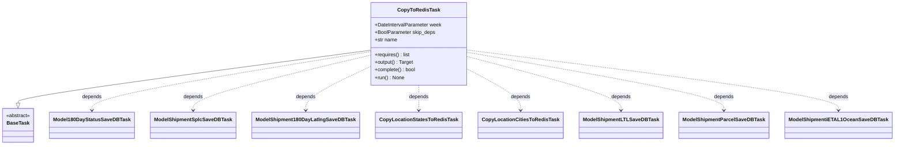
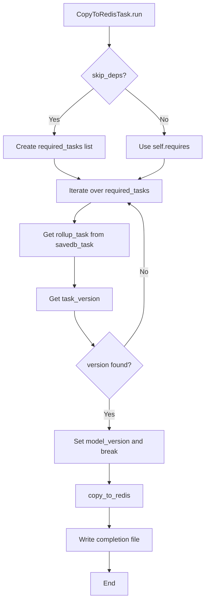
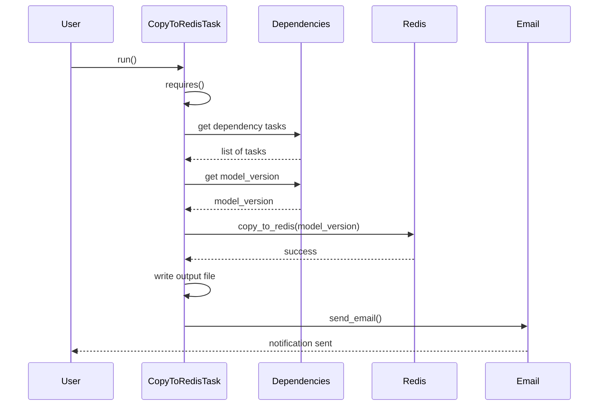

# Diagram: research/orchestrator/tasks/transforms/copy_to_redis_task.py

> Auto-generated by Obscura crawlers

## Diagram 1

### SVG

<svg id="container" width="2707.671875" xmlns="http://www.w3.org/2000/svg" class="classDiagram" height="462" viewBox="0 0 2707.671875 462" role="graphics-document document" aria-roledescription="class"><g><defs><marker id="container_class-aggregationStart" class="marker aggregation class" refX="18" refY="7" markerWidth="190" markerHeight="240" orient="auto"><path d="M 18,7 L9,13 L1,7 L9,1 Z"></path></marker></defs><defs><marker id="container_class-aggregationEnd" class="marker aggregation class" refX="1" refY="7" markerWidth="20" markerHeight="28" orient="auto"><path d="M 18,7 L9,13 L1,7 L9,1 Z"></path></marker></defs><defs><marker id="container_class-extensionStart" class="marker extension class" refX="18" refY="7" markerWidth="190" markerHeight="240" orient="auto"><path d="M 1,7 L18,13 V 1 Z"></path></marker></defs><defs><marker id="container_class-extensionEnd" class="marker extension class" refX="1" refY="7" markerWidth="20" markerHeight="28" orient="auto"><path d="M 1,1 V 13 L18,7 Z"></path></marker></defs><defs><marker id="container_class-compositionStart" class="marker composition class" refX="18" refY="7" markerWidth="190" markerHeight="240" orient="auto"><path d="M 18,7 L9,13 L1,7 L9,1 Z"></path></marker></defs><defs><marker id="container_class-compositionEnd" class="marker composition class" refX="1" refY="7" markerWidth="20" markerHeight="28" orient="auto"><path d="M 18,7 L9,13 L1,7 L9,1 Z"></path></marker></defs><defs><marker id="container_class-dependencyStart" class="marker dependency class" refX="6" refY="7" markerWidth="190" markerHeight="240" orient="auto"><path d="M 5,7 L9,13 L1,7 L9,1 Z"></path></marker></defs><defs><marker id="container_class-dependencyEnd" class="marker dependency class" refX="13" refY="7" markerWidth="20" markerHeight="28" orient="auto"><path d="M 18,7 L9,13 L14,7 L9,1 Z"></path></marker></defs><defs><marker id="container_class-lollipopStart" class="marker lollipop class" refX="13" refY="7" markerWidth="190" markerHeight="240" orient="auto"><circle stroke="black" fill="transparent" cx="7" cy="7" r="6"></circle></marker></defs><defs><marker id="container_class-lollipopEnd" class="marker lollipop class" refX="1" refY="7" markerWidth="190" markerHeight="240" orient="auto"><circle stroke="black" fill="transparent" cx="7" cy="7" r="6"></circle></marker></defs><g class="root"><g class="clusters"></g><g class="edgePaths"><path d="M1128.895,160.732L950.514,185.443C772.133,210.154,415.371,259.577,236.99,287.58C58.609,315.583,58.609,322.167,58.609,325.458L58.609,328.75" id="id_CopyToRedisTask_BaseTask_1" class="edge-thickness-normal edge-pattern-solid relation" style=";;;" data-edge="true" data-et="edge" data-id="id_CopyToRedisTask_BaseTask_1" data-points="W3sieCI6MTEyOC44OTQ1MzEyNSwieSI6MTYwLjczMTU5MTY1NDI4NTU4fSx7IngiOjU4LjYwOTM3NSwieSI6MzA5fSx7IngiOjU4LjYwOTM3NSwieSI6MzQ2fV0=" marker-end="url(#container_class-extensionEnd)"></path><path d="M1128.895,165.517L988.644,189.431C848.393,213.345,567.892,261.172,427.641,292.253C287.391,323.333,287.391,337.667,287.391,344.833L287.391,352" id="id_CopyToRedisTask_Model180DayStatusSaveDBTask_2" class="edge-thickness-normal edge-pattern-dashed relation" style=";;;" data-edge="true" data-et="edge" data-id="id_CopyToRedisTask_Model180DayStatusSaveDBTask_2" data-points="W3sieCI6MTEyOC44OTQ1MzEyNSwieSI6MTY1LjUxNjkxMTI3Nzg2MzZ9LHsieCI6Mjg3LjM5MDYyNSwieSI6MzA5fSx7IngiOjI4Ny4zOTA2MjUsInkiOjM1OH1d" marker-end="url(#container_class-dependencyEnd)"></path><path d="M1128.895,176.974L1039.833,198.979C950.771,220.983,772.647,264.991,683.585,294.162C594.523,323.333,594.523,337.667,594.523,344.833L594.523,352" id="id_CopyToRedisTask_ModelShipmentSplcSaveDBTask_3" class="edge-thickness-normal edge-pattern-dashed relation" style=";;;" data-edge="true" data-et="edge" data-id="id_CopyToRedisTask_ModelShipmentSplcSaveDBTask_3" data-points="W3sieCI6MTEyOC44OTQ1MzEyNSwieSI6MTc2Ljk3NDIzOTA0OTc0MDE2fSx7IngiOjU5NC41MjM0Mzc1LCJ5IjozMDl9LHsieCI6NTk0LjUyMzQzNzUsInkiOjM1OH1d" marker-end="url(#container_class-dependencyEnd)"></path><path d="M1128.895,213.868L1096.773,229.724C1064.651,245.579,1000.408,277.289,968.286,300.311C936.164,323.333,936.164,337.667,936.164,344.833L936.164,352" id="id_CopyToRedisTask_ModelShipment180DayLatlngSaveDBTask_4" class="edge-thickness-normal edge-pattern-dashed relation" style=";;;" data-edge="true" data-et="edge" data-id="id_CopyToRedisTask_ModelShipment180DayLatlngSaveDBTask_4" data-points="W3sieCI6MTEyOC44OTQ1MzEyNSwieSI6MjEzLjg2ODMyODU3OTU3Nzg1fSx7IngiOjkzNi4xNjQwNjI1LCJ5IjozMDl9LHsieCI6OTM2LjE2NDA2MjUsInkiOjM1OH1d" marker-end="url(#container_class-dependencyEnd)"></path><path d="M1278.547,272L1278.547,278.167C1278.547,284.333,1278.547,296.667,1278.547,310C1278.547,323.333,1278.547,337.667,1278.547,344.833L1278.547,352" id="id_CopyToRedisTask_CopyLocationStatesToRedisTask_5" class="edge-thickness-normal edge-pattern-dashed relation" style=";;;" data-edge="true" data-et="edge" data-id="id_CopyToRedisTask_CopyLocationStatesToRedisTask_5" data-points="W3sieCI6MTI3OC41NDY4NzUsInkiOjI3Mn0seyJ4IjoxMjc4LjU0Njg3NSwieSI6MzA5fSx7IngiOjEyNzguNTQ2ODc1LCJ5IjozNTh9XQ==" marker-end="url(#container_class-dependencyEnd)"></path><path d="M1428.199,222.46L1454.376,236.883C1480.552,251.306,1532.905,280.153,1559.081,301.743C1585.258,323.333,1585.258,337.667,1585.258,344.833L1585.258,352" id="id_CopyToRedisTask_CopyLocationCitiesToRedisTask_6" class="edge-thickness-normal edge-pattern-dashed relation" style=";;;" data-edge="true" data-et="edge" data-id="id_CopyToRedisTask_CopyLocationCitiesToRedisTask_6" data-points="W3sieCI6MTQyOC4xOTkyMTg3NSwieSI6MjIyLjQ1OTU1MDY3NjI3ODA3fSx7IngiOjE1ODUuMjU3ODEyNSwieSI6MzA5fSx7IngiOjE1ODUuMjU3ODEyNSwieSI6MzU4fV0=" marker-end="url(#container_class-dependencyEnd)"></path><path d="M1428.199,181.54L1504.731,202.783C1581.263,224.027,1734.327,266.513,1810.859,294.923C1887.391,323.333,1887.391,337.667,1887.391,344.833L1887.391,352" id="id_CopyToRedisTask_ModelShipmentLTLSaveDBTask_7" class="edge-thickness-normal edge-pattern-dashed relation" style=";;;" data-edge="true" data-et="edge" data-id="id_CopyToRedisTask_ModelShipmentLTLSaveDBTask_7" data-points="W3sieCI6MTQyOC4xOTkyMTg3NSwieSI6MTgxLjUzOTc5NzUxNTc4M30seyJ4IjoxODg3LjM5MDYyNSwieSI6MzA5fSx7IngiOjE4ODcuMzkwNjI1LCJ5IjozNTh9XQ==" marker-end="url(#container_class-dependencyEnd)"></path><path d="M1428.199,167.502L1556.525,191.085C1684.852,214.668,1941.504,261.834,2069.83,292.584C2198.156,323.333,2198.156,337.667,2198.156,344.833L2198.156,352" id="id_CopyToRedisTask_ModelShipmentParcelSaveDBTask_8" class="edge-thickness-normal edge-pattern-dashed relation" style=";;;" data-edge="true" data-et="edge" data-id="id_CopyToRedisTask_ModelShipmentParcelSaveDBTask_8" data-points="W3sieCI6MTQyOC4xOTkyMTg3NSwieSI6MTY3LjUwMjE2MjA5MzI4MDF9LHsieCI6MjE5OC4xNTYyNSwieSI6MzA5fSx7IngiOjIxOTguMTU2MjUsInkiOjM1OH1d" marker-end="url(#container_class-dependencyEnd)"></path><path d="M1428.199,160.022L1613.788,184.851C1799.378,209.681,2170.556,259.341,2356.145,291.337C2541.734,323.333,2541.734,337.667,2541.734,344.833L2541.734,352" id="id_CopyToRedisTask_ModelShipmentiETAL1OceanSaveDBTask_9" class="edge-thickness-normal edge-pattern-dashed relation" style=";;;" data-edge="true" data-et="edge" data-id="id_CopyToRedisTask_ModelShipmentiETAL1OceanSaveDBTask_9" data-points="W3sieCI6MTQyOC4xOTkyMTg3NSwieSI6MTYwLjAyMTc2NzIzMDcxNTk0fSx7IngiOjI1NDEuNzM0Mzc1LCJ5IjozMDl9LHsieCI6MjU0MS43MzQzNzUsInkiOjM1OH1d" marker-end="url(#container_class-dependencyEnd)"></path></g><g class="edgeLabels"><g class="edgeLabel"><g class="label" data-id="id_CopyToRedisTask_BaseTask_1" transform="translate(0, 0)"><foreignObject width="0" height="0">

</foreignObject></g></g><g class="edgeLabel" transform="translate(287.390625, 309)"><g class="label" data-id="id_CopyToRedisTask_Model180DayStatusSaveDBTask_2" transform="translate(-31.46875, -12)"><foreignObject width="62.9375" height="24">

depends

</foreignObject></g></g><g class="edgeLabel" transform="translate(594.5234375, 309)"><g class="label" data-id="id_CopyToRedisTask_ModelShipmentSplcSaveDBTask_3" transform="translate(-31.46875, -12)"><foreignObject width="62.9375" height="24">

depends

</foreignObject></g></g><g class="edgeLabel" transform="translate(936.1640625, 309)"><g class="label" data-id="id_CopyToRedisTask_ModelShipment180DayLatlngSaveDBTask_4" transform="translate(-31.46875, -12)"><foreignObject width="62.9375" height="24">

depends

</foreignObject></g></g><g class="edgeLabel" transform="translate(1278.546875, 309)"><g class="label" data-id="id_CopyToRedisTask_CopyLocationStatesToRedisTask_5" transform="translate(-31.46875, -12)"><foreignObject width="62.9375" height="24">

depends

</foreignObject></g></g><g class="edgeLabel" transform="translate(1585.2578125, 309)"><g class="label" data-id="id_CopyToRedisTask_CopyLocationCitiesToRedisTask_6" transform="translate(-31.46875, -12)"><foreignObject width="62.9375" height="24">

depends

</foreignObject></g></g><g class="edgeLabel" transform="translate(1887.390625, 309)"><g class="label" data-id="id_CopyToRedisTask_ModelShipmentLTLSaveDBTask_7" transform="translate(-31.46875, -12)"><foreignObject width="62.9375" height="24">

depends

</foreignObject></g></g><g class="edgeLabel" transform="translate(2198.15625, 309)"><g class="label" data-id="id_CopyToRedisTask_ModelShipmentParcelSaveDBTask_8" transform="translate(-31.46875, -12)"><foreignObject width="62.9375" height="24">

depends

</foreignObject></g></g><g class="edgeLabel" transform="translate(2541.734375, 309)"><g class="label" data-id="id_CopyToRedisTask_ModelShipmentiETAL1OceanSaveDBTask_9" transform="translate(-31.46875, -12)"><foreignObject width="62.9375" height="24">

depends

</foreignObject></g></g></g><g class="nodes"><g class="node default" id="classId-CopyToRedisTask-0" transform="translate(1278.546875, 140)"><g class="basic label-container"><path d="M-149.65234375 -132 L149.65234375 -132 L149.65234375 132 L-149.65234375 132" stroke="none" stroke-width="0" fill="#ECECFF" style=""></path><path d="M-149.65234375 -132 C-81.36560899256118 -132, -13.078874235122356 -132, 149.65234375 -132 M-149.65234375 -132 C-30.029552299296483 -132, 89.59323915140703 -132, 149.65234375 -132 M149.65234375 -132 C149.65234375 -41.19362058180948, 149.65234375 49.61275883638103, 149.65234375 132 M149.65234375 -132 C149.65234375 -77.96156855774706, 149.65234375 -23.92313711549413, 149.65234375 132 M149.65234375 132 C32.82659967356962 132, -83.99914440286076 132, -149.65234375 132 M149.65234375 132 C54.48366976257326 132, -40.685004224853486 132, -149.65234375 132 M-149.65234375 132 C-149.65234375 74.08432764269779, -149.65234375 16.168655285395573, -149.65234375 -132 M-149.65234375 132 C-149.65234375 35.27491615217697, -149.65234375 -61.45016769564606, -149.65234375 -132" stroke="#9370DB" stroke-width="1.3" fill="none" stroke-dasharray="0 0" style=""></path></g><g class="annotation-group text" transform="translate(0, -108)"></g><g class="label-group text" transform="translate(-63.1796875, -108)"><g class="label" style="font-weight: bolder" transform="translate(0,-12)"><foreignObject width="126.359375" height="24">

CopyToRedisTask

</foreignObject></g></g><g class="members-group text" transform="translate(-137.65234375, -60)"><g class="label" style="" transform="translate(0,-12)"><foreignObject width="212.125" height="24">

+DateIntervalParameter week

</foreignObject></g><g class="label" style="" transform="translate(0,12)"><foreignObject width="192.265625" height="24">

+BoolParameter skip_deps

</foreignObject></g><g class="label" style="" transform="translate(0,36)"><foreignObject width="72.171875" height="24">

+str name

</foreignObject></g></g><g class="methods-group text" transform="translate(-137.65234375, 36)"><g class="label" style="" transform="translate(0,-12)"><foreignObject width="112.828125" height="24">

+requires() : list

</foreignObject></g><g class="label" style="" transform="translate(0,12)"><foreignObject width="124.375" height="24">

+output() : Target

</foreignObject></g><g class="label" style="" transform="translate(0,36)"><foreignObject width="131.03125" height="24">

+complete() : bool

</foreignObject></g><g class="label" style="" transform="translate(0,60)"><foreignObject width="93.90625" height="24">

+run() : None

</foreignObject></g></g><g class="divider" style=""><path d="M-149.65234375 -84 C-64.38639691771213 -84, 20.879549914575733 -84, 149.65234375 -84 M-149.65234375 -84 C-46.32550129378558 -84, 57.001341162428844 -84, 149.65234375 -84" stroke="#9370DB" stroke-width="1.3" fill="none" stroke-dasharray="0 0" style=""></path></g><g class="divider" style=""><path d="M-149.65234375 12 C-87.78775446245966 12, -25.92316517491932 12, 149.65234375 12 M-149.65234375 12 C-59.133758798241075 12, 31.38482615351785 12, 149.65234375 12" stroke="#9370DB" stroke-width="1.3" fill="none" stroke-dasharray="0 0" style=""></path></g></g><g class="node default" id="classId-BaseTask-1" transform="translate(58.609375, 400)"><g class="basic label-container"><path d="M-50.609375 -54 L50.609375 -54 L50.609375 54 L-50.609375 54" stroke="none" stroke-width="0" fill="#ECECFF" style=""></path><path d="M-50.609375 -54 C-12.345512938078343 -54, 25.918349123843313 -54, 50.609375 -54 M-50.609375 -54 C-24.470011561356404 -54, 1.6693518772871911 -54, 50.609375 -54 M50.609375 -54 C50.609375 -31.4376550521878, 50.609375 -8.8753101043756, 50.609375 54 M50.609375 -54 C50.609375 -26.984201014370857, 50.609375 0.031597971258285895, 50.609375 54 M50.609375 54 C29.801877607786757 54, 8.994380215573514 54, -50.609375 54 M50.609375 54 C14.967476179989795 54, -20.67442264002041 54, -50.609375 54 M-50.609375 54 C-50.609375 26.659182120131277, -50.609375 -0.6816357597374463, -50.609375 -54 M-50.609375 54 C-50.609375 30.877584531411575, -50.609375 7.75516906282315, -50.609375 -54" stroke="#9370DB" stroke-width="1.3" fill="none" stroke-dasharray="0 0" style=""></path></g><g class="annotation-group text" transform="translate(-38.609375, -30)"><g class="label" style="" transform="translate(0,-12)"><foreignObject width="77.21875" height="24">

«abstract»

</foreignObject></g></g><g class="label-group text" transform="translate(-34.03125, -6)"><g class="label" style="font-weight: bolder" transform="translate(0,-12)"><foreignObject width="68.0625" height="24">

BaseTask

</foreignObject></g></g><g class="members-group text" transform="translate(-38.609375, 42)"></g><g class="methods-group text" transform="translate(-38.609375, 72)"></g><g class="divider" style=""><path d="M-50.609375 18 C-17.363694795626962 18, 15.881985408746075 18, 50.609375 18 M-50.609375 18 C-28.556534075271358 18, -6.503693150542716 18, 50.609375 18" stroke="#9370DB" stroke-width="1.3" fill="none" stroke-dasharray="0 0" style=""></path></g><g class="divider" style=""><path d="M-50.609375 36 C-27.24191649187483 36, -3.8744579837496573 36, 50.609375 36 M-50.609375 36 C-26.290243487310487 36, -1.9711119746209746 36, 50.609375 36" stroke="#9370DB" stroke-width="1.3" fill="none" stroke-dasharray="0 0" style=""></path></g></g><g class="node default" id="classId-Model180DayStatusSaveDBTask-2" transform="translate(287.390625, 400)"><g class="basic label-container"><path d="M-128.171875 -42 L128.171875 -42 L128.171875 42 L-128.171875 42" stroke="none" stroke-width="0" fill="#ECECFF" style=""></path><path d="M-128.171875 -42 C-39.997351011812 -42, 48.177172976376 -42, 128.171875 -42 M-128.171875 -42 C-75.36040925115887 -42, -22.54894350231774 -42, 128.171875 -42 M128.171875 -42 C128.171875 -17.80855033465313, 128.171875 6.382899330693739, 128.171875 42 M128.171875 -42 C128.171875 -23.60925935517971, 128.171875 -5.218518710359419, 128.171875 42 M128.171875 42 C47.90095800491805 42, -32.369958990163894 42, -128.171875 42 M128.171875 42 C29.30728601832446 42, -69.55730296335108 42, -128.171875 42 M-128.171875 42 C-128.171875 21.308878785299548, -128.171875 0.6177575705990961, -128.171875 -42 M-128.171875 42 C-128.171875 24.083704275149437, -128.171875 6.167408550298873, -128.171875 -42" stroke="#9370DB" stroke-width="1.3" fill="none" stroke-dasharray="0 0" style=""></path></g><g class="annotation-group text" transform="translate(0, -18)"></g><g class="label-group text" transform="translate(-116.171875, -18)"><g class="label" style="font-weight: bolder" transform="translate(0,-12)"><foreignObject width="232.34375" height="24">

Model180DayStatusSaveDBTask

</foreignObject></g></g><g class="members-group text" transform="translate(-116.171875, 30)"></g><g class="methods-group text" transform="translate(-116.171875, 60)"></g><g class="divider" style=""><path d="M-128.171875 6 C-33.596776495447145 6, 60.97832200910571 6, 128.171875 6 M-128.171875 6 C-47.39989838755146 6, 33.37207822489708 6, 128.171875 6" stroke="#9370DB" stroke-width="1.3" fill="none" stroke-dasharray="0 0" style=""></path></g><g class="divider" style=""><path d="M-128.171875 24 C-62.910727069734776 24, 2.3504208605304484 24, 128.171875 24 M-128.171875 24 C-45.56534345955892 24, 37.041188080882165 24, 128.171875 24" stroke="#9370DB" stroke-width="1.3" fill="none" stroke-dasharray="0 0" style=""></path></g></g><g class="node default" id="classId-ModelShipmentSplcSaveDBTask-3" transform="translate(594.5234375, 400)"><g class="basic label-container"><path d="M-128.9609375 -42 L128.9609375 -42 L128.9609375 42 L-128.9609375 42" stroke="none" stroke-width="0" fill="#ECECFF" style=""></path><path d="M-128.9609375 -42 C-42.913748944252816 -42, 43.13343961149437 -42, 128.9609375 -42 M-128.9609375 -42 C-30.39038698927854 -42, 68.18016352144292 -42, 128.9609375 -42 M128.9609375 -42 C128.9609375 -15.439822528611284, 128.9609375 11.120354942777432, 128.9609375 42 M128.9609375 -42 C128.9609375 -18.415099251239376, 128.9609375 5.169801497521249, 128.9609375 42 M128.9609375 42 C55.70154354101821 42, -17.55785041796358 42, -128.9609375 42 M128.9609375 42 C29.852773641437466 42, -69.25539021712507 42, -128.9609375 42 M-128.9609375 42 C-128.9609375 15.250216700177045, -128.9609375 -11.49956659964591, -128.9609375 -42 M-128.9609375 42 C-128.9609375 12.900025414551376, -128.9609375 -16.19994917089725, -128.9609375 -42" stroke="#9370DB" stroke-width="1.3" fill="none" stroke-dasharray="0 0" style=""></path></g><g class="annotation-group text" transform="translate(0, -18)"></g><g class="label-group text" transform="translate(-116.9609375, -18)"><g class="label" style="font-weight: bolder" transform="translate(0,-12)"><foreignObject width="233.921875" height="24">

ModelShipmentSplcSaveDBTask

</foreignObject></g></g><g class="members-group text" transform="translate(-116.9609375, 30)"></g><g class="methods-group text" transform="translate(-116.9609375, 60)"></g><g class="divider" style=""><path d="M-128.9609375 6 C-52.096462006484785 6, 24.76801348703043 6, 128.9609375 6 M-128.9609375 6 C-39.49808614363987 6, 49.964765212720266 6, 128.9609375 6" stroke="#9370DB" stroke-width="1.3" fill="none" stroke-dasharray="0 0" style=""></path></g><g class="divider" style=""><path d="M-128.9609375 24 C-74.68051974867004 24, -20.40010199734006 24, 128.9609375 24 M-128.9609375 24 C-26.995748385751938 24, 74.96944072849612 24, 128.9609375 24" stroke="#9370DB" stroke-width="1.3" fill="none" stroke-dasharray="0 0" style=""></path></g></g><g class="node default" id="classId-ModelShipment180DayLatlngSaveDBTask-4" transform="translate(936.1640625, 400)"><g class="basic label-container"><path d="M-162.6796875 -42 L162.6796875 -42 L162.6796875 42 L-162.6796875 42" stroke="none" stroke-width="0" fill="#ECECFF" style=""></path><path d="M-162.6796875 -42 C-44.283709478526404 -42, 74.11226854294719 -42, 162.6796875 -42 M-162.6796875 -42 C-81.05423233841485 -42, 0.5712228231703023 -42, 162.6796875 -42 M162.6796875 -42 C162.6796875 -18.10046495288667, 162.6796875 5.799070094226657, 162.6796875 42 M162.6796875 -42 C162.6796875 -22.108421810166824, 162.6796875 -2.2168436203336483, 162.6796875 42 M162.6796875 42 C67.16600994891171 42, -28.347667602176585 42, -162.6796875 42 M162.6796875 42 C69.79794688705373 42, -23.083793725892548 42, -162.6796875 42 M-162.6796875 42 C-162.6796875 13.98881997596763, -162.6796875 -14.02236004806474, -162.6796875 -42 M-162.6796875 42 C-162.6796875 18.317475617658324, -162.6796875 -5.365048764683351, -162.6796875 -42" stroke="#9370DB" stroke-width="1.3" fill="none" stroke-dasharray="0 0" style=""></path></g><g class="annotation-group text" transform="translate(0, -18)"></g><g class="label-group text" transform="translate(-150.6796875, -18)"><g class="label" style="font-weight: bolder" transform="translate(0,-12)"><foreignObject width="301.359375" height="24">

ModelShipment180DayLatlngSaveDBTask

</foreignObject></g></g><g class="members-group text" transform="translate(-150.6796875, 30)"></g><g class="methods-group text" transform="translate(-150.6796875, 60)"></g><g class="divider" style=""><path d="M-162.6796875 6 C-35.45016227396199 6, 91.77936295207601 6, 162.6796875 6 M-162.6796875 6 C-75.45977052032165 6, 11.76014645935669 6, 162.6796875 6" stroke="#9370DB" stroke-width="1.3" fill="none" stroke-dasharray="0 0" style=""></path></g><g class="divider" style=""><path d="M-162.6796875 24 C-59.99908095792149 24, 42.681525584157015 24, 162.6796875 24 M-162.6796875 24 C-61.536154584302196 24, 39.60737833139561 24, 162.6796875 24" stroke="#9370DB" stroke-width="1.3" fill="none" stroke-dasharray="0 0" style=""></path></g></g><g class="node default" id="classId-CopyLocationStatesToRedisTask-5" transform="translate(1278.546875, 400)"><g class="basic label-container"><path d="M-129.703125 -42 L129.703125 -42 L129.703125 42 L-129.703125 42" stroke="none" stroke-width="0" fill="#ECECFF" style=""></path><path d="M-129.703125 -42 C-30.13325150697071 -42, 69.43662198605858 -42, 129.703125 -42 M-129.703125 -42 C-32.38558132917541 -42, 64.93196234164918 -42, 129.703125 -42 M129.703125 -42 C129.703125 -22.432244552024667, 129.703125 -2.8644891040493334, 129.703125 42 M129.703125 -42 C129.703125 -24.61289759840743, 129.703125 -7.2257951968148575, 129.703125 42 M129.703125 42 C31.042363559099257 42, -67.61839788180149 42, -129.703125 42 M129.703125 42 C37.17914164520339 42, -55.344841709593226 42, -129.703125 42 M-129.703125 42 C-129.703125 21.520874541535438, -129.703125 1.0417490830708758, -129.703125 -42 M-129.703125 42 C-129.703125 19.71805213227225, -129.703125 -2.563895735455503, -129.703125 -42" stroke="#9370DB" stroke-width="1.3" fill="none" stroke-dasharray="0 0" style=""></path></g><g class="annotation-group text" transform="translate(0, -18)"></g><g class="label-group text" transform="translate(-117.703125, -18)"><g class="label" style="font-weight: bolder" transform="translate(0,-12)"><foreignObject width="235.40625" height="24">

CopyLocationStatesToRedisTask

</foreignObject></g></g><g class="members-group text" transform="translate(-117.703125, 30)"></g><g class="methods-group text" transform="translate(-117.703125, 60)"></g><g class="divider" style=""><path d="M-129.703125 6 C-30.839105192927548 6, 68.0249146141449 6, 129.703125 6 M-129.703125 6 C-42.493555164358014 6, 44.71601467128397 6, 129.703125 6" stroke="#9370DB" stroke-width="1.3" fill="none" stroke-dasharray="0 0" style=""></path></g><g class="divider" style=""><path d="M-129.703125 24 C-27.009341913160213 24, 75.68444117367957 24, 129.703125 24 M-129.703125 24 C-71.61960220169112 24, -13.536079403382246 24, 129.703125 24" stroke="#9370DB" stroke-width="1.3" fill="none" stroke-dasharray="0 0" style=""></path></g></g><g class="node default" id="classId-CopyLocationCitiesToRedisTask-6" transform="translate(1585.2578125, 400)"><g class="basic label-container"><path d="M-127.0078125 -42 L127.0078125 -42 L127.0078125 42 L-127.0078125 42" stroke="none" stroke-width="0" fill="#ECECFF" style=""></path><path d="M-127.0078125 -42 C-72.0588039618054 -42, -17.10979542361079 -42, 127.0078125 -42 M-127.0078125 -42 C-55.06483577067873 -42, 16.878140958642547 -42, 127.0078125 -42 M127.0078125 -42 C127.0078125 -22.88172618152375, 127.0078125 -3.7634523630474987, 127.0078125 42 M127.0078125 -42 C127.0078125 -13.359505126149774, 127.0078125 15.280989747700453, 127.0078125 42 M127.0078125 42 C29.23795863938301 42, -68.53189522123398 42, -127.0078125 42 M127.0078125 42 C59.24814908846692 42, -8.511514323066166 42, -127.0078125 42 M-127.0078125 42 C-127.0078125 20.56060720369293, -127.0078125 -0.8787855926141432, -127.0078125 -42 M-127.0078125 42 C-127.0078125 16.670828521421846, -127.0078125 -8.658342957156307, -127.0078125 -42" stroke="#9370DB" stroke-width="1.3" fill="none" stroke-dasharray="0 0" style=""></path></g><g class="annotation-group text" transform="translate(0, -18)"></g><g class="label-group text" transform="translate(-115.0078125, -18)"><g class="label" style="font-weight: bolder" transform="translate(0,-12)"><foreignObject width="230.015625" height="24">

CopyLocationCitiesToRedisTask

</foreignObject></g></g><g class="members-group text" transform="translate(-115.0078125, 30)"></g><g class="methods-group text" transform="translate(-115.0078125, 60)"></g><g class="divider" style=""><path d="M-127.0078125 6 C-38.21385269879349 6, 50.580107102413024 6, 127.0078125 6 M-127.0078125 6 C-38.85744732429254 6, 49.29291785141493 6, 127.0078125 6" stroke="#9370DB" stroke-width="1.3" fill="none" stroke-dasharray="0 0" style=""></path></g><g class="divider" style=""><path d="M-127.0078125 24 C-49.28394314478393 24, 28.439926210432134 24, 127.0078125 24 M-127.0078125 24 C-49.858788032294015 24, 27.29023643541197 24, 127.0078125 24" stroke="#9370DB" stroke-width="1.3" fill="none" stroke-dasharray="0 0" style=""></path></g></g><g class="node default" id="classId-ModelShipmentLTLSaveDBTask-7" transform="translate(1887.390625, 400)"><g class="basic label-container"><path d="M-125.125 -42 L125.125 -42 L125.125 42 L-125.125 42" stroke="none" stroke-width="0" fill="#ECECFF" style=""></path><path d="M-125.125 -42 C-41.3143232124462 -42, 42.496353575107605 -42, 125.125 -42 M-125.125 -42 C-41.791776969420994 -42, 41.54144606115801 -42, 125.125 -42 M125.125 -42 C125.125 -17.68083891652597, 125.125 6.638322166948058, 125.125 42 M125.125 -42 C125.125 -21.47580183005079, 125.125 -0.9516036601015827, 125.125 42 M125.125 42 C29.5679724378073 42, -65.9890551243854 42, -125.125 42 M125.125 42 C49.52617662841935 42, -26.0726467431613 42, -125.125 42 M-125.125 42 C-125.125 20.599553955846787, -125.125 -0.8008920883064263, -125.125 -42 M-125.125 42 C-125.125 19.041419408747497, -125.125 -3.917161182505005, -125.125 -42" stroke="#9370DB" stroke-width="1.3" fill="none" stroke-dasharray="0 0" style=""></path></g><g class="annotation-group text" transform="translate(0, -18)"></g><g class="label-group text" transform="translate(-113.125, -18)"><g class="label" style="font-weight: bolder" transform="translate(0,-12)"><foreignObject width="226.25" height="24">

ModelShipmentLTLSaveDBTask

</foreignObject></g></g><g class="members-group text" transform="translate(-113.125, 30)"></g><g class="methods-group text" transform="translate(-113.125, 60)"></g><g class="divider" style=""><path d="M-125.125 6 C-60.52029904572164 6, 4.084401908556714 6, 125.125 6 M-125.125 6 C-67.34649928714475 6, -9.56799857428949 6, 125.125 6" stroke="#9370DB" stroke-width="1.3" fill="none" stroke-dasharray="0 0" style=""></path></g><g class="divider" style=""><path d="M-125.125 24 C-50.89652125089057 24, 23.331957498218856 24, 125.125 24 M-125.125 24 C-33.95595318077247 24, 57.213093638455064 24, 125.125 24" stroke="#9370DB" stroke-width="1.3" fill="none" stroke-dasharray="0 0" style=""></path></g></g><g class="node default" id="classId-ModelShipmentParcelSaveDBTask-8" transform="translate(2198.15625, 400)"><g class="basic label-container"><path d="M-135.640625 -42 L135.640625 -42 L135.640625 42 L-135.640625 42" stroke="none" stroke-width="0" fill="#ECECFF" style=""></path><path d="M-135.640625 -42 C-67.94630808491148 -42, -0.2519911698229578 -42, 135.640625 -42 M-135.640625 -42 C-38.976522997144514 -42, 57.68757900571097 -42, 135.640625 -42 M135.640625 -42 C135.640625 -15.652482325190014, 135.640625 10.695035349619971, 135.640625 42 M135.640625 -42 C135.640625 -8.811260882460466, 135.640625 24.377478235079067, 135.640625 42 M135.640625 42 C76.99665132909294 42, 18.352677658185883 42, -135.640625 42 M135.640625 42 C56.9959980602808 42, -21.648628879438405 42, -135.640625 42 M-135.640625 42 C-135.640625 21.61027690038586, -135.640625 1.220553800771718, -135.640625 -42 M-135.640625 42 C-135.640625 11.757066538262038, -135.640625 -18.485866923475925, -135.640625 -42" stroke="#9370DB" stroke-width="1.3" fill="none" stroke-dasharray="0 0" style=""></path></g><g class="annotation-group text" transform="translate(0, -18)"></g><g class="label-group text" transform="translate(-123.640625, -18)"><g class="label" style="font-weight: bolder" transform="translate(0,-12)"><foreignObject width="247.28125" height="24">

ModelShipmentParcelSaveDBTask

</foreignObject></g></g><g class="members-group text" transform="translate(-123.640625, 30)"></g><g class="methods-group text" transform="translate(-123.640625, 60)"></g><g class="divider" style=""><path d="M-135.640625 6 C-70.64676591272676 6, -5.6529068254535275 6, 135.640625 6 M-135.640625 6 C-70.95423471965451 6, -6.267844439309016 6, 135.640625 6" stroke="#9370DB" stroke-width="1.3" fill="none" stroke-dasharray="0 0" style=""></path></g><g class="divider" style=""><path d="M-135.640625 24 C-36.30494356688814 24, 63.03073786622372 24, 135.640625 24 M-135.640625 24 C-73.95927546121172 24, -12.277925922423421 24, 135.640625 24" stroke="#9370DB" stroke-width="1.3" fill="none" stroke-dasharray="0 0" style=""></path></g></g><g class="node default" id="classId-ModelShipmentiETAL1OceanSaveDBTask-9" transform="translate(2541.734375, 400)"><g class="basic label-container"><path d="M-157.9375 -42 L157.9375 -42 L157.9375 42 L-157.9375 42" stroke="none" stroke-width="0" fill="#ECECFF" style=""></path><path d="M-157.9375 -42 C-73.39861214868432 -42, 11.140275702631357 -42, 157.9375 -42 M-157.9375 -42 C-92.26012394626484 -42, -26.58274789252968 -42, 157.9375 -42 M157.9375 -42 C157.9375 -23.96661325483514, 157.9375 -5.933226509670277, 157.9375 42 M157.9375 -42 C157.9375 -21.274206123218306, 157.9375 -0.5484122464366123, 157.9375 42 M157.9375 42 C86.60110805049831 42, 15.264716100996623 42, -157.9375 42 M157.9375 42 C32.3830950718132 42, -93.1713098563736 42, -157.9375 42 M-157.9375 42 C-157.9375 12.991304395754842, -157.9375 -16.017391208490317, -157.9375 -42 M-157.9375 42 C-157.9375 23.621947865572867, -157.9375 5.243895731145734, -157.9375 -42" stroke="#9370DB" stroke-width="1.3" fill="none" stroke-dasharray="0 0" style=""></path></g><g class="annotation-group text" transform="translate(0, -18)"></g><g class="label-group text" transform="translate(-145.9375, -18)"><g class="label" style="font-weight: bolder" transform="translate(0,-12)"><foreignObject width="291.875" height="24">

ModelShipmentiETAL1OceanSaveDBTask

</foreignObject></g></g><g class="members-group text" transform="translate(-145.9375, 30)"></g><g class="methods-group text" transform="translate(-145.9375, 60)"></g><g class="divider" style=""><path d="M-157.9375 6 C-80.15643341201667 6, -2.3753668240333354 6, 157.9375 6 M-157.9375 6 C-71.04255930120982 6, 15.85238139758036 6, 157.9375 6" stroke="#9370DB" stroke-width="1.3" fill="none" stroke-dasharray="0 0" style=""></path></g><g class="divider" style=""><path d="M-157.9375 24 C-92.5937299691822 24, -27.249959938364412 24, 157.9375 24 M-157.9375 24 C-44.69825776974217 24, 68.54098446051566 24, 157.9375 24" stroke="#9370DB" stroke-width="1.3" fill="none" stroke-dasharray="0 0" style=""></path></g></g></g></g></g></svg>

## Diagram 2

### SVG

<svg id="container" width="489.84375" xmlns="http://www.w3.org/2000/svg" class="flowchart" height="1417.0625" viewBox="0 0 489.84375 1417.0625" role="graphics-document document" aria-roledescription="flowchart-v2"><g><marker id="container_flowchart-v2-pointEnd" class="marker flowchart-v2" viewBox="0 0 10 10" refX="5" refY="5" markerUnits="userSpaceOnUse" markerWidth="8" markerHeight="8" orient="auto"><path d="M 0 0 L 10 5 L 0 10 z" class="arrowMarkerPath" style="stroke-width: 1; stroke-dasharray: 1, 0;"></path></marker><marker id="container_flowchart-v2-pointStart" class="marker flowchart-v2" viewBox="0 0 10 10" refX="4.5" refY="5" markerUnits="userSpaceOnUse" markerWidth="8" markerHeight="8" orient="auto"><path d="M 0 5 L 10 10 L 10 0 z" class="arrowMarkerPath" style="stroke-width: 1; stroke-dasharray: 1, 0;"></path></marker><marker id="container_flowchart-v2-circleEnd" class="marker flowchart-v2" viewBox="0 0 10 10" refX="11" refY="5" markerUnits="userSpaceOnUse" markerWidth="11" markerHeight="11" orient="auto"><circle cx="5" cy="5" r="5" class="arrowMarkerPath" style="stroke-width: 1; stroke-dasharray: 1, 0;"></circle></marker><marker id="container_flowchart-v2-circleStart" class="marker flowchart-v2" viewBox="0 0 10 10" refX="-1" refY="5" markerUnits="userSpaceOnUse" markerWidth="11" markerHeight="11" orient="auto"><circle cx="5" cy="5" r="5" class="arrowMarkerPath" style="stroke-width: 1; stroke-dasharray: 1, 0;"></circle></marker><marker id="container_flowchart-v2-crossEnd" class="marker cross flowchart-v2" viewBox="0 0 11 11" refX="12" refY="5.2" markerUnits="userSpaceOnUse" markerWidth="11" markerHeight="11" orient="auto"><path d="M 1,1 l 9,9 M 10,1 l -9,9" class="arrowMarkerPath" style="stroke-width: 2; stroke-dasharray: 1, 0;"></path></marker><marker id="container_flowchart-v2-crossStart" class="marker cross flowchart-v2" viewBox="0 0 11 11" refX="-1" refY="5.2" markerUnits="userSpaceOnUse" markerWidth="11" markerHeight="11" orient="auto"><path d="M 1,1 l 9,9 M 10,1 l -9,9" class="arrowMarkerPath" style="stroke-width: 2; stroke-dasharray: 1, 0;"></path></marker><g class="root"><g class="clusters"></g><g class="edgePaths"><path d="M260.922,62L260.922,66.167C260.922,70.333,260.922,78.667,260.922,86.333C260.922,94,260.922,101,260.922,104.5L260.922,108" id="L_A_B_0" class="edge-thickness-normal edge-pattern-solid edge-thickness-normal edge-pattern-solid flowchart-link" style=";" data-edge="true" data-et="edge" data-id="L_A_B_0" data-points="W3sieCI6MjYwLjkyMTg3NSwieSI6NjJ9LHsieCI6MjYwLjkyMTg3NSwieSI6ODd9LHsieCI6MjYwLjkyMTg3NSwieSI6MTEyfV0=" marker-end="url(#container_flowchart-v2-pointEnd)"></path><path d="M223.678,208.256L208.058,220.63C192.439,233.004,161.2,257.752,145.58,275.626C129.961,293.5,129.961,304.5,129.961,310L129.961,315.5" id="L_B_C_0" class="edge-thickness-normal edge-pattern-solid edge-thickness-normal edge-pattern-solid flowchart-link" style=";" data-edge="true" data-et="edge" data-id="L_B_C_0" data-points="W3sieCI6MjIzLjY3NzU4MzQ4NDUwNTUzLCJ5IjoyMDguMjU1NzA4NDg0NTA1NTN9LHsieCI6MTI5Ljk2MDkzNzUsInkiOjI4Mi41fSx7IngiOjEyOS45NjA5Mzc1LCJ5IjozMTkuNX1d" marker-end="url(#container_flowchart-v2-pointEnd)"></path><path d="M298.166,208.256L313.786,220.63C329.405,233.004,360.644,257.752,376.263,275.626C391.883,293.5,391.883,304.5,391.883,310L391.883,315.5" id="L_B_D_0" class="edge-thickness-normal edge-pattern-solid edge-thickness-normal edge-pattern-solid flowchart-link" style=";" data-edge="true" data-et="edge" data-id="L_B_D_0" data-points="W3sieCI6Mjk4LjE2NjE2NjUxNTQ5NDQ3LCJ5IjoyMDguMjU1NzA4NDg0NTA1NTN9LHsieCI6MzkxLjg4MjgxMjUsInkiOjI4Mi41fSx7IngiOjM5MS44ODI4MTI1LCJ5IjozMTkuNX1d" marker-end="url(#container_flowchart-v2-pointEnd)"></path><path d="M129.961,373.5L129.961,377.667C129.961,381.833,129.961,390.167,139.835,398.254C149.709,406.341,169.457,414.183,179.331,418.103L189.205,422.024" id="L_C_E_0" class="edge-thickness-normal edge-pattern-solid edge-thickness-normal edge-pattern-solid flowchart-link" style=";" data-edge="true" data-et="edge" data-id="L_C_E_0" data-points="W3sieCI6MTI5Ljk2MDkzNzUsInkiOjM3My41fSx7IngiOjEyOS45NjA5Mzc1LCJ5IjozOTguNX0seyJ4IjoxOTIuOTIyOTI2NjgyNjkyMzIsInkiOjQyMy41fV0=" marker-end="url(#container_flowchart-v2-pointEnd)"></path><path d="M391.883,373.5L391.883,377.667C391.883,381.833,391.883,390.167,382.009,398.254C372.135,406.341,352.387,414.183,342.513,418.103L332.638,422.024" id="L_D_E_0" class="edge-thickness-normal edge-pattern-solid edge-thickness-normal edge-pattern-solid flowchart-link" style=";" data-edge="true" data-et="edge" data-id="L_D_E_0" data-points="W3sieCI6MzkxLjg4MjgxMjUsInkiOjM3My41fSx7IngiOjM5MS44ODI4MTI1LCJ5IjozOTguNX0seyJ4IjozMjguOTIwODIzMzE3MzA3NywieSI6NDIzLjV9XQ==" marker-end="url(#container_flowchart-v2-pointEnd)"></path><path d="M218.085,477.5L211.475,481.667C204.864,485.833,191.643,494.167,185.032,501.833C178.422,509.5,178.422,516.5,178.422,520L178.422,523.5" id="L_E_F_0" class="edge-thickness-normal edge-pattern-solid edge-thickness-normal edge-pattern-solid flowchart-link" style=";" data-edge="true" data-et="edge" data-id="L_E_F_0" data-points="W3sieCI6MjE4LjA4NTMzNjUzODQ2MTU1LCJ5Ijo0NzcuNX0seyJ4IjoxNzguNDIxODc1LCJ5Ijo1MDIuNX0seyJ4IjoxNzguNDIxODc1LCJ5Ijo1MjcuNX1d" marker-end="url(#container_flowchart-v2-pointEnd)"></path><path d="M178.422,605.5L178.422,611.667C178.422,617.833,178.422,630.167,178.422,641.833C178.422,653.5,178.422,664.5,178.422,670L178.422,675.5" id="L_F_G_0" class="edge-thickness-normal edge-pattern-solid edge-thickness-normal edge-pattern-solid flowchart-link" style=";" data-edge="true" data-et="edge" data-id="L_F_G_0" data-points="W3sieCI6MTc4LjQyMTg3NSwieSI6NjA1LjV9LHsieCI6MTc4LjQyMTg3NSwieSI6NjQyLjV9LHsieCI6MTc4LjQyMTg3NSwieSI6Njc5LjV9XQ==" marker-end="url(#container_flowchart-v2-pointEnd)"></path><path d="M178.422,733.5L178.422,737.667C178.422,741.833,178.422,750.167,185.863,763.874C193.303,777.581,208.184,796.661,215.625,806.202L223.066,815.742" id="L_G_H_0" class="edge-thickness-normal edge-pattern-solid edge-thickness-normal edge-pattern-solid flowchart-link" style=";" data-edge="true" data-et="edge" data-id="L_G_H_0" data-points="W3sieCI6MTc4LjQyMTg3NSwieSI6NzMzLjV9LHsieCI6MTc4LjQyMTg3NSwieSI6NzU4LjV9LHsieCI6MjI1LjUyNTYwOTQzOTgzNDAzLCJ5Ijo4MTguODk2MjY1NTYwMTY2fV0=" marker-end="url(#container_flowchart-v2-pointEnd)"></path><path d="M260.922,945.063L260.922,951.229C260.922,957.396,260.922,969.729,260.922,981.396C260.922,993.063,260.922,1004.063,260.922,1009.563L260.922,1015.063" id="L_H_I_0" class="edge-thickness-normal edge-pattern-solid edge-thickness-normal edge-pattern-solid flowchart-link" style=";" data-edge="true" data-et="edge" data-id="L_H_I_0" data-points="W3sieCI6MjYwLjkyMTg3NSwieSI6OTQ1LjA2MjV9LHsieCI6MjYwLjkyMTg3NSwieSI6OTgyLjA2MjV9LHsieCI6MjYwLjkyMTg3NSwieSI6MTAxOS4wNjI1fV0=" marker-end="url(#container_flowchart-v2-pointEnd)"></path><path d="M296.318,818.896L304.169,808.83C312.019,798.764,327.721,778.632,335.571,759.899C343.422,741.167,343.422,723.833,343.422,704.5C343.422,685.167,343.422,663.833,343.422,640.5C343.422,617.167,343.422,591.833,343.422,568.5C343.422,545.167,343.422,523.833,337.375,509.355C331.329,494.878,319.236,487.255,313.189,483.444L307.142,479.633" id="L_H_E_0" class="edge-thickness-normal edge-pattern-solid edge-thickness-normal edge-pattern-solid flowchart-link" style=";" data-edge="true" data-et="edge" data-id="L_H_E_0" data-points="W3sieCI6Mjk2LjMxODE0MDU2MDE2NiwieSI6ODE4Ljg5NjI2NTU2MDE2Nn0seyJ4IjozNDMuNDIxODc1LCJ5Ijo3NTguNX0seyJ4IjozNDMuNDIxODc1LCJ5Ijo3MDYuNX0seyJ4IjozNDMuNDIxODc1LCJ5Ijo2NDIuNX0seyJ4IjozNDMuNDIxODc1LCJ5Ijo1NjYuNX0seyJ4IjozNDMuNDIxODc1LCJ5Ijo1MDIuNX0seyJ4IjozMDMuNzU4NDEzNDYxNTM4NDUsInkiOjQ3Ny41fV0=" marker-end="url(#container_flowchart-v2-pointEnd)"></path><path d="M260.922,1097.063L260.922,1101.229C260.922,1105.396,260.922,1113.729,260.922,1121.396C260.922,1129.063,260.922,1136.063,260.922,1139.563L260.922,1143.063" id="L_I_J_0" class="edge-thickness-normal edge-pattern-solid edge-thickness-normal edge-pattern-solid flowchart-link" style=";" data-edge="true" data-et="edge" data-id="L_I_J_0" data-points="W3sieCI6MjYwLjkyMTg3NSwieSI6MTA5Ny4wNjI1fSx7IngiOjI2MC45MjE4NzUsInkiOjExMjIuMDYyNX0seyJ4IjoyNjAuOTIxODc1LCJ5IjoxMTQ3LjA2MjV9XQ==" marker-end="url(#container_flowchart-v2-pointEnd)"></path><path d="M260.922,1201.063L260.922,1205.229C260.922,1209.396,260.922,1217.729,260.922,1225.396C260.922,1233.063,260.922,1240.063,260.922,1243.563L260.922,1247.063" id="L_J_K_0" class="edge-thickness-normal edge-pattern-solid edge-thickness-normal edge-pattern-solid flowchart-link" style=";" data-edge="true" data-et="edge" data-id="L_J_K_0" data-points="W3sieCI6MjYwLjkyMTg3NSwieSI6MTIwMS4wNjI1fSx7IngiOjI2MC45MjE4NzUsInkiOjEyMjYuMDYyNX0seyJ4IjoyNjAuOTIxODc1LCJ5IjoxMjUxLjA2MjV9XQ==" marker-end="url(#container_flowchart-v2-pointEnd)"></path><path d="M260.922,1305.063L260.922,1309.229C260.922,1313.396,260.922,1321.729,260.922,1329.396C260.922,1337.063,260.922,1344.063,260.922,1347.563L260.922,1351.063" id="L_K_L_0" class="edge-thickness-normal edge-pattern-solid edge-thickness-normal edge-pattern-solid flowchart-link" style=";" data-edge="true" data-et="edge" data-id="L_K_L_0" data-points="W3sieCI6MjYwLjkyMTg3NSwieSI6MTMwNS4wNjI1fSx7IngiOjI2MC45MjE4NzUsInkiOjEzMzAuMDYyNX0seyJ4IjoyNjAuOTIxODc1LCJ5IjoxMzU1LjA2MjV9XQ==" marker-end="url(#container_flowchart-v2-pointEnd)"></path></g><g class="edgeLabels"><g class="edgeLabel"><g class="label" data-id="L_A_B_0" transform="translate(0, 0)"><foreignObject width="0" height="0">

</foreignObject></g></g><g class="edgeLabel" transform="translate(129.9609375, 282.5)"><g class="label" data-id="L_B_C_0" transform="translate(-12.03125, -12)"><foreignObject width="24.0625" height="24">

Yes

</foreignObject></g></g><g class="edgeLabel" transform="translate(391.8828125, 282.5)"><g class="label" data-id="L_B_D_0" transform="translate(-10.140625, -12)"><foreignObject width="20.28125" height="24">

No

</foreignObject></g></g><g class="edgeLabel"><g class="label" data-id="L_C_E_0" transform="translate(0, 0)"><foreignObject width="0" height="0">

</foreignObject></g></g><g class="edgeLabel"><g class="label" data-id="L_D_E_0" transform="translate(0, 0)"><foreignObject width="0" height="0">

</foreignObject></g></g><g class="edgeLabel"><g class="label" data-id="L_E_F_0" transform="translate(0, 0)"><foreignObject width="0" height="0">

</foreignObject></g></g><g class="edgeLabel"><g class="label" data-id="L_F_G_0" transform="translate(0, 0)"><foreignObject width="0" height="0">

</foreignObject></g></g><g class="edgeLabel"><g class="label" data-id="L_G_H_0" transform="translate(0, 0)"><foreignObject width="0" height="0">

</foreignObject></g></g><g class="edgeLabel" transform="translate(260.921875, 982.0625)"><g class="label" data-id="L_H_I_0" transform="translate(-12.03125, -12)"><foreignObject width="24.0625" height="24">

Yes

</foreignObject></g></g><g class="edgeLabel" transform="translate(343.421875, 642.5)"><g class="label" data-id="L_H_E_0" transform="translate(-10.140625, -12)"><foreignObject width="20.28125" height="24">

No

</foreignObject></g></g><g class="edgeLabel"><g class="label" data-id="L_I_J_0" transform="translate(0, 0)"><foreignObject width="0" height="0">

</foreignObject></g></g><g class="edgeLabel"><g class="label" data-id="L_J_K_0" transform="translate(0, 0)"><foreignObject width="0" height="0">

</foreignObject></g></g><g class="edgeLabel"><g class="label" data-id="L_K_L_0" transform="translate(0, 0)"><foreignObject width="0" height="0">

</foreignObject></g></g></g><g class="nodes"><g class="node default" id="flowchart-A-0" transform="translate(260.921875, 35)"><rect class="basic label-container" style="" x="-106.1015625" y="-27" width="212.203125" height="54"></rect><g class="label" style="" transform="translate(-76.1015625, -12)"><rect></rect><foreignObject width="152.203125" height="24">

CopyToRedisTask.run

</foreignObject></g></g><g class="node default" id="flowchart-B-1" transform="translate(260.921875, 178.75)"><polygon points="66.75,0 133.5,-66.75 66.75,-133.5 0,-66.75" class="label-container" transform="translate(-66.25, 66.75)"></polygon><g class="label" style="" transform="translate(-39.75, -12)"><rect></rect><foreignObject width="79.5" height="24">

skip_deps?

</foreignObject></g></g><g class="node default" id="flowchart-C-3" transform="translate(129.9609375, 346.5)"><rect class="basic label-container" style="" x="-121.9609375" y="-27" width="243.921875" height="54"></rect><g class="label" style="" transform="translate(-91.9609375, -12)"><rect></rect><foreignObject width="183.921875" height="24">

Create required_tasks list

</foreignObject></g></g><g class="node default" id="flowchart-D-5" transform="translate(391.8828125, 346.5)"><rect class="basic label-container" style="" x="-89.9609375" y="-27" width="179.921875" height="54"></rect><g class="label" style="" transform="translate(-59.9609375, -12)"><rect></rect><foreignObject width="119.921875" height="24">

Use self.requires

</foreignObject></g></g><g class="node default" id="flowchart-E-7" transform="translate(260.921875, 450.5)"><rect class="basic label-container" style="" x="-127.5390625" y="-27" width="255.078125" height="54"></rect><g class="label" style="" transform="translate(-97.5390625, -12)"><rect></rect><foreignObject width="195.078125" height="24">

Iterate over required_tasks

</foreignObject></g></g><g class="node default" id="flowchart-F-11" transform="translate(178.421875, 566.5)"><rect class="basic label-container" style="" x="-130" y="-39" width="260" height="78"></rect><g class="label" style="" transform="translate(-100, -24)"><rect></rect><foreignObject width="200" height="48">

Get rollup_task from savedb_task

</foreignObject></g></g><g class="node default" id="flowchart-G-13" transform="translate(178.421875, 706.5)"><rect class="basic label-container" style="" x="-89.859375" y="-27" width="179.71875" height="54"></rect><g class="label" style="" transform="translate(-59.859375, -12)"><rect></rect><foreignObject width="119.71875" height="24">

Get task_version

</foreignObject></g></g><g class="node default" id="flowchart-H-15" transform="translate(260.921875, 864.28125)"><polygon points="80.78125,0 161.5625,-80.78125 80.78125,-161.5625 0,-80.78125" class="label-container" transform="translate(-80.28125, 80.78125)"></polygon><g class="label" style="" transform="translate(-53.78125, -12)"><rect></rect><foreignObject width="107.5625" height="24">

version found?

</foreignObject></g></g><g class="node default" id="flowchart-I-17" transform="translate(260.921875, 1058.0625)"><rect class="basic label-container" style="" x="-130" y="-39" width="260" height="78"></rect><g class="label" style="" transform="translate(-100, -24)"><rect></rect><foreignObject width="200" height="48">

Set model_version and break

</foreignObject></g></g><g class="node default" id="flowchart-J-21" transform="translate(260.921875, 1174.0625)"><rect class="basic label-container" style="" x="-80.1796875" y="-27" width="160.359375" height="54"></rect><g class="label" style="" transform="translate(-50.1796875, -12)"><rect></rect><foreignObject width="100.359375" height="24">

copy_to_redis

</foreignObject></g></g><g class="node default" id="flowchart-K-23" transform="translate(260.921875, 1278.0625)"><rect class="basic label-container" style="" x="-105.65625" y="-27" width="211.3125" height="54"></rect><g class="label" style="" transform="translate(-75.65625, -12)"><rect></rect><foreignObject width="151.3125" height="24">

Write completion file

</foreignObject></g></g><g class="node default" id="flowchart-L-25" transform="translate(260.921875, 1382.0625)"><rect class="basic label-container" style="" x="-43.6796875" y="-27" width="87.359375" height="54"></rect><g class="label" style="" transform="translate(-13.6796875, -12)"><rect></rect><foreignObject width="27.359375" height="24">

End

</foreignObject></g></g></g></g></g></svg>

## Diagram 3

### SVG

<svg id="container" width="1077" xmlns="http://www.w3.org/2000/svg" height="759" viewBox="-50 -10 1077 759" role="graphics-document document" aria-roledescription="sequence"><g><rect x="827" y="673" fill="#eaeaea" stroke="#666" width="150" height="65" name="Email" rx="3" ry="3" class="actor actor-bottom"></rect><text x="902" y="705.5" dominant-baseline="central" alignment-baseline="central" class="actor actor-box" style="text-anchor: middle; font-size: 16px; font-weight: 400;"><tspan x="902" dy="0">Email</tspan></text></g><g><rect x="627" y="673" fill="#eaeaea" stroke="#666" width="150" height="65" name="Redis" rx="3" ry="3" class="actor actor-bottom"></rect><text x="702" y="705.5" dominant-baseline="central" alignment-baseline="central" class="actor actor-box" style="text-anchor: middle; font-size: 16px; font-weight: 400;"><tspan x="702" dy="0">Redis</tspan></text></g><g><rect x="427" y="673" fill="#eaeaea" stroke="#666" width="150" height="65" name="Dependencies" rx="3" ry="3" class="actor actor-bottom"></rect><text x="502" y="705.5" dominant-baseline="central" alignment-baseline="central" class="actor actor-box" style="text-anchor: middle; font-size: 16px; font-weight: 400;"><tspan x="502" dy="0">Dependencies</tspan></text></g><g><rect x="200" y="673" fill="#eaeaea" stroke="#666" width="150" height="65" name="CopyToRedisTask" rx="3" ry="3" class="actor actor-bottom"></rect><text x="275" y="705.5" dominant-baseline="central" alignment-baseline="central" class="actor actor-box" style="text-anchor: middle; font-size: 16px; font-weight: 400;"><tspan x="275" dy="0">CopyToRedisTask</tspan></text></g><g><rect x="0" y="673" fill="#eaeaea" stroke="#666" width="150" height="65" name="User" rx="3" ry="3" class="actor actor-bottom"></rect><text x="75" y="705.5" dominant-baseline="central" alignment-baseline="central" class="actor actor-box" style="text-anchor: middle; font-size: 16px; font-weight: 400;"><tspan x="75" dy="0">User</tspan></text></g><g><line id="actor4" x1="902" y1="65" x2="902" y2="673" class="actor-line 200" stroke-width="0.5px" stroke="#999" name="Email"></line><g id="root-4"><rect x="827" y="0" fill="#eaeaea" stroke="#666" width="150" height="65" name="Email" rx="3" ry="3" class="actor actor-top"></rect><text x="902" y="32.5" dominant-baseline="central" alignment-baseline="central" class="actor actor-box" style="text-anchor: middle; font-size: 16px; font-weight: 400;"><tspan x="902" dy="0">Email</tspan></text></g></g><g><line id="actor3" x1="702" y1="65" x2="702" y2="673" class="actor-line 200" stroke-width="0.5px" stroke="#999" name="Redis"></line><g id="root-3"><rect x="627" y="0" fill="#eaeaea" stroke="#666" width="150" height="65" name="Redis" rx="3" ry="3" class="actor actor-top"></rect><text x="702" y="32.5" dominant-baseline="central" alignment-baseline="central" class="actor actor-box" style="text-anchor: middle; font-size: 16px; font-weight: 400;"><tspan x="702" dy="0">Redis</tspan></text></g></g><g><line id="actor2" x1="502" y1="65" x2="502" y2="673" class="actor-line 200" stroke-width="0.5px" stroke="#999" name="Dependencies"></line><g id="root-2"><rect x="427" y="0" fill="#eaeaea" stroke="#666" width="150" height="65" name="Dependencies" rx="3" ry="3" class="actor actor-top"></rect><text x="502" y="32.5" dominant-baseline="central" alignment-baseline="central" class="actor actor-box" style="text-anchor: middle; font-size: 16px; font-weight: 400;"><tspan x="502" dy="0">Dependencies</tspan></text></g></g><g><line id="actor1" x1="275" y1="65" x2="275" y2="673" class="actor-line 200" stroke-width="0.5px" stroke="#999" name="CopyToRedisTask"></line><g id="root-1"><rect x="200" y="0" fill="#eaeaea" stroke="#666" width="150" height="65" name="CopyToRedisTask" rx="3" ry="3" class="actor actor-top"></rect><text x="275" y="32.5" dominant-baseline="central" alignment-baseline="central" class="actor actor-box" style="text-anchor: middle; font-size: 16px; font-weight: 400;"><tspan x="275" dy="0">CopyToRedisTask</tspan></text></g></g><g><line id="actor0" x1="75" y1="65" x2="75" y2="673" class="actor-line 200" stroke-width="0.5px" stroke="#999" name="User"></line><g id="root-0"><rect x="0" y="0" fill="#eaeaea" stroke="#666" width="150" height="65" name="User" rx="3" ry="3" class="actor actor-top"></rect><text x="75" y="32.5" dominant-baseline="central" alignment-baseline="central" class="actor actor-box" style="text-anchor: middle; font-size: 16px; font-weight: 400;"><tspan x="75" dy="0">User</tspan></text></g></g><g></g><defs><symbol id="computer" width="24" height="24"><path transform="scale(.5)" d="M2 2v13h20v-13h-20zm18 11h-16v-9h16v9zm-10.228 6l.466-1h3.524l.467 1h-4.457zm14.228 3h-24l2-6h2.104l-1.33 4h18.45l-1.297-4h2.073l2 6zm-5-10h-14v-7h14v7z"></path></symbol></defs><defs><symbol id="database" fill-rule="evenodd" clip-rule="evenodd"><path transform="scale(.5)" d="M12.258.001l.256.004.255.005.253.008.251.01.249.012.247.015.246.016.242.019.241.02.239.023.236.024.233.027.231.028.229.031.225.032.223.034.22.036.217.038.214.04.211.041.208.043.205.045.201.046.198.048.194.05.191.051.187.053.183.054.18.056.175.057.172.059.168.06.163.061.16.063.155.064.15.066.074.033.073.033.071.034.07.034.069.035.068.035.067.035.066.035.064.036.064.036.062.036.06.036.06.037.058.037.058.037.055.038.055.038.053.038.052.038.051.039.05.039.048.039.047.039.045.04.044.04.043.04.041.04.04.041.039.041.037.041.036.041.034.041.033.042.032.042.03.042.029.042.027.042.026.043.024.043.023.043.021.043.02.043.018.044.017.043.015.044.013.044.012.044.011.045.009.044.007.045.006.045.004.045.002.045.001.045v17l-.001.045-.002.045-.004.045-.006.045-.007.045-.009.044-.011.045-.012.044-.013.044-.015.044-.017.043-.018.044-.02.043-.021.043-.023.043-.024.043-.026.043-.027.042-.029.042-.03.042-.032.042-.033.042-.034.041-.036.041-.037.041-.039.041-.04.041-.041.04-.043.04-.044.04-.045.04-.047.039-.048.039-.05.039-.051.039-.052.038-.053.038-.055.038-.055.038-.058.037-.058.037-.06.037-.06.036-.062.036-.064.036-.064.036-.066.035-.067.035-.068.035-.069.035-.07.034-.071.034-.073.033-.074.033-.15.066-.155.064-.16.063-.163.061-.168.06-.172.059-.175.057-.18.056-.183.054-.187.053-.191.051-.194.05-.198.048-.201.046-.205.045-.208.043-.211.041-.214.04-.217.038-.22.036-.223.034-.225.032-.229.031-.231.028-.233.027-.236.024-.239.023-.241.02-.242.019-.246.016-.247.015-.249.012-.251.01-.253.008-.255.005-.256.004-.258.001-.258-.001-.256-.004-.255-.005-.253-.008-.251-.01-.249-.012-.247-.015-.245-.016-.243-.019-.241-.02-.238-.023-.236-.024-.234-.027-.231-.028-.228-.031-.226-.032-.223-.034-.22-.036-.217-.038-.214-.04-.211-.041-.208-.043-.204-.045-.201-.046-.198-.048-.195-.05-.19-.051-.187-.053-.184-.054-.179-.056-.176-.057-.172-.059-.167-.06-.164-.061-.159-.063-.155-.064-.151-.066-.074-.033-.072-.033-.072-.034-.07-.034-.069-.035-.068-.035-.067-.035-.066-.035-.064-.036-.063-.036-.062-.036-.061-.036-.06-.037-.058-.037-.057-.037-.056-.038-.055-.038-.053-.038-.052-.038-.051-.039-.049-.039-.049-.039-.046-.039-.046-.04-.044-.04-.043-.04-.041-.04-.04-.041-.039-.041-.037-.041-.036-.041-.034-.041-.033-.042-.032-.042-.03-.042-.029-.042-.027-.042-.026-.043-.024-.043-.023-.043-.021-.043-.02-.043-.018-.044-.017-.043-.015-.044-.013-.044-.012-.044-.011-.045-.009-.044-.007-.045-.006-.045-.004-.045-.002-.045-.001-.045v-17l.001-.045.002-.045.004-.045.006-.045.007-.045.009-.044.011-.045.012-.044.013-.044.015-.044.017-.043.018-.044.02-.043.021-.043.023-.043.024-.043.026-.043.027-.042.029-.042.03-.042.032-.042.033-.042.034-.041.036-.041.037-.041.039-.041.04-.041.041-.04.043-.04.044-.04.046-.04.046-.039.049-.039.049-.039.051-.039.052-.038.053-.038.055-.038.056-.038.057-.037.058-.037.06-.037.061-.036.062-.036.063-.036.064-.036.066-.035.067-.035.068-.035.069-.035.07-.034.072-.034.072-.033.074-.033.151-.066.155-.064.159-.063.164-.061.167-.06.172-.059.176-.057.179-.056.184-.054.187-.053.19-.051.195-.05.198-.048.201-.046.204-.045.208-.043.211-.041.214-.04.217-.038.22-.036.223-.034.226-.032.228-.031.231-.028.234-.027.236-.024.238-.023.241-.02.243-.019.245-.016.247-.015.249-.012.251-.01.253-.008.255-.005.256-.004.258-.001.258.001zm-9.258 20.499v.01l.001.021.003.021.004.022.005.021.006.022.007.022.009.023.01.022.011.023.012.023.013.023.015.023.016.024.017.023.018.024.019.024.021.024.022.025.023.024.024.025.052.049.056.05.061.051.066.051.07.051.075.051.079.052.084.052.088.052.092.052.097.052.102.051.105.052.11.052.114.051.119.051.123.051.127.05.131.05.135.05.139.048.144.049.147.047.152.047.155.047.16.045.163.045.167.043.171.043.176.041.178.041.183.039.187.039.19.037.194.035.197.035.202.033.204.031.209.03.212.029.216.027.219.025.222.024.226.021.23.02.233.018.236.016.24.015.243.012.246.01.249.008.253.005.256.004.259.001.26-.001.257-.004.254-.005.25-.008.247-.011.244-.012.241-.014.237-.016.233-.018.231-.021.226-.021.224-.024.22-.026.216-.027.212-.028.21-.031.205-.031.202-.034.198-.034.194-.036.191-.037.187-.039.183-.04.179-.04.175-.042.172-.043.168-.044.163-.045.16-.046.155-.046.152-.047.148-.048.143-.049.139-.049.136-.05.131-.05.126-.05.123-.051.118-.052.114-.051.11-.052.106-.052.101-.052.096-.052.092-.052.088-.053.083-.051.079-.052.074-.052.07-.051.065-.051.06-.051.056-.05.051-.05.023-.024.023-.025.021-.024.02-.024.019-.024.018-.024.017-.024.015-.023.014-.024.013-.023.012-.023.01-.023.01-.022.008-.022.006-.022.006-.022.004-.022.004-.021.001-.021.001-.021v-4.127l-.077.055-.08.053-.083.054-.085.053-.087.052-.09.052-.093.051-.095.05-.097.05-.1.049-.102.049-.105.048-.106.047-.109.047-.111.046-.114.045-.115.045-.118.044-.12.043-.122.042-.124.042-.126.041-.128.04-.13.04-.132.038-.134.038-.135.037-.138.037-.139.035-.142.035-.143.034-.144.033-.147.032-.148.031-.15.03-.151.03-.153.029-.154.027-.156.027-.158.026-.159.025-.161.024-.162.023-.163.022-.165.021-.166.02-.167.019-.169.018-.169.017-.171.016-.173.015-.173.014-.175.013-.175.012-.177.011-.178.01-.179.008-.179.008-.181.006-.182.005-.182.004-.184.003-.184.002h-.37l-.184-.002-.184-.003-.182-.004-.182-.005-.181-.006-.179-.008-.179-.008-.178-.01-.176-.011-.176-.012-.175-.013-.173-.014-.172-.015-.171-.016-.17-.017-.169-.018-.167-.019-.166-.02-.165-.021-.163-.022-.162-.023-.161-.024-.159-.025-.157-.026-.156-.027-.155-.027-.153-.029-.151-.03-.15-.03-.148-.031-.146-.032-.145-.033-.143-.034-.141-.035-.14-.035-.137-.037-.136-.037-.134-.038-.132-.038-.13-.04-.128-.04-.126-.041-.124-.042-.122-.042-.12-.044-.117-.043-.116-.045-.113-.045-.112-.046-.109-.047-.106-.047-.105-.048-.102-.049-.1-.049-.097-.05-.095-.05-.093-.052-.09-.051-.087-.052-.085-.053-.083-.054-.08-.054-.077-.054v4.127zm0-5.654v.011l.001.021.003.021.004.021.005.022.006.022.007.022.009.022.01.022.011.023.012.023.013.023.015.024.016.023.017.024.018.024.019.024.021.024.022.024.023.025.024.024.052.05.056.05.061.05.066.051.07.051.075.052.079.051.084.052.088.052.092.052.097.052.102.052.105.052.11.051.114.051.119.052.123.05.127.051.131.05.135.049.139.049.144.048.147.048.152.047.155.046.16.045.163.045.167.044.171.042.176.042.178.04.183.04.187.038.19.037.194.036.197.034.202.033.204.032.209.03.212.028.216.027.219.025.222.024.226.022.23.02.233.018.236.016.24.014.243.012.246.01.249.008.253.006.256.003.259.001.26-.001.257-.003.254-.006.25-.008.247-.01.244-.012.241-.015.237-.016.233-.018.231-.02.226-.022.224-.024.22-.025.216-.027.212-.029.21-.03.205-.032.202-.033.198-.035.194-.036.191-.037.187-.039.183-.039.179-.041.175-.042.172-.043.168-.044.163-.045.16-.045.155-.047.152-.047.148-.048.143-.048.139-.05.136-.049.131-.05.126-.051.123-.051.118-.051.114-.052.11-.052.106-.052.101-.052.096-.052.092-.052.088-.052.083-.052.079-.052.074-.051.07-.052.065-.051.06-.05.056-.051.051-.049.023-.025.023-.024.021-.025.02-.024.019-.024.018-.024.017-.024.015-.023.014-.023.013-.024.012-.022.01-.023.01-.023.008-.022.006-.022.006-.022.004-.021.004-.022.001-.021.001-.021v-4.139l-.077.054-.08.054-.083.054-.085.052-.087.053-.09.051-.093.051-.095.051-.097.05-.1.049-.102.049-.105.048-.106.047-.109.047-.111.046-.114.045-.115.044-.118.044-.12.044-.122.042-.124.042-.126.041-.128.04-.13.039-.132.039-.134.038-.135.037-.138.036-.139.036-.142.035-.143.033-.144.033-.147.033-.148.031-.15.03-.151.03-.153.028-.154.028-.156.027-.158.026-.159.025-.161.024-.162.023-.163.022-.165.021-.166.02-.167.019-.169.018-.169.017-.171.016-.173.015-.173.014-.175.013-.175.012-.177.011-.178.009-.179.009-.179.007-.181.007-.182.005-.182.004-.184.003-.184.002h-.37l-.184-.002-.184-.003-.182-.004-.182-.005-.181-.007-.179-.007-.179-.009-.178-.009-.176-.011-.176-.012-.175-.013-.173-.014-.172-.015-.171-.016-.17-.017-.169-.018-.167-.019-.166-.02-.165-.021-.163-.022-.162-.023-.161-.024-.159-.025-.157-.026-.156-.027-.155-.028-.153-.028-.151-.03-.15-.03-.148-.031-.146-.033-.145-.033-.143-.033-.141-.035-.14-.036-.137-.036-.136-.037-.134-.038-.132-.039-.13-.039-.128-.04-.126-.041-.124-.042-.122-.043-.12-.043-.117-.044-.116-.044-.113-.046-.112-.046-.109-.046-.106-.047-.105-.048-.102-.049-.1-.049-.097-.05-.095-.051-.093-.051-.09-.051-.087-.053-.085-.052-.083-.054-.08-.054-.077-.054v4.139zm0-5.666v.011l.001.02.003.022.004.021.005.022.006.021.007.022.009.023.01.022.011.023.012.023.013.023.015.023.016.024.017.024.018.023.019.024.021.025.022.024.023.024.024.025.052.05.056.05.061.05.066.051.07.051.075.052.079.051.084.052.088.052.092.052.097.052.102.052.105.051.11.052.114.051.119.051.123.051.127.05.131.05.135.05.139.049.144.048.147.048.152.047.155.046.16.045.163.045.167.043.171.043.176.042.178.04.183.04.187.038.19.037.194.036.197.034.202.033.204.032.209.03.212.028.216.027.219.025.222.024.226.021.23.02.233.018.236.017.24.014.243.012.246.01.249.008.253.006.256.003.259.001.26-.001.257-.003.254-.006.25-.008.247-.01.244-.013.241-.014.237-.016.233-.018.231-.02.226-.022.224-.024.22-.025.216-.027.212-.029.21-.03.205-.032.202-.033.198-.035.194-.036.191-.037.187-.039.183-.039.179-.041.175-.042.172-.043.168-.044.163-.045.16-.045.155-.047.152-.047.148-.048.143-.049.139-.049.136-.049.131-.051.126-.05.123-.051.118-.052.114-.051.11-.052.106-.052.101-.052.096-.052.092-.052.088-.052.083-.052.079-.052.074-.052.07-.051.065-.051.06-.051.056-.05.051-.049.023-.025.023-.025.021-.024.02-.024.019-.024.018-.024.017-.024.015-.023.014-.024.013-.023.012-.023.01-.022.01-.023.008-.022.006-.022.006-.022.004-.022.004-.021.001-.021.001-.021v-4.153l-.077.054-.08.054-.083.053-.085.053-.087.053-.09.051-.093.051-.095.051-.097.05-.1.049-.102.048-.105.048-.106.048-.109.046-.111.046-.114.046-.115.044-.118.044-.12.043-.122.043-.124.042-.126.041-.128.04-.13.039-.132.039-.134.038-.135.037-.138.036-.139.036-.142.034-.143.034-.144.033-.147.032-.148.032-.15.03-.151.03-.153.028-.154.028-.156.027-.158.026-.159.024-.161.024-.162.023-.163.023-.165.021-.166.02-.167.019-.169.018-.169.017-.171.016-.173.015-.173.014-.175.013-.175.012-.177.01-.178.01-.179.009-.179.007-.181.006-.182.006-.182.004-.184.003-.184.001-.185.001-.185-.001-.184-.001-.184-.003-.182-.004-.182-.006-.181-.006-.179-.007-.179-.009-.178-.01-.176-.01-.176-.012-.175-.013-.173-.014-.172-.015-.171-.016-.17-.017-.169-.018-.167-.019-.166-.02-.165-.021-.163-.023-.162-.023-.161-.024-.159-.024-.157-.026-.156-.027-.155-.028-.153-.028-.151-.03-.15-.03-.148-.032-.146-.032-.145-.033-.143-.034-.141-.034-.14-.036-.137-.036-.136-.037-.134-.038-.132-.039-.13-.039-.128-.041-.126-.041-.124-.041-.122-.043-.12-.043-.117-.044-.116-.044-.113-.046-.112-.046-.109-.046-.106-.048-.105-.048-.102-.048-.1-.05-.097-.049-.095-.051-.093-.051-.09-.052-.087-.052-.085-.053-.083-.053-.08-.054-.077-.054v4.153zm8.74-8.179l-.257.004-.254.005-.25.008-.247.011-.244.012-.241.014-.237.016-.233.018-.231.021-.226.022-.224.023-.22.026-.216.027-.212.028-.21.031-.205.032-.202.033-.198.034-.194.036-.191.038-.187.038-.183.04-.179.041-.175.042-.172.043-.168.043-.163.045-.16.046-.155.046-.152.048-.148.048-.143.048-.139.049-.136.05-.131.05-.126.051-.123.051-.118.051-.114.052-.11.052-.106.052-.101.052-.096.052-.092.052-.088.052-.083.052-.079.052-.074.051-.07.052-.065.051-.06.05-.056.05-.051.05-.023.025-.023.024-.021.024-.02.025-.019.024-.018.024-.017.023-.015.024-.014.023-.013.023-.012.023-.01.023-.01.022-.008.022-.006.023-.006.021-.004.022-.004.021-.001.021-.001.021.001.021.001.021.004.021.004.022.006.021.006.023.008.022.01.022.01.023.012.023.013.023.014.023.015.024.017.023.018.024.019.024.02.025.021.024.023.024.023.025.051.05.056.05.06.05.065.051.07.052.074.051.079.052.083.052.088.052.092.052.096.052.101.052.106.052.11.052.114.052.118.051.123.051.126.051.131.05.136.05.139.049.143.048.148.048.152.048.155.046.16.046.163.045.168.043.172.043.175.042.179.041.183.04.187.038.191.038.194.036.198.034.202.033.205.032.21.031.212.028.216.027.22.026.224.023.226.022.231.021.233.018.237.016.241.014.244.012.247.011.25.008.254.005.257.004.26.001.26-.001.257-.004.254-.005.25-.008.247-.011.244-.012.241-.014.237-.016.233-.018.231-.021.226-.022.224-.023.22-.026.216-.027.212-.028.21-.031.205-.032.202-.033.198-.034.194-.036.191-.038.187-.038.183-.04.179-.041.175-.042.172-.043.168-.043.163-.045.16-.046.155-.046.152-.048.148-.048.143-.048.139-.049.136-.05.131-.05.126-.051.123-.051.118-.051.114-.052.11-.052.106-.052.101-.052.096-.052.092-.052.088-.052.083-.052.079-.052.074-.051.07-.052.065-.051.06-.05.056-.05.051-.05.023-.025.023-.024.021-.024.02-.025.019-.024.018-.024.017-.023.015-.024.014-.023.013-.023.012-.023.01-.023.01-.022.008-.022.006-.023.006-.021.004-.022.004-.021.001-.021.001-.021-.001-.021-.001-.021-.004-.021-.004-.022-.006-.021-.006-.023-.008-.022-.01-.022-.01-.023-.012-.023-.013-.023-.014-.023-.015-.024-.017-.023-.018-.024-.019-.024-.02-.025-.021-.024-.023-.024-.023-.025-.051-.05-.056-.05-.06-.05-.065-.051-.07-.052-.074-.051-.079-.052-.083-.052-.088-.052-.092-.052-.096-.052-.101-.052-.106-.052-.11-.052-.114-.052-.118-.051-.123-.051-.126-.051-.131-.05-.136-.05-.139-.049-.143-.048-.148-.048-.152-.048-.155-.046-.16-.046-.163-.045-.168-.043-.172-.043-.175-.042-.179-.041-.183-.04-.187-.038-.191-.038-.194-.036-.198-.034-.202-.033-.205-.032-.21-.031-.212-.028-.216-.027-.22-.026-.224-.023-.226-.022-.231-.021-.233-.018-.237-.016-.241-.014-.244-.012-.247-.011-.25-.008-.254-.005-.257-.004-.26-.001-.26.001z"></path></symbol></defs><defs><symbol id="clock" width="24" height="24"><path transform="scale(.5)" d="M12 2c5.514 0 10 4.486 10 10s-4.486 10-10 10-10-4.486-10-10 4.486-10 10-10zm0-2c-6.627 0-12 5.373-12 12s5.373 12 12 12 12-5.373 12-12-5.373-12-12-12zm5.848 12.459c.202.038.202.333.001.372-1.907.361-6.045 1.111-6.547 1.111-.719 0-1.301-.582-1.301-1.301 0-.512.77-5.447 1.125-7.445.034-.192.312-.181.343.014l.985 6.238 5.394 1.011z"></path></symbol></defs><defs><marker id="arrowhead" refX="7.9" refY="5" markerUnits="userSpaceOnUse" markerWidth="12" markerHeight="12" orient="auto-start-reverse"><path d="M -1 0 L 10 5 L 0 10 z"></path></marker></defs><defs><marker id="crosshead" markerWidth="15" markerHeight="8" orient="auto" refX="4" refY="4.5"><path fill="none" stroke="#000000" stroke-width="1pt" d="M 1,2 L 6,7 M 6,2 L 1,7" style="stroke-dasharray: 0, 0;"></path></marker></defs><defs><marker id="filled-head" refX="15.5" refY="7" markerWidth="20" markerHeight="28" orient="auto"><path d="M 18,7 L9,13 L14,7 L9,1 Z"></path></marker></defs><defs><marker id="sequencenumber" refX="15" refY="15" markerWidth="60" markerHeight="40" orient="auto"><circle cx="15" cy="15" r="6"></circle></marker></defs><text x="174" y="80" text-anchor="middle" dominant-baseline="middle" alignment-baseline="middle" class="messageText" dy="1em" style="font-size: 16px; font-weight: 400;">run()</text><line x1="76" y1="113" x2="271" y2="113" class="messageLine0" stroke-width="2" stroke="none" marker-end="url(#arrowhead)" style="fill: none;"></line><text x="276" y="128" text-anchor="middle" dominant-baseline="middle" alignment-baseline="middle" class="messageText" dy="1em" style="font-size: 16px; font-weight: 400;">requires()</text><path d="M 276,161 C 336,151 336,191 276,181" class="messageLine0" stroke-width="2" stroke="none" marker-end="url(#arrowhead)" style="fill: none;"></path><text x="387" y="206" text-anchor="middle" dominant-baseline="middle" alignment-baseline="middle" class="messageText" dy="1em" style="font-size: 16px; font-weight: 400;">get dependency tasks</text><line x1="276" y1="239" x2="498" y2="239" class="messageLine0" stroke-width="2" stroke="none" marker-end="url(#arrowhead)" style="fill: none;"></line><text x="390" y="254" text-anchor="middle" dominant-baseline="middle" alignment-baseline="middle" class="messageText" dy="1em" style="font-size: 16px; font-weight: 400;">list of tasks</text><line x1="501" y1="287" x2="279" y2="287" class="messageLine1" stroke-width="2" stroke="none" marker-end="url(#arrowhead)" style="stroke-dasharray: 3, 3; fill: none;"></line><text x="387" y="302" text-anchor="middle" dominant-baseline="middle" alignment-baseline="middle" class="messageText" dy="1em" style="font-size: 16px; font-weight: 400;">get model_version</text><line x1="276" y1="335" x2="498" y2="335" class="messageLine0" stroke-width="2" stroke="none" marker-end="url(#arrowhead)" style="fill: none;"></line><text x="390" y="350" text-anchor="middle" dominant-baseline="middle" alignment-baseline="middle" class="messageText" dy="1em" style="font-size: 16px; font-weight: 400;">model_version</text><line x1="501" y1="383" x2="279" y2="383" class="messageLine1" stroke-width="2" stroke="none" marker-end="url(#arrowhead)" style="stroke-dasharray: 3, 3; fill: none;"></line><text x="487" y="398" text-anchor="middle" dominant-baseline="middle" alignment-baseline="middle" class="messageText" dy="1em" style="font-size: 16px; font-weight: 400;">copy_to_redis(model_version)</text><line x1="276" y1="431" x2="698" y2="431" class="messageLine0" stroke-width="2" stroke="none" marker-end="url(#arrowhead)" style="fill: none;"></line><text x="490" y="446" text-anchor="middle" dominant-baseline="middle" alignment-baseline="middle" class="messageText" dy="1em" style="font-size: 16px; font-weight: 400;">success</text><line x1="701" y1="479" x2="279" y2="479" class="messageLine1" stroke-width="2" stroke="none" marker-end="url(#arrowhead)" style="stroke-dasharray: 3, 3; fill: none;"></line><text x="276" y="494" text-anchor="middle" dominant-baseline="middle" alignment-baseline="middle" class="messageText" dy="1em" style="font-size: 16px; font-weight: 400;">write output file</text><path d="M 276,527 C 336,517 336,557 276,547" class="messageLine0" stroke-width="2" stroke="none" marker-end="url(#arrowhead)" style="fill: none;"></path><text x="587" y="572" text-anchor="middle" dominant-baseline="middle" alignment-baseline="middle" class="messageText" dy="1em" style="font-size: 16px; font-weight: 400;">send_email()</text><line x1="276" y1="605" x2="898" y2="605" class="messageLine0" stroke-width="2" stroke="none" marker-end="url(#arrowhead)" style="fill: none;"></line><text x="490" y="620" text-anchor="middle" dominant-baseline="middle" alignment-baseline="middle" class="messageText" dy="1em" style="font-size: 16px; font-weight: 400;">notification sent</text><line x1="901" y1="653" x2="79" y2="653" class="messageLine1" stroke-width="2" stroke="none" marker-end="url(#arrowhead)" style="stroke-dasharray: 3, 3; fill: none;"></line></svg>
