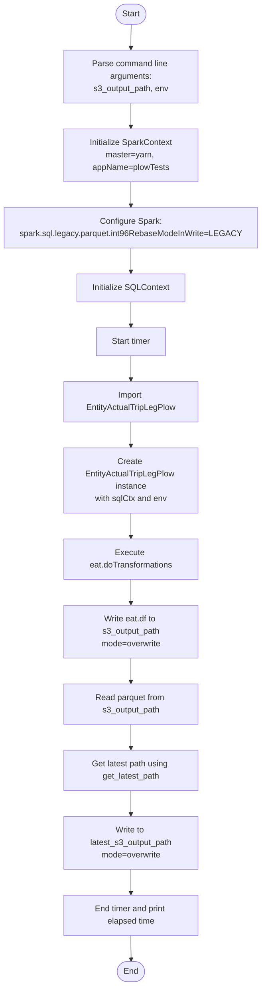
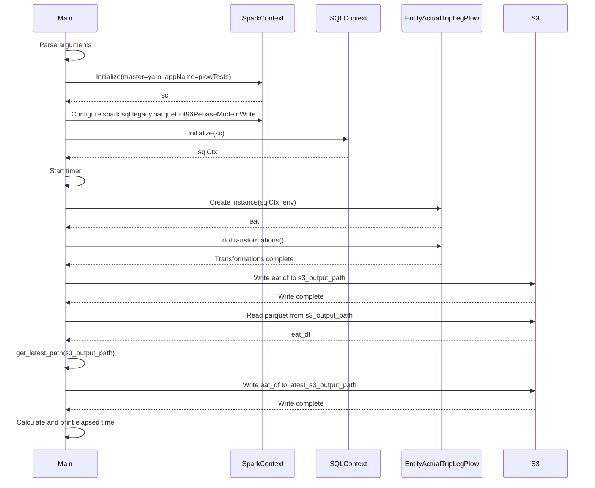

# Diagram: research/orchestrator/tasks/transforms/entity_actual_trip_leg_spark.py

> Auto-generated by Obscura crawlers

## Diagram 1

### SVG

<svg id="container" width="497.21875" xmlns="http://www.w3.org/2000/svg" class="flowchart" height="1904" viewBox="0 0 497.21875 1904" role="graphics-document document" aria-roledescription="flowchart-v2"><g><marker id="container_flowchart-v2-pointEnd" class="marker flowchart-v2" viewBox="0 0 10 10" refX="5" refY="5" markerUnits="userSpaceOnUse" markerWidth="8" markerHeight="8" orient="auto"><path d="M 0 0 L 10 5 L 0 10 z" class="arrowMarkerPath" style="stroke-width: 1; stroke-dasharray: 1, 0;"></path></marker><marker id="container_flowchart-v2-pointStart" class="marker flowchart-v2" viewBox="0 0 10 10" refX="4.5" refY="5" markerUnits="userSpaceOnUse" markerWidth="8" markerHeight="8" orient="auto"><path d="M 0 5 L 10 10 L 10 0 z" class="arrowMarkerPath" style="stroke-width: 1; stroke-dasharray: 1, 0;"></path></marker><marker id="container_flowchart-v2-circleEnd" class="marker flowchart-v2" viewBox="0 0 10 10" refX="11" refY="5" markerUnits="userSpaceOnUse" markerWidth="11" markerHeight="11" orient="auto"><circle cx="5" cy="5" r="5" class="arrowMarkerPath" style="stroke-width: 1; stroke-dasharray: 1, 0;"></circle></marker><marker id="container_flowchart-v2-circleStart" class="marker flowchart-v2" viewBox="0 0 10 10" refX="-1" refY="5" markerUnits="userSpaceOnUse" markerWidth="11" markerHeight="11" orient="auto"><circle cx="5" cy="5" r="5" class="arrowMarkerPath" style="stroke-width: 1; stroke-dasharray: 1, 0;"></circle></marker><marker id="container_flowchart-v2-crossEnd" class="marker cross flowchart-v2" viewBox="0 0 11 11" refX="12" refY="5.2" markerUnits="userSpaceOnUse" markerWidth="11" markerHeight="11" orient="auto"><path d="M 1,1 l 9,9 M 10,1 l -9,9" class="arrowMarkerPath" style="stroke-width: 2; stroke-dasharray: 1, 0;"></path></marker><marker id="container_flowchart-v2-crossStart" class="marker cross flowchart-v2" viewBox="0 0 11 11" refX="-1" refY="5.2" markerUnits="userSpaceOnUse" markerWidth="11" markerHeight="11" orient="auto"><path d="M 1,1 l 9,9 M 10,1 l -9,9" class="arrowMarkerPath" style="stroke-width: 2; stroke-dasharray: 1, 0;"></path></marker><g class="root"><g class="clusters"></g><g class="edgePaths"><path d="M249.109,47.5L249.026,51.583C248.943,55.667,248.776,63.833,248.693,71.417C248.609,79,248.609,86,248.609,89.5L248.609,93" id="L_Start_ParseArgs_0" class="edge-thickness-normal edge-pattern-solid edge-thickness-normal edge-pattern-solid flowchart-link" style=";" data-edge="true" data-et="edge" data-id="L_Start_ParseArgs_0" data-points="W3sieCI6MjQ5LjEwOTM3NSwieSI6NDcuNX0seyJ4IjoyNDguNjA5Mzc1LCJ5Ijo3Mn0seyJ4IjoyNDguNjA5Mzc1LCJ5Ijo5N31d" marker-end="url(#container_flowchart-v2-pointEnd)"></path><path d="M248.609,199L248.609,203.167C248.609,207.333,248.609,215.667,248.609,223.333C248.609,231,248.609,238,248.609,241.5L248.609,245" id="L_ParseArgs_InitSpark_0" class="edge-thickness-normal edge-pattern-solid edge-thickness-normal edge-pattern-solid flowchart-link" style=";" data-edge="true" data-et="edge" data-id="L_ParseArgs_InitSpark_0" data-points="W3sieCI6MjQ4LjYwOTM3NSwieSI6MTk5fSx7IngiOjI0OC42MDkzNzUsInkiOjIyNH0seyJ4IjoyNDguNjA5Mzc1LCJ5IjoyNDl9XQ==" marker-end="url(#container_flowchart-v2-pointEnd)"></path><path d="M248.609,351L248.609,355.167C248.609,359.333,248.609,367.667,248.609,375.333C248.609,383,248.609,390,248.609,393.5L248.609,397" id="L_InitSpark_ConfigSpark_0" class="edge-thickness-normal edge-pattern-solid edge-thickness-normal edge-pattern-solid flowchart-link" style=";" data-edge="true" data-et="edge" data-id="L_InitSpark_ConfigSpark_0" data-points="W3sieCI6MjQ4LjYwOTM3NSwieSI6MzUxfSx7IngiOjI0OC42MDkzNzUsInkiOjM3Nn0seyJ4IjoyNDguNjA5Mzc1LCJ5Ijo0MDF9XQ==" marker-end="url(#container_flowchart-v2-pointEnd)"></path><path d="M248.609,479L248.609,483.167C248.609,487.333,248.609,495.667,248.609,503.333C248.609,511,248.609,518,248.609,521.5L248.609,525" id="L_ConfigSpark_InitSQL_0" class="edge-thickness-normal edge-pattern-solid edge-thickness-normal edge-pattern-solid flowchart-link" style=";" data-edge="true" data-et="edge" data-id="L_ConfigSpark_InitSQL_0" data-points="W3sieCI6MjQ4LjYwOTM3NSwieSI6NDc5fSx7IngiOjI0OC42MDkzNzUsInkiOjUwNH0seyJ4IjoyNDguNjA5Mzc1LCJ5Ijo1Mjl9XQ==" marker-end="url(#container_flowchart-v2-pointEnd)"></path><path d="M248.609,583L248.609,587.167C248.609,591.333,248.609,599.667,248.609,607.333C248.609,615,248.609,622,248.609,625.5L248.609,629" id="L_InitSQL_StartTimer_0" class="edge-thickness-normal edge-pattern-solid edge-thickness-normal edge-pattern-solid flowchart-link" style=";" data-edge="true" data-et="edge" data-id="L_InitSQL_StartTimer_0" data-points="W3sieCI6MjQ4LjYwOTM3NSwieSI6NTgzfSx7IngiOjI0OC42MDkzNzUsInkiOjYwOH0seyJ4IjoyNDguNjA5Mzc1LCJ5Ijo2MzN9XQ==" marker-end="url(#container_flowchart-v2-pointEnd)"></path><path d="M248.609,687L248.609,691.167C248.609,695.333,248.609,703.667,248.609,711.333C248.609,719,248.609,726,248.609,729.5L248.609,733" id="L_StartTimer_ImportPlow_0" class="edge-thickness-normal edge-pattern-solid edge-thickness-normal edge-pattern-solid flowchart-link" style=";" data-edge="true" data-et="edge" data-id="L_StartTimer_ImportPlow_0" data-points="W3sieCI6MjQ4LjYwOTM3NSwieSI6Njg3fSx7IngiOjI0OC42MDkzNzUsInkiOjcxMn0seyJ4IjoyNDguNjA5Mzc1LCJ5Ijo3Mzd9XQ==" marker-end="url(#container_flowchart-v2-pointEnd)"></path><path d="M248.609,815L248.609,819.167C248.609,823.333,248.609,831.667,248.609,839.333C248.609,847,248.609,854,248.609,857.5L248.609,861" id="L_ImportPlow_CreateEAT_0" class="edge-thickness-normal edge-pattern-solid edge-thickness-normal edge-pattern-solid flowchart-link" style=";" data-edge="true" data-et="edge" data-id="L_ImportPlow_CreateEAT_0" data-points="W3sieCI6MjQ4LjYwOTM3NSwieSI6ODE1fSx7IngiOjI0OC42MDkzNzUsInkiOjg0MH0seyJ4IjoyNDguNjA5Mzc1LCJ5Ijo4NjV9XQ==" marker-end="url(#container_flowchart-v2-pointEnd)"></path><path d="M248.609,991L248.609,995.167C248.609,999.333,248.609,1007.667,248.609,1015.333C248.609,1023,248.609,1030,248.609,1033.5L248.609,1037" id="L_CreateEAT_Transform_0" class="edge-thickness-normal edge-pattern-solid edge-thickness-normal edge-pattern-solid flowchart-link" style=";" data-edge="true" data-et="edge" data-id="L_CreateEAT_Transform_0" data-points="W3sieCI6MjQ4LjYwOTM3NSwieSI6OTkxfSx7IngiOjI0OC42MDkzNzUsInkiOjEwMTZ9LHsieCI6MjQ4LjYwOTM3NSwieSI6MTA0MX1d" marker-end="url(#container_flowchart-v2-pointEnd)"></path><path d="M248.609,1119L248.609,1123.167C248.609,1127.333,248.609,1135.667,248.609,1143.333C248.609,1151,248.609,1158,248.609,1161.5L248.609,1165" id="L_Transform_WriteParquet_0" class="edge-thickness-normal edge-pattern-solid edge-thickness-normal edge-pattern-solid flowchart-link" style=";" data-edge="true" data-et="edge" data-id="L_Transform_WriteParquet_0" data-points="W3sieCI6MjQ4LjYwOTM3NSwieSI6MTExOX0seyJ4IjoyNDguNjA5Mzc1LCJ5IjoxMTQ0fSx7IngiOjI0OC42MDkzNzUsInkiOjExNjl9XQ==" marker-end="url(#container_flowchart-v2-pointEnd)"></path><path d="M248.609,1271L248.609,1275.167C248.609,1279.333,248.609,1287.667,248.609,1295.333C248.609,1303,248.609,1310,248.609,1313.5L248.609,1317" id="L_WriteParquet_ReadParquet_0" class="edge-thickness-normal edge-pattern-solid edge-thickness-normal edge-pattern-solid flowchart-link" style=";" data-edge="true" data-et="edge" data-id="L_WriteParquet_ReadParquet_0" data-points="W3sieCI6MjQ4LjYwOTM3NSwieSI6MTI3MX0seyJ4IjoyNDguNjA5Mzc1LCJ5IjoxMjk2fSx7IngiOjI0OC42MDkzNzUsInkiOjEzMjF9XQ==" marker-end="url(#container_flowchart-v2-pointEnd)"></path><path d="M248.609,1399L248.609,1403.167C248.609,1407.333,248.609,1415.667,248.609,1423.333C248.609,1431,248.609,1438,248.609,1441.5L248.609,1445" id="L_ReadParquet_GetLatest_0" class="edge-thickness-normal edge-pattern-solid edge-thickness-normal edge-pattern-solid flowchart-link" style=";" data-edge="true" data-et="edge" data-id="L_ReadParquet_GetLatest_0" data-points="W3sieCI6MjQ4LjYwOTM3NSwieSI6MTM5OX0seyJ4IjoyNDguNjA5Mzc1LCJ5IjoxNDI0fSx7IngiOjI0OC42MDkzNzUsInkiOjE0NDl9XQ==" marker-end="url(#container_flowchart-v2-pointEnd)"></path><path d="M248.609,1527L248.609,1531.167C248.609,1535.333,248.609,1543.667,248.609,1551.333C248.609,1559,248.609,1566,248.609,1569.5L248.609,1573" id="L_GetLatest_WriteLatest_0" class="edge-thickness-normal edge-pattern-solid edge-thickness-normal edge-pattern-solid flowchart-link" style=";" data-edge="true" data-et="edge" data-id="L_GetLatest_WriteLatest_0" data-points="W3sieCI6MjQ4LjYwOTM3NSwieSI6MTUyN30seyJ4IjoyNDguNjA5Mzc1LCJ5IjoxNTUyfSx7IngiOjI0OC42MDkzNzUsInkiOjE1Nzd9XQ==" marker-end="url(#container_flowchart-v2-pointEnd)"></path><path d="M248.609,1679L248.609,1683.167C248.609,1687.333,248.609,1695.667,248.609,1703.333C248.609,1711,248.609,1718,248.609,1721.5L248.609,1725" id="L_WriteLatest_EndTimer_0" class="edge-thickness-normal edge-pattern-solid edge-thickness-normal edge-pattern-solid flowchart-link" style=";" data-edge="true" data-et="edge" data-id="L_WriteLatest_EndTimer_0" data-points="W3sieCI6MjQ4LjYwOTM3NSwieSI6MTY3OX0seyJ4IjoyNDguNjA5Mzc1LCJ5IjoxNzA0fSx7IngiOjI0OC42MDkzNzUsInkiOjE3Mjl9XQ==" marker-end="url(#container_flowchart-v2-pointEnd)"></path><path d="M248.609,1807L248.609,1811.167C248.609,1815.333,248.609,1823.667,248.68,1831.417C248.75,1839.167,248.89,1846.334,248.961,1849.917L249.031,1853.501" id="L_EndTimer_End_0" class="edge-thickness-normal edge-pattern-solid edge-thickness-normal edge-pattern-solid flowchart-link" style=";" data-edge="true" data-et="edge" data-id="L_EndTimer_End_0" data-points="W3sieCI6MjQ4LjYwOTM3NSwieSI6MTgwN30seyJ4IjoyNDguNjA5Mzc1LCJ5IjoxODMyfSx7IngiOjI0OS4xMDkzNzUsInkiOjE4NTcuNX1d" marker-end="url(#container_flowchart-v2-pointEnd)"></path></g><g class="edgeLabels"><g class="edgeLabel"><g class="label" data-id="L_Start_ParseArgs_0" transform="translate(0, 0)"><foreignObject width="0" height="0">

</foreignObject></g></g><g class="edgeLabel"><g class="label" data-id="L_ParseArgs_InitSpark_0" transform="translate(0, 0)"><foreignObject width="0" height="0">

</foreignObject></g></g><g class="edgeLabel"><g class="label" data-id="L_InitSpark_ConfigSpark_0" transform="translate(0, 0)"><foreignObject width="0" height="0">

</foreignObject></g></g><g class="edgeLabel"><g class="label" data-id="L_ConfigSpark_InitSQL_0" transform="translate(0, 0)"><foreignObject width="0" height="0">

</foreignObject></g></g><g class="edgeLabel"><g class="label" data-id="L_InitSQL_StartTimer_0" transform="translate(0, 0)"><foreignObject width="0" height="0">

</foreignObject></g></g><g class="edgeLabel"><g class="label" data-id="L_StartTimer_ImportPlow_0" transform="translate(0, 0)"><foreignObject width="0" height="0">

</foreignObject></g></g><g class="edgeLabel"><g class="label" data-id="L_ImportPlow_CreateEAT_0" transform="translate(0, 0)"><foreignObject width="0" height="0">

</foreignObject></g></g><g class="edgeLabel"><g class="label" data-id="L_CreateEAT_Transform_0" transform="translate(0, 0)"><foreignObject width="0" height="0">

</foreignObject></g></g><g class="edgeLabel"><g class="label" data-id="L_Transform_WriteParquet_0" transform="translate(0, 0)"><foreignObject width="0" height="0">

</foreignObject></g></g><g class="edgeLabel"><g class="label" data-id="L_WriteParquet_ReadParquet_0" transform="translate(0, 0)"><foreignObject width="0" height="0">

</foreignObject></g></g><g class="edgeLabel"><g class="label" data-id="L_ReadParquet_GetLatest_0" transform="translate(0, 0)"><foreignObject width="0" height="0">

</foreignObject></g></g><g class="edgeLabel"><g class="label" data-id="L_GetLatest_WriteLatest_0" transform="translate(0, 0)"><foreignObject width="0" height="0">

</foreignObject></g></g><g class="edgeLabel"><g class="label" data-id="L_WriteLatest_EndTimer_0" transform="translate(0, 0)"><foreignObject width="0" height="0">

</foreignObject></g></g><g class="edgeLabel"><g class="label" data-id="L_EndTimer_End_0" transform="translate(0, 0)"><foreignObject width="0" height="0">

</foreignObject></g></g></g><g class="nodes"><g class="node default" id="flowchart-Start-0" transform="translate(248.609375, 27.5)"><g class="basic label-container outer-path"><path d="M-10.3984375 -19.5 C-2.577819289243137 -19.5, 5.242798921513726 -19.5, 10.3984375 -19.5 C10.3984375 -19.5, 10.398437499999998 -19.5, 10.398437499999998 -19.5 C10.847292016384657 -19.48560610930186, 11.296146532769315 -19.471212218603718, 11.6478067896239 -19.45993515863156 C11.961277683132154 -19.429694998538725, 12.274748576640409 -19.39945483844589, 12.892042152847864 -19.3399052695533 C13.36844585829706 -19.262884013022187, 13.844849563746253 -19.185862756491076, 14.126030759676757 -19.140403561325776 C14.60159832220082 -19.03185836854803, 15.077165884724883 -18.923313175770282, 15.34470188623539 -18.862249829261074 C15.799897920120772 -18.727150035776635, 16.255093954006153 -18.592050242292192, 16.543047751460602 -18.50658706670804 C16.897007994967993 -18.376326425124695, 17.250968238475384 -18.246065783541354, 17.716144095147794 -18.074876768247425 C18.10920868948925 -17.90087873217938, 18.502273283830707 -17.72688069611133, 18.85917041279238 -17.568892924097174 C19.266335640078427 -17.35647508582382, 19.673500867364474 -17.144057247550464, 19.967429764076783 -16.990714730406097 C20.30253147226311 -16.78757410562732, 20.637633180449438 -16.584433480848546, 21.036368073605697 -16.342718045390892 C21.322234596075642 -16.143309934278168, 21.608101118545587 -15.943901823165444, 22.061592844578712 -15.627565626425154 C22.283261140340286 -15.450791059396384, 22.504929436101865 -15.274016492367613, 23.03889120850187 -14.848196188198123 C23.313081437975768 -14.599183876465858, 23.587271667449663 -14.350171564733595, 23.964247236767985 -14.007812326905688 C24.152850867568198 -13.813063593458402, 24.341454498368414 -13.618314860011118, 24.833858442968648 -13.10986736009568 C25.134932832643106 -12.756208250365974, 25.436007222317564 -12.402549140636268, 25.644151408126582 -12.158051136245305 C25.7941291459885 -11.957094630763336, 25.944106883850413 -11.756138125281367, 26.391796464640635 -11.156274872382312 C26.531223213161507 -10.942077945329993, 26.67064996168238 -10.727881018277676, 27.073721378604247 -10.108655082055241 C27.280392913768353 -9.741688843609108, 27.487064448932458 -9.374722605162974, 27.6871239742735 -9.019496659696287 C27.88079406370198 -8.617336575121968, 28.074464153130464 -8.215176490547648, 28.22948364880834 -7.893275190886684 C28.349562428074833 -7.596678284533183, 28.46964120734133 -7.300081378179682, 28.698571729970325 -6.734618561215508 C28.786106914298838 -6.470976532855632, 28.87364209862735 -6.207334504495756, 29.09246063421488 -5.548287939305138 C29.187093395417605 -5.187412206741006, 29.28172615662033 -4.826536474176873, 29.40953178754556 -4.339158212148133 C29.461987242989835 -4.06981053490621, 29.514442698434113 -3.800462857664287, 29.648482276581777 -3.1121979531509023 C29.680993951305158 -2.8600438241527186, 29.713505626028535 -2.607889695154535, 29.808330202509367 -1.872449005199798 C29.835257429695407 -1.4530357065106596, 29.862184656881443 -1.0336224078215213, 29.888418715913414 -0.6250057626472757 C29.888418715913414 -0.34470478354743356, 29.888418715913414 -0.06440380444759142, 29.888418715913414 0.625005762647271 C29.869300485950525 0.9227876262767427, 29.850182255987637 1.2205694899062143, 29.808330202509367 1.8724490051997846 C29.760389132705942 2.2442704755601177, 29.712448062902517 2.6160919459204504, 29.648482276581777 3.1121979531508885 C29.600025145609735 3.3610150792740745, 29.55156801463769 3.60983220539726, 29.40953178754556 4.339158212148129 C29.333217650937602 4.6301770897903065, 29.25690351432964 4.921195967432485, 29.092460634214884 5.548287939305125 C28.995288388728675 5.8409552604148125, 28.89811614324246 6.133622581524499, 28.69857172997033 6.734618561215495 C28.588733959244575 7.0059199784769435, 28.478896188518817 7.277221395738392, 28.229483648808344 7.893275190886679 C28.10385008287335 8.154155978678373, 27.978216516938357 8.415036766470068, 27.687123974273504 9.019496659696284 C27.51734280035996 9.3209603261879, 27.347561626446417 9.622423992679513, 27.07372137860425 10.108655082055236 C26.825464252608565 10.490044693957113, 26.577207126612876 10.871434305858989, 26.39179646464064 11.156274872382301 C26.13946317623339 11.494378490812537, 25.887129887826138 11.832482109242772, 25.644151408126582 12.158051136245302 C25.37300330712499 12.4765571244458, 25.101855206123393 12.795063112646297, 24.83385844296866 13.10986736009567 C24.591573471156938 13.3600464854574, 24.349288499345217 13.610225610819127, 23.96424723676799 14.007812326905684 C23.66495808252153 14.279618818035233, 23.365668928275067 14.551425309164783, 23.038891208501887 14.848196188198111 C22.823964869256795 15.019594224315984, 22.609038530011702 15.190992260433857, 22.061592844578715 15.627565626425152 C21.839783677341064 15.782290099526046, 21.617974510103412 15.937014572626937, 21.036368073605708 16.34271804539089 C20.699098965474498 16.547172560753307, 20.36182985734329 16.751627076115724, 19.967429764076787 16.990714730406093 C19.552369684419283 17.207251308104745, 19.137309604761775 17.423787885803396, 18.859170412792388 17.56889292409717 C18.48451364857539 17.734742359818, 18.109856884358393 17.900591795538826, 17.716144095147804 18.07487676824742 C17.333493267272743 18.21569581009092, 16.95084243939768 18.35651485193442, 16.543047751460616 18.506587066708033 C16.130698432049886 18.628970180243392, 15.718349112639155 18.751353293778752, 15.344701886235413 18.86224982926107 C14.901475705786973 18.963413312627296, 14.458249525338534 19.064576795993524, 14.126030759676766 19.140403561325773 C13.697593261881291 19.209670013386926, 13.269155764085816 19.278936465448083, 12.892042152847878 19.3399052695533 C12.427906843145417 19.38467984467592, 11.963771533442953 19.429454419798535, 11.6478067896239 19.45993515863156 C11.383749472484242 19.46840296283584, 11.119692155344586 19.476870767040122, 10.398437500000004 19.5 C10.398437500000002 19.5, 10.398437500000002 19.5, 10.3984375 19.5 C4.268928921147803 19.5, -1.8605796577043936 19.5, -10.398437499999996 19.5 C-10.87491325935966 19.48472034980114, -11.351389018719324 19.469440699602277, -11.647806789623893 19.45993515863156 C-12.130688886138065 19.413352103531526, -12.61357098265224 19.36676904843149, -12.892042152847871 19.3399052695533 C-13.384709810554051 19.26025458335011, -13.877377468260232 19.180603897146923, -14.126030759676759 19.140403561325773 C-14.531836742114292 19.047780993965922, -14.937642724551823 18.955158426606072, -15.344701886235388 18.862249829261074 C-15.712527182573119 18.753081212062416, -16.08035247891085 18.643912594863757, -16.54304775146059 18.506587066708043 C-16.81340440768387 18.40709331806834, -17.08376106390715 18.307599569428643, -17.716144095147797 18.074876768247425 C-18.156940003268364 17.87974949546848, -18.59773591138893 17.68462222268954, -18.85917041279238 17.568892924097174 C-19.113490881746102 17.436214098344053, -19.367811350699824 17.30353527259093, -19.96742976407678 16.990714730406097 C-20.18765510680956 16.85721283345372, -20.40788044954234 16.72371093650134, -21.036368073605686 16.3427180453909 C-21.43989365176902 16.0612360704049, -21.843419229932348 15.7797540954189, -22.061592844578712 15.627565626425156 C-22.35491056024853 15.3936525536907, -22.64822827591835 15.159739480956244, -23.03889120850187 14.848196188198125 C-23.342332770723484 14.572618590012235, -23.645774332945102 14.297040991826345, -23.964247236767974 14.007812326905697 C-24.291400270542983 13.669999959769406, -24.618553304317988 13.332187592633117, -24.833858442968655 13.109867360095677 C-24.996465687429637 12.91885963813748, -25.159072931890623 12.727851916179283, -25.64415140812658 12.158051136245307 C-25.85276012104954 11.878534465573253, -26.061368833972494 11.599017794901199, -26.391796464640635 11.156274872382316 C-26.66371680215402 10.738532213127254, -26.935637139667403 10.320789553872194, -27.073721378604244 10.108655082055249 C-27.284732315408704 9.733983796584603, -27.495743252213163 9.359312511113957, -27.6871239742735 9.019496659696289 C-27.849509176356626 8.682300313083953, -28.011894378439756 8.345103966471617, -28.22948364880834 7.893275190886686 C-28.323730474676175 7.660483708854718, -28.41797730054401 7.42769222682275, -28.698571729970325 6.73461856121551 C-28.78991732652577 6.459500178334852, -28.881262923081216 6.184381795454193, -29.09246063421488 5.5482879393051325 C-29.156896081591523 5.302567651958446, -29.221331528968165 5.056847364611759, -29.409531787545557 4.339158212148136 C-29.5028636443446 3.859918853179975, -29.596195501143644 3.3806794942118144, -29.648482276581777 3.112197953150904 C-29.692805295715978 2.768437369316158, -29.737128314850178 2.424676785481412, -29.808330202509364 1.872449005199809 C-29.834708581167135 1.461584465360991, -29.86108695982491 1.050719925522173, -29.888418715913414 0.6250057626472781 C-29.888418715913414 0.17333972852478197, -29.888418715913414 -0.2783263055977142, -29.888418715913414 -0.6250057626472687 C-29.860454337708997 -1.0605735256208426, -29.832489959504585 -1.4961412885944165, -29.808330202509367 -1.8724490051997822 C-29.76507895322521 -2.2078971537224854, -29.721827703941056 -2.5433453022451884, -29.648482276581777 -3.112197953150895 C-29.56819871503002 -3.5244370737824164, -29.487915153478266 -3.9366761944139377, -29.40953178754556 -4.339158212148126 C-29.321784227650124 -4.673777688062446, -29.23403666775469 -5.008397163976766, -29.092460634214884 -5.548287939305123 C-28.967927838133946 -5.923360879494394, -28.84339504205301 -6.298433819683667, -28.698571729970332 -6.734618561215485 C-28.52051498510092 -7.174422163535909, -28.342458240231505 -7.614225765856333, -28.229483648808344 -7.893275190886676 C-28.09364303370762 -8.175351134666872, -27.957802418606903 -8.457427078447067, -27.687123974273504 -9.019496659696282 C-27.547112448976836 -9.268101300564831, -27.407100923680165 -9.516705941433381, -27.073721378604247 -10.108655082055243 C-26.818820524253912 -10.500251244800722, -26.563919669903576 -10.891847407546202, -26.39179646464064 -11.156274872382308 C-26.216700786759688 -11.39088712919838, -26.04160510887873 -11.62549938601445, -25.644151408126586 -12.158051136245302 C-25.394824179377338 -12.450925086255387, -25.14549695062809 -12.743799036265472, -24.833858442968662 -13.10986736009567 C-24.593145987490455 -13.358422733237052, -24.352433532012245 -13.606978106378437, -23.964247236767996 -14.007812326905677 C-23.69282809280089 -14.254308012099578, -23.421408948833786 -14.500803697293481, -23.038891208501887 -14.848196188198107 C-22.7119029056747 -15.10896065817861, -22.384914602847516 -15.369725128159114, -22.06159284457872 -15.627565626425149 C-21.836239607464485 -15.784762289251633, -21.61088637035025 -15.941958952078117, -21.03636807360571 -16.342718045390885 C-20.71314419625365 -16.538658259316044, -20.389920318901595 -16.734598473241203, -19.96742976407679 -16.99071473040609 C-19.59663360868501 -17.18415884716771, -19.225837453293234 -17.377602963929327, -18.859170412792388 -17.56889292409717 C-18.499690678835297 -17.728023938732544, -18.140210944878206 -17.88715495336792, -17.716144095147804 -18.07487676824742 C-17.474397742619374 -18.16384166065667, -17.232651390090943 -18.252806553065916, -16.54304775146062 -18.506587066708033 C-16.14654984404405 -18.624265564369285, -15.750051936627479 -18.741944062030534, -15.344701886235413 -18.862249829261067 C-14.977259246311258 -18.946116214036447, -14.609816606387103 -19.029982598811824, -14.126030759676768 -19.140403561325773 C-13.6666687440521 -19.214669649606332, -13.207306728427433 -19.288935737886895, -12.89204215284788 -19.3399052695533 C-12.510756670416889 -19.376687421480533, -12.1294711879859 -19.41346957340777, -11.647806789623903 -19.45993515863156 C-11.352937246681718 -19.469391050944967, -11.058067703739534 -19.478846943258375, -10.398437500000005 -19.5 C-10.398437500000004 -19.5, -10.398437500000002 -19.5, -10.3984375 -19.5" stroke="none" stroke-width="0" fill="#ECECFF" style=""></path><path d="M-10.3984375 -19.5 C-4.5448849501882735 -19.5, 1.308667599623453 -19.5, 10.3984375 -19.5 M-10.3984375 -19.5 C-3.860379613733854 -19.5, 2.677678272532292 -19.5, 10.3984375 -19.5 M10.3984375 -19.5 C10.3984375 -19.5, 10.398437499999998 -19.5, 10.398437499999998 -19.5 M10.3984375 -19.5 C10.3984375 -19.5, 10.398437499999998 -19.5, 10.398437499999998 -19.5 M10.398437499999998 -19.5 C10.72799749243549 -19.489431652492204, 11.05755748487098 -19.47886330498441, 11.6478067896239 -19.45993515863156 M10.398437499999998 -19.5 C10.780340221549968 -19.487753123048446, 11.162242943099939 -19.47550624609689, 11.6478067896239 -19.45993515863156 M11.6478067896239 -19.45993515863156 C12.125013712719417 -19.41389958068583, 12.602220635814934 -19.367864002740095, 12.892042152847864 -19.3399052695533 M11.6478067896239 -19.45993515863156 C12.023051311292477 -19.423735770923756, 12.398295832961054 -19.387536383215952, 12.892042152847864 -19.3399052695533 M12.892042152847864 -19.3399052695533 C13.338798025961141 -19.267677244631887, 13.785553899074419 -19.195449219710472, 14.126030759676757 -19.140403561325776 M12.892042152847864 -19.3399052695533 C13.375836310351374 -19.261689182047856, 13.859630467854885 -19.183473094542418, 14.126030759676757 -19.140403561325776 M14.126030759676757 -19.140403561325776 C14.46599874025081 -19.06280808825815, 14.805966720824864 -18.985212615190527, 15.34470188623539 -18.862249829261074 M14.126030759676757 -19.140403561325776 C14.418221317240192 -19.073712973283502, 14.710411874803627 -19.00702238524123, 15.34470188623539 -18.862249829261074 M15.34470188623539 -18.862249829261074 C15.780977876532203 -18.732765405400386, 16.217253866829015 -18.603280981539697, 16.543047751460602 -18.50658706670804 M15.34470188623539 -18.862249829261074 C15.617457278633328 -18.78129746051964, 15.890212671031266 -18.7003450917782, 16.543047751460602 -18.50658706670804 M16.543047751460602 -18.50658706670804 C16.90291083955976 -18.37415412374963, 17.262773927658912 -18.24172118079122, 17.716144095147794 -18.074876768247425 M16.543047751460602 -18.50658706670804 C16.986861691037667 -18.343259434372595, 17.43067563061473 -18.17993180203715, 17.716144095147794 -18.074876768247425 M17.716144095147794 -18.074876768247425 C17.97906526000286 -17.958489367845335, 18.241986424857924 -17.842101967443245, 18.85917041279238 -17.568892924097174 M17.716144095147794 -18.074876768247425 C18.084281184200293 -17.91191339932263, 18.452418273252793 -17.748950030397832, 18.85917041279238 -17.568892924097174 M18.85917041279238 -17.568892924097174 C19.18484461155431 -17.398988903207357, 19.51051881031624 -17.229084882317537, 19.967429764076783 -16.990714730406097 M18.85917041279238 -17.568892924097174 C19.188777072305104 -17.396937340952526, 19.51838373181783 -17.224981757807882, 19.967429764076783 -16.990714730406097 M19.967429764076783 -16.990714730406097 C20.25654937018596 -16.815448726127315, 20.545668976295136 -16.640182721848532, 21.036368073605697 -16.342718045390892 M19.967429764076783 -16.990714730406097 C20.213181833594128 -16.84173838166522, 20.458933903111472 -16.69276203292434, 21.036368073605697 -16.342718045390892 M21.036368073605697 -16.342718045390892 C21.356065046902163 -16.1197112762782, 21.67576202019863 -15.896704507165508, 22.061592844578712 -15.627565626425154 M21.036368073605697 -16.342718045390892 C21.375966629073634 -16.10582879408099, 21.715565184541568 -15.868939542771086, 22.061592844578712 -15.627565626425154 M22.061592844578712 -15.627565626425154 C22.369566900064996 -15.38196451270865, 22.67754095555128 -15.136363398992145, 23.03889120850187 -14.848196188198123 M22.061592844578712 -15.627565626425154 C22.326654416530893 -15.41618607637795, 22.591715988483074 -15.20480652633075, 23.03889120850187 -14.848196188198123 M23.03889120850187 -14.848196188198123 C23.30922156857558 -14.60268930772856, 23.579551928649288 -14.357182427259, 23.964247236767985 -14.007812326905688 M23.03889120850187 -14.848196188198123 C23.38081116072083 -14.537673534299053, 23.722731112939798 -14.227150880399982, 23.964247236767985 -14.007812326905688 M23.964247236767985 -14.007812326905688 C24.16961497129633 -13.795753280000593, 24.374982705824678 -13.583694233095498, 24.833858442968648 -13.10986736009568 M23.964247236767985 -14.007812326905688 C24.171433983164878 -13.793875000902666, 24.37862072956177 -13.579937674899647, 24.833858442968648 -13.10986736009568 M24.833858442968648 -13.10986736009568 C25.026879735057804 -12.883133567185096, 25.219901027146964 -12.656399774274513, 25.644151408126582 -12.158051136245305 M24.833858442968648 -13.10986736009568 C25.052811213287914 -12.852672977313098, 25.271763983607183 -12.595478594530515, 25.644151408126582 -12.158051136245305 M25.644151408126582 -12.158051136245305 C25.898645028217246 -11.817052870169563, 26.153138648307905 -11.476054604093823, 26.391796464640635 -11.156274872382312 M25.644151408126582 -12.158051136245305 C25.858216075232136 -11.871223984016225, 26.072280742337686 -11.584396831787144, 26.391796464640635 -11.156274872382312 M26.391796464640635 -11.156274872382312 C26.571222313805592 -10.880628585478242, 26.750648162970545 -10.604982298574171, 27.073721378604247 -10.108655082055241 M26.391796464640635 -11.156274872382312 C26.574821141942472 -10.875099819039326, 26.75784581924431 -10.59392476569634, 27.073721378604247 -10.108655082055241 M27.073721378604247 -10.108655082055241 C27.21619765186237 -9.855674031598339, 27.358673925120492 -9.602692981141434, 27.6871239742735 -9.019496659696287 M27.073721378604247 -10.108655082055241 C27.308992468299753 -9.690907438519679, 27.544263557995258 -9.273159794984114, 27.6871239742735 -9.019496659696287 M27.6871239742735 -9.019496659696287 C27.83707902569399 -8.708111786897538, 27.987034077114476 -8.39672691409879, 28.22948364880834 -7.893275190886684 M27.6871239742735 -9.019496659696287 C27.826273449420402 -8.730549797231939, 27.9654229245673 -8.441602934767591, 28.22948364880834 -7.893275190886684 M28.22948364880834 -7.893275190886684 C28.360924646195347 -7.5686133861019735, 28.492365643582353 -7.243951581317264, 28.698571729970325 -6.734618561215508 M28.22948364880834 -7.893275190886684 C28.370145159987384 -7.5458385387691305, 28.51080667116643 -7.1984018866515775, 28.698571729970325 -6.734618561215508 M28.698571729970325 -6.734618561215508 C28.844099718395217 -6.2963114468158645, 28.989627706820112 -5.85800433241622, 29.09246063421488 -5.548287939305138 M28.698571729970325 -6.734618561215508 C28.832550384108913 -6.331096201549693, 28.9665290382475 -5.927573841883877, 29.09246063421488 -5.548287939305138 M29.09246063421488 -5.548287939305138 C29.202214478561405 -5.129748963194807, 29.311968322907926 -4.711209987084477, 29.40953178754556 -4.339158212148133 M29.09246063421488 -5.548287939305138 C29.18315706591329 -5.202423137156957, 29.2738534976117 -4.856558335008777, 29.40953178754556 -4.339158212148133 M29.40953178754556 -4.339158212148133 C29.472502058096435 -4.015819181640781, 29.535472328647312 -3.6924801511334286, 29.648482276581777 -3.1121979531509023 M29.40953178754556 -4.339158212148133 C29.498301323410313 -3.8833454069306756, 29.587070859275066 -3.427532601713218, 29.648482276581777 -3.1121979531509023 M29.648482276581777 -3.1121979531509023 C29.694032275343073 -2.758921157622929, 29.73958227410437 -2.405644362094955, 29.808330202509367 -1.872449005199798 M29.648482276581777 -3.1121979531509023 C29.698504612793606 -2.7242345915195143, 29.748526949005438 -2.3362712298881263, 29.808330202509367 -1.872449005199798 M29.808330202509367 -1.872449005199798 C29.83578992461362 -1.4447416683372847, 29.863249646717875 -1.0170343314747716, 29.888418715913414 -0.6250057626472757 M29.808330202509367 -1.872449005199798 C29.8345294348686 -1.4643748135650243, 29.860728667227832 -1.0563006219302506, 29.888418715913414 -0.6250057626472757 M29.888418715913414 -0.6250057626472757 C29.888418715913414 -0.3705160640892915, 29.888418715913414 -0.1160263655313073, 29.888418715913414 0.625005762647271 M29.888418715913414 -0.6250057626472757 C29.888418715913414 -0.162221711079798, 29.888418715913414 0.3005623404876797, 29.888418715913414 0.625005762647271 M29.888418715913414 0.625005762647271 C29.86673071735837 0.9628138463794549, 29.845042718803324 1.3006219301116386, 29.808330202509367 1.8724490051997846 M29.888418715913414 0.625005762647271 C29.860647357788988 1.0575670820719978, 29.832875999664566 1.4901284014967247, 29.808330202509367 1.8724490051997846 M29.808330202509367 1.8724490051997846 C29.76472114059831 2.210672277798623, 29.721112078687256 2.548895550397461, 29.648482276581777 3.1121979531508885 M29.808330202509367 1.8724490051997846 C29.74490494023212 2.3643628146874103, 29.68147967795488 2.856276624175036, 29.648482276581777 3.1121979531508885 M29.648482276581777 3.1121979531508885 C29.572355372741374 3.503093514944539, 29.49622846890097 3.8939890767381886, 29.40953178754556 4.339158212148129 M29.648482276581777 3.1121979531508885 C29.59112187292364 3.406731502809813, 29.533761469265507 3.701265052468737, 29.40953178754556 4.339158212148129 M29.40953178754556 4.339158212148129 C29.312414468982357 4.709508638741745, 29.21529715041915 5.079859065335363, 29.092460634214884 5.548287939305125 M29.40953178754556 4.339158212148129 C29.3276021744798 4.651591335286797, 29.245672561414036 4.964024458425465, 29.092460634214884 5.548287939305125 M29.092460634214884 5.548287939305125 C28.952251136803135 5.970576606159643, 28.81204163939139 6.392865273014161, 28.69857172997033 6.734618561215495 M29.092460634214884 5.548287939305125 C29.008335634725164 5.801659034269726, 28.924210635235443 6.055030129234326, 28.69857172997033 6.734618561215495 M28.69857172997033 6.734618561215495 C28.54035824280717 7.12540893335818, 28.382144755644013 7.516199305500865, 28.229483648808344 7.893275190886679 M28.69857172997033 6.734618561215495 C28.516235738349735 7.184991985744945, 28.333899746729138 7.635365410274397, 28.229483648808344 7.893275190886679 M28.229483648808344 7.893275190886679 C28.106434464336566 8.148789455273107, 27.983385279864784 8.404303719659534, 27.687123974273504 9.019496659696284 M28.229483648808344 7.893275190886679 C28.09747894572072 8.167385781296307, 27.965474242633096 8.441496371705936, 27.687123974273504 9.019496659696284 M27.687123974273504 9.019496659696284 C27.549469211251907 9.263916630497384, 27.41181444823031 9.508336601298485, 27.07372137860425 10.108655082055236 M27.687123974273504 9.019496659696284 C27.471593091018477 9.402193567784124, 27.256062207763446 9.784890475871963, 27.07372137860425 10.108655082055236 M27.07372137860425 10.108655082055236 C26.903787789410586 10.369718708614704, 26.73385420021692 10.630782335174171, 26.39179646464064 11.156274872382301 M27.07372137860425 10.108655082055236 C26.937148842069536 10.318467173033584, 26.80057630553482 10.528279264011932, 26.39179646464064 11.156274872382301 M26.39179646464064 11.156274872382301 C26.221961365082176 11.383838433494779, 26.052126265523714 11.611401994607256, 25.644151408126582 12.158051136245302 M26.39179646464064 11.156274872382301 C26.10777073134196 11.536843479725924, 25.823744998043285 11.917412087069545, 25.644151408126582 12.158051136245302 M25.644151408126582 12.158051136245302 C25.447860323108074 12.38862581398719, 25.25156923808957 12.619200491729076, 24.83385844296866 13.10986736009567 M25.644151408126582 12.158051136245302 C25.422281837396397 12.418671758761192, 25.200412266666216 12.679292381277083, 24.83385844296866 13.10986736009567 M24.83385844296866 13.10986736009567 C24.64330833285417 13.306625993243868, 24.452758222739682 13.503384626392064, 23.96424723676799 14.007812326905684 M24.83385844296866 13.10986736009567 C24.590908898939155 13.360732710834654, 24.347959354909648 13.611598061573638, 23.96424723676799 14.007812326905684 M23.96424723676799 14.007812326905684 C23.62666959265176 14.314391411477029, 23.289091948535532 14.620970496048376, 23.038891208501887 14.848196188198111 M23.96424723676799 14.007812326905684 C23.646085177561726 14.296758690970025, 23.32792311835546 14.585705055034365, 23.038891208501887 14.848196188198111 M23.038891208501887 14.848196188198111 C22.837519460379742 15.008784798598253, 22.636147712257593 15.169373408998396, 22.061592844578715 15.627565626425152 M23.038891208501887 14.848196188198111 C22.73727755512212 15.088725050492076, 22.435663901742355 15.329253912786042, 22.061592844578715 15.627565626425152 M22.061592844578715 15.627565626425152 C21.702400821604783 15.878122432479701, 21.34320879863085 16.12867923853425, 21.036368073605708 16.34271804539089 M22.061592844578715 15.627565626425152 C21.73112211097446 15.858087704339992, 21.40065137737021 16.08860978225483, 21.036368073605708 16.34271804539089 M21.036368073605708 16.34271804539089 C20.67842607777697 16.559704586762923, 20.32048408194823 16.776691128134956, 19.967429764076787 16.990714730406093 M21.036368073605708 16.34271804539089 C20.68590340932576 16.555171784436368, 20.335438745045813 16.767625523481847, 19.967429764076787 16.990714730406093 M19.967429764076787 16.990714730406093 C19.659489340915716 17.15136705192397, 19.35154891775465 17.312019373441842, 18.859170412792388 17.56889292409717 M19.967429764076787 16.990714730406093 C19.723881073094567 17.117773926491136, 19.480332382112348 17.24483312257618, 18.859170412792388 17.56889292409717 M18.859170412792388 17.56889292409717 C18.417918702936806 17.764221966783328, 17.97666699308122 17.959551009469482, 17.716144095147804 18.07487676824742 M18.859170412792388 17.56889292409717 C18.44606249102985 17.75176354665035, 18.03295456926731 17.934634169203523, 17.716144095147804 18.07487676824742 M17.716144095147804 18.07487676824742 C17.24844418981531 18.24699465678031, 16.780744284482815 18.419112545313197, 16.543047751460616 18.506587066708033 M17.716144095147804 18.07487676824742 C17.463713126578917 18.167773698127064, 17.21128215801003 18.26067062800671, 16.543047751460616 18.506587066708033 M16.543047751460616 18.506587066708033 C16.258883143977222 18.590925630598644, 15.974718536493826 18.67526419448925, 15.344701886235413 18.86224982926107 M16.543047751460616 18.506587066708033 C16.153841467179184 18.622101448897286, 15.76463518289775 18.737615831086543, 15.344701886235413 18.86224982926107 M15.344701886235413 18.86224982926107 C14.97598078071705 18.946408015465558, 14.607259675198687 19.030566201670045, 14.126030759676766 19.140403561325773 M15.344701886235413 18.86224982926107 C14.962205471910504 18.94955213980836, 14.579709057585594 19.03685445035565, 14.126030759676766 19.140403561325773 M14.126030759676766 19.140403561325773 C13.635286242859774 19.219743329024176, 13.144541726042782 19.299083096722583, 12.892042152847878 19.3399052695533 M14.126030759676766 19.140403561325773 C13.634158181851273 19.219925705179786, 13.14228560402578 19.299447849033804, 12.892042152847878 19.3399052695533 M12.892042152847878 19.3399052695533 C12.616549291252033 19.36648173458281, 12.341056429656188 19.39305819961232, 11.6478067896239 19.45993515863156 M12.892042152847878 19.3399052695533 C12.551036430548777 19.37280168146411, 12.210030708249674 19.40569809337492, 11.6478067896239 19.45993515863156 M11.6478067896239 19.45993515863156 C11.235875560199242 19.47314499138371, 10.823944330774584 19.486354824135862, 10.398437500000004 19.5 M11.6478067896239 19.45993515863156 C11.371168488463379 19.46880641050599, 11.094530187302858 19.47767766238042, 10.398437500000004 19.5 M10.398437500000004 19.5 C10.398437500000004 19.5, 10.398437500000002 19.5, 10.3984375 19.5 M10.398437500000004 19.5 C10.398437500000002 19.5, 10.398437500000002 19.5, 10.3984375 19.5 M10.3984375 19.5 C5.6683153904824986 19.5, 0.9381932809649971 19.5, -10.398437499999996 19.5 M10.3984375 19.5 C4.626556697266622 19.5, -1.1453241054667558 19.5, -10.398437499999996 19.5 M-10.398437499999996 19.5 C-10.833932072366524 19.486034536702967, -11.269426644733052 19.472069073405937, -11.647806789623893 19.45993515863156 M-10.398437499999996 19.5 C-10.835537726432602 19.485983046502284, -11.272637952865205 19.471966093004568, -11.647806789623893 19.45993515863156 M-11.647806789623893 19.45993515863156 C-12.006744010856245 19.42530891658444, -12.3656812320886 19.39068267453732, -12.892042152847871 19.3399052695533 M-11.647806789623893 19.45993515863156 C-12.001094498723809 19.425853918225325, -12.354382207823726 19.391772677819088, -12.892042152847871 19.3399052695533 M-12.892042152847871 19.3399052695533 C-13.36097800665349 19.264091357361867, -13.829913860459108 19.18827744517043, -14.126030759676759 19.140403561325773 M-12.892042152847871 19.3399052695533 C-13.158503847640247 19.29682580918057, -13.424965542432624 19.253746348807844, -14.126030759676759 19.140403561325773 M-14.126030759676759 19.140403561325773 C-14.400001402763445 19.077871549866764, -14.673972045850132 19.015339538407755, -15.344701886235388 18.862249829261074 M-14.126030759676759 19.140403561325773 C-14.458230975087995 19.064581029967155, -14.79043119049923 18.98875849860854, -15.344701886235388 18.862249829261074 M-15.344701886235388 18.862249829261074 C-15.739904383024825 18.74495580267421, -16.135106879814263 18.62766177608734, -16.54304775146059 18.506587066708043 M-15.344701886235388 18.862249829261074 C-15.695145149859057 18.758240108131798, -16.045588413482726 18.65423038700252, -16.54304775146059 18.506587066708043 M-16.54304775146059 18.506587066708043 C-16.919887455006386 18.36790657233516, -17.29672715855218 18.22922607796227, -17.716144095147797 18.074876768247425 M-16.54304775146059 18.506587066708043 C-16.798535343687114 18.41256527106727, -17.054022935913633 18.318543475426498, -17.716144095147797 18.074876768247425 M-17.716144095147797 18.074876768247425 C-18.0095630948467 17.944988881046093, -18.30298209454561 17.815100993844762, -18.85917041279238 17.568892924097174 M-17.716144095147797 18.074876768247425 C-18.121164140901012 17.895586408485258, -18.52618418665423 17.71629604872309, -18.85917041279238 17.568892924097174 M-18.85917041279238 17.568892924097174 C-19.190429290169202 17.396075379951125, -19.52168816754602 17.223257835805075, -19.96742976407678 16.990714730406097 M-18.85917041279238 17.568892924097174 C-19.206573902445736 17.387652746067573, -19.55397739209909 17.206412568037976, -19.96742976407678 16.990714730406097 M-19.96742976407678 16.990714730406097 C-20.296255090842664 16.791378884928505, -20.625080417608544 16.592043039450914, -21.036368073605686 16.3427180453909 M-19.96742976407678 16.990714730406097 C-20.21866626183485 16.83841368903561, -20.46990275959292 16.686112647665126, -21.036368073605686 16.3427180453909 M-21.036368073605686 16.3427180453909 C-21.417135444317072 16.077111210736454, -21.797902815028458 15.81150437608201, -22.061592844578712 15.627565626425156 M-21.036368073605686 16.3427180453909 C-21.351115729335596 16.12316370596013, -21.665863385065506 15.903609366529365, -22.061592844578712 15.627565626425156 M-22.061592844578712 15.627565626425156 C-22.350648063356942 15.397051781531935, -22.639703282135173 15.166537936638715, -23.03889120850187 14.848196188198125 M-22.061592844578712 15.627565626425156 C-22.337504566802046 15.407533370271333, -22.61341628902538 15.187501114117511, -23.03889120850187 14.848196188198125 M-23.03889120850187 14.848196188198125 C-23.325577479394422 14.587835302276574, -23.612263750286978 14.327474416355022, -23.964247236767974 14.007812326905697 M-23.03889120850187 14.848196188198125 C-23.33614736291555 14.578236013726478, -23.633403517329235 14.30827583925483, -23.964247236767974 14.007812326905697 M-23.964247236767974 14.007812326905697 C-24.17175082937595 13.793547831176179, -24.379254421983923 13.57928333544666, -24.833858442968655 13.109867360095677 M-23.964247236767974 14.007812326905697 C-24.15427441856652 13.811593660176925, -24.344301600365068 13.615374993448153, -24.833858442968655 13.109867360095677 M-24.833858442968655 13.109867360095677 C-25.02289594567679 12.88781315287608, -25.211933448384922 12.665758945656481, -25.64415140812658 12.158051136245307 M-24.833858442968655 13.109867360095677 C-25.0047980582228 12.909071961278503, -25.175737673476945 12.708276562461329, -25.64415140812658 12.158051136245307 M-25.64415140812658 12.158051136245307 C-25.807304481018615 11.939440882120689, -25.970457553910656 11.72083062799607, -26.391796464640635 11.156274872382316 M-25.64415140812658 12.158051136245307 C-25.81169217445971 11.933561772636718, -25.979232940792844 11.709072409028128, -26.391796464640635 11.156274872382316 M-26.391796464640635 11.156274872382316 C-26.59333464338943 10.846658109245578, -26.794872822138224 10.53704134610884, -27.073721378604244 10.108655082055249 M-26.391796464640635 11.156274872382316 C-26.596300197746416 10.8421022213904, -26.800803930852197 10.527929570398486, -27.073721378604244 10.108655082055249 M-27.073721378604244 10.108655082055249 C-27.237070931516904 9.818611409922951, -27.400420484429564 9.528567737790656, -27.6871239742735 9.019496659696289 M-27.073721378604244 10.108655082055249 C-27.207091545116732 9.87184284621851, -27.340461711629224 9.635030610381772, -27.6871239742735 9.019496659696289 M-27.6871239742735 9.019496659696289 C-27.797067106114067 8.791197394023177, -27.907010237954637 8.562898128350065, -28.22948364880834 7.893275190886686 M-27.6871239742735 9.019496659696289 C-27.849287931121413 8.682759733548762, -28.01145188796933 8.346022807401237, -28.22948364880834 7.893275190886686 M-28.22948364880834 7.893275190886686 C-28.36471782004248 7.5592441733635285, -28.49995199127662 7.225213155840371, -28.698571729970325 6.73461856121551 M-28.22948364880834 7.893275190886686 C-28.381340957092632 7.518184703463158, -28.533198265376928 7.14309421603963, -28.698571729970325 6.73461856121551 M-28.698571729970325 6.73461856121551 C-28.785648347044322 6.472357664363462, -28.87272496411832 6.210096767511414, -29.09246063421488 5.5482879393051325 M-28.698571729970325 6.73461856121551 C-28.844427963700994 6.295322824253659, -28.99028419743166 5.856027087291807, -29.09246063421488 5.5482879393051325 M-29.09246063421488 5.5482879393051325 C-29.198734271072816 5.143020502680253, -29.30500790793075 4.737753066055374, -29.409531787545557 4.339158212148136 M-29.09246063421488 5.5482879393051325 C-29.172509230749792 5.243027947436314, -29.252557827284704 4.9377679555674945, -29.409531787545557 4.339158212148136 M-29.409531787545557 4.339158212148136 C-29.496722413873417 3.8914527736999776, -29.583913040201278 3.4437473352518193, -29.648482276581777 3.112197953150904 M-29.409531787545557 4.339158212148136 C-29.46838026195456 4.03698373368738, -29.527228736363565 3.734809255226624, -29.648482276581777 3.112197953150904 M-29.648482276581777 3.112197953150904 C-29.685821899242104 2.8225992133398963, -29.723161521902433 2.533000473528889, -29.808330202509364 1.872449005199809 M-29.648482276581777 3.112197953150904 C-29.68432474051293 2.8342108807959443, -29.720167204444085 2.5562238084409845, -29.808330202509364 1.872449005199809 M-29.808330202509364 1.872449005199809 C-29.827109234774817 1.5799504195033651, -29.84588826704027 1.2874518338069212, -29.888418715913414 0.6250057626472781 M-29.808330202509364 1.872449005199809 C-29.833725678530094 1.4768939673176587, -29.859121154550824 1.0813389294355082, -29.888418715913414 0.6250057626472781 M-29.888418715913414 0.6250057626472781 C-29.888418715913414 0.16747388715403133, -29.888418715913414 -0.2900579883392155, -29.888418715913414 -0.6250057626472687 M-29.888418715913414 0.6250057626472781 C-29.888418715913414 0.23558037629981637, -29.888418715913414 -0.1538450100476454, -29.888418715913414 -0.6250057626472687 M-29.888418715913414 -0.6250057626472687 C-29.86694755277169 -0.9594364597905672, -29.845476389629965 -1.2938671569338658, -29.808330202509367 -1.8724490051997822 M-29.888418715913414 -0.6250057626472687 C-29.872216770171804 -0.8773641455480616, -29.856014824430193 -1.1297225284488546, -29.808330202509367 -1.8724490051997822 M-29.808330202509367 -1.8724490051997822 C-29.75754802631076 -2.2663055357212234, -29.706765850112156 -2.6601620662426644, -29.648482276581777 -3.112197953150895 M-29.808330202509367 -1.8724490051997822 C-29.75781916869906 -2.264202608900688, -29.707308134888756 -2.655956212601594, -29.648482276581777 -3.112197953150895 M-29.648482276581777 -3.112197953150895 C-29.590095504669893 -3.4120016868698073, -29.53170873275801 -3.7118054205887194, -29.40953178754556 -4.339158212148126 M-29.648482276581777 -3.112197953150895 C-29.595715075816138 -3.3831463767306174, -29.5429478750505 -3.654094800310339, -29.40953178754556 -4.339158212148126 M-29.40953178754556 -4.339158212148126 C-29.343967166677963 -4.5891845274027085, -29.278402545810366 -4.839210842657292, -29.092460634214884 -5.548287939305123 M-29.40953178754556 -4.339158212148126 C-29.30347557355149 -4.743596521161415, -29.197419359557422 -5.148034830174703, -29.092460634214884 -5.548287939305123 M-29.092460634214884 -5.548287939305123 C-28.972895625764764 -5.908398694659849, -28.85333061731464 -6.268509450014575, -28.698571729970332 -6.734618561215485 M-29.092460634214884 -5.548287939305123 C-29.01008691617658 -5.79638445356687, -28.92771319813827 -6.044480967828618, -28.698571729970332 -6.734618561215485 M-28.698571729970332 -6.734618561215485 C-28.58177507836555 -7.02310854878894, -28.464978426760766 -7.311598536362395, -28.229483648808344 -7.893275190886676 M-28.698571729970332 -6.734618561215485 C-28.578982489452446 -7.030006297395343, -28.459393248934557 -7.3253940335752015, -28.229483648808344 -7.893275190886676 M-28.229483648808344 -7.893275190886676 C-28.100340608371297 -8.161443477572611, -27.97119756793425 -8.429611764258546, -27.687123974273504 -9.019496659696282 M-28.229483648808344 -7.893275190886676 C-28.117392299684145 -8.126035275713733, -28.00530095055995 -8.358795360540789, -27.687123974273504 -9.019496659696282 M-27.687123974273504 -9.019496659696282 C-27.468318541976718 -9.408007861191813, -27.249513109679928 -9.796519062687343, -27.073721378604247 -10.108655082055243 M-27.687123974273504 -9.019496659696282 C-27.49648022406402 -9.358003942966272, -27.30583647385453 -9.696511226236263, -27.073721378604247 -10.108655082055243 M-27.073721378604247 -10.108655082055243 C-26.90519709374619 -10.367553638704017, -26.736672808888134 -10.626452195352789, -26.39179646464064 -11.156274872382308 M-27.073721378604247 -10.108655082055243 C-26.887703148825207 -10.394429035884613, -26.701684919046162 -10.680202989713983, -26.39179646464064 -11.156274872382308 M-26.39179646464064 -11.156274872382308 C-26.181771451778136 -11.437689255945775, -25.971746438915634 -11.719103639509242, -25.644151408126586 -12.158051136245302 M-26.39179646464064 -11.156274872382308 C-26.137399689841033 -11.497143374590825, -25.883002915041423 -11.838011876799342, -25.644151408126586 -12.158051136245302 M-25.644151408126586 -12.158051136245302 C-25.38493570727657 -12.462540648254956, -25.125720006426548 -12.767030160264609, -24.833858442968662 -13.10986736009567 M-25.644151408126586 -12.158051136245302 C-25.32760819146024 -12.529880810360874, -25.011064974793893 -12.901710484476446, -24.833858442968662 -13.10986736009567 M-24.833858442968662 -13.10986736009567 C-24.51721764770585 -13.436824977897288, -24.200576852443035 -13.763782595698904, -23.964247236767996 -14.007812326905677 M-24.833858442968662 -13.10986736009567 C-24.6049869014401 -13.34619601742693, -24.376115359911534 -13.582524674758192, -23.964247236767996 -14.007812326905677 M-23.964247236767996 -14.007812326905677 C-23.600038941001085 -14.338576664697738, -23.235830645234177 -14.6693410024898, -23.038891208501887 -14.848196188198107 M-23.964247236767996 -14.007812326905677 C-23.65768158411742 -14.286227141360245, -23.351115931466847 -14.564641955814812, -23.038891208501887 -14.848196188198107 M-23.038891208501887 -14.848196188198107 C-22.747506275960163 -15.080567917821428, -22.456121343418438 -15.31293964744475, -22.06159284457872 -15.627565626425149 M-23.038891208501887 -14.848196188198107 C-22.74320102880513 -15.084001237860129, -22.447510849108372 -15.319806287522148, -22.06159284457872 -15.627565626425149 M-22.06159284457872 -15.627565626425149 C-21.839229494938678 -15.782676673179779, -21.616866145298637 -15.937787719934407, -21.03636807360571 -16.342718045390885 M-22.06159284457872 -15.627565626425149 C-21.7657185342373 -15.83395473712686, -21.469844223895887 -16.04034384782857, -21.03636807360571 -16.342718045390885 M-21.03636807360571 -16.342718045390885 C-20.69961245981703 -16.546861277465236, -20.362856846028347 -16.751004509539587, -19.96742976407679 -16.99071473040609 M-21.03636807360571 -16.342718045390885 C-20.641736939518864 -16.581945757984293, -20.247105805432014 -16.8211734705777, -19.96742976407679 -16.99071473040609 M-19.96742976407679 -16.99071473040609 C-19.694680368664525 -17.133007915288342, -19.42193097325226 -17.275301100170598, -18.859170412792388 -17.56889292409717 M-19.96742976407679 -16.99071473040609 C-19.701611189535942 -17.129392110479127, -19.435792614995094 -17.268069490552165, -18.859170412792388 -17.56889292409717 M-18.859170412792388 -17.56889292409717 C-18.512275458742334 -17.72245302998193, -18.16538050469228 -17.876013135866692, -17.716144095147804 -18.07487676824742 M-18.859170412792388 -17.56889292409717 C-18.537022504524142 -17.711498246909358, -18.214874596255896 -17.85410356972154, -17.716144095147804 -18.07487676824742 M-17.716144095147804 -18.07487676824742 C-17.412895925041788 -18.18647489804179, -17.10964775493577 -18.29807302783616, -16.54304775146062 -18.506587066708033 M-17.716144095147804 -18.07487676824742 C-17.455195717416057 -18.170908183433063, -17.19424733968431 -18.26693959861871, -16.54304775146062 -18.506587066708033 M-16.54304775146062 -18.506587066708033 C-16.13666547323114 -18.627199193742435, -15.730283195001658 -18.747811320776837, -15.344701886235413 -18.862249829261067 M-16.54304775146062 -18.506587066708033 C-16.12555394856621 -18.630497035937402, -15.7080601456718 -18.754407005166772, -15.344701886235413 -18.862249829261067 M-15.344701886235413 -18.862249829261067 C-14.94037605496108 -18.954534561776807, -14.536050223686749 -19.046819294292547, -14.126030759676768 -19.140403561325773 M-15.344701886235413 -18.862249829261067 C-14.949630673169047 -18.952422255562865, -14.554559460102682 -19.042594681864667, -14.126030759676768 -19.140403561325773 M-14.126030759676768 -19.140403561325773 C-13.696136754153452 -19.20990549026098, -13.266242748630138 -19.279407419196183, -12.89204215284788 -19.3399052695533 M-14.126030759676768 -19.140403561325773 C-13.868632410862993 -19.182017730207978, -13.611234062049217 -19.22363189909018, -12.89204215284788 -19.3399052695533 M-12.89204215284788 -19.3399052695533 C-12.433243553149085 -19.384165018680196, -11.974444953450291 -19.428424767807094, -11.647806789623903 -19.45993515863156 M-12.89204215284788 -19.3399052695533 C-12.529305413048393 -19.374898046587, -12.166568673248904 -19.4098908236207, -11.647806789623903 -19.45993515863156 M-11.647806789623903 -19.45993515863156 C-11.379195719457234 -19.468548992832073, -11.110584649290566 -19.477162827032586, -10.398437500000005 -19.5 M-11.647806789623903 -19.45993515863156 C-11.18541906395943 -19.47476303301051, -10.723031338294957 -19.48959090738946, -10.398437500000005 -19.5 M-10.398437500000005 -19.5 C-10.398437500000004 -19.5, -10.398437500000002 -19.5, -10.3984375 -19.5 M-10.398437500000005 -19.5 C-10.398437500000004 -19.5, -10.398437500000002 -19.5, -10.3984375 -19.5" stroke="#9370DB" stroke-width="1.3" fill="none" stroke-dasharray="0 0" style=""></path></g><g class="label" style="" transform="translate(-17.5234375, -12)"><rect></rect><foreignObject width="35.046875" height="24">

Start

</foreignObject></g></g><g class="node default" id="flowchart-ParseArgs-1" transform="translate(248.609375, 148)"><rect class="basic label-container" style="" x="-130" y="-51" width="260" height="102"></rect><g class="label" style="" transform="translate(-100, -36)"><rect></rect><foreignObject width="200" height="72">

Parse command line arguments: s3_output_path, env

</foreignObject></g></g><g class="node default" id="flowchart-InitSpark-3" transform="translate(248.609375, 300)"><rect class="basic label-container" style="" x="-130" y="-51" width="260" height="102"></rect><g class="label" style="" transform="translate(-100, -36)"><rect></rect><foreignObject width="200" height="72">

Initialize SparkContext master=yarn, appName=plowTests

</foreignObject></g></g><g class="node default" id="flowchart-ConfigSpark-5" transform="translate(248.609375, 440)"><rect class="basic label-container" style="" x="-240.609375" y="-39" width="481.21875" height="78"></rect><g class="label" style="" transform="translate(-210.609375, -24)"><rect></rect><foreignObject width="421.21875" height="48">

Configure Spark: spark.sql.legacy.parquet.int96RebaseModeInWrite=LEGACY

</foreignObject></g></g><g class="node default" id="flowchart-InitSQL-7" transform="translate(248.609375, 556)"><rect class="basic label-container" style="" x="-104.2578125" y="-27" width="208.515625" height="54"></rect><g class="label" style="" transform="translate(-74.2578125, -12)"><rect></rect><foreignObject width="148.515625" height="24">

Initialize SQLContext

</foreignObject></g></g><g class="node default" id="flowchart-StartTimer-9" transform="translate(248.609375, 660)"><rect class="basic label-container" style="" x="-69.09375" y="-27" width="138.1875" height="54"></rect><g class="label" style="" transform="translate(-39.09375, -12)"><rect></rect><foreignObject width="78.1875" height="24">

Start timer

</foreignObject></g></g><g class="node default" id="flowchart-ImportPlow-11" transform="translate(248.609375, 776)"><rect class="basic label-container" style="" x="-130" y="-39" width="260" height="78"></rect><g class="label" style="" transform="translate(-100, -24)"><rect></rect><foreignObject width="200" height="48">

Import EntityActualTripLegPlow

</foreignObject></g></g><g class="node default" id="flowchart-CreateEAT-13" transform="translate(248.609375, 928)"><rect class="basic label-container" style="" x="-130" y="-63" width="260" height="126"></rect><g class="label" style="" transform="translate(-100, -48)"><rect></rect><foreignObject width="200" height="96">

Create EntityActualTripLegPlow instance with sqlCtx and env

</foreignObject></g></g><g class="node default" id="flowchart-Transform-15" transform="translate(248.609375, 1080)"><rect class="basic label-container" style="" x="-130" y="-39" width="260" height="78"></rect><g class="label" style="" transform="translate(-100, -24)"><rect></rect><foreignObject width="200" height="48">

Execute eat.doTransformations

</foreignObject></g></g><g class="node default" id="flowchart-WriteParquet-17" transform="translate(248.609375, 1220)"><rect class="basic label-container" style="" x="-130" y="-51" width="260" height="102"></rect><g class="label" style="" transform="translate(-100, -36)"><rect></rect><foreignObject width="200" height="72">

Write eat.df to s3_output_path mode=overwrite

</foreignObject></g></g><g class="node default" id="flowchart-ReadParquet-19" transform="translate(248.609375, 1360)"><rect class="basic label-container" style="" x="-130" y="-39" width="260" height="78"></rect><g class="label" style="" transform="translate(-100, -24)"><rect></rect><foreignObject width="200" height="48">

Read parquet from s3_output_path

</foreignObject></g></g><g class="node default" id="flowchart-GetLatest-21" transform="translate(248.609375, 1488)"><rect class="basic label-container" style="" x="-130" y="-39" width="260" height="78"></rect><g class="label" style="" transform="translate(-100, -24)"><rect></rect><foreignObject width="200" height="48">

Get latest path using get_latest_path

</foreignObject></g></g><g class="node default" id="flowchart-WriteLatest-23" transform="translate(248.609375, 1628)"><rect class="basic label-container" style="" x="-130" y="-51" width="260" height="102"></rect><g class="label" style="" transform="translate(-100, -36)"><rect></rect><foreignObject width="200" height="72">

Write to latest_s3_output_path mode=overwrite

</foreignObject></g></g><g class="node default" id="flowchart-EndTimer-25" transform="translate(248.609375, 1768)"><rect class="basic label-container" style="" x="-130" y="-39" width="260" height="78"></rect><g class="label" style="" transform="translate(-100, -24)"><rect></rect><foreignObject width="200" height="48">

End timer and print elapsed time

</foreignObject></g></g><g class="node default" id="flowchart-End-27" transform="translate(248.609375, 1876.5)"><g class="basic label-container outer-path"><path d="M-6.5546875 -19.5 C-2.530334968842854 -19.5, 1.4940175623142924 -19.5, 6.5546875 -19.5 C6.5546875 -19.5, 6.554687499999999 -19.5, 6.554687499999999 -19.5 C7.000692760038489 -19.48569747940714, 7.446698020076978 -19.47139495881428, 7.8040567896239 -19.45993515863156 C8.084786021758026 -19.43285354723388, 8.365515253892152 -19.405771935836196, 9.048292152847864 -19.3399052695533 C9.510904519838332 -19.265113689670766, 9.9735168868288 -19.190322109788237, 10.282280759676757 -19.140403561325776 C10.728494591715071 -19.038558165980408, 11.174708423753385 -18.93671277063504, 11.50095188623539 -18.862249829261074 C11.747879625421858 -18.788962972420684, 11.994807364608326 -18.715676115580294, 12.699297751460602 -18.50658706670804 C13.12931881688876 -18.348335339559323, 13.55933988231692 -18.190083612410607, 13.872394095147794 -18.074876768247425 C14.135723696188881 -17.95830856526161, 14.399053297229969 -17.841740362275797, 15.015420412792382 -17.568892924097174 C15.303137314353725 -17.418791200844094, 15.590854215915067 -17.26868947759101, 16.123679764076783 -16.990714730406097 C16.462375042399106 -16.785395662292718, 16.80107032072143 -16.58007659417934, 17.192618073605697 -16.342718045390892 C17.536018240714437 -16.10317695436948, 17.879418407823177 -15.863635863348065, 18.217842844578712 -15.627565626425154 C18.559972812473767 -15.354726081489657, 18.90210278036882 -15.081886536554158, 19.19514120850187 -14.848196188198123 C19.48619645521016 -14.583867514037486, 19.777251701918452 -14.319538839876849, 20.120497236767985 -14.007812326905688 C20.30446581187833 -13.81784966900334, 20.48843438698868 -13.627887011100993, 20.990108442968648 -13.10986736009568 C21.292106201309704 -12.755123608989022, 21.594103959650763 -12.400379857882363, 21.800401408126582 -12.158051136245305 C22.044580229407742 -11.830873760876791, 22.288759050688906 -11.503696385508277, 22.548046464640635 -11.156274872382312 C22.75358179199842 -10.840517415597473, 22.959117119356208 -10.524759958812634, 23.229971378604247 -10.108655082055241 C23.357055018163532 -9.883005211403802, 23.484138657722816 -9.657355340752362, 23.8433739742735 -9.019496659696287 C23.972780179382788 -8.750781905937624, 24.102186384492075 -8.482067152178962, 24.38573364880834 -7.893275190886684 C24.534545097332067 -7.525708035959444, 24.683356545855798 -7.158140881032204, 24.854821729970325 -6.734618561215508 C24.947859775651224 -6.454402791224131, 25.040897821332127 -6.174187021232753, 25.24871063421488 -5.548287939305138 C25.33967347988272 -5.201407185226973, 25.43063632555056 -4.854526431148807, 25.56578178754556 -4.339158212148133 C25.634464164102454 -3.98648872455392, 25.703146540659343 -3.6338192369597064, 25.804732276581777 -3.1121979531509023 C25.836760357832222 -2.863794479632465, 25.868788439082667 -2.6153910061140273, 25.964580202509367 -1.872449005199798 C25.991517405475875 -1.4528803256775376, 26.018454608442383 -1.0333116461552772, 26.044668715913414 -0.6250057626472757 C26.044668715913414 -0.21314841591069866, 26.044668715913414 0.19870893082587837, 26.044668715913414 0.625005762647271 C26.024959020428142 0.932000179210241, 26.00524932494287 1.238994595773211, 25.964580202509367 1.8724490051997846 C25.904377270258376 2.339371059324817, 25.844174338007388 2.806293113449849, 25.804732276581777 3.1121979531508885 C25.710105376931747 3.5980870834514773, 25.615478477281716 4.083976213752066, 25.56578178754556 4.339158212148129 C25.495537835154547 4.607028846536602, 25.425293882763537 4.874899480925076, 25.248710634214884 5.548287939305125 C25.135434558786784 5.889457430402919, 25.022158483358687 6.230626921500711, 24.85482172997033 6.734618561215495 C24.685670516149948 7.15242532966808, 24.516519302329566 7.570232098120666, 24.385733648808344 7.893275190886679 C24.210572215403584 8.257001655205944, 24.035410781998824 8.620728119525207, 23.843373974273504 9.019496659696284 C23.604675001548237 9.443330856661985, 23.36597602882297 9.867165053627685, 23.22997137860425 10.108655082055236 C23.007505995291673 10.450421651143209, 22.785040611979092 10.792188220231184, 22.54804646464064 11.156274872382301 C22.397474919247884 11.358027025858622, 22.246903373855123 11.55977917933494, 21.800401408126582 12.158051136245302 C21.612338978498205 12.378959967142189, 21.424276548869827 12.599868798039074, 20.99010844296866 13.10986736009567 C20.699363651673302 13.410085227699424, 20.408618860377942 13.71030309530318, 20.12049723676799 14.007812326905684 C19.921822327983325 14.188243622413886, 19.723147419198664 14.368674917922085, 19.195141208501887 14.848196188198111 C18.987203273832904 15.014021157635794, 18.779265339163917 15.179846127073478, 18.217842844578715 15.627565626425152 C17.849789324559005 15.884303829210811, 17.481735804539298 16.14104203199647, 17.192618073605708 16.34271804539089 C16.778111287332262 16.59399449514211, 16.363604501058816 16.84527094489333, 16.123679764076787 16.990714730406093 C15.85254749936906 17.132164259235612, 15.58141523466133 17.273613788065127, 15.015420412792386 17.56889292409717 C14.782450025037326 17.672022003935325, 14.549479637282266 17.77515108377348, 13.872394095147804 18.07487676824742 C13.560691576112756 18.18958617659882, 13.248989057077706 18.304295584950218, 12.699297751460616 18.506587066708033 C12.377932658302033 18.601966539477704, 12.056567565143451 18.697346012247376, 11.500951886235413 18.86224982926107 C11.047051750184822 18.96584957333942, 10.593151614134232 19.069449317417767, 10.282280759676766 19.140403561325773 C9.947936350414727 19.194457772535642, 9.613591941152688 19.24851198374551, 9.048292152847878 19.3399052695533 C8.739360511634187 19.369707533436525, 8.430428870420497 19.399509797319755, 7.804056789623901 19.45993515863156 C7.411326494589386 19.47252925479017, 7.018596199554873 19.485123350948783, 6.5546875000000036 19.5 C6.554687500000003 19.5, 6.554687500000002 19.5, 6.5546875 19.5 C1.339744768725578 19.5, -3.875197962548844 19.5, -6.5546874999999964 19.5 C-6.943822541364962 19.487521196628833, -7.332957582729926 19.47504239325767, -7.8040567896238935 19.45993515863156 C-8.220544997337107 19.41975704213382, -8.63703320505032 19.37957892563608, -9.048292152847871 19.3399052695533 C-9.401898565072957 19.28273692708343, -9.755504977298044 19.22556858461356, -10.282280759676759 19.140403561325773 C-10.682364495627466 19.049087059385393, -11.082448231578171 18.957770557445013, -11.500951886235388 18.862249829261074 C-11.801447648670294 18.77306426430484, -12.1019434111052 18.683878699348604, -12.699297751460593 18.506587066708043 C-12.968275441144412 18.407600790501892, -13.23725313082823 18.308614514295737, -13.872394095147797 18.074876768247425 C-14.299905990396173 17.88562993391076, -14.72741788564455 17.696383099574096, -15.01542041279238 17.568892924097174 C-15.307984331745796 17.416262514975312, -15.600548250699214 17.263632105853446, -16.12367976407678 16.990714730406097 C-16.396022562362884 16.82561892562113, -16.668365360648988 16.66052312083616, -17.192618073605686 16.3427180453909 C-17.56222213341551 16.084898253169445, -17.93182619322533 15.827078460947991, -18.217842844578712 15.627565626425156 C-18.581879533971303 15.337256054057713, -18.9459162233639 15.04694648169027, -19.19514120850187 14.848196188198125 C-19.488567302257387 14.58171437347837, -19.781993396012904 14.315232558758616, -20.120497236767974 14.007812326905697 C-20.29723388290651 13.825317229419156, -20.473970529045044 13.642822131932615, -20.990108442968655 13.109867360095677 C-21.258470579401024 12.794633924404065, -21.526832715833393 12.479400488712452, -21.80040140812658 12.158051136245307 C-22.05183933428794 11.821147221655385, -22.303277260449303 11.484243307065464, -22.548046464640635 11.156274872382316 C-22.769965040501948 10.815348346377846, -22.99188361636326 10.474421820373374, -23.229971378604244 10.108655082055249 C-23.363452833814456 9.871645241866503, -23.49693428902467 9.634635401677757, -23.8433739742735 9.019496659696289 C-24.01164400880638 8.6700803325868, -24.17991404333926 8.32066400547731, -24.38573364880834 7.893275190886686 C-24.517816582272644 7.5670277915800614, -24.649899515736948 7.240780392273437, -24.854821729970325 6.73461856121551 C-24.953019715458122 6.438861874650521, -25.05121770094592 6.143105188085532, -25.24871063421488 5.5482879393051325 C-25.34413273677449 5.1844021060444865, -25.4395548393341 4.8205162727838395, -25.565781787545557 4.339158212148136 C-25.61740218686909 4.074098371597066, -25.66902258619262 3.8090385310459967, -25.804732276581777 3.112197953150904 C-25.83958824090244 2.8418619769685316, -25.874444205223103 2.571526000786159, -25.964580202509364 1.872449005199809 C-25.98899902056258 1.4921062035057628, -26.0134178386158 1.1117634018117166, -26.044668715913414 0.6250057626472781 C-26.044668715913414 0.16690409111052962, -26.044668715913414 -0.2911975804262189, -26.044668715913414 -0.6250057626472687 C-26.018484670029668 -1.0328434126680561, -25.99230062414592 -1.4406810626888436, -25.964580202509367 -1.8724490051997822 C-25.92609654380303 -2.17092066266816, -25.887612885096694 -2.4693923201365378, -25.804732276581777 -3.112197953150895 C-25.721887348437107 -3.5375891498920127, -25.639042420292437 -3.96298034663313, -25.56578178754556 -4.339158212148126 C-25.49542110726714 -4.6074739805614655, -25.425060426988725 -4.875789748974805, -25.248710634214884 -5.548287939305123 C-25.14617306736178 -5.857114753524023, -25.043635500508675 -6.165941567742923, -24.854821729970332 -6.734618561215485 C-24.68484328677414 -7.154468602219713, -24.51486484357795 -7.57431864322394, -24.385733648808344 -7.893275190886676 C-24.235578100666636 -8.20507639941698, -24.08542255252493 -8.516877607947285, -23.843373974273504 -9.019496659696282 C-23.61778926367088 -9.420045156300194, -23.392204553068254 -9.820593652904108, -23.229971378604247 -10.108655082055243 C-23.064264461046523 -10.363225405961657, -22.8985575434888 -10.61779572986807, -22.54804646464064 -11.156274872382308 C-22.297538833370464 -11.491932276569653, -22.047031202100282 -11.827589680756997, -21.800401408126586 -12.158051136245302 C-21.537880040001365 -12.466423673134205, -21.27535867187614 -12.774796210023109, -20.990108442968662 -13.10986736009567 C-20.790361852582908 -13.316122114169021, -20.59061526219715 -13.522376868242374, -20.120497236767996 -14.007812326905677 C-19.8433289607407 -14.259529221722946, -19.566160684713402 -14.511246116540214, -19.195141208501887 -14.848196188198107 C-18.875588276612035 -15.103031147719616, -18.556035344722183 -15.357866107241126, -18.21784284457872 -15.627565626425149 C-17.929374096242743 -15.828788937653476, -17.640905347906767 -16.030012248881803, -17.19261807360571 -16.342718045390885 C-16.941557936173787 -16.49491217609525, -16.69049779874186 -16.647106306799618, -16.12367976407679 -16.99071473040609 C-15.869425536256841 -17.123358998202153, -15.61517130843689 -17.256003265998217, -15.01542041279239 -17.56889292409717 C-14.649911194507379 -17.730693012586215, -14.28440197622237 -17.892493101075264, -13.872394095147806 -18.07487676824742 C-13.557106082568628 -18.190905671367, -13.241818069989453 -18.306934574486572, -12.699297751460618 -18.506587066708033 C-12.23934701720292 -18.643098030305048, -11.779396282945223 -18.77960899390206, -11.500951886235413 -18.862249829261067 C-11.079915350494222 -18.95834867102383, -10.658878814753031 -19.05444751278659, -10.282280759676768 -19.140403561325773 C-9.871424201666875 -19.20682766338462, -9.460567643656981 -19.273251765443465, -9.04829215284788 -19.3399052695533 C-8.59597763844916 -19.38353950676955, -8.14366312405044 -19.427173743985804, -7.804056789623903 -19.45993515863156 C-7.3774989337832775 -19.473614038823868, -6.950941077942652 -19.48729291901618, -6.554687500000006 -19.5 C-6.5546875000000036 -19.5, -6.554687500000002 -19.5, -6.5546875 -19.5" stroke="none" stroke-width="0" fill="#ECECFF" style=""></path><path d="M-6.5546875 -19.5 C-2.953155324288223 -19.5, 0.6483768514235537 -19.5, 6.5546875 -19.5 M-6.5546875 -19.5 C-2.823196201941924 -19.5, 0.9082950961161522 -19.5, 6.5546875 -19.5 M6.5546875 -19.5 C6.5546875 -19.5, 6.5546875 -19.5, 6.554687499999999 -19.5 M6.5546875 -19.5 C6.5546875 -19.5, 6.5546875 -19.5, 6.554687499999999 -19.5 M6.554687499999999 -19.5 C6.9548020972251425 -19.48716910364281, 7.354916694450286 -19.474338207285616, 7.8040567896239 -19.45993515863156 M6.554687499999999 -19.5 C7.006561053655232 -19.485509294652793, 7.458434607310465 -19.471018589305583, 7.8040567896239 -19.45993515863156 M7.8040567896239 -19.45993515863156 C8.122977204873033 -19.429169289730392, 8.441897620122164 -19.398403420829222, 9.048292152847864 -19.3399052695533 M7.8040567896239 -19.45993515863156 C8.069753917787205 -19.43430367622519, 8.33545104595051 -19.408672193818827, 9.048292152847864 -19.3399052695533 M9.048292152847864 -19.3399052695533 C9.37121641614988 -19.287697378977693, 9.694140679451895 -19.235489488402088, 10.282280759676757 -19.140403561325776 M9.048292152847864 -19.3399052695533 C9.493768146592503 -19.267884165602595, 9.939244140337141 -19.195863061651888, 10.282280759676757 -19.140403561325776 M10.282280759676757 -19.140403561325776 C10.722731637711252 -19.03987352262499, 11.163182515745746 -18.939343483924205, 11.50095188623539 -18.862249829261074 M10.282280759676757 -19.140403561325776 C10.650080235760543 -19.056455731025537, 11.017879711844326 -18.972507900725294, 11.50095188623539 -18.862249829261074 M11.50095188623539 -18.862249829261074 C11.892204261423899 -18.74612817803075, 12.283456636612406 -18.63000652680043, 12.699297751460602 -18.50658706670804 M11.50095188623539 -18.862249829261074 C11.844219347553183 -18.760369848589626, 12.187486808870979 -18.658489867918178, 12.699297751460602 -18.50658706670804 M12.699297751460602 -18.50658706670804 C13.119086579749863 -18.3521008974122, 13.538875408039127 -18.19761472811636, 13.872394095147794 -18.074876768247425 M12.699297751460602 -18.50658706670804 C13.104297431756219 -18.357543440583246, 13.509297112051838 -18.208499814458456, 13.872394095147794 -18.074876768247425 M13.872394095147794 -18.074876768247425 C14.217030510265554 -17.922316450550813, 14.561666925383314 -17.7697561328542, 15.015420412792382 -17.568892924097174 M13.872394095147794 -18.074876768247425 C14.267972010844167 -17.899766159370586, 14.663549926540542 -17.724655550493747, 15.015420412792382 -17.568892924097174 M15.015420412792382 -17.568892924097174 C15.243221578379593 -17.450049201923935, 15.471022743966806 -17.3312054797507, 16.123679764076783 -16.990714730406097 M15.015420412792382 -17.568892924097174 C15.447400679410253 -17.343529095699196, 15.879380946028121 -17.118165267301222, 16.123679764076783 -16.990714730406097 M16.123679764076783 -16.990714730406097 C16.55078240527572 -16.731802599377584, 16.97788504647465 -16.47289046834907, 17.192618073605697 -16.342718045390892 M16.123679764076783 -16.990714730406097 C16.501738987675925 -16.761533007337693, 16.879798211275066 -16.532351284269286, 17.192618073605697 -16.342718045390892 M17.192618073605697 -16.342718045390892 C17.490970191338644 -16.134600523515406, 17.789322309071586 -15.926483001639921, 18.217842844578712 -15.627565626425154 M17.192618073605697 -16.342718045390892 C17.510509722008603 -16.120970592772693, 17.82840137041151 -15.899223140154492, 18.217842844578712 -15.627565626425154 M18.217842844578712 -15.627565626425154 C18.486971335234394 -15.412942816937163, 18.75609982589007 -15.198320007449169, 19.19514120850187 -14.848196188198123 M18.217842844578712 -15.627565626425154 C18.45720699185199 -15.436679088722185, 18.69657113912527 -15.245792551019218, 19.19514120850187 -14.848196188198123 M19.19514120850187 -14.848196188198123 C19.447973310065162 -14.618580763129172, 19.700805411628455 -14.38896533806022, 20.120497236767985 -14.007812326905688 M19.19514120850187 -14.848196188198123 C19.52598338833139 -14.54773407408135, 19.856825568160907 -14.247271959964575, 20.120497236767985 -14.007812326905688 M20.120497236767985 -14.007812326905688 C20.411542274455453 -13.707284430251391, 20.70258731214292 -13.406756533597095, 20.990108442968648 -13.10986736009568 M20.120497236767985 -14.007812326905688 C20.329760709269937 -13.79173061069681, 20.53902418177189 -13.575648894487932, 20.990108442968648 -13.10986736009568 M20.990108442968648 -13.10986736009568 C21.233682702208494 -12.823751175424578, 21.47725696144834 -12.537634990753475, 21.800401408126582 -12.158051136245305 M20.990108442968648 -13.10986736009568 C21.283762557746364 -12.76492452748529, 21.57741667252408 -12.419981694874899, 21.800401408126582 -12.158051136245305 M21.800401408126582 -12.158051136245305 C22.018464891767085 -11.86586593415907, 22.23652837540759 -11.573680732072836, 22.548046464640635 -11.156274872382312 M21.800401408126582 -12.158051136245305 C21.993367462447473 -11.899494203024505, 22.186333516768364 -11.640937269803706, 22.548046464640635 -11.156274872382312 M22.548046464640635 -11.156274872382312 C22.783643256824874 -10.794334932990461, 23.019240049009113 -10.432394993598612, 23.229971378604247 -10.108655082055241 M22.548046464640635 -11.156274872382312 C22.78321909861313 -10.794986553906128, 23.018391732585627 -10.433698235429942, 23.229971378604247 -10.108655082055241 M23.229971378604247 -10.108655082055241 C23.433617049179208 -9.747061572589152, 23.637262719754165 -9.385468063123062, 23.8433739742735 -9.019496659696287 M23.229971378604247 -10.108655082055241 C23.411646448007435 -9.786072599734247, 23.593321517410622 -9.46349011741325, 23.8433739742735 -9.019496659696287 M23.8433739742735 -9.019496659696287 C24.034076332323238 -8.623499132829208, 24.224778690372975 -8.227501605962129, 24.38573364880834 -7.893275190886684 M23.8433739742735 -9.019496659696287 C23.970069687540935 -8.75641030024247, 24.096765400808366 -8.493323940788652, 24.38573364880834 -7.893275190886684 M24.38573364880834 -7.893275190886684 C24.56584125869619 -7.448405912319949, 24.74594886858404 -7.003536633753212, 24.854821729970325 -6.734618561215508 M24.38573364880834 -7.893275190886684 C24.55876028748206 -7.465896048120116, 24.731786926155777 -7.038516905353547, 24.854821729970325 -6.734618561215508 M24.854821729970325 -6.734618561215508 C24.99733257321216 -6.305398607390439, 25.139843416453992 -5.876178653565368, 25.24871063421488 -5.548287939305138 M24.854821729970325 -6.734618561215508 C24.994536687480306 -6.313819369750887, 25.134251644990282 -5.8930201782862675, 25.24871063421488 -5.548287939305138 M25.24871063421488 -5.548287939305138 C25.33458905975772 -5.220796282765219, 25.42046748530056 -4.8933046262253015, 25.56578178754556 -4.339158212148133 M25.24871063421488 -5.548287939305138 C25.3221382051822 -5.268276787496191, 25.395565776149517 -4.988265635687245, 25.56578178754556 -4.339158212148133 M25.56578178754556 -4.339158212148133 C25.64379704968588 -3.938566329589081, 25.721812311826202 -3.537974447030029, 25.804732276581777 -3.1121979531509023 M25.56578178754556 -4.339158212148133 C25.63306246272881 -3.9936861648578814, 25.70034313791206 -3.64821411756763, 25.804732276581777 -3.1121979531509023 M25.804732276581777 -3.1121979531509023 C25.841485220200024 -2.827149380137408, 25.878238163818267 -2.542100807123914, 25.964580202509367 -1.872449005199798 M25.804732276581777 -3.1121979531509023 C25.837936602768732 -2.8546717561807227, 25.87114092895569 -2.597145559210543, 25.964580202509367 -1.872449005199798 M25.964580202509367 -1.872449005199798 C25.98668204908227 -1.5281949045373935, 26.00878389565517 -1.183940803874989, 26.044668715913414 -0.6250057626472757 M25.964580202509367 -1.872449005199798 C25.98100647008939 -1.6165966285963744, 25.997432737669413 -1.3607442519929511, 26.044668715913414 -0.6250057626472757 M26.044668715913414 -0.6250057626472757 C26.044668715913414 -0.17827189632708196, 26.044668715913414 0.2684619699931118, 26.044668715913414 0.625005762647271 M26.044668715913414 -0.6250057626472757 C26.044668715913414 -0.21595462563860096, 26.044668715913414 0.19309651137007378, 26.044668715913414 0.625005762647271 M26.044668715913414 0.625005762647271 C26.024139970063064 0.9447575497718441, 26.00361122421272 1.264509336896417, 25.964580202509367 1.8724490051997846 M26.044668715913414 0.625005762647271 C26.01530126190081 1.0824275638758094, 25.985933807888205 1.539849365104348, 25.964580202509367 1.8724490051997846 M25.964580202509367 1.8724490051997846 C25.91346605014378 2.2688802773162413, 25.86235189777819 2.665311549432698, 25.804732276581777 3.1121979531508885 M25.964580202509367 1.8724490051997846 C25.92924821222066 2.1464769447883594, 25.893916221931953 2.420504884376934, 25.804732276581777 3.1121979531508885 M25.804732276581777 3.1121979531508885 C25.75317244877615 3.376946771759313, 25.701612620970526 3.641695590367738, 25.56578178754556 4.339158212148129 M25.804732276581777 3.1121979531508885 C25.742998940908326 3.4291855844889483, 25.681265605234874 3.7461732158270076, 25.56578178754556 4.339158212148129 M25.56578178754556 4.339158212148129 C25.4975541416512 4.5993397959921065, 25.42932649575684 4.859521379836085, 25.248710634214884 5.548287939305125 M25.56578178754556 4.339158212148129 C25.467679915108718 4.713263169370279, 25.369578042671876 5.0873681265924295, 25.248710634214884 5.548287939305125 M25.248710634214884 5.548287939305125 C25.104194542099155 5.983547383245345, 24.95967844998343 6.418806827185565, 24.85482172997033 6.734618561215495 M25.248710634214884 5.548287939305125 C25.153144253996153 5.836118650089048, 25.057577873777422 6.123949360872971, 24.85482172997033 6.734618561215495 M24.85482172997033 6.734618561215495 C24.673602812637384 7.182232790657285, 24.49238389530444 7.629847020099076, 24.385733648808344 7.893275190886679 M24.85482172997033 6.734618561215495 C24.66731472414477 7.197764490805964, 24.47980771831921 7.660910420396434, 24.385733648808344 7.893275190886679 M24.385733648808344 7.893275190886679 C24.184976190669854 8.310152348232727, 23.984218732531367 8.727029505578775, 23.843373974273504 9.019496659696284 M24.385733648808344 7.893275190886679 C24.207301767242683 8.263792810788436, 24.02886988567702 8.634310430690194, 23.843373974273504 9.019496659696284 M23.843373974273504 9.019496659696284 C23.620451215404472 9.415318591445361, 23.397528456535436 9.811140523194439, 23.22997137860425 10.108655082055236 M23.843373974273504 9.019496659696284 C23.64861853854841 9.36530465695254, 23.453863102823316 9.711112654208797, 23.22997137860425 10.108655082055236 M23.22997137860425 10.108655082055236 C22.97144002465055 10.505828667117123, 22.712908670696855 10.903002252179013, 22.54804646464064 11.156274872382301 M23.22997137860425 10.108655082055236 C23.083752719347235 10.33328620788167, 22.93753406009022 10.557917333708103, 22.54804646464064 11.156274872382301 M22.54804646464064 11.156274872382301 C22.323544941576912 11.457086460778198, 22.099043418513187 11.757898049174095, 21.800401408126582 12.158051136245302 M22.54804646464064 11.156274872382301 C22.35228858053263 11.418572603176917, 22.156530696424618 11.680870333971534, 21.800401408126582 12.158051136245302 M21.800401408126582 12.158051136245302 C21.549085959632595 12.453260562300466, 21.29777051113861 12.74846998835563, 20.99010844296866 13.10986736009567 M21.800401408126582 12.158051136245302 C21.51135297053706 12.497583878359986, 21.222304532947536 12.83711662047467, 20.99010844296866 13.10986736009567 M20.99010844296866 13.10986736009567 C20.709424135911366 13.399696951742504, 20.428739828854077 13.689526543389338, 20.12049723676799 14.007812326905684 M20.99010844296866 13.10986736009567 C20.69179850890492 13.417896858717551, 20.39348857484118 13.725926357339432, 20.12049723676799 14.007812326905684 M20.12049723676799 14.007812326905684 C19.91386551705262 14.195469787575469, 19.707233797337256 14.383127248245254, 19.195141208501887 14.848196188198111 M20.12049723676799 14.007812326905684 C19.79067728865784 14.307346077221695, 19.460857340547694 14.606879827537705, 19.195141208501887 14.848196188198111 M19.195141208501887 14.848196188198111 C18.936469367734265 15.054480097663518, 18.67779752696664 15.260764007128925, 18.217842844578715 15.627565626425152 M19.195141208501887 14.848196188198111 C18.83637637786363 15.134301593499025, 18.47761154722537 15.420406998799939, 18.217842844578715 15.627565626425152 M18.217842844578715 15.627565626425152 C18.00286668629277 15.777523688277526, 17.787890528006823 15.9274817501299, 17.192618073605708 16.34271804539089 M18.217842844578715 15.627565626425152 C18.009419146375457 15.772952975775269, 17.800995448172195 15.918340325125385, 17.192618073605708 16.34271804539089 M17.192618073605708 16.34271804539089 C16.871288923661062 16.53750966442702, 16.549959773716417 16.73230128346315, 16.123679764076787 16.990714730406093 M17.192618073605708 16.34271804539089 C16.913280198564614 16.512054306812367, 16.633942323523517 16.681390568233844, 16.123679764076787 16.990714730406093 M16.123679764076787 16.990714730406093 C15.705855047624716 17.208693617349635, 15.288030331172646 17.426672504293176, 15.015420412792386 17.56889292409717 M16.123679764076787 16.990714730406093 C15.686304519692793 17.21889311524901, 15.248929275308798 17.447071500091923, 15.015420412792386 17.56889292409717 M15.015420412792386 17.56889292409717 C14.569664454839183 17.76621586380237, 14.12390849688598 17.96353880350757, 13.872394095147804 18.07487676824742 M15.015420412792386 17.56889292409717 C14.61498792581834 17.746152507672896, 14.214555438844295 17.923412091248622, 13.872394095147804 18.07487676824742 M13.872394095147804 18.07487676824742 C13.453597284266614 18.22899786596698, 13.034800473385426 18.383118963686538, 12.699297751460616 18.506587066708033 M13.872394095147804 18.07487676824742 C13.540640720463175 18.196965076825943, 13.208887345778546 18.319053385404462, 12.699297751460616 18.506587066708033 M12.699297751460616 18.506587066708033 C12.316960832562403 18.62006265730958, 11.934623913664188 18.733538247911135, 11.500951886235413 18.86224982926107 M12.699297751460616 18.506587066708033 C12.327535622364767 18.616924115204444, 11.955773493268918 18.72726116370086, 11.500951886235413 18.86224982926107 M11.500951886235413 18.86224982926107 C11.032893665441533 18.969081063791936, 10.564835444647654 19.0759122983228, 10.282280759676766 19.140403561325773 M11.500951886235413 18.86224982926107 C11.14205461203211 18.944165790074386, 10.783157337828808 19.026081750887702, 10.282280759676766 19.140403561325773 M10.282280759676766 19.140403561325773 C9.83038410126011 19.213462708547652, 9.378487442843456 19.286521855769532, 9.048292152847878 19.3399052695533 M10.282280759676766 19.140403561325773 C9.896790925557687 19.202726568187835, 9.511301091438606 19.265049575049893, 9.048292152847878 19.3399052695533 M9.048292152847878 19.3399052695533 C8.75543228264651 19.3681571090161, 8.462572412445143 19.3964089484789, 7.804056789623901 19.45993515863156 M9.048292152847878 19.3399052695533 C8.784887072834348 19.36531564083125, 8.521481992820817 19.390726012109194, 7.804056789623901 19.45993515863156 M7.804056789623901 19.45993515863156 C7.453994112747967 19.471160987323305, 7.103931435872033 19.48238681601505, 6.5546875000000036 19.5 M7.804056789623901 19.45993515863156 C7.326024573876154 19.475264721357327, 6.847992358128408 19.490594284083095, 6.5546875000000036 19.5 M6.5546875000000036 19.5 C6.554687500000003 19.5, 6.554687500000002 19.5, 6.5546875 19.5 M6.5546875000000036 19.5 C6.554687500000002 19.5, 6.554687500000001 19.5, 6.5546875 19.5 M6.5546875 19.5 C2.741519663158757 19.5, -1.0716481736824859 19.5, -6.5546874999999964 19.5 M6.5546875 19.5 C1.6296222533398357 19.5, -3.2954429933203286 19.5, -6.5546874999999964 19.5 M-6.5546874999999964 19.5 C-7.052155426016393 19.484047171875233, -7.549623352032789 19.46809434375046, -7.8040567896238935 19.45993515863156 M-6.5546874999999964 19.5 C-7.037179562513182 19.48452741866903, -7.519671625026367 19.46905483733806, -7.8040567896238935 19.45993515863156 M-7.8040567896238935 19.45993515863156 C-8.227298795331066 19.419105511363973, -8.650540801038238 19.378275864096388, -9.048292152847871 19.3399052695533 M-7.8040567896238935 19.45993515863156 C-8.076277174748945 19.43367438547146, -8.348497559873998 19.407413612311355, -9.048292152847871 19.3399052695533 M-9.048292152847871 19.3399052695533 C-9.335339623745798 19.293497660544904, -9.622387094643724 19.24709005153651, -10.282280759676759 19.140403561325773 M-9.048292152847871 19.3399052695533 C-9.424066121115922 19.27915304853437, -9.799840089383972 19.218400827515435, -10.282280759676759 19.140403561325773 M-10.282280759676759 19.140403561325773 C-10.634367406144472 19.060042081849605, -10.986454052612187 18.97968060237344, -11.500951886235388 18.862249829261074 M-10.282280759676759 19.140403561325773 C-10.749128322363388 19.033848651607602, -11.215975885050018 18.927293741889436, -11.500951886235388 18.862249829261074 M-11.500951886235388 18.862249829261074 C-11.869840005206166 18.752765771883798, -12.238728124176944 18.64328171450652, -12.699297751460593 18.506587066708043 M-11.500951886235388 18.862249829261074 C-11.86990822089752 18.752745525824675, -12.238864555559651 18.643241222388276, -12.699297751460593 18.506587066708043 M-12.699297751460593 18.506587066708043 C-13.016822155329846 18.389735150920743, -13.334346559199101 18.272883235133445, -13.872394095147797 18.074876768247425 M-12.699297751460593 18.506587066708043 C-12.935289868011898 18.419739786329952, -13.171281984563203 18.332892505951857, -13.872394095147797 18.074876768247425 M-13.872394095147797 18.074876768247425 C-14.187301014191728 17.935476816568528, -14.50220793323566 17.796076864889635, -15.01542041279238 17.568892924097174 M-13.872394095147797 18.074876768247425 C-14.289037123884873 17.89044125870184, -14.705680152621948 17.70600574915626, -15.01542041279238 17.568892924097174 M-15.01542041279238 17.568892924097174 C-15.239137979122388 17.452179613040748, -15.462855545452394 17.335466301984326, -16.12367976407678 16.990714730406097 M-15.01542041279238 17.568892924097174 C-15.443416063386893 17.345607867326315, -15.871411713981406 17.122322810555456, -16.12367976407678 16.990714730406097 M-16.12367976407678 16.990714730406097 C-16.522851086115068 16.74873472919542, -16.922022408153357 16.50675472798474, -17.192618073605686 16.3427180453909 M-16.12367976407678 16.990714730406097 C-16.462680341223578 16.785210588351188, -16.80168091837038 16.579706446296274, -17.192618073605686 16.3427180453909 M-17.192618073605686 16.3427180453909 C-17.47059810831982 16.148811206736077, -17.748578143033953 15.954904368081255, -18.217842844578712 15.627565626425156 M-17.192618073605686 16.3427180453909 C-17.505803770755637 16.124253260649414, -17.818989467905585 15.905788475907933, -18.217842844578712 15.627565626425156 M-18.217842844578712 15.627565626425156 C-18.497571972615283 15.40448909072071, -18.777301100651854 15.181412555016268, -19.19514120850187 14.848196188198125 M-18.217842844578712 15.627565626425156 C-18.58486855312122 15.334872390826797, -18.951894261663725 15.042179155228439, -19.19514120850187 14.848196188198125 M-19.19514120850187 14.848196188198125 C-19.56411129412094 14.513107318852386, -19.933081379740013 14.178018449506645, -20.120497236767974 14.007812326905697 M-19.19514120850187 14.848196188198125 C-19.53069589305969 14.54345430197315, -19.866250577617514 14.238712415748173, -20.120497236767974 14.007812326905697 M-20.120497236767974 14.007812326905697 C-20.426838853019742 13.691489457011308, -20.73318046927151 13.375166587116917, -20.990108442968655 13.109867360095677 M-20.120497236767974 14.007812326905697 C-20.294602755772715 13.828034084204353, -20.46870827477746 13.648255841503008, -20.990108442968655 13.109867360095677 M-20.990108442968655 13.109867360095677 C-21.227092680434456 12.831492189983226, -21.464076917900258 12.553117019870777, -21.80040140812658 12.158051136245307 M-20.990108442968655 13.109867360095677 C-21.17559891364945 12.891979698527233, -21.361089384330242 12.674092036958791, -21.80040140812658 12.158051136245307 M-21.80040140812658 12.158051136245307 C-22.06351979928872 11.805496462666593, -22.32663819045086 11.45294178908788, -22.548046464640635 11.156274872382316 M-21.80040140812658 12.158051136245307 C-22.042472825312394 11.833697490376096, -22.28454424249821 11.509343844506883, -22.548046464640635 11.156274872382316 M-22.548046464640635 11.156274872382316 C-22.76888606605191 10.81700594087831, -22.989725667463187 10.477737009374307, -23.229971378604244 10.108655082055249 M-22.548046464640635 11.156274872382316 C-22.793112943053995 10.779786951975732, -23.03817942146736 10.403299031569146, -23.229971378604244 10.108655082055249 M-23.229971378604244 10.108655082055249 C-23.46354773955505 9.693916601015795, -23.697124100505853 9.279178119976342, -23.8433739742735 9.019496659696289 M-23.229971378604244 10.108655082055249 C-23.375901105430444 9.84954207508813, -23.52183083225664 9.590429068121013, -23.8433739742735 9.019496659696289 M-23.8433739742735 9.019496659696289 C-24.000105609362507 8.6940400659142, -24.156837244451513 8.36858347213211, -24.38573364880834 7.893275190886686 M-23.8433739742735 9.019496659696289 C-23.956788013435204 8.78398998070532, -24.070202052596905 8.548483301714352, -24.38573364880834 7.893275190886686 M-24.38573364880834 7.893275190886686 C-24.560511210593873 7.461571234182145, -24.735288772379405 7.029867277477604, -24.854821729970325 6.73461856121551 M-24.38573364880834 7.893275190886686 C-24.561854315565952 7.4582537389339425, -24.73797498232356 7.023232286981199, -24.854821729970325 6.73461856121551 M-24.854821729970325 6.73461856121551 C-25.011826983231305 6.261743753783387, -25.168832236492285 5.788868946351264, -25.24871063421488 5.5482879393051325 M-24.854821729970325 6.73461856121551 C-24.941508135352958 6.47353291980606, -25.028194540735594 6.212447278396611, -25.24871063421488 5.5482879393051325 M-25.24871063421488 5.5482879393051325 C-25.345417221958808 5.179503807337278, -25.442123809702736 4.810719675369423, -25.565781787545557 4.339158212148136 M-25.24871063421488 5.5482879393051325 C-25.347308147097653 5.1722928902507315, -25.445905659980422 4.796297841196331, -25.565781787545557 4.339158212148136 M-25.565781787545557 4.339158212148136 C-25.645869751588442 3.9279234433851187, -25.725957715631328 3.5166886746221016, -25.804732276581777 3.112197953150904 M-25.565781787545557 4.339158212148136 C-25.633110823039818 3.9934378448817967, -25.700439858534082 3.647717477615457, -25.804732276581777 3.112197953150904 M-25.804732276581777 3.112197953150904 C-25.861257620646118 2.6737985467796035, -25.917782964710455 2.2353991404083025, -25.964580202509364 1.872449005199809 M-25.804732276581777 3.112197953150904 C-25.84142047266261 2.8276515492517316, -25.878108668743444 2.543105145352559, -25.964580202509364 1.872449005199809 M-25.964580202509364 1.872449005199809 C-25.98185551349289 1.6033720922513868, -25.99913082447641 1.3342951793029647, -26.044668715913414 0.6250057626472781 M-25.964580202509364 1.872449005199809 C-25.987128776624893 1.5212367624689944, -26.009677350740425 1.1700245197381798, -26.044668715913414 0.6250057626472781 M-26.044668715913414 0.6250057626472781 C-26.044668715913414 0.14002662502528868, -26.044668715913414 -0.3449525125967008, -26.044668715913414 -0.6250057626472687 M-26.044668715913414 0.6250057626472781 C-26.044668715913414 0.2865701859952736, -26.044668715913414 -0.0518653906567309, -26.044668715913414 -0.6250057626472687 M-26.044668715913414 -0.6250057626472687 C-26.026505397407302 -0.907914109546804, -26.008342078901187 -1.1908224564463392, -25.964580202509367 -1.8724490051997822 M-26.044668715913414 -0.6250057626472687 C-26.01894539677124 -1.0256672217761253, -25.993222077629067 -1.426328680904982, -25.964580202509367 -1.8724490051997822 M-25.964580202509367 -1.8724490051997822 C-25.91549463971453 -2.253146937195792, -25.866409076919698 -2.633844869191802, -25.804732276581777 -3.112197953150895 M-25.964580202509367 -1.8724490051997822 C-25.927924134067116 -2.1567462334784286, -25.891268065624867 -2.441043461757075, -25.804732276581777 -3.112197953150895 M-25.804732276581777 -3.112197953150895 C-25.728835731032436 -3.501910673806173, -25.6529391854831 -3.8916233944614516, -25.56578178754556 -4.339158212148126 M-25.804732276581777 -3.112197953150895 C-25.71538588300351 -3.5709728008083244, -25.626039489425246 -4.0297476484657535, -25.56578178754556 -4.339158212148126 M-25.56578178754556 -4.339158212148126 C-25.44222003165301 -4.810352739370172, -25.318658275760463 -5.281547266592219, -25.248710634214884 -5.548287939305123 M-25.56578178754556 -4.339158212148126 C-25.445168504740757 -4.799108933610284, -25.324555221935952 -5.259059655072442, -25.248710634214884 -5.548287939305123 M-25.248710634214884 -5.548287939305123 C-25.11617676957363 -5.947458823200913, -24.983642904932378 -6.346629707096704, -24.854821729970332 -6.734618561215485 M-25.248710634214884 -5.548287939305123 C-25.15329393581866 -5.835667832288214, -25.057877237422435 -6.123047725271307, -24.854821729970332 -6.734618561215485 M-24.854821729970332 -6.734618561215485 C-24.67050083861102 -7.1898947264749955, -24.486179947251706 -7.645170891734506, -24.385733648808344 -7.893275190886676 M-24.854821729970332 -6.734618561215485 C-24.711624085680565 -7.088319511149318, -24.568426441390802 -7.4420204610831515, -24.385733648808344 -7.893275190886676 M-24.385733648808344 -7.893275190886676 C-24.259189056168353 -8.156047745124152, -24.132644463528358 -8.418820299361625, -23.843373974273504 -9.019496659696282 M-24.385733648808344 -7.893275190886676 C-24.22717467591632 -8.222526290715496, -24.068615703024296 -8.551777390544316, -23.843373974273504 -9.019496659696282 M-23.843373974273504 -9.019496659696282 C-23.649913969496485 -9.363004488127624, -23.45645396471947 -9.706512316558964, -23.229971378604247 -10.108655082055243 M-23.843373974273504 -9.019496659696282 C-23.624034135988897 -9.408956753137662, -23.40469429770429 -9.798416846579041, -23.229971378604247 -10.108655082055243 M-23.229971378604247 -10.108655082055243 C-22.983409339696045 -10.48744058499613, -22.736847300787844 -10.866226087937017, -22.54804646464064 -11.156274872382308 M-23.229971378604247 -10.108655082055243 C-23.015310956278785 -10.438431135141526, -22.800650533953323 -10.768207188227809, -22.54804646464064 -11.156274872382308 M-22.54804646464064 -11.156274872382308 C-22.37346525209492 -11.390197792517924, -22.198884039549196 -11.62412071265354, -21.800401408126586 -12.158051136245302 M-22.54804646464064 -11.156274872382308 C-22.386702678159896 -11.372460847545177, -22.22535889167915 -11.588646822708048, -21.800401408126586 -12.158051136245302 M-21.800401408126586 -12.158051136245302 C-21.55456089120776 -12.446829396139849, -21.30872037428894 -12.735607656034396, -20.990108442968662 -13.10986736009567 M-21.800401408126586 -12.158051136245302 C-21.542909432129672 -12.460515862959774, -21.285417456132762 -12.762980589674244, -20.990108442968662 -13.10986736009567 M-20.990108442968662 -13.10986736009567 C-20.761910326294704 -13.345500650975342, -20.533712209620745 -13.581133941855013, -20.120497236767996 -14.007812326905677 M-20.990108442968662 -13.10986736009567 C-20.709461192902747 -13.399658687356473, -20.42881394283683 -13.689450014617275, -20.120497236767996 -14.007812326905677 M-20.120497236767996 -14.007812326905677 C-19.85571433792859 -14.248281149860029, -19.59093143908918 -14.48874997281438, -19.195141208501887 -14.848196188198107 M-20.120497236767996 -14.007812326905677 C-19.78256939354723 -14.314709453038, -19.444641550326466 -14.621606579170324, -19.195141208501887 -14.848196188198107 M-19.195141208501887 -14.848196188198107 C-18.994202848501303 -15.008439183104247, -18.793264488500718 -15.168682178010387, -18.21784284457872 -15.627565626425149 M-19.195141208501887 -14.848196188198107 C-18.856945108758616 -15.117898577967187, -18.518749009015345 -15.387600967736267, -18.21784284457872 -15.627565626425149 M-18.21784284457872 -15.627565626425149 C-17.880857325808964 -15.862632136450939, -17.543871807039206 -16.09769864647673, -17.19261807360571 -16.342718045390885 M-18.21784284457872 -15.627565626425149 C-17.946218864934387 -15.817038756212467, -17.67459488529006 -16.006511885999785, -17.19261807360571 -16.342718045390885 M-17.19261807360571 -16.342718045390885 C-16.839574767629802 -16.556734972186238, -16.486531461653893 -16.770751898981587, -16.12367976407679 -16.99071473040609 M-17.19261807360571 -16.342718045390885 C-16.857732405314998 -16.545727705515347, -16.522846737024288 -16.74873736563981, -16.12367976407679 -16.99071473040609 M-16.12367976407679 -16.99071473040609 C-15.708005157951362 -17.207571906169434, -15.292330551825936 -17.42442908193278, -15.01542041279239 -17.56889292409717 M-16.12367976407679 -16.99071473040609 C-15.836166425023865 -17.140710255228917, -15.548653085970939 -17.29070578005175, -15.01542041279239 -17.56889292409717 M-15.01542041279239 -17.56889292409717 C-14.594923570148023 -17.755034402740183, -14.174426727503656 -17.941175881383195, -13.872394095147806 -18.07487676824742 M-15.01542041279239 -17.56889292409717 C-14.603928078975253 -17.75104837379163, -14.192435745158118 -17.933203823486092, -13.872394095147806 -18.07487676824742 M-13.872394095147806 -18.07487676824742 C-13.549020714065469 -18.193881161716487, -13.225647332983133 -18.312885555185552, -12.699297751460618 -18.506587066708033 M-13.872394095147806 -18.07487676824742 C-13.619617391112673 -18.167900931974586, -13.36684068707754 -18.260925095701754, -12.699297751460618 -18.506587066708033 M-12.699297751460618 -18.506587066708033 C-12.413314721550792 -18.591465328829713, -12.127331691640968 -18.67634359095139, -11.500951886235413 -18.862249829261067 M-12.699297751460618 -18.506587066708033 C-12.415388286974112 -18.590849905496437, -12.131478822487606 -18.675112744284842, -11.500951886235413 -18.862249829261067 M-11.500951886235413 -18.862249829261067 C-11.075968420189387 -18.95924953210978, -10.650984954143363 -19.056249234958496, -10.282280759676768 -19.140403561325773 M-11.500951886235413 -18.862249829261067 C-11.093374860392546 -18.955276625721048, -10.685797834549678 -19.04830342218103, -10.282280759676768 -19.140403561325773 M-10.282280759676768 -19.140403561325773 C-9.977614024068924 -19.189659716413026, -9.67294728846108 -19.238915871500282, -9.04829215284788 -19.3399052695533 M-10.282280759676768 -19.140403561325773 C-9.814455042519624 -19.21603799523312, -9.346629325362482 -19.291672429140466, -9.04829215284788 -19.3399052695533 M-9.04829215284788 -19.3399052695533 C-8.63445371223122 -19.379827766206045, -8.220615271614562 -19.41975026285879, -7.804056789623903 -19.45993515863156 M-9.04829215284788 -19.3399052695533 C-8.663155540409255 -19.377058935360708, -8.27801892797063 -19.41421260116812, -7.804056789623903 -19.45993515863156 M-7.804056789623903 -19.45993515863156 C-7.312819431608878 -19.475688184567588, -6.821582073593852 -19.49144121050362, -6.554687500000006 -19.5 M-7.804056789623903 -19.45993515863156 C-7.5077632881691425 -19.4694367145229, -7.211469786714382 -19.47893827041424, -6.554687500000006 -19.5 M-6.554687500000006 -19.5 C-6.554687500000004 -19.5, -6.554687500000003 -19.5, -6.5546875 -19.5 M-6.554687500000006 -19.5 C-6.554687500000004 -19.5, -6.554687500000003 -19.5, -6.5546875 -19.5" stroke="#9370DB" stroke-width="1.3" fill="none" stroke-dasharray="0 0" style=""></path></g><g class="label" style="" transform="translate(-13.6796875, -12)"><rect></rect><foreignObject width="27.359375" height="24">

End

</foreignObject></g></g></g></g></g></svg>

## Diagram 2

### SVG

<svg id="container" width="1439.5" xmlns="http://www.w3.org/2000/svg" height="1203" viewBox="-92.5 -10 1439.5 1203" role="graphics-document document" aria-roledescription="sequence"><g><rect x="1147" y="1117" fill="#eaeaea" stroke="#666" width="150" height="65" name="S3" rx="3" ry="3" class="actor actor-bottom"></rect><text x="1222" y="1149.5" dominant-baseline="central" alignment-baseline="central" class="actor actor-box" style="text-anchor: middle; font-size: 16px; font-weight: 400;"><tspan x="1222" dy="0">S3</tspan></text></g><g><rect x="903" y="1117" fill="#eaeaea" stroke="#666" width="194" height="65" name="EntityActualTripLegPlow" rx="3" ry="3" class="actor actor-bottom"></rect><text x="1000" y="1149.5" dominant-baseline="central" alignment-baseline="central" class="actor actor-box" style="text-anchor: middle; font-size: 16px; font-weight: 400;"><tspan x="1000" dy="0">EntityActualTripLegPlow</tspan></text></g><g><rect x="703" y="1117" fill="#eaeaea" stroke="#666" width="150" height="65" name="SQLContext" rx="3" ry="3" class="actor actor-bottom"></rect><text x="778" y="1149.5" dominant-baseline="central" alignment-baseline="central" class="actor actor-box" style="text-anchor: middle; font-size: 16px; font-weight: 400;"><tspan x="778" dy="0">SQLContext</tspan></text></g><g><rect x="503" y="1117" fill="#eaeaea" stroke="#666" width="150" height="65" name="SparkContext" rx="3" ry="3" class="actor actor-bottom"></rect><text x="578" y="1149.5" dominant-baseline="central" alignment-baseline="central" class="actor actor-box" style="text-anchor: middle; font-size: 16px; font-weight: 400;"><tspan x="578" dy="0">SparkContext</tspan></text></g><g><rect x="0" y="1117" fill="#eaeaea" stroke="#666" width="150" height="65" name="Main" rx="3" ry="3" class="actor actor-bottom"></rect><text x="75" y="1149.5" dominant-baseline="central" alignment-baseline="central" class="actor actor-box" style="text-anchor: middle; font-size: 16px; font-weight: 400;"><tspan x="75" dy="0">Main</tspan></text></g><g><line id="actor4" x1="1222" y1="65" x2="1222" y2="1117" class="actor-line 200" stroke-width="0.5px" stroke="#999" name="S3"></line><g id="root-4"><rect x="1147" y="0" fill="#eaeaea" stroke="#666" width="150" height="65" name="S3" rx="3" ry="3" class="actor actor-top"></rect><text x="1222" y="32.5" dominant-baseline="central" alignment-baseline="central" class="actor actor-box" style="text-anchor: middle; font-size: 16px; font-weight: 400;"><tspan x="1222" dy="0">S3</tspan></text></g></g><g><line id="actor3" x1="1000" y1="65" x2="1000" y2="1117" class="actor-line 200" stroke-width="0.5px" stroke="#999" name="EntityActualTripLegPlow"></line><g id="root-3"><rect x="903" y="0" fill="#eaeaea" stroke="#666" width="194" height="65" name="EntityActualTripLegPlow" rx="3" ry="3" class="actor actor-top"></rect><text x="1000" y="32.5" dominant-baseline="central" alignment-baseline="central" class="actor actor-box" style="text-anchor: middle; font-size: 16px; font-weight: 400;"><tspan x="1000" dy="0">EntityActualTripLegPlow</tspan></text></g></g><g><line id="actor2" x1="778" y1="65" x2="778" y2="1117" class="actor-line 200" stroke-width="0.5px" stroke="#999" name="SQLContext"></line><g id="root-2"><rect x="703" y="0" fill="#eaeaea" stroke="#666" width="150" height="65" name="SQLContext" rx="3" ry="3" class="actor actor-top"></rect><text x="778" y="32.5" dominant-baseline="central" alignment-baseline="central" class="actor actor-box" style="text-anchor: middle; font-size: 16px; font-weight: 400;"><tspan x="778" dy="0">SQLContext</tspan></text></g></g><g><line id="actor1" x1="578" y1="65" x2="578" y2="1117" class="actor-line 200" stroke-width="0.5px" stroke="#999" name="SparkContext"></line><g id="root-1"><rect x="503" y="0" fill="#eaeaea" stroke="#666" width="150" height="65" name="SparkContext" rx="3" ry="3" class="actor actor-top"></rect><text x="578" y="32.5" dominant-baseline="central" alignment-baseline="central" class="actor actor-box" style="text-anchor: middle; font-size: 16px; font-weight: 400;"><tspan x="578" dy="0">SparkContext</tspan></text></g></g><g><line id="actor0" x1="75" y1="65" x2="75" y2="1117" class="actor-line 200" stroke-width="0.5px" stroke="#999" name="Main"></line><g id="root-0"><rect x="0" y="0" fill="#eaeaea" stroke="#666" width="150" height="65" name="Main" rx="3" ry="3" class="actor actor-top"></rect><text x="75" y="32.5" dominant-baseline="central" alignment-baseline="central" class="actor actor-box" style="text-anchor: middle; font-size: 16px; font-weight: 400;"><tspan x="75" dy="0">Main</tspan></text></g></g><g></g><defs><symbol id="computer" width="24" height="24"><path transform="scale(.5)" d="M2 2v13h20v-13h-20zm18 11h-16v-9h16v9zm-10.228 6l.466-1h3.524l.467 1h-4.457zm14.228 3h-24l2-6h2.104l-1.33 4h18.45l-1.297-4h2.073l2 6zm-5-10h-14v-7h14v7z"></path></symbol></defs><defs><symbol id="database" fill-rule="evenodd" clip-rule="evenodd"><path transform="scale(.5)" d="M12.258.001l.256.004.255.005.253.008.251.01.249.012.247.015.246.016.242.019.241.02.239.023.236.024.233.027.231.028.229.031.225.032.223.034.22.036.217.038.214.04.211.041.208.043.205.045.201.046.198.048.194.05.191.051.187.053.183.054.18.056.175.057.172.059.168.06.163.061.16.063.155.064.15.066.074.033.073.033.071.034.07.034.069.035.068.035.067.035.066.035.064.036.064.036.062.036.06.036.06.037.058.037.058.037.055.038.055.038.053.038.052.038.051.039.05.039.048.039.047.039.045.04.044.04.043.04.041.04.04.041.039.041.037.041.036.041.034.041.033.042.032.042.03.042.029.042.027.042.026.043.024.043.023.043.021.043.02.043.018.044.017.043.015.044.013.044.012.044.011.045.009.044.007.045.006.045.004.045.002.045.001.045v17l-.001.045-.002.045-.004.045-.006.045-.007.045-.009.044-.011.045-.012.044-.013.044-.015.044-.017.043-.018.044-.02.043-.021.043-.023.043-.024.043-.026.043-.027.042-.029.042-.03.042-.032.042-.033.042-.034.041-.036.041-.037.041-.039.041-.04.041-.041.04-.043.04-.044.04-.045.04-.047.039-.048.039-.05.039-.051.039-.052.038-.053.038-.055.038-.055.038-.058.037-.058.037-.06.037-.06.036-.062.036-.064.036-.064.036-.066.035-.067.035-.068.035-.069.035-.07.034-.071.034-.073.033-.074.033-.15.066-.155.064-.16.063-.163.061-.168.06-.172.059-.175.057-.18.056-.183.054-.187.053-.191.051-.194.05-.198.048-.201.046-.205.045-.208.043-.211.041-.214.04-.217.038-.22.036-.223.034-.225.032-.229.031-.231.028-.233.027-.236.024-.239.023-.241.02-.242.019-.246.016-.247.015-.249.012-.251.01-.253.008-.255.005-.256.004-.258.001-.258-.001-.256-.004-.255-.005-.253-.008-.251-.01-.249-.012-.247-.015-.245-.016-.243-.019-.241-.02-.238-.023-.236-.024-.234-.027-.231-.028-.228-.031-.226-.032-.223-.034-.22-.036-.217-.038-.214-.04-.211-.041-.208-.043-.204-.045-.201-.046-.198-.048-.195-.05-.19-.051-.187-.053-.184-.054-.179-.056-.176-.057-.172-.059-.167-.06-.164-.061-.159-.063-.155-.064-.151-.066-.074-.033-.072-.033-.072-.034-.07-.034-.069-.035-.068-.035-.067-.035-.066-.035-.064-.036-.063-.036-.062-.036-.061-.036-.06-.037-.058-.037-.057-.037-.056-.038-.055-.038-.053-.038-.052-.038-.051-.039-.049-.039-.049-.039-.046-.039-.046-.04-.044-.04-.043-.04-.041-.04-.04-.041-.039-.041-.037-.041-.036-.041-.034-.041-.033-.042-.032-.042-.03-.042-.029-.042-.027-.042-.026-.043-.024-.043-.023-.043-.021-.043-.02-.043-.018-.044-.017-.043-.015-.044-.013-.044-.012-.044-.011-.045-.009-.044-.007-.045-.006-.045-.004-.045-.002-.045-.001-.045v-17l.001-.045.002-.045.004-.045.006-.045.007-.045.009-.044.011-.045.012-.044.013-.044.015-.044.017-.043.018-.044.02-.043.021-.043.023-.043.024-.043.026-.043.027-.042.029-.042.03-.042.032-.042.033-.042.034-.041.036-.041.037-.041.039-.041.04-.041.041-.04.043-.04.044-.04.046-.04.046-.039.049-.039.049-.039.051-.039.052-.038.053-.038.055-.038.056-.038.057-.037.058-.037.06-.037.061-.036.062-.036.063-.036.064-.036.066-.035.067-.035.068-.035.069-.035.07-.034.072-.034.072-.033.074-.033.151-.066.155-.064.159-.063.164-.061.167-.06.172-.059.176-.057.179-.056.184-.054.187-.053.19-.051.195-.05.198-.048.201-.046.204-.045.208-.043.211-.041.214-.04.217-.038.22-.036.223-.034.226-.032.228-.031.231-.028.234-.027.236-.024.238-.023.241-.02.243-.019.245-.016.247-.015.249-.012.251-.01.253-.008.255-.005.256-.004.258-.001.258.001zm-9.258 20.499v.01l.001.021.003.021.004.022.005.021.006.022.007.022.009.023.01.022.011.023.012.023.013.023.015.023.016.024.017.023.018.024.019.024.021.024.022.025.023.024.024.025.052.049.056.05.061.051.066.051.07.051.075.051.079.052.084.052.088.052.092.052.097.052.102.051.105.052.11.052.114.051.119.051.123.051.127.05.131.05.135.05.139.048.144.049.147.047.152.047.155.047.16.045.163.045.167.043.171.043.176.041.178.041.183.039.187.039.19.037.194.035.197.035.202.033.204.031.209.03.212.029.216.027.219.025.222.024.226.021.23.02.233.018.236.016.24.015.243.012.246.01.249.008.253.005.256.004.259.001.26-.001.257-.004.254-.005.25-.008.247-.011.244-.012.241-.014.237-.016.233-.018.231-.021.226-.021.224-.024.22-.026.216-.027.212-.028.21-.031.205-.031.202-.034.198-.034.194-.036.191-.037.187-.039.183-.04.179-.04.175-.042.172-.043.168-.044.163-.045.16-.046.155-.046.152-.047.148-.048.143-.049.139-.049.136-.05.131-.05.126-.05.123-.051.118-.052.114-.051.11-.052.106-.052.101-.052.096-.052.092-.052.088-.053.083-.051.079-.052.074-.052.07-.051.065-.051.06-.051.056-.05.051-.05.023-.024.023-.025.021-.024.02-.024.019-.024.018-.024.017-.024.015-.023.014-.024.013-.023.012-.023.01-.023.01-.022.008-.022.006-.022.006-.022.004-.022.004-.021.001-.021.001-.021v-4.127l-.077.055-.08.053-.083.054-.085.053-.087.052-.09.052-.093.051-.095.05-.097.05-.1.049-.102.049-.105.048-.106.047-.109.047-.111.046-.114.045-.115.045-.118.044-.12.043-.122.042-.124.042-.126.041-.128.04-.13.04-.132.038-.134.038-.135.037-.138.037-.139.035-.142.035-.143.034-.144.033-.147.032-.148.031-.15.03-.151.03-.153.029-.154.027-.156.027-.158.026-.159.025-.161.024-.162.023-.163.022-.165.021-.166.02-.167.019-.169.018-.169.017-.171.016-.173.015-.173.014-.175.013-.175.012-.177.011-.178.01-.179.008-.179.008-.181.006-.182.005-.182.004-.184.003-.184.002h-.37l-.184-.002-.184-.003-.182-.004-.182-.005-.181-.006-.179-.008-.179-.008-.178-.01-.176-.011-.176-.012-.175-.013-.173-.014-.172-.015-.171-.016-.17-.017-.169-.018-.167-.019-.166-.02-.165-.021-.163-.022-.162-.023-.161-.024-.159-.025-.157-.026-.156-.027-.155-.027-.153-.029-.151-.03-.15-.03-.148-.031-.146-.032-.145-.033-.143-.034-.141-.035-.14-.035-.137-.037-.136-.037-.134-.038-.132-.038-.13-.04-.128-.04-.126-.041-.124-.042-.122-.042-.12-.044-.117-.043-.116-.045-.113-.045-.112-.046-.109-.047-.106-.047-.105-.048-.102-.049-.1-.049-.097-.05-.095-.05-.093-.052-.09-.051-.087-.052-.085-.053-.083-.054-.08-.054-.077-.054v4.127zm0-5.654v.011l.001.021.003.021.004.021.005.022.006.022.007.022.009.022.01.022.011.023.012.023.013.023.015.024.016.023.017.024.018.024.019.024.021.024.022.024.023.025.024.024.052.05.056.05.061.05.066.051.07.051.075.052.079.051.084.052.088.052.092.052.097.052.102.052.105.052.11.051.114.051.119.052.123.05.127.051.131.05.135.049.139.049.144.048.147.048.152.047.155.046.16.045.163.045.167.044.171.042.176.042.178.04.183.04.187.038.19.037.194.036.197.034.202.033.204.032.209.03.212.028.216.027.219.025.222.024.226.022.23.02.233.018.236.016.24.014.243.012.246.01.249.008.253.006.256.003.259.001.26-.001.257-.003.254-.006.25-.008.247-.01.244-.012.241-.015.237-.016.233-.018.231-.02.226-.022.224-.024.22-.025.216-.027.212-.029.21-.03.205-.032.202-.033.198-.035.194-.036.191-.037.187-.039.183-.039.179-.041.175-.042.172-.043.168-.044.163-.045.16-.045.155-.047.152-.047.148-.048.143-.048.139-.05.136-.049.131-.05.126-.051.123-.051.118-.051.114-.052.11-.052.106-.052.101-.052.096-.052.092-.052.088-.052.083-.052.079-.052.074-.051.07-.052.065-.051.06-.05.056-.051.051-.049.023-.025.023-.024.021-.025.02-.024.019-.024.018-.024.017-.024.015-.023.014-.023.013-.024.012-.022.01-.023.01-.023.008-.022.006-.022.006-.022.004-.021.004-.022.001-.021.001-.021v-4.139l-.077.054-.08.054-.083.054-.085.052-.087.053-.09.051-.093.051-.095.051-.097.05-.1.049-.102.049-.105.048-.106.047-.109.047-.111.046-.114.045-.115.044-.118.044-.12.044-.122.042-.124.042-.126.041-.128.04-.13.039-.132.039-.134.038-.135.037-.138.036-.139.036-.142.035-.143.033-.144.033-.147.033-.148.031-.15.03-.151.03-.153.028-.154.028-.156.027-.158.026-.159.025-.161.024-.162.023-.163.022-.165.021-.166.02-.167.019-.169.018-.169.017-.171.016-.173.015-.173.014-.175.013-.175.012-.177.011-.178.009-.179.009-.179.007-.181.007-.182.005-.182.004-.184.003-.184.002h-.37l-.184-.002-.184-.003-.182-.004-.182-.005-.181-.007-.179-.007-.179-.009-.178-.009-.176-.011-.176-.012-.175-.013-.173-.014-.172-.015-.171-.016-.17-.017-.169-.018-.167-.019-.166-.02-.165-.021-.163-.022-.162-.023-.161-.024-.159-.025-.157-.026-.156-.027-.155-.028-.153-.028-.151-.03-.15-.03-.148-.031-.146-.033-.145-.033-.143-.033-.141-.035-.14-.036-.137-.036-.136-.037-.134-.038-.132-.039-.13-.039-.128-.04-.126-.041-.124-.042-.122-.043-.12-.043-.117-.044-.116-.044-.113-.046-.112-.046-.109-.046-.106-.047-.105-.048-.102-.049-.1-.049-.097-.05-.095-.051-.093-.051-.09-.051-.087-.053-.085-.052-.083-.054-.08-.054-.077-.054v4.139zm0-5.666v.011l.001.02.003.022.004.021.005.022.006.021.007.022.009.023.01.022.011.023.012.023.013.023.015.023.016.024.017.024.018.023.019.024.021.025.022.024.023.024.024.025.052.05.056.05.061.05.066.051.07.051.075.052.079.051.084.052.088.052.092.052.097.052.102.052.105.051.11.052.114.051.119.051.123.051.127.05.131.05.135.05.139.049.144.048.147.048.152.047.155.046.16.045.163.045.167.043.171.043.176.042.178.04.183.04.187.038.19.037.194.036.197.034.202.033.204.032.209.03.212.028.216.027.219.025.222.024.226.021.23.02.233.018.236.017.24.014.243.012.246.01.249.008.253.006.256.003.259.001.26-.001.257-.003.254-.006.25-.008.247-.01.244-.013.241-.014.237-.016.233-.018.231-.02.226-.022.224-.024.22-.025.216-.027.212-.029.21-.03.205-.032.202-.033.198-.035.194-.036.191-.037.187-.039.183-.039.179-.041.175-.042.172-.043.168-.044.163-.045.16-.045.155-.047.152-.047.148-.048.143-.049.139-.049.136-.049.131-.051.126-.05.123-.051.118-.052.114-.051.11-.052.106-.052.101-.052.096-.052.092-.052.088-.052.083-.052.079-.052.074-.052.07-.051.065-.051.06-.051.056-.05.051-.049.023-.025.023-.025.021-.024.02-.024.019-.024.018-.024.017-.024.015-.023.014-.024.013-.023.012-.023.01-.022.01-.023.008-.022.006-.022.006-.022.004-.022.004-.021.001-.021.001-.021v-4.153l-.077.054-.08.054-.083.053-.085.053-.087.053-.09.051-.093.051-.095.051-.097.05-.1.049-.102.048-.105.048-.106.048-.109.046-.111.046-.114.046-.115.044-.118.044-.12.043-.122.043-.124.042-.126.041-.128.04-.13.039-.132.039-.134.038-.135.037-.138.036-.139.036-.142.034-.143.034-.144.033-.147.032-.148.032-.15.03-.151.03-.153.028-.154.028-.156.027-.158.026-.159.024-.161.024-.162.023-.163.023-.165.021-.166.02-.167.019-.169.018-.169.017-.171.016-.173.015-.173.014-.175.013-.175.012-.177.01-.178.01-.179.009-.179.007-.181.006-.182.006-.182.004-.184.003-.184.001-.185.001-.185-.001-.184-.001-.184-.003-.182-.004-.182-.006-.181-.006-.179-.007-.179-.009-.178-.01-.176-.01-.176-.012-.175-.013-.173-.014-.172-.015-.171-.016-.17-.017-.169-.018-.167-.019-.166-.02-.165-.021-.163-.023-.162-.023-.161-.024-.159-.024-.157-.026-.156-.027-.155-.028-.153-.028-.151-.03-.15-.03-.148-.032-.146-.032-.145-.033-.143-.034-.141-.034-.14-.036-.137-.036-.136-.037-.134-.038-.132-.039-.13-.039-.128-.041-.126-.041-.124-.041-.122-.043-.12-.043-.117-.044-.116-.044-.113-.046-.112-.046-.109-.046-.106-.048-.105-.048-.102-.048-.1-.05-.097-.049-.095-.051-.093-.051-.09-.052-.087-.052-.085-.053-.083-.053-.08-.054-.077-.054v4.153zm8.74-8.179l-.257.004-.254.005-.25.008-.247.011-.244.012-.241.014-.237.016-.233.018-.231.021-.226.022-.224.023-.22.026-.216.027-.212.028-.21.031-.205.032-.202.033-.198.034-.194.036-.191.038-.187.038-.183.04-.179.041-.175.042-.172.043-.168.043-.163.045-.16.046-.155.046-.152.048-.148.048-.143.048-.139.049-.136.05-.131.05-.126.051-.123.051-.118.051-.114.052-.11.052-.106.052-.101.052-.096.052-.092.052-.088.052-.083.052-.079.052-.074.051-.07.052-.065.051-.06.05-.056.05-.051.05-.023.025-.023.024-.021.024-.02.025-.019.024-.018.024-.017.023-.015.024-.014.023-.013.023-.012.023-.01.023-.01.022-.008.022-.006.023-.006.021-.004.022-.004.021-.001.021-.001.021.001.021.001.021.004.021.004.022.006.021.006.023.008.022.01.022.01.023.012.023.013.023.014.023.015.024.017.023.018.024.019.024.02.025.021.024.023.024.023.025.051.05.056.05.06.05.065.051.07.052.074.051.079.052.083.052.088.052.092.052.096.052.101.052.106.052.11.052.114.052.118.051.123.051.126.051.131.05.136.05.139.049.143.048.148.048.152.048.155.046.16.046.163.045.168.043.172.043.175.042.179.041.183.04.187.038.191.038.194.036.198.034.202.033.205.032.21.031.212.028.216.027.22.026.224.023.226.022.231.021.233.018.237.016.241.014.244.012.247.011.25.008.254.005.257.004.26.001.26-.001.257-.004.254-.005.25-.008.247-.011.244-.012.241-.014.237-.016.233-.018.231-.021.226-.022.224-.023.22-.026.216-.027.212-.028.21-.031.205-.032.202-.033.198-.034.194-.036.191-.038.187-.038.183-.04.179-.041.175-.042.172-.043.168-.043.163-.045.16-.046.155-.046.152-.048.148-.048.143-.048.139-.049.136-.05.131-.05.126-.051.123-.051.118-.051.114-.052.11-.052.106-.052.101-.052.096-.052.092-.052.088-.052.083-.052.079-.052.074-.051.07-.052.065-.051.06-.05.056-.05.051-.05.023-.025.023-.024.021-.024.02-.025.019-.024.018-.024.017-.023.015-.024.014-.023.013-.023.012-.023.01-.023.01-.022.008-.022.006-.023.006-.021.004-.022.004-.021.001-.021.001-.021-.001-.021-.001-.021-.004-.021-.004-.022-.006-.021-.006-.023-.008-.022-.01-.022-.01-.023-.012-.023-.013-.023-.014-.023-.015-.024-.017-.023-.018-.024-.019-.024-.02-.025-.021-.024-.023-.024-.023-.025-.051-.05-.056-.05-.06-.05-.065-.051-.07-.052-.074-.051-.079-.052-.083-.052-.088-.052-.092-.052-.096-.052-.101-.052-.106-.052-.11-.052-.114-.052-.118-.051-.123-.051-.126-.051-.131-.05-.136-.05-.139-.049-.143-.048-.148-.048-.152-.048-.155-.046-.16-.046-.163-.045-.168-.043-.172-.043-.175-.042-.179-.041-.183-.04-.187-.038-.191-.038-.194-.036-.198-.034-.202-.033-.205-.032-.21-.031-.212-.028-.216-.027-.22-.026-.224-.023-.226-.022-.231-.021-.233-.018-.237-.016-.241-.014-.244-.012-.247-.011-.25-.008-.254-.005-.257-.004-.26-.001-.26.001z"></path></symbol></defs><defs><symbol id="clock" width="24" height="24"><path transform="scale(.5)" d="M12 2c5.514 0 10 4.486 10 10s-4.486 10-10 10-10-4.486-10-10 4.486-10 10-10zm0-2c-6.627 0-12 5.373-12 12s5.373 12 12 12 12-5.373 12-12-5.373-12-12-12zm5.848 12.459c.202.038.202.333.001.372-1.907.361-6.045 1.111-6.547 1.111-.719 0-1.301-.582-1.301-1.301 0-.512.77-5.447 1.125-7.445.034-.192.312-.181.343.014l.985 6.238 5.394 1.011z"></path></symbol></defs><defs><marker id="arrowhead" refX="7.9" refY="5" markerUnits="userSpaceOnUse" markerWidth="12" markerHeight="12" orient="auto-start-reverse"><path d="M -1 0 L 10 5 L 0 10 z"></path></marker></defs><defs><marker id="crosshead" markerWidth="15" markerHeight="8" orient="auto" refX="4" refY="4.5"><path fill="none" stroke="#000000" stroke-width="1pt" d="M 1,2 L 6,7 M 6,2 L 1,7" style="stroke-dasharray: 0, 0;"></path></marker></defs><defs><marker id="filled-head" refX="15.5" refY="7" markerWidth="20" markerHeight="28" orient="auto"><path d="M 18,7 L9,13 L14,7 L9,1 Z"></path></marker></defs><defs><marker id="sequencenumber" refX="15" refY="15" markerWidth="60" markerHeight="40" orient="auto"><circle cx="15" cy="15" r="6"></circle></marker></defs><text x="76" y="80" text-anchor="middle" dominant-baseline="middle" alignment-baseline="middle" class="messageText" dy="1em" style="font-size: 16px; font-weight: 400;">Parse arguments</text><path d="M 76,113 C 136,103 136,143 76,133" class="messageLine0" stroke-width="2" stroke="none" marker-end="url(#arrowhead)" style="fill: none;"></path><text x="325" y="158" text-anchor="middle" dominant-baseline="middle" alignment-baseline="middle" class="messageText" dy="1em" style="font-size: 16px; font-weight: 400;">Initialize(master=yarn, appName=plowTests)</text><line x1="76" y1="191" x2="574" y2="191" class="messageLine0" stroke-width="2" stroke="none" marker-end="url(#arrowhead)" style="fill: none;"></line><text x="328" y="206" text-anchor="middle" dominant-baseline="middle" alignment-baseline="middle" class="messageText" dy="1em" style="font-size: 16px; font-weight: 400;">sc</text><line x1="577" y1="239" x2="79" y2="239" class="messageLine1" stroke-width="2" stroke="none" marker-end="url(#arrowhead)" style="stroke-dasharray: 3, 3; fill: none;"></line><text x="325" y="254" text-anchor="middle" dominant-baseline="middle" alignment-baseline="middle" class="messageText" dy="1em" style="font-size: 16px; font-weight: 400;">Configure spark.sql.legacy.parquet.int96RebaseModeInWrite</text><line x1="76" y1="287" x2="574" y2="287" class="messageLine0" stroke-width="2" stroke="none" marker-end="url(#arrowhead)" style="fill: none;"></line><text x="425" y="302" text-anchor="middle" dominant-baseline="middle" alignment-baseline="middle" class="messageText" dy="1em" style="font-size: 16px; font-weight: 400;">Initialize(sc)</text><line x1="76" y1="335" x2="774" y2="335" class="messageLine0" stroke-width="2" stroke="none" marker-end="url(#arrowhead)" style="fill: none;"></line><text x="428" y="350" text-anchor="middle" dominant-baseline="middle" alignment-baseline="middle" class="messageText" dy="1em" style="font-size: 16px; font-weight: 400;">sqlCtx</text><line x1="777" y1="383" x2="79" y2="383" class="messageLine1" stroke-width="2" stroke="none" marker-end="url(#arrowhead)" style="stroke-dasharray: 3, 3; fill: none;"></line><text x="76" y="398" text-anchor="middle" dominant-baseline="middle" alignment-baseline="middle" class="messageText" dy="1em" style="font-size: 16px; font-weight: 400;">Start timer</text><path d="M 76,431 C 136,421 136,461 76,451" class="messageLine0" stroke-width="2" stroke="none" marker-end="url(#arrowhead)" style="fill: none;"></path><text x="536" y="476" text-anchor="middle" dominant-baseline="middle" alignment-baseline="middle" class="messageText" dy="1em" style="font-size: 16px; font-weight: 400;">Create instance(sqlCtx, env)</text><line x1="76" y1="509" x2="996" y2="509" class="messageLine0" stroke-width="2" stroke="none" marker-end="url(#arrowhead)" style="fill: none;"></line><text x="539" y="524" text-anchor="middle" dominant-baseline="middle" alignment-baseline="middle" class="messageText" dy="1em" style="font-size: 16px; font-weight: 400;">eat</text><line x1="999" y1="557" x2="79" y2="557" class="messageLine1" stroke-width="2" stroke="none" marker-end="url(#arrowhead)" style="stroke-dasharray: 3, 3; fill: none;"></line><text x="536" y="572" text-anchor="middle" dominant-baseline="middle" alignment-baseline="middle" class="messageText" dy="1em" style="font-size: 16px; font-weight: 400;">doTransformations()</text><line x1="76" y1="605" x2="996" y2="605" class="messageLine0" stroke-width="2" stroke="none" marker-end="url(#arrowhead)" style="fill: none;"></line><text x="539" y="620" text-anchor="middle" dominant-baseline="middle" alignment-baseline="middle" class="messageText" dy="1em" style="font-size: 16px; font-weight: 400;">Transformations complete</text><line x1="999" y1="653" x2="79" y2="653" class="messageLine1" stroke-width="2" stroke="none" marker-end="url(#arrowhead)" style="stroke-dasharray: 3, 3; fill: none;"></line><text x="647" y="668" text-anchor="middle" dominant-baseline="middle" alignment-baseline="middle" class="messageText" dy="1em" style="font-size: 16px; font-weight: 400;">Write eat.df to s3_output_path</text><line x1="76" y1="701" x2="1218" y2="701" class="messageLine0" stroke-width="2" stroke="none" marker-end="url(#arrowhead)" style="fill: none;"></line><text x="650" y="716" text-anchor="middle" dominant-baseline="middle" alignment-baseline="middle" class="messageText" dy="1em" style="font-size: 16px; font-weight: 400;">Write complete</text><line x1="1221" y1="749" x2="79" y2="749" class="messageLine1" stroke-width="2" stroke="none" marker-end="url(#arrowhead)" style="stroke-dasharray: 3, 3; fill: none;"></line><text x="647" y="764" text-anchor="middle" dominant-baseline="middle" alignment-baseline="middle" class="messageText" dy="1em" style="font-size: 16px; font-weight: 400;">Read parquet from s3_output_path</text><line x1="76" y1="797" x2="1218" y2="797" class="messageLine0" stroke-width="2" stroke="none" marker-end="url(#arrowhead)" style="fill: none;"></line><text x="650" y="812" text-anchor="middle" dominant-baseline="middle" alignment-baseline="middle" class="messageText" dy="1em" style="font-size: 16px; font-weight: 400;">eat_df</text><line x1="1221" y1="845" x2="79" y2="845" class="messageLine1" stroke-width="2" stroke="none" marker-end="url(#arrowhead)" style="stroke-dasharray: 3, 3; fill: none;"></line><text x="76" y="860" text-anchor="middle" dominant-baseline="middle" alignment-baseline="middle" class="messageText" dy="1em" style="font-size: 16px; font-weight: 400;">get_latest_path(s3_output_path)</text><path d="M 76,893 C 136,883 136,923 76,913" class="messageLine0" stroke-width="2" stroke="none" marker-end="url(#arrowhead)" style="fill: none;"></path><text x="647" y="938" text-anchor="middle" dominant-baseline="middle" alignment-baseline="middle" class="messageText" dy="1em" style="font-size: 16px; font-weight: 400;">Write eat_df to latest_s3_output_path</text><line x1="76" y1="971" x2="1218" y2="971" class="messageLine0" stroke-width="2" stroke="none" marker-end="url(#arrowhead)" style="fill: none;"></line><text x="650" y="986" text-anchor="middle" dominant-baseline="middle" alignment-baseline="middle" class="messageText" dy="1em" style="font-size: 16px; font-weight: 400;">Write complete</text><line x1="1221" y1="1019" x2="79" y2="1019" class="messageLine1" stroke-width="2" stroke="none" marker-end="url(#arrowhead)" style="stroke-dasharray: 3, 3; fill: none;"></line><text x="76" y="1034" text-anchor="middle" dominant-baseline="middle" alignment-baseline="middle" class="messageText" dy="1em" style="font-size: 16px; font-weight: 400;">Calculate and print elapsed time</text><path d="M 76,1067 C 136,1057 136,1097 76,1087" class="messageLine0" stroke-width="2" stroke="none" marker-end="url(#arrowhead)" style="fill: none;"></path></svg>
