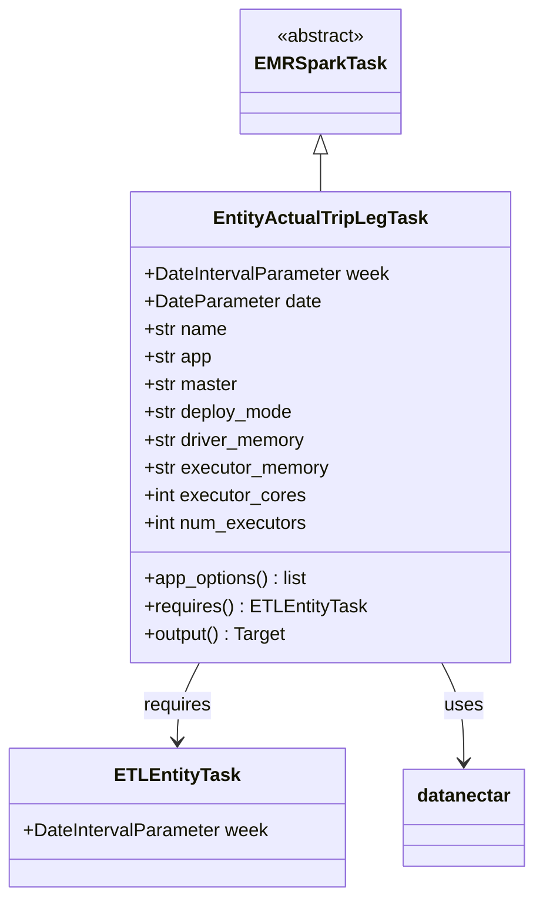
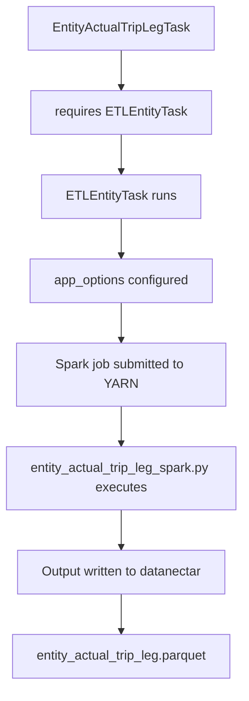

# Diagram: research/orchestrator/tasks/transforms/entity_actual_trip_leg_task.py

> Auto-generated by Obscura crawlers

## Diagram 1

### SVG

<svg id="container" width="456.578125" xmlns="http://www.w3.org/2000/svg" class="classDiagram" height="776" viewBox="0 0 456.578125 776" role="graphics-document document" aria-roledescription="class"><g><defs><marker id="container_class-aggregationStart" class="marker aggregation class" refX="18" refY="7" markerWidth="190" markerHeight="240" orient="auto"><path d="M 18,7 L9,13 L1,7 L9,1 Z"></path></marker></defs><defs><marker id="container_class-aggregationEnd" class="marker aggregation class" refX="1" refY="7" markerWidth="20" markerHeight="28" orient="auto"><path d="M 18,7 L9,13 L1,7 L9,1 Z"></path></marker></defs><defs><marker id="container_class-extensionStart" class="marker extension class" refX="18" refY="7" markerWidth="190" markerHeight="240" orient="auto"><path d="M 1,7 L18,13 V 1 Z"></path></marker></defs><defs><marker id="container_class-extensionEnd" class="marker extension class" refX="1" refY="7" markerWidth="20" markerHeight="28" orient="auto"><path d="M 1,1 V 13 L18,7 Z"></path></marker></defs><defs><marker id="container_class-compositionStart" class="marker composition class" refX="18" refY="7" markerWidth="190" markerHeight="240" orient="auto"><path d="M 18,7 L9,13 L1,7 L9,1 Z"></path></marker></defs><defs><marker id="container_class-compositionEnd" class="marker composition class" refX="1" refY="7" markerWidth="20" markerHeight="28" orient="auto"><path d="M 18,7 L9,13 L1,7 L9,1 Z"></path></marker></defs><defs><marker id="container_class-dependencyStart" class="marker dependency class" refX="6" refY="7" markerWidth="190" markerHeight="240" orient="auto"><path d="M 5,7 L9,13 L1,7 L9,1 Z"></path></marker></defs><defs><marker id="container_class-dependencyEnd" class="marker dependency class" refX="13" refY="7" markerWidth="20" markerHeight="28" orient="auto"><path d="M 18,7 L9,13 L14,7 L9,1 Z"></path></marker></defs><defs><marker id="container_class-lollipopStart" class="marker lollipop class" refX="13" refY="7" markerWidth="190" markerHeight="240" orient="auto"><circle stroke="black" fill="transparent" cx="7" cy="7" r="6"></circle></marker></defs><defs><marker id="container_class-lollipopEnd" class="marker lollipop class" refX="1" refY="7" markerWidth="190" markerHeight="240" orient="auto"><circle stroke="black" fill="transparent" cx="7" cy="7" r="6"></circle></marker></defs><g class="root"><g class="clusters"></g><g class="edgePaths"><path d="M273.918,133.25L273.918,134.542C273.918,135.833,273.918,138.417,273.918,143.875C273.918,149.333,273.918,157.667,273.918,161.833L273.918,166" id="id_EMRSparkTask_EntityActualTripLegTask_1" class="edge-thickness-normal edge-pattern-solid relation" style=";;;" data-edge="true" data-et="edge" data-id="id_EMRSparkTask_EntityActualTripLegTask_1" data-points="W3sieCI6MjczLjkxNzk2ODc1LCJ5IjoxMTZ9LHsieCI6MjczLjkxNzk2ODc1LCJ5IjoxNDF9LHsieCI6MjczLjkxNzk2ODc1LCJ5IjoxNjZ9XQ==" marker-start="url(#container_class-extensionStart)"></path><path d="M170.103,574L166.964,580.167C163.826,586.333,157.55,598.667,154.412,610C151.273,621.333,151.273,631.667,151.273,636.833L151.273,642" id="id_EntityActualTripLegTask_ETLEntityTask_2" class="edge-thickness-normal edge-pattern-solid relation" style=";;;" data-edge="true" data-et="edge" data-id="id_EntityActualTripLegTask_ETLEntityTask_2" data-points="W3sieCI6MTcwLjEwMjY4MDg4NjkyOTQ4LCJ5Ijo1NzR9LHsieCI6MTUxLjI3MzQzNzUsInkiOjYxMX0seyJ4IjoxNTEuMjczNDM3NSwieSI6NjQ4fV0=" marker-end="url(#container_class-dependencyEnd)"></path><path d="M377.733,574L380.871,580.167C384.01,586.333,390.286,598.667,393.424,613C396.563,627.333,396.563,643.667,396.563,651.833L396.563,660" id="id_EntityActualTripLegTask_datanectar_3" class="edge-thickness-normal edge-pattern-solid relation" style=";;;" data-edge="true" data-et="edge" data-id="id_EntityActualTripLegTask_datanectar_3" data-points="W3sieCI6Mzc3LjczMzI1NjYxMzA3MDUsInkiOjU3NH0seyJ4IjozOTYuNTYyNSwieSI6NjExfSx7IngiOjM5Ni41NjI1LCJ5Ijo2NjZ9XQ==" marker-end="url(#container_class-dependencyEnd)"></path></g><g class="edgeLabels"><g class="edgeLabel"><g class="label" data-id="id_EMRSparkTask_EntityActualTripLegTask_1" transform="translate(0, 0)"><foreignObject width="0" height="0">

</foreignObject></g></g><g class="edgeLabel" transform="translate(151.2734375, 611)"><g class="label" data-id="id_EntityActualTripLegTask_ETLEntityTask_2" transform="translate(-29.8515625, -12)"><foreignObject width="59.703125" height="24">

requires

</foreignObject></g></g><g class="edgeLabel" transform="translate(396.5625, 611)"><g class="label" data-id="id_EntityActualTripLegTask_datanectar_3" transform="translate(-16.4921875, -12)"><foreignObject width="32.984375" height="24">

uses

</foreignObject></g></g></g><g class="nodes"><g class="node default" id="classId-EMRSparkTask-0" transform="translate(273.91796875, 62)"><g class="basic label-container"><path d="M-65.1484375 -54 L65.1484375 -54 L65.1484375 54 L-65.1484375 54" stroke="none" stroke-width="0" fill="#ECECFF" style=""></path><path d="M-65.1484375 -54 C-20.063314058709054 -54, 25.021809382581893 -54, 65.1484375 -54 M-65.1484375 -54 C-32.262893075018575 -54, 0.622651349962851 -54, 65.1484375 -54 M65.1484375 -54 C65.1484375 -23.098057676290203, 65.1484375 7.8038846474195935, 65.1484375 54 M65.1484375 -54 C65.1484375 -27.57384020564111, 65.1484375 -1.1476804112822165, 65.1484375 54 M65.1484375 54 C20.453578940678803 54, -24.241279618642395 54, -65.1484375 54 M65.1484375 54 C18.597527681929805 54, -27.95338213614039 54, -65.1484375 54 M-65.1484375 54 C-65.1484375 24.629571479778704, -65.1484375 -4.740857040442592, -65.1484375 -54 M-65.1484375 54 C-65.1484375 23.457263415512195, -65.1484375 -7.085473168975611, -65.1484375 -54" stroke="#9370DB" stroke-width="1.3" fill="none" stroke-dasharray="0 0" style=""></path></g><g class="annotation-group text" transform="translate(-38.609375, -30)"><g class="label" style="" transform="translate(0,-12)"><foreignObject width="77.21875" height="24">

«abstract»

</foreignObject></g></g><g class="label-group text" transform="translate(-53.1484375, -6)"><g class="label" style="font-weight: bolder" transform="translate(0,-12)"><foreignObject width="106.296875" height="24">

EMRSparkTask

</foreignObject></g></g><g class="members-group text" transform="translate(-53.1484375, 42)"></g><g class="methods-group text" transform="translate(-53.1484375, 72)"></g><g class="divider" style=""><path d="M-65.1484375 18 C-28.743243970515778 18, 7.661949558968445 18, 65.1484375 18 M-65.1484375 18 C-17.240097224777173 18, 30.668243050445653 18, 65.1484375 18" stroke="#9370DB" stroke-width="1.3" fill="none" stroke-dasharray="0 0" style=""></path></g><g class="divider" style=""><path d="M-65.1484375 36 C-19.46701783586674 36, 26.214401828266517 36, 65.1484375 36 M-65.1484375 36 C-32.60647869039989 36, -0.06451988079977866 36, 65.1484375 36" stroke="#9370DB" stroke-width="1.3" fill="none" stroke-dasharray="0 0" style=""></path></g></g><g class="node default" id="classId-EntityActualTripLegTask-1" transform="translate(273.91796875, 370)"><g class="basic label-container"><path d="M-161.9296875 -204 L161.9296875 -204 L161.9296875 204 L-161.9296875 204" stroke="none" stroke-width="0" fill="#ECECFF" style=""></path><path d="M-161.9296875 -204 C-59.495956855380555 -204, 42.93777378923889 -204, 161.9296875 -204 M-161.9296875 -204 C-41.68949914643905 -204, 78.5506892071219 -204, 161.9296875 -204 M161.9296875 -204 C161.9296875 -96.86198488153096, 161.9296875 10.276030236938084, 161.9296875 204 M161.9296875 -204 C161.9296875 -65.64801510190972, 161.9296875 72.70396979618056, 161.9296875 204 M161.9296875 204 C72.4372032867588 204, -17.055280926482396 204, -161.9296875 204 M161.9296875 204 C88.42547310185493 204, 14.921258703709867 204, -161.9296875 204 M-161.9296875 204 C-161.9296875 53.989839318263336, -161.9296875 -96.02032136347333, -161.9296875 -204 M-161.9296875 204 C-161.9296875 107.32666743516118, -161.9296875 10.653334870322368, -161.9296875 -204" stroke="#9370DB" stroke-width="1.3" fill="none" stroke-dasharray="0 0" style=""></path></g><g class="annotation-group text" transform="translate(0, -180)"></g><g class="label-group text" transform="translate(-87.734375, -180)"><g class="label" style="font-weight: bolder" transform="translate(0,-12)"><foreignObject width="175.46875" height="24">

EntityActualTripLegTask

</foreignObject></g></g><g class="members-group text" transform="translate(-149.9296875, -132)"><g class="label" style="" transform="translate(0,-12)"><foreignObject width="212.125" height="24">

+DateIntervalParameter week

</foreignObject></g><g class="label" style="" transform="translate(0,12)"><foreignObject width="152.171875" height="24">

+DateParameter date

</foreignObject></g><g class="label" style="" transform="translate(0,36)"><foreignObject width="72.171875" height="24">

+str name

</foreignObject></g><g class="label" style="" transform="translate(0,60)"><foreignObject width="59.375" height="24">

+str app

</foreignObject></g><g class="label" style="" transform="translate(0,84)"><foreignObject width="81.8125" height="24">

+str master

</foreignObject></g><g class="label" style="" transform="translate(0,108)"><foreignObject width="130.390625" height="24">

+str deploy_mode

</foreignObject></g><g class="label" style="" transform="translate(0,132)"><foreignObject width="141.1875" height="24">

+str driver_memory

</foreignObject></g><g class="label" style="" transform="translate(0,156)"><foreignObject width="161" height="24">

+str executor_memory

</foreignObject></g><g class="label" style="" transform="translate(0,180)"><foreignObject width="139.9375" height="24">

+int executor_cores

</foreignObject></g><g class="label" style="" transform="translate(0,204)"><foreignObject width="142.296875" height="24">

+int num_executors

</foreignObject></g></g><g class="methods-group text" transform="translate(-149.9296875, 132)"><g class="label" style="" transform="translate(0,-12)"><foreignObject width="143.609375" height="24">

+app_options() : list

</foreignObject></g><g class="label" style="" transform="translate(0,12)"><foreignObject width="188.484375" height="24">

+requires() : ETLEntityTask

</foreignObject></g><g class="label" style="" transform="translate(0,36)"><foreignObject width="124.375" height="24">

+output() : Target

</foreignObject></g></g><g class="divider" style=""><path d="M-161.9296875 -156 C-81.62189074553845 -156, -1.314093991076902 -156, 161.9296875 -156 M-161.9296875 -156 C-84.02084028096873 -156, -6.111993061937454 -156, 161.9296875 -156" stroke="#9370DB" stroke-width="1.3" fill="none" stroke-dasharray="0 0" style=""></path></g><g class="divider" style=""><path d="M-161.9296875 108 C-60.70789205808602 108, 40.513903383827966 108, 161.9296875 108 M-161.9296875 108 C-40.42466255693712 108, 81.08036238612576 108, 161.9296875 108" stroke="#9370DB" stroke-width="1.3" fill="none" stroke-dasharray="0 0" style=""></path></g></g><g class="node default" id="classId-ETLEntityTask-2" transform="translate(151.2734375, 708)"><g class="basic label-container"><path d="M-143.2734375 -60 L143.2734375 -60 L143.2734375 60 L-143.2734375 60" stroke="none" stroke-width="0" fill="#ECECFF" style=""></path><path d="M-143.2734375 -60 C-72.62310019991928 -60, -1.972762899838557 -60, 143.2734375 -60 M-143.2734375 -60 C-84.62818691756775 -60, -25.982936335135477 -60, 143.2734375 -60 M143.2734375 -60 C143.2734375 -32.968069901982034, 143.2734375 -5.9361398039640605, 143.2734375 60 M143.2734375 -60 C143.2734375 -27.12437564546822, 143.2734375 5.75124870906356, 143.2734375 60 M143.2734375 60 C73.17026626071849 60, 3.067095021436984 60, -143.2734375 60 M143.2734375 60 C32.199167177878934 60, -78.87510314424213 60, -143.2734375 60 M-143.2734375 60 C-143.2734375 13.472398816800514, -143.2734375 -33.05520236639897, -143.2734375 -60 M-143.2734375 60 C-143.2734375 24.793623528946696, -143.2734375 -10.412752942106607, -143.2734375 -60" stroke="#9370DB" stroke-width="1.3" fill="none" stroke-dasharray="0 0" style=""></path></g><g class="annotation-group text" transform="translate(0, -36)"></g><g class="label-group text" transform="translate(-50.421875, -36)"><g class="label" style="font-weight: bolder" transform="translate(0,-12)"><foreignObject width="100.84375" height="24">

ETLEntityTask

</foreignObject></g></g><g class="members-group text" transform="translate(-131.2734375, 12)"><g class="label" style="" transform="translate(0,-12)"><foreignObject width="212.125" height="24">

+DateIntervalParameter week

</foreignObject></g></g><g class="methods-group text" transform="translate(-131.2734375, 60)"></g><g class="divider" style=""><path d="M-143.2734375 -12 C-28.864818690294427 -12, 85.54380011941115 -12, 143.2734375 -12 M-143.2734375 -12 C-40.0539212184233 -12, 63.165595063153404 -12, 143.2734375 -12" stroke="#9370DB" stroke-width="1.3" fill="none" stroke-dasharray="0 0" style=""></path></g><g class="divider" style=""><path d="M-143.2734375 36 C-61.460806519505184 36, 20.351824460989633 36, 143.2734375 36 M-143.2734375 36 C-73.67803393781789 36, -4.082630375635773 36, 143.2734375 36" stroke="#9370DB" stroke-width="1.3" fill="none" stroke-dasharray="0 0" style=""></path></g></g><g class="node default" id="classId-datanectar-3" transform="translate(396.5625, 708)"><g class="basic label-container"><path d="M-52.015625 -42 L52.015625 -42 L52.015625 42 L-52.015625 42" stroke="none" stroke-width="0" fill="#ECECFF" style=""></path><path d="M-52.015625 -42 C-19.47508105606017 -42, 13.065462887879661 -42, 52.015625 -42 M-52.015625 -42 C-27.651912336635856 -42, -3.2881996732717127 -42, 52.015625 -42 M52.015625 -42 C52.015625 -9.46991825528778, 52.015625 23.06016348942444, 52.015625 42 M52.015625 -42 C52.015625 -22.28312975031324, 52.015625 -2.5662595006264795, 52.015625 42 M52.015625 42 C28.627566157929184 42, 5.2395073158583685 42, -52.015625 42 M52.015625 42 C12.049940286418611 42, -27.915744427162778 42, -52.015625 42 M-52.015625 42 C-52.015625 8.86720125224032, -52.015625 -24.26559749551936, -52.015625 -42 M-52.015625 42 C-52.015625 10.131973928670075, -52.015625 -21.73605214265985, -52.015625 -42" stroke="#9370DB" stroke-width="1.3" fill="none" stroke-dasharray="0 0" style=""></path></g><g class="annotation-group text" transform="translate(0, -18)"></g><g class="label-group text" transform="translate(-40.015625, -18)"><g class="label" style="font-weight: bolder" transform="translate(0,-12)"><foreignObject width="80.03125" height="24">

datanectar

</foreignObject></g></g><g class="members-group text" transform="translate(-40.015625, 30)"></g><g class="methods-group text" transform="translate(-40.015625, 60)"></g><g class="divider" style=""><path d="M-52.015625 6 C-18.988729823388525 6, 14.03816535322295 6, 52.015625 6 M-52.015625 6 C-30.670802528578708 6, -9.325980057157416 6, 52.015625 6" stroke="#9370DB" stroke-width="1.3" fill="none" stroke-dasharray="0 0" style=""></path></g><g class="divider" style=""><path d="M-52.015625 24 C-15.620262165890793 24, 20.775100668218414 24, 52.015625 24 M-52.015625 24 C-13.093310394056601 24, 25.829004211886797 24, 52.015625 24" stroke="#9370DB" stroke-width="1.3" fill="none" stroke-dasharray="0 0" style=""></path></g></g></g></g></g></svg>

## Diagram 2

### SVG

<svg id="container" width="307.34375" xmlns="http://www.w3.org/2000/svg" class="flowchart" height="870" viewBox="0 0 307.34375 870" role="graphics-document document" aria-roledescription="flowchart-v2"><g><marker id="container_flowchart-v2-pointEnd" class="marker flowchart-v2" viewBox="0 0 10 10" refX="5" refY="5" markerUnits="userSpaceOnUse" markerWidth="8" markerHeight="8" orient="auto"><path d="M 0 0 L 10 5 L 0 10 z" class="arrowMarkerPath" style="stroke-width: 1; stroke-dasharray: 1, 0;"></path></marker><marker id="container_flowchart-v2-pointStart" class="marker flowchart-v2" viewBox="0 0 10 10" refX="4.5" refY="5" markerUnits="userSpaceOnUse" markerWidth="8" markerHeight="8" orient="auto"><path d="M 0 5 L 10 10 L 10 0 z" class="arrowMarkerPath" style="stroke-width: 1; stroke-dasharray: 1, 0;"></path></marker><marker id="container_flowchart-v2-circleEnd" class="marker flowchart-v2" viewBox="0 0 10 10" refX="11" refY="5" markerUnits="userSpaceOnUse" markerWidth="11" markerHeight="11" orient="auto"><circle cx="5" cy="5" r="5" class="arrowMarkerPath" style="stroke-width: 1; stroke-dasharray: 1, 0;"></circle></marker><marker id="container_flowchart-v2-circleStart" class="marker flowchart-v2" viewBox="0 0 10 10" refX="-1" refY="5" markerUnits="userSpaceOnUse" markerWidth="11" markerHeight="11" orient="auto"><circle cx="5" cy="5" r="5" class="arrowMarkerPath" style="stroke-width: 1; stroke-dasharray: 1, 0;"></circle></marker><marker id="container_flowchart-v2-crossEnd" class="marker cross flowchart-v2" viewBox="0 0 11 11" refX="12" refY="5.2" markerUnits="userSpaceOnUse" markerWidth="11" markerHeight="11" orient="auto"><path d="M 1,1 l 9,9 M 10,1 l -9,9" class="arrowMarkerPath" style="stroke-width: 2; stroke-dasharray: 1, 0;"></path></marker><marker id="container_flowchart-v2-crossStart" class="marker cross flowchart-v2" viewBox="0 0 11 11" refX="-1" refY="5.2" markerUnits="userSpaceOnUse" markerWidth="11" markerHeight="11" orient="auto"><path d="M 1,1 l 9,9 M 10,1 l -9,9" class="arrowMarkerPath" style="stroke-width: 2; stroke-dasharray: 1, 0;"></path></marker><g class="root"><g class="clusters"></g><g class="edgePaths"><path d="M153.672,62L153.672,66.167C153.672,70.333,153.672,78.667,153.672,86.333C153.672,94,153.672,101,153.672,104.5L153.672,108" id="L_A_B_0" class="edge-thickness-normal edge-pattern-solid edge-thickness-normal edge-pattern-solid flowchart-link" style=";" data-edge="true" data-et="edge" data-id="L_A_B_0" data-points="W3sieCI6MTUzLjY3MTg3NSwieSI6NjJ9LHsieCI6MTUzLjY3MTg3NSwieSI6ODd9LHsieCI6MTUzLjY3MTg3NSwieSI6MTEyfV0=" marker-end="url(#container_flowchart-v2-pointEnd)"></path><path d="M153.672,166L153.672,170.167C153.672,174.333,153.672,182.667,153.672,190.333C153.672,198,153.672,205,153.672,208.5L153.672,212" id="L_B_C_0" class="edge-thickness-normal edge-pattern-solid edge-thickness-normal edge-pattern-solid flowchart-link" style=";" data-edge="true" data-et="edge" data-id="L_B_C_0" data-points="W3sieCI6MTUzLjY3MTg3NSwieSI6MTY2fSx7IngiOjE1My42NzE4NzUsInkiOjE5MX0seyJ4IjoxNTMuNjcxODc1LCJ5IjoyMTZ9XQ==" marker-end="url(#container_flowchart-v2-pointEnd)"></path><path d="M153.672,270L153.672,274.167C153.672,278.333,153.672,286.667,153.672,294.333C153.672,302,153.672,309,153.672,312.5L153.672,316" id="L_C_D_0" class="edge-thickness-normal edge-pattern-solid edge-thickness-normal edge-pattern-solid flowchart-link" style=";" data-edge="true" data-et="edge" data-id="L_C_D_0" data-points="W3sieCI6MTUzLjY3MTg3NSwieSI6MjcwfSx7IngiOjE1My42NzE4NzUsInkiOjI5NX0seyJ4IjoxNTMuNjcxODc1LCJ5IjozMjB9XQ==" marker-end="url(#container_flowchart-v2-pointEnd)"></path><path d="M153.672,374L153.672,378.167C153.672,382.333,153.672,390.667,153.672,398.333C153.672,406,153.672,413,153.672,416.5L153.672,420" id="L_D_E_0" class="edge-thickness-normal edge-pattern-solid edge-thickness-normal edge-pattern-solid flowchart-link" style=";" data-edge="true" data-et="edge" data-id="L_D_E_0" data-points="W3sieCI6MTUzLjY3MTg3NSwieSI6Mzc0fSx7IngiOjE1My42NzE4NzUsInkiOjM5OX0seyJ4IjoxNTMuNjcxODc1LCJ5Ijo0MjR9XQ==" marker-end="url(#container_flowchart-v2-pointEnd)"></path><path d="M153.672,502L153.672,506.167C153.672,510.333,153.672,518.667,153.672,526.333C153.672,534,153.672,541,153.672,544.5L153.672,548" id="L_E_F_0" class="edge-thickness-normal edge-pattern-solid edge-thickness-normal edge-pattern-solid flowchart-link" style=";" data-edge="true" data-et="edge" data-id="L_E_F_0" data-points="W3sieCI6MTUzLjY3MTg3NSwieSI6NTAyfSx7IngiOjE1My42NzE4NzUsInkiOjUyN30seyJ4IjoxNTMuNjcxODc1LCJ5Ijo1NTJ9XQ==" marker-end="url(#container_flowchart-v2-pointEnd)"></path><path d="M153.672,630L153.672,634.167C153.672,638.333,153.672,646.667,153.672,654.333C153.672,662,153.672,669,153.672,672.5L153.672,676" id="L_F_G_0" class="edge-thickness-normal edge-pattern-solid edge-thickness-normal edge-pattern-solid flowchart-link" style=";" data-edge="true" data-et="edge" data-id="L_F_G_0" data-points="W3sieCI6MTUzLjY3MTg3NSwieSI6NjMwfSx7IngiOjE1My42NzE4NzUsInkiOjY1NX0seyJ4IjoxNTMuNjcxODc1LCJ5Ijo2ODB9XQ==" marker-end="url(#container_flowchart-v2-pointEnd)"></path><path d="M153.672,758L153.672,762.167C153.672,766.333,153.672,774.667,153.672,782.333C153.672,790,153.672,797,153.672,800.5L153.672,804" id="L_G_H_0" class="edge-thickness-normal edge-pattern-solid edge-thickness-normal edge-pattern-solid flowchart-link" style=";" data-edge="true" data-et="edge" data-id="L_G_H_0" data-points="W3sieCI6MTUzLjY3MTg3NSwieSI6NzU4fSx7IngiOjE1My42NzE4NzUsInkiOjc4M30seyJ4IjoxNTMuNjcxODc1LCJ5Ijo4MDh9XQ==" marker-end="url(#container_flowchart-v2-pointEnd)"></path></g><g class="edgeLabels"><g class="edgeLabel"><g class="label" data-id="L_A_B_0" transform="translate(0, 0)"><foreignObject width="0" height="0">

</foreignObject></g></g><g class="edgeLabel"><g class="label" data-id="L_B_C_0" transform="translate(0, 0)"><foreignObject width="0" height="0">

</foreignObject></g></g><g class="edgeLabel"><g class="label" data-id="L_C_D_0" transform="translate(0, 0)"><foreignObject width="0" height="0">

</foreignObject></g></g><g class="edgeLabel"><g class="label" data-id="L_D_E_0" transform="translate(0, 0)"><foreignObject width="0" height="0">

</foreignObject></g></g><g class="edgeLabel"><g class="label" data-id="L_E_F_0" transform="translate(0, 0)"><foreignObject width="0" height="0">

</foreignObject></g></g><g class="edgeLabel"><g class="label" data-id="L_F_G_0" transform="translate(0, 0)"><foreignObject width="0" height="0">

</foreignObject></g></g><g class="edgeLabel"><g class="label" data-id="L_G_H_0" transform="translate(0, 0)"><foreignObject width="0" height="0">

</foreignObject></g></g></g><g class="nodes"><g class="node default" id="flowchart-A-0" transform="translate(153.671875, 35)"><rect class="basic label-container" style="" x="-115.5234375" y="-27" width="231.046875" height="54"></rect><g class="label" style="" transform="translate(-85.5234375, -12)"><rect></rect><foreignObject width="171.046875" height="24">

EntityActualTripLegTask

</foreignObject></g></g><g class="node default" id="flowchart-B-1" transform="translate(153.671875, 139)"><rect class="basic label-container" style="" x="-111.03125" y="-27" width="222.0625" height="54"></rect><g class="label" style="" transform="translate(-81.03125, -12)"><rect></rect><foreignObject width="162.0625" height="24">

requires ETLEntityTask

</foreignObject></g></g><g class="node default" id="flowchart-C-3" transform="translate(153.671875, 243)"><rect class="basic label-container" style="" x="-97.3515625" y="-27" width="194.703125" height="54"></rect><g class="label" style="" transform="translate(-67.3515625, -12)"><rect></rect><foreignObject width="134.703125" height="24">

ETLEntityTask runs

</foreignObject></g></g><g class="node default" id="flowchart-D-5" transform="translate(153.671875, 347)"><rect class="basic label-container" style="" x="-115.8359375" y="-27" width="231.671875" height="54"></rect><g class="label" style="" transform="translate(-85.8359375, -12)"><rect></rect><foreignObject width="171.671875" height="24">

app_options configured

</foreignObject></g></g><g class="node default" id="flowchart-E-7" transform="translate(153.671875, 463)"><rect class="basic label-container" style="" x="-130" y="-39" width="260" height="78"></rect><g class="label" style="" transform="translate(-100, -24)"><rect></rect><foreignObject width="200" height="48">

Spark job submitted to YARN

</foreignObject></g></g><g class="node default" id="flowchart-F-9" transform="translate(153.671875, 591)"><rect class="basic label-container" style="" x="-145.671875" y="-39" width="291.34375" height="78"></rect><g class="label" style="" transform="translate(-115.671875, -24)"><rect></rect><foreignObject width="231.34375" height="48">

entity_actual_trip_leg_spark.py executes

</foreignObject></g></g><g class="node default" id="flowchart-G-11" transform="translate(153.671875, 719)"><rect class="basic label-container" style="" x="-130" y="-39" width="260" height="78"></rect><g class="label" style="" transform="translate(-100, -24)"><rect></rect><foreignObject width="200" height="48">

Output written to datanectar

</foreignObject></g></g><g class="node default" id="flowchart-H-13" transform="translate(153.671875, 835)"><rect class="basic label-container" style="" x="-139.28125" y="-27" width="278.5625" height="54"></rect><g class="label" style="" transform="translate(-109.28125, -12)"><rect></rect><foreignObject width="218.5625" height="24">

entity_actual_trip_leg.parquet

</foreignObject></g></g></g></g></g></svg>
