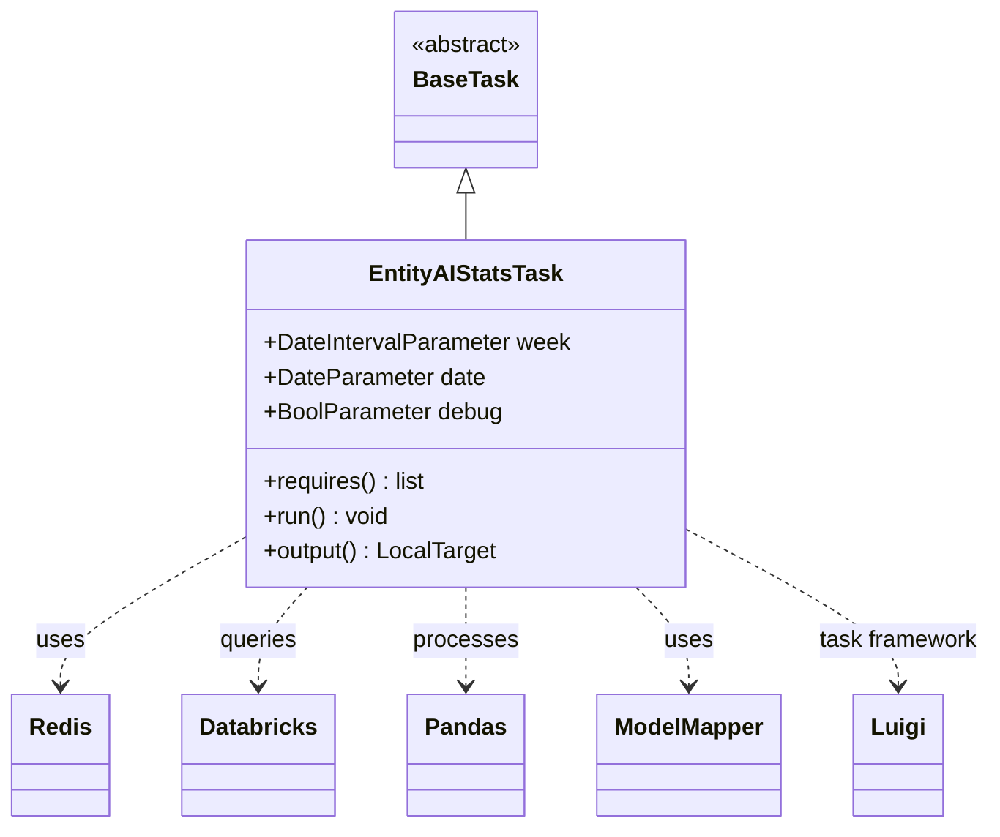
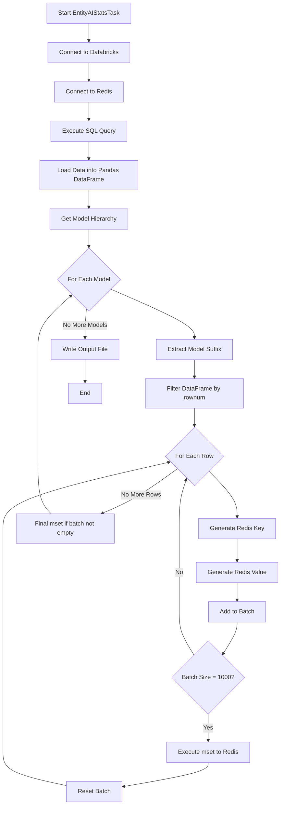
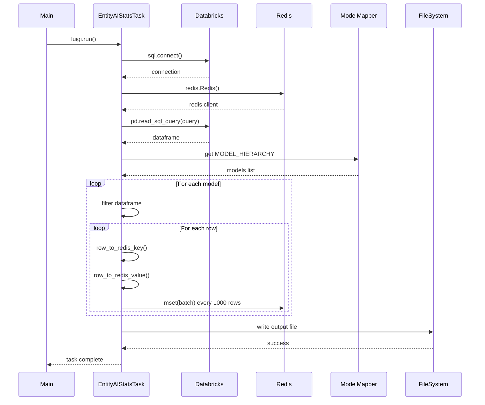
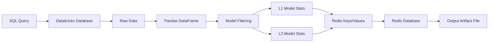

# Diagram: research/orchestrator/tasks/transforms/entity_ai_stats_task.py


> Auto-generated by Obscura crawlers

## Diagram 1

```mermaid
classDiagram
      BaseTask <|-- EntityAIStatsTask
      class EntityAIStatsTask {
          +DateIntervalParameter week...
  └ 81 lines...

✗ Print Mermaid diagrams directly
  $ printf '%s\n' \
  'classDiagram' \
  '    BaseTask <|-- EntityAIStatsTask' \
  '    class EntityAIStatsTask {' \
  '        +DateIntervalParameter week' \...
  Permission denied and could not request permission from user

● Echo Mermaid diagrams
  $ echo "classDiagram
      BaseTask <|-- EntityAIStatsTask
      class EntityAIStatsTask {
          +DateIntervalParameter week
          +DateParameter date...
  └ 78 lines...

✗ read_bash
  Invalid shell ID: 1. Please supply a valid shell ID to read output from.

  <no active shell sessions>
```

> SVG rendering failed for this diagram.

## Diagram 2



### SVG

<svg id="container" width="669.4453125" xmlns="http://www.w3.org/2000/svg" class="classDiagram" height="572" viewBox="0 0 669.4453125 572" role="graphics-document document" aria-roledescription="class"><style>#container{font-family:"trebuchet ms",verdana,arial,sans-serif;font-size:16px;fill:#333;}@keyframes edge-animation-frame{from{stroke-dashoffset:0;}}@keyframes dash{to{stroke-dashoffset:0;}}#container .edge-animation-slow{stroke-dasharray:9,5!important;stroke-dashoffset:900;animation:dash 50s linear infinite;stroke-linecap:round;}#container .edge-animation-fast{stroke-dasharray:9,5!important;stroke-dashoffset:900;animation:dash 20s linear infinite;stroke-linecap:round;}#container .error-icon{fill:#552222;}#container .error-text{fill:#552222;stroke:#552222;}#container .edge-thickness-normal{stroke-width:1px;}#container .edge-thickness-thick{stroke-width:3.5px;}#container .edge-pattern-solid{stroke-dasharray:0;}#container .edge-thickness-invisible{stroke-width:0;fill:none;}#container .edge-pattern-dashed{stroke-dasharray:3;}#container .edge-pattern-dotted{stroke-dasharray:2;}#container .marker{fill:#333333;stroke:#333333;}#container .marker.cross{stroke:#333333;}#container svg{font-family:"trebuchet ms",verdana,arial,sans-serif;font-size:16px;}#container p{margin:0;}#container g.classGroup text{fill:#9370DB;stroke:none;font-family:"trebuchet ms",verdana,arial,sans-serif;font-size:10px;}#container g.classGroup text .title{font-weight:bolder;}#container .nodeLabel,#container .edgeLabel{color:#131300;}#container .edgeLabel .label rect{fill:#ECECFF;}#container .label text{fill:#131300;}#container .labelBkg{background:#ECECFF;}#container .edgeLabel .label span{background:#ECECFF;}#container .classTitle{font-weight:bolder;}#container .node rect,#container .node circle,#container .node ellipse,#container .node polygon,#container .node path{fill:#ECECFF;stroke:#9370DB;stroke-width:1px;}#container .divider{stroke:#9370DB;stroke-width:1;}#container g.clickable{cursor:pointer;}#container g.classGroup rect{fill:#ECECFF;stroke:#9370DB;}#container g.classGroup line{stroke:#9370DB;stroke-width:1;}#container .classLabel .box{stroke:none;stroke-width:0;fill:#ECECFF;opacity:0.5;}#container .classLabel .label{fill:#9370DB;font-size:10px;}#container .relation{stroke:#333333;stroke-width:1;fill:none;}#container .dashed-line{stroke-dasharray:3;}#container .dotted-line{stroke-dasharray:1 2;}#container #compositionStart,#container .composition{fill:#333333!important;stroke:#333333!important;stroke-width:1;}#container #compositionEnd,#container .composition{fill:#333333!important;stroke:#333333!important;stroke-width:1;}#container #dependencyStart,#container .dependency{fill:#333333!important;stroke:#333333!important;stroke-width:1;}#container #dependencyStart,#container .dependency{fill:#333333!important;stroke:#333333!important;stroke-width:1;}#container #extensionStart,#container .extension{fill:transparent!important;stroke:#333333!important;stroke-width:1;}#container #extensionEnd,#container .extension{fill:transparent!important;stroke:#333333!important;stroke-width:1;}#container #aggregationStart,#container .aggregation{fill:transparent!important;stroke:#333333!important;stroke-width:1;}#container #aggregationEnd,#container .aggregation{fill:transparent!important;stroke:#333333!important;stroke-width:1;}#container #lollipopStart,#container .lollipop{fill:#ECECFF!important;stroke:#333333!important;stroke-width:1;}#container #lollipopEnd,#container .lollipop{fill:#ECECFF!important;stroke:#333333!important;stroke-width:1;}#container .edgeTerminals{font-size:11px;line-height:initial;}#container .classTitleText{text-anchor:middle;font-size:18px;fill:#333;}#container .label-icon{display:inline-block;height:1em;overflow:visible;vertical-align:-0.125em;}#container .node .label-icon path{fill:currentColor;stroke:revert;stroke-width:revert;}#container :root{--mermaid-font-family:"trebuchet ms",verdana,arial,sans-serif;}</style><g><defs><marker id="container_class-aggregationStart" class="marker aggregation class" refX="18" refY="7" markerWidth="190" markerHeight="240" orient="auto"><path d="M 18,7 L9,13 L1,7 L9,1 Z"></path></marker></defs><defs><marker id="container_class-aggregationEnd" class="marker aggregation class" refX="1" refY="7" markerWidth="20" markerHeight="28" orient="auto"><path d="M 18,7 L9,13 L1,7 L9,1 Z"></path></marker></defs><defs><marker id="container_class-extensionStart" class="marker extension class" refX="18" refY="7" markerWidth="190" markerHeight="240" orient="auto"><path d="M 1,7 L18,13 V 1 Z"></path></marker></defs><defs><marker id="container_class-extensionEnd" class="marker extension class" refX="1" refY="7" markerWidth="20" markerHeight="28" orient="auto"><path d="M 1,1 V 13 L18,7 Z"></path></marker></defs><defs><marker id="container_class-compositionStart" class="marker composition class" refX="18" refY="7" markerWidth="190" markerHeight="240" orient="auto"><path d="M 18,7 L9,13 L1,7 L9,1 Z"></path></marker></defs><defs><marker id="container_class-compositionEnd" class="marker composition class" refX="1" refY="7" markerWidth="20" markerHeight="28" orient="auto"><path d="M 18,7 L9,13 L1,7 L9,1 Z"></path></marker></defs><defs><marker id="container_class-dependencyStart" class="marker dependency class" refX="6" refY="7" markerWidth="190" markerHeight="240" orient="auto"><path d="M 5,7 L9,13 L1,7 L9,1 Z"></path></marker></defs><defs><marker id="container_class-dependencyEnd" class="marker dependency class" refX="13" refY="7" markerWidth="20" markerHeight="28" orient="auto"><path d="M 18,7 L9,13 L14,7 L9,1 Z"></path></marker></defs><defs><marker id="container_class-lollipopStart" class="marker lollipop class" refX="13" refY="7" markerWidth="190" markerHeight="240" orient="auto"><circle stroke="black" fill="transparent" cx="7" cy="7" r="6"></circle></marker></defs><defs><marker id="container_class-lollipopEnd" class="marker lollipop class" refX="1" refY="7" markerWidth="190" markerHeight="240" orient="auto"><circle stroke="black" fill="transparent" cx="7" cy="7" r="6"></circle></marker></defs><g class="root"><g class="clusters"></g><g class="edgePaths"><path d="M313.078,133.25L313.078,134.542C313.078,135.833,313.078,138.417,313.078,143.875C313.078,149.333,313.078,157.667,313.078,161.833L313.078,166" id="id_BaseTask_EntityAIStatsTask_1" class="edge-thickness-normal edge-pattern-solid relation" style=";;;" data-edge="true" data-et="edge" data-id="id_BaseTask_EntityAIStatsTask_1" data-points="W3sieCI6MzEzLjA3ODEyNSwieSI6MTE2fSx7IngiOjMxMy4wNzgxMjUsInkiOjE0MX0seyJ4IjozMTMuMDc4MTI1LCJ5IjoxNjZ9XQ==" marker-start="url(#container_class-extensionStart)"></path><path d="M163.137,372.255L142.64,384.046C122.143,395.836,81.15,419.418,60.653,436.376C40.156,453.333,40.156,463.667,40.156,468.833L40.156,474" id="id_EntityAIStatsTask_Redis_2" class="edge-thickness-normal edge-pattern-dashed relation" style=";;;" data-edge="true" data-et="edge" data-id="id_EntityAIStatsTask_Redis_2" data-points="W3sieCI6MTYzLjEzNjcxODc1LCJ5IjozNzIuMjU0NzIzMTkyMzA1NX0seyJ4Ijo0MC4xNTYyNSwieSI6NDQzfSx7IngiOjQwLjE1NjI1LCJ5Ijo0ODB9XQ==" marker-end="url(#container_class-dependencyEnd)"></path><path d="M206.406,406L200.924,412.167C195.443,418.333,184.479,430.667,178.997,442C173.516,453.333,173.516,463.667,173.516,468.833L173.516,474" id="id_EntityAIStatsTask_Databricks_3" class="edge-thickness-normal edge-pattern-dashed relation" style=";;;" data-edge="true" data-et="edge" data-id="id_EntityAIStatsTask_Databricks_3" data-points="W3sieCI6MjA2LjQwNjE1MDQ3NzcwNywieSI6NDA2fSx7IngiOjE3My41MTU2MjUsInkiOjQ0M30seyJ4IjoxNzMuNTE1NjI1LCJ5Ijo0ODB9XQ==" marker-end="url(#container_class-dependencyEnd)"></path><path d="M313.078,406L313.078,412.167C313.078,418.333,313.078,430.667,313.078,442C313.078,453.333,313.078,463.667,313.078,468.833L313.078,474" id="id_EntityAIStatsTask_Pandas_4" class="edge-thickness-normal edge-pattern-dashed relation" style=";;;" data-edge="true" data-et="edge" data-id="id_EntityAIStatsTask_Pandas_4" data-points="W3sieCI6MzEzLjA3ODEyNSwieSI6NDA2fSx7IngiOjMxMy4wNzgxMjUsInkiOjQ0M30seyJ4IjozMTMuMDc4MTI1LCJ5Ijo0ODB9XQ==" marker-end="url(#container_class-dependencyEnd)"></path><path d="M428.313,406L434.235,412.167C440.157,418.333,452,430.667,457.922,442C463.844,453.333,463.844,463.667,463.844,468.833L463.844,474" id="id_EntityAIStatsTask_ModelMapper_5" class="edge-thickness-normal edge-pattern-dashed relation" style=";;;" data-edge="true" data-et="edge" data-id="id_EntityAIStatsTask_ModelMapper_5" data-points="W3sieCI6NDI4LjMxMjk5NzYxMTQ2NSwieSI6NDA2fSx7IngiOjQ2My44NDM3NSwieSI6NDQzfSx7IngiOjQ2My44NDM3NSwieSI6NDgwfV0=" marker-end="url(#container_class-dependencyEnd)"></path><path d="M463.02,366.438L486.805,379.199C510.591,391.959,558.163,417.479,581.949,435.406C605.734,453.333,605.734,463.667,605.734,468.833L605.734,474" id="id_EntityAIStatsTask_Luigi_6" class="edge-thickness-normal edge-pattern-dashed relation" style=";;;" data-edge="true" data-et="edge" data-id="id_EntityAIStatsTask_Luigi_6" data-points="W3sieCI6NDYzLjAxOTUzMTI1LCJ5IjozNjYuNDM4NDAwOTYxMDI1MX0seyJ4Ijo2MDUuNzM0Mzc1LCJ5Ijo0NDN9LHsieCI6NjA1LjczNDM3NSwieSI6NDgwfV0=" marker-end="url(#container_class-dependencyEnd)"></path></g><g class="edgeLabels"><g class="edgeLabel"><g class="label" data-id="id_BaseTask_EntityAIStatsTask_1" transform="translate(0, 0)"><foreignObject width="0" height="0"><div xmlns="http://www.w3.org/1999/xhtml" class="labelBkg" style="display: table-cell; white-space: nowrap; line-height: 1.5; max-width: 200px; text-align: center;"><span class="edgeLabel"></span></div></foreignObject></g></g><g class="edgeLabel" transform="translate(40.15625, 443)"><g class="label" data-id="id_EntityAIStatsTask_Redis_2" transform="translate(-16.4921875, -12)"><foreignObject width="32.984375" height="24"><div xmlns="http://www.w3.org/1999/xhtml" class="labelBkg" style="display: table-cell; white-space: nowrap; line-height: 1.5; max-width: 200px; text-align: center;"><span class="edgeLabel"><p>uses</p></span></div></foreignObject></g></g><g class="edgeLabel" transform="translate(173.515625, 443)"><g class="label" data-id="id_EntityAIStatsTask_Databricks_3" transform="translate(-27.2421875, -12)"><foreignObject width="54.484375" height="24"><div xmlns="http://www.w3.org/1999/xhtml" class="labelBkg" style="display: table-cell; white-space: nowrap; line-height: 1.5; max-width: 200px; text-align: center;"><span class="edgeLabel"><p>queries</p></span></div></foreignObject></g></g><g class="edgeLabel" transform="translate(313.078125, 443)"><g class="label" data-id="id_EntityAIStatsTask_Pandas_4" transform="translate(-35.7890625, -12)"><foreignObject width="71.578125" height="24"><div xmlns="http://www.w3.org/1999/xhtml" class="labelBkg" style="display: table-cell; white-space: nowrap; line-height: 1.5; max-width: 200px; text-align: center;"><span class="edgeLabel"><p>processes</p></span></div></foreignObject></g></g><g class="edgeLabel" transform="translate(463.84375, 443)"><g class="label" data-id="id_EntityAIStatsTask_ModelMapper_5" transform="translate(-16.4921875, -12)"><foreignObject width="32.984375" height="24"><div xmlns="http://www.w3.org/1999/xhtml" class="labelBkg" style="display: table-cell; white-space: nowrap; line-height: 1.5; max-width: 200px; text-align: center;"><span class="edgeLabel"><p>uses</p></span></div></foreignObject></g></g><g class="edgeLabel" transform="translate(605.734375, 443)"><g class="label" data-id="id_EntityAIStatsTask_Luigi_6" transform="translate(-55.7109375, -12)"><foreignObject width="111.421875" height="24"><div xmlns="http://www.w3.org/1999/xhtml" class="labelBkg" style="display: table-cell; white-space: nowrap; line-height: 1.5; max-width: 200px; text-align: center;"><span class="edgeLabel"><p>task framework</p></span></div></foreignObject></g></g></g><g class="nodes"><g class="node default" id="classId-BaseTask-0" transform="translate(313.078125, 62)"><g class="basic label-container"><path d="M-50.609375 -54 L50.609375 -54 L50.609375 54 L-50.609375 54" stroke="none" stroke-width="0" fill="#ECECFF" style=""></path><path d="M-50.609375 -54 C-24.815361134472177 -54, 0.9786527310556465 -54, 50.609375 -54 M-50.609375 -54 C-27.883424769069634 -54, -5.157474538139269 -54, 50.609375 -54 M50.609375 -54 C50.609375 -12.289450325793212, 50.609375 29.421099348413577, 50.609375 54 M50.609375 -54 C50.609375 -15.129229225372278, 50.609375 23.741541549255444, 50.609375 54 M50.609375 54 C30.121090484255557 54, 9.632805968511114 54, -50.609375 54 M50.609375 54 C13.815969872086654 54, -22.97743525582669 54, -50.609375 54 M-50.609375 54 C-50.609375 21.348663846881834, -50.609375 -11.302672306236332, -50.609375 -54 M-50.609375 54 C-50.609375 24.393224059278847, -50.609375 -5.2135518814423065, -50.609375 -54" stroke="#9370DB" stroke-width="1.3" fill="none" stroke-dasharray="0 0" style=""></path></g><g class="annotation-group text" transform="translate(-38.609375, -30)"><g class="label" style="" transform="translate(0,-12)"><foreignObject width="77.21875" height="24"><div xmlns="http://www.w3.org/1999/xhtml" style="display: table-cell; white-space: nowrap; line-height: 1.5; max-width: 127px; text-align: center;"><span class="nodeLabel markdown-node-label" style=""><p>«abstract»</p></span></div></foreignObject></g></g><g class="label-group text" transform="translate(-34.03125, -6)"><g class="label" style="font-weight: bolder" transform="translate(0,-12)"><foreignObject width="68.0625" height="24"><div xmlns="http://www.w3.org/1999/xhtml" style="display: table-cell; white-space: nowrap; line-height: 1.5; max-width: 117px; text-align: center;"><span class="nodeLabel markdown-node-label" style=""><p>BaseTask</p></span></div></foreignObject></g></g><g class="members-group text" transform="translate(-38.609375, 42)"></g><g class="methods-group text" transform="translate(-38.609375, 72)"></g><g class="divider" style=""><path d="M-50.609375 18 C-17.415477207163867 18, 15.778420585672265 18, 50.609375 18 M-50.609375 18 C-10.463416193696823 18, 29.682542612606355 18, 50.609375 18" stroke="#9370DB" stroke-width="1.3" fill="none" stroke-dasharray="0 0" style=""></path></g><g class="divider" style=""><path d="M-50.609375 36 C-21.53742677822218 36, 7.53452144355564 36, 50.609375 36 M-50.609375 36 C-24.9170704759884 36, 0.7752340480232007 36, 50.609375 36" stroke="#9370DB" stroke-width="1.3" fill="none" stroke-dasharray="0 0" style=""></path></g></g><g class="node default" id="classId-EntityAIStatsTask-1" transform="translate(313.078125, 286)"><g class="basic label-container"><path d="M-149.94140625 -120 L149.94140625 -120 L149.94140625 120 L-149.94140625 120" stroke="none" stroke-width="0" fill="#ECECFF" style=""></path><path d="M-149.94140625 -120 C-62.48473867610312 -120, 24.97192889779376 -120, 149.94140625 -120 M-149.94140625 -120 C-35.48713693408001 -120, 78.96713238183997 -120, 149.94140625 -120 M149.94140625 -120 C149.94140625 -67.38849608105022, 149.94140625 -14.776992162100427, 149.94140625 120 M149.94140625 -120 C149.94140625 -65.27098406600862, 149.94140625 -10.54196813201726, 149.94140625 120 M149.94140625 120 C31.669992358044425 120, -86.60142153391115 120, -149.94140625 120 M149.94140625 120 C53.5796840172176 120, -42.782038215564796 120, -149.94140625 120 M-149.94140625 120 C-149.94140625 69.66465764475633, -149.94140625 19.329315289512664, -149.94140625 -120 M-149.94140625 120 C-149.94140625 33.91348923878971, -149.94140625 -52.17302152242058, -149.94140625 -120" stroke="#9370DB" stroke-width="1.3" fill="none" stroke-dasharray="0 0" style=""></path></g><g class="annotation-group text" transform="translate(0, -96)"></g><g class="label-group text" transform="translate(-63.7578125, -96)"><g class="label" style="font-weight: bolder" transform="translate(0,-12)"><foreignObject width="127.515625" height="24"><div xmlns="http://www.w3.org/1999/xhtml" style="display: table-cell; white-space: nowrap; line-height: 1.5; max-width: 174px; text-align: center;"><span class="nodeLabel markdown-node-label" style=""><p>EntityAIStatsTask</p></span></div></foreignObject></g></g><g class="members-group text" transform="translate(-137.94140625, -48)"><g class="label" style="" transform="translate(0,-12)"><foreignObject width="212.125" height="24"><div xmlns="http://www.w3.org/1999/xhtml" style="display: table-cell; white-space: nowrap; line-height: 1.5; max-width: 270px; text-align: center;"><span class="nodeLabel markdown-node-label" style=""><p>+DateIntervalParameter week</p></span></div></foreignObject></g><g class="label" style="" transform="translate(0,12)"><foreignObject width="152.171875" height="24"><div xmlns="http://www.w3.org/1999/xhtml" style="display: table-cell; white-space: nowrap; line-height: 1.5; max-width: 210px; text-align: center;"><span class="nodeLabel markdown-node-label" style=""><p>+DateParameter date</p></span></div></foreignObject></g><g class="label" style="" transform="translate(0,36)"><foreignObject width="165.0625" height="24"><div xmlns="http://www.w3.org/1999/xhtml" style="display: table-cell; white-space: nowrap; line-height: 1.5; max-width: 223px; text-align: center;"><span class="nodeLabel markdown-node-label" style=""><p>+BoolParameter debug</p></span></div></foreignObject></g></g><g class="methods-group text" transform="translate(-137.94140625, 48)"><g class="label" style="" transform="translate(0,-12)"><foreignObject width="112.828125" height="24"><div xmlns="http://www.w3.org/1999/xhtml" style="display: table-cell; white-space: nowrap; line-height: 1.5; max-width: 170px; text-align: center;"><span class="nodeLabel markdown-node-label" style=""><p>+requires() : list</p></span></div></foreignObject></g><g class="label" style="" transform="translate(0,12)"><foreignObject width="86.78125" height="24"><div xmlns="http://www.w3.org/1999/xhtml" style="display: table-cell; white-space: nowrap; line-height: 1.5; max-width: 144px; text-align: center;"><span class="nodeLabel markdown-node-label" style=""><p>+run() : void</p></span></div></foreignObject></g><g class="label" style="" transform="translate(0,36)"><foreignObject width="162.015625" height="24"><div xmlns="http://www.w3.org/1999/xhtml" style="display: table-cell; white-space: nowrap; line-height: 1.5; max-width: 220px; text-align: center;"><span class="nodeLabel markdown-node-label" style=""><p>+output() : LocalTarget</p></span></div></foreignObject></g></g><g class="divider" style=""><path d="M-149.94140625 -72 C-54.15617796869502 -72, 41.62905031260996 -72, 149.94140625 -72 M-149.94140625 -72 C-88.8082313681787 -72, -27.67505648635739 -72, 149.94140625 -72" stroke="#9370DB" stroke-width="1.3" fill="none" stroke-dasharray="0 0" style=""></path></g><g class="divider" style=""><path d="M-149.94140625 24 C-58.60856523380096 24, 32.72427578239808 24, 149.94140625 24 M-149.94140625 24 C-79.87399188882362 24, -9.80657752764725 24, 149.94140625 24" stroke="#9370DB" stroke-width="1.3" fill="none" stroke-dasharray="0 0" style=""></path></g></g><g class="node default" id="classId-Redis-2" transform="translate(40.15625, 522)"><g class="basic label-container"><path d="M-32.15625 -42 L32.15625 -42 L32.15625 42 L-32.15625 42" stroke="none" stroke-width="0" fill="#ECECFF" style=""></path><path d="M-32.15625 -42 C-9.464420886381784 -42, 13.227408227236431 -42, 32.15625 -42 M-32.15625 -42 C-12.298553891716175 -42, 7.5591422165676505 -42, 32.15625 -42 M32.15625 -42 C32.15625 -16.08038887691931, 32.15625 9.839222246161377, 32.15625 42 M32.15625 -42 C32.15625 -15.3376530971586, 32.15625 11.324693805682799, 32.15625 42 M32.15625 42 C16.85027648396204 42, 1.5443029679240858 42, -32.15625 42 M32.15625 42 C8.648336931451134 42, -14.859576137097733 42, -32.15625 42 M-32.15625 42 C-32.15625 14.479948324194716, -32.15625 -13.040103351610568, -32.15625 -42 M-32.15625 42 C-32.15625 9.749115542510275, -32.15625 -22.50176891497945, -32.15625 -42" stroke="#9370DB" stroke-width="1.3" fill="none" stroke-dasharray="0 0" style=""></path></g><g class="annotation-group text" transform="translate(0, -18)"></g><g class="label-group text" transform="translate(-20.15625, -18)"><g class="label" style="font-weight: bolder" transform="translate(0,-12)"><foreignObject width="40.3125" height="24"><div xmlns="http://www.w3.org/1999/xhtml" style="display: table-cell; white-space: nowrap; line-height: 1.5; max-width: 90px; text-align: center;"><span class="nodeLabel markdown-node-label" style=""><p>Redis</p></span></div></foreignObject></g></g><g class="members-group text" transform="translate(-20.15625, 30)"></g><g class="methods-group text" transform="translate(-20.15625, 60)"></g><g class="divider" style=""><path d="M-32.15625 6 C-9.243202629216999 6, 13.669844741566003 6, 32.15625 6 M-32.15625 6 C-17.321219695223125 6, -2.486189390446249 6, 32.15625 6" stroke="#9370DB" stroke-width="1.3" fill="none" stroke-dasharray="0 0" style=""></path></g><g class="divider" style=""><path d="M-32.15625 24 C-9.792372014131242 24, 12.571505971737515 24, 32.15625 24 M-32.15625 24 C-17.771050726560546 24, -3.385851453121095 24, 32.15625 24" stroke="#9370DB" stroke-width="1.3" fill="none" stroke-dasharray="0 0" style=""></path></g></g><g class="node default" id="classId-Databricks-3" transform="translate(173.515625, 522)"><g class="basic label-container"><path d="M-51.203125 -42 L51.203125 -42 L51.203125 42 L-51.203125 42" stroke="none" stroke-width="0" fill="#ECECFF" style=""></path><path d="M-51.203125 -42 C-28.6491118953714 -42, -6.095098790742803 -42, 51.203125 -42 M-51.203125 -42 C-14.84422906616772 -42, 21.51466686766456 -42, 51.203125 -42 M51.203125 -42 C51.203125 -9.894589614826948, 51.203125 22.210820770346103, 51.203125 42 M51.203125 -42 C51.203125 -24.975016952204694, 51.203125 -7.950033904409388, 51.203125 42 M51.203125 42 C27.86342437102005 42, 4.523723742040097 42, -51.203125 42 M51.203125 42 C22.361398691495925 42, -6.48032761700815 42, -51.203125 42 M-51.203125 42 C-51.203125 18.556298043891463, -51.203125 -4.887403912217074, -51.203125 -42 M-51.203125 42 C-51.203125 18.090137309640824, -51.203125 -5.819725380718353, -51.203125 -42" stroke="#9370DB" stroke-width="1.3" fill="none" stroke-dasharray="0 0" style=""></path></g><g class="annotation-group text" transform="translate(0, -18)"></g><g class="label-group text" transform="translate(-39.203125, -18)"><g class="label" style="font-weight: bolder" transform="translate(0,-12)"><foreignObject width="78.40625" height="24"><div xmlns="http://www.w3.org/1999/xhtml" style="display: table-cell; white-space: nowrap; line-height: 1.5; max-width: 127px; text-align: center;"><span class="nodeLabel markdown-node-label" style=""><p>Databricks</p></span></div></foreignObject></g></g><g class="members-group text" transform="translate(-39.203125, 30)"></g><g class="methods-group text" transform="translate(-39.203125, 60)"></g><g class="divider" style=""><path d="M-51.203125 6 C-17.79459612620267 6, 15.61393274759466 6, 51.203125 6 M-51.203125 6 C-13.876590065032524 6, 23.449944869934953 6, 51.203125 6" stroke="#9370DB" stroke-width="1.3" fill="none" stroke-dasharray="0 0" style=""></path></g><g class="divider" style=""><path d="M-51.203125 24 C-14.629853217384913 24, 21.943418565230175 24, 51.203125 24 M-51.203125 24 C-14.424286412338787 24, 22.354552175322425 24, 51.203125 24" stroke="#9370DB" stroke-width="1.3" fill="none" stroke-dasharray="0 0" style=""></path></g></g><g class="node default" id="classId-Pandas-4" transform="translate(313.078125, 522)"><g class="basic label-container"><path d="M-38.359375 -42 L38.359375 -42 L38.359375 42 L-38.359375 42" stroke="none" stroke-width="0" fill="#ECECFF" style=""></path><path d="M-38.359375 -42 C-8.187901349763553 -42, 21.983572300472893 -42, 38.359375 -42 M-38.359375 -42 C-16.447058832591726 -42, 5.465257334816549 -42, 38.359375 -42 M38.359375 -42 C38.359375 -15.139314801739506, 38.359375 11.721370396520989, 38.359375 42 M38.359375 -42 C38.359375 -19.02684597766147, 38.359375 3.9463080446770604, 38.359375 42 M38.359375 42 C18.6272970621259 42, -1.1047808757481974 42, -38.359375 42 M38.359375 42 C18.035550574791735 42, -2.2882738504165303 42, -38.359375 42 M-38.359375 42 C-38.359375 13.920592611958838, -38.359375 -14.158814776082323, -38.359375 -42 M-38.359375 42 C-38.359375 14.448930307323291, -38.359375 -13.102139385353418, -38.359375 -42" stroke="#9370DB" stroke-width="1.3" fill="none" stroke-dasharray="0 0" style=""></path></g><g class="annotation-group text" transform="translate(0, -18)"></g><g class="label-group text" transform="translate(-26.359375, -18)"><g class="label" style="font-weight: bolder" transform="translate(0,-12)"><foreignObject width="52.71875" height="24"><div xmlns="http://www.w3.org/1999/xhtml" style="display: table-cell; white-space: nowrap; line-height: 1.5; max-width: 102px; text-align: center;"><span class="nodeLabel markdown-node-label" style=""><p>Pandas</p></span></div></foreignObject></g></g><g class="members-group text" transform="translate(-26.359375, 30)"></g><g class="methods-group text" transform="translate(-26.359375, 60)"></g><g class="divider" style=""><path d="M-38.359375 6 C-14.793890671675523 6, 8.771593656648953 6, 38.359375 6 M-38.359375 6 C-10.827520040427068 6, 16.704334919145865 6, 38.359375 6" stroke="#9370DB" stroke-width="1.3" fill="none" stroke-dasharray="0 0" style=""></path></g><g class="divider" style=""><path d="M-38.359375 24 C-17.51044465633329 24, 3.338485687333417 24, 38.359375 24 M-38.359375 24 C-13.779634557833202 24, 10.800105884333597 24, 38.359375 24" stroke="#9370DB" stroke-width="1.3" fill="none" stroke-dasharray="0 0" style=""></path></g></g><g class="node default" id="classId-ModelMapper-5" transform="translate(463.84375, 522)"><g class="basic label-container"><path d="M-62.40625 -42 L62.40625 -42 L62.40625 42 L-62.40625 42" stroke="none" stroke-width="0" fill="#ECECFF" style=""></path><path d="M-62.40625 -42 C-21.5617818902249 -42, 19.2826862195502 -42, 62.40625 -42 M-62.40625 -42 C-20.536963675125747 -42, 21.332322649748505 -42, 62.40625 -42 M62.40625 -42 C62.40625 -24.90776727728312, 62.40625 -7.815534554566241, 62.40625 42 M62.40625 -42 C62.40625 -14.201849595932547, 62.40625 13.596300808134906, 62.40625 42 M62.40625 42 C36.31286123806934 42, 10.219472476138677 42, -62.40625 42 M62.40625 42 C16.149854126412436 42, -30.10654174717513 42, -62.40625 42 M-62.40625 42 C-62.40625 10.196035281245294, -62.40625 -21.607929437509412, -62.40625 -42 M-62.40625 42 C-62.40625 21.08555488553647, -62.40625 0.1711097710729419, -62.40625 -42" stroke="#9370DB" stroke-width="1.3" fill="none" stroke-dasharray="0 0" style=""></path></g><g class="annotation-group text" transform="translate(0, -18)"></g><g class="label-group text" transform="translate(-50.40625, -18)"><g class="label" style="font-weight: bolder" transform="translate(0,-12)"><foreignObject width="100.8125" height="24"><div xmlns="http://www.w3.org/1999/xhtml" style="display: table-cell; white-space: nowrap; line-height: 1.5; max-width: 151px; text-align: center;"><span class="nodeLabel markdown-node-label" style=""><p>ModelMapper</p></span></div></foreignObject></g></g><g class="members-group text" transform="translate(-50.40625, 30)"></g><g class="methods-group text" transform="translate(-50.40625, 60)"></g><g class="divider" style=""><path d="M-62.40625 6 C-13.815729773116331 6, 34.77479045376734 6, 62.40625 6 M-62.40625 6 C-16.788442389659757 6, 28.829365220680486 6, 62.40625 6" stroke="#9370DB" stroke-width="1.3" fill="none" stroke-dasharray="0 0" style=""></path></g><g class="divider" style=""><path d="M-62.40625 24 C-25.638975498385022 24, 11.128299003229955 24, 62.40625 24 M-62.40625 24 C-19.464597628160362 24, 23.477054743679275 24, 62.40625 24" stroke="#9370DB" stroke-width="1.3" fill="none" stroke-dasharray="0 0" style=""></path></g></g><g class="node default" id="classId-Luigi-6" transform="translate(605.734375, 522)"><g class="basic label-container"><path d="M-29.484375 -42 L29.484375 -42 L29.484375 42 L-29.484375 42" stroke="none" stroke-width="0" fill="#ECECFF" style=""></path><path d="M-29.484375 -42 C-15.596243863508809 -42, -1.7081127270176175 -42, 29.484375 -42 M-29.484375 -42 C-12.36350440002455 -42, 4.757366199950901 -42, 29.484375 -42 M29.484375 -42 C29.484375 -20.860334887433613, 29.484375 0.2793302251327745, 29.484375 42 M29.484375 -42 C29.484375 -11.851346848233057, 29.484375 18.297306303533887, 29.484375 42 M29.484375 42 C17.60657323263075 42, 5.728771465261506 42, -29.484375 42 M29.484375 42 C14.058945749299024 42, -1.3664835014019516 42, -29.484375 42 M-29.484375 42 C-29.484375 11.042895548564363, -29.484375 -19.914208902871273, -29.484375 -42 M-29.484375 42 C-29.484375 16.840409027239687, -29.484375 -8.319181945520626, -29.484375 -42" stroke="#9370DB" stroke-width="1.3" fill="none" stroke-dasharray="0 0" style=""></path></g><g class="annotation-group text" transform="translate(0, -18)"></g><g class="label-group text" transform="translate(-17.484375, -18)"><g class="label" style="font-weight: bolder" transform="translate(0,-12)"><foreignObject width="34.96875" height="24"><div xmlns="http://www.w3.org/1999/xhtml" style="display: table-cell; white-space: nowrap; line-height: 1.5; max-width: 84px; text-align: center;"><span class="nodeLabel markdown-node-label" style=""><p>Luigi</p></span></div></foreignObject></g></g><g class="members-group text" transform="translate(-17.484375, 30)"></g><g class="methods-group text" transform="translate(-17.484375, 60)"></g><g class="divider" style=""><path d="M-29.484375 6 C-10.071705811437589 6, 9.340963377124822 6, 29.484375 6 M-29.484375 6 C-13.80695709840796 6, 1.8704608031840806 6, 29.484375 6" stroke="#9370DB" stroke-width="1.3" fill="none" stroke-dasharray="0 0" style=""></path></g><g class="divider" style=""><path d="M-29.484375 24 C-9.498990223895262 24, 10.486394552209475 24, 29.484375 24 M-29.484375 24 C-12.607446397651731 24, 4.269482204696537 24, 29.484375 24" stroke="#9370DB" stroke-width="1.3" fill="none" stroke-dasharray="0 0" style=""></path></g></g></g></g></g></svg>

## Diagram 3



### SVG

<svg id="container" width="742.109375" xmlns="http://www.w3.org/2000/svg" class="flowchart" height="2111.109375" viewBox="-35 0 742.109375 2111.109375" role="graphics-document document" aria-roledescription="flowchart-v2"><style>#container{font-family:"trebuchet ms",verdana,arial,sans-serif;font-size:16px;fill:#333;}@keyframes edge-animation-frame{from{stroke-dashoffset:0;}}@keyframes dash{to{stroke-dashoffset:0;}}#container .edge-animation-slow{stroke-dasharray:9,5!important;stroke-dashoffset:900;animation:dash 50s linear infinite;stroke-linecap:round;}#container .edge-animation-fast{stroke-dasharray:9,5!important;stroke-dashoffset:900;animation:dash 20s linear infinite;stroke-linecap:round;}#container .error-icon{fill:#552222;}#container .error-text{fill:#552222;stroke:#552222;}#container .edge-thickness-normal{stroke-width:1px;}#container .edge-thickness-thick{stroke-width:3.5px;}#container .edge-pattern-solid{stroke-dasharray:0;}#container .edge-thickness-invisible{stroke-width:0;fill:none;}#container .edge-pattern-dashed{stroke-dasharray:3;}#container .edge-pattern-dotted{stroke-dasharray:2;}#container .marker{fill:#333333;stroke:#333333;}#container .marker.cross{stroke:#333333;}#container svg{font-family:"trebuchet ms",verdana,arial,sans-serif;font-size:16px;}#container p{margin:0;}#container .label{font-family:"trebuchet ms",verdana,arial,sans-serif;color:#333;}#container .cluster-label text{fill:#333;}#container .cluster-label span{color:#333;}#container .cluster-label span p{background-color:transparent;}#container .label text,#container span{fill:#333;color:#333;}#container .node rect,#container .node circle,#container .node ellipse,#container .node polygon,#container .node path{fill:#ECECFF;stroke:#9370DB;stroke-width:1px;}#container .rough-node .label text,#container .node .label text,#container .image-shape .label,#container .icon-shape .label{text-anchor:middle;}#container .node .katex path{fill:#000;stroke:#000;stroke-width:1px;}#container .rough-node .label,#container .node .label,#container .image-shape .label,#container .icon-shape .label{text-align:center;}#container .node.clickable{cursor:pointer;}#container .root .anchor path{fill:#333333!important;stroke-width:0;stroke:#333333;}#container .arrowheadPath{fill:#333333;}#container .edgePath .path{stroke:#333333;stroke-width:2.0px;}#container .flowchart-link{stroke:#333333;fill:none;}#container .edgeLabel{background-color:rgba(232,232,232, 0.8);text-align:center;}#container .edgeLabel p{background-color:rgba(232,232,232, 0.8);}#container .edgeLabel rect{opacity:0.5;background-color:rgba(232,232,232, 0.8);fill:rgba(232,232,232, 0.8);}#container .labelBkg{background-color:rgba(232, 232, 232, 0.5);}#container .cluster rect{fill:#ffffde;stroke:#aaaa33;stroke-width:1px;}#container .cluster text{fill:#333;}#container .cluster span{color:#333;}#container div.mermaidTooltip{position:absolute;text-align:center;max-width:200px;padding:2px;font-family:"trebuchet ms",verdana,arial,sans-serif;font-size:12px;background:hsl(80, 100%, 96.2745098039%);border:1px solid #aaaa33;border-radius:2px;pointer-events:none;z-index:100;}#container .flowchartTitleText{text-anchor:middle;font-size:18px;fill:#333;}#container rect.text{fill:none;stroke-width:0;}#container .icon-shape,#container .image-shape{background-color:rgba(232,232,232, 0.8);text-align:center;}#container .icon-shape p,#container .image-shape p{background-color:rgba(232,232,232, 0.8);padding:2px;}#container .icon-shape rect,#container .image-shape rect{opacity:0.5;background-color:rgba(232,232,232, 0.8);fill:rgba(232,232,232, 0.8);}#container .label-icon{display:inline-block;height:1em;overflow:visible;vertical-align:-0.125em;}#container .node .label-icon path{fill:currentColor;stroke:revert;stroke-width:revert;}#container :root{--mermaid-font-family:"trebuchet ms",verdana,arial,sans-serif;}</style><g><marker id="container_flowchart-v2-pointEnd" class="marker flowchart-v2" viewBox="0 0 10 10" refX="5" refY="5" markerUnits="userSpaceOnUse" markerWidth="8" markerHeight="8" orient="auto"><path d="M 0 0 L 10 5 L 0 10 z" class="arrowMarkerPath" style="stroke-width: 1; stroke-dasharray: 1, 0;"></path></marker><marker id="container_flowchart-v2-pointStart" class="marker flowchart-v2" viewBox="0 0 10 10" refX="4.5" refY="5" markerUnits="userSpaceOnUse" markerWidth="8" markerHeight="8" orient="auto"><path d="M 0 5 L 10 10 L 10 0 z" class="arrowMarkerPath" style="stroke-width: 1; stroke-dasharray: 1, 0;"></path></marker><marker id="container_flowchart-v2-circleEnd" class="marker flowchart-v2" viewBox="0 0 10 10" refX="11" refY="5" markerUnits="userSpaceOnUse" markerWidth="11" markerHeight="11" orient="auto"><circle cx="5" cy="5" r="5" class="arrowMarkerPath" style="stroke-width: 1; stroke-dasharray: 1, 0;"></circle></marker><marker id="container_flowchart-v2-circleStart" class="marker flowchart-v2" viewBox="0 0 10 10" refX="-1" refY="5" markerUnits="userSpaceOnUse" markerWidth="11" markerHeight="11" orient="auto"><circle cx="5" cy="5" r="5" class="arrowMarkerPath" style="stroke-width: 1; stroke-dasharray: 1, 0;"></circle></marker><marker id="container_flowchart-v2-crossEnd" class="marker cross flowchart-v2" viewBox="0 0 11 11" refX="12" refY="5.2" markerUnits="userSpaceOnUse" markerWidth="11" markerHeight="11" orient="auto"><path d="M 1,1 l 9,9 M 10,1 l -9,9" class="arrowMarkerPath" style="stroke-width: 2; stroke-dasharray: 1, 0;"></path></marker><marker id="container_flowchart-v2-crossStart" class="marker cross flowchart-v2" viewBox="0 0 11 11" refX="-1" refY="5.2" markerUnits="userSpaceOnUse" markerWidth="11" markerHeight="11" orient="auto"><path d="M 1,1 l 9,9 M 10,1 l -9,9" class="arrowMarkerPath" style="stroke-width: 2; stroke-dasharray: 1, 0;"></path></marker><g class="root"><g class="clusters"></g><g class="edgePaths"><path d="M201.113,62L201.113,66.167C201.113,70.333,201.113,78.667,201.113,86.333C201.113,94,201.113,101,201.113,104.5L201.113,108" id="L_A_B_0" class="edge-thickness-normal edge-pattern-solid edge-thickness-normal edge-pattern-solid flowchart-link" style=";" data-edge="true" data-et="edge" data-id="L_A_B_0" data-points="W3sieCI6MjAxLjExMzI4MTI1LCJ5Ijo2Mn0seyJ4IjoyMDEuMTEzMjgxMjUsInkiOjg3fSx7IngiOjIwMS4xMTMyODEyNSwieSI6MTEyfV0=" marker-end="url(#container_flowchart-v2-pointEnd)"></path><path d="M201.113,166L201.113,170.167C201.113,174.333,201.113,182.667,201.113,190.333C201.113,198,201.113,205,201.113,208.5L201.113,212" id="L_B_C_0" class="edge-thickness-normal edge-pattern-solid edge-thickness-normal edge-pattern-solid flowchart-link" style=";" data-edge="true" data-et="edge" data-id="L_B_C_0" data-points="W3sieCI6MjAxLjExMzI4MTI1LCJ5IjoxNjZ9LHsieCI6MjAxLjExMzI4MTI1LCJ5IjoxOTF9LHsieCI6MjAxLjExMzI4MTI1LCJ5IjoyMTZ9XQ==" marker-end="url(#container_flowchart-v2-pointEnd)"></path><path d="M201.113,270L201.113,274.167C201.113,278.333,201.113,286.667,201.113,294.333C201.113,302,201.113,309,201.113,312.5L201.113,316" id="L_C_D_0" class="edge-thickness-normal edge-pattern-solid edge-thickness-normal edge-pattern-solid flowchart-link" style=";" data-edge="true" data-et="edge" data-id="L_C_D_0" data-points="W3sieCI6MjAxLjExMzI4MTI1LCJ5IjoyNzB9LHsieCI6MjAxLjExMzI4MTI1LCJ5IjoyOTV9LHsieCI6MjAxLjExMzI4MTI1LCJ5IjozMjB9XQ==" marker-end="url(#container_flowchart-v2-pointEnd)"></path><path d="M201.113,374L201.113,378.167C201.113,382.333,201.113,390.667,201.113,398.333C201.113,406,201.113,413,201.113,416.5L201.113,420" id="L_D_E_0" class="edge-thickness-normal edge-pattern-solid edge-thickness-normal edge-pattern-solid flowchart-link" style=";" data-edge="true" data-et="edge" data-id="L_D_E_0" data-points="W3sieCI6MjAxLjExMzI4MTI1LCJ5IjozNzR9LHsieCI6MjAxLjExMzI4MTI1LCJ5IjozOTl9LHsieCI6MjAxLjExMzI4MTI1LCJ5Ijo0MjR9XQ==" marker-end="url(#container_flowchart-v2-pointEnd)"></path><path d="M201.113,502L201.113,506.167C201.113,510.333,201.113,518.667,201.113,526.333C201.113,534,201.113,541,201.113,544.5L201.113,548" id="L_E_F_0" class="edge-thickness-normal edge-pattern-solid edge-thickness-normal edge-pattern-solid flowchart-link" style=";" data-edge="true" data-et="edge" data-id="L_E_F_0" data-points="W3sieCI6MjAxLjExMzI4MTI1LCJ5Ijo1MDJ9LHsieCI6MjAxLjExMzI4MTI1LCJ5Ijo1Mjd9LHsieCI6MjAxLjExMzI4MTI1LCJ5Ijo1NTJ9XQ==" marker-end="url(#container_flowchart-v2-pointEnd)"></path><path d="M201.113,606L201.113,610.167C201.113,614.333,201.113,622.667,201.113,630.333C201.113,638,201.113,645,201.113,648.5L201.113,652" id="L_F_G_0" class="edge-thickness-normal edge-pattern-solid edge-thickness-normal edge-pattern-solid flowchart-link" style=";" data-edge="true" data-et="edge" data-id="L_F_G_0" data-points="W3sieCI6MjAxLjExMzI4MTI1LCJ5Ijo2MDZ9LHsieCI6MjAxLjExMzI4MTI1LCJ5Ijo2MzF9LHsieCI6MjAxLjExMzI4MTI1LCJ5Ijo2NTZ9XQ==" marker-end="url(#container_flowchart-v2-pointEnd)"></path><path d="M258.696,762.589L295.74,778.353C332.784,794.117,406.873,825.644,443.917,846.908C480.961,868.172,480.961,879.172,480.961,884.672L480.961,890.172" id="L_G_H_0" class="edge-thickness-normal edge-pattern-solid edge-thickness-normal edge-pattern-solid flowchart-link" style=";" data-edge="true" data-et="edge" data-id="L_G_H_0" data-points="W3sieCI6MjU4LjY5NTY4OTkwMjMzOTcsInkiOjc2Mi41ODk0NjYzNDc2NjAzfSx7IngiOjQ4MC45NjA5Mzc1LCJ5Ijo4NTcuMTcxODc1fSx7IngiOjQ4MC45NjA5Mzc1LCJ5Ijo4OTQuMTcxODc1fV0=" marker-end="url(#container_flowchart-v2-pointEnd)"></path><path d="M480.961,948.172L480.961,952.339C480.961,956.505,480.961,964.839,480.961,972.505C480.961,980.172,480.961,987.172,480.961,990.672L480.961,994.172" id="L_H_I_0" class="edge-thickness-normal edge-pattern-solid edge-thickness-normal edge-pattern-solid flowchart-link" style=";" data-edge="true" data-et="edge" data-id="L_H_I_0" data-points="W3sieCI6NDgwLjk2MDkzNzUsInkiOjk0OC4xNzE4NzV9LHsieCI6NDgwLjk2MDkzNzUsInkiOjk3My4xNzE4NzV9LHsieCI6NDgwLjk2MDkzNzUsInkiOjk5OC4xNzE4NzV9XQ==" marker-end="url(#container_flowchart-v2-pointEnd)"></path><path d="M480.961,1076.172L480.961,1080.339C480.961,1084.505,480.961,1092.839,480.961,1100.505C480.961,1108.172,480.961,1115.172,480.961,1118.672L480.961,1122.172" id="L_I_J_0" class="edge-thickness-normal edge-pattern-solid edge-thickness-normal edge-pattern-solid flowchart-link" style=";" data-edge="true" data-et="edge" data-id="L_I_J_0" data-points="W3sieCI6NDgwLjk2MDkzNzUsInkiOjEwNzYuMTcxODc1fSx7IngiOjQ4MC45NjA5Mzc1LCJ5IjoxMTAxLjE3MTg3NX0seyJ4Ijo0ODAuOTYwOTM3NSwieSI6MTEyNi4xNzE4NzV9XQ==" marker-end="url(#container_flowchart-v2-pointEnd)"></path><path d="M518.328,1238.461L530.691,1250.856C543.055,1263.25,567.781,1288.039,580.144,1307.934C592.508,1327.828,592.508,1342.828,592.508,1350.328L592.508,1357.828" id="L_J_K_0" class="edge-thickness-normal edge-pattern-solid edge-thickness-normal edge-pattern-solid flowchart-link" style=";" data-edge="true" data-et="edge" data-id="L_J_K_0" data-points="W3sieCI6NTE4LjMyNzg5MjE5ODg2NjgsInkiOjEyMzguNDYxMTcwMzAxMTMzM30seyJ4Ijo1OTIuNTA3ODEyNSwieSI6MTMxMi44MjgxMjV9LHsieCI6NTkyLjUwNzgxMjUsInkiOjEzNjEuODI4MTI1fV0=" marker-end="url(#container_flowchart-v2-pointEnd)"></path><path d="M592.508,1415.828L592.508,1421.995C592.508,1428.161,592.508,1440.495,592.508,1450.161C592.508,1459.828,592.508,1466.828,592.508,1470.328L592.508,1473.828" id="L_K_L_0" class="edge-thickness-normal edge-pattern-solid edge-thickness-normal edge-pattern-solid flowchart-link" style=";" data-edge="true" data-et="edge" data-id="L_K_L_0" data-points="W3sieCI6NTkyLjUwNzgxMjUsInkiOjE0MTUuODI4MTI1fSx7IngiOjU5Mi41MDc4MTI1LCJ5IjoxNDUyLjgyODEyNX0seyJ4Ijo1OTIuNTA3ODEyNSwieSI6MTQ3Ny44MjgxMjV9XQ==" marker-end="url(#container_flowchart-v2-pointEnd)"></path><path d="M592.508,1531.828L592.508,1535.995C592.508,1540.161,592.508,1548.495,592.508,1556.161C592.508,1563.828,592.508,1570.828,592.508,1574.328L592.508,1577.828" id="L_L_M_0" class="edge-thickness-normal edge-pattern-solid edge-thickness-normal edge-pattern-solid flowchart-link" style=";" data-edge="true" data-et="edge" data-id="L_L_M_0" data-points="W3sieCI6NTkyLjUwNzgxMjUsInkiOjE1MzEuODI4MTI1fSx7IngiOjU5Mi41MDc4MTI1LCJ5IjoxNTU2LjgyODEyNX0seyJ4Ijo1OTIuNTA3ODEyNSwieSI6MTU4MS44MjgxMjV9XQ==" marker-end="url(#container_flowchart-v2-pointEnd)"></path><path d="M592.508,1635.828L592.508,1639.995C592.508,1644.161,592.508,1652.495,586.278,1666.322C580.047,1680.148,567.587,1699.468,561.357,1709.129L555.127,1718.789" id="L_M_N_0" class="edge-thickness-normal edge-pattern-solid edge-thickness-normal edge-pattern-solid flowchart-link" style=";" data-edge="true" data-et="edge" data-id="L_M_N_0" data-points="W3sieCI6NTkyLjUwNzgxMjUsInkiOjE2MzUuODI4MTI1fSx7IngiOjU5Mi41MDc4MTI1LCJ5IjoxNjYwLjgyODEyNX0seyJ4Ijo1NTIuOTU4Nzg1MzkxOTM4NywieSI6MTcyMi4xNTAxOTE2NDE5Mzg2fV0=" marker-end="url(#container_flowchart-v2-pointEnd)"></path><path d="M516.637,1871.109L516.637,1877.276C516.637,1883.443,516.637,1895.776,516.637,1907.443C516.637,1919.109,516.637,1930.109,516.637,1935.609L516.637,1941.109" id="L_N_O_0" class="edge-thickness-normal edge-pattern-solid edge-thickness-normal edge-pattern-solid flowchart-link" style=";" data-edge="true" data-et="edge" data-id="L_N_O_0" data-points="W3sieCI6NTE2LjYzNjcxODc1LCJ5IjoxODcxLjEwOTM3NX0seyJ4Ijo1MTYuNjM2NzE4NzUsInkiOjE5MDguMTA5Mzc1fSx7IngiOjUxNi42MzY3MTg3NSwieSI6MTk0NS4xMDkzNzV9XQ==" marker-end="url(#container_flowchart-v2-pointEnd)"></path><path d="M516.637,1999.109L516.637,2003.276C516.637,2007.443,516.637,2015.776,478.947,2026.416C441.258,2037.056,365.879,2050.002,328.19,2056.475L290.501,2062.948" id="L_O_P_0" class="edge-thickness-normal edge-pattern-solid edge-thickness-normal edge-pattern-solid flowchart-link" style=";" data-edge="true" data-et="edge" data-id="L_O_P_0" data-points="W3sieCI6NTE2LjYzNjcxODc1LCJ5IjoxOTk5LjEwOTM3NX0seyJ4Ijo1MTYuNjM2NzE4NzUsInkiOjIwMjQuMTA5Mzc1fSx7IngiOjI4Ni41NTg1OTM3NSwieSI6MjA2My42MjUyOTU5MzcxOTM2fV0=" marker-end="url(#container_flowchart-v2-pointEnd)"></path><path d="M141.184,2060.417L113.153,2054.366C85.122,2048.315,29.061,2036.212,1.031,2021.494C-27,2006.776,-27,1989.443,-27,1970.109C-27,1950.776,-27,1929.443,-27,1897.169C-27,1864.896,-27,1821.682,-27,1780.469C-27,1739.255,-27,1700.042,-27,1671.768C-27,1643.495,-27,1626.161,-27,1608.828C-27,1591.495,-27,1574.161,-27,1556.828C-27,1539.495,-27,1522.161,-27,1504.828C-27,1487.495,-27,1470.161,-27,1450.828C-27,1431.495,-27,1410.161,-27,1386.828C-27,1363.495,-27,1338.161,46.788,1309.25C120.576,1280.339,268.152,1247.85,341.94,1231.606L415.728,1215.361" id="L_P_J_0" class="edge-thickness-normal edge-pattern-solid edge-thickness-normal edge-pattern-solid flowchart-link" style=";" data-edge="true" data-et="edge" data-id="L_P_J_0" data-points="W3sieCI6MTQxLjE4MzU5Mzc1LCJ5IjoyMDYwLjQxNzM3MTY5MTY5NTN9LHsieCI6LTI3LCJ5IjoyMDI0LjEwOTM3NX0seyJ4IjotMjcsInkiOjE5NzIuMTA5Mzc1fSx7IngiOi0yNywieSI6MTkwOC4xMDkzNzV9LHsieCI6LTI3LCJ5IjoxNzc4LjQ2ODc1fSx7IngiOi0yNywieSI6MTY2MC44MjgxMjV9LHsieCI6LTI3LCJ5IjoxNjA4LjgyODEyNX0seyJ4IjotMjcsInkiOjE1NTYuODI4MTI1fSx7IngiOi0yNywieSI6MTUwNC44MjgxMjV9LHsieCI6LTI3LCJ5IjoxNDUyLjgyODEyNX0seyJ4IjotMjcsInkiOjEzODguODI4MTI1fSx7IngiOi0yNywieSI6MTMxMi44MjgxMjV9LHsieCI6NDE5LjYzNDAwMDkyNDExMTA0LCJ5IjoxMjE0LjUwMTE4ODQyNDExMX1d" marker-end="url(#container_flowchart-v2-pointEnd)"></path><path d="M480.315,1722.15L473.723,1711.93C467.132,1701.71,453.949,1681.269,447.357,1662.382C440.766,1643.495,440.766,1626.161,440.766,1608.828C440.766,1591.495,440.766,1574.161,440.766,1556.828C440.766,1539.495,440.766,1522.161,440.766,1504.828C440.766,1487.495,440.766,1470.161,440.766,1450.828C440.766,1431.495,440.766,1410.161,440.766,1386.828C440.766,1363.495,440.766,1338.161,443.942,1316.658C447.118,1295.155,453.471,1277.481,456.647,1268.644L459.823,1259.808" id="L_N_J_0" class="edge-thickness-normal edge-pattern-solid edge-thickness-normal edge-pattern-solid flowchart-link" style=";" data-edge="true" data-et="edge" data-id="L_N_J_0" data-points="W3sieCI6NDgwLjMxNDY1MjEwODA2MTM1LCJ5IjoxNzIyLjE1MDE5MTY0MTkzODZ9LHsieCI6NDQwLjc2NTYyNSwieSI6MTY2MC44MjgxMjV9LHsieCI6NDQwLjc2NTYyNSwieSI6MTYwOC44MjgxMjV9LHsieCI6NDQwLjc2NTYyNSwieSI6MTU1Ni44MjgxMjV9LHsieCI6NDQwLjc2NTYyNSwieSI6MTUwNC44MjgxMjV9LHsieCI6NDQwLjc2NTYyNSwieSI6MTQ1Mi44MjgxMjV9LHsieCI6NDQwLjc2NTYyNSwieSI6MTM4OC44MjgxMjV9LHsieCI6NDQwLjc2NTYyNSwieSI6MTMxMi44MjgxMjV9LHsieCI6NDYxLjE3NjIyNTg5NDgzMDE3LCJ5IjoxMjU2LjA0MzQxMzM5NDgzMDJ9XQ==" marker-end="url(#container_flowchart-v2-pointEnd)"></path><path d="M437.102,1231.969L418.017,1245.446C398.931,1258.922,360.761,1285.875,327.314,1305.265C293.867,1324.654,265.145,1336.48,250.784,1342.392L236.423,1348.305" id="L_J_Q_0" class="edge-thickness-normal edge-pattern-solid edge-thickness-normal edge-pattern-solid flowchart-link" style=";" data-edge="true" data-et="edge" data-id="L_J_Q_0" data-points="W3sieCI6NDM3LjEwMjE0MzAzNTkxODIzLCJ5IjoxMjMxLjk2OTMzMDUzNTkxODN9LHsieCI6MzIyLjU4OTg0Mzc1LCJ5IjoxMzEyLjgyODEyNX0seyJ4IjoyMzIuNzIzNzM1NjA4NTUyNjMsInkiOjEzNDkuODI4MTI1fV0=" marker-end="url(#container_flowchart-v2-pointEnd)"></path><path d="M100.796,1349.828L94.913,1343.661C89.031,1337.495,77.265,1325.161,71.383,1300.357C65.5,1275.552,65.5,1238.276,65.5,1203C65.5,1167.724,65.5,1134.448,65.5,1107.143C65.5,1079.839,65.5,1058.505,65.5,1037.172C65.5,1015.839,65.5,994.505,65.5,975.172C65.5,955.839,65.5,938.505,65.5,919.172C65.5,899.839,65.5,878.505,80.317,854.827C95.134,831.15,124.768,805.127,139.585,792.116L154.401,779.105" id="L_Q_G_0" class="edge-thickness-normal edge-pattern-solid edge-thickness-normal edge-pattern-solid flowchart-link" style=";" data-edge="true" data-et="edge" data-id="L_Q_G_0" data-points="W3sieCI6MTAwLjc5NjA1MjYzMTU3ODk1LCJ5IjoxMzQ5LjgyODEyNX0seyJ4Ijo2NS41LCJ5IjoxMzEyLjgyODEyNX0seyJ4Ijo2NS41LCJ5IjoxMjAxfSx7IngiOjY1LjUsInkiOjExMDEuMTcxODc1fSx7IngiOjY1LjUsInkiOjEwMzcuMTcxODc1fSx7IngiOjY1LjUsInkiOjk3My4xNzE4NzV9LHsieCI6NjUuNSwieSI6OTIxLjE3MTg3NX0seyJ4Ijo2NS41LCJ5Ijo4NTcuMTcxODc1fSx7IngiOjE1Ny40MDcwNDg1Mjc3NzA5NywieSI6Nzc2LjQ2NTY0MjI3Nzc3MDl9XQ==" marker-end="url(#container_flowchart-v2-pointEnd)"></path><path d="M195.116,814.174L194.551,821.341C193.986,828.507,192.856,842.839,192.291,855.506C191.727,868.172,191.727,879.172,191.727,884.672L191.727,890.172" id="L_G_R_0" class="edge-thickness-normal edge-pattern-solid edge-thickness-normal edge-pattern-solid flowchart-link" style=";" data-edge="true" data-et="edge" data-id="L_G_R_0" data-points="W3sieCI6MTk1LjExNTc1OTA0NDYyNzQsInkiOjgxNC4xNzQzNTI3OTQ2MjczfSx7IngiOjE5MS43MjY1NjI1LCJ5Ijo4NTcuMTcxODc1fSx7IngiOjE5MS43MjY1NjI1LCJ5Ijo4OTQuMTcxODc1fV0=" marker-end="url(#container_flowchart-v2-pointEnd)"></path><path d="M191.727,948.172L191.727,952.339C191.727,956.505,191.727,964.839,191.727,974.505C191.727,984.172,191.727,995.172,191.727,1000.672L191.727,1006.172" id="L_R_S_0" class="edge-thickness-normal edge-pattern-solid edge-thickness-normal edge-pattern-solid flowchart-link" style=";" data-edge="true" data-et="edge" data-id="L_R_S_0" data-points="W3sieCI6MTkxLjcyNjU2MjUsInkiOjk0OC4xNzE4NzV9LHsieCI6MTkxLjcyNjU2MjUsInkiOjk3My4xNzE4NzV9LHsieCI6MTkxLjcyNjU2MjUsInkiOjEwMTAuMTcxODc1fV0=" marker-end="url(#container_flowchart-v2-pointEnd)"></path></g><g class="edgeLabels"><g class="edgeLabel"><g class="label" data-id="L_A_B_0" transform="translate(0, 0)"><foreignObject width="0" height="0"><div xmlns="http://www.w3.org/1999/xhtml" class="labelBkg" style="display: table-cell; white-space: nowrap; line-height: 1.5; max-width: 200px; text-align: center;"><span class="edgeLabel"></span></div></foreignObject></g></g><g class="edgeLabel"><g class="label" data-id="L_B_C_0" transform="translate(0, 0)"><foreignObject width="0" height="0"><div xmlns="http://www.w3.org/1999/xhtml" class="labelBkg" style="display: table-cell; white-space: nowrap; line-height: 1.5; max-width: 200px; text-align: center;"><span class="edgeLabel"></span></div></foreignObject></g></g><g class="edgeLabel"><g class="label" data-id="L_C_D_0" transform="translate(0, 0)"><foreignObject width="0" height="0"><div xmlns="http://www.w3.org/1999/xhtml" class="labelBkg" style="display: table-cell; white-space: nowrap; line-height: 1.5; max-width: 200px; text-align: center;"><span class="edgeLabel"></span></div></foreignObject></g></g><g class="edgeLabel"><g class="label" data-id="L_D_E_0" transform="translate(0, 0)"><foreignObject width="0" height="0"><div xmlns="http://www.w3.org/1999/xhtml" class="labelBkg" style="display: table-cell; white-space: nowrap; line-height: 1.5; max-width: 200px; text-align: center;"><span class="edgeLabel"></span></div></foreignObject></g></g><g class="edgeLabel"><g class="label" data-id="L_E_F_0" transform="translate(0, 0)"><foreignObject width="0" height="0"><div xmlns="http://www.w3.org/1999/xhtml" class="labelBkg" style="display: table-cell; white-space: nowrap; line-height: 1.5; max-width: 200px; text-align: center;"><span class="edgeLabel"></span></div></foreignObject></g></g><g class="edgeLabel"><g class="label" data-id="L_F_G_0" transform="translate(0, 0)"><foreignObject width="0" height="0"><div xmlns="http://www.w3.org/1999/xhtml" class="labelBkg" style="display: table-cell; white-space: nowrap; line-height: 1.5; max-width: 200px; text-align: center;"><span class="edgeLabel"></span></div></foreignObject></g></g><g class="edgeLabel"><g class="label" data-id="L_G_H_0" transform="translate(0, 0)"><foreignObject width="0" height="0"><div xmlns="http://www.w3.org/1999/xhtml" class="labelBkg" style="display: table-cell; white-space: nowrap; line-height: 1.5; max-width: 200px; text-align: center;"><span class="edgeLabel"></span></div></foreignObject></g></g><g class="edgeLabel"><g class="label" data-id="L_H_I_0" transform="translate(0, 0)"><foreignObject width="0" height="0"><div xmlns="http://www.w3.org/1999/xhtml" class="labelBkg" style="display: table-cell; white-space: nowrap; line-height: 1.5; max-width: 200px; text-align: center;"><span class="edgeLabel"></span></div></foreignObject></g></g><g class="edgeLabel"><g class="label" data-id="L_I_J_0" transform="translate(0, 0)"><foreignObject width="0" height="0"><div xmlns="http://www.w3.org/1999/xhtml" class="labelBkg" style="display: table-cell; white-space: nowrap; line-height: 1.5; max-width: 200px; text-align: center;"><span class="edgeLabel"></span></div></foreignObject></g></g><g class="edgeLabel"><g class="label" data-id="L_J_K_0" transform="translate(0, 0)"><foreignObject width="0" height="0"><div xmlns="http://www.w3.org/1999/xhtml" class="labelBkg" style="display: table-cell; white-space: nowrap; line-height: 1.5; max-width: 200px; text-align: center;"><span class="edgeLabel"></span></div></foreignObject></g></g><g class="edgeLabel"><g class="label" data-id="L_K_L_0" transform="translate(0, 0)"><foreignObject width="0" height="0"><div xmlns="http://www.w3.org/1999/xhtml" class="labelBkg" style="display: table-cell; white-space: nowrap; line-height: 1.5; max-width: 200px; text-align: center;"><span class="edgeLabel"></span></div></foreignObject></g></g><g class="edgeLabel"><g class="label" data-id="L_L_M_0" transform="translate(0, 0)"><foreignObject width="0" height="0"><div xmlns="http://www.w3.org/1999/xhtml" class="labelBkg" style="display: table-cell; white-space: nowrap; line-height: 1.5; max-width: 200px; text-align: center;"><span class="edgeLabel"></span></div></foreignObject></g></g><g class="edgeLabel"><g class="label" data-id="L_M_N_0" transform="translate(0, 0)"><foreignObject width="0" height="0"><div xmlns="http://www.w3.org/1999/xhtml" class="labelBkg" style="display: table-cell; white-space: nowrap; line-height: 1.5; max-width: 200px; text-align: center;"><span class="edgeLabel"></span></div></foreignObject></g></g><g class="edgeLabel" transform="translate(516.63671875, 1908.109375)"><g class="label" data-id="L_N_O_0" transform="translate(-12.03125, -12)"><foreignObject width="24.0625" height="24"><div xmlns="http://www.w3.org/1999/xhtml" class="labelBkg" style="display: table-cell; white-space: nowrap; line-height: 1.5; max-width: 200px; text-align: center;"><span class="edgeLabel"><p>Yes</p></span></div></foreignObject></g></g><g class="edgeLabel"><g class="label" data-id="L_O_P_0" transform="translate(0, 0)"><foreignObject width="0" height="0"><div xmlns="http://www.w3.org/1999/xhtml" class="labelBkg" style="display: table-cell; white-space: nowrap; line-height: 1.5; max-width: 200px; text-align: center;"><span class="edgeLabel"></span></div></foreignObject></g></g><g class="edgeLabel"><g class="label" data-id="L_P_J_0" transform="translate(0, 0)"><foreignObject width="0" height="0"><div xmlns="http://www.w3.org/1999/xhtml" class="labelBkg" style="display: table-cell; white-space: nowrap; line-height: 1.5; max-width: 200px; text-align: center;"><span class="edgeLabel"></span></div></foreignObject></g></g><g class="edgeLabel" transform="translate(440.765625, 1504.828125)"><g class="label" data-id="L_N_J_0" transform="translate(-10.140625, -12)"><foreignObject width="20.28125" height="24"><div xmlns="http://www.w3.org/1999/xhtml" class="labelBkg" style="display: table-cell; white-space: nowrap; line-height: 1.5; max-width: 200px; text-align: center;"><span class="edgeLabel"><p>No</p></span></div></foreignObject></g></g><g class="edgeLabel" transform="translate(340.15184, 1300.42735)"><g class="label" data-id="L_J_Q_0" transform="translate(-51.3515625, -12)"><foreignObject width="102.703125" height="24"><div xmlns="http://www.w3.org/1999/xhtml" class="labelBkg" style="display: table-cell; white-space: nowrap; line-height: 1.5; max-width: 200px; text-align: center;"><span class="edgeLabel"><p>No More Rows</p></span></div></foreignObject></g></g><g class="edgeLabel"><g class="label" data-id="L_Q_G_0" transform="translate(0, 0)"><foreignObject width="0" height="0"><div xmlns="http://www.w3.org/1999/xhtml" class="labelBkg" style="display: table-cell; white-space: nowrap; line-height: 1.5; max-width: 200px; text-align: center;"><span class="edgeLabel"></span></div></foreignObject></g></g><g class="edgeLabel" transform="translate(191.7265625, 857.171875)"><g class="label" data-id="L_G_R_0" transform="translate(-58.6015625, -12)"><foreignObject width="117.203125" height="24"><div xmlns="http://www.w3.org/1999/xhtml" class="labelBkg" style="display: table-cell; white-space: nowrap; line-height: 1.5; max-width: 200px; text-align: center;"><span class="edgeLabel"><p>No More Models</p></span></div></foreignObject></g></g><g class="edgeLabel"><g class="label" data-id="L_R_S_0" transform="translate(0, 0)"><foreignObject width="0" height="0"><div xmlns="http://www.w3.org/1999/xhtml" class="labelBkg" style="display: table-cell; white-space: nowrap; line-height: 1.5; max-width: 200px; text-align: center;"><span class="edgeLabel"></span></div></foreignObject></g></g></g><g class="nodes"><g class="node default" id="flowchart-A-0" transform="translate(201.11328125, 35)"><rect class="basic label-container" style="" x="-111.4140625" y="-27" width="222.828125" height="54"></rect><g class="label" style="" transform="translate(-81.4140625, -12)"><rect></rect><foreignObject width="162.828125" height="24"><div xmlns="http://www.w3.org/1999/xhtml" style="display: table-cell; white-space: nowrap; line-height: 1.5; max-width: 200px; text-align: center;"><span class="nodeLabel"><p>Start EntityAIStatsTask</p></span></div></foreignObject></g></g><g class="node default" id="flowchart-B-1" transform="translate(201.11328125, 139)"><rect class="basic label-container" style="" x="-109.4453125" y="-27" width="218.890625" height="54"></rect><g class="label" style="" transform="translate(-79.4453125, -12)"><rect></rect><foreignObject width="158.890625" height="24"><div xmlns="http://www.w3.org/1999/xhtml" style="display: table-cell; white-space: nowrap; line-height: 1.5; max-width: 200px; text-align: center;"><span class="nodeLabel"><p>Connect to Databricks</p></span></div></foreignObject></g></g><g class="node default" id="flowchart-C-3" transform="translate(201.11328125, 243)"><rect class="basic label-container" style="" x="-90.9765625" y="-27" width="181.953125" height="54"></rect><g class="label" style="" transform="translate(-60.9765625, -12)"><rect></rect><foreignObject width="121.953125" height="24"><div xmlns="http://www.w3.org/1999/xhtml" style="display: table-cell; white-space: nowrap; line-height: 1.5; max-width: 200px; text-align: center;"><span class="nodeLabel"><p>Connect to Redis</p></span></div></foreignObject></g></g><g class="node default" id="flowchart-D-5" transform="translate(201.11328125, 347)"><rect class="basic label-container" style="" x="-97.65625" y="-27" width="195.3125" height="54"></rect><g class="label" style="" transform="translate(-67.65625, -12)"><rect></rect><foreignObject width="135.3125" height="24"><div xmlns="http://www.w3.org/1999/xhtml" style="display: table-cell; white-space: nowrap; line-height: 1.5; max-width: 200px; text-align: center;"><span class="nodeLabel"><p>Execute SQL Query</p></span></div></foreignObject></g></g><g class="node default" id="flowchart-E-7" transform="translate(201.11328125, 463)"><rect class="basic label-container" style="" x="-130" y="-39" width="260" height="78"></rect><g class="label" style="" transform="translate(-100, -24)"><rect></rect><foreignObject width="200" height="48"><div xmlns="http://www.w3.org/1999/xhtml" style="display: table; white-space: break-spaces; line-height: 1.5; max-width: 200px; text-align: center; width: 200px;"><span class="nodeLabel"><p>Load Data into Pandas DataFrame</p></span></div></foreignObject></g></g><g class="node default" id="flowchart-F-9" transform="translate(201.11328125, 579)"><rect class="basic label-container" style="" x="-103.3828125" y="-27" width="206.765625" height="54"></rect><g class="label" style="" transform="translate(-73.3828125, -12)"><rect></rect><foreignObject width="146.765625" height="24"><div xmlns="http://www.w3.org/1999/xhtml" style="display: table-cell; white-space: nowrap; line-height: 1.5; max-width: 200px; text-align: center;"><span class="nodeLabel"><p>Get Model Hierarchy</p></span></div></foreignObject></g></g><g class="node default" id="flowchart-G-11" transform="translate(201.11328125, 738.0859375)"><polygon points="82.0859375,0 164.171875,-82.0859375 82.0859375,-164.171875 0,-82.0859375" class="label-container" transform="translate(-81.5859375, 82.0859375)"></polygon><g class="label" style="" transform="translate(-55.0859375, -12)"><rect></rect><foreignObject width="110.171875" height="24"><div xmlns="http://www.w3.org/1999/xhtml" style="display: table-cell; white-space: nowrap; line-height: 1.5; max-width: 200px; text-align: center;"><span class="nodeLabel"><p>For Each Model</p></span></div></foreignObject></g></g><g class="node default" id="flowchart-H-13" transform="translate(480.9609375, 921.171875)"><rect class="basic label-container" style="" x="-101.7265625" y="-27" width="203.453125" height="54"></rect><g class="label" style="" transform="translate(-71.7265625, -12)"><rect></rect><foreignObject width="143.453125" height="24"><div xmlns="http://www.w3.org/1999/xhtml" style="display: table-cell; white-space: nowrap; line-height: 1.5; max-width: 200px; text-align: center;"><span class="nodeLabel"><p>Extract Model Suffix</p></span></div></foreignObject></g></g><g class="node default" id="flowchart-I-15" transform="translate(480.9609375, 1037.171875)"><rect class="basic label-container" style="" x="-130" y="-39" width="260" height="78"></rect><g class="label" style="" transform="translate(-100, -24)"><rect></rect><foreignObject width="200" height="48"><div xmlns="http://www.w3.org/1999/xhtml" style="display: table; white-space: break-spaces; line-height: 1.5; max-width: 200px; text-align: center; width: 200px;"><span class="nodeLabel"><p>Filter DataFrame by rownum</p></span></div></foreignObject></g></g><g class="node default" id="flowchart-J-17" transform="translate(480.9609375, 1201)"><polygon points="74.828125,0 149.65625,-74.828125 74.828125,-149.65625 0,-74.828125" class="label-container" transform="translate(-74.328125, 74.828125)"></polygon><g class="label" style="" transform="translate(-47.828125, -12)"><rect></rect><foreignObject width="95.65625" height="24"><div xmlns="http://www.w3.org/1999/xhtml" style="display: table-cell; white-space: nowrap; line-height: 1.5; max-width: 200px; text-align: center;"><span class="nodeLabel"><p>For Each Row</p></span></div></foreignObject></g></g><g class="node default" id="flowchart-K-19" transform="translate(592.5078125, 1388.828125)"><rect class="basic label-container" style="" x="-99.7109375" y="-27" width="199.421875" height="54"></rect><g class="label" style="" transform="translate(-69.7109375, -12)"><rect></rect><foreignObject width="139.421875" height="24"><div xmlns="http://www.w3.org/1999/xhtml" style="display: table-cell; white-space: nowrap; line-height: 1.5; max-width: 200px; text-align: center;"><span class="nodeLabel"><p>Generate Redis Key</p></span></div></foreignObject></g></g><g class="node default" id="flowchart-L-21" transform="translate(592.5078125, 1504.828125)"><rect class="basic label-container" style="" x="-106.6015625" y="-27" width="213.203125" height="54"></rect><g class="label" style="" transform="translate(-76.6015625, -12)"><rect></rect><foreignObject width="153.203125" height="24"><div xmlns="http://www.w3.org/1999/xhtml" style="display: table-cell; white-space: nowrap; line-height: 1.5; max-width: 200px; text-align: center;"><span class="nodeLabel"><p>Generate Redis Value</p></span></div></foreignObject></g></g><g class="node default" id="flowchart-M-23" transform="translate(592.5078125, 1608.828125)"><rect class="basic label-container" style="" x="-76.328125" y="-27" width="152.65625" height="54"></rect><g class="label" style="" transform="translate(-46.328125, -12)"><rect></rect><foreignObject width="92.65625" height="24"><div xmlns="http://www.w3.org/1999/xhtml" style="display: table-cell; white-space: nowrap; line-height: 1.5; max-width: 200px; text-align: center;"><span class="nodeLabel"><p>Add to Batch</p></span></div></foreignObject></g></g><g class="node default" id="flowchart-N-25" transform="translate(516.63671875, 1778.46875)"><polygon points="92.640625,0 185.28125,-92.640625 92.640625,-185.28125 0,-92.640625" class="label-container" transform="translate(-92.140625, 92.640625)"></polygon><g class="label" style="" transform="translate(-65.640625, -12)"><rect></rect><foreignObject width="131.28125" height="24"><div xmlns="http://www.w3.org/1999/xhtml" style="display: table-cell; white-space: nowrap; line-height: 1.5; max-width: 200px; text-align: center;"><span class="nodeLabel"><p>Batch Size = 1000?</p></span></div></foreignObject></g></g><g class="node default" id="flowchart-O-27" transform="translate(516.63671875, 1972.109375)"><rect class="basic label-container" style="" x="-109.4765625" y="-27" width="218.953125" height="54"></rect><g class="label" style="" transform="translate(-79.4765625, -12)"><rect></rect><foreignObject width="158.953125" height="24"><div xmlns="http://www.w3.org/1999/xhtml" style="display: table-cell; white-space: nowrap; line-height: 1.5; max-width: 200px; text-align: center;"><span class="nodeLabel"><p>Execute mset to Redis</p></span></div></foreignObject></g></g><g class="node default" id="flowchart-P-29" transform="translate(213.87109375, 2076.109375)"><rect class="basic label-container" style="" x="-72.6875" y="-27" width="145.375" height="54"></rect><g class="label" style="" transform="translate(-42.6875, -12)"><rect></rect><foreignObject width="85.375" height="24"><div xmlns="http://www.w3.org/1999/xhtml" style="display: table-cell; white-space: nowrap; line-height: 1.5; max-width: 200px; text-align: center;"><span class="nodeLabel"><p>Reset Batch</p></span></div></foreignObject></g></g><g class="node default" id="flowchart-Q-35" transform="translate(138, 1388.828125)"><rect class="basic label-container" style="" x="-130" y="-39" width="260" height="78"></rect><g class="label" style="" transform="translate(-100, -24)"><rect></rect><foreignObject width="200" height="48"><div xmlns="http://www.w3.org/1999/xhtml" style="display: table; white-space: break-spaces; line-height: 1.5; max-width: 200px; text-align: center; width: 200px;"><span class="nodeLabel"><p>Final mset if batch not empty</p></span></div></foreignObject></g></g><g class="node default" id="flowchart-R-39" transform="translate(191.7265625, 921.171875)"><rect class="basic label-container" style="" x="-91.2265625" y="-27" width="182.453125" height="54"></rect><g class="label" style="" transform="translate(-61.2265625, -12)"><rect></rect><foreignObject width="122.453125" height="24"><div xmlns="http://www.w3.org/1999/xhtml" style="display: table-cell; white-space: nowrap; line-height: 1.5; max-width: 200px; text-align: center;"><span class="nodeLabel"><p>Write Output File</p></span></div></foreignObject></g></g><g class="node default" id="flowchart-S-41" transform="translate(191.7265625, 1037.171875)"><rect class="basic label-container" style="" x="-43.6796875" y="-27" width="87.359375" height="54"></rect><g class="label" style="" transform="translate(-13.6796875, -12)"><rect></rect><foreignObject width="27.359375" height="24"><div xmlns="http://www.w3.org/1999/xhtml" style="display: table-cell; white-space: nowrap; line-height: 1.5; max-width: 200px; text-align: center;"><span class="nodeLabel"><p>End</p></span></div></foreignObject></g></g></g></g></g></svg>

## Diagram 4



### SVG

<svg id="container" width="1307" xmlns="http://www.w3.org/2000/svg" height="1139" viewBox="-50 -10 1307 1139" role="graphics-document document" aria-roledescription="sequence"><g><rect x="1057" y="1053" fill="#eaeaea" stroke="#666" width="150" height="65" name="FileSystem" rx="3" ry="3" class="actor actor-bottom"></rect><text x="1132" y="1085.5" dominant-baseline="central" alignment-baseline="central" class="actor actor-box" style="text-anchor: middle; font-size: 16px; font-weight: 400;"><tspan x="1132" dy="0">FileSystem</tspan></text></g><g><rect x="857" y="1053" fill="#eaeaea" stroke="#666" width="150" height="65" name="ModelMapper" rx="3" ry="3" class="actor actor-bottom"></rect><text x="932" y="1085.5" dominant-baseline="central" alignment-baseline="central" class="actor actor-box" style="text-anchor: middle; font-size: 16px; font-weight: 400;"><tspan x="932" dy="0">ModelMapper</tspan></text></g><g><rect x="657" y="1053" fill="#eaeaea" stroke="#666" width="150" height="65" name="Redis" rx="3" ry="3" class="actor actor-bottom"></rect><text x="732" y="1085.5" dominant-baseline="central" alignment-baseline="central" class="actor actor-box" style="text-anchor: middle; font-size: 16px; font-weight: 400;"><tspan x="732" dy="0">Redis</tspan></text></g><g><rect x="457" y="1053" fill="#eaeaea" stroke="#666" width="150" height="65" name="Databricks" rx="3" ry="3" class="actor actor-bottom"></rect><text x="532" y="1085.5" dominant-baseline="central" alignment-baseline="central" class="actor actor-box" style="text-anchor: middle; font-size: 16px; font-weight: 400;"><tspan x="532" dy="0">Databricks</tspan></text></g><g><rect x="200" y="1053" fill="#eaeaea" stroke="#666" width="150" height="65" name="EntityAIStatsTask" rx="3" ry="3" class="actor actor-bottom"></rect><text x="275" y="1085.5" dominant-baseline="central" alignment-baseline="central" class="actor actor-box" style="text-anchor: middle; font-size: 16px; font-weight: 400;"><tspan x="275" dy="0">EntityAIStatsTask</tspan></text></g><g><rect x="0" y="1053" fill="#eaeaea" stroke="#666" width="150" height="65" name="Main" rx="3" ry="3" class="actor actor-bottom"></rect><text x="75" y="1085.5" dominant-baseline="central" alignment-baseline="central" class="actor actor-box" style="text-anchor: middle; font-size: 16px; font-weight: 400;"><tspan x="75" dy="0">Main</tspan></text></g><g><line id="actor5" x1="1132" y1="65" x2="1132" y2="1053" class="actor-line 200" stroke-width="0.5px" stroke="#999" name="FileSystem"></line><g id="root-5"><rect x="1057" y="0" fill="#eaeaea" stroke="#666" width="150" height="65" name="FileSystem" rx="3" ry="3" class="actor actor-top"></rect><text x="1132" y="32.5" dominant-baseline="central" alignment-baseline="central" class="actor actor-box" style="text-anchor: middle; font-size: 16px; font-weight: 400;"><tspan x="1132" dy="0">FileSystem</tspan></text></g></g><g><line id="actor4" x1="932" y1="65" x2="932" y2="1053" class="actor-line 200" stroke-width="0.5px" stroke="#999" name="ModelMapper"></line><g id="root-4"><rect x="857" y="0" fill="#eaeaea" stroke="#666" width="150" height="65" name="ModelMapper" rx="3" ry="3" class="actor actor-top"></rect><text x="932" y="32.5" dominant-baseline="central" alignment-baseline="central" class="actor actor-box" style="text-anchor: middle; font-size: 16px; font-weight: 400;"><tspan x="932" dy="0">ModelMapper</tspan></text></g></g><g><line id="actor3" x1="732" y1="65" x2="732" y2="1053" class="actor-line 200" stroke-width="0.5px" stroke="#999" name="Redis"></line><g id="root-3"><rect x="657" y="0" fill="#eaeaea" stroke="#666" width="150" height="65" name="Redis" rx="3" ry="3" class="actor actor-top"></rect><text x="732" y="32.5" dominant-baseline="central" alignment-baseline="central" class="actor actor-box" style="text-anchor: middle; font-size: 16px; font-weight: 400;"><tspan x="732" dy="0">Redis</tspan></text></g></g><g><line id="actor2" x1="532" y1="65" x2="532" y2="1053" class="actor-line 200" stroke-width="0.5px" stroke="#999" name="Databricks"></line><g id="root-2"><rect x="457" y="0" fill="#eaeaea" stroke="#666" width="150" height="65" name="Databricks" rx="3" ry="3" class="actor actor-top"></rect><text x="532" y="32.5" dominant-baseline="central" alignment-baseline="central" class="actor actor-box" style="text-anchor: middle; font-size: 16px; font-weight: 400;"><tspan x="532" dy="0">Databricks</tspan></text></g></g><g><line id="actor1" x1="275" y1="65" x2="275" y2="1053" class="actor-line 200" stroke-width="0.5px" stroke="#999" name="EntityAIStatsTask"></line><g id="root-1"><rect x="200" y="0" fill="#eaeaea" stroke="#666" width="150" height="65" name="EntityAIStatsTask" rx="3" ry="3" class="actor actor-top"></rect><text x="275" y="32.5" dominant-baseline="central" alignment-baseline="central" class="actor actor-box" style="text-anchor: middle; font-size: 16px; font-weight: 400;"><tspan x="275" dy="0">EntityAIStatsTask</tspan></text></g></g><g><line id="actor0" x1="75" y1="65" x2="75" y2="1053" class="actor-line 200" stroke-width="0.5px" stroke="#999" name="Main"></line><g id="root-0"><rect x="0" y="0" fill="#eaeaea" stroke="#666" width="150" height="65" name="Main" rx="3" ry="3" class="actor actor-top"></rect><text x="75" y="32.5" dominant-baseline="central" alignment-baseline="central" class="actor actor-box" style="text-anchor: middle; font-size: 16px; font-weight: 400;"><tspan x="75" dy="0">Main</tspan></text></g></g><style>#container{font-family:"trebuchet ms",verdana,arial,sans-serif;font-size:16px;fill:#333;}@keyframes edge-animation-frame{from{stroke-dashoffset:0;}}@keyframes dash{to{stroke-dashoffset:0;}}#container .edge-animation-slow{stroke-dasharray:9,5!important;stroke-dashoffset:900;animation:dash 50s linear infinite;stroke-linecap:round;}#container .edge-animation-fast{stroke-dasharray:9,5!important;stroke-dashoffset:900;animation:dash 20s linear infinite;stroke-linecap:round;}#container .error-icon{fill:#552222;}#container .error-text{fill:#552222;stroke:#552222;}#container .edge-thickness-normal{stroke-width:1px;}#container .edge-thickness-thick{stroke-width:3.5px;}#container .edge-pattern-solid{stroke-dasharray:0;}#container .edge-thickness-invisible{stroke-width:0;fill:none;}#container .edge-pattern-dashed{stroke-dasharray:3;}#container .edge-pattern-dotted{stroke-dasharray:2;}#container .marker{fill:#333333;stroke:#333333;}#container .marker.cross{stroke:#333333;}#container svg{font-family:"trebuchet ms",verdana,arial,sans-serif;font-size:16px;}#container p{margin:0;}#container .actor{stroke:hsl(259.6261682243, 59.7765363128%, 87.9019607843%);fill:#ECECFF;}#container text.actor&gt;tspan{fill:black;stroke:none;}#container .actor-line{stroke:hsl(259.6261682243, 59.7765363128%, 87.9019607843%);}#container .innerArc{stroke-width:1.5;stroke-dasharray:none;}#container .messageLine0{stroke-width:1.5;stroke-dasharray:none;stroke:#333;}#container .messageLine1{stroke-width:1.5;stroke-dasharray:2,2;stroke:#333;}#container #arrowhead path{fill:#333;stroke:#333;}#container .sequenceNumber{fill:white;}#container #sequencenumber{fill:#333;}#container #crosshead path{fill:#333;stroke:#333;}#container .messageText{fill:#333;stroke:none;}#container .labelBox{stroke:hsl(259.6261682243, 59.7765363128%, 87.9019607843%);fill:#ECECFF;}#container .labelText,#container .labelText&gt;tspan{fill:black;stroke:none;}#container .loopText,#container .loopText&gt;tspan{fill:black;stroke:none;}#container .loopLine{stroke-width:2px;stroke-dasharray:2,2;stroke:hsl(259.6261682243, 59.7765363128%, 87.9019607843%);fill:hsl(259.6261682243, 59.7765363128%, 87.9019607843%);}#container .note{stroke:#aaaa33;fill:#fff5ad;}#container .noteText,#container .noteText&gt;tspan{fill:black;stroke:none;}#container .activation0{fill:#f4f4f4;stroke:#666;}#container .activation1{fill:#f4f4f4;stroke:#666;}#container .activation2{fill:#f4f4f4;stroke:#666;}#container .actorPopupMenu{position:absolute;}#container .actorPopupMenuPanel{position:absolute;fill:#ECECFF;box-shadow:0px 8px 16px 0px rgba(0,0,0,0.2);filter:drop-shadow(3px 5px 2px rgb(0 0 0 / 0.4));}#container .actor-man line{stroke:hsl(259.6261682243, 59.7765363128%, 87.9019607843%);fill:#ECECFF;}#container .actor-man circle,#container line{stroke:hsl(259.6261682243, 59.7765363128%, 87.9019607843%);fill:#ECECFF;stroke-width:2px;}#container :root{--mermaid-font-family:"trebuchet ms",verdana,arial,sans-serif;}</style><g></g><defs><symbol id="computer" width="24" height="24"><path transform="scale(.5)" d="M2 2v13h20v-13h-20zm18 11h-16v-9h16v9zm-10.228 6l.466-1h3.524l.467 1h-4.457zm14.228 3h-24l2-6h2.104l-1.33 4h18.45l-1.297-4h2.073l2 6zm-5-10h-14v-7h14v7z"></path></symbol></defs><defs><symbol id="database" fill-rule="evenodd" clip-rule="evenodd"><path transform="scale(.5)" d="M12.258.001l.256.004.255.005.253.008.251.01.249.012.247.015.246.016.242.019.241.02.239.023.236.024.233.027.231.028.229.031.225.032.223.034.22.036.217.038.214.04.211.041.208.043.205.045.201.046.198.048.194.05.191.051.187.053.183.054.18.056.175.057.172.059.168.06.163.061.16.063.155.064.15.066.074.033.073.033.071.034.07.034.069.035.068.035.067.035.066.035.064.036.064.036.062.036.06.036.06.037.058.037.058.037.055.038.055.038.053.038.052.038.051.039.05.039.048.039.047.039.045.04.044.04.043.04.041.04.04.041.039.041.037.041.036.041.034.041.033.042.032.042.03.042.029.042.027.042.026.043.024.043.023.043.021.043.02.043.018.044.017.043.015.044.013.044.012.044.011.045.009.044.007.045.006.045.004.045.002.045.001.045v17l-.001.045-.002.045-.004.045-.006.045-.007.045-.009.044-.011.045-.012.044-.013.044-.015.044-.017.043-.018.044-.02.043-.021.043-.023.043-.024.043-.026.043-.027.042-.029.042-.03.042-.032.042-.033.042-.034.041-.036.041-.037.041-.039.041-.04.041-.041.04-.043.04-.044.04-.045.04-.047.039-.048.039-.05.039-.051.039-.052.038-.053.038-.055.038-.055.038-.058.037-.058.037-.06.037-.06.036-.062.036-.064.036-.064.036-.066.035-.067.035-.068.035-.069.035-.07.034-.071.034-.073.033-.074.033-.15.066-.155.064-.16.063-.163.061-.168.06-.172.059-.175.057-.18.056-.183.054-.187.053-.191.051-.194.05-.198.048-.201.046-.205.045-.208.043-.211.041-.214.04-.217.038-.22.036-.223.034-.225.032-.229.031-.231.028-.233.027-.236.024-.239.023-.241.02-.242.019-.246.016-.247.015-.249.012-.251.01-.253.008-.255.005-.256.004-.258.001-.258-.001-.256-.004-.255-.005-.253-.008-.251-.01-.249-.012-.247-.015-.245-.016-.243-.019-.241-.02-.238-.023-.236-.024-.234-.027-.231-.028-.228-.031-.226-.032-.223-.034-.22-.036-.217-.038-.214-.04-.211-.041-.208-.043-.204-.045-.201-.046-.198-.048-.195-.05-.19-.051-.187-.053-.184-.054-.179-.056-.176-.057-.172-.059-.167-.06-.164-.061-.159-.063-.155-.064-.151-.066-.074-.033-.072-.033-.072-.034-.07-.034-.069-.035-.068-.035-.067-.035-.066-.035-.064-.036-.063-.036-.062-.036-.061-.036-.06-.037-.058-.037-.057-.037-.056-.038-.055-.038-.053-.038-.052-.038-.051-.039-.049-.039-.049-.039-.046-.039-.046-.04-.044-.04-.043-.04-.041-.04-.04-.041-.039-.041-.037-.041-.036-.041-.034-.041-.033-.042-.032-.042-.03-.042-.029-.042-.027-.042-.026-.043-.024-.043-.023-.043-.021-.043-.02-.043-.018-.044-.017-.043-.015-.044-.013-.044-.012-.044-.011-.045-.009-.044-.007-.045-.006-.045-.004-.045-.002-.045-.001-.045v-17l.001-.045.002-.045.004-.045.006-.045.007-.045.009-.044.011-.045.012-.044.013-.044.015-.044.017-.043.018-.044.02-.043.021-.043.023-.043.024-.043.026-.043.027-.042.029-.042.03-.042.032-.042.033-.042.034-.041.036-.041.037-.041.039-.041.04-.041.041-.04.043-.04.044-.04.046-.04.046-.039.049-.039.049-.039.051-.039.052-.038.053-.038.055-.038.056-.038.057-.037.058-.037.06-.037.061-.036.062-.036.063-.036.064-.036.066-.035.067-.035.068-.035.069-.035.07-.034.072-.034.072-.033.074-.033.151-.066.155-.064.159-.063.164-.061.167-.06.172-.059.176-.057.179-.056.184-.054.187-.053.19-.051.195-.05.198-.048.201-.046.204-.045.208-.043.211-.041.214-.04.217-.038.22-.036.223-.034.226-.032.228-.031.231-.028.234-.027.236-.024.238-.023.241-.02.243-.019.245-.016.247-.015.249-.012.251-.01.253-.008.255-.005.256-.004.258-.001.258.001zm-9.258 20.499v.01l.001.021.003.021.004.022.005.021.006.022.007.022.009.023.01.022.011.023.012.023.013.023.015.023.016.024.017.023.018.024.019.024.021.024.022.025.023.024.024.025.052.049.056.05.061.051.066.051.07.051.075.051.079.052.084.052.088.052.092.052.097.052.102.051.105.052.11.052.114.051.119.051.123.051.127.05.131.05.135.05.139.048.144.049.147.047.152.047.155.047.16.045.163.045.167.043.171.043.176.041.178.041.183.039.187.039.19.037.194.035.197.035.202.033.204.031.209.03.212.029.216.027.219.025.222.024.226.021.23.02.233.018.236.016.24.015.243.012.246.01.249.008.253.005.256.004.259.001.26-.001.257-.004.254-.005.25-.008.247-.011.244-.012.241-.014.237-.016.233-.018.231-.021.226-.021.224-.024.22-.026.216-.027.212-.028.21-.031.205-.031.202-.034.198-.034.194-.036.191-.037.187-.039.183-.04.179-.04.175-.042.172-.043.168-.044.163-.045.16-.046.155-.046.152-.047.148-.048.143-.049.139-.049.136-.05.131-.05.126-.05.123-.051.118-.052.114-.051.11-.052.106-.052.101-.052.096-.052.092-.052.088-.053.083-.051.079-.052.074-.052.07-.051.065-.051.06-.051.056-.05.051-.05.023-.024.023-.025.021-.024.02-.024.019-.024.018-.024.017-.024.015-.023.014-.024.013-.023.012-.023.01-.023.01-.022.008-.022.006-.022.006-.022.004-.022.004-.021.001-.021.001-.021v-4.127l-.077.055-.08.053-.083.054-.085.053-.087.052-.09.052-.093.051-.095.05-.097.05-.1.049-.102.049-.105.048-.106.047-.109.047-.111.046-.114.045-.115.045-.118.044-.12.043-.122.042-.124.042-.126.041-.128.04-.13.04-.132.038-.134.038-.135.037-.138.037-.139.035-.142.035-.143.034-.144.033-.147.032-.148.031-.15.03-.151.03-.153.029-.154.027-.156.027-.158.026-.159.025-.161.024-.162.023-.163.022-.165.021-.166.02-.167.019-.169.018-.169.017-.171.016-.173.015-.173.014-.175.013-.175.012-.177.011-.178.01-.179.008-.179.008-.181.006-.182.005-.182.004-.184.003-.184.002h-.37l-.184-.002-.184-.003-.182-.004-.182-.005-.181-.006-.179-.008-.179-.008-.178-.01-.176-.011-.176-.012-.175-.013-.173-.014-.172-.015-.171-.016-.17-.017-.169-.018-.167-.019-.166-.02-.165-.021-.163-.022-.162-.023-.161-.024-.159-.025-.157-.026-.156-.027-.155-.027-.153-.029-.151-.03-.15-.03-.148-.031-.146-.032-.145-.033-.143-.034-.141-.035-.14-.035-.137-.037-.136-.037-.134-.038-.132-.038-.13-.04-.128-.04-.126-.041-.124-.042-.122-.042-.12-.044-.117-.043-.116-.045-.113-.045-.112-.046-.109-.047-.106-.047-.105-.048-.102-.049-.1-.049-.097-.05-.095-.05-.093-.052-.09-.051-.087-.052-.085-.053-.083-.054-.08-.054-.077-.054v4.127zm0-5.654v.011l.001.021.003.021.004.021.005.022.006.022.007.022.009.022.01.022.011.023.012.023.013.023.015.024.016.023.017.024.018.024.019.024.021.024.022.024.023.025.024.024.052.05.056.05.061.05.066.051.07.051.075.052.079.051.084.052.088.052.092.052.097.052.102.052.105.052.11.051.114.051.119.052.123.05.127.051.131.05.135.049.139.049.144.048.147.048.152.047.155.046.16.045.163.045.167.044.171.042.176.042.178.04.183.04.187.038.19.037.194.036.197.034.202.033.204.032.209.03.212.028.216.027.219.025.222.024.226.022.23.02.233.018.236.016.24.014.243.012.246.01.249.008.253.006.256.003.259.001.26-.001.257-.003.254-.006.25-.008.247-.01.244-.012.241-.015.237-.016.233-.018.231-.02.226-.022.224-.024.22-.025.216-.027.212-.029.21-.03.205-.032.202-.033.198-.035.194-.036.191-.037.187-.039.183-.039.179-.041.175-.042.172-.043.168-.044.163-.045.16-.045.155-.047.152-.047.148-.048.143-.048.139-.05.136-.049.131-.05.126-.051.123-.051.118-.051.114-.052.11-.052.106-.052.101-.052.096-.052.092-.052.088-.052.083-.052.079-.052.074-.051.07-.052.065-.051.06-.05.056-.051.051-.049.023-.025.023-.024.021-.025.02-.024.019-.024.018-.024.017-.024.015-.023.014-.023.013-.024.012-.022.01-.023.01-.023.008-.022.006-.022.006-.022.004-.021.004-.022.001-.021.001-.021v-4.139l-.077.054-.08.054-.083.054-.085.052-.087.053-.09.051-.093.051-.095.051-.097.05-.1.049-.102.049-.105.048-.106.047-.109.047-.111.046-.114.045-.115.044-.118.044-.12.044-.122.042-.124.042-.126.041-.128.04-.13.039-.132.039-.134.038-.135.037-.138.036-.139.036-.142.035-.143.033-.144.033-.147.033-.148.031-.15.03-.151.03-.153.028-.154.028-.156.027-.158.026-.159.025-.161.024-.162.023-.163.022-.165.021-.166.02-.167.019-.169.018-.169.017-.171.016-.173.015-.173.014-.175.013-.175.012-.177.011-.178.009-.179.009-.179.007-.181.007-.182.005-.182.004-.184.003-.184.002h-.37l-.184-.002-.184-.003-.182-.004-.182-.005-.181-.007-.179-.007-.179-.009-.178-.009-.176-.011-.176-.012-.175-.013-.173-.014-.172-.015-.171-.016-.17-.017-.169-.018-.167-.019-.166-.02-.165-.021-.163-.022-.162-.023-.161-.024-.159-.025-.157-.026-.156-.027-.155-.028-.153-.028-.151-.03-.15-.03-.148-.031-.146-.033-.145-.033-.143-.033-.141-.035-.14-.036-.137-.036-.136-.037-.134-.038-.132-.039-.13-.039-.128-.04-.126-.041-.124-.042-.122-.043-.12-.043-.117-.044-.116-.044-.113-.046-.112-.046-.109-.046-.106-.047-.105-.048-.102-.049-.1-.049-.097-.05-.095-.051-.093-.051-.09-.051-.087-.053-.085-.052-.083-.054-.08-.054-.077-.054v4.139zm0-5.666v.011l.001.02.003.022.004.021.005.022.006.021.007.022.009.023.01.022.011.023.012.023.013.023.015.023.016.024.017.024.018.023.019.024.021.025.022.024.023.024.024.025.052.05.056.05.061.05.066.051.07.051.075.052.079.051.084.052.088.052.092.052.097.052.102.052.105.051.11.052.114.051.119.051.123.051.127.05.131.05.135.05.139.049.144.048.147.048.152.047.155.046.16.045.163.045.167.043.171.043.176.042.178.04.183.04.187.038.19.037.194.036.197.034.202.033.204.032.209.03.212.028.216.027.219.025.222.024.226.021.23.02.233.018.236.017.24.014.243.012.246.01.249.008.253.006.256.003.259.001.26-.001.257-.003.254-.006.25-.008.247-.01.244-.013.241-.014.237-.016.233-.018.231-.02.226-.022.224-.024.22-.025.216-.027.212-.029.21-.03.205-.032.202-.033.198-.035.194-.036.191-.037.187-.039.183-.039.179-.041.175-.042.172-.043.168-.044.163-.045.16-.045.155-.047.152-.047.148-.048.143-.049.139-.049.136-.049.131-.051.126-.05.123-.051.118-.052.114-.051.11-.052.106-.052.101-.052.096-.052.092-.052.088-.052.083-.052.079-.052.074-.052.07-.051.065-.051.06-.051.056-.05.051-.049.023-.025.023-.025.021-.024.02-.024.019-.024.018-.024.017-.024.015-.023.014-.024.013-.023.012-.023.01-.022.01-.023.008-.022.006-.022.006-.022.004-.022.004-.021.001-.021.001-.021v-4.153l-.077.054-.08.054-.083.053-.085.053-.087.053-.09.051-.093.051-.095.051-.097.05-.1.049-.102.048-.105.048-.106.048-.109.046-.111.046-.114.046-.115.044-.118.044-.12.043-.122.043-.124.042-.126.041-.128.04-.13.039-.132.039-.134.038-.135.037-.138.036-.139.036-.142.034-.143.034-.144.033-.147.032-.148.032-.15.03-.151.03-.153.028-.154.028-.156.027-.158.026-.159.024-.161.024-.162.023-.163.023-.165.021-.166.02-.167.019-.169.018-.169.017-.171.016-.173.015-.173.014-.175.013-.175.012-.177.01-.178.01-.179.009-.179.007-.181.006-.182.006-.182.004-.184.003-.184.001-.185.001-.185-.001-.184-.001-.184-.003-.182-.004-.182-.006-.181-.006-.179-.007-.179-.009-.178-.01-.176-.01-.176-.012-.175-.013-.173-.014-.172-.015-.171-.016-.17-.017-.169-.018-.167-.019-.166-.02-.165-.021-.163-.023-.162-.023-.161-.024-.159-.024-.157-.026-.156-.027-.155-.028-.153-.028-.151-.03-.15-.03-.148-.032-.146-.032-.145-.033-.143-.034-.141-.034-.14-.036-.137-.036-.136-.037-.134-.038-.132-.039-.13-.039-.128-.041-.126-.041-.124-.041-.122-.043-.12-.043-.117-.044-.116-.044-.113-.046-.112-.046-.109-.046-.106-.048-.105-.048-.102-.048-.1-.05-.097-.049-.095-.051-.093-.051-.09-.052-.087-.052-.085-.053-.083-.053-.08-.054-.077-.054v4.153zm8.74-8.179l-.257.004-.254.005-.25.008-.247.011-.244.012-.241.014-.237.016-.233.018-.231.021-.226.022-.224.023-.22.026-.216.027-.212.028-.21.031-.205.032-.202.033-.198.034-.194.036-.191.038-.187.038-.183.04-.179.041-.175.042-.172.043-.168.043-.163.045-.16.046-.155.046-.152.048-.148.048-.143.048-.139.049-.136.05-.131.05-.126.051-.123.051-.118.051-.114.052-.11.052-.106.052-.101.052-.096.052-.092.052-.088.052-.083.052-.079.052-.074.051-.07.052-.065.051-.06.05-.056.05-.051.05-.023.025-.023.024-.021.024-.02.025-.019.024-.018.024-.017.023-.015.024-.014.023-.013.023-.012.023-.01.023-.01.022-.008.022-.006.023-.006.021-.004.022-.004.021-.001.021-.001.021.001.021.001.021.004.021.004.022.006.021.006.023.008.022.01.022.01.023.012.023.013.023.014.023.015.024.017.023.018.024.019.024.02.025.021.024.023.024.023.025.051.05.056.05.06.05.065.051.07.052.074.051.079.052.083.052.088.052.092.052.096.052.101.052.106.052.11.052.114.052.118.051.123.051.126.051.131.05.136.05.139.049.143.048.148.048.152.048.155.046.16.046.163.045.168.043.172.043.175.042.179.041.183.04.187.038.191.038.194.036.198.034.202.033.205.032.21.031.212.028.216.027.22.026.224.023.226.022.231.021.233.018.237.016.241.014.244.012.247.011.25.008.254.005.257.004.26.001.26-.001.257-.004.254-.005.25-.008.247-.011.244-.012.241-.014.237-.016.233-.018.231-.021.226-.022.224-.023.22-.026.216-.027.212-.028.21-.031.205-.032.202-.033.198-.034.194-.036.191-.038.187-.038.183-.04.179-.041.175-.042.172-.043.168-.043.163-.045.16-.046.155-.046.152-.048.148-.048.143-.048.139-.049.136-.05.131-.05.126-.051.123-.051.118-.051.114-.052.11-.052.106-.052.101-.052.096-.052.092-.052.088-.052.083-.052.079-.052.074-.051.07-.052.065-.051.06-.05.056-.05.051-.05.023-.025.023-.024.021-.024.02-.025.019-.024.018-.024.017-.023.015-.024.014-.023.013-.023.012-.023.01-.023.01-.022.008-.022.006-.023.006-.021.004-.022.004-.021.001-.021.001-.021-.001-.021-.001-.021-.004-.021-.004-.022-.006-.021-.006-.023-.008-.022-.01-.022-.01-.023-.012-.023-.013-.023-.014-.023-.015-.024-.017-.023-.018-.024-.019-.024-.02-.025-.021-.024-.023-.024-.023-.025-.051-.05-.056-.05-.06-.05-.065-.051-.07-.052-.074-.051-.079-.052-.083-.052-.088-.052-.092-.052-.096-.052-.101-.052-.106-.052-.11-.052-.114-.052-.118-.051-.123-.051-.126-.051-.131-.05-.136-.05-.139-.049-.143-.048-.148-.048-.152-.048-.155-.046-.16-.046-.163-.045-.168-.043-.172-.043-.175-.042-.179-.041-.183-.04-.187-.038-.191-.038-.194-.036-.198-.034-.202-.033-.205-.032-.21-.031-.212-.028-.216-.027-.22-.026-.224-.023-.226-.022-.231-.021-.233-.018-.237-.016-.241-.014-.244-.012-.247-.011-.25-.008-.254-.005-.257-.004-.26-.001-.26.001z"></path></symbol></defs><defs><symbol id="clock" width="24" height="24"><path transform="scale(.5)" d="M12 2c5.514 0 10 4.486 10 10s-4.486 10-10 10-10-4.486-10-10 4.486-10 10-10zm0-2c-6.627 0-12 5.373-12 12s5.373 12 12 12 12-5.373 12-12-5.373-12-12-12zm5.848 12.459c.202.038.202.333.001.372-1.907.361-6.045 1.111-6.547 1.111-.719 0-1.301-.582-1.301-1.301 0-.512.77-5.447 1.125-7.445.034-.192.312-.181.343.014l.985 6.238 5.394 1.011z"></path></symbol></defs><defs><marker id="arrowhead" refX="7.9" refY="5" markerUnits="userSpaceOnUse" markerWidth="12" markerHeight="12" orient="auto-start-reverse"><path d="M -1 0 L 10 5 L 0 10 z"></path></marker></defs><defs><marker id="crosshead" markerWidth="15" markerHeight="8" orient="auto" refX="4" refY="4.5"><path fill="none" stroke="#000000" stroke-width="1pt" d="M 1,2 L 6,7 M 6,2 L 1,7" style="stroke-dasharray: 0, 0;"></path></marker></defs><defs><marker id="filled-head" refX="15.5" refY="7" markerWidth="20" markerHeight="28" orient="auto"><path d="M 18,7 L9,13 L14,7 L9,1 Z"></path></marker></defs><defs><marker id="sequencenumber" refX="15" refY="15" markerWidth="60" markerHeight="40" orient="auto"><circle cx="15" cy="15" r="6"></circle></marker></defs><g><line x1="191" y1="630" x2="743" y2="630" class="loopLine"></line><line x1="743" y1="630" x2="743" y2="879" class="loopLine"></line><line x1="191" y1="879" x2="743" y2="879" class="loopLine"></line><line x1="191" y1="630" x2="191" y2="879" class="loopLine"></line><polygon points="191,630 241,630 241,643 232.6,650 191,650" class="labelBox"></polygon><text x="216" y="643" text-anchor="middle" dominant-baseline="middle" alignment-baseline="middle" class="labelText" style="font-size: 16px; font-weight: 400;">loop</text><text x="492" y="648" text-anchor="middle" class="loopText" style="font-size: 16px; font-weight: 400;"><tspan x="492">[For each row]</tspan></text></g><g><line x1="181" y1="507" x2="753" y2="507" class="loopLine"></line><line x1="753" y1="507" x2="753" y2="889" class="loopLine"></line><line x1="181" y1="889" x2="753" y2="889" class="loopLine"></line><line x1="181" y1="507" x2="181" y2="889" class="loopLine"></line><polygon points="181,507 231,507 231,520 222.6,527 181,527" class="labelBox"></polygon><text x="206" y="520" text-anchor="middle" dominant-baseline="middle" alignment-baseline="middle" class="labelText" style="font-size: 16px; font-weight: 400;">loop</text><text x="492" y="525" text-anchor="middle" class="loopText" style="font-size: 16px; font-weight: 400;"><tspan x="492">[For each model]</tspan></text></g><text x="174" y="80" text-anchor="middle" dominant-baseline="middle" alignment-baseline="middle" class="messageText" dy="1em" style="font-size: 16px; font-weight: 400;">luigi.run()</text><line x1="76" y1="113" x2="271" y2="113" class="messageLine0" stroke-width="2" stroke="none" marker-end="url(#arrowhead)" style="fill: none;"></line><text x="402" y="128" text-anchor="middle" dominant-baseline="middle" alignment-baseline="middle" class="messageText" dy="1em" style="font-size: 16px; font-weight: 400;">sql.connect()</text><line x1="276" y1="161" x2="528" y2="161" class="messageLine0" stroke-width="2" stroke="none" marker-end="url(#arrowhead)" style="fill: none;"></line><text x="405" y="176" text-anchor="middle" dominant-baseline="middle" alignment-baseline="middle" class="messageText" dy="1em" style="font-size: 16px; font-weight: 400;">connection</text><line x1="531" y1="209" x2="279" y2="209" class="messageLine1" stroke-width="2" stroke="none" marker-end="url(#arrowhead)" style="stroke-dasharray: 3, 3; fill: none;"></line><text x="502" y="224" text-anchor="middle" dominant-baseline="middle" alignment-baseline="middle" class="messageText" dy="1em" style="font-size: 16px; font-weight: 400;">redis.Redis()</text><line x1="276" y1="257" x2="728" y2="257" class="messageLine0" stroke-width="2" stroke="none" marker-end="url(#arrowhead)" style="fill: none;"></line><text x="505" y="272" text-anchor="middle" dominant-baseline="middle" alignment-baseline="middle" class="messageText" dy="1em" style="font-size: 16px; font-weight: 400;">redis client</text><line x1="731" y1="305" x2="279" y2="305" class="messageLine1" stroke-width="2" stroke="none" marker-end="url(#arrowhead)" style="stroke-dasharray: 3, 3; fill: none;"></line><text x="402" y="320" text-anchor="middle" dominant-baseline="middle" alignment-baseline="middle" class="messageText" dy="1em" style="font-size: 16px; font-weight: 400;">pd.read_sql_query(query)</text><line x1="276" y1="353" x2="528" y2="353" class="messageLine0" stroke-width="2" stroke="none" marker-end="url(#arrowhead)" style="fill: none;"></line><text x="405" y="368" text-anchor="middle" dominant-baseline="middle" alignment-baseline="middle" class="messageText" dy="1em" style="font-size: 16px; font-weight: 400;">dataframe</text><line x1="531" y1="401" x2="279" y2="401" class="messageLine1" stroke-width="2" stroke="none" marker-end="url(#arrowhead)" style="stroke-dasharray: 3, 3; fill: none;"></line><text x="602" y="416" text-anchor="middle" dominant-baseline="middle" alignment-baseline="middle" class="messageText" dy="1em" style="font-size: 16px; font-weight: 400;">get MODEL_HIERARCHY</text><line x1="276" y1="449" x2="928" y2="449" class="messageLine0" stroke-width="2" stroke="none" marker-end="url(#arrowhead)" style="fill: none;"></line><text x="605" y="464" text-anchor="middle" dominant-baseline="middle" alignment-baseline="middle" class="messageText" dy="1em" style="font-size: 16px; font-weight: 400;">models list</text><line x1="931" y1="497" x2="279" y2="497" class="messageLine1" stroke-width="2" stroke="none" marker-end="url(#arrowhead)" style="stroke-dasharray: 3, 3; fill: none;"></line><text x="276" y="557" text-anchor="middle" dominant-baseline="middle" alignment-baseline="middle" class="messageText" dy="1em" style="font-size: 16px; font-weight: 400;">filter dataframe</text><path d="M 276,590 C 336,580 336,620 276,610" class="messageLine0" stroke-width="2" stroke="none" marker-end="url(#arrowhead)" style="fill: none;"></path><text x="276" y="680" text-anchor="middle" dominant-baseline="middle" alignment-baseline="middle" class="messageText" dy="1em" style="font-size: 16px; font-weight: 400;">row_to_redis_key()</text><path d="M 276,713 C 336,703 336,743 276,733" class="messageLine0" stroke-width="2" stroke="none" marker-end="url(#arrowhead)" style="fill: none;"></path><text x="276" y="758" text-anchor="middle" dominant-baseline="middle" alignment-baseline="middle" class="messageText" dy="1em" style="font-size: 16px; font-weight: 400;">row_to_redis_value()</text><path d="M 276,791 C 336,781 336,821 276,811" class="messageLine0" stroke-width="2" stroke="none" marker-end="url(#arrowhead)" style="fill: none;"></path><text x="502" y="836" text-anchor="middle" dominant-baseline="middle" alignment-baseline="middle" class="messageText" dy="1em" style="font-size: 16px; font-weight: 400;">mset(batch) every 1000 rows</text><line x1="276" y1="869" x2="728" y2="869" class="messageLine0" stroke-width="2" stroke="none" marker-end="url(#arrowhead)" style="fill: none;"></line><text x="702" y="904" text-anchor="middle" dominant-baseline="middle" alignment-baseline="middle" class="messageText" dy="1em" style="font-size: 16px; font-weight: 400;">write output file</text><line x1="276" y1="937" x2="1128" y2="937" class="messageLine0" stroke-width="2" stroke="none" marker-end="url(#arrowhead)" style="fill: none;"></line><text x="705" y="952" text-anchor="middle" dominant-baseline="middle" alignment-baseline="middle" class="messageText" dy="1em" style="font-size: 16px; font-weight: 400;">success</text><line x1="1131" y1="985" x2="279" y2="985" class="messageLine1" stroke-width="2" stroke="none" marker-end="url(#arrowhead)" style="stroke-dasharray: 3, 3; fill: none;"></line><text x="177" y="1000" text-anchor="middle" dominant-baseline="middle" alignment-baseline="middle" class="messageText" dy="1em" style="font-size: 16px; font-weight: 400;">task complete</text><line x1="274" y1="1033" x2="79" y2="1033" class="messageLine1" stroke-width="2" stroke="none" marker-end="url(#arrowhead)" style="stroke-dasharray: 3, 3; fill: none;"></line></svg>

## Diagram 5



### SVG

<svg id="container" width="1974.125" xmlns="http://www.w3.org/2000/svg" class="flowchart" height="174" viewBox="0 0 1974.125 174" role="graphics-document document" aria-roledescription="flowchart-v2"><style>#container{font-family:"trebuchet ms",verdana,arial,sans-serif;font-size:16px;fill:#333;}@keyframes edge-animation-frame{from{stroke-dashoffset:0;}}@keyframes dash{to{stroke-dashoffset:0;}}#container .edge-animation-slow{stroke-dasharray:9,5!important;stroke-dashoffset:900;animation:dash 50s linear infinite;stroke-linecap:round;}#container .edge-animation-fast{stroke-dasharray:9,5!important;stroke-dashoffset:900;animation:dash 20s linear infinite;stroke-linecap:round;}#container .error-icon{fill:#552222;}#container .error-text{fill:#552222;stroke:#552222;}#container .edge-thickness-normal{stroke-width:1px;}#container .edge-thickness-thick{stroke-width:3.5px;}#container .edge-pattern-solid{stroke-dasharray:0;}#container .edge-thickness-invisible{stroke-width:0;fill:none;}#container .edge-pattern-dashed{stroke-dasharray:3;}#container .edge-pattern-dotted{stroke-dasharray:2;}#container .marker{fill:#333333;stroke:#333333;}#container .marker.cross{stroke:#333333;}#container svg{font-family:"trebuchet ms",verdana,arial,sans-serif;font-size:16px;}#container p{margin:0;}#container .label{font-family:"trebuchet ms",verdana,arial,sans-serif;color:#333;}#container .cluster-label text{fill:#333;}#container .cluster-label span{color:#333;}#container .cluster-label span p{background-color:transparent;}#container .label text,#container span{fill:#333;color:#333;}#container .node rect,#container .node circle,#container .node ellipse,#container .node polygon,#container .node path{fill:#ECECFF;stroke:#9370DB;stroke-width:1px;}#container .rough-node .label text,#container .node .label text,#container .image-shape .label,#container .icon-shape .label{text-anchor:middle;}#container .node .katex path{fill:#000;stroke:#000;stroke-width:1px;}#container .rough-node .label,#container .node .label,#container .image-shape .label,#container .icon-shape .label{text-align:center;}#container .node.clickable{cursor:pointer;}#container .root .anchor path{fill:#333333!important;stroke-width:0;stroke:#333333;}#container .arrowheadPath{fill:#333333;}#container .edgePath .path{stroke:#333333;stroke-width:2.0px;}#container .flowchart-link{stroke:#333333;fill:none;}#container .edgeLabel{background-color:rgba(232,232,232, 0.8);text-align:center;}#container .edgeLabel p{background-color:rgba(232,232,232, 0.8);}#container .edgeLabel rect{opacity:0.5;background-color:rgba(232,232,232, 0.8);fill:rgba(232,232,232, 0.8);}#container .labelBkg{background-color:rgba(232, 232, 232, 0.5);}#container .cluster rect{fill:#ffffde;stroke:#aaaa33;stroke-width:1px;}#container .cluster text{fill:#333;}#container .cluster span{color:#333;}#container div.mermaidTooltip{position:absolute;text-align:center;max-width:200px;padding:2px;font-family:"trebuchet ms",verdana,arial,sans-serif;font-size:12px;background:hsl(80, 100%, 96.2745098039%);border:1px solid #aaaa33;border-radius:2px;pointer-events:none;z-index:100;}#container .flowchartTitleText{text-anchor:middle;font-size:18px;fill:#333;}#container rect.text{fill:none;stroke-width:0;}#container .icon-shape,#container .image-shape{background-color:rgba(232,232,232, 0.8);text-align:center;}#container .icon-shape p,#container .image-shape p{background-color:rgba(232,232,232, 0.8);padding:2px;}#container .icon-shape rect,#container .image-shape rect{opacity:0.5;background-color:rgba(232,232,232, 0.8);fill:rgba(232,232,232, 0.8);}#container .label-icon{display:inline-block;height:1em;overflow:visible;vertical-align:-0.125em;}#container .node .label-icon path{fill:currentColor;stroke:revert;stroke-width:revert;}#container :root{--mermaid-font-family:"trebuchet ms",verdana,arial,sans-serif;}</style><g><marker id="container_flowchart-v2-pointEnd" class="marker flowchart-v2" viewBox="0 0 10 10" refX="5" refY="5" markerUnits="userSpaceOnUse" markerWidth="8" markerHeight="8" orient="auto"><path d="M 0 0 L 10 5 L 0 10 z" class="arrowMarkerPath" style="stroke-width: 1; stroke-dasharray: 1, 0;"></path></marker><marker id="container_flowchart-v2-pointStart" class="marker flowchart-v2" viewBox="0 0 10 10" refX="4.5" refY="5" markerUnits="userSpaceOnUse" markerWidth="8" markerHeight="8" orient="auto"><path d="M 0 5 L 10 10 L 10 0 z" class="arrowMarkerPath" style="stroke-width: 1; stroke-dasharray: 1, 0;"></path></marker><marker id="container_flowchart-v2-circleEnd" class="marker flowchart-v2" viewBox="0 0 10 10" refX="11" refY="5" markerUnits="userSpaceOnUse" markerWidth="11" markerHeight="11" orient="auto"><circle cx="5" cy="5" r="5" class="arrowMarkerPath" style="stroke-width: 1; stroke-dasharray: 1, 0;"></circle></marker><marker id="container_flowchart-v2-circleStart" class="marker flowchart-v2" viewBox="0 0 10 10" refX="-1" refY="5" markerUnits="userSpaceOnUse" markerWidth="11" markerHeight="11" orient="auto"><circle cx="5" cy="5" r="5" class="arrowMarkerPath" style="stroke-width: 1; stroke-dasharray: 1, 0;"></circle></marker><marker id="container_flowchart-v2-crossEnd" class="marker cross flowchart-v2" viewBox="0 0 11 11" refX="12" refY="5.2" markerUnits="userSpaceOnUse" markerWidth="11" markerHeight="11" orient="auto"><path d="M 1,1 l 9,9 M 10,1 l -9,9" class="arrowMarkerPath" style="stroke-width: 2; stroke-dasharray: 1, 0;"></path></marker><marker id="container_flowchart-v2-crossStart" class="marker cross flowchart-v2" viewBox="0 0 11 11" refX="-1" refY="5.2" markerUnits="userSpaceOnUse" markerWidth="11" markerHeight="11" orient="auto"><path d="M 1,1 l 9,9 M 10,1 l -9,9" class="arrowMarkerPath" style="stroke-width: 2; stroke-dasharray: 1, 0;"></path></marker><g class="root"><g class="clusters"></g><g class="edgePaths"><path d="M143.125,87L147.292,87C151.458,87,159.792,87,167.458,87C175.125,87,182.125,87,185.625,87L189.125,87" id="L_A_B_0" class="edge-thickness-normal edge-pattern-solid edge-thickness-normal edge-pattern-solid flowchart-link" style=";" data-edge="true" data-et="edge" data-id="L_A_B_0" data-points="W3sieCI6MTQzLjEyNSwieSI6ODd9LHsieCI6MTY4LjEyNSwieSI6ODd9LHsieCI6MTkzLjEyNSwieSI6ODd9XQ==" marker-end="url(#container_flowchart-v2-pointEnd)"></path><path d="M401.313,87L405.479,87C409.646,87,417.979,87,425.646,87C433.313,87,440.313,87,443.813,87L447.313,87" id="L_B_C_0" class="edge-thickness-normal edge-pattern-solid edge-thickness-normal edge-pattern-solid flowchart-link" style=";" data-edge="true" data-et="edge" data-id="L_B_C_0" data-points="W3sieCI6NDAxLjMxMjUsInkiOjg3fSx7IngiOjQyNi4zMTI1LCJ5Ijo4N30seyJ4Ijo0NTEuMzEyNSwieSI6ODd9XQ==" marker-end="url(#container_flowchart-v2-pointEnd)"></path><path d="M578.391,87L582.557,87C586.724,87,595.057,87,602.724,87C610.391,87,617.391,87,620.891,87L624.391,87" id="L_C_D_0" class="edge-thickness-normal edge-pattern-solid edge-thickness-normal edge-pattern-solid flowchart-link" style=";" data-edge="true" data-et="edge" data-id="L_C_D_0" data-points="W3sieCI6NTc4LjM5MDYyNSwieSI6ODd9LHsieCI6NjAzLjM5MDYyNSwieSI6ODd9LHsieCI6NjI4LjM5MDYyNSwieSI6ODd9XQ==" marker-end="url(#container_flowchart-v2-pointEnd)"></path><path d="M821.984,87L826.151,87C830.318,87,838.651,87,846.318,87C853.984,87,860.984,87,864.484,87L867.984,87" id="L_D_E_0" class="edge-thickness-normal edge-pattern-solid edge-thickness-normal edge-pattern-solid flowchart-link" style=";" data-edge="true" data-et="edge" data-id="L_D_E_0" data-points="W3sieCI6ODIxLjk4NDM3NSwieSI6ODd9LHsieCI6ODQ2Ljk4NDM3NSwieSI6ODd9LHsieCI6ODcxLjk4NDM3NSwieSI6ODd9XQ==" marker-end="url(#container_flowchart-v2-pointEnd)"></path><path d="M1012.699,60L1021.439,55.833C1030.18,51.667,1047.66,43.333,1060.123,39.167C1072.586,35,1080.031,35,1083.754,35L1087.477,35" id="L_E_F_0" class="edge-thickness-normal edge-pattern-solid edge-thickness-normal edge-pattern-solid flowchart-link" style=";" data-edge="true" data-et="edge" data-id="L_E_F_0" data-points="W3sieCI6MTAxMi42OTkyMTg3NSwieSI6NjB9LHsieCI6MTA2NS4xNDA2MjUsInkiOjM1fSx7IngiOjEwOTEuNDc2NTYyNSwieSI6MzV9XQ==" marker-end="url(#container_flowchart-v2-pointEnd)"></path><path d="M1012.699,114L1021.439,118.167C1030.18,122.333,1047.66,130.667,1059.9,134.833C1072.141,139,1079.141,139,1082.641,139L1086.141,139" id="L_E_G_0" class="edge-thickness-normal edge-pattern-solid edge-thickness-normal edge-pattern-solid flowchart-link" style=";" data-edge="true" data-et="edge" data-id="L_E_G_0" data-points="W3sieCI6MTAxMi42OTkyMTg3NSwieSI6MTE0fSx7IngiOjEwNjUuMTQwNjI1LCJ5IjoxMzl9LHsieCI6MTA5MC4xNDA2MjUsInkiOjEzOX1d" marker-end="url(#container_flowchart-v2-pointEnd)"></path><path d="M1254.039,35L1258.428,35C1262.818,35,1271.596,35,1285.083,38.904C1298.57,42.808,1316.764,50.615,1325.861,54.519L1334.959,58.423" id="L_F_H_0" class="edge-thickness-normal edge-pattern-solid edge-thickness-normal edge-pattern-solid flowchart-link" style=";" data-edge="true" data-et="edge" data-id="L_F_H_0" data-points="W3sieCI6MTI1NC4wMzkwNjI1LCJ5IjozNX0seyJ4IjoxMjgwLjM3NSwieSI6MzV9LHsieCI6MTMzOC42MzQ0NjUxNDQyMzA3LCJ5Ijo2MH1d" marker-end="url(#container_flowchart-v2-pointEnd)"></path><path d="M1255.375,139L1259.542,139C1263.708,139,1272.042,139,1285.306,135.096C1298.57,131.192,1316.764,123.385,1325.861,119.481L1334.959,115.577" id="L_G_H_0" class="edge-thickness-normal edge-pattern-solid edge-thickness-normal edge-pattern-solid flowchart-link" style=";" data-edge="true" data-et="edge" data-id="L_G_H_0" data-points="W3sieCI6MTI1NS4zNzUsInkiOjEzOX0seyJ4IjoxMjgwLjM3NSwieSI6MTM5fSx7IngiOjEzMzguNjM0NDY1MTQ0MjMwNywieSI6MTE0fV0=" marker-end="url(#container_flowchart-v2-pointEnd)"></path><path d="M1497.734,87L1501.901,87C1506.068,87,1514.401,87,1522.068,87C1529.734,87,1536.734,87,1540.234,87L1543.734,87" id="L_H_I_0" class="edge-thickness-normal edge-pattern-solid edge-thickness-normal edge-pattern-solid flowchart-link" style=";" data-edge="true" data-et="edge" data-id="L_H_I_0" data-points="W3sieCI6MTQ5Ny43MzQzNzUsInkiOjg3fSx7IngiOjE1MjIuNzM0Mzc1LCJ5Ijo4N30seyJ4IjoxNTQ3LjczNDM3NSwieSI6ODd9XQ==" marker-end="url(#container_flowchart-v2-pointEnd)"></path><path d="M1718.984,87L1723.151,87C1727.318,87,1735.651,87,1743.318,87C1750.984,87,1757.984,87,1761.484,87L1764.984,87" id="L_I_J_0" class="edge-thickness-normal edge-pattern-solid edge-thickness-normal edge-pattern-solid flowchart-link" style=";" data-edge="true" data-et="edge" data-id="L_I_J_0" data-points="W3sieCI6MTcxOC45ODQzNzUsInkiOjg3fSx7IngiOjE3NDMuOTg0Mzc1LCJ5Ijo4N30seyJ4IjoxNzY4Ljk4NDM3NSwieSI6ODd9XQ==" marker-end="url(#container_flowchart-v2-pointEnd)"></path></g><g class="edgeLabels"><g class="edgeLabel"><g class="label" data-id="L_A_B_0" transform="translate(0, 0)"><foreignObject width="0" height="0"><div xmlns="http://www.w3.org/1999/xhtml" class="labelBkg" style="display: table-cell; white-space: nowrap; line-height: 1.5; max-width: 200px; text-align: center;"><span class="edgeLabel"></span></div></foreignObject></g></g><g class="edgeLabel"><g class="label" data-id="L_B_C_0" transform="translate(0, 0)"><foreignObject width="0" height="0"><div xmlns="http://www.w3.org/1999/xhtml" class="labelBkg" style="display: table-cell; white-space: nowrap; line-height: 1.5; max-width: 200px; text-align: center;"><span class="edgeLabel"></span></div></foreignObject></g></g><g class="edgeLabel"><g class="label" data-id="L_C_D_0" transform="translate(0, 0)"><foreignObject width="0" height="0"><div xmlns="http://www.w3.org/1999/xhtml" class="labelBkg" style="display: table-cell; white-space: nowrap; line-height: 1.5; max-width: 200px; text-align: center;"><span class="edgeLabel"></span></div></foreignObject></g></g><g class="edgeLabel"><g class="label" data-id="L_D_E_0" transform="translate(0, 0)"><foreignObject width="0" height="0"><div xmlns="http://www.w3.org/1999/xhtml" class="labelBkg" style="display: table-cell; white-space: nowrap; line-height: 1.5; max-width: 200px; text-align: center;"><span class="edgeLabel"></span></div></foreignObject></g></g><g class="edgeLabel"><g class="label" data-id="L_E_F_0" transform="translate(0, 0)"><foreignObject width="0" height="0"><div xmlns="http://www.w3.org/1999/xhtml" class="labelBkg" style="display: table-cell; white-space: nowrap; line-height: 1.5; max-width: 200px; text-align: center;"><span class="edgeLabel"></span></div></foreignObject></g></g><g class="edgeLabel"><g class="label" data-id="L_E_G_0" transform="translate(0, 0)"><foreignObject width="0" height="0"><div xmlns="http://www.w3.org/1999/xhtml" class="labelBkg" style="display: table-cell; white-space: nowrap; line-height: 1.5; max-width: 200px; text-align: center;"><span class="edgeLabel"></span></div></foreignObject></g></g><g class="edgeLabel"><g class="label" data-id="L_F_H_0" transform="translate(0, 0)"><foreignObject width="0" height="0"><div xmlns="http://www.w3.org/1999/xhtml" class="labelBkg" style="display: table-cell; white-space: nowrap; line-height: 1.5; max-width: 200px; text-align: center;"><span class="edgeLabel"></span></div></foreignObject></g></g><g class="edgeLabel"><g class="label" data-id="L_G_H_0" transform="translate(0, 0)"><foreignObject width="0" height="0"><div xmlns="http://www.w3.org/1999/xhtml" class="labelBkg" style="display: table-cell; white-space: nowrap; line-height: 1.5; max-width: 200px; text-align: center;"><span class="edgeLabel"></span></div></foreignObject></g></g><g class="edgeLabel"><g class="label" data-id="L_H_I_0" transform="translate(0, 0)"><foreignObject width="0" height="0"><div xmlns="http://www.w3.org/1999/xhtml" class="labelBkg" style="display: table-cell; white-space: nowrap; line-height: 1.5; max-width: 200px; text-align: center;"><span class="edgeLabel"></span></div></foreignObject></g></g><g class="edgeLabel"><g class="label" data-id="L_I_J_0" transform="translate(0, 0)"><foreignObject width="0" height="0"><div xmlns="http://www.w3.org/1999/xhtml" class="labelBkg" style="display: table-cell; white-space: nowrap; line-height: 1.5; max-width: 200px; text-align: center;"><span class="edgeLabel"></span></div></foreignObject></g></g></g><g class="nodes"><g class="node default" id="flowchart-A-0" transform="translate(75.5625, 87)"><rect class="basic label-container" style="" x="-67.5625" y="-27" width="135.125" height="54"></rect><g class="label" style="" transform="translate(-37.5625, -12)"><rect></rect><foreignObject width="75.125" height="24"><div xmlns="http://www.w3.org/1999/xhtml" style="display: table-cell; white-space: nowrap; line-height: 1.5; max-width: 200px; text-align: center;"><span class="nodeLabel"><p>SQL Query</p></span></div></foreignObject></g></g><g class="node default" id="flowchart-B-1" transform="translate(297.21875, 87)"><rect class="basic label-container" style="" x="-104.09375" y="-27" width="208.1875" height="54"></rect><g class="label" style="" transform="translate(-74.09375, -12)"><rect></rect><foreignObject width="148.1875" height="24"><div xmlns="http://www.w3.org/1999/xhtml" style="display: table-cell; white-space: nowrap; line-height: 1.5; max-width: 200px; text-align: center;"><span class="nodeLabel"><p>Databricks Database</p></span></div></foreignObject></g></g><g class="node default" id="flowchart-C-3" transform="translate(514.8515625, 87)"><rect class="basic label-container" style="" x="-63.5390625" y="-27" width="127.078125" height="54"></rect><g class="label" style="" transform="translate(-33.5390625, -12)"><rect></rect><foreignObject width="67.078125" height="24"><div xmlns="http://www.w3.org/1999/xhtml" style="display: table-cell; white-space: nowrap; line-height: 1.5; max-width: 200px; text-align: center;"><span class="nodeLabel"><p>Raw Data</p></span></div></foreignObject></g></g><g class="node default" id="flowchart-D-5" transform="translate(725.1875, 87)"><rect class="basic label-container" style="" x="-96.796875" y="-27" width="193.59375" height="54"></rect><g class="label" style="" transform="translate(-66.796875, -12)"><rect></rect><foreignObject width="133.59375" height="24"><div xmlns="http://www.w3.org/1999/xhtml" style="display: table-cell; white-space: nowrap; line-height: 1.5; max-width: 200px; text-align: center;"><span class="nodeLabel"><p>Pandas DataFrame</p></span></div></foreignObject></g></g><g class="node default" id="flowchart-E-7" transform="translate(956.0625, 87)"><rect class="basic label-container" style="" x="-84.078125" y="-27" width="168.15625" height="54"></rect><g class="label" style="" transform="translate(-54.078125, -12)"><rect></rect><foreignObject width="108.15625" height="24"><div xmlns="http://www.w3.org/1999/xhtml" style="display: table-cell; white-space: nowrap; line-height: 1.5; max-width: 200px; text-align: center;"><span class="nodeLabel"><p>Model Filtering</p></span></div></foreignObject></g></g><g class="node default" id="flowchart-F-9" transform="translate(1172.7578125, 35)"><rect class="basic label-container" style="" x="-81.28125" y="-27" width="162.5625" height="54"></rect><g class="label" style="" transform="translate(-51.28125, -12)"><rect></rect><foreignObject width="102.5625" height="24"><div xmlns="http://www.w3.org/1999/xhtml" style="display: table-cell; white-space: nowrap; line-height: 1.5; max-width: 200px; text-align: center;"><span class="nodeLabel"><p>L1 Model Stats</p></span></div></foreignObject></g></g><g class="node default" id="flowchart-G-11" transform="translate(1172.7578125, 139)"><rect class="basic label-container" style="" x="-82.6171875" y="-27" width="165.234375" height="54"></rect><g class="label" style="" transform="translate(-52.6171875, -12)"><rect></rect><foreignObject width="105.234375" height="24"><div xmlns="http://www.w3.org/1999/xhtml" style="display: table-cell; white-space: nowrap; line-height: 1.5; max-width: 200px; text-align: center;"><span class="nodeLabel"><p>L2 Model Stats</p></span></div></foreignObject></g></g><g class="node default" id="flowchart-H-13" transform="translate(1401.5546875, 87)"><rect class="basic label-container" style="" x="-96.1796875" y="-27" width="192.359375" height="54"></rect><g class="label" style="" transform="translate(-66.1796875, -12)"><rect></rect><foreignObject width="132.359375" height="24"><div xmlns="http://www.w3.org/1999/xhtml" style="display: table-cell; white-space: nowrap; line-height: 1.5; max-width: 200px; text-align: center;"><span class="nodeLabel"><p>Redis Keys/Values</p></span></div></foreignObject></g></g><g class="node default" id="flowchart-I-17" transform="translate(1633.359375, 87)"><rect class="basic label-container" style="" x="-85.625" y="-27" width="171.25" height="54"></rect><g class="label" style="" transform="translate(-55.625, -12)"><rect></rect><foreignObject width="111.25" height="24"><div xmlns="http://www.w3.org/1999/xhtml" style="display: table-cell; white-space: nowrap; line-height: 1.5; max-width: 200px; text-align: center;"><span class="nodeLabel"><p>Redis Database</p></span></div></foreignObject></g></g><g class="node default" id="flowchart-J-19" transform="translate(1867.5546875, 87)"><rect class="basic label-container" style="" x="-98.5703125" y="-27" width="197.140625" height="54"></rect><g class="label" style="" transform="translate(-68.5703125, -12)"><rect></rect><foreignObject width="137.140625" height="24"><div xmlns="http://www.w3.org/1999/xhtml" style="display: table-cell; white-space: nowrap; line-height: 1.5; max-width: 200px; text-align: center;"><span class="nodeLabel"><p>Output Artifact File</p></span></div></foreignObject></g></g></g></g></g></svg>
