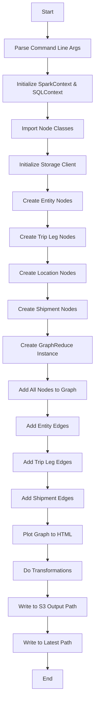
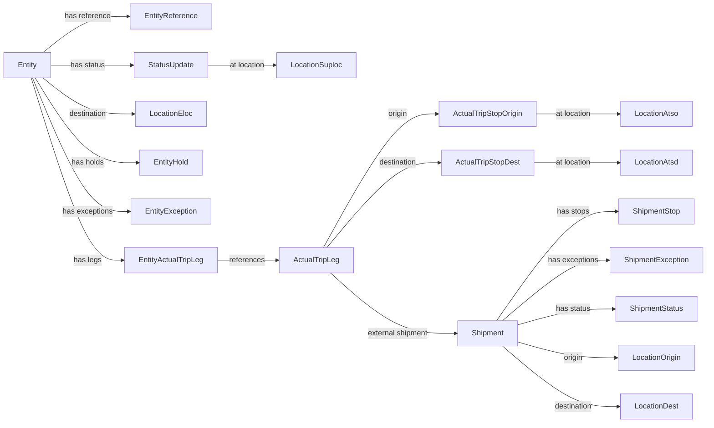
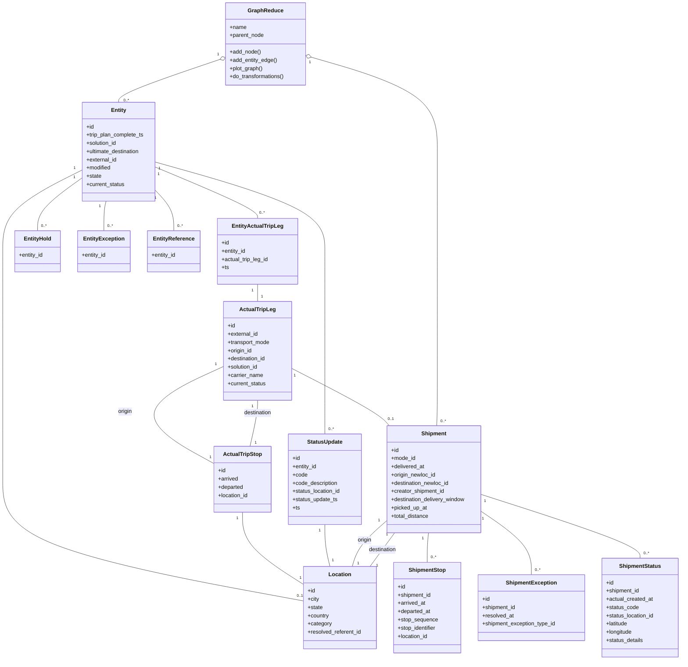

# Diagram: research/orchestrator/tasks/transforms/entity_graph_reduce_spark.py

> Auto-generated by Obscura crawlers

## Diagram 1

### SVG

<svg id="container" width="276" xmlns="http://www.w3.org/2000/svg" class="flowchart" height="1990" viewBox="0 0 276 1990" role="graphics-document document" aria-roledescription="flowchart-v2"><g><marker id="container_flowchart-v2-pointEnd" class="marker flowchart-v2" viewBox="0 0 10 10" refX="5" refY="5" markerUnits="userSpaceOnUse" markerWidth="8" markerHeight="8" orient="auto"><path d="M 0 0 L 10 5 L 0 10 z" class="arrowMarkerPath" style="stroke-width: 1; stroke-dasharray: 1, 0;"></path></marker><marker id="container_flowchart-v2-pointStart" class="marker flowchart-v2" viewBox="0 0 10 10" refX="4.5" refY="5" markerUnits="userSpaceOnUse" markerWidth="8" markerHeight="8" orient="auto"><path d="M 0 5 L 10 10 L 10 0 z" class="arrowMarkerPath" style="stroke-width: 1; stroke-dasharray: 1, 0;"></path></marker><marker id="container_flowchart-v2-circleEnd" class="marker flowchart-v2" viewBox="0 0 10 10" refX="11" refY="5" markerUnits="userSpaceOnUse" markerWidth="11" markerHeight="11" orient="auto"><circle cx="5" cy="5" r="5" class="arrowMarkerPath" style="stroke-width: 1; stroke-dasharray: 1, 0;"></circle></marker><marker id="container_flowchart-v2-circleStart" class="marker flowchart-v2" viewBox="0 0 10 10" refX="-1" refY="5" markerUnits="userSpaceOnUse" markerWidth="11" markerHeight="11" orient="auto"><circle cx="5" cy="5" r="5" class="arrowMarkerPath" style="stroke-width: 1; stroke-dasharray: 1, 0;"></circle></marker><marker id="container_flowchart-v2-crossEnd" class="marker cross flowchart-v2" viewBox="0 0 11 11" refX="12" refY="5.2" markerUnits="userSpaceOnUse" markerWidth="11" markerHeight="11" orient="auto"><path d="M 1,1 l 9,9 M 10,1 l -9,9" class="arrowMarkerPath" style="stroke-width: 2; stroke-dasharray: 1, 0;"></path></marker><marker id="container_flowchart-v2-crossStart" class="marker cross flowchart-v2" viewBox="0 0 11 11" refX="-1" refY="5.2" markerUnits="userSpaceOnUse" markerWidth="11" markerHeight="11" orient="auto"><path d="M 1,1 l 9,9 M 10,1 l -9,9" class="arrowMarkerPath" style="stroke-width: 2; stroke-dasharray: 1, 0;"></path></marker><g class="root"><g class="clusters"></g><g class="edgePaths"><path d="M138,62L138,66.167C138,70.333,138,78.667,138,86.333C138,94,138,101,138,104.5L138,108" id="L_A_B_0" class="edge-thickness-normal edge-pattern-solid edge-thickness-normal edge-pattern-solid flowchart-link" style=";" data-edge="true" data-et="edge" data-id="L_A_B_0" data-points="W3sieCI6MTM4LCJ5Ijo2Mn0seyJ4IjoxMzgsInkiOjg3fSx7IngiOjEzOCwieSI6MTEyfV0=" marker-end="url(#container_flowchart-v2-pointEnd)"></path><path d="M138,166L138,170.167C138,174.333,138,182.667,138,190.333C138,198,138,205,138,208.5L138,212" id="L_B_C_0" class="edge-thickness-normal edge-pattern-solid edge-thickness-normal edge-pattern-solid flowchart-link" style=";" data-edge="true" data-et="edge" data-id="L_B_C_0" data-points="W3sieCI6MTM4LCJ5IjoxNjZ9LHsieCI6MTM4LCJ5IjoxOTF9LHsieCI6MTM4LCJ5IjoyMTZ9XQ==" marker-end="url(#container_flowchart-v2-pointEnd)"></path><path d="M138,294L138,298.167C138,302.333,138,310.667,138,318.333C138,326,138,333,138,336.5L138,340" id="L_C_D_0" class="edge-thickness-normal edge-pattern-solid edge-thickness-normal edge-pattern-solid flowchart-link" style=";" data-edge="true" data-et="edge" data-id="L_C_D_0" data-points="W3sieCI6MTM4LCJ5IjoyOTR9LHsieCI6MTM4LCJ5IjozMTl9LHsieCI6MTM4LCJ5IjozNDR9XQ==" marker-end="url(#container_flowchart-v2-pointEnd)"></path><path d="M138,398L138,402.167C138,406.333,138,414.667,138,422.333C138,430,138,437,138,440.5L138,444" id="L_D_E_0" class="edge-thickness-normal edge-pattern-solid edge-thickness-normal edge-pattern-solid flowchart-link" style=";" data-edge="true" data-et="edge" data-id="L_D_E_0" data-points="W3sieCI6MTM4LCJ5IjozOTh9LHsieCI6MTM4LCJ5Ijo0MjN9LHsieCI6MTM4LCJ5Ijo0NDh9XQ==" marker-end="url(#container_flowchart-v2-pointEnd)"></path><path d="M138,502L138,506.167C138,510.333,138,518.667,138,526.333C138,534,138,541,138,544.5L138,548" id="L_E_F_0" class="edge-thickness-normal edge-pattern-solid edge-thickness-normal edge-pattern-solid flowchart-link" style=";" data-edge="true" data-et="edge" data-id="L_E_F_0" data-points="W3sieCI6MTM4LCJ5Ijo1MDJ9LHsieCI6MTM4LCJ5Ijo1Mjd9LHsieCI6MTM4LCJ5Ijo1NTJ9XQ==" marker-end="url(#container_flowchart-v2-pointEnd)"></path><path d="M138,606L138,610.167C138,614.333,138,622.667,138,630.333C138,638,138,645,138,648.5L138,652" id="L_F_G_0" class="edge-thickness-normal edge-pattern-solid edge-thickness-normal edge-pattern-solid flowchart-link" style=";" data-edge="true" data-et="edge" data-id="L_F_G_0" data-points="W3sieCI6MTM4LCJ5Ijo2MDZ9LHsieCI6MTM4LCJ5Ijo2MzF9LHsieCI6MTM4LCJ5Ijo2NTZ9XQ==" marker-end="url(#container_flowchart-v2-pointEnd)"></path><path d="M138,710L138,714.167C138,718.333,138,726.667,138,734.333C138,742,138,749,138,752.5L138,756" id="L_G_H_0" class="edge-thickness-normal edge-pattern-solid edge-thickness-normal edge-pattern-solid flowchart-link" style=";" data-edge="true" data-et="edge" data-id="L_G_H_0" data-points="W3sieCI6MTM4LCJ5Ijo3MTB9LHsieCI6MTM4LCJ5Ijo3MzV9LHsieCI6MTM4LCJ5Ijo3NjB9XQ==" marker-end="url(#container_flowchart-v2-pointEnd)"></path><path d="M138,814L138,818.167C138,822.333,138,830.667,138,838.333C138,846,138,853,138,856.5L138,860" id="L_H_I_0" class="edge-thickness-normal edge-pattern-solid edge-thickness-normal edge-pattern-solid flowchart-link" style=";" data-edge="true" data-et="edge" data-id="L_H_I_0" data-points="W3sieCI6MTM4LCJ5Ijo4MTR9LHsieCI6MTM4LCJ5Ijo4Mzl9LHsieCI6MTM4LCJ5Ijo4NjR9XQ==" marker-end="url(#container_flowchart-v2-pointEnd)"></path><path d="M138,918L138,922.167C138,926.333,138,934.667,138,942.333C138,950,138,957,138,960.5L138,964" id="L_I_J_0" class="edge-thickness-normal edge-pattern-solid edge-thickness-normal edge-pattern-solid flowchart-link" style=";" data-edge="true" data-et="edge" data-id="L_I_J_0" data-points="W3sieCI6MTM4LCJ5Ijo5MTh9LHsieCI6MTM4LCJ5Ijo5NDN9LHsieCI6MTM4LCJ5Ijo5Njh9XQ==" marker-end="url(#container_flowchart-v2-pointEnd)"></path><path d="M138,1046L138,1050.167C138,1054.333,138,1062.667,138,1070.333C138,1078,138,1085,138,1088.5L138,1092" id="L_J_K_0" class="edge-thickness-normal edge-pattern-solid edge-thickness-normal edge-pattern-solid flowchart-link" style=";" data-edge="true" data-et="edge" data-id="L_J_K_0" data-points="W3sieCI6MTM4LCJ5IjoxMDQ2fSx7IngiOjEzOCwieSI6MTA3MX0seyJ4IjoxMzgsInkiOjEwOTZ9XQ==" marker-end="url(#container_flowchart-v2-pointEnd)"></path><path d="M138,1150L138,1154.167C138,1158.333,138,1166.667,138,1174.333C138,1182,138,1189,138,1192.5L138,1196" id="L_K_L_0" class="edge-thickness-normal edge-pattern-solid edge-thickness-normal edge-pattern-solid flowchart-link" style=";" data-edge="true" data-et="edge" data-id="L_K_L_0" data-points="W3sieCI6MTM4LCJ5IjoxMTUwfSx7IngiOjEzOCwieSI6MTE3NX0seyJ4IjoxMzgsInkiOjEyMDB9XQ==" marker-end="url(#container_flowchart-v2-pointEnd)"></path><path d="M138,1254L138,1258.167C138,1262.333,138,1270.667,138,1278.333C138,1286,138,1293,138,1296.5L138,1300" id="L_L_M_0" class="edge-thickness-normal edge-pattern-solid edge-thickness-normal edge-pattern-solid flowchart-link" style=";" data-edge="true" data-et="edge" data-id="L_L_M_0" data-points="W3sieCI6MTM4LCJ5IjoxMjU0fSx7IngiOjEzOCwieSI6MTI3OX0seyJ4IjoxMzgsInkiOjEzMDR9XQ==" marker-end="url(#container_flowchart-v2-pointEnd)"></path><path d="M138,1358L138,1362.167C138,1366.333,138,1374.667,138,1382.333C138,1390,138,1397,138,1400.5L138,1404" id="L_M_N_0" class="edge-thickness-normal edge-pattern-solid edge-thickness-normal edge-pattern-solid flowchart-link" style=";" data-edge="true" data-et="edge" data-id="L_M_N_0" data-points="W3sieCI6MTM4LCJ5IjoxMzU4fSx7IngiOjEzOCwieSI6MTM4M30seyJ4IjoxMzgsInkiOjE0MDh9XQ==" marker-end="url(#container_flowchart-v2-pointEnd)"></path><path d="M138,1462L138,1466.167C138,1470.333,138,1478.667,138,1486.333C138,1494,138,1501,138,1504.5L138,1508" id="L_N_O_0" class="edge-thickness-normal edge-pattern-solid edge-thickness-normal edge-pattern-solid flowchart-link" style=";" data-edge="true" data-et="edge" data-id="L_N_O_0" data-points="W3sieCI6MTM4LCJ5IjoxNDYyfSx7IngiOjEzOCwieSI6MTQ4N30seyJ4IjoxMzgsInkiOjE1MTJ9XQ==" marker-end="url(#container_flowchart-v2-pointEnd)"></path><path d="M138,1566L138,1570.167C138,1574.333,138,1582.667,138,1590.333C138,1598,138,1605,138,1608.5L138,1612" id="L_O_P_0" class="edge-thickness-normal edge-pattern-solid edge-thickness-normal edge-pattern-solid flowchart-link" style=";" data-edge="true" data-et="edge" data-id="L_O_P_0" data-points="W3sieCI6MTM4LCJ5IjoxNTY2fSx7IngiOjEzOCwieSI6MTU5MX0seyJ4IjoxMzgsInkiOjE2MTZ9XQ==" marker-end="url(#container_flowchart-v2-pointEnd)"></path><path d="M138,1670L138,1674.167C138,1678.333,138,1686.667,138,1694.333C138,1702,138,1709,138,1712.5L138,1716" id="L_P_Q_0" class="edge-thickness-normal edge-pattern-solid edge-thickness-normal edge-pattern-solid flowchart-link" style=";" data-edge="true" data-et="edge" data-id="L_P_Q_0" data-points="W3sieCI6MTM4LCJ5IjoxNjcwfSx7IngiOjEzOCwieSI6MTY5NX0seyJ4IjoxMzgsInkiOjE3MjB9XQ==" marker-end="url(#container_flowchart-v2-pointEnd)"></path><path d="M138,1774L138,1778.167C138,1782.333,138,1790.667,138,1798.333C138,1806,138,1813,138,1816.5L138,1820" id="L_Q_R_0" class="edge-thickness-normal edge-pattern-solid edge-thickness-normal edge-pattern-solid flowchart-link" style=";" data-edge="true" data-et="edge" data-id="L_Q_R_0" data-points="W3sieCI6MTM4LCJ5IjoxNzc0fSx7IngiOjEzOCwieSI6MTc5OX0seyJ4IjoxMzgsInkiOjE4MjR9XQ==" marker-end="url(#container_flowchart-v2-pointEnd)"></path><path d="M138,1878L138,1882.167C138,1886.333,138,1894.667,138,1902.333C138,1910,138,1917,138,1920.5L138,1924" id="L_R_S_0" class="edge-thickness-normal edge-pattern-solid edge-thickness-normal edge-pattern-solid flowchart-link" style=";" data-edge="true" data-et="edge" data-id="L_R_S_0" data-points="W3sieCI6MTM4LCJ5IjoxODc4fSx7IngiOjEzOCwieSI6MTkwM30seyJ4IjoxMzgsInkiOjE5Mjh9XQ==" marker-end="url(#container_flowchart-v2-pointEnd)"></path></g><g class="edgeLabels"><g class="edgeLabel"><g class="label" data-id="L_A_B_0" transform="translate(0, 0)"><foreignObject width="0" height="0">

</foreignObject></g></g><g class="edgeLabel"><g class="label" data-id="L_B_C_0" transform="translate(0, 0)"><foreignObject width="0" height="0">

</foreignObject></g></g><g class="edgeLabel"><g class="label" data-id="L_C_D_0" transform="translate(0, 0)"><foreignObject width="0" height="0">

</foreignObject></g></g><g class="edgeLabel"><g class="label" data-id="L_D_E_0" transform="translate(0, 0)"><foreignObject width="0" height="0">

</foreignObject></g></g><g class="edgeLabel"><g class="label" data-id="L_E_F_0" transform="translate(0, 0)"><foreignObject width="0" height="0">

</foreignObject></g></g><g class="edgeLabel"><g class="label" data-id="L_F_G_0" transform="translate(0, 0)"><foreignObject width="0" height="0">

</foreignObject></g></g><g class="edgeLabel"><g class="label" data-id="L_G_H_0" transform="translate(0, 0)"><foreignObject width="0" height="0">

</foreignObject></g></g><g class="edgeLabel"><g class="label" data-id="L_H_I_0" transform="translate(0, 0)"><foreignObject width="0" height="0">

</foreignObject></g></g><g class="edgeLabel"><g class="label" data-id="L_I_J_0" transform="translate(0, 0)"><foreignObject width="0" height="0">

</foreignObject></g></g><g class="edgeLabel"><g class="label" data-id="L_J_K_0" transform="translate(0, 0)"><foreignObject width="0" height="0">

</foreignObject></g></g><g class="edgeLabel"><g class="label" data-id="L_K_L_0" transform="translate(0, 0)"><foreignObject width="0" height="0">

</foreignObject></g></g><g class="edgeLabel"><g class="label" data-id="L_L_M_0" transform="translate(0, 0)"><foreignObject width="0" height="0">

</foreignObject></g></g><g class="edgeLabel"><g class="label" data-id="L_M_N_0" transform="translate(0, 0)"><foreignObject width="0" height="0">

</foreignObject></g></g><g class="edgeLabel"><g class="label" data-id="L_N_O_0" transform="translate(0, 0)"><foreignObject width="0" height="0">

</foreignObject></g></g><g class="edgeLabel"><g class="label" data-id="L_O_P_0" transform="translate(0, 0)"><foreignObject width="0" height="0">

</foreignObject></g></g><g class="edgeLabel"><g class="label" data-id="L_P_Q_0" transform="translate(0, 0)"><foreignObject width="0" height="0">

</foreignObject></g></g><g class="edgeLabel"><g class="label" data-id="L_Q_R_0" transform="translate(0, 0)"><foreignObject width="0" height="0">

</foreignObject></g></g><g class="edgeLabel"><g class="label" data-id="L_R_S_0" transform="translate(0, 0)"><foreignObject width="0" height="0">

</foreignObject></g></g></g><g class="nodes"><g class="node default" id="flowchart-A-0" transform="translate(138, 35)"><rect class="basic label-container" style="" x="-47.5234375" y="-27" width="95.046875" height="54"></rect><g class="label" style="" transform="translate(-17.5234375, -12)"><rect></rect><foreignObject width="35.046875" height="24">

Start

</foreignObject></g></g><g class="node default" id="flowchart-B-1" transform="translate(138, 139)"><rect class="basic label-container" style="" x="-123.1953125" y="-27" width="246.390625" height="54"></rect><g class="label" style="" transform="translate(-93.1953125, -12)"><rect></rect><foreignObject width="186.390625" height="24">

Parse Command Line Args

</foreignObject></g></g><g class="node default" id="flowchart-C-3" transform="translate(138, 255)"><rect class="basic label-container" style="" x="-130" y="-39" width="260" height="78"></rect><g class="label" style="" transform="translate(-100, -24)"><rect></rect><foreignObject width="200" height="48">

Initialize SparkContext &amp; SQLContext

</foreignObject></g></g><g class="node default" id="flowchart-D-5" transform="translate(138, 371)"><rect class="basic label-container" style="" x="-104.6015625" y="-27" width="209.203125" height="54"></rect><g class="label" style="" transform="translate(-74.6015625, -12)"><rect></rect><foreignObject width="149.203125" height="24">

Import Node Classes

</foreignObject></g></g><g class="node default" id="flowchart-E-7" transform="translate(138, 475)"><rect class="basic label-container" style="" x="-113.5703125" y="-27" width="227.140625" height="54"></rect><g class="label" style="" transform="translate(-83.5703125, -12)"><rect></rect><foreignObject width="167.140625" height="24">

Initialize Storage Client

</foreignObject></g></g><g class="node default" id="flowchart-F-9" transform="translate(138, 579)"><rect class="basic label-container" style="" x="-101.046875" y="-27" width="202.09375" height="54"></rect><g class="label" style="" transform="translate(-71.046875, -12)"><rect></rect><foreignObject width="142.09375" height="24">

Create Entity Nodes

</foreignObject></g></g><g class="node default" id="flowchart-G-11" transform="translate(138, 683)"><rect class="basic label-container" style="" x="-108.640625" y="-27" width="217.28125" height="54"></rect><g class="label" style="" transform="translate(-78.640625, -12)"><rect></rect><foreignObject width="157.28125" height="24">

Create Trip Leg Nodes

</foreignObject></g></g><g class="node default" id="flowchart-H-13" transform="translate(138, 787)"><rect class="basic label-container" style="" x="-111.28125" y="-27" width="222.5625" height="54"></rect><g class="label" style="" transform="translate(-81.28125, -12)"><rect></rect><foreignObject width="162.5625" height="24">

Create Location Nodes

</foreignObject></g></g><g class="node default" id="flowchart-I-15" transform="translate(138, 891)"><rect class="basic label-container" style="" x="-115.078125" y="-27" width="230.15625" height="54"></rect><g class="label" style="" transform="translate(-85.078125, -12)"><rect></rect><foreignObject width="170.15625" height="24">

Create Shipment Nodes

</foreignObject></g></g><g class="node default" id="flowchart-J-17" transform="translate(138, 1007)"><rect class="basic label-container" style="" x="-130" y="-39" width="260" height="78"></rect><g class="label" style="" transform="translate(-100, -24)"><rect></rect><foreignObject width="200" height="48">

Create GraphReduce Instance

</foreignObject></g></g><g class="node default" id="flowchart-K-19" transform="translate(138, 1123)"><rect class="basic label-container" style="" x="-114.015625" y="-27" width="228.03125" height="54"></rect><g class="label" style="" transform="translate(-84.015625, -12)"><rect></rect><foreignObject width="168.03125" height="24">

Add All Nodes to Graph

</foreignObject></g></g><g class="node default" id="flowchart-L-21" transform="translate(138, 1227)"><rect class="basic label-container" style="" x="-90.2421875" y="-27" width="180.484375" height="54"></rect><g class="label" style="" transform="translate(-60.2421875, -12)"><rect></rect><foreignObject width="120.484375" height="24">

Add Entity Edges

</foreignObject></g></g><g class="node default" id="flowchart-M-23" transform="translate(138, 1331)"><rect class="basic label-container" style="" x="-97.84375" y="-27" width="195.6875" height="54"></rect><g class="label" style="" transform="translate(-67.84375, -12)"><rect></rect><foreignObject width="135.6875" height="24">

Add Trip Leg Edges

</foreignObject></g></g><g class="node default" id="flowchart-N-25" transform="translate(138, 1435)"><rect class="basic label-container" style="" x="-104.2734375" y="-27" width="208.546875" height="54"></rect><g class="label" style="" transform="translate(-74.2734375, -12)"><rect></rect><foreignObject width="148.546875" height="24">

Add Shipment Edges

</foreignObject></g></g><g class="node default" id="flowchart-O-27" transform="translate(138, 1539)"><rect class="basic label-container" style="" x="-99.5078125" y="-27" width="199.015625" height="54"></rect><g class="label" style="" transform="translate(-69.5078125, -12)"><rect></rect><foreignObject width="139.015625" height="24">

Plot Graph to HTML

</foreignObject></g></g><g class="node default" id="flowchart-P-29" transform="translate(138, 1643)"><rect class="basic label-container" style="" x="-101.234375" y="-27" width="202.46875" height="54"></rect><g class="label" style="" transform="translate(-71.234375, -12)"><rect></rect><foreignObject width="142.46875" height="24">

Do Transformations

</foreignObject></g></g><g class="node default" id="flowchart-Q-31" transform="translate(138, 1747)"><rect class="basic label-container" style="" x="-114.828125" y="-27" width="229.65625" height="54"></rect><g class="label" style="" transform="translate(-84.828125, -12)"><rect></rect><foreignObject width="169.65625" height="24">

Write to S3 Output Path

</foreignObject></g></g><g class="node default" id="flowchart-R-33" transform="translate(138, 1851)"><rect class="basic label-container" style="" x="-100.984375" y="-27" width="201.96875" height="54"></rect><g class="label" style="" transform="translate(-70.984375, -12)"><rect></rect><foreignObject width="141.96875" height="24">

Write to Latest Path

</foreignObject></g></g><g class="node default" id="flowchart-S-35" transform="translate(138, 1955)"><rect class="basic label-container" style="" x="-43.6796875" y="-27" width="87.359375" height="54"></rect><g class="label" style="" transform="translate(-13.6796875, -12)"><rect></rect><foreignObject width="27.359375" height="24">

End

</foreignObject></g></g></g></g></g></svg>

## Diagram 2

### SVG

<svg id="container" width="1524.578125" xmlns="http://www.w3.org/2000/svg" class="flowchart" height="902" viewBox="0 0 1524.578125 902" role="graphics-document document" aria-roledescription="flowchart-v2"><g><marker id="container_flowchart-v2-pointEnd" class="marker flowchart-v2" viewBox="0 0 10 10" refX="5" refY="5" markerUnits="userSpaceOnUse" markerWidth="8" markerHeight="8" orient="auto"><path d="M 0 0 L 10 5 L 0 10 z" class="arrowMarkerPath" style="stroke-width: 1; stroke-dasharray: 1, 0;"></path></marker><marker id="container_flowchart-v2-pointStart" class="marker flowchart-v2" viewBox="0 0 10 10" refX="4.5" refY="5" markerUnits="userSpaceOnUse" markerWidth="8" markerHeight="8" orient="auto"><path d="M 0 5 L 10 10 L 10 0 z" class="arrowMarkerPath" style="stroke-width: 1; stroke-dasharray: 1, 0;"></path></marker><marker id="container_flowchart-v2-circleEnd" class="marker flowchart-v2" viewBox="0 0 10 10" refX="11" refY="5" markerUnits="userSpaceOnUse" markerWidth="11" markerHeight="11" orient="auto"><circle cx="5" cy="5" r="5" class="arrowMarkerPath" style="stroke-width: 1; stroke-dasharray: 1, 0;"></circle></marker><marker id="container_flowchart-v2-circleStart" class="marker flowchart-v2" viewBox="0 0 10 10" refX="-1" refY="5" markerUnits="userSpaceOnUse" markerWidth="11" markerHeight="11" orient="auto"><circle cx="5" cy="5" r="5" class="arrowMarkerPath" style="stroke-width: 1; stroke-dasharray: 1, 0;"></circle></marker><marker id="container_flowchart-v2-crossEnd" class="marker cross flowchart-v2" viewBox="0 0 11 11" refX="12" refY="5.2" markerUnits="userSpaceOnUse" markerWidth="11" markerHeight="11" orient="auto"><path d="M 1,1 l 9,9 M 10,1 l -9,9" class="arrowMarkerPath" style="stroke-width: 2; stroke-dasharray: 1, 0;"></path></marker><marker id="container_flowchart-v2-crossStart" class="marker cross flowchart-v2" viewBox="0 0 11 11" refX="-1" refY="5.2" markerUnits="userSpaceOnUse" markerWidth="11" markerHeight="11" orient="auto"><path d="M 1,1 l 9,9 M 10,1 l -9,9" class="arrowMarkerPath" style="stroke-width: 2; stroke-dasharray: 1, 0;"></path></marker><g class="root"><g class="clusters"></g><g class="edgePaths"><path d="M92.505,112L108.516,99.167C124.527,86.333,156.549,60.667,187.199,47.833C217.849,35,247.128,35,261.767,35L276.406,35" id="L_entity_er_0" class="edge-thickness-normal edge-pattern-solid edge-thickness-normal edge-pattern-solid flowchart-link" style=";" data-edge="true" data-et="edge" data-id="L_entity_er_0" data-points="W3sieCI6OTIuNTA1NDA4NjUzODQ2MTYsInkiOjExMn0seyJ4IjoxODguNTcwMzEyNSwieSI6MzV9LHsieCI6MjgwLjQwNjI1LCJ5IjozNX1d" marker-end="url(#container_flowchart-v2-pointEnd)"></path><path d="M67.242,166L87.463,230.833C107.684,295.667,148.127,425.333,180.837,490.167C213.547,555,238.523,555,251.012,555L263.5,555" id="L_entity_eatl_0" class="edge-thickness-normal edge-pattern-solid edge-thickness-normal edge-pattern-solid flowchart-link" style=";" data-edge="true" data-et="edge" data-id="L_entity_eatl_0" data-points="W3sieCI6NjcuMjQxNTg2NTM4NDYxNTMsInkiOjE2Nn0seyJ4IjoxODguNTcwMzEyNSwieSI6NTU1fSx7IngiOjI2Ny41LCJ5Ijo1NTV9XQ==" marker-end="url(#container_flowchart-v2-pointEnd)"></path><path d="M92.505,166L108.516,178.833C124.527,191.667,156.549,217.333,188.981,230.167C221.414,243,254.258,243,270.68,243L287.102,243" id="L_entity_eloc_0" class="edge-thickness-normal edge-pattern-solid edge-thickness-normal edge-pattern-solid flowchart-link" style=";" data-edge="true" data-et="edge" data-id="L_entity_eloc_0" data-points="W3sieCI6OTIuNTA1NDA4NjUzODQ2MTYsInkiOjE2Nn0seyJ4IjoxODguNTcwMzEyNSwieSI6MjQzfSx7IngiOjI5MS4xMDE1NjI1LCJ5IjoyNDN9XQ==" marker-end="url(#container_flowchart-v2-pointEnd)"></path><path d="M75.663,166L94.481,196.167C113.299,226.333,150.934,286.667,187.518,316.833C224.102,347,259.633,347,277.398,347L295.164,347" id="L_entity_hold_0" class="edge-thickness-normal edge-pattern-solid edge-thickness-normal edge-pattern-solid flowchart-link" style=";" data-edge="true" data-et="edge" data-id="L_entity_hold_0" data-points="W3sieCI6NzUuNjYyODYwNTc2OTIzMDgsInkiOjE2Nn0seyJ4IjoxODguNTcwMzEyNSwieSI6MzQ3fSx7IngiOjI5OS4xNjQwNjI1LCJ5IjozNDd9XQ==" marker-end="url(#container_flowchart-v2-pointEnd)"></path><path d="M70.049,166L89.802,213.5C109.556,261,149.063,356,183.555,403.5C218.047,451,247.523,451,262.262,451L277,451" id="L_entity_exc_0" class="edge-thickness-normal edge-pattern-solid edge-thickness-normal edge-pattern-solid flowchart-link" style=";" data-edge="true" data-et="edge" data-id="L_entity_exc_0" data-points="W3sieCI6NzAuMDQ4Njc3ODg0NjE1MzksInkiOjE2Nn0seyJ4IjoxODguNTcwMzEyNSwieSI6NDUxfSx7IngiOjI4MSwieSI6NDUxfV0=" marker-end="url(#container_flowchart-v2-pointEnd)"></path><path d="M109.641,139L122.796,139C135.951,139,162.26,139,191.328,139C220.396,139,252.221,139,268.134,139L284.047,139" id="L_entity_sup_0" class="edge-thickness-normal edge-pattern-solid edge-thickness-normal edge-pattern-solid flowchart-link" style=";" data-edge="true" data-et="edge" data-id="L_entity_sup_0" data-points="W3sieCI6MTA5LjY0MDYyNSwieSI6MTM5fSx7IngiOjE4OC41NzAzMTI1LCJ5IjoxMzl9LHsieCI6Mjg4LjA0Njg3NSwieSI6MTM5fV0=" marker-end="url(#container_flowchart-v2-pointEnd)"></path><path d="M446.328,139L460.409,139C474.49,139,502.651,139,526.721,139C550.792,139,570.771,139,580.76,139L590.75,139" id="L_sup_suploc_0" class="edge-thickness-normal edge-pattern-solid edge-thickness-normal edge-pattern-solid flowchart-link" style=";" data-edge="true" data-et="edge" data-id="L_sup_suploc_0" data-points="W3sieCI6NDQ2LjMyODEyNSwieSI6MTM5fSx7IngiOjUzMC44MTI1LCJ5IjoxMzl9LHsieCI6NTk0Ljc1LCJ5IjoxMzl9XQ==" marker-end="url(#container_flowchart-v2-pointEnd)"></path><path d="M466.875,555L477.531,555C488.188,555,509.5,555,531.272,555C553.044,555,575.276,555,586.392,555L597.508,555" id="L_eatl_atl_0" class="edge-thickness-normal edge-pattern-solid edge-thickness-normal edge-pattern-solid flowchart-link" style=";" data-edge="true" data-et="edge" data-id="L_eatl_atl_0" data-points="W3sieCI6NDY2Ljg3NSwieSI6NTU1fSx7IngiOjUzMC44MTI1LCJ5Ijo1NTV9LHsieCI6NjAxLjUwNzgxMjUsInkiOjU1NX1d" marker-end="url(#container_flowchart-v2-pointEnd)"></path><path d="M695.663,528L722.559,480.5C749.455,433,803.247,338,844.65,290.5C886.052,243,915.065,243,929.572,243L944.078,243" id="L_atl_atso_0" class="edge-thickness-normal edge-pattern-solid edge-thickness-normal edge-pattern-solid flowchart-link" style=";" data-edge="true" data-et="edge" data-id="L_atl_atso_0" data-points="W3sieCI6Njk1LjY2MzIzNjE3Nzg4NDYsInkiOjUyOH0seyJ4Ijo4NTcuMDM5MDYyNSwieSI6MjQzfSx7IngiOjk0OC4wNzgxMjUsInkiOjI0M31d" marker-end="url(#container_flowchart-v2-pointEnd)"></path><path d="M703.307,528L728.929,497.833C754.551,467.667,805.795,407.333,846.899,377.167C888.003,347,918.966,347,934.448,347L949.93,347" id="L_atl_atsd_0" class="edge-thickness-normal edge-pattern-solid edge-thickness-normal edge-pattern-solid flowchart-link" style=";" data-edge="true" data-et="edge" data-id="L_atl_atsd_0" data-points="W3sieCI6NzAzLjMwNzM1NDI2NjgyNjksInkiOjUyOH0seyJ4Ijo4NTcuMDM5MDYyNSwieSI6MzQ3fSx7IngiOjk1My45Mjk2ODc1LCJ5IjozNDd9XQ==" marker-end="url(#container_flowchart-v2-pointEnd)"></path><path d="M1158.281,243L1171.436,243C1184.591,243,1210.901,243,1240.424,243C1269.948,243,1302.685,243,1319.053,243L1335.422,243" id="L_atso_atsoloc_0" class="edge-thickness-normal edge-pattern-solid edge-thickness-normal edge-pattern-solid flowchart-link" style=";" data-edge="true" data-et="edge" data-id="L_atso_atsoloc_0" data-points="W3sieCI6MTE1OC4yODEyNSwieSI6MjQzfSx7IngiOjEyMzcuMjEwOTM3NSwieSI6MjQzfSx7IngiOjEzMzkuNDIxODc1LCJ5IjoyNDN9XQ==" marker-end="url(#container_flowchart-v2-pointEnd)"></path><path d="M1152.43,347L1166.56,347C1180.69,347,1208.951,347,1239.43,347C1269.909,347,1302.607,347,1318.956,347L1335.305,347" id="L_atsd_atsdloc_0" class="edge-thickness-normal edge-pattern-solid edge-thickness-normal edge-pattern-solid flowchart-link" style=";" data-edge="true" data-et="edge" data-id="L_atsd_atsdloc_0" data-points="W3sieCI6MTE1Mi40Mjk2ODc1LCJ5IjozNDd9LHsieCI6MTIzNy4yMTA5Mzc1LCJ5IjozNDd9LHsieCI6MTMzOS4zMDQ2ODc1LCJ5IjozNDd9XQ==" marker-end="url(#container_flowchart-v2-pointEnd)"></path><path d="M710.951,582L735.299,603.5C759.647,625,808.343,668,853.906,689.5C899.469,711,941.898,711,963.113,711L984.328,711" id="L_atl_ship_0" class="edge-thickness-normal edge-pattern-solid edge-thickness-normal edge-pattern-solid flowchart-link" style=";" data-edge="true" data-et="edge" data-id="L_atl_ship_0" data-points="W3sieCI6NzEwLjk1MTQ3MjM1NTc2OTMsInkiOjU4Mn0seyJ4Ijo4NTcuMDM5MDYyNSwieSI6NzExfSx7IngiOjk4OC4zMjgxMjUsInkiOjcxMX1d" marker-end="url(#container_flowchart-v2-pointEnd)"></path><path d="M1072.291,684L1099.777,645.167C1127.264,606.333,1182.238,528.667,1225.348,489.833C1268.458,451,1299.706,451,1315.329,451L1330.953,451" id="L_ship_sstop_0" class="edge-thickness-normal edge-pattern-solid edge-thickness-normal edge-pattern-solid flowchart-link" style=";" data-edge="true" data-et="edge" data-id="L_ship_sstop_0" data-points="W3sieCI6MTA3Mi4yOTA2MjUsInkiOjY4NH0seyJ4IjoxMjM3LjIxMDkzNzUsInkiOjQ1MX0seyJ4IjoxMzM0Ljk1MzEyNSwieSI6NDUxfV0=" marker-end="url(#container_flowchart-v2-pointEnd)"></path><path d="M1085.031,684L1110.395,662.5C1135.758,641,1186.484,598,1224.336,576.5C1262.188,555,1287.164,555,1299.652,555L1312.141,555" id="L_ship_sex_0" class="edge-thickness-normal edge-pattern-solid edge-thickness-normal edge-pattern-solid flowchart-link" style=";" data-edge="true" data-et="edge" data-id="L_ship_sex_0" data-points="W3sieCI6MTA4NS4wMzEyNSwieSI6Njg0fSx7IngiOjEyMzcuMjEwOTM3NSwieSI6NTU1fSx7IngiOjEzMTYuMTQwNjI1LCJ5Ijo1NTV9XQ==" marker-end="url(#container_flowchart-v2-pointEnd)"></path><path d="M1118.031,692.675L1137.895,687.063C1157.758,681.45,1197.484,670.225,1231.926,664.613C1266.367,659,1295.523,659,1310.102,659L1324.68,659" id="L_ship_sstat_0" class="edge-thickness-normal edge-pattern-solid edge-thickness-normal edge-pattern-solid flowchart-link" style=";" data-edge="true" data-et="edge" data-id="L_ship_sstat_0" data-points="W3sieCI6MTExOC4wMzEyNSwieSI6NjkyLjY3NTQ5NjY4ODc0MTh9LHsieCI6MTIzNy4yMTA5Mzc1LCJ5Ijo2NTl9LHsieCI6MTMyOC42Nzk2ODc1LCJ5Ijo2NTl9XQ==" marker-end="url(#container_flowchart-v2-pointEnd)"></path><path d="M1118.031,729.325L1137.895,734.937C1157.758,740.55,1197.484,751.775,1232.698,757.387C1267.911,763,1298.612,763,1313.962,763L1329.313,763" id="L_ship_oloc_0" class="edge-thickness-normal edge-pattern-solid edge-thickness-normal edge-pattern-solid flowchart-link" style=";" data-edge="true" data-et="edge" data-id="L_ship_oloc_0" data-points="W3sieCI6MTExOC4wMzEyNSwieSI6NzI5LjMyNDUwMzMxMTI1ODJ9LHsieCI6MTIzNy4yMTA5Mzc1LCJ5Ijo3NjN9LHsieCI6MTMzMy4zMTI1LCJ5Ijo3NjN9XQ==" marker-end="url(#container_flowchart-v2-pointEnd)"></path><path d="M1085.031,738L1110.395,759.5C1135.758,781,1186.484,824,1228.173,845.5C1269.862,867,1302.513,867,1318.839,867L1335.164,867" id="L_ship_dloc_0" class="edge-thickness-normal edge-pattern-solid edge-thickness-normal edge-pattern-solid flowchart-link" style=";" data-edge="true" data-et="edge" data-id="L_ship_dloc_0" data-points="W3sieCI6MTA4NS4wMzEyNSwieSI6NzM4fSx7IngiOjEyMzcuMjEwOTM3NSwieSI6ODY3fSx7IngiOjEzMzkuMTY0MDYyNSwieSI6ODY3fV0=" marker-end="url(#container_flowchart-v2-pointEnd)"></path></g><g class="edgeLabels"><g class="edgeLabel" transform="translate(188.5703125, 35)"><g class="label" data-id="L_entity_er_0" transform="translate(-48.90625, -12)"><foreignObject width="97.8125" height="24">

has reference

</foreignObject></g></g><g class="edgeLabel" transform="translate(188.5703125, 555)"><g class="label" data-id="L_entity_eatl_0" transform="translate(-29.3203125, -12)"><foreignObject width="58.640625" height="24">

has legs

</foreignObject></g></g><g class="edgeLabel" transform="translate(188.5703125, 243)"><g class="label" data-id="L_entity_eloc_0" transform="translate(-41.5703125, -12)"><foreignObject width="83.140625" height="24">

destination

</foreignObject></g></g><g class="edgeLabel" transform="translate(188.5703125, 347)"><g class="label" data-id="L_entity_hold_0" transform="translate(-35.0078125, -12)"><foreignObject width="70.015625" height="24">

has holds

</foreignObject></g></g><g class="edgeLabel" transform="translate(188.5703125, 451)"><g class="label" data-id="L_entity_exc_0" transform="translate(-53.9296875, -12)"><foreignObject width="107.859375" height="24">

has exceptions

</foreignObject></g></g><g class="edgeLabel" transform="translate(188.5703125, 139)"><g class="label" data-id="L_entity_sup_0" transform="translate(-37.0234375, -12)"><foreignObject width="74.046875" height="24">

has status

</foreignObject></g></g><g class="edgeLabel" transform="translate(530.8125, 139)"><g class="label" data-id="L_sup_suploc_0" transform="translate(-38.9375, -12)"><foreignObject width="77.875" height="24">

at location

</foreignObject></g></g><g class="edgeLabel" transform="translate(530.8125, 555)"><g class="label" data-id="L_eatl_atl_0" transform="translate(-37.828125, -12)"><foreignObject width="75.65625" height="24">

references

</foreignObject></g></g><g class="edgeLabel" transform="translate(857.0390625, 243)"><g class="label" data-id="L_atl_atso_0" transform="translate(-21.125, -12)"><foreignObject width="42.25" height="24">

origin

</foreignObject></g></g><g class="edgeLabel" transform="translate(857.0390625, 347)"><g class="label" data-id="L_atl_atsd_0" transform="translate(-41.5703125, -12)"><foreignObject width="83.140625" height="24">

destination

</foreignObject></g></g><g class="edgeLabel" transform="translate(1237.2109375, 243)"><g class="label" data-id="L_atso_atsoloc_0" transform="translate(-38.9375, -12)"><foreignObject width="77.875" height="24">

at location

</foreignObject></g></g><g class="edgeLabel" transform="translate(1237.2109375, 347)"><g class="label" data-id="L_atsd_atsdloc_0" transform="translate(-38.9375, -12)"><foreignObject width="77.875" height="24">

at location

</foreignObject></g></g><g class="edgeLabel" transform="translate(857.0390625, 711)"><g class="label" data-id="L_atl_ship_0" transform="translate(-66.0390625, -12)"><foreignObject width="132.078125" height="24">

external shipment

</foreignObject></g></g><g class="edgeLabel" transform="translate(1237.2109375, 451)"><g class="label" data-id="L_ship_sstop_0" transform="translate(-34.484375, -12)"><foreignObject width="68.96875" height="24">

has stops

</foreignObject></g></g><g class="edgeLabel" transform="translate(1237.2109375, 555)"><g class="label" data-id="L_ship_sex_0" transform="translate(-53.9296875, -12)"><foreignObject width="107.859375" height="24">

has exceptions

</foreignObject></g></g><g class="edgeLabel" transform="translate(1237.2109375, 659)"><g class="label" data-id="L_ship_sstat_0" transform="translate(-37.0234375, -12)"><foreignObject width="74.046875" height="24">

has status

</foreignObject></g></g><g class="edgeLabel" transform="translate(1237.2109375, 763)"><g class="label" data-id="L_ship_oloc_0" transform="translate(-21.125, -12)"><foreignObject width="42.25" height="24">

origin

</foreignObject></g></g><g class="edgeLabel" transform="translate(1237.2109375, 867)"><g class="label" data-id="L_ship_dloc_0" transform="translate(-41.5703125, -12)"><foreignObject width="83.140625" height="24">

destination

</foreignObject></g></g></g><g class="nodes"><g class="node default" id="flowchart-entity-0" transform="translate(58.8203125, 139)"><rect class="basic label-container" style="" x="-50.8203125" y="-27" width="101.640625" height="54"></rect><g class="label" style="" transform="translate(-20.8203125, -12)"><rect></rect><foreignObject width="41.640625" height="24">

Entity

</foreignObject></g></g><g class="node default" id="flowchart-er-1" transform="translate(367.1875, 35)"><rect class="basic label-container" style="" x="-86.78125" y="-27" width="173.5625" height="54"></rect><g class="label" style="" transform="translate(-56.78125, -12)"><rect></rect><foreignObject width="113.5625" height="24">

EntityReference

</foreignObject></g></g><g class="node default" id="flowchart-eatl-3" transform="translate(367.1875, 555)"><rect class="basic label-container" style="" x="-99.6875" y="-27" width="199.375" height="54"></rect><g class="label" style="" transform="translate(-69.6875, -12)"><rect></rect><foreignObject width="139.375" height="24">

EntityActualTripLeg

</foreignObject></g></g><g class="node default" id="flowchart-eloc-5" transform="translate(367.1875, 243)"><rect class="basic label-container" style="" x="-76.0859375" y="-27" width="152.171875" height="54"></rect><g class="label" style="" transform="translate(-46.0859375, -12)"><rect></rect><foreignObject width="92.171875" height="24">

LocationEloc

</foreignObject></g></g><g class="node default" id="flowchart-hold-7" transform="translate(367.1875, 347)"><rect class="basic label-container" style="" x="-68.0234375" y="-27" width="136.046875" height="54"></rect><g class="label" style="" transform="translate(-38.0234375, -12)"><rect></rect><foreignObject width="76.046875" height="24">

EntityHold

</foreignObject></g></g><g class="node default" id="flowchart-exc-9" transform="translate(367.1875, 451)"><rect class="basic label-container" style="" x="-86.1875" y="-27" width="172.375" height="54"></rect><g class="label" style="" transform="translate(-56.1875, -12)"><rect></rect><foreignObject width="112.375" height="24">

EntityException

</foreignObject></g></g><g class="node default" id="flowchart-sup-11" transform="translate(367.1875, 139)"><rect class="basic label-container" style="" x="-79.140625" y="-27" width="158.28125" height="54"></rect><g class="label" style="" transform="translate(-49.140625, -12)"><rect></rect><foreignObject width="98.28125" height="24">

StatusUpdate

</foreignObject></g></g><g class="node default" id="flowchart-suploc-13" transform="translate(680.375, 139)"><rect class="basic label-container" style="" x="-85.625" y="-27" width="171.25" height="54"></rect><g class="label" style="" transform="translate(-55.625, -12)"><rect></rect><foreignObject width="111.25" height="24">

LocationSuploc

</foreignObject></g></g><g class="node default" id="flowchart-atl-15" transform="translate(680.375, 555)"><rect class="basic label-container" style="" x="-78.8671875" y="-27" width="157.734375" height="54"></rect><g class="label" style="" transform="translate(-48.8671875, -12)"><rect></rect><foreignObject width="97.734375" height="24">

ActualTripLeg

</foreignObject></g></g><g class="node default" id="flowchart-atso-17" transform="translate(1053.1796875, 243)"><rect class="basic label-container" style="" x="-105.1015625" y="-27" width="210.203125" height="54"></rect><g class="label" style="" transform="translate(-75.1015625, -12)"><rect></rect><foreignObject width="150.203125" height="24">

ActualTripStopOrigin

</foreignObject></g></g><g class="node default" id="flowchart-atsd-19" transform="translate(1053.1796875, 347)"><rect class="basic label-container" style="" x="-99.25" y="-27" width="198.5" height="54"></rect><g class="label" style="" transform="translate(-69.25, -12)"><rect></rect><foreignObject width="138.5" height="24">

ActualTripStopDest

</foreignObject></g></g><g class="node default" id="flowchart-atsoloc-21" transform="translate(1416.359375, 243)"><rect class="basic label-container" style="" x="-76.9375" y="-27" width="153.875" height="54"></rect><g class="label" style="" transform="translate(-46.9375, -12)"><rect></rect><foreignObject width="93.875" height="24">

LocationAtso

</foreignObject></g></g><g class="node default" id="flowchart-atsdloc-23" transform="translate(1416.359375, 347)"><rect class="basic label-container" style="" x="-77.0546875" y="-27" width="154.109375" height="54"></rect><g class="label" style="" transform="translate(-47.0546875, -12)"><rect></rect><foreignObject width="94.109375" height="24">

LocationAtsd

</foreignObject></g></g><g class="node default" id="flowchart-ship-25" transform="translate(1053.1796875, 711)"><rect class="basic label-container" style="" x="-64.8515625" y="-27" width="129.703125" height="54"></rect><g class="label" style="" transform="translate(-34.8515625, -12)"><rect></rect><foreignObject width="69.703125" height="24">

Shipment

</foreignObject></g></g><g class="node default" id="flowchart-sstop-27" transform="translate(1416.359375, 451)"><rect class="basic label-container" style="" x="-81.40625" y="-27" width="162.8125" height="54"></rect><g class="label" style="" transform="translate(-51.40625, -12)"><rect></rect><foreignObject width="102.8125" height="24">

ShipmentStop

</foreignObject></g></g><g class="node default" id="flowchart-sex-29" transform="translate(1416.359375, 555)"><rect class="basic label-container" style="" x="-100.21875" y="-27" width="200.4375" height="54"></rect><g class="label" style="" transform="translate(-70.21875, -12)"><rect></rect><foreignObject width="140.4375" height="24">

ShipmentException

</foreignObject></g></g><g class="node default" id="flowchart-sstat-31" transform="translate(1416.359375, 659)"><rect class="basic label-container" style="" x="-87.6796875" y="-27" width="175.359375" height="54"></rect><g class="label" style="" transform="translate(-57.6796875, -12)"><rect></rect><foreignObject width="115.359375" height="24">

ShipmentStatus

</foreignObject></g></g><g class="node default" id="flowchart-oloc-33" transform="translate(1416.359375, 763)"><rect class="basic label-container" style="" x="-83.046875" y="-27" width="166.09375" height="54"></rect><g class="label" style="" transform="translate(-53.046875, -12)"><rect></rect><foreignObject width="106.09375" height="24">

LocationOrigin

</foreignObject></g></g><g class="node default" id="flowchart-dloc-35" transform="translate(1416.359375, 867)"><rect class="basic label-container" style="" x="-77.1953125" y="-27" width="154.390625" height="54"></rect><g class="label" style="" transform="translate(-47.1953125, -12)"><rect></rect><foreignObject width="94.390625" height="24">

LocationDest

</foreignObject></g></g></g></g></g></svg>

## Diagram 3

### SVG

<svg id="container" width="1986.6015625" xmlns="http://www.w3.org/2000/svg" class="classDiagram" height="1922" viewBox="-35 0 1986.6015625 1922" role="graphics-document document" aria-roledescription="class"><g><defs><marker id="container_class-aggregationStart" class="marker aggregation class" refX="18" refY="7" markerWidth="190" markerHeight="240" orient="auto"><path d="M 18,7 L9,13 L1,7 L9,1 Z"></path></marker></defs><defs><marker id="container_class-aggregationEnd" class="marker aggregation class" refX="1" refY="7" markerWidth="20" markerHeight="28" orient="auto"><path d="M 18,7 L9,13 L1,7 L9,1 Z"></path></marker></defs><defs><marker id="container_class-extensionStart" class="marker extension class" refX="18" refY="7" markerWidth="190" markerHeight="240" orient="auto"><path d="M 1,7 L18,13 V 1 Z"></path></marker></defs><defs><marker id="container_class-extensionEnd" class="marker extension class" refX="1" refY="7" markerWidth="20" markerHeight="28" orient="auto"><path d="M 1,1 V 13 L18,7 Z"></path></marker></defs><defs><marker id="container_class-compositionStart" class="marker composition class" refX="18" refY="7" markerWidth="190" markerHeight="240" orient="auto"><path d="M 18,7 L9,13 L1,7 L9,1 Z"></path></marker></defs><defs><marker id="container_class-compositionEnd" class="marker composition class" refX="1" refY="7" markerWidth="20" markerHeight="28" orient="auto"><path d="M 18,7 L9,13 L1,7 L9,1 Z"></path></marker></defs><defs><marker id="container_class-dependencyStart" class="marker dependency class" refX="6" refY="7" markerWidth="190" markerHeight="240" orient="auto"><path d="M 5,7 L9,13 L1,7 L9,1 Z"></path></marker></defs><defs><marker id="container_class-dependencyEnd" class="marker dependency class" refX="13" refY="7" markerWidth="20" markerHeight="28" orient="auto"><path d="M 18,7 L9,13 L14,7 L9,1 Z"></path></marker></defs><defs><marker id="container_class-lollipopStart" class="marker lollipop class" refX="13" refY="7" markerWidth="190" markerHeight="240" orient="auto"><circle stroke="black" fill="transparent" cx="7" cy="7" r="6"></circle></marker></defs><defs><marker id="container_class-lollipopEnd" class="marker lollipop class" refX="1" refY="7" markerWidth="190" markerHeight="240" orient="auto"><circle stroke="black" fill="transparent" cx="7" cy="7" r="6"></circle></marker></defs><g class="root"><g class="clusters"></g><g class="edgePaths"><path d="M416.285,486.778L466.163,507.482C516.04,528.185,615.796,569.593,665.673,594.463C715.551,619.333,715.551,627.667,715.551,631.833L715.551,636" id="id_Entity_EntityActualTripLeg_1" class="edge-thickness-normal edge-pattern-solid relation" style=";;;" data-edge="true" data-et="edge" data-id="id_Entity_EntityActualTripLeg_1" data-points="W3sieCI6NDE2LjI4NTE1NjI1LCJ5Ijo0ODYuNzc3ODMzMjExODA0OX0seyJ4Ijo3MTUuNTUwNzgxMjUsInkiOjYxMX0seyJ4Ijo3MTUuNTUwNzgxMjUsInkiOjYzNn1d"></path><path d="M416.285,472.188L498.959,495.323C581.632,518.459,746.979,564.729,829.653,608.031C912.326,651.333,912.326,691.667,912.326,732C912.326,772.333,912.326,812.667,912.326,861C912.326,909.333,912.326,965.667,912.326,1024C912.326,1082.333,912.326,1142.667,912.326,1183C912.326,1223.333,912.326,1243.667,912.326,1253.833L912.326,1264" id="id_Entity_StatusUpdate_2" class="edge-thickness-normal edge-pattern-solid relation" style=";;;" data-edge="true" data-et="edge" data-id="id_Entity_StatusUpdate_2" data-points="W3sieCI6NDE2LjI4NTE1NjI1LCJ5Ijo0NzIuMTg3NzY1Mzk4MzYwM30seyJ4Ijo5MTIuMzI2MTcxODc1LCJ5Ijo2MTF9LHsieCI6OTEyLjMyNjE3MTg3NSwieSI6NzMyfSx7IngiOjkxMi4zMjYxNzE4NzUsInkiOjg1M30seyJ4Ijo5MTIuMzI2MTcxODc1LCJ5IjoxMDIyfSx7IngiOjkxMi4zMjYxNzE4NzUsInkiOjEyMDN9LHsieCI6OTEyLjMyNjE3MTg3NSwieSI6MTI2NH1d"></path><path d="M200.535,520.154L179.636,535.295C158.737,550.436,116.939,580.718,96.04,606.026C75.141,631.333,75.141,651.667,75.141,661.833L75.141,672" id="id_Entity_EntityHold_3" class="edge-thickness-normal edge-pattern-solid relation" style=";;;" data-edge="true" data-et="edge" data-id="id_Entity_EntityHold_3" data-points="W3sieCI6MjAwLjUzNTE1NjI1LCJ5Ijo1MjAuMTUzNjkxNTc4NjEyNH0seyJ4Ijo3NS4xNDA2MjUsInkiOjYxMX0seyJ4Ijo3NS4xNDA2MjUsInkiOjY3Mn1d"></path><path d="M274.574,586L273.595,590.167C272.615,594.333,270.657,602.667,269.678,617C268.699,631.333,268.699,651.667,268.699,661.833L268.699,672" id="id_Entity_EntityException_4" class="edge-thickness-normal edge-pattern-solid relation" style=";;;" data-edge="true" data-et="edge" data-id="id_Entity_EntityException_4" data-points="W3sieCI6Mjc0LjU3MzYxNzc4ODQ2MTU1LCJ5Ijo1ODZ9LHsieCI6MjY4LjY5OTIxODc1LCJ5Ijo2MTF9LHsieCI6MjY4LjY5OTIxODc1LCJ5Ijo2NzJ9XQ=="></path><path d="M416.285,553.483L425.561,563.069C434.837,572.655,453.389,591.828,462.665,611.58C471.941,631.333,471.941,651.667,471.941,661.833L471.941,672" id="id_Entity_EntityReference_5" class="edge-thickness-normal edge-pattern-solid relation" style=";;;" data-edge="true" data-et="edge" data-id="id_Entity_EntityReference_5" data-points="W3sieCI6NDE2LjI4NTE1NjI1LCJ5Ijo1NTMuNDgyNTE0ODA5ODYwNX0seyJ4Ijo0NzEuOTQxNDA2MjUsInkiOjYxMX0seyJ4Ijo0NzEuOTQxNDA2MjUsInkiOjY3Mn1d"></path><path d="M200.535,496.354L162.613,515.462C124.69,534.569,48.845,572.785,10.923,612.059C-27,651.333,-27,691.667,-27,732C-27,772.333,-27,812.667,-27,861C-27,909.333,-27,965.667,-27,1024C-27,1082.333,-27,1142.667,-27,1205C-27,1267.333,-27,1331.667,-27,1396C-27,1460.333,-27,1524.667,119.234,1583.723C265.469,1642.78,557.938,1696.561,704.172,1723.451L850.406,1750.341" id="id_Entity_Location_6" class="edge-thickness-normal edge-pattern-solid relation" style=";;;" data-edge="true" data-et="edge" data-id="id_Entity_Location_6" data-points="W3sieCI6MjAwLjUzNTE1NjI1LCJ5Ijo0OTYuMzUzOTc0MjYxOTIyNzZ9LHsieCI6LTI3LCJ5Ijo2MTF9LHsieCI6LTI3LCJ5Ijo3MzJ9LHsieCI6LTI3LCJ5Ijo4NTN9LHsieCI6LTI3LCJ5IjoxMDIyfSx7IngiOi0yNywieSI6MTIwM30seyJ4IjotMjcsInkiOjEzOTZ9LHsieCI6LTI3LCJ5IjoxNTg5fSx7IngiOjg1MC40MDYyNSwieSI6MTc1MC4zNDA5MzY5NjA1MzMzfV0="></path><path d="M715.551,828L715.551,832.167C715.551,836.333,715.551,844.667,715.551,853C715.551,861.333,715.551,869.667,715.551,873.833L715.551,878" id="id_EntityActualTripLeg_ActualTripLeg_7" class="edge-thickness-normal edge-pattern-solid relation" style=";;;" data-edge="true" data-et="edge" data-id="id_EntityActualTripLeg_ActualTripLeg_7" data-points="W3sieCI6NzE1LjU1MDc4MTI1LCJ5Ijo4Mjh9LHsieCI6NzE1LjU1MDc4MTI1LCJ5Ijo4NTN9LHsieCI6NzE1LjU1MDc4MTI1LCJ5Ijo4Nzh9XQ=="></path><path d="M615.922,1067.572L566.576,1090.143C517.23,1112.714,418.539,1157.857,413.668,1204.903C408.796,1251.949,497.745,1300.898,542.219,1325.373L586.693,1349.847" id="id_ActualTripLeg_ActualTripStop_8" class="edge-thickness-normal edge-pattern-solid relation" style=";;;" data-edge="true" data-et="edge" data-id="id_ActualTripLeg_ActualTripStop_8" data-points="W3sieCI6NjE1LjkyMTg3NSwieSI6MTA2Ny41NzE2MTg5NTM2MDN9LHsieCI6MzE5Ljg0NzY1NjI1LCJ5IjoxMjAzfSx7IngiOjU4Ni42OTMzNTkzNzUsInkiOjEzNDkuODQ3MjQxOTQ1ODEzNX1d"></path><path d="M715.551,1166L715.551,1172.167C715.551,1178.333,715.551,1190.667,711.782,1213C708.014,1235.333,700.476,1267.667,696.708,1283.833L692.939,1300" id="id_ActualTripLeg_ActualTripStop_9" class="edge-thickness-normal edge-pattern-solid relation" style=";;;" data-edge="true" data-et="edge" data-id="id_ActualTripLeg_ActualTripStop_9" data-points="W3sieCI6NzE1LjU1MDc4MTI1LCJ5IjoxMTY2fSx7IngiOjcxNS41NTA3ODEyNSwieSI6MTIwM30seyJ4Ijo2OTIuOTM5MTA5MDUxMTY1OCwieSI6MTMwMH1d"></path><path d="M670.561,1492L670.561,1508.167C670.561,1524.333,670.561,1556.667,700.535,1591.753C730.509,1626.839,790.458,1664.679,820.432,1683.599L850.406,1702.518" id="id_ActualTripStop_Location_10" class="edge-thickness-normal edge-pattern-solid relation" style=";;;" data-edge="true" data-et="edge" data-id="id_ActualTripStop_Location_10" data-points="W3sieCI6NjcwLjU2MDU0Njg3NSwieSI6MTQ5Mn0seyJ4Ijo2NzAuNTYwNTQ2ODc1LCJ5IjoxNTg5fSx7IngiOjg1MC40MDYyNSwieSI6MTcwMi41MTg0MjA2NDAzODAzfV0="></path><path d="M912.326,1528L912.326,1538.167C912.326,1548.333,912.326,1568.667,914.853,1589C917.38,1609.333,922.434,1629.667,924.962,1639.833L927.489,1650" id="id_StatusUpdate_Location_11" class="edge-thickness-normal edge-pattern-solid relation" style=";;;" data-edge="true" data-et="edge" data-id="id_StatusUpdate_Location_11" data-points="W3sieCI6OTEyLjMyNjE3MTg3NSwieSI6MTUyOH0seyJ4Ijo5MTIuMzI2MTcxODc1LCJ5IjoxNTg5fSx7IngiOjkyNy40ODg2MjY1NTM4Njc0LCJ5IjoxNjUwfV0="></path><path d="M815.18,1072.709L857.844,1094.424C900.508,1116.139,985.837,1159.57,1033.669,1187.451C1081.501,1215.333,1091.836,1227.667,1097.004,1233.833L1102.171,1240" id="id_ActualTripLeg_Shipment_12" class="edge-thickness-normal edge-pattern-solid relation" style=";;;" data-edge="true" data-et="edge" data-id="id_ActualTripLeg_Shipment_12" data-points="W3sieCI6ODE1LjE3OTY4NzUsInkiOjEwNzIuNzA4ODI4Nzc5MzQ5Mn0seyJ4IjoxMDcxLjE2NjAxNTYyNSwieSI6MTIwM30seyJ4IjoxMTAyLjE3MTMzODY0OTYxMTUsInkiOjEyNDB9XQ=="></path><path d="M1215.034,1552L1214.327,1558.167C1213.621,1564.333,1212.209,1576.667,1211.503,1591C1210.797,1605.333,1210.797,1621.667,1210.797,1629.833L1210.797,1638" id="id_Shipment_ShipmentStop_13" class="edge-thickness-normal edge-pattern-solid relation" style=";;;" data-edge="true" data-et="edge" data-id="id_Shipment_ShipmentStop_13" data-points="W3sieCI6MTIxNS4wMzM1ODc2NzgxMDksInkiOjE1NTJ9LHsieCI6MTIxMC43OTY4NzUsInkiOjE1ODl9LHsieCI6MTIxMC43OTY4NzUsInkiOjE2Mzh9XQ=="></path><path d="M1372.678,1492.21L1396.115,1508.342C1419.552,1524.474,1466.426,1556.737,1489.864,1587.035C1513.301,1617.333,1513.301,1645.667,1513.301,1659.833L1513.301,1674" id="id_Shipment_ShipmentException_14" class="edge-thickness-normal edge-pattern-solid relation" style=";;;" data-edge="true" data-et="edge" data-id="id_Shipment_ShipmentException_14" data-points="W3sieCI6MTM3Mi42Nzc3MzQzNzUsInkiOjE0OTIuMjEwMjk5MDI0MTQ5fSx7IngiOjE1MTMuMzAwNzgxMjUsInkiOjE1ODl9LHsieCI6MTUxMy4zMDA3ODEyNSwieSI6MTY3NH1d"></path><path d="M1372.678,1441.074L1449.134,1465.728C1525.591,1490.383,1678.505,1539.691,1754.961,1570.512C1831.418,1601.333,1831.418,1613.667,1831.418,1619.833L1831.418,1626" id="id_Shipment_ShipmentStatus_15" class="edge-thickness-normal edge-pattern-solid relation" style=";;;" data-edge="true" data-et="edge" data-id="id_Shipment_ShipmentStatus_15" data-points="W3sieCI6MTM3Mi42Nzc3MzQzNzUsInkiOjE0NDEuMDc0MDM5ODcwMzgzOH0seyJ4IjoxODMxLjQxNzk2ODc1LCJ5IjoxNTg5fSx7IngiOjE4MzEuNDE3OTY4NzUsInkiOjE2MjZ9XQ=="></path><path d="M1093.115,1516.814L1079.195,1528.845C1065.275,1540.876,1037.436,1564.938,1020.579,1587.136C1003.723,1609.333,997.85,1629.667,994.913,1639.833L991.977,1650" id="id_Shipment_Location_16" class="edge-thickness-normal edge-pattern-solid relation" style=";;;" data-edge="true" data-et="edge" data-id="id_Shipment_Location_16" data-points="W3sieCI6MTA5My4xMTUyMzQzNzUsInkiOjE1MTYuODEzNjQ0NzEyNjczN30seyJ4IjoxMDA5LjU5NTcwMzEyNSwieSI6MTU4OX0seyJ4Ijo5OTEuOTc2NzEzNTcwNDQyLCJ5IjoxNjUwfV0="></path><path d="M1119.246,1552L1114.754,1558.167C1110.261,1564.333,1101.276,1576.667,1089.202,1593C1077.128,1609.333,1061.965,1629.667,1054.384,1639.833L1046.802,1650" id="id_Shipment_Location_17" class="edge-thickness-normal edge-pattern-solid relation" style=";;;" data-edge="true" data-et="edge" data-id="id_Shipment_Location_17" data-points="W3sieCI6MTExOS4yNDY0NjgxODMyOSwieSI6MTU1Mn0seyJ4IjoxMDkyLjI5MTAxNTYyNSwieSI6MTU4OX0seyJ4IjoxMDQ2LjgwMjMzNTExNzQwMzMsInkiOjE2NTB9XQ=="></path><path d="M606.358,172.841L556.7,189.534C507.042,206.227,407.726,239.614,358.068,260.473C308.41,281.333,308.41,289.667,308.41,293.833L308.41,298" id="id_GraphReduce_Entity_18" class="edge-thickness-normal edge-pattern-solid relation" style=";;;" data-edge="true" data-et="edge" data-id="id_GraphReduce_Entity_18" data-points="W3sieCI6NjIyLjcwODk4NDM3NSwieSI6MTY3LjM0NDI0NTk2NDM2NDE1fSx7IngiOjMwOC40MTAxNTYyNSwieSI6MjczfSx7IngiOjMwOC40MTAxNTYyNSwieSI6Mjk4fV0=" marker-start="url(#container_class-aggregationStart)"></path><path d="M873.363,166.506L934.952,184.255C996.541,202.004,1119.719,237.502,1181.307,283.418C1242.896,329.333,1242.896,385.667,1242.896,442C1242.896,498.333,1242.896,554.667,1242.896,603C1242.896,651.333,1242.896,691.667,1242.896,732C1242.896,772.333,1242.896,812.667,1242.896,861C1242.896,909.333,1242.896,965.667,1242.896,1024C1242.896,1082.333,1242.896,1142.667,1242.577,1179C1242.257,1215.333,1241.618,1227.667,1241.299,1233.833L1240.979,1240" id="id_GraphReduce_Shipment_19" class="edge-thickness-normal edge-pattern-solid relation" style=";;;" data-edge="true" data-et="edge" data-id="id_GraphReduce_Shipment_19" data-points="W3sieCI6ODU2Ljc4NzEwOTM3NSwieSI6MTYxLjcyODk0MTE5ODM5MTR9LHsieCI6MTI0Mi44OTY0ODQzNzUsInkiOjI3M30seyJ4IjoxMjQyLjg5NjQ4NDM3NSwieSI6NDQyfSx7IngiOjEyNDIuODk2NDg0Mzc1LCJ5Ijo2MTF9LHsieCI6MTI0Mi44OTY0ODQzNzUsInkiOjczMn0seyJ4IjoxMjQyLjg5NjQ4NDM3NSwieSI6ODUzfSx7IngiOjEyNDIuODk2NDg0Mzc1LCJ5IjoxMDIyfSx7IngiOjEyNDIuODk2NDg0Mzc1LCJ5IjoxMjAzfSx7IngiOjEyNDAuOTc5Mzg1OTI5NDA0LCJ5IjoxMjQwfV0=" marker-start="url(#container_class-aggregationStart)"></path></g><g class="edgeLabels"><g class="edgeLabel"><g class="label" data-id="id_Entity_EntityActualTripLeg_1" transform="translate(0, 0)"><foreignObject width="0" height="0">

</foreignObject></g></g><g class="edgeLabel"><g class="label" data-id="id_Entity_StatusUpdate_2" transform="translate(0, 0)"><foreignObject width="0" height="0">

</foreignObject></g></g><g class="edgeLabel"><g class="label" data-id="id_Entity_EntityHold_3" transform="translate(0, 0)"><foreignObject width="0" height="0">

</foreignObject></g></g><g class="edgeLabel"><g class="label" data-id="id_Entity_EntityException_4" transform="translate(0, 0)"><foreignObject width="0" height="0">

</foreignObject></g></g><g class="edgeLabel"><g class="label" data-id="id_Entity_EntityReference_5" transform="translate(0, 0)"><foreignObject width="0" height="0">

</foreignObject></g></g><g class="edgeLabel"><g class="label" data-id="id_Entity_Location_6" transform="translate(0, 0)"><foreignObject width="0" height="0">

</foreignObject></g></g><g class="edgeLabel"><g class="label" data-id="id_EntityActualTripLeg_ActualTripLeg_7" transform="translate(0, 0)"><foreignObject width="0" height="0">

</foreignObject></g></g><g class="edgeLabel" transform="translate(329.39376, 1198.63348)"><g class="label" data-id="id_ActualTripLeg_ActualTripStop_8" transform="translate(-21.125, -12)"><foreignObject width="42.25" height="24">

origin

</foreignObject></g></g><g class="edgeLabel" transform="translate(715.55078125, 1203)"><g class="label" data-id="id_ActualTripLeg_ActualTripStop_9" transform="translate(-41.5703125, -12)"><foreignObject width="83.140625" height="24">

destination

</foreignObject></g></g><g class="edgeLabel"><g class="label" data-id="id_ActualTripStop_Location_10" transform="translate(0, 0)"><foreignObject width="0" height="0">

</foreignObject></g></g><g class="edgeLabel"><g class="label" data-id="id_StatusUpdate_Location_11" transform="translate(0, 0)"><foreignObject width="0" height="0">

</foreignObject></g></g><g class="edgeLabel"><g class="label" data-id="id_ActualTripLeg_Shipment_12" transform="translate(0, 0)"><foreignObject width="0" height="0">

</foreignObject></g></g><g class="edgeLabel"><g class="label" data-id="id_Shipment_ShipmentStop_13" transform="translate(0, 0)"><foreignObject width="0" height="0">

</foreignObject></g></g><g class="edgeLabel"><g class="label" data-id="id_Shipment_ShipmentException_14" transform="translate(0, 0)"><foreignObject width="0" height="0">

</foreignObject></g></g><g class="edgeLabel"><g class="label" data-id="id_Shipment_ShipmentStatus_15" transform="translate(0, 0)"><foreignObject width="0" height="0">

</foreignObject></g></g><g class="edgeLabel" transform="translate(1027.33673, 1573.66634)"><g class="label" data-id="id_Shipment_Location_16" transform="translate(-21.125, -12)"><foreignObject width="42.25" height="24">

origin

</foreignObject></g></g><g class="edgeLabel" transform="translate(1083.22962, 1601.15126)"><g class="label" data-id="id_Shipment_Location_17" transform="translate(-41.5703125, -12)"><foreignObject width="83.140625" height="24">

destination

</foreignObject></g></g><g class="edgeLabel"><g class="label" data-id="id_GraphReduce_Entity_18" transform="translate(0, 0)"><foreignObject width="0" height="0">

</foreignObject></g></g><g class="edgeLabel"><g class="label" data-id="id_GraphReduce_Shipment_19" transform="translate(0, 0)"><foreignObject width="0" height="0">

</foreignObject></g></g><g class="edgeTerminals" transform="translate(426.6974194574506, 507.34077789707607)"><g class="inner" transform="translate(0, 0)"><foreignObject style="width: 9px; height: 12px;">
1
</foreignObject></g></g><g class="edgeTerminals" transform="translate(429.0954135069728, 491.3488518182009)"><g class="inner" transform="translate(0, 0)"><foreignObject style="width: 9px; height: 12px;">
1
</foreignObject></g></g><g class="edgeTerminals" transform="translate(177.56309368473657, 518.273696078281)"><g class="inner" transform="translate(0, 0)"><foreignObject style="width: 9px; height: 12px;">
1
</foreignObject></g></g><g class="edgeTerminals" transform="translate(256.8514486986695, 600.6288077538668)"><g class="inner" transform="translate(0, 0)"><foreignObject style="width: 9px; height: 12px;">
1
</foreignObject></g></g><g class="edgeTerminals" transform="translate(417.6747958492253, 576.4894454672957)"><g class="inner" transform="translate(0, 0)"><foreignObject style="width: 9px; height: 12px;">
1
</foreignObject></g></g><g class="edgeTerminals" transform="translate(178.15734433430734, 490.8327839307264)"><g class="inner" transform="translate(0, 0)"><foreignObject style="width: 9px; height: 12px;">
1
</foreignObject></g></g><g class="edgeTerminals" transform="translate(700.550780625, 845.4999994642857)"><g class="inner" transform="translate(0, 0)"><foreignObject style="width: 9px; height: 12px;">
1
</foreignObject></g></g><g class="edgeTerminals" transform="translate(593.7682503783502, 1061.210259656292)"><g class="inner" transform="translate(0, 0)"><foreignObject style="width: 9px; height: 12px;">
1
</foreignObject></g></g><g class="edgeTerminals" transform="translate(700.550780625, 1183.4999994642858)"><g class="inner" transform="translate(0, 0)"><foreignObject style="width: 9px; height: 12px;">
1
</foreignObject></g></g><g class="edgeTerminals" transform="translate(655.5605484375002, 1509.5000013392857)"><g class="inner" transform="translate(0, 0)"><foreignObject style="width: 9px; height: 12px;">
1
</foreignObject></g></g><g class="edgeTerminals" transform="translate(897.3261709375, 1545.4999991964287)"><g class="inner" transform="translate(0, 0)"><foreignObject style="width: 9px; height: 12px;">
1
</foreignObject></g></g><g class="edgeTerminals" transform="translate(823.9717197281601, 1094.0149353182192)"><g class="inner" transform="translate(0, 0)"><foreignObject style="width: 9px; height: 12px;">
1
</foreignObject></g></g><g class="edgeTerminals" transform="translate(1198.1401242386537, 1567.6799524694243)"><g class="inner" transform="translate(0, 0)"><foreignObject style="width: 9px; height: 12px;">
1
</foreignObject></g></g><g class="edgeTerminals" transform="translate(1378.5885614874976, 1514.488363437271)"><g class="inner" transform="translate(0, 0)"><foreignObject style="width: 9px; height: 12px;">
1
</foreignObject></g></g><g class="edgeTerminals" transform="translate(1384.7297176127893, 1460.720916569039)"><g class="inner" transform="translate(0, 0)"><foreignObject style="width: 9px; height: 12px;">
1
</foreignObject></g></g><g class="edgeTerminals" transform="translate(1070.0665684111443, 1516.9084718152806)"><g class="inner" transform="translate(0, 0)"><foreignObject style="width: 9px; height: 12px;">
1
</foreignObject></g></g><g class="edgeTerminals" transform="translate(1096.8180637700243, 1557.311935544281)"><g class="inner" transform="translate(0, 0)"><foreignObject style="width: 9px; height: 12px;">
1
</foreignObject></g></g><g class="edgeTerminals" transform="translate(601.3415479219415, 158.70233063392794)"><g class="inner" transform="translate(0, 0)"><foreignObject style="width: 9px; height: 12px;">
1
</foreignObject></g></g><g class="edgeTerminals" transform="translate(869.4490248118224, 180.98837902498002)"><g class="inner" transform="translate(0, 0)"><foreignObject style="width: 9px; height: 12px;">
1
</foreignObject></g></g><g class="edgeTerminals" transform="translate(720.2178636106481, 612.0073891804464)"><g class="inner" transform="translate(0, 0)"></g><foreignObject style="width: 36px; height: 12px;">
0..*
</foreignObject></g><g class="edgeTerminals" transform="translate(922.3261709375, 1241.4999991964287)"><g class="inner" transform="translate(0, 0)"></g><foreignObject style="width: 36px; height: 12px;">
0..*
</foreignObject></g><g class="edgeTerminals" transform="translate(85.14062749999984, 649.5000021428572)"><g class="inner" transform="translate(0, 0)"></g><foreignObject style="width: 36px; height: 12px;">
0..*
</foreignObject></g><g class="edgeTerminals" transform="translate(278.699219375, 649.5000005357143)"><g class="inner" transform="translate(0, 0)"></g><foreignObject style="width: 36px; height: 12px;">
0..*
</foreignObject></g><g class="edgeTerminals" transform="translate(481.9414081249999, 649.5000016071428)"><g class="inner" transform="translate(0, 0)"></g><foreignObject style="width: 36px; height: 12px;">
0..*
</foreignObject></g><g class="edgeTerminals" transform="translate(830.9075988376238, 1727.423373431831)"><g class="inner" transform="translate(0, 0)"></g><foreignObject style="width: 36px; height: 12px;">
0..1
</foreignObject></g><g class="edgeTerminals" transform="translate(725.550780625, 855.4999994642857)"><g class="inner" transform="translate(0, 0)"></g><foreignObject style="width: 9px; height: 12px;">
1
</foreignObject></g><g class="edgeTerminals" transform="translate(573.5934614486944, 1323.2685108537287)"><g class="inner" transform="translate(0, 0)"></g><foreignObject style="width: 9px; height: 12px;">
1
</foreignObject></g><g class="edgeTerminals" transform="translate(706.5203589928935, 1281.3622863780251)"><g class="inner" transform="translate(0, 0)"></g><foreignObject style="width: 9px; height: 12px;">
1
</foreignObject></g><g class="edgeTerminals" transform="translate(838.6141025207459, 1675.4930551563116)"><g class="inner" transform="translate(0, 0)"></g><foreignObject style="width: 9px; height: 12px;">
1
</foreignObject></g><g class="edgeTerminals" transform="translate(932.8242385544052, 1624.3984181916082)"><g class="inner" transform="translate(0, 0)"></g><foreignObject style="width: 9px; height: 12px;">
1
</foreignObject></g><g class="edgeTerminals" transform="translate(1097.4283536779503, 1211.9525719508038)"><g class="inner" transform="translate(0, 0)"></g><foreignObject style="width: 36px; height: 12px;">
0..1
</foreignObject></g><g class="edgeTerminals" transform="translate(1220.7968774999997, 1615.5000021428573)"><g class="inner" transform="translate(0, 0)"></g><foreignObject style="width: 36px; height: 12px;">
0..*
</foreignObject></g><g class="edgeTerminals" transform="translate(1523.300780625, 1651.4999994642858)"><g class="inner" transform="translate(0, 0)"></g><foreignObject style="width: 36px; height: 12px;">
0..*
</foreignObject></g><g class="edgeTerminals" transform="translate(1841.417969375, 1603.5000005357142)"><g class="inner" transform="translate(0, 0)"></g><foreignObject style="width: 36px; height: 12px;">
0..*
</foreignObject></g><g class="edgeTerminals" transform="translate(1006.2437527146154, 1632.3496563890847)"><g class="inner" transform="translate(0, 0)"></g><foreignObject style="width: 9px; height: 12px;">
1
</foreignObject></g><g class="edgeTerminals" transform="translate(1064.2885136365194, 1639.9382025452644)"><g class="inner" transform="translate(0, 0)"></g><foreignObject style="width: 9px; height: 12px;">
1
</foreignObject></g><g class="edgeTerminals" transform="translate(322.3671295427224, 283.6880032262506)"><g class="inner" transform="translate(0, 0)"></g><foreignObject style="width: 36px; height: 12px;">
0..*
</foreignObject></g><g class="edgeTerminals" transform="translate(1251.8648135998446, 1218.2996068144598)"><g class="inner" transform="translate(0, 0)"></g><foreignObject style="width: 36px; height: 12px;">
0..*
</foreignObject></g></g><g class="nodes"><g class="node default" id="classId-Entity-0" transform="translate(308.41015625, 442)"><g class="basic label-container"><path d="M-107.875 -144 L107.875 -144 L107.875 144 L-107.875 144" stroke="none" stroke-width="0" fill="#ECECFF" style=""></path><path d="M-107.875 -144 C-36.76341155648757 -144, 34.34817688702486 -144, 107.875 -144 M-107.875 -144 C-60.77492935437189 -144, -13.674858708743784 -144, 107.875 -144 M107.875 -144 C107.875 -41.23202193966989, 107.875 61.53595612066022, 107.875 144 M107.875 -144 C107.875 -48.32380705636845, 107.875 47.3523858872631, 107.875 144 M107.875 144 C39.98928190448723 144, -27.896436191025543 144, -107.875 144 M107.875 144 C55.92278896709165 144, 3.9705779341832965 144, -107.875 144 M-107.875 144 C-107.875 47.88197477043791, -107.875 -48.236050459124186, -107.875 -144 M-107.875 144 C-107.875 28.814107506835413, -107.875 -86.37178498632917, -107.875 -144" stroke="#9370DB" stroke-width="1.3" fill="none" stroke-dasharray="0 0" style=""></path></g><g class="annotation-group text" transform="translate(0, -120)"></g><g class="label-group text" transform="translate(-21.28125, -120)"><g class="label" style="font-weight: bolder" transform="translate(0,-12)"><foreignObject width="42.5625" height="24">

Entity

</foreignObject></g></g><g class="members-group text" transform="translate(-95.875, -72)"><g class="label" style="" transform="translate(0,-12)"><foreignObject width="22.078125" height="24">

+id

</foreignObject></g><g class="label" style="" transform="translate(0,12)"><foreignObject width="170.46875" height="24">

+trip_plan_complete_ts

</foreignObject></g><g class="label" style="" transform="translate(0,36)"><foreignObject width="90.21875" height="24">

+solution_id

</foreignObject></g><g class="label" style="" transform="translate(0,60)"><foreignObject width="159.765625" height="24">

+ultimate_destination

</foreignObject></g><g class="label" style="" transform="translate(0,84)"><foreignObject width="89.765625" height="24">

+external_id

</foreignObject></g><g class="label" style="" transform="translate(0,108)"><foreignObject width="72.609375" height="24">

+modified

</foreignObject></g><g class="label" style="" transform="translate(0,132)"><foreignObject width="44.09375" height="24">

+state

</foreignObject></g><g class="label" style="" transform="translate(0,156)"><foreignObject width="113.25" height="24">

+current_status

</foreignObject></g></g><g class="methods-group text" transform="translate(-95.875, 144)"></g><g class="divider" style=""><path d="M-107.875 -96 C-39.75799646490259 -96, 28.35900707019482 -96, 107.875 -96 M-107.875 -96 C-30.49870751967981 -96, 46.87758496064038 -96, 107.875 -96" stroke="#9370DB" stroke-width="1.3" fill="none" stroke-dasharray="0 0" style=""></path></g><g class="divider" style=""><path d="M-107.875 120 C-40.870986717209604 120, 26.133026565580792 120, 107.875 120 M-107.875 120 C-35.09624475262996 120, 37.682510494740086 120, 107.875 120" stroke="#9370DB" stroke-width="1.3" fill="none" stroke-dasharray="0 0" style=""></path></g></g><g class="node default" id="classId-EntityActualTripLeg-1" transform="translate(715.55078125, 732)"><g class="basic label-container"><path d="M-116.78515625 -96 L116.78515625 -96 L116.78515625 96 L-116.78515625 96" stroke="none" stroke-width="0" fill="#ECECFF" style=""></path><path d="M-116.78515625 -96 C-52.71904479846805 -96, 11.347066653063905 -96, 116.78515625 -96 M-116.78515625 -96 C-70.0689055385549 -96, -23.352654827109802 -96, 116.78515625 -96 M116.78515625 -96 C116.78515625 -43.81980460313368, 116.78515625 8.360390793732634, 116.78515625 96 M116.78515625 -96 C116.78515625 -19.558573353154102, 116.78515625 56.882853293691795, 116.78515625 96 M116.78515625 96 C56.832204875746804 96, -3.120746498506392 96, -116.78515625 96 M116.78515625 96 C53.63283762754535 96, -9.519480994909301 96, -116.78515625 96 M-116.78515625 96 C-116.78515625 28.154491243788726, -116.78515625 -39.69101751242255, -116.78515625 -96 M-116.78515625 96 C-116.78515625 41.98320352954123, -116.78515625 -12.033592940917544, -116.78515625 -96" stroke="#9370DB" stroke-width="1.3" fill="none" stroke-dasharray="0 0" style=""></path></g><g class="annotation-group text" transform="translate(0, -72)"></g><g class="label-group text" transform="translate(-71.2265625, -72)"><g class="label" style="font-weight: bolder" transform="translate(0,-12)"><foreignObject width="142.453125" height="24">

EntityActualTripLeg

</foreignObject></g></g><g class="members-group text" transform="translate(-104.78515625, -24)"><g class="label" style="" transform="translate(0,-12)"><foreignObject width="22.078125" height="24">

+id

</foreignObject></g><g class="label" style="" transform="translate(0,12)"><foreignObject width="71.859375" height="24">

+entity_id

</foreignObject></g><g class="label" style="" transform="translate(0,36)"><foreignObject width="138.34375" height="24">

+actual_trip_leg_id

</foreignObject></g><g class="label" style="" transform="translate(0,60)"><foreignObject width="21.15625" height="24">

+ts

</foreignObject></g></g><g class="methods-group text" transform="translate(-104.78515625, 96)"></g><g class="divider" style=""><path d="M-116.78515625 -48 C-50.14116300683837 -48, 16.502830236323263 -48, 116.78515625 -48 M-116.78515625 -48 C-69.86780963717754 -48, -22.950463024355074 -48, 116.78515625 -48" stroke="#9370DB" stroke-width="1.3" fill="none" stroke-dasharray="0 0" style=""></path></g><g class="divider" style=""><path d="M-116.78515625 72 C-41.0190923129945 72, 34.746971624010996 72, 116.78515625 72 M-116.78515625 72 C-59.53531889880452 72, -2.285481547609038 72, 116.78515625 72" stroke="#9370DB" stroke-width="1.3" fill="none" stroke-dasharray="0 0" style=""></path></g></g><g class="node default" id="classId-ActualTripLeg-2" transform="translate(715.55078125, 1022)"><g class="basic label-container"><path d="M-99.62890625 -144 L99.62890625 -144 L99.62890625 144 L-99.62890625 144" stroke="none" stroke-width="0" fill="#ECECFF" style=""></path><path d="M-99.62890625 -144 C-46.55054938810175 -144, 6.5278074737965 -144, 99.62890625 -144 M-99.62890625 -144 C-41.37043123088714 -144, 16.888043788225716 -144, 99.62890625 -144 M99.62890625 -144 C99.62890625 -72.14570638334676, 99.62890625 -0.2914127666935258, 99.62890625 144 M99.62890625 -144 C99.62890625 -40.389627480983904, 99.62890625 63.22074503803219, 99.62890625 144 M99.62890625 144 C32.78529036366561 144, -34.05832552266878 144, -99.62890625 144 M99.62890625 144 C47.530904278761064 144, -4.567097692477873 144, -99.62890625 144 M-99.62890625 144 C-99.62890625 42.813730776095525, -99.62890625 -58.37253844780895, -99.62890625 -144 M-99.62890625 144 C-99.62890625 38.91352238206527, -99.62890625 -66.17295523586947, -99.62890625 -144" stroke="#9370DB" stroke-width="1.3" fill="none" stroke-dasharray="0 0" style=""></path></g><g class="annotation-group text" transform="translate(0, -120)"></g><g class="label-group text" transform="translate(-49.9453125, -120)"><g class="label" style="font-weight: bolder" transform="translate(0,-12)"><foreignObject width="99.890625" height="24">

ActualTripLeg

</foreignObject></g></g><g class="members-group text" transform="translate(-87.62890625, -72)"><g class="label" style="" transform="translate(0,-12)"><foreignObject width="22.078125" height="24">

+id

</foreignObject></g><g class="label" style="" transform="translate(0,12)"><foreignObject width="89.765625" height="24">

+external_id

</foreignObject></g><g class="label" style="" transform="translate(0,36)"><foreignObject width="125.3125" height="24">

+transport_mode

</foreignObject></g><g class="label" style="" transform="translate(0,60)"><foreignObject width="72.625" height="24">

+origin_id

</foreignObject></g><g class="label" style="" transform="translate(0,84)"><foreignObject width="113.53125" height="24">

+destination_id

</foreignObject></g><g class="label" style="" transform="translate(0,108)"><foreignObject width="90.21875" height="24">

+solution_id

</foreignObject></g><g class="label" style="" transform="translate(0,132)"><foreignObject width="103.5" height="24">

+carrier_name

</foreignObject></g><g class="label" style="" transform="translate(0,156)"><foreignObject width="113.25" height="24">

+current_status

</foreignObject></g></g><g class="methods-group text" transform="translate(-87.62890625, 144)"></g><g class="divider" style=""><path d="M-99.62890625 -96 C-36.89645249767863 -96, 25.83600125464274 -96, 99.62890625 -96 M-99.62890625 -96 C-25.262234235701882 -96, 49.104437778596235 -96, 99.62890625 -96" stroke="#9370DB" stroke-width="1.3" fill="none" stroke-dasharray="0 0" style=""></path></g><g class="divider" style=""><path d="M-99.62890625 120 C-46.30825971553271 120, 7.012386818934587 120, 99.62890625 120 M-99.62890625 120 C-57.55381323526229 120, -15.478720220524579 120, 99.62890625 120" stroke="#9370DB" stroke-width="1.3" fill="none" stroke-dasharray="0 0" style=""></path></g></g><g class="node default" id="classId-ActualTripStop-3" transform="translate(670.560546875, 1396)"><g class="basic label-container"><path d="M-83.8671875 -96 L83.8671875 -96 L83.8671875 96 L-83.8671875 96" stroke="none" stroke-width="0" fill="#ECECFF" style=""></path><path d="M-83.8671875 -96 C-29.736210743587236 -96, 24.394766012825528 -96, 83.8671875 -96 M-83.8671875 -96 C-31.366091618827994 -96, 21.13500426234401 -96, 83.8671875 -96 M83.8671875 -96 C83.8671875 -21.591066210319866, 83.8671875 52.81786757936027, 83.8671875 96 M83.8671875 -96 C83.8671875 -56.91396184515031, 83.8671875 -17.827923690300622, 83.8671875 96 M83.8671875 96 C26.49373972105792 96, -30.87970805788416 96, -83.8671875 96 M83.8671875 96 C44.168401989679694 96, 4.469616479359388 96, -83.8671875 96 M-83.8671875 96 C-83.8671875 31.087668536439992, -83.8671875 -33.824662927120016, -83.8671875 -96 M-83.8671875 96 C-83.8671875 52.57052571539093, -83.8671875 9.141051430781857, -83.8671875 -96" stroke="#9370DB" stroke-width="1.3" fill="none" stroke-dasharray="0 0" style=""></path></g><g class="annotation-group text" transform="translate(0, -72)"></g><g class="label-group text" transform="translate(-54.1875, -72)"><g class="label" style="font-weight: bolder" transform="translate(0,-12)"><foreignObject width="108.375" height="24">

ActualTripStop

</foreignObject></g></g><g class="members-group text" transform="translate(-71.8671875, -24)"><g class="label" style="" transform="translate(0,-12)"><foreignObject width="22.078125" height="24">

+id

</foreignObject></g><g class="label" style="" transform="translate(0,12)"><foreignObject width="59.421875" height="24">

+arrived

</foreignObject></g><g class="label" style="" transform="translate(0,36)"><foreignObject width="74.328125" height="24">

+departed

</foreignObject></g><g class="label" style="" transform="translate(0,60)"><foreignObject width="89.546875" height="24">

+location_id

</foreignObject></g></g><g class="methods-group text" transform="translate(-71.8671875, 96)"></g><g class="divider" style=""><path d="M-83.8671875 -48 C-40.387230571055234 -48, 3.092726357889532 -48, 83.8671875 -48 M-83.8671875 -48 C-48.02238929688367 -48, -12.177591093767333 -48, 83.8671875 -48" stroke="#9370DB" stroke-width="1.3" fill="none" stroke-dasharray="0 0" style=""></path></g><g class="divider" style=""><path d="M-83.8671875 72 C-45.94199691826895 72, -8.016806336537897 72, 83.8671875 72 M-83.8671875 72 C-38.04005455500253 72, 7.787078389994946 72, 83.8671875 72" stroke="#9370DB" stroke-width="1.3" fill="none" stroke-dasharray="0 0" style=""></path></g></g><g class="node default" id="classId-Location-4" transform="translate(957.31640625, 1770)"><g class="basic label-container"><path d="M-106.91015625 -120 L106.91015625 -120 L106.91015625 120 L-106.91015625 120" stroke="none" stroke-width="0" fill="#ECECFF" style=""></path><path d="M-106.91015625 -120 C-50.63991475294435 -120, 5.630326744111301 -120, 106.91015625 -120 M-106.91015625 -120 C-41.225603771770395 -120, 24.45894870645921 -120, 106.91015625 -120 M106.91015625 -120 C106.91015625 -67.9563044782744, 106.91015625 -15.912608956548809, 106.91015625 120 M106.91015625 -120 C106.91015625 -58.73041000038202, 106.91015625 2.539179999235955, 106.91015625 120 M106.91015625 120 C60.9252277975985 120, 14.940299345197005 120, -106.91015625 120 M106.91015625 120 C46.99451434165017 120, -12.921127566699667 120, -106.91015625 120 M-106.91015625 120 C-106.91015625 57.38021943923, -106.91015625 -5.239561121540007, -106.91015625 -120 M-106.91015625 120 C-106.91015625 57.1609276698448, -106.91015625 -5.678144660310394, -106.91015625 -120" stroke="#9370DB" stroke-width="1.3" fill="none" stroke-dasharray="0 0" style=""></path></g><g class="annotation-group text" transform="translate(0, -96)"></g><g class="label-group text" transform="translate(-31.3515625, -96)"><g class="label" style="font-weight: bolder" transform="translate(0,-12)"><foreignObject width="62.703125" height="24">

Location

</foreignObject></g></g><g class="members-group text" transform="translate(-94.91015625, -48)"><g class="label" style="" transform="translate(0,-12)"><foreignObject width="22.078125" height="24">

+id

</foreignObject></g><g class="label" style="" transform="translate(0,12)"><foreignObject width="33.71875" height="24">

+city

</foreignObject></g><g class="label" style="" transform="translate(0,36)"><foreignObject width="44.09375" height="24">

+state

</foreignObject></g><g class="label" style="" transform="translate(0,60)"><foreignObject width="63.171875" height="24">

+country

</foreignObject></g><g class="label" style="" transform="translate(0,84)"><foreignObject width="69.890625" height="24">

+category

</foreignObject></g><g class="label" style="" transform="translate(0,108)"><foreignObject width="158.46875" height="24">

+resolved_referent_id

</foreignObject></g></g><g class="methods-group text" transform="translate(-94.91015625, 120)"></g><g class="divider" style=""><path d="M-106.91015625 -72 C-47.70694581499636 -72, 11.496264620007281 -72, 106.91015625 -72 M-106.91015625 -72 C-59.31387708032051 -72, -11.717597910641018 -72, 106.91015625 -72" stroke="#9370DB" stroke-width="1.3" fill="none" stroke-dasharray="0 0" style=""></path></g><g class="divider" style=""><path d="M-106.91015625 96 C-35.44010968923955 96, 36.0299368715209 96, 106.91015625 96 M-106.91015625 96 C-53.89997299205402 96, -0.8897897341080352 96, 106.91015625 96" stroke="#9370DB" stroke-width="1.3" fill="none" stroke-dasharray="0 0" style=""></path></g></g><g class="node default" id="classId-StatusUpdate-5" transform="translate(912.326171875, 1396)"><g class="basic label-container"><path d="M-107.8984375 -132 L107.8984375 -132 L107.8984375 132 L-107.8984375 132" stroke="none" stroke-width="0" fill="#ECECFF" style=""></path><path d="M-107.8984375 -132 C-43.205212594717 -132, 21.488012310566006 -132, 107.8984375 -132 M-107.8984375 -132 C-28.655331918643398 -132, 50.587773662713204 -132, 107.8984375 -132 M107.8984375 -132 C107.8984375 -77.61582734048034, 107.8984375 -23.231654680960673, 107.8984375 132 M107.8984375 -132 C107.8984375 -70.56988783462813, 107.8984375 -9.139775669256267, 107.8984375 132 M107.8984375 132 C41.16067202466732 132, -25.57709345066536 132, -107.8984375 132 M107.8984375 132 C40.54716661947272 132, -26.80410426105456 132, -107.8984375 132 M-107.8984375 132 C-107.8984375 35.604652779998176, -107.8984375 -60.79069444000365, -107.8984375 -132 M-107.8984375 132 C-107.8984375 73.66306784802694, -107.8984375 15.326135696053896, -107.8984375 -132" stroke="#9370DB" stroke-width="1.3" fill="none" stroke-dasharray="0 0" style=""></path></g><g class="annotation-group text" transform="translate(0, -108)"></g><g class="label-group text" transform="translate(-50.015625, -108)"><g class="label" style="font-weight: bolder" transform="translate(0,-12)"><foreignObject width="100.03125" height="24">

StatusUpdate

</foreignObject></g></g><g class="members-group text" transform="translate(-95.8984375, -60)"><g class="label" style="" transform="translate(0,-12)"><foreignObject width="22.078125" height="24">

+id

</foreignObject></g><g class="label" style="" transform="translate(0,12)"><foreignObject width="71.859375" height="24">

+entity_id

</foreignObject></g><g class="label" style="" transform="translate(0,36)"><foreignObject width="42.953125" height="24">

+code

</foreignObject></g><g class="label" style="" transform="translate(0,60)"><foreignObject width="133.234375" height="24">

+code_description

</foreignObject></g><g class="label" style="" transform="translate(0,84)"><foreignObject width="141.78125" height="24">

+status_location_id

</foreignObject></g><g class="label" style="" transform="translate(0,108)"><foreignObject width="132.34375" height="24">

+status_update_ts

</foreignObject></g><g class="label" style="" transform="translate(0,132)"><foreignObject width="21.15625" height="24">

+ts

</foreignObject></g></g><g class="methods-group text" transform="translate(-95.8984375, 132)"></g><g class="divider" style=""><path d="M-107.8984375 -84 C-27.65300111926372 -84, 52.59243526147256 -84, 107.8984375 -84 M-107.8984375 -84 C-47.716163599352335 -84, 12.46611030129533 -84, 107.8984375 -84" stroke="#9370DB" stroke-width="1.3" fill="none" stroke-dasharray="0 0" style=""></path></g><g class="divider" style=""><path d="M-107.8984375 108 C-59.445759373835614 108, -10.993081247671228 108, 107.8984375 108 M-107.8984375 108 C-26.97549289653699 108, 53.94745170692602 108, 107.8984375 108" stroke="#9370DB" stroke-width="1.3" fill="none" stroke-dasharray="0 0" style=""></path></g></g><g class="node default" id="classId-EntityHold-6" transform="translate(75.140625, 732)"><g class="basic label-container"><path d="M-67.140625 -60 L67.140625 -60 L67.140625 60 L-67.140625 60" stroke="none" stroke-width="0" fill="#ECECFF" style=""></path><path d="M-67.140625 -60 C-36.672735992469796 -60, -6.204846984939586 -60, 67.140625 -60 M-67.140625 -60 C-30.30904027379188 -60, 6.522544452416241 -60, 67.140625 -60 M67.140625 -60 C67.140625 -16.235356799065805, 67.140625 27.52928640186839, 67.140625 60 M67.140625 -60 C67.140625 -12.57304550348568, 67.140625 34.85390899302864, 67.140625 60 M67.140625 60 C34.70764373510223 60, 2.2746624702044613 60, -67.140625 60 M67.140625 60 C38.03994037249435 60, 8.9392557449887 60, -67.140625 60 M-67.140625 60 C-67.140625 18.498357023712785, -67.140625 -23.00328595257443, -67.140625 -60 M-67.140625 60 C-67.140625 25.049874820549853, -67.140625 -9.900250358900294, -67.140625 -60" stroke="#9370DB" stroke-width="1.3" fill="none" stroke-dasharray="0 0" style=""></path></g><g class="annotation-group text" transform="translate(0, -36)"></g><g class="label-group text" transform="translate(-38.421875, -36)"><g class="label" style="font-weight: bolder" transform="translate(0,-12)"><foreignObject width="76.84375" height="24">

EntityHold

</foreignObject></g></g><g class="members-group text" transform="translate(-55.140625, 12)"><g class="label" style="" transform="translate(0,-12)"><foreignObject width="71.859375" height="24">

+entity_id

</foreignObject></g></g><g class="methods-group text" transform="translate(-55.140625, 60)"></g><g class="divider" style=""><path d="M-67.140625 -12 C-23.714650312082426 -12, 19.711324375835147 -12, 67.140625 -12 M-67.140625 -12 C-14.387950809208476 -12, 38.36472338158305 -12, 67.140625 -12" stroke="#9370DB" stroke-width="1.3" fill="none" stroke-dasharray="0 0" style=""></path></g><g class="divider" style=""><path d="M-67.140625 36 C-18.35395920963274 36, 30.432706580734518 36, 67.140625 36 M-67.140625 36 C-13.929070698544272 36, 39.282483602911455 36, 67.140625 36" stroke="#9370DB" stroke-width="1.3" fill="none" stroke-dasharray="0 0" style=""></path></g></g><g class="node default" id="classId-EntityException-7" transform="translate(268.69921875, 732)"><g class="basic label-container"><path d="M-76.41796875 -60 L76.41796875 -60 L76.41796875 60 L-76.41796875 60" stroke="none" stroke-width="0" fill="#ECECFF" style=""></path><path d="M-76.41796875 -60 C-18.786059843068912 -60, 38.845849063862175 -60, 76.41796875 -60 M-76.41796875 -60 C-40.354747887111905 -60, -4.291527024223811 -60, 76.41796875 -60 M76.41796875 -60 C76.41796875 -33.019514418224304, 76.41796875 -6.039028836448601, 76.41796875 60 M76.41796875 -60 C76.41796875 -14.127864002082447, 76.41796875 31.744271995835106, 76.41796875 60 M76.41796875 60 C16.437926979243848 60, -43.542114791512304 60, -76.41796875 60 M76.41796875 60 C40.01712186678396 60, 3.6162749835679193 60, -76.41796875 60 M-76.41796875 60 C-76.41796875 32.98916167970758, -76.41796875 5.97832335941515, -76.41796875 -60 M-76.41796875 60 C-76.41796875 14.746210271941273, -76.41796875 -30.507579456117455, -76.41796875 -60" stroke="#9370DB" stroke-width="1.3" fill="none" stroke-dasharray="0 0" style=""></path></g><g class="annotation-group text" transform="translate(0, -36)"></g><g class="label-group text" transform="translate(-56.9765625, -36)"><g class="label" style="font-weight: bolder" transform="translate(0,-12)"><foreignObject width="113.953125" height="24">

EntityException

</foreignObject></g></g><g class="members-group text" transform="translate(-64.41796875, 12)"><g class="label" style="" transform="translate(0,-12)"><foreignObject width="71.859375" height="24">

+entity_id

</foreignObject></g></g><g class="methods-group text" transform="translate(-64.41796875, 60)"></g><g class="divider" style=""><path d="M-76.41796875 -12 C-38.73645008447026 -12, -1.0549314189405266 -12, 76.41796875 -12 M-76.41796875 -12 C-25.24991667221206 -12, 25.91813540557588 -12, 76.41796875 -12" stroke="#9370DB" stroke-width="1.3" fill="none" stroke-dasharray="0 0" style=""></path></g><g class="divider" style=""><path d="M-76.41796875 36 C-32.84242542679286 36, 10.733117896414285 36, 76.41796875 36 M-76.41796875 36 C-37.0123208360942 36, 2.3933270778116054 36, 76.41796875 36" stroke="#9370DB" stroke-width="1.3" fill="none" stroke-dasharray="0 0" style=""></path></g></g><g class="node default" id="classId-EntityReference-8" transform="translate(471.94140625, 732)"><g class="basic label-container"><path d="M-76.82421875 -60 L76.82421875 -60 L76.82421875 60 L-76.82421875 60" stroke="none" stroke-width="0" fill="#ECECFF" style=""></path><path d="M-76.82421875 -60 C-26.885832609115788 -60, 23.052553531768424 -60, 76.82421875 -60 M-76.82421875 -60 C-42.32276628179681 -60, -7.821313813593619 -60, 76.82421875 -60 M76.82421875 -60 C76.82421875 -15.590303710319468, 76.82421875 28.819392579361065, 76.82421875 60 M76.82421875 -60 C76.82421875 -32.30432183864728, 76.82421875 -4.608643677294566, 76.82421875 60 M76.82421875 60 C24.371720662304575 60, -28.08077742539085 60, -76.82421875 60 M76.82421875 60 C43.34803424084757 60, 9.871849731695136 60, -76.82421875 60 M-76.82421875 60 C-76.82421875 15.39243736056737, -76.82421875 -29.21512527886526, -76.82421875 -60 M-76.82421875 60 C-76.82421875 34.07899172765068, -76.82421875 8.157983455301363, -76.82421875 -60" stroke="#9370DB" stroke-width="1.3" fill="none" stroke-dasharray="0 0" style=""></path></g><g class="annotation-group text" transform="translate(0, -36)"></g><g class="label-group text" transform="translate(-57.7890625, -36)"><g class="label" style="font-weight: bolder" transform="translate(0,-12)"><foreignObject width="115.578125" height="24">

EntityReference

</foreignObject></g></g><g class="members-group text" transform="translate(-64.82421875, 12)"><g class="label" style="" transform="translate(0,-12)"><foreignObject width="71.859375" height="24">

+entity_id

</foreignObject></g></g><g class="methods-group text" transform="translate(-64.82421875, 60)"></g><g class="divider" style=""><path d="M-76.82421875 -12 C-44.08313919045459 -12, -11.342059630909176 -12, 76.82421875 -12 M-76.82421875 -12 C-34.309844669644875 -12, 8.20452941071025 -12, 76.82421875 -12" stroke="#9370DB" stroke-width="1.3" fill="none" stroke-dasharray="0 0" style=""></path></g><g class="divider" style=""><path d="M-76.82421875 36 C-43.49821559477319 36, -10.172212439546385 36, 76.82421875 36 M-76.82421875 36 C-38.07031414986871 36, 0.6835904502625851 36, 76.82421875 36" stroke="#9370DB" stroke-width="1.3" fill="none" stroke-dasharray="0 0" style=""></path></g></g><g class="node default" id="classId-Shipment-9" transform="translate(1232.896484375, 1396)"><g class="basic label-container"><path d="M-139.78125 -156 L139.78125 -156 L139.78125 156 L-139.78125 156" stroke="none" stroke-width="0" fill="#ECECFF" style=""></path><path d="M-139.78125 -156 C-40.4586924030977 -156, 58.8638651938046 -156, 139.78125 -156 M-139.78125 -156 C-60.44691307010905 -156, 18.887423859781904 -156, 139.78125 -156 M139.78125 -156 C139.78125 -33.92740492707054, 139.78125 88.14519014585892, 139.78125 156 M139.78125 -156 C139.78125 -60.23995663739561, 139.78125 35.520086725208785, 139.78125 156 M139.78125 156 C76.03977900420921 156, 12.29830800841843 156, -139.78125 156 M139.78125 156 C51.95325309022583 156, -35.87474381954834 156, -139.78125 156 M-139.78125 156 C-139.78125 67.06306414483883, -139.78125 -21.873871710322334, -139.78125 -156 M-139.78125 156 C-139.78125 92.654674784208, -139.78125 29.30934956841601, -139.78125 -156" stroke="#9370DB" stroke-width="1.3" fill="none" stroke-dasharray="0 0" style=""></path></g><g class="annotation-group text" transform="translate(0, -132)"></g><g class="label-group text" transform="translate(-35.109375, -132)"><g class="label" style="font-weight: bolder" transform="translate(0,-12)"><foreignObject width="70.21875" height="24">

Shipment

</foreignObject></g></g><g class="members-group text" transform="translate(-127.78125, -84)"><g class="label" style="" transform="translate(0,-12)"><foreignObject width="22.078125" height="24">

+id

</foreignObject></g><g class="label" style="" transform="translate(0,12)"><foreignObject width="71.421875" height="24">

+mode_id

</foreignObject></g><g class="label" style="" transform="translate(0,36)"><foreignObject width="98.46875" height="24">

+delivered_at

</foreignObject></g><g class="label" style="" transform="translate(0,60)"><foreignObject width="132.125" height="24">

+origin_newloc_id

</foreignObject></g><g class="label" style="" transform="translate(0,84)"><foreignObject width="173.015625" height="24">

+destination_newloc_id

</foreignObject></g><g class="label" style="" transform="translate(0,108)"><foreignObject width="157.546875" height="24">

+creator_shipment_id

</foreignObject></g><g class="label" style="" transform="translate(0,132)"><foreignObject width="220.453125" height="24">

+destination_delivery_window

</foreignObject></g><g class="label" style="" transform="translate(0,156)"><foreignObject width="104.96875" height="24">

+picked_up_at

</foreignObject></g><g class="label" style="" transform="translate(0,180)"><foreignObject width="111.03125" height="24">

+total_distance

</foreignObject></g></g><g class="methods-group text" transform="translate(-127.78125, 156)"></g><g class="divider" style=""><path d="M-139.78125 -108 C-33.02781898455389 -108, 73.72561203089222 -108, 139.78125 -108 M-139.78125 -108 C-62.78236499554484 -108, 14.216520008910322 -108, 139.78125 -108" stroke="#9370DB" stroke-width="1.3" fill="none" stroke-dasharray="0 0" style=""></path></g><g class="divider" style=""><path d="M-139.78125 132 C-59.360145771336434 132, 21.060958457327132 132, 139.78125 132 M-139.78125 132 C-78.9438231444449 132, -18.106396288889812 132, 139.78125 132" stroke="#9370DB" stroke-width="1.3" fill="none" stroke-dasharray="0 0" style=""></path></g></g><g class="node default" id="classId-ShipmentStop-10" transform="translate(1210.796875, 1770)"><g class="basic label-container"><path d="M-96.5703125 -132 L96.5703125 -132 L96.5703125 132 L-96.5703125 132" stroke="none" stroke-width="0" fill="#ECECFF" style=""></path><path d="M-96.5703125 -132 C-41.54521957400367 -132, 13.479873351992666 -132, 96.5703125 -132 M-96.5703125 -132 C-42.29726873412253 -132, 11.975775031754935 -132, 96.5703125 -132 M96.5703125 -132 C96.5703125 -44.04227167242779, 96.5703125 43.915456655144425, 96.5703125 132 M96.5703125 -132 C96.5703125 -69.04496503631188, 96.5703125 -6.089930072623744, 96.5703125 132 M96.5703125 132 C47.22216242447176 132, -2.1259876510564766 132, -96.5703125 132 M96.5703125 132 C43.2385640658964 132, -10.093184368207204 132, -96.5703125 132 M-96.5703125 132 C-96.5703125 71.2733293149218, -96.5703125 10.546658629843591, -96.5703125 -132 M-96.5703125 132 C-96.5703125 56.52341149264382, -96.5703125 -18.953177014712367, -96.5703125 -132" stroke="#9370DB" stroke-width="1.3" fill="none" stroke-dasharray="0 0" style=""></path></g><g class="annotation-group text" transform="translate(0, -108)"></g><g class="label-group text" transform="translate(-52.078125, -108)"><g class="label" style="font-weight: bolder" transform="translate(0,-12)"><foreignObject width="104.15625" height="24">

ShipmentStop

</foreignObject></g></g><g class="members-group text" transform="translate(-84.5703125, -60)"><g class="label" style="" transform="translate(0,-12)"><foreignObject width="22.078125" height="24">

+id

</foreignObject></g><g class="label" style="" transform="translate(0,12)"><foreignObject width="98.84375" height="24">

+shipment_id

</foreignObject></g><g class="label" style="" transform="translate(0,36)"><foreignObject width="81.890625" height="24">

+arrived_at

</foreignObject></g><g class="label" style="" transform="translate(0,60)"><foreignObject width="96.8125" height="24">

+departed_at

</foreignObject></g><g class="label" style="" transform="translate(0,84)"><foreignObject width="117.0625" height="24">

+stop_sequence

</foreignObject></g><g class="label" style="" transform="translate(0,108)"><foreignObject width="114.40625" height="24">

+stop_identifier

</foreignObject></g><g class="label" style="" transform="translate(0,132)"><foreignObject width="89.546875" height="24">

+location_id

</foreignObject></g></g><g class="methods-group text" transform="translate(-84.5703125, 132)"></g><g class="divider" style=""><path d="M-96.5703125 -84 C-55.080512432905586 -84, -13.590712365811171 -84, 96.5703125 -84 M-96.5703125 -84 C-50.55325933287865 -84, -4.5362061657573065 -84, 96.5703125 -84" stroke="#9370DB" stroke-width="1.3" fill="none" stroke-dasharray="0 0" style=""></path></g><g class="divider" style=""><path d="M-96.5703125 108 C-56.772005208014654 108, -16.97369791602931 108, 96.5703125 108 M-96.5703125 108 C-41.43631983739776 108, 13.697672825204478 108, 96.5703125 108" stroke="#9370DB" stroke-width="1.3" fill="none" stroke-dasharray="0 0" style=""></path></g></g><g class="node default" id="classId-ShipmentException-11" transform="translate(1513.30078125, 1770)"><g class="basic label-container"><path d="M-155.93359375 -96 L155.93359375 -96 L155.93359375 96 L-155.93359375 96" stroke="none" stroke-width="0" fill="#ECECFF" style=""></path><path d="M-155.93359375 -96 C-90.44911172993176 -96, -24.964629709863516 -96, 155.93359375 -96 M-155.93359375 -96 C-51.95043123859536 -96, 52.032731272809286 -96, 155.93359375 -96 M155.93359375 -96 C155.93359375 -27.5583335037184, 155.93359375 40.8833329925632, 155.93359375 96 M155.93359375 -96 C155.93359375 -33.96318029337235, 155.93359375 28.073639413255293, 155.93359375 96 M155.93359375 96 C31.33425672703507 96, -93.26508029592986 96, -155.93359375 96 M155.93359375 96 C48.34480575541505 96, -59.243982239169895 96, -155.93359375 96 M-155.93359375 96 C-155.93359375 27.235605217267548, -155.93359375 -41.528789565464905, -155.93359375 -96 M-155.93359375 96 C-155.93359375 53.504598648676286, -155.93359375 11.009197297352571, -155.93359375 -96" stroke="#9370DB" stroke-width="1.3" fill="none" stroke-dasharray="0 0" style=""></path></g><g class="annotation-group text" transform="translate(0, -72)"></g><g class="label-group text" transform="translate(-70.8046875, -72)"><g class="label" style="font-weight: bolder" transform="translate(0,-12)"><foreignObject width="141.609375" height="24">

ShipmentException

</foreignObject></g></g><g class="members-group text" transform="translate(-143.93359375, -24)"><g class="label" style="" transform="translate(0,-12)"><foreignObject width="22.078125" height="24">

+id

</foreignObject></g><g class="label" style="" transform="translate(0,12)"><foreignObject width="98.84375" height="24">

+shipment_id

</foreignObject></g><g class="label" style="" transform="translate(0,36)"><foreignObject width="92.328125" height="24">

+resolved_at

</foreignObject></g><g class="label" style="" transform="translate(0,60)"><foreignObject width="217.0625" height="24">

+shipment_exception_type_id

</foreignObject></g></g><g class="methods-group text" transform="translate(-143.93359375, 96)"></g><g class="divider" style=""><path d="M-155.93359375 -48 C-60.07925224622444 -48, 35.775089257551116 -48, 155.93359375 -48 M-155.93359375 -48 C-75.55626619150166 -48, 4.821061366996673 -48, 155.93359375 -48" stroke="#9370DB" stroke-width="1.3" fill="none" stroke-dasharray="0 0" style=""></path></g><g class="divider" style=""><path d="M-155.93359375 72 C-55.83301282334415 72, 44.2675681033117 72, 155.93359375 72 M-155.93359375 72 C-57.03178372942037 72, 41.87002629115926 72, 155.93359375 72" stroke="#9370DB" stroke-width="1.3" fill="none" stroke-dasharray="0 0" style=""></path></g></g><g class="node default" id="classId-ShipmentStatus-12" transform="translate(1831.41796875, 1770)"><g class="basic label-container"><path d="M-112.18359375 -144 L112.18359375 -144 L112.18359375 144 L-112.18359375 144" stroke="none" stroke-width="0" fill="#ECECFF" style=""></path><path d="M-112.18359375 -144 C-35.489424067516254 -144, 41.20474561496749 -144, 112.18359375 -144 M-112.18359375 -144 C-46.69578579891318 -144, 18.792022152173644 -144, 112.18359375 -144 M112.18359375 -144 C112.18359375 -63.33658943054449, 112.18359375 17.326821138911015, 112.18359375 144 M112.18359375 -144 C112.18359375 -45.65810081242141, 112.18359375 52.68379837515718, 112.18359375 144 M112.18359375 144 C35.52287798604877 144, -41.13783777790246 144, -112.18359375 144 M112.18359375 144 C36.852299402890864 144, -38.47899494421827 144, -112.18359375 144 M-112.18359375 144 C-112.18359375 30.898990067793534, -112.18359375 -82.20201986441293, -112.18359375 -144 M-112.18359375 144 C-112.18359375 68.71263295375411, -112.18359375 -6.574734092491781, -112.18359375 -144" stroke="#9370DB" stroke-width="1.3" fill="none" stroke-dasharray="0 0" style=""></path></g><g class="annotation-group text" transform="translate(0, -120)"></g><g class="label-group text" transform="translate(-58.5859375, -120)"><g class="label" style="font-weight: bolder" transform="translate(0,-12)"><foreignObject width="117.171875" height="24">

ShipmentStatus

</foreignObject></g></g><g class="members-group text" transform="translate(-100.18359375, -72)"><g class="label" style="" transform="translate(0,-12)"><foreignObject width="22.078125" height="24">

+id

</foreignObject></g><g class="label" style="" transform="translate(0,12)"><foreignObject width="98.84375" height="24">

+shipment_id

</foreignObject></g><g class="label" style="" transform="translate(0,36)"><foreignObject width="137.34375" height="24">

+actual_created_at

</foreignObject></g><g class="label" style="" transform="translate(0,60)"><foreignObject width="95.03125" height="24">

+status_code

</foreignObject></g><g class="label" style="" transform="translate(0,84)"><foreignObject width="141.78125" height="24">

+status_location_id

</foreignObject></g><g class="label" style="" transform="translate(0,108)"><foreignObject width="64.96875" height="24">

+latitude

</foreignObject></g><g class="label" style="" transform="translate(0,132)"><foreignObject width="77.53125" height="24">

+longitude

</foreignObject></g><g class="label" style="" transform="translate(0,156)"><foreignObject width="109.40625" height="24">

+status_details

</foreignObject></g></g><g class="methods-group text" transform="translate(-100.18359375, 144)"></g><g class="divider" style=""><path d="M-112.18359375 -96 C-34.98821456535988 -96, 42.207164619280235 -96, 112.18359375 -96 M-112.18359375 -96 C-42.8930134876384 -96, 26.397566774723202 -96, 112.18359375 -96" stroke="#9370DB" stroke-width="1.3" fill="none" stroke-dasharray="0 0" style=""></path></g><g class="divider" style=""><path d="M-112.18359375 120 C-48.147955071065354 120, 15.887683607869292 120, 112.18359375 120 M-112.18359375 120 C-53.88045036334166 120, 4.422693023316683 120, 112.18359375 120" stroke="#9370DB" stroke-width="1.3" fill="none" stroke-dasharray="0 0" style=""></path></g></g><g class="node default" id="classId-GraphReduce-13" transform="translate(739.748046875, 128)"><g class="basic label-container"><path d="M-117.0390625 -120 L117.0390625 -120 L117.0390625 120 L-117.0390625 120" stroke="none" stroke-width="0" fill="#ECECFF" style=""></path><path d="M-117.0390625 -120 C-43.42137489625006 -120, 30.196312707499885 -120, 117.0390625 -120 M-117.0390625 -120 C-49.28489201006978 -120, 18.469278479860435 -120, 117.0390625 -120 M117.0390625 -120 C117.0390625 -29.570800437473167, 117.0390625 60.858399125053666, 117.0390625 120 M117.0390625 -120 C117.0390625 -27.097241942470163, 117.0390625 65.80551611505967, 117.0390625 120 M117.0390625 120 C32.10324890115588 120, -52.83256469768824 120, -117.0390625 120 M117.0390625 120 C57.63696558209702 120, -1.765131335805961 120, -117.0390625 120 M-117.0390625 120 C-117.0390625 27.875779498507455, -117.0390625 -64.24844100298509, -117.0390625 -120 M-117.0390625 120 C-117.0390625 47.20463464587334, -117.0390625 -25.590730708253318, -117.0390625 -120" stroke="#9370DB" stroke-width="1.3" fill="none" stroke-dasharray="0 0" style=""></path></g><g class="annotation-group text" transform="translate(0, -96)"></g><g class="label-group text" transform="translate(-48.5625, -96)"><g class="label" style="font-weight: bolder" transform="translate(0,-12)"><foreignObject width="97.125" height="24">

GraphReduce

</foreignObject></g></g><g class="members-group text" transform="translate(-105.0390625, -48)"><g class="label" style="" transform="translate(0,-12)"><foreignObject width="48.5" height="24">

+name

</foreignObject></g><g class="label" style="" transform="translate(0,12)"><foreignObject width="100.9375" height="24">

+parent_node

</foreignObject></g></g><g class="methods-group text" transform="translate(-105.0390625, 24)"><g class="label" style="" transform="translate(0,-12)"><foreignObject width="91.28125" height="24">

+add_node()

</foreignObject></g><g class="label" style="" transform="translate(0,12)"><foreignObject width="138.5" height="24">

+add_entity_edge()

</foreignObject></g><g class="label" style="" transform="translate(0,36)"><foreignObject width="97.578125" height="24">

+plot_graph()

</foreignObject></g><g class="label" style="" transform="translate(0,60)"><foreignObject width="161.515625" height="24">

+do_transformations()

</foreignObject></g></g><g class="divider" style=""><path d="M-117.0390625 -72 C-51.21418316153701 -72, 14.610696176925984 -72, 117.0390625 -72 M-117.0390625 -72 C-65.5537606090335 -72, -14.068458718066992 -72, 117.0390625 -72" stroke="#9370DB" stroke-width="1.3" fill="none" stroke-dasharray="0 0" style=""></path></g><g class="divider" style=""><path d="M-117.0390625 0 C-26.67678149897918 0, 63.68549950204164 0, 117.0390625 0 M-117.0390625 0 C-30.798534480490616 0, 55.44199353901877 0, 117.0390625 0" stroke="#9370DB" stroke-width="1.3" fill="none" stroke-dasharray="0 0" style=""></path></g></g></g></g></g></svg>
