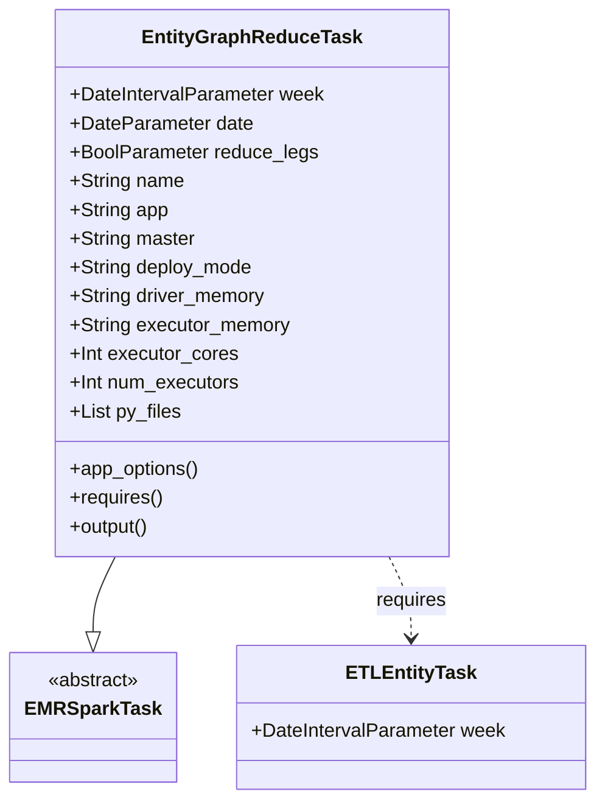
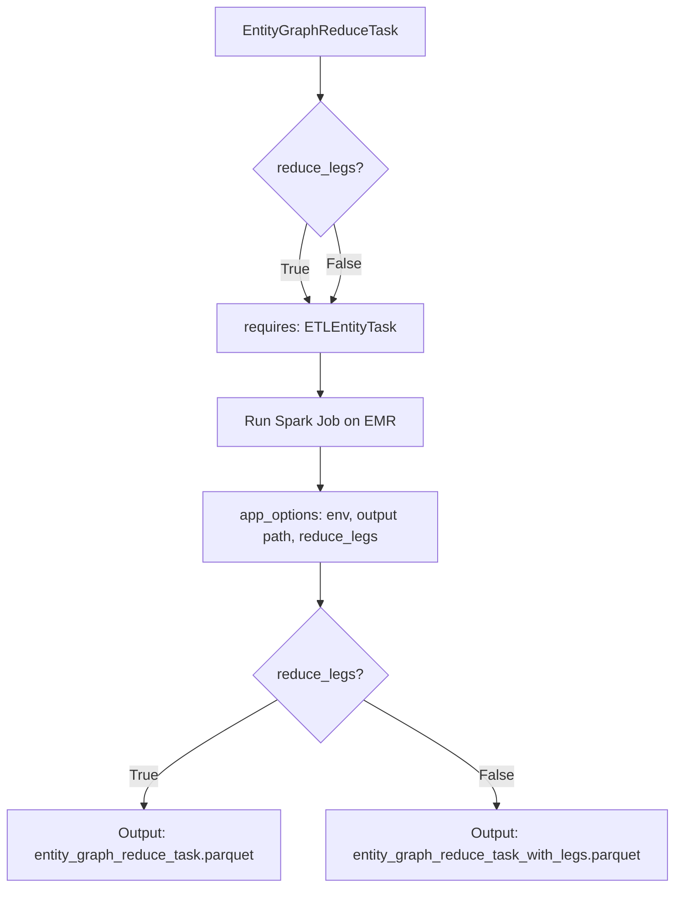
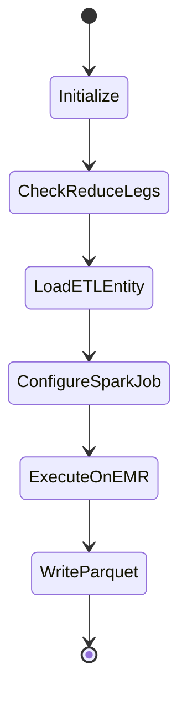

# Diagram: research/orchestrator/tasks/transforms/entity_graph_reduce_task.py

> Auto-generated by Obscura crawlers

## Diagram 1

### SVG

<svg id="container" width="482.84375" xmlns="http://www.w3.org/2000/svg" class="classDiagram" height="666" viewBox="0 0 482.84375 666" role="graphics-document document" aria-roledescription="class"><g><defs><marker id="container_class-aggregationStart" class="marker aggregation class" refX="18" refY="7" markerWidth="190" markerHeight="240" orient="auto"><path d="M 18,7 L9,13 L1,7 L9,1 Z"></path></marker></defs><defs><marker id="container_class-aggregationEnd" class="marker aggregation class" refX="1" refY="7" markerWidth="20" markerHeight="28" orient="auto"><path d="M 18,7 L9,13 L1,7 L9,1 Z"></path></marker></defs><defs><marker id="container_class-extensionStart" class="marker extension class" refX="18" refY="7" markerWidth="190" markerHeight="240" orient="auto"><path d="M 1,7 L18,13 V 1 Z"></path></marker></defs><defs><marker id="container_class-extensionEnd" class="marker extension class" refX="1" refY="7" markerWidth="20" markerHeight="28" orient="auto"><path d="M 1,1 V 13 L18,7 Z"></path></marker></defs><defs><marker id="container_class-compositionStart" class="marker composition class" refX="18" refY="7" markerWidth="190" markerHeight="240" orient="auto"><path d="M 18,7 L9,13 L1,7 L9,1 Z"></path></marker></defs><defs><marker id="container_class-compositionEnd" class="marker composition class" refX="1" refY="7" markerWidth="20" markerHeight="28" orient="auto"><path d="M 18,7 L9,13 L1,7 L9,1 Z"></path></marker></defs><defs><marker id="container_class-dependencyStart" class="marker dependency class" refX="6" refY="7" markerWidth="190" markerHeight="240" orient="auto"><path d="M 5,7 L9,13 L1,7 L9,1 Z"></path></marker></defs><defs><marker id="container_class-dependencyEnd" class="marker dependency class" refX="13" refY="7" markerWidth="20" markerHeight="28" orient="auto"><path d="M 18,7 L9,13 L14,7 L9,1 Z"></path></marker></defs><defs><marker id="container_class-lollipopStart" class="marker lollipop class" refX="13" refY="7" markerWidth="190" markerHeight="240" orient="auto"><circle stroke="black" fill="transparent" cx="7" cy="7" r="6"></circle></marker></defs><defs><marker id="container_class-lollipopEnd" class="marker lollipop class" refX="1" refY="7" markerWidth="190" markerHeight="240" orient="auto"><circle stroke="black" fill="transparent" cx="7" cy="7" r="6"></circle></marker></defs><g class="root"><g class="clusters"></g><g class="edgePaths"><path d="M91.189,464L88.182,470.167C85.176,476.333,79.162,488.667,76.155,499.125C73.148,509.583,73.148,518.167,73.148,522.458L73.148,526.75" id="id_EntityGraphReduceTask_EMRSparkTask_1" class="edge-thickness-normal edge-pattern-solid relation" style=";;;" data-edge="true" data-et="edge" data-id="id_EntityGraphReduceTask_EMRSparkTask_1" data-points="W3sieCI6OTEuMTg5MjA5OTA1NjYwMzgsInkiOjQ2NH0seyJ4Ijo3My4xNDg0Mzc1LCJ5Ijo1MDF9LHsieCI6NzMuMTQ4NDM3NSwieSI6NTQ0fV0=" marker-end="url(#container_class-extensionEnd)"></path><path d="M313.53,464L316.536,470.167C319.543,476.333,325.557,488.667,328.564,500C331.57,511.333,331.57,521.667,331.57,526.833L331.57,532" id="id_EntityGraphReduceTask_ETLEntityTask_2" class="edge-thickness-normal edge-pattern-dashed relation" style=";;;" data-edge="true" data-et="edge" data-id="id_EntityGraphReduceTask_ETLEntityTask_2" data-points="W3sieCI6MzEzLjUyOTU0MDA5NDMzOTYsInkiOjQ2NH0seyJ4IjozMzEuNTcwMzEyNSwieSI6NTAxfSx7IngiOjMzMS41NzAzMTI1LCJ5Ijo1Mzh9XQ==" marker-end="url(#container_class-dependencyEnd)"></path></g><g class="edgeLabels"><g class="edgeLabel"><g class="label" data-id="id_EntityGraphReduceTask_EMRSparkTask_1" transform="translate(0, 0)"><foreignObject width="0" height="0">

</foreignObject></g></g><g class="edgeLabel" transform="translate(331.5703125, 501)"><g class="label" data-id="id_EntityGraphReduceTask_ETLEntityTask_2" transform="translate(-29.8515625, -12)"><foreignObject width="59.703125" height="24">

requires

</foreignObject></g></g></g><g class="nodes"><g class="node default" id="classId-EntityGraphReduceTask-0" transform="translate(202.359375, 236)"><g class="basic label-container"><path d="M-161.23828125 -228 L161.23828125 -228 L161.23828125 228 L-161.23828125 228" stroke="none" stroke-width="0" fill="#ECECFF" style=""></path><path d="M-161.23828125 -228 C-69.55829976771373 -228, 22.12168171457253 -228, 161.23828125 -228 M-161.23828125 -228 C-84.01991241165629 -228, -6.8015435733125855 -228, 161.23828125 -228 M161.23828125 -228 C161.23828125 -103.5754556177395, 161.23828125 20.849088764521014, 161.23828125 228 M161.23828125 -228 C161.23828125 -63.164908076900446, 161.23828125 101.67018384619911, 161.23828125 228 M161.23828125 228 C50.35243943639995 228, -60.533402377200105 228, -161.23828125 228 M161.23828125 228 C94.8522549431097 228, 28.466228636219398 228, -161.23828125 228 M-161.23828125 228 C-161.23828125 70.07713749788445, -161.23828125 -87.8457250042311, -161.23828125 -228 M-161.23828125 228 C-161.23828125 72.35623385918868, -161.23828125 -83.28753228162265, -161.23828125 -228" stroke="#9370DB" stroke-width="1.3" fill="none" stroke-dasharray="0 0" style=""></path></g><g class="annotation-group text" transform="translate(0, -204)"></g><g class="label-group text" transform="translate(-86.3515625, -204)"><g class="label" style="font-weight: bolder" transform="translate(0,-12)"><foreignObject width="172.703125" height="24">

EntityGraphReduceTask

</foreignObject></g></g><g class="members-group text" transform="translate(-149.23828125, -156)"><g class="label" style="" transform="translate(0,-12)"><foreignObject width="212.125" height="24">

+DateIntervalParameter week

</foreignObject></g><g class="label" style="" transform="translate(0,12)"><foreignObject width="152.171875" height="24">

+DateParameter date

</foreignObject></g><g class="label" style="" transform="translate(0,36)"><foreignObject width="205.828125" height="24">

+BoolParameter reduce_legs

</foreignObject></g><g class="label" style="" transform="translate(0,60)"><foreignObject width="94.984375" height="24">

+String name

</foreignObject></g><g class="label" style="" transform="translate(0,84)"><foreignObject width="82.1875" height="24">

+String app

</foreignObject></g><g class="label" style="" transform="translate(0,108)"><foreignObject width="104.625" height="24">

+String master

</foreignObject></g><g class="label" style="" transform="translate(0,132)"><foreignObject width="153.203125" height="24">

+String deploy_mode

</foreignObject></g><g class="label" style="" transform="translate(0,156)"><foreignObject width="164.015625" height="24">

+String driver_memory

</foreignObject></g><g class="label" style="" transform="translate(0,180)"><foreignObject width="183.8125" height="24">

+String executor_memory

</foreignObject></g><g class="label" style="" transform="translate(0,204)"><foreignObject width="140.15625" height="24">

+Int executor_cores

</foreignObject></g><g class="label" style="" transform="translate(0,228)"><foreignObject width="142.5" height="24">

+Int num_executors

</foreignObject></g><g class="label" style="" transform="translate(0,252)"><foreignObject width="92.796875" height="24">

+List py_files

</foreignObject></g></g><g class="methods-group text" transform="translate(-149.23828125, 156)"><g class="label" style="" transform="translate(0,-12)"><foreignObject width="108.84375" height="24">

+app_options()

</foreignObject></g><g class="label" style="" transform="translate(0,12)"><foreignObject width="78.0625" height="24">

+requires()

</foreignObject></g><g class="label" style="" transform="translate(0,36)"><foreignObject width="67.390625" height="24">

+output()

</foreignObject></g></g><g class="divider" style=""><path d="M-161.23828125 -180 C-79.48828968992025 -180, 2.2617018701594986 -180, 161.23828125 -180 M-161.23828125 -180 C-67.97405116556648 -180, 25.290178918867042 -180, 161.23828125 -180" stroke="#9370DB" stroke-width="1.3" fill="none" stroke-dasharray="0 0" style=""></path></g><g class="divider" style=""><path d="M-161.23828125 132 C-49.99499536372039 132, 61.248290522559216 132, 161.23828125 132 M-161.23828125 132 C-87.34883795464907 132, -13.459394659298141 132, 161.23828125 132" stroke="#9370DB" stroke-width="1.3" fill="none" stroke-dasharray="0 0" style=""></path></g></g><g class="node default" id="classId-EMRSparkTask-1" transform="translate(73.1484375, 598)"><g class="basic label-container"><path d="M-65.1484375 -54 L65.1484375 -54 L65.1484375 54 L-65.1484375 54" stroke="none" stroke-width="0" fill="#ECECFF" style=""></path><path d="M-65.1484375 -54 C-24.80900769191721 -54, 15.530422116165582 -54, 65.1484375 -54 M-65.1484375 -54 C-14.493518358521811 -54, 36.16140078295638 -54, 65.1484375 -54 M65.1484375 -54 C65.1484375 -17.855469759879604, 65.1484375 18.289060480240792, 65.1484375 54 M65.1484375 -54 C65.1484375 -20.81036688741505, 65.1484375 12.3792662251699, 65.1484375 54 M65.1484375 54 C19.113799163476102 54, -26.920839173047796 54, -65.1484375 54 M65.1484375 54 C15.196536182709202 54, -34.755365134581595 54, -65.1484375 54 M-65.1484375 54 C-65.1484375 31.133107599216054, -65.1484375 8.266215198432107, -65.1484375 -54 M-65.1484375 54 C-65.1484375 15.029257204473573, -65.1484375 -23.941485591052853, -65.1484375 -54" stroke="#9370DB" stroke-width="1.3" fill="none" stroke-dasharray="0 0" style=""></path></g><g class="annotation-group text" transform="translate(-38.609375, -30)"><g class="label" style="" transform="translate(0,-12)"><foreignObject width="77.21875" height="24">

«abstract»

</foreignObject></g></g><g class="label-group text" transform="translate(-53.1484375, -6)"><g class="label" style="font-weight: bolder" transform="translate(0,-12)"><foreignObject width="106.296875" height="24">

EMRSparkTask

</foreignObject></g></g><g class="members-group text" transform="translate(-53.1484375, 42)"></g><g class="methods-group text" transform="translate(-53.1484375, 72)"></g><g class="divider" style=""><path d="M-65.1484375 18 C-20.54410478091478 18, 24.060227938170442 18, 65.1484375 18 M-65.1484375 18 C-34.87794639284343 18, -4.607455285686861 18, 65.1484375 18" stroke="#9370DB" stroke-width="1.3" fill="none" stroke-dasharray="0 0" style=""></path></g><g class="divider" style=""><path d="M-65.1484375 36 C-17.381227040926923 36, 30.385983418146154 36, 65.1484375 36 M-65.1484375 36 C-27.306015107883702 36, 10.536407284232595 36, 65.1484375 36" stroke="#9370DB" stroke-width="1.3" fill="none" stroke-dasharray="0 0" style=""></path></g></g><g class="node default" id="classId-ETLEntityTask-2" transform="translate(331.5703125, 598)"><g class="basic label-container"><path d="M-143.2734375 -60 L143.2734375 -60 L143.2734375 60 L-143.2734375 60" stroke="none" stroke-width="0" fill="#ECECFF" style=""></path><path d="M-143.2734375 -60 C-36.779056847701554 -60, 69.71532380459689 -60, 143.2734375 -60 M-143.2734375 -60 C-55.43210441919361 -60, 32.40922866161279 -60, 143.2734375 -60 M143.2734375 -60 C143.2734375 -26.278793284456455, 143.2734375 7.44241343108709, 143.2734375 60 M143.2734375 -60 C143.2734375 -29.04969552866125, 143.2734375 1.9006089426775006, 143.2734375 60 M143.2734375 60 C74.53824182778575 60, 5.803046155571508 60, -143.2734375 60 M143.2734375 60 C43.68710172015264 60, -55.89923405969472 60, -143.2734375 60 M-143.2734375 60 C-143.2734375 19.001336579189015, -143.2734375 -21.99732684162197, -143.2734375 -60 M-143.2734375 60 C-143.2734375 25.773353090189175, -143.2734375 -8.45329381962165, -143.2734375 -60" stroke="#9370DB" stroke-width="1.3" fill="none" stroke-dasharray="0 0" style=""></path></g><g class="annotation-group text" transform="translate(0, -36)"></g><g class="label-group text" transform="translate(-50.421875, -36)"><g class="label" style="font-weight: bolder" transform="translate(0,-12)"><foreignObject width="100.84375" height="24">

ETLEntityTask

</foreignObject></g></g><g class="members-group text" transform="translate(-131.2734375, 12)"><g class="label" style="" transform="translate(0,-12)"><foreignObject width="212.125" height="24">

+DateIntervalParameter week

</foreignObject></g></g><g class="methods-group text" transform="translate(-131.2734375, 60)"></g><g class="divider" style=""><path d="M-143.2734375 -12 C-81.26899115554312 -12, -19.264544811086253 -12, 143.2734375 -12 M-143.2734375 -12 C-85.76949848009161 -12, -28.265559460183226 -12, 143.2734375 -12" stroke="#9370DB" stroke-width="1.3" fill="none" stroke-dasharray="0 0" style=""></path></g><g class="divider" style=""><path d="M-143.2734375 36 C-55.88512392240182 36, 31.503189655196365 36, 143.2734375 36 M-143.2734375 36 C-33.094865744655095 36, 77.08370601068981 36, 143.2734375 36" stroke="#9370DB" stroke-width="1.3" fill="none" stroke-dasharray="0 0" style=""></path></g></g></g></g></g></svg>

## Diagram 2

### SVG

<svg id="container" width="757.625" xmlns="http://www.w3.org/2000/svg" class="flowchart" height="976.125" viewBox="0 0 757.625 976.125" role="graphics-document document" aria-roledescription="flowchart-v2"><g><marker id="container_flowchart-v2-pointEnd" class="marker flowchart-v2" viewBox="0 0 10 10" refX="5" refY="5" markerUnits="userSpaceOnUse" markerWidth="8" markerHeight="8" orient="auto"><path d="M 0 0 L 10 5 L 0 10 z" class="arrowMarkerPath" style="stroke-width: 1; stroke-dasharray: 1, 0;"></path></marker><marker id="container_flowchart-v2-pointStart" class="marker flowchart-v2" viewBox="0 0 10 10" refX="4.5" refY="5" markerUnits="userSpaceOnUse" markerWidth="8" markerHeight="8" orient="auto"><path d="M 0 5 L 10 10 L 10 0 z" class="arrowMarkerPath" style="stroke-width: 1; stroke-dasharray: 1, 0;"></path></marker><marker id="container_flowchart-v2-circleEnd" class="marker flowchart-v2" viewBox="0 0 10 10" refX="11" refY="5" markerUnits="userSpaceOnUse" markerWidth="11" markerHeight="11" orient="auto"><circle cx="5" cy="5" r="5" class="arrowMarkerPath" style="stroke-width: 1; stroke-dasharray: 1, 0;"></circle></marker><marker id="container_flowchart-v2-circleStart" class="marker flowchart-v2" viewBox="0 0 10 10" refX="-1" refY="5" markerUnits="userSpaceOnUse" markerWidth="11" markerHeight="11" orient="auto"><circle cx="5" cy="5" r="5" class="arrowMarkerPath" style="stroke-width: 1; stroke-dasharray: 1, 0;"></circle></marker><marker id="container_flowchart-v2-crossEnd" class="marker cross flowchart-v2" viewBox="0 0 11 11" refX="12" refY="5.2" markerUnits="userSpaceOnUse" markerWidth="11" markerHeight="11" orient="auto"><path d="M 1,1 l 9,9 M 10,1 l -9,9" class="arrowMarkerPath" style="stroke-width: 2; stroke-dasharray: 1, 0;"></path></marker><marker id="container_flowchart-v2-crossStart" class="marker cross flowchart-v2" viewBox="0 0 11 11" refX="-1" refY="5.2" markerUnits="userSpaceOnUse" markerWidth="11" markerHeight="11" orient="auto"><path d="M 1,1 l 9,9 M 10,1 l -9,9" class="arrowMarkerPath" style="stroke-width: 2; stroke-dasharray: 1, 0;"></path></marker><g class="root"><g class="clusters"></g><g class="edgePaths"><path d="M359.75,62L359.75,66.167C359.75,70.333,359.75,78.667,359.75,86.333C359.75,94,359.75,101,359.75,104.5L359.75,108" id="L_A_B_0" class="edge-thickness-normal edge-pattern-solid edge-thickness-normal edge-pattern-solid flowchart-link" style=";" data-edge="true" data-et="edge" data-id="L_A_B_0" data-points="W3sieCI6MzU5Ljc1LCJ5Ijo2Mn0seyJ4IjozNTkuNzUsInkiOjg3fSx7IngiOjM1OS43NSwieSI6MTEyfV0=" marker-end="url(#container_flowchart-v2-pointEnd)"></path><path d="M345.278,244.59L343.175,253.169C341.073,261.748,336.869,278.905,337.116,293.036C337.364,307.168,342.064,318.273,344.414,323.826L346.764,329.379" id="L_B_C_0" class="edge-thickness-normal edge-pattern-solid edge-thickness-normal edge-pattern-solid flowchart-link" style=";" data-edge="true" data-et="edge" data-id="L_B_C_0" data-points="W3sieCI6MzQ1LjI3NzUxMzgzNzYzODM3LCJ5IjoyNDQuNTkwMDEzODM3NjM4Mzd9LHsieCI6MzMyLjY2NDA2MjUsInkiOjI5Ni4wNjI1fSx7IngiOjM0OC4zMjMxMjAxMTcxODc1LCJ5IjozMzMuMDYyNX1d" marker-end="url(#container_flowchart-v2-pointEnd)"></path><path d="M374.222,244.59L376.325,253.169C378.427,261.748,382.631,278.905,382.384,293.036C382.136,307.168,377.436,318.273,375.086,323.826L372.736,329.379" id="L_B_C_2" class="edge-thickness-normal edge-pattern-solid edge-thickness-normal edge-pattern-solid flowchart-link" style=";" data-edge="true" data-et="edge" data-id="L_B_C_2" data-points="W3sieCI6Mzc0LjIyMjQ4NjE2MjM2MTYzLCJ5IjoyNDQuNTkwMDEzODM3NjM4Mzd9LHsieCI6Mzg2LjgzNTkzNzUsInkiOjI5Ni4wNjI1fSx7IngiOjM3MS4xNzY4Nzk4ODI4MTI1LCJ5IjozMzMuMDYyNX1d" marker-end="url(#container_flowchart-v2-pointEnd)"></path><path d="M359.75,387.063L359.75,391.229C359.75,395.396,359.75,403.729,359.75,411.396C359.75,419.063,359.75,426.063,359.75,429.563L359.75,433.063" id="L_C_D_0" class="edge-thickness-normal edge-pattern-solid edge-thickness-normal edge-pattern-solid flowchart-link" style=";" data-edge="true" data-et="edge" data-id="L_C_D_0" data-points="W3sieCI6MzU5Ljc1LCJ5IjozODcuMDYyNX0seyJ4IjozNTkuNzUsInkiOjQxMi4wNjI1fSx7IngiOjM1OS43NSwieSI6NDM3LjA2MjV9XQ==" marker-end="url(#container_flowchart-v2-pointEnd)"></path><path d="M359.75,491.063L359.75,495.229C359.75,499.396,359.75,507.729,359.75,515.396C359.75,523.063,359.75,530.063,359.75,533.563L359.75,537.063" id="L_D_E_0" class="edge-thickness-normal edge-pattern-solid edge-thickness-normal edge-pattern-solid flowchart-link" style=";" data-edge="true" data-et="edge" data-id="L_D_E_0" data-points="W3sieCI6MzU5Ljc1LCJ5Ijo0OTEuMDYyNX0seyJ4IjozNTkuNzUsInkiOjUxNi4wNjI1fSx7IngiOjM1OS43NSwieSI6NTQxLjA2MjV9XQ==" marker-end="url(#container_flowchart-v2-pointEnd)"></path><path d="M359.75,619.063L359.75,623.229C359.75,627.396,359.75,635.729,359.75,643.396C359.75,651.063,359.75,658.063,359.75,661.563L359.75,665.063" id="L_E_F_0" class="edge-thickness-normal edge-pattern-solid edge-thickness-normal edge-pattern-solid flowchart-link" style=";" data-edge="true" data-et="edge" data-id="L_E_F_0" data-points="W3sieCI6MzU5Ljc1LCJ5Ijo2MTkuMDYyNX0seyJ4IjozNTkuNzUsInkiOjY0NC4wNjI1fSx7IngiOjM1OS43NSwieSI6NjY5LjA2MjV9XQ==" marker-end="url(#container_flowchart-v2-pointEnd)"></path><path d="M312.569,768.944L287.448,782.974C262.327,797.005,212.086,825.065,186.965,844.595C161.844,864.125,161.844,875.125,161.844,880.625L161.844,886.125" id="L_F_G_0" class="edge-thickness-normal edge-pattern-solid edge-thickness-normal edge-pattern-solid flowchart-link" style=";" data-edge="true" data-et="edge" data-id="L_F_G_0" data-points="W3sieCI6MzEyLjU2OTMxMDQxMDMzNDM3LCJ5Ijo3NjguOTQ0MzEwNDEwMzM0M30seyJ4IjoxNjEuODQzNzUsInkiOjg1My4xMjV9LHsieCI6MTYxLjg0Mzc1LCJ5Ijo4OTAuMTI1fV0=" marker-end="url(#container_flowchart-v2-pointEnd)"></path><path d="M406.931,768.944L432.052,782.974C457.173,797.005,507.414,825.065,532.535,844.595C557.656,864.125,557.656,875.125,557.656,880.625L557.656,886.125" id="L_F_H_0" class="edge-thickness-normal edge-pattern-solid edge-thickness-normal edge-pattern-solid flowchart-link" style=";" data-edge="true" data-et="edge" data-id="L_F_H_0" data-points="W3sieCI6NDA2LjkzMDY4OTU4OTY2NTYzLCJ5Ijo3NjguOTQ0MzEwNDEwMzM0M30seyJ4Ijo1NTcuNjU2MjUsInkiOjg1My4xMjV9LHsieCI6NTU3LjY1NjI1LCJ5Ijo4OTAuMTI1fV0=" marker-end="url(#container_flowchart-v2-pointEnd)"></path></g><g class="edgeLabels"><g class="edgeLabel"><g class="label" data-id="L_A_B_0" transform="translate(0, 0)"><foreignObject width="0" height="0">

</foreignObject></g></g><g class="edgeLabel" transform="translate(334.1895, 289.83756)"><g class="label" data-id="L_B_C_0" transform="translate(-16.0078125, -12)"><foreignObject width="32.015625" height="24">

True

</foreignObject></g></g><g class="edgeLabel" transform="translate(385.3105, 289.83756)"><g class="label" data-id="L_B_C_2" transform="translate(-18.1640625, -12)"><foreignObject width="36.328125" height="24">

False

</foreignObject></g></g><g class="edgeLabel"><g class="label" data-id="L_C_D_0" transform="translate(0, 0)"><foreignObject width="0" height="0">

</foreignObject></g></g><g class="edgeLabel"><g class="label" data-id="L_D_E_0" transform="translate(0, 0)"><foreignObject width="0" height="0">

</foreignObject></g></g><g class="edgeLabel"><g class="label" data-id="L_E_F_0" transform="translate(0, 0)"><foreignObject width="0" height="0">

</foreignObject></g></g><g class="edgeLabel" transform="translate(161.84375, 853.125)"><g class="label" data-id="L_F_G_0" transform="translate(-16.0078125, -12)"><foreignObject width="32.015625" height="24">

True

</foreignObject></g></g><g class="edgeLabel" transform="translate(557.65625, 853.125)"><g class="label" data-id="L_F_H_0" transform="translate(-18.1640625, -12)"><foreignObject width="36.328125" height="24">

False

</foreignObject></g></g></g><g class="nodes"><g class="node default" id="flowchart-A-0" transform="translate(359.75, 35)"><rect class="basic label-container" style="" x="-114.8515625" y="-27" width="229.703125" height="54"></rect><g class="label" style="" transform="translate(-84.8515625, -12)"><rect></rect><foreignObject width="169.703125" height="24">

EntityGraphReduceTask

</foreignObject></g></g><g class="node default" id="flowchart-B-1" transform="translate(359.75, 185.53125)"><polygon points="73.53125,0 147.0625,-73.53125 73.53125,-147.0625 0,-73.53125" class="label-container" transform="translate(-73.03125, 73.53125)"></polygon><g class="label" style="" transform="translate(-46.53125, -12)"><rect></rect><foreignObject width="93.0625" height="24">

reduce_legs?

</foreignObject></g></g><g class="node default" id="flowchart-C-3" transform="translate(359.75, 360.0625)"><rect class="basic label-container" style="" x="-112.9453125" y="-27" width="225.890625" height="54"></rect><g class="label" style="" transform="translate(-82.9453125, -12)"><rect></rect><foreignObject width="165.890625" height="24">

requires: ETLEntityTask

</foreignObject></g></g><g class="node default" id="flowchart-D-7" transform="translate(359.75, 464.0625)"><rect class="basic label-container" style="" x="-109.8046875" y="-27" width="219.609375" height="54"></rect><g class="label" style="" transform="translate(-79.8046875, -12)"><rect></rect><foreignObject width="159.609375" height="24">

Run Spark Job on EMR

</foreignObject></g></g><g class="node default" id="flowchart-E-9" transform="translate(359.75, 580.0625)"><rect class="basic label-container" style="" x="-130" y="-39" width="260" height="78"></rect><g class="label" style="" transform="translate(-100, -24)"><rect></rect><foreignObject width="200" height="48">

app_options: env, output path, reduce_legs

</foreignObject></g></g><g class="node default" id="flowchart-F-11" transform="translate(359.75, 742.59375)"><polygon points="73.53125,0 147.0625,-73.53125 73.53125,-147.0625 0,-73.53125" class="label-container" transform="translate(-73.03125, 73.53125)"></polygon><g class="label" style="" transform="translate(-46.53125, -12)"><rect></rect><foreignObject width="93.0625" height="24">

reduce_legs?

</foreignObject></g></g><g class="node default" id="flowchart-G-13" transform="translate(161.84375, 929.125)"><rect class="basic label-container" style="" x="-153.84375" y="-39" width="307.6875" height="78"></rect><g class="label" style="" transform="translate(-123.84375, -24)"><rect></rect><foreignObject width="247.6875" height="48">

Output: entity_graph_reduce_task.parquet

</foreignObject></g></g><g class="node default" id="flowchart-H-15" transform="translate(557.65625, 929.125)"><rect class="basic label-container" style="" x="-191.96875" y="-39" width="383.9375" height="78"></rect><g class="label" style="" transform="translate(-161.96875, -24)"><rect></rect><foreignObject width="323.9375" height="48">

Output: entity_graph_reduce_task_with_legs.parquet

</foreignObject></g></g></g></g></g></svg>

## Diagram 3

### SVG

<svg id="container" width="165.3125" xmlns="http://www.w3.org/2000/svg" class="statediagram" height="634" viewBox="0 0 165.3125 634" role="graphics-document document" aria-roledescription="stateDiagram"><g><defs><marker id="container_stateDiagram-barbEnd" refX="19" refY="7" markerWidth="20" markerHeight="14" markerUnits="userSpaceOnUse" orient="auto"><path d="M 19,7 L9,13 L14,7 L9,1 Z"></path></marker></defs><g class="root"><g class="clusters"></g><g class="edgePaths"><path d="M82.656,22L82.656,26.167C82.656,30.333,82.656,38.667,82.74,47.083C82.823,55.5,82.99,64,83.073,68.25L83.156,72.5" id="edge0" class="edge-thickness-normal edge-pattern-solid transition" style="fill:none;;;fill:none" data-edge="true" data-et="edge" data-id="edge0" data-points="W3sieCI6ODIuNjU2MjUsInkiOjIyfSx7IngiOjgyLjY1NjI1LCJ5Ijo0N30seyJ4Ijo4My4xNTYyNSwieSI6NzIuNX1d" marker-end="url(#container_stateDiagram-barbEnd)"></path><path d="M83.156,112.5L83.073,116.583C82.99,120.667,82.823,128.833,82.823,137.167C82.823,145.5,82.99,154,83.073,158.25L83.156,162.5" id="edge1" class="edge-thickness-normal edge-pattern-solid transition" style="fill:none;;;fill:none" data-edge="true" data-et="edge" data-id="edge1" data-points="W3sieCI6ODMuMTU2MjUsInkiOjExMi41fSx7IngiOjgyLjY1NjI1LCJ5IjoxMzd9LHsieCI6ODMuMTU2MjUsInkiOjE2Mi41fV0=" marker-end="url(#container_stateDiagram-barbEnd)"></path><path d="M83.156,202.5L83.073,206.583C82.99,210.667,82.823,218.833,82.823,227.167C82.823,235.5,82.99,244,83.073,248.25L83.156,252.5" id="edge2" class="edge-thickness-normal edge-pattern-solid transition" style="fill:none;;;fill:none" data-edge="true" data-et="edge" data-id="edge2" data-points="W3sieCI6ODMuMTU2MjUsInkiOjIwMi41fSx7IngiOjgyLjY1NjI1LCJ5IjoyMjd9LHsieCI6ODMuMTU2MjUsInkiOjI1Mi41fV0=" marker-end="url(#container_stateDiagram-barbEnd)"></path><path d="M83.156,292.5L83.073,296.583C82.99,300.667,82.823,308.833,82.823,317.167C82.823,325.5,82.99,334,83.073,338.25L83.156,342.5" id="edge3" class="edge-thickness-normal edge-pattern-solid transition" style="fill:none;;;fill:none" data-edge="true" data-et="edge" data-id="edge3" data-points="W3sieCI6ODMuMTU2MjUsInkiOjI5Mi41fSx7IngiOjgyLjY1NjI1LCJ5IjozMTd9LHsieCI6ODMuMTU2MjUsInkiOjM0Mi41fV0=" marker-end="url(#container_stateDiagram-barbEnd)"></path><path d="M83.156,382.5L83.073,386.583C82.99,390.667,82.823,398.833,82.823,407.167C82.823,415.5,82.99,424,83.073,428.25L83.156,432.5" id="edge4" class="edge-thickness-normal edge-pattern-solid transition" style="fill:none;;;fill:none" data-edge="true" data-et="edge" data-id="edge4" data-points="W3sieCI6ODMuMTU2MjUsInkiOjM4Mi41fSx7IngiOjgyLjY1NjI1LCJ5Ijo0MDd9LHsieCI6ODMuMTU2MjUsInkiOjQzMi41fV0=" marker-end="url(#container_stateDiagram-barbEnd)"></path><path d="M83.156,472.5L83.073,476.583C82.99,480.667,82.823,488.833,82.823,497.167C82.823,505.5,82.99,514,83.073,518.25L83.156,522.5" id="edge5" class="edge-thickness-normal edge-pattern-solid transition" style="fill:none;;;fill:none" data-edge="true" data-et="edge" data-id="edge5" data-points="W3sieCI6ODMuMTU2MjUsInkiOjQ3Mi41fSx7IngiOjgyLjY1NjI1LCJ5Ijo0OTd9LHsieCI6ODMuMTU2MjUsInkiOjUyMi41fV0=" marker-end="url(#container_stateDiagram-barbEnd)"></path><path d="M83.156,562.5L83.073,566.583C82.99,570.667,82.823,578.833,82.74,587.083C82.656,595.333,82.656,603.667,82.656,607.833L82.656,612" id="edge6" class="edge-thickness-normal edge-pattern-solid transition" style="fill:none;;;fill:none" data-edge="true" data-et="edge" data-id="edge6" data-points="W3sieCI6ODMuMTU2MjUsInkiOjU2Mi41fSx7IngiOjgyLjY1NjI1LCJ5Ijo1ODd9LHsieCI6ODIuNjU2MjUsInkiOjYxMn1d" marker-end="url(#container_stateDiagram-barbEnd)"></path></g><g class="edgeLabels"><g class="edgeLabel"><g class="label" data-id="edge0" transform="translate(0, 0)"><foreignObject width="0" height="0">

</foreignObject></g></g><g class="edgeLabel"><g class="label" data-id="edge1" transform="translate(0, 0)"><foreignObject width="0" height="0">

</foreignObject></g></g><g class="edgeLabel"><g class="label" data-id="edge2" transform="translate(0, 0)"><foreignObject width="0" height="0">

</foreignObject></g></g><g class="edgeLabel"><g class="label" data-id="edge3" transform="translate(0, 0)"><foreignObject width="0" height="0">

</foreignObject></g></g><g class="edgeLabel"><g class="label" data-id="edge4" transform="translate(0, 0)"><foreignObject width="0" height="0">

</foreignObject></g></g><g class="edgeLabel"><g class="label" data-id="edge5" transform="translate(0, 0)"><foreignObject width="0" height="0">

</foreignObject></g></g><g class="edgeLabel"><g class="label" data-id="edge6" transform="translate(0, 0)"><foreignObject width="0" height="0">

</foreignObject></g></g></g><g class="nodes"><g class="node default" id="state-root_start-0" transform="translate(82.65625, 15)"><circle class="state-start" r="7" width="14" height="14"></circle></g><g class="node  statediagram-state" id="state-Initialize-1" transform="translate(82.65625, 92)"><g class="basic label-container outer-path"><path d="M-34.125 -20 C-19.72829674614268 -20, -5.331593492285357 -20, 34.125 -20 C34.125 -20, 34.125 -20, 34.125 -20 C34.24738310206652 -19.994938197456243, 34.369766204133036 -19.989876394912486, 34.53789672736166 -19.982922465033347 C34.637466824380404 -19.97051106538339, 34.737036921399145 -19.958099665733435, 34.94797295140367 -19.931806517013612 C35.03157350565139 -19.914277324142766, 35.11517405989911 -19.896748131271917, 35.352427435703994 -19.847001329696653 C35.48130480299456 -19.808632875069772, 35.61018217028512 -19.770264420442892, 35.74849734602342 -19.729086208503173 C35.864179849801424 -19.683946755456184, 35.97986235357943 -19.63880730240919, 36.133477123264846 -19.578866633275286 C36.23536911688402 -19.529054672858948, 36.33726111050319 -19.47924271244261, 36.504736965185366 -19.397368756032446 C36.61300891460745 -19.332852677777964, 36.72128086402953 -19.268336599523487, 36.859740790612136 -19.185832391312644 C36.961620617259655 -19.11309159321861, 37.063500443907174 -19.040350795124574, 37.19606356344834 -18.94570254698197 C37.31532176927404 -18.84469599901977, 37.43457997509974 -18.74368945105757, 37.511407858128706 -18.678619553365657 C37.62543433616127 -18.564593075333097, 37.739460814193826 -18.450566597300536, 37.80361955336566 -18.386407858128706 C37.8799855753059 -18.296242666402247, 37.95635159724615 -18.206077474675784, 38.07070254698197 -18.07106356344834 C38.16418808390596 -17.94012892229203, 38.257673620829955 -17.809194281135717, 38.310832391312644 -17.734740790612136 C38.371263267551406 -17.633324694769385, 38.43169414379016 -17.531908598926634, 38.52236875603245 -17.37973696518537 C38.567405317014824 -17.287613207238657, 38.612441877997206 -17.195489449291944, 38.70386663327529 -17.008477123264846 C38.759213477680056 -16.866635317377433, 38.81456032208482 -16.72479351149002, 38.854086208503176 -16.623497346023417 C38.883172797366406 -16.525797216252496, 38.912259386229636 -16.42809708648157, 38.97200132969665 -16.227427435703994 C38.99470817967338 -16.119133502420187, 39.01741502965012 -16.010839569136376, 39.05680651701361 -15.82297295140367 C39.0746827954571 -15.679561021310956, 39.09255907390059 -15.53614909121824, 39.10792246503335 -15.412896727361662 C39.112997304061395 -15.290198432165061, 39.11807214308944 -15.167500136968458, 39.125 -15 C39.125 -15, 39.125 -15, 39.125 -15 C39.125 -5.540736445569976, 39.125 3.9185271088600473, 39.125 15 C39.125 15, 39.125 15, 39.125 15 C39.120040497359874 15.11990971843698, 39.11508099471975 15.239819436873963, 39.10792246503335 15.412896727361662 C39.094184821525126 15.523106577620387, 39.0804471780169 15.633316427879114, 39.05680651701361 15.822972951403669 C39.032440192503714 15.939181281645457, 39.008073867993815 16.055389611887243, 38.97200132969665 16.227427435703994 C38.94297728624354 16.324917479145657, 38.91395324279043 16.422407522587317, 38.854086208503176 16.623497346023417 C38.82037038541478 16.70990359529146, 38.78665456232639 16.796309844559506, 38.70386663327529 17.008477123264846 C38.64035352117051 17.1383952706179, 38.576840409065724 17.26831341797095, 38.52236875603245 17.379736965185366 C38.46018868480597 17.48408858898276, 38.398008613579485 17.588440212780153, 38.310832391312644 17.734740790612133 C38.23621743761879 17.839245535498424, 38.16160248392494 17.943750280384716, 38.07070254698197 18.07106356344834 C37.984628805267455 18.172690638253624, 37.89855506355294 18.274317713058906, 37.80361955336566 18.386407858128706 C37.73169087765166 18.458336533842704, 37.65976220193765 18.530265209556706, 37.511407858128706 18.678619553365657 C37.44215353250554 18.73727497513906, 37.37289920688239 18.795930396912457, 37.19606356344834 18.94570254698197 C37.12501749181175 18.996428467140547, 37.05397142017516 19.047154387299127, 36.859740790612136 19.185832391312644 C36.752754608610346 19.24958231848231, 36.645768426608555 19.313332245651978, 36.504736965185366 19.397368756032446 C36.373883701972 19.461339018425136, 36.24303043875863 19.52530928081783, 36.133477123264846 19.578866633275286 C36.00746268505377 19.628037619648367, 35.88144824684269 19.677208606021445, 35.74849734602342 19.729086208503173 C35.61502975929426 19.768821230665996, 35.4815621725651 19.808556252828822, 35.352427435703994 19.847001329696653 C35.24085561250995 19.87039548091155, 35.12928378931589 19.893789632126452, 34.94797295140367 19.931806517013612 C34.86004996395973 19.942766105969113, 34.77212697651579 19.953725694924614, 34.53789672736166 19.982922465033347 C34.38266942030728 19.989342713943866, 34.22744211325289 19.995762962854386, 34.125 20 C34.125 20, 34.125 20, 34.125 20 C19.28076894719201 20, 4.436537894384017 20, -34.125 20 C-34.125 20, -34.125 20, -34.125 20 C-34.28301583944242 19.993464416536778, -34.44103167888484 19.98692883307356, -34.53789672736166 19.982922465033347 C-34.66538376552395 19.96703122229886, -34.792870803686235 19.951139979564374, -34.94797295140367 19.931806517013612 C-35.08163839712288 19.9037798203097, -35.21530384284209 19.875753123605786, -35.352427435703994 19.847001329696653 C-35.43637981294577 19.82200762409311, -35.52033219018755 19.79701391848957, -35.74849734602342 19.729086208503173 C-35.84980508766859 19.689555805045927, -35.951112829313765 19.65002540158868, -36.133477123264846 19.578866633275286 C-36.24637593957105 19.523673765129875, -36.35927475587726 19.468480896984463, -36.504736965185366 19.397368756032446 C-36.62569275128291 19.325294751612518, -36.74664853738046 19.253220747192586, -36.859740790612136 19.185832391312644 C-36.94110654870861 19.127738356642357, -37.02247230680508 19.06964432197207, -37.19606356344834 18.94570254698197 C-37.26016921421758 18.891407830369054, -37.32427486498682 18.83711311375614, -37.511407858128706 18.67861955336566 C-37.62597288854567 18.564054522948695, -37.74053791896264 18.44948949253173, -37.80361955336566 18.386407858128706 C-37.861513539690584 18.318052557640733, -37.91940752601552 18.249697257152764, -38.07070254698197 18.07106356344834 C-38.1503023799335 17.959577060759855, -38.22990221288503 17.848090558071373, -38.310832391312644 17.734740790612133 C-38.373605358876894 17.629394158376023, -38.43637832644115 17.524047526139917, -38.52236875603244 17.37973696518537 C-38.58435950140725 17.252932868751813, -38.64635024678206 17.126128772318257, -38.70386663327528 17.00847712326485 C-38.74570526293717 16.901253904833528, -38.78754389259906 16.794030686402206, -38.854086208503176 16.623497346023417 C-38.887253700380775 16.512089704658028, -38.92042119225837 16.400682063292635, -38.97200132969665 16.227427435703994 C-39.00475041518833 16.07123988512009, -39.03749950068001 15.915052334536188, -39.05680651701361 15.82297295140367 C-39.0726095177505 15.696193832131277, -39.08841251848739 15.569414712858883, -39.10792246503335 15.412896727361664 C-39.11255536147074 15.300883618857451, -39.117188257908126 15.188870510353238, -39.125 15 C-39.125 15, -39.125 15, -39.125 15 C-39.125 7.321320281640875, -39.125 -0.35735943671824977, -39.125 -15 C-39.125 -15, -39.125 -15, -39.125 -15 C-39.1187439502214 -15.151257338066653, -39.1124879004428 -15.302514676133308, -39.10792246503335 -15.41289672736166 C-39.08811603752681 -15.571793222844963, -39.06830961002027 -15.730689718328264, -39.05680651701361 -15.822972951403669 C-39.03047632328707 -15.948547403416791, -39.004146129560525 -16.074121855429915, -38.97200132969665 -16.227427435703994 C-38.93618211676931 -16.34774205106674, -38.90036290384197 -16.46805666642948, -38.854086208503176 -16.623497346023417 C-38.81222498198949 -16.730778475222756, -38.7703637554758 -16.838059604422096, -38.70386663327529 -17.008477123264846 C-38.64024141084633 -17.138624595951423, -38.57661618841737 -17.268772068638, -38.52236875603245 -17.379736965185366 C-38.47041932163225 -17.46691936507796, -38.41846988723205 -17.554101764970554, -38.310832391312644 -17.734740790612133 C-38.24641889001294 -17.82495751242607, -38.18200538871324 -17.915174234240006, -38.07070254698197 -18.07106356344834 C-37.98940316271092 -18.167053565072074, -37.90810377843987 -18.263043566695806, -37.80361955336566 -18.386407858128706 C-37.727035913694564 -18.462991497799795, -37.65045227402348 -18.539575137470887, -37.511407858128706 -18.678619553365657 C-37.42053951853506 -18.755581111170955, -37.32967117894142 -18.832542668976256, -37.19606356344834 -18.945702546981966 C-37.092205973106985 -19.019855441211867, -36.98834838276563 -19.094008335441764, -36.859740790612136 -19.185832391312644 C-36.72897542738494 -19.26375163495767, -36.59821006415774 -19.341670878602702, -36.504736965185366 -19.397368756032446 C-36.4293973617181 -19.434200043873574, -36.35405775825083 -19.471031331714702, -36.133477123264846 -19.578866633275286 C-36.034526222492154 -19.617477394570336, -35.93557532171946 -19.656088155865387, -35.74849734602342 -19.729086208503173 C-35.639159771946595 -19.76163741464724, -35.52982219786978 -19.794188620791306, -35.352427435703994 -19.847001329696653 C-35.21639897330077 -19.875523498895742, -35.08037051089754 -19.904045668094827, -34.94797295140367 -19.931806517013612 C-34.80543451437138 -19.949573914660668, -34.66289607733908 -19.96734131230772, -34.53789672736166 -19.982922465033347 C-34.408362323330046 -19.988280047614275, -34.27882791929843 -19.9936376301952, -34.125 -20 C-34.125 -20, -34.125 -20, -34.125 -20" stroke="none" stroke-width="0" fill="#ECECFF" style=""></path><path d="M-34.125 -20 C-16.19631888043083 -20, 1.7323622391383395 -20, 34.125 -20 M-34.125 -20 C-11.769479699655776 -20, 10.586040600688449 -20, 34.125 -20 M34.125 -20 C34.125 -20, 34.125 -20, 34.125 -20 M34.125 -20 C34.125 -20, 34.125 -20, 34.125 -20 M34.125 -20 C34.23194159909129 -19.995576862743523, 34.33888319818259 -19.99115372548704, 34.53789672736166 -19.982922465033347 M34.125 -20 C34.229985650259245 -19.995657761385626, 34.3349713005185 -19.99131552277125, 34.53789672736166 -19.982922465033347 M34.53789672736166 -19.982922465033347 C34.68453335689271 -19.96464422822406, 34.831169986423745 -19.946365991414773, 34.94797295140367 -19.931806517013612 M34.53789672736166 -19.982922465033347 C34.696893414051516 -19.963103548705938, 34.85589010074137 -19.94328463237853, 34.94797295140367 -19.931806517013612 M34.94797295140367 -19.931806517013612 C35.03421760364943 -19.913722915093757, 35.12046225589519 -19.8956393131739, 35.352427435703994 -19.847001329696653 M34.94797295140367 -19.931806517013612 C35.06084288632258 -19.90814018039279, 35.173712821241494 -19.884473843771975, 35.352427435703994 -19.847001329696653 M35.352427435703994 -19.847001329696653 C35.48362065587784 -19.807943415794316, 35.61481387605169 -19.76888550189198, 35.74849734602342 -19.729086208503173 M35.352427435703994 -19.847001329696653 C35.435299001415636 -19.82232939562698, 35.518170567127285 -19.797657461557307, 35.74849734602342 -19.729086208503173 M35.74849734602342 -19.729086208503173 C35.89391688024034 -19.67234333017218, 36.03933641445726 -19.615600451841186, 36.133477123264846 -19.578866633275286 M35.74849734602342 -19.729086208503173 C35.86360677336563 -19.684170370575334, 35.97871620070784 -19.63925453264749, 36.133477123264846 -19.578866633275286 M36.133477123264846 -19.578866633275286 C36.2601313724872 -19.51694914373823, 36.386785621709556 -19.45503165420117, 36.504736965185366 -19.397368756032446 M36.133477123264846 -19.578866633275286 C36.27424511963608 -19.51004935319204, 36.41501311600731 -19.441232073108793, 36.504736965185366 -19.397368756032446 M36.504736965185366 -19.397368756032446 C36.59559852221657 -19.343227019829868, 36.68646007924778 -19.28908528362729, 36.859740790612136 -19.185832391312644 M36.504736965185366 -19.397368756032446 C36.58145787236532 -19.35165301822781, 36.658178779545274 -19.305937280423176, 36.859740790612136 -19.185832391312644 M36.859740790612136 -19.185832391312644 C36.99288376468086 -19.090770134994912, 37.12602673874959 -18.995707878677177, 37.19606356344834 -18.94570254698197 M36.859740790612136 -19.185832391312644 C36.97338928069768 -19.104688929029322, 37.08703777078322 -19.023545466745997, 37.19606356344834 -18.94570254698197 M37.19606356344834 -18.94570254698197 C37.3160307237752 -18.844095545186608, 37.43599788410206 -18.742488543391243, 37.511407858128706 -18.678619553365657 M37.19606356344834 -18.94570254698197 C37.30660249769322 -18.852080845345654, 37.417141431938106 -18.758459143709338, 37.511407858128706 -18.678619553365657 M37.511407858128706 -18.678619553365657 C37.57892798693749 -18.611099424556873, 37.646448115746274 -18.543579295748092, 37.80361955336566 -18.386407858128706 M37.511407858128706 -18.678619553365657 C37.619420395696714 -18.570607015797652, 37.727432933264716 -18.462594478229647, 37.80361955336566 -18.386407858128706 M37.80361955336566 -18.386407858128706 C37.88292553599532 -18.292771461375526, 37.96223151862498 -18.199135064622347, 38.07070254698197 -18.07106356344834 M37.80361955336566 -18.386407858128706 C37.89196234574942 -18.282101720260663, 37.98030513813319 -18.177795582392623, 38.07070254698197 -18.07106356344834 M38.07070254698197 -18.07106356344834 C38.13172451215227 -17.985596983535316, 38.19274647732257 -17.900130403622292, 38.310832391312644 -17.734740790612136 M38.07070254698197 -18.07106356344834 C38.154924177444926 -17.95310383058364, 38.23914580790789 -17.83514409771894, 38.310832391312644 -17.734740790612136 M38.310832391312644 -17.734740790612136 C38.372067101042184 -17.631975688112252, 38.433301810771724 -17.52921058561237, 38.52236875603245 -17.37973696518537 M38.310832391312644 -17.734740790612136 C38.37906427141131 -17.62023292108734, 38.44729615150997 -17.505725051562543, 38.52236875603245 -17.37973696518537 M38.52236875603245 -17.37973696518537 C38.56638471136622 -17.289700889461287, 38.610400666699995 -17.1996648137372, 38.70386663327529 -17.008477123264846 M38.52236875603245 -17.37973696518537 C38.58704886532527 -17.24743168692955, 38.65172897461809 -17.115126408673728, 38.70386663327529 -17.008477123264846 M38.70386663327529 -17.008477123264846 C38.734660186772054 -16.929560009115956, 38.76545374026882 -16.850642894967066, 38.854086208503176 -16.623497346023417 M38.70386663327529 -17.008477123264846 C38.74481513555888 -16.903535105797467, 38.78576363784247 -16.798593088330087, 38.854086208503176 -16.623497346023417 M38.854086208503176 -16.623497346023417 C38.88118552197948 -16.53247235661034, 38.90828483545578 -16.44144736719727, 38.97200132969665 -16.227427435703994 M38.854086208503176 -16.623497346023417 C38.891257199035955 -16.498642189722926, 38.92842818956874 -16.373787033422435, 38.97200132969665 -16.227427435703994 M38.97200132969665 -16.227427435703994 C39.003565539112486 -16.076890818245502, 39.03512974852832 -15.926354200787008, 39.05680651701361 -15.82297295140367 M38.97200132969665 -16.227427435703994 C39.00366272545977 -16.07642731530169, 39.03532412122289 -15.925427194899381, 39.05680651701361 -15.82297295140367 M39.05680651701361 -15.82297295140367 C39.06717958650517 -15.739755299504104, 39.077552655996726 -15.656537647604537, 39.10792246503335 -15.412896727361662 M39.05680651701361 -15.82297295140367 C39.075289399645634 -15.674694556640775, 39.09377228227765 -15.526416161877881, 39.10792246503335 -15.412896727361662 M39.10792246503335 -15.412896727361662 C39.11370663149236 -15.273048476070935, 39.11949079795138 -15.133200224780207, 39.125 -15 M39.10792246503335 -15.412896727361662 C39.11425345137514 -15.259827590240747, 39.120584437716936 -15.10675845311983, 39.125 -15 M39.125 -15 C39.125 -15, 39.125 -15, 39.125 -15 M39.125 -15 C39.125 -15, 39.125 -15, 39.125 -15 M39.125 -15 C39.125 -6.8567656949647215, 39.125 1.286468610070557, 39.125 15 M39.125 -15 C39.125 -4.790469868225577, 39.125 5.419060263548847, 39.125 15 M39.125 15 C39.125 15, 39.125 15, 39.125 15 M39.125 15 C39.125 15, 39.125 15, 39.125 15 M39.125 15 C39.12039694226038 15.11129167530659, 39.11579388452076 15.22258335061318, 39.10792246503335 15.412896727361662 M39.125 15 C39.1187499069667 15.151113317243695, 39.1124998139334 15.30222663448739, 39.10792246503335 15.412896727361662 M39.10792246503335 15.412896727361662 C39.0887463351643 15.566736678161377, 39.06957020529526 15.720576628961089, 39.05680651701361 15.822972951403669 M39.10792246503335 15.412896727361662 C39.09763769907698 15.49540596668781, 39.08735293312061 15.577915206013959, 39.05680651701361 15.822972951403669 M39.05680651701361 15.822972951403669 C39.028148297616944 15.959650266951892, 38.99949007822027 16.096327582500113, 38.97200132969665 16.227427435703994 M39.05680651701361 15.822972951403669 C39.03395572739947 15.931953364296344, 39.011104937785326 16.040933777189018, 38.97200132969665 16.227427435703994 M38.97200132969665 16.227427435703994 C38.925922564019764 16.38220328128302, 38.87984379834288 16.536979126862043, 38.854086208503176 16.623497346023417 M38.97200132969665 16.227427435703994 C38.93704391875209 16.34484730923399, 38.902086507807525 16.462267182763988, 38.854086208503176 16.623497346023417 M38.854086208503176 16.623497346023417 C38.82370956072865 16.70134602237493, 38.79333291295413 16.77919469872645, 38.70386663327529 17.008477123264846 M38.854086208503176 16.623497346023417 C38.79799885829111 16.76723690565102, 38.74191150807905 16.91097646527863, 38.70386663327529 17.008477123264846 M38.70386663327529 17.008477123264846 C38.63505230470748 17.14923908221476, 38.56623797613966 17.290001041164672, 38.52236875603245 17.379736965185366 M38.70386663327529 17.008477123264846 C38.66588516699933 17.08616945432531, 38.62790370072337 17.163861785385777, 38.52236875603245 17.379736965185366 M38.52236875603245 17.379736965185366 C38.46449881670909 17.476855254346763, 38.40662887738572 17.57397354350816, 38.310832391312644 17.734740790612133 M38.52236875603245 17.379736965185366 C38.45165692397778 17.49840673109343, 38.38094509192312 17.61707649700149, 38.310832391312644 17.734740790612133 M38.310832391312644 17.734740790612133 C38.21956830565842 17.862564095679215, 38.12830422000419 17.9903874007463, 38.07070254698197 18.07106356344834 M38.310832391312644 17.734740790612133 C38.24160517851823 17.831699534860007, 38.17237796572382 17.92865827910788, 38.07070254698197 18.07106356344834 M38.07070254698197 18.07106356344834 C37.98031758147653 18.177780890564907, 37.88993261597108 18.284498217681474, 37.80361955336566 18.386407858128706 M38.07070254698197 18.07106356344834 C38.01351069624589 18.138589854013077, 37.956318845509806 18.206116144577813, 37.80361955336566 18.386407858128706 M37.80361955336566 18.386407858128706 C37.72171947616836 18.468307935326, 37.63981939897107 18.550208012523296, 37.511407858128706 18.678619553365657 M37.80361955336566 18.386407858128706 C37.73854815086428 18.45147926063008, 37.673476748362916 18.51655066313145, 37.511407858128706 18.678619553365657 M37.511407858128706 18.678619553365657 C37.38941177779666 18.781944962748963, 37.26741569746462 18.88527037213227, 37.19606356344834 18.94570254698197 M37.511407858128706 18.678619553365657 C37.395602310957514 18.776701848614437, 37.27979676378632 18.874784143863213, 37.19606356344834 18.94570254698197 M37.19606356344834 18.94570254698197 C37.10703348233049 19.009268803109347, 37.01800340121265 19.07283505923672, 36.859740790612136 19.185832391312644 M37.19606356344834 18.94570254698197 C37.07861791786749 19.02955712617926, 36.96117227228663 19.11341170537655, 36.859740790612136 19.185832391312644 M36.859740790612136 19.185832391312644 C36.7351535166596 19.26007029280733, 36.610566242707065 19.334308194302018, 36.504736965185366 19.397368756032446 M36.859740790612136 19.185832391312644 C36.75724631173264 19.246905844366157, 36.654751832853144 19.307979297419667, 36.504736965185366 19.397368756032446 M36.504736965185366 19.397368756032446 C36.371627642794735 19.462441938551077, 36.23851832040411 19.527515121069708, 36.133477123264846 19.578866633275286 M36.504736965185366 19.397368756032446 C36.379907430779056 19.45839419685243, 36.25507789637274 19.519419637672417, 36.133477123264846 19.578866633275286 M36.133477123264846 19.578866633275286 C36.05595637085494 19.60911532473073, 35.97843561844505 19.639364016186175, 35.74849734602342 19.729086208503173 M36.133477123264846 19.578866633275286 C36.036681925451276 19.61663623666548, 35.9398867276377 19.654405840055677, 35.74849734602342 19.729086208503173 M35.74849734602342 19.729086208503173 C35.6572387409443 19.756255072376657, 35.56598013586518 19.783423936250145, 35.352427435703994 19.847001329696653 M35.74849734602342 19.729086208503173 C35.668119932052655 19.753015601427613, 35.58774251808189 19.776944994352053, 35.352427435703994 19.847001329696653 M35.352427435703994 19.847001329696653 C35.259960450284986 19.86638961768327, 35.16749346486598 19.885777905669887, 34.94797295140367 19.931806517013612 M35.352427435703994 19.847001329696653 C35.21385607369478 19.876056688873316, 35.075284711685555 19.90511204804998, 34.94797295140367 19.931806517013612 M34.94797295140367 19.931806517013612 C34.856048504325194 19.943264887392395, 34.764124057246725 19.954723257771178, 34.53789672736166 19.982922465033347 M34.94797295140367 19.931806517013612 C34.8349935047662 19.94588939035042, 34.72201405812873 19.959972263687224, 34.53789672736166 19.982922465033347 M34.53789672736166 19.982922465033347 C34.38847725394529 19.989102500167732, 34.23905778052891 19.995282535302113, 34.125 20 M34.53789672736166 19.982922465033347 C34.41245190463545 19.9881109012803, 34.28700708190923 19.993299337527258, 34.125 20 M34.125 20 C34.125 20, 34.125 20, 34.125 20 M34.125 20 C34.125 20, 34.125 20, 34.125 20 M34.125 20 C14.801975341747223 20, -4.521049316505554 20, -34.125 20 M34.125 20 C11.046322096289686 20, -12.032355807420629 20, -34.125 20 M-34.125 20 C-34.125 20, -34.125 20, -34.125 20 M-34.125 20 C-34.125 20, -34.125 20, -34.125 20 M-34.125 20 C-34.26880118011068 19.99405233919562, -34.41260236022135 19.988104678391238, -34.53789672736166 19.982922465033347 M-34.125 20 C-34.23510878142508 19.99544586711322, -34.345217562850166 19.990891734226437, -34.53789672736166 19.982922465033347 M-34.53789672736166 19.982922465033347 C-34.650510661287875 19.968885152808486, -34.76312459521408 19.954847840583625, -34.94797295140367 19.931806517013612 M-34.53789672736166 19.982922465033347 C-34.69315142243305 19.963569987474745, -34.84840611750443 19.944217509916147, -34.94797295140367 19.931806517013612 M-34.94797295140367 19.931806517013612 C-35.03311453053499 19.913954205203584, -35.118256109666305 19.896101893393556, -35.352427435703994 19.847001329696653 M-34.94797295140367 19.931806517013612 C-35.042545044909396 19.911976834277905, -35.13711713841512 19.892147151542193, -35.352427435703994 19.847001329696653 M-35.352427435703994 19.847001329696653 C-35.47665361768319 19.81001759293244, -35.60087979966238 19.773033856168222, -35.74849734602342 19.729086208503173 M-35.352427435703994 19.847001329696653 C-35.49248898615643 19.80530319947811, -35.63255053660887 19.76360506925957, -35.74849734602342 19.729086208503173 M-35.74849734602342 19.729086208503173 C-35.83096088943435 19.696908834014206, -35.91342443284529 19.66473145952524, -36.133477123264846 19.578866633275286 M-35.74849734602342 19.729086208503173 C-35.85772959674329 19.686463652009678, -35.96696184746317 19.643841095516187, -36.133477123264846 19.578866633275286 M-36.133477123264846 19.578866633275286 C-36.239194640449504 19.527184488346435, -36.344912157634155 19.475502343417585, -36.504736965185366 19.397368756032446 M-36.133477123264846 19.578866633275286 C-36.2355171686687 19.52898229475174, -36.33755721407255 19.47909795622819, -36.504736965185366 19.397368756032446 M-36.504736965185366 19.397368756032446 C-36.60256150768182 19.33907798106629, -36.70038605017827 19.28078720610013, -36.859740790612136 19.185832391312644 M-36.504736965185366 19.397368756032446 C-36.61961726592061 19.328914955101602, -36.73449756665586 19.26046115417076, -36.859740790612136 19.185832391312644 M-36.859740790612136 19.185832391312644 C-36.99190241113073 19.09147080796225, -37.124064031649326 18.99710922461185, -37.19606356344834 18.94570254698197 M-36.859740790612136 19.185832391312644 C-36.98297772260019 19.09784291309645, -37.10621465458824 19.009853434880256, -37.19606356344834 18.94570254698197 M-37.19606356344834 18.94570254698197 C-37.261134215712325 18.89059051579445, -37.3262048679763 18.835478484606934, -37.511407858128706 18.67861955336566 M-37.19606356344834 18.94570254698197 C-37.283066534436315 18.87201478938821, -37.37006950542429 18.798327031794454, -37.511407858128706 18.67861955336566 M-37.511407858128706 18.67861955336566 C-37.60827250742382 18.581754904070543, -37.70513715671894 18.484890254775426, -37.80361955336566 18.386407858128706 M-37.511407858128706 18.67861955336566 C-37.62252339565193 18.567504015842434, -37.73363893317515 18.456388478319212, -37.80361955336566 18.386407858128706 M-37.80361955336566 18.386407858128706 C-37.877488579656486 18.29919086359453, -37.95135760594731 18.21197386906035, -38.07070254698197 18.07106356344834 M-37.80361955336566 18.386407858128706 C-37.897038330452894 18.276108516446186, -37.990457107540124 18.165809174763663, -38.07070254698197 18.07106356344834 M-38.07070254698197 18.07106356344834 C-38.133870140439576 17.982591844140526, -38.19703773389718 17.89412012483271, -38.310832391312644 17.734740790612133 M-38.07070254698197 18.07106356344834 C-38.145164878854025 17.966772578723536, -38.21962721072609 17.862481593998726, -38.310832391312644 17.734740790612133 M-38.310832391312644 17.734740790612133 C-38.37381849439266 17.629036470828872, -38.43680459747268 17.523332151045608, -38.52236875603244 17.37973696518537 M-38.310832391312644 17.734740790612133 C-38.358216660572445 17.6552197263518, -38.40560092983224 17.57569866209147, -38.52236875603244 17.37973696518537 M-38.52236875603244 17.37973696518537 C-38.586743519688675 17.24805628141238, -38.65111828334491 17.11637559763939, -38.70386663327528 17.00847712326485 M-38.52236875603244 17.37973696518537 C-38.58399717997957 17.253674009078136, -38.64562560392669 17.127611052970902, -38.70386663327528 17.00847712326485 M-38.70386663327528 17.00847712326485 C-38.751342745919935 16.88680627415947, -38.79881885856459 16.76513542505409, -38.854086208503176 16.623497346023417 M-38.70386663327528 17.00847712326485 C-38.75104797600576 16.887561704706552, -38.79822931873623 16.766646286148255, -38.854086208503176 16.623497346023417 M-38.854086208503176 16.623497346023417 C-38.888301612484675 16.508569829948033, -38.922517016466166 16.393642313872647, -38.97200132969665 16.227427435703994 M-38.854086208503176 16.623497346023417 C-38.89766054518277 16.47713372915874, -38.94123488186236 16.330770112294065, -38.97200132969665 16.227427435703994 M-38.97200132969665 16.227427435703994 C-38.996551845660335 16.110340656138415, -39.02110236162402 15.99325387657284, -39.05680651701361 15.82297295140367 M-38.97200132969665 16.227427435703994 C-38.994927756043744 16.118086294690933, -39.01785418239084 16.00874515367787, -39.05680651701361 15.82297295140367 M-39.05680651701361 15.82297295140367 C-39.07658651637606 15.664288474946817, -39.09636651573852 15.505603998489963, -39.10792246503335 15.412896727361664 M-39.05680651701361 15.82297295140367 C-39.06848000445336 15.729322733885523, -39.080153491893114 15.635672516367377, -39.10792246503335 15.412896727361664 M-39.10792246503335 15.412896727361664 C-39.114256775641174 15.259747216898337, -39.120591086249 15.106597706435009, -39.125 15 M-39.10792246503335 15.412896727361664 C-39.11357697191229 15.276183355688447, -39.11923147879123 15.13946998401523, -39.125 15 M-39.125 15 C-39.125 15, -39.125 15, -39.125 15 M-39.125 15 C-39.125 15, -39.125 15, -39.125 15 M-39.125 15 C-39.125 3.9124539810805086, -39.125 -7.175092037838983, -39.125 -15 M-39.125 15 C-39.125 7.006152655012708, -39.125 -0.9876946899745835, -39.125 -15 M-39.125 -15 C-39.125 -15, -39.125 -15, -39.125 -15 M-39.125 -15 C-39.125 -15, -39.125 -15, -39.125 -15 M-39.125 -15 C-39.1206911220904 -15.104179062783317, -39.1163822441808 -15.208358125566635, -39.10792246503335 -15.41289672736166 M-39.125 -15 C-39.12038436907797 -15.111595666830015, -39.115768738155936 -15.22319133366003, -39.10792246503335 -15.41289672736166 M-39.10792246503335 -15.41289672736166 C-39.097083561748356 -15.499851517482169, -39.08624465846336 -15.586806307602679, -39.05680651701361 -15.822972951403669 M-39.10792246503335 -15.41289672736166 C-39.09413671645933 -15.523492499128286, -39.080350967885316 -15.634088270894914, -39.05680651701361 -15.822972951403669 M-39.05680651701361 -15.822972951403669 C-39.02351031876716 -15.981769802362784, -38.990214120520704 -16.1405666533219, -38.97200132969665 -16.227427435703994 M-39.05680651701361 -15.822972951403669 C-39.02678315820785 -15.96616091533523, -38.99675979940208 -16.10934887926679, -38.97200132969665 -16.227427435703994 M-38.97200132969665 -16.227427435703994 C-38.944178973132495 -16.32088108403769, -38.91635661656834 -16.414334732371383, -38.854086208503176 -16.623497346023417 M-38.97200132969665 -16.227427435703994 C-38.94498883351884 -16.318160810951884, -38.91797633734104 -16.408894186199774, -38.854086208503176 -16.623497346023417 M-38.854086208503176 -16.623497346023417 C-38.80076684244067 -16.760143170232798, -38.74744747637816 -16.896788994442176, -38.70386663327529 -17.008477123264846 M-38.854086208503176 -16.623497346023417 C-38.81423283679574 -16.725632784357426, -38.7743794650883 -16.827768222691432, -38.70386663327529 -17.008477123264846 M-38.70386663327529 -17.008477123264846 C-38.64446269747322 -17.12998981614237, -38.585058761671156 -17.25150250901989, -38.52236875603245 -17.379736965185366 M-38.70386663327529 -17.008477123264846 C-38.64564154123502 -17.127578452685658, -38.587416449194755 -17.246679782106465, -38.52236875603245 -17.379736965185366 M-38.52236875603245 -17.379736965185366 C-38.451491069810245 -17.498685070300102, -38.38061338358804 -17.61763317541484, -38.310832391312644 -17.734740790612133 M-38.52236875603245 -17.379736965185366 C-38.450607617662534 -17.50016769430394, -38.378846479292626 -17.62059842342251, -38.310832391312644 -17.734740790612133 M-38.310832391312644 -17.734740790612133 C-38.22740593875532 -17.85158680752509, -38.14397948619799 -17.968432824438054, -38.07070254698197 -18.07106356344834 M-38.310832391312644 -17.734740790612133 C-38.25438237779891 -17.813803953812435, -38.19793236428519 -17.892867117012738, -38.07070254698197 -18.07106356344834 M-38.07070254698197 -18.07106356344834 C-38.01382295696356 -18.138221168480403, -37.95694336694514 -18.205378773512464, -37.80361955336566 -18.386407858128706 M-38.07070254698197 -18.07106356344834 C-38.01708526898473 -18.134369363955468, -37.96346799098749 -18.197675164462595, -37.80361955336566 -18.386407858128706 M-37.80361955336566 -18.386407858128706 C-37.71036137491151 -18.479666036582852, -37.617103196457364 -18.572924215037002, -37.511407858128706 -18.678619553365657 M-37.80361955336566 -18.386407858128706 C-37.73507388899421 -18.45495352250016, -37.66652822462275 -18.523499186871607, -37.511407858128706 -18.678619553365657 M-37.511407858128706 -18.678619553365657 C-37.43995180577985 -18.73913974255342, -37.368495753430985 -18.799659931741182, -37.19606356344834 -18.945702546981966 M-37.511407858128706 -18.678619553365657 C-37.41754923402638 -18.75811375295904, -37.323690609924064 -18.83760795255243, -37.19606356344834 -18.945702546981966 M-37.19606356344834 -18.945702546981966 C-37.124051985255576 -18.997117825571667, -37.05204040706282 -19.04853310416137, -36.859740790612136 -19.185832391312644 M-37.19606356344834 -18.945702546981966 C-37.11704135236134 -19.0021233212488, -37.03801914127435 -19.058544095515632, -36.859740790612136 -19.185832391312644 M-36.859740790612136 -19.185832391312644 C-36.71853293477765 -19.26997400994787, -36.57732507894316 -19.354115628583095, -36.504736965185366 -19.397368756032446 M-36.859740790612136 -19.185832391312644 C-36.77578447202956 -19.235859498504706, -36.69182815344698 -19.285886605696763, -36.504736965185366 -19.397368756032446 M-36.504736965185366 -19.397368756032446 C-36.361942972039586 -19.467176485586283, -36.2191489788938 -19.536984215140123, -36.133477123264846 -19.578866633275286 M-36.504736965185366 -19.397368756032446 C-36.39284762162936 -19.452068123021505, -36.28095827807335 -19.506767490010564, -36.133477123264846 -19.578866633275286 M-36.133477123264846 -19.578866633275286 C-36.02055524012197 -19.62292888880778, -35.907633356979105 -19.66699114434028, -35.74849734602342 -19.729086208503173 M-36.133477123264846 -19.578866633275286 C-35.98233683723121 -19.637841755892065, -35.83119655119758 -19.696816878508848, -35.74849734602342 -19.729086208503173 M-35.74849734602342 -19.729086208503173 C-35.66551822801669 -19.753790162278406, -35.58253911000996 -19.77849411605364, -35.352427435703994 -19.847001329696653 M-35.74849734602342 -19.729086208503173 C-35.64883401887108 -19.758757266550063, -35.54917069171873 -19.788428324596953, -35.352427435703994 -19.847001329696653 M-35.352427435703994 -19.847001329696653 C-35.25211773724107 -19.86803406168026, -35.15180803877814 -19.889066793663865, -34.94797295140367 -19.931806517013612 M-35.352427435703994 -19.847001329696653 C-35.191234620368185 -19.880799908842956, -35.030041805032376 -19.914598487989256, -34.94797295140367 -19.931806517013612 M-34.94797295140367 -19.931806517013612 C-34.861023106950036 -19.942644803821874, -34.774073262496394 -19.953483090630137, -34.53789672736166 -19.982922465033347 M-34.94797295140367 -19.931806517013612 C-34.806754451914586 -19.94940938461749, -34.66553595242551 -19.967012252221366, -34.53789672736166 -19.982922465033347 M-34.53789672736166 -19.982922465033347 C-34.4373981712009 -19.987079116063015, -34.336899615040124 -19.99123576709268, -34.125 -20 M-34.53789672736166 -19.982922465033347 C-34.40404525121568 -19.988458603037703, -34.2701937750697 -19.99399474104206, -34.125 -20 M-34.125 -20 C-34.125 -20, -34.125 -20, -34.125 -20 M-34.125 -20 C-34.125 -20, -34.125 -20, -34.125 -20" stroke="#9370DB" stroke-width="1.3" fill="none" stroke-dasharray="0 0" style=""></path></g><g class="label" style="" transform="translate(-31.125, -12)"><rect></rect><foreignObject width="62.25" height="24">

Initialize

</foreignObject></g></g><g class="node  statediagram-state" id="state-CheckReduceLegs-2" transform="translate(82.65625, 182)"><g class="basic label-container outer-path"><path d="M-66.8984375 -20 C-21.63731494063569 -20, 23.62380761872862 -20, 66.8984375 -20 C66.8984375 -20, 66.8984375 -20, 66.8984375 -20 C67.0378398400305 -19.99423427656713, 67.17724218006099 -19.98846855313426, 67.31133422736166 -19.982922465033347 C67.45331324165603 -19.965224799357852, 67.59529225595043 -19.947527133682357, 67.72141045140367 -19.931806517013612 C67.8096718905713 -19.913300039345494, 67.89793332973892 -19.89479356167737, 68.125864935704 -19.847001329696653 C68.21486931134467 -19.820503579004217, 68.30387368698534 -19.794005828311782, 68.52193484602341 -19.729086208503173 C68.6269314612178 -19.688116402120396, 68.73192807641217 -19.647146595737624, 68.90691462326485 -19.578866633275286 C68.98924272092066 -19.538618878805877, 69.07157081857645 -19.498371124336465, 69.27817446518537 -19.397368756032446 C69.3944199664768 -19.328101472141466, 69.51066546776822 -19.258834188250486, 69.63317829061214 -19.185832391312644 C69.73173213171111 -19.11546630125661, 69.83028597281009 -19.045100211200573, 69.96950106344833 -18.94570254698197 C70.05637027604799 -18.872128076964295, 70.14323948864762 -18.798553606946623, 70.2848453581287 -18.678619553365657 C70.37699559887167 -18.58646931262269, 70.46914583961464 -18.494319071879723, 70.57705705336566 -18.386407858128706 C70.68333915301146 -18.26092082020034, 70.78962125265724 -18.13543378227197, 70.84414004698196 -18.07106356344834 C70.91863485369863 -17.96672709487368, 70.99312966041529 -17.862390626299018, 71.08426989131264 -17.734740790612136 C71.14523003288984 -17.632436472926006, 71.20619017446705 -17.530132155239876, 71.29580625603245 -17.37973696518537 C71.3338377446502 -17.301942311789315, 71.37186923326794 -17.22414765839326, 71.47730413327528 -17.008477123264846 C71.52362479849253 -16.889767432134636, 71.5699454637098 -16.771057741004427, 71.62752370850318 -16.623497346023417 C71.66248140146358 -16.50607652521892, 71.69743909442398 -16.38865570441442, 71.74543882969665 -16.227427435703994 C71.76444225643357 -16.136795937749866, 71.78344568317047 -16.04616443979574, 71.83024401701361 -15.82297295140367 C71.8451439210411 -15.703438899529647, 71.86004382506859 -15.583904847655624, 71.88135996503335 -15.412896727361662 C71.88633857075465 -15.292525139005265, 71.89131717647595 -15.172153550648867, 71.8984375 -15 C71.8984375 -15, 71.8984375 -15, 71.8984375 -15 C71.8984375 -4.614025053684712, 71.8984375 5.771949892630577, 71.8984375 15 C71.8984375 15, 71.8984375 15, 71.8984375 15 C71.89475491494903 15.089036697552991, 71.89107232989807 15.178073395105985, 71.88135996503335 15.412896727361662 C71.8615147271137 15.572104578268817, 71.84166948919406 15.731312429175972, 71.83024401701361 15.822972951403669 C71.81162037324943 15.911793181306402, 71.79299672948524 16.000613411209134, 71.74543882969665 16.227427435703994 C71.70825137755578 16.352337885571337, 71.67106392541493 16.477248335438684, 71.62752370850318 16.623497346023417 C71.596596185046 16.702757795755808, 71.56566866158883 16.7820182454882, 71.47730413327528 17.008477123264846 C71.43879078534013 17.087257435648898, 71.40027743740498 17.166037748032952, 71.29580625603245 17.379736965185366 C71.23271531845641 17.48561721995349, 71.16962438088036 17.591497474721614, 71.08426989131264 17.734740790612133 C70.98831171477946 17.86913857901657, 70.89235353824628 18.003536367421013, 70.84414004698196 18.07106356344834 C70.74834435434957 18.18416932401196, 70.65254866171718 18.297275084575578, 70.57705705336566 18.386407858128706 C70.5099157977573 18.453549113737065, 70.44277454214894 18.520690369345424, 70.2848453581287 18.678619553365657 C70.17173103319833 18.77442249964669, 70.05861670826795 18.870225445927726, 69.96950106344833 18.94570254698197 C69.89304483689735 19.000291243503987, 69.81658861034636 19.05487994002601, 69.63317829061214 19.185832391312644 C69.5088097939964 19.259939929810663, 69.38444129738069 19.33404746830868, 69.27817446518537 19.397368756032446 C69.15491283535363 19.457627695012288, 69.03165120552188 19.51788663399213, 68.90691462326485 19.578866633275286 C68.8115822022166 19.616065459400463, 68.71624978116836 19.65326428552564, 68.52193484602341 19.729086208503173 C68.4201783706637 19.75938042377084, 68.318421895304 19.789674639038502, 68.125864935704 19.847001329696653 C68.01060739354669 19.87116829490969, 67.89534985138938 19.895335260122728, 67.72141045140367 19.931806517013612 C67.63828204388041 19.942168462205263, 67.55515363635715 19.952530407396914, 67.31133422736166 19.982922465033347 C67.18076916729805 19.988322675863078, 67.05020410723445 19.99372288669281, 66.8984375 20 C66.8984375 20, 66.8984375 20, 66.8984375 20 C26.988926234562562 20, -12.920585030874875 20, -66.8984375 20 C-66.8984375 20, -66.8984375 20, -66.8984375 20 C-66.99157744723631 19.996147703286766, -67.0847173944726 19.992295406573533, -67.31133422736166 19.982922465033347 C-67.46781948833622 19.963416597594883, -67.62430474931077 19.943910730156414, -67.72141045140367 19.931806517013612 C-67.8030307052276 19.914692549476893, -67.88465095905153 19.897578581940174, -68.125864935704 19.847001329696653 C-68.24474263692872 19.811609904642904, -68.36362033815344 19.77621847958915, -68.52193484602341 19.729086208503173 C-68.62553586949203 19.688660963701626, -68.72913689296065 19.64823571890008, -68.90691462326485 19.578866633275286 C-68.99218806065838 19.53717898994693, -69.0774614980519 19.495491346618575, -69.27817446518537 19.397368756032446 C-69.37386093763298 19.3403519942832, -69.4695474100806 19.28333523253395, -69.63317829061214 19.185832391312644 C-69.73314386512008 19.114458342976306, -69.83310943962805 19.04308429463997, -69.96950106344833 18.94570254698197 C-70.0771749039766 18.85450745594155, -70.18484874450485 18.763312364901132, -70.2848453581287 18.67861955336566 C-70.3878088576589 18.57565605383547, -70.49077235718909 18.472692554305276, -70.57705705336566 18.386407858128706 C-70.65155470216796 18.298448650397738, -70.72605235097025 18.21048944266677, -70.84414004698196 18.07106356344834 C-70.9313153956596 17.94896689082546, -71.01849074433724 17.826870218202576, -71.08426989131264 17.734740790612133 C-71.14229209962633 17.637366961113127, -71.20031430794 17.53999313161412, -71.29580625603245 17.37973696518537 C-71.34041770081718 17.288482796319975, -71.38502914560193 17.19722862745458, -71.47730413327528 17.00847712326485 C-71.51863492267786 16.902555387876642, -71.55996571208044 16.796633652488435, -71.62752370850318 16.623497346023417 C-71.65871955490648 16.5187123450648, -71.68991540130978 16.413927344106185, -71.74543882969665 16.227427435703994 C-71.76904099896413 16.114863528925873, -71.7926431682316 16.002299622147753, -71.83024401701361 15.82297295140367 C-71.84373157853351 15.714769376709631, -71.85721914005339 15.60656580201559, -71.88135996503335 15.412896727361664 C-71.88582546449003 15.304930904700813, -71.89029096394668 15.19696508203996, -71.8984375 15 C-71.8984375 15, -71.8984375 15, -71.8984375 15 C-71.8984375 6.728918053688641, -71.8984375 -1.5421638926227175, -71.8984375 -15 C-71.8984375 -15, -71.8984375 -15, -71.8984375 -15 C-71.89345368679834 -15.120497493623558, -71.88846987359666 -15.240994987247115, -71.88135996503335 -15.41289672736166 C-71.86190824063011 -15.568947627391983, -71.84245651622689 -15.724998527422304, -71.83024401701361 -15.822972951403669 C-71.80575586676868 -15.939762295217811, -71.78126771652374 -16.056551639031955, -71.74543882969665 -16.227427435703994 C-71.72077074308649 -16.31028607802696, -71.69610265647633 -16.39314472034992, -71.62752370850318 -16.623497346023417 C-71.57912557976317 -16.747531119870537, -71.53072745102318 -16.871564893717657, -71.47730413327528 -17.008477123264846 C-71.43997088352747 -17.084843506223752, -71.40263763377965 -17.161209889182658, -71.29580625603245 -17.379736965185366 C-71.24854602147015 -17.45904987236521, -71.20128578690785 -17.538362779545054, -71.08426989131264 -17.734740790612133 C-71.01045014900667 -17.838131772651874, -70.9366304067007 -17.94152275469162, -70.84414004698196 -18.07106356344834 C-70.76357845481853 -18.16618245557669, -70.6830168626551 -18.261301347705036, -70.57705705336566 -18.386407858128706 C-70.47404749058936 -18.489417420905006, -70.37103792781305 -18.59242698368131, -70.2848453581287 -18.678619553365657 C-70.19338716811846 -18.756080688990203, -70.10192897810823 -18.833541824614752, -69.96950106344833 -18.945702546981966 C-69.86947799546647 -19.017117644869668, -69.76945492748462 -19.088532742757373, -69.63317829061214 -19.185832391312644 C-69.4992512848534 -19.265635564988177, -69.36532427909466 -19.345438738663713, -69.27817446518537 -19.397368756032446 C-69.1485136339535 -19.460756073950783, -69.01885280272163 -19.52414339186912, -68.90691462326485 -19.578866633275286 C-68.81762605150251 -19.61370714209098, -68.72833747974016 -19.64854765090667, -68.52193484602341 -19.729086208503173 C-68.44012352528122 -19.753442493969377, -68.35831220453905 -19.777798779435578, -68.125864935704 -19.847001329696653 C-67.9916222157411 -19.875149068080827, -67.85737949577819 -19.903296806465004, -67.72141045140367 -19.931806517013612 C-67.6216958103959 -19.94423593405301, -67.52198116938813 -19.956665351092408, -67.31133422736167 -19.982922465033347 C-67.1509029479361 -19.98955795183326, -66.99047166851052 -19.99619343863317, -66.8984375 -20 C-66.8984375 -20, -66.8984375 -20, -66.8984375 -20" stroke="none" stroke-width="0" fill="#ECECFF" style=""></path><path d="M-66.8984375 -20 C-18.083640766049882 -20, 30.731155967900236 -20, 66.8984375 -20 M-66.8984375 -20 C-30.232075107173586 -20, 6.434287285652829 -20, 66.8984375 -20 M66.8984375 -20 C66.8984375 -20, 66.8984375 -20, 66.8984375 -20 M66.8984375 -20 C66.8984375 -20, 66.8984375 -20, 66.8984375 -20 M66.8984375 -20 C67.02395185385801 -19.99480868792416, 67.14946620771602 -19.989617375848322, 67.31133422736166 -19.982922465033347 M66.8984375 -20 C67.04967570918448 -19.993744741397816, 67.20091391836898 -19.987489482795635, 67.31133422736166 -19.982922465033347 M67.31133422736166 -19.982922465033347 C67.39437132816515 -19.972571901212447, 67.47740842896866 -19.962221337391544, 67.72141045140367 -19.931806517013612 M67.31133422736166 -19.982922465033347 C67.43673601961561 -19.967291147930265, 67.56213781186956 -19.951659830827186, 67.72141045140367 -19.931806517013612 M67.72141045140367 -19.931806517013612 C67.84371399612054 -19.906162160425048, 67.96601754083741 -19.88051780383648, 68.125864935704 -19.847001329696653 M67.72141045140367 -19.931806517013612 C67.82850198397367 -19.90935178395417, 67.93559351654366 -19.886897050894724, 68.125864935704 -19.847001329696653 M68.125864935704 -19.847001329696653 C68.20857901273082 -19.82237628203989, 68.29129308975766 -19.797751234383128, 68.52193484602341 -19.729086208503173 M68.125864935704 -19.847001329696653 C68.24001061688108 -19.813018688049237, 68.35415629805817 -19.779036046401824, 68.52193484602341 -19.729086208503173 M68.52193484602341 -19.729086208503173 C68.62166083319119 -19.690173007558258, 68.72138682035896 -19.651259806613343, 68.90691462326485 -19.578866633275286 M68.52193484602341 -19.729086208503173 C68.65626174087592 -19.67667169148357, 68.79058863572843 -19.624257174463967, 68.90691462326485 -19.578866633275286 M68.90691462326485 -19.578866633275286 C68.98309188609518 -19.54162583872462, 69.05926914892552 -19.50438504417395, 69.27817446518537 -19.397368756032446 M68.90691462326485 -19.578866633275286 C69.05245063553974 -19.507718412251332, 69.19798664781462 -19.43657019122738, 69.27817446518537 -19.397368756032446 M69.27817446518537 -19.397368756032446 C69.36495051192766 -19.345661455553216, 69.45172655866993 -19.293954155073987, 69.63317829061214 -19.185832391312644 M69.27817446518537 -19.397368756032446 C69.38966773891804 -19.33093318512623, 69.5011610126507 -19.264497614220016, 69.63317829061214 -19.185832391312644 M69.63317829061214 -19.185832391312644 C69.76564042568424 -19.091256244695106, 69.89810256075634 -18.996680098077572, 69.96950106344833 -18.94570254698197 M69.63317829061214 -19.185832391312644 C69.73815385459027 -19.11088127924843, 69.8431294185684 -19.035930167184215, 69.96950106344833 -18.94570254698197 M69.96950106344833 -18.94570254698197 C70.0802905078728 -18.851868674046464, 70.19107995229726 -18.75803480111096, 70.2848453581287 -18.678619553365657 M69.96950106344833 -18.94570254698197 C70.03332181113537 -18.89164913097087, 70.09714255882241 -18.837595714959765, 70.2848453581287 -18.678619553365657 M70.2848453581287 -18.678619553365657 C70.39241281032425 -18.571052101170118, 70.49998026251978 -18.46348464897458, 70.57705705336566 -18.386407858128706 M70.2848453581287 -18.678619553365657 C70.35971739766208 -18.603747513832282, 70.43458943719546 -18.528875474298907, 70.57705705336566 -18.386407858128706 M70.57705705336566 -18.386407858128706 C70.64498406682304 -18.306206584889903, 70.7129110802804 -18.226005311651097, 70.84414004698196 -18.07106356344834 M70.57705705336566 -18.386407858128706 C70.68218655297713 -18.262281692489328, 70.7873160525886 -18.13815552684995, 70.84414004698196 -18.07106356344834 M70.84414004698196 -18.07106356344834 C70.92731693062422 -17.954567089549347, 71.01049381426648 -17.838070615650352, 71.08426989131264 -17.734740790612136 M70.84414004698196 -18.07106356344834 C70.90321841586281 -17.988319159511253, 70.96229678474367 -17.905574755574165, 71.08426989131264 -17.734740790612136 M71.08426989131264 -17.734740790612136 C71.14508011227174 -17.632688072186525, 71.20589033323084 -17.530635353760914, 71.29580625603245 -17.37973696518537 M71.08426989131264 -17.734740790612136 C71.15647524593024 -17.613564570440754, 71.22868060054782 -17.492388350269376, 71.29580625603245 -17.37973696518537 M71.29580625603245 -17.37973696518537 C71.3543692691089 -17.25994440723682, 71.41293228218534 -17.140151849288266, 71.47730413327528 -17.008477123264846 M71.29580625603245 -17.37973696518537 C71.33272426610964 -17.304219968548882, 71.36964227618682 -17.22870297191239, 71.47730413327528 -17.008477123264846 M71.47730413327528 -17.008477123264846 C71.51825660808151 -16.903524925094477, 71.55920908288773 -16.79857272692411, 71.62752370850318 -16.623497346023417 M71.47730413327528 -17.008477123264846 C71.50889683031767 -16.92751197973159, 71.54048952736004 -16.846546836198335, 71.62752370850318 -16.623497346023417 M71.62752370850318 -16.623497346023417 C71.66880018633414 -16.484852100974752, 71.71007666416511 -16.346206855926084, 71.74543882969665 -16.227427435703994 M71.62752370850318 -16.623497346023417 C71.6650194351408 -16.497551420374407, 71.70251516177844 -16.371605494725397, 71.74543882969665 -16.227427435703994 M71.74543882969665 -16.227427435703994 C71.77119618930249 -16.10458495488523, 71.79695354890832 -15.981742474066463, 71.83024401701361 -15.82297295140367 M71.74543882969665 -16.227427435703994 C71.77196311129441 -16.10092733618815, 71.79848739289216 -15.974427236672305, 71.83024401701361 -15.82297295140367 M71.83024401701361 -15.82297295140367 C71.8416297232001 -15.731631450719743, 71.85301542938657 -15.640289950035816, 71.88135996503335 -15.412896727361662 M71.83024401701361 -15.82297295140367 C71.84412987057178 -15.711574090278482, 71.85801572412994 -15.600175229153296, 71.88135996503335 -15.412896727361662 M71.88135996503335 -15.412896727361662 C71.8851107014439 -15.322212281852467, 71.88886143785446 -15.231527836343274, 71.8984375 -15 M71.88135996503335 -15.412896727361662 C71.88669332606352 -15.283947946434184, 71.89202668709369 -15.154999165506705, 71.8984375 -15 M71.8984375 -15 C71.8984375 -15, 71.8984375 -15, 71.8984375 -15 M71.8984375 -15 C71.8984375 -15, 71.8984375 -15, 71.8984375 -15 M71.8984375 -15 C71.8984375 -7.5771920959183605, 71.8984375 -0.15438419183672103, 71.8984375 15 M71.8984375 -15 C71.8984375 -3.28379681342439, 71.8984375 8.43240637315122, 71.8984375 15 M71.8984375 15 C71.8984375 15, 71.8984375 15, 71.8984375 15 M71.8984375 15 C71.8984375 15, 71.8984375 15, 71.8984375 15 M71.8984375 15 C71.89404608892062 15.106174530851076, 71.88965467784124 15.212349061702154, 71.88135996503335 15.412896727361662 M71.8984375 15 C71.89316233229768 15.127541795980884, 71.88788716459536 15.25508359196177, 71.88135996503335 15.412896727361662 M71.88135996503335 15.412896727361662 C71.86223783820415 15.566303440326175, 71.84311571137494 15.719710153290688, 71.83024401701361 15.822972951403669 M71.88135996503335 15.412896727361662 C71.8613043245918 15.573792526454367, 71.84124868415024 15.734688325547072, 71.83024401701361 15.822972951403669 M71.83024401701361 15.822972951403669 C71.81279177480674 15.906206511106635, 71.79533953259985 15.9894400708096, 71.74543882969665 16.227427435703994 M71.83024401701361 15.822972951403669 C71.79794208424812 15.977027932848841, 71.76564015148264 16.131082914294016, 71.74543882969665 16.227427435703994 M71.74543882969665 16.227427435703994 C71.70672926458732 16.35745057290792, 71.668019699478 16.487473710111846, 71.62752370850318 16.623497346023417 M71.74543882969665 16.227427435703994 C71.70431646115338 16.36555503678012, 71.66319409261011 16.50368263785624, 71.62752370850318 16.623497346023417 M71.62752370850318 16.623497346023417 C71.59467643260778 16.707677699602574, 71.56182915671239 16.791858053181727, 71.47730413327528 17.008477123264846 M71.62752370850318 16.623497346023417 C71.57503481382331 16.75801485448295, 71.52254591914344 16.892532362942486, 71.47730413327528 17.008477123264846 M71.47730413327528 17.008477123264846 C71.4285866432348 17.10813034194683, 71.3798691531943 17.207783560628815, 71.29580625603245 17.379736965185366 M71.47730413327528 17.008477123264846 C71.43412050449031 17.09681064782069, 71.39093687570534 17.185144172376532, 71.29580625603245 17.379736965185366 M71.29580625603245 17.379736965185366 C71.21151696855361 17.521192641315178, 71.12722768107479 17.66264831744499, 71.08426989131264 17.734740790612133 M71.29580625603245 17.379736965185366 C71.22957580738375 17.490885999353385, 71.16334535873504 17.602035033521403, 71.08426989131264 17.734740790612133 M71.08426989131264 17.734740790612133 C71.00359527766625 17.847732617324354, 70.92292066401986 17.96072444403658, 70.84414004698196 18.07106356344834 M71.08426989131264 17.734740790612133 C71.00825563908431 17.841205375036285, 70.93224138685599 17.947669959460438, 70.84414004698196 18.07106356344834 M70.84414004698196 18.07106356344834 C70.7407069406256 18.193186801356195, 70.63727383426924 18.31531003926405, 70.57705705336566 18.386407858128706 M70.84414004698196 18.07106356344834 C70.75701175644419 18.173935741696475, 70.66988346590641 18.27680791994461, 70.57705705336566 18.386407858128706 M70.57705705336566 18.386407858128706 C70.47170878104747 18.491756130446902, 70.36636050872927 18.597104402765098, 70.2848453581287 18.678619553365657 M70.57705705336566 18.386407858128706 C70.48522780788028 18.478237103614088, 70.39339856239489 18.570066349099474, 70.2848453581287 18.678619553365657 M70.2848453581287 18.678619553365657 C70.19639235386846 18.753535426494516, 70.1079393496082 18.82845129962337, 69.96950106344833 18.94570254698197 M70.2848453581287 18.678619553365657 C70.18901365237211 18.759784867876167, 70.09318194661553 18.84095018238668, 69.96950106344833 18.94570254698197 M69.96950106344833 18.94570254698197 C69.89931453071429 18.995814768159875, 69.82912799798027 19.04592698933778, 69.63317829061214 19.185832391312644 M69.96950106344833 18.94570254698197 C69.88140418617652 19.008602508369965, 69.7933073089047 19.071502469757956, 69.63317829061214 19.185832391312644 M69.63317829061214 19.185832391312644 C69.51313204491194 19.25736442729325, 69.39308579921175 19.328896463273857, 69.27817446518537 19.397368756032446 M69.63317829061214 19.185832391312644 C69.55968314081652 19.229625994926952, 69.4861879910209 19.273419598541263, 69.27817446518537 19.397368756032446 M69.27817446518537 19.397368756032446 C69.19374029412998 19.438646107049028, 69.10930612307457 19.479923458065606, 68.90691462326485 19.578866633275286 M69.27817446518537 19.397368756032446 C69.19877470852366 19.436184931822297, 69.11937495186194 19.47500110761215, 68.90691462326485 19.578866633275286 M68.90691462326485 19.578866633275286 C68.78506200516254 19.62641367240263, 68.66320938706023 19.673960711529975, 68.52193484602341 19.729086208503173 M68.90691462326485 19.578866633275286 C68.78489024695949 19.626480692661435, 68.66286587065412 19.674094752047584, 68.52193484602341 19.729086208503173 M68.52193484602341 19.729086208503173 C68.36486353968868 19.7758483624561, 68.20779223335396 19.822610516409025, 68.125864935704 19.847001329696653 M68.52193484602341 19.729086208503173 C68.38994305382415 19.76838186759823, 68.25795126162488 19.807677526693286, 68.125864935704 19.847001329696653 M68.125864935704 19.847001329696653 C68.02657686638823 19.867819848574566, 67.92728879707245 19.888638367452483, 67.72141045140367 19.931806517013612 M68.125864935704 19.847001329696653 C68.0218791441963 19.868804857335537, 67.9178933526886 19.89060838497442, 67.72141045140367 19.931806517013612 M67.72141045140367 19.931806517013612 C67.58684822251591 19.948579681352303, 67.45228599362814 19.965352845690994, 67.31133422736166 19.982922465033347 M67.72141045140367 19.931806517013612 C67.60672121096852 19.946102515925038, 67.49203197053335 19.960398514836466, 67.31133422736166 19.982922465033347 M67.31133422736166 19.982922465033347 C67.18754984565707 19.988042224931647, 67.06376546395249 19.993161984829946, 66.8984375 20 M67.31133422736166 19.982922465033347 C67.20673675630579 19.98724864843711, 67.10213928524992 19.99157483184087, 66.8984375 20 M66.8984375 20 C66.8984375 20, 66.8984375 20, 66.8984375 20 M66.8984375 20 C66.8984375 20, 66.8984375 20, 66.8984375 20 M66.8984375 20 C28.672747212402548 20, -9.552943075194904 20, -66.8984375 20 M66.8984375 20 C30.833049043564685 20, -5.23233941287063 20, -66.8984375 20 M-66.8984375 20 C-66.8984375 20, -66.8984375 20, -66.8984375 20 M-66.8984375 20 C-66.8984375 20, -66.8984375 20, -66.8984375 20 M-66.8984375 20 C-67.01678263321148 19.995105209083476, -67.13512776642297 19.990210418166953, -67.31133422736166 19.982922465033347 M-66.8984375 20 C-66.98839957268133 19.99627914115061, -67.07836164536266 19.992558282301218, -67.31133422736166 19.982922465033347 M-67.31133422736166 19.982922465033347 C-67.4379317002668 19.967142106492528, -67.56452917317195 19.951361747951704, -67.72141045140367 19.931806517013612 M-67.31133422736166 19.982922465033347 C-67.44890040673005 19.96577485865774, -67.58646658609842 19.948627252282133, -67.72141045140367 19.931806517013612 M-67.72141045140367 19.931806517013612 C-67.86255119376438 19.90221241543093, -68.0036919361251 19.872618313848253, -68.125864935704 19.847001329696653 M-67.72141045140367 19.931806517013612 C-67.8091815243623 19.913402858327164, -67.89695259732093 19.89499919964071, -68.125864935704 19.847001329696653 M-68.125864935704 19.847001329696653 C-68.24850564751213 19.810489607853285, -68.37114635932026 19.773977886009916, -68.52193484602341 19.729086208503173 M-68.125864935704 19.847001329696653 C-68.24784301976484 19.810686880680862, -68.36982110382569 19.774372431665075, -68.52193484602341 19.729086208503173 M-68.52193484602341 19.729086208503173 C-68.61621328041753 19.692298649246645, -68.71049171481165 19.655511089990117, -68.90691462326485 19.578866633275286 M-68.52193484602341 19.729086208503173 C-68.65917864220444 19.675533513053285, -68.79642243838548 19.621980817603394, -68.90691462326485 19.578866633275286 M-68.90691462326485 19.578866633275286 C-69.00845544634667 19.52922634967363, -69.10999626942849 19.479586066071974, -69.27817446518537 19.397368756032446 M-68.90691462326485 19.578866633275286 C-69.01945839831703 19.523847334222634, -69.13200217336922 19.468828035169977, -69.27817446518537 19.397368756032446 M-69.27817446518537 19.397368756032446 C-69.40483745302514 19.32189399752819, -69.5315004408649 19.246419239023933, -69.63317829061214 19.185832391312644 M-69.27817446518537 19.397368756032446 C-69.37277483449122 19.340999171282043, -69.46737520379709 19.284629586531636, -69.63317829061214 19.185832391312644 M-69.63317829061214 19.185832391312644 C-69.71450809030735 19.127764030447388, -69.79583789000256 19.06969566958213, -69.96950106344833 18.94570254698197 M-69.63317829061214 19.185832391312644 C-69.71987015874599 19.123935587167722, -69.80656202687986 19.062038783022803, -69.96950106344833 18.94570254698197 M-69.96950106344833 18.94570254698197 C-70.04475855345098 18.88196270433687, -70.12001604345363 18.818222861691773, -70.2848453581287 18.67861955336566 M-69.96950106344833 18.94570254698197 C-70.07548010973034 18.85594287344709, -70.18145915601232 18.76618319991221, -70.2848453581287 18.67861955336566 M-70.2848453581287 18.67861955336566 C-70.35964803175858 18.603816879735778, -70.43445070538847 18.5290142061059, -70.57705705336566 18.386407858128706 M-70.2848453581287 18.67861955336566 C-70.36574769249484 18.597717218999534, -70.44665002686096 18.516814884633405, -70.57705705336566 18.386407858128706 M-70.57705705336566 18.386407858128706 C-70.64381752928945 18.307583913153167, -70.71057800521325 18.228759968177627, -70.84414004698196 18.07106356344834 M-70.57705705336566 18.386407858128706 C-70.6405342772881 18.311460441465986, -70.70401150121053 18.236513024803262, -70.84414004698196 18.07106356344834 M-70.84414004698196 18.07106356344834 C-70.93541498825876 17.94322505413585, -71.02668992953555 17.81538654482336, -71.08426989131264 17.734740790612133 M-70.84414004698196 18.07106356344834 C-70.91012970672571 17.978639294380933, -70.97611936646945 17.886215025313525, -71.08426989131264 17.734740790612133 M-71.08426989131264 17.734740790612133 C-71.14541099525877 17.632132778885907, -71.20655209920491 17.529524767159685, -71.29580625603245 17.37973696518537 M-71.08426989131264 17.734740790612133 C-71.15533631953647 17.615475935549064, -71.2264027477603 17.496211080485995, -71.29580625603245 17.37973696518537 M-71.29580625603245 17.37973696518537 C-71.35931111521559 17.249835699453342, -71.42281597439874 17.119934433721316, -71.47730413327528 17.00847712326485 M-71.29580625603245 17.37973696518537 C-71.34881810230921 17.271299500419367, -71.40182994858597 17.162862035653365, -71.47730413327528 17.00847712326485 M-71.47730413327528 17.00847712326485 C-71.51137399030785 16.92116356275752, -71.54544384734042 16.83385000225019, -71.62752370850318 16.623497346023417 M-71.47730413327528 17.00847712326485 C-71.52273063676104 16.89205897225973, -71.56815714024681 16.77564082125461, -71.62752370850318 16.623497346023417 M-71.62752370850318 16.623497346023417 C-71.66214036862183 16.507222034341716, -71.6967570287405 16.390946722660015, -71.74543882969665 16.227427435703994 M-71.62752370850318 16.623497346023417 C-71.65985654435192 16.51489326483884, -71.69218938020067 16.406289183654266, -71.74543882969665 16.227427435703994 M-71.74543882969665 16.227427435703994 C-71.76897933881457 16.115157599663537, -71.7925198479325 16.002887763623082, -71.83024401701361 15.82297295140367 M-71.74543882969665 16.227427435703994 C-71.76517424227178 16.13330493720992, -71.78490965484693 16.039182438715844, -71.83024401701361 15.82297295140367 M-71.83024401701361 15.82297295140367 C-71.84076348089611 15.738580854709777, -71.85128294477862 15.654188758015884, -71.88135996503335 15.412896727361664 M-71.83024401701361 15.82297295140367 C-71.84612944919505 15.695532528236257, -71.86201488137648 15.56809210506884, -71.88135996503335 15.412896727361664 M-71.88135996503335 15.412896727361664 C-71.88560470874808 15.310268286446599, -71.88984945246281 15.207639845531531, -71.8984375 15 M-71.88135996503335 15.412896727361664 C-71.88626403629786 15.29432721602316, -71.89116810756236 15.175757704684656, -71.8984375 15 M-71.8984375 15 C-71.8984375 15, -71.8984375 15, -71.8984375 15 M-71.8984375 15 C-71.8984375 15, -71.8984375 15, -71.8984375 15 M-71.8984375 15 C-71.8984375 4.820901153628148, -71.8984375 -5.358197692743705, -71.8984375 -15 M-71.8984375 15 C-71.8984375 8.109110962373872, -71.8984375 1.218221924747743, -71.8984375 -15 M-71.8984375 -15 C-71.8984375 -15, -71.8984375 -15, -71.8984375 -15 M-71.8984375 -15 C-71.8984375 -15, -71.8984375 -15, -71.8984375 -15 M-71.8984375 -15 C-71.89314506540299 -15.127959271004249, -71.88785263080598 -15.255918542008498, -71.88135996503335 -15.41289672736166 M-71.8984375 -15 C-71.89385413941288 -15.110815442066837, -71.88927077882576 -15.221630884133674, -71.88135996503335 -15.41289672736166 M-71.88135996503335 -15.41289672736166 C-71.86545597734265 -15.540486011568907, -71.84955198965196 -15.668075295776154, -71.83024401701361 -15.822972951403669 M-71.88135996503335 -15.41289672736166 C-71.86475526491631 -15.54610745687242, -71.84815056479928 -15.67931818638318, -71.83024401701361 -15.822972951403669 M-71.83024401701361 -15.822972951403669 C-71.79928987114823 -15.970600042375683, -71.76833572528285 -16.118227133347695, -71.74543882969665 -16.227427435703994 M-71.83024401701361 -15.822972951403669 C-71.80253903873448 -15.955104051598752, -71.77483406045533 -16.087235151793838, -71.74543882969665 -16.227427435703994 M-71.74543882969665 -16.227427435703994 C-71.71881570548784 -16.316852933562778, -71.69219258127903 -16.406278431421562, -71.62752370850318 -16.623497346023417 M-71.74543882969665 -16.227427435703994 C-71.70138690786399 -16.375395232819958, -71.65733498603133 -16.523363029935926, -71.62752370850318 -16.623497346023417 M-71.62752370850318 -16.623497346023417 C-71.5683929321416 -16.775036538417332, -71.50926215578002 -16.926575730811248, -71.47730413327528 -17.008477123264846 M-71.62752370850318 -16.623497346023417 C-71.57793498092694 -16.750582363185963, -71.52834625335069 -16.877667380348512, -71.47730413327528 -17.008477123264846 M-71.47730413327528 -17.008477123264846 C-71.42213044377867 -17.121336709017886, -71.36695675428207 -17.23419629477092, -71.29580625603245 -17.379736965185366 M-71.47730413327528 -17.008477123264846 C-71.41520039107894 -17.135512358391257, -71.3530966488826 -17.262547593517667, -71.29580625603245 -17.379736965185366 M-71.29580625603245 -17.379736965185366 C-71.21380470806098 -17.517353319041817, -71.13180316008952 -17.654969672898268, -71.08426989131264 -17.734740790612133 M-71.29580625603245 -17.379736965185366 C-71.218075705652 -17.510185660255548, -71.14034515527155 -17.64063435532573, -71.08426989131264 -17.734740790612133 M-71.08426989131264 -17.734740790612133 C-71.01643339906242 -17.829751709545054, -70.9485969068122 -17.92476262847798, -70.84414004698196 -18.07106356344834 M-71.08426989131264 -17.734740790612133 C-71.02102856336336 -17.823315781501044, -70.95778723541409 -17.911890772389953, -70.84414004698196 -18.07106356344834 M-70.84414004698196 -18.07106356344834 C-70.75968811665773 -18.170775769163516, -70.67523618633348 -18.27048797487869, -70.57705705336566 -18.386407858128706 M-70.84414004698196 -18.07106356344834 C-70.76404400471985 -18.165632781846885, -70.68394796245772 -18.260202000245428, -70.57705705336566 -18.386407858128706 M-70.57705705336566 -18.386407858128706 C-70.51525773161086 -18.448207179883514, -70.45345840985604 -18.51000650163832, -70.2848453581287 -18.678619553365657 M-70.57705705336566 -18.386407858128706 C-70.4913626347704 -18.472102276723966, -70.40566821617514 -18.557796695319222, -70.2848453581287 -18.678619553365657 M-70.2848453581287 -18.678619553365657 C-70.16682140601458 -18.77858074175824, -70.04879745390043 -18.878541930150824, -69.96950106344833 -18.945702546981966 M-70.2848453581287 -18.678619553365657 C-70.16548677752442 -18.779711114428768, -70.04612819692015 -18.88080267549188, -69.96950106344833 -18.945702546981966 M-69.96950106344833 -18.945702546981966 C-69.89677039063933 -18.997631249259275, -69.82403971783033 -19.049559951536587, -69.63317829061214 -19.185832391312644 M-69.96950106344833 -18.945702546981966 C-69.86207868743158 -19.02240064926331, -69.7546563114148 -19.099098751544656, -69.63317829061214 -19.185832391312644 M-69.63317829061214 -19.185832391312644 C-69.55540254837989 -19.232176674378934, -69.47762680614764 -19.27852095744522, -69.27817446518537 -19.397368756032446 M-69.63317829061214 -19.185832391312644 C-69.54378845495147 -19.239097171926847, -69.4543986192908 -19.292361952541047, -69.27817446518537 -19.397368756032446 M-69.27817446518537 -19.397368756032446 C-69.18068946892323 -19.445026266721122, -69.08320447266111 -19.4926837774098, -68.90691462326485 -19.578866633275286 M-69.27817446518537 -19.397368756032446 C-69.19490858091442 -19.438074966442247, -69.11164269664346 -19.47878117685205, -68.90691462326485 -19.578866633275286 M-68.90691462326485 -19.578866633275286 C-68.76808890449179 -19.63303659683604, -68.62926318571871 -19.687206560396795, -68.52193484602341 -19.729086208503173 M-68.90691462326485 -19.578866633275286 C-68.82402100387279 -19.611211823932845, -68.7411273844807 -19.643557014590407, -68.52193484602341 -19.729086208503173 M-68.52193484602341 -19.729086208503173 C-68.44236346999284 -19.752775633535762, -68.36279209396228 -19.776465058568352, -68.125864935704 -19.847001329696653 M-68.52193484602341 -19.729086208503173 C-68.4110098014428 -19.76211002509294, -68.30008475686219 -19.795133841682713, -68.125864935704 -19.847001329696653 M-68.125864935704 -19.847001329696653 C-68.00353009866572 -19.87265224759504, -67.88119526162744 -19.89830316549342, -67.72141045140367 -19.931806517013612 M-68.125864935704 -19.847001329696653 C-67.99012985739897 -19.875461982719337, -67.85439477909392 -19.903922635742024, -67.72141045140367 -19.931806517013612 M-67.72141045140367 -19.931806517013612 C-67.58297317673744 -19.94906270530486, -67.44453590207121 -19.96631889359611, -67.31133422736167 -19.982922465033347 M-67.72141045140367 -19.931806517013612 C-67.58200247474447 -19.9491837031821, -67.44259449808527 -19.966560889350585, -67.31133422736167 -19.982922465033347 M-67.31133422736167 -19.982922465033347 C-67.16753823662893 -19.98886991120347, -67.02374224589617 -19.99481735737359, -66.8984375 -20 M-67.31133422736167 -19.982922465033347 C-67.22117319331004 -19.986651552985883, -67.13101215925839 -19.990380640938422, -66.8984375 -20 M-66.8984375 -20 C-66.8984375 -20, -66.8984375 -20, -66.8984375 -20 M-66.8984375 -20 C-66.8984375 -20, -66.8984375 -20, -66.8984375 -20" stroke="#9370DB" stroke-width="1.3" fill="none" stroke-dasharray="0 0" style=""></path></g><g class="label" style="" transform="translate(-63.8984375, -12)"><rect></rect><foreignObject width="127.796875" height="24">

CheckReduceLegs

</foreignObject></g></g><g class="node  statediagram-state" id="state-LoadETLEntity-3" transform="translate(82.65625, 272)"><g class="basic label-container outer-path"><path d="M-53.734375 -20 C-30.285451780104687 -20, -6.8365285602093735 -20, 53.734375 -20 C53.734375 -20, 53.734375 -20, 53.734375 -20 C53.85634584679678 -19.994955248460325, 53.97831669359355 -19.98991049692065, 54.14727172736166 -19.982922465033347 C54.304428346972806 -19.963332912828104, 54.461584966583956 -19.943743360622857, 54.55734795140367 -19.931806517013612 C54.70161926111679 -19.901556004484743, 54.84589057082991 -19.871305491955873, 54.961802435703994 -19.847001329696653 C55.09806739991836 -19.806433492173213, 55.23433236413271 -19.765865654649776, 55.35787234602342 -19.729086208503173 C55.441237152078756 -19.696557160239077, 55.524601958134085 -19.664028111974982, 55.742852123264846 -19.578866633275286 C55.82787413338747 -19.537301905249898, 55.91289614351009 -19.49573717722451, 56.114111965185366 -19.397368756032446 C56.25441912553647 -19.313763835411798, 56.39472628588758 -19.23015891479115, 56.469115790612136 -19.185832391312644 C56.56479279053569 -19.11752032637597, 56.660469790459246 -19.049208261439293, 56.80543856344834 -18.94570254698197 C56.88247750558 -18.88045389134857, 56.95951644771166 -18.815205235715165, 57.120782858128706 -18.678619553365657 C57.19318263822244 -18.606219773271924, 57.26558241831617 -18.53381999317819, 57.41299455336566 -18.386407858128706 C57.50290557271429 -18.280250118182078, 57.592816592062924 -18.17409237823545, 57.68007754698197 -18.07106356344834 C57.73431778666287 -17.995095381069223, 57.78855802634378 -17.919127198690106, 57.920207391312644 -17.734740790612136 C57.986432047150096 -17.623601478035745, 58.052656702987555 -17.512462165459358, 58.13174375603245 -17.37973696518537 C58.19113161283243 -17.258257162432304, 58.250519469632415 -17.136777359679243, 58.31324163327529 -17.008477123264846 C58.343349932041065 -16.93131616648286, 58.37345823080685 -16.854155209700867, 58.463461208503176 -16.623497346023417 C58.49640959858291 -16.512825654624013, 58.52935798866263 -16.402153963224613, 58.58137632969665 -16.227427435703994 C58.60255437204658 -16.126424720326238, 58.623732414396514 -16.02542200494848, 58.66618151701361 -15.82297295140367 C58.68623016261768 -15.662133268193662, 58.706278808221754 -15.501293584983653, 58.71729746503335 -15.412896727361662 C58.72364339350487 -15.259466322851804, 58.729989321976404 -15.106035918341945, 58.734375 -15 C58.734375 -15, 58.734375 -15, 58.734375 -15 C58.734375 -5.821487107714493, 58.734375 3.3570257845710145, 58.734375 15 C58.734375 15, 58.734375 15, 58.734375 15 C58.72755909473746 15.164793395674836, 58.720743189474916 15.329586791349673, 58.71729746503335 15.412896727361662 C58.702639146167606 15.530492669218132, 58.687980827301864 15.648088611074602, 58.66618151701361 15.822972951403669 C58.634258734690285 15.975219681474044, 58.60233595236696 16.12746641154442, 58.58137632969665 16.227427435703994 C58.54478842115386 16.350324054124478, 58.50820051261106 16.47322067254496, 58.463461208503176 16.623497346023417 C58.41319109154582 16.752328614510137, 58.362920974588455 16.881159882996858, 58.31324163327529 17.008477123264846 C58.26972063818612 17.097500741626018, 58.22619964309695 17.18652435998719, 58.13174375603245 17.379736965185366 C58.06550291146493 17.49090344595626, 57.999262066897415 17.60206992672715, 57.920207391312644 17.734740790612133 C57.86867477948109 17.806916704234983, 57.81714216764954 17.879092617857832, 57.68007754698197 18.07106356344834 C57.58226365191882 18.18655221111918, 57.484449756855675 18.302040858790022, 57.41299455336566 18.386407858128706 C57.29817081265084 18.50123159884352, 57.183347071936026 18.61605533955834, 57.120782858128706 18.678619553365657 C57.05188378404225 18.736974092435574, 56.98298470995581 18.795328631505495, 56.80543856344834 18.94570254698197 C56.68700448398731 19.030262854405084, 56.568570404526284 19.1148231618282, 56.469115790612136 19.185832391312644 C56.34665938314022 19.258800571985386, 56.22420297566831 19.331768752658128, 56.114111965185366 19.397368756032446 C56.037554655227645 19.434795344302454, 55.96099734526993 19.472221932572463, 55.742852123264846 19.578866633275286 C55.595768156244205 19.63625897530165, 55.44868418922356 19.693651317328012, 55.35787234602342 19.729086208503173 C55.254278469253215 19.759927441871316, 55.15068459248301 19.79076867523946, 54.961802435703994 19.847001329696653 C54.820937765999396 19.876537544930628, 54.6800730962948 19.9060737601646, 54.55734795140367 19.931806517013612 C54.47059157428055 19.942620688144274, 54.383835197157424 19.953434859274935, 54.14727172736166 19.982922465033347 C54.00775796627915 19.988692796875014, 53.86824420519664 19.994463128716685, 53.734375 20 C53.734375 20, 53.734375 20, 53.734375 20 C18.430038582371203 20, -16.874297835257593 20, -53.734375 20 C-53.734375 20, -53.734375 20, -53.734375 20 C-53.879530875547864 19.993996308577877, -54.02468675109573 19.987992617155754, -54.14727172736166 19.982922465033347 C-54.3111955703479 19.96248937931409, -54.475119413334134 19.942056293594835, -54.55734795140367 19.931806517013612 C-54.65388754254772 19.911564293405593, -54.75042713369177 19.89132206979757, -54.961802435703994 19.847001329696653 C-55.04148981829486 19.823277368014697, -55.121177200885725 19.799553406332745, -55.35787234602342 19.729086208503173 C-55.45534724152858 19.691051386250717, -55.552822137033736 19.653016563998264, -55.742852123264846 19.578866633275286 C-55.86841499691685 19.517482684743552, -55.993977870568855 19.456098736211814, -56.114111965185366 19.397368756032446 C-56.23366215409041 19.32613230574311, -56.353212342995455 19.25489585545377, -56.469115790612136 19.185832391312644 C-56.5478536329434 19.129614652434913, -56.62659147527467 19.073396913557183, -56.80543856344834 18.94570254698197 C-56.89222363125736 18.87219934396661, -56.97900869906638 18.79869614095125, -57.120782858128706 18.67861955336566 C-57.202467456522804 18.59693495497156, -57.2841520549169 18.51525035657746, -57.41299455336566 18.386407858128706 C-57.50375741620957 18.279244348467735, -57.59452027905347 18.172080838806764, -57.68007754698197 18.07106356344834 C-57.74185584762227 17.98453766979956, -57.80363414826257 17.89801177615078, -57.920207391312644 17.734740790612133 C-57.98619448424795 17.62400016002667, -58.05218157718327 17.513259529441207, -58.13174375603244 17.37973696518537 C-58.18192588670795 17.277087776198456, -58.23210801738346 17.17443858721154, -58.31324163327528 17.00847712326485 C-58.369411066590686 16.864527202672036, -58.42558049990609 16.720577282079223, -58.463461208503176 16.623497346023417 C-58.50481736044709 16.484584480346875, -58.54617351239101 16.345671614670337, -58.58137632969665 16.227427435703994 C-58.60738245770433 16.103398523973826, -58.63338858571202 15.979369612243659, -58.66618151701361 15.82297295140367 C-58.68624467636133 15.662016832102333, -58.70630783570905 15.501060712800994, -58.71729746503335 15.412896727361664 C-58.72319627201388 15.27027672380991, -58.729095078994405 15.127656720258157, -58.734375 15 C-58.734375 15, -58.734375 15, -58.734375 15 C-58.734375 8.483884267280668, -58.734375 1.9677685345613352, -58.734375 -15 C-58.734375 -15, -58.734375 -15, -58.734375 -15 C-58.7279493650922 -15.15535752846257, -58.721523730184394 -15.310715056925138, -58.71729746503335 -15.41289672736166 C-58.70071316487067 -15.545943798824867, -58.684128864707986 -15.678990870288073, -58.66618151701361 -15.822972951403669 C-58.64050472919014 -15.945431167772165, -58.61482794136667 -16.067889384140663, -58.58137632969665 -16.227427435703994 C-58.55059030063961 -16.330835884461866, -58.51980427158257 -16.434244333219738, -58.463461208503176 -16.623497346023417 C-58.404626750348946 -16.774277139934938, -58.34579229219471 -16.92505693384646, -58.31324163327529 -17.008477123264846 C-58.27635248552861 -17.083935081060623, -58.239463337781935 -17.159393038856404, -58.13174375603245 -17.379736965185366 C-58.06230906778995 -17.496263407227868, -57.99287437954744 -17.61278984927037, -57.920207391312644 -17.734740790612133 C-57.84004080710427 -17.847021077824735, -57.75987422289591 -17.959301365037337, -57.68007754698197 -18.07106356344834 C-57.610084159231384 -18.153704600204904, -57.54009077148079 -18.236345636961463, -57.41299455336566 -18.386407858128706 C-57.30668165649898 -18.49272075499538, -57.20036875963231 -18.599033651862054, -57.120782858128706 -18.678619553365657 C-57.00779573881331 -18.77431476198653, -56.89480861949791 -18.870009970607406, -56.80543856344834 -18.945702546981966 C-56.71539225393998 -19.009994376234115, -56.62534594443162 -19.074286205486263, -56.469115790612136 -19.185832391312644 C-56.33398019888362 -19.266355725910927, -56.1988446071551 -19.346879060509206, -56.114111965185366 -19.397368756032446 C-56.02618355721886 -19.440354335384924, -55.93825514925235 -19.483339914737407, -55.742852123264846 -19.578866633275286 C-55.65184805242825 -19.614376531906945, -55.56084398159166 -19.649886430538604, -55.35787234602342 -19.729086208503173 C-55.23503242308699 -19.765657238069053, -55.11219250015056 -19.80222826763493, -54.961802435703994 -19.847001329696653 C-54.871453549014745 -19.86594549908277, -54.7811046623255 -19.88488966846889, -54.55734795140367 -19.931806517013612 C-54.42180660682337 -19.948701727996102, -54.286265262243056 -19.96559693897859, -54.14727172736166 -19.982922465033347 C-54.00289041711697 -19.988894120197557, -53.85850910687229 -19.994865775361767, -53.734375 -20 C-53.734375 -20, -53.734375 -20, -53.734375 -20" stroke="none" stroke-width="0" fill="#ECECFF" style=""></path><path d="M-53.734375 -20 C-18.015575784279058 -20, 17.703223431441884 -20, 53.734375 -20 M-53.734375 -20 C-21.720541363021482 -20, 10.293292273957036 -20, 53.734375 -20 M53.734375 -20 C53.734375 -20, 53.734375 -20, 53.734375 -20 M53.734375 -20 C53.734375 -20, 53.734375 -20, 53.734375 -20 M53.734375 -20 C53.857639833884605 -19.994901728758485, 53.98090466776922 -19.989803457516974, 54.14727172736166 -19.982922465033347 M53.734375 -20 C53.828149765942676 -19.996121446990852, 53.92192453188536 -19.992242893981704, 54.14727172736166 -19.982922465033347 M54.14727172736166 -19.982922465033347 C54.245938383828104 -19.970623679130796, 54.34460504029455 -19.95832489322824, 54.55734795140367 -19.931806517013612 M54.14727172736166 -19.982922465033347 C54.26159945382944 -19.96867152879096, 54.37592718029722 -19.954420592548573, 54.55734795140367 -19.931806517013612 M54.55734795140367 -19.931806517013612 C54.683203544758946 -19.90541737414666, 54.80905913811423 -19.879028231279705, 54.961802435703994 -19.847001329696653 M54.55734795140367 -19.931806517013612 C54.660423279453816 -19.910193893486465, 54.76349860750396 -19.888581269959317, 54.961802435703994 -19.847001329696653 M54.961802435703994 -19.847001329696653 C55.04125206910807 -19.823348149014322, 55.12070170251215 -19.799694968331995, 55.35787234602342 -19.729086208503173 M54.961802435703994 -19.847001329696653 C55.05994554060707 -19.81778286142266, 55.15808864551014 -19.788564393148672, 55.35787234602342 -19.729086208503173 M55.35787234602342 -19.729086208503173 C55.47182789279406 -19.68462061617152, 55.58578343956471 -19.64015502383987, 55.742852123264846 -19.578866633275286 M55.35787234602342 -19.729086208503173 C55.44754842860815 -19.69409449249537, 55.53722451119288 -19.65910277648757, 55.742852123264846 -19.578866633275286 M55.742852123264846 -19.578866633275286 C55.875817068521314 -19.51386403243669, 56.00878201377778 -19.448861431598097, 56.114111965185366 -19.397368756032446 M55.742852123264846 -19.578866633275286 C55.82032516352969 -19.540992371736845, 55.89779820379453 -19.503118110198407, 56.114111965185366 -19.397368756032446 M56.114111965185366 -19.397368756032446 C56.1970380191049 -19.347955553327914, 56.279964073024445 -19.298542350623382, 56.469115790612136 -19.185832391312644 M56.114111965185366 -19.397368756032446 C56.22472788543707 -19.33145597432636, 56.33534380568877 -19.26554319262027, 56.469115790612136 -19.185832391312644 M56.469115790612136 -19.185832391312644 C56.53998516247968 -19.135232632364254, 56.610854534347226 -19.084632873415863, 56.80543856344834 -18.94570254698197 M56.469115790612136 -19.185832391312644 C56.60270054874805 -19.090454707233697, 56.73628530688396 -18.99507702315475, 56.80543856344834 -18.94570254698197 M56.80543856344834 -18.94570254698197 C56.93152054751969 -18.838916553656826, 57.05760253159103 -18.732130560331687, 57.120782858128706 -18.678619553365657 M56.80543856344834 -18.94570254698197 C56.90199081400385 -18.863926962156828, 56.99854306455937 -18.782151377331687, 57.120782858128706 -18.678619553365657 M57.120782858128706 -18.678619553365657 C57.20657114014503 -18.59283127134933, 57.29235942216136 -18.507042989333005, 57.41299455336566 -18.386407858128706 M57.120782858128706 -18.678619553365657 C57.232649318259824 -18.566753093234542, 57.344515778390935 -18.454886633103428, 57.41299455336566 -18.386407858128706 M57.41299455336566 -18.386407858128706 C57.49955008442125 -18.28421193572332, 57.586105615476846 -18.182016013317934, 57.68007754698197 -18.07106356344834 M57.41299455336566 -18.386407858128706 C57.47026674372335 -18.318786710751976, 57.52753893408104 -18.251165563375245, 57.68007754698197 -18.07106356344834 M57.68007754698197 -18.07106356344834 C57.72865378318199 -18.003028311527547, 57.77723001938202 -17.934993059606754, 57.920207391312644 -17.734740790612136 M57.68007754698197 -18.07106356344834 C57.73872985023326 -17.988915901554464, 57.79738215348456 -17.906768239660586, 57.920207391312644 -17.734740790612136 M57.920207391312644 -17.734740790612136 C57.96849112033231 -17.653710238108523, 58.016774849351975 -17.572679685604914, 58.13174375603245 -17.37973696518537 M57.920207391312644 -17.734740790612136 C58.001776747139836 -17.597849748759327, 58.08334610296703 -17.460958706906517, 58.13174375603245 -17.37973696518537 M58.13174375603245 -17.37973696518537 C58.17392245419155 -17.293459059080668, 58.216101152350646 -17.207181152975963, 58.31324163327529 -17.008477123264846 M58.13174375603245 -17.37973696518537 C58.184301434250905 -17.272228516031525, 58.236859112469354 -17.16472006687768, 58.31324163327529 -17.008477123264846 M58.31324163327529 -17.008477123264846 C58.358031560451586 -16.89369037752394, 58.40282148762788 -16.778903631783027, 58.463461208503176 -16.623497346023417 M58.31324163327529 -17.008477123264846 C58.35625668131766 -16.898239002911634, 58.399271729360024 -16.78800088255842, 58.463461208503176 -16.623497346023417 M58.463461208503176 -16.623497346023417 C58.49664693927545 -16.512028441290727, 58.529832670047725 -16.40055953655804, 58.58137632969665 -16.227427435703994 M58.463461208503176 -16.623497346023417 C58.50442687749237 -16.48589608947123, 58.545392546481565 -16.34829483291904, 58.58137632969665 -16.227427435703994 M58.58137632969665 -16.227427435703994 C58.60405551494182 -16.119265441575006, 58.62673470018698 -16.01110344744602, 58.66618151701361 -15.82297295140367 M58.58137632969665 -16.227427435703994 C58.61291427995005 -16.07701605393379, 58.644452230203434 -15.926604672163583, 58.66618151701361 -15.82297295140367 M58.66618151701361 -15.82297295140367 C58.68526917242121 -15.669842784428377, 58.7043568278288 -15.516712617453083, 58.71729746503335 -15.412896727361662 M58.66618151701361 -15.82297295140367 C58.67696286805604 -15.736479872495263, 58.68774421909846 -15.649986793586855, 58.71729746503335 -15.412896727361662 M58.71729746503335 -15.412896727361662 C58.721275161703964 -15.3167248886893, 58.72525285837458 -15.220553050016937, 58.734375 -15 M58.71729746503335 -15.412896727361662 C58.721529824504834 -15.310567709841957, 58.72576218397633 -15.208238692322249, 58.734375 -15 M58.734375 -15 C58.734375 -15, 58.734375 -15, 58.734375 -15 M58.734375 -15 C58.734375 -15, 58.734375 -15, 58.734375 -15 M58.734375 -15 C58.734375 -3.642850445307001, 58.734375 7.714299109385998, 58.734375 15 M58.734375 -15 C58.734375 -7.944442253191819, 58.734375 -0.8888845063836381, 58.734375 15 M58.734375 15 C58.734375 15, 58.734375 15, 58.734375 15 M58.734375 15 C58.734375 15, 58.734375 15, 58.734375 15 M58.734375 15 C58.729841075496324 15.10962018776872, 58.725307150992656 15.219240375537439, 58.71729746503335 15.412896727361662 M58.734375 15 C58.72792980666089 15.155830407733228, 58.72148461332178 15.311660815466459, 58.71729746503335 15.412896727361662 M58.71729746503335 15.412896727361662 C58.70511085534321 15.510663453387714, 58.69292424565306 15.608430179413766, 58.66618151701361 15.822972951403669 M58.71729746503335 15.412896727361662 C58.70432681025218 15.51695343259899, 58.691356155471 15.62101013783632, 58.66618151701361 15.822972951403669 M58.66618151701361 15.822972951403669 C58.640840413320284 15.943830216744978, 58.61549930962696 16.06468748208629, 58.58137632969665 16.227427435703994 M58.66618151701361 15.822972951403669 C58.637512441007274 15.95970204449762, 58.608843365000936 16.096431137591573, 58.58137632969665 16.227427435703994 M58.58137632969665 16.227427435703994 C58.55106034371288 16.32925703761007, 58.5207443577291 16.43108663951615, 58.463461208503176 16.623497346023417 M58.58137632969665 16.227427435703994 C58.55568457064084 16.313724533160098, 58.52999281158504 16.4000216306162, 58.463461208503176 16.623497346023417 M58.463461208503176 16.623497346023417 C58.42647587900547 16.718282622107623, 58.38949054950776 16.813067898191832, 58.31324163327529 17.008477123264846 M58.463461208503176 16.623497346023417 C58.42388290887607 16.724927835032087, 58.38430460924896 16.826358324040758, 58.31324163327529 17.008477123264846 M58.31324163327529 17.008477123264846 C58.27319826139135 17.090387149659836, 58.23315488950741 17.172297176054823, 58.13174375603245 17.379736965185366 M58.31324163327529 17.008477123264846 C58.27592542787576 17.08480864145206, 58.238609222476235 17.161140159639274, 58.13174375603245 17.379736965185366 M58.13174375603245 17.379736965185366 C58.081871252607414 17.46343382516946, 58.03199874918237 17.547130685153554, 57.920207391312644 17.734740790612133 M58.13174375603245 17.379736965185366 C58.06153644126365 17.497560041841137, 57.991329126494854 17.615383118496908, 57.920207391312644 17.734740790612133 M57.920207391312644 17.734740790612133 C57.84516243225343 17.839847795484953, 57.77011747319422 17.944954800357777, 57.68007754698197 18.07106356344834 M57.920207391312644 17.734740790612133 C57.829831833791545 17.861319634598964, 57.739456276270445 17.987898478585794, 57.68007754698197 18.07106356344834 M57.68007754698197 18.07106356344834 C57.623717557660825 18.13760767709641, 57.56735756833967 18.20415179074448, 57.41299455336566 18.386407858128706 M57.68007754698197 18.07106356344834 C57.60771395680805 18.156503092918037, 57.53535036663412 18.24194262238773, 57.41299455336566 18.386407858128706 M57.41299455336566 18.386407858128706 C57.35226386904762 18.447138542446744, 57.29153318472958 18.50786922676478, 57.120782858128706 18.678619553365657 M57.41299455336566 18.386407858128706 C57.3107134889197 18.488688922574664, 57.20843242447374 18.59096998702062, 57.120782858128706 18.678619553365657 M57.120782858128706 18.678619553365657 C57.04818846592726 18.740103867228292, 56.975594073725816 18.801588181090928, 56.80543856344834 18.94570254698197 M57.120782858128706 18.678619553365657 C56.99952453096456 18.781320117689276, 56.87826620380041 18.884020682012896, 56.80543856344834 18.94570254698197 M56.80543856344834 18.94570254698197 C56.713243164109976 19.011528796880036, 56.6210477647716 19.077355046778102, 56.469115790612136 19.185832391312644 M56.80543856344834 18.94570254698197 C56.71321791580386 19.01154682382411, 56.620997268159385 19.077391100666247, 56.469115790612136 19.185832391312644 M56.469115790612136 19.185832391312644 C56.33008617257507 19.26867606194799, 56.19105655453801 19.351519732583334, 56.114111965185366 19.397368756032446 M56.469115790612136 19.185832391312644 C56.35206344450837 19.25558045035665, 56.235011098404605 19.32532850940066, 56.114111965185366 19.397368756032446 M56.114111965185366 19.397368756032446 C56.03464268686081 19.436218918892273, 55.95517340853627 19.4750690817521, 55.742852123264846 19.578866633275286 M56.114111965185366 19.397368756032446 C56.01068458095059 19.44793132318295, 55.90725719671581 19.498493890333453, 55.742852123264846 19.578866633275286 M55.742852123264846 19.578866633275286 C55.61253413991052 19.629716868174157, 55.48221615655619 19.680567103073027, 55.35787234602342 19.729086208503173 M55.742852123264846 19.578866633275286 C55.613409800902964 19.629375184194622, 55.483967478541075 19.67988373511396, 55.35787234602342 19.729086208503173 M55.35787234602342 19.729086208503173 C55.20003258894543 19.776077140154584, 55.042192831867446 19.82306807180599, 54.961802435703994 19.847001329696653 M55.35787234602342 19.729086208503173 C55.27371373002509 19.754141314044805, 55.18955511402676 19.77919641958644, 54.961802435703994 19.847001329696653 M54.961802435703994 19.847001329696653 C54.80072214776062 19.88077631432994, 54.639641859817246 19.91455129896323, 54.55734795140367 19.931806517013612 M54.961802435703994 19.847001329696653 C54.845310040032366 19.871427216463672, 54.72881764436074 19.895853103230696, 54.55734795140367 19.931806517013612 M54.55734795140367 19.931806517013612 C54.39756231027134 19.951723776409718, 54.23777666913901 19.971641035805824, 54.14727172736166 19.982922465033347 M54.55734795140367 19.931806517013612 C54.41078879078659 19.950075097332842, 54.26422963016951 19.968343677652076, 54.14727172736166 19.982922465033347 M54.14727172736166 19.982922465033347 C54.0271174487023 19.987892082759092, 53.906963170042935 19.992861700484834, 53.734375 20 M54.14727172736166 19.982922465033347 C53.99990552884027 19.98901757608989, 53.852539330318876 19.99511268714643, 53.734375 20 M53.734375 20 C53.734375 20, 53.734375 20, 53.734375 20 M53.734375 20 C53.734375 20, 53.734375 20, 53.734375 20 M53.734375 20 C16.48360761750972 20, -20.767159764980562 20, -53.734375 20 M53.734375 20 C29.703803133067677 20, 5.673231266135353 20, -53.734375 20 M-53.734375 20 C-53.734375 20, -53.734375 20, -53.734375 20 M-53.734375 20 C-53.734375 20, -53.734375 20, -53.734375 20 M-53.734375 20 C-53.82696325225647 19.99617052155992, -53.91955150451293 19.99234104311984, -54.14727172736166 19.982922465033347 M-53.734375 20 C-53.833276844208676 19.995909389465176, -53.93217868841736 19.99181877893035, -54.14727172736166 19.982922465033347 M-54.14727172736166 19.982922465033347 C-54.30579467622633 19.963162600064265, -54.46431762509099 19.943402735095184, -54.55734795140367 19.931806517013612 M-54.14727172736166 19.982922465033347 C-54.28523416541989 19.965725465063564, -54.423196603478104 19.948528465093776, -54.55734795140367 19.931806517013612 M-54.55734795140367 19.931806517013612 C-54.65202317624037 19.9119552099118, -54.74669840107707 19.892103902809986, -54.961802435703994 19.847001329696653 M-54.55734795140367 19.931806517013612 C-54.67906943874162 19.9062842050233, -54.80079092607958 19.880761893032986, -54.961802435703994 19.847001329696653 M-54.961802435703994 19.847001329696653 C-55.09301553505554 19.807937497506696, -55.22422863440709 19.768873665316736, -55.35787234602342 19.729086208503173 M-54.961802435703994 19.847001329696653 C-55.04878804161258 19.821104592793496, -55.13577364752117 19.79520785589034, -55.35787234602342 19.729086208503173 M-55.35787234602342 19.729086208503173 C-55.443606527969436 19.695632626897602, -55.52934070991545 19.662179045292028, -55.742852123264846 19.578866633275286 M-55.35787234602342 19.729086208503173 C-55.44577972258738 19.69478464372629, -55.533687099151344 19.66048307894941, -55.742852123264846 19.578866633275286 M-55.742852123264846 19.578866633275286 C-55.82911167756532 19.53669690676659, -55.9153712318658 19.494527180257897, -56.114111965185366 19.397368756032446 M-55.742852123264846 19.578866633275286 C-55.82496762593644 19.538722810160657, -55.90708312860803 19.498578987046027, -56.114111965185366 19.397368756032446 M-56.114111965185366 19.397368756032446 C-56.25229412642824 19.315030060038666, -56.39047628767111 19.23269136404489, -56.469115790612136 19.185832391312644 M-56.114111965185366 19.397368756032446 C-56.24869971366156 19.317171865155984, -56.38328746213775 19.236974974279526, -56.469115790612136 19.185832391312644 M-56.469115790612136 19.185832391312644 C-56.541577407766916 19.134095791080103, -56.614039024921695 19.082359190847562, -56.80543856344834 18.94570254698197 M-56.469115790612136 19.185832391312644 C-56.60246615597501 19.090622060456994, -56.73581652133788 18.99541172960134, -56.80543856344834 18.94570254698197 M-56.80543856344834 18.94570254698197 C-56.87537808675583 18.88646679237288, -56.94531761006333 18.827231037763788, -57.120782858128706 18.67861955336566 M-56.80543856344834 18.94570254698197 C-56.93118931687383 18.83919709170355, -57.056940070299305 18.73269163642513, -57.120782858128706 18.67861955336566 M-57.120782858128706 18.67861955336566 C-57.20862380069502 18.590778610799344, -57.29646474326134 18.502937668233024, -57.41299455336566 18.386407858128706 M-57.120782858128706 18.67861955336566 C-57.20278503597751 18.59661737551685, -57.28478721382632 18.514615197668043, -57.41299455336566 18.386407858128706 M-57.41299455336566 18.386407858128706 C-57.48335469864392 18.303333791577476, -57.553714843922194 18.220259725026246, -57.68007754698197 18.07106356344834 M-57.41299455336566 18.386407858128706 C-57.49903951478432 18.284814764154525, -57.58508447620299 18.18322167018034, -57.68007754698197 18.07106356344834 M-57.68007754698197 18.07106356344834 C-57.74287235651876 17.98311396050747, -57.80566716605556 17.8951643575666, -57.920207391312644 17.734740790612133 M-57.68007754698197 18.07106356344834 C-57.73283587396572 17.99717092894124, -57.78559420094946 17.92327829443414, -57.920207391312644 17.734740790612133 M-57.920207391312644 17.734740790612133 C-57.968322201686824 17.653993720172764, -58.016437012061004 17.573246649733395, -58.13174375603244 17.37973696518537 M-57.920207391312644 17.734740790612133 C-57.974122526933996 17.644259518423603, -58.028037662555356 17.553778246235073, -58.13174375603244 17.37973696518537 M-58.13174375603244 17.37973696518537 C-58.20345947722585 17.233040112759614, -58.27517519841926 17.086343260333855, -58.31324163327528 17.00847712326485 M-58.13174375603244 17.37973696518537 C-58.183097869276466 17.274690447536923, -58.2344519825205 17.169643929888476, -58.31324163327528 17.00847712326485 M-58.31324163327528 17.00847712326485 C-58.36729258170055 16.869956414143672, -58.42134353012583 16.731435705022495, -58.463461208503176 16.623497346023417 M-58.31324163327528 17.00847712326485 C-58.36458566263696 16.87689365315885, -58.415929691998635 16.745310183052847, -58.463461208503176 16.623497346023417 M-58.463461208503176 16.623497346023417 C-58.499105455593494 16.503770430547497, -58.534749702683804 16.38404351507158, -58.58137632969665 16.227427435703994 M-58.463461208503176 16.623497346023417 C-58.50285877757697 16.491163244239683, -58.54225634665075 16.35882914245595, -58.58137632969665 16.227427435703994 M-58.58137632969665 16.227427435703994 C-58.61456024135809 16.0691661040247, -58.64774415301953 15.910904772345404, -58.66618151701361 15.82297295140367 M-58.58137632969665 16.227427435703994 C-58.60746378187187 16.103010671234117, -58.63355123404709 15.97859390676424, -58.66618151701361 15.82297295140367 M-58.66618151701361 15.82297295140367 C-58.68080254211214 15.705676197722937, -58.69542356721067 15.588379444042202, -58.71729746503335 15.412896727361664 M-58.66618151701361 15.82297295140367 C-58.68043797238006 15.708600947921685, -58.69469442774652 15.594228944439699, -58.71729746503335 15.412896727361664 M-58.71729746503335 15.412896727361664 C-58.72168041646689 15.306926731889403, -58.72606336790042 15.200956736417144, -58.734375 15 M-58.71729746503335 15.412896727361664 C-58.724048922336145 15.24966153969018, -58.73080037963894 15.086426352018698, -58.734375 15 M-58.734375 15 C-58.734375 15, -58.734375 15, -58.734375 15 M-58.734375 15 C-58.734375 15, -58.734375 15, -58.734375 15 M-58.734375 15 C-58.734375 8.827292156778185, -58.734375 2.6545843135563683, -58.734375 -15 M-58.734375 15 C-58.734375 5.220218757609853, -58.734375 -4.559562484780294, -58.734375 -15 M-58.734375 -15 C-58.734375 -15, -58.734375 -15, -58.734375 -15 M-58.734375 -15 C-58.734375 -15, -58.734375 -15, -58.734375 -15 M-58.734375 -15 C-58.72794437095679 -15.155478275524096, -58.72151374191358 -15.310956551048195, -58.71729746503335 -15.41289672736166 M-58.734375 -15 C-58.72863202035543 -15.138852445928558, -58.72288904071085 -15.277704891857116, -58.71729746503335 -15.41289672736166 M-58.71729746503335 -15.41289672736166 C-58.706071281176044 -15.502958464744008, -58.69484509731875 -15.593020202126354, -58.66618151701361 -15.822972951403669 M-58.71729746503335 -15.41289672736166 C-58.70593676602761 -15.504037608656683, -58.69457606702188 -15.595178489951703, -58.66618151701361 -15.822972951403669 M-58.66618151701361 -15.822972951403669 C-58.64551742034334 -15.921524547440715, -58.624853323673065 -16.020076143477763, -58.58137632969665 -16.227427435703994 M-58.66618151701361 -15.822972951403669 C-58.637659775144336 -15.958999375777585, -58.60913803327505 -16.0950258001515, -58.58137632969665 -16.227427435703994 M-58.58137632969665 -16.227427435703994 C-58.54987291527054 -16.33324553944009, -58.51836950084443 -16.43906364317618, -58.463461208503176 -16.623497346023417 M-58.58137632969665 -16.227427435703994 C-58.55157362426205 -16.327532958636827, -58.521770918827436 -16.42763848156966, -58.463461208503176 -16.623497346023417 M-58.463461208503176 -16.623497346023417 C-58.42517965623769 -16.721604556360468, -58.38689810397219 -16.81971176669752, -58.31324163327529 -17.008477123264846 M-58.463461208503176 -16.623497346023417 C-58.4289139151768 -16.712034470888174, -58.39436662185042 -16.80057159575293, -58.31324163327529 -17.008477123264846 M-58.31324163327529 -17.008477123264846 C-58.26782030239069 -17.101387940626495, -58.22239897150609 -17.194298757988143, -58.13174375603245 -17.379736965185366 M-58.31324163327529 -17.008477123264846 C-58.27523807514168 -17.086214643942416, -58.237234517008076 -17.16395216461999, -58.13174375603245 -17.379736965185366 M-58.13174375603245 -17.379736965185366 C-58.0697262499232 -17.4838157695147, -58.00770874381395 -17.587894573844032, -57.920207391312644 -17.734740790612133 M-58.13174375603245 -17.379736965185366 C-58.079460772726 -17.467479132368286, -58.027177789419554 -17.555221299551206, -57.920207391312644 -17.734740790612133 M-57.920207391312644 -17.734740790612133 C-57.83921500293222 -17.8481776885315, -57.75822261455179 -17.961614586450864, -57.68007754698197 -18.07106356344834 M-57.920207391312644 -17.734740790612133 C-57.85593979121882 -17.82475316507283, -57.791672191125 -17.91476553953353, -57.68007754698197 -18.07106356344834 M-57.68007754698197 -18.07106356344834 C-57.5847728348752 -18.18358962440076, -57.489468122768436 -18.296115685353175, -57.41299455336566 -18.386407858128706 M-57.68007754698197 -18.07106356344834 C-57.58173712452099 -18.18717388084308, -57.483396702060006 -18.30328419823782, -57.41299455336566 -18.386407858128706 M-57.41299455336566 -18.386407858128706 C-57.337855599076 -18.461546812418362, -57.262716644786344 -18.536685766708015, -57.120782858128706 -18.678619553365657 M-57.41299455336566 -18.386407858128706 C-57.318600760327286 -18.480801651167077, -57.224206967288914 -18.57519544420545, -57.120782858128706 -18.678619553365657 M-57.120782858128706 -18.678619553365657 C-57.024053047819685 -18.760545523630817, -56.927323237510656 -18.84247149389598, -56.80543856344834 -18.945702546981966 M-57.120782858128706 -18.678619553365657 C-57.030721136710596 -18.754897940425007, -56.94065941529249 -18.831176327484357, -56.80543856344834 -18.945702546981966 M-56.80543856344834 -18.945702546981966 C-56.71213142853785 -19.012322560821794, -56.61882429362737 -19.078942574661617, -56.469115790612136 -19.185832391312644 M-56.80543856344834 -18.945702546981966 C-56.73500312878232 -18.995992480723544, -56.664567694116286 -19.04628241446512, -56.469115790612136 -19.185832391312644 M-56.469115790612136 -19.185832391312644 C-56.33749670140532 -19.264260345222915, -56.205877612198506 -19.34268829913319, -56.114111965185366 -19.397368756032446 M-56.469115790612136 -19.185832391312644 C-56.35249064696422 -19.25532589294617, -56.23586550331631 -19.324819394579702, -56.114111965185366 -19.397368756032446 M-56.114111965185366 -19.397368756032446 C-56.0078560417374 -19.449314111744826, -55.90160011828943 -19.50125946745721, -55.742852123264846 -19.578866633275286 M-56.114111965185366 -19.397368756032446 C-56.01954543515204 -19.443599515520148, -55.92497890511871 -19.489830275007854, -55.742852123264846 -19.578866633275286 M-55.742852123264846 -19.578866633275286 C-55.603902184227245 -19.633085067733674, -55.46495224518964 -19.687303502192062, -55.35787234602342 -19.729086208503173 M-55.742852123264846 -19.578866633275286 C-55.64316887874791 -19.61776315598609, -55.54348563423097 -19.656659678696897, -55.35787234602342 -19.729086208503173 M-55.35787234602342 -19.729086208503173 C-55.222748609696964 -19.769314287763727, -55.0876248733705 -19.809542367024278, -54.961802435703994 -19.847001329696653 M-55.35787234602342 -19.729086208503173 C-55.25434294058376 -19.7599082479246, -55.15081353514411 -19.790730287346022, -54.961802435703994 -19.847001329696653 M-54.961802435703994 -19.847001329696653 C-54.82185642272155 -19.87634492287196, -54.68191040973911 -19.905688516047267, -54.55734795140367 -19.931806517013612 M-54.961802435703994 -19.847001329696653 C-54.80290250522389 -19.8803191414458, -54.644002574743794 -19.91363695319495, -54.55734795140367 -19.931806517013612 M-54.55734795140367 -19.931806517013612 C-54.41671414162102 -19.949336503121586, -54.27608033183837 -19.966866489229563, -54.14727172736166 -19.982922465033347 M-54.55734795140367 -19.931806517013612 C-54.44637918798309 -19.945638758948807, -54.33541042456252 -19.959471000884005, -54.14727172736166 -19.982922465033347 M-54.14727172736166 -19.982922465033347 C-54.021422049094966 -19.98812764622932, -53.895572370828276 -19.99333282742529, -53.734375 -20 M-54.14727172736166 -19.982922465033347 C-54.03838658539482 -19.987425987817772, -53.92950144342797 -19.991929510602198, -53.734375 -20 M-53.734375 -20 C-53.734375 -20, -53.734375 -20, -53.734375 -20 M-53.734375 -20 C-53.734375 -20, -53.734375 -20, -53.734375 -20" stroke="#9370DB" stroke-width="1.3" fill="none" stroke-dasharray="0 0" style=""></path></g><g class="label" style="" transform="translate(-50.734375, -12)"><rect></rect><foreignObject width="101.46875" height="24">

LoadETLEntity

</foreignObject></g></g><g class="node  statediagram-state" id="state-ConfigureSparkJob-4" transform="translate(82.65625, 362)"><g class="basic label-container outer-path"><path d="M-69.65625 -20 C-30.472390473480246 -20, 8.711469053039508 -20, 69.65625 -20 C69.65625 -20, 69.65625 -20, 69.65625 -20 C69.7568113777791 -19.99584075064898, 69.85737275555819 -19.99168150129796, 70.06914672736166 -19.982922465033347 C70.1605670545696 -19.971526933130896, 70.25198738177752 -19.96013140122844, 70.47922295140367 -19.931806517013612 C70.57096537736301 -19.912570153169476, 70.66270780332235 -19.89333378932534, 70.883677435704 -19.847001329696653 C71.02965855705335 -19.803540866865767, 71.17563967840272 -19.76008040403488, 71.27974734602341 -19.729086208503173 C71.42880835349942 -19.67092242289725, 71.57786936097544 -19.612758637291325, 71.66472712326485 -19.578866633275286 C71.79197464764664 -19.516659109185877, 71.91922217202843 -19.45445158509647, 72.03598696518537 -19.397368756032446 C72.15780357146939 -19.324781814117532, 72.27962017775342 -19.25219487220262, 72.39099079061214 -19.185832391312644 C72.47397957475228 -19.12657953832053, 72.55696835889242 -19.067326685328414, 72.72731356344833 -18.94570254698197 C72.80321256801142 -18.881419369219863, 72.87911157257449 -18.817136191457752, 73.0426578581287 -18.678619553365657 C73.1087036861784 -18.61257372531597, 73.17474951422808 -18.546527897266277, 73.33486955336566 -18.386407858128706 C73.40978941093276 -18.297950149451122, 73.48470926849984 -18.209492440773538, 73.60195254698196 -18.07106356344834 C73.68316788800293 -17.957314400926947, 73.76438322902388 -17.843565238405553, 73.84208239131264 -17.734740790612136 C73.88739202520162 -17.65870141373914, 73.9327016590906 -17.582662036866147, 74.05361875603245 -17.37973696518537 C74.10829641051203 -17.267892035277374, 74.16297406499162 -17.156047105369378, 74.23511663327528 -17.008477123264846 C74.26544008862338 -16.930764767419138, 74.29576354397147 -16.853052411573426, 74.38533620850318 -16.623497346023417 C74.41764637230102 -16.51496941891542, 74.44995653609885 -16.406441491807424, 74.50325132969665 -16.227427435703994 C74.52712115092184 -16.113587038206962, 74.55099097214702 -15.99974664070993, 74.58805651701361 -15.82297295140367 C74.60108125692568 -15.718482349758006, 74.61410599683775 -15.61399174811234, 74.63917246503335 -15.412896727361662 C74.64542447165843 -15.261737143734319, 74.65167647828352 -15.110577560106975, 74.65625 -15 C74.65625 -15, 74.65625 -15, 74.65625 -15 C74.65625 -3.8667065756775756, 74.65625 7.266586848644849, 74.65625 15 C74.65625 15, 74.65625 15, 74.65625 15 C74.65012748200769 15.148028837134566, 74.64400496401538 15.296057674269132, 74.63917246503335 15.412896727361662 C74.61876221530692 15.576637369251687, 74.59835196558049 15.740378011141711, 74.58805651701361 15.822972951403669 C74.56147171258638 15.949761697528977, 74.53488690815915 16.076550443654284, 74.50325132969665 16.227427435703994 C74.46448173015634 16.357652225006937, 74.42571213061603 16.48787701430988, 74.38533620850318 16.623497346023417 C74.3429499642855 16.73212398028377, 74.3005637200678 16.84075061454412, 74.23511663327528 17.008477123264846 C74.19349363060785 17.093618336073064, 74.1518706279404 17.17875954888128, 74.05361875603245 17.379736965185366 C74.00704609941853 17.457895967681836, 73.9604734428046 17.536054970178306, 73.84208239131264 17.734740790612133 C73.77902371770007 17.82305995818527, 73.71596504408751 17.911379125758405, 73.60195254698196 18.07106356344834 C73.52778087676587 18.158637888989862, 73.45360920654979 18.246212214531383, 73.33486955336566 18.386407858128706 C73.25472877694634 18.466548634548033, 73.17458800052701 18.546689410967357, 73.0426578581287 18.678619553365657 C72.95504852336622 18.752820874879387, 72.86743918860373 18.827022196393116, 72.72731356344833 18.94570254698197 C72.64866562061418 19.00185609885249, 72.57001767778002 19.058009650723005, 72.39099079061214 19.185832391312644 C72.29625923391568 19.242280146780427, 72.2015276772192 19.29872790224821, 72.03598696518537 19.397368756032446 C71.933824725354 19.447312831771555, 71.83166248552263 19.497256907510664, 71.66472712326485 19.578866633275286 C71.54106794141029 19.62711859576622, 71.41740875955571 19.67537055825715, 71.27974734602341 19.729086208503173 C71.17044125097819 19.76162804293349, 71.06113515593294 19.794169877363807, 70.883677435704 19.847001329696653 C70.77089054757144 19.870650253237518, 70.65810365943888 19.894299176778386, 70.47922295140367 19.931806517013612 C70.39353378845021 19.942487660036758, 70.30784462549676 19.9531688030599, 70.06914672736166 19.982922465033347 C69.95206580906331 19.987764967634284, 69.83498489076499 19.992607470235225, 69.65625 20 C69.65625 20, 69.65625 20, 69.65625 20 C27.823324856873768 20, -14.009600286252464 20, -69.65625 20 C-69.65625 20, -69.65625 20, -69.65625 20 C-69.75061675098188 19.996096962308517, -69.84498350196375 19.992193924617034, -70.06914672736166 19.982922465033347 C-70.17269863721849 19.970014732930732, -70.2762505470753 19.95710700082812, -70.47922295140367 19.931806517013612 C-70.63156079669868 19.89986462983673, -70.78389864199369 19.86792274265985, -70.883677435704 19.847001329696653 C-70.97443390617026 19.81998195777443, -71.06519037663651 19.79296258585221, -71.27974734602341 19.729086208503173 C-71.41411368448257 19.676656300540497, -71.54848002294172 19.624226392577818, -71.66472712326485 19.578866633275286 C-71.7414628570159 19.54135281892779, -71.81819859076694 19.5038390045803, -72.03598696518537 19.397368756032446 C-72.17018372691413 19.31740484268829, -72.30438048864288 19.23744092934413, -72.39099079061214 19.185832391312644 C-72.51535079838779 19.09704105239647, -72.63971080616342 19.008249713480293, -72.72731356344833 18.94570254698197 C-72.8226058763965 18.864994074876545, -72.91789818934464 18.78428560277112, -73.0426578581287 18.67861955336566 C-73.12351569135254 18.59776172014183, -73.20437352457637 18.516903886918, -73.33486955336566 18.386407858128706 C-73.41768197391004 18.288631417952747, -73.50049439445442 18.19085497777679, -73.60195254698196 18.07106356344834 C-73.68822781494883 17.950227532297443, -73.77450308291569 17.829391501146546, -73.84208239131264 17.734740790612133 C-73.88802843914978 17.657633373327037, -73.9339744869869 17.580525956041946, -74.05361875603245 17.37973696518537 C-74.10429632861698 17.276074333575206, -74.15497390120152 17.172411701965043, -74.23511663327528 17.00847712326485 C-74.27829346340481 16.897824390955908, -74.32147029353433 16.787171658646965, -74.38533620850318 16.623497346023417 C-74.43225080152469 16.46591400588325, -74.47916539454619 16.30833066574308, -74.50325132969665 16.227427435703994 C-74.53455986236293 16.07811019657795, -74.56586839502918 15.928792957451904, -74.58805651701361 15.82297295140367 C-74.60165088587149 15.713912517909996, -74.61524525472937 15.604852084416324, -74.63917246503335 15.412896727361664 C-74.64422974099811 15.29062306788475, -74.64928701696289 15.168349408407838, -74.65625 15 C-74.65625 15, -74.65625 15, -74.65625 15 C-74.65625 3.0561754710907305, -74.65625 -8.887649057818539, -74.65625 -15 C-74.65625 -15, -74.65625 -15, -74.65625 -15 C-74.65034564616424 -15.142754114146443, -74.6444412923285 -15.285508228292887, -74.63917246503335 -15.41289672736166 C-74.62165583126294 -15.55342341839992, -74.60413919749253 -15.69395010943818, -74.58805651701361 -15.822972951403669 C-74.55635607650554 -15.974159284733366, -74.52465563599745 -16.12534561806306, -74.50325132969665 -16.227427435703994 C-74.46653512411102 -16.350754996294896, -74.42981891852538 -16.4740825568858, -74.38533620850318 -16.623497346023417 C-74.34766347407017 -16.720044289975906, -74.30999073963716 -16.816591233928396, -74.23511663327528 -17.008477123264846 C-74.19681380107228 -17.086826818836055, -74.15851096886927 -17.165176514407264, -74.05361875603245 -17.379736965185366 C-73.96973628694563 -17.52050991196218, -73.88585381785882 -17.661282858738996, -73.84208239131264 -17.734740790612133 C-73.77340760872862 -17.830925808209425, -73.7047328261446 -17.92711082580672, -73.60195254698196 -18.07106356344834 C-73.52521168109715 -18.16167133258385, -73.44847081521235 -18.25227910171936, -73.33486955336566 -18.386407858128706 C-73.25883095525091 -18.462446456243452, -73.18279235713617 -18.5384850543582, -73.0426578581287 -18.678619553365657 C-72.95107455352789 -18.756186655643035, -72.85949124892709 -18.83375375792041, -72.72731356344833 -18.945702546981966 C-72.63864221644303 -19.00901267187602, -72.54997086943773 -19.07232279677008, -72.39099079061214 -19.185832391312644 C-72.26636091832027 -19.260095675908012, -72.14173104602843 -19.334358960503383, -72.03598696518537 -19.397368756032446 C-71.96085918169955 -19.434096491394563, -71.88573139821371 -19.47082422675668, -71.66472712326485 -19.578866633275286 C-71.52596395475514 -19.63301218964754, -71.38720078624543 -19.687157746019793, -71.27974734602341 -19.729086208503173 C-71.18463413238759 -19.75740263906445, -71.08952091875176 -19.785719069625724, -70.883677435704 -19.847001329696653 C-70.80099053354799 -19.86433894986949, -70.71830363139198 -19.881676570042327, -70.47922295140367 -19.931806517013612 C-70.32049959350368 -19.951591362942896, -70.16177623560368 -19.971376208872183, -70.06914672736167 -19.982922465033347 C-69.94727141809012 -19.98796326511175, -69.8253961088186 -19.99300406519015, -69.65625 -20 C-69.65625 -20, -69.65625 -20, -69.65625 -20" stroke="none" stroke-width="0" fill="#ECECFF" style=""></path><path d="M-69.65625 -20 C-25.94258944933113 -20, 17.77107110133774 -20, 69.65625 -20 M-69.65625 -20 C-40.492041495516816 -20, -11.327832991033631 -20, 69.65625 -20 M69.65625 -20 C69.65625 -20, 69.65625 -20, 69.65625 -20 M69.65625 -20 C69.65625 -20, 69.65625 -20, 69.65625 -20 M69.65625 -20 C69.79647969570365 -19.994200056883365, 69.9367093914073 -19.98840011376673, 70.06914672736166 -19.982922465033347 M69.65625 -20 C69.81848048041184 -19.993290097696843, 69.98071096082367 -19.986580195393685, 70.06914672736166 -19.982922465033347 M70.06914672736166 -19.982922465033347 C70.18903288046799 -19.96797867163302, 70.30891903357434 -19.953034878232696, 70.47922295140367 -19.931806517013612 M70.06914672736166 -19.982922465033347 C70.20763538838617 -19.96565987143922, 70.34612404941066 -19.948397277845093, 70.47922295140367 -19.931806517013612 M70.47922295140367 -19.931806517013612 C70.59793971105357 -19.90691423016658, 70.71665647070347 -19.882021943319547, 70.883677435704 -19.847001329696653 M70.47922295140367 -19.931806517013612 C70.61297155483818 -19.903762383970392, 70.7467201582727 -19.87571825092717, 70.883677435704 -19.847001329696653 M70.883677435704 -19.847001329696653 C70.99970651946737 -19.812457974805362, 71.11573560323073 -19.77791461991407, 71.27974734602341 -19.729086208503173 M70.883677435704 -19.847001329696653 C71.02049241057911 -19.806269746904942, 71.1573073854542 -19.76553816411323, 71.27974734602341 -19.729086208503173 M71.27974734602341 -19.729086208503173 C71.39567233516824 -19.683852137372437, 71.51159732431307 -19.638618066241705, 71.66472712326485 -19.578866633275286 M71.27974734602341 -19.729086208503173 C71.40105458702307 -19.681751976181648, 71.52236182802272 -19.634417743860123, 71.66472712326485 -19.578866633275286 M71.66472712326485 -19.578866633275286 C71.74675356017575 -19.53876635175788, 71.82877999708664 -19.498666070240475, 72.03598696518537 -19.397368756032446 M71.66472712326485 -19.578866633275286 C71.76433762387761 -19.53017002682631, 71.86394812449038 -19.481473420377334, 72.03598696518537 -19.397368756032446 M72.03598696518537 -19.397368756032446 C72.14642746404341 -19.33156050278845, 72.25686796290147 -19.26575224954445, 72.39099079061214 -19.185832391312644 M72.03598696518537 -19.397368756032446 C72.13931755691596 -19.335797087860257, 72.24264814864655 -19.274225419688065, 72.39099079061214 -19.185832391312644 M72.39099079061214 -19.185832391312644 C72.50574769253898 -19.10389753818576, 72.6205045944658 -19.02196268505887, 72.72731356344833 -18.94570254698197 M72.39099079061214 -19.185832391312644 C72.4950897783419 -19.1115071426602, 72.59918876607166 -19.037181894007762, 72.72731356344833 -18.94570254698197 M72.72731356344833 -18.94570254698197 C72.81742352499553 -18.869383302617425, 72.90753348654272 -18.793064058252885, 73.0426578581287 -18.678619553365657 M72.72731356344833 -18.94570254698197 C72.81925388623002 -18.867833065729837, 72.91119420901168 -18.789963584477704, 73.0426578581287 -18.678619553365657 M73.0426578581287 -18.678619553365657 C73.11601581034898 -18.605261601145386, 73.18937376256925 -18.531903648925116, 73.33486955336566 -18.386407858128706 M73.0426578581287 -18.678619553365657 C73.15305874228858 -18.568218669205784, 73.26345962644845 -18.45781778504591, 73.33486955336566 -18.386407858128706 M73.33486955336566 -18.386407858128706 C73.4287750019132 -18.2755339045388, 73.52268045046074 -18.164659950948895, 73.60195254698196 -18.07106356344834 M73.33486955336566 -18.386407858128706 C73.41819210833918 -18.288029103370413, 73.50151466331269 -18.18965034861212, 73.60195254698196 -18.07106356344834 M73.60195254698196 -18.07106356344834 C73.66409880600203 -17.984022312023377, 73.72624506502208 -17.896981060598414, 73.84208239131264 -17.734740790612136 M73.60195254698196 -18.07106356344834 C73.67558126920429 -17.96794012168198, 73.74920999142661 -17.864816679915624, 73.84208239131264 -17.734740790612136 M73.84208239131264 -17.734740790612136 C73.90164144055493 -17.634787809252188, 73.9612004897972 -17.534834827892237, 74.05361875603245 -17.37973696518537 M73.84208239131264 -17.734740790612136 C73.89820842872871 -17.640549146470295, 73.95433446614476 -17.54635750232846, 74.05361875603245 -17.37973696518537 M74.05361875603245 -17.37973696518537 C74.09353977565107 -17.29807721434937, 74.13346079526968 -17.21641746351337, 74.23511663327528 -17.008477123264846 M74.05361875603245 -17.37973696518537 C74.1048717091089 -17.274897373967086, 74.15612466218536 -17.1700577827488, 74.23511663327528 -17.008477123264846 M74.23511663327528 -17.008477123264846 C74.28097617793715 -16.890949182838078, 74.32683572259901 -16.773421242411306, 74.38533620850318 -16.623497346023417 M74.23511663327528 -17.008477123264846 C74.27150633318678 -16.915218314986653, 74.30789603309827 -16.82195950670846, 74.38533620850318 -16.623497346023417 M74.38533620850318 -16.623497346023417 C74.43244771212647 -16.465252594830922, 74.47955921574979 -16.307007843638427, 74.50325132969665 -16.227427435703994 M74.38533620850318 -16.623497346023417 C74.41953371392871 -16.50862995013772, 74.45373121935425 -16.39376255425202, 74.50325132969665 -16.227427435703994 M74.50325132969665 -16.227427435703994 C74.53259675922888 -16.08747266473378, 74.56194218876112 -15.947517893763568, 74.58805651701361 -15.82297295140367 M74.50325132969665 -16.227427435703994 C74.53691992951826 -16.066854520192738, 74.57058852933987 -15.90628160468148, 74.58805651701361 -15.82297295140367 M74.58805651701361 -15.82297295140367 C74.60542469459914 -15.683637245842435, 74.62279287218466 -15.5443015402812, 74.63917246503335 -15.412896727361662 M74.58805651701361 -15.82297295140367 C74.59926124715815 -15.733083325815416, 74.6104659773027 -15.64319370022716, 74.63917246503335 -15.412896727361662 M74.63917246503335 -15.412896727361662 C74.64452953754412 -15.28337465568945, 74.64988661005489 -15.153852584017235, 74.65625 -15 M74.63917246503335 -15.412896727361662 C74.64454501639503 -15.28300041157902, 74.6499175677567 -15.153104095796374, 74.65625 -15 M74.65625 -15 C74.65625 -15, 74.65625 -15, 74.65625 -15 M74.65625 -15 C74.65625 -15, 74.65625 -15, 74.65625 -15 M74.65625 -15 C74.65625 -3.192419628807121, 74.65625 8.615160742385758, 74.65625 15 M74.65625 -15 C74.65625 -5.102526501920426, 74.65625 4.7949469961591475, 74.65625 15 M74.65625 15 C74.65625 15, 74.65625 15, 74.65625 15 M74.65625 15 C74.65625 15, 74.65625 15, 74.65625 15 M74.65625 15 C74.65273686101224 15.08493986946262, 74.64922372202449 15.169879738925239, 74.63917246503335 15.412896727361662 M74.65625 15 C74.65212534771403 15.099724897867809, 74.64800069542805 15.199449795735617, 74.63917246503335 15.412896727361662 M74.63917246503335 15.412896727361662 C74.62549976398795 15.522585578578754, 74.61182706294252 15.632274429795846, 74.58805651701361 15.822972951403669 M74.63917246503335 15.412896727361662 C74.61905975858993 15.574250336814416, 74.5989470521465 15.735603946267169, 74.58805651701361 15.822972951403669 M74.58805651701361 15.822972951403669 C74.56068348767653 15.953520914500405, 74.53331045833946 16.08406887759714, 74.50325132969665 16.227427435703994 M74.58805651701361 15.822972951403669 C74.56873971283655 15.91509901490217, 74.54942290865948 16.00722507840067, 74.50325132969665 16.227427435703994 M74.50325132969665 16.227427435703994 C74.45691614311089 16.383064583933212, 74.41058095652514 16.53870173216243, 74.38533620850318 16.623497346023417 M74.50325132969665 16.227427435703994 C74.4643705037992 16.358025827754844, 74.42548967790175 16.488624219805697, 74.38533620850318 16.623497346023417 M74.38533620850318 16.623497346023417 C74.35203358078348 16.708844666315276, 74.31873095306379 16.79419198660714, 74.23511663327528 17.008477123264846 M74.38533620850318 16.623497346023417 C74.3298278779247 16.765753005505374, 74.27431954734624 16.908008664987335, 74.23511663327528 17.008477123264846 M74.23511663327528 17.008477123264846 C74.1938210715647 17.092948544890213, 74.15252550985413 17.17741996651558, 74.05361875603245 17.379736965185366 M74.23511663327528 17.008477123264846 C74.18451296877515 17.11198857347195, 74.13390930427502 17.215500023679056, 74.05361875603245 17.379736965185366 M74.05361875603245 17.379736965185366 C73.97393612375726 17.51346167637268, 73.89425349148205 17.647186387559987, 73.84208239131264 17.734740790612133 M74.05361875603245 17.379736965185366 C73.99984623974586 17.469978891247795, 73.94607372345929 17.560220817310224, 73.84208239131264 17.734740790612133 M73.84208239131264 17.734740790612133 C73.78937193455465 17.808566378696458, 73.73666147779667 17.88239196678078, 73.60195254698196 18.07106356344834 M73.84208239131264 17.734740790612133 C73.77579485709181 17.827582258842654, 73.70950732287098 17.920423727073175, 73.60195254698196 18.07106356344834 M73.60195254698196 18.07106356344834 C73.53620168618914 18.14869545809127, 73.47045082539633 18.2263273527342, 73.33486955336566 18.386407858128706 M73.60195254698196 18.07106356344834 C73.54611309445973 18.1369930804593, 73.49027364193748 18.202922597470256, 73.33486955336566 18.386407858128706 M73.33486955336566 18.386407858128706 C73.22779857011231 18.49347884138205, 73.12072758685898 18.60054982463539, 73.0426578581287 18.678619553365657 M73.33486955336566 18.386407858128706 C73.2678111153853 18.453466296109063, 73.20075267740495 18.520524734089417, 73.0426578581287 18.678619553365657 M73.0426578581287 18.678619553365657 C72.96799509734366 18.741855686057832, 72.89333233655861 18.805091818750004, 72.72731356344833 18.94570254698197 M73.0426578581287 18.678619553365657 C72.97699424899626 18.734233793402954, 72.9113306398638 18.78984803344025, 72.72731356344833 18.94570254698197 M72.72731356344833 18.94570254698197 C72.65752141093937 18.995533186091397, 72.58772925843039 19.04536382520082, 72.39099079061214 19.185832391312644 M72.72731356344833 18.94570254698197 C72.62519660188167 19.018612656153994, 72.523079640315 19.09152276532602, 72.39099079061214 19.185832391312644 M72.39099079061214 19.185832391312644 C72.31510696480173 19.23104933688687, 72.23922313899132 19.276266282461094, 72.03598696518537 19.397368756032446 M72.39099079061214 19.185832391312644 C72.2758508357973 19.254440912491965, 72.16071088098246 19.32304943367129, 72.03598696518537 19.397368756032446 M72.03598696518537 19.397368756032446 C71.92165420542618 19.453262636416234, 71.80732144566699 19.509156516800022, 71.66472712326485 19.578866633275286 M72.03598696518537 19.397368756032446 C71.9030518060059 19.462356795345293, 71.77011664682644 19.527344834658145, 71.66472712326485 19.578866633275286 M71.66472712326485 19.578866633275286 C71.53709760223592 19.628667826919497, 71.40946808120697 19.67846902056371, 71.27974734602341 19.729086208503173 M71.66472712326485 19.578866633275286 C71.57447250588366 19.614084094261177, 71.48421788850247 19.64930155524707, 71.27974734602341 19.729086208503173 M71.27974734602341 19.729086208503173 C71.16330600950407 19.763752296357552, 71.04686467298473 19.798418384211935, 70.883677435704 19.847001329696653 M71.27974734602341 19.729086208503173 C71.184699900454 19.757383059062732, 71.08965245488461 19.785679909622292, 70.883677435704 19.847001329696653 M70.883677435704 19.847001329696653 C70.78259353943204 19.868196393890095, 70.6815096431601 19.889391458083537, 70.47922295140367 19.931806517013612 M70.883677435704 19.847001329696653 C70.77717384446169 19.869332784423523, 70.67067025321937 19.891664239150398, 70.47922295140367 19.931806517013612 M70.47922295140367 19.931806517013612 C70.38671869519303 19.94333716052535, 70.29421443898237 19.954867804037086, 70.06914672736166 19.982922465033347 M70.47922295140367 19.931806517013612 C70.3767621337593 19.94457824461378, 70.27430131611492 19.957349972213944, 70.06914672736166 19.982922465033347 M70.06914672736166 19.982922465033347 C69.98291841133897 19.986488894565017, 69.89669009531627 19.99005532409669, 69.65625 20 M70.06914672736166 19.982922465033347 C69.97299635120845 19.986899274007605, 69.87684597505525 19.99087608298186, 69.65625 20 M69.65625 20 C69.65625 20, 69.65625 20, 69.65625 20 M69.65625 20 C69.65625 20, 69.65625 20, 69.65625 20 M69.65625 20 C28.447249473522938 20, -12.761751052954125 20, -69.65625 20 M69.65625 20 C21.61882684553045 20, -26.4185963089391 20, -69.65625 20 M-69.65625 20 C-69.65625 20, -69.65625 20, -69.65625 20 M-69.65625 20 C-69.65625 20, -69.65625 20, -69.65625 20 M-69.65625 20 C-69.78687706810787 19.994597224498587, -69.91750413621575 19.98919444899717, -70.06914672736166 19.982922465033347 M-69.65625 20 C-69.74125313727478 19.99648424423618, -69.82625627454956 19.992968488472354, -70.06914672736166 19.982922465033347 M-70.06914672736166 19.982922465033347 C-70.23087329353996 19.962763269582567, -70.39259985971827 19.94260407413179, -70.47922295140367 19.931806517013612 M-70.06914672736166 19.982922465033347 C-70.17648790283673 19.969542401463997, -70.28382907831178 19.95616233789465, -70.47922295140367 19.931806517013612 M-70.47922295140367 19.931806517013612 C-70.5982226295124 19.90685490840399, -70.71722230762114 19.881903299794363, -70.883677435704 19.847001329696653 M-70.47922295140367 19.931806517013612 C-70.57278719252182 19.912188158700886, -70.66635143363995 19.89256980038816, -70.883677435704 19.847001329696653 M-70.883677435704 19.847001329696653 C-70.97160125408568 19.820825274838285, -71.05952507246737 19.79464921997992, -71.27974734602341 19.729086208503173 M-70.883677435704 19.847001329696653 C-71.01922541406486 19.806646948110174, -71.15477339242571 19.766292566523695, -71.27974734602341 19.729086208503173 M-71.27974734602341 19.729086208503173 C-71.35704862837366 19.698923154530746, -71.43434991072392 19.66876010055832, -71.66472712326485 19.578866633275286 M-71.27974734602341 19.729086208503173 C-71.36028404061135 19.697660692758042, -71.44082073519928 19.66623517701291, -71.66472712326485 19.578866633275286 M-71.66472712326485 19.578866633275286 C-71.75294683034468 19.53573864646382, -71.84116653742451 19.492610659652357, -72.03598696518537 19.397368756032446 M-71.66472712326485 19.578866633275286 C-71.78489244197706 19.520121388565666, -71.90505776068927 19.461376143856047, -72.03598696518537 19.397368756032446 M-72.03598696518537 19.397368756032446 C-72.17675165228778 19.3134912086433, -72.31751633939017 19.229613661254152, -72.39099079061214 19.185832391312644 M-72.03598696518537 19.397368756032446 C-72.15542357720739 19.326199982875664, -72.27486018922941 19.255031209718883, -72.39099079061214 19.185832391312644 M-72.39099079061214 19.185832391312644 C-72.47511500780126 19.1257688547055, -72.55923922499038 19.065705318098352, -72.72731356344833 18.94570254698197 M-72.39099079061214 19.185832391312644 C-72.4836628353238 19.119665823159217, -72.57633488003545 19.05349925500579, -72.72731356344833 18.94570254698197 M-72.72731356344833 18.94570254698197 C-72.7954847542152 18.887964493636638, -72.86365594498206 18.830226440291305, -73.0426578581287 18.67861955336566 M-72.72731356344833 18.94570254698197 C-72.79409583122694 18.889140851401354, -72.86087809900553 18.83257915582074, -73.0426578581287 18.67861955336566 M-73.0426578581287 18.67861955336566 C-73.13449604447017 18.586781367024194, -73.22633423081163 18.494943180682732, -73.33486955336566 18.386407858128706 M-73.0426578581287 18.67861955336566 C-73.12949623102173 18.59178118047264, -73.21633460391475 18.50494280757962, -73.33486955336566 18.386407858128706 M-73.33486955336566 18.386407858128706 C-73.42428984673799 18.280829517247458, -73.5137101401103 18.17525117636621, -73.60195254698196 18.07106356344834 M-73.33486955336566 18.386407858128706 C-73.4192382112453 18.286793972003085, -73.50360686912494 18.18718008587747, -73.60195254698196 18.07106356344834 M-73.60195254698196 18.07106356344834 C-73.68898099954453 17.949172631635722, -73.77600945210709 17.827281699823104, -73.84208239131264 17.734740790612133 M-73.60195254698196 18.07106356344834 C-73.65714256289374 17.99376513669068, -73.71233257880552 17.91646670993302, -73.84208239131264 17.734740790612133 M-73.84208239131264 17.734740790612133 C-73.90278500851463 17.632868654591142, -73.96348762571662 17.53099651857015, -74.05361875603245 17.37973696518537 M-73.84208239131264 17.734740790612133 C-73.90796782247239 17.624170770499592, -73.97385325363214 17.513600750387052, -74.05361875603245 17.37973696518537 M-74.05361875603245 17.37973696518537 C-74.10720410453094 17.270126382874327, -74.16078945302942 17.160515800563285, -74.23511663327528 17.00847712326485 M-74.05361875603245 17.37973696518537 C-74.0990987137992 17.286706224619493, -74.14457867156595 17.193675484053617, -74.23511663327528 17.00847712326485 M-74.23511663327528 17.00847712326485 C-74.26751237304215 16.92545395760818, -74.29990811280902 16.842430791951507, -74.38533620850318 16.623497346023417 M-74.23511663327528 17.00847712326485 C-74.26863741900509 16.922570711909056, -74.30215820473491 16.836664300553263, -74.38533620850318 16.623497346023417 M-74.38533620850318 16.623497346023417 C-74.41961026339122 16.50837282502567, -74.45388431827926 16.393248304027928, -74.50325132969665 16.227427435703994 M-74.38533620850318 16.623497346023417 C-74.42213358753125 16.499897128645664, -74.45893096655932 16.37629691126791, -74.50325132969665 16.227427435703994 M-74.50325132969665 16.227427435703994 C-74.53583157344478 16.072045128318955, -74.56841181719292 15.916662820933913, -74.58805651701361 15.82297295140367 M-74.50325132969665 16.227427435703994 C-74.52585828436816 16.11960992497683, -74.54846523903967 16.01179241424967, -74.58805651701361 15.82297295140367 M-74.58805651701361 15.82297295140367 C-74.6017685196876 15.712968804000791, -74.61548052236158 15.60296465659791, -74.63917246503335 15.412896727361664 M-74.58805651701361 15.82297295140367 C-74.60212783580135 15.710086200803975, -74.61619915458911 15.597199450204279, -74.63917246503335 15.412896727361664 M-74.63917246503335 15.412896727361664 C-74.64530412569037 15.264646840974695, -74.65143578634739 15.116396954587726, -74.65625 15 M-74.63917246503335 15.412896727361664 C-74.64453466605302 15.283250659776582, -74.64989686707267 15.1536045921915, -74.65625 15 M-74.65625 15 C-74.65625 15, -74.65625 15, -74.65625 15 M-74.65625 15 C-74.65625 15, -74.65625 15, -74.65625 15 M-74.65625 15 C-74.65625 4.664618042288833, -74.65625 -5.670763915422334, -74.65625 -15 M-74.65625 15 C-74.65625 7.2121727413210674, -74.65625 -0.5756545173578651, -74.65625 -15 M-74.65625 -15 C-74.65625 -15, -74.65625 -15, -74.65625 -15 M-74.65625 -15 C-74.65625 -15, -74.65625 -15, -74.65625 -15 M-74.65625 -15 C-74.65005643434934 -15.14974661113878, -74.64386286869868 -15.29949322227756, -74.63917246503335 -15.41289672736166 M-74.65625 -15 C-74.65135323083365 -15.118392962882565, -74.6464564616673 -15.23678592576513, -74.63917246503335 -15.41289672736166 M-74.63917246503335 -15.41289672736166 C-74.62620849884563 -15.51689977355022, -74.61324453265792 -15.620902819738777, -74.58805651701361 -15.822972951403669 M-74.63917246503335 -15.41289672736166 C-74.62369365537418 -15.53707503302948, -74.60821484571503 -15.661253338697298, -74.58805651701361 -15.822972951403669 M-74.58805651701361 -15.822972951403669 C-74.56832397676246 -15.917081751156525, -74.5485914365113 -16.011190550909383, -74.50325132969665 -16.227427435703994 M-74.58805651701361 -15.822972951403669 C-74.56601536836013 -15.928092009495165, -74.54397421970664 -16.03321106758666, -74.50325132969665 -16.227427435703994 M-74.50325132969665 -16.227427435703994 C-74.45804557887145 -16.379270876087553, -74.41283982804624 -16.531114316471115, -74.38533620850318 -16.623497346023417 M-74.50325132969665 -16.227427435703994 C-74.47654901506449 -16.317118929505952, -74.44984670043233 -16.406810423307906, -74.38533620850318 -16.623497346023417 M-74.38533620850318 -16.623497346023417 C-74.32678148921926 -16.773560230651878, -74.26822676993532 -16.923623115280343, -74.23511663327528 -17.008477123264846 M-74.38533620850318 -16.623497346023417 C-74.34527716239573 -16.726159882670537, -74.30521811628829 -16.82882241931766, -74.23511663327528 -17.008477123264846 M-74.23511663327528 -17.008477123264846 C-74.17508179234183 -17.13128035321589, -74.11504695140837 -17.254083583166928, -74.05361875603245 -17.379736965185366 M-74.23511663327528 -17.008477123264846 C-74.16805543370639 -17.145652999529435, -74.10099423413749 -17.28282887579402, -74.05361875603245 -17.379736965185366 M-74.05361875603245 -17.379736965185366 C-73.98632862578283 -17.49266437453989, -73.9190384955332 -17.605591783894415, -73.84208239131264 -17.734740790612133 M-74.05361875603245 -17.379736965185366 C-74.00113336222405 -17.46781882101989, -73.94864796841567 -17.55590067685441, -73.84208239131264 -17.734740790612133 M-73.84208239131264 -17.734740790612133 C-73.76603316544815 -17.841254358661473, -73.68998393958366 -17.94776792671081, -73.60195254698196 -18.07106356344834 M-73.84208239131264 -17.734740790612133 C-73.79341709923985 -17.802900773043426, -73.74475180716703 -17.87106075547472, -73.60195254698196 -18.07106356344834 M-73.60195254698196 -18.07106356344834 C-73.54371903087835 -18.139819745988486, -73.48548551477474 -18.208575928528628, -73.33486955336566 -18.386407858128706 M-73.60195254698196 -18.07106356344834 C-73.50681448578403 -18.183392860044513, -73.4116764245861 -18.295722156640686, -73.33486955336566 -18.386407858128706 M-73.33486955336566 -18.386407858128706 C-73.25533738044736 -18.465940031047012, -73.17580520752905 -18.545472203965314, -73.0426578581287 -18.678619553365657 M-73.33486955336566 -18.386407858128706 C-73.21888159468244 -18.50239581681192, -73.10289363599924 -18.61838377549513, -73.0426578581287 -18.678619553365657 M-73.0426578581287 -18.678619553365657 C-72.9759644614874 -18.735105978932534, -72.90927106484608 -18.79159240449941, -72.72731356344833 -18.945702546981966 M-73.0426578581287 -18.678619553365657 C-72.95774210374962 -18.75053952866675, -72.87282634937054 -18.822459503967846, -72.72731356344833 -18.945702546981966 M-72.72731356344833 -18.945702546981966 C-72.65363043989656 -18.998311286018808, -72.57994731634477 -19.050920025055653, -72.39099079061214 -19.185832391312644 M-72.72731356344833 -18.945702546981966 C-72.60473442978459 -19.0332223662218, -72.48215529612085 -19.120742185461634, -72.39099079061214 -19.185832391312644 M-72.39099079061214 -19.185832391312644 C-72.25949688530359 -19.264185751810494, -72.12800297999505 -19.342539112308344, -72.03598696518537 -19.397368756032446 M-72.39099079061214 -19.185832391312644 C-72.28024308490751 -19.2518237001039, -72.1694953792029 -19.317815008895153, -72.03598696518537 -19.397368756032446 M-72.03598696518537 -19.397368756032446 C-71.9028514557198 -19.462454740631934, -71.76971594625421 -19.527540725231418, -71.66472712326485 -19.578866633275286 M-72.03598696518537 -19.397368756032446 C-71.91042625386058 -19.458751647466823, -71.78486554253578 -19.520134538901203, -71.66472712326485 -19.578866633275286 M-71.66472712326485 -19.578866633275286 C-71.5741907032188 -19.614194054002226, -71.48365428317275 -19.649521474729163, -71.27974734602341 -19.729086208503173 M-71.66472712326485 -19.578866633275286 C-71.51895846558946 -19.635745740002505, -71.37318980791407 -19.69262484672972, -71.27974734602341 -19.729086208503173 M-71.27974734602341 -19.729086208503173 C-71.14489709052364 -19.769232868994003, -71.01004683502389 -19.809379529484833, -70.883677435704 -19.847001329696653 M-71.27974734602341 -19.729086208503173 C-71.18694419039319 -19.756714904998823, -71.09414103476297 -19.784343601494474, -70.883677435704 -19.847001329696653 M-70.883677435704 -19.847001329696653 C-70.7219916294246 -19.880903278173598, -70.56030582314519 -19.914805226650543, -70.47922295140367 -19.931806517013612 M-70.883677435704 -19.847001329696653 C-70.77161117129643 -19.87049915433182, -70.65954490688885 -19.893996978966985, -70.47922295140367 -19.931806517013612 M-70.47922295140367 -19.931806517013612 C-70.32492010140943 -19.95104034720708, -70.1706172514152 -19.970274177400547, -70.06914672736167 -19.982922465033347 M-70.47922295140367 -19.931806517013612 C-70.35752244103656 -19.94697646981064, -70.23582193066947 -19.962146422607667, -70.06914672736167 -19.982922465033347 M-70.06914672736167 -19.982922465033347 C-69.91364377214273 -19.989354114836285, -69.75814081692381 -19.995785764639223, -69.65625 -20 M-70.06914672736167 -19.982922465033347 C-69.94021085690457 -19.988255292082513, -69.81127498644746 -19.993588119131683, -69.65625 -20 M-69.65625 -20 C-69.65625 -20, -69.65625 -20, -69.65625 -20 M-69.65625 -20 C-69.65625 -20, -69.65625 -20, -69.65625 -20" stroke="#9370DB" stroke-width="1.3" fill="none" stroke-dasharray="0 0" style=""></path></g><g class="label" style="" transform="translate(-66.65625, -12)"><rect></rect><foreignObject width="133.3125" height="24">

ConfigureSparkJob

</foreignObject></g></g><g class="node  statediagram-state" id="state-ExecuteOnEMR-5" transform="translate(82.65625, 452)"><g class="basic label-container outer-path"><path d="M-56.546875 -20 C-25.164434544242905 -20, 6.21800591151419 -20, 56.546875 -20 C56.546875 -20, 56.546875 -20, 56.546875 -20 C56.656484727141326 -19.995466508151075, 56.76609445428265 -19.990933016302154, 56.95977172736166 -19.982922465033347 C57.08005796204754 -19.96792880151614, 57.20034419673342 -19.95293513799893, 57.36984795140367 -19.931806517013612 C57.52368434044315 -19.899550418255735, 57.67752072948263 -19.86729431949786, 57.774302435703994 -19.847001329696653 C57.92395670369479 -19.802447323730824, 58.07361097168559 -19.757893317765, 58.17037234602342 -19.729086208503173 C58.27135104412054 -19.689684198236794, 58.37232974221766 -19.65028218797042, 58.555352123264846 -19.578866633275286 C58.65672700449844 -19.52930747369998, 58.75810188573203 -19.47974831412467, 58.926611965185366 -19.397368756032446 C59.05225959421916 -19.32249902005279, 59.17790722325295 -19.24762928407313, 59.281615790612136 -19.185832391312644 C59.38776369007647 -19.110044247799653, 59.4939115895408 -19.03425610428666, 59.61793856344834 -18.94570254698197 C59.73557231741406 -18.846071839563166, 59.85320607137977 -18.746441132144362, 59.933282858128706 -18.678619553365657 C60.026692523602954 -18.58520988789141, 60.1201021890772 -18.49180022241716, 60.22549455336566 -18.386407858128706 C60.31803176810748 -18.277149375140574, 60.41056898284931 -18.167890892152446, 60.49257754698197 -18.07106356344834 C60.57296395418356 -17.9584753949775, 60.653350361385144 -17.84588722650666, 60.732707391312644 -17.734740790612136 C60.77640861337396 -17.66140067706645, 60.82010983543528 -17.588060563520763, 60.94424375603245 -17.37973696518537 C60.99979824301624 -17.266098445722246, 61.05535273000002 -17.152459926259123, 61.12574163327529 -17.008477123264846 C61.17574967357305 -16.880317499694428, 61.22575771387082 -16.75215787612401, 61.275961208503176 -16.623497346023417 C61.30247056157424 -16.534453998679925, 61.328979914645295 -16.445410651336434, 61.39387632969665 -16.227427435703994 C61.41654747591293 -16.11930378146183, 61.439218622129204 -16.011180127219667, 61.47868151701361 -15.82297295140367 C61.49042872984304 -15.728731274065519, 61.502175942672466 -15.634489596727365, 61.52979746503335 -15.412896727361662 C61.53355608819761 -15.322021597728597, 61.537314711361866 -15.23114646809553, 61.546875 -15 C61.546875 -15, 61.546875 -15, 61.546875 -15 C61.546875 -5.987362831320663, 61.546875 3.025274337358674, 61.546875 15 C61.546875 15, 61.546875 15, 61.546875 15 C61.54249358826266 15.105932769050378, 61.53811217652532 15.211865538100755, 61.52979746503335 15.412896727361662 C61.51722554525472 15.513754592499756, 61.50465362547608 15.61461245763785, 61.47868151701361 15.822972951403669 C61.453686609044986 15.942179133624588, 61.42869170107636 16.06138531584551, 61.39387632969665 16.227427435703994 C61.36822440601584 16.313590728494145, 61.34257248233503 16.39975402128429, 61.275961208503176 16.623497346023417 C61.2239006036279 16.75691724178291, 61.17183999875261 16.89033713754241, 61.12574163327529 17.008477123264846 C61.06156428227271 17.139753993000436, 60.997386931270135 17.271030862736023, 60.94424375603245 17.379736965185366 C60.876416978019826 17.493564985690238, 60.80859020000721 17.60739300619511, 60.732707391312644 17.734740790612133 C60.65323430682567 17.846049771030653, 60.573761222338696 17.957358751449174, 60.49257754698197 18.07106356344834 C60.405350091476166 18.174052825552973, 60.31812263597036 18.27704208765761, 60.22549455336566 18.386407858128706 C60.131969381860166 18.4799330296342, 60.03844421035467 18.57345820113969, 59.933282858128706 18.678619553365657 C59.85291388684702 18.74668859982021, 59.77254491556533 18.814757646274767, 59.61793856344834 18.94570254698197 C59.49266356905511 19.03514717378642, 59.36738857466188 19.124591800590874, 59.281615790612136 19.185832391312644 C59.15592789055637 19.260726123612855, 59.0302399905006 19.335619855913063, 58.926611965185366 19.397368756032446 C58.82401943497809 19.4475231879184, 58.721426904770816 19.497677619804353, 58.555352123264846 19.578866633275286 C58.422869854144096 19.630561375100818, 58.290387585023346 19.682256116926347, 58.17037234602342 19.729086208503173 C58.06810699722777 19.759531921956658, 57.965841648432125 19.78997763541014, 57.774302435703994 19.847001329696653 C57.65139360673466 19.872772601046712, 57.52848477776533 19.898543872396775, 57.36984795140367 19.931806517013612 C57.28632367432035 19.942217807294465, 57.20279939723704 19.952629097575315, 56.95977172736166 19.982922465033347 C56.82871385273841 19.98834305882404, 56.697655978115165 19.99376365261473, 56.546875 20 C56.546875 20, 56.546875 20, 56.546875 20 C24.48890672660565 20, -7.569061546788703 20, -56.546875 20 C-56.546875 20, -56.546875 20, -56.546875 20 C-56.68777246522382 19.994172437731713, -56.828669930447646 19.988344875463422, -56.95977172736166 19.982922465033347 C-57.07701359092847 19.968308281980384, -57.19425545449528 19.95369409892742, -57.36984795140367 19.931806517013612 C-57.46834479260683 19.911153901224687, -57.56684163380999 19.89050128543576, -57.774302435703994 19.847001329696653 C-57.86107217831635 19.821168858081197, -57.947841920928695 19.795336386465742, -58.17037234602342 19.729086208503173 C-58.28348660000466 19.684948889636615, -58.396600853985895 19.64081157077006, -58.555352123264846 19.578866633275286 C-58.638364523213546 19.53828434379958, -58.72137692316225 19.497702054323874, -58.926611965185366 19.397368756032446 C-59.04446914556173 19.327141119857057, -59.162326325938096 19.25691348368167, -59.281615790612136 19.185832391312644 C-59.40399161106863 19.09845773491265, -59.52636743152513 19.011083078512655, -59.61793856344834 18.94570254698197 C-59.7299758034144 18.850811845131872, -59.84201304338046 18.755921143281775, -59.933282858128706 18.67861955336566 C-60.040884061767535 18.571018349726828, -60.14848526540637 18.46341714608799, -60.22549455336566 18.386407858128706 C-60.30381348788282 18.29393686687978, -60.38213242239998 18.20146587563085, -60.49257754698197 18.07106356344834 C-60.58340180485539 17.943856275516588, -60.674226062728806 17.81664898758483, -60.732707391312644 17.734740790612133 C-60.78729357653844 17.643133351880355, -60.84187976176424 17.551525913148577, -60.94424375603244 17.37973696518537 C-61.01032024192125 17.244575352948328, -61.076396727810064 17.109413740711286, -61.12574163327528 17.00847712326485 C-61.18005871323868 16.86927437746432, -61.23437579320207 16.730071631663783, -61.275961208503176 16.623497346023417 C-61.3006982795917 16.54040698892223, -61.325435350680216 16.45731663182104, -61.39387632969665 16.227427435703994 C-61.42581811494162 16.075090076544573, -61.457759900186595 15.92275271738515, -61.47868151701361 15.82297295140367 C-61.49137483122411 15.721141202924535, -61.5040681454346 15.619309454445402, -61.52979746503335 15.412896727361664 C-61.536300272427965 15.255673340195754, -61.54280307982258 15.098449953029846, -61.546875 15 C-61.546875 15, -61.546875 15, -61.546875 15 C-61.546875 5.522541150210214, -61.546875 -3.954917699579571, -61.546875 -15 C-61.546875 -15, -61.546875 -15, -61.546875 -15 C-61.54129158370607 -15.134994559798233, -61.53570816741214 -15.269989119596467, -61.52979746503335 -15.41289672736166 C-61.51164766963249 -15.558502939384656, -61.493497874231636 -15.704109151407652, -61.47868151701361 -15.822972951403669 C-61.45970884146947 -15.913457790194519, -61.44073616592533 -16.003942628985367, -61.39387632969665 -16.227427435703994 C-61.36088519019763 -16.3382427198716, -61.32789405069861 -16.44905800403921, -61.275961208503176 -16.623497346023417 C-61.21792821313583 -16.77222316684458, -61.15989521776849 -16.920948987665742, -61.12574163327529 -17.008477123264846 C-61.07541756289942 -17.111416654549537, -61.02509349252354 -17.21435618583423, -60.94424375603245 -17.379736965185366 C-60.876614074789394 -17.493234214632192, -60.80898439354633 -17.60673146407902, -60.732707391312644 -17.734740790612133 C-60.66418803819694 -17.83070811569432, -60.595668685081236 -17.92667544077651, -60.49257754698197 -18.07106356344834 C-60.39244006675636 -18.18929566293641, -60.292302586530745 -18.307527762424478, -60.22549455336566 -18.386407858128706 C-60.156133112369936 -18.455769299124427, -60.086771671374215 -18.525130740120147, -59.933282858128706 -18.678619553365657 C-59.86303222183943 -18.738118807229142, -59.79278158555016 -18.79761806109263, -59.61793856344834 -18.945702546981966 C-59.535377901769266 -19.004649726412154, -59.45281724009019 -19.063596905842342, -59.281615790612136 -19.185832391312644 C-59.16991382149321 -19.25239231767697, -59.058211852374285 -19.318952244041302, -58.926611965185366 -19.397368756032446 C-58.80941764984102 -19.454661565698835, -58.692223334496674 -19.511954375365228, -58.555352123264846 -19.578866633275286 C-58.45648817999608 -19.617443463647014, -58.357624236727304 -19.656020294018745, -58.17037234602342 -19.729086208503173 C-58.049371208409205 -19.765109807960204, -57.92837007079499 -19.801133407417236, -57.774302435703994 -19.847001329696653 C-57.670342263028225 -19.868799485631364, -57.566382090352455 -19.890597641566078, -57.36984795140367 -19.931806517013612 C-57.23245437010398 -19.948932609062393, -57.09506078880429 -19.966058701111177, -56.95977172736166 -19.982922465033347 C-56.8692363255753 -19.986667036949928, -56.778700923788946 -19.99041160886651, -56.546875 -20 C-56.546875 -20, -56.546875 -20, -56.546875 -20" stroke="none" stroke-width="0" fill="#ECECFF" style=""></path><path d="M-56.546875 -20 C-27.145453531111304 -20, 2.255967937777392 -20, 56.546875 -20 M-56.546875 -20 C-26.37073292089715 -20, 3.8054091582056984 -20, 56.546875 -20 M56.546875 -20 C56.546875 -20, 56.546875 -20, 56.546875 -20 M56.546875 -20 C56.546875 -20, 56.546875 -20, 56.546875 -20 M56.546875 -20 C56.659911244914845 -19.995324786327643, 56.77294748982968 -19.990649572655286, 56.95977172736166 -19.982922465033347 M56.546875 -20 C56.69518438805752 -19.993865878335683, 56.84349377611504 -19.987731756671366, 56.95977172736166 -19.982922465033347 M56.95977172736166 -19.982922465033347 C57.105053237472745 -19.964813143683603, 57.25033474758383 -19.94670382233386, 57.36984795140367 -19.931806517013612 M56.95977172736166 -19.982922465033347 C57.10514222042607 -19.96480205197004, 57.250512713490465 -19.94668163890673, 57.36984795140367 -19.931806517013612 M57.36984795140367 -19.931806517013612 C57.503391713973485 -19.90380533458307, 57.63693547654331 -19.875804152152526, 57.774302435703994 -19.847001329696653 M57.36984795140367 -19.931806517013612 C57.48664779806346 -19.90731616455353, 57.60344764472325 -19.882825812093447, 57.774302435703994 -19.847001329696653 M57.774302435703994 -19.847001329696653 C57.885333869753126 -19.813945839589792, 57.99636530380226 -19.78089034948293, 58.17037234602342 -19.729086208503173 M57.774302435703994 -19.847001329696653 C57.861977324411384 -19.820899384413256, 57.94965221311878 -19.794797439129862, 58.17037234602342 -19.729086208503173 M58.17037234602342 -19.729086208503173 C58.27592908589011 -19.68789784079504, 58.381485825756805 -19.646709473086908, 58.555352123264846 -19.578866633275286 M58.17037234602342 -19.729086208503173 C58.274611802309984 -19.68841184644302, 58.378851258596555 -19.647737484382873, 58.555352123264846 -19.578866633275286 M58.555352123264846 -19.578866633275286 C58.65970313679499 -19.527852531276302, 58.76405415032513 -19.476838429277322, 58.926611965185366 -19.397368756032446 M58.555352123264846 -19.578866633275286 C58.6691073827892 -19.523255075553138, 58.78286264231355 -19.46764351783099, 58.926611965185366 -19.397368756032446 M58.926611965185366 -19.397368756032446 C59.00660858032635 -19.349701119954243, 59.08660519546734 -19.302033483876038, 59.281615790612136 -19.185832391312644 M58.926611965185366 -19.397368756032446 C59.016984487549344 -19.343518421241114, 59.107357009913315 -19.289668086449787, 59.281615790612136 -19.185832391312644 M59.281615790612136 -19.185832391312644 C59.40651528084979 -19.096655869322102, 59.531414771087434 -19.007479347331564, 59.61793856344834 -18.94570254698197 M59.281615790612136 -19.185832391312644 C59.353594458609 -19.134440610151174, 59.42557312660587 -19.083048828989707, 59.61793856344834 -18.94570254698197 M59.61793856344834 -18.94570254698197 C59.71672731824012 -18.86203273969353, 59.815516073031894 -18.778362932405088, 59.933282858128706 -18.678619553365657 M59.61793856344834 -18.94570254698197 C59.72251177841656 -18.85713355183302, 59.82708499338478 -18.768564556684073, 59.933282858128706 -18.678619553365657 M59.933282858128706 -18.678619553365657 C60.017389684708974 -18.594512726785386, 60.10149651128925 -18.510405900205118, 60.22549455336566 -18.386407858128706 M59.933282858128706 -18.678619553365657 C60.016615567405665 -18.595286844088697, 60.099948276682625 -18.511954134811738, 60.22549455336566 -18.386407858128706 M60.22549455336566 -18.386407858128706 C60.29457035270923 -18.304850215957103, 60.363646152052794 -18.223292573785496, 60.49257754698197 -18.07106356344834 M60.22549455336566 -18.386407858128706 C60.314981070607786 -18.280751326872135, 60.40446758784991 -18.175094795615564, 60.49257754698197 -18.07106356344834 M60.49257754698197 -18.07106356344834 C60.568789138566956 -17.96432258805827, 60.645000730151935 -17.8575816126682, 60.732707391312644 -17.734740790612136 M60.49257754698197 -18.07106356344834 C60.5788517304862 -17.95022905118186, 60.66512591399043 -17.829394538915384, 60.732707391312644 -17.734740790612136 M60.732707391312644 -17.734740790612136 C60.78326642768711 -17.64989177967919, 60.833825464061576 -17.56504276874625, 60.94424375603245 -17.37973696518537 M60.732707391312644 -17.734740790612136 C60.77764900545101 -17.659319030570515, 60.82259061958938 -17.583897270528894, 60.94424375603245 -17.37973696518537 M60.94424375603245 -17.37973696518537 C61.001556217591066 -17.26250245125297, 61.058868679149676 -17.14526793732057, 61.12574163327529 -17.008477123264846 M60.94424375603245 -17.37973696518537 C61.00040469245839 -17.264857933560634, 61.05656562888432 -17.149978901935903, 61.12574163327529 -17.008477123264846 M61.12574163327529 -17.008477123264846 C61.16323259724096 -16.91239601709625, 61.20072356120664 -16.81631491092765, 61.275961208503176 -16.623497346023417 M61.12574163327529 -17.008477123264846 C61.16328366971845 -16.91226512955396, 61.20082570616161 -16.81605313584307, 61.275961208503176 -16.623497346023417 M61.275961208503176 -16.623497346023417 C61.31668347596855 -16.4867136607779, 61.35740574343393 -16.349929975532387, 61.39387632969665 -16.227427435703994 M61.275961208503176 -16.623497346023417 C61.30701822513594 -16.519178666043892, 61.33807524176871 -16.414859986064368, 61.39387632969665 -16.227427435703994 M61.39387632969665 -16.227427435703994 C61.42308512537481 -16.08812430146423, 61.45229392105297 -15.94882116722447, 61.47868151701361 -15.82297295140367 M61.39387632969665 -16.227427435703994 C61.423257229979455 -16.087303496967234, 61.452638130262265 -15.947179558230475, 61.47868151701361 -15.82297295140367 M61.47868151701361 -15.82297295140367 C61.4974406125357 -15.672478646667905, 61.51619970805778 -15.52198434193214, 61.52979746503335 -15.412896727361662 M61.47868151701361 -15.82297295140367 C61.49272759739651 -15.710288675181591, 61.50677367777941 -15.597604398959513, 61.52979746503335 -15.412896727361662 M61.52979746503335 -15.412896727361662 C61.535734749127855 -15.269346432964685, 61.541672033222355 -15.12579613856771, 61.546875 -15 M61.52979746503335 -15.412896727361662 C61.53421727022887 -15.306035690076634, 61.5386370754244 -15.199174652791605, 61.546875 -15 M61.546875 -15 C61.546875 -15, 61.546875 -15, 61.546875 -15 M61.546875 -15 C61.546875 -15, 61.546875 -15, 61.546875 -15 M61.546875 -15 C61.546875 -5.1983917450008015, 61.546875 4.603216509998397, 61.546875 15 M61.546875 -15 C61.546875 -3.2828382646065055, 61.546875 8.434323470786989, 61.546875 15 M61.546875 15 C61.546875 15, 61.546875 15, 61.546875 15 M61.546875 15 C61.546875 15, 61.546875 15, 61.546875 15 M61.546875 15 C61.54071952332487 15.148825704615811, 61.534564046649734 15.297651409231623, 61.52979746503335 15.412896727361662 M61.546875 15 C61.542623805551315 15.102784405282627, 61.53837261110263 15.205568810565254, 61.52979746503335 15.412896727361662 M61.52979746503335 15.412896727361662 C61.50959487933065 15.574971390589031, 61.48939229362796 15.7370460538164, 61.47868151701361 15.822972951403669 M61.52979746503335 15.412896727361662 C61.51580229736758 15.525172557773665, 61.50180712970182 15.637448388185668, 61.47868151701361 15.822972951403669 M61.47868151701361 15.822972951403669 C61.454255067374 15.939468031537775, 61.42982861773439 16.055963111671883, 61.39387632969665 16.227427435703994 M61.47868151701361 15.822972951403669 C61.454091180045225 15.940249646049121, 61.42950084307683 16.057526340694576, 61.39387632969665 16.227427435703994 M61.39387632969665 16.227427435703994 C61.35177734538999 16.368835431303808, 61.30967836108333 16.51024342690362, 61.275961208503176 16.623497346023417 M61.39387632969665 16.227427435703994 C61.35877184680407 16.345341315199253, 61.32366736391148 16.463255194694508, 61.275961208503176 16.623497346023417 M61.275961208503176 16.623497346023417 C61.21716000208745 16.774191923032532, 61.15835879567172 16.924886500041648, 61.12574163327529 17.008477123264846 M61.275961208503176 16.623497346023417 C61.217089015273295 16.774373846645727, 61.15821682204342 16.925250347268037, 61.12574163327529 17.008477123264846 M61.12574163327529 17.008477123264846 C61.07324663024804 17.11585736826593, 61.0207516272208 17.223237613267017, 60.94424375603245 17.379736965185366 M61.12574163327529 17.008477123264846 C61.05898768874385 17.1450244993047, 60.992233744212406 17.281571875344557, 60.94424375603245 17.379736965185366 M60.94424375603245 17.379736965185366 C60.87772453982965 17.491370613837994, 60.811205323626844 17.60300426249062, 60.732707391312644 17.734740790612133 M60.94424375603245 17.379736965185366 C60.896515171773 17.459835864572018, 60.848786587513544 17.53993476395867, 60.732707391312644 17.734740790612133 M60.732707391312644 17.734740790612133 C60.65019129119205 17.850311779605786, 60.56767519107146 17.965882768599435, 60.49257754698197 18.07106356344834 M60.732707391312644 17.734740790612133 C60.64280216259883 17.860660898118077, 60.552896933885016 17.98658100562402, 60.49257754698197 18.07106356344834 M60.49257754698197 18.07106356344834 C60.420177403464 18.156546251369793, 60.347777259946035 18.24202893929125, 60.22549455336566 18.386407858128706 M60.49257754698197 18.07106356344834 C60.41190098115866 18.166318204720387, 60.33122441533535 18.261572845992433, 60.22549455336566 18.386407858128706 M60.22549455336566 18.386407858128706 C60.11300835224685 18.49889405924751, 60.000522151128045 18.611380260366314, 59.933282858128706 18.678619553365657 M60.22549455336566 18.386407858128706 C60.12979181558431 18.482110595910054, 60.03408907780296 18.577813333691402, 59.933282858128706 18.678619553365657 M59.933282858128706 18.678619553365657 C59.86364904469796 18.737596384916884, 59.7940152312672 18.79657321646811, 59.61793856344834 18.94570254698197 M59.933282858128706 18.678619553365657 C59.807665840644134 18.785011740079984, 59.68204882315957 18.89140392679431, 59.61793856344834 18.94570254698197 M59.61793856344834 18.94570254698197 C59.49845459133361 19.031012463351786, 59.378970619218876 19.116322379721602, 59.281615790612136 19.185832391312644 M59.61793856344834 18.94570254698197 C59.50417416466804 19.026928766482694, 59.39040976588774 19.10815498598342, 59.281615790612136 19.185832391312644 M59.281615790612136 19.185832391312644 C59.18400887869853 19.243993486599177, 59.08640196678492 19.302154581885713, 58.926611965185366 19.397368756032446 M59.281615790612136 19.185832391312644 C59.14820496921758 19.265327985869014, 59.014794147823025 19.344823580425384, 58.926611965185366 19.397368756032446 M58.926611965185366 19.397368756032446 C58.79718028355649 19.46064404953602, 58.66774860192763 19.52391934303959, 58.555352123264846 19.578866633275286 M58.926611965185366 19.397368756032446 C58.84562400273771 19.43696135831993, 58.76463604029004 19.476553960607415, 58.555352123264846 19.578866633275286 M58.555352123264846 19.578866633275286 C58.450348108250644 19.619839327076715, 58.34534409323645 19.660812020878147, 58.17037234602342 19.729086208503173 M58.555352123264846 19.578866633275286 C58.42428385976569 19.63000962839514, 58.29321559626653 19.681152623514993, 58.17037234602342 19.729086208503173 M58.17037234602342 19.729086208503173 C58.01552690287638 19.77518569427379, 57.86068145972934 19.821285180044413, 57.774302435703994 19.847001329696653 M58.17037234602342 19.729086208503173 C58.042972411151574 19.767014812441655, 57.91557247627973 19.804943416380134, 57.774302435703994 19.847001329696653 M57.774302435703994 19.847001329696653 C57.6197466338816 19.879408273452377, 57.4651908320592 19.9118152172081, 57.36984795140367 19.931806517013612 M57.774302435703994 19.847001329696653 C57.63308942287375 19.876610584803263, 57.49187641004351 19.906219839909873, 57.36984795140367 19.931806517013612 M57.36984795140367 19.931806517013612 C57.251212404390365 19.94659442252701, 57.13257685737707 19.96138232804041, 56.95977172736166 19.982922465033347 M57.36984795140367 19.931806517013612 C57.208414807926054 19.951929137362892, 57.046981664448445 19.972051757712176, 56.95977172736166 19.982922465033347 M56.95977172736166 19.982922465033347 C56.85058512484236 19.98743845631845, 56.74139852232306 19.991954447603558, 56.546875 20 M56.95977172736166 19.982922465033347 C56.87319797229585 19.986503182029526, 56.78662421723003 19.990083899025706, 56.546875 20 M56.546875 20 C56.546875 20, 56.546875 20, 56.546875 20 M56.546875 20 C56.546875 20, 56.546875 20, 56.546875 20 M56.546875 20 C15.677793088042257 20, -25.191288823915485 20, -56.546875 20 M56.546875 20 C24.04138603243591 20, -8.464102935128182 20, -56.546875 20 M-56.546875 20 C-56.546875 20, -56.546875 20, -56.546875 20 M-56.546875 20 C-56.546875 20, -56.546875 20, -56.546875 20 M-56.546875 20 C-56.644817803536924 19.99594905568077, -56.74276060707385 19.991898111361543, -56.95977172736166 19.982922465033347 M-56.546875 20 C-56.658986320001226 19.995363041505044, -56.77109764000245 19.99072608301009, -56.95977172736166 19.982922465033347 M-56.95977172736166 19.982922465033347 C-57.049261200492715 19.97176761384058, -57.13875067362377 19.960612762647813, -57.36984795140367 19.931806517013612 M-56.95977172736166 19.982922465033347 C-57.05906141567936 19.970546018291525, -57.15835110399706 19.958169571549703, -57.36984795140367 19.931806517013612 M-57.36984795140367 19.931806517013612 C-57.527604002584354 19.898728551531523, -57.68536005376504 19.865650586049437, -57.774302435703994 19.847001329696653 M-57.36984795140367 19.931806517013612 C-57.49042184992537 19.90652482909425, -57.61099574844706 19.88124314117488, -57.774302435703994 19.847001329696653 M-57.774302435703994 19.847001329696653 C-57.86066197934402 19.8212909796064, -57.947021522984045 19.79558062951615, -58.17037234602342 19.729086208503173 M-57.774302435703994 19.847001329696653 C-57.90543357163567 19.807961899074034, -58.03656470756734 19.768922468451418, -58.17037234602342 19.729086208503173 M-58.17037234602342 19.729086208503173 C-58.304333324349216 19.676814472555357, -58.43829430267501 19.62454273660754, -58.555352123264846 19.578866633275286 M-58.17037234602342 19.729086208503173 C-58.30274612695428 19.677433798900697, -58.435119907885145 19.625781389298226, -58.555352123264846 19.578866633275286 M-58.555352123264846 19.578866633275286 C-58.64948018909556 19.532850225874814, -58.74360825492628 19.48683381847434, -58.926611965185366 19.397368756032446 M-58.555352123264846 19.578866633275286 C-58.63167441468943 19.541554938565152, -58.70799670611401 19.50424324385502, -58.926611965185366 19.397368756032446 M-58.926611965185366 19.397368756032446 C-59.00377349028773 19.351390466934387, -59.08093501539008 19.305412177836327, -59.281615790612136 19.185832391312644 M-58.926611965185366 19.397368756032446 C-59.04365401239138 19.327626833799467, -59.16069605959739 19.25788491156649, -59.281615790612136 19.185832391312644 M-59.281615790612136 19.185832391312644 C-59.37735565773177 19.117475440060716, -59.4730955248514 19.04911848880879, -59.61793856344834 18.94570254698197 M-59.281615790612136 19.185832391312644 C-59.385349994604255 19.11176759324283, -59.489084198596366 19.03770279517302, -59.61793856344834 18.94570254698197 M-59.61793856344834 18.94570254698197 C-59.715394936393096 18.86316120955439, -59.81285130933786 18.780619872126817, -59.933282858128706 18.67861955336566 M-59.61793856344834 18.94570254698197 C-59.7381254953913 18.843909408122673, -59.858312427334255 18.74211626926338, -59.933282858128706 18.67861955336566 M-59.933282858128706 18.67861955336566 C-60.03897730112366 18.572925110370704, -60.14467174411862 18.467230667375745, -60.22549455336566 18.386407858128706 M-59.933282858128706 18.67861955336566 C-59.99668234674593 18.615220064748435, -60.06008183536316 18.55182057613121, -60.22549455336566 18.386407858128706 M-60.22549455336566 18.386407858128706 C-60.306558977282506 18.290695273670963, -60.387623401199356 18.194982689213216, -60.49257754698197 18.07106356344834 M-60.22549455336566 18.386407858128706 C-60.27970307162495 18.322403981563273, -60.333911589884245 18.258400104997836, -60.49257754698197 18.07106356344834 M-60.49257754698197 18.07106356344834 C-60.58677392949658 17.939133321096513, -60.68097031201118 17.80720307874468, -60.732707391312644 17.734740790612133 M-60.49257754698197 18.07106356344834 C-60.546309333119645 17.995807514565136, -60.60004111925733 17.920551465681932, -60.732707391312644 17.734740790612133 M-60.732707391312644 17.734740790612133 C-60.79946662575182 17.622704339386072, -60.86622586019099 17.51066788816001, -60.94424375603244 17.37973696518537 M-60.732707391312644 17.734740790612133 C-60.78776061648622 17.642349557716614, -60.84281384165978 17.54995832482109, -60.94424375603244 17.37973696518537 M-60.94424375603244 17.37973696518537 C-60.99261771916473 17.280786442025637, -61.040991682297005 17.181835918865904, -61.12574163327528 17.00847712326485 M-60.94424375603244 17.37973696518537 C-60.986176635979625 17.293961888270093, -61.02810951592681 17.20818681135482, -61.12574163327528 17.00847712326485 M-61.12574163327528 17.00847712326485 C-61.176035863170426 16.879584058614743, -61.22633009306556 16.750690993964632, -61.275961208503176 16.623497346023417 M-61.12574163327528 17.00847712326485 C-61.17673325954304 16.877796784887124, -61.227724885810794 16.747116446509402, -61.275961208503176 16.623497346023417 M-61.275961208503176 16.623497346023417 C-61.32104042586541 16.472078924049917, -61.36611964322765 16.32066050207642, -61.39387632969665 16.227427435703994 M-61.275961208503176 16.623497346023417 C-61.31625388793367 16.488156621551116, -61.35654656736416 16.35281589707882, -61.39387632969665 16.227427435703994 M-61.39387632969665 16.227427435703994 C-61.41899490497301 16.107631457047773, -61.44411348024937 15.987835478391553, -61.47868151701361 15.82297295140367 M-61.39387632969665 16.227427435703994 C-61.416442263565195 16.119805562156998, -61.43900819743373 16.01218368861, -61.47868151701361 15.82297295140367 M-61.47868151701361 15.82297295140367 C-61.49521939434453 15.690298305774176, -61.51175727167546 15.55762366014468, -61.52979746503335 15.412896727361664 M-61.47868151701361 15.82297295140367 C-61.4936126558645 15.703188319056512, -61.50854379471539 15.583403686709351, -61.52979746503335 15.412896727361664 M-61.52979746503335 15.412896727361664 C-61.533688204047486 15.318827330982545, -61.537578943061625 15.224757934603428, -61.546875 15 M-61.52979746503335 15.412896727361664 C-61.53634146783147 15.254677327169226, -61.542885470629585 15.09645792697679, -61.546875 15 M-61.546875 15 C-61.546875 15, -61.546875 15, -61.546875 15 M-61.546875 15 C-61.546875 15, -61.546875 15, -61.546875 15 M-61.546875 15 C-61.546875 4.79992793729099, -61.546875 -5.40014412541802, -61.546875 -15 M-61.546875 15 C-61.546875 3.2881195144872457, -61.546875 -8.423760971025509, -61.546875 -15 M-61.546875 -15 C-61.546875 -15, -61.546875 -15, -61.546875 -15 M-61.546875 -15 C-61.546875 -15, -61.546875 -15, -61.546875 -15 M-61.546875 -15 C-61.54210669118939 -15.115287077836186, -61.53733838237878 -15.230574155672372, -61.52979746503335 -15.41289672736166 M-61.546875 -15 C-61.54316955712247 -15.089589348846062, -61.539464114244936 -15.179178697692125, -61.52979746503335 -15.41289672736166 M-61.52979746503335 -15.41289672736166 C-61.51852695260443 -15.5033140894359, -61.50725644017552 -15.59373145151014, -61.47868151701361 -15.822972951403669 M-61.52979746503335 -15.41289672736166 C-61.51645112852496 -15.519967328459368, -61.50310479201658 -15.627037929557073, -61.47868151701361 -15.822972951403669 M-61.47868151701361 -15.822972951403669 C-61.448370546956156 -15.967532596292052, -61.41805957689869 -16.112092241180434, -61.39387632969665 -16.227427435703994 M-61.47868151701361 -15.822972951403669 C-61.45609365584353 -15.930699401046999, -61.433505794673444 -16.03842585069033, -61.39387632969665 -16.227427435703994 M-61.39387632969665 -16.227427435703994 C-61.369130346716645 -16.31054772732102, -61.34438436373663 -16.393668018938044, -61.275961208503176 -16.623497346023417 M-61.39387632969665 -16.227427435703994 C-61.350361898136775 -16.373589834818542, -61.3068474665769 -16.51975223393309, -61.275961208503176 -16.623497346023417 M-61.275961208503176 -16.623497346023417 C-61.24542407400053 -16.701757314609978, -61.21488693949788 -16.780017283196536, -61.12574163327529 -17.008477123264846 M-61.275961208503176 -16.623497346023417 C-61.223484861988275 -16.757982696292203, -61.171008515473375 -16.89246804656099, -61.12574163327529 -17.008477123264846 M-61.12574163327529 -17.008477123264846 C-61.07379327903001 -17.11473918030989, -61.02184492478474 -17.22100123735493, -60.94424375603245 -17.379736965185366 M-61.12574163327529 -17.008477123264846 C-61.05843974125033 -17.146145343817683, -60.99113784922537 -17.283813564370515, -60.94424375603245 -17.379736965185366 M-60.94424375603245 -17.379736965185366 C-60.87262692123088 -17.49992552166921, -60.801010086429315 -17.62011407815305, -60.732707391312644 -17.734740790612133 M-60.94424375603245 -17.379736965185366 C-60.86401358859354 -17.51438055893895, -60.78378342115463 -17.64902415269253, -60.732707391312644 -17.734740790612133 M-60.732707391312644 -17.734740790612133 C-60.642100751835954 -17.861643285015152, -60.55149411235926 -17.988545779418175, -60.49257754698197 -18.07106356344834 M-60.732707391312644 -17.734740790612133 C-60.646658820744136 -17.85525931230134, -60.56061025017563 -17.975777833990545, -60.49257754698197 -18.07106356344834 M-60.49257754698197 -18.07106356344834 C-60.3932094030279 -18.18838730931704, -60.29384125907384 -18.30571105518574, -60.22549455336566 -18.386407858128706 M-60.49257754698197 -18.07106356344834 C-60.431002302042465 -18.143765317769375, -60.36942705710295 -18.21646707209041, -60.22549455336566 -18.386407858128706 M-60.22549455336566 -18.386407858128706 C-60.13414459577819 -18.477757815716174, -60.04279463819072 -18.56910777330364, -59.933282858128706 -18.678619553365657 M-60.22549455336566 -18.386407858128706 C-60.13651521811309 -18.47538719338127, -60.04753588286053 -18.564366528633833, -59.933282858128706 -18.678619553365657 M-59.933282858128706 -18.678619553365657 C-59.818177570513434 -18.776108759024233, -59.70307228289816 -18.87359796468281, -59.61793856344834 -18.945702546981966 M-59.933282858128706 -18.678619553365657 C-59.825883140445484 -18.7695824741994, -59.718483422762255 -18.860545395033142, -59.61793856344834 -18.945702546981966 M-59.61793856344834 -18.945702546981966 C-59.50326660605007 -19.02757675088118, -59.388594648651804 -19.109450954780392, -59.281615790612136 -19.185832391312644 M-59.61793856344834 -18.945702546981966 C-59.51440348869111 -19.019625169510796, -59.41086841393387 -19.093547792039626, -59.281615790612136 -19.185832391312644 M-59.281615790612136 -19.185832391312644 C-59.1605987874467 -19.257942873187382, -59.039581784281275 -19.330053355062123, -58.926611965185366 -19.397368756032446 M-59.281615790612136 -19.185832391312644 C-59.1854126886238 -19.243156997448693, -59.08920958663546 -19.300481603584746, -58.926611965185366 -19.397368756032446 M-58.926611965185366 -19.397368756032446 C-58.80737386207866 -19.45566071265339, -58.68813575897197 -19.51395266927433, -58.555352123264846 -19.578866633275286 M-58.926611965185366 -19.397368756032446 C-58.84650187919599 -19.436532190670565, -58.76639179320662 -19.47569562530868, -58.555352123264846 -19.578866633275286 M-58.555352123264846 -19.578866633275286 C-58.43929228892457 -19.62415332116456, -58.32323245458429 -19.669440009053837, -58.17037234602342 -19.729086208503173 M-58.555352123264846 -19.578866633275286 C-58.444567384278045 -19.62209497257035, -58.33378264529125 -19.665323311865407, -58.17037234602342 -19.729086208503173 M-58.17037234602342 -19.729086208503173 C-58.044136102545146 -19.766668366503374, -57.91789985906687 -19.804250524503576, -57.774302435703994 -19.847001329696653 M-58.17037234602342 -19.729086208503173 C-58.03073749986721 -19.770657303348685, -57.891102653710995 -19.8122283981942, -57.774302435703994 -19.847001329696653 M-57.774302435703994 -19.847001329696653 C-57.67821886821476 -19.867147935199377, -57.58213530072553 -19.8872945407021, -57.36984795140367 -19.931806517013612 M-57.774302435703994 -19.847001329696653 C-57.617492536135686 -19.879880908047845, -57.460682636567384 -19.912760486399037, -57.36984795140367 -19.931806517013612 M-57.36984795140367 -19.931806517013612 C-57.22713608575838 -19.94959553251473, -57.0844242201131 -19.96738454801585, -56.95977172736166 -19.982922465033347 M-57.36984795140367 -19.931806517013612 C-57.2416416372706 -19.947787417404356, -57.11343532313752 -19.9637683177951, -56.95977172736166 -19.982922465033347 M-56.95977172736166 -19.982922465033347 C-56.84186204886365 -19.987799245409697, -56.72395237036564 -19.992676025786047, -56.546875 -20 M-56.95977172736166 -19.982922465033347 C-56.860322127547015 -19.987035730907618, -56.760872527732374 -19.991148996781885, -56.546875 -20 M-56.546875 -20 C-56.546875 -20, -56.546875 -20, -56.546875 -20 M-56.546875 -20 C-56.546875 -20, -56.546875 -20, -56.546875 -20" stroke="#9370DB" stroke-width="1.3" fill="none" stroke-dasharray="0 0" style=""></path></g><g class="label" style="" transform="translate(-53.546875, -12)"><rect></rect><foreignObject width="107.09375" height="24">

ExecuteOnEMR

</foreignObject></g></g><g class="node  statediagram-state" id="state-WriteParquet-6" transform="translate(82.65625, 542)"><g class="basic label-container outer-path"><path d="M-50.140625 -20 C-18.8181528852073 -20, 12.504319229585398 -20, 50.140625 -20 C50.140625 -20, 50.140625 -20, 50.140625 -20 C50.25877091562337 -19.99511344878387, 50.376916831246746 -19.99022689756774, 50.55352172736166 -19.982922465033347 C50.7137664800177 -19.96294797744549, 50.874011232673745 -19.94297348985764, 50.96359795140367 -19.931806517013612 C51.1143233018221 -19.900202734457558, 51.26504865224053 -19.8685989519015, 51.368052435703994 -19.847001329696653 C51.51262100716345 -19.80396140118842, 51.657189578622905 -19.760921472680188, 51.76412234602342 -19.729086208503173 C51.893974168322956 -19.67841787021233, 52.02382599062249 -19.62774953192148, 52.149102123264846 -19.578866633275286 C52.224932736683776 -19.5417953052955, 52.300763350102706 -19.504723977315717, 52.520361965185366 -19.397368756032446 C52.614066544145736 -19.341532946468853, 52.7077711231061 -19.285697136905263, 52.875365790612136 -19.185832391312644 C52.97593407587782 -19.1140280157665, 53.076502361143504 -19.042223640220357, 53.21168856344834 -18.94570254698197 C53.337566027133136 -18.83908977358824, 53.46344349081793 -18.73247700019451, 53.527032858128706 -18.678619553365657 C53.61538403763113 -18.59026837386323, 53.70373521713356 -18.501917194360804, 53.81924455336566 -18.386407858128706 C53.918777904529065 -18.268889052476528, 54.01831125569247 -18.151370246824353, 54.08632754698197 -18.07106356344834 C54.15939548864262 -17.968725543727206, 54.23246343030328 -17.866387524006072, 54.326457391312644 -17.734740790612136 C54.371460119479885 -17.659216467996625, 54.416462847647125 -17.583692145381114, 54.53799375603245 -17.37973696518537 C54.606905354588626 -17.23877603729404, 54.6758169531448 -17.097815109402713, 54.71949163327529 -17.008477123264846 C54.753632165324376 -16.920982438213166, 54.78777269737346 -16.833487753161485, 54.869711208503176 -16.623497346023417 C54.90979836703343 -16.488846954086103, 54.94988552556368 -16.35419656214879, 54.98762632969665 -16.227427435703994 C55.016992563785415 -16.08737344325396, 55.04635879787418 -15.94731945080392, 55.07243151701361 -15.82297295140367 C55.08814923486572 -15.696878011623618, 55.10386695271782 -15.570783071843564, 55.12354746503335 -15.412896727361662 C55.12885757400494 -15.284510129378642, 55.13416768297653 -15.156123531395622, 55.140625 -15 C55.140625 -15, 55.140625 -15, 55.140625 -15 C55.140625 -3.771889054109108, 55.140625 7.456221891781784, 55.140625 15 C55.140625 15, 55.140625 15, 55.140625 15 C55.13492577870946 15.137794466471323, 55.12922655741891 15.275588932942647, 55.12354746503335 15.412896727361662 C55.10828530811296 15.535336942658697, 55.093023151192575 15.657777157955731, 55.07243151701361 15.822972951403669 C55.04274291742174 15.964564375435902, 55.01305431782987 16.106155799468137, 54.98762632969665 16.227427435703994 C54.959172905612014 16.32300080247341, 54.93071948152737 16.418574169242824, 54.869711208503176 16.623497346023417 C54.83749273318351 16.706066221836085, 54.80527425786384 16.788635097648754, 54.71949163327529 17.008477123264846 C54.67436107584809 17.100793154012624, 54.62923051842089 17.193109184760402, 54.53799375603245 17.379736965185366 C54.46450745528967 17.503062890326913, 54.391021154546884 17.626388815468456, 54.326457391312644 17.734740790612133 C54.24958302798538 17.84241003558378, 54.172708664658124 17.950079280555425, 54.08632754698197 18.07106356344834 C53.99399791411177 18.180076954983765, 53.901668281241584 18.289090346519192, 53.81924455336566 18.386407858128706 C53.72522819949823 18.48042421199613, 53.63121184563081 18.57444056586355, 53.527032858128706 18.678619553365657 C53.43315540142455 18.75812970335916, 53.33927794472039 18.837639853352666, 53.21168856344834 18.94570254698197 C53.09721813824262 19.0274328596614, 52.98274771303689 19.109163172340832, 52.875365790612136 19.185832391312644 C52.73358570038385 19.270314987635327, 52.59180561015556 19.354797583958007, 52.520361965185366 19.397368756032446 C52.38126728908322 19.46536799968273, 52.24217261298108 19.533367243333014, 52.149102123264846 19.578866633275286 C52.06264530324586 19.61260218913193, 51.97618848322686 19.646337744988575, 51.76412234602342 19.729086208503173 C51.64658791650833 19.76407772424215, 51.52905348699325 19.79906923998113, 51.368052435703994 19.847001329696653 C51.26463398517981 19.86868589844091, 51.16121553465563 19.890370467185164, 50.96359795140367 19.931806517013612 C50.83424989907844 19.94792973492159, 50.70490184675322 19.96405295282957, 50.55352172736166 19.982922465033347 C50.39070141023472 19.9896567631635, 50.227881093107776 19.996391061293647, 50.140625 20 C50.140625 20, 50.140625 20, 50.140625 20 C18.56733137292486 20, -13.005962254150283 20, -50.140625 20 C-50.140625 20, -50.140625 20, -50.140625 20 C-50.27281839397674 19.99453244078144, -50.40501178795349 19.989064881562886, -50.55352172736166 19.982922465033347 C-50.67013050395471 19.968387196189365, -50.78673928054776 19.953851927345386, -50.96359795140367 19.931806517013612 C-51.05652694263505 19.91232135659516, -51.14945593386644 19.89283619617671, -51.368052435703994 19.847001329696653 C-51.472860540250714 19.81579860505716, -51.57766864479743 19.78459588041767, -51.76412234602342 19.729086208503173 C-51.84271833091912 19.698417960029836, -51.92131431581482 19.667749711556503, -52.149102123264846 19.578866633275286 C-52.259695515975814 19.524800818049243, -52.37028890868679 19.4707350028232, -52.520361965185366 19.397368756032446 C-52.59360011163664 19.35372829317125, -52.666838258087914 19.310087830310056, -52.875365790612136 19.185832391312644 C-53.004617931038474 19.093548136820313, -53.133870071464806 19.001263882327983, -53.21168856344834 18.94570254698197 C-53.329755996429476 18.84570453217356, -53.44782342941061 18.74570651736515, -53.527032858128706 18.67861955336566 C-53.63797711575399 18.567675295740372, -53.74892137337928 18.456731038115084, -53.81924455336566 18.386407858128706 C-53.906268030575475 18.28365943274305, -53.993291507785294 18.180911007357395, -54.08632754698197 18.07106356344834 C-54.16411731481849 17.962112214689554, -54.24190708265502 17.853160865930768, -54.326457391312644 17.734740790612133 C-54.399636081324935 17.611931102885418, -54.47281477133723 17.489121415158703, -54.53799375603244 17.37973696518537 C-54.57874901183248 17.29637075696517, -54.61950426763251 17.21300454874497, -54.71949163327528 17.00847712326485 C-54.76838286206864 16.883179642284937, -54.817274090862 16.757882161305027, -54.869711208503176 16.623497346023417 C-54.903924853446654 16.50857573845259, -54.93813849839013 16.39365413088176, -54.98762632969665 16.227427435703994 C-55.005493740544175 16.142213845960853, -55.023361151391704 16.057000256217716, -55.07243151701361 15.82297295140367 C-55.08611819384061 15.713171979880439, -55.099804870667604 15.603371008357207, -55.12354746503335 15.412896727361664 C-55.12885427976526 15.284589776750966, -55.13416109449716 15.156282826140268, -55.140625 15 C-55.140625 15, -55.140625 15, -55.140625 15 C-55.140625 7.416384527856133, -55.140625 -0.16723094428773422, -55.140625 -15 C-55.140625 -15, -55.140625 -15, -55.140625 -15 C-55.134497297280326 -15.148154192284693, -55.12836959456065 -15.296308384569386, -55.12354746503335 -15.41289672736166 C-55.11196911284663 -15.505783725046312, -55.10039076065991 -15.598670722730963, -55.07243151701361 -15.822972951403669 C-55.046332839807334 -15.947443250501472, -55.02023416260105 -16.071913549599273, -54.98762632969665 -16.227427435703994 C-54.95623669606776 -16.332863356479205, -54.92484706243887 -16.438299277254416, -54.869711208503176 -16.623497346023417 C-54.82502712748585 -16.73801283130681, -54.78034304646853 -16.852528316590202, -54.71949163327529 -17.008477123264846 C-54.650858609354835 -17.14886821763088, -54.58222558543438 -17.28925931199692, -54.53799375603245 -17.379736965185366 C-54.47117959533602 -17.49186559456467, -54.40436543463959 -17.60399422394397, -54.326457391312644 -17.734740790612133 C-54.24693329105637 -17.846121223061264, -54.16740919080011 -17.957501655510395, -54.08632754698197 -18.07106356344834 C-53.99148401531261 -18.183045109687246, -53.896640483643246 -18.29502665592615, -53.81924455336566 -18.386407858128706 C-53.74594139572993 -18.459711015764434, -53.6726382380942 -18.53301417340016, -53.527032858128706 -18.678619553365657 C-53.42939202815953 -18.761317117923728, -53.331751198190354 -18.844014682481795, -53.21168856344834 -18.945702546981966 C-53.13611195947728 -18.99966320505328, -53.06053535550623 -19.053623863124596, -52.875365790612136 -19.185832391312644 C-52.7596664952848 -19.25477420709383, -52.64396719995745 -19.323716022875015, -52.520361965185366 -19.397368756032446 C-52.42375121360473 -19.444598874539242, -52.3271404620241 -19.491828993046038, -52.149102123264846 -19.578866633275286 C-52.043585928274325 -19.620039180323644, -51.9380697332838 -19.661211727372002, -51.76412234602342 -19.729086208503173 C-51.663777977567634 -19.758960021330825, -51.56343360911185 -19.788833834158478, -51.368052435703994 -19.847001329696653 C-51.22488233789799 -19.877020942369832, -51.081712240091974 -19.90704055504301, -50.96359795140367 -19.931806517013612 C-50.881385757904575 -19.94205425624625, -50.79917356440548 -19.95230199547889, -50.55352172736166 -19.982922465033347 C-50.46023390338458 -19.98678087797382, -50.36694607940749 -19.990639290914295, -50.140625 -20 C-50.140625 -20, -50.140625 -20, -50.140625 -20" stroke="none" stroke-width="0" fill="#ECECFF" style=""></path><path d="M-50.140625 -20 C-12.048858818217212 -20, 26.042907363565575 -20, 50.140625 -20 M-50.140625 -20 C-27.350337396656734 -20, -4.560049793313468 -20, 50.140625 -20 M50.140625 -20 C50.140625 -20, 50.140625 -20, 50.140625 -20 M50.140625 -20 C50.140625 -20, 50.140625 -20, 50.140625 -20 M50.140625 -20 C50.281099892902404 -19.99418991545221, 50.42157478580481 -19.988379830904417, 50.55352172736166 -19.982922465033347 M50.140625 -20 C50.28432162393371 -19.99405666367109, 50.42801824786742 -19.988113327342173, 50.55352172736166 -19.982922465033347 M50.55352172736166 -19.982922465033347 C50.70727367097673 -19.96375730524843, 50.8610256145918 -19.94459214546351, 50.96359795140367 -19.931806517013612 M50.55352172736166 -19.982922465033347 C50.65672085029664 -19.970058707774683, 50.759919973231604 -19.95719495051602, 50.96359795140367 -19.931806517013612 M50.96359795140367 -19.931806517013612 C51.06111497006306 -19.911359348407466, 51.158631988722455 -19.89091217980132, 51.368052435703994 -19.847001329696653 M50.96359795140367 -19.931806517013612 C51.11177482781398 -19.900737093264343, 51.2599517042243 -19.869667669515074, 51.368052435703994 -19.847001329696653 M51.368052435703994 -19.847001329696653 C51.48756003869451 -19.811422374762145, 51.607067641685035 -19.775843419827638, 51.76412234602342 -19.729086208503173 M51.368052435703994 -19.847001329696653 C51.46033936513861 -19.819526320398218, 51.55262629457322 -19.792051311099783, 51.76412234602342 -19.729086208503173 M51.76412234602342 -19.729086208503173 C51.85789674692646 -19.692495323725165, 51.951671147829494 -19.655904438947157, 52.149102123264846 -19.578866633275286 M51.76412234602342 -19.729086208503173 C51.8791415875879 -19.684205561175002, 51.99416082915239 -19.639324913846828, 52.149102123264846 -19.578866633275286 M52.149102123264846 -19.578866633275286 C52.224682423468636 -19.541917675969795, 52.30026272367242 -19.50496871866431, 52.520361965185366 -19.397368756032446 M52.149102123264846 -19.578866633275286 C52.26858081646734 -19.52045705932346, 52.38805950966983 -19.462047485371627, 52.520361965185366 -19.397368756032446 M52.520361965185366 -19.397368756032446 C52.61873514211826 -19.338751065901064, 52.71710831905115 -19.28013337576968, 52.875365790612136 -19.185832391312644 M52.520361965185366 -19.397368756032446 C52.626886518888654 -19.33389389962293, 52.73341107259195 -19.270419043213412, 52.875365790612136 -19.185832391312644 M52.875365790612136 -19.185832391312644 C52.983285523024165 -19.108779183390475, 53.09120525543619 -19.03172597546831, 53.21168856344834 -18.94570254698197 M52.875365790612136 -19.185832391312644 C52.98831116945032 -19.105190940810896, 53.101256548288504 -19.024549490309145, 53.21168856344834 -18.94570254698197 M53.21168856344834 -18.94570254698197 C53.28284452657682 -18.885436520398965, 53.35400048970529 -18.82517049381596, 53.527032858128706 -18.678619553365657 M53.21168856344834 -18.94570254698197 C53.331418047767464 -18.844296846496718, 53.451147532086594 -18.74289114601147, 53.527032858128706 -18.678619553365657 M53.527032858128706 -18.678619553365657 C53.610534534596816 -18.59511787689755, 53.69403621106492 -18.511616200429444, 53.81924455336566 -18.386407858128706 M53.527032858128706 -18.678619553365657 C53.634869663072735 -18.570782748421628, 53.74270646801676 -18.4629459434776, 53.81924455336566 -18.386407858128706 M53.81924455336566 -18.386407858128706 C53.881128641530594 -18.31334145330046, 53.94301272969553 -18.240275048472213, 54.08632754698197 -18.07106356344834 M53.81924455336566 -18.386407858128706 C53.912999203417826 -18.275711951985844, 54.006753853469995 -18.165016045842986, 54.08632754698197 -18.07106356344834 M54.08632754698197 -18.07106356344834 C54.171434844216776 -17.95186337708921, 54.25654214145158 -17.83266319073008, 54.326457391312644 -17.734740790612136 M54.08632754698197 -18.07106356344834 C54.16251007842027 -17.96436328932612, 54.23869260985856 -17.8576630152039, 54.326457391312644 -17.734740790612136 M54.326457391312644 -17.734740790612136 C54.39809618716613 -17.61451537872779, 54.46973498301962 -17.494289966843446, 54.53799375603245 -17.37973696518537 M54.326457391312644 -17.734740790612136 C54.39355223525318 -17.62214111397094, 54.46064707919373 -17.509541437329744, 54.53799375603245 -17.37973696518537 M54.53799375603245 -17.37973696518537 C54.610583100580406 -17.231253087625024, 54.68317244512836 -17.08276921006468, 54.71949163327529 -17.008477123264846 M54.53799375603245 -17.37973696518537 C54.58211778159936 -17.28947982826607, 54.626241807166274 -17.199222691346773, 54.71949163327529 -17.008477123264846 M54.71949163327529 -17.008477123264846 C54.75857852316023 -16.908306009492634, 54.79766541304518 -16.80813489572042, 54.869711208503176 -16.623497346023417 M54.71949163327529 -17.008477123264846 C54.750257027339444 -16.929632175556833, 54.7810224214036 -16.850787227848816, 54.869711208503176 -16.623497346023417 M54.869711208503176 -16.623497346023417 C54.902654241553506 -16.512843648568566, 54.93559727460384 -16.402189951113712, 54.98762632969665 -16.227427435703994 M54.869711208503176 -16.623497346023417 C54.89577149724602 -16.53596237916926, 54.92183178598886 -16.448427412315105, 54.98762632969665 -16.227427435703994 M54.98762632969665 -16.227427435703994 C55.01711285667868 -16.086799740139238, 55.0465993836607 -15.946172044574478, 55.07243151701361 -15.82297295140367 M54.98762632969665 -16.227427435703994 C55.01944388191825 -16.075682571001472, 55.051261434139846 -15.92393770629895, 55.07243151701361 -15.82297295140367 M55.07243151701361 -15.82297295140367 C55.092220182938654 -15.664218947697492, 55.112008848863695 -15.505464943991313, 55.12354746503335 -15.412896727361662 M55.07243151701361 -15.82297295140367 C55.083771918856876 -15.731994903511307, 55.09511232070013 -15.641016855618943, 55.12354746503335 -15.412896727361662 M55.12354746503335 -15.412896727361662 C55.12931611839394 -15.273423548210118, 55.13508477175452 -15.133950369058574, 55.140625 -15 M55.12354746503335 -15.412896727361662 C55.12968590450151 -15.264482944432237, 55.13582434396967 -15.11606916150281, 55.140625 -15 M55.140625 -15 C55.140625 -15, 55.140625 -15, 55.140625 -15 M55.140625 -15 C55.140625 -15, 55.140625 -15, 55.140625 -15 M55.140625 -15 C55.140625 -7.626002542889875, 55.140625 -0.25200508577975, 55.140625 15 M55.140625 -15 C55.140625 -3.2868401757769146, 55.140625 8.42631964844617, 55.140625 15 M55.140625 15 C55.140625 15, 55.140625 15, 55.140625 15 M55.140625 15 C55.140625 15, 55.140625 15, 55.140625 15 M55.140625 15 C55.13459802766624 15.145718756094885, 55.128571055332486 15.29143751218977, 55.12354746503335 15.412896727361662 M55.140625 15 C55.1363498912752 15.103362599170923, 55.1320747825504 15.206725198341848, 55.12354746503335 15.412896727361662 M55.12354746503335 15.412896727361662 C55.10445214649624 15.566088371573207, 55.08535682795914 15.719280015784753, 55.07243151701361 15.822972951403669 M55.12354746503335 15.412896727361662 C55.11219005240963 15.504011243751387, 55.100832639785914 15.595125760141114, 55.07243151701361 15.822972951403669 M55.07243151701361 15.822972951403669 C55.03959199738113 15.979591802182025, 55.00675247774865 16.13621065296038, 54.98762632969665 16.227427435703994 M55.07243151701361 15.822972951403669 C55.049726165542985 15.931259737984169, 55.02702081407235 16.03954652456467, 54.98762632969665 16.227427435703994 M54.98762632969665 16.227427435703994 C54.94165366088323 16.38184690820065, 54.89568099206981 16.53626638069731, 54.869711208503176 16.623497346023417 M54.98762632969665 16.227427435703994 C54.95511532807349 16.336629965175614, 54.922604326450326 16.445832494647235, 54.869711208503176 16.623497346023417 M54.869711208503176 16.623497346023417 C54.815880432996906 16.76145380031175, 54.76204965749063 16.89941025460008, 54.71949163327529 17.008477123264846 M54.869711208503176 16.623497346023417 C54.8184267060206 16.7549282618127, 54.76714220353803 16.886359177601985, 54.71949163327529 17.008477123264846 M54.71949163327529 17.008477123264846 C54.67408339222889 17.1013611649345, 54.62867515118248 17.194245206604148, 54.53799375603245 17.379736965185366 M54.71949163327529 17.008477123264846 C54.65857742962817 17.133079118397205, 54.59766322598104 17.257681113529564, 54.53799375603245 17.379736965185366 M54.53799375603245 17.379736965185366 C54.4888754076 17.462168189789526, 54.43975705916754 17.544599414393684, 54.326457391312644 17.734740790612133 M54.53799375603245 17.379736965185366 C54.48285834659192 17.47226612107677, 54.42772293715138 17.56479527696818, 54.326457391312644 17.734740790612133 M54.326457391312644 17.734740790612133 C54.255604488801694 17.833976454976955, 54.184751586290744 17.93321211934178, 54.08632754698197 18.07106356344834 M54.326457391312644 17.734740790612133 C54.26680761540851 17.818285499879966, 54.207157839504376 17.9018302091478, 54.08632754698197 18.07106356344834 M54.08632754698197 18.07106356344834 C54.001358323758836 18.171386535735117, 53.916389100535696 18.27170950802189, 53.81924455336566 18.386407858128706 M54.08632754698197 18.07106356344834 C54.01741029493371 18.152434009182105, 53.948493042885445 18.23380445491587, 53.81924455336566 18.386407858128706 M53.81924455336566 18.386407858128706 C53.733739492599774 18.47191291889459, 53.64823443183389 18.55741797966047, 53.527032858128706 18.678619553365657 M53.81924455336566 18.386407858128706 C53.7024235834391 18.503228828055263, 53.58560261351254 18.620049797981824, 53.527032858128706 18.678619553365657 M53.527032858128706 18.678619553365657 C53.41486379021164 18.77362190779483, 53.30269472229457 18.868624262224007, 53.21168856344834 18.94570254698197 M53.527032858128706 18.678619553365657 C53.43462650097186 18.756883745599243, 53.34222014381501 18.83514793783283, 53.21168856344834 18.94570254698197 M53.21168856344834 18.94570254698197 C53.11005547744116 19.018267175644915, 53.008422391433974 19.09083180430786, 52.875365790612136 19.185832391312644 M53.21168856344834 18.94570254698197 C53.082736399933275 19.037772622076343, 52.95378423641821 19.129842697170716, 52.875365790612136 19.185832391312644 M52.875365790612136 19.185832391312644 C52.795175208428574 19.23361560666105, 52.714984626245005 19.281398822009457, 52.520361965185366 19.397368756032446 M52.875365790612136 19.185832391312644 C52.76314703242048 19.252700257124225, 52.65092827422881 19.319568122935802, 52.520361965185366 19.397368756032446 M52.520361965185366 19.397368756032446 C52.419890565187885 19.44648623054525, 52.31941916519041 19.495603705058052, 52.149102123264846 19.578866633275286 M52.520361965185366 19.397368756032446 C52.408206867388365 19.452198042353363, 52.29605176959137 19.50702732867428, 52.149102123264846 19.578866633275286 M52.149102123264846 19.578866633275286 C52.006534453993815 19.634496710451245, 51.863966784722784 19.690126787627204, 51.76412234602342 19.729086208503173 M52.149102123264846 19.578866633275286 C52.01974125260325 19.629343401642547, 51.89038038194165 19.67982017000981, 51.76412234602342 19.729086208503173 M51.76412234602342 19.729086208503173 C51.620887084150816 19.77172919354909, 51.477651822278204 19.814372178595004, 51.368052435703994 19.847001329696653 M51.76412234602342 19.729086208503173 C51.6598547901275 19.760128004836805, 51.555587234231574 19.791169801170437, 51.368052435703994 19.847001329696653 M51.368052435703994 19.847001329696653 C51.25898185922775 19.869871024626203, 51.14991128275151 19.89274071955575, 50.96359795140367 19.931806517013612 M51.368052435703994 19.847001329696653 C51.273122059790836 19.866906136353233, 51.17819168387767 19.886810943009813, 50.96359795140367 19.931806517013612 M50.96359795140367 19.931806517013612 C50.81878818419074 19.949857035672427, 50.673978416977796 19.96790755433124, 50.55352172736166 19.982922465033347 M50.96359795140367 19.931806517013612 C50.87843534199179 19.94242202520625, 50.79327273257991 19.95303753339888, 50.55352172736166 19.982922465033347 M50.55352172736166 19.982922465033347 C50.39548068295583 19.989459090981565, 50.23743963854999 19.995995716929784, 50.140625 20 M50.55352172736166 19.982922465033347 C50.46812103676513 19.986454663724185, 50.382720346168604 19.989986862415027, 50.140625 20 M50.140625 20 C50.140625 20, 50.140625 20, 50.140625 20 M50.140625 20 C50.140625 20, 50.140625 20, 50.140625 20 M50.140625 20 C20.479864804995145 20, -9.18089539000971 20, -50.140625 20 M50.140625 20 C22.554777854311695 20, -5.03106929137661 20, -50.140625 20 M-50.140625 20 C-50.140625 20, -50.140625 20, -50.140625 20 M-50.140625 20 C-50.140625 20, -50.140625 20, -50.140625 20 M-50.140625 20 C-50.247017427809716 19.995599576635744, -50.35340985561943 19.991199153271484, -50.55352172736166 19.982922465033347 M-50.140625 20 C-50.227596021768434 19.99640285193146, -50.31456704353686 19.992805703862917, -50.55352172736166 19.982922465033347 M-50.55352172736166 19.982922465033347 C-50.66306014482657 19.969268515535592, -50.77259856229146 19.955614566037834, -50.96359795140367 19.931806517013612 M-50.55352172736166 19.982922465033347 C-50.70379858810733 19.96419047387636, -50.854075448853 19.945458482719378, -50.96359795140367 19.931806517013612 M-50.96359795140367 19.931806517013612 C-51.11049266692931 19.901005934130783, -51.25738738245495 19.870205351247957, -51.368052435703994 19.847001329696653 M-50.96359795140367 19.931806517013612 C-51.119018212692595 19.899218315168703, -51.27443847398152 19.86663011332379, -51.368052435703994 19.847001329696653 M-51.368052435703994 19.847001329696653 C-51.502080397708156 19.8070994765862, -51.63610835971232 19.76719762347575, -51.76412234602342 19.729086208503173 M-51.368052435703994 19.847001329696653 C-51.50907396394579 19.805017401707502, -51.65009549218758 19.763033473718348, -51.76412234602342 19.729086208503173 M-51.76412234602342 19.729086208503173 C-51.89621885496242 19.677541990767654, -52.02831536390143 19.625997773032136, -52.149102123264846 19.578866633275286 M-51.76412234602342 19.729086208503173 C-51.86045271422568 19.691497982190146, -51.95678308242794 19.65390975587712, -52.149102123264846 19.578866633275286 M-52.149102123264846 19.578866633275286 C-52.22403921389847 19.54223212196806, -52.29897630453209 19.505597610660832, -52.520361965185366 19.397368756032446 M-52.149102123264846 19.578866633275286 C-52.279930938893955 19.51490832257827, -52.41075975452307 19.450950011881247, -52.520361965185366 19.397368756032446 M-52.520361965185366 19.397368756032446 C-52.613740322847846 19.341727332169814, -52.70711868051033 19.286085908307182, -52.875365790612136 19.185832391312644 M-52.520361965185366 19.397368756032446 C-52.629041180702586 19.332609999859958, -52.7377203962198 19.267851243687474, -52.875365790612136 19.185832391312644 M-52.875365790612136 19.185832391312644 C-52.94930907040687 19.13303790428855, -53.0232523502016 19.080243417264455, -53.21168856344834 18.94570254698197 M-52.875365790612136 19.185832391312644 C-52.95241068756626 19.130823392201318, -53.02945558452038 19.07581439308999, -53.21168856344834 18.94570254698197 M-53.21168856344834 18.94570254698197 C-53.32739710488585 18.84770241139864, -53.44310564632335 18.74970227581531, -53.527032858128706 18.67861955336566 M-53.21168856344834 18.94570254698197 C-53.33682135703427 18.839720476989623, -53.461954150620194 18.73373840699728, -53.527032858128706 18.67861955336566 M-53.527032858128706 18.67861955336566 C-53.61934918570599 18.586303225788374, -53.71166551328327 18.49398689821109, -53.81924455336566 18.386407858128706 M-53.527032858128706 18.67861955336566 C-53.641307044224334 18.56434536727003, -53.75558123031997 18.450071181174398, -53.81924455336566 18.386407858128706 M-53.81924455336566 18.386407858128706 C-53.88927035442456 18.30372855105133, -53.95929615548347 18.22104924397395, -54.08632754698197 18.07106356344834 M-53.81924455336566 18.386407858128706 C-53.89669319073028 18.294964424786073, -53.974141828094915 18.20352099144344, -54.08632754698197 18.07106356344834 M-54.08632754698197 18.07106356344834 C-54.15734496644177 17.971597478760003, -54.22836238590157 17.87213139407167, -54.326457391312644 17.734740790612133 M-54.08632754698197 18.07106356344834 C-54.15901717805327 17.969255400675053, -54.231706809124574 17.867447237901768, -54.326457391312644 17.734740790612133 M-54.326457391312644 17.734740790612133 C-54.39334911288926 17.62248199728108, -54.46024083446588 17.510223203950034, -54.53799375603244 17.37973696518537 M-54.326457391312644 17.734740790612133 C-54.38789966984928 17.631627342707624, -54.44934194838592 17.528513894803115, -54.53799375603244 17.37973696518537 M-54.53799375603244 17.37973696518537 C-54.59751203491288 17.257990379802614, -54.65703031379333 17.13624379441986, -54.71949163327528 17.00847712326485 M-54.53799375603244 17.37973696518537 C-54.5920694616284 17.269123341399375, -54.64614516722436 17.158509717613377, -54.71949163327528 17.00847712326485 M-54.71949163327528 17.00847712326485 C-54.769453997391125 16.880434557716434, -54.81941636150697 16.752391992168018, -54.869711208503176 16.623497346023417 M-54.71949163327528 17.00847712326485 C-54.772008492270515 16.873887948407088, -54.824525351265756 16.739298773549326, -54.869711208503176 16.623497346023417 M-54.869711208503176 16.623497346023417 C-54.90321378684749 16.51096416905683, -54.936716365191806 16.398430992090244, -54.98762632969665 16.227427435703994 M-54.869711208503176 16.623497346023417 C-54.90621873586797 16.500870723220473, -54.94272626323276 16.37824410041753, -54.98762632969665 16.227427435703994 M-54.98762632969665 16.227427435703994 C-55.01948741689713 16.075474943166547, -55.05134850409761 15.9235224506291, -55.07243151701361 15.82297295140367 M-54.98762632969665 16.227427435703994 C-55.0168215093373 16.088189239324794, -55.04601668897795 15.948951042945598, -55.07243151701361 15.82297295140367 M-55.07243151701361 15.82297295140367 C-55.088153660776875 15.696842504878566, -55.10387580454013 15.570712058353461, -55.12354746503335 15.412896727361664 M-55.07243151701361 15.82297295140367 C-55.08467882302938 15.724719290849576, -55.096926129045144 15.62646563029548, -55.12354746503335 15.412896727361664 M-55.12354746503335 15.412896727361664 C-55.12770536948199 15.312367866324108, -55.131863273930634 15.21183900528655, -55.140625 15 M-55.12354746503335 15.412896727361664 C-55.12866985535394 15.289048747909503, -55.13379224567454 15.16520076845734, -55.140625 15 M-55.140625 15 C-55.140625 15, -55.140625 15, -55.140625 15 M-55.140625 15 C-55.140625 15, -55.140625 15, -55.140625 15 M-55.140625 15 C-55.140625 7.61382339299193, -55.140625 0.22764678598385935, -55.140625 -15 M-55.140625 15 C-55.140625 5.078148803133894, -55.140625 -4.843702393732212, -55.140625 -15 M-55.140625 -15 C-55.140625 -15, -55.140625 -15, -55.140625 -15 M-55.140625 -15 C-55.140625 -15, -55.140625 -15, -55.140625 -15 M-55.140625 -15 C-55.13595884805251 -15.112817152607455, -55.131292696105014 -15.225634305214912, -55.12354746503335 -15.41289672736166 M-55.140625 -15 C-55.1360108894027 -15.111558908767114, -55.13139677880539 -15.223117817534227, -55.12354746503335 -15.41289672736166 M-55.12354746503335 -15.41289672736166 C-55.108519884374225 -15.533455061343865, -55.0934923037151 -15.654013395326068, -55.07243151701361 -15.822972951403669 M-55.12354746503335 -15.41289672736166 C-55.106368113705024 -15.550717579700933, -55.0891887623767 -15.688538432040204, -55.07243151701361 -15.822972951403669 M-55.07243151701361 -15.822972951403669 C-55.042190929260656 -15.967196927690011, -55.011950341507706 -16.111420903976352, -54.98762632969665 -16.227427435703994 M-55.07243151701361 -15.822972951403669 C-55.055405861698645 -15.904172024929126, -55.03838020638368 -15.985371098454586, -54.98762632969665 -16.227427435703994 M-54.98762632969665 -16.227427435703994 C-54.955869852138186 -16.334095563517764, -54.924113374579726 -16.440763691331536, -54.869711208503176 -16.623497346023417 M-54.98762632969665 -16.227427435703994 C-54.94086647012757 -16.384491035339263, -54.89410661055848 -16.54155463497453, -54.869711208503176 -16.623497346023417 M-54.869711208503176 -16.623497346023417 C-54.81842776572843 -16.7549255460143, -54.76714432295368 -16.88635374600518, -54.71949163327529 -17.008477123264846 M-54.869711208503176 -16.623497346023417 C-54.83726415941389 -16.70665200620393, -54.8048171103246 -16.789806666384443, -54.71949163327529 -17.008477123264846 M-54.71949163327529 -17.008477123264846 C-54.66613265736816 -17.117624653039076, -54.61277368146103 -17.226772182813306, -54.53799375603245 -17.379736965185366 M-54.71949163327529 -17.008477123264846 C-54.66010227451972 -17.12995999831717, -54.60071291576415 -17.251442873369488, -54.53799375603245 -17.379736965185366 M-54.53799375603245 -17.379736965185366 C-54.494897729998435 -17.452061428749968, -54.45180170396443 -17.52438589231457, -54.326457391312644 -17.734740790612133 M-54.53799375603245 -17.379736965185366 C-54.48140589255052 -17.47470365346812, -54.42481802906859 -17.56967034175087, -54.326457391312644 -17.734740790612133 M-54.326457391312644 -17.734740790612133 C-54.233560348306 -17.864851194753545, -54.140663305299356 -17.99496159889496, -54.08632754698197 -18.07106356344834 M-54.326457391312644 -17.734740790612133 C-54.252696957240204 -17.838048706302466, -54.17893652316776 -17.9413566219928, -54.08632754698197 -18.07106356344834 M-54.08632754698197 -18.07106356344834 C-53.997708132954514 -18.175696307873928, -53.90908871892705 -18.28032905229951, -53.81924455336566 -18.386407858128706 M-54.08632754698197 -18.07106356344834 C-53.982874493 -18.193210353473244, -53.87942143901803 -18.315357143498147, -53.81924455336566 -18.386407858128706 M-53.81924455336566 -18.386407858128706 C-53.74634603443698 -18.45930637705738, -53.67344751550831 -18.53220489598605, -53.527032858128706 -18.678619553365657 M-53.81924455336566 -18.386407858128706 C-53.71476180712663 -18.490890604367735, -53.6102790608876 -18.59537335060676, -53.527032858128706 -18.678619553365657 M-53.527032858128706 -18.678619553365657 C-53.41739646058875 -18.771476845405648, -53.30776006304879 -18.86433413744564, -53.21168856344834 -18.945702546981966 M-53.527032858128706 -18.678619553365657 C-53.44125797129699 -18.751267176736597, -53.35548308446528 -18.82391480010754, -53.21168856344834 -18.945702546981966 M-53.21168856344834 -18.945702546981966 C-53.141873864032554 -18.99554928427344, -53.07205916461676 -19.045396021564915, -52.875365790612136 -19.185832391312644 M-53.21168856344834 -18.945702546981966 C-53.12099294938056 -19.01045797077891, -53.03029733531278 -19.075213394575854, -52.875365790612136 -19.185832391312644 M-52.875365790612136 -19.185832391312644 C-52.78387387318946 -19.240349740779433, -52.69238195576678 -19.29486709024622, -52.520361965185366 -19.397368756032446 M-52.875365790612136 -19.185832391312644 C-52.75737749748387 -19.256138153730397, -52.6393892043556 -19.326443916148147, -52.520361965185366 -19.397368756032446 M-52.520361965185366 -19.397368756032446 C-52.43368686129119 -19.43974163235868, -52.34701175739702 -19.482114508684912, -52.149102123264846 -19.578866633275286 M-52.520361965185366 -19.397368756032446 C-52.372421563398646 -19.469692411464294, -52.22448116161193 -19.542016066896142, -52.149102123264846 -19.578866633275286 M-52.149102123264846 -19.578866633275286 C-52.03842242453768 -19.62205398573385, -51.92774272581052 -19.665241338192416, -51.76412234602342 -19.729086208503173 M-52.149102123264846 -19.578866633275286 C-52.0374250751252 -19.62244315268223, -51.92574802698555 -19.666019672089174, -51.76412234602342 -19.729086208503173 M-51.76412234602342 -19.729086208503173 C-51.68448541728373 -19.75279514942283, -51.60484848854404 -19.77650409034249, -51.368052435703994 -19.847001329696653 M-51.76412234602342 -19.729086208503173 C-51.62697708091783 -19.7699161229569, -51.489831815812245 -19.810746037410624, -51.368052435703994 -19.847001329696653 M-51.368052435703994 -19.847001329696653 C-51.25011307594419 -19.871730612928054, -51.13217371618438 -19.896459896159453, -50.96359795140367 -19.931806517013612 M-51.368052435703994 -19.847001329696653 C-51.2532648805862 -19.871069748990507, -51.13847732546841 -19.895138168284365, -50.96359795140367 -19.931806517013612 M-50.96359795140367 -19.931806517013612 C-50.811286845960936 -19.95079207650765, -50.6589757405182 -19.969777636001684, -50.55352172736166 -19.982922465033347 M-50.96359795140367 -19.931806517013612 C-50.880493915092195 -19.94216542433688, -50.79738987878071 -19.952524331660154, -50.55352172736166 -19.982922465033347 M-50.55352172736166 -19.982922465033347 C-50.400111086109206 -19.9892675760905, -50.24670044485674 -19.995612687147656, -50.140625 -20 M-50.55352172736166 -19.982922465033347 C-50.44022937340278 -19.98760827145412, -50.326937019443896 -19.99229407787489, -50.140625 -20 M-50.140625 -20 C-50.140625 -20, -50.140625 -20, -50.140625 -20 M-50.140625 -20 C-50.140625 -20, -50.140625 -20, -50.140625 -20" stroke="#9370DB" stroke-width="1.3" fill="none" stroke-dasharray="0 0" style=""></path></g><g class="label" style="" transform="translate(-47.140625, -12)"><rect></rect><foreignObject width="94.28125" height="24">

WriteParquet

</foreignObject></g></g><g class="node default" id="state-root_end-6" transform="translate(82.65625, 619)"><g><path d="M7 0 C7 0.40517908122283747, 6.964012880168563 0.816513743121899, 6.893654271085456 1.2155372436685123 C6.823295662002349 1.6145607442151257, 6.716427752933756 2.013397210557766, 6.5778483455013586 2.394141003279681 C6.439268938068961 2.7748847960015954, 6.26476736710249 3.149104622578984, 6.062177826491071 3.4999999999999996 C5.859588285879653 3.8508953774210153, 5.622755194947063 4.189128084166967, 5.362311101832846 4.499513267805774 C5.10186700871863 4.809898451444582, 4.809898451444583 5.10186700871863, 4.499513267805775 5.362311101832846 C4.189128084166968 5.622755194947063, 3.8508953774210166 5.859588285879652, 3.500000000000001 6.06217782649107 C3.149104622578985 6.264767367102489, 2.7748847960015963 6.439268938068961, 2.3941410032796817 6.5778483455013586 C2.013397210557767 6.716427752933756, 1.6145607442151264 6.823295662002349, 1.2155372436685128 6.893654271085456 C0.8165137431218992 6.964012880168563, 0.4051790812228379 7, 4.286263797015736e-16 7 C-0.405179081222837 7, -0.8165137431218985 6.964012880168563, -1.2155372436685121 6.893654271085456 C-1.6145607442151257 6.823295662002349, -2.0133972105577667 6.716427752933756, -2.394141003279681 6.5778483455013586 C-2.774884796001595 6.439268938068961, -3.149104622578983 6.26476736710249, -3.4999999999999982 6.062177826491071 C-3.8508953774210135 5.859588285879653, -4.189128084166966 5.6227551949470636, -4.499513267805773 5.362311101832848 C-4.809898451444581 5.101867008718632, -5.101867008718628 4.809898451444586, -5.3623111018328435 4.499513267805779 C-5.622755194947059 4.189128084166971, -5.859588285879649 3.8508953774210206, -6.062177826491068 3.5000000000000053 C-6.264767367102486 3.14910462257899, -6.439268938068958 2.774884796001602, -6.577848345501356 2.394141003279688 C-6.716427752933754 2.0133972105577738, -6.823295662002347 1.614560744215134, -6.893654271085454 1.215537243668521 C-6.9640128801685615 0.816513743121908, -6.999999999999999 0.4051790812228472, -7 1.0183126166254463e-14 C-7.000000000000001 -0.40517908122282686, -6.964012880168565 -0.8165137431218878, -6.893654271085459 -1.215537243668501 C-6.823295662002352 -1.6145607442151142, -6.716427752933759 -2.0133972105577542, -6.577848345501363 -2.394141003279669 C-6.439268938068967 -2.7748847960015834, -6.264767367102496 -3.149104622578972, -6.062177826491078 -3.4999999999999876 C-5.859588285879661 -3.8508953774210033, -5.6227551949470715 -4.1891280841669545, -5.362311101832856 -4.499513267805763 C-5.10186700871864 -4.809898451444571, -4.809898451444594 -5.10186700871862, -4.499513267805787 -5.362311101832836 C-4.189128084166979 -5.622755194947053, -3.850895377421028 -5.859588285879643, -3.5000000000000133 -6.062177826491062 C-3.1491046225789985 -6.264767367102482, -2.774884796001611 -6.439268938068954, -2.3941410032796973 -6.577848345501353 C-2.0133972105577835 -6.716427752933752, -1.6145607442151435 -6.823295662002345, -1.2155372436685306 -6.893654271085453 C-0.8165137431219176 -6.9640128801685615, -0.40517908122285695 -6.999999999999999, -1.9937625952807352e-14 -7 C0.4051790812228171 -7.000000000000001, 0.8165137431218781 -6.964012880168565, 1.2155372436684913 -6.89365427108546 C1.6145607442151044 -6.823295662002354, 2.013397210557745 -6.716427752933763, 2.3941410032796595 -6.5778483455013665 C2.774884796001574 -6.43926893806897, 3.149104622578963 -6.2647673671025, 3.499999999999979 -6.062177826491083 C3.8508953774209953 -5.859588285879665, 4.189128084166947 -5.622755194947077, 4.499513267805756 -5.362311101832862 C4.809898451444564 -5.1018670087186475, 5.101867008718613 -4.809898451444602, 5.362311101832829 -4.499513267805796 C5.622755194947046 -4.189128084166989, 5.859588285879637 -3.8508953774210393, 6.062177826491056 -3.500000000000025 C6.2647673671024755 -3.1491046225790105, 6.439268938068949 -2.774884796001623, 6.577848345501348 -2.3941410032797092 C6.716427752933747 -2.0133972105577955, 6.823295662002342 -1.6145607442151562, 6.893654271085451 -1.2155372436685434 C6.96401288016856 -0.8165137431219307, 6.982275711847575 -0.2025895406114567, 7 -3.2800750208310675e-14 C7.017724288152425 0.2025895406113911, 7.017724288152424 -0.2025895406114242, 7 0" stroke="none" stroke-width="0" fill="#ECECFF" style=""></path><path d="M7 0 C7 0.40517908122283747, 6.964012880168563 0.816513743121899, 6.893654271085456 1.2155372436685123 C6.823295662002349 1.6145607442151257, 6.716427752933756 2.013397210557766, 6.5778483455013586 2.394141003279681 C6.439268938068961 2.7748847960015954, 6.26476736710249 3.149104622578984, 6.062177826491071 3.4999999999999996 C5.859588285879653 3.8508953774210153, 5.622755194947063 4.189128084166967, 5.362311101832846 4.499513267805774 C5.10186700871863 4.809898451444582, 4.809898451444583 5.10186700871863, 4.499513267805775 5.362311101832846 C4.189128084166968 5.622755194947063, 3.8508953774210166 5.859588285879652, 3.500000000000001 6.06217782649107 C3.149104622578985 6.264767367102489, 2.7748847960015963 6.439268938068961, 2.3941410032796817 6.5778483455013586 C2.013397210557767 6.716427752933756, 1.6145607442151264 6.823295662002349, 1.2155372436685128 6.893654271085456 C0.8165137431218992 6.964012880168563, 0.4051790812228379 7, 4.286263797015736e-16 7 C-0.405179081222837 7, -0.8165137431218985 6.964012880168563, -1.2155372436685121 6.893654271085456 C-1.6145607442151257 6.823295662002349, -2.0133972105577667 6.716427752933756, -2.394141003279681 6.5778483455013586 C-2.774884796001595 6.439268938068961, -3.149104622578983 6.26476736710249, -3.4999999999999982 6.062177826491071 C-3.8508953774210135 5.859588285879653, -4.189128084166966 5.6227551949470636, -4.499513267805773 5.362311101832848 C-4.809898451444581 5.101867008718632, -5.101867008718628 4.809898451444586, -5.3623111018328435 4.499513267805779 C-5.622755194947059 4.189128084166971, -5.859588285879649 3.8508953774210206, -6.062177826491068 3.5000000000000053 C-6.264767367102486 3.14910462257899, -6.439268938068958 2.774884796001602, -6.577848345501356 2.394141003279688 C-6.716427752933754 2.0133972105577738, -6.823295662002347 1.614560744215134, -6.893654271085454 1.215537243668521 C-6.9640128801685615 0.816513743121908, -6.999999999999999 0.4051790812228472, -7 1.0183126166254463e-14 C-7.000000000000001 -0.40517908122282686, -6.964012880168565 -0.8165137431218878, -6.893654271085459 -1.215537243668501 C-6.823295662002352 -1.6145607442151142, -6.716427752933759 -2.0133972105577542, -6.577848345501363 -2.394141003279669 C-6.439268938068967 -2.7748847960015834, -6.264767367102496 -3.149104622578972, -6.062177826491078 -3.4999999999999876 C-5.859588285879661 -3.8508953774210033, -5.6227551949470715 -4.1891280841669545, -5.362311101832856 -4.499513267805763 C-5.10186700871864 -4.809898451444571, -4.809898451444594 -5.10186700871862, -4.499513267805787 -5.362311101832836 C-4.189128084166979 -5.622755194947053, -3.850895377421028 -5.859588285879643, -3.5000000000000133 -6.062177826491062 C-3.1491046225789985 -6.264767367102482, -2.774884796001611 -6.439268938068954, -2.3941410032796973 -6.577848345501353 C-2.0133972105577835 -6.716427752933752, -1.6145607442151435 -6.823295662002345, -1.2155372436685306 -6.893654271085453 C-0.8165137431219176 -6.9640128801685615, -0.40517908122285695 -6.999999999999999, -1.9937625952807352e-14 -7 C0.4051790812228171 -7.000000000000001, 0.8165137431218781 -6.964012880168565, 1.2155372436684913 -6.89365427108546 C1.6145607442151044 -6.823295662002354, 2.013397210557745 -6.716427752933763, 2.3941410032796595 -6.5778483455013665 C2.774884796001574 -6.43926893806897, 3.149104622578963 -6.2647673671025, 3.499999999999979 -6.062177826491083 C3.8508953774209953 -5.859588285879665, 4.189128084166947 -5.622755194947077, 4.499513267805756 -5.362311101832862 C4.809898451444564 -5.1018670087186475, 5.101867008718613 -4.809898451444602, 5.362311101832829 -4.499513267805796 C5.622755194947046 -4.189128084166989, 5.859588285879637 -3.8508953774210393, 6.062177826491056 -3.500000000000025 C6.2647673671024755 -3.1491046225790105, 6.439268938068949 -2.774884796001623, 6.577848345501348 -2.3941410032797092 C6.716427752933747 -2.0133972105577955, 6.823295662002342 -1.6145607442151562, 6.893654271085451 -1.2155372436685434 C6.96401288016856 -0.8165137431219307, 6.982275711847575 -0.2025895406114567, 7 -3.2800750208310675e-14 C7.017724288152425 0.2025895406113911, 7.017724288152424 -0.2025895406114242, 7 0" stroke="#333333" stroke-width="2" fill="none" stroke-dasharray="0 0" style=""></path><g><path d="M2.5 0 C2.5 0.14470681472244193, 2.487147457203058 0.29161205111496386, 2.46201938253052 0.4341204441673258 C2.436891307857982 0.5766288372196877, 2.3987241974763416 0.7190704323420595, 2.3492315519647713 0.8550503583141718 C2.299738906453201 0.991030284286284, 2.2374169168223177 1.124680222349637, 2.165063509461097 1.2499999999999998 C2.092710102099876 1.3753197776503625, 2.0081268553382365 1.496117172916774, 1.915111107797445 1.6069690242163481 C1.8220953602566536 1.7178208755159223, 1.7178208755159226 1.8220953602566536, 1.6069690242163484 1.915111107797445 C1.4961171729167742 2.0081268553382365, 1.375319777650363 2.0927101020998755, 1.2500000000000002 2.1650635094610964 C1.1246802223496375 2.2374169168223172, 0.9910302842862845 2.2997389064532, 0.8550503583141721 2.349231551964771 C0.7190704323420597 2.3987241974763416, 0.576628837219688 2.436891307857982, 0.43412044416732604 2.46201938253052 C0.291612051114964 2.487147457203058, 0.14470681472244212 2.5, 1.5308084989341916e-16 2.5 C-0.1447068147224418 2.5, -0.2916120511149638 2.487147457203058, -0.43412044416732576 2.46201938253052 C-0.5766288372196877 2.436891307857982, -0.7190704323420595 2.3987241974763416, -0.8550503583141718 2.3492315519647713 C-0.991030284286284 2.299738906453201, -1.124680222349637 2.2374169168223177, -1.2499999999999996 2.165063509461097 C-1.375319777650362 2.092710102099876, -1.4961171729167733 2.008126855338237, -1.6069690242163475 1.9151111077974459 C-1.7178208755159217 1.8220953602566548, -1.822095360256653 1.7178208755159234, -1.9151111077974443 1.6069690242163495 C-2.0081268553382357 1.4961171729167755, -2.0927101020998746 1.3753197776503645, -2.1650635094610955 1.250000000000002 C-2.2374169168223164 1.1246802223496395, -2.2997389064531992 0.9910302842862865, -2.34923155196477 0.8550503583141743 C-2.3987241974763407 0.7190704323420621, -2.436891307857981 0.5766288372196907, -2.4620193825305194 0.434120444167329 C-2.487147457203058 0.29161205111496724, -2.5 0.14470681472244545, -2.5 3.636830773662308e-15 C-2.5 -0.14470681472243818, -2.4871474572030587 -0.2916120511149599, -2.4620193825305208 -0.4341204441673218 C-2.436891307857983 -0.5766288372196837, -2.398724197476343 -0.7190704323420553, -2.3492315519647726 -0.8550503583141675 C-2.2997389064532023 -0.9910302842862798, -2.23741691682232 -1.1246802223496328, -2.165063509461099 -1.2499999999999956 C-2.092710102099878 -1.3753197776503583, -2.00812685533824 -1.4961171729167695, -1.9151111077974488 -1.606969024216344 C-1.8220953602566576 -1.7178208755159183, -1.7178208755159263 -1.82209536025665, -1.6069690242163523 -1.9151111077974416 C-1.4961171729167784 -2.0081268553382334, -1.3753197776503672 -2.0927101020998724, -1.2500000000000047 -2.1650635094610937 C-1.1246802223496422 -2.237416916822315, -0.9910302842862897 -2.299738906453198, -0.8550503583141776 -2.3492315519647686 C-0.7190704323420656 -2.3987241974763394, -0.5766288372196942 -2.4368913078579806, -0.43412044416733236 -2.462019382530519 C-0.29161205111497057 -2.4871474572030574, -0.1447068147224489 -2.4999999999999996, -7.120580697431198e-15 -2.5 C0.14470681472243463 -2.5000000000000004, 0.29161205111495647 -2.487147457203059, 0.4341204441673183 -2.4620193825305217 C0.5766288372196802 -2.436891307857984, 0.7190704323420518 -2.3987241974763442, 0.8550503583141642 -2.349231551964774 C0.9910302842862766 -2.2997389064532037, 1.1246802223496295 -2.2374169168223212, 1.2499999999999925 -2.165063509461101 C1.3753197776503554 -2.0927101020998804, 1.4961171729167668 -2.008126855338242, 1.6069690242163412 -1.915111107797451 C1.7178208755159157 -1.82209536025666, 1.8220953602566472 -1.7178208755159294, 1.915111107797439 -1.6069690242163557 C2.0081268553382308 -1.496117172916782, 2.09271010209987 -1.3753197776503712, 2.1650635094610915 -1.2500000000000089 C2.237416916822313 -1.1246802223496466, 2.299738906453196 -0.9910302842862939, 2.3492315519647673 -0.855050358314182 C2.3987241974763385 -0.71907043234207, 2.4368913078579792 -0.5766288372196986, 2.462019382530518 -0.4341204441673369 C2.487147457203057 -0.29161205111497523, 2.4936698970884197 -0.07235340736123454, 2.5 -1.1714553645825241e-14 C2.5063301029115803 0.07235340736121111, 2.50633010291158 -0.07235340736122292, 2.5 0" stroke="none" stroke-width="0" fill="#9370DB" style=""></path><path d="M2.5 0 C2.5 0.14470681472244193, 2.487147457203058 0.29161205111496386, 2.46201938253052 0.4341204441673258 C2.436891307857982 0.5766288372196877, 2.3987241974763416 0.7190704323420595, 2.3492315519647713 0.8550503583141718 C2.299738906453201 0.991030284286284, 2.2374169168223177 1.124680222349637, 2.165063509461097 1.2499999999999998 C2.092710102099876 1.3753197776503625, 2.0081268553382365 1.496117172916774, 1.915111107797445 1.6069690242163481 C1.8220953602566536 1.7178208755159223, 1.7178208755159226 1.8220953602566536, 1.6069690242163484 1.915111107797445 C1.4961171729167742 2.0081268553382365, 1.375319777650363 2.0927101020998755, 1.2500000000000002 2.1650635094610964 C1.1246802223496375 2.2374169168223172, 0.9910302842862845 2.2997389064532, 0.8550503583141721 2.349231551964771 C0.7190704323420597 2.3987241974763416, 0.576628837219688 2.436891307857982, 0.43412044416732604 2.46201938253052 C0.291612051114964 2.487147457203058, 0.14470681472244212 2.5, 1.5308084989341916e-16 2.5 C-0.1447068147224418 2.5, -0.2916120511149638 2.487147457203058, -0.43412044416732576 2.46201938253052 C-0.5766288372196877 2.436891307857982, -0.7190704323420595 2.3987241974763416, -0.8550503583141718 2.3492315519647713 C-0.991030284286284 2.299738906453201, -1.124680222349637 2.2374169168223177, -1.2499999999999996 2.165063509461097 C-1.375319777650362 2.092710102099876, -1.4961171729167733 2.008126855338237, -1.6069690242163475 1.9151111077974459 C-1.7178208755159217 1.8220953602566548, -1.822095360256653 1.7178208755159234, -1.9151111077974443 1.6069690242163495 C-2.0081268553382357 1.4961171729167755, -2.0927101020998746 1.3753197776503645, -2.1650635094610955 1.250000000000002 C-2.2374169168223164 1.1246802223496395, -2.2997389064531992 0.9910302842862865, -2.34923155196477 0.8550503583141743 C-2.3987241974763407 0.7190704323420621, -2.436891307857981 0.5766288372196907, -2.4620193825305194 0.434120444167329 C-2.487147457203058 0.29161205111496724, -2.5 0.14470681472244545, -2.5 3.636830773662308e-15 C-2.5 -0.14470681472243818, -2.4871474572030587 -0.2916120511149599, -2.4620193825305208 -0.4341204441673218 C-2.436891307857983 -0.5766288372196837, -2.398724197476343 -0.7190704323420553, -2.3492315519647726 -0.8550503583141675 C-2.2997389064532023 -0.9910302842862798, -2.23741691682232 -1.1246802223496328, -2.165063509461099 -1.2499999999999956 C-2.092710102099878 -1.3753197776503583, -2.00812685533824 -1.4961171729167695, -1.9151111077974488 -1.606969024216344 C-1.8220953602566576 -1.7178208755159183, -1.7178208755159263 -1.82209536025665, -1.6069690242163523 -1.9151111077974416 C-1.4961171729167784 -2.0081268553382334, -1.3753197776503672 -2.0927101020998724, -1.2500000000000047 -2.1650635094610937 C-1.1246802223496422 -2.237416916822315, -0.9910302842862897 -2.299738906453198, -0.8550503583141776 -2.3492315519647686 C-0.7190704323420656 -2.3987241974763394, -0.5766288372196942 -2.4368913078579806, -0.43412044416733236 -2.462019382530519 C-0.29161205111497057 -2.4871474572030574, -0.1447068147224489 -2.4999999999999996, -7.120580697431198e-15 -2.5 C0.14470681472243463 -2.5000000000000004, 0.29161205111495647 -2.487147457203059, 0.4341204441673183 -2.4620193825305217 C0.5766288372196802 -2.436891307857984, 0.7190704323420518 -2.3987241974763442, 0.8550503583141642 -2.349231551964774 C0.9910302842862766 -2.2997389064532037, 1.1246802223496295 -2.2374169168223212, 1.2499999999999925 -2.165063509461101 C1.3753197776503554 -2.0927101020998804, 1.4961171729167668 -2.008126855338242, 1.6069690242163412 -1.915111107797451 C1.7178208755159157 -1.82209536025666, 1.8220953602566472 -1.7178208755159294, 1.915111107797439 -1.6069690242163557 C2.0081268553382308 -1.496117172916782, 2.09271010209987 -1.3753197776503712, 2.1650635094610915 -1.2500000000000089 C2.237416916822313 -1.1246802223496466, 2.299738906453196 -0.9910302842862939, 2.3492315519647673 -0.855050358314182 C2.3987241974763385 -0.71907043234207, 2.4368913078579792 -0.5766288372196986, 2.462019382530518 -0.4341204441673369 C2.487147457203057 -0.29161205111497523, 2.4936698970884197 -0.07235340736123454, 2.5 -1.1714553645825241e-14 C2.5063301029115803 0.07235340736121111, 2.50633010291158 -0.07235340736122292, 2.5 0" stroke="#9370DB" stroke-width="2" fill="none" stroke-dasharray="0 0" style=""></path></g></g></g></g></g></g></svg>
